# 2Dtex-boost
Cristina Gallego  
March 17, 2016  

Boosting trees classification using 2D texture features
============

- This uses tree-ensembles based T2 features in addition to the relevant and tentative T1+T2w features
- This code analysis T2w added diagnostic value by comparing with ensembles of only T1w DCE-based features
- T2w discrimination ability (added AUC ROC value)


```r
options(width = 135)

library(caret)
require(ggplot2)
library("RSQLite")
library(klaR)
library(pROC)
library("Boruta")
require(data.table)
library(RRF)
library(R.utils)
library(MASS)
library(rpart)
library(rpart.plot)
library(adabag)
library(R.utils)

loppath = "C:/Users/windows/Documents/repoCode-local/T2wR/lop_3Dtex_T2w_addedvalue"
setwd(loppath)
source("functions.R")

## Add LMSIR predicted and T2wBIRADS predicted
LMSIR_lop <- loadToEnv(("Inputs/2DtexfinalregressorsLMSIR_T2w.RData"))[["LMSIR_lop"]]; 
perfT2wSI_lop <- loadToEnv(("Inputs/2Dtexfinal_classifierT2wSI_boosting.RData"))[["perfT2wSI_lop"]]; 

bestune_imgT2 <- loadToEnv(("Inputs/T2_addeddiagvalue_params_wbagging.RData"))[["bestune_imgT2"]];
rfbestune_imgT2 <- loadToEnv(("Inputs/T2_addeddiagvalue_params_wbagging.RData"))[["rfbestune_imgT2"]];
bestune_allT2 <- loadToEnv(("Inputs/T2_addeddiagvalue_params_wbagging.RData"))[["bestune_allT2"]];
rfbestune_allT2 <- loadToEnv(("Inputs/T2_addeddiagvalue_params_wbagging.RData"))[["rfbestune_allT2"]];
bestune_imgT1only <- loadToEnv(("Inputs/T2_addeddiagvalue_params_wbagging.RData"))[["bestune_imgT1only"]];
rfbestune_imgT1only <- loadToEnv(("Inputs/T2_addeddiagvalue_params_wbagging.RData"))[["rfbestune_imgT1only"]];
bestune_T1T2 <- loadToEnv(("Inputs/T2_addeddiagvalue_params_wbagging.RData"))[["bestune_T1T2"]];
rfT1T2rfcvperf <- loadToEnv(("Inputs/T2_addeddiagvalue_params_wbagging.RData"))[["rfT1T2rfcvperf"]];
```

Run 2Dtex-boost
=================================

```r
# 1) From 100% dataset, Create train/validation (80%) / heldout (20%) partitions
sqlite <- dbDriver("SQLite")
conn <- dbConnect(sqlite, "stage1T2updatedFeatures.db")

# 2) all T1w features
lesionsQuery <- dbGetQuery(conn, "SELECT *
         FROM  stage1features
           INNER JOIN lesion ON (stage1features.lesion_id = lesion.lesion_id)
           INNER JOIN f_T2 ON (stage1features.lesion_id = f_T2.lesion_id)")
 
# For bootstrap resampling, createResample is used
# Randomization is done at the patient level, so that bootstrapping preserves lesion independence
lesionsQuery = subset(lesionsQuery, lesion_label != "fociB" & lesion_label != "fociM" ) # exclude foci at this point
id_cad_pts = lesionsQuery$cad_pt_no_txt
uniq_cad = unique(lesionsQuery$cad_pt_no_txt)
npatients = 1:length(uniq_cad)
  
# when y is a factor in an attempt to balance the class distributions within the splits.
# The names of the list objects will denote the fold membership using the pattern 
# resamples." meaning the ith section (of k) of the jth cross-validation set (of times).
set.seed(1234)
npatients = length(uniq_cad)
kfcvpartitionsetD <- createFolds(y = 1:length(uniq_cad),## the outcome data are needed
                                k = 10, 
                                list = TRUE)

## using 2Dtexture first + Boosting
perf_imgT2 = data.frame();  
perf_allT2 = data.frame();   
perf_imgT1 = data.frame();  
perf_all = data.frame();    

## holders for reature rankings
imgT2featsel = data.frame() 
allT2featsel = data.frame() 
imgT1featsel = data.frame() 
allfeatsel = data.frame() 


# perform k-fold-out
for(k in 1:10){  # 1:10f cv
  ## Create folds leave-one-patient-out
  allfT2 = read2Dtex_T2uniqcad_parti(id_cad_pts, uniq_cad, kfcvpartitionsetD, 10, k)
  allfT1 = read2Dtex_T1uniqcad_parti(id_cad_pts, uniq_cad, kfcvpartitionsetD, 10, k)
  allfT1T2 = read2Dtex_T1T2uniqcad_parti(id_cad_pts, uniq_cad, kfcvpartitionsetD, 10, k)
    
  ## formant
  T2train = allfT2[[1]];   T2traininfo = allfT2[[5]];   T2trainids = T2traininfo$lesion_id;
  T2test = allfT2[[2]]; T2testinfo = allfT2[[6]];  T2testids = T2testinfo$lesion_id;
  T1train = allfT1[[1]]; T1traininfo = allfT1[[5]]; T1trainids = T1traininfo$lesion_id;
  T1test = allfT1[[2]]; T1testinfo = allfT1[[6]];  T1testids = T1testinfo$lesion_id;
  T1T2train = allfT1T2[[1]]; T1T2traininfo = allfT1T2[[5]]; T1T2trainids = T1T2traininfo$lesion_id;
  T1T2test = allfT1T2[[2]]; T1T2testinfo = allfT1T2[[6]];  T1T2testids = T1T2testinfo$lesion_id;
  
  # remove radiologist based BIRADS category and measured muscle-to-lesion SI 
  # add predicted T2w features
  T2LMSIR = getid_predLMSIR(LMSIR_lop, T2trainids)
  T2wSI = getid_predT2wSI(perfT2wSI_lop, T2trainids)
  
  T2train = T2train[,-c(2,5,ncol(T2train))] # exlude orig_label
  #T2train$find_t2_signal_int = as.factor(T2train$find_t2_signal_int)
  wpredT2train = cbind(T2train, LMSIR_predicted=T2LMSIR$LMSIR_predicted, T2wSI_predicted=T2wSI$T2wSI_predicted)
  wpredT2train$T2wSI_predicted = as.factor(wpredT2train$T2wSI_predicted)
  T1train = T1train[,-c(ncol(T1train))]
  
  # remove radiologist based BIRADS category and measured muscle-to-lesion SI 
  # add predicted T2w features
  T1T2LMSIR = getid_predLMSIR(LMSIR_lop, T1T2trainids)
  T1T2wSI = getid_predT2wSI(perfT2wSI_lop, T1T2trainids)
  
  ########## consider differneces
  T1T2train = T1T2train[,-c(179,182,ncol(T1T2train))]
  #T1T2train$find_t2_signal_int = as.factor(T1T2train$find_t2_signal_int)
  ##
  wpredT1T2train = cbind(T1T2train, LMSIR_predicted=T1T2LMSIR$LMSIR_predicted, T2wSI_predicted=T1T2wSI$T2wSI_predicted)
  wpredT1T2train$T2wSI_predicted = as.factor(wpredT1T2train$T2wSI_predicted)
  
  # with datasets:   T2train, wpredT2train, T1train, T1T2train, wpredT1T2train
  selrrfimgT2 = RRF_featsel(T2train, "imgT2")
  selrrfallT2 = RRF_featsel(wpredT2train, "allT2")
  selrrfimgT1 = RRF_featsel(T1train, "imgT1")
  selrrfall = RRF_featsel(wpredT1T2train, "all")
  
  ## group with all of the features spaces combined, most contributing T2w feature
  imgT2featsel =  rbind(imgT2featsel, cbind(selrrfimgT2, kfcv=k) )
  allT2featsel =  rbind(allT2featsel, cbind(selrrfallT2, kfcv=k) ) 
  imgT1featsel =  rbind(imgT1featsel, cbind(selrrfimgT1, kfcv=k) ) 
  allfeatsel = rbind(allfeatsel, cbind(selrrfall, kfcv=k) ) 

  ##################
  # Define datasets
  ##################
  # define datasets: imgT2wfeatures allT2wfeatures, imgT1wfeatures, allfeatures
  imgT2features = T2train[,c("lesion_label", selrrfimgT2$selfeat)]
  allT2features = wpredT2train[,c("lesion_label",selrrfallT2$selfeat)]
  imgT1features = T1train[,c("lesion_label",selrrfimgT1$selfeat)]
  allfeatures = wpredT1T2train[, c("lesion_label",selrrfall$selfeat)]
  
  ##################
  # Get Test info data
  ##################
  dfinfo = cbind(T2testinfo[,c(1,3,6,25:27)], 
                 find_t2_signal_int=T2test$find_t2_signal_int)
  print(dfinfo)
  
  ## apend LMSIR and T2wSI in case is used by classifier
  testLMSIR = getid_predLMSIR(LMSIR_lop, T2testids)
  testT2wSI = getid_predT2wSI(perfT2wSI_lop, T2testids)
  
  T2test = cbind(T2test, LMSIR_predicted=testLMSIR$LMSIR_predicted, T2wSI_predicted=testT2wSI$T2wSI_predicted)
  
  ## for T1T2
  ## apend LMSIR and T2wSI in case is used by classifier
  testLMSIR = getid_predLMSIR(LMSIR_lop, T1T2testids)
  testT2wSI = getid_predT2wSI(perfT2wSI_lop, T1T2testids)
  
  T1T2test = cbind(T1T2test, LMSIR_predicted=testLMSIR$LMSIR_predicted, T2wSI_predicted=testT2wSI$T2wSI_predicted)
  
  ##################
  # Build final classifiers
  ##################
  # data = imgT2features, 
  # results:  bestune_imgT2
  maxD = bestune_imgT2$maxD
  ntrees = bestune_imgT2$ntrees
  cat("\n============ bestune_imgT2 \t","max.depth ", maxD, "\t","#Trees ", ntrees, "\n")
  
  # train trees
  treedata_imgT2 <- bestparams_boosting_class(imgT2features, T2test, ntrees, maxD)
  
  ######## data = allT2features, 
  # results:  bestune_allT2
  maxD = bestune_allT2$maxD
  ntrees = bestune_allT2$ntrees
  cat("\n============ bestune_allT2 \t","max.depth ", maxD, "\t","#Trees ", ntrees, "\n")
  
  # train trees
  treedata_allT2 <- bestparams_boosting_class(allT2features, T2test, ntrees, maxD)
  
  #######  data = imgT1features, 
  # results:  bestune_imgT1only
  maxD = bestune_imgT1only$maxD
  ntrees = bestune_imgT1only$ntrees
  cat("\n============ bestune_imgT1 \t","max.depth ", maxD, "\t","#Trees ", ntrees, "\n")
  
  # train trees
  treedata_imgT1 <- bestparams_boosting_class(imgT1features, T1test, ntrees, maxD)
  
  ####### data = allfeatures, 
  # results:  bestune_allonly
  maxD = bestune_T1T2$maxD
  ntrees = bestune_T1T2$ntrees
  cat("\n============ bestune_all \t","max.depth ", maxD, "\t","#Trees ", ntrees, "\n")
  
  # train trees
  treedata_all <- bestparams_boosting_class(allfeatures, T1T2test, ntrees, maxD)
  
  ##################
  ### predict for each classifier
  ##################
  ## for T2
  #testpred = predict.boosting(treedata_imgT2$forest, newdata = T2test) 
  perf = data.frame(id=T2testinfo$lesion_id, 
                    C=treedata_imgT2$predTest$prob[,1], NC=treedata_imgT2$predTest$prob[,2],
                    pred=treedata_imgT2$predTest$class, obs=T2test$lesion_label)
  #print(perf)
  perf_imgT2 = rbind(perf_imgT2, cbind(dfinfo,perf) )
  
  #testpred = predict.boosting(treedata_allT2$forest, newdata = T2test) 
  perf = data.frame(id=T2testinfo$lesion_id, 
                    C=treedata_allT2$predTest$prob[,1], NC=treedata_allT2$predTest$prob[,2],
                    pred=treedata_allT2$predTest$class, obs=T2test$lesion_label)
  #print(perf)
  perf_allT2 = rbind(perf_allT2, cbind(dfinfo,perf) )
  
  ## for T1
  #testpred = predict.boosting(treedata_imgT1$forest, newdata = T1test) 
  perf = data.frame(id=T1testinfo$lesion_id, 
                    C=treedata_imgT1$predTest$prob[,1], NC=treedata_imgT1$predTest$prob[,2],
                    pred=treedata_imgT1$predTest$class, obs=T1test$lesion_label)
  #print(perf)
  perf_imgT1 = rbind(perf_imgT1, cbind(dfinfo,perf) )
  
  perf = data.frame(id=T1T2testinfo$lesion_id, 
                    C=treedata_all$predTest$prob[,1], NC=treedata_all$predTest$prob[,2],
                    pred=treedata_all$predTest$class, obs=T1T2test$lesion_label)
  #print(perf)
  perf_all = rbind(perf_all, cbind(dfinfo,perf) )
 
  # AUC
  rocperf_imgT2 = roc(perf_imgT2$obs, perf_imgT2$C)
  print(rocperf_imgT2)

  rocperf_allT2 = roc(perf_allT2$obs, perf_allT2$C)
  print(rocperf_allT2)
  
  rocperf_imgT1 = roc(perf_imgT1$obs, perf_imgT1$C)
  print(rocperf_imgT1)
  
  rocperf_all = roc(perf_all$obs, perf_all$C)
  print(rocperf_all)
  
  # plot every 10 patients
  ## plot ROCs each pass individually in l-o-p heldout test cases
  par(mfrow=c(1,1))
  n=15
  colors = rainbow(n, s = 1, v = 1, start = 0, end = max(1, n - 1)/n, alpha = 1)
  # plot 1/4
  p1 = calcAUC_plot(perf_imgT2$obs, perf_imgT2$C, 
                             xptext=0.45, yptext=0.75 ,colors[2], atitle="")
  par(new=TRUE)
  p2 = calcAUC_plot(perf_allT2$obs, perf_allT2$C, 
                             xptext=0.55, yptext=0.65 ,colors[9], atitle="")
  par(new=TRUE)
  p3 = calcAUC_plot(perf_imgT1$obs, perf_imgT1$C,
                             xptext=0.65, yptext=0.55 ,colors[11], atitle="")
  par(new=TRUE)
  p4 = calcAUC_plot(perf_all$obs, perf_all$C,
                             xptext=0.75, yptext=0.45 ,colors[14], 
                    atitle=paste0("ROCs 10f-patient out cv test k-fold= ",k))
  
  legend("bottomright", 
         legend = c(paste0("imgT2w"),
                    paste0("imgT2w+predT2w"),
                    paste0("imgT1w"),
                    paste0("imgT1+imgT2w+predT2w")),
         col = c(colors[2],colors[9],colors[11],colors[14]), lwd = 2)

    
  # save current state k patient out
  save.image(paste0("Outputs/boostonlypred_addedvalue_10fcv_2Dtexboost_cv",k,".RData"))
  
}
```

```
##    massB    massM nonmassB nonmassM 
##      230      158      136       74 
##    massB    massM nonmassB nonmassM 
##       22       16       16       11 
##    massB    massM nonmassB nonmassM 
##      229      157      136       76 
##    massB    massM nonmassB nonmassM 
##       23       17       16        9 
##    massB    massM nonmassB nonmassM 
##      229      157      136       76 
##    massB    massM nonmassB nonmassM 
##       23       17       16        9 
## 0 0.05 
## Selected features for group: MeanDecreaseGini imgT2 
## =========NULL
##  [1] "T2texture_energy_zero"              "T2texture_correlation_quarterRad"   "T2texture_correlation_halfRad"     
##  [4] "ave_T20"                            "T2texture_contrast_zero"            "T2_lesionSI"                       
##  [7] "T2grad_margin_var"                  "ave_T218"                           "T2texture_correlation_zero"        
## [10] "ave_T24"                            "ave_T211"                           "ave_T23"                           
## [13] "ave_T25"                            "ave_T215"                           "T2texture_dissimilarity_halfRad"   
## [16] "ave_T22"                            "ave_T210"                           "T2grad_margin"                     
## [19] "ave_T28"                            "T2RGH_var"                          "ave_T219"                          
## [22] "ave_T29"                            "T2texture_ASM_halfRad"              "T2texture_homogeneity_threeQuaRad" 
## [25] "T2texture_contrast_threeQuaRad"     "ave_T214"                           "T2texture_dissimilarity_quarterRad"
## [28] "ave_T26"                            "ave_T21"                            "ave_T216"                          
## [31] "T2texture_dissimilarity_zero"       "T2skew_F_r_i"                       "T2var_F_r_i"                       
## [34] "T2_lesionSIstd"                    
## 0.01980198 0.05 
## Selected features for group: MeanDecreaseGini allT2 
## =========NULL
##  [1] "T2texture_energy_halfRad"            "LMSIR_predicted"                     "T2wSI_predicted"                    
##  [4] "T2texture_homogeneity_quarterRad"    "ave_T218"                            "ave_T20"                            
##  [7] "T2kurt_F_r_i"                        "T2texture_correlation_halfRad"       "ave_T26"                            
## [10] "T2skew_F_r_i"                        "T2texture_dissimilarity_halfRad"     "ave_T25"                            
## [13] "T2texture_correlation_quarterRad"    "T2RGH_var"                           "T2texture_correlation_threeQuaRad"  
## [16] "T2texture_dissimilarity_quarterRad"  "T2_lesionSI"                         "T2max_F_r_i"                        
## [19] "ave_T21"                             "ave_T24"                             "ave_T23"                            
## [22] "ave_T214"                            "T2texture_correlation_zero"          "ave_T210"                           
## [25] "ave_T211"                            "ave_T212"                            "T2texture_ASM_quarterRad"           
## [28] "T2grad_margin_var"                   "T2texture_contrast_zero"             "T2texture_dissimilarity_zero"       
## [31] "ave_T213"                            "ave_T27"                             "ave_T217"                           
## [34] "T2min_F_r_i"                         "T2texture_dissimilarity_threeQuaRad" "T2_lesionSIstd"                     
## 0.1011236 0.05 
## -0.01875 0.05 
## Selected features for group: MeanDecreaseGini imgT1 
## =========NULL
##  [1] "irregularity"                   "SER_inside"                     "mean_F_r_i"                    
##  [4] "texture_correlation_halfRad"    "texture_contrast_zero"          "V18"                           
##  [7] "Tpeak_inside"                   "Vr_increasingRate_countor"      "V9"                            
## [10] "texture_ASM_halfRad"            "Kpeak_countor"                  "earlySE12"                     
## [13] "V1"                             "dce3SE16"                       "lateSE17"                      
## [16] "Tpeak_countor"                  "earlySE13"                      "dce3SE9"                       
## [19] "texture_contrast_halfRad"       "earlySE3"                       "lateSE19"                      
## [22] "lateSE0"                        "V5"                             "dce2SE9"                       
## [25] "texture_homogeneity_quarterRad" "max_RGH_var"                    "Vr_decreasingRate_inside"      
## [28] "dce3SE0"                        "earlySE14"                      "edge_sharp_mean"               
## [31] "earlySE5"                       "earlySE6"                       "dce2SE5"                       
## [34] "V17"                            "alpha_countor"                  "A_inside"                      
## 0.1257143 0.05 
## -0.07843137 0.05 
## Selected features for group: MeanDecreaseGini all 
## =========NULL
##  [1] "SER_inside"                     "texture_correlation_quarterRad" "V0"                            
##  [4] "V12"                            "beta_countor"                   "texture_ASM_zero"              
##  [7] "kurt_F_r_i"                     "edge_sharp_mean"                "iMax_Variance_uptake"          
## [10] "V4"                             "V7"                             "T2texture_contrast_quarterRad" 
## [13] "var_F_r_i"                      "T2RGH_var"                      "ave_T210"                      
## [16] "ave_T217"                       "alpha_countor"                  "texture_contrast_threeQuaRad"  
## [19] "dce3SE18"                       "Vr_post_1_inside"               "T2texture_homogeneity_zero"    
## [22] "dce3SE13"                       "dce3SE0"                        "dce2SE12"                      
## [25] "dce3SE2"                        "iiiMax_Margin_Gradient"         "V8"                            
## [28] "lateSE4"                        "texture_contrast_quarterRad"    "T2kurt_F_r_i"                  
## [31] "V16"                            "lateSE18"                       "dce3SE16"                      
## [34] "A_inside"                      
##     lesion_id cad_pt_no_txt exam_a_number_txt BIRADS lesion_label                  lesion_diagnosis      find_t2_signal_int
## 7           8          0133           7072006      4        massB                       FIBROCYSTIC Hypointense or not seen
## 296       322          0133           4928930      2     nonmassB             DifuseStromalFibrosis                    None
## 326       352          0133           6752607      2     nonmassB                       FIBROCYSTIC                    None
## 17         19          0212           4734525      4        massB                      FIBROADENOMA            Hyperintense
## 115       130          0212           4734525      4     nonmassB                      FIBROADENOMA Hypointense or not seen
## 27         30          0651           4695822      4        massB                      FIBROADENOMA            Hyperintense
## 29         32          0667           4864590      3        massB                      FIBROADENOMA Hypointense or not seen
## 30         33          0667           4864590      4        massM                      InsituDuctal            Hyperintense
## 269       295          0667           6993980      4     nonmassM                      InsituDuctal            Hyperintense
## 53         61          0721           4961869      6        massM                    InvasiveDuctal            Hyperintense
## 74         83          0758           4796378      4        massB                       FIBROCYSTIC            Hyperintense
## 211       237          0758           4796378      4        massB                       FIBROCYSTIC            Hyperintense
## 84         94          0779           4934249      5        massM                    InvasiveDuctal                    None
## 97        109          0807           5235491      5     nonmassM                      InsituDuctal                    None
## 103       116          0815           4828432      5        massM                    InvasiveDuctal                    None
## 137       155          0867           5372277      5     nonmassM                    InvasiveDuctal                    None
## 139       157          0873           4956191      4        massB                       FIBROCYSTIC Hypointense or not seen
## 140       158          0873           4956191      4        massB                       FIBROCYSTIC   Slightly hyperintense
## 146       167          0884           6876318      6        massM                    InvasiveDuctal                    None
## 227       253          0884           6876318      6     nonmassM                      InsituDuctal                    None
## 164       188          6025           5111910      6        massM                    InvasiveDuctal            Hyperintense
## 165       189          6025           5111910      6        massM                    InvasiveDuctal   Slightly hyperintense
## 166       190          6025           5111910      6     nonmassM                    InvasiveDuctal                    None
## 214       240          0795           5188009      6     nonmassB       ATYPICAL DUCTAL HYPERPLASIA Hypointense or not seen
## 234       260          6032           4982490      4     nonmassB                       FIBROCYSTIC                    None
## 262       288          0657           6980780      4        massM                    InvasiveDuctal Hypointense or not seen
## 274       300          0950           6931716      5        massM                    InvasiveDuctal Hypointense or not seen
## 275       301          0950           6931716      5     nonmassM                    InvasiveDuctal                    None
## 281       307          7076           7267446      3     nonmassM                      InsituDuctal                    None
## 282       308          7076           7267446      3     nonmassB       ATYPICAL DUCTAL HYPERPLASIA                    None
## 290       316          0016           6920252      4        massB           FLORID DUCT HYPERPLASIA   Slightly hyperintense
## 297       323          0130           5017534      2        massB      ATYPICAL LOBULAR HYPERPLASIA            Hyperintense
## 298       324          0130           5017534      2        massB      ATYPICAL LOBULAR HYPERPLASIA            Hyperintense
## 329       355          0130           7347205      4        massB      ATYPICAL LOBULAR HYPERPLASIA Hypointense or not seen
## 320       346          0426           7169326      4     nonmassB                  STROMAL FIBROSIS                    None
## 321       347          0426           7169326      4     nonmassB              BENIGN BREAST TISSUE Hypointense or not seen
## 322       348          0426           7169326      4     nonmassB                  STROMAL FIBROSIS                    None
## 330       356          0409           5161803      4        massB              BENIGN BREAST TISSUE                    None
## 352       378          0896           6895982      4        massB                      FIBROADENOMA   Slightly hyperintense
## 381       407          7110           7066856      2     nonmassB              BENIGN BREAST TISSUE                    None
## 382       408          7127           6989740      4        massB              BENIGN BREAST TISSUE Hypointense or not seen
## 412       438          3086           7715466      4     nonmassB              BENIGN BREAST TISSUE                    None
## 417       443          3033           7102986      4        massB              BENIGN BREAST TISSUE Hypointense or not seen
## 658       684          3033           5016967      5        massM                    InvasiveDuctal                    None
## 444       470          3070           7085188      4     nonmassB DUCTAL HYPERPLASIA WITHOUT ATYPIA Hypointense or not seen
## 455       481          6224           4559525      4     nonmassB                       FIBROCYSTIC            Hyperintense
## 456       482          0172           4703102      4        massB                       FIBROCYSTIC                    None
## 461       487          7184           7420191      4        massM                    InvasiveDuctal                    None
## 462       488          7186           5263507      6        massM                    InvasiveDuctal                    None
## 486       512          6141           7044114      2        massB                      FIBROADENOMA            Hyperintense
## 511       537          0551           4804820      4        massB                   FIBROEPITHELIAL   Slightly hyperintense
## 537       563          0740           4842984      4     nonmassB  SCLEROSING INTRADUCTAL PAPILLOMA   Slightly hyperintense
## 540       566          0767           5306672      4        massB         ATYPICAL PAPILLARY LESION                    None
## 543       569          0834           4614262      5        massM                    InvasiveDuctal                    None
## 545       571          0737           4559808      3     nonmassM                      InsituDuctal            Hyperintense
## 555       581          0967           6938015      4     nonmassM                    InvasiveDuctal                    None
## 558       584          0967           6938015      4        massB              BENIGN BREAST TISSUE                    None
## 563       589          0978           4851428      4     nonmassB                       FIBROCYSTIC                    None
## 564       590          1003           6682777      4     nonmassM                    InvasiveDuctal   Slightly hyperintense
## 608       634          2049           5458850      5     nonmassM                    InvasiveDuctal Hypointense or not seen
## 609       635          2049           5458850      5        massM                    InvasiveDuctal Hypointense or not seen
## 613       639          2053           6776964      6        massM                    InvasiveDuctal                    None
## 642       668          2028           6702914      6     nonmassB                       FIBROCYSTIC Hypointense or not seen
## 643       669          2028           6702914      6        massM                    InvasiveDuctal                    None
## 644       670          2046           5292706      4        massB              BENIGN BREAST TISSUE   Slightly hyperintense
## 
## ============ bestune_imgT2 	 max.depth  1 	 #Trees  350 
## ntrees:  50 minsplit:  3 cp:  -1 
##   ntrees minsplit cp acuTrain rocTrain   acuTest   rocTest
## 1     50        3 -1        1        1 0.5538462 0.5662768
## ntrees:  100 minsplit:  3 cp:  -1 
##   ntrees minsplit cp acuTrain rocTrain   acuTest   rocTest
## 2    100        3 -1        1        1 0.5384615 0.5155945
## ntrees:  250 minsplit:  3 cp:  -1 
##   ntrees minsplit cp acuTrain rocTrain   acuTest   rocTest
## 3    250        3 -1        1        1 0.5846154 0.5272904
## ntrees:  350 minsplit:  3 cp:  -1 
##   ntrees minsplit cp acuTrain rocTrain   acuTest   rocTest
## 4    350        3 -1        1        1 0.5230769 0.5750487
## ntrees:  500 minsplit:  3 cp:  -1 
##   ntrees minsplit cp acuTrain rocTrain   acuTest   rocTest
## 5    500        3 -1        1        1 0.5384615 0.5506823
## ntrees:  50 minsplit:  1 cp:  -1 
##   ntrees minsplit cp acuTrain rocTrain   acuTest   rocTest
## 6     50        1 -1        1        1 0.5076923 0.5146199
## ntrees:  100 minsplit:  1 cp:  -1 
##   ntrees minsplit cp acuTrain rocTrain   acuTest   rocTest
## 7    100        1 -1        1        1 0.5846154 0.5653021
## ntrees:  250 minsplit:  1 cp:  -1 
##   ntrees minsplit cp acuTrain rocTrain   acuTest   rocTest
## 8    250        1 -1        1        1 0.5384615 0.5643275
## ntrees:  350 minsplit:  1 cp:  -1 
##   ntrees minsplit cp acuTrain rocTrain   acuTest   rocTest
## 9    350        1 -1        1        1 0.5692308 0.5672515
## ntrees:  500 minsplit:  1 cp:  -1 
##    ntrees minsplit cp acuTrain rocTrain acuTest   rocTest
## 10    500        1 -1        1        1     0.6 0.5282651
## ntrees:  50 minsplit:  0 cp:  -1 
##    ntrees minsplit cp acuTrain rocTrain   acuTest   rocTest
## 11     50        0 -1        1        1 0.5538462 0.5838207
## ntrees:  100 minsplit:  0 cp:  -1 
##    ntrees minsplit cp acuTrain rocTrain   acuTest   rocTest
## 12    100        0 -1        1        1 0.5538462 0.5575049
## ntrees:  250 minsplit:  0 cp:  -1 
##    ntrees minsplit cp acuTrain rocTrain   acuTest   rocTest
## 13    250        0 -1        1        1 0.5846154 0.5779727
## ntrees:  350 minsplit:  0 cp:  -1 
##    ntrees minsplit cp acuTrain rocTrain   acuTest   rocTest
## 14    350        0 -1        1        1 0.5846154 0.5614035
## ntrees:  500 minsplit:  0 cp:  -1 
##    ntrees minsplit cp acuTrain rocTrain acuTest  rocTest
## 15    500        0 -1        1        1     0.6 0.588694
##    ntrees minsplit cp acuTrain rocTrain   acuTest   rocTest
## 1      50        3 -1        1        1 0.5538462 0.5662768
## 2     100        3 -1        1        1 0.5384615 0.5155945
## 3     250        3 -1        1        1 0.5846154 0.5272904
## 4     350        3 -1        1        1 0.5230769 0.5750487
## 5     500        3 -1        1        1 0.5384615 0.5506823
## 6      50        1 -1        1        1 0.5076923 0.5146199
## 7     100        1 -1        1        1 0.5846154 0.5653021
## 8     250        1 -1        1        1 0.5384615 0.5643275
## 9     350        1 -1        1        1 0.5692308 0.5672515
## 10    500        1 -1        1        1 0.6000000 0.5282651
## 11     50        0 -1        1        1 0.5538462 0.5838207
## 12    100        0 -1        1        1 0.5538462 0.5575049
## 13    250        0 -1        1        1 0.5846154 0.5779727
## 14    350        0 -1        1        1 0.5846154 0.5614035
## 15    500        0 -1        1        1 0.6000000 0.5886940
##    ntrees minsplit cp acuTrain rocTrain acuTest  rocTest
## 15    500        0 -1        1        1     0.6 0.588694
## 
## ============ bestune_allT2 	 max.depth  1 	 #Trees  250 
## ntrees:  50 minsplit:  3 cp:  -1 
##   ntrees minsplit cp acuTrain rocTrain   acuTest   rocTest
## 1     50        3 -1        1        1 0.5692308 0.5877193
## ntrees:  100 minsplit:  3 cp:  -1 
##   ntrees minsplit cp acuTrain rocTrain   acuTest   rocTest
## 2    100        3 -1        1        1 0.5846154 0.5818713
## ntrees:  250 minsplit:  3 cp:  -1 
##   ntrees minsplit cp acuTrain rocTrain   acuTest   rocTest
## 3    250        3 -1        1        1 0.5846154 0.5438596
## ntrees:  350 minsplit:  3 cp:  -1 
##   ntrees minsplit cp acuTrain rocTrain acuTest   rocTest
## 4    350        3 -1        1        1     0.6 0.5194932
## ntrees:  500 minsplit:  3 cp:  -1 
##   ntrees minsplit cp acuTrain rocTrain   acuTest   rocTest
## 5    500        3 -1        1        1 0.5538462 0.5555556
## ntrees:  50 minsplit:  1 cp:  -1 
##   ntrees minsplit cp acuTrain rocTrain   acuTest  rocTest
## 6     50        1 -1        1        1 0.6153846 0.537037
## ntrees:  100 minsplit:  1 cp:  -1 
##   ntrees minsplit cp acuTrain rocTrain   acuTest   rocTest
## 7    100        1 -1        1        1 0.5692308 0.5721248
## ntrees:  250 minsplit:  1 cp:  -1 
##   ntrees minsplit cp acuTrain rocTrain   acuTest   rocTest
## 8    250        1 -1        1        1 0.5538462 0.5224172
## ntrees:  350 minsplit:  1 cp:  -1 
##   ntrees minsplit cp acuTrain rocTrain   acuTest   rocTest
## 9    350        1 -1        1        1 0.5384615 0.5506823
## ntrees:  500 minsplit:  1 cp:  -1 
##    ntrees minsplit cp acuTrain rocTrain   acuTest   rocTest
## 10    500        1 -1        1        1 0.5846154 0.5506823
## ntrees:  50 minsplit:  0 cp:  -1 
##    ntrees minsplit cp acuTrain rocTrain   acuTest   rocTest
## 11     50        0 -1        1        1 0.5692308 0.5136452
## ntrees:  100 minsplit:  0 cp:  -1 
##    ntrees minsplit cp acuTrain rocTrain   acuTest   rocTest
## 12    100        0 -1        1        1 0.5230769 0.5321637
## ntrees:  250 minsplit:  0 cp:  -1 
##    ntrees minsplit cp acuTrain rocTrain acuTest   rocTest
## 13    250        0 -1        1        1     0.6 0.5487329
## ntrees:  350 minsplit:  0 cp:  -1 
##    ntrees minsplit cp acuTrain rocTrain   acuTest   rocTest
## 14    350        0 -1        1        1 0.5538462 0.5360624
## ntrees:  500 minsplit:  0 cp:  -1 
##    ntrees minsplit cp acuTrain rocTrain   acuTest   rocTest
## 15    500        0 -1        1        1 0.5538462 0.5311891
##    ntrees minsplit cp acuTrain rocTrain   acuTest   rocTest
## 1      50        3 -1        1        1 0.5692308 0.5877193
## 2     100        3 -1        1        1 0.5846154 0.5818713
## 3     250        3 -1        1        1 0.5846154 0.5438596
## 4     350        3 -1        1        1 0.6000000 0.5194932
## 5     500        3 -1        1        1 0.5538462 0.5555556
## 6      50        1 -1        1        1 0.6153846 0.5370370
## 7     100        1 -1        1        1 0.5692308 0.5721248
## 8     250        1 -1        1        1 0.5538462 0.5224172
## 9     350        1 -1        1        1 0.5384615 0.5506823
## 10    500        1 -1        1        1 0.5846154 0.5506823
## 11     50        0 -1        1        1 0.5692308 0.5136452
## 12    100        0 -1        1        1 0.5230769 0.5321637
## 13    250        0 -1        1        1 0.6000000 0.5487329
## 14    350        0 -1        1        1 0.5538462 0.5360624
## 15    500        0 -1        1        1 0.5538462 0.5311891
##   ntrees minsplit cp acuTrain rocTrain   acuTest   rocTest
## 1     50        3 -1        1        1 0.5692308 0.5877193
## 
## ============ bestune_imgT1 	 max.depth  1 	 #Trees  250 
## ntrees:  50 minsplit:  3 cp:  -1 
##   ntrees minsplit cp acuTrain rocTrain   acuTest   rocTest
## 1     50        3 -1        1        1 0.7384615 0.8017751
## ntrees:  100 minsplit:  3 cp:  -1 
##   ntrees minsplit cp acuTrain rocTrain   acuTest   rocTest
## 2    100        3 -1        1        1 0.7384615 0.8481262
## ntrees:  250 minsplit:  3 cp:  -1 
##   ntrees minsplit cp acuTrain rocTrain   acuTest   rocTest
## 3    250        3 -1        1        1 0.7538462 0.8343195
## ntrees:  350 minsplit:  3 cp:  -1 
##   ntrees minsplit cp acuTrain rocTrain   acuTest   rocTest
## 4    350        3 -1        1        1 0.7230769 0.8441815
## ntrees:  500 minsplit:  3 cp:  -1 
##   ntrees minsplit cp acuTrain rocTrain   acuTest   rocTest
## 5    500        3 -1        1        1 0.7384615 0.8353057
## ntrees:  50 minsplit:  1 cp:  -1 
##   ntrees minsplit cp acuTrain rocTrain   acuTest  rocTest
## 6     50        1 -1        1        1 0.7384615 0.821499
## ntrees:  100 minsplit:  1 cp:  -1 
##   ntrees minsplit cp acuTrain rocTrain   acuTest   rocTest
## 7    100        1 -1        1        1 0.6769231 0.7879684
## ntrees:  250 minsplit:  1 cp:  -1 
##   ntrees minsplit cp acuTrain rocTrain   acuTest   rocTest
## 8    250        1 -1        1        1 0.7692308 0.8372781
## ntrees:  350 minsplit:  1 cp:  -1 
##   ntrees minsplit cp acuTrain rocTrain   acuTest   rocTest
## 9    350        1 -1        1        1 0.7076923 0.8224852
## ntrees:  500 minsplit:  1 cp:  -1 
##    ntrees minsplit cp acuTrain rocTrain   acuTest   rocTest
## 10    500        1 -1        1        1 0.7230769 0.8353057
## ntrees:  50 minsplit:  0 cp:  -1 
##    ntrees minsplit cp acuTrain rocTrain   acuTest   rocTest
## 11     50        0 -1        1        1 0.7230769 0.8185404
## ntrees:  100 minsplit:  0 cp:  -1 
##    ntrees minsplit cp acuTrain rocTrain   acuTest   rocTest
## 12    100        0 -1        1        1 0.7538462 0.8510848
## ntrees:  250 minsplit:  0 cp:  -1 
##    ntrees minsplit cp acuTrain rocTrain   acuTest   rocTest
## 13    250        0 -1        1        1 0.7230769 0.7998028
## ntrees:  350 minsplit:  0 cp:  -1 
##    ntrees minsplit cp acuTrain rocTrain   acuTest rocTest
## 14    350        0 -1        1        1 0.7230769 0.82643
## ntrees:  500 minsplit:  0 cp:  -1 
##    ntrees minsplit cp acuTrain rocTrain   acuTest   rocTest
## 15    500        0 -1        1        1 0.7230769 0.8500986
##    ntrees minsplit cp acuTrain rocTrain   acuTest   rocTest
## 1      50        3 -1        1        1 0.7384615 0.8017751
## 2     100        3 -1        1        1 0.7384615 0.8481262
## 3     250        3 -1        1        1 0.7538462 0.8343195
## 4     350        3 -1        1        1 0.7230769 0.8441815
## 5     500        3 -1        1        1 0.7384615 0.8353057
## 6      50        1 -1        1        1 0.7384615 0.8214990
## 7     100        1 -1        1        1 0.6769231 0.7879684
## 8     250        1 -1        1        1 0.7692308 0.8372781
## 9     350        1 -1        1        1 0.7076923 0.8224852
## 10    500        1 -1        1        1 0.7230769 0.8353057
## 11     50        0 -1        1        1 0.7230769 0.8185404
## 12    100        0 -1        1        1 0.7538462 0.8510848
## 13    250        0 -1        1        1 0.7230769 0.7998028
## 14    350        0 -1        1        1 0.7230769 0.8264300
## 15    500        0 -1        1        1 0.7230769 0.8500986
##    ntrees minsplit cp acuTrain rocTrain   acuTest   rocTest
## 12    100        0 -1        1        1 0.7538462 0.8510848
## 
## ============ bestune_all 	 max.depth  1 	 #Trees  200 
## ntrees:  50 minsplit:  3 cp:  -1 
##   ntrees minsplit cp acuTrain rocTrain   acuTest   rocTest
## 1     50        3 -1        1        1 0.7538462 0.8579882
## ntrees:  100 minsplit:  3 cp:  -1 
##   ntrees minsplit cp acuTrain rocTrain   acuTest   rocTest
## 2    100        3 -1        1        1 0.7076923 0.8284024
## ntrees:  250 minsplit:  3 cp:  -1 
##   ntrees minsplit cp acuTrain rocTrain   acuTest   rocTest
## 3    250        3 -1        1        1 0.7692308 0.8274162
## ntrees:  350 minsplit:  3 cp:  -1 
##   ntrees minsplit cp acuTrain rocTrain   acuTest   rocTest
## 4    350        3 -1        1        1 0.7538462 0.8500986
## ntrees:  500 minsplit:  3 cp:  -1 
##   ntrees minsplit cp acuTrain rocTrain   acuTest   rocTest
## 5    500        3 -1        1        1 0.7692308 0.8550296
## ntrees:  50 minsplit:  1 cp:  -1 
##   ntrees minsplit cp acuTrain rocTrain   acuTest   rocTest
## 6     50        1 -1        1        1 0.7692308 0.7741617
## ntrees:  100 minsplit:  1 cp:  -1 
##   ntrees minsplit cp acuTrain rocTrain   acuTest   rocTest
## 7    100        1 -1        1        1 0.7538462 0.8343195
## ntrees:  250 minsplit:  1 cp:  -1 
##   ntrees minsplit cp acuTrain rocTrain   acuTest   rocTest
## 8    250        1 -1        1        1 0.7846154 0.8579882
## ntrees:  350 minsplit:  1 cp:  -1 
##   ntrees minsplit cp acuTrain rocTrain   acuTest   rocTest
## 9    350        1 -1        1        1 0.7384615 0.8343195
## ntrees:  500 minsplit:  1 cp:  -1 
##    ntrees minsplit cp acuTrain rocTrain   acuTest   rocTest
## 10    500        1 -1        1        1 0.7846154 0.8688363
## ntrees:  50 minsplit:  0 cp:  -1 
##    ntrees minsplit cp acuTrain rocTrain acuTest   rocTest
## 11     50        0 -1        1        1     0.8 0.8500986
## ntrees:  100 minsplit:  0 cp:  -1 
##    ntrees minsplit cp acuTrain rocTrain   acuTest   rocTest
## 12    100        0 -1        1        1 0.7538462 0.8086785
## ntrees:  250 minsplit:  0 cp:  -1 
##    ntrees minsplit cp acuTrain rocTrain acuTest   rocTest
## 13    250        0 -1        1        1     0.8 0.8510848
## ntrees:  350 minsplit:  0 cp:  -1 
##    ntrees minsplit cp acuTrain rocTrain   acuTest   rocTest
## 14    350        0 -1        1        1 0.7846154 0.8639053
## ntrees:  500 minsplit:  0 cp:  -1 
##    ntrees minsplit cp acuTrain rocTrain   acuTest   rocTest
## 15    500        0 -1        1        1 0.7230769 0.8323471
##    ntrees minsplit cp acuTrain rocTrain   acuTest   rocTest
## 1      50        3 -1        1        1 0.7538462 0.8579882
## 2     100        3 -1        1        1 0.7076923 0.8284024
## 3     250        3 -1        1        1 0.7692308 0.8274162
## 4     350        3 -1        1        1 0.7538462 0.8500986
## 5     500        3 -1        1        1 0.7692308 0.8550296
## 6      50        1 -1        1        1 0.7692308 0.7741617
## 7     100        1 -1        1        1 0.7538462 0.8343195
## 8     250        1 -1        1        1 0.7846154 0.8579882
## 9     350        1 -1        1        1 0.7384615 0.8343195
## 10    500        1 -1        1        1 0.7846154 0.8688363
## 11     50        0 -1        1        1 0.8000000 0.8500986
## 12    100        0 -1        1        1 0.7538462 0.8086785
## 13    250        0 -1        1        1 0.8000000 0.8510848
## 14    350        0 -1        1        1 0.7846154 0.8639053
## 15    500        0 -1        1        1 0.7230769 0.8323471
##    ntrees minsplit cp acuTrain rocTrain   acuTest   rocTest
## 10    500        1 -1        1        1 0.7846154 0.8688363
## 
## Call:
## roc.default(response = perf_imgT2$obs, predictor = perf_imgT2$C)
## 
## Data: perf_imgT2$C in 27 controls (perf_imgT2$obs C) > 38 cases (perf_imgT2$obs NC).
## Area under the curve: 0.5887
## 
## Call:
## roc.default(response = perf_allT2$obs, predictor = perf_allT2$C)
## 
## Data: perf_allT2$C in 27 controls (perf_allT2$obs C) > 38 cases (perf_allT2$obs NC).
## Area under the curve: 0.5877
## 
## Call:
## roc.default(response = perf_imgT1$obs, predictor = perf_imgT1$C)
## 
## Data: perf_imgT1$C in 26 controls (perf_imgT1$obs C) > 39 cases (perf_imgT1$obs NC).
## Area under the curve: 0.8511
## 
## Call:
## roc.default(response = perf_all$obs, predictor = perf_all$C)
## 
## Data: perf_all$C in 26 controls (perf_all$obs C) > 39 cases (perf_all$obs NC).
## Area under the curve: 0.8688
```

```
## Area under the curve: 0.5887
## 95% CI (2000 stratified bootstrap replicates):
##  thresholds sp.low sp.median sp.high se.low se.median se.high
##   0.4962231 0.3704    0.5556  0.7407 0.5526    0.7105  0.8421
```

```
## Area under the curve: 0.5877
## 95% CI (2000 stratified bootstrap replicates):
##  thresholds sp.low sp.median sp.high se.low se.median se.high
##   0.4461783 0.4815    0.6667  0.8519 0.3947    0.5526  0.7105
```

```
## Area under the curve: 0.8511
## 95% CI (2000 stratified bootstrap replicates):
##  thresholds sp.low sp.median sp.high se.low se.median se.high
##   0.4472352 0.6538    0.8077  0.9615 0.6667    0.7949  0.9231
```

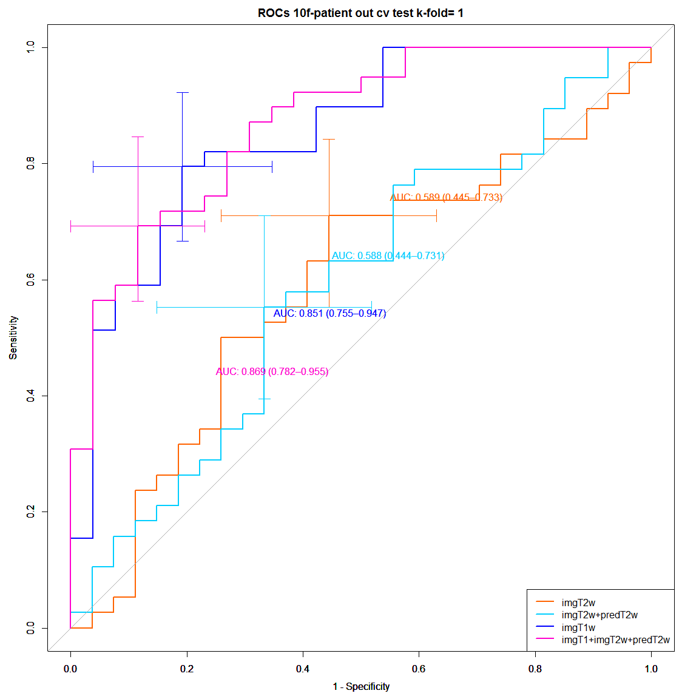 

```
## Area under the curve: 0.8688
## 95% CI (2000 stratified bootstrap replicates):
##  thresholds sp.low sp.median sp.high se.low se.median se.high
##   0.4244388 0.7692    0.8846       1 0.5635    0.6923  0.8462
##    massB    massM nonmassB nonmassM 
##      229      154      135       80 
##    massB    massM nonmassB nonmassM 
##       23       20       17        5 
##    massB    massM nonmassB nonmassM 
##      228      154      136       80 
##    massB    massM nonmassB nonmassM 
##       24       20       16        5 
##    massB    massM nonmassB nonmassM 
##      228      154      136       80 
##    massB    massM nonmassB nonmassM 
##       24       20       16        5 
## 0.0387931 0.05 
## Selected features for group: MeanDecreaseGini imgT2 
## =========NULL
##  [1] "T2texture_ASM_quarterRad"            "T2texture_dissimilarity_quarterRad"  "T2texture_correlation_halfRad"      
##  [4] "T2kurt_F_r_i"                        "ave_T216"                            "T2skew_F_r_i"                       
##  [7] "ave_T27"                             "T2texture_correlation_zero"          "T2texture_ASM_threeQuaRad"          
## [10] "ave_T20"                             "T2max_F_r_i"                         "ave_T29"                            
## [13] "ave_T211"                            "T2grad_margin_var"                   "T2texture_homogeneity_quarterRad"   
## [16] "T2RGH_var"                           "T2texture_dissimilarity_zero"        "ave_T28"                            
## [19] "T2grad_margin"                       "ave_T219"                            "ave_T214"                           
## [22] "T2texture_homogeneity_halfRad"       "ave_T218"                            "ave_T210"                           
## [25] "ave_T213"                            "T2texture_correlation_threeQuaRad"   "ave_T24"                            
## [28] "T2texture_dissimilarity_threeQuaRad" "T2texture_ASM_zero"                  "T2texture_contrast_threeQuaRad"     
## [31] "ave_T217"                            "T2min_F_r_i"                         "T2RGH_mean"                         
## [34] "T2_lesionSIstd"                      "T2texture_homogeneity_zero"          "T2texture_correlation_quarterRad"   
## [37] "ave_T215"                            "ave_T21"                             "T2_lesionSI"                        
## 0.004545455 0.05 
## Selected features for group: MeanDecreaseGini allT2 
## =========NULL
##  [1] "T2texture_energy_zero"              "T2kurt_F_r_i"                       "T2texture_dissimilarity_quarterRad"
##  [4] "T2texture_energy_halfRad"           "T2texture_correlation_quarterRad"   "T2RGH_var"                         
##  [7] "T2_lesionSIstd"                     "ave_T219"                           "T2texture_correlation_threeQuaRad" 
## [10] "T2mean_F_r_i"                       "ave_T216"                           "T2wSI_predicted"                   
## [13] "ave_T21"                            "ave_T22"                            "T2texture_homogeneity_threeQuaRad" 
## [16] "ave_T27"                            "ave_T217"                           "T2texture_contrast_halfRad"        
## [19] "ave_T29"                            "ave_T211"                           "T2texture_homogeneity_zero"        
## [22] "ave_T210"                           "ave_T214"                           "ave_T28"                           
## [25] "ave_T23"                            "ave_T24"                            "ave_T26"                           
## [28] "T2texture_correlation_halfRad"      "T2texture_correlation_zero"         "LMSIR_predicted"                   
## [31] "T2texture_homogeneity_halfRad"      "ave_T218"                           "ave_T212"                          
## [34] "T2min_F_r_i"                        "T2skew_F_r_i"                       "T2_lesionSI"                       
## -0.08484848 0.05 
## Selected features for group: MeanDecreaseGini imgT1 
## =========NULL
##  [1] "texture_correlation_zero"  "max_RGH_mean"              "V4"                        "circularity"              
##  [5] "washoutRate_inside"        "texture_energy_zero"       "V18"                       "earlySE2"                 
##  [9] "iiiMax_Margin_Gradient"    "V2"                        "maxVr_inside"              "Vr_increasingRate_countor"
## [13] "iAUC1_countor"             "texture_homogeneity_zero"  "edge_sharp_mean"           "V6"                       
## [17] "lateSE13"                  "dce2SE12"                  "lateSE10"                  "dce3SE0"                  
## [21] "dce2SE11"                  "lateSE4"                   "dce2SE19"                  "earlySE10"                
## [25] "kurt_F_r_i"                "Kpeak_inside"              "V16"                       "peakVr_inside"            
## [29] "max_RGH_var_k"             "A_inside"                 
## 0.08284024 0.05 
## -0.1225806 0.05 
## Selected features for group: MeanDecreaseGini all 
## =========NULL
##  [1] "SER_countor"                       "V0"                                "earlySE12"                        
##  [4] "T2skew_F_r_i"                      "Kpeak_countor"                     "edge_sharp_std"                   
##  [7] "Vr_increasingRate_countor"         "kurt_F_r_i"                        "V15"                              
## [10] "V10"                               "T2RGH_var"                         "V2"                               
## [13] "texture_contrast_threeQuaRad"      "lateSE18"                          "dce3SE10"                         
## [16] "skew_F_r_i"                        "T2var_F_r_i"                       "ave_T22"                          
## [19] "T2texture_homogeneity_threeQuaRad" "ave_T28"                           "V13"                              
## [22] "lateSE16"                          "ave_T218"                          "earlySE4"                         
## [25] "texture_contrast_zero"             "Vr_decreasingRate_inside"          "ave_T211"                         
## [28] "V4"                                "lateSE12"                          "dce2SE14"                         
## [31] "T2texture_ASM_zero"                "T2_lesionSI"                       "earlySE5"                         
## [34] "max_RGH_mean_k"                    "texture_contrast_quarterRad"       "texture_homogeneity_threeQuaRad"  
## [37] "A_inside"                         
##     lesion_id cad_pt_no_txt exam_a_number_txt BIRADS lesion_label                      lesion_diagnosis      find_t2_signal_int
## 32         35          0679           4994641      6        massM                        InvasiveDuctal                    None
## 34         37          0684           5266209      4     nonmassM                          InsituDuctal                    None
## 66         75          0736           4963473      4        massB                  BENIGN BREAST TISSUE   Slightly hyperintense
## 68         77          0745           4881779      4        massM                        InvasiveDuctal                    None
## 78         87          0765           5094113      4     nonmassB           ATYPICAL DUCTAL HYPERPLASIA                    None
## 95        106          0799           5372294      4        massB                           FIBROCYSTIC   Slightly hyperintense
## 114       129          0473           7364625      4        massB                           FIBROCYSTIC                    None
## 122       137          0850           5380609      5        massB                  BENIGN BREAST TISSUE   Slightly hyperintense
## 123       138          0850           5380609      5     nonmassB           ATYPICAL DUCTAL HYPERPLASIA                    None
## 348       374          0850           5380609      5        massB                           FIBROCYSTIC   Slightly hyperintense
## 132       149          0861           5053396      5        massM                        InvasiveDuctal Hypointense or not seen
## 135       152          0865           5267535      5        massM                        InvasiveDuctal                    None
## 136       154          0865           5267535      5     nonmassM                        InvasiveDuctal                    None
## 150       173          6005         ACC108250      5        massM                       InvasiveLobular                    None
## 151       174          6005         ACC108250      5        massM                       InvasiveLobular                    None
## 229       255          6005         ACC108250      5        massM                       InvasiveLobular                    None
## 159       183          6020         ACC109177      6        massM                        InvasiveDuctal Hypointense or not seen
## 161       185          6023           4697014      3        massB                           FIBROCYSTIC                    None
## 233       259          6023           4697014      3        massB                   SCLEROSING ADENOSIS                    None
## 170       194          6029           5083338      6        massB                          FIBROADENOMA Hypointense or not seen
## 171       195          6029           5083338      6        massB                          FIBROADENOMA Hypointense or not seen
## 361       387          6029           6772981      4        massB                          FIBROADENOMA Hypointense or not seen
## 175       199          6035           5062962      5        massM                        InvasiveDuctal                    None
## 176       200          6035           5062962      5        massM                        InvasiveDuctal                    None
## 235       261          6035           5062962      5        massM                        InvasiveDuctal                    None
## 184       209          6040           5075204      5        massM                        InvasiveDuctal                    None
## 193       219          6046         ACC108189      5        massM                          InsituDuctal Hypointense or not seen
## 194       220          6046         ACC108189      5        massM                          InsituDuctal Hypointense or not seen
## 195       221          6046         ACC108189      5        massM                          InsituDuctal            Hyperintense
## 196       222          6046         ACC108189      5        massM                          InsituDuctal                    None
## 245       271          0845           5433683      5        massM                       InvasiveLobular                    None
## 263       289          0666           5088826      3        massM                          InsituDuctal            Hyperintense
## 276       302          6052           5369136      6     nonmassM                        InvasiveDuctal                    None
## 299       325          0132           5154279      3        massB                  BENIGN BREAST TISSUE            Hyperintense
## 300       326          0132           5154279      3        massB                  BENIGN BREAST TISSUE            Hyperintense
## 304       330          0197           6667696      4     nonmassB                    LobularHyperplasia Hypointense or not seen
## 305       331          0197           6667696      4     nonmassB                    LobularHyperplasia Hypointense or not seen
## 306       332          0197           6667696      4        massB                    LobularHyperplasia   Slightly hyperintense
## 337       363          0576           6905042      4     nonmassB                  BENIGN BREAST TISSUE Hypointense or not seen
## 370       396          7054           4724297      2        massB                          FIBROADENOMA            Hyperintense
## 384       410          7043           7119983      4        massB                          FIBROADENOMA            Hyperintense
## 389       415          3017           7014437      4     nonmassB                     FOCAL HYPERPLASIA   Slightly hyperintense
## 395       421          3030           7642998      4        massB                  BENIGN BREAST TISSUE   Slightly hyperintense
## 427       453          4018           6983262      6     nonmassM                          InsituDuctal                    None
## 441       467          4055           7439091      4        massB PSEUDOANGIOMATOUS STROMAL HYPERPLASIA                    None
## 453       479          6223           7043947      4        massM                        InvasiveDuctal            Hyperintense
## 463       489          6233           7047121      6        massB                          FIBROADENOMA            Hyperintense
## 466       492          0135           7777131      4        massB                           FIBROCYSTIC                    None
## 505       531          0135           5083620      4     nonmassB                           FIBROCYSTIC Hypointense or not seen
## 474       500          7220           7288789      4     nonmassB                           FIBROCYSTIC Hypointense or not seen
## 512       538          0552           4663314      4        massB                              ADENOSIS   Slightly hyperintense
## 528       554          0682           5050826      6     nonmassM                          InsituDuctal                    None
## 533       559          0720           4965525      4     nonmassB                           FIBROCYSTIC   Slightly hyperintense
## 534       560          0720           4965525      4        massB                          FIBROADENOMA Hypointense or not seen
## 550       576          0885           6747175      4     nonmassB                           FIBROCYSTIC Hypointense or not seen
## 577       603          1044           7366817      5        massM                        InvasiveDuctal                    None
## 597       623          2007           7366811      4     nonmassB                          FIBROADENOMA Hypointense or not seen
## 615       641          2059           7749617      4     nonmassB                 COLUMNAR CELL CHANGES                    None
## 628       654          1004           6801264      4     nonmassB                           FIBROCYSTIC Hypointense or not seen
## 630       656          1025           6703528      4     nonmassB                           FIBROCYSTIC Hypointense or not seen
## 631       657          1027           6930730      3     nonmassB                          FIBROADENOMA                    None
## 638       664          1092           4951061      6        massB                         InsituLobular                    None
## 639       665          1092           4951061      4     nonmassB                         InsituLobular                    None
## 655       681          3021           7019819      4        massB                  BENIGN BREAST TISSUE                    None
## 674       700          4021           6992707      4     nonmassB                              ADENOSIS Hypointense or not seen
## 
## ============ bestune_imgT2 	 max.depth  1 	 #Trees  350 
## ntrees:  50 minsplit:  3 cp:  -1 
##   ntrees minsplit cp acuTrain rocTrain   acuTest rocTest
## 1     50        3 -1        1        1 0.6153846   0.581
## ntrees:  100 minsplit:  3 cp:  -1 
##   ntrees minsplit cp acuTrain rocTrain   acuTest rocTest
## 2    100        3 -1        1        1 0.5538462   0.528
## ntrees:  250 minsplit:  3 cp:  -1 
##   ntrees minsplit cp acuTrain rocTrain   acuTest rocTest
## 3    250        3 -1        1        1 0.6307692   0.544
## ntrees:  350 minsplit:  3 cp:  -1 
##   ntrees minsplit cp acuTrain rocTrain   acuTest rocTest
## 4    350        3 -1        1        1 0.5538462   0.539
## ntrees:  500 minsplit:  3 cp:  -1 
##   ntrees minsplit cp acuTrain rocTrain   acuTest rocTest
## 5    500        3 -1        1        1 0.5538462   0.546
## ntrees:  50 minsplit:  1 cp:  -1 
##   ntrees minsplit cp acuTrain rocTrain   acuTest rocTest
## 6     50        1 -1        1        1 0.5538462   0.566
## ntrees:  100 minsplit:  1 cp:  -1 
##   ntrees minsplit cp acuTrain rocTrain   acuTest rocTest
## 7    100        1 -1        1        1 0.5538462    0.55
## ntrees:  250 minsplit:  1 cp:  -1 
##   ntrees minsplit cp acuTrain rocTrain   acuTest rocTest
## 8    250        1 -1        1        1 0.5846154   0.564
## ntrees:  350 minsplit:  1 cp:  -1 
##   ntrees minsplit cp acuTrain rocTrain acuTest rocTest
## 9    350        1 -1        1        1     0.6   0.591
## ntrees:  500 minsplit:  1 cp:  -1 
##    ntrees minsplit cp acuTrain rocTrain   acuTest rocTest
## 10    500        1 -1        1        1 0.6153846   0.548
## ntrees:  50 minsplit:  0 cp:  -1 
##    ntrees minsplit cp acuTrain rocTrain   acuTest rocTest
## 11     50        0 -1        1        1 0.5846154   0.484
## ntrees:  100 minsplit:  0 cp:  -1 
##    ntrees minsplit cp acuTrain rocTrain   acuTest rocTest
## 12    100        0 -1        1        1 0.5538462    0.56
## ntrees:  250 minsplit:  0 cp:  -1 
##    ntrees minsplit cp acuTrain rocTrain   acuTest rocTest
## 13    250        0 -1        1        1 0.5692308   0.585
## ntrees:  350 minsplit:  0 cp:  -1 
##    ntrees minsplit cp acuTrain rocTrain   acuTest rocTest
## 14    350        0 -1        1        1 0.5846154   0.557
## ntrees:  500 minsplit:  0 cp:  -1 
##    ntrees minsplit cp acuTrain rocTrain   acuTest rocTest
## 15    500        0 -1        1        1 0.6153846   0.587
##    ntrees minsplit cp acuTrain rocTrain   acuTest rocTest
## 1      50        3 -1        1        1 0.6153846   0.581
## 2     100        3 -1        1        1 0.5538462   0.528
## 3     250        3 -1        1        1 0.6307692   0.544
## 4     350        3 -1        1        1 0.5538462   0.539
## 5     500        3 -1        1        1 0.5538462   0.546
## 6      50        1 -1        1        1 0.5538462   0.566
## 7     100        1 -1        1        1 0.5538462   0.550
## 8     250        1 -1        1        1 0.5846154   0.564
## 9     350        1 -1        1        1 0.6000000   0.591
## 10    500        1 -1        1        1 0.6153846   0.548
## 11     50        0 -1        1        1 0.5846154   0.484
## 12    100        0 -1        1        1 0.5538462   0.560
## 13    250        0 -1        1        1 0.5692308   0.585
## 14    350        0 -1        1        1 0.5846154   0.557
## 15    500        0 -1        1        1 0.6153846   0.587
##   ntrees minsplit cp acuTrain rocTrain acuTest rocTest
## 9    350        1 -1        1        1     0.6   0.591
## 
## ============ bestune_allT2 	 max.depth  1 	 #Trees  250 
## ntrees:  50 minsplit:  3 cp:  -1 
##   ntrees minsplit cp acuTrain rocTrain   acuTest rocTest
## 1     50        3 -1        1        1 0.5846154   0.565
## ntrees:  100 minsplit:  3 cp:  -1 
##   ntrees minsplit cp acuTrain rocTrain   acuTest rocTest
## 2    100        3 -1        1        1 0.5538462   0.588
## ntrees:  250 minsplit:  3 cp:  -1 
##   ntrees minsplit cp acuTrain rocTrain acuTest rocTest
## 3    250        3 -1        1        1     0.6   0.608
## ntrees:  350 minsplit:  3 cp:  -1 
##   ntrees minsplit cp acuTrain rocTrain acuTest rocTest
## 4    350        3 -1        1        1     0.6   0.532
## ntrees:  500 minsplit:  3 cp:  -1 
##   ntrees minsplit cp acuTrain rocTrain   acuTest rocTest
## 5    500        3 -1        1        1 0.5538462   0.537
## ntrees:  50 minsplit:  1 cp:  -1 
##   ntrees minsplit cp acuTrain rocTrain acuTest rocTest
## 6     50        1 -1        1        1     0.6    0.55
## ntrees:  100 minsplit:  1 cp:  -1 
##   ntrees minsplit cp acuTrain rocTrain   acuTest rocTest
## 7    100        1 -1        1        1 0.5538462    0.54
## ntrees:  250 minsplit:  1 cp:  -1 
##   ntrees minsplit cp acuTrain rocTrain   acuTest rocTest
## 8    250        1 -1        1        1 0.5538462   0.546
## ntrees:  350 minsplit:  1 cp:  -1 
##   ntrees minsplit cp acuTrain rocTrain   acuTest rocTest
## 9    350        1 -1        1        1 0.5692308    0.56
## ntrees:  500 minsplit:  1 cp:  -1 
##    ntrees minsplit cp acuTrain rocTrain   acuTest rocTest
## 10    500        1 -1        1        1 0.6153846   0.588
## ntrees:  50 minsplit:  0 cp:  -1 
##    ntrees minsplit cp acuTrain rocTrain   acuTest rocTest
## 11     50        0 -1        1        1 0.6153846   0.585
## ntrees:  100 minsplit:  0 cp:  -1 
##    ntrees minsplit cp acuTrain rocTrain   acuTest rocTest
## 12    100        0 -1        1        1 0.6461538   0.553
## ntrees:  250 minsplit:  0 cp:  -1 
##    ntrees minsplit cp acuTrain rocTrain   acuTest rocTest
## 13    250        0 -1        1        1 0.6153846   0.597
## ntrees:  350 minsplit:  0 cp:  -1 
##    ntrees minsplit cp acuTrain rocTrain acuTest rocTest
## 14    350        0 -1        1        1     0.6   0.588
## ntrees:  500 minsplit:  0 cp:  -1 
##    ntrees minsplit cp acuTrain rocTrain   acuTest rocTest
## 15    500        0 -1        1        1 0.6307692   0.588
##    ntrees minsplit cp acuTrain rocTrain   acuTest rocTest
## 1      50        3 -1        1        1 0.5846154   0.565
## 2     100        3 -1        1        1 0.5538462   0.588
## 3     250        3 -1        1        1 0.6000000   0.608
## 4     350        3 -1        1        1 0.6000000   0.532
## 5     500        3 -1        1        1 0.5538462   0.537
## 6      50        1 -1        1        1 0.6000000   0.550
## 7     100        1 -1        1        1 0.5538462   0.540
## 8     250        1 -1        1        1 0.5538462   0.546
## 9     350        1 -1        1        1 0.5692308   0.560
## 10    500        1 -1        1        1 0.6153846   0.588
## 11     50        0 -1        1        1 0.6153846   0.585
## 12    100        0 -1        1        1 0.6461538   0.553
## 13    250        0 -1        1        1 0.6153846   0.597
## 14    350        0 -1        1        1 0.6000000   0.588
## 15    500        0 -1        1        1 0.6307692   0.588
##   ntrees minsplit cp acuTrain rocTrain acuTest rocTest
## 3    250        3 -1        1        1     0.6   0.608
## 
## ============ bestune_imgT1 	 max.depth  1 	 #Trees  250 
## ntrees:  50 minsplit:  3 cp:  -1 
##   ntrees minsplit cp acuTrain rocTrain   acuTest rocTest
## 1     50        3 -1        1        1 0.7384615   0.816
## ntrees:  100 minsplit:  3 cp:  -1 
##   ntrees minsplit cp acuTrain rocTrain   acuTest rocTest
## 2    100        3 -1        1        1 0.7846154    0.83
## ntrees:  250 minsplit:  3 cp:  -1 
##   ntrees minsplit cp acuTrain rocTrain   acuTest rocTest
## 3    250        3 -1        1        1 0.7692308   0.849
## ntrees:  350 minsplit:  3 cp:  -1 
##   ntrees minsplit cp acuTrain rocTrain   acuTest rocTest
## 4    350        3 -1        1        1 0.7538462   0.843
## ntrees:  500 minsplit:  3 cp:  -1 
##   ntrees minsplit cp acuTrain rocTrain   acuTest rocTest
## 5    500        3 -1        1        1 0.8307692   0.858
## ntrees:  50 minsplit:  1 cp:  -1 
##   ntrees minsplit cp acuTrain rocTrain   acuTest rocTest
## 6     50        1 -1        1        1 0.8153846    0.86
## ntrees:  100 minsplit:  1 cp:  -1 
##   ntrees minsplit cp acuTrain rocTrain   acuTest rocTest
## 7    100        1 -1        1        1 0.7692308   0.841
## ntrees:  250 minsplit:  1 cp:  -1 
##   ntrees minsplit cp acuTrain rocTrain acuTest rocTest
## 8    250        1 -1        1        1     0.8   0.852
## ntrees:  350 minsplit:  1 cp:  -1 
##   ntrees minsplit cp acuTrain rocTrain acuTest rocTest
## 9    350        1 -1        1        1     0.8   0.879
## ntrees:  500 minsplit:  1 cp:  -1 
##    ntrees minsplit cp acuTrain rocTrain   acuTest rocTest
## 10    500        1 -1        1        1 0.7846154   0.847
## ntrees:  50 minsplit:  0 cp:  -1 
##    ntrees minsplit cp acuTrain rocTrain acuTest rocTest
## 11     50        0 -1        1        1     0.8   0.853
## ntrees:  100 minsplit:  0 cp:  -1 
##    ntrees minsplit cp acuTrain rocTrain acuTest rocTest
## 12    100        0 -1        1        1     0.8   0.833
## ntrees:  250 minsplit:  0 cp:  -1 
##    ntrees minsplit cp acuTrain rocTrain acuTest rocTest
## 13    250        0 -1        1        1     0.8   0.867
## ntrees:  350 minsplit:  0 cp:  -1 
##    ntrees minsplit cp acuTrain rocTrain acuTest rocTest
## 14    350        0 -1        1        1     0.8   0.854
## ntrees:  500 minsplit:  0 cp:  -1 
##    ntrees minsplit cp acuTrain rocTrain acuTest rocTest
## 15    500        0 -1        1        1     0.8   0.857
##    ntrees minsplit cp acuTrain rocTrain   acuTest rocTest
## 1      50        3 -1        1        1 0.7384615   0.816
## 2     100        3 -1        1        1 0.7846154   0.830
## 3     250        3 -1        1        1 0.7692308   0.849
## 4     350        3 -1        1        1 0.7538462   0.843
## 5     500        3 -1        1        1 0.8307692   0.858
## 6      50        1 -1        1        1 0.8153846   0.860
## 7     100        1 -1        1        1 0.7692308   0.841
## 8     250        1 -1        1        1 0.8000000   0.852
## 9     350        1 -1        1        1 0.8000000   0.879
## 10    500        1 -1        1        1 0.7846154   0.847
## 11     50        0 -1        1        1 0.8000000   0.853
## 12    100        0 -1        1        1 0.8000000   0.833
## 13    250        0 -1        1        1 0.8000000   0.867
## 14    350        0 -1        1        1 0.8000000   0.854
## 15    500        0 -1        1        1 0.8000000   0.857
##   ntrees minsplit cp acuTrain rocTrain acuTest rocTest
## 9    350        1 -1        1        1     0.8   0.879
## 
## ============ bestune_all 	 max.depth  1 	 #Trees  200 
## ntrees:  50 minsplit:  3 cp:  -1 
##   ntrees minsplit cp acuTrain rocTrain   acuTest rocTest
## 1     50        3 -1        1        1 0.6923077   0.785
## ntrees:  100 minsplit:  3 cp:  -1 
##   ntrees minsplit cp acuTrain rocTrain   acuTest rocTest
## 2    100        3 -1        1        1 0.7384615   0.821
## ntrees:  250 minsplit:  3 cp:  -1 
##   ntrees minsplit cp acuTrain rocTrain   acuTest rocTest
## 3    250        3 -1        1        1 0.7692308   0.874
## ntrees:  350 minsplit:  3 cp:  -1 
##   ntrees minsplit cp acuTrain rocTrain   acuTest rocTest
## 4    350        3 -1        1        1 0.7692308   0.838
## ntrees:  500 minsplit:  3 cp:  -1 
##   ntrees minsplit cp acuTrain rocTrain   acuTest rocTest
## 5    500        3 -1        1        1 0.7846154   0.826
## ntrees:  50 minsplit:  1 cp:  -1 
##   ntrees minsplit cp acuTrain rocTrain acuTest rocTest
## 6     50        1 -1        1        1     0.8   0.823
## ntrees:  100 minsplit:  1 cp:  -1 
##   ntrees minsplit cp acuTrain rocTrain   acuTest rocTest
## 7    100        1 -1        1        1 0.7846154   0.819
## ntrees:  250 minsplit:  1 cp:  -1 
##   ntrees minsplit cp acuTrain rocTrain acuTest rocTest
## 8    250        1 -1        1        1     0.8   0.843
## ntrees:  350 minsplit:  1 cp:  -1 
##   ntrees minsplit cp acuTrain rocTrain   acuTest rocTest
## 9    350        1 -1        1        1 0.7846154   0.842
## ntrees:  500 minsplit:  1 cp:  -1 
##    ntrees minsplit cp acuTrain rocTrain   acuTest rocTest
## 10    500        1 -1        1        1 0.7846154   0.837
## ntrees:  50 minsplit:  0 cp:  -1 
##    ntrees minsplit cp acuTrain rocTrain   acuTest rocTest
## 11     50        0 -1        1        1 0.7846154   0.798
## ntrees:  100 minsplit:  0 cp:  -1 
##    ntrees minsplit cp acuTrain rocTrain   acuTest rocTest
## 12    100        0 -1        1        1 0.7846154    0.83
## ntrees:  250 minsplit:  0 cp:  -1 
##    ntrees minsplit cp acuTrain rocTrain acuTest rocTest
## 13    250        0 -1        1        1     0.8   0.814
## ntrees:  350 minsplit:  0 cp:  -1 
##    ntrees minsplit cp acuTrain rocTrain acuTest rocTest
## 14    350        0 -1        1        1     0.8   0.826
## ntrees:  500 minsplit:  0 cp:  -1 
##    ntrees minsplit cp acuTrain rocTrain   acuTest rocTest
## 15    500        0 -1        1        1 0.7846154   0.837
##    ntrees minsplit cp acuTrain rocTrain   acuTest rocTest
## 1      50        3 -1        1        1 0.6923077   0.785
## 2     100        3 -1        1        1 0.7384615   0.821
## 3     250        3 -1        1        1 0.7692308   0.874
## 4     350        3 -1        1        1 0.7692308   0.838
## 5     500        3 -1        1        1 0.7846154   0.826
## 6      50        1 -1        1        1 0.8000000   0.823
## 7     100        1 -1        1        1 0.7846154   0.819
## 8     250        1 -1        1        1 0.8000000   0.843
## 9     350        1 -1        1        1 0.7846154   0.842
## 10    500        1 -1        1        1 0.7846154   0.837
## 11     50        0 -1        1        1 0.7846154   0.798
## 12    100        0 -1        1        1 0.7846154   0.830
## 13    250        0 -1        1        1 0.8000000   0.814
## 14    350        0 -1        1        1 0.8000000   0.826
## 15    500        0 -1        1        1 0.7846154   0.837
##   ntrees minsplit cp acuTrain rocTrain   acuTest rocTest
## 3    250        3 -1        1        1 0.7692308   0.874
## 
## Call:
## roc.default(response = perf_imgT2$obs, predictor = perf_imgT2$C)
## 
## Data: perf_imgT2$C in 52 controls (perf_imgT2$obs C) > 78 cases (perf_imgT2$obs NC).
## Area under the curve: 0.5809
## 
## Call:
## roc.default(response = perf_allT2$obs, predictor = perf_allT2$C)
## 
## Data: perf_allT2$C in 52 controls (perf_allT2$obs C) > 78 cases (perf_allT2$obs NC).
## Area under the curve: 0.5947
## 
## Call:
## roc.default(response = perf_imgT1$obs, predictor = perf_imgT1$C)
## 
## Data: perf_imgT1$C in 51 controls (perf_imgT1$obs C) > 79 cases (perf_imgT1$obs NC).
## Area under the curve: 0.8637
## 
## Call:
## roc.default(response = perf_all$obs, predictor = perf_all$C)
## 
## Data: perf_all$C in 51 controls (perf_all$obs C) > 79 cases (perf_all$obs NC).
## Area under the curve: 0.866
```

```
## Area under the curve: 0.5809
## 95% CI (2000 stratified bootstrap replicates):
##  thresholds sp.low sp.median sp.high se.low se.median se.high
##   0.4962231 0.2885    0.4231  0.5577 0.6667    0.7564  0.8462
```

```
## Area under the curve: 0.5947
## 95% CI (2000 stratified bootstrap replicates):
##  thresholds sp.low sp.median sp.high se.low se.median se.high
##   0.4543333 0.4615    0.5962  0.7308    0.5    0.6154  0.7179
```

```
## Area under the curve: 0.8637
## 95% CI (2000 stratified bootstrap replicates):
##  thresholds sp.low sp.median sp.high se.low se.median se.high
##   0.4472352 0.6863    0.8039   0.902 0.6962    0.7848  0.8734
```

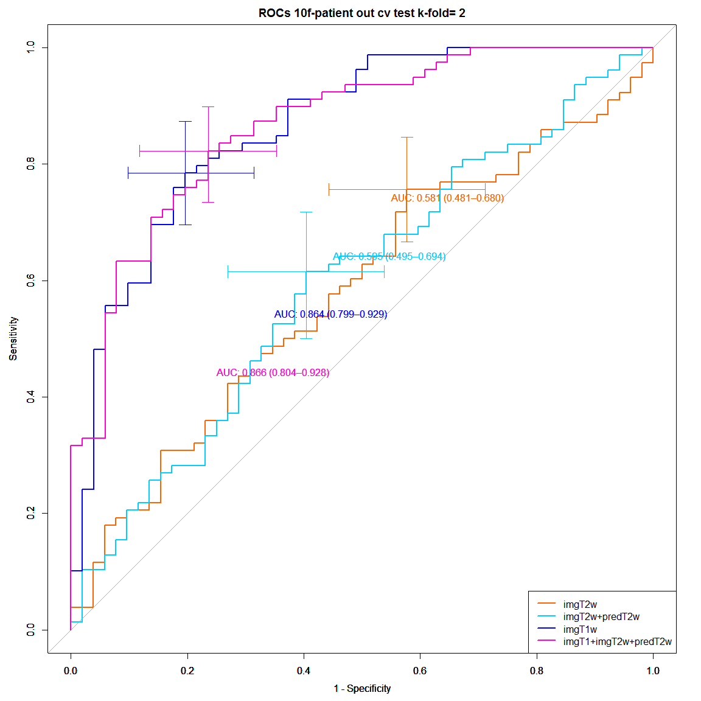 

```
## Area under the curve: 0.866
## 95% CI (2000 stratified bootstrap replicates):
##  thresholds sp.low sp.median sp.high se.low se.median se.high
##   0.4499824 0.6471    0.7647  0.8824 0.7342    0.8228  0.8987
##    massB    massM nonmassB nonmassM 
##      225      159      131       75 
##    massB    massM nonmassB nonmassM 
##       27       15       21       10 
##    massB    massM nonmassB nonmassM 
##      225      159      131       75 
##    massB    massM nonmassB nonmassM 
##       27       15       21       10 
##    massB    massM nonmassB nonmassM 
##      225      159      131       75 
##    massB    massM nonmassB nonmassM 
##       27       15       21       10 
## -0.009009009 0.05 
## Selected features for group: MeanDecreaseGini imgT2 
## =========NULL
##  [1] "T2texture_energy_quarterRad"       "ave_T218"                          "T2texture_correlation_zero"       
##  [4] "T2texture_energy_threeQuaRad"      "T2RGH_var"                         "ave_T213"                         
##  [7] "ave_T219"                          "T2_lesionSI"                       "ave_T211"                         
## [10] "ave_T26"                           "T2skew_F_r_i"                      "T2texture_homogeneity_zero"       
## [13] "T2grad_margin_var"                 "T2max_F_r_i"                       "T2RGH_mean"                       
## [16] "T2texture_homogeneity_halfRad"     "T2texture_correlation_halfRad"     "ave_T210"                         
## [19] "T2texture_dissimilarity_halfRad"   "ave_T20"                           "T2texture_homogeneity_threeQuaRad"
## [22] "T2texture_contrast_zero"           "ave_T212"                          "T2min_F_r_i"                      
## [25] "T2grad_margin"                     "ave_T22"                           "ave_T27"                          
## [28] "T2_lesionSIstd"                    "T2texture_ASM_halfRad"             "T2texture_correlation_quarterRad" 
## [31] "ave_T25"                           "T2mean_F_r_i"                     
## 0.06696429 0.05 
## -0.05263158 0.05 
## Selected features for group: MeanDecreaseGini allT2 
## =========NULL
##  [1] "T2texture_ASM_quarterRad"            "ave_T26"                             "T2texture_correlation_quarterRad"   
##  [4] "T2RGH_mean"                          "T2_lesionSIstd"                      "ave_T21"                            
##  [7] "T2texture_correlation_zero"          "ave_T219"                            "ave_T218"                           
## [10] "ave_T216"                            "T2wSI_predicted"                     "T2grad_margin"                      
## [13] "ave_T215"                            "ave_T25"                             "T2texture_contrast_quarterRad"      
## [16] "ave_T28"                             "T2texture_dissimilarity_zero"        "T2texture_homogeneity_threeQuaRad"  
## [19] "T2kurt_F_r_i"                        "T2texture_homogeneity_halfRad"       "ave_T20"                            
## [22] "ave_T27"                             "ave_T217"                            "T2min_F_r_i"                        
## [25] "ave_T210"                            "ave_T24"                             "T2texture_contrast_halfRad"         
## [28] "ave_T211"                            "ave_T212"                            "T2texture_contrast_zero"            
## [31] "T2texture_homogeneity_zero"          "T2texture_energy_halfRad"            "ave_T29"                            
## [34] "T2texture_ASM_threeQuaRad"           "T2texture_dissimilarity_threeQuaRad" "T2texture_correlation_halfRad"      
## [37] "T2_lesionSI"                         "T2max_F_r_i"                        
## 0.01796407 0.05 
## Selected features for group: MeanDecreaseGini imgT1 
## =========NULL
##  [1] "irregularity"                 "SER_inside"                   "iiMin_change_Variance_uptake" "texture_correlation_halfRad" 
##  [5] "alpha_countor"                "texture_energy_zero"          "edge_sharp_mean"              "Kpeak_countor"               
##  [9] "max_RGH_var"                  "V9"                           "lateSE15"                     "Vr_post_1_inside"            
## [13] "min_F_r_i"                    "dce2SE8"                      "edge_sharp_std"               "texture_contrast_quarterRad" 
## [17] "iiiMax_Margin_Gradient"       "V2"                           "V10"                          "dce2SE18"                    
## [21] "lateSE9"                      "earlySE19"                    "earlySE15"                    "dce3SE5"                     
## [25] "lateSE1"                      "dce2SE7"                      "dce3SE3"                      "earlySE13"                   
## [29] "lateSE18"                     "V1"                           "lateSE0"                      "lateSE10"                    
## [33] "peakVr_inside"                "A_inside"                    
## -0.01960784 0.05 
## Selected features for group: MeanDecreaseGini all 
## =========NULL
##  [1] "texture_correlation_halfRad"        "texture_correlation_zero"           "Tpeak_countor"                     
##  [4] "earlySE8"                           "edge_sharp_std"                     "Slope_ini_countor"                 
##  [7] "V15"                                "V14"                                "texture_homogeneity_quarterRad"    
## [10] "T2RGH_mean"                         "ivVariance"                         "V18"                               
## [13] "T2_lesionSI"                        "T2texture_homogeneity_zero"         "lateSE1"                           
## [16] "texture_ASM_quarterRad"             "T2texture_correlation_quarterRad"   "earlySE5"                          
## [19] "lateSE3"                            "T2texture_dissimilarity_quarterRad" "beta_inside"                       
## [22] "V6"                                 "earlySE9"                           "ave_T210"                          
## [25] "peakVr_countor"                     "dce3SE7"                            "A_inside"                          
##     lesion_id cad_pt_no_txt exam_a_number_txt BIRADS lesion_label             lesion_diagnosis      find_t2_signal_int
## 9          10          0205           5085133      4        massB              FIBROEPITHELIAL            Hyperintense
## 19         21          0331           4722659      2        massB                  FIBROCYSTIC                    None
## 387       413          0331           7347095      4        massB                  FIBROCYSTIC            Hyperintense
## 388       414          0331           7347095      4        massB         capillary hemangioma                    None
## 20         22          0127           4696964      4     nonmassB                 FIBROADENOMA            Hyperintense
## 43         48          0706           4925753      4     nonmassB                  FIBROCYSTIC                    None
## 58         67          0728           5304244      6        massB                 FIBROADENOMA   Slightly hyperintense
## 59         68          0728           5304244      4        massB   DUCT PAPILLOMA WITH ATYPIA            Hyperintense
## 60         69          0728           5304244      4        massB                 FIBROADENOMA                    None
## 61         70          0728           5304244      6     nonmassM               InvasiveDuctal                    None
## 206       232          0728           5304244      5     nonmassB  ATYPICAL DUCTAL HYPERPLASIA                    None
## 70         79          0752           4940477      4     nonmassB         BENIGN BREAST TISSUE                    None
## 71         80          0752           4940477      4     nonmassB                  FIBROCYSTIC                    None
## 209       235          0752           4940477      4     nonmassB         BENIGN BREAST TISSUE                    None
## 104       117          0817           5363917      6        massM               InvasiveDuctal            Hyperintense
## 105       119          0818           5021762      4        massB               DUCT PAPILLOMA                    None
## 109       123          0830           4863868      5        massB  ATYPICAL DUCTAL HYPERPLASIA                    None
## 110       124          0830           4863868      5        massB                         Cyst                    None
## 126       142          0855           4641315      6        massB                     FIBROSIS            Hyperintense
## 127       143          0855           4641315      6     nonmassB                     FIBROSIS                    None
## 142       160          0880           4809515      4        massB       Papillary(focalAtypia)   Slightly hyperintense
## 143       161          0880           6778829      3        massM                 InsituDuctal                    None
## 144       165          0880           6778829      3     nonmassM                 InsituDuctal                    None
## 145       166          0880           6778829      3     nonmassM                 InsituDuctal                    None
## 224       250          0880           4809515      4        massB            AtypicalPapilloma   Slightly hyperintense
## 156       180          6017           5086121      6        massM              InvasiveLobular                    None
## 157       181          6017           5086121      2        massB                 FIBROADENOMA            Hyperintense
## 162       186          6024           5008021      5        massM               InvasiveDuctal                    None
## 163       187          6024           5008021      5     nonmassM               InvasiveDuctal                    None
## 238       264          0277           5077098      5     nonmassM                 InsituDuctal Hypointense or not seen
## 239       265          0782           4775699      5        massM               InvasiveDuctal                    None
## 267       293          0503           6697826      3        massM               InvasiveDuctal            Hyperintense
## 270       296          0668           6989634      4     nonmassM                 InsituDuctal                    None
## 286       312          0229           6831376      5        massM               InvasiveDuctal                    None
## 287       313          0229           6831376      5        massM               InvasiveDuctal                    None
## 291       317          0025           7128068      4     nonmassB                  FIBROCYSTIC                    None
## 501       527          0025           7002835      4     nonmassB               DENSE FIBROSIS                    None
## 301       327          0166           4987048      2        massB         BENIGN BREAST TISSUE            Hyperintense
## 342       368          0689           5205923      2        massB        COLUMNAR CELL CHANGES            Hyperintense
## 350       376          0875           7141879      4        massB               DUCT PAPILLOMA                    None
## 549       575          0875           5396107      4     nonmassB             PAPILLARY LESION                    None
## 360       386          0900           6699226      4        massB                         Cyst                    None
## 386       412          7053           7956343      4     nonmassB              FIBROTIC STROMA Hypointense or not seen
## 391       417          3020           7395195      4        massB          STROMAL HYPERPLASIA Hypointense or not seen
## 394       420          3028           6991592      3        massB                  HYPERPLASIA Hypointense or not seen
## 408       434          0616           7910718      2        massM                 InsituDuctal Hypointense or not seen
## 413       439          3082           5355166      6        massB                 FIBROADENOMA                    None
## 414       440          3082           5355166      6        massB                  FIBROCYSTIC                    None
## 536       562          3082           7080675      4     nonmassB                  FIBROCYSTIC                    None
## 440       466          3076           7053450      6        massM                 InsituDuctal Hypointense or not seen
## 668       694          3076           7053450      6        massM                 InsituDuctal Hypointense or not seen
## 443       469          4043           7041465      6     nonmassM               InvasiveDuctal                    None
## 483       509          0944           7742881      4        massM                 InsituDuctal Hypointense or not seen
## 494       520          0944           7092128      4     nonmassB         BENIGN BREAST TISSUE                    None
## 553       579          0944           7092128      4     nonmassB         BENIGN BREAST TISSUE                    None
## 496       522          7165           5021830      3        massB                     ADENOSIS                    None
## 517       543          0572           4681582      4     nonmassM               InvasiveDuctal                    None
## 522       548          0613           4681594      4     nonmassM                 InsituDuctal                    None
## 523       549          0613           4681594      3     nonmassB         BENIGN BREAST TISSUE                    None
## 556       582          0943           5395204      4     nonmassM                 InsituDuctal                    None
## 557       583          0943           5395204      4     nonmassB                  FIBROCYSTIC Hypointense or not seen
## 566       592          1012           7629993      6        massM               InvasiveDuctal                    None
## 567       593          1012           6940724      4        massB                 FIBROADENOMA Hypointense or not seen
## 568       594          1012           6940724      4     nonmassB                 FIBROADENOMA            Hyperintense
## 569       595          1018           4773924      4     nonmassB         BENIGN BREAST TISSUE Hypointense or not seen
## 580       606          1053           7748055      4        massB           INFLAMED CYST WALL            Hyperintense
## 588       614          1086           7173349      6     nonmassB  ATYPICAL DUCTAL HYPERPLASIA                    None
## 591       617          1090           4288694      4     nonmassB  ATYPICAL DUCTAL HYPERPLASIA   Slightly hyperintense
## 600       626          2027           5465838      6        massM                 InsituDuctal            Hyperintense
## 601       627          1062           7408296      4        massB ATYPICAL LOBULAR HYPERPLASIA Hypointense or not seen
## 602       628          1062           7408296      4     nonmassB                  FIBROCYSTIC Hypointense or not seen
## 620       646          2071           7594721      4        massM               InvasiveDuctal   Slightly hyperintense
## 659       685          4002           6993690      5        massB         BENIGN BREAST TISSUE Hypointense or not seen
## 
## ============ bestune_imgT2 	 max.depth  1 	 #Trees  350 
## ntrees:  50 minsplit:  3 cp:  -1 
##   ntrees minsplit cp acuTrain rocTrain   acuTest   rocTest
## 1     50        3 -1        1        1 0.5890411 0.6283333
## ntrees:  100 minsplit:  3 cp:  -1 
##   ntrees minsplit cp acuTrain rocTrain  acuTest   rocTest
## 2    100        3 -1        1        1 0.630137 0.6991667
## ntrees:  250 minsplit:  3 cp:  -1 
##   ntrees minsplit cp acuTrain rocTrain   acuTest rocTest
## 3    250        3 -1        1        1 0.6986301  0.7575
## ntrees:  350 minsplit:  3 cp:  -1 
##   ntrees minsplit cp acuTrain rocTrain   acuTest   rocTest
## 4    350        3 -1        1        1 0.6164384 0.7158333
## ntrees:  500 minsplit:  3 cp:  -1 
##   ntrees minsplit cp acuTrain rocTrain   acuTest   rocTest
## 5    500        3 -1        1        1 0.7123288 0.7166667
## ntrees:  50 minsplit:  1 cp:  -1 
##   ntrees minsplit cp acuTrain rocTrain   acuTest   rocTest
## 6     50        1 -1        1        1 0.7534247 0.7791667
## ntrees:  100 minsplit:  1 cp:  -1 
##   ntrees minsplit cp acuTrain rocTrain   acuTest   rocTest
## 7    100        1 -1        1        1 0.6712329 0.7208333
## ntrees:  250 minsplit:  1 cp:  -1 
##   ntrees minsplit cp acuTrain rocTrain   acuTest rocTest
## 8    250        1 -1        1        1 0.6849315   0.745
## ntrees:  350 minsplit:  1 cp:  -1 
##   ntrees minsplit cp acuTrain rocTrain   acuTest   rocTest
## 9    350        1 -1        1        1 0.7123288 0.7633333
## ntrees:  500 minsplit:  1 cp:  -1 
##    ntrees minsplit cp acuTrain rocTrain   acuTest   rocTest
## 10    500        1 -1        1        1 0.6986301 0.7366667
## ntrees:  50 minsplit:  0 cp:  -1 
##    ntrees minsplit cp acuTrain rocTrain   acuTest   rocTest
## 11     50        0 -1        1        1 0.7534247 0.8033333
## ntrees:  100 minsplit:  0 cp:  -1 
##    ntrees minsplit cp acuTrain rocTrain   acuTest   rocTest
## 12    100        0 -1        1        1 0.7123288 0.7233333
## ntrees:  250 minsplit:  0 cp:  -1 
##    ntrees minsplit cp acuTrain rocTrain   acuTest   rocTest
## 13    250        0 -1        1        1 0.7260274 0.7391667
## ntrees:  350 minsplit:  0 cp:  -1 
##    ntrees minsplit cp acuTrain rocTrain   acuTest rocTest
## 14    350        0 -1        1        1 0.7123288  0.7725
## ntrees:  500 minsplit:  0 cp:  -1 
##    ntrees minsplit cp acuTrain rocTrain  acuTest   rocTest
## 15    500        0 -1        1        1 0.630137 0.7166667
##    ntrees minsplit cp acuTrain rocTrain   acuTest   rocTest
## 1      50        3 -1        1        1 0.5890411 0.6283333
## 2     100        3 -1        1        1 0.6301370 0.6991667
## 3     250        3 -1        1        1 0.6986301 0.7575000
## 4     350        3 -1        1        1 0.6164384 0.7158333
## 5     500        3 -1        1        1 0.7123288 0.7166667
## 6      50        1 -1        1        1 0.7534247 0.7791667
## 7     100        1 -1        1        1 0.6712329 0.7208333
## 8     250        1 -1        1        1 0.6849315 0.7450000
## 9     350        1 -1        1        1 0.7123288 0.7633333
## 10    500        1 -1        1        1 0.6986301 0.7366667
## 11     50        0 -1        1        1 0.7534247 0.8033333
## 12    100        0 -1        1        1 0.7123288 0.7233333
## 13    250        0 -1        1        1 0.7260274 0.7391667
## 14    350        0 -1        1        1 0.7123288 0.7725000
## 15    500        0 -1        1        1 0.6301370 0.7166667
##    ntrees minsplit cp acuTrain rocTrain   acuTest   rocTest
## 11     50        0 -1        1        1 0.7534247 0.8033333
## 
## ============ bestune_allT2 	 max.depth  1 	 #Trees  250 
## ntrees:  50 minsplit:  3 cp:  -1 
##   ntrees minsplit cp acuTrain rocTrain   acuTest rocTest
## 1     50        3 -1        1        1 0.6986301  0.7375
## ntrees:  100 minsplit:  3 cp:  -1 
##   ntrees minsplit cp acuTrain rocTrain   acuTest   rocTest
## 2    100        3 -1        1        1 0.6712329 0.6833333
## ntrees:  250 minsplit:  3 cp:  -1 
##   ntrees minsplit cp acuTrain rocTrain   acuTest   rocTest
## 3    250        3 -1        1        1 0.7123288 0.7191667
## ntrees:  350 minsplit:  3 cp:  -1 
##   ntrees minsplit cp acuTrain rocTrain   acuTest rocTest
## 4    350        3 -1        1        1 0.6575342   0.755
## ntrees:  500 minsplit:  3 cp:  -1 
##   ntrees minsplit cp acuTrain rocTrain   acuTest   rocTest
## 5    500        3 -1        1        1 0.6849315 0.7541667
## ntrees:  50 minsplit:  1 cp:  -1 
##   ntrees minsplit cp acuTrain rocTrain   acuTest   rocTest
## 6     50        1 -1        1        1 0.5616438 0.5966667
## ntrees:  100 minsplit:  1 cp:  -1 
##   ntrees minsplit cp acuTrain rocTrain   acuTest   rocTest
## 7    100        1 -1        1        1 0.6712329 0.7616667
## ntrees:  250 minsplit:  1 cp:  -1 
##   ntrees minsplit cp acuTrain rocTrain   acuTest rocTest
## 8    250        1 -1        1        1 0.6986301  0.7025
## ntrees:  350 minsplit:  1 cp:  -1 
##   ntrees minsplit cp acuTrain rocTrain   acuTest rocTest
## 9    350        1 -1        1        1 0.6438356  0.7075
## ntrees:  500 minsplit:  1 cp:  -1 
##    ntrees minsplit cp acuTrain rocTrain   acuTest   rocTest
## 10    500        1 -1        1        1 0.6575342 0.7308333
## ntrees:  50 minsplit:  0 cp:  -1 
##    ntrees minsplit cp acuTrain rocTrain   acuTest   rocTest
## 11     50        0 -1        1        1 0.6986301 0.7316667
## ntrees:  100 minsplit:  0 cp:  -1 
##    ntrees minsplit cp acuTrain rocTrain   acuTest   rocTest
## 12    100        0 -1        1        1 0.6986301 0.7608333
## ntrees:  250 minsplit:  0 cp:  -1 
##    ntrees minsplit cp acuTrain rocTrain   acuTest   rocTest
## 13    250        0 -1        1        1 0.6849315 0.7133333
## ntrees:  350 minsplit:  0 cp:  -1 
##    ntrees minsplit cp acuTrain rocTrain   acuTest   rocTest
## 14    350        0 -1        1        1 0.7123288 0.7933333
## ntrees:  500 minsplit:  0 cp:  -1 
##    ntrees minsplit cp acuTrain rocTrain   acuTest   rocTest
## 15    500        0 -1        1        1 0.6438356 0.7533333
##    ntrees minsplit cp acuTrain rocTrain   acuTest   rocTest
## 1      50        3 -1        1        1 0.6986301 0.7375000
## 2     100        3 -1        1        1 0.6712329 0.6833333
## 3     250        3 -1        1        1 0.7123288 0.7191667
## 4     350        3 -1        1        1 0.6575342 0.7550000
## 5     500        3 -1        1        1 0.6849315 0.7541667
## 6      50        1 -1        1        1 0.5616438 0.5966667
## 7     100        1 -1        1        1 0.6712329 0.7616667
## 8     250        1 -1        1        1 0.6986301 0.7025000
## 9     350        1 -1        1        1 0.6438356 0.7075000
## 10    500        1 -1        1        1 0.6575342 0.7308333
## 11     50        0 -1        1        1 0.6986301 0.7316667
## 12    100        0 -1        1        1 0.6986301 0.7608333
## 13    250        0 -1        1        1 0.6849315 0.7133333
## 14    350        0 -1        1        1 0.7123288 0.7933333
## 15    500        0 -1        1        1 0.6438356 0.7533333
##    ntrees minsplit cp acuTrain rocTrain   acuTest   rocTest
## 14    350        0 -1        1        1 0.7123288 0.7933333
## 
## ============ bestune_imgT1 	 max.depth  1 	 #Trees  250 
## ntrees:  50 minsplit:  3 cp:  -1 
##   ntrees minsplit cp acuTrain rocTrain   acuTest   rocTest
## 1     50        3 -1        1        1 0.6986301 0.7491667
## ntrees:  100 minsplit:  3 cp:  -1 
##   ntrees minsplit cp acuTrain rocTrain   acuTest   rocTest
## 2    100        3 -1        1        1 0.6712329 0.7158333
## ntrees:  250 minsplit:  3 cp:  -1 
##   ntrees minsplit cp acuTrain rocTrain   acuTest   rocTest
## 3    250        3 -1        1        1 0.7123288 0.7316667
## ntrees:  350 minsplit:  3 cp:  -1 
##   ntrees minsplit cp acuTrain rocTrain   acuTest   rocTest
## 4    350        3 -1        1        1 0.6986301 0.7341667
## ntrees:  500 minsplit:  3 cp:  -1 
##   ntrees minsplit cp acuTrain rocTrain   acuTest   rocTest
## 5    500        3 -1        1        1 0.6712329 0.7358333
## ntrees:  50 minsplit:  1 cp:  -1 
##   ntrees minsplit cp acuTrain rocTrain   acuTest   rocTest
## 6     50        1 -1        1        1 0.6712329 0.7158333
## ntrees:  100 minsplit:  1 cp:  -1 
##   ntrees minsplit cp acuTrain rocTrain   acuTest   rocTest
## 7    100        1 -1        1        1 0.6986301 0.7666667
## ntrees:  250 minsplit:  1 cp:  -1 
##   ntrees minsplit cp acuTrain rocTrain   acuTest rocTest
## 8    250        1 -1        1        1 0.6575342   0.765
## ntrees:  350 minsplit:  1 cp:  -1 
##   ntrees minsplit cp acuTrain rocTrain   acuTest   rocTest
## 9    350        1 -1        1        1 0.6712329 0.7441667
## ntrees:  500 minsplit:  1 cp:  -1 
##    ntrees minsplit cp acuTrain rocTrain   acuTest   rocTest
## 10    500        1 -1        1        1 0.6986301 0.7341667
## ntrees:  50 minsplit:  0 cp:  -1 
##    ntrees minsplit cp acuTrain rocTrain   acuTest rocTest
## 11     50        0 -1        1        1 0.7123288    0.74
## ntrees:  100 minsplit:  0 cp:  -1 
##    ntrees minsplit cp acuTrain rocTrain   acuTest   rocTest
## 12    100        0 -1        1        1 0.6849315 0.7333333
## ntrees:  250 minsplit:  0 cp:  -1 
##    ntrees minsplit cp acuTrain rocTrain   acuTest rocTest
## 13    250        0 -1        1        1 0.6849315    0.75
## ntrees:  350 minsplit:  0 cp:  -1 
##    ntrees minsplit cp acuTrain rocTrain  acuTest rocTest
## 14    350        0 -1        1        1 0.739726    0.75
## ntrees:  500 minsplit:  0 cp:  -1 
##    ntrees minsplit cp acuTrain rocTrain   acuTest rocTest
## 15    500        0 -1        1        1 0.7123288    0.73
##    ntrees minsplit cp acuTrain rocTrain   acuTest   rocTest
## 1      50        3 -1        1        1 0.6986301 0.7491667
## 2     100        3 -1        1        1 0.6712329 0.7158333
## 3     250        3 -1        1        1 0.7123288 0.7316667
## 4     350        3 -1        1        1 0.6986301 0.7341667
## 5     500        3 -1        1        1 0.6712329 0.7358333
## 6      50        1 -1        1        1 0.6712329 0.7158333
## 7     100        1 -1        1        1 0.6986301 0.7666667
## 8     250        1 -1        1        1 0.6575342 0.7650000
## 9     350        1 -1        1        1 0.6712329 0.7441667
## 10    500        1 -1        1        1 0.6986301 0.7341667
## 11     50        0 -1        1        1 0.7123288 0.7400000
## 12    100        0 -1        1        1 0.6849315 0.7333333
## 13    250        0 -1        1        1 0.6849315 0.7500000
## 14    350        0 -1        1        1 0.7397260 0.7500000
## 15    500        0 -1        1        1 0.7123288 0.7300000
##   ntrees minsplit cp acuTrain rocTrain   acuTest   rocTest
## 7    100        1 -1        1        1 0.6986301 0.7666667
## 
## ============ bestune_all 	 max.depth  1 	 #Trees  200 
## ntrees:  50 minsplit:  3 cp:  -1 
##   ntrees minsplit cp acuTrain rocTrain   acuTest   rocTest
## 1     50        3 -1        1        1 0.6438356 0.6816667
## ntrees:  100 minsplit:  3 cp:  -1 
##   ntrees minsplit cp acuTrain rocTrain   acuTest   rocTest
## 2    100        3 -1        1        1 0.6164384 0.6608333
## ntrees:  250 minsplit:  3 cp:  -1 
##   ntrees minsplit cp acuTrain rocTrain   acuTest   rocTest
## 3    250        3 -1        1        1 0.6849315 0.7358333
## ntrees:  350 minsplit:  3 cp:  -1 
##   ntrees minsplit cp acuTrain rocTrain   acuTest rocTest
## 4    350        3 -1        1        1 0.6575342    0.74
## ntrees:  500 minsplit:  3 cp:  -1 
##   ntrees minsplit cp acuTrain rocTrain   acuTest rocTest
## 5    500        3 -1        1        1 0.6849315  0.7575
## ntrees:  50 minsplit:  1 cp:  -1 
##   ntrees minsplit cp acuTrain rocTrain   acuTest   rocTest
## 6     50        1 -1        1        1 0.6438356 0.6883333
## ntrees:  100 minsplit:  1 cp:  -1 
##   ntrees minsplit cp acuTrain rocTrain   acuTest rocTest
## 7    100        1 -1        1        1 0.6986301  0.7225
## ntrees:  250 minsplit:  1 cp:  -1 
##   ntrees minsplit cp acuTrain rocTrain   acuTest   rocTest
## 8    250        1 -1        1        1 0.6849315 0.7358333
## ntrees:  350 minsplit:  1 cp:  -1 
##   ntrees minsplit cp acuTrain rocTrain   acuTest rocTest
## 9    350        1 -1        1        1 0.6712329    0.75
## ntrees:  500 minsplit:  1 cp:  -1 
##    ntrees minsplit cp acuTrain rocTrain   acuTest rocTest
## 10    500        1 -1        1        1 0.7260274  0.7625
## ntrees:  50 minsplit:  0 cp:  -1 
##    ntrees minsplit cp acuTrain rocTrain   acuTest rocTest
## 11     50        0 -1        1        1 0.6575342    0.66
## ntrees:  100 minsplit:  0 cp:  -1 
##    ntrees minsplit cp acuTrain rocTrain   acuTest   rocTest
## 12    100        0 -1        1        1 0.6712329 0.7383333
## ntrees:  250 minsplit:  0 cp:  -1 
##    ntrees minsplit cp acuTrain rocTrain   acuTest   rocTest
## 13    250        0 -1        1        1 0.7260274 0.7833333
## ntrees:  350 minsplit:  0 cp:  -1 
##    ntrees minsplit cp acuTrain rocTrain   acuTest rocTest
## 14    350        0 -1        1        1 0.6575342   0.685
## ntrees:  500 minsplit:  0 cp:  -1 
##    ntrees minsplit cp acuTrain rocTrain   acuTest   rocTest
## 15    500        0 -1        1        1 0.6986301 0.7541667
##    ntrees minsplit cp acuTrain rocTrain   acuTest   rocTest
## 1      50        3 -1        1        1 0.6438356 0.6816667
## 2     100        3 -1        1        1 0.6164384 0.6608333
## 3     250        3 -1        1        1 0.6849315 0.7358333
## 4     350        3 -1        1        1 0.6575342 0.7400000
## 5     500        3 -1        1        1 0.6849315 0.7575000
## 6      50        1 -1        1        1 0.6438356 0.6883333
## 7     100        1 -1        1        1 0.6986301 0.7225000
## 8     250        1 -1        1        1 0.6849315 0.7358333
## 9     350        1 -1        1        1 0.6712329 0.7500000
## 10    500        1 -1        1        1 0.7260274 0.7625000
## 11     50        0 -1        1        1 0.6575342 0.6600000
## 12    100        0 -1        1        1 0.6712329 0.7383333
## 13    250        0 -1        1        1 0.7260274 0.7833333
## 14    350        0 -1        1        1 0.6575342 0.6850000
## 15    500        0 -1        1        1 0.6986301 0.7541667
##    ntrees minsplit cp acuTrain rocTrain   acuTest   rocTest
## 13    250        0 -1        1        1 0.7260274 0.7833333
## 
## Call:
## roc.default(response = perf_imgT2$obs, predictor = perf_imgT2$C)
## 
## Data: perf_imgT2$C in 77 controls (perf_imgT2$obs C) > 126 cases (perf_imgT2$obs NC).
## Area under the curve: 0.6585
## 
## Call:
## roc.default(response = perf_allT2$obs, predictor = perf_allT2$C)
## 
## Data: perf_allT2$C in 77 controls (perf_allT2$obs C) > 126 cases (perf_allT2$obs NC).
## Area under the curve: 0.6551
## 
## Call:
## roc.default(response = perf_imgT1$obs, predictor = perf_imgT1$C)
## 
## Data: perf_imgT1$C in 76 controls (perf_imgT1$obs C) > 127 cases (perf_imgT1$obs NC).
## Area under the curve: 0.8245
## 
## Call:
## roc.default(response = perf_all$obs, predictor = perf_all$C)
## 
## Data: perf_all$C in 76 controls (perf_all$obs C) > 127 cases (perf_all$obs NC).
## Area under the curve: 0.8379
```

```
## Area under the curve: 0.6585
## 95% CI (2000 stratified bootstrap replicates):
##  thresholds sp.low sp.median sp.high se.low se.median se.high
##   0.4962231 0.4416    0.5455  0.6494 0.6746     0.754  0.8256
```

```
## Area under the curve: 0.6551
## 95% CI (2000 stratified bootstrap replicates):
##  thresholds sp.low sp.median sp.high se.low se.median se.high
##   0.4543333 0.5714    0.6753  0.7792 0.5238    0.6111  0.6907
```

```
## Area under the curve: 0.8245
## 95% CI (2000 stratified bootstrap replicates):
##  thresholds sp.low sp.median sp.high se.low se.median se.high
##   0.4472352 0.7105    0.8026  0.8947 0.6693     0.748  0.8189
```

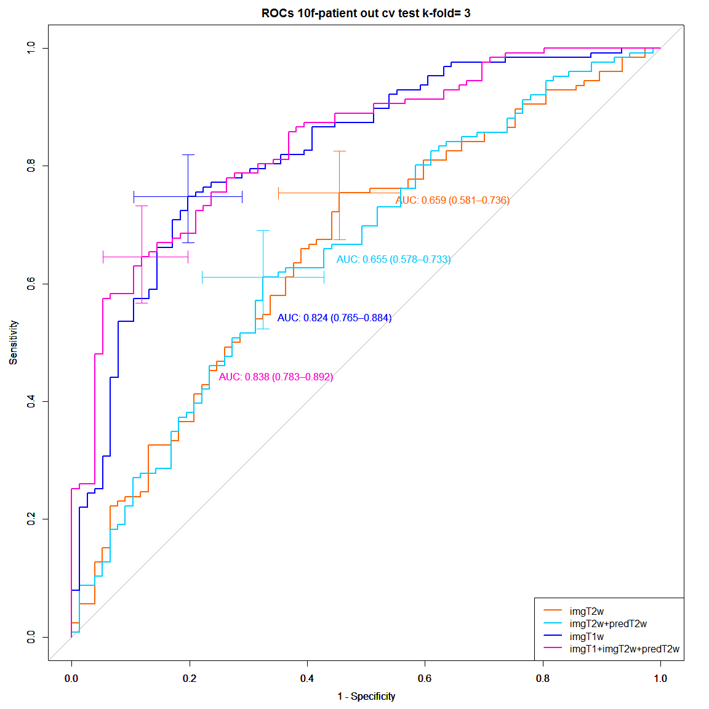 

```
## Area under the curve: 0.8379
## 95% CI (2000 stratified bootstrap replicates):
##  thresholds sp.low sp.median sp.high se.low se.median se.high
##    0.427614 0.8026    0.8816  0.9474 0.5669    0.6457  0.7323
##    massB    massM nonmassB nonmassM 
##      216      154      143       79 
##    massB    massM nonmassB nonmassM 
##       36       20        9        6 
##    massB    massM nonmassB nonmassM 
##      217      154      144       77 
##    massB    massM nonmassB nonmassM 
##       35       20        8        8 
##    massB    massM nonmassB nonmassM 
##      217      154      144       77 
##    massB    massM nonmassB nonmassM 
##       35       20        8        8 
## 0.06410256 0.05 
## -0.01369863 0.05 
## Selected features for group: MeanDecreaseGini imgT2 
## =========NULL
##  [1] "T2texture_energy_quarterRad"       "T2skew_F_r_i"                      "ave_T26"                          
##  [4] "T2texture_contrast_quarterRad"     "T2var_F_r_i"                       "ave_T23"                          
##  [7] "ave_T216"                          "T2RGH_var"                         "ave_T25"                          
## [10] "T2texture_energy_zero"             "T2texture_homogeneity_quarterRad"  "T2grad_margin_var"                
## [13] "T2texture_correlation_threeQuaRad" "ave_T28"                           "ave_T214"                         
## [16] "ave_T215"                          "T2texture_contrast_halfRad"        "T2texture_homogeneity_threeQuaRad"
## [19] "ave_T27"                           "ave_T29"                           "T2texture_homogeneity_halfRad"    
## [22] "ave_T22"                           "T2texture_correlation_zero"        "ave_T213"                         
## [25] "ave_T24"                           "T2min_F_r_i"                       "ave_T212"                         
## [28] "ave_T211"                          "ave_T217"                          "T2texture_homogeneity_zero"       
## [31] "T2texture_contrast_zero"           "T2RGH_mean"                        "ave_T219"                         
## [34] "T2mean_F_r_i"                      "T2texture_correlation_halfRad"     "T2grad_margin"                    
## [37] "T2texture_energy_threeQuaRad"      "T2max_F_r_i"                       "T2_lesionSI"                      
## 0.05555556 0.05 
## -0.03431373 0.05 
## Selected features for group: MeanDecreaseGini allT2 
## =========NULL
##  [1] "T2texture_ASM_halfRad"             "T2skew_F_r_i"                      "T2_lesionSI"                      
##  [4] "T2RGH_var"                         "T2texture_energy_zero"             "T2texture_homogeneity_quarterRad" 
##  [7] "ave_T23"                           "ave_T21"                           "T2texture_correlation_zero"       
## [10] "T2wSI_predicted"                   "ave_T22"                           "ave_T216"                         
## [13] "T2grad_margin"                     "ave_T25"                           "T2texture_homogeneity_threeQuaRad"
## [16] "ave_T213"                          "T2texture_correlation_quarterRad"  "T2texture_contrast_quarterRad"    
## [19] "ave_T212"                          "ave_T28"                           "T2texture_contrast_zero"          
## [22] "ave_T211"                          "T2texture_contrast_threeQuaRad"    "T2RGH_mean"                       
## [25] "ave_T20"                           "T2texture_correlation_halfRad"     "ave_T24"                          
## [28] "ave_T210"                          "ave_T27"                           "ave_T219"                         
## [31] "ave_T215"                          "T2kurt_F_r_i"                      "ave_T29"                          
## [34] "ave_T26"                           "T2min_F_r_i"                       "LMSIR_predicted"                  
## [37] "ave_T217"                          "T2_lesionSIstd"                   
## 0.02994012 0.05 
## Selected features for group: MeanDecreaseGini imgT1 
## =========NULL
##  [1] "irregularity"                    "SER_inside"                      "texture_correlation_threeQuaRad"
##  [4] "iiMin_change_Variance_uptake"    "earlySE10"                       "beta_inside"                    
##  [7] "UptakeRate_inside"               "texture_correlation_zero"        "skew_F_r_i"                     
## [10] "V0"                              "Tpeak_countor"                   "V19"                            
## [13] "edge_sharp_std"                  "max_RGH_var"                     "lateSE5"                        
## [16] "lateSE16"                        "lateSE3"                         "texture_homogeneity_zero"       
## [19] "texture_ASM_quarterRad"          "texture_homogeneity_quarterRad"  "V17"                            
## [22] "texture_contrast_quarterRad"     "mean_F_r_i"                      "dce2SE2"                        
## [25] "V9"                              "Kpeak_countor"                   "V12"                            
## [28] "Vr_post_1_countor"               "V16"                             "lateSE1"                        
## [31] "V14"                             "A_inside"                       
## 0.03125 0.05 
## Selected features for group: MeanDecreaseGini all 
## =========NULL
##  [1] "texture_correlation_quarterRad" "max_F_r_i"                      "SER_countor"                   
##  [4] "T2texture_energy_quarterRad"    "earlySE8"                       "V8"                            
##  [7] "T2RGH_mean"                     "ave_T27"                        "texture_energy_quarterRad"     
## [10] "Tpeak_inside"                   "T2texture_contrast_zero"        "iMax_Variance_uptake"          
## [13] "texture_homogeneity_halfRad"    "dce2SE3"                        "earlySE14"                     
## [16] "lateSE15"                       "UptakeRate_inside"              "ave_T213"                      
## [19] "min_F_r_i"                      "texture_energy_threeQuaRad"     "dce3SE10"                      
## [22] "A_inside"                       "washoutRate_countor"            "T2wSI_predicted"               
## [25] "dce2SE16"                       "dce3SE2"                        "iiiMax_Margin_Gradient"        
## [28] "dce2SE19"                       "var_F_r_i"                      "T2texture_homogeneity_halfRad" 
## [31] "T2var_F_r_i"                    "Tpeak_countor"                  "peakVr_countor"                
## [34] "lateSE14"                       "alpha_inside"                  
##     lesion_id cad_pt_no_txt exam_a_number_txt BIRADS lesion_label                lesion_diagnosis      find_t2_signal_int
## 10         12          0276           6952525      4        massM                  InvasiveDuctal   Slightly hyperintense
## 258       284          0276           6952525      4        massM                  InvasiveDuctal   Slightly hyperintense
## 13         15          0207           4982884      4        massB                        FIBROSIS                    None
## 18         20          0252           5142106      4        massB                    FIBROADENOMA Hypointense or not seen
## 268       294          0252           5142106      4        massB                    FIBROADENOMA Hypointense or not seen
## 315       341          0252           6700964      3     nonmassB            BENIGN BREAST TISSUE Hypointense or not seen
## 316       342          0252           6700964      3        massB            BENIGN BREAST TISSUE            Hyperintense
## 33         36          0683           5226149      5        massM                  InvasiveDuctal                    None
## 203       229          0683           5226149      5        massM                  InvasiveDuctal                    None
## 45         51          0710           5282770      4        massB                    FIBROADENOMA            Hyperintense
## 46         52          0710           5282770      5        massB                  DUCT PAPILLOMA            Hyperintense
## 499       525          0710           6798490      2        massB              DUCTAL HYPERPLASIA                    None
## 64         73          0731           5265417      4        massB         DYSTROPHICCALCIFICATION   Slightly hyperintense
## 69         78          4023           7037125      4        massM                  InvasiveDuctal                    None
## 131       148          4023           7037125      4        massB ADENOSIS, COLUMNAR CELL CHANGES Hypointense or not seen
## 432       458          4023           7152678      4        massB  BENIGN INTRAMAMMARY LYMPH NODE Hypointense or not seen
## 662       688          4023           7037125      4        massM                  InvasiveDuctal                    None
## 89        100          0791           5365218      5        massM                 InvasiveLobular                    None
## 90        101          0791           5365218      5     nonmassM                 InvasiveLobular                    None
## 91        102          0792           5264066      3        massB                  DUCT PAPILLOMA   Slightly hyperintense
## 92        103          0792           5264066      3        massB                  DUCT PAPILLOMA   Slightly hyperintense
## 93        104          0793           4988020      4        massB                    FIBROADENOMA            Hyperintense
## 346       372          0793           7135216      2        massB  COMPLEX FIBROEPITHELIAL LESION            Hyperintense
## 547       573          0793           6710342      4        massB  COMPLEX FIBROEPITHELIAL LESION Hypointense or not seen
## 120       135          0846           4800867      5        massM            MetaplasticCarcinoma Hypointense or not seen
## 130       146          0857           4870283      4        massB                     FIBROCYSTIC Hypointense or not seen
## 272       298          0857           5013393      2        massM                    InsituDuctal Hypointense or not seen
## 189       215          6044           5078981      5        massB                     FIBROCYSTIC                    None
## 190       216          6044           5078981      5        massM                  InvasiveDuctal                    None
## 200       226          6050           5225817      4     nonmassB                        FIBROSIS Hypointense or not seen
## 225       251          0388           7395410      5        massM                  InvasiveDuctal                    None
## 240       266          0672           4899757      5     nonmassM                    InsituDuctal                    None
## 255       281          0190           6760690      4        massM                  InvasiveDuctal                    None
## 256       282          0190           6760690      4        massM                  InvasiveDuctal                    None
## 257       283          0190           6760690      4     nonmassM                  InvasiveDuctal                    None
## 273       299          0888           6744887      5        massM                  InvasiveDuctal                    None
## 293       319          0111           6907205      4     nonmassB                  DUCT PAPILLOMA Hypointense or not seen
## 327       353          0246           7485590      4        massB            BENIGN BREAST TISSUE            Hyperintense
## 328       354          0246           7485590      4     nonmassB            BENIGN BREAST TISSUE            Hyperintense
## 339       365          0606           6781309      4        massB     ATYPICAL DUCTAL HYPERPLASIA            Hyperintense
## 344       370          0519           4937737      4        massB          FLAT EPITHELIAL ATYPIA                    None
## 355       381          0918           6976567      4        massB                    FIBROADENOMA            Hyperintense
## 357       383          0921           6997232      4        massB                     FIBROCYSTIC Hypointense or not seen
## 366       392          7029           7014263      4     nonmassB     ATYPICAL DUCTAL HYPERPLASIA                    None
## 393       419          4049           7009602      6        massM                  InvasiveDuctal                    None
## 397       423          3035           7002031      4        massB                    FIBROADENOMA            Hyperintense
## 398       424          3035           7145247      4        massB                     FIBROCYSTIC                    None
## 403       429          3055           7742700      4        massB           COLUMNAR CELL CHANGES Hypointense or not seen
## 404       430          3055           7060620      4        massM                  InvasiveDuctal Hypointense or not seen
## 405       431          3055           7742700      4     nonmassB           COLUMNAR CELL CHANGES                    None
## 445       471          3055           7742700      4        massB             STROMAL HYPERPLASIA Hypointense or not seen
## 446       472          3055           7060620      4        massM                  InvasiveDuctal Hypointense or not seen
## 460       486          7183           7404761      4        massB                     FIBROCYSTIC            Hyperintense
## 464       490          7189           7068978      4        massB                    FIBROADENOMA            Hyperintense
## 465       491          7189           7068978      4        massB            BENIGN BREAST TISSUE            Hyperintense
## 472       498          0463           7626269      4        massB              FLORID HYPERPLASIA Hypointense or not seen
## 473       499          7201           5041620      4     nonmassB                    FIBROADENOMA                    None
## 489       515          6150           7128025      4     nonmassB           COLUMNAR CELL CHANGES                    None
## 490       516          7159           5435020      4     nonmassM                 InvasiveLobular                    None
## 529       555          0696           6983274      4        massB            BENIGN BREAST TISSUE Hypointense or not seen
## 541       567          0828           4787730      6        massM                    InsituDuctal                    None
## 546       572          0840           4632517      4        massB           COLUMNAR CELL CHANGES Hypointense or not seen
## 562       588          1006           4443563      4     nonmassB                     FIBROCYSTIC Hypointense or not seen
## 578       604          1045           7231265      4        massB            BENIGN BREAST TISSUE Hypointense or not seen
## 603       629          2029           6716423      6        massB                        ADENOSIS                    None
## 618       644          2069           4976319      6        massM                    InsituDuctal Hypointense or not seen
## 619       645          2079           4591198      3        massB          benign lymphoid tissue                    None
## 622       648          2073           4745825      5        massM   InvasiveDuctal micropapillary                    None
## 623       649          2073           4745825      5     nonmassM                 InvasiveLobular                    None
## 661       687          4019           7151338      4        massB            BENIGN BREAST TISSUE            Hyperintense
## 665       691          3073           7043941      6     nonmassM     IN SITU PAPILLARY CARCINOMA                    None
## 
## ============ bestune_imgT2 	 max.depth  1 	 #Trees  350 
## ntrees:  50 minsplit:  3 cp:  -1 
##   ntrees minsplit cp acuTrain rocTrain   acuTest   rocTest
## 1     50        3 -1        1        1 0.5492958 0.5452991
## ntrees:  100 minsplit:  3 cp:  -1 
##   ntrees minsplit cp acuTrain rocTrain   acuTest   rocTest
## 2    100        3 -1        1        1 0.6197183 0.4666667
## ntrees:  250 minsplit:  3 cp:  -1 
##   ntrees minsplit cp acuTrain rocTrain   acuTest   rocTest
## 3    250        3 -1        1        1 0.5774648 0.5076923
## ntrees:  350 minsplit:  3 cp:  -1 
##   ntrees minsplit cp acuTrain rocTrain   acuTest   rocTest
## 4    350        3 -1        1        1 0.5352113 0.4803419
## ntrees:  500 minsplit:  3 cp:  -1 
##   ntrees minsplit cp acuTrain rocTrain   acuTest   rocTest
## 5    500        3 -1        1        1 0.5774648 0.4974359
## ntrees:  50 minsplit:  1 cp:  -1 
##   ntrees minsplit cp acuTrain rocTrain   acuTest   rocTest
## 6     50        1 -1        1        1 0.5633803 0.4555556
## ntrees:  100 minsplit:  1 cp:  -1 
##   ntrees minsplit cp acuTrain rocTrain   acuTest  rocTest
## 7    100        1 -1        1        1 0.5633803 0.491453
## ntrees:  250 minsplit:  1 cp:  -1 
##   ntrees minsplit cp acuTrain rocTrain   acuTest   rocTest
## 8    250        1 -1        1        1 0.5633803 0.4940171
## ntrees:  350 minsplit:  1 cp:  -1 
##   ntrees minsplit cp acuTrain rocTrain   acuTest   rocTest
## 9    350        1 -1        1        1 0.6056338 0.5367521
## ntrees:  500 minsplit:  1 cp:  -1 
##    ntrees minsplit cp acuTrain rocTrain   acuTest  rocTest
## 10    500        1 -1        1        1 0.5633803 0.491453
## ntrees:  50 minsplit:  0 cp:  -1 
##    ntrees minsplit cp acuTrain rocTrain   acuTest   rocTest
## 11     50        0 -1        1        1 0.5492958 0.5393162
## ntrees:  100 minsplit:  0 cp:  -1 
##    ntrees minsplit cp acuTrain rocTrain   acuTest   rocTest
## 12    100        0 -1        1        1 0.5915493 0.5213675
## ntrees:  250 minsplit:  0 cp:  -1 
##    ntrees minsplit cp acuTrain rocTrain   acuTest  rocTest
## 13    250        0 -1        1        1 0.5774648 0.557265
## ntrees:  350 minsplit:  0 cp:  -1 
##    ntrees minsplit cp acuTrain rocTrain   acuTest   rocTest
## 14    350        0 -1        1        1 0.5352113 0.5598291
## ntrees:  500 minsplit:  0 cp:  -1 
##    ntrees minsplit cp acuTrain rocTrain   acuTest   rocTest
## 15    500        0 -1        1        1 0.6197183 0.5333333
##    ntrees minsplit cp acuTrain rocTrain   acuTest   rocTest
## 1      50        3 -1        1        1 0.5492958 0.5452991
## 2     100        3 -1        1        1 0.6197183 0.4666667
## 3     250        3 -1        1        1 0.5774648 0.5076923
## 4     350        3 -1        1        1 0.5352113 0.4803419
## 5     500        3 -1        1        1 0.5774648 0.4974359
## 6      50        1 -1        1        1 0.5633803 0.4555556
## 7     100        1 -1        1        1 0.5633803 0.4914530
## 8     250        1 -1        1        1 0.5633803 0.4940171
## 9     350        1 -1        1        1 0.6056338 0.5367521
## 10    500        1 -1        1        1 0.5633803 0.4914530
## 11     50        0 -1        1        1 0.5492958 0.5393162
## 12    100        0 -1        1        1 0.5915493 0.5213675
## 13    250        0 -1        1        1 0.5774648 0.5572650
## 14    350        0 -1        1        1 0.5352113 0.5598291
## 15    500        0 -1        1        1 0.6197183 0.5333333
##    ntrees minsplit cp acuTrain rocTrain   acuTest   rocTest
## 14    350        0 -1        1        1 0.5352113 0.5598291
## 
## ============ bestune_allT2 	 max.depth  1 	 #Trees  250 
## ntrees:  50 minsplit:  3 cp:  -1 
##   ntrees minsplit cp acuTrain rocTrain   acuTest  rocTest
## 1     50        3 -1        1        1 0.6056338 0.574359
## ntrees:  100 minsplit:  3 cp:  -1 
##   ntrees minsplit cp acuTrain rocTrain   acuTest  rocTest
## 2    100        3 -1        1        1 0.5492958 0.574359
## ntrees:  250 minsplit:  3 cp:  -1 
##   ntrees minsplit cp acuTrain rocTrain   acuTest   rocTest
## 3    250        3 -1        1        1 0.6619718 0.5769231
## ntrees:  350 minsplit:  3 cp:  -1 
##   ntrees minsplit cp acuTrain rocTrain   acuTest   rocTest
## 4    350        3 -1        1        1 0.6478873 0.5897436
## ntrees:  500 minsplit:  3 cp:  -1 
##   ntrees minsplit cp acuTrain rocTrain   acuTest   rocTest
## 5    500        3 -1        1        1 0.6338028 0.6025641
## ntrees:  50 minsplit:  1 cp:  -1 
##   ntrees minsplit cp acuTrain rocTrain   acuTest   rocTest
## 6     50        1 -1        1        1 0.5915493 0.6444444
## ntrees:  100 minsplit:  1 cp:  -1 
##   ntrees minsplit cp acuTrain rocTrain   acuTest   rocTest
## 7    100        1 -1        1        1 0.6760563 0.6358974
## ntrees:  250 minsplit:  1 cp:  -1 
##   ntrees minsplit cp acuTrain rocTrain   acuTest   rocTest
## 8    250        1 -1        1        1 0.6338028 0.6196581
## ntrees:  350 minsplit:  1 cp:  -1 
##   ntrees minsplit cp acuTrain rocTrain   acuTest   rocTest
## 9    350        1 -1        1        1 0.5774648 0.5854701
## ntrees:  500 minsplit:  1 cp:  -1 
##    ntrees minsplit cp acuTrain rocTrain   acuTest   rocTest
## 10    500        1 -1        1        1 0.6197183 0.5547009
## ntrees:  50 minsplit:  0 cp:  -1 
##    ntrees minsplit cp acuTrain rocTrain   acuTest   rocTest
## 11     50        0 -1        1        1 0.6901408 0.6538462
## ntrees:  100 minsplit:  0 cp:  -1 
##    ntrees minsplit cp acuTrain rocTrain   acuTest   rocTest
## 12    100        0 -1        1        1 0.6478873 0.5974359
## ntrees:  250 minsplit:  0 cp:  -1 
##    ntrees minsplit cp acuTrain rocTrain   acuTest   rocTest
## 13    250        0 -1        1        1 0.6478873 0.5512821
## ntrees:  350 minsplit:  0 cp:  -1 
##    ntrees minsplit cp acuTrain rocTrain   acuTest   rocTest
## 14    350        0 -1        1        1 0.6478873 0.5726496
## ntrees:  500 minsplit:  0 cp:  -1 
##    ntrees minsplit cp acuTrain rocTrain   acuTest   rocTest
## 15    500        0 -1        1        1 0.6056338 0.5504274
##    ntrees minsplit cp acuTrain rocTrain   acuTest   rocTest
## 1      50        3 -1        1        1 0.6056338 0.5743590
## 2     100        3 -1        1        1 0.5492958 0.5743590
## 3     250        3 -1        1        1 0.6619718 0.5769231
## 4     350        3 -1        1        1 0.6478873 0.5897436
## 5     500        3 -1        1        1 0.6338028 0.6025641
## 6      50        1 -1        1        1 0.5915493 0.6444444
## 7     100        1 -1        1        1 0.6760563 0.6358974
## 8     250        1 -1        1        1 0.6338028 0.6196581
## 9     350        1 -1        1        1 0.5774648 0.5854701
## 10    500        1 -1        1        1 0.6197183 0.5547009
## 11     50        0 -1        1        1 0.6901408 0.6538462
## 12    100        0 -1        1        1 0.6478873 0.5974359
## 13    250        0 -1        1        1 0.6478873 0.5512821
## 14    350        0 -1        1        1 0.6478873 0.5726496
## 15    500        0 -1        1        1 0.6056338 0.5504274
##    ntrees minsplit cp acuTrain rocTrain   acuTest   rocTest
## 11     50        0 -1        1        1 0.6901408 0.6538462
## 
## ============ bestune_imgT1 	 max.depth  1 	 #Trees  250 
## ntrees:  50 minsplit:  3 cp:  -1 
##   ntrees minsplit cp acuTrain rocTrain   acuTest  rocTest
## 1     50        3 -1        1        1 0.7042254 0.788206
## ntrees:  100 minsplit:  3 cp:  -1 
##   ntrees minsplit cp acuTrain rocTrain   acuTest   rocTest
## 2    100        3 -1        1        1 0.6338028 0.7607973
## ntrees:  250 minsplit:  3 cp:  -1 
##   ntrees minsplit cp acuTrain rocTrain   acuTest   rocTest
## 3    250        3 -1        1        1 0.7042254 0.7641196
## ntrees:  350 minsplit:  3 cp:  -1 
##   ntrees minsplit cp acuTrain rocTrain   acuTest   rocTest
## 4    350        3 -1        1        1 0.6619718 0.7757475
## ntrees:  500 minsplit:  3 cp:  -1 
##   ntrees minsplit cp acuTrain rocTrain   acuTest  rocTest
## 5    500        3 -1        1        1 0.6901408 0.782392
## ntrees:  50 minsplit:  1 cp:  -1 
##   ntrees minsplit cp acuTrain rocTrain   acuTest   rocTest
## 6     50        1 -1        1        1 0.7323944 0.8048173
## ntrees:  100 minsplit:  1 cp:  -1 
##   ntrees minsplit cp acuTrain rocTrain   acuTest   rocTest
## 7    100        1 -1        1        1 0.6760563 0.7342193
## ntrees:  250 minsplit:  1 cp:  -1 
##   ntrees minsplit cp acuTrain rocTrain   acuTest   rocTest
## 8    250        1 -1        1        1 0.7042254 0.7591362
## ntrees:  350 minsplit:  1 cp:  -1 
##   ntrees minsplit cp acuTrain rocTrain   acuTest  rocTest
## 9    350        1 -1        1        1 0.6760563 0.763289
## ntrees:  500 minsplit:  1 cp:  -1 
##    ntrees minsplit cp acuTrain rocTrain   acuTest   rocTest
## 10    500        1 -1        1        1 0.6760563 0.7857143
## ntrees:  50 minsplit:  0 cp:  -1 
##    ntrees minsplit cp acuTrain rocTrain   acuTest   rocTest
## 11     50        0 -1        1        1 0.7042254 0.7757475
## ntrees:  100 minsplit:  0 cp:  -1 
##    ntrees minsplit cp acuTrain rocTrain   acuTest   rocTest
## 12    100        0 -1        1        1 0.6760563 0.7408638
## ntrees:  250 minsplit:  0 cp:  -1 
##    ntrees minsplit cp acuTrain rocTrain   acuTest   rocTest
## 13    250        0 -1        1        1 0.7042254 0.7591362
## ntrees:  350 minsplit:  0 cp:  -1 
##    ntrees minsplit cp acuTrain rocTrain   acuTest   rocTest
## 14    350        0 -1        1        1 0.6901408 0.7740864
## ntrees:  500 minsplit:  0 cp:  -1 
##    ntrees minsplit cp acuTrain rocTrain   acuTest   rocTest
## 15    500        0 -1        1        1 0.7042254 0.7591362
##    ntrees minsplit cp acuTrain rocTrain   acuTest   rocTest
## 1      50        3 -1        1        1 0.7042254 0.7882060
## 2     100        3 -1        1        1 0.6338028 0.7607973
## 3     250        3 -1        1        1 0.7042254 0.7641196
## 4     350        3 -1        1        1 0.6619718 0.7757475
## 5     500        3 -1        1        1 0.6901408 0.7823920
## 6      50        1 -1        1        1 0.7323944 0.8048173
## 7     100        1 -1        1        1 0.6760563 0.7342193
## 8     250        1 -1        1        1 0.7042254 0.7591362
## 9     350        1 -1        1        1 0.6760563 0.7632890
## 10    500        1 -1        1        1 0.6760563 0.7857143
## 11     50        0 -1        1        1 0.7042254 0.7757475
## 12    100        0 -1        1        1 0.6760563 0.7408638
## 13    250        0 -1        1        1 0.7042254 0.7591362
## 14    350        0 -1        1        1 0.6901408 0.7740864
## 15    500        0 -1        1        1 0.7042254 0.7591362
##   ntrees minsplit cp acuTrain rocTrain   acuTest   rocTest
## 6     50        1 -1        1        1 0.7323944 0.8048173
## 
## ============ bestune_all 	 max.depth  1 	 #Trees  200 
## ntrees:  50 minsplit:  3 cp:  -1 
##   ntrees minsplit cp acuTrain rocTrain   acuTest   rocTest
## 1     50        3 -1        1        1 0.7183099 0.7923588
## ntrees:  100 minsplit:  3 cp:  -1 
##   ntrees minsplit cp acuTrain rocTrain   acuTest   rocTest
## 2    100        3 -1        1        1 0.7042254 0.8056478
## ntrees:  250 minsplit:  3 cp:  -1 
##   ntrees minsplit cp acuTrain rocTrain   acuTest   rocTest
## 3    250        3 -1        1        1 0.7183099 0.8081395
## ntrees:  350 minsplit:  3 cp:  -1 
##   ntrees minsplit cp acuTrain rocTrain   acuTest   rocTest
## 4    350        3 -1        1        1 0.6760563 0.7923588
## ntrees:  500 minsplit:  3 cp:  -1 
##   ntrees minsplit cp acuTrain rocTrain   acuTest   rocTest
## 5    500        3 -1        1        1 0.6901408 0.7906977
## ntrees:  50 minsplit:  1 cp:  -1 
##   ntrees minsplit cp acuTrain rocTrain   acuTest   rocTest
## 6     50        1 -1        1        1 0.7323944 0.7757475
## ntrees:  100 minsplit:  1 cp:  -1 
##   ntrees minsplit cp acuTrain rocTrain   acuTest   rocTest
## 7    100        1 -1        1        1 0.6760563 0.7491694
## ntrees:  250 minsplit:  1 cp:  -1 
##   ntrees minsplit cp acuTrain rocTrain   acuTest   rocTest
## 8    250        1 -1        1        1 0.7042254 0.8081395
## ntrees:  350 minsplit:  1 cp:  -1 
##   ntrees minsplit cp acuTrain rocTrain   acuTest   rocTest
## 9    350        1 -1        1        1 0.7183099 0.7940199
## ntrees:  500 minsplit:  1 cp:  -1 
##    ntrees minsplit cp acuTrain rocTrain   acuTest   rocTest
## 10    500        1 -1        1        1 0.7323944 0.8114618
## ntrees:  50 minsplit:  0 cp:  -1 
##    ntrees minsplit cp acuTrain rocTrain   acuTest   rocTest
## 11     50        0 -1        1        1 0.6478873 0.7616279
## ntrees:  100 minsplit:  0 cp:  -1 
##    ntrees minsplit cp acuTrain rocTrain   acuTest   rocTest
## 12    100        0 -1        1        1 0.6619718 0.7732558
## ntrees:  250 minsplit:  0 cp:  -1 
##    ntrees minsplit cp acuTrain rocTrain   acuTest   rocTest
## 13    250        0 -1        1        1 0.6901408 0.8181063
## ntrees:  350 minsplit:  0 cp:  -1 
##    ntrees minsplit cp acuTrain rocTrain   acuTest   rocTest
## 14    350        0 -1        1        1 0.6760563 0.7990033
## ntrees:  500 minsplit:  0 cp:  -1 
##    ntrees minsplit cp acuTrain rocTrain   acuTest   rocTest
## 15    500        0 -1        1        1 0.7183099 0.7990033
##    ntrees minsplit cp acuTrain rocTrain   acuTest   rocTest
## 1      50        3 -1        1        1 0.7183099 0.7923588
## 2     100        3 -1        1        1 0.7042254 0.8056478
## 3     250        3 -1        1        1 0.7183099 0.8081395
## 4     350        3 -1        1        1 0.6760563 0.7923588
## 5     500        3 -1        1        1 0.6901408 0.7906977
## 6      50        1 -1        1        1 0.7323944 0.7757475
## 7     100        1 -1        1        1 0.6760563 0.7491694
## 8     250        1 -1        1        1 0.7042254 0.8081395
## 9     350        1 -1        1        1 0.7183099 0.7940199
## 10    500        1 -1        1        1 0.7323944 0.8114618
## 11     50        0 -1        1        1 0.6478873 0.7616279
## 12    100        0 -1        1        1 0.6619718 0.7732558
## 13    250        0 -1        1        1 0.6901408 0.8181063
## 14    350        0 -1        1        1 0.6760563 0.7990033
## 15    500        0 -1        1        1 0.7183099 0.7990033
##    ntrees minsplit cp acuTrain rocTrain   acuTest   rocTest
## 13    250        0 -1        1        1 0.6901408 0.8181063
## 
## Call:
## roc.default(response = perf_imgT2$obs, predictor = perf_imgT2$C)
## 
## Data: perf_imgT2$C in 103 controls (perf_imgT2$obs C) > 171 cases (perf_imgT2$obs NC).
## Area under the curve: 0.6328
## 
## Call:
## roc.default(response = perf_allT2$obs, predictor = perf_allT2$C)
## 
## Data: perf_allT2$C in 103 controls (perf_allT2$obs C) > 171 cases (perf_allT2$obs NC).
## Area under the curve: 0.6555
## 
## Call:
## roc.default(response = perf_imgT1$obs, predictor = perf_imgT1$C)
## 
## Data: perf_imgT1$C in 104 controls (perf_imgT1$obs C) > 170 cases (perf_imgT1$obs NC).
## Area under the curve: 0.8153
## 
## Call:
## roc.default(response = perf_all$obs, predictor = perf_all$C)
## 
## Data: perf_all$C in 104 controls (perf_all$obs C) > 170 cases (perf_all$obs NC).
## Area under the curve: 0.8304
```

```
## Area under the curve: 0.6328
## 95% CI (2000 stratified bootstrap replicates):
##  thresholds sp.low sp.median sp.high se.low se.median se.high
##   0.4692288 0.4854    0.5825  0.6699 0.5848     0.655  0.7251
```

```
## Area under the curve: 0.6555
## 95% CI (2000 stratified bootstrap replicates):
##  thresholds sp.low sp.median sp.high se.low se.median se.high
##   0.4543333 0.5437    0.6408  0.7282 0.5671    0.6316  0.7018
```

```
## Area under the curve: 0.8153
## 95% CI (2000 stratified bootstrap replicates):
##  thresholds sp.low sp.median sp.high se.low se.median se.high
##   0.4472446 0.6731    0.7596  0.8365 0.7059    0.7706  0.8294
```

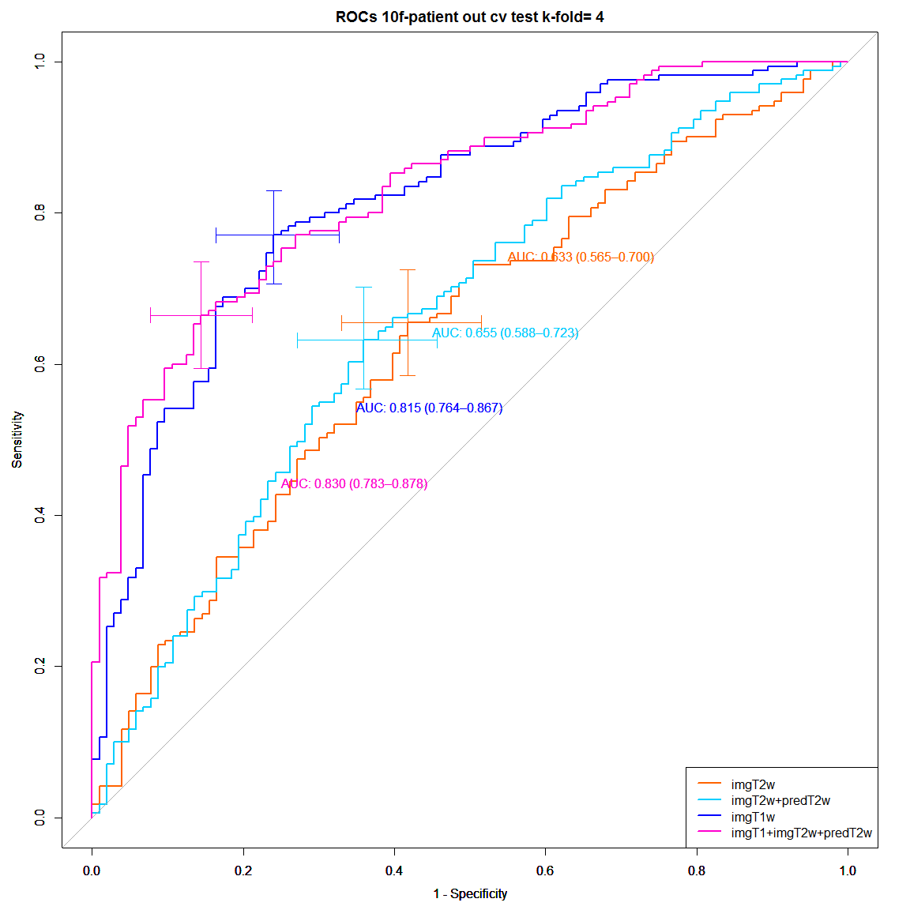 

```
## Area under the curve: 0.8304
## 95% CI (2000 stratified bootstrap replicates):
##  thresholds sp.low sp.median sp.high se.low se.median se.high
##    0.427614 0.7885    0.8558  0.9231 0.5941    0.6647  0.7353
##    massB    massM nonmassB nonmassM 
##      226      157      136       79 
##    massB    massM nonmassB nonmassM 
##       26       17       16        6 
##    massB    massM nonmassB nonmassM 
##      226      157      136       79 
##    massB    massM nonmassB nonmassM 
##       26       17       16        6 
##    massB    massM nonmassB nonmassM 
##      226      157      136       79 
##    massB    massM nonmassB nonmassM 
##       26       17       16        6 
## 0.004219409 0.05 
## Selected features for group: MeanDecreaseGini imgT2 
## =========NULL
##  [1] "T2texture_correlation_quarterRad"   "T2kurt_F_r_i"                       "T2texture_energy_halfRad"          
##  [4] "T2grad_margin_var"                  "ave_T211"                           "ave_T213"                          
##  [7] "ave_T24"                            "T2var_F_r_i"                        "ave_T26"                           
## [10] "ave_T215"                           "ave_T217"                           "T2texture_contrast_quarterRad"     
## [13] "ave_T25"                            "T2texture_ASM_zero"                 "T2texture_dissimilarity_halfRad"   
## [16] "ave_T219"                           "T2texture_homogeneity_halfRad"      "ave_T212"                          
## [19] "ave_T216"                           "T2texture_correlation_threeQuaRad"  "ave_T210"                          
## [22] "T2texture_contrast_halfRad"         "T2texture_homogeneity_threeQuaRad"  "ave_T22"                           
## [25] "ave_T20"                            "T2texture_correlation_zero"         "T2texture_dissimilarity_zero"      
## [28] "ave_T214"                           "T2min_F_r_i"                        "T2texture_ASM_threeQuaRad"         
## [31] "T2RGH_var"                          "T2max_F_r_i"                        "ave_T28"                           
## [34] "ave_T29"                            "ave_T23"                            "T2texture_contrast_zero"           
## [37] "ave_T27"                            "T2texture_homogeneity_zero"         "T2texture_dissimilarity_quarterRad"
## [40] "T2_lesionSI"                       
## 0.009389671 0.05 
## Selected features for group: MeanDecreaseGini allT2 
## =========NULL
##  [1] "T2texture_correlation_quarterRad"  "T2wSI_predicted"                   "LMSIR_predicted"                  
##  [4] "T2texture_correlation_zero"        "ave_T216"                          "T2RGH_var"                        
##  [7] "T2skew_F_r_i"                      "T2texture_energy_zero"             "T2texture_ASM_halfRad"            
## [10] "T2RGH_mean"                        "ave_T218"                          "ave_T27"                          
## [13] "T2grad_margin_var"                 "ave_T217"                          "T2mean_F_r_i"                     
## [16] "ave_T24"                           "T2texture_correlation_halfRad"     "T2texture_contrast_quarterRad"    
## [19] "T2texture_homogeneity_threeQuaRad" "ave_T210"                          "ave_T214"                         
## [22] "T2texture_contrast_threeQuaRad"    "ave_T25"                           "ave_T28"                          
## [25] "T2max_F_r_i"                       "T2texture_dissimilarity_zero"      "T2min_F_r_i"                      
## [28] "ave_T23"                           "T2var_F_r_i"                       "T2texture_contrast_zero"          
## [31] "T2kurt_F_r_i"                      "ave_T29"                           "T2texture_homogeneity_zero"       
## [34] "ave_T212"                          "T2_lesionSI"                      
## 0.04375 0.05 
## Selected features for group: MeanDecreaseGini imgT1 
## =========NULL
##  [1] "Tpeak_inside"                     "texture_correlation_threeQuaRad"  "texture_correlation_zero"        
##  [4] "V15"                              "var_F_r_i"                        "texture_energy_halfRad"          
##  [7] "earlySE18"                        "max_RGH_mean"                     "V7"                              
## [10] "iiMin_change_Variance_uptake"     "iiiMax_Margin_Gradient"           "edge_sharp_std"                  
## [13] "earlySE17"                        "texture_dissimilarity_quarterRad" "A_countor"                       
## [16] "maxVr_inside"                     "lateSE12"                         "dce2SE17"                        
## [19] "earlySE15"                        "lateSE19"                         "dce3SE5"                         
## [22] "lateSE6"                          "lateSE3"                          "earlySE5"                        
## [25] "V1"                               "beta_countor"                     "UptakeRate_countor"              
## [28] "dce2SE11"                         "lateSE1"                          "V3"                              
## [31] "earlySE10"                        "dce3SE17"                         "dce3SE18"                        
## [34] "A_inside"                        
## -0.1360544 0.05 
## Selected features for group: MeanDecreaseGini all 
## =========NULL
##  [1] "irregularity"                       "SER_inside"                         "iiMin_change_Variance_uptake"      
##  [4] "max_RGH_mean"                       "alpha_inside"                       "mean_F_r_i"                        
##  [7] "lateSE16"                           "dce3SE8"                            "texture_homogeneity_threeQuaRad"   
## [10] "beta_countor"                       "T2texture_dissimilarity_quarterRad" "V13"                               
## [13] "V15"                                "texture_dissimilarity_threeQuaRad"  "T2RGH_mean"                        
## [16] "ave_T215"                           "dce3SE11"                           "ave_T211"                          
## [19] "ave_T214"                           "lateSE3"                            "T2texture_energy_zero"             
## [22] "dce3SE2"                            "texture_dissimilarity_zero"         "T2grad_margin_var"                 
## [25] "V18"                                "dce3SE19"                           "T2texture_correlation_zero"        
## [28] "skew_F_r_i"                         "A_inside"                          
##     lesion_id cad_pt_no_txt exam_a_number_txt BIRADS lesion_label                         lesion_diagnosis      find_t2_signal_int
## 1           1          0066           4583735      3        massB                     BENIGN BREAST TISSUE Hypointense or not seen
## 502       528          0066           7556910      4     nonmassB                           DENSE FIBROSIS                    None
## 14         16          7077           5077480      5        massM                             InsituDuctal                    None
## 15         17          7077           5077480      5        massM                             InsituDuctal                    None
## 16         18          7077           5077480      5     nonmassM                             InsituDuctal                    None
## 25         27          0325           4696948      4        massB                              FIBROCYSTIC            Hyperintense
## 56         65          0726           5304228      5        massM                           InvasiveDuctal   Slightly hyperintense
## 57         66          0727           4803733      4        massM                             InsituDuctal   Slightly hyperintense
## 81         90          0776           5352670      5        massB                            AtypicalCells Hypointense or not seen
## 82         91          0776           5352670      5        massM                           InvasiveDuctal                    None
## 83         92          0776           5352670      5        massM                           InvasiveDuctal                    None
## 212       238          0776           5352670      5     nonmassM                           InvasiveDuctal                    None
## 98        110          0809           5016014      4        massB                              FIBROCYSTIC            Hyperintense
## 108       122          0829           5264139      5        massM                           InvasiveDuctal Hypointense or not seen
## 111       126          0831           4633368      6     nonmassM                             InsituDuctal   Slightly hyperintense
## 138       156          0870           5141888      6     nonmassM                          InvasiveLobular                    None
## 141       159          0877           4724338      4     nonmassB             ATYPICAL LOBULAR HYPERPLASIA                    None
## 160       184          6022           5046558      4     nonmassB                             FIBROADENOMA                    None
## 232       258          6022           5046558      6        massM                           InvasiveDuctal                    None
## 188       214          6043           5249778      4     nonmassB              ATYPICAL DUCTAL HYPERPLASIA                    None
## 213       239          0778           4794199      5        massB                             FIBROADENOMA Hypointense or not seen
## 241       267          0775           5437780      3        massB                     BENIGN BREAST TISSUE   Slightly hyperintense
## 242       268          0775           6916901      3     nonmassB                     BENIGN BREAST TISSUE                    None
## 243       269          0775           5437780      3     nonmassB                     BENIGN BREAST TISSUE Hypointense or not seen
## 244       270          0775           5437780      3     nonmassB                     BENIGN BREAST TISSUE   Slightly hyperintense
## 252       278          0177           6996979      3        massM                             InsituDuctal   Slightly hyperintense
## 253       279          0177           6996979      3     nonmassB                                 Hematoma                    None
## 278       304          7018           6803089      4        massM                             InsituDuctal                    None
## 279       305          7018           7138226      2        massM                             InsituDuctal                    None
## 292       318          0103           6836585      5        massB                          PHYLLODES TUMOR                    None
## 311       337          0220           6715021      5        massB                               RadialScar   Slightly hyperintense
## 312       338          0220           6715021      5        massB                             FIBROADENOMA   Slightly hyperintense
## 331       357          0465           4885863      2     nonmassB              ATYPICAL DUCTAL HYPERPLASIA                    None
## 336       362          0442           4936886      4        massB                     BENIGN BREAST TISSUE   Slightly hyperintense
## 356       382          0920           7095635      4        massB                             FIBROADENOMA Hypointense or not seen
## 358       384          0937           7144673      4        massB                          FIBROEPITHELIAL            Hyperintense
## 369       395          7045           6760802      4        massB                     BENIGN BREAST TISSUE Hypointense or not seen
## 392       418          7105           7837892      4        massM                           InvasiveDuctal   Slightly hyperintense
## 406       432          2042           4964619      6        massB                       LobularHyperplasia            Hyperintense
## 410       436          2042           5186978      4        massB              ATYPICAL DUCTAL HYPERPLASIA Hypointense or not seen
## 607       633          2042           7050570      4        massB              ATYPICAL DUCTAL HYPERPLASIA                    None
## 423       449          4029           7633460      4        massB                            InsituLobular                    None
## 424       450          4029           7633460      4        massB                            InsituLobular                    None
## 431       457          0997           7279207      3        massB             ATYPICAL LOBULAR HYPERPLASIA                    None
## 434       460          4041           7003893      4     nonmassB                     BENIGN BREAST TISSUE   Slightly hyperintense
## 457       483          3005           4974097      3     nonmassB                     BENIGN BREAST TISSUE                    None
## 458       484          3005           6757337      3     nonmassM                             InsituDuctal Hypointense or not seen
## 646       672          3005           5057668      2     nonmassB                              FIBROCYSTIC                    None
## 647       673          3005           6757337      4     nonmassM                             InsituDuctal Hypointense or not seen
## 469       495          7199           7709063      4        massB                     BENIGN BREAST TISSUE            Hyperintense
## 479       505          6100           6722170      5        massM                           InvasiveDuctal Hypointense or not seen
## 491       517          6069           7581124      4        massB                     BENIGN BREAST TISSUE            Hyperintense
## 492       518          6069           7581124      4        massB                     BENIGN BREAST TISSUE Hypointense or not seen
## 521       547          0608           5094101      4        massB                     BENIGN BREAST TISSUE            Hyperintense
## 524       550          0624           4894714      5        massB                              FIBROCYSTIC Hypointense or not seen
## 535       561          0734           4532660      4        massB              ATYPICAL DUCTAL HYPERPLASIA   Slightly hyperintense
## 544       570          0837           4559849      5        massM                           InvasiveDuctal                    None
## 559       585          0965           6676125      3        massB                             FIBROADENOMA   Slightly hyperintense
## 570       596          1024           6980462      4     nonmassB              ATYPICAL DUCTAL HYPERPLASIA                    None
## 571       597          1024           6980462      4     nonmassB               DUCT PAPILLOMA WITH ATYPIA                    None
## 582       608          1065           7741665      4     nonmassB                     BENIGN BREAST TISSUE                    None
## 596       622          2003           6739382      4     nonmassB SCLEROSING ADENOSIS AND STROMAL FIBROSIS                    None
## 599       625          2023           5141524      6        massM                           InvasiveDuctal                    None
## 617       643          2068           7559583      5        massM                           InvasiveDuctal Hypointense or not seen
## 621       647          2072           7256932      4        massM                           InvasiveDuctal                    None
## 
## ============ bestune_imgT2 	 max.depth  1 	 #Trees  350 
## ntrees:  50 minsplit:  3 cp:  -1 
##   ntrees minsplit cp acuTrain rocTrain   acuTest   rocTest
## 1     50        3 -1        1        1 0.6307692 0.6977226
## ntrees:  100 minsplit:  3 cp:  -1 
##   ntrees minsplit cp acuTrain rocTrain   acuTest   rocTest
## 2    100        3 -1        1        1 0.7076923 0.6821946
## ntrees:  250 minsplit:  3 cp:  -1 
##   ntrees minsplit cp acuTrain rocTrain   acuTest   rocTest
## 3    250        3 -1        1        1 0.7076923 0.7598344
## ntrees:  350 minsplit:  3 cp:  -1 
##   ntrees minsplit cp acuTrain rocTrain   acuTest   rocTest
## 4    350        3 -1        1        1 0.7230769 0.7505176
## ntrees:  500 minsplit:  3 cp:  -1 
##   ntrees minsplit cp acuTrain rocTrain   acuTest   rocTest
## 5    500        3 -1        1        1 0.7076923 0.7349896
## ntrees:  50 minsplit:  1 cp:  -1 
##   ntrees minsplit cp acuTrain rocTrain   acuTest   rocTest
## 6     50        1 -1        1        1 0.7076923 0.7163561
## ntrees:  100 minsplit:  1 cp:  -1 
##   ntrees minsplit cp acuTrain rocTrain   acuTest   rocTest
## 7    100        1 -1        1        1 0.7076923 0.7494824
## ntrees:  250 minsplit:  1 cp:  -1 
##   ntrees minsplit cp acuTrain rocTrain   acuTest   rocTest
## 8    250        1 -1        1        1 0.7384615 0.7774327
## ntrees:  350 minsplit:  1 cp:  -1 
##   ntrees minsplit cp acuTrain rocTrain   acuTest   rocTest
## 9    350        1 -1        1        1 0.7230769 0.7339545
## ntrees:  500 minsplit:  1 cp:  -1 
##    ntrees minsplit cp acuTrain rocTrain   acuTest rocTest
## 10    500        1 -1        1        1 0.7384615 0.73706
## ntrees:  50 minsplit:  0 cp:  -1 
##    ntrees minsplit cp acuTrain rocTrain   acuTest   rocTest
## 11     50        0 -1        1        1 0.6769231 0.7453416
## ntrees:  100 minsplit:  0 cp:  -1 
##    ntrees minsplit cp acuTrain rocTrain   acuTest   rocTest
## 12    100        0 -1        1        1 0.7076923 0.7443064
## ntrees:  250 minsplit:  0 cp:  -1 
##    ntrees minsplit cp acuTrain rocTrain   acuTest   rocTest
## 13    250        0 -1        1        1 0.7384615 0.7712215
## ntrees:  350 minsplit:  0 cp:  -1 
##    ntrees minsplit cp acuTrain rocTrain   acuTest   rocTest
## 14    350        0 -1        1        1 0.7384615 0.7608696
## ntrees:  500 minsplit:  0 cp:  -1 
##    ntrees minsplit cp acuTrain rocTrain   acuTest   rocTest
## 15    500        0 -1        1        1 0.7846154 0.7795031
##    ntrees minsplit cp acuTrain rocTrain   acuTest   rocTest
## 1      50        3 -1        1        1 0.6307692 0.6977226
## 2     100        3 -1        1        1 0.7076923 0.6821946
## 3     250        3 -1        1        1 0.7076923 0.7598344
## 4     350        3 -1        1        1 0.7230769 0.7505176
## 5     500        3 -1        1        1 0.7076923 0.7349896
## 6      50        1 -1        1        1 0.7076923 0.7163561
## 7     100        1 -1        1        1 0.7076923 0.7494824
## 8     250        1 -1        1        1 0.7384615 0.7774327
## 9     350        1 -1        1        1 0.7230769 0.7339545
## 10    500        1 -1        1        1 0.7384615 0.7370600
## 11     50        0 -1        1        1 0.6769231 0.7453416
## 12    100        0 -1        1        1 0.7076923 0.7443064
## 13    250        0 -1        1        1 0.7384615 0.7712215
## 14    350        0 -1        1        1 0.7384615 0.7608696
## 15    500        0 -1        1        1 0.7846154 0.7795031
##    ntrees minsplit cp acuTrain rocTrain   acuTest   rocTest
## 15    500        0 -1        1        1 0.7846154 0.7795031
## 
## ============ bestune_allT2 	 max.depth  1 	 #Trees  250 
## ntrees:  50 minsplit:  3 cp:  -1 
##   ntrees minsplit cp acuTrain rocTrain   acuTest   rocTest
## 1     50        3 -1        1        1 0.6923077 0.7256729
## ntrees:  100 minsplit:  3 cp:  -1 
##   ntrees minsplit cp acuTrain rocTrain   acuTest   rocTest
## 2    100        3 -1        1        1 0.6923077 0.7308489
## ntrees:  250 minsplit:  3 cp:  -1 
##   ntrees minsplit cp acuTrain rocTrain   acuTest   rocTest
## 3    250        3 -1        1        1 0.6923077 0.7329193
## ntrees:  350 minsplit:  3 cp:  -1 
##   ntrees minsplit cp acuTrain rocTrain   acuTest   rocTest
## 4    350        3 -1        1        1 0.7692308 0.7639752
## ntrees:  500 minsplit:  3 cp:  -1 
##   ntrees minsplit cp acuTrain rocTrain   acuTest   rocTest
## 5    500        3 -1        1        1 0.7384615 0.7505176
## ntrees:  50 minsplit:  1 cp:  -1 
##   ntrees minsplit cp acuTrain rocTrain   acuTest  rocTest
## 6     50        1 -1        1        1 0.6461538 0.699793
## ntrees:  100 minsplit:  1 cp:  -1 
##   ntrees minsplit cp acuTrain rocTrain   acuTest   rocTest
## 7    100        1 -1        1        1 0.7076923 0.7505176
## ntrees:  250 minsplit:  1 cp:  -1 
##   ntrees minsplit cp acuTrain rocTrain   acuTest   rocTest
## 8    250        1 -1        1        1 0.7384615 0.7515528
## ntrees:  350 minsplit:  1 cp:  -1 
##   ntrees minsplit cp acuTrain rocTrain   acuTest  rocTest
## 9    350        1 -1        1        1 0.7076923 0.757764
## ntrees:  500 minsplit:  1 cp:  -1 
##    ntrees minsplit cp acuTrain rocTrain   acuTest   rocTest
## 10    500        1 -1        1        1 0.7076923 0.7505176
## ntrees:  50 minsplit:  0 cp:  -1 
##    ntrees minsplit cp acuTrain rocTrain   acuTest   rocTest
## 11     50        0 -1        1        1 0.7076923 0.7722567
## ntrees:  100 minsplit:  0 cp:  -1 
##    ntrees minsplit cp acuTrain rocTrain   acuTest rocTest
## 12    100        0 -1        1        1 0.6769231 0.76294
## ntrees:  250 minsplit:  0 cp:  -1 
##    ntrees minsplit cp acuTrain rocTrain   acuTest   rocTest
## 13    250        0 -1        1        1 0.7076923 0.7391304
## ntrees:  350 minsplit:  0 cp:  -1 
##    ntrees minsplit cp acuTrain rocTrain   acuTest   rocTest
## 14    350        0 -1        1        1 0.7384615 0.7763975
## ntrees:  500 minsplit:  0 cp:  -1 
##    ntrees minsplit cp acuTrain rocTrain   acuTest   rocTest
## 15    500        0 -1        1        1 0.6923077 0.7660455
##    ntrees minsplit cp acuTrain rocTrain   acuTest   rocTest
## 1      50        3 -1        1        1 0.6923077 0.7256729
## 2     100        3 -1        1        1 0.6923077 0.7308489
## 3     250        3 -1        1        1 0.6923077 0.7329193
## 4     350        3 -1        1        1 0.7692308 0.7639752
## 5     500        3 -1        1        1 0.7384615 0.7505176
## 6      50        1 -1        1        1 0.6461538 0.6997930
## 7     100        1 -1        1        1 0.7076923 0.7505176
## 8     250        1 -1        1        1 0.7384615 0.7515528
## 9     350        1 -1        1        1 0.7076923 0.7577640
## 10    500        1 -1        1        1 0.7076923 0.7505176
## 11     50        0 -1        1        1 0.7076923 0.7722567
## 12    100        0 -1        1        1 0.6769231 0.7629400
## 13    250        0 -1        1        1 0.7076923 0.7391304
## 14    350        0 -1        1        1 0.7384615 0.7763975
## 15    500        0 -1        1        1 0.6923077 0.7660455
##    ntrees minsplit cp acuTrain rocTrain   acuTest   rocTest
## 14    350        0 -1        1        1 0.7384615 0.7763975
## 
## ============ bestune_imgT1 	 max.depth  1 	 #Trees  250 
## ntrees:  50 minsplit:  3 cp:  -1 
##   ntrees minsplit cp acuTrain rocTrain   acuTest   rocTest
## 1     50        3 -1        1        1 0.6615385 0.6780538
## ntrees:  100 minsplit:  3 cp:  -1 
##   ntrees minsplit cp acuTrain rocTrain   acuTest   rocTest
## 2    100        3 -1        1        1 0.7076923 0.7080745
## ntrees:  250 minsplit:  3 cp:  -1 
##   ntrees minsplit cp acuTrain rocTrain   acuTest   rocTest
## 3    250        3 -1        1        1 0.6615385 0.7070393
## ntrees:  350 minsplit:  3 cp:  -1 
##   ntrees minsplit cp acuTrain rocTrain   acuTest   rocTest
## 4    350        3 -1        1        1 0.7230769 0.7028986
## ntrees:  500 minsplit:  3 cp:  -1 
##   ntrees minsplit cp acuTrain rocTrain   acuTest   rocTest
## 5    500        3 -1        1        1 0.6615385 0.7060041
## ntrees:  50 minsplit:  1 cp:  -1 
##   ntrees minsplit cp acuTrain rocTrain   acuTest  rocTest
## 6     50        1 -1        1        1 0.6615385 0.694617
## ntrees:  100 minsplit:  1 cp:  -1 
##   ntrees minsplit cp acuTrain rocTrain   acuTest   rocTest
## 7    100        1 -1        1        1 0.6923077 0.7349896
## ntrees:  250 minsplit:  1 cp:  -1 
##   ntrees minsplit cp acuTrain rocTrain   acuTest   rocTest
## 8    250        1 -1        1        1 0.6769231 0.6987578
## ntrees:  350 minsplit:  1 cp:  -1 
##   ntrees minsplit cp acuTrain rocTrain   acuTest  rocTest
## 9    350        1 -1        1        1 0.6769231 0.689441
## ntrees:  500 minsplit:  1 cp:  -1 
##    ntrees minsplit cp acuTrain rocTrain   acuTest   rocTest
## 10    500        1 -1        1        1 0.7076923 0.7060041
## ntrees:  50 minsplit:  0 cp:  -1 
##    ntrees minsplit cp acuTrain rocTrain   acuTest   rocTest
## 11     50        0 -1        1        1 0.6769231 0.6480331
## ntrees:  100 minsplit:  0 cp:  -1 
##    ntrees minsplit cp acuTrain rocTrain   acuTest   rocTest
## 12    100        0 -1        1        1 0.6923077 0.7401656
## ntrees:  250 minsplit:  0 cp:  -1 
##    ntrees minsplit cp acuTrain rocTrain   acuTest   rocTest
## 13    250        0 -1        1        1 0.7230769 0.6811594
## ntrees:  350 minsplit:  0 cp:  -1 
##    ntrees minsplit cp acuTrain rocTrain   acuTest   rocTest
## 14    350        0 -1        1        1 0.6923077 0.6966874
## ntrees:  500 minsplit:  0 cp:  -1 
##    ntrees minsplit cp acuTrain rocTrain   acuTest   rocTest
## 15    500        0 -1        1        1 0.7384615 0.7132505
##    ntrees minsplit cp acuTrain rocTrain   acuTest   rocTest
## 1      50        3 -1        1        1 0.6615385 0.6780538
## 2     100        3 -1        1        1 0.7076923 0.7080745
## 3     250        3 -1        1        1 0.6615385 0.7070393
## 4     350        3 -1        1        1 0.7230769 0.7028986
## 5     500        3 -1        1        1 0.6615385 0.7060041
## 6      50        1 -1        1        1 0.6615385 0.6946170
## 7     100        1 -1        1        1 0.6923077 0.7349896
## 8     250        1 -1        1        1 0.6769231 0.6987578
## 9     350        1 -1        1        1 0.6769231 0.6894410
## 10    500        1 -1        1        1 0.7076923 0.7060041
## 11     50        0 -1        1        1 0.6769231 0.6480331
## 12    100        0 -1        1        1 0.6923077 0.7401656
## 13    250        0 -1        1        1 0.7230769 0.6811594
## 14    350        0 -1        1        1 0.6923077 0.6966874
## 15    500        0 -1        1        1 0.7384615 0.7132505
##    ntrees minsplit cp acuTrain rocTrain   acuTest   rocTest
## 12    100        0 -1        1        1 0.6923077 0.7401656
## 
## ============ bestune_all 	 max.depth  1 	 #Trees  200 
## ntrees:  50 minsplit:  3 cp:  -1 
##   ntrees minsplit cp acuTrain rocTrain   acuTest   rocTest
## 1     50        3 -1        1        1 0.7384615 0.7536232
## ntrees:  100 minsplit:  3 cp:  -1 
##   ntrees minsplit cp acuTrain rocTrain   acuTest   rocTest
## 2    100        3 -1        1        1 0.6923077 0.7453416
## ntrees:  250 minsplit:  3 cp:  -1 
##   ntrees minsplit cp acuTrain rocTrain   acuTest   rocTest
## 3    250        3 -1        1        1 0.7076923 0.7598344
## ntrees:  350 minsplit:  3 cp:  -1 
##   ntrees minsplit cp acuTrain rocTrain   acuTest   rocTest
## 4    350        3 -1        1        1 0.7076923 0.7608696
## ntrees:  500 minsplit:  3 cp:  -1 
##   ntrees minsplit cp acuTrain rocTrain   acuTest   rocTest
## 5    500        3 -1        1        1 0.6615385 0.7391304
## ntrees:  50 minsplit:  1 cp:  -1 
##   ntrees minsplit cp acuTrain rocTrain   acuTest   rocTest
## 6     50        1 -1        1        1 0.6769231 0.7391304
## ntrees:  100 minsplit:  1 cp:  -1 
##   ntrees minsplit cp acuTrain rocTrain   acuTest   rocTest
## 7    100        1 -1        1        1 0.7384615 0.7650104
## ntrees:  250 minsplit:  1 cp:  -1 
##   ntrees minsplit cp acuTrain rocTrain   acuTest   rocTest
## 8    250        1 -1        1        1 0.7230769 0.7484472
## ntrees:  350 minsplit:  1 cp:  -1 
##   ntrees minsplit cp acuTrain rocTrain   acuTest   rocTest
## 9    350        1 -1        1        1 0.7538462 0.7587992
## ntrees:  500 minsplit:  1 cp:  -1 
##    ntrees minsplit cp acuTrain rocTrain   acuTest   rocTest
## 10    500        1 -1        1        1 0.6769231 0.7763975
## ntrees:  50 minsplit:  0 cp:  -1 
##    ntrees minsplit cp acuTrain rocTrain   acuTest   rocTest
## 11     50        0 -1        1        1 0.6615385 0.7060041
## ntrees:  100 minsplit:  0 cp:  -1 
##    ntrees minsplit cp acuTrain rocTrain   acuTest   rocTest
## 12    100        0 -1        1        1 0.6769231 0.7339545
## ntrees:  250 minsplit:  0 cp:  -1 
##    ntrees minsplit cp acuTrain rocTrain   acuTest   rocTest
## 13    250        0 -1        1        1 0.7384615 0.7670807
## ntrees:  350 minsplit:  0 cp:  -1 
##    ntrees minsplit cp acuTrain rocTrain   acuTest rocTest
## 14    350        0 -1        1        1 0.6923077 0.76294
## ntrees:  500 minsplit:  0 cp:  -1 
##    ntrees minsplit cp acuTrain rocTrain   acuTest   rocTest
## 15    500        0 -1        1        1 0.6923077 0.7670807
##    ntrees minsplit cp acuTrain rocTrain   acuTest   rocTest
## 1      50        3 -1        1        1 0.7384615 0.7536232
## 2     100        3 -1        1        1 0.6923077 0.7453416
## 3     250        3 -1        1        1 0.7076923 0.7598344
## 4     350        3 -1        1        1 0.7076923 0.7608696
## 5     500        3 -1        1        1 0.6615385 0.7391304
## 6      50        1 -1        1        1 0.6769231 0.7391304
## 7     100        1 -1        1        1 0.7384615 0.7650104
## 8     250        1 -1        1        1 0.7230769 0.7484472
## 9     350        1 -1        1        1 0.7538462 0.7587992
## 10    500        1 -1        1        1 0.6769231 0.7763975
## 11     50        0 -1        1        1 0.6615385 0.7060041
## 12    100        0 -1        1        1 0.6769231 0.7339545
## 13    250        0 -1        1        1 0.7384615 0.7670807
## 14    350        0 -1        1        1 0.6923077 0.7629400
## 15    500        0 -1        1        1 0.6923077 0.7670807
##    ntrees minsplit cp acuTrain rocTrain   acuTest   rocTest
## 10    500        1 -1        1        1 0.6769231 0.7763975
## 
## Call:
## roc.default(response = perf_imgT2$obs, predictor = perf_imgT2$C)
## 
## Data: perf_imgT2$C in 126 controls (perf_imgT2$obs C) > 213 cases (perf_imgT2$obs NC).
## Area under the curve: 0.6588
## 
## Call:
## roc.default(response = perf_allT2$obs, predictor = perf_allT2$C)
## 
## Data: perf_allT2$C in 126 controls (perf_allT2$obs C) > 213 cases (perf_allT2$obs NC).
## Area under the curve: 0.6773
## 
## Call:
## roc.default(response = perf_imgT1$obs, predictor = perf_imgT1$C)
## 
## Data: perf_imgT1$C in 127 controls (perf_imgT1$obs C) > 212 cases (perf_imgT1$obs NC).
## Area under the curve: 0.8017
## 
## Call:
## roc.default(response = perf_all$obs, predictor = perf_all$C)
## 
## Data: perf_all$C in 127 controls (perf_all$obs C) > 212 cases (perf_all$obs NC).
## Area under the curve: 0.818
```

```
## Area under the curve: 0.6588
## 95% CI (2000 stratified bootstrap replicates):
##  thresholds sp.low sp.median sp.high se.low se.median se.high
##   0.4962231 0.4363    0.5238  0.6111 0.6948    0.7559  0.8122
```

```
## Area under the curve: 0.6773
## 95% CI (2000 stratified bootstrap replicates):
##  thresholds sp.low sp.median sp.high se.low se.median se.high
##    0.443286 0.6111    0.6905  0.7698 0.5493     0.615  0.6808
```

```
## Area under the curve: 0.8017
## 95% CI (2000 stratified bootstrap replicates):
##  thresholds sp.low sp.median sp.high se.low se.median se.high
##   0.4472446 0.6693     0.748  0.8268 0.6934      0.75  0.8066
```

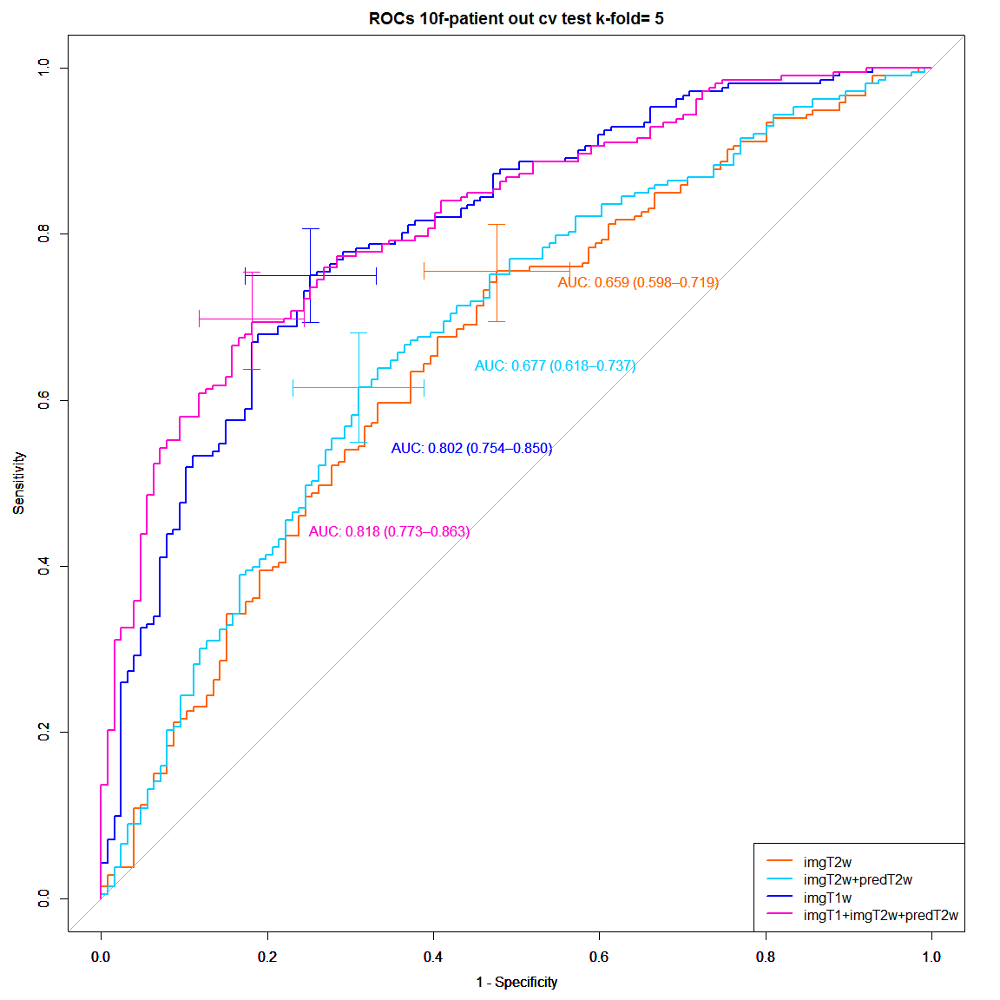 

```
## Area under the curve: 0.818
## 95% CI (2000 stratified bootstrap replicates):
##  thresholds sp.low sp.median sp.high se.low se.median se.high
##    0.433547 0.7559    0.8189  0.8819 0.6368    0.6981  0.7547
##    massB    massM nonmassB nonmassM 
##      222      161      142       72 
##    massB    massM nonmassB nonmassM 
##       30       13       10       13 
##    massB    massM nonmassB nonmassM 
##      222      162      141       72 
##    massB    massM nonmassB nonmassM 
##       30       12       11       13 
##    massB    massM nonmassB nonmassM 
##      222      162      141       72 
##    massB    massM nonmassB nonmassM 
##       30       12       11       13 
## -0.01401869 0.05 
## Selected features for group: MeanDecreaseGini imgT2 
## =========NULL
##  [1] "T2texture_correlation_quarterRad"  "T2texture_ASM_threeQuaRad"         "ave_T216"                         
##  [4] "T2texture_correlation_halfRad"     "ave_T213"                          "ave_T219"                         
##  [7] "T2texture_homogeneity_quarterRad"  "T2mean_F_r_i"                      "T2RGH_var"                        
## [10] "ave_T27"                           "ave_T20"                           "T2RGH_mean"                       
## [13] "T2_lesionSIstd"                    "T2texture_homogeneity_threeQuaRad" "T2texture_dissimilarity_zero"     
## [16] "T2texture_contrast_halfRad"        "ave_T217"                          "T2texture_homogeneity_zero"       
## [19] "ave_T28"                           "T2texture_ASM_halfRad"             "ave_T214"                         
## [22] "ave_T29"                           "ave_T26"                           "T2grad_margin_var"                
## [25] "T2texture_energy_zero"             "T2skew_F_r_i"                      "ave_T211"                         
## [28] "T2texture_energy_quarterRad"       "T2grad_margin"                     "T2_lesionSI"                      
## 0.05504587 0.05 
## 0.01456311 0.05 
## Selected features for group: MeanDecreaseGini allT2 
## =========NULL
##  [1] "T2texture_ASM_quarterRad"            "T2skew_F_r_i"                        "ave_T218"                           
##  [4] "T2texture_energy_threeQuaRad"        "T2texture_correlation_threeQuaRad"   "T2RGH_var"                          
##  [7] "T2texture_dissimilarity_quarterRad"  "T2var_F_r_i"                         "T2wSI_predicted"                    
## [10] "T2RGH_mean"                          "ave_T216"                            "ave_T215"                           
## [13] "ave_T219"                            "T2texture_dissimilarity_zero"        "ave_T28"                            
## [16] "T2max_F_r_i"                         "ave_T212"                            "T2texture_homogeneity_halfRad"      
## [19] "ave_T210"                            "T2texture_homogeneity_zero"          "T2grad_margin_var"                  
## [22] "ave_T27"                             "ave_T217"                            "ave_T21"                            
## [25] "ave_T214"                            "ave_T20"                             "ave_T211"                           
## [28] "ave_T22"                             "T2kurt_F_r_i"                        "T2texture_energy_halfRad"           
## [31] "ave_T23"                             "T2texture_dissimilarity_threeQuaRad" "T2min_F_r_i"                        
## [34] "ave_T25"                             "T2mean_F_r_i"                        "T2texture_ASM_zero"                 
## [37] "T2texture_correlation_zero"          "T2texture_homogeneity_threeQuaRad"   "ave_T24"                            
## [40] "T2texture_contrast_threeQuaRad"      "T2texture_correlation_halfRad"       "ave_T26"                            
## [43] "T2texture_dissimilarity_halfRad"     "T2_lesionSI"                        
## 0.01265823 0.05 
## Selected features for group: MeanDecreaseGini imgT1 
## =========NULL
##  [1] "texture_correlation_threeQuaRad" "texture_correlation_quarterRad"  "Tpeak_inside"                   
##  [4] "edge_sharp_std"                  "edge_sharp_mean"                 "V19"                            
##  [7] "mean_F_r_i"                      "V0"                              "washoutRate_inside"             
## [10] "iiiMax_Margin_Gradient"          "maxVr_countor"                   "dce2SE7"                        
## [13] "earlySE10"                       "texture_energy_quarterRad"       "beta_inside"                    
## [16] "earlySE2"                        "V15"                             "max_RGH_mean"                   
## [19] "A_countor"                       "dce2SE4"                         "texture_homogeneity_quarterRad" 
## [22] "texture_dissimilarity_halfRad"   "dce2SE12"                        "kurt_F_r_i"                     
## [25] "V11"                             "Vr_decreasingRate_countor"       "dce3SE12"                       
## [28] "V12"                             "V1"                              "texture_contrast_threeQuaRad"   
## [31] "dce3SE8"                         "texture_contrast_quarterRad"     "V5"                             
## [34] "A_inside"                       
## -0.01282051 0.05 
## Selected features for group: MeanDecreaseGini all 
## =========NULL
##  [1] "texture_correlation_halfRad"       "irregularity"                      "earlySE17"                        
##  [4] "iiMin_change_Variance_uptake"      "max_RGH_mean"                      "earlySE12"                        
##  [7] "edge_sharp_std"                    "texture_energy_halfRad"            "lateSE14"                         
## [10] "earlySE10"                         "earlySE4"                          "T2texture_contrast_quarterRad"    
## [13] "V2"                                "texture_homogeneity_threeQuaRad"   "T2texture_correlation_threeQuaRad"
## [16] "ave_T20"                           "ave_T213"                          "iAUC1_countor"                    
## [19] "dce3SE18"                          "Tpeak_inside"                      "V11"                              
## [22] "dce2SE5"                           "dce2SE19"                          "earlySE8"                         
## [25] "Vr_decreasingRate_countor"         "ave_T219"                          "T2texture_ASM_threeQuaRad"        
## [28] "Tpeak_countor"                     "T2var_F_r_i"                       "ave_T25"                          
## [31] "ave_T21"                           "T2grad_margin_var"                 "A_inside"                         
##     lesion_id cad_pt_no_txt exam_a_number_txt BIRADS lesion_label               lesion_diagnosis      find_t2_signal_int
## 2           2          0121           6714524      4        massB                       ADENOSIS Hypointense or not seen
## 294       320          0121           7091267      4        massB           BENIGN BREAST TISSUE            Hyperintense
## 504       530          0121           7091267      4        massB                       ADENOSIS            Hyperintense
## 3           3          0027           7171944      4     nonmassB               STROMAL FIBROSIS                    None
## 248       274          0027           6805483      4     nonmassM                   InsituDuctal                    None
## 5           6          0198           4809893      2        massB                    FIBROCYSTIC                    None
## 6           7          0198           4809893      2        massB                   FIBROADENOMA                    None
## 21         23          0376           4609403      4        massB               BENIGN HAMARTOMA   Slightly hyperintense
## 75         84          0760           4750742      5     nonmassM                   InsituDuctal                    None
## 100       113          0812           4700538      5        massM                 InvasiveDuctal Hypointense or not seen
## 102       115          0814           4704240      5        massM                 InvasiveDuctal                    None
## 542       568          0814           6667547      4     nonmassB    ATYPICAL DUCTAL HYPERPLASIA                    None
## 112       127          0352           4785776      4        massB                   FIBROADENOMA   Slightly hyperintense
## 119       134          0843           4798594      4        massB                    FIBROCYSTIC                    None
## 347       373          0843           6792402      4        massB                    FIBROCYSTIC                    None
## 124       139          0851           4593282      4        massB                  InsituLobular            Hyperintense
## 246       272          0851           4593282      4        massM                 InvasiveDuctal            Hyperintense
## 147       169          6001           4574766      6        massM                 InvasiveDuctal Hypointense or not seen
## 228       254          6001           4574766      6     nonmassM                 InvasiveDuctal                    None
## 167       191          6026           4888386      4     nonmassM                   InsituDuctal                    None
## 179       204          6038           5044471      6        massM                 InvasiveDuctal                    None
## 180       205          6038           5044471      6     nonmassB           BENIGN BREAST TISSUE                    None
## 181       206          6038           5044471      6     nonmassB           BENIGN BREAST TISSUE            Hyperintense
## 187       213          6042           4504274      3        massM                 InvasiveDuctal Hypointense or not seen
## 237       263          6042           4504274      3        massM                 InvasiveDuctal Hypointense or not seen
## 197       223          6047           5275305      6        massM                 Adenocarcinoma Hypointense or not seen
## 198       224          6047           5275305      6     nonmassM                 Adenocarcinoma                    None
## 220       246          0862           5395314      4        massM                   InsituDuctal                    None
## 231       257          6021           4798692      4        massB   ATYPICAL LOBULAR HYPERPLASIA                    None
## 247       273          0002           6745896      4     nonmassM                   InsituDuctal                    None
## 265       291          0462           5466989      3     nonmassM                 InvasiveDuctal Hypointense or not seen
## 266       292          0462           5466989      3     nonmassM                 InvasiveDuctal Hypointense or not seen
## 323       349          0462           5466989      3     nonmassM                 InvasiveDuctal Hypointense or not seen
## 324       350          0462           5466989      3     nonmassM                 InvasiveDuctal Hypointense or not seen
## 325       351          0462           5466989      4        massB                   FIBROADENOMA            Hyperintense
## 284       310          7008           6875110      6        massM                InvasiveLobular            Hyperintense
## 333       359          0553           6687000      2        massB           BENIGN BREAST TISSUE            Hyperintense
## 334       360          0553           6687000      2        massB             BenignbyAssumption            Hyperintense
## 354       380          0913           7350757      4        massB                       ADENOSIS   Slightly hyperintense
## 371       397          7066           6715383      4        massB                   FIBROADENOMA                    None
## 372       398          7066           7395276      4     nonmassB          COLUMNAR CELL CHANGES                    None
## 411       437          3083           5345062      4     nonmassB           BENIGN BREAST TISSUE                    None
## 426       452          3052           7100200      4        massB               STROMAL FIBROSIS            Hyperintense
## 450       476          3052           7100200      4        massB                   FIBROADENOMA            Hyperintense
## 430       456          4020           6988975      6        massM                InvasiveLobular   Slightly hyperintense
## 442       468          3065           7037223      4        massB                       ADENOSIS Hypointense or not seen
## 449       475          3065           7037223      4        massB                       ADENOSIS Hypointense or not seen
## 459       485          6226           6718391      4        massB           BENIGN BREAST TISSUE   Slightly hyperintense
## 468       494          7190           7013378      3        massB          COLUMNAR CELL CHANGES            Hyperintense
## 480       506          6105           5069712      4     nonmassM                   InsituDuctal                    None
## 487       513          0595           7441706      4        massB           BENIGN BREAST TISSUE Hypointense or not seen
## 488       514          6148           7446343      4        massB            SCLEROSING ADENOSIS Hypointense or not seen
## 508       534          0168           5240535      4        massB                    FIBROCYSTIC                    None
## 518       544          0573           5142109      4     nonmassB          COLUMNAR CELL CHANGES                    None
## 551       577          0999           6925971      3        massB                   FIBROADENOMA   Slightly hyperintense
## 554       580          0962           4755483      4        massB                   FIBROADENOMA            Hyperintense
## 560       586          0985           7050619      4     nonmassB          COLUMNAR CELL CHANGES            Hyperintense
## 565       591          1008           6745959      5        massM                   InsituDuctal                    None
## 579       605          1050           7296806      3     nonmassB                 DENSE FIBROSIS                    None
## 587       613          1081           7078151      4        massB                   FIBROADENOMA            Hyperintense
## 589       615          1087           5360576      4        massB GRANULOMATOUS LOBULAR MASTITIS                    None
## 590       616          1087           5360576      4        massB GRANULOMATOUS LOBULAR MASTITIS                    None
## 594       620          1099           7646705      5        massM                   InsituDuctal Hypointense or not seen
## 595       621          1099           7646705      4     nonmassM                   InsituDuctal                    None
## 614       640          2055           7041426      6     nonmassM                 InvasiveDuctal                    None
## 652       678          3054           6714946      4     nonmassB           BENIGN BREAST TISSUE Hypointense or not seen
## 
## ============ bestune_imgT2 	 max.depth  1 	 #Trees  350 
## ntrees:  50 minsplit:  3 cp:  -1 
##   ntrees minsplit cp acuTrain rocTrain   acuTest   rocTest
## 1     50        3 -1        1        1 0.5909091 0.4855769
## ntrees:  100 minsplit:  3 cp:  -1 
##   ntrees minsplit cp acuTrain rocTrain   acuTest   rocTest
## 2    100        3 -1        1        1 0.5151515 0.5423077
## ntrees:  250 minsplit:  3 cp:  -1 
##   ntrees minsplit cp acuTrain rocTrain   acuTest   rocTest
## 3    250        3 -1        1        1 0.6060606 0.4894231
## ntrees:  350 minsplit:  3 cp:  -1 
##   ntrees minsplit cp acuTrain rocTrain   acuTest   rocTest
## 4    350        3 -1        1        1 0.5909091 0.5192308
## ntrees:  500 minsplit:  3 cp:  -1 
##   ntrees minsplit cp acuTrain rocTrain   acuTest   rocTest
## 5    500        3 -1        1        1 0.5757576 0.5355769
## ntrees:  50 minsplit:  1 cp:  -1 
##   ntrees minsplit cp acuTrain rocTrain   acuTest   rocTest
## 6     50        1 -1        1        1 0.5606061 0.5086538
## ntrees:  100 minsplit:  1 cp:  -1 
##   ntrees minsplit cp acuTrain rocTrain  acuTest   rocTest
## 7    100        1 -1        1        1 0.530303 0.5144231
## ntrees:  250 minsplit:  1 cp:  -1 
##   ntrees minsplit cp acuTrain rocTrain   acuTest   rocTest
## 8    250        1 -1        1        1 0.5454545 0.5153846
## ntrees:  350 minsplit:  1 cp:  -1 
##   ntrees minsplit cp acuTrain rocTrain   acuTest   rocTest
## 9    350        1 -1        1        1 0.5454545 0.5105769
## ntrees:  500 minsplit:  1 cp:  -1 
##    ntrees minsplit cp acuTrain rocTrain   acuTest   rocTest
## 10    500        1 -1        1        1 0.5151515 0.5355769
## ntrees:  50 minsplit:  0 cp:  -1 
##    ntrees minsplit cp acuTrain rocTrain   acuTest   rocTest
## 11     50        0 -1        1        1 0.6060606 0.4673077
## ntrees:  100 minsplit:  0 cp:  -1 
##    ntrees minsplit cp acuTrain rocTrain  acuTest   rocTest
## 12    100        0 -1        1        1 0.469697 0.4711538
## ntrees:  250 minsplit:  0 cp:  -1 
##    ntrees minsplit cp acuTrain rocTrain  acuTest   rocTest
## 13    250        0 -1        1        1 0.530303 0.4990385
## ntrees:  350 minsplit:  0 cp:  -1 
##    ntrees minsplit cp acuTrain rocTrain  acuTest   rocTest
## 14    350        0 -1        1        1 0.530303 0.4951923
## ntrees:  500 minsplit:  0 cp:  -1 
##    ntrees minsplit cp acuTrain rocTrain   acuTest   rocTest
## 15    500        0 -1        1        1 0.5606061 0.5028846
##    ntrees minsplit cp acuTrain rocTrain   acuTest   rocTest
## 1      50        3 -1        1        1 0.5909091 0.4855769
## 2     100        3 -1        1        1 0.5151515 0.5423077
## 3     250        3 -1        1        1 0.6060606 0.4894231
## 4     350        3 -1        1        1 0.5909091 0.5192308
## 5     500        3 -1        1        1 0.5757576 0.5355769
## 6      50        1 -1        1        1 0.5606061 0.5086538
## 7     100        1 -1        1        1 0.5303030 0.5144231
## 8     250        1 -1        1        1 0.5454545 0.5153846
## 9     350        1 -1        1        1 0.5454545 0.5105769
## 10    500        1 -1        1        1 0.5151515 0.5355769
## 11     50        0 -1        1        1 0.6060606 0.4673077
## 12    100        0 -1        1        1 0.4696970 0.4711538
## 13    250        0 -1        1        1 0.5303030 0.4990385
## 14    350        0 -1        1        1 0.5303030 0.4951923
## 15    500        0 -1        1        1 0.5606061 0.5028846
##   ntrees minsplit cp acuTrain rocTrain   acuTest   rocTest
## 2    100        3 -1        1        1 0.5151515 0.5423077
## 
## ============ bestune_allT2 	 max.depth  1 	 #Trees  250 
## ntrees:  50 minsplit:  3 cp:  -1 
##   ntrees minsplit cp acuTrain rocTrain   acuTest   rocTest
## 1     50        3 -1        1        1 0.5757576 0.5951923
## ntrees:  100 minsplit:  3 cp:  -1 
##   ntrees minsplit cp acuTrain rocTrain   acuTest   rocTest
## 2    100        3 -1        1        1 0.6515152 0.5990385
## ntrees:  250 minsplit:  3 cp:  -1 
##   ntrees minsplit cp acuTrain rocTrain   acuTest   rocTest
## 3    250        3 -1        1        1 0.6363636 0.5980769
## ntrees:  350 minsplit:  3 cp:  -1 
##   ntrees minsplit cp acuTrain rocTrain   acuTest   rocTest
## 4    350        3 -1        1        1 0.5757576 0.5403846
## ntrees:  500 minsplit:  3 cp:  -1 
##   ntrees minsplit cp acuTrain rocTrain   acuTest   rocTest
## 5    500        3 -1        1        1 0.6212121 0.5519231
## ntrees:  50 minsplit:  1 cp:  -1 
##   ntrees minsplit cp acuTrain rocTrain   acuTest   rocTest
## 6     50        1 -1        1        1 0.5909091 0.5009615
## ntrees:  100 minsplit:  1 cp:  -1 
##   ntrees minsplit cp acuTrain rocTrain   acuTest   rocTest
## 7    100        1 -1        1        1 0.6060606 0.5586538
## ntrees:  250 minsplit:  1 cp:  -1 
##   ntrees minsplit cp acuTrain rocTrain   acuTest   rocTest
## 8    250        1 -1        1        1 0.5757576 0.5807692
## ntrees:  350 minsplit:  1 cp:  -1 
##   ntrees minsplit cp acuTrain rocTrain   acuTest   rocTest
## 9    350        1 -1        1        1 0.5454545 0.5615385
## ntrees:  500 minsplit:  1 cp:  -1 
##    ntrees minsplit cp acuTrain rocTrain   acuTest   rocTest
## 10    500        1 -1        1        1 0.5606061 0.5336538
## ntrees:  50 minsplit:  0 cp:  -1 
##    ntrees minsplit cp acuTrain rocTrain  acuTest   rocTest
## 11     50        0 -1        1        1 0.530303 0.5807692
## ntrees:  100 minsplit:  0 cp:  -1 
##    ntrees minsplit cp acuTrain rocTrain   acuTest   rocTest
## 12    100        0 -1        1        1 0.6060606 0.5846154
## ntrees:  250 minsplit:  0 cp:  -1 
##    ntrees minsplit cp acuTrain rocTrain   acuTest   rocTest
## 13    250        0 -1        1        1 0.5454545 0.5471154
## ntrees:  350 minsplit:  0 cp:  -1 
##    ntrees minsplit cp acuTrain rocTrain   acuTest   rocTest
## 14    350        0 -1        1        1 0.5454545 0.5230769
## ntrees:  500 minsplit:  0 cp:  -1 
##    ntrees minsplit cp acuTrain rocTrain   acuTest   rocTest
## 15    500        0 -1        1        1 0.5909091 0.5653846
##    ntrees minsplit cp acuTrain rocTrain   acuTest   rocTest
## 1      50        3 -1        1        1 0.5757576 0.5951923
## 2     100        3 -1        1        1 0.6515152 0.5990385
## 3     250        3 -1        1        1 0.6363636 0.5980769
## 4     350        3 -1        1        1 0.5757576 0.5403846
## 5     500        3 -1        1        1 0.6212121 0.5519231
## 6      50        1 -1        1        1 0.5909091 0.5009615
## 7     100        1 -1        1        1 0.6060606 0.5586538
## 8     250        1 -1        1        1 0.5757576 0.5807692
## 9     350        1 -1        1        1 0.5454545 0.5615385
## 10    500        1 -1        1        1 0.5606061 0.5336538
## 11     50        0 -1        1        1 0.5303030 0.5807692
## 12    100        0 -1        1        1 0.6060606 0.5846154
## 13    250        0 -1        1        1 0.5454545 0.5471154
## 14    350        0 -1        1        1 0.5454545 0.5230769
## 15    500        0 -1        1        1 0.5909091 0.5653846
##   ntrees minsplit cp acuTrain rocTrain   acuTest   rocTest
## 2    100        3 -1        1        1 0.6515152 0.5990385
## 
## ============ bestune_imgT1 	 max.depth  1 	 #Trees  250 
## ntrees:  50 minsplit:  3 cp:  -1 
##   ntrees minsplit cp acuTrain rocTrain   acuTest   rocTest
## 1     50        3 -1        1        1 0.6212121 0.6068293
## ntrees:  100 minsplit:  3 cp:  -1 
##   ntrees minsplit cp acuTrain rocTrain   acuTest  rocTest
## 2    100        3 -1        1        1 0.6818182 0.635122
## ntrees:  250 minsplit:  3 cp:  -1 
##   ntrees minsplit cp acuTrain rocTrain   acuTest   rocTest
## 3    250        3 -1        1        1 0.6969697 0.6653659
## ntrees:  350 minsplit:  3 cp:  -1 
##   ntrees minsplit cp acuTrain rocTrain   acuTest   rocTest
## 4    350        3 -1        1        1 0.6666667 0.6478049
## ntrees:  500 minsplit:  3 cp:  -1 
##   ntrees minsplit cp acuTrain rocTrain   acuTest   rocTest
## 5    500        3 -1        1        1 0.6969697 0.6341463
## ntrees:  50 minsplit:  1 cp:  -1 
##   ntrees minsplit cp acuTrain rocTrain   acuTest   rocTest
## 6     50        1 -1        1        1 0.7121212 0.6653659
## ntrees:  100 minsplit:  1 cp:  -1 
##   ntrees minsplit cp acuTrain rocTrain   acuTest   rocTest
## 7    100        1 -1        1        1 0.6818182 0.6360976
## ntrees:  250 minsplit:  1 cp:  -1 
##   ntrees minsplit cp acuTrain rocTrain   acuTest   rocTest
## 8    250        1 -1        1        1 0.6515152 0.6712195
## ntrees:  350 minsplit:  1 cp:  -1 
##   ntrees minsplit cp acuTrain rocTrain   acuTest rocTest
## 9    350        1 -1        1        1 0.6818182    0.68
## ntrees:  500 minsplit:  1 cp:  -1 
##    ntrees minsplit cp acuTrain rocTrain   acuTest   rocTest
## 10    500        1 -1        1        1 0.7121212 0.6829268
## ntrees:  50 minsplit:  0 cp:  -1 
##    ntrees minsplit cp acuTrain rocTrain   acuTest   rocTest
## 11     50        0 -1        1        1 0.6666667 0.5736585
## ntrees:  100 minsplit:  0 cp:  -1 
##    ntrees minsplit cp acuTrain rocTrain   acuTest   rocTest
## 12    100        0 -1        1        1 0.6666667 0.6585366
## ntrees:  250 minsplit:  0 cp:  -1 
##    ntrees minsplit cp acuTrain rocTrain   acuTest   rocTest
## 13    250        0 -1        1        1 0.7424242 0.6497561
## ntrees:  350 minsplit:  0 cp:  -1 
##    ntrees minsplit cp acuTrain rocTrain   acuTest   rocTest
## 14    350        0 -1        1        1 0.6969697 0.6341463
## ntrees:  500 minsplit:  0 cp:  -1 
##    ntrees minsplit cp acuTrain rocTrain   acuTest   rocTest
## 15    500        0 -1        1        1 0.7121212 0.6702439
##    ntrees minsplit cp acuTrain rocTrain   acuTest   rocTest
## 1      50        3 -1        1        1 0.6212121 0.6068293
## 2     100        3 -1        1        1 0.6818182 0.6351220
## 3     250        3 -1        1        1 0.6969697 0.6653659
## 4     350        3 -1        1        1 0.6666667 0.6478049
## 5     500        3 -1        1        1 0.6969697 0.6341463
## 6      50        1 -1        1        1 0.7121212 0.6653659
## 7     100        1 -1        1        1 0.6818182 0.6360976
## 8     250        1 -1        1        1 0.6515152 0.6712195
## 9     350        1 -1        1        1 0.6818182 0.6800000
## 10    500        1 -1        1        1 0.7121212 0.6829268
## 11     50        0 -1        1        1 0.6666667 0.5736585
## 12    100        0 -1        1        1 0.6666667 0.6585366
## 13    250        0 -1        1        1 0.7424242 0.6497561
## 14    350        0 -1        1        1 0.6969697 0.6341463
## 15    500        0 -1        1        1 0.7121212 0.6702439
##    ntrees minsplit cp acuTrain rocTrain   acuTest   rocTest
## 10    500        1 -1        1        1 0.7121212 0.6829268
## 
## ============ bestune_all 	 max.depth  1 	 #Trees  200 
## ntrees:  50 minsplit:  3 cp:  -1 
##   ntrees minsplit cp acuTrain rocTrain   acuTest  rocTest
## 1     50        3 -1        1        1 0.6515152 0.617561
## ntrees:  100 minsplit:  3 cp:  -1 
##   ntrees minsplit cp acuTrain rocTrain   acuTest  rocTest
## 2    100        3 -1        1        1 0.6363636 0.604878
## ntrees:  250 minsplit:  3 cp:  -1 
##   ntrees minsplit cp acuTrain rocTrain   acuTest   rocTest
## 3    250        3 -1        1        1 0.6818182 0.4195122
## ntrees:  350 minsplit:  3 cp:  -1 
##   ntrees minsplit cp acuTrain rocTrain   acuTest   rocTest
## 4    350        3 -1        1        1 0.6363636 0.5941463
## ntrees:  500 minsplit:  3 cp:  -1 
##   ntrees minsplit cp acuTrain rocTrain   acuTest   rocTest
## 5    500        3 -1        1        1 0.6666667 0.6009756
## ntrees:  50 minsplit:  1 cp:  -1 
##   ntrees minsplit cp acuTrain rocTrain   acuTest   rocTest
## 6     50        1 -1        1        1 0.5757576 0.5756098
## ntrees:  100 minsplit:  1 cp:  -1 
##   ntrees minsplit cp acuTrain rocTrain   acuTest   rocTest
## 7    100        1 -1        1        1 0.6666667 0.6419512
## ntrees:  250 minsplit:  1 cp:  -1 
##   ntrees minsplit cp acuTrain rocTrain   acuTest   rocTest
## 8    250        1 -1        1        1 0.6666667 0.6087805
## ntrees:  350 minsplit:  1 cp:  -1 
##   ntrees minsplit cp acuTrain rocTrain   acuTest   rocTest
## 9    350        1 -1        1        1 0.6969697 0.5912195
## ntrees:  500 minsplit:  1 cp:  -1 
##    ntrees minsplit cp acuTrain rocTrain   acuTest   rocTest
## 10    500        1 -1        1        1 0.6515152 0.5697561
## ntrees:  50 minsplit:  0 cp:  -1 
##    ntrees minsplit cp acuTrain rocTrain   acuTest   rocTest
## 11     50        0 -1        1        1 0.6363636 0.6136585
## ntrees:  100 minsplit:  0 cp:  -1 
##    ntrees minsplit cp acuTrain rocTrain   acuTest   rocTest
## 12    100        0 -1        1        1 0.6363636 0.5882927
## ntrees:  250 minsplit:  0 cp:  -1 
##    ntrees minsplit cp acuTrain rocTrain   acuTest   rocTest
## 13    250        0 -1        1        1 0.6818182 0.6087805
## ntrees:  350 minsplit:  0 cp:  -1 
##    ntrees minsplit cp acuTrain rocTrain   acuTest   rocTest
## 14    350        0 -1        1        1 0.6515152 0.5882927
## ntrees:  500 minsplit:  0 cp:  -1 
##    ntrees minsplit cp acuTrain rocTrain   acuTest   rocTest
## 15    500        0 -1        1        1 0.6515152 0.6039024
##    ntrees minsplit cp acuTrain rocTrain   acuTest   rocTest
## 1      50        3 -1        1        1 0.6515152 0.6175610
## 2     100        3 -1        1        1 0.6363636 0.6048780
## 3     250        3 -1        1        1 0.6818182 0.4195122
## 4     350        3 -1        1        1 0.6363636 0.5941463
## 5     500        3 -1        1        1 0.6666667 0.6009756
## 6      50        1 -1        1        1 0.5757576 0.5756098
## 7     100        1 -1        1        1 0.6666667 0.6419512
## 8     250        1 -1        1        1 0.6666667 0.6087805
## 9     350        1 -1        1        1 0.6969697 0.5912195
## 10    500        1 -1        1        1 0.6515152 0.5697561
## 11     50        0 -1        1        1 0.6363636 0.6136585
## 12    100        0 -1        1        1 0.6363636 0.5882927
## 13    250        0 -1        1        1 0.6818182 0.6087805
## 14    350        0 -1        1        1 0.6515152 0.5882927
## 15    500        0 -1        1        1 0.6515152 0.6039024
##   ntrees minsplit cp acuTrain rocTrain   acuTest   rocTest
## 7    100        1 -1        1        1 0.6666667 0.6419512
## 
## Call:
## roc.default(response = perf_imgT2$obs, predictor = perf_imgT2$C)
## 
## Data: perf_imgT2$C in 152 controls (perf_imgT2$obs C) > 253 cases (perf_imgT2$obs NC).
## Area under the curve: 0.628
## 
## Call:
## roc.default(response = perf_allT2$obs, predictor = perf_allT2$C)
## 
## Data: perf_allT2$C in 152 controls (perf_allT2$obs C) > 253 cases (perf_allT2$obs NC).
## Area under the curve: 0.6622
## 
## Call:
## roc.default(response = perf_imgT1$obs, predictor = perf_imgT1$C)
## 
## Data: perf_imgT1$C in 152 controls (perf_imgT1$obs C) > 253 cases (perf_imgT1$obs NC).
## Area under the curve: 0.7835
## 
## Call:
## roc.default(response = perf_all$obs, predictor = perf_all$C)
## 
## Data: perf_all$C in 152 controls (perf_all$obs C) > 253 cases (perf_all$obs NC).
## Area under the curve: 0.788
```

```
## Area under the curve: 0.628
## 95% CI (2000 stratified bootstrap replicates):
##  thresholds sp.low sp.median sp.high se.low se.median se.high
##   0.4962231 0.4013    0.4803  0.5592 0.6877    0.7431  0.7984
```

```
## Area under the curve: 0.6622
## 95% CI (2000 stratified bootstrap replicates):
##  thresholds sp.low sp.median sp.high se.low se.median se.high
##   0.4529028 0.5855    0.6579  0.7303  0.581    0.6403  0.6957
```

```
## Area under the curve: 0.7835
## 95% CI (2000 stratified bootstrap replicates):
##  thresholds sp.low sp.median sp.high se.low se.median se.high
##   0.4472446 0.6382    0.7105  0.7763 0.6996    0.7549  0.8024
```

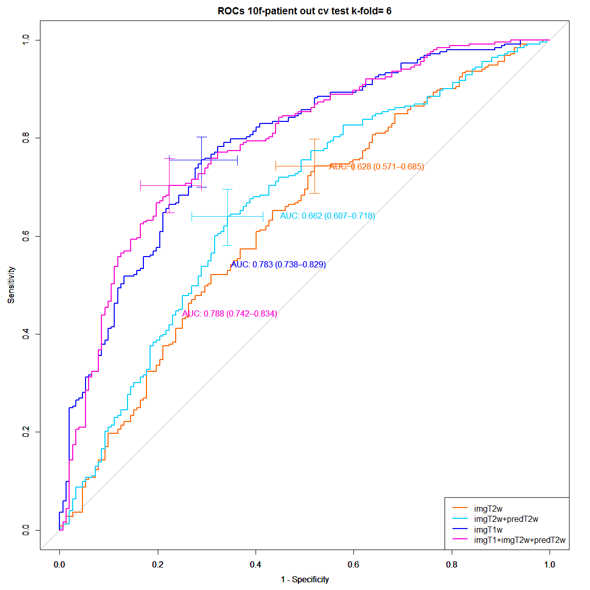 

```
## Area under the curve: 0.788
## 95% CI (2000 stratified bootstrap replicates):
##  thresholds sp.low sp.median sp.high se.low se.median se.high
##   0.4340139 0.7105    0.7763  0.8355 0.6482    0.7036  0.7589
##    massB    massM nonmassB nonmassM 
##      233      155      136       76 
##    massB    massM nonmassB nonmassM 
##       19       19       16        9 
##    massB    massM nonmassB nonmassM 
##      233      155      136       76 
##    massB    massM nonmassB nonmassM 
##       19       19       16        9 
##    massB    massM nonmassB nonmassM 
##      233      155      136       76 
##    massB    massM nonmassB nonmassM 
##       19       19       16        9 
## -0.01351351 0.05 
## Selected features for group: MeanDecreaseGini imgT2 
## =========NULL
##  [1] "T2texture_ASM_threeQuaRad"          "T2texture_correlation_quarterRad"   "ave_T26"                           
##  [4] "T2texture_correlation_threeQuaRad"  "T2texture_dissimilarity_quarterRad" "ave_T218"                          
##  [7] "T2texture_energy_halfRad"           "ave_T216"                           "ave_T211"                          
## [10] "ave_T212"                           "T2RGH_mean"                         "ave_T20"                           
## [13] "T2grad_margin_var"                  "T2texture_homogeneity_halfRad"      "T2texture_dissimilarity_zero"      
## [16] "T2kurt_F_r_i"                       "ave_T22"                            "ave_T29"                           
## [19] "T2_lesionSIstd"                     "T2skew_F_r_i"                       "ave_T24"                           
## [22] "T2_lesionSI"                        "T2RGH_var"                          "T2texture_dissimilarity_halfRad"   
## [25] "T2texture_homogeneity_zero"         "T2max_F_r_i"                        "ave_T217"                          
## [28] "ave_T21"                            "T2texture_contrast_halfRad"         "ave_T210"                          
## [31] "ave_T28"                            "ave_T27"                            "T2grad_margin"                     
## [34] "T2texture_homogeneity_threeQuaRad"  "T2texture_contrast_zero"            "T2min_F_r_i"                       
## 0.04608295 0.05 
## Selected features for group: MeanDecreaseGini allT2 
## =========NULL
##  [1] "T2texture_energy_halfRad"           "T2RGH_mean"                         "T2wSI_predicted"                   
##  [4] "ave_T219"                           "T2texture_correlation_quarterRad"   "ave_T218"                          
##  [7] "T2texture_dissimilarity_quarterRad" "T2skew_F_r_i"                       "LMSIR_predicted"                   
## [10] "T2var_F_r_i"                        "T2texture_correlation_threeQuaRad"  "ave_T216"                          
## [13] "ave_T20"                            "ave_T214"                           "ave_T25"                           
## [16] "T2texture_correlation_halfRad"      "T2grad_margin_var"                  "T2_lesionSI"                       
## [19] "T2texture_correlation_zero"         "T2texture_dissimilarity_halfRad"    "T2texture_homogeneity_quarterRad"  
## [22] "ave_T26"                            "T2max_F_r_i"                        "T2texture_homogeneity_halfRad"     
## [25] "ave_T213"                           "T2kurt_F_r_i"                       "T2texture_contrast_quarterRad"     
## [28] "ave_T27"                            "ave_T210"                           "T2texture_homogeneity_zero"        
## [31] "ave_T28"                            "T2_lesionSIstd"                    
## 0.04069767 0.05 
## Selected features for group: MeanDecreaseGini imgT1 
## =========NULL
##  [1] "circularity"                      "iiMin_change_Variance_uptake"     "alpha_countor"                   
##  [4] "UptakeRate_inside"                "V8"                               "texture_correlation_threeQuaRad" 
##  [7] "min_F_r_i"                        "texture_correlation_quarterRad"   "V7"                              
## [10] "dce2SE7"                          "V17"                              "V5"                              
## [13] "earlySE11"                        "texture_energy_quarterRad"        "Vr_post_1_inside"                
## [16] "texture_contrast_quarterRad"      "lateSE19"                         "texture_ASM_threeQuaRad"         
## [19] "texture_dissimilarity_quarterRad" "lateSE1"                          "V1"                              
## [22] "V16"                              "earlySE5"                         "dce3SE17"                        
## [25] "lateSE14"                         "lateSE11"                         "Vr_decreasingRate_countor"       
## [28] "earlySE7"                         "lateSE9"                          "lateSE7"                         
## [31] "lateSE6"                          "lateSE15"                         "max_RGH_var_k"                   
## [34] "max_RGH_mean_k"                   "edge_sharp_mean"                  "peakCr_inside"                   
## [37] "dce2SE4"                          "lateSE13"                         "maxCr_inside"                    
## [40] "maxVr_inside"                     "A_inside"                        
## -0.2302158 0.05 
## Selected features for group: MeanDecreaseGini all 
## =========NULL
##  [1] "irregularity"                       "texture_correlation_threeQuaRad"    "Slope_ini_inside"                  
##  [4] "ave_T25"                            "earlySE18"                          "edge_sharp_std"                    
##  [7] "T2texture_dissimilarity_quarterRad" "Tpeak_countor"                      "earlySE9"                          
## [10] "V15"                                "dce2SE10"                           "texture_homogeneity_halfRad"       
## [13] "maxVr_inside"                       "SER_inside"                         "dce2SE17"                          
## [16] "lateSE7"                            "texture_energy_quarterRad"          "T2texture_correlation_halfRad"     
## [19] "dce2SE16"                           "V19"                                "T2texture_ASM_halfRad"             
## [22] "dce2SE11"                           "V14"                                "dce2SE0"                           
## [25] "T2texture_dissimilarity_halfRad"    "V7"                                 "edge_sharp_mean"                   
## [28] "V9"                                 "earlySE2"                           "ivVariance"                        
## [31] "earlySE0"                           "V5"                                 "lateSE8"                           
## [34] "max_RGH_var_k"                      "earlySE11"                          "dce2SE12"                          
## [37] "A_inside"                          
##     lesion_id cad_pt_no_txt exam_a_number_txt BIRADS lesion_label               lesion_diagnosis      find_t2_signal_int
## 24         26          0189           5057674      4     nonmassB            SCLEROSING ADENOSIS Hypointense or not seen
## 49         56          0714           5324209      5        massM                 InvasiveDuctal                    None
## 50         57          0714           5324209      5        massM                 InvasiveDuctal                    None
## 51         59          0714           5324209      5     nonmassM                   InsituDuctal                    None
## 54         62          0722           5366177      5        massM                 InvasiveDuctal            Hyperintense
## 205       231          0722           5366177      5     nonmassM                 InvasiveDuctal            Hyperintense
## 63         72          0730           5009497      5        massM                 InvasiveDuctal                    None
## 72         81          0755           5059877      4     nonmassM                   InsituDuctal                    None
## 210       236          0755           5059877      4     nonmassB           BENIGN BREAST TISSUE                    None
## 76         85          0764           5088503      5        massM                 InvasiveDuctal                    None
## 77         86          0764           5088503      5        massM                 InvasiveDuctal                    None
## 85         96          0781           4738440      5     nonmassM                 InvasiveDuctal                    None
## 87         98          0789           4785741      3        massM                   InsituDuctal   Slightly hyperintense
## 125       141          0853           4798586      2     nonmassB                    FIBROCYSTIC                    None
## 219       245          0853           4745782      3     nonmassB                    FIBROCYSTIC   Slightly hyperintense
## 271       297          0853           6696534      4     nonmassM                   InsituDuctal   Slightly hyperintense
## 133       150          0863           4969136      4        massB                 DUCT PAPILLOMA            Hyperintense
## 134       151          0863           4969136      4        massM                InvasiveLobular Hypointense or not seen
## 148       171          6004         ACC108249      6        massM                InvasiveLobular Hypointense or not seen
## 149       172          6004         ACC108249      5     nonmassM                InvasiveLobular                    None
## 226       252          0883           5177385      5     nonmassM                   InsituDuctal                    None
## 277       303          6054           5425486      5        massM                   InsituDuctal                    None
## 288       314          6054           5425486      5        massM                   InsituDuctal                    None
## 289       315          6054           5425486      5        massM                   InsituDuctal                    None
## 362       388          6054           5425486      5        massM                   InsituDuctal                    None
## 363       389          6054           5425486      5        massM                   InsituDuctal                    None
## 285       311          4040           7003416      6        massM                 InvasiveDuctal                    None
## 433       459          4040           7085105      4        massB                   FIBROADENOMA            Hyperintense
## 303       329          0122           5108281      3        massB                           Cyst                    None
## 313       339          0232           6671713      5     nonmassB                    FIBROCYSTIC                    None
## 314       340          0232           6671713      5     nonmassB                    FIBROCYSTIC                    None
## 317       343          0259           7364573      2     nonmassB           BENIGN BREAST TISSUE                    None
## 319       345          0311           6677243      4        massB                   FIBROADENOMA                    None
## 338       364          0580           6855384      4        massB                   FIBROADENOMA                    None
## 341       367          0685           5456684      4        massB                    FIBROCYSTIC                    None
## 345       371          0536           7786869      4        massB                   FIBROADENOMA Hypointense or not seen
## 353       379          0904           7133915      3        massB                    FIBROCYSTIC            Hyperintense
## 396       422          3039           6894870      4        massB                    HYPERPLASIA                    None
## 407       433          3092           4462310      3        massB           BENIGN BREAST TISSUE Hypointense or not seen
## 409       435          3093           7438787      4        massB           BENIGN BREAST TISSUE                    None
## 418       444          4008           7014565      4     nonmassB    ATYPICAL DUCTAL HYPERPLASIA                    None
## 419       445          4008           7014565      6        massB                    HYPERPLASIA                    None
## 421       447          0954           7962026      4        massB   ATYPICAL LOBULAR HYPERPLASIA                    None
## 470       496          7193           7347138      4     nonmassB           BENIGN BREAST TISSUE                    None
## 471       497          7193           7347138      4     nonmassB           BENIGN BREAST TISSUE Hypointense or not seen
## 481       507          0924           7532614      4        massB                       ADENOSIS            Hyperintense
## 482       508          0924           7532614      4        massB                       ADENOSIS Hypointense or not seen
## 484       510          6114           5148523      6     nonmassB           BENIGN BREAST TISSUE                    None
## 495       521          6174           7009629      4     nonmassB    ATYPICAL DUCTAL HYPERPLASIA                    None
## 500       526          3097           6909883      4        massB    ATYPICAL DUCTAL HYPERPLASIA Hypointense or not seen
## 507       533          0129           5326737      4        massB           BENIGN BREAST TISSUE            Hyperintense
## 520       546          0603           4593568      4     nonmassB                       FIBROSIS                    None
## 539       565          0748           4940559      6        massM    ATYPICAL DUCTAL HYPERPLASIA                    None
## 576       602          0934           5314924      4     nonmassB                   FIBROADENOMA                    None
## 583       609          1071           7382882      4     nonmassM                   InsituDuctal                    None
## 611       637          2051           6712632      6        massM                   InsituDuctal                    None
## 612       638          2051           6712632      6     nonmassB                    FIBROCYSTIC                    None
## 641       667          2024           5190122      6     nonmassM                   InsituDuctal Hypointense or not seen
## 648       674          3010           6828446      6        massM                 InvasiveDuctal                    None
## 650       676          3011           6898308      4     nonmassB                    FIBROCYSTIC                    None
## 651       677          3031           7106716      3        massB          COLUMNAR CELL CHANGES Hypointense or not seen
## 656       682          3023           7106703      6        massM                 InvasiveDuctal                    None
## 660       686          4012           7002008      4        massB FOCAL USUAL DUCTAL HYPERPLASIA Hypointense or not seen
## 
## ============ bestune_imgT2 	 max.depth  1 	 #Trees  350 
## ntrees:  50 minsplit:  3 cp:  -1 
##   ntrees minsplit cp acuTrain rocTrain   acuTest   rocTest
## 1     50        3 -1        1        1 0.6190476 0.6540816
## ntrees:  100 minsplit:  3 cp:  -1 
##   ntrees minsplit cp acuTrain rocTrain   acuTest   rocTest
## 2    100        3 -1        1        1 0.5396825 0.5989796
## ntrees:  250 minsplit:  3 cp:  -1 
##   ntrees minsplit cp acuTrain rocTrain   acuTest   rocTest
## 3    250        3 -1        1        1 0.6031746 0.5867347
## ntrees:  350 minsplit:  3 cp:  -1 
##   ntrees minsplit cp acuTrain rocTrain   acuTest   rocTest
## 4    350        3 -1        1        1 0.6031746 0.6183673
## ntrees:  500 minsplit:  3 cp:  -1 
##   ntrees minsplit cp acuTrain rocTrain   acuTest   rocTest
## 5    500        3 -1        1        1 0.6190476 0.6693878
## ntrees:  50 minsplit:  1 cp:  -1 
##   ntrees minsplit cp acuTrain rocTrain   acuTest   rocTest
## 6     50        1 -1        1        1 0.6349206 0.6357143
## ntrees:  100 minsplit:  1 cp:  -1 
##   ntrees minsplit cp acuTrain rocTrain   acuTest   rocTest
## 7    100        1 -1        1        1 0.6507937 0.7071429
## ntrees:  250 minsplit:  1 cp:  -1 
##   ntrees minsplit cp acuTrain rocTrain   acuTest   rocTest
## 8    250        1 -1        1        1 0.5714286 0.6397959
## ntrees:  350 minsplit:  1 cp:  -1 
##   ntrees minsplit cp acuTrain rocTrain   acuTest   rocTest
## 9    350        1 -1        1        1 0.6031746 0.6244898
## ntrees:  500 minsplit:  1 cp:  -1 
##    ntrees minsplit cp acuTrain rocTrain   acuTest   rocTest
## 10    500        1 -1        1        1 0.5714286 0.6428571
## ntrees:  50 minsplit:  0 cp:  -1 
##    ntrees minsplit cp acuTrain rocTrain   acuTest   rocTest
## 11     50        0 -1        1        1 0.6190476 0.6183673
## ntrees:  100 minsplit:  0 cp:  -1 
##    ntrees minsplit cp acuTrain rocTrain   acuTest   rocTest
## 12    100        0 -1        1        1 0.6349206 0.7061224
## ntrees:  250 minsplit:  0 cp:  -1 
##    ntrees minsplit cp acuTrain rocTrain   acuTest   rocTest
## 13    250        0 -1        1        1 0.6031746 0.6581633
## ntrees:  350 minsplit:  0 cp:  -1 
##    ntrees minsplit cp acuTrain rocTrain   acuTest   rocTest
## 14    350        0 -1        1        1 0.5714286 0.6142857
## ntrees:  500 minsplit:  0 cp:  -1 
##    ntrees minsplit cp acuTrain rocTrain   acuTest   rocTest
## 15    500        0 -1        1        1 0.5873016 0.6234694
##    ntrees minsplit cp acuTrain rocTrain   acuTest   rocTest
## 1      50        3 -1        1        1 0.6190476 0.6540816
## 2     100        3 -1        1        1 0.5396825 0.5989796
## 3     250        3 -1        1        1 0.6031746 0.5867347
## 4     350        3 -1        1        1 0.6031746 0.6183673
## 5     500        3 -1        1        1 0.6190476 0.6693878
## 6      50        1 -1        1        1 0.6349206 0.6357143
## 7     100        1 -1        1        1 0.6507937 0.7071429
## 8     250        1 -1        1        1 0.5714286 0.6397959
## 9     350        1 -1        1        1 0.6031746 0.6244898
## 10    500        1 -1        1        1 0.5714286 0.6428571
## 11     50        0 -1        1        1 0.6190476 0.6183673
## 12    100        0 -1        1        1 0.6349206 0.7061224
## 13    250        0 -1        1        1 0.6031746 0.6581633
## 14    350        0 -1        1        1 0.5714286 0.6142857
## 15    500        0 -1        1        1 0.5873016 0.6234694
##   ntrees minsplit cp acuTrain rocTrain   acuTest   rocTest
## 7    100        1 -1        1        1 0.6507937 0.7071429
## 
## ============ bestune_allT2 	 max.depth  1 	 #Trees  250 
## ntrees:  50 minsplit:  3 cp:  -1 
##   ntrees minsplit cp acuTrain rocTrain   acuTest   rocTest
## 1     50        3 -1        1        1 0.5714286 0.6408163
## ntrees:  100 minsplit:  3 cp:  -1 
##   ntrees minsplit cp acuTrain rocTrain   acuTest   rocTest
## 2    100        3 -1        1        1 0.6825397 0.6887755
## ntrees:  250 minsplit:  3 cp:  -1 
##   ntrees minsplit cp acuTrain rocTrain   acuTest   rocTest
## 3    250        3 -1        1        1 0.6507937 0.6612245
## ntrees:  350 minsplit:  3 cp:  -1 
##   ntrees minsplit cp acuTrain rocTrain   acuTest   rocTest
## 4    350        3 -1        1        1 0.6507937 0.7153061
## ntrees:  500 minsplit:  3 cp:  -1 
##   ntrees minsplit cp acuTrain rocTrain   acuTest   rocTest
## 5    500        3 -1        1        1 0.6666667 0.7020408
## ntrees:  50 minsplit:  1 cp:  -1 
##   ntrees minsplit cp acuTrain rocTrain   acuTest   rocTest
## 6     50        1 -1        1        1 0.5714286 0.7295918
## ntrees:  100 minsplit:  1 cp:  -1 
##   ntrees minsplit cp acuTrain rocTrain   acuTest   rocTest
## 7    100        1 -1        1        1 0.6349206 0.6244898
## ntrees:  250 minsplit:  1 cp:  -1 
##   ntrees minsplit cp acuTrain rocTrain   acuTest   rocTest
## 8    250        1 -1        1        1 0.5873016 0.6877551
## ntrees:  350 minsplit:  1 cp:  -1 
##   ntrees minsplit cp acuTrain rocTrain   acuTest   rocTest
## 9    350        1 -1        1        1 0.6984127 0.7234694
## ntrees:  500 minsplit:  1 cp:  -1 
##    ntrees minsplit cp acuTrain rocTrain   acuTest   rocTest
## 10    500        1 -1        1        1 0.6507937 0.6938776
## ntrees:  50 minsplit:  0 cp:  -1 
##    ntrees minsplit cp acuTrain rocTrain   acuTest   rocTest
## 11     50        0 -1        1        1 0.5873016 0.6806122
## ntrees:  100 minsplit:  0 cp:  -1 
##    ntrees minsplit cp acuTrain rocTrain   acuTest   rocTest
## 12    100        0 -1        1        1 0.6507937 0.6693878
## ntrees:  250 minsplit:  0 cp:  -1 
##    ntrees minsplit cp acuTrain rocTrain   acuTest   rocTest
## 13    250        0 -1        1        1 0.6666667 0.6887755
## ntrees:  350 minsplit:  0 cp:  -1 
##    ntrees minsplit cp acuTrain rocTrain   acuTest   rocTest
## 14    350        0 -1        1        1 0.6507937 0.6969388
## ntrees:  500 minsplit:  0 cp:  -1 
##    ntrees minsplit cp acuTrain rocTrain   acuTest  rocTest
## 15    500        0 -1        1        1 0.6984127 0.722449
##    ntrees minsplit cp acuTrain rocTrain   acuTest   rocTest
## 1      50        3 -1        1        1 0.5714286 0.6408163
## 2     100        3 -1        1        1 0.6825397 0.6887755
## 3     250        3 -1        1        1 0.6507937 0.6612245
## 4     350        3 -1        1        1 0.6507937 0.7153061
## 5     500        3 -1        1        1 0.6666667 0.7020408
## 6      50        1 -1        1        1 0.5714286 0.7295918
## 7     100        1 -1        1        1 0.6349206 0.6244898
## 8     250        1 -1        1        1 0.5873016 0.6877551
## 9     350        1 -1        1        1 0.6984127 0.7234694
## 10    500        1 -1        1        1 0.6507937 0.6938776
## 11     50        0 -1        1        1 0.5873016 0.6806122
## 12    100        0 -1        1        1 0.6507937 0.6693878
## 13    250        0 -1        1        1 0.6666667 0.6887755
## 14    350        0 -1        1        1 0.6507937 0.6969388
## 15    500        0 -1        1        1 0.6984127 0.7224490
##   ntrees minsplit cp acuTrain rocTrain   acuTest   rocTest
## 6     50        1 -1        1        1 0.5714286 0.7295918
## 
## ============ bestune_imgT1 	 max.depth  1 	 #Trees  250 
## ntrees:  50 minsplit:  3 cp:  -1 
##   ntrees minsplit cp acuTrain rocTrain   acuTest   rocTest
## 1     50        3 -1        1        1 0.7619048 0.7959184
## ntrees:  100 minsplit:  3 cp:  -1 
##   ntrees minsplit cp acuTrain rocTrain   acuTest   rocTest
## 2    100        3 -1        1        1 0.7460317 0.8183673
## ntrees:  250 minsplit:  3 cp:  -1 
##   ntrees minsplit cp acuTrain rocTrain   acuTest   rocTest
## 3    250        3 -1        1        1 0.7460317 0.8142857
## ntrees:  350 minsplit:  3 cp:  -1 
##   ntrees minsplit cp acuTrain rocTrain   acuTest   rocTest
## 4    350        3 -1        1        1 0.7142857 0.8132653
## ntrees:  500 minsplit:  3 cp:  -1 
##   ntrees minsplit cp acuTrain rocTrain   acuTest   rocTest
## 5    500        3 -1        1        1 0.7460317 0.8061224
## ntrees:  50 minsplit:  1 cp:  -1 
##   ntrees minsplit cp acuTrain rocTrain   acuTest   rocTest
## 6     50        1 -1        1        1 0.6507937 0.7418367
## ntrees:  100 minsplit:  1 cp:  -1 
##   ntrees minsplit cp acuTrain rocTrain   acuTest  rocTest
## 7    100        1 -1        1        1 0.7619048 0.805102
## ntrees:  250 minsplit:  1 cp:  -1 
##   ntrees minsplit cp acuTrain rocTrain   acuTest   rocTest
## 8    250        1 -1        1        1 0.7619048 0.7959184
## ntrees:  350 minsplit:  1 cp:  -1 
##   ntrees minsplit cp acuTrain rocTrain   acuTest  rocTest
## 9    350        1 -1        1        1 0.7777778 0.794898
## ntrees:  500 minsplit:  1 cp:  -1 
##    ntrees minsplit cp acuTrain rocTrain   acuTest rocTest
## 10    500        1 -1        1        1 0.7301587     0.8
## ntrees:  50 minsplit:  0 cp:  -1 
##    ntrees minsplit cp acuTrain rocTrain   acuTest   rocTest
## 11     50        0 -1        1        1 0.7460317 0.7867347
## ntrees:  100 minsplit:  0 cp:  -1 
##    ntrees minsplit cp acuTrain rocTrain   acuTest   rocTest
## 12    100        0 -1        1        1 0.7619048 0.8183673
## ntrees:  250 minsplit:  0 cp:  -1 
##    ntrees minsplit cp acuTrain rocTrain   acuTest   rocTest
## 13    250        0 -1        1        1 0.7619048 0.8061224
## ntrees:  350 minsplit:  0 cp:  -1 
##    ntrees minsplit cp acuTrain rocTrain   acuTest   rocTest
## 14    350        0 -1        1        1 0.7460317 0.7928571
## ntrees:  500 minsplit:  0 cp:  -1 
##    ntrees minsplit cp acuTrain rocTrain   acuTest   rocTest
## 15    500        0 -1        1        1 0.7777778 0.8183673
##    ntrees minsplit cp acuTrain rocTrain   acuTest   rocTest
## 1      50        3 -1        1        1 0.7619048 0.7959184
## 2     100        3 -1        1        1 0.7460317 0.8183673
## 3     250        3 -1        1        1 0.7460317 0.8142857
## 4     350        3 -1        1        1 0.7142857 0.8132653
## 5     500        3 -1        1        1 0.7460317 0.8061224
## 6      50        1 -1        1        1 0.6507937 0.7418367
## 7     100        1 -1        1        1 0.7619048 0.8051020
## 8     250        1 -1        1        1 0.7619048 0.7959184
## 9     350        1 -1        1        1 0.7777778 0.7948980
## 10    500        1 -1        1        1 0.7301587 0.8000000
## 11     50        0 -1        1        1 0.7460317 0.7867347
## 12    100        0 -1        1        1 0.7619048 0.8183673
## 13    250        0 -1        1        1 0.7619048 0.8061224
## 14    350        0 -1        1        1 0.7460317 0.7928571
## 15    500        0 -1        1        1 0.7777778 0.8183673
##    ntrees minsplit cp acuTrain rocTrain   acuTest   rocTest
## 2     100        3 -1        1        1 0.7460317 0.8183673
## 12    100        0 -1        1        1 0.7619048 0.8183673
## 15    500        0 -1        1        1 0.7777778 0.8183673
## 
## ============ bestune_all 	 max.depth  1 	 #Trees  200 
## ntrees:  50 minsplit:  3 cp:  -1 
##   ntrees minsplit cp acuTrain rocTrain   acuTest   rocTest
## 1     50        3 -1        1        1 0.7142857 0.7653061
## ntrees:  100 minsplit:  3 cp:  -1 
##   ntrees minsplit cp acuTrain rocTrain   acuTest   rocTest
## 2    100        3 -1        1        1 0.6507937 0.7714286
## ntrees:  250 minsplit:  3 cp:  -1 
##   ntrees minsplit cp acuTrain rocTrain   acuTest   rocTest
## 3    250        3 -1        1        1 0.6984127 0.7755102
## ntrees:  350 minsplit:  3 cp:  -1 
##   ntrees minsplit cp acuTrain rocTrain   acuTest  rocTest
## 4    350        3 -1        1        1 0.6666667 0.805102
## ntrees:  500 minsplit:  3 cp:  -1 
##   ntrees minsplit cp acuTrain rocTrain   acuTest   rocTest
## 5    500        3 -1        1        1 0.6666667 0.7867347
## ntrees:  50 minsplit:  1 cp:  -1 
##   ntrees minsplit cp acuTrain rocTrain   acuTest   rocTest
## 6     50        1 -1        1        1 0.6984127 0.7673469
## ntrees:  100 minsplit:  1 cp:  -1 
##   ntrees minsplit cp acuTrain rocTrain   acuTest   rocTest
## 7    100        1 -1        1        1 0.6825397 0.7806122
## ntrees:  250 minsplit:  1 cp:  -1 
##   ntrees minsplit cp acuTrain rocTrain   acuTest   rocTest
## 8    250        1 -1        1        1 0.7301587 0.7795918
## ntrees:  350 minsplit:  1 cp:  -1 
##   ntrees minsplit cp acuTrain rocTrain   acuTest   rocTest
## 9    350        1 -1        1        1 0.6666667 0.7816327
## ntrees:  500 minsplit:  1 cp:  -1 
##    ntrees minsplit cp acuTrain rocTrain   acuTest  rocTest
## 10    500        1 -1        1        1 0.6825397 0.794898
## ntrees:  50 minsplit:  0 cp:  -1 
##    ntrees minsplit cp acuTrain rocTrain   acuTest   rocTest
## 11     50        0 -1        1        1 0.7460317 0.8102041
## ntrees:  100 minsplit:  0 cp:  -1 
##    ntrees minsplit cp acuTrain rocTrain   acuTest   rocTest
## 12    100        0 -1        1        1 0.6666667 0.7897959
## ntrees:  250 minsplit:  0 cp:  -1 
##    ntrees minsplit cp acuTrain rocTrain   acuTest   rocTest
## 13    250        0 -1        1        1 0.6349206 0.7571429
## ntrees:  350 minsplit:  0 cp:  -1 
##    ntrees minsplit cp acuTrain rocTrain   acuTest   rocTest
## 14    350        0 -1        1        1 0.6984127 0.7969388
## ntrees:  500 minsplit:  0 cp:  -1 
##    ntrees minsplit cp acuTrain rocTrain   acuTest   rocTest
## 15    500        0 -1        1        1 0.6825397 0.7897959
##    ntrees minsplit cp acuTrain rocTrain   acuTest   rocTest
## 1      50        3 -1        1        1 0.7142857 0.7653061
## 2     100        3 -1        1        1 0.6507937 0.7714286
## 3     250        3 -1        1        1 0.6984127 0.7755102
## 4     350        3 -1        1        1 0.6666667 0.8051020
## 5     500        3 -1        1        1 0.6666667 0.7867347
## 6      50        1 -1        1        1 0.6984127 0.7673469
## 7     100        1 -1        1        1 0.6825397 0.7806122
## 8     250        1 -1        1        1 0.7301587 0.7795918
## 9     350        1 -1        1        1 0.6666667 0.7816327
## 10    500        1 -1        1        1 0.6825397 0.7948980
## 11     50        0 -1        1        1 0.7460317 0.8102041
## 12    100        0 -1        1        1 0.6666667 0.7897959
## 13    250        0 -1        1        1 0.6349206 0.7571429
## 14    350        0 -1        1        1 0.6984127 0.7969388
## 15    500        0 -1        1        1 0.6825397 0.7897959
##    ntrees minsplit cp acuTrain rocTrain   acuTest   rocTest
## 11     50        0 -1        1        1 0.7460317 0.8102041
## 
## Call:
## roc.default(response = perf_imgT2$obs, predictor = perf_imgT2$C)
## 
## Data: perf_imgT2$C in 180 controls (perf_imgT2$obs C) > 288 cases (perf_imgT2$obs NC).
## Area under the curve: 0.6379
## 
## Call:
## roc.default(response = perf_allT2$obs, predictor = perf_allT2$C)
## 
## Data: perf_allT2$C in 180 controls (perf_allT2$obs C) > 288 cases (perf_allT2$obs NC).
## Area under the curve: 0.6698
## 
## Call:
## roc.default(response = perf_imgT1$obs, predictor = perf_imgT1$C)
## 
## Data: perf_imgT1$C in 180 controls (perf_imgT1$obs C) > 288 cases (perf_imgT1$obs NC).
## Area under the curve: 0.7875
## 
## Call:
## roc.default(response = perf_all$obs, predictor = perf_all$C)
## 
## Data: perf_all$C in 180 controls (perf_all$obs C) > 288 cases (perf_all$obs NC).
## Area under the curve: 0.791
```

```
## Area under the curve: 0.6379
## 95% CI (2000 stratified bootstrap replicates):
##  thresholds sp.low sp.median sp.high se.low se.median se.high
##   0.4933966 0.4111    0.4833  0.5556 0.6944    0.7465  0.7986
```

```
## Area under the curve: 0.6698
## 95% CI (2000 stratified bootstrap replicates):
##  thresholds sp.low sp.median sp.high se.low se.median se.high
##   0.4422979 0.6222    0.6944  0.7611 0.5556    0.6111  0.6701
```

```
## Area under the curve: 0.7875
## 95% CI (2000 stratified bootstrap replicates):
##  thresholds sp.low sp.median sp.high se.low se.median se.high
##   0.4514928 0.6611    0.7278  0.7889 0.6944    0.7465  0.7951
```

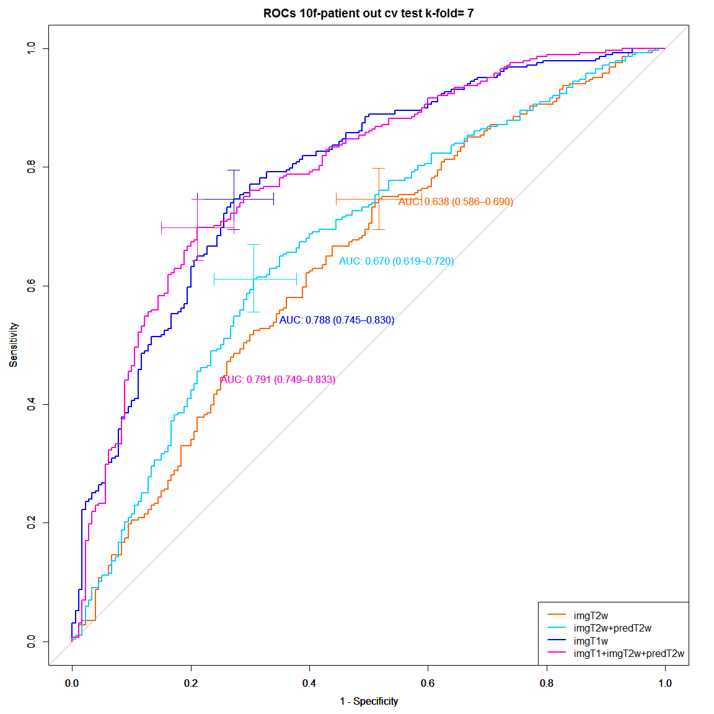 

```
## Area under the curve: 0.791
## 95% CI (2000 stratified bootstrap replicates):
##  thresholds sp.low sp.median sp.high se.low se.median se.high
##   0.4340139 0.7278    0.7889    0.85 0.6424    0.6979  0.7465
##    massB    massM nonmassB nonmassM 
##      222      157      137       79 
##    massB    massM nonmassB nonmassM 
##       30       17       15        6 
##    massB    massM nonmassB nonmassM 
##      222      157      137       79 
##    massB    massM nonmassB nonmassM 
##       30       17       15        6 
##    massB    massM nonmassB nonmassM 
##      222      157      137       79 
##    massB    massM nonmassB nonmassM 
##       30       17       15        6 
## 0 0.05 
## Selected features for group: MeanDecreaseGini imgT2 
## =========NULL
##  [1] "T2texture_energy_quarterRad"      "T2texture_correlation_halfRad"    "T2grad_margin_var"               
##  [4] "ave_T26"                          "ave_T23"                          "ave_T218"                        
##  [7] "T2texture_homogeneity_quarterRad" "T2texture_homogeneity_halfRad"    "T2texture_homogeneity_zero"      
## [10] "ave_T213"                         "ave_T211"                         "ave_T215"                        
## [13] "T2_lesionSI"                      "ave_T20"                          "ave_T214"                        
## [16] "ave_T28"                          "T2texture_energy_zero"            "T2texture_ASM_threeQuaRad"       
## [19] "T2RGH_var"                        "ave_T219"                         "T2texture_correlation_zero"      
## [22] "T2texture_contrast_zero"          "T2kurt_F_r_i"                     "ave_T25"                         
## [25] "T2_lesionSIstd"                   "ave_T22"                          "T2texture_correlation_quarterRad"
## [28] "ave_T21"                          "T2min_F_r_i"                     
## -0.01357466 0.05 
## Selected features for group: MeanDecreaseGini allT2 
## =========NULL
##  [1] "T2texture_ASM_quarterRad"            "T2texture_correlation_quarterRad"    "T2texture_contrast_quarterRad"      
##  [4] "T2kurt_F_r_i"                        "ave_T216"                            "T2RGH_var"                          
##  [7] "ave_T219"                            "ave_T23"                             "ave_T25"                            
## [10] "T2_lesionSIstd"                      "T2texture_ASM_threeQuaRad"           "ave_T21"                            
## [13] "ave_T210"                            "ave_T28"                             "LMSIR_predicted"                    
## [16] "ave_T24"                             "T2texture_dissimilarity_threeQuaRad" "T2texture_correlation_halfRad"      
## [19] "T2max_F_r_i"                         "ave_T212"                            "T2min_F_r_i"                        
## [22] "ave_T217"                            "T2texture_homogeneity_threeQuaRad"   "ave_T215"                           
## [25] "ave_T22"                             "T2texture_dissimilarity_zero"        "T2texture_homogeneity_halfRad"      
## [28] "T2texture_homogeneity_quarterRad"    "T2texture_contrast_threeQuaRad"      "ave_T29"                            
## [31] "T2skew_F_r_i"                        "T2texture_correlation_zero"          "T2_lesionSI"                        
## -0.006622517 0.05 
## Selected features for group: MeanDecreaseGini imgT1 
## =========NULL
##  [1] "irregularity"                    "SER_countor"                     "texture_correlation_quarterRad" 
##  [4] "V3"                              "earlySE7"                        "V18"                            
##  [7] "kurt_F_r_i"                      "skew_F_r_i"                      "A_inside"                       
## [10] "texture_energy_halfRad"          "beta_inside"                     "maxVr_countor"                  
## [13] "Kpeak_inside"                    "earlySE4"                        "dce3SE14"                       
## [16] "earlySE8"                        "lateSE8"                         "texture_contrast_halfRad"       
## [19] "edge_sharp_std"                  "texture_contrast_quarterRad"     "max_RGH_mean"                   
## [22] "texture_homogeneity_threeQuaRad" "earlySE13"                       "dce2SE1"                        
## [25] "dce3SE11"                        "V9"                              "lateSE11"                       
## [28] "earlySE2"                        "dce2SE17"                        "max_RGH_var_k"                  
## [31] "alpha_inside"                   
## 0.06329114 0.05 
## -0.02027027 0.05 
## Selected features for group: MeanDecreaseGini all 
## =========NULL
##  [1] "circularity"                       "Tpeak_countor"                     "var_F_r_i"                        
##  [4] "earlySE8"                          "earlySE18"                         "earlySE3"                         
##  [7] "V12"                               "ave_T216"                          "T2texture_energy_quarterRad"      
## [10] "T2texture_correlation_threeQuaRad" "V0"                                "T2texture_correlation_zero"       
## [13] "texture_ASM_threeQuaRad"           "T2texture_homogeneity_halfRad"     "dce3SE10"                         
## [16] "texture_contrast_zero"             "V18"                               "lateSE14"                         
## [19] "texture_homogeneity_threeQuaRad"   "dce2SE1"                           "lateSE0"                          
## [22] "dce2SE11"                          "lateSE2"                           "T2texture_contrast_threeQuaRad"   
## [25] "texture_dissimilarity_quarterRad"  "ave_T25"                           "lateSE5"                          
## [28] "lateSE13"                          "texture_correlation_quarterRad"    "texture_correlation_zero"         
## [31] "iiMin_change_Variance_uptake"      "ave_T219"                          "A_inside"                         
##     lesion_id cad_pt_no_txt exam_a_number_txt BIRADS lesion_label                           lesion_diagnosis      find_t2_signal_int
## 23         25          0173           5123923      4     nonmassB                             DUCT PAPILLOMA                    None
## 38         42          0690           5180451      3     nonmassB                                FIBROCYSTIC                    None
## 204       230          0690           5180451      3        massB                   USUAL DUCTAL HYPERPLASIA   Slightly hyperintense
## 343       369          0690           6681276      4     nonmassB                      COLUMNAR CELL CHANGES Hypointense or not seen
## 530       556          0690           6681276      4     nonmassB                                FIBROCYSTIC                    None
## 44         49          0707           5184832      4     nonmassB                   COMPLEX PAPILLARY LESION Hypointense or not seen
## 532       558          0707           5184832      4     nonmassB                   COMPLEX PAPILLARY LESION Hypointense or not seen
## 52         60          0718           4962581      4        massB                                FIBROCYSTIC                    None
## 62         71          0729           4805710      4        massB               ATYPICAL LOBULAR HYPERPLASIA                    None
## 65         74          0735           5276000      5        massM                             InvasiveDuctal                    None
## 67         76          0744           4848278      5        massM                             InvasiveDuctal                    None
## 86         97          0783           4758418      3        massB                                FIBROCYSTIC            Hyperintense
## 94        105          0796            860773      4     nonmassB               ATYPICAL LOBULAR HYPERPLASIA                    None
## 101       114          0813           5378164      5     nonmassB                                FIBROCYSTIC                    None
## 217       243          0813           5378164      5        massM                            InvasiveLobular                    None
## 116       131          0199           4362726      4        massB               ATYPICAL LOBULAR HYPERPLASIA            Hyperintense
## 153       177          6014           5101372      6        massM                             InvasiveDuctal                    None
## 177       202          6037           5043444      5        massM                             InvasiveDuctal                    None
## 178       203          6037           5043444      5        massM                             InvasiveDuctal                    None
## 182       207          6039         ACC109197      5        massM                               InsituDuctal            Hyperintense
## 183       208          6039         ACC109197      5     nonmassM                               InsituDuctal                    None
## 236       262          6039         ACC109197      5        massM                               InsituDuctal            Hyperintense
## 199       225          6048           5284266      6        massM                             InvasiveDuctal                    None
## 202       228          0681           4999374      3        massB                                FIBROCYSTIC   Slightly hyperintense
## 207       233          0742           5329785      4        massB                             DUCT PAPILLOMA                    None
## 208       234          0742           5329785      4     nonmassM                             InvasiveDuctal                    None
## 221       247          0871           5130094      4        massM                            InvasiveLobular                    None
## 222       248          0871           5130094      4        massM                               InsituDuctal                    None
## 223       249          0871           5130094      4        massM                            InvasiveLobular                    None
## 261       287          0635           7092156      4        massM                             InvasiveDuctal Hypointense or not seen
## 318       344          0293           7491268      4     nonmassB                       BENIGN BREAST TISSUE                    None
## 335       361          0424           4644689      6        massM                             InvasiveDuctal                    None
## 351       377          0887           6794529      4        massB                                FIBROCYSTIC Hypointense or not seen
## 367       393          7030           7538617      4        massB                       BENIGN BREAST TISSUE   Slightly hyperintense
## 368       394          7030           7538617      4        massB                       BENIGN BREAST TISSUE Hypointense or not seen
## 378       404          7097           6805449      4        massB                        SCLEROSING ADENOSIS Hypointense or not seen
## 379       405          7097           6805449      4        massB                               FIBROADENOMA                    None
## 380       406          7097           7388464      2        massB                ATYPICAL DUCTAL HYPERPLASIA   Slightly hyperintense
## 401       427          3053           7041483      6        massB                      COLUMNAR CELL CHANGES Hypointense or not seen
## 402       428          3053           7449310      5     nonmassM                             InvasiveDuctal                    None
## 447       473          3053           7041483      6        massB                      COLUMNAR CELL CHANGES Hypointense or not seen
## 448       474          3053           7449310      5     nonmassM                             InvasiveDuctal                    None
## 420       446          4047           7009608      4        massB                                FIBROCYSTIC Hypointense or not seen
## 422       448          4026           6998219      4        massB                ATYPICAL DUCTAL HYPERPLASIA Hypointense or not seen
## 428       454          4017           6979356      4        massB                   USUAL DUCTAL HYPERPLASIA Hypointense or not seen
## 429       455          4017           6979356      4        massB                   USUAL DUCTAL HYPERPLASIA Hypointense or not seen
## 435       461          4044           7066571      4        massB                           FIBROADENOMATOID            Hyperintense
## 436       462          4044           7066571      4        massB                      FOCAL CELLULAR STROMA            Hyperintense
## 437       463          4044           7066571      4        massB                               FIBROADENOMA   Slightly hyperintense
## 438       464          3078           4836946      5     nonmassB                              InsituLobular                    None
## 439       465          4045           7092118      4        massB                               FIBROADENOMA                    None
## 475       501          0510           7662547      4     nonmassB                      COLUMNAR CELL CHANGES                    None
## 476       502          0510           7662547      4     nonmassB                      COLUMNAR CELL CHANGES                    None
## 493       519          6164           6971531      4        massB                       BENIGN BREAST TISSUE Hypointense or not seen
## 531       557          0692           5199366      4        massB                               FIBROADENOMA Hypointense or not seen
## 538       564          0743           4827839      4        massM                             InvasiveDuctal Hypointense or not seen
## 561       587          0993           6979299      4        massB                            PHYLLODES TUMOR            Hyperintense
## 574       600          0952           7105222      4     nonmassB             FOCAL USUAL DUCTAL HYPERPLASIA Hypointense or not seen
## 575       601          0952           7105222      4     nonmassB                               FIBROADENOMA            Hyperintense
## 616       642          2065           7604632      4     nonmassB                              InsituLobular                    None
## 626       652          2078           5116776      4        massB                       BENIGN BREAST TISSUE            Hyperintense
## 633       659          1026           6907382      4        massB DENSE FIBROSIS AND FIBROADENOMATOID CHANGE            Hyperintense
## 635       661          1072           7554174      6        massM                             InvasiveDuctal   Slightly hyperintense
## 636       662          1072           7554174      4        massB                SCLEROSING PAPILLARY LESION Hypointense or not seen
## 640       666          2017           7397047      6        massB                   RADIAL SCLEROSING LESION                    None
## 663       689          3072           7054863      6     nonmassM                               InsituDuctal                    None
## 666       692          3075           7064471      6        massM                             InvasiveDuctal                    None
## 667       693          3075           7064471      6     nonmassM                               InsituDuctal                    None
## 
## ============ bestune_imgT2 	 max.depth  1 	 #Trees  350 
## ntrees:  50 minsplit:  3 cp:  -1 
##   ntrees minsplit cp acuTrain rocTrain   acuTest   rocTest
## 1     50        3 -1        1        1 0.6470588 0.6724638
## ntrees:  100 minsplit:  3 cp:  -1 
##   ntrees minsplit cp acuTrain rocTrain   acuTest   rocTest
## 2    100        3 -1        1        1 0.7058824 0.6782609
## ntrees:  250 minsplit:  3 cp:  -1 
##   ntrees minsplit cp acuTrain rocTrain   acuTest   rocTest
## 3    250        3 -1        1        1 0.6617647 0.6570048
## ntrees:  350 minsplit:  3 cp:  -1 
##   ntrees minsplit cp acuTrain rocTrain   acuTest   rocTest
## 4    350        3 -1        1        1 0.6764706 0.6995169
## ntrees:  500 minsplit:  3 cp:  -1 
##   ntrees minsplit cp acuTrain rocTrain   acuTest  rocTest
## 5    500        3 -1        1        1 0.6764706 0.715942
## ntrees:  50 minsplit:  1 cp:  -1 
##   ntrees minsplit cp acuTrain rocTrain   acuTest   rocTest
## 6     50        1 -1        1        1 0.6470588 0.6811594
## ntrees:  100 minsplit:  1 cp:  -1 
##   ntrees minsplit cp acuTrain rocTrain   acuTest   rocTest
## 7    100        1 -1        1        1 0.6470588 0.6512077
## ntrees:  250 minsplit:  1 cp:  -1 
##   ntrees minsplit cp acuTrain rocTrain   acuTest   rocTest
## 8    250        1 -1        1        1 0.6617647 0.7458937
## ntrees:  350 minsplit:  1 cp:  -1 
##   ntrees minsplit cp acuTrain rocTrain   acuTest   rocTest
## 9    350        1 -1        1        1 0.6617647 0.7082126
## ntrees:  500 minsplit:  1 cp:  -1 
##    ntrees minsplit cp acuTrain rocTrain   acuTest   rocTest
## 10    500        1 -1        1        1 0.6617647 0.6927536
## ntrees:  50 minsplit:  0 cp:  -1 
##    ntrees minsplit cp acuTrain rocTrain   acuTest   rocTest
## 11     50        0 -1        1        1 0.6323529 0.6705314
## ntrees:  100 minsplit:  0 cp:  -1 
##    ntrees minsplit cp acuTrain rocTrain   acuTest  rocTest
## 12    100        0 -1        1        1 0.5882353 0.610628
## ntrees:  250 minsplit:  0 cp:  -1 
##    ntrees minsplit cp acuTrain rocTrain   acuTest   rocTest
## 13    250        0 -1        1        1 0.6617647 0.6869565
## ntrees:  350 minsplit:  0 cp:  -1 
##    ntrees minsplit cp acuTrain rocTrain   acuTest   rocTest
## 14    350        0 -1        1        1 0.6470588 0.6898551
## ntrees:  500 minsplit:  0 cp:  -1 
##    ntrees minsplit cp acuTrain rocTrain   acuTest   rocTest
## 15    500        0 -1        1        1 0.6470588 0.6937198
##    ntrees minsplit cp acuTrain rocTrain   acuTest   rocTest
## 1      50        3 -1        1        1 0.6470588 0.6724638
## 2     100        3 -1        1        1 0.7058824 0.6782609
## 3     250        3 -1        1        1 0.6617647 0.6570048
## 4     350        3 -1        1        1 0.6764706 0.6995169
## 5     500        3 -1        1        1 0.6764706 0.7159420
## 6      50        1 -1        1        1 0.6470588 0.6811594
## 7     100        1 -1        1        1 0.6470588 0.6512077
## 8     250        1 -1        1        1 0.6617647 0.7458937
## 9     350        1 -1        1        1 0.6617647 0.7082126
## 10    500        1 -1        1        1 0.6617647 0.6927536
## 11     50        0 -1        1        1 0.6323529 0.6705314
## 12    100        0 -1        1        1 0.5882353 0.6106280
## 13    250        0 -1        1        1 0.6617647 0.6869565
## 14    350        0 -1        1        1 0.6470588 0.6898551
## 15    500        0 -1        1        1 0.6470588 0.6937198
##   ntrees minsplit cp acuTrain rocTrain   acuTest   rocTest
## 8    250        1 -1        1        1 0.6617647 0.7458937
## 
## ============ bestune_allT2 	 max.depth  1 	 #Trees  250 
## ntrees:  50 minsplit:  3 cp:  -1 
##   ntrees minsplit cp acuTrain rocTrain   acuTest  rocTest
## 1     50        3 -1        1        1 0.5441176 0.578744
## ntrees:  100 minsplit:  3 cp:  -1 
##   ntrees minsplit cp acuTrain rocTrain   acuTest   rocTest
## 2    100        3 -1        1        1 0.5735294 0.5671498
## ntrees:  250 minsplit:  3 cp:  -1 
##   ntrees minsplit cp acuTrain rocTrain   acuTest   rocTest
## 3    250        3 -1        1        1 0.6323529 0.6019324
## ntrees:  350 minsplit:  3 cp:  -1 
##   ntrees minsplit cp acuTrain rocTrain   acuTest   rocTest
## 4    350        3 -1        1        1 0.6176471 0.5922705
## ntrees:  500 minsplit:  3 cp:  -1 
##   ntrees minsplit cp acuTrain rocTrain   acuTest   rocTest
## 5    500        3 -1        1        1 0.6176471 0.6193237
## ntrees:  50 minsplit:  1 cp:  -1 
##   ntrees minsplit cp acuTrain rocTrain   acuTest   rocTest
## 6     50        1 -1        1        1 0.5735294 0.5082126
## ntrees:  100 minsplit:  1 cp:  -1 
##   ntrees minsplit cp acuTrain rocTrain   acuTest   rocTest
## 7    100        1 -1        1        1 0.6176471 0.6057971
## ntrees:  250 minsplit:  1 cp:  -1 
##   ntrees minsplit cp acuTrain rocTrain   acuTest   rocTest
## 8    250        1 -1        1        1 0.6323529 0.6019324
## ntrees:  350 minsplit:  1 cp:  -1 
##   ntrees minsplit cp acuTrain rocTrain   acuTest   rocTest
## 9    350        1 -1        1        1 0.6470588 0.6492754
## ntrees:  500 minsplit:  1 cp:  -1 
##    ntrees minsplit cp acuTrain rocTrain   acuTest   rocTest
## 10    500        1 -1        1        1 0.6029412 0.6144928
## ntrees:  50 minsplit:  0 cp:  -1 
##    ntrees minsplit cp acuTrain rocTrain   acuTest   rocTest
## 11     50        0 -1        1        1 0.5294118 0.5256039
## ntrees:  100 minsplit:  0 cp:  -1 
##    ntrees minsplit cp acuTrain rocTrain   acuTest   rocTest
## 12    100        0 -1        1        1 0.6764706 0.5942029
## ntrees:  250 minsplit:  0 cp:  -1 
##    ntrees minsplit cp acuTrain rocTrain   acuTest   rocTest
## 13    250        0 -1        1        1 0.6029412 0.5951691
## ntrees:  350 minsplit:  0 cp:  -1 
##    ntrees minsplit cp acuTrain rocTrain   acuTest   rocTest
## 14    350        0 -1        1        1 0.6323529 0.6038647
## ntrees:  500 minsplit:  0 cp:  -1 
##    ntrees minsplit cp acuTrain rocTrain   acuTest   rocTest
## 15    500        0 -1        1        1 0.6470588 0.6067633
##    ntrees minsplit cp acuTrain rocTrain   acuTest   rocTest
## 1      50        3 -1        1        1 0.5441176 0.5787440
## 2     100        3 -1        1        1 0.5735294 0.5671498
## 3     250        3 -1        1        1 0.6323529 0.6019324
## 4     350        3 -1        1        1 0.6176471 0.5922705
## 5     500        3 -1        1        1 0.6176471 0.6193237
## 6      50        1 -1        1        1 0.5735294 0.5082126
## 7     100        1 -1        1        1 0.6176471 0.6057971
## 8     250        1 -1        1        1 0.6323529 0.6019324
## 9     350        1 -1        1        1 0.6470588 0.6492754
## 10    500        1 -1        1        1 0.6029412 0.6144928
## 11     50        0 -1        1        1 0.5294118 0.5256039
## 12    100        0 -1        1        1 0.6764706 0.5942029
## 13    250        0 -1        1        1 0.6029412 0.5951691
## 14    350        0 -1        1        1 0.6323529 0.6038647
## 15    500        0 -1        1        1 0.6470588 0.6067633
##   ntrees minsplit cp acuTrain rocTrain   acuTest   rocTest
## 9    350        1 -1        1        1 0.6470588 0.6492754
## 
## ============ bestune_imgT1 	 max.depth  1 	 #Trees  250 
## ntrees:  50 minsplit:  3 cp:  -1 
##   ntrees minsplit cp acuTrain rocTrain   acuTest   rocTest
## 1     50        3 -1        1        1 0.6323529 0.7256039
## ntrees:  100 minsplit:  3 cp:  -1 
##   ntrees minsplit cp acuTrain rocTrain   acuTest   rocTest
## 2    100        3 -1        1        1 0.6470588 0.6763285
## ntrees:  250 minsplit:  3 cp:  -1 
##   ntrees minsplit cp acuTrain rocTrain   acuTest   rocTest
## 3    250        3 -1        1        1 0.6470588 0.6898551
## ntrees:  350 minsplit:  3 cp:  -1 
##   ntrees minsplit cp acuTrain rocTrain   acuTest   rocTest
## 4    350        3 -1        1        1 0.6470588 0.6550725
## ntrees:  500 minsplit:  3 cp:  -1 
##   ntrees minsplit cp acuTrain rocTrain   acuTest   rocTest
## 5    500        3 -1        1        1 0.6617647 0.6927536
## ntrees:  50 minsplit:  1 cp:  -1 
##   ntrees minsplit cp acuTrain rocTrain   acuTest   rocTest
## 6     50        1 -1        1        1 0.6176471 0.6521739
## ntrees:  100 minsplit:  1 cp:  -1 
##   ntrees minsplit cp acuTrain rocTrain   acuTest   rocTest
## 7    100        1 -1        1        1 0.6323529 0.6521739
## ntrees:  250 minsplit:  1 cp:  -1 
##   ntrees minsplit cp acuTrain rocTrain   acuTest   rocTest
## 8    250        1 -1        1        1 0.6617647 0.6676329
## ntrees:  350 minsplit:  1 cp:  -1 
##   ntrees minsplit cp acuTrain rocTrain   acuTest  rocTest
## 9    350        1 -1        1        1 0.6470588 0.694686
## ntrees:  500 minsplit:  1 cp:  -1 
##    ntrees minsplit cp acuTrain rocTrain   acuTest   rocTest
## 10    500        1 -1        1        1 0.6617647 0.6714976
## ntrees:  50 minsplit:  0 cp:  -1 
##    ntrees minsplit cp acuTrain rocTrain   acuTest   rocTest
## 11     50        0 -1        1        1 0.6470588 0.6164251
## ntrees:  100 minsplit:  0 cp:  -1 
##    ntrees minsplit cp acuTrain rocTrain   acuTest   rocTest
## 12    100        0 -1        1        1 0.6617647 0.6628019
## ntrees:  250 minsplit:  0 cp:  -1 
##    ntrees minsplit cp acuTrain rocTrain   acuTest   rocTest
## 13    250        0 -1        1        1 0.6764706 0.6859903
## ntrees:  350 minsplit:  0 cp:  -1 
##    ntrees minsplit cp acuTrain rocTrain   acuTest   rocTest
## 14    350        0 -1        1        1 0.6470588 0.6975845
## ntrees:  500 minsplit:  0 cp:  -1 
##    ntrees minsplit cp acuTrain rocTrain   acuTest   rocTest
## 15    500        0 -1        1        1 0.6764706 0.6888889
##    ntrees minsplit cp acuTrain rocTrain   acuTest   rocTest
## 1      50        3 -1        1        1 0.6323529 0.7256039
## 2     100        3 -1        1        1 0.6470588 0.6763285
## 3     250        3 -1        1        1 0.6470588 0.6898551
## 4     350        3 -1        1        1 0.6470588 0.6550725
## 5     500        3 -1        1        1 0.6617647 0.6927536
## 6      50        1 -1        1        1 0.6176471 0.6521739
## 7     100        1 -1        1        1 0.6323529 0.6521739
## 8     250        1 -1        1        1 0.6617647 0.6676329
## 9     350        1 -1        1        1 0.6470588 0.6946860
## 10    500        1 -1        1        1 0.6617647 0.6714976
## 11     50        0 -1        1        1 0.6470588 0.6164251
## 12    100        0 -1        1        1 0.6617647 0.6628019
## 13    250        0 -1        1        1 0.6764706 0.6859903
## 14    350        0 -1        1        1 0.6470588 0.6975845
## 15    500        0 -1        1        1 0.6764706 0.6888889
##   ntrees minsplit cp acuTrain rocTrain   acuTest   rocTest
## 1     50        3 -1        1        1 0.6323529 0.7256039
## 
## ============ bestune_all 	 max.depth  1 	 #Trees  200 
## ntrees:  50 minsplit:  3 cp:  -1 
##   ntrees minsplit cp acuTrain rocTrain   acuTest   rocTest
## 1     50        3 -1        1        1 0.7058824 0.7497585
## ntrees:  100 minsplit:  3 cp:  -1 
##   ntrees minsplit cp acuTrain rocTrain   acuTest   rocTest
## 2    100        3 -1        1        1 0.6911765 0.7169082
## ntrees:  250 minsplit:  3 cp:  -1 
##   ntrees minsplit cp acuTrain rocTrain   acuTest   rocTest
## 3    250        3 -1        1        1 0.7058824 0.7362319
## ntrees:  350 minsplit:  3 cp:  -1 
##   ntrees minsplit cp acuTrain rocTrain   acuTest   rocTest
## 4    350        3 -1        1        1 0.7352941 0.7323671
## ntrees:  500 minsplit:  3 cp:  -1 
##   ntrees minsplit cp acuTrain rocTrain   acuTest   rocTest
## 5    500        3 -1        1        1 0.7058824 0.7178744
## ntrees:  50 minsplit:  1 cp:  -1 
##   ntrees minsplit cp acuTrain rocTrain   acuTest   rocTest
## 6     50        1 -1        1        1 0.6470588 0.7024155
## ntrees:  100 minsplit:  1 cp:  -1 
##   ntrees minsplit cp acuTrain rocTrain   acuTest   rocTest
## 7    100        1 -1        1        1 0.6764706 0.7004831
## ntrees:  250 minsplit:  1 cp:  -1 
##   ntrees minsplit cp acuTrain rocTrain   acuTest   rocTest
## 8    250        1 -1        1        1 0.6764706 0.7198068
## ntrees:  350 minsplit:  1 cp:  -1 
##   ntrees minsplit cp acuTrain rocTrain acuTest   rocTest
## 9    350        1 -1        1        1    0.75 0.7371981
## ntrees:  500 minsplit:  1 cp:  -1 
##    ntrees minsplit cp acuTrain rocTrain   acuTest   rocTest
## 10    500        1 -1        1        1 0.7058824 0.7217391
## ntrees:  50 minsplit:  0 cp:  -1 
##    ntrees minsplit cp acuTrain rocTrain   acuTest   rocTest
## 11     50        0 -1        1        1 0.6764706 0.6772947
## ntrees:  100 minsplit:  0 cp:  -1 
##    ntrees minsplit cp acuTrain rocTrain   acuTest   rocTest
## 12    100        0 -1        1        1 0.6911765 0.6724638
## ntrees:  250 minsplit:  0 cp:  -1 
##    ntrees minsplit cp acuTrain rocTrain   acuTest  rocTest
## 13    250        0 -1        1        1 0.6911765 0.705314
## ntrees:  350 minsplit:  0 cp:  -1 
##    ntrees minsplit cp acuTrain rocTrain   acuTest   rocTest
## 14    350        0 -1        1        1 0.7352941 0.7458937
## ntrees:  500 minsplit:  0 cp:  -1 
##    ntrees minsplit cp acuTrain rocTrain   acuTest   rocTest
## 15    500        0 -1        1        1 0.6911765 0.7130435
##    ntrees minsplit cp acuTrain rocTrain   acuTest   rocTest
## 1      50        3 -1        1        1 0.7058824 0.7497585
## 2     100        3 -1        1        1 0.6911765 0.7169082
## 3     250        3 -1        1        1 0.7058824 0.7362319
## 4     350        3 -1        1        1 0.7352941 0.7323671
## 5     500        3 -1        1        1 0.7058824 0.7178744
## 6      50        1 -1        1        1 0.6470588 0.7024155
## 7     100        1 -1        1        1 0.6764706 0.7004831
## 8     250        1 -1        1        1 0.6764706 0.7198068
## 9     350        1 -1        1        1 0.7500000 0.7371981
## 10    500        1 -1        1        1 0.7058824 0.7217391
## 11     50        0 -1        1        1 0.6764706 0.6772947
## 12    100        0 -1        1        1 0.6911765 0.6724638
## 13    250        0 -1        1        1 0.6911765 0.7053140
## 14    350        0 -1        1        1 0.7352941 0.7458937
## 15    500        0 -1        1        1 0.6911765 0.7130435
##   ntrees minsplit cp acuTrain rocTrain   acuTest   rocTest
## 1     50        3 -1        1        1 0.7058824 0.7497585
## 
## Call:
## roc.default(response = perf_imgT2$obs, predictor = perf_imgT2$C)
## 
## Data: perf_imgT2$C in 203 controls (perf_imgT2$obs C) > 333 cases (perf_imgT2$obs NC).
## Area under the curve: 0.6481
## 
## Call:
## roc.default(response = perf_allT2$obs, predictor = perf_allT2$C)
## 
## Data: perf_allT2$C in 203 controls (perf_allT2$obs C) > 333 cases (perf_allT2$obs NC).
## Area under the curve: 0.6671
## 
## Call:
## roc.default(response = perf_imgT1$obs, predictor = perf_imgT1$C)
## 
## Data: perf_imgT1$C in 203 controls (perf_imgT1$obs C) > 333 cases (perf_imgT1$obs NC).
## Area under the curve: 0.7752
## 
## Call:
## roc.default(response = perf_all$obs, predictor = perf_all$C)
## 
## Data: perf_all$C in 203 controls (perf_all$obs C) > 333 cases (perf_all$obs NC).
## Area under the curve: 0.7814
```

```
## Area under the curve: 0.6481
## 95% CI (2000 stratified bootstrap replicates):
##  thresholds sp.low sp.median sp.high se.low se.median se.high
##   0.4580442 0.5468    0.6158  0.6798 0.5795    0.6306  0.6817
```

```
## Area under the curve: 0.6671
## 95% CI (2000 stratified bootstrap replicates):
##  thresholds sp.low sp.median sp.high se.low se.median se.high
##   0.4422979 0.6355    0.6995  0.7586 0.5556    0.6096  0.6607
```

```
## Area under the curve: 0.7752
## 95% CI (2000 stratified bootstrap replicates):
##  thresholds sp.low sp.median sp.high se.low se.median se.high
##   0.4617806 0.6353    0.6995  0.7635 0.6907    0.7417  0.7868
```

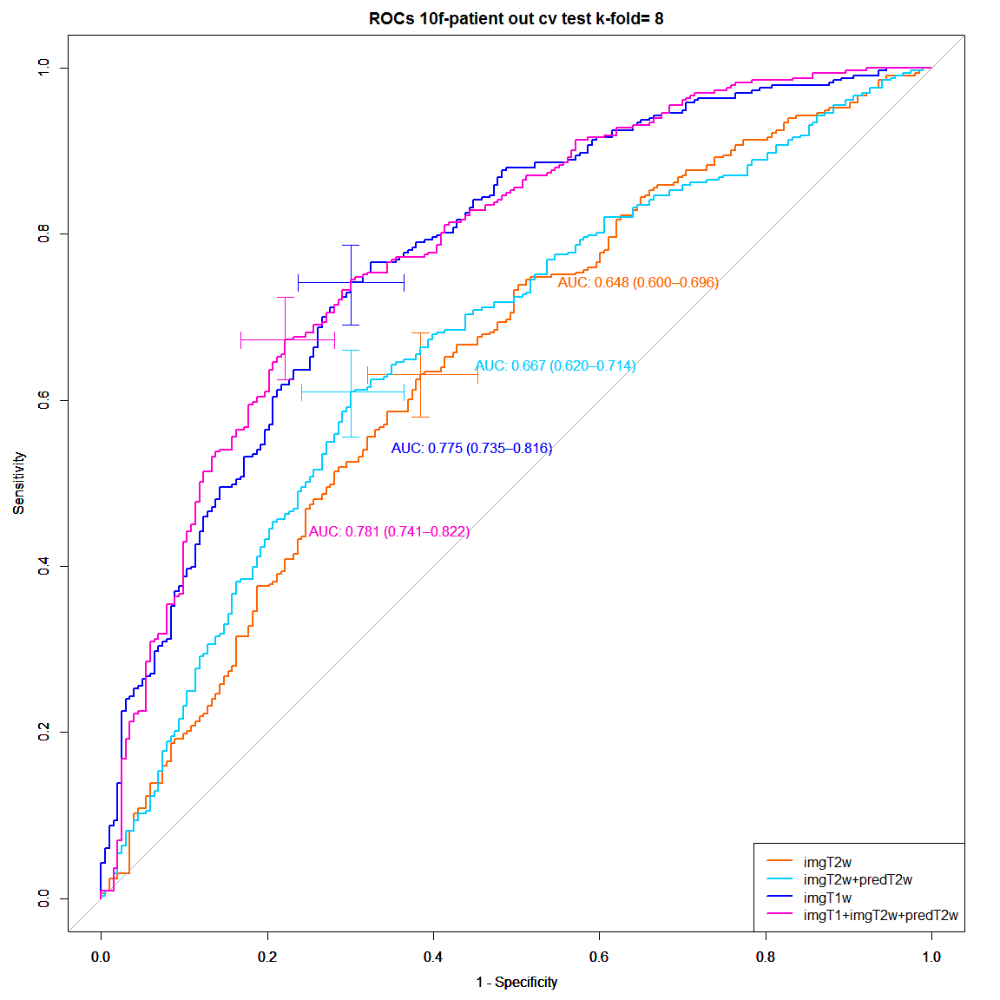 

```
## Area under the curve: 0.7814
## 95% CI (2000 stratified bootstrap replicates):
##  thresholds sp.low sp.median sp.high se.low se.median se.high
##   0.4340139 0.7192    0.7783  0.8325 0.6246    0.6727  0.7237
##    massB    massM nonmassB nonmassM 
##      226      163      136       77 
##    massB    massM nonmassB nonmassM 
##       26       11       16        8 
##    massB    massM nonmassB nonmassM 
##      227      163      135       77 
##    massB    massM nonmassB nonmassM 
##       25       11       17        8 
##    massB    massM nonmassB nonmassM 
##      227      163      135       77 
##    massB    massM nonmassB nonmassM 
##       25       11       17        8 
## -0.02369668 0.05 
## Selected features for group: MeanDecreaseGini imgT2 
## =========NULL
##  [1] "T2texture_energy_zero"               "T2texture_energy_halfRad"            "T2texture_correlation_threeQuaRad"  
##  [4] "T2RGH_mean"                          "T2texture_correlation_zero"          "T2skew_F_r_i"                       
##  [7] "ave_T21"                             "ave_T216"                            "T2texture_contrast_quarterRad"      
## [10] "T2kurt_F_r_i"                        "ave_T26"                             "T2grad_margin_var"                  
## [13] "ave_T215"                            "ave_T214"                            "T2var_F_r_i"                        
## [16] "T2texture_homogeneity_threeQuaRad"   "T2texture_dissimilarity_zero"        "T2texture_dissimilarity_halfRad"    
## [19] "ave_T29"                             "ave_T28"                             "T2texture_contrast_halfRad"         
## [22] "ave_T217"                            "ave_T20"                             "ave_T212"                           
## [25] "T2min_F_r_i"                         "ave_T27"                             "T2texture_dissimilarity_threeQuaRad"
## [28] "T2texture_correlation_quarterRad"    "T2_lesionSI"                        
## 0 0.05 
## Selected features for group: MeanDecreaseGini allT2 
## =========NULL
##  [1] "T2texture_ASM_zero"                  "LMSIR_predicted"                     "T2texture_correlation_zero"         
##  [4] "ave_T26"                             "ave_T23"                             "T2texture_correlation_threeQuaRad"  
##  [7] "T2RGH_mean"                          "T2texture_contrast_quarterRad"       "T2texture_homogeneity_quarterRad"   
## [10] "ave_T27"                             "ave_T20"                             "T2texture_homogeneity_halfRad"      
## [13] "ave_T24"                             "T2texture_homogeneity_zero"          "ave_T29"                            
## [16] "ave_T212"                            "T2texture_dissimilarity_threeQuaRad" "T2texture_dissimilarity_zero"       
## [19] "T2texture_energy_quarterRad"         "T2var_F_r_i"                         "T2max_F_r_i"                        
## [22] "T2skew_F_r_i"                        "ave_T219"                            "ave_T25"                            
## [25] "T2texture_correlation_halfRad"       "ave_T28"                             "T2texture_ASM_threeQuaRad"          
## [28] "T2_lesionSI"                        
## 0.04069767 0.05 
## Selected features for group: MeanDecreaseGini imgT1 
## =========NULL
##  [1] "irregularity"                      "SER_inside"                        "texture_correlation_threeQuaRad"  
##  [4] "texture_energy_halfRad"            "Tpeak_inside"                      "texture_contrast_quarterRad"      
##  [7] "iiiMax_Margin_Gradient"            "V18"                               "earlySE17"                        
## [10] "edge_sharp_std"                    "texture_dissimilarity_threeQuaRad" "earlySE12"                        
## [13] "lateSE10"                          "texture_correlation_quarterRad"    "Kpeak_countor"                    
## [16] "earlySE1"                          "earlySE18"                         "V13"                              
## [19] "earlySE14"                         "earlySE7"                          "V3"                               
## [22] "lateSE3"                           "earlySE2"                          "V19"                              
## [25] "V9"                                "lateSE14"                          "maxVr_inside"                     
## [28] "washoutRate_inside"                "var_F_r_i"                         "dce3SE14"                         
## [31] "dce2SE9"                           "Vr_decreasingRate_inside"          "V5"                               
## [34] "skew_F_r_i"                        "kurt_F_r_i"                        "A_inside"                         
## -0.08092486 0.05 
## Selected features for group: MeanDecreaseGini all 
## =========NULL
##  [1] "irregularity"                    "texture_correlation_threeQuaRad" "SER_countor"                    
##  [4] "SER_inside"                      "max_F_r_i"                       "circularity"                    
##  [7] "V18"                             "dce2SE10"                        "ave_T21"                        
## [10] "T2texture_contrast_zero"         "texture_contrast_threeQuaRad"    "ave_T25"                        
## [13] "lateSE7"                         "edge_sharp_mean"                 "dce2SE12"                       
## [16] "dce3SE5"                         "earlySE4"                        "T2RGH_mean"                     
## [19] "max_RGH_var"                     "ave_T24"                         "dce3SE16"                       
## [22] "V3"                              "T2wSI_predicted"                 "dce2SE16"                       
## [25] "T2texture_ASM_zero"              "texture_contrast_quarterRad"     "Vr_increasingRate_inside"       
## [28] "peakVr_countor"                  "max_RGH_mean_k"                  "alpha_countor"                  
## [31] "T2mean_F_r_i"                    "A_inside"                       
##     lesion_id cad_pt_no_txt exam_a_number_txt BIRADS lesion_label            lesion_diagnosis      find_t2_signal_int
## 11         13          0280           5091695      4        massB        BENIGN BREAST TISSUE                    None
## 31         34          0673           4585908      4        massB                 FIBROCYSTIC Hypointense or not seen
## 39         43          0691           5178056      5        massM              InvasiveDuctal Hypointense or not seen
## 40         44          0691           5178056      5        massM              InvasiveDuctal Hypointense or not seen
## 41         45          0700           4660805      5        massM              InvasiveDuctal                    None
## 47         53          0713           5150291      5        massM              InvasiveDuctal                    None
## 48         55          0713           5150291      5     nonmassM              InvasiveDuctal                    None
## 79         88          0771           4680997      4        massB              DUCT PAPILLOMA                    None
## 80         89          0771           4680997      4        massB              DUCT PAPILLOMA                    None
## 88         99          0790           4708057      4     nonmassB              DUCT PAPILLOMA                    None
## 99        112          0810           4622489      4        massM                InsituDuctal                    None
## 117       132          0839           4739257      4        massB        BENIGN BREAST TISSUE                    None
## 118       133          0839           4739257      4        massB        BENIGN BREAST TISSUE                    None
## 121       136          0847           5064132      4        massM              InvasiveDuctal            Hyperintense
## 128       144          0856           4986174      4        massB                FIBROADENOMA            Hyperintense
## 129       145          0856           4986174      4        massB                FIBROADENOMA            Hyperintense
## 349       375          0856           6871177      2        massB ATYPICAL DUCTAL HYPERPLASIA Hypointense or not seen
## 158       182          6018           5088825      5     nonmassM             InvasiveLobular                    None
## 168       192          6027           4770166      4        massB        BENIGN BREAST TISSUE                    None
## 169       193          6027           4770166      4     nonmassB        BENIGN BREAST TISSUE                    None
## 201       227          6051           5426079      6        massM              InvasiveDuctal            Hyperintense
## 216       242          0805           5059167      4     nonmassB                 FIBROCYSTIC                    None
## 249       275          0093           7156466      4     nonmassM              InvasiveDuctal                    None
## 250       276          0093           7156466      4     nonmassM              InvasiveDuctal                    None
## 254       280          0186           6869828      4     nonmassM                InsituDuctal                    None
## 259       285          0578           6765702      6        massM              InvasiveDuctal                    None
## 260       286          0420           6738142      3     nonmassM                InsituDuctal   Slightly hyperintense
## 280       306          7104           6941351      5        massM              InvasiveDuctal                    None
## 332       358          0513           5043867      4     nonmassB ATYPICAL DUCTAL HYPERPLASIA                    None
## 340       366          0664           7081071      4     nonmassB ATYPICAL DUCTAL HYPERPLASIA Hypointense or not seen
## 373       399          7085           7616788      2        massB ATYPICAL DUCTAL HYPERPLASIA                    None
## 374       400          7088           7066921      3     nonmassB                 FIBROCYSTIC                    None
## 376       402          7096           6869668      3        massB                FIBROADENOMA                    None
## 377       403          7096           6869668      3        massB                FIBROADENOMA Hypointense or not seen
## 383       409          7151           7557684      2        massB                 HYPERPLASIA                    None
## 385       411          3004           7691918      4     nonmassB                 FIBROCYSTIC                    None
## 645       671          3004           7691918      4     nonmassB                 FIBROCYSTIC                    None
## 399       425          3046           7682447      4        massB                FIBROADENOMA Hypointense or not seen
## 451       477          3046           7289130      4        massB                FIBROADENOMA            Hyperintense
## 452       478          3046           7682447      4        massB                FIBROADENOMA Hypointense or not seen
## 415       441          4003           7056445      4     nonmassB   FLORID DUCTAL HYPERPLASIA                    None
## 416       442          4003           7056445      4     nonmassB   FLORID DUCTAL HYPERPLASIA                    None
## 467       493          7192           7974056      4     nonmassB        BENIGN BREAST TISSUE                    None
## 497       523          3026           6830523      4        massB                 FIBROCYSTIC Hypointense or not seen
## 498       524          3018           6865137      3        massB                FAT NECROSIS            Hyperintense
## 515       541          0571           4902166      4        massM              InvasiveDuctal Hypointense or not seen
## 516       542          0571           4902166      4     nonmassB              DUCT PAPILLOMA Hypointense or not seen
## 519       545          0586           5332925      4     nonmassM                InsituDuctal Hypointense or not seen
## 573       599          0876           4719378      4        massB        BENIGN BREAST TISSUE                    None
## 584       610          1077           6890028      4        massB        BENIGN BREAST TISSUE   Slightly hyperintense
## 585       611          1078           7105247      4     nonmassB              DENSE FIBROSIS                    None
## 586       612          1078           7105247      4     nonmassB              DENSE FIBROSIS                    None
## 598       624          2016           7052211      4        massB                FIBROADENOMA            Hyperintense
## 610       636          2050           6689745      6        massM              InvasiveDuctal                    None
## 624       650          2075           6985605      4     nonmassB        BENIGN BREAST TISSUE Hypointense or not seen
## 625       651          2075           6985605      4        massB                FIBROADENOMA Hypointense or not seen
## 627       653          0995           6816787      4     nonmassB        LARGE DUCT PAPILLOMA            Hyperintense
## 632       658          0995           6816787      3        massB              DUCT PAPILLOMA   Slightly hyperintense
## 629       655          1021           6760795      4        massB                FIBROADENOMA Hypointense or not seen
## 657       683          3025           7103914      4        massB                FIBROADENOMA            Hyperintense
## 671       697          3080           7033654      6     nonmassM                InsituDuctal Hypointense or not seen
## 
## ============ bestune_imgT2 	 max.depth  1 	 #Trees  350 
## ntrees:  50 minsplit:  3 cp:  -1 
##   ntrees minsplit cp acuTrain rocTrain   acuTest   rocTest
## 1     50        3 -1        1        1 0.6065574 0.5739348
## ntrees:  100 minsplit:  3 cp:  -1 
##   ntrees minsplit cp acuTrain rocTrain   acuTest   rocTest
## 2    100        3 -1        1        1 0.4918033 0.5588972
## ntrees:  250 minsplit:  3 cp:  -1 
##   ntrees minsplit cp acuTrain rocTrain   acuTest   rocTest
## 3    250        3 -1        1        1 0.4918033 0.5075188
## ntrees:  350 minsplit:  3 cp:  -1 
##   ntrees minsplit cp acuTrain rocTrain   acuTest   rocTest
## 4    350        3 -1        1        1 0.4262295 0.5238095
## ntrees:  500 minsplit:  3 cp:  -1 
##   ntrees minsplit cp acuTrain rocTrain   acuTest   rocTest
## 5    500        3 -1        1        1 0.4754098 0.5050125
## ntrees:  50 minsplit:  1 cp:  -1 
##   ntrees minsplit cp acuTrain rocTrain   acuTest   rocTest
## 6     50        1 -1        1        1 0.5245902 0.5526316
## ntrees:  100 minsplit:  1 cp:  -1 
##   ntrees minsplit cp acuTrain rocTrain   acuTest   rocTest
## 7    100        1 -1        1        1 0.4918033 0.5488722
## ntrees:  250 minsplit:  1 cp:  -1 
##   ntrees minsplit cp acuTrain rocTrain   acuTest   rocTest
## 8    250        1 -1        1        1 0.4754098 0.5200501
## ntrees:  350 minsplit:  1 cp:  -1 
##   ntrees minsplit cp acuTrain rocTrain   acuTest  rocTest
## 9    350        1 -1        1        1 0.5081967 0.547619
## ntrees:  500 minsplit:  1 cp:  -1 
##    ntrees minsplit cp acuTrain rocTrain   acuTest   rocTest
## 10    500        1 -1        1        1 0.4754098 0.5087719
## ntrees:  50 minsplit:  0 cp:  -1 
##    ntrees minsplit cp acuTrain rocTrain   acuTest   rocTest
## 11     50        0 -1        1        1 0.4754098 0.5213033
## ntrees:  100 minsplit:  0 cp:  -1 
##    ntrees minsplit cp acuTrain rocTrain  acuTest   rocTest
## 12    100        0 -1        1        1 0.557377 0.4912281
## ntrees:  250 minsplit:  0 cp:  -1 
##    ntrees minsplit cp acuTrain rocTrain   acuTest   rocTest
## 13    250        0 -1        1        1 0.5081967 0.5288221
## ntrees:  350 minsplit:  0 cp:  -1 
##    ntrees minsplit cp acuTrain rocTrain   acuTest   rocTest
## 14    350        0 -1        1        1 0.4590164 0.5401003
## ntrees:  500 minsplit:  0 cp:  -1 
##    ntrees minsplit cp acuTrain rocTrain   acuTest   rocTest
## 15    500        0 -1        1        1 0.4754098 0.5100251
##    ntrees minsplit cp acuTrain rocTrain   acuTest   rocTest
## 1      50        3 -1        1        1 0.6065574 0.5739348
## 2     100        3 -1        1        1 0.4918033 0.5588972
## 3     250        3 -1        1        1 0.4918033 0.5075188
## 4     350        3 -1        1        1 0.4262295 0.5238095
## 5     500        3 -1        1        1 0.4754098 0.5050125
## 6      50        1 -1        1        1 0.5245902 0.5526316
## 7     100        1 -1        1        1 0.4918033 0.5488722
## 8     250        1 -1        1        1 0.4754098 0.5200501
## 9     350        1 -1        1        1 0.5081967 0.5476190
## 10    500        1 -1        1        1 0.4754098 0.5087719
## 11     50        0 -1        1        1 0.4754098 0.5213033
## 12    100        0 -1        1        1 0.5573770 0.4912281
## 13    250        0 -1        1        1 0.5081967 0.5288221
## 14    350        0 -1        1        1 0.4590164 0.5401003
## 15    500        0 -1        1        1 0.4754098 0.5100251
##   ntrees minsplit cp acuTrain rocTrain   acuTest   rocTest
## 1     50        3 -1        1        1 0.6065574 0.5739348
## 
## ============ bestune_allT2 	 max.depth  1 	 #Trees  250 
## ntrees:  50 minsplit:  3 cp:  -1 
##   ntrees minsplit cp acuTrain rocTrain   acuTest   rocTest
## 1     50        3 -1        1        1 0.6229508 0.5827068
## ntrees:  100 minsplit:  3 cp:  -1 
##   ntrees minsplit cp acuTrain rocTrain  acuTest   rocTest
## 2    100        3 -1        1        1 0.557377 0.6177945
## ntrees:  250 minsplit:  3 cp:  -1 
##   ntrees minsplit cp acuTrain rocTrain   acuTest   rocTest
## 3    250        3 -1        1        1 0.5737705 0.4649123
## ntrees:  350 minsplit:  3 cp:  -1 
##   ntrees minsplit cp acuTrain rocTrain   acuTest   rocTest
## 4    350        3 -1        1        1 0.5081967 0.4761905
## ntrees:  500 minsplit:  3 cp:  -1 
##   ntrees minsplit cp acuTrain rocTrain   acuTest   rocTest
## 5    500        3 -1        1        1 0.5737705 0.4661654
## ntrees:  50 minsplit:  1 cp:  -1 
##   ntrees minsplit cp acuTrain rocTrain  acuTest   rocTest
## 6     50        1 -1        1        1 0.557377 0.5388471
## ntrees:  100 minsplit:  1 cp:  -1 
##   ntrees minsplit cp acuTrain rocTrain   acuTest   rocTest
## 7    100        1 -1        1        1 0.6229508 0.6290727
## ntrees:  250 minsplit:  1 cp:  -1 
##   ntrees minsplit cp acuTrain rocTrain  acuTest   rocTest
## 8    250        1 -1        1        1 0.557377 0.4824561
## ntrees:  350 minsplit:  1 cp:  -1 
##   ntrees minsplit cp acuTrain rocTrain   acuTest   rocTest
## 9    350        1 -1        1        1 0.5081967 0.4899749
## ntrees:  500 minsplit:  1 cp:  -1 
##    ntrees minsplit cp acuTrain rocTrain  acuTest   rocTest
## 10    500        1 -1        1        1 0.557377 0.4774436
## ntrees:  50 minsplit:  0 cp:  -1 
##    ntrees minsplit cp acuTrain rocTrain  acuTest  rocTest
## 11     50        0 -1        1        1 0.442623 0.518797
## ntrees:  100 minsplit:  0 cp:  -1 
##    ntrees minsplit cp acuTrain rocTrain   acuTest   rocTest
## 12    100        0 -1        1        1 0.5409836 0.5989975
## ntrees:  250 minsplit:  0 cp:  -1 
##    ntrees minsplit cp acuTrain rocTrain  acuTest   rocTest
## 13    250        0 -1        1        1 0.442623 0.5137845
## ntrees:  350 minsplit:  0 cp:  -1 
##    ntrees minsplit cp acuTrain rocTrain  acuTest   rocTest
## 14    350        0 -1        1        1 0.557377 0.4561404
## ntrees:  500 minsplit:  0 cp:  -1 
##    ntrees minsplit cp acuTrain rocTrain   acuTest   rocTest
## 15    500        0 -1        1        1 0.5737705 0.4348371
##    ntrees minsplit cp acuTrain rocTrain   acuTest   rocTest
## 1      50        3 -1        1        1 0.6229508 0.5827068
## 2     100        3 -1        1        1 0.5573770 0.6177945
## 3     250        3 -1        1        1 0.5737705 0.4649123
## 4     350        3 -1        1        1 0.5081967 0.4761905
## 5     500        3 -1        1        1 0.5737705 0.4661654
## 6      50        1 -1        1        1 0.5573770 0.5388471
## 7     100        1 -1        1        1 0.6229508 0.6290727
## 8     250        1 -1        1        1 0.5573770 0.4824561
## 9     350        1 -1        1        1 0.5081967 0.4899749
## 10    500        1 -1        1        1 0.5573770 0.4774436
## 11     50        0 -1        1        1 0.4426230 0.5187970
## 12    100        0 -1        1        1 0.5409836 0.5989975
## 13    250        0 -1        1        1 0.4426230 0.5137845
## 14    350        0 -1        1        1 0.5573770 0.4561404
## 15    500        0 -1        1        1 0.5737705 0.4348371
##   ntrees minsplit cp acuTrain rocTrain   acuTest   rocTest
## 7    100        1 -1        1        1 0.6229508 0.6290727
## 
## ============ bestune_imgT1 	 max.depth  1 	 #Trees  250 
## ntrees:  50 minsplit:  3 cp:  -1 
##   ntrees minsplit cp acuTrain rocTrain   acuTest   rocTest
## 1     50        3 -1        1        1 0.7868852 0.7907268
## ntrees:  100 minsplit:  3 cp:  -1 
##   ntrees minsplit cp acuTrain rocTrain   acuTest   rocTest
## 2    100        3 -1        1        1 0.8360656 0.7907268
## ntrees:  250 minsplit:  3 cp:  -1 
##   ntrees minsplit cp acuTrain rocTrain   acuTest   rocTest
## 3    250        3 -1        1        1 0.7868852 0.7969925
## ntrees:  350 minsplit:  3 cp:  -1 
##   ntrees minsplit cp acuTrain rocTrain   acuTest   rocTest
## 4    350        3 -1        1        1 0.7704918 0.7969925
## ntrees:  500 minsplit:  3 cp:  -1 
##   ntrees minsplit cp acuTrain rocTrain   acuTest   rocTest
## 5    500        3 -1        1        1 0.8032787 0.7994987
## ntrees:  50 minsplit:  1 cp:  -1 
##   ntrees minsplit cp acuTrain rocTrain   acuTest   rocTest
## 6     50        1 -1        1        1 0.7704918 0.7619048
## ntrees:  100 minsplit:  1 cp:  -1 
##   ntrees minsplit cp acuTrain rocTrain   acuTest   rocTest
## 7    100        1 -1        1        1 0.7868852 0.8320802
## ntrees:  250 minsplit:  1 cp:  -1 
##   ntrees minsplit cp acuTrain rocTrain   acuTest   rocTest
## 8    250        1 -1        1        1 0.8032787 0.7907268
## ntrees:  350 minsplit:  1 cp:  -1 
##   ntrees minsplit cp acuTrain rocTrain   acuTest   rocTest
## 9    350        1 -1        1        1 0.7704918 0.8095238
## ntrees:  500 minsplit:  1 cp:  -1 
##    ntrees minsplit cp acuTrain rocTrain   acuTest   rocTest
## 10    500        1 -1        1        1 0.8032787 0.7819549
## ntrees:  50 minsplit:  0 cp:  -1 
##    ntrees minsplit cp acuTrain rocTrain   acuTest  rocTest
## 11     50        0 -1        1        1 0.7868852 0.764411
## ntrees:  100 minsplit:  0 cp:  -1 
##    ntrees minsplit cp acuTrain rocTrain   acuTest   rocTest
## 12    100        0 -1        1        1 0.8032787 0.7568922
## ntrees:  250 minsplit:  0 cp:  -1 
##    ntrees minsplit cp acuTrain rocTrain   acuTest   rocTest
## 13    250        0 -1        1        1 0.8196721 0.7994987
## ntrees:  350 minsplit:  0 cp:  -1 
##    ntrees minsplit cp acuTrain rocTrain   acuTest   rocTest
## 14    350        0 -1        1        1 0.8032787 0.7518797
## ntrees:  500 minsplit:  0 cp:  -1 
##    ntrees minsplit cp acuTrain rocTrain   acuTest   rocTest
## 15    500        0 -1        1        1 0.8196721 0.8045113
##    ntrees minsplit cp acuTrain rocTrain   acuTest   rocTest
## 1      50        3 -1        1        1 0.7868852 0.7907268
## 2     100        3 -1        1        1 0.8360656 0.7907268
## 3     250        3 -1        1        1 0.7868852 0.7969925
## 4     350        3 -1        1        1 0.7704918 0.7969925
## 5     500        3 -1        1        1 0.8032787 0.7994987
## 6      50        1 -1        1        1 0.7704918 0.7619048
## 7     100        1 -1        1        1 0.7868852 0.8320802
## 8     250        1 -1        1        1 0.8032787 0.7907268
## 9     350        1 -1        1        1 0.7704918 0.8095238
## 10    500        1 -1        1        1 0.8032787 0.7819549
## 11     50        0 -1        1        1 0.7868852 0.7644110
## 12    100        0 -1        1        1 0.8032787 0.7568922
## 13    250        0 -1        1        1 0.8196721 0.7994987
## 14    350        0 -1        1        1 0.8032787 0.7518797
## 15    500        0 -1        1        1 0.8196721 0.8045113
##   ntrees minsplit cp acuTrain rocTrain   acuTest   rocTest
## 7    100        1 -1        1        1 0.7868852 0.8320802
## 
## ============ bestune_all 	 max.depth  1 	 #Trees  200 
## ntrees:  50 minsplit:  3 cp:  -1 
##   ntrees minsplit cp acuTrain rocTrain   acuTest   rocTest
## 1     50        3 -1        1        1 0.7377049 0.7192982
## ntrees:  100 minsplit:  3 cp:  -1 
##   ntrees minsplit cp acuTrain rocTrain   acuTest   rocTest
## 2    100        3 -1        1        1 0.8032787 0.7506266
## ntrees:  250 minsplit:  3 cp:  -1 
##   ntrees minsplit cp acuTrain rocTrain   acuTest  rocTest
## 3    250        3 -1        1        1 0.7704918 0.716792
## ntrees:  350 minsplit:  3 cp:  -1 
##   ntrees minsplit cp acuTrain rocTrain   acuTest   rocTest
## 4    350        3 -1        1        1 0.8032787 0.7218045
## ntrees:  500 minsplit:  3 cp:  -1 
##   ntrees minsplit cp acuTrain rocTrain   acuTest   rocTest
## 5    500        3 -1        1        1 0.7540984 0.7568922
## ntrees:  50 minsplit:  1 cp:  -1 
##   ntrees minsplit cp acuTrain rocTrain   acuTest   rocTest
## 6     50        1 -1        1        1 0.7540984 0.7117794
## ntrees:  100 minsplit:  1 cp:  -1 
##   ntrees minsplit cp acuTrain rocTrain   acuTest   rocTest
## 7    100        1 -1        1        1 0.7540984 0.7406015
## ntrees:  250 minsplit:  1 cp:  -1 
##   ntrees minsplit cp acuTrain rocTrain   acuTest   rocTest
## 8    250        1 -1        1        1 0.7868852 0.7368421
## ntrees:  350 minsplit:  1 cp:  -1 
##   ntrees minsplit cp acuTrain rocTrain   acuTest   rocTest
## 9    350        1 -1        1        1 0.8032787 0.7293233
## ntrees:  500 minsplit:  1 cp:  -1 
##    ntrees minsplit cp acuTrain rocTrain   acuTest  rocTest
## 10    500        1 -1        1        1 0.8032787 0.726817
## ntrees:  50 minsplit:  0 cp:  -1 
##    ntrees minsplit cp acuTrain rocTrain   acuTest   rocTest
## 11     50        0 -1        1        1 0.7213115 0.7180451
## ntrees:  100 minsplit:  0 cp:  -1 
##    ntrees minsplit cp acuTrain rocTrain   acuTest  rocTest
## 12    100        0 -1        1        1 0.7540984 0.735589
## ntrees:  250 minsplit:  0 cp:  -1 
##    ntrees minsplit cp acuTrain rocTrain   acuTest   rocTest
## 13    250        0 -1        1        1 0.7377049 0.6992481
## ntrees:  350 minsplit:  0 cp:  -1 
##    ntrees minsplit cp acuTrain rocTrain   acuTest   rocTest
## 14    350        0 -1        1        1 0.7704918 0.7255639
## ntrees:  500 minsplit:  0 cp:  -1 
##    ntrees minsplit cp acuTrain rocTrain   acuTest   rocTest
## 15    500        0 -1        1        1 0.7704918 0.7305764
##    ntrees minsplit cp acuTrain rocTrain   acuTest   rocTest
## 1      50        3 -1        1        1 0.7377049 0.7192982
## 2     100        3 -1        1        1 0.8032787 0.7506266
## 3     250        3 -1        1        1 0.7704918 0.7167920
## 4     350        3 -1        1        1 0.8032787 0.7218045
## 5     500        3 -1        1        1 0.7540984 0.7568922
## 6      50        1 -1        1        1 0.7540984 0.7117794
## 7     100        1 -1        1        1 0.7540984 0.7406015
## 8     250        1 -1        1        1 0.7868852 0.7368421
## 9     350        1 -1        1        1 0.8032787 0.7293233
## 10    500        1 -1        1        1 0.8032787 0.7268170
## 11     50        0 -1        1        1 0.7213115 0.7180451
## 12    100        0 -1        1        1 0.7540984 0.7355890
## 13    250        0 -1        1        1 0.7377049 0.6992481
## 14    350        0 -1        1        1 0.7704918 0.7255639
## 15    500        0 -1        1        1 0.7704918 0.7305764
##   ntrees minsplit cp acuTrain rocTrain   acuTest   rocTest
## 5    500        3 -1        1        1 0.7540984 0.7568922
## 
## Call:
## roc.default(response = perf_imgT2$obs, predictor = perf_imgT2$C)
## 
## Data: perf_imgT2$C in 222 controls (perf_imgT2$obs C) > 375 cases (perf_imgT2$obs NC).
## Area under the curve: 0.6399
## 
## Call:
## roc.default(response = perf_allT2$obs, predictor = perf_allT2$C)
## 
## Data: perf_allT2$C in 222 controls (perf_allT2$obs C) > 375 cases (perf_allT2$obs NC).
## Area under the curve: 0.6602
## 
## Call:
## roc.default(response = perf_imgT1$obs, predictor = perf_imgT1$C)
## 
## Data: perf_imgT1$C in 222 controls (perf_imgT1$obs C) > 375 cases (perf_imgT1$obs NC).
## Area under the curve: 0.7804
## 
## Call:
## roc.default(response = perf_all$obs, predictor = perf_all$C)
## 
## Data: perf_all$C in 222 controls (perf_all$obs C) > 375 cases (perf_all$obs NC).
## Area under the curve: 0.7803
```

```
## Area under the curve: 0.6399
## 95% CI (2000 stratified bootstrap replicates):
##  thresholds sp.low sp.median sp.high se.low se.median se.high
##   0.4580442 0.5541    0.6171  0.6802  0.568     0.616   0.664
```

```
## Area under the curve: 0.6602
## 95% CI (2000 stratified bootstrap replicates):
##  thresholds sp.low sp.median sp.high se.low se.median se.high
##   0.4422979 0.6396    0.6982  0.7568 0.5467    0.5947  0.6453
```

```
## Area under the curve: 0.7804
## 95% CI (2000 stratified bootstrap replicates):
##  thresholds sp.low sp.median sp.high se.low se.median se.high
##   0.4472446 0.6712    0.7297  0.7883  0.688    0.7333  0.7787
```

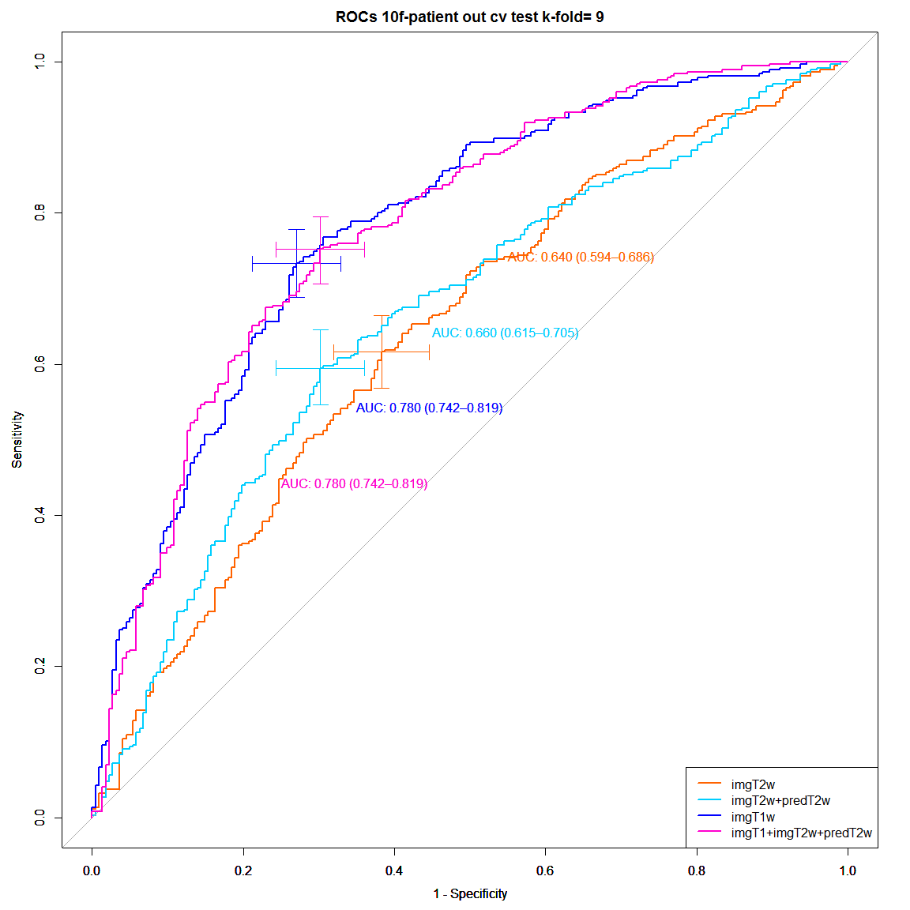 

```
## Area under the curve: 0.7803
## 95% CI (2000 stratified bootstrap replicates):
##  thresholds sp.low sp.median sp.high se.low se.median se.high
##   0.4606152 0.6396    0.6982  0.7568 0.7067     0.752  0.7947
##    massB    massM nonmassB nonmassM 
##      239      148      136       74 
##    massB    massM nonmassB nonmassM 
##       13       26       16       11 
##    massB    massM nonmassB nonmassM 
##      239      148      136       74 
##    massB    massM nonmassB nonmassM 
##       13       26       16       11 
##    massB    massM nonmassB nonmassM 
##      239      148      136       74 
##    massB    massM nonmassB nonmassM 
##       13       26       16       11 
## -0.00913242 0.05 
## Selected features for group: MeanDecreaseGini imgT2 
## =========NULL
##  [1] "T2texture_energy_quarterRad"       "T2texture_correlation_quarterRad"  "ave_T216"                         
##  [4] "T2skew_F_r_i"                      "ave_T26"                           "T2texture_homogeneity_quarterRad" 
##  [7] "T2var_F_r_i"                       "ave_T219"                          "ave_T215"                         
## [10] "ave_T211"                          "ave_T212"                          "T2grad_margin_var"                
## [13] "ave_T214"                          "T2RGH_var"                         "T2texture_correlation_threeQuaRad"
## [16] "T2RGH_mean"                        "ave_T25"                           "T2texture_contrast_halfRad"       
## [19] "ave_T210"                          "ave_T27"                           "ave_T21"                          
## [22] "T2texture_homogeneity_threeQuaRad" "T2kurt_F_r_i"                      "ave_T23"                          
## [25] "T2texture_dissimilarity_halfRad"   "T2max_F_r_i"                       "ave_T213"                         
## [28] "T2texture_homogeneity_zero"        "T2texture_energy_threeQuaRad"      "ave_T217"                         
## [31] "T2texture_homogeneity_halfRad"     "T2min_F_r_i"                       "T2texture_contrast_zero"          
## [34] "T2texture_contrast_quarterRad"     "ave_T20"                           "T2_lesionSI"                      
## 0.04651163 0.05 
## Selected features for group: MeanDecreaseGini allT2 
## =========NULL
##  [1] "T2texture_energy_quarterRad"        "ave_T26"                            "T2skew_F_r_i"                      
##  [4] "ave_T216"                           "T2texture_correlation_threeQuaRad"  "T2texture_ASM_halfRad"             
##  [7] "T2texture_dissimilarity_quarterRad" "LMSIR_predicted"                    "T2texture_homogeneity_zero"        
## [10] "T2RGH_var"                          "ave_T21"                            "T2var_F_r_i"                       
## [13] "ave_T219"                           "ave_T29"                            "T2texture_correlation_halfRad"     
## [16] "ave_T24"                            "ave_T27"                            "ave_T215"                          
## [19] "T2max_F_r_i"                        "T2texture_contrast_halfRad"         "ave_T211"                          
## [22] "ave_T214"                           "T2texture_homogeneity_threeQuaRad"  "ave_T28"                           
## [25] "T2texture_dissimilarity_halfRad"    "ave_T217"                           "ave_T23"                           
## [28] "T2min_F_r_i"                        "ave_T25"                            "ave_T212"                          
## [31] "T2texture_correlation_zero"         "T2texture_homogeneity_halfRad"      "T2texture_homogeneity_quarterRad"  
## [34] "ave_T218"                           "T2_lesionSI"                       
## 0.127907 0.05 
## -0.02 0.05 
## Selected features for group: MeanDecreaseGini imgT1 
## =========NULL
##  [1] "texture_correlation_zero"     "Slope_ini_inside"             "var_F_r_i"                    "texture_energy_threeQuaRad"  
##  [5] "iMax_Variance_uptake"         "min_F_r_i"                    "V14"                          "Kpeak_countor"               
##  [9] "texture_contrast_threeQuaRad" "earlySE4"                     "Vr_decreasingRate_inside"     "V10"                         
## [13] "beta_countor"                 "dce2SE18"                     "V0"                           "lateSE11"                    
## [17] "dce2SE13"                     "dce3SE14"                     "dce2SE15"                     "dce3SE18"                    
## [21] "lateSE17"                     "earlySE6"                     "lateSE13"                     "Vr_increasingRate_inside"    
## [25] "dce2SE12"                     "dce3SE0"                      "lateSE9"                      "dce2SE11"                    
## [29] "earlySE1"                     "dce2SE3"                      "V8"                           "maxVr_inside"                
## [33] "iiiMax_Margin_Gradient"       "alpha_countor"                "V1"                           "Vr_decreasingRate_countor"   
## [37] "iAUC1_countor"                "V19"                          "earlySE9"                     "A_inside"                    
## 0.1630435 0.05 
## 0.02597403 0.05 
## Selected features for group: MeanDecreaseGini all 
## =========NULL
##  [1] "circularity"                      "texture_correlation_quarterRad"   "alpha_countor"                   
##  [4] "iiMin_change_Variance_uptake"     "earlySE8"                         "V19"                             
##  [7] "earlySE15"                        "T2texture_correlation_quarterRad" "T2texture_dissimilarity_zero"    
## [10] "T2kurt_F_r_i"                     "min_F_r_i"                        "texture_energy_quarterRad"       
## [13] "lateSE14"                         "ave_T25"                          "earlySE13"                       
## [16] "dce2SE16"                         "V0"                               "V3"                              
## [19] "texture_contrast_threeQuaRad"     "ave_T24"                          "lateSE19"                        
## [22] "iAUC1_countor"                    "maxVr_countor"                    "T2RGH_var"                       
## [25] "dce3SE8"                          "kurt_F_r_i"                       "texture_homogeneity_zero"        
## [28] "Vr_post_1_inside"                 "dce3SE13"                         "V9"                              
## [31] "dce3SE17"                         "skew_F_r_i"                       "texture_dissimilarity_quarterRad"
## [34] "T2texture_homogeneity_quarterRad" "ave_T210"                         "ave_T29"                         
## [37] "A_inside"                        
##     lesion_id cad_pt_no_txt exam_a_number_txt BIRADS lesion_label                  lesion_diagnosis      find_t2_signal_int
## 4           4          0114           6896014      4        massM                    InvasiveDuctal                    None
## 251       277          0114           6734489      3     nonmassM                    InvasiveDuctal                    None
## 8           9          0171           4751079      4        massM                      InsituDuctal Hypointense or not seen
## 22         24          0180           4632561      4     nonmassB              BENIGN BREAST TISSUE Hypointense or not seen
## 302       328          0180           5254957      4     nonmassB                      FIBROADENOMA Hypointense or not seen
## 26         29          0266           5254958      4     nonmassB                       FIBROCYSTIC Hypointense or not seen
## 28         31          0663           4804825      4        massB                      FIBROADENOMA            Hyperintense
## 35         38          0687              1201      5        massM                    InvasiveDuctal   Slightly hyperintense
## 36         39          0687              1201      5     nonmassM                    InvasiveDuctal   Slightly hyperintense
## 37         40          0687              1201      5        massM                    InvasiveDuctal   Slightly hyperintense
## 42         46          0705           4648471      5        massM                    InvasiveDuctal   Slightly hyperintense
## 55         64          0724           5141876      5        massM                    InvasiveDuctal            Hyperintense
## 73         82          0757           4779344      4     nonmassB       ATYPICAL DUCTAL HYPERPLASIA            Hyperintense
## 96        107          0803           5058195      5        massM                    InvasiveDuctal                    None
## 106       120          0827           4985128      4        massM          INSITUPAPILLARYCARCINOMA                    None
## 107       121          0827           4985128      4     nonmassM          INSITUPAPILLARYCARCINOMA                    None
## 218       244          0827           4985128      4        massB          USUAL DUCTAL HYPERPLASIA                    None
## 152       176          6008           4644038      6        massM                    InvasiveDuctal Hypointense or not seen
## 154       178          6015           5082265      6        massM                    InvasiveDuctal                    None
## 155       179          6015           5082265      6     nonmassM                    InvasiveDuctal                    None
## 172       196          6034           4997881      6        massM                    InvasiveDuctal            Hyperintense
## 173       197          6034           4997881      6        massM                    InvasiveDuctal            Hyperintense
## 174       198          6034           4997881      6     nonmassM                    InvasiveDuctal                    None
## 185       211          6041           5104414      6        massM                    InvasiveDuctal   Slightly hyperintense
## 186       212          6041           5104414      6        massM                    InvasiveDuctal                    None
## 191       217          6045           5208117      6        massM                    InvasiveDuctal Hypointense or not seen
## 192       218          6045           5208117      6        massM                    InvasiveDuctal Hypointense or not seen
## 215       241          0802           4600874      4        massM                    InvasiveDuctal                    None
## 230       256          6019         ACC109175      4        massM                   InvasiveLobular Hypointense or not seen
## 264       290          0456           6689214      4        massM                    InvasiveDuctal                    None
## 283       309          7086           6938067      4        massM                      InsituDuctal                    None
## 295       321          0123           6909758      4     nonmassB             COLUMNAR CELL CHANGES                    None
## 307       333          0196           5289117      4        massB               SCLEROSING ADENOSIS   Slightly hyperintense
## 308       334          0196           5289117      4     nonmassB               SCLEROSING ADENOSIS Hypointense or not seen
## 309       335          0196           5289117      4     nonmassB        ColumnarAlterationwoAtypia                    None
## 310       336          0196           5289117      4     nonmassB        ColumnarAlterationwoAtypia Hypointense or not seen
## 359       385          0956           5062341      4        massB                      FIBROADENOMA   Slightly hyperintense
## 364       390          7011           6918051      4        massB              BENIGN BREAST TISSUE Hypointense or not seen
## 365       391          7024           6805356      4        massB                      FIBROADENOMA Hypointense or not seen
## 375       401          7094           7171259      4     nonmassB              BENIGN BREAST TISSUE                    None
## 390       416          3063           7053508      6     nonmassM           LYMPHOVASCULAR INVASION                    None
## 400       426          3045           7149704      4     nonmassB                          ADENOSIS                    None
## 425       451          4039           7041331      6     nonmassM                    InvasiveDuctal                    None
## 454       480          7178           7074874      6        massM                    InvasiveDuctal Hypointense or not seen
## 477       503          6101           5087078      4     nonmassB                       FIBROCYSTIC                    None
## 478       504          6101           7709238      6        massM                    InvasiveDuctal Hypointense or not seen
## 485       511          6117           5154282      3        massB                      FIBROADENOMA            Hyperintense
## 503       529          0102           4755778      4        massB                       FIBROCYSTIC            Hyperintense
## 513       539          0561           4668611      4        massB                      FIBROADENOMA Hypointense or not seen
## 525       551          0619           7250777      5        massM                    InvasiveDuctal                    None
## 526       552          0619           7250777      5     nonmassM                    InvasiveDuctal                    None
## 548       574          0844           4795902      4     nonmassM                    InvasiveDuctal                    None
## 552       578          0898           5224531      4        massB DUCTAL HYPERPLASIA WITHOUT ATYPIA                    None
## 572       598          0723           4884108      6        massM                      InsituDuctal                    None
## 581       607          1059           7346997      4     nonmassB                       FIBROCYSTIC                    None
## 592       618          1095           4378323      3        massB                      FIBROADENOMA            Hyperintense
## 593       619          1095           4378323      5     nonmassM                      InsituDuctal                    None
## 605       631          2033           6849696      6        massM                   InvasiveLobular                    None
## 606       632          2033           6849696      4     nonmassB      ATYPICAL LOBULAR HYPERPLASIA                    None
## 637       663          1079           7417880      4        massM                      InsituDuctal                    None
## 653       679          3057           7098623      4     nonmassB              BENIGN BREAST TISSUE                    None
## 654       680          3057           7098623      4        massB                   TUBULAR ADENOMA   Slightly hyperintense
## 669       695          3077           7042083      4     nonmassB                       FIBROCYSTIC                    None
## 670       696          3077           7042083      4        massB                       FIBROCYSTIC   Slightly hyperintense
## 672       698          3081           7041435      5     nonmassB             COLUMNAR CELL CHANGES Hypointense or not seen
## 673       699          3081           7041435      5     nonmassM                      InsituDuctal Hypointense or not seen
## 
## ============ bestune_imgT2 	 max.depth  1 	 #Trees  350 
## ntrees:  50 minsplit:  3 cp:  -1 
##   ntrees minsplit cp acuTrain rocTrain   acuTest   rocTest
## 1     50        3 -1        1        1 0.5151515 0.5871389
## ntrees:  100 minsplit:  3 cp:  -1 
##   ntrees minsplit cp acuTrain rocTrain   acuTest   rocTest
## 2    100        3 -1        1        1 0.5454545 0.6048462
## ntrees:  250 minsplit:  3 cp:  -1 
##   ntrees minsplit cp acuTrain rocTrain   acuTest   rocTest
## 3    250        3 -1        1        1 0.5606061 0.5936626
## ntrees:  350 minsplit:  3 cp:  -1 
##   ntrees minsplit cp acuTrain rocTrain   acuTest   rocTest
## 4    350        3 -1        1        1 0.5454545 0.6188257
## ntrees:  500 minsplit:  3 cp:  -1 
##   ntrees minsplit cp acuTrain rocTrain   acuTest   rocTest
## 5    500        3 -1        1        1 0.5757576 0.5675676
## ntrees:  50 minsplit:  1 cp:  -1 
##   ntrees minsplit cp acuTrain rocTrain   acuTest   rocTest
## 6     50        1 -1        1        1 0.5757576 0.6178938
## ntrees:  100 minsplit:  1 cp:  -1 
##   ntrees minsplit cp acuTrain rocTrain   acuTest   rocTest
## 7    100        1 -1        1        1 0.5606061 0.6085741
## ntrees:  250 minsplit:  1 cp:  -1 
##   ntrees minsplit cp acuTrain rocTrain   acuTest   rocTest
## 8    250        1 -1        1        1 0.5909091 0.4398882
## ntrees:  350 minsplit:  1 cp:  -1 
##   ntrees minsplit cp acuTrain rocTrain   acuTest   rocTest
## 9    350        1 -1        1        1 0.5757576 0.5796831
## ntrees:  500 minsplit:  1 cp:  -1 
##    ntrees minsplit cp acuTrain rocTrain   acuTest   rocTest
## 10    500        1 -1        1        1 0.5454545 0.5712954
## ntrees:  50 minsplit:  0 cp:  -1 
##    ntrees minsplit cp acuTrain rocTrain   acuTest   rocTest
## 11     50        0 -1        1        1 0.5606061 0.5386766
## ntrees:  100 minsplit:  0 cp:  -1 
##    ntrees minsplit cp acuTrain rocTrain   acuTest   rocTest
## 12    100        0 -1        1        1 0.5606061 0.6057782
## ntrees:  250 minsplit:  0 cp:  -1 
##    ntrees minsplit cp acuTrain rocTrain   acuTest   rocTest
## 13    250        0 -1        1        1 0.5909091 0.5927307
## ntrees:  350 minsplit:  0 cp:  -1 
##    ntrees minsplit cp acuTrain rocTrain   acuTest   rocTest
## 14    350        0 -1        1        1 0.5454545 0.5526561
## ntrees:  500 minsplit:  0 cp:  -1 
##    ntrees minsplit cp acuTrain rocTrain   acuTest   rocTest
## 15    500        0 -1        1        1 0.5757576 0.5396086
##    ntrees minsplit cp acuTrain rocTrain   acuTest   rocTest
## 1      50        3 -1        1        1 0.5151515 0.5871389
## 2     100        3 -1        1        1 0.5454545 0.6048462
## 3     250        3 -1        1        1 0.5606061 0.5936626
## 4     350        3 -1        1        1 0.5454545 0.6188257
## 5     500        3 -1        1        1 0.5757576 0.5675676
## 6      50        1 -1        1        1 0.5757576 0.6178938
## 7     100        1 -1        1        1 0.5606061 0.6085741
## 8     250        1 -1        1        1 0.5909091 0.4398882
## 9     350        1 -1        1        1 0.5757576 0.5796831
## 10    500        1 -1        1        1 0.5454545 0.5712954
## 11     50        0 -1        1        1 0.5606061 0.5386766
## 12    100        0 -1        1        1 0.5606061 0.6057782
## 13    250        0 -1        1        1 0.5909091 0.5927307
## 14    350        0 -1        1        1 0.5454545 0.5526561
## 15    500        0 -1        1        1 0.5757576 0.5396086
##   ntrees minsplit cp acuTrain rocTrain   acuTest   rocTest
## 4    350        3 -1        1        1 0.5454545 0.6188257
## 
## ============ bestune_allT2 	 max.depth  1 	 #Trees  250 
## ntrees:  50 minsplit:  3 cp:  -1 
##   ntrees minsplit cp acuTrain rocTrain  acuTest   rocTest
## 1     50        3 -1        1        1 0.530303 0.5871389
## ntrees:  100 minsplit:  3 cp:  -1 
##   ntrees minsplit cp acuTrain rocTrain acuTest   rocTest
## 2    100        3 -1        1        1     0.5 0.5666356
## ntrees:  250 minsplit:  3 cp:  -1 
##   ntrees minsplit cp acuTrain rocTrain  acuTest   rocTest
## 3    250        3 -1        1        1 0.530303 0.6132339
## ntrees:  350 minsplit:  3 cp:  -1 
##   ntrees minsplit cp acuTrain rocTrain   acuTest   rocTest
## 4    350        3 -1        1        1 0.5757576 0.4044734
## ntrees:  500 minsplit:  3 cp:  -1 
##   ntrees minsplit cp acuTrain rocTrain   acuTest   rocTest
## 5    500        3 -1        1        1 0.5606061 0.5768872
## ntrees:  50 minsplit:  1 cp:  -1 
##   ntrees minsplit cp acuTrain rocTrain   acuTest   rocTest
## 6     50        1 -1        1        1 0.5151515 0.6365331
## ntrees:  100 minsplit:  1 cp:  -1 
##   ntrees minsplit cp acuTrain rocTrain   acuTest   rocTest
## 7    100        1 -1        1        1 0.5151515 0.5806151
## ntrees:  250 minsplit:  1 cp:  -1 
##   ntrees minsplit cp acuTrain rocTrain   acuTest   rocTest
## 8    250        1 -1        1        1 0.5606061 0.6095061
## ntrees:  350 minsplit:  1 cp:  -1 
##   ntrees minsplit cp acuTrain rocTrain   acuTest   rocTest
## 9    350        1 -1        1        1 0.5151515 0.3970177
## ntrees:  500 minsplit:  1 cp:  -1 
##    ntrees minsplit cp acuTrain rocTrain   acuTest   rocTest
## 10    500        1 -1        1        1 0.5606061 0.6029823
## ntrees:  50 minsplit:  0 cp:  -1 
##    ntrees minsplit cp acuTrain rocTrain  acuTest   rocTest
## 11     50        0 -1        1        1 0.530303 0.5722274
## ntrees:  100 minsplit:  0 cp:  -1 
##    ntrees minsplit cp acuTrain rocTrain   acuTest   rocTest
## 12    100        0 -1        1        1 0.5151515 0.5862069
## ntrees:  250 minsplit:  0 cp:  -1 
##    ntrees minsplit cp acuTrain rocTrain   acuTest   rocTest
## 13    250        0 -1        1        1 0.5606061 0.6057782
## ntrees:  350 minsplit:  0 cp:  -1 
##    ntrees minsplit cp acuTrain rocTrain  acuTest   rocTest
## 14    350        0 -1        1        1 0.530303 0.5973905
## ntrees:  500 minsplit:  0 cp:  -1 
##    ntrees minsplit cp acuTrain rocTrain   acuTest   rocTest
## 15    500        0 -1        1        1 0.5757576 0.3783784
##    ntrees minsplit cp acuTrain rocTrain   acuTest   rocTest
## 1      50        3 -1        1        1 0.5303030 0.5871389
## 2     100        3 -1        1        1 0.5000000 0.5666356
## 3     250        3 -1        1        1 0.5303030 0.6132339
## 4     350        3 -1        1        1 0.5757576 0.4044734
## 5     500        3 -1        1        1 0.5606061 0.5768872
## 6      50        1 -1        1        1 0.5151515 0.6365331
## 7     100        1 -1        1        1 0.5151515 0.5806151
## 8     250        1 -1        1        1 0.5606061 0.6095061
## 9     350        1 -1        1        1 0.5151515 0.3970177
## 10    500        1 -1        1        1 0.5606061 0.6029823
## 11     50        0 -1        1        1 0.5303030 0.5722274
## 12    100        0 -1        1        1 0.5151515 0.5862069
## 13    250        0 -1        1        1 0.5606061 0.6057782
## 14    350        0 -1        1        1 0.5303030 0.5973905
## 15    500        0 -1        1        1 0.5757576 0.3783784
##   ntrees minsplit cp acuTrain rocTrain   acuTest   rocTest
## 6     50        1 -1        1        1 0.5151515 0.6365331
## 
## ============ bestune_imgT1 	 max.depth  1 	 #Trees  250 
## ntrees:  50 minsplit:  3 cp:  -1 
##   ntrees minsplit cp acuTrain rocTrain   acuTest   rocTest
## 1     50        3 -1        1        1 0.6969697 0.7101584
## ntrees:  100 minsplit:  3 cp:  -1 
##   ntrees minsplit cp acuTrain rocTrain   acuTest   rocTest
## 2    100        3 -1        1        1 0.6515152 0.7241379
## ntrees:  250 minsplit:  3 cp:  -1 
##   ntrees minsplit cp acuTrain rocTrain   acuTest   rocTest
## 3    250        3 -1        1        1 0.7121212 0.7753961
## ntrees:  350 minsplit:  3 cp:  -1 
##   ntrees minsplit cp acuTrain rocTrain   acuTest   rocTest
## 4    350        3 -1        1        1 0.6666667 0.7698043
## ntrees:  500 minsplit:  3 cp:  -1 
##   ntrees minsplit cp acuTrain rocTrain   acuTest   rocTest
## 5    500        3 -1        1        1 0.6515152 0.7753961
## ntrees:  50 minsplit:  1 cp:  -1 
##   ntrees minsplit cp acuTrain rocTrain   acuTest   rocTest
## 6     50        1 -1        1        1 0.6060606 0.7455732
## ntrees:  100 minsplit:  1 cp:  -1 
##   ntrees minsplit cp acuTrain rocTrain   acuTest   rocTest
## 7    100        1 -1        1        1 0.6060606 0.7949674
## ntrees:  250 minsplit:  1 cp:  -1 
##   ntrees minsplit cp acuTrain rocTrain   acuTest   rocTest
## 8    250        1 -1        1        1 0.6818182 0.7847158
## ntrees:  350 minsplit:  1 cp:  -1 
##   ntrees minsplit cp acuTrain rocTrain   acuTest   rocTest
## 9    350        1 -1        1        1 0.6515152 0.7837838
## ntrees:  500 minsplit:  1 cp:  -1 
##    ntrees minsplit cp acuTrain rocTrain   acuTest  rocTest
## 10    500        1 -1        1        1 0.6363636 0.751165
## ntrees:  50 minsplit:  0 cp:  -1 
##    ntrees minsplit cp acuTrain rocTrain   acuTest   rocTest
## 11     50        0 -1        1        1 0.7272727 0.8080149
## ntrees:  100 minsplit:  0 cp:  -1 
##    ntrees minsplit cp acuTrain rocTrain   acuTest   rocTest
## 12    100        0 -1        1        1 0.6969697 0.7753961
## ntrees:  250 minsplit:  0 cp:  -1 
##    ntrees minsplit cp acuTrain rocTrain   acuTest   rocTest
## 13    250        0 -1        1        1 0.6363636 0.7940354
## ntrees:  350 minsplit:  0 cp:  -1 
##    ntrees minsplit cp acuTrain rocTrain   acuTest   rocTest
## 14    350        0 -1        1        1 0.6969697 0.7837838
## ntrees:  500 minsplit:  0 cp:  -1 
##    ntrees minsplit cp acuTrain rocTrain   acuTest   rocTest
## 15    500        0 -1        1        1 0.6969697 0.7837838
##    ntrees minsplit cp acuTrain rocTrain   acuTest   rocTest
## 1      50        3 -1        1        1 0.6969697 0.7101584
## 2     100        3 -1        1        1 0.6515152 0.7241379
## 3     250        3 -1        1        1 0.7121212 0.7753961
## 4     350        3 -1        1        1 0.6666667 0.7698043
## 5     500        3 -1        1        1 0.6515152 0.7753961
## 6      50        1 -1        1        1 0.6060606 0.7455732
## 7     100        1 -1        1        1 0.6060606 0.7949674
## 8     250        1 -1        1        1 0.6818182 0.7847158
## 9     350        1 -1        1        1 0.6515152 0.7837838
## 10    500        1 -1        1        1 0.6363636 0.7511650
## 11     50        0 -1        1        1 0.7272727 0.8080149
## 12    100        0 -1        1        1 0.6969697 0.7753961
## 13    250        0 -1        1        1 0.6363636 0.7940354
## 14    350        0 -1        1        1 0.6969697 0.7837838
## 15    500        0 -1        1        1 0.6969697 0.7837838
##    ntrees minsplit cp acuTrain rocTrain   acuTest   rocTest
## 11     50        0 -1        1        1 0.7272727 0.8080149
## 
## ============ bestune_all 	 max.depth  1 	 #Trees  200 
## ntrees:  50 minsplit:  3 cp:  -1 
##   ntrees minsplit cp acuTrain rocTrain   acuTest   rocTest
## 1     50        3 -1        1        1 0.6666667 0.7688723
## ntrees:  100 minsplit:  3 cp:  -1 
##   ntrees minsplit cp acuTrain rocTrain   acuTest   rocTest
## 2    100        3 -1        1        1 0.6969697 0.8014911
## ntrees:  250 minsplit:  3 cp:  -1 
##   ntrees minsplit cp acuTrain rocTrain   acuTest   rocTest
## 3    250        3 -1        1        1 0.7121212 0.8024231
## ntrees:  350 minsplit:  3 cp:  -1 
##   ntrees minsplit cp acuTrain rocTrain   acuTest   rocTest
## 4    350        3 -1        1        1 0.7121212 0.7949674
## ntrees:  500 minsplit:  3 cp:  -1 
##   ntrees minsplit cp acuTrain rocTrain   acuTest   rocTest
## 5    500        3 -1        1        1 0.6969697 0.7912395
## ntrees:  50 minsplit:  1 cp:  -1 
##   ntrees minsplit cp acuTrain rocTrain   acuTest   rocTest
## 6     50        1 -1        1        1 0.6666667 0.7632805
## ntrees:  100 minsplit:  1 cp:  -1 
##   ntrees minsplit cp acuTrain rocTrain   acuTest   rocTest
## 7    100        1 -1        1        1 0.6515152 0.7269338
## ntrees:  250 minsplit:  1 cp:  -1 
##   ntrees minsplit cp acuTrain rocTrain   acuTest   rocTest
## 8    250        1 -1        1        1 0.6969697 0.7856477
## ntrees:  350 minsplit:  1 cp:  -1 
##   ntrees minsplit cp acuTrain rocTrain   acuTest   rocTest
## 9    350        1 -1        1        1 0.6666667 0.7520969
## ntrees:  500 minsplit:  1 cp:  -1 
##    ntrees minsplit cp acuTrain rocTrain   acuTest   rocTest
## 10    500        1 -1        1        1 0.6969697 0.7958993
## ntrees:  50 minsplit:  0 cp:  -1 
##    ntrees minsplit cp acuTrain rocTrain   acuTest   rocTest
## 11     50        0 -1        1        1 0.7121212 0.7763281
## ntrees:  100 minsplit:  0 cp:  -1 
##    ntrees minsplit cp acuTrain rocTrain   acuTest   rocTest
## 12    100        0 -1        1        1 0.6818182 0.7912395
## ntrees:  250 minsplit:  0 cp:  -1 
##    ntrees minsplit cp acuTrain rocTrain   acuTest   rocTest
## 13    250        0 -1        1        1 0.6818182 0.7660764
## ntrees:  350 minsplit:  0 cp:  -1 
##    ntrees minsplit cp acuTrain rocTrain   acuTest   rocTest
## 14    350        0 -1        1        1 0.6969697 0.7968313
## ntrees:  500 minsplit:  0 cp:  -1 
##    ntrees minsplit cp acuTrain rocTrain   acuTest   rocTest
## 15    500        0 -1        1        1 0.6515152 0.7670084
##    ntrees minsplit cp acuTrain rocTrain   acuTest   rocTest
## 1      50        3 -1        1        1 0.6666667 0.7688723
## 2     100        3 -1        1        1 0.6969697 0.8014911
## 3     250        3 -1        1        1 0.7121212 0.8024231
## 4     350        3 -1        1        1 0.7121212 0.7949674
## 5     500        3 -1        1        1 0.6969697 0.7912395
## 6      50        1 -1        1        1 0.6666667 0.7632805
## 7     100        1 -1        1        1 0.6515152 0.7269338
## 8     250        1 -1        1        1 0.6969697 0.7856477
## 9     350        1 -1        1        1 0.6666667 0.7520969
## 10    500        1 -1        1        1 0.6969697 0.7958993
## 11     50        0 -1        1        1 0.7121212 0.7763281
## 12    100        0 -1        1        1 0.6818182 0.7912395
## 13    250        0 -1        1        1 0.6818182 0.7660764
## 14    350        0 -1        1        1 0.6969697 0.7968313
## 15    500        0 -1        1        1 0.6515152 0.7670084
##   ntrees minsplit cp acuTrain rocTrain   acuTest   rocTest
## 3    250        3 -1        1        1 0.7121212 0.8024231
## 
## Call:
## roc.default(response = perf_imgT2$obs, predictor = perf_imgT2$C)
## 
## Data: perf_imgT2$C in 259 controls (perf_imgT2$obs C) > 404 cases (perf_imgT2$obs NC).
## Area under the curve: 0.6285
## 
## Call:
## roc.default(response = perf_allT2$obs, predictor = perf_allT2$C)
## 
## Data: perf_allT2$C in 259 controls (perf_allT2$obs C) > 404 cases (perf_allT2$obs NC).
## Area under the curve: 0.6444
## 
## Call:
## roc.default(response = perf_imgT1$obs, predictor = perf_imgT1$C)
## 
## Data: perf_imgT1$C in 259 controls (perf_imgT1$obs C) > 404 cases (perf_imgT1$obs NC).
## Area under the curve: 0.7808
## 
## Call:
## roc.default(response = perf_all$obs, predictor = perf_all$C)
## 
## Data: perf_all$C in 259 controls (perf_all$obs C) > 404 cases (perf_all$obs NC).
## Area under the curve: 0.7791
```

```
## Area under the curve: 0.6285
## 95% CI (2000 stratified bootstrap replicates):
##  thresholds sp.low sp.median sp.high se.low se.median se.high
##   0.4689336 0.4865    0.5483    0.61 0.6163    0.6634  0.7104
```

```
## Area under the curve: 0.6444
## 95% CI (2000 stratified bootstrap replicates):
##  thresholds sp.low sp.median sp.high se.low se.median se.high
##   0.4416728 0.6023    0.6602  0.7143 0.5594    0.6089  0.6559
```

```
## Area under the curve: 0.7808
## 95% CI (2000 stratified bootstrap replicates):
##  thresholds sp.low sp.median sp.high se.low se.median se.high
##   0.4434561  0.668     0.722  0.7761 0.6832    0.7277  0.7723
```

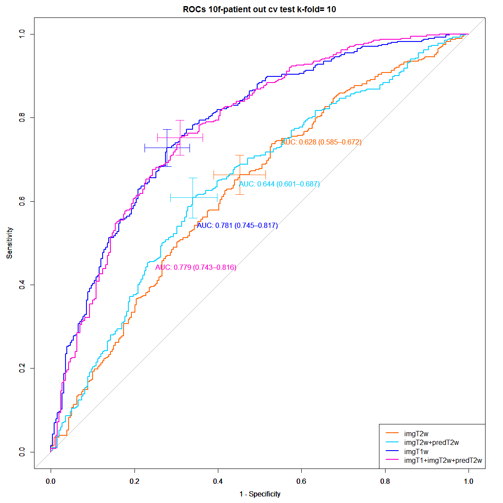 

```
## Area under the curve: 0.7791
## 95% CI (2000 stratified bootstrap replicates):
##  thresholds sp.low sp.median sp.high se.low se.median se.high
##   0.4606152 0.6371    0.6911  0.7452 0.7103    0.7525  0.7946
```

plot results
=================================


```r
# plot features
## group with all of the features spaces combined, most contributing T2w feature
## imgT2featsel ###########
# pick frequency of 75% or higher as very common feature
dfimgT2 = data.frame(table(imgT2featsel$selfeat))
dfimgT2$high = (dfimgT2$Freq>=0.75*max(imgT2featsel$lop))*1
print(dfimgT2[dfimgT2$high==1, ])
```

```
##                                   Var1 Freq high
## 1                              ave_T20    9    1
## 2                              ave_T21    6    1
## 3                             ave_T210    6    1
## 4                             ave_T211    9    1
## 5                             ave_T212    6    1
## 6                             ave_T213    7    1
## 7                             ave_T214    8    1
## 8                             ave_T215    7    1
## 9                             ave_T216    8    1
## 10                            ave_T217    7    1
## 11                            ave_T218    5    1
## 12                            ave_T219    8    1
## 13                             ave_T22    6    1
## 14                             ave_T23    5    1
## 15                             ave_T24    5    1
## 16                             ave_T25    6    1
## 17                             ave_T26    9    1
## 18                             ave_T27    8    1
## 19                             ave_T28    8    1
## 20                             ave_T29    7    1
## 21                         T2_lesionSI   10    1
## 22                      T2_lesionSIstd    6    1
## 23                       T2grad_margin    6    1
## 24                   T2grad_margin_var   10    1
## 25                        T2kurt_F_r_i    6    1
## 26                         T2max_F_r_i    6    1
## 27                        T2mean_F_r_i    3    1
## 28                         T2min_F_r_i    8    1
## 29                          T2RGH_mean    7    1
## 30                           T2RGH_var    9    1
## 31                        T2skew_F_r_i    8    1
## 32               T2texture_ASM_halfRad    3    1
## 33            T2texture_ASM_quarterRad    1    1
## 34           T2texture_ASM_threeQuaRad    5    1
## 35                  T2texture_ASM_zero    2    1
## 36          T2texture_contrast_halfRad    6    1
## 37       T2texture_contrast_quarterRad    4    1
## 38      T2texture_contrast_threeQuaRad    2    1
## 39             T2texture_contrast_zero    7    1
## 40       T2texture_correlation_halfRad    6    1
## 41    T2texture_correlation_quarterRad    9    1
## 42   T2texture_correlation_threeQuaRad    6    1
## 43          T2texture_correlation_zero    7    1
## 44     T2texture_dissimilarity_halfRad    6    1
## 45  T2texture_dissimilarity_quarterRad    4    1
## 46 T2texture_dissimilarity_threeQuaRad    2    1
## 47        T2texture_dissimilarity_zero    6    1
## 48            T2texture_energy_halfRad    3    1
## 49         T2texture_energy_quarterRad    5    1
## 50        T2texture_energy_threeQuaRad    3    1
## 51               T2texture_energy_zero    5    1
## 52       T2texture_homogeneity_halfRad    7    1
## 53    T2texture_homogeneity_quarterRad    5    1
## 54   T2texture_homogeneity_threeQuaRad    8    1
## 55          T2texture_homogeneity_zero    8    1
## 56                         T2var_F_r_i    5    1
```

```r
#qplot(factor(selfeat), data=imgT2featsel, geom="bar", fill=factor(high))
ggplot(dfimgT2, aes(x=Var1, y=Freq, fill=factor(high))) + 
  geom_bar(stat = "identity") + coord_flip() +
  ggtitle("imgT2featsel") +
  labs(y="featsel frequency", x=" ") +
  theme(plot.title = element_text(family = "Trebuchet MS", color="#666666", face="bold", size=22, hjust=0))+
  theme(axis.title = element_text(family = "Trebuchet MS", color="#666666", face="bold", size=16))
```

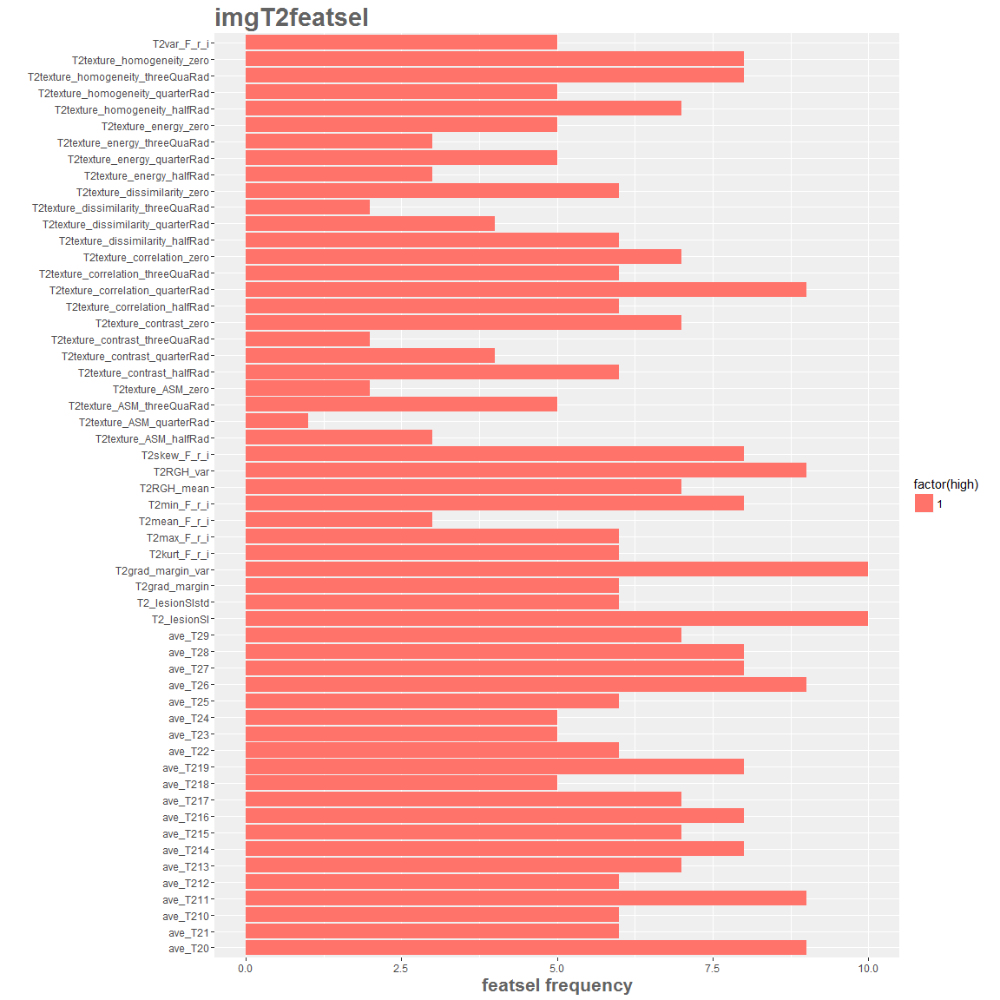 

```r
## allT2featsel ########### 
# pick frequency of 75% or higher as very common feature
dfallT2 = data.frame(table(allT2featsel$selfeat))
dfallT2$high = (dfallT2$Freq>=0.75*max(allT2featsel$lop))*1
print(dfallT2[dfallT2$high==1, ])
```

```
##                                   Var1 Freq high
## 1                              ave_T20    6    1
## 2                              ave_T21    7    1
## 3                             ave_T210    8    1
## 4                             ave_T211    6    1
## 5                             ave_T212    9    1
## 6                             ave_T213    3    1
## 7                             ave_T214    6    1
## 8                             ave_T215    5    1
## 9                             ave_T216    8    1
## 10                            ave_T217    8    1
## 11                            ave_T218    7    1
## 12                            ave_T219    8    1
## 13                             ave_T22    4    1
## 14                             ave_T23    8    1
## 15                             ave_T24    9    1
## 16                             ave_T25    9    1
## 17                             ave_T26    8    1
## 18                             ave_T27    9    1
## 19                             ave_T28    9    1
## 20                             ave_T29    7    1
## 21                     LMSIR_predicted    8    1
## 22                         T2_lesionSI   10    1
## 23                      T2_lesionSIstd    6    1
## 24                       T2grad_margin    2    1
## 25                   T2grad_margin_var    4    1
## 26                        T2kurt_F_r_i    8    1
## 27                         T2max_F_r_i    8    1
## 28                        T2mean_F_r_i    3    1
## 29                         T2min_F_r_i    8    1
## 30                          T2RGH_mean    6    1
## 31                           T2RGH_var    7    1
## 32                        T2skew_F_r_i    9    1
## 33               T2texture_ASM_halfRad    3    1
## 34            T2texture_ASM_quarterRad    4    1
## 35           T2texture_ASM_threeQuaRad    3    1
## 36                  T2texture_ASM_zero    2    1
## 37          T2texture_contrast_halfRad    3    1
## 38       T2texture_contrast_quarterRad    6    1
## 39      T2texture_contrast_threeQuaRad    4    1
## 40             T2texture_contrast_zero    4    1
## 41       T2texture_correlation_halfRad   10    1
## 42    T2texture_correlation_quarterRad    7    1
## 43   T2texture_correlation_threeQuaRad    6    1
## 44          T2texture_correlation_zero   10    1
## 45     T2texture_dissimilarity_halfRad    4    1
## 46  T2texture_dissimilarity_quarterRad    5    1
## 47 T2texture_dissimilarity_threeQuaRad    5    1
## 48        T2texture_dissimilarity_zero    6    1
## 49            T2texture_energy_halfRad    5    1
## 50         T2texture_energy_quarterRad    2    1
## 51        T2texture_energy_threeQuaRad    1    1
## 52               T2texture_energy_zero    3    1
## 53       T2texture_homogeneity_halfRad    7    1
## 54    T2texture_homogeneity_quarterRad    6    1
## 55   T2texture_homogeneity_threeQuaRad    7    1
## 56          T2texture_homogeneity_zero    7    1
## 57                         T2var_F_r_i    5    1
## 58                     T2wSI_predicted    7    1
```

```r
#qplot(factor(selfeat), data=allT2featsel, geom="bar", fill=factor(high))
ggplot(dfallT2, aes(x=Var1, y=Freq, fill=factor(high))) + 
  geom_bar(stat = "identity") + coord_flip() +
  ggtitle("allT2featsel") +
  labs(y="featsel frequency", x=" ") +
  theme(plot.title = element_text(family = "Trebuchet MS", color="#666666", face="bold", size=22, hjust=0))+
  theme(axis.title = element_text(family = "Trebuchet MS", color="#666666", face="bold", size=16))
```

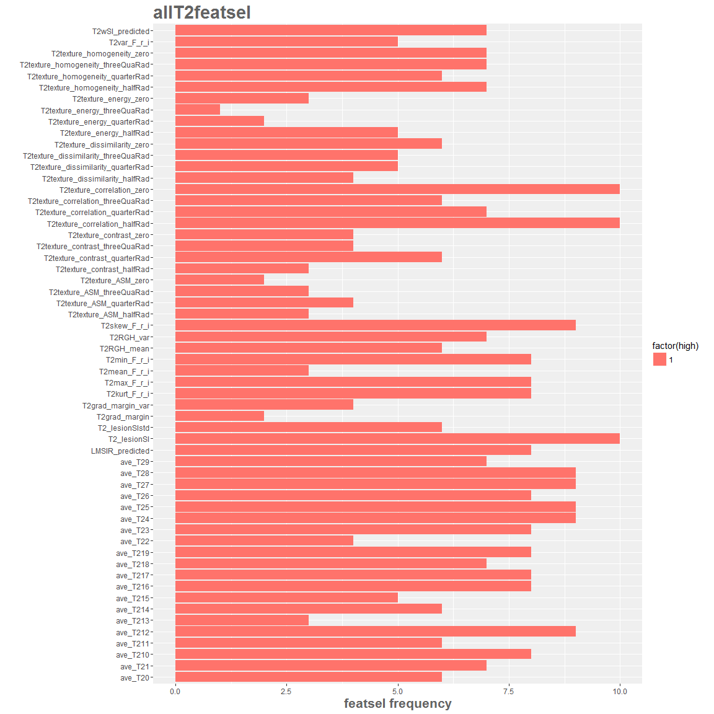 

```r
## imgT1featsel ########### 
# pick frequency of 75% or higher as very common feature
dfimgT1 = data.frame(table(imgT1featsel$selfeat))
dfimgT1$high = (dfimgT1$Freq>=0.75*max(imgT1featsel$lop))*1
print(dfimgT1[dfimgT1$high==1, ])
```

```
##                                  Var1 Freq high
## 1                           A_countor    2    1
## 2                            A_inside   10    1
## 3                       alpha_countor    4    1
## 4                        alpha_inside    1    1
## 5                        beta_countor    2    1
## 6                         beta_inside    3    1
## 7                         circularity    2    1
## 8                             dce2SE1    1    1
## 9                            dce2SE11    3    1
## 10                           dce2SE12    3    1
## 11                           dce2SE13    1    1
## 12                           dce2SE15    1    1
## 13                           dce2SE17    2    1
## 14                           dce2SE18    2    1
## 15                           dce2SE19    1    1
## 16                            dce2SE2    1    1
## 17                            dce2SE3    1    1
## 18                            dce2SE4    2    1
## 19                            dce2SE5    1    1
## 20                            dce2SE7    3    1
## 21                            dce2SE8    1    1
## 22                            dce2SE9    2    1
## 23                            dce3SE0    3    1
## 24                           dce3SE11    1    1
## 25                           dce3SE12    1    1
## 26                           dce3SE14    3    1
## 27                           dce3SE16    1    1
## 28                           dce3SE17    2    1
## 29                           dce3SE18    2    1
## 30                            dce3SE3    1    1
## 31                            dce3SE5    2    1
## 32                            dce3SE8    1    1
## 33                            dce3SE9    1    1
## 34                           earlySE1    2    1
## 35                          earlySE10    4    1
## 36                          earlySE11    1    1
## 37                          earlySE12    2    1
## 38                          earlySE13    3    1
## 39                          earlySE14    2    1
## 40                          earlySE15    2    1
## 41                          earlySE17    2    1
## 42                          earlySE18    2    1
## 43                          earlySE19    1    1
## 44                           earlySE2    4    1
## 45                           earlySE3    1    1
## 46                           earlySE4    2    1
## 47                           earlySE5    3    1
## 48                           earlySE6    2    1
## 49                           earlySE7    3    1
## 50                           earlySE8    1    1
## 51                           earlySE9    1    1
## 52                    edge_sharp_mean    5    1
## 53                     edge_sharp_std    6    1
## 54                      iAUC1_countor    2    1
## 55             iiiMax_Margin_Gradient    6    1
## 56       iiMin_change_Variance_uptake    4    1
## 57               iMax_Variance_uptake    1    1
## 58                       irregularity    5    1
## 59                      Kpeak_countor    5    1
## 60                       Kpeak_inside    2    1
## 61                         kurt_F_r_i    4    1
## 62                            lateSE0    2    1
## 63                            lateSE1    4    1
## 64                           lateSE10    3    1
## 65                           lateSE11    3    1
## 66                           lateSE12    1    1
## 67                           lateSE13    3    1
## 68                           lateSE14    2    1
## 69                           lateSE15    2    1
## 70                           lateSE16    1    1
## 71                           lateSE17    2    1
## 72                           lateSE18    1    1
## 73                           lateSE19    3    1
## 74                            lateSE3    3    1
## 75                            lateSE4    1    1
## 76                            lateSE5    1    1
## 77                            lateSE6    2    1
## 78                            lateSE7    1    1
## 79                            lateSE8    1    1
## 80                            lateSE9    3    1
## 81                       max_RGH_mean    4    1
## 82                     max_RGH_mean_k    1    1
## 83                        max_RGH_var    3    1
## 84                      max_RGH_var_k    3    1
## 85                       maxCr_inside    1    1
## 86                      maxVr_countor    2    1
## 87                       maxVr_inside    5    1
## 88                         mean_F_r_i    3    1
## 89                          min_F_r_i    3    1
## 90                      peakCr_inside    1    1
## 91                      peakVr_inside    2    1
## 92                        SER_countor    1    1
## 93                         SER_inside    4    1
## 94                         skew_F_r_i    3    1
## 95                   Slope_ini_inside    1    1
## 96                texture_ASM_halfRad    1    1
## 97             texture_ASM_quarterRad    1    1
## 98            texture_ASM_threeQuaRad    1    1
## 99           texture_contrast_halfRad    2    1
## 100       texture_contrast_quarterRad    6    1
## 101      texture_contrast_threeQuaRad    2    1
## 102             texture_contrast_zero    1    1
## 103       texture_correlation_halfRad    2    1
## 104    texture_correlation_quarterRad    4    1
## 105   texture_correlation_threeQuaRad    5    1
## 106          texture_correlation_zero    4    1
## 107     texture_dissimilarity_halfRad    1    1
## 108  texture_dissimilarity_quarterRad    2    1
## 109 texture_dissimilarity_threeQuaRad    1    1
## 110            texture_energy_halfRad    3    1
## 111         texture_energy_quarterRad    2    1
## 112        texture_energy_threeQuaRad    1    1
## 113               texture_energy_zero    2    1
## 114    texture_homogeneity_quarterRad    3    1
## 115   texture_homogeneity_threeQuaRad    1    1
## 116          texture_homogeneity_zero    2    1
## 117                     Tpeak_countor    2    1
## 118                      Tpeak_inside    4    1
## 119                UptakeRate_countor    1    1
## 120                 UptakeRate_inside    2    1
## 121                                V0    3    1
## 122                                V1    6    1
## 123                               V10    2    1
## 124                               V11    1    1
## 125                               V12    2    1
## 126                               V13    1    1
## 127                               V14    2    1
## 128                               V15    2    1
## 129                               V16    3    1
## 130                               V17    3    1
## 131                               V18    4    1
## 132                               V19    4    1
## 133                                V2    2    1
## 134                                V3    3    1
## 135                                V4    1    1
## 136                                V5    4    1
## 137                                V6    1    1
## 138                                V7    2    1
## 139                                V8    2    1
## 140                                V9    5    1
## 141                         var_F_r_i    3    1
## 142         Vr_decreasingRate_countor    3    1
## 143          Vr_decreasingRate_inside    3    1
## 144         Vr_increasingRate_countor    2    1
## 145          Vr_increasingRate_inside    1    1
## 146                 Vr_post_1_countor    1    1
## 147                  Vr_post_1_inside    2    1
## 148                washoutRate_inside    3    1
```

```r
#qplot(factor(selfeat), data=imgT1featsel, geom="bar", fill=factor(high))
ggplot(dfimgT1, aes(x=Var1, y=Freq, fill=factor(high))) + 
  geom_bar(stat = "identity") + coord_flip() +
  ggtitle("imgT1featsel") +
  labs(y="featsel frequency", x=" ") +
  theme(plot.title = element_text(family = "Trebuchet MS", color="#666666", face="bold", size=22, hjust=0))+
  theme(axis.title = element_text(family = "Trebuchet MS", color="#666666", face="bold", size=16))
```

 

```r
## allfeatsel ########### 
# pick frequency of 75% or higher as very common feature
dfall = data.frame(table(allfeatsel$selfeat))
dfall$high = (dfall$Freq>=0.5*max(allfeatsel$lop))*1
print(dfall[dfall$high==1, ])
```

```
##                                   Var1 Freq high
## 1                             A_inside   10    1
## 2                        alpha_countor    3    1
## 3                         alpha_inside    2    1
## 4                              ave_T20    1    1
## 5                              ave_T21    2    1
## 6                             ave_T210    3    1
## 7                             ave_T211    2    1
## 8                             ave_T213    2    1
## 9                             ave_T214    1    1
## 10                            ave_T215    1    1
## 11                            ave_T216    1    1
## 12                            ave_T217    1    1
## 13                            ave_T218    1    1
## 14                            ave_T219    2    1
## 15                             ave_T22    1    1
## 16                             ave_T24    2    1
## 17                             ave_T25    5    1
## 18                             ave_T27    1    1
## 19                             ave_T28    1    1
## 20                             ave_T29    1    1
## 21                        beta_countor    2    1
## 22                         beta_inside    1    1
## 23                         circularity    3    1
## 24                             dce2SE0    1    1
## 25                             dce2SE1    1    1
## 26                            dce2SE10    2    1
## 27                            dce2SE11    2    1
## 28                            dce2SE12    3    1
## 29                            dce2SE14    1    1
## 30                            dce2SE16    4    1
## 31                            dce2SE17    1    1
## 32                            dce2SE19    2    1
## 33                             dce2SE3    1    1
## 34                             dce2SE5    1    1
## 35                             dce3SE0    1    1
## 36                            dce3SE10    3    1
## 37                            dce3SE11    1    1
## 38                            dce3SE13    2    1
## 39                            dce3SE16    2    1
## 40                            dce3SE17    1    1
## 41                            dce3SE18    2    1
## 42                            dce3SE19    1    1
## 43                             dce3SE2    3    1
## 44                             dce3SE5    1    1
## 45                             dce3SE7    1    1
## 46                             dce3SE8    2    1
## 47                            earlySE0    1    1
## 48                           earlySE10    1    1
## 49                           earlySE11    1    1
## 50                           earlySE12    2    1
## 51                           earlySE13    1    1
## 52                           earlySE14    1    1
## 53                           earlySE15    1    1
## 54                           earlySE17    1    1
## 55                           earlySE18    2    1
## 56                            earlySE2    1    1
## 57                            earlySE3    1    1
## 58                            earlySE4    3    1
## 59                            earlySE5    2    1
## 60                            earlySE8    5    1
## 61                            earlySE9    2    1
## 62                     edge_sharp_mean    3    1
## 63                      edge_sharp_std    4    1
## 64                       iAUC1_countor    2    1
## 65              iiiMax_Margin_Gradient    2    1
## 66        iiMin_change_Variance_uptake    4    1
## 67                iMax_Variance_uptake    2    1
## 68                        irregularity    4    1
## 69                          ivVariance    2    1
## 70                       Kpeak_countor    1    1
## 71                          kurt_F_r_i    3    1
## 72                             lateSE0    1    1
## 73                             lateSE1    1    1
## 74                            lateSE12    1    1
## 75                            lateSE13    1    1
## 76                            lateSE14    4    1
## 77                            lateSE15    1    1
## 78                            lateSE16    2    1
## 79                            lateSE18    2    1
## 80                            lateSE19    1    1
## 81                             lateSE2    1    1
## 82                             lateSE3    2    1
## 83                             lateSE4    1    1
## 84                             lateSE5    1    1
## 85                             lateSE7    2    1
## 86                             lateSE8    1    1
## 87                           max_F_r_i    2    1
## 88                        max_RGH_mean    2    1
## 89                      max_RGH_mean_k    2    1
## 90                         max_RGH_var    1    1
## 91                       max_RGH_var_k    1    1
## 92                       maxVr_countor    1    1
## 93                        maxVr_inside    1    1
## 94                          mean_F_r_i    1    1
## 95                           min_F_r_i    2    1
## 96                      peakVr_countor    3    1
## 97                         SER_countor    3    1
## 98                          SER_inside    4    1
## 99                          skew_F_r_i    3    1
## 100                  Slope_ini_countor    1    1
## 101                   Slope_ini_inside    1    1
## 102                        T2_lesionSI    2    1
## 103                  T2grad_margin_var    2    1
## 104                       T2kurt_F_r_i    2    1
## 105                       T2mean_F_r_i    1    1
## 106                         T2RGH_mean    4    1
## 107                          T2RGH_var    3    1
## 108                       T2skew_F_r_i    1    1
## 109              T2texture_ASM_halfRad    1    1
## 110          T2texture_ASM_threeQuaRad    1    1
## 111                 T2texture_ASM_zero    2    1
## 112      T2texture_contrast_quarterRad    2    1
## 113     T2texture_contrast_threeQuaRad    1    1
## 114            T2texture_contrast_zero    2    1
## 115      T2texture_correlation_halfRad    1    1
## 116   T2texture_correlation_quarterRad    2    1
## 117  T2texture_correlation_threeQuaRad    2    1
## 118         T2texture_correlation_zero    2    1
## 119    T2texture_dissimilarity_halfRad    1    1
## 120 T2texture_dissimilarity_quarterRad    3    1
## 121       T2texture_dissimilarity_zero    1    1
## 122        T2texture_energy_quarterRad    2    1
## 123              T2texture_energy_zero    1    1
## 124      T2texture_homogeneity_halfRad    2    1
## 125   T2texture_homogeneity_quarterRad    1    1
## 126  T2texture_homogeneity_threeQuaRad    1    1
## 127         T2texture_homogeneity_zero    2    1
## 128                        T2var_F_r_i    3    1
## 129                    T2wSI_predicted    2    1
## 130             texture_ASM_quarterRad    1    1
## 131            texture_ASM_threeQuaRad    1    1
## 132                   texture_ASM_zero    1    1
## 133        texture_contrast_quarterRad    3    1
## 134       texture_contrast_threeQuaRad    4    1
## 135              texture_contrast_zero    2    1
## 136        texture_correlation_halfRad    2    1
## 137     texture_correlation_quarterRad    4    1
## 138    texture_correlation_threeQuaRad    2    1
## 139           texture_correlation_zero    2    1
## 140   texture_dissimilarity_quarterRad    2    1
## 141  texture_dissimilarity_threeQuaRad    1    1
## 142         texture_dissimilarity_zero    1    1
## 143             texture_energy_halfRad    1    1
## 144          texture_energy_quarterRad    3    1
## 145         texture_energy_threeQuaRad    1    1
## 146        texture_homogeneity_halfRad    2    1
## 147     texture_homogeneity_quarterRad    1    1
## 148    texture_homogeneity_threeQuaRad    4    1
## 149           texture_homogeneity_zero    1    1
## 150                      Tpeak_countor    5    1
## 151                       Tpeak_inside    2    1
## 152                  UptakeRate_inside    1    1
## 153                                 V0    4    1
## 154                                V10    1    1
## 155                                V11    1    1
## 156                                V12    2    1
## 157                                V13    2    1
## 158                                V14    2    1
## 159                                V15    4    1
## 160                                V16    1    1
## 161                                V18    4    1
## 162                                V19    2    1
## 163                                 V2    2    1
## 164                                 V3    2    1
## 165                                 V4    2    1
## 166                                 V5    1    1
## 167                                 V6    1    1
## 168                                 V7    2    1
## 169                                 V8    2    1
## 170                                 V9    2    1
## 171                          var_F_r_i    3    1
## 172          Vr_decreasingRate_countor    1    1
## 173           Vr_decreasingRate_inside    1    1
## 174          Vr_increasingRate_countor    1    1
## 175           Vr_increasingRate_inside    1    1
## 176                   Vr_post_1_inside    2    1
## 177                washoutRate_countor    1    1
```

```r
#qplot(factor(selfeat), data=allfeatsel, geom="bar", fill=factor(high))
ggplot(dfall, aes(x=Var1, y=Freq, fill=factor(high))) + 
  geom_bar(stat = "identity") + coord_flip() +
  ggtitle("allfeatsel") +
  labs(y="featsel frequency", x=" ") +
  theme(plot.title = element_text(family = "Trebuchet MS", color="#666666", face="bold", size=22, hjust=0))+
  theme(axis.title = element_text(family = "Trebuchet MS", color="#666666", face="bold", size=16))
```

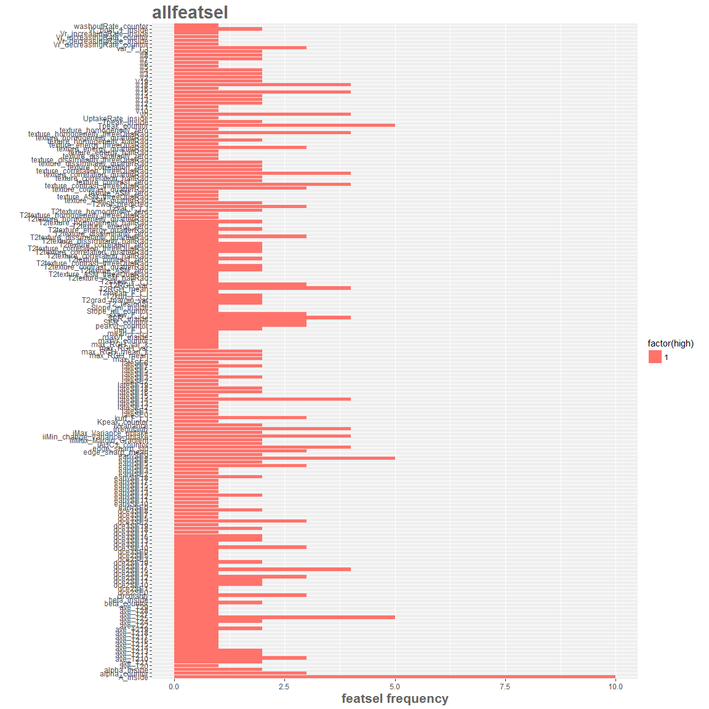 

```r
########### 
## plot ROCs each pass individually in l-o-p heldout test cases
par(mfrow=c(1,1))
n=15
colors = rainbow(n, s = 1, v = 1, start = 0, end = max(1, n - 1)/n, alpha = 1)
# plot 1/4
p1 = calcAUC_plot(perf_imgT2$obs, perf_imgT2$C, 
                           xptext=0.45, yptext=0.75 ,colors[2], atitle="")
```

```
## Area under the curve: 0.6285
## 95% CI (2000 stratified bootstrap replicates):
##  thresholds sp.low sp.median sp.high se.low se.median se.high
##   0.4689336 0.4865    0.5483  0.6063 0.6163    0.6634  0.7079
```

```r
par(new=TRUE)
p2 = calcAUC_plot(perf_allT2$obs, perf_allT2$C, 
                           xptext=0.55, yptext=0.65 ,colors[9], atitle="")
```

```
## Area under the curve: 0.6444
## 95% CI (2000 stratified bootstrap replicates):
##  thresholds sp.low sp.median sp.high se.low se.median se.high
##   0.4416728 0.6023    0.6602  0.7181 0.5619    0.6089  0.6609
```

```r
par(new=TRUE)
p3 = calcAUC_plot(perf_imgT1$obs, perf_imgT1$C,
                           xptext=0.65, yptext=0.55 ,colors[11], atitle="")
```

```
## Area under the curve: 0.7808
## 95% CI (2000 stratified bootstrap replicates):
##  thresholds sp.low sp.median sp.high se.low se.median se.high
##   0.4434561  0.668     0.722  0.7761 0.6856    0.7277  0.7698
```

```r
par(new=TRUE)
p4 = calcAUC_plot(perf_all$obs, perf_all$C,
                           xptext=0.75, yptext=0.45 ,colors[14], atitle="ROCs leave-one-patient out test ")
```

```
## Area under the curve: 0.7791
## 95% CI (2000 stratified bootstrap replicates):
##  thresholds sp.low sp.median sp.high se.low se.median se.high
##   0.4606152 0.6332    0.6911  0.7452 0.7104    0.7525  0.7946
```

```r
legend("bottomright", 
       legend = c(paste0("imgT2w"),
                  paste0("imgT2w+predT2w"),
                  paste0("imgT1w"),
                  paste0("imgT1+imgT2w+predT2w")),
       col = c(colors[2],colors[9],colors[11],colors[14]), lwd = 2)
```

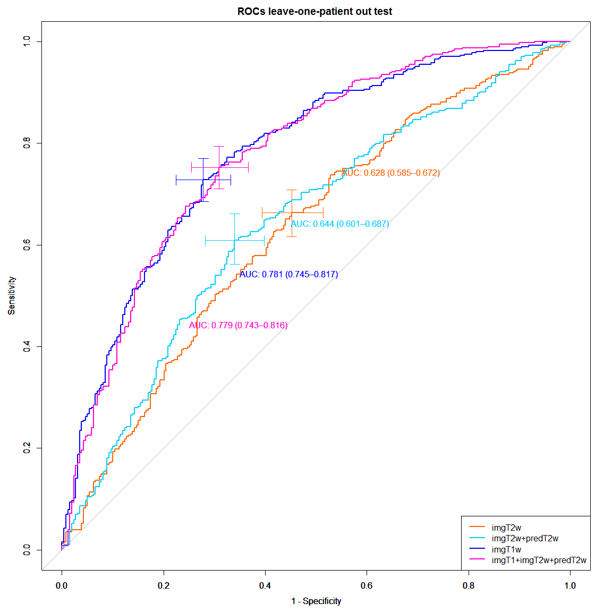 

```r
# find significants: only imgT2 vs. allT2
roc.test(p1$ROC, p2$ROC, method=c("bootstrap"), alternative = c("less"), boot.stratified=TRUE)
```

```
## 
## 	Bootstrap test for two correlated ROC curves
## 
## data:  p1$ROC and p2$ROC
## D = -0.86988, boot.n = 2000, boot.stratified = 1, p-value = 0.1922
## alternative hypothesis: true difference in AUC is less than 0
## sample estimates:
## AUC of roc1 AUC of roc2 
##   0.6284548   0.6444436
```

```r
# find significants: mass imgT1 vs all
roc.test(p3$ROC, p4$ROC, method=c("bootstrap"), alternative = c("two.sided"), boot.stratified=TRUE)
```

```
## 
## 	Bootstrap test for two correlated ROC curves
## 
## data:  p3$ROC and p4$ROC
## D = 0.10933, boot.n = 2000, boot.stratified = 1, p-value = 0.9129
## alternative hypothesis: true difference in AUC is not equal to 0
## sample estimates:
## AUC of roc1 AUC of roc2 
##   0.7808307   0.7791009
```

```r
# find significants: mass allT2 vs all
roc.test(p2$ROC, p4$ROC, method=c("bootstrap"), alternative = c("two.sided"), boot.stratified=TRUE)
```

```
## 
## 	Bootstrap test for two ROC curves
## 
## data:  p2$ROC and p4$ROC
## D = -4.6918, boot.n = 2000, boot.stratified = 1, p-value = 2.709e-06
## alternative hypothesis: true difference in AUC is not equal to 0
## sample estimates:
## AUC of roc1 AUC of roc2 
##   0.6444436   0.7791009
```


