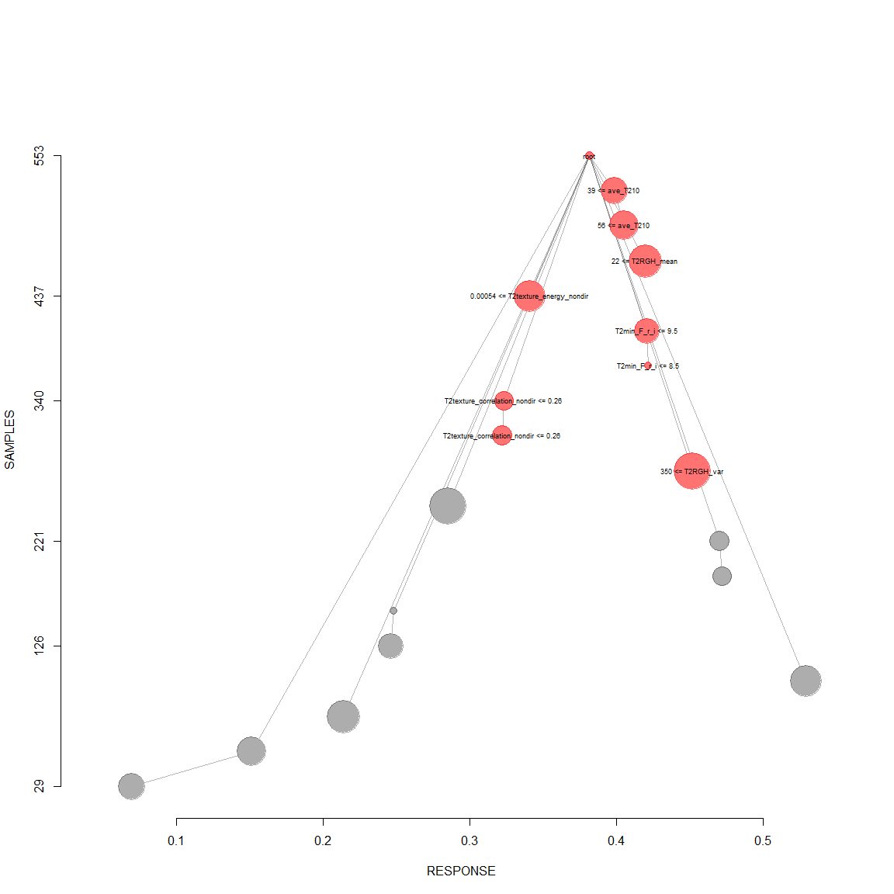
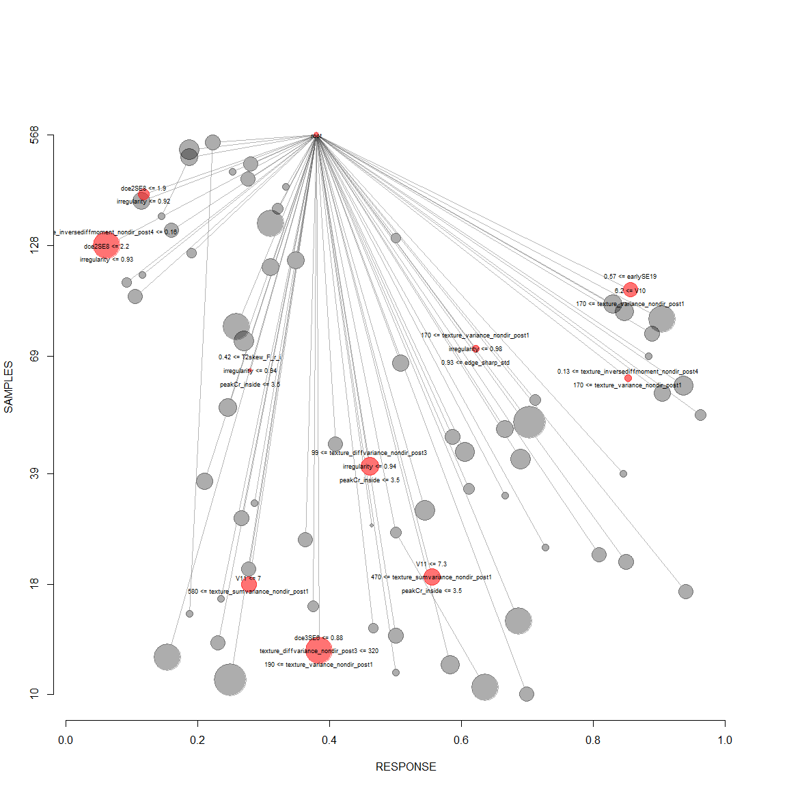
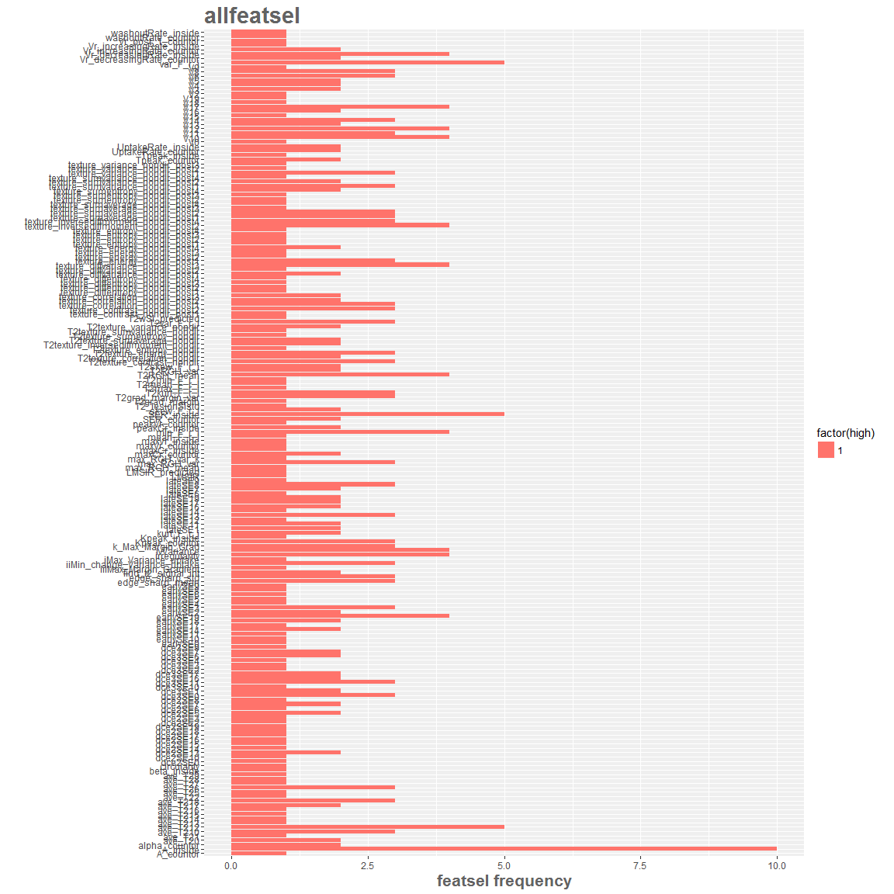
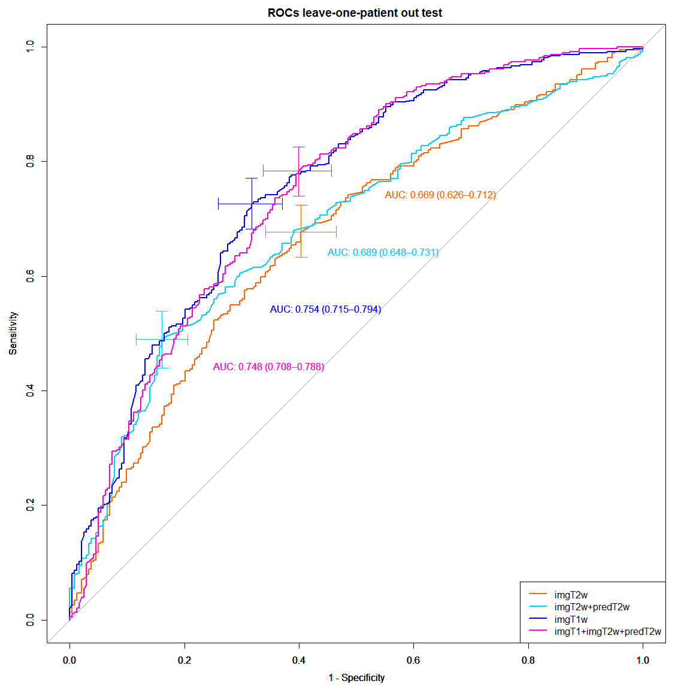

# 3Dtex-bagg
Cristina Gallego  
March 17, 2016  

Bagging trees classification using 3D texture features
============

- This uses tree-ensembles based T2 features in addition to the relevant and tentative T1+T2w features
- This code analysis T2w added diagnostic value by comparing with ensembles of only T1w DCE-based features
- T2w discrimination ability (added AUC ROC value)


```r
options(width = 165)

library(caret)
require(ggplot2)
library("RSQLite")
library(klaR)
library(pROC)
library("Boruta")
require(data.table)
library(R.utils)
library(rpart)
library(rpart.plot)
library(R.utils)
library(nodeHarvest)

loppath = "C:/Users/windows/Documents/repoCode-local/T2wR/lop_3Dtex_T2w_addedvalue"
setwd(loppath)
source("functions.R")

## Add LMSIR predicted and T2wBIRADS predicted
LMSIR_lop <- loadToEnv(("Inputs/finalregressorsLMSIR_T2w.RData"))[["LMSIR_lop"]]; 
perfT2wSI_lop <- loadToEnv(("Inputs/final_classifierT2wSI_boosting.RData"))[["perfT2wSI_lop"]]; 
```

Run 3Dtex-bagg
=================================


```r
# 1) From 100% dataset, Create train/validation (80%) / heldout (20%) partitions
sqlite <- dbDriver("SQLite")
conn <- dbConnect(sqlite, "textureUpdatedFeatures.db")

# 2) all T1w features
lesionsQuery <- dbGetQuery(conn, "SELECT *
         FROM  stage1features
           INNER JOIN lesion ON (stage1features.lesion_id = lesion.lesion_id)
           INNER JOIN f_T2 ON (stage1features.lesion_id = f_T2.lesion_id)")
 
# For bootstrap resampling, createResample is used
# Randomization is done at the patient level, so that bootstrapping preserves lesion independence
lesionsQuery = subset(lesionsQuery, lesion_label != "fociB" & lesion_label != "fociM" ) # exclude foci at this point
id_cad_pts = lesionsQuery$cad_pt_no_txt
uniq_cad = unique(lesionsQuery$cad_pt_no_txt)
npatients = 1:length(uniq_cad)
  
# when y is a factor in an attempt to balance the class distributions within the splits.
# The names of the list objects will denote the fold membership using the pattern 
# resamples." meaning the ith section (of k) of the jth cross-validation set (of times).
set.seed(1234)
npatients = length(uniq_cad)
kfcvpartitionsetD <- createFolds(y = 1:length(uniq_cad),## the outcome data are needed
                                k = 10, 
                                list = TRUE)


## using 3Dtexture first + Boosting
perf_imgT2 = data.frame();  
perf_allT2 = data.frame();   
perf_imgT1 = data.frame();  
perf_all = data.frame();    

## holders for reature rankings
imgT2featsel = data.frame() 
allT2featsel = data.frame() 
imgT1featsel = data.frame() 
allfeatsel = data.frame() 

cvauc_imgT2 = c()
cvauc_allT2 = c()
cvauc_imgT1 = c()
cvauc_all = c()

# perform k-fold-out
for(k in 1:10){  # 1:10f cv
  ## Create folds leave-one-patient-out
  allfT2 = read3Dtex_T2uniqcad_parti(id_cad_pts, uniq_cad, kfcvpartitionsetD, 10, k)
  allfT1 = read3Dtex_T1uniqcad_parti(id_cad_pts, uniq_cad, kfcvpartitionsetD, 10, k)
  allfT1T2 = read3Dtex_T1T2uniqcad_parti(id_cad_pts, uniq_cad, kfcvpartitionsetD, 10, k)
    
  ## formant
  T2train = allfT2[[1]];   T2traininfo = allfT2[[5]];   T2trainids = T2traininfo$lesion_id;
  T2test = allfT2[[2]]; T2testinfo = allfT2[[6]];  T2testids = T2testinfo$lesion_id;
  T1train = allfT1[[1]]; T1traininfo = allfT1[[5]]; T1trainids = T1traininfo$lesion_id;
  T1test = allfT1[[2]]; T1testinfo = allfT1[[6]];  T1testids = T1testinfo$lesion_id;
  T1T2train = allfT1T2[[1]]; T1T2traininfo = allfT1T2[[5]]; T1T2trainids = T1T2traininfo$lesion_id;
  T1T2test = allfT1T2[[2]]; T1T2testinfo = allfT1T2[[6]];  T1T2testids = T1T2testinfo$lesion_id;
  
  # remove radiologist based BIRADS category and measured muscle-to-lesion SI 
  # add predicted T2w features
  T2LMSIR = getid_predLMSIR(LMSIR_lop, T2trainids)
  T2wSI = getid_predT2wSI(perfT2wSI_lop, T2trainids)
  
  imgT2train = T2train[,-c(2,5,ncol(T2train))] # exlude orig_label
  wpredT2train = cbind(T2train[,-c(ncol(T2train))], LMSIR_predicted=T2LMSIR$LMSIR_predicted, T2wSI_predicted=T2wSI$T2wSI_predicted)
  wpredT2train$find_t2_signal_int = as.factor(wpredT2train$find_t2_signal_int)
  wpredT2train$T2wSI_predicted = as.factor(wpredT2train$T2wSI_predicted)
  T1train = T1train[,-c(ncol(T1train))]
  
  # remove radiologist based BIRADS category and measured muscle-to-lesion SI 
  # add predicted T2w features
  T1T2LMSIR = getid_predLMSIR(LMSIR_lop, T1T2trainids)
  T1T2wSI = getid_predT2wSI(perfT2wSI_lop, T1T2trainids)
  
  ########## consider differneces
  imgT1T2train = T1T2train[,-c(ncol(T1T2train))]
  imgT1T2train$find_t2_signal_int = as.factor(imgT1T2train$find_t2_signal_int)
  wpredT1T2train = cbind(imgT1T2train, LMSIR_predicted=T1T2LMSIR$LMSIR_predicted, T2wSI_predicted=T1T2wSI$T2wSI_predicted)
  wpredT1T2train$T2wSI_predicted = as.factor(wpredT1T2train$T2wSI_predicted)
  
  # with datasets:   T2train, wpredT2train, T1train, T1T2train, wpredT1T2train
  selrrfimgT2 = RRF_featsel(imgT2train, "imgT2")
  selrrfallT2 = RRF_featsel(wpredT2train, "allT2")
  selrrfimgT1 = RRF_featsel(T1train, "imgT1")
  selrrfall = RRF_featsel(wpredT1T2train, "all")
  
  ## group with all of the features spaces combined, most contributing T2w feature
  imgT2featsel =  rbind(imgT2featsel, cbind(selrrfimgT2, kfcv=k) )
  allT2featsel =  rbind(allT2featsel, cbind(selrrfallT2, kfcv=k) ) 
  imgT1featsel =  rbind(imgT1featsel, cbind(selrrfimgT1, kfcv=k) ) 
  allfeatsel = rbind(allfeatsel, cbind(selrrfall, kfcv=k) ) 

  ##################
  # Define datasets
  ##################
  # define datasets: imgT2wfeatures allT2wfeatures, imgT1wfeatures, allfeatures
  imgT2features = imgT2train[,c("lesion_label", selrrfimgT2$selfeat)]
  allT2features = wpredT2train[,c("lesion_label",selrrfallT2$selfeat)]
  imgT1features = T1train[,c("lesion_label",selrrfimgT1$selfeat)]
  allfeatures = wpredT1T2train[, c("lesion_label",selrrfall$selfeat)]
  
  ##################
  # Get Test info data
  ##################
  dfinfo = cbind(T2testinfo[,c(1,3,6,24:26)], 
                 find_t2_signal_int=T2test$find_t2_signal_int)
  print(dfinfo)
  
  ## apend LMSIR and T2wSI in case is used by classifier
  testLMSIR = getid_predLMSIR(LMSIR_lop, T2testids)
  testT2wSI = getid_predT2wSI(perfT2wSI_lop, T2testids)
  
  T2test = cbind(T2test, LMSIR_predicted=testLMSIR$LMSIR_predicted,
                 T2wSI_predicted=testT2wSI$T2wSI_predicted)
  
  ## for T1T2
  ## apend LMSIR and T2wSI in case is used by classifier
  testLMSIR = getid_predLMSIR(LMSIR_lop, T1T2testids)
  testT2wSI = getid_predT2wSI(perfT2wSI_lop, T1T2testids)
  
  T1T2test = cbind(T1T2test, LMSIR_predicted=testLMSIR$LMSIR_predicted, T2wSI_predicted=testT2wSI$T2wSI_predicted)
  
  ##################
  # Build final classifiers
  ##################
  # data = imgT2features, 
  cat("\n============ bagging trees treedata_imgT2 \n")
  # train trees
  treedata_imgT2 <- NH_looforestTrain(imgT2features, T2test)
  #treedata_imgT2 = adjustweights_NH(treedata_imgT2$forest, imgT2features, T2test) 
  
    ######## data = allT2features, 
  cat("\n============ bagging trees treedata_allT2 \n")
  # train trees
  treedata_allT2 <- NH_looforestTrain(allT2features, T2test)
  #treedata_allT2 = adjustweights_NH(treedata_allT2$forest, allT2features, T2test) 

  #######  data = imgT1features, 
  cat("\n============ bagging trees treedata_imgT1 \n")
  # train trees
  treedata_imgT1 <- NH_looforestTrain(imgT1features, T1test)
  #treedata_imgT1 = adjustweights_NH(treedata_imgT1$forest, imgT1features, T1test) 
  
  ####### data = allfeatures, 
  cat("\n============ bagging trees treedata_all \n")
  # train trees
  treedata_all <- NH_looforestTrain(allfeatures, T1T2test)
  #treedata_all = adjustweights_NH(treedata_all$forest, allfeatures, T1T2test) 
  

  ##################
  ### predict for each classifier
  ##################
  ## for treedata_imgT2
  rules = data.frame(C=treedata_imgT2$testperf$testpred_NH, NC=1-treedata_imgT2$testperf$testpred_NH)
  rules$pred = apply(rules, 1, which.max)
  perfcv_imgT2 = data.frame(id=T2testinfo$lesion_id, 
                    C=treedata_imgT2$testperf$testpred_NH,
                    NC=1-treedata_imgT2$testperf$testpred_NH,
                    pred=ifelse(rules$pred==1,"C","NC"), obs=T2test$lesion_label)
  
  auc_imgT2 = roc(perfcv_imgT2$obs, perfcv_imgT2$C)
  perf_imgT2 = rbind(perf_imgT2, cbind(dfinfo,perfcv_imgT2) )
  print(head(perfcv_imgT2))
  cvauc_imgT2 = c(cvauc_imgT2, auc_imgT2$auc)

  # for treedata_allT2
  rules = data.frame(C=treedata_allT2$testperf$testpred_NH, NC=1-treedata_allT2$testperf$testpred_NH)
  rules$pred = apply(rules, 1, which.max)
  perfcv_allT2 = data.frame(id=T2testinfo$lesion_id, 
                    C=treedata_allT2$testperf$testpred_NH,
                    NC=1-treedata_allT2$testperf$testpred_NH,
                    pred=ifelse(rules$pred==1,"C","NC"), obs=T2test$lesion_label)
  
  auc_allT2 = roc(perfcv_allT2$obs, perfcv_allT2$C)
  perf_allT2 = rbind(perf_allT2, cbind(dfinfo,perfcv_allT2) )
  print(head(perfcv_allT2))
  cvauc_allT2 = c(cvauc_allT2, auc_allT2$auc)

  ## for treedata_imgT1
  rules = data.frame(C=treedata_imgT1$testperf$testpred_NH, NC=1-treedata_imgT1$testperf$testpred_NH)
  rules$pred = apply(rules, 1, which.max)
  perfcv_imgT1 = data.frame(id=T1testinfo$lesion_id, 
                    C=treedata_imgT1$testperf$testpred_NH,
                    NC=1-treedata_imgT1$testperf$testpred_NH,
                    pred=ifelse(rules$pred==1,"C","NC"), obs=T1test$lesion_label)
  
  auc_imgT1 = roc(perfcv_imgT1$obs, perfcv_imgT1$C)
  perf_imgT1 = rbind(perf_imgT1, cbind(dfinfo,perfcv_imgT1) )
  print(head(perfcv_imgT1))
  cvauc_imgT1 = c(cvauc_imgT1, auc_imgT1$auc)

  # for treedata_all
  rules = data.frame(C=treedata_all$testperf$testpred_NH, NC=1-treedata_all$testperf$testpred_NH)
  rules$pred = apply(rules, 1, which.max)
  perfcv_all = data.frame(id=T1T2testinfo$lesion_id, 
                    C=treedata_all$testperf$testpred_NH,
                    NC=1-treedata_all$testperf$testpred_NH,
                    pred=ifelse(rules$pred==1,"C","NC"), obs=T1T2test$lesion_label)
  
  auc_all = roc(perfcv_all$obs, perfcv_all$C)
  perf_all = rbind(perf_all, cbind(dfinfo,perfcv_all) )
  print(head(perfcv_all))
  cvauc_all = c(cvauc_all, auc_all$auc)
  
  # AUC
  rocperf_imgT2 = roc(perf_imgT2$obs, perf_imgT2$C)
  print(rocperf_imgT2)

  rocperf_allT2 = roc(perf_allT2$obs, perf_allT2$C)
  print(rocperf_allT2)
  
  rocperf_imgT1 = roc(perf_imgT1$obs, perf_imgT1$C)
  print(rocperf_imgT1)
  
  rocperf_all = roc(perf_all$obs, perf_all$C)
  print(rocperf_all)
   
  # plot every 10 patients
  ## plot ROCs each pass individually in l-o-p heldout test cases
  par(mfrow=c(1,1))
  n=15
  colors = rainbow(n, s = 1, v = 1, start = 0, end = max(1, n - 1)/n, alpha = 1)
  # plot 1/4
  p1 = calcAUC_plot(perf_imgT2$obs, perf_imgT2$C, 
                             xptext=0.45, yptext=0.75 ,colors[2], atitle="")
  par(new=TRUE)
  p2 = calcAUC_plot(perf_allT2$obs, perf_allT2$C, 
                             xptext=0.55, yptext=0.65 ,colors[9], atitle="")
  par(new=TRUE)
  p3 = calcAUC_plot(perf_imgT1$obs, perf_imgT1$C,
                             xptext=0.65, yptext=0.55 ,colors[11], atitle="")
  par(new=TRUE)
  p4 = calcAUC_plot(perf_all$obs, perf_all$C,
                             xptext=0.75, yptext=0.45 ,colors[14], 
                    atitle=paste0("ROCs 10f-patient out cv test k-fold= ",k))
  
  legend("bottomright", 
         legend = c(paste0("imgT2w"),
                    paste0("imgT2w+predT2w"),
                    paste0("imgT1w"),
                    paste0("imgT1+imgT2w+predT2w")),
         col = c(colors[2],colors[9],colors[11],colors[14]), lwd = 2)

    
  # save current state k patient out
  save.image(paste0("Outputs/NH_addeddiagvalue_3Dtexbagg_cv",k,".RData"))
  
}
```

```
##    massB    massM nonmassB nonmassM 
##      217      152      131       67 
##    massB    massM nonmassB nonmassM 
##       25       14       11       10 
##    massB    massM nonmassB nonmassM 
##      217      152      131       67 
##    massB    massM nonmassB nonmassM 
##       25       14       11       10 
##    massB    massM nonmassB nonmassM 
##      217      152      131       67 
##    massB    massM nonmassB nonmassM 
##       25       14       11       10
```

```
## RRF 1.6
## Type rrfNews() to see new features/changes/bug fixes.
## 
## Attaching package: 'RRF'
## 
## The following object is masked from 'package:ranger':
## 
##     importance
## 
## The following object is masked from 'package:ggplot2':
## 
##     margin
```

```
## 0.07906977 0.05 
## -0.005050505 0.05 
## Selected features for group: MeanDecreaseGini imgT2 
## =========NULL
##  [1] "T2RGH_var"                          "T2texture_correlation_nondir"       "T2RGH_mean"                         "ave_T210"                          
##  [5] "T2texture_energy_nondir"            "T2texture_inversediffmoment_nondir" "ave_T211"                           "T2skew_F_r_i"                      
##  [9] "T2grad_margin_var"                  "T2texture_entropy_nondir"           "T2var_F_r_i"                        "ave_T217"                          
## [13] "T2texture_sumaverage_nondir"        "ave_T28"                            "ave_T21"                            "T2texture_contrast_nondir"         
## [17] "ave_T213"                           "ave_T219"                           "T2_lesionSI"                        "ave_T26"                           
## [21] "ave_T214"                           "T2max_F_r_i"                        "T2min_F_r_i"                        "ave_T216"                          
## [25] "ave_T218"                           "ave_T29"                            "ave_T25"                            "T2texture_sumentropy_nondir"       
## [29] "T2texture_sumvariance_nondir"       "T2kurt_F_r_i"                       "ave_T23"                            "ave_T215"                          
## [33] "ave_T22"                            "ave_T24"                            "ave_T20"                            "T2_lesionSIstd"                    
## -0.03645833 0.05 
## Selected features for group: MeanDecreaseGini allT2 
## =========NULL
##  [1] "T2RGH_var"                     "T2texture_entropy_nondir"      "ave_T210"                      "T2grad_margin_var"             "LMSIR"                        
##  [6] "T2texture_diffvariance_nondir" "ave_T27"                       "ave_T21"                       "LMSIR_predicted"               "T2_lesionSIstd"               
## [11] "ave_T213"                      "ave_T25"                       "ave_T217"                      "ave_T26"                       "ave_T214"                     
## [16] "ave_T211"                      "T2texture_sumaverage_nondir"   "T2_lesionSI"                   "T2min_F_r_i"                   "T2texture_correlation_nondir" 
## [21] "ave_T23"                       "ave_T22"                       "ave_T24"                       "ave_T20"                       "T2kurt_F_r_i"                 
## [26] "ave_T216"                      "T2wSI_predicted"               "find_t2_signal_int"           
## 0.07189542 0.05 
## -0.05633803 0.05 
## Selected features for group: MeanDecreaseGini imgT1 
## =========NULL
##  [1] "texture_variance_nondir_post2"          "SER_countor"                            "texture_diffvariance_nondir_post1"     
##  [4] "V1"                                     "texture_inversediffmoment_nondir_post4" "V4"                                    
##  [7] "V2"                                     "var_F_r_i"                              "Kpeak_inside"                          
## [10] "Vr_increasingRate_countor"              "Vr_decreasingRate_inside"               "Slope_ini_inside"                      
## [13] "kurt_F_r_i"                             "texture_diffvariance_nondir_post2"      "dce2SE0"                               
## [16] "edge_sharp_std"                         "texture_contrast_nondir_post3"          "dce2SE11"                              
## [19] "dce3SE18"                               "maxVr_countor"                          "earlySE5"                              
## [22] "dce2SE17"                               "dce3SE17"                               "earlySE2"                              
## [25] "earlySE18"                              "UptakeRate_inside"                      "dce2SE15"                              
## [28] "earlySE16"                              "lateSE5"                                "texture_entropy_nondir_post1"          
## [31] "ivVariance"                             "A_countor"                              "dce3SE13"                              
## [34] "earlySE9"                               "skew_F_r_i"                             "edge_sharp_mean"                       
## [37] "dce3SE11"                               "A_inside"                              
## 0.1176471 0.05 
## 0.04 0.05 
## Selected features for group: MeanDecreaseGini all 
## =========NULL
##  [1] "texture_variance_nondir_post1"          "SER_inside"                             "V11"                                   
##  [4] "texture_inversediffmoment_nondir_post2" "V12"                                    "V8"                                    
##  [7] "min_F_r_i"                              "T2kurt_F_r_i"                           "var_F_r_i"                             
## [10] "V14"                                    "Tpeak_countor"                          "texture_correlation_nondir_post1"      
## [13] "texture_sumentropy_nondir_post4"        "T2RGH_mean"                             "texture_sumaverage_nondir_post3"       
## [16] "Vr_decreasingRate_inside"               "dce2SE14"                               "dce2SE15"                              
## [19] "ave_T212"                               "lateSE1"                                "ave_T26"                               
## [22] "lateSE16"                               "edge_sharp_mean"                        "T2grad_margin_var"                     
## [25] "Vr_decreasingRate_countor"              "lateSE7"                                "dce2SE5"                               
## [28] "ivVariance"                             "alpha_countor"                          "V6"                                    
## [31] "texture_energy_nondir_post1"            "T2max_F_r_i"                            "ave_T218"                              
## [34] "texture_diffvariance_nondir_post1"      "T2texture_energy_nondir"                "k_Max_Margin_Grad"                     
## [37] "A_inside"                              
##     lesion_id cad_pt_no_txt exam_a_number_txt BIRADS lesion_label                  lesion_diagnosis      find_t2_signal_int
## 1           1          0002           6745896      4     nonmassM                      InsituDuctal                    None
## 32         32          0173           5123923      4     nonmassB                    DUCT PAPILLOMA                    None
## 40         40          0190           6760690      4        massM                    InvasiveDuctal                    None
## 41         41          0190           6760690      4     nonmassM                    InvasiveDuctal                    None
## 51         51          0205           5085133      4        massB                   FIBROEPITHELIAL            Hyperintense
## 103       103          0553           6687000      2        massB              BENIGN BREAST TISSUE            Hyperintense
## 104       104          0561           4668611      4        massB                      FIBROADENOMA Hypointense or not seen
## 116       116          0606           6781309      4        massB       ATYPICAL DUCTAL HYPERPLASIA            Hyperintense
## 117       117          0608           5094101      4        massB              BENIGN BREAST TISSUE            Hyperintense
## 134       134          0672           4899757      5     nonmassM                      InsituDuctal                    None
## 152       152          0696           6983274      4        massB              BENIGN BREAST TISSUE Hypointense or not seen
## 153       153          0700           4660805      5        massM                    InvasiveDuctal                    None
## 165       165          0718           4962581      4        massB                       FIBROCYSTIC                    None
## 179       179          0730           5009497      5        massM                    InvasiveDuctal                    None
## 185       185          0740           4842984      4     nonmassB  SCLEROSING INTRADUCTAL PAPILLOMA   Slightly hyperintense
## 216       216          0779           4934249      5        massB               SCLEROSING ADENOSIS                    None
## 217       217          0779           4934249      5        massM                    InvasiveDuctal                    None
## 227       227          0796            860773      4     nonmassB      ATYPICAL LOBULAR HYPERPLASIA                    None
## 228       228          0799           5372294      4        massB                       FIBROCYSTIC   Slightly hyperintense
## 229       229          0802           4600874      4        massM                    InvasiveDuctal                    None
## 232       232          0807           5235491      5     nonmassM                      InsituDuctal                    None
## 284       284          0871           5130094      4        massM                   InvasiveLobular                    None
## 285       285          0871           5130094      4        massM                      InsituDuctal                    None
## 286       286          0871           5130094      4        massM                   InvasiveLobular                    None
## 301       301          0885           6747175      4     nonmassB                       FIBROCYSTIC Hypointense or not seen
## 309       309          0918           6976567      4        massB                      FIBROADENOMA            Hyperintense
## 332       332          0993           6979299      4        massB                   PHYLLODES TUMOR            Hyperintense
## 367       367          1086           7173349      6     nonmassB       ATYPICAL DUCTAL HYPERPLASIA                    None
## 378       378          2016           7052211      4        massB                      FIBROADENOMA            Hyperintense
## 380       380          2023           5141524      6        massM                    InvasiveDuctal                    None
## 399       399          2059           7749617      4     nonmassB             COLUMNAR CELL CHANGES                    None
## 413       413          3005           4974097      3     nonmassB              BENIGN BREAST TISSUE                    None
## 414       414          3005           6757337      3     nonmassM                      InsituDuctal Hypointense or not seen
## 415       415          3005           5057668      2     nonmassB                       FIBROCYSTIC                    None
## 416       416          3005           6757337      4     nonmassM                      InsituDuctal Hypointense or not seen
## 422       422          3020           7395195      4        massB               STROMAL HYPERPLASIA Hypointense or not seen
## 424       424          3023           7106703      6        massM                    InvasiveDuctal                    None
## 451       451          3065           7037223      4        massB                          ADENOSIS Hypointense or not seen
## 452       452          3065           7037223      4        massB                          ADENOSIS Hypointense or not seen
## 453       453          3070           7085188      4        massB DUCTAL HYPERPLASIA WITHOUT ATYPIA Hypointense or not seen
## 465       465          3081           7041435      5     nonmassB             COLUMNAR CELL CHANGES Hypointense or not seen
## 466       466          3081           7041435      5     nonmassM                      InsituDuctal Hypointense or not seen
## 476       476          4003           7056445      4     nonmassB         FLORID DUCTAL HYPERPLASIA                    None
## 477       477          4003           7056445      4     nonmassB         FLORID DUCTAL HYPERPLASIA                    None
## 492       492          4029           7633460      4        massB                     InsituLobular                    None
## 493       493          4029           7633460      4        massB                     InsituLobular                    None
## 503       503          4047           7009608      4        massB                       FIBROCYSTIC Hypointense or not seen
## 514       514          6015           5082265      6        massM                    InvasiveDuctal                    None
## 515       515          6015           5082265      6     nonmassM                    InvasiveDuctal                    None
## 518       518          6018           5088825      5     nonmassM                   InvasiveLobular                    None
## 521       521          6021           4798692      4        massB      ATYPICAL LOBULAR HYPERPLASIA                    None
## 534       534          6029           5083338      6        massB                      FIBROADENOMA Hypointense or not seen
## 535       535          6029           5083338      6        massB                      FIBROADENOMA Hypointense or not seen
## 536       536          6029           6772981      4        massB                      FIBROADENOMA Hypointense or not seen
## 538       538          6034           4997881      6        massM                    InvasiveDuctal            Hyperintense
## 539       539          6034           4997881      6        massM                    InvasiveDuctal            Hyperintense
## 540       540          6034           4997881      6     nonmassM                    InvasiveDuctal                    None
## 593       593          7008           6875110      6        massM                   InvasiveLobular            Hyperintense
## 602       602          7045           6760802      4        massB              BENIGN BREAST TISSUE Hypointense or not seen
## 631       631          7190           7013378      3        massB             COLUMNAR CELL CHANGES            Hyperintense
## 
## ============ bagging trees treedata_imgT2 
## maxinter:  1 nodesize:  25 
##   maxinter nodesize  rocTrain   rocTest
## 1        1       25 0.6699667 0.6290509
## maxinter:  2 nodesize:  25 
##   maxinter nodesize  rocTrain   rocTest
## 2        2       25 0.7600706 0.6475694
## maxinter:  3 nodesize:  25 
##   maxinter nodesize  rocTrain   rocTest
## 3        3       25 0.7941007 0.5850694
## maxinter:  5 nodesize:  25 
##   maxinter nodesize rocTrain   rocTest
## 4        5       25 0.868892 0.4895833
## maxinter:  1 nodesize:  20 
##   maxinter nodesize  rocTrain   rocTest
## 5        1       20 0.6699667 0.6290509
## maxinter:  2 nodesize:  20 
##   maxinter nodesize  rocTrain  rocTest
## 6        2       20 0.7603855 0.703125
## maxinter:  3 nodesize:  20 
##   maxinter nodesize  rocTrain   rocTest
## 7        3       20 0.8189852 0.6001157
## maxinter:  5 nodesize:  20 
##   maxinter nodesize  rocTrain  rocTest
## 8        5       20 0.8660382 0.587963
## maxinter:  1 nodesize:  15 
##   maxinter nodesize  rocTrain   rocTest
## 9        1       15 0.6699667 0.6290509
## maxinter:  2 nodesize:  15 
##    maxinter nodesize  rocTrain   rocTest
## 10        2       15 0.7606479 0.5642361
## maxinter:  3 nodesize:  15 
##    maxinter nodesize  rocTrain   rocTest
## 11        3       15 0.8307353 0.6018519
## maxinter:  5 nodesize:  15 
##    maxinter nodesize rocTrain   rocTest
## 12        5       15 0.871536 0.4386574
## maxinter:  1 nodesize:  10 
##    maxinter nodesize  rocTrain   rocTest
## 13        1       10 0.6699667 0.6290509
## maxinter:  2 nodesize:  10 
##    maxinter nodesize  rocTrain   rocTest
## 14        2       10 0.7351861 0.6296296
## maxinter:  3 nodesize:  10 
##    maxinter nodesize  rocTrain   rocTest
## 15        3       10 0.8136383 0.6203704
## maxinter:  5 nodesize:  10 
##    maxinter nodesize  rocTrain   rocTest
## 16        5       10 0.8823414 0.5486111
## maxinter:  1 nodesize:  5 
##    maxinter nodesize  rocTrain   rocTest
## 17        1        5 0.6699667 0.6290509
## maxinter:  2 nodesize:  5 
##    maxinter nodesize  rocTrain   rocTest
## 18        2        5 0.7654962 0.6805556
## maxinter:  3 nodesize:  5 
##    maxinter nodesize  rocTrain   rocTest
## 19        3        5 0.8312405 0.5943287
## maxinter:  5 nodesize:  5 
##    maxinter nodesize  rocTrain  rocTest
## 20        5        5 0.8695219 0.568287
##    maxinter nodesize  rocTrain   rocTest
## 1         1       25 0.6699667 0.6290509
## 2         2       25 0.7600706 0.6475694
## 3         3       25 0.7941007 0.5850694
## 4         5       25 0.8688920 0.4895833
## 5         1       20 0.6699667 0.6290509
## 6         2       20 0.7603855 0.7031250
## 7         3       20 0.8189852 0.6001157
## 8         5       20 0.8660382 0.5879630
## 9         1       15 0.6699667 0.6290509
## 10        2       15 0.7606479 0.5642361
## 11        3       15 0.8307353 0.6018519
## 12        5       15 0.8715360 0.4386574
## 13        1       10 0.6699667 0.6290509
## 14        2       10 0.7351861 0.6296296
## 15        3       10 0.8136383 0.6203704
## 16        5       10 0.8823414 0.5486111
## 17        1        5 0.6699667 0.6290509
## 18        2        5 0.7654962 0.6805556
## 19        3        5 0.8312405 0.5943287
## 20        5        5 0.8695219 0.5682870
##   maxinter nodesize  rocTrain  rocTest
## 6        2       20 0.7603855 0.703125
```

 

```
## 
## ============ bagging trees treedata_allT2 
## maxinter:  1 nodesize:  25 
##   maxinter nodesize  rocTrain   rocTest
## 1        1       25 0.6853645 0.7251157
## maxinter:  2 nodesize:  25 
##   maxinter nodesize  rocTrain   rocTest
## 2        2       25 0.7513843 0.6961806
## maxinter:  3 nodesize:  25 
##   maxinter nodesize  rocTrain   rocTest
## 3        3       25 0.8081011 0.6493056
## maxinter:  5 nodesize:  25 
##   maxinter nodesize rocTrain   rocTest
## 4        5       25 0.872461 0.6857639
## maxinter:  1 nodesize:  20 
##   maxinter nodesize  rocTrain   rocTest
## 5        1       20 0.6853645 0.5914352
## maxinter:  2 nodesize:  20 
##   maxinter nodesize  rocTrain   rocTest
## 6        2       20 0.7625374 0.6018519
## maxinter:  3 nodesize:  20 
##   maxinter nodesize  rocTrain   rocTest
## 7        3       20 0.8170564 0.6493056
## maxinter:  5 nodesize:  20 
##   maxinter nodesize  rocTrain   rocTest
## 8        5       20 0.8740356 0.6724537
## maxinter:  1 nodesize:  15 
##   maxinter nodesize  rocTrain   rocTest
## 9        1       15 0.6853645 0.5914352
## maxinter:  2 nodesize:  15 
##    maxinter nodesize  rocTrain  rocTest
## 10        2       15 0.7622815 0.671875
## maxinter:  3 nodesize:  15 
##    maxinter nodesize  rocTrain   rocTest
## 11        3       15 0.8056146 0.6244213
## maxinter:  5 nodesize:  15 
##    maxinter nodesize  rocTrain   rocTest
## 12        5       15 0.8784575 0.5266204
## maxinter:  1 nodesize:  10 
##    maxinter nodesize  rocTrain   rocTest
## 13        1       10 0.6853645 0.5844907
## maxinter:  2 nodesize:  10 
##    maxinter nodesize  rocTrain   rocTest
## 14        2       10 0.7503412 0.6782407
## maxinter:  3 nodesize:  10 
##    maxinter nodesize rocTrain   rocTest
## 15        3       10 0.812851 0.6209491
## maxinter:  5 nodesize:  10 
##    maxinter nodesize  rocTrain  rocTest
## 16        5       10 0.8660644 0.609375
## maxinter:  1 nodesize:  5 
##    maxinter nodesize  rocTrain   rocTest
## 17        1        5 0.6853645 0.7251157
## maxinter:  2 nodesize:  5 
##    maxinter nodesize  rocTrain  rocTest
## 18        2        5 0.7552288 0.615162
## maxinter:  3 nodesize:  5 
##    maxinter nodesize  rocTrain   rocTest
## 19        3        5 0.8086981 0.6990741
## maxinter:  5 nodesize:  5 
##    maxinter nodesize rocTrain   rocTest
## 20        5        5 0.849092 0.5792824
##    maxinter nodesize  rocTrain   rocTest
## 1         1       25 0.6853645 0.7251157
## 2         2       25 0.7513843 0.6961806
## 3         3       25 0.8081011 0.6493056
## 4         5       25 0.8724610 0.6857639
## 5         1       20 0.6853645 0.5914352
## 6         2       20 0.7625374 0.6018519
## 7         3       20 0.8170564 0.6493056
## 8         5       20 0.8740356 0.6724537
## 9         1       15 0.6853645 0.5914352
## 10        2       15 0.7622815 0.6718750
## 11        3       15 0.8056146 0.6244213
## 12        5       15 0.8784575 0.5266204
## 13        1       10 0.6853645 0.5844907
## 14        2       10 0.7503412 0.6782407
## 15        3       10 0.8128510 0.6209491
## 16        5       10 0.8660644 0.6093750
## 17        1        5 0.6853645 0.7251157
## 18        2        5 0.7552288 0.6151620
## 19        3        5 0.8086981 0.6990741
## 20        5        5 0.8490920 0.5792824
##    maxinter nodesize  rocTrain   rocTest
## 1         1       25 0.6853645 0.7251157
## 17        1        5 0.6853645 0.7251157
```

 

```
## 
## ============ bagging trees treedata_imgT1 
## maxinter:  1 nodesize:  25 
##   maxinter nodesize  rocTrain   rocTest
## 1        1       25 0.7627736 0.5810185
## maxinter:  2 nodesize:  25 
##   maxinter nodesize  rocTrain   rocTest
## 2        2       25 0.8130609 0.6076389
## maxinter:  3 nodesize:  25 
##   maxinter nodesize  rocTrain   rocTest
## 3        3       25 0.8494791 0.6614583
## maxinter:  5 nodesize:  25 
##   maxinter nodesize  rocTrain   rocTest
## 4        5       25 0.8902797 0.6354167
## maxinter:  1 nodesize:  20 
##   maxinter nodesize  rocTrain   rocTest
## 5        1       20 0.7627736 0.5810185
## maxinter:  2 nodesize:  20 
##   maxinter nodesize  rocTrain   rocTest
## 6        2       20 0.7978468 0.6412037
## maxinter:  3 nodesize:  20 
##   maxinter nodesize  rocTrain   rocTest
## 7        3       20 0.8553837 0.5972222
## maxinter:  5 nodesize:  20 
##   maxinter nodesize  rocTrain   rocTest
## 8        5       20 0.8915656 0.5486111
## maxinter:  1 nodesize:  15 
##   maxinter nodesize  rocTrain   rocTest
## 9        1       15 0.7627736 0.5810185
## maxinter:  2 nodesize:  15 
##    maxinter nodesize  rocTrain   rocTest
## 10        2       15 0.8136055 0.6030093
## maxinter:  3 nodesize:  15 
##    maxinter nodesize  rocTrain   rocTest
## 11        3       15 0.8603501 0.6331019
## maxinter:  5 nodesize:  15 
##    maxinter nodesize rocTrain   rocTest
## 12        5       15 0.901669 0.7025463
## maxinter:  1 nodesize:  10 
##    maxinter nodesize  rocTrain   rocTest
## 13        1       10 0.7627736 0.5810185
## maxinter:  2 nodesize:  10 
##    maxinter nodesize  rocTrain   rocTest
## 14        2       10 0.8172532 0.6215278
## maxinter:  3 nodesize:  10 
##    maxinter nodesize  rocTrain   rocTest
## 15        3       10 0.8682425 0.5578704
## maxinter:  5 nodesize:  10 
##    maxinter nodesize  rocTrain   rocTest
## 16        5       10 0.8887052 0.6168981
## maxinter:  1 nodesize:  5 
##    maxinter nodesize  rocTrain   rocTest
## 17        1        5 0.7627736 0.5810185
## maxinter:  2 nodesize:  5 
##    maxinter nodesize  rocTrain   rocTest
## 18        2        5 0.8117882 0.6221065
## maxinter:  3 nodesize:  5 
##    maxinter nodesize  rocTrain   rocTest
## 19        3        5 0.8541765 0.6238426
## maxinter:  5 nodesize:  5 
##    maxinter nodesize  rocTrain   rocTest
## 20        5        5 0.8919527 0.6099537
##    maxinter nodesize  rocTrain   rocTest
## 1         1       25 0.7627736 0.5810185
## 2         2       25 0.8130609 0.6076389
## 3         3       25 0.8494791 0.6614583
## 4         5       25 0.8902797 0.6354167
## 5         1       20 0.7627736 0.5810185
## 6         2       20 0.7978468 0.6412037
## 7         3       20 0.8553837 0.5972222
## 8         5       20 0.8915656 0.5486111
## 9         1       15 0.7627736 0.5810185
## 10        2       15 0.8136055 0.6030093
## 11        3       15 0.8603501 0.6331019
## 12        5       15 0.9016690 0.7025463
## 13        1       10 0.7627736 0.5810185
## 14        2       10 0.8172532 0.6215278
## 15        3       10 0.8682425 0.5578704
## 16        5       10 0.8887052 0.6168981
## 17        1        5 0.7627736 0.5810185
## 18        2        5 0.8117882 0.6221065
## 19        3        5 0.8541765 0.6238426
## 20        5        5 0.8919527 0.6099537
##    maxinter nodesize rocTrain   rocTest
## 12        5       15 0.901669 0.7025463
```

 

```
## 
## ============ bagging trees treedata_all 
## maxinter:  1 nodesize:  25 
##   maxinter nodesize rocTrain   rocTest
## 1        1       25 0.774504 0.6412037
## maxinter:  2 nodesize:  25 
##   maxinter nodesize rocTrain   rocTest
## 2        2       25 0.825992 0.6359954
## maxinter:  3 nodesize:  25 
##   maxinter nodesize  rocTrain   rocTest
## 3        3       25 0.8618459 0.6649306
## maxinter:  5 nodesize:  25 
##   maxinter nodesize  rocTrain   rocTest
## 4        5       25 0.8951937 0.6747685
## maxinter:  1 nodesize:  20 
##   maxinter nodesize  rocTrain   rocTest
## 5        1       20 0.7740579 0.6429398
## maxinter:  2 nodesize:  20 
##   maxinter nodesize  rocTrain  rocTest
## 6        2       20 0.8320081 0.619213
## maxinter:  3 nodesize:  20 
##   maxinter nodesize rocTrain   rocTest
## 7        3       20 0.863696 0.6568287
## maxinter:  5 nodesize:  20 
##   maxinter nodesize  rocTrain   rocTest
## 8        5       20 0.8924316 0.6203704
## maxinter:  1 nodesize:  15 
##   maxinter nodesize rocTrain   rocTest
## 9        1       15 0.774504 0.6412037
## maxinter:  2 nodesize:  15 
##    maxinter nodesize  rocTrain   rocTest
## 10        2       15 0.8345799 0.6238426
## maxinter:  3 nodesize:  15 
##    maxinter nodesize  rocTrain   rocTest
## 11        3       15 0.8702435 0.6736111
## maxinter:  5 nodesize:  15 
##    maxinter nodesize  rocTrain   rocTest
## 12        5       15 0.8941505 0.7037037
## maxinter:  1 nodesize:  10 
##    maxinter nodesize rocTrain   rocTest
## 13        1       10 0.774504 0.6412037
## maxinter:  2 nodesize:  10 
##    maxinter nodesize rocTrain   rocTest
## 14        2       10 0.831293 0.6377315
## maxinter:  3 nodesize:  10 
##    maxinter nodesize  rocTrain  rocTest
## 15        3       10 0.8639387 0.681713
## maxinter:  5 nodesize:  10 
##    maxinter nodesize  rocTrain   rocTest
## 16        5       10 0.9034207 0.6527778
## maxinter:  1 nodesize:  5 
##    maxinter nodesize rocTrain   rocTest
## 17        1        5 0.774504 0.6412037
## maxinter:  2 nodesize:  5 
##    maxinter nodesize  rocTrain   rocTest
## 18        2        5 0.8228035 0.6388889
## maxinter:  3 nodesize:  5 
##    maxinter nodesize  rocTrain   rocTest
## 19        3        5 0.8810948 0.6579861
## maxinter:  5 nodesize:  5 
##    maxinter nodesize  rocTrain   rocTest
## 20        5        5 0.9088595 0.6851852
##    maxinter nodesize  rocTrain   rocTest
## 1         1       25 0.7745040 0.6412037
## 2         2       25 0.8259920 0.6359954
## 3         3       25 0.8618459 0.6649306
## 4         5       25 0.8951937 0.6747685
## 5         1       20 0.7740579 0.6429398
## 6         2       20 0.8320081 0.6192130
## 7         3       20 0.8636960 0.6568287
## 8         5       20 0.8924316 0.6203704
## 9         1       15 0.7745040 0.6412037
## 10        2       15 0.8345799 0.6238426
## 11        3       15 0.8702435 0.6736111
## 12        5       15 0.8941505 0.7037037
## 13        1       10 0.7745040 0.6412037
## 14        2       10 0.8312930 0.6377315
## 15        3       10 0.8639387 0.6817130
## 16        5       10 0.9034207 0.6527778
## 17        1        5 0.7745040 0.6412037
## 18        2        5 0.8228035 0.6388889
## 19        3        5 0.8810948 0.6579861
## 20        5        5 0.9088595 0.6851852
##    maxinter nodesize  rocTrain   rocTest
## 12        5       15 0.8941505 0.7037037
```

 

```
##    id         C        NC pred obs
## 1   1 0.4634543 0.5365457   NC   C
## 2  32 0.3354558 0.6645442   NC  NC
## 3  40 0.6617289 0.3382711    C   C
## 4  41 0.4384980 0.5615020   NC   C
## 5  51 0.3868150 0.6131850   NC  NC
## 6 103 0.5405117 0.4594883    C  NC
##    id         C        NC pred obs
## 1   1 0.4504463 0.5495537   NC   C
## 2  32 0.3551662 0.6448338   NC  NC
## 3  40 0.4934246 0.5065754   NC   C
## 4  41 0.4504463 0.5495537   NC   C
## 5  51 0.3799965 0.6200035   NC  NC
## 6 103 0.3799965 0.6200035   NC  NC
##    id          C        NC pred obs
## 1   1 0.70192686 0.2980731    C   C
## 2  32 0.18879532 0.8112047   NC  NC
## 3  40 0.13067740 0.8693226   NC   C
## 4  41 0.26092525 0.7390747   NC   C
## 5  51 0.11600801 0.8839920   NC  NC
## 6 103 0.05426563 0.9457344   NC  NC
##    id         C        NC pred obs
## 1   1 0.7271445 0.2728555    C   C
## 2  32 0.3207696 0.6792304   NC  NC
## 3  40 0.6598500 0.3401500    C   C
## 4  41 0.2146170 0.7853830   NC   C
## 5  51 0.4108134 0.5891866   NC  NC
## 6 103 0.1036997 0.8963003   NC  NC
## 
## Call:
## roc.default(response = perf_imgT2$obs, predictor = perf_imgT2$C)
## 
## Data: perf_imgT2$C in 24 controls (perf_imgT2$obs C) > 36 cases (perf_imgT2$obs NC).
## Area under the curve: 0.7031
## 
## Call:
## roc.default(response = perf_allT2$obs, predictor = perf_allT2$C)
## 
## Data: perf_allT2$C in 24 controls (perf_allT2$obs C) > 36 cases (perf_allT2$obs NC).
## Area under the curve: 0.7251
## 
## Call:
## roc.default(response = perf_imgT1$obs, predictor = perf_imgT1$C)
## 
## Data: perf_imgT1$C in 24 controls (perf_imgT1$obs C) > 36 cases (perf_imgT1$obs NC).
## Area under the curve: 0.7025
## 
## Call:
## roc.default(response = perf_all$obs, predictor = perf_all$C)
## 
## Data: perf_all$C in 24 controls (perf_all$obs C) > 36 cases (perf_all$obs NC).
## Area under the curve: 0.7037
```

```
## Area under the curve: 0.7031
## 95% CI (2000 stratified bootstrap replicates):
##  thresholds sp.low sp.median sp.high se.low se.median se.high
##   0.4999711  0.375    0.5833  0.7917 0.6944    0.8333  0.9444
```

```
## Area under the curve: 0.7251
## 95% CI (2000 stratified bootstrap replicates):
##  thresholds sp.low sp.median sp.high se.low se.median se.high
##   0.4263524 0.5417    0.7083   0.875 0.5556    0.7222  0.8611
##   0.3460922 0.7500    0.8750   1.000 0.3889    0.5556  0.7222
```

```
## Area under the curve: 0.7025
## 95% CI (2000 stratified bootstrap replicates):
##  thresholds sp.low sp.median sp.high se.low se.median se.high
##   0.2054541  0.625    0.7917  0.9177 0.4167    0.5833    0.75
```

 

```
## Area under the curve: 0.7037
## 95% CI (2000 stratified bootstrap replicates):
##  thresholds sp.low sp.median sp.high se.low se.median se.high
##   0.5580426  0.375    0.5833  0.7917   0.75    0.8611  0.9722
##    massB    massM nonmassB nonmassM 
##      212      149      132       63 
##    massB    massM nonmassB nonmassM 
##       30       17       10       14 
##    massB    massM nonmassB nonmassM 
##      212      149      132       63 
##    massB    massM nonmassB nonmassM 
##       30       17       10       14 
##    massB    massM nonmassB nonmassM 
##      212      149      132       63 
##    massB    massM nonmassB nonmassM 
##       30       17       10       14 
## 0.09178744 0.05 
## -0.1382979 0.05 
## Selected features for group: MeanDecreaseGini imgT2 
## =========NULL
##  [1] "T2RGH_var"                          "ave_T210"                           "T2texture_correlation_nondir"       "T2skew_F_r_i"                      
##  [5] "T2var_F_r_i"                        "ave_T211"                           "ave_T27"                            "ave_T212"                          
##  [9] "ave_T214"                           "ave_T23"                            "T2texture_energy_nondir"            "ave_T25"                           
## [13] "ave_T28"                            "ave_T20"                            "T2texture_diffvariance_nondir"      "T2max_F_r_i"                       
## [17] "ave_T218"                           "T2kurt_F_r_i"                       "ave_T217"                           "ave_T29"                           
## [21] "T2RGH_mean"                         "ave_T26"                            "ave_T24"                            "T2texture_sumentropy_nondir"       
## [25] "T2texture_variance_nondir"          "T2texture_inversediffmoment_nondir" "ave_T215"                           "T2_lesionSI"                       
## [29] "ave_T219"                           "T2min_F_r_i"                        "ave_T22"                            "ave_T216"                          
## [33] "T2grad_margin_var"                  "T2texture_sumaverage_nondir"        "ave_T213"                           "T2_lesionSIstd"                    
## 0.1004785 0.05 
## -0.06382979 0.05 
## Selected features for group: MeanDecreaseGini allT2 
## =========NULL
##  [1] "T2RGH_var"                          "T2grad_margin_var"                  "T2RGH_mean"                         "T2max_F_r_i"                       
##  [5] "T2texture_inversediffmoment_nondir" "LMSIR"                              "T2wSI_predicted"                    "ave_T210"                          
##  [9] "T2texture_sumvariance_nondir"       "ave_T218"                           "ave_T20"                            "ave_T212"                          
## [13] "T2var_F_r_i"                        "T2texture_energy_nondir"            "ave_T22"                            "ave_T25"                           
## [17] "T2texture_contrast_nondir"          "ave_T23"                            "T2min_F_r_i"                        "ave_T219"                          
## [21] "ave_T215"                           "ave_T216"                           "T2_lesionSI"                        "T2texture_correlation_nondir"      
## [25] "ave_T217"                           "ave_T21"                            "ave_T213"                           "T2texture_entropy_nondir"          
## [29] "T2skew_F_r_i"                       "ave_T29"                            "LMSIR_predicted"                    "ave_T28"                           
## [33] "T2kurt_F_r_i"                       "find_t2_signal_int"                
## 0.09937888 0.05 
## -0.006896552 0.05 
## Selected features for group: MeanDecreaseGini imgT1 
## =========NULL
##  [1] "circularity"                            "alpha_inside"                           "texture_sumvariance_nondir_post3"      
##  [4] "washoutRate_inside"                     "texture_inversediffmoment_nondir_post4" "texture_diffvariance_nondir_post1"     
##  [7] "iMax_Variance_uptake"                   "texture_correlation_nondir_post2"       "texture_sumaverage_nondir_post4"       
## [10] "edge_sharp_std"                         "kurt_F_r_i"                             "V2"                                    
## [13] "V6"                                     "earlySE7"                               "Vr_increasingRate_inside"              
## [16] "dce3SE17"                               "dce2SE0"                                "V0"                                    
## [19] "lateSE9"                                "V19"                                    "skew_F_r_i"                            
## [22] "V18"                                    "earlySE4"                               "dce2SE7"                               
## [25] "lateSE16"                               "texture_sumaverage_nondir_post1"        "var_F_r_i"                             
## [28] "lateSE1"                                "texture_inversediffmoment_nondir_post3" "dce3SE5"                               
## [31] "max_RGH_var_k"                          "dce2SE14"                               "Tpeak_countor"                         
## [34] "lateSE0"                                "V7"                                     "A_inside"                              
## 0.05 0.05 
## 0.05263158 0.05 
## -0.0625 0.05 
## Selected features for group: MeanDecreaseGini all 
## =========NULL
##  [1] "irregularity"                           "SER_countor"                            "texture_sumvariance_nondir_post2"      
##  [4] "texture_sumaverage_nondir_post1"        "texture_inversediffmoment_nondir_post2" "iiMin_change_Variance_uptake"          
##  [7] "T2texture_correlation_nondir"           "T2RGH_var"                              "lateSE8"                               
## [10] "Kpeak_inside"                           "texture_sumvariance_nondir_post4"       "beta_inside"                           
## [13] "Vr_decreasingRate_inside"               "V17"                                    "A_countor"                             
## [16] "var_F_r_i"                              "UptakeRate_inside"                      "texture_energy_nondir_post1"           
## [19] "max_RGH_var"                            "kurt_F_r_i"                             "dce2SE5"                               
## [22] "V6"                                     "texture_diffentropy_nondir_post1"       "ave_T216"                              
## [25] "dce3SE17"                               "texture_contrast_nondir_post2"          "dce2SE3"                               
## [28] "dce3SE9"                                "ave_T212"                               "V12"                                   
## [31] "peakCr_inside"                          "maxCr_countor"                          "ave_T28"                               
## [34] "Vr_increasingRate_countor"              "lateSE1"                                "ave_T20"                               
## [37] "T2texture_variance_nondir"              "T2skew_F_r_i"                           "dce3SE10"                              
## [40] "peakVr_countor"                         "A_inside"                              
##     lesion_id cad_pt_no_txt exam_a_number_txt BIRADS lesion_label                lesion_diagnosis      find_t2_signal_int
## 23         23          0132           5154279      3        massB            BENIGN BREAST TISSUE            Hyperintense
## 24         24          0132           5154279      3        massB            BENIGN BREAST TISSUE            Hyperintense
## 54         54          0220           6715021      5        massB                      RadialScar   Slightly hyperintense
## 55         55          0220           6715021      5        massB                    FIBROADENOMA   Slightly hyperintense
## 57         57          0232           6671713      5     nonmassB                     FIBROCYSTIC                    None
## 58         58          0232           6671713      5     nonmassB                     FIBROCYSTIC                    None
## 66         66          0266           5254958      4     nonmassB                     FIBROCYSTIC Hypointense or not seen
## 74         74          0325           4696948      4        massB                     FIBROCYSTIC            Hyperintense
## 87         87          0442           4936886      4        massB            BENIGN BREAST TISSUE   Slightly hyperintense
## 89         89          0462           5466989      3     nonmassM                  InvasiveDuctal Hypointense or not seen
## 90         90          0462           5466989      4        massB                    FIBROADENOMA            Hyperintense
## 102       102          0552           4663314      4        massB                        ADENOSIS   Slightly hyperintense
## 112       112          0580           6855384      4        massB                    FIBROADENOMA                    None
## 123       123          0624           4894714      5        massB                     FIBROCYSTIC Hypointense or not seen
## 139       139          0683           5226149      5        massM                  InvasiveDuctal                    None
## 172       172          0726           5304228      5        massM                  InvasiveDuctal   Slightly hyperintense
## 188       188          0743           4827839      4        massM                  InvasiveDuctal Hypointense or not seen
## 209       209          0781           4738440      5     nonmassM                  InvasiveDuctal                    None
## 235       235          0812           4700538      5        massM                  InvasiveDuctal Hypointense or not seen
## 242       242          0818           5021762      4        massB                  DUCT PAPILLOMA                    None
## 250       250          0831           4633368      6     nonmassM                    InsituDuctal   Slightly hyperintense
## 282       282          0867           5372277      5     nonmassM                  InvasiveDuctal                    None
## 287       287          0873           4956191      4        massB                     FIBROCYSTIC Hypointense or not seen
## 288       288          0873           4956191      4        massB                     FIBROCYSTIC   Slightly hyperintense
## 292       292          0877           4724338      4     nonmassB    ATYPICAL LOBULAR HYPERPLASIA                    None
## 293       293          0880           4809515      4        massB          Papillary(focalAtypia)   Slightly hyperintense
## 294       294          0880           6778829      3        massM                    InsituDuctal                    None
## 295       295          0880           6778829      3     nonmassM                    InsituDuctal                    None
## 296       296          0880           6778829      3     nonmassM                    InsituDuctal                    None
## 297       297          0880           4809515      4        massB               AtypicalPapilloma   Slightly hyperintense
## 299       299          0884           6876318      6        massM                  InvasiveDuctal                    None
## 300       300          0884           6876318      6     nonmassM                    InsituDuctal                    None
## 322       322          0952           7105222      4     nonmassB  FOCAL USUAL DUCTAL HYPERPLASIA Hypointense or not seen
## 323       323          0952           7105222      4     nonmassB                    FIBROADENOMA            Hyperintense
## 327       327          0965           6676125      3        massB                    FIBROADENOMA   Slightly hyperintense
## 359       359          1071           7382882      4     nonmassM                    InsituDuctal                    None
## 360       360          1072           7554174      6        massM                  InvasiveDuctal   Slightly hyperintense
## 361       361          1072           7554174      4        massB     SCLEROSING PAPILLARY LESION Hypointense or not seen
## 373       373          1095           4378323      3        massB                    FIBROADENOMA            Hyperintense
## 374       374          1095           4378323      5     nonmassM                    InsituDuctal                    None
## 383       383          2028           6702914      6     nonmassB                     FIBROCYSTIC Hypointense or not seen
## 384       384          2028           6702914      6        massM                  InvasiveDuctal                    None
## 385       385          2029           6716423      6        massB                        ADENOSIS                    None
## 398       398          2055           7041426      6     nonmassM                  InvasiveDuctal                    None
## 411       411          3004           7691918      4     nonmassB                     FIBROCYSTIC                    None
## 412       412          3004           7691918      4     nonmassB                     FIBROCYSTIC                    None
## 435       435          3046           7682447      4        massB                    FIBROADENOMA Hypointense or not seen
## 436       436          3046           7289130      4        massB                    FIBROADENOMA            Hyperintense
## 437       437          3046           7682447      4        massB                    FIBROADENOMA Hypointense or not seen
## 457       457          3075           7064471      6        massM                  InvasiveDuctal                    None
## 458       458          3075           7064471      6     nonmassM                    InsituDuctal                    None
## 474       474          3097           6909883      4        massB     ATYPICAL DUCTAL HYPERPLASIA Hypointense or not seen
## 475       475          4002           6993690      5        massB            BENIGN BREAST TISSUE Hypointense or not seen
## 487       487          4023           7037125      4        massM                  InvasiveDuctal                    None
## 488       488          4023           7037125      4        massB ADENOSIS, COLUMNAR CELL CHANGES Hypointense or not seen
## 489       489          4023           7152678      4        massB  BENIGN INTRAMAMMARY LYMPH NODE Hypointense or not seen
## 490       490          4023           7037125      4        massM                  InvasiveDuctal                    None
## 506       506          6001           4574766      6     nonmassM                  InvasiveDuctal                    None
## 513       513          6014           5101372      6        massM                  InvasiveDuctal                    None
## 570       570          6052           5369136      6     nonmassM                  InvasiveDuctal                    None
## 571       571          6054           5425486      5        massM                    InsituDuctal                    None
## 572       572          6054           5425486      5        massM                    InsituDuctal                    None
## 573       573          6054           5425486      5        massM                    InsituDuctal                    None
## 574       574          6054           5425486      5        massM                    InsituDuctal                    None
## 575       575          6054           5425486      5        massM                    InsituDuctal                    None
## 592       592          6233           7047121      6        massB                    FIBROADENOMA            Hyperintense
## 604       604          7066           6715383      4        massB                    FIBROADENOMA                    None
## 605       605          7066           7395276      4     nonmassB           COLUMNAR CELL CHANGES                    None
## 615       615          7096           6869668      3        massB                    FIBROADENOMA                    None
## 616       616          7096           6869668      3        massB                    FIBROADENOMA Hypointense or not seen
## 624       624          7159           5435020      4     nonmassM                 InvasiveLobular                    None
## 
## ============ bagging trees treedata_imgT2 
## maxinter:  1 nodesize:  25 
##   maxinter nodesize  rocTrain   rocTest
## 1        1       25 0.6763657 0.7608871
## maxinter:  2 nodesize:  25 
##   maxinter nodesize  rocTrain  rocTest
## 2        2       25 0.7699786 0.658871
## maxinter:  3 nodesize:  25 
##   maxinter nodesize rocTrain   rocTest
## 3        3       25 0.818643 0.6895161
## maxinter:  5 nodesize:  25 
##   maxinter nodesize  rocTrain   rocTest
## 4        5       25 0.8461222 0.6153226
## maxinter:  1 nodesize:  20 
##   maxinter nodesize  rocTrain   rocTest
## 5        1       20 0.6763657 0.7641129
## maxinter:  2 nodesize:  20 
##   maxinter nodesize  rocTrain   rocTest
## 6        2       20 0.7532429 0.7193548
## maxinter:  3 nodesize:  20 
##   maxinter nodesize  rocTrain   rocTest
## 7        3       20 0.8090925 0.6903226
## maxinter:  5 nodesize:  20 
##   maxinter nodesize  rocTrain   rocTest
## 8        5       20 0.8751028 0.5512097
## maxinter:  1 nodesize:  15 
##   maxinter nodesize  rocTrain   rocTest
## 9        1       15 0.6763657 0.7608871
## maxinter:  2 nodesize:  15 
##    maxinter nodesize  rocTrain  rocTest
## 10        2       15 0.7547444 0.678629
## maxinter:  3 nodesize:  15 
##    maxinter nodesize  rocTrain   rocTest
## 11        3       15 0.8092022 0.6451613
## maxinter:  5 nodesize:  15 
##    maxinter nodesize  rocTrain   rocTest
## 12        5       15 0.8438666 0.6217742
## maxinter:  1 nodesize:  10 
##    maxinter nodesize  rocTrain   rocTest
## 13        1       10 0.6739113 0.7596774
## maxinter:  2 nodesize:  10 
##    maxinter nodesize  rocTrain   rocTest
## 14        2       10 0.7747642 0.6947581
## maxinter:  3 nodesize:  10 
##    maxinter nodesize  rocTrain   rocTest
## 15        3       10 0.8062198 0.6758065
## maxinter:  5 nodesize:  10 
##    maxinter nodesize  rocTrain   rocTest
## 16        5       10 0.8726347 0.6427419
## maxinter:  1 nodesize:  5 
##    maxinter nodesize  rocTrain   rocTest
## 17        1        5 0.6763657 0.7608871
## maxinter:  2 nodesize:  5 
##    maxinter nodesize  rocTrain   rocTest
## 18        2        5 0.7558071 0.6556452
## maxinter:  3 nodesize:  5 
##    maxinter nodesize  rocTrain   rocTest
## 19        3        5 0.8144677 0.6379032
## maxinter:  5 nodesize:  5 
##    maxinter nodesize  rocTrain   rocTest
## 20        5        5 0.8526081 0.6475806
##    maxinter nodesize  rocTrain   rocTest
## 1         1       25 0.6763657 0.7608871
## 2         2       25 0.7699786 0.6588710
## 3         3       25 0.8186430 0.6895161
## 4         5       25 0.8461222 0.6153226
## 5         1       20 0.6763657 0.7641129
## 6         2       20 0.7532429 0.7193548
## 7         3       20 0.8090925 0.6903226
## 8         5       20 0.8751028 0.5512097
## 9         1       15 0.6763657 0.7608871
## 10        2       15 0.7547444 0.6786290
## 11        3       15 0.8092022 0.6451613
## 12        5       15 0.8438666 0.6217742
## 13        1       10 0.6739113 0.7596774
## 14        2       10 0.7747642 0.6947581
## 15        3       10 0.8062198 0.6758065
## 16        5       10 0.8726347 0.6427419
## 17        1        5 0.6763657 0.7608871
## 18        2        5 0.7558071 0.6556452
## 19        3        5 0.8144677 0.6379032
## 20        5        5 0.8526081 0.6475806
##   maxinter nodesize  rocTrain   rocTest
## 5        1       20 0.6763657 0.7641129
```

 

```
## 
## ============ bagging trees treedata_allT2 
## maxinter:  1 nodesize:  25 
##   maxinter nodesize rocTrain  rocTest
## 1        1       25 0.679115 0.846371
## maxinter:  2 nodesize:  25 
##   maxinter nodesize  rocTrain   rocTest
## 2        2       25 0.7473536 0.7842742
## maxinter:  3 nodesize:  25 
##   maxinter nodesize  rocTrain   rocTest
## 3        3       25 0.8019348 0.5721774
## maxinter:  5 nodesize:  25 
##   maxinter nodesize  rocTrain   rocTest
## 4        5       25 0.8833027 0.5758065
## maxinter:  1 nodesize:  20 
##   maxinter nodesize rocTrain  rocTest
## 5        1       20 0.679115 0.846371
## maxinter:  2 nodesize:  20 
##   maxinter nodesize  rocTrain   rocTest
## 6        2       20 0.7419578 0.7608871
## maxinter:  3 nodesize:  20 
##   maxinter nodesize  rocTrain rocTest
## 7        3       20 0.8088114  0.6625
## maxinter:  5 nodesize:  20 
##   maxinter nodesize  rocTrain   rocTest
## 8        5       20 0.8880677 0.6580645
## maxinter:  1 nodesize:  15 
##   maxinter nodesize rocTrain  rocTest
## 9        1       15 0.679115 0.846371
## maxinter:  2 nodesize:  15 
##    maxinter nodesize  rocTrain   rocTest
## 10        2       15 0.7575623 0.8084677
## maxinter:  3 nodesize:  15 
##    maxinter nodesize  rocTrain   rocTest
## 11        3       15 0.8045332 0.6399194
## maxinter:  5 nodesize:  15 
##    maxinter nodesize  rocTrain   rocTest
## 12        5       15 0.8464787 0.6987903
## maxinter:  1 nodesize:  10 
##    maxinter nodesize rocTrain rocTest
## 13        1       10 0.679115  0.7875
## maxinter:  2 nodesize:  10 
##    maxinter nodesize rocTrain   rocTest
## 14        2       10 0.760099 0.7471774
## maxinter:  3 nodesize:  10 
##    maxinter nodesize  rocTrain   rocTest
## 15        3       10 0.8151533 0.7435484
## maxinter:  5 nodesize:  10 
##    maxinter nodesize  rocTrain   rocTest
## 16        5       10 0.8818972 0.7177419
## maxinter:  1 nodesize:  5 
##    maxinter nodesize rocTrain  rocTest
## 17        1        5 0.679115 0.846371
## maxinter:  2 nodesize:  5 
##    maxinter nodesize  rocTrain   rocTest
## 18        2        5 0.7605446 0.7201613
## maxinter:  3 nodesize:  5 
##    maxinter nodesize rocTrain   rocTest
## 19        3        5 0.804115 0.7334677
## maxinter:  5 nodesize:  5 
##    maxinter nodesize  rocTrain  rocTest
## 20        5        5 0.8626591 0.733871
##    maxinter nodesize  rocTrain   rocTest
## 1         1       25 0.6791150 0.8463710
## 2         2       25 0.7473536 0.7842742
## 3         3       25 0.8019348 0.5721774
## 4         5       25 0.8833027 0.5758065
## 5         1       20 0.6791150 0.8463710
## 6         2       20 0.7419578 0.7608871
## 7         3       20 0.8088114 0.6625000
## 8         5       20 0.8880677 0.6580645
## 9         1       15 0.6791150 0.8463710
## 10        2       15 0.7575623 0.8084677
## 11        3       15 0.8045332 0.6399194
## 12        5       15 0.8464787 0.6987903
## 13        1       10 0.6791150 0.7875000
## 14        2       10 0.7600990 0.7471774
## 15        3       10 0.8151533 0.7435484
## 16        5       10 0.8818972 0.7177419
## 17        1        5 0.6791150 0.8463710
## 18        2        5 0.7605446 0.7201613
## 19        3        5 0.8041150 0.7334677
## 20        5        5 0.8626591 0.7338710
##    maxinter nodesize rocTrain  rocTest
## 1         1       25 0.679115 0.846371
## 5         1       20 0.679115 0.846371
## 9         1       15 0.679115 0.846371
## 17        1        5 0.679115 0.846371
```

 

```
## 
## ============ bagging trees treedata_imgT1 
## maxinter:  1 nodesize:  25 
##   maxinter nodesize  rocTrain   rocTest
## 1        1       25 0.7490881 0.7217742
## maxinter:  2 nodesize:  25 
##   maxinter nodesize  rocTrain   rocTest
## 2        2       25 0.8073854 0.7689516
## maxinter:  3 nodesize:  25 
##   maxinter nodesize  rocTrain   rocTest
## 3        3       25 0.8673692 0.7185484
## maxinter:  5 nodesize:  25 
##   maxinter nodesize rocTrain   rocTest
## 4        5       25 0.886717 0.7495968
## maxinter:  1 nodesize:  20 
##   maxinter nodesize  rocTrain   rocTest
## 5        1       20 0.7490881 0.7217742
## maxinter:  2 nodesize:  20 
##   maxinter nodesize rocTrain  rocTest
## 6        2       20 0.813549 0.703629
## maxinter:  3 nodesize:  20 
##   maxinter nodesize  rocTrain   rocTest
## 7        3       20 0.8440242 0.7064516
## maxinter:  5 nodesize:  20 
##   maxinter nodesize  rocTrain   rocTest
## 8        5       20 0.8907278 0.7314516
## maxinter:  1 nodesize:  15 
##   maxinter nodesize  rocTrain   rocTest
## 9        1       15 0.7491841 0.7217742
## maxinter:  2 nodesize:  15 
##    maxinter nodesize  rocTrain   rocTest
## 10        2       15 0.8174432 0.7512097
## maxinter:  3 nodesize:  15 
##    maxinter nodesize rocTrain   rocTest
## 11        3       15 0.848227 0.7310484
## maxinter:  5 nodesize:  15 
##    maxinter nodesize  rocTrain   rocTest
## 12        5       15 0.8962881 0.7508065
## maxinter:  1 nodesize:  10 
##    maxinter nodesize  rocTrain   rocTest
## 13        1       10 0.7490881 0.7217742
## maxinter:  2 nodesize:  10 
##    maxinter nodesize  rocTrain   rocTest
## 14        2       10 0.8215432 0.7447581
## maxinter:  3 nodesize:  10 
##    maxinter nodesize  rocTrain   rocTest
## 15        3       10 0.8569068 0.7596774
## maxinter:  5 nodesize:  10 
##    maxinter nodesize  rocTrain  rocTest
## 16        5       10 0.8757884 0.733871
## maxinter:  1 nodesize:  5 
##    maxinter nodesize  rocTrain   rocTest
## 17        1        5 0.7490881 0.7217742
## maxinter:  2 nodesize:  5 
##    maxinter nodesize  rocTrain   rocTest
## 18        2        5 0.8183619 0.7564516
## maxinter:  3 nodesize:  5 
##    maxinter nodesize  rocTrain   rocTest
## 19        3        5 0.8487686 0.7233871
## maxinter:  5 nodesize:  5 
##    maxinter nodesize  rocTrain   rocTest
## 20        5        5 0.8775025 0.7923387
##    maxinter nodesize  rocTrain   rocTest
## 1         1       25 0.7490881 0.7217742
## 2         2       25 0.8073854 0.7689516
## 3         3       25 0.8673692 0.7185484
## 4         5       25 0.8867170 0.7495968
## 5         1       20 0.7490881 0.7217742
## 6         2       20 0.8135490 0.7036290
## 7         3       20 0.8440242 0.7064516
## 8         5       20 0.8907278 0.7314516
## 9         1       15 0.7491841 0.7217742
## 10        2       15 0.8174432 0.7512097
## 11        3       15 0.8482270 0.7310484
## 12        5       15 0.8962881 0.7508065
## 13        1       10 0.7490881 0.7217742
## 14        2       10 0.8215432 0.7447581
## 15        3       10 0.8569068 0.7596774
## 16        5       10 0.8757884 0.7338710
## 17        1        5 0.7490881 0.7217742
## 18        2        5 0.8183619 0.7564516
## 19        3        5 0.8487686 0.7233871
## 20        5        5 0.8775025 0.7923387
##    maxinter nodesize  rocTrain   rocTest
## 20        5        5 0.8775025 0.7923387
```

 

```
## 
## ============ bagging trees treedata_all 
## maxinter:  1 nodesize:  25 
##   maxinter nodesize  rocTrain   rocTest
## 1        1       25 0.7984519 0.7483871
## maxinter:  2 nodesize:  25 
##   maxinter nodesize  rocTrain   rocTest
## 2        2       25 0.8358655 0.7548387
## maxinter:  3 nodesize:  25 
##   maxinter nodesize  rocTrain   rocTest
## 3        3       25 0.8766797 0.7403226
## maxinter:  5 nodesize:  25 
##   maxinter nodesize  rocTrain   rocTest
## 4        5       25 0.9225058 0.7483871
## maxinter:  1 nodesize:  20 
##   maxinter nodesize  rocTrain   rocTest
## 5        1       20 0.7984519 0.7483871
## maxinter:  2 nodesize:  20 
##   maxinter nodesize  rocTrain   rocTest
## 6        2       20 0.8420703 0.7673387
## maxinter:  3 nodesize:  20 
##   maxinter nodesize  rocTrain   rocTest
## 7        3       20 0.8811773 0.7342742
## maxinter:  5 nodesize:  20 
##   maxinter nodesize  rocTrain   rocTest
## 8        5       20 0.9132638 0.7274194
## maxinter:  1 nodesize:  15 
##   maxinter nodesize  rocTrain   rocTest
## 9        1       15 0.7984519 0.7483871
## maxinter:  2 nodesize:  15 
##    maxinter nodesize  rocTrain   rocTest
## 10        2       15 0.8335893 0.7524194
## maxinter:  3 nodesize:  15 
##    maxinter nodesize  rocTrain   rocTest
## 11        3       15 0.8766866 0.7697581
## maxinter:  5 nodesize:  15 
##    maxinter nodesize  rocTrain   rocTest
## 12        5       15 0.9255361 0.7532258
## maxinter:  1 nodesize:  10 
##    maxinter nodesize  rocTrain   rocTest
## 13        1       10 0.7984519 0.7483871
## maxinter:  2 nodesize:  10 
##    maxinter nodesize  rocTrain rocTest
## 14        2       10 0.8402465  0.7625
## maxinter:  3 nodesize:  10 
##    maxinter nodesize  rocTrain   rocTest
## 15        3       10 0.8751577 0.7633065
## maxinter:  5 nodesize:  10 
##    maxinter nodesize  rocTrain  rocTest
## 16        5       10 0.9217036 0.741129
## maxinter:  1 nodesize:  5 
##    maxinter nodesize  rocTrain   rocTest
## 17        1        5 0.7984519 0.7483871
## maxinter:  2 nodesize:  5 
##    maxinter nodesize  rocTrain   rocTest
## 18        2        5 0.8395884 0.7677419
## maxinter:  3 nodesize:  5 
##    maxinter nodesize  rocTrain   rocTest
## 19        3        5 0.8768649 0.7633065
## maxinter:  5 nodesize:  5 
##    maxinter nodesize  rocTrain   rocTest
## 20        5        5 0.9204626 0.7612903
##    maxinter nodesize  rocTrain   rocTest
## 1         1       25 0.7984519 0.7483871
## 2         2       25 0.8358655 0.7548387
## 3         3       25 0.8766797 0.7403226
## 4         5       25 0.9225058 0.7483871
## 5         1       20 0.7984519 0.7483871
## 6         2       20 0.8420703 0.7673387
## 7         3       20 0.8811773 0.7342742
## 8         5       20 0.9132638 0.7274194
## 9         1       15 0.7984519 0.7483871
## 10        2       15 0.8335893 0.7524194
## 11        3       15 0.8766866 0.7697581
## 12        5       15 0.9255361 0.7532258
## 13        1       10 0.7984519 0.7483871
## 14        2       10 0.8402465 0.7625000
## 15        3       10 0.8751577 0.7633065
## 16        5       10 0.9217036 0.7411290
## 17        1        5 0.7984519 0.7483871
## 18        2        5 0.8395884 0.7677419
## 19        3        5 0.8768649 0.7633065
## 20        5        5 0.9204626 0.7612903
##    maxinter nodesize  rocTrain   rocTest
## 11        3       15 0.8766866 0.7697581
```

 

```
##   id         C        NC pred obs
## 1 23 0.4332146 0.5667854   NC  NC
## 2 24 0.4332146 0.5667854   NC  NC
## 3 54 0.3290334 0.6709666   NC  NC
## 4 55 0.2248541 0.7751459   NC  NC
## 5 57 0.3290334 0.6709666   NC  NC
## 6 58 0.5194341 0.4805659    C  NC
##   id         C        NC pred obs
## 1 23 0.3099970 0.6900030   NC  NC
## 2 24 0.3099970 0.6900030   NC  NC
## 3 54 0.2589154 0.7410846   NC  NC
## 4 55 0.2024799 0.7975201   NC  NC
## 5 57 0.4035094 0.5964906   NC  NC
## 6 58 0.6133157 0.3866843    C  NC
##   id          C        NC pred obs
## 1 23 0.40890222 0.5910978   NC  NC
## 2 24 0.45046918 0.5495308   NC  NC
## 3 54 0.08715890 0.9128411   NC  NC
## 4 55 0.09480616 0.9051938   NC  NC
## 5 57 0.46095529 0.5390447   NC  NC
## 6 58 0.06305759 0.9369424   NC  NC
##   id         C         NC pred obs
## 1 23 0.8112861 0.18871388    C  NC
## 2 24 0.2191945 0.78080550   NC  NC
## 3 54 0.8873925 0.11260753    C  NC
## 4 55 0.2823164 0.71768360   NC  NC
## 5 57 0.9055688 0.09443119    C  NC
## 6 58 0.6242090 0.37579095    C  NC
## 
## Call:
## roc.default(response = perf_imgT2$obs, predictor = perf_imgT2$C)
## 
## Data: perf_imgT2$C in 55 controls (perf_imgT2$obs C) > 76 cases (perf_imgT2$obs NC).
## Area under the curve: 0.7311
## 
## Call:
## roc.default(response = perf_allT2$obs, predictor = perf_allT2$C)
## 
## Data: perf_allT2$C in 55 controls (perf_allT2$obs C) > 76 cases (perf_allT2$obs NC).
## Area under the curve: 0.7897
## 
## Call:
## roc.default(response = perf_imgT1$obs, predictor = perf_imgT1$C)
## 
## Data: perf_imgT1$C in 55 controls (perf_imgT1$obs C) > 76 cases (perf_imgT1$obs NC).
## Area under the curve: 0.7437
## 
## Call:
## roc.default(response = perf_all$obs, predictor = perf_all$C)
## 
## Data: perf_all$C in 55 controls (perf_all$obs C) > 76 cases (perf_all$obs NC).
## Area under the curve: 0.7417
```

```
## Area under the curve: 0.7311
## 95% CI (2000 stratified bootstrap replicates):
##  thresholds sp.low sp.median sp.high se.low se.median se.high
##   0.4319897 0.6182    0.7455  0.8545 0.5526    0.6579  0.7632
```

```
## Area under the curve: 0.7897
## 95% CI (2000 stratified bootstrap replicates):
##  thresholds sp.low sp.median sp.high se.low se.median se.high
##    0.342046 0.7636    0.8545  0.9455 0.5263    0.6316  0.7368
```

```
## Area under the curve: 0.7437
## 95% CI (2000 stratified bootstrap replicates):
##  thresholds sp.low sp.median sp.high se.low se.median se.high
##   0.4131759 0.5273    0.6545  0.7818 0.6579    0.7632  0.8553
```

 

```
## Area under the curve: 0.7417
## 95% CI (2000 stratified bootstrap replicates):
##  thresholds sp.low sp.median sp.high se.low se.median se.high
##   0.5426628 0.4727       0.6  0.7273 0.7632    0.8421  0.9211
##    massB    massM nonmassB nonmassM 
##      219      153      129       71 
##    massB    massM nonmassB nonmassM 
##       23       13       13        6 
##    massB    massM nonmassB nonmassM 
##      219      153      129       71 
##    massB    massM nonmassB nonmassM 
##       23       13       13        6 
##    massB    massM nonmassB nonmassM 
##      219      153      129       71 
##    massB    massM nonmassB nonmassM 
##       23       13       13        6 
## -0.02970297 0.05 
## Selected features for group: MeanDecreaseGini imgT2 
## =========NULL
##  [1] "T2RGH_var"                          "T2texture_entropy_nondir"           "ave_T210"                           "T2texture_correlation_nondir"      
##  [5] "ave_T211"                           "T2_lesionSIstd"                     "T2skew_F_r_i"                       "T2grad_margin"                     
##  [9] "ave_T215"                           "T2mean_F_r_i"                       "ave_T20"                            "ave_T25"                           
## [13] "T2texture_inversediffmoment_nondir" "ave_T27"                            "ave_T24"                            "ave_T28"                           
## [17] "T2texture_sumentropy_nondir"        "ave_T214"                           "T2kurt_F_r_i"                       "ave_T217"                          
## [21] "T2texture_sumvariance_nondir"       "T2texture_diffentropy_nondir"       "ave_T29"                            "ave_T26"                           
## [25] "ave_T22"                            "T2RGH_mean"                         "T2_lesionSI"                       
## -0.02985075 0.05 
## Selected features for group: MeanDecreaseGini allT2 
## =========NULL
##  [1] "T2RGH_var"                          "T2kurt_F_r_i"                       "T2RGH_mean"                         "T2grad_margin_var"                 
##  [5] "T2_lesionSIstd"                     "ave_T28"                            "find_t2_signal_int"                 "T2texture_inversediffmoment_nondir"
##  [9] "T2texture_energy_nondir"            "ave_T213"                           "T2max_F_r_i"                        "ave_T218"                          
## [13] "ave_T217"                           "ave_T24"                            "T2mean_F_r_i"                       "ave_T214"                          
## [17] "T2texture_sumaverage_nondir"        "ave_T25"                            "T2texture_sumvariance_nondir"       "T2texture_diffvariance_nondir"     
## [21] "ave_T29"                            "ave_T210"                           "T2texture_variance_nondir"          "ave_T215"                          
## [25] "ave_T22"                            "ave_T219"                           "T2texture_correlation_nondir"       "LMSIR"                             
## [29] "T2grad_margin"                      "T2skew_F_r_i"                       "ave_T216"                           "T2_lesionSI"                       
## 0.1165644 0.05 
## -0.125 0.05 
## Selected features for group: MeanDecreaseGini imgT1 
## =========NULL
##  [1] "irregularity"                           "texture_sumvariance_nondir_post1"       "iiMin_change_Variance_uptake"          
##  [4] "SER_countor"                            "alpha_inside"                           "texture_energy_nondir_post2"           
##  [7] "texture_contrast_nondir_post2"          "texture_sumaverage_nondir_post3"        "V4"                                    
## [10] "Tpeak_countor"                          "lateSE0"                                "earlySE13"                             
## [13] "UptakeRate_inside"                      "max_RGH_var"                            "lateSE18"                              
## [16] "texture_correlation_nondir_post2"       "earlySE19"                              "texture_inversediffmoment_nondir_post4"
## [19] "dce2SE12"                               "V2"                                     "mean_F_r_i"                            
## [22] "dce2SE1"                                "dce3SE5"                                "lateSE5"                               
## [25] "min_F_r_i"                              "dce2SE18"                               "dce2SE7"                               
## [28] "texture_diffentropy_nondir_post4"       "lateSE3"                                "earlySE11"                             
## [31] "Vr_decreasingRate_countor"              "texture_sumentropy_nondir_post4"        "dce3SE7"                               
## [34] "V19"                                    "texture_correlation_nondir_post3"       "A_inside"                              
## 0.03184713 0.05 
## Selected features for group: MeanDecreaseGini all 
## =========NULL
##  [1] "texture_variance_nondir_post2"          "SER_inside"                             "texture_inversediffmoment_nondir_post4"
##  [4] "V12"                                    "texture_sumvariance_nondir_post2"       "texture_energy_nondir_post2"           
##  [7] "V10"                                    "V13"                                    "texture_diffvariance_nondir_post3"     
## [10] "lateSE11"                               "lateSE9"                                "T2var_F_r_i"                           
## [13] "ave_T210"                               "T2kurt_F_r_i"                           "ave_T29"                               
## [16] "T2texture_entropy_nondir"               "T2texture_energy_nondir"                "dce3SE17"                              
## [19] "lateSE7"                                "ivVariance"                             "var_F_r_i"                             
## [22] "T2RGH_mean"                             "lateSE13"                               "dce2SE13"                              
## [25] "T2texture_contrast_nondir"              "dce3SE7"                                "dce3SE16"                              
## [28] "skew_F_r_i"                             "mean_F_r_i"                             "earlySE9"                              
## [31] "T2min_F_r_i"                            "texture_correlation_nondir_post1"       "k_Max_Margin_Grad"                     
## [34] "A_inside"                              
##     lesion_id cad_pt_no_txt exam_a_number_txt BIRADS lesion_label                  lesion_diagnosis      find_t2_signal_int
## 33         33          0177           6996979      3        massM                      InsituDuctal   Slightly hyperintense
## 34         34          0177           6996979      3     nonmassM                      InsituDuctal                    None
## 52         52          0207           4982884      4        massB                          FIBROSIS                    None
## 83         83          0420           6738142      3     nonmassM                      InsituDuctal   Slightly hyperintense
## 93         93          0473           7364625      4        massB                       FIBROCYSTIC                    None
## 96         96          0510           7662547      4     nonmassB             COLUMNAR CELL CHANGES                    None
## 97         97          0510           7662547      4     nonmassB             COLUMNAR CELL CHANGES                    None
## 99         99          0519           4937737      4        massB            FLAT EPITHELIAL ATYPIA                    None
## 121       121          0619           7250777      5        massM                    InvasiveDuctal                    None
## 122       122          0619           7250777      5     nonmassM                    InvasiveDuctal            Hyperintense
## 124       124          0635           7092156      4        massM                    InvasiveDuctal Hypointense or not seen
## 127       127          0663           4804825      4        massB                      FIBROADENOMA            Hyperintense
## 133       133          0668           6989634      4     nonmassM                      InsituDuctal                    None
## 146       146          0690           5180451      3     nonmassB                       FIBROCYSTIC                    None
## 147       147          0690           5180451      3        massB          USUAL DUCTAL HYPERPLASIA   Slightly hyperintense
## 148       148          0690           6681276      4     nonmassB             COLUMNAR CELL CHANGES Hypointense or not seen
## 171       171          0724           5141876      5        massM                    InvasiveDuctal            Hyperintense
## 198       198          0760           4750742      5     nonmassM                      InsituDuctal                    None
## 212       212          0758           4796378      4        massB                       FIBROCYSTIC            Hyperintense
## 213       213          0758           4796378      4        massB                       FIBROCYSTIC            Hyperintense
## 219       219          0790           4708057      4     nonmassB                    DUCT PAPILLOMA                    None
## 230       230          0803           5058195      5        massM                    InvasiveDuctal                    None
## 233       233          0809           5016014      4        massB                       FIBROCYSTIC            Hyperintense
## 303       303          0888           6744887      5        massM                    InvasiveDuctal                    None
## 304       304          0896           6895982      4        massB                      FIBROADENOMA   Slightly hyperintense
## 305       305          0898           5224531      4        massB DUCTAL HYPERPLASIA WITHOUT ATYPIA                    None
## 311       311          0921           6997232      4        massB                       FIBROCYSTIC Hypointense or not seen
## 318       318          0944           7742881      4        massM                      InsituDuctal Hypointense or not seen
## 319       319          0944           7092128      4     nonmassB              BENIGN BREAST TISSUE                    None
## 325       325          0956           5062341      4        massB                      FIBROADENOMA   Slightly hyperintense
## 326       326          0962           4755483      4        massB                      FIBROADENOMA            Hyperintense
## 333       333          0995           6816787      4     nonmassB              LARGE DUCT PAPILLOMA            Hyperintense
## 334       334          0995           6816787      3        massB                    DUCT PAPILLOMA   Slightly hyperintense
## 339       339          1006           4443563      4     nonmassB                       FIBROCYSTIC Hypointense or not seen
## 368       368          1087           5360576      4        massB    GRANULOMATOUS LOBULAR MASTITIS                    None
## 369       369          1087           5360576      4        massB    GRANULOMATOUS LOBULAR MASTITIS                    None
## 404       404          2072           7256932      4        massM                    InvasiveDuctal                    None
## 407       407          2075           6985605      4     nonmassB              BENIGN BREAST TISSUE Hypointense or not seen
## 408       408          2075           6985605      4        massB                      FIBROADENOMA Hypointense or not seen
## 419       419          3011           6898308      4     nonmassB                       FIBROCYSTIC                    None
## 461       461          3077           7042083      4     nonmassB                       FIBROCYSTIC                    None
## 462       462          3077           7042083      4        massB                       FIBROCYSTIC   Slightly hyperintense
## 480       480          4012           7002008      4        massB    FOCAL USUAL DUCTAL HYPERPLASIA Hypointense or not seen
## 498       498          4043           7041465      6     nonmassM                    InvasiveDuctal                    None
## 509       509          6005         ACC108250      5        massM                   InvasiveLobular                    None
## 510       510          6005         ACC108250      5        massM                   InvasiveLobular                    None
## 511       511          6005         ACC108250      5        massM                   InvasiveLobular                    None
## 552       552          6040           5075204      5        massM                    InvasiveDuctal                    None
## 578       578          6100           6722170      5        massM                    InvasiveDuctal Hypointense or not seen
## 586       586          6150           7128025      4     nonmassB             COLUMNAR CELL CHANGES                    None
## 597       597          7024           6805356      4        massB                      FIBROADENOMA Hypointense or not seen
## 601       601          7043           7119983      4        massB                      FIBROADENOMA            Hyperintense
## 623       623          7151           7557684      2        massB                       HYPERPLASIA                    None
## 625       625          7165           5021830      3        massB                          ADENOSIS                    None
## 635       635          7201           5041620      4     nonmassB                      FIBROADENOMA                    None
## 
## ============ bagging trees treedata_imgT2 
## maxinter:  1 nodesize:  25 
##   maxinter nodesize  rocTrain   rocTest
## 1        1       25 0.6790204 0.5804094
## maxinter:  2 nodesize:  25 
##   maxinter nodesize  rocTrain   rocTest
## 2        2       25 0.7604936 0.5307018
## maxinter:  3 nodesize:  25 
##   maxinter nodesize  rocTrain   rocTest
## 3        3       25 0.8035329 0.6074561
## maxinter:  5 nodesize:  25 
##   maxinter nodesize rocTrain  rocTest
## 4        5       25 0.857765 0.625731
## maxinter:  1 nodesize:  20 
##   maxinter nodesize  rocTrain   rocTest
## 5        1       20 0.6790204 0.5804094
## maxinter:  2 nodesize:  20 
##   maxinter nodesize  rocTrain   rocTest
## 6        2       20 0.7362159 0.5986842
## maxinter:  3 nodesize:  20 
##   maxinter nodesize  rocTrain   rocTest
## 7        3       20 0.7922439 0.6052632
## maxinter:  5 nodesize:  20 
##   maxinter nodesize  rocTrain  rocTest
## 8        5       20 0.8477076 0.625731
## maxinter:  1 nodesize:  15 
##   maxinter nodesize  rocTrain   rocTest
## 9        1       15 0.6793411 0.5804094
## maxinter:  2 nodesize:  15 
##    maxinter nodesize  rocTrain   rocTest
## 10        2       15 0.7509365 0.6111111
## maxinter:  3 nodesize:  15 
##    maxinter nodesize  rocTrain   rocTest
## 11        3       15 0.7835591 0.5453216
## maxinter:  5 nodesize:  15 
##    maxinter nodesize  rocTrain   rocTest
## 12        5       15 0.8435319 0.5453216
## maxinter:  1 nodesize:  10 
##    maxinter nodesize  rocTrain   rocTest
## 13        1       10 0.6790204 0.5804094
## maxinter:  2 nodesize:  10 
##    maxinter nodesize rocTrain   rocTest
## 14        2       10 0.739346 0.6103801
## maxinter:  3 nodesize:  10 
##    maxinter nodesize  rocTrain   rocTest
## 15        3       10 0.7863108 0.6944444
## maxinter:  5 nodesize:  10 
##    maxinter nodesize  rocTrain   rocTest
## 16        5       10 0.8591056 0.6374269
## maxinter:  1 nodesize:  5 
##    maxinter nodesize  rocTrain   rocTest
## 17        1        5 0.6772886 0.4290936
## maxinter:  2 nodesize:  5 
##    maxinter nodesize  rocTrain   rocTest
## 18        2        5 0.7515073 0.6418129
## maxinter:  3 nodesize:  5 
##    maxinter nodesize  rocTrain  rocTest
## 19        3        5 0.7909547 0.630848
## maxinter:  5 nodesize:  5 
##    maxinter nodesize  rocTrain   rocTest
## 20        5        5 0.8462387 0.6681287
##    maxinter nodesize  rocTrain   rocTest
## 1         1       25 0.6790204 0.5804094
## 2         2       25 0.7604936 0.5307018
## 3         3       25 0.8035329 0.6074561
## 4         5       25 0.8577650 0.6257310
## 5         1       20 0.6790204 0.5804094
## 6         2       20 0.7362159 0.5986842
## 7         3       20 0.7922439 0.6052632
## 8         5       20 0.8477076 0.6257310
## 9         1       15 0.6793411 0.5804094
## 10        2       15 0.7509365 0.6111111
## 11        3       15 0.7835591 0.5453216
## 12        5       15 0.8435319 0.5453216
## 13        1       10 0.6790204 0.5804094
## 14        2       10 0.7393460 0.6103801
## 15        3       10 0.7863108 0.6944444
## 16        5       10 0.8591056 0.6374269
## 17        1        5 0.6772886 0.4290936
## 18        2        5 0.7515073 0.6418129
## 19        3        5 0.7909547 0.6308480
## 20        5        5 0.8462387 0.6681287
##    maxinter nodesize  rocTrain   rocTest
## 15        3       10 0.7863108 0.6944444
```

 

```
## 
## ============ bagging trees treedata_allT2 
## maxinter:  1 nodesize:  25 
##   maxinter nodesize  rocTrain   rocTest
## 1        1       25 0.6893473 0.3991228
## maxinter:  2 nodesize:  25 
##   maxinter nodesize  rocTrain   rocTest
## 2        2       25 0.7434126 0.6023392
## maxinter:  3 nodesize:  25 
##   maxinter nodesize  rocTrain   rocTest
## 3        3       25 0.8009095 0.6125731
## maxinter:  5 nodesize:  25 
##   maxinter nodesize  rocTrain   rocTest
## 4        5       25 0.8350267 0.5497076
## maxinter:  1 nodesize:  20 
##   maxinter nodesize  rocTrain   rocTest
## 5        1       20 0.6893473 0.3991228
## maxinter:  2 nodesize:  20 
##   maxinter nodesize  rocTrain   rocTest
## 6        2       20 0.7542847 0.5928363
## maxinter:  3 nodesize:  20 
##   maxinter nodesize  rocTrain   rocTest
## 7        3       20 0.7962464 0.5248538
## maxinter:  5 nodesize:  20 
##   maxinter nodesize  rocTrain   rocTest
## 8        5       20 0.8735376 0.6410819
## maxinter:  1 nodesize:  15 
##   maxinter nodesize  rocTrain   rocTest
## 9        1       15 0.6893473 0.3991228
## maxinter:  2 nodesize:  15 
##    maxinter nodesize  rocTrain  rocTest
## 10        2       15 0.7485504 0.622807
## maxinter:  3 nodesize:  15 
##    maxinter nodesize  rocTrain   rocTest
## 11        3       15 0.7942003 0.6644737
## maxinter:  5 nodesize:  15 
##    maxinter nodesize  rocTrain   rocTest
## 12        5       15 0.8529351 0.6403509
## maxinter:  1 nodesize:  10 
##    maxinter nodesize  rocTrain   rocTest
## 13        1       10 0.6893473 0.3991228
## maxinter:  2 nodesize:  10 
##    maxinter nodesize  rocTrain   rocTest
## 14        2       10 0.7350998 0.4122807
## maxinter:  3 nodesize:  10 
##    maxinter nodesize  rocTrain   rocTest
## 15        3       10 0.8014034 0.5709064
## maxinter:  5 nodesize:  10 
##    maxinter nodesize  rocTrain   rocTest
## 16        5       10 0.8503951 0.5635965
## maxinter:  1 nodesize:  5 
##    maxinter nodesize  rocTrain   rocTest
## 17        1        5 0.6893473 0.3991228
## maxinter:  2 nodesize:  5 
##    maxinter nodesize rocTrain   rocTest
## 18        2        5 0.746671 0.5913743
## maxinter:  3 nodesize:  5 
##    maxinter nodesize  rocTrain   rocTest
## 19        3        5 0.8074713 0.6001462
## maxinter:  5 nodesize:  5 
##    maxinter nodesize  rocTrain   rocTest
## 20        5        5 0.8558472 0.4663743
##    maxinter nodesize  rocTrain   rocTest
## 1         1       25 0.6893473 0.3991228
## 2         2       25 0.7434126 0.6023392
## 3         3       25 0.8009095 0.6125731
## 4         5       25 0.8350267 0.5497076
## 5         1       20 0.6893473 0.3991228
## 6         2       20 0.7542847 0.5928363
## 7         3       20 0.7962464 0.5248538
## 8         5       20 0.8735376 0.6410819
## 9         1       15 0.6893473 0.3991228
## 10        2       15 0.7485504 0.6228070
## 11        3       15 0.7942003 0.6644737
## 12        5       15 0.8529351 0.6403509
## 13        1       10 0.6893473 0.3991228
## 14        2       10 0.7350998 0.4122807
## 15        3       10 0.8014034 0.5709064
## 16        5       10 0.8503951 0.5635965
## 17        1        5 0.6893473 0.3991228
## 18        2        5 0.7466710 0.5913743
## 19        3        5 0.8074713 0.6001462
## 20        5        5 0.8558472 0.4663743
##    maxinter nodesize  rocTrain   rocTest
## 11        3       15 0.7942003 0.6644737
```

 

```
## 
## ============ bagging trees treedata_imgT1 
## maxinter:  1 nodesize:  25 
##   maxinter nodesize  rocTrain   rocTest
## 1        1       25 0.7831037 0.6732456
## maxinter:  2 nodesize:  25 
##   maxinter nodesize  rocTrain   rocTest
## 2        2       25 0.8502668 0.7353801
## maxinter:  3 nodesize:  25 
##   maxinter nodesize  rocTrain   rocTest
## 3        3       25 0.8771488 0.7339181
## maxinter:  5 nodesize:  25 
##   maxinter nodesize  rocTrain   rocTest
## 4        5       25 0.9092134 0.6856725
## maxinter:  1 nodesize:  20 
##   maxinter nodesize  rocTrain   rocTest
## 5        1       20 0.7831037 0.6732456
## maxinter:  2 nodesize:  20 
##   maxinter nodesize  rocTrain   rocTest
## 6        2       20 0.8398373 0.6703216
## maxinter:  3 nodesize:  20 
##   maxinter nodesize  rocTrain   rocTest
## 7        3       20 0.8768537 0.7434211
## maxinter:  5 nodesize:  20 
##   maxinter nodesize  rocTrain   rocTest
## 8        5       20 0.9132607 0.7426901
## maxinter:  1 nodesize:  15 
##   maxinter nodesize  rocTrain   rocTest
## 9        1       15 0.7831037 0.6732456
## maxinter:  2 nodesize:  15 
##    maxinter nodesize  rocTrain  rocTest
## 10        2       15 0.8426468 0.746345
## maxinter:  3 nodesize:  15 
##    maxinter nodesize  rocTrain  rocTest
## 11        3       15 0.8721585 0.754386
## maxinter:  5 nodesize:  15 
##    maxinter nodesize  rocTrain   rocTest
## 12        5       15 0.9007338 0.7266082
## maxinter:  1 nodesize:  10 
##    maxinter nodesize  rocTrain   rocTest
## 13        1       10 0.7811602 0.6783626
## maxinter:  2 nodesize:  10 
##    maxinter nodesize  rocTrain   rocTest
## 14        2       10 0.8393114 0.7368421
## maxinter:  3 nodesize:  10 
##    maxinter nodesize  rocTrain  rocTest
## 15        3       10 0.8743586 0.752924
## maxinter:  5 nodesize:  10 
##    maxinter nodesize  rocTrain   rocTest
## 16        5       10 0.9132928 0.7997076
## maxinter:  1 nodesize:  5 
##    maxinter nodesize  rocTrain   rocTest
## 17        1        5 0.7831037 0.6732456
## maxinter:  2 nodesize:  5 
##    maxinter nodesize  rocTrain   rocTest
## 18        2        5 0.8412228 0.7404971
## maxinter:  3 nodesize:  5 
##    maxinter nodesize  rocTrain   rocTest
## 19        3        5 0.8702342 0.7726608
## maxinter:  5 nodesize:  5 
##    maxinter nodesize  rocTrain   rocTest
## 20        5        5 0.9004451 0.7368421
##    maxinter nodesize  rocTrain   rocTest
## 1         1       25 0.7831037 0.6732456
## 2         2       25 0.8502668 0.7353801
## 3         3       25 0.8771488 0.7339181
## 4         5       25 0.9092134 0.6856725
## 5         1       20 0.7831037 0.6732456
## 6         2       20 0.8398373 0.6703216
## 7         3       20 0.8768537 0.7434211
## 8         5       20 0.9132607 0.7426901
## 9         1       15 0.7831037 0.6732456
## 10        2       15 0.8426468 0.7463450
## 11        3       15 0.8721585 0.7543860
## 12        5       15 0.9007338 0.7266082
## 13        1       10 0.7811602 0.6783626
## 14        2       10 0.8393114 0.7368421
## 15        3       10 0.8743586 0.7529240
## 16        5       10 0.9132928 0.7997076
## 17        1        5 0.7831037 0.6732456
## 18        2        5 0.8412228 0.7404971
## 19        3        5 0.8702342 0.7726608
## 20        5        5 0.9004451 0.7368421
##    maxinter nodesize  rocTrain   rocTest
## 16        5       10 0.9132928 0.7997076
```

 

```
## 
## ============ bagging trees treedata_all 
## maxinter:  1 nodesize:  25 
##   maxinter nodesize  rocTrain   rocTest
## 1        1       25 0.7604423 0.7076023
## maxinter:  2 nodesize:  25 
##   maxinter nodesize  rocTrain   rocTest
## 2        2       25 0.8240199 0.7039474
## maxinter:  3 nodesize:  25 
##   maxinter nodesize  rocTrain  rocTest
## 3        3       25 0.8600934 0.627193
## maxinter:  5 nodesize:  25 
##   maxinter nodesize  rocTrain   rocTest
## 4        5       25 0.8977512 0.6915205
## maxinter:  1 nodesize:  20 
##   maxinter nodesize  rocTrain   rocTest
## 5        1       20 0.7604423 0.7076023
## maxinter:  2 nodesize:  20 
##   maxinter nodesize  rocTrain   rocTest
## 6        2       20 0.8250013 0.6403509
## maxinter:  3 nodesize:  20 
##   maxinter nodesize  rocTrain   rocTest
## 7        3       20 0.8563218 0.6747076
## maxinter:  5 nodesize:  20 
##   maxinter nodesize  rocTrain   rocTest
## 8        5       20 0.8930111 0.7076023
## maxinter:  1 nodesize:  15 
##   maxinter nodesize  rocTrain   rocTest
## 9        1       15 0.7610453 0.7061404
## maxinter:  2 nodesize:  15 
##    maxinter nodesize  rocTrain   rocTest
## 10        2       15 0.8204023 0.7068713
## maxinter:  3 nodesize:  15 
##    maxinter nodesize rocTrain   rocTest
## 11        3       15 0.858554 0.6725146
## maxinter:  5 nodesize:  15 
##    maxinter nodesize  rocTrain   rocTest
## 12        5       15 0.9035945 0.6637427
## maxinter:  1 nodesize:  10 
##    maxinter nodesize  rocTrain   rocTest
## 13        1       10 0.7604423 0.7076023
## maxinter:  2 nodesize:  10 
##    maxinter nodesize  rocTrain   rocTest
## 14        2       10 0.8302481 0.6849415
## maxinter:  3 nodesize:  10 
##    maxinter nodesize  rocTrain   rocTest
## 15        3       10 0.8515753 0.6951754
## maxinter:  5 nodesize:  10 
##    maxinter nodesize rocTrain   rocTest
## 16        5       10 0.901651 0.6549708
## maxinter:  1 nodesize:  5 
##    maxinter nodesize  rocTrain   rocTest
## 17        1        5 0.7603589 0.7076023
## maxinter:  2 nodesize:  5 
##    maxinter nodesize  rocTrain  rocTest
## 18        2        5 0.8236607 0.748538
## maxinter:  3 nodesize:  5 
##    maxinter nodesize  rocTrain   rocTest
## 19        3        5 0.8647822 0.6564327
## maxinter:  5 nodesize:  5 
##    maxinter nodesize  rocTrain   rocTest
## 20        5        5 0.9011635 0.6929825
##    maxinter nodesize  rocTrain   rocTest
## 1         1       25 0.7604423 0.7076023
## 2         2       25 0.8240199 0.7039474
## 3         3       25 0.8600934 0.6271930
## 4         5       25 0.8977512 0.6915205
## 5         1       20 0.7604423 0.7076023
## 6         2       20 0.8250013 0.6403509
## 7         3       20 0.8563218 0.6747076
## 8         5       20 0.8930111 0.7076023
## 9         1       15 0.7610453 0.7061404
## 10        2       15 0.8204023 0.7068713
## 11        3       15 0.8585540 0.6725146
## 12        5       15 0.9035945 0.6637427
## 13        1       10 0.7604423 0.7076023
## 14        2       10 0.8302481 0.6849415
## 15        3       10 0.8515753 0.6951754
## 16        5       10 0.9016510 0.6549708
## 17        1        5 0.7603589 0.7076023
## 18        2        5 0.8236607 0.7485380
## 19        3        5 0.8647822 0.6564327
## 20        5        5 0.9011635 0.6929825
##    maxinter nodesize  rocTrain  rocTest
## 18        2        5 0.8236607 0.748538
```

 

```
##   id         C        NC pred obs
## 1 33 0.4418755 0.5581245   NC   C
## 2 34 0.6274420 0.3725580    C   C
## 3 52 0.3578501 0.6421499   NC  NC
## 4 83 0.4682128 0.5317872   NC   C
## 5 93 0.2605829 0.7394171   NC  NC
## 6 96 0.5010980 0.4989020    C  NC
##   id           C        NC pred obs
## 1 33  0.54864425 0.4513557    C   C
## 2 34  0.62848981 0.3715102    C   C
## 3 52 -0.04291709 1.0429171   NC  NC
## 4 83  0.54864425 0.4513557    C   C
## 5 93  0.21144414 0.7885559   NC  NC
## 6 96  0.62134156 0.3786584    C  NC
##   id            C        NC pred obs
## 1 33  0.342423839 0.6575762   NC   C
## 2 34  0.149383063 0.8506169   NC   C
## 3 52  0.505883813 0.4941162    C  NC
## 4 83  0.044883123 0.9551169   NC   C
## 5 93 -0.017740981 1.0177410   NC  NC
## 6 96  0.007402913 0.9925971   NC  NC
##   id         C        NC pred obs
## 1 33 0.1390917 0.8609083   NC   C
## 2 34 0.1636962 0.8363038   NC   C
## 3 52 0.5383023 0.4616977    C  NC
## 4 83 0.3999752 0.6000248   NC   C
## 5 93 0.3952478 0.6047522   NC  NC
## 6 96 0.2110812 0.7889188   NC  NC
## 
## Call:
## roc.default(response = perf_imgT2$obs, predictor = perf_imgT2$C)
## 
## Data: perf_imgT2$C in 74 controls (perf_imgT2$obs C) > 112 cases (perf_imgT2$obs NC).
## Area under the curve: 0.7196
## 
## Call:
## roc.default(response = perf_allT2$obs, predictor = perf_allT2$C)
## 
## Data: perf_allT2$C in 74 controls (perf_allT2$obs C) > 112 cases (perf_allT2$obs NC).
## Area under the curve: 0.7346
## 
## Call:
## roc.default(response = perf_imgT1$obs, predictor = perf_imgT1$C)
## 
## Data: perf_imgT1$C in 74 controls (perf_imgT1$obs C) > 112 cases (perf_imgT1$obs NC).
## Area under the curve: 0.7548
## 
## Call:
## roc.default(response = perf_all$obs, predictor = perf_all$C)
## 
## Data: perf_all$C in 74 controls (perf_all$obs C) > 112 cases (perf_all$obs NC).
## Area under the curve: 0.7387
```

```
## Area under the curve: 0.7196
## 95% CI (2000 stratified bootstrap replicates):
##  thresholds sp.low sp.median sp.high se.low se.median se.high
##   0.3362545 0.7162    0.8108  0.8919 0.4643    0.5625  0.6518
```

```
## Area under the curve: 0.7346
## 95% CI (2000 stratified bootstrap replicates):
##  thresholds sp.low sp.median sp.high se.low se.median se.high
##    0.302529 0.8378    0.9054   0.973 0.3839    0.4732  0.5627
```

```
## Area under the curve: 0.7548
## 95% CI (2000 stratified bootstrap replicates):
##  thresholds sp.low sp.median sp.high se.low se.median se.high
##   0.3756026 0.5811    0.6892  0.7973 0.6786    0.7589  0.8304
```

 

```
## Area under the curve: 0.7387
## 95% CI (2000 stratified bootstrap replicates):
##  thresholds sp.low sp.median sp.high se.low se.median se.high
##   0.3591493 0.6216    0.7297  0.8243 0.6161    0.6964  0.7768
##    massB    massM nonmassB nonmassM 
##      226      149      128       70 
##    massB    massM nonmassB nonmassM 
##       16       17       14        7 
##    massB    massM nonmassB nonmassM 
##      226      149      128       70 
##    massB    massM nonmassB nonmassM 
##       16       17       14        7 
##    massB    massM nonmassB nonmassM 
##      226      149      128       70 
##    massB    massM nonmassB nonmassM 
##       16       17       14        7 
## -0.0430622 0.05 
## Selected features for group: MeanDecreaseGini imgT2 
## =========NULL
##  [1] "T2texture_entropy_nondir"           "ave_T210"                           "T2RGH_var"                          "T2RGH_mean"                        
##  [5] "ave_T27"                            "T2texture_inversediffmoment_nondir" "T2grad_margin"                      "T2kurt_F_r_i"                      
##  [9] "T2texture_energy_nondir"            "ave_T21"                            "T2skew_F_r_i"                       "T2texture_contrast_nondir"         
## [13] "T2texture_sumaverage_nondir"        "ave_T215"                           "ave_T25"                            "ave_T216"                          
## [17] "ave_T219"                           "ave_T29"                            "T2max_F_r_i"                        "ave_T28"                           
## [21] "ave_T214"                           "T2texture_diffvariance_nondir"      "T2texture_correlation_nondir"       "T2texture_sumvariance_nondir"      
## [25] "ave_T22"                            "ave_T212"                           "ave_T23"                            "ave_T26"                           
## [29] "ave_T213"                           "T2var_F_r_i"                        "T2min_F_r_i"                        "ave_T20"                           
## [33] "ave_T24"                            "T2_lesionSI"                       
## 0.1148936 0.05 
## -0.03365385 0.05 
## Selected features for group: MeanDecreaseGini allT2 
## =========NULL
##  [1] "T2RGH_mean"                         "T2RGH_var"                          "T2texture_entropy_nondir"           "find_t2_signal_int"                
##  [5] "ave_T210"                           "LMSIR"                              "T2texture_correlation_nondir"       "ave_T27"                           
##  [9] "T2grad_margin_var"                  "T2texture_inversediffmoment_nondir" "ave_T211"                           "ave_T21"                           
## [13] "ave_T219"                           "ave_T20"                            "T2_lesionSI"                        "T2kurt_F_r_i"                      
## [17] "ave_T28"                            "ave_T215"                           "ave_T24"                            "ave_T214"                          
## [21] "ave_T23"                            "ave_T216"                           "T2texture_contrast_nondir"          "T2var_F_r_i"                       
## [25] "T2max_F_r_i"                        "T2texture_energy_nondir"            "ave_T217"                           "T2texture_sumentropy_nondir"       
## [29] "T2texture_sumvariance_nondir"       "T2min_F_r_i"                        "T2texture_sumaverage_nondir"        "T2skew_F_r_i"                      
## [33] "T2texture_diffentropy_nondir"       "T2texture_diffvariance_nondir"      "LMSIR_predicted"                    "ave_T218"                          
## [37] "ave_T25"                            "T2grad_margin"                      "ave_T29"                            "T2_lesionSIstd"                    
## 0.01923077 0.05 
## Selected features for group: MeanDecreaseGini imgT1 
## =========NULL
##  [1] "texture_sumvariance_nondir_post1"       "circularity"                            "SER_inside"                            
##  [4] "earlySE12"                              "max_RGH_mean"                           "iiMin_change_Variance_uptake"          
##  [7] "texture_inversediffmoment_nondir_post4" "texture_diffvariance_nondir_post3"      "texture_energy_nondir_post4"           
## [10] "maxVr_countor"                          "dce3SE8"                                "texture_variance_nondir_post3"         
## [13] "V18"                                    "edge_sharp_std"                         "V14"                                   
## [16] "earlySE15"                              "V3"                                     "A_countor"                             
## [19] "lateSE6"                                "dce2SE16"                               "texture_inversediffmoment_nondir_post2"
## [22] "Vr_increasingRate_countor"              "var_F_r_i"                              "alpha_countor"                         
## [25] "lateSE14"                               "texture_correlation_nondir_post4"       "lateSE4"                               
## [28] "V12"                                    "texture_inversediffmoment_nondir_post3" "dce2SE8"                               
## [31] "V11"                                    "V5"                                     "peakCr_inside"                         
## [34] "dce2SE11"                               "maxCr_inside"                           "texture_entropy_nondir_post4"          
## [37] "A_inside"                              
## -0.1088435 0.05 
## Selected features for group: MeanDecreaseGini all 
## =========NULL
##  [1] "circularity"                       "earlySE5"                          "UptakeRate_inside"                 "Vr_increasingRate_countor"        
##  [5] "texture_sumaverage_nondir_post1"   "texture_contrast_nondir_post1"     "texture_correlation_nondir_post3"  "earlySE19"                        
##  [9] "texture_diffvariance_nondir_post3" "earlySE18"                         "ave_T218"                          "V4"                               
## [13] "T2texture_sumaverage_nondir"       "lateSE17"                          "T2_lesionSIstd"                    "texture_diffentropy_nondir_post2" 
## [17] "dce3SE0"                           "V17"                               "V5"                                "find_t2_signal_int"               
## [21] "V3"                                "T2mean_F_r_i"                      "dce3SE7"                           "ave_T22"                          
## [25] "maxVr_countor"                     "dce3SE3"                           "SER_countor"                       "texture_energy_nondir_post1"      
## [29] "Tpeak_countor"                     "V8"                                "A_inside"                         
##     lesion_id cad_pt_no_txt exam_a_number_txt BIRADS lesion_label             lesion_diagnosis      find_t2_signal_int
## 11         11          0111           6907205      4     nonmassB               DUCT PAPILLOMA Hypointense or not seen
## 12         12          0114           6896014      4        massM               InvasiveDuctal                    None
## 82         82          0409           5161803      4        massB         BENIGN BREAST TISSUE                    None
## 91         91          0463           7626269      4        massB           FLORID HYPERPLASIA Hypointense or not seen
## 110       110          0576           6905042      4     nonmassB         BENIGN BREAST TISSUE Hypointense or not seen
## 115       115          0603           4593568      4     nonmassB                     FIBROSIS                    None
## 118       118          0613           4681594      4     nonmassM                 InsituDuctal                    None
## 119       119          0613           4681594      3     nonmassB         BENIGN BREAST TISSUE                    None
## 135       135          0673           4585908      4        massB                  FIBROCYSTIC Hypointense or not seen
## 138       138          0682           5050826      6     nonmassM                 InsituDuctal                    None
## 145       145          0689           5205923      2        massB        COLUMNAR CELL CHANGES            Hyperintense
## 149       149          0691           5178056      5        massM               InvasiveDuctal Hypointense or not seen
## 150       150          0691           5178056      5        massM               InvasiveDuctal Hypointense or not seen
## 168       168          0721           4961869      6        massM               InvasiveDuctal            Hyperintense
## 178       178          0729           4805710      4        massB ATYPICAL LOBULAR HYPERPLASIA                    None
## 182       182          0735           5276000      5        massM               InvasiveDuctal                    None
## 186       186          0742           5329785      4        massB               DUCT PAPILLOMA                    None
## 187       187          0742           5329785      4     nonmassB               DUCT PAPILLOMA                    None
## 189       189          0744           4848278      5        massM               InvasiveDuctal                    None
## 191       191          0748           4940559      6        massM  ATYPICAL DUCTAL HYPERPLASIA                    None
## 195       195          0755           5059877      4     nonmassM                 InsituDuctal                    None
## 196       196          0755           5059877      4     nonmassB         BENIGN BREAST TISSUE                    None
## 252       252          0837           4559849      5        massM               InvasiveDuctal                    None
## 276       276          0861           5053396      5        massM               InvasiveDuctal Hypointense or not seen
## 283       283          0870           5141888      6     nonmassM              InvasiveLobular                    None
## 302       302          0887           6794529      4        massB                  FIBROCYSTIC Hypointense or not seen
## 316       316          0943           5395204      4     nonmassM                 InsituDuctal                    None
## 317       317          0943           5395204      4     nonmassB                  FIBROCYSTIC Hypointense or not seen
## 320       320          0950           6931716      5        massM               InvasiveDuctal Hypointense or not seen
## 321       321          0950           6931716      5     nonmassM               InvasiveDuctal                    None
## 338       338          1004           6801264      4     nonmassB                  FIBROCYSTIC Hypointense or not seen
## 363       363          1078           7105247      4     nonmassB               DENSE FIBROSIS                    None
## 364       364          1078           7105247      4     nonmassB               DENSE FIBROSIS                    None
## 377       377          2007           7366811      4     nonmassB                 FIBROADENOMA Hypointense or not seen
## 395       395          2051           6712632      6        massM                 InsituDuctal                    None
## 396       396          2051           6712632      6     nonmassB                  FIBROCYSTIC                    None
## 397       397          2053           6776964      6        massM               InvasiveDuctal                    None
## 423       423          3021           7019819      4        massB         BENIGN BREAST TISSUE                    None
## 430       430          3033           5016967      5        massM               InvasiveDuctal                    None
## 456       456          3073           7043941      6     nonmassM  IN SITU PAPILLARY CARCINOMA                    None
## 499       499          4044           7066571      4        massB             FIBROADENOMATOID            Hyperintense
## 500       500          4044           7066571      4        massB        FOCAL CELLULAR STROMA            Hyperintense
## 501       501          4044           7066571      4        massB                 FIBROADENOMA   Slightly hyperintense
## 502       502          4045           7092118      4        massB                 FIBROADENOMA                    None
## 516       516          6017           5086121      6        massM              InvasiveLobular                    None
## 517       517          6017           5086121      2        massB                 FIBROADENOMA            Hyperintense
## 558       558          6044           5078981      5        massB                  FIBROCYSTIC                    None
## 559       559          6044           5078981      5        massM               InvasiveDuctal                    None
## 583       583          6117           5154282      3        massB                 FIBROADENOMA            Hyperintense
## 584       584          6141           7044114      2        massB                 FIBROADENOMA            Hyperintense
## 598       598          7029           7014263      4     nonmassB  ATYPICAL DUCTAL HYPERPLASIA                    None
## 612       612          7086           6938067      4        massM                 InsituDuctal                    None
## 613       613          7088           7066921      3     nonmassB                  FIBROCYSTIC                    None
## 621       621          7105           7837892      4        massM               InvasiveDuctal   Slightly hyperintense
## 
## ============ bagging trees treedata_imgT2 
## maxinter:  1 nodesize:  25 
##   maxinter nodesize  rocTrain   rocTest
## 1        1       25 0.6682661 0.6791667
## maxinter:  2 nodesize:  25 
##   maxinter nodesize  rocTrain   rocTest
## 2        2       25 0.7464979 0.6798611
## maxinter:  3 nodesize:  25 
##   maxinter nodesize  rocTrain rocTest
## 3        3       25 0.7941916  0.6625
## maxinter:  5 nodesize:  25 
##   maxinter nodesize  rocTrain   rocTest
## 4        5       25 0.8506179 0.6972222
## maxinter:  1 nodesize:  20 
##   maxinter nodesize  rocTrain   rocTest
## 5        1       20 0.6682661 0.6791667
## maxinter:  2 nodesize:  20 
##   maxinter nodesize  rocTrain   rocTest
## 6        2       20 0.7482844 0.6666667
## maxinter:  3 nodesize:  20 
##   maxinter nodesize  rocTrain   rocTest
## 7        3       20 0.8094446 0.6493056
## maxinter:  5 nodesize:  20 
##   maxinter nodesize  rocTrain   rocTest
## 8        5       20 0.8633426 0.6152778
## maxinter:  1 nodesize:  15 
##   maxinter nodesize  rocTrain   rocTest
## 9        1       15 0.6682661 0.6791667
## maxinter:  2 nodesize:  15 
##    maxinter nodesize  rocTrain   rocTest
## 10        2       15 0.7549338 0.6597222
## maxinter:  3 nodesize:  15 
##    maxinter nodesize  rocTrain   rocTest
## 11        3       15 0.8037884 0.7256944
## maxinter:  5 nodesize:  15 
##    maxinter nodesize  rocTrain   rocTest
## 12        5       15 0.8604404 0.6354167
## maxinter:  1 nodesize:  10 
##    maxinter nodesize  rocTrain   rocTest
## 13        1       10 0.6682661 0.6791667
## maxinter:  2 nodesize:  10 
##    maxinter nodesize  rocTrain rocTest
## 14        2       10 0.7426347  0.6625
## maxinter:  3 nodesize:  10 
##    maxinter nodesize rocTrain   rocTest
## 15        3       10  0.79414 0.6388889
## maxinter:  5 nodesize:  10 
##    maxinter nodesize  rocTrain   rocTest
## 16        5       10 0.8502696 0.6819444
## maxinter:  1 nodesize:  5 
##    maxinter nodesize  rocTrain   rocTest
## 17        1        5 0.6682661 0.6791667
## maxinter:  2 nodesize:  5 
##    maxinter nodesize  rocTrain   rocTest
## 18        2        5 0.7470139 0.6618056
## maxinter:  3 nodesize:  5 
##    maxinter nodesize  rocTrain   rocTest
## 19        3        5 0.7844465 0.6270833
## maxinter:  5 nodesize:  5 
##    maxinter nodesize  rocTrain   rocTest
## 20        5        5 0.8612917 0.6402778
##    maxinter nodesize  rocTrain   rocTest
## 1         1       25 0.6682661 0.6791667
## 2         2       25 0.7464979 0.6798611
## 3         3       25 0.7941916 0.6625000
## 4         5       25 0.8506179 0.6972222
## 5         1       20 0.6682661 0.6791667
## 6         2       20 0.7482844 0.6666667
## 7         3       20 0.8094446 0.6493056
## 8         5       20 0.8633426 0.6152778
## 9         1       15 0.6682661 0.6791667
## 10        2       15 0.7549338 0.6597222
## 11        3       15 0.8037884 0.7256944
## 12        5       15 0.8604404 0.6354167
## 13        1       10 0.6682661 0.6791667
## 14        2       10 0.7426347 0.6625000
## 15        3       10 0.7941400 0.6388889
## 16        5       10 0.8502696 0.6819444
## 17        1        5 0.6682661 0.6791667
## 18        2        5 0.7470139 0.6618056
## 19        3        5 0.7844465 0.6270833
## 20        5        5 0.8612917 0.6402778
##    maxinter nodesize  rocTrain   rocTest
## 11        3       15 0.8037884 0.7256944
```

 

```
## 
## ============ bagging trees treedata_allT2 
## maxinter:  1 nodesize:  25 
##   maxinter nodesize  rocTrain   rocTest
## 1        1       25 0.6750638 0.3881944
## maxinter:  2 nodesize:  25 
##   maxinter nodesize  rocTrain   rocTest
## 2        2       25 0.7640147 0.6083333
## maxinter:  3 nodesize:  25 
##   maxinter nodesize  rocTrain   rocTest
## 3        3       25 0.8049171 0.6722222
## maxinter:  5 nodesize:  25 
##   maxinter nodesize rocTrain   rocTest
## 4        5       25 0.863491 0.5513889
## maxinter:  1 nodesize:  20 
##   maxinter nodesize  rocTrain   rocTest
## 5        1       20 0.6750638 0.3881944
## maxinter:  2 nodesize:  20 
##   maxinter nodesize  rocTrain rocTest
## 6        2       20 0.7562947 0.69375
## maxinter:  3 nodesize:  20 
##   maxinter nodesize  rocTrain rocTest
## 7        3       20 0.8163197    0.65
## maxinter:  5 nodesize:  20 
##   maxinter nodesize  rocTrain   rocTest
## 8        5       20 0.8689343 0.6895833
## maxinter:  1 nodesize:  15 
##   maxinter nodesize  rocTrain   rocTest
## 9        1       15 0.6750638 0.3881944
## maxinter:  2 nodesize:  15 
##    maxinter nodesize  rocTrain   rocTest
## 10        2       15 0.7616671 0.6152778
## maxinter:  3 nodesize:  15 
##    maxinter nodesize  rocTrain   rocTest
## 11        3       15 0.7950365 0.5881944
## maxinter:  5 nodesize:  15 
##    maxinter nodesize  rocTrain   rocTest
## 12        5       15 0.8758868 0.6298611
## maxinter:  1 nodesize:  10 
##    maxinter nodesize  rocTrain   rocTest
## 13        1       10 0.6750638 0.3881944
## maxinter:  2 nodesize:  10 
##    maxinter nodesize  rocTrain rocTest
## 14        2       10 0.7457305   0.625
## maxinter:  3 nodesize:  10 
##    maxinter nodesize  rocTrain   rocTest
## 15        3       10 0.8208665 0.6395833
## maxinter:  5 nodesize:  10 
##    maxinter nodesize  rocTrain rocTest
## 16        5       10 0.8632201  0.5375
## maxinter:  1 nodesize:  5 
##    maxinter nodesize  rocTrain   rocTest
## 17        1        5 0.6750638 0.3881944
## maxinter:  2 nodesize:  5 
##    maxinter nodesize  rocTrain   rocTest
## 18        2        5 0.7531731 0.6166667
## maxinter:  3 nodesize:  5 
##    maxinter nodesize  rocTrain   rocTest
## 19        3        5 0.8110247 0.6527778
## maxinter:  5 nodesize:  5 
##    maxinter nodesize  rocTrain   rocTest
## 20        5        5 0.8671155 0.6694444
##    maxinter nodesize  rocTrain   rocTest
## 1         1       25 0.6750638 0.3881944
## 2         2       25 0.7640147 0.6083333
## 3         3       25 0.8049171 0.6722222
## 4         5       25 0.8634910 0.5513889
## 5         1       20 0.6750638 0.3881944
## 6         2       20 0.7562947 0.6937500
## 7         3       20 0.8163197 0.6500000
## 8         5       20 0.8689343 0.6895833
## 9         1       15 0.6750638 0.3881944
## 10        2       15 0.7616671 0.6152778
## 11        3       15 0.7950365 0.5881944
## 12        5       15 0.8758868 0.6298611
## 13        1       10 0.6750638 0.3881944
## 14        2       10 0.7457305 0.6250000
## 15        3       10 0.8208665 0.6395833
## 16        5       10 0.8632201 0.5375000
## 17        1        5 0.6750638 0.3881944
## 18        2        5 0.7531731 0.6166667
## 19        3        5 0.8110247 0.6527778
## 20        5        5 0.8671155 0.6694444
##   maxinter nodesize  rocTrain rocTest
## 6        2       20 0.7562947 0.69375
```

 

```
## 
## ============ bagging trees treedata_imgT1 
## maxinter:  1 nodesize:  25 
##   maxinter nodesize  rocTrain   rocTest
## 1        1       25 0.7755979 0.6826389
## maxinter:  2 nodesize:  25 
##   maxinter nodesize  rocTrain   rocTest
## 2        2       25 0.8349715 0.6708333
## maxinter:  3 nodesize:  25 
##   maxinter nodesize  rocTrain   rocTest
## 3        3       25 0.8659482 0.6506944
## maxinter:  5 nodesize:  25 
##   maxinter nodesize  rocTrain   rocTest
## 4        5       25 0.8998594 0.6888889
## maxinter:  1 nodesize:  20 
##   maxinter nodesize  rocTrain   rocTest
## 5        1       20 0.7749078 0.6666667
## maxinter:  2 nodesize:  20 
##   maxinter nodesize  rocTrain   rocTest
## 6        2       20 0.8193187 0.6618056
## maxinter:  3 nodesize:  20 
##   maxinter nodesize  rocTrain   rocTest
## 7        3       20 0.8594987 0.6833333
## maxinter:  5 nodesize:  20 
##   maxinter nodesize rocTrain   rocTest
## 8        5       20  0.89123 0.6840278
## maxinter:  1 nodesize:  15 
##   maxinter nodesize  rocTrain   rocTest
## 9        1       15 0.7744628 0.6736111
## maxinter:  2 nodesize:  15 
##    maxinter nodesize  rocTrain   rocTest
## 10        2       15 0.8243686 0.6666667
## maxinter:  3 nodesize:  15 
##    maxinter nodesize  rocTrain   rocTest
## 11        3       15 0.8540103 0.6819444
## maxinter:  5 nodesize:  15 
##    maxinter nodesize  rocTrain   rocTest
## 12        5       15 0.8934873 0.6972222
## maxinter:  1 nodesize:  10 
##    maxinter nodesize  rocTrain   rocTest
## 13        1       10 0.7763782 0.6819444
## maxinter:  2 nodesize:  10 
##    maxinter nodesize  rocTrain   rocTest
## 14        2       10 0.8299925 0.6916667
## maxinter:  3 nodesize:  10 
##    maxinter nodesize rocTrain   rocTest
## 15        3       10 0.867509 0.6861111
## maxinter:  5 nodesize:  10 
##    maxinter nodesize  rocTrain   rocTest
## 16        5       10 0.8943645 0.7319444
## maxinter:  1 nodesize:  5 
##    maxinter nodesize  rocTrain   rocTest
## 17        1        5 0.7755979 0.6826389
## maxinter:  2 nodesize:  5 
##    maxinter nodesize  rocTrain   rocTest
## 18        2        5 0.8250587 0.6666667
## maxinter:  3 nodesize:  5 
##    maxinter nodesize  rocTrain   rocTest
## 19        3        5 0.8601243 0.6840278
## maxinter:  5 nodesize:  5 
##    maxinter nodesize  rocTrain   rocTest
## 20        5        5 0.8914364 0.6666667
##    maxinter nodesize  rocTrain   rocTest
## 1         1       25 0.7755979 0.6826389
## 2         2       25 0.8349715 0.6708333
## 3         3       25 0.8659482 0.6506944
## 4         5       25 0.8998594 0.6888889
## 5         1       20 0.7749078 0.6666667
## 6         2       20 0.8193187 0.6618056
## 7         3       20 0.8594987 0.6833333
## 8         5       20 0.8912300 0.6840278
## 9         1       15 0.7744628 0.6736111
## 10        2       15 0.8243686 0.6666667
## 11        3       15 0.8540103 0.6819444
## 12        5       15 0.8934873 0.6972222
## 13        1       10 0.7763782 0.6819444
## 14        2       10 0.8299925 0.6916667
## 15        3       10 0.8675090 0.6861111
## 16        5       10 0.8943645 0.7319444
## 17        1        5 0.7755979 0.6826389
## 18        2        5 0.8250587 0.6666667
## 19        3        5 0.8601243 0.6840278
## 20        5        5 0.8914364 0.6666667
##    maxinter nodesize  rocTrain   rocTest
## 16        5       10 0.8943645 0.7319444
```

 

```
## 
## ============ bagging trees treedata_all 
## maxinter:  1 nodesize:  25 
##   maxinter nodesize  rocTrain   rocTest
## 1        1       25 0.7468075 0.6215278
## maxinter:  2 nodesize:  25 
##   maxinter nodesize  rocTrain   rocTest
## 2        2       25 0.8220532 0.6666667
## maxinter:  3 nodesize:  25 
##   maxinter nodesize  rocTrain   rocTest
## 3        3       25 0.8476511 0.6736111
## maxinter:  5 nodesize:  25 
##   maxinter nodesize  rocTrain   rocTest
## 4        5       25 0.8892501 0.6256944
## maxinter:  1 nodesize:  20 
##   maxinter nodesize  rocTrain   rocTest
## 5        1       20 0.7468075 0.6215278
## maxinter:  2 nodesize:  20 
##   maxinter nodesize  rocTrain   rocTest
## 6        2       20 0.8186995 0.6590278
## maxinter:  3 nodesize:  20 
##   maxinter nodesize  rocTrain   rocTest
## 7        3       20 0.8435041 0.6638889
## maxinter:  5 nodesize:  20 
##   maxinter nodesize  rocTrain   rocTest
## 8        5       20 0.8873088 0.6659722
## maxinter:  1 nodesize:  15 
##   maxinter nodesize  rocTrain   rocTest
## 9        1       15 0.7468075 0.6215278
## maxinter:  2 nodesize:  15 
##    maxinter nodesize  rocTrain   rocTest
## 10        2       15 0.8174677 0.6798611
## maxinter:  3 nodesize:  15 
##    maxinter nodesize rocTrain   rocTest
## 11        3       15  0.84531 0.6611111
## maxinter:  5 nodesize:  15 
##    maxinter nodesize  rocTrain rocTest
## 12        5       15 0.8722622 0.66875
## maxinter:  1 nodesize:  10 
##    maxinter nodesize  rocTrain   rocTest
## 13        1       10 0.7468075 0.6215278
## maxinter:  2 nodesize:  10 
##    maxinter nodesize  rocTrain   rocTest
## 14        2       10 0.8188285 0.6645833
## maxinter:  3 nodesize:  10 
##    maxinter nodesize  rocTrain   rocTest
## 15        3       10 0.8421562 0.5881944
## maxinter:  5 nodesize:  10 
##    maxinter nodesize  rocTrain   rocTest
## 16        5       10 0.8875345 0.6263889
## maxinter:  1 nodesize:  5 
##    maxinter nodesize  rocTrain   rocTest
## 17        1        5 0.7468075 0.6215278
## maxinter:  2 nodesize:  5 
##    maxinter nodesize  rocTrain   rocTest
## 18        2        5 0.8179707 0.6763889
## maxinter:  3 nodesize:  5 
##    maxinter nodesize rocTrain   rocTest
## 19        3        5  0.86144 0.6777778
## maxinter:  5 nodesize:  5 
##    maxinter nodesize  rocTrain rocTest
## 20        5        5 0.8807819  0.6625
##    maxinter nodesize  rocTrain   rocTest
## 1         1       25 0.7468075 0.6215278
## 2         2       25 0.8220532 0.6666667
## 3         3       25 0.8476511 0.6736111
## 4         5       25 0.8892501 0.6256944
## 5         1       20 0.7468075 0.6215278
## 6         2       20 0.8186995 0.6590278
## 7         3       20 0.8435041 0.6638889
## 8         5       20 0.8873088 0.6659722
## 9         1       15 0.7468075 0.6215278
## 10        2       15 0.8174677 0.6798611
## 11        3       15 0.8453100 0.6611111
## 12        5       15 0.8722622 0.6687500
## 13        1       10 0.7468075 0.6215278
## 14        2       10 0.8188285 0.6645833
## 15        3       10 0.8421562 0.5881944
## 16        5       10 0.8875345 0.6263889
## 17        1        5 0.7468075 0.6215278
## 18        2        5 0.8179707 0.6763889
## 19        3        5 0.8614400 0.6777778
## 20        5        5 0.8807819 0.6625000
##    maxinter nodesize  rocTrain   rocTest
## 10        2       15 0.8174677 0.6798611
```

 

```
##    id         C        NC pred obs
## 1  11 0.2872801 0.7127199   NC  NC
## 2  12 0.3787448 0.6212552   NC   C
## 3  82 0.3311468 0.6688532   NC  NC
## 4  91 0.3310456 0.6689544   NC  NC
## 5 110 0.4606282 0.5393718   NC  NC
## 6 115 0.5914819 0.4085181    C  NC
##    id          C        NC pred obs
## 1  11 -0.1132676 1.1132676   NC  NC
## 2  12  0.4221221 0.5778779   NC   C
## 3  82  0.3306742 0.6693258   NC  NC
## 4  91  0.4114521 0.5885479   NC  NC
## 5 110  0.8285758 0.1714242    C  NC
## 6 115  0.4114521 0.5885479   NC  NC
##    id           C         NC pred obs
## 1  11 0.025857243 0.97414276   NC  NC
## 2  12 0.983080910 0.01691909    C   C
## 3  82 0.361941255 0.63805875   NC  NC
## 4  91 0.209443690 0.79055631   NC  NC
## 5 110 0.006977669 0.99302233   NC  NC
## 6 115 0.516792013 0.48320799    C  NC
##    id          C        NC pred obs
## 1  11 0.07604433 0.9239557   NC  NC
## 2  12 0.77460015 0.2253998    C   C
## 3  82 0.60733120 0.3926688    C  NC
## 4  91 0.17154165 0.8284583   NC  NC
## 5 110 0.07604433 0.9239557   NC  NC
## 6 115 0.19482341 0.8051766   NC  NC
## 
## Call:
## roc.default(response = perf_imgT2$obs, predictor = perf_imgT2$C)
## 
## Data: perf_imgT2$C in 98 controls (perf_imgT2$obs C) > 142 cases (perf_imgT2$obs NC).
## Area under the curve: 0.7211
## 
## Call:
## roc.default(response = perf_allT2$obs, predictor = perf_allT2$C)
## 
## Data: perf_allT2$C in 98 controls (perf_allT2$obs C) > 142 cases (perf_allT2$obs NC).
## Area under the curve: 0.7246
## 
## Call:
## roc.default(response = perf_imgT1$obs, predictor = perf_imgT1$C)
## 
## Data: perf_imgT1$C in 98 controls (perf_imgT1$obs C) > 142 cases (perf_imgT1$obs NC).
## Area under the curve: 0.7436
## 
## Call:
## roc.default(response = perf_all$obs, predictor = perf_all$C)
## 
## Data: perf_all$C in 98 controls (perf_all$obs C) > 142 cases (perf_all$obs NC).
## Area under the curve: 0.7242
```

```
## Area under the curve: 0.7211
## 95% CI (2000 stratified bootstrap replicates):
##  thresholds sp.low sp.median sp.high se.low se.median se.high
##   0.3362545 0.7347    0.8163  0.8878 0.4718    0.5563  0.6408
```

```
## Area under the curve: 0.7246
## 95% CI (2000 stratified bootstrap replicates):
##  thresholds sp.low sp.median sp.high se.low se.median se.high
##    0.302529 0.8469    0.9082  0.9592 0.3873    0.4648  0.5423
```

```
## Area under the curve: 0.7436
## 95% CI (2000 stratified bootstrap replicates):
##  thresholds sp.low sp.median sp.high se.low se.median se.high
##   0.3756026 0.5612    0.6531  0.7449 0.6831    0.7535  0.8239
```

 

```
## Area under the curve: 0.7242
## 95% CI (2000 stratified bootstrap replicates):
##  thresholds sp.low sp.median sp.high se.low se.median se.high
##   0.3988443  0.551    0.6531  0.7449  0.669    0.7394  0.8099
##    massB    massM nonmassB nonmassM 
##      225      147      127       69 
##    massB    massM nonmassB nonmassM 
##       17       19       15        8 
##    massB    massM nonmassB nonmassM 
##      225      147      127       69 
##    massB    massM nonmassB nonmassM 
##       17       19       15        8 
##    massB    massM nonmassB nonmassM 
##      225      147      127       69 
##    massB    massM nonmassB nonmassM 
##       17       19       15        8 
## -0.04368932 0.05 
## Selected features for group: MeanDecreaseGini imgT2 
## =========NULL
##  [1] "T2texture_energy_nondir"            "ave_T211"                           "T2max_F_r_i"                        "ave_T210"                          
##  [5] "T2texture_sumaverage_nondir"        "ave_T216"                           "T2grad_margin"                      "ave_T25"                           
##  [9] "ave_T20"                            "T2_lesionSIstd"                     "T2texture_correlation_nondir"       "T2kurt_F_r_i"                      
## [13] "ave_T23"                            "ave_T219"                           "T2texture_diffvariance_nondir"      "ave_T26"                           
## [17] "ave_T215"                           "T2texture_inversediffmoment_nondir" "ave_T21"                            "T2min_F_r_i"                       
## [21] "ave_T29"                            "T2grad_margin_var"                  "T2_lesionSI"                        "T2RGH_var"                         
## [25] "ave_T213"                           "T2texture_diffentropy_nondir"       "ave_T217"                           "T2texture_sumvariance_nondir"      
## [29] "ave_T24"                            "ave_T212"                           "T2mean_F_r_i"                      
## -0.02392344 0.05 
## Selected features for group: MeanDecreaseGini allT2 
## =========NULL
##  [1] "T2RGH_mean"                   "T2texture_correlation_nondir" "T2skew_F_r_i"                 "ave_T213"                     "T2texture_sumaverage_nondir" 
##  [6] "T2texture_energy_nondir"      "T2texture_diffentropy_nondir" "T2wSI_predicted"              "ave_T25"                      "ave_T20"                     
## [11] "ave_T216"                     "ave_T218"                     "T2_lesionSIstd"               "T2max_F_r_i"                  "T2grad_margin_var"           
## [16] "ave_T21"                      "ave_T211"                     "LMSIR"                        "ave_T29"                      "ave_T28"                     
## [21] "ave_T27"                      "T2texture_entropy_nondir"     "LMSIR_predicted"              "ave_T210"                     "T2kurt_F_r_i"                
## [26] "ave_T24"                      "T2texture_sumentropy_nondir"  "ave_T26"                      "ave_T22"                      "ave_T219"                    
## [31] "ave_T214"                     "ave_T215"                     "T2grad_margin"                "find_t2_signal_int"          
## 0.01851852 0.05 
## Selected features for group: MeanDecreaseGini imgT1 
## =========NULL
##  [1] "irregularity"                     "texture_sumvariance_nondir_post1" "SER_inside"                       "iiMin_change_Variance_uptake"    
##  [5] "skew_F_r_i"                       "max_F_r_i"                        "earlySE12"                        "texture_sumaverage_nondir_post3" 
##  [9] "lateSE11"                         "alpha_countor"                    "V19"                              "kurt_F_r_i"                      
## [13] "beta_inside"                      "Vr_decreasingRate_inside"         "dce3SE13"                         "texture_energy_nondir_post3"     
## [17] "texture_contrast_nondir_post2"    "texture_correlation_nondir_post4" "dce2SE7"                          "texture_diffentropy_nondir_post1"
## [21] "V0"                               "dce2SE16"                         "V2"                               "lateSE8"                         
## [25] "lateSE4"                          "dce3SE10"                         "V18"                              "texture_sumvariance_nondir_post4"
## [29] "dce3SE6"                          "lateSE19"                         "lateSE12"                         "Slope_ini_inside"                
## [33] "dce3SE0"                          "lateSE9"                          "A_inside"                        
## 0.06711409 0.05 
## -0.05035971 0.05 
## Selected features for group: MeanDecreaseGini all 
## =========NULL
##  [1] "irregularity"                           "texture_variance_nondir_post1"          "edge_sharp_std"                        
##  [4] "Vr_post_1_countor"                      "var_F_r_i"                              "earlySE0"                              
##  [7] "lateSE13"                               "V11"                                    "V15"                                   
## [10] "texture_inversediffmoment_nondir_post4" "dce2SE8"                                "dce3SE6"                               
## [13] "texture_diffvariance_nondir_post3"      "T2texture_energy_nondir"                "texture_correlation_nondir_post3"      
## [16] "peakCr_inside"                          "T2grad_margin"                          "V12"                                   
## [19] "dce3SE2"                                "T2texture_variance_nondir"              "V14"                                   
## [22] "V10"                                    "min_F_r_i"                              "texture_diffentropy_nondir_post3"      
## [25] "texture_sumvariance_nondir_post1"       "Kpeak_countor"                          "lateSE8"                               
## [28] "earlySE3"                               "ivVariance"                             "ave_T213"                              
## [31] "edge_sharp_mean"                        "dce2SE13"                               "dce2SE18"                              
## [34] "lateSE19"                               "ave_T217"                               "T2skew_F_r_i"                          
## [37] "earlySE19"                              "T2var_F_r_i"                            "A_inside"                              
##     lesion_id cad_pt_no_txt exam_a_number_txt BIRADS lesion_label                      lesion_diagnosis      find_t2_signal_int
## 10         10          0102           4755778      4        massB                           FIBROCYSTIC            Hyperintense
## 69         69          0277           5077098      5     nonmassM                          InsituDuctal Hypointense or not seen
## 72         72          0293           7491268      4     nonmassB                  BENIGN BREAST TISSUE                    None
## 81         81          0388           7395410      5        massM                        InvasiveDuctal                    None
## 92         92          0465           4885863      2     nonmassB           ATYPICAL DUCTAL HYPERPLASIA                    None
## 95         95          0503           6697826      3        massM                        InvasiveDuctal            Hyperintense
## 101       101          0551           4804820      4        massB                       FIBROEPITHELIAL   Slightly hyperintense
## 108       108          0572           4681582      4     nonmassM                        InvasiveDuctal                    None
## 109       109          0573           5142109      4     nonmassB                 COLUMNAR CELL CHANGES                    None
## 128       128          0664           7081071      4     nonmassB           ATYPICAL DUCTAL HYPERPLASIA Hypointense or not seen
## 155       155          0707           5184832      4     nonmassB              COMPLEX PAPILLARY LESION Hypointense or not seen
## 156       156          0707           5184832      4     nonmassB              COMPLEX PAPILLARY LESION Hypointense or not seen
## 184       184          0737           4559808      3        massM                          InsituDuctal            Hyperintense
## 199       199          0764           5088503      5        massM                        InvasiveDuctal                    None
## 200       200          0764           5088503      5        massM                        InvasiveDuctal                    None
## 202       202          0767           5306672      4        massB             ATYPICAL PAPILLARY LESION                    None
## 205       205          0775           5437780      3        massB                  BENIGN BREAST TISSUE   Slightly hyperintense
## 206       206          0775           5437780      3     nonmassB                  BENIGN BREAST TISSUE Hypointense or not seen
## 207       207          0775           5437780      3     nonmassB                  BENIGN BREAST TISSUE   Slightly hyperintense
## 210       210          0782           4775699      5        massM                        InvasiveDuctal                    None
## 243       243          0827           4985128      4        massM              INSITUPAPILLARYCARCINOMA                    None
## 244       244          0827           4985128      4     nonmassM              INSITUPAPILLARYCARCINOMA                    None
## 245       245          0827           4985128      4        massB              USUAL DUCTAL HYPERPLASIA                    None
## 247       247          0829           5264139      5        massM                        InvasiveDuctal Hypointense or not seen
## 255       255          0843           4798594      4        massB                           FIBROCYSTIC                    None
## 256       256          0843           6792402      4        massB                           FIBROCYSTIC                    None
## 274       274          0857           4870283      4        massB                           FIBROCYSTIC Hypointense or not seen
## 275       275          0857           5013393      2        massM                          InsituDuctal Hypointense or not seen
## 289       289          0875           7141879      4        massB                        DUCT PAPILLOMA                    None
## 290       290          0875           5396107      4     nonmassB                      PAPILLARY LESION                    None
## 345       345          1021           6760795      4        massB                          FIBROADENOMA Hypointense or not seen
## 352       352          1050           7296806      3     nonmassB                        DENSE FIBROSIS                    None
## 370       370          1090           4288694      4     nonmassB           ATYPICAL DUCTAL HYPERPLASIA   Slightly hyperintense
## 371       371          1092           4951061      6        massB                         InsituLobular                    None
## 372       372          1092           4951061      4     nonmassB                         InsituLobular                    None
## 381       381          2024           5190122      6     nonmassM                          InsituDuctal Hypointense or not seen
## 382       382          2027           5465838      6        massM                          InsituDuctal            Hyperintense
## 401       401          2068           7559583      5        massM                        InvasiveDuctal Hypointense or not seen
## 420       420          3017           7014437      4     nonmassB                     FOCAL HYPERPLASIA   Slightly hyperintense
## 425       425          3025           7103914      4        massB                          FIBROADENOMA            Hyperintense
## 428       428          3030           7642998      4        massB                  BENIGN BREAST TISSUE   Slightly hyperintense
## 454       454          3072           7054863      6     nonmassM                          InsituDuctal                    None
## 473       473          3093           7438787      4        massB                  BENIGN BREAST TISSUE                    None
## 481       481          4017           6979356      4        massB              USUAL DUCTAL HYPERPLASIA Hypointense or not seen
## 482       482          4017           6979356      4        massB              USUAL DUCTAL HYPERPLASIA Hypointense or not seen
## 505       505          4055           7439091      4        massB PSEUDOANGIOMATOUS STROMAL HYPERPLASIA                    None
## 507       507          6004         ACC108249      6        massM                       InvasiveLobular Hypointense or not seen
## 508       508          6004         ACC108249      5     nonmassM                       InvasiveLobular                    None
## 544       544          6037           5043444      5        massM                        InvasiveDuctal                    None
## 545       545          6037           5043444      5        massM                        InvasiveDuctal                    None
## 549       549          6039         ACC109197      5        massM                          InsituDuctal            Hyperintense
## 550       550          6039         ACC109197      5     nonmassM                          InsituDuctal                    None
## 551       551          6039         ACC109197      5        massM                          InsituDuctal            Hyperintense
## 555       555          6042           4504274      3        massM                        InvasiveDuctal Hypointense or not seen
## 556       556          6042           4504274      3        massM                        InvasiveDuctal Hypointense or not seen
## 566       566          6047           5275305      6     nonmassM                        Adenocarcinoma                    None
## 582       582          6114           5148523      6     nonmassB                  BENIGN BREAST TISSUE                    None
## 620       620          7104           6941351      5        massM                        InvasiveDuctal                    None
## 636       636          7220           7288789      4     nonmassB                           FIBROCYSTIC Hypointense or not seen
## 
## ============ bagging trees treedata_imgT2 
## maxinter:  1 nodesize:  25 
##   maxinter nodesize  rocTrain   rocTest
## 1        1       25 0.6739268 0.6197917
## maxinter:  2 nodesize:  25 
##   maxinter nodesize  rocTrain   rocTest
## 2        2       25 0.7539457 0.5405093
## maxinter:  3 nodesize:  25 
##   maxinter nodesize  rocTrain   rocTest
## 3        3       25 0.8161301 0.6550926
## maxinter:  5 nodesize:  25 
##   maxinter nodesize  rocTrain   rocTest
## 4        5       25 0.8888757 0.5341435
## maxinter:  1 nodesize:  20 
##   maxinter nodesize  rocTrain   rocTest
## 5        1       20 0.6734204 0.6244213
## maxinter:  2 nodesize:  20 
##   maxinter nodesize  rocTrain  rocTest
## 6        2       20 0.7416811 0.556713
## maxinter:  3 nodesize:  20 
##   maxinter nodesize  rocTrain   rocTest
## 7        3       20 0.8206873 0.6064815
## maxinter:  5 nodesize:  20 
##   maxinter nodesize  rocTrain   rocTest
## 8        5       20 0.8528777 0.6296296
## maxinter:  1 nodesize:  15 
##   maxinter nodesize  rocTrain   rocTest
## 9        1       15 0.6739268 0.6197917
## maxinter:  2 nodesize:  15 
##    maxinter nodesize  rocTrain   rocTest
## 10        2       15 0.7576152 0.5439815
## maxinter:  3 nodesize:  15 
##    maxinter nodesize rocTrain   rocTest
## 11        3       15 0.812717 0.5873843
## maxinter:  5 nodesize:  15 
##    maxinter nodesize  rocTrain   rocTest
## 12        5       15 0.8598156 0.5949074
## maxinter:  1 nodesize:  10 
##    maxinter nodesize  rocTrain   rocTest
## 13        1       10 0.6739268 0.6197917
## maxinter:  2 nodesize:  10 
##    maxinter nodesize  rocTrain   rocTest
## 14        2       10 0.7636324 0.6168981
## maxinter:  3 nodesize:  10 
##    maxinter nodesize  rocTrain   rocTest
## 15        3       10 0.7973222 0.5711806
## maxinter:  5 nodesize:  10 
##    maxinter nodesize  rocTrain   rocTest
## 16        5       10 0.8780579 0.5972222
## maxinter:  1 nodesize:  5 
##    maxinter nodesize  rocTrain   rocTest
## 17        1        5 0.6739268 0.6197917
## maxinter:  2 nodesize:  5 
##    maxinter nodesize  rocTrain   rocTest
## 18        2        5 0.7580492 0.6064815
## maxinter:  3 nodesize:  5 
##    maxinter nodesize  rocTrain   rocTest
## 19        3        5 0.8132957 0.6157407
## maxinter:  5 nodesize:  5 
##    maxinter nodesize  rocTrain   rocTest
## 20        5        5 0.8719881 0.5972222
##    maxinter nodesize  rocTrain   rocTest
## 1         1       25 0.6739268 0.6197917
## 2         2       25 0.7539457 0.5405093
## 3         3       25 0.8161301 0.6550926
## 4         5       25 0.8888757 0.5341435
## 5         1       20 0.6734204 0.6244213
## 6         2       20 0.7416811 0.5567130
## 7         3       20 0.8206873 0.6064815
## 8         5       20 0.8528777 0.6296296
## 9         1       15 0.6739268 0.6197917
## 10        2       15 0.7576152 0.5439815
## 11        3       15 0.8127170 0.5873843
## 12        5       15 0.8598156 0.5949074
## 13        1       10 0.6739268 0.6197917
## 14        2       10 0.7636324 0.6168981
## 15        3       10 0.7973222 0.5711806
## 16        5       10 0.8780579 0.5972222
## 17        1        5 0.6739268 0.6197917
## 18        2        5 0.7580492 0.6064815
## 19        3        5 0.8132957 0.6157407
## 20        5        5 0.8719881 0.5972222
##   maxinter nodesize  rocTrain   rocTest
## 3        3       25 0.8161301 0.6550926
```

 

```
## 
## ============ bagging trees treedata_allT2 
## maxinter:  1 nodesize:  25 
##   maxinter nodesize rocTrain   rocTest
## 1        1       25 0.675196 0.4751157
## maxinter:  2 nodesize:  25 
##   maxinter nodesize  rocTrain   rocTest
## 2        2       25 0.7522227 0.5179398
## maxinter:  3 nodesize:  25 
##   maxinter nodesize  rocTrain  rocTest
## 3        3       25 0.8036156 0.490162
## maxinter:  5 nodesize:  25 
##   maxinter nodesize  rocTrain   rocTest
## 4        5       25 0.8684764 0.5850694
## maxinter:  1 nodesize:  20 
##   maxinter nodesize rocTrain   rocTest
## 5        1       20 0.675196 0.4751157
## maxinter:  2 nodesize:  20 
##   maxinter nodesize  rocTrain  rocTest
## 6        2       20 0.7567406 0.521412
## maxinter:  3 nodesize:  20 
##   maxinter nodesize  rocTrain   rocTest
## 7        3       20 0.8043258 0.5549769
## maxinter:  5 nodesize:  20 
##   maxinter nodesize  rocTrain   rocTest
## 8        5       20 0.8548572 0.6261574
## maxinter:  1 nodesize:  15 
##   maxinter nodesize rocTrain   rocTest
## 9        1       15 0.675196 0.5700231
## maxinter:  2 nodesize:  15 
##    maxinter nodesize  rocTrain   rocTest
## 10        2       15 0.7580558 0.5497685
## maxinter:  3 nodesize:  15 
##    maxinter nodesize  rocTrain   rocTest
## 11        3       15 0.8039773 0.4739583
## maxinter:  5 nodesize:  15 
##    maxinter nodesize  rocTrain   rocTest
## 12        5       15 0.8623014 0.5063657
## maxinter:  1 nodesize:  10 
##    maxinter nodesize rocTrain   rocTest
## 13        1       10 0.675196 0.4751157
## maxinter:  2 nodesize:  10 
##    maxinter nodesize  rocTrain   rocTest
## 14        2       10 0.7568918 0.4762731
## maxinter:  3 nodesize:  10 
##    maxinter nodesize  rocTrain   rocTest
## 15        3       10 0.8024253 0.5509259
## maxinter:  5 nodesize:  10 
##    maxinter nodesize  rocTrain   rocTest
## 16        5       10 0.8596709 0.5324074
## maxinter:  1 nodesize:  5 
##    maxinter nodesize rocTrain   rocTest
## 17        1        5 0.675196 0.5179398
## maxinter:  2 nodesize:  5 
##    maxinter nodesize  rocTrain  rocTest
## 18        2        5 0.7470604 0.515625
## maxinter:  3 nodesize:  5 
##    maxinter nodesize  rocTrain   rocTest
## 19        3        5 0.8053977 0.5659722
## maxinter:  5 nodesize:  5 
##    maxinter nodesize  rocTrain   rocTest
## 20        5        5 0.8617753 0.5104167
##    maxinter nodesize  rocTrain   rocTest
## 1         1       25 0.6751960 0.4751157
## 2         2       25 0.7522227 0.5179398
## 3         3       25 0.8036156 0.4901620
## 4         5       25 0.8684764 0.5850694
## 5         1       20 0.6751960 0.4751157
## 6         2       20 0.7567406 0.5214120
## 7         3       20 0.8043258 0.5549769
## 8         5       20 0.8548572 0.6261574
## 9         1       15 0.6751960 0.5700231
## 10        2       15 0.7580558 0.5497685
## 11        3       15 0.8039773 0.4739583
## 12        5       15 0.8623014 0.5063657
## 13        1       10 0.6751960 0.4751157
## 14        2       10 0.7568918 0.4762731
## 15        3       10 0.8024253 0.5509259
## 16        5       10 0.8596709 0.5324074
## 17        1        5 0.6751960 0.5179398
## 18        2        5 0.7470604 0.5156250
## 19        3        5 0.8053977 0.5659722
## 20        5        5 0.8617753 0.5104167
##   maxinter nodesize  rocTrain   rocTest
## 8        5       20 0.8548572 0.6261574
```

 

```
## 
## ============ bagging trees treedata_imgT1 
## maxinter:  1 nodesize:  25 
##   maxinter nodesize  rocTrain   rocTest
## 1        1       25 0.8120791 0.6631944
## maxinter:  2 nodesize:  25 
##   maxinter nodesize  rocTrain   rocTest
## 2        2       25 0.8530684 0.7077546
## maxinter:  3 nodesize:  25 
##   maxinter nodesize  rocTrain   rocTest
## 3        3       25 0.8782486 0.7199074
## maxinter:  5 nodesize:  25 
##   maxinter nodesize  rocTrain   rocTest
## 4        5       25 0.9188302 0.7164352
## maxinter:  1 nodesize:  20 
##   maxinter nodesize  rocTrain  rocTest
## 5        1       20 0.8120462 0.662037
## maxinter:  2 nodesize:  20 
##   maxinter nodesize  rocTrain   rocTest
## 6        2       20 0.8447299 0.7118056
## maxinter:  3 nodesize:  20 
##   maxinter nodesize  rocTrain   rocTest
## 7        3       20 0.8741517 0.7349537
## maxinter:  5 nodesize:  20 
##   maxinter nodesize  rocTrain   rocTest
## 8        5       20 0.9015152 0.7175926
## maxinter:  1 nodesize:  15 
##   maxinter nodesize  rocTrain   rocTest
## 9        1       15 0.8121975 0.6770833
## maxinter:  2 nodesize:  15 
##    maxinter nodesize  rocTrain   rocTest
## 10        2       15 0.8494318 0.7112269
## maxinter:  3 nodesize:  15 
##    maxinter nodesize  rocTrain   rocTest
## 11        3       15 0.8781171 0.7233796
## maxinter:  5 nodesize:  15 
##    maxinter nodesize  rocTrain   rocTest
## 12        5       15 0.9145754 0.6643519
## maxinter:  1 nodesize:  10 
##    maxinter nodesize  rocTrain   rocTest
## 13        1       10 0.8116188 0.6799769
## maxinter:  2 nodesize:  10 
##    maxinter nodesize  rocTrain   rocTest
## 14        2       10 0.8410932 0.7146991
## maxinter:  3 nodesize:  10 
##    maxinter nodesize  rocTrain   rocTest
## 15        3       10 0.8760588 0.7210648
## maxinter:  5 nodesize:  10 
##    maxinter nodesize  rocTrain   rocTest
## 16        5       10 0.9126552 0.6909722
## maxinter:  1 nodesize:  5 
##    maxinter nodesize  rocTrain   rocTest
## 17        1        5 0.8120791 0.6631944
## maxinter:  2 nodesize:  5 
##    maxinter nodesize  rocTrain   rocTest
## 18        2        5 0.8465778 0.7164352
## maxinter:  3 nodesize:  5 
##    maxinter nodesize  rocTrain   rocTest
## 19        3        5 0.8779659 0.7384259
## maxinter:  5 nodesize:  5 
##    maxinter nodesize  rocTrain   rocTest
## 20        5        5 0.9163379 0.7789352
##    maxinter nodesize  rocTrain   rocTest
## 1         1       25 0.8120791 0.6631944
## 2         2       25 0.8530684 0.7077546
## 3         3       25 0.8782486 0.7199074
## 4         5       25 0.9188302 0.7164352
## 5         1       20 0.8120462 0.6620370
## 6         2       20 0.8447299 0.7118056
## 7         3       20 0.8741517 0.7349537
## 8         5       20 0.9015152 0.7175926
## 9         1       15 0.8121975 0.6770833
## 10        2       15 0.8494318 0.7112269
## 11        3       15 0.8781171 0.7233796
## 12        5       15 0.9145754 0.6643519
## 13        1       10 0.8116188 0.6799769
## 14        2       10 0.8410932 0.7146991
## 15        3       10 0.8760588 0.7210648
## 16        5       10 0.9126552 0.6909722
## 17        1        5 0.8120791 0.6631944
## 18        2        5 0.8465778 0.7164352
## 19        3        5 0.8779659 0.7384259
## 20        5        5 0.9163379 0.7789352
##    maxinter nodesize  rocTrain   rocTest
## 20        5        5 0.9163379 0.7789352
```

 

```
## 
## ============ bagging trees treedata_all 
## maxinter:  1 nodesize:  25 
##   maxinter nodesize rocTrain   rocTest
## 1        1       25 0.805332 0.3310185
## maxinter:  2 nodesize:  25 
##   maxinter nodesize  rocTrain   rocTest
## 2        2       25 0.8424742 0.6701389
## maxinter:  3 nodesize:  25 
##   maxinter nodesize  rocTrain   rocTest
## 3        3       25 0.8693182 0.6695602
## maxinter:  5 nodesize:  25 
##   maxinter nodesize  rocTrain   rocTest
## 4        5       25 0.9108204 0.6215278
## maxinter:  1 nodesize:  20 
##   maxinter nodesize rocTrain   rocTest
## 5        1       20 0.805332 0.3310185
## maxinter:  2 nodesize:  20 
##   maxinter nodesize  rocTrain   rocTest
## 6        2       20 0.8492871 0.6521991
## maxinter:  3 nodesize:  20 
##   maxinter nodesize  rocTrain   rocTest
## 7        3       20 0.8730403 0.6666667
## maxinter:  5 nodesize:  20 
##   maxinter nodesize  rocTrain   rocTest
## 8        5       20 0.9172519 0.6643519
## maxinter:  1 nodesize:  15 
##   maxinter nodesize rocTrain   rocTest
## 9        1       15 0.805332 0.3310185
## maxinter:  2 nodesize:  15 
##    maxinter nodesize  rocTrain   rocTest
## 10        2       15 0.8500566 0.6869213
## maxinter:  3 nodesize:  15 
##    maxinter nodesize  rocTrain   rocTest
## 11        3       15 0.8813592 0.7216435
## maxinter:  5 nodesize:  15 
##    maxinter nodesize rocTrain   rocTest
## 12        5       15 0.909834 0.6672454
## maxinter:  1 nodesize:  10 
##    maxinter nodesize rocTrain   rocTest
## 13        1       10 0.805332 0.3310185
## maxinter:  2 nodesize:  10 
##    maxinter nodesize  rocTrain   rocTest
## 14        2       10 0.8480048 0.6944444
## maxinter:  3 nodesize:  10 
##    maxinter nodesize  rocTrain  rocTest
## 15        3       10 0.8748224 0.671875
## maxinter:  5 nodesize:  10 
##    maxinter nodesize  rocTrain   rocTest
## 16        5       10 0.9010088 0.6863426
## maxinter:  1 nodesize:  5 
##    maxinter nodesize  rocTrain   rocTest
## 17        1        5 0.8047533 0.3321759
## maxinter:  2 nodesize:  5 
##    maxinter nodesize  rocTrain   rocTest
## 18        2        5 0.8512731 0.6591435
## maxinter:  3 nodesize:  5 
##    maxinter nodesize  rocTrain   rocTest
## 19        3        5 0.8746186 0.7048611
## maxinter:  5 nodesize:  5 
##    maxinter nodesize  rocTrain   rocTest
## 20        5        5 0.9221512 0.6782407
##    maxinter nodesize  rocTrain   rocTest
## 1         1       25 0.8053320 0.3310185
## 2         2       25 0.8424742 0.6701389
## 3         3       25 0.8693182 0.6695602
## 4         5       25 0.9108204 0.6215278
## 5         1       20 0.8053320 0.3310185
## 6         2       20 0.8492871 0.6521991
## 7         3       20 0.8730403 0.6666667
## 8         5       20 0.9172519 0.6643519
## 9         1       15 0.8053320 0.3310185
## 10        2       15 0.8500566 0.6869213
## 11        3       15 0.8813592 0.7216435
## 12        5       15 0.9098340 0.6672454
## 13        1       10 0.8053320 0.3310185
## 14        2       10 0.8480048 0.6944444
## 15        3       10 0.8748224 0.6718750
## 16        5       10 0.9010088 0.6863426
## 17        1        5 0.8047533 0.3321759
## 18        2        5 0.8512731 0.6591435
## 19        3        5 0.8746186 0.7048611
## 20        5        5 0.9221512 0.6782407
##    maxinter nodesize  rocTrain   rocTest
## 11        3       15 0.8813592 0.7216435
```

 

```
##   id           C        NC pred obs
## 1 10 0.173683825 0.8263162   NC  NC
## 2 69 0.153238211 0.8467618   NC   C
## 3 72 0.532763569 0.4672364    C  NC
## 4 81 0.634166055 0.3658339    C   C
## 5 92 0.006389876 0.9936101   NC  NC
## 6 95 0.463105244 0.5368948   NC   C
##   id          C        NC pred obs
## 1 10 0.27935526 0.7206447   NC  NC
## 2 69 0.52149257 0.4785074    C   C
## 3 72 0.54686662 0.4531334    C  NC
## 4 81 0.88186991 0.1181301    C   C
## 5 92 0.41356202 0.5864380   NC  NC
## 6 95 0.08475441 0.9152456   NC   C
##   id         C        NC pred obs
## 1 10 0.4963563 0.5036437   NC  NC
## 2 69 0.2297114 0.7702886   NC   C
## 3 72 0.3318701 0.6681299   NC  NC
## 4 81 0.7369471 0.2630529    C   C
## 5 92 0.1694308 0.8305692   NC  NC
## 6 95 0.5068589 0.4931411    C   C
##   id         C        NC pred obs
## 1 10 0.3470170 0.6529830   NC  NC
## 2 69 0.1827666 0.8172334   NC   C
## 3 72 0.1727402 0.8272598   NC  NC
## 4 81 0.5800385 0.4199615    C   C
## 5 92 0.3803388 0.6196612   NC  NC
## 6 95 0.2147703 0.7852297   NC   C
## 
## Call:
## roc.default(response = perf_imgT2$obs, predictor = perf_imgT2$C)
## 
## Data: perf_imgT2$C in 125 controls (perf_imgT2$obs C) > 174 cases (perf_imgT2$obs NC).
## Area under the curve: 0.6968
## 
## Call:
## roc.default(response = perf_allT2$obs, predictor = perf_allT2$C)
## 
## Data: perf_allT2$C in 125 controls (perf_allT2$obs C) > 174 cases (perf_allT2$obs NC).
## Area under the curve: 0.6997
## 
## Call:
## roc.default(response = perf_imgT1$obs, predictor = perf_imgT1$C)
## 
## Data: perf_imgT1$C in 125 controls (perf_imgT1$obs C) > 174 cases (perf_imgT1$obs NC).
## Area under the curve: 0.7497
## 
## Call:
## roc.default(response = perf_all$obs, predictor = perf_all$C)
## 
## Data: perf_all$C in 125 controls (perf_all$obs C) > 174 cases (perf_all$obs NC).
## Area under the curve: 0.7188
```

```
## Area under the curve: 0.6968
## 95% CI (2000 stratified bootstrap replicates):
##  thresholds sp.low sp.median sp.high se.low se.median se.high
##   0.4328689  0.568     0.648   0.736 0.6092    0.6782  0.7471
```

```
## Area under the curve: 0.6997
## 95% CI (2000 stratified bootstrap replicates):
##  thresholds sp.low sp.median sp.high se.low se.median se.high
##   0.3022951    0.8     0.864    0.92 0.3908    0.4655  0.5402
```

```
## Area under the curve: 0.7497
## 95% CI (2000 stratified bootstrap replicates):
##  thresholds sp.low sp.median sp.high se.low se.median se.high
##   0.3756026  0.584     0.672   0.752 0.6782    0.7414  0.8046
```

 

```
## Area under the curve: 0.7188
## 95% CI (2000 stratified bootstrap replicates):
##  thresholds sp.low sp.median sp.high se.low se.median se.high
##   0.3988443  0.544     0.624   0.704 0.6954    0.7586  0.8161
##    massB    massM nonmassB nonmassM 
##      211      152      126       71 
##    massB    massM nonmassB nonmassM 
##       31       14       16        6 
##    massB    massM nonmassB nonmassM 
##      211      152      126       71 
##    massB    massM nonmassB nonmassM 
##       31       14       16        6 
##    massB    massM nonmassB nonmassM 
##      211      152      126       71 
##    massB    massM nonmassB nonmassM 
##       31       14       16        6 
## 0.0462963 0.05 
## Selected features for group: MeanDecreaseGini imgT2 
## =========NULL
##  [1] "T2RGH_var"                          "T2texture_correlation_nondir"       "ave_T210"                           "T2texture_energy_nondir"           
##  [5] "T2kurt_F_r_i"                       "T2grad_margin_var"                  "T2max_F_r_i"                        "T2texture_inversediffmoment_nondir"
##  [9] "ave_T21"                            "T2skew_F_r_i"                       "ave_T25"                            "T2_lesionSIstd"                    
## [13] "ave_T215"                           "ave_T22"                            "ave_T20"                            "T2mean_F_r_i"                      
## [17] "T2grad_margin"                      "T2texture_sumentropy_nondir"        "ave_T29"                            "ave_T24"                           
## [21] "ave_T213"                           "ave_T214"                           "T2RGH_mean"                         "ave_T217"                          
## [25] "T2min_F_r_i"                        "ave_T212"                           "T2texture_variance_nondir"          "ave_T219"                          
## [29] "ave_T216"                           "ave_T27"                            "ave_T211"                           "ave_T28"                           
## [33] "T2texture_diffvariance_nondir"      "T2texture_sumvariance_nondir"       "T2_lesionSI"                       
## 0.04716981 0.05 
## Selected features for group: MeanDecreaseGini allT2 
## =========NULL
##  [1] "ave_T210"                           "T2RGH_mean"                         "find_t2_signal_int"                 "T2RGH_var"                         
##  [5] "T2texture_energy_nondir"            "T2grad_margin_var"                  "T2max_F_r_i"                        "T2texture_inversediffmoment_nondir"
##  [9] "T2texture_correlation_nondir"       "LMSIR"                              "T2skew_F_r_i"                       "ave_T211"                          
## [13] "T2_lesionSI"                        "ave_T22"                            "T2texture_contrast_nondir"          "ave_T218"                          
## [17] "ave_T212"                           "ave_T20"                            "ave_T29"                            "T2texture_sumaverage_nondir"       
## [21] "ave_T24"                            "ave_T21"                            "ave_T26"                            "ave_T25"                           
## [25] "T2kurt_F_r_i"                       "T2_lesionSIstd"                     "ave_T214"                           "ave_T215"                          
## [29] "LMSIR_predicted"                    "T2texture_sumvariance_nondir"       "ave_T28"                            "ave_T217"                          
## [33] "ave_T216"                           "T2texture_diffentropy_nondir"       "T2min_F_r_i"                       
## 0.0875 0.05 
## -0.006849315 0.05 
## Selected features for group: MeanDecreaseGini imgT1 
## =========NULL
##  [1] "var_F_r_i"                        "earlySE7"                         "Tpeak_countor"                    "min_F_r_i"                       
##  [5] "V8"                               "V19"                              "texture_correlation_nondir_post2" "texture_sumaverage_nondir_post2" 
##  [9] "iMax_Variance_uptake"             "texture_sumvariance_nondir_post4" "beta_inside"                      "V15"                             
## [13] "earlySE2"                         "texture_diffentropy_nondir_post1" "Vr_post_1_inside"                 "lateSE12"                        
## [17] "iiiMax_Margin_Gradient"           "dce2SE13"                         "dce3SE16"                         "skew_F_r_i"                      
## [21] "earlySE1"                         "earlySE19"                        "lateSE7"                          "maxCr_inside"                    
## [25] "texture_energy_nondir_post3"      "V2"                               "V10"                              "earlySE10"                       
## [29] "peakVr_inside"                    "Slope_ini_countor"                "A_inside"                        
## -0.09433962 0.05 
## Selected features for group: MeanDecreaseGini all 
## =========NULL
##  [1] "texture_sumvariance_nondir_post1"       "max_RGH_mean"                           "V0"                                    
##  [4] "texture_energy_nondir_post3"            "V18"                                    "lateSE11"                              
##  [7] "ave_T20"                                "texture_contrast_nondir_post2"          "maxVr_inside"                          
## [10] "lateSE12"                               "texture_sumentropy_nondir_post4"        "dce2SE19"                              
## [13] "washoutRate_inside"                     "V17"                                    "edge_sharp_std"                        
## [16] "dce3SE0"                                "ave_T214"                               "skew_F_r_i"                            
## [19] "earlySE2"                               "T2grad_margin_var"                      "texture_sumaverage_nondir_post2"       
## [22] "ave_T21"                                "Vr_decreasingRate_countor"              "lateSE16"                              
## [25] "dce3SE1"                                "texture_inversediffmoment_nondir_post2" "earlySE18"                             
## [28] "Vr_decreasingRate_inside"               "UptakeRate_countor"                     "ave_T26"                               
## [31] "ave_T210"                               "A_inside"                              
##     lesion_id cad_pt_no_txt exam_a_number_txt BIRADS lesion_label             lesion_diagnosis      find_t2_signal_int
## 3           3          0025           7002835      4     nonmassB               DENSE FIBROSIS                    None
## 35         35          0180           4632561      4     nonmassB         BENIGN BREAST TISSUE Hypointense or not seen
## 36         36          0180           5254957      4     nonmassB                 FIBROADENOMA Hypointense or not seen
## 45         45          0197           6667696      4     nonmassB           LobularHyperplasia Hypointense or not seen
## 46         46          0197           6667696      4     nonmassB           LobularHyperplasia Hypointense or not seen
## 47         47          0197           6667696      4        massB           LobularHyperplasia   Slightly hyperintense
## 70         70          0280           5091695      4        massB         BENIGN BREAST TISSUE                    None
## 73         73          0311           6677243      4        massB                 FIBROADENOMA                    None
## 75         75          0331           4722659      2        massB                  FIBROCYSTIC                    None
## 76         76          0331           7347095      4        massB                  FIBROCYSTIC            Hyperintense
## 77         77          0331           7347095      4        massB         capillary hemangioma                    None
## 100       100          0536           7786869      4        massB                 FIBROADENOMA Hypointense or not seen
## 114       114          0595           7441706      4        massB         BENIGN BREAST TISSUE Hypointense or not seen
## 125       125          0651           4695822      4        massB                 FIBROADENOMA            Hyperintense
## 130       130          0667           4864590      3        massB                 FIBROADENOMA Hypointense or not seen
## 131       131          0667           4864590      4        massM                 InsituDuctal            Hyperintense
## 132       132          0667           6993980      4     nonmassM                 InsituDuctal            Hyperintense
## 142       142          0687              1201      5        massM               InvasiveDuctal   Slightly hyperintense
## 143       143          0687              1201      5     nonmassM               InvasiveDuctal   Slightly hyperintense
## 144       144          0687              1201      5        massM               InvasiveDuctal   Slightly hyperintense
## 173       173          0727           4803733      4        massM                 InsituDuctal   Slightly hyperintense
## 174       174          0728           5304244      6        massB                 FIBROADENOMA   Slightly hyperintense
## 175       175          0728           5304244      4        massB   DUCT PAPILLOMA WITH ATYPIA            Hyperintense
## 176       176          0728           5304244      4        massB                 FIBROADENOMA                    None
## 177       177          0728           5304244      6     nonmassM               InvasiveDuctal                    None
## 180       180          0731           5265417      4        massB      DYSTROPHICCALCIFICATION   Slightly hyperintense
## 190       190          0745           4881779      4        massM               InvasiveDuctal                    None
## 214       214          0776           5352670      5        massB                AtypicalCells Hypointense or not seen
## 215       215          0776           5352670      5        massM               InvasiveDuctal                    None
## 226       226          0795           5188009      6     nonmassB  ATYPICAL DUCTAL HYPERPLASIA Hypointense or not seen
## 236       236          0813           5378164      5     nonmassB                  FIBROCYSTIC                    None
## 237       237          0813           5378164      5        massM              InvasiveLobular                    None
## 246       246          0828           4787730      6        massM                 InsituDuctal                    None
## 253       253          0839           4739257      4        massB         BENIGN BREAST TISSUE                    None
## 254       254          0839           4739257      4        massB         BENIGN BREAST TISSUE                    None
## 257       257          0844           4795902      4     nonmassM               InvasiveDuctal                    None
## 258       258          0845           5433683      5        massM              InvasiveLobular                    None
## 324       324          0954           7962026      4        massB ATYPICAL LOBULAR HYPERPLASIA                    None
## 340       340          1008           6745959      5        massM                 InsituDuctal                    None
## 341       341          1012           7629993      6        massM               InvasiveDuctal                    None
## 342       342          1012           6940724      4        massB                 FIBROADENOMA Hypointense or not seen
## 343       343          1012           6940724      4     nonmassB                 FIBROADENOMA            Hyperintense
## 365       365          1079           7417880      4        massM                 InsituDuctal                    None
## 366       366          1081           7078151      4        massB                 FIBROADENOMA            Hyperintense
## 389       389          2042           4964619      6        massB           LobularHyperplasia            Hyperintense
## 390       390          2042           5186978      4        massB  ATYPICAL DUCTAL HYPERPLASIA Hypointense or not seen
## 391       391          2042           7050570      4        massB  ATYPICAL DUCTAL HYPERPLASIA                    None
## 403       403          2071           7594721      4        massM               InvasiveDuctal   Slightly hyperintense
## 417       417          3010           6828446      6        massM               InvasiveDuctal                    None
## 463       463          3078           4836946      5     nonmassB                InsituLobular                    None
## 470       470          3083           5345062      4     nonmassB         BENIGN BREAST TISSUE                    None
## 471       471          3086           7715466      4     nonmassB         BENIGN BREAST TISSUE                    None
## 472       472          3092           4462310      3        massB         BENIGN BREAST TISSUE Hypointense or not seen
## 478       478          4008           7014565      4     nonmassB  ATYPICAL DUCTAL HYPERPLASIA                    None
## 479       479          4008           7014565      6        massB                  HYPERPLASIA                    None
## 491       491          4026           6998219      4        massB  ATYPICAL DUCTAL HYPERPLASIA Hypointense or not seen
## 494       494          4039           7041331      6     nonmassM               InvasiveDuctal                    None
## 524       524          6023           4697014      3        massB                  FIBROCYSTIC                    None
## 525       525          6023           4697014      3        massB          SCLEROSING ADENOSIS                    None
## 531       531          6026           4888386      4     nonmassM                 InsituDuctal                    None
## 557       557          6043           5249778      4     nonmassB  ATYPICAL DUCTAL HYPERPLASIA                    None
## 576       576          6069           7581124      4        massB         BENIGN BREAST TISSUE            Hyperintense
## 577       577          6069           7581124      4        massB         BENIGN BREAST TISSUE Hypointense or not seen
## 587       587          6164           6971531      4        massB         BENIGN BREAST TISSUE Hypointense or not seen
## 588       588          6174           7009629      4     nonmassB  ATYPICAL DUCTAL HYPERPLASIA                    None
## 633       633          7193           7347138      4     nonmassB         BENIGN BREAST TISSUE                    None
## 634       634          7193           7347138      4     nonmassB         BENIGN BREAST TISSUE Hypointense or not seen
## 
## ============ bagging trees treedata_imgT2 
## maxinter:  1 nodesize:  25 
##   maxinter nodesize  rocTrain  rocTest
## 1        1       25 0.6774893 0.437234
## maxinter:  2 nodesize:  25 
##   maxinter nodesize  rocTrain   rocTest
## 2        2       25 0.7518995 0.5558511
## maxinter:  3 nodesize:  25 
##   maxinter nodesize rocTrain   rocTest
## 3        3       25 0.818206 0.6606383
## maxinter:  5 nodesize:  25 
##   maxinter nodesize rocTrain  rocTest
## 4        5       25 0.850807 0.587234
## maxinter:  1 nodesize:  20 
##   maxinter nodesize  rocTrain   rocTest
## 5        1       20 0.6774893 0.4409574
## maxinter:  2 nodesize:  20 
##   maxinter nodesize  rocTrain   rocTest
## 6        2       20 0.7463108 0.5526596
## maxinter:  3 nodesize:  20 
##   maxinter nodesize  rocTrain   rocTest
## 7        3       20 0.7957246 0.5968085
## maxinter:  5 nodesize:  20 
##   maxinter nodesize  rocTrain   rocTest
## 8        5       20 0.8514641 0.5521277
## maxinter:  1 nodesize:  15 
##   maxinter nodesize  rocTrain   rocTest
## 9        1       15 0.6774893 0.4335106
## maxinter:  2 nodesize:  15 
##    maxinter nodesize  rocTrain rocTest
## 10        2       15 0.7394845   0.575
## maxinter:  3 nodesize:  15 
##    maxinter nodesize  rocTrain   rocTest
## 11        3       15 0.8013267 0.5675532
## maxinter:  5 nodesize:  15 
##    maxinter nodesize rocTrain  rocTest
## 12        5       15 0.857294 0.462234
## maxinter:  1 nodesize:  10 
##    maxinter nodesize  rocTrain   rocTest
## 13        1       10 0.6774893 0.4409574
## maxinter:  2 nodesize:  10 
##    maxinter nodesize  rocTrain   rocTest
## 14        2       10 0.7376815 0.5691489
## maxinter:  3 nodesize:  10 
##    maxinter nodesize  rocTrain   rocTest
## 15        3       10 0.8057644 0.6106383
## maxinter:  5 nodesize:  10 
##    maxinter nodesize  rocTrain   rocTest
## 16        5       10 0.8551649 0.6265957
## maxinter:  1 nodesize:  5 
##    maxinter nodesize  rocTrain   rocTest
## 17        1        5 0.6774893 0.4335106
## maxinter:  2 nodesize:  5 
##    maxinter nodesize  rocTrain   rocTest
## 18        2        5 0.7454458 0.5803191
## maxinter:  3 nodesize:  5 
##    maxinter nodesize  rocTrain   rocTest
## 19        3        5 0.7948597 0.5638298
## maxinter:  5 nodesize:  5 
##    maxinter nodesize  rocTrain   rocTest
## 20        5        5 0.8578329 0.6446809
##    maxinter nodesize  rocTrain   rocTest
## 1         1       25 0.6774893 0.4372340
## 2         2       25 0.7518995 0.5558511
## 3         3       25 0.8182060 0.6606383
## 4         5       25 0.8508070 0.5872340
## 5         1       20 0.6774893 0.4409574
## 6         2       20 0.7463108 0.5526596
## 7         3       20 0.7957246 0.5968085
## 8         5       20 0.8514641 0.5521277
## 9         1       15 0.6774893 0.4335106
## 10        2       15 0.7394845 0.5750000
## 11        3       15 0.8013267 0.5675532
## 12        5       15 0.8572940 0.4622340
## 13        1       10 0.6774893 0.4409574
## 14        2       10 0.7376815 0.5691489
## 15        3       10 0.8057644 0.6106383
## 16        5       10 0.8551649 0.6265957
## 17        1        5 0.6774893 0.4335106
## 18        2        5 0.7454458 0.5803191
## 19        3        5 0.7948597 0.5638298
## 20        5        5 0.8578329 0.6446809
##   maxinter nodesize rocTrain   rocTest
## 3        3       25 0.818206 0.6606383
```

 

```
## 
## ============ bagging trees treedata_allT2 
## maxinter:  1 nodesize:  25 
##   maxinter nodesize rocTrain   rocTest
## 1        1       25 0.692406 0.4664894
## maxinter:  2 nodesize:  25 
##   maxinter nodesize  rocTrain   rocTest
## 2        2       25 0.7531503 0.5398936
## maxinter:  3 nodesize:  25 
##   maxinter nodesize  rocTrain   rocTest
## 3        3       25 0.7951524 0.5835106
## maxinter:  5 nodesize:  25 
##   maxinter nodesize  rocTrain   rocTest
## 4        5       25 0.8714721 0.5842391
## maxinter:  1 nodesize:  20 
##   maxinter nodesize rocTrain   rocTest
## 5        1       20 0.692406 0.4739362
## maxinter:  2 nodesize:  20 
##   maxinter nodesize  rocTrain   rocTest
## 6        2       20 0.7517398 0.5569149
## maxinter:  3 nodesize:  20 
##   maxinter nodesize  rocTrain   rocTest
## 7        3       20 0.8036886 0.5978723
## maxinter:  5 nodesize:  20 
##   maxinter nodesize  rocTrain   rocTest
## 8        5       20 0.8751381 0.5856383
## maxinter:  1 nodesize:  15 
##   maxinter nodesize rocTrain   rocTest
## 9        1       15 0.692406 0.4739362
## maxinter:  2 nodesize:  15 
##    maxinter nodesize  rocTrain   rocTest
## 10        2       15 0.7478077 0.5851064
## maxinter:  3 nodesize:  15 
##    maxinter nodesize  rocTrain   rocTest
## 11        3       15 0.8041743 0.5824468
## maxinter:  5 nodesize:  15 
##    maxinter nodesize  rocTrain   rocTest
## 12        5       15 0.8774867 0.6957447
## maxinter:  1 nodesize:  10 
##    maxinter nodesize rocTrain   rocTest
## 13        1       10 0.692406 0.4664894
## maxinter:  2 nodesize:  10 
##    maxinter nodesize  rocTrain   rocTest
## 14        2       10 0.7529374 0.5734043
## maxinter:  3 nodesize:  10 
##    maxinter nodesize  rocTrain   rocTest
## 15        3       10 0.7975809 0.6608696
## maxinter:  5 nodesize:  10 
##    maxinter nodesize  rocTrain   rocTest
## 16        5       10 0.8634017 0.5340426
## maxinter:  1 nodesize:  5 
##    maxinter nodesize rocTrain   rocTest
## 17        1        5 0.692406 0.4664894
## maxinter:  2 nodesize:  5 
##    maxinter nodesize  rocTrain   rocTest
## 18        2        5 0.7508683 0.4829787
## maxinter:  3 nodesize:  5 
##    maxinter nodesize  rocTrain   rocTest
## 19        3        5 0.7998629 0.3820652
## maxinter:  5 nodesize:  5 
##    maxinter nodesize  rocTrain   rocTest
## 20        5        5 0.8852976 0.5164894
##    maxinter nodesize  rocTrain   rocTest
## 1         1       25 0.6924060 0.4664894
## 2         2       25 0.7531503 0.5398936
## 3         3       25 0.7951524 0.5835106
## 4         5       25 0.8714721 0.5842391
## 5         1       20 0.6924060 0.4739362
## 6         2       20 0.7517398 0.5569149
## 7         3       20 0.8036886 0.5978723
## 8         5       20 0.8751381 0.5856383
## 9         1       15 0.6924060 0.4739362
## 10        2       15 0.7478077 0.5851064
## 11        3       15 0.8041743 0.5824468
## 12        5       15 0.8774867 0.6957447
## 13        1       10 0.6924060 0.4664894
## 14        2       10 0.7529374 0.5734043
## 15        3       10 0.7975809 0.6608696
## 16        5       10 0.8634017 0.5340426
## 17        1        5 0.6924060 0.4664894
## 18        2        5 0.7508683 0.4829787
## 19        3        5 0.7998629 0.3820652
## 20        5        5 0.8852976 0.5164894
##    maxinter nodesize  rocTrain   rocTest
## 12        5       15 0.8774867 0.6957447
```

 

```
## 
## ============ bagging trees treedata_imgT1 
## maxinter:  1 nodesize:  25 
##   maxinter nodesize  rocTrain   rocTest
## 1        1       25 0.7435031 0.7111702
## maxinter:  2 nodesize:  25 
##   maxinter nodesize  rocTrain   rocTest
## 2        2       25 0.8134888 0.6968085
## maxinter:  3 nodesize:  25 
##   maxinter nodesize  rocTrain   rocTest
## 3        3       25 0.8430493 0.7382979
## maxinter:  5 nodesize:  25 
##   maxinter nodesize  rocTrain   rocTest
## 4        5       25 0.8988104 0.7680851
## maxinter:  1 nodesize:  20 
##   maxinter nodesize  rocTrain  rocTest
## 5        1       20 0.7432369 0.712234
## maxinter:  2 nodesize:  20 
##   maxinter nodesize  rocTrain   rocTest
## 6        2       20 0.8127969 0.7276596
## maxinter:  3 nodesize:  20 
##   maxinter nodesize  rocTrain   rocTest
## 7        3       20 0.8433088 0.7680851
## maxinter:  5 nodesize:  20 
##   maxinter nodesize  rocTrain   rocTest
## 8        5       20 0.8954039 0.7106383
## maxinter:  1 nodesize:  15 
##   maxinter nodesize  rocTrain   rocTest
## 9        1       15 0.7435031 0.7111702
## maxinter:  2 nodesize:  15 
##    maxinter nodesize  rocTrain   rocTest
## 10        2       15 0.8184322 0.7361702
## maxinter:  3 nodesize:  15 
##    maxinter nodesize  rocTrain   rocTest
## 11        3       15 0.8667217 0.7521277
## maxinter:  5 nodesize:  15 
##    maxinter nodesize  rocTrain   rocTest
## 12        5       15 0.9106066 0.6696809
## maxinter:  1 nodesize:  10 
##    maxinter nodesize  rocTrain   rocTest
## 13        1       10 0.7435031 0.7111702
## maxinter:  2 nodesize:  10 
##    maxinter nodesize  rocTrain  rocTest
## 14        2       10 0.8160437 0.762234
## maxinter:  3 nodesize:  10 
##    maxinter nodesize  rocTrain   rocTest
## 15        3       10 0.8593432 0.6755319
## maxinter:  5 nodesize:  10 
##    maxinter nodesize  rocTrain   rocTest
## 16        5       10 0.9009328 0.6989362
## maxinter:  1 nodesize:  5 
##    maxinter nodesize  rocTrain  rocTest
## 17        1        5 0.7432369 0.712234
## maxinter:  2 nodesize:  5 
##    maxinter nodesize  rocTrain   rocTest
## 18        2        5 0.8157909 0.7297872
## maxinter:  3 nodesize:  5 
##    maxinter nodesize  rocTrain   rocTest
## 19        3        5 0.8543133 0.7042553
## maxinter:  5 nodesize:  5 
##    maxinter nodesize  rocTrain  rocTest
## 20        5        5 0.8895757 0.737234
##    maxinter nodesize  rocTrain   rocTest
## 1         1       25 0.7435031 0.7111702
## 2         2       25 0.8134888 0.6968085
## 3         3       25 0.8430493 0.7382979
## 4         5       25 0.8988104 0.7680851
## 5         1       20 0.7432369 0.7122340
## 6         2       20 0.8127969 0.7276596
## 7         3       20 0.8433088 0.7680851
## 8         5       20 0.8954039 0.7106383
## 9         1       15 0.7435031 0.7111702
## 10        2       15 0.8184322 0.7361702
## 11        3       15 0.8667217 0.7521277
## 12        5       15 0.9106066 0.6696809
## 13        1       10 0.7435031 0.7111702
## 14        2       10 0.8160437 0.7622340
## 15        3       10 0.8593432 0.6755319
## 16        5       10 0.9009328 0.6989362
## 17        1        5 0.7432369 0.7122340
## 18        2        5 0.8157909 0.7297872
## 19        3        5 0.8543133 0.7042553
## 20        5        5 0.8895757 0.7372340
##   maxinter nodesize  rocTrain   rocTest
## 4        5       25 0.8988104 0.7680851
## 7        3       20 0.8433088 0.7680851
```

 

```
## 
## ============ bagging trees treedata_all 
## maxinter:  1 nodesize:  25 
##   maxinter nodesize rocTrain   rocTest
## 1        1       25 0.721381 0.7111702
## maxinter:  2 nodesize:  25 
##   maxinter nodesize  rocTrain   rocTest
## 2        2       25 0.7989781 0.7180851
## maxinter:  3 nodesize:  25 
##   maxinter nodesize  rocTrain   rocTest
## 3        3       25 0.8539208 0.8042553
## maxinter:  5 nodesize:  25 
##   maxinter nodesize  rocTrain   rocTest
## 4        5       25 0.8978656 0.7542553
## maxinter:  1 nodesize:  20 
##   maxinter nodesize rocTrain   rocTest
## 5        1       20 0.721381 0.7111702
## maxinter:  2 nodesize:  20 
##   maxinter nodesize  rocTrain   rocTest
## 6        2       20 0.8055914 0.7234043
## maxinter:  3 nodesize:  20 
##   maxinter nodesize  rocTrain   rocTest
## 7        3       20 0.8475802 0.7888298
## maxinter:  5 nodesize:  20 
##   maxinter nodesize  rocTrain   rocTest
## 8        5       20 0.8941731 0.6946809
## maxinter:  1 nodesize:  15 
##   maxinter nodesize  rocTrain   rocTest
## 9        1       15 0.7356056 0.7276596
## maxinter:  2 nodesize:  15 
##    maxinter nodesize  rocTrain   rocTest
## 10        2       15 0.8075674 0.7308511
## maxinter:  3 nodesize:  15 
##    maxinter nodesize  rocTrain   rocTest
## 11        3       15 0.8421911 0.7255319
## maxinter:  5 nodesize:  15 
##    maxinter nodesize rocTrain   rocTest
## 12        5       15 0.891392 0.6840426
## maxinter:  1 nodesize:  10 
##    maxinter nodesize  rocTrain   rocTest
## 13        1       10 0.7356056 0.7276596
## maxinter:  2 nodesize:  10 
##    maxinter nodesize  rocTrain   rocTest
## 14        2       10 0.8113398 0.7973404
## maxinter:  3 nodesize:  10 
##    maxinter nodesize  rocTrain  rocTest
## 15        3       10 0.8384719 0.806383
## maxinter:  5 nodesize:  10 
##    maxinter nodesize  rocTrain   rocTest
## 16        5       10 0.8804141 0.8132979
## maxinter:  1 nodesize:  5 
##    maxinter nodesize rocTrain   rocTest
## 17        1        5 0.721381 0.7111702
## maxinter:  2 nodesize:  5 
##    maxinter nodesize  rocTrain   rocTest
## 18        2        5 0.8112866 0.7398936
## maxinter:  3 nodesize:  5 
##    maxinter nodesize  rocTrain   rocTest
## 19        3        5 0.8372477 0.7553191
## maxinter:  5 nodesize:  5 
##    maxinter nodesize  rocTrain   rocTest
## 20        5        5 0.8940999 0.7287234
##    maxinter nodesize  rocTrain   rocTest
## 1         1       25 0.7213810 0.7111702
## 2         2       25 0.7989781 0.7180851
## 3         3       25 0.8539208 0.8042553
## 4         5       25 0.8978656 0.7542553
## 5         1       20 0.7213810 0.7111702
## 6         2       20 0.8055914 0.7234043
## 7         3       20 0.8475802 0.7888298
## 8         5       20 0.8941731 0.6946809
## 9         1       15 0.7356056 0.7276596
## 10        2       15 0.8075674 0.7308511
## 11        3       15 0.8421911 0.7255319
## 12        5       15 0.8913920 0.6840426
## 13        1       10 0.7356056 0.7276596
## 14        2       10 0.8113398 0.7973404
## 15        3       10 0.8384719 0.8063830
## 16        5       10 0.8804141 0.8132979
## 17        1        5 0.7213810 0.7111702
## 18        2        5 0.8112866 0.7398936
## 19        3        5 0.8372477 0.7553191
## 20        5        5 0.8940999 0.7287234
##    maxinter nodesize  rocTrain   rocTest
## 16        5       10 0.8804141 0.8132979
```

 

```
##   id           C        NC pred obs
## 1  3  0.88942258 0.1105774    C  NC
## 2 35  0.38672633 0.6132737   NC  NC
## 3 36  0.41367518 0.5863248   NC  NC
## 4 45  0.10158314 0.8984169   NC  NC
## 5 46 -0.07545195 1.0754519   NC  NC
## 6 47  0.19992723 0.8000728   NC  NC
##   id          C        NC pred obs
## 1  3 0.06911886 0.9308811   NC  NC
## 2 35 0.26427587 0.7357241   NC  NC
## 3 36 0.31186047 0.6881395   NC  NC
## 4 45 0.08271013 0.9172899   NC  NC
## 5 46 0.06982144 0.9301786   NC  NC
## 6 47 0.69159676 0.3084032    C  NC
##   id          C        NC pred obs
## 1  3 0.02230927 0.9776907   NC  NC
## 2 35 0.05785518 0.9421448   NC  NC
## 3 36 0.26923832 0.7307617   NC  NC
## 4 45 0.15071420 0.8492858   NC  NC
## 5 46 0.05006409 0.9499359   NC  NC
## 6 47 0.05971202 0.9402880   NC  NC
##   id         C        NC pred obs
## 1  3 0.1260982 0.8739018   NC  NC
## 2 35 0.1298090 0.8701910   NC  NC
## 3 36 0.1903567 0.8096433   NC  NC
## 4 45 0.1050739 0.8949261   NC  NC
## 5 46 0.1822576 0.8177424   NC  NC
## 6 47 0.1295480 0.8704520   NC  NC
## 
## Call:
## roc.default(response = perf_imgT2$obs, predictor = perf_imgT2$C)
## 
## Data: perf_imgT2$C in 145 controls (perf_imgT2$obs C) > 221 cases (perf_imgT2$obs NC).
## Area under the curve: 0.6905
## 
## Call:
## roc.default(response = perf_allT2$obs, predictor = perf_allT2$C)
## 
## Data: perf_allT2$C in 145 controls (perf_allT2$obs C) > 221 cases (perf_allT2$obs NC).
## Area under the curve: 0.7024
## 
## Call:
## roc.default(response = perf_imgT1$obs, predictor = perf_imgT1$C)
## 
## Data: perf_imgT1$C in 145 controls (perf_imgT1$obs C) > 221 cases (perf_imgT1$obs NC).
## Area under the curve: 0.7512
## 
## Call:
## roc.default(response = perf_all$obs, predictor = perf_all$C)
## 
## Data: perf_all$C in 145 controls (perf_all$obs C) > 221 cases (perf_all$obs NC).
## Area under the curve: 0.7366
```

```
## Area under the curve: 0.6905
## 95% CI (2000 stratified bootstrap replicates):
##  thresholds sp.low sp.median sp.high se.low se.median se.high
##   0.4328689 0.5793    0.6552   0.731 0.6199    0.6787  0.7421
```

```
## Area under the curve: 0.7024
## 95% CI (2000 stratified bootstrap replicates):
##  thresholds sp.low sp.median sp.high se.low se.median se.high
##   0.3022951 0.7862    0.8483  0.9034 0.4344    0.5023  0.5656
```

```
## Area under the curve: 0.7512
## 95% CI (2000 stratified bootstrap replicates):
##  thresholds sp.low sp.median sp.high se.low se.median se.high
##   0.3756026    0.6    0.6759  0.7448 0.6697    0.7285  0.7873
```

 

```
## Area under the curve: 0.7366
## 95% CI (2000 stratified bootstrap replicates):
##  thresholds sp.low sp.median sp.high se.low se.median se.high
##   0.3988443 0.5448    0.6276  0.7034 0.7104    0.7692  0.8235
##    massB    massM nonmassB nonmassM 
##      223      148      121       72 
##    massB    massM nonmassB nonmassM 
##       19       18       21        5 
##    massB    massM nonmassB nonmassM 
##      223      148      121       72 
##    massB    massM nonmassB nonmassM 
##       19       18       21        5 
##    massB    massM nonmassB nonmassM 
##      223      148      121       72 
##    massB    massM nonmassB nonmassM 
##       19       18       21        5 
## 0.04807692 0.05 
## Selected features for group: MeanDecreaseGini imgT2 
## =========NULL
##  [1] "T2texture_correlation_nondir"       "T2kurt_F_r_i"                       "T2grad_margin_var"                  "T2texture_entropy_nondir"          
##  [5] "T2RGH_var"                          "T2RGH_mean"                         "ave_T210"                           "T2var_F_r_i"                       
##  [9] "ave_T27"                            "T2texture_sumaverage_nondir"        "ave_T213"                           "ave_T211"                          
## [13] "ave_T28"                            "ave_T216"                           "T2texture_diffentropy_nondir"       "T2texture_variance_nondir"         
## [17] "ave_T219"                           "ave_T215"                           "ave_T24"                            "ave_T29"                           
## [21] "ave_T218"                           "ave_T217"                           "ave_T22"                            "T2min_F_r_i"                       
## [25] "T2max_F_r_i"                        "T2texture_energy_nondir"            "ave_T212"                           "ave_T20"                           
## [29] "T2texture_sumentropy_nondir"        "ave_T21"                            "T2texture_inversediffmoment_nondir" "T2_lesionSI"                       
## [33] "ave_T25"                            "ave_T26"                            "T2_lesionSIstd"                    
## -0.07329843 0.05 
## Selected features for group: MeanDecreaseGini allT2 
## =========NULL
##  [1] "T2RGH_var"                     "T2kurt_F_r_i"                  "find_t2_signal_int"            "T2grad_margin"                 "T2texture_diffvariance_nondir"
##  [6] "ave_T27"                       "T2_lesionSIstd"                "ave_T211"                      "T2texture_correlation_nondir"  "ave_T214"                     
## [11] "T2mean_F_r_i"                  "LMSIR_predicted"               "LMSIR"                         "ave_T24"                       "ave_T215"                     
## [16] "ave_T22"                       "ave_T217"                      "ave_T25"                       "T2texture_energy_nondir"       "ave_T20"                      
## [21] "ave_T218"                      "ave_T213"                      "ave_T23"                       "ave_T210"                      "ave_T219"                     
## [26] "ave_T29"                       "T2max_F_r_i"                   "T2texture_sumaverage_nondir"   "T2skew_F_r_i"                  "T2_lesionSI"                  
## -0.0952381 0.05 
## Selected features for group: MeanDecreaseGini imgT1 
## =========NULL
##  [1] "texture_sumvariance_nondir_post1"       "circularity"                            "V13"                                   
##  [4] "texture_inversediffmoment_nondir_post3" "Kpeak_inside"                           "Vr_post_1_countor"                     
##  [7] "kurt_F_r_i"                             "texture_contrast_nondir_post3"          "earlySE8"                              
## [10] "Slope_ini_countor"                      "Vr_decreasingRate_inside"               "texture_sumaverage_nondir_post2"       
## [13] "lateSE2"                                "lateSE1"                                "V2"                                    
## [16] "dce2SE7"                                "edge_sharp_std"                         "Vr_increasingRate_inside"              
## [19] "texture_energy_nondir_post4"            "earlySE16"                              "dce2SE11"                              
## [22] "lateSE13"                               "dce2SE4"                                "V8"                                    
## [25] "dce3SE10"                               "alpha_inside"                           "dce2SE16"                              
## [28] "max_RGH_mean_k"                         "peakCr_countor"                         "ivVariance"                            
## [31] "max_RGH_var_k"                          "texture_sumvariance_nondir_post2"       "A_inside"                              
## -0.1780822 0.05 
## Selected features for group: MeanDecreaseGini all 
## =========NULL
##  [1] "SER_inside"                         "texture_variance_nondir_post3"      "V16"                                "texture_correlation_nondir_post2"  
##  [5] "texture_energy_nondir_post4"        "V11"                                "V10"                                "iMax_Variance_uptake"              
##  [9] "edge_sharp_std"                     "earlySE10"                          "earlySE19"                          "T2texture_inversediffmoment_nondir"
## [13] "texture_diffvariance_nondir_post3"  "ave_T26"                            "dce2SE7"                            "earlySE11"                         
## [17] "ave_T212"                           "LMSIR_predicted"                    "Vr_decreasingRate_inside"           "texture_sumentropy_nondir_post2"   
## [21] "dce3SE0"                            "texture_entropy_nondir_post4"       "earlySE17"                          "dce3SE6"                           
## [25] "earlySE14"                          "ave_T218"                           "V9"                                 "dce2SE6"                           
## [29] "texture_correlation_nondir_post1"   "min_F_r_i"                          "max_RGH_var_k"                      "dce3SE16"                          
## [33] "A_inside"                          
##     lesion_id cad_pt_no_txt exam_a_number_txt BIRADS lesion_label             lesion_diagnosis      find_t2_signal_int
## 15         15          0122           5108281      3        massB                         Cyst                    None
## 16         16          0123           6909758      4     nonmassB        COLUMNAR CELL CHANGES                    None
## 17         17          0123           6909758      4     nonmassB         BENIGN BREAST TISSUE                    None
## 39         39          0103           6836585      5        massB              PHYLLODES TUMOR                    None
## 42         42          0196           5289117      4     nonmassB          SCLEROSING ADENOSIS Hypointense or not seen
## 43         43          0196           5289117      4     nonmassB   ColumnarAlterationwoAtypia                    None
## 44         44          0196           5289117      4     nonmassB   ColumnarAlterationwoAtypia Hypointense or not seen
## 50         50          0199           4362726      4        massB ATYPICAL LOBULAR HYPERPLASIA            Hyperintense
## 78         78          0352           4785776      4        massB                 FIBROADENOMA   Slightly hyperintense
## 79         79          0357           5137030      4     nonmassB                  FIBROCYSTIC Hypointense or not seen
## 80         80          0376           4609403      4        massB             BENIGN HAMARTOMA   Slightly hyperintense
## 88         88          0456           6689214      4        massM               InvasiveDuctal                    None
## 113       113          0586           5332925      4     nonmassM                 InsituDuctal Hypointense or not seen
## 137       137          0681           4999374      3        massB                  FIBROCYSTIC   Slightly hyperintense
## 154       154          0705           4648471      5        massM               InvasiveDuctal   Slightly hyperintense
## 162       162          0714           5324209      5        massM               InvasiveDuctal                    None
## 163       163          0714           5324209      5        massM               InvasiveDuctal                    None
## 164       164          0714           5324209      5     nonmassM                 InsituDuctal                    None
## 166       166          0720           4965525      4        massB                  FIBROCYSTIC   Slightly hyperintense
## 167       167          0720           4965525      4     nonmassB                 FIBROADENOMA Hypointense or not seen
## 169       169          0722           5366177      5        massM               InvasiveDuctal            Hyperintense
## 183       183          0736           4963473      4        massB         BENIGN BREAST TISSUE   Slightly hyperintense
## 192       192          0752           4940477      4     nonmassB         BENIGN BREAST TISSUE                    None
## 193       193          0752           4940477      4     nonmassB                  FIBROCYSTIC                    None
## 194       194          0752           4940477      4     nonmassB         BENIGN BREAST TISSUE                    None
## 203       203          0771           4680997      4        massB               DUCT PAPILLOMA                    None
## 204       204          0771           4680997      4        massB               DUCT PAPILLOMA                    None
## 208       208          0778           4794199      5        massB                 FIBROADENOMA Hypointense or not seen
## 251       251          0834           4614262      5        massM               InvasiveDuctal                    None
## 260       260          0847           5064132      4        massM               InvasiveDuctal            Hyperintense
## 291       291          0876           4719378      4        massB         BENIGN BREAST TISSUE                    None
## 328       328          0967           6938015      4     nonmassB         BENIGN BREAST TISSUE                    None
## 329       329          0967           6938015      4     nonmassM               InvasiveDuctal                    None
## 346       346          1024           6980462      4     nonmassB  ATYPICAL DUCTAL HYPERPLASIA                    None
## 347       347          1024           6980462      4     nonmassB   DUCT PAPILLOMA WITH ATYPIA                    None
## 348       348          1025           6703528      4     nonmassB                  FIBROCYSTIC Hypointense or not seen
## 350       350          1044           7366817      5        massM               InvasiveDuctal                    None
## 355       355          1062           7408296      4        massB ATYPICAL LOBULAR HYPERPLASIA Hypointense or not seen
## 356       356          1062           7408296      4     nonmassB                  FIBROCYSTIC Hypointense or not seen
## 362       362          1077           6890028      4        massB         BENIGN BREAST TISSUE   Slightly hyperintense
## 379       379          2017           7397047      6        massB     RADIAL SCLEROSING LESION                    None
## 386       386          2033           6849696      6        massM              InvasiveLobular                    None
## 387       387          2033           6849696      4     nonmassB ATYPICAL LOBULAR HYPERPLASIA                    None
## 394       394          2050           6689745      6        massM               InvasiveDuctal                    None
## 429       429          3031           7106716      3        massB        COLUMNAR CELL CHANGES Hypointense or not seen
## 433       433          3039           6894870      4        massB                  HYPERPLASIA                    None
## 483       483          4018           6983262      6     nonmassM                 InsituDuctal                    None
## 484       484          4019           7151338      4        massB         BENIGN BREAST TISSUE            Hyperintense
## 486       486          4021           6992707      4     nonmassB                     ADENOSIS Hypointense or not seen
## 532       532          6027           4770166      4        massB         BENIGN BREAST TISSUE                    None
## 533       533          6027           4770166      4     nonmassB         BENIGN BREAST TISSUE                    None
## 541       541          6035           5062962      5        massM               InvasiveDuctal                    None
## 542       542          6035           5062962      5        massM               InvasiveDuctal                    None
## 543       543          6035           5062962      5        massM               InvasiveDuctal                    None
## 560       560          6045           5208117      6        massM               InvasiveDuctal Hypointense or not seen
## 561       561          6045           5208117      6        massM               InvasiveDuctal Hypointense or not seen
## 567       567          6048           5284266      6        massM               InvasiveDuctal                    None
## 579       579          6101           5087078      4     nonmassB                  FIBROCYSTIC                    None
## 580       580          6101           7709238      6        massM               InvasiveDuctal Hypointense or not seen
## 606       606          7076           7267446      3     nonmassM                 InsituDuctal                    None
## 607       607          7076           7267446      3     nonmassB  ATYPICAL DUCTAL HYPERPLASIA                    None
## 628       628          7186           5263507      6        massM               InvasiveDuctal                    None
## 632       632          7192           7974056      4     nonmassB         BENIGN BREAST TISSUE                    None
## 
## ============ bagging trees treedata_imgT2 
## maxinter:  1 nodesize:  25 
##   maxinter nodesize rocTrain   rocTest
## 1        1       25 0.665037 0.7065217
## maxinter:  2 nodesize:  25 
##   maxinter nodesize  rocTrain   rocTest
## 2        2       25 0.7605444 0.6516304
## maxinter:  3 nodesize:  25 
##   maxinter nodesize  rocTrain   rocTest
## 3        3       25 0.7962341 0.7146739
## maxinter:  5 nodesize:  25 
##   maxinter nodesize  rocTrain   rocTest
## 4        5       25 0.8675211 0.7173913
## maxinter:  1 nodesize:  20 
##   maxinter nodesize rocTrain   rocTest
## 5        1       20 0.665037 0.7065217
## maxinter:  2 nodesize:  20 
##   maxinter nodesize  rocTrain   rocTest
## 6        2       20 0.7504889 0.7179348
## maxinter:  3 nodesize:  20 
##   maxinter nodesize  rocTrain   rocTest
## 7        3       20 0.7992799 0.6418478
## maxinter:  5 nodesize:  20 
##   maxinter nodesize  rocTrain   rocTest
## 8        5       20 0.8484871 0.7467391
## maxinter:  1 nodesize:  15 
##   maxinter nodesize rocTrain   rocTest
## 9        1       15 0.665037 0.7065217
## maxinter:  2 nodesize:  15 
##    maxinter nodesize  rocTrain   rocTest
## 10        2       15 0.7625925 0.7396739
## maxinter:  3 nodesize:  15 
##    maxinter nodesize  rocTrain   rocTest
## 11        3       15 0.7876387 0.6326087
## maxinter:  5 nodesize:  15 
##    maxinter nodesize  rocTrain   rocTest
## 12        5       15 0.8580669 0.6597826
## maxinter:  1 nodesize:  10 
##    maxinter nodesize rocTrain   rocTest
## 13        1       10 0.665037 0.7065217
## maxinter:  2 nodesize:  10 
##    maxinter nodesize  rocTrain   rocTest
## 14        2       10 0.7635174 0.7521739
## maxinter:  3 nodesize:  10 
##    maxinter nodesize  rocTrain   rocTest
## 15        3       10 0.8051533 0.6554348
## maxinter:  5 nodesize:  10 
##    maxinter nodesize  rocTrain   rocTest
## 16        5       10 0.8612051 0.7603261
## maxinter:  1 nodesize:  5 
##    maxinter nodesize rocTrain   rocTest
## 17        1        5 0.665037 0.7065217
## maxinter:  2 nodesize:  5 
##    maxinter nodesize  rocTrain  rocTest
## 18        2        5 0.7588597 0.738587
## maxinter:  3 nodesize:  5 
##    maxinter nodesize  rocTrain   rocTest
## 19        3        5 0.8206726 0.6576087
## maxinter:  5 nodesize:  5 
##    maxinter nodesize  rocTrain   rocTest
## 20        5        5 0.8924022 0.7434783
##    maxinter nodesize  rocTrain   rocTest
## 1         1       25 0.6650370 0.7065217
## 2         2       25 0.7605444 0.6516304
## 3         3       25 0.7962341 0.7146739
## 4         5       25 0.8675211 0.7173913
## 5         1       20 0.6650370 0.7065217
## 6         2       20 0.7504889 0.7179348
## 7         3       20 0.7992799 0.6418478
## 8         5       20 0.8484871 0.7467391
## 9         1       15 0.6650370 0.7065217
## 10        2       15 0.7625925 0.7396739
## 11        3       15 0.7876387 0.6326087
## 12        5       15 0.8580669 0.6597826
## 13        1       10 0.6650370 0.7065217
## 14        2       10 0.7635174 0.7521739
## 15        3       10 0.8051533 0.6554348
## 16        5       10 0.8612051 0.7603261
## 17        1        5 0.6650370 0.7065217
## 18        2        5 0.7588597 0.7385870
## 19        3        5 0.8206726 0.6576087
## 20        5        5 0.8924022 0.7434783
##    maxinter nodesize  rocTrain   rocTest
## 16        5       10 0.8612051 0.7603261
```

 

```
## 
## ============ bagging trees treedata_allT2 
## maxinter:  1 nodesize:  25 
##   maxinter nodesize  rocTrain   rocTest
## 1        1       25 0.6834567 0.6576087
## maxinter:  2 nodesize:  25 
##   maxinter nodesize  rocTrain   rocTest
## 2        2       25 0.7487183 0.6434783
## maxinter:  3 nodesize:  25 
##   maxinter nodesize  rocTrain  rocTest
## 3        3       25 0.8024313 0.401087
## maxinter:  5 nodesize:  25 
##   maxinter nodesize  rocTrain   rocTest
## 4        5       25 0.8731567 0.5380435
## maxinter:  1 nodesize:  20 
##   maxinter nodesize  rocTrain   rocTest
## 5        1       20 0.6834567 0.6576087
## maxinter:  2 nodesize:  20 
##   maxinter nodesize  rocTrain   rocTest
## 6        2       20 0.7434263 0.7336957
## maxinter:  3 nodesize:  20 
##   maxinter nodesize  rocTrain   rocTest
## 7        3       20 0.7945098 0.6376812
## maxinter:  5 nodesize:  20 
##   maxinter nodesize  rocTrain   rocTest
## 8        5       20 0.8711945 0.5831522
## maxinter:  1 nodesize:  15 
##   maxinter nodesize  rocTrain   rocTest
## 9        1       15 0.6834567 0.6576087
## maxinter:  2 nodesize:  15 
##    maxinter nodesize  rocTrain   rocTest
## 10        2       15 0.7390658 0.6554348
## maxinter:  3 nodesize:  15 
##    maxinter nodesize  rocTrain   rocTest
## 11        3       15 0.7982426 0.6972826
## maxinter:  5 nodesize:  15 
##    maxinter nodesize  rocTrain   rocTest
## 12        5       15 0.8515394 0.6320652
## maxinter:  1 nodesize:  10 
##    maxinter nodesize  rocTrain   rocTest
## 13        1       10 0.6834567 0.6576087
## maxinter:  2 nodesize:  10 
##    maxinter nodesize rocTrain   rocTest
## 14        2       10 0.743968 0.6332952
## maxinter:  3 nodesize:  10 
##    maxinter nodesize  rocTrain   rocTest
## 15        3       10 0.7958311 0.7602975
## maxinter:  5 nodesize:  10 
##    maxinter nodesize  rocTrain   rocTest
## 16        5       10 0.8595996 0.7079153
## maxinter:  1 nodesize:  5 
##    maxinter nodesize  rocTrain   rocTest
## 17        1        5 0.6834567 0.6576087
## maxinter:  2 nodesize:  5 
##    maxinter nodesize  rocTrain   rocTest
## 18        2        5 0.7362976 0.6704805
## maxinter:  3 nodesize:  5 
##    maxinter nodesize rocTrain   rocTest
## 19        3        5 0.795732 0.6353261
## maxinter:  5 nodesize:  5 
##    maxinter nodesize  rocTrain   rocTest
## 20        5        5 0.8592627 0.6157609
##    maxinter nodesize  rocTrain   rocTest
## 1         1       25 0.6834567 0.6576087
## 2         2       25 0.7487183 0.6434783
## 3         3       25 0.8024313 0.4010870
## 4         5       25 0.8731567 0.5380435
## 5         1       20 0.6834567 0.6576087
## 6         2       20 0.7434263 0.7336957
## 7         3       20 0.7945098 0.6376812
## 8         5       20 0.8711945 0.5831522
## 9         1       15 0.6834567 0.6576087
## 10        2       15 0.7390658 0.6554348
## 11        3       15 0.7982426 0.6972826
## 12        5       15 0.8515394 0.6320652
## 13        1       10 0.6834567 0.6576087
## 14        2       10 0.7439680 0.6332952
## 15        3       10 0.7958311 0.7602975
## 16        5       10 0.8595996 0.7079153
## 17        1        5 0.6834567 0.6576087
## 18        2        5 0.7362976 0.6704805
## 19        3        5 0.7957320 0.6353261
## 20        5        5 0.8592627 0.6157609
##    maxinter nodesize  rocTrain   rocTest
## 15        3       10 0.7958311 0.7602975
```

 

```
## 
## ============ bagging trees treedata_imgT1 
## maxinter:  1 nodesize:  25 
##   maxinter nodesize  rocTrain   rocTest
## 1        1       25 0.7741477 0.6668478
## maxinter:  2 nodesize:  25 
##   maxinter nodesize rocTrain   rocTest
## 2        2       25 0.809778 0.6967391
## maxinter:  3 nodesize:  25 
##   maxinter nodesize  rocTrain   rocTest
## 3        3       25 0.8490156 0.6782609
## maxinter:  5 nodesize:  25 
##   maxinter nodesize  rocTrain   rocTest
## 4        5       25 0.8862381 0.6657609
## maxinter:  1 nodesize:  20 
##   maxinter nodesize  rocTrain   rocTest
## 5        1       20 0.7749736 0.6717391
## maxinter:  2 nodesize:  20 
##   maxinter nodesize  rocTrain   rocTest
## 6        2       20 0.8221855 0.6880435
## maxinter:  3 nodesize:  20 
##   maxinter nodesize  rocTrain  rocTest
## 7        3       20 0.8539905 0.648913
## maxinter:  5 nodesize:  20 
##   maxinter nodesize  rocTrain   rocTest
## 8        5       20 0.8903938 0.6119565
## maxinter:  1 nodesize:  15 
##   maxinter nodesize  rocTrain   rocTest
## 9        1       15 0.7741477 0.6668478
## maxinter:  2 nodesize:  15 
##    maxinter nodesize  rocTrain   rocTest
## 10        2       15 0.8235597 0.6679348
## maxinter:  3 nodesize:  15 
##    maxinter nodesize  rocTrain   rocTest
## 11        3       15 0.8519952 0.6701087
## maxinter:  5 nodesize:  15 
##    maxinter nodesize  rocTrain   rocTest
## 12        5       15 0.8989561 0.6815217
## maxinter:  1 nodesize:  10 
##    maxinter nodesize  rocTrain   rocTest
## 13        1       10 0.7747027 0.6728261
## maxinter:  2 nodesize:  10 
##    maxinter nodesize  rocTrain   rocTest
## 14        2       10 0.8268895 0.6722826
## maxinter:  3 nodesize:  10 
##    maxinter nodesize  rocTrain  rocTest
## 15        3       10 0.8486258 0.648913
## maxinter:  5 nodesize:  10 
##    maxinter nodesize  rocTrain   rocTest
## 16        5       10 0.8813161 0.6429348
## maxinter:  1 nodesize:  5 
##    maxinter nodesize rocTrain   rocTest
## 17        1        5 0.775185 0.6717391
## maxinter:  2 nodesize:  5 
##    maxinter nodesize  rocTrain   rocTest
## 18        2        5 0.8317653 0.6913043
## maxinter:  3 nodesize:  5 
##    maxinter nodesize  rocTrain  rocTest
## 19        3        5 0.8480576 0.688587
## maxinter:  5 nodesize:  5 
##    maxinter nodesize  rocTrain  rocTest
## 20        5        5 0.8764337 0.648913
##    maxinter nodesize  rocTrain   rocTest
## 1         1       25 0.7741477 0.6668478
## 2         2       25 0.8097780 0.6967391
## 3         3       25 0.8490156 0.6782609
## 4         5       25 0.8862381 0.6657609
## 5         1       20 0.7749736 0.6717391
## 6         2       20 0.8221855 0.6880435
## 7         3       20 0.8539905 0.6489130
## 8         5       20 0.8903938 0.6119565
## 9         1       15 0.7741477 0.6668478
## 10        2       15 0.8235597 0.6679348
## 11        3       15 0.8519952 0.6701087
## 12        5       15 0.8989561 0.6815217
## 13        1       10 0.7747027 0.6728261
## 14        2       10 0.8268895 0.6722826
## 15        3       10 0.8486258 0.6489130
## 16        5       10 0.8813161 0.6429348
## 17        1        5 0.7751850 0.6717391
## 18        2        5 0.8317653 0.6913043
## 19        3        5 0.8480576 0.6885870
## 20        5        5 0.8764337 0.6489130
##   maxinter nodesize rocTrain   rocTest
## 2        2       25 0.809778 0.6967391
```

 

```
## 
## ============ bagging trees treedata_all 
## maxinter:  1 nodesize:  25 
##   maxinter nodesize  rocTrain   rocTest
## 1        1       25 0.7747489 0.6744565
## maxinter:  2 nodesize:  25 
##   maxinter nodesize  rocTrain   rocTest
## 2        2       25 0.8302854 0.6918478
## maxinter:  3 nodesize:  25 
##   maxinter nodesize  rocTrain   rocTest
## 3        3       25 0.8503502 0.6793478
## maxinter:  5 nodesize:  25 
##   maxinter nodesize  rocTrain   rocTest
## 4        5       25 0.9010703 0.6809783
## maxinter:  1 nodesize:  20 
##   maxinter nodesize  rocTrain   rocTest
## 5        1       20 0.7747489 0.6744565
## maxinter:  2 nodesize:  20 
##   maxinter nodesize  rocTrain   rocTest
## 6        2       20 0.8272793 0.6934783
## maxinter:  3 nodesize:  20 
##   maxinter nodesize  rocTrain   rocTest
## 7        3       20 0.8616874 0.6967391
## maxinter:  5 nodesize:  20 
##   maxinter nodesize  rocTrain   rocTest
## 8        5       20 0.9051136 0.6706522
## maxinter:  1 nodesize:  15 
##   maxinter nodesize  rocTrain   rocTest
## 9        1       15 0.7747489 0.6744565
## maxinter:  2 nodesize:  15 
##    maxinter nodesize  rocTrain   rocTest
## 10        2       15 0.8183272 0.6820652
## maxinter:  3 nodesize:  15 
##    maxinter nodesize  rocTrain   rocTest
## 11        3       15 0.8525304 0.6913043
## maxinter:  5 nodesize:  15 
##    maxinter nodesize  rocTrain   rocTest
## 12        5       15 0.9006144 0.6728261
## maxinter:  1 nodesize:  10 
##    maxinter nodesize  rocTrain   rocTest
## 13        1       10 0.7747489 0.6744565
## maxinter:  2 nodesize:  10 
##    maxinter nodesize  rocTrain   rocTest
## 14        2       10 0.8211416 0.6684783
## maxinter:  3 nodesize:  10 
##    maxinter nodesize  rocTrain   rocTest
## 15        3       10 0.8578885 0.6923913
## maxinter:  5 nodesize:  10 
##    maxinter nodesize  rocTrain   rocTest
## 16        5       10 0.9029334 0.7043478
## maxinter:  1 nodesize:  5 
##    maxinter nodesize  rocTrain   rocTest
## 17        1        5 0.7747489 0.6744565
## maxinter:  2 nodesize:  5 
##    maxinter nodesize  rocTrain   rocTest
## 18        2        5 0.8239429 0.6744565
## maxinter:  3 nodesize:  5 
##    maxinter nodesize  rocTrain   rocTest
## 19        3        5 0.8597384 0.7027174
## maxinter:  5 nodesize:  5 
##    maxinter nodesize  rocTrain   rocTest
## 20        5        5 0.9078951 0.6826087
##    maxinter nodesize  rocTrain   rocTest
## 1         1       25 0.7747489 0.6744565
## 2         2       25 0.8302854 0.6918478
## 3         3       25 0.8503502 0.6793478
## 4         5       25 0.9010703 0.6809783
## 5         1       20 0.7747489 0.6744565
## 6         2       20 0.8272793 0.6934783
## 7         3       20 0.8616874 0.6967391
## 8         5       20 0.9051136 0.6706522
## 9         1       15 0.7747489 0.6744565
## 10        2       15 0.8183272 0.6820652
## 11        3       15 0.8525304 0.6913043
## 12        5       15 0.9006144 0.6728261
## 13        1       10 0.7747489 0.6744565
## 14        2       10 0.8211416 0.6684783
## 15        3       10 0.8578885 0.6923913
## 16        5       10 0.9029334 0.7043478
## 17        1        5 0.7747489 0.6744565
## 18        2        5 0.8239429 0.6744565
## 19        3        5 0.8597384 0.7027174
## 20        5        5 0.9078951 0.6826087
##    maxinter nodesize  rocTrain   rocTest
## 16        5       10 0.9029334 0.7043478
```

 

```
##   id           C        NC pred obs
## 1 15 0.196432828 0.8035672   NC  NC
## 2 16 0.278047423 0.7219526   NC  NC
## 3 17 0.470620837 0.5293792   NC  NC
## 4 39 0.797028216 0.2029718    C  NC
## 5 42 0.188378981 0.8116210   NC  NC
## 6 43 0.008427335 0.9915727   NC  NC
##   id          C        NC pred obs
## 1 15  0.2117757 0.7882243   NC  NC
## 2 16  0.3048998 0.6951002   NC  NC
## 3 17        NaN       NaN <NA>  NC
## 4 39  0.6531322 0.3468678    C  NC
## 5 42 -0.1855096 1.1855096   NC  NC
## 6 43  0.1856887 0.8143113   NC  NC
##   id         C          NC pred obs
## 1 15 0.4225243  0.57747574   NC  NC
## 2 16 0.1485160  0.85148396   NC  NC
## 3 17 0.3011237  0.69887633   NC  NC
## 4 39 1.0251584 -0.02515839    C  NC
## 5 42 0.8569211  0.14307888    C  NC
## 6 43 0.1494937  0.85050629   NC  NC
##   id          C         NC pred obs
## 1 15 0.11112533 0.88887467   NC  NC
## 2 16 0.09053201 0.90946799   NC  NC
## 3 17 0.38879992 0.61120008   NC  NC
## 4 39 0.98824827 0.01175173    C  NC
## 5 42 0.30053442 0.69946558   NC  NC
## 6 43 0.06491870 0.93508130   NC  NC
## 
## Call:
## roc.default(response = perf_imgT2$obs, predictor = perf_imgT2$C)
## 
## Data: perf_imgT2$C in 168 controls (perf_imgT2$obs C) > 261 cases (perf_imgT2$obs NC).
## Area under the curve: 0.7005
## 
## Call:
## roc.default(response = perf_allT2$obs, predictor = perf_allT2$C)
## 
## Data: perf_allT2$C in 168 controls (perf_allT2$obs C) > 259 cases (perf_allT2$obs NC).
## Area under the curve: 0.7088
## 
## Call:
## roc.default(response = perf_imgT1$obs, predictor = perf_imgT1$C)
## 
## Data: perf_imgT1$C in 168 controls (perf_imgT1$obs C) > 261 cases (perf_imgT1$obs NC).
## Area under the curve: 0.7403
## 
## Call:
## roc.default(response = perf_all$obs, predictor = perf_all$C)
## 
## Data: perf_all$C in 168 controls (perf_all$obs C) > 261 cases (perf_all$obs NC).
## Area under the curve: 0.7327
```

```
## Area under the curve: 0.7005
## 95% CI (2000 stratified bootstrap replicates):
##  thresholds sp.low sp.median sp.high se.low se.median se.high
##   0.3361978 0.7321    0.7917  0.8454 0.4828    0.5441  0.6015
```

```
## Area under the curve: 0.7088
## 95% CI (2000 stratified bootstrap replicates):
##  thresholds sp.low sp.median sp.high se.low se.median se.high
##   0.3002026 0.7975    0.8512  0.8988 0.4556    0.5174  0.5792
```

```
## Area under the curve: 0.7403
## 95% CI (2000 stratified bootstrap replicates):
##  thresholds sp.low sp.median sp.high se.low se.median se.high
##   0.3756026 0.5833    0.6548  0.7262 0.6667    0.7241  0.7778
```

 

```
## Area under the curve: 0.7327
## 95% CI (2000 stratified bootstrap replicates):
##  thresholds sp.low sp.median sp.high se.low se.median se.high
##   0.3988443 0.5536     0.631  0.7024 0.7088    0.7625  0.8161
##    massB    massM nonmassB nonmassM 
##      214      142      128       76 
##    massB    massM nonmassB nonmassM 
##       28       24       14        1 
##    massB    massM nonmassB nonmassM 
##      214      142      128       76 
##    massB    massM nonmassB nonmassM 
##       28       24       14        1 
##    massB    massM nonmassB nonmassM 
##      214      142      128       76 
##    massB    massM nonmassB nonmassM 
##       28       24       14        1 
## 0.04455446 0.05 
## Selected features for group: MeanDecreaseGini imgT2 
## =========NULL
##  [1] "T2RGH_var"                          "T2texture_entropy_nondir"           "ave_T211"                           "T2texture_correlation_nondir"      
##  [5] "ave_T210"                           "T2grad_margin_var"                  "T2texture_inversediffmoment_nondir" "ave_T27"                           
##  [9] "T2skew_F_r_i"                       "T2texture_energy_nondir"            "ave_T218"                           "T2kurt_F_r_i"                      
## [13] "ave_T21"                            "T2texture_diffentropy_nondir"       "ave_T26"                            "ave_T22"                           
## [17] "ave_T216"                           "T2var_F_r_i"                        "ave_T23"                            "T2texture_sumentropy_nondir"       
## [21] "ave_T24"                            "ave_T28"                            "ave_T213"                           "T2min_F_r_i"                       
## [25] "ave_T219"                           "ave_T212"                           "ave_T20"                            "ave_T214"                          
## [29] "T2RGH_mean"                         "T2texture_sumaverage_nondir"        "ave_T215"                           "ave_T217"                          
## [33] "T2texture_contrast_nondir"          "T2texture_sumvariance_nondir"       "T2_lesionSI"                       
## 0.05825243 0.05 
## -0.03092784 0.05 
## Selected features for group: MeanDecreaseGini allT2 
## =========NULL
##  [1] "T2RGH_var"                          "T2texture_correlation_nondir"       "ave_T211"                           "T2texture_energy_nondir"           
##  [5] "T2RGH_mean"                         "ave_T210"                           "T2grad_margin_var"                  "T2texture_inversediffmoment_nondir"
##  [9] "LMSIR"                              "ave_T213"                           "T2max_F_r_i"                        "T2texture_sumvariance_nondir"      
## [13] "find_t2_signal_int"                 "T2grad_margin"                      "ave_T218"                           "ave_T217"                          
## [17] "LMSIR_predicted"                    "ave_T214"                           "ave_T24"                            "ave_T25"                           
## [21] "ave_T23"                            "T2_lesionSI"                        "ave_T219"                           "T2kurt_F_r_i"                      
## [25] "ave_T27"                            "T2_lesionSIstd"                     "ave_T28"                            "ave_T26"                           
## [29] "ave_T21"                            "T2texture_contrast_nondir"          "ave_T22"                            "ave_T29"                           
## [33] "T2min_F_r_i"                       
## -0.03472222 0.05 
## Selected features for group: MeanDecreaseGini imgT1 
## =========NULL
##  [1] "circularity"                       "earlySE12"                         "V9"                                "max_F_r_i"                        
##  [5] "texture_energy_nondir_post4"       "Vr_post_1_inside"                  "max_RGH_mean"                      "texture_sumvariance_nondir_post4" 
##  [9] "skew_F_r_i"                        "V4"                                "V2"                                "A_inside"                         
## [13] "edge_sharp_std"                    "Kpeak_countor"                     "ivVariance"                        "dce3SE15"                         
## [17] "Slope_ini_inside"                  "texture_diffvariance_nondir_post4" "kurt_F_r_i"                        "dce2SE18"                         
## [21] "lateSE16"                          "dce3SE11"                          "earlySE10"                         "earlySE17"                        
## [25] "lateSE11"                          "texture_variance_nondir_post4"     "dce2SE13"                          "alpha_inside"                     
## -0.05442177 0.05 
## Selected features for group: MeanDecreaseGini all 
## =========NULL
##  [1] "irregularity"                           "SER_inside"                             "iiMin_change_Variance_uptake"          
##  [4] "texture_inversediffmoment_nondir_post2" "earlySE4"                               "texture_diffentropy_nondir_post4"      
##  [7] "dce3SE11"                               "T2texture_correlation_nondir"           "edge_sharp_mean"                       
## [10] "min_F_r_i"                              "ave_T212"                               "T2RGH_var"                             
## [13] "T2texture_inversediffmoment_nondir"     "ave_T27"                                "V6"                                    
## [16] "Kpeak_countor"                          "Tpeak_inside"                           "V2"                                    
## [19] "earlySE2"                               "dce2SE2"                                "earlySE6"                              
## [22] "V4"                                     "texture_diffvariance_nondir_post2"      "T2texture_contrast_nondir"             
## [25] "earlySE14"                              "V8"                                     "dce2SE0"                               
## [28] "A_inside"                              
##     lesion_id cad_pt_no_txt exam_a_number_txt BIRADS lesion_label               lesion_diagnosis      find_t2_signal_int
## 6           6          0066           4583735      3        massB           BENIGN BREAST TISSUE Hypointense or not seen
## 7           7          0066           7556910      4     nonmassB                 DENSE FIBROSIS                    None
## 13         13          0121           6714524      4        massB                       ADENOSIS Hypointense or not seen
## 14         14          0121           7091267      4        massB           BENIGN BREAST TISSUE            Hyperintense
## 18         18          0127           4696964      4     nonmassB                   FIBROADENOMA            Hyperintense
## 20         20          0130           5017534      2        massB   ATYPICAL LOBULAR HYPERPLASIA            Hyperintense
## 21         21          0130           5017534      2        massB   ATYPICAL LOBULAR HYPERPLASIA            Hyperintense
## 22         22          0130           7347205      4        massB   ATYPICAL LOBULAR HYPERPLASIA Hypointense or not seen
## 38         38          0189           5057674      4     nonmassB            SCLEROSING ADENOSIS Hypointense or not seen
## 67         67          0276           6952525      4        massM                 InvasiveDuctal   Slightly hyperintense
## 68         68          0276           6952525      4        massM                 InvasiveDuctal   Slightly hyperintense
## 84         84          0426           7169326      4     nonmassB               STROMAL FIBROSIS                    None
## 85         85          0426           7169326      4     nonmassB           BENIGN BREAST TISSUE Hypointense or not seen
## 86         86          0426           7169326      4     nonmassB               STROMAL FIBROSIS                    None
## 111       111          0578           6765702      6        massM                 InvasiveDuctal                    None
## 126       126          0657           6980780      4        massM                 InvasiveDuctal Hypointense or not seen
## 129       129          0666           5088826      3        massM                   InsituDuctal            Hyperintense
## 136       136          0679           4994641      6        massM                 InvasiveDuctal                    None
## 211       211          0783           4758418      3        massB                    FIBROCYSTIC            Hyperintense
## 218       218          0789           4785741      3        massM                   InsituDuctal   Slightly hyperintense
## 222       222          0792           5264066      3        massB                 DUCT PAPILLOMA   Slightly hyperintense
## 223       223          0792           5264066      3        massB                 DUCT PAPILLOMA   Slightly hyperintense
## 224       224          0793           4988020      4        massB                   FIBROADENOMA            Hyperintense
## 225       225          0793           7135216      2        massB COMPLEX FIBROEPITHELIAL LESION            Hyperintense
## 234       234          0810           4622489      4        massM                   InsituDuctal                    None
## 240       240          0815           4828432      5        massM                 InvasiveDuctal                    None
## 241       241          0817           5363917      6        massM                 InvasiveDuctal            Hyperintense
## 271       271          0856           4986174      4        massB                   FIBROADENOMA            Hyperintense
## 272       272          0856           4986174      4        massB                   FIBROADENOMA            Hyperintense
## 273       273          0856           6871177      2        massB    ATYPICAL DUCTAL HYPERPLASIA Hypointense or not seen
## 277       277          0862           5395314      4        massM                   InsituDuctal                    None
## 280       280          0865           5267535      5        massM                 InvasiveDuctal                    None
## 281       281          0865           5267535      5     nonmassM                 InvasiveDuctal                    None
## 308       308          0913           7350757      4        massB                       ADENOSIS   Slightly hyperintense
## 315       315          0937           7144673      4        massB                FIBROEPITHELIAL            Hyperintense
## 331       331          0985           7050619      4     nonmassB          COLUMNAR CELL CHANGES            Hyperintense
## 335       335          0997           7279207      3        massB   ATYPICAL LOBULAR HYPERPLASIA                    None
## 400       400          2065           7604632      4     nonmassB                  InsituLobular                    None
## 409       409          2078           5116776      4        massB           BENIGN BREAST TISSUE            Hyperintense
## 421       421          3018           6865137      3        massB                   FAT NECROSIS            Hyperintense
## 427       427          3028           6991592      3        massB                    HYPERPLASIA Hypointense or not seen
## 434       434          3045           7149704      4     nonmassB                       ADENOSIS                    None
## 442       442          3054           6714946      4     nonmassB           BENIGN BREAST TISSUE Hypointense or not seen
## 443       443          3055           7742700      4        massB          COLUMNAR CELL CHANGES Hypointense or not seen
## 444       444          3055           7060620      4        massM                 InvasiveDuctal Hypointense or not seen
## 445       445          3055           7742700      4     nonmassB          COLUMNAR CELL CHANGES                    None
## 446       446          3055           7742700      4        massB            STROMAL HYPERPLASIA Hypointense or not seen
## 447       447          3055           7060620      4        massM                 InvasiveDuctal Hypointense or not seen
## 448       448          3057           7098623      4     nonmassB           BENIGN BREAST TISSUE                    None
## 449       449          3057           7098623      4        massB                TUBULAR ADENOMA   Slightly hyperintense
## 485       485          4020           6988975      6        massM                InvasiveLobular   Slightly hyperintense
## 497       497          4041           7003893      4     nonmassB           BENIGN BREAST TISSUE   Slightly hyperintense
## 553       553          6041           5104414      6        massM                 InvasiveDuctal   Slightly hyperintense
## 554       554          6041           5104414      6        massM                 InvasiveDuctal                    None
## 562       562          6046         ACC108189      5        massM                   InsituDuctal Hypointense or not seen
## 563       563          6046         ACC108189      5        massM                   InsituDuctal Hypointense or not seen
## 564       564          6046         ACC108189      5        massM                   InsituDuctal            Hyperintense
## 565       565          6046         ACC108189      5        massM                   InsituDuctal                    None
## 569       569          6051           5426079      6        massM                 InvasiveDuctal            Hyperintense
## 589       589          6223           7043947      4        massM                 InvasiveDuctal            Hyperintense
## 611       611          7085           7616788      2        massB    ATYPICAL DUCTAL HYPERPLASIA                    None
## 614       614          7094           7171259      4     nonmassB           BENIGN BREAST TISSUE                    None
## 617       617          7097           6805449      4        massB            SCLEROSING ADENOSIS Hypointense or not seen
## 618       618          7097           6805449      4        massB                   FIBROADENOMA                    None
## 619       619          7097           7388464      2        massB    ATYPICAL DUCTAL HYPERPLASIA   Slightly hyperintense
## 626       626          7178           7074874      6        massM                 InvasiveDuctal Hypointense or not seen
## 627       627          7183           7404761      4        massB                    FIBROCYSTIC            Hyperintense
## 
## ============ bagging trees treedata_imgT2 
## maxinter:  1 nodesize:  25 
##   maxinter nodesize  rocTrain   rocTest
## 1        1       25 0.6779267 0.6066667
## maxinter:  2 nodesize:  25 
##   maxinter nodesize  rocTrain   rocTest
## 2        2       25 0.7572563 0.5971429
## maxinter:  3 nodesize:  25 
##   maxinter nodesize  rocTrain   rocTest
## 3        3       25 0.8108603 0.6009524
## maxinter:  5 nodesize:  25 
##   maxinter nodesize  rocTrain   rocTest
## 4        5       25 0.8654166 0.5209524
## maxinter:  1 nodesize:  20 
##   maxinter nodesize  rocTrain   rocTest
## 5        1       20 0.6779267 0.6066667
## maxinter:  2 nodesize:  20 
##   maxinter nodesize  rocTrain   rocTest
## 6        2       20 0.7633993 0.5957143
## maxinter:  3 nodesize:  20 
##   maxinter nodesize  rocTrain   rocTest
## 7        3       20 0.8216777 0.5838095
## maxinter:  5 nodesize:  20 
##   maxinter nodesize  rocTrain   rocTest
## 8        5       20 0.8811632 0.4961905
## maxinter:  1 nodesize:  15 
##   maxinter nodesize  rocTrain   rocTest
## 9        1       15 0.6779267 0.6066667
## maxinter:  2 nodesize:  15 
##    maxinter nodesize  rocTrain   rocTest
## 10        2       15 0.7478875 0.6042857
## maxinter:  3 nodesize:  15 
##    maxinter nodesize  rocTrain rocTest
## 11        3       15 0.8098812     0.6
## maxinter:  5 nodesize:  15 
##    maxinter nodesize  rocTrain   rocTest
## 12        5       15 0.8735715 0.6152381
## maxinter:  1 nodesize:  10 
##    maxinter nodesize  rocTrain   rocTest
## 13        1       10 0.6779267 0.6066667
## maxinter:  2 nodesize:  10 
##    maxinter nodesize  rocTrain   rocTest
## 14        2       10 0.7570618 0.5747619
## maxinter:  3 nodesize:  10 
##    maxinter nodesize  rocTrain   rocTest
## 15        3       10 0.8070243 0.5561905
## maxinter:  5 nodesize:  10 
##    maxinter nodesize  rocTrain  rocTest
## 16        5       10 0.8798822 0.522381
## maxinter:  1 nodesize:  5 
##    maxinter nodesize  rocTrain   rocTest
## 17        1        5 0.6779267 0.6066667
## maxinter:  2 nodesize:  5 
##    maxinter nodesize  rocTrain   rocTest
## 18        2        5 0.7636005 0.5952381
## maxinter:  3 nodesize:  5 
##    maxinter nodesize  rocTrain   rocTest
## 19        3        5 0.8073327 0.5414286
## maxinter:  5 nodesize:  5 
##    maxinter nodesize  rocTrain   rocTest
## 20        5        5 0.8638808 0.5385714
##    maxinter nodesize  rocTrain   rocTest
## 1         1       25 0.6779267 0.6066667
## 2         2       25 0.7572563 0.5971429
## 3         3       25 0.8108603 0.6009524
## 4         5       25 0.8654166 0.5209524
## 5         1       20 0.6779267 0.6066667
## 6         2       20 0.7633993 0.5957143
## 7         3       20 0.8216777 0.5838095
## 8         5       20 0.8811632 0.4961905
## 9         1       15 0.6779267 0.6066667
## 10        2       15 0.7478875 0.6042857
## 11        3       15 0.8098812 0.6000000
## 12        5       15 0.8735715 0.6152381
## 13        1       10 0.6779267 0.6066667
## 14        2       10 0.7570618 0.5747619
## 15        3       10 0.8070243 0.5561905
## 16        5       10 0.8798822 0.5223810
## 17        1        5 0.6779267 0.6066667
## 18        2        5 0.7636005 0.5952381
## 19        3        5 0.8073327 0.5414286
## 20        5        5 0.8638808 0.5385714
##    maxinter nodesize  rocTrain   rocTest
## 12        5       15 0.8735715 0.6152381
```

 

```
## 
## ============ bagging trees treedata_allT2 
## maxinter:  1 nodesize:  25 
##   maxinter nodesize  rocTrain  rocTest
## 1        1       25 0.6836002 0.617619
## maxinter:  2 nodesize:  25 
##   maxinter nodesize  rocTrain   rocTest
## 2        2       25 0.7431595 0.5366667
## maxinter:  3 nodesize:  25 
##   maxinter nodesize  rocTrain   rocTest
## 3        3       25 0.8330114 0.5033333
## maxinter:  5 nodesize:  25 
##   maxinter nodesize  rocTrain   rocTest
## 4        5       25 0.8777697 0.5109524
## maxinter:  1 nodesize:  20 
##   maxinter nodesize  rocTrain  rocTest
## 5        1       20 0.6836002 0.617619
## maxinter:  2 nodesize:  20 
##   maxinter nodesize  rocTrain   rocTest
## 6        2       20 0.7519314 0.5395238
## maxinter:  3 nodesize:  20 
##   maxinter nodesize  rocTrain   rocTest
## 7        3       20 0.8103774 0.5738095
## maxinter:  5 nodesize:  20 
##   maxinter nodesize  rocTrain   rocTest
## 8        5       20 0.8570202 0.5057143
## maxinter:  1 nodesize:  15 
##   maxinter nodesize  rocTrain  rocTest
## 9        1       15 0.6836002 0.617619
## maxinter:  2 nodesize:  15 
##    maxinter nodesize  rocTrain   rocTest
## 10        2       15 0.7477332 0.6152381
## maxinter:  3 nodesize:  15 
##    maxinter nodesize  rocTrain   rocTest
## 11        3       15 0.7974341 0.5109524
## maxinter:  5 nodesize:  15 
##    maxinter nodesize  rocTrain   rocTest
## 12        5       15 0.8682467 0.5614286
## maxinter:  1 nodesize:  10 
##    maxinter nodesize  rocTrain  rocTest
## 13        1       10 0.6836002 0.617619
## maxinter:  2 nodesize:  10 
##    maxinter nodesize rocTrain   rocTest
## 14        2       10 0.756988 0.5219048
## maxinter:  3 nodesize:  10 
##    maxinter nodesize  rocTrain   rocTest
## 15        3       10 0.8076077 0.4914286
## maxinter:  5 nodesize:  10 
##    maxinter nodesize  rocTrain  rocTest
## 16        5       10 0.8717876 0.547619
## maxinter:  1 nodesize:  5 
##    maxinter nodesize  rocTrain  rocTest
## 17        1        5 0.6836002 0.617619
## maxinter:  2 nodesize:  5 
##    maxinter nodesize  rocTrain   rocTest
## 18        2        5 0.7540976 0.5861905
## maxinter:  3 nodesize:  5 
##    maxinter nodesize  rocTrain   rocTest
## 19        3        5 0.8071181 0.6404762
## maxinter:  5 nodesize:  5 
##    maxinter nodesize rocTrain   rocTest
## 20        5        5 0.873082 0.5966667
##    maxinter nodesize  rocTrain   rocTest
## 1         1       25 0.6836002 0.6176190
## 2         2       25 0.7431595 0.5366667
## 3         3       25 0.8330114 0.5033333
## 4         5       25 0.8777697 0.5109524
## 5         1       20 0.6836002 0.6176190
## 6         2       20 0.7519314 0.5395238
## 7         3       20 0.8103774 0.5738095
## 8         5       20 0.8570202 0.5057143
## 9         1       15 0.6836002 0.6176190
## 10        2       15 0.7477332 0.6152381
## 11        3       15 0.7974341 0.5109524
## 12        5       15 0.8682467 0.5614286
## 13        1       10 0.6836002 0.6176190
## 14        2       10 0.7569880 0.5219048
## 15        3       10 0.8076077 0.4914286
## 16        5       10 0.8717876 0.5476190
## 17        1        5 0.6836002 0.6176190
## 18        2        5 0.7540976 0.5861905
## 19        3        5 0.8071181 0.6404762
## 20        5        5 0.8730820 0.5966667
##    maxinter nodesize  rocTrain   rocTest
## 19        3        5 0.8071181 0.6404762
```

 

```
## 
## ============ bagging trees treedata_imgT1 
## maxinter:  1 nodesize:  25 
##   maxinter nodesize  rocTrain   rocTest
## 1        1       25 0.7480954 0.7290476
## maxinter:  2 nodesize:  25 
##   maxinter nodesize rocTrain rocTest
## 2        2       25 0.808721    0.64
## maxinter:  3 nodesize:  25 
##   maxinter nodesize  rocTrain   rocTest
## 3        3       25 0.8477051 0.6285714
## maxinter:  5 nodesize:  25 
##   maxinter nodesize  rocTrain rocTest
## 4        5       25 0.8707683    0.62
## maxinter:  1 nodesize:  20 
##   maxinter nodesize  rocTrain   rocTest
## 5        1       20 0.7480954 0.7290476
## maxinter:  2 nodesize:  20 
##   maxinter nodesize rocTrain   rocTest
## 6        2       20 0.821054 0.6357143
## maxinter:  3 nodesize:  20 
##   maxinter nodesize  rocTrain  rocTest
## 7        3       20 0.8466924 0.582381
## maxinter:  5 nodesize:  20 
##   maxinter nodesize  rocTrain   rocTest
## 8        5       20 0.8890834 0.6685714
## maxinter:  1 nodesize:  15 
##   maxinter nodesize  rocTrain   rocTest
## 9        1       15 0.7480954 0.7290476
## maxinter:  2 nodesize:  15 
##    maxinter nodesize  rocTrain   rocTest
## 10        2       15 0.8155682 0.5880952
## maxinter:  3 nodesize:  15 
##    maxinter nodesize  rocTrain  rocTest
## 11        3       15 0.8449286 0.707619
## maxinter:  5 nodesize:  15 
##    maxinter nodesize  rocTrain   rocTest
## 12        5       15 0.8812906 0.6666667
## maxinter:  1 nodesize:  10 
##    maxinter nodesize  rocTrain   rocTest
## 13        1       10 0.7480954 0.7290476
## maxinter:  2 nodesize:  10 
##    maxinter nodesize  rocTrain   rocTest
## 14        2       10 0.8171911 0.6657143
## maxinter:  3 nodesize:  10 
##    maxinter nodesize  rocTrain   rocTest
## 15        3       10 0.8401671 0.6466667
## maxinter:  5 nodesize:  10 
##    maxinter nodesize  rocTrain  rocTest
## 16        5       10 0.8870111 0.402381
## maxinter:  1 nodesize:  5 
##    maxinter nodesize  rocTrain   rocTest
## 17        1        5 0.7480954 0.7290476
## maxinter:  2 nodesize:  5 
##    maxinter nodesize  rocTrain   rocTest
## 18        2        5 0.8245145 0.6509524
## maxinter:  3 nodesize:  5 
##    maxinter nodesize rocTrain   rocTest
## 19        3        5 0.850106 0.6509524
## maxinter:  5 nodesize:  5 
##    maxinter nodesize  rocTrain   rocTest
## 20        5        5 0.8691453 0.6004762
##    maxinter nodesize  rocTrain   rocTest
## 1         1       25 0.7480954 0.7290476
## 2         2       25 0.8087210 0.6400000
## 3         3       25 0.8477051 0.6285714
## 4         5       25 0.8707683 0.6200000
## 5         1       20 0.7480954 0.7290476
## 6         2       20 0.8210540 0.6357143
## 7         3       20 0.8466924 0.5823810
## 8         5       20 0.8890834 0.6685714
## 9         1       15 0.7480954 0.7290476
## 10        2       15 0.8155682 0.5880952
## 11        3       15 0.8449286 0.7076190
## 12        5       15 0.8812906 0.6666667
## 13        1       10 0.7480954 0.7290476
## 14        2       10 0.8171911 0.6657143
## 15        3       10 0.8401671 0.6466667
## 16        5       10 0.8870111 0.4023810
## 17        1        5 0.7480954 0.7290476
## 18        2        5 0.8245145 0.6509524
## 19        3        5 0.8501060 0.6509524
## 20        5        5 0.8691453 0.6004762
##    maxinter nodesize  rocTrain   rocTest
## 1         1       25 0.7480954 0.7290476
## 5         1       20 0.7480954 0.7290476
## 9         1       15 0.7480954 0.7290476
## 13        1       10 0.7480954 0.7290476
## 17        1        5 0.7480954 0.7290476
```

 

```
## 
## ============ bagging trees treedata_all 
## maxinter:  1 nodesize:  25 
##   maxinter nodesize  rocTrain   rocTest
## 1        1       25 0.7947851 0.7380952
## maxinter:  2 nodesize:  25 
##   maxinter nodesize  rocTrain   rocTest
## 2        2       25 0.8348154 0.7652381
## maxinter:  3 nodesize:  25 
##   maxinter nodesize  rocTrain   rocTest
## 3        3       25 0.8612922 0.8114286
## maxinter:  5 nodesize:  25 
##   maxinter nodesize  rocTrain   rocTest
## 4        5       25 0.9006317 0.7695238
## maxinter:  1 nodesize:  20 
##   maxinter nodesize  rocTrain   rocTest
## 5        1       20 0.7956771 0.7380952
## maxinter:  2 nodesize:  20 
##   maxinter nodesize  rocTrain   rocTest
## 6        2       20 0.8392551 0.7395238
## maxinter:  3 nodesize:  20 
##   maxinter nodesize  rocTrain   rocTest
## 7        3       20 0.8707347 0.8142857
## maxinter:  5 nodesize:  20 
##   maxinter nodesize  rocTrain   rocTest
## 8        5       20 0.9047964 0.8114286
## maxinter:  1 nodesize:  15 
##   maxinter nodesize  rocTrain   rocTest
## 9        1       15 0.7947851 0.7380952
## maxinter:  2 nodesize:  15 
##    maxinter nodesize  rocTrain   rocTest
## 10        2       15 0.8321195 0.7671429
## maxinter:  3 nodesize:  15 
##    maxinter nodesize  rocTrain   rocTest
## 11        3       15 0.8641893 0.7966667
## maxinter:  5 nodesize:  15 
##    maxinter nodesize  rocTrain   rocTest
## 12        5       15 0.9000282 0.7933333
## maxinter:  1 nodesize:  10 
##    maxinter nodesize  rocTrain   rocTest
## 13        1       10 0.7947851 0.7380952
## maxinter:  2 nodesize:  10 
##    maxinter nodesize  rocTrain   rocTest
## 14        2       10 0.8335211 0.7309524
## maxinter:  3 nodesize:  10 
##    maxinter nodesize  rocTrain   rocTest
## 15        3       10 0.8685351 0.7485714
## maxinter:  5 nodesize:  10 
##    maxinter nodesize  rocTrain   rocTest
## 16        5       10 0.8942607 0.7971429
## maxinter:  1 nodesize:  5 
##    maxinter nodesize  rocTrain   rocTest
## 17        1        5 0.7947851 0.7380952
## maxinter:  2 nodesize:  5 
##    maxinter nodesize  rocTrain   rocTest
## 18        2        5 0.8356001 0.7819048
## maxinter:  3 nodesize:  5 
##    maxinter nodesize  rocTrain   rocTest
## 19        3        5 0.8666573 0.8147619
## maxinter:  5 nodesize:  5 
##    maxinter nodesize  rocTrain  rocTest
## 20        5        5 0.9118247 0.727619
##    maxinter nodesize  rocTrain   rocTest
## 1         1       25 0.7947851 0.7380952
## 2         2       25 0.8348154 0.7652381
## 3         3       25 0.8612922 0.8114286
## 4         5       25 0.9006317 0.7695238
## 5         1       20 0.7956771 0.7380952
## 6         2       20 0.8392551 0.7395238
## 7         3       20 0.8707347 0.8142857
## 8         5       20 0.9047964 0.8114286
## 9         1       15 0.7947851 0.7380952
## 10        2       15 0.8321195 0.7671429
## 11        3       15 0.8641893 0.7966667
## 12        5       15 0.9000282 0.7933333
## 13        1       10 0.7947851 0.7380952
## 14        2       10 0.8335211 0.7309524
## 15        3       10 0.8685351 0.7485714
## 16        5       10 0.8942607 0.7971429
## 17        1        5 0.7947851 0.7380952
## 18        2        5 0.8356001 0.7819048
## 19        3        5 0.8666573 0.8147619
## 20        5        5 0.9118247 0.7276190
##    maxinter nodesize  rocTrain   rocTest
## 19        3        5 0.8666573 0.8147619
```

 

```
##   id          C         NC pred obs
## 1  6 0.24679845  0.7532015   NC  NC
## 2  7 1.03326340 -0.0332634    C  NC
## 3 13 0.25151968  0.7484803   NC  NC
## 4 14 0.83162600  0.1683740    C  NC
## 5 18 0.19258353  0.8074165   NC  NC
## 6 20 0.01868463  0.9813154   NC  NC
##   id          C          NC pred obs
## 1  6  0.9938128 0.006187184    C  NC
## 2  7  0.5632899 0.436710101    C  NC
## 3 13  0.4681670 0.531833030   NC  NC
## 4 14  0.3721412 0.627858797   NC  NC
## 5 18  0.3192681 0.680731945   NC  NC
## 6 20 -0.1058656 1.105865606   NC  NC
##   id         C        NC pred obs
## 1  6 0.1641411 0.8358589   NC  NC
## 2  7 0.3126478 0.6873522   NC  NC
## 3 13 0.4018064 0.5981936   NC  NC
## 4 14 0.2927655 0.7072345   NC  NC
## 5 18 0.5892085 0.4107915    C  NC
## 6 20 0.1072640 0.8927360   NC  NC
##   id          C        NC pred obs
## 1  6 0.22276604 0.7772340   NC  NC
## 2  7 0.60799266 0.3920073    C  NC
## 3 13 0.09454979 0.9054502   NC  NC
## 4 14 0.28313819 0.7168618   NC  NC
## 5 18 0.29113510 0.7088649   NC  NC
## 6 20 0.16917745 0.8308225   NC  NC
## 
## Call:
## roc.default(response = perf_imgT2$obs, predictor = perf_imgT2$C)
## 
## Data: perf_imgT2$C in 193 controls (perf_imgT2$obs C) > 303 cases (perf_imgT2$obs NC).
## Area under the curve: 0.6853
## 
## Call:
## roc.default(response = perf_allT2$obs, predictor = perf_allT2$C)
## 
## Data: perf_allT2$C in 193 controls (perf_allT2$obs C) > 301 cases (perf_allT2$obs NC).
## Area under the curve: 0.7012
## 
## Call:
## roc.default(response = perf_imgT1$obs, predictor = perf_imgT1$C)
## 
## Data: perf_imgT1$C in 193 controls (perf_imgT1$obs C) > 303 cases (perf_imgT1$obs NC).
## Area under the curve: 0.7375
## 
## Call:
## roc.default(response = perf_all$obs, predictor = perf_all$C)
## 
## Data: perf_all$C in 193 controls (perf_all$obs C) > 303 cases (perf_all$obs NC).
## Area under the curve: 0.741
```

```
## Area under the curve: 0.6853
## 95% CI (2000 stratified bootstrap replicates):
##  thresholds sp.low sp.median sp.high se.low se.median se.high
##   0.3361978 0.6891    0.7513  0.8083 0.5017    0.5545  0.6073
```

```
## Area under the curve: 0.7012
## 95% CI (2000 stratified bootstrap replicates):
##  thresholds sp.low sp.median sp.high se.low se.median se.high
##   0.3013366 0.7927    0.8446  0.8964 0.4419    0.5017  0.5581
```

```
## Area under the curve: 0.7375
## 95% CI (2000 stratified bootstrap replicates):
##  thresholds sp.low sp.median sp.high se.low se.median se.high
##   0.3756026 0.5907     0.658  0.7202 0.6733    0.7261  0.7756
```

 

```
## Area under the curve: 0.741
## 95% CI (2000 stratified bootstrap replicates):
##  thresholds sp.low sp.median sp.high se.low se.median se.high
##   0.3988443  0.544    0.6114  0.6788 0.7327    0.7789  0.8251
##    massB    massM nonmassB nonmassM 
##      211      153      125       70 
##    massB    massM nonmassB nonmassM 
##       31       13       17        7 
##    massB    massM nonmassB nonmassM 
##      211      153      125       70 
##    massB    massM nonmassB nonmassM 
##       31       13       17        7 
##    massB    massM nonmassB nonmassM 
##      211      153      125       70 
##    massB    massM nonmassB nonmassM 
##       31       13       17        7 
## -0.02714932 0.05 
## Selected features for group: MeanDecreaseGini imgT2 
## =========NULL
##  [1] "T2RGH_var"                    "T2RGH_mean"                   "T2texture_entropy_nondir"     "T2grad_margin_var"            "ave_T210"                    
##  [6] "T2var_F_r_i"                  "ave_T21"                      "ave_T211"                     "T2skew_F_r_i"                 "ave_T215"                    
## [11] "T2texture_diffentropy_nondir" "ave_T27"                      "ave_T22"                      "ave_T28"                      "T2kurt_F_r_i"                
## [16] "T2texture_sumvariance_nondir" "T2max_F_r_i"                  "T2_lesionSI"                  "ave_T23"                      "ave_T216"                    
## [21] "T2texture_correlation_nondir" "ave_T212"                     "ave_T24"                      "T2texture_energy_nondir"      "ave_T20"                     
## [26] "T2texture_sumaverage_nondir"  "T2min_F_r_i"                  "ave_T29"                      "ave_T25"                      "T2_lesionSIstd"              
## 0 0.05 
## Selected features for group: MeanDecreaseGini allT2 
## =========NULL
##  [1] "T2RGH_var"                    "ave_T210"                     "T2texture_correlation_nondir" "T2max_F_r_i"                  "T2texture_energy_nondir"     
##  [6] "ave_T21"                      "LMSIR"                        "ave_T28"                      "ave_T218"                     "ave_T20"                     
## [11] "T2_lesionSIstd"               "ave_T213"                     "ave_T219"                     "T2_lesionSI"                  "ave_T215"                    
## [16] "T2grad_margin"                "T2texture_diffentropy_nondir" "T2texture_variance_nondir"    "T2texture_sumentropy_nondir"  "T2wSI_predicted"             
## [21] "ave_T214"                     "ave_T29"                      "ave_T22"                      "T2kurt_F_r_i"                 "ave_T27"                     
## [26] "T2grad_margin_var"            "T2min_F_r_i"                  "ave_T216"                     "find_t2_signal_int"          
## 0.02547771 0.05 
## Selected features for group: MeanDecreaseGini imgT1 
## =========NULL
##  [1] "texture_variance_nondir_post1"          "texture_sumvariance_nondir_post1"       "V9"                                    
##  [4] "Tpeak_countor"                          "V16"                                    "Kpeak_inside"                          
##  [7] "texture_inversediffmoment_nondir_post2" "texture_sumaverage_nondir_post3"        "V13"                                   
## [10] "texture_inversediffmoment_nondir_post4" "V8"                                     "texture_correlation_nondir_post1"      
## [13] "lateSE2"                                "UptakeRate_countor"                     "texture_sumvariance_nondir_post4"      
## [16] "dce2SE15"                               "texture_diffentropy_nondir_post3"       "texture_contrast_nondir_post3"         
## [19] "lateSE19"                               "earlySE11"                              "lateSE1"                               
## [22] "earlySE3"                               "texture_sumaverage_nondir_post4"        "earlySE0"                              
## [25] "dce3SE10"                               "min_F_r_i"                              "ivVariance"                            
## [28] "lateSE7"                                "dce2SE11"                               "Vr_post_1_countor"                     
## [31] "lateSE10"                               "skew_F_r_i"                             "dce2SE9"                               
## [34] "max_RGH_mean_k"                         "V6"                                     "peakVr_inside"                         
## [37] "Vr_decreasingRate_countor"              "iAUC1_countor"                          "max_RGH_var_k"                         
## [40] "A_inside"                              
## 0.1485714 0.05 
## 0.1006711 0.05 
## -0.05223881 0.05 
## Selected features for group: MeanDecreaseGini all 
## =========NULL
##  [1] "texture_sumvariance_nondir_post1"       "irregularity"                           "SER_inside"                            
##  [4] "texture_inversediffmoment_nondir_post4" "texture_sumaverage_nondir_post2"        "texture_diffvariance_nondir_post1"     
##  [7] "iiMin_change_Variance_uptake"           "T2RGH_mean"                             "earlySE8"                              
## [10] "texture_contrast_nondir_post2"          "V13"                                    "V17"                                   
## [13] "V19"                                    "lateSE6"                                "dce3SE11"                              
## [16] "T2var_F_r_i"                            "Vr_increasingRate_inside"               "T2kurt_F_r_i"                          
## [19] "LMSIR"                                  "UptakeRate_countor"                     "lateSE14"                              
## [22] "dce2SE16"                               "ave_T212"                               "T2texture_sumentropy_nondir"           
## [25] "ivVariance"                             "T2texture_contrast_nondir"              "alpha_countor"                         
## [28] "T2wSI_predicted"                        "texture_sumaverage_nondir_post1"        "dce3SE1"                               
## [31] "maxCr_inside"                           "dce2SE7"                                "lateSE13"                              
## [34] "lateSE19"                               "ave_T215"                               "max_RGH_var"                           
## [37] "dce3SE4"                                "earlySE3"                               "texture_entropy_nondir_post1"          
## [40] "Kpeak_countor"                          "dce2SE10"                               "earlySE19"                             
## [43] "texture_entropy_nondir_post3"           "A_inside"                              
##     lesion_id cad_pt_no_txt exam_a_number_txt BIRADS lesion_label                           lesion_diagnosis      find_t2_signal_int
## 4           4          0027           7171944      4     nonmassB                           STROMAL FIBROSIS                    None
## 5           5          0027           6805483      4     nonmassM                               InsituDuctal                    None
## 8           8          0093           7156466      4     nonmassM                             InvasiveDuctal                    None
## 9           9          0093           7156466      4     nonmassM                             InvasiveDuctal                    None
## 26         26          0135           7777131      4        massB                                FIBROCYSTIC                    None
## 27         27          0135           5083620      4     nonmassB                                FIBROCYSTIC Hypointense or not seen
## 30         30          0171           4751079      4        massM                               InsituDuctal Hypointense or not seen
## 31         31          0172           4703102      4        massB                                FIBROCYSTIC                    None
## 48         48          0198           4809893      2        massB                                FIBROCYSTIC                    None
## 49         49          0198           4809893      2        massB                               FIBROADENOMA                    None
## 60         60          0252           5142106      4        massB                               FIBROADENOMA Hypointense or not seen
## 61         61          0252           5142106      4        massB                               FIBROADENOMA Hypointense or not seen
## 62         62          0252           6700964      3     nonmassB                       BENIGN BREAST TISSUE Hypointense or not seen
## 63         63          0252           6700964      3        massB                       BENIGN BREAST TISSUE            Hyperintense
## 65         65          0259           7364573      2     nonmassB                       BENIGN BREAST TISSUE                    None
## 98         98          0513           5043867      4     nonmassB                ATYPICAL DUCTAL HYPERPLASIA                    None
## 106       106          0571           4902166      4        massM                             InvasiveDuctal Hypointense or not seen
## 107       107          0571           4902166      4     nonmassB                             DUCT PAPILLOMA Hypointense or not seen
## 120       120          0616           7910718      2        massM                               InsituDuctal Hypointense or not seen
## 157       157          0710           5282770      4        massB                               FIBROADENOMA            Hyperintense
## 158       158          0710           5282770      5        massB                             DUCT PAPILLOMA            Hyperintense
## 159       159          0710           6798490      2        massB                         DUCTAL HYPERPLASIA                    None
## 170       170          0723           4884108      6        massM                               InsituDuctal                    None
## 181       181          0734           4532660      4        massB                ATYPICAL DUCTAL HYPERPLASIA   Slightly hyperintense
## 248       248          0830           4863868      5        massB                ATYPICAL DUCTAL HYPERPLASIA                    None
## 249       249          0830           4863868      5        massB                                       Cyst                    None
## 261       261          0850           5380609      5        massB                       BENIGN BREAST TISSUE   Slightly hyperintense
## 262       262          0850           5380609      5     nonmassB                ATYPICAL DUCTAL HYPERPLASIA                    None
## 263       263          0850           5380609      5        massB                                FIBROCYSTIC   Slightly hyperintense
## 266       266          0853           4798586      2     nonmassB                                FIBROCYSTIC                    None
## 267       267          0853           4745782      3     nonmassB                                FIBROCYSTIC   Slightly hyperintense
## 268       268          0853           6696534      4     nonmassM                               InsituDuctal   Slightly hyperintense
## 269       269          0855           4641315      6        massB                                   FIBROSIS            Hyperintense
## 270       270          0855           4641315      6     nonmassB                                   FIBROSIS                    None
## 278       278          0863           4969136      4        massB                             DUCT PAPILLOMA            Hyperintense
## 279       279          0863           4969136      4        massM                            InvasiveLobular Hypointense or not seen
## 298       298          0883           5177385      5     nonmassM                               InsituDuctal                    None
## 306       306          0900           6699226      4        massB                                       Cyst                    None
## 307       307          0904           7133915      3        massB                                FIBROCYSTIC            Hyperintense
## 349       349          1027           6930730      3     nonmassB                               FIBROADENOMA                    None
## 351       351          1045           7231265      4        massB                       BENIGN BREAST TISSUE Hypointense or not seen
## 353       353          1026           6907382      4        massB DENSE FIBROSIS AND FIBROADENOMATOID CHANGE            Hyperintense
## 354       354          1053           7748055      4        massB                         INFLAMED CYST WALL            Hyperintense
## 358       358          1065           7741665      4     nonmassB                       BENIGN BREAST TISSUE                    None
## 375       375          1099           7646705      5        massM                               InsituDuctal Hypointense or not seen
## 376       376          1099           7646705      4     nonmassM                               InsituDuctal                    None
## 402       402          2069           4976319      6        massM                               InsituDuctal Hypointense or not seen
## 426       426          3026           6830523      4        massB                                FIBROCYSTIC Hypointense or not seen
## 431       431          3035           7002031      4        massB                               FIBROADENOMA            Hyperintense
## 432       432          3035           7145247      4        massB                                FIBROCYSTIC                    None
## 438       438          3052           7100200      4        massB                           STROMAL FIBROSIS            Hyperintense
## 439       439          3052           7100200      4        massB                               FIBROADENOMA            Hyperintense
## 459       459          3076           7053450      6        massM                               InsituDuctal Hypointense or not seen
## 460       460          3076           7053450      6        massM                               InsituDuctal Hypointense or not seen
## 495       495          4040           7003416      6        massM                             InvasiveDuctal                    None
## 496       496          4040           7085105      4        massB                               FIBROADENOMA            Hyperintense
## 504       504          4049           7009602      6        massM                             InvasiveDuctal                    None
## 519       519          6019         ACC109175      4        massM                            InvasiveLobular Hypointense or not seen
## 537       537          6032           4982490      4     nonmassB                                FIBROCYSTIC                    None
## 546       546          6038           5044471      6        massM                             InvasiveDuctal                    None
## 547       547          6038           5044471      6     nonmassB                       BENIGN BREAST TISSUE                    None
## 548       548          6038           5044471      6     nonmassB                       BENIGN BREAST TISSUE            Hyperintense
## 581       581          6105           5069712      4     nonmassM                               InsituDuctal                    None
## 585       585          6148           7446343      4        massB                        SCLEROSING ADENOSIS Hypointense or not seen
## 590       590          6224           4559525      4     nonmassB                                FIBROCYSTIC            Hyperintense
## 591       591          6226           6718391      4        massB                       BENIGN BREAST TISSUE   Slightly hyperintense
## 603       603          7053           7956343      4     nonmassB                            FIBROTIC STROMA Hypointense or not seen
## 622       622          7127           6989740      4        massB                       BENIGN BREAST TISSUE Hypointense or not seen
## 
## ============ bagging trees treedata_imgT2 
## maxinter:  1 nodesize:  25 
##   maxinter nodesize  rocTrain   rocTest
## 1        1       25 0.6982503 0.5286458
## maxinter:  2 nodesize:  25 
##   maxinter nodesize rocTrain   rocTest
## 2        2       25 0.763186 0.5541667
## maxinter:  3 nodesize:  25 
##   maxinter nodesize  rocTrain   rocTest
## 3        3       25 0.8017163 0.5583333
## maxinter:  5 nodesize:  25 
##   maxinter nodesize  rocTrain   rocTest
## 4        5       25 0.8804119 0.5541667
## maxinter:  1 nodesize:  20 
##   maxinter nodesize  rocTrain rocTest
## 5        1       20 0.6982503   0.525
## maxinter:  2 nodesize:  20 
##   maxinter nodesize  rocTrain   rocTest
## 6        2       20 0.7648676 0.4885417
## maxinter:  3 nodesize:  20 
##   maxinter nodesize  rocTrain   rocTest
## 7        3       20 0.8101911 0.5348958
## maxinter:  5 nodesize:  20 
##   maxinter nodesize  rocTrain   rocTest
## 8        5       20 0.8539665 0.5114583
## maxinter:  1 nodesize:  15 
##   maxinter nodesize  rocTrain   rocTest
## 9        1       15 0.6982503 0.5286458
## maxinter:  2 nodesize:  15 
##    maxinter nodesize  rocTrain  rocTest
## 10        2       15 0.7611107 0.515625
## maxinter:  3 nodesize:  15 
##    maxinter nodesize  rocTrain   rocTest
## 11        3       15 0.7947696 0.5307292
## maxinter:  5 nodesize:  15 
##    maxinter nodesize  rocTrain   rocTest
## 12        5       15 0.8546805 0.5526042
## maxinter:  1 nodesize:  10 
##    maxinter nodesize  rocTrain rocTest
## 13        1       10 0.6982503   0.525
## maxinter:  2 nodesize:  10 
##    maxinter nodesize  rocTrain   rocTest
## 14        2       10 0.7501668 0.5557292
## maxinter:  3 nodesize:  10 
##    maxinter nodesize  rocTrain   rocTest
## 15        3       10 0.7968116 0.5614583
## maxinter:  5 nodesize:  10 
##    maxinter nodesize  rocTrain   rocTest
## 16        5       10 0.8613736 0.5447917
## maxinter:  1 nodesize:  5 
##    maxinter nodesize  rocTrain   rocTest
## 17        1        5 0.6982503 0.5286458
## maxinter:  2 nodesize:  5 
##    maxinter nodesize rocTrain   rocTest
## 18        2        5 0.755592 0.4921875
## maxinter:  3 nodesize:  5 
##    maxinter nodesize  rocTrain   rocTest
## 19        3        5 0.8211483 0.5729167
## maxinter:  5 nodesize:  5 
##    maxinter nodesize  rocTrain   rocTest
## 20        5        5 0.8634956 0.5427083
##    maxinter nodesize  rocTrain   rocTest
## 1         1       25 0.6982503 0.5286458
## 2         2       25 0.7631860 0.5541667
## 3         3       25 0.8017163 0.5583333
## 4         5       25 0.8804119 0.5541667
## 5         1       20 0.6982503 0.5250000
## 6         2       20 0.7648676 0.4885417
## 7         3       20 0.8101911 0.5348958
## 8         5       20 0.8539665 0.5114583
## 9         1       15 0.6982503 0.5286458
## 10        2       15 0.7611107 0.5156250
## 11        3       15 0.7947696 0.5307292
## 12        5       15 0.8546805 0.5526042
## 13        1       10 0.6982503 0.5250000
## 14        2       10 0.7501668 0.5557292
## 15        3       10 0.7968116 0.5614583
## 16        5       10 0.8613736 0.5447917
## 17        1        5 0.6982503 0.5286458
## 18        2        5 0.7555920 0.4921875
## 19        3        5 0.8211483 0.5729167
## 20        5        5 0.8634956 0.5427083
##    maxinter nodesize  rocTrain   rocTest
## 19        3        5 0.8211483 0.5729167
```

 

```
## 
## ============ bagging trees treedata_allT2 
## maxinter:  1 nodesize:  25 
##   maxinter nodesize  rocTrain   rocTest
## 1        1       25 0.6962217 0.5572917
## maxinter:  2 nodesize:  25 
##   maxinter nodesize  rocTrain   rocTest
## 2        2       25 0.7513146 0.5911458
## maxinter:  3 nodesize:  25 
##   maxinter nodesize  rocTrain   rocTest
## 3        3       25 0.8100777 0.5135417
## maxinter:  5 nodesize:  25 
##   maxinter nodesize  rocTrain   rocTest
## 4        5       25 0.8722774 0.6395833
## maxinter:  1 nodesize:  20 
##   maxinter nodesize  rocTrain   rocTest
## 5        1       20 0.6962217 0.4723958
## maxinter:  2 nodesize:  20 
##   maxinter nodesize  rocTrain  rocTest
## 6        2       20 0.7562927 0.428125
## maxinter:  3 nodesize:  20 
##   maxinter nodesize  rocTrain   rocTest
## 7        3       20 0.8067678 0.5682292
## maxinter:  5 nodesize:  20 
##   maxinter nodesize  rocTrain   rocTest
## 8        5       20 0.8640228 0.6333333
## maxinter:  1 nodesize:  15 
##   maxinter nodesize  rocTrain   rocTest
## 9        1       15 0.6962217 0.5572917
## maxinter:  2 nodesize:  15 
##    maxinter nodesize  rocTrain rocTest
## 10        2       15 0.7587084 0.49375
## maxinter:  3 nodesize:  15 
##    maxinter nodesize  rocTrain   rocTest
## 11        3       15 0.8164905 0.5026042
## maxinter:  5 nodesize:  15 
##    maxinter nodesize  rocTrain   rocTest
## 12        5       15 0.8800649 0.5510417
## maxinter:  1 nodesize:  10 
##    maxinter nodesize  rocTrain   rocTest
## 13        1       10 0.6962217 0.4770833
## maxinter:  2 nodesize:  10 
##    maxinter nodesize  rocTrain   rocTest
## 14        2       10 0.7608638 0.5276042
## maxinter:  3 nodesize:  10 
##    maxinter nodesize  rocTrain   rocTest
## 15        3       10 0.8180787 0.5354167
## maxinter:  5 nodesize:  10 
##    maxinter nodesize  rocTrain   rocTest
## 16        5       10 0.8633021 0.4869792
## maxinter:  1 nodesize:  5 
##    maxinter nodesize  rocTrain   rocTest
## 17        1        5 0.6962217 0.4723958
## maxinter:  2 nodesize:  5 
##    maxinter nodesize  rocTrain   rocTest
## 18        2        5 0.7503136 0.5463542
## maxinter:  3 nodesize:  5 
##    maxinter nodesize  rocTrain   rocTest
## 19        3        5 0.8059671 0.5234375
## maxinter:  5 nodesize:  5 
##    maxinter nodesize  rocTrain   rocTest
## 20        5        5 0.8639027 0.5901042
##    maxinter nodesize  rocTrain   rocTest
## 1         1       25 0.6962217 0.5572917
## 2         2       25 0.7513146 0.5911458
## 3         3       25 0.8100777 0.5135417
## 4         5       25 0.8722774 0.6395833
## 5         1       20 0.6962217 0.4723958
## 6         2       20 0.7562927 0.4281250
## 7         3       20 0.8067678 0.5682292
## 8         5       20 0.8640228 0.6333333
## 9         1       15 0.6962217 0.5572917
## 10        2       15 0.7587084 0.4937500
## 11        3       15 0.8164905 0.5026042
## 12        5       15 0.8800649 0.5510417
## 13        1       10 0.6962217 0.4770833
## 14        2       10 0.7608638 0.5276042
## 15        3       10 0.8180787 0.5354167
## 16        5       10 0.8633021 0.4869792
## 17        1        5 0.6962217 0.4723958
## 18        2        5 0.7503136 0.5463542
## 19        3        5 0.8059671 0.5234375
## 20        5        5 0.8639027 0.5901042
##   maxinter nodesize  rocTrain   rocTest
## 4        5       25 0.8722774 0.6395833
```

 

```
## 
## ============ bagging trees treedata_imgT1 
## maxinter:  1 nodesize:  25 
##   maxinter nodesize  rocTrain   rocTest
## 1        1       25 0.7647075 0.6432292
## maxinter:  2 nodesize:  25 
##   maxinter nodesize  rocTrain   rocTest
## 2        2       25 0.8212684 0.6098958
## maxinter:  3 nodesize:  25 
##   maxinter nodesize  rocTrain   rocTest
## 3        3       25 0.8772221 0.6416667
## maxinter:  5 nodesize:  25 
##   maxinter nodesize  rocTrain   rocTest
## 4        5       25 0.8981956 0.6552083
## maxinter:  1 nodesize:  20 
##   maxinter nodesize  rocTrain   rocTest
## 5        1       20 0.7647075 0.6432292
## maxinter:  2 nodesize:  20 
##   maxinter nodesize  rocTrain   rocTest
## 6        2       20 0.8262799 0.5973958
## maxinter:  3 nodesize:  20 
##   maxinter nodesize rocTrain   rocTest
## 7        3       20 0.870182 0.6484375
## maxinter:  5 nodesize:  20 
##   maxinter nodesize  rocTrain   rocTest
## 8        5       20 0.8971212 0.6723958
## maxinter:  1 nodesize:  15 
##   maxinter nodesize  rocTrain   rocTest
## 9        1       15 0.7547846 0.3807292
## maxinter:  2 nodesize:  15 
##    maxinter nodesize rocTrain   rocTest
## 10        2       15 0.815236 0.6135417
## maxinter:  3 nodesize:  15 
##    maxinter nodesize  rocTrain   rocTest
## 11        3       15 0.8774891 0.6734375
## maxinter:  5 nodesize:  15 
##    maxinter nodesize rocTrain   rocTest
## 12        5       15 0.891636 0.6432292
## maxinter:  1 nodesize:  10 
##    maxinter nodesize  rocTrain   rocTest
## 13        1       10 0.7639467 0.6239583
## maxinter:  2 nodesize:  10 
##    maxinter nodesize  rocTrain   rocTest
## 14        2       10 0.8254257 0.5958333
## maxinter:  3 nodesize:  10 
##    maxinter nodesize  rocTrain   rocTest
## 15        3       10 0.8636691 0.6447917
## maxinter:  5 nodesize:  10 
##    maxinter nodesize  rocTrain   rocTest
## 16        5       10 0.9062033 0.6395833
## maxinter:  1 nodesize:  5 
##    maxinter nodesize  rocTrain   rocTest
## 17        1        5 0.7647075 0.6432292
## maxinter:  2 nodesize:  5 
##    maxinter nodesize  rocTrain rocTest
## 18        2        5 0.8271474 0.56875
## maxinter:  3 nodesize:  5 
##    maxinter nodesize rocTrain   rocTest
## 19        3        5 0.881286 0.6432292
## maxinter:  5 nodesize:  5 
##    maxinter nodesize  rocTrain  rocTest
## 20        5        5 0.9052157 0.696875
##    maxinter nodesize  rocTrain   rocTest
## 1         1       25 0.7647075 0.6432292
## 2         2       25 0.8212684 0.6098958
## 3         3       25 0.8772221 0.6416667
## 4         5       25 0.8981956 0.6552083
## 5         1       20 0.7647075 0.6432292
## 6         2       20 0.8262799 0.5973958
## 7         3       20 0.8701820 0.6484375
## 8         5       20 0.8971212 0.6723958
## 9         1       15 0.7547846 0.3807292
## 10        2       15 0.8152360 0.6135417
## 11        3       15 0.8774891 0.6734375
## 12        5       15 0.8916360 0.6432292
## 13        1       10 0.7639467 0.6239583
## 14        2       10 0.8254257 0.5958333
## 15        3       10 0.8636691 0.6447917
## 16        5       10 0.9062033 0.6395833
## 17        1        5 0.7647075 0.6432292
## 18        2        5 0.8271474 0.5687500
## 19        3        5 0.8812860 0.6432292
## 20        5        5 0.9052157 0.6968750
##    maxinter nodesize  rocTrain  rocTest
## 20        5        5 0.9052157 0.696875
```

 

```
## 
## ============ bagging trees treedata_all 
## maxinter:  1 nodesize:  25 
##   maxinter nodesize  rocTrain   rocTest
## 1        1       25 0.8074418 0.7796875
## maxinter:  2 nodesize:  25 
##   maxinter nodesize  rocTrain   rocTest
## 2        2       25 0.8551943 0.6942708
## maxinter:  3 nodesize:  25 
##   maxinter nodesize  rocTrain   rocTest
## 3        3       25 0.8981422 0.6989583
## maxinter:  5 nodesize:  25 
##   maxinter nodesize  rocTrain  rocTest
## 4        5       25 0.9344904 0.684375
## maxinter:  1 nodesize:  20 
##   maxinter nodesize  rocTrain   rocTest
## 5        1       20 0.8071749 0.7729167
## maxinter:  2 nodesize:  20 
##   maxinter nodesize  rocTrain   rocTest
## 6        2       20 0.8500561 0.6953125
## maxinter:  3 nodesize:  20 
##   maxinter nodesize  rocTrain   rocTest
## 7        3       20 0.8814262 0.7052083
## maxinter:  5 nodesize:  20 
##   maxinter nodesize  rocTrain rocTest
## 8        5       20 0.9158792    0.75
## maxinter:  1 nodesize:  15 
##   maxinter nodesize  rocTrain   rocTest
## 9        1       15 0.8070414 0.7817708
## maxinter:  2 nodesize:  15 
##    maxinter nodesize  rocTrain   rocTest
## 10        2       15 0.8573631 0.7505208
## maxinter:  3 nodesize:  15 
##    maxinter nodesize  rocTrain  rocTest
## 11        3       15 0.8879524 0.715625
## maxinter:  5 nodesize:  15 
##    maxinter nodesize  rocTrain  rocTest
## 12        5       15 0.9238069 0.690625
## maxinter:  1 nodesize:  10 
##    maxinter nodesize  rocTrain   rocTest
## 13        1       10 0.8071749 0.7682292
## maxinter:  2 nodesize:  10 
##    maxinter nodesize  rocTrain   rocTest
## 14        2       10 0.8584308 0.7651042
## maxinter:  3 nodesize:  10 
##    maxinter nodesize  rocTrain   rocTest
## 15        3       10 0.8917494 0.6927083
## maxinter:  5 nodesize:  10 
##    maxinter nodesize  rocTrain   rocTest
## 16        5       10 0.9265094 0.6895833
## maxinter:  1 nodesize:  5 
##    maxinter nodesize  rocTrain   rocTest
## 17        1        5 0.8067211 0.7723958
## maxinter:  2 nodesize:  5 
##    maxinter nodesize  rocTrain   rocTest
## 18        2        5 0.8616605 0.7114583
## maxinter:  3 nodesize:  5 
##    maxinter nodesize  rocTrain   rocTest
## 19        3        5 0.8848294 0.7322917
## maxinter:  5 nodesize:  5 
##    maxinter nodesize  rocTrain   rocTest
## 20        5        5 0.9200499 0.7083333
##    maxinter nodesize  rocTrain   rocTest
## 1         1       25 0.8074418 0.7796875
## 2         2       25 0.8551943 0.6942708
## 3         3       25 0.8981422 0.6989583
## 4         5       25 0.9344904 0.6843750
## 5         1       20 0.8071749 0.7729167
## 6         2       20 0.8500561 0.6953125
## 7         3       20 0.8814262 0.7052083
## 8         5       20 0.9158792 0.7500000
## 9         1       15 0.8070414 0.7817708
## 10        2       15 0.8573631 0.7505208
## 11        3       15 0.8879524 0.7156250
## 12        5       15 0.9238069 0.6906250
## 13        1       10 0.8071749 0.7682292
## 14        2       10 0.8584308 0.7651042
## 15        3       10 0.8917494 0.6927083
## 16        5       10 0.9265094 0.6895833
## 17        1        5 0.8067211 0.7723958
## 18        2        5 0.8616605 0.7114583
## 19        3        5 0.8848294 0.7322917
## 20        5        5 0.9200499 0.7083333
##   maxinter nodesize  rocTrain   rocTest
## 9        1       15 0.8070414 0.7817708
```

 

```
##   id           C        NC pred obs
## 1  4  0.86186952 0.1381305    C  NC
## 2  5  0.61074027 0.3892597    C   C
## 3  8  0.52422918 0.4757708    C   C
## 4  9  0.30006338 0.6999366   NC   C
## 5 26 -0.03469911 1.0346991   NC  NC
## 6 27  0.61074027 0.3892597    C  NC
##   id          C        NC pred obs
## 1  4  0.8238381 0.1761619    C  NC
## 2  5  0.7950526 0.2049474    C   C
## 3  8  0.3790880 0.6209120   NC   C
## 4  9  0.3738235 0.6261765   NC   C
## 5 26 -0.1177962 1.1177962   NC  NC
## 6 27  0.5866793 0.4133207    C  NC
##   id         C        NC pred obs
## 1  4 0.5462902 0.4537098    C  NC
## 2  5 0.5138468 0.4861532    C   C
## 3  8 0.5016440 0.4983560    C   C
## 4  9 0.4224391 0.5775609   NC   C
## 5 26 0.4172334 0.5827666   NC  NC
## 6 27 0.2018588 0.7981412   NC  NC
##   id         C        NC pred obs
## 1  4 0.2591745 0.7408255   NC  NC
## 2  5 0.2922313 0.7077687   NC   C
## 3  8 0.4960581 0.5039419   NC   C
## 4  9 0.6557460 0.3442540    C   C
## 5 26 0.3033432 0.6966568   NC  NC
## 6 27 0.4753663 0.5246337   NC  NC
## 
## Call:
## roc.default(response = perf_imgT2$obs, predictor = perf_imgT2$C)
## 
## Data: perf_imgT2$C in 213 controls (perf_imgT2$obs C) > 351 cases (perf_imgT2$obs NC).
## Area under the curve: 0.6679
## 
## Call:
## roc.default(response = perf_allT2$obs, predictor = perf_allT2$C)
## 
## Data: perf_allT2$C in 213 controls (perf_allT2$obs C) > 349 cases (perf_allT2$obs NC).
## Area under the curve: 0.6892
## 
## Call:
## roc.default(response = perf_imgT1$obs, predictor = perf_imgT1$C)
## 
## Data: perf_imgT1$C in 213 controls (perf_imgT1$obs C) > 351 cases (perf_imgT1$obs NC).
## Area under the curve: 0.7324
## 
## Call:
## roc.default(response = perf_all$obs, predictor = perf_all$C)
## 
## Data: perf_all$C in 213 controls (perf_all$obs C) > 351 cases (perf_all$obs NC).
## Area under the curve: 0.7425
```

```
## Area under the curve: 0.6679
## 95% CI (2000 stratified bootstrap replicates):
##  thresholds sp.low sp.median sp.high se.low se.median se.high
##   0.3361978   0.69    0.7465  0.8028 0.4701    0.5242  0.5755
```

```
## Area under the curve: 0.6892
## 95% CI (2000 stratified bootstrap replicates):
##  thresholds sp.low sp.median sp.high se.low se.median se.high
##   0.3013366 0.7887    0.8404  0.8873 0.4327    0.4871  0.5415
```

```
## Area under the curve: 0.7324
## 95% CI (2000 stratified bootstrap replicates):
##  thresholds sp.low sp.median sp.high se.low se.median se.high
##   0.3756026 0.5961    0.6573  0.7183 0.6638    0.7123  0.7607
```

 

```
## Area under the curve: 0.7425
## 95% CI (2000 stratified bootstrap replicates):
##  thresholds sp.low sp.median sp.high se.low se.median se.high
##   0.3979641  0.554    0.6197  0.6854 0.7293    0.7721  0.8148
##    massB    massM nonmassB nonmassM 
##      220      149      131       64 
##    massB    massM nonmassB nonmassM 
##       22       17       11       13 
##    massB    massM nonmassB nonmassM 
##      220      149      131       64 
##    massB    massM nonmassB nonmassM 
##       22       17       11       13 
##    massB    massM nonmassB nonmassM 
##      220      149      131       64 
##    massB    massM nonmassB nonmassM 
##       22       17       11       13 
## 0.0361991 0.05 
## Selected features for group: MeanDecreaseGini imgT2 
## =========NULL
##  [1] "T2texture_correlation_nondir"       "T2texture_entropy_nondir"           "T2RGH_var"                          "T2RGH_mean"                        
##  [5] "T2skew_F_r_i"                       "T2var_F_r_i"                        "ave_T20"                            "ave_T28"                           
##  [9] "T2texture_sumaverage_nondir"        "T2grad_margin_var"                  "ave_T215"                           "ave_T218"                          
## [13] "T2texture_contrast_nondir"          "ave_T27"                            "ave_T25"                            "ave_T24"                           
## [17] "ave_T26"                            "ave_T213"                           "ave_T214"                           "T2texture_variance_nondir"         
## [21] "T2grad_margin"                      "T2kurt_F_r_i"                       "ave_T211"                           "ave_T210"                          
## [25] "ave_T212"                           "T2_lesionSI"                        "ave_T219"                           "T2min_F_r_i"                       
## [29] "T2texture_sumentropy_nondir"        "T2texture_inversediffmoment_nondir" "ave_T29"                            "T2texture_sumvariance_nondir"      
## [33] "ave_T217"                           "ave_T216"                           "T2_lesionSIstd"                    
## 0.06578947 0.05 
## 0.0657277 0.05 
## -0.05527638 0.05 
## Selected features for group: MeanDecreaseGini allT2 
## =========NULL
##  [1] "T2RGH_var"                          "ave_T210"                           "T2texture_correlation_nondir"       "T2kurt_F_r_i"                      
##  [5] "T2texture_entropy_nondir"           "find_t2_signal_int"                 "LMSIR"                              "T2texture_inversediffmoment_nondir"
##  [9] "T2grad_margin_var"                  "LMSIR_predicted"                    "ave_T27"                            "ave_T25"                           
## [13] "ave_T212"                           "T2texture_sumaverage_nondir"        "T2texture_contrast_nondir"          "T2skew_F_r_i"                      
## [17] "ave_T216"                           "ave_T219"                           "ave_T211"                           "T2_lesionSI"                       
## [21] "ave_T22"                            "ave_T217"                           "ave_T218"                           "T2RGH_mean"                        
## [25] "ave_T214"                           "ave_T215"                           "ave_T26"                            "ave_T20"                           
## [29] "T2max_F_r_i"                        "T2min_F_r_i"                        "ave_T29"                            "ave_T24"                           
## [33] "T2var_F_r_i"                        "ave_T213"                           "ave_T21"                            "T2texture_diffvariance_nondir"     
## [37] "ave_T23"                            "T2texture_sumentropy_nondir"        "T2texture_diffentropy_nondir"       "T2_lesionSIstd"                    
## -0.06493506 0.05 
## Selected features for group: MeanDecreaseGini imgT1 
## =========NULL
##  [1] "irregularity"                           "SER_inside"                             "texture_contrast_nondir_post1"         
##  [4] "texture_inversediffmoment_nondir_post2" "SER_countor"                            "dce2SE8"                               
##  [7] "texture_correlation_nondir_post4"       "max_RGH_mean"                           "texture_inversediffmoment_nondir_post1"
## [10] "texture_contrast_nondir_post3"          "Tpeak_inside"                           "iAUC1_countor"                         
## [13] "edge_sharp_std"                         "dce3SE4"                                "dce3SE17"                              
## [16] "V7"                                     "lateSE19"                               "beta_countor"                          
## [19] "V9"                                     "dce2SE5"                                "texture_sumentropy_nondir_post2"       
## [22] "V6"                                     "V10"                                    "dce3SE15"                              
## [25] "Tpeak_countor"                          "A_inside"                              
## 0.03225806 0.05 
## Selected features for group: MeanDecreaseGini all 
## =========NULL
##  [1] "texture_variance_nondir_post1"    "texture_energy_nondir_post4"      "V10"                              "V5"                              
##  [5] "iiiMax_Margin_Gradient"           "T2RGH_mean"                       "maxCr_countor"                    "var_F_r_i"                       
##  [9] "texture_correlation_nondir_post2" "texture_sumaverage_nondir_post2"  "texture_sumentropy_nondir_post3"  "texture_sumaverage_nondir_post4" 
## [13] "ave_T210"                         "T2texture_sumvariance_nondir"     "T2grad_margin_var"                "dce3SE11"                        
## [17] "T2texture_sumaverage_nondir"      "texture_entropy_nondir_post2"     "dce2SE17"                         "kurt_F_r_i"                      
## [21] "washoutRate_countor"              "V3"                               "find_t2_signal_int"               "max_RGH_var"                     
## [25] "lateSE8"                          "lateSE17"                         "earlySE3"                         "V14"                             
## [29] "ave_T217"                         "ave_T25"                          "k_Max_Margin_Grad"                "V16"                             
## [33] "A_inside"                        
##     lesion_id cad_pt_no_txt exam_a_number_txt BIRADS lesion_label              lesion_diagnosis      find_t2_signal_int
## 2           2          0016           6920252      4        massB       FLORID DUCT HYPERPLASIA   Slightly hyperintense
## 19         19          0129           5326737      4        massB          BENIGN BREAST TISSUE            Hyperintense
## 25         25          0133           7072006      4        massB                   FIBROCYSTIC Hypointense or not seen
## 29         29          0168           5240535      4        massB                   FIBROCYSTIC                    None
## 37         37          0186           6869828      4     nonmassM                  InsituDuctal                    None
## 53         53          0212           4734525      4        massB                  FIBROADENOMA            Hyperintense
## 56         56          0229           6831376      5     nonmassB                   FIBROCYSTIC                    None
## 59         59          0246           7485590      4        massB          BENIGN BREAST TISSUE            Hyperintense
## 140       140          0684           5266209      4     nonmassM                  InsituDuctal                    None
## 141       141          0685           5456684      4        massB                   FIBROCYSTIC                    None
## 151       151          0692           5199366      4        massB                  FIBROADENOMA Hypointense or not seen
## 160       160          0713           5150291      5        massM                InvasiveDuctal                    None
## 161       161          0713           5150291      5     nonmassM                InvasiveDuctal                    None
## 197       197          0757           4779344      4     nonmassB   ATYPICAL DUCTAL HYPERPLASIA            Hyperintense
## 201       201          0765           5094113      4     nonmassB   ATYPICAL DUCTAL HYPERPLASIA                    None
## 220       220          0791           5365218      5        massM               InvasiveLobular                    None
## 221       221          0791           5365218      5     nonmassM               InvasiveLobular                    None
## 231       231          0805           5059167      4     nonmassB                   FIBROCYSTIC                    None
## 238       238          0814           4704240      5        massM                InvasiveDuctal                    None
## 239       239          0814           6667547      4     nonmassB   ATYPICAL DUCTAL HYPERPLASIA                    None
## 259       259          0846           4800867      5        massM          MetaplasticCarcinoma Hypointense or not seen
## 264       264          0851           4593282      4        massB                 InsituLobular            Hyperintense
## 265       265          0851           4593282      4        massM                InvasiveDuctal            Hyperintense
## 310       310          0920           7095635      4        massB                  FIBROADENOMA Hypointense or not seen
## 312       312          0924           7532614      4        massB                      ADENOSIS            Hyperintense
## 313       313          0924           7532614      4        massB                      ADENOSIS Hypointense or not seen
## 314       314          0934           5314924      4     nonmassB                  FIBROADENOMA                    None
## 330       330          0978           4851428      4     nonmassB                   FIBROCYSTIC                    None
## 336       336          0999           6925971      3        massB                  FIBROADENOMA   Slightly hyperintense
## 337       337          1003           6682777      4     nonmassM                InvasiveDuctal   Slightly hyperintense
## 344       344          1018           4773924      4     nonmassB          BENIGN BREAST TISSUE Hypointense or not seen
## 392       392          2049           5458850      5     nonmassM                InvasiveDuctal Hypointense or not seen
## 393       393          2049           5458850      5        massM                InvasiveDuctal Hypointense or not seen
## 405       405          2073           4745825      5        massM InvasiveDuctal micropapillary                    None
## 406       406          2073           4745825      5     nonmassM               InvasiveLobular                    None
## 410       410          2079           4591198      3        massB        benign lymphoid tissue                    None
## 440       440          3053           7041483      6        massB         COLUMNAR CELL CHANGES Hypointense or not seen
## 441       441          3053           7449310      5     nonmassM                InvasiveDuctal                    None
## 450       450          3063           7053508      6     nonmassM       LYMPHOVASCULAR INVASION                    None
## 464       464          3080           7033654      6     nonmassM                  InsituDuctal Hypointense or not seen
## 467       467          3082           5355166      6        massB                  FIBROADENOMA                    None
## 468       468          3082           5355166      6        massB                   FIBROCYSTIC                    None
## 469       469          3082           7080675      4     nonmassB                   FIBROCYSTIC                    None
## 512       512          6008           4644038      6        massM                InvasiveDuctal Hypointense or not seen
## 520       520          6020         ACC109177      6        massM                InvasiveDuctal Hypointense or not seen
## 522       522          6022           5046558      4     nonmassB                  FIBROADENOMA                    None
## 523       523          6022           5046558      6        massM                InvasiveDuctal                    None
## 526       526          6024           5008021      5        massM                InvasiveDuctal                    None
## 527       527          6024           5008021      5     nonmassM                InvasiveDuctal                    None
## 528       528          6025           5111910      6        massM                InvasiveDuctal            Hyperintense
## 529       529          6025           5111910      6        massM                InvasiveDuctal   Slightly hyperintense
## 530       530          6025           5111910      6     nonmassM                InvasiveDuctal                    None
## 568       568          6050           5225817      4     nonmassB                      FIBROSIS Hypointense or not seen
## 594       594          7011           6918051      4        massB          BENIGN BREAST TISSUE Hypointense or not seen
## 595       595          7018           6803089      4        massM                  InsituDuctal                    None
## 596       596          7018           7138226      2        massM                  InsituDuctal                    None
## 599       599          7030           7538617      4        massB          BENIGN BREAST TISSUE   Slightly hyperintense
## 600       600          7030           7538617      4        massB          BENIGN BREAST TISSUE Hypointense or not seen
## 608       608          7077           5077480      5        massM                  InsituDuctal                    None
## 609       609          7077           5077480      5        massM                  InsituDuctal                    None
## 610       610          7077           5077480      5     nonmassM                  InsituDuctal                    None
## 629       629          7189           7068978      4        massB                  FIBROADENOMA            Hyperintense
## 630       630          7189           7068978      4        massB          BENIGN BREAST TISSUE            Hyperintense
## 
## ============ bagging trees treedata_imgT2 
## maxinter:  1 nodesize:  25 
##   maxinter nodesize  rocTrain   rocTest
## 1        1       25 0.6701042 0.6767677
## maxinter:  2 nodesize:  25 
##   maxinter nodesize rocTrain   rocTest
## 2        2       25 0.749368 0.6828283
## maxinter:  3 nodesize:  25 
##   maxinter nodesize  rocTrain   rocTest
## 3        3       25 0.8057729 0.6611111
## maxinter:  5 nodesize:  25 
##   maxinter nodesize  rocTrain   rocTest
## 4        5       25 0.8482605 0.6272727
## maxinter:  1 nodesize:  20 
##   maxinter nodesize  rocTrain   rocTest
## 5        1       20 0.6701042 0.6767677
## maxinter:  2 nodesize:  20 
##   maxinter nodesize  rocTrain   rocTest
## 6        2       20 0.7435496 0.6666667
## maxinter:  3 nodesize:  20 
##   maxinter nodesize  rocTrain   rocTest
## 7        3       20 0.7950457 0.6469697
## maxinter:  5 nodesize:  20 
##   maxinter nodesize  rocTrain   rocTest
## 8        5       20 0.8735203 0.5631313
## maxinter:  1 nodesize:  15 
##   maxinter nodesize  rocTrain   rocTest
## 9        1       15 0.6701042 0.6767677
## maxinter:  2 nodesize:  15 
##    maxinter nodesize  rocTrain   rocTest
## 10        2       15 0.7445595 0.7065657
## maxinter:  3 nodesize:  15 
##    maxinter nodesize  rocTrain   rocTest
## 11        3       15 0.8199176 0.6232323
## maxinter:  5 nodesize:  15 
##    maxinter nodesize  rocTrain   rocTest
## 12        5       15 0.8512165 0.6151515
## maxinter:  1 nodesize:  10 
##    maxinter nodesize  rocTrain   rocTest
## 13        1       10 0.6701042 0.6767677
## maxinter:  2 nodesize:  10 
##    maxinter nodesize  rocTrain   rocTest
## 14        2       10 0.7487527 0.6954545
## maxinter:  3 nodesize:  10 
##    maxinter nodesize  rocTrain   rocTest
## 15        3       10 0.8098458 0.6939394
## maxinter:  5 nodesize:  10 
##    maxinter nodesize  rocTrain   rocTest
## 16        5       10 0.8571553 0.7020202
## maxinter:  1 nodesize:  5 
##    maxinter nodesize  rocTrain   rocTest
## 17        1        5 0.6701042 0.6767677
## maxinter:  2 nodesize:  5 
##    maxinter nodesize  rocTrain   rocTest
## 18        2        5 0.7580153 0.7035354
## maxinter:  3 nodesize:  5 
##    maxinter nodesize  rocTrain   rocTest
## 19        3        5 0.7993459 0.6626263
## maxinter:  5 nodesize:  5 
##    maxinter nodesize  rocTrain   rocTest
## 20        5        5 0.8595428 0.6606061
##    maxinter nodesize  rocTrain   rocTest
## 1         1       25 0.6701042 0.6767677
## 2         2       25 0.7493680 0.6828283
## 3         3       25 0.8057729 0.6611111
## 4         5       25 0.8482605 0.6272727
## 5         1       20 0.6701042 0.6767677
## 6         2       20 0.7435496 0.6666667
## 7         3       20 0.7950457 0.6469697
## 8         5       20 0.8735203 0.5631313
## 9         1       15 0.6701042 0.6767677
## 10        2       15 0.7445595 0.7065657
## 11        3       15 0.8199176 0.6232323
## 12        5       15 0.8512165 0.6151515
## 13        1       10 0.6701042 0.6767677
## 14        2       10 0.7487527 0.6954545
## 15        3       10 0.8098458 0.6939394
## 16        5       10 0.8571553 0.7020202
## 17        1        5 0.6701042 0.6767677
## 18        2        5 0.7580153 0.7035354
## 19        3        5 0.7993459 0.6626263
## 20        5        5 0.8595428 0.6606061
##    maxinter nodesize  rocTrain   rocTest
## 10        2       15 0.7445595 0.7065657
```

 

```
## 
## ============ bagging trees treedata_allT2 
## maxinter:  1 nodesize:  25 
##   maxinter nodesize  rocTrain   rocTest
## 1        1       25 0.6866431 0.6828283
## maxinter:  2 nodesize:  25 
##   maxinter nodesize  rocTrain   rocTest
## 2        2       25 0.7554004 0.6489899
## maxinter:  3 nodesize:  25 
##   maxinter nodesize  rocTrain  rocTest
## 3        3       25 0.8090767 0.629798
## maxinter:  5 nodesize:  25 
##   maxinter nodesize  rocTrain   rocTest
## 4        5       25 0.8814788 0.5833333
## maxinter:  1 nodesize:  20 
##   maxinter nodesize  rocTrain   rocTest
## 5        1       20 0.6866431 0.6828283
## maxinter:  2 nodesize:  20 
##   maxinter nodesize  rocTrain  rocTest
## 6        2       20 0.7467397 0.629798
## maxinter:  3 nodesize:  20 
##   maxinter nodesize  rocTrain   rocTest
## 7        3       20 0.7997673 0.6888889
## maxinter:  5 nodesize:  20 
##   maxinter nodesize  rocTrain   rocTest
## 8        5       20 0.8684242 0.6085859
## maxinter:  1 nodesize:  15 
##   maxinter nodesize  rocTrain   rocTest
## 9        1       15 0.6866431 0.6828283
## maxinter:  2 nodesize:  15 
##    maxinter nodesize  rocTrain   rocTest
## 10        2       15 0.7452216 0.6646465
## maxinter:  3 nodesize:  15 
##    maxinter nodesize  rocTrain   rocTest
## 11        3       15 0.8107954 0.6409091
## maxinter:  5 nodesize:  15 
##    maxinter nodesize  rocTrain   rocTest
## 12        5       15 0.8633749 0.6186869
## maxinter:  1 nodesize:  10 
##    maxinter nodesize  rocTrain   rocTest
## 13        1       10 0.6866431 0.6828283
## maxinter:  2 nodesize:  10 
##    maxinter nodesize  rocTrain  rocTest
## 14        2       10 0.7517555 0.689899
## maxinter:  3 nodesize:  10 
##    maxinter nodesize  rocTrain   rocTest
## 15        3       10 0.7966708 0.5984848
## maxinter:  5 nodesize:  10 
##    maxinter nodesize  rocTrain  rocTest
## 16        5       10 0.8757607 0.629798
## maxinter:  1 nodesize:  5 
##    maxinter nodesize  rocTrain   rocTest
## 17        1        5 0.6866431 0.6828283
## maxinter:  2 nodesize:  5 
##    maxinter nodesize  rocTrain   rocTest
## 18        2        5 0.7546514 0.7176768
## maxinter:  3 nodesize:  5 
##    maxinter nodesize rocTrain   rocTest
## 19        3        5 0.816139 0.6035354
## maxinter:  5 nodesize:  5 
##    maxinter nodesize  rocTrain   rocTest
## 20        5        5 0.8620708 0.5979798
##    maxinter nodesize  rocTrain   rocTest
## 1         1       25 0.6866431 0.6828283
## 2         2       25 0.7554004 0.6489899
## 3         3       25 0.8090767 0.6297980
## 4         5       25 0.8814788 0.5833333
## 5         1       20 0.6866431 0.6828283
## 6         2       20 0.7467397 0.6297980
## 7         3       20 0.7997673 0.6888889
## 8         5       20 0.8684242 0.6085859
## 9         1       15 0.6866431 0.6828283
## 10        2       15 0.7452216 0.6646465
## 11        3       15 0.8107954 0.6409091
## 12        5       15 0.8633749 0.6186869
## 13        1       10 0.6866431 0.6828283
## 14        2       10 0.7517555 0.6898990
## 15        3       10 0.7966708 0.5984848
## 16        5       10 0.8757607 0.6297980
## 17        1        5 0.6866431 0.6828283
## 18        2        5 0.7546514 0.7176768
## 19        3        5 0.8161390 0.6035354
## 20        5        5 0.8620708 0.5979798
##    maxinter nodesize  rocTrain   rocTest
## 18        2        5 0.7546514 0.7176768
```

 

```
## 
## ============ bagging trees treedata_imgT1 
## maxinter:  1 nodesize:  25 
##   maxinter nodesize rocTrain   rocTest
## 1        1       25  0.79641 0.8959596
## maxinter:  2 nodesize:  25 
##   maxinter nodesize  rocTrain  rocTest
## 2        2       25 0.8327983 0.909596
## maxinter:  3 nodesize:  25 
##   maxinter nodesize rocTrain   rocTest
## 3        3       25 0.864766 0.9065657
## maxinter:  5 nodesize:  25 
##   maxinter nodesize  rocTrain   rocTest
## 4        5       25 0.9015288 0.8767677
## maxinter:  1 nodesize:  20 
##   maxinter nodesize rocTrain   rocTest
## 5        1       20  0.79641 0.8959596
## maxinter:  2 nodesize:  20 
##   maxinter nodesize  rocTrain   rocTest
## 6        2       20 0.8332999 0.9146465
## maxinter:  3 nodesize:  20 
##   maxinter nodesize  rocTrain   rocTest
## 7        3       20 0.8593957 0.9136364
## maxinter:  5 nodesize:  20 
##   maxinter nodesize  rocTrain   rocTest
## 8        5       20 0.8952691 0.8823232
## maxinter:  1 nodesize:  15 
##   maxinter nodesize rocTrain   rocTest
## 9        1       15  0.79641 0.8959596
## maxinter:  2 nodesize:  15 
##    maxinter nodesize  rocTrain   rocTest
## 10        2       15 0.8317416 0.9070707
## maxinter:  3 nodesize:  15 
##    maxinter nodesize  rocTrain   rocTest
## 11        3       15 0.8680965 0.8944444
## maxinter:  5 nodesize:  15 
##    maxinter nodesize  rocTrain   rocTest
## 12        5       15 0.8902599 0.8964646
## maxinter:  1 nodesize:  10 
##    maxinter nodesize rocTrain   rocTest
## 13        1       10  0.79641 0.8959596
## maxinter:  2 nodesize:  10 
##    maxinter nodesize  rocTrain   rocTest
## 14        2       10 0.8374731 0.9015152
## maxinter:  3 nodesize:  10 
##    maxinter nodesize  rocTrain   rocTest
## 15        3       10 0.8685981 0.9065657
## maxinter:  5 nodesize:  10 
##    maxinter nodesize rocTrain   rocTest
## 16        5       10 0.898526 0.8883838
## maxinter:  1 nodesize:  5 
##    maxinter nodesize rocTrain   rocTest
## 17        1        5  0.79641 0.8959596
## maxinter:  2 nodesize:  5 
##    maxinter nodesize  rocTrain   rocTest
## 18        2        5 0.8375065 0.9126263
## maxinter:  3 nodesize:  5 
##    maxinter nodesize  rocTrain  rocTest
## 19        3        5 0.8634284 0.890404
## maxinter:  5 nodesize:  5 
##    maxinter nodesize  rocTrain   rocTest
## 20        5        5 0.8933497 0.8893939
##    maxinter nodesize  rocTrain   rocTest
## 1         1       25 0.7964100 0.8959596
## 2         2       25 0.8327983 0.9095960
## 3         3       25 0.8647660 0.9065657
## 4         5       25 0.9015288 0.8767677
## 5         1       20 0.7964100 0.8959596
## 6         2       20 0.8332999 0.9146465
## 7         3       20 0.8593957 0.9136364
## 8         5       20 0.8952691 0.8823232
## 9         1       15 0.7964100 0.8959596
## 10        2       15 0.8317416 0.9070707
## 11        3       15 0.8680965 0.8944444
## 12        5       15 0.8902599 0.8964646
## 13        1       10 0.7964100 0.8959596
## 14        2       10 0.8374731 0.9015152
## 15        3       10 0.8685981 0.9065657
## 16        5       10 0.8985260 0.8883838
## 17        1        5 0.7964100 0.8959596
## 18        2        5 0.8375065 0.9126263
## 19        3        5 0.8634284 0.8904040
## 20        5        5 0.8933497 0.8893939
##   maxinter nodesize  rocTrain   rocTest
## 6        2       20 0.8332999 0.9146465
```

 

```
## 
## ============ bagging trees treedata_all 
## maxinter:  1 nodesize:  25 
##   maxinter nodesize  rocTrain   rocTest
## 1        1       25 0.7603761 0.8151515
## maxinter:  2 nodesize:  25 
##   maxinter nodesize  rocTrain   rocTest
## 2        2       25 0.8214625 0.7656566
## maxinter:  3 nodesize:  25 
##   maxinter nodesize  rocTrain   rocTest
## 3        3       25 0.8837527 0.8136364
## maxinter:  5 nodesize:  25 
##   maxinter nodesize  rocTrain   rocTest
## 4        5       25 0.9081966 0.8176768
## maxinter:  1 nodesize:  20 
##   maxinter nodesize  rocTrain   rocTest
## 5        1       20 0.7603761 0.8151515
## maxinter:  2 nodesize:  20 
##   maxinter nodesize  rocTrain   rocTest
## 6        2       20 0.8214424 0.7575758
## maxinter:  3 nodesize:  20 
##   maxinter nodesize  rocTrain   rocTest
## 7        3       20 0.8647459 0.7969697
## maxinter:  5 nodesize:  20 
##   maxinter nodesize  rocTrain   rocTest
## 8        5       20 0.9091529 0.8116162
## maxinter:  1 nodesize:  15 
##   maxinter nodesize  rocTrain   rocTest
## 9        1       15 0.7603761 0.8151515
## maxinter:  2 nodesize:  15 
##    maxinter nodesize  rocTrain   rocTest
## 10        2       15 0.8212685 0.7934343
## maxinter:  3 nodesize:  15 
##    maxinter nodesize  rocTrain   rocTest
## 11        3       15 0.8699959 0.7282828
## maxinter:  5 nodesize:  15 
##    maxinter nodesize  rocTrain   rocTest
## 12        5       15 0.9089122 0.7434343
## maxinter:  1 nodesize:  10 
##    maxinter nodesize  rocTrain   rocTest
## 13        1       10 0.7618474 0.8151515
## maxinter:  2 nodesize:  10 
##    maxinter nodesize  rocTrain  rocTest
## 14        2       10 0.8174966 0.780303
## maxinter:  3 nodesize:  10 
##    maxinter nodesize  rocTrain   rocTest
## 15        3       10 0.8713602 0.7560606
## maxinter:  5 nodesize:  10 
##    maxinter nodesize  rocTrain   rocTest
## 16        5       10 0.9041504 0.8242424
## maxinter:  1 nodesize:  5 
##    maxinter nodesize  rocTrain   rocTest
## 17        1        5 0.7603761 0.8151515
## maxinter:  2 nodesize:  5 
##    maxinter nodesize  rocTrain   rocTest
## 18        2        5 0.8264583 0.7631313
## maxinter:  3 nodesize:  5 
##    maxinter nodesize rocTrain   rocTest
## 19        3        5 0.870163 0.8313131
## maxinter:  5 nodesize:  5 
##    maxinter nodesize  rocTrain   rocTest
## 20        5        5 0.9110322 0.8116162
##    maxinter nodesize  rocTrain   rocTest
## 1         1       25 0.7603761 0.8151515
## 2         2       25 0.8214625 0.7656566
## 3         3       25 0.8837527 0.8136364
## 4         5       25 0.9081966 0.8176768
## 5         1       20 0.7603761 0.8151515
## 6         2       20 0.8214424 0.7575758
## 7         3       20 0.8647459 0.7969697
## 8         5       20 0.9091529 0.8116162
## 9         1       15 0.7603761 0.8151515
## 10        2       15 0.8212685 0.7934343
## 11        3       15 0.8699959 0.7282828
## 12        5       15 0.9089122 0.7434343
## 13        1       10 0.7618474 0.8151515
## 14        2       10 0.8174966 0.7803030
## 15        3       10 0.8713602 0.7560606
## 16        5       10 0.9041504 0.8242424
## 17        1        5 0.7603761 0.8151515
## 18        2        5 0.8264583 0.7631313
## 19        3        5 0.8701630 0.8313131
## 20        5        5 0.9110322 0.8116162
##    maxinter nodesize rocTrain   rocTest
## 19        3        5 0.870163 0.8313131
```

 

```
##   id         C        NC pred obs
## 1  2 0.1694571 0.8305429   NC  NC
## 2 19 0.5982559 0.4017441    C  NC
## 3 25 0.1106328 0.8893672   NC  NC
## 4 29 0.4432475 0.5567525   NC  NC
## 5 37 0.4592908 0.5407092   NC   C
## 6 53 0.1723497 0.8276503   NC  NC
##   id          C        NC pred obs
## 1  2  0.2765442 0.7234558   NC  NC
## 2 19  0.5686091 0.4313909    C  NC
## 3 25  0.3509509 0.6490491   NC  NC
## 4 29  0.3627689 0.6372311   NC  NC
## 5 37  0.4058001 0.5941999   NC   C
## 6 53 -0.2189842 1.2189842   NC  NC
##   id          C        NC pred obs
## 1  2 0.06613171 0.9338683   NC  NC
## 2 19 0.23147894 0.7685211   NC  NC
## 3 25 0.27778467 0.7222153   NC  NC
## 4 29 0.06613171 0.9338683   NC  NC
## 5 37 0.43074382 0.5692562   NC   C
## 6 53 0.10056478 0.8994352   NC  NC
##   id          C        NC pred obs
## 1  2 0.13856303 0.8614370   NC  NC
## 2 19 0.14500640 0.8549936   NC  NC
## 3 25 0.32807330 0.6719267   NC  NC
## 4 29 0.01666631 0.9833337   NC  NC
## 5 37 0.36842978 0.6315702   NC   C
## 6 53 0.23504856 0.7649514   NC  NC
## 
## Call:
## roc.default(response = perf_imgT2$obs, predictor = perf_imgT2$C)
## 
## Data: perf_imgT2$C in 243 controls (perf_imgT2$obs C) > 384 cases (perf_imgT2$obs NC).
## Area under the curve: 0.6689
## 
## Call:
## roc.default(response = perf_allT2$obs, predictor = perf_allT2$C)
## 
## Data: perf_allT2$C in 243 controls (perf_allT2$obs C) > 382 cases (perf_allT2$obs NC).
## Area under the curve: 0.6894
## 
## Call:
## roc.default(response = perf_imgT1$obs, predictor = perf_imgT1$C)
## 
## Data: perf_imgT1$C in 243 controls (perf_imgT1$obs C) > 384 cases (perf_imgT1$obs NC).
## Area under the curve: 0.7544
## 
## Call:
## roc.default(response = perf_all$obs, predictor = perf_all$C)
## 
## Data: perf_all$C in 243 controls (perf_all$obs C) > 384 cases (perf_all$obs NC).
## Area under the curve: 0.7481
```

```
## Area under the curve: 0.6689
## 95% CI (2000 stratified bootstrap replicates):
##  thresholds sp.low sp.median sp.high se.low se.median se.high
##   0.4328689  0.535    0.5967  0.6584 0.6276    0.6771   0.724
```

```
## Area under the curve: 0.6894
## 95% CI (2000 stratified bootstrap replicates):
##  thresholds sp.low sp.median sp.high se.low se.median se.high
##   0.3013366 0.7901    0.8395  0.8848  0.445    0.4895  0.5419
```

```
## Area under the curve: 0.7544
## 95% CI (2000 stratified bootstrap replicates):
##  thresholds sp.low sp.median sp.high se.low se.median se.high
##   0.3756026 0.6255    0.6831  0.7449 0.6797    0.7266  0.7708
```

 

```
## Area under the curve: 0.7481
## 95% CI (2000 stratified bootstrap replicates):
##  thresholds sp.low sp.median sp.high se.low se.median se.high
##   0.3979641 0.5391    0.6008  0.6584 0.7396    0.7839  0.8256
```

plot results
=================================


```r
print(summary(cvauc_imgT2))
```

```
##    Min. 1st Qu.  Median    Mean 3rd Qu.    Max. 
##  0.5729  0.6565  0.6988  0.6858  0.7209  0.7641
```

```r
print(summary(cvauc_allT2))
```

```
##    Min. 1st Qu.  Median    Mean 3rd Qu.    Max. 
##  0.6262  0.6465  0.6947  0.7010  0.7233  0.8464
```

```r
print(summary(cvauc_imgT1))
```

```
##    Min. 1st Qu.  Median    Mean 3rd Qu.    Max. 
##  0.6967  0.7092  0.7500  0.7611  0.7890  0.9146
```

```r
print(summary(cvauc_all))
```

```
##    Min. 1st Qu.  Median    Mean 3rd Qu.    Max. 
##  0.6799  0.7087  0.7591  0.7569  0.8054  0.8313
```

```r
# plot features
## group with all of the features spaces combined, most contributing T2w feature
## imgT2featsel ###########
# pick frequency of 75% or higher as very common feature
require(ggplot2)
dfimgT2 = data.frame(table(imgT2featsel$selfeat))
dfimgT2$high = (dfimgT2$Freq>=0.75*max(imgT2featsel$lop))*1
print(dfimgT2[dfimgT2$high==1, ])
```

```
##                                  Var1 Freq high
## 1                             ave_T20   10    1
## 2                             ave_T21    7    1
## 3                            ave_T210   10    1
## 4                            ave_T211    9    1
## 5                            ave_T212    8    1
## 6                            ave_T213    8    1
## 7                            ave_T214    7    1
## 8                            ave_T215   10    1
## 9                            ave_T216    9    1
## 10                           ave_T217    8    1
## 11                           ave_T218    5    1
## 12                           ave_T219    8    1
## 13                            ave_T22    8    1
## 14                            ave_T23    6    1
## 15                            ave_T24   10    1
## 16                            ave_T25    9    1
## 17                            ave_T26    8    1
## 18                            ave_T27    8    1
## 19                            ave_T28    9    1
## 20                            ave_T29    9    1
## 21                        T2_lesionSI   10    1
## 22                     T2_lesionSIstd    8    1
## 23                      T2grad_margin    5    1
## 24                  T2grad_margin_var    8    1
## 25                       T2kurt_F_r_i   10    1
## 26                        T2max_F_r_i    7    1
## 27                       T2mean_F_r_i    3    1
## 28                        T2min_F_r_i    9    1
## 29                         T2RGH_mean    9    1
## 30                          T2RGH_var   10    1
## 31                       T2skew_F_r_i    8    1
## 32          T2texture_contrast_nondir    4    1
## 33       T2texture_correlation_nondir   10    1
## 34       T2texture_diffentropy_nondir    5    1
## 35      T2texture_diffvariance_nondir    4    1
## 36            T2texture_energy_nondir    8    1
## 37           T2texture_entropy_nondir    7    1
## 38 T2texture_inversediffmoment_nondir    9    1
## 39        T2texture_sumaverage_nondir    8    1
## 40        T2texture_sumentropy_nondir    7    1
## 41       T2texture_sumvariance_nondir    8    1
## 42          T2texture_variance_nondir    4    1
## 43                        T2var_F_r_i    7    1
```

```r
#qplot(factor(selfeat), data=imgT2featsel, geom="bar", fill=factor(high))
ggplot(dfimgT2, aes(x=Var1, y=Freq, fill=factor(high))) + 
  geom_bar(stat = "identity") + coord_flip() +
  ggtitle("imgT2featsel") +
  labs(y="featsel frequency", x=" ") +
  theme(plot.title = element_text(family = "Trebuchet MS", color="#666666", face="bold", size=22, hjust=0))+
  theme(axis.title = element_text(family = "Trebuchet MS", color="#666666", face="bold", size=16))
```

 

```r
## allT2featsel ########### 
# pick frequency of 75% or higher as very common feature
dfallT2 = data.frame(table(allT2featsel$selfeat))
dfallT2$high = (dfallT2$Freq>=0.75*max(allT2featsel$lop))*1
print(dfallT2[dfallT2$high==1, ])
```

```
##                                  Var1 Freq high
## 1                             ave_T20    8    1
## 2                             ave_T21    8    1
## 3                            ave_T210   10    1
## 4                            ave_T211    7    1
## 5                            ave_T212    3    1
## 6                            ave_T213    8    1
## 7                            ave_T214    9    1
## 8                            ave_T215    8    1
## 9                            ave_T216    8    1
## 10                           ave_T217    8    1
## 11                           ave_T218    9    1
## 12                           ave_T219    8    1
## 13                            ave_T22    9    1
## 14                            ave_T23    6    1
## 15                            ave_T24    8    1
## 16                            ave_T25    9    1
## 17                            ave_T26    5    1
## 18                            ave_T27    7    1
## 19                            ave_T28    7    1
## 20                            ave_T29    9    1
## 21                 find_t2_signal_int   10    1
## 22                              LMSIR   10    1
## 23                    LMSIR_predicted    8    1
## 24                        T2_lesionSI    9    1
## 25                     T2_lesionSIstd    9    1
## 26                      T2grad_margin    6    1
## 27                  T2grad_margin_var    9    1
## 28                       T2kurt_F_r_i   10    1
## 29                        T2max_F_r_i    9    1
## 30                       T2mean_F_r_i    2    1
## 31                        T2min_F_r_i    7    1
## 32                         T2RGH_mean    7    1
## 33                          T2RGH_var    9    1
## 34                       T2skew_F_r_i    7    1
## 35          T2texture_contrast_nondir    5    1
## 36       T2texture_correlation_nondir   10    1
## 37       T2texture_diffentropy_nondir    5    1
## 38      T2texture_diffvariance_nondir    5    1
## 39            T2texture_energy_nondir    8    1
## 40           T2texture_entropy_nondir    5    1
## 41 T2texture_inversediffmoment_nondir    6    1
## 42        T2texture_sumaverage_nondir    7    1
## 43        T2texture_sumentropy_nondir    4    1
## 44       T2texture_sumvariance_nondir    5    1
## 45          T2texture_variance_nondir    2    1
## 46                        T2var_F_r_i    3    1
## 47                    T2wSI_predicted    4    1
```

```r
#qplot(factor(selfeat), data=allT2featsel, geom="bar", fill=factor(high))
ggplot(dfallT2, aes(x=Var1, y=Freq, fill=factor(high))) + 
  geom_bar(stat = "identity") + coord_flip() +
  ggtitle("allT2featsel") +
  labs(y="featsel frequency", x=" ") +
  theme(plot.title = element_text(family = "Trebuchet MS", color="#666666", face="bold", size=22, hjust=0))+
  theme(axis.title = element_text(family = "Trebuchet MS", color="#666666", face="bold", size=16))
```

 

```r
## imgT1featsel ########### 
# pick frequency of 75% or higher as very common feature
dfimgT1 = data.frame(table(imgT1featsel$selfeat))
dfimgT1$high = (dfimgT1$Freq>=0.75*max(imgT1featsel$lop))*1
print(dfimgT1[dfimgT1$high==1, ])
```

```
##                                       Var1 Freq high
## 1                                A_countor    2    1
## 2                                 A_inside   10    1
## 3                            alpha_countor    2    1
## 4                             alpha_inside    4    1
## 5                             beta_countor    1    1
## 6                              beta_inside    2    1
## 7                              circularity    4    1
## 8                                  dce2SE0    2    1
## 9                                  dce2SE1    1    1
## 10                                dce2SE11    4    1
## 11                                dce2SE12    1    1
## 12                                dce2SE13    2    1
## 13                                dce2SE14    1    1
## 14                                dce2SE15    2    1
## 15                                dce2SE16    3    1
## 16                                dce2SE17    1    1
## 17                                dce2SE18    2    1
## 18                                 dce2SE4    1    1
## 19                                 dce2SE5    1    1
## 20                                 dce2SE7    4    1
## 21                                 dce2SE8    2    1
## 22                                 dce2SE9    1    1
## 23                                 dce3SE0    1    1
## 24                                dce3SE10    3    1
## 25                                dce3SE11    2    1
## 26                                dce3SE13    2    1
## 27                                dce3SE15    2    1
## 28                                dce3SE16    1    1
## 29                                dce3SE17    3    1
## 30                                dce3SE18    1    1
## 31                                 dce3SE4    1    1
## 32                                 dce3SE5    2    1
## 33                                 dce3SE6    1    1
## 34                                 dce3SE7    1    1
## 35                                 dce3SE8    1    1
## 36                                earlySE0    1    1
## 37                                earlySE1    1    1
## 38                               earlySE10    2    1
## 39                               earlySE11    2    1
## 40                               earlySE12    3    1
## 41                               earlySE13    1    1
## 42                               earlySE15    1    1
## 43                               earlySE16    2    1
## 44                               earlySE17    1    1
## 45                               earlySE18    1    1
## 46                               earlySE19    2    1
## 47                                earlySE2    2    1
## 48                                earlySE3    1    1
## 49                                earlySE4    1    1
## 50                                earlySE5    1    1
## 51                                earlySE7    2    1
## 52                                earlySE8    1    1
## 53                                earlySE9    1    1
## 54                         edge_sharp_mean    1    1
## 55                          edge_sharp_std    6    1
## 56                           iAUC1_countor    2    1
## 57                  iiiMax_Margin_Gradient    1    1
## 58            iiMin_change_Variance_uptake    3    1
## 59                    iMax_Variance_uptake    2    1
## 60                            irregularity    3    1
## 61                              ivVariance    4    1
## 62                           Kpeak_countor    1    1
## 63                            Kpeak_inside    3    1
## 64                              kurt_F_r_i    5    1
## 65                                 lateSE0    2    1
## 66                                 lateSE1    3    1
## 67                                lateSE10    1    1
## 68                                lateSE11    2    1
## 69                                lateSE12    2    1
## 70                                lateSE13    1    1
## 71                                lateSE14    1    1
## 72                                lateSE16    2    1
## 73                                lateSE18    1    1
## 74                                lateSE19    3    1
## 75                                 lateSE2    2    1
## 76                                 lateSE3    1    1
## 77                                 lateSE4    2    1
## 78                                 lateSE5    2    1
## 79                                 lateSE6    1    1
## 80                                 lateSE7    2    1
## 81                                 lateSE8    1    1
## 82                                 lateSE9    2    1
## 83                               max_F_r_i    2    1
## 84                            max_RGH_mean    3    1
## 85                          max_RGH_mean_k    2    1
## 86                             max_RGH_var    1    1
## 87                           max_RGH_var_k    3    1
## 88                            maxCr_inside    2    1
## 89                           maxVr_countor    2    1
## 90                              mean_F_r_i    1    1
## 91                               min_F_r_i    3    1
## 92                          peakCr_countor    1    1
## 93                           peakCr_inside    1    1
## 94                           peakVr_inside    2    1
## 95                             SER_countor    3    1
## 96                              SER_inside    3    1
## 97                              skew_F_r_i    6    1
## 98                       Slope_ini_countor    2    1
## 99                        Slope_ini_inside    3    1
## 100          texture_contrast_nondir_post1    1    1
## 101          texture_contrast_nondir_post2    2    1
## 102          texture_contrast_nondir_post3    4    1
## 103       texture_correlation_nondir_post1    1    1
## 104       texture_correlation_nondir_post2    3    1
## 105       texture_correlation_nondir_post3    1    1
## 106       texture_correlation_nondir_post4    3    1
## 107       texture_diffentropy_nondir_post1    2    1
## 108       texture_diffentropy_nondir_post3    1    1
## 109       texture_diffentropy_nondir_post4    1    1
## 110      texture_diffvariance_nondir_post1    2    1
## 111      texture_diffvariance_nondir_post2    1    1
## 112      texture_diffvariance_nondir_post3    1    1
## 113      texture_diffvariance_nondir_post4    1    1
## 114            texture_energy_nondir_post2    1    1
## 115            texture_energy_nondir_post3    2    1
## 116            texture_energy_nondir_post4    3    1
## 117           texture_entropy_nondir_post1    1    1
## 118           texture_entropy_nondir_post4    1    1
## 119 texture_inversediffmoment_nondir_post1    1    1
## 120 texture_inversediffmoment_nondir_post2    3    1
## 121 texture_inversediffmoment_nondir_post3    3    1
## 122 texture_inversediffmoment_nondir_post4    5    1
## 123        texture_sumaverage_nondir_post1    1    1
## 124        texture_sumaverage_nondir_post2    2    1
## 125        texture_sumaverage_nondir_post3    3    1
## 126        texture_sumaverage_nondir_post4    2    1
## 127        texture_sumentropy_nondir_post2    1    1
## 128        texture_sumentropy_nondir_post4    1    1
## 129       texture_sumvariance_nondir_post1    5    1
## 130       texture_sumvariance_nondir_post2    1    1
## 131       texture_sumvariance_nondir_post3    1    1
## 132       texture_sumvariance_nondir_post4    4    1
## 133          texture_variance_nondir_post1    1    1
## 134          texture_variance_nondir_post2    1    1
## 135          texture_variance_nondir_post3    1    1
## 136          texture_variance_nondir_post4    1    1
## 137                          Tpeak_countor    5    1
## 138                           Tpeak_inside    1    1
## 139                     UptakeRate_countor    1    1
## 140                      UptakeRate_inside    2    1
## 141                                     V0    2    1
## 142                                     V1    1    1
## 143                                    V10    2    1
## 144                                    V11    1    1
## 145                                    V12    1    1
## 146                                    V13    2    1
## 147                                    V14    1    1
## 148                                    V15    1    1
## 149                                    V16    1    1
## 150                                    V18    3    1
## 151                                    V19    4    1
## 152                                     V2    7    1
## 153                                     V3    1    1
## 154                                     V4    3    1
## 155                                     V5    1    1
## 156                                     V6    3    1
## 157                                     V7    2    1
## 158                                     V8    3    1
## 159                                     V9    3    1
## 160                              var_F_r_i    4    1
## 161              Vr_decreasingRate_countor    2    1
## 162               Vr_decreasingRate_inside    3    1
## 163              Vr_increasingRate_countor    2    1
## 164               Vr_increasingRate_inside    2    1
## 165                      Vr_post_1_countor    2    1
## 166                       Vr_post_1_inside    2    1
## 167                     washoutRate_inside    1    1
```

```r
#qplot(factor(selfeat), data=imgT1featsel, geom="bar", fill=factor(high))
ggplot(dfimgT1, aes(x=Var1, y=Freq, fill=factor(high))) + 
  geom_bar(stat = "identity") + coord_flip() +
  ggtitle("imgT1featsel") +
  labs(y="featsel frequency", x=" ") +
  theme(plot.title = element_text(family = "Trebuchet MS", color="#666666", face="bold", size=22, hjust=0))+
  theme(axis.title = element_text(family = "Trebuchet MS", color="#666666", face="bold", size=16))
```

 

```r
## allfeatsel ########### 
# pick frequency of 75% or higher as very common feature
dfall = data.frame(table(allfeatsel$selfeat))
dfall$high = (dfall$Freq>=0.5*max(allfeatsel$lop))*1
print(dfall[dfall$high==1, ])
```

```
##                                       Var1 Freq high
## 1                                A_countor    1    1
## 2                                 A_inside   10    1
## 3                            alpha_countor    2    1
## 4                                  ave_T20    2    1
## 5                                  ave_T21    1    1
## 6                                 ave_T210    3    1
## 7                                 ave_T212    5    1
## 8                                 ave_T213    1    1
## 9                                 ave_T214    1    1
## 10                                ave_T215    1    1
## 11                                ave_T216    1    1
## 12                                ave_T217    2    1
## 13                                ave_T218    3    1
## 14                                 ave_T22    1    1
## 15                                 ave_T25    1    1
## 16                                 ave_T26    3    1
## 17                                 ave_T27    1    1
## 18                                 ave_T28    1    1
## 19                                 ave_T29    1    1
## 20                             beta_inside    1    1
## 21                             circularity    1    1
## 22                                 dce2SE0    1    1
## 23                                dce2SE10    1    1
## 24                                dce2SE13    2    1
## 25                                dce2SE14    1    1
## 26                                dce2SE15    1    1
## 27                                dce2SE16    1    1
## 28                                dce2SE17    1    1
## 29                                dce2SE18    1    1
## 30                                dce2SE19    1    1
## 31                                 dce2SE2    1    1
## 32                                 dce2SE3    1    1
## 33                                 dce2SE5    2    1
## 34                                 dce2SE6    1    1
## 35                                 dce2SE7    2    1
## 36                                 dce2SE8    1    1
## 37                                 dce3SE0    3    1
## 38                                 dce3SE1    2    1
## 39                                dce3SE10    1    1
## 40                                dce3SE11    3    1
## 41                                dce3SE16    2    1
## 42                                dce3SE17    2    1
## 43                                 dce3SE2    1    1
## 44                                 dce3SE3    1    1
## 45                                 dce3SE4    1    1
## 46                                 dce3SE6    2    1
## 47                                 dce3SE7    2    1
## 48                                 dce3SE9    1    1
## 49                                earlySE0    1    1
## 50                               earlySE10    1    1
## 51                               earlySE11    1    1
## 52                               earlySE14    2    1
## 53                               earlySE17    1    1
## 54                               earlySE18    2    1
## 55                               earlySE19    4    1
## 56                                earlySE2    2    1
## 57                                earlySE3    3    1
## 58                                earlySE4    1    1
## 59                                earlySE5    1    1
## 60                                earlySE6    1    1
## 61                                earlySE8    1    1
## 62                                earlySE9    1    1
## 63                         edge_sharp_mean    3    1
## 64                          edge_sharp_std    3    1
## 65                      find_t2_signal_int    2    1
## 66                  iiiMax_Margin_Gradient    1    1
## 67            iiMin_change_Variance_uptake    3    1
## 68                    iMax_Variance_uptake    1    1
## 69                            irregularity    4    1
## 70                              ivVariance    4    1
## 71                       k_Max_Margin_Grad    3    1
## 72                           Kpeak_countor    3    1
## 73                            Kpeak_inside    1    1
## 74                              kurt_F_r_i    2    1
## 75                                 lateSE1    2    1
## 76                                lateSE11    2    1
## 77                                lateSE12    1    1
## 78                                lateSE13    3    1
## 79                                lateSE14    1    1
## 80                                lateSE16    2    1
## 81                                lateSE17    2    1
## 82                                lateSE19    2    1
## 83                                 lateSE6    1    1
## 84                                 lateSE7    2    1
## 85                                 lateSE8    3    1
## 86                                 lateSE9    1    1
## 87                                   LMSIR    1    1
## 88                         LMSIR_predicted    1    1
## 89                            max_RGH_mean    1    1
## 90                             max_RGH_var    3    1
## 91                           max_RGH_var_k    1    1
## 92                           maxCr_countor    2    1
## 93                            maxCr_inside    1    1
## 94                           maxVr_countor    1    1
## 95                            maxVr_inside    1    1
## 96                              mean_F_r_i    1    1
## 97                               min_F_r_i    4    1
## 98                           peakCr_inside    2    1
## 99                          peakVr_countor    1    1
## 100                            SER_countor    2    1
## 101                             SER_inside    5    1
## 102                             skew_F_r_i    2    1
## 103                         T2_lesionSIstd    1    1
## 104                          T2grad_margin    1    1
## 105                      T2grad_margin_var    3    1
## 106                           T2kurt_F_r_i    3    1
## 107                            T2max_F_r_i    1    1
## 108                           T2mean_F_r_i    1    1
## 109                            T2min_F_r_i    1    1
## 110                             T2RGH_mean    4    1
## 111                              T2RGH_var    2    1
## 112                           T2skew_F_r_i    2    1
## 113              T2texture_contrast_nondir    3    1
## 114           T2texture_correlation_nondir    2    1
## 115                T2texture_energy_nondir    3    1
## 116               T2texture_entropy_nondir    1    1
## 117     T2texture_inversediffmoment_nondir    2    1
## 118            T2texture_sumaverage_nondir    2    1
## 119            T2texture_sumentropy_nondir    1    1
## 120           T2texture_sumvariance_nondir    1    1
## 121              T2texture_variance_nondir    2    1
## 122                            T2var_F_r_i    3    1
## 123                        T2wSI_predicted    1    1
## 124          texture_contrast_nondir_post1    1    1
## 125          texture_contrast_nondir_post2    3    1
## 126       texture_correlation_nondir_post1    3    1
## 127       texture_correlation_nondir_post2    2    1
## 128       texture_correlation_nondir_post3    2    1
## 129       texture_diffentropy_nondir_post1    1    1
## 130       texture_diffentropy_nondir_post2    1    1
## 131       texture_diffentropy_nondir_post3    1    1
## 132       texture_diffentropy_nondir_post4    1    1
## 133      texture_diffvariance_nondir_post1    2    1
## 134      texture_diffvariance_nondir_post2    1    1
## 135      texture_diffvariance_nondir_post3    4    1
## 136            texture_energy_nondir_post1    3    1
## 137            texture_energy_nondir_post2    1    1
## 138            texture_energy_nondir_post3    1    1
## 139            texture_energy_nondir_post4    2    1
## 140           texture_entropy_nondir_post1    1    1
## 141           texture_entropy_nondir_post2    1    1
## 142           texture_entropy_nondir_post3    1    1
## 143           texture_entropy_nondir_post4    1    1
## 144 texture_inversediffmoment_nondir_post2    4    1
## 145 texture_inversediffmoment_nondir_post4    3    1
## 146        texture_sumaverage_nondir_post1    3    1
## 147        texture_sumaverage_nondir_post2    3    1
## 148        texture_sumaverage_nondir_post3    1    1
## 149        texture_sumaverage_nondir_post4    1    1
## 150        texture_sumentropy_nondir_post2    1    1
## 151        texture_sumentropy_nondir_post3    1    1
## 152        texture_sumentropy_nondir_post4    2    1
## 153       texture_sumvariance_nondir_post1    3    1
## 154       texture_sumvariance_nondir_post2    2    1
## 155       texture_sumvariance_nondir_post4    1    1
## 156          texture_variance_nondir_post1    3    1
## 157          texture_variance_nondir_post2    1    1
## 158          texture_variance_nondir_post3    1    1
## 159                          Tpeak_countor    2    1
## 160                           Tpeak_inside    1    1
## 161                     UptakeRate_countor    2    1
## 162                      UptakeRate_inside    2    1
## 163                                     V0    1    1
## 164                                    V10    4    1
## 165                                    V11    3    1
## 166                                    V12    4    1
## 167                                    V13    2    1
## 168                                    V14    3    1
## 169                                    V15    1    1
## 170                                    V16    2    1
## 171                                    V17    4    1
## 172                                    V18    1    1
## 173                                    V19    1    1
## 174                                     V2    1    1
## 175                                     V3    2    1
## 176                                     V4    2    1
## 177                                     V5    2    1
## 178                                     V6    3    1
## 179                                     V8    3    1
## 180                                     V9    1    1
## 181                              var_F_r_i    5    1
## 182              Vr_decreasingRate_countor    2    1
## 183               Vr_decreasingRate_inside    4    1
## 184              Vr_increasingRate_countor    2    1
## 185               Vr_increasingRate_inside    1    1
## 186                      Vr_post_1_countor    1    1
## 187                    washoutRate_countor    1    1
## 188                     washoutRate_inside    1    1
```

```r
#qplot(factor(selfeat), data=allfeatsel, geom="bar", fill=factor(high))
ggplot(dfall, aes(x=Var1, y=Freq, fill=factor(high))) + 
  geom_bar(stat = "identity") + coord_flip() +
  ggtitle("allfeatsel") +
  labs(y="featsel frequency", x=" ") +
  theme(plot.title = element_text(family = "Trebuchet MS", color="#666666", face="bold", size=22, hjust=0))+
  theme(axis.title = element_text(family = "Trebuchet MS", color="#666666", face="bold", size=16))
```

 

```r
########### 
## plot ROCs each pass individually in l-o-p heldout test cases
par(mfrow=c(1,1))
n=15
colors = rainbow(n, s = 1, v = 1, start = 0, end = max(1, n - 1)/n, alpha = 1)
# plot 1/4
p1 = calcAUC_plot(perf_imgT2$obs, perf_imgT2$C, 
                           xptext=0.45, yptext=0.75 ,colors[2], atitle="")
```

```
## Area under the curve: 0.6689
## 95% CI (2000 stratified bootstrap replicates):
##  thresholds sp.low sp.median sp.high se.low se.median se.high
##   0.4328689 0.5349    0.5967  0.6584 0.6328    0.6771   0.724
```

```r
par(new=TRUE)
p2 = calcAUC_plot(perf_allT2$obs, perf_allT2$C, 
                           xptext=0.55, yptext=0.65 ,colors[9], atitle="")
```

```
## Area under the curve: 0.6894
## 95% CI (2000 stratified bootstrap replicates):
##  thresholds sp.low sp.median sp.high se.low se.median se.high
##   0.3013366 0.7942    0.8395  0.8848 0.4398    0.4895  0.5393
```

```r
par(new=TRUE)
p3 = calcAUC_plot(perf_imgT1$obs, perf_imgT1$C,
                           xptext=0.65, yptext=0.55 ,colors[11], atitle="")
```

```
## Area under the curve: 0.7544
## 95% CI (2000 stratified bootstrap replicates):
##  thresholds sp.low sp.median sp.high se.low se.median se.high
##   0.3756026 0.6296    0.6831  0.7407 0.6823    0.7266  0.7708
```

```r
par(new=TRUE)
p4 = calcAUC_plot(perf_all$obs, perf_all$C,
                           xptext=0.75, yptext=0.45 ,colors[14], atitle="ROCs leave-one-patient out test ")
```

```
## Area under the curve: 0.7481
## 95% CI (2000 stratified bootstrap replicates):
##  thresholds sp.low sp.median sp.high se.low se.median se.high
##   0.3979641 0.5432    0.6008  0.6626 0.7396    0.7839  0.8255
```

```r
legend("bottomright", 
       legend = c(paste0("imgT2w"),
                  paste0("imgT2w+predT2w"),
                  paste0("imgT1w"),
                  paste0("imgT1+imgT2w+predT2w")),
       col = c(colors[2],colors[9],colors[11],colors[14]), lwd = 2)
```

 

```r
# find significants: only imgT2 vs. allT2
roc.test(p1$ROC, p2$ROC, method=c("bootstrap"), alternative = c("less"), boot.stratified=TRUE)
```

```
## 
## 	Bootstrap test for two correlated ROC curves
## 
## data:  p1$ROC and p2$ROC
## D = -1.0023, boot.n = 2000, boot.stratified = 1, p-value = 0.1581
## alternative hypothesis: true difference in AUC is less than 0
## sample estimates:
## AUC of roc1 AUC of roc2 
##   0.6687404   0.6893597
```

```r
# find significants: mass imgT1 vs all
roc.test(p3$ROC, p4$ROC, method=c("bootstrap"), alternative = c("two.sided"), boot.stratified=TRUE)
```

```
## 
## 	Bootstrap test for two correlated ROC curves
## 
## data:  p3$ROC and p4$ROC
## D = 0.34712, boot.n = 2000, boot.stratified = 1, p-value = 0.7285
## alternative hypothesis: true difference in AUC is not equal to 0
## sample estimates:
## AUC of roc1 AUC of roc2 
##   0.7543885   0.7481031
```

```r
# find significants: mass allT2 vs all
roc.test(p2$ROC, p4$ROC, method=c("bootstrap"), alternative = c("two.sided"), boot.stratified=TRUE)
```

```
## 
## 	Bootstrap test for two correlated ROC curves
## 
## data:  p2$ROC and p4$ROC
## D = -2.2725, boot.n = 2000, boot.stratified = 1, p-value = 0.02305
## alternative hypothesis: true difference in AUC is not equal to 0
## sample estimates:
## AUC of roc1 AUC of roc2 
##   0.6893597   0.7492082
```

```r
### post training... to find out about a NH prediction in the test set
# library(nodeHarvest)
# kid = 10
# plot(treedata_all$forest, XTEST=T1T2test[kid,c(names(allfeatures[2:ncol(allfeatures)]))], 
#       highlight=1, labels="", cexfaclab=1)
# 
# print(T1T2testinfo[kid,c(1,24:26)])
# predict(treedata_all$forest, 
#         newdata=T1T2test[kid,c(names(allfeatures[2:ncol(allfeatures)]))],  
#         explain=1, maxshow = 5)
```


