# 3Dtex-boost
Cristina Gallego  
March 17, 2016  

Boosting trees classification using 3D texture features
============

- This uses tree-ensembles based T2 features in addition to the relevant and tentative T1+T2w features
- This code analysis T2w added diagnostic value by comparing with ensembles of only T1w DCE-based features
- T2w discrimination ability (added AUC ROC value)


```r
options(width = 135)

library(caret)
require(ggplot2)
library("RSQLite")
library(klaR)
library(pROC)
library("Boruta")
require(data.table)
library(RRF)
library(R.utils)
library(MASS)
library(rpart)
library(rpart.plot)
library(adabag)
library(R.utils)

loppath = "C:/Users/windows/Documents/repoCode-local/T2wR/lop_3Dtex_T2w_addedvalue/"
setwd(loppath)
source("functions.R")

## Add LMSIR predicted and T2wBIRADS predicted
LMSIR_lop <- loadToEnv(("Inputs/finalregressorsLMSIR_T2w.RData"))[["LMSIR_lop"]]; 
perfT2wSI_lop <- loadToEnv(("Inputs/final_classifierT2wSI_boosting.RData"))[["perfT2wSI_lop"]]; 

bestune_imgT2 <- loadToEnv(("Inputs/T2_addeddiagvalue_params_wbagging.RData"))[["bestune_imgT2"]];
rfbestune_imgT2 <- loadToEnv(("Inputs/T2_addeddiagvalue_params_wbagging.RData"))[["rfbestune_imgT2"]];
bestune_allT2 <- loadToEnv(("Inputs/T2_addeddiagvalue_params_wbagging.RData"))[["bestune_allT2"]];
rfbestune_allT2 <- loadToEnv(("Inputs/T2_addeddiagvalue_params_wbagging.RData"))[["rfbestune_allT2"]];
bestune_imgT1only <- loadToEnv(("Inputs/T2_addeddiagvalue_params_wbagging.RData"))[["bestune_imgT1only"]];
rfbestune_imgT1only <- loadToEnv(("Inputs/T2_addeddiagvalue_params_wbagging.RData"))[["rfbestune_imgT1only"]];
bestune_T1T2 <- loadToEnv(("Inputs/T2_addeddiagvalue_params_wbagging.RData"))[["bestune_T1T2"]];
rfT1T2rfcvperf <- loadToEnv(("Inputs/T2_addeddiagvalue_params_wbagging.RData"))[["rfT1T2rfcvperf"]];
```

Run 3Dtex-boost
=================================

```r
# 1) From 100% dataset, Create train/validation (80%) / heldout (20%) partitions
sqlite <- dbDriver("SQLite")
conn <- dbConnect(sqlite, "textureUpdatedFeatures.db")

# 2) all T1w features
lesionsQuery <- dbGetQuery(conn, "SELECT *
         FROM  stage1features
           INNER JOIN lesion ON (stage1features.lesion_id = lesion.lesion_id)
           INNER JOIN f_T2 ON (stage1features.lesion_id = f_T2.lesion_id)")
 
# For bootstrap resampling, createResample is used
# Randomization is done at the patient level, so that bootstrapping preserves lesion independence
lesionsQuery = subset(lesionsQuery, lesion_label != "fociB" & lesion_label != "fociM" ) # exclude foci at this point
id_cad_pts = lesionsQuery$cad_pt_no_txt
uniq_cad = unique(lesionsQuery$cad_pt_no_txt)
npatients = 1:length(uniq_cad)
  
# when y is a factor in an attempt to balance the class distributions within the splits.
# The names of the list objects will denote the fold membership using the pattern 
# resamples." meaning the ith section (of k) of the jth cross-validation set (of times).
set.seed(1234)
npatients = length(uniq_cad)
kfcvpartitionsetD <- createFolds(y = 1:length(uniq_cad),## the outcome data are needed
                                k = 10, 
                                list = TRUE)

## using 
perf_imgT2 = data.frame();  
perf_allT2 = data.frame();   
perf_imgT1 = data.frame();  
perf_all = data.frame();    

## holders for reature rankings
imgT2featsel = data.frame() 
allT2featsel = data.frame() 
imgT1featsel = data.frame() 
allfeatsel = data.frame() 

# perform k-fold-out
for(k in 1:10){  # 1:10f cv
  ## Create folds leave-one-patient-out
  allfT2 = read3Dtex_T2uniqcad_parti(id_cad_pts, uniq_cad, kfcvpartitionsetD, 10, k)
  allfT1 = read3Dtex_T1uniqcad_parti(id_cad_pts, uniq_cad, kfcvpartitionsetD, 10, k)
  allfT1T2 = read3Dtex_T1T2uniqcad_parti(id_cad_pts, uniq_cad, kfcvpartitionsetD, 10, k)
    
  ## formant
  T2train = allfT2[[1]];   T2traininfo = allfT2[[5]];   T2trainids = T2traininfo$lesion_id;
  T2test = allfT2[[2]]; T2testinfo = allfT2[[6]];  T2testids = T2testinfo$lesion_id;
  T1train = allfT1[[1]]; T1traininfo = allfT1[[5]]; T1trainids = T1traininfo$lesion_id;
  T1test = allfT1[[2]]; T1testinfo = allfT1[[6]];  T1testids = T1testinfo$lesion_id;
  T1T2train = allfT1T2[[1]]; T1T2traininfo = allfT1T2[[5]]; T1T2trainids = T1T2traininfo$lesion_id;
  T1T2test = allfT1T2[[2]]; T1T2testinfo = allfT1T2[[6]];  T1T2testids = T1T2testinfo$lesion_id;
  
  # remove radiologist based BIRADS category and measured muscle-to-lesion SI 
  # add predicted T2w features
  T2LMSIR = getid_predLMSIR(LMSIR_lop, T2trainids)
  T2wSI = getid_predT2wSI(perfT2wSI_lop, T2trainids)
  
  T2train = T2train[,-c(2,5,ncol(T2train))] # exlude orig_label  
  #T2train$find_t2_signal_int = as.factor(T2train$find_t2_signal_int)
  wpredT2train = cbind(T2train, LMSIR_predicted=T2LMSIR$LMSIR_predicted, T2wSI_predicted=T2wSI$T2wSI_predicted)
  wpredT2train$T2wSI_predicted = as.factor(wpredT2train$T2wSI_predicted)
  T1train = T1train[,-c(ncol(T1train))]
  
  # remove radiologist based BIRADS category and measured muscle-to-lesion SI 
  # add predicted T2w features
  T1T2LMSIR = getid_predLMSIR(LMSIR_lop, T1T2trainids)
  T1T2wSI = getid_predT2wSI(perfT2wSI_lop, T1T2trainids)
  
  ########## consider differneces
  T1T2train = T1T2train[,-c(199,202,ncol(T1T2train))]
  #T1T2train$find_t2_signal_int = as.factor(T1T2train$find_t2_signal_int)
  ##
  wpredT1T2train = cbind(T1T2train, LMSIR_predicted=T1T2LMSIR$LMSIR_predicted, T2wSI_predicted=T1T2wSI$T2wSI_predicted)
  wpredT1T2train$T2wSI_predicted = as.factor(wpredT1T2train$T2wSI_predicted)
  
  # with datasets:   T2train, wpredT2train, T1train, T1T2train, wpredT1T2train
  selrrfimgT2 = RRF_featsel(T2train, "imgT2")
  selrrfallT2 = RRF_featsel(wpredT2train, "allT2")
  selrrfimgT1 = RRF_featsel(T1train, "imgT1")
  selrrfall = RRF_featsel(wpredT1T2train, "all")
  
  ## group with all of the features spaces combined, most contributing T2w feature
  imgT2featsel =  rbind(imgT2featsel, cbind(selrrfimgT2, kfcv=k) )
  allT2featsel =  rbind(allT2featsel, cbind(selrrfallT2, kfcv=k) ) 
  imgT1featsel =  rbind(imgT1featsel, cbind(selrrfimgT1, kfcv=k) ) 
  allfeatsel = rbind(allfeatsel, cbind(selrrfall, kfcv=k) ) 

  ##################
  # Define datasets
  ##################
  # define datasets: imgT2wfeatures allT2wfeatures, imgT1wfeatures, allfeatures
  imgT2features = T2train[,c("lesion_label", selrrfimgT2$selfeat)]
  allT2features = wpredT2train[,c("lesion_label",selrrfallT2$selfeat)]
  imgT1features = T1train[,c("lesion_label",selrrfimgT1$selfeat)]
  allfeatures = wpredT1T2train[, c("lesion_label",selrrfall$selfeat)]
  
  ##################
  # Get Test info data
  ##################
  dfinfo = cbind(T2testinfo[,c(1,3,6,24:26)], 
                 find_t2_signal_int=T2test$find_t2_signal_int)
  print(dfinfo)
  
  ## apend LMSIR and T2wSI in case is used by classifier
  testLMSIR = getid_predLMSIR(LMSIR_lop, T2testids)
  testT2wSI = getid_predT2wSI(perfT2wSI_lop, T2testids)
  
  T2test = cbind(T2test, LMSIR_predicted=testLMSIR$LMSIR_predicted, T2wSI_predicted=testT2wSI$T2wSI_predicted)
  
  ## for T1T2
  ## apend LMSIR and T2wSI in case is used by classifier
  testLMSIR = getid_predLMSIR(LMSIR_lop, T1T2testids)
  testT2wSI = getid_predT2wSI(perfT2wSI_lop, T1T2testids)
  
  T1T2test = cbind(T1T2test, LMSIR_predicted=testLMSIR$LMSIR_predicted, T2wSI_predicted=testT2wSI$T2wSI_predicted)
  
  ##################
  # Build final classifiers
  ##################
  # data = imgT2features, 
  # results:  bestune_imgT2
  maxD = bestune_imgT2$maxD
  ntrees = bestune_imgT2$ntrees
  cat("\n============ bestune_imgT2 \t","max.depth ", maxD, "\t","#Trees ", ntrees, "\n")
  
  # train trees
  treedata_imgT2 <- bestparams_boosting_class(imgT2features, T2test, ntrees, maxD)
  
  ######## data = allT2features, 
  # results:  bestune_allT2
  maxD = bestune_allT2$maxD
  ntrees = bestune_allT2$ntrees
  cat("\n============ bestune_allT2 \t","max.depth ", maxD, "\t","#Trees ", ntrees, "\n")
  
  # train trees
  treedata_allT2 <- bestparams_boosting_class(allT2features, T2test, ntrees, maxD)
  
  #######  data = imgT1features, 
  # results:  bestune_imgT1only
  maxD = bestune_imgT1only$maxD
  ntrees = bestune_imgT1only$ntrees
  cat("\n============ bestune_imgT1 \t","max.depth ", maxD, "\t","#Trees ", ntrees, "\n")
  
  # train trees
  treedata_imgT1 <- bestparams_boosting_class(imgT1features, T1test, ntrees, maxD)
  
  ####### data = allfeatures, 
  # results:  bestune_allonly
  maxD = bestune_T1T2$maxD
  ntrees = bestune_T1T2$ntrees
  cat("\n============ bestune_all \t","max.depth ", maxD, "\t","#Trees ", ntrees, "\n")
  
  # train trees
  treedata_all <- bestparams_boosting_class(allfeatures, T1T2test, ntrees, maxD)
  
  ##################
  ### predict for each classifier
  ##################
  ## for T2
  #testpred = predict.boosting(treedata_imgT2$forest, newdata = T2test) 
  perf = data.frame(id=T2testinfo$lesion_id, 
                    C=treedata_imgT2$predTest$prob[,1], NC=treedata_imgT2$predTest$prob[,2],
                    pred=treedata_imgT2$predTest$class, obs=T2test$lesion_label)
  #print(perf)
  perf_imgT2 = rbind(perf_imgT2, cbind(dfinfo,perf) )
  
  #testpred = predict.boosting(treedata_allT2$forest, newdata = T2test) 
  perf = data.frame(id=T2testinfo$lesion_id, 
                    C=treedata_allT2$predTest$prob[,1], NC=treedata_allT2$predTest$prob[,2],
                    pred=treedata_allT2$predTest$class, obs=T2test$lesion_label)
  #print(perf)
  perf_allT2 = rbind(perf_allT2, cbind(dfinfo,perf) )
  
  ## for T1
  #testpred = predict.boosting(treedata_imgT1$forest, newdata = T1test) 
  perf = data.frame(id=T1testinfo$lesion_id, 
                    C=treedata_imgT1$predTest$prob[,1], NC=treedata_imgT1$predTest$prob[,2],
                    pred=treedata_imgT1$predTest$class, obs=T1test$lesion_label)
  #print(perf)
  perf_imgT1 = rbind(perf_imgT1, cbind(dfinfo,perf) )
  
  perf = data.frame(id=T1T2testinfo$lesion_id, 
                    C=treedata_all$predTest$prob[,1], NC=treedata_all$predTest$prob[,2],
                    pred=treedata_all$predTest$class, obs=T1T2test$lesion_label)
  #print(perf)
  perf_all = rbind(perf_all, cbind(dfinfo,perf) )
 
  # AUC
  rocperf_imgT2 = roc(perf_imgT2$obs, perf_imgT2$C)
  print(rocperf_imgT2)

  rocperf_allT2 = roc(perf_allT2$obs, perf_allT2$C)
  print(rocperf_allT2)
  
  rocperf_imgT1 = roc(perf_imgT1$obs, perf_imgT1$C)
  print(rocperf_imgT1)
  
  rocperf_all = roc(perf_all$obs, perf_all$C)
  print(rocperf_all)
  
  # plot every 10 patients
  ## plot ROCs each pass individually in l-o-p heldout test cases
  par(mfrow=c(1,1))
  n=15
  colors = rainbow(n, s = 1, v = 1, start = 0, end = max(1, n - 1)/n, alpha = 1)
  # plot 1/4
  p1 = calcAUC_plot(perf_imgT2$obs, perf_imgT2$C, 
                             xptext=0.45, yptext=0.75 ,colors[2], atitle="")
  par(new=TRUE)
  p2 = calcAUC_plot(perf_allT2$obs, perf_allT2$C, 
                             xptext=0.55, yptext=0.65 ,colors[9], atitle="")
  par(new=TRUE)
  p3 = calcAUC_plot(perf_imgT1$obs, perf_imgT1$C,
                             xptext=0.65, yptext=0.55 ,colors[11], atitle="")
  par(new=TRUE)
  p4 = calcAUC_plot(perf_all$obs, perf_all$C,
                             xptext=0.75, yptext=0.45 ,colors[14], 
                    atitle=paste0("ROCs 10f-patient out cv test k-fold= ",k))
  
  legend("bottomright", 
         legend = c(paste0("imgT2w"),
                    paste0("imgT2w+predT2w"),
                    paste0("imgT1w"),
                    paste0("imgT1+imgT2w+predT2w")),
         col = c(colors[2],colors[9],colors[11],colors[14]), lwd = 2)

    
  # save current state k patient out
  save.image(paste0("Outputs/boostonlypred_addedvalue_10fcv_3Dtexboost_cv",k,".RData"))
  
  
}
```

```
##    massB    massM nonmassB nonmassM 
##      217      152      131       67 
##    massB    massM nonmassB nonmassM 
##       25       14       11       10 
##    massB    massM nonmassB nonmassM 
##      217      152      131       67 
##    massB    massM nonmassB nonmassM 
##       25       14       11       10 
##    massB    massM nonmassB nonmassM 
##      217      152      131       67 
##    massB    massM nonmassB nonmassM 
##       25       14       11       10 
## 0.07906977 0.05 
## -0.005050505 0.05 
## Selected features for group: MeanDecreaseGini imgT2 
## =========NULL
##  [1] "T2RGH_var"                          "T2texture_correlation_nondir"       "T2RGH_mean"                        
##  [4] "ave_T210"                           "T2texture_energy_nondir"            "T2texture_inversediffmoment_nondir"
##  [7] "ave_T211"                           "T2skew_F_r_i"                       "T2grad_margin_var"                 
## [10] "T2texture_entropy_nondir"           "T2var_F_r_i"                        "ave_T217"                          
## [13] "T2texture_sumaverage_nondir"        "ave_T28"                            "ave_T21"                           
## [16] "T2texture_contrast_nondir"          "ave_T213"                           "ave_T219"                          
## [19] "T2_lesionSI"                        "ave_T26"                            "ave_T214"                          
## [22] "T2max_F_r_i"                        "T2min_F_r_i"                        "ave_T216"                          
## [25] "ave_T218"                           "ave_T29"                            "ave_T25"                           
## [28] "T2texture_sumentropy_nondir"        "T2texture_sumvariance_nondir"       "T2kurt_F_r_i"                      
## [31] "ave_T23"                            "ave_T215"                           "ave_T22"                           
## [34] "ave_T24"                            "ave_T20"                            "T2_lesionSIstd"                    
## 0.005291005 0.05 
## Selected features for group: MeanDecreaseGini allT2 
## =========NULL
##  [1] "T2RGH_var"                          "T2kurt_F_r_i"                       "ave_T210"                          
##  [4] "T2texture_correlation_nondir"       "T2texture_energy_nondir"            "ave_T27"                           
##  [7] "T2var_F_r_i"                        "T2wSI_predicted"                    "ave_T211"                          
## [10] "T2grad_margin"                      "ave_T25"                            "ave_T21"                           
## [13] "ave_T20"                            "T2min_F_r_i"                        "ave_T23"                           
## [16] "ave_T24"                            "T2mean_F_r_i"                       "ave_T219"                          
## [19] "ave_T26"                            "T2max_F_r_i"                        "LMSIR_predicted"                   
## [22] "ave_T214"                           "T2texture_diffvariance_nondir"      "ave_T22"                           
## [25] "ave_T215"                           "T2texture_inversediffmoment_nondir" "ave_T217"                          
## [28] "T2texture_contrast_nondir"          "ave_T216"                           "T2texture_sumvariance_nondir"      
## [31] "ave_T29"                            "ave_T28"                            "T2grad_margin_var"                 
## [34] "ave_T218"                           "ave_T212"                           "T2texture_sumaverage_nondir"       
## [37] "T2_lesionSI"                       
## 0.07189542 0.05 
## -0.05633803 0.05 
## Selected features for group: MeanDecreaseGini imgT1 
## =========NULL
##  [1] "texture_variance_nondir_post2"          "SER_countor"                            "texture_diffvariance_nondir_post1"     
##  [4] "V1"                                     "texture_inversediffmoment_nondir_post4" "V4"                                    
##  [7] "V2"                                     "var_F_r_i"                              "Kpeak_inside"                          
## [10] "Vr_increasingRate_countor"              "Vr_decreasingRate_inside"               "Slope_ini_inside"                      
## [13] "kurt_F_r_i"                             "texture_diffvariance_nondir_post2"      "dce2SE0"                               
## [16] "edge_sharp_std"                         "texture_contrast_nondir_post3"          "dce2SE11"                              
## [19] "dce3SE18"                               "maxVr_countor"                          "earlySE5"                              
## [22] "dce2SE17"                               "dce3SE17"                               "earlySE2"                              
## [25] "earlySE18"                              "UptakeRate_inside"                      "dce2SE15"                              
## [28] "earlySE16"                              "lateSE5"                                "texture_entropy_nondir_post1"          
## [31] "ivVariance"                             "A_countor"                              "dce3SE13"                              
## [34] "earlySE9"                               "skew_F_r_i"                             "edge_sharp_mean"                       
## [37] "dce3SE11"                               "A_inside"                              
## 0.1111111 0.05 
## -0.04411765 0.05 
## Selected features for group: MeanDecreaseGini all 
## =========NULL
##  [1] "texture_sumvariance_nondir_post2"       "circularity"                            "Tpeak_inside"                          
##  [4] "alpha_countor"                          "var_F_r_i"                              "V13"                                   
##  [7] "T2RGH_var"                              "earlySE0"                               "texture_correlation_nondir_post1"      
## [10] "earlySE1"                               "V14"                                    "texture_diffvariance_nondir_post4"     
## [13] "V3"                                     "dce3SE5"                                "ave_T211"                              
## [16] "T2grad_margin"                          "ave_T21"                                "ave_T217"                              
## [19] "earlySE12"                              "V17"                                    "earlySE2"                              
## [22] "T2texture_variance_nondir"              "texture_inversediffmoment_nondir_post2" "lateSE12"                              
## [25] "Tpeak_countor"                          "iMax_Variance_uptake"                   "dce2SE7"                               
## [28] "Vr_decreasingRate_countor"              "earlySE15"                              "dce3SE11"                              
## [31] "skew_F_r_i"                             "max_RGH_mean_k"                         "iAUC1_inside"                          
## [34] "T2skew_F_r_i"                           "A_inside"                              
##     lesion_id cad_pt_no_txt exam_a_number_txt BIRADS lesion_label                  lesion_diagnosis      find_t2_signal_int
## 1           1          0002           6745896      4     nonmassM                      InsituDuctal                    None
## 32         32          0173           5123923      4     nonmassB                    DUCT PAPILLOMA                    None
## 40         40          0190           6760690      4        massM                    InvasiveDuctal                    None
## 41         41          0190           6760690      4     nonmassM                    InvasiveDuctal                    None
## 51         51          0205           5085133      4        massB                   FIBROEPITHELIAL            Hyperintense
## 103       103          0553           6687000      2        massB              BENIGN BREAST TISSUE            Hyperintense
## 104       104          0561           4668611      4        massB                      FIBROADENOMA Hypointense or not seen
## 116       116          0606           6781309      4        massB       ATYPICAL DUCTAL HYPERPLASIA            Hyperintense
## 117       117          0608           5094101      4        massB              BENIGN BREAST TISSUE            Hyperintense
## 134       134          0672           4899757      5     nonmassM                      InsituDuctal                    None
## 152       152          0696           6983274      4        massB              BENIGN BREAST TISSUE Hypointense or not seen
## 153       153          0700           4660805      5        massM                    InvasiveDuctal                    None
## 165       165          0718           4962581      4        massB                       FIBROCYSTIC                    None
## 179       179          0730           5009497      5        massM                    InvasiveDuctal                    None
## 185       185          0740           4842984      4     nonmassB  SCLEROSING INTRADUCTAL PAPILLOMA   Slightly hyperintense
## 216       216          0779           4934249      5        massB               SCLEROSING ADENOSIS                    None
## 217       217          0779           4934249      5        massM                    InvasiveDuctal                    None
## 227       227          0796            860773      4     nonmassB      ATYPICAL LOBULAR HYPERPLASIA                    None
## 228       228          0799           5372294      4        massB                       FIBROCYSTIC   Slightly hyperintense
## 229       229          0802           4600874      4        massM                    InvasiveDuctal                    None
## 232       232          0807           5235491      5     nonmassM                      InsituDuctal                    None
## 284       284          0871           5130094      4        massM                   InvasiveLobular                    None
## 285       285          0871           5130094      4        massM                      InsituDuctal                    None
## 286       286          0871           5130094      4        massM                   InvasiveLobular                    None
## 301       301          0885           6747175      4     nonmassB                       FIBROCYSTIC Hypointense or not seen
## 309       309          0918           6976567      4        massB                      FIBROADENOMA            Hyperintense
## 332       332          0993           6979299      4        massB                   PHYLLODES TUMOR            Hyperintense
## 367       367          1086           7173349      6     nonmassB       ATYPICAL DUCTAL HYPERPLASIA                    None
## 378       378          2016           7052211      4        massB                      FIBROADENOMA            Hyperintense
## 380       380          2023           5141524      6        massM                    InvasiveDuctal                    None
## 399       399          2059           7749617      4     nonmassB             COLUMNAR CELL CHANGES                    None
## 413       413          3005           4974097      3     nonmassB              BENIGN BREAST TISSUE                    None
## 414       414          3005           6757337      3     nonmassM                      InsituDuctal Hypointense or not seen
## 415       415          3005           5057668      2     nonmassB                       FIBROCYSTIC                    None
## 416       416          3005           6757337      4     nonmassM                      InsituDuctal Hypointense or not seen
## 422       422          3020           7395195      4        massB               STROMAL HYPERPLASIA Hypointense or not seen
## 424       424          3023           7106703      6        massM                    InvasiveDuctal                    None
## 451       451          3065           7037223      4        massB                          ADENOSIS Hypointense or not seen
## 452       452          3065           7037223      4        massB                          ADENOSIS Hypointense or not seen
## 453       453          3070           7085188      4        massB DUCTAL HYPERPLASIA WITHOUT ATYPIA Hypointense or not seen
## 465       465          3081           7041435      5     nonmassB             COLUMNAR CELL CHANGES Hypointense or not seen
## 466       466          3081           7041435      5     nonmassM                      InsituDuctal Hypointense or not seen
## 476       476          4003           7056445      4     nonmassB         FLORID DUCTAL HYPERPLASIA                    None
## 477       477          4003           7056445      4     nonmassB         FLORID DUCTAL HYPERPLASIA                    None
## 492       492          4029           7633460      4        massB                     InsituLobular                    None
## 493       493          4029           7633460      4        massB                     InsituLobular                    None
## 503       503          4047           7009608      4        massB                       FIBROCYSTIC Hypointense or not seen
## 514       514          6015           5082265      6        massM                    InvasiveDuctal                    None
## 515       515          6015           5082265      6     nonmassM                    InvasiveDuctal                    None
## 518       518          6018           5088825      5     nonmassM                   InvasiveLobular                    None
## 521       521          6021           4798692      4        massB      ATYPICAL LOBULAR HYPERPLASIA                    None
## 534       534          6029           5083338      6        massB                      FIBROADENOMA Hypointense or not seen
## 535       535          6029           5083338      6        massB                      FIBROADENOMA Hypointense or not seen
## 536       536          6029           6772981      4        massB                      FIBROADENOMA Hypointense or not seen
## 538       538          6034           4997881      6        massM                    InvasiveDuctal            Hyperintense
## 539       539          6034           4997881      6        massM                    InvasiveDuctal            Hyperintense
## 540       540          6034           4997881      6     nonmassM                    InvasiveDuctal                    None
## 593       593          7008           6875110      6        massM                   InvasiveLobular            Hyperintense
## 602       602          7045           6760802      4        massB              BENIGN BREAST TISSUE Hypointense or not seen
## 631       631          7190           7013378      3        massB             COLUMNAR CELL CHANGES            Hyperintense
## 
## ============ bestune_imgT2 	 max.depth  1 	 #Trees  350 
## ntrees:  50 minsplit:  3 cp:  -1 
##   ntrees minsplit cp acuTrain rocTrain acuTest   rocTest
## 1     50        3 -1        1        1     0.6 0.6180556
## ntrees:  100 minsplit:  3 cp:  -1 
##   ntrees minsplit cp acuTrain rocTrain acuTest   rocTest
## 2    100        3 -1        1        1     0.6 0.5347222
## ntrees:  250 minsplit:  3 cp:  -1 
##   ntrees minsplit cp acuTrain rocTrain   acuTest   rocTest
## 3    250        3 -1        1        1 0.5833333 0.4722222
## ntrees:  350 minsplit:  3 cp:  -1 
##   ntrees minsplit cp acuTrain rocTrain acuTest   rocTest
## 4    350        3 -1        1        1     0.6 0.5798611
## ntrees:  500 minsplit:  3 cp:  -1 
##   ntrees minsplit cp acuTrain rocTrain   acuTest   rocTest
## 5    500        3 -1        1        1 0.6333333 0.5775463
## ntrees:  50 minsplit:  1 cp:  -1 
##   ntrees minsplit cp acuTrain rocTrain acuTest   rocTest
## 6     50        1 -1        1        1     0.5 0.5034722
## ntrees:  100 minsplit:  1 cp:  -1 
##   ntrees minsplit cp acuTrain rocTrain acuTest   rocTest
## 7    100        1 -1        1        1     0.6 0.5925926
## ntrees:  250 minsplit:  1 cp:  -1 
##   ntrees minsplit cp acuTrain rocTrain acuTest   rocTest
## 8    250        1 -1        1        1    0.55 0.5231481
## ntrees:  350 minsplit:  1 cp:  -1 
##   ntrees minsplit cp acuTrain rocTrain acuTest   rocTest
## 9    350        1 -1        1        1    0.55 0.4618056
## ntrees:  500 minsplit:  1 cp:  -1 
##    ntrees minsplit cp acuTrain rocTrain   acuTest   rocTest
## 10    500        1 -1        1        1 0.5666667 0.5150463
## ntrees:  50 minsplit:  0 cp:  -1 
##    ntrees minsplit cp acuTrain rocTrain   acuTest   rocTest
## 11     50        0 -1        1        1 0.5833333 0.4965278
## ntrees:  100 minsplit:  0 cp:  -1 
##    ntrees minsplit cp acuTrain rocTrain   acuTest   rocTest
## 12    100        0 -1        1        1 0.5833333 0.5416667
## ntrees:  250 minsplit:  0 cp:  -1 
##    ntrees minsplit cp acuTrain rocTrain acuTest   rocTest
## 13    250        0 -1        1        1     0.6 0.5821759
## ntrees:  350 minsplit:  0 cp:  -1 
##    ntrees minsplit cp acuTrain rocTrain acuTest   rocTest
## 14    350        0 -1        1        1    0.55 0.5092593
## ntrees:  500 minsplit:  0 cp:  -1 
##    ntrees minsplit cp acuTrain rocTrain acuTest   rocTest
## 15    500        0 -1        1        1    0.55 0.5335648
##    ntrees minsplit cp acuTrain rocTrain   acuTest   rocTest
## 1      50        3 -1        1        1 0.6000000 0.6180556
## 2     100        3 -1        1        1 0.6000000 0.5347222
## 3     250        3 -1        1        1 0.5833333 0.4722222
## 4     350        3 -1        1        1 0.6000000 0.5798611
## 5     500        3 -1        1        1 0.6333333 0.5775463
## 6      50        1 -1        1        1 0.5000000 0.5034722
## 7     100        1 -1        1        1 0.6000000 0.5925926
## 8     250        1 -1        1        1 0.5500000 0.5231481
## 9     350        1 -1        1        1 0.5500000 0.4618056
## 10    500        1 -1        1        1 0.5666667 0.5150463
## 11     50        0 -1        1        1 0.5833333 0.4965278
## 12    100        0 -1        1        1 0.5833333 0.5416667
## 13    250        0 -1        1        1 0.6000000 0.5821759
## 14    350        0 -1        1        1 0.5500000 0.5092593
## 15    500        0 -1        1        1 0.5500000 0.5335648
##   ntrees minsplit cp acuTrain rocTrain acuTest   rocTest
## 1     50        3 -1        1        1     0.6 0.6180556
## 
## ============ bestune_allT2 	 max.depth  1 	 #Trees  250 
## ntrees:  50 minsplit:  3 cp:  -1 
##   ntrees minsplit cp acuTrain rocTrain acuTest   rocTest
## 1     50        3 -1        1        1    0.55 0.5613426
## ntrees:  100 minsplit:  3 cp:  -1 
##   ntrees minsplit cp acuTrain rocTrain   acuTest   rocTest
## 2    100        3 -1        1        1 0.6166667 0.6087963
## ntrees:  250 minsplit:  3 cp:  -1 
##   ntrees minsplit cp acuTrain rocTrain acuTest   rocTest
## 3    250        3 -1        1        1     0.7 0.6342593
## ntrees:  350 minsplit:  3 cp:  -1 
##   ntrees minsplit cp acuTrain rocTrain   acuTest   rocTest
## 4    350        3 -1        1        1 0.6333333 0.6319444
## ntrees:  500 minsplit:  3 cp:  -1 
##   ntrees minsplit cp acuTrain rocTrain   acuTest   rocTest
## 5    500        3 -1        1        1 0.5833333 0.6273148
## ntrees:  50 minsplit:  1 cp:  -1 
##   ntrees minsplit cp acuTrain rocTrain acuTest   rocTest
## 6     50        1 -1        1        1    0.55 0.5856481
## ntrees:  100 minsplit:  1 cp:  -1 
##   ntrees minsplit cp acuTrain rocTrain   acuTest   rocTest
## 7    100        1 -1        1        1 0.7166667 0.6597222
## ntrees:  250 minsplit:  1 cp:  -1 
##   ntrees minsplit cp acuTrain rocTrain   acuTest   rocTest
## 8    250        1 -1        1        1 0.6666667 0.6759259
## ntrees:  350 minsplit:  1 cp:  -1 
##   ntrees minsplit cp acuTrain rocTrain acuTest  rocTest
## 9    350        1 -1        1        1     0.6 0.599537
## ntrees:  500 minsplit:  1 cp:  -1 
##    ntrees minsplit cp acuTrain rocTrain acuTest   rocTest
## 10    500        1 -1        1        1     0.6 0.6435185
## ntrees:  50 minsplit:  0 cp:  -1 
##    ntrees minsplit cp acuTrain rocTrain acuTest   rocTest
## 11     50        0 -1        1        1     0.6 0.6944444
## ntrees:  100 minsplit:  0 cp:  -1 
##    ntrees minsplit cp acuTrain rocTrain   acuTest   rocTest
## 12    100        0 -1        1        1 0.5833333 0.6099537
## ntrees:  250 minsplit:  0 cp:  -1 
##    ntrees minsplit cp acuTrain rocTrain acuTest   rocTest
## 13    250        0 -1        1        1    0.65 0.6331019
## ntrees:  350 minsplit:  0 cp:  -1 
##    ntrees minsplit cp acuTrain rocTrain   acuTest   rocTest
## 14    350        0 -1        1        1 0.6666667 0.6805556
## ntrees:  500 minsplit:  0 cp:  -1 
##    ntrees minsplit cp acuTrain rocTrain   acuTest   rocTest
## 15    500        0 -1        1        1 0.6666667 0.6168981
##    ntrees minsplit cp acuTrain rocTrain   acuTest   rocTest
## 1      50        3 -1        1        1 0.5500000 0.5613426
## 2     100        3 -1        1        1 0.6166667 0.6087963
## 3     250        3 -1        1        1 0.7000000 0.6342593
## 4     350        3 -1        1        1 0.6333333 0.6319444
## 5     500        3 -1        1        1 0.5833333 0.6273148
## 6      50        1 -1        1        1 0.5500000 0.5856481
## 7     100        1 -1        1        1 0.7166667 0.6597222
## 8     250        1 -1        1        1 0.6666667 0.6759259
## 9     350        1 -1        1        1 0.6000000 0.5995370
## 10    500        1 -1        1        1 0.6000000 0.6435185
## 11     50        0 -1        1        1 0.6000000 0.6944444
## 12    100        0 -1        1        1 0.5833333 0.6099537
## 13    250        0 -1        1        1 0.6500000 0.6331019
## 14    350        0 -1        1        1 0.6666667 0.6805556
## 15    500        0 -1        1        1 0.6666667 0.6168981
##    ntrees minsplit cp acuTrain rocTrain acuTest   rocTest
## 11     50        0 -1        1        1     0.6 0.6944444
## 
## ============ bestune_imgT1 	 max.depth  1 	 #Trees  250 
## ntrees:  50 minsplit:  3 cp:  -1 
##   ntrees minsplit cp acuTrain rocTrain   acuTest   rocTest
## 1     50        3 -1        1        1 0.6833333 0.6423611
## ntrees:  100 minsplit:  3 cp:  -1 
##   ntrees minsplit cp acuTrain rocTrain   acuTest   rocTest
## 2    100        3 -1        1        1 0.6666667 0.6689815
## ntrees:  250 minsplit:  3 cp:  -1 
##   ntrees minsplit cp acuTrain rocTrain   acuTest   rocTest
## 3    250        3 -1        1        1 0.6833333 0.7048611
## ntrees:  350 minsplit:  3 cp:  -1 
##   ntrees minsplit cp acuTrain rocTrain   acuTest   rocTest
## 4    350        3 -1        1        1 0.6666667 0.7256944
## ntrees:  500 minsplit:  3 cp:  -1 
##   ntrees minsplit cp acuTrain rocTrain acuTest   rocTest
## 5    500        3 -1        1        1     0.6 0.6979167
## ntrees:  50 minsplit:  1 cp:  -1 
##   ntrees minsplit cp acuTrain rocTrain   acuTest   rocTest
## 6     50        1 -1        1        1 0.6333333 0.6863426
## ntrees:  100 minsplit:  1 cp:  -1 
##   ntrees minsplit cp acuTrain rocTrain   acuTest   rocTest
## 7    100        1 -1        1        1 0.5833333 0.6481481
## ntrees:  250 minsplit:  1 cp:  -1 
##   ntrees minsplit cp acuTrain rocTrain   acuTest   rocTest
## 8    250        1 -1        1        1 0.6666667 0.7037037
## ntrees:  350 minsplit:  1 cp:  -1 
##   ntrees minsplit cp acuTrain rocTrain   acuTest  rocTest
## 9    350        1 -1        1        1 0.6166667 0.712963
## ntrees:  500 minsplit:  1 cp:  -1 
##    ntrees minsplit cp acuTrain rocTrain   acuTest   rocTest
## 10    500        1 -1        1        1 0.6333333 0.7048611
## ntrees:  50 minsplit:  0 cp:  -1 
##    ntrees minsplit cp acuTrain rocTrain   acuTest   rocTest
## 11     50        0 -1        1        1 0.5833333 0.6886574
## ntrees:  100 minsplit:  0 cp:  -1 
##    ntrees minsplit cp acuTrain rocTrain acuTest   rocTest
## 12    100        0 -1        1        1     0.7 0.7372685
## ntrees:  250 minsplit:  0 cp:  -1 
##    ntrees minsplit cp acuTrain rocTrain   acuTest   rocTest
## 13    250        0 -1        1        1 0.6333333 0.7175926
## ntrees:  350 minsplit:  0 cp:  -1 
##    ntrees minsplit cp acuTrain rocTrain   acuTest   rocTest
## 14    350        0 -1        1        1 0.6666667 0.6967593
## ntrees:  500 minsplit:  0 cp:  -1 
##    ntrees minsplit cp acuTrain rocTrain acuTest   rocTest
## 15    500        0 -1        1        1    0.65 0.6886574
##    ntrees minsplit cp acuTrain rocTrain   acuTest   rocTest
## 1      50        3 -1        1        1 0.6833333 0.6423611
## 2     100        3 -1        1        1 0.6666667 0.6689815
## 3     250        3 -1        1        1 0.6833333 0.7048611
## 4     350        3 -1        1        1 0.6666667 0.7256944
## 5     500        3 -1        1        1 0.6000000 0.6979167
## 6      50        1 -1        1        1 0.6333333 0.6863426
## 7     100        1 -1        1        1 0.5833333 0.6481481
## 8     250        1 -1        1        1 0.6666667 0.7037037
## 9     350        1 -1        1        1 0.6166667 0.7129630
## 10    500        1 -1        1        1 0.6333333 0.7048611
## 11     50        0 -1        1        1 0.5833333 0.6886574
## 12    100        0 -1        1        1 0.7000000 0.7372685
## 13    250        0 -1        1        1 0.6333333 0.7175926
## 14    350        0 -1        1        1 0.6666667 0.6967593
## 15    500        0 -1        1        1 0.6500000 0.6886574
##    ntrees minsplit cp acuTrain rocTrain acuTest   rocTest
## 12    100        0 -1        1        1     0.7 0.7372685
## 
## ============ bestune_all 	 max.depth  1 	 #Trees  200 
## ntrees:  50 minsplit:  3 cp:  -1 
##   ntrees minsplit cp acuTrain rocTrain acuTest   rocTest
## 1     50        3 -1        1        1     0.7 0.7233796
## ntrees:  100 minsplit:  3 cp:  -1 
##   ntrees minsplit cp acuTrain rocTrain   acuTest   rocTest
## 2    100        3 -1        1        1 0.6833333 0.7418981
## ntrees:  250 minsplit:  3 cp:  -1 
##   ntrees minsplit cp acuTrain rocTrain   acuTest   rocTest
## 3    250        3 -1        1        1 0.6833333 0.7685185
## ntrees:  350 minsplit:  3 cp:  -1 
##   ntrees minsplit cp acuTrain rocTrain acuTest   rocTest
## 4    350        3 -1        1        1     0.7 0.7685185
## ntrees:  500 minsplit:  3 cp:  -1 
##   ntrees minsplit cp acuTrain rocTrain   acuTest   rocTest
## 5    500        3 -1        1        1 0.6833333 0.7511574
## ntrees:  50 minsplit:  1 cp:  -1 
##   ntrees minsplit cp acuTrain rocTrain   acuTest   rocTest
## 6     50        1 -1        1        1 0.7166667 0.7384259
## ntrees:  100 minsplit:  1 cp:  -1 
##   ntrees minsplit cp acuTrain rocTrain   acuTest   rocTest
## 7    100        1 -1        1        1 0.6833333 0.7256944
## ntrees:  250 minsplit:  1 cp:  -1 
##   ntrees minsplit cp acuTrain rocTrain   acuTest   rocTest
## 8    250        1 -1        1        1 0.7333333 0.7685185
## ntrees:  350 minsplit:  1 cp:  -1 
##   ntrees minsplit cp acuTrain rocTrain acuTest   rocTest
## 9    350        1 -1        1        1     0.7 0.7546296
## ntrees:  500 minsplit:  1 cp:  -1 
##    ntrees minsplit cp acuTrain rocTrain   acuTest  rocTest
## 10    500        1 -1        1        1 0.6833333 0.744213
## ntrees:  50 minsplit:  0 cp:  -1 
##    ntrees minsplit cp acuTrain rocTrain   acuTest   rocTest
## 11     50        0 -1        1        1 0.7166667 0.7407407
## ntrees:  100 minsplit:  0 cp:  -1 
##    ntrees minsplit cp acuTrain rocTrain   acuTest   rocTest
## 12    100        0 -1        1        1 0.7166667 0.7731481
## ntrees:  250 minsplit:  0 cp:  -1 
##    ntrees minsplit cp acuTrain rocTrain   acuTest   rocTest
## 13    250        0 -1        1        1 0.6833333 0.7546296
## ntrees:  350 minsplit:  0 cp:  -1 
##    ntrees minsplit cp acuTrain rocTrain acuTest   rocTest
## 14    350        0 -1        1        1     0.7 0.7615741
## ntrees:  500 minsplit:  0 cp:  -1 
##    ntrees minsplit cp acuTrain rocTrain   acuTest   rocTest
## 15    500        0 -1        1        1 0.7333333 0.7523148
##    ntrees minsplit cp acuTrain rocTrain   acuTest   rocTest
## 1      50        3 -1        1        1 0.7000000 0.7233796
## 2     100        3 -1        1        1 0.6833333 0.7418981
## 3     250        3 -1        1        1 0.6833333 0.7685185
## 4     350        3 -1        1        1 0.7000000 0.7685185
## 5     500        3 -1        1        1 0.6833333 0.7511574
## 6      50        1 -1        1        1 0.7166667 0.7384259
## 7     100        1 -1        1        1 0.6833333 0.7256944
## 8     250        1 -1        1        1 0.7333333 0.7685185
## 9     350        1 -1        1        1 0.7000000 0.7546296
## 10    500        1 -1        1        1 0.6833333 0.7442130
## 11     50        0 -1        1        1 0.7166667 0.7407407
## 12    100        0 -1        1        1 0.7166667 0.7731481
## 13    250        0 -1        1        1 0.6833333 0.7546296
## 14    350        0 -1        1        1 0.7000000 0.7615741
## 15    500        0 -1        1        1 0.7333333 0.7523148
##    ntrees minsplit cp acuTrain rocTrain   acuTest   rocTest
## 12    100        0 -1        1        1 0.7166667 0.7731481
## 
## Call:
## roc.default(response = perf_imgT2$obs, predictor = perf_imgT2$C)
## 
## Data: perf_imgT2$C in 24 controls (perf_imgT2$obs C) > 36 cases (perf_imgT2$obs NC).
## Area under the curve: 0.6181
## 
## Call:
## roc.default(response = perf_allT2$obs, predictor = perf_allT2$C)
## 
## Data: perf_allT2$C in 24 controls (perf_allT2$obs C) > 36 cases (perf_allT2$obs NC).
## Area under the curve: 0.6944
## 
## Call:
## roc.default(response = perf_imgT1$obs, predictor = perf_imgT1$C)
## 
## Data: perf_imgT1$C in 24 controls (perf_imgT1$obs C) > 36 cases (perf_imgT1$obs NC).
## Area under the curve: 0.7373
## 
## Call:
## roc.default(response = perf_all$obs, predictor = perf_all$C)
## 
## Data: perf_all$C in 24 controls (perf_all$obs C) > 36 cases (perf_all$obs NC).
## Area under the curve: 0.7731
```

```
## Area under the curve: 0.6181
## 95% CI (2000 stratified bootstrap replicates):
##  thresholds sp.low sp.median sp.high se.low se.median se.high
##   0.4565866 0.4167     0.625  0.8333 0.4722    0.6389  0.7778
```

```
## Area under the curve: 0.6944
## 95% CI (2000 stratified bootstrap replicates):
##  thresholds sp.low sp.median sp.high se.low se.median se.high
##   0.4364464 0.7073    0.8333  0.9583 0.4444    0.6111  0.7778
```

```
## Area under the curve: 0.7373
## 95% CI (2000 stratified bootstrap replicates):
##  thresholds sp.low sp.median sp.high se.low se.median se.high
##   0.4037565   0.75     0.875       1 0.3889    0.5556  0.7222
```

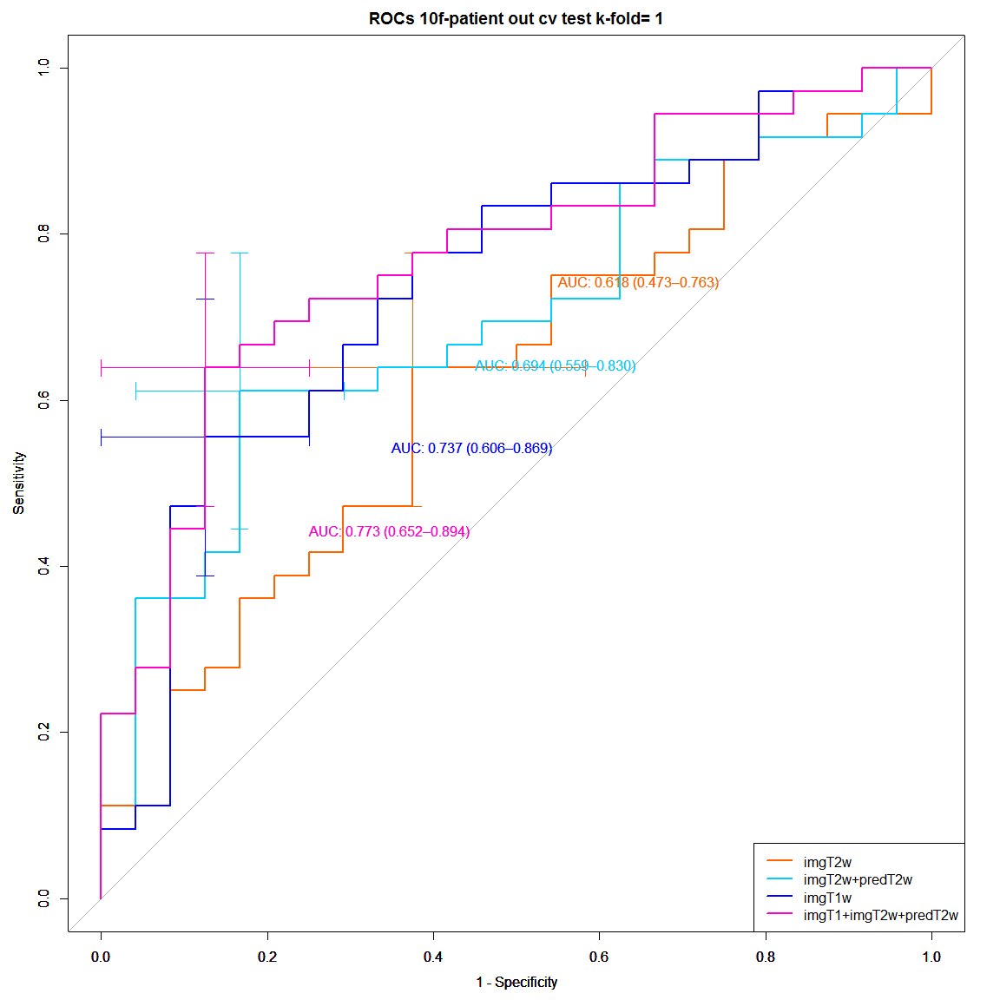 

```
## Area under the curve: 0.7731
## 95% CI (2000 stratified bootstrap replicates):
##  thresholds sp.low sp.median sp.high se.low se.median se.high
##   0.4156976   0.75     0.875       1 0.4722    0.6389  0.7778
##    massB    massM nonmassB nonmassM 
##      212      149      132       63 
##    massB    massM nonmassB nonmassM 
##       30       17       10       14 
##    massB    massM nonmassB nonmassM 
##      212      149      132       63 
##    massB    massM nonmassB nonmassM 
##       30       17       10       14 
##    massB    massM nonmassB nonmassM 
##      212      149      132       63 
##    massB    massM nonmassB nonmassM 
##       30       17       10       14 
## 0.09178744 0.05 
## -0.1382979 0.05 
## Selected features for group: MeanDecreaseGini imgT2 
## =========NULL
##  [1] "T2RGH_var"                          "ave_T210"                           "T2texture_correlation_nondir"      
##  [4] "T2skew_F_r_i"                       "T2var_F_r_i"                        "ave_T211"                          
##  [7] "ave_T27"                            "ave_T212"                           "ave_T214"                          
## [10] "ave_T23"                            "T2texture_energy_nondir"            "ave_T25"                           
## [13] "ave_T28"                            "ave_T20"                            "T2texture_diffvariance_nondir"     
## [16] "T2max_F_r_i"                        "ave_T218"                           "T2kurt_F_r_i"                      
## [19] "ave_T217"                           "ave_T29"                            "T2RGH_mean"                        
## [22] "ave_T26"                            "ave_T24"                            "T2texture_sumentropy_nondir"       
## [25] "T2texture_variance_nondir"          "T2texture_inversediffmoment_nondir" "ave_T215"                          
## [28] "T2_lesionSI"                        "ave_T219"                           "T2min_F_r_i"                       
## [31] "ave_T22"                            "ave_T216"                           "T2grad_margin_var"                 
## [34] "T2texture_sumaverage_nondir"        "ave_T213"                           "T2_lesionSIstd"                    
## -0.02564103 0.05 
## Selected features for group: MeanDecreaseGini allT2 
## =========NULL
##  [1] "T2texture_correlation_nondir"  "T2grad_margin_var"             "T2RGH_var"                     "T2RGH_mean"                   
##  [5] "T2max_F_r_i"                   "ave_T210"                      "ave_T27"                       "T2kurt_F_r_i"                 
##  [9] "ave_T213"                      "ave_T211"                      "T2texture_sumentropy_nondir"   "ave_T215"                     
## [13] "T2skew_F_r_i"                  "T2texture_sumaverage_nondir"   "ave_T216"                      "ave_T218"                     
## [17] "ave_T24"                       "T2var_F_r_i"                   "T2texture_energy_nondir"       "T2texture_diffvariance_nondir"
## [21] "T2wSI_predicted"               "ave_T26"                       "ave_T21"                       "LMSIR_predicted"              
## [25] "T2texture_entropy_nondir"      "ave_T22"                       "ave_T219"                      "T2mean_F_r_i"                 
## [29] "ave_T28"                       "ave_T214"                      "T2_lesionSI"                  
## 0.09937888 0.05 
## -0.006896552 0.05 
## Selected features for group: MeanDecreaseGini imgT1 
## =========NULL
##  [1] "circularity"                            "alpha_inside"                           "texture_sumvariance_nondir_post3"      
##  [4] "washoutRate_inside"                     "texture_inversediffmoment_nondir_post4" "texture_diffvariance_nondir_post1"     
##  [7] "iMax_Variance_uptake"                   "texture_correlation_nondir_post2"       "texture_sumaverage_nondir_post4"       
## [10] "edge_sharp_std"                         "kurt_F_r_i"                             "V2"                                    
## [13] "V6"                                     "earlySE7"                               "Vr_increasingRate_inside"              
## [16] "dce3SE17"                               "dce2SE0"                                "V0"                                    
## [19] "lateSE9"                                "V19"                                    "skew_F_r_i"                            
## [22] "V18"                                    "earlySE4"                               "dce2SE7"                               
## [25] "lateSE16"                               "texture_sumaverage_nondir_post1"        "var_F_r_i"                             
## [28] "lateSE1"                                "texture_inversediffmoment_nondir_post3" "dce3SE5"                               
## [31] "max_RGH_var_k"                          "dce2SE14"                               "Tpeak_countor"                         
## [34] "lateSE0"                                "V7"                                     "A_inside"                              
## 0.05369128 0.05 
## 0.02836879 0.05 
## Selected features for group: MeanDecreaseGini all 
## =========NULL
##  [1] "SER_inside"                             "texture_variance_nondir_post3"          "texture_inversediffmoment_nondir_post4"
##  [4] "Vr_post_1_countor"                      "V10"                                    "V16"                                   
##  [7] "iiMin_change_Variance_uptake"           "texture_correlation_nondir_post2"       "V18"                                   
## [10] "T2texture_entropy_nondir"               "texture_diffvariance_nondir_post3"      "skew_F_r_i"                            
## [13] "ave_T29"                                "earlySE5"                               "lateSE9"                               
## [16] "V17"                                    "max_F_r_i"                              "T2kurt_F_r_i"                          
## [19] "UptakeRate_inside"                      "T2texture_contrast_nondir"              "earlySE11"                             
## [22] "lateSE10"                               "iAUC1_countor"                          "V14"                                   
## [25] "iAUC1_inside"                           "texture_sumaverage_nondir_post3"        "Vr_increasingRate_inside"              
## [28] "Vr_decreasingRate_countor"              "earlySE1"                               "dce2SE7"                               
## [31] "dce3SE19"                               "Vr_decreasingRate_inside"               "ave_T28"                               
## [34] "ave_T21"                                "texture_sumentropy_nondir_post1"        "V0"                                    
## [37] "texture_sumentropy_nondir_post2"        "lateSE3"                                "ave_T24"                               
## [40] "Tpeak_countor"                          "A_inside"                              
##     lesion_id cad_pt_no_txt exam_a_number_txt BIRADS lesion_label                lesion_diagnosis      find_t2_signal_int
## 23         23          0132           5154279      3        massB            BENIGN BREAST TISSUE            Hyperintense
## 24         24          0132           5154279      3        massB            BENIGN BREAST TISSUE            Hyperintense
## 54         54          0220           6715021      5        massB                      RadialScar   Slightly hyperintense
## 55         55          0220           6715021      5        massB                    FIBROADENOMA   Slightly hyperintense
## 57         57          0232           6671713      5     nonmassB                     FIBROCYSTIC                    None
## 58         58          0232           6671713      5     nonmassB                     FIBROCYSTIC                    None
## 66         66          0266           5254958      4     nonmassB                     FIBROCYSTIC Hypointense or not seen
## 74         74          0325           4696948      4        massB                     FIBROCYSTIC            Hyperintense
## 87         87          0442           4936886      4        massB            BENIGN BREAST TISSUE   Slightly hyperintense
## 89         89          0462           5466989      3     nonmassM                  InvasiveDuctal Hypointense or not seen
## 90         90          0462           5466989      4        massB                    FIBROADENOMA            Hyperintense
## 102       102          0552           4663314      4        massB                        ADENOSIS   Slightly hyperintense
## 112       112          0580           6855384      4        massB                    FIBROADENOMA                    None
## 123       123          0624           4894714      5        massB                     FIBROCYSTIC Hypointense or not seen
## 139       139          0683           5226149      5        massM                  InvasiveDuctal                    None
## 172       172          0726           5304228      5        massM                  InvasiveDuctal   Slightly hyperintense
## 188       188          0743           4827839      4        massM                  InvasiveDuctal Hypointense or not seen
## 209       209          0781           4738440      5     nonmassM                  InvasiveDuctal                    None
## 235       235          0812           4700538      5        massM                  InvasiveDuctal Hypointense or not seen
## 242       242          0818           5021762      4        massB                  DUCT PAPILLOMA                    None
## 250       250          0831           4633368      6     nonmassM                    InsituDuctal   Slightly hyperintense
## 282       282          0867           5372277      5     nonmassM                  InvasiveDuctal                    None
## 287       287          0873           4956191      4        massB                     FIBROCYSTIC Hypointense or not seen
## 288       288          0873           4956191      4        massB                     FIBROCYSTIC   Slightly hyperintense
## 292       292          0877           4724338      4     nonmassB    ATYPICAL LOBULAR HYPERPLASIA                    None
## 293       293          0880           4809515      4        massB          Papillary(focalAtypia)   Slightly hyperintense
## 294       294          0880           6778829      3        massM                    InsituDuctal                    None
## 295       295          0880           6778829      3     nonmassM                    InsituDuctal                    None
## 296       296          0880           6778829      3     nonmassM                    InsituDuctal                    None
## 297       297          0880           4809515      4        massB               AtypicalPapilloma   Slightly hyperintense
## 299       299          0884           6876318      6        massM                  InvasiveDuctal                    None
## 300       300          0884           6876318      6     nonmassM                    InsituDuctal                    None
## 322       322          0952           7105222      4     nonmassB  FOCAL USUAL DUCTAL HYPERPLASIA Hypointense or not seen
## 323       323          0952           7105222      4     nonmassB                    FIBROADENOMA            Hyperintense
## 327       327          0965           6676125      3        massB                    FIBROADENOMA   Slightly hyperintense
## 359       359          1071           7382882      4     nonmassM                    InsituDuctal                    None
## 360       360          1072           7554174      6        massM                  InvasiveDuctal   Slightly hyperintense
## 361       361          1072           7554174      4        massB     SCLEROSING PAPILLARY LESION Hypointense or not seen
## 373       373          1095           4378323      3        massB                    FIBROADENOMA            Hyperintense
## 374       374          1095           4378323      5     nonmassM                    InsituDuctal                    None
## 383       383          2028           6702914      6     nonmassB                     FIBROCYSTIC Hypointense or not seen
## 384       384          2028           6702914      6        massM                  InvasiveDuctal                    None
## 385       385          2029           6716423      6        massB                        ADENOSIS                    None
## 398       398          2055           7041426      6     nonmassM                  InvasiveDuctal                    None
## 411       411          3004           7691918      4     nonmassB                     FIBROCYSTIC                    None
## 412       412          3004           7691918      4     nonmassB                     FIBROCYSTIC                    None
## 435       435          3046           7682447      4        massB                    FIBROADENOMA Hypointense or not seen
## 436       436          3046           7289130      4        massB                    FIBROADENOMA            Hyperintense
## 437       437          3046           7682447      4        massB                    FIBROADENOMA Hypointense or not seen
## 457       457          3075           7064471      6        massM                  InvasiveDuctal                    None
## 458       458          3075           7064471      6     nonmassM                    InsituDuctal                    None
## 474       474          3097           6909883      4        massB     ATYPICAL DUCTAL HYPERPLASIA Hypointense or not seen
## 475       475          4002           6993690      5        massB            BENIGN BREAST TISSUE Hypointense or not seen
## 487       487          4023           7037125      4        massM                  InvasiveDuctal                    None
## 488       488          4023           7037125      4        massB ADENOSIS, COLUMNAR CELL CHANGES Hypointense or not seen
## 489       489          4023           7152678      4        massB  BENIGN INTRAMAMMARY LYMPH NODE Hypointense or not seen
## 490       490          4023           7037125      4        massM                  InvasiveDuctal                    None
## 506       506          6001           4574766      6     nonmassM                  InvasiveDuctal                    None
## 513       513          6014           5101372      6        massM                  InvasiveDuctal                    None
## 570       570          6052           5369136      6     nonmassM                  InvasiveDuctal                    None
## 571       571          6054           5425486      5        massM                    InsituDuctal                    None
## 572       572          6054           5425486      5        massM                    InsituDuctal                    None
## 573       573          6054           5425486      5        massM                    InsituDuctal                    None
## 574       574          6054           5425486      5        massM                    InsituDuctal                    None
## 575       575          6054           5425486      5        massM                    InsituDuctal                    None
## 592       592          6233           7047121      6        massB                    FIBROADENOMA            Hyperintense
## 604       604          7066           6715383      4        massB                    FIBROADENOMA                    None
## 605       605          7066           7395276      4     nonmassB           COLUMNAR CELL CHANGES                    None
## 615       615          7096           6869668      3        massB                    FIBROADENOMA                    None
## 616       616          7096           6869668      3        massB                    FIBROADENOMA Hypointense or not seen
## 624       624          7159           5435020      4     nonmassM                 InvasiveLobular                    None
## 
## ============ bestune_imgT2 	 max.depth  1 	 #Trees  350 
## ntrees:  50 minsplit:  3 cp:  -1 
##   ntrees minsplit cp acuTrain rocTrain   acuTest  rocTest
## 1     50        3 -1        1        1 0.5352113 0.541129
## ntrees:  100 minsplit:  3 cp:  -1 
##   ntrees minsplit cp acuTrain rocTrain   acuTest   rocTest
## 2    100        3 -1        1        1 0.5774648 0.5177419
## ntrees:  250 minsplit:  3 cp:  -1 
##   ntrees minsplit cp acuTrain rocTrain   acuTest rocTest
## 3    250        3 -1        1        1 0.6056338   0.625
## ntrees:  350 minsplit:  3 cp:  -1 
##   ntrees minsplit cp acuTrain rocTrain   acuTest   rocTest
## 4    350        3 -1        1        1 0.5774648 0.6209677
## ntrees:  500 minsplit:  3 cp:  -1 
##   ntrees minsplit cp acuTrain rocTrain   acuTest   rocTest
## 5    500        3 -1        1        1 0.6056338 0.6282258
## ntrees:  50 minsplit:  1 cp:  -1 
##   ntrees minsplit cp acuTrain rocTrain   acuTest   rocTest
## 6     50        1 -1        1        1 0.5492958 0.5266129
## ntrees:  100 minsplit:  1 cp:  -1 
##   ntrees minsplit cp acuTrain rocTrain   acuTest   rocTest
## 7    100        1 -1        1        1 0.5352113 0.5733871
## ntrees:  250 minsplit:  1 cp:  -1 
##   ntrees minsplit cp acuTrain rocTrain   acuTest rocTest
## 8    250        1 -1        1        1 0.5492958   0.625
## ntrees:  350 minsplit:  1 cp:  -1 
##   ntrees minsplit cp acuTrain rocTrain   acuTest rocTest
## 9    350        1 -1        1        1 0.5633803   0.625
## ntrees:  500 minsplit:  1 cp:  -1 
##    ntrees minsplit cp acuTrain rocTrain   acuTest   rocTest
## 10    500        1 -1        1        1 0.5633803 0.5758065
## ntrees:  50 minsplit:  0 cp:  -1 
##    ntrees minsplit cp acuTrain rocTrain   acuTest   rocTest
## 11     50        0 -1        1        1 0.5492958 0.5556452
## ntrees:  100 minsplit:  0 cp:  -1 
##    ntrees minsplit cp acuTrain rocTrain   acuTest   rocTest
## 12    100        0 -1        1        1 0.6056338 0.6145161
## ntrees:  250 minsplit:  0 cp:  -1 
##    ntrees minsplit cp acuTrain rocTrain   acuTest   rocTest
## 13    250        0 -1        1        1 0.5774648 0.6266129
## ntrees:  350 minsplit:  0 cp:  -1 
##    ntrees minsplit cp acuTrain rocTrain   acuTest   rocTest
## 14    350        0 -1        1        1 0.5352113 0.5991935
## ntrees:  500 minsplit:  0 cp:  -1 
##    ntrees minsplit cp acuTrain rocTrain   acuTest rocTest
## 15    500        0 -1        1        1 0.5774648   0.625
##    ntrees minsplit cp acuTrain rocTrain   acuTest   rocTest
## 1      50        3 -1        1        1 0.5352113 0.5411290
## 2     100        3 -1        1        1 0.5774648 0.5177419
## 3     250        3 -1        1        1 0.6056338 0.6250000
## 4     350        3 -1        1        1 0.5774648 0.6209677
## 5     500        3 -1        1        1 0.6056338 0.6282258
## 6      50        1 -1        1        1 0.5492958 0.5266129
## 7     100        1 -1        1        1 0.5352113 0.5733871
## 8     250        1 -1        1        1 0.5492958 0.6250000
## 9     350        1 -1        1        1 0.5633803 0.6250000
## 10    500        1 -1        1        1 0.5633803 0.5758065
## 11     50        0 -1        1        1 0.5492958 0.5556452
## 12    100        0 -1        1        1 0.6056338 0.6145161
## 13    250        0 -1        1        1 0.5774648 0.6266129
## 14    350        0 -1        1        1 0.5352113 0.5991935
## 15    500        0 -1        1        1 0.5774648 0.6250000
##   ntrees minsplit cp acuTrain rocTrain   acuTest   rocTest
## 5    500        3 -1        1        1 0.6056338 0.6282258
## 
## ============ bestune_allT2 	 max.depth  1 	 #Trees  250 
## ntrees:  50 minsplit:  3 cp:  -1 
##   ntrees minsplit cp acuTrain rocTrain   acuTest  rocTest
## 1     50        3 -1        1        1 0.6760563 0.683871
## ntrees:  100 minsplit:  3 cp:  -1 
##   ntrees minsplit cp acuTrain rocTrain   acuTest   rocTest
## 2    100        3 -1        1        1 0.5492958 0.6322581
## ntrees:  250 minsplit:  3 cp:  -1 
##   ntrees minsplit cp acuTrain rocTrain   acuTest   rocTest
## 3    250        3 -1        1        1 0.5915493 0.6637097
## ntrees:  350 minsplit:  3 cp:  -1 
##   ntrees minsplit cp acuTrain rocTrain   acuTest   rocTest
## 4    350        3 -1        1        1 0.6338028 0.7080645
## ntrees:  500 minsplit:  3 cp:  -1 
##   ntrees minsplit cp acuTrain rocTrain   acuTest   rocTest
## 5    500        3 -1        1        1 0.6478873 0.7282258
## ntrees:  50 minsplit:  1 cp:  -1 
##   ntrees minsplit cp acuTrain rocTrain   acuTest   rocTest
## 6     50        1 -1        1        1 0.6056338 0.7112903
## ntrees:  100 minsplit:  1 cp:  -1 
##   ntrees minsplit cp acuTrain rocTrain   acuTest rocTest
## 7    100        1 -1        1        1 0.6197183     0.7
## ntrees:  250 minsplit:  1 cp:  -1 
##   ntrees minsplit cp acuTrain rocTrain   acuTest   rocTest
## 8    250        1 -1        1        1 0.6197183 0.6951613
## ntrees:  350 minsplit:  1 cp:  -1 
##   ntrees minsplit cp acuTrain rocTrain   acuTest  rocTest
## 9    350        1 -1        1        1 0.5774648 0.666129
## ntrees:  500 minsplit:  1 cp:  -1 
##    ntrees minsplit cp acuTrain rocTrain   acuTest   rocTest
## 10    500        1 -1        1        1 0.6478873 0.6733871
## ntrees:  50 minsplit:  0 cp:  -1 
##    ntrees minsplit cp acuTrain rocTrain   acuTest   rocTest
## 11     50        0 -1        1        1 0.6619718 0.7080645
## ntrees:  100 minsplit:  0 cp:  -1 
##    ntrees minsplit cp acuTrain rocTrain   acuTest   rocTest
## 12    100        0 -1        1        1 0.5492958 0.6217742
## ntrees:  250 minsplit:  0 cp:  -1 
##    ntrees minsplit cp acuTrain rocTrain   acuTest   rocTest
## 13    250        0 -1        1        1 0.6338028 0.6685484
## ntrees:  350 minsplit:  0 cp:  -1 
##    ntrees minsplit cp acuTrain rocTrain   acuTest  rocTest
## 14    350        0 -1        1        1 0.5774648 0.666129
## ntrees:  500 minsplit:  0 cp:  -1 
##    ntrees minsplit cp acuTrain rocTrain   acuTest   rocTest
## 15    500        0 -1        1        1 0.6197183 0.6798387
##    ntrees minsplit cp acuTrain rocTrain   acuTest   rocTest
## 1      50        3 -1        1        1 0.6760563 0.6838710
## 2     100        3 -1        1        1 0.5492958 0.6322581
## 3     250        3 -1        1        1 0.5915493 0.6637097
## 4     350        3 -1        1        1 0.6338028 0.7080645
## 5     500        3 -1        1        1 0.6478873 0.7282258
## 6      50        1 -1        1        1 0.6056338 0.7112903
## 7     100        1 -1        1        1 0.6197183 0.7000000
## 8     250        1 -1        1        1 0.6197183 0.6951613
## 9     350        1 -1        1        1 0.5774648 0.6661290
## 10    500        1 -1        1        1 0.6478873 0.6733871
## 11     50        0 -1        1        1 0.6619718 0.7080645
## 12    100        0 -1        1        1 0.5492958 0.6217742
## 13    250        0 -1        1        1 0.6338028 0.6685484
## 14    350        0 -1        1        1 0.5774648 0.6661290
## 15    500        0 -1        1        1 0.6197183 0.6798387
##   ntrees minsplit cp acuTrain rocTrain   acuTest   rocTest
## 5    500        3 -1        1        1 0.6478873 0.7282258
## 
## ============ bestune_imgT1 	 max.depth  1 	 #Trees  250 
## ntrees:  50 minsplit:  3 cp:  -1 
##   ntrees minsplit cp acuTrain rocTrain   acuTest   rocTest
## 1     50        3 -1        1        1 0.7746479 0.8274194
## ntrees:  100 minsplit:  3 cp:  -1 
##   ntrees minsplit cp acuTrain rocTrain   acuTest   rocTest
## 2    100        3 -1        1        1 0.7887324 0.8241935
## ntrees:  250 minsplit:  3 cp:  -1 
##   ntrees minsplit cp acuTrain rocTrain   acuTest   rocTest
## 3    250        3 -1        1        1 0.7887324 0.7991935
## ntrees:  350 minsplit:  3 cp:  -1 
##   ntrees minsplit cp acuTrain rocTrain   acuTest   rocTest
## 4    350        3 -1        1        1 0.7183099 0.8145161
## ntrees:  500 minsplit:  3 cp:  -1 
##   ntrees minsplit cp acuTrain rocTrain   acuTest   rocTest
## 5    500        3 -1        1        1 0.7605634 0.8056452
## ntrees:  50 minsplit:  1 cp:  -1 
##   ntrees minsplit cp acuTrain rocTrain   acuTest   rocTest
## 6     50        1 -1        1        1 0.8028169 0.8395161
## ntrees:  100 minsplit:  1 cp:  -1 
##   ntrees minsplit cp acuTrain rocTrain   acuTest rocTest
## 7    100        1 -1        1        1 0.7183099     0.8
## ntrees:  250 minsplit:  1 cp:  -1 
##   ntrees minsplit cp acuTrain rocTrain   acuTest   rocTest
## 8    250        1 -1        1        1 0.7464789 0.8282258
## ntrees:  350 minsplit:  1 cp:  -1 
##   ntrees minsplit cp acuTrain rocTrain   acuTest   rocTest
## 9    350        1 -1        1        1 0.7042254 0.8209677
## ntrees:  500 minsplit:  1 cp:  -1 
##    ntrees minsplit cp acuTrain rocTrain   acuTest   rocTest
## 10    500        1 -1        1        1 0.7746479 0.8177419
## ntrees:  50 minsplit:  0 cp:  -1 
##    ntrees minsplit cp acuTrain rocTrain   acuTest   rocTest
## 11     50        0 -1        1        1 0.7464789 0.7879032
## ntrees:  100 minsplit:  0 cp:  -1 
##    ntrees minsplit cp acuTrain rocTrain   acuTest   rocTest
## 12    100        0 -1        1        1 0.7323944 0.8040323
## ntrees:  250 minsplit:  0 cp:  -1 
##    ntrees minsplit cp acuTrain rocTrain   acuTest   rocTest
## 13    250        0 -1        1        1 0.7323944 0.8185484
## ntrees:  350 minsplit:  0 cp:  -1 
##    ntrees minsplit cp acuTrain rocTrain   acuTest   rocTest
## 14    350        0 -1        1        1 0.7887324 0.8443548
## ntrees:  500 minsplit:  0 cp:  -1 
##    ntrees minsplit cp acuTrain rocTrain   acuTest rocTest
## 15    500        0 -1        1        1 0.7746479   0.825
##    ntrees minsplit cp acuTrain rocTrain   acuTest   rocTest
## 1      50        3 -1        1        1 0.7746479 0.8274194
## 2     100        3 -1        1        1 0.7887324 0.8241935
## 3     250        3 -1        1        1 0.7887324 0.7991935
## 4     350        3 -1        1        1 0.7183099 0.8145161
## 5     500        3 -1        1        1 0.7605634 0.8056452
## 6      50        1 -1        1        1 0.8028169 0.8395161
## 7     100        1 -1        1        1 0.7183099 0.8000000
## 8     250        1 -1        1        1 0.7464789 0.8282258
## 9     350        1 -1        1        1 0.7042254 0.8209677
## 10    500        1 -1        1        1 0.7746479 0.8177419
## 11     50        0 -1        1        1 0.7464789 0.7879032
## 12    100        0 -1        1        1 0.7323944 0.8040323
## 13    250        0 -1        1        1 0.7323944 0.8185484
## 14    350        0 -1        1        1 0.7887324 0.8443548
## 15    500        0 -1        1        1 0.7746479 0.8250000
##    ntrees minsplit cp acuTrain rocTrain   acuTest   rocTest
## 14    350        0 -1        1        1 0.7887324 0.8443548
## 
## ============ bestune_all 	 max.depth  1 	 #Trees  200 
## ntrees:  50 minsplit:  3 cp:  -1 
##   ntrees minsplit cp acuTrain rocTrain   acuTest  rocTest
## 1     50        3 -1        1        1 0.6901408 0.816129
## ntrees:  100 minsplit:  3 cp:  -1 
##   ntrees minsplit cp acuTrain rocTrain   acuTest   rocTest
## 2    100        3 -1        1        1 0.8028169 0.8403226
## ntrees:  250 minsplit:  3 cp:  -1 
##   ntrees minsplit cp acuTrain rocTrain   acuTest   rocTest
## 3    250        3 -1        1        1 0.7887324 0.8153226
## ntrees:  350 minsplit:  3 cp:  -1 
##   ntrees minsplit cp acuTrain rocTrain   acuTest   rocTest
## 4    350        3 -1        1        1 0.7887324 0.8225806
## ntrees:  500 minsplit:  3 cp:  -1 
##   ntrees minsplit cp acuTrain rocTrain   acuTest   rocTest
## 5    500        3 -1        1        1 0.7605634 0.8185484
## ntrees:  50 minsplit:  1 cp:  -1 
##   ntrees minsplit cp acuTrain rocTrain   acuTest   rocTest
## 6     50        1 -1        1        1 0.6901408 0.7629032
## ntrees:  100 minsplit:  1 cp:  -1 
##   ntrees minsplit cp acuTrain rocTrain   acuTest   rocTest
## 7    100        1 -1        1        1 0.7605634 0.8120968
## ntrees:  250 minsplit:  1 cp:  -1 
##   ntrees minsplit cp acuTrain rocTrain   acuTest  rocTest
## 8    250        1 -1        1        1 0.7887324 0.816129
## ntrees:  350 minsplit:  1 cp:  -1 
##   ntrees minsplit cp acuTrain rocTrain   acuTest   rocTest
## 9    350        1 -1        1        1 0.7746479 0.8451613
## ntrees:  500 minsplit:  1 cp:  -1 
##    ntrees minsplit cp acuTrain rocTrain   acuTest   rocTest
## 10    500        1 -1        1        1 0.7746479 0.8233871
## ntrees:  50 minsplit:  0 cp:  -1 
##    ntrees minsplit cp acuTrain rocTrain   acuTest   rocTest
## 11     50        0 -1        1        1 0.6901408 0.7258065
## ntrees:  100 minsplit:  0 cp:  -1 
##    ntrees minsplit cp acuTrain rocTrain   acuTest   rocTest
## 12    100        0 -1        1        1 0.8169014 0.8266129
## ntrees:  250 minsplit:  0 cp:  -1 
##    ntrees minsplit cp acuTrain rocTrain   acuTest   rocTest
## 13    250        0 -1        1        1 0.7887324 0.8540323
## ntrees:  350 minsplit:  0 cp:  -1 
##    ntrees minsplit cp acuTrain rocTrain   acuTest  rocTest
## 14    350        0 -1        1        1 0.8028169 0.833871
## ntrees:  500 minsplit:  0 cp:  -1 
##    ntrees minsplit cp acuTrain rocTrain   acuTest  rocTest
## 15    500        0 -1        1        1 0.7746479 0.833871
##    ntrees minsplit cp acuTrain rocTrain   acuTest   rocTest
## 1      50        3 -1        1        1 0.6901408 0.8161290
## 2     100        3 -1        1        1 0.8028169 0.8403226
## 3     250        3 -1        1        1 0.7887324 0.8153226
## 4     350        3 -1        1        1 0.7887324 0.8225806
## 5     500        3 -1        1        1 0.7605634 0.8185484
## 6      50        1 -1        1        1 0.6901408 0.7629032
## 7     100        1 -1        1        1 0.7605634 0.8120968
## 8     250        1 -1        1        1 0.7887324 0.8161290
## 9     350        1 -1        1        1 0.7746479 0.8451613
## 10    500        1 -1        1        1 0.7746479 0.8233871
## 11     50        0 -1        1        1 0.6901408 0.7258065
## 12    100        0 -1        1        1 0.8169014 0.8266129
## 13    250        0 -1        1        1 0.7887324 0.8540323
## 14    350        0 -1        1        1 0.8028169 0.8338710
## 15    500        0 -1        1        1 0.7746479 0.8338710
##    ntrees minsplit cp acuTrain rocTrain   acuTest   rocTest
## 13    250        0 -1        1        1 0.7887324 0.8540323
## 
## Call:
## roc.default(response = perf_imgT2$obs, predictor = perf_imgT2$C)
## 
## Data: perf_imgT2$C in 55 controls (perf_imgT2$obs C) > 76 cases (perf_imgT2$obs NC).
## Area under the curve: 0.6213
## 
## Call:
## roc.default(response = perf_allT2$obs, predictor = perf_allT2$C)
## 
## Data: perf_allT2$C in 55 controls (perf_allT2$obs C) > 76 cases (perf_allT2$obs NC).
## Area under the curve: 0.7062
## 
## Call:
## roc.default(response = perf_imgT1$obs, predictor = perf_imgT1$C)
## 
## Data: perf_imgT1$C in 55 controls (perf_imgT1$obs C) > 76 cases (perf_imgT1$obs NC).
## Area under the curve: 0.7885
## 
## Call:
## roc.default(response = perf_all$obs, predictor = perf_all$C)
## 
## Data: perf_all$C in 55 controls (perf_all$obs C) > 76 cases (perf_all$obs NC).
## Area under the curve: 0.8182
```

```
## Area under the curve: 0.6213
## 95% CI (2000 stratified bootstrap replicates):
##  thresholds sp.low sp.median sp.high se.low se.median se.high
##   0.3789126 0.8364    0.9091  0.9818 0.1974    0.3026  0.4079
```

```
## Area under the curve: 0.7062
## 95% CI (2000 stratified bootstrap replicates):
##  thresholds sp.low sp.median sp.high se.low se.median se.high
##   0.4376983 0.6909       0.8  0.8914 0.5263    0.6316  0.7368
```

```
## Area under the curve: 0.7885
## 95% CI (2000 stratified bootstrap replicates):
##  thresholds sp.low sp.median sp.high se.low se.median se.high
##   0.4595427 0.6727    0.7818  0.8909 0.6053    0.7105  0.8026
```

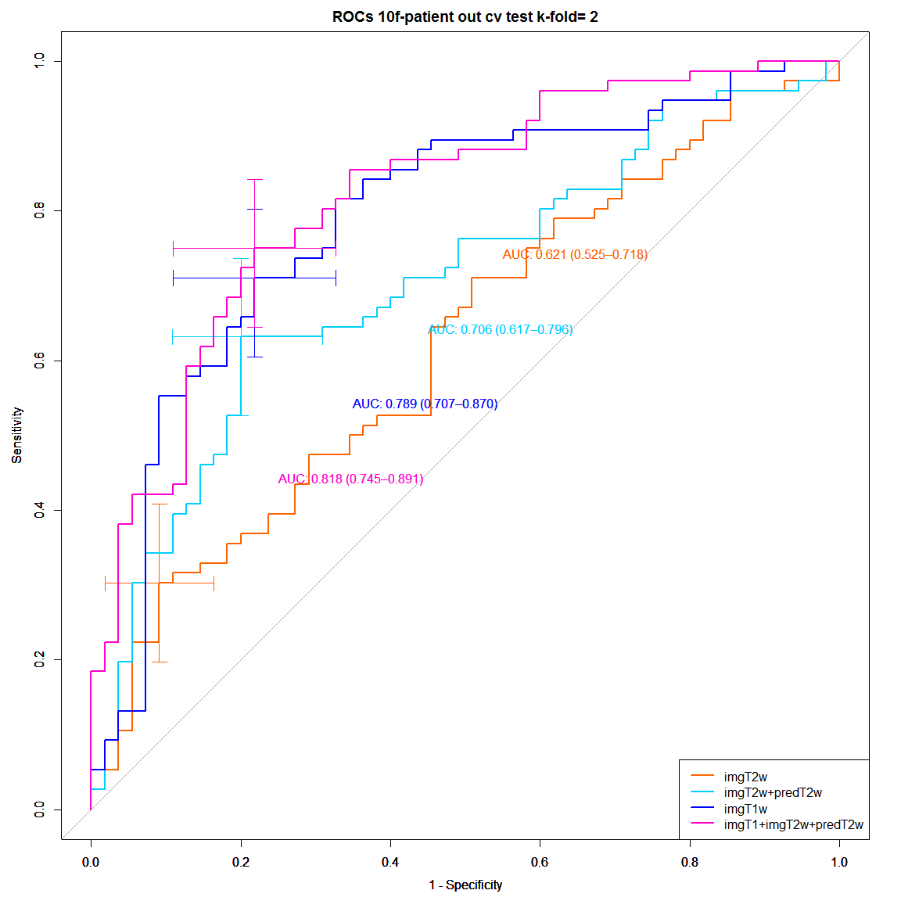 

```
## Area under the curve: 0.8182
## 95% CI (2000 stratified bootstrap replicates):
##  thresholds sp.low sp.median sp.high se.low se.median se.high
##   0.4633848 0.6727    0.7818  0.8909 0.6447      0.75  0.8421
##    massB    massM nonmassB nonmassM 
##      219      153      129       71 
##    massB    massM nonmassB nonmassM 
##       23       13       13        6 
##    massB    massM nonmassB nonmassM 
##      219      153      129       71 
##    massB    massM nonmassB nonmassM 
##       23       13       13        6 
##    massB    massM nonmassB nonmassM 
##      219      153      129       71 
##    massB    massM nonmassB nonmassM 
##       23       13       13        6 
## -0.02970297 0.05 
## Selected features for group: MeanDecreaseGini imgT2 
## =========NULL
##  [1] "T2RGH_var"                          "T2texture_entropy_nondir"           "ave_T210"                          
##  [4] "T2texture_correlation_nondir"       "ave_T211"                           "T2_lesionSIstd"                    
##  [7] "T2skew_F_r_i"                       "T2grad_margin"                      "ave_T215"                          
## [10] "T2mean_F_r_i"                       "ave_T20"                            "ave_T25"                           
## [13] "T2texture_inversediffmoment_nondir" "ave_T27"                            "ave_T24"                           
## [16] "ave_T28"                            "T2texture_sumentropy_nondir"        "ave_T214"                          
## [19] "T2kurt_F_r_i"                       "ave_T217"                           "T2texture_sumvariance_nondir"      
## [22] "T2texture_diffentropy_nondir"       "ave_T29"                            "ave_T26"                           
## [25] "ave_T22"                            "T2RGH_mean"                         "T2_lesionSI"                       
## 0.06046512 0.05 
## 0.01485149 0.05 
## Selected features for group: MeanDecreaseGini allT2 
## =========NULL
##  [1] "T2RGH_mean"                         "T2texture_entropy_nondir"           "T2texture_correlation_nondir"      
##  [4] "T2wSI_predicted"                    "ave_T210"                           "T2kurt_F_r_i"                      
##  [7] "T2RGH_var"                          "T2skew_F_r_i"                       "ave_T27"                           
## [10] "T2grad_margin_var"                  "ave_T20"                            "T2texture_sumaverage_nondir"       
## [13] "ave_T28"                            "T2grad_margin"                      "LMSIR_predicted"                   
## [16] "ave_T215"                           "ave_T213"                           "T2_lesionSIstd"                    
## [19] "ave_T23"                            "ave_T22"                            "ave_T212"                          
## [22] "ave_T211"                           "T2texture_contrast_nondir"          "ave_T219"                          
## [25] "T2_lesionSI"                        "ave_T25"                            "T2min_F_r_i"                       
## [28] "T2max_F_r_i"                        "T2texture_diffentropy_nondir"       "T2texture_sumvariance_nondir"      
## [31] "ave_T26"                            "ave_T21"                            "ave_T29"                           
## [34] "ave_T218"                           "T2texture_energy_nondir"            "ave_T216"                          
## [37] "ave_T214"                           "T2texture_inversediffmoment_nondir" "T2texture_sumentropy_nondir"       
## [40] "ave_T24"                            "T2mean_F_r_i"                      
## 0.1165644 0.05 
## -0.125 0.05 
## Selected features for group: MeanDecreaseGini imgT1 
## =========NULL
##  [1] "irregularity"                           "texture_sumvariance_nondir_post1"       "iiMin_change_Variance_uptake"          
##  [4] "SER_countor"                            "alpha_inside"                           "texture_energy_nondir_post2"           
##  [7] "texture_contrast_nondir_post2"          "texture_sumaverage_nondir_post3"        "V4"                                    
## [10] "Tpeak_countor"                          "lateSE0"                                "earlySE13"                             
## [13] "UptakeRate_inside"                      "max_RGH_var"                            "lateSE18"                              
## [16] "texture_correlation_nondir_post2"       "earlySE19"                              "texture_inversediffmoment_nondir_post4"
## [19] "dce2SE12"                               "V2"                                     "mean_F_r_i"                            
## [22] "dce2SE1"                                "dce3SE5"                                "lateSE5"                               
## [25] "min_F_r_i"                              "dce2SE18"                               "dce2SE7"                               
## [28] "texture_diffentropy_nondir_post4"       "lateSE3"                                "earlySE11"                             
## [31] "Vr_decreasingRate_countor"              "texture_sumentropy_nondir_post4"        "dce3SE7"                               
## [34] "V19"                                    "texture_correlation_nondir_post3"       "A_inside"                              
## 0.03205128 0.05 
## Selected features for group: MeanDecreaseGini all 
## =========NULL
##  [1] "circularity"                       "SER_inside"                        "max_RGH_mean"                     
##  [4] "texture_correlation_nondir_post4"  "V15"                               "iiMin_change_Variance_uptake"     
##  [7] "edge_sharp_std"                    "min_F_r_i"                         "A_countor"                        
## [10] "texture_energy_nondir_post2"       "earlySE16"                         "texture_sumaverage_nondir_post2"  
## [13] "var_F_r_i"                         "T2_lesionSI"                       "Tpeak_countor"                    
## [16] "dce3SE0"                           "texture_entropy_nondir_post4"      "V4"                               
## [19] "T2wSI_predicted"                   "T2texture_sumaverage_nondir"       "ave_T20"                          
## [22] "dce2SE2"                           "lateSE16"                          "lateSE4"                          
## [25] "ave_T27"                           "dce3SE7"                           "texture_diffvariance_nondir_post3"
## [28] "maxVr_inside"                      "V9"                                "lateSE14"                         
## [31] "V14"                               "V6"                                "ave_T28"                          
## [34] "T2min_F_r_i"                       "V0"                                "texture_sumaverage_nondir_post3"  
## [37] "ave_T212"                          "k_Max_Margin_Grad"                 "V11"                              
## [40] "A_inside"                         
##     lesion_id cad_pt_no_txt exam_a_number_txt BIRADS lesion_label                  lesion_diagnosis      find_t2_signal_int
## 33         33          0177           6996979      3        massM                      InsituDuctal   Slightly hyperintense
## 34         34          0177           6996979      3     nonmassM                      InsituDuctal                    None
## 52         52          0207           4982884      4        massB                          FIBROSIS                    None
## 83         83          0420           6738142      3     nonmassM                      InsituDuctal   Slightly hyperintense
## 93         93          0473           7364625      4        massB                       FIBROCYSTIC                    None
## 96         96          0510           7662547      4     nonmassB             COLUMNAR CELL CHANGES                    None
## 97         97          0510           7662547      4     nonmassB             COLUMNAR CELL CHANGES                    None
## 99         99          0519           4937737      4        massB            FLAT EPITHELIAL ATYPIA                    None
## 121       121          0619           7250777      5        massM                    InvasiveDuctal                    None
## 122       122          0619           7250777      5     nonmassM                    InvasiveDuctal            Hyperintense
## 124       124          0635           7092156      4        massM                    InvasiveDuctal Hypointense or not seen
## 127       127          0663           4804825      4        massB                      FIBROADENOMA            Hyperintense
## 133       133          0668           6989634      4     nonmassM                      InsituDuctal                    None
## 146       146          0690           5180451      3     nonmassB                       FIBROCYSTIC                    None
## 147       147          0690           5180451      3        massB          USUAL DUCTAL HYPERPLASIA   Slightly hyperintense
## 148       148          0690           6681276      4     nonmassB             COLUMNAR CELL CHANGES Hypointense or not seen
## 171       171          0724           5141876      5        massM                    InvasiveDuctal            Hyperintense
## 198       198          0760           4750742      5     nonmassM                      InsituDuctal                    None
## 212       212          0758           4796378      4        massB                       FIBROCYSTIC            Hyperintense
## 213       213          0758           4796378      4        massB                       FIBROCYSTIC            Hyperintense
## 219       219          0790           4708057      4     nonmassB                    DUCT PAPILLOMA                    None
## 230       230          0803           5058195      5        massM                    InvasiveDuctal                    None
## 233       233          0809           5016014      4        massB                       FIBROCYSTIC            Hyperintense
## 303       303          0888           6744887      5        massM                    InvasiveDuctal                    None
## 304       304          0896           6895982      4        massB                      FIBROADENOMA   Slightly hyperintense
## 305       305          0898           5224531      4        massB DUCTAL HYPERPLASIA WITHOUT ATYPIA                    None
## 311       311          0921           6997232      4        massB                       FIBROCYSTIC Hypointense or not seen
## 318       318          0944           7742881      4        massM                      InsituDuctal Hypointense or not seen
## 319       319          0944           7092128      4     nonmassB              BENIGN BREAST TISSUE                    None
## 325       325          0956           5062341      4        massB                      FIBROADENOMA   Slightly hyperintense
## 326       326          0962           4755483      4        massB                      FIBROADENOMA            Hyperintense
## 333       333          0995           6816787      4     nonmassB              LARGE DUCT PAPILLOMA            Hyperintense
## 334       334          0995           6816787      3        massB                    DUCT PAPILLOMA   Slightly hyperintense
## 339       339          1006           4443563      4     nonmassB                       FIBROCYSTIC Hypointense or not seen
## 368       368          1087           5360576      4        massB    GRANULOMATOUS LOBULAR MASTITIS                    None
## 369       369          1087           5360576      4        massB    GRANULOMATOUS LOBULAR MASTITIS                    None
## 404       404          2072           7256932      4        massM                    InvasiveDuctal                    None
## 407       407          2075           6985605      4     nonmassB              BENIGN BREAST TISSUE Hypointense or not seen
## 408       408          2075           6985605      4        massB                      FIBROADENOMA Hypointense or not seen
## 419       419          3011           6898308      4     nonmassB                       FIBROCYSTIC                    None
## 461       461          3077           7042083      4     nonmassB                       FIBROCYSTIC                    None
## 462       462          3077           7042083      4        massB                       FIBROCYSTIC   Slightly hyperintense
## 480       480          4012           7002008      4        massB    FOCAL USUAL DUCTAL HYPERPLASIA Hypointense or not seen
## 498       498          4043           7041465      6     nonmassM                    InvasiveDuctal                    None
## 509       509          6005         ACC108250      5        massM                   InvasiveLobular                    None
## 510       510          6005         ACC108250      5        massM                   InvasiveLobular                    None
## 511       511          6005         ACC108250      5        massM                   InvasiveLobular                    None
## 552       552          6040           5075204      5        massM                    InvasiveDuctal                    None
## 578       578          6100           6722170      5        massM                    InvasiveDuctal Hypointense or not seen
## 586       586          6150           7128025      4     nonmassB             COLUMNAR CELL CHANGES                    None
## 597       597          7024           6805356      4        massB                      FIBROADENOMA Hypointense or not seen
## 601       601          7043           7119983      4        massB                      FIBROADENOMA            Hyperintense
## 623       623          7151           7557684      2        massB                       HYPERPLASIA                    None
## 625       625          7165           5021830      3        massB                          ADENOSIS                    None
## 635       635          7201           5041620      4     nonmassB                      FIBROADENOMA                    None
## 
## ============ bestune_imgT2 	 max.depth  1 	 #Trees  350 
## ntrees:  50 minsplit:  3 cp:  -1 
##   ntrees minsplit cp acuTrain rocTrain   acuTest   rocTest
## 1     50        3 -1        1        1 0.6363636 0.5745614
## ntrees:  100 minsplit:  3 cp:  -1 
##   ntrees minsplit cp acuTrain rocTrain   acuTest   rocTest
## 2    100        3 -1        1        1 0.4909091 0.5394737
## ntrees:  250 minsplit:  3 cp:  -1 
##   ntrees minsplit cp acuTrain rocTrain   acuTest   rocTest
## 3    250        3 -1        1        1 0.5818182 0.6067251
## ntrees:  350 minsplit:  3 cp:  -1 
##   ntrees minsplit cp acuTrain rocTrain   acuTest   rocTest
## 4    350        3 -1        1        1 0.6181818 0.4590643
## ntrees:  500 minsplit:  3 cp:  -1 
##   ntrees minsplit cp acuTrain rocTrain acuTest   rocTest
## 5    500        3 -1        1        1     0.6 0.5555556
## ntrees:  50 minsplit:  1 cp:  -1 
##   ntrees minsplit cp acuTrain rocTrain acuTest   rocTest
## 6     50        1 -1        1        1     0.6 0.5804094
## ntrees:  100 minsplit:  1 cp:  -1 
##   ntrees minsplit cp acuTrain rocTrain   acuTest   rocTest
## 7    100        1 -1        1        1 0.6363636 0.5657895
## ntrees:  250 minsplit:  1 cp:  -1 
##   ntrees minsplit cp acuTrain rocTrain   acuTest   rocTest
## 8    250        1 -1        1        1 0.5454545 0.4692982
## ntrees:  350 minsplit:  1 cp:  -1 
##   ntrees minsplit cp acuTrain rocTrain   acuTest   rocTest
## 9    350        1 -1        1        1 0.5636364 0.5818713
## ntrees:  500 minsplit:  1 cp:  -1 
##    ntrees minsplit cp acuTrain rocTrain acuTest   rocTest
## 10    500        1 -1        1        1     0.6 0.5906433
## ntrees:  50 minsplit:  0 cp:  -1 
##    ntrees minsplit cp acuTrain rocTrain   acuTest  rocTest
## 11     50        0 -1        1        1 0.4545455 0.502924
## ntrees:  100 minsplit:  0 cp:  -1 
##    ntrees minsplit cp acuTrain rocTrain   acuTest   rocTest
## 12    100        0 -1        1        1 0.6181818 0.4195906
## ntrees:  250 minsplit:  0 cp:  -1 
##    ntrees minsplit cp acuTrain rocTrain   acuTest   rocTest
## 13    250        0 -1        1        1 0.5818182 0.5614035
## ntrees:  350 minsplit:  0 cp:  -1 
##    ntrees minsplit cp acuTrain rocTrain   acuTest   rocTest
## 14    350        0 -1        1        1 0.5636364 0.5906433
## ntrees:  500 minsplit:  0 cp:  -1 
##    ntrees minsplit cp acuTrain rocTrain   acuTest   rocTest
## 15    500        0 -1        1        1 0.6181818 0.5380117
##    ntrees minsplit cp acuTrain rocTrain   acuTest   rocTest
## 1      50        3 -1        1        1 0.6363636 0.5745614
## 2     100        3 -1        1        1 0.4909091 0.5394737
## 3     250        3 -1        1        1 0.5818182 0.6067251
## 4     350        3 -1        1        1 0.6181818 0.4590643
## 5     500        3 -1        1        1 0.6000000 0.5555556
## 6      50        1 -1        1        1 0.6000000 0.5804094
## 7     100        1 -1        1        1 0.6363636 0.5657895
## 8     250        1 -1        1        1 0.5454545 0.4692982
## 9     350        1 -1        1        1 0.5636364 0.5818713
## 10    500        1 -1        1        1 0.6000000 0.5906433
## 11     50        0 -1        1        1 0.4545455 0.5029240
## 12    100        0 -1        1        1 0.6181818 0.4195906
## 13    250        0 -1        1        1 0.5818182 0.5614035
## 14    350        0 -1        1        1 0.5636364 0.5906433
## 15    500        0 -1        1        1 0.6181818 0.5380117
##   ntrees minsplit cp acuTrain rocTrain   acuTest   rocTest
## 3    250        3 -1        1        1 0.5818182 0.6067251
## 
## ============ bestune_allT2 	 max.depth  1 	 #Trees  250 
## ntrees:  50 minsplit:  3 cp:  -1 
##   ntrees minsplit cp acuTrain rocTrain   acuTest   rocTest
## 1     50        3 -1        1        1 0.5636364 0.5277778
## ntrees:  100 minsplit:  3 cp:  -1 
##   ntrees minsplit cp acuTrain rocTrain   acuTest   rocTest
## 2    100        3 -1        1        1 0.5818182 0.5190058
## ntrees:  250 minsplit:  3 cp:  -1 
##   ntrees minsplit cp acuTrain rocTrain   acuTest   rocTest
## 3    250        3 -1        1        1 0.5818182 0.5292398
## ntrees:  350 minsplit:  3 cp:  -1 
##   ntrees minsplit cp acuTrain rocTrain   acuTest   rocTest
## 4    350        3 -1        1        1 0.5818182 0.4298246
## ntrees:  500 minsplit:  3 cp:  -1 
##   ntrees minsplit cp acuTrain rocTrain   acuTest   rocTest
## 5    500        3 -1        1        1 0.5818182 0.5687135
## ntrees:  50 minsplit:  1 cp:  -1 
##   ntrees minsplit cp acuTrain rocTrain   acuTest   rocTest
## 6     50        1 -1        1        1 0.5090909 0.4634503
## ntrees:  100 minsplit:  1 cp:  -1 
##   ntrees minsplit cp acuTrain rocTrain   acuTest   rocTest
## 7    100        1 -1        1        1 0.6181818 0.5730994
## ntrees:  250 minsplit:  1 cp:  -1 
##   ntrees minsplit cp acuTrain rocTrain acuTest   rocTest
## 8    250        1 -1        1        1     0.6 0.5570175
## ntrees:  350 minsplit:  1 cp:  -1 
##   ntrees minsplit cp acuTrain rocTrain   acuTest   rocTest
## 9    350        1 -1        1        1 0.6181818 0.5847953
## ntrees:  500 minsplit:  1 cp:  -1 
##    ntrees minsplit cp acuTrain rocTrain acuTest   rocTest
## 10    500        1 -1        1        1     0.6 0.4839181
## ntrees:  50 minsplit:  0 cp:  -1 
##    ntrees minsplit cp acuTrain rocTrain   acuTest   rocTest
## 11     50        0 -1        1        1 0.6181818 0.6067251
## ntrees:  100 minsplit:  0 cp:  -1 
##    ntrees minsplit cp acuTrain rocTrain   acuTest   rocTest
## 12    100        0 -1        1        1 0.5454545 0.5423977
## ntrees:  250 minsplit:  0 cp:  -1 
##    ntrees minsplit cp acuTrain rocTrain   acuTest   rocTest
## 13    250        0 -1        1        1 0.6545455 0.5833333
## ntrees:  350 minsplit:  0 cp:  -1 
##    ntrees minsplit cp acuTrain rocTrain   acuTest   rocTest
## 14    350        0 -1        1        1 0.5818182 0.5643275
## ntrees:  500 minsplit:  0 cp:  -1 
##    ntrees minsplit cp acuTrain rocTrain   acuTest   rocTest
## 15    500        0 -1        1        1 0.6181818 0.5497076
##    ntrees minsplit cp acuTrain rocTrain   acuTest   rocTest
## 1      50        3 -1        1        1 0.5636364 0.5277778
## 2     100        3 -1        1        1 0.5818182 0.5190058
## 3     250        3 -1        1        1 0.5818182 0.5292398
## 4     350        3 -1        1        1 0.5818182 0.4298246
## 5     500        3 -1        1        1 0.5818182 0.5687135
## 6      50        1 -1        1        1 0.5090909 0.4634503
## 7     100        1 -1        1        1 0.6181818 0.5730994
## 8     250        1 -1        1        1 0.6000000 0.5570175
## 9     350        1 -1        1        1 0.6181818 0.5847953
## 10    500        1 -1        1        1 0.6000000 0.4839181
## 11     50        0 -1        1        1 0.6181818 0.6067251
## 12    100        0 -1        1        1 0.5454545 0.5423977
## 13    250        0 -1        1        1 0.6545455 0.5833333
## 14    350        0 -1        1        1 0.5818182 0.5643275
## 15    500        0 -1        1        1 0.6181818 0.5497076
##    ntrees minsplit cp acuTrain rocTrain   acuTest   rocTest
## 11     50        0 -1        1        1 0.6181818 0.6067251
## 
## ============ bestune_imgT1 	 max.depth  1 	 #Trees  250 
## ntrees:  50 minsplit:  3 cp:  -1 
##   ntrees minsplit cp acuTrain rocTrain   acuTest  rocTest
## 1     50        3 -1        1        1 0.7454545 0.745614
## ntrees:  100 minsplit:  3 cp:  -1 
##   ntrees minsplit cp acuTrain rocTrain   acuTest   rocTest
## 2    100        3 -1        1        1 0.7636364 0.7616959
## ntrees:  250 minsplit:  3 cp:  -1 
##   ntrees minsplit cp acuTrain rocTrain   acuTest   rocTest
## 3    250        3 -1        1        1 0.7454545 0.6769006
## ntrees:  350 minsplit:  3 cp:  -1 
##   ntrees minsplit cp acuTrain rocTrain   acuTest   rocTest
## 4    350        3 -1        1        1 0.7636364 0.7207602
## ntrees:  500 minsplit:  3 cp:  -1 
##   ntrees minsplit cp acuTrain rocTrain   acuTest   rocTest
## 5    500        3 -1        1        1 0.7454545 0.7178363
## ntrees:  50 minsplit:  1 cp:  -1 
##   ntrees minsplit cp acuTrain rocTrain   acuTest   rocTest
## 6     50        1 -1        1        1 0.6363636 0.6695906
## ntrees:  100 minsplit:  1 cp:  -1 
##   ntrees minsplit cp acuTrain rocTrain   acuTest   rocTest
## 7    100        1 -1        1        1 0.7454545 0.7324561
## ntrees:  250 minsplit:  1 cp:  -1 
##   ntrees minsplit cp acuTrain rocTrain   acuTest   rocTest
## 8    250        1 -1        1        1 0.7818182 0.7090643
## ntrees:  350 minsplit:  1 cp:  -1 
##   ntrees minsplit cp acuTrain rocTrain   acuTest   rocTest
## 9    350        1 -1        1        1 0.7818182 0.7368421
## ntrees:  500 minsplit:  1 cp:  -1 
##    ntrees minsplit cp acuTrain rocTrain   acuTest   rocTest
## 10    500        1 -1        1        1 0.7818182 0.7426901
## ntrees:  50 minsplit:  0 cp:  -1 
##    ntrees minsplit cp acuTrain rocTrain   acuTest  rocTest
## 11     50        0 -1        1        1 0.7636364 0.751462
## ntrees:  100 minsplit:  0 cp:  -1 
##    ntrees minsplit cp acuTrain rocTrain   acuTest   rocTest
## 12    100        0 -1        1        1 0.7272727 0.6871345
## ntrees:  250 minsplit:  0 cp:  -1 
##    ntrees minsplit cp acuTrain rocTrain   acuTest   rocTest
## 13    250        0 -1        1        1 0.7454545 0.7061404
## ntrees:  350 minsplit:  0 cp:  -1 
##    ntrees minsplit cp acuTrain rocTrain   acuTest   rocTest
## 14    350        0 -1        1        1 0.7454545 0.7280702
## ntrees:  500 minsplit:  0 cp:  -1 
##    ntrees minsplit cp acuTrain rocTrain   acuTest  rocTest
## 15    500        0 -1        1        1 0.7454545 0.748538
##    ntrees minsplit cp acuTrain rocTrain   acuTest   rocTest
## 1      50        3 -1        1        1 0.7454545 0.7456140
## 2     100        3 -1        1        1 0.7636364 0.7616959
## 3     250        3 -1        1        1 0.7454545 0.6769006
## 4     350        3 -1        1        1 0.7636364 0.7207602
## 5     500        3 -1        1        1 0.7454545 0.7178363
## 6      50        1 -1        1        1 0.6363636 0.6695906
## 7     100        1 -1        1        1 0.7454545 0.7324561
## 8     250        1 -1        1        1 0.7818182 0.7090643
## 9     350        1 -1        1        1 0.7818182 0.7368421
## 10    500        1 -1        1        1 0.7818182 0.7426901
## 11     50        0 -1        1        1 0.7636364 0.7514620
## 12    100        0 -1        1        1 0.7272727 0.6871345
## 13    250        0 -1        1        1 0.7454545 0.7061404
## 14    350        0 -1        1        1 0.7454545 0.7280702
## 15    500        0 -1        1        1 0.7454545 0.7485380
##   ntrees minsplit cp acuTrain rocTrain   acuTest   rocTest
## 2    100        3 -1        1        1 0.7636364 0.7616959
## 
## ============ bestune_all 	 max.depth  1 	 #Trees  200 
## ntrees:  50 minsplit:  3 cp:  -1 
##   ntrees minsplit cp acuTrain rocTrain   acuTest  rocTest
## 1     50        3 -1        1        1 0.7636364 0.744152
## ntrees:  100 minsplit:  3 cp:  -1 
##   ntrees minsplit cp acuTrain rocTrain   acuTest   rocTest
## 2    100        3 -1        1        1 0.7090909 0.6739766
## ntrees:  250 minsplit:  3 cp:  -1 
##   ntrees minsplit cp acuTrain rocTrain   acuTest rocTest
## 3    250        3 -1        1        1 0.6909091    0.75
## ntrees:  350 minsplit:  3 cp:  -1 
##   ntrees minsplit cp acuTrain rocTrain   acuTest   rocTest
## 4    350        3 -1        1        1 0.6909091 0.7222222
## ntrees:  500 minsplit:  3 cp:  -1 
##   ntrees minsplit cp acuTrain rocTrain   acuTest  rocTest
## 5    500        3 -1        1        1 0.7454545 0.752924
## ntrees:  50 minsplit:  1 cp:  -1 
##   ntrees minsplit cp acuTrain rocTrain   acuTest   rocTest
## 6     50        1 -1        1        1 0.7454545 0.7587719
## ntrees:  100 minsplit:  1 cp:  -1 
##   ntrees minsplit cp acuTrain rocTrain   acuTest   rocTest
## 7    100        1 -1        1        1 0.6909091 0.7119883
## ntrees:  250 minsplit:  1 cp:  -1 
##   ntrees minsplit cp acuTrain rocTrain   acuTest   rocTest
## 8    250        1 -1        1        1 0.7272727 0.6959064
## ntrees:  350 minsplit:  1 cp:  -1 
##   ntrees minsplit cp acuTrain rocTrain   acuTest   rocTest
## 9    350        1 -1        1        1 0.6909091 0.7295322
## ntrees:  500 minsplit:  1 cp:  -1 
##    ntrees minsplit cp acuTrain rocTrain   acuTest  rocTest
## 10    500        1 -1        1        1 0.7090909 0.754386
## ntrees:  50 minsplit:  0 cp:  -1 
##    ntrees minsplit cp acuTrain rocTrain   acuTest   rocTest
## 11     50        0 -1        1        1 0.6727273 0.7076023
## ntrees:  100 minsplit:  0 cp:  -1 
##    ntrees minsplit cp acuTrain rocTrain   acuTest   rocTest
## 12    100        0 -1        1        1 0.7090909 0.7251462
## ntrees:  250 minsplit:  0 cp:  -1 
##    ntrees minsplit cp acuTrain rocTrain   acuTest   rocTest
## 13    250        0 -1        1        1 0.7090909 0.7397661
## ntrees:  350 minsplit:  0 cp:  -1 
##    ntrees minsplit cp acuTrain rocTrain   acuTest   rocTest
## 14    350        0 -1        1        1 0.7272727 0.7383041
## ntrees:  500 minsplit:  0 cp:  -1 
##    ntrees minsplit cp acuTrain rocTrain   acuTest   rocTest
## 15    500        0 -1        1        1 0.7636364 0.7236842
##    ntrees minsplit cp acuTrain rocTrain   acuTest   rocTest
## 1      50        3 -1        1        1 0.7636364 0.7441520
## 2     100        3 -1        1        1 0.7090909 0.6739766
## 3     250        3 -1        1        1 0.6909091 0.7500000
## 4     350        3 -1        1        1 0.6909091 0.7222222
## 5     500        3 -1        1        1 0.7454545 0.7529240
## 6      50        1 -1        1        1 0.7454545 0.7587719
## 7     100        1 -1        1        1 0.6909091 0.7119883
## 8     250        1 -1        1        1 0.7272727 0.6959064
## 9     350        1 -1        1        1 0.6909091 0.7295322
## 10    500        1 -1        1        1 0.7090909 0.7543860
## 11     50        0 -1        1        1 0.6727273 0.7076023
## 12    100        0 -1        1        1 0.7090909 0.7251462
## 13    250        0 -1        1        1 0.7090909 0.7397661
## 14    350        0 -1        1        1 0.7272727 0.7383041
## 15    500        0 -1        1        1 0.7636364 0.7236842
##   ntrees minsplit cp acuTrain rocTrain   acuTest   rocTest
## 6     50        1 -1        1        1 0.7454545 0.7587719
## 
## Call:
## roc.default(response = perf_imgT2$obs, predictor = perf_imgT2$C)
## 
## Data: perf_imgT2$C in 74 controls (perf_imgT2$obs C) > 112 cases (perf_imgT2$obs NC).
## Area under the curve: 0.6094
## 
## Call:
## roc.default(response = perf_allT2$obs, predictor = perf_allT2$C)
## 
## Data: perf_allT2$C in 74 controls (perf_allT2$obs C) > 112 cases (perf_allT2$obs NC).
## Area under the curve: 0.6689
## 
## Call:
## roc.default(response = perf_imgT1$obs, predictor = perf_imgT1$C)
## 
## Data: perf_imgT1$C in 74 controls (perf_imgT1$obs C) > 112 cases (perf_imgT1$obs NC).
## Area under the curve: 0.7873
## 
## Call:
## roc.default(response = perf_all$obs, predictor = perf_all$C)
## 
## Data: perf_all$C in 74 controls (perf_all$obs C) > 112 cases (perf_all$obs NC).
## Area under the curve: 0.803
```

```
## Area under the curve: 0.6094
## 95% CI (2000 stratified bootstrap replicates):
##  thresholds sp.low sp.median sp.high se.low se.median se.high
##   0.4714211 0.3919       0.5  0.6081 0.5893    0.6786  0.7679
```

```
## Area under the curve: 0.6689
## 95% CI (2000 stratified bootstrap replicates):
##  thresholds sp.low sp.median sp.high se.low se.median se.high
##   0.4376983 0.6486    0.7568  0.8514 0.4732    0.5625  0.6518
```

```
## Area under the curve: 0.7873
## 95% CI (2000 stratified bootstrap replicates):
##  thresholds sp.low sp.median sp.high se.low se.median se.high
##   0.5015674    0.5    0.6216  0.7297 0.7857    0.8482  0.9107
```

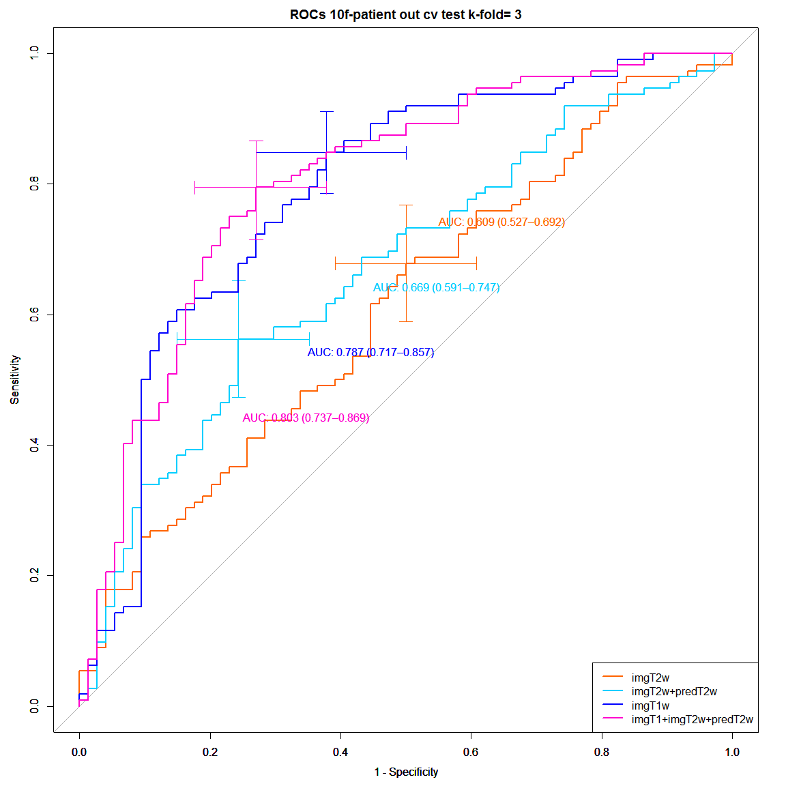 

```
## Area under the curve: 0.803
## 95% CI (2000 stratified bootstrap replicates):
##  thresholds sp.low sp.median sp.high se.low se.median se.high
##   0.4786215 0.6216    0.7297  0.8243 0.7143    0.7946  0.8663
##    massB    massM nonmassB nonmassM 
##      226      149      128       70 
##    massB    massM nonmassB nonmassM 
##       16       17       14        7 
##    massB    massM nonmassB nonmassM 
##      226      149      128       70 
##    massB    massM nonmassB nonmassM 
##       16       17       14        7 
##    massB    massM nonmassB nonmassM 
##      226      149      128       70 
##    massB    massM nonmassB nonmassM 
##       16       17       14        7 
## -0.0430622 0.05 
## Selected features for group: MeanDecreaseGini imgT2 
## =========NULL
##  [1] "T2texture_entropy_nondir"           "ave_T210"                           "T2RGH_var"                         
##  [4] "T2RGH_mean"                         "ave_T27"                            "T2texture_inversediffmoment_nondir"
##  [7] "T2grad_margin"                      "T2kurt_F_r_i"                       "T2texture_energy_nondir"           
## [10] "ave_T21"                            "T2skew_F_r_i"                       "T2texture_contrast_nondir"         
## [13] "T2texture_sumaverage_nondir"        "ave_T215"                           "ave_T25"                           
## [16] "ave_T216"                           "ave_T219"                           "ave_T29"                           
## [19] "T2max_F_r_i"                        "ave_T28"                            "ave_T214"                          
## [22] "T2texture_diffvariance_nondir"      "T2texture_correlation_nondir"       "T2texture_sumvariance_nondir"      
## [25] "ave_T22"                            "ave_T212"                           "ave_T23"                           
## [28] "ave_T26"                            "ave_T213"                           "T2var_F_r_i"                       
## [31] "T2min_F_r_i"                        "ave_T20"                            "ave_T24"                           
## [34] "T2_lesionSI"                       
## 0.009345794 0.05 
## Selected features for group: MeanDecreaseGini allT2 
## =========NULL
##  [1] "T2RGH_var"                          "T2texture_entropy_nondir"           "T2texture_correlation_nondir"      
##  [4] "T2RGH_mean"                         "ave_T210"                           "T2wSI_predicted"                   
##  [7] "T2_lesionSIstd"                     "T2texture_inversediffmoment_nondir" "LMSIR_predicted"                   
## [10] "T2texture_diffvariance_nondir"      "ave_T20"                            "T2grad_margin_var"                 
## [13] "ave_T219"                           "T2texture_sumaverage_nondir"        "ave_T22"                           
## [16] "ave_T21"                            "ave_T25"                            "ave_T217"                          
## [19] "ave_T26"                            "ave_T29"                            "ave_T214"                          
## [22] "ave_T211"                           "ave_T23"                            "ave_T28"                           
## [25] "T2texture_sumentropy_nondir"        "ave_T215"                           "ave_T27"                           
## [28] "T2kurt_F_r_i"                       "T2min_F_r_i"                        "ave_T212"                          
## [31] "T2texture_variance_nondir"          "ave_T218"                           "ave_T216"                          
## [34] "ave_T24"                            "ave_T213"                           "T2mean_F_r_i"                      
## [37] "T2texture_sumvariance_nondir"       "T2_lesionSI"                       
## 0.01923077 0.05 
## Selected features for group: MeanDecreaseGini imgT1 
## =========NULL
##  [1] "texture_sumvariance_nondir_post1"       "circularity"                            "SER_inside"                            
##  [4] "earlySE12"                              "max_RGH_mean"                           "iiMin_change_Variance_uptake"          
##  [7] "texture_inversediffmoment_nondir_post4" "texture_diffvariance_nondir_post3"      "texture_energy_nondir_post4"           
## [10] "maxVr_countor"                          "dce3SE8"                                "texture_variance_nondir_post3"         
## [13] "V18"                                    "edge_sharp_std"                         "V14"                                   
## [16] "earlySE15"                              "V3"                                     "A_countor"                             
## [19] "lateSE6"                                "dce2SE16"                               "texture_inversediffmoment_nondir_post2"
## [22] "Vr_increasingRate_countor"              "var_F_r_i"                              "alpha_countor"                         
## [25] "lateSE14"                               "texture_correlation_nondir_post4"       "lateSE4"                               
## [28] "V12"                                    "texture_inversediffmoment_nondir_post3" "dce2SE8"                               
## [31] "V11"                                    "V5"                                     "peakCr_inside"                         
## [34] "dce2SE11"                               "maxCr_inside"                           "texture_entropy_nondir_post4"          
## [37] "A_inside"                              
## 0.07926829 0.05 
## 0.06622517 0.05 
## 0.04255319 0.05 
## Selected features for group: MeanDecreaseGini all 
## =========NULL
##  [1] "texture_sumvariance_nondir_post2"  "alpha_inside"                      "T2RGH_var"                        
##  [4] "V11"                               "max_RGH_mean"                      "earlySE1"                         
##  [7] "V4"                                "texture_energy_nondir_post2"       "iMax_Variance_uptake"             
## [10] "edge_sharp_mean"                   "ivVariance"                        "V19"                              
## [13] "V10"                               "max_F_r_i"                         "Tpeak_inside"                     
## [16] "dce2SE6"                           "T2texture_contrast_nondir"         "Kpeak_inside"                     
## [19] "earlySE0"                          "lateSE18"                          "T2wSI_predicted"                  
## [22] "dce3SE11"                          "texture_diffvariance_nondir_post3" "dce2SE7"                          
## [25] "ave_T212"                          "iiMin_change_Variance_uptake"      "Vr_increasingRate_inside"         
## [28] "ave_T29"                           "T2grad_margin_var"                 "dce3SE13"                         
## [31] "lateSE1"                           "texture_diffentropy_nondir_post1"  "maxCr_countor"                    
## [34] "dce3SE14"                          "earlySE18"                         "V17"                              
## [37] "texture_contrast_nondir_post1"     "texture_sumentropy_nondir_post2"   "T2texture_correlation_nondir"     
## [40] "ave_T23"                           "dce3SE12"                          "texture_diffvariance_nondir_post1"
## [43] "skew_F_r_i"                        "ave_T213"                          "Vr_post_1_countor"                
## [46] "A_inside"                         
##     lesion_id cad_pt_no_txt exam_a_number_txt BIRADS lesion_label             lesion_diagnosis      find_t2_signal_int
## 11         11          0111           6907205      4     nonmassB               DUCT PAPILLOMA Hypointense or not seen
## 12         12          0114           6896014      4        massM               InvasiveDuctal                    None
## 82         82          0409           5161803      4        massB         BENIGN BREAST TISSUE                    None
## 91         91          0463           7626269      4        massB           FLORID HYPERPLASIA Hypointense or not seen
## 110       110          0576           6905042      4     nonmassB         BENIGN BREAST TISSUE Hypointense or not seen
## 115       115          0603           4593568      4     nonmassB                     FIBROSIS                    None
## 118       118          0613           4681594      4     nonmassM                 InsituDuctal                    None
## 119       119          0613           4681594      3     nonmassB         BENIGN BREAST TISSUE                    None
## 135       135          0673           4585908      4        massB                  FIBROCYSTIC Hypointense or not seen
## 138       138          0682           5050826      6     nonmassM                 InsituDuctal                    None
## 145       145          0689           5205923      2        massB        COLUMNAR CELL CHANGES            Hyperintense
## 149       149          0691           5178056      5        massM               InvasiveDuctal Hypointense or not seen
## 150       150          0691           5178056      5        massM               InvasiveDuctal Hypointense or not seen
## 168       168          0721           4961869      6        massM               InvasiveDuctal            Hyperintense
## 178       178          0729           4805710      4        massB ATYPICAL LOBULAR HYPERPLASIA                    None
## 182       182          0735           5276000      5        massM               InvasiveDuctal                    None
## 186       186          0742           5329785      4        massB               DUCT PAPILLOMA                    None
## 187       187          0742           5329785      4     nonmassB               DUCT PAPILLOMA                    None
## 189       189          0744           4848278      5        massM               InvasiveDuctal                    None
## 191       191          0748           4940559      6        massM  ATYPICAL DUCTAL HYPERPLASIA                    None
## 195       195          0755           5059877      4     nonmassM                 InsituDuctal                    None
## 196       196          0755           5059877      4     nonmassB         BENIGN BREAST TISSUE                    None
## 252       252          0837           4559849      5        massM               InvasiveDuctal                    None
## 276       276          0861           5053396      5        massM               InvasiveDuctal Hypointense or not seen
## 283       283          0870           5141888      6     nonmassM              InvasiveLobular                    None
## 302       302          0887           6794529      4        massB                  FIBROCYSTIC Hypointense or not seen
## 316       316          0943           5395204      4     nonmassM                 InsituDuctal                    None
## 317       317          0943           5395204      4     nonmassB                  FIBROCYSTIC Hypointense or not seen
## 320       320          0950           6931716      5        massM               InvasiveDuctal Hypointense or not seen
## 321       321          0950           6931716      5     nonmassM               InvasiveDuctal                    None
## 338       338          1004           6801264      4     nonmassB                  FIBROCYSTIC Hypointense or not seen
## 363       363          1078           7105247      4     nonmassB               DENSE FIBROSIS                    None
## 364       364          1078           7105247      4     nonmassB               DENSE FIBROSIS                    None
## 377       377          2007           7366811      4     nonmassB                 FIBROADENOMA Hypointense or not seen
## 395       395          2051           6712632      6        massM                 InsituDuctal                    None
## 396       396          2051           6712632      6     nonmassB                  FIBROCYSTIC                    None
## 397       397          2053           6776964      6        massM               InvasiveDuctal                    None
## 423       423          3021           7019819      4        massB         BENIGN BREAST TISSUE                    None
## 430       430          3033           5016967      5        massM               InvasiveDuctal                    None
## 456       456          3073           7043941      6     nonmassM  IN SITU PAPILLARY CARCINOMA                    None
## 499       499          4044           7066571      4        massB             FIBROADENOMATOID            Hyperintense
## 500       500          4044           7066571      4        massB        FOCAL CELLULAR STROMA            Hyperintense
## 501       501          4044           7066571      4        massB                 FIBROADENOMA   Slightly hyperintense
## 502       502          4045           7092118      4        massB                 FIBROADENOMA                    None
## 516       516          6017           5086121      6        massM              InvasiveLobular                    None
## 517       517          6017           5086121      2        massB                 FIBROADENOMA            Hyperintense
## 558       558          6044           5078981      5        massB                  FIBROCYSTIC                    None
## 559       559          6044           5078981      5        massM               InvasiveDuctal                    None
## 583       583          6117           5154282      3        massB                 FIBROADENOMA            Hyperintense
## 584       584          6141           7044114      2        massB                 FIBROADENOMA            Hyperintense
## 598       598          7029           7014263      4     nonmassB  ATYPICAL DUCTAL HYPERPLASIA                    None
## 612       612          7086           6938067      4        massM                 InsituDuctal                    None
## 613       613          7088           7066921      3     nonmassB                  FIBROCYSTIC                    None
## 621       621          7105           7837892      4        massM               InvasiveDuctal   Slightly hyperintense
## 
## ============ bestune_imgT2 	 max.depth  1 	 #Trees  350 
## ntrees:  50 minsplit:  3 cp:  -1 
##   ntrees minsplit cp acuTrain rocTrain   acuTest   rocTest
## 1     50        3 -1        1        1 0.7222222 0.7277778
## ntrees:  100 minsplit:  3 cp:  -1 
##   ntrees minsplit cp acuTrain rocTrain   acuTest   rocTest
## 2    100        3 -1        1        1 0.6666667 0.7083333
## ntrees:  250 minsplit:  3 cp:  -1 
##   ntrees minsplit cp acuTrain rocTrain   acuTest   rocTest
## 3    250        3 -1        1        1 0.6481481 0.6736111
## ntrees:  350 minsplit:  3 cp:  -1 
##   ntrees minsplit cp acuTrain rocTrain   acuTest   rocTest
## 4    350        3 -1        1        1 0.6851852 0.7027778
## ntrees:  500 minsplit:  3 cp:  -1 
##   ntrees minsplit cp acuTrain rocTrain   acuTest   rocTest
## 5    500        3 -1        1        1 0.6481481 0.7263889
## ntrees:  50 minsplit:  1 cp:  -1 
##   ntrees minsplit cp acuTrain rocTrain   acuTest   rocTest
## 6     50        1 -1        1        1 0.6296296 0.6763889
## ntrees:  100 minsplit:  1 cp:  -1 
##   ntrees minsplit cp acuTrain rocTrain   acuTest rocTest
## 7    100        1 -1        1        1 0.6481481  0.6875
## ntrees:  250 minsplit:  1 cp:  -1 
##   ntrees minsplit cp acuTrain rocTrain   acuTest   rocTest
## 8    250        1 -1        1        1 0.7037037 0.6888889
## ntrees:  350 minsplit:  1 cp:  -1 
##   ntrees minsplit cp acuTrain rocTrain   acuTest   rocTest
## 9    350        1 -1        1        1 0.6851852 0.7152778
## ntrees:  500 minsplit:  1 cp:  -1 
##    ntrees minsplit cp acuTrain rocTrain   acuTest   rocTest
## 10    500        1 -1        1        1 0.6666667 0.7208333
## ntrees:  50 minsplit:  0 cp:  -1 
##    ntrees minsplit cp acuTrain rocTrain   acuTest   rocTest
## 11     50        0 -1        1        1 0.6481481 0.6833333
## ntrees:  100 minsplit:  0 cp:  -1 
##    ntrees minsplit cp acuTrain rocTrain   acuTest   rocTest
## 12    100        0 -1        1        1 0.6666667 0.6930556
## ntrees:  250 minsplit:  0 cp:  -1 
##    ntrees minsplit cp acuTrain rocTrain   acuTest   rocTest
## 13    250        0 -1        1        1 0.6296296 0.7138889
## ntrees:  350 minsplit:  0 cp:  -1 
##    ntrees minsplit cp acuTrain rocTrain   acuTest   rocTest
## 14    350        0 -1        1        1 0.6851852 0.7319444
## ntrees:  500 minsplit:  0 cp:  -1 
##    ntrees minsplit cp acuTrain rocTrain   acuTest   rocTest
## 15    500        0 -1        1        1 0.7037037 0.7569444
##    ntrees minsplit cp acuTrain rocTrain   acuTest   rocTest
## 1      50        3 -1        1        1 0.7222222 0.7277778
## 2     100        3 -1        1        1 0.6666667 0.7083333
## 3     250        3 -1        1        1 0.6481481 0.6736111
## 4     350        3 -1        1        1 0.6851852 0.7027778
## 5     500        3 -1        1        1 0.6481481 0.7263889
## 6      50        1 -1        1        1 0.6296296 0.6763889
## 7     100        1 -1        1        1 0.6481481 0.6875000
## 8     250        1 -1        1        1 0.7037037 0.6888889
## 9     350        1 -1        1        1 0.6851852 0.7152778
## 10    500        1 -1        1        1 0.6666667 0.7208333
## 11     50        0 -1        1        1 0.6481481 0.6833333
## 12    100        0 -1        1        1 0.6666667 0.6930556
## 13    250        0 -1        1        1 0.6296296 0.7138889
## 14    350        0 -1        1        1 0.6851852 0.7319444
## 15    500        0 -1        1        1 0.7037037 0.7569444
##    ntrees minsplit cp acuTrain rocTrain   acuTest   rocTest
## 15    500        0 -1        1        1 0.7037037 0.7569444
## 
## ============ bestune_allT2 	 max.depth  1 	 #Trees  250 
## ntrees:  50 minsplit:  3 cp:  -1 
##   ntrees minsplit cp acuTrain rocTrain   acuTest   rocTest
## 1     50        3 -1        1        1 0.5925926 0.4694444
## ntrees:  100 minsplit:  3 cp:  -1 
##   ntrees minsplit cp acuTrain rocTrain   acuTest   rocTest
## 2    100        3 -1        1        1 0.6851852 0.7069444
## ntrees:  250 minsplit:  3 cp:  -1 
##   ntrees minsplit cp acuTrain rocTrain   acuTest   rocTest
## 3    250        3 -1        1        1 0.7592593 0.7458333
## ntrees:  350 minsplit:  3 cp:  -1 
##   ntrees minsplit cp acuTrain rocTrain   acuTest   rocTest
## 4    350        3 -1        1        1 0.7037037 0.6986111
## ntrees:  500 minsplit:  3 cp:  -1 
##   ntrees minsplit cp acuTrain rocTrain   acuTest rocTest
## 5    500        3 -1        1        1 0.6851852  0.7375
## ntrees:  50 minsplit:  1 cp:  -1 
##   ntrees minsplit cp acuTrain rocTrain   acuTest   rocTest
## 6     50        1 -1        1        1 0.5555556 0.5888889
## ntrees:  100 minsplit:  1 cp:  -1 
##   ntrees minsplit cp acuTrain rocTrain   acuTest rocTest
## 7    100        1 -1        1        1 0.6666667   0.725
## ntrees:  250 minsplit:  1 cp:  -1 
##   ntrees minsplit cp acuTrain rocTrain   acuTest   rocTest
## 8    250        1 -1        1        1 0.6666667 0.6930556
## ntrees:  350 minsplit:  1 cp:  -1 
##   ntrees minsplit cp acuTrain rocTrain   acuTest   rocTest
## 9    350        1 -1        1        1 0.7037037 0.7083333
## ntrees:  500 minsplit:  1 cp:  -1 
##    ntrees minsplit cp acuTrain rocTrain   acuTest   rocTest
## 10    500        1 -1        1        1 0.6851852 0.7208333
## ntrees:  50 minsplit:  0 cp:  -1 
##    ntrees minsplit cp acuTrain rocTrain   acuTest   rocTest
## 11     50        0 -1        1        1 0.6296296 0.6361111
## ntrees:  100 minsplit:  0 cp:  -1 
##    ntrees minsplit cp acuTrain rocTrain   acuTest   rocTest
## 12    100        0 -1        1        1 0.6296296 0.6194444
## ntrees:  250 minsplit:  0 cp:  -1 
##    ntrees minsplit cp acuTrain rocTrain   acuTest   rocTest
## 13    250        0 -1        1        1 0.6666667 0.6958333
## ntrees:  350 minsplit:  0 cp:  -1 
##    ntrees minsplit cp acuTrain rocTrain   acuTest rocTest
## 14    350        0 -1        1        1 0.6296296   0.675
## ntrees:  500 minsplit:  0 cp:  -1 
##    ntrees minsplit cp acuTrain rocTrain   acuTest   rocTest
## 15    500        0 -1        1        1 0.7222222 0.7361111
##    ntrees minsplit cp acuTrain rocTrain   acuTest   rocTest
## 1      50        3 -1        1        1 0.5925926 0.4694444
## 2     100        3 -1        1        1 0.6851852 0.7069444
## 3     250        3 -1        1        1 0.7592593 0.7458333
## 4     350        3 -1        1        1 0.7037037 0.6986111
## 5     500        3 -1        1        1 0.6851852 0.7375000
## 6      50        1 -1        1        1 0.5555556 0.5888889
## 7     100        1 -1        1        1 0.6666667 0.7250000
## 8     250        1 -1        1        1 0.6666667 0.6930556
## 9     350        1 -1        1        1 0.7037037 0.7083333
## 10    500        1 -1        1        1 0.6851852 0.7208333
## 11     50        0 -1        1        1 0.6296296 0.6361111
## 12    100        0 -1        1        1 0.6296296 0.6194444
## 13    250        0 -1        1        1 0.6666667 0.6958333
## 14    350        0 -1        1        1 0.6296296 0.6750000
## 15    500        0 -1        1        1 0.7222222 0.7361111
##   ntrees minsplit cp acuTrain rocTrain   acuTest   rocTest
## 3    250        3 -1        1        1 0.7592593 0.7458333
## 
## ============ bestune_imgT1 	 max.depth  1 	 #Trees  250 
## ntrees:  50 minsplit:  3 cp:  -1 
##   ntrees minsplit cp acuTrain rocTrain   acuTest   rocTest
## 1     50        3 -1        1        1 0.7222222 0.8097222
## ntrees:  100 minsplit:  3 cp:  -1 
##   ntrees minsplit cp acuTrain rocTrain   acuTest   rocTest
## 2    100        3 -1        1        1 0.7407407 0.8027778
## ntrees:  250 minsplit:  3 cp:  -1 
##   ntrees minsplit cp acuTrain rocTrain   acuTest   rocTest
## 3    250        3 -1        1        1 0.7592593 0.7986111
## ntrees:  350 minsplit:  3 cp:  -1 
##   ntrees minsplit cp acuTrain rocTrain   acuTest   rocTest
## 4    350        3 -1        1        1 0.7592593 0.8027778
## ntrees:  500 minsplit:  3 cp:  -1 
##   ntrees minsplit cp acuTrain rocTrain   acuTest   rocTest
## 5    500        3 -1        1        1 0.7407407 0.7902778
## ntrees:  50 minsplit:  1 cp:  -1 
##   ntrees minsplit cp acuTrain rocTrain   acuTest rocTest
## 6     50        1 -1        1        1 0.7777778     0.8
## ntrees:  100 minsplit:  1 cp:  -1 
##   ntrees minsplit cp acuTrain rocTrain   acuTest   rocTest
## 7    100        1 -1        1        1 0.7407407 0.8097222
## ntrees:  250 minsplit:  1 cp:  -1 
##   ntrees minsplit cp acuTrain rocTrain   acuTest   rocTest
## 8    250        1 -1        1        1 0.7407407 0.7833333
## ntrees:  350 minsplit:  1 cp:  -1 
##   ntrees minsplit cp acuTrain rocTrain   acuTest   rocTest
## 9    350        1 -1        1        1 0.7407407 0.8027778
## ntrees:  500 minsplit:  1 cp:  -1 
##    ntrees minsplit cp acuTrain rocTrain   acuTest   rocTest
## 10    500        1 -1        1        1 0.7777778 0.8027778
## ntrees:  50 minsplit:  0 cp:  -1 
##    ntrees minsplit cp acuTrain rocTrain   acuTest   rocTest
## 11     50        0 -1        1        1 0.6666667 0.7763889
## ntrees:  100 minsplit:  0 cp:  -1 
##    ntrees minsplit cp acuTrain rocTrain   acuTest   rocTest
## 12    100        0 -1        1        1 0.7222222 0.7583333
## ntrees:  250 minsplit:  0 cp:  -1 
##    ntrees minsplit cp acuTrain rocTrain   acuTest   rocTest
## 13    250        0 -1        1        1 0.7407407 0.7791667
## ntrees:  350 minsplit:  0 cp:  -1 
##    ntrees minsplit cp acuTrain rocTrain   acuTest   rocTest
## 14    350        0 -1        1        1 0.7592593 0.7847222
## ntrees:  500 minsplit:  0 cp:  -1 
##    ntrees minsplit cp acuTrain rocTrain   acuTest   rocTest
## 15    500        0 -1        1        1 0.7592593 0.7958333
##    ntrees minsplit cp acuTrain rocTrain   acuTest   rocTest
## 1      50        3 -1        1        1 0.7222222 0.8097222
## 2     100        3 -1        1        1 0.7407407 0.8027778
## 3     250        3 -1        1        1 0.7592593 0.7986111
## 4     350        3 -1        1        1 0.7592593 0.8027778
## 5     500        3 -1        1        1 0.7407407 0.7902778
## 6      50        1 -1        1        1 0.7777778 0.8000000
## 7     100        1 -1        1        1 0.7407407 0.8097222
## 8     250        1 -1        1        1 0.7407407 0.7833333
## 9     350        1 -1        1        1 0.7407407 0.8027778
## 10    500        1 -1        1        1 0.7777778 0.8027778
## 11     50        0 -1        1        1 0.6666667 0.7763889
## 12    100        0 -1        1        1 0.7222222 0.7583333
## 13    250        0 -1        1        1 0.7407407 0.7791667
## 14    350        0 -1        1        1 0.7592593 0.7847222
## 15    500        0 -1        1        1 0.7592593 0.7958333
##   ntrees minsplit cp acuTrain rocTrain   acuTest   rocTest
## 1     50        3 -1        1        1 0.7222222 0.8097222
## 7    100        1 -1        1        1 0.7407407 0.8097222
## 
## ============ bestune_all 	 max.depth  1 	 #Trees  200 
## ntrees:  50 minsplit:  3 cp:  -1 
##   ntrees minsplit cp acuTrain rocTrain   acuTest   rocTest
## 1     50        3 -1        1        1 0.7222222 0.7236111
## ntrees:  100 minsplit:  3 cp:  -1 
##   ntrees minsplit cp acuTrain rocTrain   acuTest rocTest
## 2    100        3 -1        1        1 0.7407407    0.75
## ntrees:  250 minsplit:  3 cp:  -1 
##   ntrees minsplit cp acuTrain rocTrain   acuTest   rocTest
## 3    250        3 -1        1        1 0.6666667 0.7194444
## ntrees:  350 minsplit:  3 cp:  -1 
##   ntrees minsplit cp acuTrain rocTrain   acuTest   rocTest
## 4    350        3 -1        1        1 0.6481481 0.7541667
## ntrees:  500 minsplit:  3 cp:  -1 
##   ntrees minsplit cp acuTrain rocTrain   acuTest rocTest
## 5    500        3 -1        1        1 0.7037037   0.775
## ntrees:  50 minsplit:  1 cp:  -1 
##   ntrees minsplit cp acuTrain rocTrain   acuTest   rocTest
## 6     50        1 -1        1        1 0.7037037 0.7194444
## ntrees:  100 minsplit:  1 cp:  -1 
##   ntrees minsplit cp acuTrain rocTrain   acuTest rocTest
## 7    100        1 -1        1        1 0.6851852  0.7625
## ntrees:  250 minsplit:  1 cp:  -1 
##   ntrees minsplit cp acuTrain rocTrain   acuTest   rocTest
## 8    250        1 -1        1        1 0.6851852 0.7819444
## ntrees:  350 minsplit:  1 cp:  -1 
##   ntrees minsplit cp acuTrain rocTrain   acuTest   rocTest
## 9    350        1 -1        1        1 0.6666667 0.7611111
## ntrees:  500 minsplit:  1 cp:  -1 
##    ntrees minsplit cp acuTrain rocTrain   acuTest   rocTest
## 10    500        1 -1        1        1 0.6851852 0.7430556
## ntrees:  50 minsplit:  0 cp:  -1 
##    ntrees minsplit cp acuTrain rocTrain   acuTest   rocTest
## 11     50        0 -1        1        1 0.7222222 0.7666667
## ntrees:  100 minsplit:  0 cp:  -1 
##    ntrees minsplit cp acuTrain rocTrain   acuTest   rocTest
## 12    100        0 -1        1        1 0.6481481 0.7583333
## ntrees:  250 minsplit:  0 cp:  -1 
##    ntrees minsplit cp acuTrain rocTrain   acuTest   rocTest
## 13    250        0 -1        1        1 0.7592593 0.7569444
## ntrees:  350 minsplit:  0 cp:  -1 
##    ntrees minsplit cp acuTrain rocTrain   acuTest   rocTest
## 14    350        0 -1        1        1 0.7407407 0.7638889
## ntrees:  500 minsplit:  0 cp:  -1 
##    ntrees minsplit cp acuTrain rocTrain   acuTest   rocTest
## 15    500        0 -1        1        1 0.7037037 0.7555556
##    ntrees minsplit cp acuTrain rocTrain   acuTest   rocTest
## 1      50        3 -1        1        1 0.7222222 0.7236111
## 2     100        3 -1        1        1 0.7407407 0.7500000
## 3     250        3 -1        1        1 0.6666667 0.7194444
## 4     350        3 -1        1        1 0.6481481 0.7541667
## 5     500        3 -1        1        1 0.7037037 0.7750000
## 6      50        1 -1        1        1 0.7037037 0.7194444
## 7     100        1 -1        1        1 0.6851852 0.7625000
## 8     250        1 -1        1        1 0.6851852 0.7819444
## 9     350        1 -1        1        1 0.6666667 0.7611111
## 10    500        1 -1        1        1 0.6851852 0.7430556
## 11     50        0 -1        1        1 0.7222222 0.7666667
## 12    100        0 -1        1        1 0.6481481 0.7583333
## 13    250        0 -1        1        1 0.7592593 0.7569444
## 14    350        0 -1        1        1 0.7407407 0.7638889
## 15    500        0 -1        1        1 0.7037037 0.7555556
##   ntrees minsplit cp acuTrain rocTrain   acuTest   rocTest
## 8    250        1 -1        1        1 0.6851852 0.7819444
## 
## Call:
## roc.default(response = perf_imgT2$obs, predictor = perf_imgT2$C)
## 
## Data: perf_imgT2$C in 98 controls (perf_imgT2$obs C) > 142 cases (perf_imgT2$obs NC).
## Area under the curve: 0.6454
## 
## Call:
## roc.default(response = perf_allT2$obs, predictor = perf_allT2$C)
## 
## Data: perf_allT2$C in 98 controls (perf_allT2$obs C) > 142 cases (perf_allT2$obs NC).
## Area under the curve: 0.6871
## 
## Call:
## roc.default(response = perf_imgT1$obs, predictor = perf_imgT1$C)
## 
## Data: perf_imgT1$C in 98 controls (perf_imgT1$obs C) > 142 cases (perf_imgT1$obs NC).
## Area under the curve: 0.7851
## 
## Call:
## roc.default(response = perf_all$obs, predictor = perf_all$C)
## 
## Data: perf_all$C in 98 controls (perf_all$obs C) > 142 cases (perf_all$obs NC).
## Area under the curve: 0.7979
```

```
## Area under the curve: 0.6454
## 95% CI (2000 stratified bootstrap replicates):
##  thresholds sp.low sp.median sp.high se.low se.median se.high
##   0.4637138 0.4592    0.5612  0.6533 0.5986    0.6761  0.7535
```

```
## Area under the curve: 0.6871
## 95% CI (2000 stratified bootstrap replicates):
##  thresholds sp.low sp.median sp.high se.low se.median se.high
##   0.4376983 0.6531    0.7449  0.8265  0.493    0.5775   0.662
```

```
## Area under the curve: 0.7851
## 95% CI (2000 stratified bootstrap replicates):
##  thresholds sp.low sp.median sp.high se.low se.median se.high
##    0.411801 0.7551    0.8367  0.9082 0.5423    0.6197  0.6901
```

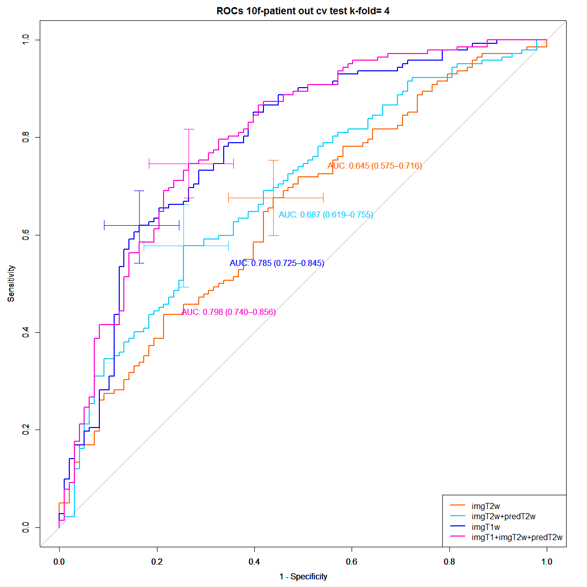 

```
## Area under the curve: 0.7979
## 95% CI (2000 stratified bootstrap replicates):
##  thresholds sp.low sp.median sp.high se.low se.median se.high
##   0.4633848 0.6429    0.7347  0.8166 0.6761    0.7465  0.8169
##    massB    massM nonmassB nonmassM 
##      225      147      127       69 
##    massB    massM nonmassB nonmassM 
##       17       19       15        8 
##    massB    massM nonmassB nonmassM 
##      225      147      127       69 
##    massB    massM nonmassB nonmassM 
##       17       19       15        8 
##    massB    massM nonmassB nonmassM 
##      225      147      127       69 
##    massB    massM nonmassB nonmassM 
##       17       19       15        8 
## -0.04368932 0.05 
## Selected features for group: MeanDecreaseGini imgT2 
## =========NULL
##  [1] "T2texture_energy_nondir"            "ave_T211"                           "T2max_F_r_i"                       
##  [4] "ave_T210"                           "T2texture_sumaverage_nondir"        "ave_T216"                          
##  [7] "T2grad_margin"                      "ave_T25"                            "ave_T20"                           
## [10] "T2_lesionSIstd"                     "T2texture_correlation_nondir"       "T2kurt_F_r_i"                      
## [13] "ave_T23"                            "ave_T219"                           "T2texture_diffvariance_nondir"     
## [16] "ave_T26"                            "ave_T215"                           "T2texture_inversediffmoment_nondir"
## [19] "ave_T21"                            "T2min_F_r_i"                        "ave_T29"                           
## [22] "T2grad_margin_var"                  "T2_lesionSI"                        "T2RGH_var"                         
## [25] "ave_T213"                           "T2texture_diffentropy_nondir"       "ave_T217"                          
## [28] "T2texture_sumvariance_nondir"       "ave_T24"                            "ave_T212"                          
## [31] "T2mean_F_r_i"                      
## 0.03809524 0.05 
## Selected features for group: MeanDecreaseGini allT2 
## =========NULL
##  [1] "T2wSI_predicted"                    "T2RGH_mean"                         "T2RGH_var"                         
##  [4] "T2texture_correlation_nondir"       "T2skew_F_r_i"                       "ave_T210"                          
##  [7] "T2grad_margin_var"                  "T2texture_entropy_nondir"           "ave_T25"                           
## [10] "ave_T24"                            "T2texture_inversediffmoment_nondir" "ave_T212"                          
## [13] "T2texture_sumaverage_nondir"        "ave_T218"                           "T2texture_contrast_nondir"         
## [16] "ave_T22"                            "ave_T216"                           "T2_lesionSI"                       
## [19] "ave_T215"                           "LMSIR_predicted"                    "ave_T29"                           
## [22] "ave_T211"                           "ave_T20"                            "ave_T26"                           
## [25] "ave_T213"                           "T2kurt_F_r_i"                       "T2var_F_r_i"                       
## [28] "T2texture_sumvariance_nondir"       "ave_T28"                            "T2min_F_r_i"                       
## [31] "ave_T23"                            "ave_T217"                           "ave_T214"                          
## [34] "T2_lesionSIstd"                    
## 0.01851852 0.05 
## Selected features for group: MeanDecreaseGini imgT1 
## =========NULL
##  [1] "irregularity"                     "texture_sumvariance_nondir_post1" "SER_inside"                      
##  [4] "iiMin_change_Variance_uptake"     "skew_F_r_i"                       "max_F_r_i"                       
##  [7] "earlySE12"                        "texture_sumaverage_nondir_post3"  "lateSE11"                        
## [10] "alpha_countor"                    "V19"                              "kurt_F_r_i"                      
## [13] "beta_inside"                      "Vr_decreasingRate_inside"         "dce3SE13"                        
## [16] "texture_energy_nondir_post3"      "texture_contrast_nondir_post2"    "texture_correlation_nondir_post4"
## [19] "dce2SE7"                          "texture_diffentropy_nondir_post1" "V0"                              
## [22] "dce2SE16"                         "V2"                               "lateSE8"                         
## [25] "lateSE4"                          "dce3SE10"                         "V18"                             
## [28] "texture_sumvariance_nondir_post4" "dce3SE6"                          "lateSE19"                        
## [31] "lateSE12"                         "Slope_ini_inside"                 "dce3SE0"                         
## [34] "lateSE9"                          "A_inside"                        
## 0.02702703 0.05 
## Selected features for group: MeanDecreaseGini all 
## =========NULL
##  [1] "washoutRate_inside"               "var_F_r_i"                        "texture_correlation_nondir_post4"
##  [4] "lateSE11"                         "V17"                              "V7"                              
##  [7] "ivVariance"                       "V0"                               "alpha_countor"                   
## [10] "earlySE1"                         "texture_sumaverage_nondir_post4"  "V3"                              
## [13] "ave_T211"                         "T2wSI_predicted"                  "texture_sumentropy_nondir_post2" 
## [16] "earlySE19"                        "T2grad_margin_var"                "Tpeak_countor"                   
## [19] "ave_T210"                         "texture_diffentropy_nondir_post2" "dce3SE4"                         
## [22] "lateSE14"                         "T2RGH_var"                        "dce3SE7"                         
## [25] "earlySE17"                        "irregularity"                     "ave_T214"                        
## [28] "ave_T219"                         "lateSE10"                         "Vr_increasingRate_inside"        
## [31] "T2min_F_r_i"                      "dce3SE8"                          "dce3SE13"                        
## [34] "V6"                               "earlySE4"                         "A_inside"                        
##     lesion_id cad_pt_no_txt exam_a_number_txt BIRADS lesion_label                      lesion_diagnosis      find_t2_signal_int
## 10         10          0102           4755778      4        massB                           FIBROCYSTIC            Hyperintense
## 69         69          0277           5077098      5     nonmassM                          InsituDuctal Hypointense or not seen
## 72         72          0293           7491268      4     nonmassB                  BENIGN BREAST TISSUE                    None
## 81         81          0388           7395410      5        massM                        InvasiveDuctal                    None
## 92         92          0465           4885863      2     nonmassB           ATYPICAL DUCTAL HYPERPLASIA                    None
## 95         95          0503           6697826      3        massM                        InvasiveDuctal            Hyperintense
## 101       101          0551           4804820      4        massB                       FIBROEPITHELIAL   Slightly hyperintense
## 108       108          0572           4681582      4     nonmassM                        InvasiveDuctal                    None
## 109       109          0573           5142109      4     nonmassB                 COLUMNAR CELL CHANGES                    None
## 128       128          0664           7081071      4     nonmassB           ATYPICAL DUCTAL HYPERPLASIA Hypointense or not seen
## 155       155          0707           5184832      4     nonmassB              COMPLEX PAPILLARY LESION Hypointense or not seen
## 156       156          0707           5184832      4     nonmassB              COMPLEX PAPILLARY LESION Hypointense or not seen
## 184       184          0737           4559808      3        massM                          InsituDuctal            Hyperintense
## 199       199          0764           5088503      5        massM                        InvasiveDuctal                    None
## 200       200          0764           5088503      5        massM                        InvasiveDuctal                    None
## 202       202          0767           5306672      4        massB             ATYPICAL PAPILLARY LESION                    None
## 205       205          0775           5437780      3        massB                  BENIGN BREAST TISSUE   Slightly hyperintense
## 206       206          0775           5437780      3     nonmassB                  BENIGN BREAST TISSUE Hypointense or not seen
## 207       207          0775           5437780      3     nonmassB                  BENIGN BREAST TISSUE   Slightly hyperintense
## 210       210          0782           4775699      5        massM                        InvasiveDuctal                    None
## 243       243          0827           4985128      4        massM              INSITUPAPILLARYCARCINOMA                    None
## 244       244          0827           4985128      4     nonmassM              INSITUPAPILLARYCARCINOMA                    None
## 245       245          0827           4985128      4        massB              USUAL DUCTAL HYPERPLASIA                    None
## 247       247          0829           5264139      5        massM                        InvasiveDuctal Hypointense or not seen
## 255       255          0843           4798594      4        massB                           FIBROCYSTIC                    None
## 256       256          0843           6792402      4        massB                           FIBROCYSTIC                    None
## 274       274          0857           4870283      4        massB                           FIBROCYSTIC Hypointense or not seen
## 275       275          0857           5013393      2        massM                          InsituDuctal Hypointense or not seen
## 289       289          0875           7141879      4        massB                        DUCT PAPILLOMA                    None
## 290       290          0875           5396107      4     nonmassB                      PAPILLARY LESION                    None
## 345       345          1021           6760795      4        massB                          FIBROADENOMA Hypointense or not seen
## 352       352          1050           7296806      3     nonmassB                        DENSE FIBROSIS                    None
## 370       370          1090           4288694      4     nonmassB           ATYPICAL DUCTAL HYPERPLASIA   Slightly hyperintense
## 371       371          1092           4951061      6        massB                         InsituLobular                    None
## 372       372          1092           4951061      4     nonmassB                         InsituLobular                    None
## 381       381          2024           5190122      6     nonmassM                          InsituDuctal Hypointense or not seen
## 382       382          2027           5465838      6        massM                          InsituDuctal            Hyperintense
## 401       401          2068           7559583      5        massM                        InvasiveDuctal Hypointense or not seen
## 420       420          3017           7014437      4     nonmassB                     FOCAL HYPERPLASIA   Slightly hyperintense
## 425       425          3025           7103914      4        massB                          FIBROADENOMA            Hyperintense
## 428       428          3030           7642998      4        massB                  BENIGN BREAST TISSUE   Slightly hyperintense
## 454       454          3072           7054863      6     nonmassM                          InsituDuctal                    None
## 473       473          3093           7438787      4        massB                  BENIGN BREAST TISSUE                    None
## 481       481          4017           6979356      4        massB              USUAL DUCTAL HYPERPLASIA Hypointense or not seen
## 482       482          4017           6979356      4        massB              USUAL DUCTAL HYPERPLASIA Hypointense or not seen
## 505       505          4055           7439091      4        massB PSEUDOANGIOMATOUS STROMAL HYPERPLASIA                    None
## 507       507          6004         ACC108249      6        massM                       InvasiveLobular Hypointense or not seen
## 508       508          6004         ACC108249      5     nonmassM                       InvasiveLobular                    None
## 544       544          6037           5043444      5        massM                        InvasiveDuctal                    None
## 545       545          6037           5043444      5        massM                        InvasiveDuctal                    None
## 549       549          6039         ACC109197      5        massM                          InsituDuctal            Hyperintense
## 550       550          6039         ACC109197      5     nonmassM                          InsituDuctal                    None
## 551       551          6039         ACC109197      5        massM                          InsituDuctal            Hyperintense
## 555       555          6042           4504274      3        massM                        InvasiveDuctal Hypointense or not seen
## 556       556          6042           4504274      3        massM                        InvasiveDuctal Hypointense or not seen
## 566       566          6047           5275305      6     nonmassM                        Adenocarcinoma                    None
## 582       582          6114           5148523      6     nonmassB                  BENIGN BREAST TISSUE                    None
## 620       620          7104           6941351      5        massM                        InvasiveDuctal                    None
## 636       636          7220           7288789      4     nonmassB                           FIBROCYSTIC Hypointense or not seen
## 
## ============ bestune_imgT2 	 max.depth  1 	 #Trees  350 
## ntrees:  50 minsplit:  3 cp:  -1 
##   ntrees minsplit cp acuTrain rocTrain   acuTest   rocTest
## 1     50        3 -1        1        1 0.5254237 0.5104167
## ntrees:  100 minsplit:  3 cp:  -1 
##   ntrees minsplit cp acuTrain rocTrain   acuTest   rocTest
## 2    100        3 -1        1        1 0.5423729 0.5613426
## ntrees:  250 minsplit:  3 cp:  -1 
##   ntrees minsplit cp acuTrain rocTrain   acuTest   rocTest
## 3    250        3 -1        1        1 0.5084746 0.5150463
## ntrees:  350 minsplit:  3 cp:  -1 
##   ntrees minsplit cp acuTrain rocTrain   acuTest   rocTest
## 4    350        3 -1        1        1 0.5762712 0.5949074
## ntrees:  500 minsplit:  3 cp:  -1 
##   ntrees minsplit cp acuTrain rocTrain   acuTest   rocTest
## 5    500        3 -1        1        1 0.5932203 0.5439815
## ntrees:  50 minsplit:  1 cp:  -1 
##   ntrees minsplit cp acuTrain rocTrain   acuTest   rocTest
## 6     50        1 -1        1        1 0.5084746 0.5601852
## ntrees:  100 minsplit:  1 cp:  -1 
##   ntrees minsplit cp acuTrain rocTrain   acuTest   rocTest
## 7    100        1 -1        1        1 0.5084746 0.5185185
## ntrees:  250 minsplit:  1 cp:  -1 
##   ntrees minsplit cp acuTrain rocTrain   acuTest  rocTest
## 8    250        1 -1        1        1 0.5932203 0.568287
## ntrees:  350 minsplit:  1 cp:  -1 
##   ntrees minsplit cp acuTrain rocTrain   acuTest   rocTest
## 9    350        1 -1        1        1 0.5254237 0.4548611
## ntrees:  500 minsplit:  1 cp:  -1 
##    ntrees minsplit cp acuTrain rocTrain   acuTest  rocTest
## 10    500        1 -1        1        1 0.5084746 0.537037
## ntrees:  50 minsplit:  0 cp:  -1 
##    ntrees minsplit cp acuTrain rocTrain  acuTest   rocTest
## 11     50        0 -1        1        1 0.559322 0.5462963
## ntrees:  100 minsplit:  0 cp:  -1 
##    ntrees minsplit cp acuTrain rocTrain   acuTest   rocTest
## 12    100        0 -1        1        1 0.5084746 0.4618056
## ntrees:  250 minsplit:  0 cp:  -1 
##    ntrees minsplit cp acuTrain rocTrain   acuTest   rocTest
## 13    250        0 -1        1        1 0.6101695 0.6030093
## ntrees:  350 minsplit:  0 cp:  -1 
##    ntrees minsplit cp acuTrain rocTrain   acuTest   rocTest
## 14    350        0 -1        1        1 0.5423729 0.5706019
## ntrees:  500 minsplit:  0 cp:  -1 
##    ntrees minsplit cp acuTrain rocTrain  acuTest   rocTest
## 15    500        0 -1        1        1 0.559322 0.5740741
##    ntrees minsplit cp acuTrain rocTrain   acuTest   rocTest
## 1      50        3 -1        1        1 0.5254237 0.5104167
## 2     100        3 -1        1        1 0.5423729 0.5613426
## 3     250        3 -1        1        1 0.5084746 0.5150463
## 4     350        3 -1        1        1 0.5762712 0.5949074
## 5     500        3 -1        1        1 0.5932203 0.5439815
## 6      50        1 -1        1        1 0.5084746 0.5601852
## 7     100        1 -1        1        1 0.5084746 0.5185185
## 8     250        1 -1        1        1 0.5932203 0.5682870
## 9     350        1 -1        1        1 0.5254237 0.4548611
## 10    500        1 -1        1        1 0.5084746 0.5370370
## 11     50        0 -1        1        1 0.5593220 0.5462963
## 12    100        0 -1        1        1 0.5084746 0.4618056
## 13    250        0 -1        1        1 0.6101695 0.6030093
## 14    350        0 -1        1        1 0.5423729 0.5706019
## 15    500        0 -1        1        1 0.5593220 0.5740741
##    ntrees minsplit cp acuTrain rocTrain   acuTest   rocTest
## 13    250        0 -1        1        1 0.6101695 0.6030093
## 
## ============ bestune_allT2 	 max.depth  1 	 #Trees  250 
## ntrees:  50 minsplit:  3 cp:  -1 
##   ntrees minsplit cp acuTrain rocTrain   acuTest   rocTest
## 1     50        3 -1        1        1 0.5423729 0.5659722
## ntrees:  100 minsplit:  3 cp:  -1 
##   ntrees minsplit cp acuTrain rocTrain   acuTest   rocTest
## 2    100        3 -1        1        1 0.4915254 0.5243056
## ntrees:  250 minsplit:  3 cp:  -1 
##   ntrees minsplit cp acuTrain rocTrain   acuTest   rocTest
## 3    250        3 -1        1        1 0.5254237 0.5821759
## ntrees:  350 minsplit:  3 cp:  -1 
##   ntrees minsplit cp acuTrain rocTrain  acuTest   rocTest
## 4    350        3 -1        1        1 0.559322 0.5613426
## ntrees:  500 minsplit:  3 cp:  -1 
##   ntrees minsplit cp acuTrain rocTrain   acuTest   rocTest
## 5    500        3 -1        1        1 0.5254237 0.5393519
## ntrees:  50 minsplit:  1 cp:  -1 
##   ntrees minsplit cp acuTrain rocTrain   acuTest   rocTest
## 6     50        1 -1        1        1 0.5254237 0.5069444
## ntrees:  100 minsplit:  1 cp:  -1 
##   ntrees minsplit cp acuTrain rocTrain  acuTest   rocTest
## 7    100        1 -1        1        1 0.559322 0.5046296
## ntrees:  250 minsplit:  1 cp:  -1 
##   ntrees minsplit cp acuTrain rocTrain   acuTest   rocTest
## 8    250        1 -1        1        1 0.4915254 0.5300926
## ntrees:  350 minsplit:  1 cp:  -1 
##   ntrees minsplit cp acuTrain rocTrain   acuTest   rocTest
## 9    350        1 -1        1        1 0.5254237 0.5636574
## ntrees:  500 minsplit:  1 cp:  -1 
##    ntrees minsplit cp acuTrain rocTrain   acuTest   rocTest
## 10    500        1 -1        1        1 0.5254237 0.5497685
## ntrees:  50 minsplit:  0 cp:  -1 
##    ntrees minsplit cp acuTrain rocTrain   acuTest  rocTest
## 11     50        0 -1        1        1 0.4576271 0.494213
## ntrees:  100 minsplit:  0 cp:  -1 
##    ntrees minsplit cp acuTrain rocTrain  acuTest   rocTest
## 12    100        0 -1        1        1 0.440678 0.5046296
## ntrees:  250 minsplit:  0 cp:  -1 
##    ntrees minsplit cp acuTrain rocTrain   acuTest rocTest
## 13    250        0 -1        1        1 0.5932203  0.5625
## ntrees:  350 minsplit:  0 cp:  -1 
##    ntrees minsplit cp acuTrain rocTrain   acuTest   rocTest
## 14    350        0 -1        1        1 0.5423729 0.5949074
## ntrees:  500 minsplit:  0 cp:  -1 
##    ntrees minsplit cp acuTrain rocTrain   acuTest   rocTest
## 15    500        0 -1        1        1 0.5762712 0.4756944
##    ntrees minsplit cp acuTrain rocTrain   acuTest   rocTest
## 1      50        3 -1        1        1 0.5423729 0.5659722
## 2     100        3 -1        1        1 0.4915254 0.5243056
## 3     250        3 -1        1        1 0.5254237 0.5821759
## 4     350        3 -1        1        1 0.5593220 0.5613426
## 5     500        3 -1        1        1 0.5254237 0.5393519
## 6      50        1 -1        1        1 0.5254237 0.5069444
## 7     100        1 -1        1        1 0.5593220 0.5046296
## 8     250        1 -1        1        1 0.4915254 0.5300926
## 9     350        1 -1        1        1 0.5254237 0.5636574
## 10    500        1 -1        1        1 0.5254237 0.5497685
## 11     50        0 -1        1        1 0.4576271 0.4942130
## 12    100        0 -1        1        1 0.4406780 0.5046296
## 13    250        0 -1        1        1 0.5932203 0.5625000
## 14    350        0 -1        1        1 0.5423729 0.5949074
## 15    500        0 -1        1        1 0.5762712 0.4756944
##    ntrees minsplit cp acuTrain rocTrain   acuTest   rocTest
## 14    350        0 -1        1        1 0.5423729 0.5949074
## 
## ============ bestune_imgT1 	 max.depth  1 	 #Trees  250 
## ntrees:  50 minsplit:  3 cp:  -1 
##   ntrees minsplit cp acuTrain rocTrain   acuTest   rocTest
## 1     50        3 -1        1        1 0.6440678 0.7511574
## ntrees:  100 minsplit:  3 cp:  -1 
##   ntrees minsplit cp acuTrain rocTrain   acuTest   rocTest
## 2    100        3 -1        1        1 0.6610169 0.7141204
## ntrees:  250 minsplit:  3 cp:  -1 
##   ntrees minsplit cp acuTrain rocTrain   acuTest   rocTest
## 3    250        3 -1        1        1 0.7118644 0.7627315
## ntrees:  350 minsplit:  3 cp:  -1 
##   ntrees minsplit cp acuTrain rocTrain   acuTest   rocTest
## 4    350        3 -1        1        1 0.6949153 0.7569444
## ntrees:  500 minsplit:  3 cp:  -1 
##   ntrees minsplit cp acuTrain rocTrain   acuTest rocTest
## 5    500        3 -1        1        1 0.6949153 0.78125
## ntrees:  50 minsplit:  1 cp:  -1 
##   ntrees minsplit cp acuTrain rocTrain   acuTest   rocTest
## 6     50        1 -1        1        1 0.7288136 0.7291667
## ntrees:  100 minsplit:  1 cp:  -1 
##   ntrees minsplit cp acuTrain rocTrain   acuTest   rocTest
## 7    100        1 -1        1        1 0.6779661 0.7546296
## ntrees:  250 minsplit:  1 cp:  -1 
##   ntrees minsplit cp acuTrain rocTrain   acuTest   rocTest
## 8    250        1 -1        1        1 0.7457627 0.7835648
## ntrees:  350 minsplit:  1 cp:  -1 
##   ntrees minsplit cp acuTrain rocTrain   acuTest   rocTest
## 9    350        1 -1        1        1 0.7118644 0.7662037
## ntrees:  500 minsplit:  1 cp:  -1 
##    ntrees minsplit cp acuTrain rocTrain   acuTest   rocTest
## 10    500        1 -1        1        1 0.6779661 0.7708333
## ntrees:  50 minsplit:  0 cp:  -1 
##    ntrees minsplit cp acuTrain rocTrain   acuTest   rocTest
## 11     50        0 -1        1        1 0.7288136 0.7858796
## ntrees:  100 minsplit:  0 cp:  -1 
##    ntrees minsplit cp acuTrain rocTrain   acuTest   rocTest
## 12    100        0 -1        1        1 0.7118644 0.7280093
## ntrees:  250 minsplit:  0 cp:  -1 
##    ntrees minsplit cp acuTrain rocTrain   acuTest   rocTest
## 13    250        0 -1        1        1 0.6949153 0.7708333
## ntrees:  350 minsplit:  0 cp:  -1 
##    ntrees minsplit cp acuTrain rocTrain   acuTest   rocTest
## 14    350        0 -1        1        1 0.7118644 0.7719907
## ntrees:  500 minsplit:  0 cp:  -1 
##    ntrees minsplit cp acuTrain rocTrain   acuTest   rocTest
## 15    500        0 -1        1        1 0.7118644 0.7604167
##    ntrees minsplit cp acuTrain rocTrain   acuTest   rocTest
## 1      50        3 -1        1        1 0.6440678 0.7511574
## 2     100        3 -1        1        1 0.6610169 0.7141204
## 3     250        3 -1        1        1 0.7118644 0.7627315
## 4     350        3 -1        1        1 0.6949153 0.7569444
## 5     500        3 -1        1        1 0.6949153 0.7812500
## 6      50        1 -1        1        1 0.7288136 0.7291667
## 7     100        1 -1        1        1 0.6779661 0.7546296
## 8     250        1 -1        1        1 0.7457627 0.7835648
## 9     350        1 -1        1        1 0.7118644 0.7662037
## 10    500        1 -1        1        1 0.6779661 0.7708333
## 11     50        0 -1        1        1 0.7288136 0.7858796
## 12    100        0 -1        1        1 0.7118644 0.7280093
## 13    250        0 -1        1        1 0.6949153 0.7708333
## 14    350        0 -1        1        1 0.7118644 0.7719907
## 15    500        0 -1        1        1 0.7118644 0.7604167
##    ntrees minsplit cp acuTrain rocTrain   acuTest   rocTest
## 11     50        0 -1        1        1 0.7288136 0.7858796
## 
## ============ bestune_all 	 max.depth  1 	 #Trees  200 
## ntrees:  50 minsplit:  3 cp:  -1 
##   ntrees minsplit cp acuTrain rocTrain   acuTest   rocTest
## 1     50        3 -1        1        1 0.6271186 0.6666667
## ntrees:  100 minsplit:  3 cp:  -1 
##   ntrees minsplit cp acuTrain rocTrain   acuTest   rocTest
## 2    100        3 -1        1        1 0.5762712 0.7071759
## ntrees:  250 minsplit:  3 cp:  -1 
##   ntrees minsplit cp acuTrain rocTrain   acuTest   rocTest
## 3    250        3 -1        1        1 0.6610169 0.7673611
## ntrees:  350 minsplit:  3 cp:  -1 
##   ntrees minsplit cp acuTrain rocTrain   acuTest   rocTest
## 4    350        3 -1        1        1 0.7118644 0.6967593
## ntrees:  500 minsplit:  3 cp:  -1 
##   ntrees minsplit cp acuTrain rocTrain   acuTest   rocTest
## 5    500        3 -1        1        1 0.6779661 0.7002315
## ntrees:  50 minsplit:  1 cp:  -1 
##   ntrees minsplit cp acuTrain rocTrain   acuTest   rocTest
## 6     50        1 -1        1        1 0.6440678 0.7361111
## ntrees:  100 minsplit:  1 cp:  -1 
##   ntrees minsplit cp acuTrain rocTrain   acuTest   rocTest
## 7    100        1 -1        1        1 0.5932203 0.6747685
## ntrees:  250 minsplit:  1 cp:  -1 
##   ntrees minsplit cp acuTrain rocTrain   acuTest  rocTest
## 8    250        1 -1        1        1 0.6440678 0.712963
## ntrees:  350 minsplit:  1 cp:  -1 
##   ntrees minsplit cp acuTrain rocTrain   acuTest   rocTest
## 9    350        1 -1        1        1 0.6779661 0.7326389
## ntrees:  500 minsplit:  1 cp:  -1 
##    ntrees minsplit cp acuTrain rocTrain   acuTest   rocTest
## 10    500        1 -1        1        1 0.6949153 0.7037037
## ntrees:  50 minsplit:  0 cp:  -1 
##    ntrees minsplit cp acuTrain rocTrain   acuTest   rocTest
## 11     50        0 -1        1        1 0.6610169 0.6840278
## ntrees:  100 minsplit:  0 cp:  -1 
##    ntrees minsplit cp acuTrain rocTrain   acuTest   rocTest
## 12    100        0 -1        1        1 0.6610169 0.7708333
## ntrees:  250 minsplit:  0 cp:  -1 
##    ntrees minsplit cp acuTrain rocTrain   acuTest   rocTest
## 13    250        0 -1        1        1 0.6440678 0.6990741
## ntrees:  350 minsplit:  0 cp:  -1 
##    ntrees minsplit cp acuTrain rocTrain   acuTest   rocTest
## 14    350        0 -1        1        1 0.6779661 0.6990741
## ntrees:  500 minsplit:  0 cp:  -1 
##    ntrees minsplit cp acuTrain rocTrain   acuTest   rocTest
## 15    500        0 -1        1        1 0.6779661 0.6851852
##    ntrees minsplit cp acuTrain rocTrain   acuTest   rocTest
## 1      50        3 -1        1        1 0.6271186 0.6666667
## 2     100        3 -1        1        1 0.5762712 0.7071759
## 3     250        3 -1        1        1 0.6610169 0.7673611
## 4     350        3 -1        1        1 0.7118644 0.6967593
## 5     500        3 -1        1        1 0.6779661 0.7002315
## 6      50        1 -1        1        1 0.6440678 0.7361111
## 7     100        1 -1        1        1 0.5932203 0.6747685
## 8     250        1 -1        1        1 0.6440678 0.7129630
## 9     350        1 -1        1        1 0.6779661 0.7326389
## 10    500        1 -1        1        1 0.6949153 0.7037037
## 11     50        0 -1        1        1 0.6610169 0.6840278
## 12    100        0 -1        1        1 0.6610169 0.7708333
## 13    250        0 -1        1        1 0.6440678 0.6990741
## 14    350        0 -1        1        1 0.6779661 0.6990741
## 15    500        0 -1        1        1 0.6779661 0.6851852
##    ntrees minsplit cp acuTrain rocTrain   acuTest   rocTest
## 12    100        0 -1        1        1 0.6610169 0.7708333
## 
## Call:
## roc.default(response = perf_imgT2$obs, predictor = perf_imgT2$C)
## 
## Data: perf_imgT2$C in 125 controls (perf_imgT2$obs C) > 174 cases (perf_imgT2$obs NC).
## Area under the curve: 0.6377
## 
## Call:
## roc.default(response = perf_allT2$obs, predictor = perf_allT2$C)
## 
## Data: perf_allT2$C in 125 controls (perf_allT2$obs C) > 174 cases (perf_allT2$obs NC).
## Area under the curve: 0.6688
## 
## Call:
## roc.default(response = perf_imgT1$obs, predictor = perf_imgT1$C)
## 
## Data: perf_imgT1$C in 125 controls (perf_imgT1$obs C) > 174 cases (perf_imgT1$obs NC).
## Area under the curve: 0.7853
## 
## Call:
## roc.default(response = perf_all$obs, predictor = perf_all$C)
## 
## Data: perf_all$C in 125 controls (perf_all$obs C) > 174 cases (perf_all$obs NC).
## Area under the curve: 0.7933
```

```
## Area under the curve: 0.6377
## 95% CI (2000 stratified bootstrap replicates):
##  thresholds sp.low sp.median sp.high se.low se.median se.high
##   0.4155761  0.704     0.784   0.848 0.3562    0.4253  0.4943
```

```
## Area under the curve: 0.6688
## 95% CI (2000 stratified bootstrap replicates):
##  thresholds sp.low sp.median sp.high se.low se.median se.high
##   0.4376983  0.632     0.712   0.792    0.5    0.5747  0.6494
```

```
## Area under the curve: 0.7853
## 95% CI (2000 stratified bootstrap replicates):
##  thresholds sp.low sp.median sp.high se.low se.median se.high
##   0.4795068  0.576     0.664   0.744 0.7356    0.7989  0.8565
```

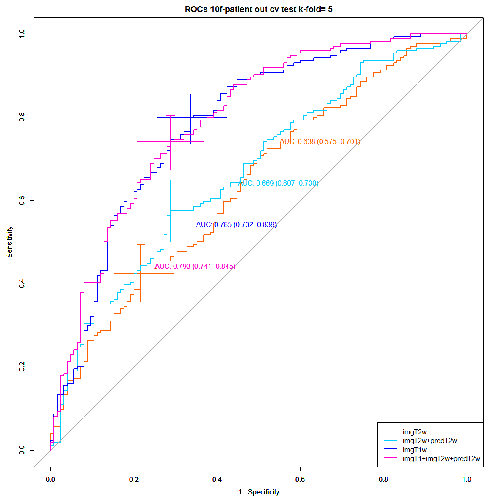 

```
## Area under the curve: 0.7933
## 95% CI (2000 stratified bootstrap replicates):
##  thresholds sp.low sp.median sp.high se.low se.median se.high
##   0.4633848  0.632     0.712   0.792 0.6724    0.7414  0.8046
##    massB    massM nonmassB nonmassM 
##      211      152      126       71 
##    massB    massM nonmassB nonmassM 
##       31       14       16        6 
##    massB    massM nonmassB nonmassM 
##      211      152      126       71 
##    massB    massM nonmassB nonmassM 
##       31       14       16        6 
##    massB    massM nonmassB nonmassM 
##      211      152      126       71 
##    massB    massM nonmassB nonmassM 
##       31       14       16        6 
## 0.0462963 0.05 
## Selected features for group: MeanDecreaseGini imgT2 
## =========NULL
##  [1] "T2RGH_var"                          "T2texture_correlation_nondir"       "ave_T210"                          
##  [4] "T2texture_energy_nondir"            "T2kurt_F_r_i"                       "T2grad_margin_var"                 
##  [7] "T2max_F_r_i"                        "T2texture_inversediffmoment_nondir" "ave_T21"                           
## [10] "T2skew_F_r_i"                       "ave_T25"                            "T2_lesionSIstd"                    
## [13] "ave_T215"                           "ave_T22"                            "ave_T20"                           
## [16] "T2mean_F_r_i"                       "T2grad_margin"                      "T2texture_sumentropy_nondir"       
## [19] "ave_T29"                            "ave_T24"                            "ave_T213"                          
## [22] "ave_T214"                           "T2RGH_mean"                         "ave_T217"                          
## [25] "T2min_F_r_i"                        "ave_T212"                           "T2texture_variance_nondir"         
## [28] "ave_T219"                           "ave_T216"                           "ave_T27"                           
## [31] "ave_T211"                           "ave_T28"                            "T2texture_diffvariance_nondir"     
## [34] "T2texture_sumvariance_nondir"       "T2_lesionSI"                       
## 0.09049774 0.05 
## 0.02487562 0.05 
## Selected features for group: MeanDecreaseGini allT2 
## =========NULL
##  [1] "T2RGH_var"                          "T2wSI_predicted"                    "T2texture_correlation_nondir"      
##  [4] "ave_T210"                           "T2RGH_mean"                         "T2kurt_F_r_i"                      
##  [7] "T2texture_entropy_nondir"           "T2grad_margin"                      "T2max_F_r_i"                       
## [10] "ave_T20"                            "T2texture_sumaverage_nondir"        "ave_T21"                           
## [13] "T2texture_inversediffmoment_nondir" "T2_lesionSI"                        "ave_T24"                           
## [16] "T2texture_variance_nondir"          "ave_T216"                           "ave_T25"                           
## [19] "T2_lesionSIstd"                     "LMSIR_predicted"                    "ave_T23"                           
## [22] "ave_T211"                           "T2skew_F_r_i"                       "ave_T215"                          
## [25] "ave_T22"                            "ave_T219"                           "T2texture_energy_nondir"           
## [28] "T2grad_margin_var"                  "ave_T26"                            "ave_T28"                           
## [31] "T2min_F_r_i"                        "ave_T214"                           "ave_T217"                          
## [34] "ave_T213"                           "T2texture_diffentropy_nondir"       "ave_T29"                           
## [37] "ave_T212"                           "ave_T27"                            "ave_T218"                          
## [40] "T2texture_contrast_nondir"          "T2mean_F_r_i"                      
## 0.0875 0.05 
## -0.006849315 0.05 
## Selected features for group: MeanDecreaseGini imgT1 
## =========NULL
##  [1] "var_F_r_i"                        "earlySE7"                         "Tpeak_countor"                   
##  [4] "min_F_r_i"                        "V8"                               "V19"                             
##  [7] "texture_correlation_nondir_post2" "texture_sumaverage_nondir_post2"  "iMax_Variance_uptake"            
## [10] "texture_sumvariance_nondir_post4" "beta_inside"                      "V15"                             
## [13] "earlySE2"                         "texture_diffentropy_nondir_post1" "Vr_post_1_inside"                
## [16] "lateSE12"                         "iiiMax_Margin_Gradient"           "dce2SE13"                        
## [19] "dce3SE16"                         "skew_F_r_i"                       "earlySE1"                        
## [22] "earlySE19"                        "lateSE7"                          "maxCr_inside"                    
## [25] "texture_energy_nondir_post3"      "V2"                               "V10"                             
## [28] "earlySE10"                        "peakVr_inside"                    "Slope_ini_countor"               
## [31] "A_inside"                        
## -0.07746479 0.05 
## Selected features for group: MeanDecreaseGini all 
## =========NULL
##  [1] "circularity"                            "Slope_ini_inside"                       "texture_variance_nondir_post3"         
##  [4] "texture_inversediffmoment_nondir_post4" "texture_entropy_nondir_post1"           "texture_sumaverage_nondir_post1"       
##  [7] "V13"                                    "max_F_r_i"                              "texture_correlation_nondir_post4"      
## [10] "maxVr_countor"                          "earlySE0"                               "ave_T29"                               
## [13] "lateSE12"                               "A_countor"                              "dce2SE1"                               
## [16] "V15"                                    "T2texture_variance_nondir"              "max_RGH_var"                           
## [19] "lateSE14"                               "T2skew_F_r_i"                           "dce3SE5"                               
## [22] "Vr_increasingRate_inside"               "dce3SE0"                                "T2RGH_mean"                            
## [25] "dce3SE2"                                "dce2SE13"                               "ave_T22"                               
## [28] "T2_lesionSIstd"                         "dce2SE10"                               "A_inside"                              
##     lesion_id cad_pt_no_txt exam_a_number_txt BIRADS lesion_label             lesion_diagnosis      find_t2_signal_int
## 3           3          0025           7002835      4     nonmassB               DENSE FIBROSIS                    None
## 35         35          0180           4632561      4     nonmassB         BENIGN BREAST TISSUE Hypointense or not seen
## 36         36          0180           5254957      4     nonmassB                 FIBROADENOMA Hypointense or not seen
## 45         45          0197           6667696      4     nonmassB           LobularHyperplasia Hypointense or not seen
## 46         46          0197           6667696      4     nonmassB           LobularHyperplasia Hypointense or not seen
## 47         47          0197           6667696      4        massB           LobularHyperplasia   Slightly hyperintense
## 70         70          0280           5091695      4        massB         BENIGN BREAST TISSUE                    None
## 73         73          0311           6677243      4        massB                 FIBROADENOMA                    None
## 75         75          0331           4722659      2        massB                  FIBROCYSTIC                    None
## 76         76          0331           7347095      4        massB                  FIBROCYSTIC            Hyperintense
## 77         77          0331           7347095      4        massB         capillary hemangioma                    None
## 100       100          0536           7786869      4        massB                 FIBROADENOMA Hypointense or not seen
## 114       114          0595           7441706      4        massB         BENIGN BREAST TISSUE Hypointense or not seen
## 125       125          0651           4695822      4        massB                 FIBROADENOMA            Hyperintense
## 130       130          0667           4864590      3        massB                 FIBROADENOMA Hypointense or not seen
## 131       131          0667           4864590      4        massM                 InsituDuctal            Hyperintense
## 132       132          0667           6993980      4     nonmassM                 InsituDuctal            Hyperintense
## 142       142          0687              1201      5        massM               InvasiveDuctal   Slightly hyperintense
## 143       143          0687              1201      5     nonmassM               InvasiveDuctal   Slightly hyperintense
## 144       144          0687              1201      5        massM               InvasiveDuctal   Slightly hyperintense
## 173       173          0727           4803733      4        massM                 InsituDuctal   Slightly hyperintense
## 174       174          0728           5304244      6        massB                 FIBROADENOMA   Slightly hyperintense
## 175       175          0728           5304244      4        massB   DUCT PAPILLOMA WITH ATYPIA            Hyperintense
## 176       176          0728           5304244      4        massB                 FIBROADENOMA                    None
## 177       177          0728           5304244      6     nonmassM               InvasiveDuctal                    None
## 180       180          0731           5265417      4        massB      DYSTROPHICCALCIFICATION   Slightly hyperintense
## 190       190          0745           4881779      4        massM               InvasiveDuctal                    None
## 214       214          0776           5352670      5        massB                AtypicalCells Hypointense or not seen
## 215       215          0776           5352670      5        massM               InvasiveDuctal                    None
## 226       226          0795           5188009      6     nonmassB  ATYPICAL DUCTAL HYPERPLASIA Hypointense or not seen
## 236       236          0813           5378164      5     nonmassB                  FIBROCYSTIC                    None
## 237       237          0813           5378164      5        massM              InvasiveLobular                    None
## 246       246          0828           4787730      6        massM                 InsituDuctal                    None
## 253       253          0839           4739257      4        massB         BENIGN BREAST TISSUE                    None
## 254       254          0839           4739257      4        massB         BENIGN BREAST TISSUE                    None
## 257       257          0844           4795902      4     nonmassM               InvasiveDuctal                    None
## 258       258          0845           5433683      5        massM              InvasiveLobular                    None
## 324       324          0954           7962026      4        massB ATYPICAL LOBULAR HYPERPLASIA                    None
## 340       340          1008           6745959      5        massM                 InsituDuctal                    None
## 341       341          1012           7629993      6        massM               InvasiveDuctal                    None
## 342       342          1012           6940724      4        massB                 FIBROADENOMA Hypointense or not seen
## 343       343          1012           6940724      4     nonmassB                 FIBROADENOMA            Hyperintense
## 365       365          1079           7417880      4        massM                 InsituDuctal                    None
## 366       366          1081           7078151      4        massB                 FIBROADENOMA            Hyperintense
## 389       389          2042           4964619      6        massB           LobularHyperplasia            Hyperintense
## 390       390          2042           5186978      4        massB  ATYPICAL DUCTAL HYPERPLASIA Hypointense or not seen
## 391       391          2042           7050570      4        massB  ATYPICAL DUCTAL HYPERPLASIA                    None
## 403       403          2071           7594721      4        massM               InvasiveDuctal   Slightly hyperintense
## 417       417          3010           6828446      6        massM               InvasiveDuctal                    None
## 463       463          3078           4836946      5     nonmassB                InsituLobular                    None
## 470       470          3083           5345062      4     nonmassB         BENIGN BREAST TISSUE                    None
## 471       471          3086           7715466      4     nonmassB         BENIGN BREAST TISSUE                    None
## 472       472          3092           4462310      3        massB         BENIGN BREAST TISSUE Hypointense or not seen
## 478       478          4008           7014565      4     nonmassB  ATYPICAL DUCTAL HYPERPLASIA                    None
## 479       479          4008           7014565      6        massB                  HYPERPLASIA                    None
## 491       491          4026           6998219      4        massB  ATYPICAL DUCTAL HYPERPLASIA Hypointense or not seen
## 494       494          4039           7041331      6     nonmassM               InvasiveDuctal                    None
## 524       524          6023           4697014      3        massB                  FIBROCYSTIC                    None
## 525       525          6023           4697014      3        massB          SCLEROSING ADENOSIS                    None
## 531       531          6026           4888386      4     nonmassM                 InsituDuctal                    None
## 557       557          6043           5249778      4     nonmassB  ATYPICAL DUCTAL HYPERPLASIA                    None
## 576       576          6069           7581124      4        massB         BENIGN BREAST TISSUE            Hyperintense
## 577       577          6069           7581124      4        massB         BENIGN BREAST TISSUE Hypointense or not seen
## 587       587          6164           6971531      4        massB         BENIGN BREAST TISSUE Hypointense or not seen
## 588       588          6174           7009629      4     nonmassB  ATYPICAL DUCTAL HYPERPLASIA                    None
## 633       633          7193           7347138      4     nonmassB         BENIGN BREAST TISSUE                    None
## 634       634          7193           7347138      4     nonmassB         BENIGN BREAST TISSUE Hypointense or not seen
## 
## ============ bestune_imgT2 	 max.depth  1 	 #Trees  350 
## ntrees:  50 minsplit:  3 cp:  -1 
##   ntrees minsplit cp acuTrain rocTrain   acuTest   rocTest
## 1     50        3 -1        1        1 0.6716418 0.6212766
## ntrees:  100 minsplit:  3 cp:  -1 
##   ntrees minsplit cp acuTrain rocTrain   acuTest   rocTest
## 2    100        3 -1        1        1 0.8208955 0.7191489
## ntrees:  250 minsplit:  3 cp:  -1 
##   ntrees minsplit cp acuTrain rocTrain   acuTest  rocTest
## 3    250        3 -1        1        1 0.7014925 0.656383
## ntrees:  350 minsplit:  3 cp:  -1 
##   ntrees minsplit cp acuTrain rocTrain   acuTest   rocTest
## 4    350        3 -1        1        1 0.7014925 0.6797872
## ntrees:  500 minsplit:  3 cp:  -1 
##   ntrees minsplit cp acuTrain rocTrain   acuTest   rocTest
## 5    500        3 -1        1        1 0.7462687 0.6744681
## ntrees:  50 minsplit:  1 cp:  -1 
##   ntrees minsplit cp acuTrain rocTrain  acuTest   rocTest
## 6     50        1 -1        1        1 0.641791 0.5638298
## ntrees:  100 minsplit:  1 cp:  -1 
##   ntrees minsplit cp acuTrain rocTrain   acuTest   rocTest
## 7    100        1 -1        1        1 0.6268657 0.6319149
## ntrees:  250 minsplit:  1 cp:  -1 
##   ntrees minsplit cp acuTrain rocTrain   acuTest   rocTest
## 8    250        1 -1        1        1 0.7164179 0.6425532
## ntrees:  350 minsplit:  1 cp:  -1 
##   ntrees minsplit cp acuTrain rocTrain   acuTest   rocTest
## 9    350        1 -1        1        1 0.7164179 0.6329787
## ntrees:  500 minsplit:  1 cp:  -1 
##    ntrees minsplit cp acuTrain rocTrain   acuTest   rocTest
## 10    500        1 -1        1        1 0.6716418 0.6329787
## ntrees:  50 minsplit:  0 cp:  -1 
##    ntrees minsplit cp acuTrain rocTrain   acuTest   rocTest
## 11     50        0 -1        1        1 0.5522388 0.4617021
## ntrees:  100 minsplit:  0 cp:  -1 
##    ntrees minsplit cp acuTrain rocTrain   acuTest   rocTest
## 12    100        0 -1        1        1 0.6567164 0.6553191
## ntrees:  250 minsplit:  0 cp:  -1 
##    ntrees minsplit cp acuTrain rocTrain   acuTest   rocTest
## 13    250        0 -1        1        1 0.6567164 0.6202128
## ntrees:  350 minsplit:  0 cp:  -1 
##    ntrees minsplit cp acuTrain rocTrain   acuTest   rocTest
## 14    350        0 -1        1        1 0.6865672 0.5904255
## ntrees:  500 minsplit:  0 cp:  -1 
##    ntrees minsplit cp acuTrain rocTrain   acuTest   rocTest
## 15    500        0 -1        1        1 0.6865672 0.6382979
##    ntrees minsplit cp acuTrain rocTrain   acuTest   rocTest
## 1      50        3 -1        1        1 0.6716418 0.6212766
## 2     100        3 -1        1        1 0.8208955 0.7191489
## 3     250        3 -1        1        1 0.7014925 0.6563830
## 4     350        3 -1        1        1 0.7014925 0.6797872
## 5     500        3 -1        1        1 0.7462687 0.6744681
## 6      50        1 -1        1        1 0.6417910 0.5638298
## 7     100        1 -1        1        1 0.6268657 0.6319149
## 8     250        1 -1        1        1 0.7164179 0.6425532
## 9     350        1 -1        1        1 0.7164179 0.6329787
## 10    500        1 -1        1        1 0.6716418 0.6329787
## 11     50        0 -1        1        1 0.5522388 0.4617021
## 12    100        0 -1        1        1 0.6567164 0.6553191
## 13    250        0 -1        1        1 0.6567164 0.6202128
## 14    350        0 -1        1        1 0.6865672 0.5904255
## 15    500        0 -1        1        1 0.6865672 0.6382979
##   ntrees minsplit cp acuTrain rocTrain   acuTest   rocTest
## 2    100        3 -1        1        1 0.8208955 0.7191489
## 
## ============ bestune_allT2 	 max.depth  1 	 #Trees  250 
## ntrees:  50 minsplit:  3 cp:  -1 
##   ntrees minsplit cp acuTrain rocTrain   acuTest rocTest
## 1     50        3 -1        1        1 0.6567164     0.4
## ntrees:  100 minsplit:  3 cp:  -1 
##   ntrees minsplit cp acuTrain rocTrain  acuTest   rocTest
## 2    100        3 -1        1        1 0.641791 0.6085106
## ntrees:  250 minsplit:  3 cp:  -1 
##   ntrees minsplit cp acuTrain rocTrain   acuTest   rocTest
## 3    250        3 -1        1        1 0.6567164 0.6106383
## ntrees:  350 minsplit:  3 cp:  -1 
##   ntrees minsplit cp acuTrain rocTrain   acuTest   rocTest
## 4    350        3 -1        1        1 0.6716418 0.6085106
## ntrees:  500 minsplit:  3 cp:  -1 
##   ntrees minsplit cp acuTrain rocTrain   acuTest   rocTest
## 5    500        3 -1        1        1 0.6716418 0.6265957
## ntrees:  50 minsplit:  1 cp:  -1 
##   ntrees minsplit cp acuTrain rocTrain   acuTest   rocTest
## 6     50        1 -1        1        1 0.6567164 0.4829787
## ntrees:  100 minsplit:  1 cp:  -1 
##   ntrees minsplit cp acuTrain rocTrain  acuTest   rocTest
## 7    100        1 -1        1        1 0.641791 0.5893617
## ntrees:  250 minsplit:  1 cp:  -1 
##   ntrees minsplit cp acuTrain rocTrain   acuTest   rocTest
## 8    250        1 -1        1        1 0.6865672 0.6074468
## ntrees:  350 minsplit:  1 cp:  -1 
##   ntrees minsplit cp acuTrain rocTrain   acuTest   rocTest
## 9    350        1 -1        1        1 0.7014925 0.6382979
## ntrees:  500 minsplit:  1 cp:  -1 
##    ntrees minsplit cp acuTrain rocTrain   acuTest   rocTest
## 10    500        1 -1        1        1 0.7313433 0.6223404
## ntrees:  50 minsplit:  0 cp:  -1 
##    ntrees minsplit cp acuTrain rocTrain   acuTest   rocTest
## 11     50        0 -1        1        1 0.6119403 0.6202128
## ntrees:  100 minsplit:  0 cp:  -1 
##    ntrees minsplit cp acuTrain rocTrain   acuTest   rocTest
## 12    100        0 -1        1        1 0.7014925 0.6691489
## ntrees:  250 minsplit:  0 cp:  -1 
##    ntrees minsplit cp acuTrain rocTrain   acuTest   rocTest
## 13    250        0 -1        1        1 0.6865672 0.5765957
## ntrees:  350 minsplit:  0 cp:  -1 
##    ntrees minsplit cp acuTrain rocTrain   acuTest   rocTest
## 14    350        0 -1        1        1 0.7014925 0.7021277
## ntrees:  500 minsplit:  0 cp:  -1 
##    ntrees minsplit cp acuTrain rocTrain   acuTest  rocTest
## 15    500        0 -1        1        1 0.6865672 0.637234
##    ntrees minsplit cp acuTrain rocTrain   acuTest   rocTest
## 1      50        3 -1        1        1 0.6567164 0.4000000
## 2     100        3 -1        1        1 0.6417910 0.6085106
## 3     250        3 -1        1        1 0.6567164 0.6106383
## 4     350        3 -1        1        1 0.6716418 0.6085106
## 5     500        3 -1        1        1 0.6716418 0.6265957
## 6      50        1 -1        1        1 0.6567164 0.4829787
## 7     100        1 -1        1        1 0.6417910 0.5893617
## 8     250        1 -1        1        1 0.6865672 0.6074468
## 9     350        1 -1        1        1 0.7014925 0.6382979
## 10    500        1 -1        1        1 0.7313433 0.6223404
## 11     50        0 -1        1        1 0.6119403 0.6202128
## 12    100        0 -1        1        1 0.7014925 0.6691489
## 13    250        0 -1        1        1 0.6865672 0.5765957
## 14    350        0 -1        1        1 0.7014925 0.7021277
## 15    500        0 -1        1        1 0.6865672 0.6372340
##    ntrees minsplit cp acuTrain rocTrain   acuTest   rocTest
## 14    350        0 -1        1        1 0.7014925 0.7021277
## 
## ============ bestune_imgT1 	 max.depth  1 	 #Trees  250 
## ntrees:  50 minsplit:  3 cp:  -1 
##   ntrees minsplit cp acuTrain rocTrain   acuTest   rocTest
## 1     50        3 -1        1        1 0.6865672 0.7297872
## ntrees:  100 minsplit:  3 cp:  -1 
##   ntrees minsplit cp acuTrain rocTrain   acuTest   rocTest
## 2    100        3 -1        1        1 0.7313433 0.7787234
## ntrees:  250 minsplit:  3 cp:  -1 
##   ntrees minsplit cp acuTrain rocTrain   acuTest   rocTest
## 3    250        3 -1        1        1 0.6865672 0.7829787
## ntrees:  350 minsplit:  3 cp:  -1 
##   ntrees minsplit cp acuTrain rocTrain   acuTest   rocTest
## 4    350        3 -1        1        1 0.7014925 0.7946809
## ntrees:  500 minsplit:  3 cp:  -1 
##   ntrees minsplit cp acuTrain rocTrain   acuTest   rocTest
## 5    500        3 -1        1        1 0.6865672 0.7351064
## ntrees:  50 minsplit:  1 cp:  -1 
##   ntrees minsplit cp acuTrain rocTrain   acuTest   rocTest
## 6     50        1 -1        1        1 0.6865672 0.7414894
## ntrees:  100 minsplit:  1 cp:  -1 
##   ntrees minsplit cp acuTrain rocTrain   acuTest   rocTest
## 7    100        1 -1        1        1 0.7014925 0.7755319
## ntrees:  250 minsplit:  1 cp:  -1 
##   ntrees minsplit cp acuTrain rocTrain   acuTest   rocTest
## 8    250        1 -1        1        1 0.7164179 0.8085106
## ntrees:  350 minsplit:  1 cp:  -1 
##   ntrees minsplit cp acuTrain rocTrain   acuTest  rocTest
## 9    350        1 -1        1        1 0.6865672 0.762766
## ntrees:  500 minsplit:  1 cp:  -1 
##    ntrees minsplit cp acuTrain rocTrain   acuTest   rocTest
## 10    500        1 -1        1        1 0.6865672 0.7723404
## ntrees:  50 minsplit:  0 cp:  -1 
##    ntrees minsplit cp acuTrain rocTrain  acuTest   rocTest
## 11     50        0 -1        1        1 0.641791 0.6914894
## ntrees:  100 minsplit:  0 cp:  -1 
##    ntrees minsplit cp acuTrain rocTrain   acuTest   rocTest
## 12    100        0 -1        1        1 0.6865672 0.7308511
## ntrees:  250 minsplit:  0 cp:  -1 
##    ntrees minsplit cp acuTrain rocTrain   acuTest   rocTest
## 13    250        0 -1        1        1 0.6865672 0.7797872
## ntrees:  350 minsplit:  0 cp:  -1 
##    ntrees minsplit cp acuTrain rocTrain   acuTest   rocTest
## 14    350        0 -1        1        1 0.6865672 0.7765957
## ntrees:  500 minsplit:  0 cp:  -1 
##    ntrees minsplit cp acuTrain rocTrain   acuTest   rocTest
## 15    500        0 -1        1        1 0.6865672 0.7829787
##    ntrees minsplit cp acuTrain rocTrain   acuTest   rocTest
## 1      50        3 -1        1        1 0.6865672 0.7297872
## 2     100        3 -1        1        1 0.7313433 0.7787234
## 3     250        3 -1        1        1 0.6865672 0.7829787
## 4     350        3 -1        1        1 0.7014925 0.7946809
## 5     500        3 -1        1        1 0.6865672 0.7351064
## 6      50        1 -1        1        1 0.6865672 0.7414894
## 7     100        1 -1        1        1 0.7014925 0.7755319
## 8     250        1 -1        1        1 0.7164179 0.8085106
## 9     350        1 -1        1        1 0.6865672 0.7627660
## 10    500        1 -1        1        1 0.6865672 0.7723404
## 11     50        0 -1        1        1 0.6417910 0.6914894
## 12    100        0 -1        1        1 0.6865672 0.7308511
## 13    250        0 -1        1        1 0.6865672 0.7797872
## 14    350        0 -1        1        1 0.6865672 0.7765957
## 15    500        0 -1        1        1 0.6865672 0.7829787
##   ntrees minsplit cp acuTrain rocTrain   acuTest   rocTest
## 8    250        1 -1        1        1 0.7164179 0.8085106
## 
## ============ bestune_all 	 max.depth  1 	 #Trees  200 
## ntrees:  50 minsplit:  3 cp:  -1 
##   ntrees minsplit cp acuTrain rocTrain   acuTest   rocTest
## 1     50        3 -1        1        1 0.7761194 0.7819149
## ntrees:  100 minsplit:  3 cp:  -1 
##   ntrees minsplit cp acuTrain rocTrain   acuTest   rocTest
## 2    100        3 -1        1        1 0.6716418 0.7606383
## ntrees:  250 minsplit:  3 cp:  -1 
##   ntrees minsplit cp acuTrain rocTrain   acuTest  rocTest
## 3    250        3 -1        1        1 0.7313433 0.762766
## ntrees:  350 minsplit:  3 cp:  -1 
##   ntrees minsplit cp acuTrain rocTrain  acuTest   rocTest
## 4    350        3 -1        1        1 0.761194 0.7968085
## ntrees:  500 minsplit:  3 cp:  -1 
##   ntrees minsplit cp acuTrain rocTrain   acuTest   rocTest
## 5    500        3 -1        1        1 0.7014925 0.7968085
## ntrees:  50 minsplit:  1 cp:  -1 
##   ntrees minsplit cp acuTrain rocTrain  acuTest   rocTest
## 6     50        1 -1        1        1 0.761194 0.7531915
## ntrees:  100 minsplit:  1 cp:  -1 
##   ntrees minsplit cp acuTrain rocTrain  acuTest   rocTest
## 7    100        1 -1        1        1 0.761194 0.8031915
## ntrees:  250 minsplit:  1 cp:  -1 
##   ntrees minsplit cp acuTrain rocTrain   acuTest   rocTest
## 8    250        1 -1        1        1 0.7462687 0.7819149
## ntrees:  350 minsplit:  1 cp:  -1 
##   ntrees minsplit cp acuTrain rocTrain  acuTest   rocTest
## 9    350        1 -1        1        1 0.761194 0.7957447
## ntrees:  500 minsplit:  1 cp:  -1 
##    ntrees minsplit cp acuTrain rocTrain  acuTest   rocTest
## 10    500        1 -1        1        1 0.761194 0.7723404
## ntrees:  50 minsplit:  0 cp:  -1 
##    ntrees minsplit cp acuTrain rocTrain   acuTest   rocTest
## 11     50        0 -1        1        1 0.6567164 0.7031915
## ntrees:  100 minsplit:  0 cp:  -1 
##    ntrees minsplit cp acuTrain rocTrain   acuTest   rocTest
## 12    100        0 -1        1        1 0.7313433 0.7882979
## ntrees:  250 minsplit:  0 cp:  -1 
##    ntrees minsplit cp acuTrain rocTrain   acuTest   rocTest
## 13    250        0 -1        1        1 0.7462687 0.7808511
## ntrees:  350 minsplit:  0 cp:  -1 
##    ntrees minsplit cp acuTrain rocTrain   acuTest   rocTest
## 14    350        0 -1        1        1 0.7313433 0.7723404
## ntrees:  500 minsplit:  0 cp:  -1 
##    ntrees minsplit cp acuTrain rocTrain   acuTest   rocTest
## 15    500        0 -1        1        1 0.7313433 0.7712766
##    ntrees minsplit cp acuTrain rocTrain   acuTest   rocTest
## 1      50        3 -1        1        1 0.7761194 0.7819149
## 2     100        3 -1        1        1 0.6716418 0.7606383
## 3     250        3 -1        1        1 0.7313433 0.7627660
## 4     350        3 -1        1        1 0.7611940 0.7968085
## 5     500        3 -1        1        1 0.7014925 0.7968085
## 6      50        1 -1        1        1 0.7611940 0.7531915
## 7     100        1 -1        1        1 0.7611940 0.8031915
## 8     250        1 -1        1        1 0.7462687 0.7819149
## 9     350        1 -1        1        1 0.7611940 0.7957447
## 10    500        1 -1        1        1 0.7611940 0.7723404
## 11     50        0 -1        1        1 0.6567164 0.7031915
## 12    100        0 -1        1        1 0.7313433 0.7882979
## 13    250        0 -1        1        1 0.7462687 0.7808511
## 14    350        0 -1        1        1 0.7313433 0.7723404
## 15    500        0 -1        1        1 0.7313433 0.7712766
##   ntrees minsplit cp acuTrain rocTrain  acuTest   rocTest
## 7    100        1 -1        1        1 0.761194 0.8031915
## 
## Call:
## roc.default(response = perf_imgT2$obs, predictor = perf_imgT2$C)
## 
## Data: perf_imgT2$C in 145 controls (perf_imgT2$obs C) > 221 cases (perf_imgT2$obs NC).
## Area under the curve: 0.6455
## 
## Call:
## roc.default(response = perf_allT2$obs, predictor = perf_allT2$C)
## 
## Data: perf_allT2$C in 145 controls (perf_allT2$obs C) > 221 cases (perf_allT2$obs NC).
## Area under the curve: 0.6729
## 
## Call:
## roc.default(response = perf_imgT1$obs, predictor = perf_imgT1$C)
## 
## Data: perf_imgT1$C in 145 controls (perf_imgT1$obs C) > 221 cases (perf_imgT1$obs NC).
## Area under the curve: 0.7879
## 
## Call:
## roc.default(response = perf_all$obs, predictor = perf_all$C)
## 
## Data: perf_all$C in 145 controls (perf_all$obs C) > 221 cases (perf_all$obs NC).
## Area under the curve: 0.7924
```

```
## Area under the curve: 0.6455
## 95% CI (2000 stratified bootstrap replicates):
##  thresholds sp.low sp.median sp.high se.low se.median se.high
##   0.4926305 0.3586    0.4414  0.5172 0.7466    0.8009  0.8507
```

```
## Area under the curve: 0.6729
## 95% CI (2000 stratified bootstrap replicates):
##  thresholds sp.low sp.median sp.high se.low se.median se.high
##   0.4376983 0.6414    0.7172  0.7862 0.4977    0.5656   0.629
```

```
## Area under the curve: 0.7879
## 95% CI (2000 stratified bootstrap replicates):
##  thresholds sp.low sp.median sp.high se.low se.median se.high
##   0.4595427 0.6621     0.731     0.8 0.6833    0.7376  0.7919
```

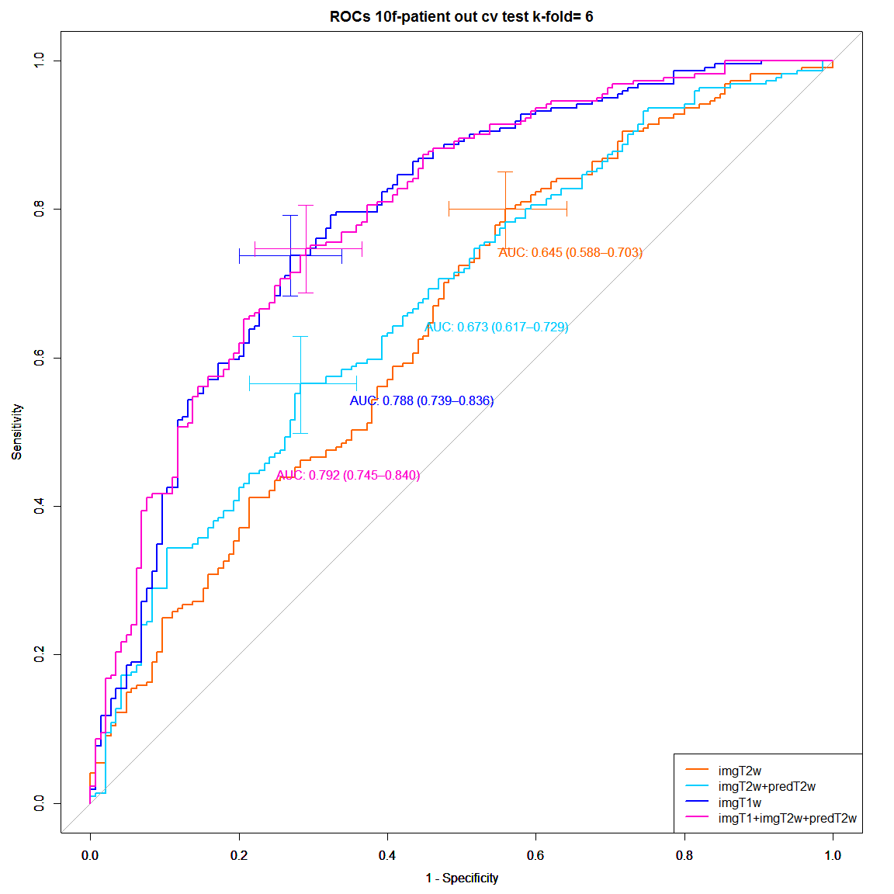 

```
## Area under the curve: 0.7924
## 95% CI (2000 stratified bootstrap replicates):
##  thresholds sp.low sp.median sp.high se.low se.median se.high
##   0.4618078 0.6345    0.7103  0.7793 0.6878    0.7466  0.8054
##    massB    massM nonmassB nonmassM 
##      223      148      121       72 
##    massB    massM nonmassB nonmassM 
##       19       18       21        5 
##    massB    massM nonmassB nonmassM 
##      223      148      121       72 
##    massB    massM nonmassB nonmassM 
##       19       18       21        5 
##    massB    massM nonmassB nonmassM 
##      223      148      121       72 
##    massB    massM nonmassB nonmassM 
##       19       18       21        5 
## 0.04807692 0.05 
## Selected features for group: MeanDecreaseGini imgT2 
## =========NULL
##  [1] "T2texture_correlation_nondir"       "T2kurt_F_r_i"                       "T2grad_margin_var"                 
##  [4] "T2texture_entropy_nondir"           "T2RGH_var"                          "T2RGH_mean"                        
##  [7] "ave_T210"                           "T2var_F_r_i"                        "ave_T27"                           
## [10] "T2texture_sumaverage_nondir"        "ave_T213"                           "ave_T211"                          
## [13] "ave_T28"                            "ave_T216"                           "T2texture_diffentropy_nondir"      
## [16] "T2texture_variance_nondir"          "ave_T219"                           "ave_T215"                          
## [19] "ave_T24"                            "ave_T29"                            "ave_T218"                          
## [22] "ave_T217"                           "ave_T22"                            "T2min_F_r_i"                       
## [25] "T2max_F_r_i"                        "T2texture_energy_nondir"            "ave_T212"                          
## [28] "ave_T20"                            "T2texture_sumentropy_nondir"        "ave_T21"                           
## [31] "T2texture_inversediffmoment_nondir" "T2_lesionSI"                        "ave_T25"                           
## [34] "ave_T26"                            "T2_lesionSIstd"                    
## 0.004484305 0.05 
## Selected features for group: MeanDecreaseGini allT2 
## =========NULL
##  [1] "T2RGH_var"                          "T2texture_correlation_nondir"       "T2_lesionSIstd"                    
##  [4] "T2grad_margin_var"                  "T2wSI_predicted"                    "T2texture_inversediffmoment_nondir"
##  [7] "ave_T210"                           "T2skew_F_r_i"                       "T2texture_energy_nondir"           
## [10] "ave_T211"                           "T2texture_diffvariance_nondir"      "ave_T23"                           
## [13] "LMSIR_predicted"                    "ave_T218"                           "T2grad_margin"                     
## [16] "ave_T213"                           "T2RGH_mean"                         "ave_T214"                          
## [19] "ave_T217"                           "ave_T25"                            "ave_T29"                           
## [22] "T2texture_diffentropy_nondir"       "T2kurt_F_r_i"                       "ave_T22"                           
## [25] "ave_T24"                            "T2texture_sumentropy_nondir"        "ave_T215"                          
## [28] "T2min_F_r_i"                        "ave_T212"                           "ave_T26"                           
## [31] "T2texture_entropy_nondir"           "ave_T27"                            "ave_T219"                          
## [34] "T2texture_sumvariance_nondir"       "ave_T21"                            "T2_lesionSI"                       
## -0.0952381 0.05 
## Selected features for group: MeanDecreaseGini imgT1 
## =========NULL
##  [1] "texture_sumvariance_nondir_post1"       "circularity"                            "V13"                                   
##  [4] "texture_inversediffmoment_nondir_post3" "Kpeak_inside"                           "Vr_post_1_countor"                     
##  [7] "kurt_F_r_i"                             "texture_contrast_nondir_post3"          "earlySE8"                              
## [10] "Slope_ini_countor"                      "Vr_decreasingRate_inside"               "texture_sumaverage_nondir_post2"       
## [13] "lateSE2"                                "lateSE1"                                "V2"                                    
## [16] "dce2SE7"                                "edge_sharp_std"                         "Vr_increasingRate_inside"              
## [19] "texture_energy_nondir_post4"            "earlySE16"                              "dce2SE11"                              
## [22] "lateSE13"                               "dce2SE4"                                "V8"                                    
## [25] "dce3SE10"                               "alpha_inside"                           "dce2SE16"                              
## [28] "max_RGH_mean_k"                         "peakCr_countor"                         "ivVariance"                            
## [31] "max_RGH_var_k"                          "texture_sumvariance_nondir_post2"       "A_inside"                              
## -0.1276596 0.05 
## Selected features for group: MeanDecreaseGini all 
## =========NULL
##  [1] "texture_variance_nondir_post1"          "circularity"                            "iiMin_change_Variance_uptake"          
##  [4] "washoutRate_inside"                     "V6"                                     "min_F_r_i"                             
##  [7] "lateSE8"                                "texture_energy_nondir_post2"            "V8"                                    
## [10] "texture_entropy_nondir_post2"           "SER_inside"                             "earlySE4"                              
## [13] "alpha_countor"                          "max_RGH_var"                            "T2RGH_var"                             
## [16] "T2grad_margin"                          "T2var_F_r_i"                            "lateSE2"                               
## [19] "earlySE13"                              "earlySE11"                              "dce3SE5"                               
## [22] "Vr_post_1_countor"                      "texture_inversediffmoment_nondir_post1" "dce2SE19"                              
## [25] "dce3SE3"                                "texture_contrast_nondir_post1"          "ave_T217"                              
## [28] "V17"                                    "dce3SE14"                               "texture_entropy_nondir_post3"          
## [31] "Vr_increasingRate_countor"              "max_RGH_mean_k"                         "SER_countor"                           
## [34] "k_Max_Margin_Grad"                      "A_inside"                              
##     lesion_id cad_pt_no_txt exam_a_number_txt BIRADS lesion_label             lesion_diagnosis      find_t2_signal_int
## 15         15          0122           5108281      3        massB                         Cyst                    None
## 16         16          0123           6909758      4     nonmassB        COLUMNAR CELL CHANGES                    None
## 17         17          0123           6909758      4     nonmassB         BENIGN BREAST TISSUE                    None
## 39         39          0103           6836585      5        massB              PHYLLODES TUMOR                    None
## 42         42          0196           5289117      4     nonmassB          SCLEROSING ADENOSIS Hypointense or not seen
## 43         43          0196           5289117      4     nonmassB   ColumnarAlterationwoAtypia                    None
## 44         44          0196           5289117      4     nonmassB   ColumnarAlterationwoAtypia Hypointense or not seen
## 50         50          0199           4362726      4        massB ATYPICAL LOBULAR HYPERPLASIA            Hyperintense
## 78         78          0352           4785776      4        massB                 FIBROADENOMA   Slightly hyperintense
## 79         79          0357           5137030      4     nonmassB                  FIBROCYSTIC Hypointense or not seen
## 80         80          0376           4609403      4        massB             BENIGN HAMARTOMA   Slightly hyperintense
## 88         88          0456           6689214      4        massM               InvasiveDuctal                    None
## 113       113          0586           5332925      4     nonmassM                 InsituDuctal Hypointense or not seen
## 137       137          0681           4999374      3        massB                  FIBROCYSTIC   Slightly hyperintense
## 154       154          0705           4648471      5        massM               InvasiveDuctal   Slightly hyperintense
## 162       162          0714           5324209      5        massM               InvasiveDuctal                    None
## 163       163          0714           5324209      5        massM               InvasiveDuctal                    None
## 164       164          0714           5324209      5     nonmassM                 InsituDuctal                    None
## 166       166          0720           4965525      4        massB                  FIBROCYSTIC   Slightly hyperintense
## 167       167          0720           4965525      4     nonmassB                 FIBROADENOMA Hypointense or not seen
## 169       169          0722           5366177      5        massM               InvasiveDuctal            Hyperintense
## 183       183          0736           4963473      4        massB         BENIGN BREAST TISSUE   Slightly hyperintense
## 192       192          0752           4940477      4     nonmassB         BENIGN BREAST TISSUE                    None
## 193       193          0752           4940477      4     nonmassB                  FIBROCYSTIC                    None
## 194       194          0752           4940477      4     nonmassB         BENIGN BREAST TISSUE                    None
## 203       203          0771           4680997      4        massB               DUCT PAPILLOMA                    None
## 204       204          0771           4680997      4        massB               DUCT PAPILLOMA                    None
## 208       208          0778           4794199      5        massB                 FIBROADENOMA Hypointense or not seen
## 251       251          0834           4614262      5        massM               InvasiveDuctal                    None
## 260       260          0847           5064132      4        massM               InvasiveDuctal            Hyperintense
## 291       291          0876           4719378      4        massB         BENIGN BREAST TISSUE                    None
## 328       328          0967           6938015      4     nonmassB         BENIGN BREAST TISSUE                    None
## 329       329          0967           6938015      4     nonmassM               InvasiveDuctal                    None
## 346       346          1024           6980462      4     nonmassB  ATYPICAL DUCTAL HYPERPLASIA                    None
## 347       347          1024           6980462      4     nonmassB   DUCT PAPILLOMA WITH ATYPIA                    None
## 348       348          1025           6703528      4     nonmassB                  FIBROCYSTIC Hypointense or not seen
## 350       350          1044           7366817      5        massM               InvasiveDuctal                    None
## 355       355          1062           7408296      4        massB ATYPICAL LOBULAR HYPERPLASIA Hypointense or not seen
## 356       356          1062           7408296      4     nonmassB                  FIBROCYSTIC Hypointense or not seen
## 362       362          1077           6890028      4        massB         BENIGN BREAST TISSUE   Slightly hyperintense
## 379       379          2017           7397047      6        massB     RADIAL SCLEROSING LESION                    None
## 386       386          2033           6849696      6        massM              InvasiveLobular                    None
## 387       387          2033           6849696      4     nonmassB ATYPICAL LOBULAR HYPERPLASIA                    None
## 394       394          2050           6689745      6        massM               InvasiveDuctal                    None
## 429       429          3031           7106716      3        massB        COLUMNAR CELL CHANGES Hypointense or not seen
## 433       433          3039           6894870      4        massB                  HYPERPLASIA                    None
## 483       483          4018           6983262      6     nonmassM                 InsituDuctal                    None
## 484       484          4019           7151338      4        massB         BENIGN BREAST TISSUE            Hyperintense
## 486       486          4021           6992707      4     nonmassB                     ADENOSIS Hypointense or not seen
## 532       532          6027           4770166      4        massB         BENIGN BREAST TISSUE                    None
## 533       533          6027           4770166      4     nonmassB         BENIGN BREAST TISSUE                    None
## 541       541          6035           5062962      5        massM               InvasiveDuctal                    None
## 542       542          6035           5062962      5        massM               InvasiveDuctal                    None
## 543       543          6035           5062962      5        massM               InvasiveDuctal                    None
## 560       560          6045           5208117      6        massM               InvasiveDuctal Hypointense or not seen
## 561       561          6045           5208117      6        massM               InvasiveDuctal Hypointense or not seen
## 567       567          6048           5284266      6        massM               InvasiveDuctal                    None
## 579       579          6101           5087078      4     nonmassB                  FIBROCYSTIC                    None
## 580       580          6101           7709238      6        massM               InvasiveDuctal Hypointense or not seen
## 606       606          7076           7267446      3     nonmassM                 InsituDuctal                    None
## 607       607          7076           7267446      3     nonmassB  ATYPICAL DUCTAL HYPERPLASIA                    None
## 628       628          7186           5263507      6        massM               InvasiveDuctal                    None
## 632       632          7192           7974056      4     nonmassB         BENIGN BREAST TISSUE                    None
## 
## ============ bestune_imgT2 	 max.depth  1 	 #Trees  350 
## ntrees:  50 minsplit:  3 cp:  -1 
##   ntrees minsplit cp acuTrain rocTrain   acuTest rocTest
## 1     50        3 -1        1        1 0.6507937   0.625
## ntrees:  100 minsplit:  3 cp:  -1 
##   ntrees minsplit cp acuTrain rocTrain   acuTest   rocTest
## 2    100        3 -1        1        1 0.6507937 0.6630435
## ntrees:  250 minsplit:  3 cp:  -1 
##   ntrees minsplit cp acuTrain rocTrain   acuTest  rocTest
## 3    250        3 -1        1        1 0.6666667 0.673913
## ntrees:  350 minsplit:  3 cp:  -1 
##   ntrees minsplit cp acuTrain rocTrain   acuTest   rocTest
## 4    350        3 -1        1        1 0.6666667 0.6434783
## ntrees:  500 minsplit:  3 cp:  -1 
##   ntrees minsplit cp acuTrain rocTrain   acuTest   rocTest
## 5    500        3 -1        1        1 0.6666667 0.6717391
## ntrees:  50 minsplit:  1 cp:  -1 
##   ntrees minsplit cp acuTrain rocTrain   acuTest   rocTest
## 6     50        1 -1        1        1 0.6349206 0.6097826
## ntrees:  100 minsplit:  1 cp:  -1 
##   ntrees minsplit cp acuTrain rocTrain   acuTest   rocTest
## 7    100        1 -1        1        1 0.6825397 0.6597826
## ntrees:  250 minsplit:  1 cp:  -1 
##   ntrees minsplit cp acuTrain rocTrain   acuTest   rocTest
## 8    250        1 -1        1        1 0.6349206 0.6771739
## ntrees:  350 minsplit:  1 cp:  -1 
##   ntrees minsplit cp acuTrain rocTrain   acuTest   rocTest
## 9    350        1 -1        1        1 0.6825397 0.7184783
## ntrees:  500 minsplit:  1 cp:  -1 
##    ntrees minsplit cp acuTrain rocTrain   acuTest  rocTest
## 10    500        1 -1        1        1 0.6190476 0.676087
## ntrees:  50 minsplit:  0 cp:  -1 
##    ntrees minsplit cp acuTrain rocTrain   acuTest rocTest
## 11     50        0 -1        1        1 0.6666667     0.7
## ntrees:  100 minsplit:  0 cp:  -1 
##    ntrees minsplit cp acuTrain rocTrain   acuTest   rocTest
## 12    100        0 -1        1        1 0.6984127 0.6858696
## ntrees:  250 minsplit:  0 cp:  -1 
##    ntrees minsplit cp acuTrain rocTrain   acuTest   rocTest
## 13    250        0 -1        1        1 0.6825397 0.6673913
## ntrees:  350 minsplit:  0 cp:  -1 
##    ntrees minsplit cp acuTrain rocTrain   acuTest   rocTest
## 14    350        0 -1        1        1 0.6507937 0.6978261
## ntrees:  500 minsplit:  0 cp:  -1 
##    ntrees minsplit cp acuTrain rocTrain   acuTest   rocTest
## 15    500        0 -1        1        1 0.6349206 0.6347826
##    ntrees minsplit cp acuTrain rocTrain   acuTest   rocTest
## 1      50        3 -1        1        1 0.6507937 0.6250000
## 2     100        3 -1        1        1 0.6507937 0.6630435
## 3     250        3 -1        1        1 0.6666667 0.6739130
## 4     350        3 -1        1        1 0.6666667 0.6434783
## 5     500        3 -1        1        1 0.6666667 0.6717391
## 6      50        1 -1        1        1 0.6349206 0.6097826
## 7     100        1 -1        1        1 0.6825397 0.6597826
## 8     250        1 -1        1        1 0.6349206 0.6771739
## 9     350        1 -1        1        1 0.6825397 0.7184783
## 10    500        1 -1        1        1 0.6190476 0.6760870
## 11     50        0 -1        1        1 0.6666667 0.7000000
## 12    100        0 -1        1        1 0.6984127 0.6858696
## 13    250        0 -1        1        1 0.6825397 0.6673913
## 14    350        0 -1        1        1 0.6507937 0.6978261
## 15    500        0 -1        1        1 0.6349206 0.6347826
##   ntrees minsplit cp acuTrain rocTrain   acuTest   rocTest
## 9    350        1 -1        1        1 0.6825397 0.7184783
## 
## ============ bestune_allT2 	 max.depth  1 	 #Trees  250 
## ntrees:  50 minsplit:  3 cp:  -1 
##   ntrees minsplit cp acuTrain rocTrain   acuTest   rocTest
## 1     50        3 -1        1        1 0.6349206 0.5630435
## ntrees:  100 minsplit:  3 cp:  -1 
##   ntrees minsplit cp acuTrain rocTrain   acuTest   rocTest
## 2    100        3 -1        1        1 0.6349206 0.6423913
## ntrees:  250 minsplit:  3 cp:  -1 
##   ntrees minsplit cp acuTrain rocTrain   acuTest   rocTest
## 3    250        3 -1        1        1 0.6349206 0.6695652
## ntrees:  350 minsplit:  3 cp:  -1 
##   ntrees minsplit cp acuTrain rocTrain   acuTest rocTest
## 4    350        3 -1        1        1 0.6190476   0.625
## ntrees:  500 minsplit:  3 cp:  -1 
##   ntrees minsplit cp acuTrain rocTrain   acuTest   rocTest
## 5    500        3 -1        1        1 0.6507937 0.6423913
## ntrees:  50 minsplit:  1 cp:  -1 
##   ntrees minsplit cp acuTrain rocTrain   acuTest   rocTest
## 6     50        1 -1        1        1 0.5873016 0.6032609
## ntrees:  100 minsplit:  1 cp:  -1 
##   ntrees minsplit cp acuTrain rocTrain   acuTest   rocTest
## 7    100        1 -1        1        1 0.6349206 0.6847826
## ntrees:  250 minsplit:  1 cp:  -1 
##   ntrees minsplit cp acuTrain rocTrain   acuTest   rocTest
## 8    250        1 -1        1        1 0.6825397 0.6804348
## ntrees:  350 minsplit:  1 cp:  -1 
##   ntrees minsplit cp acuTrain rocTrain   acuTest   rocTest
## 9    350        1 -1        1        1 0.6666667 0.6880435
## ntrees:  500 minsplit:  1 cp:  -1 
##    ntrees minsplit cp acuTrain rocTrain   acuTest   rocTest
## 10    500        1 -1        1        1 0.5714286 0.6347826
## ntrees:  50 minsplit:  0 cp:  -1 
##    ntrees minsplit cp acuTrain rocTrain   acuTest  rocTest
## 11     50        0 -1        1        1 0.6666667 0.673913
## ntrees:  100 minsplit:  0 cp:  -1 
##    ntrees minsplit cp acuTrain rocTrain   acuTest   rocTest
## 12    100        0 -1        1        1 0.6825397 0.6369565
## ntrees:  250 minsplit:  0 cp:  -1 
##    ntrees minsplit cp acuTrain rocTrain   acuTest   rocTest
## 13    250        0 -1        1        1 0.6507937 0.6456522
## ntrees:  350 minsplit:  0 cp:  -1 
##    ntrees minsplit cp acuTrain rocTrain   acuTest   rocTest
## 14    350        0 -1        1        1 0.6190476 0.6673913
## ntrees:  500 minsplit:  0 cp:  -1 
##    ntrees minsplit cp acuTrain rocTrain   acuTest  rocTest
## 15    500        0 -1        1        1 0.6031746 0.651087
##    ntrees minsplit cp acuTrain rocTrain   acuTest   rocTest
## 1      50        3 -1        1        1 0.6349206 0.5630435
## 2     100        3 -1        1        1 0.6349206 0.6423913
## 3     250        3 -1        1        1 0.6349206 0.6695652
## 4     350        3 -1        1        1 0.6190476 0.6250000
## 5     500        3 -1        1        1 0.6507937 0.6423913
## 6      50        1 -1        1        1 0.5873016 0.6032609
## 7     100        1 -1        1        1 0.6349206 0.6847826
## 8     250        1 -1        1        1 0.6825397 0.6804348
## 9     350        1 -1        1        1 0.6666667 0.6880435
## 10    500        1 -1        1        1 0.5714286 0.6347826
## 11     50        0 -1        1        1 0.6666667 0.6739130
## 12    100        0 -1        1        1 0.6825397 0.6369565
## 13    250        0 -1        1        1 0.6507937 0.6456522
## 14    350        0 -1        1        1 0.6190476 0.6673913
## 15    500        0 -1        1        1 0.6031746 0.6510870
##   ntrees minsplit cp acuTrain rocTrain   acuTest   rocTest
## 9    350        1 -1        1        1 0.6666667 0.6880435
## 
## ============ bestune_imgT1 	 max.depth  1 	 #Trees  250 
## ntrees:  50 minsplit:  3 cp:  -1 
##   ntrees minsplit cp acuTrain rocTrain   acuTest   rocTest
## 1     50        3 -1        1        1 0.6507937 0.6336957
## ntrees:  100 minsplit:  3 cp:  -1 
##   ntrees minsplit cp acuTrain rocTrain   acuTest   rocTest
## 2    100        3 -1        1        1 0.6984127 0.7108696
## ntrees:  250 minsplit:  3 cp:  -1 
##   ntrees minsplit cp acuTrain rocTrain   acuTest   rocTest
## 3    250        3 -1        1        1 0.7142857 0.6717391
## ntrees:  350 minsplit:  3 cp:  -1 
##   ntrees minsplit cp acuTrain rocTrain   acuTest   rocTest
## 4    350        3 -1        1        1 0.7460317 0.6717391
## ntrees:  500 minsplit:  3 cp:  -1 
##   ntrees minsplit cp acuTrain rocTrain   acuTest   rocTest
## 5    500        3 -1        1        1 0.6984127 0.6695652
## ntrees:  50 minsplit:  1 cp:  -1 
##   ntrees minsplit cp acuTrain rocTrain   acuTest   rocTest
## 6     50        1 -1        1        1 0.6984127 0.7043478
## ntrees:  100 minsplit:  1 cp:  -1 
##   ntrees minsplit cp acuTrain rocTrain   acuTest   rocTest
## 7    100        1 -1        1        1 0.6507937 0.6782609
## ntrees:  250 minsplit:  1 cp:  -1 
##   ntrees minsplit cp acuTrain rocTrain   acuTest   rocTest
## 8    250        1 -1        1        1 0.7142857 0.6641304
## ntrees:  350 minsplit:  1 cp:  -1 
##   ntrees minsplit cp acuTrain rocTrain   acuTest   rocTest
## 9    350        1 -1        1        1 0.7460317 0.6793478
## ntrees:  500 minsplit:  1 cp:  -1 
##    ntrees minsplit cp acuTrain rocTrain   acuTest   rocTest
## 10    500        1 -1        1        1 0.7142857 0.6706522
## ntrees:  50 minsplit:  0 cp:  -1 
##    ntrees minsplit cp acuTrain rocTrain   acuTest   rocTest
## 11     50        0 -1        1        1 0.6666667 0.7032609
## ntrees:  100 minsplit:  0 cp:  -1 
##    ntrees minsplit cp acuTrain rocTrain   acuTest   rocTest
## 12    100        0 -1        1        1 0.7460317 0.7097826
## ntrees:  250 minsplit:  0 cp:  -1 
##    ntrees minsplit cp acuTrain rocTrain   acuTest   rocTest
## 13    250        0 -1        1        1 0.6507937 0.6706522
## ntrees:  350 minsplit:  0 cp:  -1 
##    ntrees minsplit cp acuTrain rocTrain   acuTest   rocTest
## 14    350        0 -1        1        1 0.7301587 0.6782609
## ntrees:  500 minsplit:  0 cp:  -1 
##    ntrees minsplit cp acuTrain rocTrain   acuTest   rocTest
## 15    500        0 -1        1        1 0.7142857 0.6771739
##    ntrees minsplit cp acuTrain rocTrain   acuTest   rocTest
## 1      50        3 -1        1        1 0.6507937 0.6336957
## 2     100        3 -1        1        1 0.6984127 0.7108696
## 3     250        3 -1        1        1 0.7142857 0.6717391
## 4     350        3 -1        1        1 0.7460317 0.6717391
## 5     500        3 -1        1        1 0.6984127 0.6695652
## 6      50        1 -1        1        1 0.6984127 0.7043478
## 7     100        1 -1        1        1 0.6507937 0.6782609
## 8     250        1 -1        1        1 0.7142857 0.6641304
## 9     350        1 -1        1        1 0.7460317 0.6793478
## 10    500        1 -1        1        1 0.7142857 0.6706522
## 11     50        0 -1        1        1 0.6666667 0.7032609
## 12    100        0 -1        1        1 0.7460317 0.7097826
## 13    250        0 -1        1        1 0.6507937 0.6706522
## 14    350        0 -1        1        1 0.7301587 0.6782609
## 15    500        0 -1        1        1 0.7142857 0.6771739
##   ntrees minsplit cp acuTrain rocTrain   acuTest   rocTest
## 2    100        3 -1        1        1 0.6984127 0.7108696
## 
## ============ bestune_all 	 max.depth  1 	 #Trees  200 
## ntrees:  50 minsplit:  3 cp:  -1 
##   ntrees minsplit cp acuTrain rocTrain   acuTest   rocTest
## 1     50        3 -1        1        1 0.6825397 0.6826087
## ntrees:  100 minsplit:  3 cp:  -1 
##   ntrees minsplit cp acuTrain rocTrain   acuTest   rocTest
## 2    100        3 -1        1        1 0.6825397 0.7086957
## ntrees:  250 minsplit:  3 cp:  -1 
##   ntrees minsplit cp acuTrain rocTrain   acuTest   rocTest
## 3    250        3 -1        1        1 0.6984127 0.7032609
## ntrees:  350 minsplit:  3 cp:  -1 
##   ntrees minsplit cp acuTrain rocTrain   acuTest   rocTest
## 4    350        3 -1        1        1 0.7142857 0.7217391
## ntrees:  500 minsplit:  3 cp:  -1 
##   ntrees minsplit cp acuTrain rocTrain   acuTest   rocTest
## 5    500        3 -1        1        1 0.7301587 0.7097826
## ntrees:  50 minsplit:  1 cp:  -1 
##   ntrees minsplit cp acuTrain rocTrain   acuTest   rocTest
## 6     50        1 -1        1        1 0.6666667 0.6695652
## ntrees:  100 minsplit:  1 cp:  -1 
##   ntrees minsplit cp acuTrain rocTrain   acuTest   rocTest
## 7    100        1 -1        1        1 0.7460317 0.7086957
## ntrees:  250 minsplit:  1 cp:  -1 
##   ntrees minsplit cp acuTrain rocTrain   acuTest   rocTest
## 8    250        1 -1        1        1 0.7777778 0.7152174
## ntrees:  350 minsplit:  1 cp:  -1 
##   ntrees minsplit cp acuTrain rocTrain   acuTest   rocTest
## 9    350        1 -1        1        1 0.6984127 0.7043478
## ntrees:  500 minsplit:  1 cp:  -1 
##    ntrees minsplit cp acuTrain rocTrain   acuTest   rocTest
## 10    500        1 -1        1        1 0.7301587 0.7304348
## ntrees:  50 minsplit:  0 cp:  -1 
##    ntrees minsplit cp acuTrain rocTrain   acuTest   rocTest
## 11     50        0 -1        1        1 0.7142857 0.7184783
## ntrees:  100 minsplit:  0 cp:  -1 
##    ntrees minsplit cp acuTrain rocTrain   acuTest   rocTest
## 12    100        0 -1        1        1 0.7777778 0.7217391
## ntrees:  250 minsplit:  0 cp:  -1 
##    ntrees minsplit cp acuTrain rocTrain   acuTest   rocTest
## 13    250        0 -1        1        1 0.7142857 0.6934783
## ntrees:  350 minsplit:  0 cp:  -1 
##    ntrees minsplit cp acuTrain rocTrain   acuTest   rocTest
## 14    350        0 -1        1        1 0.7301587 0.6967391
## ntrees:  500 minsplit:  0 cp:  -1 
##    ntrees minsplit cp acuTrain rocTrain   acuTest   rocTest
## 15    500        0 -1        1        1 0.6984127 0.7152174
##    ntrees minsplit cp acuTrain rocTrain   acuTest   rocTest
## 1      50        3 -1        1        1 0.6825397 0.6826087
## 2     100        3 -1        1        1 0.6825397 0.7086957
## 3     250        3 -1        1        1 0.6984127 0.7032609
## 4     350        3 -1        1        1 0.7142857 0.7217391
## 5     500        3 -1        1        1 0.7301587 0.7097826
## 6      50        1 -1        1        1 0.6666667 0.6695652
## 7     100        1 -1        1        1 0.7460317 0.7086957
## 8     250        1 -1        1        1 0.7777778 0.7152174
## 9     350        1 -1        1        1 0.6984127 0.7043478
## 10    500        1 -1        1        1 0.7301587 0.7304348
## 11     50        0 -1        1        1 0.7142857 0.7184783
## 12    100        0 -1        1        1 0.7777778 0.7217391
## 13    250        0 -1        1        1 0.7142857 0.6934783
## 14    350        0 -1        1        1 0.7301587 0.6967391
## 15    500        0 -1        1        1 0.6984127 0.7152174
##    ntrees minsplit cp acuTrain rocTrain   acuTest   rocTest
## 10    500        1 -1        1        1 0.7301587 0.7304348
## 
## Call:
## roc.default(response = perf_imgT2$obs, predictor = perf_imgT2$C)
## 
## Data: perf_imgT2$C in 168 controls (perf_imgT2$obs C) > 261 cases (perf_imgT2$obs NC).
## Area under the curve: 0.6551
## 
## Call:
## roc.default(response = perf_allT2$obs, predictor = perf_allT2$C)
## 
## Data: perf_allT2$C in 168 controls (perf_allT2$obs C) > 261 cases (perf_allT2$obs NC).
## Area under the curve: 0.6736
## 
## Call:
## roc.default(response = perf_imgT1$obs, predictor = perf_imgT1$C)
## 
## Data: perf_imgT1$C in 168 controls (perf_imgT1$obs C) > 261 cases (perf_imgT1$obs NC).
## Area under the curve: 0.7772
## 
## Call:
## roc.default(response = perf_all$obs, predictor = perf_all$C)
## 
## Data: perf_all$C in 168 controls (perf_all$obs C) > 261 cases (perf_all$obs NC).
## Area under the curve: 0.7838
```

```
## Area under the curve: 0.6551
## 95% CI (2000 stratified bootstrap replicates):
##  thresholds sp.low sp.median sp.high se.low se.median se.high
##   0.4926305  0.375    0.4464  0.5238  0.751    0.8008  0.8468
```

```
## Area under the curve: 0.6736
## 95% CI (2000 stratified bootstrap replicates):
##  thresholds sp.low sp.median sp.high se.low se.median se.high
##   0.4376983 0.6607    0.7262  0.7917 0.4904    0.5556   0.613
```

```
## Area under the curve: 0.7772
## 95% CI (2000 stratified bootstrap replicates):
##  thresholds sp.low sp.median sp.high se.low se.median se.high
##   0.4595427 0.6488    0.7143  0.7857 0.6897    0.7433  0.7969
```

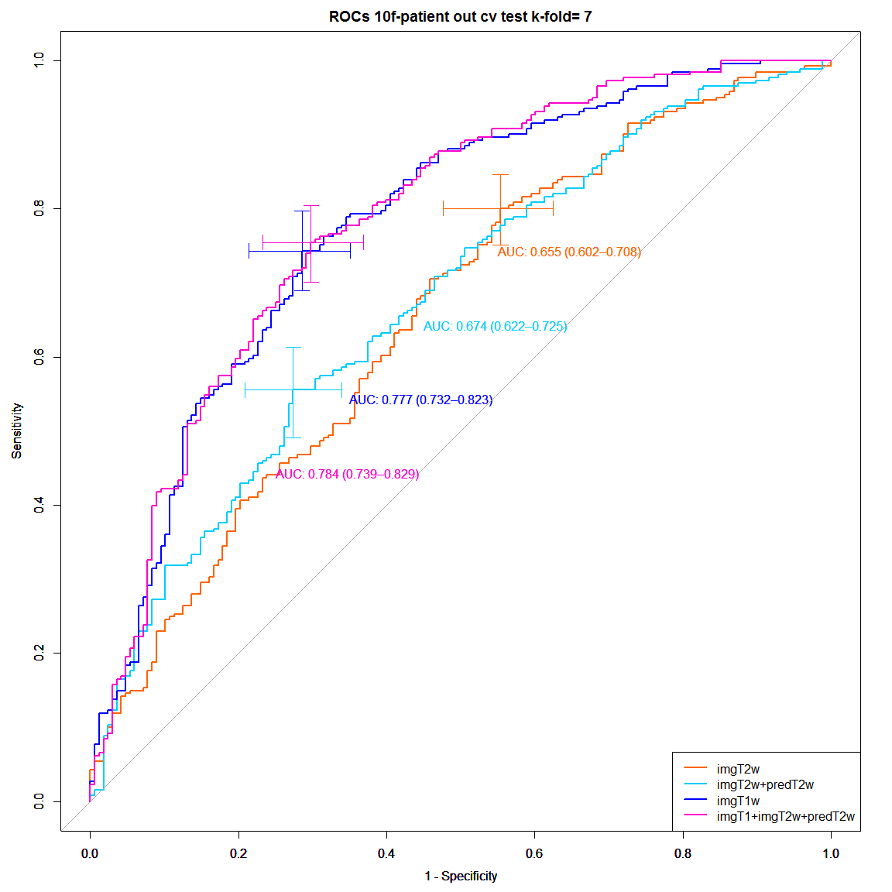 

```
## Area under the curve: 0.7838
## 95% CI (2000 stratified bootstrap replicates):
##  thresholds sp.low sp.median sp.high se.low se.median se.high
##   0.4618078  0.631    0.7024  0.7679 0.7011    0.7548  0.8046
##    massB    massM nonmassB nonmassM 
##      214      142      128       76 
##    massB    massM nonmassB nonmassM 
##       28       24       14        1 
##    massB    massM nonmassB nonmassM 
##      214      142      128       76 
##    massB    massM nonmassB nonmassM 
##       28       24       14        1 
##    massB    massM nonmassB nonmassM 
##      214      142      128       76 
##    massB    massM nonmassB nonmassM 
##       28       24       14        1 
## 0.04455446 0.05 
## Selected features for group: MeanDecreaseGini imgT2 
## =========NULL
##  [1] "T2RGH_var"                          "T2texture_entropy_nondir"           "ave_T211"                          
##  [4] "T2texture_correlation_nondir"       "ave_T210"                           "T2grad_margin_var"                 
##  [7] "T2texture_inversediffmoment_nondir" "ave_T27"                            "T2skew_F_r_i"                      
## [10] "T2texture_energy_nondir"            "ave_T218"                           "T2kurt_F_r_i"                      
## [13] "ave_T21"                            "T2texture_diffentropy_nondir"       "ave_T26"                           
## [16] "ave_T22"                            "ave_T216"                           "T2var_F_r_i"                       
## [19] "ave_T23"                            "T2texture_sumentropy_nondir"        "ave_T24"                           
## [22] "ave_T28"                            "ave_T213"                           "T2min_F_r_i"                       
## [25] "ave_T219"                           "ave_T212"                           "ave_T20"                           
## [28] "ave_T214"                           "T2RGH_mean"                         "T2texture_sumaverage_nondir"       
## [31] "ave_T215"                           "ave_T217"                           "T2texture_contrast_nondir"         
## [34] "T2texture_sumvariance_nondir"       "T2_lesionSI"                       
## 0.1207729 0.05 
## -0.08241758 0.05 
## Selected features for group: MeanDecreaseGini allT2 
## =========NULL
##  [1] "T2RGH_var"                          "T2texture_entropy_nondir"           "T2grad_margin_var"                 
##  [4] "T2wSI_predicted"                    "T2texture_correlation_nondir"       "ave_T211"                          
##  [7] "T2kurt_F_r_i"                       "ave_T210"                           "T2max_F_r_i"                       
## [10] "T2texture_inversediffmoment_nondir" "T2texture_sumaverage_nondir"        "ave_T212"                          
## [13] "ave_T29"                            "LMSIR_predicted"                    "ave_T28"                           
## [16] "T2skew_F_r_i"                       "ave_T24"                            "T2texture_contrast_nondir"         
## [19] "T2_lesionSI"                        "T2RGH_mean"                         "ave_T217"                          
## [22] "ave_T214"                           "ave_T27"                            "ave_T219"                          
## [25] "ave_T213"                           "ave_T22"                            "T2var_F_r_i"                       
## [28] "ave_T25"                            "ave_T21"                            "ave_T26"                           
## [31] "ave_T218"                           "T2min_F_r_i"                        "T2_lesionSIstd"                    
## -0.03472222 0.05 
## Selected features for group: MeanDecreaseGini imgT1 
## =========NULL
##  [1] "circularity"                       "earlySE12"                         "V9"                               
##  [4] "max_F_r_i"                         "texture_energy_nondir_post4"       "Vr_post_1_inside"                 
##  [7] "max_RGH_mean"                      "texture_sumvariance_nondir_post4"  "skew_F_r_i"                       
## [10] "V4"                                "V2"                                "A_inside"                         
## [13] "edge_sharp_std"                    "Kpeak_countor"                     "ivVariance"                       
## [16] "dce3SE15"                          "Slope_ini_inside"                  "texture_diffvariance_nondir_post4"
## [19] "kurt_F_r_i"                        "dce2SE18"                          "lateSE16"                         
## [22] "dce3SE11"                          "earlySE10"                         "earlySE17"                        
## [25] "lateSE11"                          "texture_variance_nondir_post4"     "dce2SE13"                         
## [28] "alpha_inside"                     
## -0.02112676 0.05 
## Selected features for group: MeanDecreaseGini all 
## =========NULL
##  [1] "texture_sumvariance_nondir_post2"  "V14"                               "texture_correlation_nondir_post3" 
##  [4] "Tpeak_countor"                     "V19"                               "T2RGH_mean"                       
##  [7] "edge_sharp_std"                    "texture_sumentropy_nondir_post4"   "T2texture_sumaverage_nondir"      
## [10] "earlySE3"                          "texture_sumaverage_nondir_post1"   "earlySE10"                        
## [13] "texture_entropy_nondir_post2"      "dce2SE5"                           "beta_countor"                     
## [16] "texture_diffentropy_nondir_post1"  "Vr_increasingRate_inside"          "lateSE6"                          
## [19] "ave_T21"                           "lateSE14"                          "dce3SE6"                          
## [22] "dce2SE0"                           "texture_diffvariance_nondir_post4" "max_F_r_i"                        
## [25] "V0"                                "V12"                               "iMax_Variance_uptake"             
## [28] "texture_sumvariance_nondir_post3"  "alpha_inside"                      "A_inside"                         
##     lesion_id cad_pt_no_txt exam_a_number_txt BIRADS lesion_label               lesion_diagnosis      find_t2_signal_int
## 6           6          0066           4583735      3        massB           BENIGN BREAST TISSUE Hypointense or not seen
## 7           7          0066           7556910      4     nonmassB                 DENSE FIBROSIS                    None
## 13         13          0121           6714524      4        massB                       ADENOSIS Hypointense or not seen
## 14         14          0121           7091267      4        massB           BENIGN BREAST TISSUE            Hyperintense
## 18         18          0127           4696964      4     nonmassB                   FIBROADENOMA            Hyperintense
## 20         20          0130           5017534      2        massB   ATYPICAL LOBULAR HYPERPLASIA            Hyperintense
## 21         21          0130           5017534      2        massB   ATYPICAL LOBULAR HYPERPLASIA            Hyperintense
## 22         22          0130           7347205      4        massB   ATYPICAL LOBULAR HYPERPLASIA Hypointense or not seen
## 38         38          0189           5057674      4     nonmassB            SCLEROSING ADENOSIS Hypointense or not seen
## 67         67          0276           6952525      4        massM                 InvasiveDuctal   Slightly hyperintense
## 68         68          0276           6952525      4        massM                 InvasiveDuctal   Slightly hyperintense
## 84         84          0426           7169326      4     nonmassB               STROMAL FIBROSIS                    None
## 85         85          0426           7169326      4     nonmassB           BENIGN BREAST TISSUE Hypointense or not seen
## 86         86          0426           7169326      4     nonmassB               STROMAL FIBROSIS                    None
## 111       111          0578           6765702      6        massM                 InvasiveDuctal                    None
## 126       126          0657           6980780      4        massM                 InvasiveDuctal Hypointense or not seen
## 129       129          0666           5088826      3        massM                   InsituDuctal            Hyperintense
## 136       136          0679           4994641      6        massM                 InvasiveDuctal                    None
## 211       211          0783           4758418      3        massB                    FIBROCYSTIC            Hyperintense
## 218       218          0789           4785741      3        massM                   InsituDuctal   Slightly hyperintense
## 222       222          0792           5264066      3        massB                 DUCT PAPILLOMA   Slightly hyperintense
## 223       223          0792           5264066      3        massB                 DUCT PAPILLOMA   Slightly hyperintense
## 224       224          0793           4988020      4        massB                   FIBROADENOMA            Hyperintense
## 225       225          0793           7135216      2        massB COMPLEX FIBROEPITHELIAL LESION            Hyperintense
## 234       234          0810           4622489      4        massM                   InsituDuctal                    None
## 240       240          0815           4828432      5        massM                 InvasiveDuctal                    None
## 241       241          0817           5363917      6        massM                 InvasiveDuctal            Hyperintense
## 271       271          0856           4986174      4        massB                   FIBROADENOMA            Hyperintense
## 272       272          0856           4986174      4        massB                   FIBROADENOMA            Hyperintense
## 273       273          0856           6871177      2        massB    ATYPICAL DUCTAL HYPERPLASIA Hypointense or not seen
## 277       277          0862           5395314      4        massM                   InsituDuctal                    None
## 280       280          0865           5267535      5        massM                 InvasiveDuctal                    None
## 281       281          0865           5267535      5     nonmassM                 InvasiveDuctal                    None
## 308       308          0913           7350757      4        massB                       ADENOSIS   Slightly hyperintense
## 315       315          0937           7144673      4        massB                FIBROEPITHELIAL            Hyperintense
## 331       331          0985           7050619      4     nonmassB          COLUMNAR CELL CHANGES            Hyperintense
## 335       335          0997           7279207      3        massB   ATYPICAL LOBULAR HYPERPLASIA                    None
## 400       400          2065           7604632      4     nonmassB                  InsituLobular                    None
## 409       409          2078           5116776      4        massB           BENIGN BREAST TISSUE            Hyperintense
## 421       421          3018           6865137      3        massB                   FAT NECROSIS            Hyperintense
## 427       427          3028           6991592      3        massB                    HYPERPLASIA Hypointense or not seen
## 434       434          3045           7149704      4     nonmassB                       ADENOSIS                    None
## 442       442          3054           6714946      4     nonmassB           BENIGN BREAST TISSUE Hypointense or not seen
## 443       443          3055           7742700      4        massB          COLUMNAR CELL CHANGES Hypointense or not seen
## 444       444          3055           7060620      4        massM                 InvasiveDuctal Hypointense or not seen
## 445       445          3055           7742700      4     nonmassB          COLUMNAR CELL CHANGES                    None
## 446       446          3055           7742700      4        massB            STROMAL HYPERPLASIA Hypointense or not seen
## 447       447          3055           7060620      4        massM                 InvasiveDuctal Hypointense or not seen
## 448       448          3057           7098623      4     nonmassB           BENIGN BREAST TISSUE                    None
## 449       449          3057           7098623      4        massB                TUBULAR ADENOMA   Slightly hyperintense
## 485       485          4020           6988975      6        massM                InvasiveLobular   Slightly hyperintense
## 497       497          4041           7003893      4     nonmassB           BENIGN BREAST TISSUE   Slightly hyperintense
## 553       553          6041           5104414      6        massM                 InvasiveDuctal   Slightly hyperintense
## 554       554          6041           5104414      6        massM                 InvasiveDuctal                    None
## 562       562          6046         ACC108189      5        massM                   InsituDuctal Hypointense or not seen
## 563       563          6046         ACC108189      5        massM                   InsituDuctal Hypointense or not seen
## 564       564          6046         ACC108189      5        massM                   InsituDuctal            Hyperintense
## 565       565          6046         ACC108189      5        massM                   InsituDuctal                    None
## 569       569          6051           5426079      6        massM                 InvasiveDuctal            Hyperintense
## 589       589          6223           7043947      4        massM                 InvasiveDuctal            Hyperintense
## 611       611          7085           7616788      2        massB    ATYPICAL DUCTAL HYPERPLASIA                    None
## 614       614          7094           7171259      4     nonmassB           BENIGN BREAST TISSUE                    None
## 617       617          7097           6805449      4        massB            SCLEROSING ADENOSIS Hypointense or not seen
## 618       618          7097           6805449      4        massB                   FIBROADENOMA                    None
## 619       619          7097           7388464      2        massB    ATYPICAL DUCTAL HYPERPLASIA   Slightly hyperintense
## 626       626          7178           7074874      6        massM                 InvasiveDuctal Hypointense or not seen
## 627       627          7183           7404761      4        massB                    FIBROCYSTIC            Hyperintense
## 
## ============ bestune_imgT2 	 max.depth  1 	 #Trees  350 
## ntrees:  50 minsplit:  3 cp:  -1 
##   ntrees minsplit cp acuTrain rocTrain   acuTest   rocTest
## 1     50        3 -1        1        1 0.5373134 0.5657143
## ntrees:  100 minsplit:  3 cp:  -1 
##   ntrees minsplit cp acuTrain rocTrain   acuTest  rocTest
## 2    100        3 -1        1        1 0.5373134 0.532381
## ntrees:  250 minsplit:  3 cp:  -1 
##   ntrees minsplit cp acuTrain rocTrain   acuTest   rocTest
## 3    250        3 -1        1        1 0.5671642 0.5057143
## ntrees:  350 minsplit:  3 cp:  -1 
##   ntrees minsplit cp acuTrain rocTrain   acuTest   rocTest
## 4    350        3 -1        1        1 0.5820896 0.5552381
## ntrees:  500 minsplit:  3 cp:  -1 
##   ntrees minsplit cp acuTrain rocTrain   acuTest   rocTest
## 5    500        3 -1        1        1 0.5373134 0.4819048
## ntrees:  50 minsplit:  1 cp:  -1 
##   ntrees minsplit cp acuTrain rocTrain   acuTest   rocTest
## 6     50        1 -1        1        1 0.5373134 0.5114286
## ntrees:  100 minsplit:  1 cp:  -1 
##   ntrees minsplit cp acuTrain rocTrain   acuTest   rocTest
## 7    100        1 -1        1        1 0.5223881 0.5466667
## ntrees:  250 minsplit:  1 cp:  -1 
##   ntrees minsplit cp acuTrain rocTrain   acuTest   rocTest
## 8    250        1 -1        1        1 0.5820896 0.5085714
## ntrees:  350 minsplit:  1 cp:  -1 
##   ntrees minsplit cp acuTrain rocTrain   acuTest   rocTest
## 9    350        1 -1        1        1 0.5820896 0.5171429
## ntrees:  500 minsplit:  1 cp:  -1 
##    ntrees minsplit cp acuTrain rocTrain   acuTest   rocTest
## 10    500        1 -1        1        1 0.5970149 0.5133333
## ntrees:  50 minsplit:  0 cp:  -1 
##    ntrees minsplit cp acuTrain rocTrain   acuTest   rocTest
## 11     50        0 -1        1        1 0.5522388 0.5333333
## ntrees:  100 minsplit:  0 cp:  -1 
##    ntrees minsplit cp acuTrain rocTrain   acuTest   rocTest
## 12    100        0 -1        1        1 0.5820896 0.5314286
## ntrees:  250 minsplit:  0 cp:  -1 
##    ntrees minsplit cp acuTrain rocTrain   acuTest   rocTest
## 13    250        0 -1        1        1 0.5522388 0.5180952
## ntrees:  350 minsplit:  0 cp:  -1 
##    ntrees minsplit cp acuTrain rocTrain   acuTest   rocTest
## 14    350        0 -1        1        1 0.5671642 0.4695238
## ntrees:  500 minsplit:  0 cp:  -1 
##    ntrees minsplit cp acuTrain rocTrain   acuTest   rocTest
## 15    500        0 -1        1        1 0.5970149 0.5266667
##    ntrees minsplit cp acuTrain rocTrain   acuTest   rocTest
## 1      50        3 -1        1        1 0.5373134 0.5657143
## 2     100        3 -1        1        1 0.5373134 0.5323810
## 3     250        3 -1        1        1 0.5671642 0.5057143
## 4     350        3 -1        1        1 0.5820896 0.5552381
## 5     500        3 -1        1        1 0.5373134 0.4819048
## 6      50        1 -1        1        1 0.5373134 0.5114286
## 7     100        1 -1        1        1 0.5223881 0.5466667
## 8     250        1 -1        1        1 0.5820896 0.5085714
## 9     350        1 -1        1        1 0.5820896 0.5171429
## 10    500        1 -1        1        1 0.5970149 0.5133333
## 11     50        0 -1        1        1 0.5522388 0.5333333
## 12    100        0 -1        1        1 0.5820896 0.5314286
## 13    250        0 -1        1        1 0.5522388 0.5180952
## 14    350        0 -1        1        1 0.5671642 0.4695238
## 15    500        0 -1        1        1 0.5970149 0.5266667
##   ntrees minsplit cp acuTrain rocTrain   acuTest   rocTest
## 1     50        3 -1        1        1 0.5373134 0.5657143
## 
## ============ bestune_allT2 	 max.depth  1 	 #Trees  250 
## ntrees:  50 minsplit:  3 cp:  -1 
##   ntrees minsplit cp acuTrain rocTrain   acuTest   rocTest
## 1     50        3 -1        1        1 0.4925373 0.5695238
## ntrees:  100 minsplit:  3 cp:  -1 
##   ntrees minsplit cp acuTrain rocTrain   acuTest   rocTest
## 2    100        3 -1        1        1 0.6119403 0.4733333
## ntrees:  250 minsplit:  3 cp:  -1 
##   ntrees minsplit cp acuTrain rocTrain   acuTest   rocTest
## 3    250        3 -1        1        1 0.6268657 0.4914286
## ntrees:  350 minsplit:  3 cp:  -1 
##   ntrees minsplit cp acuTrain rocTrain   acuTest   rocTest
## 4    350        3 -1        1        1 0.5970149 0.4857143
## ntrees:  500 minsplit:  3 cp:  -1 
##   ntrees minsplit cp acuTrain rocTrain   acuTest   rocTest
## 5    500        3 -1        1        1 0.6268657 0.5419048
## ntrees:  50 minsplit:  1 cp:  -1 
##   ntrees minsplit cp acuTrain rocTrain   acuTest   rocTest
## 6     50        1 -1        1        1 0.5373134 0.5428571
## ntrees:  100 minsplit:  1 cp:  -1 
##   ntrees minsplit cp acuTrain rocTrain   acuTest   rocTest
## 7    100        1 -1        1        1 0.6268657 0.4638095
## ntrees:  250 minsplit:  1 cp:  -1 
##   ntrees minsplit cp acuTrain rocTrain   acuTest   rocTest
## 8    250        1 -1        1        1 0.5820896 0.5419048
## ntrees:  350 minsplit:  1 cp:  -1 
##   ntrees minsplit cp acuTrain rocTrain   acuTest   rocTest
## 9    350        1 -1        1        1 0.6119403 0.5285714
## ntrees:  500 minsplit:  1 cp:  -1 
##    ntrees minsplit cp acuTrain rocTrain   acuTest   rocTest
## 10    500        1 -1        1        1 0.6119403 0.5409524
## ntrees:  50 minsplit:  0 cp:  -1 
##    ntrees minsplit cp acuTrain rocTrain   acuTest   rocTest
## 11     50        0 -1        1        1 0.6567164 0.4352381
## ntrees:  100 minsplit:  0 cp:  -1 
##    ntrees minsplit cp acuTrain rocTrain   acuTest   rocTest
## 12    100        0 -1        1        1 0.6119403 0.5428571
## ntrees:  250 minsplit:  0 cp:  -1 
##    ntrees minsplit cp acuTrain rocTrain   acuTest   rocTest
## 13    250        0 -1        1        1 0.5522388 0.5180952
## ntrees:  350 minsplit:  0 cp:  -1 
##    ntrees minsplit cp acuTrain rocTrain   acuTest rocTest
## 14    350        0 -1        1        1 0.5223881     0.5
## ntrees:  500 minsplit:  0 cp:  -1 
##    ntrees minsplit cp acuTrain rocTrain   acuTest   rocTest
## 15    500        0 -1        1        1 0.5820896 0.5066667
##    ntrees minsplit cp acuTrain rocTrain   acuTest   rocTest
## 1      50        3 -1        1        1 0.4925373 0.5695238
## 2     100        3 -1        1        1 0.6119403 0.4733333
## 3     250        3 -1        1        1 0.6268657 0.4914286
## 4     350        3 -1        1        1 0.5970149 0.4857143
## 5     500        3 -1        1        1 0.6268657 0.5419048
## 6      50        1 -1        1        1 0.5373134 0.5428571
## 7     100        1 -1        1        1 0.6268657 0.4638095
## 8     250        1 -1        1        1 0.5820896 0.5419048
## 9     350        1 -1        1        1 0.6119403 0.5285714
## 10    500        1 -1        1        1 0.6119403 0.5409524
## 11     50        0 -1        1        1 0.6567164 0.4352381
## 12    100        0 -1        1        1 0.6119403 0.5428571
## 13    250        0 -1        1        1 0.5522388 0.5180952
## 14    350        0 -1        1        1 0.5223881 0.5000000
## 15    500        0 -1        1        1 0.5820896 0.5066667
##   ntrees minsplit cp acuTrain rocTrain   acuTest   rocTest
## 1     50        3 -1        1        1 0.4925373 0.5695238
## 
## ============ bestune_imgT1 	 max.depth  1 	 #Trees  250 
## ntrees:  50 minsplit:  3 cp:  -1 
##   ntrees minsplit cp acuTrain rocTrain   acuTest   rocTest
## 1     50        3 -1        1        1 0.6716418 0.6438095
## ntrees:  100 minsplit:  3 cp:  -1 
##   ntrees minsplit cp acuTrain rocTrain   acuTest   rocTest
## 2    100        3 -1        1        1 0.6865672 0.7304762
## ntrees:  250 minsplit:  3 cp:  -1 
##   ntrees minsplit cp acuTrain rocTrain   acuTest   rocTest
## 3    250        3 -1        1        1 0.6716418 0.6285714
## ntrees:  350 minsplit:  3 cp:  -1 
##   ntrees minsplit cp acuTrain rocTrain   acuTest   rocTest
## 4    350        3 -1        1        1 0.7014925 0.6590476
## ntrees:  500 minsplit:  3 cp:  -1 
##   ntrees minsplit cp acuTrain rocTrain   acuTest   rocTest
## 5    500        3 -1        1        1 0.7014925 0.6685714
## ntrees:  50 minsplit:  1 cp:  -1 
##   ntrees minsplit cp acuTrain rocTrain   acuTest   rocTest
## 6     50        1 -1        1        1 0.6119403 0.6495238
## ntrees:  100 minsplit:  1 cp:  -1 
##   ntrees minsplit cp acuTrain rocTrain   acuTest   rocTest
## 7    100        1 -1        1        1 0.6865672 0.6619048
## ntrees:  250 minsplit:  1 cp:  -1 
##   ntrees minsplit cp acuTrain rocTrain   acuTest   rocTest
## 8    250        1 -1        1        1 0.6716418 0.6666667
## ntrees:  350 minsplit:  1 cp:  -1 
##   ntrees minsplit cp acuTrain rocTrain   acuTest   rocTest
## 9    350        1 -1        1        1 0.7014925 0.6580952
## ntrees:  500 minsplit:  1 cp:  -1 
##    ntrees minsplit cp acuTrain rocTrain   acuTest   rocTest
## 10    500        1 -1        1        1 0.7164179 0.6742857
## ntrees:  50 minsplit:  0 cp:  -1 
##    ntrees minsplit cp acuTrain rocTrain   acuTest rocTest
## 11     50        0 -1        1        1 0.7014925    0.64
## ntrees:  100 minsplit:  0 cp:  -1 
##    ntrees minsplit cp acuTrain rocTrain  acuTest  rocTest
## 12    100        0 -1        1        1 0.641791 0.607619
## ntrees:  250 minsplit:  0 cp:  -1 
##    ntrees minsplit cp acuTrain rocTrain   acuTest   rocTest
## 13    250        0 -1        1        1 0.7164179 0.6790476
## ntrees:  350 minsplit:  0 cp:  -1 
##    ntrees minsplit cp acuTrain rocTrain   acuTest   rocTest
## 14    350        0 -1        1        1 0.7014925 0.6790476
## ntrees:  500 minsplit:  0 cp:  -1 
##    ntrees minsplit cp acuTrain rocTrain   acuTest   rocTest
## 15    500        0 -1        1        1 0.7014925 0.6552381
##    ntrees minsplit cp acuTrain rocTrain   acuTest   rocTest
## 1      50        3 -1        1        1 0.6716418 0.6438095
## 2     100        3 -1        1        1 0.6865672 0.7304762
## 3     250        3 -1        1        1 0.6716418 0.6285714
## 4     350        3 -1        1        1 0.7014925 0.6590476
## 5     500        3 -1        1        1 0.7014925 0.6685714
## 6      50        1 -1        1        1 0.6119403 0.6495238
## 7     100        1 -1        1        1 0.6865672 0.6619048
## 8     250        1 -1        1        1 0.6716418 0.6666667
## 9     350        1 -1        1        1 0.7014925 0.6580952
## 10    500        1 -1        1        1 0.7164179 0.6742857
## 11     50        0 -1        1        1 0.7014925 0.6400000
## 12    100        0 -1        1        1 0.6417910 0.6076190
## 13    250        0 -1        1        1 0.7164179 0.6790476
## 14    350        0 -1        1        1 0.7014925 0.6790476
## 15    500        0 -1        1        1 0.7014925 0.6552381
##   ntrees minsplit cp acuTrain rocTrain   acuTest   rocTest
## 2    100        3 -1        1        1 0.6865672 0.7304762
## 
## ============ bestune_all 	 max.depth  1 	 #Trees  200 
## ntrees:  50 minsplit:  3 cp:  -1 
##   ntrees minsplit cp acuTrain rocTrain   acuTest   rocTest
## 1     50        3 -1        1        1 0.6865672 0.6314286
## ntrees:  100 minsplit:  3 cp:  -1 
##   ntrees minsplit cp acuTrain rocTrain   acuTest   rocTest
## 2    100        3 -1        1        1 0.6865672 0.6466667
## ntrees:  250 minsplit:  3 cp:  -1 
##   ntrees minsplit cp acuTrain rocTrain   acuTest   rocTest
## 3    250        3 -1        1        1 0.7164179 0.6647619
## ntrees:  350 minsplit:  3 cp:  -1 
##   ntrees minsplit cp acuTrain rocTrain   acuTest   rocTest
## 4    350        3 -1        1        1 0.7164179 0.6542857
## ntrees:  500 minsplit:  3 cp:  -1 
##   ntrees minsplit cp acuTrain rocTrain   acuTest   rocTest
## 5    500        3 -1        1        1 0.7164179 0.6733333
## ntrees:  50 minsplit:  1 cp:  -1 
##   ntrees minsplit cp acuTrain rocTrain   acuTest   rocTest
## 6     50        1 -1        1        1 0.7014925 0.6971429
## ntrees:  100 minsplit:  1 cp:  -1 
##   ntrees minsplit cp acuTrain rocTrain   acuTest   rocTest
## 7    100        1 -1        1        1 0.7014925 0.6466667
## ntrees:  250 minsplit:  1 cp:  -1 
##   ntrees minsplit cp acuTrain rocTrain   acuTest   rocTest
## 8    250        1 -1        1        1 0.7014925 0.6628571
## ntrees:  350 minsplit:  1 cp:  -1 
##   ntrees minsplit cp acuTrain rocTrain   acuTest   rocTest
## 9    350        1 -1        1        1 0.7164179 0.6828571
## ntrees:  500 minsplit:  1 cp:  -1 
##    ntrees minsplit cp acuTrain rocTrain   acuTest   rocTest
## 10    500        1 -1        1        1 0.7164179 0.6742857
## ntrees:  50 minsplit:  0 cp:  -1 
##    ntrees minsplit cp acuTrain rocTrain   acuTest   rocTest
## 11     50        0 -1        1        1 0.7164179 0.6933333
## ntrees:  100 minsplit:  0 cp:  -1 
##    ntrees minsplit cp acuTrain rocTrain  acuTest   rocTest
## 12    100        0 -1        1        1 0.761194 0.6619048
## ntrees:  250 minsplit:  0 cp:  -1 
##    ntrees minsplit cp acuTrain rocTrain   acuTest   rocTest
## 13    250        0 -1        1        1 0.7164179 0.6495238
## ntrees:  350 minsplit:  0 cp:  -1 
##    ntrees minsplit cp acuTrain rocTrain   acuTest   rocTest
## 14    350        0 -1        1        1 0.6865672 0.6752381
## ntrees:  500 minsplit:  0 cp:  -1 
##    ntrees minsplit cp acuTrain rocTrain   acuTest rocTest
## 15    500        0 -1        1        1 0.6865672    0.68
##    ntrees minsplit cp acuTrain rocTrain   acuTest   rocTest
## 1      50        3 -1        1        1 0.6865672 0.6314286
## 2     100        3 -1        1        1 0.6865672 0.6466667
## 3     250        3 -1        1        1 0.7164179 0.6647619
## 4     350        3 -1        1        1 0.7164179 0.6542857
## 5     500        3 -1        1        1 0.7164179 0.6733333
## 6      50        1 -1        1        1 0.7014925 0.6971429
## 7     100        1 -1        1        1 0.7014925 0.6466667
## 8     250        1 -1        1        1 0.7014925 0.6628571
## 9     350        1 -1        1        1 0.7164179 0.6828571
## 10    500        1 -1        1        1 0.7164179 0.6742857
## 11     50        0 -1        1        1 0.7164179 0.6933333
## 12    100        0 -1        1        1 0.7611940 0.6619048
## 13    250        0 -1        1        1 0.7164179 0.6495238
## 14    350        0 -1        1        1 0.6865672 0.6752381
## 15    500        0 -1        1        1 0.6865672 0.6800000
##   ntrees minsplit cp acuTrain rocTrain   acuTest   rocTest
## 6     50        1 -1        1        1 0.7014925 0.6971429
## 
## Call:
## roc.default(response = perf_imgT2$obs, predictor = perf_imgT2$C)
## 
## Data: perf_imgT2$C in 193 controls (perf_imgT2$obs C) > 303 cases (perf_imgT2$obs NC).
## Area under the curve: 0.6227
## 
## Call:
## roc.default(response = perf_allT2$obs, predictor = perf_allT2$C)
## 
## Data: perf_allT2$C in 193 controls (perf_allT2$obs C) > 303 cases (perf_allT2$obs NC).
## Area under the curve: 0.6365
## 
## Call:
## roc.default(response = perf_imgT1$obs, predictor = perf_imgT1$C)
## 
## Data: perf_imgT1$C in 193 controls (perf_imgT1$obs C) > 303 cases (perf_imgT1$obs NC).
## Area under the curve: 0.7698
## 
## Call:
## roc.default(response = perf_all$obs, predictor = perf_all$C)
## 
## Data: perf_all$C in 193 controls (perf_all$obs C) > 303 cases (perf_all$obs NC).
## Area under the curve: 0.7724
```

```
## Area under the curve: 0.6227
## 95% CI (2000 stratified bootstrap replicates):
##  thresholds sp.low sp.median sp.high se.low se.median se.high
##     0.46832 0.4508    0.5233  0.5907 0.6403    0.6931  0.7459
```

```
## Area under the curve: 0.6365
## 95% CI (2000 stratified bootstrap replicates):
##  thresholds sp.low sp.median sp.high se.low se.median se.high
##   0.4376983 0.6321    0.6943  0.7565 0.4884    0.5446  0.6007
```

```
## Area under the curve: 0.7698
## 95% CI (2000 stratified bootstrap replicates):
##  thresholds sp.low sp.median sp.high se.low se.median se.high
##   0.4595427 0.6166    0.6839  0.7513 0.7162    0.7657  0.8119
```

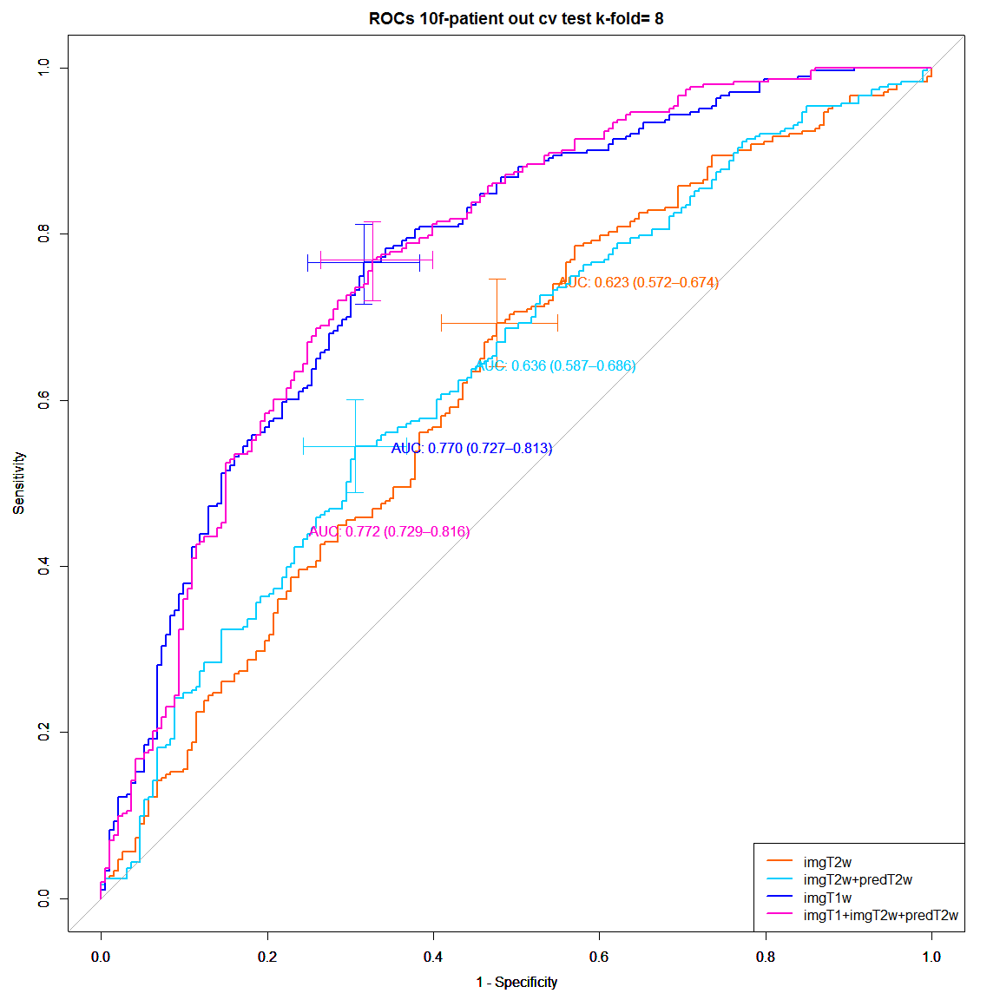 

```
## Area under the curve: 0.7724
## 95% CI (2000 stratified bootstrap replicates):
##  thresholds sp.low sp.median sp.high se.low se.median se.high
##   0.4618078  0.601    0.6736  0.7358 0.7195     0.769  0.8152
##    massB    massM nonmassB nonmassM 
##      211      153      125       70 
##    massB    massM nonmassB nonmassM 
##       31       13       17        7 
##    massB    massM nonmassB nonmassM 
##      211      153      125       70 
##    massB    massM nonmassB nonmassM 
##       31       13       17        7 
##    massB    massM nonmassB nonmassM 
##      211      153      125       70 
##    massB    massM nonmassB nonmassM 
##       31       13       17        7 
## -0.02714932 0.05 
## Selected features for group: MeanDecreaseGini imgT2 
## =========NULL
##  [1] "T2RGH_var"                    "T2RGH_mean"                   "T2texture_entropy_nondir"     "T2grad_margin_var"           
##  [5] "ave_T210"                     "T2var_F_r_i"                  "ave_T21"                      "ave_T211"                    
##  [9] "T2skew_F_r_i"                 "ave_T215"                     "T2texture_diffentropy_nondir" "ave_T27"                     
## [13] "ave_T22"                      "ave_T28"                      "T2kurt_F_r_i"                 "T2texture_sumvariance_nondir"
## [17] "T2max_F_r_i"                  "T2_lesionSI"                  "ave_T23"                      "ave_T216"                    
## [21] "T2texture_correlation_nondir" "ave_T212"                     "ave_T24"                      "T2texture_energy_nondir"     
## [25] "ave_T20"                      "T2texture_sumaverage_nondir"  "T2min_F_r_i"                  "ave_T29"                     
## [29] "ave_T25"                      "T2_lesionSIstd"              
## 0.1111111 0.05 
## -0.0625 0.05 
## Selected features for group: MeanDecreaseGini allT2 
## =========NULL
##  [1] "ave_T210"                           "T2RGH_mean"                         "T2texture_correlation_nondir"      
##  [4] "T2wSI_predicted"                    "T2texture_energy_nondir"            "T2var_F_r_i"                       
##  [7] "ave_T27"                            "T2skew_F_r_i"                       "T2RGH_var"                         
## [10] "ave_T211"                           "ave_T20"                            "T2texture_contrast_nondir"         
## [13] "T2kurt_F_r_i"                       "T2grad_margin_var"                  "T2texture_sumaverage_nondir"       
## [16] "ave_T29"                            "T2grad_margin"                      "T2_lesionSI"                       
## [19] "ave_T214"                           "LMSIR_predicted"                    "ave_T217"                          
## [22] "ave_T26"                            "ave_T213"                           "T2min_F_r_i"                       
## [25] "ave_T21"                            "T2texture_inversediffmoment_nondir" "ave_T216"                          
## [28] "ave_T25"                            "ave_T24"                            "ave_T212"                          
## [31] "T2texture_sumvariance_nondir"       "T2_lesionSIstd"                    
## 0.02547771 0.05 
## Selected features for group: MeanDecreaseGini imgT1 
## =========NULL
##  [1] "texture_variance_nondir_post1"          "texture_sumvariance_nondir_post1"       "V9"                                    
##  [4] "Tpeak_countor"                          "V16"                                    "Kpeak_inside"                          
##  [7] "texture_inversediffmoment_nondir_post2" "texture_sumaverage_nondir_post3"        "V13"                                   
## [10] "texture_inversediffmoment_nondir_post4" "V8"                                     "texture_correlation_nondir_post1"      
## [13] "lateSE2"                                "UptakeRate_countor"                     "texture_sumvariance_nondir_post4"      
## [16] "dce2SE15"                               "texture_diffentropy_nondir_post3"       "texture_contrast_nondir_post3"         
## [19] "lateSE19"                               "earlySE11"                              "lateSE1"                               
## [22] "earlySE3"                               "texture_sumaverage_nondir_post4"        "earlySE0"                              
## [25] "dce3SE10"                               "min_F_r_i"                              "ivVariance"                            
## [28] "lateSE7"                                "dce2SE11"                               "Vr_post_1_countor"                     
## [31] "lateSE10"                               "skew_F_r_i"                             "dce2SE9"                               
## [34] "max_RGH_mean_k"                         "V6"                                     "peakVr_inside"                         
## [37] "Vr_decreasingRate_countor"              "iAUC1_countor"                          "max_RGH_var_k"                         
## [40] "A_inside"                              
## -0.07284768 0.05 
## Selected features for group: MeanDecreaseGini all 
## =========NULL
##  [1] "SER_countor"                      "texture_sumvariance_nondir_post1" "max_F_r_i"                       
##  [4] "T2RGH_mean"                       "texture_sumaverage_nondir_post2"  "texture_contrast_nondir_post3"   
##  [7] "edge_sharp_mean"                  "earlySE6"                         "lateSE0"                         
## [10] "beta_inside"                      "dce3SE12"                         "edge_sharp_std"                  
## [13] "ave_T20"                          "ave_T215"                         "dce3SE8"                         
## [16] "T2_lesionSIstd"                   "T2wSI_predicted"                  "T2texture_diffvariance_nondir"   
## [19] "V2"                               "T2grad_margin_var"                "earlySE14"                       
## [22] "dce3SE11"                         "peakCr_inside"                    "dce3SE9"                         
## [25] "T2max_F_r_i"                      "V19"                              "dce3SE15"                        
## [28] "earlySE0"                         "A_inside"                        
##     lesion_id cad_pt_no_txt exam_a_number_txt BIRADS lesion_label                           lesion_diagnosis      find_t2_signal_int
## 4           4          0027           7171944      4     nonmassB                           STROMAL FIBROSIS                    None
## 5           5          0027           6805483      4     nonmassM                               InsituDuctal                    None
## 8           8          0093           7156466      4     nonmassM                             InvasiveDuctal                    None
## 9           9          0093           7156466      4     nonmassM                             InvasiveDuctal                    None
## 26         26          0135           7777131      4        massB                                FIBROCYSTIC                    None
## 27         27          0135           5083620      4     nonmassB                                FIBROCYSTIC Hypointense or not seen
## 30         30          0171           4751079      4        massM                               InsituDuctal Hypointense or not seen
## 31         31          0172           4703102      4        massB                                FIBROCYSTIC                    None
## 48         48          0198           4809893      2        massB                                FIBROCYSTIC                    None
## 49         49          0198           4809893      2        massB                               FIBROADENOMA                    None
## 60         60          0252           5142106      4        massB                               FIBROADENOMA Hypointense or not seen
## 61         61          0252           5142106      4        massB                               FIBROADENOMA Hypointense or not seen
## 62         62          0252           6700964      3     nonmassB                       BENIGN BREAST TISSUE Hypointense or not seen
## 63         63          0252           6700964      3        massB                       BENIGN BREAST TISSUE            Hyperintense
## 65         65          0259           7364573      2     nonmassB                       BENIGN BREAST TISSUE                    None
## 98         98          0513           5043867      4     nonmassB                ATYPICAL DUCTAL HYPERPLASIA                    None
## 106       106          0571           4902166      4        massM                             InvasiveDuctal Hypointense or not seen
## 107       107          0571           4902166      4     nonmassB                             DUCT PAPILLOMA Hypointense or not seen
## 120       120          0616           7910718      2        massM                               InsituDuctal Hypointense or not seen
## 157       157          0710           5282770      4        massB                               FIBROADENOMA            Hyperintense
## 158       158          0710           5282770      5        massB                             DUCT PAPILLOMA            Hyperintense
## 159       159          0710           6798490      2        massB                         DUCTAL HYPERPLASIA                    None
## 170       170          0723           4884108      6        massM                               InsituDuctal                    None
## 181       181          0734           4532660      4        massB                ATYPICAL DUCTAL HYPERPLASIA   Slightly hyperintense
## 248       248          0830           4863868      5        massB                ATYPICAL DUCTAL HYPERPLASIA                    None
## 249       249          0830           4863868      5        massB                                       Cyst                    None
## 261       261          0850           5380609      5        massB                       BENIGN BREAST TISSUE   Slightly hyperintense
## 262       262          0850           5380609      5     nonmassB                ATYPICAL DUCTAL HYPERPLASIA                    None
## 263       263          0850           5380609      5        massB                                FIBROCYSTIC   Slightly hyperintense
## 266       266          0853           4798586      2     nonmassB                                FIBROCYSTIC                    None
## 267       267          0853           4745782      3     nonmassB                                FIBROCYSTIC   Slightly hyperintense
## 268       268          0853           6696534      4     nonmassM                               InsituDuctal   Slightly hyperintense
## 269       269          0855           4641315      6        massB                                   FIBROSIS            Hyperintense
## 270       270          0855           4641315      6     nonmassB                                   FIBROSIS                    None
## 278       278          0863           4969136      4        massB                             DUCT PAPILLOMA            Hyperintense
## 279       279          0863           4969136      4        massM                            InvasiveLobular Hypointense or not seen
## 298       298          0883           5177385      5     nonmassM                               InsituDuctal                    None
## 306       306          0900           6699226      4        massB                                       Cyst                    None
## 307       307          0904           7133915      3        massB                                FIBROCYSTIC            Hyperintense
## 349       349          1027           6930730      3     nonmassB                               FIBROADENOMA                    None
## 351       351          1045           7231265      4        massB                       BENIGN BREAST TISSUE Hypointense or not seen
## 353       353          1026           6907382      4        massB DENSE FIBROSIS AND FIBROADENOMATOID CHANGE            Hyperintense
## 354       354          1053           7748055      4        massB                         INFLAMED CYST WALL            Hyperintense
## 358       358          1065           7741665      4     nonmassB                       BENIGN BREAST TISSUE                    None
## 375       375          1099           7646705      5        massM                               InsituDuctal Hypointense or not seen
## 376       376          1099           7646705      4     nonmassM                               InsituDuctal                    None
## 402       402          2069           4976319      6        massM                               InsituDuctal Hypointense or not seen
## 426       426          3026           6830523      4        massB                                FIBROCYSTIC Hypointense or not seen
## 431       431          3035           7002031      4        massB                               FIBROADENOMA            Hyperintense
## 432       432          3035           7145247      4        massB                                FIBROCYSTIC                    None
## 438       438          3052           7100200      4        massB                           STROMAL FIBROSIS            Hyperintense
## 439       439          3052           7100200      4        massB                               FIBROADENOMA            Hyperintense
## 459       459          3076           7053450      6        massM                               InsituDuctal Hypointense or not seen
## 460       460          3076           7053450      6        massM                               InsituDuctal Hypointense or not seen
## 495       495          4040           7003416      6        massM                             InvasiveDuctal                    None
## 496       496          4040           7085105      4        massB                               FIBROADENOMA            Hyperintense
## 504       504          4049           7009602      6        massM                             InvasiveDuctal                    None
## 519       519          6019         ACC109175      4        massM                            InvasiveLobular Hypointense or not seen
## 537       537          6032           4982490      4     nonmassB                                FIBROCYSTIC                    None
## 546       546          6038           5044471      6        massM                             InvasiveDuctal                    None
## 547       547          6038           5044471      6     nonmassB                       BENIGN BREAST TISSUE                    None
## 548       548          6038           5044471      6     nonmassB                       BENIGN BREAST TISSUE            Hyperintense
## 581       581          6105           5069712      4     nonmassM                               InsituDuctal                    None
## 585       585          6148           7446343      4        massB                        SCLEROSING ADENOSIS Hypointense or not seen
## 590       590          6224           4559525      4     nonmassB                                FIBROCYSTIC            Hyperintense
## 591       591          6226           6718391      4        massB                       BENIGN BREAST TISSUE   Slightly hyperintense
## 603       603          7053           7956343      4     nonmassB                            FIBROTIC STROMA Hypointense or not seen
## 622       622          7127           6989740      4        massB                       BENIGN BREAST TISSUE Hypointense or not seen
## 
## ============ bestune_imgT2 	 max.depth  1 	 #Trees  350 
## ntrees:  50 minsplit:  3 cp:  -1 
##   ntrees minsplit cp acuTrain rocTrain   acuTest   rocTest
## 1     50        3 -1        1        1 0.6764706 0.6447917
## ntrees:  100 minsplit:  3 cp:  -1 
##   ntrees minsplit cp acuTrain rocTrain   acuTest rocTest
## 2    100        3 -1        1        1 0.5588235   0.575
## ntrees:  250 minsplit:  3 cp:  -1 
##   ntrees minsplit cp acuTrain rocTrain   acuTest   rocTest
## 3    250        3 -1        1        1 0.6323529 0.6010417
## ntrees:  350 minsplit:  3 cp:  -1 
##   ntrees minsplit cp acuTrain rocTrain   acuTest   rocTest
## 4    350        3 -1        1        1 0.6176471 0.5739583
## ntrees:  500 minsplit:  3 cp:  -1 
##   ntrees minsplit cp acuTrain rocTrain   acuTest   rocTest
## 5    500        3 -1        1        1 0.5882353 0.5416667
## ntrees:  50 minsplit:  1 cp:  -1 
##   ntrees minsplit cp acuTrain rocTrain   acuTest   rocTest
## 6     50        1 -1        1        1 0.5588235 0.5197917
## ntrees:  100 minsplit:  1 cp:  -1 
##   ntrees minsplit cp acuTrain rocTrain   acuTest   rocTest
## 7    100        1 -1        1        1 0.6323529 0.5947917
## ntrees:  250 minsplit:  1 cp:  -1 
##   ntrees minsplit cp acuTrain rocTrain   acuTest   rocTest
## 8    250        1 -1        1        1 0.6323529 0.5864583
## ntrees:  350 minsplit:  1 cp:  -1 
##   ntrees minsplit cp acuTrain rocTrain   acuTest   rocTest
## 9    350        1 -1        1        1 0.6176471 0.5833333
## ntrees:  500 minsplit:  1 cp:  -1 
##    ntrees minsplit cp acuTrain rocTrain   acuTest  rocTest
## 10    500        1 -1        1        1 0.6323529 0.615625
## ntrees:  50 minsplit:  0 cp:  -1 
##    ntrees minsplit cp acuTrain rocTrain   acuTest   rocTest
## 11     50        0 -1        1        1 0.5588235 0.5885417
## ntrees:  100 minsplit:  0 cp:  -1 
##    ntrees minsplit cp acuTrain rocTrain   acuTest   rocTest
## 12    100        0 -1        1        1 0.6470588 0.6302083
## ntrees:  250 minsplit:  0 cp:  -1 
##    ntrees minsplit cp acuTrain rocTrain   acuTest rocTest
## 13    250        0 -1        1        1 0.6470588     0.6
## ntrees:  350 minsplit:  0 cp:  -1 
##    ntrees minsplit cp acuTrain rocTrain   acuTest   rocTest
## 14    350        0 -1        1        1 0.7058824 0.5739583
## ntrees:  500 minsplit:  0 cp:  -1 
##    ntrees minsplit cp acuTrain rocTrain   acuTest rocTest
## 15    500        0 -1        1        1 0.6617647 0.61875
##    ntrees minsplit cp acuTrain rocTrain   acuTest   rocTest
## 1      50        3 -1        1        1 0.6764706 0.6447917
## 2     100        3 -1        1        1 0.5588235 0.5750000
## 3     250        3 -1        1        1 0.6323529 0.6010417
## 4     350        3 -1        1        1 0.6176471 0.5739583
## 5     500        3 -1        1        1 0.5882353 0.5416667
## 6      50        1 -1        1        1 0.5588235 0.5197917
## 7     100        1 -1        1        1 0.6323529 0.5947917
## 8     250        1 -1        1        1 0.6323529 0.5864583
## 9     350        1 -1        1        1 0.6176471 0.5833333
## 10    500        1 -1        1        1 0.6323529 0.6156250
## 11     50        0 -1        1        1 0.5588235 0.5885417
## 12    100        0 -1        1        1 0.6470588 0.6302083
## 13    250        0 -1        1        1 0.6470588 0.6000000
## 14    350        0 -1        1        1 0.7058824 0.5739583
## 15    500        0 -1        1        1 0.6617647 0.6187500
##   ntrees minsplit cp acuTrain rocTrain   acuTest   rocTest
## 1     50        3 -1        1        1 0.6764706 0.6447917
## 
## ============ bestune_allT2 	 max.depth  1 	 #Trees  250 
## ntrees:  50 minsplit:  3 cp:  -1 
##   ntrees minsplit cp acuTrain rocTrain   acuTest rocTest
## 1     50        3 -1        1        1 0.6911765   0.575
## ntrees:  100 minsplit:  3 cp:  -1 
##   ntrees minsplit cp acuTrain rocTrain   acuTest   rocTest
## 2    100        3 -1        1        1 0.6764706 0.6260417
## ntrees:  250 minsplit:  3 cp:  -1 
##   ntrees minsplit cp acuTrain rocTrain   acuTest   rocTest
## 3    250        3 -1        1        1 0.6323529 0.5833333
## ntrees:  350 minsplit:  3 cp:  -1 
##   ntrees minsplit cp acuTrain rocTrain   acuTest   rocTest
## 4    350        3 -1        1        1 0.6617647 0.6333333
## ntrees:  500 minsplit:  3 cp:  -1 
##   ntrees minsplit cp acuTrain rocTrain   acuTest rocTest
## 5    500        3 -1        1        1 0.6617647 0.58125
## ntrees:  50 minsplit:  1 cp:  -1 
##   ntrees minsplit cp acuTrain rocTrain   acuTest   rocTest
## 6     50        1 -1        1        1 0.6323529 0.5541667
## ntrees:  100 minsplit:  1 cp:  -1 
##   ntrees minsplit cp acuTrain rocTrain   acuTest  rocTest
## 7    100        1 -1        1        1 0.6617647 0.678125
## ntrees:  250 minsplit:  1 cp:  -1 
##   ntrees minsplit cp acuTrain rocTrain   acuTest   rocTest
## 8    250        1 -1        1        1 0.6323529 0.6083333
## ntrees:  350 minsplit:  1 cp:  -1 
##   ntrees minsplit cp acuTrain rocTrain   acuTest   rocTest
## 9    350        1 -1        1        1 0.6470588 0.6385417
## ntrees:  500 minsplit:  1 cp:  -1 
##    ntrees minsplit cp acuTrain rocTrain   acuTest   rocTest
## 10    500        1 -1        1        1 0.6470588 0.6333333
## ntrees:  50 minsplit:  0 cp:  -1 
##    ntrees minsplit cp acuTrain rocTrain   acuTest  rocTest
## 11     50        0 -1        1        1 0.6323529 0.565625
## ntrees:  100 minsplit:  0 cp:  -1 
##    ntrees minsplit cp acuTrain rocTrain   acuTest   rocTest
## 12    100        0 -1        1        1 0.7205882 0.6479167
## ntrees:  250 minsplit:  0 cp:  -1 
##    ntrees minsplit cp acuTrain rocTrain   acuTest rocTest
## 13    250        0 -1        1        1 0.6029412  0.6125
## ntrees:  350 minsplit:  0 cp:  -1 
##    ntrees minsplit cp acuTrain rocTrain   acuTest   rocTest
## 14    350        0 -1        1        1 0.6323529 0.6354167
## ntrees:  500 minsplit:  0 cp:  -1 
##    ntrees minsplit cp acuTrain rocTrain   acuTest   rocTest
## 15    500        0 -1        1        1 0.6323529 0.5708333
##    ntrees minsplit cp acuTrain rocTrain   acuTest   rocTest
## 1      50        3 -1        1        1 0.6911765 0.5750000
## 2     100        3 -1        1        1 0.6764706 0.6260417
## 3     250        3 -1        1        1 0.6323529 0.5833333
## 4     350        3 -1        1        1 0.6617647 0.6333333
## 5     500        3 -1        1        1 0.6617647 0.5812500
## 6      50        1 -1        1        1 0.6323529 0.5541667
## 7     100        1 -1        1        1 0.6617647 0.6781250
## 8     250        1 -1        1        1 0.6323529 0.6083333
## 9     350        1 -1        1        1 0.6470588 0.6385417
## 10    500        1 -1        1        1 0.6470588 0.6333333
## 11     50        0 -1        1        1 0.6323529 0.5656250
## 12    100        0 -1        1        1 0.7205882 0.6479167
## 13    250        0 -1        1        1 0.6029412 0.6125000
## 14    350        0 -1        1        1 0.6323529 0.6354167
## 15    500        0 -1        1        1 0.6323529 0.5708333
##   ntrees minsplit cp acuTrain rocTrain   acuTest  rocTest
## 7    100        1 -1        1        1 0.6617647 0.678125
## 
## ============ bestune_imgT1 	 max.depth  1 	 #Trees  250 
## ntrees:  50 minsplit:  3 cp:  -1 
##   ntrees minsplit cp acuTrain rocTrain   acuTest   rocTest
## 1     50        3 -1        1        1 0.6470588 0.6979167
## ntrees:  100 minsplit:  3 cp:  -1 
##   ntrees minsplit cp acuTrain rocTrain   acuTest   rocTest
## 2    100        3 -1        1        1 0.7058824 0.6895833
## ntrees:  250 minsplit:  3 cp:  -1 
##   ntrees minsplit cp acuTrain rocTrain acuTest  rocTest
## 3    250        3 -1        1        1    0.75 0.753125
## ntrees:  350 minsplit:  3 cp:  -1 
##   ntrees minsplit cp acuTrain rocTrain   acuTest rocTest
## 4    350        3 -1        1        1 0.7352941   0.725
## ntrees:  500 minsplit:  3 cp:  -1 
##   ntrees minsplit cp acuTrain rocTrain   acuTest   rocTest
## 5    500        3 -1        1        1 0.6911765 0.6916667
## ntrees:  50 minsplit:  1 cp:  -1 
##   ntrees minsplit cp acuTrain rocTrain   acuTest   rocTest
## 6     50        1 -1        1        1 0.6911765 0.7104167
## ntrees:  100 minsplit:  1 cp:  -1 
##   ntrees minsplit cp acuTrain rocTrain   acuTest   rocTest
## 7    100        1 -1        1        1 0.6764706 0.6729167
## ntrees:  250 minsplit:  1 cp:  -1 
##   ntrees minsplit cp acuTrain rocTrain acuTest   rocTest
## 8    250        1 -1        1        1    0.75 0.7166667
## ntrees:  350 minsplit:  1 cp:  -1 
##   ntrees minsplit cp acuTrain rocTrain   acuTest   rocTest
## 9    350        1 -1        1        1 0.7058824 0.7020833
## ntrees:  500 minsplit:  1 cp:  -1 
##    ntrees minsplit cp acuTrain rocTrain   acuTest rocTest
## 10    500        1 -1        1        1 0.7352941  0.7375
## ntrees:  50 minsplit:  0 cp:  -1 
##    ntrees minsplit cp acuTrain rocTrain   acuTest   rocTest
## 11     50        0 -1        1        1 0.6617647 0.6864583
## ntrees:  100 minsplit:  0 cp:  -1 
##    ntrees minsplit cp acuTrain rocTrain   acuTest   rocTest
## 12    100        0 -1        1        1 0.7352941 0.6947917
## ntrees:  250 minsplit:  0 cp:  -1 
##    ntrees minsplit cp acuTrain rocTrain   acuTest   rocTest
## 13    250        0 -1        1        1 0.7352941 0.6791667
## ntrees:  350 minsplit:  0 cp:  -1 
##    ntrees minsplit cp acuTrain rocTrain   acuTest  rocTest
## 14    350        0 -1        1        1 0.7205882 0.696875
## ntrees:  500 minsplit:  0 cp:  -1 
##    ntrees minsplit cp acuTrain rocTrain   acuTest   rocTest
## 15    500        0 -1        1        1 0.6911765 0.7260417
##    ntrees minsplit cp acuTrain rocTrain   acuTest   rocTest
## 1      50        3 -1        1        1 0.6470588 0.6979167
## 2     100        3 -1        1        1 0.7058824 0.6895833
## 3     250        3 -1        1        1 0.7500000 0.7531250
## 4     350        3 -1        1        1 0.7352941 0.7250000
## 5     500        3 -1        1        1 0.6911765 0.6916667
## 6      50        1 -1        1        1 0.6911765 0.7104167
## 7     100        1 -1        1        1 0.6764706 0.6729167
## 8     250        1 -1        1        1 0.7500000 0.7166667
## 9     350        1 -1        1        1 0.7058824 0.7020833
## 10    500        1 -1        1        1 0.7352941 0.7375000
## 11     50        0 -1        1        1 0.6617647 0.6864583
## 12    100        0 -1        1        1 0.7352941 0.6947917
## 13    250        0 -1        1        1 0.7352941 0.6791667
## 14    350        0 -1        1        1 0.7205882 0.6968750
## 15    500        0 -1        1        1 0.6911765 0.7260417
##   ntrees minsplit cp acuTrain rocTrain acuTest  rocTest
## 3    250        3 -1        1        1    0.75 0.753125
## 
## ============ bestune_all 	 max.depth  1 	 #Trees  200 
## ntrees:  50 minsplit:  3 cp:  -1 
##   ntrees minsplit cp acuTrain rocTrain   acuTest   rocTest
## 1     50        3 -1        1        1 0.7794118 0.7208333
## ntrees:  100 minsplit:  3 cp:  -1 
##   ntrees minsplit cp acuTrain rocTrain   acuTest   rocTest
## 2    100        3 -1        1        1 0.6764706 0.7354167
## ntrees:  250 minsplit:  3 cp:  -1 
##   ntrees minsplit cp acuTrain rocTrain acuTest   rocTest
## 3    250        3 -1        1        1    0.75 0.7604167
## ntrees:  350 minsplit:  3 cp:  -1 
##   ntrees minsplit cp acuTrain rocTrain acuTest   rocTest
## 4    350        3 -1        1        1    0.75 0.7395833
## ntrees:  500 minsplit:  3 cp:  -1 
##   ntrees minsplit cp acuTrain rocTrain   acuTest   rocTest
## 5    500        3 -1        1        1 0.7352941 0.7541667
## ntrees:  50 minsplit:  1 cp:  -1 
##   ntrees minsplit cp acuTrain rocTrain   acuTest  rocTest
## 6     50        1 -1        1        1 0.7058824 0.715625
## ntrees:  100 minsplit:  1 cp:  -1 
##   ntrees minsplit cp acuTrain rocTrain   acuTest   rocTest
## 7    100        1 -1        1        1 0.7352941 0.6916667
## ntrees:  250 minsplit:  1 cp:  -1 
##   ntrees minsplit cp acuTrain rocTrain   acuTest   rocTest
## 8    250        1 -1        1        1 0.7647059 0.7479167
## ntrees:  350 minsplit:  1 cp:  -1 
##   ntrees minsplit cp acuTrain rocTrain   acuTest   rocTest
## 9    350        1 -1        1        1 0.7352941 0.7677083
## ntrees:  500 minsplit:  1 cp:  -1 
##    ntrees minsplit cp acuTrain rocTrain   acuTest   rocTest
## 10    500        1 -1        1        1 0.7647059 0.7697917
## ntrees:  50 minsplit:  0 cp:  -1 
##    ntrees minsplit cp acuTrain rocTrain   acuTest   rocTest
## 11     50        0 -1        1        1 0.7647059 0.7802083
## ntrees:  100 minsplit:  0 cp:  -1 
##    ntrees minsplit cp acuTrain rocTrain   acuTest rocTest
## 12    100        0 -1        1        1 0.7205882  0.7125
## ntrees:  250 minsplit:  0 cp:  -1 
##    ntrees minsplit cp acuTrain rocTrain   acuTest   rocTest
## 13    250        0 -1        1        1 0.7647059 0.7395833
## ntrees:  350 minsplit:  0 cp:  -1 
##    ntrees minsplit cp acuTrain rocTrain acuTest   rocTest
## 14    350        0 -1        1        1    0.75 0.7458333
## ntrees:  500 minsplit:  0 cp:  -1 
##    ntrees minsplit cp acuTrain rocTrain acuTest   rocTest
## 15    500        0 -1        1        1    0.75 0.7760417
##    ntrees minsplit cp acuTrain rocTrain   acuTest   rocTest
## 1      50        3 -1        1        1 0.7794118 0.7208333
## 2     100        3 -1        1        1 0.6764706 0.7354167
## 3     250        3 -1        1        1 0.7500000 0.7604167
## 4     350        3 -1        1        1 0.7500000 0.7395833
## 5     500        3 -1        1        1 0.7352941 0.7541667
## 6      50        1 -1        1        1 0.7058824 0.7156250
## 7     100        1 -1        1        1 0.7352941 0.6916667
## 8     250        1 -1        1        1 0.7647059 0.7479167
## 9     350        1 -1        1        1 0.7352941 0.7677083
## 10    500        1 -1        1        1 0.7647059 0.7697917
## 11     50        0 -1        1        1 0.7647059 0.7802083
## 12    100        0 -1        1        1 0.7205882 0.7125000
## 13    250        0 -1        1        1 0.7647059 0.7395833
## 14    350        0 -1        1        1 0.7500000 0.7458333
## 15    500        0 -1        1        1 0.7500000 0.7760417
##    ntrees minsplit cp acuTrain rocTrain   acuTest   rocTest
## 11     50        0 -1        1        1 0.7647059 0.7802083
## 
## Call:
## roc.default(response = perf_imgT2$obs, predictor = perf_imgT2$C)
## 
## Data: perf_imgT2$C in 213 controls (perf_imgT2$obs C) > 351 cases (perf_imgT2$obs NC).
## Area under the curve: 0.6199
## 
## Call:
## roc.default(response = perf_allT2$obs, predictor = perf_allT2$C)
## 
## Data: perf_allT2$C in 213 controls (perf_allT2$obs C) > 351 cases (perf_allT2$obs NC).
## Area under the curve: 0.6341
## 
## Call:
## roc.default(response = perf_imgT1$obs, predictor = perf_imgT1$C)
## 
## Data: perf_imgT1$C in 213 controls (perf_imgT1$obs C) > 351 cases (perf_imgT1$obs NC).
## Area under the curve: 0.7666
## 
## Call:
## roc.default(response = perf_all$obs, predictor = perf_all$C)
## 
## Data: perf_all$C in 213 controls (perf_all$obs C) > 351 cases (perf_all$obs NC).
## Area under the curve: 0.7741
```

```
## Area under the curve: 0.6199
## 95% CI (2000 stratified bootstrap replicates):
##  thresholds sp.low sp.median sp.high se.low se.median se.high
##   0.4926305  0.385    0.4507  0.5211 0.7179    0.7635  0.8063
```

```
## Area under the curve: 0.6341
## 95% CI (2000 stratified bootstrap replicates):
##  thresholds sp.low sp.median sp.high se.low se.median se.high
##   0.4378751 0.6385    0.6995  0.7606 0.4729    0.5271  0.5783
```

```
## Area under the curve: 0.7666
## 95% CI (2000 stratified bootstrap replicates):
##  thresholds sp.low sp.median sp.high se.low se.median se.high
##   0.4595427  0.615    0.6761  0.7371 0.7037    0.7521  0.7977
```

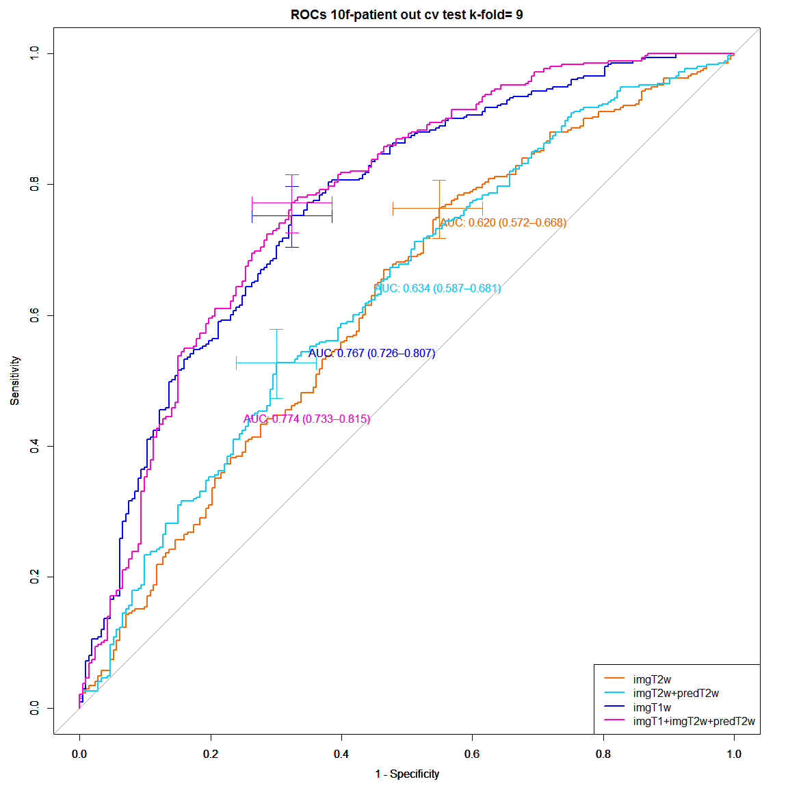 

```
## Area under the curve: 0.7741
## 95% CI (2000 stratified bootstrap replicates):
##  thresholds sp.low sp.median sp.high se.low se.median se.high
##   0.4618078  0.615    0.6761  0.7372 0.7265    0.7721  0.8148
##    massB    massM nonmassB nonmassM 
##      220      149      131       64 
##    massB    massM nonmassB nonmassM 
##       22       17       11       13 
##    massB    massM nonmassB nonmassM 
##      220      149      131       64 
##    massB    massM nonmassB nonmassM 
##       22       17       11       13 
##    massB    massM nonmassB nonmassM 
##      220      149      131       64 
##    massB    massM nonmassB nonmassM 
##       22       17       11       13 
## 0.0361991 0.05 
## Selected features for group: MeanDecreaseGini imgT2 
## =========NULL
##  [1] "T2texture_correlation_nondir"       "T2texture_entropy_nondir"           "T2RGH_var"                         
##  [4] "T2RGH_mean"                         "T2skew_F_r_i"                       "T2var_F_r_i"                       
##  [7] "ave_T20"                            "ave_T28"                            "T2texture_sumaverage_nondir"       
## [10] "T2grad_margin_var"                  "ave_T215"                           "ave_T218"                          
## [13] "T2texture_contrast_nondir"          "ave_T27"                            "ave_T25"                           
## [16] "ave_T24"                            "ave_T26"                            "ave_T213"                          
## [19] "ave_T214"                           "T2texture_variance_nondir"          "T2grad_margin"                     
## [22] "T2kurt_F_r_i"                       "ave_T211"                           "ave_T210"                          
## [25] "ave_T212"                           "T2_lesionSI"                        "ave_T219"                          
## [28] "T2min_F_r_i"                        "T2texture_sumentropy_nondir"        "T2texture_inversediffmoment_nondir"
## [31] "ave_T29"                            "T2texture_sumvariance_nondir"       "ave_T217"                          
## [34] "ave_T216"                           "T2_lesionSIstd"                    
## 0.0430622 0.05 
## Selected features for group: MeanDecreaseGini allT2 
## =========NULL
##  [1] "T2texture_correlation_nondir" "T2texture_energy_nondir"      "T2kurt_F_r_i"                 "T2var_F_r_i"                 
##  [5] "ave_T27"                      "T2texture_sumaverage_nondir"  "ave_T210"                     "T2skew_F_r_i"                
##  [9] "T2wSI_predicted"              "ave_T211"                     "T2texture_contrast_nondir"    "T2RGH_mean"                  
## [13] "ave_T212"                     "ave_T20"                      "ave_T217"                     "ave_T21"                     
## [17] "ave_T24"                      "T2grad_margin_var"            "ave_T216"                     "T2max_F_r_i"                 
## [21] "T2texture_sumvariance_nondir" "ave_T214"                     "T2grad_margin"                "ave_T26"                     
## [25] "ave_T29"                      "T2min_F_r_i"                  "ave_T218"                     "ave_T219"                    
## [29] "ave_T23"                      "ave_T25"                      "ave_T28"                      "LMSIR_predicted"             
## [33] "ave_T213"                     "ave_T215"                     "T2_lesionSI"                 
## -0.06493506 0.05 
## Selected features for group: MeanDecreaseGini imgT1 
## =========NULL
##  [1] "irregularity"                           "SER_inside"                             "texture_contrast_nondir_post1"         
##  [4] "texture_inversediffmoment_nondir_post2" "SER_countor"                            "dce2SE8"                               
##  [7] "texture_correlation_nondir_post4"       "max_RGH_mean"                           "texture_inversediffmoment_nondir_post1"
## [10] "texture_contrast_nondir_post3"          "Tpeak_inside"                           "iAUC1_countor"                         
## [13] "edge_sharp_std"                         "dce3SE4"                                "dce3SE17"                              
## [16] "V7"                                     "lateSE19"                               "beta_countor"                          
## [19] "V9"                                     "dce2SE5"                                "texture_sumentropy_nondir_post2"       
## [22] "V6"                                     "V10"                                    "dce3SE15"                              
## [25] "Tpeak_countor"                          "A_inside"                              
## 0.02597403 0.05 
## Selected features for group: MeanDecreaseGini all 
## =========NULL
##  [1] "texture_sumvariance_nondir_post2"       "circularity"                            "texture_contrast_nondir_post1"         
##  [4] "texture_inversediffmoment_nondir_post2" "texture_sumaverage_nondir_post1"        "V8"                                    
##  [7] "V6"                                     "earlySE10"                              "max_RGH_mean"                          
## [10] "iiiMax_Margin_Gradient"                 "min_F_r_i"                              "earlySE0"                              
## [13] "Tpeak_countor"                          "maxVr_inside"                           "T2RGH_var"                             
## [16] "T2texture_correlation_nondir"           "edge_sharp_mean"                        "dce2SE1"                               
## [19] "dce2SE8"                                "T2var_F_r_i"                            "beta_countor"                          
## [22] "lateSE18"                               "texture_variance_nondir_post4"          "T2texture_sumaverage_nondir"           
## [25] "dce2SE5"                                "T2_lesionSI"                            "texture_entropy_nondir_post1"          
## [28] "ave_T211"                               "texture_diffentropy_nondir_post4"       "lateSE15"                              
## [31] "Vr_decreasingRate_countor"              "texture_sumaverage_nondir_post2"        "skew_F_r_i"                            
## [34] "peakVr_countor"                         "Kpeak_inside"                           "lateSE19"                              
## [37] "dce3SE6"                                "A_inside"                              
##     lesion_id cad_pt_no_txt exam_a_number_txt BIRADS lesion_label              lesion_diagnosis      find_t2_signal_int
## 2           2          0016           6920252      4        massB       FLORID DUCT HYPERPLASIA   Slightly hyperintense
## 19         19          0129           5326737      4        massB          BENIGN BREAST TISSUE            Hyperintense
## 25         25          0133           7072006      4        massB                   FIBROCYSTIC Hypointense or not seen
## 29         29          0168           5240535      4        massB                   FIBROCYSTIC                    None
## 37         37          0186           6869828      4     nonmassM                  InsituDuctal                    None
## 53         53          0212           4734525      4        massB                  FIBROADENOMA            Hyperintense
## 56         56          0229           6831376      5     nonmassB                   FIBROCYSTIC                    None
## 59         59          0246           7485590      4        massB          BENIGN BREAST TISSUE            Hyperintense
## 140       140          0684           5266209      4     nonmassM                  InsituDuctal                    None
## 141       141          0685           5456684      4        massB                   FIBROCYSTIC                    None
## 151       151          0692           5199366      4        massB                  FIBROADENOMA Hypointense or not seen
## 160       160          0713           5150291      5        massM                InvasiveDuctal                    None
## 161       161          0713           5150291      5     nonmassM                InvasiveDuctal                    None
## 197       197          0757           4779344      4     nonmassB   ATYPICAL DUCTAL HYPERPLASIA            Hyperintense
## 201       201          0765           5094113      4     nonmassB   ATYPICAL DUCTAL HYPERPLASIA                    None
## 220       220          0791           5365218      5        massM               InvasiveLobular                    None
## 221       221          0791           5365218      5     nonmassM               InvasiveLobular                    None
## 231       231          0805           5059167      4     nonmassB                   FIBROCYSTIC                    None
## 238       238          0814           4704240      5        massM                InvasiveDuctal                    None
## 239       239          0814           6667547      4     nonmassB   ATYPICAL DUCTAL HYPERPLASIA                    None
## 259       259          0846           4800867      5        massM          MetaplasticCarcinoma Hypointense or not seen
## 264       264          0851           4593282      4        massB                 InsituLobular            Hyperintense
## 265       265          0851           4593282      4        massM                InvasiveDuctal            Hyperintense
## 310       310          0920           7095635      4        massB                  FIBROADENOMA Hypointense or not seen
## 312       312          0924           7532614      4        massB                      ADENOSIS            Hyperintense
## 313       313          0924           7532614      4        massB                      ADENOSIS Hypointense or not seen
## 314       314          0934           5314924      4     nonmassB                  FIBROADENOMA                    None
## 330       330          0978           4851428      4     nonmassB                   FIBROCYSTIC                    None
## 336       336          0999           6925971      3        massB                  FIBROADENOMA   Slightly hyperintense
## 337       337          1003           6682777      4     nonmassM                InvasiveDuctal   Slightly hyperintense
## 344       344          1018           4773924      4     nonmassB          BENIGN BREAST TISSUE Hypointense or not seen
## 392       392          2049           5458850      5     nonmassM                InvasiveDuctal Hypointense or not seen
## 393       393          2049           5458850      5        massM                InvasiveDuctal Hypointense or not seen
## 405       405          2073           4745825      5        massM InvasiveDuctal micropapillary                    None
## 406       406          2073           4745825      5     nonmassM               InvasiveLobular                    None
## 410       410          2079           4591198      3        massB        benign lymphoid tissue                    None
## 440       440          3053           7041483      6        massB         COLUMNAR CELL CHANGES Hypointense or not seen
## 441       441          3053           7449310      5     nonmassM                InvasiveDuctal                    None
## 450       450          3063           7053508      6     nonmassM       LYMPHOVASCULAR INVASION                    None
## 464       464          3080           7033654      6     nonmassM                  InsituDuctal Hypointense or not seen
## 467       467          3082           5355166      6        massB                  FIBROADENOMA                    None
## 468       468          3082           5355166      6        massB                   FIBROCYSTIC                    None
## 469       469          3082           7080675      4     nonmassB                   FIBROCYSTIC                    None
## 512       512          6008           4644038      6        massM                InvasiveDuctal Hypointense or not seen
## 520       520          6020         ACC109177      6        massM                InvasiveDuctal Hypointense or not seen
## 522       522          6022           5046558      4     nonmassB                  FIBROADENOMA                    None
## 523       523          6022           5046558      6        massM                InvasiveDuctal                    None
## 526       526          6024           5008021      5        massM                InvasiveDuctal                    None
## 527       527          6024           5008021      5     nonmassM                InvasiveDuctal                    None
## 528       528          6025           5111910      6        massM                InvasiveDuctal            Hyperintense
## 529       529          6025           5111910      6        massM                InvasiveDuctal   Slightly hyperintense
## 530       530          6025           5111910      6     nonmassM                InvasiveDuctal                    None
## 568       568          6050           5225817      4     nonmassB                      FIBROSIS Hypointense or not seen
## 594       594          7011           6918051      4        massB          BENIGN BREAST TISSUE Hypointense or not seen
## 595       595          7018           6803089      4        massM                  InsituDuctal                    None
## 596       596          7018           7138226      2        massM                  InsituDuctal                    None
## 599       599          7030           7538617      4        massB          BENIGN BREAST TISSUE   Slightly hyperintense
## 600       600          7030           7538617      4        massB          BENIGN BREAST TISSUE Hypointense or not seen
## 608       608          7077           5077480      5        massM                  InsituDuctal                    None
## 609       609          7077           5077480      5        massM                  InsituDuctal                    None
## 610       610          7077           5077480      5     nonmassM                  InsituDuctal                    None
## 629       629          7189           7068978      4        massB                  FIBROADENOMA            Hyperintense
## 630       630          7189           7068978      4        massB          BENIGN BREAST TISSUE            Hyperintense
## 
## ============ bestune_imgT2 	 max.depth  1 	 #Trees  350 
## ntrees:  50 minsplit:  3 cp:  -1 
##   ntrees minsplit cp acuTrain rocTrain   acuTest  rocTest
## 1     50        3 -1        1        1 0.5079365 0.589899
## ntrees:  100 minsplit:  3 cp:  -1 
##   ntrees minsplit cp acuTrain rocTrain   acuTest   rocTest
## 2    100        3 -1        1        1 0.6349206 0.6070707
## ntrees:  250 minsplit:  3 cp:  -1 
##   ntrees minsplit cp acuTrain rocTrain   acuTest   rocTest
## 3    250        3 -1        1        1 0.6031746 0.6050505
## ntrees:  350 minsplit:  3 cp:  -1 
##   ntrees minsplit cp acuTrain rocTrain   acuTest   rocTest
## 4    350        3 -1        1        1 0.5873016 0.5686869
## ntrees:  500 minsplit:  3 cp:  -1 
##   ntrees minsplit cp acuTrain rocTrain   acuTest   rocTest
## 5    500        3 -1        1        1 0.5555556 0.5757576
## ntrees:  50 minsplit:  1 cp:  -1 
##   ntrees minsplit cp acuTrain rocTrain   acuTest   rocTest
## 6     50        1 -1        1        1 0.5396825 0.5050505
## ntrees:  100 minsplit:  1 cp:  -1 
##   ntrees minsplit cp acuTrain rocTrain   acuTest   rocTest
## 7    100        1 -1        1        1 0.6031746 0.6242424
## ntrees:  250 minsplit:  1 cp:  -1 
##   ntrees minsplit cp acuTrain rocTrain   acuTest   rocTest
## 8    250        1 -1        1        1 0.5873016 0.5838384
## ntrees:  350 minsplit:  1 cp:  -1 
##   ntrees minsplit cp acuTrain rocTrain   acuTest   rocTest
## 9    350        1 -1        1        1 0.5873016 0.5515152
## ntrees:  500 minsplit:  1 cp:  -1 
##    ntrees minsplit cp acuTrain rocTrain   acuTest   rocTest
## 10    500        1 -1        1        1 0.5873016 0.5808081
## ntrees:  50 minsplit:  0 cp:  -1 
##    ntrees minsplit cp acuTrain rocTrain   acuTest   rocTest
## 11     50        0 -1        1        1 0.5555556 0.6050505
## ntrees:  100 minsplit:  0 cp:  -1 
##    ntrees minsplit cp acuTrain rocTrain   acuTest  rocTest
## 12    100        0 -1        1        1 0.5396825 0.459596
## ntrees:  250 minsplit:  0 cp:  -1 
##    ntrees minsplit cp acuTrain rocTrain   acuTest   rocTest
## 13    250        0 -1        1        1 0.5396825 0.5545455
## ntrees:  350 minsplit:  0 cp:  -1 
##    ntrees minsplit cp acuTrain rocTrain   acuTest   rocTest
## 14    350        0 -1        1        1 0.5714286 0.5949495
## ntrees:  500 minsplit:  0 cp:  -1 
##    ntrees minsplit cp acuTrain rocTrain   acuTest   rocTest
## 15    500        0 -1        1        1 0.5396825 0.5686869
##    ntrees minsplit cp acuTrain rocTrain   acuTest   rocTest
## 1      50        3 -1        1        1 0.5079365 0.5898990
## 2     100        3 -1        1        1 0.6349206 0.6070707
## 3     250        3 -1        1        1 0.6031746 0.6050505
## 4     350        3 -1        1        1 0.5873016 0.5686869
## 5     500        3 -1        1        1 0.5555556 0.5757576
## 6      50        1 -1        1        1 0.5396825 0.5050505
## 7     100        1 -1        1        1 0.6031746 0.6242424
## 8     250        1 -1        1        1 0.5873016 0.5838384
## 9     350        1 -1        1        1 0.5873016 0.5515152
## 10    500        1 -1        1        1 0.5873016 0.5808081
## 11     50        0 -1        1        1 0.5555556 0.6050505
## 12    100        0 -1        1        1 0.5396825 0.4595960
## 13    250        0 -1        1        1 0.5396825 0.5545455
## 14    350        0 -1        1        1 0.5714286 0.5949495
## 15    500        0 -1        1        1 0.5396825 0.5686869
##   ntrees minsplit cp acuTrain rocTrain   acuTest   rocTest
## 7    100        1 -1        1        1 0.6031746 0.6242424
## 
## ============ bestune_allT2 	 max.depth  1 	 #Trees  250 
## ntrees:  50 minsplit:  3 cp:  -1 
##   ntrees minsplit cp acuTrain rocTrain   acuTest  rocTest
## 1     50        3 -1        1        1 0.5079365 0.510101
## ntrees:  100 minsplit:  3 cp:  -1 
##   ntrees minsplit cp acuTrain rocTrain   acuTest   rocTest
## 2    100        3 -1        1        1 0.4920635 0.4929293
## ntrees:  250 minsplit:  3 cp:  -1 
##   ntrees minsplit cp acuTrain rocTrain   acuTest   rocTest
## 3    250        3 -1        1        1 0.5555556 0.5343434
## ntrees:  350 minsplit:  3 cp:  -1 
##   ntrees minsplit cp acuTrain rocTrain   acuTest   rocTest
## 4    350        3 -1        1        1 0.5714286 0.5626263
## ntrees:  500 minsplit:  3 cp:  -1 
##   ntrees minsplit cp acuTrain rocTrain   acuTest   rocTest
## 5    500        3 -1        1        1 0.5079365 0.5222222
## ntrees:  50 minsplit:  1 cp:  -1 
##   ntrees minsplit cp acuTrain rocTrain   acuTest   rocTest
## 6     50        1 -1        1        1 0.5238095 0.5353535
## ntrees:  100 minsplit:  1 cp:  -1 
##   ntrees minsplit cp acuTrain rocTrain   acuTest rocTest
## 7    100        1 -1        1        1 0.5238095     0.5
## ntrees:  250 minsplit:  1 cp:  -1 
##   ntrees minsplit cp acuTrain rocTrain   acuTest   rocTest
## 8    250        1 -1        1        1 0.5079365 0.5464646
## ntrees:  350 minsplit:  1 cp:  -1 
##   ntrees minsplit cp acuTrain rocTrain   acuTest   rocTest
## 9    350        1 -1        1        1 0.5396825 0.5666667
## ntrees:  500 minsplit:  1 cp:  -1 
##    ntrees minsplit cp acuTrain rocTrain   acuTest   rocTest
## 10    500        1 -1        1        1 0.5238095 0.5656566
## ntrees:  50 minsplit:  0 cp:  -1 
##    ntrees minsplit cp acuTrain rocTrain   acuTest   rocTest
## 11     50        0 -1        1        1 0.5873016 0.6030303
## ntrees:  100 minsplit:  0 cp:  -1 
##    ntrees minsplit cp acuTrain rocTrain   acuTest   rocTest
## 12    100        0 -1        1        1 0.6031746 0.4282828
## ntrees:  250 minsplit:  0 cp:  -1 
##    ntrees minsplit cp acuTrain rocTrain   acuTest   rocTest
## 13    250        0 -1        1        1 0.5079365 0.5575758
## ntrees:  350 minsplit:  0 cp:  -1 
##    ntrees minsplit cp acuTrain rocTrain   acuTest   rocTest
## 14    350        0 -1        1        1 0.5079365 0.5242424
## ntrees:  500 minsplit:  0 cp:  -1 
##    ntrees minsplit cp acuTrain rocTrain   acuTest   rocTest
## 15    500        0 -1        1        1 0.5555556 0.5575758
##    ntrees minsplit cp acuTrain rocTrain   acuTest   rocTest
## 1      50        3 -1        1        1 0.5079365 0.5101010
## 2     100        3 -1        1        1 0.4920635 0.4929293
## 3     250        3 -1        1        1 0.5555556 0.5343434
## 4     350        3 -1        1        1 0.5714286 0.5626263
## 5     500        3 -1        1        1 0.5079365 0.5222222
## 6      50        1 -1        1        1 0.5238095 0.5353535
## 7     100        1 -1        1        1 0.5238095 0.5000000
## 8     250        1 -1        1        1 0.5079365 0.5464646
## 9     350        1 -1        1        1 0.5396825 0.5666667
## 10    500        1 -1        1        1 0.5238095 0.5656566
## 11     50        0 -1        1        1 0.5873016 0.6030303
## 12    100        0 -1        1        1 0.6031746 0.4282828
## 13    250        0 -1        1        1 0.5079365 0.5575758
## 14    350        0 -1        1        1 0.5079365 0.5242424
## 15    500        0 -1        1        1 0.5555556 0.5575758
##    ntrees minsplit cp acuTrain rocTrain   acuTest   rocTest
## 11     50        0 -1        1        1 0.5873016 0.6030303
## 
## ============ bestune_imgT1 	 max.depth  1 	 #Trees  250 
## ntrees:  50 minsplit:  3 cp:  -1 
##   ntrees minsplit cp acuTrain rocTrain   acuTest   rocTest
## 1     50        3 -1        1        1 0.7777778 0.8616162
## ntrees:  100 minsplit:  3 cp:  -1 
##   ntrees minsplit cp acuTrain rocTrain   acuTest   rocTest
## 2    100        3 -1        1        1 0.7777778 0.8606061
## ntrees:  250 minsplit:  3 cp:  -1 
##   ntrees minsplit cp acuTrain rocTrain   acuTest   rocTest
## 3    250        3 -1        1        1 0.7619048 0.8656566
## ntrees:  350 minsplit:  3 cp:  -1 
##   ntrees minsplit cp acuTrain rocTrain   acuTest   rocTest
## 4    350        3 -1        1        1 0.8095238 0.8767677
## ntrees:  500 minsplit:  3 cp:  -1 
##   ntrees minsplit cp acuTrain rocTrain   acuTest   rocTest
## 5    500        3 -1        1        1 0.7777778 0.8808081
## ntrees:  50 minsplit:  1 cp:  -1 
##   ntrees minsplit cp acuTrain rocTrain   acuTest   rocTest
## 6     50        1 -1        1        1 0.7301587 0.8313131
## ntrees:  100 minsplit:  1 cp:  -1 
##   ntrees minsplit cp acuTrain rocTrain   acuTest   rocTest
## 7    100        1 -1        1        1 0.7777778 0.8393939
## ntrees:  250 minsplit:  1 cp:  -1 
##   ntrees minsplit cp acuTrain rocTrain   acuTest   rocTest
## 8    250        1 -1        1        1 0.7936508 0.8838384
## ntrees:  350 minsplit:  1 cp:  -1 
##   ntrees minsplit cp acuTrain rocTrain   acuTest   rocTest
## 9    350        1 -1        1        1 0.7936508 0.8939394
## ntrees:  500 minsplit:  1 cp:  -1 
##    ntrees minsplit cp acuTrain rocTrain   acuTest   rocTest
## 10    500        1 -1        1        1 0.8412698 0.8818182
## ntrees:  50 minsplit:  0 cp:  -1 
##    ntrees minsplit cp acuTrain rocTrain   acuTest   rocTest
## 11     50        0 -1        1        1 0.7777778 0.8848485
## ntrees:  100 minsplit:  0 cp:  -1 
##    ntrees minsplit cp acuTrain rocTrain   acuTest   rocTest
## 12    100        0 -1        1        1 0.7936508 0.8737374
## ntrees:  250 minsplit:  0 cp:  -1 
##    ntrees minsplit cp acuTrain rocTrain   acuTest   rocTest
## 13    250        0 -1        1        1 0.7777778 0.8575758
## ntrees:  350 minsplit:  0 cp:  -1 
##    ntrees minsplit cp acuTrain rocTrain   acuTest   rocTest
## 14    350        0 -1        1        1 0.8095238 0.8868687
## ntrees:  500 minsplit:  0 cp:  -1 
##    ntrees minsplit cp acuTrain rocTrain   acuTest   rocTest
## 15    500        0 -1        1        1 0.7777778 0.8868687
##    ntrees minsplit cp acuTrain rocTrain   acuTest   rocTest
## 1      50        3 -1        1        1 0.7777778 0.8616162
## 2     100        3 -1        1        1 0.7777778 0.8606061
## 3     250        3 -1        1        1 0.7619048 0.8656566
## 4     350        3 -1        1        1 0.8095238 0.8767677
## 5     500        3 -1        1        1 0.7777778 0.8808081
## 6      50        1 -1        1        1 0.7301587 0.8313131
## 7     100        1 -1        1        1 0.7777778 0.8393939
## 8     250        1 -1        1        1 0.7936508 0.8838384
## 9     350        1 -1        1        1 0.7936508 0.8939394
## 10    500        1 -1        1        1 0.8412698 0.8818182
## 11     50        0 -1        1        1 0.7777778 0.8848485
## 12    100        0 -1        1        1 0.7936508 0.8737374
## 13    250        0 -1        1        1 0.7777778 0.8575758
## 14    350        0 -1        1        1 0.8095238 0.8868687
## 15    500        0 -1        1        1 0.7777778 0.8868687
##   ntrees minsplit cp acuTrain rocTrain   acuTest   rocTest
## 9    350        1 -1        1        1 0.7936508 0.8939394
## 
## ============ bestune_all 	 max.depth  1 	 #Trees  200 
## ntrees:  50 minsplit:  3 cp:  -1 
##   ntrees minsplit cp acuTrain rocTrain   acuTest   rocTest
## 1     50        3 -1        1        1 0.7301587 0.8787879
## ntrees:  100 minsplit:  3 cp:  -1 
##   ntrees minsplit cp acuTrain rocTrain   acuTest   rocTest
## 2    100        3 -1        1        1 0.7460317 0.8959596
## ntrees:  250 minsplit:  3 cp:  -1 
##   ntrees minsplit cp acuTrain rocTrain   acuTest   rocTest
## 3    250        3 -1        1        1 0.7460317 0.8949495
## ntrees:  350 minsplit:  3 cp:  -1 
##   ntrees minsplit cp acuTrain rocTrain   acuTest   rocTest
## 4    350        3 -1        1        1 0.7936508 0.8959596
## ntrees:  500 minsplit:  3 cp:  -1 
##   ntrees minsplit cp acuTrain rocTrain   acuTest   rocTest
## 5    500        3 -1        1        1 0.8095238 0.9080808
## ntrees:  50 minsplit:  1 cp:  -1 
##   ntrees minsplit cp acuTrain rocTrain   acuTest   rocTest
## 6     50        1 -1        1        1 0.7460317 0.7838384
## ntrees:  100 minsplit:  1 cp:  -1 
##   ntrees minsplit cp acuTrain rocTrain   acuTest   rocTest
## 7    100        1 -1        1        1 0.7619048 0.8717172
## ntrees:  250 minsplit:  1 cp:  -1 
##   ntrees minsplit cp acuTrain rocTrain   acuTest   rocTest
## 8    250        1 -1        1        1 0.7619048 0.8949495
## ntrees:  350 minsplit:  1 cp:  -1 
##   ntrees minsplit cp acuTrain rocTrain   acuTest   rocTest
## 9    350        1 -1        1        1 0.7619048 0.8919192
## ntrees:  500 minsplit:  1 cp:  -1 
##    ntrees minsplit cp acuTrain rocTrain   acuTest   rocTest
## 10    500        1 -1        1        1 0.7619048 0.9060606
## ntrees:  50 minsplit:  0 cp:  -1 
##    ntrees minsplit cp acuTrain rocTrain   acuTest   rocTest
## 11     50        0 -1        1        1 0.7936508 0.8792929
## ntrees:  100 minsplit:  0 cp:  -1 
##    ntrees minsplit cp acuTrain rocTrain   acuTest   rocTest
## 12    100        0 -1        1        1 0.7301587 0.8929293
## ntrees:  250 minsplit:  0 cp:  -1 
##    ntrees minsplit cp acuTrain rocTrain   acuTest   rocTest
## 13    250        0 -1        1        1 0.8095238 0.9121212
## ntrees:  350 minsplit:  0 cp:  -1 
##    ntrees minsplit cp acuTrain rocTrain   acuTest  rocTest
## 14    350        0 -1        1        1 0.7619048 0.869697
## ntrees:  500 minsplit:  0 cp:  -1 
##    ntrees minsplit cp acuTrain rocTrain   acuTest   rocTest
## 15    500        0 -1        1        1 0.8095238 0.8979798
##    ntrees minsplit cp acuTrain rocTrain   acuTest   rocTest
## 1      50        3 -1        1        1 0.7301587 0.8787879
## 2     100        3 -1        1        1 0.7460317 0.8959596
## 3     250        3 -1        1        1 0.7460317 0.8949495
## 4     350        3 -1        1        1 0.7936508 0.8959596
## 5     500        3 -1        1        1 0.8095238 0.9080808
## 6      50        1 -1        1        1 0.7460317 0.7838384
## 7     100        1 -1        1        1 0.7619048 0.8717172
## 8     250        1 -1        1        1 0.7619048 0.8949495
## 9     350        1 -1        1        1 0.7619048 0.8919192
## 10    500        1 -1        1        1 0.7619048 0.9060606
## 11     50        0 -1        1        1 0.7936508 0.8792929
## 12    100        0 -1        1        1 0.7301587 0.8929293
## 13    250        0 -1        1        1 0.8095238 0.9121212
## 14    350        0 -1        1        1 0.7619048 0.8696970
## 15    500        0 -1        1        1 0.8095238 0.8979798
##    ntrees minsplit cp acuTrain rocTrain   acuTest   rocTest
## 13    250        0 -1        1        1 0.8095238 0.9121212
## 
## Call:
## roc.default(response = perf_imgT2$obs, predictor = perf_imgT2$C)
## 
## Data: perf_imgT2$C in 243 controls (perf_imgT2$obs C) > 384 cases (perf_imgT2$obs NC).
## Area under the curve: 0.6187
## 
## Call:
## roc.default(response = perf_allT2$obs, predictor = perf_allT2$C)
## 
## Data: perf_allT2$C in 243 controls (perf_allT2$obs C) > 384 cases (perf_allT2$obs NC).
## Area under the curve: 0.6276
## 
## Call:
## roc.default(response = perf_imgT1$obs, predictor = perf_imgT1$C)
## 
## Data: perf_imgT1$C in 243 controls (perf_imgT1$obs C) > 384 cases (perf_imgT1$obs NC).
## Area under the curve: 0.7821
## 
## Call:
## roc.default(response = perf_all$obs, predictor = perf_all$C)
## 
## Data: perf_all$C in 243 controls (perf_all$obs C) > 384 cases (perf_all$obs NC).
## Area under the curve: 0.7879
```

```
## Area under the curve: 0.6187
## 95% CI (2000 stratified bootstrap replicates):
##  thresholds sp.low sp.median sp.high se.low se.median se.high
##   0.4928397 0.3868    0.4527  0.5185 0.7214     0.763  0.8047
```

```
## Area under the curve: 0.6276
## 95% CI (2000 stratified bootstrap replicates):
##  thresholds sp.low sp.median sp.high se.low se.median se.high
##   0.4378751  0.642    0.6996  0.7572 0.4766     0.526  0.5781
```

```
## Area under the curve: 0.7821
## 95% CI (2000 stratified bootstrap replicates):
##  thresholds sp.low sp.median sp.high se.low se.median se.high
##   0.4595427 0.6337    0.6914   0.749 0.7188    0.7604  0.8047
```

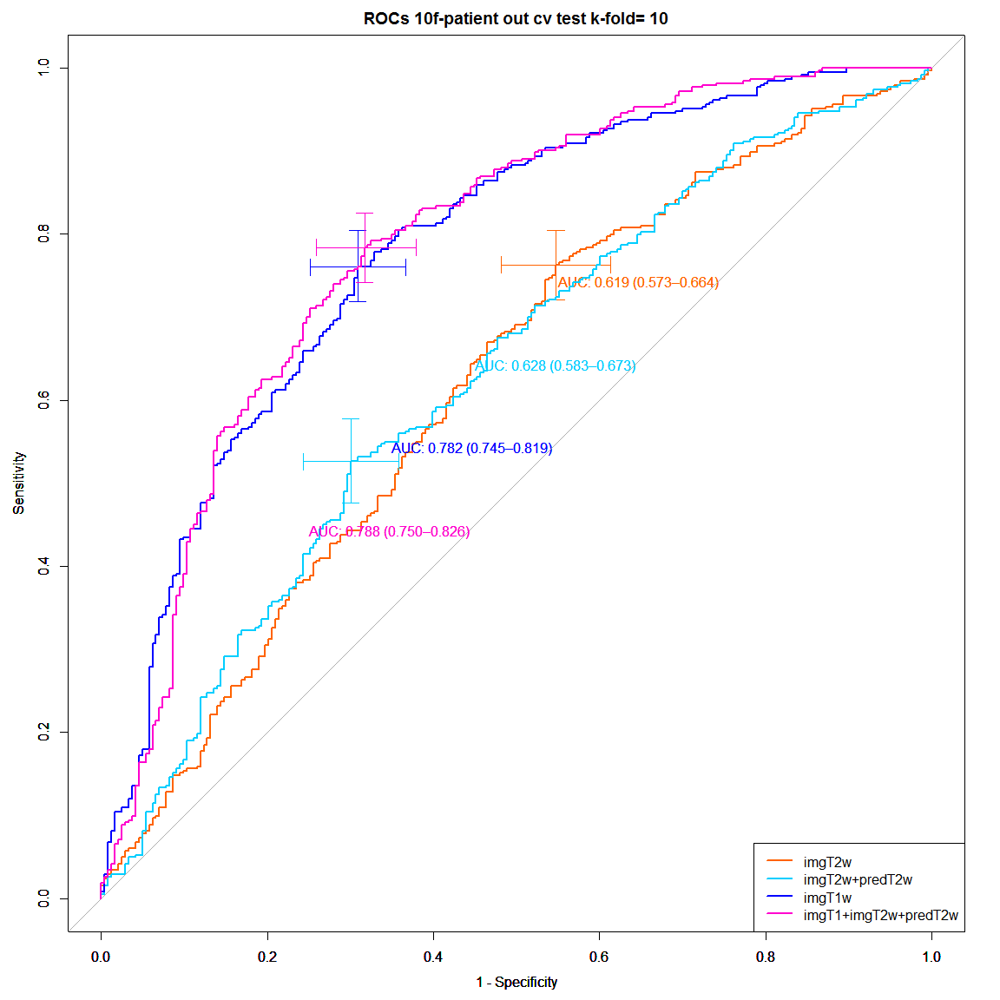 

```
## Area under the curve: 0.7879
## 95% CI (2000 stratified bootstrap replicates):
##  thresholds sp.low sp.median sp.high se.low se.median se.high
##   0.4618078 0.6214    0.6831  0.7407 0.7422    0.7839  0.8255
```

plot results
=================================


```r
# plot features
## group with all of the features spaces combined, most contributing T2w feature
## imgT2featsel ###########
# pick frequency of 75% or higher as very common feature
dfimgT2 = data.frame(table(imgT2featsel$selfeat))
dfimgT2$high = (dfimgT2$Freq>=0.75*max(imgT2featsel$lop))*1
print(dfimgT2[dfimgT2$high==1, ])
```

```
##                                  Var1 Freq high
## 1                             ave_T20   10    1
## 2                             ave_T21    7    1
## 3                            ave_T210   10    1
## 4                            ave_T211    9    1
## 5                            ave_T212    8    1
## 6                            ave_T213    8    1
## 7                            ave_T214    7    1
## 8                            ave_T215   10    1
## 9                            ave_T216    9    1
## 10                           ave_T217    8    1
## 11                           ave_T218    5    1
## 12                           ave_T219    8    1
## 13                            ave_T22    8    1
## 14                            ave_T23    6    1
## 15                            ave_T24   10    1
## 16                            ave_T25    9    1
## 17                            ave_T26    8    1
## 18                            ave_T27    8    1
## 19                            ave_T28    9    1
## 20                            ave_T29    9    1
## 21                        T2_lesionSI   10    1
## 22                     T2_lesionSIstd    8    1
## 23                      T2grad_margin    5    1
## 24                  T2grad_margin_var    8    1
## 25                       T2kurt_F_r_i   10    1
## 26                        T2max_F_r_i    7    1
## 27                       T2mean_F_r_i    3    1
## 28                        T2min_F_r_i    9    1
## 29                         T2RGH_mean    9    1
## 30                          T2RGH_var   10    1
## 31                       T2skew_F_r_i    8    1
## 32          T2texture_contrast_nondir    4    1
## 33       T2texture_correlation_nondir   10    1
## 34       T2texture_diffentropy_nondir    5    1
## 35      T2texture_diffvariance_nondir    4    1
## 36            T2texture_energy_nondir    8    1
## 37           T2texture_entropy_nondir    7    1
## 38 T2texture_inversediffmoment_nondir    9    1
## 39        T2texture_sumaverage_nondir    8    1
## 40        T2texture_sumentropy_nondir    7    1
## 41       T2texture_sumvariance_nondir    8    1
## 42          T2texture_variance_nondir    4    1
## 43                        T2var_F_r_i    7    1
```

```r
#qplot(factor(selfeat), data=imgT2featsel, geom="bar", fill=factor(high))
ggplot(dfimgT2, aes(x=Var1, y=Freq, fill=factor(high))) + 
  geom_bar(stat = "identity") + coord_flip() +
  ggtitle("imgT2featsel") +
  labs(y="featsel frequency", x=" ") +
  theme(plot.title = element_text(family = "Trebuchet MS", color="#666666", face="bold", size=22, hjust=0))+
  theme(axis.title = element_text(family = "Trebuchet MS", color="#666666", face="bold", size=16))
```

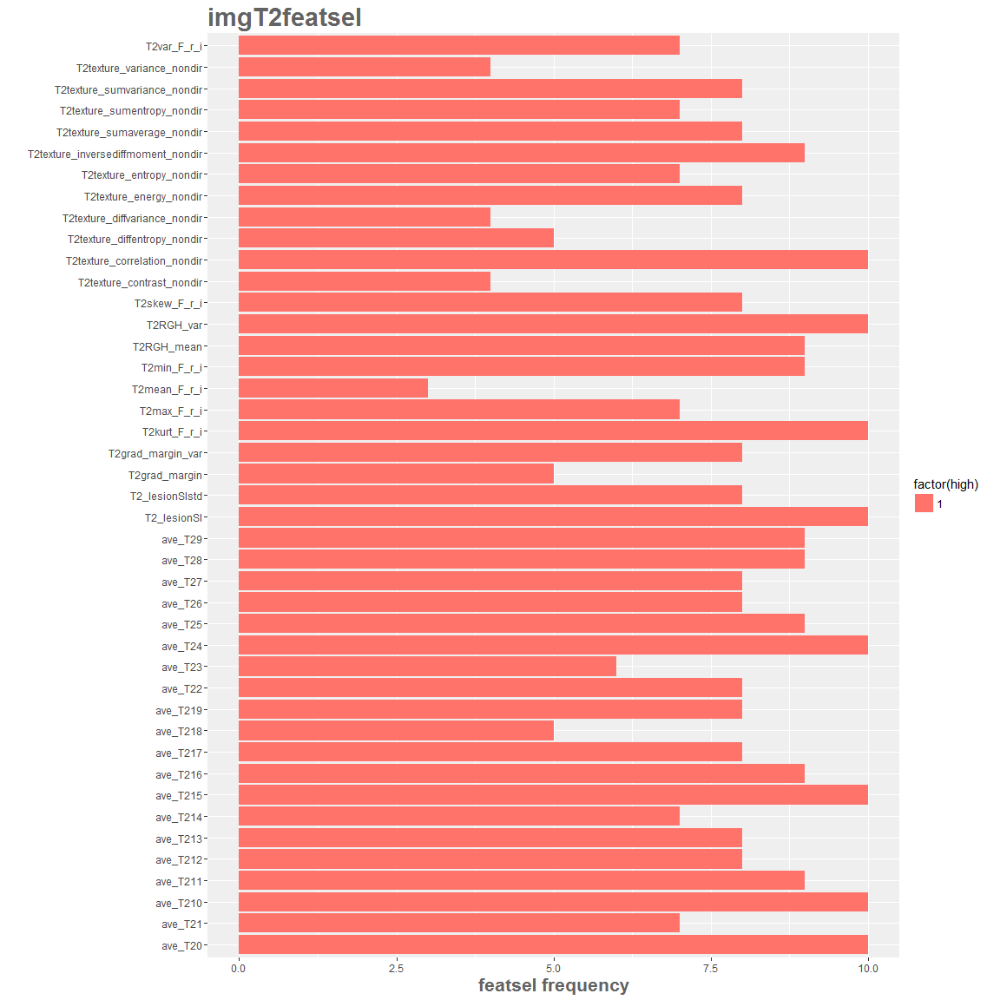 

```r
## allT2featsel ########### 
# pick frequency of 75% or higher as very common feature
dfallT2 = data.frame(table(allT2featsel$selfeat))
dfallT2$high = (dfallT2$Freq>=0.75*max(allT2featsel$lop))*1
print(dfallT2[dfallT2$high==1, ])
```

```
##                                  Var1 Freq high
## 1                             ave_T20    7    1
## 2                             ave_T21    9    1
## 3                            ave_T210   10    1
## 4                            ave_T211   10    1
## 5                            ave_T212    9    1
## 6                            ave_T213    9    1
## 7                            ave_T214   10    1
## 8                            ave_T215    8    1
## 9                            ave_T216    8    1
## 10                           ave_T217    8    1
## 11                           ave_T218    9    1
## 12                           ave_T219    8    1
## 13                            ave_T22    8    1
## 14                            ave_T23    7    1
## 15                            ave_T24   10    1
## 16                            ave_T25    9    1
## 17                            ave_T26   10    1
## 18                            ave_T27    9    1
## 19                            ave_T28    8    1
## 20                            ave_T29    9    1
## 21                    LMSIR_predicted   10    1
## 22                        T2_lesionSI   10    1
## 23                     T2_lesionSIstd    7    1
## 24                      T2grad_margin    6    1
## 25                  T2grad_margin_var   10    1
## 26                       T2kurt_F_r_i   10    1
## 27                        T2max_F_r_i    6    1
## 28                       T2mean_F_r_i    5    1
## 29                        T2min_F_r_i    9    1
## 30                         T2RGH_mean    9    1
## 31                          T2RGH_var    9    1
## 32                       T2skew_F_r_i    8    1
## 33          T2texture_contrast_nondir    7    1
## 34       T2texture_correlation_nondir   10    1
## 35       T2texture_diffentropy_nondir    3    1
## 36      T2texture_diffvariance_nondir    4    1
## 37            T2texture_energy_nondir    7    1
## 38           T2texture_entropy_nondir    7    1
## 39 T2texture_inversediffmoment_nondir    8    1
## 40        T2texture_sumaverage_nondir    9    1
## 41        T2texture_sumentropy_nondir    4    1
## 42       T2texture_sumvariance_nondir    7    1
## 43          T2texture_variance_nondir    2    1
## 44                        T2var_F_r_i    6    1
## 45                    T2wSI_predicted   10    1
```

```r
#qplot(factor(selfeat), data=allT2featsel, geom="bar", fill=factor(high))
ggplot(dfallT2, aes(x=Var1, y=Freq, fill=factor(high))) + 
  geom_bar(stat = "identity") + coord_flip() +
  ggtitle("allT2featsel") +
  labs(y="featsel frequency", x=" ") +
  theme(plot.title = element_text(family = "Trebuchet MS", color="#666666", face="bold", size=22, hjust=0))+
  theme(axis.title = element_text(family = "Trebuchet MS", color="#666666", face="bold", size=16))
```

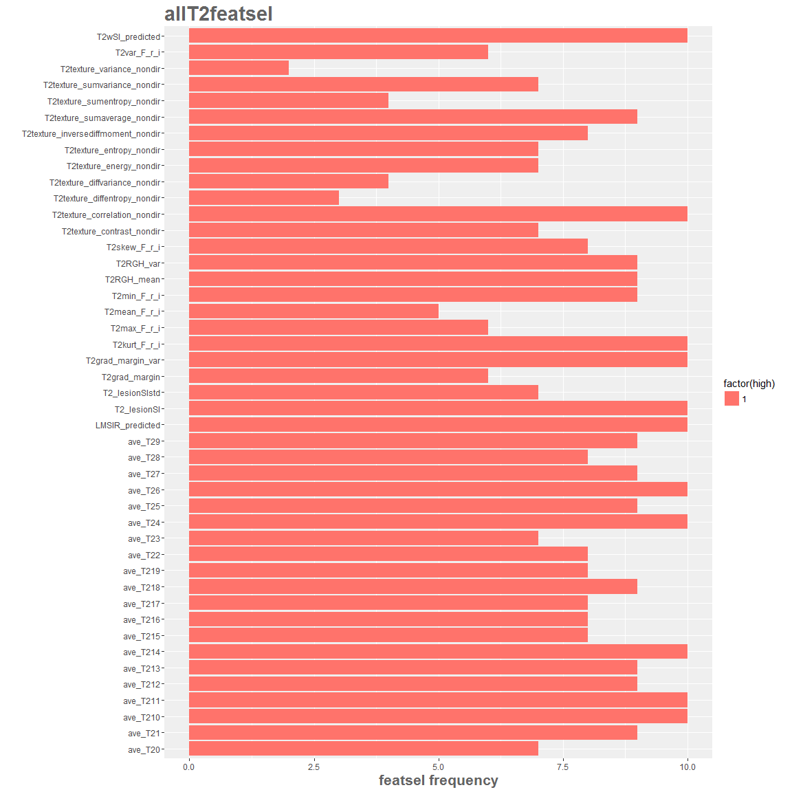 

```r
## imgT1featsel ########### 
# pick frequency of 75% or higher as very common feature
dfimgT1 = data.frame(table(imgT1featsel$selfeat))
dfimgT1$high = (dfimgT1$Freq>=0.75*max(imgT1featsel$lop))*1
print(dfimgT1[dfimgT1$high==1, ])
```

```
##                                       Var1 Freq high
## 1                                A_countor    2    1
## 2                                 A_inside   10    1
## 3                            alpha_countor    2    1
## 4                             alpha_inside    4    1
## 5                             beta_countor    1    1
## 6                              beta_inside    2    1
## 7                              circularity    4    1
## 8                                  dce2SE0    2    1
## 9                                  dce2SE1    1    1
## 10                                dce2SE11    4    1
## 11                                dce2SE12    1    1
## 12                                dce2SE13    2    1
## 13                                dce2SE14    1    1
## 14                                dce2SE15    2    1
## 15                                dce2SE16    3    1
## 16                                dce2SE17    1    1
## 17                                dce2SE18    2    1
## 18                                 dce2SE4    1    1
## 19                                 dce2SE5    1    1
## 20                                 dce2SE7    4    1
## 21                                 dce2SE8    2    1
## 22                                 dce2SE9    1    1
## 23                                 dce3SE0    1    1
## 24                                dce3SE10    3    1
## 25                                dce3SE11    2    1
## 26                                dce3SE13    2    1
## 27                                dce3SE15    2    1
## 28                                dce3SE16    1    1
## 29                                dce3SE17    3    1
## 30                                dce3SE18    1    1
## 31                                 dce3SE4    1    1
## 32                                 dce3SE5    2    1
## 33                                 dce3SE6    1    1
## 34                                 dce3SE7    1    1
## 35                                 dce3SE8    1    1
## 36                                earlySE0    1    1
## 37                                earlySE1    1    1
## 38                               earlySE10    2    1
## 39                               earlySE11    2    1
## 40                               earlySE12    3    1
## 41                               earlySE13    1    1
## 42                               earlySE15    1    1
## 43                               earlySE16    2    1
## 44                               earlySE17    1    1
## 45                               earlySE18    1    1
## 46                               earlySE19    2    1
## 47                                earlySE2    2    1
## 48                                earlySE3    1    1
## 49                                earlySE4    1    1
## 50                                earlySE5    1    1
## 51                                earlySE7    2    1
## 52                                earlySE8    1    1
## 53                                earlySE9    1    1
## 54                         edge_sharp_mean    1    1
## 55                          edge_sharp_std    6    1
## 56                           iAUC1_countor    2    1
## 57                  iiiMax_Margin_Gradient    1    1
## 58            iiMin_change_Variance_uptake    3    1
## 59                    iMax_Variance_uptake    2    1
## 60                            irregularity    3    1
## 61                              ivVariance    4    1
## 62                           Kpeak_countor    1    1
## 63                            Kpeak_inside    3    1
## 64                              kurt_F_r_i    5    1
## 65                                 lateSE0    2    1
## 66                                 lateSE1    3    1
## 67                                lateSE10    1    1
## 68                                lateSE11    2    1
## 69                                lateSE12    2    1
## 70                                lateSE13    1    1
## 71                                lateSE14    1    1
## 72                                lateSE16    2    1
## 73                                lateSE18    1    1
## 74                                lateSE19    3    1
## 75                                 lateSE2    2    1
## 76                                 lateSE3    1    1
## 77                                 lateSE4    2    1
## 78                                 lateSE5    2    1
## 79                                 lateSE6    1    1
## 80                                 lateSE7    2    1
## 81                                 lateSE8    1    1
## 82                                 lateSE9    2    1
## 83                               max_F_r_i    2    1
## 84                            max_RGH_mean    3    1
## 85                          max_RGH_mean_k    2    1
## 86                             max_RGH_var    1    1
## 87                           max_RGH_var_k    3    1
## 88                            maxCr_inside    2    1
## 89                           maxVr_countor    2    1
## 90                              mean_F_r_i    1    1
## 91                               min_F_r_i    3    1
## 92                          peakCr_countor    1    1
## 93                           peakCr_inside    1    1
## 94                           peakVr_inside    2    1
## 95                             SER_countor    3    1
## 96                              SER_inside    3    1
## 97                              skew_F_r_i    6    1
## 98                       Slope_ini_countor    2    1
## 99                        Slope_ini_inside    3    1
## 100          texture_contrast_nondir_post1    1    1
## 101          texture_contrast_nondir_post2    2    1
## 102          texture_contrast_nondir_post3    4    1
## 103       texture_correlation_nondir_post1    1    1
## 104       texture_correlation_nondir_post2    3    1
## 105       texture_correlation_nondir_post3    1    1
## 106       texture_correlation_nondir_post4    3    1
## 107       texture_diffentropy_nondir_post1    2    1
## 108       texture_diffentropy_nondir_post3    1    1
## 109       texture_diffentropy_nondir_post4    1    1
## 110      texture_diffvariance_nondir_post1    2    1
## 111      texture_diffvariance_nondir_post2    1    1
## 112      texture_diffvariance_nondir_post3    1    1
## 113      texture_diffvariance_nondir_post4    1    1
## 114            texture_energy_nondir_post2    1    1
## 115            texture_energy_nondir_post3    2    1
## 116            texture_energy_nondir_post4    3    1
## 117           texture_entropy_nondir_post1    1    1
## 118           texture_entropy_nondir_post4    1    1
## 119 texture_inversediffmoment_nondir_post1    1    1
## 120 texture_inversediffmoment_nondir_post2    3    1
## 121 texture_inversediffmoment_nondir_post3    3    1
## 122 texture_inversediffmoment_nondir_post4    5    1
## 123        texture_sumaverage_nondir_post1    1    1
## 124        texture_sumaverage_nondir_post2    2    1
## 125        texture_sumaverage_nondir_post3    3    1
## 126        texture_sumaverage_nondir_post4    2    1
## 127        texture_sumentropy_nondir_post2    1    1
## 128        texture_sumentropy_nondir_post4    1    1
## 129       texture_sumvariance_nondir_post1    5    1
## 130       texture_sumvariance_nondir_post2    1    1
## 131       texture_sumvariance_nondir_post3    1    1
## 132       texture_sumvariance_nondir_post4    4    1
## 133          texture_variance_nondir_post1    1    1
## 134          texture_variance_nondir_post2    1    1
## 135          texture_variance_nondir_post3    1    1
## 136          texture_variance_nondir_post4    1    1
## 137                          Tpeak_countor    5    1
## 138                           Tpeak_inside    1    1
## 139                     UptakeRate_countor    1    1
## 140                      UptakeRate_inside    2    1
## 141                                     V0    2    1
## 142                                     V1    1    1
## 143                                    V10    2    1
## 144                                    V11    1    1
## 145                                    V12    1    1
## 146                                    V13    2    1
## 147                                    V14    1    1
## 148                                    V15    1    1
## 149                                    V16    1    1
## 150                                    V18    3    1
## 151                                    V19    4    1
## 152                                     V2    7    1
## 153                                     V3    1    1
## 154                                     V4    3    1
## 155                                     V5    1    1
## 156                                     V6    3    1
## 157                                     V7    2    1
## 158                                     V8    3    1
## 159                                     V9    3    1
## 160                              var_F_r_i    4    1
## 161              Vr_decreasingRate_countor    2    1
## 162               Vr_decreasingRate_inside    3    1
## 163              Vr_increasingRate_countor    2    1
## 164               Vr_increasingRate_inside    2    1
## 165                      Vr_post_1_countor    2    1
## 166                       Vr_post_1_inside    2    1
## 167                     washoutRate_inside    1    1
```

```r
#qplot(factor(selfeat), data=imgT1featsel, geom="bar", fill=factor(high))
ggplot(dfimgT1, aes(x=Var1, y=Freq, fill=factor(high))) + 
  geom_bar(stat = "identity") + coord_flip() +
  ggtitle("imgT1featsel") +
  labs(y="featsel frequency", x=" ") +
  theme(plot.title = element_text(family = "Trebuchet MS", color="#666666", face="bold", size=22, hjust=0))+
  theme(axis.title = element_text(family = "Trebuchet MS", color="#666666", face="bold", size=16))
```

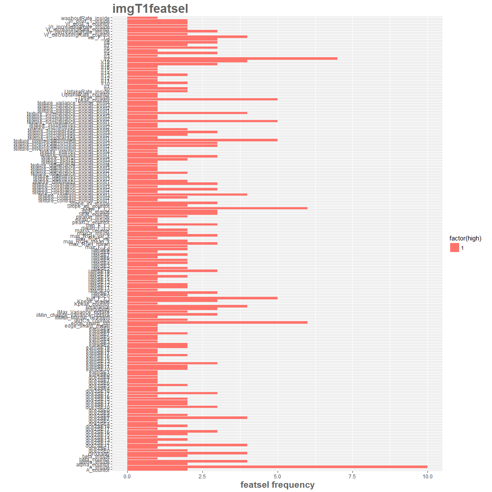 

```r
## allfeatsel ########### 
# pick frequency of 75% or higher as very common feature
dfall = data.frame(table(allfeatsel$selfeat))
dfall$high = (dfall$Freq>=0.5*max(allfeatsel$lop))*1
print(dfall[dfall$high==1, ])
```

```
##                                       Var1 Freq high
## 1                                A_countor    2    1
## 2                                 A_inside   10    1
## 3                            alpha_countor    3    1
## 4                             alpha_inside    2    1
## 5                                  ave_T20    2    1
## 6                                  ave_T21    3    1
## 7                                 ave_T210    1    1
## 8                                 ave_T211    3    1
## 9                                 ave_T212    2    1
## 10                                ave_T213    1    1
## 11                                ave_T214    1    1
## 12                                ave_T215    1    1
## 13                                ave_T217    2    1
## 14                                ave_T219    1    1
## 15                                 ave_T22    1    1
## 16                                 ave_T23    1    1
## 17                                 ave_T24    1    1
## 18                                 ave_T27    1    1
## 19                                 ave_T28    2    1
## 20                                 ave_T29    3    1
## 21                            beta_countor    2    1
## 22                             beta_inside    1    1
## 23                             circularity    5    1
## 24                                 dce2SE0    1    1
## 25                                 dce2SE1    2    1
## 26                                dce2SE10    1    1
## 27                                dce2SE13    1    1
## 28                                dce2SE19    1    1
## 29                                 dce2SE2    1    1
## 30                                 dce2SE5    2    1
## 31                                 dce2SE6    1    1
## 32                                 dce2SE7    3    1
## 33                                 dce2SE8    1    1
## 34                                 dce3SE0    2    1
## 35                                dce3SE11    3    1
## 36                                dce3SE12    2    1
## 37                                dce3SE13    2    1
## 38                                dce3SE14    2    1
## 39                                dce3SE15    1    1
## 40                                dce3SE19    1    1
## 41                                 dce3SE2    1    1
## 42                                 dce3SE3    1    1
## 43                                 dce3SE4    1    1
## 44                                 dce3SE5    3    1
## 45                                 dce3SE6    2    1
## 46                                 dce3SE7    2    1
## 47                                 dce3SE8    2    1
## 48                                 dce3SE9    1    1
## 49                                earlySE0    5    1
## 50                                earlySE1    4    1
## 51                               earlySE10    2    1
## 52                               earlySE11    2    1
## 53                               earlySE12    1    1
## 54                               earlySE13    1    1
## 55                               earlySE14    1    1
## 56                               earlySE15    1    1
## 57                               earlySE16    1    1
## 58                               earlySE17    1    1
## 59                               earlySE18    1    1
## 60                               earlySE19    1    1
## 61                                earlySE2    1    1
## 62                                earlySE3    1    1
## 63                                earlySE4    2    1
## 64                                earlySE5    1    1
## 65                                earlySE6    1    1
## 66                         edge_sharp_mean    3    1
## 67                          edge_sharp_std    3    1
## 68                           iAUC1_countor    1    1
## 69                            iAUC1_inside    2    1
## 70                  iiiMax_Margin_Gradient    1    1
## 71            iiMin_change_Variance_uptake    4    1
## 72                    iMax_Variance_uptake    3    1
## 73                            irregularity    1    1
## 74                              ivVariance    2    1
## 75                       k_Max_Margin_Grad    2    1
## 76                            Kpeak_inside    2    1
## 77                                 lateSE0    1    1
## 78                                 lateSE1    1    1
## 79                                lateSE10    2    1
## 80                                lateSE11    1    1
## 81                                lateSE12    2    1
## 82                                lateSE14    4    1
## 83                                lateSE15    1    1
## 84                                lateSE16    1    1
## 85                                lateSE18    2    1
## 86                                lateSE19    1    1
## 87                                 lateSE2    1    1
## 88                                 lateSE3    1    1
## 89                                 lateSE4    1    1
## 90                                 lateSE6    1    1
## 91                                 lateSE8    1    1
## 92                                 lateSE9    1    1
## 93                               max_F_r_i    5    1
## 94                            max_RGH_mean    3    1
## 95                          max_RGH_mean_k    2    1
## 96                             max_RGH_var    2    1
## 97                           maxCr_countor    1    1
## 98                           maxVr_countor    1    1
## 99                            maxVr_inside    2    1
## 100                              min_F_r_i    3    1
## 101                          peakCr_inside    1    1
## 102                         peakVr_countor    1    1
## 103                            SER_countor    2    1
## 104                             SER_inside    3    1
## 105                             skew_F_r_i    4    1
## 106                       Slope_ini_inside    1    1
## 107                            T2_lesionSI    2    1
## 108                         T2_lesionSIstd    2    1
## 109                          T2grad_margin    2    1
## 110                      T2grad_margin_var    3    1
## 111                           T2kurt_F_r_i    1    1
## 112                            T2max_F_r_i    1    1
## 113                            T2min_F_r_i    2    1
## 114                             T2RGH_mean    3    1
## 115                              T2RGH_var    5    1
## 116                           T2skew_F_r_i    2    1
## 117              T2texture_contrast_nondir    2    1
## 118           T2texture_correlation_nondir    2    1
## 119          T2texture_diffvariance_nondir    1    1
## 120               T2texture_entropy_nondir    1    1
## 121            T2texture_sumaverage_nondir    3    1
## 122              T2texture_variance_nondir    2    1
## 123                            T2var_F_r_i    2    1
## 124                        T2wSI_predicted    4    1
## 125          texture_contrast_nondir_post1    3    1
## 126          texture_contrast_nondir_post3    1    1
## 127       texture_correlation_nondir_post1    1    1
## 128       texture_correlation_nondir_post2    1    1
## 129       texture_correlation_nondir_post3    1    1
## 130       texture_correlation_nondir_post4    3    1
## 131       texture_diffentropy_nondir_post1    2    1
## 132       texture_diffentropy_nondir_post2    1    1
## 133       texture_diffentropy_nondir_post4    1    1
## 134      texture_diffvariance_nondir_post1    1    1
## 135      texture_diffvariance_nondir_post3    3    1
## 136      texture_diffvariance_nondir_post4    2    1
## 137            texture_energy_nondir_post2    3    1
## 138           texture_entropy_nondir_post1    2    1
## 139           texture_entropy_nondir_post2    2    1
## 140           texture_entropy_nondir_post3    1    1
## 141           texture_entropy_nondir_post4    1    1
## 142 texture_inversediffmoment_nondir_post1    1    1
## 143 texture_inversediffmoment_nondir_post2    2    1
## 144 texture_inversediffmoment_nondir_post4    2    1
## 145        texture_sumaverage_nondir_post1    3    1
## 146        texture_sumaverage_nondir_post2    3    1
## 147        texture_sumaverage_nondir_post3    2    1
## 148        texture_sumaverage_nondir_post4    1    1
## 149        texture_sumentropy_nondir_post1    1    1
## 150        texture_sumentropy_nondir_post2    3    1
## 151        texture_sumentropy_nondir_post4    1    1
## 152       texture_sumvariance_nondir_post1    1    1
## 153       texture_sumvariance_nondir_post2    4    1
## 154       texture_sumvariance_nondir_post3    1    1
## 155          texture_variance_nondir_post1    1    1
## 156          texture_variance_nondir_post3    2    1
## 157          texture_variance_nondir_post4    1    1
## 158                          Tpeak_countor    6    1
## 159                           Tpeak_inside    2    1
## 160                      UptakeRate_inside    1    1
## 161                                     V0    4    1
## 162                                    V10    2    1
## 163                                    V11    2    1
## 164                                    V12    1    1
## 165                                    V13    2    1
## 166                                    V14    4    1
## 167                                    V15    2    1
## 168                                    V16    1    1
## 169                                    V17    5    1
## 170                                    V18    1    1
## 171                                    V19    3    1
## 172                                     V2    1    1
## 173                                     V3    2    1
## 174                                     V4    2    1
## 175                                     V6    4    1
## 176                                     V7    1    1
## 177                                     V8    2    1
## 178                                     V9    1    1
## 179                              var_F_r_i    3    1
## 180              Vr_decreasingRate_countor    3    1
## 181               Vr_decreasingRate_inside    1    1
## 182              Vr_increasingRate_countor    1    1
## 183               Vr_increasingRate_inside    5    1
## 184                      Vr_post_1_countor    3    1
## 185                     washoutRate_inside    2    1
```

```r
#qplot(factor(selfeat), data=allfeatsel, geom="bar", fill=factor(high))
ggplot(dfall, aes(x=Var1, y=Freq, fill=factor(high))) + 
  geom_bar(stat = "identity") + coord_flip() +
  ggtitle("allfeatsel") +
  labs(y="featsel frequency", x=" ") +
  theme(plot.title = element_text(family = "Trebuchet MS", color="#666666", face="bold", size=22, hjust=0))+
  theme(axis.title = element_text(family = "Trebuchet MS", color="#666666", face="bold", size=16))
```

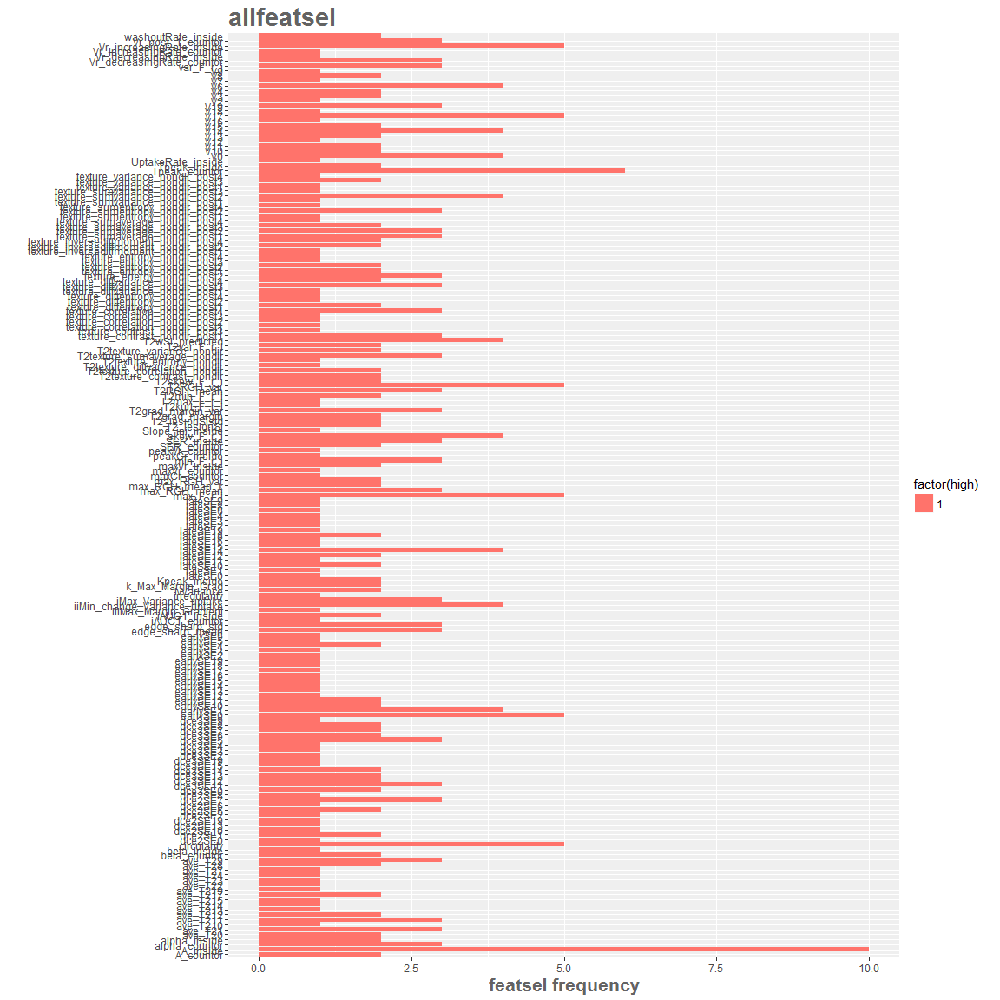 

```r
########### 
## plot ROCs each pass individually in l-o-p heldout test cases
par(mfrow=c(1,1))
n=15
colors = rainbow(n, s = 1, v = 1, start = 0, end = max(1, n - 1)/n, alpha = 1)
# plot 1/4
p1 = calcAUC_plot(perf_imgT2$obs, perf_imgT2$C, 
                           xptext=0.45, yptext=0.75 ,colors[2], atitle="")
```

```
## Area under the curve: 0.6187
## 95% CI (2000 stratified bootstrap replicates):
##  thresholds sp.low sp.median sp.high se.low se.median se.high
##   0.4928397 0.3909    0.4527  0.5103 0.7188     0.763  0.8073
```

```r
par(new=TRUE)
p2 = calcAUC_plot(perf_allT2$obs, perf_allT2$C, 
                           xptext=0.55, yptext=0.65 ,colors[9], atitle="")
```

```
## Area under the curve: 0.6276
## 95% CI (2000 stratified bootstrap replicates):
##  thresholds sp.low sp.median sp.high se.low se.median se.high
##   0.4378751  0.642    0.6996  0.7572 0.4766     0.526   0.573
```

```r
par(new=TRUE)
p3 = calcAUC_plot(perf_imgT1$obs, perf_imgT1$C,
                           xptext=0.65, yptext=0.55 ,colors[11], atitle="")
```

```
## Area under the curve: 0.7821
## 95% CI (2000 stratified bootstrap replicates):
##  thresholds sp.low sp.median sp.high se.low se.median se.high
##   0.4595427 0.6337    0.6914  0.7449 0.7188    0.7604  0.8047
```

```r
par(new=TRUE)
p4 = calcAUC_plot(perf_all$obs, perf_all$C,
                           xptext=0.75, yptext=0.45 ,colors[14], atitle="ROCs leave-one-patient out test ")
```

```
## Area under the curve: 0.7879
## 95% CI (2000 stratified bootstrap replicates):
##  thresholds sp.low sp.median sp.high se.low se.median se.high
##   0.4618078 0.6255    0.6831  0.7366 0.7422    0.7839  0.8255
```

```r
legend("bottomright", 
       legend = c(paste0("imgT2w"),
                  paste0("imgT2w+predT2w"),
                  paste0("imgT1w"),
                  paste0("imgT1+imgT2w+predT2w")),
       col = c(colors[2],colors[9],colors[11],colors[14]), lwd = 2)
```

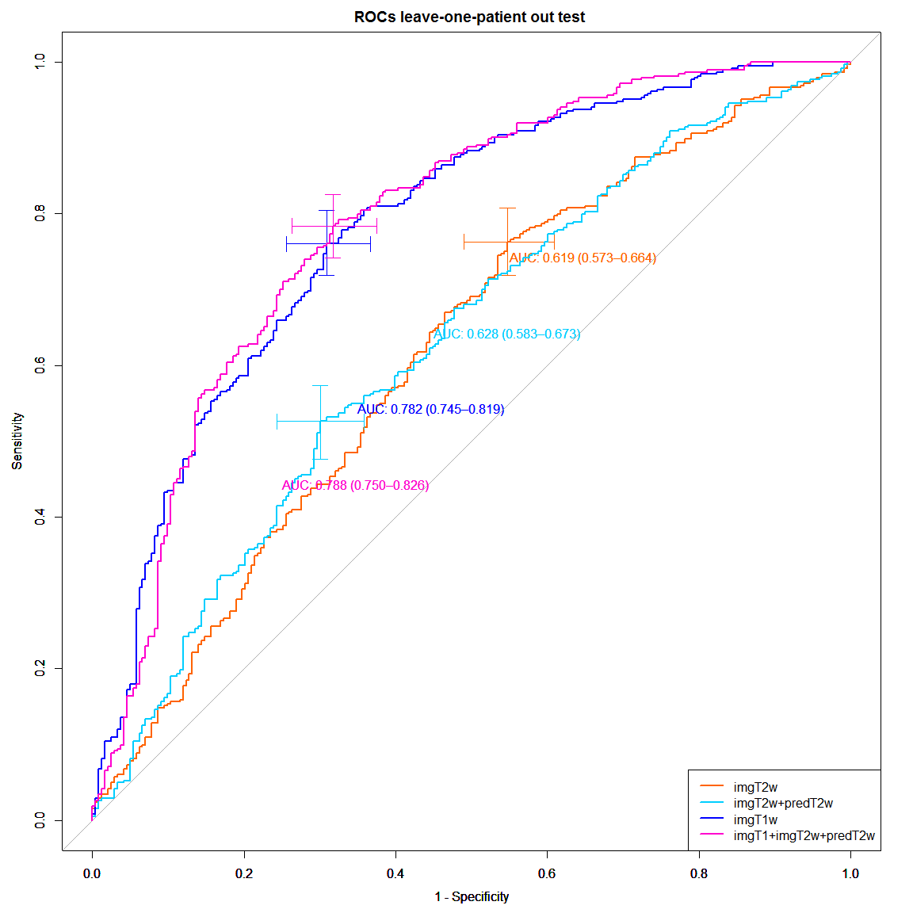 

```r
# find significants: only imgT2 vs. allT2
roc.test(p1$ROC, p2$ROC, method=c("bootstrap"), alternative = c("less"), boot.stratified=TRUE)
```

```
## 
## 	Bootstrap test for two correlated ROC curves
## 
## data:  p1$ROC and p2$ROC
## D = -0.46658, boot.n = 2000, boot.stratified = 1, p-value = 0.3204
## alternative hypothesis: true difference in AUC is less than 0
## sample estimates:
## AUC of roc1 AUC of roc2 
##   0.6187200   0.6276042
```

```r
# find significants: mass imgT1 vs all
roc.test(p3$ROC, p4$ROC, method=c("bootstrap"), alternative = c("two.sided"), boot.stratified=TRUE)
```

```
## 
## 	Bootstrap test for two correlated ROC curves
## 
## data:  p3$ROC and p4$ROC
## D = -0.38836, boot.n = 2000, boot.stratified = 1, p-value = 0.6977
## alternative hypothesis: true difference in AUC is not equal to 0
## sample estimates:
## AUC of roc1 AUC of roc2 
##   0.7820645   0.7879051
```

```r
# find significants: mass allT2 vs all
roc.test(p2$ROC, p4$ROC, method=c("bootstrap"), alternative = c("two.sided"), boot.stratified=TRUE)
```

```
## 
## 	Bootstrap test for two correlated ROC curves
## 
## data:  p2$ROC and p4$ROC
## D = -5.9223, boot.n = 2000, boot.stratified = 1, p-value = 3.174e-09
## alternative hypothesis: true difference in AUC is not equal to 0
## sample estimates:
## AUC of roc1 AUC of roc2 
##   0.6276042   0.7879051
```


