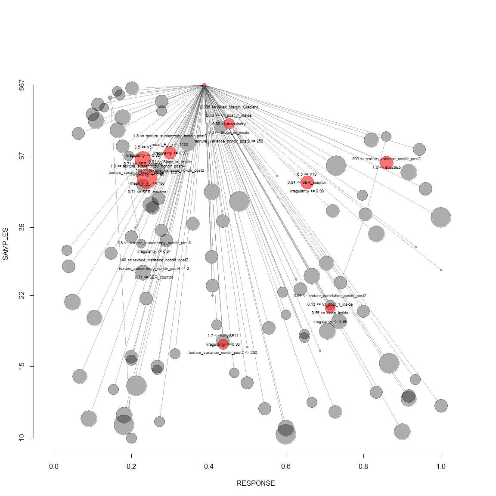
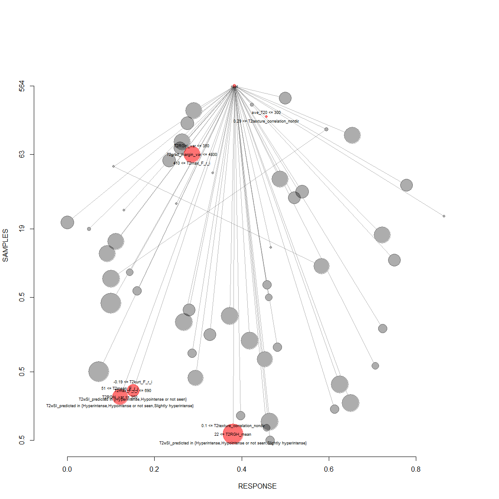
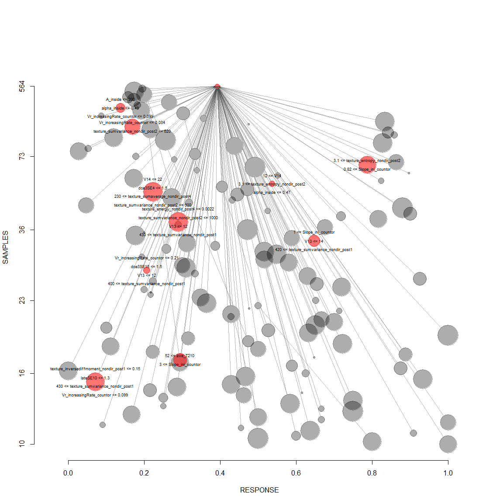

# 3Dtex-weigNH
Cristina Gallego  
March 19, 2016  

Bagging trees classification using 3D texture features
============

- This uses tree-ensembles based T2 features in addition to the relevant and tentative T1+T2w features
- This code analysis T2w added diagnostic value by comparing with ensembles of only T1w DCE-based features
- T2w discrimination ability (added AUC ROC value)


```r
options(width = 95)

library(caret)
require(ggplot2)
library("RSQLite")
library(klaR)
library(pROC)
library("Boruta")
require(data.table)
library(R.utils)
library(rpart)
library(rpart.plot)
library(R.utils)
library(nodeHarvest)

loppath = "C:/Users/windows/Documents/repoCode-local/T2wR/lop_3Dtex_T2w_addedvalue"
setwd(loppath)
source("functions.R")

## Add LMSIR predicted and T2wBIRADS predicted
LMSIR_lop <- loadToEnv(("Inputs/finalregressorsLMSIR_T2w.RData"))[["LMSIR_lop"]]; 
perfT2wSI_lop <- loadToEnv(("Inputs/final_classifierT2wSI_boosting.RData"))[["perfT2wSI_lop"]]; 
```

Run 3Dtex-weigthed NH with internal cross-validation of parameters
=================================


```r
# 1) From 100% dataset, Create train/validation (80%) / heldout (20%) partitions
sqlite <- dbDriver("SQLite")
conn <- dbConnect(sqlite, "textureUpdatedFeatures.db")

# 2) all T1w features
lesionsQuery <- dbGetQuery(conn, "SELECT *
         FROM  stage1features
           INNER JOIN lesion ON (stage1features.lesion_id = lesion.lesion_id)
           INNER JOIN f_T2 ON (stage1features.lesion_id = f_T2.lesion_id)")
 
# For bootstrap resampling, createResample is used
# Randomization is done at the patient level, so that bootstrapping preserves lesion independence
lesionsQuery = subset(lesionsQuery, lesion_label != "fociB" & lesion_label != "fociM" ) # exclude foci at this point
id_cad_pts = lesionsQuery$cad_pt_no_txt
uniq_cad = unique(lesionsQuery$cad_pt_no_txt)
npatients = 1:length(uniq_cad)
  
# when y is a factor in an attempt to balance the class distributions within the splits.
# The names of the list objects will denote the fold membership using the pattern 
# resamples." meaning the ith section (of k) of the jth cross-validation set (of times).
set.seed(1234)
npatients = length(uniq_cad)
kfcvpartitionsetD <- createFolds(y = 1:length(uniq_cad),## the outcome data are needed
                                k = 10, 
                                list = TRUE)


## using 3Dtexture first + Boosting
perf_imgT2 = data.frame();  
perf_allT2 = data.frame();   
perf_imgT1 = data.frame();  
perf_all = data.frame();    

## holders for reature rankings
imgT2featsel = data.frame() 
allT2featsel = data.frame() 
imgT1featsel = data.frame() 
allfeatsel = data.frame() 

cvauc_imgT2 = c()
cvauc_allT2 = c()
cvauc_imgT1 = c()
cvauc_all = c()

# perform k-fold-out
for(k in 1:10){  # 1:10f cv
  ## Create folds leave-one-patient-out
  allfT2 = read3Dtex_T2uniqcad_parti(id_cad_pts, uniq_cad, kfcvpartitionsetD, 10, k)
  allfT1 = read3Dtex_T1uniqcad_parti(id_cad_pts, uniq_cad, kfcvpartitionsetD, 10, k)
  allfT1T2 = read3Dtex_T1T2uniqcad_parti(id_cad_pts, uniq_cad, kfcvpartitionsetD, 10, k)
    
  ## formant
  T2train = allfT2[[1]];   T2traininfo = allfT2[[5]];   T2trainids = T2traininfo$lesion_id;
  T2test = allfT2[[2]]; T2testinfo = allfT2[[6]];  T2testids = T2testinfo$lesion_id;
  T1train = allfT1[[1]]; T1traininfo = allfT1[[5]]; T1trainids = T1traininfo$lesion_id;
  T1test = allfT1[[2]]; T1testinfo = allfT1[[6]];  T1testids = T1testinfo$lesion_id;
  T1T2train = allfT1T2[[1]]; T1T2traininfo = allfT1T2[[5]]; T1T2trainids = T1T2traininfo$lesion_id;
  T1T2test = allfT1T2[[2]]; T1T2testinfo = allfT1T2[[6]];  T1T2testids = T1T2testinfo$lesion_id;
  
  # remove radiologist based BIRADS category and measured muscle-to-lesion SI 
  # add predicted T2w features
  T2LMSIR = getid_predLMSIR(LMSIR_lop, T2trainids)
  T2wSI = getid_predT2wSI(perfT2wSI_lop, T2trainids)
  
  imgT2train = T2train[,-c(2,5,ncol(T2train))] # exlude orig_label
  wpredT2train = cbind(imgT2train, LMSIR_predicted=T2LMSIR$LMSIR_predicted, T2wSI_predicted=T2wSI$T2wSI_predicted)
  wpredT2train$T2wSI_predicted = as.factor(wpredT2train$T2wSI_predicted)
  T1train = T1train[,-c(ncol(T1train))]
  
  # remove radiologist based BIRADS category and measured muscle-to-lesion SI 
  # add predicted T2w features
  T1T2LMSIR = getid_predLMSIR(LMSIR_lop, T1T2trainids)
  T1T2wSI = getid_predT2wSI(perfT2wSI_lop, T1T2trainids)
  
  ########## consider differneces
  imgT1T2train = T1T2train[,-c(199,202,ncol(T1T2train))]
  wpredT1T2train = cbind(imgT1T2train, LMSIR_predicted=T1T2LMSIR$LMSIR_predicted, T2wSI_predicted=T1T2wSI$T2wSI_predicted)
  wpredT1T2train$T2wSI_predicted = as.factor(wpredT1T2train$T2wSI_predicted)
  
  # with datasets:   T2train, wpredT2train, T1train, T1T2train, wpredT1T2train
  selrrfimgT2 = RRF_featsel(imgT2train, "imgT2")
  selrrfallT2 = RRF_featsel(wpredT2train, "allT2")
  selrrfimgT1 = RRF_featsel(T1train, "imgT1")
  selrrfall = RRF_featsel(wpredT1T2train, "all")
  
  ## group with all of the features spaces combined, most contributing T2w feature
  imgT2featsel =  rbind(imgT2featsel, cbind(selrrfimgT2, kfcv=k) )
  allT2featsel =  rbind(allT2featsel, cbind(selrrfallT2, kfcv=k) ) 
  imgT1featsel =  rbind(imgT1featsel, cbind(selrrfimgT1, kfcv=k) ) 
  allfeatsel = rbind(allfeatsel, cbind(selrrfall, kfcv=k) ) 

  ##################
  # Define datasets
  ##################
  # define datasets: imgT2wfeatures allT2wfeatures, imgT1wfeatures, allfeatures
  imgT2features = imgT2train[,c("lesion_label", selrrfimgT2$selfeat)]
  allT2features = wpredT2train[,c("lesion_label",selrrfallT2$selfeat)]
  imgT1features = T1train[,c("lesion_label",selrrfimgT1$selfeat)]
  allfeatures = wpredT1T2train[, c("lesion_label",selrrfall$selfeat)]
  
  ##################
  # Get Test info data
  ##################
  dfinfo = cbind(T2testinfo[,c(1,3,6,24:26)], 
                 find_t2_signal_int=T2test$find_t2_signal_int)
  print(dfinfo)
  
  ## apend LMSIR and T2wSI in case is used by classifier
  testLMSIR = getid_predLMSIR(LMSIR_lop, T2testids)
  testT2wSI = getid_predT2wSI(perfT2wSI_lop, T2testids)
  
  T2test = cbind(T2test, LMSIR_predicted=testLMSIR$LMSIR_predicted,
                 T2wSI_predicted=testT2wSI$T2wSI_predicted)
  
  ## for T1T2
  ## apend LMSIR and T2wSI in case is used by classifier
  testLMSIR = getid_predLMSIR(LMSIR_lop, T1T2testids)
  testT2wSI = getid_predT2wSI(perfT2wSI_lop, T1T2testids)
  
  T1T2test = cbind(T1T2test, LMSIR_predicted=testLMSIR$LMSIR_predicted, T2wSI_predicted=testT2wSI$T2wSI_predicted)
  
  ##################
  # Build final classifiers
  ##################
  # data = imgT2features, 
  cat("\n============ bagging trees treedata_imgT2 \n")
  # train trees
  treedata_imgT2 <- NH_looforestTrain_wcv(imgT2features, T2test, c(1,2,3))

    ######## data = allT2features, 
  cat("\n============ bagging trees treedata_allT2 \n")
  # train trees
  if(k==5){allT2features=allT2features[,-c(2)]}
  treedata_allT2 <- NH_looforestTrain_wcv(allT2features, T2test, c(1,2,3))

  #######  data = imgT1features, 
  cat("\n============ bagging trees treedata_imgT1 \n")
  # train trees
  treedata_imgT1 <- NH_looforestTrain_wcv(imgT1features, T1test, c(1,2,3,5))

  ####### data = allfeatures, 
  cat("\n============ bagging trees treedata_all \n")
  # train trees
  treedata_all <- NH_looforestTrain_wcv(allfeatures, T1T2test, c(1,2,3,5))

  ##################
  ### predict for each classifier
  ##################
  ## for treedata_imgT2
  rules = data.frame(C=treedata_imgT2$testperf$testpred_NH, NC=1-treedata_imgT2$testperf$testpred_NH)
  rules$pred = apply(rules, 1, which.max)
  perfcv_imgT2 = data.frame(id=treedata_imgT2$testperf$ids, 
                    C=treedata_imgT2$testperf$testpred_NH,
                    NC=1-treedata_imgT2$testperf$testpred_NH,
                    pred=ifelse(rules$pred==1,"C","NC"), obs=treedata_imgT2$testperf$labelstest)
  
  auc_imgT2 = roc(perfcv_imgT2$obs, perfcv_imgT2$C)
  perf_imgT2 = rbind(perf_imgT2, perfcv_imgT2 )
  print(head(perfcv_imgT2))
  cvauc_imgT2 = c(cvauc_imgT2, auc_imgT2$auc)

  # for treedata_allT2
  rules = data.frame(C=treedata_allT2$testperf$testpred_NH, NC=1-treedata_allT2$testperf$testpred_NH)
  rules$pred = apply(rules, 1, which.max)
  perfcv_allT2 = data.frame(id=treedata_allT2$testperf$ids, 
                    C=treedata_allT2$testperf$testpred_NH,
                    NC=1-treedata_allT2$testperf$testpred_NH,
                    pred=ifelse(rules$pred==1,"C","NC"), obs=treedata_allT2$testperf$labelstest)
  
  auc_allT2 = roc(perfcv_allT2$obs, perfcv_allT2$C)
  perf_allT2 = rbind(perf_allT2, perfcv_allT2) 
  print(head(perfcv_allT2))
  cvauc_allT2 = c(cvauc_allT2, auc_allT2$auc)

  ## for treedata_imgT1
  rules = data.frame(C=treedata_imgT1$testperf$testpred_NH, NC=1-treedata_imgT1$testperf$testpred_NH)
  rules$pred = apply(rules, 1, which.max)
  perfcv_imgT1 = data.frame(id=treedata_imgT1$testperf$ids, 
                    C=treedata_imgT1$testperf$testpred_NH,
                    NC=1-treedata_imgT1$testperf$testpred_NH,
                    pred=ifelse(rules$pred==1,"C","NC"), obs=treedata_imgT1$testperf$labelstest)
  
  auc_imgT1 = roc(perfcv_imgT1$obs, perfcv_imgT1$C)
  perf_imgT1 = rbind(perf_imgT1, perfcv_imgT1) 
  print(head(perfcv_imgT1))
  cvauc_imgT1 = c(cvauc_imgT1, auc_imgT1$auc)

  # for treedata_all
  rules = data.frame(C=treedata_all$testperf$testpred_NH, NC=1-treedata_all$testperf$testpred_NH)
  rules$pred = apply(rules, 1, which.max)
  perfcv_all = data.frame(id=treedata_all$testperf$ids, 
                    C=treedata_all$testperf$testpred_NH,
                    NC=1-treedata_all$testperf$testpred_NH,
                    pred=ifelse(rules$pred==1,"C","NC"), obs=treedata_all$testperf$labelstest)
  
  auc_all = roc(perfcv_all$obs, perfcv_all$C)
  perf_all = rbind(perf_all, perfcv_all) 
  print(head(perfcv_all))
  cvauc_all = c(cvauc_all, auc_all$auc)
  
  # AUC
  rocperf_imgT2 = roc(perf_imgT2$obs, perf_imgT2$C)
  print(rocperf_imgT2)

  rocperf_allT2 = roc(perf_allT2$obs, perf_allT2$C)
  print(rocperf_allT2)
  
  rocperf_imgT1 = roc(perf_imgT1$obs, perf_imgT1$C)
  print(rocperf_imgT1)
  
  rocperf_all = roc(perf_all$obs, perf_all$C)
  print(rocperf_all)
   
  # plot every 10 patients
  ## plot ROCs each pass individually in l-o-p heldout test cases
  par(mfrow=c(1,1))
  n=15
  colors = rainbow(n, s = 1, v = 1, start = 0, end = max(1, n - 1)/n, alpha = 1)
  # plot 1/4
  p1 = calcAUC_plot(perf_imgT2$obs, perf_imgT2$C, 
                             xptext=0.45, yptext=0.75 ,colors[2], atitle="")
  par(new=TRUE)
  p2 = calcAUC_plot(perf_allT2$obs, perf_allT2$C, 
                             xptext=0.55, yptext=0.65 ,colors[9], atitle="")
  par(new=TRUE)
  p3 = calcAUC_plot(perf_imgT1$obs, perf_imgT1$C,
                             xptext=0.65, yptext=0.55 ,colors[11], atitle="")
  par(new=TRUE)
  p4 = calcAUC_plot(perf_all$obs, perf_all$C,
                             xptext=0.75, yptext=0.45 ,colors[14], 
                    atitle=paste0("ROCs 10f-patient out cv test k-fold= ",k))
  
  legend("bottomright", 
         legend = c(paste0("imgT2w"),
                    paste0("imgT2w+predT2w"),
                    paste0("imgT1w"),
                    paste0("imgT1+imgT2w+predT2w")),
         col = c(colors[2],colors[9],colors[11],colors[14]), lwd = 2)

    
  # save current state k patient out
  save.image(paste0("Outputs/weigNH_addeddiagvalue_3Dtexbagg_cv",k,".RData"))
  
}
```

```
##    massB    massM nonmassB nonmassM 
##      216      153      131       67 
##    massB    massM nonmassB nonmassM 
##       24       15       11       10 
##    massB    massM nonmassB nonmassM 
##      216      153      131       67 
##    massB    massM nonmassB nonmassM 
##       24       15       11       10 
##    massB    massM nonmassB nonmassM 
##      216      153      131       67 
##    massB    massM nonmassB nonmassM 
##       24       15       11       10
```

```
## RRF 1.6
## Type rrfNews() to see new features/changes/bug fixes.
## 
## Attaching package: 'RRF'
## 
## The following object is masked from 'package:ranger':
## 
##     importance
## 
## The following object is masked from 'package:ggplot2':
## 
##     margin
```

```
## -0.0201005 0.05 
## Selected features for group: MeanDecreaseGini imgT2 
## =========NULL
##  [1] "T2RGH_var"                          "ave_T210"                          
##  [3] "T2texture_inversediffmoment_nondir" "T2RGH_mean"                        
##  [5] "ave_T27"                            "T2texture_entropy_nondir"          
##  [7] "T2max_F_r_i"                        "ave_T22"                           
##  [9] "T2texture_correlation_nondir"       "T2kurt_F_r_i"                      
## [11] "ave_T211"                           "ave_T25"                           
## [13] "ave_T212"                           "ave_T28"                           
## [15] "ave_T23"                            "T2min_F_r_i"                       
## [17] "ave_T24"                            "T2texture_sumvariance_nondir"      
## [19] "T2grad_margin_var"                  "T2texture_variance_nondir"         
## [21] "ave_T214"                           "ave_T29"                           
## [23] "T2grad_margin"                      "T2texture_diffvariance_nondir"     
## [25] "ave_T215"                           "ave_T219"                          
## [27] "T2skew_F_r_i"                       "T2mean_F_r_i"                      
## [29] "T2_lesionSI"                       
## 0.04807692 0.05 
## Selected features for group: MeanDecreaseGini allT2 
## =========NULL
##  [1] "T2RGH_var"                          "T2texture_entropy_nondir"          
##  [3] "T2texture_correlation_nondir"       "T2RGH_mean"                        
##  [5] "ave_T210"                           "T2texture_sumaverage_nondir"       
##  [7] "T2_lesionSIstd"                     "T2wSI_predicted"                   
##  [9] "T2skew_F_r_i"                       "T2texture_diffvariance_nondir"     
## [11] "ave_T27"                            "T2grad_margin_var"                 
## [13] "LMSIR_predicted"                    "ave_T212"                          
## [15] "ave_T25"                            "ave_T20"                           
## [17] "ave_T217"                           "ave_T28"                           
## [19] "ave_T24"                            "ave_T218"                          
## [21] "ave_T219"                           "ave_T216"                          
## [23] "ave_T29"                            "T2kurt_F_r_i"                      
## [25] "ave_T211"                           "T2texture_energy_nondir"           
## [27] "ave_T215"                           "ave_T22"                           
## [29] "ave_T23"                            "T2grad_margin"                     
## [31] "ave_T26"                            "T2texture_inversediffmoment_nondir"
## [33] "T2_lesionSI"                        "ave_T21"                           
## [35] "T2texture_sumentropy_nondir"        "ave_T213"                          
## [37] "T2texture_sumvariance_nondir"       "T2min_F_r_i"                       
## 0.07894737 0.05 
## -0.08571429 0.05 
## Selected features for group: MeanDecreaseGini imgT1 
## =========NULL
##  [1] "irregularity"                           "SER_countor"                           
##  [3] "texture_variance_nondir_post2"          "Slope_ini_inside"                      
##  [5] "mean_F_r_i"                             "V15"                                   
##  [7] "alpha_inside"                           "min_F_r_i"                             
##  [9] "Vr_post_1_inside"                       "texture_sumaverage_nondir_post2"       
## [11] "texture_sumentropy_nondir_post3"        "V0"                                    
## [13] "texture_inversediffmoment_nondir_post1" "iiiMax_Margin_Gradient"                
## [15] "V5"                                     "dce3SE8"                               
## [17] "lateSE0"                                "dce2SE18"                              
## [19] "texture_correlation_nondir_post2"       "dce3SE9"                               
## [21] "dce3SE2"                                "Vr_decreasingRate_countor"             
## [23] "dce3SE3"                                "V19"                                   
## [25] "Vr_decreasingRate_inside"               "texture_sumaverage_nondir_post3"       
## [27] "dce2SE5"                                "dce3SE7"                               
## [29] "texture_entropy_nondir_post3"           "earlySE11"                             
## [31] "earlySE12"                              "max_RGH_mean_k"                        
## [33] "texture_sumentropy_nondir_post4"        "A_inside"                              
## 0.01986755 0.05 
## Selected features for group: MeanDecreaseGini all 
## =========NULL
##  [1] "texture_variance_nondir_post1"   "circularity"                    
##  [3] "texture_energy_nondir_post4"     "earlySE12"                      
##  [5] "V12"                             "texture_contrast_nondir_post3"  
##  [7] "V13"                             "max_F_r_i"                      
##  [9] "V11"                             "iiMin_change_Variance_uptake"   
## [11] "Vr_increasingRate_inside"        "V5"                             
## [13] "lateSE17"                        "lateSE6"                        
## [15] "ave_T213"                        "V17"                            
## [17] "V14"                             "texture_sumaverage_nondir_post4"
## [19] "dce3SE18"                        "UptakeRate_inside"              
## [21] "T2mean_F_r_i"                    "T2texture_contrast_nondir"      
## [23] "lateSE0"                         "maxCr_countor"                  
## [25] "ave_T219"                        "A_countor"                      
## [27] "T2grad_margin_var"               "ave_T216"                       
## [29] "Vr_post_1_countor"               "beta_inside"                    
## [31] "dce3SE4"                         "V18"                            
## [33] "dce3SE16"                        "peakCr_inside"                  
## [35] "V2"                              "ave_T215"                       
## [37] "A_inside"                       
##     lesion_id cad_pt_no_txt exam_a_number_txt BIRADS lesion_label
## 1           1          0002           6745896      4     nonmassM
## 32         32          0173           5123923      4     nonmassB
## 40         40          0190           6760690      4        massM
## 41         41          0190           6760690      4     nonmassM
## 51         51          0205           5085133      4        massB
## 103       103          0553           6687000      2        massB
## 104       104          0561           4668611      4        massB
## 116       116          0606           6781309      4        massB
## 117       117          0608           5094101      4        massB
## 134       134          0672           4899757      5     nonmassM
## 152       152          0696           6983274      4        massB
## 153       153          0700           4660805      5        massM
## 165       165          0718           4962581      4        massB
## 179       179          0730           5009497      5        massM
## 185       185          0740           4842984      4     nonmassB
## 216       216          0779           4934249      5        massB
## 217       217          0779           4934249      5        massM
## 227       227          0796            860773      4     nonmassB
## 228       228          0799           5372294      4        massB
## 229       229          0802           4600874      4        massM
## 232       232          0807           5235491      5     nonmassM
## 284       284          0871           5130094      4        massM
## 285       285          0871           5130094      4        massM
## 286       286          0871           5130094      4        massM
## 301       301          0885           6747175      4     nonmassB
## 309       309          0918           6976567      4        massB
## 332       332          0993           6979299      4        massM
## 367       367          1086           7173349      6     nonmassB
## 378       378          2016           7052211      4        massB
## 380       380          2023           5141524      6        massM
## 399       399          2059           7749617      4     nonmassB
## 413       413          3005           4974097      3     nonmassB
## 414       414          3005           6757337      3     nonmassM
## 415       415          3005           5057668      2     nonmassB
## 416       416          3005           6757337      4     nonmassM
## 422       422          3020           7395195      4        massB
## 424       424          3023           7106703      6        massM
## 451       451          3065           7037223      4        massB
## 452       452          3065           7037223      4        massB
## 453       453          3070           7085188      4        massB
## 465       465          3081           7041435      5     nonmassB
## 466       466          3081           7041435      5     nonmassM
## 476       476          4003           7056445      4     nonmassB
## 477       477          4003           7056445      4     nonmassB
## 492       492          4029           7633460      4        massB
## 493       493          4029           7633460      4        massB
## 503       503          4047           7009608      4        massB
## 514       514          6015           5082265      6        massM
## 515       515          6015           5082265      6     nonmassM
## 518       518          6018           5088825      5     nonmassM
## 521       521          6021           4798692      4        massB
## 534       534          6029           5083338      6        massB
## 535       535          6029           5083338      6        massB
## 536       536          6029           6772981      4        massB
## 538       538          6034           4997881      6        massM
## 539       539          6034           4997881      6        massM
## 540       540          6034           4997881      6     nonmassM
## 593       593          7008           6875110      6        massM
## 602       602          7045           6760802      4        massB
## 631       631          7190           7013378      3        massB
##                      lesion_diagnosis      find_t2_signal_int
## 1                        InsituDuctal                    None
## 32                     DUCT PAPILLOMA                    None
## 40                     InvasiveDuctal                    None
## 41                     InvasiveDuctal                    None
## 51                    FIBROEPITHELIAL            Hyperintense
## 103              BENIGN BREAST TISSUE            Hyperintense
## 104                      FIBROADENOMA Hypointense or not seen
## 116       ATYPICAL DUCTAL HYPERPLASIA            Hyperintense
## 117              BENIGN BREAST TISSUE            Hyperintense
## 134                      InsituDuctal                    None
## 152              BENIGN BREAST TISSUE Hypointense or not seen
## 153                    InvasiveDuctal                    None
## 165                       FIBROCYSTIC                    None
## 179                    InvasiveDuctal                    None
## 185  SCLEROSING INTRADUCTAL PAPILLOMA   Slightly hyperintense
## 216               SCLEROSING ADENOSIS                    None
## 217                    InvasiveDuctal                    None
## 227      ATYPICAL LOBULAR HYPERPLASIA                    None
## 228                       FIBROCYSTIC   Slightly hyperintense
## 229                    InvasiveDuctal                    None
## 232                      InsituDuctal                    None
## 284                   InvasiveLobular                    None
## 285                      InsituDuctal                    None
## 286                   InvasiveLobular                    None
## 301                       FIBROCYSTIC Hypointense or not seen
## 309                      FIBROADENOMA            Hyperintense
## 332                   PHYLLODES TUMOR            Hyperintense
## 367       ATYPICAL DUCTAL HYPERPLASIA                    None
## 378                      FIBROADENOMA            Hyperintense
## 380                    InvasiveDuctal                    None
## 399             COLUMNAR CELL CHANGES                    None
## 413              BENIGN BREAST TISSUE                    None
## 414                      InsituDuctal Hypointense or not seen
## 415                       FIBROCYSTIC                    None
## 416                      InsituDuctal Hypointense or not seen
## 422               STROMAL HYPERPLASIA Hypointense or not seen
## 424                    InvasiveDuctal                    None
## 451                          ADENOSIS Hypointense or not seen
## 452                          ADENOSIS Hypointense or not seen
## 453 DUCTAL HYPERPLASIA WITHOUT ATYPIA Hypointense or not seen
## 465             COLUMNAR CELL CHANGES Hypointense or not seen
## 466                      InsituDuctal Hypointense or not seen
## 476         FLORID DUCTAL HYPERPLASIA                    None
## 477         FLORID DUCTAL HYPERPLASIA                    None
## 492                     InsituLobular                    None
## 493                     InsituLobular                    None
## 503                       FIBROCYSTIC Hypointense or not seen
## 514                    InvasiveDuctal                    None
## 515                    InvasiveDuctal                    None
## 518                   InvasiveLobular                    None
## 521      ATYPICAL LOBULAR HYPERPLASIA                    None
## 534                      FIBROADENOMA Hypointense or not seen
## 535                      FIBROADENOMA Hypointense or not seen
## 536                      FIBROADENOMA Hypointense or not seen
## 538                    InvasiveDuctal            Hyperintense
## 539                    InvasiveDuctal            Hyperintense
## 540                    InvasiveDuctal                    None
## 593                   InvasiveLobular            Hyperintense
## 602              BENIGN BREAST TISSUE Hypointense or not seen
## 631             COLUMNAR CELL CHANGES            Hyperintense
## 
## ============ bagging trees treedata_imgT2 
## maxinter:  1 nodesize:  25 
##   maxinter nodesize  rocTrain  rocValid   rocTest
## 1        1       25 0.6714697 0.6211429 0.6804046
## maxinter:  2 nodesize:  25 
##   maxinter nodesize  rocTrain  rocValid   rocTest
## 2        2       25 0.7686141 0.6314286 0.7346014
## maxinter:  3 nodesize:  25 
##   maxinter nodesize  rocTrain  rocValid   rocTest
## 3        3       25 0.8179067 0.6268571 0.7527174
## maxinter:  1 nodesize:  20 
##   maxinter nodesize  rocTrain  rocValid   rocTest
## 4        1       20 0.6714697 0.6268571 0.6837258
## maxinter:  2 nodesize:  20 
##   maxinter nodesize  rocTrain  rocValid   rocTest
## 5        2       20 0.7592088 0.6405714 0.7471316
## maxinter:  3 nodesize:  20 
##   maxinter nodesize  rocTrain rocValid   rocTest
## 6        3       20 0.8124574    0.636 0.7727959
## maxinter:  1 nodesize:  15 
##   maxinter nodesize  rocTrain  rocValid   rocTest
## 7        1       15 0.6714697 0.6268571 0.6837258
## maxinter:  2 nodesize:  15 
##   maxinter nodesize  rocTrain  rocValid   rocTest
## 8        2       15 0.7625164 0.6617143 0.7673611
## maxinter:  3 nodesize:  15 
##   maxinter nodesize  rocTrain  rocValid   rocTest
## 9        3       15 0.8108528 0.7148571 0.7999698
## maxinter:  1 nodesize:  10 
##    maxinter nodesize  rocTrain  rocValid   rocTest
## 10        1       10 0.6714697 0.6268571 0.6837258
## maxinter:  2 nodesize:  10 
##    maxinter nodesize  rocTrain  rocValid   rocTest
## 11        2       10 0.7479041 0.6537143 0.7424517
## maxinter:  3 nodesize:  10 
##    maxinter nodesize  rocTrain  rocValid   rocTest
## 12        3       10 0.7917933 0.6274286 0.7400362
## maxinter:  1 nodesize:  5 
##    maxinter nodesize  rocTrain  rocValid   rocTest
## 13        1        5 0.6714697 0.6211429 0.6804046
## maxinter:  2 nodesize:  5 
##    maxinter nodesize  rocTrain  rocValid   rocTest
## 14        2        5 0.7595887 0.6205714 0.7243357
## maxinter:  3 nodesize:  5 
##    maxinter nodesize  rocTrain  rocValid  rocTest
## 15        3        5 0.7920422 0.6542857 0.750151
##    maxinter nodesize  rocTrain  rocValid   rocTest
## 1         1       25 0.6714697 0.6211429 0.6804046
## 2         2       25 0.7686141 0.6314286 0.7346014
## 3         3       25 0.8179067 0.6268571 0.7527174
## 4         1       20 0.6714697 0.6268571 0.6837258
## 5         2       20 0.7592088 0.6405714 0.7471316
## 6         3       20 0.8124574 0.6360000 0.7727959
## 7         1       15 0.6714697 0.6268571 0.6837258
## 8         2       15 0.7625164 0.6617143 0.7673611
## 9         3       15 0.8108528 0.7148571 0.7999698
## 10        1       10 0.6714697 0.6268571 0.6837258
## 11        2       10 0.7479041 0.6537143 0.7424517
## 12        3       10 0.7917933 0.6274286 0.7400362
## 13        1        5 0.6714697 0.6211429 0.6804046
## 14        2        5 0.7595887 0.6205714 0.7243357
## 15        3        5 0.7920422 0.6542857 0.7501510
##   maxinter nodesize  rocTrain  rocValid   rocTest
## 9        3       15 0.8108528 0.7148571 0.7999698
```

 

```
## 
##  	 Observation 1 has a predicted value 0.458
##  	  since this is the weighted average response across the 9 nodes it is a member of:
## 
##  	 	 1) Node 39, containing 242 training observations, with node mean 0.302 and weight 0.218 :
## 		 	   T2texture_entropy_nondir <= 3.5
## 		 	   T2texture_variance_nondir <= 360
## 		 	   T2texture_correlation_nondir <= 0.26
## 
##  	 	 2) Node 15, containing 35 training observations, with node mean 0.429 and weight 0.19 :
## 		 	   T2texture_correlation_nondir <= 0.26
## 		 	   T2texture_entropy_nondir <= 3.5
## 		 	   T2_lesionSI <= 60
## 
##  	 	 3) Node 28, containing 100 training observations, with node mean 0.66 and weight 0.178 :
## 		 	   350 <= T2RGH_var
## 		 	   50 <= ave_T211 <= 140
## 
##  	 	 4) Node 41, containing 256 training observations, with node mean 0.516 and weight 0.138 :
## 		 	   T2min_F_r_i <= 8.5
## 		 	   56 <= ave_T210
## 		 	   T2grad_margin_var <= 3800
## 
##  	 	 5) Node 42, containing 270 training observations, with node mean 0.359 and weight 0.0991 :
## 		 	   T2texture_correlation_nondir <= 0.26
## 		 	   67 <= ave_T29
## 		 	   T2min_F_r_i <= 59
## 
##  	 	 6) Node 27, containing 88 training observations, with node mean 0.455 and weight 0.0683 :
## 		 	   350 <= T2RGH_var
## 		 	   T2texture_entropy_nondir <= 3.2
## 		 	   T2RGH_mean <= 41
## 
##  	 	 7) Node 31, containing 112 training observations, with node mean 0.621 and weight 0.0599 :
## 		 	   350 <= T2RGH_var
## 		 	   46 <= ave_T211 <= 150
## 
##  	 	 8) Node 43, containing 386 training observations, with node mean 0.371 and weight 0.0361 :
## 		 	   T2texture_entropy_nondir <= 3.5
## 		 	   T2texture_diffvariance_nondir <= 390
## 		 	   20 <= ave_T211
## 
##  	 	 9) Node 44, containing 563 training observations, with node mean 0.388 and weight 0.01 :
## 			 ROOT NODE
## 
## ============ bagging trees treedata_allT2 
## maxinter:  1 nodesize:  25 
##   maxinter nodesize  rocTrain  rocValid   rocTest
## 1        1       25 0.6892913 0.7205714 0.7651976
## maxinter:  2 nodesize:  25 
##   maxinter nodesize rocTrain  rocValid   rocTest
## 2        2       25 0.758508 0.6222857 0.7270517
## maxinter:  3 nodesize:  25 
##   maxinter nodesize  rocTrain  rocValid   rocTest
## 3        3       25 0.8155358 0.7005714 0.8012158
## maxinter:  1 nodesize:  20 
##   maxinter nodesize  rocTrain  rocValid   rocTest
## 4        1       20 0.6892913 0.7142857 0.7621581
## maxinter:  2 nodesize:  20 
##   maxinter nodesize  rocTrain  rocValid   rocTest
## 5        2       20 0.7597131 0.6325714 0.7378419
## maxinter:  3 nodesize:  20 
##   maxinter nodesize  rocTrain rocValid   rocTest
## 6        3       20 0.7977535      0.6 0.7430091
## maxinter:  1 nodesize:  15 
##   maxinter nodesize  rocTrain  rocValid   rocTest
## 7        1       15 0.6892913 0.7205714 0.7651976
## maxinter:  2 nodesize:  15 
##   maxinter nodesize  rocTrain  rocValid   rocTest
## 8        2       15 0.7590844 0.6857143 0.7662614
## maxinter:  3 nodesize:  15 
##   maxinter nodesize  rocTrain  rocValid   rocTest
## 9        3       15 0.8228386 0.5617143 0.7291793
## maxinter:  1 nodesize:  10 
##    maxinter nodesize  rocTrain  rocValid   rocTest
## 10        1       10 0.6892913 0.7205714 0.7651976
## maxinter:  2 nodesize:  10 
##    maxinter nodesize  rocTrain  rocValid   rocTest
## 11        2       10 0.7634595 0.7074286 0.7919453
## maxinter:  3 nodesize:  10 
##    maxinter nodesize rocTrain  rocValid   rocTest
## 12        3       10 0.808842 0.7022857 0.7951368
## maxinter:  1 nodesize:  5 
##    maxinter nodesize  rocTrain  rocValid   rocTest
## 13        1        5 0.6892913 0.7205714 0.7651976
## maxinter:  2 nodesize:  5 
##    maxinter nodesize  rocTrain  rocValid   rocTest
## 14        2        5 0.7608069 0.6617143 0.7545593
## maxinter:  3 nodesize:  5 
##    maxinter nodesize  rocTrain  rocValid   rocTest
## 15        3        5 0.8106694 0.6377143 0.7569909
##    maxinter nodesize  rocTrain  rocValid   rocTest
## 1         1       25 0.6892913 0.7205714 0.7651976
## 2         2       25 0.7585080 0.6222857 0.7270517
## 3         3       25 0.8155358 0.7005714 0.8012158
## 4         1       20 0.6892913 0.7142857 0.7621581
## 5         2       20 0.7597131 0.6325714 0.7378419
## 6         3       20 0.7977535 0.6000000 0.7430091
## 7         1       15 0.6892913 0.7205714 0.7651976
## 8         2       15 0.7590844 0.6857143 0.7662614
## 9         3       15 0.8228386 0.5617143 0.7291793
## 10        1       10 0.6892913 0.7205714 0.7651976
## 11        2       10 0.7634595 0.7074286 0.7919453
## 12        3       10 0.8088420 0.7022857 0.7951368
## 13        1        5 0.6892913 0.7205714 0.7651976
## 14        2        5 0.7608069 0.6617143 0.7545593
## 15        3        5 0.8106694 0.6377143 0.7569909
##   maxinter nodesize  rocTrain  rocValid   rocTest
## 3        3       25 0.8155358 0.7005714 0.8012158
```

 

```
## 
##  	 Observation 1 has a predicted value 0.518
##  	  since this is the weighted average response across the 10 nodes it is a member of:
## 
##  	 	 1) Node 36, containing 67 training observations, with node mean 0.716 and weight 0.27 :
## 		 	   350 <= T2RGH_var
## 		 	   T2RGH_mean <= 41
## 		 	   ave_T211 <= 120
## 
##  	 	 2) Node 58, containing 0.5 training observations, with node mean 0.593 and weight 0.189 :
## 		 	   T2wSI_predicted = None
## 		 	   60 <= ave_T210
## 		 	   T2min_F_r_i <= 3.5
## 
##  	 	 3) Node 43, containing 0.5 training observations, with node mean 0.302 and weight 0.173 :
## 		 	   T2wSI_predicted = None
## 		 	   T2texture_entropy_nondir <= 3.2
## 		 	   2 <= LMSIR_predicted
## 
##  	 	 4) Node 61, containing 0.5 training observations, with node mean 0.397 and weight 0.113 :
## 		 	   22 <= T2RGH_mean
## 		 	   T2texture_correlation_nondir <= 0.26
## 		 	   T2wSI_predicted in {Hypointense or not seen,None,Slightly hyperintense}
## 
##  	 	 5) Node 8, containing 15 training observations, with node mean 0.467 and weight 0.063 :
## 		 	   T2min_F_r_i <= 8.5
## 		 	   T2texture_correlation_nondir <= 0.15
## 		 	   0.19 <= T2texture_inversediffmoment_nondir
## 
##  	 	 6) Node 57, containing 0.5 training observations, with node mean 0.45 and weight 0.0585 :
## 		 	   T2texture_entropy_nondir <= 3.5
## 		 	   T2texture_sumvariance_nondir <= 1200
## 		 	   T2wSI_predicted = None
## 
##  	 	 7) Node 42, containing 90 training observations, with node mean 0.311 and weight 0.0548 :
## 		 	   T2texture_entropy_nondir <= 3.5
## 		 	   0.13 <= T2texture_inversediffmoment_nondir
## 		 	   T2texture_diffvariance_nondir <= 58
## 
##  	 	 8) Node 49, containing 117 training observations, with node mean 0.627 and weight 0.0519 :
## 		 	   350 <= T2RGH_var
## 		 	   54 <= ave_T210
## 		 	   ave_T211 <= 140
## 
##  	 	 9) Node 63, containing 378 training observations, with node mean 0.374 and weight 0.0177 :
## 		 	   T2texture_entropy_nondir <= 3.5
## 		 	   T2texture_sumvariance_nondir <= 1100
## 		 	   ave_T219 <= 340
## 
##  	 	 10) Node 64, containing 563 training observations, with node mean 0.388 and weight 0.01 :
## 			 ROOT NODE
## 
## ============ bagging trees treedata_imgT1 
## maxinter:  1 nodesize:  25 
##   maxinter nodesize  rocTrain  rocValid   rocTest
## 1        1       25 0.8137346 0.6365714 0.7631965
## maxinter:  2 nodesize:  25 
##   maxinter nodesize  rocTrain rocValid   rocTest
## 2        2       25 0.8376015    0.632 0.7859238
## maxinter:  3 nodesize:  25 
##   maxinter nodesize  rocTrain rocValid   rocTest
## 3        3       25 0.8647302    0.608 0.7699413
## maxinter:  5 nodesize:  25 
##   maxinter nodesize  rocTrain rocValid   rocTest
## 4        5       25 0.9183849    0.696 0.8398827
## maxinter:  1 nodesize:  20 
##   maxinter nodesize  rocTrain  rocValid   rocTest
## 5        1       20 0.8137477 0.6365714 0.7631965
## maxinter:  2 nodesize:  20 
##   maxinter nodesize  rocTrain  rocValid   rocTest
## 6        2       20 0.8372216 0.6022857 0.7620235
## maxinter:  3 nodesize:  20 
##   maxinter nodesize  rocTrain  rocValid   rocTest
## 7        3       20 0.8672976 0.6457143 0.7970674
## maxinter:  5 nodesize:  20 
##   maxinter nodesize  rocTrain rocValid   rocTest
## 8        5       20 0.9031045    0.656 0.8042522
## maxinter:  1 nodesize:  15 
##   maxinter nodesize  rocTrain  rocValid   rocTest
## 9        1       15 0.8137346 0.6365714 0.7631965
## maxinter:  2 nodesize:  15 
##    maxinter nodesize  rocTrain rocValid  rocTest
## 10        2       15 0.8404899    0.616 0.768915
## maxinter:  3 nodesize:  15 
##    maxinter nodesize  rocTrain  rocValid   rocTest
## 11        3       15 0.8752489 0.6662857 0.8111437
## maxinter:  5 nodesize:  15 
##    maxinter nodesize  rocTrain  rocValid   rocTest
## 12        5       15 0.9000131 0.6457143 0.8111437
## maxinter:  1 nodesize:  10 
##    maxinter nodesize  rocTrain  rocValid   rocTest
## 13        1       10 0.8137346 0.6365714 0.7631965
## maxinter:  2 nodesize:  10 
##    maxinter nodesize  rocTrain rocValid   rocTest
## 14        2       10 0.8382237    0.624 0.7766862
## maxinter:  3 nodesize:  10 
##    maxinter nodesize  rocTrain  rocValid   rocTest
## 15        3       10 0.8677495 0.6034286 0.7983871
## maxinter:  5 nodesize:  10 
##    maxinter nodesize  rocTrain  rocValid   rocTest
## 16        5       10 0.9083639 0.6525714 0.8246334
## maxinter:  1 nodesize:  5 
##    maxinter nodesize  rocTrain  rocValid   rocTest
## 17        1        5 0.8137477 0.6365714 0.7631965
## maxinter:  2 nodesize:  5 
##    maxinter nodesize  rocTrain  rocValid   rocTest
## 18        2        5 0.8435093 0.6194286 0.7636364
## maxinter:  3 nodesize:  5 
##    maxinter nodesize  rocTrain  rocValid   rocTest
## 19        3        5 0.8658501 0.6468571 0.7881232
## maxinter:  5 nodesize:  5 
##    maxinter nodesize  rocTrain  rocValid   rocTest
## 20        5        5 0.9012706 0.6662857 0.8230205
##    maxinter nodesize  rocTrain  rocValid   rocTest
## 1         1       25 0.8137346 0.6365714 0.7631965
## 2         2       25 0.8376015 0.6320000 0.7859238
## 3         3       25 0.8647302 0.6080000 0.7699413
## 4         5       25 0.9183849 0.6960000 0.8398827
## 5         1       20 0.8137477 0.6365714 0.7631965
## 6         2       20 0.8372216 0.6022857 0.7620235
## 7         3       20 0.8672976 0.6457143 0.7970674
## 8         5       20 0.9031045 0.6560000 0.8042522
## 9         1       15 0.8137346 0.6365714 0.7631965
## 10        2       15 0.8404899 0.6160000 0.7689150
## 11        3       15 0.8752489 0.6662857 0.8111437
## 12        5       15 0.9000131 0.6457143 0.8111437
## 13        1       10 0.8137346 0.6365714 0.7631965
## 14        2       10 0.8382237 0.6240000 0.7766862
## 15        3       10 0.8677495 0.6034286 0.7983871
## 16        5       10 0.9083639 0.6525714 0.8246334
## 17        1        5 0.8137477 0.6365714 0.7631965
## 18        2        5 0.8435093 0.6194286 0.7636364
## 19        3        5 0.8658501 0.6468571 0.7881232
## 20        5        5 0.9012706 0.6662857 0.8230205
##   maxinter nodesize  rocTrain rocValid   rocTest
## 4        5       25 0.9183849    0.696 0.8398827
```

 

```
## 
##  	 Observation 1 has a predicted value 0.427
##  	  since this is the weighted average response across the 10 nodes it is a member of:
## 
##  	 	 1) Node 81, containing 58 training observations, with node mean 0.241 and weight 0.269 :
## 		 	   0.71 <= SER_countor
## 		 	   mean_F_r_i <= 790
## 		 	   irregularity <= 0.96
## 		 	   1.8 <= texture_sumentropy_nondir_post4
## 
##  	 	 2) Node 87, containing 65 training observations, with node mean 0.231 and weight 0.176 :
## 		 	   texture_variance_nondir_post2 <= 310
## 		 	   0.71 <= SER_countor
## 		 	   irregularity <= 0.92
## 		 	   3.5 <= V5
## 
##  	 	 3) Node 86, containing 64 training observations, with node mean 0.859 and weight 0.12 :
## 		 	   1.6 <= dce2SE5
## 		 	   200 <= texture_variance_nondir_post2
## 
##  	 	 4) Node 80, containing 55 training observations, with node mean 0.655 and weight 0.111 :
## 		 	   irregularity <= 0.98
## 		 	   0.84 <= SER_countor
## 		 	   6.5 <= V19
## 
##  	 	 5) Node 89, containing 70 training observations, with node mean 0.3 and weight 0.105 :
## 		 	   180 <= texture_variance_nondir_post2
## 		 	   0.51 <= Slope_ini_inside
## 		 	   irregularity <= 0.97
## 		 	   mean_F_r_i <= 1100
## 		 	   1.8 <= texture_sumentropy_nondir_post3
## 
##  	 	 6) Node 99, containing 128 training observations, with node mean 0.453 and weight 0.0717 :
## 		 	   texture_variance_nondir_post2 <= 250
## 		 	   0.6 <= Slope_ini_inside
## 		 	   0.88 <= irregularity
## 		 	   0.13 <= Vr_post_1_inside
## 		 	   0.095 <= iiiMax_Margin_Gradient
## 
##  	 	 7) Node 28, containing 16 training observations, with node mean 0.438 and weight 0.0701 :
## 		 	   texture_variance_nondir_post2 <= 250
## 		 	   irregularity <= 0.93
## 		 	   1.7 <= earlySE11
## 
##  	 	 8) Node 44, containing 21 training observations, with node mean 0.714 and weight 0.0647 :
## 		 	   irregularity <= 0.98
## 		 	   0.56 <= alpha_inside
## 		 	   0.13 <= Vr_post_1_inside
## 		 	   0.64 <= texture_correlation_nondir_post2
## 
##  	 	 9) Node 110, containing 567 training observations, with node mean 0.388 and weight 0.01 :
## 			 ROOT NODE
## 
##  	 	 10) Node 57, containing 27 training observations, with node mean 0.259 and weight 0.00299 :
## 		 	   0.71 <= SER_countor
## 		 	   texture_sumentropy_nondir_post4 <= 2
## 		 	   140 <= texture_variance_nondir_post2
## 		 	   irregularity <= 0.97
## 		 	   1.8 <= texture_sumentropy_nondir_post3
## 
## ============ bagging trees treedata_all 
## maxinter:  1 nodesize:  25 
##   maxinter nodesize  rocTrain  rocValid   rocTest
## 1        1       25 0.7745546 0.6605714 0.7306423
## maxinter:  2 nodesize:  25 
##   maxinter nodesize  rocTrain  rocValid   rocTest
## 2        2       25 0.8185224 0.6994286 0.7696579
## maxinter:  3 nodesize:  25 
##   maxinter nodesize  rocTrain  rocValid  rocTest
## 3        3       25 0.8544407 0.7394286 0.820078
## maxinter:  5 nodesize:  25 
##   maxinter nodesize  rocTrain  rocValid   rocTest
## 4        5       25 0.8894813 0.6731429 0.7864646
## maxinter:  1 nodesize:  20 
##   maxinter nodesize  rocTrain  rocValid   rocTest
## 5        1       20 0.7745546 0.6605714 0.7306423
## maxinter:  2 nodesize:  20 
##   maxinter nodesize  rocTrain rocValid   rocTest
## 6        2       20 0.8137215    0.688 0.7645558
## maxinter:  3 nodesize:  20 
##   maxinter nodesize  rocTrain  rocValid rocTest
## 7        3       20 0.8620513 0.6988571 0.80012
## maxinter:  5 nodesize:  20 
##   maxinter nodesize  rocTrain  rocValid   rocTest
## 8        5       20 0.9129683 0.7388571 0.8365846
## maxinter:  1 nodesize:  15 
##   maxinter nodesize  rocTrain  rocValid   rocTest
## 9        1       15 0.7745546 0.6605714 0.7306423
## maxinter:  2 nodesize:  15 
##    maxinter nodesize  rocTrain  rocValid   rocTest
## 10        2       15 0.8179395 0.6994286 0.7818127
## maxinter:  3 nodesize:  15 
##    maxinter nodesize  rocTrain  rocValid   rocTest
## 11        3       15 0.8572505 0.7188571 0.7936675
## maxinter:  5 nodesize:  15 
##    maxinter nodesize  rocTrain rocValid rocTest
## 12        5       15 0.8904244    0.696 0.80012
## maxinter:  1 nodesize:  10 
##    maxinter nodesize  rocTrain  rocValid   rocTest
## 13        1       10 0.7745546 0.6605714 0.7306423
## maxinter:  2 nodesize:  10 
##    maxinter nodesize  rocTrain  rocValid   rocTest
## 14        2       10 0.8170684 0.6822857 0.7677071
## maxinter:  3 nodesize:  10 
##    maxinter nodesize  rocTrain  rocValid   rocTest
## 15        3       10 0.8719544 0.7222857 0.8181273
## maxinter:  5 nodesize:  10 
##    maxinter nodesize  rocTrain  rocValid   rocTest
## 16        5       10 0.8975177 0.7142857 0.8241297
## maxinter:  1 nodesize:  5 
##    maxinter nodesize  rocTrain  rocValid   rocTest
## 17        1        5 0.7745546 0.6605714 0.7306423
## maxinter:  2 nodesize:  5 
##    maxinter nodesize  rocTrain  rocValid   rocTest
## 18        2        5 0.8228321 0.6805714 0.7668067
## maxinter:  3 nodesize:  5 
##    maxinter nodesize  rocTrain  rocValid rocTest
## 19        3        5 0.8486704 0.7022857 0.77506
## maxinter:  5 nodesize:  5 
##    maxinter nodesize  rocTrain  rocValid  rocTest
## 20        5        5 0.8996987 0.7137143 0.807473
##    maxinter nodesize  rocTrain  rocValid   rocTest
## 1         1       25 0.7745546 0.6605714 0.7306423
## 2         2       25 0.8185224 0.6994286 0.7696579
## 3         3       25 0.8544407 0.7394286 0.8200780
## 4         5       25 0.8894813 0.6731429 0.7864646
## 5         1       20 0.7745546 0.6605714 0.7306423
## 6         2       20 0.8137215 0.6880000 0.7645558
## 7         3       20 0.8620513 0.6988571 0.8001200
## 8         5       20 0.9129683 0.7388571 0.8365846
## 9         1       15 0.7745546 0.6605714 0.7306423
## 10        2       15 0.8179395 0.6994286 0.7818127
## 11        3       15 0.8572505 0.7188571 0.7936675
## 12        5       15 0.8904244 0.6960000 0.8001200
## 13        1       10 0.7745546 0.6605714 0.7306423
## 14        2       10 0.8170684 0.6822857 0.7677071
## 15        3       10 0.8719544 0.7222857 0.8181273
## 16        5       10 0.8975177 0.7142857 0.8241297
## 17        1        5 0.7745546 0.6605714 0.7306423
## 18        2        5 0.8228321 0.6805714 0.7668067
## 19        3        5 0.8486704 0.7022857 0.7750600
## 20        5        5 0.8996987 0.7137143 0.8074730
##   maxinter nodesize  rocTrain  rocValid   rocTest
## 8        5       20 0.9129683 0.7388571 0.8365846
```

 

```
## 
##  	 Observation 1 has a predicted value 0.522
##  	  since this is the weighted average response across the 7 nodes it is a member of:
## 
##  	 	 1) Node 46, containing 36 training observations, with node mean 0.444 and weight 0.25 :
## 		 	   peakCr_inside <= 3.5
## 		 	   6.9 <= V14
## 		 	   T2texture_contrast_nondir <= 200
## 
##  	 	 2) Node 62, containing 71 training observations, with node mean 0.333 and weight 0.226 :
## 		 	   texture_variance_nondir_post1 <= 190
## 		 	   0.83 <= earlySE12
## 		 	   1.1 <= lateSE0
## 		 	   0.14 <= Vr_post_1_countor
## 		 	   1.2 <= dce3SE18
## 
##  	 	 3) Node 61, containing 71 training observations, with node mean 0.901 and weight 0.21 :
## 		 	   1.2 <= dce3SE16
## 		 	   12 <= V18
## 		 	   160 <= texture_variance_nondir_post1
## 
##  	 	 4) Node 70, containing 142 training observations, with node mean 0.338 and weight 0.12 :
## 		 	   texture_variance_nondir_post1 <= 190
## 		 	   0.14 <= Vr_post_1_countor
## 		 	   Vr_increasingRate_inside <= 1.1
## 		 	   V12 <= 28
## 
##  	 	 5) Node 43, containing 31 training observations, with node mean 0.806 and weight 0.0925 :
## 		 	   iiMin_change_Variance_uptake <= 0.4
## 		 	   V13 <= 13
## 		 	   0.74 <= UptakeRate_inside
## 		 	   4.9 <= V17
## 
##  	 	 6) Node 68, containing 139 training observations, with node mean 0.302 and weight 0.092 :
## 		 	   texture_variance_nondir_post1 <= 190
## 		 	   max_F_r_i <= 1700
## 		 	   0.14 <= Vr_post_1_countor
## 		 	   V18 <= 34
## 		 	   0.1 <= Vr_increasingRate_inside
## 
##  	 	 7) Node 74, containing 567 training observations, with node mean 0.388 and weight 0.01 :
## 			 ROOT NODE
##    id         C        NC pred obs
## 1   1 0.4580405 0.5419595   NC   C
## 2  32 0.3471798 0.6528202   NC  NC
## 3  40 0.5146430 0.4853570    C   C
## 4  41 0.3650571 0.6349429   NC   C
## 5  51 0.3115149 0.6884851   NC  NC
## 6 103 0.4246343 0.5753657   NC  NC
##    id         C        NC pred obs
## 1   1 0.5181722 0.4818278    C   C
## 2  32 0.4096283 0.5903717   NC  NC
## 3  40 0.4528250 0.5471750   NC   C
## 4  41 0.3905985 0.6094015   NC   C
## 5  51 0.3764796 0.6235204   NC  NC
## 6 103 0.4017436 0.5982564   NC  NC
##    id         C        NC pred obs
## 1   1 0.4265003 0.5734997   NC   C
## 2  32 0.3467061 0.6532939   NC  NC
## 3  40 0.3257865 0.6742135   NC   C
## 4  41 0.3382852 0.6617148   NC   C
## 5  51 0.2661202 0.7338798   NC  NC
## 6 103 0.3724694 0.6275306   NC  NC
##    id         C        NC pred obs
## 1   1 0.5223465 0.4776535    C   C
## 2  32 0.2732180 0.7267820   NC  NC
## 3  40 0.5411206 0.4588794    C   C
## 4  41 0.3876384 0.6123616   NC   C
## 5  51 0.2455812 0.7544188   NC  NC
## 6 103 0.1250101 0.8749899   NC  NC
## 
## Call:
## roc.default(response = perf_imgT2$obs, predictor = perf_imgT2$C)
## 
## Data: perf_imgT2$C in 48 controls (perf_imgT2$obs C) > 69 cases (perf_imgT2$obs NC).
## Area under the curve: 0.8
## 
## Call:
## roc.default(response = perf_allT2$obs, predictor = perf_allT2$C)
## 
## Data: perf_allT2$C in 47 controls (perf_allT2$obs C) > 70 cases (perf_allT2$obs NC).
## Area under the curve: 0.8012
## 
## Call:
## roc.default(response = perf_imgT1$obs, predictor = perf_imgT1$C)
## 
## Data: perf_imgT1$C in 55 controls (perf_imgT1$obs C) > 62 cases (perf_imgT1$obs NC).
## Area under the curve: 0.8399
## 
## Call:
## roc.default(response = perf_all$obs, predictor = perf_all$C)
## 
## Data: perf_all$C in 49 controls (perf_all$obs C) > 68 cases (perf_all$obs NC).
## Area under the curve: 0.8366
```

```
## Area under the curve: 0.8
## 95% CI (2000 stratified bootstrap replicates):
##  thresholds sp.low sp.median sp.high se.low se.median se.high
##    0.409241 0.4792     0.625  0.7505 0.7536    0.8406  0.9275
```

```
## Area under the curve: 0.8012
## 95% CI (2000 stratified bootstrap replicates):
##  thresholds sp.low sp.median sp.high se.low se.median se.high
##   0.3597217 0.8298    0.9149  0.9787 0.4429    0.5714  0.6857
```

```
## Area under the curve: 0.8399
## 95% CI (2000 stratified bootstrap replicates):
##  thresholds sp.low sp.median sp.high se.low se.median se.high
##   0.3245263 0.8182    0.9091  0.9818 0.5968    0.7097  0.8226
```

 

```
## Area under the curve: 0.8366
## 95% CI (2000 stratified bootstrap replicates):
##  thresholds sp.low sp.median sp.high se.low se.median se.high
##   0.4234976 0.6122    0.7347  0.8571   0.75    0.8382  0.9265
##    massB    massM nonmassB nonmassM 
##      210      151      132       63 
##    massB    massM nonmassB nonmassM 
##       30       17       10       14 
##    massB    massM nonmassB nonmassM 
##      210      151      132       63 
##    massB    massM nonmassB nonmassM 
##       30       17       10       14 
##    massB    massM nonmassB nonmassM 
##      210      151      132       63 
##    massB    massM nonmassB nonmassM 
##       30       17       10       14 
## 0.05392157 0.05 
## 0.01036269 0.05 
## Selected features for group: MeanDecreaseGini imgT2 
## =========NULL
##  [1] "T2texture_entropy_nondir"           "ave_T210"                          
##  [3] "T2texture_inversediffmoment_nondir" "T2RGH_mean"                        
##  [5] "T2var_F_r_i"                        "ave_T27"                           
##  [7] "T2texture_correlation_nondir"       "ave_T213"                          
##  [9] "T2skew_F_r_i"                       "ave_T211"                          
## [11] "T2texture_sumaverage_nondir"        "T2max_F_r_i"                       
## [13] "T2RGH_var"                          "T2texture_diffentropy_nondir"      
## [15] "ave_T24"                            "ave_T20"                           
## [17] "ave_T22"                            "ave_T216"                          
## [19] "ave_T219"                           "T2texture_energy_nondir"           
## [21] "T2mean_F_r_i"                       "ave_T26"                           
## [23] "T2texture_variance_nondir"          "T2grad_margin_var"                 
## [25] "ave_T215"                           "ave_T21"                           
## [27] "T2kurt_F_r_i"                       "ave_T29"                           
## [29] "ave_T218"                           "ave_T25"                           
## [31] "T2min_F_r_i"                        "ave_T23"                           
## [33] "ave_T217"                           "ave_T212"                          
## [35] "ave_T214"                           "ave_T28"                           
## [37] "T2grad_margin"                      "T2texture_sumvariance_nondir"      
## [39] "T2_lesionSI"                       
## 0.01408451 0.05 
## Selected features for group: MeanDecreaseGini allT2 
## =========NULL
##  [1] "T2RGH_mean"                         "T2texture_correlation_nondir"      
##  [3] "T2RGH_var"                          "T2max_F_r_i"                       
##  [5] "T2kurt_F_r_i"                       "ave_T27"                           
##  [7] "T2grad_margin_var"                  "T2texture_inversediffmoment_nondir"
##  [9] "T2texture_sumaverage_nondir"        "T2texture_energy_nondir"           
## [11] "LMSIR_predicted"                    "ave_T210"                          
## [13] "ave_T214"                           "ave_T21"                           
## [15] "ave_T20"                            "ave_T212"                          
## [17] "ave_T215"                           "T2wSI_predicted"                   
## [19] "ave_T219"                           "T2texture_sumvariance_nondir"      
## [21] "ave_T26"                            "ave_T28"                           
## [23] "T2texture_diffentropy_nondir"       "ave_T217"                          
## [25] "ave_T29"                            "ave_T211"                          
## [27] "ave_T25"                            "T2texture_contrast_nondir"         
## [29] "T2_lesionSI"                        "ave_T216"                          
## [31] "T2texture_sumentropy_nondir"        "ave_T24"                           
## [33] "T2skew_F_r_i"                       "T2min_F_r_i"                       
## [35] "T2texture_diffvariance_nondir"      "ave_T213"                          
## [37] "ave_T22"                            "T2_lesionSIstd"                    
## -0.07741935 0.05 
## Selected features for group: MeanDecreaseGini imgT1 
## =========NULL
##  [1] "irregularity"                      "SER_inside"                       
##  [3] "texture_diffvariance_nondir_post2" "texture_variance_nondir_post2"    
##  [5] "texture_sumaverage_nondir_post3"   "texture_correlation_nondir_post3" 
##  [7] "var_F_r_i"                         "Kpeak_inside"                     
##  [9] "texture_diffentropy_nondir_post4"  "texture_entropy_nondir_post3"     
## [11] "earlySE0"                          "V4"                               
## [13] "V0"                                "dce2SE5"                          
## [15] "dce2SE3"                           "V7"                               
## [17] "dce3SE4"                           "dce2SE13"                         
## [19] "lateSE6"                           "Vr_increasingRate_inside"         
## [21] "earlySE10"                         "maxVr_countor"                    
## [23] "SER_countor"                       "iMax_Variance_uptake"             
## [25] "dce2SE14"                          "dce2SE17"                         
## [27] "Kpeak_countor"                     "UptakeRate_inside"                
## [29] "A_inside"                         
## 0.05128205 0.05 
## 0.07432432 0.05 
## -0.08029197 0.05 
## Selected features for group: MeanDecreaseGini all 
## =========NULL
##  [1] "texture_sumvariance_nondir_post1"       "texture_inversediffmoment_nondir_post2"
##  [3] "V11"                                    "iiMin_change_Variance_uptake"          
##  [5] "V6"                                     "texture_diffvariance_nondir_post3"     
##  [7] "beta_inside"                            "max_RGH_mean"                          
##  [9] "V16"                                    "earlySE12"                             
## [11] "maxVr_inside"                           "dce2SE8"                               
## [13] "lateSE17"                               "T2kurt_F_r_i"                          
## [15] "kurt_F_r_i"                             "V13"                                   
## [17] "ave_T212"                               "iiiMax_Margin_Gradient"                
## [19] "UptakeRate_countor"                     "lateSE1"                               
## [21] "dce2SE13"                               "dce3SE0"                               
## [23] "lateSE2"                                "T2_lesionSIstd"                        
## [25] "ave_T29"                                "ave_T217"                              
## [27] "dce2SE2"                                "V3"                                    
## [29] "Slope_ini_countor"                      "var_F_r_i"                             
## [31] "V15"                                    "dce2SE6"                               
## [33] "Tpeak_inside"                           "T2texture_contrast_nondir"             
## [35] "lateSE7"                                "A_inside"                              
##     lesion_id cad_pt_no_txt exam_a_number_txt BIRADS lesion_label
## 23         23          0132           5154279      3        massB
## 24         24          0132           5154279      3        massB
## 54         54          0220           6715021      5        massB
## 55         55          0220           6715021      5        massB
## 57         57          0232           6671713      5     nonmassB
## 58         58          0232           6671713      5     nonmassB
## 66         66          0266           5254958      4     nonmassB
## 74         74          0325           4696948      4        massB
## 87         87          0442           4936886      4        massB
## 89         89          0462           5466989      3     nonmassM
## 90         90          0462           5466989      4        massB
## 102       102          0552           4663314      4        massB
## 112       112          0580           6855384      4        massB
## 123       123          0624           4894714      5        massB
## 139       139          0683           5226149      5        massM
## 172       172          0726           5304228      5        massM
## 188       188          0743           4827839      4        massM
## 209       209          0781           4738440      5     nonmassM
## 235       235          0812           4700538      5        massM
## 242       242          0818           5021762      4        massB
## 250       250          0831           4633368      6     nonmassM
## 282       282          0867           5372277      5     nonmassM
## 287       287          0873           4956191      4        massB
## 288       288          0873           4956191      4        massB
## 292       292          0877           4724338      4     nonmassB
## 293       293          0880           4809515      4        massB
## 294       294          0880           6778829      3        massM
## 295       295          0880           6778829      3     nonmassM
## 296       296          0880           6778829      3     nonmassM
## 297       297          0880           4809515      4        massB
## 299       299          0884           6876318      6        massM
## 300       300          0884           6876318      6     nonmassM
## 322       322          0952           7105222      4     nonmassB
## 323       323          0952           7105222      4     nonmassB
## 327       327          0965           6676125      3        massB
## 359       359          1071           7382882      4     nonmassM
## 360       360          1072           7554174      6        massM
## 361       361          1072           7554174      4        massB
## 373       373          1095           4378323      3        massB
## 374       374          1095           4378323      5     nonmassM
## 383       383          2028           6702914      6     nonmassB
## 384       384          2028           6702914      6        massM
## 385       385          2029           6716423      6        massB
## 398       398          2055           7041426      6     nonmassM
## 411       411          3004           7691918      4     nonmassB
## 412       412          3004           7691918      4     nonmassB
## 435       435          3046           7682447      4        massB
## 436       436          3046           7289130      4        massB
## 437       437          3046           7682447      4        massB
## 457       457          3075           7064471      6        massM
## 458       458          3075           7064471      6     nonmassM
## 474       474          3097           6909883      4        massB
## 475       475          4002           6993690      5        massB
## 487       487          4023           7037125      4        massM
## 488       488          4023           7037125      4        massB
## 489       489          4023           7152678      4        massB
## 490       490          4023           7037125      4        massM
## 506       506          6001           4574766      6     nonmassM
## 513       513          6014           5101372      6        massM
## 570       570          6052           5369136      6     nonmassM
## 571       571          6054           5425486      5        massM
## 572       572          6054           5425486      5        massM
## 573       573          6054           5425486      5        massM
## 574       574          6054           5425486      5        massM
## 575       575          6054           5425486      5        massM
## 592       592          6233           7047121      6        massB
## 604       604          7066           6715383      4        massB
## 605       605          7066           7395276      4     nonmassB
## 615       615          7096           6869668      3        massB
## 616       616          7096           6869668      3        massB
## 624       624          7159           5435020      4     nonmassM
##                    lesion_diagnosis      find_t2_signal_int
## 23             BENIGN BREAST TISSUE            Hyperintense
## 24             BENIGN BREAST TISSUE            Hyperintense
## 54                       RadialScar   Slightly hyperintense
## 55                     FIBROADENOMA   Slightly hyperintense
## 57                      FIBROCYSTIC                    None
## 58                      FIBROCYSTIC                    None
## 66                      FIBROCYSTIC Hypointense or not seen
## 74                      FIBROCYSTIC            Hyperintense
## 87             BENIGN BREAST TISSUE   Slightly hyperintense
## 89                   InvasiveDuctal Hypointense or not seen
## 90                     FIBROADENOMA            Hyperintense
## 102                        ADENOSIS   Slightly hyperintense
## 112                    FIBROADENOMA                    None
## 123                     FIBROCYSTIC Hypointense or not seen
## 139                  InvasiveDuctal                    None
## 172                  InvasiveDuctal   Slightly hyperintense
## 188                  InvasiveDuctal Hypointense or not seen
## 209                  InvasiveDuctal                    None
## 235                  InvasiveDuctal Hypointense or not seen
## 242                  DUCT PAPILLOMA                    None
## 250                    InsituDuctal   Slightly hyperintense
## 282                  InvasiveDuctal                    None
## 287                     FIBROCYSTIC Hypointense or not seen
## 288                     FIBROCYSTIC   Slightly hyperintense
## 292    ATYPICAL LOBULAR HYPERPLASIA                    None
## 293          Papillary(focalAtypia)   Slightly hyperintense
## 294                    InsituDuctal                    None
## 295                    InsituDuctal                    None
## 296                    InsituDuctal                    None
## 297               AtypicalPapilloma   Slightly hyperintense
## 299                  InvasiveDuctal                    None
## 300                    InsituDuctal                    None
## 322  FOCAL USUAL DUCTAL HYPERPLASIA Hypointense or not seen
## 323                    FIBROADENOMA            Hyperintense
## 327                    FIBROADENOMA   Slightly hyperintense
## 359                    InsituDuctal                    None
## 360                  InvasiveDuctal   Slightly hyperintense
## 361     SCLEROSING PAPILLARY LESION Hypointense or not seen
## 373                    FIBROADENOMA            Hyperintense
## 374                    InsituDuctal                    None
## 383                     FIBROCYSTIC Hypointense or not seen
## 384                  InvasiveDuctal                    None
## 385                        ADENOSIS                    None
## 398                  InvasiveDuctal                    None
## 411                     FIBROCYSTIC                    None
## 412                     FIBROCYSTIC                    None
## 435                    FIBROADENOMA Hypointense or not seen
## 436                    FIBROADENOMA            Hyperintense
## 437                    FIBROADENOMA Hypointense or not seen
## 457                  InvasiveDuctal                    None
## 458                    InsituDuctal                    None
## 474     ATYPICAL DUCTAL HYPERPLASIA Hypointense or not seen
## 475            BENIGN BREAST TISSUE Hypointense or not seen
## 487                  InvasiveDuctal                    None
## 488 ADENOSIS, COLUMNAR CELL CHANGES Hypointense or not seen
## 489  BENIGN INTRAMAMMARY LYMPH NODE Hypointense or not seen
## 490                  InvasiveDuctal                    None
## 506                  InvasiveDuctal                    None
## 513                  InvasiveDuctal                    None
## 570                  InvasiveDuctal                    None
## 571                    InsituDuctal                    None
## 572                    InsituDuctal                    None
## 573                    InsituDuctal                    None
## 574                    InsituDuctal                    None
## 575                    InsituDuctal                    None
## 592                    FIBROADENOMA            Hyperintense
## 604                    FIBROADENOMA                    None
## 605           COLUMNAR CELL CHANGES                    None
## 615                    FIBROADENOMA                    None
## 616                    FIBROADENOMA Hypointense or not seen
## 624                 InvasiveLobular                    None
## 
## ============ bagging trees treedata_imgT2 
## maxinter:  1 nodesize:  25 
##   maxinter nodesize  rocTrain  rocValid   rocTest
## 1        1       25 0.6688118 0.7685484 0.7176692
## maxinter:  2 nodesize:  25 
##   maxinter nodesize  rocTrain  rocValid   rocTest
## 2        2       25 0.7551443 0.7616935 0.7685464
## maxinter:  3 nodesize:  25 
##   maxinter nodesize  rocTrain  rocValid   rocTest
## 3        3       25 0.8015522 0.6923387 0.7364662
## maxinter:  1 nodesize:  20 
##   maxinter nodesize  rocTrain  rocValid   rocTest
## 4        1       20 0.6688118 0.7685484 0.7176692
## maxinter:  2 nodesize:  20 
##   maxinter nodesize rocTrain  rocValid   rocTest
## 5        2       20  0.74655 0.7197581 0.7233083
## maxinter:  3 nodesize:  20 
##   maxinter nodesize  rocTrain  rocValid   rocTest
## 6        3       20 0.8230038 0.6975806 0.7317043
## maxinter:  1 nodesize:  15 
##   maxinter nodesize  rocTrain  rocValid   rocTest
## 7        1       15 0.6688118 0.7685484 0.7176692
## maxinter:  2 nodesize:  15 
##   maxinter nodesize  rocTrain  rocValid   rocTest
## 8        2       15 0.7553834 0.6705645 0.7037594
## maxinter:  3 nodesize:  15 
##   maxinter nodesize  rocTrain rocValid   rocTest
## 9        3       15 0.8358269   0.7125 0.7498747
## maxinter:  1 nodesize:  10 
##    maxinter nodesize  rocTrain  rocValid   rocTest
## 10        1       10 0.6688118 0.7685484 0.7176692
## maxinter:  2 nodesize:  10 
##    maxinter nodesize  rocTrain  rocValid   rocTest
## 11        2       10 0.7558821 0.7544355 0.7388471
## maxinter:  3 nodesize:  10 
##    maxinter nodesize  rocTrain  rocValid   rocTest
## 12        3       10 0.8075368 0.6758065 0.7364662
## maxinter:  1 nodesize:  5 
##    maxinter nodesize  rocTrain  rocValid   rocTest
## 13        1        5 0.6688118 0.7685484 0.7176692
## maxinter:  2 nodesize:  5 
##    maxinter nodesize  rocTrain  rocValid   rocTest
## 14        2        5 0.7347516 0.6653226 0.7032581
## maxinter:  3 nodesize:  5 
##    maxinter nodesize  rocTrain  rocValid   rocTest
## 15        3        5 0.8167527 0.6419355 0.7027569
##    maxinter nodesize  rocTrain  rocValid   rocTest
## 1         1       25 0.6688118 0.7685484 0.7176692
## 2         2       25 0.7551443 0.7616935 0.7685464
## 3         3       25 0.8015522 0.6923387 0.7364662
## 4         1       20 0.6688118 0.7685484 0.7176692
## 5         2       20 0.7465500 0.7197581 0.7233083
## 6         3       20 0.8230038 0.6975806 0.7317043
## 7         1       15 0.6688118 0.7685484 0.7176692
## 8         2       15 0.7553834 0.6705645 0.7037594
## 9         3       15 0.8358269 0.7125000 0.7498747
## 10        1       10 0.6688118 0.7685484 0.7176692
## 11        2       10 0.7558821 0.7544355 0.7388471
## 12        3       10 0.8075368 0.6758065 0.7364662
## 13        1        5 0.6688118 0.7685484 0.7176692
## 14        2        5 0.7347516 0.6653226 0.7032581
## 15        3        5 0.8167527 0.6419355 0.7027569
##   maxinter nodesize  rocTrain  rocValid   rocTest
## 2        2       25 0.7551443 0.7616935 0.7685464
```

 

```
## 
##  	 Observation 1 has a predicted value 0.405
##  	  since this is the weighted average response across the 8 nodes it is a member of:
## 
##  	 	 1) Node 27, containing 383 training observations, with node mean 0.46 and weight 0.304 :
## 		 	   T2min_F_r_i <= 9.5
## 		 	   56 <= ave_T210
## 
##  	 	 2) Node 28, containing 384 training observations, with node mean 0.367 and weight 0.166 :
## 		 	   T2texture_entropy_nondir <= 3.5
## 		 	   T2texture_variance_nondir <= 440
## 
##  	 	 3) Node 22, containing 262 training observations, with node mean 0.275 and weight 0.148 :
## 		 	   T2texture_entropy_nondir <= 3.4
## 		 	   T2texture_correlation_nondir <= 0.26
## 
##  	 	 4) Node 25, containing 364 training observations, with node mean 0.363 and weight 0.145 :
## 		 	   T2texture_entropy_nondir <= 3.4
## 		 	   T2texture_variance_nondir <= 430
## 
##  	 	 5) Node 23, containing 287 training observations, with node mean 0.488 and weight 0.131 :
## 		 	   350 <= T2RGH_var
## 		 	   T2RGH_mean <= 54
## 
##  	 	 6) Node 26, containing 381 training observations, with node mean 0.448 and weight 0.0852 :
## 		 	   3000 <= T2var_F_r_i
## 		 	   58 <= ave_T210
## 
##  	 	 7) Node 24, containing 295 training observations, with node mean 0.485 and weight 0.0112 :
## 		 	   350 <= T2RGH_var
## 		 	   56 <= ave_T210
## 
##  	 	 8) Node 29, containing 556 training observations, with node mean 0.385 and weight 0.01 :
## 			 ROOT NODE
## 
## ============ bagging trees treedata_allT2 
## maxinter:  1 nodesize:  25 
##   maxinter nodesize  rocTrain  rocValid rocTest
## 1        1       25 0.6760056 0.8306452     0.8
## maxinter:  2 nodesize:  25 
##   maxinter nodesize rocTrain  rocValid   rocTest
## 2        2       25 0.760637 0.7919355 0.7938961
## maxinter:  3 nodesize:  25 
##   maxinter nodesize  rocTrain  rocValid   rocTest
## 3        3       25 0.8120389 0.7024194 0.7437662
## maxinter:  1 nodesize:  20 
##   maxinter nodesize  rocTrain  rocValid rocTest
## 4        1       20 0.6760056 0.8306452     0.8
## maxinter:  2 nodesize:  20 
##   maxinter nodesize  rocTrain  rocValid   rocTest
## 5        2       20 0.7429975 0.7483871 0.7768831
## maxinter:  3 nodesize:  20 
##   maxinter nodesize  rocTrain rocValid   rocTest
## 6        3       20 0.8075914 0.728629 0.7809091
## maxinter:  1 nodesize:  15 
##   maxinter nodesize  rocTrain rocValid   rocTest
## 7        1       15 0.6766068 0.833871 0.8032468
## maxinter:  2 nodesize:  15 
##   maxinter nodesize  rocTrain  rocValid   rocTest
## 8        2       15 0.7458668 0.7681452 0.7816883
## maxinter:  3 nodesize:  15 
##   maxinter nodesize  rocTrain  rocValid   rocTest
## 9        3       15 0.8028639 0.7548387 0.7832468
## maxinter:  1 nodesize:  10 
##    maxinter nodesize  rocTrain  rocValid rocTest
## 10        1       10 0.6760056 0.8306452     0.8
## maxinter:  2 nodesize:  10 
##    maxinter nodesize  rocTrain  rocValid   rocTest
## 11        2       10 0.7556977 0.7645161 0.7848052
## maxinter:  3 nodesize:  10 
##    maxinter nodesize  rocTrain  rocValid   rocTest
## 12        3       10 0.7919263 0.6895161 0.7706494
## maxinter:  1 nodesize:  5 
##    maxinter nodesize  rocTrain rocValid   rocTest
## 13        1        5 0.6766068 0.833871 0.8032468
## maxinter:  2 nodesize:  5 
##    maxinter nodesize  rocTrain  rocValid  rocTest
## 14        2        5 0.7548369 0.7806452 0.787013
## maxinter:  3 nodesize:  5 
##    maxinter nodesize rocTrain  rocValid   rocTest
## 15        3        5 0.814225 0.7403226 0.7863636
##    maxinter nodesize  rocTrain  rocValid   rocTest
## 1         1       25 0.6760056 0.8306452 0.8000000
## 2         2       25 0.7606370 0.7919355 0.7938961
## 3         3       25 0.8120389 0.7024194 0.7437662
## 4         1       20 0.6760056 0.8306452 0.8000000
## 5         2       20 0.7429975 0.7483871 0.7768831
## 6         3       20 0.8075914 0.7286290 0.7809091
## 7         1       15 0.6766068 0.8338710 0.8032468
## 8         2       15 0.7458668 0.7681452 0.7816883
## 9         3       15 0.8028639 0.7548387 0.7832468
## 10        1       10 0.6760056 0.8306452 0.8000000
## 11        2       10 0.7556977 0.7645161 0.7848052
## 12        3       10 0.7919263 0.6895161 0.7706494
## 13        1        5 0.6766068 0.8338710 0.8032468
## 14        2        5 0.7548369 0.7806452 0.7870130
## 15        3        5 0.8142250 0.7403226 0.7863636
##    maxinter nodesize  rocTrain rocValid   rocTest
## 7         1       15 0.6766068 0.833871 0.8032468
## 13        1        5 0.6766068 0.833871 0.8032468
```

 

```
## 
##  	 Observation 1 has a predicted value 0.371
##  	  since this is the weighted average response across the 8 nodes it is a member of:
## 
##  	 	 1) Node 8, containing 0.5 training observations, with node mean 0.296 and weight 0.348 :
## 		 	   T2wSI_predicted in {Hyperintense,Hypointense or not seen,Slightly hyperintense}
## 
##  	 	 2) Node 9, containing 318 training observations, with node mean 0.458 and weight 0.219 :
## 		 	   350 <= T2RGH_var
## 
##  	 	 3) Node 14, containing 501 training observations, with node mean 0.41 and weight 0.13 :
## 		 	   56 <= ave_T210
## 
##  	 	 4) Node 13, containing 450 training observations, with node mean 0.424 and weight 0.125 :
## 		 	   22 <= T2RGH_mean
## 
##  	 	 5) Node 12, containing 437 training observations, with node mean 0.343 and weight 0.0947 :
## 		 	   0.00054 <= T2texture_energy_nondir
## 
##  	 	 6) Node 10, containing 340 training observations, with node mean 0.326 and weight 0.068 :
## 		 	   T2texture_correlation_nondir <= 0.26
## 
##  	 	 7) Node 15, containing 553 training observations, with node mean 0.385 and weight 0.01 :
## 			 ROOT NODE
## 
##  	 	 8) Node 11, containing 430 training observations, with node mean 0.426 and weight 0.00523 :
## 		 	   T2min_F_r_i <= 9.5
## 
## ============ bagging trees treedata_imgT1 
## maxinter:  1 nodesize:  25 
##   maxinter nodesize  rocTrain  rocValid   rocTest
## 1        1       25 0.8130978 0.7379032 0.7528924
## maxinter:  2 nodesize:  25 
##   maxinter nodesize  rocTrain  rocValid   rocTest
## 2        2       25 0.8328141 0.7495968 0.7624497
## maxinter:  3 nodesize:  25 
##   maxinter nodesize  rocTrain  rocValid   rocTest
## 3        3       25 0.8744603 0.8016129 0.8116197
## maxinter:  5 nodesize:  25 
##   maxinter nodesize  rocTrain  rocValid   rocTest
## 4        5       25 0.8992936 0.7370968 0.7882294
## maxinter:  1 nodesize:  20 
##   maxinter nodesize  rocTrain  rocValid  rocTest
## 5        1       20 0.8139108 0.7395161 0.750503
## maxinter:  2 nodesize:  20 
##   maxinter nodesize  rocTrain  rocValid   rocTest
## 6        2       20 0.8362983 0.7439516 0.7767857
## maxinter:  3 nodesize:  20 
##   maxinter nodesize  rocTrain  rocValid   rocTest
## 7        3       20 0.8820367 0.7508065 0.7887324
## maxinter:  5 nodesize:  20 
##   maxinter nodesize  rocTrain  rocValid   rocTest
## 8        5       20 0.9013021 0.7379032 0.8106137
## maxinter:  1 nodesize:  15 
##   maxinter nodesize  rocTrain  rocValid rocTest
## 9        1       15 0.8139108 0.7387097    0.75
## maxinter:  2 nodesize:  15 
##    maxinter nodesize  rocTrain  rocValid   rocTest
## 10        2       15 0.8396185 0.7580645 0.7794266
## maxinter:  3 nodesize:  15 
##    maxinter nodesize  rocTrain  rocValid   rocTest
## 11        3       15 0.8677242 0.7790323 0.8202968
## maxinter:  5 nodesize:  15 
##    maxinter nodesize  rocTrain  rocValid   rocTest
## 12        5       15 0.9135582 0.7693548 0.8194165
## maxinter:  1 nodesize:  10 
##    maxinter nodesize  rocTrain  rocValid   rocTest
## 13        1       10 0.8120594 0.7350806 0.7517606
## maxinter:  2 nodesize:  10 
##    maxinter nodesize  rocTrain  rocValid   rocTest
## 14        2       10 0.8385186 0.7407258 0.7624497
## maxinter:  3 nodesize:  10 
##    maxinter nodesize rocTrain  rocValid   rocTest
## 15        3       10  0.87914 0.7697581 0.7999245
## maxinter:  5 nodesize:  10 
##    maxinter nodesize  rocTrain  rocValid   rocTest
## 16        5       10 0.9015822 0.7709677 0.8244467
## maxinter:  1 nodesize:  5 
##    maxinter nodesize  rocTrain  rocValid   rocTest
## 17        1        5 0.8121618 0.7387097 0.7447183
## maxinter:  2 nodesize:  5 
##    maxinter nodesize  rocTrain  rocValid   rocTest
## 18        2        5 0.8421667 0.7766129 0.7842052
## maxinter:  3 nodesize:  5 
##    maxinter nodesize  rocTrain  rocValid   rocTest
## 19        3        5 0.8815243 0.7346774 0.7737676
## maxinter:  5 nodesize:  5 
##    maxinter nodesize  rocTrain  rocValid   rocTest
## 20        5        5 0.9023132 0.7987903 0.8279678
##    maxinter nodesize  rocTrain  rocValid   rocTest
## 1         1       25 0.8130978 0.7379032 0.7528924
## 2         2       25 0.8328141 0.7495968 0.7624497
## 3         3       25 0.8744603 0.8016129 0.8116197
## 4         5       25 0.8992936 0.7370968 0.7882294
## 5         1       20 0.8139108 0.7395161 0.7505030
## 6         2       20 0.8362983 0.7439516 0.7767857
## 7         3       20 0.8820367 0.7508065 0.7887324
## 8         5       20 0.9013021 0.7379032 0.8106137
## 9         1       15 0.8139108 0.7387097 0.7500000
## 10        2       15 0.8396185 0.7580645 0.7794266
## 11        3       15 0.8677242 0.7790323 0.8202968
## 12        5       15 0.9135582 0.7693548 0.8194165
## 13        1       10 0.8120594 0.7350806 0.7517606
## 14        2       10 0.8385186 0.7407258 0.7624497
## 15        3       10 0.8791400 0.7697581 0.7999245
## 16        5       10 0.9015822 0.7709677 0.8244467
## 17        1        5 0.8121618 0.7387097 0.7447183
## 18        2        5 0.8421667 0.7766129 0.7842052
## 19        3        5 0.8815243 0.7346774 0.7737676
## 20        5        5 0.9023132 0.7987903 0.8279678
##    maxinter nodesize  rocTrain  rocValid   rocTest
## 20        5        5 0.9023132 0.7987903 0.8279678
```

 

```
## 
##  	 Observation 1 has a predicted value 0.461
##  	  since this is the weighted average response across the 10 nodes it is a member of:
## 
##  	 	 1) Node 70, containing 37 training observations, with node mean 0.459 and weight 0.27 :
## 		 	   0.71 <= SER_countor
## 		 	   texture_correlation_nondir_post3 <= 0.37
## 		 	   0.92 <= irregularity
## 		 	   -0.023 <= Kpeak_inside
## 
##  	 	 2) Node 71, containing 37 training observations, with node mean 0.216 and weight 0.172 :
## 		 	   SER_inside <= 0.8
## 		 	   texture_variance_nondir_post2 <= 180
## 		 	   0.96 <= irregularity
## 		 	   3 <= texture_entropy_nondir_post3
## 
##  	 	 3) Node 101, containing 79 training observations, with node mean 0.0759 and weight 0.136 :
## 		 	   texture_variance_nondir_post2 <= 190
## 		 	   SER_inside <= 0.8
## 		 	   V7 <= 8.1
## 
##  	 	 4) Node 37, containing 23 training observations, with node mean 0.957 and weight 0.119 :
## 		 	   0.33 <= UptakeRate_inside <= 0.67
## 		 	   0.93 <= irregularity
## 		 	   A_inside <= 1.6
## 		 	   0.7 <= SER_countor
## 
##  	 	 5) Node 91, containing 57 training observations, with node mean 0.263 and weight 0.0965 :
## 		 	   0.71 <= SER_countor
## 		 	   texture_variance_nondir_post2 <= 310
## 		 	   3.7 <= V4
## 		 	   1.4 <= texture_diffentropy_nondir_post4
## 		 	   texture_diffvariance_nondir_post2 <= 140
## 
##  	 	 6) Node 105, containing 94 training observations, with node mean 0.83 and weight 0.0886 :
## 		 	   0.97 <= irregularity
## 		 	   A_inside <= 4.3
## 		 	   0.67 <= SER_inside
## 
##  	 	 7) Node 107, containing 100 training observations, with node mean 0.84 and weight 0.0607 :
## 		 	   0.72 <= SER_inside
## 		 	   0.97 <= irregularity
## 
##  	 	 8) Node 49, containing 28 training observations, with node mean 0.464 and weight 0.041 :
## 		 	   UptakeRate_inside <= 0.66
## 		 	   54000 <= var_F_r_i
## 		 	   0.91 <= lateSE6
## 		 	   0.35 <= Vr_increasingRate_inside
## 
##  	 	 9) Node 119, containing 556 training observations, with node mean 0.385 and weight 0.01 :
## 			 ROOT NODE
## 
##  	 	 10) Node 89, containing 55 training observations, with node mean 0.491 and weight 0.00522 :
## 		 	   texture_variance_nondir_post2 <= 180
## 		 	   0.96 <= irregularity
## 		 	   0.6 <= SER_countor
## 		 	   1.2 <= texture_diffentropy_nondir_post4
## 
## ============ bagging trees treedata_all 
## maxinter:  1 nodesize:  25 
##   maxinter nodesize  rocTrain  rocValid   rocTest
## 1        1       25 0.7743346 0.7028226 0.7067823
## maxinter:  2 nodesize:  25 
##   maxinter nodesize  rocTrain  rocValid   rocTest
## 2        2       25 0.8167459 0.7431452 0.7692504
## maxinter:  3 nodesize:  25 
##   maxinter nodesize rocTrain  rocValid   rocTest
## 3        3       25 0.863188 0.7330645 0.7993371
## maxinter:  5 nodesize:  25 
##   maxinter nodesize  rocTrain  rocValid   rocTest
## 4        5       25 0.9133874 0.6943548 0.7901581
## maxinter:  1 nodesize:  20 
##   maxinter nodesize  rocTrain  rocValid   rocTest
## 5        1       20 0.7743346 0.7028226 0.7067823
## maxinter:  2 nodesize:  20 
##   maxinter nodesize  rocTrain  rocValid   rocTest
## 6        2       20 0.8275332 0.7556452 0.7608363
## maxinter:  3 nodesize:  20 
##   maxinter nodesize  rocTrain  rocValid   rocTest
## 7        3       20 0.8666448 0.7758065 0.8215196
## maxinter:  5 nodesize:  20 
##   maxinter nodesize  rocTrain  rocValid   rocTest
## 8        5       20 0.9049093 0.7419355 0.8105558
## maxinter:  1 nodesize:  15 
##   maxinter nodesize  rocTrain  rocValid   rocTest
## 9        1       15 0.7743346 0.7028226 0.7067823
## maxinter:  2 nodesize:  15 
##    maxinter nodesize  rocTrain  rocValid   rocTest
## 10        2       15 0.8300404 0.7508065 0.7756247
## maxinter:  3 nodesize:  15 
##    maxinter nodesize  rocTrain  rocValid   rocTest
## 11        3       15 0.8681683 0.7580645 0.8100459
## maxinter:  5 nodesize:  15 
##    maxinter nodesize  rocTrain rocValid   rocTest
## 12        5       15 0.9084139    0.775 0.8355431
## maxinter:  1 nodesize:  10 
##    maxinter nodesize  rocTrain  rocValid   rocTest
## 13        1       10 0.7743346 0.7028226 0.7067823
## maxinter:  2 nodesize:  10 
##    maxinter nodesize  rocTrain  rocValid   rocTest
## 14        2       10 0.8369678 0.7737903 0.8081336
## maxinter:  3 nodesize:  10 
##    maxinter nodesize  rocTrain  rocValid   rocTest
## 15        3       10 0.8669591 0.7556452 0.8021418
## maxinter:  5 nodesize:  10 
##    maxinter nodesize  rocTrain  rocValid   rocTest
## 16        5       10 0.9145762 0.7064516 0.8131056
## maxinter:  1 nodesize:  5 
##    maxinter nodesize  rocTrain  rocValid   rocTest
## 17        1        5 0.7743346 0.7028226 0.7067823
## maxinter:  2 nodesize:  5 
##    maxinter nodesize  rocTrain  rocValid  rocTest
## 18        2        5 0.8279568 0.7548387 0.781489
## maxinter:  3 nodesize:  5 
##    maxinter nodesize  rocTrain rocValid  rocTest
## 19        3        5 0.8626961     0.75 0.795895
## maxinter:  5 nodesize:  5 
##    maxinter nodesize  rocTrain  rocValid   rocTest
## 20        5        5 0.9124242 0.8056452 0.8623151
##    maxinter nodesize  rocTrain  rocValid   rocTest
## 1         1       25 0.7743346 0.7028226 0.7067823
## 2         2       25 0.8167459 0.7431452 0.7692504
## 3         3       25 0.8631880 0.7330645 0.7993371
## 4         5       25 0.9133874 0.6943548 0.7901581
## 5         1       20 0.7743346 0.7028226 0.7067823
## 6         2       20 0.8275332 0.7556452 0.7608363
## 7         3       20 0.8666448 0.7758065 0.8215196
## 8         5       20 0.9049093 0.7419355 0.8105558
## 9         1       15 0.7743346 0.7028226 0.7067823
## 10        2       15 0.8300404 0.7508065 0.7756247
## 11        3       15 0.8681683 0.7580645 0.8100459
## 12        5       15 0.9084139 0.7750000 0.8355431
## 13        1       10 0.7743346 0.7028226 0.7067823
## 14        2       10 0.8369678 0.7737903 0.8081336
## 15        3       10 0.8669591 0.7556452 0.8021418
## 16        5       10 0.9145762 0.7064516 0.8131056
## 17        1        5 0.7743346 0.7028226 0.7067823
## 18        2        5 0.8279568 0.7548387 0.7814890
## 19        3        5 0.8626961 0.7500000 0.7958950
## 20        5        5 0.9124242 0.8056452 0.8623151
##    maxinter nodesize  rocTrain  rocValid   rocTest
## 20        5        5 0.9124242 0.8056452 0.8623151
```

 

```
## 
##  	 Observation 1 has a predicted value 0.403
##  	  since this is the weighted average response across the 11 nodes it is a member of:
## 
##  	 	 1) Node 124, containing 101 training observations, with node mean 0.406 and weight 0.258 :
## 		 	   0.1 <= iiiMax_Margin_Gradient
## 		 	   max_RGH_mean <= 0.59
## 		 	   texture_sumvariance_nondir_post1 <= 470
## 		 	   T2kurt_F_r_i <= 4.8
## 		 	   V15 <= 35
## 
##  	 	 2) Node 68, containing 23 training observations, with node mean 0.304 and weight 0.187 :
## 		 	   Slope_ini_countor <= 0.86
## 		 	   texture_sumvariance_nondir_post1 <= 430
## 		 	   V11 <= 30
## 		 	   texture_inversediffmoment_nondir_post2 <= 0.19
## 		 	   55000 <= var_F_r_i
## 
##  	 	 3) Node 127, containing 127 training observations, with node mean 0.126 and weight 0.135 :
## 		 	   0.23 <= iiMin_change_Variance_uptake
## 		 	   Slope_ini_countor <= 0.46
## 		 	   V15 <= 44
## 
##  	 	 4) Node 55, containing 20 training observations, with node mean 0.75 and weight 0.101 :
## 		 	   dce2SE8 <= 1
## 		 	   54000 <= var_F_r_i
## 		 	   0.42 <= Slope_ini_countor
## 
##  	 	 5) Node 38, containing 17 training observations, with node mean 0.529 and weight 0.0697 :
## 		 	   6 <= Tpeak_inside
## 		 	   13 <= V16
## 		 	   0.23 <= iiMin_change_Variance_uptake
## 		 	   A_inside <= 1.1
## 
##  	 	 6) Node 16, containing 13 training observations, with node mean 0.923 and weight 0.0556 :
## 		 	   texture_sumvariance_nondir_post1 <= 480
## 		 	   0.82 <= earlySE12
## 		 	   texture_diffvariance_nondir_post3 <= 85
## 		 	   23000 <= var_F_r_i
## 		 	   texture_inversediffmoment_nondir_post2 <= 0.21
## 
##  	 	 7) Node 99, containing 52 training observations, with node mean 0.462 and weight 0.0509 :
## 		 	   6 <= Tpeak_inside
## 		 	   140 <= texture_sumvariance_nondir_post1 <= 380
## 		 	   19 <= V6
## 
##  	 	 8) Node 132, containing 154 training observations, with node mean 0.156 and weight 0.0497 :
## 		 	   dce2SE13 <= 1.3
## 		 	   V15 <= 41
## 		 	   6 <= Tpeak_inside
## 		 	   0.22 <= iiMin_change_Variance_uptake
## 
##  	 	 9) Node 93, containing 43 training observations, with node mean 0.372 and weight 0.0427 :
## 		 	   Slope_ini_countor <= 0.82
## 		 	   250 <= texture_sumvariance_nondir_post1 <= 490
## 		 	   0.53 <= max_RGH_mean
## 		 	   T2texture_contrast_nondir <= 520
## 
##  	 	 10) Node 134, containing 167 training observations, with node mean 0.24 and weight 0.0412 :
## 		 	   dce2SE13 <= 0.83
## 
##  	 	 11) Node 138, containing 556 training observations, with node mean 0.385 and weight 0.01 :
## 			 ROOT NODE
##   id         C        NC pred obs
## 1 23 0.4050504 0.5949496   NC  NC
## 2 24 0.3293008 0.6706992   NC  NC
## 3 54 0.3843178 0.6156822   NC  NC
## 4 55 0.3635240 0.6364760   NC  NC
## 5 57 0.3635240 0.6364760   NC  NC
## 6 58 0.5416345 0.4583655    C  NC
##   id         C        NC pred obs
## 1 23 0.3705154 0.6294846   NC  NC
## 2 24 0.3705154 0.6294846   NC  NC
## 3 54 0.3326995 0.6673005   NC  NC
## 4 55 0.3063445 0.6936555   NC  NC
## 5 57 0.3946538 0.6053462   NC  NC
## 6 58 0.4508855 0.5491145   NC  NC
##   id         C        NC pred obs
## 1 23 0.4611776 0.5388224   NC  NC
## 2 24 0.2819303 0.7180697   NC  NC
## 3 54 0.5388048 0.4611952    C  NC
## 4 55 0.1570961 0.8429039   NC  NC
## 5 57 0.6302258 0.3697742    C  NC
## 6 58 0.3478923 0.6521077   NC  NC
##   id         C        NC pred obs
## 1 23 0.4032408 0.5967592   NC  NC
## 2 24 0.5083533 0.4916467    C  NC
## 3 54 0.6776382 0.3223618    C  NC
## 4 55 0.3354721 0.6645279   NC  NC
## 5 57 0.5134632 0.4865368    C  NC
## 6 58 0.5795618 0.4204382    C  NC
## 
## Call:
## roc.default(response = perf_imgT2$obs, predictor = perf_imgT2$C)
## 
## Data: perf_imgT2$C in 105 controls (perf_imgT2$obs C) > 139 cases (perf_imgT2$obs NC).
## Area under the curve: 0.7877
## 
## Call:
## roc.default(response = perf_allT2$obs, predictor = perf_allT2$C)
## 
## Data: perf_allT2$C in 97 controls (perf_allT2$obs C) > 147 cases (perf_allT2$obs NC).
## Area under the curve: 0.7979
## 
## Call:
## roc.default(response = perf_imgT1$obs, predictor = perf_imgT1$C)
## 
## Data: perf_imgT1$C in 111 controls (perf_imgT1$obs C) > 133 cases (perf_imgT1$obs NC).
## Area under the curve: 0.8309
## 
## Call:
## roc.default(response = perf_all$obs, predictor = perf_all$C)
## 
## Data: perf_all$C in 102 controls (perf_all$obs C) > 142 cases (perf_all$obs NC).
## Area under the curve: 0.8486
```

```
## Area under the curve: 0.7877
## 95% CI (2000 stratified bootstrap replicates):
##  thresholds sp.low sp.median sp.high se.low se.median se.high
##   0.3642906 0.7905    0.8571  0.9238 0.5036    0.5899  0.6691
```

```
## Area under the curve: 0.7979
## 95% CI (2000 stratified bootstrap replicates):
##  thresholds sp.low sp.median sp.high se.low se.median se.high
##   0.3689379 0.8351    0.8969  0.9485 0.4966    0.5782  0.6599
```

```
## Area under the curve: 0.8309
## 95% CI (2000 stratified bootstrap replicates):
##  thresholds sp.low sp.median sp.high se.low se.median se.high
##   0.3774603 0.6937    0.7748  0.8468 0.7293     0.797  0.8647
```

 

```
## Area under the curve: 0.8486
## 95% CI (2000 stratified bootstrap replicates):
##  thresholds sp.low sp.median sp.high se.low se.median se.high
##   0.3694122 0.7353    0.8137  0.8824 0.7042    0.7746   0.838
##    massB    massM nonmassB nonmassM 
##      217      155      129       71 
##    massB    massM nonmassB nonmassM 
##       23       13       13        6 
##    massB    massM nonmassB nonmassM 
##      217      155      129       71 
##    massB    massM nonmassB nonmassM 
##       23       13       13        6 
##    massB    massM nonmassB nonmassM 
##      217      155      129       71 
##    massB    massM nonmassB nonmassM 
##       23       13       13        6 
## -0.009803922 0.05 
## Selected features for group: MeanDecreaseGini imgT2 
## =========NULL
##  [1] "T2RGH_mean"                         "T2texture_correlation_nondir"      
##  [3] "T2RGH_var"                          "T2skew_F_r_i"                      
##  [5] "ave_T210"                           "ave_T211"                          
##  [7] "T2max_F_r_i"                        "ave_T212"                          
##  [9] "T2_lesionSIstd"                     "ave_T216"                          
## [11] "T2grad_margin_var"                  "T2texture_sumaverage_nondir"       
## [13] "ave_T28"                            "T2texture_diffentropy_nondir"      
## [15] "ave_T218"                           "ave_T213"                          
## [17] "ave_T29"                            "ave_T26"                           
## [19] "ave_T219"                           "T2mean_F_r_i"                      
## [21] "T2min_F_r_i"                        "T2grad_margin"                     
## [23] "T2texture_sumvariance_nondir"       "ave_T21"                           
## [25] "ave_T20"                            "T2texture_inversediffmoment_nondir"
## [27] "T2texture_energy_nondir"            "ave_T214"                          
## [29] "ave_T22"                            "T2_lesionSI"                       
## 0.04265403 0.05 
## Selected features for group: MeanDecreaseGini allT2 
## =========NULL
##  [1] "T2RGH_var"                          "T2texture_correlation_nondir"      
##  [3] "T2wSI_predicted"                    "T2RGH_mean"                        
##  [5] "T2texture_energy_nondir"            "T2skew_F_r_i"                      
##  [7] "T2grad_margin"                      "T2_lesionSIstd"                    
##  [9] "ave_T212"                           "ave_T28"                           
## [11] "ave_T211"                           "ave_T218"                          
## [13] "ave_T29"                            "ave_T21"                           
## [15] "T2max_F_r_i"                        "ave_T210"                          
## [17] "ave_T215"                           "ave_T25"                           
## [19] "T2texture_inversediffmoment_nondir" "T2_lesionSI"                       
## [21] "ave_T214"                           "T2kurt_F_r_i"                      
## [23] "T2texture_diffentropy_nondir"       "T2texture_sumvariance_nondir"      
## [25] "ave_T216"                           "ave_T27"                           
## [27] "ave_T22"                            "LMSIR_predicted"                   
## [29] "ave_T20"                            "ave_T217"                          
## [31] "T2texture_diffvariance_nondir"      "ave_T219"                          
## [33] "ave_T213"                           "ave_T23"                           
## [35] "T2texture_sumaverage_nondir"        "T2min_F_r_i"                       
## [37] "T2mean_F_r_i"                      
## -0.03246753 0.05 
## Selected features for group: MeanDecreaseGini imgT1 
## =========NULL
##  [1] "texture_variance_nondir_post1"    "V12"                             
##  [3] "var_F_r_i"                        "texture_energy_nondir_post4"     
##  [5] "texture_correlation_nondir_post3" "texture_variance_nondir_post2"   
##  [7] "beta_inside"                      "V1"                              
##  [9] "iiiMax_Margin_Gradient"           "dce3SE7"                         
## [11] "Kpeak_countor"                    "V14"                             
## [13] "earlySE2"                         "V3"                              
## [15] "dce3SE8"                          "earlySE9"                        
## [17] "A_countor"                        "texture_entropy_nondir_post3"    
## [19] "earlySE11"                        "V17"                             
## [21] "lateSE19"                         "max_RGH_var"                     
## [23] "iAUC1_countor"                    "V5"                              
## [25] "texture_contrast_nondir_post2"    "dce2SE15"                        
## [27] "lateSE14"                         "lateSE18"                        
## [29] "A_inside"                        
## 0 0.05 
## Selected features for group: MeanDecreaseGini all 
## =========NULL
##  [1] "SER_countor"                            "texture_correlation_nondir_post1"      
##  [3] "V12"                                    "max_RGH_var"                           
##  [5] "Vr_post_1_countor"                      "texture_sumentropy_nondir_post3"       
##  [7] "T2RGH_var"                              "dce3SE9"                               
##  [9] "T2max_F_r_i"                            "V3"                                    
## [11] "ave_T215"                               "T2texture_diffentropy_nondir"          
## [13] "texture_diffentropy_nondir_post2"       "dce3SE13"                              
## [15] "texture_sumaverage_nondir_post2"        "ave_T218"                              
## [17] "beta_inside"                            "iAUC1_inside"                          
## [19] "lateSE6"                                "dce3SE6"                               
## [21] "ave_T25"                                "dce3SE1"                               
## [23] "texture_inversediffmoment_nondir_post1" "earlySE7"                              
## [25] "V8"                                     "lateSE12"                              
## [27] "ave_T219"                               "lateSE18"                              
## [29] "A_inside"                              
##     lesion_id cad_pt_no_txt exam_a_number_txt BIRADS lesion_label
## 33         33          0177           6996979      3        massM
## 34         34          0177           6996979      3     nonmassM
## 52         52          0207           4982884      4        massB
## 83         83          0420           6738142      3     nonmassM
## 93         93          0473           7364625      4        massB
## 96         96          0510           7662547      4     nonmassB
## 97         97          0510           7662547      4     nonmassB
## 99         99          0519           4937737      4        massB
## 121       121          0619           7250777      5        massM
## 122       122          0619           7250777      5     nonmassM
## 124       124          0635           7092156      4        massM
## 127       127          0663           4804825      4        massB
## 133       133          0668           6989634      4     nonmassM
## 146       146          0690           5180451      3     nonmassB
## 147       147          0690           5180451      3        massB
## 148       148          0690           6681276      4     nonmassB
## 171       171          0724           5141876      5        massM
## 198       198          0760           4750742      5     nonmassM
## 212       212          0758           4796378      4        massB
## 213       213          0758           4796378      4        massB
## 219       219          0790           4708057      4     nonmassB
## 230       230          0803           5058195      5        massM
## 233       233          0809           5016014      4        massB
## 303       303          0888           6744887      5        massM
## 304       304          0896           6895982      4        massB
## 305       305          0898           5224531      4        massB
## 311       311          0921           6997232      4        massB
## 318       318          0944           7742881      4        massM
## 319       319          0944           7092128      4     nonmassB
## 325       325          0956           5062341      4        massB
## 326       326          0962           4755483      4        massB
## 333       333          0995           6816787      4     nonmassB
## 334       334          0995           6816787      3        massB
## 339       339          1006           4443563      4     nonmassB
## 368       368          1087           5360576      4        massB
## 369       369          1087           5360576      4        massB
## 404       404          2072           7256932      4        massM
## 407       407          2075           6985605      4     nonmassB
## 408       408          2075           6985605      4        massB
## 419       419          3011           6898308      4     nonmassB
## 461       461          3077           7042083      4     nonmassB
## 462       462          3077           7042083      4        massB
## 480       480          4012           7002008      4        massB
## 498       498          4043           7041465      6     nonmassM
## 509       509          6005         ACC108250      5        massM
## 510       510          6005         ACC108250      5        massM
## 511       511          6005         ACC108250      5        massM
## 552       552          6040           5075204      5        massM
## 578       578          6100           6722170      5        massM
## 586       586          6150           7128025      4     nonmassB
## 597       597          7024           6805356      4        massB
## 601       601          7043           7119983      4        massB
## 623       623          7151           7557684      2        massB
## 625       625          7165           5021830      3        massB
## 635       635          7201           5041620      4     nonmassB
##                      lesion_diagnosis      find_t2_signal_int
## 33                       InsituDuctal   Slightly hyperintense
## 34                       InsituDuctal                    None
## 52                           FIBROSIS                    None
## 83                       InsituDuctal   Slightly hyperintense
## 93                        FIBROCYSTIC                    None
## 96              COLUMNAR CELL CHANGES                    None
## 97              COLUMNAR CELL CHANGES                    None
## 99             FLAT EPITHELIAL ATYPIA                    None
## 121                    InvasiveDuctal                    None
## 122                    InvasiveDuctal            Hyperintense
## 124                    InvasiveDuctal Hypointense or not seen
## 127                      FIBROADENOMA            Hyperintense
## 133                      InsituDuctal                    None
## 146                       FIBROCYSTIC                    None
## 147          USUAL DUCTAL HYPERPLASIA   Slightly hyperintense
## 148             COLUMNAR CELL CHANGES Hypointense or not seen
## 171                    InvasiveDuctal            Hyperintense
## 198                      InsituDuctal                    None
## 212                       FIBROCYSTIC            Hyperintense
## 213                       FIBROCYSTIC            Hyperintense
## 219                    DUCT PAPILLOMA                    None
## 230                    InvasiveDuctal                    None
## 233                       FIBROCYSTIC            Hyperintense
## 303                    InvasiveDuctal                    None
## 304                      FIBROADENOMA   Slightly hyperintense
## 305 DUCTAL HYPERPLASIA WITHOUT ATYPIA                    None
## 311                       FIBROCYSTIC Hypointense or not seen
## 318                      InsituDuctal Hypointense or not seen
## 319              BENIGN BREAST TISSUE                    None
## 325                      FIBROADENOMA   Slightly hyperintense
## 326                      FIBROADENOMA            Hyperintense
## 333              LARGE DUCT PAPILLOMA            Hyperintense
## 334                    DUCT PAPILLOMA   Slightly hyperintense
## 339                       FIBROCYSTIC Hypointense or not seen
## 368    GRANULOMATOUS LOBULAR MASTITIS                    None
## 369    GRANULOMATOUS LOBULAR MASTITIS                    None
## 404                    InvasiveDuctal                    None
## 407              BENIGN BREAST TISSUE Hypointense or not seen
## 408                      FIBROADENOMA Hypointense or not seen
## 419                       FIBROCYSTIC                    None
## 461                       FIBROCYSTIC                    None
## 462                       FIBROCYSTIC   Slightly hyperintense
## 480    FOCAL USUAL DUCTAL HYPERPLASIA Hypointense or not seen
## 498                    InvasiveDuctal                    None
## 509                   InvasiveLobular                    None
## 510                   InvasiveLobular                    None
## 511                   InvasiveLobular                    None
## 552                    InvasiveDuctal                    None
## 578                    InvasiveDuctal Hypointense or not seen
## 586             COLUMNAR CELL CHANGES                    None
## 597                      FIBROADENOMA Hypointense or not seen
## 601                      FIBROADENOMA            Hyperintense
## 623                       HYPERPLASIA                    None
## 625                          ADENOSIS                    None
## 635                      FIBROADENOMA                    None
## 
## ============ bagging trees treedata_imgT2 
## maxinter:  1 nodesize:  25 
##   maxinter nodesize  rocTrain  rocValid   rocTest
## 1        1       25 0.6809044 0.6016082 0.5876712
## maxinter:  2 nodesize:  25 
##   maxinter nodesize  rocTrain  rocValid   rocTest
## 2        2       25 0.7507865 0.5694444 0.6251712
## maxinter:  3 nodesize:  25 
##   maxinter nodesize  rocTrain  rocValid   rocTest
## 3        3       25 0.7874124 0.4393275 0.6488014
## maxinter:  1 nodesize:  20 
##   maxinter nodesize  rocTrain  rocValid   rocTest
## 4        1       20 0.6773173 0.6067251 0.5885274
## maxinter:  2 nodesize:  20 
##   maxinter nodesize  rocTrain  rocValid  rocTest
## 5        2       20 0.7355491 0.4817251 0.602226
## maxinter:  3 nodesize:  20 
##   maxinter nodesize  rocTrain  rocValid   rocTest
## 6        3       20 0.7880646 0.5942982 0.6458904
## maxinter:  1 nodesize:  15 
##   maxinter nodesize  rocTrain  rocValid rocTest
## 7        1       15 0.6771126 0.6067251  0.5875
## maxinter:  2 nodesize:  15 
##   maxinter nodesize  rocTrain  rocValid   rocTest
## 8        2       15 0.7520525 0.5467836 0.5986301
## maxinter:  3 nodesize:  15 
##   maxinter nodesize  rocTrain  rocValid   rocTest
## 9        3       15 0.8103292 0.6403509 0.7092466
## maxinter:  1 nodesize:  10 
##    maxinter nodesize  rocTrain  rocValid rocTest
## 10        1       10 0.6771126 0.6067251  0.5875
## maxinter:  2 nodesize:  10 
##    maxinter nodesize  rocTrain  rocValid   rocTest
## 11        2       10 0.7526792 0.5782164 0.6409247
## maxinter:  3 nodesize:  10 
##    maxinter nodesize  rocTrain  rocValid   rocTest
## 12        3       10 0.8282968 0.6315789 0.7006849
## maxinter:  1 nodesize:  5 
##    maxinter nodesize  rocTrain  rocValid   rocTest
## 13        1        5 0.6773173 0.6067251 0.5885274
## maxinter:  2 nodesize:  5 
##    maxinter nodesize  rocTrain  rocValid   rocTest
## 14        2        5 0.7606335 0.4612573 0.5964041
## maxinter:  3 nodesize:  5 
##    maxinter nodesize  rocTrain  rocValid   rocTest
## 15        3        5 0.7883076 0.6527778 0.6825342
##    maxinter nodesize  rocTrain  rocValid   rocTest
## 1         1       25 0.6809044 0.6016082 0.5876712
## 2         2       25 0.7507865 0.5694444 0.6251712
## 3         3       25 0.7874124 0.4393275 0.6488014
## 4         1       20 0.6773173 0.6067251 0.5885274
## 5         2       20 0.7355491 0.4817251 0.6022260
## 6         3       20 0.7880646 0.5942982 0.6458904
## 7         1       15 0.6771126 0.6067251 0.5875000
## 8         2       15 0.7520525 0.5467836 0.5986301
## 9         3       15 0.8103292 0.6403509 0.7092466
## 10        1       10 0.6771126 0.6067251 0.5875000
## 11        2       10 0.7526792 0.5782164 0.6409247
## 12        3       10 0.8282968 0.6315789 0.7006849
## 13        1        5 0.6773173 0.6067251 0.5885274
## 14        2        5 0.7606335 0.4612573 0.5964041
## 15        3        5 0.7883076 0.6527778 0.6825342
##   maxinter nodesize  rocTrain  rocValid   rocTest
## 9        3       15 0.8103292 0.6403509 0.7092466
```

 

```
## 
##  	 Observation 1 has a predicted value 0.331
##  	  since this is the weighted average response across the 9 nodes it is a member of:
## 
##  	 	 1) Node 36, containing 88 training observations, with node mean 0.148 and weight 0.288 :
## 		 	   T2_lesionSIstd <= 87
## 		 	   8.5 <= T2min_F_r_i
## 
##  	 	 2) Node 53, containing 374 training observations, with node mean 0.402 and weight 0.199 :
## 		 	   0.00048 <= T2texture_energy_nondir
## 		 	   T2texture_diffentropy_nondir <= 1.8
## 		 	   56 <= ave_T210
## 
##  	 	 3) Node 51, containing 216 training observations, with node mean 0.35 and weight 0.157 :
## 		 	   0.00048 <= T2texture_energy_nondir
## 		 	   45 <= T2texture_sumaverage_nondir
## 		 	   99 <= ave_T28
## 
##  	 	 4) Node 50, containing 208 training observations, with node mean 0.458 and weight 0.146 :
## 		 	   350 <= T2RGH_var
## 		 	   120 <= ave_T211
## 
##  	 	 5) Node 52, containing 246 training observations, with node mean 0.392 and weight 0.0937 :
## 		 	   22 <= T2RGH_mean
## 		 	   41 <= ave_T210
## 		 	   T2texture_correlation_nondir <= 0.26
## 
##  	 	 6) Node 43, containing 159 training observations, with node mean 0.562 and weight 0.0764 :
## 		 	   350 <= T2RGH_var
## 		 	   54 <= ave_T210
## 		 	   T2grad_margin_var <= 3300
## 
##  	 	 7) Node 32, containing 71 training observations, with node mean 0.108 and weight 0.025 :
## 		 	   8.5 <= T2min_F_r_i
## 		 	   ave_T213 <= 200
## 
##  	 	 8) Node 54, containing 568 training observations, with node mean 0.395 and weight 0.01 :
## 			 ROOT NODE
## 
##  	 	 9) Node 34, containing 82 training observations, with node mean 0.134 and weight 0.00511 :
## 		 	   T2texture_correlation_nondir <= 0.26
## 		 	   T2max_F_r_i <= 710
## 		 	   6.5 <= T2min_F_r_i
## 
## ============ bagging trees treedata_allT2 
## maxinter:  1 nodesize:  25 
##   maxinter nodesize  rocTrain  rocValid   rocTest
## 1        1       25 0.6822855 0.6154971 0.6589474
## maxinter:  2 nodesize:  25 
##   maxinter nodesize rocTrain  rocValid   rocTest
## 2        2       25 0.758191 0.6630117 0.7457895
## maxinter:  3 nodesize:  25 
##   maxinter nodesize rocTrain  rocValid   rocTest
## 3        3       25 0.818194 0.5577485 0.7321053
## maxinter:  1 nodesize:  20 
##   maxinter nodesize  rocTrain  rocValid   rocTest
## 4        1       20 0.6822855 0.6154971 0.6589474
## maxinter:  2 nodesize:  20 
##   maxinter nodesize  rocTrain  rocValid   rocTest
## 5        2       20 0.7591501 0.6140351 0.7257895
## maxinter:  3 nodesize:  20 
##   maxinter nodesize  rocTrain  rocValid   rocTest
## 6        3       20 0.8107384 0.6081871 0.7447368
## maxinter:  1 nodesize:  15 
##   maxinter nodesize  rocTrain  rocValid   rocTest
## 7        1       15 0.6822855 0.6154971 0.6589474
## maxinter:  2 nodesize:  15 
##   maxinter nodesize  rocTrain  rocValid   rocTest
## 8        2       15 0.7566947 0.6147661 0.7208772
## maxinter:  3 nodesize:  15 
##   maxinter nodesize  rocTrain  rocValid   rocTest
## 9        3       15 0.8147603 0.5906433 0.7512281
## maxinter:  1 nodesize:  10 
##    maxinter nodesize  rocTrain  rocValid   rocTest
## 10        1       10 0.6822855 0.6154971 0.6589474
## maxinter:  2 nodesize:  10 
##    maxinter nodesize  rocTrain  rocValid   rocTest
## 11        2       10 0.7516881 0.6125731 0.7024561
## maxinter:  3 nodesize:  10 
##    maxinter nodesize rocTrain  rocValid   rocTest
## 12        3       10 0.801486 0.5972222 0.7385965
## maxinter:  1 nodesize:  5 
##    maxinter nodesize  rocTrain  rocValid   rocTest
## 13        1        5 0.6822855 0.6154971 0.6589474
## maxinter:  2 nodesize:  5 
##    maxinter nodesize rocTrain rocValid   rocTest
## 14        2        5 0.750665 0.624269 0.7235088
## maxinter:  3 nodesize:  5 
##    maxinter nodesize  rocTrain  rocValid  rocTest
## 15        3        5 0.8313341 0.6147661 0.745614
##    maxinter nodesize  rocTrain  rocValid   rocTest
## 1         1       25 0.6822855 0.6154971 0.6589474
## 2         2       25 0.7581910 0.6630117 0.7457895
## 3         3       25 0.8181940 0.5577485 0.7321053
## 4         1       20 0.6822855 0.6154971 0.6589474
## 5         2       20 0.7591501 0.6140351 0.7257895
## 6         3       20 0.8107384 0.6081871 0.7447368
## 7         1       15 0.6822855 0.6154971 0.6589474
## 8         2       15 0.7566947 0.6147661 0.7208772
## 9         3       15 0.8147603 0.5906433 0.7512281
## 10        1       10 0.6822855 0.6154971 0.6589474
## 11        2       10 0.7516881 0.6125731 0.7024561
## 12        3       10 0.8014860 0.5972222 0.7385965
## 13        1        5 0.6822855 0.6154971 0.6589474
## 14        2        5 0.7506650 0.6242690 0.7235088
## 15        3        5 0.8313341 0.6147661 0.7456140
##   maxinter nodesize  rocTrain  rocValid   rocTest
## 9        3       15 0.8147603 0.5906433 0.7512281
```

 

```
## 
##  	 Observation 1 has a predicted value 0.371
##  	  since this is the weighted average response across the 11 nodes it is a member of:
## 
##  	 	 1) Node 68, containing 0.5 training observations, with node mean 0.306 and weight 0.316 :
## 		 	   T2wSI_predicted in {Hyperintense,Hypointense or not seen,Slightly hyperintense}
## 		 	   T2texture_inversediffmoment_nondir <= 0.25
## 		 	   0.1 <= T2texture_correlation_nondir
## 
##  	 	 2) Node 71, containing 271 training observations, with node mean 0.372 and weight 0.195 :
## 		 	   22 <= T2RGH_mean
## 		 	   T2texture_correlation_nondir <= 0.26
## 
##  	 	 3) Node 64, containing 0.5 training observations, with node mean 0.617 and weight 0.144 :
## 		 	   T2wSI_predicted in {None,Slightly hyperintense}
## 		 	   410 <= T2max_F_r_i
## 		 	   T2kurt_F_r_i <= 4.6
## 
##  	 	 4) Node 69, containing 0.5 training observations, with node mean 0.237 and weight 0.135 :
## 		 	   T2wSI_predicted in {Hyperintense,Hypointense or not seen,Slightly hyperintense}
## 		 	   ave_T213 <= 250
## 		 	   0.00044 <= T2texture_energy_nondir
## 
##  	 	 5) Node 65, containing 0.5 training observations, with node mean 0.403 and weight 0.06 :
## 		 	   T2wSI_predicted in {Hyperintense,Hypointense or not seen,Slightly hyperintense}
## 		 	   22 <= T2RGH_mean
## 		 	   0.12 <= T2texture_correlation_nondir
## 
##  	 	 6) Node 72, containing 340 training observations, with node mean 0.438 and weight 0.0536 :
## 		 	   22 <= T2RGH_mean
## 		 	   0.00041 <= T2texture_energy_nondir
## 		 	   56 <= ave_T210
## 
##  	 	 7) Node 40, containing 62 training observations, with node mean 0.177 and weight 0.0293 :
## 		 	   1.5 <= T2texture_diffentropy_nondir
## 		 	   T2texture_correlation_nondir <= 0.15
## 		 	   T2_lesionSIstd <= 87
## 
##  	 	 8) Node 66, containing 0.5 training observations, with node mean 0.58 and weight 0.0281 :
## 		 	   T2wSI_predicted in {None,Slightly hyperintense}
## 		 	   350 <= T2RGH_var
## 		 	   35 <= ave_T25
## 
##  	 	 9) Node 54, containing 127 training observations, with node mean 0.236 and weight 0.0156 :
## 		 	   T2texture_correlation_nondir <= 0.14
## 		 	   ave_T214 <= 250
## 
##  	 	 10) Node 51, containing 97 training observations, with node mean 0.299 and weight 0.0103 :
## 		 	   T2texture_correlation_nondir <= 0.26
## 		 	   0.00034 <= T2texture_energy_nondir
## 		 	   650 <= T2texture_sumvariance_nondir
## 
##  	 	 11) Node 73, containing 568 training observations, with node mean 0.395 and weight 0.01 :
## 			 ROOT NODE
## 
## ============ bagging trees treedata_imgT1 
## maxinter:  1 nodesize:  25 
##   maxinter nodesize  rocTrain rocValid   rocTest
## 1        1       25 0.7402872    0.625 0.6594771
## maxinter:  2 nodesize:  25 
##   maxinter nodesize  rocTrain  rocValid   rocTest
## 2        2       25 0.8041588 0.5869883 0.7230392
## maxinter:  3 nodesize:  25 
##   maxinter nodesize  rocTrain  rocValid   rocTest
## 3        3       25 0.8533109 0.6593567 0.7823529
## maxinter:  5 nodesize:  25 
##   maxinter nodesize  rocTrain  rocValid   rocTest
## 4        5       25 0.8956277 0.3991228 0.7656863
## maxinter:  1 nodesize:  20 
##   maxinter nodesize  rocTrain  rocValid  rocTest
## 5        1       20 0.7409139 0.6140351 0.645098
## maxinter:  2 nodesize:  20 
##   maxinter nodesize  rocTrain  rocValid   rocTest
## 6        2       20 0.8143831 0.5716374 0.7037582
## maxinter:  3 nodesize:  20 
##   maxinter nodesize  rocTrain  rocValid  rocTest
## 7        3       20 0.8554849 0.5811404 0.725817
## maxinter:  5 nodesize:  20 
##   maxinter nodesize rocTrain  rocValid   rocTest
## 8        5       20 0.900078 0.6754386 0.7952614
## maxinter:  1 nodesize:  15 
##   maxinter nodesize  rocTrain  rocValid  rocTest
## 9        1       15 0.7332984 0.5994152 0.627451
## maxinter:  2 nodesize:  15 
##    maxinter nodesize  rocTrain  rocValid   rocTest
## 10        2       15 0.8117807 0.4817251 0.6844771
## maxinter:  3 nodesize:  15 
##    maxinter nodesize  rocTrain  rocValid   rocTest
## 11        3       15 0.8578892 0.5964912 0.7334967
## maxinter:  5 nodesize:  15 
##    maxinter nodesize  rocTrain  rocValid   rocTest
## 12        5       15 0.8927055 0.6798246 0.7911765
## maxinter:  1 nodesize:  10 
##    maxinter nodesize  rocTrain  rocValid   rocTest
## 13        1       10 0.7378191 0.5906433 0.6493464
## maxinter:  2 nodesize:  10 
##    maxinter nodesize  rocTrain  rocValid   rocTest
## 14        2       10 0.8245562 0.5869883 0.7197712
## maxinter:  3 nodesize:  10 
##    maxinter nodesize  rocTrain  rocValid  rocTest
## 15        3       10 0.8373638 0.5336257 0.700817
## maxinter:  5 nodesize:  10 
##    maxinter nodesize  rocTrain rocValid   rocTest
## 16        5       10 0.9021433 0.627924 0.7707516
## maxinter:  1 nodesize:  5 
##    maxinter nodesize  rocTrain  rocValid   rocTest
## 17        1        5 0.7409266 0.6125731 0.6511438
## maxinter:  2 nodesize:  5 
##    maxinter nodesize  rocTrain  rocValid   rocTest
## 18        2        5 0.8113203 0.5950292 0.7114379
## maxinter:  3 nodesize:  5 
##    maxinter nodesize rocTrain  rocValid   rocTest
## 19        3        5  0.84551 0.5657895 0.7215686
## maxinter:  5 nodesize:  5 
##    maxinter nodesize  rocTrain  rocValid   rocTest
## 20        5        5 0.8877436 0.6571637 0.7730392
##    maxinter nodesize  rocTrain  rocValid   rocTest
## 1         1       25 0.7402872 0.6250000 0.6594771
## 2         2       25 0.8041588 0.5869883 0.7230392
## 3         3       25 0.8533109 0.6593567 0.7823529
## 4         5       25 0.8956277 0.3991228 0.7656863
## 5         1       20 0.7409139 0.6140351 0.6450980
## 6         2       20 0.8143831 0.5716374 0.7037582
## 7         3       20 0.8554849 0.5811404 0.7258170
## 8         5       20 0.9000780 0.6754386 0.7952614
## 9         1       15 0.7332984 0.5994152 0.6274510
## 10        2       15 0.8117807 0.4817251 0.6844771
## 11        3       15 0.8578892 0.5964912 0.7334967
## 12        5       15 0.8927055 0.6798246 0.7911765
## 13        1       10 0.7378191 0.5906433 0.6493464
## 14        2       10 0.8245562 0.5869883 0.7197712
## 15        3       10 0.8373638 0.5336257 0.7008170
## 16        5       10 0.9021433 0.6279240 0.7707516
## 17        1        5 0.7409266 0.6125731 0.6511438
## 18        2        5 0.8113203 0.5950292 0.7114379
## 19        3        5 0.8455100 0.5657895 0.7215686
## 20        5        5 0.8877436 0.6571637 0.7730392
##   maxinter nodesize rocTrain  rocValid   rocTest
## 8        5       20 0.900078 0.6754386 0.7952614
```

 

```
## 
##  	 Observation 1 has a predicted value 0.179
##  	  since this is the weighted average response across the 11 nodes it is a member of:
## 
##  	 	 1) Node 112, containing 165 training observations, with node mean 0.187 and weight 0.265 :
## 		 	   dce3SE7 <= 1.6
## 		 	   V12 <= 20
## 		 	   5.5 <= V17
## 		 	   texture_variance_nondir_post1 <= 210
## 		 	   var_F_r_i <= 74000
## 
##  	 	 2) Node 117, containing 212 training observations, with node mean 0.184 and weight 0.229 :
## 		 	   texture_entropy_nondir_post3 <= 3.1
## 		 	   texture_variance_nondir_post1 <= 110
## 		 	   texture_energy_nondir_post4 <= 0.0056
## 		 	   V12 <= 37
## 
##  	 	 3) Node 116, containing 207 training observations, with node mean 0.164 and weight 0.16 :
## 		 	   var_F_r_i <= 62000
## 		 	   V12 <= 37
## 		 	   texture_contrast_nondir_post2 <= 280
## 		 	   texture_correlation_nondir_post3 <= 0.43
## 
##  	 	 4) Node 82, containing 47 training observations, with node mean 0.149 and weight 0.0755 :
## 		 	   texture_variance_nondir_post1 <= 170
## 		 	   var_F_r_i <= 73000
## 		 	   V1 <= 20
## 		 	   lateSE18 <= 1
## 		 	   lateSE19 <= 0.97
## 
##  	 	 5) Node 77, containing 43 training observations, with node mean 0.209 and weight 0.072 :
## 		 	   dce2SE15 <= 0.88
## 		 	   A_inside <= 1.6
## 		 	   texture_variance_nondir_post1 <= 67
## 
##  	 	 6) Node 80, containing 45 training observations, with node mean 0.0667 and weight 0.0633 :
## 		 	   texture_variance_nondir_post1 <= 78
## 		 	   A_inside <= 1.4
## 		 	   earlySE2 <= 0.74
## 		 	   var_F_r_i <= 61000
## 
##  	 	 7) Node 95, containing 70 training observations, with node mean 0.314 and weight 0.0467 :
## 		 	   texture_variance_nondir_post1 <= 210
## 		 	   texture_variance_nondir_post2 <= 300
## 		 	   earlySE2 <= 0.74
## 		 	   beta_inside <= 0.11
## 		 	   dce2SE15 <= 0.7
## 
##  	 	 8) Node 105, containing 106 training observations, with node mean 0.113 and weight 0.0395 :
## 		 	   texture_variance_nondir_post1 <= 190
## 		 	   V12 <= 38
## 		 	   V14 <= 13
## 		 	   texture_energy_nondir_post4 <= 0.0021
## 
##  	 	 9) Node 115, containing 192 training observations, with node mean 0.193 and weight 0.0341 :
## 		 	   texture_variance_nondir_post2 <= 300
## 		 	   texture_variance_nondir_post1 <= 210
## 		 	   0.071 <= max_RGH_var
## 		 	   var_F_r_i <= 74000
## 		 	   earlySE2 <= 0.84
## 
##  	 	 10) Node 118, containing 572 training observations, with node mean 0.395 and weight 0.01 :
## 			 ROOT NODE
## 
##  	 	 11) Node 114, containing 183 training observations, with node mean 0.205 and weight 0.00536 :
## 		 	   dce3SE7 <= 1.6
## 		 	   var_F_r_i <= 64000
## 		 	   earlySE9 <= 1.1
## 		 	   1.2 <= A_countor
## 		 	   texture_contrast_nondir_post2 <= 320
## 
## ============ bagging trees treedata_all 
## maxinter:  1 nodesize:  25 
##   maxinter nodesize rocTrain rocValid   rocTest
## 1        1       25 0.749367 0.751462 0.7940039
## maxinter:  2 nodesize:  25 
##   maxinter nodesize  rocTrain  rocValid   rocTest
## 2        2       25 0.8187056 0.8347953 0.8568665
## maxinter:  3 nodesize:  25 
##   maxinter nodesize  rocTrain  rocValid   rocTest
## 3        3       25 0.8596156 0.8011696 0.8596067
## maxinter:  5 nodesize:  25 
##   maxinter nodesize  rocTrain rocValid   rocTest
## 4        5       25 0.8878267 0.745614 0.8604126
## maxinter:  1 nodesize:  20 
##   maxinter nodesize rocTrain rocValid   rocTest
## 5        1       20 0.749367 0.751462 0.7940039
## maxinter:  2 nodesize:  20 
##   maxinter nodesize  rocTrain rocValid   rocTest
## 6        2       20 0.8223375 0.748538 0.7933591
## maxinter:  3 nodesize:  20 
##   maxinter nodesize  rocTrain  rocValid   rocTest
## 7        3       20 0.8467121 0.7982456 0.8362347
## maxinter:  5 nodesize:  20 
##   maxinter nodesize rocTrain rocValid   rocTest
## 8        5       20 0.908838 0.744152 0.8546099
## maxinter:  1 nodesize:  15 
##   maxinter nodesize rocTrain rocValid   rocTest
## 9        1       15 0.749367 0.751462 0.7940039
## maxinter:  2 nodesize:  15 
##    maxinter nodesize  rocTrain  rocValid  rocTest
## 10        2       15 0.8178168 0.7821637 0.825274
## maxinter:  3 nodesize:  15 
##    maxinter nodesize  rocTrain  rocValid   rocTest
## 11        3       15 0.8487646 0.7207602 0.8222115
## maxinter:  5 nodesize:  15 
##    maxinter nodesize  rocTrain  rocValid   rocTest
## 12        5       15 0.8952632 0.8654971 0.9000645
## maxinter:  1 nodesize:  10 
##    maxinter nodesize rocTrain rocValid   rocTest
## 13        1       10 0.749367 0.751462 0.7940039
## maxinter:  2 nodesize:  10 
##    maxinter nodesize  rocTrain  rocValid   rocTest
## 14        2       10 0.8153934 0.7843567 0.8170535
## maxinter:  3 nodesize:  10 
##    maxinter nodesize  rocTrain rocValid   rocTest
## 15        3       10 0.8542061 0.755848 0.8281754
## maxinter:  5 nodesize:  10 
##    maxinter nodesize  rocTrain  rocValid   rocTest
## 16        5       10 0.8892335 0.7573099 0.8647647
## maxinter:  1 nodesize:  5 
##    maxinter nodesize rocTrain rocValid   rocTest
## 17        1        5 0.749367 0.751462 0.7940039
## maxinter:  2 nodesize:  5 
##    maxinter nodesize  rocTrain  rocValid   rocTest
## 18        2        5 0.8138716 0.7865497 0.8065764
## maxinter:  3 nodesize:  5 
##    maxinter nodesize  rocTrain  rocValid   rocTest
## 19        3        5 0.8581385 0.7836257 0.8420374
## maxinter:  5 nodesize:  5 
##    maxinter nodesize  rocTrain  rocValid   rocTest
## 20        5        5 0.8918295 0.7763158 0.8634752
##    maxinter nodesize  rocTrain  rocValid   rocTest
## 1         1       25 0.7493670 0.7514620 0.7940039
## 2         2       25 0.8187056 0.8347953 0.8568665
## 3         3       25 0.8596156 0.8011696 0.8596067
## 4         5       25 0.8878267 0.7456140 0.8604126
## 5         1       20 0.7493670 0.7514620 0.7940039
## 6         2       20 0.8223375 0.7485380 0.7933591
## 7         3       20 0.8467121 0.7982456 0.8362347
## 8         5       20 0.9088380 0.7441520 0.8546099
## 9         1       15 0.7493670 0.7514620 0.7940039
## 10        2       15 0.8178168 0.7821637 0.8252740
## 11        3       15 0.8487646 0.7207602 0.8222115
## 12        5       15 0.8952632 0.8654971 0.9000645
## 13        1       10 0.7493670 0.7514620 0.7940039
## 14        2       10 0.8153934 0.7843567 0.8170535
## 15        3       10 0.8542061 0.7558480 0.8281754
## 16        5       10 0.8892335 0.7573099 0.8647647
## 17        1        5 0.7493670 0.7514620 0.7940039
## 18        2        5 0.8138716 0.7865497 0.8065764
## 19        3        5 0.8581385 0.7836257 0.8420374
## 20        5        5 0.8918295 0.7763158 0.8634752
##    maxinter nodesize  rocTrain  rocValid   rocTest
## 12        5       15 0.8952632 0.8654971 0.9000645
```

 

```
## 
##  	 Observation 1 has a predicted value 0.32
##  	  since this is the weighted average response across the 11 nodes it is a member of:
## 
##  	 	 1) Node 137, containing 200 training observations, with node mean 0.16 and weight 0.248 :
## 		 	   SER_countor <= 0.84
## 		 	   Vr_post_1_countor <= 0.13
## 		 	   V12 <= 44
## 
##  	 	 2) Node 101, containing 54 training observations, with node mean 0.196 and weight 0.208 :
## 		 	   SER_countor <= 0.71
## 		 	   dce3SE9 <= 1.1
## 		 	   220 <= T2RGH_var
## 		 	   lateSE12 <= 0.87
## 
##  	 	 3) Node 34, containing 17 training observations, with node mean 0.588 and weight 0.132 :
## 		 	   earlySE7 <= 1.5
## 		 	   0.21 <= texture_correlation_nondir_post1
## 		 	   26 <= V3
## 		 	   1.3 <= texture_diffentropy_nondir_post2
## 		 	   lateSE12 <= 1.1
## 
##  	 	 4) Node 68, containing 30 training observations, with node mean 0.742 and weight 0.104 :
## 		 	   earlySE7 <= 1.5
## 		 	   SER_countor <= 0.71
## 		 	   350 <= T2RGH_var
## 		 	   A_inside <= 1.6
## 		 	   15 <= V3
## 
##  	 	 5) Node 119, containing 78 training observations, with node mean 0.525 and weight 0.0607 :
## 		 	   SER_countor <= 0.71
## 		 	   350 <= T2RGH_var
## 		 	   1.7 <= texture_sumentropy_nondir_post3
## 		 	   5.7 <= V12
## 		 	   lateSE12 <= 1.2
## 
##  	 	 6) Node 138, containing 206 training observations, with node mean 0.175 and weight 0.0605 :
## 		 	   V8 <= 23
## 		 	   texture_correlation_nondir_post1 <= 0.6
## 		 	   SER_countor <= 0.76
## 		 	   iAUC1_inside <= 1600
## 
##  	 	 7) Node 105, containing 64 training observations, with node mean 0.188 and weight 0.0564 :
## 		 	   350 <= T2RGH_var
## 		 	   380 <= T2max_F_r_i
## 		 	   texture_diffentropy_nondir_post2 <= 1.5
## 		 	   texture_correlation_nondir_post1 <= 0.3
## 		 	   0.51 <= earlySE7
## 
##  	 	 8) Node 135, containing 141 training observations, with node mean 0.148 and weight 0.0458 :
## 		 	   Vr_post_1_countor <= 0.11
## 		 	   0.52 <= dce3SE13
## 		 	   texture_diffentropy_nondir_post2 <= 1.6
## 		 	   ave_T25 <= 230
## 		 	   SER_countor <= 1
## 
##  	 	 9) Node 48, containing 22 training observations, with node mean 0.364 and weight 0.039 :
## 		 	   earlySE7 <= 1.4
## 		 	   Vr_post_1_countor <= 0.14
## 		 	   SER_countor <= 0.73
## 		 	   dce3SE6 <= 0.71
## 		 	   8.6 <= V8
## 
##  	 	 10) Node 139, containing 233 training observations, with node mean 0.186 and weight 0.0346 :
## 		 	   texture_correlation_nondir_post1 <= 0.6
## 		 	   earlySE7 <= 1.1
## 		 	   SER_countor <= 0.84
## 		 	   beta_inside <= 0.13
## 		 	   V12 <= 30
## 
##  	 	 11) Node 140, containing 572 training observations, with node mean 0.395 and weight 0.01 :
## 			 ROOT NODE
##   id         C        NC pred obs
## 1 33 0.3312089 0.6687911   NC   C
## 2 34 0.4493398 0.5506602   NC   C
## 3 52 0.3282720 0.6717280   NC  NC
## 4 83 0.3296496 0.6703504   NC   C
## 5 93 0.2786594 0.7213406   NC  NC
## 6 96 0.3766474 0.6233526   NC  NC
##   id         C        NC pred obs
## 1 33 0.3712180 0.6287820   NC   C
## 2 34 0.5841141 0.4158859    C   C
## 3 52 0.3583589 0.6416411   NC  NC
## 4 83 0.2580179 0.7419821   NC   C
## 5 93 0.3866790 0.6133210   NC  NC
## 6 96 0.4190312 0.5809688   NC  NC
##   id         C        NC pred obs
## 1 33 0.1791265 0.8208735   NC   C
## 2 34 0.2115294 0.7884706   NC   C
## 3 52 0.6009345 0.3990655    C  NC
## 4 83 0.2706627 0.7293373   NC   C
## 5 93 0.2148824 0.7851176   NC  NC
## 6 96 0.2466795 0.7533205   NC  NC
##   id         C        NC pred obs
## 1 33 0.3201640 0.6798360   NC   C
## 2 34 0.3831506 0.6168494   NC   C
## 3 52 0.6283705 0.3716295    C  NC
## 4 83 0.4205024 0.5794976   NC   C
## 5 93 0.2223233 0.7776767   NC  NC
## 6 96 0.3530334 0.6469666   NC  NC
## 
## Call:
## roc.default(response = perf_imgT2$obs, predictor = perf_imgT2$C)
## 
## Data: perf_imgT2$C in 145 controls (perf_imgT2$obs C) > 212 cases (perf_imgT2$obs NC).
## Area under the curve: 0.7618
## 
## Call:
## roc.default(response = perf_allT2$obs, predictor = perf_allT2$C)
## 
## Data: perf_allT2$C in 135 controls (perf_allT2$obs C) > 222 cases (perf_allT2$obs NC).
## Area under the curve: 0.7757
## 
## Call:
## roc.default(response = perf_imgT1$obs, predictor = perf_imgT1$C)
## 
## Data: perf_imgT1$C in 156 controls (perf_imgT1$obs C) > 201 cases (perf_imgT1$obs NC).
## Area under the curve: 0.8186
## 
## Call:
## roc.default(response = perf_all$obs, predictor = perf_all$C)
## 
## Data: perf_all$C in 149 controls (perf_all$obs C) > 208 cases (perf_all$obs NC).
## Area under the curve: 0.8628
```

```
## Area under the curve: 0.7618
## 95% CI (2000 stratified bootstrap replicates):
##  thresholds sp.low sp.median sp.high se.low se.median se.high
##     0.36445 0.7448    0.8069   0.869 0.5236    0.5896  0.6557
```

```
## Area under the curve: 0.7757
## 95% CI (2000 stratified bootstrap replicates):
##  thresholds sp.low sp.median sp.high se.low se.median se.high
##   0.3702956 0.7926    0.8519  0.9111  0.518    0.5856  0.6532
```

```
## Area under the curve: 0.8186
## 95% CI (2000 stratified bootstrap replicates):
##  thresholds sp.low sp.median sp.high se.low se.median se.high
##   0.4177992 0.6603    0.7308  0.8013 0.7612    0.8159  0.8706
```

 

```
## Area under the curve: 0.8628
## 95% CI (2000 stratified bootstrap replicates):
##  thresholds sp.low sp.median sp.high se.low se.median se.high
##   0.3770788  0.745    0.8121  0.8725 0.7356    0.7885  0.8413
##    massB    massM nonmassB nonmassM 
##      224      151      128       70 
##    massB    massM nonmassB nonmassM 
##       16       17       14        7 
##    massB    massM nonmassB nonmassM 
##      224      151      128       70 
##    massB    massM nonmassB nonmassM 
##       16       17       14        7 
##    massB    massM nonmassB nonmassM 
##      224      151      128       70 
##    massB    massM nonmassB nonmassM 
##       16       17       14        7 
## -0.05882353 0.05 
## Selected features for group: MeanDecreaseGini imgT2 
## =========NULL
##  [1] "T2RGH_mean"                         "ave_T210"                          
##  [3] "T2texture_energy_nondir"            "T2grad_margin_var"                 
##  [5] "T2kurt_F_r_i"                       "T2texture_inversediffmoment_nondir"
##  [7] "ave_T211"                           "ave_T213"                          
##  [9] "T2texture_contrast_nondir"          "ave_T214"                          
## [11] "ave_T28"                            "ave_T216"                          
## [13] "T2texture_sumentropy_nondir"        "ave_T29"                           
## [15] "ave_T23"                            "T2_lesionSI"                       
## [17] "T2texture_correlation_nondir"       "ave_T27"                           
## [19] "ave_T217"                           "T2grad_margin"                     
## [21] "T2max_F_r_i"                        "ave_T22"                           
## [23] "ave_T25"                            "T2skew_F_r_i"                      
## [25] "T2var_F_r_i"                        "T2_lesionSIstd"                    
## -0.065 0.05 
## Selected features for group: MeanDecreaseGini allT2 
## =========NULL
##  [1] "T2RGH_var"                          "T2texture_entropy_nondir"          
##  [3] "T2texture_correlation_nondir"       "T2RGH_mean"                        
##  [5] "T2kurt_F_r_i"                       "T2wSI_predicted"                   
##  [7] "ave_T210"                           "T2_lesionSIstd"                    
##  [9] "T2max_F_r_i"                        "T2texture_sumaverage_nondir"       
## [11] "ave_T27"                            "ave_T213"                          
## [13] "ave_T20"                            "ave_T217"                          
## [15] "T2texture_diffentropy_nondir"       "T2grad_margin"                     
## [17] "ave_T24"                            "ave_T215"                          
## [19] "ave_T219"                           "T2mean_F_r_i"                      
## [21] "T2texture_inversediffmoment_nondir" "T2texture_sumentropy_nondir"       
## [23] "ave_T29"                            "ave_T214"                          
## [25] "T2skew_F_r_i"                       "LMSIR_predicted"                   
## [27] "ave_T26"                            "T2min_F_r_i"                       
## [29] "ave_T25"                            "T2_lesionSI"                       
## 0.04347826 0.05 
## Selected features for group: MeanDecreaseGini imgT1 
## =========NULL
##  [1] "texture_variance_nondir_post1"          "SER_inside"                            
##  [3] "texture_inversediffmoment_nondir_post4" "irregularity"                          
##  [5] "V10"                                    "texture_sumvariance_nondir_post2"      
##  [7] "max_RGH_var"                            "maxVr_countor"                         
##  [9] "earlySE10"                              "beta_inside"                           
## [11] "Slope_ini_countor"                      "V2"                                    
## [13] "earlySE12"                              "texture_energy_nondir_post3"           
## [15] "dce2SE14"                               "texture_sumentropy_nondir_post3"       
## [17] "texture_sumvariance_nondir_post3"       "lateSE4"                               
## [19] "lateSE17"                               "beta_countor"                          
## [21] "earlySE17"                              "texture_contrast_nondir_post4"         
## [23] "dce3SE1"                                "kurt_F_r_i"                            
## [25] "max_RGH_mean"                           "maxCr_inside"                          
## [27] "iiiMax_Margin_Gradient"                 "dce2SE2"                               
## [29] "earlySE9"                               "lateSE18"                              
## [31] "V8"                                     "texture_energy_nondir_post1"           
## [33] "peakCr_countor"                         "lateSE13"                              
## [35] "V13"                                    "dce3SE0"                               
## [37] "A_inside"                              
## -0.05960265 0.05 
## Selected features for group: MeanDecreaseGini all 
## =========NULL
##  [1] "irregularity"                     "alpha_inside"                    
##  [3] "Vr_post_1_countor"                "Tpeak_inside"                    
##  [5] "SER_inside"                       "texture_sumaverage_nondir_post4" 
##  [7] "texture_sumvariance_nondir_post3" "edge_sharp_std"                  
##  [9] "V10"                              "T2texture_variance_nondir"       
## [11] "texture_sumentropy_nondir_post4"  "V13"                             
## [13] "dce3SE4"                          "var_F_r_i"                       
## [15] "dce2SE18"                         "dce2SE19"                        
## [17] "dce2SE11"                         "dce3SE12"                        
## [19] "T2RGH_var"                        "ave_T212"                        
## [21] "ave_T22"                          "dce2SE12"                        
## [23] "dce2SE3"                          "dce3SE5"                         
## [25] "dce3SE7"                          "T2texture_energy_nondir"         
## [27] "V14"                              "texture_contrast_nondir_post4"   
## [29] "lateSE6"                          "A_inside"                        
##     lesion_id cad_pt_no_txt exam_a_number_txt BIRADS lesion_label             lesion_diagnosis
## 11         11          0111           6907205      4     nonmassB               DUCT PAPILLOMA
## 12         12          0114           6896014      4        massM               InvasiveDuctal
## 82         82          0409           5161803      4        massB         BENIGN BREAST TISSUE
## 91         91          0463           7626269      4        massB           FLORID HYPERPLASIA
## 110       110          0576           6905042      4     nonmassB         BENIGN BREAST TISSUE
## 115       115          0603           4593568      4     nonmassB                     FIBROSIS
## 118       118          0613           4681594      4     nonmassM                 InsituDuctal
## 119       119          0613           4681594      3     nonmassB         BENIGN BREAST TISSUE
## 135       135          0673           4585908      4        massB                  FIBROCYSTIC
## 138       138          0682           5050826      6     nonmassM                 InsituDuctal
## 145       145          0689           5205923      2        massB        COLUMNAR CELL CHANGES
## 149       149          0691           5178056      5        massM               InvasiveDuctal
## 150       150          0691           5178056      5        massM               InvasiveDuctal
## 168       168          0721           4961869      6        massM               InvasiveDuctal
## 178       178          0729           4805710      4        massB ATYPICAL LOBULAR HYPERPLASIA
## 182       182          0735           5276000      5        massM               InvasiveDuctal
## 186       186          0742           5329785      4        massB               DUCT PAPILLOMA
## 187       187          0742           5329785      4     nonmassB               DUCT PAPILLOMA
## 189       189          0744           4848278      5        massM               InvasiveDuctal
## 191       191          0748           4940559      6        massM  ATYPICAL DUCTAL HYPERPLASIA
## 195       195          0755           5059877      4     nonmassM                 InsituDuctal
## 196       196          0755           5059877      4     nonmassB         BENIGN BREAST TISSUE
## 252       252          0837           4559849      5        massM               InvasiveDuctal
## 276       276          0861           5053396      5        massM               InvasiveDuctal
## 283       283          0870           5141888      6     nonmassM              InvasiveLobular
## 302       302          0887           6794529      4        massB                  FIBROCYSTIC
## 316       316          0943           5395204      4     nonmassM                 InsituDuctal
## 317       317          0943           5395204      4     nonmassB                  FIBROCYSTIC
## 320       320          0950           6931716      5        massM               InvasiveDuctal
## 321       321          0950           6931716      5     nonmassM               InvasiveDuctal
## 338       338          1004           6801264      4     nonmassB                  FIBROCYSTIC
## 363       363          1078           7105247      4     nonmassB               DENSE FIBROSIS
## 364       364          1078           7105247      4     nonmassB               DENSE FIBROSIS
## 377       377          2007           7366811      4     nonmassB                 FIBROADENOMA
## 395       395          2051           6712632      6        massM                 InsituDuctal
## 396       396          2051           6712632      6     nonmassB                  FIBROCYSTIC
## 397       397          2053           6776964      6        massM               InvasiveDuctal
## 423       423          3021           7019819      4        massB         BENIGN BREAST TISSUE
## 430       430          3033           5016967      5        massM               InvasiveDuctal
## 456       456          3073           7043941      6     nonmassM  IN SITU PAPILLARY CARCINOMA
## 499       499          4044           7066571      4        massB             FIBROADENOMATOID
## 500       500          4044           7066571      4        massB        FOCAL CELLULAR STROMA
## 501       501          4044           7066571      4        massB                 FIBROADENOMA
## 502       502          4045           7092118      4        massB                 FIBROADENOMA
## 516       516          6017           5086121      6        massM              InvasiveLobular
## 517       517          6017           5086121      2        massB                 FIBROADENOMA
## 558       558          6044           5078981      5        massB                  FIBROCYSTIC
## 559       559          6044           5078981      5        massM               InvasiveDuctal
## 583       583          6117           5154282      3        massB                 FIBROADENOMA
## 584       584          6141           7044114      2        massB                 FIBROADENOMA
## 598       598          7029           7014263      4     nonmassB  ATYPICAL DUCTAL HYPERPLASIA
## 612       612          7086           6938067      4        massM                 InsituDuctal
## 613       613          7088           7066921      3     nonmassB                  FIBROCYSTIC
## 621       621          7105           7837892      4        massM               InvasiveDuctal
##          find_t2_signal_int
## 11  Hypointense or not seen
## 12                     None
## 82                     None
## 91  Hypointense or not seen
## 110 Hypointense or not seen
## 115                    None
## 118                    None
## 119                    None
## 135 Hypointense or not seen
## 138                    None
## 145            Hyperintense
## 149 Hypointense or not seen
## 150 Hypointense or not seen
## 168            Hyperintense
## 178                    None
## 182                    None
## 186                    None
## 187                    None
## 189                    None
## 191                    None
## 195                    None
## 196                    None
## 252                    None
## 276 Hypointense or not seen
## 283                    None
## 302 Hypointense or not seen
## 316                    None
## 317 Hypointense or not seen
## 320 Hypointense or not seen
## 321                    None
## 338 Hypointense or not seen
## 363                    None
## 364                    None
## 377 Hypointense or not seen
## 395                    None
## 396                    None
## 397                    None
## 423                    None
## 430                    None
## 456                    None
## 499            Hyperintense
## 500            Hyperintense
## 501   Slightly hyperintense
## 502                    None
## 516                    None
## 517            Hyperintense
## 558                    None
## 559                    None
## 583            Hyperintense
## 584            Hyperintense
## 598                    None
## 612                    None
## 613                    None
## 621   Slightly hyperintense
## 
## ============ bagging trees treedata_imgT2 
## maxinter:  1 nodesize:  25 
##   maxinter nodesize  rocTrain  rocValid  rocTest
## 1        1       25 0.6631852 0.7243056 0.700491
## maxinter:  2 nodesize:  25 
##   maxinter nodesize  rocTrain  rocValid   rocTest
## 2        2       25 0.7307178 0.7340278 0.7528642
## maxinter:  3 nodesize:  25 
##   maxinter nodesize  rocTrain  rocValid   rocTest
## 3        3       25 0.7776571 0.7805556 0.7639935
## maxinter:  1 nodesize:  20 
##   maxinter nodesize  rocTrain  rocValid  rocTest
## 4        1       20 0.6631852 0.7243056 0.700491
## maxinter:  2 nodesize:  20 
##   maxinter nodesize  rocTrain rocValid   rocTest
## 5        2       20 0.7182679     0.75 0.7292962
## maxinter:  3 nodesize:  20 
##   maxinter nodesize  rocTrain  rocValid   rocTest
## 6        3       20 0.7928257 0.7055556 0.7368249
## maxinter:  1 nodesize:  15 
##   maxinter nodesize  rocTrain  rocValid  rocTest
## 7        1       15 0.6631852 0.7243056 0.700491
## maxinter:  2 nodesize:  15 
##   maxinter nodesize  rocTrain  rocValid   rocTest
## 8        2       15 0.7392855 0.7652778 0.7499182
## maxinter:  3 nodesize:  15 
##   maxinter nodesize  rocTrain  rocValid   rocTest
## 9        3       15 0.7918423 0.7819444 0.7690671
## maxinter:  1 nodesize:  10 
##    maxinter nodesize  rocTrain  rocValid  rocTest
## 10        1       10 0.6631852 0.7243056 0.700491
## maxinter:  2 nodesize:  10 
##    maxinter nodesize  rocTrain  rocValid   rocTest
## 11        2       10 0.7349599 0.7284722 0.7545008
## maxinter:  3 nodesize:  10 
##    maxinter nodesize  rocTrain  rocValid   rocTest
## 12        3       10 0.8031738 0.7590278 0.7559738
## maxinter:  1 nodesize:  5 
##    maxinter nodesize  rocTrain  rocValid  rocTest
## 13        1        5 0.6631852 0.7243056 0.700491
## maxinter:  2 nodesize:  5 
##    maxinter nodesize  rocTrain  rocValid   rocTest
## 14        2        5 0.7394462 0.7527778 0.7428805
## maxinter:  3 nodesize:  5 
##    maxinter nodesize  rocTrain  rocValid   rocTest
## 15        3        5 0.7908011 0.7340278 0.7890344
##    maxinter nodesize  rocTrain  rocValid   rocTest
## 1         1       25 0.6631852 0.7243056 0.7004910
## 2         2       25 0.7307178 0.7340278 0.7528642
## 3         3       25 0.7776571 0.7805556 0.7639935
## 4         1       20 0.6631852 0.7243056 0.7004910
## 5         2       20 0.7182679 0.7500000 0.7292962
## 6         3       20 0.7928257 0.7055556 0.7368249
## 7         1       15 0.6631852 0.7243056 0.7004910
## 8         2       15 0.7392855 0.7652778 0.7499182
## 9         3       15 0.7918423 0.7819444 0.7690671
## 10        1       10 0.6631852 0.7243056 0.7004910
## 11        2       10 0.7349599 0.7284722 0.7545008
## 12        3       10 0.8031738 0.7590278 0.7559738
## 13        1        5 0.6631852 0.7243056 0.7004910
## 14        2        5 0.7394462 0.7527778 0.7428805
## 15        3        5 0.7908011 0.7340278 0.7890344
##    maxinter nodesize  rocTrain  rocValid   rocTest
## 15        3        5 0.7908011 0.7340278 0.7890344
```

 

```
## 
##  	 Observation 1 has a predicted value 0.229
##  	  since this is the weighted average response across the 10 nodes it is a member of:
## 
##  	 	 1) Node 13, containing 18 training observations, with node mean 0.111 and weight 0.196 :
## 		 	   22 <= T2RGH_mean
## 		 	   0.00048 <= T2texture_energy_nondir
## 		 	   T2texture_inversediffmoment_nondir <= 0.067
## 
##  	 	 2) Node 7, containing 15 training observations, with node mean 0.0667 and weight 0.168 :
## 		 	   540 <= T2max_F_r_i
## 		 	   4800 <= T2grad_margin_var
## 		 	   ave_T210 <= 100
## 
##  	 	 3) Node 52, containing 256 training observations, with node mean 0.328 and weight 0.142 :
## 		 	   T2texture_correlation_nondir <= 0.22
## 		 	   0.00039 <= T2texture_energy_nondir
## 
##  	 	 4) Node 53, containing 262 training observations, with node mean 0.383 and weight 0.121 :
## 		 	   22 <= T2RGH_mean
## 		 	   41 <= ave_T210
## 		 	   T2texture_correlation_nondir <= 0.26
## 
##  	 	 5) Node 38, containing 93 training observations, with node mean 0.309 and weight 0.099 :
## 		 	   54 <= T2_lesionSIstd
## 		 	   22 <= T2RGH_mean
## 		 	   6400 <= T2grad_margin_var
## 
##  	 	 6) Node 49, containing 180 training observations, with node mean 0.383 and weight 0.0964 :
## 		 	   0.00048 <= T2texture_energy_nondir
## 		 	   85 <= ave_T213
## 		 	   75 <= T2_lesionSIstd
## 
##  	 	 7) Node 16, containing 20 training observations, with node mean 0.05 and weight 0.0744 :
## 		 	   22 <= T2RGH_mean
## 		 	   ave_T210 <= 71
## 		 	   T2kurt_F_r_i <= 1.4
## 
##  	 	 8) Node 50, containing 199 training observations, with node mean 0.422 and weight 0.0487 :
## 		 	   68 <= T2_lesionSIstd
## 		 	   T2kurt_F_r_i <= 1.2
## 
##  	 	 9) Node 28, containing 51 training observations, with node mean 0.157 and weight 0.0439 :
## 		 	   T2texture_correlation_nondir <= 0.26
## 		 	   ave_T210 <= 72
## 
##  	 	 10) Node 58, containing 569 training observations, with node mean 0.386 and weight 0.01 :
## 			 ROOT NODE
## 
## ============ bagging trees treedata_allT2 
## maxinter:  1 nodesize:  25 
##   maxinter nodesize  rocTrain rocValid   rocTest
## 1        1       25 0.6783088     0.65 0.5919987
## maxinter:  2 nodesize:  25 
##   maxinter nodesize  rocTrain  rocValid   rocTest
## 2        2       25 0.7605538 0.7243056 0.6639132
## maxinter:  3 nodesize:  25 
##   maxinter nodesize  rocTrain  rocValid   rocTest
## 3        3       25 0.8018305 0.6923611 0.7066731
## maxinter:  1 nodesize:  20 
##   maxinter nodesize  rocTrain rocValid   rocTest
## 4        1       20 0.6783088     0.65 0.5919987
## maxinter:  2 nodesize:  20 
##   maxinter nodesize  rocTrain  rocValid   rocTest
## 5        2       20 0.7584713 0.7402778 0.6733074
## maxinter:  3 nodesize:  20 
##   maxinter nodesize  rocTrain  rocValid   rocTest
## 6        3       20 0.8002301 0.7277778 0.7277292
## maxinter:  1 nodesize:  15 
##   maxinter nodesize  rocTrain rocValid   rocTest
## 7        1       15 0.6783088     0.65 0.5919987
## maxinter:  2 nodesize:  15 
##   maxinter nodesize rocTrain  rocValid   rocTest
## 8        2       15 0.751594 0.7340278 0.6836735
## maxinter:  3 nodesize:  15 
##   maxinter nodesize  rocTrain  rocValid   rocTest
## 9        3       15 0.8135284 0.6597222 0.6852932
## maxinter:  1 nodesize:  10 
##    maxinter nodesize  rocTrain rocValid   rocTest
## 10        1       10 0.6783088     0.65 0.5919987
## maxinter:  2 nodesize:  10 
##    maxinter nodesize  rocTrain  rocValid   rocTest
## 11        2       10 0.7591333 0.7111111 0.6678005
## maxinter:  3 nodesize:  10 
##    maxinter nodesize rocTrain  rocValid   rocTest
## 12        3       10 0.810726 0.7243056 0.7095886
## maxinter:  1 nodesize:  5 
##    maxinter nodesize  rocTrain rocValid   rocTest
## 13        1        5 0.6783088     0.65 0.5919987
## maxinter:  2 nodesize:  5 
##    maxinter nodesize  rocTrain  rocValid   rocTest
## 14        2        5 0.7535222 0.7069444 0.6451247
## maxinter:  3 nodesize:  5 
##    maxinter nodesize rocTrain  rocValid   rocTest
## 15        3        5 0.810289 0.7222222 0.7215743
##    maxinter nodesize  rocTrain  rocValid   rocTest
## 1         1       25 0.6783088 0.6500000 0.5919987
## 2         2       25 0.7605538 0.7243056 0.6639132
## 3         3       25 0.8018305 0.6923611 0.7066731
## 4         1       20 0.6783088 0.6500000 0.5919987
## 5         2       20 0.7584713 0.7402778 0.6733074
## 6         3       20 0.8002301 0.7277778 0.7277292
## 7         1       15 0.6783088 0.6500000 0.5919987
## 8         2       15 0.7515940 0.7340278 0.6836735
## 9         3       15 0.8135284 0.6597222 0.6852932
## 10        1       10 0.6783088 0.6500000 0.5919987
## 11        2       10 0.7591333 0.7111111 0.6678005
## 12        3       10 0.8107260 0.7243056 0.7095886
## 13        1        5 0.6783088 0.6500000 0.5919987
## 14        2        5 0.7535222 0.7069444 0.6451247
## 15        3        5 0.8102890 0.7222222 0.7215743
##   maxinter nodesize  rocTrain  rocValid   rocTest
## 6        3       20 0.8002301 0.7277778 0.7277292
```

 

```
## 
##  	 Observation 1 has a predicted value 0.213
##  	  since this is the weighted average response across the 12 nodes it is a member of:
## 
##  	 	 1) Node 58, containing 0.5 training observations, with node mean 0.148 and weight 0.333 :
## 		 	   T2RGH_var <= 350
## 		 	   T2wSI_predicted in {Hyperintense,Hypointense or not seen,Slightly hyperintense}
## 		 	   53 <= T2_lesionSI
## 
##  	 	 2) Node 63, containing 0.5 training observations, with node mean 0.198 and weight 0.155 :
## 		 	   T2texture_entropy_nondir <= 3.5
## 		 	   42 <= T2texture_sumaverage_nondir
## 		 	   T2wSI_predicted in {Hyperintense,Hypointense or not seen,Slightly hyperintense}
## 
##  	 	 3) Node 69, containing 0.5 training observations, with node mean 0.302 and weight 0.0914 :
## 		 	   22 <= T2RGH_mean
## 		 	   T2wSI_predicted in {Hyperintense,Hypointense or not seen,Slightly hyperintense}
## 		 	   85 <= ave_T213
## 
##  	 	 4) Node 71, containing 0.5 training observations, with node mean 0.312 and weight 0.0914 :
## 		 	   T2wSI_predicted in {Hyperintense,Hypointense or not seen,Slightly hyperintense}
## 		 	   T2texture_entropy_nondir <= 3.5
## 		 	   22 <= T2RGH_mean
## 
##  	 	 5) Node 31, containing 0.5 training observations, with node mean 0.113 and weight 0.0774 :
## 		 	   T2wSI_predicted in {Hyperintense,Hypointense or not seen,Slightly hyperintense}
## 		 	   T2texture_correlation_nondir <= 0.11
## 
##  	 	 6) Node 74, containing 295 training observations, with node mean 0.298 and weight 0.0718 :
## 		 	   T2texture_entropy_nondir <= 3.4
## 		 	   78 <= T2_lesionSI
## 
##  	 	 7) Node 29, containing 0.5 training observations, with node mean 0.208 and weight 0.0583 :
## 		 	   T2wSI_predicted in {Hyperintense,Hypointense or not seen,Slightly hyperintense}
## 		 	   22 <= T2RGH_mean
## 		 	   240 <= ave_T217
## 
##  	 	 8) Node 53, containing 113 training observations, with node mean 0.301 and weight 0.0441 :
## 		 	   460 <= T2max_F_r_i
## 		 	   56 <= T2grad_margin
## 		 	   T2texture_entropy_nondir <= 3.5
## 
##  	 	 9) Node 51, containing 104 training observations, with node mean 0.295 and weight 0.0356 :
## 		 	   T2texture_entropy_nondir <= 3.5
## 		 	   62 <= T2texture_sumaverage_nondir
## 		 	   140 <= ave_T217
## 
##  	 	 10) Node 59, containing 0.5 training observations, with node mean 0.159 and weight 0.0219 :
## 		 	   T2wSI_predicted in {Hyperintense,Hypointense or not seen,Slightly hyperintense}
## 		 	   T2RGH_var <= 350
## 		 	   53 <= T2_lesionSI
## 
##  	 	 11) Node 75, containing 569 training observations, with node mean 0.386 and weight 0.01 :
## 			 ROOT NODE
## 
##  	 	 12) Node 46, containing 85 training observations, with node mean 0.322 and weight 0.00967 :
## 		 	   22 <= T2RGH_mean
## 		 	   1.5 <= T2texture_diffentropy_nondir
## 		 	   T2texture_correlation_nondir <= 0.15
## 
## ============ bagging trees treedata_imgT1 
## maxinter:  1 nodesize:  25 
##   maxinter nodesize rocTrain  rocValid   rocTest
## 1        1       25 0.797402 0.8263889 0.8712585
## maxinter:  2 nodesize:  25 
##   maxinter nodesize  rocTrain  rocValid   rocTest
## 2        2       25 0.8450933 0.7777778 0.8647959
## maxinter:  3 nodesize:  25 
##   maxinter nodesize  rocTrain rocValid   rocTest
## 3        3       25 0.8779245    0.775 0.8741497
## maxinter:  5 nodesize:  25 
##   maxinter nodesize  rocTrain  rocValid   rocTest
## 4        5       25 0.9185456 0.7444444 0.8590136
## maxinter:  1 nodesize:  20 
##   maxinter nodesize rocTrain  rocValid   rocTest
## 5        1       20 0.797402 0.8263889 0.8712585
## maxinter:  2 nodesize:  20 
##   maxinter nodesize  rocTrain  rocValid   rocTest
## 6        2       20 0.8391094 0.7631944 0.8685374
## maxinter:  3 nodesize:  20 
##   maxinter nodesize  rocTrain  rocValid   rocTest
## 7        3       20 0.8703144 0.7930556 0.8814626
## maxinter:  5 nodesize:  20 
##   maxinter nodesize  rocTrain  rocValid  rocTest
## 8        5       20 0.9237132 0.7763889 0.880102
## maxinter:  1 nodesize:  15 
##   maxinter nodesize rocTrain  rocValid   rocTest
## 9        1       15 0.797402 0.8263889 0.8712585
## maxinter:  2 nodesize:  15 
##    maxinter nodesize  rocTrain  rocValid   rocTest
## 10        2       15 0.8358057 0.7444444 0.8564626
## maxinter:  3 nodesize:  15 
##    maxinter nodesize  rocTrain  rocValid   rocTest
## 11        3       15 0.8767804 0.7736111 0.8782313
## maxinter:  5 nodesize:  15 
##    maxinter nodesize  rocTrain  rocValid   rocTest
## 12        5       15 0.9093994 0.6972222 0.8370748
## maxinter:  1 nodesize:  10 
##    maxinter nodesize rocTrain  rocValid   rocTest
## 13        1       10 0.797402 0.8263889 0.8712585
## maxinter:  2 nodesize:  10 
##    maxinter nodesize  rocTrain  rocValid  rocTest
## 14        2       10 0.8397779 0.7902778 0.877551
## maxinter:  3 nodesize:  10 
##    maxinter nodesize  rocTrain  rocValid   rocTest
## 15        3       10 0.8715356 0.7555556 0.8620748
## maxinter:  5 nodesize:  10 
##    maxinter nodesize  rocTrain  rocValid   rocTest
## 16        5       10 0.9141686 0.7638889 0.8598639
## maxinter:  1 nodesize:  5 
##    maxinter nodesize rocTrain  rocValid   rocTest
## 17        1        5 0.798469 0.8263889 0.8717687
## maxinter:  2 nodesize:  5 
##    maxinter nodesize  rocTrain  rocValid   rocTest
## 18        2        5 0.8297833 0.8104167 0.8828231
## maxinter:  3 nodesize:  5 
##    maxinter nodesize  rocTrain  rocValid   rocTest
## 19        3        5 0.8741966 0.7555556 0.8755102
## maxinter:  5 nodesize:  5 
##    maxinter nodesize  rocTrain  rocValid   rocTest
## 20        5        5 0.9113919 0.7541667 0.8646259
##    maxinter nodesize  rocTrain  rocValid   rocTest
## 1         1       25 0.7974020 0.8263889 0.8712585
## 2         2       25 0.8450933 0.7777778 0.8647959
## 3         3       25 0.8779245 0.7750000 0.8741497
## 4         5       25 0.9185456 0.7444444 0.8590136
## 5         1       20 0.7974020 0.8263889 0.8712585
## 6         2       20 0.8391094 0.7631944 0.8685374
## 7         3       20 0.8703144 0.7930556 0.8814626
## 8         5       20 0.9237132 0.7763889 0.8801020
## 9         1       15 0.7974020 0.8263889 0.8712585
## 10        2       15 0.8358057 0.7444444 0.8564626
## 11        3       15 0.8767804 0.7736111 0.8782313
## 12        5       15 0.9093994 0.6972222 0.8370748
## 13        1       10 0.7974020 0.8263889 0.8712585
## 14        2       10 0.8397779 0.7902778 0.8775510
## 15        3       10 0.8715356 0.7555556 0.8620748
## 16        5       10 0.9141686 0.7638889 0.8598639
## 17        1        5 0.7984690 0.8263889 0.8717687
## 18        2        5 0.8297833 0.8104167 0.8828231
## 19        3        5 0.8741966 0.7555556 0.8755102
## 20        5        5 0.9113919 0.7541667 0.8646259
##    maxinter nodesize  rocTrain  rocValid   rocTest
## 18        2        5 0.8297833 0.8104167 0.8828231
```

 

```
## 
##  	 Observation 1 has a predicted value 0.214
##  	  since this is the weighted average response across the 15 nodes it is a member of:
## 
##  	 	 1) Node 37, containing 165 training observations, with node mean 0.133 and weight 0.179 :
## 		 	   irregularity <= 0.94
## 		 	   SER_inside <= 0.83
## 
##  	 	 2) Node 47, containing 237 training observations, with node mean 0.169 and weight 0.128 :
## 		 	   irregularity <= 0.98
## 		 	   SER_inside <= 0.77
## 
##  	 	 3) Node 51, containing 302 training observations, with node mean 0.344 and weight 0.111 :
## 		 	   texture_variance_nondir_post1 <= 190
## 		 	   0.13 <= texture_inversediffmoment_nondir_post4
## 
##  	 	 4) Node 48, containing 257 training observations, with node mean 0.167 and weight 0.0944 :
## 		 	   SER_inside <= 0.8
## 		 	   texture_variance_nondir_post1 <= 130
## 
##  	 	 5) Node 49, containing 271 training observations, with node mean 0.351 and weight 0.0842 :
## 		 	   texture_variance_nondir_post1 <= 170
## 		 	   0.68 <= SER_inside
## 
##  	 	 6) Node 53, containing 375 training observations, with node mean 0.24 and weight 0.0834 :
## 		 	   irregularity <= 0.98
## 		 	   texture_variance_nondir_post1 <= 190
## 
##  	 	 7) Node 46, containing 232 training observations, with node mean 0.159 and weight 0.079 :
## 		 	   SER_inside <= 0.76
## 		 	   texture_variance_nondir_post1 <= 140
## 
##  	 	 8) Node 55, containing 395 training observations, with node mean 0.246 and weight 0.0596 :
## 		 	   texture_variance_nondir_post1 <= 190
## 		 	   irregularity <= 0.98
## 
##  	 	 9) Node 52, containing 318 training observations, with node mean 0.217 and weight 0.0371 :
## 		 	   irregularity <= 0.98
## 		 	   SER_inside <= 0.82
## 
##  	 	 10) Node 39, containing 183 training observations, with node mean 0.158 and weight 0.0333 :
## 		 	   SER_inside <= 0.78
## 		 	   0.55 <= max_RGH_mean
## 
##  	 	 11) Node 43, containing 213 training observations, with node mean 0.16 and weight 0.0324 :
## 		 	   irregularity <= 0.98
## 		 	   SER_inside <= 0.74
## 
##  	 	 12) Node 54, containing 379 training observations, with node mean 0.24 and weight 0.0286 :
## 		 	   irregularity <= 0.98
## 		 	   texture_variance_nondir_post1 <= 190
## 
##  	 	 13) Node 44, containing 217 training observations, with node mean 0.224 and weight 0.0211 :
## 		 	   earlySE12 <= 0.81
## 		 	   0.42 <= earlySE10
## 
##  	 	 14) Node 50, containing 274 training observations, with node mean 0.193 and weight 0.0186 :
## 		 	   irregularity <= 0.98
## 		 	   SER_inside <= 0.8
## 
##  	 	 15) Node 56, containing 573 training observations, with node mean 0.386 and weight 0.01 :
## 			 ROOT NODE
## 
## ============ bagging trees treedata_all 
## maxinter:  1 nodesize:  25 
##   maxinter nodesize  rocTrain rocValid   rocTest
## 1        1       25 0.7976784  0.83125 0.8195161
## maxinter:  2 nodesize:  25 
##   maxinter nodesize  rocTrain  rocValid   rocTest
## 2        2       25 0.8489305 0.7715278 0.8027419
## maxinter:  3 nodesize:  25 
##   maxinter nodesize  rocTrain  rocValid   rocTest
## 3        3       25 0.8747815 0.7638889 0.8130645
## maxinter:  5 nodesize:  25 
##   maxinter nodesize  rocTrain  rocValid   rocTest
## 4        5       25 0.9168873 0.7402778 0.8203226
## maxinter:  1 nodesize:  20 
##   maxinter nodesize  rocTrain rocValid   rocTest
## 5        1       20 0.7976784  0.83125 0.8195161
## maxinter:  2 nodesize:  20 
##   maxinter nodesize  rocTrain  rocValid   rocTest
## 6        2       20 0.8502545 0.7569444 0.7935484
## maxinter:  3 nodesize:  20 
##   maxinter nodesize  rocTrain  rocValid   rocTest
## 7        3       20 0.8644398 0.7388889 0.7967742
## maxinter:  5 nodesize:  20 
##   maxinter nodesize  rocTrain  rocValid   rocTest
## 8        5       20 0.9072784 0.7430556 0.8085484
## maxinter:  1 nodesize:  15 
##   maxinter nodesize  rocTrain  rocValid   rocTest
## 9        1       15 0.7979034 0.8381944 0.8262903
## maxinter:  2 nodesize:  15 
##    maxinter nodesize  rocTrain  rocValid   rocTest
## 10        2       15 0.8417254 0.7618056 0.7975806
## maxinter:  3 nodesize:  15 
##    maxinter nodesize  rocTrain  rocValid   rocTest
## 11        3       15 0.8733032 0.7430556 0.7946774
## maxinter:  5 nodesize:  15 
##    maxinter nodesize  rocTrain  rocValid   rocTest
## 12        5       15 0.9089881 0.7666667 0.8275806
## maxinter:  1 nodesize:  10 
##    maxinter nodesize  rocTrain rocValid   rocTest
## 13        1       10 0.7976784  0.83125 0.8195161
## maxinter:  2 nodesize:  10 
##    maxinter nodesize  rocTrain rocValid   rocTest
## 14        2       10 0.8420339   0.7875 0.8224194
## maxinter:  3 nodesize:  10 
##    maxinter nodesize  rocTrain  rocValid   rocTest
## 15        3       10 0.8730268 0.7083333 0.7690323
## maxinter:  5 nodesize:  10 
##    maxinter nodesize  rocTrain  rocValid rocTest
## 16        5       10 0.9096115 0.7819444    0.83
## maxinter:  1 nodesize:  5 
##    maxinter nodesize  rocTrain  rocValid   rocTest
## 17        1        5 0.7976784 0.8381944 0.8246774
## maxinter:  2 nodesize:  5 
##    maxinter nodesize  rocTrain  rocValid   rocTest
## 18        2        5 0.8392894 0.7631944 0.8003226
## maxinter:  3 nodesize:  5 
##    maxinter nodesize  rocTrain  rocValid   rocTest
## 19        3        5 0.8800391 0.7743056 0.8079032
## maxinter:  5 nodesize:  5 
##    maxinter nodesize  rocTrain  rocValid   rocTest
## 20        5        5 0.9032227 0.7361111 0.8154839
##    maxinter nodesize  rocTrain  rocValid   rocTest
## 1         1       25 0.7976784 0.8312500 0.8195161
## 2         2       25 0.8489305 0.7715278 0.8027419
## 3         3       25 0.8747815 0.7638889 0.8130645
## 4         5       25 0.9168873 0.7402778 0.8203226
## 5         1       20 0.7976784 0.8312500 0.8195161
## 6         2       20 0.8502545 0.7569444 0.7935484
## 7         3       20 0.8644398 0.7388889 0.7967742
## 8         5       20 0.9072784 0.7430556 0.8085484
## 9         1       15 0.7979034 0.8381944 0.8262903
## 10        2       15 0.8417254 0.7618056 0.7975806
## 11        3       15 0.8733032 0.7430556 0.7946774
## 12        5       15 0.9089881 0.7666667 0.8275806
## 13        1       10 0.7976784 0.8312500 0.8195161
## 14        2       10 0.8420339 0.7875000 0.8224194
## 15        3       10 0.8730268 0.7083333 0.7690323
## 16        5       10 0.9096115 0.7819444 0.8300000
## 17        1        5 0.7976784 0.8381944 0.8246774
## 18        2        5 0.8392894 0.7631944 0.8003226
## 19        3        5 0.8800391 0.7743056 0.8079032
## 20        5        5 0.9032227 0.7361111 0.8154839
##    maxinter nodesize  rocTrain  rocValid rocTest
## 16        5       10 0.9096115 0.7819444    0.83
```

 

```
## 
##  	 Observation 1 has a predicted value 0.12
##  	  since this is the weighted average response across the 12 nodes it is a member of:
## 
##  	 	 1) Node 104, containing 51 training observations, with node mean 0.098 and weight 0.186 :
## 		 	   texture_sumvariance_nondir_post3 <= 620
## 		 	   Vr_post_1_countor <= 0.13
## 		 	   A_inside <= 1.7
## 		 	   alpha_inside <= 0.57
## 		 	   T2RGH_var <= 580
## 
##  	 	 2) Node 137, containing 110 training observations, with node mean 0.0818 and weight 0.184 :
## 		 	   texture_sumvariance_nondir_post3 <= 620
## 		 	   irregularity <= 0.93
## 		 	   SER_inside <= 0.78
## 
##  	 	 3) Node 138, containing 142 training observations, with node mean 0.0775 and weight 0.155 :
## 		 	   SER_inside <= 0.76
## 		 	   0.00046 <= T2texture_energy_nondir
## 		 	   Vr_post_1_countor <= 0.13
## 		 	   var_F_r_i <= 83000
## 
##  	 	 4) Node 145, containing 161 training observations, with node mean 0.106 and weight 0.106 :
## 		 	   irregularity <= 0.98
## 		 	   SER_inside <= 0.78
## 		 	   var_F_r_i <= 26000
## 
##  	 	 5) Node 147, containing 207 training observations, with node mean 0.217 and weight 0.0946 :
## 		 	   irregularity <= 0.98
## 		 	   texture_sumaverage_nondir_post4 <= 270
## 		 	   texture_sumvariance_nondir_post3 <= 380
## 
##  	 	 6) Node 146, containing 164 training observations, with node mean 0.165 and weight 0.0697 :
## 		 	   edge_sharp_std <= 1
## 		 	   T2RGH_var <= 330
## 		 	   dce2SE3 <= 1.6
## 
##  	 	 7) Node 140, containing 151 training observations, with node mean 0.151 and weight 0.061 :
## 		 	   dce2SE12 <= 1
## 		 	   irregularity <= 0.98
## 		 	   lateSE6 <= 1.4
## 		 	   alpha_inside <= 0.54
## 		 	   T2texture_variance_nondir <= 820
## 
##  	 	 8) Node 148, containing 224 training observations, with node mean 0.152 and weight 0.0584 :
## 		 	   SER_inside <= 0.74
## 		 	   A_inside <= 310
## 		 	   var_F_r_i <= 84000
## 
##  	 	 9) Node 143, containing 156 training observations, with node mean 0.109 and weight 0.0381 :
## 		 	   SER_inside <= 0.72
## 		 	   Vr_post_1_countor <= 0.14
## 
##  	 	 10) Node 98, containing 47 training observations, with node mean 0.128 and weight 0.0189 :
## 		 	   5.9 <= Tpeak_inside
## 		 	   Vr_post_1_countor <= 0.13
## 		 	   A_inside <= 1.5
## 		 	   irregularity <= 0.98
## 		 	   dce3SE5 <= 1.1
## 
##  	 	 11) Node 123, containing 70 training observations, with node mean 0.186 and weight 0.0188 :
## 		 	   texture_sumvariance_nondir_post3 <= 830
## 		 	   0.68 <= SER_inside
## 		 	   var_F_r_i <= 67000
## 		 	   irregularity <= 0.86
## 
##  	 	 12) Node 149, containing 573 training observations, with node mean 0.386 and weight 0.01 :
## 			 ROOT NODE
##    id         C        NC pred obs
## 1  11 0.2286915 0.7713085   NC  NC
## 2  12 0.3732969 0.6267031   NC   C
## 3  82 0.3902843 0.6097157   NC  NC
## 4  91 0.3066730 0.6933270   NC  NC
## 5 110 0.4656427 0.5343573   NC  NC
## 6 115 0.4181730 0.5818270   NC  NC
##    id         C        NC pred obs
## 1  11 0.2127718 0.7872282   NC  NC
## 2  12 0.4037416 0.5962584   NC   C
## 3  82 0.4548350 0.5451650   NC  NC
## 4  91 0.2873551 0.7126449   NC  NC
## 5 110 0.4700913 0.5299087   NC  NC
## 6 115 0.4833537 0.5166463   NC  NC
##    id         C        NC pred obs
## 1  11 0.2138674 0.7861326   NC  NC
## 2  12 0.5889689 0.4110311    C   C
## 3  82 0.5141820 0.4858180    C  NC
## 4  91 0.2617287 0.7382713   NC  NC
## 5 110 0.1790378 0.8209622   NC  NC
## 6 115 0.2375824 0.7624176   NC  NC
##    id         C        NC pred obs
## 1  11 0.1204813 0.8795187   NC  NC
## 2  12 0.5365965 0.4634035    C   C
## 3  82 0.4484758 0.5515242   NC  NC
## 4  91 0.3016373 0.6983627   NC  NC
## 5 110 0.1778854 0.8221146   NC  NC
## 6 115 0.3851544 0.6148456   NC  NC
## 
## Call:
## roc.default(response = perf_imgT2$obs, predictor = perf_imgT2$C)
## 
## Data: perf_imgT2$C in 192 controls (perf_imgT2$obs C) > 277 cases (perf_imgT2$obs NC).
## Area under the curve: 0.7657
## 
## Call:
## roc.default(response = perf_allT2$obs, predictor = perf_allT2$C)
## 
## Data: perf_allT2$C in 184 controls (perf_allT2$obs C) > 285 cases (perf_allT2$obs NC).
## Area under the curve: 0.7584
## 
## Call:
## roc.default(response = perf_imgT1$obs, predictor = perf_imgT1$C)
## 
## Data: perf_imgT1$C in 198 controls (perf_imgT1$obs C) > 271 cases (perf_imgT1$obs NC).
## Area under the curve: 0.8301
## 
## Call:
## roc.default(response = perf_all$obs, predictor = perf_all$C)
## 
## Data: perf_all$C in 199 controls (perf_all$obs C) > 270 cases (perf_all$obs NC).
## Area under the curve: 0.8532
```

```
## Area under the curve: 0.7657
## 95% CI (2000 stratified bootstrap replicates):
##  thresholds sp.low sp.median sp.high se.low se.median se.high
##     0.36445 0.7604    0.8177  0.8698 0.5415    0.5993  0.6606
```

```
## Area under the curve: 0.7584
## 95% CI (2000 stratified bootstrap replicates):
##  thresholds sp.low sp.median sp.high se.low se.median se.high
##    0.432035 0.5489    0.6196  0.6902 0.7333    0.7825  0.8316
```

```
## Area under the curve: 0.8301
## 95% CI (2000 stratified bootstrap replicates):
##  thresholds sp.low sp.median sp.high se.low se.median se.high
##   0.4174294 0.6566    0.7172  0.7778  0.786    0.8303  0.8745
```

 

```
## Area under the curve: 0.8532
## 95% CI (2000 stratified bootstrap replicates):
##  thresholds sp.low sp.median sp.high se.low se.median se.high
##   0.4104014 0.6935    0.7538  0.8092 0.7852    0.8296  0.8704
##    massB    massM nonmassB nonmassM 
##      223      149      127       69 
##    massB    massM nonmassB nonmassM 
##       17       19       15        8 
##    massB    massM nonmassB nonmassM 
##      223      149      127       69 
##    massB    massM nonmassB nonmassM 
##       17       19       15        8 
##    massB    massM nonmassB nonmassM 
##      223      149      127       69 
##    massB    massM nonmassB nonmassM 
##       17       19       15        8 
## -0.06965174 0.05 
## Selected features for group: MeanDecreaseGini imgT2 
## =========NULL
##  [1] "T2RGH_var"                          "T2texture_entropy_nondir"          
##  [3] "T2kurt_F_r_i"                       "T2grad_margin"                     
##  [5] "ave_T27"                            "T2max_F_r_i"                       
##  [7] "ave_T211"                           "ave_T213"                          
##  [9] "ave_T212"                           "ave_T25"                           
## [11] "ave_T214"                           "T2mean_F_r_i"                      
## [13] "ave_T29"                            "T2texture_contrast_nondir"         
## [15] "ave_T21"                            "ave_T215"                          
## [17] "ave_T22"                            "T2texture_sumvariance_nondir"      
## [19] "ave_T217"                           "T2texture_energy_nondir"           
## [21] "T2skew_F_r_i"                       "T2texture_correlation_nondir"      
## [23] "T2_lesionSIstd"                     "T2texture_inversediffmoment_nondir"
## [25] "ave_T218"                           "ave_T219"                          
## [27] "T2texture_diffentropy_nondir"       "ave_T28"                           
## [29] "ave_T24"                            "T2texture_sumaverage_nondir"       
## [31] "T2texture_variance_nondir"          "ave_T20"                           
## [33] "ave_T26"                            "ave_T210"                          
## [35] "T2_lesionSI"                       
## 0.05529954 0.05 
## 0 0.05 
## Selected features for group: MeanDecreaseGini allT2 
## =========NULL
##  [1] "T2texture_entropy_nondir"           "T2RGH_var"                         
##  [3] "T2kurt_F_r_i"                       "T2texture_correlation_nondir"      
##  [5] "ave_T210"                           "T2grad_margin_var"                 
##  [7] "T2texture_energy_nondir"            "T2max_F_r_i"                       
##  [9] "LMSIR_predicted"                    "T2RGH_mean"                        
## [11] "ave_T213"                           "ave_T27"                           
## [13] "T2_lesionSIstd"                     "T2wSI_predicted"                   
## [15] "ave_T218"                           "T2texture_variance_nondir"         
## [17] "ave_T23"                            "T2texture_inversediffmoment_nondir"
## [19] "ave_T28"                            "ave_T219"                          
## [21] "ave_T217"                           "T2mean_F_r_i"                      
## [23] "ave_T25"                            "ave_T214"                          
## [25] "ave_T216"                           "ave_T22"                           
## [27] "ave_T215"                           "T2texture_diffvariance_nondir"     
## [29] "ave_T20"                            "T2texture_sumaverage_nondir"       
## [31] "ave_T211"                           "T2min_F_r_i"                       
## [33] "ave_T26"                            "T2skew_F_r_i"                      
## [35] "T2_lesionSI"                       
## 0.08441558 0.05 
## -0.0141844 0.05 
## Selected features for group: MeanDecreaseGini imgT1 
## =========NULL
##  [1] "SER_inside"                        "texture_variance_nondir_post1"    
##  [3] "texture_diffvariance_nondir_post1" "texture_correlation_nondir_post2" 
##  [5] "V15"                               "V14"                              
##  [7] "texture_diffentropy_nondir_post3"  "Vr_increasingRate_countor"        
##  [9] "kurt_F_r_i"                        "V16"                              
## [11] "texture_sumaverage_nondir_post3"   "texture_sumentropy_nondir_post4"  
## [13] "iAUC1_countor"                     "earlySE15"                        
## [15] "lateSE4"                           "edge_sharp_mean"                  
## [17] "earlySE9"                          "lateSE14"                         
## [19] "V17"                               "dce3SE2"                          
## [21] "dce2SE16"                          "dce2SE1"                          
## [23] "V7"                                "dce3SE1"                          
## [25] "V3"                                "earlySE3"                         
## [27] "lateSE8"                           "Kpeak_inside"                     
## [29] "texture_contrast_nondir_post4"     "texture_sumentropy_nondir_post1"  
## [31] "lateSE6"                           "peakCr_countor"                   
## [33] "V2"                                "A_inside"                         
## 0.01234568 0.05 
## Selected features for group: MeanDecreaseGini all 
## =========NULL
##  [1] "texture_sumvariance_nondir_post1" "irregularity"                    
##  [3] "washoutRate_inside"               "texture_energy_nondir_post4"     
##  [5] "texture_correlation_nondir_post4" "earlySE6"                        
##  [7] "max_RGH_mean"                     "V2"                              
##  [9] "skew_F_r_i"                       "iMax_Variance_uptake"            
## [11] "maxVr_inside"                     "dce3SE0"                         
## [13] "texture_entropy_nondir_post2"     "beta_countor"                    
## [15] "lateSE14"                         "T2grad_margin"                   
## [17] "T2texture_sumentropy_nondir"      "texture_sumvariance_nondir_post4"
## [19] "ave_T213"                         "ave_T28"                         
## [21] "ave_T21"                          "dce3SE7"                         
## [23] "earlySE10"                        "ave_T26"                         
## [25] "V10"                              "T2mean_F_r_i"                    
## [27] "Kpeak_countor"                    "earlySE9"                        
## [29] "ivVariance"                       "ave_T210"                        
## [31] "earlySE3"                         "dce3SE17"                        
## [33] "mean_F_r_i"                       "V6"                              
## [35] "A_inside"                        
##     lesion_id cad_pt_no_txt exam_a_number_txt BIRADS lesion_label
## 10         10          0102           4755778      4        massB
## 69         69          0277           5077098      5     nonmassM
## 72         72          0293           7491268      4     nonmassB
## 81         81          0388           7395410      5        massM
## 92         92          0465           4885863      2     nonmassB
## 95         95          0503           6697826      3        massM
## 101       101          0551           4804820      4        massB
## 108       108          0572           4681582      4     nonmassM
## 109       109          0573           5142109      4     nonmassB
## 128       128          0664           7081071      4     nonmassB
## 155       155          0707           5184832      4     nonmassB
## 156       156          0707           5184832      4     nonmassB
## 184       184          0737           4559808      3        massM
## 199       199          0764           5088503      5        massM
## 200       200          0764           5088503      5        massM
## 202       202          0767           5306672      4        massB
## 205       205          0775           5437780      3        massB
## 206       206          0775           5437780      3     nonmassB
## 207       207          0775           5437780      3     nonmassB
## 210       210          0782           4775699      5        massM
## 243       243          0827           4985128      4        massM
## 244       244          0827           4985128      4     nonmassM
## 245       245          0827           4985128      4        massB
## 247       247          0829           5264139      5        massM
## 255       255          0843           4798594      4        massB
## 256       256          0843           6792402      4        massB
## 274       274          0857           4870283      4        massB
## 275       275          0857           5013393      2        massM
## 289       289          0875           7141879      4        massB
## 290       290          0875           5396107      4     nonmassB
## 345       345          1021           6760795      4        massB
## 352       352          1050           7296806      3     nonmassB
## 370       370          1090           4288694      4     nonmassB
## 371       371          1092           4951061      6        massB
## 372       372          1092           4951061      4     nonmassB
## 381       381          2024           5190122      6     nonmassM
## 382       382          2027           5465838      6        massM
## 401       401          2068           7559583      5        massM
## 420       420          3017           7014437      4     nonmassB
## 425       425          3025           7103914      4        massB
## 428       428          3030           7642998      4        massB
## 454       454          3072           7054863      6     nonmassM
## 473       473          3093           7438787      4        massB
## 481       481          4017           6979356      4        massB
## 482       482          4017           6979356      4        massB
## 505       505          4055           7439091      4        massB
## 507       507          6004         ACC108249      6        massM
## 508       508          6004         ACC108249      5     nonmassM
## 544       544          6037           5043444      5        massM
## 545       545          6037           5043444      5        massM
## 549       549          6039         ACC109197      5        massM
## 550       550          6039         ACC109197      5     nonmassM
## 551       551          6039         ACC109197      5        massM
## 555       555          6042           4504274      3        massM
## 556       556          6042           4504274      3        massM
## 566       566          6047           5275305      6     nonmassM
## 582       582          6114           5148523      6     nonmassB
## 620       620          7104           6941351      5        massM
## 636       636          7220           7288789      4     nonmassB
##                          lesion_diagnosis      find_t2_signal_int
## 10                            FIBROCYSTIC            Hyperintense
## 69                           InsituDuctal Hypointense or not seen
## 72                   BENIGN BREAST TISSUE                    None
## 81                         InvasiveDuctal                    None
## 92            ATYPICAL DUCTAL HYPERPLASIA                    None
## 95                         InvasiveDuctal            Hyperintense
## 101                       FIBROEPITHELIAL   Slightly hyperintense
## 108                        InvasiveDuctal                    None
## 109                 COLUMNAR CELL CHANGES                    None
## 128           ATYPICAL DUCTAL HYPERPLASIA Hypointense or not seen
## 155              COMPLEX PAPILLARY LESION Hypointense or not seen
## 156              COMPLEX PAPILLARY LESION Hypointense or not seen
## 184                          InsituDuctal            Hyperintense
## 199                        InvasiveDuctal                    None
## 200                        InvasiveDuctal                    None
## 202             ATYPICAL PAPILLARY LESION                    None
## 205                  BENIGN BREAST TISSUE   Slightly hyperintense
## 206                  BENIGN BREAST TISSUE Hypointense or not seen
## 207                  BENIGN BREAST TISSUE   Slightly hyperintense
## 210                        InvasiveDuctal                    None
## 243              INSITUPAPILLARYCARCINOMA                    None
## 244              INSITUPAPILLARYCARCINOMA                    None
## 245              USUAL DUCTAL HYPERPLASIA                    None
## 247                        InvasiveDuctal Hypointense or not seen
## 255                           FIBROCYSTIC                    None
## 256                           FIBROCYSTIC                    None
## 274                           FIBROCYSTIC Hypointense or not seen
## 275                          InsituDuctal Hypointense or not seen
## 289                        DUCT PAPILLOMA                    None
## 290                      PAPILLARY LESION                    None
## 345                          FIBROADENOMA Hypointense or not seen
## 352                        DENSE FIBROSIS                    None
## 370           ATYPICAL DUCTAL HYPERPLASIA   Slightly hyperintense
## 371                         InsituLobular                    None
## 372                         InsituLobular                    None
## 381                          InsituDuctal Hypointense or not seen
## 382                          InsituDuctal            Hyperintense
## 401                        InvasiveDuctal Hypointense or not seen
## 420                     FOCAL HYPERPLASIA   Slightly hyperintense
## 425                          FIBROADENOMA            Hyperintense
## 428                  BENIGN BREAST TISSUE   Slightly hyperintense
## 454                          InsituDuctal                    None
## 473                  BENIGN BREAST TISSUE                    None
## 481              USUAL DUCTAL HYPERPLASIA Hypointense or not seen
## 482              USUAL DUCTAL HYPERPLASIA Hypointense or not seen
## 505 PSEUDOANGIOMATOUS STROMAL HYPERPLASIA                    None
## 507                       InvasiveLobular Hypointense or not seen
## 508                       InvasiveLobular                    None
## 544                        InvasiveDuctal                    None
## 545                        InvasiveDuctal                    None
## 549                          InsituDuctal            Hyperintense
## 550                          InsituDuctal                    None
## 551                          InsituDuctal            Hyperintense
## 555                        InvasiveDuctal Hypointense or not seen
## 556                        InvasiveDuctal Hypointense or not seen
## 566                        Adenocarcinoma                    None
## 582                  BENIGN BREAST TISSUE                    None
## 620                        InvasiveDuctal                    None
## 636                           FIBROCYSTIC Hypointense or not seen
## 
## ============ bagging trees treedata_imgT2 
## maxinter:  1 nodesize:  25 
##   maxinter nodesize  rocTrain  rocValid   rocTest
## 1        1       25 0.6736632 0.6331019 0.6231366
## maxinter:  2 nodesize:  25 
##   maxinter nodesize  rocTrain rocValid   rocTest
## 2        2       25 0.7471363    0.625 0.6656832
## maxinter:  3 nodesize:  25 
##   maxinter nodesize  rocTrain rocValid   rocTest
## 3        3       25 0.7909699 0.634838 0.7049689
## maxinter:  1 nodesize:  20 
##   maxinter nodesize  rocTrain  rocValid   rocTest
## 4        1       20 0.6736632 0.6331019 0.6231366
## maxinter:  2 nodesize:  20 
##   maxinter nodesize  rocTrain  rocValid   rocTest
## 5        2       20 0.7479817 0.6614583 0.6993789
## maxinter:  3 nodesize:  20 
##   maxinter nodesize  rocTrain  rocValid   rocTest
## 6        3       20 0.7969332 0.5677083 0.6849379
## maxinter:  1 nodesize:  15 
##   maxinter nodesize  rocTrain  rocValid   rocTest
## 7        1       15 0.6736632 0.6331019 0.6231366
## maxinter:  2 nodesize:  15 
##   maxinter nodesize  rocTrain  rocValid   rocTest
## 8        2       15 0.7488598 0.6047454 0.6641304
## maxinter:  3 nodesize:  15 
##   maxinter nodesize  rocTrain rocValid   rocTest
## 9        3       15 0.7913958  0.59375 0.6748447
## maxinter:  1 nodesize:  10 
##    maxinter nodesize  rocTrain  rocValid   rocTest
## 10        1       10 0.6736632 0.6331019 0.6231366
## maxinter:  2 nodesize:  10 
##    maxinter nodesize  rocTrain  rocValid   rocTest
## 11        2       10 0.7405898 0.6822917 0.7045031
## maxinter:  3 nodesize:  10 
##    maxinter nodesize rocTrain rocValid   rocTest
## 12        3       10 0.790308 0.599537 0.6493789
## maxinter:  1 nodesize:  5 
##    maxinter nodesize  rocTrain  rocValid   rocTest
## 13        1        5 0.6736632 0.6331019 0.6231366
## maxinter:  2 nodesize:  5 
##    maxinter nodesize rocTrain  rocValid  rocTest
## 14        2        5 0.735865 0.6221065 0.665528
## maxinter:  3 nodesize:  5 
##    maxinter nodesize  rocTrain  rocValid   rocTest
## 15        3        5 0.7868021 0.5758102 0.6285714
##    maxinter nodesize  rocTrain  rocValid   rocTest
## 1         1       25 0.6736632 0.6331019 0.6231366
## 2         2       25 0.7471363 0.6250000 0.6656832
## 3         3       25 0.7909699 0.6348380 0.7049689
## 4         1       20 0.6736632 0.6331019 0.6231366
## 5         2       20 0.7479817 0.6614583 0.6993789
## 6         3       20 0.7969332 0.5677083 0.6849379
## 7         1       15 0.6736632 0.6331019 0.6231366
## 8         2       15 0.7488598 0.6047454 0.6641304
## 9         3       15 0.7913958 0.5937500 0.6748447
## 10        1       10 0.6736632 0.6331019 0.6231366
## 11        2       10 0.7405898 0.6822917 0.7045031
## 12        3       10 0.7903080 0.5995370 0.6493789
## 13        1        5 0.6736632 0.6331019 0.6231366
## 14        2        5 0.7358650 0.6221065 0.6655280
## 15        3        5 0.7868021 0.5758102 0.6285714
##   maxinter nodesize  rocTrain rocValid   rocTest
## 3        3       25 0.7909699 0.634838 0.7049689
```

 

```
## 
##  	 Observation 1 has a predicted value 0.275
##  	  since this is the weighted average response across the 9 nodes it is a member of:
## 
##  	 	 1) Node 31, containing 71 training observations, with node mean 0.169 and weight 0.245 :
## 		 	   61 <= T2_lesionSIstd
## 		 	   T2texture_entropy_nondir <= 3.4
## 		 	   450 <= T2texture_contrast_nondir
## 
##  	 	 2) Node 33, containing 75 training observations, with node mean 0.293 and weight 0.203 :
## 		 	   410 <= T2max_F_r_i
## 		 	   T2RGH_var <= 350
## 		 	   T2texture_sumvariance_nondir <= 1000
## 
##  	 	 3) Node 46, containing 217 training observations, with node mean 0.332 and weight 0.184 :
## 		 	   T2texture_entropy_nondir <= 3.4
## 		 	   58 <= T2mean_F_r_i
## 		 	   60 <= T2_lesionSIstd
## 
##  	 	 4) Node 43, containing 183 training observations, with node mean 0.344 and weight 0.117 :
## 		 	   0.00054 <= T2texture_energy_nondir
## 		 	   T2skew_F_r_i <= 1.4
## 		 	   55 <= T2_lesionSIstd
## 
##  	 	 5) Node 36, containing 94 training observations, with node mean 0.191 and weight 0.105 :
## 		 	   T2texture_entropy_nondir <= 3.4
## 		 	   380 <= T2texture_contrast_nondir
## 
##  	 	 6) Node 25, containing 51 training observations, with node mean 0.314 and weight 0.0877 :
## 		 	   0.00054 <= T2texture_energy_nondir
## 		 	   67 <= T2texture_sumaverage_nondir
## 		 	   220 <= ave_T219
## 
##  	 	 7) Node 48, containing 288 training observations, with node mean 0.383 and weight 0.031 :
## 		 	   0.00054 <= T2texture_energy_nondir
## 		 	   ave_T25 <= 240
## 		 	   200 <= T2RGH_var
## 
##  	 	 8) Node 40, containing 147 training observations, with node mean 0.537 and weight 0.0165 :
## 		 	   0.26 <= T2texture_correlation_nondir
## 		 	   ave_T20 <= 200
## 
##  	 	 9) Node 50, containing 564 training observations, with node mean 0.384 and weight 0.01 :
## 			 ROOT NODE
## 
## ============ bagging trees treedata_allT2 
## maxinter:  1 nodesize:  25 
##   maxinter nodesize  rocTrain  rocValid   rocTest
## 1        1       25 0.6863303 0.5295139 0.6283701
## maxinter:  2 nodesize:  25 
##   maxinter nodesize  rocTrain  rocValid   rocTest
## 2        2       25 0.7539777 0.5792824 0.6888787
## maxinter:  3 nodesize:  25 
##   maxinter nodesize  rocTrain  rocValid   rocTest
## 3        3       25 0.8048952 0.5665509 0.6758578
## maxinter:  1 nodesize:  20 
##   maxinter nodesize  rocTrain  rocValid   rocTest
## 4        1       20 0.6863303 0.5295139 0.6283701
## maxinter:  2 nodesize:  20 
##   maxinter nodesize  rocTrain  rocValid   rocTest
## 5        2       20 0.7557667 0.5891204 0.6979167
## maxinter:  3 nodesize:  20 
##   maxinter nodesize  rocTrain  rocValid  rocTest
## 6        3       20 0.8098296 0.6064815 0.743413
## maxinter:  1 nodesize:  15 
##   maxinter nodesize  rocTrain  rocValid   rocTest
## 7        1       15 0.6863303 0.5295139 0.6283701
## maxinter:  2 nodesize:  15 
##   maxinter nodesize  rocTrain  rocValid   rocTest
## 8        2       15 0.7491743 0.5873843 0.6878064
## maxinter:  3 nodesize:  15 
##   maxinter nodesize  rocTrain  rocValid   rocTest
## 9        3       15 0.7899672 0.5972222 0.7225797
## maxinter:  1 nodesize:  10 
##    maxinter nodesize  rocTrain  rocValid   rocTest
## 10        1       10 0.6863303 0.5295139 0.6283701
## maxinter:  2 nodesize:  10 
##    maxinter nodesize  rocTrain  rocValid   rocTest
## 11        2       10 0.7529358 0.5815972 0.6934743
## maxinter:  3 nodesize:  10 
##    maxinter nodesize  rocTrain  rocValid   rocTest
## 12        3       10 0.8054063 0.5358796 0.6609988
## maxinter:  1 nodesize:  5 
##    maxinter nodesize  rocTrain  rocValid   rocTest
## 13        1        5 0.6863303 0.5295139 0.6283701
## maxinter:  2 nodesize:  5 
##    maxinter nodesize  rocTrain  rocValid   rocTest
## 14        2        5 0.7619069 0.5769676 0.6842831
## maxinter:  3 nodesize:  5 
##    maxinter nodesize  rocTrain rocValid   rocTest
## 15        3        5 0.8074509   0.4375 0.6761642
##    maxinter nodesize  rocTrain  rocValid   rocTest
## 1         1       25 0.6863303 0.5295139 0.6283701
## 2         2       25 0.7539777 0.5792824 0.6888787
## 3         3       25 0.8048952 0.5665509 0.6758578
## 4         1       20 0.6863303 0.5295139 0.6283701
## 5         2       20 0.7557667 0.5891204 0.6979167
## 6         3       20 0.8098296 0.6064815 0.7434130
## 7         1       15 0.6863303 0.5295139 0.6283701
## 8         2       15 0.7491743 0.5873843 0.6878064
## 9         3       15 0.7899672 0.5972222 0.7225797
## 10        1       10 0.6863303 0.5295139 0.6283701
## 11        2       10 0.7529358 0.5815972 0.6934743
## 12        3       10 0.8054063 0.5358796 0.6609988
## 13        1        5 0.6863303 0.5295139 0.6283701
## 14        2        5 0.7619069 0.5769676 0.6842831
## 15        3        5 0.8074509 0.4375000 0.6761642
##   maxinter nodesize  rocTrain  rocValid  rocTest
## 6        3       20 0.8098296 0.6064815 0.743413
```

 

```
## 
##  	 Observation 1 has a predicted value 0.232
##  	  since this is the weighted average response across the 6 nodes it is a member of:
## 
##  	 	 1) Node 52, containing 0.5 training observations, with node mean 0.381 and weight 0.324 :
## 		 	   T2wSI_predicted in {Hyperintense,Hypointense or not seen,Slightly hyperintense}
## 		 	   22 <= T2RGH_mean
## 		 	   0.1 <= T2texture_correlation_nondir
## 
##  	 	 2) Node 33, containing 63 training observations, with node mean 0.286 and weight 0.214 :
## 		 	   410 <= T2max_F_r_i
## 		 	   T2grad_margin_var <= 4800
## 		 	   T2RGH_var <= 350
## 
##  	 	 3) Node 42, containing 0.5 training observations, with node mean 0.121 and weight 0.192 :
## 		 	   T2wSI_predicted in {Hyperintense,Hypointense or not seen,Slightly hyperintense}
## 		 	   T2RGH_var <= 350
## 		 	   51 <= T2mean_F_r_i
## 
##  	 	 4) Node 41, containing 0.5 training observations, with node mean 0.151 and weight 0.122 :
## 		 	   T2wSI_predicted in {Hyperintense,Hypointense or not seen}
## 		 	   T2max_F_r_i <= 690
## 		 	   -0.19 <= T2kurt_F_r_i
## 
##  	 	 5) Node 58, containing 564 training observations, with node mean 0.384 and weight 0.01 :
## 			 ROOT NODE
## 
##  	 	 6) Node 50, containing 164 training observations, with node mean 0.457 and weight 0.00435 :
## 		 	   0.29 <= T2texture_correlation_nondir
## 		 	   ave_T20 <= 300
## 
## ============ bagging trees treedata_imgT1 
## maxinter:  1 nodesize:  25 
##   maxinter nodesize  rocTrain rocValid   rocTest
## 1        1       25 0.7733748 0.724537 0.7739394
## maxinter:  2 nodesize:  25 
##   maxinter nodesize  rocTrain rocValid   rocTest
## 2        2       25 0.8300524 0.666088 0.7593939
## maxinter:  3 nodesize:  25 
##   maxinter nodesize  rocTrain  rocValid   rocTest
## 3        3       25 0.8634993 0.7569444 0.8221212
## maxinter:  5 nodesize:  25 
##   maxinter nodesize  rocTrain  rocValid rocTest
## 4        5       25 0.9056029 0.7152778   0.815
## maxinter:  1 nodesize:  20 
##   maxinter nodesize  rocTrain rocValid   rocTest
## 5        1       20 0.7733748 0.724537 0.7739394
## maxinter:  2 nodesize:  20 
##   maxinter nodesize rocTrain  rocValid   rocTest
## 6        2       20 0.830865 0.6597222 0.7507576
## maxinter:  3 nodesize:  20 
##   maxinter nodesize  rocTrain rocValid   rocTest
## 7        3       20 0.8499869 0.697338 0.7845455
## maxinter:  5 nodesize:  20 
##   maxinter nodesize  rocTrain  rocValid   rocTest
## 8        5       20 0.8927326 0.7430556 0.8169697
## maxinter:  1 nodesize:  15 
##   maxinter nodesize rocTrain  rocValid   rocTest
## 9        1       15  0.77327 0.7256944 0.7742424
## maxinter:  2 nodesize:  15 
##    maxinter nodesize  rocTrain  rocValid   rocTest
## 10        2       15 0.8307471 0.7164352 0.7772727
## maxinter:  3 nodesize:  15 
##    maxinter nodesize  rocTrain  rocValid   rocTest
## 11        3       15 0.8593119 0.7025463 0.7904545
## maxinter:  5 nodesize:  15 
##    maxinter nodesize  rocTrain rocValid   rocTest
## 12        5       15 0.8996855  0.71875 0.8521212
## maxinter:  1 nodesize:  10 
##    maxinter nodesize  rocTrain rocValid   rocTest
## 13        1       10 0.7733748 0.724537 0.7739394
## maxinter:  2 nodesize:  10 
##    maxinter nodesize  rocTrain  rocValid   rocTest
## 14        2       10 0.8280275 0.6753472 0.7675758
## maxinter:  3 nodesize:  10 
##    maxinter nodesize  rocTrain rocValid   rocTest
## 15        3       10 0.8672018     0.75 0.8221212
## maxinter:  5 nodesize:  10 
##    maxinter nodesize rocTrain rocValid   rocTest
## 16        5       10 0.899502 0.693287 0.7936364
## maxinter:  1 nodesize:  5 
##    maxinter nodesize  rocTrain  rocValid   rocTest
## 17        1        5 0.7729751 0.7251157 0.7745455
## maxinter:  2 nodesize:  5 
##    maxinter nodesize  rocTrain  rocValid   rocTest
## 18        2        5 0.8255505 0.6707176 0.7536364
## maxinter:  3 nodesize:  5 
##    maxinter nodesize  rocTrain rocValid   rocTest
## 19        3        5 0.8573526 0.681713 0.7734848
## maxinter:  5 nodesize:  5 
##    maxinter nodesize  rocTrain  rocValid   rocTest
## 20        5        5 0.8943185 0.7210648 0.8151515
##    maxinter nodesize  rocTrain  rocValid   rocTest
## 1         1       25 0.7733748 0.7245370 0.7739394
## 2         2       25 0.8300524 0.6660880 0.7593939
## 3         3       25 0.8634993 0.7569444 0.8221212
## 4         5       25 0.9056029 0.7152778 0.8150000
## 5         1       20 0.7733748 0.7245370 0.7739394
## 6         2       20 0.8308650 0.6597222 0.7507576
## 7         3       20 0.8499869 0.6973380 0.7845455
## 8         5       20 0.8927326 0.7430556 0.8169697
## 9         1       15 0.7732700 0.7256944 0.7742424
## 10        2       15 0.8307471 0.7164352 0.7772727
## 11        3       15 0.8593119 0.7025463 0.7904545
## 12        5       15 0.8996855 0.7187500 0.8521212
## 13        1       10 0.7733748 0.7245370 0.7739394
## 14        2       10 0.8280275 0.6753472 0.7675758
## 15        3       10 0.8672018 0.7500000 0.8221212
## 16        5       10 0.8995020 0.6932870 0.7936364
## 17        1        5 0.7729751 0.7251157 0.7745455
## 18        2        5 0.8255505 0.6707176 0.7536364
## 19        3        5 0.8573526 0.6817130 0.7734848
## 20        5        5 0.8943185 0.7210648 0.8151515
##    maxinter nodesize  rocTrain rocValid   rocTest
## 12        5       15 0.8996855  0.71875 0.8521212
```

 

```
## 
##  	 Observation 1 has a predicted value 0.57
##  	  since this is the weighted average response across the 9 nodes it is a member of:
## 
##  	 	 1) Node 76, containing 61 training observations, with node mean 0.934 and weight 0.307 :
## 		 	   170 <= texture_variance_nondir_post1
## 		 	   0.92 <= lateSE6
## 		 	   edge_sharp_mean <= 0.66
## 		 	   texture_diffentropy_nondir_post3 <= 1.6
## 
##  	 	 2) Node 63, containing 46 training observations, with node mean 0.196 and weight 0.239 :
## 		 	   0.81 <= SER_inside
## 		 	   texture_correlation_nondir_post2 <= 0.72
## 		 	   V3 <= 21
## 		 	   V7 <= 7.4
## 		 	   180 <= texture_sumaverage_nondir_post3
## 
##  	 	 3) Node 75, containing 61 training observations, with node mean 0.328 and weight 0.107 :
## 		 	   0.24 <= texture_correlation_nondir_post2
## 		 	   0.64 <= earlySE15
## 		 	   V16 <= 8
## 
##  	 	 4) Node 65, containing 48 training observations, with node mean 0.792 and weight 0.1 :
## 		 	   0.24 <= texture_correlation_nondir_post2
## 		 	   3.5 <= peakCr_countor
## 		 	   190 <= texture_variance_nondir_post1
## 
##  	 	 5) Node 47, containing 32 training observations, with node mean 0.438 and weight 0.086 :
## 		 	   170 <= texture_variance_nondir_post1
## 		 	   lateSE6 <= 1.1
## 
##  	 	 6) Node 64, containing 47 training observations, with node mean 0.17 and weight 0.0809 :
## 		 	   0.095 <= Vr_increasingRate_countor
## 		 	   texture_diffvariance_nondir_post1 <= 130
## 		 	   V16 <= 12
## 		 	   1.3 <= texture_diffentropy_nondir_post3
## 
##  	 	 7) Node 8, containing 10 training observations, with node mean 1 and weight 0.0479 :
## 		 	   190 <= texture_variance_nondir_post1
## 		 	   V16 <= 14
## 		 	   texture_sumentropy_nondir_post1 <= 1.8
## 
##  	 	 8) Node 90, containing 98 training observations, with node mean 0.857 and weight 0.021 :
## 		 	   0.68 <= SER_inside
## 		 	   170 <= texture_variance_nondir_post1
## 		 	   texture_diffvariance_nondir_post1 <= 310
## 		 	   0.59 <= earlySE15
## 
##  	 	 9) Node 100, containing 568 training observations, with node mean 0.384 and weight 0.01 :
## 			 ROOT NODE
## 
## ============ bagging trees treedata_all 
## maxinter:  1 nodesize:  25 
##   maxinter nodesize  rocTrain  rocValid   rocTest
## 1        1       25 0.8094037 0.3570602 0.7030303
## maxinter:  2 nodesize:  25 
##   maxinter nodesize  rocTrain  rocValid   rocTest
## 2        2       25 0.8403277 0.6724537 0.7498485
## maxinter:  3 nodesize:  25 
##   maxinter nodesize  rocTrain  rocValid   rocTest
## 3        3       25 0.8680931 0.6915509 0.7816667
## maxinter:  5 nodesize:  25 
##   maxinter nodesize  rocTrain  rocValid   rocTest
## 4        5       25 0.9043775 0.6568287 0.7604545
## maxinter:  1 nodesize:  20 
##   maxinter nodesize  rocTrain  rocValid   rocTest
## 5        1       20 0.8094037 0.3570602 0.7030303
## maxinter:  2 nodesize:  20 
##   maxinter nodesize  rocTrain  rocValid   rocTest
## 6        2       20 0.8441743 0.6603009 0.7313636
## maxinter:  3 nodesize:  20 
##   maxinter nodesize rocTrain  rocValid   rocTest
## 7        3       20 0.878401 0.6452546 0.7421212
## maxinter:  5 nodesize:  20 
##   maxinter nodesize  rocTrain rocValid   rocTest
## 8        5       20 0.8981848  0.65625 0.7927273
## maxinter:  1 nodesize:  15 
##   maxinter nodesize  rocTrain  rocValid   rocTest
## 9        1       15 0.8094037 0.3570602 0.7030303
## maxinter:  2 nodesize:  15 
##    maxinter nodesize  rocTrain  rocValid   rocTest
## 10        2       15 0.8380603 0.6278935 0.7131818
## maxinter:  3 nodesize:  15 
##    maxinter nodesize  rocTrain  rocValid   rocTest
## 11        3       15 0.8678637 0.6811343 0.7371212
## maxinter:  5 nodesize:  15 
##    maxinter nodesize  rocTrain rocValid   rocTest
## 12        5       15 0.9175098 0.666088 0.8127273
## maxinter:  1 nodesize:  10 
##    maxinter nodesize  rocTrain  rocValid   rocTest
## 13        1       10 0.8094037 0.3570602 0.7030303
## maxinter:  2 nodesize:  10 
##    maxinter nodesize  rocTrain  rocValid   rocTest
## 14        2       10 0.8471101 0.6730324 0.7534848
## maxinter:  3 nodesize:  10 
##    maxinter nodesize  rocTrain rocValid   rocTest
## 15        3       10 0.8846003 0.666088 0.7825758
## maxinter:  5 nodesize:  10 
##    maxinter nodesize rocTrain  rocValid   rocTest
## 16        5       10 0.916363 0.7476852 0.8572727
## maxinter:  1 nodesize:  5 
##    maxinter nodesize  rocTrain  rocValid   rocTest
## 17        1        5 0.8094037 0.3570602 0.7030303
## maxinter:  2 nodesize:  5 
##    maxinter nodesize  rocTrain  rocValid   rocTest
## 18        2        5 0.8422477 0.3784722 0.7206061
## maxinter:  3 nodesize:  5 
##    maxinter nodesize rocTrain  rocValid   rocTest
## 19        3        5 0.862405 0.6302083 0.7483333
## maxinter:  5 nodesize:  5 
##    maxinter nodesize  rocTrain  rocValid   rocTest
## 20        5        5 0.9099148 0.7071759 0.7998485
##    maxinter nodesize  rocTrain  rocValid   rocTest
## 1         1       25 0.8094037 0.3570602 0.7030303
## 2         2       25 0.8403277 0.6724537 0.7498485
## 3         3       25 0.8680931 0.6915509 0.7816667
## 4         5       25 0.9043775 0.6568287 0.7604545
## 5         1       20 0.8094037 0.3570602 0.7030303
## 6         2       20 0.8441743 0.6603009 0.7313636
## 7         3       20 0.8784010 0.6452546 0.7421212
## 8         5       20 0.8981848 0.6562500 0.7927273
## 9         1       15 0.8094037 0.3570602 0.7030303
## 10        2       15 0.8380603 0.6278935 0.7131818
## 11        3       15 0.8678637 0.6811343 0.7371212
## 12        5       15 0.9175098 0.6660880 0.8127273
## 13        1       10 0.8094037 0.3570602 0.7030303
## 14        2       10 0.8471101 0.6730324 0.7534848
## 15        3       10 0.8846003 0.6660880 0.7825758
## 16        5       10 0.9163630 0.7476852 0.8572727
## 17        1        5 0.8094037 0.3570602 0.7030303
## 18        2        5 0.8422477 0.3784722 0.7206061
## 19        3        5 0.8624050 0.6302083 0.7483333
## 20        5        5 0.9099148 0.7071759 0.7998485
##    maxinter nodesize rocTrain  rocValid   rocTest
## 16        5       10 0.916363 0.7476852 0.8572727
```

 

```
## 
##  	 Observation 1 has a predicted value 0.293
##  	  since this is the weighted average response across the 10 nodes it is a member of:
## 
##  	 	 1) Node 110, containing 105 training observations, with node mean 0.0667 and weight 0.415 :
## 		 	   irregularity <= 0.93
## 		 	   2.7 <= texture_entropy_nondir_post2
## 		 	   texture_energy_nondir_post4 <= 0.0022
## 
##  	 	 2) Node 6, containing 11 training observations, with node mean 0.182 and weight 0.121 :
## 		 	   480 <= texture_sumvariance_nondir_post1
## 		 	   0.58 <= max_RGH_mean
## 		 	   texture_energy_nondir_post4 <= 0.0021
## 		 	   texture_sumvariance_nondir_post4 <= 760
## 
##  	 	 3) Node 72, containing 34 training observations, with node mean 0.794 and weight 0.111 :
## 		 	   irregularity <= 0.98
## 		 	   0.0034 <= washoutRate_inside
## 		 	   0.84 <= dce3SE0
## 		 	   740 <= mean_F_r_i
## 
##  	 	 4) Node 58, containing 27 training observations, with node mean 0.37 and weight 0.0935 :
## 		 	   470 <= texture_sumvariance_nondir_post1
## 		 	   dce3SE0 <= 0.9
## 
##  	 	 5) Node 27, containing 14 training observations, with node mean 0.5 and weight 0.0685 :
## 		 	   0.0038 <= washoutRate_inside
## 		 	   470 <= texture_sumvariance_nondir_post1
## 		 	   1.1 <= lateSE14
## 		 	   irregularity <= 0.94
## 
##  	 	 6) Node 106, containing 82 training observations, with node mean 0.829 and weight 0.0583 :
## 		 	   0.0038 <= washoutRate_inside
## 		 	   470 <= texture_sumvariance_nondir_post1
## 
##  	 	 7) Node 83, containing 45 training observations, with node mean 0.4 and weight 0.0456 :
## 		 	   irregularity <= 0.94
## 		 	   400 <= texture_sumvariance_nondir_post1
## 
##  	 	 8) Node 47, containing 20 training observations, with node mean 0.05 and weight 0.0392 :
## 		 	   lateSE14 <= 1.6
## 		 	   920 <= mean_F_r_i
## 		 	   irregularity <= 0.92
## 
##  	 	 9) Node 87, containing 50 training observations, with node mean 0.38 and weight 0.0373 :
## 		 	   390 <= texture_sumvariance_nondir_post1
## 		 	   0.42 <= earlySE9
## 		 	   V6 <= 25
## 		 	   texture_energy_nondir_post4 <= 0.0019
## 		 	   texture_entropy_nondir_post2 <= 3.3
## 
##  	 	 10) Node 121, containing 568 training observations, with node mean 0.384 and weight 0.01 :
## 			 ROOT NODE
##   id         C        NC pred obs
## 1 10 0.2747274 0.7252726   NC  NC
## 2 69 0.3631922 0.6368078   NC   C
## 3 72 0.6220447 0.3779553    C  NC
## 4 81 0.5399327 0.4600673    C   C
## 5 92 0.2405360 0.7594640   NC  NC
## 6 95 0.2970309 0.7029691   NC   C
##   id         C        NC pred obs
## 1 10 0.2320441 0.7679559   NC  NC
## 2 69 0.2687347 0.7312653   NC   C
## 3 72 0.6358072 0.3641928    C  NC
## 4 81 0.5371049 0.4628951    C   C
## 5 92 0.3851574 0.6148426   NC  NC
## 6 95 0.1906115 0.8093885   NC   C
##   id         C        NC pred obs
## 1 10 0.5697310 0.4302690    C  NC
## 2 69 0.2644790 0.7355210   NC   C
## 3 72 0.2167100 0.7832900   NC  NC
## 4 81 0.4463127 0.5536873   NC   C
## 5 92 0.2445440 0.7554560   NC  NC
## 6 95 0.3804333 0.6195667   NC   C
##   id         C        NC pred obs
## 1 10 0.2934072 0.7065928   NC  NC
## 2 69 0.2606203 0.7393797   NC   C
## 3 72 0.3068161 0.6931839   NC  NC
## 4 81 0.5579434 0.4420566    C   C
## 5 92 0.3694315 0.6305685   NC  NC
## 6 95 0.4991656 0.5008344   NC   C
## 
## Call:
## roc.default(response = perf_imgT2$obs, predictor = perf_imgT2$C)
## 
## Data: perf_imgT2$C in 238 controls (perf_imgT2$obs C) > 347 cases (perf_imgT2$obs NC).
## Area under the curve: 0.7499
## 
## Call:
## roc.default(response = perf_allT2$obs, predictor = perf_allT2$C)
## 
## Data: perf_allT2$C in 232 controls (perf_allT2$obs C) > 353 cases (perf_allT2$obs NC).
## Area under the curve: 0.749
## 
## Call:
## roc.default(response = perf_imgT1$obs, predictor = perf_imgT1$C)
## 
## Data: perf_imgT1$C in 248 controls (perf_imgT1$obs C) > 337 cases (perf_imgT1$obs NC).
## Area under the curve: 0.8361
## 
## Call:
## roc.default(response = perf_all$obs, predictor = perf_all$C)
## 
## Data: perf_all$C in 249 controls (perf_all$obs C) > 336 cases (perf_all$obs NC).
## Area under the curve: 0.8538
```

```
## Area under the curve: 0.7499
## 95% CI (2000 stratified bootstrap replicates):
##  thresholds sp.low sp.median sp.high se.low se.median se.high
##     0.36395 0.7227    0.7773  0.8319 0.5764    0.6254  0.6772
```

```
## Area under the curve: 0.749
## 95% CI (2000 stratified bootstrap replicates):
##  thresholds sp.low sp.median sp.high se.low se.median se.high
##   0.4273591 0.5647     0.625  0.6853  0.728    0.7705  0.8103
```

```
## Area under the curve: 0.8361
## 95% CI (2000 stratified bootstrap replicates):
##  thresholds sp.low sp.median sp.high se.low se.median se.high
##   0.3626356   0.75    0.7984  0.8468 0.6914    0.7389  0.7864
```

 

```
## Area under the curve: 0.8538
## 95% CI (2000 stratified bootstrap replicates):
##  thresholds sp.low sp.median sp.high se.low se.median se.high
##   0.4104014 0.6827     0.739  0.7912 0.8036    0.8452  0.8839
##    massB    massM nonmassB nonmassM 
##      209      154      126       71 
##    massB    massM nonmassB nonmassM 
##       31       14       16        6 
##    massB    massM nonmassB nonmassM 
##      209      154      126       71 
##    massB    massM nonmassB nonmassM 
##       31       14       16        6 
##    massB    massM nonmassB nonmassM 
##      209      154      126       71 
##    massB    massM nonmassB nonmassM 
##       31       14       16        6 
## 0.004761905 0.05 
## Selected features for group: MeanDecreaseGini imgT2 
## =========NULL
##  [1] "T2RGH_mean"                         "T2texture_entropy_nondir"          
##  [3] "T2grad_margin_var"                  "T2skew_F_r_i"                      
##  [5] "T2texture_correlation_nondir"       "T2var_F_r_i"                       
##  [7] "ave_T210"                           "T2texture_inversediffmoment_nondir"
##  [9] "T2max_F_r_i"                        "T2texture_sumaverage_nondir"       
## [11] "ave_T211"                           "ave_T21"                           
## [13] "T2RGH_var"                          "T2texture_energy_nondir"           
## [15] "ave_T217"                           "ave_T25"                           
## [17] "ave_T219"                           "T2mean_F_r_i"                      
## [19] "ave_T216"                           "T2texture_diffentropy_nondir"      
## [21] "ave_T24"                            "ave_T215"                          
## [23] "ave_T28"                            "T2texture_variance_nondir"         
## [25] "ave_T26"                            "ave_T29"                           
## [27] "ave_T20"                            "ave_T212"                          
## [29] "ave_T213"                           "ave_T218"                          
## [31] "T2min_F_r_i"                        "ave_T27"                           
## [33] "ave_T23"                            "ave_T214"                          
## [35] "T2_lesionSI"                       
## 0.02304147 0.05 
## Selected features for group: MeanDecreaseGini allT2 
## =========NULL
##  [1] "T2RGH_mean"                         "ave_T210"                          
##  [3] "T2texture_energy_nondir"            "T2grad_margin"                     
##  [5] "T2wSI_predicted"                    "T2max_F_r_i"                       
##  [7] "T2var_F_r_i"                        "T2texture_inversediffmoment_nondir"
##  [9] "ave_T20"                            "LMSIR_predicted"                   
## [11] "ave_T27"                            "ave_T25"                           
## [13] "ave_T23"                            "ave_T24"                           
## [15] "T2texture_correlation_nondir"       "ave_T21"                           
## [17] "T2texture_variance_nondir"          "ave_T213"                          
## [19] "ave_T26"                            "T2mean_F_r_i"                      
## [21] "ave_T22"                            "ave_T215"                          
## [23] "ave_T216"                           "T2min_F_r_i"                       
## [25] "ave_T218"                           "ave_T214"                          
## [27] "ave_T217"                           "T2texture_sumaverage_nondir"       
## [29] "ave_T219"                           "ave_T28"                           
## [31] "T2skew_F_r_i"                       "T2kurt_F_r_i"                      
## [33] "T2texture_diffentropy_nondir"       "T2_lesionSI"                       
## 0.08588957 0.05 
## 0.03355705 0.05 
## Selected features for group: MeanDecreaseGini imgT1 
## =========NULL
##  [1] "SER_inside"                             "texture_diffvariance_nondir_post1"     
##  [3] "texture_variance_nondir_post3"          "texture_inversediffmoment_nondir_post2"
##  [5] "V18"                                    "V1"                                    
##  [7] "V7"                                     "V6"                                    
##  [9] "texture_sumaverage_nondir_post1"        "texture_diffentropy_nondir_post3"      
## [11] "iiMin_change_Variance_uptake"           "texture_sumentropy_nondir_post2"       
## [13] "alpha_countor"                          "Vr_decreasingRate_inside"              
## [15] "max_RGH_mean"                           "Slope_ini_inside"                      
## [17] "earlySE7"                               "dce3SE8"                               
## [19] "lateSE18"                               "lateSE13"                              
## [21] "alpha_inside"                           "earlySE15"                             
## [23] "iiiMax_Margin_Gradient"                 "dce3SE11"                              
## [25] "maxVr_countor"                          "earlySE19"                             
## [27] "dce3SE2"                                "dce3SE15"                              
## [29] "dce2SE11"                               "dce2SE14"                              
## [31] "earlySE0"                               "earlySE18"                             
## [33] "Kpeak_inside"                           "lateSE4"                               
## [35] "V5"                                     "dce2SE19"                              
## [37] "Vr_decreasingRate_countor"              "dce2SE17"                              
## [39] "texture_contrast_nondir_post4"          "peakVr_countor"                        
## [41] "Vr_post_1_countor"                      "k_Max_Margin_Grad"                     
## [43] "skew_F_r_i"                             "A_inside"                              
## -0.1760563 0.05 
## Selected features for group: MeanDecreaseGini all 
## =========NULL
##  [1] "texture_variance_nondir_post1"    "V8"                              
##  [3] "mean_F_r_i"                       "max_RGH_mean"                    
##  [5] "texture_correlation_nondir_post3" "earlySE12"                       
##  [7] "V6"                               "earlySE6"                        
##  [9] "texture_diffentropy_nondir_post4" "kurt_F_r_i"                      
## [11] "T2texture_correlation_nondir"     "texture_sumentropy_nondir_post2" 
## [13] "Vr_post_1_inside"                 "edge_sharp_mean"                 
## [15] "ivVariance"                       "dce3SE19"                        
## [17] "earlySE17"                        "lateSE3"                         
## [19] "ave_T20"                          "ave_T210"                        
## [21] "SER_countor"                      "dce2SE16"                        
## [23] "dce2SE9"                          "edge_sharp_std"                  
## [25] "Tpeak_inside"                     "lateSE1"                         
## [27] "max_RGH_var"                      "ave_T26"                         
## [29] "A_inside"                        
##     lesion_id cad_pt_no_txt exam_a_number_txt BIRADS lesion_label             lesion_diagnosis
## 3           3          0025           7002835      4     nonmassB               DENSE FIBROSIS
## 35         35          0180           4632561      4     nonmassB         BENIGN BREAST TISSUE
## 36         36          0180           5254957      4     nonmassB                 FIBROADENOMA
## 45         45          0197           6667696      4     nonmassB           LobularHyperplasia
## 46         46          0197           6667696      4     nonmassB           LobularHyperplasia
## 47         47          0197           6667696      4        massB           LobularHyperplasia
## 70         70          0280           5091695      4        massB         BENIGN BREAST TISSUE
## 73         73          0311           6677243      4        massB                 FIBROADENOMA
## 75         75          0331           4722659      2        massB                  FIBROCYSTIC
## 76         76          0331           7347095      4        massB                  FIBROCYSTIC
## 77         77          0331           7347095      4        massB         capillary hemangioma
## 100       100          0536           7786869      4        massB                 FIBROADENOMA
## 114       114          0595           7441706      4        massB         BENIGN BREAST TISSUE
## 125       125          0651           4695822      4        massB                 FIBROADENOMA
## 130       130          0667           4864590      3        massB                 FIBROADENOMA
## 131       131          0667           4864590      4        massM                 InsituDuctal
## 132       132          0667           6993980      4     nonmassM                 InsituDuctal
## 142       142          0687              1201      5        massM               InvasiveDuctal
## 143       143          0687              1201      5     nonmassM               InvasiveDuctal
## 144       144          0687              1201      5        massM               InvasiveDuctal
## 173       173          0727           4803733      4        massM                 InsituDuctal
## 174       174          0728           5304244      6        massB                 FIBROADENOMA
## 175       175          0728           5304244      4        massB   DUCT PAPILLOMA WITH ATYPIA
## 176       176          0728           5304244      4        massB                 FIBROADENOMA
## 177       177          0728           5304244      6     nonmassM               InvasiveDuctal
## 180       180          0731           5265417      4        massB      DYSTROPHICCALCIFICATION
## 190       190          0745           4881779      4        massM               InvasiveDuctal
## 214       214          0776           5352670      5        massB                AtypicalCells
## 215       215          0776           5352670      5        massM               InvasiveDuctal
## 226       226          0795           5188009      6     nonmassB  ATYPICAL DUCTAL HYPERPLASIA
## 236       236          0813           5378164      5     nonmassB                  FIBROCYSTIC
## 237       237          0813           5378164      5        massM              InvasiveLobular
## 246       246          0828           4787730      6        massM                 InsituDuctal
## 253       253          0839           4739257      4        massB         BENIGN BREAST TISSUE
## 254       254          0839           4739257      4        massB         BENIGN BREAST TISSUE
## 257       257          0844           4795902      4     nonmassM               InvasiveDuctal
## 258       258          0845           5433683      5        massM              InvasiveLobular
## 324       324          0954           7962026      4        massB ATYPICAL LOBULAR HYPERPLASIA
## 340       340          1008           6745959      5        massM                 InsituDuctal
## 341       341          1012           7629993      6        massM               InvasiveDuctal
## 342       342          1012           6940724      4        massB                 FIBROADENOMA
## 343       343          1012           6940724      4     nonmassB                 FIBROADENOMA
## 365       365          1079           7417880      4        massM                 InsituDuctal
## 366       366          1081           7078151      4        massB                 FIBROADENOMA
## 389       389          2042           4964619      6        massB           LobularHyperplasia
## 390       390          2042           5186978      4        massB  ATYPICAL DUCTAL HYPERPLASIA
## 391       391          2042           7050570      4        massB  ATYPICAL DUCTAL HYPERPLASIA
## 403       403          2071           7594721      4        massM               InvasiveDuctal
## 417       417          3010           6828446      6        massM               InvasiveDuctal
## 463       463          3078           4836946      5     nonmassB                InsituLobular
## 470       470          3083           5345062      4     nonmassB         BENIGN BREAST TISSUE
## 471       471          3086           7715466      4     nonmassB         BENIGN BREAST TISSUE
## 472       472          3092           4462310      3        massB         BENIGN BREAST TISSUE
## 478       478          4008           7014565      4     nonmassB  ATYPICAL DUCTAL HYPERPLASIA
## 479       479          4008           7014565      6        massB                  HYPERPLASIA
## 491       491          4026           6998219      4        massB  ATYPICAL DUCTAL HYPERPLASIA
## 494       494          4039           7041331      6     nonmassM               InvasiveDuctal
## 524       524          6023           4697014      3        massB                  FIBROCYSTIC
## 525       525          6023           4697014      3        massB          SCLEROSING ADENOSIS
## 531       531          6026           4888386      4     nonmassM                 InsituDuctal
## 557       557          6043           5249778      4     nonmassB  ATYPICAL DUCTAL HYPERPLASIA
## 576       576          6069           7581124      4        massB         BENIGN BREAST TISSUE
## 577       577          6069           7581124      4        massB         BENIGN BREAST TISSUE
## 587       587          6164           6971531      4        massB         BENIGN BREAST TISSUE
## 588       588          6174           7009629      4     nonmassB  ATYPICAL DUCTAL HYPERPLASIA
## 633       633          7193           7347138      4     nonmassB         BENIGN BREAST TISSUE
## 634       634          7193           7347138      4     nonmassB         BENIGN BREAST TISSUE
##          find_t2_signal_int
## 3                      None
## 35  Hypointense or not seen
## 36  Hypointense or not seen
## 45  Hypointense or not seen
## 46  Hypointense or not seen
## 47    Slightly hyperintense
## 70                     None
## 73                     None
## 75                     None
## 76             Hyperintense
## 77                     None
## 100 Hypointense or not seen
## 114 Hypointense or not seen
## 125            Hyperintense
## 130 Hypointense or not seen
## 131            Hyperintense
## 132            Hyperintense
## 142   Slightly hyperintense
## 143   Slightly hyperintense
## 144   Slightly hyperintense
## 173   Slightly hyperintense
## 174   Slightly hyperintense
## 175            Hyperintense
## 176                    None
## 177                    None
## 180   Slightly hyperintense
## 190                    None
## 214 Hypointense or not seen
## 215                    None
## 226 Hypointense or not seen
## 236                    None
## 237                    None
## 246                    None
## 253                    None
## 254                    None
## 257                    None
## 258                    None
## 324                    None
## 340                    None
## 341                    None
## 342 Hypointense or not seen
## 343            Hyperintense
## 365                    None
## 366            Hyperintense
## 389            Hyperintense
## 390 Hypointense or not seen
## 391                    None
## 403   Slightly hyperintense
## 417                    None
## 463                    None
## 470                    None
## 471                    None
## 472 Hypointense or not seen
## 478                    None
## 479                    None
## 491 Hypointense or not seen
## 494                    None
## 524                    None
## 525                    None
## 531                    None
## 557                    None
## 576            Hyperintense
## 577 Hypointense or not seen
## 587 Hypointense or not seen
## 588                    None
## 633                    None
## 634 Hypointense or not seen
## 
## ============ bagging trees treedata_imgT2 
## maxinter:  1 nodesize:  25 
##   maxinter nodesize  rocTrain  rocValid  rocTest
## 1        1       25 0.6839138 0.4356383 0.402849
## maxinter:  2 nodesize:  25 
##   maxinter nodesize  rocTrain  rocValid  rocTest
## 2        2       25 0.7459834 0.6164894 0.654416
## maxinter:  3 nodesize:  25 
##   maxinter nodesize  rocTrain  rocValid  rocTest
## 3        3       25 0.7925572 0.7271277 0.717094
## maxinter:  1 nodesize:  20 
##   maxinter nodesize  rocTrain  rocValid  rocTest
## 4        1       20 0.6839138 0.4356383 0.402849
## maxinter:  2 nodesize:  20 
##   maxinter nodesize  rocTrain  rocValid  rocTest
## 5        2       20 0.7546202 0.6425532 0.682906
## maxinter:  3 nodesize:  20 
##   maxinter nodesize  rocTrain  rocValid   rocTest
## 6        3       20 0.7900896 0.6164894 0.6891738
## maxinter:  1 nodesize:  15 
##   maxinter nodesize  rocTrain  rocValid  rocTest
## 7        1       15 0.6839138 0.4356383 0.402849
## maxinter:  2 nodesize:  15 
##   maxinter nodesize rocTrain  rocValid   rocTest
## 8        2       15 0.744796 0.5973404 0.6444444
## maxinter:  3 nodesize:  15 
##   maxinter nodesize  rocTrain  rocValid  rocTest
## 9        3       15 0.7974395 0.6617021 0.702849
## maxinter:  1 nodesize:  10 
##    maxinter nodesize  rocTrain  rocValid  rocTest
## 10        1       10 0.6839138 0.4356383 0.402849
## maxinter:  2 nodesize:  10 
##    maxinter nodesize rocTrain rocValid   rocTest
## 11        2       10 0.740126 0.587766 0.6363248
## maxinter:  3 nodesize:  10 
##    maxinter nodesize  rocTrain  rocValid   rocTest
## 12        3       10 0.8061161 0.6494681 0.6849003
## maxinter:  1 nodesize:  5 
##    maxinter nodesize  rocTrain  rocValid   rocTest
## 13        1        5 0.6839138 0.4414894 0.4081197
## maxinter:  2 nodesize:  5 
##    maxinter nodesize  rocTrain  rocValid   rocTest
## 14        2        5 0.7454992 0.5329787 0.6108262
## maxinter:  3 nodesize:  5 
##    maxinter nodesize  rocTrain  rocValid   rocTest
## 15        3        5 0.7919071 0.4218085 0.6461538
##    maxinter nodesize  rocTrain  rocValid   rocTest
## 1         1       25 0.6839138 0.4356383 0.4028490
## 2         2       25 0.7459834 0.6164894 0.6544160
## 3         3       25 0.7925572 0.7271277 0.7170940
## 4         1       20 0.6839138 0.4356383 0.4028490
## 5         2       20 0.7546202 0.6425532 0.6829060
## 6         3       20 0.7900896 0.6164894 0.6891738
## 7         1       15 0.6839138 0.4356383 0.4028490
## 8         2       15 0.7447960 0.5973404 0.6444444
## 9         3       15 0.7974395 0.6617021 0.7028490
## 10        1       10 0.6839138 0.4356383 0.4028490
## 11        2       10 0.7401260 0.5877660 0.6363248
## 12        3       10 0.8061161 0.6494681 0.6849003
## 13        1        5 0.6839138 0.4414894 0.4081197
## 14        2        5 0.7454992 0.5329787 0.6108262
## 15        3        5 0.7919071 0.4218085 0.6461538
##   maxinter nodesize  rocTrain  rocValid  rocTest
## 3        3       25 0.7925572 0.7271277 0.717094
```

 

```
## 
##  	 Observation 1 has a predicted value 0.623
##  	  since this is the weighted average response across the 8 nodes it is a member of:
## 
##  	 	 1) Node 16, containing 32 training observations, with node mean 0.688 and weight 0.277 :
## 		 	   3.5 <= T2texture_entropy_nondir
## 		 	   ave_T219 <= 140
## 
##  	 	 2) Node 20, containing 37 training observations, with node mean 0.526 and weight 0.212 :
## 		 	   280 <= T2RGH_var
## 		 	   41 <= T2RGH_mean
## 		 	   T2texture_energy_nondir <= 0.00072
## 
##  	 	 3) Node 35, containing 79 training observations, with node mean 0.684 and weight 0.166 :
## 		 	   T2texture_energy_nondir <= 0.00064
## 		 	   160 <= ave_T210
## 		 	   T2grad_margin_var <= 7200
## 
##  	 	 4) Node 26, containing 52 training observations, with node mean 0.596 and weight 0.14 :
## 		 	   22 <= T2RGH_mean
## 		 	   T2texture_correlation_nondir <= 0.26
## 		 	   3.5 <= T2texture_entropy_nondir
## 
##  	 	 5) Node 40, containing 100 training observations, with node mean 0.65 and weight 0.116 :
## 		 	   3.4 <= T2texture_entropy_nondir
## 		 	   0.071 <= T2texture_inversediffmoment_nondir
## 		 	   ave_T214 <= 320
## 
##  	 	 6) Node 42, containing 103 training observations, with node mean 0.635 and weight 0.0454 :
## 		 	   22 <= T2RGH_mean
## 		 	   T2texture_energy_nondir <= 0.00054
## 		 	   ave_T214 <= 310
## 
##  	 	 7) Node 39, containing 92 training observations, with node mean 0.474 and weight 0.034 :
## 		 	   59 <= ave_T210
## 		 	   T2texture_correlation_nondir <= 0.26
## 		 	   510 <= T2RGH_var
## 
##  	 	 8) Node 54, containing 557 training observations, with node mean 0.402 and weight 0.01 :
## 			 ROOT NODE
## 
## ============ bagging trees treedata_allT2 
## maxinter:  1 nodesize:  25 
##   maxinter nodesize  rocTrain rocValid   rocTest
## 1        1       25 0.6951045 0.662234 0.6399597
## maxinter:  2 nodesize:  25 
##   maxinter nodesize  rocTrain rocValid   rocTest
## 2        2       25 0.7486235 0.637234 0.6728999
## maxinter:  3 nodesize:  25 
##   maxinter nodesize  rocTrain  rocValid   rocTest
## 3        3       25 0.7958474 0.6430851 0.7041139
## maxinter:  1 nodesize:  20 
##   maxinter nodesize  rocTrain rocValid   rocTest
## 4        1       20 0.6951045 0.662234 0.6399597
## maxinter:  2 nodesize:  20 
##   maxinter nodesize  rocTrain  rocValid   rocTest
## 5        2       20 0.7417313 0.6393617 0.6634062
## maxinter:  3 nodesize:  20 
##   maxinter nodesize  rocTrain  rocValid   rocTest
## 6        3       20 0.8040398 0.6351064 0.7252589
## maxinter:  1 nodesize:  15 
##   maxinter nodesize  rocTrain rocValid   rocTest
## 7        1       15 0.6951045 0.662234 0.6399597
## maxinter:  2 nodesize:  15 
##   maxinter nodesize  rocTrain  rocValid   rocTest
## 8        2       15 0.7546269 0.6531915 0.6697353
## maxinter:  3 nodesize:  15 
##   maxinter nodesize rocTrain  rocValid   rocTest
## 9        3       15 0.814335 0.6351064 0.7205121
## maxinter:  1 nodesize:  10 
##    maxinter nodesize  rocTrain rocValid   rocTest
## 10        1       10 0.6951045 0.662234 0.6399597
## maxinter:  2 nodesize:  10 
##    maxinter nodesize  rocTrain rocValid   rocTest
## 11        2       10 0.7507463 0.631383 0.6839758
## maxinter:  3 nodesize:  10 
##    maxinter nodesize  rocTrain  rocValid   rocTest
## 12        3       10 0.7867993 0.6611702 0.7138953
## maxinter:  1 nodesize:  5 
##    maxinter nodesize  rocTrain rocValid   rocTest
## 13        1        5 0.6951045 0.662234 0.6399597
## maxinter:  2 nodesize:  5 
##    maxinter nodesize  rocTrain  rocValid   rocTest
## 14        2        5 0.7487363 0.6398936 0.6790852
## maxinter:  3 nodesize:  5 
##    maxinter nodesize  rocTrain  rocValid  rocTest
## 15        3        5 0.7990182 0.6223404 0.691168
##    maxinter nodesize  rocTrain  rocValid   rocTest
## 1         1       25 0.6951045 0.6622340 0.6399597
## 2         2       25 0.7486235 0.6372340 0.6728999
## 3         3       25 0.7958474 0.6430851 0.7041139
## 4         1       20 0.6951045 0.6622340 0.6399597
## 5         2       20 0.7417313 0.6393617 0.6634062
## 6         3       20 0.8040398 0.6351064 0.7252589
## 7         1       15 0.6951045 0.6622340 0.6399597
## 8         2       15 0.7546269 0.6531915 0.6697353
## 9         3       15 0.8143350 0.6351064 0.7205121
## 10        1       10 0.6951045 0.6622340 0.6399597
## 11        2       10 0.7507463 0.6313830 0.6839758
## 12        3       10 0.7867993 0.6611702 0.7138953
## 13        1        5 0.6951045 0.6622340 0.6399597
## 14        2        5 0.7487363 0.6398936 0.6790852
## 15        3        5 0.7990182 0.6223404 0.6911680
##   maxinter nodesize  rocTrain  rocValid   rocTest
## 6        3       20 0.8040398 0.6351064 0.7252589
```

 

```
## 
##  	 Observation 1 has a predicted value 0.593
##  	  since this is the weighted average response across the 6 nodes it is a member of:
## 
##  	 	 1) Node 34, containing 0.5 training observations, with node mean 0.497 and weight 0.277 :
## 		 	   T2wSI_predicted = None
## 		 	   T2var_F_r_i <= 8600
## 		 	   60 <= ave_T210
## 
##  	 	 2) Node 36, containing 0.5 training observations, with node mean 0.632 and weight 0.255 :
## 		 	   T2wSI_predicted = None
## 		 	   370 <= T2max_F_r_i
## 		 	   T2kurt_F_r_i <= 4.6
## 
##  	 	 3) Node 27, containing 78 training observations, with node mean 0.654 and weight 0.164 :
## 		 	   T2texture_energy_nondir <= 0.00054
## 		 	   170 <= ave_T210
## 
##  	 	 4) Node 32, containing 0.5 training observations, with node mean 0.447 and weight 0.15 :
## 		 	   T2wSI_predicted = None
## 		 	   T2skew_F_r_i <= 1.3
## 		 	   0.095 <= T2texture_correlation_nondir
## 
##  	 	 5) Node 19, containing 41 training observations, with node mean 0.805 and weight 0.143 :
## 		 	   T2texture_energy_nondir <= 0.00048
## 		 	   170 <= ave_T210 <= 280
## 
##  	 	 6) Node 41, containing 557 training observations, with node mean 0.402 and weight 0.01 :
## 			 ROOT NODE
## 
## ============ bagging trees treedata_imgT1 
## maxinter:  1 nodesize:  25 
##   maxinter nodesize  rocTrain rocValid   rocTest
## 1        1       25 0.7615987 0.737234 0.7608262
## maxinter:  2 nodesize:  25 
##   maxinter nodesize  rocTrain  rocValid   rocTest
## 2        2       25 0.8116219 0.7558511 0.8206553
## maxinter:  3 nodesize:  25 
##   maxinter nodesize rocTrain  rocValid   rocTest
## 3        3       25 0.867602 0.7829787 0.8283476
## maxinter:  5 nodesize:  25 
##   maxinter nodesize  rocTrain  rocValid  rocTest
## 4        5       25 0.9031841 0.8117021 0.862963
## maxinter:  1 nodesize:  20 
##   maxinter nodesize  rocTrain  rocValid   rocTest
## 5        1       20 0.7675954 0.7457447 0.7698006
## maxinter:  2 nodesize:  20 
##   maxinter nodesize  rocTrain  rocValid   rocTest
## 6        2       20 0.8122852 0.7420213 0.7964387
## maxinter:  3 nodesize:  20 
##   maxinter nodesize  rocTrain  rocValid   rocTest
## 7        3       20 0.8515423 0.7744681 0.8219373
## maxinter:  5 nodesize:  20 
##   maxinter nodesize  rocTrain  rocValid  rocTest
## 8        5       20 0.8947463 0.8117021 0.842735
## maxinter:  1 nodesize:  15 
##   maxinter nodesize  rocTrain  rocValid   rocTest
## 9        1       15 0.7675954 0.7457447 0.7698006
## maxinter:  2 nodesize:  15 
##    maxinter nodesize  rocTrain  rocValid   rocTest
## 10        2       15 0.8084245 0.7808511 0.8173789
## maxinter:  3 nodesize:  15 
##    maxinter nodesize  rocTrain  rocValid   rocTest
## 11        3       15 0.8601857 0.7914894 0.8391738
## maxinter:  5 nodesize:  15 
##    maxinter nodesize  rocTrain  rocValid   rocTest
## 12        5       15 0.8943483 0.7978723 0.8467236
## maxinter:  1 nodesize:  10 
##    maxinter nodesize  rocTrain  rocValid   rocTest
## 13        1       10 0.7660697 0.7531915 0.7696581
## maxinter:  2 nodesize:  10 
##    maxinter nodesize  rocTrain  rocValid   rocTest
## 14        2       10 0.8143682 0.7382979 0.7954416
## maxinter:  3 nodesize:  10 
##    maxinter nodesize  rocTrain  rocValid   rocTest
## 15        3       10 0.8631642 0.7765957 0.8246439
## maxinter:  5 nodesize:  10 
##    maxinter nodesize  rocTrain  rocValid   rocTest
## 16        5       10 0.8924245 0.8074468 0.8438746
## maxinter:  1 nodesize:  5 
##    maxinter nodesize  rocTrain  rocValid   rocTest
## 17        1        5 0.7660697 0.7531915 0.7696581
## maxinter:  2 nodesize:  5 
##    maxinter nodesize  rocTrain  rocValid   rocTest
## 18        2        5 0.8167828 0.7771277 0.8264957
## maxinter:  3 nodesize:  5 
##    maxinter nodesize  rocTrain  rocValid   rocTest
## 19        3        5 0.8532007 0.7829787 0.8236467
## maxinter:  5 nodesize:  5 
##    maxinter nodesize  rocTrain  rocValid   rocTest
## 20        5        5 0.8971808 0.7946809 0.8592593
##    maxinter nodesize  rocTrain  rocValid   rocTest
## 1         1       25 0.7615987 0.7372340 0.7608262
## 2         2       25 0.8116219 0.7558511 0.8206553
## 3         3       25 0.8676020 0.7829787 0.8283476
## 4         5       25 0.9031841 0.8117021 0.8629630
## 5         1       20 0.7675954 0.7457447 0.7698006
## 6         2       20 0.8122852 0.7420213 0.7964387
## 7         3       20 0.8515423 0.7744681 0.8219373
## 8         5       20 0.8947463 0.8117021 0.8427350
## 9         1       15 0.7675954 0.7457447 0.7698006
## 10        2       15 0.8084245 0.7808511 0.8173789
## 11        3       15 0.8601857 0.7914894 0.8391738
## 12        5       15 0.8943483 0.7978723 0.8467236
## 13        1       10 0.7660697 0.7531915 0.7696581
## 14        2       10 0.8143682 0.7382979 0.7954416
## 15        3       10 0.8631642 0.7765957 0.8246439
## 16        5       10 0.8924245 0.8074468 0.8438746
## 17        1        5 0.7660697 0.7531915 0.7696581
## 18        2        5 0.8167828 0.7771277 0.8264957
## 19        3        5 0.8532007 0.7829787 0.8236467
## 20        5        5 0.8971808 0.7946809 0.8592593
##   maxinter nodesize  rocTrain  rocValid  rocTest
## 4        5       25 0.9031841 0.8117021 0.862963
```

 

```
## 
##  	 Observation 1 has a predicted value 0.173
##  	  since this is the weighted average response across the 9 nodes it is a member of:
## 
##  	 	 1) Node 100, containing 135 training observations, with node mean 0.133 and weight 0.211 :
## 		 	   texture_diffvariance_nondir_post1 <= 140
## 		 	   Vr_post_1_countor <= 0.14
## 		 	   1.6 <= A_inside
## 
##  	 	 2) Node 51, containing 33 training observations, with node mean 0.273 and weight 0.173 :
## 		 	   SER_inside <= 0.81
## 		 	   texture_diffvariance_nondir_post1 <= 110
## 		 	   Vr_post_1_countor <= 0.11
## 		 	   20 <= V6
## 
##  	 	 3) Node 101, containing 140 training observations, with node mean 0.113 and weight 0.157 :
## 		 	   SER_inside <= 0.7
## 		 	   lateSE18 <= 1.9
## 		 	   0.52 <= max_RGH_mean
## 		 	   V18 <= 32
## 
##  	 	 4) Node 103, containing 275 training observations, with node mean 0.211 and weight 0.124 :
## 		 	   texture_diffvariance_nondir_post1 <= 110
## 		 	   SER_inside <= 0.8
## 
##  	 	 5) Node 64, containing 42 training observations, with node mean 0.19 and weight 0.0968 :
## 		 	   Slope_ini_inside <= 0.66
## 		 	   SER_inside <= 0.67
## 		 	   skew_F_r_i <= 0.75
## 		 	   18 <= V1
## 
##  	 	 6) Node 94, containing 82 training observations, with node mean 0.11 and weight 0.0952 :
## 		 	   Slope_ini_inside <= 0.85
## 		 	   V5 <= 16
## 		 	   SER_inside <= 0.67
## 
##  	 	 7) Node 63, containing 41 training observations, with node mean 0.195 and weight 0.0756 :
## 		 	   SER_inside <= 0.8
## 		 	   texture_diffvariance_nondir_post1 <= 140
## 		 	   15 <= V18
## 		 	   0.019 <= Vr_decreasingRate_inside
## 
##  	 	 8) Node 83, containing 70 training observations, with node mean 0.1 and weight 0.057 :
## 		 	   texture_diffvariance_nondir_post1 <= 100
## 		 	   SER_inside <= 0.82
## 		 	   Vr_post_1_countor <= 0.14
## 		 	   1.1 <= lateSE4
## 
##  	 	 9) Node 104, containing 560 training observations, with node mean 0.402 and weight 0.01 :
## 			 ROOT NODE
## 
## ============ bagging trees treedata_all 
## maxinter:  1 nodesize:  25 
##   maxinter nodesize  rocTrain  rocValid   rocTest
## 1        1       25 0.7384013 0.7393617 0.7256024
## maxinter:  2 nodesize:  25 
##   maxinter nodesize  rocTrain  rocValid   rocTest
## 2        2       25 0.8076551 0.7765957 0.7850904
## maxinter:  3 nodesize:  25 
##   maxinter nodesize  rocTrain  rocValid  rocTest
## 3        3       25 0.8645572 0.8297872 0.840512
## maxinter:  5 nodesize:  25 
##   maxinter nodesize rocTrain  rocValid   rocTest
## 4        5       25  0.89799 0.8074468 0.8340361
## maxinter:  1 nodesize:  20 
##   maxinter nodesize  rocTrain  rocValid   rocTest
## 5        1       20 0.7384013 0.7393617 0.7256024
## maxinter:  2 nodesize:  20 
##   maxinter nodesize  rocTrain  rocValid   rocTest
## 6        2       20 0.8166302 0.7803191 0.7986446
## maxinter:  3 nodesize:  20 
##   maxinter nodesize  rocTrain rocValid   rocTest
## 7        3       20 0.8596949    0.775 0.8197289
## maxinter:  5 nodesize:  20 
##   maxinter nodesize  rocTrain  rocValid  rocTest
## 8        5       20 0.9117944 0.8265957 0.889759
## maxinter:  1 nodesize:  15 
##   maxinter nodesize  rocTrain  rocValid   rocTest
## 9        1       15 0.7384013 0.7393617 0.7256024
## maxinter:  2 nodesize:  15 
##    maxinter nodesize  rocTrain  rocValid  rocTest
## 10        2       15 0.8095191 0.7771277 0.785994
## maxinter:  3 nodesize:  15 
##    maxinter nodesize  rocTrain  rocValid   rocTest
## 11        3       15 0.8550779 0.7946809 0.8120482
## maxinter:  5 nodesize:  15 
##    maxinter nodesize  rocTrain  rocValid   rocTest
## 12        5       15 0.9079138 0.8340426 0.8665663
## maxinter:  1 nodesize:  10 
##    maxinter nodesize  rocTrain  rocValid   rocTest
## 13        1       10 0.7384013 0.7393617 0.7256024
## maxinter:  2 nodesize:  10 
##    maxinter nodesize  rocTrain  rocValid   rocTest
## 14        2       10 0.8136451 0.8005319 0.7971386
## maxinter:  3 nodesize:  10 
##    maxinter nodesize  rocTrain rocValid   rocTest
## 15        3       10 0.8589187 0.781383 0.8176205
## maxinter:  5 nodesize:  10 
##    maxinter nodesize  rocTrain  rocValid   rocTest
## 16        5       10 0.9096982 0.7680851 0.8403614
## maxinter:  1 nodesize:  5 
##    maxinter nodesize  rocTrain  rocValid   rocTest
## 17        1        5 0.7384013 0.7393617 0.7256024
## maxinter:  2 nodesize:  5 
##    maxinter nodesize  rocTrain  rocValid  rocTest
## 18        2        5 0.8235821 0.8074468 0.810994
## maxinter:  3 nodesize:  5 
##    maxinter nodesize  rocTrain  rocValid   rocTest
## 19        3        5 0.8642521 0.8414894 0.8549699
## maxinter:  5 nodesize:  5 
##    maxinter nodesize  rocTrain  rocValid  rocTest
## 20        5        5 0.9064146 0.7968085 0.851506
##    maxinter nodesize  rocTrain  rocValid   rocTest
## 1         1       25 0.7384013 0.7393617 0.7256024
## 2         2       25 0.8076551 0.7765957 0.7850904
## 3         3       25 0.8645572 0.8297872 0.8405120
## 4         5       25 0.8979900 0.8074468 0.8340361
## 5         1       20 0.7384013 0.7393617 0.7256024
## 6         2       20 0.8166302 0.7803191 0.7986446
## 7         3       20 0.8596949 0.7750000 0.8197289
## 8         5       20 0.9117944 0.8265957 0.8897590
## 9         1       15 0.7384013 0.7393617 0.7256024
## 10        2       15 0.8095191 0.7771277 0.7859940
## 11        3       15 0.8550779 0.7946809 0.8120482
## 12        5       15 0.9079138 0.8340426 0.8665663
## 13        1       10 0.7384013 0.7393617 0.7256024
## 14        2       10 0.8136451 0.8005319 0.7971386
## 15        3       10 0.8589187 0.7813830 0.8176205
## 16        5       10 0.9096982 0.7680851 0.8403614
## 17        1        5 0.7384013 0.7393617 0.7256024
## 18        2        5 0.8235821 0.8074468 0.8109940
## 19        3        5 0.8642521 0.8414894 0.8549699
## 20        5        5 0.9064146 0.7968085 0.8515060
##   maxinter nodesize  rocTrain  rocValid  rocTest
## 8        5       20 0.9117944 0.8265957 0.889759
```

 

```
## 
##  	 Observation 1 has a predicted value 0.11
##  	  since this is the weighted average response across the 9 nodes it is a member of:
## 
##  	 	 1) Node 87, containing 74 training observations, with node mean 0.0676 and weight 0.343 :
## 		 	   texture_variance_nondir_post1 <= 79
## 		 	   SER_countor <= 0.71
## 		 	   ivVariance <= 0.013
## 		 	   texture_sumentropy_nondir_post2 <= 1.8
## 
##  	 	 2) Node 95, containing 109 training observations, with node mean 0.127 and weight 0.296 :
## 		 	   6 <= Tpeak_inside
## 		 	   texture_correlation_nondir_post3 <= 0.31
## 		 	   mean_F_r_i <= 920
## 		 	   110 <= ave_T210
## 
##  	 	 3) Node 49, containing 25 training observations, with node mean 0.04 and weight 0.127 :
## 		 	   SER_countor <= 0.7
## 		 	   20 <= V6
## 		 	   texture_variance_nondir_post1 <= 45
## 
##  	 	 4) Node 82, containing 63 training observations, with node mean 0.175 and weight 0.115 :
## 		 	   texture_variance_nondir_post1 <= 170
## 		 	   0.61 <= lateSE3
## 		 	   texture_diffentropy_nondir_post4 <= 1.3
## 		 	   ivVariance <= 0.02
## 		 	   1.6 <= A_inside
## 
##  	 	 5) Node 30, containing 16 training observations, with node mean 0.0625 and weight 0.0362 :
## 		 	   6.1 <= Tpeak_inside
## 		 	   texture_variance_nondir_post1 <= 190
## 		 	   19 <= V6
## 		 	   max_RGH_var <= 0.09
## 		 	   ivVariance <= 0.0077
## 
##  	 	 6) Node 91, containing 87 training observations, with node mean 0.092 and weight 0.0293 :
## 		 	   texture_variance_nondir_post1 <= 79
## 		 	   SER_countor <= 0.71
## 		 	   ivVariance <= 0.013
## 
##  	 	 7) Node 64, containing 39 training observations, with node mean 0.385 and weight 0.0255 :
## 		 	   texture_variance_nondir_post1 <= 190
## 		 	   6.6 <= Tpeak_inside
## 		 	   mean_F_r_i <= 940
## 		 	   texture_correlation_nondir_post3 <= 0.44
## 		 	   max_RGH_mean <= 0.53
## 
##  	 	 8) Node 51, containing 27 training observations, with node mean 0.296 and weight 0.0186 :
## 		 	   earlySE12 <= 0.85
## 		 	   texture_variance_nondir_post1 <= 190
## 		 	   max_RGH_mean <= 0.53
## 		 	   1.6 <= A_inside
## 
##  	 	 9) Node 100, containing 560 training observations, with node mean 0.402 and weight 0.01 :
## 			 ROOT NODE
##   id         C        NC pred obs
## 1  3 0.6230303 0.3769697    C  NC
## 2 35 0.3529939 0.6470061   NC  NC
## 3 36 0.4151224 0.5848776   NC  NC
## 4 45 0.3017016 0.6982984   NC  NC
## 5 46 0.3456295 0.6543705   NC  NC
## 6 47 0.3481065 0.6518935   NC  NC
##   id         C        NC pred obs
## 1  3 0.5927406 0.4072594    C  NC
## 2 35 0.2069604 0.7930396   NC  NC
## 3 36 0.3869609 0.6130391   NC  NC
## 4 45 0.2088778 0.7911222   NC  NC
## 5 46 0.2088778 0.7911222   NC  NC
## 6 47 0.3180411 0.6819589   NC  NC
##   id         C        NC pred obs
## 1  3 0.1726708 0.8273292   NC  NC
## 2 35 0.2088135 0.7911865   NC  NC
## 3 36 0.1695515 0.8304485   NC  NC
## 4 45 0.1749261 0.8250739   NC  NC
## 5 46 0.1593673 0.8406327   NC  NC
## 6 47 0.2568477 0.7431523   NC  NC
##   id         C        NC pred obs
## 1  3 0.1102743 0.8897257   NC  NC
## 2 35 0.1089283 0.8910717   NC  NC
## 3 36 0.2701998 0.7298002   NC  NC
## 4 45 0.1960654 0.8039346   NC  NC
## 5 46 0.1489373 0.8510627   NC  NC
## 6 47 0.2594300 0.7405700   NC  NC
## 
## Call:
## roc.default(response = perf_imgT2$obs, predictor = perf_imgT2$C)
## 
## Data: perf_imgT2$C in 283 controls (perf_imgT2$obs C) > 425 cases (perf_imgT2$obs NC).
## Area under the curve: 0.7435
## 
## Call:
## roc.default(response = perf_allT2$obs, predictor = perf_allT2$C)
## 
## Data: perf_allT2$C in 276 controls (perf_allT2$obs C) > 432 cases (perf_allT2$obs NC).
## Area under the curve: 0.7399
## 
## Call:
## roc.default(response = perf_imgT1$obs, predictor = perf_imgT1$C)
## 
## Data: perf_imgT1$C in 293 controls (perf_imgT1$obs C) > 415 cases (perf_imgT1$obs NC).
## Area under the curve: 0.8408
## 
## Call:
## roc.default(response = perf_all$obs, predictor = perf_all$C)
## 
## Data: perf_all$C in 289 controls (perf_all$obs C) > 419 cases (perf_all$obs NC).
## Area under the curve: 0.8586
```

```
## Area under the curve: 0.7435
## 95% CI (2000 stratified bootstrap replicates):
##  thresholds sp.low sp.median sp.high se.low se.median se.high
##   0.3638613 0.7208    0.7703  0.8198 0.5624    0.6118  0.6588
```

```
## Area under the curve: 0.7399
## 95% CI (2000 stratified bootstrap replicates):
##  thresholds sp.low sp.median sp.high se.low se.median se.high
##    0.432035 0.5543    0.6123  0.6667 0.7245    0.7639  0.8032
```

```
## Area under the curve: 0.8408
## 95% CI (2000 stratified bootstrap replicates):
##  thresholds sp.low sp.median sp.high se.low se.median se.high
##   0.4158285 0.6724    0.7235  0.7713 0.7831    0.8217  0.8578
```

 

```
## Area under the curve: 0.8586
## 95% CI (2000 stratified bootstrap replicates):
##  thresholds sp.low sp.median sp.high se.low se.median se.high
##   0.4104014 0.6955    0.7474  0.7958 0.8043    0.8425  0.8783
##    massB    massM nonmassB nonmassM 
##      222      149      121       72 
##    massB    massM nonmassB nonmassM 
##       18       19       21        5 
##    massB    massM nonmassB nonmassM 
##      222      149      121       72 
##    massB    massM nonmassB nonmassM 
##       18       19       21        5 
##    massB    massM nonmassB nonmassM 
##      222      149      121       72 
##    massB    massM nonmassB nonmassM 
##       18       19       21        5 
## 0.03902439 0.05 
## Selected features for group: MeanDecreaseGini imgT2 
## =========NULL
##  [1] "T2RGH_var"                          "T2kurt_F_r_i"                      
##  [3] "T2texture_inversediffmoment_nondir" "T2grad_margin_var"                 
##  [5] "ave_T210"                           "ave_T27"                           
##  [7] "T2texture_entropy_nondir"           "T2max_F_r_i"                       
##  [9] "T2var_F_r_i"                        "T2texture_correlation_nondir"      
## [11] "T2skew_F_r_i"                       "T2RGH_mean"                        
## [13] "ave_T20"                            "ave_T21"                           
## [15] "ave_T212"                           "ave_T216"                          
## [17] "ave_T24"                            "T2texture_sumvariance_nondir"      
## [19] "T2texture_diffvariance_nondir"      "T2texture_diffentropy_nondir"      
## [21] "T2grad_margin"                      "ave_T26"                           
## [23] "ave_T22"                            "ave_T29"                           
## [25] "ave_T218"                           "T2texture_energy_nondir"           
## [27] "ave_T217"                           "ave_T23"                           
## [29] "ave_T211"                           "T2mean_F_r_i"                      
## [31] "ave_T25"                            "T2min_F_r_i"                       
## [33] "ave_T213"                           "ave_T28"                           
## [35] "T2_lesionSI"                       
## 0 0.05 
## Selected features for group: MeanDecreaseGini allT2 
## =========NULL
##  [1] "T2RGH_var"                    "T2RGH_mean"                  
##  [3] "T2skew_F_r_i"                 "T2wSI_predicted"             
##  [5] "ave_T210"                     "ave_T28"                     
##  [7] "T2texture_contrast_nondir"    "ave_T213"                    
##  [9] "T2grad_margin_var"            "T2texture_energy_nondir"     
## [11] "ave_T211"                     "ave_T218"                    
## [13] "ave_T24"                      "T2texture_sumentropy_nondir" 
## [15] "LMSIR_predicted"              "ave_T22"                     
## [17] "ave_T212"                     "ave_T216"                    
## [19] "ave_T29"                      "T2_lesionSI"                 
## [21] "ave_T26"                      "T2min_F_r_i"                 
## [23] "ave_T219"                     "ave_T20"                     
## [25] "ave_T217"                     "ave_T25"                     
## [27] "T2texture_correlation_nondir" "T2kurt_F_r_i"                
## [29] "ave_T215"                     "T2texture_sumvariance_nondir"
## [31] "T2_lesionSIstd"              
## 0.08387097 0.05 
## -0.0915493 0.05 
## Selected features for group: MeanDecreaseGini imgT1 
## =========NULL
##  [1] "texture_sumvariance_nondir_post2" "circularity"                     
##  [3] "earlySE10"                        "V1"                              
##  [5] "min_F_r_i"                        "texture_energy_nondir_post3"     
##  [7] "V13"                              "texture_correlation_nondir_post1"
##  [9] "Kpeak_countor"                    "V12"                             
## [11] "kurt_F_r_i"                       "texture_sumentropy_nondir_post3" 
## [13] "V14"                              "maxVr_countor"                   
## [15] "Vr_decreasingRate_inside"         "dce3SE2"                         
## [17] "texture_energy_nondir_post1"      "dce2SE1"                         
## [19] "lateSE9"                          "lateSE1"                         
## [21] "dce2SE4"                          "texture_variance_nondir_post3"   
## [23] "max_RGH_mean"                     "iAUC1_inside"                    
## [25] "V2"                               "SER_inside"                      
## [27] "lateSE3"                          "A_countor"                       
## [29] "iMax_Variance_uptake"             "washoutRate_inside"              
## [31] "peakCr_countor"                   "alpha_inside"                    
## [33] "V4"                               "dce3SE3"                         
## [35] "texture_sumvariance_nondir_post4" "max_RGH_var"                     
## [37] "A_inside"                        
## 0.01910828 0.05 
## Selected features for group: MeanDecreaseGini all 
## =========NULL
##  [1] "texture_sumvariance_nondir_post2"       "texture_sumvariance_nondir_post1"      
##  [3] "Slope_ini_countor"                      "max_RGH_mean"                          
##  [5] "alpha_inside"                           "V14"                                   
##  [7] "V6"                                     "V13"                                   
##  [9] "max_F_r_i"                              "T2texture_correlation_nondir"          
## [11] "beta_inside"                            "texture_sumaverage_nondir_post4"       
## [13] "iiiMax_Margin_Gradient"                 "texture_diffentropy_nondir_post3"      
## [15] "skew_F_r_i"                             "texture_entropy_nondir_post3"          
## [17] "dce3SE15"                               "dce3SE4"                               
## [19] "ave_T27"                                "ave_T210"                              
## [21] "texture_energy_nondir_post4"            "ave_T213"                              
## [23] "texture_inversediffmoment_nondir_post1" "texture_entropy_nondir_post2"          
## [25] "ave_T216"                               "T2texture_diffentropy_nondir"          
## [27] "ave_T22"                                "ave_T217"                              
## [29] "T2min_F_r_i"                            "lateSE12"                              
## [31] "Vr_increasingRate_countor"              "lateSE10"                              
## [33] "A_countor"                              "Vr_increasingRate_inside"              
## [35] "V17"                                    "A_inside"                              
##     lesion_id cad_pt_no_txt exam_a_number_txt BIRADS lesion_label             lesion_diagnosis
## 15         15          0122           5108281      3        massB                         Cyst
## 16         16          0123           6909758      4     nonmassB        COLUMNAR CELL CHANGES
## 17         17          0123           6909758      4     nonmassB         BENIGN BREAST TISSUE
## 39         39          0103           6836585      5        massM              PHYLLODES TUMOR
## 42         42          0196           5289117      4     nonmassB          SCLEROSING ADENOSIS
## 43         43          0196           5289117      4     nonmassB   ColumnarAlterationwoAtypia
## 44         44          0196           5289117      4     nonmassB   ColumnarAlterationwoAtypia
## 50         50          0199           4362726      4        massB ATYPICAL LOBULAR HYPERPLASIA
## 78         78          0352           4785776      4        massB                 FIBROADENOMA
## 79         79          0357           5137030      4     nonmassB                  FIBROCYSTIC
## 80         80          0376           4609403      4        massB             BENIGN HAMARTOMA
## 88         88          0456           6689214      4        massM               InvasiveDuctal
## 113       113          0586           5332925      4     nonmassM                 InsituDuctal
## 137       137          0681           4999374      3        massB                  FIBROCYSTIC
## 154       154          0705           4648471      5        massM               InvasiveDuctal
## 162       162          0714           5324209      5        massM               InvasiveDuctal
## 163       163          0714           5324209      5        massM               InvasiveDuctal
## 164       164          0714           5324209      5     nonmassM                 InsituDuctal
## 166       166          0720           4965525      4        massB                  FIBROCYSTIC
## 167       167          0720           4965525      4     nonmassB                 FIBROADENOMA
## 169       169          0722           5366177      5        massM               InvasiveDuctal
## 183       183          0736           4963473      4        massB         BENIGN BREAST TISSUE
## 192       192          0752           4940477      4     nonmassB         BENIGN BREAST TISSUE
## 193       193          0752           4940477      4     nonmassB                  FIBROCYSTIC
## 194       194          0752           4940477      4     nonmassB         BENIGN BREAST TISSUE
## 203       203          0771           4680997      4        massB               DUCT PAPILLOMA
## 204       204          0771           4680997      4        massB               DUCT PAPILLOMA
## 208       208          0778           4794199      5        massB                 FIBROADENOMA
## 251       251          0834           4614262      5        massM               InvasiveDuctal
## 260       260          0847           5064132      4        massM               InvasiveDuctal
## 291       291          0876           4719378      4        massB         BENIGN BREAST TISSUE
## 328       328          0967           6938015      4     nonmassB         BENIGN BREAST TISSUE
## 329       329          0967           6938015      4     nonmassM               InvasiveDuctal
## 346       346          1024           6980462      4     nonmassB  ATYPICAL DUCTAL HYPERPLASIA
## 347       347          1024           6980462      4     nonmassB   DUCT PAPILLOMA WITH ATYPIA
## 348       348          1025           6703528      4     nonmassB                  FIBROCYSTIC
## 350       350          1044           7366817      5        massM               InvasiveDuctal
## 355       355          1062           7408296      4        massB ATYPICAL LOBULAR HYPERPLASIA
## 356       356          1062           7408296      4     nonmassB                  FIBROCYSTIC
## 362       362          1077           6890028      4        massB         BENIGN BREAST TISSUE
## 379       379          2017           7397047      6        massB     RADIAL SCLEROSING LESION
## 386       386          2033           6849696      6        massM              InvasiveLobular
## 387       387          2033           6849696      4     nonmassB ATYPICAL LOBULAR HYPERPLASIA
## 394       394          2050           6689745      6        massM               InvasiveDuctal
## 429       429          3031           7106716      3        massB        COLUMNAR CELL CHANGES
## 433       433          3039           6894870      4        massB                  HYPERPLASIA
## 483       483          4018           6983262      6     nonmassM                 InsituDuctal
## 484       484          4019           7151338      4        massB         BENIGN BREAST TISSUE
## 486       486          4021           6992707      4     nonmassB                     ADENOSIS
## 532       532          6027           4770166      4        massB         BENIGN BREAST TISSUE
## 533       533          6027           4770166      4     nonmassB         BENIGN BREAST TISSUE
## 541       541          6035           5062962      5        massM               InvasiveDuctal
## 542       542          6035           5062962      5        massM               InvasiveDuctal
## 543       543          6035           5062962      5        massM               InvasiveDuctal
## 560       560          6045           5208117      6        massM               InvasiveDuctal
## 561       561          6045           5208117      6        massM               InvasiveDuctal
## 567       567          6048           5284266      6        massM               InvasiveDuctal
## 579       579          6101           5087078      4     nonmassB                  FIBROCYSTIC
## 580       580          6101           7709238      6        massM               InvasiveDuctal
## 606       606          7076           7267446      3     nonmassM                 InsituDuctal
## 607       607          7076           7267446      3     nonmassB  ATYPICAL DUCTAL HYPERPLASIA
## 628       628          7186           5263507      6        massM               InvasiveDuctal
## 632       632          7192           7974056      4     nonmassB         BENIGN BREAST TISSUE
##          find_t2_signal_int
## 15                     None
## 16                     None
## 17                     None
## 39                     None
## 42  Hypointense or not seen
## 43                     None
## 44  Hypointense or not seen
## 50             Hyperintense
## 78    Slightly hyperintense
## 79  Hypointense or not seen
## 80    Slightly hyperintense
## 88                     None
## 113 Hypointense or not seen
## 137   Slightly hyperintense
## 154   Slightly hyperintense
## 162                    None
## 163                    None
## 164                    None
## 166   Slightly hyperintense
## 167 Hypointense or not seen
## 169            Hyperintense
## 183   Slightly hyperintense
## 192                    None
## 193                    None
## 194                    None
## 203                    None
## 204                    None
## 208 Hypointense or not seen
## 251                    None
## 260            Hyperintense
## 291                    None
## 328                    None
## 329                    None
## 346                    None
## 347                    None
## 348 Hypointense or not seen
## 350                    None
## 355 Hypointense or not seen
## 356 Hypointense or not seen
## 362   Slightly hyperintense
## 379                    None
## 386                    None
## 387                    None
## 394                    None
## 429 Hypointense or not seen
## 433                    None
## 483                    None
## 484            Hyperintense
## 486 Hypointense or not seen
## 532                    None
## 533                    None
## 541                    None
## 542                    None
## 543                    None
## 560 Hypointense or not seen
## 561 Hypointense or not seen
## 567                    None
## 579                    None
## 580 Hypointense or not seen
## 606                    None
## 607                    None
## 628                    None
## 632                    None
## 
## ============ bagging trees treedata_imgT2 
## maxinter:  1 nodesize:  25 
##   maxinter nodesize  rocTrain rocValid   rocTest
## 1        1       25 0.6676121 0.732906 0.7317187
## maxinter:  2 nodesize:  25 
##   maxinter nodesize  rocTrain  rocValid   rocTest
## 2        2       25 0.7529253 0.7510684 0.7478125
## maxinter:  3 nodesize:  25 
##   maxinter nodesize  rocTrain  rocValid   rocTest
## 3        3       25 0.8192222 0.7035256 0.7776562
## maxinter:  1 nodesize:  20 
##   maxinter nodesize  rocTrain rocValid   rocTest
## 4        1       20 0.6676121 0.732906 0.7317187
## maxinter:  2 nodesize:  20 
##   maxinter nodesize  rocTrain  rocValid   rocTest
## 5        2       20 0.7436777 0.7761752 0.7778125
## maxinter:  3 nodesize:  20 
##   maxinter nodesize  rocTrain  rocValid rocTest
## 6        3       20 0.7978444 0.7008547 0.75125
## maxinter:  1 nodesize:  15 
##   maxinter nodesize  rocTrain rocValid   rocTest
## 7        1       15 0.6676121 0.732906 0.7317187
## maxinter:  2 nodesize:  15 
##   maxinter nodesize  rocTrain rocValid   rocTest
## 8        2       15 0.7352875 0.786859 0.7732812
## maxinter:  3 nodesize:  15 
##   maxinter nodesize  rocTrain  rocValid   rocTest
## 9        3       15 0.8083123 0.6741453 0.7376563
## maxinter:  1 nodesize:  10 
##    maxinter nodesize  rocTrain rocValid   rocTest
## 10        1       10 0.6676121 0.732906 0.7317187
## maxinter:  2 nodesize:  10 
##    maxinter nodesize  rocTrain  rocValid   rocTest
## 11        2       10 0.7518832 0.7761752 0.7771875
## maxinter:  3 nodesize:  10 
##    maxinter nodesize  rocTrain  rocValid   rocTest
## 12        3       10 0.8113795 0.7574786 0.7904688
## maxinter:  1 nodesize:  5 
##    maxinter nodesize  rocTrain rocValid   rocTest
## 13        1        5 0.6676121 0.732906 0.7317187
## maxinter:  2 nodesize:  5 
##    maxinter nodesize  rocTrain  rocValid   rocTest
## 14        2        5 0.7581692 0.7804487 0.7835937
## maxinter:  3 nodesize:  5 
##    maxinter nodesize  rocTrain  rocValid   rocTest
## 15        3        5 0.8006016 0.6538462 0.7148438
##    maxinter nodesize  rocTrain  rocValid   rocTest
## 1         1       25 0.6676121 0.7329060 0.7317187
## 2         2       25 0.7529253 0.7510684 0.7478125
## 3         3       25 0.8192222 0.7035256 0.7776562
## 4         1       20 0.6676121 0.7329060 0.7317187
## 5         2       20 0.7436777 0.7761752 0.7778125
## 6         3       20 0.7978444 0.7008547 0.7512500
## 7         1       15 0.6676121 0.7329060 0.7317187
## 8         2       15 0.7352875 0.7868590 0.7732812
## 9         3       15 0.8083123 0.6741453 0.7376563
## 10        1       10 0.6676121 0.7329060 0.7317187
## 11        2       10 0.7518832 0.7761752 0.7771875
## 12        3       10 0.8113795 0.7574786 0.7904688
## 13        1        5 0.6676121 0.7329060 0.7317187
## 14        2        5 0.7581692 0.7804487 0.7835937
## 15        3        5 0.8006016 0.6538462 0.7148438
##    maxinter nodesize  rocTrain  rocValid   rocTest
## 12        3       10 0.8113795 0.7574786 0.7904688
```

 

```
## 
##  	 Observation 1 has a predicted value 0.311
##  	  since this is the weighted average response across the 12 nodes it is a member of:
## 
##  	 	 1) Node 48, containing 101 training observations, with node mean 0.194 and weight 0.205 :
## 		 	   8.5 <= T2min_F_r_i
## 		 	   ave_T210 <= 300
## 
##  	 	 2) Node 50, containing 121 training observations, with node mean 0.397 and weight 0.121 :
## 		 	   T2texture_entropy_nondir <= 3.4
## 		 	   0.28 <= T2texture_correlation_nondir
## 
##  	 	 3) Node 44, containing 83 training observations, with node mean 0.289 and weight 0.118 :
## 		 	   T2texture_entropy_nondir <= 3.4
## 		 	   0.25 <= T2texture_correlation_nondir
## 		 	   110 <= T2mean_F_r_i
## 
##  	 	 4) Node 51, containing 126 training observations, with node mean 0.294 and weight 0.118 :
## 		 	   T2RGH_var <= 350
## 		 	   T2texture_inversediffmoment_nondir <= 0.24
## 		 	   320 <= T2texture_sumvariance_nondir
## 
##  	 	 5) Node 49, containing 104 training observations, with node mean 0.202 and weight 0.114 :
## 		 	   T2RGH_mean <= 24
## 		 	   -0.85 <= T2kurt_F_r_i
## 		 	   T2grad_margin_var <= 2700
## 
##  	 	 6) Node 53, containing 140 training observations, with node mean 0.586 and weight 0.107 :
## 		 	   0.26 <= T2texture_correlation_nondir
## 		 	   T2grad_margin <= 57
## 		 	   42 <= T2texture_diffvariance_nondir
## 
##  	 	 7) Node 62, containing 261 training observations, with node mean 0.35 and weight 0.0854 :
## 		 	   T2skew_F_r_i <= 1.3
## 		 	   68 <= ave_T210
## 		 	   T2texture_entropy_nondir <= 3.5
## 
##  	 	 8) Node 41, containing 72 training observations, with node mean 0.194 and weight 0.0555 :
## 		 	   T2texture_entropy_nondir <= 3.4
## 		 	   58 <= T2mean_F_r_i
## 		 	   26 <= T2min_F_r_i
## 
##  	 	 9) Node 65, containing 386 training observations, with node mean 0.389 and weight 0.0436 :
## 		 	   T2texture_entropy_nondir <= 3.5
## 		 	   39 <= ave_T210
## 		 	   T2texture_diffentropy_nondir <= 1.8
## 
##  	 	 10) Node 64, containing 340 training observations, with node mean 0.374 and weight 0.013 :
## 		 	   T2texture_entropy_nondir <= 3.4
## 		 	   41 <= ave_T210
## 		 	   T2texture_sumvariance_nondir <= 1600
## 
##  	 	 11) Node 66, containing 562 training observations, with node mean 0.392 and weight 0.01 :
## 			 ROOT NODE
## 
##  	 	 12) Node 59, containing 216 training observations, with node mean 0.259 and weight 0.0097 :
## 		 	   T2RGH_var <= 350
## 		 	   T2texture_inversediffmoment_nondir <= 0.24
## 
## ============ bagging trees treedata_allT2 
## maxinter:  1 nodesize:  25 
##   maxinter nodesize  rocTrain  rocValid   rocTest
## 1        1       25 0.6818464 0.6816239 0.6971852
## maxinter:  2 nodesize:  25 
##   maxinter nodesize  rocTrain  rocValid   rocTest
## 2        2       25 0.7466855 0.6762821 0.7271111
## maxinter:  3 nodesize:  25 
##   maxinter nodesize  rocTrain  rocValid   rocTest
## 3        3       25 0.8039853 0.6388889 0.7151111
## maxinter:  1 nodesize:  20 
##   maxinter nodesize  rocTrain  rocValid   rocTest
## 4        1       20 0.6818464 0.6816239 0.6971852
## maxinter:  2 nodesize:  20 
##   maxinter nodesize  rocTrain  rocValid   rocTest
## 5        2       20 0.7338232 0.6976496 0.7420741
## maxinter:  3 nodesize:  20 
##   maxinter nodesize  rocTrain rocValid   rocTest
## 6        3       20 0.8136485 0.588141 0.7131852
## maxinter:  1 nodesize:  15 
##   maxinter nodesize  rocTrain  rocValid   rocTest
## 7        1       15 0.6818464 0.6816239 0.6971852
## maxinter:  2 nodesize:  15 
##   maxinter nodesize  rocTrain  rocValid   rocTest
## 8        2       15 0.7436249 0.7035256 0.7508148
## maxinter:  3 nodesize:  15 
##   maxinter nodesize  rocTrain  rocValid   rocTest
## 9        3       15 0.8090775 0.5480769 0.7251852
## maxinter:  1 nodesize:  10 
##    maxinter nodesize  rocTrain  rocValid   rocTest
## 10        1       10 0.6818464 0.6816239 0.6971852
## maxinter:  2 nodesize:  10 
##    maxinter nodesize  rocTrain  rocValid   rocTest
## 11        2       10 0.7364682 0.6939103 0.7340741
## maxinter:  3 nodesize:  10 
##    maxinter nodesize  rocTrain  rocValid   rocTest
## 12        3       10 0.8017823 0.6693376 0.7238519
## maxinter:  1 nodesize:  5 
##    maxinter nodesize  rocTrain  rocValid   rocTest
## 13        1        5 0.6818464 0.6816239 0.6971852
## maxinter:  2 nodesize:  5 
##    maxinter nodesize  rocTrain  rocValid   rocTest
## 14        2        5 0.7407227 0.6933761 0.7317037
## maxinter:  3 nodesize:  5 
##    maxinter nodesize  rocTrain rocValid   rocTest
## 15        3        5 0.8029432 0.713141 0.7808889
##    maxinter nodesize  rocTrain  rocValid   rocTest
## 1         1       25 0.6818464 0.6816239 0.6971852
## 2         2       25 0.7466855 0.6762821 0.7271111
## 3         3       25 0.8039853 0.6388889 0.7151111
## 4         1       20 0.6818464 0.6816239 0.6971852
## 5         2       20 0.7338232 0.6976496 0.7420741
## 6         3       20 0.8136485 0.5881410 0.7131852
## 7         1       15 0.6818464 0.6816239 0.6971852
## 8         2       15 0.7436249 0.7035256 0.7508148
## 9         3       15 0.8090775 0.5480769 0.7251852
## 10        1       10 0.6818464 0.6816239 0.6971852
## 11        2       10 0.7364682 0.6939103 0.7340741
## 12        3       10 0.8017823 0.6693376 0.7238519
## 13        1        5 0.6818464 0.6816239 0.6971852
## 14        2        5 0.7407227 0.6933761 0.7317037
## 15        3        5 0.8029432 0.7131410 0.7808889
##    maxinter nodesize  rocTrain rocValid   rocTest
## 15        3        5 0.8029432 0.713141 0.7808889
```

 

```
## 
##  	 Observation 1 has a predicted value 0.367
##  	  since this is the weighted average response across the 8 nodes it is a member of:
## 
##  	 	 1) Node 25, containing 0.5 training observations, with node mean 0.538 and weight 0.327 :
## 		 	   T2RGH_var <= 350
## 		 	   T2wSI_predicted = None
## 		 	   130 <= ave_T25
## 
##  	 	 2) Node 29, containing 65 training observations, with node mean 0.0882 and weight 0.247 :
## 		 	   T2_lesionSIstd <= 91
## 		 	   9.5 <= T2min_F_r_i
## 		 	   ave_T213 <= 220
## 
##  	 	 3) Node 19, containing 0.5 training observations, with node mean 0.233 and weight 0.189 :
## 		 	   T2wSI_predicted = None
## 		 	   T2_lesionSIstd <= 52
## 		 	   76 <= ave_T20
## 
##  	 	 4) Node 36, containing 0.5 training observations, with node mean 0.633 and weight 0.154 :
## 		 	   T2wSI_predicted = None
## 		 	   58 <= ave_T210
## 		 	   0.26 <= T2texture_correlation_nondir
## 
##  	 	 5) Node 27, containing 0.5 training observations, with node mean 0.34 and weight 0.0294 :
## 		 	   150 <= T2RGH_var <= 280
## 		 	   T2wSI_predicted = None
## 
##  	 	 6) Node 32, containing 92 training observations, with node mean 0.215 and weight 0.0259 :
## 		 	   T2_lesionSIstd <= 54
## 		 	   84 <= ave_T22
## 
##  	 	 7) Node 44, containing 0.5 training observations, with node mean 0.462 and weight 0.0135 :
## 		 	   T2wSI_predicted = None
## 		 	   T2kurt_F_r_i <= 8.8
## 		 	   T2skew_F_r_i <= 1.3
## 
##  	 	 8) Node 50, containing 562 training observations, with node mean 0.392 and weight 0.01 :
## 			 ROOT NODE
## 
## ============ bagging trees treedata_imgT1 
## maxinter:  1 nodesize:  25 
##   maxinter nodesize  rocTrain  rocValid   rocTest
## 1        1       25 0.7734522 0.6784188 0.7070825
## maxinter:  2 nodesize:  25 
##   maxinter nodesize  rocTrain  rocValid   rocTest
## 2        2       25 0.8239384 0.7136752 0.7553191
## maxinter:  3 nodesize:  25 
##   maxinter nodesize  rocTrain  rocValid   rocTest
## 3        3       25 0.8616809 0.6538462 0.7282133
## maxinter:  5 nodesize:  25 
##   maxinter nodesize  rocTrain  rocValid   rocTest
## 4        5       25 0.8919502 0.6303419 0.7639172
## maxinter:  1 nodesize:  20 
##   maxinter nodesize  rocTrain  rocValid   rocTest
## 5        1       20 0.7732016 0.6784188 0.7070825
## maxinter:  2 nodesize:  20 
##   maxinter nodesize  rocTrain  rocValid   rocTest
## 6        2       20 0.8301848 0.6987179 0.7471583
## maxinter:  3 nodesize:  20 
##   maxinter nodesize  rocTrain  rocValid   rocTest
## 7        3       20 0.8600385 0.6917735 0.7803847
## maxinter:  5 nodesize:  20 
##   maxinter nodesize  rocTrain  rocValid   rocTest
## 8        5       20 0.8945424 0.6794872 0.7744098
## maxinter:  1 nodesize:  15 
##   maxinter nodesize  rocTrain  rocValid   rocTest
## 9        1       15 0.7703389 0.6848291 0.7038764
## maxinter:  2 nodesize:  15 
##    maxinter nodesize rocTrain  rocValid   rocTest
## 10        2       15 0.828173 0.6800214 0.7483241
## maxinter:  3 nodesize:  15 
##    maxinter nodesize  rocTrain  rocValid   rocTest
## 11        3       15 0.8559951 0.6997863 0.7615855
## maxinter:  5 nodesize:  15 
##    maxinter nodesize rocTrain  rocValid   rocTest
## 12        5       15 0.898975 0.7019231 0.7904401
## maxinter:  1 nodesize:  10 
##    maxinter nodesize  rocTrain  rocValid   rocTest
## 13        1       10 0.7734522 0.6784188 0.7070825
## maxinter:  2 nodesize:  10 
##    maxinter nodesize  rocTrain  rocValid   rocTest
## 14        2       10 0.8205744 0.6992521 0.7516759
## maxinter:  3 nodesize:  10 
##    maxinter nodesize  rocTrain  rocValid   rocTest
## 15        3       10 0.8673733 0.7163462 0.7754299
## maxinter:  5 nodesize:  10 
##    maxinter nodesize  rocTrain  rocValid  rocTest
## 16        5       10 0.8959078 0.7008547 0.787234
## maxinter:  1 nodesize:  5 
##    maxinter nodesize  rocTrain  rocValid   rocTest
## 17        1        5 0.7734522 0.6784188 0.7070825
## maxinter:  2 nodesize:  5 
##    maxinter nodesize  rocTrain rocValid   rocTest
## 18        2        5 0.8260425   0.6875 0.7337511
## maxinter:  3 nodesize:  5 
##    maxinter nodesize  rocTrain rocValid   rocTest
## 19        3        5 0.8511932 0.667735 0.7328767
## maxinter:  5 nodesize:  5 
##    maxinter nodesize  rocTrain  rocValid   rocTest
## 20        5        5 0.8953735 0.6469017 0.7604197
##    maxinter nodesize  rocTrain  rocValid   rocTest
## 1         1       25 0.7734522 0.6784188 0.7070825
## 2         2       25 0.8239384 0.7136752 0.7553191
## 3         3       25 0.8616809 0.6538462 0.7282133
## 4         5       25 0.8919502 0.6303419 0.7639172
## 5         1       20 0.7732016 0.6784188 0.7070825
## 6         2       20 0.8301848 0.6987179 0.7471583
## 7         3       20 0.8600385 0.6917735 0.7803847
## 8         5       20 0.8945424 0.6794872 0.7744098
## 9         1       15 0.7703389 0.6848291 0.7038764
## 10        2       15 0.8281730 0.6800214 0.7483241
## 11        3       15 0.8559951 0.6997863 0.7615855
## 12        5       15 0.8989750 0.7019231 0.7904401
## 13        1       10 0.7734522 0.6784188 0.7070825
## 14        2       10 0.8205744 0.6992521 0.7516759
## 15        3       10 0.8673733 0.7163462 0.7754299
## 16        5       10 0.8959078 0.7008547 0.7872340
## 17        1        5 0.7734522 0.6784188 0.7070825
## 18        2        5 0.8260425 0.6875000 0.7337511
## 19        3        5 0.8511932 0.6677350 0.7328767
## 20        5        5 0.8953735 0.6469017 0.7604197
##    maxinter nodesize rocTrain  rocValid   rocTest
## 12        5       15 0.898975 0.7019231 0.7904401
```

 

```
## 
##  	 Observation 1 has a predicted value 0.181
##  	  since this is the weighted average response across the 7 nodes it is a member of:
## 
##  	 	 1) Node 76, containing 103 training observations, with node mean 0.0485 and weight 0.344 :
## 		 	   texture_sumvariance_nondir_post2 <= 670
## 		 	   350 <= min_F_r_i
## 		 	   SER_inside <= 0.8
## 		 	   A_countor <= 3.2
## 		 	   0.57 <= dce2SE4
## 
##  	 	 2) Node 36, containing 23 training observations, with node mean 0.217 and weight 0.252 :
## 		 	   480 <= texture_sumvariance_nondir_post2
## 		 	   dce3SE2 <= 0.78
## 
##  	 	 3) Node 83, containing 235 training observations, with node mean 0.2 and weight 0.181 :
## 		 	   texture_sumvariance_nondir_post2 <= 940
## 		 	   SER_inside <= 0.82
## 		 	   0.071 <= max_RGH_var
## 		 	   -0.044 <= Kpeak_countor
## 		 	   0.52 <= max_RGH_mean
## 
##  	 	 4) Node 41, containing 27 training observations, with node mean 0.481 and weight 0.114 :
## 		 	   SER_inside <= 0.72
## 		 	   210 <= texture_variance_nondir_post3 <= 260
## 
##  	 	 5) Node 14, containing 12 training observations, with node mean 0.167 and weight 0.0657 :
## 		 	   SER_inside <= 0.76
## 		 	   13 <= V14
## 		 	   texture_energy_nondir_post3 <= 0.0011
## 		 	   maxVr_countor <= 0.11
## 
##  	 	 6) Node 79, containing 139 training observations, with node mean 0.107 and weight 0.033 :
## 		 	   texture_sumvariance_nondir_post4 <= 1100
## 		 	   SER_inside <= 0.68
## 		 	   texture_energy_nondir_post3 <= 0.0087
## 		 	   0.67 <= lateSE9
## 
##  	 	 7) Node 84, containing 564 training observations, with node mean 0.392 and weight 0.01 :
## 			 ROOT NODE
## 
## ============ bagging trees treedata_all 
## maxinter:  1 nodesize:  25 
##   maxinter nodesize  rocTrain  rocValid   rocTest
## 1        1       25 0.7728652 0.6880342 0.7157756
## maxinter:  2 nodesize:  25 
##   maxinter nodesize  rocTrain  rocValid  rocTest
## 2        2       25 0.8233645 0.7190171 0.743537
## maxinter:  3 nodesize:  25 
##   maxinter nodesize  rocTrain  rocValid   rocTest
## 3        3       25 0.8564437 0.7104701 0.7908343
## maxinter:  5 nodesize:  25 
##   maxinter nodesize  rocTrain  rocValid   rocTest
## 4        5       25 0.9020092 0.6826923 0.7594007
## maxinter:  1 nodesize:  20 
##   maxinter nodesize  rocTrain  rocValid   rocTest
## 5        1       20 0.7726211 0.6944444 0.7193008
## maxinter:  2 nodesize:  20 
##   maxinter nodesize  rocTrain  rocValid   rocTest
## 6        2       20 0.8138002 0.7003205 0.7381022
## maxinter:  3 nodesize:  20 
##   maxinter nodesize  rocTrain  rocValid   rocTest
## 7        3       20 0.8568658 0.7259615 0.7735018
## maxinter:  5 nodesize:  20 
##   maxinter nodesize  rocTrain  rocValid   rocTest
## 8        5       20 0.9076158 0.7275641 0.8134548
## maxinter:  1 nodesize:  15 
##   maxinter nodesize  rocTrain  rocValid   rocTest
## 9        1       15 0.7731884 0.6928419 0.7137192
## maxinter:  2 nodesize:  15 
##    maxinter nodesize  rocTrain  rocValid   rocTest
## 10        2       15 0.8192948 0.6907051 0.7342832
## maxinter:  3 nodesize:  15 
##    maxinter nodesize rocTrain  rocValid   rocTest
## 11        3       15 0.856193 0.6997863 0.7714454
## maxinter:  5 nodesize:  15 
##    maxinter nodesize  rocTrain rocValid   rocTest
## 12        5       15 0.8898658 0.758547 0.8062573
## maxinter:  1 nodesize:  10 
##    maxinter nodesize rocTrain rocValid   rocTest
## 13        1       10 0.772542   0.6875 0.7156287
## maxinter:  2 nodesize:  10 
##    maxinter nodesize  rocTrain  rocValid   rocTest
## 14        2       10 0.8177051 0.6720085 0.7256169
## maxinter:  3 nodesize:  10 
##    maxinter nodesize  rocTrain  rocValid rocTest
## 15        3       10 0.8534821 0.6981838 0.75896
## maxinter:  5 nodesize:  10 
##    maxinter nodesize  rocTrain  rocValid   rocTest
## 16        5       10 0.9015474 0.6987179 0.7925969
## maxinter:  1 nodesize:  5 
##    maxinter nodesize  rocTrain  rocValid   rocTest
## 17        1        5 0.7725882 0.6923077 0.7147474
## maxinter:  2 nodesize:  5 
##    maxinter nodesize  rocTrain  rocValid   rocTest
## 18        2        5 0.8198158 0.7200855 0.7441246
## maxinter:  3 nodesize:  5 
##    maxinter nodesize  rocTrain  rocValid   rocTest
## 19        3        5 0.8519782 0.6570513 0.7439777
## maxinter:  5 nodesize:  5 
##    maxinter nodesize  rocTrain  rocValid   rocTest
## 20        5        5 0.8982164 0.7168803 0.8022914
##    maxinter nodesize  rocTrain  rocValid   rocTest
## 1         1       25 0.7728652 0.6880342 0.7157756
## 2         2       25 0.8233645 0.7190171 0.7435370
## 3         3       25 0.8564437 0.7104701 0.7908343
## 4         5       25 0.9020092 0.6826923 0.7594007
## 5         1       20 0.7726211 0.6944444 0.7193008
## 6         2       20 0.8138002 0.7003205 0.7381022
## 7         3       20 0.8568658 0.7259615 0.7735018
## 8         5       20 0.9076158 0.7275641 0.8134548
## 9         1       15 0.7731884 0.6928419 0.7137192
## 10        2       15 0.8192948 0.6907051 0.7342832
## 11        3       15 0.8561930 0.6997863 0.7714454
## 12        5       15 0.8898658 0.7585470 0.8062573
## 13        1       10 0.7725420 0.6875000 0.7156287
## 14        2       10 0.8177051 0.6720085 0.7256169
## 15        3       10 0.8534821 0.6981838 0.7589600
## 16        5       10 0.9015474 0.6987179 0.7925969
## 17        1        5 0.7725882 0.6923077 0.7147474
## 18        2        5 0.8198158 0.7200855 0.7441246
## 19        3        5 0.8519782 0.6570513 0.7439777
## 20        5        5 0.8982164 0.7168803 0.8022914
##   maxinter nodesize  rocTrain  rocValid   rocTest
## 8        5       20 0.9076158 0.7275641 0.8134548
```

 

```
## 
##  	 Observation 1 has a predicted value 0.32
##  	  since this is the weighted average response across the 11 nodes it is a member of:
## 
##  	 	 1) Node 93, containing 45 training observations, with node mean 0.222 and weight 0.175 :
## 		 	   texture_sumvariance_nondir_post2 <= 600
## 		 	   230 <= texture_sumaverage_nondir_post4
## 		 	   dce3SE4 <= 1.5
## 		 	   V14 <= 22
## 
##  	 	 2) Node 83, containing 38 training observations, with node mean 0.289 and weight 0.17 :
## 		 	   430 <= texture_sumvariance_nondir_post1
## 		 	   V13 <= 12
## 		 	   texture_sumvariance_nondir_post2 <= 1000
## 		 	   texture_energy_nondir_post4 <= 0.0022
## 
##  	 	 3) Node 21, containing 14 training observations, with node mean 0.0714 and weight 0.156 :
## 		 	   Vr_increasingRate_countor <= 0.099
## 		 	   430 <= texture_sumvariance_nondir_post1
## 		 	   lateSE10 <= 1.3
## 		 	   texture_inversediffmoment_nondir_post1 <= 0.15
## 
##  	 	 4) Node 105, containing 66 training observations, with node mean 0.788 and weight 0.144 :
## 		 	   0.82 <= Slope_ini_countor
## 		 	   3.1 <= texture_entropy_nondir_post2
## 
##  	 	 5) Node 118, containing 95 training observations, with node mean 0.168 and weight 0.119 :
## 		 	   texture_sumvariance_nondir_post2 <= 620
## 		 	   Vr_increasingRate_countor <= 0.034
## 
##  	 	 6) Node 31, containing 17 training observations, with node mean 0.294 and weight 0.0841 :
## 		 	   3 <= Slope_ini_countor
## 		 	   52 <= ave_T210
## 
##  	 	 7) Node 78, containing 34 training observations, with node mean 0.647 and weight 0.0613 :
## 		 	   420 <= texture_sumvariance_nondir_post1
## 		 	   V13 <= 14
## 		 	   1 <= Slope_ini_countor
## 
##  	 	 8) Node 125, containing 175 training observations, with node mean 0.137 and weight 0.0423 :
## 		 	   Vr_increasingRate_countor <= 0.099
## 		 	   alpha_inside <= 0.49
## 		 	   A_inside <= 200
## 
##  	 	 9) Node 66, containing 29 training observations, with node mean 0.207 and weight 0.0208 :
## 		 	   400 <= texture_sumvariance_nondir_post1
## 		 	   V13 <= 12
## 		 	   dce3SE15 <= 1.5
## 		 	   Vr_increasingRate_countor <= 0.21
## 
##  	 	 10) Node 97, containing 54 training observations, with node mean 0.537 and weight 0.0165 :
## 		 	   alpha_inside <= 0.47
## 		 	   3.1 <= texture_entropy_nondir_post2
## 		 	   12 <= V14
## 
##  	 	 11) Node 133, containing 564 training observations, with node mean 0.392 and weight 0.01 :
## 			 ROOT NODE
##   id         C        NC pred obs
## 1 15 0.3110406 0.6889594   NC  NC
## 2 16 0.3774373 0.6225627   NC  NC
## 3 17 0.4003017 0.5996983   NC  NC
## 4 39 0.5324928 0.4675072    C   C
## 5 42 0.3621800 0.6378200   NC  NC
## 6 43 0.2448005 0.7551995   NC  NC
##   id         C        NC pred obs
## 1 15 0.3665715 0.6334285   NC  NC
## 2 16 0.4605225 0.5394775   NC  NC
## 3 17 0.5551419 0.4448581    C  NC
## 4 39 0.5315584 0.4684416    C   C
## 5 42 0.1866425 0.8133575   NC  NC
## 6 43 0.3609013 0.6390987   NC  NC
##   id         C        NC pred obs
## 1 15 0.1811563 0.8188437   NC  NC
## 2 16 0.1969295 0.8030705   NC  NC
## 3 17 0.4904886 0.5095114   NC  NC
## 4 39 0.8685149 0.1314851    C   C
## 5 42 0.4985963 0.5014037   NC  NC
## 6 43 0.2914756 0.7085244   NC  NC
##   id         C        NC pred obs
## 1 15 0.3203306 0.6796694   NC  NC
## 2 16 0.2116481 0.7883519   NC  NC
## 3 17 0.3197896 0.6802104   NC  NC
## 4 39 0.8402422 0.1597578    C   C
## 5 42 0.5152374 0.4847626    C  NC
## 6 43 0.2386104 0.7613896   NC  NC
## 
## Call:
## roc.default(response = perf_imgT2$obs, predictor = perf_imgT2$C)
## 
## Data: perf_imgT2$C in 323 controls (perf_imgT2$obs C) > 505 cases (perf_imgT2$obs NC).
## Area under the curve: 0.7498
## 
## Call:
## roc.default(response = perf_allT2$obs, predictor = perf_allT2$C)
## 
## Data: perf_allT2$C in 321 controls (perf_allT2$obs C) > 507 cases (perf_allT2$obs NC).
## Area under the curve: 0.7443
## 
## Call:
## roc.default(response = perf_imgT1$obs, predictor = perf_imgT1$C)
## 
## Data: perf_imgT1$C in 340 controls (perf_imgT1$obs C) > 488 cases (perf_imgT1$obs NC).
## Area under the curve: 0.8335
## 
## Call:
## roc.default(response = perf_all$obs, predictor = perf_all$C)
## 
## Data: perf_all$C in 335 controls (perf_all$obs C) > 493 cases (perf_all$obs NC).
## Area under the curve: 0.8519
```

```
## Area under the curve: 0.7498
## 95% CI (2000 stratified bootstrap replicates):
##  thresholds sp.low sp.median sp.high se.low se.median se.high
##   0.3962598 0.5944    0.6471  0.6966  0.701    0.7386  0.7762
```

```
## Area under the curve: 0.7443
## 95% CI (2000 stratified bootstrap replicates):
##  thresholds sp.low sp.median sp.high se.low se.median se.high
##   0.4375099 0.5421     0.595   0.648 0.7495     0.787  0.8205
```

```
## Area under the curve: 0.8335
## 95% CI (2000 stratified bootstrap replicates):
##  thresholds sp.low sp.median sp.high se.low se.median se.high
##   0.4158285 0.6735    0.7206  0.7676 0.7787    0.8156  0.8484
```

 

```
## Area under the curve: 0.8519
## 95% CI (2000 stratified bootstrap replicates):
##  thresholds sp.low sp.median sp.high se.low se.median se.high
##   0.3770788 0.7343    0.7821  0.8239 0.7485     0.787  0.8235
##    massB    massM nonmassB nonmassM 
##      212      144      128       76 
##    massB    massM nonmassB nonmassM 
##       28       24       14        1 
##    massB    massM nonmassB nonmassM 
##      212      144      128       76 
##    massB    massM nonmassB nonmassM 
##       28       24       14        1 
##    massB    massM nonmassB nonmassM 
##      212      144      128       76 
##    massB    massM nonmassB nonmassM 
##       28       24       14        1 
## 0.03517588 0.05 
## Selected features for group: MeanDecreaseGini imgT2 
## =========NULL
##  [1] "T2RGH_var"                          "T2texture_entropy_nondir"          
##  [3] "ave_T211"                           "T2texture_correlation_nondir"      
##  [5] "T2texture_inversediffmoment_nondir" "T2grad_margin_var"                 
##  [7] "T2kurt_F_r_i"                       "ave_T210"                          
##  [9] "T2skew_F_r_i"                       "T2RGH_mean"                        
## [11] "T2texture_contrast_nondir"          "ave_T21"                           
## [13] "ave_T218"                           "T2texture_energy_nondir"           
## [15] "ave_T20"                            "ave_T28"                           
## [17] "T2texture_sumaverage_nondir"        "ave_T216"                          
## [19] "ave_T219"                           "ave_T26"                           
## [21] "T2var_F_r_i"                        "ave_T29"                           
## [23] "ave_T214"                           "T2_lesionSI"                       
## [25] "T2grad_margin"                      "T2texture_diffentropy_nondir"      
## [27] "ave_T213"                           "ave_T23"                           
## [29] "ave_T22"                            "ave_T217"                          
## [31] "ave_T24"                            "ave_T25"                           
## [33] "T2texture_variance_nondir"          "T2min_F_r_i"                       
## [35] "T2_lesionSIstd"                    
## -0.05102041 0.05 
## Selected features for group: MeanDecreaseGini allT2 
## =========NULL
##  [1] "T2RGH_var"                          "ave_T211"                          
##  [3] "T2wSI_predicted"                    "T2texture_correlation_nondir"      
##  [5] "T2kurt_F_r_i"                       "T2skew_F_r_i"                      
##  [7] "T2texture_sumaverage_nondir"        "ave_T212"                          
##  [9] "T2grad_margin_var"                  "ave_T25"                           
## [11] "LMSIR_predicted"                    "ave_T217"                          
## [13] "ave_T28"                            "T2texture_diffentropy_nondir"      
## [15] "T2texture_diffvariance_nondir"      "ave_T214"                          
## [17] "T2var_F_r_i"                        "ave_T216"                          
## [19] "ave_T23"                            "T2_lesionSI"                       
## [21] "ave_T213"                           "ave_T29"                           
## [23] "T2texture_entropy_nondir"           "T2min_F_r_i"                       
## [25] "ave_T218"                           "T2texture_inversediffmoment_nondir"
## [27] "T2RGH_mean"                         "T2_lesionSIstd"                    
## 0.05031447 0.05 
## -0.01986755 0.05 
## Selected features for group: MeanDecreaseGini imgT1 
## =========NULL
##  [1] "texture_variance_nondir_post3"          "alpha_inside"                          
##  [3] "V18"                                    "max_RGH_mean"                          
##  [5] "iiMin_change_Variance_uptake"           "V1"                                    
##  [7] "V14"                                    "texture_inversediffmoment_nondir_post2"
##  [9] "V2"                                     "texture_sumaverage_nondir_post1"       
## [11] "max_RGH_var"                            "V4"                                    
## [13] "texture_entropy_nondir_post4"           "A_inside"                              
## [15] "iiiMax_Margin_Gradient"                 "earlySE4"                              
## [17] "texture_sumentropy_nondir_post1"        "dce2SE8"                               
## [19] "SER_countor"                            "dce2SE14"                              
## [21] "dce3SE17"                               "earlySE7"                              
## [23] "earlySE3"                               "dce3SE18"                              
## [25] "earlySE0"                               "dce2SE17"                              
## [27] "min_F_r_i"                              "max_RGH_mean_k"                        
## [29] "lateSE1"                                "dce3SE10"                              
## [31] "texture_correlation_nondir_post1"       "beta_inside"                           
## 0.04375 0.05 
## Selected features for group: MeanDecreaseGini all 
## =========NULL
##  [1] "texture_sumvariance_nondir_post1"       "texture_inversediffmoment_nondir_post3"
##  [3] "V8"                                     "texture_diffvariance_nondir_post2"     
##  [5] "V4"                                     "mean_F_r_i"                            
##  [7] "max_RGH_mean"                           "V6"                                    
##  [9] "earlySE1"                               "V10"                                   
## [11] "ave_T23"                                "dce2SE17"                              
## [13] "texture_correlation_nondir_post4"       "T2texture_sumentropy_nondir"           
## [15] "T2RGH_mean"                             "lateSE6"                               
## [17] "dce2SE11"                               "maxVr_countor"                         
## [19] "edge_sharp_mean"                        "beta_countor"                          
## [21] "V7"                                     "V5"                                    
## [23] "Slope_ini_countor"                      "texture_sumaverage_nondir_post1"       
## [25] "T2wSI_predicted"                        "V19"                                   
## [27] "dce3SE13"                               "iMax_Variance_uptake"                  
## [29] "T2grad_margin"                          "V15"                                   
## [31] "earlySE14"                              "skew_F_r_i"                            
## [33] "dce3SE4"                                "T2RGH_var"                             
## [35] "V1"                                     "Vr_decreasingRate_inside"              
## [37] "texture_variance_nondir_post4"          "A_inside"                              
##     lesion_id cad_pt_no_txt exam_a_number_txt BIRADS lesion_label
## 6           6          0066           4583735      3        massB
## 7           7          0066           7556910      4     nonmassB
## 13         13          0121           6714524      4        massB
## 14         14          0121           7091267      4        massB
## 18         18          0127           4696964      4     nonmassB
## 20         20          0130           5017534      2        massB
## 21         21          0130           5017534      2        massB
## 22         22          0130           7347205      4        massB
## 38         38          0189           5057674      4     nonmassB
## 67         67          0276           6952525      4        massM
## 68         68          0276           6952525      4        massM
## 84         84          0426           7169326      4     nonmassB
## 85         85          0426           7169326      4     nonmassB
## 86         86          0426           7169326      4     nonmassB
## 111       111          0578           6765702      6        massM
## 126       126          0657           6980780      4        massM
## 129       129          0666           5088826      3        massM
## 136       136          0679           4994641      6        massM
## 211       211          0783           4758418      3        massB
## 218       218          0789           4785741      3        massM
## 222       222          0792           5264066      3        massB
## 223       223          0792           5264066      3        massB
## 224       224          0793           4988020      4        massB
## 225       225          0793           7135216      2        massB
## 234       234          0810           4622489      4        massM
## 240       240          0815           4828432      5        massM
## 241       241          0817           5363917      6        massM
## 271       271          0856           4986174      4        massB
## 272       272          0856           4986174      4        massB
## 273       273          0856           6871177      2        massB
## 277       277          0862           5395314      4        massM
## 280       280          0865           5267535      5        massM
## 281       281          0865           5267535      5     nonmassM
## 308       308          0913           7350757      4        massB
## 315       315          0937           7144673      4        massB
## 331       331          0985           7050619      4     nonmassB
## 335       335          0997           7279207      3        massB
## 400       400          2065           7604632      4     nonmassB
## 409       409          2078           5116776      4        massB
## 421       421          3018           6865137      3        massB
## 427       427          3028           6991592      3        massB
## 434       434          3045           7149704      4     nonmassB
## 442       442          3054           6714946      4     nonmassB
## 443       443          3055           7742700      4        massB
## 444       444          3055           7060620      4        massM
## 445       445          3055           7742700      4     nonmassB
## 446       446          3055           7742700      4        massB
## 447       447          3055           7060620      4        massM
## 448       448          3057           7098623      4     nonmassB
## 449       449          3057           7098623      4        massB
## 485       485          4020           6988975      6        massM
## 497       497          4041           7003893      4     nonmassB
## 553       553          6041           5104414      6        massM
## 554       554          6041           5104414      6        massM
## 562       562          6046         ACC108189      5        massM
## 563       563          6046         ACC108189      5        massM
## 564       564          6046         ACC108189      5        massM
## 565       565          6046         ACC108189      5        massM
## 569       569          6051           5426079      6        massM
## 589       589          6223           7043947      4        massM
## 611       611          7085           7616788      2        massB
## 614       614          7094           7171259      4     nonmassB
## 617       617          7097           6805449      4        massB
## 618       618          7097           6805449      4        massB
## 619       619          7097           7388464      2        massB
## 626       626          7178           7074874      6        massM
## 627       627          7183           7404761      4        massB
##                   lesion_diagnosis      find_t2_signal_int
## 6             BENIGN BREAST TISSUE Hypointense or not seen
## 7                   DENSE FIBROSIS                    None
## 13                        ADENOSIS Hypointense or not seen
## 14            BENIGN BREAST TISSUE            Hyperintense
## 18                    FIBROADENOMA            Hyperintense
## 20    ATYPICAL LOBULAR HYPERPLASIA            Hyperintense
## 21    ATYPICAL LOBULAR HYPERPLASIA            Hyperintense
## 22    ATYPICAL LOBULAR HYPERPLASIA Hypointense or not seen
## 38             SCLEROSING ADENOSIS Hypointense or not seen
## 67                  InvasiveDuctal   Slightly hyperintense
## 68                  InvasiveDuctal   Slightly hyperintense
## 84                STROMAL FIBROSIS                    None
## 85            BENIGN BREAST TISSUE Hypointense or not seen
## 86                STROMAL FIBROSIS                    None
## 111                 InvasiveDuctal                    None
## 126                 InvasiveDuctal Hypointense or not seen
## 129                   InsituDuctal            Hyperintense
## 136                 InvasiveDuctal                    None
## 211                    FIBROCYSTIC            Hyperintense
## 218                   InsituDuctal   Slightly hyperintense
## 222                 DUCT PAPILLOMA   Slightly hyperintense
## 223                 DUCT PAPILLOMA   Slightly hyperintense
## 224                   FIBROADENOMA            Hyperintense
## 225 COMPLEX FIBROEPITHELIAL LESION            Hyperintense
## 234                   InsituDuctal                    None
## 240                 InvasiveDuctal                    None
## 241                 InvasiveDuctal            Hyperintense
## 271                   FIBROADENOMA            Hyperintense
## 272                   FIBROADENOMA            Hyperintense
## 273    ATYPICAL DUCTAL HYPERPLASIA Hypointense or not seen
## 277                   InsituDuctal                    None
## 280                 InvasiveDuctal                    None
## 281                 InvasiveDuctal                    None
## 308                       ADENOSIS   Slightly hyperintense
## 315                FIBROEPITHELIAL            Hyperintense
## 331          COLUMNAR CELL CHANGES            Hyperintense
## 335   ATYPICAL LOBULAR HYPERPLASIA                    None
## 400                  InsituLobular                    None
## 409           BENIGN BREAST TISSUE            Hyperintense
## 421                   FAT NECROSIS            Hyperintense
## 427                    HYPERPLASIA Hypointense or not seen
## 434                       ADENOSIS                    None
## 442           BENIGN BREAST TISSUE Hypointense or not seen
## 443          COLUMNAR CELL CHANGES Hypointense or not seen
## 444                 InvasiveDuctal Hypointense or not seen
## 445          COLUMNAR CELL CHANGES                    None
## 446            STROMAL HYPERPLASIA Hypointense or not seen
## 447                 InvasiveDuctal Hypointense or not seen
## 448           BENIGN BREAST TISSUE                    None
## 449                TUBULAR ADENOMA   Slightly hyperintense
## 485                InvasiveLobular   Slightly hyperintense
## 497           BENIGN BREAST TISSUE   Slightly hyperintense
## 553                 InvasiveDuctal   Slightly hyperintense
## 554                 InvasiveDuctal                    None
## 562                   InsituDuctal Hypointense or not seen
## 563                   InsituDuctal Hypointense or not seen
## 564                   InsituDuctal            Hyperintense
## 565                   InsituDuctal                    None
## 569                 InvasiveDuctal            Hyperintense
## 589                 InvasiveDuctal            Hyperintense
## 611    ATYPICAL DUCTAL HYPERPLASIA                    None
## 614           BENIGN BREAST TISSUE                    None
## 617            SCLEROSING ADENOSIS Hypointense or not seen
## 618                   FIBROADENOMA                    None
## 619    ATYPICAL DUCTAL HYPERPLASIA   Slightly hyperintense
## 626                 InvasiveDuctal Hypointense or not seen
## 627                    FIBROCYSTIC            Hyperintense
## 
## ============ bagging trees treedata_imgT2 
## maxinter:  1 nodesize:  25 
##   maxinter nodesize  rocTrain  rocValid   rocTest
## 1        1       25 0.6798596 0.6014286 0.6410675
## maxinter:  2 nodesize:  25 
##   maxinter nodesize  rocTrain  rocValid   rocTest
## 2        2       25 0.7471858 0.5757143 0.6646242
## maxinter:  3 nodesize:  25 
##   maxinter nodesize  rocTrain  rocValid   rocTest
## 3        3       25 0.8215976 0.5561905 0.6659858
## maxinter:  1 nodesize:  20 
##   maxinter nodesize  rocTrain  rocValid   rocTest
## 4        1       20 0.6798596 0.6014286 0.6410675
## maxinter:  2 nodesize:  20 
##   maxinter nodesize  rocTrain  rocValid   rocTest
## 5        2       20 0.7628142 0.5657143 0.6666667
## maxinter:  3 nodesize:  20 
##   maxinter nodesize  rocTrain  rocValid   rocTest
## 6        3       20 0.7970989 0.5452381 0.6647603
## maxinter:  1 nodesize:  15 
##   maxinter nodesize  rocTrain  rocValid   rocTest
## 7        1       15 0.6798596 0.6014286 0.6410675
## maxinter:  2 nodesize:  15 
##   maxinter nodesize  rocTrain  rocValid   rocTest
## 8        2       15 0.7537834 0.3957143 0.6672113
## maxinter:  3 nodesize:  15 
##   maxinter nodesize  rocTrain  rocValid   rocTest
## 9        3       15 0.8238837 0.4352381 0.6836874
## maxinter:  1 nodesize:  10 
##    maxinter nodesize  rocTrain  rocValid   rocTest
## 10        1       10 0.6798596 0.6014286 0.6410675
## maxinter:  2 nodesize:  10 
##    maxinter nodesize  rocTrain  rocValid   rocTest
## 11        2       10 0.7655882 0.4866667 0.6188725
## maxinter:  3 nodesize:  10 
##    maxinter nodesize  rocTrain  rocValid   rocTest
## 12        3       10 0.7923128 0.5638095 0.6802832
## maxinter:  1 nodesize:  5 
##    maxinter nodesize  rocTrain  rocValid   rocTest
## 13        1        5 0.6798596 0.6014286 0.6410675
## maxinter:  2 nodesize:  5 
##    maxinter nodesize  rocTrain  rocValid   rocTest
## 14        2        5 0.7603209 0.5466667 0.6456972
## maxinter:  3 nodesize:  5 
##    maxinter nodesize  rocTrain  rocValid   rocTest
## 15        3        5 0.8177139 0.5347619 0.6598584
##    maxinter nodesize  rocTrain  rocValid   rocTest
## 1         1       25 0.6798596 0.6014286 0.6410675
## 2         2       25 0.7471858 0.5757143 0.6646242
## 3         3       25 0.8215976 0.5561905 0.6659858
## 4         1       20 0.6798596 0.6014286 0.6410675
## 5         2       20 0.7628142 0.5657143 0.6666667
## 6         3       20 0.7970989 0.5452381 0.6647603
## 7         1       15 0.6798596 0.6014286 0.6410675
## 8         2       15 0.7537834 0.3957143 0.6672113
## 9         3       15 0.8238837 0.4352381 0.6836874
## 10        1       10 0.6798596 0.6014286 0.6410675
## 11        2       10 0.7655882 0.4866667 0.6188725
## 12        3       10 0.7923128 0.5638095 0.6802832
## 13        1        5 0.6798596 0.6014286 0.6410675
## 14        2        5 0.7603209 0.5466667 0.6456972
## 15        3        5 0.8177139 0.5347619 0.6598584
##   maxinter nodesize  rocTrain  rocValid   rocTest
## 9        3       15 0.8238837 0.4352381 0.6836874
```

 

```
## 
##  	 Observation 1 has a predicted value 0.433
##  	  since this is the weighted average response across the 12 nodes it is a member of:
## 
##  	 	 1) Node 58, containing 107 training observations, with node mean 0.299 and weight 0.199 :
## 		 	   T2texture_entropy_nondir <= 3.4
## 		 	   42 <= T2texture_sumaverage_nondir
## 		 	   T2kurt_F_r_i <= 0.28
## 
##  	 	 2) Node 53, containing 100 training observations, with node mean 0.535 and weight 0.178 :
## 		 	   3.2 <= T2texture_entropy_nondir
## 		 	   67 <= T2texture_sumaverage_nondir
## 		 	   350 <= T2RGH_var
## 
##  	 	 3) Node 65, containing 129 training observations, with node mean 0.504 and weight 0.143 :
## 		 	   T2texture_entropy_nondir <= 3.5
## 		 	   T2texture_variance_nondir <= 360
## 		 	   0.26 <= T2texture_correlation_nondir
## 
##  	 	 4) Node 18, containing 25 training observations, with node mean 0.615 and weight 0.117 :
## 		 	   350 <= T2RGH_var
## 		 	   56 <= T2grad_margin
## 		 	   330 <= ave_T216
## 
##  	 	 5) Node 62, containing 116 training observations, with node mean 0.195 and weight 0.0852 :
## 		 	   T2texture_entropy_nondir <= 3.4
## 		 	   T2texture_inversediffmoment_nondir <= 0.13
## 		 	   150 <= ave_T213
## 
##  	 	 6) Node 74, containing 244 training observations, with node mean 0.441 and weight 0.0776 :
## 		 	   T2texture_entropy_nondir <= 3.5
## 		 	   T2texture_contrast_nondir <= 480
## 		 	   260 <= T2RGH_var
## 
##  	 	 7) Node 76, containing 360 training observations, with node mean 0.424 and weight 0.0611 :
## 		 	   T2min_F_r_i <= 24
## 		 	   56 <= ave_T210
## 		 	   83 <= ave_T213
## 
##  	 	 8) Node 66, containing 134 training observations, with node mean 0.388 and weight 0.0589 :
## 		 	   T2texture_entropy_nondir <= 3.5
## 		 	   0.29 <= T2texture_correlation_nondir
## 
##  	 	 9) Node 72, containing 241 training observations, with node mean 0.432 and weight 0.0378 :
## 		 	   260 <= T2RGH_var
## 		 	   T2texture_entropy_nondir <= 3.4
## 		 	   T2texture_variance_nondir <= 420
## 
##  	 	 10) Node 49, containing 93 training observations, with node mean 0.376 and weight 0.019 :
## 		 	   350 <= T2RGH_var
## 		 	   T2RGH_mean <= 50
## 		 	   58 <= T2grad_margin
## 
##  	 	 11) Node 75, containing 284 training observations, with node mean 0.526 and weight 0.0123 :
## 		 	   350 <= T2RGH_var
## 		 	   46 <= ave_T211
## 		 	   56 <= ave_T210
## 
##  	 	 12) Node 77, containing 556 training observations, with node mean 0.393 and weight 0.01 :
## 			 ROOT NODE
## 
## ============ bagging trees treedata_allT2 
## maxinter:  1 nodesize:  25 
##   maxinter nodesize  rocTrain  rocValid rocTest
## 1        1       25 0.6864505 0.3938095   0.635
## maxinter:  2 nodesize:  25 
##   maxinter nodesize  rocTrain  rocValid   rocTest
## 2        2       25 0.7551136 0.5780952 0.6379167
## maxinter:  3 nodesize:  25 
##   maxinter nodesize rocTrain  rocValid   rocTest
## 3        3       25 0.815254 0.6342857 0.7054167
## maxinter:  1 nodesize:  20 
##   maxinter nodesize  rocTrain  rocValid rocTest
## 4        1       20 0.6864505 0.3938095   0.635
## maxinter:  2 nodesize:  20 
##   maxinter nodesize  rocTrain  rocValid   rocTest
## 5        2       20 0.7551671 0.5980952 0.6544444
## maxinter:  3 nodesize:  20 
##   maxinter nodesize  rocTrain  rocValid   rocTest
## 6        3       20 0.8156283 0.5585714 0.6409722
## maxinter:  1 nodesize:  15 
##   maxinter nodesize  rocTrain  rocValid rocTest
## 7        1       15 0.6864505 0.3938095   0.635
## maxinter:  2 nodesize:  15 
##   maxinter nodesize  rocTrain  rocValid   rocTest
## 8        2       15 0.7712433 0.5585714 0.6516667
## maxinter:  3 nodesize:  15 
##   maxinter nodesize rocTrain  rocValid   rocTest
## 9        3       15 0.828623 0.4838095 0.6643056
## maxinter:  1 nodesize:  10 
##    maxinter nodesize  rocTrain  rocValid rocTest
## 10        1       10 0.6864505 0.3938095   0.635
## maxinter:  2 nodesize:  10 
##    maxinter nodesize  rocTrain  rocValid   rocTest
## 11        2       10 0.7611698 0.6333333 0.6858333
## maxinter:  3 nodesize:  10 
##    maxinter nodesize  rocTrain rocValid   rocTest
## 12        3       10 0.8084358     0.56 0.6444444
## maxinter:  1 nodesize:  5 
##    maxinter nodesize  rocTrain  rocValid rocTest
## 13        1        5 0.6864505 0.3938095   0.635
## maxinter:  2 nodesize:  5 
##    maxinter nodesize rocTrain  rocValid   rocTest
## 14        2        5 0.756143 0.6095238 0.6541667
## maxinter:  3 nodesize:  5 
##    maxinter nodesize  rocTrain  rocValid rocTest
## 15        3        5 0.8078543 0.5195238 0.62625
##    maxinter nodesize  rocTrain  rocValid   rocTest
## 1         1       25 0.6864505 0.3938095 0.6350000
## 2         2       25 0.7551136 0.5780952 0.6379167
## 3         3       25 0.8152540 0.6342857 0.7054167
## 4         1       20 0.6864505 0.3938095 0.6350000
## 5         2       20 0.7551671 0.5980952 0.6544444
## 6         3       20 0.8156283 0.5585714 0.6409722
## 7         1       15 0.6864505 0.3938095 0.6350000
## 8         2       15 0.7712433 0.5585714 0.6516667
## 9         3       15 0.8286230 0.4838095 0.6643056
## 10        1       10 0.6864505 0.3938095 0.6350000
## 11        2       10 0.7611698 0.6333333 0.6858333
## 12        3       10 0.8084358 0.5600000 0.6444444
## 13        1        5 0.6864505 0.3938095 0.6350000
## 14        2        5 0.7561430 0.6095238 0.6541667
## 15        3        5 0.8078543 0.5195238 0.6262500
##   maxinter nodesize rocTrain  rocValid   rocTest
## 3        3       25 0.815254 0.6342857 0.7054167
```

 

```
## 
##  	 Observation 1 has a predicted value 0.435
##  	  since this is the weighted average response across the 9 nodes it is a member of:
## 
##  	 	 1) Node 47, containing 0.5 training observations, with node mean 0.463 and weight 0.304 :
## 		 	   T2wSI_predicted in {Hyperintense,Hypointense or not seen,Slightly hyperintense}
## 		 	   350 <= T2RGH_var
## 		 	   T2RGH_mean <= 40
## 
##  	 	 2) Node 32, containing 50 training observations, with node mean 0.5 and weight 0.243 :
## 		 	   8700 <= T2var_F_r_i
## 		 	   T2texture_entropy_nondir <= 3.5
## 		 	   T2texture_diffvariance_nondir <= 190
## 
##  	 	 3) Node 48, containing 0.5 training observations, with node mean 0.298 and weight 0.123 :
## 		 	   T2wSI_predicted in {Hyperintense,Hypointense or not seen,Slightly hyperintense}
## 		 	   420 <= T2RGH_var
## 
##  	 	 4) Node 59, containing 148 training observations, with node mean 0.417 and weight 0.108 :
## 		 	   350 <= T2RGH_var
## 		 	   46 <= ave_T211
## 		 	   170 <= ave_T213
## 
##  	 	 5) Node 67, containing 0.5 training observations, with node mean 0.258 and weight 0.104 :
## 		 	   T2texture_entropy_nondir <= 3.4
## 		 	   T2wSI_predicted in {Hyperintense,Hypointense or not seen,Slightly hyperintense}
## 		 	   T2texture_diffvariance_nondir <= 340
## 
##  	 	 6) Node 10, containing 19 training observations, with node mean 0.684 and weight 0.0622 :
## 		 	   9 <= T2min_F_r_i
## 		 	   220 <= ave_T213
## 		 	   T2texture_diffvariance_nondir <= 130
## 
##  	 	 7) Node 65, containing 167 training observations, with node mean 0.382 and weight 0.0265 :
## 		 	   22 <= T2RGH_mean
## 		 	   49 <= ave_T211
## 		 	   190 <= ave_T217
## 
##  	 	 8) Node 66, containing 0.5 training observations, with node mean 0.366 and weight 0.0194 :
## 		 	   T2wSI_predicted in {Hyperintense,Hypointense or not seen,Slightly hyperintense}
## 		 	   20 <= T2RGH_mean
## 		 	   0.1 <= T2texture_correlation_nondir
## 
##  	 	 9) Node 72, containing 556 training observations, with node mean 0.393 and weight 0.01 :
## 			 ROOT NODE
## 
## ============ bagging trees treedata_imgT1 
## maxinter:  1 nodesize:  25 
##   maxinter nodesize  rocTrain  rocValid   rocTest
## 1        1       25 0.7619385 0.8142857 0.7713976
## maxinter:  2 nodesize:  25 
##   maxinter nodesize  rocTrain rocValid   rocTest
## 2        2       25 0.8321992 0.727619 0.7498646
## maxinter:  3 nodesize:  25 
##   maxinter nodesize  rocTrain rocValid   rocTest
## 3        3       25 0.8643249 0.627619 0.7195287
## maxinter:  5 nodesize:  25 
##   maxinter nodesize  rocTrain  rocValid   rocTest
## 4        5       25 0.9057286 0.8152381 0.8431744
## maxinter:  1 nodesize:  20 
##   maxinter nodesize  rocTrain  rocValid   rocTest
## 5        1       20 0.7619385 0.8142857 0.7713976
## maxinter:  2 nodesize:  20 
##   maxinter nodesize  rocTrain  rocValid   rocTest
## 6        2       20 0.8160829 0.7733333 0.7703142
## maxinter:  3 nodesize:  20 
##   maxinter nodesize  rocTrain  rocValid   rocTest
## 7        3       20 0.8732487 0.7842857 0.8076923
## maxinter:  5 nodesize:  20 
##   maxinter nodesize  rocTrain  rocValid   rocTest
## 8        5       20 0.9024265 0.7419048 0.7990249
## maxinter:  1 nodesize:  15 
##   maxinter nodesize  rocTrain  rocValid   rocTest
## 9        1       15 0.7614171 0.8133333 0.7711268
## maxinter:  2 nodesize:  15 
##    maxinter nodesize  rocTrain rocValid   rocTest
## 10        2       15 0.8335227 0.722381 0.7458017
## maxinter:  3 nodesize:  15 
##    maxinter nodesize  rocTrain rocValid   rocTest
## 11        3       15 0.8629679 0.762381 0.7665222
## maxinter:  5 nodesize:  15 
##    maxinter nodesize  rocTrain rocValid   rocTest
## 12        5       15 0.8976604 0.587619 0.6966414
## maxinter:  1 nodesize:  10 
##    maxinter nodesize  rocTrain  rocValid   rocTest
## 13        1       10 0.7620455 0.8142857 0.7746479
## maxinter:  2 nodesize:  10 
##    maxinter nodesize  rocTrain  rocValid   rocTest
## 14        2       10 0.8252741 0.7390476 0.7624594
## maxinter:  3 nodesize:  10 
##    maxinter nodesize  rocTrain  rocValid   rocTest
## 15        3       10 0.8617313 0.7904762 0.7948267
## maxinter:  5 nodesize:  10 
##    maxinter nodesize  rocTrain  rocValid   rocTest
## 16        5       10 0.9108356 0.7552381 0.8047129
## maxinter:  1 nodesize:  5 
##    maxinter nodesize  rocTrain  rocValid   rocTest
## 17        1        5 0.7621457 0.8142857 0.7711268
## maxinter:  2 nodesize:  5 
##    maxinter nodesize  rocTrain  rocValid   rocTest
## 18        2        5 0.8159024 0.7633333 0.7730228
## maxinter:  3 nodesize:  5 
##    maxinter nodesize  rocTrain  rocValid   rocTest
## 19        3        5 0.8744051 0.6952381 0.7409263
## maxinter:  5 nodesize:  5 
##    maxinter nodesize rocTrain  rocValid   rocTest
## 20        5        5 0.904619 0.7352381 0.7811484
##    maxinter nodesize  rocTrain  rocValid   rocTest
## 1         1       25 0.7619385 0.8142857 0.7713976
## 2         2       25 0.8321992 0.7276190 0.7498646
## 3         3       25 0.8643249 0.6276190 0.7195287
## 4         5       25 0.9057286 0.8152381 0.8431744
## 5         1       20 0.7619385 0.8142857 0.7713976
## 6         2       20 0.8160829 0.7733333 0.7703142
## 7         3       20 0.8732487 0.7842857 0.8076923
## 8         5       20 0.9024265 0.7419048 0.7990249
## 9         1       15 0.7614171 0.8133333 0.7711268
## 10        2       15 0.8335227 0.7223810 0.7458017
## 11        3       15 0.8629679 0.7623810 0.7665222
## 12        5       15 0.8976604 0.5876190 0.6966414
## 13        1       10 0.7620455 0.8142857 0.7746479
## 14        2       10 0.8252741 0.7390476 0.7624594
## 15        3       10 0.8617313 0.7904762 0.7948267
## 16        5       10 0.9108356 0.7552381 0.8047129
## 17        1        5 0.7621457 0.8142857 0.7711268
## 18        2        5 0.8159024 0.7633333 0.7730228
## 19        3        5 0.8744051 0.6952381 0.7409263
## 20        5        5 0.9046190 0.7352381 0.7811484
##   maxinter nodesize  rocTrain  rocValid   rocTest
## 4        5       25 0.9057286 0.8152381 0.8431744
```

 

```
## 
##  	 Observation 1 has a predicted value 0.394
##  	  since this is the weighted average response across the 11 nodes it is a member of:
## 
##  	 	 1) Node 21, containing 14 training observations, with node mean 0.714 and weight 0.373 :
## 		 	   200 <= texture_variance_nondir_post3 <= 280
## 		 	   alpha_inside <= 0.0038
## 		 	   330 <= min_F_r_i
## 
##  	 	 2) Node 131, containing 208 training observations, with node mean 0.173 and weight 0.179 :
## 		 	   V18 <= 18
## 		 	   texture_sumentropy_nondir_post1 <= 2
## 		 	   SER_countor <= 0.84
## 		 	   V4 <= 30
## 		 	   beta_inside <= 0.11
## 
##  	 	 3) Node 129, containing 164 training observations, with node mean 0.139 and weight 0.123 :
## 		 	   earlySE7 <= 1.4
## 		 	   350 <= min_F_r_i
## 		 	   alpha_inside <= 0.49
## 		 	   2.6 <= V4
## 		 	   texture_sumaverage_nondir_post1 <= 220
## 
##  	 	 4) Node 133, containing 262 training observations, with node mean 0.205 and weight 0.113 :
## 		 	   texture_variance_nondir_post3 <= 340
## 		 	   alpha_inside <= 0.57
## 		 	   dce2SE8 <= 2
## 		 	   270 <= min_F_r_i
## 
##  	 	 5) Node 123, containing 125 training observations, with node mean 0.176 and weight 0.0447 :
## 		 	   SER_countor <= 0.7
## 		 	   1.5 <= texture_sumentropy_nondir_post1
## 		 	   V2 <= 28
## 		 	   V18 <= 19
## 		 	   texture_variance_nondir_post3 <= 400
## 
##  	 	 6) Node 24, containing 15 training observations, with node mean 0.0667 and weight 0.04 :
## 		 	   390 <= min_F_r_i
## 		 	   earlySE4 <= 1.3
## 		 	   250 <= texture_variance_nondir_post3
## 		 	   dce3SE18 <= 0.98
## 
##  	 	 7) Node 96, containing 45 training observations, with node mean 0.378 and weight 0.037 :
## 		 	   260 <= min_F_r_i
## 		 	   texture_sumentropy_nondir_post1 <= 1.9
## 		 	   max_RGH_mean <= 0.54
## 		 	   0.089 <= iiiMax_Margin_Gradient
## 		 	   texture_inversediffmoment_nondir_post2 <= 0.18
## 
##  	 	 8) Node 39, containing 18 training observations, with node mean 0.444 and weight 0.0356 :
## 		 	   SER_countor <= 0.71
## 		 	   max_RGH_mean <= 0.53
## 		 	   V18 <= 31
## 		 	   170 <= texture_sumaverage_nondir_post1
## 		 	   12 <= V2
## 
##  	 	 9) Node 46, containing 21 training observations, with node mean 0.286 and weight 0.0296 :
## 		 	   SER_countor <= 0.71
## 		 	   1.7 <= texture_sumentropy_nondir_post1
## 		 	   V18 <= 30
## 		 	   max_RGH_mean <= 0.57
## 		 	   3.4 <= texture_entropy_nondir_post4
## 
##  	 	 10) Node 130, containing 197 training observations, with node mean 0.198 and weight 0.012 :
## 		 	   0.2 <= iiMin_change_Variance_uptake
## 		 	   alpha_inside <= 0.56
## 		 	   texture_sumentropy_nondir_post1 <= 1.8
## 
##  	 	 11) Node 134, containing 560 training observations, with node mean 0.393 and weight 0.01 :
## 			 ROOT NODE
## 
## ============ bagging trees treedata_all 
## maxinter:  1 nodesize:  25 
##   maxinter nodesize  rocTrain  rocValid   rocTest
## 1        1       25 0.7463703 0.7033333 0.7820964
## maxinter:  2 nodesize:  25 
##   maxinter nodesize  rocTrain rocValid   rocTest
## 2        2       25 0.8102273 0.627619 0.7601571
## maxinter:  3 nodesize:  25 
##   maxinter nodesize  rocTrain  rocValid   rocTest
## 3        3       25 0.8685829 0.7133333 0.8225894
## maxinter:  5 nodesize:  25 
##   maxinter nodesize  rocTrain  rocValid   rocTest
## 4        5       25 0.9112634 0.6990476 0.8328819
## maxinter:  1 nodesize:  20 
##   maxinter nodesize  rocTrain  rocValid   rocTest
## 5        1       20 0.7463703 0.7033333 0.7820964
## maxinter:  2 nodesize:  20 
##   maxinter nodesize  rocTrain  rocValid   rocTest
## 6        2       20 0.8122794 0.6609524 0.8006501
## maxinter:  3 nodesize:  20 
##   maxinter nodesize  rocTrain rocValid   rocTest
## 7        3       20 0.8702473 0.747619 0.8361322
## maxinter:  5 nodesize:  20 
##   maxinter nodesize  rocTrain  rocValid   rocTest
## 8        5       20 0.9038904 0.6557143 0.7864301
## maxinter:  1 nodesize:  15 
##   maxinter nodesize  rocTrain  rocValid   rocTest
## 9        1       15 0.7463703 0.7033333 0.7820964
## maxinter:  2 nodesize:  15 
##    maxinter nodesize  rocTrain  rocValid   rocTest
## 10        2       15 0.8210963 0.6247619 0.7642199
## maxinter:  3 nodesize:  15 
##    maxinter nodesize  rocTrain  rocValid   rocTest
## 11        3       15 0.8579144 0.6809524 0.8068797
## maxinter:  5 nodesize:  15 
##    maxinter nodesize  rocTrain rocValid   rocTest
## 12        5       15 0.9064104 0.687619 0.8066089
## maxinter:  1 nodesize:  10 
##    maxinter nodesize  rocTrain rocValid  rocTest
## 13        1       10 0.7462233 0.702381 0.781013
## maxinter:  2 nodesize:  10 
##    maxinter nodesize  rocTrain  rocValid   rocTest
## 14        2       10 0.8187032 0.6614286 0.7778982
## maxinter:  3 nodesize:  10 
##    maxinter nodesize rocTrain  rocValid   rocTest
## 15        3       10 0.861143 0.7209524 0.8080986
## maxinter:  5 nodesize:  10 
##    maxinter nodesize rocTrain  rocValid   rocTest
## 16        5       10 0.912246 0.6914286 0.8228602
## maxinter:  1 nodesize:  5 
##    maxinter nodesize  rocTrain  rocValid   rocTest
## 17        1        5 0.7463703 0.7033333 0.7820964
## maxinter:  2 nodesize:  5 
##    maxinter nodesize  rocTrain  rocValid   rocTest
## 18        2        5 0.8186297 0.7147619 0.8174431
## maxinter:  3 nodesize:  5 
##    maxinter nodesize  rocTrain rocValid   rocTest
## 19        3        5 0.8696858 0.677619 0.8045775
## maxinter:  5 nodesize:  5 
##    maxinter nodesize  rocTrain  rocValid   rocTest
## 20        5        5 0.9030615 0.7009524 0.8293608
##    maxinter nodesize  rocTrain  rocValid   rocTest
## 1         1       25 0.7463703 0.7033333 0.7820964
## 2         2       25 0.8102273 0.6276190 0.7601571
## 3         3       25 0.8685829 0.7133333 0.8225894
## 4         5       25 0.9112634 0.6990476 0.8328819
## 5         1       20 0.7463703 0.7033333 0.7820964
## 6         2       20 0.8122794 0.6609524 0.8006501
## 7         3       20 0.8702473 0.7476190 0.8361322
## 8         5       20 0.9038904 0.6557143 0.7864301
## 9         1       15 0.7463703 0.7033333 0.7820964
## 10        2       15 0.8210963 0.6247619 0.7642199
## 11        3       15 0.8579144 0.6809524 0.8068797
## 12        5       15 0.9064104 0.6876190 0.8066089
## 13        1       10 0.7462233 0.7023810 0.7810130
## 14        2       10 0.8187032 0.6614286 0.7778982
## 15        3       10 0.8611430 0.7209524 0.8080986
## 16        5       10 0.9122460 0.6914286 0.8228602
## 17        1        5 0.7463703 0.7033333 0.7820964
## 18        2        5 0.8186297 0.7147619 0.8174431
## 19        3        5 0.8696858 0.6776190 0.8045775
## 20        5        5 0.9030615 0.7009524 0.8293608
##   maxinter nodesize  rocTrain rocValid   rocTest
## 7        3       20 0.8702473 0.747619 0.8361322
```

 

```
## 
##  	 Observation 1 has a predicted value 0.246
##  	  since this is the weighted average response across the 14 nodes it is a member of:
## 
##  	 	 1) Node 77, containing 0.5 training observations, with node mean 0.219 and weight 0.156 :
## 		 	   T2wSI_predicted in {Hyperintense,Hypointense or not seen,Slightly hyperintense}
## 		 	   dce3SE13 <= 1.6
## 
##  	 	 2) Node 81, containing 278 training observations, with node mean 0.198 and weight 0.138 :
## 		 	   texture_sumvariance_nondir_post1 <= 380
## 		 	   texture_inversediffmoment_nondir_post3 <= 0.24
## 		 	   V15 <= 41
## 
##  	 	 3) Node 66, containing 140 training observations, with node mean 0.179 and weight 0.118 :
## 		 	   earlySE14 <= 0.81
## 		 	   1.6 <= A_inside
## 
##  	 	 4) Node 78, containing 242 training observations, with node mean 0.219 and weight 0.0918 :
## 		 	   earlySE1 <= 0.87
## 		 	   texture_sumvariance_nondir_post1 <= 430
## 
##  	 	 5) Node 65, containing 0.5 training observations, with node mean 0.217 and weight 0.0794 :
## 		 	   T2wSI_predicted in {Hyperintense,Hypointense or not seen,Slightly hyperintense}
## 		 	   22 <= T2RGH_mean
## 		 	   texture_sumvariance_nondir_post1 <= 400
## 
##  	 	 6) Node 63, containing 127 training observations, with node mean 0.433 and weight 0.0752 :
## 		 	   texture_sumvariance_nondir_post1 <= 520
## 		 	   max_RGH_mean <= 0.54
## 
##  	 	 7) Node 73, containing 195 training observations, with node mean 0.2 and weight 0.0712 :
## 		 	   earlySE1 <= 0.87
## 		 	   texture_sumvariance_nondir_post1 <= 430
## 		 	   V8 <= 28
## 
##  	 	 8) Node 80, containing 260 training observations, with node mean 0.375 and weight 0.0679 :
## 		 	   earlySE14 <= 1.3
## 		 	   26 <= T2RGH_mean
## 		 	   skew_F_r_i <= 0.67
## 
##  	 	 9) Node 79, containing 253 training observations, with node mean 0.221 and weight 0.0601 :
## 		 	   Slope_ini_countor <= 0.86
## 		 	   V1 <= 20
## 		 	   V8 <= 31
## 
##  	 	 10) Node 40, containing 61 training observations, with node mean 0.213 and weight 0.0596 :
## 		 	   200 <= texture_variance_nondir_post4
## 		 	   texture_sumvariance_nondir_post1 <= 490
## 		 	   beta_countor <= 0.086
## 
##  	 	 11) Node 38, containing 53 training observations, with node mean 0.453 and weight 0.0319 :
## 		 	   V8 <= 18
## 		 	   Slope_ini_countor <= 0.78
## 		 	   max_RGH_mean <= 0.54
## 
##  	 	 12) Node 76, containing 214 training observations, with node mean 0.201 and weight 0.0297 :
## 		 	   texture_diffvariance_nondir_post2 <= 150
## 		 	   texture_sumvariance_nondir_post1 <= 760
## 		 	   texture_correlation_nondir_post4 <= 0.36
## 
##  	 	 13) Node 74, containing 203 training observations, with node mean 0.32 and weight 0.0117 :
## 		 	   160 <= texture_sumvariance_nondir_post1 <= 430
## 		 	   texture_inversediffmoment_nondir_post3 <= 0.28
## 
##  	 	 14) Node 82, containing 560 training observations, with node mean 0.393 and weight 0.01 :
## 			 ROOT NODE
##   id         C        NC pred obs
## 1  6 0.4327367 0.5672633   NC  NC
## 2  7 0.6174554 0.3825446    C  NC
## 3 13 0.2935430 0.7064570   NC  NC
## 4 14 0.5062728 0.4937272    C  NC
## 5 18 0.3687135 0.6312865   NC  NC
## 6 20 0.3713423 0.6286577   NC  NC
##   id         C        NC pred obs
## 1  6 0.4345496 0.5654504   NC  NC
## 2  7 0.5525158 0.4474842    C  NC
## 3 13 0.2821364 0.7178636   NC  NC
## 4 14 0.3770787 0.6229213   NC  NC
## 5 18 0.2536531 0.7463469   NC  NC
## 6 20 0.2335381 0.7664619   NC  NC
##   id         C        NC pred obs
## 1  6 0.3940347 0.6059653   NC  NC
## 2  7 0.1922980 0.8077020   NC  NC
## 3 13 0.2482597 0.7517403   NC  NC
## 4 14 0.3553344 0.6446656   NC  NC
## 5 18 0.3154823 0.6845177   NC  NC
## 6 20 0.1514887 0.8485113   NC  NC
##   id         C        NC pred obs
## 1  6 0.2461934 0.7538066   NC  NC
## 2  7 0.3086700 0.6913300   NC  NC
## 3 13 0.3512780 0.6487220   NC  NC
## 4 14 0.2732974 0.7267026   NC  NC
## 5 18 0.2141097 0.7858903   NC  NC
## 6 20 0.2145896 0.7854104   NC  NC
## 
## Call:
## roc.default(response = perf_imgT2$obs, predictor = perf_imgT2$C)
## 
## Data: perf_imgT2$C in 374 controls (perf_imgT2$obs C) > 577 cases (perf_imgT2$obs NC).
## Area under the curve: 0.7404
## 
## Call:
## roc.default(response = perf_allT2$obs, predictor = perf_allT2$C)
## 
## Data: perf_allT2$C in 369 controls (perf_allT2$obs C) > 582 cases (perf_allT2$obs NC).
## Area under the curve: 0.7388
## 
## Call:
## roc.default(response = perf_imgT1$obs, predictor = perf_imgT1$C)
## 
## Data: perf_imgT1$C in 392 controls (perf_imgT1$obs C) > 559 cases (perf_imgT1$obs NC).
## Area under the curve: 0.8339
## 
## Call:
## roc.default(response = perf_all$obs, predictor = perf_all$C)
## 
## Data: perf_all$C in 387 controls (perf_all$obs C) > 564 cases (perf_all$obs NC).
## Area under the curve: 0.8485
```

```
## Area under the curve: 0.7404
## 95% CI (2000 stratified bootstrap replicates):
##  thresholds sp.low sp.median sp.high se.low se.median se.high
##   0.3959614 0.5882    0.6364  0.6872 0.6984    0.7331  0.7712
```

```
## Area under the curve: 0.7388
## 95% CI (2000 stratified bootstrap replicates):
##  thresholds sp.low sp.median sp.high se.low se.median se.high
##   0.4322865 0.5528    0.6043  0.6558 0.7234    0.7595  0.7921
```

```
## Area under the curve: 0.8339
## 95% CI (2000 stratified bootstrap replicates):
##  thresholds sp.low sp.median sp.high se.low se.median se.high
##   0.4158285 0.6684    0.7117  0.7577 0.7889    0.8211  0.8533
```

 

```
## Area under the curve: 0.8485
## 95% CI (2000 stratified bootstrap replicates):
##  thresholds sp.low sp.median sp.high se.low se.median se.high
##    0.409165 0.6615     0.708  0.7545 0.8262    0.8564   0.883
##    massB    massM nonmassB nonmassM 
##      209      155      125       70 
##    massB    massM nonmassB nonmassM 
##       31       13       17        7 
##    massB    massM nonmassB nonmassM 
##      209      155      125       70 
##    massB    massM nonmassB nonmassM 
##       31       13       17        7 
##    massB    massM nonmassB nonmassM 
##      209      155      125       70 
##    massB    massM nonmassB nonmassM 
##       31       13       17        7 
## -0.03196347 0.05 
## Selected features for group: MeanDecreaseGini imgT2 
## =========NULL
##  [1] "T2RGH_var"                          "T2texture_correlation_nondir"      
##  [3] "T2kurt_F_r_i"                       "T2texture_entropy_nondir"          
##  [5] "T2grad_margin_var"                  "T2skew_F_r_i"                      
##  [7] "ave_T20"                            "ave_T25"                           
##  [9] "ave_T23"                            "T2texture_contrast_nondir"         
## [11] "ave_T26"                            "ave_T214"                          
## [13] "T2_lesionSIstd"                     "ave_T212"                          
## [15] "ave_T216"                           "T2texture_sumvariance_nondir"      
## [17] "ave_T24"                            "T2min_F_r_i"                       
## [19] "T2texture_inversediffmoment_nondir" "ave_T211"                          
## [21] "ave_T28"                            "ave_T213"                          
## [23] "T2_lesionSI"                        "ave_T215"                          
## [25] "T2texture_sumaverage_nondir"        "ave_T210"                          
## [27] "T2max_F_r_i"                        "ave_T21"                           
## [29] "T2texture_sumentropy_nondir"        "ave_T218"                          
## [31] "T2RGH_mean"                         "T2mean_F_r_i"                      
## 0.06912442 0.05 
## -0.02970297 0.05 
## Selected features for group: MeanDecreaseGini allT2 
## =========NULL
##  [1] "T2RGH_mean"                         "T2kurt_F_r_i"                      
##  [3] "T2RGH_var"                          "T2texture_correlation_nondir"      
##  [5] "ave_T211"                           "T2texture_energy_nondir"           
##  [7] "T2_lesionSIstd"                     "ave_T21"                           
##  [9] "T2max_F_r_i"                        "T2grad_margin_var"                 
## [11] "T2wSI_predicted"                    "T2skew_F_r_i"                      
## [13] "ave_T20"                            "LMSIR_predicted"                   
## [15] "ave_T23"                            "T2texture_sumentropy_nondir"       
## [17] "ave_T22"                            "ave_T216"                          
## [19] "ave_T219"                           "T2grad_margin"                     
## [21] "ave_T210"                           "ave_T25"                           
## [23] "ave_T218"                           "ave_T214"                          
## [25] "ave_T24"                            "T2min_F_r_i"                       
## [27] "T2texture_inversediffmoment_nondir" "T2texture_sumaverage_nondir"       
## [29] "ave_T212"                           "ave_T27"                           
## [31] "ave_T217"                           "ave_T29"                           
## [33] "ave_T26"                            "ave_T28"                           
## [35] "T2texture_sumvariance_nondir"       "T2_lesionSI"                       
## 0.06832298 0.05 
## -0.006666667 0.05 
## Selected features for group: MeanDecreaseGini imgT1 
## =========NULL
##  [1] "texture_sumvariance_nondir_post1"       "V14"                                   
##  [3] "Tpeak_inside"                           "V18"                                   
##  [5] "texture_inversediffmoment_nondir_post3" "texture_diffentropy_nondir_post3"      
##  [7] "alpha_countor"                          "skew_F_r_i"                            
##  [9] "texture_sumentropy_nondir_post3"        "texture_sumaverage_nondir_post1"       
## [11] "ivVariance"                             "beta_inside"                           
## [13] "maxVr_countor"                          "V17"                                   
## [15] "UptakeRate_inside"                      "texture_correlation_nondir_post3"      
## [17] "lateSE18"                               "dce3SE12"                              
## [19] "V3"                                     "earlySE0"                              
## [21] "lateSE5"                                "dce3SE4"                               
## [23] "irregularity"                           "Vr_decreasingRate_countor"             
## [25] "dce3SE17"                               "edge_sharp_mean"                       
## [27] "earlySE14"                              "texture_contrast_nondir_post4"         
## [29] "k_Max_Margin_Grad"                      "dce3SE3"                               
## [31] "texture_sumentropy_nondir_post2"        "A_inside"                              
## 0.0375 0.05 
## Selected features for group: MeanDecreaseGini all 
## =========NULL
##  [1] "irregularity"                           "UptakeRate_inside"                     
##  [3] "texture_inversediffmoment_nondir_post4" "max_F_r_i"                             
##  [5] "dce2SE19"                               "Kpeak_inside"                          
##  [7] "iiiMax_Margin_Gradient"                 "V1"                                    
##  [9] "dce2SE10"                               "ave_T210"                              
## [11] "texture_diffentropy_nondir_post4"       "T2texture_inversediffmoment_nondir"    
## [13] "lateSE12"                               "ave_T20"                               
## [15] "maxVr_countor"                          "earlySE1"                              
## [17] "min_F_r_i"                              "lateSE7"                               
## [19] "ave_T21"                                "lateSE8"                               
## [21] "earlySE17"                              "texture_diffentropy_nondir_post1"      
## [23] "T2_lesionSIstd"                         "lateSE0"                               
## [25] "V6"                                     "ave_T24"                               
## [27] "V8"                                     "T2grad_margin"                         
## [29] "T2min_F_r_i"                            "V19"                                   
## [31] "lateSE1"                                "V3"                                    
## [33] "texture_diffvariance_nondir_post2"      "V14"                                   
## [35] "dce3SE15"                               "T2mean_F_r_i"                          
## [37] "A_inside"                              
##     lesion_id cad_pt_no_txt exam_a_number_txt BIRADS lesion_label
## 4           4          0027           7171944      4     nonmassB
## 5           5          0027           6805483      4     nonmassM
## 8           8          0093           7156466      4     nonmassM
## 9           9          0093           7156466      4     nonmassM
## 26         26          0135           7777131      4        massB
## 27         27          0135           5083620      4     nonmassB
## 30         30          0171           4751079      4        massM
## 31         31          0172           4703102      4        massB
## 48         48          0198           4809893      2        massB
## 49         49          0198           4809893      2        massB
## 60         60          0252           5142106      4        massB
## 61         61          0252           5142106      4        massB
## 62         62          0252           6700964      3     nonmassB
## 63         63          0252           6700964      3        massB
## 65         65          0259           7364573      2     nonmassB
## 98         98          0513           5043867      4     nonmassB
## 106       106          0571           4902166      4        massM
## 107       107          0571           4902166      4     nonmassB
## 120       120          0616           7910718      2        massM
## 157       157          0710           5282770      4        massB
## 158       158          0710           5282770      5        massB
## 159       159          0710           6798490      2        massB
## 170       170          0723           4884108      6        massM
## 181       181          0734           4532660      4        massB
## 248       248          0830           4863868      5        massB
## 249       249          0830           4863868      5        massB
## 261       261          0850           5380609      5        massB
## 262       262          0850           5380609      5     nonmassB
## 263       263          0850           5380609      5        massB
## 266       266          0853           4798586      2     nonmassB
## 267       267          0853           4745782      3     nonmassB
## 268       268          0853           6696534      4     nonmassM
## 269       269          0855           4641315      6        massB
## 270       270          0855           4641315      6     nonmassB
## 278       278          0863           4969136      4        massB
## 279       279          0863           4969136      4        massM
## 298       298          0883           5177385      5     nonmassM
## 306       306          0900           6699226      4        massB
## 307       307          0904           7133915      3        massB
## 349       349          1027           6930730      3     nonmassB
## 351       351          1045           7231265      4        massB
## 353       353          1026           6907382      4        massB
## 354       354          1053           7748055      4        massB
## 358       358          1065           7741665      4     nonmassB
## 375       375          1099           7646705      5        massM
## 376       376          1099           7646705      4     nonmassM
## 402       402          2069           4976319      6        massM
## 426       426          3026           6830523      4        massB
## 431       431          3035           7002031      4        massB
## 432       432          3035           7145247      4        massB
## 438       438          3052           7100200      4        massB
## 439       439          3052           7100200      4        massB
## 459       459          3076           7053450      6        massM
## 460       460          3076           7053450      6        massM
## 495       495          4040           7003416      6        massM
## 496       496          4040           7085105      4        massB
## 504       504          4049           7009602      6        massM
## 519       519          6019         ACC109175      4        massM
## 537       537          6032           4982490      4     nonmassB
## 546       546          6038           5044471      6        massM
## 547       547          6038           5044471      6     nonmassB
## 548       548          6038           5044471      6     nonmassB
## 581       581          6105           5069712      4     nonmassM
## 585       585          6148           7446343      4        massB
## 590       590          6224           4559525      4     nonmassB
## 591       591          6226           6718391      4        massB
## 603       603          7053           7956343      4     nonmassB
## 622       622          7127           6989740      4        massB
##                               lesion_diagnosis      find_t2_signal_int
## 4                             STROMAL FIBROSIS                    None
## 5                                 InsituDuctal                    None
## 8                               InvasiveDuctal                    None
## 9                               InvasiveDuctal                    None
## 26                                 FIBROCYSTIC                    None
## 27                                 FIBROCYSTIC Hypointense or not seen
## 30                                InsituDuctal Hypointense or not seen
## 31                                 FIBROCYSTIC                    None
## 48                                 FIBROCYSTIC                    None
## 49                                FIBROADENOMA                    None
## 60                                FIBROADENOMA Hypointense or not seen
## 61                                FIBROADENOMA Hypointense or not seen
## 62                        BENIGN BREAST TISSUE Hypointense or not seen
## 63                        BENIGN BREAST TISSUE            Hyperintense
## 65                        BENIGN BREAST TISSUE                    None
## 98                 ATYPICAL DUCTAL HYPERPLASIA                    None
## 106                             InvasiveDuctal Hypointense or not seen
## 107                             DUCT PAPILLOMA Hypointense or not seen
## 120                               InsituDuctal Hypointense or not seen
## 157                               FIBROADENOMA            Hyperintense
## 158                             DUCT PAPILLOMA            Hyperintense
## 159                         DUCTAL HYPERPLASIA                    None
## 170                               InsituDuctal                    None
## 181                ATYPICAL DUCTAL HYPERPLASIA   Slightly hyperintense
## 248                ATYPICAL DUCTAL HYPERPLASIA                    None
## 249                                       Cyst                    None
## 261                       BENIGN BREAST TISSUE   Slightly hyperintense
## 262                ATYPICAL DUCTAL HYPERPLASIA                    None
## 263                                FIBROCYSTIC   Slightly hyperintense
## 266                                FIBROCYSTIC                    None
## 267                                FIBROCYSTIC   Slightly hyperintense
## 268                               InsituDuctal   Slightly hyperintense
## 269                                   FIBROSIS            Hyperintense
## 270                                   FIBROSIS                    None
## 278                             DUCT PAPILLOMA            Hyperintense
## 279                            InvasiveLobular Hypointense or not seen
## 298                               InsituDuctal                    None
## 306                                       Cyst                    None
## 307                                FIBROCYSTIC            Hyperintense
## 349                               FIBROADENOMA                    None
## 351                       BENIGN BREAST TISSUE Hypointense or not seen
## 353 DENSE FIBROSIS AND FIBROADENOMATOID CHANGE            Hyperintense
## 354                         INFLAMED CYST WALL            Hyperintense
## 358                       BENIGN BREAST TISSUE                    None
## 375                               InsituDuctal Hypointense or not seen
## 376                               InsituDuctal                    None
## 402                               InsituDuctal Hypointense or not seen
## 426                                FIBROCYSTIC Hypointense or not seen
## 431                               FIBROADENOMA            Hyperintense
## 432                                FIBROCYSTIC                    None
## 438                           STROMAL FIBROSIS            Hyperintense
## 439                               FIBROADENOMA            Hyperintense
## 459                               InsituDuctal Hypointense or not seen
## 460                               InsituDuctal Hypointense or not seen
## 495                             InvasiveDuctal                    None
## 496                               FIBROADENOMA            Hyperintense
## 504                             InvasiveDuctal                    None
## 519                            InvasiveLobular Hypointense or not seen
## 537                                FIBROCYSTIC                    None
## 546                             InvasiveDuctal                    None
## 547                       BENIGN BREAST TISSUE                    None
## 548                       BENIGN BREAST TISSUE            Hyperintense
## 581                               InsituDuctal                    None
## 585                        SCLEROSING ADENOSIS Hypointense or not seen
## 590                                FIBROCYSTIC            Hyperintense
## 591                       BENIGN BREAST TISSUE   Slightly hyperintense
## 603                            FIBROTIC STROMA Hypointense or not seen
## 622                       BENIGN BREAST TISSUE Hypointense or not seen
## 
## ============ bagging trees treedata_imgT2 
## maxinter:  1 nodesize:  25 
##   maxinter nodesize  rocTrain  rocValid   rocTest
## 1        1       25 0.6953227 0.5291667 0.5818815
## maxinter:  2 nodesize:  25 
##   maxinter nodesize  rocTrain  rocValid   rocTest
## 2        2       25 0.7608184 0.5729167 0.6248548
## maxinter:  3 nodesize:  25 
##   maxinter nodesize  rocTrain  rocValid   rocTest
## 3        3       25 0.8098736 0.5739583 0.6880081
## maxinter:  1 nodesize:  20 
##   maxinter nodesize  rocTrain  rocValid   rocTest
## 4        1       20 0.6953227 0.5291667 0.5818815
## maxinter:  2 nodesize:  20 
##   maxinter nodesize  rocTrain  rocValid   rocTest
## 5        2       20 0.7606188 0.5380208 0.6033682
## maxinter:  3 nodesize:  20 
##   maxinter nodesize  rocTrain rocValid   rocTest
## 6        3       20 0.8150898 0.559375 0.6811847
## maxinter:  1 nodesize:  15 
##   maxinter nodesize  rocTrain  rocValid   rocTest
## 7        1       15 0.6953227 0.5317708 0.5827526
## maxinter:  2 nodesize:  15 
##   maxinter nodesize  rocTrain  rocValid   rocTest
## 8        2       15 0.7538789 0.5265625 0.6132404
## maxinter:  3 nodesize:  15 
##   maxinter nodesize  rocTrain  rocValid  rocTest
## 9        3       15 0.8123886 0.5447917 0.642712
## maxinter:  1 nodesize:  10 
##    maxinter nodesize  rocTrain  rocValid   rocTest
## 10        1       10 0.6953227 0.5317708 0.5827526
## maxinter:  2 nodesize:  10 
##    maxinter nodesize  rocTrain  rocValid   rocTest
## 11        2       10 0.7606853 0.5354167 0.6103368
## maxinter:  3 nodesize:  10 
##    maxinter nodesize  rocTrain  rocValid   rocTest
## 12        3       10 0.8043713 0.5109375 0.6370499
## maxinter:  1 nodesize:  5 
##    maxinter nodesize  rocTrain  rocValid   rocTest
## 13        1        5 0.6953227 0.5317708 0.5827526
## maxinter:  2 nodesize:  5 
##    maxinter nodesize  rocTrain rocValid  rocTest
## 14        2        5 0.7597139    0.525 0.620935
## maxinter:  3 nodesize:  5 
##    maxinter nodesize  rocTrain rocValid   rocTest
## 15        3        5 0.8097605     0.55 0.6855401
##    maxinter nodesize  rocTrain  rocValid   rocTest
## 1         1       25 0.6953227 0.5291667 0.5818815
## 2         2       25 0.7608184 0.5729167 0.6248548
## 3         3       25 0.8098736 0.5739583 0.6880081
## 4         1       20 0.6953227 0.5291667 0.5818815
## 5         2       20 0.7606188 0.5380208 0.6033682
## 6         3       20 0.8150898 0.5593750 0.6811847
## 7         1       15 0.6953227 0.5317708 0.5827526
## 8         2       15 0.7538789 0.5265625 0.6132404
## 9         3       15 0.8123886 0.5447917 0.6427120
## 10        1       10 0.6953227 0.5317708 0.5827526
## 11        2       10 0.7606853 0.5354167 0.6103368
## 12        3       10 0.8043713 0.5109375 0.6370499
## 13        1        5 0.6953227 0.5317708 0.5827526
## 14        2        5 0.7597139 0.5250000 0.6209350
## 15        3        5 0.8097605 0.5500000 0.6855401
##   maxinter nodesize  rocTrain  rocValid   rocTest
## 3        3       25 0.8098736 0.5739583 0.6880081
```

 

```
## 
##  	 Observation 1 has a predicted value 0.404
##  	  since this is the weighted average response across the 11 nodes it is a member of:
## 
##  	 	 1) Node 73, containing 252 training observations, with node mean 0.408 and weight 0.228 :
## 		 	   22 <= T2RGH_mean
## 		 	   T2texture_correlation_nondir <= 0.27
## 		 	   50 <= ave_T216
## 
##  	 	 2) Node 3, containing 13 training observations, with node mean 0.0769 and weight 0.168 :
## 		 	   3.4 <= T2texture_entropy_nondir
## 		 	   T2texture_inversediffmoment_nondir <= 0.068
## 		 	   T2texture_sumvariance_nondir <= 1000
## 
##  	 	 3) Node 40, containing 74 training observations, with node mean 0.28 and weight 0.144 :
## 		 	   2.5 <= T2min_F_r_i
## 		 	   260 <= T2RGH_var
## 		 	   ave_T20 <= 200
## 
##  	 	 4) Node 71, containing 239 training observations, with node mean 0.427 and weight 0.121 :
## 		 	   T2min_F_r_i <= 6.5
## 		 	   T2texture_entropy_nondir <= 3.5
## 		 	   ave_T23 <= 200
## 
##  	 	 5) Node 55, containing 109 training observations, with node mean 0.634 and weight 0.119 :
## 		 	   54 <= ave_T210
## 		 	   350 <= T2RGH_var
## 		 	   ave_T211 <= 150
## 
##  	 	 6) Node 26, containing 36 training observations, with node mean 0.389 and weight 0.0545 :
## 		 	   3.5 <= T2texture_entropy_nondir
## 		 	   T2texture_inversediffmoment_nondir <= 0.07
## 		 	   ave_T215 <= 280
## 
##  	 	 7) Node 28, containing 37 training observations, with node mean 0.757 and weight 0.0516 :
## 		 	   3.4 <= T2texture_entropy_nondir
## 		 	   1.5 <= T2kurt_F_r_i
## 
##  	 	 8) Node 18, containing 25 training observations, with node mean 0.885 and weight 0.0403 :
## 		 	   350 <= T2RGH_var
## 		 	   3.5 <= T2texture_entropy_nondir
## 		 	   1.5 <= T2kurt_F_r_i
## 
##  	 	 9) Node 51, containing 99 training observations, with node mean 0.426 and weight 0.0363 :
## 		 	   54 <= ave_T210
## 		 	   350 <= T2RGH_var
## 		 	   4800 <= T2grad_margin_var
## 
##  	 	 10) Node 70, containing 201 training observations, with node mean 0.581 and weight 0.0264 :
## 		 	   350 <= T2RGH_var
## 		 	   380 <= T2max_F_r_i
## 		 	   ave_T23 <= 320
## 
##  	 	 11) Node 75, containing 555 training observations, with node mean 0.403 and weight 0.01 :
## 			 ROOT NODE
## 
## ============ bagging trees treedata_allT2 
## maxinter:  1 nodesize:  25 
##   maxinter nodesize  rocTrain  rocValid   rocTest
## 1        1       25 0.7015968 0.4744792 0.6013494
## maxinter:  2 nodesize:  25 
##   maxinter nodesize  rocTrain  rocValid   rocTest
## 2        2       25 0.7597206 0.5229167 0.6356589
## maxinter:  3 nodesize:  25 
##   maxinter nodesize  rocTrain  rocValid   rocTest
## 3        3       25 0.8167132 0.5182292 0.6643698
## maxinter:  1 nodesize:  20 
##   maxinter nodesize  rocTrain  rocValid   rocTest
## 4        1       20 0.7015968 0.4744792 0.6013494
## maxinter:  2 nodesize:  20 
##   maxinter nodesize  rocTrain  rocValid   rocTest
## 5        2       20 0.7568197 0.5036458 0.6310652
## maxinter:  3 nodesize:  20 
##   maxinter nodesize rocTrain  rocValid   rocTest
## 6        3       20  0.81169 0.5291667 0.6567614
## maxinter:  1 nodesize:  15 
##   maxinter nodesize  rocTrain  rocValid   rocTest
## 7        1       15 0.7015968 0.4744792 0.6013494
## maxinter:  2 nodesize:  15 
##   maxinter nodesize rocTrain  rocValid   rocTest
## 8        2       15 0.761477 0.5276042 0.6243181
## maxinter:  3 nodesize:  15 
##   maxinter nodesize  rocTrain  rocValid  rocTest
## 9        3       15 0.8246707 0.5385417 0.655613
## maxinter:  1 nodesize:  10 
##    maxinter nodesize  rocTrain  rocValid   rocTest
## 10        1       10 0.7015968 0.4744792 0.6013494
## maxinter:  2 nodesize:  10 
##    maxinter nodesize  rocTrain  rocValid   rocTest
## 11        2       10 0.7600798 0.4890625 0.6323572
## maxinter:  3 nodesize:  10 
##    maxinter nodesize  rocTrain  rocValid   rocTest
## 12        3       10 0.8171524 0.5260417 0.6537468
## maxinter:  1 nodesize:  5 
##    maxinter nodesize  rocTrain  rocValid   rocTest
## 13        1        5 0.7015968 0.4744792 0.6013494
## maxinter:  2 nodesize:  5 
##    maxinter nodesize  rocTrain  rocValid  rocTest
## 14        2        5 0.7576248 0.4973958 0.654321
## maxinter:  3 nodesize:  5 
##    maxinter nodesize  rocTrain rocValid   rocTest
## 15        3        5 0.8179441  0.49375 0.6837496
##    maxinter nodesize  rocTrain  rocValid   rocTest
## 1         1       25 0.7015968 0.4744792 0.6013494
## 2         2       25 0.7597206 0.5229167 0.6356589
## 3         3       25 0.8167132 0.5182292 0.6643698
## 4         1       20 0.7015968 0.4744792 0.6013494
## 5         2       20 0.7568197 0.5036458 0.6310652
## 6         3       20 0.8116900 0.5291667 0.6567614
## 7         1       15 0.7015968 0.4744792 0.6013494
## 8         2       15 0.7614770 0.5276042 0.6243181
## 9         3       15 0.8246707 0.5385417 0.6556130
## 10        1       10 0.7015968 0.4744792 0.6013494
## 11        2       10 0.7600798 0.4890625 0.6323572
## 12        3       10 0.8171524 0.5260417 0.6537468
## 13        1        5 0.7015968 0.4744792 0.6013494
## 14        2        5 0.7576248 0.4973958 0.6543210
## 15        3        5 0.8179441 0.4937500 0.6837496
##    maxinter nodesize  rocTrain rocValid   rocTest
## 15        3        5 0.8179441  0.49375 0.6837496
```

 

```
## 
##  	 Observation 1 has a predicted value 0.533
##  	  since this is the weighted average response across the 10 nodes it is a member of:
## 
##  	 	 1) Node 21, containing 0.5 training observations, with node mean 0.379 and weight 0.384 :
## 		 	   T2wSI_predicted = None
## 		 	   390 <= T2max_F_r_i
## 		 	   4.6 <= T2kurt_F_r_i
## 
##  	 	 2) Node 41, containing 81 training observations, with node mean 0.699 and weight 0.186 :
## 		 	   350 <= T2RGH_var
## 		 	   50 <= ave_T211 <= 130
## 
##  	 	 3) Node 44, containing 0.5 training observations, with node mean 0.682 and weight 0.16 :
## 		 	   410 <= T2max_F_r_i
## 		 	   T2wSI_predicted = None
## 		 	   ave_T27 <= 220
## 
##  	 	 4) Node 59, containing 249 training observations, with node mean 0.558 and weight 0.0866 :
## 		 	   350 <= T2RGH_var
## 		 	   T2RGH_mean <= 50
## 		 	   56 <= ave_T210
## 
##  	 	 5) Node 58, containing 231 training observations, with node mean 0.566 and weight 0.075 :
## 		 	   350 <= T2RGH_var
## 		 	   54 <= ave_T210
## 		 	   ave_T28 <= 280
## 
##  	 	 6) Node 38, containing 74 training observations, with node mean 0.547 and weight 0.0465 :
## 		 	   260 <= T2RGH_var
## 		 	   T2texture_correlation_nondir <= 0.26
## 		 	   T2texture_energy_nondir <= 0.00063
## 
##  	 	 7) Node 54, containing 0.5 training observations, with node mean 0.626 and weight 0.0316 :
## 		 	   T2wSI_predicted = None
## 		 	   390 <= T2max_F_r_i
## 		 	   230 <= T2RGH_var
## 
##  	 	 8) Node 60, containing 356 training observations, with node mean 0.511 and weight 0.0114 :
## 		 	   22 <= T2RGH_mean
## 		 	   56 <= ave_T210
## 		 	   ave_T23 <= 320
## 
##  	 	 9) Node 61, containing 555 training observations, with node mean 0.403 and weight 0.01 :
## 			 ROOT NODE
## 
##  	 	 10) Node 22, containing 29 training observations, with node mean 0.241 and weight 0.00873 :
## 		 	   T2texture_energy_nondir <= 0.00054
## 		 	   140 <= ave_T219
## 		 	   ave_T210 <= 180
## 
## ============ bagging trees treedata_imgT1 
## maxinter:  1 nodesize:  25 
##   maxinter nodesize  rocTrain  rocValid   rocTest
## 1        1       25 0.7766267 0.7609375 0.7842809
## maxinter:  2 nodesize:  25 
##   maxinter nodesize  rocTrain  rocValid   rocTest
## 2        2       25 0.8338656 0.7171875 0.7805184
## maxinter:  3 nodesize:  25 
##   maxinter nodesize  rocTrain  rocValid   rocTest
## 3        3       25 0.8670659 0.7177083 0.7911093
## maxinter:  5 nodesize:  25 
##   maxinter nodesize  rocTrain  rocValid   rocTest
## 4        5       25 0.9010778 0.6354167 0.7828874
## maxinter:  1 nodesize:  20 
##   maxinter nodesize  rocTrain rocValid   rocTest
## 5        1       20 0.7757552 0.771875 0.7897157
## maxinter:  2 nodesize:  20 
##   maxinter nodesize  rocTrain  rocValid   rocTest
## 6        2       20 0.8327878 0.7546875 0.7909699
## maxinter:  3 nodesize:  20 
##   maxinter nodesize  rocTrain  rocValid   rocTest
## 7        3       20 0.8759681 0.6208333 0.7447046
## maxinter:  5 nodesize:  20 
##   maxinter nodesize rocTrain  rocValid   rocTest
## 8        5       20 0.904145 0.7041667 0.8010033
## maxinter:  1 nodesize:  15 
##   maxinter nodesize  rocTrain  rocValid   rocTest
## 9        1       15 0.7766267 0.7609375 0.7842809
## maxinter:  2 nodesize:  15 
##    maxinter nodesize  rocTrain  rocValid   rocTest
## 10        2       15 0.8404059 0.7333333 0.7929208
## maxinter:  3 nodesize:  15 
##    maxinter nodesize  rocTrain rocValid   rocTest
## 11        3       15 0.8709914   0.7375 0.7899944
## maxinter:  5 nodesize:  15 
##    maxinter nodesize  rocTrain  rocValid   rocTest
## 12        5       15 0.9007186 0.7083333 0.8124303
## maxinter:  1 nodesize:  10 
##    maxinter nodesize  rocTrain  rocValid   rocTest
## 13        1       10 0.7766267 0.7609375 0.7842809
## maxinter:  2 nodesize:  10 
##    maxinter nodesize rocTrain  rocValid   rocTest
## 14        2       10 0.834644 0.7098958 0.7689521
## maxinter:  3 nodesize:  10 
##    maxinter nodesize  rocTrain  rocValid   rocTest
## 15        3       10 0.8657152 0.7635417 0.8131271
## maxinter:  5 nodesize:  10 
##    maxinter nodesize  rocTrain  rocValid   rocTest
## 16        5       10 0.9039188 0.6161458 0.7660256
## maxinter:  1 nodesize:  5 
##    maxinter nodesize  rocTrain  rocValid   rocTest
## 17        1        5 0.7766267 0.7609375 0.7842809
## maxinter:  2 nodesize:  5 
##    maxinter nodesize  rocTrain  rocValid   rocTest
## 18        2        5 0.8414039 0.7442708 0.7867893
## maxinter:  3 nodesize:  5 
##    maxinter nodesize  rocTrain  rocValid   rocTest
## 19        3        5 0.8710512 0.7041667 0.7806577
## maxinter:  5 nodesize:  5 
##    maxinter nodesize  rocTrain rocValid   rocTest
## 20        5        5 0.9132535   0.7125 0.8113155
##    maxinter nodesize  rocTrain  rocValid   rocTest
## 1         1       25 0.7766267 0.7609375 0.7842809
## 2         2       25 0.8338656 0.7171875 0.7805184
## 3         3       25 0.8670659 0.7177083 0.7911093
## 4         5       25 0.9010778 0.6354167 0.7828874
## 5         1       20 0.7757552 0.7718750 0.7897157
## 6         2       20 0.8327878 0.7546875 0.7909699
## 7         3       20 0.8759681 0.6208333 0.7447046
## 8         5       20 0.9041450 0.7041667 0.8010033
## 9         1       15 0.7766267 0.7609375 0.7842809
## 10        2       15 0.8404059 0.7333333 0.7929208
## 11        3       15 0.8709914 0.7375000 0.7899944
## 12        5       15 0.9007186 0.7083333 0.8124303
## 13        1       10 0.7766267 0.7609375 0.7842809
## 14        2       10 0.8346440 0.7098958 0.7689521
## 15        3       10 0.8657152 0.7635417 0.8131271
## 16        5       10 0.9039188 0.6161458 0.7660256
## 17        1        5 0.7766267 0.7609375 0.7842809
## 18        2        5 0.8414039 0.7442708 0.7867893
## 19        3        5 0.8710512 0.7041667 0.7806577
## 20        5        5 0.9132535 0.7125000 0.8113155
##    maxinter nodesize  rocTrain  rocValid   rocTest
## 15        3       10 0.8657152 0.7635417 0.8131271
```

 

```
## 
##  	 Observation 1 has a predicted value 0.321
##  	  since this is the weighted average response across the 12 nodes it is a member of:
## 
##  	 	 1) Node 48, containing 68 training observations, with node mean 0.324 and weight 0.274 :
## 		 	   380 <= texture_sumvariance_nondir_post1
## 		 	   texture_inversediffmoment_nondir_post3 <= 0.15
## 		 	   irregularity <= 0.98
## 
##  	 	 2) Node 26, containing 45 training observations, with node mean 0.222 and weight 0.128 :
## 		 	   irregularity <= 0.93
## 		 	   0.17 <= skew_F_r_i
## 		 	   dce3SE4 <= 1.6
## 
##  	 	 3) Node 34, containing 53 training observations, with node mean 0.642 and weight 0.11 :
## 		 	   480 <= texture_sumvariance_nondir_post1
## 		 	   7.1 <= V18
## 		 	   6.9 <= Tpeak_inside
## 
##  	 	 4) Node 74, containing 200 training observations, with node mean 0.18 and weight 0.101 :
## 		 	   irregularity <= 0.98
## 		 	   texture_inversediffmoment_nondir_post3 <= 0.16
## 		 	   texture_sumvariance_nondir_post1 <= 780
## 
##  	 	 5) Node 71, containing 162 training observations, with node mean 0.167 and weight 0.0856 :
## 		 	   irregularity <= 0.97
## 		 	   dce3SE4 <= 1
## 
##  	 	 6) Node 63, containing 121 training observations, with node mean 0.264 and weight 0.0784 :
## 		 	   0.92 <= irregularity <= 0.98
## 		 	   8.3 <= Tpeak_inside
## 
##  	 	 7) Node 78, containing 271 training observations, with node mean 0.232 and weight 0.0676 :
## 		 	   7.8 <= Tpeak_inside
## 		 	   irregularity <= 0.98
## 
##  	 	 8) Node 47, containing 68 training observations, with node mean 0.456 and weight 0.0502 :
## 		 	   380 <= texture_sumvariance_nondir_post1
## 		 	   0.79 <= dce3SE12
## 		 	   irregularity <= 0.96
## 
##  	 	 9) Node 52, containing 74 training observations, with node mean 0.473 and weight 0.0415 :
## 		 	   5.9 <= Tpeak_inside
## 		 	   irregularity <= 0.98
## 		 	   380 <= texture_sumvariance_nondir_post1
## 
##  	 	 10) Node 77, containing 259 training observations, with node mean 0.292 and weight 0.0314 :
## 		 	   0.84 <= dce3SE17
## 		 	   5.7 <= Tpeak_inside
## 		 	   irregularity <= 0.98
## 
##  	 	 11) Node 4, containing 15 training observations, with node mean 0.4 and weight 0.022 :
## 		 	   alpha_countor <= 0.38
## 		 	   irregularity <= 0.98
## 		 	   1.9 <= lateSE18
## 
##  	 	 12) Node 80, containing 559 training observations, with node mean 0.403 and weight 0.01 :
## 			 ROOT NODE
## 
## ============ bagging trees treedata_all 
## maxinter:  1 nodesize:  25 
##   maxinter nodesize  rocTrain  rocValid   rocTest
## 1        1       25 0.7658749 0.7484375 0.7882102
## maxinter:  2 nodesize:  25 
##   maxinter nodesize  rocTrain  rocValid   rocTest
## 2        2       25 0.8380572 0.7588542 0.8421875
## maxinter:  3 nodesize:  25 
##   maxinter nodesize  rocTrain  rocValid   rocTest
## 3        3       25 0.8795077 0.7192708 0.8397727
## maxinter:  5 nodesize:  25 
##   maxinter nodesize  rocTrain  rocValid   rocTest
## 4        5       25 0.9031603 0.7552083 0.8681818
## maxinter:  1 nodesize:  20 
##   maxinter nodesize  rocTrain  rocValid   rocTest
## 5        1       20 0.7659548 0.7510417 0.7903409
## maxinter:  2 nodesize:  20 
##   maxinter nodesize  rocTrain  rocValid   rocTest
## 6        2       20 0.8360479 0.6989583 0.8255682
## maxinter:  3 nodesize:  20 
##   maxinter nodesize  rocTrain  rocValid   rocTest
## 7        3       20 0.8756487 0.7494792 0.8580966
## maxinter:  5 nodesize:  20 
##   maxinter nodesize  rocTrain rocValid rocTest
## 8        5       20 0.9118097 0.734375 0.85625
## maxinter:  1 nodesize:  15 
##   maxinter nodesize  rocTrain  rocValid   rocTest
## 9        1       15 0.7647904 0.7416667 0.7894886
## maxinter:  2 nodesize:  15 
##    maxinter nodesize  rocTrain  rocValid   rocTest
## 10        2       15 0.8291949 0.7322917 0.8144886
## maxinter:  3 nodesize:  15 
##    maxinter nodesize rocTrain  rocValid   rocTest
## 11        3       15 0.867811 0.7729167 0.8565341
## maxinter:  5 nodesize:  15 
##    maxinter nodesize rocTrain  rocValid   rocTest
## 12        5       15 0.915356 0.5885417 0.7823864
## maxinter:  1 nodesize:  10 
##    maxinter nodesize  rocTrain  rocValid   rocTest
## 13        1       10 0.7658749 0.7484375 0.7882102
## maxinter:  2 nodesize:  10 
##    maxinter nodesize  rocTrain  rocValid   rocTest
## 14        2       10 0.8332468 0.7244792 0.8042614
## maxinter:  3 nodesize:  10 
##    maxinter nodesize  rocTrain  rocValid   rocTest
## 15        3       10 0.8645243 0.7541667 0.8295455
## maxinter:  5 nodesize:  10 
##    maxinter nodesize  rocTrain rocValid   rocTest
## 16        5       10 0.9211111 0.715625 0.8588068
## maxinter:  1 nodesize:  5 
##    maxinter nodesize  rocTrain rocValid   rocTest
## 17        1        5 0.7661344     0.75 0.7934659
## maxinter:  2 nodesize:  5 
##    maxinter nodesize  rocTrain  rocValid  rocTest
## 18        2        5 0.8353227 0.7135417 0.806392
## maxinter:  3 nodesize:  5 
##    maxinter nodesize  rocTrain rocValid  rocTest
## 19        3        5 0.8726347 0.765625 0.862358
## maxinter:  5 nodesize:  5 
##    maxinter nodesize  rocTrain  rocValid   rocTest
## 20        5        5 0.9110047 0.7052083 0.8488636
##    maxinter nodesize  rocTrain  rocValid   rocTest
## 1         1       25 0.7658749 0.7484375 0.7882102
## 2         2       25 0.8380572 0.7588542 0.8421875
## 3         3       25 0.8795077 0.7192708 0.8397727
## 4         5       25 0.9031603 0.7552083 0.8681818
## 5         1       20 0.7659548 0.7510417 0.7903409
## 6         2       20 0.8360479 0.6989583 0.8255682
## 7         3       20 0.8756487 0.7494792 0.8580966
## 8         5       20 0.9118097 0.7343750 0.8562500
## 9         1       15 0.7647904 0.7416667 0.7894886
## 10        2       15 0.8291949 0.7322917 0.8144886
## 11        3       15 0.8678110 0.7729167 0.8565341
## 12        5       15 0.9153560 0.5885417 0.7823864
## 13        1       10 0.7658749 0.7484375 0.7882102
## 14        2       10 0.8332468 0.7244792 0.8042614
## 15        3       10 0.8645243 0.7541667 0.8295455
## 16        5       10 0.9211111 0.7156250 0.8588068
## 17        1        5 0.7661344 0.7500000 0.7934659
## 18        2        5 0.8353227 0.7135417 0.8063920
## 19        3        5 0.8726347 0.7656250 0.8623580
## 20        5        5 0.9110047 0.7052083 0.8488636
##   maxinter nodesize  rocTrain  rocValid   rocTest
## 4        5       25 0.9031603 0.7552083 0.8681818
```

 

```
## 
##  	 Observation 1 has a predicted value 0.37
##  	  since this is the weighted average response across the 11 nodes it is a member of:
## 
##  	 	 1) Node 76, containing 39 training observations, with node mean 0.718 and weight 0.201 :
## 		 	   0.92 <= irregularity <= 0.98
## 		 	   UptakeRate_inside <= 0.73
## 		 	   A_inside <= 1.6
## 		 	   0.99 <= lateSE8
## 
##  	 	 2) Node 109, containing 138 training observations, with node mean 0.151 and weight 0.182 :
## 		 	   irregularity <= 0.98
## 		 	   dce2SE19 <= 0.87
## 		 	   lateSE1 <= 1.2
## 
##  	 	 3) Node 37, containing 17 training observations, with node mean 0.353 and weight 0.18 :
## 		 	   210 <= texture_diffvariance_nondir_post2
## 		 	   irregularity <= 0.94
## 
##  	 	 4) Node 94, containing 67 training observations, with node mean 0.239 and weight 0.173 :
## 		 	   earlySE1 <= 1.3
## 		 	   min_F_r_i <= 390
## 		 	   V14 <= 23
## 		 	   1.4 <= texture_diffentropy_nondir_post4
## 
##  	 	 5) Node 33, containing 16 training observations, with node mean 0.5 and weight 0.093 :
## 		 	   irregularity <= 0.98
## 		 	   max_F_r_i <= 1600
## 		 	   -0.05 <= Kpeak_inside
## 		 	   texture_inversediffmoment_nondir_post4 <= 0.19
## 		 	   200 <= texture_diffvariance_nondir_post2
## 
##  	 	 6) Node 111, containing 167 training observations, with node mean 0.18 and weight 0.0651 :
## 		 	   irregularity <= 0.98
## 		 	   texture_inversediffmoment_nondir_post4 <= 0.13
## 
##  	 	 7) Node 68, containing 31 training observations, with node mean 0.194 and weight 0.0297 :
## 		 	   min_F_r_i <= 330
## 		 	   56 <= ave_T210
## 		 	   irregularity <= 0.98
## 		 	   texture_inversediffmoment_nondir_post4 <= 0.14
## 
##  	 	 8) Node 85, containing 51 training observations, with node mean 0.275 and weight 0.0296 :
## 		 	   min_F_r_i <= 330
## 		 	   56 <= ave_T210
## 		 	   irregularity <= 0.98
## 		 	   95 <= ave_T21
## 		 	   92 <= T2mean_F_r_i
## 
##  	 	 9) Node 107, containing 130 training observations, with node mean 0.423 and weight 0.0232 :
## 		 	   UptakeRate_inside <= 0.54
## 		 	   0.93 <= irregularity <= 0.98
## 		 	   0.88 <= lateSE12
## 
##  	 	 10) Node 91, containing 60 training observations, with node mean 0.567 and weight 0.0123 :
## 		 	   irregularity <= 0.98
## 		 	   150 <= texture_diffvariance_nondir_post2 <= 320
## 
##  	 	 11) Node 116, containing 559 training observations, with node mean 0.403 and weight 0.01 :
## 			 ROOT NODE
##   id         C        NC pred obs
## 1  4 0.4044551 0.5955449   NC  NC
## 2  5 0.5001394 0.4998606    C   C
## 3  8 0.5014587 0.4985413    C   C
## 4  9 0.3956300 0.6043700   NC   C
## 5 26 0.2600355 0.7399645   NC  NC
## 6 27 0.5001394 0.4998606    C  NC
##   id         C        NC pred obs
## 1  4 0.5327987 0.4672013    C  NC
## 2  5 0.5879184 0.4120816    C   C
## 3  8 0.3151870 0.6848130   NC   C
## 4  9 0.3574020 0.6425980   NC   C
## 5 26 0.3980066 0.6019934   NC  NC
## 6 27 0.4196659 0.5803341   NC  NC
##   id         C        NC pred obs
## 1  4 0.3210794 0.6789206   NC  NC
## 2  5 0.3327871 0.6672129   NC   C
## 3  8 0.3572664 0.6427336   NC   C
## 4  9 0.4164816 0.5835184   NC   C
## 5 26 0.2753277 0.7246723   NC  NC
## 6 27 0.3378711 0.6621289   NC  NC
##   id         C        NC pred obs
## 1  4 0.3699607 0.6300393   NC  NC
## 2  5 0.4716106 0.5283894   NC   C
## 3  8 0.4559276 0.5440724   NC   C
## 4  9 0.5954447 0.4045553    C   C
## 5 26 0.2899219 0.7100781   NC  NC
## 6 27 0.3533576 0.6466424   NC  NC
## 
## Call:
## roc.default(response = perf_imgT2$obs, predictor = perf_imgT2$C)
## 
## Data: perf_imgT2$C in 416 controls (perf_imgT2$obs C) > 659 cases (perf_imgT2$obs NC).
## Area under the curve: 0.727
## 
## Call:
## roc.default(response = perf_allT2$obs, predictor = perf_allT2$C)
## 
## Data: perf_allT2$C in 412 controls (perf_allT2$obs C) > 663 cases (perf_allT2$obs NC).
## Area under the curve: 0.7321
## 
## Call:
## roc.default(response = perf_imgT1$obs, predictor = perf_imgT1$C)
## 
## Data: perf_imgT1$C in 438 controls (perf_imgT1$obs C) > 637 cases (perf_imgT1$obs NC).
## Area under the curve: 0.8312
## 
## Call:
## roc.default(response = perf_all$obs, predictor = perf_all$C)
## 
## Data: perf_all$C in 431 controls (perf_all$obs C) > 644 cases (perf_all$obs NC).
## Area under the curve: 0.8505
```

```
## Area under the curve: 0.727
## 95% CI (2000 stratified bootstrap replicates):
##  thresholds sp.low sp.median sp.high se.low se.median se.high
##   0.3910212 0.6273    0.6707  0.7139 0.6434    0.6813  0.7178
```

```
## Area under the curve: 0.7321
## 95% CI (2000 stratified bootstrap replicates):
##  thresholds sp.low sp.median sp.high se.low se.median se.high
##    0.363285 0.7791    0.8155  0.8519 0.4947    0.5324  0.5686
```

```
## Area under the curve: 0.8312
## 95% CI (2000 stratified bootstrap replicates):
##  thresholds sp.low sp.median sp.high se.low se.median se.high
##   0.4158285 0.6644    0.7055  0.7489 0.7881    0.8179  0.8462
```

 

```
## Area under the curve: 0.8505
## 95% CI (2000 stratified bootstrap replicates):
##  thresholds sp.low sp.median sp.high se.low se.median se.high
##   0.3939238 0.6914    0.7309  0.7703  0.809    0.8385  0.8665
##    massB    massM nonmassB nonmassM 
##      218      151      131       64 
##    massB    massM nonmassB nonmassM 
##       22       17       11       13 
##    massB    massM nonmassB nonmassM 
##      218      151      131       64 
##    massB    massM nonmassB nonmassM 
##       22       17       11       13 
##    massB    massM nonmassB nonmassM 
##      218      151      131       64 
##    massB    massM nonmassB nonmassM 
##       22       17       11       13 
## 0.06511628 0.05 
## 0.01492537 0.05 
## Selected features for group: MeanDecreaseGini imgT2 
## =========NULL
##  [1] "T2RGH_mean"                         "ave_T210"                          
##  [3] "T2texture_correlation_nondir"       "T2texture_entropy_nondir"          
##  [5] "T2texture_energy_nondir"            "T2var_F_r_i"                       
##  [7] "T2grad_margin_var"                  "ave_T213"                          
##  [9] "T2kurt_F_r_i"                       "ave_T27"                           
## [11] "ave_T212"                           "T2texture_inversediffmoment_nondir"
## [13] "T2skew_F_r_i"                       "T2texture_sumaverage_nondir"       
## [15] "T2texture_diffentropy_nondir"       "ave_T25"                           
## [17] "ave_T21"                            "T2texture_diffvariance_nondir"     
## [19] "ave_T211"                           "ave_T26"                           
## [21] "ave_T22"                            "T2texture_variance_nondir"         
## [23] "ave_T218"                           "ave_T219"                          
## [25] "ave_T29"                            "T2RGH_var"                         
## [27] "ave_T216"                           "ave_T20"                           
## [29] "ave_T217"                           "ave_T28"                           
## [31] "T2mean_F_r_i"                       "ave_T23"                           
## [33] "ave_T214"                           "T2max_F_r_i"                       
## [35] "ave_T24"                            "ave_T215"                          
## [37] "T2min_F_r_i"                        "T2texture_sumentropy_nondir"       
## [39] "T2grad_margin"                      "T2_lesionSI"                       
## 0.03414634 0.05 
## Selected features for group: MeanDecreaseGini allT2 
## =========NULL
##  [1] "ave_T210"                           "T2RGH_var"                         
##  [3] "T2texture_correlation_nondir"       "T2texture_energy_nondir"           
##  [5] "ave_T27"                            "T2texture_sumaverage_nondir"       
##  [7] "T2kurt_F_r_i"                       "ave_T213"                          
##  [9] "T2texture_diffvariance_nondir"      "ave_T25"                           
## [11] "ave_T218"                           "T2texture_inversediffmoment_nondir"
## [13] "ave_T219"                           "ave_T216"                          
## [15] "ave_T211"                           "ave_T24"                           
## [17] "ave_T23"                            "T2_lesionSIstd"                    
## [19] "ave_T26"                            "ave_T21"                           
## [21] "T2texture_entropy_nondir"           "ave_T214"                          
## [23] "T2grad_margin"                      "T2skew_F_r_i"                      
## [25] "ave_T217"                           "ave_T22"                           
## [27] "T2grad_margin_var"                  "LMSIR_predicted"                   
## [29] "T2texture_sumvariance_nondir"       "ave_T215"                          
## [31] "ave_T29"                            "T2texture_sumentropy_nondir"       
## [33] "T2texture_diffentropy_nondir"       "ave_T28"                           
## [35] "T2RGH_mean"                         "T2min_F_r_i"                       
## [37] "T2wSI_predicted"                    "T2_lesionSI"                       
## 0.05031447 0.05 
## 0.05298013 0.05 
## -0.1398601 0.05 
## Selected features for group: MeanDecreaseGini imgT1 
## =========NULL
##  [1] "texture_variance_nondir_post2"          "SER_inside"                            
##  [3] "mean_F_r_i"                             "max_RGH_var"                           
##  [5] "V14"                                    "Vr_post_1_countor"                     
##  [7] "min_F_r_i"                              "texture_energy_nondir_post4"           
##  [9] "texture_inversediffmoment_nondir_post2" "texture_diffvariance_nondir_post3"     
## [11] "V5"                                     "Tpeak_countor"                         
## [13] "earlySE4"                               "iAUC1_inside"                          
## [15] "skew_F_r_i"                             "texture_sumentropy_nondir_post4"       
## [17] "V7"                                     "dce3SE17"                              
## [19] "washoutRate_inside"                     "lateSE12"                              
## [21] "dce3SE18"                               "ivVariance"                            
## [23] "dce3SE5"                                "earlySE9"                              
## [25] "lateSE2"                                "dce3SE13"                              
## [27] "dce3SE16"                               "texture_sumentropy_nondir_post3"       
## [29] "lateSE19"                               "earlySE13"                             
## [31] "earlySE3"                               "Kpeak_inside"                          
## [33] "texture_diffentropy_nondir_post4"       "earlySE2"                              
## [35] "lateSE8"                                "A_inside"                              
## [37] "V17"                                    "texture_sumaverage_nondir_post4"       
## [39] "V9"                                     "alpha_inside"                          
## [41] "beta_inside"                           
## 0.04968944 0.05 
## Selected features for group: MeanDecreaseGini all 
## =========NULL
##  [1] "irregularity"                      "texture_variance_nondir_post2"    
##  [3] "texture_sumaverage_nondir_post2"   "earlySE8"                         
##  [5] "texture_diffvariance_nondir_post2" "alpha_countor"                    
##  [7] "V5"                                "Vr_post_1_countor"                
##  [9] "texture_energy_nondir_post3"       "texture_diffentropy_nondir_post4" 
## [11] "lateSE11"                          "max_RGH_var"                      
## [13] "ave_T210"                          "V6"                               
## [15] "V4"                                "dce2SE14"                         
## [17] "ave_T26"                           "Vr_increasingRate_countor"        
## [19] "kurt_F_r_i"                        "earlySE18"                        
## [21] "T2texture_sumvariance_nondir"      "iAUC1_countor"                    
## [23] "ave_T23"                           "lateSE13"                         
## [25] "dce3SE10"                          "lateSE2"                          
## [27] "ave_T218"                          "earlySE2"                         
## [29] "dce2SE7"                           "ave_T211"                         
## [31] "dce2SE0"                           "ave_T21"                          
## [33] "V17"                               "texture_entropy_nondir_post2"     
## [35] "A_inside"                         
##     lesion_id cad_pt_no_txt exam_a_number_txt BIRADS lesion_label
## 2           2          0016           6920252      4        massB
## 19         19          0129           5326737      4        massB
## 25         25          0133           7072006      4        massB
## 29         29          0168           5240535      4        massB
## 37         37          0186           6869828      4     nonmassM
## 53         53          0212           4734525      4        massB
## 56         56          0229           6831376      5     nonmassB
## 59         59          0246           7485590      4        massB
## 140       140          0684           5266209      4     nonmassM
## 141       141          0685           5456684      4        massB
## 151       151          0692           5199366      4        massB
## 160       160          0713           5150291      5        massM
## 161       161          0713           5150291      5     nonmassM
## 197       197          0757           4779344      4     nonmassB
## 201       201          0765           5094113      4     nonmassB
## 220       220          0791           5365218      5        massM
## 221       221          0791           5365218      5     nonmassM
## 231       231          0805           5059167      4     nonmassB
## 238       238          0814           4704240      5        massM
## 239       239          0814           6667547      4     nonmassB
## 259       259          0846           4800867      5        massM
## 264       264          0851           4593282      4        massB
## 265       265          0851           4593282      4        massM
## 310       310          0920           7095635      4        massB
## 312       312          0924           7532614      4        massB
## 313       313          0924           7532614      4        massB
## 314       314          0934           5314924      4     nonmassB
## 330       330          0978           4851428      4     nonmassB
## 336       336          0999           6925971      3        massB
## 337       337          1003           6682777      4     nonmassM
## 344       344          1018           4773924      4     nonmassB
## 392       392          2049           5458850      5     nonmassM
## 393       393          2049           5458850      5        massM
## 405       405          2073           4745825      5        massM
## 406       406          2073           4745825      5     nonmassM
## 410       410          2079           4591198      3        massB
## 440       440          3053           7041483      6        massB
## 441       441          3053           7449310      5     nonmassM
## 450       450          3063           7053508      6     nonmassM
## 464       464          3080           7033654      6     nonmassM
## 467       467          3082           5355166      6        massB
## 468       468          3082           5355166      6        massB
## 469       469          3082           7080675      4     nonmassB
## 512       512          6008           4644038      6        massM
## 520       520          6020         ACC109177      6        massM
## 522       522          6022           5046558      4     nonmassB
## 523       523          6022           5046558      6        massM
## 526       526          6024           5008021      5        massM
## 527       527          6024           5008021      5     nonmassM
## 528       528          6025           5111910      6        massM
## 529       529          6025           5111910      6        massM
## 530       530          6025           5111910      6     nonmassM
## 568       568          6050           5225817      4     nonmassB
## 594       594          7011           6918051      4        massB
## 595       595          7018           6803089      4        massM
## 596       596          7018           7138226      2        massM
## 599       599          7030           7538617      4        massB
## 600       600          7030           7538617      4        massB
## 608       608          7077           5077480      5        massM
## 609       609          7077           5077480      5        massM
## 610       610          7077           5077480      5     nonmassM
## 629       629          7189           7068978      4        massB
## 630       630          7189           7068978      4        massB
##                  lesion_diagnosis      find_t2_signal_int
## 2         FLORID DUCT HYPERPLASIA   Slightly hyperintense
## 19           BENIGN BREAST TISSUE            Hyperintense
## 25                    FIBROCYSTIC Hypointense or not seen
## 29                    FIBROCYSTIC                    None
## 37                   InsituDuctal                    None
## 53                   FIBROADENOMA            Hyperintense
## 56                    FIBROCYSTIC                    None
## 59           BENIGN BREAST TISSUE            Hyperintense
## 140                  InsituDuctal                    None
## 141                   FIBROCYSTIC                    None
## 151                  FIBROADENOMA Hypointense or not seen
## 160                InvasiveDuctal                    None
## 161                InvasiveDuctal                    None
## 197   ATYPICAL DUCTAL HYPERPLASIA            Hyperintense
## 201   ATYPICAL DUCTAL HYPERPLASIA                    None
## 220               InvasiveLobular                    None
## 221               InvasiveLobular                    None
## 231                   FIBROCYSTIC                    None
## 238                InvasiveDuctal                    None
## 239   ATYPICAL DUCTAL HYPERPLASIA                    None
## 259          MetaplasticCarcinoma Hypointense or not seen
## 264                 InsituLobular            Hyperintense
## 265                InvasiveDuctal            Hyperintense
## 310                  FIBROADENOMA Hypointense or not seen
## 312                      ADENOSIS            Hyperintense
## 313                      ADENOSIS Hypointense or not seen
## 314                  FIBROADENOMA                    None
## 330                   FIBROCYSTIC                    None
## 336                  FIBROADENOMA   Slightly hyperintense
## 337                InvasiveDuctal   Slightly hyperintense
## 344          BENIGN BREAST TISSUE Hypointense or not seen
## 392                InvasiveDuctal Hypointense or not seen
## 393                InvasiveDuctal Hypointense or not seen
## 405 InvasiveDuctal micropapillary                    None
## 406               InvasiveLobular                    None
## 410        benign lymphoid tissue                    None
## 440         COLUMNAR CELL CHANGES Hypointense or not seen
## 441                InvasiveDuctal                    None
## 450       LYMPHOVASCULAR INVASION                    None
## 464                  InsituDuctal Hypointense or not seen
## 467                  FIBROADENOMA                    None
## 468                   FIBROCYSTIC                    None
## 469                   FIBROCYSTIC                    None
## 512                InvasiveDuctal Hypointense or not seen
## 520                InvasiveDuctal Hypointense or not seen
## 522                  FIBROADENOMA                    None
## 523                InvasiveDuctal                    None
## 526                InvasiveDuctal                    None
## 527                InvasiveDuctal                    None
## 528                InvasiveDuctal            Hyperintense
## 529                InvasiveDuctal   Slightly hyperintense
## 530                InvasiveDuctal                    None
## 568                      FIBROSIS Hypointense or not seen
## 594          BENIGN BREAST TISSUE Hypointense or not seen
## 595                  InsituDuctal                    None
## 596                  InsituDuctal                    None
## 599          BENIGN BREAST TISSUE   Slightly hyperintense
## 600          BENIGN BREAST TISSUE Hypointense or not seen
## 608                  InsituDuctal                    None
## 609                  InsituDuctal                    None
## 610                  InsituDuctal                    None
## 629                  FIBROADENOMA            Hyperintense
## 630          BENIGN BREAST TISSUE            Hyperintense
## 
## ============ bagging trees treedata_imgT2 
## maxinter:  1 nodesize:  25 
##   maxinter nodesize  rocTrain  rocValid  rocTest
## 1        1       25 0.6708136 0.6828283 0.621802
## maxinter:  2 nodesize:  25 
##   maxinter nodesize  rocTrain  rocValid   rocTest
## 2        2       25 0.7401279 0.6636364 0.6383482
## maxinter:  3 nodesize:  25 
##   maxinter nodesize rocTrain  rocValid  rocTest
## 3        3       25  0.79291 0.6464646 0.692436
## maxinter:  1 nodesize:  20 
##   maxinter nodesize  rocTrain  rocValid   rocTest
## 4        1       20 0.6710135 0.6828283 0.6220801
## maxinter:  2 nodesize:  20 
##   maxinter nodesize  rocTrain  rocValid   rocTest
## 5        2       20 0.7405011 0.6868687 0.6511402
## maxinter:  3 nodesize:  20 
##   maxinter nodesize  rocTrain  rocValid   rocTest
## 6        3       20 0.7922703 0.6712121 0.6758899
## maxinter:  1 nodesize:  15 
##   maxinter nodesize  rocTrain  rocValid  rocTest
## 7        1       15 0.6708136 0.6828283 0.621802
## maxinter:  2 nodesize:  15 
##   maxinter nodesize  rocTrain  rocValid   rocTest
## 8        2       15 0.7528753 0.6818182 0.6408509
## maxinter:  3 nodesize:  15 
##   maxinter nodesize  rocTrain  rocValid   rocTest
## 9        3       15 0.8102752 0.6515152 0.6833982
## maxinter:  1 nodesize:  10 
##    maxinter nodesize  rocTrain  rocValid   rocTest
## 10        1       10 0.6710135 0.6828283 0.6220801
## maxinter:  2 nodesize:  10 
##    maxinter nodesize  rocTrain  rocValid   rocTest
## 11        2       10 0.7537149 0.6909091 0.6662959
## maxinter:  3 nodesize:  10 
##    maxinter nodesize  rocTrain  rocValid  rocTest
## 12        3       10 0.7828747 0.6454545 0.676168
## maxinter:  1 nodesize:  5 
##    maxinter nodesize  rocTrain  rocValid   rocTest
## 13        1        5 0.6710135 0.6828283 0.6220801
## maxinter:  2 nodesize:  5 
##    maxinter nodesize  rocTrain  rocValid   rocTest
## 14        2        5 0.7572266 0.7065657 0.6567019
## maxinter:  3 nodesize:  5 
##    maxinter nodesize  rocTrain  rocValid   rocTest
## 15        3        5 0.7864663 0.7282828 0.7246941
##    maxinter nodesize  rocTrain  rocValid   rocTest
## 1         1       25 0.6708136 0.6828283 0.6218020
## 2         2       25 0.7401279 0.6636364 0.6383482
## 3         3       25 0.7929100 0.6464646 0.6924360
## 4         1       20 0.6710135 0.6828283 0.6220801
## 5         2       20 0.7405011 0.6868687 0.6511402
## 6         3       20 0.7922703 0.6712121 0.6758899
## 7         1       15 0.6708136 0.6828283 0.6218020
## 8         2       15 0.7528753 0.6818182 0.6408509
## 9         3       15 0.8102752 0.6515152 0.6833982
## 10        1       10 0.6710135 0.6828283 0.6220801
## 11        2       10 0.7537149 0.6909091 0.6662959
## 12        3       10 0.7828747 0.6454545 0.6761680
## 13        1        5 0.6710135 0.6828283 0.6220801
## 14        2        5 0.7572266 0.7065657 0.6567019
## 15        3        5 0.7864663 0.7282828 0.7246941
##    maxinter nodesize  rocTrain  rocValid   rocTest
## 15        3        5 0.7864663 0.7282828 0.7246941
```

 

```
## 
##  	 Observation 1 has a predicted value 0.293
##  	  since this is the weighted average response across the 7 nodes it is a member of:
## 
##  	 	 1) Node 52, containing 344 training observations, with node mean 0.308 and weight 0.309 :
## 		 	   T2texture_entropy_nondir <= 3.5
## 		 	   39 <= ave_T210
## 		 	   76 <= ave_T213
## 
##  	 	 2) Node 49, containing 252 training observations, with node mean 0.424 and weight 0.225 :
## 		 	   0.00053 <= T2texture_energy_nondir
## 		 	   280 <= T2RGH_var
## 		 	   56 <= ave_T210
## 
##  	 	 3) Node 37, containing 81 training observations, with node mean 0.155 and weight 0.158 :
## 		 	   9.5 <= T2min_F_r_i
## 		 	   ave_T213 <= 220
## 
##  	 	 4) Node 43, containing 139 training observations, with node mean 0.288 and weight 0.146 :
## 		 	   T2texture_diffentropy_nondir <= 1.5
## 		 	   T2texture_energy_nondir <= 0.0038
## 
##  	 	 5) Node 40, containing 109 training observations, with node mean 0.193 and weight 0.12 :
## 		 	   T2RGH_mean <= 22
## 
##  	 	 6) Node 48, containing 251 training observations, with node mean 0.275 and weight 0.0323 :
## 		 	   0.00048 <= T2texture_energy_nondir
## 		 	   T2texture_correlation_nondir <= 0.26
## 		 	   54 <= T2mean_F_r_i
## 
##  	 	 7) Node 53, containing 560 training observations, with node mean 0.381 and weight 0.01 :
## 			 ROOT NODE
## 
## ============ bagging trees treedata_allT2 
## maxinter:  1 nodesize:  25 
##   maxinter nodesize  rocTrain  rocValid  rocTest
## 1        1       25 0.6879856 0.7151515 0.700341
## maxinter:  2 nodesize:  25 
##   maxinter nodesize  rocTrain  rocValid   rocTest
## 2        2       25 0.7511095 0.7575758 0.7600171
## maxinter:  3 nodesize:  25 
##   maxinter nodesize  rocTrain  rocValid   rocTest
## 3        3       25 0.8130939 0.7030303 0.7468031
## maxinter:  1 nodesize:  20 
##   maxinter nodesize  rocTrain  rocValid  rocTest
## 4        1       20 0.6879856 0.7151515 0.700341
## maxinter:  2 nodesize:  20 
##   maxinter nodesize rocTrain  rocValid   rocTest
## 5        2       20 0.753555 0.7030303 0.7321682
## maxinter:  3 nodesize:  20 
##   maxinter nodesize  rocTrain  rocValid   rocTest
## 6        3       20 0.8163324 0.6813131 0.7627167
## maxinter:  1 nodesize:  15 
##   maxinter nodesize  rocTrain  rocValid  rocTest
## 7        1       15 0.6879856 0.7151515 0.700341
## maxinter:  2 nodesize:  15 
##   maxinter nodesize  rocTrain  rocValid   rocTest
## 8        2       15 0.7456587 0.7010101 0.7429668
## maxinter:  3 nodesize:  15 
##   maxinter nodesize  rocTrain  rocValid   rocTest
## 9        3       15 0.8067835 0.6747475 0.7296107
## maxinter:  1 nodesize:  10 
##    maxinter nodesize  rocTrain  rocValid  rocTest
## 10        1       10 0.6879856 0.7151515 0.700341
## maxinter:  2 nodesize:  10 
##    maxinter nodesize  rocTrain  rocValid   rocTest
## 11        2       10 0.7417405 0.7272727 0.7389883
## maxinter:  3 nodesize:  10 
##    maxinter nodesize  rocTrain  rocValid   rocTest
## 12        3       10 0.8017192 0.7045455 0.7617221
## maxinter:  1 nodesize:  5 
##    maxinter nodesize  rocTrain  rocValid  rocTest
## 13        1        5 0.6879856 0.7151515 0.700341
## maxinter:  2 nodesize:  5 
##    maxinter nodesize  rocTrain  rocValid   rocTest
## 14        2        5 0.7519291 0.7212121 0.7485081
## maxinter:  3 nodesize:  5 
##    maxinter nodesize  rocTrain  rocValid   rocTest
## 15        3        5 0.8075232 0.6888889 0.7685422
##    maxinter nodesize  rocTrain  rocValid   rocTest
## 1         1       25 0.6879856 0.7151515 0.7003410
## 2         2       25 0.7511095 0.7575758 0.7600171
## 3         3       25 0.8130939 0.7030303 0.7468031
## 4         1       20 0.6879856 0.7151515 0.7003410
## 5         2       20 0.7535550 0.7030303 0.7321682
## 6         3       20 0.8163324 0.6813131 0.7627167
## 7         1       15 0.6879856 0.7151515 0.7003410
## 8         2       15 0.7456587 0.7010101 0.7429668
## 9         3       15 0.8067835 0.6747475 0.7296107
## 10        1       10 0.6879856 0.7151515 0.7003410
## 11        2       10 0.7417405 0.7272727 0.7389883
## 12        3       10 0.8017192 0.7045455 0.7617221
## 13        1        5 0.6879856 0.7151515 0.7003410
## 14        2        5 0.7519291 0.7212121 0.7485081
## 15        3        5 0.8075232 0.6888889 0.7685422
##    maxinter nodesize  rocTrain  rocValid   rocTest
## 15        3        5 0.8075232 0.6888889 0.7685422
```

 

```
## 
##  	 Observation 1 has a predicted value 0.284
##  	  since this is the weighted average response across the 8 nodes it is a member of:
## 
##  	 	 1) Node 23, containing 0.5 training observations, with node mean 0.0857 and weight 0.279 :
## 		 	   T2wSI_predicted in {Hyperintense,Hypointense or not seen,Slightly hyperintense}
## 		 	   T2RGH_mean <= 22
## 
##  	 	 2) Node 39, containing 203 training observations, with node mean 0.421 and weight 0.21 :
## 		 	   350 <= T2RGH_var
## 		 	   130 <= ave_T211
## 
##  	 	 3) Node 44, containing 362 training observations, with node mean 0.38 and weight 0.163 :
## 		 	   T2texture_entropy_nondir <= 3.5
## 		 	   T2texture_diffentropy_nondir <= 1.8
## 		 	   56 <= ave_T210
## 
##  	 	 4) Node 40, containing 0.5 training observations, with node mean 0.291 and weight 0.152 :
## 		 	   T2wSI_predicted in {Hyperintense,Hypointense or not seen,Slightly hyperintense}
## 		 	   0.1 <= T2texture_correlation_nondir
## 		 	   53 <= T2_lesionSI
## 
##  	 	 5) Node 41, containing 230 training observations, with node mean 0.317 and weight 0.136 :
## 		 	   T2texture_entropy_nondir <= 3.5
## 		 	   T2texture_diffentropy_nondir <= 1.5
## 
##  	 	 6) Node 43, containing 241 training observations, with node mean 0.414 and weight 0.0347 :
## 		 	   T2texture_entropy_nondir <= 3.5
## 		 	   280 <= T2RGH_var
## 		 	   56 <= ave_T210
## 
##  	 	 7) Node 42, containing 0.5 training observations, with node mean 0.273 and weight 0.0154 :
## 		 	   56 <= ave_T210
## 		 	   T2wSI_predicted in {Hyperintense,Hypointense or not seen,Slightly hyperintense}
## 		 	   56 <= ave_T27
## 
##  	 	 8) Node 45, containing 563 training observations, with node mean 0.381 and weight 0.01 :
## 			 ROOT NODE
## 
## ============ bagging trees treedata_imgT1 
## maxinter:  1 nodesize:  25 
##   maxinter nodesize  rocTrain  rocValid   rocTest
## 1        1       25 0.7617112 0.8383838 0.7724585
## maxinter:  2 nodesize:  25 
##   maxinter nodesize  rocTrain  rocValid   rocTest
## 2        2       25 0.8151796 0.8520202 0.8009012
## maxinter:  3 nodesize:  25 
##   maxinter nodesize  rocTrain  rocValid   rocTest
## 3        3       25 0.8615646 0.8843434 0.8445508
## maxinter:  5 nodesize:  25 
##   maxinter nodesize  rocTrain  rocValid   rocTest
## 4        5       25 0.9135337 0.8565657 0.8667981
## maxinter:  1 nodesize:  20 
##   maxinter nodesize  rocTrain  rocValid   rocTest
## 5        1       20 0.7617112 0.8383838 0.7724585
## maxinter:  2 nodesize:  20 
##   maxinter nodesize  rocTrain  rocValid   rocTest
## 6        2       20 0.8201906 0.8378788 0.8066742
## maxinter:  3 nodesize:  20 
##   maxinter nodesize  rocTrain  rocValid   rocTest
## 7        3       20 0.8523889 0.8449495 0.8199099
## maxinter:  5 nodesize:  20 
##   maxinter nodesize  rocTrain  rocValid   rocTest
## 8        5       20 0.9113414 0.8378788 0.8753872
## maxinter:  1 nodesize:  15 
##   maxinter nodesize  rocTrain  rocValid   rocTest
## 9        1       15 0.7617112 0.8383838 0.7724585
## maxinter:  2 nodesize:  15 
##    maxinter nodesize  rocTrain  rocValid   rocTest
## 10        2       15 0.8161791 0.8141414 0.7861166
## maxinter:  3 nodesize:  15 
##    maxinter nodesize  rocTrain rocValid   rocTest
## 11        3       15 0.8580263 0.870202 0.8325824
## maxinter:  5 nodesize:  15 
##    maxinter nodesize  rocTrain  rocValid   rocTest
## 12        5       15 0.9132405 0.8040404 0.8400451
## maxinter:  1 nodesize:  10 
##    maxinter nodesize  rocTrain  rocValid   rocTest
## 13        1       10 0.7617112 0.8383838 0.7724585
## maxinter:  2 nodesize:  10 
##    maxinter nodesize  rocTrain  rocValid   rocTest
## 14        2       10 0.8194576 0.8414141 0.7987891
## maxinter:  3 nodesize:  10 
##    maxinter nodesize  rocTrain rocValid   rocTest
## 15        3       10 0.8606717 0.879798 0.8569417
## maxinter:  5 nodesize:  10 
##    maxinter nodesize  rocTrain  rocValid  rocTest
## 16        5       10 0.8986273 0.8449495 0.881301
## maxinter:  1 nodesize:  5 
##    maxinter nodesize  rocTrain  rocValid   rocTest
## 17        1        5 0.7617112 0.8383838 0.7724585
## maxinter:  2 nodesize:  5 
##    maxinter nodesize  rocTrain  rocValid   rocTest
## 18        2        5 0.8199773 0.8474747 0.7930161
## maxinter:  3 nodesize:  5 
##    maxinter nodesize  rocTrain  rocValid   rocTest
## 19        3        5 0.8609516 0.8383838 0.8189242
## maxinter:  5 nodesize:  5 
##    maxinter nodesize  rocTrain  rocValid   rocTest
## 20        5        5 0.9085893 0.8974747 0.8869333
##    maxinter nodesize  rocTrain  rocValid   rocTest
## 1         1       25 0.7617112 0.8383838 0.7724585
## 2         2       25 0.8151796 0.8520202 0.8009012
## 3         3       25 0.8615646 0.8843434 0.8445508
## 4         5       25 0.9135337 0.8565657 0.8667981
## 5         1       20 0.7617112 0.8383838 0.7724585
## 6         2       20 0.8201906 0.8378788 0.8066742
## 7         3       20 0.8523889 0.8449495 0.8199099
## 8         5       20 0.9113414 0.8378788 0.8753872
## 9         1       15 0.7617112 0.8383838 0.7724585
## 10        2       15 0.8161791 0.8141414 0.7861166
## 11        3       15 0.8580263 0.8702020 0.8325824
## 12        5       15 0.9132405 0.8040404 0.8400451
## 13        1       10 0.7617112 0.8383838 0.7724585
## 14        2       10 0.8194576 0.8414141 0.7987891
## 15        3       10 0.8606717 0.8797980 0.8569417
## 16        5       10 0.8986273 0.8449495 0.8813010
## 17        1        5 0.7617112 0.8383838 0.7724585
## 18        2        5 0.8199773 0.8474747 0.7930161
## 19        3        5 0.8609516 0.8383838 0.8189242
## 20        5        5 0.9085893 0.8974747 0.8869333
##    maxinter nodesize  rocTrain  rocValid   rocTest
## 20        5        5 0.9085893 0.8974747 0.8869333
```

 

```
## 
##  	 Observation 1 has a predicted value 0.205
##  	  since this is the weighted average response across the 12 nodes it is a member of:
## 
##  	 	 1) Node 136, containing 276 training observations, with node mean 0.199 and weight 0.228 :
## 		 	   texture_variance_nondir_post2 <= 180
## 		 	   alpha_inside <= 0.64
## 		 	   370 <= mean_F_r_i
## 
##  	 	 2) Node 134, containing 235 training observations, with node mean 0.191 and weight 0.183 :
## 		 	   alpha_inside <= 0.62
## 		 	   lateSE8 <= 1.8
## 		 	   mean_F_r_i <= 930
## 		 	   Vr_post_1_countor <= 0.31
## 
##  	 	 3) Node 125, containing 98 training observations, with node mean 0.235 and weight 0.141 :
## 		 	   washoutRate_inside <= 0.0087
## 		 	   0.69 <= SER_inside
## 		 	   Kpeak_inside <= -0.00027
## 		 	   mean_F_r_i <= 1100
## 		 	   texture_diffvariance_nondir_post3 <= 180
## 
##  	 	 4) Node 45, containing 20 training observations, with node mean 0.15 and weight 0.0986 :
## 		 	   SER_inside <= 0.79
## 		 	   Vr_post_1_countor <= 0.13
## 		 	   V17 <= 8.1
## 		 	   560 <= iAUC1_inside
## 
##  	 	 5) Node 133, containing 197 training observations, with node mean 0.155 and weight 0.0902 :
## 		 	   earlySE9 <= 1.6
## 		 	   SER_inside <= 0.77
## 		 	   150 <= min_F_r_i
## 		 	   -0.054 <= Kpeak_inside
## 		 	   skew_F_r_i <= 0.68
## 
##  	 	 6) Node 135, containing 270 training observations, with node mean 0.196 and weight 0.0841 :
## 		 	   SER_inside <= 0.8
## 		 	   texture_variance_nondir_post2 <= 300
## 		 	   beta_inside <= 0.12
## 
##  	 	 7) Node 121, containing 86 training observations, with node mean 0.337 and weight 0.0759 :
## 		 	   alpha_inside <= 0.56
## 		 	   texture_sumentropy_nondir_post4 <= 2
## 		 	   V14 <= 21
## 		 	   texture_diffentropy_nondir_post4 <= 1.5
## 		 	   0.036 <= beta_inside
## 
##  	 	 8) Node 132, containing 176 training observations, with node mean 0.239 and weight 0.0489 :
## 		 	   V7 <= 7.4
## 
##  	 	 9) Node 131, containing 170 training observations, with node mean 0.165 and weight 0.0179 :
## 		 	   mean_F_r_i <= 760
## 		 	   washoutRate_inside <= 0.0044
## 		 	   1e-04 <= beta_inside
## 		 	   140 <= min_F_r_i
## 
##  	 	 10) Node 127, containing 116 training observations, with node mean 0.0763 and weight 0.0144 :
## 		 	   texture_variance_nondir_post2 <= 180
## 		 	   SER_inside <= 0.72
## 		 	   0.45 <= earlySE9
## 		 	   skew_F_r_i <= 0.78
## 
##  	 	 11) Node 137, containing 564 training observations, with node mean 0.381 and weight 0.01 :
## 			 ROOT NODE
## 
##  	 	 12) Node 130, containing 168 training observations, with node mean 0.185 and weight 0.00728 :
## 		 	   texture_variance_nondir_post2 <= 310
## 		 	   texture_inversediffmoment_nondir_post2 <= 0.16
## 		 	   V17 <= 30
## 
## ============ bagging trees treedata_all 
## maxinter:  1 nodesize:  25 
##   maxinter nodesize  rocTrain  rocValid  rocTest
## 1        1       25 0.7722929 0.8671717 0.835578
## maxinter:  2 nodesize:  25 
##   maxinter nodesize  rocTrain  rocValid   rocTest
## 2        2       25 0.8292997 0.8686869 0.8734568
## maxinter:  3 nodesize:  25 
##   maxinter nodesize  rocTrain  rocValid   rocTest
## 3        3       25 0.8640634 0.8777778 0.9013749
## maxinter:  5 nodesize:  25 
##   maxinter nodesize  rocTrain  rocValid  rocTest
## 4        5       25 0.9180649 0.8424242 0.884119
## maxinter:  1 nodesize:  20 
##   maxinter nodesize  rocTrain  rocValid  rocTest
## 5        1       20 0.7722929 0.8671717 0.835578
## maxinter:  2 nodesize:  20 
##   maxinter nodesize  rocTrain  rocValid   rocTest
## 6        2       20 0.8337709 0.9060606 0.9006734
## maxinter:  3 nodesize:  20 
##   maxinter nodesize  rocTrain  rocValid   rocTest
## 7        3       20 0.8625175 0.8565657 0.8757015
## maxinter:  5 nodesize:  20 
##   maxinter nodesize rocTrain  rocValid   rocTest
## 8        5       20 0.910062 0.8909091 0.9147026
## maxinter:  1 nodesize:  15 
##   maxinter nodesize  rocTrain  rocValid  rocTest
## 9        1       15 0.7722929 0.8671717 0.835578
## maxinter:  2 nodesize:  15 
##    maxinter nodesize  rocTrain  rocValid   rocTest
## 10        2       15 0.8303392 0.8929293 0.8901515
## maxinter:  3 nodesize:  15 
##    maxinter nodesize  rocTrain  rocValid   rocTest
## 11        3       15 0.8542613 0.8969697 0.9008137
## maxinter:  5 nodesize:  15 
##    maxinter nodesize  rocTrain  rocValid   rocTest
## 12        5       15 0.8933231 0.8464646 0.8880471
## maxinter:  1 nodesize:  10 
##    maxinter nodesize  rocTrain  rocValid  rocTest
## 13        1       10 0.7722929 0.8671717 0.835578
## maxinter:  2 nodesize:  10 
##    maxinter nodesize  rocTrain  rocValid   rocTest
## 14        2       10 0.8251016 0.8893939 0.8702301
## maxinter:  3 nodesize:  10 
##    maxinter nodesize  rocTrain rocValid   rocTest
## 15        3       10 0.8626241 0.879798 0.8835578
## maxinter:  5 nodesize:  10 
##    maxinter nodesize  rocTrain  rocValid   rocTest
## 16        5       10 0.8970947 0.8651515 0.8914141
## maxinter:  1 nodesize:  5 
##    maxinter nodesize  rocTrain  rocValid  rocTest
## 17        1        5 0.7722929 0.8671717 0.835578
## maxinter:  2 nodesize:  5 
##    maxinter nodesize  rocTrain  rocValid   rocTest
## 18        2        5 0.8303925 0.8888889 0.8755612
## maxinter:  3 nodesize:  5 
##    maxinter nodesize rocTrain  rocValid   rocTest
## 19        3        5 0.856407 0.8722222 0.8782267
## maxinter:  5 nodesize:  5 
##    maxinter nodesize  rocTrain  rocValid   rocTest
## 20        5        5 0.9026254 0.8752525 0.9096521
##    maxinter nodesize  rocTrain  rocValid   rocTest
## 1         1       25 0.7722929 0.8671717 0.8355780
## 2         2       25 0.8292997 0.8686869 0.8734568
## 3         3       25 0.8640634 0.8777778 0.9013749
## 4         5       25 0.9180649 0.8424242 0.8841190
## 5         1       20 0.7722929 0.8671717 0.8355780
## 6         2       20 0.8337709 0.9060606 0.9006734
## 7         3       20 0.8625175 0.8565657 0.8757015
## 8         5       20 0.9100620 0.8909091 0.9147026
## 9         1       15 0.7722929 0.8671717 0.8355780
## 10        2       15 0.8303392 0.8929293 0.8901515
## 11        3       15 0.8542613 0.8969697 0.9008137
## 12        5       15 0.8933231 0.8464646 0.8880471
## 13        1       10 0.7722929 0.8671717 0.8355780
## 14        2       10 0.8251016 0.8893939 0.8702301
## 15        3       10 0.8626241 0.8797980 0.8835578
## 16        5       10 0.8970947 0.8651515 0.8914141
## 17        1        5 0.7722929 0.8671717 0.8355780
## 18        2        5 0.8303925 0.8888889 0.8755612
## 19        3        5 0.8564070 0.8722222 0.8782267
## 20        5        5 0.9026254 0.8752525 0.9096521
##   maxinter nodesize rocTrain  rocValid   rocTest
## 8        5       20 0.910062 0.8909091 0.9147026
```

 

```
## 
##  	 Observation 1 has a predicted value 0.157
##  	  since this is the weighted average response across the 9 nodes it is a member of:
## 
##  	 	 1) Node 105, containing 137 training observations, with node mean 0.131 and weight 0.207 :
## 		 	   irregularity <= 0.93
## 		 	   120 <= ave_T26
## 
##  	 	 2) Node 102, containing 116 training observations, with node mean 0.172 and weight 0.17 :
## 		 	   Vr_increasingRate_countor <= 0.098
## 		 	   irregularity <= 0.98
## 		 	   1.6 <= iAUC1_countor
## 		 	   texture_sumaverage_nondir_post2 <= 260
## 		 	   alpha_countor <= 0.47
## 
##  	 	 3) Node 82, containing 63 training observations, with node mean 0.206 and weight 0.138 :
## 		 	   earlySE8 <= 0.96
## 		 	   Vr_increasingRate_countor <= 0.099
## 		 	   0.4 <= dce2SE14
## 		 	   0.084 <= max_RGH_var
## 		 	   Vr_post_1_countor <= 0.11
## 
##  	 	 4) Node 88, containing 73 training observations, with node mean 0.0959 and weight 0.138 :
## 		 	   texture_variance_nondir_post2 <= 290
## 		 	   earlySE8 <= 0.96
## 		 	   texture_sumaverage_nondir_post2 <= 250
## 		 	   1.2 <= dce3SE10
## 
##  	 	 5) Node 109, containing 181 training observations, with node mean 0.155 and weight 0.136 :
## 		 	   texture_variance_nondir_post2 <= 300
## 		 	   irregularity <= 0.93
## 		 	   alpha_countor <= 0.56
## 
##  	 	 6) Node 106, containing 137 training observations, with node mean 0.153 and weight 0.101 :
## 		 	   irregularity <= 0.97
## 		 	   Vr_post_1_countor <= 0.086
## 		 	   alpha_countor <= 1.2
## 
##  	 	 7) Node 89, containing 72 training observations, with node mean 0.151 and weight 0.0577 :
## 		 	   irregularity <= 0.93
## 		 	   Vr_increasingRate_countor <= 0.56
## 		 	   63 <= T2texture_sumvariance_nondir
## 		 	   V5 <= 11
## 		 	   1.1 <= lateSE11
## 
##  	 	 8) Node 97, containing 101 training observations, with node mean 0.228 and weight 0.0423 :
## 		 	   texture_variance_nondir_post2 <= 180
## 		 	   alpha_countor <= 0.38
## 		 	   texture_sumaverage_nondir_post2 <= 250
## 		 	   4.3 <= iAUC1_countor
## 
##  	 	 9) Node 110, containing 564 training observations, with node mean 0.381 and weight 0.01 :
## 			 ROOT NODE
##   id         C        NC pred obs
## 1  2 0.2928316 0.7071684   NC  NC
## 2 19 0.3054307 0.6945693   NC  NC
## 3 25 0.2516258 0.7483742   NC  NC
## 4 29 0.4837723 0.5162277   NC  NC
## 5 37 0.3676575 0.6323425   NC   C
## 6 53 0.2874368 0.7125632   NC  NC
##   id         C        NC pred obs
## 1  2 0.2840275 0.7159725   NC  NC
## 2 19 0.3042624 0.6957376   NC  NC
## 3 25 0.3415658 0.6584342   NC  NC
## 4 29 0.4498795 0.5501205   NC  NC
## 5 37 0.4709251 0.5290749   NC   C
## 6 53 0.2236388 0.7763612   NC  NC
##   id         C        NC pred obs
## 1  2 0.2053191 0.7946809   NC  NC
## 2 19 0.2307681 0.7692319   NC  NC
## 3 25 0.2528990 0.7471010   NC  NC
## 4 29 0.2026502 0.7973498   NC  NC
## 5 37 0.4218565 0.5781435   NC   C
## 6 53 0.1680793 0.8319207   NC  NC
##   id         C        NC pred obs
## 1  2 0.1569013 0.8430987   NC  NC
## 2 19 0.2910408 0.7089592   NC  NC
## 3 25 0.2932646 0.7067354   NC  NC
## 4 29 0.1331342 0.8668658   NC  NC
## 5 37 0.6286339 0.3713661    C   C
## 6 53 0.2231512 0.7768488   NC  NC
## 
## Call:
## roc.default(response = perf_imgT2$obs, predictor = perf_imgT2$C)
## 
## Data: perf_imgT2$C in 474 controls (perf_imgT2$obs C) > 721 cases (perf_imgT2$obs NC).
## Area under the curve: 0.7252
## 
## Call:
## roc.default(response = perf_allT2$obs, predictor = perf_allT2$C)
## 
## Data: perf_allT2$C in 463 controls (perf_allT2$obs C) > 732 cases (perf_allT2$obs NC).
## Area under the curve: 0.7331
## 
## Call:
## roc.default(response = perf_imgT1$obs, predictor = perf_imgT1$C)
## 
## Data: perf_imgT1$C in 491 controls (perf_imgT1$obs C) > 704 cases (perf_imgT1$obs NC).
## Area under the curve: 0.836
## 
## Call:
## roc.default(response = perf_all$obs, predictor = perf_all$C)
## 
## Data: perf_all$C in 485 controls (perf_all$obs C) > 710 cases (perf_all$obs NC).
## Area under the curve: 0.8574
```

```
## Area under the curve: 0.7252
## 95% CI (2000 stratified bootstrap replicates):
##  thresholds sp.low sp.median sp.high se.low se.median se.high
##   0.3910212 0.6139    0.6582  0.7004 0.6546    0.6893  0.7226
```

```
## Area under the curve: 0.7331
## 95% CI (2000 stratified bootstrap replicates):
##  thresholds sp.low sp.median sp.high se.low se.median se.high
##   0.3629964 0.7732    0.8121  0.8467 0.5109    0.5464  0.5847
```

```
## Area under the curve: 0.836
## 95% CI (2000 stratified bootstrap replicates):
##  thresholds sp.low sp.median sp.high se.low se.median se.high
##   0.4156964 0.6701    0.7088  0.7475 0.8026    0.8295  0.8565
```

 

```
## Area under the curve: 0.8574
## 95% CI (2000 stratified bootstrap replicates):
##  thresholds sp.low sp.median sp.high se.low se.median se.high
##   0.3939238  0.699    0.7381  0.7732 0.8141    0.8423   0.869
```

plot results
=================================


```r
print(summary(cvauc_imgT2))
```

```
##    Min. 1st Qu.  Median    Mean 3rd Qu.    Max. 
##  0.6837  0.7060  0.7209  0.7376  0.7839  0.8000
```

```r
print(summary(cvauc_allT2))
```

```
##    Min. 1st Qu.  Median    Mean 3rd Qu.    Max. 
##  0.6837  0.7259  0.7473  0.7491  0.7778  0.8032
```

```r
print(summary(cvauc_imgT1))
```

```
##    Min. 1st Qu.  Median    Mean 3rd Qu.    Max. 
##  0.7904  0.8168  0.8415  0.8395  0.8603  0.8869
```

```r
print(summary(cvauc_all))
```

```
##    Min. 1st Qu.  Median    Mean 3rd Qu.    Max. 
##  0.8135  0.8362  0.8598  0.8608  0.8844  0.9147
```

```r
# plot features
## group with all of the features spaces combined, most contributing T2w feature
## imgT2featsel ###########
# pick frequency of 75% or higher as very common feature
require(ggplot2)
dfimgT2 = data.frame(table(imgT2featsel$selfeat))
dfimgT2$high = (dfimgT2$Freq>=0.75*max(imgT2featsel$lop))*1
print(dfimgT2[dfimgT2$high==1, ])
```

```
##                                  Var1 Freq high
## 1                             ave_T20    8    1
## 2                             ave_T21    8    1
## 3                            ave_T210   10    1
## 4                            ave_T211   10    1
## 5                            ave_T212    8    1
## 6                            ave_T213    9    1
## 7                            ave_T214    9    1
## 8                            ave_T215    6    1
## 9                            ave_T216    8    1
## 10                           ave_T217    7    1
## 11                           ave_T218    8    1
## 12                           ave_T219    7    1
## 13                            ave_T22    8    1
## 14                            ave_T23    8    1
## 15                            ave_T24    8    1
## 16                            ave_T25    9    1
## 17                            ave_T26    8    1
## 18                            ave_T27    7    1
## 19                            ave_T28   10    1
## 20                            ave_T29    9    1
## 21                        T2_lesionSI   10    1
## 22                     T2_lesionSIstd    5    1
## 23                      T2grad_margin    8    1
## 24                  T2grad_margin_var    9    1
## 25                       T2kurt_F_r_i    8    1
## 26                        T2max_F_r_i    9    1
## 27                       T2mean_F_r_i    8    1
## 28                        T2min_F_r_i    8    1
## 29                         T2RGH_mean    9    1
## 30                          T2RGH_var    9    1
## 31                       T2skew_F_r_i   10    1
## 32          T2texture_contrast_nondir    4    1
## 33       T2texture_correlation_nondir   10    1
## 34       T2texture_diffentropy_nondir    7    1
## 35      T2texture_diffvariance_nondir    3    1
## 36            T2texture_energy_nondir    8    1
## 37           T2texture_entropy_nondir    8    1
## 38 T2texture_inversediffmoment_nondir   10    1
## 39        T2texture_sumaverage_nondir    7    1
## 40        T2texture_sumentropy_nondir    3    1
## 41       T2texture_sumvariance_nondir    6    1
## 42          T2texture_variance_nondir    6    1
## 43                        T2var_F_r_i    6    1
```

```r
#qplot(factor(selfeat), data=imgT2featsel, geom="bar", fill=factor(high))
ggplot(dfimgT2, aes(x=Var1, y=Freq, fill=factor(high))) + 
  geom_bar(stat = "identity") + coord_flip() +
  ggtitle("imgT2featsel") +
  labs(y="featsel frequency", x=" ") +
  theme(plot.title = element_text(family = "Trebuchet MS", color="#666666", face="bold", size=22, hjust=0))+
  theme(axis.title = element_text(family = "Trebuchet MS", color="#666666", face="bold", size=16))
```

 

```r
## allT2featsel ########### 
# pick frequency of 75% or higher as very common feature
dfallT2 = data.frame(table(allT2featsel$selfeat))
dfallT2$high = (dfallT2$Freq>=0.75*max(allT2featsel$lop))*1
print(dfallT2[dfallT2$high==1, ])
```

```
##                                  Var1 Freq high
## 1                             ave_T20    8    1
## 2                             ave_T21    6    1
## 3                            ave_T210    9    1
## 4                            ave_T211    8    1
## 5                            ave_T212    6    1
## 6                            ave_T213    9    1
## 7                            ave_T214    8    1
## 8                            ave_T215    8    1
## 9                            ave_T216    9    1
## 10                           ave_T217   10    1
## 11                           ave_T218    8    1
## 12                           ave_T219    9    1
## 13                            ave_T22    8    1
## 14                            ave_T23    7    1
## 15                            ave_T24    7    1
## 16                            ave_T25   10    1
## 17                            ave_T26    8    1
## 18                            ave_T27    8    1
## 19                            ave_T28    9    1
## 20                            ave_T29    8    1
## 21                    LMSIR_predicted   10    1
## 22                        T2_lesionSI   10    1
## 23                     T2_lesionSIstd    9    1
## 24                      T2grad_margin    6    1
## 25                  T2grad_margin_var    7    1
## 26                       T2kurt_F_r_i   10    1
## 27                        T2max_F_r_i    6    1
## 28                       T2mean_F_r_i    4    1
## 29                        T2min_F_r_i   10    1
## 30                         T2RGH_mean   10    1
## 31                          T2RGH_var    9    1
## 32                       T2skew_F_r_i   10    1
## 33          T2texture_contrast_nondir    2    1
## 34       T2texture_correlation_nondir   10    1
## 35       T2texture_diffentropy_nondir    6    1
## 36      T2texture_diffvariance_nondir    6    1
## 37            T2texture_energy_nondir    8    1
## 38           T2texture_entropy_nondir    5    1
## 39 T2texture_inversediffmoment_nondir    9    1
## 40        T2texture_sumaverage_nondir    9    1
## 41        T2texture_sumentropy_nondir    6    1
## 42       T2texture_sumvariance_nondir    6    1
## 43          T2texture_variance_nondir    2    1
## 44                        T2var_F_r_i    2    1
## 45                    T2wSI_predicted   10    1
```

```r
#qplot(factor(selfeat), data=allT2featsel, geom="bar", fill=factor(high))
ggplot(dfallT2, aes(x=Var1, y=Freq, fill=factor(high))) + 
  geom_bar(stat = "identity") + coord_flip() +
  ggtitle("allT2featsel") +
  labs(y="featsel frequency", x=" ") +
  theme(plot.title = element_text(family = "Trebuchet MS", color="#666666", face="bold", size=22, hjust=0))+
  theme(axis.title = element_text(family = "Trebuchet MS", color="#666666", face="bold", size=16))
```

 

```r
## imgT1featsel ########### 
# pick frequency of 75% or higher as very common feature
dfimgT1 = data.frame(table(imgT1featsel$selfeat))
dfimgT1$high = (dfimgT1$Freq>=0.75*max(imgT1featsel$lop))*1
print(dfimgT1[dfimgT1$high==1, ])
```

```
##                                       Var1 Freq high
## 1                                A_countor    2    1
## 2                                 A_inside   10    1
## 3                            alpha_countor    2    1
## 4                             alpha_inside    5    1
## 5                             beta_countor    1    1
## 6                              beta_inside    5    1
## 7                              circularity    1    1
## 8                                  dce2SE1    2    1
## 9                                 dce2SE11    1    1
## 10                                dce2SE13    1    1
## 11                                dce2SE14    4    1
## 12                                dce2SE15    1    1
## 13                                dce2SE16    1    1
## 14                                dce2SE17    3    1
## 15                                dce2SE18    1    1
## 16                                dce2SE19    1    1
## 17                                 dce2SE2    1    1
## 18                                 dce2SE3    1    1
## 19                                 dce2SE4    1    1
## 20                                 dce2SE5    2    1
## 21                                 dce2SE8    1    1
## 22                                 dce3SE0    1    1
## 23                                 dce3SE1    2    1
## 24                                dce3SE10    1    1
## 25                                dce3SE11    1    1
## 26                                dce3SE12    1    1
## 27                                dce3SE13    1    1
## 28                                dce3SE15    1    1
## 29                                dce3SE16    1    1
## 30                                dce3SE17    3    1
## 31                                dce3SE18    2    1
## 32                                 dce3SE2    4    1
## 33                                 dce3SE3    3    1
## 34                                 dce3SE4    2    1
## 35                                 dce3SE5    1    1
## 36                                 dce3SE7    2    1
## 37                                 dce3SE8    3    1
## 38                                 dce3SE9    1    1
## 39                                earlySE0    4    1
## 40                               earlySE10    3    1
## 41                               earlySE11    2    1
## 42                               earlySE12    2    1
## 43                               earlySE13    1    1
## 44                               earlySE14    1    1
## 45                               earlySE15    2    1
## 46                               earlySE17    1    1
## 47                               earlySE18    1    1
## 48                               earlySE19    1    1
## 49                                earlySE2    2    1
## 50                                earlySE3    3    1
## 51                                earlySE4    2    1
## 52                                earlySE7    2    1
## 53                                earlySE9    4    1
## 54                         edge_sharp_mean    2    1
## 55                           iAUC1_countor    2    1
## 56                            iAUC1_inside    2    1
## 57                  iiiMax_Margin_Gradient    5    1
## 58            iiMin_change_Variance_uptake    2    1
## 59                    iMax_Variance_uptake    2    1
## 60                            irregularity    4    1
## 61                              ivVariance    2    1
## 62                       k_Max_Margin_Grad    2    1
## 63                           Kpeak_countor    3    1
## 64                            Kpeak_inside    4    1
## 65                              kurt_F_r_i    3    1
## 66                                 lateSE0    1    1
## 67                                 lateSE1    2    1
## 68                                lateSE12    1    1
## 69                                lateSE13    2    1
## 70                                lateSE14    2    1
## 71                                lateSE17    1    1
## 72                                lateSE18    4    1
## 73                                lateSE19    2    1
## 74                                 lateSE2    1    1
## 75                                 lateSE3    1    1
## 76                                 lateSE4    3    1
## 77                                 lateSE5    1    1
## 78                                 lateSE6    2    1
## 79                                 lateSE8    2    1
## 80                                 lateSE9    1    1
## 81                            max_RGH_mean    4    1
## 82                          max_RGH_mean_k    2    1
## 83                             max_RGH_var    5    1
## 84                            maxCr_inside    1    1
## 85                           maxVr_countor    5    1
## 86                              mean_F_r_i    2    1
## 87                               min_F_r_i    4    1
## 88                          peakCr_countor    3    1
## 89                          peakVr_countor    1    1
## 90                             SER_countor    3    1
## 91                              SER_inside    6    1
## 92                              skew_F_r_i    3    1
## 93                       Slope_ini_countor    1    1
## 94                        Slope_ini_inside    2    1
## 95           texture_contrast_nondir_post2    1    1
## 96           texture_contrast_nondir_post4    4    1
## 97        texture_correlation_nondir_post1    2    1
## 98        texture_correlation_nondir_post2    2    1
## 99        texture_correlation_nondir_post3    3    1
## 100       texture_diffentropy_nondir_post3    3    1
## 101       texture_diffentropy_nondir_post4    2    1
## 102      texture_diffvariance_nondir_post1    2    1
## 103      texture_diffvariance_nondir_post2    1    1
## 104      texture_diffvariance_nondir_post3    1    1
## 105            texture_energy_nondir_post1    2    1
## 106            texture_energy_nondir_post3    2    1
## 107            texture_energy_nondir_post4    2    1
## 108           texture_entropy_nondir_post3    3    1
## 109           texture_entropy_nondir_post4    1    1
## 110 texture_inversediffmoment_nondir_post1    1    1
## 111 texture_inversediffmoment_nondir_post2    3    1
## 112 texture_inversediffmoment_nondir_post3    1    1
## 113 texture_inversediffmoment_nondir_post4    1    1
## 114        texture_sumaverage_nondir_post1    3    1
## 115        texture_sumaverage_nondir_post2    1    1
## 116        texture_sumaverage_nondir_post3    3    1
## 117        texture_sumaverage_nondir_post4    1    1
## 118        texture_sumentropy_nondir_post1    2    1
## 119        texture_sumentropy_nondir_post2    2    1
## 120        texture_sumentropy_nondir_post3    5    1
## 121        texture_sumentropy_nondir_post4    3    1
## 122       texture_sumvariance_nondir_post1    1    1
## 123       texture_sumvariance_nondir_post2    2    1
## 124       texture_sumvariance_nondir_post3    1    1
## 125       texture_sumvariance_nondir_post4    1    1
## 126          texture_variance_nondir_post1    3    1
## 127          texture_variance_nondir_post2    4    1
## 128          texture_variance_nondir_post3    3    1
## 129                          Tpeak_countor    1    1
## 130                           Tpeak_inside    1    1
## 131                      UptakeRate_inside    2    1
## 132                                     V0    2    1
## 133                                     V1    4    1
## 134                                    V10    1    1
## 135                                    V12    2    1
## 136                                    V13    2    1
## 137                                    V14    6    1
## 138                                    V15    2    1
## 139                                    V16    1    1
## 140                                    V17    4    1
## 141                                    V18    3    1
## 142                                    V19    1    1
## 143                                     V2    4    1
## 144                                     V3    3    1
## 145                                     V4    3    1
## 146                                     V5    4    1
## 147                                     V6    1    1
## 148                                     V7    4    1
## 149                                     V8    1    1
## 150                                     V9    1    1
## 151                              var_F_r_i    2    1
## 152              Vr_decreasingRate_countor    3    1
## 153               Vr_decreasingRate_inside    3    1
## 154              Vr_increasingRate_countor    1    1
## 155               Vr_increasingRate_inside    1    1
## 156                      Vr_post_1_countor    2    1
## 157                       Vr_post_1_inside    1    1
## 158                     washoutRate_inside    2    1
```

```r
#qplot(factor(selfeat), data=imgT1featsel, geom="bar", fill=factor(high))
ggplot(dfimgT1, aes(x=Var1, y=Freq, fill=factor(high))) + 
  geom_bar(stat = "identity") + coord_flip() +
  ggtitle("imgT1featsel") +
  labs(y="featsel frequency", x=" ") +
  theme(plot.title = element_text(family = "Trebuchet MS", color="#666666", face="bold", size=22, hjust=0))+
  theme(axis.title = element_text(family = "Trebuchet MS", color="#666666", face="bold", size=16))
```

 

```r
## allfeatsel ########### 
# pick frequency of 75% or higher as very common feature
dfall = data.frame(table(allfeatsel$selfeat))
dfall$high = (dfall$Freq>=0.5*max(allfeatsel$lop))*1
print(dfall[dfall$high==1, ])
```

```
##                                       Var1 Freq high
## 1                                A_countor    2    1
## 2                                 A_inside   10    1
## 3                            alpha_countor    1    1
## 4                             alpha_inside    2    1
## 5                                  ave_T20    2    1
## 6                                  ave_T21    3    1
## 7                                 ave_T210    5    1
## 8                                 ave_T211    1    1
## 9                                 ave_T212    2    1
## 10                                ave_T213    3    1
## 11                                ave_T215    2    1
## 12                                ave_T216    2    1
## 13                                ave_T217    2    1
## 14                                ave_T218    2    1
## 15                                ave_T219    2    1
## 16                                 ave_T22    2    1
## 17                                 ave_T23    2    1
## 18                                 ave_T24    1    1
## 19                                 ave_T25    1    1
## 20                                 ave_T26    3    1
## 21                                 ave_T27    1    1
## 22                                 ave_T28    1    1
## 23                                 ave_T29    1    1
## 24                            beta_countor    2    1
## 25                             beta_inside    4    1
## 26                             circularity    1    1
## 27                                 dce2SE0    1    1
## 28                                dce2SE10    1    1
## 29                                dce2SE11    2    1
## 30                                dce2SE12    1    1
## 31                                dce2SE13    1    1
## 32                                dce2SE14    1    1
## 33                                dce2SE16    1    1
## 34                                dce2SE17    1    1
## 35                                dce2SE18    1    1
## 36                                dce2SE19    2    1
## 37                                 dce2SE2    1    1
## 38                                 dce2SE3    1    1
## 39                                 dce2SE6    1    1
## 40                                 dce2SE7    1    1
## 41                                 dce2SE8    1    1
## 42                                 dce2SE9    1    1
## 43                                 dce3SE0    2    1
## 44                                 dce3SE1    1    1
## 45                                dce3SE10    1    1
## 46                                dce3SE12    1    1
## 47                                dce3SE13    2    1
## 48                                dce3SE15    2    1
## 49                                dce3SE16    1    1
## 50                                dce3SE17    1    1
## 51                                dce3SE18    1    1
## 52                                dce3SE19    1    1
## 53                                 dce3SE4    4    1
## 54                                 dce3SE5    1    1
## 55                                 dce3SE6    1    1
## 56                                 dce3SE7    2    1
## 57                                 dce3SE9    1    1
## 58                                earlySE1    2    1
## 59                               earlySE10    1    1
## 60                               earlySE12    3    1
## 61                               earlySE14    1    1
## 62                               earlySE17    2    1
## 63                               earlySE18    1    1
## 64                                earlySE2    1    1
## 65                                earlySE3    1    1
## 66                                earlySE6    2    1
## 67                                earlySE7    1    1
## 68                                earlySE8    1    1
## 69                                earlySE9    1    1
## 70                         edge_sharp_mean    2    1
## 71                          edge_sharp_std    2    1
## 72                           iAUC1_countor    1    1
## 73                            iAUC1_inside    1    1
## 74                  iiiMax_Margin_Gradient    3    1
## 75            iiMin_change_Variance_uptake    2    1
## 76                    iMax_Variance_uptake    2    1
## 77                            irregularity    4    1
## 78                              ivVariance    2    1
## 79                           Kpeak_countor    1    1
## 80                            Kpeak_inside    1    1
## 81                              kurt_F_r_i    3    1
## 82                                 lateSE0    2    1
## 83                                 lateSE1    3    1
## 84                                lateSE10    1    1
## 85                                lateSE11    1    1
## 86                                lateSE12    3    1
## 87                                lateSE13    1    1
## 88                                lateSE14    1    1
## 89                                lateSE17    2    1
## 90                                lateSE18    1    1
## 91                                 lateSE2    2    1
## 92                                 lateSE3    1    1
## 93                                 lateSE6    4    1
## 94                                 lateSE7    2    1
## 95                                 lateSE8    1    1
## 96                               max_F_r_i    3    1
## 97                            max_RGH_mean    5    1
## 98                             max_RGH_var    3    1
## 99                           maxCr_countor    1    1
## 100                          maxVr_countor    2    1
## 101                           maxVr_inside    2    1
## 102                             mean_F_r_i    3    1
## 103                              min_F_r_i    1    1
## 104                          peakCr_inside    1    1
## 105                            SER_countor    2    1
## 106                             SER_inside    1    1
## 107                             skew_F_r_i    3    1
## 108                      Slope_ini_countor    3    1
## 109                         T2_lesionSIstd    2    1
## 110                          T2grad_margin    3    1
## 111                      T2grad_margin_var    1    1
## 112                           T2kurt_F_r_i    1    1
## 113                            T2max_F_r_i    1    1
## 114                           T2mean_F_r_i    3    1
## 115                            T2min_F_r_i    2    1
## 116                             T2RGH_mean    1    1
## 117                              T2RGH_var    3    1
## 118              T2texture_contrast_nondir    2    1
## 119           T2texture_correlation_nondir    2    1
## 120           T2texture_diffentropy_nondir    2    1
## 121                T2texture_energy_nondir    1    1
## 122     T2texture_inversediffmoment_nondir    1    1
## 123            T2texture_sumentropy_nondir    2    1
## 124           T2texture_sumvariance_nondir    1    1
## 125              T2texture_variance_nondir    1    1
## 126                        T2wSI_predicted    1    1
## 127          texture_contrast_nondir_post3    1    1
## 128          texture_contrast_nondir_post4    1    1
## 129       texture_correlation_nondir_post1    1    1
## 130       texture_correlation_nondir_post3    1    1
## 131       texture_correlation_nondir_post4    2    1
## 132       texture_diffentropy_nondir_post1    1    1
## 133       texture_diffentropy_nondir_post2    1    1
## 134       texture_diffentropy_nondir_post3    1    1
## 135       texture_diffentropy_nondir_post4    3    1
## 136      texture_diffvariance_nondir_post2    3    1
## 137      texture_diffvariance_nondir_post3    1    1
## 138            texture_energy_nondir_post3    1    1
## 139            texture_energy_nondir_post4    3    1
## 140           texture_entropy_nondir_post2    3    1
## 141           texture_entropy_nondir_post3    1    1
## 142 texture_inversediffmoment_nondir_post1    2    1
## 143 texture_inversediffmoment_nondir_post2    1    1
## 144 texture_inversediffmoment_nondir_post3    1    1
## 145 texture_inversediffmoment_nondir_post4    1    1
## 146        texture_sumaverage_nondir_post1    1    1
## 147        texture_sumaverage_nondir_post2    2    1
## 148        texture_sumaverage_nondir_post4    3    1
## 149        texture_sumentropy_nondir_post2    1    1
## 150        texture_sumentropy_nondir_post3    1    1
## 151        texture_sumentropy_nondir_post4    1    1
## 152       texture_sumvariance_nondir_post1    4    1
## 153       texture_sumvariance_nondir_post2    1    1
## 154       texture_sumvariance_nondir_post3    1    1
## 155       texture_sumvariance_nondir_post4    1    1
## 156          texture_variance_nondir_post1    2    1
## 157          texture_variance_nondir_post2    1    1
## 158          texture_variance_nondir_post4    1    1
## 159                           Tpeak_inside    3    1
## 160                     UptakeRate_countor    1    1
## 161                      UptakeRate_inside    2    1
## 162                                     V1    2    1
## 163                                    V10    3    1
## 164                                    V11    2    1
## 165                                    V12    2    1
## 166                                    V13    4    1
## 167                                    V14    4    1
## 168                                    V15    2    1
## 169                                    V16    1    1
## 170                                    V17    3    1
## 171                                    V18    1    1
## 172                                    V19    2    1
## 173                                     V2    2    1
## 174                                     V3    3    1
## 175                                     V4    2    1
## 176                                     V5    3    1
## 177                                     V6    7    1
## 178                                     V7    1    1
## 179                                     V8    4    1
## 180                              var_F_r_i    2    1
## 181               Vr_decreasingRate_inside    1    1
## 182              Vr_increasingRate_countor    2    1
## 183               Vr_increasingRate_inside    2    1
## 184                      Vr_post_1_countor    4    1
## 185                       Vr_post_1_inside    1    1
## 186                     washoutRate_inside    1    1
```

```r
#qplot(factor(selfeat), data=allfeatsel, geom="bar", fill=factor(high))
ggplot(dfall, aes(x=Var1, y=Freq, fill=factor(high))) + 
  geom_bar(stat = "identity") + coord_flip() +
  ggtitle("allfeatsel") +
  labs(y="featsel frequency", x=" ") +
  theme(plot.title = element_text(family = "Trebuchet MS", color="#666666", face="bold", size=22, hjust=0))+
  theme(axis.title = element_text(family = "Trebuchet MS", color="#666666", face="bold", size=16))
```

 

```r
########### 
## plot ROCs each pass individually in l-o-p heldout test cases
par(mfrow=c(1,1))
n=15
colors = rainbow(n, s = 1, v = 1, start = 0, end = max(1, n - 1)/n, alpha = 1)
# plot 1/4
p1 = calcAUC_plot(perf_imgT2$obs, perf_imgT2$C, 
                           xptext=0.45, yptext=0.75 ,colors[2], atitle="")
```

```
## Area under the curve: 0.7252
## 95% CI (2000 stratified bootstrap replicates):
##  thresholds sp.low sp.median sp.high se.low se.median se.high
##   0.3910212 0.6139    0.6561  0.7025  0.656    0.6893  0.7212
```

```r
par(new=TRUE)
p2 = calcAUC_plot(perf_allT2$obs, perf_allT2$C, 
                           xptext=0.55, yptext=0.65 ,colors[9], atitle="")
```

```
## Area under the curve: 0.7331
## 95% CI (2000 stratified bootstrap replicates):
##  thresholds sp.low sp.median sp.high se.low se.median se.high
##   0.3629964 0.7754    0.8099  0.8445 0.5096    0.5464  0.5833
```

```r
par(new=TRUE)
p3 = calcAUC_plot(perf_imgT1$obs, perf_imgT1$C,
                           xptext=0.65, yptext=0.55 ,colors[11], atitle="")
```

```
## Area under the curve: 0.836
## 95% CI (2000 stratified bootstrap replicates):
##  thresholds sp.low sp.median sp.high se.low se.median se.high
##   0.4156964  0.666    0.7088  0.7495 0.8026    0.8295   0.858
```

```r
par(new=TRUE)
p4 = calcAUC_plot(perf_all$obs, perf_all$C,
                           xptext=0.75, yptext=0.45 ,colors[14], atitle="ROCs leave-one-patient out test ")
```

```
## Area under the curve: 0.8574
## 95% CI (2000 stratified bootstrap replicates):
##  thresholds sp.low sp.median sp.high se.low se.median se.high
##   0.3939238 0.6969    0.7381  0.7773 0.8141    0.8423  0.8704
```

```r
legend("bottomright", 
       legend = c(paste0("imgT2w"),
                  paste0("imgT2w+predT2w"),
                  paste0("imgT1w"),
                  paste0("imgT1+imgT2w+predT2w")),
       col = c(colors[2],colors[9],colors[11],colors[14]), lwd = 2)
```

 

```r
# find significants: only imgT2 vs. allT2
roc.test(p1$ROC, p2$ROC, method=c("bootstrap"), alternative = c("less"), boot.stratified=TRUE)
```

```
## 
## 	Bootstrap test for two ROC curves
## 
## data:  p1$ROC and p2$ROC
## D = -0.38504, boot.n = 2000, boot.stratified = 1, p-value = 0.3501
## alternative hypothesis: true difference in AUC is less than 0
## sample estimates:
## AUC of roc1 AUC of roc2 
##   0.7252322   0.7331153
```

```r
# find significants: mass imgT1 vs all
roc.test(p3$ROC, p4$ROC, method=c("bootstrap"), alternative = c("two.sided"), boot.stratified=TRUE)
```

```
## 
## 	Bootstrap test for two ROC curves
## 
## data:  p3$ROC and p4$ROC
## D = -1.3116, boot.n = 2000, boot.stratified = 1, p-value = 0.1897
## alternative hypothesis: true difference in AUC is not equal to 0
## sample estimates:
## AUC of roc1 AUC of roc2 
##   0.8360200   0.8573762
```

```r
# find significants: mass allT2 vs all
roc.test(p2$ROC, p4$ROC, method=c("bootstrap"), alternative = c("two.sided"), boot.stratified=TRUE)
```

```
## 
## 	Bootstrap test for two ROC curves
## 
## data:  p2$ROC and p4$ROC
## D = -6.9463, boot.n = 2000, boot.stratified = 1, p-value = 3.751e-12
## alternative hypothesis: true difference in AUC is not equal to 0
## sample estimates:
## AUC of roc1 AUC of roc2 
##   0.7331153   0.8573762
```

```r
### post training... to find out about a NH prediction in the test set
# library(nodeHarvest)
# kid = 10
# plot(treedata_all$forest, XTEST=T1T2test[kid,c(names(allfeatures[2:ncol(allfeatures)]))], 
#       highlight=1, labels="", cexfaclab=1)
# 
# print(T1T2testinfo[kid,c(1,24:26)])
# predict(treedata_all$forest, 
#         newdata=T1T2test[kid,c(names(allfeatures[2:ncol(allfeatures)]))],  
#         explain=1, maxshow = 5)
```


