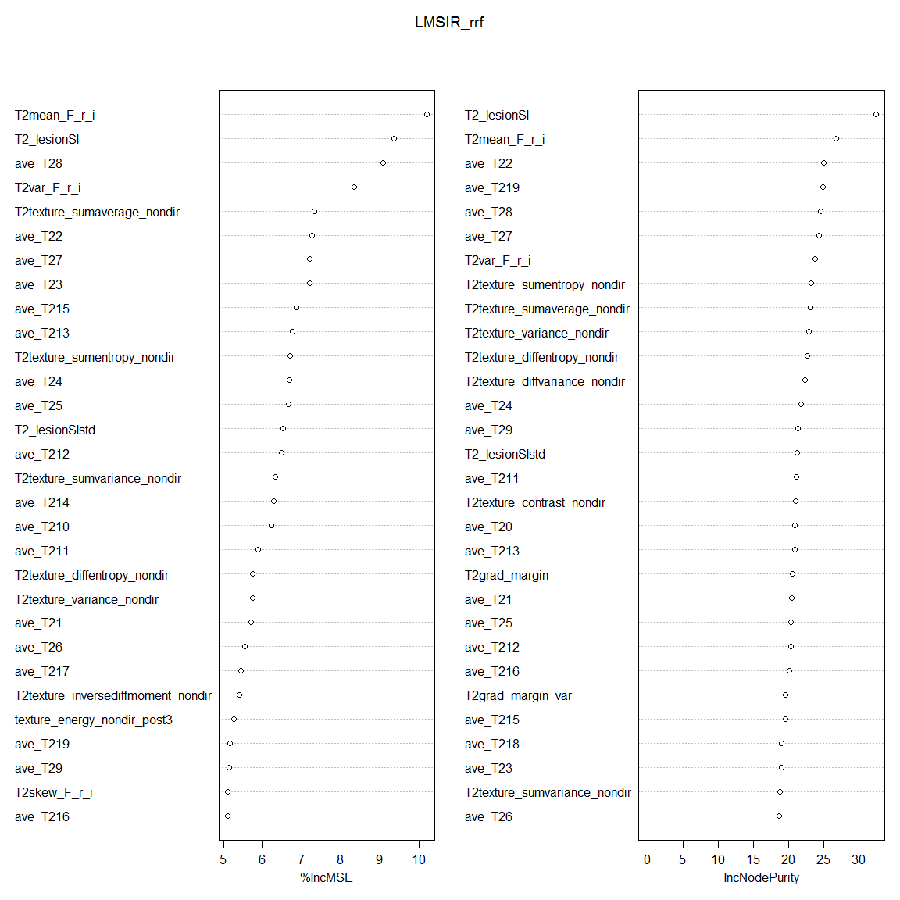
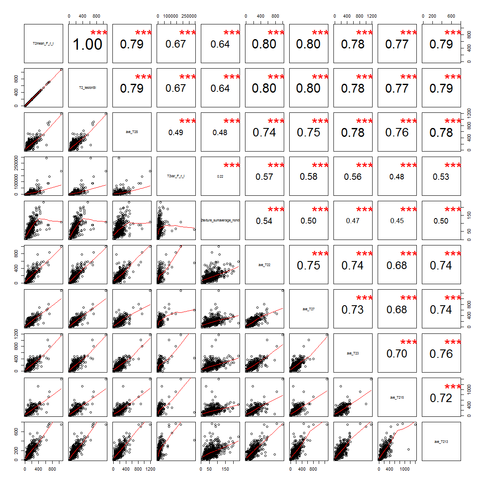
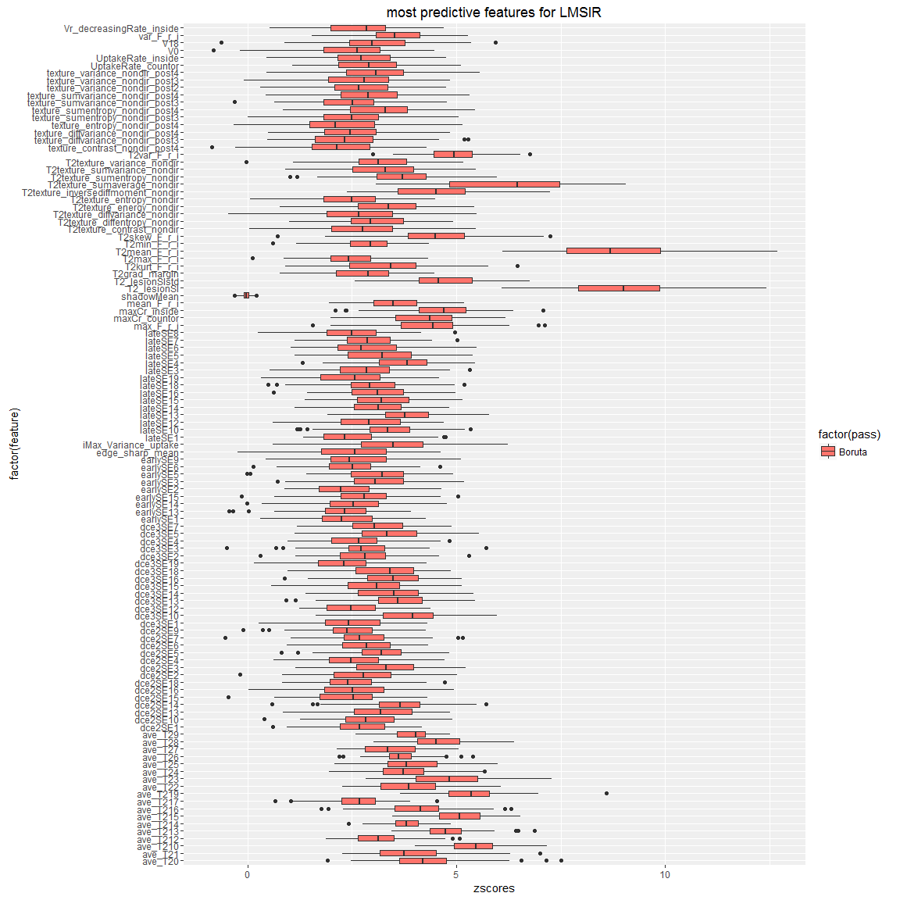

Since LMSIR is relevant for both malignancy prediction in non-masses (see T2_featureRelevance) and predictive of T2wBIRADSRSI
======

```
## Loading required package: ggplot2
## Loading required package: DBI
```


What features are most predictive of LMSIR (for a predictive regressor)?
==================

```r
# read datasets
npatients = length(uniq_cad)
allf = read_T1T2uniqcad_parti(id_cad_pts, uniq_cad, allpartitionsetD, npatients, 1)
```

```
##    massB    massM nonmassB nonmassM 
##      242      166      142       76 
## nonmassM 
##        1
```

```r
## formant
allfeatures = rbind(allf[[1]], allf[[2]])
alllesioninfo = rbind(allf[[5]], allf[[6]])

### print number of total lesions 
# before was ##   C / NC = 140 / 132
print(summary(as.factor(allfeatures$orig_label)))
```

```
##    massB    massM nonmassB nonmassM 
##      242      166      142       77
```

```r
#######################
# format datasets with find_T2_signal_int as response variable
LMSIRt2_signal = na.omit(cbind(allfeatures["LMSIR"], allfeatures[,2:ncol(allfeatures)]))
LMSIRt2_signal = LMSIRt2_signal[-c(202,ncol(allfeatures))]
summary(LMSIRt2_signal$LMSIR)
```

```
##    Min. 1st Qu.  Median    Mean 3rd Qu.    Max. 
##  0.2239  1.9180  2.8540  3.4580  4.2100 26.8300
```

```r
## Multi-class approach
# via RRF
library("RRF")
```

```
## RRF 1.6
## Type rrfNews() to see new features/changes/bug fixes.
## 
## Attaching package: 'RRF'
## 
## The following object is masked from 'package:ggplot2':
## 
##     margin
```

```r
set.seed(1)
yLMSIR = LMSIRt2_signal$LMSIR
allLMSIRt2_signal = LMSIRt2_signal[-c(1,199)]

LMSIR_rrf = RRF(allLMSIRt2_signal, yLMSIR, mtry=1, flagReg = 1, coefReg=0.5,
             ntree=2000, 
             localImp=TRUE,
             proximity=TRUE)

print(LMSIR_rrf)
```

```
## 
## Call:
##  RRF(x = allLMSIRt2_signal, y = yLMSIR, ntree = 2000, mtry = 1,      localImp = TRUE, proximity = TRUE, coefReg = 0.5, flagReg = 1) 
##                Type of random forest: regression
##                      Number of trees: 2000
## No. of variables tried at each split: 1
## 
##           Mean of squared residuals: 4.263153
##                     % Var explained: 24.83
```

```r
# overall feature importance
LMSIR_varImp = data.frame(varImpPlot(LMSIR_rrf, sort=TRUE))
```

 

```r
# sort features by MeanDecAccuracy
LMSIRvarImp <- LMSIR_varImp[ order(-LMSIR_varImp[,1]), ] 
# pick only non-zero variables
LMSIRvarImp = unique(LMSIRvarImp)

# format
df = data.frame(selfeat=rownames(LMSIRvarImp))
df$X.IncMSE = LMSIRvarImp$X.IncMSE 
df$SelectedFeatureGroup = "RRFimp"
# append
allLMSIRfeatures = data.frame()
allLMSIRfeatures = rbind(allLMSIRfeatures, df)


# plot most 10 significant features
pairs(allLMSIRt2_signal[,rownames(LMSIRvarImp)[1:10]], lower.panel=panel.smooth, upper.panel=panel.cor)
```

 

```r
# Random Forest feature relevance
library("Boruta")
```

```
## Loading required package: ranger
## 
## Attaching package: 'ranger'
## 
## The following object is masked from 'package:RRF':
## 
##     importance
```

```r
set.seed(1)
LMSIR_Boruta <- Boruta(LMSIR ~ . , data = LMSIRt2_signal,  doTrace = 2, ntree = 1000)
```

```
##  1. run of importance source...
##  2. run of importance source...
##  3. run of importance source...
##  4. run of importance source...
##  5. run of importance source...
##  6. run of importance source...
##  7. run of importance source...
##  8. run of importance source...
```

```
## Computing permutation importance.. Progress: 93%. Estimated remaining time: 2 seconds.
```

```
##  9. run of importance source...
##  10. run of importance source...
##  11. run of importance source...
##  12. run of importance source...
##  13. run of importance source...
##  14. run of importance source...
```

```
## Computing permutation importance.. Progress: 96%. Estimated remaining time: 1 seconds.
```

```
##  15. run of importance source...
```

```
## Computing permutation importance.. Progress: 97%. Estimated remaining time: 0 seconds.
```

```
## Confirmed 14 attributes: ave_T21, ave_T210, ave_T214, ave_T215, ave_T219 and 9 more.
## Rejected 58 attributes: A_countor, alpha_countor, alpha_inside, beta_countor, dce3SE17 and 53 more.
##  16. run of importance source...
##  17. run of importance source...
##  18. run of importance source...
##  19. run of importance source...
## Confirmed 5 attributes: ave_T20, ave_T213, ave_T24, ave_T28, T2texture_inversediffmoment_nondir.
## Rejected 25 attributes: A_inside, ave_T218, beta_inside, dce3SE11, earlySE10 and 20 more.
##  20. run of importance source...
##  21. run of importance source...
##  22. run of importance source...
##  23. run of importance source...
## Confirmed 2 attributes: ave_T216, ave_T25.
## Rejected 16 attributes: circularity, dce2SE17, dce2SE19, dce3SE8, dce3SE9 and 11 more.
##  24. run of importance source...
##  25. run of importance source...
##  26. run of importance source...
##  27. run of importance source...
## Confirmed 1 attributes: ave_T26.
## Rejected 4 attributes: earlySE12, T2RGH_var, texture_sumentropy_nondir_post1, V4.
##  28. run of importance source...
##  29. run of importance source...
##  30. run of importance source...
## Confirmed 2 attributes: ave_T22, T2skew_F_r_i.
## Rejected 2 attributes: earlySE18, texture_inversediffmoment_nondir_post3.
##  31. run of importance source...
##  32. run of importance source...
##  33. run of importance source...
## Confirmed 1 attributes: ave_T27.
## Rejected 2 attributes: dce2SE11, texture_diffentropy_nondir_post4.
##  34. run of importance source...
##  35. run of importance source...
##  36. run of importance source...
## Confirmed 1 attributes: T2texture_energy_nondir.
## Rejected 3 attributes: dce2SE12, earlySE4, V13.
##  37. run of importance source...
##  38. run of importance source...
##  39. run of importance source...
## Confirmed 1 attributes: maxCr_countor.
##  40. run of importance source...
##  41. run of importance source...
##  42. run of importance source...
## Rejected 3 attributes: dce2SE0, dce2SE8, texture_entropy_nondir_post3.
##  43. run of importance source...
##  44. run of importance source...
##  45. run of importance source...
## Confirmed 3 attributes: lateSE13, max_F_r_i, T2texture_sumvariance_nondir.
## Rejected 2 attributes: earlySE16, texture_sumvariance_nondir_post2.
##  46. run of importance source...
##  47. run of importance source...
##  48. run of importance source...
## Rejected 2 attributes: earlySE0, texture_diffvariance_nondir_post2.
##  49. run of importance source...
##  50. run of importance source...
##  51. run of importance source...
## Confirmed 1 attributes: lateSE4.
##  52. run of importance source...
##  53. run of importance source...
## Confirmed 3 attributes: iMax_Variance_uptake, mean_F_r_i, var_F_r_i.
##  54. run of importance source...
##  55. run of importance source...
##  56. run of importance source...
##  57. run of importance source...
##  58. run of importance source...
##  59. run of importance source...
##  60. run of importance source...
##  61. run of importance source...
##  62. run of importance source...
## Confirmed 1 attributes: dce3SE10.
## Rejected 2 attributes: ave_T211, lateSE9.
##  63. run of importance source...
##  64. run of importance source...
## Rejected 1 attributes: texture_contrast_nondir_post3.
##  65. run of importance source...
##  66. run of importance source...
##  67. run of importance source...
## Rejected 3 attributes: dce3SE0, iiMin_change_Variance_uptake, V1.
##  68. run of importance source...
##  69. run of importance source...
##  70. run of importance source...
##  71. run of importance source...
##  72. run of importance source...
## Confirmed 3 attributes: dce2SE14, dce3SE13, dce3SE5.
##  73. run of importance source...
##  74. run of importance source...
##  75. run of importance source...
## Confirmed 2 attributes: dce3SE14, T2texture_variance_nondir.
##  76. run of importance source...
##  77. run of importance source...
## Confirmed 1 attributes: dce2SE3.
##  78. run of importance source...
##  79. run of importance source...
##  80. run of importance source...
## Confirmed 1 attributes: dce3SE16.
## Rejected 2 attributes: dce3SE6, texture_variance_nondir_post1.
##  81. run of importance source...
##  82. run of importance source...
##  83. run of importance source...
## Rejected 1 attributes: lateSE11.
##  84. run of importance source...
##  85. run of importance source...
## Rejected 1 attributes: T2grad_margin_var.
##  86. run of importance source...
##  87. run of importance source...
##  88. run of importance source...
##  89. run of importance source...
##  90. run of importance source...
## Confirmed 1 attributes: lateSE10.
##  91. run of importance source...
##  92. run of importance source...
##  93. run of importance source...
## Rejected 1 attributes: lateSE2.
##  94. run of importance source...
##  95. run of importance source...
## Confirmed 1 attributes: dce2SE5.
##  96. run of importance source...
##  97. run of importance source...
##  98. run of importance source...
## Rejected 1 attributes: lateSE0.
##  99. run of importance source...
```

```r
print(LMSIR_Boruta)
```

```
## Boruta performed 99 iterations in 38.1443 mins.
##  44 attributes confirmed important: ave_T20, ave_T21, ave_T210, ave_T213, ave_T214
## and 39 more.
##  129 attributes confirmed unimportant: A_countor, A_inside, alpha_countor,
## alpha_inside, ave_T211 and 124 more.
##  68 tentative attributes left: ave_T212, ave_T217, dce2SE1, dce2SE10, dce2SE13 and
## 63 more.
```

```r
library("caret")
```

```
## Loading required package: lattice
```

```r
confirmedT2_LMSIR <- LMSIR_Boruta$finalDecision[LMSIR_Boruta$finalDecision == "Confirmed"]
tentativeT2_LMSIR <- LMSIR_Boruta$finalDecision[LMSIR_Boruta$finalDecision == "Tentative"]
allT2_LMSIR = c(names(confirmedT2_LMSIR), names(tentativeT2_LMSIR))

# Now plot z-scores
rankings_LMSIR <- LMSIR_Boruta$ImpHistory

LMSIRframezscore_selected = data.frame()
# process
for (i in 1:length(allT2_LMSIR)) {
    cfeature = allT2_LMSIR[i]
    LMSIRframe = data.frame(zscores = rankings_LMSIR[, cfeature])
    LMSIRframe$pass = "Boruta"
    LMSIRframe$feature = cfeature
    LMSIRframezscore_selected <- rbind(LMSIRframezscore_selected, LMSIRframe)
}
# add shadow mean
LMSIRframe = data.frame(zscores = rankings_LMSIR[, "shadowMean"])
LMSIRframe$pass = "Boruta"
LMSIRframe$feature = "shadowMean"
LMSIRframezscore_selected <- rbind(LMSIRframezscore_selected, LMSIRframe)

# plot for selected features
p <- ggplot(LMSIRframezscore_selected, aes(factor(feature), zscores, fill = factor(pass)))
p + geom_boxplot() + coord_flip() + labs(title = "most predictive features for LMSIR")
```

 

compare "low" and "high" LMSIR values for more predictive features
============

```r
## compare "low" and "high" values for more predictive features
LMSIRt2_signal$LMSIRind = LMSIRt2_signal$LMSIR
LMSIRt2_signal$LMSIRind = ifelse(LMSIRt2_signal$LMSIRind <= 1,"low","high")

# get average zscores 
zscores = rankings_LMSIR[, allT2_LMSIR]
df = data.frame(zscores=apply(zscores, 2, mean))
df$selfeatures = rownames(df)
ordered_zscores = df[order(-df[,1]),]

# contrast "low" and "high" with 10 most predictive features
print(ordered_zscores$selfeatures[1:10])
```

```
##  [1] "T2_lesionSI"                 "T2mean_F_r_i"                "T2texture_sumaverage_nondir"
##  [4] "ave_T210"                    "ave_T219"                    "ave_T215"                   
##  [7] "T2var_F_r_i"                 "ave_T23"                     "ave_T213"                   
## [10] "T2_lesionSIstd"
```

```r
with(LMSIRt2_signal, do.call(rbind, tapply(ave_T20, LMSIRind, function(x) c(M = mean(x), SD = sd(x)))))
```

```
##              M        SD
## high 184.25052 126.22459
## low   97.84343  84.73533
```

```r
with(LMSIRt2_signal, do.call(rbind, tapply(T2_lesionSI, LMSIRind, function(x) c(M = mean(x), SD = sd(x)))))
```

```
##              M        SD
## high 155.64511 101.06666
## low   62.13088  46.16368
```

```r
with(LMSIRt2_signal, do.call(rbind, tapply(T2_lesionSIstd, LMSIRind, function(x) c(M = mean(x), SD = sd(x)))))
```

```
##             M       SD
## high 88.09953 50.72008
## low  47.49129 36.33748
```

```r
with(LMSIRt2_signal, do.call(rbind, tapply(T2var_F_r_i, LMSIRind, function(x) c(M = mean(x), SD = sd(x)))))
```

```
##              M       SD
## high 10347.123 18674.73
## low   3525.894  6227.41
```

```r
with(LMSIRt2_signal, do.call(rbind, tapply(T2texture_energy_nondir, LMSIRind, function(x) c(M = mean(x), SD = sd(x)))))
```

```
##                M          SD
## high 0.002431133 0.005068754
## low  0.015110622 0.025737768
```

```r
save.image("C:/Users/windows/Documents/repoCode-local/T2wR/lop_3Dtex_T2w_addedvalue/LMSIR/Rdata/T2_featurespred_LMSIR.RData")
```

