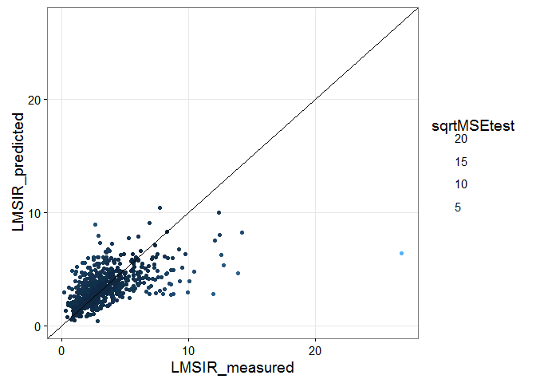

 
Final regression-based predictor model of LMSIR:
=============================
- This code creates a regression based predictor of LMSIR and add them to the pool of 55 T2w features for a total of 57 T2w featues

```
## Loading required package: lattice
## Loading required package: ggplot2
## Loading required package: DBI
## Loading required package: survival
## 
## Attaching package: 'survival'
## 
## The following object is masked from 'package:caret':
## 
##     cluster
## 
## Loading required package: splines
## Loading required package: parallel
## Loaded gbm 2.1.1
```


```r
# read datasets
npatients = length(uniq_cad)
allf = read_T1T2uniqcad_parti(id_cad_pts, uniq_cad, allpartitionsetD, npatients, 2)
```

```
##    massB    massM nonmassB nonmassM 
##      241      166      142       77 
## massB 
##     1
```

```r
## formant
allfeatures = rbind(allf[[1]], allf[[2]])
alllesioninfo = rbind(allf[[5]], allf[[6]])

### print number of total lesions 
# before was ##   C / NC = 140 / 132
print(summary(as.factor(allfeatures$orig_label)))
```

```
##    massB    massM nonmassB nonmassM 
##      242      166      142       77
```

```r
#######################
# format datasets with find_T2_signal_int as response variable
LMSIRt2_signal = na.omit(cbind(allfeatures["LMSIR"], allfeatures[,2:ncol(allfeatures)]))

LMSIRt2_signal = LMSIRt2_signal[-c(202,ncol(LMSIRt2_signal))]
summary(LMSIRt2_signal$LMSIR)
```

```
##    Min. 1st Qu.  Median    Mean 3rd Qu.    Max. 
##  0.2239  1.9180  2.8540  3.4580  4.2100 26.8300
```

```r
#######################
# Subset previuosly selected features
# for Boruta and rrfset and combine
borutasel = unique(ordered_zscores[,2])
rrfsel = as.character(unique(allLMSIRfeatures[,1]))
LMSIR_featsel = unique(borutasel, rrfsel)
```


Build final regressor
=======

```r
# collect parameters for bestuned LMSIR regressor
print(bestune)
```

```
##     x    y    z RF.sqrtMSEtrain RF.sqrtMSEtest boost.sqrtMSEtrain boost.sqrtMSEtest class
## 39 10 1500 0.02       0.4133585       1.330478           1.302245          1.307689 boost
```

```r
ntrees = bestune$y
alpha = bestune$z
npatients = length(uniq_cad)
LMSIR_lop = data.frame()

# perform leave-one-patient-out LMSIR prediction
for(k in 1:npatients){
  
  ## Create folds leave-one-patient-out
  allf = read_T1T2uniqcad_parti(id_cad_pts, uniq_cad, allpartitionsetD, npatients, k)
    
  ## formant
  Trainset = allf[[1]]; Trainsetinfo = allf[[5]]
  Testset = allf[[2]]; Testsetinfo = allf[[6]]
  dfinfo = Testsetinfo[,c(1,3,6:7,24:26)]
  testids = Testsetinfo$lesion_id
  print(dfinfo)

  ### print number of total lesions 
  # before was ##   C / NC = 140 / 132
  print(summary(as.factor(Trainset$orig_label)))
  Trainset = Trainset[,-ncol(Trainset)]
  Trainset$find_t2_signal_int = as.factor(Trainset$find_t2_signal_int)
  Testset$find_t2_signal_int = as.factor(Testset$find_t2_signal_int)
  
  # train boosted gradient trees 
  LMSIRboost = gbm(LMSIR ~ . ,data=Trainset, 
                   distribution="gaussian", 
                   n.trees=ntrees, shrinkage=alpha, verbose=FALSE)
  # on training
  LMSIRboost.hattrain = predict(LMSIRboost, newdata=Trainset, n.trees=ntrees) 
  #plot(LMSIRboost.hattrain, Trainset$LMSIR)
  #abline (0,1) 
  MSEtrainboost = mean((LMSIRboost.hattrain - Trainset$LMSIR)^2)
  sqrtMSEtrainboost = sqrt(MSEtrainboost)
  print(paste0("mean boost.sMSEtrain = ", sqrtMSEtrainboost))

  # on testing
  LMSIRboost.hattest = predict(LMSIRboost, newdata=Testset, n.trees=ntrees)   
  #plot(LMSIRboost.hattest, LMSIR.test)
  #abline (0,1) 
  MSEtestboost = (LMSIRboost.hattest - Testset$LMSIR)^2
  sqrtMSEtestboost = sqrt(MSEtestboost)
  print(paste0("boost.sMSEtest = ", sqrtMSEtestboost))

  # collect data for each patient into LMSIR_lop
  df = data.frame(LMSIR_measured = Testset$LMSIR, LMSIR_predicted = LMSIRboost.hattest, 
                  mean_sqrtMSEtrain=sqrtMSEtrainboost, sqrtMSEtest=sqrtMSEtestboost)
  LMSIR_lop = rbind(LMSIR_lop, cbind(dfinfo, df))
}
```

```
##    massB    massM nonmassB nonmassM 
##      242      166      142       76 
## nonmassM 
##        1 
##   lesion_id cad_pt_no_txt exam_a_number_txt           exam_dt_datetime BIRADS lesion_label lesion_diagnosis
## 1         1          0002           6745896 2011-04-03 00:00:00.000000      4     nonmassM     InsituDuctal
##    massB    massM nonmassB nonmassM 
##      242      166      142       76 
## [1] "mean boost.sMSEtrain = 1.25477992657165"
## [1] "boost.sMSEtest = 1.79083906250888"
##    massB    massM nonmassB nonmassM 
##      241      166      142       77 
## massB 
##     1 
##   lesion_id cad_pt_no_txt exam_a_number_txt           exam_dt_datetime BIRADS lesion_label        lesion_diagnosis
## 2         2          0016           6920252 2011-09-24 00:00:00.000000      4        massB FLORID DUCT HYPERPLASIA
##    massB    massM nonmassB nonmassM 
##      241      166      142       77 
## [1] "mean boost.sMSEtrain = 1.24470940878578"
## [1] "boost.sMSEtest = 1.41530619993706"
##    massB    massM nonmassB nonmassM 
##      242      166      141       77 
## nonmassB 
##        1 
##   lesion_id cad_pt_no_txt exam_a_number_txt           exam_dt_datetime BIRADS lesion_label lesion_diagnosis
## 3         3          0025           7002835 2011-12-28 00:00:00.000000      4     nonmassB   DENSE FIBROSIS
##    massB    massM nonmassB nonmassM 
##      242      166      141       77 
## [1] "mean boost.sMSEtrain = 1.25374920861824"
## [1] "boost.sMSEtest = 0.907361975620976"
##    massB    massM nonmassB nonmassM 
##      242      166      141       76 
## nonmassB nonmassM 
##        1        1 
##   lesion_id cad_pt_no_txt exam_a_number_txt           exam_dt_datetime BIRADS lesion_label lesion_diagnosis
## 4         4          0027           7171944 2012-08-15 00:00:00.000000      4     nonmassB STROMAL FIBROSIS
## 5         5          0027           6805483 2011-05-27 00:00:00.000000      4     nonmassM     InsituDuctal
##    massB    massM nonmassB nonmassM 
##      242      166      141       76 
## [1] "mean boost.sMSEtrain = 1.24462669389092"
## [1] "boost.sMSEtest = 0.96801703304445"  "boost.sMSEtest = 0.352059798914595"
##    massB    massM nonmassB nonmassM 
##      241      166      141       77 
##    massB nonmassB 
##        1        1 
##   lesion_id cad_pt_no_txt exam_a_number_txt           exam_dt_datetime BIRADS lesion_label     lesion_diagnosis
## 6         6          0066           4583735 2008-02-17 00:00:00.000000      3        massB BENIGN BREAST TISSUE
## 7         7          0066           7556910 2013-10-12 00:00:00.000000      4     nonmassB       DENSE FIBROSIS
##    massB    massM nonmassB nonmassM 
##      241      166      141       77 
## [1] "mean boost.sMSEtrain = 1.2532362255501"
## [1] "boost.sMSEtest = 0.57150002310884"  "boost.sMSEtest = 0.551329105494041"
##    massB    massM nonmassB nonmassM 
##      242      166      142       75 
## nonmassM 
##        2 
##   lesion_id cad_pt_no_txt exam_a_number_txt           exam_dt_datetime BIRADS lesion_label lesion_diagnosis
## 8         8          0093           7156466 2012-10-16 00:00:00.000000      4     nonmassM   InvasiveDuctal
## 9         9          0093           7156466 2012-10-16 00:00:00.000000      4     nonmassM   InvasiveDuctal
##    massB    massM nonmassB nonmassM 
##      242      166      142       75 
## [1] "mean boost.sMSEtrain = 1.25073046681784"
## [1] "boost.sMSEtest = 0.645356423841852" "boost.sMSEtest = 0.586764548283213"
##    massB    massM nonmassB nonmassM 
##      241      166      142       77 
## massB 
##     1 
##    lesion_id cad_pt_no_txt exam_a_number_txt           exam_dt_datetime BIRADS lesion_label lesion_diagnosis
## 10        10          0102           4755778 2009-03-19 00:00:00.000000      4        massB      FIBROCYSTIC
##    massB    massM nonmassB nonmassM 
##      241      166      142       77 
## [1] "mean boost.sMSEtrain = 1.23875421385377"
## [1] "boost.sMSEtest = 0.220191007599286"
##    massB    massM nonmassB nonmassM 
##      242      166      141       77 
## nonmassB 
##        1 
##    lesion_id cad_pt_no_txt exam_a_number_txt           exam_dt_datetime BIRADS lesion_label lesion_diagnosis
## 11        11          0111           6907205 2011-09-15 00:00:00.000000      4     nonmassB   DUCT PAPILLOMA
##    massB    massM nonmassB nonmassM 
##      242      166      141       77 
## [1] "mean boost.sMSEtrain = 1.2474781286928"
## [1] "boost.sMSEtest = 0.395382781334058"
##    massB    massM nonmassB nonmassM 
##      242      165      142       77 
## massM 
##     1 
##    lesion_id cad_pt_no_txt exam_a_number_txt           exam_dt_datetime BIRADS lesion_label lesion_diagnosis
## 12        12          0114           6896014 2011-10-02 00:00:00.000000      4        massM   InvasiveDuctal
##    massB    massM nonmassB nonmassM 
##      242      165      142       77 
## [1] "mean boost.sMSEtrain = 1.23969473964733"
## [1] "boost.sMSEtest = 1.20877339246939"
##    massB    massM nonmassB nonmassM 
##      240      166      142       77 
## massB 
##     2 
##    lesion_id cad_pt_no_txt exam_a_number_txt           exam_dt_datetime BIRADS lesion_label     lesion_diagnosis
## 13        13          0121           6714524 2011-02-22 00:00:00.000000      4        massB             ADENOSIS
## 14        14          0121           7091267 2012-08-29 00:00:00.000000      4        massB BENIGN BREAST TISSUE
##    massB    massM nonmassB nonmassM 
##      240      166      142       77 
## [1] "mean boost.sMSEtrain = 1.23838173589106"
## [1] "boost.sMSEtest = 2.35499197002105"  "boost.sMSEtest = 0.165985910935741"
##    massB    massM nonmassB nonmassM 
##      241      166      142       77 
## massB 
##     1 
##    lesion_id cad_pt_no_txt exam_a_number_txt           exam_dt_datetime BIRADS lesion_label lesion_diagnosis
## 15        15          0122           5108281 2009-12-14 00:00:00.000000      3        massB             Cyst
##    massB    massM nonmassB nonmassM 
##      241      166      142       77 
## [1] "mean boost.sMSEtrain = 1.25869588529924"
## [1] "boost.sMSEtest = 1.09467834230294"
##    massB    massM nonmassB nonmassM 
##      242      166      140       77 
## nonmassB 
##        2 
##    lesion_id cad_pt_no_txt exam_a_number_txt           exam_dt_datetime BIRADS lesion_label      lesion_diagnosis
## 16        16          0123           6909758 2011-09-16 00:00:00.000000      4     nonmassB COLUMNAR CELL CHANGES
## 17        17          0123           6909758 2011-09-16 00:00:00.000000      4     nonmassB  BENIGN BREAST TISSUE
##    massB    massM nonmassB nonmassM 
##      242      166      140       77 
## [1] "mean boost.sMSEtrain = 1.23752874494651"
## [1] "boost.sMSEtest = 0.473889201903615" "boost.sMSEtest = 0.27590140158789" 
##    massB    massM nonmassB nonmassM 
##      242      166      141       77 
## nonmassB 
##        1 
##    lesion_id cad_pt_no_txt exam_a_number_txt           exam_dt_datetime BIRADS lesion_label lesion_diagnosis
## 18        18          0127           4696964 2008-09-11 00:00:00.000000      4     nonmassB     FIBROADENOMA
##    massB    massM nonmassB nonmassM 
##      242      166      141       77 
## [1] "mean boost.sMSEtrain = 1.24837386982639"
## [1] "boost.sMSEtest = 0.900425719808971"
##    massB    massM nonmassB nonmassM 
##      241      166      142       77 
## massB 
##     1 
##    lesion_id cad_pt_no_txt exam_a_number_txt           exam_dt_datetime BIRADS lesion_label     lesion_diagnosis
## 19        19          0129           5326737 2010-07-17 00:00:00.000000      4        massB BENIGN BREAST TISSUE
##    massB    massM nonmassB nonmassM 
##      241      166      142       77 
## [1] "mean boost.sMSEtrain = 1.24800807919812"
## [1] "boost.sMSEtest = 1.91391824023961"
##    massB    massM nonmassB nonmassM 
##      239      166      142       77 
## massB 
##     3 
##    lesion_id cad_pt_no_txt exam_a_number_txt           exam_dt_datetime BIRADS lesion_label             lesion_diagnosis
## 20        20          0130           5017534 2010-03-29 00:00:00.000000      2        massB ATYPICAL LOBULAR HYPERPLASIA
## 21        21          0130           5017534 2010-03-29 00:00:00.000000      2        massB ATYPICAL LOBULAR HYPERPLASIA
## 22        22          0130           7347205 2013-05-05 00:00:00.000000      4        massB ATYPICAL LOBULAR HYPERPLASIA
##    massB    massM nonmassB nonmassM 
##      239      166      142       77 
## [1] "mean boost.sMSEtrain = 1.24238698141481"
## [1] "boost.sMSEtest = 0.975875024559883" "boost.sMSEtest = 0.724770592101095" "boost.sMSEtest = 1.3504769176528"  
##    massB    massM nonmassB nonmassM 
##      240      166      142       77 
## massB 
##     2 
##    lesion_id cad_pt_no_txt exam_a_number_txt           exam_dt_datetime BIRADS lesion_label     lesion_diagnosis
## 23        23          0132           5154279 2010-04-08 00:00:00.000000      3        massB BENIGN BREAST TISSUE
## 24        24          0132           5154279 2010-04-08 00:00:00.000000      3        massB BENIGN BREAST TISSUE
##    massB    massM nonmassB nonmassM 
##      240      166      142       77 
## [1] "mean boost.sMSEtrain = 1.24846331585786"
## [1] "boost.sMSEtest = 0.0214271422768888" "boost.sMSEtest = 1.35163192931652"  
##    massB    massM nonmassB nonmassM 
##      241      166      142       77 
## massB 
##     1 
##    lesion_id cad_pt_no_txt exam_a_number_txt           exam_dt_datetime BIRADS lesion_label lesion_diagnosis
## 25        25          0133           7072006 2012-03-10 00:00:00.000000      4        massB      FIBROCYSTIC
##    massB    massM nonmassB nonmassM 
##      241      166      142       77 
## [1] "mean boost.sMSEtrain = 1.24922406506783"
## [1] "boost.sMSEtest = 0.48643888124308"
##    massB    massM nonmassB nonmassM 
##      241      166      141       77 
##    massB nonmassB 
##        1        1 
##    lesion_id cad_pt_no_txt exam_a_number_txt           exam_dt_datetime BIRADS lesion_label lesion_diagnosis
## 26        26          0135           7777131 2014-05-17 00:00:00.000000      4        massB      FIBROCYSTIC
## 27        27          0135           5083620 2010-07-19 00:00:00.000000      4     nonmassB      FIBROCYSTIC
##    massB    massM nonmassB nonmassM 
##      241      166      141       77 
## [1] "mean boost.sMSEtrain = 1.24705312760941"
## [1] "boost.sMSEtest = 0.0946770008985482" "boost.sMSEtest = 0.956343597370134" 
##    massB    massM nonmassB nonmassM 
##      241      166      142       77 
## massB 
##     1 
##    lesion_id cad_pt_no_txt exam_a_number_txt           exam_dt_datetime BIRADS lesion_label lesion_diagnosis
## 29        29          0168           5240535 2010-04-12 00:00:00.000000      4        massB      FIBROCYSTIC
##    massB    massM nonmassB nonmassM 
##      241      166      142       77 
## [1] "mean boost.sMSEtrain = 1.24158761225855"
## [1] "boost.sMSEtest = 3.69538738491763"
##    massB    massM nonmassB nonmassM 
##      242      165      142       77 
## massM 
##     1 
##    lesion_id cad_pt_no_txt exam_a_number_txt           exam_dt_datetime BIRADS lesion_label lesion_diagnosis
## 30        30          0171           4751079 2009-02-22 00:00:00.000000      4        massM     InsituDuctal
##    massB    massM nonmassB nonmassM 
##      242      165      142       77 
## [1] "mean boost.sMSEtrain = 1.24127776591723"
## [1] "boost.sMSEtest = 2.4541384975031"
##    massB    massM nonmassB nonmassM 
##      241      166      142       77 
## massB 
##     1 
##    lesion_id cad_pt_no_txt exam_a_number_txt           exam_dt_datetime BIRADS lesion_label lesion_diagnosis
## 31        31          0172           4703102 2008-08-24 00:00:00.000000      4        massB      FIBROCYSTIC
##    massB    massM nonmassB nonmassM 
##      241      166      142       77 
## [1] "mean boost.sMSEtrain = 1.24661558405279"
## [1] "boost.sMSEtest = 0.784646811049135"
##    massB    massM nonmassB nonmassM 
##      242      166      141       77 
## nonmassB 
##        1 
##    lesion_id cad_pt_no_txt exam_a_number_txt           exam_dt_datetime BIRADS lesion_label lesion_diagnosis
## 32        32          0173           5123923 2009-11-30 00:00:00.000000      4     nonmassB   DUCT PAPILLOMA
##    massB    massM nonmassB nonmassM 
##      242      166      141       77 
## [1] "mean boost.sMSEtrain = 1.24388902279502"
## [1] "boost.sMSEtest = 0.332722676758701"
##    massB    massM nonmassB nonmassM 
##      242      165      142       76 
##    massM nonmassM 
##        1        1 
##    lesion_id cad_pt_no_txt exam_a_number_txt           exam_dt_datetime BIRADS lesion_label lesion_diagnosis
## 33        33          0177           6996979 2011-12-09 00:00:00.000000      3        massM     InsituDuctal
## 34        34          0177           6996979 2011-12-09 00:00:00.000000      3     nonmassM     InsituDuctal
##    massB    massM nonmassB nonmassM 
##      242      165      142       76 
## [1] "mean boost.sMSEtrain = 1.25405176357032"
## [1] "boost.sMSEtest = 0.840406402708729" "boost.sMSEtest = 0.493927670649187"
##    massB    massM nonmassB nonmassM 
##      242      166      140       77 
## nonmassB 
##        2 
##    lesion_id cad_pt_no_txt exam_a_number_txt           exam_dt_datetime BIRADS lesion_label     lesion_diagnosis
## 35        35          0180           4632561 2008-10-25 00:00:00.000000      4     nonmassB BENIGN BREAST TISSUE
## 36        36          0180           5254957 2010-12-14 00:00:00.000000      4     nonmassB         FIBROADENOMA
##    massB    massM nonmassB nonmassM 
##      242      166      140       77 
## [1] "mean boost.sMSEtrain = 1.24951948723826"
## [1] "boost.sMSEtest = 0.524320126115671" "boost.sMSEtest = 0.723979989575449"
##    massB    massM nonmassB nonmassM 
##      242      166      142       76 
## nonmassM 
##        1 
##    lesion_id cad_pt_no_txt exam_a_number_txt           exam_dt_datetime BIRADS lesion_label lesion_diagnosis
## 37        37          0186           6869828 2011-08-02 00:00:00.000000      4     nonmassM     InsituDuctal
##    massB    massM nonmassB nonmassM 
##      242      166      142       76 
## [1] "mean boost.sMSEtrain = 1.25169403547335"
## [1] "boost.sMSEtest = 0.559648729403425"
##    massB    massM nonmassB nonmassM 
##      242      166      141       77 
## nonmassB 
##        1 
##    lesion_id cad_pt_no_txt exam_a_number_txt           exam_dt_datetime BIRADS lesion_label    lesion_diagnosis
## 38        38          0189           5057674 2009-10-10 00:00:00.000000      4     nonmassB SCLEROSING ADENOSIS
##    massB    massM nonmassB nonmassM 
##      242      166      141       77 
## [1] "mean boost.sMSEtrain = 1.24527279216729"
## [1] "boost.sMSEtest = 1.81672909470953"
##    massB    massM nonmassB nonmassM 
##      241      166      142       77 
## massB 
##     1 
##    lesion_id cad_pt_no_txt exam_a_number_txt           exam_dt_datetime BIRADS lesion_label lesion_diagnosis
## 39        39          0103           6836585 2011-06-26 00:00:00.000000      5        massB  PHYLLODES TUMOR
##    massB    massM nonmassB nonmassM 
##      241      166      142       77 
## [1] "mean boost.sMSEtrain = 1.24578035150055"
## [1] "boost.sMSEtest = 4.5179530012353"
##    massB    massM nonmassB nonmassM 
##      242      165      142       76 
##    massM nonmassM 
##        1        1 
##    lesion_id cad_pt_no_txt exam_a_number_txt           exam_dt_datetime BIRADS lesion_label lesion_diagnosis
## 40        40          0190           6760690 2011-04-12 00:00:00.000000      4        massM   InvasiveDuctal
## 41        41          0190           6760690 2011-04-12 00:00:00.000000      4     nonmassM   InvasiveDuctal
##    massB    massM nonmassB nonmassM 
##      242      165      142       76 
## [1] "mean boost.sMSEtrain = 1.25103244523622"
## [1] "boost.sMSEtest = 1.26928611781402"   "boost.sMSEtest = 0.0831979400949616"
##    massB    massM nonmassB nonmassM 
##      242      166      139       77 
## nonmassB 
##        3 
##    lesion_id cad_pt_no_txt exam_a_number_txt           exam_dt_datetime BIRADS lesion_label           lesion_diagnosis
## 42        42          0196           5289117 2010-11-29 00:00:00.000000      4     nonmassB        SCLEROSING ADENOSIS
## 43        43          0196           5289117 2010-11-29 00:00:00.000000      4     nonmassB ColumnarAlterationwoAtypia
## 44        44          0196           5289117 2010-11-29 00:00:00.000000      4     nonmassB ColumnarAlterationwoAtypia
##    massB    massM nonmassB nonmassM 
##      242      166      139       77 
## [1] "mean boost.sMSEtrain = 1.2342271708031"
## [1] "boost.sMSEtest = 0.89083797004191"  "boost.sMSEtest = 0.841883240310862" "boost.sMSEtest = 5.9663781209792"  
##    massB    massM nonmassB nonmassM 
##      241      166      140       77 
##    massB nonmassB 
##        1        2 
##    lesion_id cad_pt_no_txt exam_a_number_txt           exam_dt_datetime BIRADS lesion_label   lesion_diagnosis
## 45        45          0197           6667696 2011-05-10 00:00:00.000000      4     nonmassB LobularHyperplasia
## 46        46          0197           6667696 2011-05-10 00:00:00.000000      4     nonmassB LobularHyperplasia
## 47        47          0197           6667696 2011-05-10 00:00:00.000000      4        massB LobularHyperplasia
##    massB    massM nonmassB nonmassM 
##      241      166      140       77 
## [1] "mean boost.sMSEtrain = 1.24718777280671"
## [1] "boost.sMSEtest = 2.12856304505654" "boost.sMSEtest = 3.21405868016806" "boost.sMSEtest = 1.43088905401326"
##    massB    massM nonmassB nonmassM 
##      240      166      142       77 
## massB 
##     2 
##    lesion_id cad_pt_no_txt exam_a_number_txt           exam_dt_datetime BIRADS lesion_label lesion_diagnosis
## 48        48          0198           4809893 2009-05-03 00:00:00.000000      2        massB      FIBROCYSTIC
## 49        49          0198           4809893 2009-05-03 00:00:00.000000      2        massB     FIBROADENOMA
##    massB    massM nonmassB nonmassM 
##      240      166      142       77 
## [1] "mean boost.sMSEtrain = 1.25283555109673"
## [1] "boost.sMSEtest = 1.5594443039314"  "boost.sMSEtest = 1.11126092797672"
##    massB    massM nonmassB nonmassM 
##      241      166      142       77 
## massB 
##     1 
##    lesion_id cad_pt_no_txt exam_a_number_txt           exam_dt_datetime BIRADS lesion_label             lesion_diagnosis
## 50        50          0199           4362726 2007-05-18 00:00:00.000000      4        massB ATYPICAL LOBULAR HYPERPLASIA
##    massB    massM nonmassB nonmassM 
##      241      166      142       77 
## [1] "mean boost.sMSEtrain = 1.24645921158506"
## [1] "boost.sMSEtest = 0.93608942423117"
##    massB    massM nonmassB nonmassM 
##      241      166      142       77 
## massB 
##     1 
##    lesion_id cad_pt_no_txt exam_a_number_txt           exam_dt_datetime BIRADS lesion_label lesion_diagnosis
## 51        51          0205           5085133 2010-04-17 00:00:00.000000      4        massB  FIBROEPITHELIAL
##    massB    massM nonmassB nonmassM 
##      241      166      142       77 
## [1] "mean boost.sMSEtrain = 1.24953931259357"
## [1] "boost.sMSEtest = 1.88850234909974"
##    massB    massM nonmassB nonmassM 
##      241      166      142       77 
## massB 
##     1 
##    lesion_id cad_pt_no_txt exam_a_number_txt           exam_dt_datetime BIRADS lesion_label lesion_diagnosis
## 52        52          0207           4982884 2009-11-09 00:00:00.000000      4        massB         FIBROSIS
##    massB    massM nonmassB nonmassM 
##      241      166      142       77 
## [1] "mean boost.sMSEtrain = 1.24314969340362"
## [1] "boost.sMSEtest = 0.517893401077492"
##    massB    massM nonmassB nonmassM 
##      241      166      142       77 
## massB 
##     1 
##    lesion_id cad_pt_no_txt exam_a_number_txt           exam_dt_datetime BIRADS lesion_label lesion_diagnosis
## 53        53          0212           4734525 2008-09-08 00:00:00.000000      4        massB     FIBROADENOMA
##    massB    massM nonmassB nonmassM 
##      241      166      142       77 
## [1] "mean boost.sMSEtrain = 1.24626804920856"
## [1] "boost.sMSEtest = 1.35549546809009"
##    massB    massM nonmassB nonmassM 
##      240      166      142       77 
## massB 
##     2 
##    lesion_id cad_pt_no_txt exam_a_number_txt           exam_dt_datetime BIRADS lesion_label lesion_diagnosis
## 54        54          0220           6715021 2011-02-22 00:00:00.000000      5        massB       RadialScar
## 55        55          0220           6715021 2011-02-22 00:00:00.000000      5        massB     FIBROADENOMA
##    massB    massM nonmassB nonmassM 
##      240      166      142       77 
## [1] "mean boost.sMSEtrain = 1.24325757385387"
## [1] "boost.sMSEtest = 0.0217086844357874" "boost.sMSEtest = 0.267036421677531" 
##    massB    massM nonmassB nonmassM 
##      242      166      141       77 
## nonmassB 
##        1 
##    lesion_id cad_pt_no_txt exam_a_number_txt           exam_dt_datetime BIRADS lesion_label lesion_diagnosis
## 56        56          0229           6831376 2011-06-15 00:00:00.000000      5     nonmassB      FIBROCYSTIC
##    massB    massM nonmassB nonmassM 
##      242      166      141       77 
## [1] "mean boost.sMSEtrain = 1.24339520263414"
## [1] "boost.sMSEtest = 0.413992836212888"
##    massB    massM nonmassB nonmassM 
##      242      166      140       77 
## nonmassB 
##        2 
##    lesion_id cad_pt_no_txt exam_a_number_txt           exam_dt_datetime BIRADS lesion_label lesion_diagnosis
## 57        57          0232           6671713 2011-01-11 00:00:00.000000      5     nonmassB      FIBROCYSTIC
## 58        58          0232           6671713 2011-01-11 00:00:00.000000      5     nonmassB      FIBROCYSTIC
##    massB    massM nonmassB nonmassM 
##      242      166      140       77 
## [1] "mean boost.sMSEtrain = 1.24748083086337"
## [1] "boost.sMSEtest = 1.76920982449594"  "boost.sMSEtest = 0.906807077002911"
##    massB    massM nonmassB nonmassM 
##      241      166      142       77 
## massB 
##     1 
##    lesion_id cad_pt_no_txt exam_a_number_txt           exam_dt_datetime BIRADS lesion_label     lesion_diagnosis
## 59        59          0246           7485590 2013-05-14 00:00:00.000000      4        massB BENIGN BREAST TISSUE
##    massB    massM nonmassB nonmassM 
##      241      166      142       77 
## [1] "mean boost.sMSEtrain = 1.25206967134013"
## [1] "boost.sMSEtest = 0.814391505360067"
##    massB    massM nonmassB nonmassM 
##      239      166      141       77 
##    massB nonmassB 
##        3        1 
##    lesion_id cad_pt_no_txt exam_a_number_txt           exam_dt_datetime BIRADS lesion_label     lesion_diagnosis
## 60        60          0252           5142106 2009-12-04 00:00:00.000000      4        massB         FIBROADENOMA
## 61        61          0252           5142106 2009-12-04 00:00:00.000000      4        massB         FIBROADENOMA
## 62        62          0252           6700964 2011-07-18 00:00:00.000000      3     nonmassB BENIGN BREAST TISSUE
## 63        63          0252           6700964 2011-07-18 00:00:00.000000      3        massB BENIGN BREAST TISSUE
##    massB    massM nonmassB nonmassM 
##      239      166      141       77 
## [1] "mean boost.sMSEtrain = 1.24265830465634"
## [1] "boost.sMSEtest = 0.355694301937262" "boost.sMSEtest = 0.281680082508116" "boost.sMSEtest = 1.92527870324317" 
## [4] "boost.sMSEtest = 1.91307209284518" 
##    massB    massM nonmassB nonmassM 
##      242      166      141       77 
## nonmassB 
##        1 
##    lesion_id cad_pt_no_txt exam_a_number_txt           exam_dt_datetime BIRADS lesion_label     lesion_diagnosis
## 65        65          0259           7364573 2013-02-02 00:00:00.000000      2     nonmassB BENIGN BREAST TISSUE
##    massB    massM nonmassB nonmassM 
##      242      166      141       77 
## [1] "mean boost.sMSEtrain = 1.25317109334875"
## [1] "boost.sMSEtest = 0.605366531316429"
##    massB    massM nonmassB nonmassM 
##      242      166      141       77 
## nonmassB 
##        1 
##    lesion_id cad_pt_no_txt exam_a_number_txt           exam_dt_datetime BIRADS lesion_label lesion_diagnosis
## 66        66          0266           5254958 2010-07-16 00:00:00.000000      4     nonmassB      FIBROCYSTIC
##    massB    massM nonmassB nonmassM 
##      242      166      141       77 
## [1] "mean boost.sMSEtrain = 1.2454020512197"
## [1] "boost.sMSEtest = 0.724472732957761"
##    massB    massM nonmassB nonmassM 
##      242      164      142       77 
## massM 
##     2 
##    lesion_id cad_pt_no_txt exam_a_number_txt           exam_dt_datetime BIRADS lesion_label lesion_diagnosis
## 67        67          0276           6952525 2011-12-31 00:00:00.000000      4        massM   InvasiveDuctal
## 68        68          0276           6952525 2011-12-31 00:00:00.000000      4        massM   InvasiveDuctal
##    massB    massM nonmassB nonmassM 
##      242      164      142       77 
## [1] "mean boost.sMSEtrain = 1.2438707668133"
## [1] "boost.sMSEtest = 0.567418549561828" "boost.sMSEtest = 2.2435068244197"  
##    massB    massM nonmassB nonmassM 
##      242      166      142       76 
## nonmassM 
##        1 
##    lesion_id cad_pt_no_txt exam_a_number_txt           exam_dt_datetime BIRADS lesion_label lesion_diagnosis
## 69        69          0277           5077098 2009-09-22 00:00:00.000000      5     nonmassM     InsituDuctal
##    massB    massM nonmassB nonmassM 
##      242      166      142       76 
## [1] "mean boost.sMSEtrain = 1.24425738460069"
## [1] "boost.sMSEtest = 0.236142803482592"
##    massB    massM nonmassB nonmassM 
##      241      166      142       77 
## massB 
##     1 
##    lesion_id cad_pt_no_txt exam_a_number_txt           exam_dt_datetime BIRADS lesion_label     lesion_diagnosis
## 70        70          0280           5091695 2009-12-07 00:00:00.000000      4        massB BENIGN BREAST TISSUE
##    massB    massM nonmassB nonmassM 
##      241      166      142       77 
## [1] "mean boost.sMSEtrain = 1.23968057383149"
## [1] "boost.sMSEtest = 1.28781265503967"
##    massB    massM nonmassB nonmassM 
##      242      166      141       77 
## nonmassB 
##        1 
##    lesion_id cad_pt_no_txt exam_a_number_txt           exam_dt_datetime BIRADS lesion_label     lesion_diagnosis
## 72        72          0293           7491268 2013-06-09 00:00:00.000000      4     nonmassB BENIGN BREAST TISSUE
##    massB    massM nonmassB nonmassM 
##      242      166      141       77 
## [1] "mean boost.sMSEtrain = 1.23947944757881"
## [1] "boost.sMSEtest = 2.69772862873604"
##    massB    massM nonmassB nonmassM 
##      241      166      142       77 
## massB 
##     1 
##    lesion_id cad_pt_no_txt exam_a_number_txt           exam_dt_datetime BIRADS lesion_label lesion_diagnosis
## 73        73          0311           6677243 2011-01-10 00:00:00.000000      4        massB     FIBROADENOMA
##    massB    massM nonmassB nonmassM 
##      241      166      142       77 
## [1] "mean boost.sMSEtrain = 1.2375522335293"
## [1] "boost.sMSEtest = 4.75467053108372"
##    massB    massM nonmassB nonmassM 
##      241      166      142       77 
## massB 
##     1 
##    lesion_id cad_pt_no_txt exam_a_number_txt           exam_dt_datetime BIRADS lesion_label lesion_diagnosis
## 74        74          0325           4696948 2008-12-01 00:00:00.000000      4        massB      FIBROCYSTIC
##    massB    massM nonmassB nonmassM 
##      241      166      142       77 
## [1] "mean boost.sMSEtrain = 1.2457981453158"
## [1] "boost.sMSEtest = 4.60886813792128"
##    massB    massM nonmassB nonmassM 
##      239      166      142       77 
## massB 
##     3 
##    lesion_id cad_pt_no_txt exam_a_number_txt           exam_dt_datetime BIRADS lesion_label     lesion_diagnosis
## 75        75          0331           4722659 2009-01-24 00:00:00.000000      2        massB          FIBROCYSTIC
## 76        76          0331           7347095 2013-02-16 00:00:00.000000      4        massB          FIBROCYSTIC
## 77        77          0331           7347095 2013-02-16 00:00:00.000000      4        massB capillary hemangioma
##    massB    massM nonmassB nonmassM 
##      239      166      142       77 
## [1] "mean boost.sMSEtrain = 1.2497405522652"
## [1] "boost.sMSEtest = 4.30575844752054"  "boost.sMSEtest = 0.188618066899001" "boost.sMSEtest = 1.23957407545826" 
##    massB    massM nonmassB nonmassM 
##      241      166      142       77 
## massB 
##     1 
##    lesion_id cad_pt_no_txt exam_a_number_txt           exam_dt_datetime BIRADS lesion_label lesion_diagnosis
## 78        78          0352           4785776 2009-01-19 00:00:00.000000      4        massB     FIBROADENOMA
##    massB    massM nonmassB nonmassM 
##      241      166      142       77 
## [1] "mean boost.sMSEtrain = 1.25149887973277"
## [1] "boost.sMSEtest = 3.34003969453909"
##    massB    massM nonmassB nonmassM 
##      242      166      141       77 
## nonmassB 
##        1 
##    lesion_id cad_pt_no_txt exam_a_number_txt           exam_dt_datetime BIRADS lesion_label lesion_diagnosis
## 79        79          0357           5137030 2009-12-15 00:00:00.000000      4     nonmassB      FIBROCYSTIC
##    massB    massM nonmassB nonmassM 
##      242      166      141       77 
## [1] "mean boost.sMSEtrain = 1.25097780817506"
## [1] "boost.sMSEtest = 0.121271724596616"
##    massB    massM nonmassB nonmassM 
##      241      166      142       77 
## massB 
##     1 
##    lesion_id cad_pt_no_txt exam_a_number_txt           exam_dt_datetime BIRADS lesion_label lesion_diagnosis
## 80        80          0376           4609403 2008-04-04 00:00:00.000000      4        massB BENIGN HAMARTOMA
##    massB    massM nonmassB nonmassM 
##      241      166      142       77 
## [1] "mean boost.sMSEtrain = 1.25379414382652"
## [1] "boost.sMSEtest = 0.295710366778197"
##    massB    massM nonmassB nonmassM 
##      242      165      142       77 
## massM 
##     1 
##    lesion_id cad_pt_no_txt exam_a_number_txt           exam_dt_datetime BIRADS lesion_label lesion_diagnosis
## 81        81          0388           7395410 2013-02-26 00:00:00.000000      5        massM   InvasiveDuctal
##    massB    massM nonmassB nonmassM 
##      242      165      142       77 
## [1] "mean boost.sMSEtrain = 1.25121287812779"
## [1] "boost.sMSEtest = 2.07041993209176"
##    massB    massM nonmassB nonmassM 
##      241      166      142       77 
## massB 
##     1 
##    lesion_id cad_pt_no_txt exam_a_number_txt           exam_dt_datetime BIRADS lesion_label     lesion_diagnosis
## 82        82          0409           5161803 2010-06-08 00:00:00.000000      4        massB BENIGN BREAST TISSUE
##    massB    massM nonmassB nonmassM 
##      241      166      142       77 
## [1] "mean boost.sMSEtrain = 1.24716555000056"
## [1] "boost.sMSEtest = 3.03634524805982"
##    massB    massM nonmassB nonmassM 
##      242      166      142       76 
## nonmassM 
##        1 
##    lesion_id cad_pt_no_txt exam_a_number_txt           exam_dt_datetime BIRADS lesion_label lesion_diagnosis
## 83        83          0420           6738142 2011-03-22 00:00:00.000000      3     nonmassM     InsituDuctal
##    massB    massM nonmassB nonmassM 
##      242      166      142       76 
## [1] "mean boost.sMSEtrain = 1.24623846034468"
## [1] "boost.sMSEtest = 0.948427978555509"
##    massB    massM nonmassB nonmassM 
##      242      166      139       77 
## nonmassB 
##        3 
##    lesion_id cad_pt_no_txt exam_a_number_txt           exam_dt_datetime BIRADS lesion_label     lesion_diagnosis
## 84        84          0426           7169326 2012-06-29 00:00:00.000000      4     nonmassB     STROMAL FIBROSIS
## 85        85          0426           7169326 2012-06-29 00:00:00.000000      4     nonmassB BENIGN BREAST TISSUE
## 86        86          0426           7169326 2012-06-29 00:00:00.000000      4     nonmassB     STROMAL FIBROSIS
##    massB    massM nonmassB nonmassM 
##      242      166      139       77 
## [1] "mean boost.sMSEtrain = 1.24317821971125"
## [1] "boost.sMSEtest = 0.945908848308204" "boost.sMSEtest = 4.9365733212139"   "boost.sMSEtest = 1.43484621417679" 
##    massB    massM nonmassB nonmassM 
##      241      166      142       77 
## massB 
##     1 
##    lesion_id cad_pt_no_txt exam_a_number_txt           exam_dt_datetime BIRADS lesion_label     lesion_diagnosis
## 87        87          0442           4936886 2010-03-13 00:00:00.000000      4        massB BENIGN BREAST TISSUE
##    massB    massM nonmassB nonmassM 
##      241      166      142       77 
## [1] "mean boost.sMSEtrain = 1.24506838777523"
## [1] "boost.sMSEtest = 1.64158321530124"
##    massB    massM nonmassB nonmassM 
##      242      165      142       77 
## massM 
##     1 
##    lesion_id cad_pt_no_txt exam_a_number_txt           exam_dt_datetime BIRADS lesion_label lesion_diagnosis
## 88        88          0456           6689214 2011-02-12 00:00:00.000000      4        massM   InvasiveDuctal
##    massB    massM nonmassB nonmassM 
##      242      165      142       77 
## [1] "mean boost.sMSEtrain = 1.25075921834121"
## [1] "boost.sMSEtest = 3.53540095920969"
##    massB    massM nonmassB nonmassM 
##      241      166      142       76 
##    massB nonmassM 
##        1        1 
##    lesion_id cad_pt_no_txt exam_a_number_txt           exam_dt_datetime BIRADS lesion_label lesion_diagnosis
## 89        89          0462           5466989 2010-12-23 00:00:00.000000      3     nonmassM   InvasiveDuctal
## 90        90          0462           5466989 2010-12-23 00:00:00.000000      4        massB     FIBROADENOMA
##    massB    massM nonmassB nonmassM 
##      241      166      142       76 
## [1] "mean boost.sMSEtrain = 1.24859516643748"
## [1] "boost.sMSEtest = 0.540325339104337" "boost.sMSEtest = 1.59775748970684" 
##    massB    massM nonmassB nonmassM 
##      241      166      142       77 
## massB 
##     1 
##    lesion_id cad_pt_no_txt exam_a_number_txt           exam_dt_datetime BIRADS lesion_label   lesion_diagnosis
## 91        91          0463           7626269 2014-01-14 00:00:00.000000      4        massB FLORID HYPERPLASIA
##    massB    massM nonmassB nonmassM 
##      241      166      142       77 
## [1] "mean boost.sMSEtrain = 1.24412528674937"
## [1] "boost.sMSEtest = 0.123725485136872"
##    massB    massM nonmassB nonmassM 
##      242      166      141       77 
## nonmassB 
##        1 
##    lesion_id cad_pt_no_txt exam_a_number_txt           exam_dt_datetime BIRADS lesion_label            lesion_diagnosis
## 92        92          0465           4885863 2009-06-07 00:00:00.000000      2     nonmassB ATYPICAL DUCTAL HYPERPLASIA
##    massB    massM nonmassB nonmassM 
##      242      166      141       77 
## [1] "mean boost.sMSEtrain = 1.24478633843251"
## [1] "boost.sMSEtest = 0.00459234201579628"
##    massB    massM nonmassB nonmassM 
##      241      166      142       77 
## massB 
##     1 
##    lesion_id cad_pt_no_txt exam_a_number_txt           exam_dt_datetime BIRADS lesion_label lesion_diagnosis
## 93        93          0473           7364625 2013-12-19 00:00:00.000000      4        massB      FIBROCYSTIC
##    massB    massM nonmassB nonmassM 
##      241      166      142       77 
## [1] "mean boost.sMSEtrain = 1.24793999038741"
## [1] "boost.sMSEtest = 0.119794218178091"
##    massB    massM nonmassB nonmassM 
##      242      165      142       77 
## massM 
##     1 
##    lesion_id cad_pt_no_txt exam_a_number_txt           exam_dt_datetime BIRADS lesion_label lesion_diagnosis
## 95        95          0503           6697826 2011-03-19 00:00:00.000000      3        massM   InvasiveDuctal
##    massB    massM nonmassB nonmassM 
##      242      165      142       77 
## [1] "mean boost.sMSEtrain = 1.24792805869109"
## [1] "boost.sMSEtest = 1.08616722600858"
##    massB    massM nonmassB nonmassM 
##      242      166      140       77 
## nonmassB 
##        2 
##    lesion_id cad_pt_no_txt exam_a_number_txt           exam_dt_datetime BIRADS lesion_label      lesion_diagnosis
## 96        96          0510           7662547 2014-04-22 00:00:00.000000      4     nonmassB COLUMNAR CELL CHANGES
## 97        97          0510           7662547 2014-04-22 00:00:00.000000      4     nonmassB COLUMNAR CELL CHANGES
##    massB    massM nonmassB nonmassM 
##      242      166      140       77 
## [1] "mean boost.sMSEtrain = 1.26117936075274"
## [1] "boost.sMSEtest = 1.19707547692865"  "boost.sMSEtest = 0.257849030698588"
##    massB    massM nonmassB nonmassM 
##      242      166      141       77 
## nonmassB 
##        1 
##    lesion_id cad_pt_no_txt exam_a_number_txt           exam_dt_datetime BIRADS lesion_label            lesion_diagnosis
## 98        98          0513           5043867 2010-09-16 00:00:00.000000      4     nonmassB ATYPICAL DUCTAL HYPERPLASIA
##    massB    massM nonmassB nonmassM 
##      242      166      141       77 
## [1] "mean boost.sMSEtrain = 1.24628722539851"
## [1] "boost.sMSEtest = 1.04564049981021"
##    massB    massM nonmassB nonmassM 
##      241      166      142       77 
## massB 
##     1 
##    lesion_id cad_pt_no_txt exam_a_number_txt           exam_dt_datetime BIRADS lesion_label       lesion_diagnosis
## 99        99          0519           4937737 2009-05-14 00:00:00.000000      4        massB FLAT EPITHELIAL ATYPIA
##    massB    massM nonmassB nonmassM 
##      241      166      142       77 
## [1] "mean boost.sMSEtrain = 1.24076669946323"
## [1] "boost.sMSEtest = 0.339286952975623"
##    massB    massM nonmassB nonmassM 
##      241      166      142       77 
## massB 
##     1 
##     lesion_id cad_pt_no_txt exam_a_number_txt           exam_dt_datetime BIRADS lesion_label lesion_diagnosis
## 100       100          0536           7786869 2014-05-06 00:00:00.000000      4        massB     FIBROADENOMA
##    massB    massM nonmassB nonmassM 
##      241      166      142       77 
## [1] "mean boost.sMSEtrain = 1.24580482747788"
## [1] "boost.sMSEtest = 0.893971145691571"
##    massB    massM nonmassB nonmassM 
##      241      166      142       77 
## massB 
##     1 
##     lesion_id cad_pt_no_txt exam_a_number_txt           exam_dt_datetime BIRADS lesion_label lesion_diagnosis
## 101       101          0551           4804820 2008-11-06 00:00:00.000000      4        massB  FIBROEPITHELIAL
##    massB    massM nonmassB nonmassM 
##      241      166      142       77 
## [1] "mean boost.sMSEtrain = 1.23961908494237"
## [1] "boost.sMSEtest = 0.437233153713081"
##    massB    massM nonmassB nonmassM 
##      241      166      142       77 
## massB 
##     1 
##     lesion_id cad_pt_no_txt exam_a_number_txt           exam_dt_datetime BIRADS lesion_label lesion_diagnosis
## 102       102          0552           4663314 2008-05-15 00:00:00.000000      4        massB         ADENOSIS
##    massB    massM nonmassB nonmassM 
##      241      166      142       77 
## [1] "mean boost.sMSEtrain = 1.24728658657821"
## [1] "boost.sMSEtest = 1.87371477490253"
##    massB    massM nonmassB nonmassM 
##      241      166      142       77 
## massB 
##     1 
##     lesion_id cad_pt_no_txt exam_a_number_txt           exam_dt_datetime BIRADS lesion_label     lesion_diagnosis
## 103       103          0553           6687000 2011-07-28 00:00:00.000000      2        massB BENIGN BREAST TISSUE
##    massB    massM nonmassB nonmassM 
##      241      166      142       77 
## [1] "mean boost.sMSEtrain = 1.24611105413019"
## [1] "boost.sMSEtest = 1.11132641389121"
##    massB    massM nonmassB nonmassM 
##      241      166      142       77 
## massB 
##     1 
##     lesion_id cad_pt_no_txt exam_a_number_txt           exam_dt_datetime BIRADS lesion_label lesion_diagnosis
## 104       104          0561           4668611 2008-05-30 00:00:00.000000      4        massB     FIBROADENOMA
##    massB    massM nonmassB nonmassM 
##      241      166      142       77 
## [1] "mean boost.sMSEtrain = 1.24147719614953"
## [1] "boost.sMSEtest = 1.43854162380383"
##    massB    massM nonmassB nonmassM 
##      242      165      141       77 
##    massM nonmassB 
##        1        1 
##     lesion_id cad_pt_no_txt exam_a_number_txt           exam_dt_datetime BIRADS lesion_label lesion_diagnosis
## 106       106          0571           4902166 2009-08-30 00:00:00.000000      4        massM   InvasiveDuctal
## 107       107          0571           4902166 2009-08-30 00:00:00.000000      4     nonmassB   DUCT PAPILLOMA
##    massB    massM nonmassB nonmassM 
##      242      165      141       77 
## [1] "mean boost.sMSEtrain = 1.2437442980763"
## [1] "boost.sMSEtest = 0.275271134033408" "boost.sMSEtest = 0.664097344555919"
##    massB    massM nonmassB nonmassM 
##      242      166      142       76 
## nonmassM 
##        1 
##     lesion_id cad_pt_no_txt exam_a_number_txt           exam_dt_datetime BIRADS lesion_label lesion_diagnosis
## 108       108          0572           4681582 2008-07-07 00:00:00.000000      4     nonmassM   InvasiveDuctal
##    massB    massM nonmassB nonmassM 
##      242      166      142       76 
## [1] "mean boost.sMSEtrain = 1.24241966381249"
## [1] "boost.sMSEtest = 0.433140650243171"
##    massB    massM nonmassB nonmassM 
##      242      166      141       77 
## nonmassB 
##        1 
##     lesion_id cad_pt_no_txt exam_a_number_txt           exam_dt_datetime BIRADS lesion_label      lesion_diagnosis
## 109       109          0573           5142109 2010-11-06 00:00:00.000000      4     nonmassB COLUMNAR CELL CHANGES
##    massB    massM nonmassB nonmassM 
##      242      166      141       77 
## [1] "mean boost.sMSEtrain = 1.24674493230229"
## [1] "boost.sMSEtest = 1.61555164345692"
##    massB    massM nonmassB nonmassM 
##      242      166      141       77 
## nonmassB 
##        1 
##     lesion_id cad_pt_no_txt exam_a_number_txt           exam_dt_datetime BIRADS lesion_label     lesion_diagnosis
## 110       110          0576           6905042 2011-10-25 00:00:00.000000      4     nonmassB BENIGN BREAST TISSUE
##    massB    massM nonmassB nonmassM 
##      242      166      141       77 
## [1] "mean boost.sMSEtrain = 1.24381982320318"
## [1] "boost.sMSEtest = 0.604416087585604"
##    massB    massM nonmassB nonmassM 
##      242      165      142       77 
## massM 
##     1 
##     lesion_id cad_pt_no_txt exam_a_number_txt           exam_dt_datetime BIRADS lesion_label lesion_diagnosis
## 111       111          0578           6765702 2011-04-13 00:00:00.000000      6        massM   InvasiveDuctal
##    massB    massM nonmassB nonmassM 
##      242      165      142       77 
## [1] "mean boost.sMSEtrain = 1.24089320613415"
## [1] "boost.sMSEtest = 1.43218903173236"
##    massB    massM nonmassB nonmassM 
##      241      166      142       77 
## massB 
##     1 
##     lesion_id cad_pt_no_txt exam_a_number_txt           exam_dt_datetime BIRADS lesion_label lesion_diagnosis
## 112       112          0580           6855384 2011-09-07 00:00:00.000000      4        massB     FIBROADENOMA
##    massB    massM nonmassB nonmassM 
##      241      166      142       77 
## [1] "mean boost.sMSEtrain = 1.23872335532366"
## [1] "boost.sMSEtest = 0.294093718464732"
##    massB    massM nonmassB nonmassM 
##      242      166      142       76 
## nonmassM 
##        1 
##     lesion_id cad_pt_no_txt exam_a_number_txt           exam_dt_datetime BIRADS lesion_label lesion_diagnosis
## 113       113          0586           5332925 2010-08-24 00:00:00.000000      4     nonmassM     InsituDuctal
##    massB    massM nonmassB nonmassM 
##      242      166      142       76 
## [1] "mean boost.sMSEtrain = 1.25013667472121"
## [1] "boost.sMSEtest = 0.477607866249543"
##    massB    massM nonmassB nonmassM 
##      241      166      142       77 
## massB 
##     1 
##     lesion_id cad_pt_no_txt exam_a_number_txt           exam_dt_datetime BIRADS lesion_label     lesion_diagnosis
## 114       114          0595           7441706 2013-03-30 00:00:00.000000      4        massB BENIGN BREAST TISSUE
##    massB    massM nonmassB nonmassM 
##      241      166      142       77 
## [1] "mean boost.sMSEtrain = 1.25508359184711"
## [1] "boost.sMSEtest = 1.59313110944979"
##    massB    massM nonmassB nonmassM 
##      242      166      141       77 
## nonmassB 
##        1 
##     lesion_id cad_pt_no_txt exam_a_number_txt           exam_dt_datetime BIRADS lesion_label lesion_diagnosis
## 115       115          0603           4593568 2008-03-06 00:00:00.000000      4     nonmassB         FIBROSIS
##    massB    massM nonmassB nonmassM 
##      242      166      141       77 
## [1] "mean boost.sMSEtrain = 1.24870177868129"
## [1] "boost.sMSEtest = 3.86602358277988"
##    massB    massM nonmassB nonmassM 
##      241      166      142       77 
## massB 
##     1 
##     lesion_id cad_pt_no_txt exam_a_number_txt           exam_dt_datetime BIRADS lesion_label            lesion_diagnosis
## 116       116          0606           6781309 2011-09-21 00:00:00.000000      4        massB ATYPICAL DUCTAL HYPERPLASIA
##    massB    massM nonmassB nonmassM 
##      241      166      142       77 
## [1] "mean boost.sMSEtrain = 1.24611201471623"
## [1] "boost.sMSEtest = 0.711682852815947"
##    massB    massM nonmassB nonmassM 
##      241      166      142       77 
## massB 
##     1 
##     lesion_id cad_pt_no_txt exam_a_number_txt           exam_dt_datetime BIRADS lesion_label     lesion_diagnosis
## 117       117          0608           5094101 2010-06-27 00:00:00.000000      4        massB BENIGN BREAST TISSUE
##    massB    massM nonmassB nonmassM 
##      241      166      142       77 
## [1] "mean boost.sMSEtrain = 1.24503003135981"
## [1] "boost.sMSEtest = 1.33542104337813"
##    massB    massM nonmassB nonmassM 
##      242      166      141       76 
## nonmassB nonmassM 
##        1        1 
##     lesion_id cad_pt_no_txt exam_a_number_txt           exam_dt_datetime BIRADS lesion_label     lesion_diagnosis
## 118       118          0613           4681594 2008-07-15 00:00:00.000000      4     nonmassM         InsituDuctal
## 119       119          0613           4681594 2008-07-15 00:00:00.000000      3     nonmassB BENIGN BREAST TISSUE
##    massB    massM nonmassB nonmassM 
##      242      166      141       76 
## [1] "mean boost.sMSEtrain = 1.24538599126509"
## [1] "boost.sMSEtest = 0.266347889923425" "boost.sMSEtest = 0.92093481335796" 
##    massB    massM nonmassB nonmassM 
##      242      165      142       77 
## massM 
##     1 
##     lesion_id cad_pt_no_txt exam_a_number_txt           exam_dt_datetime BIRADS lesion_label lesion_diagnosis
## 120       120          0616           7910718 2014-11-15 00:00:00.000000      2        massM     InsituDuctal
##    massB    massM nonmassB nonmassM 
##      242      165      142       77 
## [1] "mean boost.sMSEtrain = 1.2493136199441"
## [1] "boost.sMSEtest = 0.422926013608183"
##    massB    massM nonmassB nonmassM 
##      242      165      142       76 
##    massM nonmassM 
##        1        1 
##     lesion_id cad_pt_no_txt exam_a_number_txt           exam_dt_datetime BIRADS lesion_label lesion_diagnosis
## 121       121          0619           7250777 2013-04-09 00:00:00.000000      5        massM   InvasiveDuctal
## 122       122          0619           7250777 2013-04-09 00:00:00.000000      5     nonmassM   InvasiveDuctal
##    massB    massM nonmassB nonmassM 
##      242      165      142       76 
## [1] "mean boost.sMSEtrain = 1.23576603876936"
## [1] "boost.sMSEtest = 0.100237790757471" "boost.sMSEtest = 6.94517332877874" 
##    massB    massM nonmassB nonmassM 
##      241      166      142       77 
## massB 
##     1 
##     lesion_id cad_pt_no_txt exam_a_number_txt           exam_dt_datetime BIRADS lesion_label lesion_diagnosis
## 123       123          0624           4894714 2009-04-26 00:00:00.000000      5        massB      FIBROCYSTIC
##    massB    massM nonmassB nonmassM 
##      241      166      142       77 
## [1] "mean boost.sMSEtrain = 1.25062354131209"
## [1] "boost.sMSEtest = 0.0389898909197262"
##    massB    massM nonmassB nonmassM 
##      242      165      142       77 
## massM 
##     1 
##     lesion_id cad_pt_no_txt exam_a_number_txt           exam_dt_datetime BIRADS lesion_label lesion_diagnosis
## 124       124          0635           7092156 2012-04-03 00:00:00.000000      4        massM   InvasiveDuctal
##    massB    massM nonmassB nonmassM 
##      242      165      142       77 
## [1] "mean boost.sMSEtrain = 1.2415859325473"
## [1] "boost.sMSEtest = 0.2759374409906"
##    massB    massM nonmassB nonmassM 
##      241      166      142       77 
## massB 
##     1 
##     lesion_id cad_pt_no_txt exam_a_number_txt           exam_dt_datetime BIRADS lesion_label lesion_diagnosis
## 125       125          0651           4695822 2008-09-07 00:00:00.000000      4        massB     FIBROADENOMA
##    massB    massM nonmassB nonmassM 
##      241      166      142       77 
## [1] "mean boost.sMSEtrain = 1.24865394821499"
## [1] "boost.sMSEtest = 3.10317606955434"
##    massB    massM nonmassB nonmassM 
##      242      165      142       77 
## massM 
##     1 
##     lesion_id cad_pt_no_txt exam_a_number_txt           exam_dt_datetime BIRADS lesion_label lesion_diagnosis
## 126       126          0657           6980780 2012-02-14 00:00:00.000000      4        massM   InvasiveDuctal
##    massB    massM nonmassB nonmassM 
##      242      165      142       77 
## [1] "mean boost.sMSEtrain = 1.25158755517752"
## [1] "boost.sMSEtest = 0.515524416919833"
##    massB    massM nonmassB nonmassM 
##      241      166      142       77 
## massB 
##     1 
##     lesion_id cad_pt_no_txt exam_a_number_txt           exam_dt_datetime BIRADS lesion_label lesion_diagnosis
## 127       127          0663           4804825 2008-11-07 00:00:00.000000      4        massB     FIBROADENOMA
##    massB    massM nonmassB nonmassM 
##      241      166      142       77 
## [1] "mean boost.sMSEtrain = 1.25162118221495"
## [1] "boost.sMSEtest = 0.493704111011636"
##    massB    massM nonmassB nonmassM 
##      242      166      141       77 
## nonmassB 
##        1 
##     lesion_id cad_pt_no_txt exam_a_number_txt           exam_dt_datetime BIRADS lesion_label            lesion_diagnosis
## 128       128          0664           7081071 2012-05-01 00:00:00.000000      4     nonmassB ATYPICAL DUCTAL HYPERPLASIA
##    massB    massM nonmassB nonmassM 
##      242      166      141       77 
## [1] "mean boost.sMSEtrain = 1.24564452027073"
## [1] "boost.sMSEtest = 0.436967271021334"
##    massB    massM nonmassB nonmassM 
##      242      165      142       77 
## massM 
##     1 
##     lesion_id cad_pt_no_txt exam_a_number_txt           exam_dt_datetime BIRADS lesion_label lesion_diagnosis
## 129       129          0666           5088826 2010-01-02 00:00:00.000000      3        massM     InsituDuctal
##    massB    massM nonmassB nonmassM 
##      242      165      142       77 
## [1] "mean boost.sMSEtrain = 1.24094844548894"
## [1] "boost.sMSEtest = 0.266553749206396"
##    massB    massM nonmassB nonmassM 
##      241      165      142       76 
##    massB    massM nonmassM 
##        1        1        1 
##     lesion_id cad_pt_no_txt exam_a_number_txt           exam_dt_datetime BIRADS lesion_label lesion_diagnosis
## 130       130          0667           4864590 2009-01-29 00:00:00.000000      3        massB     FIBROADENOMA
## 131       131          0667           4864590 2009-01-29 00:00:00.000000      4        massM     InsituDuctal
## 132       132          0667           6993980 2012-01-11 00:00:00.000000      4     nonmassM     InsituDuctal
##    massB    massM nonmassB nonmassM 
##      241      165      142       76 
## [1] "mean boost.sMSEtrain = 1.24277104131767"
## [1] "boost.sMSEtest = 1.76451242452849" "boost.sMSEtest = 4.03359066142671" "boost.sMSEtest = 2.13390059865679"
##    massB    massM nonmassB nonmassM 
##      242      166      142       76 
## nonmassM 
##        1 
##     lesion_id cad_pt_no_txt exam_a_number_txt           exam_dt_datetime BIRADS lesion_label lesion_diagnosis
## 133       133          0668           6989634 2012-02-09 00:00:00.000000      4     nonmassM     InsituDuctal
##    massB    massM nonmassB nonmassM 
##      242      166      142       76 
## [1] "mean boost.sMSEtrain = 1.242285685487"
## [1] "boost.sMSEtest = 0.178288836238121"
##    massB    massM nonmassB nonmassM 
##      242      166      142       76 
## nonmassM 
##        1 
##     lesion_id cad_pt_no_txt exam_a_number_txt           exam_dt_datetime BIRADS lesion_label lesion_diagnosis
## 134       134          0672           4899757 2009-03-03 00:00:00.000000      5     nonmassM     InsituDuctal
##    massB    massM nonmassB nonmassM 
##      242      166      142       76 
## [1] "mean boost.sMSEtrain = 1.2531095951292"
## [1] "boost.sMSEtest = 1.49227079668617"
##    massB    massM nonmassB nonmassM 
##      241      166      142       77 
## massB 
##     1 
##     lesion_id cad_pt_no_txt exam_a_number_txt           exam_dt_datetime BIRADS lesion_label lesion_diagnosis
## 135       135          0673           4585908 2008-04-03 00:00:00.000000      4        massB      FIBROCYSTIC
##    massB    massM nonmassB nonmassM 
##      241      166      142       77 
## [1] "mean boost.sMSEtrain = 1.244088094394"
## [1] "boost.sMSEtest = 0.783746914342569"
##    massB    massM nonmassB nonmassM 
##      242      165      142       77 
## massM 
##     1 
##     lesion_id cad_pt_no_txt exam_a_number_txt           exam_dt_datetime BIRADS lesion_label lesion_diagnosis
## 136       136          0679           4994641 2009-06-12 00:00:00.000000      6        massM   InvasiveDuctal
##    massB    massM nonmassB nonmassM 
##      242      165      142       77 
## [1] "mean boost.sMSEtrain = 1.25178972803113"
## [1] "boost.sMSEtest = 0.856133622370939"
##    massB    massM nonmassB nonmassM 
##      241      166      142       77 
## massB 
##     1 
##     lesion_id cad_pt_no_txt exam_a_number_txt           exam_dt_datetime BIRADS lesion_label lesion_diagnosis
## 137       137          0681           4999374 2009-06-23 00:00:00.000000      3        massB      FIBROCYSTIC
##    massB    massM nonmassB nonmassM 
##      241      166      142       77 
## [1] "mean boost.sMSEtrain = 1.24851734834154"
## [1] "boost.sMSEtest = 0.146093807375032"
##    massB    massM nonmassB nonmassM 
##      242      166      142       76 
## nonmassM 
##        1 
##     lesion_id cad_pt_no_txt exam_a_number_txt           exam_dt_datetime BIRADS lesion_label lesion_diagnosis
## 138       138          0682           5050826 2009-09-06 00:00:00.000000      6     nonmassM     InsituDuctal
##    massB    massM nonmassB nonmassM 
##      242      166      142       76 
## [1] "mean boost.sMSEtrain = 1.24714439820148"
## [1] "boost.sMSEtest = 0.604914775134482"
##    massB    massM nonmassB nonmassM 
##      242      165      142       77 
## massM 
##     1 
##     lesion_id cad_pt_no_txt exam_a_number_txt           exam_dt_datetime BIRADS lesion_label lesion_diagnosis
## 139       139          0683           5226149 2010-03-25 00:00:00.000000      5        massM   InvasiveDuctal
##    massB    massM nonmassB nonmassM 
##      242      165      142       77 
## [1] "mean boost.sMSEtrain = 1.24021956614655"
## [1] "boost.sMSEtest = 0.887950245493095"
##    massB    massM nonmassB nonmassM 
##      242      166      142       76 
## nonmassM 
##        1 
##     lesion_id cad_pt_no_txt exam_a_number_txt           exam_dt_datetime BIRADS lesion_label lesion_diagnosis
## 140       140          0684           5266209 2010-07-24 00:00:00.000000      4     nonmassM     InsituDuctal
##    massB    massM nonmassB nonmassM 
##      242      166      142       76 
## [1] "mean boost.sMSEtrain = 1.25184951863916"
## [1] "boost.sMSEtest = 0.359041724926996"
##    massB    massM nonmassB nonmassM 
##      241      166      142       77 
## massB 
##     1 
##     lesion_id cad_pt_no_txt exam_a_number_txt           exam_dt_datetime BIRADS lesion_label lesion_diagnosis
## 141       141          0685           5456684 2010-12-14 00:00:00.000000      4        massB      FIBROCYSTIC
##    massB    massM nonmassB nonmassM 
##      241      166      142       77 
## [1] "mean boost.sMSEtrain = 1.24765132640342"
## [1] "boost.sMSEtest = 0.37276789871287"
##    massB    massM nonmassB nonmassM 
##      242      164      142       76 
##    massM nonmassM 
##        2        1 
##     lesion_id cad_pt_no_txt exam_a_number_txt           exam_dt_datetime BIRADS lesion_label lesion_diagnosis
## 142       142          0687              1201 2008-06-22 00:00:00.000000      5        massM   InvasiveDuctal
## 143       143          0687              1201 2008-06-22 00:00:00.000000      5     nonmassM   InvasiveDuctal
## 144       144          0687              1201 2008-06-22 00:00:00.000000      5        massM   InvasiveDuctal
##    massB    massM nonmassB nonmassM 
##      242      164      142       76 
## [1] "mean boost.sMSEtrain = 1.24901127239084"
## [1] "boost.sMSEtest = 0.431624480192624" "boost.sMSEtest = 0.916513565477384" "boost.sMSEtest = 0.122214515802171"
##    massB    massM nonmassB nonmassM 
##      241      166      142       77 
## massB 
##     1 
##     lesion_id cad_pt_no_txt exam_a_number_txt           exam_dt_datetime BIRADS lesion_label      lesion_diagnosis
## 145       145          0689           5205923 2010-08-10 00:00:00.000000      2        massB COLUMNAR CELL CHANGES
##    massB    massM nonmassB nonmassM 
##      241      166      142       77 
## [1] "mean boost.sMSEtrain = 1.25225064238309"
## [1] "boost.sMSEtest = 1.21723930378982"
##    massB    massM nonmassB nonmassM 
##      241      166      140       77 
##    massB nonmassB 
##        1        2 
##     lesion_id cad_pt_no_txt exam_a_number_txt           exam_dt_datetime BIRADS lesion_label         lesion_diagnosis
## 146       146          0690           5180451 2010-05-09 00:00:00.000000      3     nonmassB              FIBROCYSTIC
## 147       147          0690           5180451 2010-05-09 00:00:00.000000      3        massB USUAL DUCTAL HYPERPLASIA
## 148       148          0690           6681276 2011-01-19 00:00:00.000000      4     nonmassB    COLUMNAR CELL CHANGES
##    massB    massM nonmassB nonmassM 
##      241      166      140       77 
## [1] "mean boost.sMSEtrain = 1.23801073160086"
## [1] "boost.sMSEtest = 0.0812816098484985" "boost.sMSEtest = 0.254453804804956"  "boost.sMSEtest = 0.45502142154004"  
##    massB    massM nonmassB nonmassM 
##      242      164      142       77 
## massM 
##     2 
##     lesion_id cad_pt_no_txt exam_a_number_txt           exam_dt_datetime BIRADS lesion_label lesion_diagnosis
## 149       149          0691           5178056 2010-01-23 00:00:00.000000      5        massM   InvasiveDuctal
## 150       150          0691           5178056 2010-01-23 00:00:00.000000      5        massM   InvasiveDuctal
##    massB    massM nonmassB nonmassM 
##      242      164      142       77 
## [1] "mean boost.sMSEtrain = 1.25192750759843"
## [1] "boost.sMSEtest = 0.024585707422232" "boost.sMSEtest = 2.96165770933645" 
##    massB    massM nonmassB nonmassM 
##      241      166      142       77 
## massB 
##     1 
##     lesion_id cad_pt_no_txt exam_a_number_txt           exam_dt_datetime BIRADS lesion_label lesion_diagnosis
## 151       151          0692           5199366 2010-02-11 00:00:00.000000      4        massB     FIBROADENOMA
##    massB    massM nonmassB nonmassM 
##      241      166      142       77 
## [1] "mean boost.sMSEtrain = 1.25097510215106"
## [1] "boost.sMSEtest = 1.039192765144"
##    massB    massM nonmassB nonmassM 
##      241      166      142       77 
## massB 
##     1 
##     lesion_id cad_pt_no_txt exam_a_number_txt           exam_dt_datetime BIRADS lesion_label     lesion_diagnosis
## 152       152          0696           6983274 2011-11-23 00:00:00.000000      4        massB BENIGN BREAST TISSUE
##    massB    massM nonmassB nonmassM 
##      241      166      142       77 
## [1] "mean boost.sMSEtrain = 1.25015312863615"
## [1] "boost.sMSEtest = 3.49978747755305"
##    massB    massM nonmassB nonmassM 
##      242      165      142       77 
## massM 
##     1 
##     lesion_id cad_pt_no_txt exam_a_number_txt           exam_dt_datetime BIRADS lesion_label lesion_diagnosis
## 153       153          0700           4660805 2008-05-25 00:00:00.000000      5        massM   InvasiveDuctal
##    massB    massM nonmassB nonmassM 
##      242      165      142       77 
## [1] "mean boost.sMSEtrain = 1.24901361669"
## [1] "boost.sMSEtest = 0.751031294865582"
##    massB    massM nonmassB nonmassM 
##      242      165      142       77 
## massM 
##     1 
##     lesion_id cad_pt_no_txt exam_a_number_txt           exam_dt_datetime BIRADS lesion_label lesion_diagnosis
## 154       154          0705           4648471 2008-05-05 00:00:00.000000      5        massM   InvasiveDuctal
##    massB    massM nonmassB nonmassM 
##      242      165      142       77 
## [1] "mean boost.sMSEtrain = 1.23639148365772"
## [1] "boost.sMSEtest = 0.391007800472837"
##    massB    massM nonmassB nonmassM 
##      242      166      140       77 
## nonmassB 
##        2 
##     lesion_id cad_pt_no_txt exam_a_number_txt           exam_dt_datetime BIRADS lesion_label         lesion_diagnosis
## 155       155          0707           5184832 2010-01-30 00:00:00.000000      4     nonmassB COMPLEX PAPILLARY LESION
## 156       156          0707           5184832 2010-01-30 00:00:00.000000      4     nonmassB COMPLEX PAPILLARY LESION
##    massB    massM nonmassB nonmassM 
##      242      166      140       77 
## [1] "mean boost.sMSEtrain = 1.24681845359226"
## [1] "boost.sMSEtest = 0.576447153063969" "boost.sMSEtest = 0.615823897014271"
##    massB    massM nonmassB nonmassM 
##      239      166      142       77 
## massB 
##     3 
##     lesion_id cad_pt_no_txt exam_a_number_txt           exam_dt_datetime BIRADS lesion_label   lesion_diagnosis
## 157       157          0710           5282770 2010-05-29 00:00:00.000000      4        massB       FIBROADENOMA
## 158       158          0710           5282770 2010-05-29 00:00:00.000000      5        massB     DUCT PAPILLOMA
## 159       159          0710           6798490 2011-05-31 00:00:00.000000      2        massB DUCTAL HYPERPLASIA
##    massB    massM nonmassB nonmassM 
##      239      166      142       77 
## [1] "mean boost.sMSEtrain = 1.23543351540464"
## [1] "boost.sMSEtest = 6.14166185337073" "boost.sMSEtest = 5.98983543146164" "boost.sMSEtest = 1.4816767979091" 
##    massB    massM nonmassB nonmassM 
##      242      165      142       76 
##    massM nonmassM 
##        1        1 
##     lesion_id cad_pt_no_txt exam_a_number_txt           exam_dt_datetime BIRADS lesion_label lesion_diagnosis
## 160       160          0713           5150291 2009-12-11 00:00:00.000000      5        massM   InvasiveDuctal
## 161       161          0713           5150291 2009-12-11 00:00:00.000000      5     nonmassM   InvasiveDuctal
##    massB    massM nonmassB nonmassM 
##      242      165      142       76 
## [1] "mean boost.sMSEtrain = 1.24889502092245"
## [1] "boost.sMSEtest = 0.0346228323746427" "boost.sMSEtest = 3.79094646707493"  
##    massB    massM nonmassB nonmassM 
##      242      164      142       76 
##    massM nonmassM 
##        2        1 
##     lesion_id cad_pt_no_txt exam_a_number_txt           exam_dt_datetime BIRADS lesion_label lesion_diagnosis
## 162       162          0714           5324209 2010-07-09 00:00:00.000000      5        massM   InvasiveDuctal
## 163       163          0714           5324209 2010-07-09 00:00:00.000000      5        massM   InvasiveDuctal
## 164       164          0714           5324209 2010-07-09 00:00:00.000000      5     nonmassM     InsituDuctal
##    massB    massM nonmassB nonmassM 
##      242      164      142       76 
## [1] "mean boost.sMSEtrain = 1.23800838039628"
## [1] "boost.sMSEtest = 2.45368749355752" "boost.sMSEtest = 1.70103116089299" "boost.sMSEtest = 2.56658811902805"
##    massB    massM nonmassB nonmassM 
##      241      166      142       77 
## massB 
##     1 
##     lesion_id cad_pt_no_txt exam_a_number_txt           exam_dt_datetime BIRADS lesion_label lesion_diagnosis
## 165       165          0718           4962581 2009-06-05 00:00:00.000000      4        massB      FIBROCYSTIC
##    massB    massM nonmassB nonmassM 
##      241      166      142       77 
## [1] "mean boost.sMSEtrain = 1.24374927164763"
## [1] "boost.sMSEtest = 1.25057707574746"
##    massB    massM nonmassB nonmassM 
##      241      166      141       77 
##    massB nonmassB 
##        1        1 
##     lesion_id cad_pt_no_txt exam_a_number_txt           exam_dt_datetime BIRADS lesion_label lesion_diagnosis
## 166       166          0720           4965525 2009-05-29 00:00:00.000000      4        massB      FIBROCYSTIC
## 167       167          0720           4965525 2009-05-29 00:00:00.000000      4     nonmassB     FIBROADENOMA
##    massB    massM nonmassB nonmassM 
##      241      166      141       77 
## [1] "mean boost.sMSEtrain = 1.12688766165602"
## [1] "boost.sMSEtest = 20.4378119846759" "boost.sMSEtest = 1.28850008627839"
##    massB    massM nonmassB nonmassM 
##      242      165      142       77 
## massM 
##     1 
##     lesion_id cad_pt_no_txt exam_a_number_txt           exam_dt_datetime BIRADS lesion_label lesion_diagnosis
## 168       168          0721           4961869 2009-05-08 00:00:00.000000      6        massM   InvasiveDuctal
##    massB    massM nonmassB nonmassM 
##      242      165      142       77 
## [1] "mean boost.sMSEtrain = 1.23893251168299"
## [1] "boost.sMSEtest = 0.262121431623829"
##    massB    massM nonmassB nonmassM 
##      242      165      142       77 
## massM 
##     1 
##     lesion_id cad_pt_no_txt exam_a_number_txt           exam_dt_datetime BIRADS lesion_label lesion_diagnosis
## 169       169          0722           5366177 2010-08-24 00:00:00.000000      5        massM   InvasiveDuctal
##    massB    massM nonmassB nonmassM 
##      242      165      142       77 
## [1] "mean boost.sMSEtrain = 1.24989621874825"
## [1] "boost.sMSEtest = 1.0804308142912"
##    massB    massM nonmassB nonmassM 
##      242      165      142       77 
## massM 
##     1 
##     lesion_id cad_pt_no_txt exam_a_number_txt           exam_dt_datetime BIRADS lesion_label lesion_diagnosis
## 170       170          0723           4884108 2009-02-12 00:00:00.000000      6        massM     InsituDuctal
##    massB    massM nonmassB nonmassM 
##      242      165      142       77 
## [1] "mean boost.sMSEtrain = 1.24451264550557"
## [1] "boost.sMSEtest = 1.11173894020151"
##    massB    massM nonmassB nonmassM 
##      242      165      142       77 
## massM 
##     1 
##     lesion_id cad_pt_no_txt exam_a_number_txt           exam_dt_datetime BIRADS lesion_label lesion_diagnosis
## 171       171          0724           5141876 2009-12-03 00:00:00.000000      5        massM   InvasiveDuctal
##    massB    massM nonmassB nonmassM 
##      242      165      142       77 
## [1] "mean boost.sMSEtrain = 1.24853810361185"
## [1] "boost.sMSEtest = 0.125533379965284"
##    massB    massM nonmassB nonmassM 
##      242      165      142       77 
## massM 
##     1 
##     lesion_id cad_pt_no_txt exam_a_number_txt           exam_dt_datetime BIRADS lesion_label lesion_diagnosis
## 172       172          0726           5304228 2010-06-14 00:00:00.000000      5        massM   InvasiveDuctal
##    massB    massM nonmassB nonmassM 
##      242      165      142       77 
## [1] "mean boost.sMSEtrain = 1.2481790775567"
## [1] "boost.sMSEtest = 1.31050819325028"
##    massB    massM nonmassB nonmassM 
##      242      165      142       77 
## massM 
##     1 
##     lesion_id cad_pt_no_txt exam_a_number_txt           exam_dt_datetime BIRADS lesion_label lesion_diagnosis
## 173       173          0727           4803733 2009-03-17 00:00:00.000000      4        massM     InsituDuctal
##    massB    massM nonmassB nonmassM 
##      242      165      142       77 
## [1] "mean boost.sMSEtrain = 1.24880556660304"
## [1] "boost.sMSEtest = 0.913185121638941"
##    massB    massM nonmassB nonmassM 
##      239      166      142       76 
##    massB nonmassM 
##        3        1 
##     lesion_id cad_pt_no_txt exam_a_number_txt           exam_dt_datetime BIRADS lesion_label           lesion_diagnosis
## 174       174          0728           5304244 2010-06-17 00:00:00.000000      6        massB               FIBROADENOMA
## 175       175          0728           5304244 2010-06-17 00:00:00.000000      4        massB DUCT PAPILLOMA WITH ATYPIA
## 176       176          0728           5304244 2010-06-17 00:00:00.000000      4        massB               FIBROADENOMA
## 177       177          0728           5304244 2010-06-17 00:00:00.000000      6     nonmassM             InvasiveDuctal
##    massB    massM nonmassB nonmassM 
##      239      166      142       76 
## [1] "mean boost.sMSEtrain = 1.24969893043987"
## [1] "boost.sMSEtest = 0.726722225300432"  "boost.sMSEtest = 0.179291120235718"  "boost.sMSEtest = 0.176294345622764" 
## [4] "boost.sMSEtest = 0.0871917252147938"
##    massB    massM nonmassB nonmassM 
##      241      166      142       77 
## massB 
##     1 
##     lesion_id cad_pt_no_txt exam_a_number_txt           exam_dt_datetime BIRADS lesion_label             lesion_diagnosis
## 178       178          0729           4805710 2009-04-20 00:00:00.000000      4        massB ATYPICAL LOBULAR HYPERPLASIA
##    massB    massM nonmassB nonmassM 
##      241      166      142       77 
## [1] "mean boost.sMSEtrain = 1.24220306164314"
## [1] "boost.sMSEtest = 0.502494754481831"
##    massB    massM nonmassB nonmassM 
##      242      165      142       77 
## massM 
##     1 
##     lesion_id cad_pt_no_txt exam_a_number_txt           exam_dt_datetime BIRADS lesion_label lesion_diagnosis
## 179       179          0730           5009497 2009-07-02 00:00:00.000000      5        massM   InvasiveDuctal
##    massB    massM nonmassB nonmassM 
##      242      165      142       77 
## [1] "mean boost.sMSEtrain = 1.23995151712078"
## [1] "boost.sMSEtest = 0.773422515214822"
##    massB    massM nonmassB nonmassM 
##      241      166      142       77 
## massB 
##     1 
##     lesion_id cad_pt_no_txt exam_a_number_txt           exam_dt_datetime BIRADS lesion_label        lesion_diagnosis
## 180       180          0731           5265417 2010-05-06 00:00:00.000000      4        massB DYSTROPHICCALCIFICATION
##    massB    massM nonmassB nonmassM 
##      241      166      142       77 
## [1] "mean boost.sMSEtrain = 1.24070281948036"
## [1] "boost.sMSEtest = 0.666002572359727"
##    massB    massM nonmassB nonmassM 
##      241      166      142       77 
## massB 
##     1 
##     lesion_id cad_pt_no_txt exam_a_number_txt           exam_dt_datetime BIRADS lesion_label            lesion_diagnosis
## 181       181          0734           4532660 2008-04-26 00:00:00.000000      4        massB ATYPICAL DUCTAL HYPERPLASIA
##    massB    massM nonmassB nonmassM 
##      241      166      142       77 
## [1] "mean boost.sMSEtrain = 1.24405790569986"
## [1] "boost.sMSEtest = 1.56246679061891"
##    massB    massM nonmassB nonmassM 
##      242      165      142       77 
## massM 
##     1 
##     lesion_id cad_pt_no_txt exam_a_number_txt           exam_dt_datetime BIRADS lesion_label lesion_diagnosis
## 182       182          0735           5276000 2010-05-11 00:00:00.000000      5        massM   InvasiveDuctal
##    massB    massM nonmassB nonmassM 
##      242      165      142       77 
## [1] "mean boost.sMSEtrain = 1.2403925472345"
## [1] "boost.sMSEtest = 1.4642173597001"
##    massB    massM nonmassB nonmassM 
##      241      166      142       77 
## massB 
##     1 
##     lesion_id cad_pt_no_txt exam_a_number_txt           exam_dt_datetime BIRADS lesion_label     lesion_diagnosis
## 183       183          0736           4963473 2009-05-19 00:00:00.000000      4        massB BENIGN BREAST TISSUE
##    massB    massM nonmassB nonmassM 
##      241      166      142       77 
## [1] "mean boost.sMSEtrain = 1.24581206458272"
## [1] "boost.sMSEtest = 0.931447415214313"
##    massB    massM nonmassB nonmassM 
##      242      165      142       77 
## massM 
##     1 
##     lesion_id cad_pt_no_txt exam_a_number_txt           exam_dt_datetime BIRADS lesion_label lesion_diagnosis
## 184       184          0737           4559808 2008-02-12 00:00:00.000000      3        massM     InsituDuctal
##    massB    massM nonmassB nonmassM 
##      242      165      142       77 
## [1] "mean boost.sMSEtrain = 1.24949131126414"
## [1] "boost.sMSEtest = 4.08418662559783"
##    massB    massM nonmassB nonmassM 
##      242      166      141       77 
## nonmassB 
##        1 
##     lesion_id cad_pt_no_txt exam_a_number_txt           exam_dt_datetime BIRADS lesion_label
## 185       185          0740           4842984 2008-12-22 00:00:00.000000      4     nonmassB
##                     lesion_diagnosis
## 185 SCLEROSING INTRADUCTAL PAPILLOMA
##    massB    massM nonmassB nonmassM 
##      242      166      141       77 
## [1] "mean boost.sMSEtrain = 1.23507682014863"
## [1] "boost.sMSEtest = 1.5427486678757"
##    massB    massM nonmassB nonmassM 
##      241      166      141       77 
##    massB nonmassB 
##        1        1 
##     lesion_id cad_pt_no_txt exam_a_number_txt           exam_dt_datetime BIRADS lesion_label lesion_diagnosis
## 186       186          0742           5329785 2010-07-23 00:00:00.000000      4        massB   DUCT PAPILLOMA
## 187       187          0742           5329785 2010-07-23 00:00:00.000000      4     nonmassB   DUCT PAPILLOMA
##    massB    massM nonmassB nonmassM 
##      241      166      141       77 
## [1] "mean boost.sMSEtrain = 1.2466264304707"
## [1] "boost.sMSEtest = 1.83373131437476" "boost.sMSEtest = 1.50695778917681"
##    massB    massM nonmassB nonmassM 
##      242      165      142       77 
## massM 
##     1 
##     lesion_id cad_pt_no_txt exam_a_number_txt           exam_dt_datetime BIRADS lesion_label lesion_diagnosis
## 188       188          0743           4827839 2009-06-06 00:00:00.000000      4        massM   InvasiveDuctal
##    massB    massM nonmassB nonmassM 
##      242      165      142       77 
## [1] "mean boost.sMSEtrain = 1.24687051277543"
## [1] "boost.sMSEtest = 0.860079663739366"
##    massB    massM nonmassB nonmassM 
##      242      165      142       77 
## massM 
##     1 
##     lesion_id cad_pt_no_txt exam_a_number_txt           exam_dt_datetime BIRADS lesion_label lesion_diagnosis
## 189       189          0744           4848278 2008-12-20 00:00:00.000000      5        massM   InvasiveDuctal
##    massB    massM nonmassB nonmassM 
##      242      165      142       77 
## [1] "mean boost.sMSEtrain = 1.2494442173159"
## [1] "boost.sMSEtest = 0.61398939761802"
##    massB    massM nonmassB nonmassM 
##      242      165      142       77 
## massM 
##     1 
##     lesion_id cad_pt_no_txt exam_a_number_txt           exam_dt_datetime BIRADS lesion_label lesion_diagnosis
## 190       190          0745           4881779 2009-02-19 00:00:00.000000      4        massM   InvasiveDuctal
##    massB    massM nonmassB nonmassM 
##      242      165      142       77 
## [1] "mean boost.sMSEtrain = 1.25131271837452"
## [1] "boost.sMSEtest = 0.0248797855307585"
##    massB    massM nonmassB nonmassM 
##      242      165      142       77 
## massM 
##     1 
##     lesion_id cad_pt_no_txt exam_a_number_txt           exam_dt_datetime BIRADS lesion_label            lesion_diagnosis
## 191       191          0748           4940559 2009-04-23 00:00:00.000000      6        massM ATYPICAL DUCTAL HYPERPLASIA
##    massB    massM nonmassB nonmassM 
##      242      165      142       77 
## [1] "mean boost.sMSEtrain = 1.24838484724006"
## [1] "boost.sMSEtest = 1.94991509579975"
##    massB    massM nonmassB nonmassM 
##      242      166      139       77 
## nonmassB 
##        3 
##     lesion_id cad_pt_no_txt exam_a_number_txt           exam_dt_datetime BIRADS lesion_label     lesion_diagnosis
## 192       192          0752           4940477 2009-04-13 00:00:00.000000      4     nonmassB BENIGN BREAST TISSUE
## 193       193          0752           4940477 2009-04-13 00:00:00.000000      4     nonmassB          FIBROCYSTIC
## 194       194          0752           4940477 2009-04-13 00:00:00.000000      4     nonmassB BENIGN BREAST TISSUE
##    massB    massM nonmassB nonmassM 
##      242      166      139       77 
## [1] "mean boost.sMSEtrain = 1.25159088459592"
## [1] "boost.sMSEtest = 0.289905480306775" "boost.sMSEtest = 1.04909044437844"  "boost.sMSEtest = 0.122510632607049"
##    massB    massM nonmassB nonmassM 
##      242      166      141       76 
## nonmassB nonmassM 
##        1        1 
##     lesion_id cad_pt_no_txt exam_a_number_txt           exam_dt_datetime BIRADS lesion_label     lesion_diagnosis
## 195       195          0755           5059877 2009-09-05 00:00:00.000000      4     nonmassM         InsituDuctal
## 196       196          0755           5059877 2009-09-05 00:00:00.000000      4     nonmassB BENIGN BREAST TISSUE
##    massB    massM nonmassB nonmassM 
##      242      166      141       76 
## [1] "mean boost.sMSEtrain = 1.24792835828958"
## [1] "boost.sMSEtest = 0.242439873475553" "boost.sMSEtest = 0.381631459581691"
##    massB    massM nonmassB nonmassM 
##      242      166      141       77 
## nonmassB 
##        1 
##     lesion_id cad_pt_no_txt exam_a_number_txt           exam_dt_datetime BIRADS lesion_label            lesion_diagnosis
## 197       197          0757           4779344 2008-10-20 00:00:00.000000      4     nonmassB ATYPICAL DUCTAL HYPERPLASIA
##    massB    massM nonmassB nonmassM 
##      242      166      141       77 
## [1] "mean boost.sMSEtrain = 1.24974127658722"
## [1] "boost.sMSEtest = 2.30009623371819"
##    massB    massM nonmassB nonmassM 
##      242      166      142       76 
## nonmassM 
##        1 
##     lesion_id cad_pt_no_txt exam_a_number_txt           exam_dt_datetime BIRADS lesion_label lesion_diagnosis
## 198       198          0760           4750742 2008-09-07 00:00:00.000000      5     nonmassM     InsituDuctal
##    massB    massM nonmassB nonmassM 
##      242      166      142       76 
## [1] "mean boost.sMSEtrain = 1.23975786302625"
## [1] "boost.sMSEtest = 1.1453953440555"
##    massB    massM nonmassB nonmassM 
##      242      164      142       77 
## massM 
##     2 
##     lesion_id cad_pt_no_txt exam_a_number_txt           exam_dt_datetime BIRADS lesion_label lesion_diagnosis
## 199       199          0764           5088503 2009-10-29 00:00:00.000000      5        massM   InvasiveDuctal
## 200       200          0764           5088503 2009-10-29 00:00:00.000000      5        massM   InvasiveDuctal
##    massB    massM nonmassB nonmassM 
##      242      164      142       77 
## [1] "mean boost.sMSEtrain = 1.24459643517928"
## [1] "boost.sMSEtest = 0.206589479743368"  "boost.sMSEtest = 0.0711849879613675"
##    massB    massM nonmassB nonmassM 
##      242      166      141       77 
## nonmassB 
##        1 
##     lesion_id cad_pt_no_txt exam_a_number_txt           exam_dt_datetime BIRADS lesion_label            lesion_diagnosis
## 201       201          0765           5094113 2009-10-15 00:00:00.000000      4     nonmassB ATYPICAL DUCTAL HYPERPLASIA
##    massB    massM nonmassB nonmassM 
##      242      166      141       77 
## [1] "mean boost.sMSEtrain = 1.24964714344673"
## [1] "boost.sMSEtest = 0.224478895586401"
##    massB    massM nonmassB nonmassM 
##      241      166      142       77 
## massB 
##     1 
##     lesion_id cad_pt_no_txt exam_a_number_txt           exam_dt_datetime BIRADS lesion_label          lesion_diagnosis
## 202       202          0767           5306672 2010-06-24 00:00:00.000000      4        massB ATYPICAL PAPILLARY LESION
##    massB    massM nonmassB nonmassM 
##      241      166      142       77 
## [1] "mean boost.sMSEtrain = 1.24681616168939"
## [1] "boost.sMSEtest = 1.06042703267781"
##    massB    massM nonmassB nonmassM 
##      240      166      142       77 
## massB 
##     2 
##     lesion_id cad_pt_no_txt exam_a_number_txt           exam_dt_datetime BIRADS lesion_label lesion_diagnosis
## 203       203          0771           4680997 2008-06-10 00:00:00.000000      4        massB   DUCT PAPILLOMA
## 204       204          0771           4680997 2008-06-10 00:00:00.000000      4        massB   DUCT PAPILLOMA
##    massB    massM nonmassB nonmassM 
##      240      166      142       77 
## [1] "mean boost.sMSEtrain = 1.23917061061257"
## [1] "boost.sMSEtest = 0.13058546592597" "boost.sMSEtest = 1.93481528604937"
##    massB    massM nonmassB nonmassM 
##      241      166      140       77 
##    massB nonmassB 
##        1        2 
##     lesion_id cad_pt_no_txt exam_a_number_txt           exam_dt_datetime BIRADS lesion_label     lesion_diagnosis
## 205       205          0775           5437780 2010-11-25 00:00:00.000000      3        massB BENIGN BREAST TISSUE
## 206       206          0775           5437780 2010-11-25 00:00:00.000000      3     nonmassB BENIGN BREAST TISSUE
## 207       207          0775           5437780 2010-11-25 00:00:00.000000      3     nonmassB BENIGN BREAST TISSUE
##    massB    massM nonmassB nonmassM 
##      241      166      140       77 
## [1] "mean boost.sMSEtrain = 1.24820003436122"
## [1] "boost.sMSEtest = 0.487539494553695" "boost.sMSEtest = 2.41881236940836"  "boost.sMSEtest = 0.709826805782719"
##    massB    massM nonmassB nonmassM 
##      241      166      142       77 
## massB 
##     1 
##     lesion_id cad_pt_no_txt exam_a_number_txt           exam_dt_datetime BIRADS lesion_label lesion_diagnosis
## 208       208          0778           4794199 2008-11-03 00:00:00.000000      5        massB     FIBROADENOMA
##    massB    massM nonmassB nonmassM 
##      241      166      142       77 
## [1] "mean boost.sMSEtrain = 1.23929002243667"
## [1] "boost.sMSEtest = 1.63711450210265"
##    massB    massM nonmassB nonmassM 
##      242      166      142       76 
## nonmassM 
##        1 
##     lesion_id cad_pt_no_txt exam_a_number_txt           exam_dt_datetime BIRADS lesion_label lesion_diagnosis
## 209       209          0781           4738440 2008-09-18 00:00:00.000000      5     nonmassM   InvasiveDuctal
##    massB    massM nonmassB nonmassM 
##      242      166      142       76 
## [1] "mean boost.sMSEtrain = 1.24797062675679"
## [1] "boost.sMSEtest = 0.834619942625388"
##    massB    massM nonmassB nonmassM 
##      242      165      142       77 
## massM 
##     1 
##     lesion_id cad_pt_no_txt exam_a_number_txt           exam_dt_datetime BIRADS lesion_label lesion_diagnosis
## 210       210          0782           4775699 2008-10-04 00:00:00.000000      5        massM   InvasiveDuctal
##    massB    massM nonmassB nonmassM 
##      242      165      142       77 
## [1] "mean boost.sMSEtrain = 1.25195943642268"
## [1] "boost.sMSEtest = 0.302708602578045"
##    massB    massM nonmassB nonmassM 
##      241      166      142       77 
## massB 
##     1 
##     lesion_id cad_pt_no_txt exam_a_number_txt           exam_dt_datetime BIRADS lesion_label lesion_diagnosis
## 211       211          0783           4758418 2009-03-24 00:00:00.000000      3        massB      FIBROCYSTIC
##    massB    massM nonmassB nonmassM 
##      241      166      142       77 
## [1] "mean boost.sMSEtrain = 1.24497178993365"
## [1] "boost.sMSEtest = 0.86557554996901"
##    massB    massM nonmassB nonmassM 
##      240      166      142       77 
## massB 
##     2 
##     lesion_id cad_pt_no_txt exam_a_number_txt           exam_dt_datetime BIRADS lesion_label lesion_diagnosis
## 212       212          0758           4796378 2008-10-30 00:00:00.000000      4        massB      FIBROCYSTIC
## 213       213          0758           4796378 2008-10-30 00:00:00.000000      4        massB      FIBROCYSTIC
##    massB    massM nonmassB nonmassM 
##      240      166      142       77 
## [1] "mean boost.sMSEtrain = 1.24822957849875"
## [1] "boost.sMSEtest = 1.6746262287416"   "boost.sMSEtest = 0.453621010898692"
##    massB    massM nonmassB nonmassM 
##      241      165      142       77 
## massB massM 
##     1     1 
##     lesion_id cad_pt_no_txt exam_a_number_txt           exam_dt_datetime BIRADS lesion_label lesion_diagnosis
## 214       214          0776           5352670 2010-08-16 00:00:00.000000      5        massB    AtypicalCells
## 215       215          0776           5352670 2010-08-16 00:00:00.000000      5        massM   InvasiveDuctal
##    massB    massM nonmassB nonmassM 
##      241      165      142       77 
## [1] "mean boost.sMSEtrain = 1.24736628452881"
## [1] "boost.sMSEtest = 1.94528139161997" "boost.sMSEtest = 1.39506220510317"
##    massB    massM nonmassB nonmassM 
##      241      165      142       77 
## massB massM 
##     1     1 
##     lesion_id cad_pt_no_txt exam_a_number_txt           exam_dt_datetime BIRADS lesion_label    lesion_diagnosis
## 216       216          0779           4934249 2009-04-06 00:00:00.000000      5        massB SCLEROSING ADENOSIS
## 217       217          0779           4934249 2009-04-06 00:00:00.000000      5        massM      InvasiveDuctal
##    massB    massM nonmassB nonmassM 
##      241      165      142       77 
## [1] "mean boost.sMSEtrain = 1.24305882766388"
## [1] "boost.sMSEtest = 0.720020118688115" "boost.sMSEtest = 2.85820891966631" 
##    massB    massM nonmassB nonmassM 
##      242      165      142       77 
## massM 
##     1 
##     lesion_id cad_pt_no_txt exam_a_number_txt           exam_dt_datetime BIRADS lesion_label lesion_diagnosis
## 218       218          0789           4785741 2008-11-22 00:00:00.000000      3        massM     InsituDuctal
##    massB    massM nonmassB nonmassM 
##      242      165      142       77 
## [1] "mean boost.sMSEtrain = 1.24404479863281"
## [1] "boost.sMSEtest = 2.7574990576748"
##    massB    massM nonmassB nonmassM 
##      242      166      141       77 
## nonmassB 
##        1 
##     lesion_id cad_pt_no_txt exam_a_number_txt           exam_dt_datetime BIRADS lesion_label lesion_diagnosis
## 219       219          0790           4708057 2009-01-17 00:00:00.000000      4     nonmassB   DUCT PAPILLOMA
##    massB    massM nonmassB nonmassM 
##      242      166      141       77 
## [1] "mean boost.sMSEtrain = 1.24334920528063"
## [1] "boost.sMSEtest = 4.95646626123499"
##    massB    massM nonmassB nonmassM 
##      242      165      142       76 
##    massM nonmassM 
##        1        1 
##     lesion_id cad_pt_no_txt exam_a_number_txt           exam_dt_datetime BIRADS lesion_label lesion_diagnosis
## 220       220          0791           5365218 2010-08-26 00:00:00.000000      5        massM  InvasiveLobular
## 221       221          0791           5365218 2010-08-26 00:00:00.000000      5     nonmassM  InvasiveLobular
##    massB    massM nonmassB nonmassM 
##      242      165      142       76 
## [1] "mean boost.sMSEtrain = 1.24666062363495"
## [1] "boost.sMSEtest = 0.157473139169502" "boost.sMSEtest = 0.63044830870863" 
##    massB    massM nonmassB nonmassM 
##      240      166      142       77 
## massB 
##     2 
##     lesion_id cad_pt_no_txt exam_a_number_txt           exam_dt_datetime BIRADS lesion_label lesion_diagnosis
## 222       222          0792           5264066 2010-06-26 00:00:00.000000      3        massB   DUCT PAPILLOMA
## 223       223          0792           5264066 2010-06-26 00:00:00.000000      3        massB   DUCT PAPILLOMA
##    massB    massM nonmassB nonmassM 
##      240      166      142       77 
## [1] "mean boost.sMSEtrain = 1.24956014561072"
## [1] "boost.sMSEtest = 1.86352370785925"  "boost.sMSEtest = 0.287259318766644"
##    massB    massM nonmassB nonmassM 
##      240      166      142       77 
## massB 
##     2 
##     lesion_id cad_pt_no_txt exam_a_number_txt           exam_dt_datetime BIRADS lesion_label               lesion_diagnosis
## 224       224          0793           4988020 2009-08-28 00:00:00.000000      4        massB                   FIBROADENOMA
## 225       225          0793           7135216 2012-09-11 00:00:00.000000      2        massB COMPLEX FIBROEPITHELIAL LESION
##    massB    massM nonmassB nonmassM 
##      240      166      142       77 
## [1] "mean boost.sMSEtrain = 1.23258251444515"
## [1] "boost.sMSEtest = 0.714149578200567" "boost.sMSEtest = 3.50037666831813" 
##    massB    massM nonmassB nonmassM 
##      242      166      141       77 
## nonmassB 
##        1 
##     lesion_id cad_pt_no_txt exam_a_number_txt           exam_dt_datetime BIRADS lesion_label            lesion_diagnosis
## 226       226          0795           5188009 2010-03-12 00:00:00.000000      6     nonmassB ATYPICAL DUCTAL HYPERPLASIA
##    massB    massM nonmassB nonmassM 
##      242      166      141       77 
## [1] "mean boost.sMSEtrain = 1.25143255430206"
## [1] "boost.sMSEtest = 0.492111902807716"
##    massB    massM nonmassB nonmassM 
##      242      166      141       77 
## nonmassB 
##        1 
##     lesion_id cad_pt_no_txt exam_a_number_txt           exam_dt_datetime BIRADS lesion_label             lesion_diagnosis
## 227       227          0796            860773 2009-10-10 00:00:00.000000      4     nonmassB ATYPICAL LOBULAR HYPERPLASIA
##    massB    massM nonmassB nonmassM 
##      242      166      141       77 
## [1] "mean boost.sMSEtrain = 1.24877044789607"
## [1] "boost.sMSEtest = 0.755310580115517"
##    massB    massM nonmassB nonmassM 
##      241      166      142       77 
## massB 
##     1 
##     lesion_id cad_pt_no_txt exam_a_number_txt           exam_dt_datetime BIRADS lesion_label lesion_diagnosis
## 228       228          0799           5372294 2010-09-11 00:00:00.000000      4        massB      FIBROCYSTIC
##    massB    massM nonmassB nonmassM 
##      241      166      142       77 
## [1] "mean boost.sMSEtrain = 1.24516204511463"
## [1] "boost.sMSEtest = 3.43938790023639"
##    massB    massM nonmassB nonmassM 
##      242      165      142       77 
## massM 
##     1 
##     lesion_id cad_pt_no_txt exam_a_number_txt           exam_dt_datetime BIRADS lesion_label lesion_diagnosis
## 229       229          0802           4600874 2008-03-09 00:00:00.000000      4        massM   InvasiveDuctal
##    massB    massM nonmassB nonmassM 
##      242      165      142       77 
## [1] "mean boost.sMSEtrain = 1.25052592813227"
## [1] "boost.sMSEtest = 0.80138252909836"
##    massB    massM nonmassB nonmassM 
##      242      165      142       77 
## massM 
##     1 
##     lesion_id cad_pt_no_txt exam_a_number_txt           exam_dt_datetime BIRADS lesion_label lesion_diagnosis
## 230       230          0803           5058195 2009-08-31 00:00:00.000000      5        massM   InvasiveDuctal
##    massB    massM nonmassB nonmassM 
##      242      165      142       77 
## [1] "mean boost.sMSEtrain = 1.24790092011682"
## [1] "boost.sMSEtest = 2.15778400187208"
##    massB    massM nonmassB nonmassM 
##      242      166      141       77 
## nonmassB 
##        1 
##     lesion_id cad_pt_no_txt exam_a_number_txt           exam_dt_datetime BIRADS lesion_label lesion_diagnosis
## 231       231          0805           5059167 2009-09-13 00:00:00.000000      4     nonmassB      FIBROCYSTIC
##    massB    massM nonmassB nonmassM 
##      242      166      141       77 
## [1] "mean boost.sMSEtrain = 1.24307904230704"
## [1] "boost.sMSEtest = 0.582287426975511"
##    massB    massM nonmassB nonmassM 
##      242      166      142       76 
## nonmassM 
##        1 
##     lesion_id cad_pt_no_txt exam_a_number_txt           exam_dt_datetime BIRADS lesion_label lesion_diagnosis
## 232       232          0807           5235491 2010-04-01 00:00:00.000000      5     nonmassM     InsituDuctal
##    massB    massM nonmassB nonmassM 
##      242      166      142       76 
## [1] "mean boost.sMSEtrain = 1.24638759991313"
## [1] "boost.sMSEtest = 1.65267649179007"
##    massB    massM nonmassB nonmassM 
##      241      166      142       77 
## massB 
##     1 
##     lesion_id cad_pt_no_txt exam_a_number_txt           exam_dt_datetime BIRADS lesion_label lesion_diagnosis
## 233       233          0809           5016014 2009-07-13 00:00:00.000000      4        massB      FIBROCYSTIC
##    massB    massM nonmassB nonmassM 
##      241      166      142       77 
## [1] "mean boost.sMSEtrain = 1.23822749925069"
## [1] "boost.sMSEtest = 0.248289730094688"
##    massB    massM nonmassB nonmassM 
##      242      165      142       77 
## massM 
##     1 
##     lesion_id cad_pt_no_txt exam_a_number_txt           exam_dt_datetime BIRADS lesion_label lesion_diagnosis
## 234       234          0810           4622489 2008-06-26 00:00:00.000000      4        massM     InsituDuctal
##    massB    massM nonmassB nonmassM 
##      242      165      142       77 
## [1] "mean boost.sMSEtrain = 1.25086077782999"
## [1] "boost.sMSEtest = 2.87248471228294"
##    massB    massM nonmassB nonmassM 
##      242      165      142       77 
## massM 
##     1 
##     lesion_id cad_pt_no_txt exam_a_number_txt           exam_dt_datetime BIRADS lesion_label lesion_diagnosis
## 235       235          0812           4700538 2008-06-30 00:00:00.000000      5        massM   InvasiveDuctal
##    massB    massM nonmassB nonmassM 
##      242      165      142       77 
## [1] "mean boost.sMSEtrain = 1.23957739519752"
## [1] "boost.sMSEtest = 3.61858946613686"
##    massB    massM nonmassB nonmassM 
##      242      165      141       77 
##    massM nonmassB 
##        1        1 
##     lesion_id cad_pt_no_txt exam_a_number_txt           exam_dt_datetime BIRADS lesion_label lesion_diagnosis
## 236       236          0813           5378164 2010-09-14 00:00:00.000000      5     nonmassB      FIBROCYSTIC
## 237       237          0813           5378164 2010-09-14 00:00:00.000000      5        massM  InvasiveLobular
##    massB    massM nonmassB nonmassM 
##      242      165      141       77 
## [1] "mean boost.sMSEtrain = 1.25087632052101"
## [1] "boost.sMSEtest = 0.0544629102472056" "boost.sMSEtest = 0.161833369721955" 
##    massB    massM nonmassB nonmassM 
##      242      165      141       77 
##    massM nonmassB 
##        1        1 
##     lesion_id cad_pt_no_txt exam_a_number_txt           exam_dt_datetime BIRADS lesion_label            lesion_diagnosis
## 238       238          0814           4704240 2008-08-07 00:00:00.000000      5        massM              InvasiveDuctal
## 239       239          0814           6667547 2011-01-06 00:00:00.000000      4     nonmassB ATYPICAL DUCTAL HYPERPLASIA
##    massB    massM nonmassB nonmassM 
##      242      165      141       77 
## [1] "mean boost.sMSEtrain = 1.24427866476328"
## [1] "boost.sMSEtest = 0.484137260333477" "boost.sMSEtest = 0.420470502433064"
##    massB    massM nonmassB nonmassM 
##      242      165      142       77 
## massM 
##     1 
##     lesion_id cad_pt_no_txt exam_a_number_txt           exam_dt_datetime BIRADS lesion_label lesion_diagnosis
## 240       240          0815           4828432 2008-12-04 00:00:00.000000      5        massM   InvasiveDuctal
##    massB    massM nonmassB nonmassM 
##      242      165      142       77 
## [1] "mean boost.sMSEtrain = 1.24794722888407"
## [1] "boost.sMSEtest = 1.7177455619192"
##    massB    massM nonmassB nonmassM 
##      242      165      142       77 
## massM 
##     1 
##     lesion_id cad_pt_no_txt exam_a_number_txt           exam_dt_datetime BIRADS lesion_label lesion_diagnosis
## 241       241          0817           5363917 2010-08-24 00:00:00.000000      6        massM   InvasiveDuctal
##    massB    massM nonmassB nonmassM 
##      242      165      142       77 
## [1] "mean boost.sMSEtrain = 1.25555545887664"
## [1] "boost.sMSEtest = 0.775606071623994"
##    massB    massM nonmassB nonmassM 
##      241      166      142       77 
## massB 
##     1 
##     lesion_id cad_pt_no_txt exam_a_number_txt           exam_dt_datetime BIRADS lesion_label lesion_diagnosis
## 242       242          0818           5021762 2009-07-28 00:00:00.000000      4        massB   DUCT PAPILLOMA
##    massB    massM nonmassB nonmassM 
##      241      166      142       77 
## [1] "mean boost.sMSEtrain = 1.24709216138231"
## [1] "boost.sMSEtest = 0.918660630302967"
##    massB    massM nonmassB nonmassM 
##      241      165      142       76 
##    massB    massM nonmassM 
##        1        1        1 
##     lesion_id cad_pt_no_txt exam_a_number_txt           exam_dt_datetime BIRADS lesion_label         lesion_diagnosis
## 243       243          0827           4985128 2009-06-13 00:00:00.000000      4        massM INSITUPAPILLARYCARCINOMA
## 244       244          0827           4985128 2009-06-13 00:00:00.000000      4     nonmassM INSITUPAPILLARYCARCINOMA
## 245       245          0827           4985128 2009-06-13 00:00:00.000000      4        massB USUAL DUCTAL HYPERPLASIA
##    massB    massM nonmassB nonmassM 
##      241      165      142       76 
## [1] "mean boost.sMSEtrain = 1.23861655833294"
## [1] "boost.sMSEtest = 0.246784154020013"  "boost.sMSEtest = 2.74923599552136"   "boost.sMSEtest = 0.0649460355985949"
##    massB    massM nonmassB nonmassM 
##      242      165      142       77 
## massM 
##     1 
##     lesion_id cad_pt_no_txt exam_a_number_txt           exam_dt_datetime BIRADS lesion_label lesion_diagnosis
## 246       246          0828           4787730 2008-10-13 00:00:00.000000      6        massM     InsituDuctal
##    massB    massM nonmassB nonmassM 
##      242      165      142       77 
## [1] "mean boost.sMSEtrain = 1.23956191000909"
## [1] "boost.sMSEtest = 5.20050721361235"
##    massB    massM nonmassB nonmassM 
##      242      165      142       77 
## massM 
##     1 
##     lesion_id cad_pt_no_txt exam_a_number_txt           exam_dt_datetime BIRADS lesion_label lesion_diagnosis
## 247       247          0829           5264139 2010-05-02 00:00:00.000000      5        massM   InvasiveDuctal
##    massB    massM nonmassB nonmassM 
##      242      165      142       77 
## [1] "mean boost.sMSEtrain = 1.24944827548241"
## [1] "boost.sMSEtest = 0.375712497440241"
##    massB    massM nonmassB nonmassM 
##      240      166      142       77 
## massB 
##     2 
##     lesion_id cad_pt_no_txt exam_a_number_txt           exam_dt_datetime BIRADS lesion_label            lesion_diagnosis
## 248       248          0830           4863868 2009-01-13 00:00:00.000000      5        massB ATYPICAL DUCTAL HYPERPLASIA
## 249       249          0830           4863868 2009-01-13 00:00:00.000000      5        massB                        Cyst
##    massB    massM nonmassB nonmassM 
##      240      166      142       77 
## [1] "mean boost.sMSEtrain = 1.24235516724295"
## [1] "boost.sMSEtest = 1.07089530800276"  "boost.sMSEtest = 0.985677549810529"
##    massB    massM nonmassB nonmassM 
##      242      166      142       76 
## nonmassM 
##        1 
##     lesion_id cad_pt_no_txt exam_a_number_txt           exam_dt_datetime BIRADS lesion_label lesion_diagnosis
## 250       250          0831           4633368 2008-04-13 00:00:00.000000      6     nonmassM     InsituDuctal
##    massB    massM nonmassB nonmassM 
##      242      166      142       76 
## [1] "mean boost.sMSEtrain = 1.25213546099519"
## [1] "boost.sMSEtest = 0.643027399739245"
##    massB    massM nonmassB nonmassM 
##      242      165      142       77 
## massM 
##     1 
##     lesion_id cad_pt_no_txt exam_a_number_txt           exam_dt_datetime BIRADS lesion_label lesion_diagnosis
## 251       251          0834           4614262 2008-03-27 00:00:00.000000      5        massM   InvasiveDuctal
##    massB    massM nonmassB nonmassM 
##      242      165      142       77 
## [1] "mean boost.sMSEtrain = 1.23475837870894"
## [1] "boost.sMSEtest = 1.54955004210961"
##    massB    massM nonmassB nonmassM 
##      242      165      142       77 
## massM 
##     1 
##     lesion_id cad_pt_no_txt exam_a_number_txt           exam_dt_datetime BIRADS lesion_label lesion_diagnosis
## 252       252          0837           4559849 2008-02-28 00:00:00.000000      5        massM   InvasiveDuctal
##    massB    massM nonmassB nonmassM 
##      242      165      142       77 
## [1] "mean boost.sMSEtrain = 1.23569112918317"
## [1] "boost.sMSEtest = 0.117246853729467"
##    massB    massM nonmassB nonmassM 
##      240      166      142       77 
## massB 
##     2 
##     lesion_id cad_pt_no_txt exam_a_number_txt           exam_dt_datetime BIRADS lesion_label     lesion_diagnosis
## 253       253          0839           4739257 2009-03-07 00:00:00.000000      4        massB BENIGN BREAST TISSUE
## 254       254          0839           4739257 2009-03-07 00:00:00.000000      4        massB BENIGN BREAST TISSUE
##    massB    massM nonmassB nonmassM 
##      240      166      142       77 
## [1] "mean boost.sMSEtrain = 1.25101399568994"
## [1] "boost.sMSEtest = 0.0134176384017701" "boost.sMSEtest = 0.360054538531257" 
##    massB    massM nonmassB nonmassM 
##      240      166      142       77 
## massB 
##     2 
##     lesion_id cad_pt_no_txt exam_a_number_txt           exam_dt_datetime BIRADS lesion_label lesion_diagnosis
## 255       255          0843           4798594 2009-04-19 00:00:00.000000      4        massB      FIBROCYSTIC
## 256       256          0843           6792402 2011-05-10 00:00:00.000000      4        massB      FIBROCYSTIC
##    massB    massM nonmassB nonmassM 
##      240      166      142       77 
## [1] "mean boost.sMSEtrain = 1.24256127444701"
## [1] "boost.sMSEtest = 2.17501183068755" "boost.sMSEtest = 3.34382283775819"
##    massB    massM nonmassB nonmassM 
##      242      166      142       76 
## nonmassM 
##        1 
##     lesion_id cad_pt_no_txt exam_a_number_txt           exam_dt_datetime BIRADS lesion_label lesion_diagnosis
## 257       257          0844           4795902 2008-10-27 00:00:00.000000      4     nonmassM   InvasiveDuctal
##    massB    massM nonmassB nonmassM 
##      242      166      142       76 
## [1] "mean boost.sMSEtrain = 1.25161912554264"
## [1] "boost.sMSEtest = 0.737233907696708"
##    massB    massM nonmassB nonmassM 
##      242      165      142       77 
## massM 
##     1 
##     lesion_id cad_pt_no_txt exam_a_number_txt           exam_dt_datetime BIRADS lesion_label lesion_diagnosis
## 258       258          0845           5433683 2010-11-12 00:00:00.000000      5        massM  InvasiveLobular
##    massB    massM nonmassB nonmassM 
##      242      165      142       77 
## [1] "mean boost.sMSEtrain = 1.22209473736306"
## [1] "boost.sMSEtest = 5.37548106833257"
##    massB    massM nonmassB nonmassM 
##      242      165      142       77 
## massM 
##     1 
##     lesion_id cad_pt_no_txt exam_a_number_txt           exam_dt_datetime BIRADS lesion_label     lesion_diagnosis
## 259       259          0846           4800867 2008-11-10 00:00:00.000000      5        massM MetaplasticCarcinoma
##    massB    massM nonmassB nonmassM 
##      242      165      142       77 
## [1] "mean boost.sMSEtrain = 1.24586270724274"
## [1] "boost.sMSEtest = 0.294421537141392"
##    massB    massM nonmassB nonmassM 
##      242      165      142       77 
## massM 
##     1 
##     lesion_id cad_pt_no_txt exam_a_number_txt           exam_dt_datetime BIRADS lesion_label lesion_diagnosis
## 260       260          0847           5064132 2009-09-24 00:00:00.000000      4        massM   InvasiveDuctal
##    massB    massM nonmassB nonmassM 
##      242      165      142       77 
## [1] "mean boost.sMSEtrain = 1.2547152778809"
## [1] "boost.sMSEtest = 3.71845464718839"
##    massB    massM nonmassB nonmassM 
##      240      166      141       77 
##    massB nonmassB 
##        2        1 
##     lesion_id cad_pt_no_txt exam_a_number_txt           exam_dt_datetime BIRADS lesion_label            lesion_diagnosis
## 261       261          0850           5380609 2010-09-23 00:00:00.000000      5        massB        BENIGN BREAST TISSUE
## 262       262          0850           5380609 2010-09-23 00:00:00.000000      5     nonmassB ATYPICAL DUCTAL HYPERPLASIA
## 263       263          0850           5380609 2010-09-23 00:00:00.000000      5        massB                 FIBROCYSTIC
##    massB    massM nonmassB nonmassM 
##      240      166      141       77 
## [1] "mean boost.sMSEtrain = 1.24655390089066"
## [1] "boost.sMSEtest = 0.70207145711667"  "boost.sMSEtest = 1.18930876140564"  "boost.sMSEtest = 0.738180473367139"
##    massB    massM nonmassB nonmassM 
##      241      165      142       77 
## massB massM 
##     1     1 
##     lesion_id cad_pt_no_txt exam_a_number_txt           exam_dt_datetime BIRADS lesion_label lesion_diagnosis
## 264       264          0851           4593282 2008-04-10 00:00:00.000000      4        massB    InsituLobular
## 265       265          0851           4593282 2008-04-10 00:00:00.000000      4        massM   InvasiveDuctal
##    massB    massM nonmassB nonmassM 
##      241      165      142       77 
## [1] "mean boost.sMSEtrain = 1.24706289946315"
## [1] "boost.sMSEtest = 2.46108128182276" "boost.sMSEtest = 1.92504922121365"
##    massB    massM nonmassB nonmassM 
##      242      166      140       76 
## nonmassB nonmassM 
##        2        1 
##     lesion_id cad_pt_no_txt exam_a_number_txt           exam_dt_datetime BIRADS lesion_label lesion_diagnosis
## 266       266          0853           4798586 2009-03-27 00:00:00.000000      2     nonmassB      FIBROCYSTIC
## 267       267          0853           4745782 2008-09-08 00:00:00.000000      3     nonmassB      FIBROCYSTIC
## 268       268          0853           6696534 2011-03-16 00:00:00.000000      4     nonmassM     InsituDuctal
##    massB    massM nonmassB nonmassM 
##      242      166      140       76 
## [1] "mean boost.sMSEtrain = 1.24883517736685"
## [1] "boost.sMSEtest = 0.905119916970221" "boost.sMSEtest = 0.323676259922861" "boost.sMSEtest = 0.248813175154891"
##    massB    massM nonmassB nonmassM 
##      241      166      141       77 
##    massB nonmassB 
##        1        1 
##     lesion_id cad_pt_no_txt exam_a_number_txt           exam_dt_datetime BIRADS lesion_label lesion_diagnosis
## 269       269          0855           4641315 2008-04-29 00:00:00.000000      6        massB         FIBROSIS
## 270       270          0855           4641315 2008-04-29 00:00:00.000000      6     nonmassB         FIBROSIS
##    massB    massM nonmassB nonmassM 
##      241      166      141       77 
## [1] "mean boost.sMSEtrain = 1.24782194083018"
## [1] "boost.sMSEtest = 0.188408926212978" "boost.sMSEtest = 1.13113585502109" 
##    massB    massM nonmassB nonmassM 
##      239      166      142       77 
## massB 
##     3 
##     lesion_id cad_pt_no_txt exam_a_number_txt           exam_dt_datetime BIRADS lesion_label            lesion_diagnosis
## 271       271          0856           4986174 2009-10-18 00:00:00.000000      4        massB                FIBROADENOMA
## 272       272          0856           4986174 2009-10-18 00:00:00.000000      4        massB                FIBROADENOMA
## 273       273          0856           6871177 2012-01-04 00:00:00.000000      2        massB ATYPICAL DUCTAL HYPERPLASIA
##    massB    massM nonmassB nonmassM 
##      239      166      142       77 
## [1] "mean boost.sMSEtrain = 1.24405918925701"
## [1] "boost.sMSEtest = 0.466582616199732"  "boost.sMSEtest = 0.0565000815212737" "boost.sMSEtest = 0.129763645057689" 
##    massB    massM nonmassB nonmassM 
##      241      165      142       77 
## massB massM 
##     1     1 
##     lesion_id cad_pt_no_txt exam_a_number_txt           exam_dt_datetime BIRADS lesion_label lesion_diagnosis
## 274       274          0857           4870283 2009-04-16 00:00:00.000000      4        massB      FIBROCYSTIC
## 275       275          0857           5013393 2009-12-01 00:00:00.000000      2        massM     InsituDuctal
##    massB    massM nonmassB nonmassM 
##      241      165      142       77 
## [1] "mean boost.sMSEtrain = 1.24189001015849"
## [1] "boost.sMSEtest = 0.28279115754861" "boost.sMSEtest = 1.04153897990655"
##    massB    massM nonmassB nonmassM 
##      242      165      142       77 
## massM 
##     1 
##     lesion_id cad_pt_no_txt exam_a_number_txt           exam_dt_datetime BIRADS lesion_label lesion_diagnosis
## 276       276          0861           5053396 2009-08-24 00:00:00.000000      5        massM   InvasiveDuctal
##    massB    massM nonmassB nonmassM 
##      242      165      142       77 
## [1] "mean boost.sMSEtrain = 1.24269782869457"
## [1] "boost.sMSEtest = 1.53776332088625"
##    massB    massM nonmassB nonmassM 
##      242      165      142       77 
## massM 
##     1 
##     lesion_id cad_pt_no_txt exam_a_number_txt           exam_dt_datetime BIRADS lesion_label lesion_diagnosis
## 277       277          0862           5395314 2010-10-04 00:00:00.000000      4        massM     InsituDuctal
##    massB    massM nonmassB nonmassM 
##      242      165      142       77 
## [1] "mean boost.sMSEtrain = 1.24868624362521"
## [1] "boost.sMSEtest = 1.57968466380604"
##    massB    massM nonmassB nonmassM 
##      241      165      142       77 
## massB massM 
##     1     1 
##     lesion_id cad_pt_no_txt exam_a_number_txt           exam_dt_datetime BIRADS lesion_label lesion_diagnosis
## 278       278          0863           4969136 2009-06-02 00:00:00.000000      4        massB   DUCT PAPILLOMA
## 279       279          0863           4969136 2009-06-02 00:00:00.000000      4        massM  InvasiveLobular
##    massB    massM nonmassB nonmassM 
##      241      165      142       77 
## [1] "mean boost.sMSEtrain = 1.24276755657377"
## [1] "boost.sMSEtest = 1.0559108968594"   "boost.sMSEtest = 0.245036252667845"
##    massB    massM nonmassB nonmassM 
##      242      165      142       76 
##    massM nonmassM 
##        1        1 
##     lesion_id cad_pt_no_txt exam_a_number_txt           exam_dt_datetime BIRADS lesion_label lesion_diagnosis
## 280       280          0865           5267535 2010-05-03 00:00:00.000000      5        massM   InvasiveDuctal
## 281       281          0865           5267535 2010-05-03 00:00:00.000000      5     nonmassM   InvasiveDuctal
##    massB    massM nonmassB nonmassM 
##      242      165      142       76 
## [1] "mean boost.sMSEtrain = 1.24071750610895"
## [1] "boost.sMSEtest = 0.683617115213813" "boost.sMSEtest = 1.23138669310857" 
##    massB    massM nonmassB nonmassM 
##      242      166      142       76 
## nonmassM 
##        1 
##     lesion_id cad_pt_no_txt exam_a_number_txt           exam_dt_datetime BIRADS lesion_label lesion_diagnosis
## 282       282          0867           5372277 2010-09-07 00:00:00.000000      5     nonmassM   InvasiveDuctal
##    massB    massM nonmassB nonmassM 
##      242      166      142       76 
## [1] "mean boost.sMSEtrain = 1.24783535461885"
## [1] "boost.sMSEtest = 0.86588800314191"
##    massB    massM nonmassB nonmassM 
##      242      166      142       76 
## nonmassM 
##        1 
##     lesion_id cad_pt_no_txt exam_a_number_txt           exam_dt_datetime BIRADS lesion_label lesion_diagnosis
## 283       283          0870           5141888 2009-12-03 00:00:00.000000      6     nonmassM  InvasiveLobular
##    massB    massM nonmassB nonmassM 
##      242      166      142       76 
## [1] "mean boost.sMSEtrain = 1.23890579097151"
## [1] "boost.sMSEtest = 1.45270362878763"
##    massB    massM nonmassB nonmassM 
##      242      163      142       77 
## massM 
##     3 
##     lesion_id cad_pt_no_txt exam_a_number_txt           exam_dt_datetime BIRADS lesion_label lesion_diagnosis
## 284       284          0871           5130094 2009-11-28 00:00:00.000000      4        massM  InvasiveLobular
## 285       285          0871           5130094 2009-11-28 00:00:00.000000      4        massM     InsituDuctal
## 286       286          0871           5130094 2009-11-28 00:00:00.000000      4        massM  InvasiveLobular
##    massB    massM nonmassB nonmassM 
##      242      163      142       77 
## [1] "mean boost.sMSEtrain = 1.2505272386653"
## [1] "boost.sMSEtest = 1.26134392168807"  "boost.sMSEtest = 0.392270504750828" "boost.sMSEtest = 0.256319639084372"
##    massB    massM nonmassB nonmassM 
##      240      166      142       77 
## massB 
##     2 
##     lesion_id cad_pt_no_txt exam_a_number_txt           exam_dt_datetime BIRADS lesion_label lesion_diagnosis
## 287       287          0873           4956191 2009-05-09 00:00:00.000000      4        massB      FIBROCYSTIC
## 288       288          0873           4956191 2009-05-09 00:00:00.000000      4        massB      FIBROCYSTIC
##    massB    massM nonmassB nonmassM 
##      240      166      142       77 
## [1] "mean boost.sMSEtrain = 1.24782138461055"
## [1] "boost.sMSEtest = 2.73608276284593" "boost.sMSEtest = 2.3567223055565" 
##    massB    massM nonmassB nonmassM 
##      241      166      141       77 
##    massB nonmassB 
##        1        1 
##     lesion_id cad_pt_no_txt exam_a_number_txt           exam_dt_datetime BIRADS lesion_label lesion_diagnosis
## 289       289          0875           7141879 2012-05-17 00:00:00.000000      4        massB   DUCT PAPILLOMA
## 290       290          0875           5396107 2010-10-14 00:00:00.000000      4     nonmassB PAPILLARY LESION
##    massB    massM nonmassB nonmassM 
##      241      166      141       77 
## [1] "mean boost.sMSEtrain = 1.24575290573695"
## [1] "boost.sMSEtest = 2.4770301610593"  "boost.sMSEtest = 2.78190145527579"
##    massB    massM nonmassB nonmassM 
##      241      166      142       77 
## massB 
##     1 
##     lesion_id cad_pt_no_txt exam_a_number_txt           exam_dt_datetime BIRADS lesion_label     lesion_diagnosis
## 291       291          0876           4719378 2008-09-18 00:00:00.000000      4        massB BENIGN BREAST TISSUE
##    massB    massM nonmassB nonmassM 
##      241      166      142       77 
## [1] "mean boost.sMSEtrain = 1.25486667395972"
## [1] "boost.sMSEtest = 1.71839290962329"
##    massB    massM nonmassB nonmassM 
##      242      166      141       77 
## nonmassB 
##        1 
##     lesion_id cad_pt_no_txt exam_a_number_txt           exam_dt_datetime BIRADS lesion_label             lesion_diagnosis
## 292       292          0877           4724338 2008-08-18 00:00:00.000000      4     nonmassB ATYPICAL LOBULAR HYPERPLASIA
##    massB    massM nonmassB nonmassM 
##      242      166      141       77 
## [1] "mean boost.sMSEtrain = 1.25020585134371"
## [1] "boost.sMSEtest = 0.324497477364257"
##    massB    massM nonmassB nonmassM 
##      240      165      142       75 
##    massB    massM nonmassM 
##        2        1        2 
##     lesion_id cad_pt_no_txt exam_a_number_txt           exam_dt_datetime BIRADS lesion_label       lesion_diagnosis
## 293       293          0880           4809515 2009-03-21 00:00:00.000000      4        massB Papillary(focalAtypia)
## 294       294          0880           6778829 2011-05-05 00:00:00.000000      3        massM           InsituDuctal
## 295       295          0880           6778829 2011-05-05 00:00:00.000000      3     nonmassM           InsituDuctal
## 296       296          0880           6778829 2011-05-05 00:00:00.000000      3     nonmassM           InsituDuctal
## 297       297          0880           4809515 2009-03-21 00:00:00.000000      4        massB      AtypicalPapilloma
##    massB    massM nonmassB nonmassM 
##      240      165      142       75 
## [1] "mean boost.sMSEtrain = 1.24517886905058"
## [1] "boost.sMSEtest = 0.762790570966445"  "boost.sMSEtest = 0.0960926493301013" "boost.sMSEtest = 0.325328527445884" 
## [4] "boost.sMSEtest = 1.28883985224273"   "boost.sMSEtest = 2.27316358075772"  
##    massB    massM nonmassB nonmassM 
##      242      166      142       76 
## nonmassM 
##        1 
##     lesion_id cad_pt_no_txt exam_a_number_txt           exam_dt_datetime BIRADS lesion_label lesion_diagnosis
## 298       298          0883           5177385 2010-01-22 00:00:00.000000      5     nonmassM     InsituDuctal
##    massB    massM nonmassB nonmassM 
##      242      166      142       76 
## [1] "mean boost.sMSEtrain = 1.24999877897682"
## [1] "boost.sMSEtest = 0.498359464245785"
##    massB    massM nonmassB nonmassM 
##      242      165      142       76 
##    massM nonmassM 
##        1        1 
##     lesion_id cad_pt_no_txt exam_a_number_txt           exam_dt_datetime BIRADS lesion_label lesion_diagnosis
## 299       299          0884           6876318 2011-08-05 00:00:00.000000      6        massM   InvasiveDuctal
## 300       300          0884           6876318 2011-08-05 00:00:00.000000      6     nonmassM     InsituDuctal
##    massB    massM nonmassB nonmassM 
##      242      165      142       76 
## [1] "mean boost.sMSEtrain = 1.24184289547429"
## [1] "boost.sMSEtest = 3.30360587701244" "boost.sMSEtest = 2.78266055215094"
##    massB    massM nonmassB nonmassM 
##      242      166      141       77 
## nonmassB 
##        1 
##     lesion_id cad_pt_no_txt exam_a_number_txt           exam_dt_datetime BIRADS lesion_label lesion_diagnosis
## 301       301          0885           6747175 2011-03-31 00:00:00.000000      4     nonmassB      FIBROCYSTIC
##    massB    massM nonmassB nonmassM 
##      242      166      141       77 
## [1] "mean boost.sMSEtrain = 1.21561003426562"
## [1] "boost.sMSEtest = 9.13854232181952"
##    massB    massM nonmassB nonmassM 
##      241      166      142       77 
## massB 
##     1 
##     lesion_id cad_pt_no_txt exam_a_number_txt           exam_dt_datetime BIRADS lesion_label lesion_diagnosis
## 302       302          0887           6794529 2011-05-13 00:00:00.000000      4        massB      FIBROCYSTIC
##    massB    massM nonmassB nonmassM 
##      241      166      142       77 
## [1] "mean boost.sMSEtrain = 1.24684572904778"
## [1] "boost.sMSEtest = 2.031288946525"
##    massB    massM nonmassB nonmassM 
##      242      165      142       77 
## massM 
##     1 
##     lesion_id cad_pt_no_txt exam_a_number_txt           exam_dt_datetime BIRADS lesion_label lesion_diagnosis
## 303       303          0888           6744887 2011-03-23 00:00:00.000000      5        massM   InvasiveDuctal
##    massB    massM nonmassB nonmassM 
##      242      165      142       77 
## [1] "mean boost.sMSEtrain = 1.2566744411118"
## [1] "boost.sMSEtest = 0.250024432525803"
##    massB    massM nonmassB nonmassM 
##      241      166      142       77 
## massB 
##     1 
##     lesion_id cad_pt_no_txt exam_a_number_txt           exam_dt_datetime BIRADS lesion_label lesion_diagnosis
## 304       304          0896           6895982 2012-03-02 00:00:00.000000      4        massB     FIBROADENOMA
##    massB    massM nonmassB nonmassM 
##      241      166      142       77 
## [1] "mean boost.sMSEtrain = 1.2448162487932"
## [1] "boost.sMSEtest = 0.855652027300256"
##    massB    massM nonmassB nonmassM 
##      241      166      142       77 
## massB 
##     1 
##     lesion_id cad_pt_no_txt exam_a_number_txt           exam_dt_datetime BIRADS lesion_label
## 305       305          0898           5224531 2010-11-07 00:00:00.000000      4        massB
##                      lesion_diagnosis
## 305 DUCTAL HYPERPLASIA WITHOUT ATYPIA
##    massB    massM nonmassB nonmassM 
##      241      166      142       77 
## [1] "mean boost.sMSEtrain = 1.24883848423362"
## [1] "boost.sMSEtest = 2.83712205541448"
##    massB    massM nonmassB nonmassM 
##      241      166      142       77 
## massB 
##     1 
##     lesion_id cad_pt_no_txt exam_a_number_txt           exam_dt_datetime BIRADS lesion_label lesion_diagnosis
## 306       306          0900           6699226 2011-02-04 00:00:00.000000      4        massB             Cyst
##    massB    massM nonmassB nonmassM 
##      241      166      142       77 
## [1] "mean boost.sMSEtrain = 1.2502715641225"
## [1] "boost.sMSEtest = 3.27151273424989"
##    massB    massM nonmassB nonmassM 
##      241      166      142       77 
## massB 
##     1 
##     lesion_id cad_pt_no_txt exam_a_number_txt           exam_dt_datetime BIRADS lesion_label lesion_diagnosis
## 307       307          0904           7133915 2012-05-12 00:00:00.000000      3        massB      FIBROCYSTIC
##    massB    massM nonmassB nonmassM 
##      241      166      142       77 
## [1] "mean boost.sMSEtrain = 1.25545929986083"
## [1] "boost.sMSEtest = 0.416297152455039"
##    massB    massM nonmassB nonmassM 
##      241      166      142       77 
## massB 
##     1 
##     lesion_id cad_pt_no_txt exam_a_number_txt           exam_dt_datetime BIRADS lesion_label lesion_diagnosis
## 308       308          0913           7350757 2013-01-13 00:00:00.000000      4        massB         ADENOSIS
##    massB    massM nonmassB nonmassM 
##      241      166      142       77 
## [1] "mean boost.sMSEtrain = 1.23887071954092"
## [1] "boost.sMSEtest = 0.196752432492192"
##    massB    massM nonmassB nonmassM 
##      241      166      142       77 
## massB 
##     1 
##     lesion_id cad_pt_no_txt exam_a_number_txt           exam_dt_datetime BIRADS lesion_label lesion_diagnosis
## 309       309          0918           6976567 2011-11-19 00:00:00.000000      4        massB     FIBROADENOMA
##    massB    massM nonmassB nonmassM 
##      241      166      142       77 
## [1] "mean boost.sMSEtrain = 1.24303099788692"
## [1] "boost.sMSEtest = 1.74230016129797"
##    massB    massM nonmassB nonmassM 
##      241      166      142       77 
## massB 
##     1 
##     lesion_id cad_pt_no_txt exam_a_number_txt           exam_dt_datetime BIRADS lesion_label lesion_diagnosis
## 310       310          0920           7095635 2012-06-16 00:00:00.000000      4        massB     FIBROADENOMA
##    massB    massM nonmassB nonmassM 
##      241      166      142       77 
## [1] "mean boost.sMSEtrain = 1.25169334650064"
## [1] "boost.sMSEtest = 0.544078611444114"
##    massB    massM nonmassB nonmassM 
##      241      166      142       77 
## massB 
##     1 
##     lesion_id cad_pt_no_txt exam_a_number_txt           exam_dt_datetime BIRADS lesion_label lesion_diagnosis
## 311       311          0921           6997232 2012-05-01 00:00:00.000000      4        massB      FIBROCYSTIC
##    massB    massM nonmassB nonmassM 
##      241      166      142       77 
## [1] "mean boost.sMSEtrain = 1.2526682189922"
## [1] "boost.sMSEtest = 0.0814640638393427"
##    massB    massM nonmassB nonmassM 
##      240      166      142       77 
## massB 
##     2 
##     lesion_id cad_pt_no_txt exam_a_number_txt           exam_dt_datetime BIRADS lesion_label lesion_diagnosis
## 312       312          0924           7532614 2013-06-26 00:00:00.000000      4        massB         ADENOSIS
## 313       313          0924           7532614 2013-06-26 00:00:00.000000      4        massB         ADENOSIS
##    massB    massM nonmassB nonmassM 
##      240      166      142       77 
## [1] "mean boost.sMSEtrain = 1.25048885115887"
## [1] "boost.sMSEtest = 0.121960652995106"  "boost.sMSEtest = 0.0385424629301023"
##    massB    massM nonmassB nonmassM 
##      242      166      141       77 
## nonmassB 
##        1 
##     lesion_id cad_pt_no_txt exam_a_number_txt           exam_dt_datetime BIRADS lesion_label lesion_diagnosis
## 314       314          0934           5314924 2010-07-24 00:00:00.000000      4     nonmassB     FIBROADENOMA
##    massB    massM nonmassB nonmassM 
##      242      166      141       77 
## [1] "mean boost.sMSEtrain = 1.2440219348575"
## [1] "boost.sMSEtest = 0.740234374134765"
##    massB    massM nonmassB nonmassM 
##      241      166      142       77 
## massB 
##     1 
##     lesion_id cad_pt_no_txt exam_a_number_txt           exam_dt_datetime BIRADS lesion_label lesion_diagnosis
## 315       315          0937           7144673 2012-09-04 00:00:00.000000      4        massB  FIBROEPITHELIAL
##    massB    massM nonmassB nonmassM 
##      241      166      142       77 
## [1] "mean boost.sMSEtrain = 1.25187204721993"
## [1] "boost.sMSEtest = 0.186309510550221"
##    massB    massM nonmassB nonmassM 
##      242      166      141       76 
## nonmassB nonmassM 
##        1        1 
##     lesion_id cad_pt_no_txt exam_a_number_txt           exam_dt_datetime BIRADS lesion_label lesion_diagnosis
## 316       316          0943           5395204 2010-09-25 00:00:00.000000      4     nonmassM     InsituDuctal
## 317       317          0943           5395204 2010-09-25 00:00:00.000000      4     nonmassB      FIBROCYSTIC
##    massB    massM nonmassB nonmassM 
##      242      166      141       76 
## [1] "mean boost.sMSEtrain = 1.24193849019087"
## [1] "boost.sMSEtest = 3.04063817638223" "boost.sMSEtest = 1.01068969644215"
##    massB    massM nonmassB nonmassM 
##      242      165      141       77 
##    massM nonmassB 
##        1        1 
##     lesion_id cad_pt_no_txt exam_a_number_txt           exam_dt_datetime BIRADS lesion_label     lesion_diagnosis
## 318       318          0944           7742881 2014-05-23 00:00:00.000000      4        massM         InsituDuctal
## 319       319          0944           7092128 2012-04-17 00:00:00.000000      4     nonmassB BENIGN BREAST TISSUE
##    massB    massM nonmassB nonmassM 
##      242      165      141       77 
## [1] "mean boost.sMSEtrain = 1.23873916552748"
## [1] "boost.sMSEtest = 1.07850950288656"  "boost.sMSEtest = 0.695317580815751"
##    massB    massM nonmassB nonmassM 
##      242      165      142       76 
##    massM nonmassM 
##        1        1 
##     lesion_id cad_pt_no_txt exam_a_number_txt           exam_dt_datetime BIRADS lesion_label lesion_diagnosis
## 320       320          0950           6931716 2011-10-04 00:00:00.000000      5        massM   InvasiveDuctal
## 321       321          0950           6931716 2011-10-04 00:00:00.000000      5     nonmassM   InvasiveDuctal
##    massB    massM nonmassB nonmassM 
##      242      165      142       76 
## [1] "mean boost.sMSEtrain = 1.24586401987351"
## [1] "boost.sMSEtest = 0.584121740416179" "boost.sMSEtest = 0.928545701708924"
##    massB    massM nonmassB nonmassM 
##      242      166      140       77 
## nonmassB 
##        2 
##     lesion_id cad_pt_no_txt exam_a_number_txt           exam_dt_datetime BIRADS lesion_label               lesion_diagnosis
## 322       322          0952           7105222 2012-05-06 00:00:00.000000      4     nonmassB FOCAL USUAL DUCTAL HYPERPLASIA
## 323       323          0952           7105222 2012-05-06 00:00:00.000000      4     nonmassB                   FIBROADENOMA
##    massB    massM nonmassB nonmassM 
##      242      166      140       77 
## [1] "mean boost.sMSEtrain = 1.24545723087474"
## [1] "boost.sMSEtest = 0.30422510571367"  "boost.sMSEtest = 0.410617580328839"
##    massB    massM nonmassB nonmassM 
##      241      166      142       77 
## massB 
##     1 
##     lesion_id cad_pt_no_txt exam_a_number_txt           exam_dt_datetime BIRADS lesion_label             lesion_diagnosis
## 324       324          0954           7962026 2014-11-11 00:00:00.000000      4        massB ATYPICAL LOBULAR HYPERPLASIA
##    massB    massM nonmassB nonmassM 
##      241      166      142       77 
## [1] "mean boost.sMSEtrain = 1.24169404808307"
## [1] "boost.sMSEtest = 0.414875105431423"
##    massB    massM nonmassB nonmassM 
##      241      166      142       77 
## massB 
##     1 
##     lesion_id cad_pt_no_txt exam_a_number_txt           exam_dt_datetime BIRADS lesion_label lesion_diagnosis
## 325       325          0956           5062341 2010-02-16 00:00:00.000000      4        massB     FIBROADENOMA
##    massB    massM nonmassB nonmassM 
##      241      166      142       77 
## [1] "mean boost.sMSEtrain = 1.24429491547311"
## [1] "boost.sMSEtest = 0.183412345469283"
##    massB    massM nonmassB nonmassM 
##      241      166      142       77 
## massB 
##     1 
##     lesion_id cad_pt_no_txt exam_a_number_txt           exam_dt_datetime BIRADS lesion_label lesion_diagnosis
## 326       326          0962           4755483 2009-03-09 00:00:00.000000      4        massB     FIBROADENOMA
##    massB    massM nonmassB nonmassM 
##      241      166      142       77 
## [1] "mean boost.sMSEtrain = 1.24168814154989"
## [1] "boost.sMSEtest = 5.85351006306276"
##    massB    massM nonmassB nonmassM 
##      241      166      142       77 
## massB 
##     1 
##     lesion_id cad_pt_no_txt exam_a_number_txt           exam_dt_datetime BIRADS lesion_label lesion_diagnosis
## 327       327          0965           6676125 2011-01-18 00:00:00.000000      3        massB     FIBROADENOMA
##    massB    massM nonmassB nonmassM 
##      241      166      142       77 
## [1] "mean boost.sMSEtrain = 1.23993501576788"
## [1] "boost.sMSEtest = 0.272016845572986"
##    massB    massM nonmassB nonmassM 
##      242      166      141       76 
## nonmassB nonmassM 
##        1        1 
##     lesion_id cad_pt_no_txt exam_a_number_txt           exam_dt_datetime BIRADS lesion_label     lesion_diagnosis
## 328       328          0967           6938015 2012-03-29 00:00:00.000000      4     nonmassB BENIGN BREAST TISSUE
## 329       329          0967           6938015 2012-03-29 00:00:00.000000      4     nonmassM       InvasiveDuctal
##    massB    massM nonmassB nonmassM 
##      242      166      141       76 
## [1] "mean boost.sMSEtrain = 1.24680214376347"
## [1] "boost.sMSEtest = 1.03870284977843"  "boost.sMSEtest = 0.926434449567788"
##    massB    massM nonmassB nonmassM 
##      242      166      141       77 
## nonmassB 
##        1 
##     lesion_id cad_pt_no_txt exam_a_number_txt           exam_dt_datetime BIRADS lesion_label lesion_diagnosis
## 330       330          0978           4851428 2009-06-15 00:00:00.000000      4     nonmassB      FIBROCYSTIC
##    massB    massM nonmassB nonmassM 
##      242      166      141       77 
## [1] "mean boost.sMSEtrain = 1.25235161791993"
## [1] "boost.sMSEtest = 0.386980080115551"
##    massB    massM nonmassB nonmassM 
##      242      166      141       77 
## nonmassB 
##        1 
##     lesion_id cad_pt_no_txt exam_a_number_txt           exam_dt_datetime BIRADS lesion_label      lesion_diagnosis
## 331       331          0985           7050619 2012-04-25 00:00:00.000000      4     nonmassB COLUMNAR CELL CHANGES
##    massB    massM nonmassB nonmassM 
##      242      166      141       77 
## [1] "mean boost.sMSEtrain = 1.25242489528048"
## [1] "boost.sMSEtest = 0.164030929773978"
##    massB    massM nonmassB nonmassM 
##      241      166      142       77 
## massB 
##     1 
##     lesion_id cad_pt_no_txt exam_a_number_txt           exam_dt_datetime BIRADS lesion_label lesion_diagnosis
## 332       332          0993           6979299 2012-01-27 00:00:00.000000      4        massB  PHYLLODES TUMOR
##    massB    massM nonmassB nonmassM 
##      241      166      142       77 
## [1] "mean boost.sMSEtrain = 1.24929002917781"
## [1] "boost.sMSEtest = 0.185862150496592"
##    massB    massM nonmassB nonmassM 
##      241      166      141       77 
##    massB nonmassB 
##        1        1 
##     lesion_id cad_pt_no_txt exam_a_number_txt           exam_dt_datetime BIRADS lesion_label     lesion_diagnosis
## 333       333          0995           6816787 2011-08-09 00:00:00.000000      4     nonmassB LARGE DUCT PAPILLOMA
## 334       334          0995           6816787 2011-08-09 00:00:00.000000      3        massB       DUCT PAPILLOMA
##    massB    massM nonmassB nonmassM 
##      241      166      141       77 
## [1] "mean boost.sMSEtrain = 1.25879180689473"
## [1] "boost.sMSEtest = 1.02354811597851" "boost.sMSEtest = 1.38682765503812"
##    massB    massM nonmassB nonmassM 
##      241      166      142       77 
## massB 
##     1 
##     lesion_id cad_pt_no_txt exam_a_number_txt           exam_dt_datetime BIRADS lesion_label             lesion_diagnosis
## 335       335          0997           7279207 2012-11-13 00:00:00.000000      3        massB ATYPICAL LOBULAR HYPERPLASIA
##    massB    massM nonmassB nonmassM 
##      241      166      142       77 
## [1] "mean boost.sMSEtrain = 1.24652842952419"
## [1] "boost.sMSEtest = 2.39495198978467"
##    massB    massM nonmassB nonmassM 
##      241      166      142       77 
## massB 
##     1 
##     lesion_id cad_pt_no_txt exam_a_number_txt           exam_dt_datetime BIRADS lesion_label lesion_diagnosis
## 336       336          0999           6925971 2011-10-29 00:00:00.000000      3        massB     FIBROADENOMA
##    massB    massM nonmassB nonmassM 
##      241      166      142       77 
## [1] "mean boost.sMSEtrain = 1.2489456771216"
## [1] "boost.sMSEtest = 1.52776584628693"
##    massB    massM nonmassB nonmassM 
##      242      166      142       76 
## nonmassM 
##        1 
##     lesion_id cad_pt_no_txt exam_a_number_txt           exam_dt_datetime BIRADS lesion_label lesion_diagnosis
## 337       337          1003           6682777 2011-01-24 00:00:00.000000      4     nonmassM   InvasiveDuctal
##    massB    massM nonmassB nonmassM 
##      242      166      142       76 
## [1] "mean boost.sMSEtrain = 1.24571971718361"
## [1] "boost.sMSEtest = 0.425487260031984"
##    massB    massM nonmassB nonmassM 
##      242      166      141       77 
## nonmassB 
##        1 
##     lesion_id cad_pt_no_txt exam_a_number_txt           exam_dt_datetime BIRADS lesion_label lesion_diagnosis
## 338       338          1004           6801264 2011-05-29 00:00:00.000000      4     nonmassB      FIBROCYSTIC
##    massB    massM nonmassB nonmassM 
##      242      166      141       77 
## [1] "mean boost.sMSEtrain = 1.24240228202366"
## [1] "boost.sMSEtest = 2.66016660151142"
##    massB    massM nonmassB nonmassM 
##      242      166      141       77 
## nonmassB 
##        1 
##     lesion_id cad_pt_no_txt exam_a_number_txt           exam_dt_datetime BIRADS lesion_label lesion_diagnosis
## 339       339          1006           4443563 2007-09-06 00:00:00.000000      4     nonmassB      FIBROCYSTIC
##    massB    massM nonmassB nonmassM 
##      242      166      141       77 
## [1] "mean boost.sMSEtrain = 1.24821123766248"
## [1] "boost.sMSEtest = 2.46274853412174"
##    massB    massM nonmassB nonmassM 
##      242      165      142       77 
## massM 
##     1 
##     lesion_id cad_pt_no_txt exam_a_number_txt           exam_dt_datetime BIRADS lesion_label lesion_diagnosis
## 340       340          1008           6745959 2011-03-24 00:00:00.000000      5        massM     InsituDuctal
##    massB    massM nonmassB nonmassM 
##      242      165      142       77 
## [1] "mean boost.sMSEtrain = 1.25884467293533"
## [1] "boost.sMSEtest = 1.91482228294291"
##    massB    massM nonmassB nonmassM 
##      241      165      141       77 
##    massB    massM nonmassB 
##        1        1        1 
##     lesion_id cad_pt_no_txt exam_a_number_txt           exam_dt_datetime BIRADS lesion_label lesion_diagnosis
## 341       341          1012           7629993 2013-10-06 00:00:00.000000      6        massM   InvasiveDuctal
## 342       342          1012           6940724 2011-10-22 00:00:00.000000      4        massB     FIBROADENOMA
## 343       343          1012           6940724 2011-10-22 00:00:00.000000      4     nonmassB     FIBROADENOMA
##    massB    massM nonmassB nonmassM 
##      241      165      141       77 
## [1] "mean boost.sMSEtrain = 1.24976299747601"
## [1] "boost.sMSEtest = 0.530133049482324" "boost.sMSEtest = 0.48276173168772"  "boost.sMSEtest = 1.1347603217862"  
##    massB    massM nonmassB nonmassM 
##      242      166      141       77 
## nonmassB 
##        1 
##     lesion_id cad_pt_no_txt exam_a_number_txt           exam_dt_datetime BIRADS lesion_label     lesion_diagnosis
## 344       344          1018           4773924 2009-09-17 00:00:00.000000      4     nonmassB BENIGN BREAST TISSUE
##    massB    massM nonmassB nonmassM 
##      242      166      141       77 
## [1] "mean boost.sMSEtrain = 1.24798887135922"
## [1] "boost.sMSEtest = 0.111879543436038"
##    massB    massM nonmassB nonmassM 
##      241      166      142       77 
## massB 
##     1 
##     lesion_id cad_pt_no_txt exam_a_number_txt           exam_dt_datetime BIRADS lesion_label lesion_diagnosis
## 345       345          1021           6760795 2011-08-26 00:00:00.000000      4        massB     FIBROADENOMA
##    massB    massM nonmassB nonmassM 
##      241      166      142       77 
## [1] "mean boost.sMSEtrain = 1.25461364060067"
## [1] "boost.sMSEtest = 0.0878781515984937"
##    massB    massM nonmassB nonmassM 
##      242      166      140       77 
## nonmassB 
##        2 
##     lesion_id cad_pt_no_txt exam_a_number_txt           exam_dt_datetime BIRADS lesion_label            lesion_diagnosis
## 346       346          1024           6980462 2011-11-20 00:00:00.000000      4     nonmassB ATYPICAL DUCTAL HYPERPLASIA
## 347       347          1024           6980462 2011-11-20 00:00:00.000000      4     nonmassB  DUCT PAPILLOMA WITH ATYPIA
##    massB    massM nonmassB nonmassM 
##      242      166      140       77 
## [1] "mean boost.sMSEtrain = 1.250811659704"
## [1] "boost.sMSEtest = 0.863448089344886" "boost.sMSEtest = 0.315785434445125"
##    massB    massM nonmassB nonmassM 
##      242      166      141       77 
## nonmassB 
##        1 
##     lesion_id cad_pt_no_txt exam_a_number_txt           exam_dt_datetime BIRADS lesion_label lesion_diagnosis
## 348       348          1025           6703528 2011-02-11 00:00:00.000000      4     nonmassB      FIBROCYSTIC
##    massB    massM nonmassB nonmassM 
##      242      166      141       77 
## [1] "mean boost.sMSEtrain = 1.24233839059109"
## [1] "boost.sMSEtest = 3.67251684454243"
##    massB    massM nonmassB nonmassM 
##      242      166      141       77 
## nonmassB 
##        1 
##     lesion_id cad_pt_no_txt exam_a_number_txt           exam_dt_datetime BIRADS lesion_label lesion_diagnosis
## 349       349          1027           6930730 2011-10-05 00:00:00.000000      3     nonmassB     FIBROADENOMA
##    massB    massM nonmassB nonmassM 
##      242      166      141       77 
## [1] "mean boost.sMSEtrain = 1.24653557116477"
## [1] "boost.sMSEtest = 0.965320643063906"
##    massB    massM nonmassB nonmassM 
##      242      165      142       77 
## massM 
##     1 
##     lesion_id cad_pt_no_txt exam_a_number_txt           exam_dt_datetime BIRADS lesion_label lesion_diagnosis
## 350       350          1044           7366817 2013-03-03 00:00:00.000000      5        massM   InvasiveDuctal
##    massB    massM nonmassB nonmassM 
##      242      165      142       77 
## [1] "mean boost.sMSEtrain = 1.25256979764968"
## [1] "boost.sMSEtest = 0.469542561407798"
##    massB    massM nonmassB nonmassM 
##      241      166      142       77 
## massB 
##     1 
##     lesion_id cad_pt_no_txt exam_a_number_txt           exam_dt_datetime BIRADS lesion_label     lesion_diagnosis
## 351       351          1045           7231265 2012-08-18 00:00:00.000000      4        massB BENIGN BREAST TISSUE
##    massB    massM nonmassB nonmassM 
##      241      166      142       77 
## [1] "mean boost.sMSEtrain = 1.25247473469631"
## [1] "boost.sMSEtest = 1.02040686762814"
##    massB    massM nonmassB nonmassM 
##      242      166      141       77 
## nonmassB 
##        1 
##     lesion_id cad_pt_no_txt exam_a_number_txt           exam_dt_datetime BIRADS lesion_label lesion_diagnosis
## 352       352          1050           7296806 2012-12-04 00:00:00.000000      3     nonmassB   DENSE FIBROSIS
##    massB    massM nonmassB nonmassM 
##      242      166      141       77 
## [1] "mean boost.sMSEtrain = 1.24048378290332"
## [1] "boost.sMSEtest = 2.24233579009468"
##    massB    massM nonmassB nonmassM 
##      241      166      142       77 
## massB 
##     1 
##     lesion_id cad_pt_no_txt exam_a_number_txt           exam_dt_datetime BIRADS lesion_label
## 353       353          1026           6907382 2011-10-26 00:00:00.000000      4        massB
##                               lesion_diagnosis
## 353 DENSE FIBROSIS AND FIBROADENOMATOID CHANGE
##    massB    massM nonmassB nonmassM 
##      241      166      142       77 
## [1] "mean boost.sMSEtrain = 1.24999093636392"
## [1] "boost.sMSEtest = 0.322983493788723"
##    massB    massM nonmassB nonmassM 
##      241      166      142       77 
## massB 
##     1 
##     lesion_id cad_pt_no_txt exam_a_number_txt           exam_dt_datetime BIRADS lesion_label   lesion_diagnosis
## 354       354          1053           7748055 2014-03-09 00:00:00.000000      4        massB INFLAMED CYST WALL
##    massB    massM nonmassB nonmassM 
##      241      166      142       77 
## [1] "mean boost.sMSEtrain = 1.25303829060712"
## [1] "boost.sMSEtest = 0.884056064004142"
##    massB    massM nonmassB nonmassM 
##      241      166      141       77 
##    massB nonmassB 
##        1        1 
##     lesion_id cad_pt_no_txt exam_a_number_txt           exam_dt_datetime BIRADS lesion_label             lesion_diagnosis
## 355       355          1062           7408296 2013-02-19 00:00:00.000000      4        massB ATYPICAL LOBULAR HYPERPLASIA
## 356       356          1062           7408296 2013-02-19 00:00:00.000000      4     nonmassB                  FIBROCYSTIC
##    massB    massM nonmassB nonmassM 
##      241      166      141       77 
## [1] "mean boost.sMSEtrain = 1.24620579503867"
## [1] "boost.sMSEtest = 0.549847811366561"  "boost.sMSEtest = 0.0563314619312298"
##    massB    massM nonmassB nonmassM 
##      242      166      141       77 
## nonmassB 
##        1 
##     lesion_id cad_pt_no_txt exam_a_number_txt           exam_dt_datetime BIRADS lesion_label     lesion_diagnosis
## 358       358          1065           7741665 2014-03-19 00:00:00.000000      4     nonmassB BENIGN BREAST TISSUE
##    massB    massM nonmassB nonmassM 
##      242      166      141       77 
## [1] "mean boost.sMSEtrain = 1.2467324701668"
## [1] "boost.sMSEtest = 1.37395869988296"
##    massB    massM nonmassB nonmassM 
##      242      166      142       76 
## nonmassM 
##        1 
##     lesion_id cad_pt_no_txt exam_a_number_txt           exam_dt_datetime BIRADS lesion_label lesion_diagnosis
## 359       359          1071           7382882 2013-01-18 00:00:00.000000      4     nonmassM     InsituDuctal
##    massB    massM nonmassB nonmassM 
##      242      166      142       76 
## [1] "mean boost.sMSEtrain = 1.25234199655901"
## [1] "boost.sMSEtest = 0.554249683260402"
##    massB    massM nonmassB nonmassM 
##      241      165      142       77 
## massB massM 
##     1     1 
##     lesion_id cad_pt_no_txt exam_a_number_txt           exam_dt_datetime BIRADS lesion_label            lesion_diagnosis
## 360       360          1072           7554174 2013-07-16 00:00:00.000000      6        massM              InvasiveDuctal
## 361       361          1072           7554174 2013-07-16 00:00:00.000000      4        massB SCLEROSING PAPILLARY LESION
##    massB    massM nonmassB nonmassM 
##      241      165      142       77 
## [1] "mean boost.sMSEtrain = 1.24979726501983"
## [1] "boost.sMSEtest = 0.451138901472435" "boost.sMSEtest = 0.724835336489611"
##    massB    massM nonmassB nonmassM 
##      241      166      142       77 
## massB 
##     1 
##     lesion_id cad_pt_no_txt exam_a_number_txt           exam_dt_datetime BIRADS lesion_label     lesion_diagnosis
## 362       362          1077           6890028 2011-09-28 00:00:00.000000      4        massB BENIGN BREAST TISSUE
##    massB    massM nonmassB nonmassM 
##      241      166      142       77 
## [1] "mean boost.sMSEtrain = 1.24616754290313"
## [1] "boost.sMSEtest = 0.396233311059287"
##    massB    massM nonmassB nonmassM 
##      242      166      140       77 
## nonmassB 
##        2 
##     lesion_id cad_pt_no_txt exam_a_number_txt           exam_dt_datetime BIRADS lesion_label lesion_diagnosis
## 363       363          1078           7105247 2012-05-05 00:00:00.000000      4     nonmassB   DENSE FIBROSIS
## 364       364          1078           7105247 2012-05-05 00:00:00.000000      4     nonmassB   DENSE FIBROSIS
##    massB    massM nonmassB nonmassM 
##      242      166      140       77 
## [1] "mean boost.sMSEtrain = 1.25395962578676"
## [1] "boost.sMSEtest = 1.06604731579176"   "boost.sMSEtest = 0.0222061334902759"
##    massB    massM nonmassB nonmassM 
##      242      165      142       77 
## massM 
##     1 
##     lesion_id cad_pt_no_txt exam_a_number_txt           exam_dt_datetime BIRADS lesion_label lesion_diagnosis
## 365       365          1079           7417880 2013-02-24 00:00:00.000000      4        massM     InsituDuctal
##    massB    massM nonmassB nonmassM 
##      242      165      142       77 
## [1] "mean boost.sMSEtrain = 1.24959185994216"
## [1] "boost.sMSEtest = 0.423636762698837"
##    massB    massM nonmassB nonmassM 
##      241      166      142       77 
## massB 
##     1 
##     lesion_id cad_pt_no_txt exam_a_number_txt           exam_dt_datetime BIRADS lesion_label lesion_diagnosis
## 366       366          1081           7078151 2012-07-25 00:00:00.000000      4        massB     FIBROADENOMA
##    massB    massM nonmassB nonmassM 
##      241      166      142       77 
## [1] "mean boost.sMSEtrain = 1.24769076481159"
## [1] "boost.sMSEtest = 1.42757456820367"
##    massB    massM nonmassB nonmassM 
##      242      166      141       77 
## nonmassB 
##        1 
##     lesion_id cad_pt_no_txt exam_a_number_txt           exam_dt_datetime BIRADS lesion_label            lesion_diagnosis
## 367       367          1086           7173349 2012-06-13 00:00:00.000000      6     nonmassB ATYPICAL DUCTAL HYPERPLASIA
##    massB    massM nonmassB nonmassM 
##      242      166      141       77 
## [1] "mean boost.sMSEtrain = 1.24799675021458"
## [1] "boost.sMSEtest = 2.87691489525567"
##    massB    massM nonmassB nonmassM 
##      240      166      142       77 
## massB 
##     2 
##     lesion_id cad_pt_no_txt exam_a_number_txt           exam_dt_datetime BIRADS lesion_label               lesion_diagnosis
## 368       368          1087           5360576 2010-08-26 00:00:00.000000      4        massB GRANULOMATOUS LOBULAR MASTITIS
## 369       369          1087           5360576 2010-08-26 00:00:00.000000      4        massB GRANULOMATOUS LOBULAR MASTITIS
##    massB    massM nonmassB nonmassM 
##      240      166      142       77 
## [1] "mean boost.sMSEtrain = 1.24954540375814"
## [1] "boost.sMSEtest = 1.78135283074504" "boost.sMSEtest = 1.61311602430008"
##    massB    massM nonmassB nonmassM 
##      242      166      141       77 
## nonmassB 
##        1 
##     lesion_id cad_pt_no_txt exam_a_number_txt           exam_dt_datetime BIRADS lesion_label            lesion_diagnosis
## 370       370          1090           4288694 2007-03-15 00:00:00.000000      4     nonmassB ATYPICAL DUCTAL HYPERPLASIA
##    massB    massM nonmassB nonmassM 
##      242      166      141       77 
## [1] "mean boost.sMSEtrain = 1.24329748357311"
## [1] "boost.sMSEtest = 0.119856947782548"
##    massB    massM nonmassB nonmassM 
##      241      166      141       77 
##    massB nonmassB 
##        1        1 
##     lesion_id cad_pt_no_txt exam_a_number_txt           exam_dt_datetime BIRADS lesion_label lesion_diagnosis
## 371       371          1092           4951061 2009-04-30 00:00:00.000000      6        massB    InsituLobular
## 372       372          1092           4951061 2009-04-30 00:00:00.000000      4     nonmassB    InsituLobular
##    massB    massM nonmassB nonmassM 
##      241      166      141       77 
## [1] "mean boost.sMSEtrain = 1.24439113625579"
## [1] "boost.sMSEtest = 2.27706462891034" "boost.sMSEtest = 1.95978808416951"
##    massB    massM nonmassB nonmassM 
##      241      166      142       76 
##    massB nonmassM 
##        1        1 
##     lesion_id cad_pt_no_txt exam_a_number_txt           exam_dt_datetime BIRADS lesion_label lesion_diagnosis
## 373       373          1095           4378323 2007-06-07 00:00:00.000000      3        massB     FIBROADENOMA
## 374       374          1095           4378323 2007-06-07 00:00:00.000000      5     nonmassM     InsituDuctal
##    massB    massM nonmassB nonmassM 
##      241      166      142       76 
## [1] "mean boost.sMSEtrain = 1.23753343619979"
## [1] "boost.sMSEtest = 3.13000851245501" "boost.sMSEtest = 5.05954992188061"
##    massB    massM nonmassB nonmassM 
##      242      165      142       76 
##    massM nonmassM 
##        1        1 
##     lesion_id cad_pt_no_txt exam_a_number_txt           exam_dt_datetime BIRADS lesion_label lesion_diagnosis
## 375       375          1099           7646705 2013-10-31 00:00:00.000000      5        massM     InsituDuctal
## 376       376          1099           7646705 2013-10-31 00:00:00.000000      4     nonmassM     InsituDuctal
##    massB    massM nonmassB nonmassM 
##      242      165      142       76 
## [1] "mean boost.sMSEtrain = 1.25168702540695"
## [1] "boost.sMSEtest = 0.461665364628694" "boost.sMSEtest = 1.78368407632728" 
##    massB    massM nonmassB nonmassM 
##      242      166      141       77 
## nonmassB 
##        1 
##     lesion_id cad_pt_no_txt exam_a_number_txt           exam_dt_datetime BIRADS lesion_label lesion_diagnosis
## 377       377          2007           7366811 2013-02-20 00:00:00.000000      4     nonmassB     FIBROADENOMA
##    massB    massM nonmassB nonmassM 
##      242      166      141       77 
## [1] "mean boost.sMSEtrain = 1.24905408474746"
## [1] "boost.sMSEtest = 0.486451475080557"
##    massB    massM nonmassB nonmassM 
##      241      166      142       77 
## massB 
##     1 
##     lesion_id cad_pt_no_txt exam_a_number_txt           exam_dt_datetime BIRADS lesion_label lesion_diagnosis
## 378       378          2016           7052211 2012-02-14 00:00:00.000000      4        massB     FIBROADENOMA
##    massB    massM nonmassB nonmassM 
##      241      166      142       77 
## [1] "mean boost.sMSEtrain = 1.25215050545507"
## [1] "boost.sMSEtest = 0.199299111415563"
##    massB    massM nonmassB nonmassM 
##      241      166      142       77 
## massB 
##     1 
##     lesion_id cad_pt_no_txt exam_a_number_txt           exam_dt_datetime BIRADS lesion_label         lesion_diagnosis
## 379       379          2017           7397047 2013-01-31 00:00:00.000000      6        massB RADIAL SCLEROSING LESION
##    massB    massM nonmassB nonmassM 
##      241      166      142       77 
## [1] "mean boost.sMSEtrain = 1.2390442378308"
## [1] "boost.sMSEtest = 1.19299212507742"
##    massB    massM nonmassB nonmassM 
##      242      165      142       77 
## massM 
##     1 
##     lesion_id cad_pt_no_txt exam_a_number_txt           exam_dt_datetime BIRADS lesion_label lesion_diagnosis
## 380       380          2023           5141524 2010-01-07 00:00:00.000000      6        massM   InvasiveDuctal
##    massB    massM nonmassB nonmassM 
##      242      165      142       77 
## [1] "mean boost.sMSEtrain = 1.24917952099109"
## [1] "boost.sMSEtest = 1.35676134722434"
##    massB    massM nonmassB nonmassM 
##      242      166      142       76 
## nonmassM 
##        1 
##     lesion_id cad_pt_no_txt exam_a_number_txt           exam_dt_datetime BIRADS lesion_label lesion_diagnosis
## 381       381          2024           5190122 2010-02-08 00:00:00.000000      6     nonmassM     InsituDuctal
##    massB    massM nonmassB nonmassM 
##      242      166      142       76 
## [1] "mean boost.sMSEtrain = 1.24948014777117"
## [1] "boost.sMSEtest = 1.02895371757372"
##    massB    massM nonmassB nonmassM 
##      242      165      142       77 
## massM 
##     1 
##     lesion_id cad_pt_no_txt exam_a_number_txt           exam_dt_datetime BIRADS lesion_label lesion_diagnosis
## 382       382          2027           5465838 2010-12-23 00:00:00.000000      6        massM     InsituDuctal
##    massB    massM nonmassB nonmassM 
##      242      165      142       77 
## [1] "mean boost.sMSEtrain = 1.24465557192105"
## [1] "boost.sMSEtest = 1.73607317592356"
##    massB    massM nonmassB nonmassM 
##      242      165      141       77 
##    massM nonmassB 
##        1        1 
##     lesion_id cad_pt_no_txt exam_a_number_txt           exam_dt_datetime BIRADS lesion_label lesion_diagnosis
## 383       383          2028           6702914 2011-02-08 00:00:00.000000      6     nonmassB      FIBROCYSTIC
## 384       384          2028           6702914 2011-02-08 00:00:00.000000      6        massM   InvasiveDuctal
##    massB    massM nonmassB nonmassM 
##      242      165      141       77 
## [1] "mean boost.sMSEtrain = 1.25265859817632"
## [1] "boost.sMSEtest = 0.903935657505087" "boost.sMSEtest = 0.594881359840874"
##    massB    massM nonmassB nonmassM 
##      241      166      142       77 
## massB 
##     1 
##     lesion_id cad_pt_no_txt exam_a_number_txt           exam_dt_datetime BIRADS lesion_label lesion_diagnosis
## 385       385          2029           6716423 2011-02-24 00:00:00.000000      6        massB         ADENOSIS
##    massB    massM nonmassB nonmassM 
##      241      166      142       77 
## [1] "mean boost.sMSEtrain = 1.25282052523613"
## [1] "boost.sMSEtest = 1.97769962744629"
##    massB    massM nonmassB nonmassM 
##      242      165      141       77 
##    massM nonmassB 
##        1        1 
##     lesion_id cad_pt_no_txt exam_a_number_txt           exam_dt_datetime BIRADS lesion_label             lesion_diagnosis
## 386       386          2033           6849696 2011-07-13 00:00:00.000000      6        massM              InvasiveLobular
## 387       387          2033           6849696 2011-07-13 00:00:00.000000      4     nonmassB ATYPICAL LOBULAR HYPERPLASIA
##    massB    massM nonmassB nonmassM 
##      242      165      141       77 
## [1] "mean boost.sMSEtrain = 1.24248393985057"
## [1] "boost.sMSEtest = 2.73981571049581" "boost.sMSEtest = 3.61400184881111"
##    massB    massM nonmassB nonmassM 
##      239      166      142       77 
## massB 
##     3 
##     lesion_id cad_pt_no_txt exam_a_number_txt           exam_dt_datetime BIRADS lesion_label            lesion_diagnosis
## 389       389          2042           4964619 2009-05-28 00:00:00.000000      6        massB          LobularHyperplasia
## 390       390          2042           5186978 2010-02-11 00:00:00.000000      4        massB ATYPICAL DUCTAL HYPERPLASIA
## 391       391          2042           7050570 2012-02-09 00:00:00.000000      4        massB ATYPICAL DUCTAL HYPERPLASIA
##    massB    massM nonmassB nonmassM 
##      239      166      142       77 
## [1] "mean boost.sMSEtrain = 1.24354875527887"
## [1] "boost.sMSEtest = 0.521379615659988" "boost.sMSEtest = 0.154106333522245" "boost.sMSEtest = 1.63458899338053" 
##    massB    massM nonmassB nonmassM 
##      242      165      142       76 
##    massM nonmassM 
##        1        1 
##     lesion_id cad_pt_no_txt exam_a_number_txt           exam_dt_datetime BIRADS lesion_label lesion_diagnosis
## 392       392          2049           5458850 2010-12-09 00:00:00.000000      5     nonmassM   InvasiveDuctal
## 393       393          2049           5458850 2010-12-09 00:00:00.000000      5        massM   InvasiveDuctal
##    massB    massM nonmassB nonmassM 
##      242      165      142       76 
## [1] "mean boost.sMSEtrain = 1.25761316457731"
## [1] "boost.sMSEtest = 0.760144950337447" "boost.sMSEtest = 0.901469435425846"
##    massB    massM nonmassB nonmassM 
##      242      165      142       77 
## massM 
##     1 
##     lesion_id cad_pt_no_txt exam_a_number_txt           exam_dt_datetime BIRADS lesion_label lesion_diagnosis
## 394       394          2050           6689745 2011-01-27 00:00:00.000000      6        massM   InvasiveDuctal
##    massB    massM nonmassB nonmassM 
##      242      165      142       77 
## [1] "mean boost.sMSEtrain = 1.24339451135429"
## [1] "boost.sMSEtest = 0.305663475503805"
##    massB    massM nonmassB nonmassM 
##      242      165      141       77 
##    massM nonmassB 
##        1        1 
##     lesion_id cad_pt_no_txt exam_a_number_txt           exam_dt_datetime BIRADS lesion_label lesion_diagnosis
## 395       395          2051           6712632 2011-02-14 00:00:00.000000      6        massM     InsituDuctal
## 396       396          2051           6712632 2011-02-14 00:00:00.000000      6     nonmassB      FIBROCYSTIC
##    massB    massM nonmassB nonmassM 
##      242      165      141       77 
## [1] "mean boost.sMSEtrain = 1.24646176414175"
## [1] "boost.sMSEtest = 0.920066324382248" "boost.sMSEtest = 2.68950283324194" 
##    massB    massM nonmassB nonmassM 
##      242      165      142       77 
## massM 
##     1 
##     lesion_id cad_pt_no_txt exam_a_number_txt           exam_dt_datetime BIRADS lesion_label lesion_diagnosis
## 397       397          2053           6776964 2011-05-05 00:00:00.000000      6        massM   InvasiveDuctal
##    massB    massM nonmassB nonmassM 
##      242      165      142       77 
## [1] "mean boost.sMSEtrain = 1.2521878327566"
## [1] "boost.sMSEtest = 0.271506220886093"
##    massB    massM nonmassB nonmassM 
##      242      166      142       76 
## nonmassM 
##        1 
##     lesion_id cad_pt_no_txt exam_a_number_txt           exam_dt_datetime BIRADS lesion_label lesion_diagnosis
## 398       398          2055           7041426 2012-02-03 00:00:00.000000      6     nonmassM   InvasiveDuctal
##    massB    massM nonmassB nonmassM 
##      242      166      142       76 
## [1] "mean boost.sMSEtrain = 1.2392367259531"
## [1] "boost.sMSEtest = 2.25748024733501"
##    massB    massM nonmassB nonmassM 
##      242      166      141       77 
## nonmassB 
##        1 
##     lesion_id cad_pt_no_txt exam_a_number_txt           exam_dt_datetime BIRADS lesion_label      lesion_diagnosis
## 399       399          2059           7749617 2014-08-05 00:00:00.000000      4     nonmassB COLUMNAR CELL CHANGES
##    massB    massM nonmassB nonmassM 
##      242      166      141       77 
## [1] "mean boost.sMSEtrain = 1.24853004085055"
## [1] "boost.sMSEtest = 0.7366301962604"
##    massB    massM nonmassB nonmassM 
##      242      166      141       77 
## nonmassB 
##        1 
##     lesion_id cad_pt_no_txt exam_a_number_txt           exam_dt_datetime BIRADS lesion_label lesion_diagnosis
## 400       400          2065           7604632 2013-11-24 00:00:00.000000      4     nonmassB    InsituLobular
##    massB    massM nonmassB nonmassM 
##      242      166      141       77 
## [1] "mean boost.sMSEtrain = 1.24765493156555"
## [1] "boost.sMSEtest = 1.32104775220402"
##    massB    massM nonmassB nonmassM 
##      242      165      142       77 
## massM 
##     1 
##     lesion_id cad_pt_no_txt exam_a_number_txt           exam_dt_datetime BIRADS lesion_label lesion_diagnosis
## 401       401          2068           7559583 2013-07-29 00:00:00.000000      5        massM   InvasiveDuctal
##    massB    massM nonmassB nonmassM 
##      242      165      142       77 
## [1] "mean boost.sMSEtrain = 1.24683528544835"
## [1] "boost.sMSEtest = 1.07609168258834"
##    massB    massM nonmassB nonmassM 
##      242      165      142       77 
## massM 
##     1 
##     lesion_id cad_pt_no_txt exam_a_number_txt           exam_dt_datetime BIRADS lesion_label lesion_diagnosis
## 402       402          2069           4976319 2009-05-26 00:00:00.000000      6        massM     InsituDuctal
##    massB    massM nonmassB nonmassM 
##      242      165      142       77 
## [1] "mean boost.sMSEtrain = 1.24047016645557"
## [1] "boost.sMSEtest = 1.76562831372799"
##    massB    massM nonmassB nonmassM 
##      242      165      142       77 
## massM 
##     1 
##     lesion_id cad_pt_no_txt exam_a_number_txt           exam_dt_datetime BIRADS lesion_label lesion_diagnosis
## 403       403          2071           7594721 2013-09-08 00:00:00.000000      4        massM   InvasiveDuctal
##    massB    massM nonmassB nonmassM 
##      242      165      142       77 
## [1] "mean boost.sMSEtrain = 1.24342635901219"
## [1] "boost.sMSEtest = 1.20904179539792"
##    massB    massM nonmassB nonmassM 
##      242      165      142       77 
## massM 
##     1 
##     lesion_id cad_pt_no_txt exam_a_number_txt           exam_dt_datetime BIRADS lesion_label lesion_diagnosis
## 404       404          2072           7256932 2012-09-13 00:00:00.000000      4        massM   InvasiveDuctal
##    massB    massM nonmassB nonmassM 
##      242      165      142       77 
## [1] "mean boost.sMSEtrain = 1.24626533575851"
## [1] "boost.sMSEtest = 1.37559860170204"
##    massB    massM nonmassB nonmassM 
##      242      165      142       76 
##    massM nonmassM 
##        1        1 
##     lesion_id cad_pt_no_txt exam_a_number_txt           exam_dt_datetime BIRADS lesion_label              lesion_diagnosis
## 405       405          2073           4745825 2008-08-30 00:00:00.000000      5        massM InvasiveDuctal micropapillary
## 406       406          2073           4745825 2008-08-30 00:00:00.000000      5     nonmassM               InvasiveLobular
##    massB    massM nonmassB nonmassM 
##      242      165      142       76 
## [1] "mean boost.sMSEtrain = 1.24606789250906"
## [1] "boost.sMSEtest = 1.04785711464906"  "boost.sMSEtest = 0.748767649416077"
##    massB    massM nonmassB nonmassM 
##      241      166      141       77 
##    massB nonmassB 
##        1        1 
##     lesion_id cad_pt_no_txt exam_a_number_txt           exam_dt_datetime BIRADS lesion_label     lesion_diagnosis
## 407       407          2075           6985605 2011-11-28 00:00:00.000000      4     nonmassB BENIGN BREAST TISSUE
## 408       408          2075           6985605 2011-11-28 00:00:00.000000      4        massB         FIBROADENOMA
##    massB    massM nonmassB nonmassM 
##      241      166      141       77 
## [1] "mean boost.sMSEtrain = 1.2369994673708"
## [1] "boost.sMSEtest = 1.70512656737484" "boost.sMSEtest = 1.59453684881171"
##    massB    massM nonmassB nonmassM 
##      241      166      142       77 
## massB 
##     1 
##     lesion_id cad_pt_no_txt exam_a_number_txt           exam_dt_datetime BIRADS lesion_label     lesion_diagnosis
## 409       409          2078           5116776 2010-04-25 00:00:00.000000      4        massB BENIGN BREAST TISSUE
##    massB    massM nonmassB nonmassM 
##      241      166      142       77 
## [1] "mean boost.sMSEtrain = 1.24392772638345"
## [1] "boost.sMSEtest = 0.426437903118186"
##    massB    massM nonmassB nonmassM 
##      241      166      142       77 
## massB 
##     1 
##     lesion_id cad_pt_no_txt exam_a_number_txt           exam_dt_datetime BIRADS lesion_label       lesion_diagnosis
## 410       410          2079           4591198 2009-02-12 00:00:00.000000      3        massB benign lymphoid tissue
##    massB    massM nonmassB nonmassM 
##      241      166      142       77 
## [1] "mean boost.sMSEtrain = 1.24779191257851"
## [1] "boost.sMSEtest = 0.62390571570843"
##    massB    massM nonmassB nonmassM 
##      242      166      140       77 
## nonmassB 
##        2 
##     lesion_id cad_pt_no_txt exam_a_number_txt           exam_dt_datetime BIRADS lesion_label lesion_diagnosis
## 411       411          3004           7691918 2014-02-16 00:00:00.000000      4     nonmassB      FIBROCYSTIC
## 412       412          3004           7691918 2014-02-16 00:00:00.000000      4     nonmassB      FIBROCYSTIC
##    massB    massM nonmassB nonmassM 
##      242      166      140       77 
## [1] "mean boost.sMSEtrain = 1.24282694221004"
## [1] "boost.sMSEtest = 0.934062414413876" "boost.sMSEtest = 1.32512249469645" 
##    massB    massM nonmassB nonmassM 
##      242      166      140       75 
## nonmassB nonmassM 
##        2        2 
##     lesion_id cad_pt_no_txt exam_a_number_txt           exam_dt_datetime BIRADS lesion_label     lesion_diagnosis
## 413       413          3005           4974097 2009-06-19 00:00:00.000000      3     nonmassB BENIGN BREAST TISSUE
## 414       414          3005           6757337 2012-04-04 00:00:00.000000      3     nonmassM         InsituDuctal
## 415       415          3005           5057668 2010-01-14 00:00:00.000000      2     nonmassB          FIBROCYSTIC
## 416       416          3005           6757337 2012-04-04 00:00:00.000000      4     nonmassM         InsituDuctal
##    massB    massM nonmassB nonmassM 
##      242      166      140       75 
## [1] "mean boost.sMSEtrain = 1.24573289765061"
## [1] "boost.sMSEtest = 0.622571755789583" "boost.sMSEtest = 0.845658451286799" "boost.sMSEtest = 4.50050454877278" 
## [4] "boost.sMSEtest = 1.4482817484887"  
##    massB    massM nonmassB nonmassM 
##      242      165      142       77 
## massM 
##     1 
##     lesion_id cad_pt_no_txt exam_a_number_txt           exam_dt_datetime BIRADS lesion_label lesion_diagnosis
## 417       417          3010           6828446 2011-06-21 00:00:00.000000      6        massM   InvasiveDuctal
##    massB    massM nonmassB nonmassM 
##      242      165      142       77 
## [1] "mean boost.sMSEtrain = 1.24374139633933"
## [1] "boost.sMSEtest = 0.874008620380335"
##    massB    massM nonmassB nonmassM 
##      242      166      141       77 
## nonmassB 
##        1 
##     lesion_id cad_pt_no_txt exam_a_number_txt           exam_dt_datetime BIRADS lesion_label lesion_diagnosis
## 419       419          3011           6898308 2011-09-06 00:00:00.000000      4     nonmassB      FIBROCYSTIC
##    massB    massM nonmassB nonmassM 
##      242      166      141       77 
## [1] "mean boost.sMSEtrain = 1.24663210032761"
## [1] "boost.sMSEtest = 2.14382651861238"
##    massB    massM nonmassB nonmassM 
##      242      166      141       77 
## nonmassB 
##        1 
##     lesion_id cad_pt_no_txt exam_a_number_txt           exam_dt_datetime BIRADS lesion_label  lesion_diagnosis
## 420       420          3017           7014437 2012-01-31 00:00:00.000000      4     nonmassB FOCAL HYPERPLASIA
##    massB    massM nonmassB nonmassM 
##      242      166      141       77 
## [1] "mean boost.sMSEtrain = 1.24702456546722"
## [1] "boost.sMSEtest = 0.960662310743015"
##    massB    massM nonmassB nonmassM 
##      241      166      142       77 
## massB 
##     1 
##     lesion_id cad_pt_no_txt exam_a_number_txt           exam_dt_datetime BIRADS lesion_label lesion_diagnosis
## 421       421          3018           6865137 2011-07-27 00:00:00.000000      3        massB     FAT NECROSIS
##    massB    massM nonmassB nonmassM 
##      241      166      142       77 
## [1] "mean boost.sMSEtrain = 1.24444591811821"
## [1] "boost.sMSEtest = 2.06077678379169"
##    massB    massM nonmassB nonmassM 
##      241      166      142       77 
## massB 
##     1 
##     lesion_id cad_pt_no_txt exam_a_number_txt           exam_dt_datetime BIRADS lesion_label    lesion_diagnosis
## 422       422          3020           7395195 2013-04-16 00:00:00.000000      4        massB STROMAL HYPERPLASIA
##    massB    massM nonmassB nonmassM 
##      241      166      142       77 
## [1] "mean boost.sMSEtrain = 1.24970523764495"
## [1] "boost.sMSEtest = 1.44970853249569"
##    massB    massM nonmassB nonmassM 
##      241      166      142       77 
## massB 
##     1 
##     lesion_id cad_pt_no_txt exam_a_number_txt           exam_dt_datetime BIRADS lesion_label     lesion_diagnosis
## 423       423          3021           7019819 2012-01-07 00:00:00.000000      4        massB BENIGN BREAST TISSUE
##    massB    massM nonmassB nonmassM 
##      241      166      142       77 
## [1] "mean boost.sMSEtrain = 1.24472527670785"
## [1] "boost.sMSEtest = 1.57446950767818"
##    massB    massM nonmassB nonmassM 
##      242      165      142       77 
## massM 
##     1 
##     lesion_id cad_pt_no_txt exam_a_number_txt           exam_dt_datetime BIRADS lesion_label lesion_diagnosis
## 424       424          3023           7106703 2012-04-12 00:00:00.000000      6        massM   InvasiveDuctal
##    massB    massM nonmassB nonmassM 
##      242      165      142       77 
## [1] "mean boost.sMSEtrain = 1.24805331334005"
## [1] "boost.sMSEtest = 0.947374581129957"
##    massB    massM nonmassB nonmassM 
##      241      166      142       77 
## massB 
##     1 
##     lesion_id cad_pt_no_txt exam_a_number_txt           exam_dt_datetime BIRADS lesion_label lesion_diagnosis
## 425       425          3025           7103914 2013-02-05 00:00:00.000000      4        massB     FIBROADENOMA
##    massB    massM nonmassB nonmassM 
##      241      166      142       77 
## [1] "mean boost.sMSEtrain = 1.24749945154539"
## [1] "boost.sMSEtest = 0.703277356999033"
##    massB    massM nonmassB nonmassM 
##      241      166      142       77 
## massB 
##     1 
##     lesion_id cad_pt_no_txt exam_a_number_txt           exam_dt_datetime BIRADS lesion_label lesion_diagnosis
## 426       426          3026           6830523 2011-06-23 00:00:00.000000      4        massB      FIBROCYSTIC
##    massB    massM nonmassB nonmassM 
##      241      166      142       77 
## [1] "mean boost.sMSEtrain = 1.24933936656055"
## [1] "boost.sMSEtest = 0.706203282799094"
##    massB    massM nonmassB nonmassM 
##      241      166      142       77 
## massB 
##     1 
##     lesion_id cad_pt_no_txt exam_a_number_txt           exam_dt_datetime BIRADS lesion_label lesion_diagnosis
## 427       427          3028           6991592 2011-12-12 00:00:00.000000      3        massB      HYPERPLASIA
##    massB    massM nonmassB nonmassM 
##      241      166      142       77 
## [1] "mean boost.sMSEtrain = 1.24857747208231"
## [1] "boost.sMSEtest = 1.45028243813695"
##    massB    massM nonmassB nonmassM 
##      241      166      142       77 
## massB 
##     1 
##     lesion_id cad_pt_no_txt exam_a_number_txt           exam_dt_datetime BIRADS lesion_label     lesion_diagnosis
## 428       428          3030           7642998 2014-01-18 00:00:00.000000      4        massB BENIGN BREAST TISSUE
##    massB    massM nonmassB nonmassM 
##      241      166      142       77 
## [1] "mean boost.sMSEtrain = 1.25138170895024"
## [1] "boost.sMSEtest = 0.464231201391907"
##    massB    massM nonmassB nonmassM 
##      241      166      142       77 
## massB 
##     1 
##     lesion_id cad_pt_no_txt exam_a_number_txt           exam_dt_datetime BIRADS lesion_label      lesion_diagnosis
## 429       429          3031           7106716 2012-04-08 00:00:00.000000      3        massB COLUMNAR CELL CHANGES
##    massB    massM nonmassB nonmassM 
##      241      166      142       77 
## [1] "mean boost.sMSEtrain = 1.24582120246018"
## [1] "boost.sMSEtest = 1.15228983793944"
##    massB    massM nonmassB nonmassM 
##      242      165      142       77 
## massM 
##     1 
##     lesion_id cad_pt_no_txt exam_a_number_txt           exam_dt_datetime BIRADS lesion_label lesion_diagnosis
## 430       430          3033           5016967 2009-07-10 00:00:00.000000      5        massM   InvasiveDuctal
##    massB    massM nonmassB nonmassM 
##      242      165      142       77 
## [1] "mean boost.sMSEtrain = 1.24782647497921"
## [1] "boost.sMSEtest = 0.465791647470673"
##    massB    massM nonmassB nonmassM 
##      240      166      142       77 
## massB 
##     2 
##     lesion_id cad_pt_no_txt exam_a_number_txt           exam_dt_datetime BIRADS lesion_label lesion_diagnosis
## 431       431          3035           7002031 2012-01-06 00:00:00.000000      4        massB     FIBROADENOMA
## 432       432          3035           7145247 2012-08-28 00:00:00.000000      4        massB      FIBROCYSTIC
##    massB    massM nonmassB nonmassM 
##      240      166      142       77 
## [1] "mean boost.sMSEtrain = 1.24882566243795"
## [1] "boost.sMSEtest = 1.701801985952"    "boost.sMSEtest = 0.869451488552182"
##    massB    massM nonmassB nonmassM 
##      241      166      142       77 
## massB 
##     1 
##     lesion_id cad_pt_no_txt exam_a_number_txt           exam_dt_datetime BIRADS lesion_label lesion_diagnosis
## 433       433          3039           6894870 2011-08-29 00:00:00.000000      4        massB      HYPERPLASIA
##    massB    massM nonmassB nonmassM 
##      241      166      142       77 
## [1] "mean boost.sMSEtrain = 1.23927612333626"
## [1] "boost.sMSEtest = 1.14610460693969"
##    massB    massM nonmassB nonmassM 
##      242      166      141       77 
## nonmassB 
##        1 
##     lesion_id cad_pt_no_txt exam_a_number_txt           exam_dt_datetime BIRADS lesion_label lesion_diagnosis
## 434       434          3045           7149704 2012-10-24 00:00:00.000000      4     nonmassB         ADENOSIS
##    massB    massM nonmassB nonmassM 
##      242      166      141       77 
## [1] "mean boost.sMSEtrain = 1.23639663177681"
## [1] "boost.sMSEtest = 1.74216076533387"
##    massB    massM nonmassB nonmassM 
##      239      166      142       77 
## massB 
##     3 
##     lesion_id cad_pt_no_txt exam_a_number_txt           exam_dt_datetime BIRADS lesion_label lesion_diagnosis
## 435       435          3046           7682447 2013-11-27 00:00:00.000000      4        massB     FIBROADENOMA
## 436       436          3046           7289130 2012-12-22 00:00:00.000000      4        massB     FIBROADENOMA
## 437       437          3046           7682447 2013-11-27 00:00:00.000000      4        massB     FIBROADENOMA
##    massB    massM nonmassB nonmassM 
##      239      166      142       77 
## [1] "mean boost.sMSEtrain = 1.24612187808956"
## [1] "boost.sMSEtest = 2.45406306699939"  "boost.sMSEtest = 1.47012828885194"  "boost.sMSEtest = 0.231113332422709"
##    massB    massM nonmassB nonmassM 
##      240      166      142       77 
## massB 
##     2 
##     lesion_id cad_pt_no_txt exam_a_number_txt           exam_dt_datetime BIRADS lesion_label lesion_diagnosis
## 438       438          3052           7100200 2012-03-31 00:00:00.000000      4        massB STROMAL FIBROSIS
## 439       439          3052           7100200 2012-03-31 00:00:00.000000      4        massB     FIBROADENOMA
##    massB    massM nonmassB nonmassM 
##      240      166      142       77 
## [1] "mean boost.sMSEtrain = 1.25334097765474"
## [1] "boost.sMSEtest = 1.49957924820131" "boost.sMSEtest = 1.13104530248666"
##    massB    massM nonmassB nonmassM 
##      241      166      142       76 
##    massB nonmassM 
##        1        1 
##     lesion_id cad_pt_no_txt exam_a_number_txt           exam_dt_datetime BIRADS lesion_label      lesion_diagnosis
## 440       440          3053           7041483 2012-01-31 00:00:00.000000      6        massB COLUMNAR CELL CHANGES
## 441       441          3053           7449310 2013-04-07 00:00:00.000000      5     nonmassM        InvasiveDuctal
##    massB    massM nonmassB nonmassM 
##      241      166      142       76 
## [1] "mean boost.sMSEtrain = 1.25060129649952"
## [1] "boost.sMSEtest = 0.118312178083205" "boost.sMSEtest = 0.833138374004386"
##    massB    massM nonmassB nonmassM 
##      242      166      141       77 
## nonmassB 
##        1 
##     lesion_id cad_pt_no_txt exam_a_number_txt           exam_dt_datetime BIRADS lesion_label     lesion_diagnosis
## 442       442          3054           6714946 2011-06-18 00:00:00.000000      4     nonmassB BENIGN BREAST TISSUE
##    massB    massM nonmassB nonmassM 
##      242      166      141       77 
## [1] "mean boost.sMSEtrain = 1.25082122735963"
## [1] "boost.sMSEtest = 0.0766075260403669"
##    massB    massM nonmassB nonmassM 
##      240      164      141       77 
##    massB    massM nonmassB 
##        2        2        1 
##     lesion_id cad_pt_no_txt exam_a_number_txt           exam_dt_datetime BIRADS lesion_label      lesion_diagnosis
## 443       443          3055           7742700 2014-03-25 00:00:00.000000      4        massB COLUMNAR CELL CHANGES
## 444       444          3055           7060620 2012-03-07 00:00:00.000000      4        massM        InvasiveDuctal
## 445       445          3055           7742700 2014-03-25 00:00:00.000000      4     nonmassB COLUMNAR CELL CHANGES
## 446       446          3055           7742700 2014-03-25 00:00:00.000000      4        massB   STROMAL HYPERPLASIA
## 447       447          3055           7060620 2012-03-07 00:00:00.000000      4        massM        InvasiveDuctal
##    massB    massM nonmassB nonmassM 
##      240      164      141       77 
## [1] "mean boost.sMSEtrain = 1.25096150530987"
## [1] "boost.sMSEtest = 0.990519536785286" "boost.sMSEtest = 0.811118135644098" "boost.sMSEtest = 0.304883856208732"
## [4] "boost.sMSEtest = 3.5583064825114"   "boost.sMSEtest = 0.250531599538194"
##    massB    massM nonmassB nonmassM 
##      241      166      141       77 
##    massB nonmassB 
##        1        1 
##     lesion_id cad_pt_no_txt exam_a_number_txt           exam_dt_datetime BIRADS lesion_label     lesion_diagnosis
## 448       448          3057           7098623 2012-04-11 00:00:00.000000      4     nonmassB BENIGN BREAST TISSUE
## 449       449          3057           7098623 2012-04-11 00:00:00.000000      4        massB      TUBULAR ADENOMA
##    massB    massM nonmassB nonmassM 
##      241      166      141       77 
## [1] "mean boost.sMSEtrain = 1.24996313636039"
## [1] "boost.sMSEtest = 0.484788801684754" "boost.sMSEtest = 0.792559375014799"
##    massB    massM nonmassB nonmassM 
##      242      166      142       76 
## nonmassM 
##        1 
##     lesion_id cad_pt_no_txt exam_a_number_txt           exam_dt_datetime BIRADS lesion_label        lesion_diagnosis
## 450       450          3063           7053508 2012-02-18 00:00:00.000000      6     nonmassM LYMPHOVASCULAR INVASION
##    massB    massM nonmassB nonmassM 
##      242      166      142       76 
## [1] "mean boost.sMSEtrain = 1.25053942108121"
## [1] "boost.sMSEtest = 0.0119193746062423"
##    massB    massM nonmassB nonmassM 
##      240      166      142       77 
## massB 
##     2 
##     lesion_id cad_pt_no_txt exam_a_number_txt           exam_dt_datetime BIRADS lesion_label lesion_diagnosis
## 451       451          3065           7037223 2012-01-29 00:00:00.000000      4        massB         ADENOSIS
## 452       452          3065           7037223 2012-01-29 00:00:00.000000      4        massB         ADENOSIS
##    massB    massM nonmassB nonmassM 
##      240      166      142       77 
## [1] "mean boost.sMSEtrain = 1.24932822854482"
## [1] "boost.sMSEtest = 0.588430249347835"  "boost.sMSEtest = 0.0844964244240658"
##    massB    massM nonmassB nonmassM 
##      241      166      142       77 
## massB 
##     1 
##     lesion_id cad_pt_no_txt exam_a_number_txt           exam_dt_datetime BIRADS lesion_label
## 453       453          3070           7085188 2012-04-04 00:00:00.000000      4        massB
##                      lesion_diagnosis
## 453 DUCTAL HYPERPLASIA WITHOUT ATYPIA
##    massB    massM nonmassB nonmassM 
##      241      166      142       77 
## [1] "mean boost.sMSEtrain = 1.24360843135765"
## [1] "boost.sMSEtest = 0.74397763119938"
##    massB    massM nonmassB nonmassM 
##      242      166      142       76 
## nonmassM 
##        1 
##     lesion_id cad_pt_no_txt exam_a_number_txt           exam_dt_datetime BIRADS lesion_label lesion_diagnosis
## 454       454          3072           7054863 2012-02-12 00:00:00.000000      6     nonmassM     InsituDuctal
##    massB    massM nonmassB nonmassM 
##      242      166      142       76 
## [1] "mean boost.sMSEtrain = 1.25091931514778"
## [1] "boost.sMSEtest = 1.22714790693435"
##    massB    massM nonmassB nonmassM 
##      242      166      142       76 
## nonmassM 
##        1 
##     lesion_id cad_pt_no_txt exam_a_number_txt           exam_dt_datetime BIRADS lesion_label            lesion_diagnosis
## 456       456          3073           7043941 2012-02-03 00:00:00.000000      6     nonmassM IN SITU PAPILLARY CARCINOMA
##    massB    massM nonmassB nonmassM 
##      242      166      142       76 
## [1] "mean boost.sMSEtrain = 1.23893008311264"
## [1] "boost.sMSEtest = 0.58428404695286"
##    massB    massM nonmassB nonmassM 
##      242      165      142       76 
##    massM nonmassM 
##        1        1 
##     lesion_id cad_pt_no_txt exam_a_number_txt           exam_dt_datetime BIRADS lesion_label lesion_diagnosis
## 457       457          3075           7064471 2012-02-24 00:00:00.000000      6        massM   InvasiveDuctal
## 458       458          3075           7064471 2012-02-24 00:00:00.000000      6     nonmassM     InsituDuctal
##    massB    massM nonmassB nonmassM 
##      242      165      142       76 
## [1] "mean boost.sMSEtrain = 1.24203318164957"
## [1] "boost.sMSEtest = 2.18006013641515"  "boost.sMSEtest = 0.742265802516359"
##    massB    massM nonmassB nonmassM 
##      242      164      142       77 
## massM 
##     2 
##     lesion_id cad_pt_no_txt exam_a_number_txt           exam_dt_datetime BIRADS lesion_label lesion_diagnosis
## 459       459          3076           7053450 2012-02-15 00:00:00.000000      6        massM     InsituDuctal
## 460       460          3076           7053450 2012-02-15 00:00:00.000000      6        massM     InsituDuctal
##    massB    massM nonmassB nonmassM 
##      242      164      142       77 
## [1] "mean boost.sMSEtrain = 1.24904284179559"
## [1] "boost.sMSEtest = 2.52556801959896" "boost.sMSEtest = 2.2573552740892" 
##    massB    massM nonmassB nonmassM 
##      241      166      141       77 
##    massB nonmassB 
##        1        1 
##     lesion_id cad_pt_no_txt exam_a_number_txt           exam_dt_datetime BIRADS lesion_label lesion_diagnosis
## 461       461          3077           7042083 2012-01-31 00:00:00.000000      4     nonmassB      FIBROCYSTIC
## 462       462          3077           7042083 2012-01-31 00:00:00.000000      4        massB      FIBROCYSTIC
##    massB    massM nonmassB nonmassM 
##      241      166      141       77 
## [1] "mean boost.sMSEtrain = 1.2461632705411"
## [1] "boost.sMSEtest = 2.3446749139783"    "boost.sMSEtest = 0.0223076943675604"
##    massB    massM nonmassB nonmassM 
##      242      166      141       77 
## nonmassB 
##        1 
##     lesion_id cad_pt_no_txt exam_a_number_txt           exam_dt_datetime BIRADS lesion_label lesion_diagnosis
## 463       463          3078           4836946 2009-02-14 00:00:00.000000      5     nonmassB    InsituLobular
##    massB    massM nonmassB nonmassM 
##      242      166      141       77 
## [1] "mean boost.sMSEtrain = 1.23906585171606"
## [1] "boost.sMSEtest = 1.29710434498248"
##    massB    massM nonmassB nonmassM 
##      242      166      142       76 
## nonmassM 
##        1 
##     lesion_id cad_pt_no_txt exam_a_number_txt           exam_dt_datetime BIRADS lesion_label lesion_diagnosis
## 464       464          3080           7033654 2012-01-23 00:00:00.000000      6     nonmassM     InsituDuctal
##    massB    massM nonmassB nonmassM 
##      242      166      142       76 
## [1] "mean boost.sMSEtrain = 1.23624057089785"
## [1] "boost.sMSEtest = 1.44539247665749"
##    massB    massM nonmassB nonmassM 
##      242      166      141       76 
## nonmassB nonmassM 
##        1        1 
##     lesion_id cad_pt_no_txt exam_a_number_txt           exam_dt_datetime BIRADS lesion_label      lesion_diagnosis
## 465       465          3081           7041435 2012-01-29 00:00:00.000000      5     nonmassB COLUMNAR CELL CHANGES
## 466       466          3081           7041435 2012-01-29 00:00:00.000000      5     nonmassM          InsituDuctal
##    massB    massM nonmassB nonmassM 
##      242      166      141       76 
## [1] "mean boost.sMSEtrain = 1.24803374192123"
## [1] "boost.sMSEtest = 1.08472016343543" "boost.sMSEtest = 1.07205675342783"
##    massB    massM nonmassB nonmassM 
##      240      166      141       77 
##    massB nonmassB 
##        2        1 
##     lesion_id cad_pt_no_txt exam_a_number_txt           exam_dt_datetime BIRADS lesion_label lesion_diagnosis
## 467       467          3082           5355166 2010-08-19 00:00:00.000000      6        massB     FIBROADENOMA
## 468       468          3082           5355166 2010-08-19 00:00:00.000000      6        massB      FIBROCYSTIC
## 469       469          3082           7080675 2012-03-20 00:00:00.000000      4     nonmassB      FIBROCYSTIC
##    massB    massM nonmassB nonmassM 
##      240      166      141       77 
## [1] "mean boost.sMSEtrain = 1.24700691047033"
## [1] "boost.sMSEtest = 0.432987378365715" "boost.sMSEtest = 0.30289190245116"  "boost.sMSEtest = 1.93140441828123" 
##    massB    massM nonmassB nonmassM 
##      242      166      141       77 
## nonmassB 
##        1 
##     lesion_id cad_pt_no_txt exam_a_number_txt           exam_dt_datetime BIRADS lesion_label     lesion_diagnosis
## 470       470          3083           5345062 2010-08-12 00:00:00.000000      4     nonmassB BENIGN BREAST TISSUE
##    massB    massM nonmassB nonmassM 
##      242      166      141       77 
## [1] "mean boost.sMSEtrain = 1.24105185494557"
## [1] "boost.sMSEtest = 1.6073715842843"
##    massB    massM nonmassB nonmassM 
##      242      166      141       77 
## nonmassB 
##        1 
##     lesion_id cad_pt_no_txt exam_a_number_txt           exam_dt_datetime BIRADS lesion_label     lesion_diagnosis
## 471       471          3086           7715466 2014-03-23 00:00:00.000000      4     nonmassB BENIGN BREAST TISSUE
##    massB    massM nonmassB nonmassM 
##      242      166      141       77 
## [1] "mean boost.sMSEtrain = 1.24497605071421"
## [1] "boost.sMSEtest = 2.23056348034119"
##    massB    massM nonmassB nonmassM 
##      241      166      142       77 
## massB 
##     1 
##     lesion_id cad_pt_no_txt exam_a_number_txt           exam_dt_datetime BIRADS lesion_label     lesion_diagnosis
## 472       472          3092           4462310 2007-09-17 00:00:00.000000      3        massB BENIGN BREAST TISSUE
##    massB    massM nonmassB nonmassM 
##      241      166      142       77 
## [1] "mean boost.sMSEtrain = 1.24506632772229"
## [1] "boost.sMSEtest = 2.34629169573059"
##    massB    massM nonmassB nonmassM 
##      241      166      142       77 
## massB 
##     1 
##     lesion_id cad_pt_no_txt exam_a_number_txt           exam_dt_datetime BIRADS lesion_label     lesion_diagnosis
## 473       473          3093           7438787 2014-03-15 00:00:00.000000      4        massB BENIGN BREAST TISSUE
##    massB    massM nonmassB nonmassM 
##      241      166      142       77 
## [1] "mean boost.sMSEtrain = 1.24890887837182"
## [1] "boost.sMSEtest = 1.63505853598567"
##    massB    massM nonmassB nonmassM 
##      241      166      142       77 
## massB 
##     1 
##     lesion_id cad_pt_no_txt exam_a_number_txt           exam_dt_datetime BIRADS lesion_label            lesion_diagnosis
## 474       474          3097           6909883 2012-01-03 00:00:00.000000      4        massB ATYPICAL DUCTAL HYPERPLASIA
##    massB    massM nonmassB nonmassM 
##      241      166      142       77 
## [1] "mean boost.sMSEtrain = 1.24066396650217"
## [1] "boost.sMSEtest = 2.58533839236951"
##    massB    massM nonmassB nonmassM 
##      241      166      142       77 
## massB 
##     1 
##     lesion_id cad_pt_no_txt exam_a_number_txt           exam_dt_datetime BIRADS lesion_label     lesion_diagnosis
## 475       475          4002           6993690 2012-03-14 00:00:00.000000      5        massB BENIGN BREAST TISSUE
##    massB    massM nonmassB nonmassM 
##      241      166      142       77 
## [1] "mean boost.sMSEtrain = 1.24525982268113"
## [1] "boost.sMSEtest = 0.163835701492958"
##    massB    massM nonmassB nonmassM 
##      242      166      140       77 
## nonmassB 
##        2 
##     lesion_id cad_pt_no_txt exam_a_number_txt           exam_dt_datetime BIRADS lesion_label          lesion_diagnosis
## 476       476          4003           7056445 2012-02-08 00:00:00.000000      4     nonmassB FLORID DUCTAL HYPERPLASIA
## 477       477          4003           7056445 2012-02-08 00:00:00.000000      4     nonmassB FLORID DUCTAL HYPERPLASIA
##    massB    massM nonmassB nonmassM 
##      242      166      140       77 
## [1] "mean boost.sMSEtrain = 1.25112869223499"
## [1] "boost.sMSEtest = 0.342302688599581" "boost.sMSEtest = 1.26562667641624" 
##    massB    massM nonmassB nonmassM 
##      241      166      141       77 
##    massB nonmassB 
##        1        1 
##     lesion_id cad_pt_no_txt exam_a_number_txt           exam_dt_datetime BIRADS lesion_label            lesion_diagnosis
## 478       478          4008           7014565 2012-01-03 00:00:00.000000      4     nonmassB ATYPICAL DUCTAL HYPERPLASIA
## 479       479          4008           7014565 2012-01-03 00:00:00.000000      6        massB                 HYPERPLASIA
##    massB    massM nonmassB nonmassM 
##      241      166      141       77 
## [1] "mean boost.sMSEtrain = 1.24569067325709"
## [1] "boost.sMSEtest = 0.610222279077599" "boost.sMSEtest = 1.60095861676344" 
##    massB    massM nonmassB nonmassM 
##      241      166      142       77 
## massB 
##     1 
##     lesion_id cad_pt_no_txt exam_a_number_txt           exam_dt_datetime BIRADS lesion_label               lesion_diagnosis
## 480       480          4012           7002008 2012-03-15 00:00:00.000000      4        massB FOCAL USUAL DUCTAL HYPERPLASIA
##    massB    massM nonmassB nonmassM 
##      241      166      142       77 
## [1] "mean boost.sMSEtrain = 1.24183732070952"
## [1] "boost.sMSEtest = 2.48163081785296"
##    massB    massM nonmassB nonmassM 
##      240      166      142       77 
## massB 
##     2 
##     lesion_id cad_pt_no_txt exam_a_number_txt           exam_dt_datetime BIRADS lesion_label         lesion_diagnosis
## 481       481          4017           6979356 2012-02-21 00:00:00.000000      4        massB USUAL DUCTAL HYPERPLASIA
## 482       482          4017           6979356 2012-02-21 00:00:00.000000      4        massB USUAL DUCTAL HYPERPLASIA
##    massB    massM nonmassB nonmassM 
##      240      166      142       77 
## [1] "mean boost.sMSEtrain = 1.25101592307842"
## [1] "boost.sMSEtest = 1.47469753362861"  "boost.sMSEtest = 0.219521622571027"
##    massB    massM nonmassB nonmassM 
##      242      166      142       76 
## nonmassM 
##        1 
##     lesion_id cad_pt_no_txt exam_a_number_txt           exam_dt_datetime BIRADS lesion_label lesion_diagnosis
## 483       483          4018           6983262 2011-11-25 00:00:00.000000      6     nonmassM     InsituDuctal
##    massB    massM nonmassB nonmassM 
##      242      166      142       76 
## [1] "mean boost.sMSEtrain = 1.24822494534465"
## [1] "boost.sMSEtest = 0.0112285668364416"
##    massB    massM nonmassB nonmassM 
##      241      166      142       77 
## massB 
##     1 
##     lesion_id cad_pt_no_txt exam_a_number_txt           exam_dt_datetime BIRADS lesion_label     lesion_diagnosis
## 484       484          4019           7151338 2012-09-22 00:00:00.000000      4        massB BENIGN BREAST TISSUE
##    massB    massM nonmassB nonmassM 
##      241      166      142       77 
## [1] "mean boost.sMSEtrain = 1.24121740161148"
## [1] "boost.sMSEtest = 0.137291987417797"
##    massB    massM nonmassB nonmassM 
##      242      165      142       77 
## massM 
##     1 
##     lesion_id cad_pt_no_txt exam_a_number_txt           exam_dt_datetime BIRADS lesion_label lesion_diagnosis
## 485       485          4020           6988975 2011-11-29 00:00:00.000000      6        massM  InvasiveLobular
##    massB    massM nonmassB nonmassM 
##      242      165      142       77 
## [1] "mean boost.sMSEtrain = 1.25118365210785"
## [1] "boost.sMSEtest = 0.842194659223569"
##    massB    massM nonmassB nonmassM 
##      242      166      141       77 
## nonmassB 
##        1 
##     lesion_id cad_pt_no_txt exam_a_number_txt           exam_dt_datetime BIRADS lesion_label lesion_diagnosis
## 486       486          4021           6992707 2011-12-04 00:00:00.000000      4     nonmassB         ADENOSIS
##    massB    massM nonmassB nonmassM 
##      242      166      141       77 
## [1] "mean boost.sMSEtrain = 1.24832410205811"
## [1] "boost.sMSEtest = 0.114169483232233"
##    massB    massM nonmassB nonmassM 
##      240      164      142       77 
## massB massM 
##     2     2 
##     lesion_id cad_pt_no_txt exam_a_number_txt           exam_dt_datetime BIRADS lesion_label                lesion_diagnosis
## 487       487          4023           7037125 2012-01-27 00:00:00.000000      4        massM                  InvasiveDuctal
## 488       488          4023           7037125 2012-01-27 00:00:00.000000      4        massB ADENOSIS, COLUMNAR CELL CHANGES
## 489       489          4023           7152678 2012-08-21 00:00:00.000000      4        massB  BENIGN INTRAMAMMARY LYMPH NODE
## 490       490          4023           7037125 2012-01-27 00:00:00.000000      4        massM                  InvasiveDuctal
##    massB    massM nonmassB nonmassM 
##      240      164      142       77 
## [1] "mean boost.sMSEtrain = 1.23548505832795"
## [1] "boost.sMSEtest = 1.67987467369551" "boost.sMSEtest = 1.66041533507344" "boost.sMSEtest = 1.2622784986646" 
## [4] "boost.sMSEtest = 4.10940400376846"
##    massB    massM nonmassB nonmassM 
##      241      166      142       77 
## massB 
##     1 
##     lesion_id cad_pt_no_txt exam_a_number_txt           exam_dt_datetime BIRADS lesion_label            lesion_diagnosis
## 491       491          4026           6998219 2012-01-24 00:00:00.000000      4        massB ATYPICAL DUCTAL HYPERPLASIA
##    massB    massM nonmassB nonmassM 
##      241      166      142       77 
## [1] "mean boost.sMSEtrain = 1.2470391938901"
## [1] "boost.sMSEtest = 0.536220295328536"
##    massB    massM nonmassB nonmassM 
##      240      166      142       77 
## massB 
##     2 
##     lesion_id cad_pt_no_txt exam_a_number_txt           exam_dt_datetime BIRADS lesion_label lesion_diagnosis
## 492       492          4029           7633460 2014-01-11 00:00:00.000000      4        massB    InsituLobular
## 493       493          4029           7633460 2014-01-11 00:00:00.000000      4        massB    InsituLobular
##    massB    massM nonmassB nonmassM 
##      240      166      142       77 
## [1] "mean boost.sMSEtrain = 1.24512952931869"
## [1] "boost.sMSEtest = 0.150206429727342" "boost.sMSEtest = 0.69554288065329" 
##    massB    massM nonmassB nonmassM 
##      242      166      142       76 
## nonmassM 
##        1 
##     lesion_id cad_pt_no_txt exam_a_number_txt           exam_dt_datetime BIRADS lesion_label lesion_diagnosis
## 494       494          4039           7041331 2012-01-29 00:00:00.000000      6     nonmassM   InvasiveDuctal
##    massB    massM nonmassB nonmassM 
##      242      166      142       76 
## [1] "mean boost.sMSEtrain = 1.23605551409617"
## [1] "boost.sMSEtest = 2.39550444183038"
##    massB    massM nonmassB nonmassM 
##      241      165      142       77 
## massB massM 
##     1     1 
##     lesion_id cad_pt_no_txt exam_a_number_txt           exam_dt_datetime BIRADS lesion_label lesion_diagnosis
## 495       495          4040           7003416 2011-12-17 00:00:00.000000      6        massM   InvasiveDuctal
## 496       496          4040           7085105 2012-07-03 00:00:00.000000      4        massB     FIBROADENOMA
##    massB    massM nonmassB nonmassM 
##      241      165      142       77 
## [1] "mean boost.sMSEtrain = 1.24549822057325"
## [1] "boost.sMSEtest = 0.523819483588214" "boost.sMSEtest = 0.198719499355597"
##    massB    massM nonmassB nonmassM 
##      242      166      141       77 
## nonmassB 
##        1 
##     lesion_id cad_pt_no_txt exam_a_number_txt           exam_dt_datetime BIRADS lesion_label     lesion_diagnosis
## 497       497          4041           7003893 2011-12-20 00:00:00.000000      4     nonmassB BENIGN BREAST TISSUE
##    massB    massM nonmassB nonmassM 
##      242      166      141       77 
## [1] "mean boost.sMSEtrain = 1.25381711160589"
## [1] "boost.sMSEtest = 1.99429126030674"
##    massB    massM nonmassB nonmassM 
##      242      166      142       76 
## nonmassM 
##        1 
##     lesion_id cad_pt_no_txt exam_a_number_txt           exam_dt_datetime BIRADS lesion_label lesion_diagnosis
## 498       498          4043           7041465 2012-01-31 00:00:00.000000      6     nonmassM   InvasiveDuctal
##    massB    massM nonmassB nonmassM 
##      242      166      142       76 
## [1] "mean boost.sMSEtrain = 1.24703675822617"
## [1] "boost.sMSEtest = 1.47184633058151"
##    massB    massM nonmassB nonmassM 
##      239      166      142       77 
## massB 
##     3 
##     lesion_id cad_pt_no_txt exam_a_number_txt           exam_dt_datetime BIRADS lesion_label      lesion_diagnosis
## 499       499          4044           7066571 2012-02-26 00:00:00.000000      4        massB      FIBROADENOMATOID
## 500       500          4044           7066571 2012-02-26 00:00:00.000000      4        massB FOCAL CELLULAR STROMA
## 501       501          4044           7066571 2012-02-26 00:00:00.000000      4        massB          FIBROADENOMA
##    massB    massM nonmassB nonmassM 
##      239      166      142       77 
## [1] "mean boost.sMSEtrain = 1.23538801060156"
## [1] "boost.sMSEtest = 4.30217480668748" "boost.sMSEtest = 1.42636589616132" "boost.sMSEtest = 6.33123920164947"
##    massB    massM nonmassB nonmassM 
##      241      166      142       77 
## massB 
##     1 
##     lesion_id cad_pt_no_txt exam_a_number_txt           exam_dt_datetime BIRADS lesion_label lesion_diagnosis
## 502       502          4045           7092118 2012-03-30 00:00:00.000000      4        massB     FIBROADENOMA
##    massB    massM nonmassB nonmassM 
##      241      166      142       77 
## [1] "mean boost.sMSEtrain = 1.25325302365741"
## [1] "boost.sMSEtest = 0.927032280110804"
##    massB    massM nonmassB nonmassM 
##      241      166      142       77 
## massB 
##     1 
##     lesion_id cad_pt_no_txt exam_a_number_txt           exam_dt_datetime BIRADS lesion_label lesion_diagnosis
## 503       503          4047           7009608 2011-12-21 00:00:00.000000      4        massB      FIBROCYSTIC
##    massB    massM nonmassB nonmassM 
##      241      166      142       77 
## [1] "mean boost.sMSEtrain = 1.24129056145375"
## [1] "boost.sMSEtest = 0.47010910310246"
##    massB    massM nonmassB nonmassM 
##      242      165      142       77 
## massM 
##     1 
##     lesion_id cad_pt_no_txt exam_a_number_txt           exam_dt_datetime BIRADS lesion_label lesion_diagnosis
## 504       504          4049           7009602 2012-01-05 00:00:00.000000      6        massM   InvasiveDuctal
##    massB    massM nonmassB nonmassM 
##      242      165      142       77 
## [1] "mean boost.sMSEtrain = 1.24464025821535"
## [1] "boost.sMSEtest = 0.549263659963548"
##    massB    massM nonmassB nonmassM 
##      241      166      142       77 
## massB 
##     1 
##     lesion_id cad_pt_no_txt exam_a_number_txt           exam_dt_datetime BIRADS lesion_label
## 505       505          4055           7439091 2013-03-19 00:00:00.000000      4        massB
##                          lesion_diagnosis
## 505 PSEUDOANGIOMATOUS STROMAL HYPERPLASIA
##    massB    massM nonmassB nonmassM 
##      241      166      142       77 
## [1] "mean boost.sMSEtrain = 1.2387495640324"
## [1] "boost.sMSEtest = 1.53785957589038"
##    massB    massM nonmassB nonmassM 
##      242      166      142       76 
## nonmassM 
##        1 
##     lesion_id cad_pt_no_txt exam_a_number_txt           exam_dt_datetime BIRADS lesion_label lesion_diagnosis
## 506       506          6001           4574766 2008-02-01 00:00:00.000000      6     nonmassM   InvasiveDuctal
##    massB    massM nonmassB nonmassM 
##      242      166      142       76 
## [1] "mean boost.sMSEtrain = 1.24628033027317"
## [1] "boost.sMSEtest = 0.819038299513601"
##    massB    massM nonmassB nonmassM 
##      242      165      142       76 
##    massM nonmassM 
##        1        1 
##     lesion_id cad_pt_no_txt exam_a_number_txt           exam_dt_datetime BIRADS lesion_label lesion_diagnosis
## 507       507          6004         ACC108249 2009-09-10 00:00:00.000000      6        massM  InvasiveLobular
## 508       508          6004         ACC108249 2009-09-10 00:00:00.000000      5     nonmassM  InvasiveLobular
##    massB    massM nonmassB nonmassM 
##      242      165      142       76 
## [1] "mean boost.sMSEtrain = 1.24485631081796"
## [1] "boost.sMSEtest = 0.167506716181794" "boost.sMSEtest = 1.97873093402801" 
##    massB    massM nonmassB nonmassM 
##      242      163      142       77 
## massM 
##     3 
##     lesion_id cad_pt_no_txt exam_a_number_txt           exam_dt_datetime BIRADS lesion_label lesion_diagnosis
## 509       509          6005         ACC108250 2009-09-08 00:00:00.000000      5        massM  InvasiveLobular
## 510       510          6005         ACC108250 2009-09-08 00:00:00.000000      5        massM  InvasiveLobular
## 511       511          6005         ACC108250 2009-09-08 00:00:00.000000      5        massM  InvasiveLobular
##    massB    massM nonmassB nonmassM 
##      242      163      142       77 
## [1] "mean boost.sMSEtrain = 1.24423591370634"
## [1] "boost.sMSEtest = 1.18821040891703"   "boost.sMSEtest = 0.152758393344114"  "boost.sMSEtest = 0.0699988330411609"
##    massB    massM nonmassB nonmassM 
##      242      165      142       77 
## massM 
##     1 
##     lesion_id cad_pt_no_txt exam_a_number_txt           exam_dt_datetime BIRADS lesion_label lesion_diagnosis
## 512       512          6008           4644038 2008-04-24 00:00:00.000000      6        massM   InvasiveDuctal
##    massB    massM nonmassB nonmassM 
##      242      165      142       77 
## [1] "mean boost.sMSEtrain = 1.2459198625434"
## [1] "boost.sMSEtest = 1.54951440089655"
##    massB    massM nonmassB nonmassM 
##      242      165      142       77 
## massM 
##     1 
##     lesion_id cad_pt_no_txt exam_a_number_txt           exam_dt_datetime BIRADS lesion_label lesion_diagnosis
## 513       513          6014           5101372 2009-10-20 00:00:00.000000      6        massM   InvasiveDuctal
##    massB    massM nonmassB nonmassM 
##      242      165      142       77 
## [1] "mean boost.sMSEtrain = 1.2387794866224"
## [1] "boost.sMSEtest = 3.07169653956221"
##    massB    massM nonmassB nonmassM 
##      242      165      142       76 
##    massM nonmassM 
##        1        1 
##     lesion_id cad_pt_no_txt exam_a_number_txt           exam_dt_datetime BIRADS lesion_label lesion_diagnosis
## 514       514          6015           5082265 2009-09-26 00:00:00.000000      6        massM   InvasiveDuctal
## 515       515          6015           5082265 2009-09-26 00:00:00.000000      6     nonmassM   InvasiveDuctal
##    massB    massM nonmassB nonmassM 
##      242      165      142       76 
## [1] "mean boost.sMSEtrain = 1.2177785403455"
## [1] "boost.sMSEtest = 9.25959218106239" "boost.sMSEtest = 7.45856383750304"
##    massB    massM nonmassB nonmassM 
##      241      165      142       77 
## massB massM 
##     1     1 
##     lesion_id cad_pt_no_txt exam_a_number_txt           exam_dt_datetime BIRADS lesion_label lesion_diagnosis
## 516       516          6017           5086121 2009-10-06 00:00:00.000000      6        massM  InvasiveLobular
## 517       517          6017           5086121 2009-10-06 00:00:00.000000      2        massB     FIBROADENOMA
##    massB    massM nonmassB nonmassM 
##      241      165      142       77 
## [1] "mean boost.sMSEtrain = 1.2516876984091"
## [1] "boost.sMSEtest = 0.787355701380542" "boost.sMSEtest = 2.69382768048489" 
##    massB    massM nonmassB nonmassM 
##      242      166      142       76 
## nonmassM 
##        1 
##     lesion_id cad_pt_no_txt exam_a_number_txt           exam_dt_datetime BIRADS lesion_label lesion_diagnosis
## 518       518          6018           5088825 2009-10-06 00:00:00.000000      5     nonmassM  InvasiveLobular
##    massB    massM nonmassB nonmassM 
##      242      166      142       76 
## [1] "mean boost.sMSEtrain = 1.24494833675906"
## [1] "boost.sMSEtest = 0.474520131600538"
##    massB    massM nonmassB nonmassM 
##      242      165      142       77 
## massM 
##     1 
##     lesion_id cad_pt_no_txt exam_a_number_txt           exam_dt_datetime BIRADS lesion_label lesion_diagnosis
## 519       519          6019         ACC109175 2009-10-10 00:00:00.000000      4        massM  InvasiveLobular
##    massB    massM nonmassB nonmassM 
##      242      165      142       77 
## [1] "mean boost.sMSEtrain = 1.24651996734338"
## [1] "boost.sMSEtest = 1.10113514018127"
##    massB    massM nonmassB nonmassM 
##      242      165      142       77 
## massM 
##     1 
##     lesion_id cad_pt_no_txt exam_a_number_txt           exam_dt_datetime BIRADS lesion_label lesion_diagnosis
## 520       520          6020         ACC109177 2009-10-09 00:00:00.000000      6        massM   InvasiveDuctal
##    massB    massM nonmassB nonmassM 
##      242      165      142       77 
## [1] "mean boost.sMSEtrain = 1.24315655382704"
## [1] "boost.sMSEtest = 0.814033475272112"
##    massB    massM nonmassB nonmassM 
##      241      166      142       77 
## massB 
##     1 
##     lesion_id cad_pt_no_txt exam_a_number_txt           exam_dt_datetime BIRADS lesion_label             lesion_diagnosis
## 521       521          6021           4798692 2009-03-14 00:00:00.000000      4        massB ATYPICAL LOBULAR HYPERPLASIA
##    massB    massM nonmassB nonmassM 
##      241      166      142       77 
## [1] "mean boost.sMSEtrain = 1.25379175081521"
## [1] "boost.sMSEtest = 0.522956203701166"
##    massB    massM nonmassB nonmassM 
##      242      165      141       77 
##    massM nonmassB 
##        1        1 
##     lesion_id cad_pt_no_txt exam_a_number_txt           exam_dt_datetime BIRADS lesion_label lesion_diagnosis
## 522       522          6022           5046558 2009-08-16 00:00:00.000000      4     nonmassB     FIBROADENOMA
## 523       523          6022           5046558 2009-08-16 00:00:00.000000      6        massM   InvasiveDuctal
##    massB    massM nonmassB nonmassM 
##      242      165      141       77 
## [1] "mean boost.sMSEtrain = 1.25263885910638"
## [1] "boost.sMSEtest = 0.0192116359696288" "boost.sMSEtest = 0.955416791871985" 
##    massB    massM nonmassB nonmassM 
##      240      166      142       77 
## massB 
##     2 
##     lesion_id cad_pt_no_txt exam_a_number_txt           exam_dt_datetime BIRADS lesion_label    lesion_diagnosis
## 524       524          6023           4697014 2009-06-23 00:00:00.000000      3        massB         FIBROCYSTIC
## 525       525          6023           4697014 2009-06-23 00:00:00.000000      3        massB SCLEROSING ADENOSIS
##    massB    massM nonmassB nonmassM 
##      240      166      142       77 
## [1] "mean boost.sMSEtrain = 1.25338114525804"
## [1] "boost.sMSEtest = 1.24678188365999"  "boost.sMSEtest = 0.394494002916988"
##    massB    massM nonmassB nonmassM 
##      242      165      142       76 
##    massM nonmassM 
##        1        1 
##     lesion_id cad_pt_no_txt exam_a_number_txt           exam_dt_datetime BIRADS lesion_label lesion_diagnosis
## 526       526          6024           5008021 2009-06-30 00:00:00.000000      5        massM   InvasiveDuctal
## 527       527          6024           5008021 2009-06-30 00:00:00.000000      5     nonmassM   InvasiveDuctal
##    massB    massM nonmassB nonmassM 
##      242      165      142       76 
## [1] "mean boost.sMSEtrain = 1.25818483037865"
## [1] "boost.sMSEtest = 0.80070358003281"  "boost.sMSEtest = 0.677374025646429"
##    massB    massM nonmassB nonmassM 
##      242      164      142       76 
##    massM nonmassM 
##        2        1 
##     lesion_id cad_pt_no_txt exam_a_number_txt           exam_dt_datetime BIRADS lesion_label lesion_diagnosis
## 528       528          6025           5111910 2009-11-05 00:00:00.000000      6        massM   InvasiveDuctal
## 529       529          6025           5111910 2009-11-05 00:00:00.000000      6        massM   InvasiveDuctal
## 530       530          6025           5111910 2009-11-05 00:00:00.000000      6     nonmassM   InvasiveDuctal
##    massB    massM nonmassB nonmassM 
##      242      164      142       76 
## [1] "mean boost.sMSEtrain = 1.25214489825322"
## [1] "boost.sMSEtest = 0.146354686225899" "boost.sMSEtest = 0.551649323761679" "boost.sMSEtest = 0.749945616093124"
##    massB    massM nonmassB nonmassM 
##      242      166      142       76 
## nonmassM 
##        1 
##     lesion_id cad_pt_no_txt exam_a_number_txt           exam_dt_datetime BIRADS lesion_label lesion_diagnosis
## 531       531          6026           4888386 2009-02-24 00:00:00.000000      4     nonmassM     InsituDuctal
##    massB    massM nonmassB nonmassM 
##      242      166      142       76 
## [1] "mean boost.sMSEtrain = 1.24542926283763"
## [1] "boost.sMSEtest = 0.207882116991738"
##    massB    massM nonmassB nonmassM 
##      241      166      141       77 
##    massB nonmassB 
##        1        1 
##     lesion_id cad_pt_no_txt exam_a_number_txt           exam_dt_datetime BIRADS lesion_label     lesion_diagnosis
## 532       532          6027           4770166 2008-09-28 00:00:00.000000      4        massB BENIGN BREAST TISSUE
## 533       533          6027           4770166 2008-09-28 00:00:00.000000      4     nonmassB BENIGN BREAST TISSUE
##    massB    massM nonmassB nonmassM 
##      241      166      141       77 
## [1] "mean boost.sMSEtrain = 1.2426872847025"
## [1] "boost.sMSEtest = 0.141962701059791" "boost.sMSEtest = 0.331440225846527"
##    massB    massM nonmassB nonmassM 
##      239      166      142       77 
## massB 
##     3 
##     lesion_id cad_pt_no_txt exam_a_number_txt           exam_dt_datetime BIRADS lesion_label lesion_diagnosis
## 534       534          6029           5083338 2009-10-16 00:00:00.000000      6        massB     FIBROADENOMA
## 535       535          6029           5083338 2009-10-16 00:00:00.000000      6        massB     FIBROADENOMA
## 536       536          6029           6772981 2011-05-08 00:00:00.000000      4        massB     FIBROADENOMA
##    massB    massM nonmassB nonmassM 
##      239      166      142       77 
## [1] "mean boost.sMSEtrain = 1.25164997274323"
## [1] "boost.sMSEtest = 1.03902767812477"   "boost.sMSEtest = 0.0427442430297598" "boost.sMSEtest = 1.20607198783832"  
##    massB    massM nonmassB nonmassM 
##      242      166      141       77 
## nonmassB 
##        1 
##     lesion_id cad_pt_no_txt exam_a_number_txt           exam_dt_datetime BIRADS lesion_label lesion_diagnosis
## 537       537          6032           4982490 2009-06-01 00:00:00.000000      4     nonmassB      FIBROCYSTIC
##    massB    massM nonmassB nonmassM 
##      242      166      141       77 
## [1] "mean boost.sMSEtrain = 1.25004082867185"
## [1] "boost.sMSEtest = 0.303309273940382"
##    massB    massM nonmassB nonmassM 
##      242      164      142       76 
##    massM nonmassM 
##        2        1 
##     lesion_id cad_pt_no_txt exam_a_number_txt           exam_dt_datetime BIRADS lesion_label lesion_diagnosis
## 538       538          6034           4997881 2009-06-15 00:00:00.000000      6        massM   InvasiveDuctal
## 539       539          6034           4997881 2009-06-15 00:00:00.000000      6        massM   InvasiveDuctal
## 540       540          6034           4997881 2009-06-15 00:00:00.000000      6     nonmassM   InvasiveDuctal
##    massB    massM nonmassB nonmassM 
##      242      164      142       76 
## [1] "mean boost.sMSEtrain = 1.2378960296646"
## [1] "boost.sMSEtest = 3.55152492187618" "boost.sMSEtest = 1.21607171455395" "boost.sMSEtest = 2.8817498385902" 
##    massB    massM nonmassB nonmassM 
##      242      163      142       77 
## massM 
##     3 
##     lesion_id cad_pt_no_txt exam_a_number_txt           exam_dt_datetime BIRADS lesion_label lesion_diagnosis
## 541       541          6035           5062962 2009-09-05 00:00:00.000000      5        massM   InvasiveDuctal
## 542       542          6035           5062962 2009-09-05 00:00:00.000000      5        massM   InvasiveDuctal
## 543       543          6035           5062962 2009-09-05 00:00:00.000000      5        massM   InvasiveDuctal
##    massB    massM nonmassB nonmassM 
##      242      163      142       77 
## [1] "mean boost.sMSEtrain = 1.23351281492487"
## [1] "boost.sMSEtest = 1.06910286308125"  "boost.sMSEtest = 0.462905062978371" "boost.sMSEtest = 1.77983583581377" 
##    massB    massM nonmassB nonmassM 
##      242      164      142       77 
## massM 
##     2 
##     lesion_id cad_pt_no_txt exam_a_number_txt           exam_dt_datetime BIRADS lesion_label lesion_diagnosis
## 544       544          6037           5043444 2009-08-13 00:00:00.000000      5        massM   InvasiveDuctal
## 545       545          6037           5043444 2009-08-13 00:00:00.000000      5        massM   InvasiveDuctal
##    massB    massM nonmassB nonmassM 
##      242      164      142       77 
## [1] "mean boost.sMSEtrain = 1.25062806762367"
## [1] "boost.sMSEtest = 1.1026939393338"  "boost.sMSEtest = 2.23331641909886"
##    massB    massM nonmassB nonmassM 
##      242      165      140       77 
##    massM nonmassB 
##        1        2 
##     lesion_id cad_pt_no_txt exam_a_number_txt           exam_dt_datetime BIRADS lesion_label     lesion_diagnosis
## 546       546          6038           5044471 2009-08-14 00:00:00.000000      6        massM       InvasiveDuctal
## 547       547          6038           5044471 2009-08-14 00:00:00.000000      6     nonmassB BENIGN BREAST TISSUE
## 548       548          6038           5044471 2009-08-14 00:00:00.000000      6     nonmassB BENIGN BREAST TISSUE
##    massB    massM nonmassB nonmassM 
##      242      165      140       77 
## [1] "mean boost.sMSEtrain = 1.24403207756202"
## [1] "boost.sMSEtest = 0.629076446008377" "boost.sMSEtest = 1.51141842487297"  "boost.sMSEtest = 0.302607187452368"
##    massB    massM nonmassB nonmassM 
##      242      164      142       76 
##    massM nonmassM 
##        2        1 
##     lesion_id cad_pt_no_txt exam_a_number_txt           exam_dt_datetime BIRADS lesion_label lesion_diagnosis
## 549       549          6039         ACC109197 2009-09-29 00:00:00.000000      5        massM     InsituDuctal
## 550       550          6039         ACC109197 2009-09-29 00:00:00.000000      5     nonmassM     InsituDuctal
## 551       551          6039         ACC109197 2009-09-29 00:00:00.000000      5        massM     InsituDuctal
##    massB    massM nonmassB nonmassM 
##      242      164      142       76 
## [1] "mean boost.sMSEtrain = 1.23946066678401"
## [1] "boost.sMSEtest = 0.234607527637206" "boost.sMSEtest = 0.181009264211827" "boost.sMSEtest = 0.239077674306185"
##    massB    massM nonmassB nonmassM 
##      242      165      142       77 
## massM 
##     1 
##     lesion_id cad_pt_no_txt exam_a_number_txt           exam_dt_datetime BIRADS lesion_label lesion_diagnosis
## 552       552          6040           5075204 2009-09-21 00:00:00.000000      5        massM   InvasiveDuctal
##    massB    massM nonmassB nonmassM 
##      242      165      142       77 
## [1] "mean boost.sMSEtrain = 1.24575352511165"
## [1] "boost.sMSEtest = 2.17649606787832"
##    massB    massM nonmassB nonmassM 
##      242      164      142       77 
## massM 
##     2 
##     lesion_id cad_pt_no_txt exam_a_number_txt           exam_dt_datetime BIRADS lesion_label lesion_diagnosis
## 553       553          6041           5104414 2009-10-27 00:00:00.000000      6        massM   InvasiveDuctal
## 554       554          6041           5104414 2009-10-27 00:00:00.000000      6        massM   InvasiveDuctal
##    massB    massM nonmassB nonmassM 
##      242      164      142       77 
## [1] "mean boost.sMSEtrain = 1.24791913273208"
## [1] "boost.sMSEtest = 1.29797251039509" "boost.sMSEtest = 2.01848477111733"
##    massB    massM nonmassB nonmassM 
##      242      164      142       77 
## massM 
##     2 
##     lesion_id cad_pt_no_txt exam_a_number_txt           exam_dt_datetime BIRADS lesion_label lesion_diagnosis
## 555       555          6042           4504274 2008-01-19 00:00:00.000000      3        massM   InvasiveDuctal
## 556       556          6042           4504274 2008-01-19 00:00:00.000000      3        massM   InvasiveDuctal
##    massB    massM nonmassB nonmassM 
##      242      164      142       77 
## [1] "mean boost.sMSEtrain = 1.23433235750544"
## [1] "boost.sMSEtest = 3.92880367452275" "boost.sMSEtest = 3.16362001753876"
##    massB    massM nonmassB nonmassM 
##      242      166      141       77 
## nonmassB 
##        1 
##     lesion_id cad_pt_no_txt exam_a_number_txt           exam_dt_datetime BIRADS lesion_label            lesion_diagnosis
## 557       557          6043           5249778 2010-04-17 00:00:00.000000      4     nonmassB ATYPICAL DUCTAL HYPERPLASIA
##    massB    massM nonmassB nonmassM 
##      242      166      141       77 
## [1] "mean boost.sMSEtrain = 1.24980429595583"
## [1] "boost.sMSEtest = 0.545711955871568"
##    massB    massM nonmassB nonmassM 
##      241      165      142       77 
## massB massM 
##     1     1 
##     lesion_id cad_pt_no_txt exam_a_number_txt           exam_dt_datetime BIRADS lesion_label lesion_diagnosis
## 558       558          6044           5078981 2009-09-25 00:00:00.000000      5        massB      FIBROCYSTIC
## 559       559          6044           5078981 2009-09-25 00:00:00.000000      5        massM   InvasiveDuctal
##    massB    massM nonmassB nonmassM 
##      241      165      142       77 
## [1] "mean boost.sMSEtrain = 1.24570281383372"
## [1] "boost.sMSEtest = 0.561149077671746" "boost.sMSEtest = 2.50891010006924" 
##    massB    massM nonmassB nonmassM 
##      242      164      142       77 
## massM 
##     2 
##     lesion_id cad_pt_no_txt exam_a_number_txt           exam_dt_datetime BIRADS lesion_label lesion_diagnosis
## 560       560          6045           5208117 2010-02-25 00:00:00.000000      6        massM   InvasiveDuctal
## 561       561          6045           5208117 2010-02-25 00:00:00.000000      6        massM   InvasiveDuctal
##    massB    massM nonmassB nonmassM 
##      242      164      142       77 
## [1] "mean boost.sMSEtrain = 1.24995675032885"
## [1] "boost.sMSEtest = 2.09310080230021" "boost.sMSEtest = 1.13520047172008"
##    massB    massM nonmassB nonmassM 
##      242      162      142       77 
## massM 
##     4 
##     lesion_id cad_pt_no_txt exam_a_number_txt           exam_dt_datetime BIRADS lesion_label lesion_diagnosis
## 562       562          6046         ACC108189 2010-03-01 00:00:00.000000      5        massM     InsituDuctal
## 563       563          6046         ACC108189 2010-03-01 00:00:00.000000      5        massM     InsituDuctal
## 564       564          6046         ACC108189 2010-03-01 00:00:00.000000      5        massM     InsituDuctal
## 565       565          6046         ACC108189 2010-03-01 00:00:00.000000      5        massM     InsituDuctal
##    massB    massM nonmassB nonmassM 
##      242      162      142       77 
## [1] "mean boost.sMSEtrain = 1.23406135109438"
## [1] "boost.sMSEtest = 1.3723034219227"  "boost.sMSEtest = 2.73955827701939" "boost.sMSEtest = 1.88364361006696"
## [4] "boost.sMSEtest = 6.32460641063367"
##    massB    massM nonmassB nonmassM 
##      242      166      142       76 
## nonmassM 
##        1 
##     lesion_id cad_pt_no_txt exam_a_number_txt           exam_dt_datetime BIRADS lesion_label lesion_diagnosis
## 566       566          6047           5275305 2010-05-18 00:00:00.000000      6     nonmassM   Adenocarcinoma
##    massB    massM nonmassB nonmassM 
##      242      166      142       76 
## [1] "mean boost.sMSEtrain = 1.25041596147893"
## [1] "boost.sMSEtest = 2.95483070760286"
##    massB    massM nonmassB nonmassM 
##      242      165      142       77 
## massM 
##     1 
##     lesion_id cad_pt_no_txt exam_a_number_txt           exam_dt_datetime BIRADS lesion_label lesion_diagnosis
## 567       567          6048           5284266 2010-05-30 00:00:00.000000      6        massM   InvasiveDuctal
##    massB    massM nonmassB nonmassM 
##      242      165      142       77 
## [1] "mean boost.sMSEtrain = 1.24562909884269"
## [1] "boost.sMSEtest = 0.399676363466404"
##    massB    massM nonmassB nonmassM 
##      242      166      141       77 
## nonmassB 
##        1 
##     lesion_id cad_pt_no_txt exam_a_number_txt           exam_dt_datetime BIRADS lesion_label lesion_diagnosis
## 568       568          6050           5225817 2010-05-15 00:00:00.000000      4     nonmassB         FIBROSIS
##    massB    massM nonmassB nonmassM 
##      242      166      141       77 
## [1] "mean boost.sMSEtrain = 1.24687805258555"
## [1] "boost.sMSEtest = 1.99383034966807"
##    massB    massM nonmassB nonmassM 
##      242      165      142       77 
## massM 
##     1 
##     lesion_id cad_pt_no_txt exam_a_number_txt           exam_dt_datetime BIRADS lesion_label lesion_diagnosis
## 569       569          6051           5426079 2010-11-05 00:00:00.000000      6        massM   InvasiveDuctal
##    massB    massM nonmassB nonmassM 
##      242      165      142       77 
## [1] "mean boost.sMSEtrain = 1.2416959360337"
## [1] "boost.sMSEtest = 4.46059888919922"
##    massB    massM nonmassB nonmassM 
##      242      166      142       76 
## nonmassM 
##        1 
##     lesion_id cad_pt_no_txt exam_a_number_txt           exam_dt_datetime BIRADS lesion_label lesion_diagnosis
## 570       570          6052           5369136 2010-09-10 00:00:00.000000      6     nonmassM   InvasiveDuctal
##    massB    massM nonmassB nonmassM 
##      242      166      142       76 
## [1] "mean boost.sMSEtrain = 1.24941806412372"
## [1] "boost.sMSEtest = 1.87837579889098"
##    massB    massM nonmassB nonmassM 
##      242      161      142       77 
## massM 
##     5 
##     lesion_id cad_pt_no_txt exam_a_number_txt           exam_dt_datetime BIRADS lesion_label lesion_diagnosis
## 571       571          6054           5425486 2010-11-29 00:00:00.000000      5        massM     InsituDuctal
## 572       572          6054           5425486 2010-11-29 00:00:00.000000      5        massM     InsituDuctal
## 573       573          6054           5425486 2010-11-29 00:00:00.000000      5        massM     InsituDuctal
## 574       574          6054           5425486 2010-11-29 00:00:00.000000      5        massM     InsituDuctal
## 575       575          6054           5425486 2010-11-29 00:00:00.000000      5        massM     InsituDuctal
##    massB    massM nonmassB nonmassM 
##      242      161      142       77 
## [1] "mean boost.sMSEtrain = 1.24675806132505"
## [1] "boost.sMSEtest = 1.25214965122465"  "boost.sMSEtest = 0.209894125013656" "boost.sMSEtest = 1.04920247534314" 
## [4] "boost.sMSEtest = 1.02719716710623"  "boost.sMSEtest = 1.78113476835258" 
##    massB    massM nonmassB nonmassM 
##      240      166      142       77 
## massB 
##     2 
##     lesion_id cad_pt_no_txt exam_a_number_txt           exam_dt_datetime BIRADS lesion_label     lesion_diagnosis
## 576       576          6069           7581124 2013-10-29 00:00:00.000000      4        massB BENIGN BREAST TISSUE
## 577       577          6069           7581124 2013-10-29 00:00:00.000000      4        massB BENIGN BREAST TISSUE
##    massB    massM nonmassB nonmassM 
##      240      166      142       77 
## [1] "mean boost.sMSEtrain = 1.24467667476236"
## [1] "boost.sMSEtest = 0.138208812814053" "boost.sMSEtest = 0.881396181467645"
##    massB    massM nonmassB nonmassM 
##      242      165      142       77 
## massM 
##     1 
##     lesion_id cad_pt_no_txt exam_a_number_txt           exam_dt_datetime BIRADS lesion_label lesion_diagnosis
## 578       578          6100           6722170 2011-03-07 00:00:00.000000      5        massM   InvasiveDuctal
##    massB    massM nonmassB nonmassM 
##      242      165      142       77 
## [1] "mean boost.sMSEtrain = 1.24512717288362"
## [1] "boost.sMSEtest = 0.237340957702649"
##    massB    massM nonmassB nonmassM 
##      242      165      141       77 
##    massM nonmassB 
##        1        1 
##     lesion_id cad_pt_no_txt exam_a_number_txt           exam_dt_datetime BIRADS lesion_label lesion_diagnosis
## 579       579          6101           5087078 2009-10-26 00:00:00.000000      4     nonmassB      FIBROCYSTIC
## 580       580          6101           7709238 2014-01-07 00:00:00.000000      6        massM   InvasiveDuctal
##    massB    massM nonmassB nonmassM 
##      242      165      141       77 
## [1] "mean boost.sMSEtrain = 1.25143498751444"
## [1] "boost.sMSEtest = 0.0674106259031355" "boost.sMSEtest = 0.225529766096106" 
##    massB    massM nonmassB nonmassM 
##      242      166      142       76 
## nonmassM 
##        1 
##     lesion_id cad_pt_no_txt exam_a_number_txt           exam_dt_datetime BIRADS lesion_label lesion_diagnosis
## 581       581          6105           5069712 2009-09-12 00:00:00.000000      4     nonmassM     InsituDuctal
##    massB    massM nonmassB nonmassM 
##      242      166      142       76 
## [1] "mean boost.sMSEtrain = 1.25109640276232"
## [1] "boost.sMSEtest = 0.740581212061011"
##    massB    massM nonmassB nonmassM 
##      242      166      141       77 
## nonmassB 
##        1 
##     lesion_id cad_pt_no_txt exam_a_number_txt           exam_dt_datetime BIRADS lesion_label     lesion_diagnosis
## 582       582          6114           5148523 2009-12-10 00:00:00.000000      6     nonmassB BENIGN BREAST TISSUE
##    massB    massM nonmassB nonmassM 
##      242      166      141       77 
## [1] "mean boost.sMSEtrain = 1.24541547115974"
## [1] "boost.sMSEtest = 0.718227820728928"
##    massB    massM nonmassB nonmassM 
##      241      166      142       77 
## massB 
##     1 
##     lesion_id cad_pt_no_txt exam_a_number_txt           exam_dt_datetime BIRADS lesion_label lesion_diagnosis
## 583       583          6117           5154282 2010-05-04 00:00:00.000000      3        massB     FIBROADENOMA
##    massB    massM nonmassB nonmassM 
##      241      166      142       77 
## [1] "mean boost.sMSEtrain = 1.25180089335259"
## [1] "boost.sMSEtest = 1.36498912730091"
##    massB    massM nonmassB nonmassM 
##      241      166      142       77 
## massB 
##     1 
##     lesion_id cad_pt_no_txt exam_a_number_txt           exam_dt_datetime BIRADS lesion_label lesion_diagnosis
## 584       584          6141           7044114 2012-05-05 00:00:00.000000      2        massB     FIBROADENOMA
##    massB    massM nonmassB nonmassM 
##      241      166      142       77 
## [1] "mean boost.sMSEtrain = 1.24890882591663"
## [1] "boost.sMSEtest = 2.18639064329899"
##    massB    massM nonmassB nonmassM 
##      241      166      142       77 
## massB 
##     1 
##     lesion_id cad_pt_no_txt exam_a_number_txt           exam_dt_datetime BIRADS lesion_label    lesion_diagnosis
## 585       585          6148           7446343 2013-05-25 00:00:00.000000      4        massB SCLEROSING ADENOSIS
##    massB    massM nonmassB nonmassM 
##      241      166      142       77 
## [1] "mean boost.sMSEtrain = 1.24465183363561"
## [1] "boost.sMSEtest = 2.05312639119929"
##    massB    massM nonmassB nonmassM 
##      242      166      141       77 
## nonmassB 
##        1 
##     lesion_id cad_pt_no_txt exam_a_number_txt           exam_dt_datetime BIRADS lesion_label      lesion_diagnosis
## 586       586          6150           7128025 2012-05-08 00:00:00.000000      4     nonmassB COLUMNAR CELL CHANGES
##    massB    massM nonmassB nonmassM 
##      242      166      141       77 
## [1] "mean boost.sMSEtrain = 1.24101439844425"
## [1] "boost.sMSEtest = 3.89157802735202"
##    massB    massM nonmassB nonmassM 
##      241      166      142       77 
## massB 
##     1 
##     lesion_id cad_pt_no_txt exam_a_number_txt           exam_dt_datetime BIRADS lesion_label     lesion_diagnosis
## 587       587          6164           6971531 2012-04-24 00:00:00.000000      4        massB BENIGN BREAST TISSUE
##    massB    massM nonmassB nonmassM 
##      241      166      142       77 
## [1] "mean boost.sMSEtrain = 1.25654164035651"
## [1] "boost.sMSEtest = 1.29307356238554"
##    massB    massM nonmassB nonmassM 
##      242      166      141       77 
## nonmassB 
##        1 
##     lesion_id cad_pt_no_txt exam_a_number_txt           exam_dt_datetime BIRADS lesion_label            lesion_diagnosis
## 588       588          6174           7009629 2012-05-05 00:00:00.000000      4     nonmassB ATYPICAL DUCTAL HYPERPLASIA
##    massB    massM nonmassB nonmassM 
##      242      166      141       77 
## [1] "mean boost.sMSEtrain = 1.24518361279792"
## [1] "boost.sMSEtest = 0.48638079387783"
##    massB    massM nonmassB nonmassM 
##      242      165      142       77 
## massM 
##     1 
##     lesion_id cad_pt_no_txt exam_a_number_txt           exam_dt_datetime BIRADS lesion_label lesion_diagnosis
## 589       589          6223           7043947 2012-02-02 00:00:00.000000      4        massM   InvasiveDuctal
##    massB    massM nonmassB nonmassM 
##      242      165      142       77 
## [1] "mean boost.sMSEtrain = 1.24816903311867"
## [1] "boost.sMSEtest = 0.393909068349727"
##    massB    massM nonmassB nonmassM 
##      242      166      141       77 
## nonmassB 
##        1 
##     lesion_id cad_pt_no_txt exam_a_number_txt           exam_dt_datetime BIRADS lesion_label lesion_diagnosis
## 590       590          6224           4559525 2008-06-09 00:00:00.000000      4     nonmassB      FIBROCYSTIC
##    massB    massM nonmassB nonmassM 
##      242      166      141       77 
## [1] "mean boost.sMSEtrain = 1.24911631596413"
## [1] "boost.sMSEtest = 0.26859723009776"
##    massB    massM nonmassB nonmassM 
##      241      166      142       77 
## massB 
##     1 
##     lesion_id cad_pt_no_txt exam_a_number_txt           exam_dt_datetime BIRADS lesion_label     lesion_diagnosis
## 591       591          6226           6718391 2011-08-09 00:00:00.000000      4        massB BENIGN BREAST TISSUE
##    massB    massM nonmassB nonmassM 
##      241      166      142       77 
## [1] "mean boost.sMSEtrain = 1.25155787964304"
## [1] "boost.sMSEtest = 0.53141671811441"
##    massB    massM nonmassB nonmassM 
##      241      166      142       77 
## massB 
##     1 
##     lesion_id cad_pt_no_txt exam_a_number_txt           exam_dt_datetime BIRADS lesion_label lesion_diagnosis
## 592       592          6233           7047121 2012-02-05 00:00:00.000000      6        massB     FIBROADENOMA
##    massB    massM nonmassB nonmassM 
##      241      166      142       77 
## [1] "mean boost.sMSEtrain = 1.24669084257355"
## [1] "boost.sMSEtest = 2.23815309631107"
##    massB    massM nonmassB nonmassM 
##      242      165      142       77 
## massM 
##     1 
##     lesion_id cad_pt_no_txt exam_a_number_txt           exam_dt_datetime BIRADS lesion_label lesion_diagnosis
## 593       593          7008           6875110 2011-08-04 00:00:00.000000      6        massM  InvasiveLobular
##    massB    massM nonmassB nonmassM 
##      242      165      142       77 
## [1] "mean boost.sMSEtrain = 1.26337187383987"
## [1] "boost.sMSEtest = 0.323053161299268"
##    massB    massM nonmassB nonmassM 
##      241      166      142       77 
## massB 
##     1 
##     lesion_id cad_pt_no_txt exam_a_number_txt           exam_dt_datetime BIRADS lesion_label     lesion_diagnosis
## 594       594          7011           6918051 2011-09-20 00:00:00.000000      4        massB BENIGN BREAST TISSUE
##    massB    massM nonmassB nonmassM 
##      241      166      142       77 
## [1] "mean boost.sMSEtrain = 1.23936082243735"
## [1] "boost.sMSEtest = 0.547941446343831"
##    massB    massM nonmassB nonmassM 
##      242      164      142       77 
## massM 
##     2 
##     lesion_id cad_pt_no_txt exam_a_number_txt           exam_dt_datetime BIRADS lesion_label lesion_diagnosis
## 595       595          7018           6803089 2011-05-24 00:00:00.000000      4        massM     InsituDuctal
## 596       596          7018           7138226 2012-05-13 00:00:00.000000      2        massM     InsituDuctal
##    massB    massM nonmassB nonmassM 
##      242      164      142       77 
## [1] "mean boost.sMSEtrain = 1.24025979995311"
## [1] "boost.sMSEtest = 0.187328032288667" "boost.sMSEtest = 0.850688163224751"
##    massB    massM nonmassB nonmassM 
##      241      166      142       77 
## massB 
##     1 
##     lesion_id cad_pt_no_txt exam_a_number_txt           exam_dt_datetime BIRADS lesion_label lesion_diagnosis
## 597       597          7024           6805356 2011-05-31 00:00:00.000000      4        massB     FIBROADENOMA
##    massB    massM nonmassB nonmassM 
##      241      166      142       77 
## [1] "mean boost.sMSEtrain = 1.25143759070391"
## [1] "boost.sMSEtest = 1.41471016625298"
##    massB    massM nonmassB nonmassM 
##      242      166      141       77 
## nonmassB 
##        1 
##     lesion_id cad_pt_no_txt exam_a_number_txt           exam_dt_datetime BIRADS lesion_label            lesion_diagnosis
## 598       598          7029           7014263 2012-05-27 00:00:00.000000      4     nonmassB ATYPICAL DUCTAL HYPERPLASIA
##    massB    massM nonmassB nonmassM 
##      242      166      141       77 
## [1] "mean boost.sMSEtrain = 1.24599320597727"
## [1] "boost.sMSEtest = 0.977968216218979"
##    massB    massM nonmassB nonmassM 
##      240      166      142       77 
## massB 
##     2 
##     lesion_id cad_pt_no_txt exam_a_number_txt           exam_dt_datetime BIRADS lesion_label     lesion_diagnosis
## 599       599          7030           7538617 2013-08-07 00:00:00.000000      4        massB BENIGN BREAST TISSUE
## 600       600          7030           7538617 2013-08-07 00:00:00.000000      4        massB BENIGN BREAST TISSUE
##    massB    massM nonmassB nonmassM 
##      240      166      142       77 
## [1] "mean boost.sMSEtrain = 1.24912024004203"
## [1] "boost.sMSEtest = 0.179234164029264" "boost.sMSEtest = 0.573195563644769"
##    massB    massM nonmassB nonmassM 
##      241      166      142       77 
## massB 
##     1 
##     lesion_id cad_pt_no_txt exam_a_number_txt           exam_dt_datetime BIRADS lesion_label lesion_diagnosis
## 601       601          7043           7119983 2013-02-02 00:00:00.000000      4        massB     FIBROADENOMA
##    massB    massM nonmassB nonmassM 
##      241      166      142       77 
## [1] "mean boost.sMSEtrain = 1.23995387893969"
## [1] "boost.sMSEtest = 5.67119541389114"
##    massB    massM nonmassB nonmassM 
##      241      166      142       77 
## massB 
##     1 
##     lesion_id cad_pt_no_txt exam_a_number_txt           exam_dt_datetime BIRADS lesion_label     lesion_diagnosis
## 602       602          7045           6760802 2011-09-05 00:00:00.000000      4        massB BENIGN BREAST TISSUE
##    massB    massM nonmassB nonmassM 
##      241      166      142       77 
## [1] "mean boost.sMSEtrain = 1.24582943957289"
## [1] "boost.sMSEtest = 0.725081866729036"
##    massB    massM nonmassB nonmassM 
##      242      166      141       77 
## nonmassB 
##        1 
##     lesion_id cad_pt_no_txt exam_a_number_txt           exam_dt_datetime BIRADS lesion_label lesion_diagnosis
## 603       603          7053           7956343 2014-10-13 00:00:00.000000      4     nonmassB  FIBROTIC STROMA
##    massB    massM nonmassB nonmassM 
##      242      166      141       77 
## [1] "mean boost.sMSEtrain = 1.24594806217169"
## [1] "boost.sMSEtest = 0.459031198539444"
##    massB    massM nonmassB nonmassM 
##      241      166      141       77 
##    massB nonmassB 
##        1        1 
##     lesion_id cad_pt_no_txt exam_a_number_txt           exam_dt_datetime BIRADS lesion_label      lesion_diagnosis
## 604       604          7066           6715383 2011-11-11 00:00:00.000000      4        massB          FIBROADENOMA
## 605       605          7066           7395276 2013-02-12 00:00:00.000000      4     nonmassB COLUMNAR CELL CHANGES
##    massB    massM nonmassB nonmassM 
##      241      166      141       77 
## [1] "mean boost.sMSEtrain = 1.24637613355807"
## [1] "boost.sMSEtest = 1.8612752500614"   "boost.sMSEtest = 0.354905774330024"
##    massB    massM nonmassB nonmassM 
##      242      166      141       76 
## nonmassB nonmassM 
##        1        1 
##     lesion_id cad_pt_no_txt exam_a_number_txt           exam_dt_datetime BIRADS lesion_label            lesion_diagnosis
## 606       606          7076           7267446 2013-04-27 00:00:00.000000      3     nonmassM                InsituDuctal
## 607       607          7076           7267446 2013-04-27 00:00:00.000000      3     nonmassB ATYPICAL DUCTAL HYPERPLASIA
##    massB    massM nonmassB nonmassM 
##      242      166      141       76 
## [1] "mean boost.sMSEtrain = 1.25020255252839"
## [1] "boost.sMSEtest = 0.00838666553913003" "boost.sMSEtest = 0.634770118097753"  
##    massB    massM nonmassB nonmassM 
##      242      164      142       76 
##    massM nonmassM 
##        2        1 
##     lesion_id cad_pt_no_txt exam_a_number_txt           exam_dt_datetime BIRADS lesion_label lesion_diagnosis
## 608       608          7077           5077480 2009-09-24 00:00:00.000000      5        massM     InsituDuctal
## 609       609          7077           5077480 2009-09-24 00:00:00.000000      5        massM     InsituDuctal
## 610       610          7077           5077480 2009-09-24 00:00:00.000000      5     nonmassM     InsituDuctal
##    massB    massM nonmassB nonmassM 
##      242      164      142       76 
## [1] "mean boost.sMSEtrain = 1.2461756739843"
## [1] "boost.sMSEtest = 1.05634974283844"  "boost.sMSEtest = 0.032643530283281" "boost.sMSEtest = 0.493464003986532"
##    massB    massM nonmassB nonmassM 
##      241      166      142       77 
## massB 
##     1 
##     lesion_id cad_pt_no_txt exam_a_number_txt           exam_dt_datetime BIRADS lesion_label            lesion_diagnosis
## 611       611          7085           7616788 2014-01-22 00:00:00.000000      2        massB ATYPICAL DUCTAL HYPERPLASIA
##    massB    massM nonmassB nonmassM 
##      241      166      142       77 
## [1] "mean boost.sMSEtrain = 1.24505544741343"
## [1] "boost.sMSEtest = 1.22041297187425"
##    massB    massM nonmassB nonmassM 
##      242      165      142       77 
## massM 
##     1 
##     lesion_id cad_pt_no_txt exam_a_number_txt           exam_dt_datetime BIRADS lesion_label lesion_diagnosis
## 612       612          7086           6938067 2012-01-26 00:00:00.000000      4        massM     InsituDuctal
##    massB    massM nonmassB nonmassM 
##      242      165      142       77 
## [1] "mean boost.sMSEtrain = 1.25211987105943"
## [1] "boost.sMSEtest = 0.999343172983752"
##    massB    massM nonmassB nonmassM 
##      242      166      141       77 
## nonmassB 
##        1 
##     lesion_id cad_pt_no_txt exam_a_number_txt           exam_dt_datetime BIRADS lesion_label lesion_diagnosis
## 613       613          7088           7066921 2012-07-17 00:00:00.000000      3     nonmassB      FIBROCYSTIC
##    massB    massM nonmassB nonmassM 
##      242      166      141       77 
## [1] "mean boost.sMSEtrain = 1.24532722766894"
## [1] "boost.sMSEtest = 1.94624601931542"
##    massB    massM nonmassB nonmassM 
##      242      166      141       77 
## nonmassB 
##        1 
##     lesion_id cad_pt_no_txt exam_a_number_txt           exam_dt_datetime BIRADS lesion_label     lesion_diagnosis
## 614       614          7094           7171259 2012-06-16 00:00:00.000000      4     nonmassB BENIGN BREAST TISSUE
##    massB    massM nonmassB nonmassM 
##      242      166      141       77 
## [1] "mean boost.sMSEtrain = 1.24743371172778"
## [1] "boost.sMSEtest = 0.633049991517045"
##    massB    massM nonmassB nonmassM 
##      240      166      142       77 
## massB 
##     2 
##     lesion_id cad_pt_no_txt exam_a_number_txt           exam_dt_datetime BIRADS lesion_label lesion_diagnosis
## 615       615          7096           6869668 2011-07-28 00:00:00.000000      3        massB     FIBROADENOMA
## 616       616          7096           6869668 2011-07-28 00:00:00.000000      3        massB     FIBROADENOMA
##    massB    massM nonmassB nonmassM 
##      240      166      142       77 
## [1] "mean boost.sMSEtrain = 1.24897589230276"
## [1] "boost.sMSEtest = 2.43974803260134"   "boost.sMSEtest = 0.0929174366188334"
##    massB    massM nonmassB nonmassM 
##      239      166      142       77 
## massB 
##     3 
##     lesion_id cad_pt_no_txt exam_a_number_txt           exam_dt_datetime BIRADS lesion_label            lesion_diagnosis
## 617       617          7097           6805449 2011-06-24 00:00:00.000000      4        massB         SCLEROSING ADENOSIS
## 618       618          7097           6805449 2011-06-24 00:00:00.000000      4        massB                FIBROADENOMA
## 619       619          7097           7388464 2013-06-12 00:00:00.000000      2        massB ATYPICAL DUCTAL HYPERPLASIA
##    massB    massM nonmassB nonmassM 
##      239      166      142       77 
## [1] "mean boost.sMSEtrain = 1.2434620262138"
## [1] "boost.sMSEtest = 0.376792386308169" "boost.sMSEtest = 2.06821132433284"  "boost.sMSEtest = 0.705607514756563"
##    massB    massM nonmassB nonmassM 
##      242      165      142       77 
## massM 
##     1 
##     lesion_id cad_pt_no_txt exam_a_number_txt           exam_dt_datetime BIRADS lesion_label lesion_diagnosis
## 620       620          7104           6941351 2011-10-25 00:00:00.000000      5        massM   InvasiveDuctal
##    massB    massM nonmassB nonmassM 
##      242      165      142       77 
## [1] "mean boost.sMSEtrain = 1.25557682847309"
## [1] "boost.sMSEtest = 0.959292795022744"
##    massB    massM nonmassB nonmassM 
##      242      165      142       77 
## massM 
##     1 
##     lesion_id cad_pt_no_txt exam_a_number_txt           exam_dt_datetime BIRADS lesion_label lesion_diagnosis
## 621       621          7105           7837892 2014-10-25 00:00:00.000000      4        massM   InvasiveDuctal
##    massB    massM nonmassB nonmassM 
##      242      165      142       77 
## [1] "mean boost.sMSEtrain = 1.25056894620961"
## [1] "boost.sMSEtest = 0.966474888940157"
##    massB    massM nonmassB nonmassM 
##      241      166      142       77 
## massB 
##     1 
##     lesion_id cad_pt_no_txt exam_a_number_txt           exam_dt_datetime BIRADS lesion_label     lesion_diagnosis
## 622       622          7127           6989740 2012-01-28 00:00:00.000000      4        massB BENIGN BREAST TISSUE
##    massB    massM nonmassB nonmassM 
##      241      166      142       77 
## [1] "mean boost.sMSEtrain = 1.23952681082662"
## [1] "boost.sMSEtest = 0.393673876764954"
##    massB    massM nonmassB nonmassM 
##      241      166      142       77 
## massB 
##     1 
##     lesion_id cad_pt_no_txt exam_a_number_txt           exam_dt_datetime BIRADS lesion_label lesion_diagnosis
## 623       623          7151           7557684 2014-02-01 00:00:00.000000      2        massB      HYPERPLASIA
##    massB    massM nonmassB nonmassM 
##      241      166      142       77 
## [1] "mean boost.sMSEtrain = 1.24466455894922"
## [1] "boost.sMSEtest = 0.580472153568429"
##    massB    massM nonmassB nonmassM 
##      242      166      142       76 
## nonmassM 
##        1 
##     lesion_id cad_pt_no_txt exam_a_number_txt           exam_dt_datetime BIRADS lesion_label lesion_diagnosis
## 624       624          7159           5435020 2010-11-11 00:00:00.000000      4     nonmassM  InvasiveLobular
##    massB    massM nonmassB nonmassM 
##      242      166      142       76 
## [1] "mean boost.sMSEtrain = 1.25186923140654"
## [1] "boost.sMSEtest = 0.0102790382413218"
##    massB    massM nonmassB nonmassM 
##      241      166      142       77 
## massB 
##     1 
##     lesion_id cad_pt_no_txt exam_a_number_txt           exam_dt_datetime BIRADS lesion_label lesion_diagnosis
## 625       625          7165           5021830 2010-01-09 00:00:00.000000      3        massB         ADENOSIS
##    massB    massM nonmassB nonmassM 
##      241      166      142       77 
## [1] "mean boost.sMSEtrain = 1.24838173804979"
## [1] "boost.sMSEtest = 1.15658111340446"
##    massB    massM nonmassB nonmassM 
##      242      165      142       77 
## massM 
##     1 
##     lesion_id cad_pt_no_txt exam_a_number_txt           exam_dt_datetime BIRADS lesion_label lesion_diagnosis
## 626       626          7178           7074874 2012-03-03 00:00:00.000000      6        massM   InvasiveDuctal
##    massB    massM nonmassB nonmassM 
##      242      165      142       77 
## [1] "mean boost.sMSEtrain = 1.24175568146823"
## [1] "boost.sMSEtest = 0.542453180334167"
##    massB    massM nonmassB nonmassM 
##      241      166      142       77 
## massB 
##     1 
##     lesion_id cad_pt_no_txt exam_a_number_txt           exam_dt_datetime BIRADS lesion_label lesion_diagnosis
## 627       627          7183           7404761 2013-12-21 00:00:00.000000      4        massB      FIBROCYSTIC
##    massB    massM nonmassB nonmassM 
##      241      166      142       77 
## [1] "mean boost.sMSEtrain = 1.24332828509007"
## [1] "boost.sMSEtest = 1.45579636070831"
##    massB    massM nonmassB nonmassM 
##      242      165      142       77 
## massM 
##     1 
##     lesion_id cad_pt_no_txt exam_a_number_txt           exam_dt_datetime BIRADS lesion_label lesion_diagnosis
## 628       628          7186           5263507 2010-04-30 00:00:00.000000      6        massM   InvasiveDuctal
##    massB    massM nonmassB nonmassM 
##      242      165      142       77 
## [1] "mean boost.sMSEtrain = 1.24571999304242"
## [1] "boost.sMSEtest = 0.454628436426279"
##    massB    massM nonmassB nonmassM 
##      240      166      142       77 
## massB 
##     2 
##     lesion_id cad_pt_no_txt exam_a_number_txt           exam_dt_datetime BIRADS lesion_label     lesion_diagnosis
## 629       629          7189           7068978 2012-02-28 00:00:00.000000      4        massB         FIBROADENOMA
## 630       630          7189           7068978 2012-02-28 00:00:00.000000      4        massB BENIGN BREAST TISSUE
##    massB    massM nonmassB nonmassM 
##      240      166      142       77 
## [1] "mean boost.sMSEtrain = 1.23739305564983"
## [1] "boost.sMSEtest = 1.03973368561982"  "boost.sMSEtest = 0.589557453392718"
##    massB    massM nonmassB nonmassM 
##      241      166      142       77 
## massB 
##     1 
##     lesion_id cad_pt_no_txt exam_a_number_txt           exam_dt_datetime BIRADS lesion_label      lesion_diagnosis
## 631       631          7190           7013378 2012-01-10 00:00:00.000000      3        massB COLUMNAR CELL CHANGES
##    massB    massM nonmassB nonmassM 
##      241      166      142       77 
## [1] "mean boost.sMSEtrain = 1.25194829990094"
## [1] "boost.sMSEtest = 0.0821296767861204"
##    massB    massM nonmassB nonmassM 
##      242      166      141       77 
## nonmassB 
##        1 
##     lesion_id cad_pt_no_txt exam_a_number_txt           exam_dt_datetime BIRADS lesion_label     lesion_diagnosis
## 632       632          7192           7974056 2014-11-02 00:00:00.000000      4     nonmassB BENIGN BREAST TISSUE
##    massB    massM nonmassB nonmassM 
##      242      166      141       77 
## [1] "mean boost.sMSEtrain = 1.24316847714369"
## [1] "boost.sMSEtest = 1.33773467174548"
##    massB    massM nonmassB nonmassM 
##      242      166      140       77 
## nonmassB 
##        2 
##     lesion_id cad_pt_no_txt exam_a_number_txt           exam_dt_datetime BIRADS lesion_label     lesion_diagnosis
## 633       633          7193           7347138 2013-03-09 00:00:00.000000      4     nonmassB BENIGN BREAST TISSUE
## 634       634          7193           7347138 2013-03-09 00:00:00.000000      4     nonmassB BENIGN BREAST TISSUE
##    massB    massM nonmassB nonmassM 
##      242      166      140       77 
## [1] "mean boost.sMSEtrain = 1.24416275543986"
## [1] "boost.sMSEtest = 1.24587757640149" "boost.sMSEtest = 2.79940074940903"
##    massB    massM nonmassB nonmassM 
##      242      166      141       77 
## nonmassB 
##        1 
##     lesion_id cad_pt_no_txt exam_a_number_txt           exam_dt_datetime BIRADS lesion_label lesion_diagnosis
## 635       635          7201           5041620 2009-08-11 00:00:00.000000      4     nonmassB     FIBROADENOMA
##    massB    massM nonmassB nonmassM 
##      242      166      141       77 
## [1] "mean boost.sMSEtrain = 1.25187539622027"
## [1] "boost.sMSEtest = 0.74782205975411"
##    massB    massM nonmassB nonmassM 
##      242      166      141       77 
## nonmassB 
##        1 
##     lesion_id cad_pt_no_txt exam_a_number_txt           exam_dt_datetime BIRADS lesion_label lesion_diagnosis
## 636       636          7220           7288789 2013-01-11 00:00:00.000000      4     nonmassB      FIBROCYSTIC
##    massB    massM nonmassB nonmassM 
##      242      166      141       77 
## [1] "mean boost.sMSEtrain = 1.25384607914842"
## [1] "boost.sMSEtest = 0.0339496789392286"
```

```r
# plot ovearall
p1 <- ggplot(data=LMSIR_lop, aes(x=LMSIR_measured, y=LMSIR_predicted, colour=sqrtMSEtest)) 
p1 + geom_point(size=1.5) + geom_abline(intercept = 0, slope = 1) + 
  scale_y_continuous(limits = c(min(LMSIR_lop$LMSIR_measured),max(LMSIR_lop$LMSIR_measured))) +
  theme_bw(base_size = 14, base_family = "") 
```

```
## Warning: Removed 1 rows containing missing values (geom_point).
```

 

```r
print("Stats for MSE in trainingset acroos lop-out validations = ")
```

```
## [1] "Stats for MSE in trainingset acroos lop-out validations = "
```

```r
summary(LMSIR_lop$mean_sqrtMSEtrain)
```

```
##    Min. 1st Qu.  Median    Mean 3rd Qu.    Max. 
##   1.127   1.243   1.247   1.246   1.250   1.263
```

```r
print("Stats for MSE in testset acroos lop-out validations = ")
```

```
## [1] "Stats for MSE in testset acroos lop-out validations = "
```

```r
summary(LMSIR_lop$sqrtMSEtest)
```

```
##      Min.   1st Qu.    Median      Mean   3rd Qu.      Max. 
##  0.004592  0.415600  0.905100  1.292000  1.668000 20.440000
```

```r
## correlation coefficient
cor(LMSIR_lop$LMSIR_measured, LMSIR_lop$LMSIR_predicted)          # apply the cor function 
```

```
## [1] 0.558503
```


```r
save.image("C:/Users/windows/Documents/repoCode-local/T2wR/lop_3Dtex_T2w_addedvalue/LMSIR/Rdata/finalregressorsLMSIR_T2w.RData")
```

