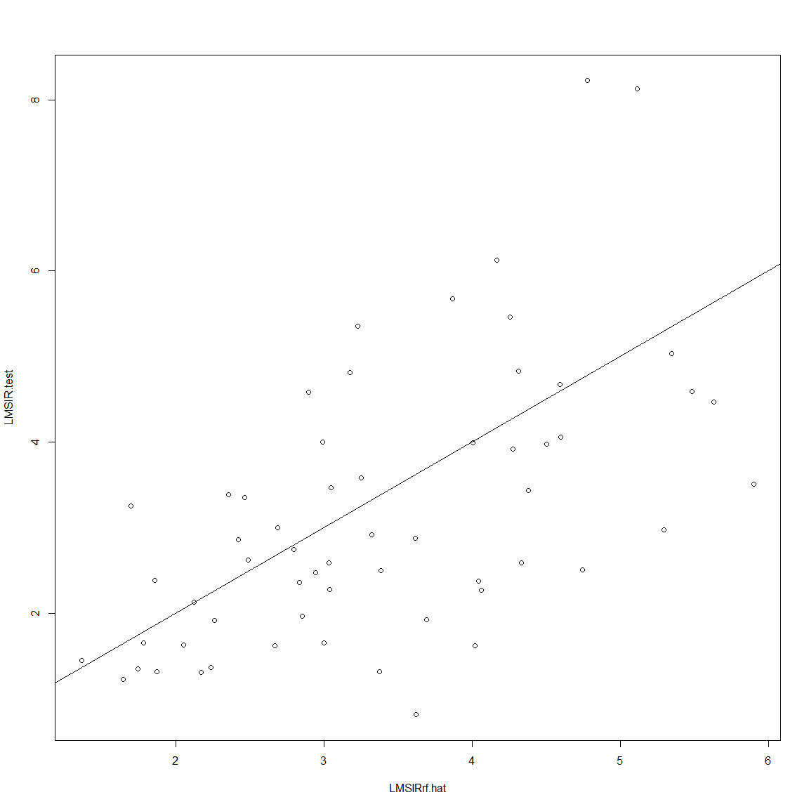
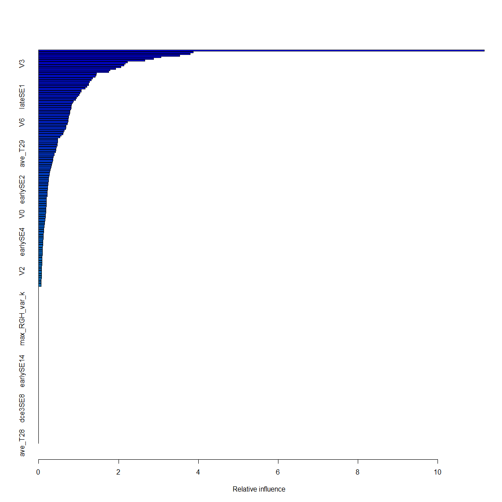
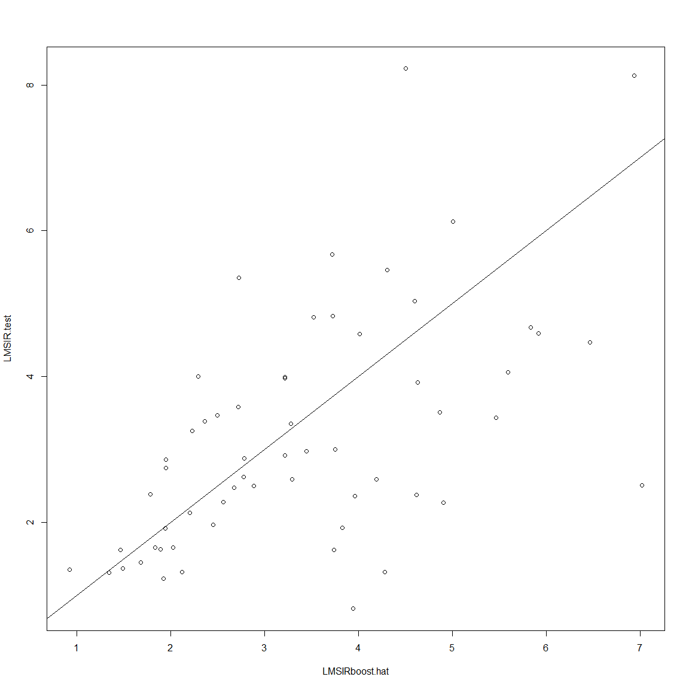
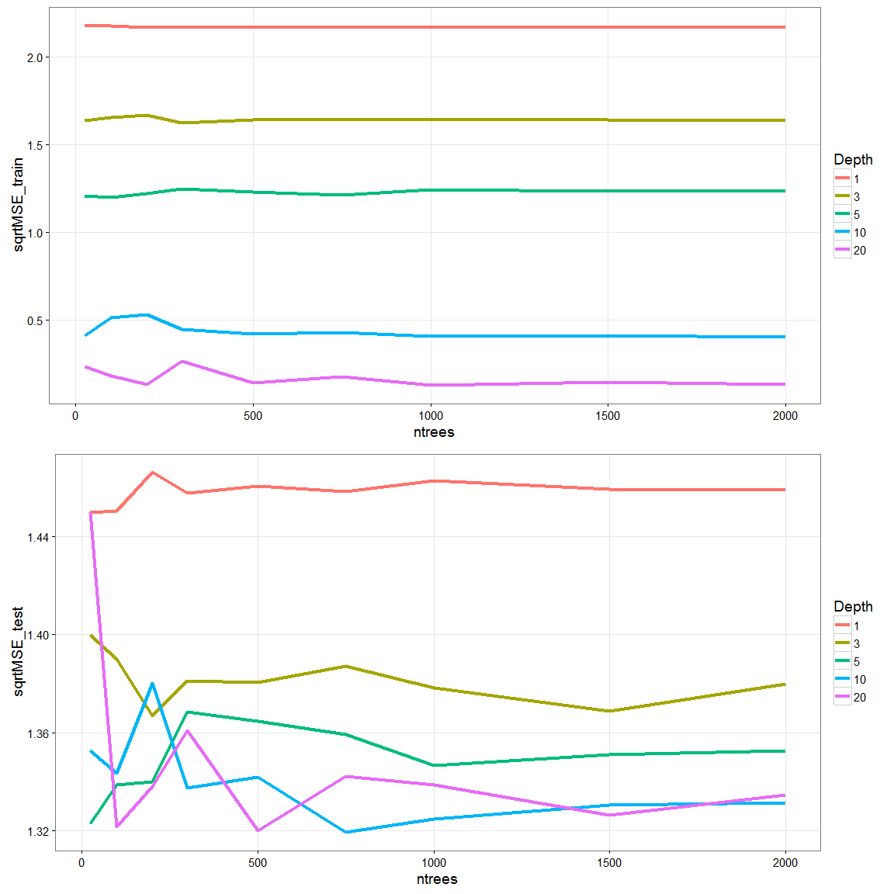
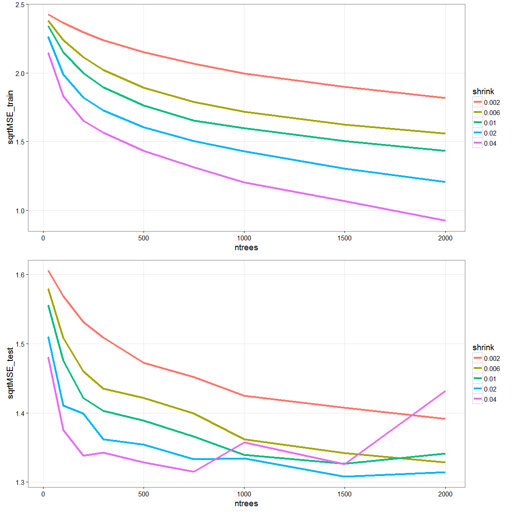
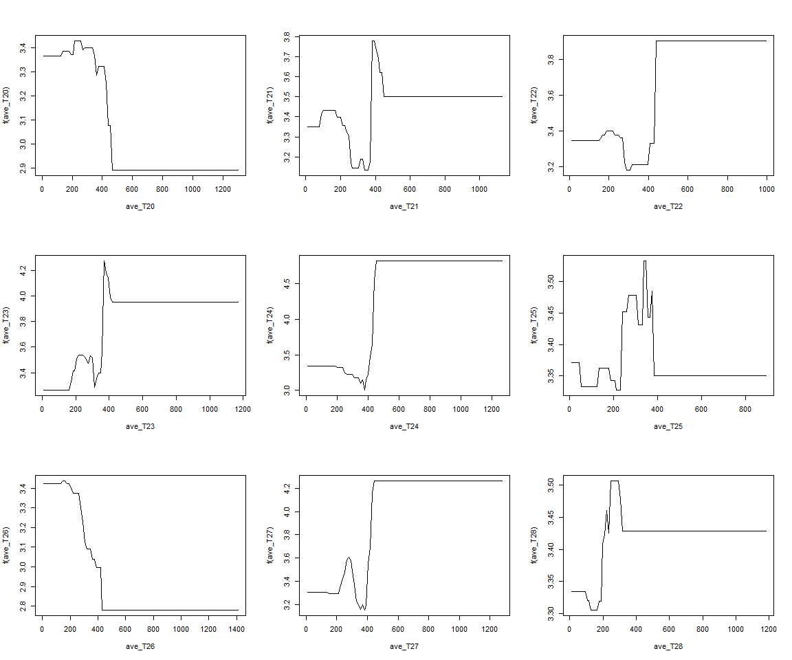
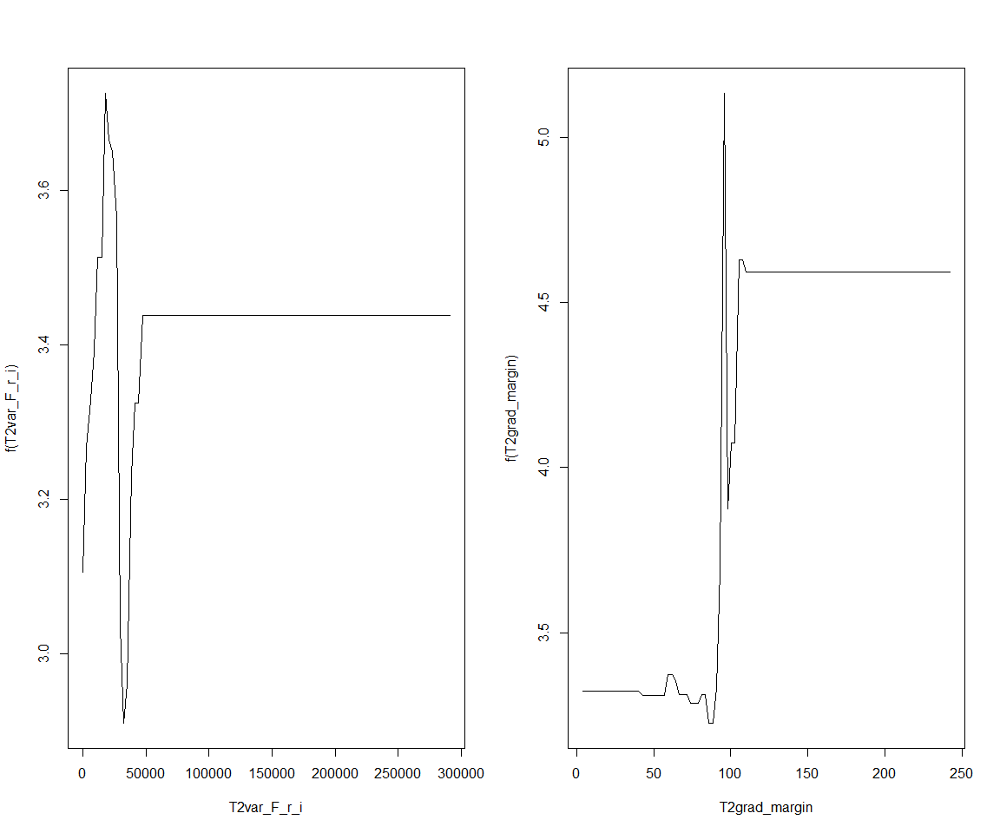

 
Predictor model of LMSIR:
=============================
- This code creates a regression based predictor of LMSIR and add them to the pool of 55 T2w features for a total of 57 T2w featues

```
## Loading required package: lattice
## Loading required package: ggplot2
## Loading required package: DBI
```


```r
# read datasets
npatients = length(uniq_cad)
allf = read_T1T2uniqcad_parti(id_cad_pts, uniq_cad, allpartitionsetD, npatients, 1)
```

```
##    massB    massM nonmassB nonmassM 
##      242      166      142       76 
## nonmassM 
##        1
```

```r
## formant
allfeatures = rbind(allf[[1]], allf[[2]])
alllesioninfo = rbind(allf[[5]], allf[[6]])

### print number of total lesions 
# before was ##   C / NC = 110 / 177
print(summary(as.factor(allfeatures$orig_label)))
```

```
##    massB    massM nonmassB nonmassM 
##      242      166      142       77
```

```r
#######################
# format datasets with find_t2_signal_int as response variable
LMSIRt2_signal = na.omit(cbind(allfeatures["LMSIR"], allfeatures[,2:ncol(allfeatures)]))

# Create a training set containing a random sample of 75% observations, and a test set containing the remaining observations.
set.seed(01)
train = createDataPartition(y = LMSIRt2_signal$orig_label, ## the outcome data are needed
                                 p = .9, ## The percentage of data in the training set
                                 list = TRUE) ## The format of the results. 

LMSIRt2_signal = LMSIRt2_signal[, -c(202,ncol(LMSIRt2_signal))]
summary(LMSIRt2_signal$LMSIR)
```

```
##    Min. 1st Qu.  Median    Mean 3rd Qu.    Max. 
##  0.2239  1.9180  2.8540  3.4580  4.2100 26.8300
```

```r
#######################
# Subset previuosly selected features
# for Boruta
borutasel = unique(ordered_zscores[,2])
rrfsel = as.character(unique(allLMSIRfeatures[,1]))
LMSIR_featsel = unique(borutasel, rrfsel)


library (randomForest) 
```

```
## randomForest 4.6-12
## Type rfNews() to see new features/changes/bug fixes.
## 
## Attaching package: 'randomForest'
## 
## The following object is masked from 'package:ggplot2':
## 
##     margin
```

```r
set.seed(01)
LMSIRrf = randomForest(LMSIR ~., data=LMSIRt2_signal[,c("LMSIR",LMSIR_featsel)], 
                       subset=train$Resample1, mtry=sqrt(ncol(LMSIRt2_signal)-2), importance =TRUE)
print(LMSIRrf)
```

```
## 
## Call:
##  randomForest(formula = LMSIR ~ ., data = LMSIRt2_signal[, c("LMSIR",      LMSIR_featsel)], mtry = sqrt(ncol(LMSIRt2_signal) - 2), importance = TRUE,      subset = train$Resample1) 
##                Type of random forest: regression
##                      Number of trees: 500
## No. of variables tried at each split: 15
## 
##           Mean of squared residuals: 3.844468
##                     % Var explained: 35.92
```

```r
# How well does this bagged model perform on the test set?
LMSIR.test = LMSIRt2_signal[-train$Resample1 ,"LMSIR"]
LMSIRrf.hat = predict(LMSIRrf, newdata=LMSIRt2_signal[-train$Resample1,]) 
plot(LMSIRrf.hat, LMSIR.test) 
abline(0,1) 
```

 

```r
MSErf = mean((LMSIRrf.hat - LMSIR.test)^2)
sqrtMSErf = sqrt(MSErf)
sqrtMSErf
```

```
## [1] 1.332969
```

```r
##### Boosting trees
#We run gbm() with the option distribution="gaussian" since this is a regression problem
LMSIRt2_signal$find_t2_signal_int = as.factor(LMSIRt2_signal$find_t2_signal_int)
library(gbm)
```

```
## Loading required package: survival
## 
## Attaching package: 'survival'
## 
## The following object is masked from 'package:caret':
## 
##     cluster
## 
## Loading required package: splines
## Loading required package: parallel
## Loaded gbm 2.1.1
```

```r
LMSIRboost=gbm(LMSIR~.,data=LMSIRt2_signal[train$Resample1,],
               distribution="gaussian",
               n.trees=500, interaction.depth=1, shrinkage =0.1, verbose=F)

# The summary() function produces a relative influence plot and also outputs the relative influence statistics
print(LMSIRboost)
```

```
## gbm(formula = LMSIR ~ ., distribution = "gaussian", data = LMSIRt2_signal[train$Resample1, 
##     ], n.trees = 500, interaction.depth = 1, shrinkage = 0.1, 
##     verbose = F)
## A gradient boosted model with gaussian loss function.
## 500 iterations were performed.
## There were 241 predictors of which 145 had non-zero influence.
```

```r
summary(LMSIRboost)
```

 

```
##                                                                           var     rel.inf
## T2_lesionSI                                                       T2_lesionSI 11.17042754
## ave_T213                                                             ave_T213  3.87172608
## ave_T219                                                             ave_T219  3.79441881
## T2texture_variance_nondir                           T2texture_variance_nondir  3.53586847
## T2grad_margin                                                   T2grad_margin  3.06082755
## var_F_r_i                                                           var_F_r_i  2.87588329
## ave_T23                                                               ave_T23  2.65614367
## ave_T217                                                             ave_T217  2.22379041
## V3                                                                         V3  2.16995318
## T2texture_sumvariance_nondir                     T2texture_sumvariance_nondir  2.13628749
## iiMin_change_Variance_uptake                     iiMin_change_Variance_uptake  2.05425043
## edge_sharp_std                                                 edge_sharp_std  1.92496661
## T2texture_diffentropy_nondir                     T2texture_diffentropy_nondir  1.78718541
## iMax_Variance_uptake                                     iMax_Variance_uptake  1.75588538
## V17                                                                       V17  1.44803240
## V12                                                                       V12  1.43657722
## max_F_r_i                                                           max_F_r_i  1.41397673
## edge_sharp_mean                                               edge_sharp_mean  1.35489150
## ave_T210                                                             ave_T210  1.31652723
## T2skew_F_r_i                                                     T2skew_F_r_i  1.27023068
## ave_T212                                                             ave_T212  1.25520584
## T2texture_diffvariance_nondir                   T2texture_diffvariance_nondir  1.25391230
## lateSE2                                                               lateSE2  1.20742256
## texture_inversediffmoment_nondir_post2 texture_inversediffmoment_nondir_post2  1.16181166
## T2texture_sumentropy_nondir                       T2texture_sumentropy_nondir  1.06768506
## T2_lesionSIstd                                                 T2_lesionSIstd  1.06320372
## ave_T211                                                             ave_T211  1.03502193
## Vr_decreasingRate_inside                             Vr_decreasingRate_inside  1.01258549
## lateSE1                                                               lateSE1  0.97830077
## dce3SE18                                                             dce3SE18  0.94499535
## ave_T21                                                               ave_T21  0.91881564
## beta_countor                                                     beta_countor  0.87331519
## Vr_increasingRate_countor                           Vr_increasingRate_countor  0.84438046
## ave_T214                                                             ave_T214  0.83001349
## ivVariance                                                         ivVariance  0.81925630
## earlySE9                                                             earlySE9  0.81634386
## ave_T24                                                               ave_T24  0.79810906
## Vr_post_1_countor                                           Vr_post_1_countor  0.78067148
## dce3SE4                                                               dce3SE4  0.77640559
## T2texture_sumaverage_nondir                       T2texture_sumaverage_nondir  0.77518612
## ave_T20                                                               ave_T20  0.74900894
## lateSE4                                                               lateSE4  0.74593646
## T2max_F_r_i                                                       T2max_F_r_i  0.73886517
## T2RGH_mean                                                         T2RGH_mean  0.73435771
## V6                                                                         V6  0.73070721
## T2RGH_var                                                           T2RGH_var  0.71361031
## dce3SE16                                                             dce3SE16  0.68336986
## max_RGH_var                                                       max_RGH_var  0.67826864
## ave_T215                                                             ave_T215  0.67605227
## ave_T26                                                               ave_T26  0.64175451
## V16                                                                       V16  0.61916441
## ave_T27                                                               ave_T27  0.60723021
## max_RGH_mean                                                     max_RGH_mean  0.56285326
## texture_diffentropy_nondir_post4             texture_diffentropy_nondir_post4  0.52713968
## V15                                                                       V15  0.47881314
## V18                                                                       V18  0.47729650
## texture_sumaverage_nondir_post3               texture_sumaverage_nondir_post3  0.47424658
## ave_T25                                                               ave_T25  0.46439271
## mean_F_r_i                                                         mean_F_r_i  0.46010711
## ave_T22                                                               ave_T22  0.43941181
## texture_variance_nondir_post2                   texture_variance_nondir_post2  0.43711945
## T2texture_energy_nondir                               T2texture_energy_nondir  0.43453315
## kurt_F_r_i                                                         kurt_F_r_i  0.41995333
## ave_T29                                                               ave_T29  0.38517591
## ave_T218                                                             ave_T218  0.38367215
## texture_inversediffmoment_nondir_post3 texture_inversediffmoment_nondir_post3  0.36908432
## dce2SE3                                                               dce2SE3  0.35440881
## T2var_F_r_i                                                       T2var_F_r_i  0.35009864
## dce2SE2                                                               dce2SE2  0.34785792
## earlySE7                                                             earlySE7  0.33836355
## Tpeak_countor                                                   Tpeak_countor  0.32277408
## texture_diffvariance_nondir_post3           texture_diffvariance_nondir_post3  0.31155186
## T2kurt_F_r_i                                                     T2kurt_F_r_i  0.30134926
## ave_T216                                                             ave_T216  0.28732878
## maxVr_inside                                                     maxVr_inside  0.27501616
## V11                                                                       V11  0.27092201
## texture_energy_nondir_post4                       texture_energy_nondir_post4  0.26505377
## A_inside                                                             A_inside  0.25340489
## earlySE13                                                           earlySE13  0.24614353
## A_countor                                                           A_countor  0.24496846
## beta_inside                                                       beta_inside  0.24210959
## UptakeRate_countor                                         UptakeRate_countor  0.24019339
## T2mean_F_r_i                                                     T2mean_F_r_i  0.23857977
## lateSE17                                                             lateSE17  0.22359547
## earlySE8                                                             earlySE8  0.22305314
## earlySE2                                                             earlySE2  0.22076782
## dce3SE14                                                             dce3SE14  0.21763500
## texture_entropy_nondir_post1                     texture_entropy_nondir_post1  0.21662534
## dce2SE14                                                             dce2SE14  0.21577612
## T2grad_margin_var                                           T2grad_margin_var  0.21533184
## V10                                                                       V10  0.19520533
## T2texture_contrast_nondir                           T2texture_contrast_nondir  0.19481558
## alpha_inside                                                     alpha_inside  0.19340073
## lateSE5                                                               lateSE5  0.19245813
## Kpeak_countor                                                   Kpeak_countor  0.19044261
## lateSE13                                                             lateSE13  0.18895896
## V5                                                                         V5  0.18580594
## dce2SE19                                                             dce2SE19  0.18214261
## lateSE10                                                             lateSE10  0.18132718
## earlySE10                                                           earlySE10  0.17844814
## V0                                                                         V0  0.17361485
## T2texture_entropy_nondir                             T2texture_entropy_nondir  0.16669000
## texture_sumaverage_nondir_post1               texture_sumaverage_nondir_post1  0.16519259
## iiiMax_Margin_Gradient                                 iiiMax_Margin_Gradient  0.16200551
## min_F_r_i                                                           min_F_r_i  0.15503025
## V19                                                                       V19  0.15100115
## earlySE6                                                             earlySE6  0.14610931
## dce2SE17                                                             dce2SE17  0.14162687
## texture_sumvariance_nondir_post1             texture_sumvariance_nondir_post1  0.13501963
## dce2SE8                                                               dce2SE8  0.13019751
## texture_sumentropy_nondir_post4               texture_sumentropy_nondir_post4  0.12411918
## earlySE16                                                           earlySE16  0.12404677
## earlySE15                                                           earlySE15  0.11952946
## V9                                                                         V9  0.11425505
## lateSE7                                                               lateSE7  0.11421578
## texture_entropy_nondir_post2                     texture_entropy_nondir_post2  0.11025317
## dce2SE12                                                             dce2SE12  0.10690298
## earlySE4                                                             earlySE4  0.10483894
## iAUC1_countor                                                   iAUC1_countor  0.10261155
## Slope_ini_inside                                             Slope_ini_inside  0.10008167
## texture_inversediffmoment_nondir_post4 texture_inversediffmoment_nondir_post4  0.09818793
## SER_countor                                                       SER_countor  0.09782700
## earlySE5                                                             earlySE5  0.09419667
## texture_correlation_nondir_post1             texture_correlation_nondir_post1  0.09278380
## Tpeak_inside                                                     Tpeak_inside  0.09242883
## texture_diffentropy_nondir_post1             texture_diffentropy_nondir_post1  0.08852192
## texture_variance_nondir_post4                   texture_variance_nondir_post4  0.08768929
## texture_inversediffmoment_nondir_post1 texture_inversediffmoment_nondir_post1  0.08698915
## V13                                                                       V13  0.08488930
## V14                                                                       V14  0.08114911
## texture_entropy_nondir_post4                     texture_entropy_nondir_post4  0.07922173
## lateSE11                                                             lateSE11  0.07830341
## lateSE12                                                             lateSE12  0.07691652
## texture_sumentropy_nondir_post2               texture_sumentropy_nondir_post2  0.07668737
## maxVr_countor                                                   maxVr_countor  0.07605880
## V2                                                                         V2  0.07319652
## texture_correlation_nondir_post3             texture_correlation_nondir_post3  0.07263238
## texture_energy_nondir_post1                       texture_energy_nondir_post1  0.07058640
## lateSE15                                                             lateSE15  0.07048814
## texture_variance_nondir_post1                   texture_variance_nondir_post1  0.06641015
## dce3SE1                                                               dce3SE1  0.06548607
## k_Max_Margin_Grad                                           k_Max_Margin_Grad  0.05977939
## find_t2_signal_int                                         find_t2_signal_int  0.05881015
## circularity                                                       circularity  0.05857440
## Vr_increasingRate_inside                             Vr_increasingRate_inside  0.05631215
## iAUC1_inside                                                     iAUC1_inside  0.00000000
## Kpeak_inside                                                     Kpeak_inside  0.00000000
## SER_inside                                                         SER_inside  0.00000000
## maxCr_inside                                                     maxCr_inside  0.00000000
## peakCr_inside                                                   peakCr_inside  0.00000000
## UptakeRate_inside                                           UptakeRate_inside  0.00000000
## washoutRate_inside                                         washoutRate_inside  0.00000000
## peakVr_inside                                                   peakVr_inside  0.00000000
## Vr_post_1_inside                                             Vr_post_1_inside  0.00000000
## alpha_countor                                                   alpha_countor  0.00000000
## Slope_ini_countor                                           Slope_ini_countor  0.00000000
## maxCr_countor                                                   maxCr_countor  0.00000000
## peakCr_countor                                                 peakCr_countor  0.00000000
## washoutRate_countor                                       washoutRate_countor  0.00000000
## peakVr_countor                                                 peakVr_countor  0.00000000
## Vr_decreasingRate_countor                           Vr_decreasingRate_countor  0.00000000
## skew_F_r_i                                                         skew_F_r_i  0.00000000
## irregularity                                                     irregularity  0.00000000
## max_RGH_mean_k                                                 max_RGH_mean_k  0.00000000
## max_RGH_var_k                                                   max_RGH_var_k  0.00000000
## texture_contrast_nondir_post1                   texture_contrast_nondir_post1  0.00000000
## texture_sumentropy_nondir_post1               texture_sumentropy_nondir_post1  0.00000000
## texture_diffvariance_nondir_post1           texture_diffvariance_nondir_post1  0.00000000
## texture_energy_nondir_post2                       texture_energy_nondir_post2  0.00000000
## texture_contrast_nondir_post2                   texture_contrast_nondir_post2  0.00000000
## texture_correlation_nondir_post2             texture_correlation_nondir_post2  0.00000000
## texture_sumaverage_nondir_post2               texture_sumaverage_nondir_post2  0.00000000
## texture_sumvariance_nondir_post2             texture_sumvariance_nondir_post2  0.00000000
## texture_diffvariance_nondir_post2           texture_diffvariance_nondir_post2  0.00000000
## texture_diffentropy_nondir_post2             texture_diffentropy_nondir_post2  0.00000000
## texture_energy_nondir_post3                       texture_energy_nondir_post3  0.00000000
## texture_contrast_nondir_post3                   texture_contrast_nondir_post3  0.00000000
## texture_variance_nondir_post3                   texture_variance_nondir_post3  0.00000000
## texture_sumvariance_nondir_post3             texture_sumvariance_nondir_post3  0.00000000
## texture_sumentropy_nondir_post3               texture_sumentropy_nondir_post3  0.00000000
## texture_entropy_nondir_post3                     texture_entropy_nondir_post3  0.00000000
## texture_diffentropy_nondir_post3             texture_diffentropy_nondir_post3  0.00000000
## texture_contrast_nondir_post4                   texture_contrast_nondir_post4  0.00000000
## texture_correlation_nondir_post4             texture_correlation_nondir_post4  0.00000000
## texture_sumaverage_nondir_post4               texture_sumaverage_nondir_post4  0.00000000
## texture_sumvariance_nondir_post4             texture_sumvariance_nondir_post4  0.00000000
## texture_diffvariance_nondir_post4           texture_diffvariance_nondir_post4  0.00000000
## V1                                                                         V1  0.00000000
## V4                                                                         V4  0.00000000
## V7                                                                         V7  0.00000000
## V8                                                                         V8  0.00000000
## earlySE0                                                             earlySE0  0.00000000
## earlySE1                                                             earlySE1  0.00000000
## earlySE3                                                             earlySE3  0.00000000
## earlySE11                                                           earlySE11  0.00000000
## earlySE12                                                           earlySE12  0.00000000
## earlySE14                                                           earlySE14  0.00000000
## earlySE17                                                           earlySE17  0.00000000
## earlySE18                                                           earlySE18  0.00000000
## earlySE19                                                           earlySE19  0.00000000
## dce2SE0                                                               dce2SE0  0.00000000
## dce2SE1                                                               dce2SE1  0.00000000
## dce2SE4                                                               dce2SE4  0.00000000
## dce2SE5                                                               dce2SE5  0.00000000
## dce2SE6                                                               dce2SE6  0.00000000
## dce2SE7                                                               dce2SE7  0.00000000
## dce2SE9                                                               dce2SE9  0.00000000
## dce2SE10                                                             dce2SE10  0.00000000
## dce2SE11                                                             dce2SE11  0.00000000
## dce2SE13                                                             dce2SE13  0.00000000
## dce2SE15                                                             dce2SE15  0.00000000
## dce2SE16                                                             dce2SE16  0.00000000
## dce2SE18                                                             dce2SE18  0.00000000
## dce3SE0                                                               dce3SE0  0.00000000
## dce3SE2                                                               dce3SE2  0.00000000
## dce3SE3                                                               dce3SE3  0.00000000
## dce3SE5                                                               dce3SE5  0.00000000
## dce3SE6                                                               dce3SE6  0.00000000
## dce3SE7                                                               dce3SE7  0.00000000
## dce3SE8                                                               dce3SE8  0.00000000
## dce3SE9                                                               dce3SE9  0.00000000
## dce3SE10                                                             dce3SE10  0.00000000
## dce3SE11                                                             dce3SE11  0.00000000
## dce3SE12                                                             dce3SE12  0.00000000
## dce3SE13                                                             dce3SE13  0.00000000
## dce3SE15                                                             dce3SE15  0.00000000
## dce3SE17                                                             dce3SE17  0.00000000
## dce3SE19                                                             dce3SE19  0.00000000
## lateSE0                                                               lateSE0  0.00000000
## lateSE3                                                               lateSE3  0.00000000
## lateSE6                                                               lateSE6  0.00000000
## lateSE8                                                               lateSE8  0.00000000
## lateSE9                                                               lateSE9  0.00000000
## lateSE14                                                             lateSE14  0.00000000
## lateSE16                                                             lateSE16  0.00000000
## lateSE18                                                             lateSE18  0.00000000
## lateSE19                                                             lateSE19  0.00000000
## T2min_F_r_i                                                       T2min_F_r_i  0.00000000
## T2texture_correlation_nondir                     T2texture_correlation_nondir  0.00000000
## T2texture_inversediffmoment_nondir         T2texture_inversediffmoment_nondir  0.00000000
## ave_T28                                                               ave_T28  0.00000000
```

```r
LMSIR.test = LMSIRt2_signal[-train$Resample1 ,"LMSIR"]
LMSIRboost.hat = predict(LMSIRboost, newdata=LMSIRt2_signal[-train$Resample1,], n.trees=500) 

par(mfrow=c(1,1))
plot(LMSIRboost.hat, LMSIR.test) 
abline(0,1) 
```

 

```r
MSErf = mean((LMSIRboost.hat - LMSIR.test)^2)
sqrtMSErf = sqrt(MSErf)
sqrtMSErf
```

```
## [1] 1.457009
```

```r
###############
### PRODUCE RAND FOREST via RPART (control # trees))
###################################################
### code forest Train: 
### parameters, T= # of trees, D= tree depth, dat
###################################################
library(MASS)
library(klaR)
library(caret)
library(rpart)
library(rpart.plot)
require(ggplot2)

rpart_forestTrainLMSIR <- function(T, D, TrainsetD) {
  # set control
  fitparm = rpart.control(maxdepth = D, minsplit = 1, minbucket = 1, cp = -1,  xval = 10,
                          maxcompete = 0, maxsurrogate = 5, usesurrogate = 0, surrogatestyle = 0)
  
  # init forest
  forest = list()
  for (t in 1:T){
    #cat("Tree # ", t, "\n")  
    # find subsample of var
    subvar = sample(2:ncol(TrainsetD)-2, sqrt(ncol(TrainsetD)-2), replace = TRUE)
    subfeat = colnames(TrainsetD)[subvar]
    
    # train tree
    treedata <- rpart(paste("LMSIR ~ ", paste(subfeat, collapse= "+")), 
                      data =TrainsetD, control=fitparm)
    
    # display the probability per class of observations in the node (conditioned on the node, sum across a     node is 1) plus the percentage of observations in the node. 
    if (T<=1){
      print(treedata)
      prp(treedata, type=2, digits=3, extra = 100, under=TRUE, nn=TRUE, col="black", 
          box.col=rainbow(2)[2], varlen=0, faclen=0, branch.type=0, gap=0, cex=.7,
          fallen.leaves=TRUE) # use fallen.leaves=TRUE, to plot at bottom  
    }  
    
    # append
    forest <- append(forest, list(tree = treedata))    
  }
  
  output <- list(forest=forest)
  return(output)
}

###################################################
### code forest Test: 
### parameters, T= # of trees, forest, TrainsetD, TestsetD
###################################################
rpart_forestTestLMSIR <- function(T, TrainsetD, TestsetD, forest) {
  
  yhattrain=list()
  for (t in 1:T){
    # Calcultate posterior Probabilities on grid points
    temp <- predict(forest[t]$tree, newdata = TrainsetD) #
    yhattrain <- append(yhattrain, list(cpo = temp))
  }
  
  # run testing cases
  yhattest=list()
  for (t in 1:T){
    # Calcultate posterior Probabilities on grid points
    temp <- predict(forest[t]$tree, newdata = TestsetD) #
    yhattest <- append(yhattest, list(cpo = temp))
  }
  
  # performance on Train/Test set separately
  # extract ensamble class probabilities (when T > 1)
  trainpts = yhattrain[1]$cpo
  testpts = yhattest[1]$cpo
  # init ensample class posteriors
  enyhattrain <- matrix(, nrow = nrow(as.data.frame(trainpts)), ncol = 1)
  enyhattest <- matrix(, nrow = nrow(as.data.frame(testpts)), ncol = 1)
  enyhattrain[,1] = yhattrain[1]$cpo
  enyhattest[,1] = yhattest[1]$cpo
  if(T>=2){
    for (t in 2:T){
      #train
      enyhattrain[,1] = enyhattrain[,1]+yhattrain[t]$cpo
      #test
      enyhattest[,1] = enyhattest[,1]+yhattest[t]$cpo
    }
  }
  # majority voting averaging
  enyhattrain = (1/T)*enyhattrain
  enyhattest = (1/T)*enyhattest
  
  output <- list(etrain = enyhattrain[,1], etest=enyhattest[,1])
  return(output)
}
```


Building a Random Forest regresor for Tw2 LMSIR:  Numerical predictor of Lesion-to-muscle ratio on T2wi
==========


```r
###################################################
# create grid of evaluation points
gT = c(25,100,200,300,500,750,1000,1500,2000)
gD = c(1,3,5,10,20)
grd <- expand.grid(x = gD, y = gT)
grd$z = grd$x/500 ## similar to gS = c(0.001,0.01,0.025,0.1,0.5) but without expanding
 
grdperf = data.frame(grd)
grdperf$RF.sqrtMSEtrain = 0.0
grdperf$RF.sqrtMSEtest = 0.0
grdperf$boost.sqrtMSEtrain = 0.0
grdperf$boost.sqrtMSEtest = 0.0

library(gbm)
# perform grid greedy search
for(k in 1:nrow(grd)){
    D=grd[k,1]
    ntrees=grd[k,2]
    shrink=grd[k,3]
    cat("RF #Trees ", ntrees , ", maxD = ", D,"\n")
    cat("bosted #Trees ", ntrees , ", shrink = ", shrink,"\n")
    # train a Random Forest with rcart trees
    trainLMSIR = LMSIRt2_signal[train$Resample1,c("LMSIR",LMSIR_featsel)]
    testLMSIR = LMSIRt2_signal[-train$Resample1,c("LMSIR",LMSIR_featsel)]   
    # train
    rfLMSIR = rpart_forestTrainLMSIR(ntrees, D, trainLMSIR ) 
    perfF <- rpart_forestTestLMSIR(ntrees, trainLMSIR, testLMSIR, rfLMSIR$forest)
    
    # on training
    par(mfrow=c(1,2))
    LMSIR.train=trainLMSIR$LMSIR
    #plot(perfF$etrain, LMSIR.train)
    #abline (0,1) 
    MSEtrain = mean((perfF$etrain -LMSIR.train)^2)
    sqrtMSEtrain = sqrt(MSEtrain)
    print("=========")
    print(paste0("RF.sMSEtrain = ", sqrtMSEtrain))
      
    # on testing
    LMSIR.test=testLMSIR$LMSIR 
    #plot(perfF$etest, LMSIR.test)
    #abline (0,1) 
    MSEtest = mean((perfF$etest -LMSIR.test)^2)
    sqrtMSEtest = sqrt(MSEtest)
    print(paste0("RF.sMSEtest = ", sqrtMSEtest))

    # train boosted gradient trees to compare with RF
    #set.seed(03)
    LMSIRboost=gbm(LMSIR ~ . ,data=trainLMSIR, distribution="gaussian", 
                   n.trees=ntrees, shrinkage=shrink, verbose=FALSE)
  
    # The summary() function produces a relative influence plot and also outputs the relative influence statistics
    #print(LMSIRboost)
    
    # on training
    par(mfrow=c(1,2))
    LMSIRboost.hattrain = predict(LMSIRboost, newdata=trainLMSIR, n.trees=ntrees) 
    #plot(LMSIRboost.hattrain, LMSIR.train)
    #abline (0,1) 
    MSEtrainboost = mean((LMSIRboost.hattrain -LMSIR.train)^2)
    sqrtMSEtrainboost = sqrt(MSEtrainboost)
    print(paste0("boost.sMSEtrain = ", sqrtMSEtrainboost))
 
    # on testing
    LMSIRboost.hattest = predict(LMSIRboost, newdata=testLMSIR, n.trees=ntrees)   
    #plot(LMSIRboost.hattest, LMSIR.test)
    #abline (0,1) 
    MSEtestboost = mean((LMSIRboost.hattest -LMSIR.test)^2)
    sqrtMSEtestboost = sqrt(MSEtestboost)
    print(paste0("boost.sMSEtest = ", sqrtMSEtestboost))
    print("=========")
    
    # collect data
    grdperf$RF.sqrtMSEtrain[k] = grdperf$RF.sqrtMSEtrain[k] + sqrtMSEtrain
    grdperf$RF.sqrtMSEtest[k] = grdperf$RF.sqrtMSEtest[k] + sqrtMSEtest
    grdperf$boost.sqrtMSEtrain[k] = grdperf$boost.sqrtMSEtrain[k] + sqrtMSEtrainboost
    grdperf$boost.sqrtMSEtest[k] = grdperf$boost.sqrtMSEtest[k] + sqrtMSEtestboost

}
```

```
## RF #Trees  25 , maxD =  1 
## bosted #Trees  25 , shrink =  0.002 
## [1] "========="
## [1] "RF.sMSEtrain = 2.18159836935385"
## [1] "RF.sMSEtest = 1.44968806571626"
## [1] "boost.sMSEtrain = 2.42610661898775"
## [1] "boost.sMSEtest = 1.60554417308954"
## [1] "========="
## RF #Trees  25 , maxD =  3 
## bosted #Trees  25 , shrink =  0.006 
## [1] "========="
## [1] "RF.sMSEtrain = 1.63746511729631"
## [1] "RF.sMSEtest = 1.39965003646329"
## [1] "boost.sMSEtrain = 2.38178789244644"
## [1] "boost.sMSEtest = 1.57911768837326"
## [1] "========="
## RF #Trees  25 , maxD =  5 
## bosted #Trees  25 , shrink =  0.01 
## [1] "========="
## [1] "RF.sMSEtrain = 1.21071058192"
## [1] "RF.sMSEtest = 1.32285933401023"
## [1] "boost.sMSEtrain = 2.34339103329014"
## [1] "boost.sMSEtest = 1.55526415294307"
## [1] "========="
## RF #Trees  25 , maxD =  10 
## bosted #Trees  25 , shrink =  0.02 
## [1] "========="
## [1] "RF.sMSEtrain = 0.412348622811701"
## [1] "RF.sMSEtest = 1.35254743465475"
## [1] "boost.sMSEtrain = 2.26496423255257"
## [1] "boost.sMSEtest = 1.5101605972092"
## [1] "========="
## RF #Trees  25 , maxD =  20 
## bosted #Trees  25 , shrink =  0.04 
## [1] "========="
## [1] "RF.sMSEtrain = 0.23496938990451"
## [1] "RF.sMSEtest = 1.44962139935613"
## [1] "boost.sMSEtrain = 2.147246673031"
## [1] "boost.sMSEtest = 1.48025724900696"
## [1] "========="
## RF #Trees  100 , maxD =  1 
## bosted #Trees  100 , shrink =  0.002 
## [1] "========="
## [1] "RF.sMSEtrain = 2.17769719147513"
## [1] "RF.sMSEtest = 1.4501867598522"
## [1] "boost.sMSEtrain = 2.36307749419509"
## [1] "boost.sMSEtest = 1.56809282305147"
## [1] "========="
## RF #Trees  100 , maxD =  3 
## bosted #Trees  100 , shrink =  0.006 
## [1] "========="
## [1] "RF.sMSEtrain = 1.657639080258"
## [1] "RF.sMSEtest = 1.38997919008986"
## [1] "boost.sMSEtrain = 2.23719407583904"
## [1] "boost.sMSEtest = 1.50801687185363"
## [1] "========="
## RF #Trees  100 , maxD =  5 
## bosted #Trees  100 , shrink =  0.01 
## [1] "========="
## [1] "RF.sMSEtrain = 1.20114471736203"
## [1] "RF.sMSEtest = 1.33880302584892"
## [1] "boost.sMSEtrain = 2.15037938922497"
## [1] "boost.sMSEtest = 1.4751739673331"
## [1] "========="
## RF #Trees  100 , maxD =  10 
## bosted #Trees  100 , shrink =  0.02 
## [1] "========="
## [1] "RF.sMSEtrain = 0.5172125491003"
## [1] "RF.sMSEtest = 1.34342000817157"
## [1] "boost.sMSEtrain = 1.99028993179543"
## [1] "boost.sMSEtest = 1.4103326470134"
## [1] "========="
## RF #Trees  100 , maxD =  20 
## bosted #Trees  100 , shrink =  0.04 
## [1] "========="
## [1] "RF.sMSEtrain = 0.185084176117131"
## [1] "RF.sMSEtest = 1.32162553391038"
## [1] "boost.sMSEtrain = 1.82918653715397"
## [1] "boost.sMSEtest = 1.37561670980632"
## [1] "========="
## RF #Trees  200 , maxD =  1 
## bosted #Trees  200 , shrink =  0.002 
## [1] "========="
## [1] "RF.sMSEtrain = 2.16930438082243"
## [1] "RF.sMSEtest = 1.4661066492473"
## [1] "boost.sMSEtrain = 2.29515732602129"
## [1] "boost.sMSEtest = 1.53105376099004"
## [1] "========="
## RF #Trees  200 , maxD =  3 
## bosted #Trees  200 , shrink =  0.006 
## [1] "========="
## [1] "RF.sMSEtrain = 1.66694645865474"
## [1] "RF.sMSEtest = 1.36676804536815"
## [1] "boost.sMSEtrain = 2.11493124291342"
## [1] "boost.sMSEtest = 1.45990753683098"
## [1] "========="
## RF #Trees  200 , maxD =  5 
## bosted #Trees  200 , shrink =  0.01 
## [1] "========="
## [1] "RF.sMSEtrain = 1.22104164054428"
## [1] "RF.sMSEtest = 1.33991487517454"
## [1] "boost.sMSEtrain = 1.99931361880676"
## [1] "boost.sMSEtest = 1.42124282763095"
## [1] "========="
## RF #Trees  200 , maxD =  10 
## bosted #Trees  200 , shrink =  0.02 
## [1] "========="
## [1] "RF.sMSEtrain = 0.533582772501111"
## [1] "RF.sMSEtest = 1.38024928212932"
## [1] "boost.sMSEtrain = 1.82149179763993"
## [1] "boost.sMSEtest = 1.3991399488001"
## [1] "========="
## RF #Trees  200 , maxD =  20 
## bosted #Trees  200 , shrink =  0.04 
## [1] "========="
## [1] "RF.sMSEtrain = 0.136634725561655"
## [1] "RF.sMSEtest = 1.3381165640183"
## [1] "boost.sMSEtrain = 1.65121762509138"
## [1] "boost.sMSEtest = 1.33824989709927"
## [1] "========="
## RF #Trees  300 , maxD =  1 
## bosted #Trees  300 , shrink =  0.002 
## [1] "========="
## [1] "RF.sMSEtrain = 2.1696572444834"
## [1] "RF.sMSEtest = 1.457632021778"
## [1] "boost.sMSEtrain = 2.23878917088498"
## [1] "boost.sMSEtest = 1.50842117071275"
## [1] "========="
## RF #Trees  300 , maxD =  3 
## bosted #Trees  300 , shrink =  0.006 
## [1] "========="
## [1] "RF.sMSEtrain = 1.62367464942126"
## [1] "RF.sMSEtest = 1.38122185918596"
## [1] "boost.sMSEtrain = 2.02196121560576"
## [1] "boost.sMSEtest = 1.43480738697731"
## [1] "========="
## RF #Trees  300 , maxD =  5 
## bosted #Trees  300 , shrink =  0.01 
## [1] "========="
## [1] "RF.sMSEtrain = 1.24864638921187"
## [1] "RF.sMSEtest = 1.36839562863384"
## [1] "boost.sMSEtrain = 1.89382218445888"
## [1] "boost.sMSEtest = 1.40264848210242"
## [1] "========="
## RF #Trees  300 , maxD =  10 
## bosted #Trees  300 , shrink =  0.02 
## [1] "========="
## [1] "RF.sMSEtrain = 0.448535621105723"
## [1] "RF.sMSEtest = 1.33761977227109"
## [1] "boost.sMSEtrain = 1.72776257126186"
## [1] "boost.sMSEtest = 1.36157397336521"
## [1] "========="
## RF #Trees  300 , maxD =  20 
## bosted #Trees  300 , shrink =  0.04 
## [1] "========="
## [1] "RF.sMSEtrain = 0.266273194994652"
## [1] "RF.sMSEtest = 1.36075987562009"
## [1] "boost.sMSEtrain = 1.56661805739053"
## [1] "boost.sMSEtest = 1.34231294813501"
## [1] "========="
## RF #Trees  500 , maxD =  1 
## bosted #Trees  500 , shrink =  0.002 
## [1] "========="
## [1] "RF.sMSEtrain = 2.17162796916718"
## [1] "RF.sMSEtest = 1.46035418924553"
## [1] "boost.sMSEtrain = 2.15076887900239"
## [1] "boost.sMSEtest = 1.47224881525959"
## [1] "========="
## RF #Trees  500 , maxD =  3 
## bosted #Trees  500 , shrink =  0.006 
## [1] "========="
## [1] "RF.sMSEtrain = 1.64014098993747"
## [1] "RF.sMSEtest = 1.38060602956042"
## [1] "boost.sMSEtrain = 1.89260057872773"
## [1] "boost.sMSEtest = 1.42140362600703"
## [1] "========="
## RF #Trees  500 , maxD =  5 
## bosted #Trees  500 , shrink =  0.01 
## [1] "========="
## [1] "RF.sMSEtrain = 1.22991415071321"
## [1] "RF.sMSEtest = 1.36462222115262"
## [1] "boost.sMSEtrain = 1.76246091323718"
## [1] "boost.sMSEtest = 1.38874164316661"
## [1] "========="
## RF #Trees  500 , maxD =  10 
## bosted #Trees  500 , shrink =  0.02 
## [1] "========="
## [1] "RF.sMSEtrain = 0.42166604164527"
## [1] "RF.sMSEtest = 1.34191809028086"
## [1] "boost.sMSEtrain = 1.60426259311507"
## [1] "boost.sMSEtest = 1.35404577917927"
## [1] "========="
## RF #Trees  500 , maxD =  20 
## bosted #Trees  500 , shrink =  0.04 
## [1] "========="
## [1] "RF.sMSEtrain = 0.143159094592166"
## [1] "RF.sMSEtest = 1.32011557447113"
## [1] "boost.sMSEtrain = 1.43358339930669"
## [1] "boost.sMSEtest = 1.32847579716642"
## [1] "========="
## RF #Trees  750 , maxD =  1 
## bosted #Trees  750 , shrink =  0.002 
## [1] "========="
## [1] "RF.sMSEtrain = 2.16783192015196"
## [1] "RF.sMSEtest = 1.45810707041667"
## [1] "boost.sMSEtrain = 2.06609021107659"
## [1] "boost.sMSEtest = 1.45149509546855"
## [1] "========="
## RF #Trees  750 , maxD =  3 
## bosted #Trees  750 , shrink =  0.006 
## [1] "========="
## [1] "RF.sMSEtrain = 1.64307806725279"
## [1] "RF.sMSEtest = 1.38698023517703"
## [1] "boost.sMSEtrain = 1.78932800507584"
## [1] "boost.sMSEtest = 1.3991311061565"
## [1] "========="
## RF #Trees  750 , maxD =  5 
## bosted #Trees  750 , shrink =  0.01 
## [1] "========="
## [1] "RF.sMSEtrain = 1.21147396557567"
## [1] "RF.sMSEtest = 1.35935113288782"
## [1] "boost.sMSEtrain = 1.65373562089255"
## [1] "boost.sMSEtest = 1.36564662410565"
## [1] "========="
## RF #Trees  750 , maxD =  10 
## bosted #Trees  750 , shrink =  0.02 
## [1] "========="
## [1] "RF.sMSEtrain = 0.429254059840145"
## [1] "RF.sMSEtest = 1.3193623004136"
## [1] "boost.sMSEtrain = 1.50401564071187"
## [1] "boost.sMSEtest = 1.33268160136741"
## [1] "========="
## RF #Trees  750 , maxD =  20 
## bosted #Trees  750 , shrink =  0.04 
## [1] "========="
## [1] "RF.sMSEtrain = 0.176815977397961"
## [1] "RF.sMSEtest = 1.34221107097452"
## [1] "boost.sMSEtrain = 1.31108398107449"
## [1] "boost.sMSEtest = 1.31523750320759"
## [1] "========="
## RF #Trees  1000 , maxD =  1 
## bosted #Trees  1000 , shrink =  0.002 
## [1] "========="
## [1] "RF.sMSEtrain = 2.16994387434749"
## [1] "RF.sMSEtest = 1.46268367404089"
## [1] "boost.sMSEtrain = 1.99513221903056"
## [1] "boost.sMSEtest = 1.42469847407343"
## [1] "========="
## RF #Trees  1000 , maxD =  3 
## bosted #Trees  1000 , shrink =  0.006 
## [1] "========="
## [1] "RF.sMSEtrain = 1.64369919374633"
## [1] "RF.sMSEtest = 1.37824013767013"
## [1] "boost.sMSEtrain = 1.71597913551961"
## [1] "boost.sMSEtest = 1.36200619487287"
## [1] "========="
## RF #Trees  1000 , maxD =  5 
## bosted #Trees  1000 , shrink =  0.01 
## [1] "========="
## [1] "RF.sMSEtrain = 1.2446324764654"
## [1] "RF.sMSEtest = 1.34668686158489"
## [1] "boost.sMSEtrain = 1.59594693930941"
## [1] "boost.sMSEtest = 1.33959422760537"
## [1] "========="
## RF #Trees  1000 , maxD =  10 
## bosted #Trees  1000 , shrink =  0.02 
## [1] "========="
## [1] "RF.sMSEtrain = 0.407684265371123"
## [1] "RF.sMSEtest = 1.32487407772899"
## [1] "boost.sMSEtrain = 1.43056450049048"
## [1] "boost.sMSEtest = 1.33438352257182"
## [1] "========="
## RF #Trees  1000 , maxD =  20 
## bosted #Trees  1000 , shrink =  0.04 
## [1] "========="
## [1] "RF.sMSEtrain = 0.128388421466302"
## [1] "RF.sMSEtest = 1.33870186573056"
## [1] "boost.sMSEtrain = 1.20324695929039"
## [1] "boost.sMSEtest = 1.35738030257994"
## [1] "========="
## RF #Trees  1500 , maxD =  1 
## bosted #Trees  1500 , shrink =  0.002 
## [1] "========="
## [1] "RF.sMSEtrain = 2.17160751591854"
## [1] "RF.sMSEtest = 1.45923755254782"
## [1] "boost.sMSEtrain = 1.89742333673266"
## [1] "boost.sMSEtest = 1.40738767277742"
## [1] "========="
## RF #Trees  1500 , maxD =  3 
## bosted #Trees  1500 , shrink =  0.006 
## [1] "========="
## [1] "RF.sMSEtrain = 1.64449878907247"
## [1] "RF.sMSEtest = 1.3687945582627"
## [1] "boost.sMSEtrain = 1.62464777740594"
## [1] "boost.sMSEtest = 1.34204556183073"
## [1] "========="
## RF #Trees  1500 , maxD =  5 
## bosted #Trees  1500 , shrink =  0.01 
## [1] "========="
## [1] "RF.sMSEtrain = 1.23636056139498"
## [1] "RF.sMSEtest = 1.35117761421192"
## [1] "boost.sMSEtrain = 1.50268973906796"
## [1] "boost.sMSEtest = 1.32669479112825"
## [1] "========="
## RF #Trees  1500 , maxD =  10 
## bosted #Trees  1500 , shrink =  0.02 
## [1] "========="
## [1] "RF.sMSEtrain = 0.413358538353822"
## [1] "RF.sMSEtest = 1.3304780588853"
## [1] "boost.sMSEtrain = 1.30224477952541"
## [1] "boost.sMSEtest = 1.30768948790914"
## [1] "========="
## RF #Trees  1500 , maxD =  20 
## bosted #Trees  1500 , shrink =  0.04 
## [1] "========="
## [1] "RF.sMSEtrain = 0.150281253961827"
## [1] "RF.sMSEtest = 1.32636349545868"
## [1] "boost.sMSEtrain = 1.06668028175425"
## [1] "boost.sMSEtest = 1.3259526643184"
## [1] "========="
## RF #Trees  2000 , maxD =  1 
## bosted #Trees  2000 , shrink =  0.002 
## [1] "========="
## [1] "RF.sMSEtrain = 2.17062376924193"
## [1] "RF.sMSEtest = 1.45876978599972"
## [1] "boost.sMSEtrain = 1.81756578050301"
## [1] "boost.sMSEtest = 1.39156813376543"
## [1] "========="
## RF #Trees  2000 , maxD =  3 
## bosted #Trees  2000 , shrink =  0.006 
## [1] "========="
## [1] "RF.sMSEtrain = 1.63749328494697"
## [1] "RF.sMSEtest = 1.37982614591195"
## [1] "boost.sMSEtrain = 1.55717382218235"
## [1] "boost.sMSEtest = 1.32841218069932"
## [1] "========="
## RF #Trees  2000 , maxD =  5 
## bosted #Trees  2000 , shrink =  0.01 
## [1] "========="
## [1] "RF.sMSEtrain = 1.24204266239513"
## [1] "RF.sMSEtest = 1.35277029707471"
## [1] "boost.sMSEtrain = 1.43140355656979"
## [1] "boost.sMSEtest = 1.34109789692234"
## [1] "========="
## RF #Trees  2000 , maxD =  10 
## bosted #Trees  2000 , shrink =  0.02 
## [1] "========="
## [1] "RF.sMSEtrain = 0.402707282744267"
## [1] "RF.sMSEtest = 1.33143953304397"
## [1] "boost.sMSEtrain = 1.20662321920054"
## [1] "boost.sMSEtest = 1.31451527779577"
## [1] "========="
## RF #Trees  2000 , maxD =  20 
## bosted #Trees  2000 , shrink =  0.04 
## [1] "========="
## [1] "RF.sMSEtrain = 0.136779860891055"
## [1] "RF.sMSEtest = 1.3345973300188"
## [1] "boost.sMSEtrain = 0.922705374282071"
## [1] "boost.sMSEtest = 1.43190761265467"
## [1] "========="
```

```r
print(paste0("min RF.sqrtMSE = ",min(grdperf$RF.sqrtMSEtest)))
```

```
## [1] "min RF.sqrtMSE = 1.3193623004136"
```

```r
RFbestune = grdperf[grdperf$RF.sqrtMSEtest == min(grdperf$RF.sqrtMSEtest),][1,]
print(RFbestune)
```

```
##     x   y    z RF.sqrtMSEtrain RF.sqrtMSEtest boost.sqrtMSEtrain boost.sqrtMSEtest
## 29 10 750 0.02       0.4292541       1.319362           1.504016          1.332682
```

```r
print(paste0("min boost.sqrtMSE = ",min(grdperf$boost.sqrtMSEtest)))
```

```
## [1] "min boost.sqrtMSE = 1.30768948790914"
```

```r
boostbestune = grdperf[grdperf$boost.sqrtMSEtest == min(grdperf$boost.sqrtMSEtest),][1,]
print(boostbestune)
```

```
##     x    y    z RF.sqrtMSEtrain RF.sqrtMSEtest boost.sqrtMSEtrain boost.sqrtMSEtest
## 39 10 1500 0.02       0.4133585       1.330478           1.302245          1.307689
```

```r
# reformat results to plot
library(gridExtra)
# for RF
RFgrdperfLMSIR = data.frame(ntrees=grdperf$y, Depth=factor(grdperf$x))
RFgrdperfLMSIR$sqrtMSE_train = grdperf$RF.sqrtMSEtrain
RFgrdperfLMSIR$sqrtMSE_test = grdperf$RF.sqrtMSEtest
RFgrdperfLMSIR$regressor = "RF"

p1 <- ggplot(data=RFgrdperfLMSIR, aes(x=ntrees, y=sqrtMSE_train, group=Depth, colour=Depth)) + 
  geom_line(size=1.5) + theme_bw(base_size = 14, base_family = "") 
p2 <- ggplot(data=RFgrdperfLMSIR, aes(x=ntrees, y=sqrtMSE_test, group=Depth, colour=Depth)) + 
  geom_line(size=1.5) + theme_bw(base_size = 14, base_family = "") 
grid.arrange(p1, p2, nrow = 2)
```

 

```r
# for boosting trees
boostgrdperfLMSIR = data.frame(ntrees=grdperf$y, shrink=factor(grdperf$z))
boostgrdperfLMSIR$sqrtMSE_train = grdperf$boost.sqrtMSEtrain
boostgrdperfLMSIR$sqrtMSE_test = grdperf$boost.sqrtMSEtest
boostgrdperfLMSIR$regressor = "boost"

p1 <- ggplot(data=boostgrdperfLMSIR, aes(x=ntrees, y=sqrtMSE_train, group=shrink, colour=shrink)) + 
  geom_line(size=1.5) + theme_bw(base_size = 14, base_family = "") 
p2 <- ggplot(data=boostgrdperfLMSIR, aes(x=ntrees, y=sqrtMSE_test, group=shrink, colour=shrink)) + 
  geom_line(size=1.5) + theme_bw(base_size = 14, base_family = "") 
grid.arrange(p1, p2, nrow = 2)
```

 


```r
#pplot

# produce partial dependence plots for these two variables. These plots partial
# illustrate the marginal effect of the selected variables on the response after
# dependence integrating out the other variables. 
par(mfrow=c(3,3))
plot(LMSIRboost, i="ave_T20")
plot(LMSIRboost, i="ave_T21")
plot(LMSIRboost, i="ave_T22")
plot(LMSIRboost, i="ave_T23")
plot(LMSIRboost, i="ave_T24")
plot(LMSIRboost, i="ave_T25")
plot(LMSIRboost, i="ave_T26")
plot(LMSIRboost, i="ave_T27")
plot(LMSIRboost, i="ave_T28")
```

 

```r
# plot the top 3
par(mfrow=c(1,2))
plot(LMSIRboost, i="T2var_F_r_i")
plot(LMSIRboost, i="T2grad_margin")
```

 

Parameters to build final regressor
=======

```r
# pick winner between 
if(RFbestune$RF.sqrtMSEtest <= boostbestune$boost.sqrtMSEtest){
  bestune = RFbestune
  bestune$class = "RF"
  ntrees = bestune$y
  D = bestune$x
  cat("RF #Trees ", ntrees , ", maxD = ", D,"\n")
  print(bestune)
}else{
  bestune = boostbestune
  bestune$class = "boost"
  ntrees = bestune$y
  shrink = bestune$z
  cat("bosted #Trees ", ntrees , ", shrink = ", shrink,"\n")
  print(bestune)
}
```

```
## bosted #Trees  1500 , shrink =  0.02 
##     x    y    z RF.sqrtMSEtrain RF.sqrtMSEtest boost.sqrtMSEtrain boost.sqrtMSEtest class
## 39 10 1500 0.02       0.4133585       1.330478           1.302245          1.307689 boost
```


```r
save.image("C:/Users/windows/Documents/repoCode-local/T2wR/lop_3Dtex_T2w_addedvalue/LMSIR/Rdata/regressorsLMSIR_T2w.RData")
```

