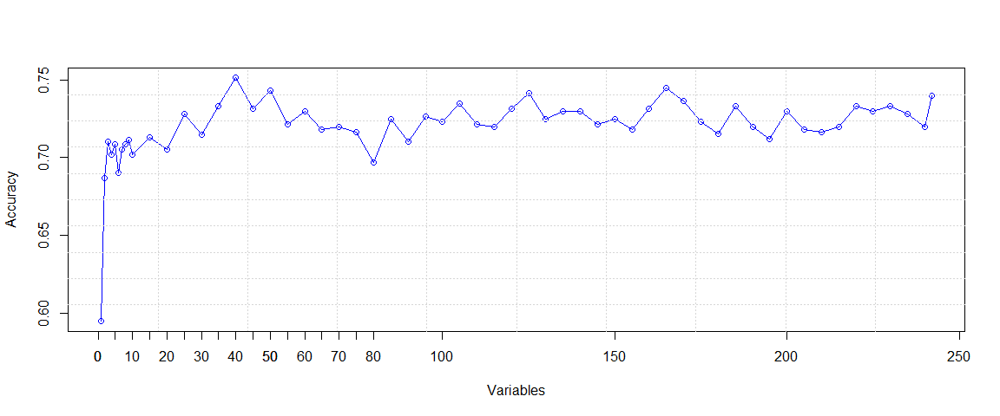
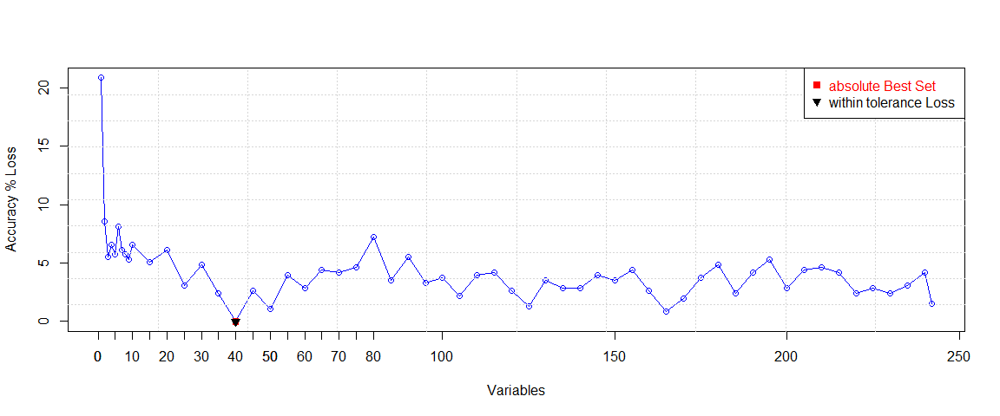
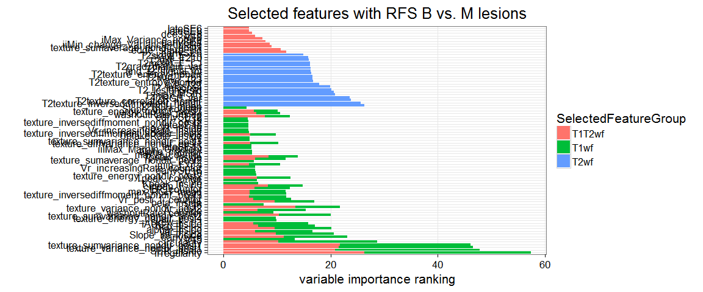

T2 features 
========================================================

- This code analysis T2w feature relevance, in addition to T1w and T1+T2w 
- finds relevant features via regularized RF
- Plot z-scores via boruta


```
## Loading required package: DBI
## Loading required package: lattice
## Loading required package: data.table
## Type 'citation("pROC")' for a citation.
## 
## Attaching package: 'pROC'
## 
## The following objects are masked from 'package:stats':
## 
##     cov, smooth, var
## 
## RRF 1.6
## Type rrfNews() to see new features/changes/bug fixes.
## 
## Attaching package: 'RRF'
## 
## The following object is masked from 'package:ggplot2':
## 
##     margin
```


```r
# read datasets
T1wf = read_T1uniqcad_parti(id_cad_pts, uniq_cad, allpartitionsetD, npatients, 1)
```

```
##    massB    massM nonmassB nonmassM 
##      242      166      142       76 
## nonmassM 
##        1
```

```r
T2wf = read_T2uniqcad_parti(id_cad_pts, uniq_cad, allpartitionsetD, npatients, 1)
```

```
##    massB    massM nonmassB nonmassM 
##      242      166      142       76 
## nonmassM 
##        1
```

```r
T1T2wf = read_T1T2uniqcad_parti(id_cad_pts, uniq_cad, allpartitionsetD, npatients, 1)
```

```
##    massB    massM nonmassB nonmassM 
##      242      166      142       76 
## nonmassM 
##        1
```

```r
## formant
T1wfeatures = rbind(T1wf[[1]], T1wf[[2]])
T1wlesioninfo = rbind(T1wf[[5]], T1wf[[6]])

T2wfeatures = rbind(T2wf[[1]], T2wf[[2]])
T2wlesioninfo = rbind(T2wf[[5]], T2wf[[6]])

T1T2wfeatures = rbind(T1T2wf[[1]], T1T2wf[[2]])
T1T2wlesioninfo = rbind(T1T2wf[[5]], T1T2wf[[6]])


### print number of total lesions 
# before was ##   C / NC = 140 / 132
print(summary(as.factor(T1wfeatures$orig_label)))
```

```
##    massB    massM nonmassB nonmassM 
##      242      166      142       77
```

```r
# print number T1w features
print(colnames(T1wfeatures))
```

```
##   [1] "lesion_label"                           "A_inside"                              
##   [3] "alpha_inside"                           "beta_inside"                           
##   [5] "iAUC1_inside"                           "Slope_ini_inside"                      
##   [7] "Tpeak_inside"                           "Kpeak_inside"                          
##   [9] "SER_inside"                             "maxCr_inside"                          
##  [11] "peakCr_inside"                          "UptakeRate_inside"                     
##  [13] "washoutRate_inside"                     "maxVr_inside"                          
##  [15] "peakVr_inside"                          "Vr_increasingRate_inside"              
##  [17] "Vr_decreasingRate_inside"               "Vr_post_1_inside"                      
##  [19] "A_countor"                              "alpha_countor"                         
##  [21] "beta_countor"                           "iAUC1_countor"                         
##  [23] "Slope_ini_countor"                      "Tpeak_countor"                         
##  [25] "Kpeak_countor"                          "SER_countor"                           
##  [27] "maxCr_countor"                          "peakCr_countor"                        
##  [29] "UptakeRate_countor"                     "washoutRate_countor"                   
##  [31] "maxVr_countor"                          "peakVr_countor"                        
##  [33] "Vr_increasingRate_countor"              "Vr_decreasingRate_countor"             
##  [35] "Vr_post_1_countor"                      "min_F_r_i"                             
##  [37] "max_F_r_i"                              "mean_F_r_i"                            
##  [39] "var_F_r_i"                              "skew_F_r_i"                            
##  [41] "kurt_F_r_i"                             "iMax_Variance_uptake"                  
##  [43] "iiMin_change_Variance_uptake"           "iiiMax_Margin_Gradient"                
##  [45] "k_Max_Margin_Grad"                      "ivVariance"                            
##  [47] "circularity"                            "irregularity"                          
##  [49] "edge_sharp_mean"                        "edge_sharp_std"                        
##  [51] "max_RGH_mean"                           "max_RGH_mean_k"                        
##  [53] "max_RGH_var"                            "max_RGH_var_k"                         
##  [55] "texture_energy_nondir_post1"            "texture_contrast_nondir_post1"         
##  [57] "texture_correlation_nondir_post1"       "texture_variance_nondir_post1"         
##  [59] "texture_inversediffmoment_nondir_post1" "texture_sumaverage_nondir_post1"       
##  [61] "texture_sumvariance_nondir_post1"       "texture_sumentropy_nondir_post1"       
##  [63] "texture_entropy_nondir_post1"           "texture_diffvariance_nondir_post1"     
##  [65] "texture_diffentropy_nondir_post1"       "texture_energy_nondir_post2"           
##  [67] "texture_contrast_nondir_post2"          "texture_correlation_nondir_post2"      
##  [69] "texture_variance_nondir_post2"          "texture_inversediffmoment_nondir_post2"
##  [71] "texture_sumaverage_nondir_post2"        "texture_sumvariance_nondir_post2"      
##  [73] "texture_sumentropy_nondir_post2"        "texture_entropy_nondir_post2"          
##  [75] "texture_diffvariance_nondir_post2"      "texture_diffentropy_nondir_post2"      
##  [77] "texture_energy_nondir_post3"            "texture_contrast_nondir_post3"         
##  [79] "texture_correlation_nondir_post3"       "texture_variance_nondir_post3"         
##  [81] "texture_inversediffmoment_nondir_post3" "texture_sumaverage_nondir_post3"       
##  [83] "texture_sumvariance_nondir_post3"       "texture_sumentropy_nondir_post3"       
##  [85] "texture_entropy_nondir_post3"           "texture_diffvariance_nondir_post3"     
##  [87] "texture_diffentropy_nondir_post3"       "texture_energy_nondir_post4"           
##  [89] "texture_contrast_nondir_post4"          "texture_correlation_nondir_post4"      
##  [91] "texture_variance_nondir_post4"          "texture_inversediffmoment_nondir_post4"
##  [93] "texture_sumaverage_nondir_post4"        "texture_sumvariance_nondir_post4"      
##  [95] "texture_sumentropy_nondir_post4"        "texture_entropy_nondir_post4"          
##  [97] "texture_diffvariance_nondir_post4"      "texture_diffentropy_nondir_post4"      
##  [99] "V0"                                     "V1"                                    
## [101] "V2"                                     "V3"                                    
## [103] "V4"                                     "V5"                                    
## [105] "V6"                                     "V7"                                    
## [107] "V8"                                     "V9"                                    
## [109] "V10"                                    "V11"                                   
## [111] "V12"                                    "V13"                                   
## [113] "V14"                                    "V15"                                   
## [115] "V16"                                    "V17"                                   
## [117] "V18"                                    "V19"                                   
## [119] "earlySE0"                               "earlySE1"                              
## [121] "earlySE2"                               "earlySE3"                              
## [123] "earlySE4"                               "earlySE5"                              
## [125] "earlySE6"                               "earlySE7"                              
## [127] "earlySE8"                               "earlySE9"                              
## [129] "earlySE10"                              "earlySE11"                             
## [131] "earlySE12"                              "earlySE13"                             
## [133] "earlySE14"                              "earlySE15"                             
## [135] "earlySE16"                              "earlySE17"                             
## [137] "earlySE18"                              "earlySE19"                             
## [139] "dce2SE0"                                "dce2SE1"                               
## [141] "dce2SE2"                                "dce2SE3"                               
## [143] "dce2SE4"                                "dce2SE5"                               
## [145] "dce2SE6"                                "dce2SE7"                               
## [147] "dce2SE8"                                "dce2SE9"                               
## [149] "dce2SE10"                               "dce2SE11"                              
## [151] "dce2SE12"                               "dce2SE13"                              
## [153] "dce2SE14"                               "dce2SE15"                              
## [155] "dce2SE16"                               "dce2SE17"                              
## [157] "dce2SE18"                               "dce2SE19"                              
## [159] "dce3SE0"                                "dce3SE1"                               
## [161] "dce3SE2"                                "dce3SE3"                               
## [163] "dce3SE4"                                "dce3SE5"                               
## [165] "dce3SE6"                                "dce3SE7"                               
## [167] "dce3SE8"                                "dce3SE9"                               
## [169] "dce3SE10"                               "dce3SE11"                              
## [171] "dce3SE12"                               "dce3SE13"                              
## [173] "dce3SE14"                               "dce3SE15"                              
## [175] "dce3SE16"                               "dce3SE17"                              
## [177] "dce3SE18"                               "dce3SE19"                              
## [179] "lateSE0"                                "lateSE1"                               
## [181] "lateSE2"                                "lateSE3"                               
## [183] "lateSE4"                                "lateSE5"                               
## [185] "lateSE6"                                "lateSE7"                               
## [187] "lateSE8"                                "lateSE9"                               
## [189] "lateSE10"                               "lateSE11"                              
## [191] "lateSE12"                               "lateSE13"                              
## [193] "lateSE14"                               "lateSE15"                              
## [195] "lateSE16"                               "lateSE17"                              
## [197] "lateSE18"                               "lateSE19"                              
## [199] "orig_label"
```

```r
# print number T2w features
print(colnames(T2wfeatures))
```

```
##  [1] "lesion_label"                       "find_t2_signal_int"                
##  [3] "T2_lesionSI"                        "T2_lesionSIstd"                    
##  [5] "LMSIR"                              "T2min_F_r_i"                       
##  [7] "T2max_F_r_i"                        "T2mean_F_r_i"                      
##  [9] "T2var_F_r_i"                        "T2skew_F_r_i"                      
## [11] "T2kurt_F_r_i"                       "T2grad_margin"                     
## [13] "T2grad_margin_var"                  "T2RGH_mean"                        
## [15] "T2RGH_var"                          "T2texture_energy_nondir"           
## [17] "T2texture_contrast_nondir"          "T2texture_correlation_nondir"      
## [19] "T2texture_variance_nondir"          "T2texture_inversediffmoment_nondir"
## [21] "T2texture_sumaverage_nondir"        "T2texture_sumvariance_nondir"      
## [23] "T2texture_sumentropy_nondir"        "T2texture_entropy_nondir"          
## [25] "T2texture_diffvariance_nondir"      "T2texture_diffentropy_nondir"      
## [27] "ave_T20"                            "ave_T21"                           
## [29] "ave_T22"                            "ave_T23"                           
## [31] "ave_T24"                            "ave_T25"                           
## [33] "ave_T26"                            "ave_T27"                           
## [35] "ave_T28"                            "ave_T29"                           
## [37] "ave_T210"                           "ave_T211"                          
## [39] "ave_T212"                           "ave_T213"                          
## [41] "ave_T214"                           "ave_T215"                          
## [43] "ave_T216"                           "ave_T217"                          
## [45] "ave_T218"                           "ave_T219"                          
## [47] "orig_label"
```

```r
# print number T1+T2w features
print(colnames(T1T2wfeatures))
```

```
##   [1] "lesion_label"                           "A_inside"                              
##   [3] "alpha_inside"                           "beta_inside"                           
##   [5] "iAUC1_inside"                           "Slope_ini_inside"                      
##   [7] "Tpeak_inside"                           "Kpeak_inside"                          
##   [9] "SER_inside"                             "maxCr_inside"                          
##  [11] "peakCr_inside"                          "UptakeRate_inside"                     
##  [13] "washoutRate_inside"                     "maxVr_inside"                          
##  [15] "peakVr_inside"                          "Vr_increasingRate_inside"              
##  [17] "Vr_decreasingRate_inside"               "Vr_post_1_inside"                      
##  [19] "A_countor"                              "alpha_countor"                         
##  [21] "beta_countor"                           "iAUC1_countor"                         
##  [23] "Slope_ini_countor"                      "Tpeak_countor"                         
##  [25] "Kpeak_countor"                          "SER_countor"                           
##  [27] "maxCr_countor"                          "peakCr_countor"                        
##  [29] "UptakeRate_countor"                     "washoutRate_countor"                   
##  [31] "maxVr_countor"                          "peakVr_countor"                        
##  [33] "Vr_increasingRate_countor"              "Vr_decreasingRate_countor"             
##  [35] "Vr_post_1_countor"                      "min_F_r_i"                             
##  [37] "max_F_r_i"                              "mean_F_r_i"                            
##  [39] "var_F_r_i"                              "skew_F_r_i"                            
##  [41] "kurt_F_r_i"                             "iMax_Variance_uptake"                  
##  [43] "iiMin_change_Variance_uptake"           "iiiMax_Margin_Gradient"                
##  [45] "k_Max_Margin_Grad"                      "ivVariance"                            
##  [47] "circularity"                            "irregularity"                          
##  [49] "edge_sharp_mean"                        "edge_sharp_std"                        
##  [51] "max_RGH_mean"                           "max_RGH_mean_k"                        
##  [53] "max_RGH_var"                            "max_RGH_var_k"                         
##  [55] "texture_energy_nondir_post1"            "texture_contrast_nondir_post1"         
##  [57] "texture_correlation_nondir_post1"       "texture_variance_nondir_post1"         
##  [59] "texture_inversediffmoment_nondir_post1" "texture_sumaverage_nondir_post1"       
##  [61] "texture_sumvariance_nondir_post1"       "texture_sumentropy_nondir_post1"       
##  [63] "texture_entropy_nondir_post1"           "texture_diffvariance_nondir_post1"     
##  [65] "texture_diffentropy_nondir_post1"       "texture_energy_nondir_post2"           
##  [67] "texture_contrast_nondir_post2"          "texture_correlation_nondir_post2"      
##  [69] "texture_variance_nondir_post2"          "texture_inversediffmoment_nondir_post2"
##  [71] "texture_sumaverage_nondir_post2"        "texture_sumvariance_nondir_post2"      
##  [73] "texture_sumentropy_nondir_post2"        "texture_entropy_nondir_post2"          
##  [75] "texture_diffvariance_nondir_post2"      "texture_diffentropy_nondir_post2"      
##  [77] "texture_energy_nondir_post3"            "texture_contrast_nondir_post3"         
##  [79] "texture_correlation_nondir_post3"       "texture_variance_nondir_post3"         
##  [81] "texture_inversediffmoment_nondir_post3" "texture_sumaverage_nondir_post3"       
##  [83] "texture_sumvariance_nondir_post3"       "texture_sumentropy_nondir_post3"       
##  [85] "texture_entropy_nondir_post3"           "texture_diffvariance_nondir_post3"     
##  [87] "texture_diffentropy_nondir_post3"       "texture_energy_nondir_post4"           
##  [89] "texture_contrast_nondir_post4"          "texture_correlation_nondir_post4"      
##  [91] "texture_variance_nondir_post4"          "texture_inversediffmoment_nondir_post4"
##  [93] "texture_sumaverage_nondir_post4"        "texture_sumvariance_nondir_post4"      
##  [95] "texture_sumentropy_nondir_post4"        "texture_entropy_nondir_post4"          
##  [97] "texture_diffvariance_nondir_post4"      "texture_diffentropy_nondir_post4"      
##  [99] "V0"                                     "V1"                                    
## [101] "V2"                                     "V3"                                    
## [103] "V4"                                     "V5"                                    
## [105] "V6"                                     "V7"                                    
## [107] "V8"                                     "V9"                                    
## [109] "V10"                                    "V11"                                   
## [111] "V12"                                    "V13"                                   
## [113] "V14"                                    "V15"                                   
## [115] "V16"                                    "V17"                                   
## [117] "V18"                                    "V19"                                   
## [119] "earlySE0"                               "earlySE1"                              
## [121] "earlySE2"                               "earlySE3"                              
## [123] "earlySE4"                               "earlySE5"                              
## [125] "earlySE6"                               "earlySE7"                              
## [127] "earlySE8"                               "earlySE9"                              
## [129] "earlySE10"                              "earlySE11"                             
## [131] "earlySE12"                              "earlySE13"                             
## [133] "earlySE14"                              "earlySE15"                             
## [135] "earlySE16"                              "earlySE17"                             
## [137] "earlySE18"                              "earlySE19"                             
## [139] "dce2SE0"                                "dce2SE1"                               
## [141] "dce2SE2"                                "dce2SE3"                               
## [143] "dce2SE4"                                "dce2SE5"                               
## [145] "dce2SE6"                                "dce2SE7"                               
## [147] "dce2SE8"                                "dce2SE9"                               
## [149] "dce2SE10"                               "dce2SE11"                              
## [151] "dce2SE12"                               "dce2SE13"                              
## [153] "dce2SE14"                               "dce2SE15"                              
## [155] "dce2SE16"                               "dce2SE17"                              
## [157] "dce2SE18"                               "dce2SE19"                              
## [159] "dce3SE0"                                "dce3SE1"                               
## [161] "dce3SE2"                                "dce3SE3"                               
## [163] "dce3SE4"                                "dce3SE5"                               
## [165] "dce3SE6"                                "dce3SE7"                               
## [167] "dce3SE8"                                "dce3SE9"                               
## [169] "dce3SE10"                               "dce3SE11"                              
## [171] "dce3SE12"                               "dce3SE13"                              
## [173] "dce3SE14"                               "dce3SE15"                              
## [175] "dce3SE16"                               "dce3SE17"                              
## [177] "dce3SE18"                               "dce3SE19"                              
## [179] "lateSE0"                                "lateSE1"                               
## [181] "lateSE2"                                "lateSE3"                               
## [183] "lateSE4"                                "lateSE5"                               
## [185] "lateSE6"                                "lateSE7"                               
## [187] "lateSE8"                                "lateSE9"                               
## [189] "lateSE10"                               "lateSE11"                              
## [191] "lateSE12"                               "lateSE13"                              
## [193] "lateSE14"                               "lateSE15"                              
## [195] "lateSE16"                               "lateSE17"                              
## [197] "lateSE18"                               "lateSE19"                              
## [199] "find_t2_signal_int"                     "T2_lesionSI"                           
## [201] "T2_lesionSIstd"                         "LMSIR"                                 
## [203] "T2min_F_r_i"                            "T2max_F_r_i"                           
## [205] "T2mean_F_r_i"                           "T2var_F_r_i"                           
## [207] "T2skew_F_r_i"                           "T2kurt_F_r_i"                          
## [209] "T2grad_margin"                          "T2grad_margin_var"                     
## [211] "T2RGH_mean"                             "T2RGH_var"                             
## [213] "T2texture_energy_nondir"                "T2texture_contrast_nondir"             
## [215] "T2texture_correlation_nondir"           "T2texture_variance_nondir"             
## [217] "T2texture_inversediffmoment_nondir"     "T2texture_sumaverage_nondir"           
## [219] "T2texture_sumvariance_nondir"           "T2texture_sumentropy_nondir"           
## [221] "T2texture_entropy_nondir"               "T2texture_diffvariance_nondir"         
## [223] "T2texture_diffentropy_nondir"           "ave_T20"                               
## [225] "ave_T21"                                "ave_T22"                               
## [227] "ave_T23"                                "ave_T24"                               
## [229] "ave_T25"                                "ave_T26"                               
## [231] "ave_T27"                                "ave_T28"                               
## [233] "ave_T29"                                "ave_T210"                              
## [235] "ave_T211"                               "ave_T212"                              
## [237] "ave_T213"                               "ave_T214"                              
## [239] "ave_T215"                               "ave_T216"                              
## [241] "ave_T217"                               "ave_T218"                              
## [243] "ave_T219"                               "orig_label"
```

```r
################ 
## Subset feature selection via rff
################ 
subfeatsel_T1w = subset_feature_selection(T1wfeatures[,-c(ncol(T1wfeatures))]) # exlude orig_label
```

```
## Loading required package: ipred
## Loading required package: e1071
## Loading required package: rpart
```

```
## 
## Recursive feature selection
## 
## Outer resampling method: Cross-Validated (2 fold, repeated 1 times) 
## 
## Resampling performance over subset size:
## 
##  Variables Accuracy  Kappa AccuracySD KappaSD Selected
##          1   0.5948 0.1643   0.009243 0.02572         
##          2   0.6422 0.2539   0.006932 0.01636         
##          3   0.6814 0.3212   0.020797 0.05197         
##          4   0.6879 0.3369   0.043905 0.09935         
##          5   0.6944 0.3452   0.025419 0.06055         
##          6   0.6748 0.3082   0.011554 0.03666         
##          7   0.7010 0.3622   0.016176 0.03910         
##          8   0.7026 0.3638   0.032351 0.07835         
##          9   0.6977 0.3532   0.011554 0.03474         
##         10   0.7042 0.3727   0.034662 0.07671         
##         15   0.6830 0.3322   0.032351 0.08435         
##         20   0.6683 0.3014   0.016176 0.04613         
##         25   0.6977 0.3569   0.011554 0.03448         
##         30   0.6912 0.3404   0.011554 0.02808         
##         35   0.6961 0.3533   0.009243 0.01302         
##         40   0.7108 0.3846   0.025419 0.06227         
##         45   0.7108 0.3869   0.025419 0.06825         
##         50   0.7059 0.3719   0.023108 0.05839         
##         55   0.7418 0.4482   0.036973 0.07902        *
##         60   0.6912 0.3391   0.030040 0.07177         
##         65   0.6993 0.3599   0.036973 0.08395         
##         70   0.7010 0.3589   0.020797 0.05716         
##         75   0.7222 0.4061   0.036973 0.08148         
##         80   0.7042 0.3607   0.039284 0.08823         
##         85   0.6928 0.3376   0.023108 0.04983         
##         90   0.7288 0.4226   0.027730 0.06257         
##         95   0.7124 0.3869   0.036973 0.08258         
##        100   0.7124 0.3852   0.027730 0.06308         
##        105   0.6797 0.3191   0.027730 0.06592         
##        110   0.7173 0.3989   0.006932 0.01783         
##        115   0.7190 0.3957   0.027730 0.06087         
##        120   0.7108 0.3813   0.030040 0.06617         
##        125   0.7042 0.3693   0.030040 0.06342         
##        130   0.7124 0.3824   0.046216 0.10178         
##        135   0.6977 0.3508   0.034662 0.08580         
##        140   0.7255 0.4151   0.027730 0.07104         
##        145   0.7092 0.3846   0.009243 0.02333         
##        150   0.7075 0.3754   0.043905 0.10329         
##        155   0.6977 0.3511   0.020797 0.05470         
##        160   0.7092 0.3858   0.023108 0.06127         
##        165   0.7059 0.3707   0.023108 0.06239         
##        170   0.6928 0.3444   0.009243 0.01973         
##        175   0.6895 0.3352   0.018486 0.04645         
##        180   0.6863 0.3342   0.050838 0.10923         
##        185   0.6993 0.3569   0.032351 0.07712         
##        190   0.7010 0.3595   0.020797 0.04388         
##        195   0.6993 0.3583   0.046216 0.11039         
##        197   0.6928 0.3522   0.018486 0.02579         
## 
## The top 5 variables (out of 55):
##    irregularity, SER_inside, texture_variance_nondir_post1, texture_sumvariance_nondir_post1, circularity
## 
## [1] 55
##  [1] "irregularity"                           "SER_inside"                            
##  [3] "texture_variance_nondir_post1"          "texture_sumvariance_nondir_post1"      
##  [5] "circularity"                            "max_F_r_i"                             
##  [7] "Slope_ini_inside"                       "alpha_inside"                          
##  [9] "iAUC1_inside"                           "texture_sumvariance_nondir_post2"      
## [11] "V15"                                    "A_inside"                              
## [13] "earlySE8"                               "texture_variance_nondir_post2"         
## [15] "var_F_r_i"                              "beta_inside"                           
## [17] "texture_energy_nondir_post4"            "skew_F_r_i"                            
## [19] "washoutRate_countor"                    "max_RGH_mean"                          
## [21] "SER_countor"                            "mean_F_r_i"                            
## [23] "V8"                                     "Kpeak_inside"                          
## [25] "min_F_r_i"                              "texture_sumaverage_nondir_post2"       
## [27] "Tpeak_inside"                           "V16"                                   
## [29] "V11"                                    "earlySE16"                             
## [31] "texture_inversediffmoment_nondir_post3" "Vr_post_1_countor"                     
## [33] "texture_diffvariance_nondir_post1"      "V7"                                    
## [35] "maxVr_inside"                           "UptakeRate_inside"                     
## [37] "Tpeak_countor"                          "texture_energy_nondir_post2"           
## [39] "V10"                                    "V12"                                   
## [41] "V19"                                    "lateSE15"                              
## [43] "washoutRate_inside"                     "Vr_increasingRate_countor"             
## [45] "lateSE18"                               "Slope_ini_countor"                     
## [47] "V9"                                     "texture_inversediffmoment_nondir_post2"
## [49] "V2"                                     "maxVr_countor"                         
## [51] "alpha_countor"                          "iiiMax_Margin_Gradient"                
## [53] "V1"                                     "Vr_increasingRate_inside"              
## [55] "texture_energy_nondir_post3"
```

 

```
## numerically optimal: 0.7418301 Accuracy with subset 55 
## Accepting a 1.5% Accuracy loss: 0.7418301 Accuracy with subset 55
```

 

```r
subfeatsel_T2w = subset_feature_selection(T2wfeatures[,-c(ncol(T2wfeatures))]) # exlude orig_label
```

```
## 
## Recursive feature selection
## 
## Outer resampling method: Cross-Validated (2 fold, repeated 1 times) 
## 
## Resampling performance over subset size:
## 
##  Variables Accuracy   Kappa AccuracySD  KappaSD Selected
##          1   0.5621 0.06925   0.007219 0.022573         
##          2   0.5671 0.06408   0.032661 0.066937         
##          3   0.5654 0.05091   0.030343 0.073581         
##          4   0.5751 0.08214   0.015828 0.030984         
##          5   0.5882 0.09807   0.011146 0.029082         
##          6   0.5539 0.03703   0.009493 0.008561         
##          7   0.5752 0.07523   0.002658 0.007007         
##          8   0.5686 0.06642   0.001994 0.022741         
##          9   0.5768 0.07690   0.018132 0.015617         
##         10   0.5898 0.10178   0.045801 0.082810         
##         15   0.6225 0.17893   0.004055 0.010677         
##         20   0.6422 0.21278   0.019144 0.060895        *
##         25   0.5849 0.08410   0.011161 0.021538         
##         30   0.6111 0.14441   0.011041 0.021385         
##         35   0.6128 0.15252   0.005143 0.018709         
##         40   0.6177 0.15103   0.002855 0.007324         
##         45   0.6046 0.13404   0.007416 0.017342         
## 
## The top 5 variables (out of 20):
##    T2RGH_mean, T2RGH_var, T2texture_inversediffmoment_nondir, T2texture_correlation_nondir, T2max_F_r_i
## 
## [1] 20
##  [1] "T2RGH_mean"                         "T2RGH_var"                         
##  [3] "T2texture_inversediffmoment_nondir" "T2texture_correlation_nondir"      
##  [5] "T2max_F_r_i"                        "LMSIR"                             
##  [7] "T2_lesionSIstd"                     "T2_lesionSI"                       
##  [9] "T2texture_energy_nondir"            "T2texture_entropy_nondir"          
## [11] "T2kurt_F_r_i"                       "find_t2_signal_int"                
## [13] "T2grad_margin_var"                  "T2mean_F_r_i"                      
## [15] "ave_T210"                           "ave_T22"                           
## [17] "T2skew_F_r_i"                       "ave_T23"                           
## [19] "T2min_F_r_i"                        "T2var_F_r_i"
```

 

```
## numerically optimal: 0.6422011 Accuracy with subset 20 
## Accepting a 1.5% Accuracy loss: 0.6422011 Accuracy with subset 20
```

 

```r
subfeatsel_T1T2w = subset_feature_selection(T1T2wfeatures[,-c(ncol(T1T2wfeatures))]) # exlude orig_label
```

```
## 
## Recursive feature selection
## 
## Outer resampling method: Cross-Validated (2 fold, repeated 1 times) 
## 
## Resampling performance over subset size:
## 
##  Variables Accuracy  Kappa AccuracySD  KappaSD Selected
##          1   0.5948 0.1403  0.0316736 0.064179         
##          2   0.6870 0.3329  0.0318886 0.072364         
##          3   0.7101 0.3875  0.0272826 0.059256         
##          4   0.7018 0.3729  0.0216634 0.023001         
##          5   0.7084 0.3912  0.0030092 0.017979         
##          6   0.6903 0.3427  0.0039381 0.026112         
##          7   0.7051 0.3729  0.0030169 0.013741         
##          8   0.7084 0.3799  0.0016505 0.015849         
##          9   0.7117 0.3910  0.0216403 0.031162         
##         10   0.7018 0.3696  0.0062948 0.019446         
##         15   0.7133 0.3978  0.0039918 0.022161         
##         20   0.7051 0.3755  0.0109622 0.035623         
##         25   0.7282 0.4229  0.0016965 0.011558         
##         30   0.7150 0.3936  0.0156449 0.046563         
##         35   0.7331 0.4328  0.0180170 0.043205         
##         40   0.7513 0.4702  0.0203890 0.047465        *
##         45   0.7315 0.4221  0.0250027 0.060534         
##         50   0.7430 0.4487  0.0180400 0.051345         
##         55   0.7216 0.4015  0.0110006 0.041723         
##         60   0.7298 0.4249  0.0226690 0.054394         
##         65   0.7183 0.3923  0.0123056 0.021963         
##         70   0.7199 0.4041  0.0053122 0.008467         
##         75   0.7166 0.3887  0.0192990 0.026287         
##         80   0.6969 0.3484  0.0179325 0.042806         
##         85   0.7249 0.4055  0.0063485 0.021887         
##         90   0.7101 0.3731  0.0086438 0.020153         
##         95   0.7265 0.4067  0.0086822 0.033763         
##        100   0.7232 0.4034  0.0053045 0.008783         
##        105   0.7348 0.4311  0.0029478 0.005517         
##        110   0.7216 0.4018  0.0296393 0.069424         
##        115   0.7200 0.3943  0.0179863 0.046582         
##        120   0.7315 0.4154  0.0156833 0.040937         
##        125   0.7414 0.4411  0.0110466 0.031548         
##        130   0.7249 0.4045  0.0249873 0.061008         
##        135   0.7298 0.4124  0.0146086 0.029219         
##        140   0.7298 0.4208  0.0180093 0.044781         
##        145   0.7216 0.4000  0.0203200 0.052021         
##        150   0.7249 0.4037  0.0343067 0.077569         
##        155   0.7183 0.3875  0.0203123 0.053828         
##        160   0.7315 0.4170  0.0203430 0.052149         
##        165   0.7447 0.4456  0.0250334 0.060780         
##        170   0.7364 0.4266  0.0273440 0.063153         
##        175   0.7232 0.4013  0.0179939 0.050234         
##        180   0.7150 0.3887  0.0342837 0.088104         
##        185   0.7331 0.4245  0.0180170 0.046156         
##        190   0.7200 0.3950  0.0226460 0.059082         
##        195   0.7117 0.3734  0.0016581 0.003063         
##        200   0.7299 0.4163  0.0506272 0.115503         
##        205   0.7183 0.3932  0.0076459 0.009378         
##        210   0.7167 0.3917  0.0319577 0.072576         
##        215   0.7199 0.4006  0.0040072 0.006367         
##        220   0.7331 0.4279  0.0006218 0.005811         
##        225   0.7298 0.4116  0.0133496 0.023015         
##        230   0.7331 0.4212  0.0133573 0.035109         
##        235   0.7282 0.4127  0.0016965 0.004434         
##        240   0.7200 0.3907  0.0226460 0.055708         
##        242   0.7397 0.4396  0.0040532 0.018168         
## 
## The top 5 variables (out of 40):
##    irregularity, texture_sumvariance_nondir_post1, texture_variance_nondir_post1, SER_inside, texture_variance_nondir_post2
## 
## [1] 40
##  [1] "irregularity"                           "texture_sumvariance_nondir_post1"      
##  [3] "texture_variance_nondir_post1"          "SER_inside"                            
##  [5] "texture_variance_nondir_post2"          "texture_sumvariance_nondir_post2"      
##  [7] "circularity"                            "Slope_ini_inside"                      
##  [9] "beta_inside"                            "alpha_inside"                          
## [11] "earlySE6"                               "earlySE8"                              
## [13] "edge_sharp_std"                         "texture_sumaverage_nondir_post1"       
## [15] "max_F_r_i"                              "A_inside"                              
## [17] "earlySE4"                               "Tpeak_inside"                          
## [19] "iiMin_change_Variance_uptake"           "mean_F_r_i"                            
## [21] "SER_countor"                            "iAUC1_inside"                          
## [23] "earlySE12"                              "iMax_Variance_uptake"                  
## [25] "texture_inversediffmoment_nondir_post3" "max_RGH_mean"                          
## [27] "V18"                                    "dce3SE8"                               
## [29] "texture_variance_nondir_post3"          "var_F_r_i"                             
## [31] "Tpeak_countor"                          "washoutRate_inside"                    
## [33] "texture_sumaverage_nondir_post2"        "kurt_F_r_i"                            
## [35] "beta_countor"                           "texture_energy_nondir_post3"           
## [37] "Kpeak_inside"                           "Vr_post_1_countor"                     
## [39] "ave_T210"                               "min_F_r_i"
```

 

```
## numerically optimal: 0.7512593 Accuracy with subset 40 
## Accepting a 1.5% Accuracy loss: 0.7512593 Accuracy with subset 40
```

 

```r
# append
allrfsfeatures = data.frame()
# only t1
df = subfeatsel_T1w$selvarImp
df$SelectedFeatureGroup = "T1wf"
allrfsfeatures = rbind(allrfsfeatures, df)
# only t2
df = subfeatsel_T2w$selvarImp
df$SelectedFeatureGroup = "T2wf"
allrfsfeatures = rbind(allrfsfeatures, df)
# t1 + t2
df = subfeatsel_T1T2w$selvarImp
df$SelectedFeatureGroup = "T1T2wf"
allrfsfeatures = rbind(allrfsfeatures, df)

library("lattice")
library("latticeExtra")
```

```
## Loading required package: RColorBrewer
## 
## Attaching package: 'latticeExtra'
## 
## The following object is masked from 'package:ggplot2':
## 
##     layer
```

```r
require(ggplot2)

# plot
g <- ggplot(allrfsfeatures, aes(x = factor(selfeat), weight=Overall, fill=SelectedFeatureGroup))
g + geom_bar() + coord_flip() + theme_bw(base_size = 16) + labs(title = "Selected features with RFS B vs. M lesions", 
    x = "", y = "variable importance ranking")
```

 


Random Forest via permutation tests feature relevance (Boruta)
=====

```r
library("Boruta")
```

```
## Loading required package: ranger
## 
## Attaching package: 'ranger'
## 
## The following object is masked from 'package:RRF':
## 
##     importance
```

```r
require(data.table)
# Color codes: c('green', 'yellow', 'red', 'blue'), Confirmed, Tentative,
# Rejected and shadow.  Blue boxplots correspond to minimal, average and
# maximum Z score of a shadow attribute. Red Boruta mass: (to run boruta
# uncomment)
set.seed(1)
T1wBoruta <- Boruta(lesion_label ~ ., data = na.omit(T1wfeatures[,-ncol(T1wfeatures)]), 
                    doTrace = 2, ntree = 500)
```

```
##  1. run of importance source...
##  2. run of importance source...
##  3. run of importance source...
##  4. run of importance source...
##  5. run of importance source...
##  6. run of importance source...
##  7. run of importance source...
##  8. run of importance source...
##  9. run of importance source...
##  10. run of importance source...
##  11. run of importance source...
##  12. run of importance source...
##  13. run of importance source...
##  14. run of importance source...
##  15. run of importance source...
## Confirmed 12 attributes: alpha_inside, circularity, irregularity, max_F_r_i, SER_countor and 7 more.
## Rejected 78 attributes: A_countor, beta_countor, beta_inside, dce2SE10, dce2SE13 and 73 more.
##  16. run of importance source...
##  17. run of importance source...
##  18. run of importance source...
##  19. run of importance source...
## Confirmed 3 attributes: earlySE12, earlySE8, washoutRate_inside.
## Rejected 22 attributes: A_inside, dce2SE0, dce2SE19, dce2SE3, dce3SE1 and 17 more.
##  20. run of importance source...
##  21. run of importance source...
##  22. run of importance source...
##  23. run of importance source...
## Rejected 10 attributes: dce2SE7, dce3SE0, Kpeak_inside, kurt_F_r_i, lateSE5 and 5 more.
##  24. run of importance source...
##  25. run of importance source...
##  26. run of importance source...
## Rejected 9 attributes: dce2SE11, earlySE13, earlySE3, lateSE8, texture_contrast_nondir_post2 and 4 more.
##  27. run of importance source...
##  28. run of importance source...
##  29. run of importance source...
##  30. run of importance source...
## Confirmed 1 attributes: texture_sumvariance_nondir_post3.
## Rejected 1 attributes: lateSE12.
##  31. run of importance source...
##  32. run of importance source...
##  33. run of importance source...
## Confirmed 1 attributes: texture_contrast_nondir_post1.
## Rejected 2 attributes: UptakeRate_countor, V1.
##  34. run of importance source...
##  35. run of importance source...
##  36. run of importance source...
## Rejected 1 attributes: earlySE18.
##  37. run of importance source...
##  38. run of importance source...
##  39. run of importance source...
## Confirmed 1 attributes: texture_variance_nondir_post3.
## Rejected 1 attributes: dce3SE7.
##  40. run of importance source...
##  41. run of importance source...
##  42. run of importance source...
##  43. run of importance source...
##  44. run of importance source...
##  45. run of importance source...
## Confirmed 2 attributes: earlySE6, mean_F_r_i.
##  46. run of importance source...
##  47. run of importance source...
## Confirmed 1 attributes: earlySE7.
## Rejected 4 attributes: dce2SE15, texture_correlation_nondir_post1, texture_sumentropy_nondir_post2, texture_variance_nondir_post4.
##  48. run of importance source...
##  49. run of importance source...
##  50. run of importance source...
##  51. run of importance source...
##  52. run of importance source...
##  53. run of importance source...
## Confirmed 1 attributes: iiMin_change_Variance_uptake.
## Rejected 1 attributes: dce2SE1.
##  54. run of importance source...
##  55. run of importance source...
##  56. run of importance source...
## Confirmed 2 attributes: texture_diffvariance_nondir_post2, V16.
## Rejected 1 attributes: texture_correlation_nondir_post4.
##  57. run of importance source...
##  58. run of importance source...
##  59. run of importance source...
##  60. run of importance source...
##  61. run of importance source...
## Confirmed 1 attributes: Tpeak_inside.
## Rejected 1 attributes: earlySE14.
##  62. run of importance source...
##  63. run of importance source...
##  64. run of importance source...
## Confirmed 2 attributes: texture_inversediffmoment_nondir_post3, washoutRate_countor.
##  65. run of importance source...
##  66. run of importance source...
##  67. run of importance source...
##  68. run of importance source...
##  69. run of importance source...
##  70. run of importance source...
##  71. run of importance source...
##  72. run of importance source...
##  73. run of importance source...
##  74. run of importance source...
## Confirmed 1 attributes: V18.
##  75. run of importance source...
##  76. run of importance source...
##  77. run of importance source...
##  78. run of importance source...
##  79. run of importance source...
##  80. run of importance source...
##  81. run of importance source...
##  82. run of importance source...
##  83. run of importance source...
##  84. run of importance source...
##  85. run of importance source...
##  86. run of importance source...
##  87. run of importance source...
## Confirmed 1 attributes: V11.
##  88. run of importance source...
##  89. run of importance source...
##  90. run of importance source...
## Confirmed 1 attributes: earlySE16.
##  91. run of importance source...
##  92. run of importance source...
## Confirmed 1 attributes: texture_inversediffmoment_nondir_post4.
##  93. run of importance source...
##  94. run of importance source...
##  95. run of importance source...
##  96. run of importance source...
##  97. run of importance source...
##  98. run of importance source...
##  99. run of importance source...
```

```r
print(T1wBoruta)
```

```
## Boruta performed 99 iterations in 11.2561 mins.
##  31 attributes confirmed important: alpha_inside, circularity, earlySE12, earlySE16,
## earlySE6 and 26 more.
##  131 attributes confirmed unimportant: A_countor, A_inside, beta_countor,
## beta_inside, dce2SE0 and 126 more.
##  35 tentative attributes left: alpha_countor, dce2SE12, dce2SE16, dce2SE5, dce2SE8
## and 30 more.
```

```r
plot(T1wBoruta)
```

 

```r
# T2wBoruta:
set.seed(2)
T2wBoruta <- Boruta(lesion_label ~ ., data = na.omit(T2wfeatures[,-ncol(T2wfeatures)]), 
                      doTrace = 2, ntree = 500)
```

```
##  1. run of importance source...
##  2. run of importance source...
##  3. run of importance source...
##  4. run of importance source...
##  5. run of importance source...
##  6. run of importance source...
##  7. run of importance source...
##  8. run of importance source...
##  9. run of importance source...
##  10. run of importance source...
##  11. run of importance source...
##  12. run of importance source...
##  13. run of importance source...
## Rejected 26 attributes: ave_T20, ave_T21, ave_T212, ave_T213, ave_T215 and 21 more.
##  14. run of importance source...
##  15. run of importance source...
##  16. run of importance source...
##  17. run of importance source...
## Rejected 6 attributes: ave_T214, ave_T25, LMSIR, T2grad_margin, T2mean_F_r_i and 1 more.
##  18. run of importance source...
##  19. run of importance source...
##  20. run of importance source...
## Confirmed 2 attributes: ave_T210, T2texture_entropy_nondir.
##  21. run of importance source...
##  22. run of importance source...
##  23. run of importance source...
##  24. run of importance source...
## Confirmed 1 attributes: T2RGH_var.
##  25. run of importance source...
##  26. run of importance source...
##  27. run of importance source...
##  28. run of importance source...
##  29. run of importance source...
##  30. run of importance source...
## Confirmed 1 attributes: T2RGH_mean.
## Rejected 1 attributes: T2texture_correlation_nondir.
##  31. run of importance source...
##  32. run of importance source...
##  33. run of importance source...
## Confirmed 1 attributes: find_t2_signal_int.
##  34. run of importance source...
##  35. run of importance source...
##  36. run of importance source...
##  37. run of importance source...
##  38. run of importance source...
##  39. run of importance source...
##  40. run of importance source...
##  41. run of importance source...
##  42. run of importance source...
##  43. run of importance source...
##  44. run of importance source...
##  45. run of importance source...
##  46. run of importance source...
##  47. run of importance source...
##  48. run of importance source...
##  49. run of importance source...
##  50. run of importance source...
##  51. run of importance source...
##  52. run of importance source...
##  53. run of importance source...
##  54. run of importance source...
##  55. run of importance source...
##  56. run of importance source...
##  57. run of importance source...
##  58. run of importance source...
##  59. run of importance source...
##  60. run of importance source...
##  61. run of importance source...
##  62. run of importance source...
##  63. run of importance source...
##  64. run of importance source...
##  65. run of importance source...
## Confirmed 1 attributes: T2min_F_r_i.
## Rejected 1 attributes: ave_T211.
##  66. run of importance source...
##  67. run of importance source...
##  68. run of importance source...
##  69. run of importance source...
##  70. run of importance source...
##  71. run of importance source...
##  72. run of importance source...
##  73. run of importance source...
##  74. run of importance source...
##  75. run of importance source...
##  76. run of importance source...
##  77. run of importance source...
##  78. run of importance source...
##  79. run of importance source...
##  80. run of importance source...
##  81. run of importance source...
##  82. run of importance source...
##  83. run of importance source...
##  84. run of importance source...
##  85. run of importance source...
##  86. run of importance source...
##  87. run of importance source...
##  88. run of importance source...
##  89. run of importance source...
##  90. run of importance source...
## Confirmed 1 attributes: T2grad_margin_var.
##  91. run of importance source...
##  92. run of importance source...
##  93. run of importance source...
##  94. run of importance source...
##  95. run of importance source...
##  96. run of importance source...
##  97. run of importance source...
##  98. run of importance source...
##  99. run of importance source...
```

```r
print(T2wBoruta)
```

```
## Boruta performed 99 iterations in 3.134163 mins.
##  7 attributes confirmed important: ave_T210, find_t2_signal_int, T2grad_margin_var,
## T2min_F_r_i, T2RGH_mean and 2 more.
##  34 attributes confirmed unimportant: ave_T20, ave_T21, ave_T211, ave_T212, ave_T213
## and 29 more.
##  4 tentative attributes left: T2_lesionSIstd, T2max_F_r_i, T2texture_energy_nondir,
## T2var_F_r_i.
```

```r
plot(T2wBoruta)
```

 

```r
# T1T2wBoruta:
set.seed(12)
T1T2wBoruta <- Boruta(lesion_label ~ ., data = na.omit(T1T2wfeatures[,-ncol(T1T2wfeatures)]), 
                      doTrace = 2, ntree = 500)
```

```
##  1. run of importance source...
##  2. run of importance source...
##  3. run of importance source...
##  4. run of importance source...
##  5. run of importance source...
##  6. run of importance source...
##  7. run of importance source...
##  8. run of importance source...
##  9. run of importance source...
##  10. run of importance source...
##  11. run of importance source...
##  12. run of importance source...
##  13. run of importance source...
##  14. run of importance source...
##  15. run of importance source...
## Confirmed 11 attributes: alpha_inside, circularity, earlySE8, irregularity, SER_countor and 6 more.
## Rejected 123 attributes: A_countor, A_inside, ave_T20, ave_T21, ave_T211 and 118 more.
##  16. run of importance source...
##  17. run of importance source...
##  18. run of importance source...
##  19. run of importance source...
## Confirmed 1 attributes: earlySE12.
## Rejected 18 attributes: ave_T27, dce2SE10, dce2SE18, dce2SE4, dce3SE18 and 13 more.
##  20. run of importance source...
##  21. run of importance source...
##  22. run of importance source...
##  23. run of importance source...
## Confirmed 2 attributes: max_F_r_i, texture_sumvariance_nondir_post3.
## Rejected 11 attributes: ave_T210, dce3SE11, earlySE14, edge_sharp_std, find_t2_signal_int and 6 more.
##  24. run of importance source...
##  25. run of importance source...
##  26. run of importance source...
##  27. run of importance source...
## Confirmed 2 attributes: Slope_ini_inside, texture_contrast_nondir_post1.
## Rejected 9 attributes: dce2SE0, dce3SE12, earlySE13, earlySE18, earlySE19 and 4 more.
##  28. run of importance source...
##  29. run of importance source...
##  30. run of importance source...
## Rejected 4 attributes: dce2SE1, earlySE3, V12, V19.
##  31. run of importance source...
##  32. run of importance source...
##  33. run of importance source...
## Confirmed 1 attributes: V16.
## Rejected 6 attributes: dce2SE12, Kpeak_inside, texture_sumentropy_nondir_post2, V0, V13 and 1 more.
##  34. run of importance source...
##  35. run of importance source...
##  36. run of importance source...
## Rejected 1 attributes: Vr_increasingRate_countor.
##  37. run of importance source...
##  38. run of importance source...
##  39. run of importance source...
## Confirmed 3 attributes: earlySE7, mean_F_r_i, washoutRate_inside.
## Rejected 2 attributes: dce2SE16, earlySE11.
##  40. run of importance source...
##  41. run of importance source...
##  42. run of importance source...
##  43. run of importance source...
##  44. run of importance source...
##  45. run of importance source...
##  46. run of importance source...
##  47. run of importance source...
##  48. run of importance source...
## Confirmed 1 attributes: texture_variance_nondir_post3.
##  49. run of importance source...
##  50. run of importance source...
##  51. run of importance source...
## Confirmed 1 attributes: iiMin_change_Variance_uptake.
##  52. run of importance source...
##  53. run of importance source...
##  54. run of importance source...
##  55. run of importance source...
##  56. run of importance source...
## Confirmed 1 attributes: texture_diffvariance_nondir_post2.
## Rejected 1 attributes: dce3SE7.
##  57. run of importance source...
##  58. run of importance source...
##  59. run of importance source...
## Rejected 1 attributes: UptakeRate_inside.
##  60. run of importance source...
##  61. run of importance source...
##  62. run of importance source...
## Confirmed 1 attributes: earlySE6.
##  63. run of importance source...
##  64. run of importance source...
## Confirmed 1 attributes: earlySE16.
##  65. run of importance source...
##  66. run of importance source...
##  67. run of importance source...
## Rejected 1 attributes: texture_correlation_nondir_post4.
##  68. run of importance source...
##  69. run of importance source...
##  70. run of importance source...
## Confirmed 2 attributes: Tpeak_inside, washoutRate_countor.
##  71. run of importance source...
##  72. run of importance source...
##  73. run of importance source...
##  74. run of importance source...
##  75. run of importance source...
##  76. run of importance source...
##  77. run of importance source...
## Rejected 1 attributes: texture_correlation_nondir_post3.
##  78. run of importance source...
##  79. run of importance source...
##  80. run of importance source...
##  81. run of importance source...
##  82. run of importance source...
##  83. run of importance source...
## Rejected 1 attributes: V1.
##  84. run of importance source...
##  85. run of importance source...
## Confirmed 1 attributes: V9.
##  86. run of importance source...
##  87. run of importance source...
##  88. run of importance source...
##  89. run of importance source...
##  90. run of importance source...
## Confirmed 1 attributes: earlySE0.
##  91. run of importance source...
##  92. run of importance source...
##  93. run of importance source...
## Confirmed 1 attributes: texture_inversediffmoment_nondir_post4.
##  94. run of importance source...
##  95. run of importance source...
## Confirmed 1 attributes: V18.
##  96. run of importance source...
##  97. run of importance source...
##  98. run of importance source...
##  99. run of importance source...
```

```r
print(T1T2wBoruta)
```

```
## Boruta performed 99 iterations in 10.30729 mins.
##  31 attributes confirmed important: alpha_inside, circularity, earlySE0, earlySE12,
## earlySE16 and 26 more.
##  179 attributes confirmed unimportant: A_countor, A_inside, ave_T20, ave_T21,
## ave_T210 and 174 more.
##  32 tentative attributes left: alpha_countor, dce2SE5, dce2SE8, dce3SE8, earlySE1
## and 27 more.
```

```r
plot(T1T2wBoruta)
```

 

```r
## Process results and plot Z-scores
library("caret")
confirmedT1w <- T1wBoruta$finalDecision[T1wBoruta$finalDecision == "Confirmed"]
tentativeT1w <- T1wBoruta$finalDecision[T1wBoruta$finalDecision == "Tentative"]
selborutaT1w = c(confirmedT1w, tentativeT1w)
print(paste("Selected T1wBoruta features: ",names(selborutaT1w)))
```

```
##  [1] "Selected T1wBoruta features:  alpha_inside"                          
##  [2] "Selected T1wBoruta features:  Slope_ini_inside"                      
##  [3] "Selected T1wBoruta features:  Tpeak_inside"                          
##  [4] "Selected T1wBoruta features:  SER_inside"                            
##  [5] "Selected T1wBoruta features:  washoutRate_inside"                    
##  [6] "Selected T1wBoruta features:  SER_countor"                           
##  [7] "Selected T1wBoruta features:  washoutRate_countor"                   
##  [8] "Selected T1wBoruta features:  max_F_r_i"                             
##  [9] "Selected T1wBoruta features:  mean_F_r_i"                            
## [10] "Selected T1wBoruta features:  iiMin_change_Variance_uptake"          
## [11] "Selected T1wBoruta features:  circularity"                           
## [12] "Selected T1wBoruta features:  irregularity"                          
## [13] "Selected T1wBoruta features:  texture_contrast_nondir_post1"         
## [14] "Selected T1wBoruta features:  texture_variance_nondir_post1"         
## [15] "Selected T1wBoruta features:  texture_sumvariance_nondir_post1"      
## [16] "Selected T1wBoruta features:  texture_diffvariance_nondir_post1"     
## [17] "Selected T1wBoruta features:  texture_variance_nondir_post2"         
## [18] "Selected T1wBoruta features:  texture_sumvariance_nondir_post2"      
## [19] "Selected T1wBoruta features:  texture_diffvariance_nondir_post2"     
## [20] "Selected T1wBoruta features:  texture_variance_nondir_post3"         
## [21] "Selected T1wBoruta features:  texture_inversediffmoment_nondir_post3"
## [22] "Selected T1wBoruta features:  texture_sumvariance_nondir_post3"      
## [23] "Selected T1wBoruta features:  texture_inversediffmoment_nondir_post4"
## [24] "Selected T1wBoruta features:  V11"                                   
## [25] "Selected T1wBoruta features:  V16"                                   
## [26] "Selected T1wBoruta features:  V18"                                   
## [27] "Selected T1wBoruta features:  earlySE6"                              
## [28] "Selected T1wBoruta features:  earlySE7"                              
## [29] "Selected T1wBoruta features:  earlySE8"                              
## [30] "Selected T1wBoruta features:  earlySE12"                             
## [31] "Selected T1wBoruta features:  earlySE16"                             
## [32] "Selected T1wBoruta features:  peakCr_inside"                         
## [33] "Selected T1wBoruta features:  UptakeRate_inside"                     
## [34] "Selected T1wBoruta features:  alpha_countor"                         
## [35] "Selected T1wBoruta features:  Slope_ini_countor"                     
## [36] "Selected T1wBoruta features:  Tpeak_countor"                         
## [37] "Selected T1wBoruta features:  Vr_increasingRate_countor"             
## [38] "Selected T1wBoruta features:  Vr_post_1_countor"                     
## [39] "Selected T1wBoruta features:  min_F_r_i"                             
## [40] "Selected T1wBoruta features:  var_F_r_i"                             
## [41] "Selected T1wBoruta features:  iMax_Variance_uptake"                  
## [42] "Selected T1wBoruta features:  max_RGH_mean"                          
## [43] "Selected T1wBoruta features:  max_RGH_var"                           
## [44] "Selected T1wBoruta features:  texture_sumentropy_nondir_post1"       
## [45] "Selected T1wBoruta features:  texture_entropy_nondir_post1"          
## [46] "Selected T1wBoruta features:  texture_correlation_nondir_post2"      
## [47] "Selected T1wBoruta features:  texture_sumaverage_nondir_post2"       
## [48] "Selected T1wBoruta features:  texture_energy_nondir_post3"           
## [49] "Selected T1wBoruta features:  texture_sumvariance_nondir_post4"      
## [50] "Selected T1wBoruta features:  V6"                                    
## [51] "Selected T1wBoruta features:  V9"                                    
## [52] "Selected T1wBoruta features:  V10"                                   
## [53] "Selected T1wBoruta features:  V12"                                   
## [54] "Selected T1wBoruta features:  earlySE0"                              
## [55] "Selected T1wBoruta features:  earlySE1"                              
## [56] "Selected T1wBoruta features:  earlySE4"                              
## [57] "Selected T1wBoruta features:  earlySE5"                              
## [58] "Selected T1wBoruta features:  earlySE9"                              
## [59] "Selected T1wBoruta features:  earlySE10"                             
## [60] "Selected T1wBoruta features:  earlySE11"                             
## [61] "Selected T1wBoruta features:  dce2SE5"                               
## [62] "Selected T1wBoruta features:  dce2SE8"                               
## [63] "Selected T1wBoruta features:  dce2SE12"                              
## [64] "Selected T1wBoruta features:  dce2SE16"                              
## [65] "Selected T1wBoruta features:  dce3SE8"                               
## [66] "Selected T1wBoruta features:  lateSE11"
```

```r
rankingsT1w <- T1wBoruta$ImpHistory

confirmedT2w <- T2wBoruta$finalDecision[T2wBoruta$finalDecision == "Confirmed"]
tentativeT2w <- T2wBoruta$finalDecision[T2wBoruta$finalDecision == "Tentative"]
selborutaT2w = c(confirmedT2w, tentativeT2w)
print(paste("Selected T2wBoruta features: ",names(selborutaT2w)))
```

```
##  [1] "Selected T2wBoruta features:  find_t2_signal_int"      
##  [2] "Selected T2wBoruta features:  T2min_F_r_i"             
##  [3] "Selected T2wBoruta features:  T2grad_margin_var"       
##  [4] "Selected T2wBoruta features:  T2RGH_mean"              
##  [5] "Selected T2wBoruta features:  T2RGH_var"               
##  [6] "Selected T2wBoruta features:  T2texture_entropy_nondir"
##  [7] "Selected T2wBoruta features:  ave_T210"                
##  [8] "Selected T2wBoruta features:  T2_lesionSIstd"          
##  [9] "Selected T2wBoruta features:  T2max_F_r_i"             
## [10] "Selected T2wBoruta features:  T2var_F_r_i"             
## [11] "Selected T2wBoruta features:  T2texture_energy_nondir"
```

```r
rankingsT2w <- T2wBoruta$ImpHistory

confirmedT1T2w <- T1T2wBoruta$finalDecision[T1T2wBoruta$finalDecision == "Confirmed"]
tentativeT1T2w <- T1T2wBoruta$finalDecision[T1T2wBoruta$finalDecision == "Tentative"]
selborutaT1T2w = c(confirmedT1T2w, tentativeT1T2w)
print(paste("Selected T1T2wBoruta features: ",names(selborutaT1T2w)))
```

```
##  [1] "Selected T1T2wBoruta features:  alpha_inside"                          
##  [2] "Selected T1T2wBoruta features:  Slope_ini_inside"                      
##  [3] "Selected T1T2wBoruta features:  Tpeak_inside"                          
##  [4] "Selected T1T2wBoruta features:  SER_inside"                            
##  [5] "Selected T1T2wBoruta features:  washoutRate_inside"                    
##  [6] "Selected T1T2wBoruta features:  SER_countor"                           
##  [7] "Selected T1T2wBoruta features:  washoutRate_countor"                   
##  [8] "Selected T1T2wBoruta features:  max_F_r_i"                             
##  [9] "Selected T1T2wBoruta features:  mean_F_r_i"                            
## [10] "Selected T1T2wBoruta features:  iiMin_change_Variance_uptake"          
## [11] "Selected T1T2wBoruta features:  circularity"                           
## [12] "Selected T1T2wBoruta features:  irregularity"                          
## [13] "Selected T1T2wBoruta features:  texture_contrast_nondir_post1"         
## [14] "Selected T1T2wBoruta features:  texture_variance_nondir_post1"         
## [15] "Selected T1T2wBoruta features:  texture_sumvariance_nondir_post1"      
## [16] "Selected T1T2wBoruta features:  texture_diffvariance_nondir_post1"     
## [17] "Selected T1T2wBoruta features:  texture_variance_nondir_post2"         
## [18] "Selected T1T2wBoruta features:  texture_sumvariance_nondir_post2"      
## [19] "Selected T1T2wBoruta features:  texture_diffvariance_nondir_post2"     
## [20] "Selected T1T2wBoruta features:  texture_variance_nondir_post3"         
## [21] "Selected T1T2wBoruta features:  texture_sumvariance_nondir_post3"      
## [22] "Selected T1T2wBoruta features:  texture_inversediffmoment_nondir_post4"
## [23] "Selected T1T2wBoruta features:  V9"                                    
## [24] "Selected T1T2wBoruta features:  V16"                                   
## [25] "Selected T1T2wBoruta features:  V18"                                   
## [26] "Selected T1T2wBoruta features:  earlySE0"                              
## [27] "Selected T1T2wBoruta features:  earlySE6"                              
## [28] "Selected T1T2wBoruta features:  earlySE7"                              
## [29] "Selected T1T2wBoruta features:  earlySE8"                              
## [30] "Selected T1T2wBoruta features:  earlySE12"                             
## [31] "Selected T1T2wBoruta features:  earlySE16"                             
## [32] "Selected T1T2wBoruta features:  peakCr_inside"                         
## [33] "Selected T1T2wBoruta features:  alpha_countor"                         
## [34] "Selected T1T2wBoruta features:  Slope_ini_countor"                     
## [35] "Selected T1T2wBoruta features:  Tpeak_countor"                         
## [36] "Selected T1T2wBoruta features:  UptakeRate_countor"                    
## [37] "Selected T1T2wBoruta features:  Vr_post_1_countor"                     
## [38] "Selected T1T2wBoruta features:  min_F_r_i"                             
## [39] "Selected T1T2wBoruta features:  var_F_r_i"                             
## [40] "Selected T1T2wBoruta features:  iMax_Variance_uptake"                  
## [41] "Selected T1T2wBoruta features:  max_RGH_var"                           
## [42] "Selected T1T2wBoruta features:  texture_correlation_nondir_post1"      
## [43] "Selected T1T2wBoruta features:  texture_sumentropy_nondir_post1"       
## [44] "Selected T1T2wBoruta features:  texture_entropy_nondir_post1"          
## [45] "Selected T1T2wBoruta features:  texture_correlation_nondir_post2"      
## [46] "Selected T1T2wBoruta features:  texture_sumaverage_nondir_post2"       
## [47] "Selected T1T2wBoruta features:  texture_energy_nondir_post3"           
## [48] "Selected T1T2wBoruta features:  texture_inversediffmoment_nondir_post3"
## [49] "Selected T1T2wBoruta features:  texture_energy_nondir_post4"           
## [50] "Selected T1T2wBoruta features:  texture_sumvariance_nondir_post4"      
## [51] "Selected T1T2wBoruta features:  V8"                                    
## [52] "Selected T1T2wBoruta features:  V10"                                   
## [53] "Selected T1T2wBoruta features:  V11"                                   
## [54] "Selected T1T2wBoruta features:  earlySE1"                              
## [55] "Selected T1T2wBoruta features:  earlySE4"                              
## [56] "Selected T1T2wBoruta features:  earlySE5"                              
## [57] "Selected T1T2wBoruta features:  earlySE9"                              
## [58] "Selected T1T2wBoruta features:  earlySE10"                             
## [59] "Selected T1T2wBoruta features:  earlySE15"                             
## [60] "Selected T1T2wBoruta features:  dce2SE5"                               
## [61] "Selected T1T2wBoruta features:  dce2SE8"                               
## [62] "Selected T1T2wBoruta features:  dce3SE8"                               
## [63] "Selected T1T2wBoruta features:  lateSE11"
```

```r
rankingsT1T2w <- T1T2wBoruta$ImpHistory

# get mean z-scores across runs
# only T1w
zscores = rankingsT1w[, names(selborutaT1w)]
df = data.frame(zscores=apply(zscores, 2, mean))
df$selfeatures = rownames(df)
df$SelectedFeatureGroup = "T1wf"
# append
allBorutafeatures = data.frame()
# only t1
allBorutafeatures = rbind(allBorutafeatures, df)

# only T2w
zscores = rankingsT2w[, names(selborutaT2w)]
df = data.frame(zscores=apply(zscores, 2, mean))
df$selfeatures = rownames(df)
df$SelectedFeatureGroup = "T2wf"
# append only T2w
allBorutafeatures = rbind(allBorutafeatures, df)

# only T1T2w
zscores = rankingsT1T2w[, names(selborutaT1T2w)]
df = data.frame(zscores=apply(zscores, 2, mean))
df$selfeatures = rownames(df)
df$SelectedFeatureGroup = "T1T2wf"
# append only T2w
allBorutafeatures = rbind(allBorutafeatures, df)

library("lattice")
library("latticeExtra")
require(ggplot2)

# plot
g <- ggplot(allBorutafeatures, aes(x = factor(selfeatures), weight=zscores, fill=SelectedFeatureGroup))
g + geom_bar() + coord_flip() + theme_bw(base_size = 16) + labs(title = "Selected features with Boruta B vs. M lesions", 
    x = "", y = "z-score")
```

 


Now correlate with BIRADS T2w descriptors (when available)
====

```r
BIRADS_T2features <- na.omit(T2wfeatures)
BIRADS_T1T2features <- na.omit(T1T2wfeatures)
BIRADS_T2features$find_t2_signal_int <- as.factor(BIRADS_T2features$find_t2_signal_int)
print(summary(BIRADS_T2features$find_t2_signal_int))
```

```
##            Hyperintense Hypointense or not seen                    None 
##                      95                     146                     307 
##   Slightly hyperintense 
##                      64
```

```r
BIRADS_T1T2features$find_t2_signal_int <- as.factor(BIRADS_T1T2features$find_t2_signal_int)

# select only confirmed
BIRADS_T2features = BIRADS_T2features[,c("find_t2_signal_int",names(confirmedT2w))]
BIRADS_T1T2features = BIRADS_T1T2features[,c("find_t2_signal_int",names(confirmedT1T2w))]

library(lattice)
super.sym <- trellis.par.get("superpose.symbol")
print("For T2w only:")
```

```
## [1] "For T2w only:"
```

```r
#plot
splom(~BIRADS_T2features, groups = find_t2_signal_int, 
    data = BIRADS_T2features, key = list(title = "only T2w relevant features by BIRADS descriptors", 
        columns = 3, points = list(pch = super.sym$pch[c(1:4)], bg = super.sym$col[c(1:4)], 
            col = super.sym$col[c(1:4)], fill = super.sym$col[c(1:4)]), text = list(c("Hyperintense", 
            "Hypointense or not seen", "Isointense or None", "Slightly hyperintense"))))
```

 

```r
####
splom(~BIRADS_T1T2features, groups = find_t2_signal_int, 
      data = BIRADS_T1T2features, key = list(title = "T1+T2 relevant features by BIRADS descriptors", 
        columns = 3, points = list(pch = super.sym$pch[c(1:4)], bg = super.sym$col[c(1:4)], 
            col = super.sym$col[c(1:4)], fill = super.sym$col[c(1:4)]), text = list(c("Hyperintense", 
            "Hypointense or not seen", "Isointense or None", "Slightly hyperintense"))))
```

 

Now feature selection via Regularized Random Forest (RRF) - correct for high ly correlated features
======

```r
library(RRF)
### for T1
T1wXfs = na.omit(T1wfeatures[,-ncol(T1wfeatures)])
T1wYs = T1wXfs$lesion_label
T1wXfs = T1wXfs[,-1]

set.seed(1)
bestmtry = tuneRRF(T1wXfs, T1wYs, mtryStart = 1, ntreeTry=1000, doBest=FALSE, plot=FALSE)
```

```
## mtry = 1  OOB error = 27.61% 
## Searching left ...
## Searching right ...
## mtry = 2 	OOB error = 27.61% 
## 0 0.05
```

```r
mtryind = which.min(as.data.frame(bestmtry)$OOBError)
T1wfs_rrf = RRF(T1wXfs, T1wYs, mtry=bestmtry[mtryind], flagReg = 1, 
             ntree=2000, 
             localImp=TRUE,
             proximity=TRUE)
print(T1wfs_rrf)
```

```
## 
## Call:
##  RRF(x = T1wXfs, y = T1wYs, ntree = 2000, mtry = bestmtry[mtryind],      localImp = TRUE, proximity = TRUE, flagReg = 1) 
##                Type of random forest: classification
##                      Number of trees: 2000
## No. of variables tried at each split: 1
## 
##         OOB estimate of  error rate: 26.8%
## Confusion matrix:
##      C  NC class.error
## C  135 107   0.4421488
## NC  57 313   0.1540541
```

```r
# overall feature importance
T1wvarImp_rrf = data.frame(varImpPlot(T1wfs_rrf, sort=TRUE))
```

 

```r
# sort features by MeanDecAccuracy
T1wvarImp <- T1wvarImp_rrf[ order(-T1wvarImp_rrf[,1]), ] 
# pick only non-zero variables
T1wvarImp = unique(T1wvarImp)
df = data.frame(selfeat=rownames(T1wvarImp))
df$MeanDecreaseAccuracy = T1wvarImp$MeanDecreaseAccuracy 
df$SelectedFeatureGroup = "T1wf"
# append
allRRFfeatures = data.frame()
# only t1
allRRFfeatures = rbind(allRRFfeatures, df)


### for T2
T2wXfs = na.omit(T2wfeatures[,-ncol(T2wfeatures)])
T2wYs = T2wXfs$lesion_label
T2wXfs$find_t2_signal_int = as.factor(T2wXfs$find_t2_signal_int)
T2wXfs = T2wXfs[,-1]

set.seed(2)
T2wfs_rrf = RRF(T2wXfs, T2wYs, mtry=1, flagReg = 1, 
             ntree=2000, 
             localImp=TRUE,
             proximity=TRUE)
print(T2wfs_rrf)
```

```
## 
## Call:
##  RRF(x = T2wXfs, y = T2wYs, ntree = 2000, mtry = 1, localImp = TRUE,      proximity = TRUE, flagReg = 1) 
##                Type of random forest: classification
##                      Number of trees: 2000
## No. of variables tried at each split: 1
## 
##         OOB estimate of  error rate: 38.24%
## Confusion matrix:
##     C  NC class.error
## C  76 165   0.6846473
## NC 69 302   0.1859838
```

```r
# overall feature importance
T2wvarImp_rrf = data.frame(varImpPlot(T2wfs_rrf, sort=TRUE))
```

 

```r
# sort features by MeanDecAccuracy
T2wvarImp <- T2wvarImp_rrf[ order(-T2wvarImp_rrf[,1]), ] 
# pick only non-zero variables
T2wvarImp = unique(T2wvarImp)
df = data.frame(selfeat=rownames(T2wvarImp))
df$MeanDecreaseAccuracy = T2wvarImp$MeanDecreaseAccuracy 
df$SelectedFeatureGroup = "T2wf"
# append
# only t2
allRRFfeatures = rbind(allRRFfeatures, df)

### for T1+T2
T1T2wXfs = na.omit(T1T2wfeatures[,-ncol(T1T2wfeatures)])
T1T2wYs = T1T2wXfs$lesion_label
T1T2wXfs$find_t2_signal_int = as.factor(T1T2wXfs$find_t2_signal_int)
T1T2wXfs = T1T2wXfs[,-1]

set.seed(2)
T1T2wfs_rrf = RRF(T1T2wXfs, T1T2wYs, mtry=1, flagReg = 1, 
             ntree=2000, 
             localImp=TRUE,
             proximity=TRUE)
print(T1T2wfs_rrf)
```

```
## 
## Call:
##  RRF(x = T1T2wXfs, y = T1T2wYs, ntree = 2000, mtry = 1, localImp = TRUE,      proximity = TRUE, flagReg = 1) 
##                Type of random forest: classification
##                      Number of trees: 2000
## No. of variables tried at each split: 1
## 
##         OOB estimate of  error rate: 27.51%
## Confusion matrix:
##      C  NC class.error
## C  139 102   0.4232365
## NC  65 301   0.1775956
```

```r
# overall feature importance
T1T2wvarImp_rrf = data.frame(varImpPlot(T1T2wfs_rrf, sort=TRUE))
```

 

```r
# sort features by MeanDecAccuracy
T1T2wvarImp <- T1T2wvarImp_rrf[ order(-T1T2wvarImp_rrf[,1]), ] 
# pick only non-zero variables
T1T2wvarImp = unique(T1T2wvarImp)
df = data.frame(selfeat=rownames(T1T2wvarImp))
df$MeanDecreaseAccuracy = T1T2wvarImp$MeanDecreaseAccuracy 
df$SelectedFeatureGroup = "T1T2wf"
# append
# only t2
allRRFfeatures = rbind(allRRFfeatures, df)


library("lattice")
library("latticeExtra")
require(ggplot2)

# plot
g <- ggplot(allRRFfeatures, aes(x = factor(selfeat), weight=MeanDecreaseAccuracy, fill=SelectedFeatureGroup))
g + geom_bar() + coord_flip() + theme_bw(base_size = 16) + labs(title = "Selected features with RRF B vs. M lesions", 
    x = "", y = "MeanDecreaseAccuracy")
```

```
## Warning: Stacking not well defined when ymin != 0
```

 


