What features are most predictive of BIRADS T2SI?
================

```
## Loading required package: ggplot2
## Loading required package: DBI
```


```r
# read datasets
npatients = length(uniq_cad)
allf = read_T1T2uniqcad_parti(id_cad_pts, uniq_cad, allpartitionsetD, npatients, 1)
```

```
##    massB    massM nonmassB nonmassM 
##      242      166      142       76 
## nonmassM 
##        1
```

```r
## formant
allfeatures = rbind(allf[[1]], allf[[2]])
alllesioninfo = rbind(allf[[5]], allf[[6]])

### print number of total lesions 
# before was ##   C / NC = 140 / 132
print(summary(as.factor(allfeatures$orig_label)))
```

```
##    massB    massM nonmassB nonmassM 
##      242      166      142       77
```

```r
#######################
# format datasets with find_t2_signal_int as response variable
allfeaturest2_signal = cbind(allfeatures["find_t2_signal_int"],allfeatures[,2:ncol(allfeatures)])
allfeaturest2_signal = allfeaturest2_signal[-c(199,ncol(allfeatures))]

allfeaturest2_signal$find_t2_signal_int = as.factor(allfeaturest2_signal$find_t2_signal_int)
summary(allfeaturest2_signal$find_t2_signal_int)
```

```
##            Hyperintense Hypointense or not seen                    None 
##                      98                     152                     312 
##   Slightly hyperintense 
##                      65
```

```r
## Multi-class approach
# via RRF
library("RRF")
```

```
## RRF 1.6
## Type rrfNews() to see new features/changes/bug fixes.
## 
## Attaching package: 'RRF'
## 
## The following object is masked from 'package:ggplot2':
## 
##     margin
```

```r
set.seed(1)
BIRADS_multi = na.omit(allfeaturest2_signal)
T2SI_BIRADS_multi = BIRADS_multi$find_t2_signal_int
BIRADS_multi = BIRADS_multi[-c(1)]

BIRADS_multi_rrf = RRF(BIRADS_multi, T2SI_BIRADS_multi, mtry=1, flagReg = 1, 
             ntree=2000, 
             localImp=TRUE,
             proximity=TRUE)
print(BIRADS_multi_rrf)
```

```
## 
## Call:
##  RRF(x = BIRADS_multi, y = T2SI_BIRADS_multi, ntree = 2000, mtry = 1,      localImp = TRUE, proximity = TRUE, flagReg = 1) 
##                Type of random forest: classification
##                      Number of trees: 2000
## No. of variables tried at each split: 1
## 
##         OOB estimate of  error rate: 49.42%
## Confusion matrix:
##                         Hyperintense Hypointense or not seen None Slightly hyperintense
## Hyperintense                       4                      15   75                     0
## Hypointense or not seen            3                      30  109                     1
## None                               2                      33  272                     0
## Slightly hyperintense              2                       9   51                     1
##                         class.error
## Hyperintense              0.9574468
## Hypointense or not seen   0.7902098
## None                      0.1140065
## Slightly hyperintense     0.9841270
```

```r
# overall feature importance
BIRADS_multivarImp = data.frame(varImpPlot(BIRADS_multi_rrf, sort=TRUE))
```

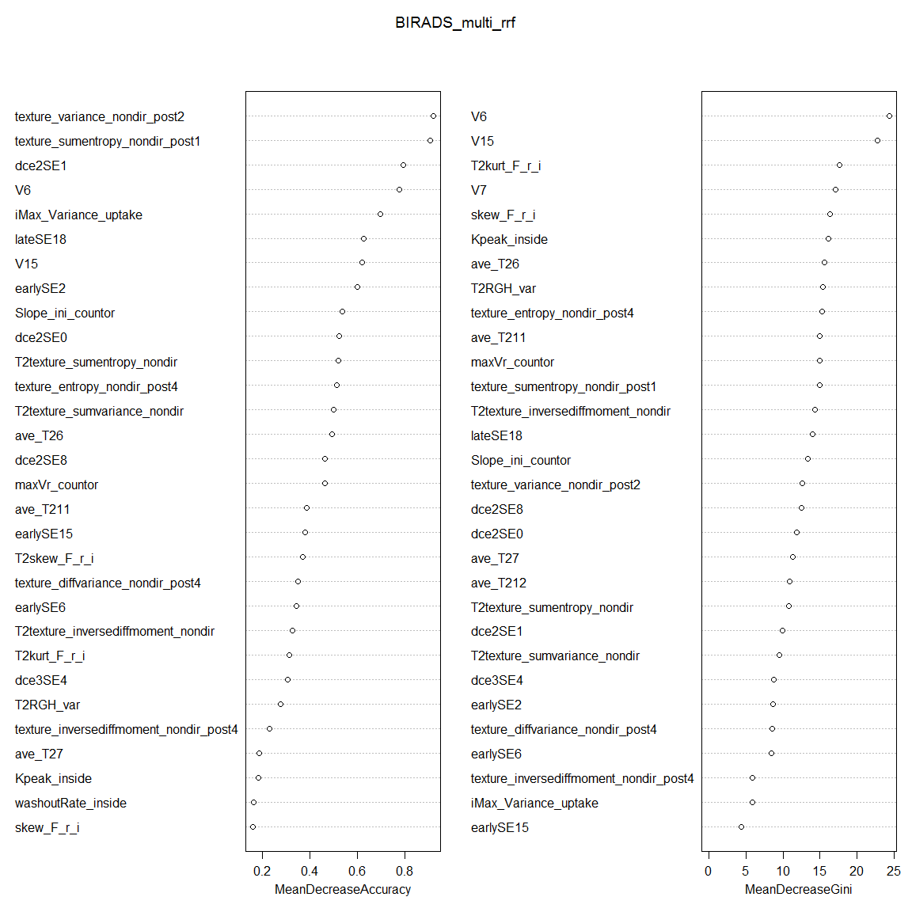 

```r
# sort features by MeanDecAccuracy
multivarImp <- BIRADS_multivarImp[ order(-BIRADS_multivarImp[,1]), ] 
# pick only non-zero variables
multivarImp = unique(multivarImp)
# format
df = data.frame(selfeat=rownames(multivarImp))
df$MeanDecreaseAccuracy = multivarImp$MeanDecreaseAccuracy 
df$SelectedFeatureGroup = "multiClass"
# append
allBIRADSfeatures = data.frame()
allBIRADSfeatures = rbind(allBIRADSfeatures, df)

# plot
pairs(BIRADS_multi[,rownames(multivarImp)[1:10]], lower.panel=panel.smooth, upper.panel=panel.cor)
```

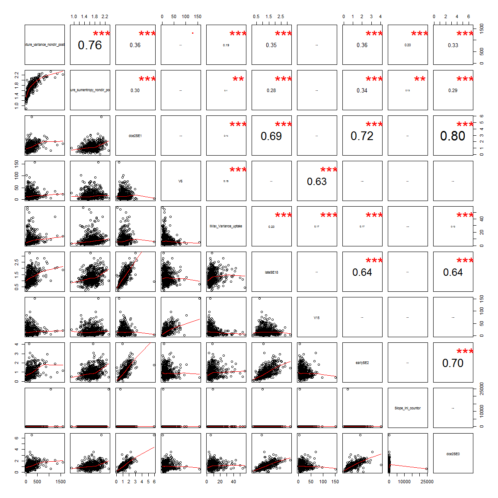 

```r
### Cascade approach: Predict between most contrasting levels, distributing discriminative power
# first predict between "Intense"(Hyperintense+SlighHyper+hypo) and None or abset
BIRADS_HyperNone = allfeaturest2_signal
BIRADS_HyperNone$find_t2_signal_int = factor(ifelse(BIRADS_HyperNone$find_t2_signal_int=="None","None","Intense"))
BIRADS_HyperNone$find_t2_signal_int = factor(BIRADS_HyperNone$find_t2_signal_int)
summary(BIRADS_HyperNone$find_t2_signal_int)
```

```
## Intense    None 
##     315     312
```

```r
# Random Forest feature relevance
library("RRF")
set.seed(2)
BIRADS_HyperNone_wona = na.omit(BIRADS_HyperNone)
T2SI_HyperNone = BIRADS_HyperNone_wona$find_t2_signal_int
BIRADS_HyperNone_wona = BIRADS_HyperNone_wona[-c(1)]

BIRADS_HyperNone_rrf = RRF(BIRADS_HyperNone_wona, T2SI_HyperNone, mtry=1, flagReg = 1, 
             ntree=2000, 
             localImp=TRUE,
             proximity=TRUE)
print(BIRADS_HyperNone_rrf)
```

```
## 
## Call:
##  RRF(x = BIRADS_HyperNone_wona, y = T2SI_HyperNone, ntree = 2000,      mtry = 1, localImp = TRUE, proximity = TRUE, flagReg = 1) 
##                Type of random forest: classification
##                      Number of trees: 2000
## No. of variables tried at each split: 1
## 
##         OOB estimate of  error rate: 36.57%
## Confusion matrix:
##         Intense None class.error
## Intense     189  111   0.3700000
## None        111  196   0.3615635
```

```r
# overall feature importance
BIRADS_HyperNonevarImp = data.frame(varImpPlot(BIRADS_HyperNone_rrf, sort=TRUE))
```

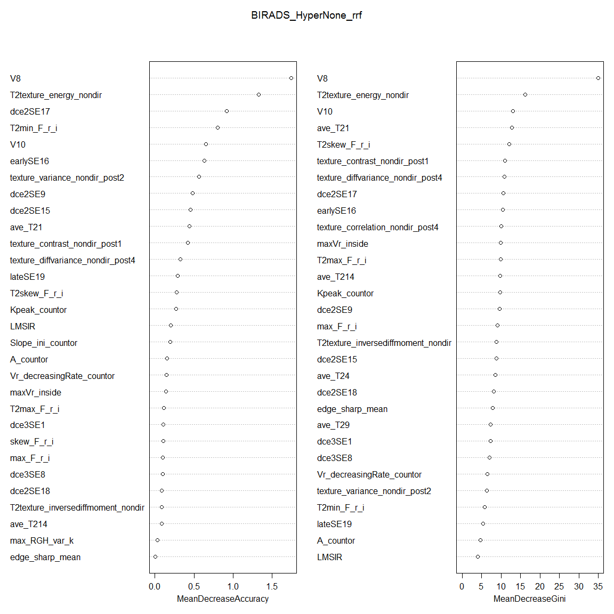 

```r
# sort features by MeanDecAccuracy
HyperNonevarImp <- BIRADS_HyperNonevarImp[ order(-BIRADS_HyperNonevarImp[,1]), ] 
# pick only non-zero variables
HyperNonevarImp = unique(HyperNonevarImp)
df = data.frame(selfeat=rownames(HyperNonevarImp))
df$MeanDecreaseAccuracy = HyperNonevarImp$MeanDecreaseAccuracy 
df$SelectedFeatureGroup = "Hyper.v.s.None"
# append
allBIRADSfeatures = rbind(allBIRADSfeatures, df)

# plot
pairs(BIRADS_HyperNone_wona[,rownames(HyperNonevarImp)[1:10]], lower.panel=panel.smooth, upper.panel=panel.cor)
```

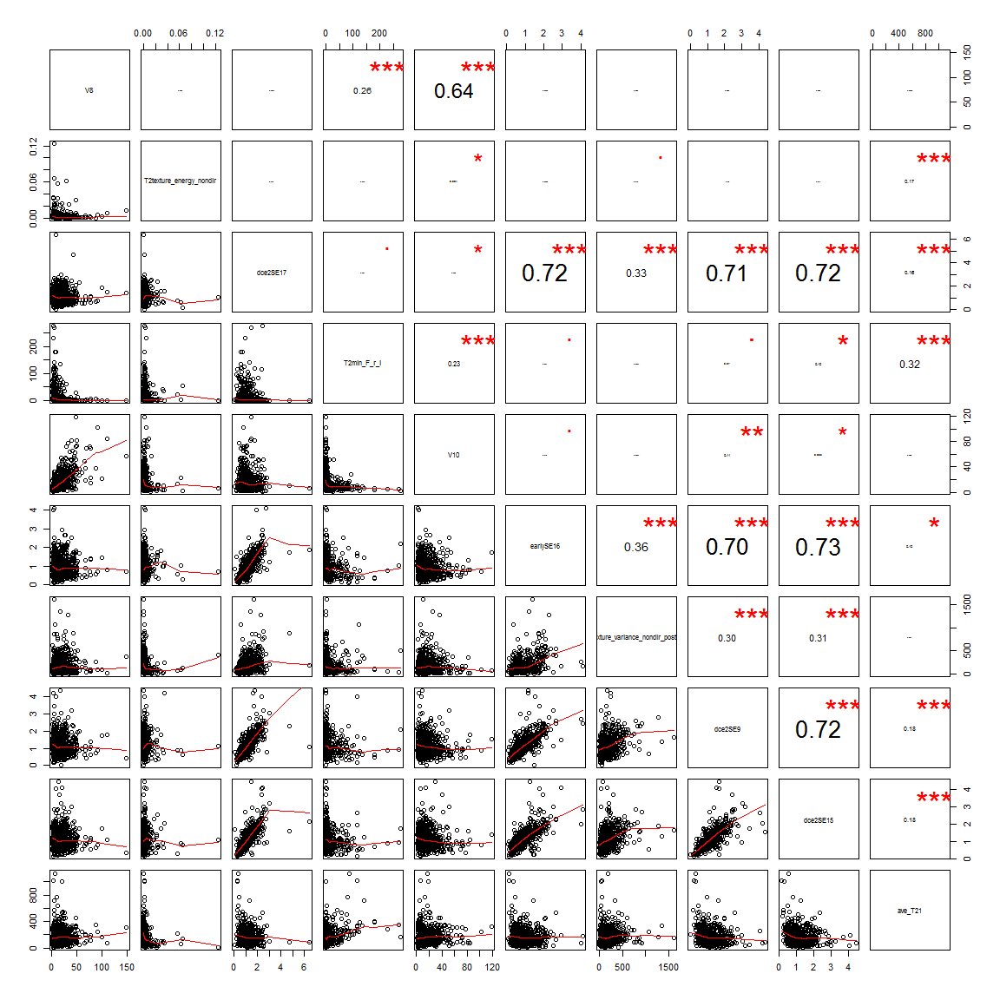 

```r
# Second predict between Intense and not seen ( combine Hyper and Slightly hyper into "Intense")
BIRADS_IntenseorNot = allfeaturest2_signal[allfeaturest2_signal$find_t2_signal_int != "None", ]
BIRADS_IntenseorNot$find_t2_signal_int = factor(ifelse(BIRADS_IntenseorNot$find_t2_signal_int=="Hypointense or not seen",
                                                "Hypointense or not seen","Intense"))
summary(BIRADS_IntenseorNot$find_t2_signal_int)
```

```
## Hypointense or not seen                 Intense 
##                     152                     163
```

```r
# Random Forest feature relevance
library("RRF")
set.seed(3)
BIRADS_IntenseorNot_wona = na.omit(BIRADS_IntenseorNot)
T2SI_IntenseorNot = BIRADS_IntenseorNot_wona$find_t2_signal_int
BIRADS_IntenseorNot_wona = BIRADS_IntenseorNot_wona[-c(1)]

BIRADS_IntenseorNot_rrf = RRF(BIRADS_IntenseorNot_wona, T2SI_IntenseorNot, mtry=1, flagReg = 1, 
             ntree=2000, 
             localImp=TRUE,
             proximity=TRUE)
print(BIRADS_IntenseorNot_rrf)
```

```
## 
## Call:
##  RRF(x = BIRADS_IntenseorNot_wona, y = T2SI_IntenseorNot, ntree = 2000,      mtry = 1, localImp = TRUE, proximity = TRUE, flagReg = 1) 
##                Type of random forest: classification
##                      Number of trees: 2000
## No. of variables tried at each split: 1
## 
##         OOB estimate of  error rate: 41.33%
## Confusion matrix:
##                         Hypointense or not seen Intense class.error
## Hypointense or not seen                      82      61   0.4265734
## Intense                                      63      94   0.4012739
```

```r
# overall feature importance
BIRADS_IntenseorNotvarImp = data.frame(varImpPlot(BIRADS_IntenseorNot_rrf, sort=TRUE))
```

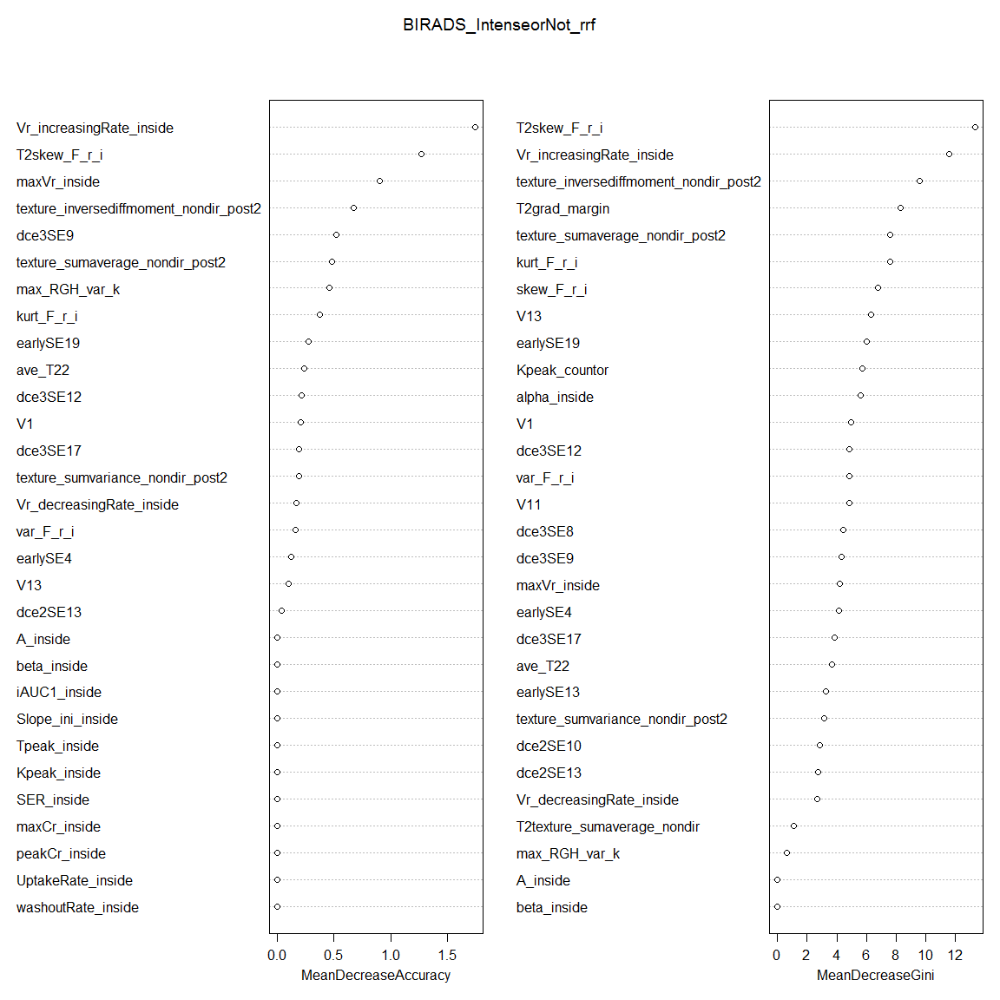 

```r
# sort features by MeanDecAccuracy
IntenseorNotvarImp <- BIRADS_IntenseorNotvarImp[ order(-BIRADS_IntenseorNotvarImp[,1]), ] 
# pick only non-zero variables
IntenseorNotvarImp = unique(IntenseorNotvarImp)
df = data.frame(selfeat=rownames(IntenseorNotvarImp))
df$MeanDecreaseAccuracy = IntenseorNotvarImp$MeanDecreaseAccuracy 
df$SelectedFeatureGroup = "Intense.v.s.Notseen"
# append
allBIRADSfeatures = rbind(allBIRADSfeatures, df)


# Thrid predict between HyperIntense and  Slightly hyper
BIRADS_HyperorSlight = allfeaturest2_signal[allfeaturest2_signal$find_t2_signal_int != "None", ]
BIRADS_HyperorSlight = BIRADS_HyperorSlight[BIRADS_HyperorSlight$find_t2_signal_int != "Hypointense or not seen", ]
BIRADS_HyperorSlight$find_t2_signal_int = factor(BIRADS_HyperorSlight$find_t2_signal_int)
summary(BIRADS_HyperorSlight$find_t2_signal_int)
```

```
##          Hyperintense Slightly hyperintense 
##                    98                    65
```

```r
# Random Forest feature relevance
library("RRF")
set.seed(4)
BIRADS_HyperorSlight_wona = na.omit(BIRADS_HyperorSlight)
T2SI_HyperorSlight = BIRADS_HyperorSlight_wona$find_t2_signal_int
BIRADS_HyperorSlight_wona = BIRADS_HyperorSlight_wona[-c(1)]

BIRADS_HyperorSlight_rrf = RRF(BIRADS_HyperorSlight_wona, T2SI_HyperorSlight, mtry=1, flagReg = 1, 
             ntree=2000, 
             localImp=TRUE,
             proximity=TRUE)
print(BIRADS_HyperorSlight_rrf)
```

```
## 
## Call:
##  RRF(x = BIRADS_HyperorSlight_wona, y = T2SI_HyperorSlight, ntree = 2000,      mtry = 1, localImp = TRUE, proximity = TRUE, flagReg = 1) 
##                Type of random forest: classification
##                      Number of trees: 2000
## No. of variables tried at each split: 1
## 
##         OOB estimate of  error rate: 45.86%
## Confusion matrix:
##                       Hyperintense Slightly hyperintense class.error
## Hyperintense                    68                    26   0.2765957
## Slightly hyperintense           46                    17   0.7301587
```

```r
# overall feature importance
BIRADS_HyperorSlightvarImp = data.frame(varImpPlot(BIRADS_HyperorSlight_rrf, sort=TRUE))
```

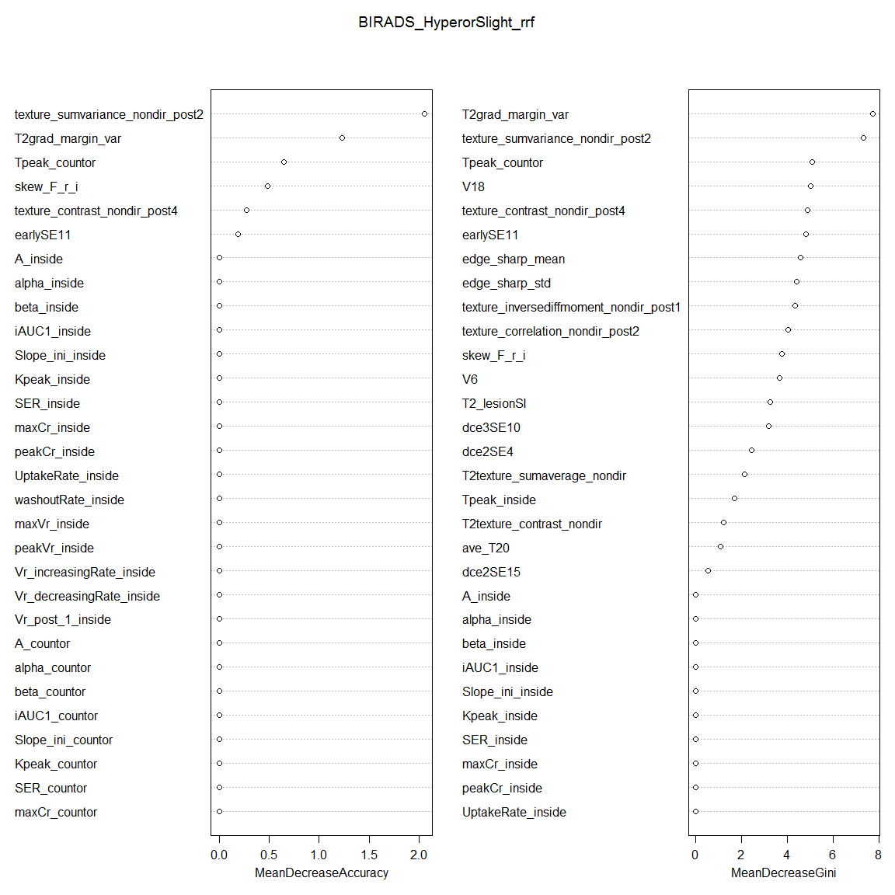 

```r
# sort features by MeanDecAccuracy
HyperorSlightvarImp <- BIRADS_HyperorSlightvarImp[ order(-BIRADS_HyperorSlightvarImp[,1]), ] 
# pick only non-zero variables
HyperorSlightvarImp = unique(HyperorSlightvarImp)
df = data.frame(selfeat=rownames(HyperorSlightvarImp))
df$MeanDecreaseAccuracy = HyperorSlightvarImp$MeanDecreaseAccuracy 
df$SelectedFeatureGroup = "Hyper.v.s.slightlyHyper"
# append
allBIRADSfeatures = rbind(allBIRADSfeatures, df)

library("lattice")
library("latticeExtra")
```

```
## Loading required package: RColorBrewer
## 
## Attaching package: 'latticeExtra'
## 
## The following object is masked from 'package:ggplot2':
## 
##     layer
```

```r
require(ggplot2)

# plot
allBIRADSfeatures = subset(allBIRADSfeatures, MeanDecreaseAccuracy!=0)
g <- ggplot(allBIRADSfeatures, aes(x = factor(selfeat), weight=MeanDecreaseAccuracy, fill=SelectedFeatureGroup))
g + geom_bar() + coord_flip() + theme_bw(base_size = 16) + labs(title = "Selected features with RRF for BIRADS T2w SI pred", 
    x = "", y = "MeanDecreaseAccuracy")
```

```
## Warning: Stacking not well defined when ymin != 0
```

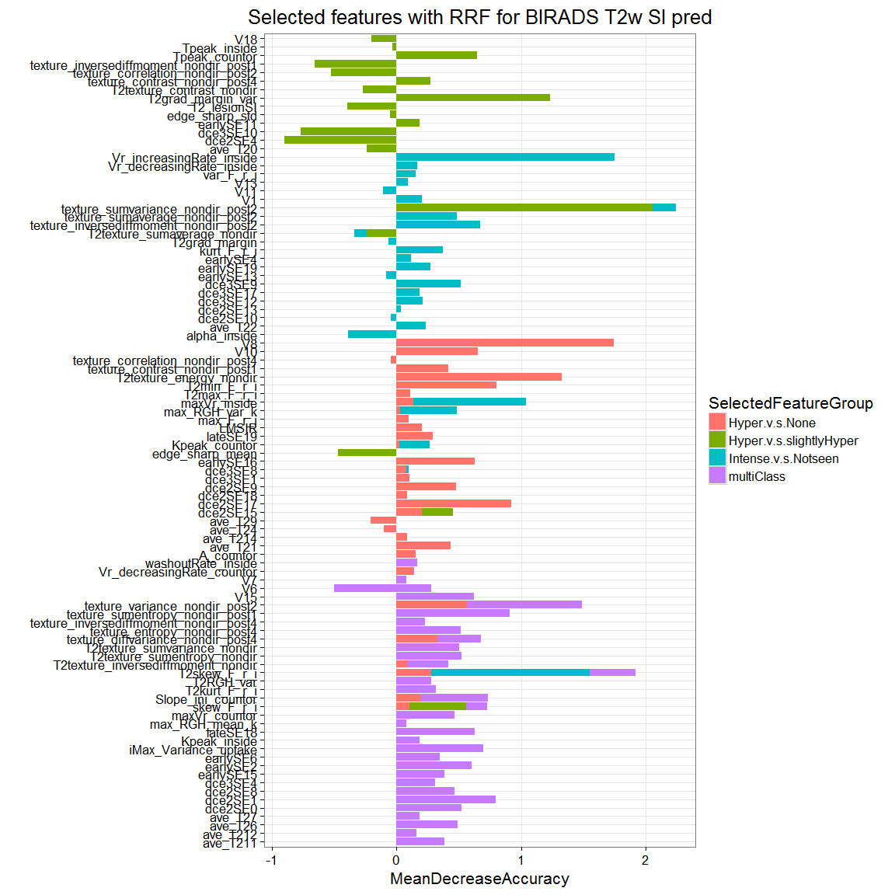 

Random Forest via permutation tests feature relevance (Boruta)
=====

```r
library("Boruta")
```

```
## Loading required package: ranger
## 
## Attaching package: 'ranger'
## 
## The following object is masked from 'package:RRF':
## 
##     importance
```

```r
require(data.table)
```

```
## Loading required package: data.table
```

```r
# Color codes: c('green', 'yellow', 'red', 'blue'), Confirmed, Tentative,
# Rejected and shadow.  Blue boxplots correspond to minimal, average and
# maximum Z score of a shadow attribute. Red Boruta mass: (to run boruta uncomment)
# Datasets:
# BIRADS_multi, T2SI_BIRADS_multi
# BIRADS_HyperNone_wona, T2SI_HyperNone
# BIRADS_IntenseorNot_wona, T2SI_IntenseorNot
# BIRADS_HyperorSlight_wona, T2SI_HyperorSlight
set.seed(1)
BIRADS_multiBoruta <- Boruta(BIRADS_multi, T2SI_BIRADS_multi, doTrace = 2, ntree = 1000)
```

```
##  1. run of importance source...
##  2. run of importance source...
##  3. run of importance source...
##  4. run of importance source...
##  5. run of importance source...
##  6. run of importance source...
##  7. run of importance source...
##  8. run of importance source...
##  9. run of importance source...
##  10. run of importance source...
##  11. run of importance source...
##  12. run of importance source...
##  13. run of importance source...
##  14. run of importance source...
##  15. run of importance source...
## Confirmed 6 attributes: max_RGH_mean, T2min_F_r_i, V17, V2, V8 and 1 more.
## Rejected 173 attributes: A_countor, A_inside, alpha_countor, alpha_inside, ave_T21 and 168 more.
##  16. run of importance source...
##  17. run of importance source...
##  18. run of importance source...
##  19. run of importance source...
## Rejected 21 attributes: ave_T20, ave_T218, ave_T219, ave_T22, circularity and 16 more.
##  20. run of importance source...
##  21. run of importance source...
##  22. run of importance source...
##  23. run of importance source...
## Confirmed 2 attributes: T2texture_entropy_nondir, V12.
## Rejected 2 attributes: texture_energy_nondir_post1, texture_energy_nondir_post3.
##  24. run of importance source...
##  25. run of importance source...
##  26. run of importance source...
##  27. run of importance source...
## Confirmed 1 attributes: iMax_Variance_uptake.
## Rejected 1 attributes: iAUC1_inside.
##  28. run of importance source...
##  29. run of importance source...
##  30. run of importance source...
## Confirmed 1 attributes: V1.
## Rejected 4 attributes: dce3SE4, iiiMax_Margin_Gradient, T2_lesionSI, texture_entropy_nondir_post1.
##  31. run of importance source...
##  32. run of importance source...
##  33. run of importance source...
## Confirmed 1 attributes: irregularity.
##  34. run of importance source...
##  35. run of importance source...
##  36. run of importance source...
##  37. run of importance source...
##  38. run of importance source...
##  39. run of importance source...
## Rejected 1 attributes: V16.
##  40. run of importance source...
##  41. run of importance source...
##  42. run of importance source...
##  43. run of importance source...
##  44. run of importance source...
##  45. run of importance source...
##  46. run of importance source...
##  47. run of importance source...
##  48. run of importance source...
## Confirmed 1 attributes: V0.
##  49. run of importance source...
##  50. run of importance source...
##  51. run of importance source...
## Confirmed 1 attributes: dce3SE17.
##  52. run of importance source...
##  53. run of importance source...
##  54. run of importance source...
##  55. run of importance source...
##  56. run of importance source...
##  57. run of importance source...
##  58. run of importance source...
##  59. run of importance source...
## Confirmed 1 attributes: V6.
##  60. run of importance source...
##  61. run of importance source...
##  62. run of importance source...
##  63. run of importance source...
##  64. run of importance source...
## Rejected 1 attributes: texture_variance_nondir_post2.
##  65. run of importance source...
##  66. run of importance source...
##  67. run of importance source...
## Confirmed 1 attributes: dce2SE17.
##  68. run of importance source...
##  69. run of importance source...
##  70. run of importance source...
## Confirmed 2 attributes: maxCr_countor, T2texture_energy_nondir.
##  71. run of importance source...
##  72. run of importance source...
## Confirmed 1 attributes: UptakeRate_countor.
##  73. run of importance source...
##  74. run of importance source...
##  75. run of importance source...
##  76. run of importance source...
##  77. run of importance source...
##  78. run of importance source...
##  79. run of importance source...
##  80. run of importance source...
##  81. run of importance source...
##  82. run of importance source...
##  83. run of importance source...
##  84. run of importance source...
##  85. run of importance source...
## Confirmed 1 attributes: iiMin_change_Variance_uptake.
## Rejected 1 attributes: V10.
##  86. run of importance source...
##  87. run of importance source...
##  88. run of importance source...
##  89. run of importance source...
##  90. run of importance source...
##  91. run of importance source...
##  92. run of importance source...
##  93. run of importance source...
##  94. run of importance source...
##  95. run of importance source...
## Rejected 1 attributes: texture_variance_nondir_post1.
##  96. run of importance source...
##  97. run of importance source...
##  98. run of importance source...
##  99. run of importance source...
```

```r
print(BIRADS_multiBoruta)
```

```
## Boruta performed 99 iterations in 23.05054 mins.
##  19 attributes confirmed important: dce2SE17, dce3SE17,
## iiMin_change_Variance_uptake, iMax_Variance_uptake, irregularity and 14 more.
##  205 attributes confirmed unimportant: A_countor, A_inside, alpha_countor,
## alpha_inside, ave_T20 and 200 more.
##  17 tentative attributes left: dce3SE16, dce3SE6, edge_sharp_mean, lateSE16,
## lateSE17 and 12 more.
```

```r
plot(BIRADS_multiBoruta)
```

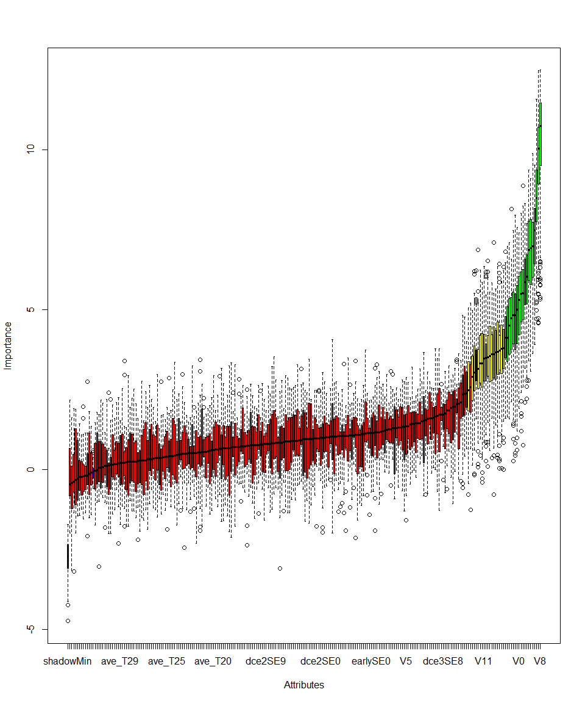 

```r
set.seed(2)
BIRADS_HyperNoneBoruta <- Boruta(BIRADS_HyperNone_wona, T2SI_HyperNone, doTrace = 2, ntree = 1000)
```

```
##  1. run of importance source...
##  2. run of importance source...
##  3. run of importance source...
##  4. run of importance source...
##  5. run of importance source...
##  6. run of importance source...
##  7. run of importance source...
##  8. run of importance source...
##  9. run of importance source...
##  10. run of importance source...
##  11. run of importance source...
##  12. run of importance source...
##  13. run of importance source...
##  14. run of importance source...
##  15. run of importance source...
## Confirmed 3 attributes: V17, V8, V9.
## Rejected 205 attributes: A_countor, A_inside, alpha_countor, alpha_inside, ave_T20 and 200 more.
##  16. run of importance source...
##  17. run of importance source...
##  18. run of importance source...
##  19. run of importance source...
## Confirmed 1 attributes: max_RGH_mean.
## Rejected 10 attributes: circularity, dce2SE19, iMax_Variance_uptake, peakVr_inside, T2texture_sumaverage_nondir and 5 more.
##  20. run of importance source...
##  21. run of importance source...
##  22. run of importance source...
##  23. run of importance source...
## Confirmed 4 attributes: irregularity, V1, V12, V2.
## Rejected 3 attributes: dce2SE1, earlySE1, V7.
##  24. run of importance source...
##  25. run of importance source...
##  26. run of importance source...
##  27. run of importance source...
##  28. run of importance source...
##  29. run of importance source...
##  30. run of importance source...
##  31. run of importance source...
##  32. run of importance source...
##  33. run of importance source...
## Confirmed 1 attributes: V6.
##  34. run of importance source...
##  35. run of importance source...
##  36. run of importance source...
## Confirmed 2 attributes: T2texture_energy_nondir, T2texture_entropy_nondir.
##  37. run of importance source...
##  38. run of importance source...
##  39. run of importance source...
##  40. run of importance source...
##  41. run of importance source...
##  42. run of importance source...
##  43. run of importance source...
##  44. run of importance source...
##  45. run of importance source...
## Confirmed 1 attributes: T2min_F_r_i.
## Rejected 2 attributes: V18, V3.
##  46. run of importance source...
##  47. run of importance source...
##  48. run of importance source...
## Rejected 1 attributes: V13.
##  49. run of importance source...
##  50. run of importance source...
##  51. run of importance source...
##  52. run of importance source...
##  53. run of importance source...
##  54. run of importance source...
##  55. run of importance source...
##  56. run of importance source...
##  57. run of importance source...
##  58. run of importance source...
##  59. run of importance source...
##  60. run of importance source...
##  61. run of importance source...
##  62. run of importance source...
##  63. run of importance source...
##  64. run of importance source...
##  65. run of importance source...
##  66. run of importance source...
##  67. run of importance source...
## Confirmed 1 attributes: V11.
##  68. run of importance source...
##  69. run of importance source...
##  70. run of importance source...
##  71. run of importance source...
##  72. run of importance source...
##  73. run of importance source...
##  74. run of importance source...
##  75. run of importance source...
##  76. run of importance source...
##  77. run of importance source...
##  78. run of importance source...
##  79. run of importance source...
##  80. run of importance source...
##  81. run of importance source...
##  82. run of importance source...
##  83. run of importance source...
##  84. run of importance source...
##  85. run of importance source...
## Confirmed 1 attributes: V15.
##  86. run of importance source...
##  87. run of importance source...
##  88. run of importance source...
##  89. run of importance source...
##  90. run of importance source...
##  91. run of importance source...
##  92. run of importance source...
##  93. run of importance source...
##  94. run of importance source...
##  95. run of importance source...
##  96. run of importance source...
##  97. run of importance source...
##  98. run of importance source...
##  99. run of importance source...
```

```r
print(BIRADS_HyperNoneBoruta)
```

```
## Boruta performed 99 iterations in 14.33838 mins.
##  14 attributes confirmed important: irregularity, max_RGH_mean, T2min_F_r_i,
## T2texture_energy_nondir, T2texture_entropy_nondir and 9 more.
##  221 attributes confirmed unimportant: A_countor, A_inside, alpha_countor,
## alpha_inside, ave_T20 and 216 more.
##  6 tentative attributes left: lateSE15, lateSE17, V0, V10, V14 and 1 more.
```

```r
plot(BIRADS_HyperNoneBoruta)
```

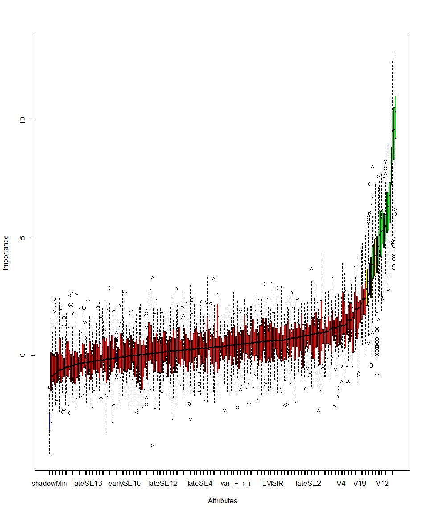 

```r
set.seed(3)
BIRADS_IntenseorNotBoruta <- Boruta(BIRADS_IntenseorNot_wona, T2SI_IntenseorNot, doTrace = 2, ntree = 1000)
```

```
##  1. run of importance source...
##  2. run of importance source...
##  3. run of importance source...
##  4. run of importance source...
##  5. run of importance source...
##  6. run of importance source...
##  7. run of importance source...
##  8. run of importance source...
##  9. run of importance source...
##  10. run of importance source...
##  11. run of importance source...
##  12. run of importance source...
##  13. run of importance source...
##  14. run of importance source...
##  15. run of importance source...
## Rejected 226 attributes: A_countor, A_inside, alpha_countor, alpha_inside, ave_T20 and 221 more.
##  16. run of importance source...
##  17. run of importance source...
##  18. run of importance source...
##  19. run of importance source...
## Confirmed 1 attributes: maxVr_inside.
## Rejected 2 attributes: dce3SE11, lateSE1.
##  20. run of importance source...
##  21. run of importance source...
##  22. run of importance source...
##  23. run of importance source...
## Confirmed 1 attributes: Vr_post_1_inside.
## Rejected 2 attributes: maxVr_countor, T2kurt_F_r_i.
##  24. run of importance source...
##  25. run of importance source...
##  26. run of importance source...
##  27. run of importance source...
## Rejected 1 attributes: max_RGH_mean.
##  28. run of importance source...
##  29. run of importance source...
##  30. run of importance source...
##  31. run of importance source...
##  32. run of importance source...
##  33. run of importance source...
##  34. run of importance source...
##  35. run of importance source...
##  36. run of importance source...
## Rejected 1 attributes: texture_energy_nondir_post2.
##  37. run of importance source...
##  38. run of importance source...
##  39. run of importance source...
##  40. run of importance source...
##  41. run of importance source...
##  42. run of importance source...
## Confirmed 1 attributes: Vr_increasingRate_inside.
## Rejected 1 attributes: iiMin_change_Variance_uptake.
##  43. run of importance source...
##  44. run of importance source...
##  45. run of importance source...
##  46. run of importance source...
##  47. run of importance source...
##  48. run of importance source...
##  49. run of importance source...
##  50. run of importance source...
##  51. run of importance source...
##  52. run of importance source...
##  53. run of importance source...
##  54. run of importance source...
##  55. run of importance source...
##  56. run of importance source...
##  57. run of importance source...
##  58. run of importance source...
##  59. run of importance source...
##  60. run of importance source...
##  61. run of importance source...
##  62. run of importance source...
##  63. run of importance source...
##  64. run of importance source...
##  65. run of importance source...
##  66. run of importance source...
##  67. run of importance source...
##  68. run of importance source...
##  69. run of importance source...
##  70. run of importance source...
##  71. run of importance source...
##  72. run of importance source...
##  73. run of importance source...
##  74. run of importance source...
##  75. run of importance source...
##  76. run of importance source...
##  77. run of importance source...
##  78. run of importance source...
##  79. run of importance source...
##  80. run of importance source...
##  81. run of importance source...
##  82. run of importance source...
##  83. run of importance source...
##  84. run of importance source...
##  85. run of importance source...
##  86. run of importance source...
##  87. run of importance source...
##  88. run of importance source...
## Confirmed 1 attributes: texture_entropy_nondir_post3.
##  89. run of importance source...
##  90. run of importance source...
##  91. run of importance source...
##  92. run of importance source...
##  93. run of importance source...
##  94. run of importance source...
##  95. run of importance source...
##  96. run of importance source...
##  97. run of importance source...
##  98. run of importance source...
##  99. run of importance source...
```

```r
print(BIRADS_IntenseorNotBoruta)
```

```
## Boruta performed 99 iterations in 4.465007 mins.
##  4 attributes confirmed important: maxVr_inside, texture_entropy_nondir_post3,
## Vr_increasingRate_inside, Vr_post_1_inside.
##  233 attributes confirmed unimportant: A_countor, A_inside, alpha_countor,
## alpha_inside, ave_T20 and 228 more.
##  4 tentative attributes left: ave_T215, T2skew_F_r_i, texture_energy_nondir_post1,
## texture_entropy_nondir_post1.
```

```r
plot(BIRADS_IntenseorNotBoruta)
```

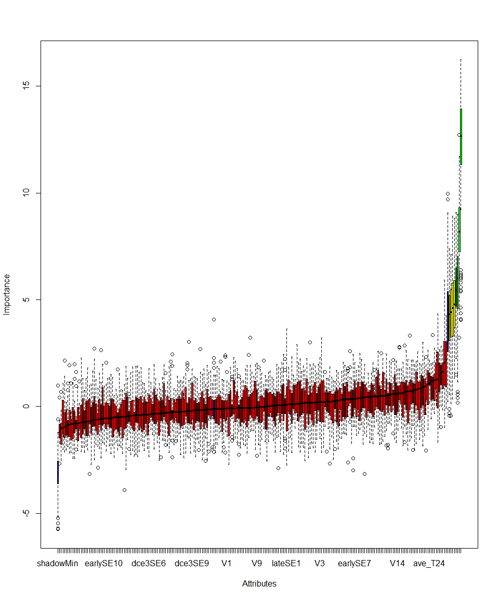 

```r
set.seed(4)
BIRADS_HyperorSlightBoruta <- Boruta(BIRADS_HyperorSlight_wona, T2SI_HyperorSlight, doTrace = 2, ntree = 1000)
```

```
##  1. run of importance source...
##  2. run of importance source...
##  3. run of importance source...
##  4. run of importance source...
##  5. run of importance source...
##  6. run of importance source...
##  7. run of importance source...
##  8. run of importance source...
##  9. run of importance source...
##  10. run of importance source...
##  11. run of importance source...
##  12. run of importance source...
##  13. run of importance source...
##  14. run of importance source...
##  15. run of importance source...
## Rejected 234 attributes: A_countor, A_inside, alpha_countor, alpha_inside, ave_T20 and 229 more.
##  16. run of importance source...
##  17. run of importance source...
##  18. run of importance source...
##  19. run of importance source...
##  20. run of importance source...
##  21. run of importance source...
##  22. run of importance source...
##  23. run of importance source...
##  24. run of importance source...
##  25. run of importance source...
##  26. run of importance source...
##  27. run of importance source...
##  28. run of importance source...
##  29. run of importance source...
##  30. run of importance source...
##  31. run of importance source...
##  32. run of importance source...
##  33. run of importance source...
##  34. run of importance source...
##  35. run of importance source...
##  36. run of importance source...
##  37. run of importance source...
##  38. run of importance source...
##  39. run of importance source...
## Confirmed 1 attributes: ave_T210.
##  40. run of importance source...
##  41. run of importance source...
##  42. run of importance source...
##  43. run of importance source...
##  44. run of importance source...
##  45. run of importance source...
##  46. run of importance source...
##  47. run of importance source...
##  48. run of importance source...
##  49. run of importance source...
##  50. run of importance source...
##  51. run of importance source...
##  52. run of importance source...
##  53. run of importance source...
##  54. run of importance source...
##  55. run of importance source...
##  56. run of importance source...
## Confirmed 1 attributes: texture_sumvariance_nondir_post2.
##  57. run of importance source...
##  58. run of importance source...
##  59. run of importance source...
##  60. run of importance source...
##  61. run of importance source...
##  62. run of importance source...
##  63. run of importance source...
##  64. run of importance source...
## Confirmed 1 attributes: lateSE19.
##  65. run of importance source...
##  66. run of importance source...
##  67. run of importance source...
## Confirmed 1 attributes: iMax_Variance_uptake.
##  68. run of importance source...
##  69. run of importance source...
##  70. run of importance source...
##  71. run of importance source...
##  72. run of importance source...
##  73. run of importance source...
##  74. run of importance source...
##  75. run of importance source...
##  76. run of importance source...
##  77. run of importance source...
##  78. run of importance source...
##  79. run of importance source...
##  80. run of importance source...
##  81. run of importance source...
##  82. run of importance source...
##  83. run of importance source...
##  84. run of importance source...
##  85. run of importance source...
## Confirmed 1 attributes: texture_sumentropy_nondir_post1.
##  86. run of importance source...
##  87. run of importance source...
##  88. run of importance source...
##  89. run of importance source...
##  90. run of importance source...
## Confirmed 1 attributes: ave_T29.
##  91. run of importance source...
##  92. run of importance source...
##  93. run of importance source...
##  94. run of importance source...
##  95. run of importance source...
##  96. run of importance source...
##  97. run of importance source...
##  98. run of importance source...
##  99. run of importance source...
```

```r
print(BIRADS_HyperorSlightBoruta)
```

```
## Boruta performed 99 iterations in 1.784587 mins.
##  6 attributes confirmed important: ave_T210, ave_T29, iMax_Variance_uptake,
## lateSE19, texture_sumentropy_nondir_post1 and 1 more.
##  234 attributes confirmed unimportant: A_countor, A_inside, alpha_countor,
## alpha_inside, ave_T20 and 229 more.
##  1 tentative attributes left: iAUC1_inside.
```

```r
plot(BIRADS_HyperorSlightBoruta)
```

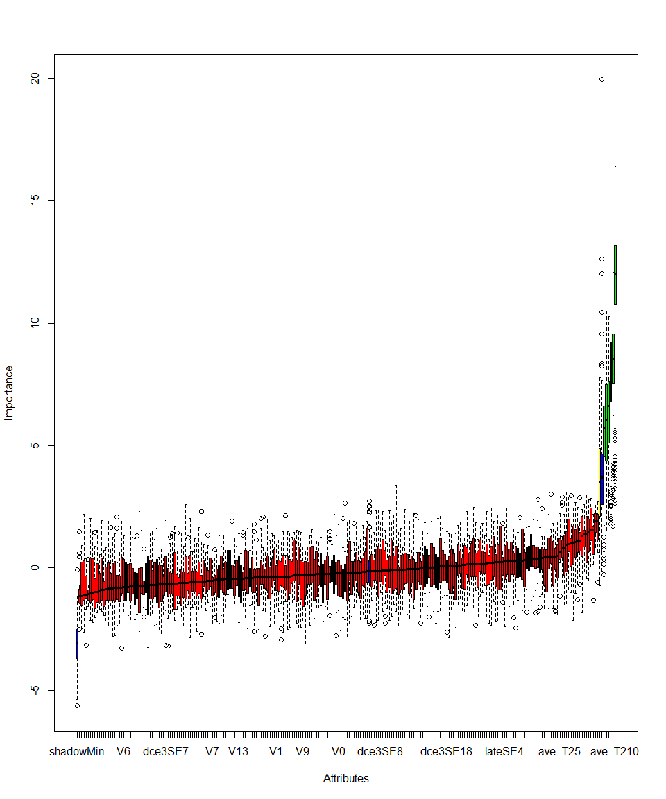 

```r
## Process results and plot Z-scores
library("caret")
# for multi class
confirmedmulti <- BIRADS_multiBoruta$finalDecision[BIRADS_multiBoruta$finalDecision == "Confirmed"]
tentativemulti <- BIRADS_multiBoruta$finalDecision[BIRADS_multiBoruta$finalDecision == "Tentative"]
selborutamulti = c(confirmedmulti, tentativemulti)
print(paste("Selected multi features: ",names(selborutamulti)))
```

```
##  [1] "Selected multi features:  maxCr_countor"                
##  [2] "Selected multi features:  UptakeRate_countor"           
##  [3] "Selected multi features:  iMax_Variance_uptake"         
##  [4] "Selected multi features:  iiMin_change_Variance_uptake" 
##  [5] "Selected multi features:  irregularity"                 
##  [6] "Selected multi features:  max_RGH_mean"                 
##  [7] "Selected multi features:  V0"                           
##  [8] "Selected multi features:  V1"                           
##  [9] "Selected multi features:  V2"                           
## [10] "Selected multi features:  V6"                           
## [11] "Selected multi features:  V8"                           
## [12] "Selected multi features:  V9"                           
## [13] "Selected multi features:  V12"                          
## [14] "Selected multi features:  V17"                          
## [15] "Selected multi features:  dce2SE17"                     
## [16] "Selected multi features:  dce3SE17"                     
## [17] "Selected multi features:  T2min_F_r_i"                  
## [18] "Selected multi features:  T2texture_energy_nondir"      
## [19] "Selected multi features:  T2texture_entropy_nondir"     
## [20] "Selected multi features:  edge_sharp_mean"              
## [21] "Selected multi features:  V3"                           
## [22] "Selected multi features:  V11"                          
## [23] "Selected multi features:  V13"                          
## [24] "Selected multi features:  V14"                          
## [25] "Selected multi features:  V15"                          
## [26] "Selected multi features:  V18"                          
## [27] "Selected multi features:  dce3SE6"                      
## [28] "Selected multi features:  dce3SE16"                     
## [29] "Selected multi features:  lateSE16"                     
## [30] "Selected multi features:  lateSE17"                     
## [31] "Selected multi features:  lateSE19"                     
## [32] "Selected multi features:  T2skew_F_r_i"                 
## [33] "Selected multi features:  T2grad_margin"                
## [34] "Selected multi features:  T2texture_sumvariance_nondir" 
## [35] "Selected multi features:  T2texture_sumentropy_nondir"  
## [36] "Selected multi features:  T2texture_diffvariance_nondir"
```

```r
rankings_multi <- BIRADS_multiBoruta$ImpHistory

# for HyperNone class
confirmedHyperNone <- BIRADS_HyperNoneBoruta$finalDecision[BIRADS_HyperNoneBoruta$finalDecision == "Confirmed"]
tentativeHyperNone <- BIRADS_HyperNoneBoruta$finalDecision[BIRADS_HyperNoneBoruta$finalDecision == "Tentative"]
selborutaHyperNone = c(confirmedHyperNone, tentativeHyperNone)
print(paste("Selected HyperNone features: ",names(selborutaHyperNone)))
```

```
##  [1] "Selected HyperNone features:  irregularity"            
##  [2] "Selected HyperNone features:  max_RGH_mean"            
##  [3] "Selected HyperNone features:  V1"                      
##  [4] "Selected HyperNone features:  V2"                      
##  [5] "Selected HyperNone features:  V6"                      
##  [6] "Selected HyperNone features:  V8"                      
##  [7] "Selected HyperNone features:  V9"                      
##  [8] "Selected HyperNone features:  V11"                     
##  [9] "Selected HyperNone features:  V12"                     
## [10] "Selected HyperNone features:  V15"                     
## [11] "Selected HyperNone features:  V17"                     
## [12] "Selected HyperNone features:  T2min_F_r_i"             
## [13] "Selected HyperNone features:  T2texture_energy_nondir" 
## [14] "Selected HyperNone features:  T2texture_entropy_nondir"
## [15] "Selected HyperNone features:  V0"                      
## [16] "Selected HyperNone features:  V10"                     
## [17] "Selected HyperNone features:  V14"                     
## [18] "Selected HyperNone features:  V16"                     
## [19] "Selected HyperNone features:  lateSE15"                
## [20] "Selected HyperNone features:  lateSE17"
```

```r
rankings_HyperNone <- BIRADS_HyperNoneBoruta$ImpHistory

# for IntenseorNot class
confirmedIntenseorNot <- BIRADS_IntenseorNotBoruta$finalDecision[BIRADS_IntenseorNotBoruta$finalDecision == "Confirmed"]
tentativeIntenseorNot <- BIRADS_IntenseorNotBoruta$finalDecision[BIRADS_IntenseorNotBoruta$finalDecision == "Tentative"]
selborutaIntenseorNot = c(confirmedIntenseorNot, tentativeIntenseorNot)
print(paste("Selected IntenseorNot features: ",names(selborutaIntenseorNot)))
```

```
## [1] "Selected IntenseorNot features:  maxVr_inside"                
## [2] "Selected IntenseorNot features:  Vr_increasingRate_inside"    
## [3] "Selected IntenseorNot features:  Vr_post_1_inside"            
## [4] "Selected IntenseorNot features:  texture_entropy_nondir_post3"
## [5] "Selected IntenseorNot features:  texture_energy_nondir_post1" 
## [6] "Selected IntenseorNot features:  texture_entropy_nondir_post1"
## [7] "Selected IntenseorNot features:  T2skew_F_r_i"                
## [8] "Selected IntenseorNot features:  ave_T215"
```

```r
rankings_IntenseorNot <- BIRADS_IntenseorNotBoruta$ImpHistory

# for HyperorSlight class
confirmedHyperorSlight <- BIRADS_HyperorSlightBoruta$finalDecision[BIRADS_HyperorSlightBoruta$finalDecision == "Confirmed"]
tentativeHyperorSlight <- BIRADS_HyperorSlightBoruta$finalDecision[BIRADS_HyperorSlightBoruta$finalDecision == "Tentative"]
selborutaHyperorSlight = c(confirmedHyperorSlight, tentativeHyperorSlight)
print(paste("Selected HyperorSlight features: ",names(selborutaHyperorSlight)))
```

```
## [1] "Selected HyperorSlight features:  iMax_Variance_uptake"            
## [2] "Selected HyperorSlight features:  texture_sumentropy_nondir_post1" 
## [3] "Selected HyperorSlight features:  texture_sumvariance_nondir_post2"
## [4] "Selected HyperorSlight features:  lateSE19"                        
## [5] "Selected HyperorSlight features:  ave_T29"                         
## [6] "Selected HyperorSlight features:  ave_T210"                        
## [7] "Selected HyperorSlight features:  iAUC1_inside"
```

```r
rankings_HyperorSlight <- BIRADS_HyperorSlightBoruta$ImpHistory


# collect
zscore_selborutamulti = {}
# proces HyperHypo = 7
for (i in 1:length(selborutamulti)) {
    cfeature = names(selborutamulti[i])
    df = data.frame(zscores = rankings_multi[, cfeature])
    df$SelectedFeatureGroup = "multiClass"
    df$selfeat = cfeature
    zscore_selborutamulti <- rbind(zscore_selborutamulti, df)
}
# add shadow mean
df = data.frame(zscores = rankings_multi[, "shadowMean"])
df$SelectedFeatureGroup = "multiClass"
df$selfeat = "multishadowMean"
zscore_selborutamulti <- rbind(zscore_selborutamulti, df)

# plot for predicting Hyper vs. Hypo
p <- ggplot(zscore_selborutamulti, aes(factor(selfeat), zscores, fill = factor(SelectedFeatureGroup)))
p + geom_boxplot() + coord_flip() + labs(title = "most predictive features for multiclass BIRADS T2wSI")
```

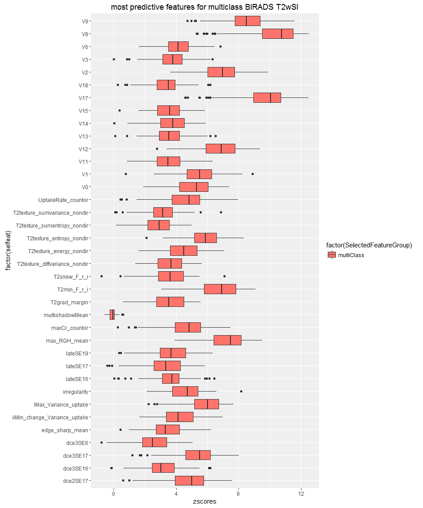 

```r
# collect
zscore_selborutaHyperNone = {}
# proces HyperHypo = 7
for (i in 1:length(selborutaHyperNone)) {
    cfeature = names(selborutaHyperNone[i])
    df = data.frame(zscores = rankings_HyperNone[, cfeature])
    df$SelectedFeatureGroup = "Hyper.v.s.None"
    df$selfeat = cfeature
    zscore_selborutaHyperNone <- rbind(zscore_selborutaHyperNone, df)
}
# add shadow mean
df = data.frame(zscores = rankings_HyperNone[, "shadowMean"])
df$SelectedFeatureGroup = "Hyper.v.s.None"
df$selfeat = "HyperNoneshadowMean"
zscore_selborutaHyperNone <- rbind(zscore_selborutaHyperNone, df)

# plot for predicting HyperNone
p <- ggplot(zscore_selborutaHyperNone, aes(factor(selfeat), zscores, fill = factor(SelectedFeatureGroup)))
p + geom_boxplot() + coord_flip() + labs(title = "most predictive features for HyperNone class BIRADS T2wSI")
```

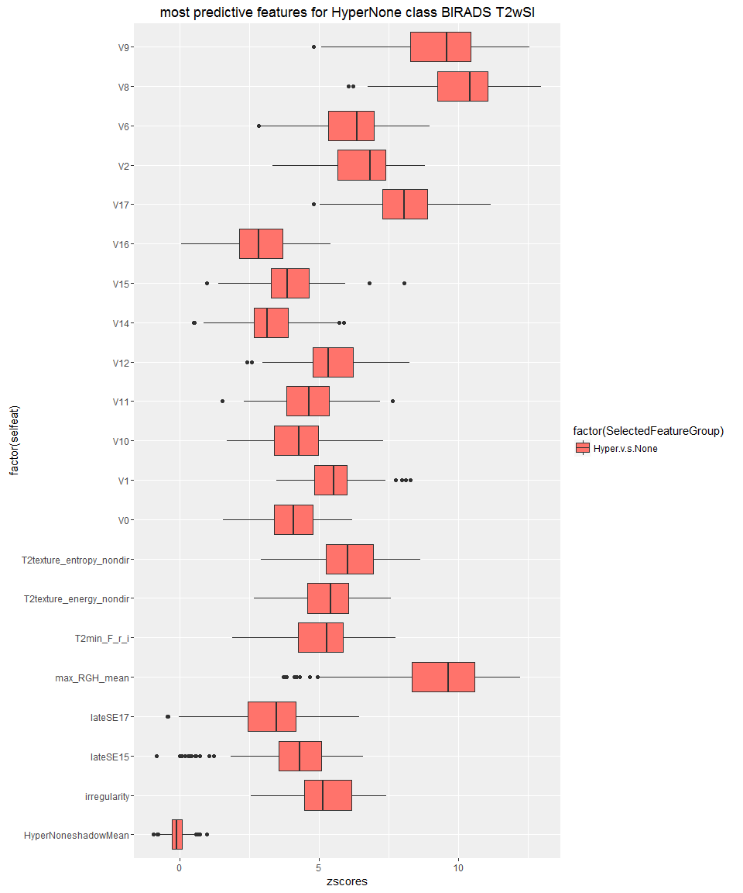 

```r
# collect
zscore_selborutaIntenseorNot = {}
# proces HyperHypo = 7
for (i in 1:length(selborutaIntenseorNot)) {
    cfeature = names(selborutaIntenseorNot[i])
    df = data.frame(zscores = rankings_IntenseorNot[, cfeature])
    df$SelectedFeatureGroup = "Intense.v.s.Notseen"
    df$selfeat = cfeature
    zscore_selborutaIntenseorNot <- rbind(zscore_selborutaIntenseorNot, df)
}
# add shadow mean
df = data.frame(zscores = rankings_IntenseorNot[, "shadowMean"])
df$SelectedFeatureGroup = "Intense.v.s.Notseen"
df$selfeat = "IntenseorNotshadowMean"
zscore_selborutaIntenseorNot <- rbind(zscore_selborutaIntenseorNot, df)

# plot for predicting Hyper vs. Hypo
p <- ggplot(zscore_selborutaIntenseorNot, aes(factor(selfeat), zscores, fill = factor(SelectedFeatureGroup)))
p + geom_boxplot() + coord_flip() + labs(title = "most predictive features for IntenseorNot class BIRADS T2wSI")
```

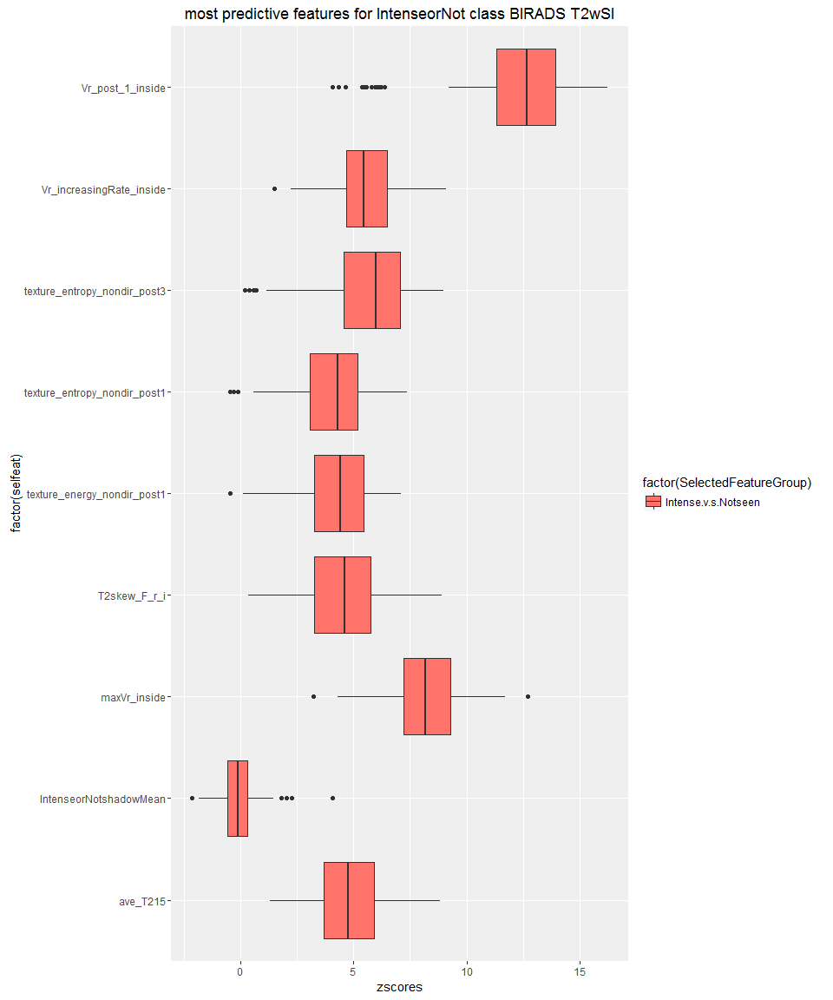 

```r
# collect
zscore_selborutaHyperorSlight = {}
# proces HyperHypo = 7
for (i in 1:length(selborutaHyperorSlight)) {
    cfeature = names(selborutaHyperorSlight[i])
    df = data.frame(zscores = rankings_HyperorSlight[, cfeature])
    df$SelectedFeatureGroup = "Hyper.v.s.slightlyHyper"
    df$selfeat = cfeature
    zscore_selborutaHyperorSlight <- rbind(zscore_selborutaHyperorSlight, df)
}
# add shadow mean
df = data.frame(zscores = rankings_HyperorSlight[, "shadowMean"])
df$SelectedFeatureGroup = "Hyper.v.s.slightlyHyper"
df$selfeat = "HyperorSlightshadowMean"
zscore_selborutaHyperorSlight <- rbind(zscore_selborutaHyperorSlight, df)

# plot for predicting Hyper vs. Hypo
p <- ggplot(zscore_selborutaHyperorSlight, aes(factor(selfeat), zscores, fill = factor(SelectedFeatureGroup)))
p + geom_boxplot() + coord_flip() + labs(title = "most predictive features for Hyper or Slight class BIRADS T2wSI")
```

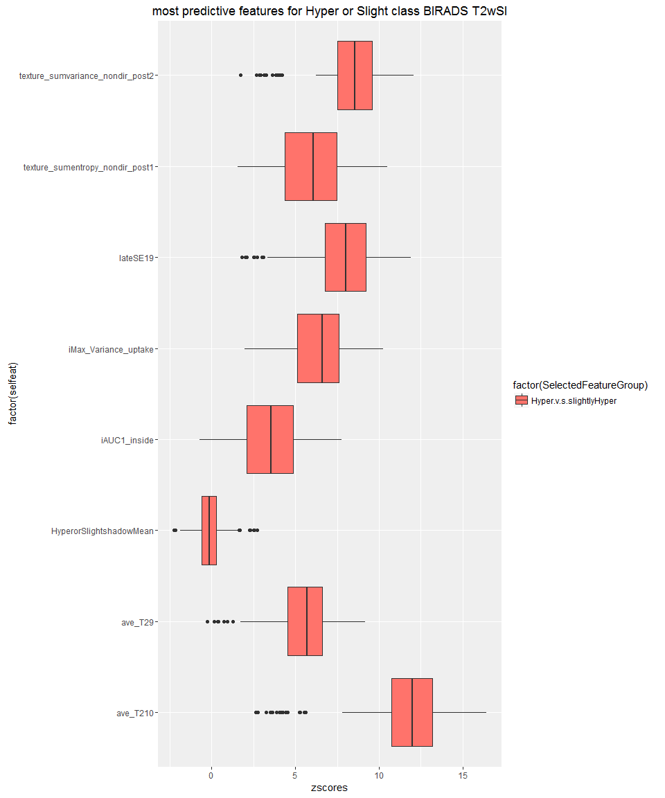 

```r
#################
# all together
zscore_selected = rbind(zscore_selborutamulti, 
                        zscore_selborutaHyperNone,
                        zscore_selborutaIntenseorNot,
                        zscore_selborutaHyperorSlight)
summary(as.factor(zscore_selected$pass))
```

```
## integer(0)
```

```r
p <- ggplot(zscore_selected, aes(factor(selfeat), zscores, fill = factor(SelectedFeatureGroup)))
p + geom_boxplot() + coord_flip() + labs(title = "most predictive features BIRADS T2wSI by pass")
```

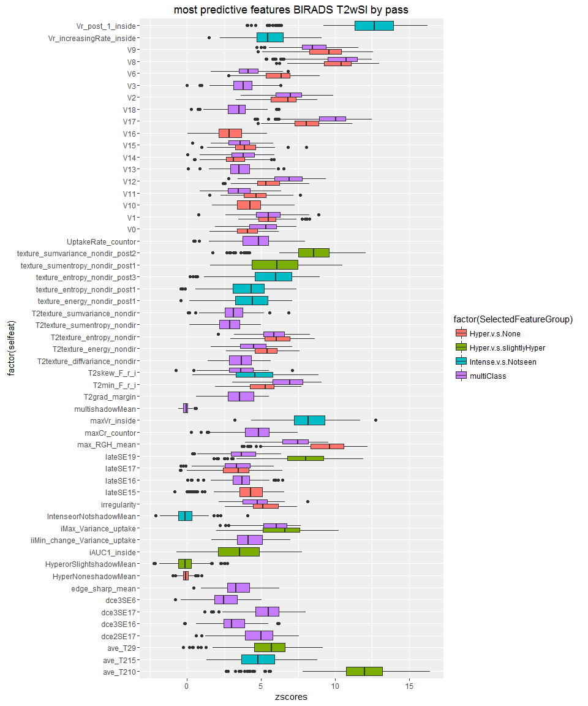 

```r
# descriptive stats
with(na.omit(allfeatures), do.call(rbind, tapply(LMSIR, find_t2_signal_int, function(x) c(M = mean(x), SD = sd(x)))))
```

```
##                                M       SD
## Hyperintense            3.857176 2.820386
## Hypointense or not seen 3.531742 2.132123
## None                    3.340547 1.986898
## Slightly hyperintense   3.267705 3.651974
```

```r
with(na.omit(allfeatures), do.call(rbind, tapply(T2min_F_r_i, find_t2_signal_int, function(x) c(M = mean(x), SD = sd(x)))))
```

```
##                                 M       SD
## Hyperintense            20.723404 34.49307
## Hypointense or not seen 21.349650 47.08836
## None                     6.986971 17.72760
## Slightly hyperintense    7.841270 13.32256
```

```r
with(na.omit(allfeatures), do.call(rbind, tapply(ave_T215, find_t2_signal_int, function(x) c(M = mean(x), SD = sd(x)))))
```

```
##                                M        SD
## Hyperintense            173.7191 111.80198
## Hypointense or not seen 204.2346 167.82002
## None                    172.8560 107.86424
## Slightly hyperintense   138.7540  82.48827
```

```r
with(na.omit(allfeatures), do.call(rbind, tapply(T2texture_energy_nondir, find_t2_signal_int, function(x) c(M = mean(x), SD = sd(x)))))
```

```
##                                   M          SD
## Hyperintense            0.004176525 0.009838559
## Hypointense or not seen 0.003045705 0.010479140
## None                    0.002474292 0.005093665
## Slightly hyperintense   0.003454405 0.006599891
```


```r
save.image("C:/Users/windows/Documents/repoCode-local/T2wR/lop_3Dtex_T2w_addedvalue/T2wBIRADS/Rdata/T2_featurespred_BIRADS_SI.RData")
```
