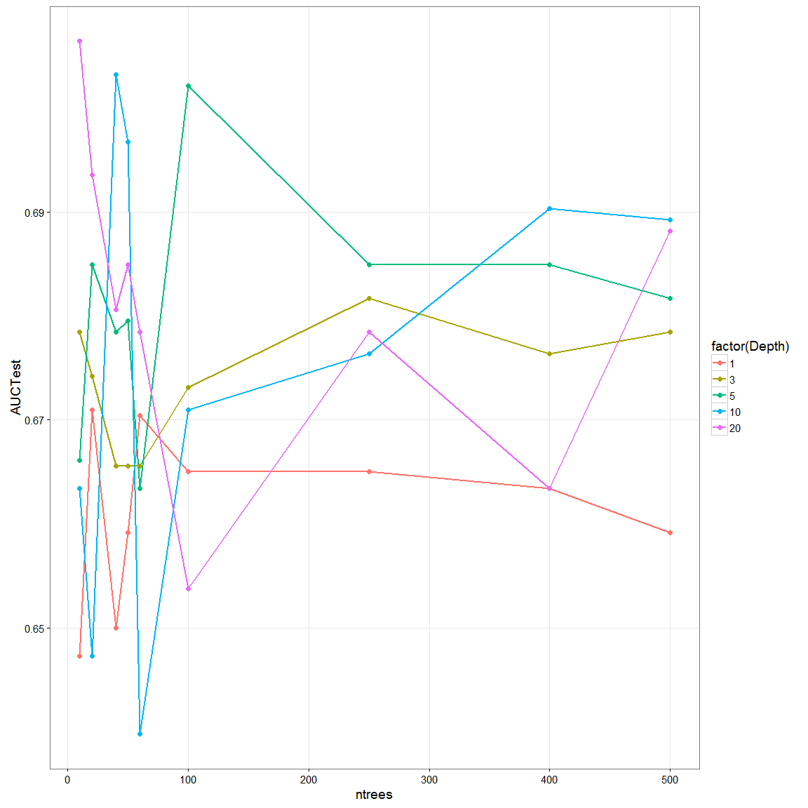
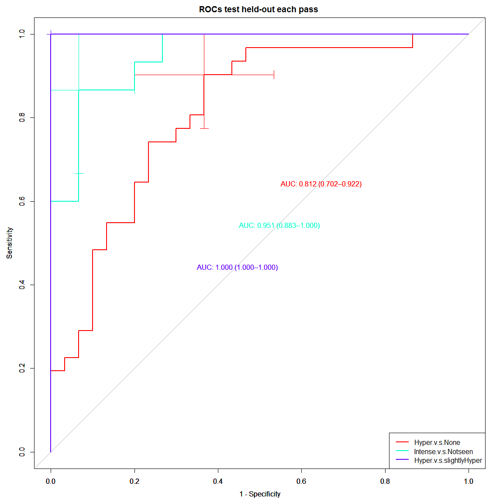

Predictor model of BIRADS T2w SI:
=============================
- This code creates a classifier based predictor of BIRADS T2w SI and add them to the pool of 55 T2w features for a total of 57 T2w featues


```
## Loading required package: lattice
## Loading required package: ggplot2
## Loading required package: DBI
## Loading required package: MASS
```


```r
# read datasets
npatients = length(uniq_cad)
allf = read_T1T2uniqcad_parti(id_cad_pts, uniq_cad, allpartitionsetD, npatients, 1)
```

```
##    massB    massM nonmassB nonmassM 
##      242      166      142       76 
## nonmassM 
##        1
```

```r
## formant
allfeatures = rbind(allf[[1]], allf[[2]])
alllesioninfo = rbind(allf[[5]], allf[[6]])

### print number of total lesions 
# before was ##   C / NC = 140 / 132
print(summary(as.factor(allfeatures$orig_label)))
```

```
##    massB    massM nonmassB nonmassM 
##      242      166      142       77
```

```r
#######################
# format datasets with find_t2_signal_int as response variable
allfeaturest2_signal = cbind(allfeatures["find_t2_signal_int"], allfeatures[,2:ncol(allfeatures)])
allfeaturest2_signal = allfeaturest2_signal[-c(199,ncol(allfeatures))]

allfeaturest2_signal$find_t2_signal_int = as.factor(allfeaturest2_signal$find_t2_signal_int)
summary(allfeaturest2_signal$find_t2_signal_int)
```

```
##            Hyperintense Hypointense or not seen                    None 
##                      98                     152                     312 
##   Slightly hyperintense 
##                      65
```

```r
#######################
# Subset previuosly selected features
# for Boruta
borutasel = unique(zscore_selected[,2:3])
borutasel = borutasel[-grep("shadow",borutasel$selfeat),]
rrfsel = unique(allBIRADSfeatures[,c(1,3)])

selBy = rbind( data.frame(feature=borutasel$selfeat, 
                          pass=borutasel$SelectedFeatureGroup, selectedBy="boruta"), 
               data.frame(feature=rrfsel$selfeat, 
                          pass=rrfsel$SelectedFeatureGroup, selectedBy="rrf") )
g <- ggplot(selBy, aes(x=factor(feature), y=pass,  group=pass, color=selectedBy))
g +  geom_line(size=0.5, colour="black") + geom_point(size=3, position="dodge") + coord_flip() +  theme_bw(base_size = 14) 
```

 

```r
# print features commonly selected
commonlyselBy = summary(factor(selBy$feature))
table(commonlyselBy[commonlyselBy >= 2])
```

```
## 
##  2  3  4  5 24 
## 31 11  2  1  1
```

```r
# for variables picked in every pass both for rrf and boruta
print(commonlyselBy[commonlyselBy >= 4])
```

```
## T2skew_F_r_i           V6   skew_F_r_i      (Other) 
##            5            4            4           24
```

```r
print(commonlyselBy[commonlyselBy == 3])
```

```
##                  edge_sharp_mean             iMax_Variance_uptake 
##                                3                                3 
##                         lateSE19                     maxVr_inside 
##                                3                                3 
##                      T2min_F_r_i          T2texture_energy_nondir 
##                                3                                3 
## texture_sumvariance_nondir_post2                               V1 
##                                3                                3 
##                              V11                              V15 
##                                3                                3 
##                               V8 
##                                3
```


Building a Random Forest classifier for BIRADS Tw2SI:  Categorial predictor of RSI on T2w Levels: Hyperintense, Slightly hyperintense, Hypointensity, None
=======

```r
###############
### PRODUCE RAND FOREST via RPART (control # trees))
###################################################
### code forest Train: 
### parameters, T= # of trees, D= tree depth, dat
###################################################
library(MASS)
library(klaR)
library(caret)
library(rpart)
library(rpart.plot)
require(ggplot2)
library(pROC)
```

```
## Type 'citation("pROC")' for a citation.
## 
## Attaching package: 'pROC'
## 
## The following objects are masked from 'package:stats':
## 
##     cov, smooth, var
```

```r
rpart_forestTrain <- function(T, D, TrainsetD) {
  # set control
  fitparm = rpart.control(maxdepth = D, minsplit = 0, minbucket = 1, cp = 0.01,  xval = 10, 
                          maxcompete = 0, maxsurrogate = 5, usesurrogate = 0, surrogatestyle = 0)
  # init forest
  forest = list()
  for (t in 1:T){
    #cat("Tree # ", t, "\n")  
    # Randomize boostrap sample to train tree t
    nsamples = sample(1:nrow(TrainsetD), nrow(TrainsetD), replace=TRUE)
    samTrainsetD = TrainsetD[nsamples,]
    
    # find subsample of var
    subvar = sample(2:ncol(TrainsetD)-2, sqrt(ncol(TrainsetD)-2), replace = TRUE)
    subfeat = colnames(TrainsetD)[subvar]
    
    # train tree
    treedata <- rpart(paste("find_t2_signal_int ~ ", paste(subfeat, collapse= "+")), 
                      data = TrainsetD, control=fitparm)
    
    # display the probability per class of observations in the node (conditioned on the node, sum across a node is 1) plus the percentage of observations in the node
    if (T<1){
      print(treedata)
      prp(treedata, type=2, digits=3, extra = 102, under=TRUE, nn=TRUE, col="black", 
          box.col=rainbow(2)[2], varlen=0, faclen=0, branch.type=0, gap=0, cex=.7,
          fallen.leaves=TRUE) # use fallen.leaves=TRUE, to plot at bottom  
    }  
    
    # append
    forest <- append(forest, list(tree = treedata))    
  }
  
  output <- list(forest=forest)
  return(output)
}

###################################################
### code forest Test: 
### parameters, T= # of trees, forest, TrainsetD, TestsetD
###################################################
rpart_forestTest <- function(T, TrainsetD, TestsetD, forest, predvar) {
  # split train/test cases
  fclasspotrain=list()
  for (t in 1:T){
    # Calcultate posterior Probabilities on grid points
    temp <- predict(forest[t]$tree, newdata = TrainsetD) #
    fclasspotrain <- append(fclasspotrain, list(cpo = temp))
  }
  
  # run testing cases
  fclasspotest=list()
  for (t in 1:T){
    # Calcultate posterior Probabilities on grid points
    temp <- predict(forest[t]$tree, newdata = TestsetD) #
    fclasspotest <- append(fclasspotest, list(cpo = temp))
  }
  
  # performance on Train/Test set separately
  # extract ensamble class probabilities (when T > 1)
  trainpts = fclasspotrain[1]$cpo
  testpts = fclasspotest[1]$cpo
  # init ensample class posteriors
  enclasspotrain <- matrix(, nrow = nrow(as.data.frame(trainpts)), ncol = 2)
  enclasspotest <- matrix(, nrow = nrow(as.data.frame(testpts)), ncol = 2)
  enclasspotrain[,1] = fclasspotrain[1]$cpo[,1]
  enclasspotest[,1] = fclasspotest[1]$cpo[,1]
  enclasspotrain[,2] = fclasspotrain[1]$cpo[,2]
  enclasspotest[,2] = fclasspotest[1]$cpo[,2]
  if(T>=2){
    for (t in 2:T){
      #train
      enclasspotrain[,1] = enclasspotrain[,1]+fclasspotrain[t]$cpo[,1]
      enclasspotrain[,2] = enclasspotrain[,2]+fclasspotrain[t]$cpo[,2]
      #test
      enclasspotest[,1] = enclasspotest[,1]+fclasspotest[t]$cpo[,1]
      enclasspotest[,2] = enclasspotest[,2]+fclasspotest[t]$cpo[,2]
    }
  }
  # majority voting averaging
  enclasspotrain = (1/T)*enclasspotrain
  enclasspotest = (1/T)*enclasspotest
  
  # on training
  classes = levels(TrainsetD[,"find_t2_signal_int"])
  trainprob = data.frame(C1=enclasspotrain[,1],
                         C2=enclasspotrain[,2],
                         pred=classes[apply(enclasspotrain, 1, which.max)], 
                         obs=TrainsetD[,"find_t2_signal_int"])
  colnames(trainprob)[1:2] <- classes
  pred=ifelse(apply(enclasspotrain, 1, which.max)==1,classes[1],classes[2])
  perf_train =  sum(ifelse(pred == TrainsetD[,"find_t2_signal_int"],1,0))/length(TrainsetD[,"find_t2_signal_int"])
  #print(perf_train)
  
  # on testing
  testprob = data.frame(C1=enclasspotest[,1],
                        C2=enclasspotest[,2],
                        pred=classes[apply(enclasspotest, 1, which.max)], 
                        obs=TestsetD[,"find_t2_signal_int"])
  colnames(testprob)[1:2] <- classes
  pred=ifelse(apply(enclasspotest, 1, which.max)==1,classes[1],classes[2])
  perf_test = sum(ifelse(pred == TestsetD[,"find_t2_signal_int"],1,0))/length(TestsetD[,"find_t2_signal_int"])
  #print(perf_test)  
  
  output <- list(etrain=perf_train, etest=perf_test, trainprob=trainprob, testprob=testprob)
  return(output)
}


###################################################
### code to predict Test cases in Cascade pass: 
### parameters, T= # of trees, forest, TrainsetD, TestsetD
###################################################
rpart_cascadeTest <- function(T, testc, predvar, forest){ 
                              
  fclasspo=list()
  for (t in 1:T){
    # Calcultate posterior Probabilities on grid points
    temp <- predict(forest[t]$tree, newdata = testc) #
    fclasspo <- append(fclasspo, list(cpo = temp))
  }
  
  # performance on Test set 
  # extract ensamble class probabilities (when T > 1)
  pts = fclasspo[1]$cpo
  # init ensample class posteriors
  enclasspo <- matrix(, nrow = nrow(as.data.frame(pts)), ncol = 2)
  enclasspo[,1] = fclasspo[1]$cpo[,1]
  enclasspo[,2] = fclasspo[1]$cpo[,2]
  if(T>=2){
    for (t in 2:T){
      enclasspo[,1] = enclasspo[,1]+fclasspo[t]$cpo[,1]
      enclasspo[,2] = enclasspo[,2]+fclasspo[t]$cpo[,2]
    }
  }
  # majority voting averaging
  enclasspo = (1/T)*enclasspo
  
  # on training
  classes = levels(testc[,predvar])
  prob = data.frame(C1=enclasspo[,1],
                         C2=enclasspo[,2],
                         pred=classes[apply(enclasspo, 1, which.max)], 
                         obs=testc[,predvar])
  colnames(prob)[1:2] <- classes
  pred = ifelse(apply(enclasspo, 1, which.max)==1,classes[1],classes[2])
  perf =  sum(ifelse(pred == testc[,predvar],1,0))/length(testc[,predvar])
  print(paste0("Accuracy of cascade pass = ",perf))
  
  roc = roc(prob$obs, prob[,1])
  print(roc$auc)
  print(summary(prob))

  output <- list(paccu=perf, prob=prob)
  return(output)
}


# create grid of evaluation points
gT = c(10,20,40,50,60,100,250,400,500)
gD = c(1,3,5,10,20)
grd <- expand.grid(x = gD, y = gT)

# example with 1 tree
#D=4
#T=1
#F = rpart_forestTrain(T, D, BIRADS_HyperNone, trainc$Resample1, "find_t2_signal_int") 
#perfmtree <- rpart_forestTest(T, BIRADS_HyperNone, F$forest, trainc$Resample1, "find_t2_signal_int")
```


```r
## split in train/test for each T2wSI category
BIRADS_HyperNone = allfeaturest2_signal
BIRADS_HyperNone$find_t2_signal_int = factor(ifelse(BIRADS_HyperNone$find_t2_signal_int=="None","None","Intense"))
BIRADS_HyperNone$find_t2_signal_int = factor(BIRADS_HyperNone$find_t2_signal_int)
summary(BIRADS_HyperNone$find_t2_signal_int)
```

```
## Intense    None 
##     315     312
```

```r
b = as.character(subset(borutasel, SelectedFeatureGroup=="Hyper.v.s.None")$selfeat)
rf = as.character(subset(rrfsel, SelectedFeatureGroup=="Hyper.v.s.None")$selfeat)
feat_HyperNone = unique(c(b,rf))

## split in train/test for each T2wSI category
BIRADS_IntenseorNot = allfeaturest2_signal[allfeaturest2_signal$find_t2_signal_int != "None", ]
BIRADS_IntenseorNot$find_t2_signal_int = factor(ifelse(BIRADS_IntenseorNot$find_t2_signal_int=="Hypointense or not seen",
                                                "Hypointense or not seen","Intense"))
summary(BIRADS_IntenseorNot$find_t2_signal_int)
```

```
## Hypointense or not seen                 Intense 
##                     152                     163
```

```r
b = as.character(subset(borutasel, SelectedFeatureGroup=="Intense.v.s.Notseen")$selfeat)
rf = as.character(subset(rrfsel, SelectedFeatureGroup=="Intense.v.s.Notseen")$selfeat)
feat_IntenseorNot = unique(c(b,rf))

## split in train/test for each T2wSI category
BIRADS_HyperorSlight = allfeaturest2_signal[allfeaturest2_signal$find_t2_signal_int != "None", ]
BIRADS_HyperorSlight = BIRADS_HyperorSlight[BIRADS_HyperorSlight$find_t2_signal_int != "Hypointense or not seen", ]
BIRADS_HyperorSlight$find_t2_signal_int = factor(BIRADS_HyperorSlight$find_t2_signal_int)
summary(BIRADS_HyperorSlight$find_t2_signal_int)
```

```
##          Hyperintense Slightly hyperintense 
##                    98                    65
```

```r
b = as.character(subset(borutasel, SelectedFeatureGroup=="Hyper.v.s.slightlyHyper")$selfeat)
rf = as.character(subset(rrfsel, SelectedFeatureGroup=="Hyper.v.s.slightlyHyper")$selfeat)
feat_HyperorSlight = unique(c(b,rf))

summary(allfeaturest2_signal$find_t2_signal_int)
```

```
##            Hyperintense Hypointense or not seen                    None 
##                      98                     152                     312 
##   Slightly hyperintense 
##                      65
```

```r
# split in train/test buckets
set.seed(01)
trainc = createDataPartition(y = allfeaturest2_signal$find_t2_signal_int, # n = 689
                                 p = .9, ## The percentage of data in the training set
                                 list = TRUE) ## The format of the results. 

trainc_HyperNone = data.frame(id = alllesioninfo$lesion_id)
trainc_HyperNone$train = rep(FALSE,nrow(trainc_HyperNone))
trainc_HyperNone$train[trainc$Resample1] = TRUE

trainc_IntenseorNot = data.frame()
# for BIRADS_IntenseorNot
for(k in 1:nrow(BIRADS_IntenseorNot)){
  if( rownames(BIRADS_IntenseorNot[k,]) %in% trainc_HyperNone$id[trainc_HyperNone$train] ){
    df = data.frame(id = rownames(BIRADS_IntenseorNot[k,]), train=TRUE)
  }else{
    df = data.frame(id = rownames(BIRADS_IntenseorNot[k,]), train=FALSE)
  }
  trainc_IntenseorNot = rbind(trainc_IntenseorNot, df)
}


trainc_HyperorSlight = data.frame()
# for BIRADS_IntenseorNot
for(k in 1:nrow(BIRADS_HyperorSlight)){
  if( rownames(BIRADS_HyperorSlight[k,]) %in% trainc_HyperNone$id[trainc_HyperNone$train] ){
    df = data.frame(id = rownames(BIRADS_HyperorSlight[k,]), train=TRUE)
  }else{
    df = data.frame(id = rownames(BIRADS_HyperorSlight[k,]), train=FALSE)
  }
  trainc_HyperorSlight = rbind(trainc_HyperorSlight, df)
}
```


Pass 1:  Hyperintense and None or absent
====

```r
##################################
# first predict between Hyperintense and None or absent
# data = trainHyperNone, testHyperNone, trainc_HyperNone
# features = feat_HyperNone
# results:  bestune_HyperNone

## compare "low" and "high" values (median LMSIR 2.3190) for more predictive features
medianLMSIR = summary(BIRADS_HyperNone$LMSIR)[3]
LMSIRt2_signal = BIRADS_HyperNone
LMSIRt2_signal$LMSIRind = ifelse(LMSIRt2_signal$LMSIR <= medianLMSIR,"low","high")

with(LMSIRt2_signal, do.call(rbind, tapply(find_t2_signal_int, LMSIRind, function(x) c(M = summary(x)))))
```

```
##      M.Intense M.None
## high       154    159
## low        161    153
```

```r
trainHyperNone = BIRADS_HyperNone[trainc_HyperNone$train,]
testHyperNone = BIRADS_HyperNone[!trainc_HyperNone$train,]

trainHyperNone$find_t2_signal_int = factor(ifelse(trainHyperNone$find_t2_signal_int=="None","None","Intense"))
testHyperNone$find_t2_signal_int = factor(ifelse(testHyperNone$find_t2_signal_int=="None","None","Intense"))
summary(trainHyperNone$find_t2_signal_int)
```

```
## Intense    None 
##     285     281
```

```r
summary(testHyperNone$find_t2_signal_int)
```

```
## Intense    None 
##      30      31
```

```r
grdperf = data.frame(grd)
grdperf$acuTrain =0;  grdperf$rocTrain =0
grdperf$acuTest =0;   grdperf$rocTest =0

# perform grid greedy search
for(k in 1:nrow(grd)){
    D=grd[k,1]
    ntree=grd[k,2]
    cat("RF #Trees ", ntree, "\n")
    cat("RF max.depth ", D, "\n")
    # train a Random Forest with rcart trees (T, TrainsetD, TestsetD, forest)
    T2wSIrf = rpart_forestTrain(ntree, D, trainHyperNone[,c("find_t2_signal_int",feat_HyperNone)])
    perfF <- rpart_forestTest(ntree, trainHyperNone[,c("find_t2_signal_int",feat_HyperNone)],
                              testHyperNone[,c("find_t2_signal_int",feat_HyperNone)], T2wSIrf$forest)
    
    # for train
    ROCF_train <- roc(perfF$trainprob$obs, perfF$trainprob[,1])
    print(ROCF_train$auc)
    # collect data
    grdperf$acuTrain[k] = as.numeric(perfF$etrain)
    grdperf$rocTrain[k] = as.numeric(ROCF_train$auc)
    # for test
    ROCF_test <- roc(perfF$testprob$obs, perfF$testprob[,1])
    print(ROCF_test$auc)
    
    # collect data
    grdperf$acuTest[k] = as.numeric(perfF$etest)
    grdperf$rocTest[k] = as.numeric(ROCF_test$auc)
}
```

```
## RF #Trees  10 
## RF max.depth  1 
## Area under the curve: 0.7126
## Area under the curve: 0.6473
## RF #Trees  10 
## RF max.depth  3 
## Area under the curve: 0.7779
## Area under the curve: 0.6785
## RF #Trees  10 
## RF max.depth  5 
## Area under the curve: 0.8336
## Area under the curve: 0.6661
## RF #Trees  10 
## RF max.depth  10 
## Area under the curve: 0.9313
## Area under the curve: 0.6634
## RF #Trees  10 
## RF max.depth  20 
## Area under the curve: 0.9215
## Area under the curve: 0.7065
## RF #Trees  20 
## RF max.depth  1 
## Area under the curve: 0.6994
## Area under the curve: 0.671
## RF #Trees  20 
## RF max.depth  3 
## Area under the curve: 0.7622
## Area under the curve: 0.6742
## RF #Trees  20 
## RF max.depth  5 
## Area under the curve: 0.86
## Area under the curve: 0.6849
## RF #Trees  20 
## RF max.depth  10 
## Area under the curve: 0.9313
## Area under the curve: 0.6473
## RF #Trees  20 
## RF max.depth  20 
## Area under the curve: 0.9224
## Area under the curve: 0.6935
## RF #Trees  40 
## RF max.depth  1 
## Area under the curve: 0.7226
## Area under the curve: 0.65
## RF #Trees  40 
## RF max.depth  3 
## Area under the curve: 0.7795
## Area under the curve: 0.6656
## RF #Trees  40 
## RF max.depth  5 
## Area under the curve: 0.8439
## Area under the curve: 0.6785
## RF #Trees  40 
## RF max.depth  10 
## Area under the curve: 0.935
## Area under the curve: 0.7032
## RF #Trees  40 
## RF max.depth  20 
## Area under the curve: 0.9389
## Area under the curve: 0.6806
## RF #Trees  50 
## RF max.depth  1 
## Area under the curve: 0.715
## Area under the curve: 0.6591
## RF #Trees  50 
## RF max.depth  3 
## Area under the curve: 0.7709
## Area under the curve: 0.6656
## RF #Trees  50 
## RF max.depth  5 
## Area under the curve: 0.8487
## Area under the curve: 0.6796
## RF #Trees  50 
## RF max.depth  10 
## Area under the curve: 0.9393
## Area under the curve: 0.6968
## RF #Trees  50 
## RF max.depth  20 
## Area under the curve: 0.9308
## Area under the curve: 0.6849
## RF #Trees  60 
## RF max.depth  1 
## Area under the curve: 0.713
## Area under the curve: 0.6704
## RF #Trees  60 
## RF max.depth  3 
## Area under the curve: 0.7726
## Area under the curve: 0.6656
## RF #Trees  60 
## RF max.depth  5 
## Area under the curve: 0.8555
## Area under the curve: 0.6634
## RF #Trees  60 
## RF max.depth  10 
## Area under the curve: 0.9449
## Area under the curve: 0.6398
## RF #Trees  60 
## RF max.depth  20 
## Area under the curve: 0.9324
## Area under the curve: 0.6785
## RF #Trees  100 
## RF max.depth  1 
## Area under the curve: 0.7175
## Area under the curve: 0.6651
## RF #Trees  100 
## RF max.depth  3 
## Area under the curve: 0.7773
## Area under the curve: 0.6731
## RF #Trees  100 
## RF max.depth  5 
## Area under the curve: 0.8643
## Area under the curve: 0.7022
## RF #Trees  100 
## RF max.depth  10 
## Area under the curve: 0.9392
## Area under the curve: 0.671
## RF #Trees  100 
## RF max.depth  20 
## Area under the curve: 0.9389
## Area under the curve: 0.6538
## RF #Trees  250 
## RF max.depth  1 
## Area under the curve: 0.7188
## Area under the curve: 0.6651
## RF #Trees  250 
## RF max.depth  3 
## Area under the curve: 0.7851
## Area under the curve: 0.6817
## RF #Trees  250 
## RF max.depth  5 
## Area under the curve: 0.8567
## Area under the curve: 0.6849
## RF #Trees  250 
## RF max.depth  10 
## Area under the curve: 0.9462
## Area under the curve: 0.6763
## RF #Trees  250 
## RF max.depth  20 
## Area under the curve: 0.951
## Area under the curve: 0.6785
## RF #Trees  400 
## RF max.depth  1 
## Area under the curve: 0.7174
## Area under the curve: 0.6634
## RF #Trees  400 
## RF max.depth  3 
## Area under the curve: 0.7824
## Area under the curve: 0.6763
## RF #Trees  400 
## RF max.depth  5 
## Area under the curve: 0.8618
## Area under the curve: 0.6849
## RF #Trees  400 
## RF max.depth  10 
## Area under the curve: 0.9356
## Area under the curve: 0.6903
## RF #Trees  400 
## RF max.depth  20 
## Area under the curve: 0.9462
## Area under the curve: 0.6634
## RF #Trees  500 
## RF max.depth  1 
## Area under the curve: 0.72
## Area under the curve: 0.6591
## RF #Trees  500 
## RF max.depth  3 
## Area under the curve: 0.7866
## Area under the curve: 0.6785
## RF #Trees  500 
## RF max.depth  5 
## Area under the curve: 0.8619
## Area under the curve: 0.6817
## RF #Trees  500 
## RF max.depth  10 
## Area under the curve: 0.9369
## Area under the curve: 0.6892
## RF #Trees  500 
## RF max.depth  20 
## Area under the curve: 0.9513
## Area under the curve: 0.6882
```

```r
print(grdperf)
```

```
##     x   y  acuTrain  rocTrain   acuTest   rocTest
## 1   1  10 0.6466431 0.7125617 0.6229508 0.6473118
## 2   3  10 0.6961131 0.7779297 0.6393443 0.6784946
## 3   5  10 0.7491166 0.8335581 0.6229508 0.6661290
## 4  10  10 0.8339223 0.9313292 0.6065574 0.6634409
## 5  20  10 0.8621908 0.9214522 0.6885246 0.7064516
## 6   1  20 0.6378092 0.6993882 0.6229508 0.6709677
## 7   3  20 0.6784452 0.7621714 0.6393443 0.6741935
## 8   5  20 0.7791519 0.8599988 0.6393443 0.6849462
## 9  10  20 0.8462898 0.9313479 0.6065574 0.6473118
## 10 20  20 0.8480565 0.9224199 0.6393443 0.6935484
## 11  1  40 0.6607774 0.7226260 0.6229508 0.6500000
## 12  3  40 0.7173145 0.7794593 0.6721311 0.6655914
## 13  5  40 0.7720848 0.8438909 0.6065574 0.6784946
## 14 10  40 0.8498233 0.9350315 0.6885246 0.7032258
## 15 20  40 0.8692580 0.9389149 0.6229508 0.6806452
## 16  1  50 0.6554770 0.7150091 0.6393443 0.6591398
## 17  3  50 0.6978799 0.7709434 0.6393443 0.6655914
## 18  5  50 0.7632509 0.8486858 0.6393443 0.6795699
## 19 10  50 0.8568905 0.9393270 0.6557377 0.6967742
## 20 20  50 0.8498233 0.9308235 0.6557377 0.6849462
## 21  1  60 0.6625442 0.7130299 0.6557377 0.6704301
## 22  3  60 0.6978799 0.7726166 0.6229508 0.6655914
## 23  5  60 0.7614841 0.8554661 0.6065574 0.6634409
## 24 10  60 0.8727915 0.9448836 0.6065574 0.6397849
## 25 20  60 0.8374558 0.9324343 0.6229508 0.6784946
## 26  1 100 0.6590106 0.7174814 0.6721311 0.6650538
## 27  3 100 0.6961131 0.7773366 0.6065574 0.6731183
## 28  5 100 0.7756184 0.8643441 0.6229508 0.7021505
## 29 10 100 0.8462898 0.9391771 0.6065574 0.6709677
## 30 20 100 0.8551237 0.9388525 0.5901639 0.6537634
## 31  1 250 0.6554770 0.7188487 0.6721311 0.6650538
## 32  3 250 0.7067138 0.7851033 0.6393443 0.6817204
## 33  5 250 0.7667845 0.8566523 0.6393443 0.6849462
## 34 10 250 0.8551237 0.9461697 0.6557377 0.6763441
## 35 20 250 0.8763251 0.9509896 0.5901639 0.6784946
## 36  1 400 0.6572438 0.7174190 0.6721311 0.6634409
## 37  3 400 0.7102473 0.7824437 0.6065574 0.6763441
## 38  5 400 0.7544170 0.8617594 0.6393443 0.6849462
## 39 10 400 0.8533569 0.9355685 0.6557377 0.6903226
## 40 20 400 0.8604240 0.9462446 0.6557377 0.6634409
## 41  1 500 0.6643110 0.7199538 0.6557377 0.6591398
## 42  3 500 0.7226148 0.7866142 0.6557377 0.6784946
## 43  5 500 0.7597173 0.8619467 0.6393443 0.6817204
## 44 10 500 0.8462898 0.9369045 0.6557377 0.6892473
## 45 20 500 0.8727915 0.9512768 0.6393443 0.6881720
```

```r
bestune_HyperNone = grdperf[grdperf$rocTest == max(grdperf$rocTest),][1,]
print(bestune_HyperNone)
```

```
##    x  y  acuTrain  rocTrain   acuTest   rocTest
## 5 20 10 0.8621908 0.9214522 0.6885246 0.7064516
```

```r
# reformat results to plot
# for RF HyperHypo
df_HyperNone = data.frame(ntrees=grdperf$y, Depth=grdperf$x)
df_HyperNone$AUCTrain = grdperf$rocTrain
df_HyperNone$AUCTest = grdperf$rocTest
df_HyperNone$classifier = "Hyper.v.s.None"

#plot 
p <- ggplot(data=df_HyperNone, aes(x=ntrees, y=AUCTest, group=Depth, colour=factor(Depth)))
p + geom_line(size=0.9) + geom_point(size=2)  + theme_bw(base_size = 14) 
```

 

```r
p <- ggplot(data=df_HyperNone, aes(x=Depth, y=AUCTest, group=ntrees, colour=factor(ntrees)))
p + geom_line(size=0.9) + geom_point(size=2) + theme_bw(base_size = 14) 
```

 


Pass 2:  Intense and not seen ( combine Hyper and Slightly hyper into "Intense")
====

```r
##################################
# Second predict between Intense and not seen ( combine Hyper and Slightly hyper into "Intense")
# data = trainIntenseorNot, testIntenseorNot, trainc_IntenseorNot
# features = feat_IntenseorNot
# results:  bestune_IntenseorNot

## compare "low" and "high" values (median LMSIR 2.3190) for more predictive features
medianLMSIR = summary(BIRADS_IntenseorNot$LMSIR)[3]
LMSIRt2_signal = BIRADS_IntenseorNot
LMSIRt2_signal$LMSIRind = ifelse(LMSIRt2_signal$LMSIR <= medianLMSIR,"low","high")

with(LMSIRt2_signal, do.call(rbind, tapply(find_t2_signal_int, LMSIRind, function(x) c(M = summary(x)))))
```

```
##      M.Hypointense or not seen M.Intense
## high                        86        72
## low                         66        91
```

```r
# format same datasets
trainIntenseorNot = BIRADS_IntenseorNot[trainc_IntenseorNot$train,]
testIntenseorNot = BIRADS_IntenseorNot[!trainc_IntenseorNot$train,]

trainIntenseorNot$find_t2_signal_int = factor(ifelse(trainIntenseorNot$find_t2_signal_int=="Hypointense or not seen","Hypointense or not seen","Intense"))
testIntenseorNot$find_t2_signal_int = factor(ifelse(testIntenseorNot$find_t2_signal_int=="Hypointense or not seen","Hypointense or not seen","Intense"))

summary(trainIntenseorNot$find_t2_signal_int)
```

```
## Hypointense or not seen                 Intense 
##                     137                     148
```

```r
summary(testIntenseorNot$find_t2_signal_int)
```

```
## Hypointense or not seen                 Intense 
##                      15                      15
```

```r
grdperf = data.frame(grd)
grdperf$acuTrain =0;  grdperf$rocTrain =0
grdperf$acuTest =0;   grdperf$rocTest =0

# perform grid greedy search
for(k in 1:nrow(grd)){
    D=grd[k,1]
    ntree=grd[k,2]
    cat("RF #Trees ", ntree, "\n")
    cat("RF max.depth ", D, "\n")
    # train a Random Forest with rcart trees
    T2wSIrf = rpart_forestTrain(ntree, D, trainIntenseorNot[,c("find_t2_signal_int",feat_IntenseorNot)])
    perfF <- rpart_forestTest(ntree, trainIntenseorNot[,c("find_t2_signal_int",feat_IntenseorNot)], 
                              testIntenseorNot[,c("find_t2_signal_int",feat_IntenseorNot)], T2wSIrf$forest)
    
    # for train
    ROCF_train <- roc(perfF$trainprob$obs, perfF$trainprob[,1])
    print(ROCF_train$auc)
    # collect data
    grdperf$acuTrain[k] = as.numeric(perfF$etrain)
    grdperf$rocTrain[k] = as.numeric(ROCF_train$auc)
    # for test
    ROCF_test <- roc(perfF$testprob$obs, perfF$testprob[,1])
    print(ROCF_test$auc)
    
    # collect data
    grdperf$acuTest[k] = as.numeric(perfF$etest)
    grdperf$rocTest[k] = as.numeric(ROCF_test$auc)
}
```

```
## RF #Trees  10 
## RF max.depth  1 
## Area under the curve: 0.7219
## Area under the curve: 0.6556
## RF #Trees  10 
## RF max.depth  3 
## Area under the curve: 0.8981
## Area under the curve: 0.6089
## RF #Trees  10 
## RF max.depth  5 
## Area under the curve: 0.9739
## Area under the curve: 0.5422
## RF #Trees  10 
## RF max.depth  10 
## Area under the curve: 0.9986
## Area under the curve: 0.5422
## RF #Trees  10 
## RF max.depth  20 
## Area under the curve: 0.9972
## Area under the curve: 0.5689
## RF #Trees  20 
## RF max.depth  1 
## Area under the curve: 0.741
## Area under the curve: 0.6133
## RF #Trees  20 
## RF max.depth  3 
## Area under the curve: 0.908
## Area under the curve: 0.68
## RF #Trees  20 
## RF max.depth  5 
## Area under the curve: 0.9855
## Area under the curve: 0.4311
## RF #Trees  20 
## RF max.depth  10 
## Area under the curve: 1
## Area under the curve: 0.4889
## RF #Trees  20 
## RF max.depth  20 
## Area under the curve: 0.9999
## Area under the curve: 0.5778
## RF #Trees  40 
## RF max.depth  1 
## Area under the curve: 0.7483
## Area under the curve: 0.6511
## RF #Trees  40 
## RF max.depth  3 
## Area under the curve: 0.9477
## Area under the curve: 0.6044
## RF #Trees  40 
## RF max.depth  5 
## Area under the curve: 0.9927
## Area under the curve: 0.5378
## RF #Trees  40 
## RF max.depth  10 
## Area under the curve: 1
## Area under the curve: 0.6622
## RF #Trees  40 
## RF max.depth  20 
## Area under the curve: 1
## Area under the curve: 0.6889
## RF #Trees  50 
## RF max.depth  1 
## Area under the curve: 0.7332
## Area under the curve: 0.6756
## RF #Trees  50 
## RF max.depth  3 
## Area under the curve: 0.9229
## Area under the curve: 0.6267
## RF #Trees  50 
## RF max.depth  5 
## Area under the curve: 0.986
## Area under the curve: 0.6089
## RF #Trees  50 
## RF max.depth  10 
## Area under the curve: 1
## Area under the curve: 0.6356
## RF #Trees  50 
## RF max.depth  20 
## Area under the curve: 1
## Area under the curve: 0.6622
## RF #Trees  60 
## RF max.depth  1 
## Area under the curve: 0.7382
## Area under the curve: 0.6311
## RF #Trees  60 
## RF max.depth  3 
## Area under the curve: 0.9269
## Area under the curve: 0.6178
## RF #Trees  60 
## RF max.depth  5 
## Area under the curve: 0.9961
## Area under the curve: 0.5822
## RF #Trees  60 
## RF max.depth  10 
## Area under the curve: 1
## Area under the curve: 0.6489
## RF #Trees  60 
## RF max.depth  20 
## Area under the curve: 1
## Area under the curve: 0.6578
## RF #Trees  100 
## RF max.depth  1 
## Area under the curve: 0.7345
## Area under the curve: 0.66
## RF #Trees  100 
## RF max.depth  3 
## Area under the curve: 0.9404
## Area under the curve: 0.6489
## RF #Trees  100 
## RF max.depth  5 
## Area under the curve: 0.9931
## Area under the curve: 0.6311
## RF #Trees  100 
## RF max.depth  10 
## Area under the curve: 1
## Area under the curve: 0.5822
## RF #Trees  100 
## RF max.depth  20 
## Area under the curve: 1
## Area under the curve: 0.64
## RF #Trees  250 
## RF max.depth  1 
## Area under the curve: 0.7469
## Area under the curve: 0.68
## RF #Trees  250 
## RF max.depth  3 
## Area under the curve: 0.9161
## Area under the curve: 0.6267
## RF #Trees  250 
## RF max.depth  5 
## Area under the curve: 0.9966
## Area under the curve: 0.6844
## RF #Trees  250 
## RF max.depth  10 
## Area under the curve: 1
## Area under the curve: 0.6444
## RF #Trees  250 
## RF max.depth  20 
## Area under the curve: 1
## Area under the curve: 0.6844
## RF #Trees  400 
## RF max.depth  1 
## Area under the curve: 0.7402
## Area under the curve: 0.6733
## RF #Trees  400 
## RF max.depth  3 
## Area under the curve: 0.9317
## Area under the curve: 0.6489
## RF #Trees  400 
## RF max.depth  5 
## Area under the curve: 0.9958
## Area under the curve: 0.6578
## RF #Trees  400 
## RF max.depth  10 
## Area under the curve: 1
## Area under the curve: 0.7022
## RF #Trees  400 
## RF max.depth  20 
## Area under the curve: 1
## Area under the curve: 0.6489
## RF #Trees  500 
## RF max.depth  1 
## Area under the curve: 0.7425
## Area under the curve: 0.6711
## RF #Trees  500 
## RF max.depth  3 
## Area under the curve: 0.9271
## Area under the curve: 0.6489
## RF #Trees  500 
## RF max.depth  5 
## Area under the curve: 0.9949
## Area under the curve: 0.6756
## RF #Trees  500 
## RF max.depth  10 
## Area under the curve: 1
## Area under the curve: 0.6356
## RF #Trees  500 
## RF max.depth  20 
## Area under the curve: 1
## Area under the curve: 0.6667
```

```r
print(grdperf)
```

```
##     x   y  acuTrain  rocTrain   acuTest   rocTest
## 1   1  10 0.6280702 0.7219373 0.6666667 0.6555556
## 2   3  10 0.7859649 0.8981308 0.5666667 0.6088889
## 3   5  10 0.8947368 0.9739100 0.4333333 0.5422222
## 4  10  10 0.9754386 0.9986191 0.4000000 0.5422222
## 5  20  10 0.9578947 0.9972381 0.5333333 0.5688889
## 6   1  20 0.6736842 0.7409992 0.6333333 0.6133333
## 7   3  20 0.8105263 0.9080193 0.6666667 0.6800000
## 8   5  20 0.9438596 0.9855494 0.5333333 0.4311111
## 9  10  20 0.9929825 1.0000000 0.5000000 0.4888889
## 10 20  20 0.9859649 0.9999014 0.5333333 0.5777778
## 11  1  40 0.6561404 0.7482985 0.6000000 0.6511111
## 12  3  40 0.8666667 0.9476721 0.6333333 0.6044444
## 13  5  40 0.9298246 0.9927007 0.5666667 0.5377778
## 14 10  40 1.0000000 1.0000000 0.6000000 0.6622222
## 15 20  40 1.0000000 1.0000000 0.6000000 0.6888889
## 16  1  50 0.6631579 0.7332067 0.6666667 0.6755556
## 17  3  50 0.8385965 0.9228645 0.6666667 0.6266667
## 18  5  50 0.9228070 0.9860426 0.6666667 0.6088889
## 19 10  50 0.9964912 1.0000000 0.5666667 0.6355556
## 20 20  50 1.0000000 1.0000000 0.6666667 0.6622222
## 21  1  60 0.6526316 0.7382127 0.6333333 0.6311111
## 22  3  60 0.8140351 0.9268593 0.5666667 0.6177778
## 23  5  60 0.9684211 0.9960544 0.6000000 0.5822222
## 24 10  60 1.0000000 1.0000000 0.5666667 0.6488889
## 25 20  60 1.0000000 1.0000000 0.6333333 0.6577778
## 26  1 100 0.6771930 0.7344644 0.6666667 0.6600000
## 27  3 100 0.8491228 0.9404222 0.6333333 0.6488889
## 28  5 100 0.9578947 0.9931446 0.6000000 0.6311111
## 29 10 100 1.0000000 1.0000000 0.5000000 0.5822222
## 30 20 100 1.0000000 1.0000000 0.6000000 0.6400000
## 31  1 250 0.6842105 0.7469422 0.6000000 0.6800000
## 32  3 250 0.8210526 0.9160584 0.6000000 0.6266667
## 33  5 250 0.9719298 0.9965970 0.5666667 0.6844444
## 34 10 250 1.0000000 1.0000000 0.5333333 0.6444444
## 35 20 250 1.0000000 1.0000000 0.6000000 0.6844444
## 36  1 400 0.6736842 0.7402101 0.6666667 0.6733333
## 37  3 400 0.8421053 0.9317420 0.6333333 0.6488889
## 38  5 400 0.9684211 0.9958079 0.5666667 0.6577778
## 39 10 400 1.0000000 1.0000000 0.6333333 0.7022222
## 40 20 400 1.0000000 1.0000000 0.5666667 0.6488889
## 41  1 500 0.6596491 0.7424788 0.6333333 0.6711111
## 42  3 500 0.8491228 0.9271059 0.6666667 0.6488889
## 43  5 500 0.9684211 0.9949201 0.5666667 0.6755556
## 44 10 500 1.0000000 1.0000000 0.6000000 0.6355556
## 45 20 500 1.0000000 1.0000000 0.5666667 0.6666667
```

```r
bestune_IntenseorNot = grdperf[grdperf$rocTest == max(grdperf$rocTest),][1,]
print(bestune_IntenseorNot)
```

```
##     x   y acuTrain rocTrain   acuTest   rocTest
## 39 10 400        1        1 0.6333333 0.7022222
```

```r
# reformat results to plot
# for RF HyperHypo
df_IntenseorNot = data.frame(ntrees=grdperf$y, Depth=grdperf$x)
df_IntenseorNot$AUCTrain = grdperf$rocTrain
df_IntenseorNot$AUCTest = grdperf$rocTest
df_IntenseorNot$classifier = "Intense.v.s.Notseen"

#plot 
p <- ggplot(data=df_IntenseorNot, aes(x=ntrees, y=AUCTest, group=Depth, colour=factor(Depth)))
p + geom_line(size=0.9) + geom_point(size=2)  + theme_bw(base_size = 14) 
```

 

```r
p <- ggplot(data=df_IntenseorNot, aes(x=Depth, y=AUCTest, group=ntrees, colour=factor(ntrees)))
p + geom_line(size=0.9) + geom_point(size=2) + theme_bw(base_size = 14) 
```

 


Pass 3:  Intense and not seen ( combine Hyper and Slightly hyper into "Intense")
======

```r
##################################
# Thrid predict between HyperIntense and  Slightly hyper
# data = trainHyperorSlight,testHyperorSlight, trainc_HyperorSlight
# features = feat_HyperorSlight
# results:  bestune_HyperorSlight

trainHyperorSlight = BIRADS_HyperorSlight[trainc_HyperorSlight$train,]
testHyperorSlight = BIRADS_HyperorSlight[!trainc_HyperorSlight$train,]

summary(trainHyperorSlight$find_t2_signal_int)
```

```
##          Hyperintense Slightly hyperintense 
##                    89                    59
```

```r
summary(testHyperorSlight$find_t2_signal_int)
```

```
##          Hyperintense Slightly hyperintense 
##                     9                     6
```

```r
grdperf = data.frame(grd)
grdperf$acuTrain =0;  grdperf$rocTrain =0
grdperf$acuTest =0;   grdperf$rocTest =0
# perform grid greedy search
for(k in 1:nrow(grd)){
    D=grd[k,1]
    ntree=grd[k,2]
    cat("RF #Trees ", ntree, "\n")
    cat("RF max.depth ", D, "\n")
    # train a Random Forest with rcart trees
    T2wSIrf = rpart_forestTrain(ntree, D, trainHyperorSlight[,c("find_t2_signal_int",feat_HyperorSlight)])
    perfF <- rpart_forestTest(ntree, trainHyperorSlight[,c("find_t2_signal_int",feat_HyperorSlight)], 
                              testHyperorSlight[,c("find_t2_signal_int",feat_HyperorSlight)], T2wSIrf$forest)
     
    # for train
    ROCF_train <- roc(perfF$trainprob$obs, perfF$trainprob[,1])
    print(ROCF_train$auc)
    # collect data
    grdperf$acuTrain[k] = as.numeric(perfF$etrain)
    grdperf$rocTrain[k] = as.numeric(ROCF_train$auc)
    # for test
    ROCF_test <- roc(perfF$testprob$obs, perfF$testprob[,1])
    print(ROCF_test$auc)
    
    # collect data
    grdperf$acuTest[k] = as.numeric(perfF$etest)
    grdperf$rocTest[k] = as.numeric(ROCF_test$auc)
}
```

```
## RF #Trees  10 
## RF max.depth  1 
## Area under the curve: 0.7208
## Area under the curve: 0.7778
## RF #Trees  10 
## RF max.depth  3 
## Area under the curve: 0.9669
## Area under the curve: 0.6852
## RF #Trees  10 
## RF max.depth  5 
## Area under the curve: 0.9954
## Area under the curve: 0.5
## RF #Trees  10 
## RF max.depth  10 
## Area under the curve: 1
## Area under the curve: 0.7963
## RF #Trees  10 
## RF max.depth  20 
## Area under the curve: 1
## Area under the curve: 0.6852
## RF #Trees  20 
## RF max.depth  1 
## Area under the curve: 0.2688
## Area under the curve: 0.8148
## RF #Trees  20 
## RF max.depth  3 
## Area under the curve: 0.98
## Area under the curve: 0.8519
## RF #Trees  20 
## RF max.depth  5 
## Area under the curve: 0.9971
## Area under the curve: 0.7037
## RF #Trees  20 
## RF max.depth  10 
## Area under the curve: 1
## Area under the curve: 0.6852
## RF #Trees  20 
## RF max.depth  20 
## Area under the curve: 1
## Area under the curve: 0.8519
## RF #Trees  40 
## RF max.depth  1 
## Area under the curve: 0.7605
## Area under the curve: 0.8148
## RF #Trees  40 
## RF max.depth  3 
## Area under the curve: 0.9821
## Area under the curve: 0.8889
## RF #Trees  40 
## RF max.depth  5 
## Area under the curve: 1
## Area under the curve: 0.6481
## RF #Trees  40 
## RF max.depth  10 
## Area under the curve: 1
## Area under the curve: 0.5556
## RF #Trees  40 
## RF max.depth  20 
## Area under the curve: 1
## Area under the curve: 0.6111
## RF #Trees  50 
## RF max.depth  1 
## Area under the curve: 0.742
## Area under the curve: 0.787
## RF #Trees  50 
## RF max.depth  3 
## Area under the curve: 0.9851
## Area under the curve: 0.8333
## RF #Trees  50 
## RF max.depth  5 
## Area under the curve: 1
## Area under the curve: 0.6296
## RF #Trees  50 
## RF max.depth  10 
## Area under the curve: 1
## Area under the curve: 0.6852
## RF #Trees  50 
## RF max.depth  20 
## Area under the curve: 1
## Area under the curve: 0.5926
## RF #Trees  60 
## RF max.depth  1 
## Area under the curve: 0.7424
## Area under the curve: 0.7778
## RF #Trees  60 
## RF max.depth  3 
## Area under the curve: 0.9928
## Area under the curve: 0.7963
## RF #Trees  60 
## RF max.depth  5 
## Area under the curve: 1
## Area under the curve: 0.7222
## RF #Trees  60 
## RF max.depth  10 
## Area under the curve: 1
## Area under the curve: 0.6481
## RF #Trees  60 
## RF max.depth  20 
## Area under the curve: 1
## Area under the curve: 0.6111
## RF #Trees  100 
## RF max.depth  1 
## Area under the curve: 0.7336
## Area under the curve: 0.7778
## RF #Trees  100 
## RF max.depth  3 
## Area under the curve: 0.9891
## Area under the curve: 0.8148
## RF #Trees  100 
## RF max.depth  5 
## Area under the curve: 1
## Area under the curve: 0.5741
## RF #Trees  100 
## RF max.depth  10 
## Area under the curve: 1
## Area under the curve: 0.7593
## RF #Trees  100 
## RF max.depth  20 
## Area under the curve: 1
## Area under the curve: 0.6667
## RF #Trees  250 
## RF max.depth  1 
## Area under the curve: 0.7586
## Area under the curve: 0.8241
## RF #Trees  250 
## RF max.depth  3 
## Area under the curve: 0.9895
## Area under the curve: 0.7963
## RF #Trees  250 
## RF max.depth  5 
## Area under the curve: 1
## Area under the curve: 0.7407
## RF #Trees  250 
## RF max.depth  10 
## Area under the curve: 1
## Area under the curve: 0.6667
## RF #Trees  250 
## RF max.depth  20 
## Area under the curve: 1
## Area under the curve: 0.6481
## RF #Trees  400 
## RF max.depth  1 
## Area under the curve: 0.7652
## Area under the curve: 0.8333
## RF #Trees  400 
## RF max.depth  3 
## Area under the curve: 0.989
## Area under the curve: 0.8704
## RF #Trees  400 
## RF max.depth  5 
## Area under the curve: 1
## Area under the curve: 0.7407
## RF #Trees  400 
## RF max.depth  10 
## Area under the curve: 1
## Area under the curve: 0.6296
## RF #Trees  400 
## RF max.depth  20 
## Area under the curve: 1
## Area under the curve: 0.6111
## RF #Trees  500 
## RF max.depth  1 
## Area under the curve: 0.7585
## Area under the curve: 0.8333
## RF #Trees  500 
## RF max.depth  3 
## Area under the curve: 0.9897
## Area under the curve: 0.8519
## RF #Trees  500 
## RF max.depth  5 
## Area under the curve: 1
## Area under the curve: 0.7963
## RF #Trees  500 
## RF max.depth  10 
## Area under the curve: 1
## Area under the curve: 0.6852
## RF #Trees  500 
## RF max.depth  20 
## Area under the curve: 1
## Area under the curve: 0.5741
```

```r
print(grdperf)
```

```
##     x   y  acuTrain  rocTrain   acuTest   rocTest
## 1   1  10 0.6013514 0.7208151 0.6000000 0.7777778
## 2   3  10 0.8648649 0.9668635 0.6666667 0.6851852
## 3   5  10 0.9459459 0.9954294 0.5333333 0.5000000
## 4  10  10 1.0000000 1.0000000 0.7333333 0.7962963
## 5  20  10 1.0000000 1.0000000 0.6000000 0.6851852
## 6   1  20 0.6013514 0.2688059 0.6000000 0.8148148
## 7   3  20 0.8986486 0.9800038 0.5333333 0.8518519
## 8   5  20 0.9729730 0.9971434 0.6666667 0.7037037
## 9  10  20 1.0000000 1.0000000 0.5333333 0.6851852
## 10 20  20 1.0000000 1.0000000 0.6666667 0.8518519
## 11  1  40 0.6013514 0.7605218 0.6000000 0.8148148
## 12  3  40 0.8445946 0.9820986 0.6000000 0.8888889
## 13  5  40 0.9932432 1.0000000 0.5333333 0.6481481
## 14 10  40 1.0000000 1.0000000 0.5333333 0.5555556
## 15 20  40 1.0000000 1.0000000 0.6666667 0.6111111
## 16  1  50 0.6013514 0.7420491 0.6000000 0.7870370
## 17  3  50 0.8175676 0.9851457 0.6000000 0.8333333
## 18  5  50 0.9864865 1.0000000 0.5333333 0.6296296
## 19 10  50 1.0000000 1.0000000 0.6000000 0.6851852
## 20 20  50 1.0000000 1.0000000 0.6000000 0.5925926
## 21  1  60 0.6013514 0.7424300 0.6000000 0.7777778
## 22  3  60 0.8175676 0.9927633 0.6000000 0.7962963
## 23  5  60 0.9932432 1.0000000 0.5333333 0.7222222
## 24 10  60 1.0000000 1.0000000 0.6000000 0.6481481
## 25 20  60 1.0000000 1.0000000 0.6000000 0.6111111
## 26  1 100 0.6013514 0.7335746 0.6000000 0.7777778
## 27  3 100 0.8445946 0.9891449 0.6000000 0.8148148
## 28  5 100 0.9932432 1.0000000 0.5333333 0.5740741
## 29 10 100 1.0000000 1.0000000 0.5333333 0.7592593
## 30 20 100 1.0000000 1.0000000 0.6000000 0.6666667
## 31  1 250 0.6013514 0.7586174 0.6000000 0.8240741
## 32  3 250 0.7972973 0.9895258 0.5333333 0.7962963
## 33  5 250 0.9932432 1.0000000 0.5333333 0.7407407
## 34 10 250 1.0000000 1.0000000 0.5333333 0.6666667
## 35 20 250 1.0000000 1.0000000 0.6000000 0.6481481
## 36  1 400 0.6013514 0.7651876 0.6000000 0.8333333
## 37  3 400 0.8108108 0.9889545 0.6000000 0.8703704
## 38  5 400 0.9932432 1.0000000 0.6000000 0.7407407
## 39 10 400 1.0000000 1.0000000 0.6000000 0.6296296
## 40 20 400 1.0000000 1.0000000 0.6000000 0.6111111
## 41  1 500 0.6013514 0.7585222 0.6000000 0.8333333
## 42  3 500 0.8175676 0.9897162 0.6000000 0.8518519
## 43  5 500 0.9932432 1.0000000 0.6000000 0.7962963
## 44 10 500 1.0000000 1.0000000 0.6000000 0.6851852
## 45 20 500 1.0000000 1.0000000 0.6000000 0.5740741
```

```r
bestune_HyperorSlight = grdperf[grdperf$rocTest == max(grdperf$rocTest),][1,]
print(bestune_HyperorSlight)
```

```
##    x  y  acuTrain  rocTrain acuTest   rocTest
## 12 3 40 0.8445946 0.9820986     0.6 0.8888889
```

```r
# reformat results to plot
# for RF HyperHypo
df_HyperorSlight = data.frame(ntrees=grdperf$y, Depth=grdperf$x)
df_HyperorSlight$AUCTrain = grdperf$rocTrain
df_HyperorSlight$AUCTest = grdperf$rocTest
df_HyperorSlight$classifier = "Hyper.v.s.slightlyHyper"

#plot 
p <- ggplot(data=df_HyperorSlight, aes(x=ntrees, y=AUCTest, group=Depth, colour=factor(Depth)))
p + geom_line(size=0.9) + geom_point(size=2)  + theme_bw(base_size = 14) 
```

 

```r
p <- ggplot(data=df_HyperorSlight, aes(x=Depth, y=AUCTest, group=ntrees, colour=factor(ntrees)))
p + geom_line(size=0.9) + geom_point(size=2) + theme_bw(base_size = 14) 
```

 


Build final classifiers
=======

```r
# data = trainHyperNone, trainc_HyperNone
# features = feat_HyperNone
# results:  bestune_HyperNone
D=bestune_HyperNone$x
ntree=bestune_HyperNone$y
cat("Pass1: HyperNone: \n","RF max.depth ", D, "\n","RF #Trees ", ntree, "\n")
```

```
## Pass1: HyperNone: 
##  RF max.depth  20 
##  RF #Trees  10
```

```r
# train a Random Forest with rcart trees
rfboot_HyperNone = list()
pboot_HyperNone = c()
while(length(rfboot_HyperNone) < ntree){
    T2wSI_HyperNone = rpart_forestTrain(1, D,trainHyperNone[,c("find_t2_signal_int",feat_HyperNone)])
    nrs = sample(1:nrow(testHyperNone),nrow(testHyperNone),replace=TRUE)
    p=rpart_forestTest(1, trainHyperNone, testHyperNone[nrs,], T2wSI_HyperNone$forest)
    
    # append boot results
    # for test cases
    ROCF_test <- roc(p$testprob$obs, p$testprob[,1])
    
    if(ROCF_test$auc>=0.8){
      print(ROCF_test$auc)
      pboot_HyperNone = c(pboot_HyperNone, ROCF_test$auc)
      rfboot_HyperNone=append(rfboot_HyperNone,T2wSI_HyperNone$forest)
    }
}
```

```
## Area under the curve: 0.8039
## Area under the curve: 0.8542
## Area under the curve: 0.828
## Area under the curve: 0.8001
## Area under the curve: 0.8367
## Area under the curve: 0.8215
## Area under the curve: 0.8023
## Area under the curve: 0.8128
## Area under the curve: 0.8111
## Area under the curve: 0.8301
```

```r
## final performance
ttrees = length(rfboot_HyperNone)
finalperf_HyperNone = rpart_forestTest(ttrees, trainHyperNone, testHyperNone, rfboot_HyperNone)
# How well does this RF model perform on the test set?
finalROCF_HyperNone <- roc(finalperf_HyperNone$testprob$obs, finalperf_HyperNone$testprob[,1])
print(finalROCF_HyperNone$auc)    
```

```
## Area under the curve: 0.8118
```

```r
# data = BIRADS_IntenseorNot  , trainc_IntenseorNot
# features = feat_IntenseorNot
# results:  bestune_IntenseorNot
D=bestune_IntenseorNot$x
ntree=bestune_IntenseorNot$y
cat("Pass2: IntenseorNot: \n","RF max.depth ", D, "\n","RF #Trees ", ntree, "\n")
```

```
## Pass2: IntenseorNot: 
##  RF max.depth  10 
##  RF #Trees  400
```

```r
# train a Random Forest with rcart trees
rfboot_IntenseorNot = list()
pboot_IntenseorNot = c()
while(length(rfboot_IntenseorNot) < ntree){
    T2wSI_IntenseorNot = rpart_forestTrain(1, D, trainIntenseorNot[,c("find_t2_signal_int",feat_IntenseorNot)])
    nrs = sample(1:nrow(testIntenseorNot),nrow(testIntenseorNot),replace=TRUE)
    p=rpart_forestTest(1, trainIntenseorNot, testIntenseorNot[nrs,], T2wSI_IntenseorNot$forest)
    
    # append boot results
    # for test cases
    ROCF_test <- roc(p$testprob$obs, p$testprob[,1])
    
    if(ROCF_test$auc>=0.9){
      print(ROCF_test$auc)
      pboot_IntenseorNot = c(pboot_IntenseorNot, ROCF_test$auc)
      rfboot_IntenseorNot=append(rfboot_IntenseorNot, T2wSI_IntenseorNot$forest)
    }
}
```

```
## Area under the curve: 0.9379
## Area under the curve: 0.9675
## Area under the curve: 0.933
## Area under the curve: 0.904
## Area under the curve: 0.9018
## Area under the curve: 0.9412
## Area under the curve: 0.9
## Area under the curve: 0.914
## Area under the curve: 0.9754
## Area under the curve: 0.9392
## Area under the curve: 0.9554
## Area under the curve: 0.9222
## Area under the curve: 0.933
## Area under the curve: 0.9598
## Area under the curve: 0.9474
## Area under the curve: 0.9487
## Area under the curve: 0.9321
## Area under the curve: 0.9375
## Area under the curve: 0.9464
## Area under the curve: 0.9231
## Area under the curve: 0.9261
## Area under the curve: 0.9043
## Area under the curve: 0.925
## Area under the curve: 0.9688
## Area under the curve: 0.94
## Area under the curve: 0.9006
## Area under the curve: 0.9044
## Area under the curve: 0.9308
## Area under the curve: 0.9537
## Area under the curve: 0.9043
## Area under the curve: 0.9111
## Area under the curve: 0.9318
## Area under the curve: 0.9028
## Area under the curve: 0.9353
## Area under the curve: 0.905
## Area under the curve: 0.9531
## Area under the curve: 0.9
## Area under the curve: 0.9282
## Area under the curve: 0.9186
## Area under the curve: 0.9514
## Area under the curve: 0.93
## Area under the curve: 0.9225
## Area under the curve: 0.9308
## Area under the curve: 0.9074
## Area under the curve: 0.9468
## Area under the curve: 0.9907
## Area under the curve: 0.9111
## Area under the curve: 0.9005
## Area under the curve: 1
## Area under the curve: 0.9095
## Area under the curve: 0.9152
## Area under the curve: 0.9018
## Area under the curve: 0.9398
## Area under the curve: 0.9286
## Area under the curve: 0.9107
## Area under the curve: 0.9236
## Area under the curve: 0.9617
## Area under the curve: 0.9043
## Area under the curve: 0.9178
## Area under the curve: 0.9213
## Area under the curve: 0.9643
## Area under the curve: 0.9498
## Area under the curve: 0.9027
## Area under the curve: 0.9233
## Area under the curve: 0.9244
## Area under the curve: 0.9576
## Area under the curve: 0.912
## Area under the curve: 0.9196
## Area under the curve: 0.9139
## Area under the curve: 0.9259
## Area under the curve: 0.914
## Area under the curve: 0.9
## Area under the curve: 1
## Area under the curve: 0.9735
## Area under the curve: 0.9018
## Area under the curve: 0.9115
## Area under the curve: 0.914
## Area under the curve: 0.9241
## Area under the curve: 0.9125
## Area under the curve: 0.915
## Area under the curve: 0.9075
## Area under the curve: 0.905
## Area under the curve: 0.9006
## Area under the curve: 0.9091
## Area under the curve: 0.9133
## Area under the curve: 0.9152
## Area under the curve: 0.904
## Area under the curve: 0.9213
## Area under the curve: 0.9253
## Area under the curve: 0.9129
## Area under the curve: 0.905
## Area under the curve: 0.9005
## Area under the curve: 0.9178
## Area under the curve: 0.948
## Area under the curve: 0.9821
## Area under the curve: 0.9321
## Area under the curve: 0.9353
## Area under the curve: 0.9352
## Area under the curve: 0.9005
## Area under the curve: 0.9067
## Area under the curve: 0.9022
## Area under the curve: 0.9598
## Area under the curve: 0.9163
## Area under the curve: 0.9067
## Area under the curve: 0.9019
## Area under the curve: 0.9735
## Area under the curve: 0.9051
## Area under the curve: 0.9231
## Area under the curve: 0.9231
## Area under the curve: 0.9196
## Area under the curve: 0.9556
## Area under the curve: 0.9072
## Area under the curve: 0.98
## Area under the curve: 0.9091
## Area under the curve: 0.9
## Area under the curve: 0.9085
## Area under the curve: 0.9548
## Area under the curve: 0.9097
## Area under the curve: 0.9027
## Area under the curve: 0.9432
## Area under the curve: 0.9367
## Area under the curve: 0.93
## Area under the curve: 0.9289
## Area under the curve: 0.9133
## Area under the curve: 0.9163
## Area under the curve: 0.9356
## Area under the curve: 0.9412
## Area under the curve: 0.91
## Area under the curve: 0.9548
## Area under the curve: 0.9152
## Area under the curve: 0.9044
## Area under the curve: 0.9412
## Area under the curve: 0.9019
## Area under the curve: 0.9005
## Area under the curve: 0.9144
## Area under the curve: 0.9554
## Area under the curve: 0.9241
## Area under the curve: 0.9282
## Area under the curve: 0.9101
## Area under the curve: 0.9509
## Area under the curve: 1
## Area under the curve: 0.9267
## Area under the curve: 0.9187
## Area under the curve: 0.9312
## Area under the curve: 0.9196
## Area under the curve: 0.9018
## Area under the curve: 0.904
## Area under the curve: 0.9099
## Area under the curve: 0.9107
## Area under the curve: 1
## Area under the curve: 0.9583
## Area under the curve: 0.9129
## Area under the curve: 0.9
## Area under the curve: 0.9321
## Area under the curve: 0.93
## Area under the curve: 0.9402
## Area under the curve: 0.9426
## Area under the curve: 0.9187
## Area under the curve: 0.9367
## Area under the curve: 0.9308
## Area under the curve: 0.9333
## Area under the curve: 0.9067
## Area under the curve: 0.9118
## Area under the curve: 0.9468
## Area under the curve: 0.9186
## Area under the curve: 0.9043
## Area under the curve: 0.9442
## Area under the curve: 0.9097
## Area under the curve: 0.9005
## Area under the curve: 0.9593
## Area under the curve: 0.9498
## Area under the curve: 0.9067
## Area under the curve: 0.9531
## Area under the curve: 0.9444
## Area under the curve: 0.9062
## Area under the curve: 0.9022
## Area under the curve: 0.92
## Area under the curve: 0.9403
## Area under the curve: 0.9306
## Area under the curve: 0.905
## Area under the curve: 0.9051
## Area under the curve: 0.9426
## Area under the curve: 1
## Area under the curve: 0.9554
## Area under the curve: 0.9491
## Area under the curve: 0.9231
## Area under the curve: 0.904
## Area under the curve: 0.9085
## Area under the curve: 0.9044
## Area under the curve: 0.93
## Area under the curve: 0.9888
## Area under the curve: 0.9348
## Area under the curve: 0.9398
## Area under the curve: 0.919
## Area under the curve: 0.9163
## Area under the curve: 0.9276
## Area under the curve: 0.9051
## Area under the curve: 0.912
## Area under the curve: 0.9347
## Area under the curve: 0.9774
## Area under the curve: 0.904
## Area under the curve: 0.9018
## Area under the curve: 0.9321
## Area under the curve: 0.9006
## Area under the curve: 0.9115
## Area under the curve: 0.9282
## Area under the curve: 0.9095
## Area under the curve: 0.9095
## Area under the curve: 0.933
## Area under the curve: 0.918
## Area under the curve: 0.9051
## Area under the curve: 0.929
## Area under the curve: 0.9815
## Area under the curve: 0.92
## Area under the curve: 0.9308
## Area under the curve: 0.9075
## Area under the curve: 0.905
## Area under the curve: 0.9144
## Area under the curve: 0.9018
## Area under the curve: 0.945
## Area under the curve: 0.9397
## Area under the curve: 0.9062
## Area under the curve: 0.9299
## Area under the curve: 0.9074
## Area under the curve: 0.9095
## Area under the curve: 0.9085
## Area under the curve: 0.9028
## Area under the curve: 0.9333
## Area under the curve: 0.9018
## Area under the curve: 0.9352
## Area under the curve: 0.9796
## Area under the curve: 0.9842
## Area under the curve: 0.9347
## Area under the curve: 0.9275
## Area under the curve: 0.9253
## Area under the curve: 0.9286
## Area under the curve: 0.9578
## Area under the curve: 0.945
## Area under the curve: 0.9531
## Area under the curve: 0.9163
## Area under the curve: 0.9472
## Area under the curve: 0.9253
## Area under the curve: 0.9196
## Area under the curve: 0.905
## Area under the curve: 0.9367
## Area under the curve: 0.9044
## Area under the curve: 0.9333
## Area under the curve: 0.9005
## Area under the curve: 0.9018
## Area under the curve: 0.9027
## Area under the curve: 0.9375
## Area under the curve: 0.905
## Area under the curve: 0.9537
## Area under the curve: 0.92
## Area under the curve: 0.9115
## Area under the curve: 0.915
## Area under the curve: 0.9444
## Area under the curve: 0.9005
## Area under the curve: 0.9487
## Area under the curve: 0.9289
## Area under the curve: 0.95
## Area under the curve: 0.912
## Area under the curve: 0.9258
## Area under the curve: 0.9
## Area under the curve: 0.9397
## Area under the curve: 0.9576
## Area under the curve: 0.9022
## Area under the curve: 0.9644
## Area under the curve: 0.9022
## Area under the curve: 0.956
## Area under the curve: 0.9118
## Area under the curve: 0.9276
## Area under the curve: 0.9028
## Area under the curve: 0.9005
## Area under the curve: 0.9005
## Area under the curve: 0.9263
## Area under the curve: 0.9028
## Area under the curve: 0.9132
## Area under the curve: 0.9267
## Area under the curve: 0.9051
## Area under the curve: 0.945
## Area under the curve: 0.9208
## Area under the curve: 0.9418
## Area under the curve: 0.9253
## Area under the curve: 0.9263
## Area under the curve: 0.9234
## Area under the curve: 0.9111
## Area under the curve: 0.9596
## Area under the curve: 0.92
## Area under the curve: 0.9174
## Area under the curve: 0.9792
## Area under the curve: 0.9156
## Area under the curve: 0.9234
## Area under the curve: 0.9353
## Area under the curve: 0.9468
## Area under the curve: 0.9418
## Area under the curve: 0.9344
## Area under the curve: 0.9259
## Area under the curve: 0.9085
## Area under the curve: 0.9444
## Area under the curve: 0.9006
## Area under the curve: 0.9688
## Area under the curve: 0.9259
## Area under the curve: 0.9153
## Area under the curve: 0.9729
## Area under the curve: 0.9267
## Area under the curve: 0.9089
## Area under the curve: 0.9075
## Area under the curve: 0.9022
## Area under the curve: 0.9231
## Area under the curve: 0.9311
## Area under the curve: 0.9259
## Area under the curve: 0.9027
## Area under the curve: 0.9236
## Area under the curve: 0.9554
## Area under the curve: 0.9444
## Area under the curve: 0.9022
## Area under the curve: 0.9955
## Area under the curve: 0.9259
## Area under the curve: 0.9464
## Area under the curve: 0.9333
## Area under the curve: 0.9286
## Area under the curve: 0.9005
## Area under the curve: 0.9161
## Area under the curve: 0.9353
## Area under the curve: 0.9178
## Area under the curve: 0.9019
## Area under the curve: 0.9144
## Area under the curve: 0.9754
## Area under the curve: 0.9089
## Area under the curve: 0.9259
## Area under the curve: 0.93
## Area under the curve: 0.9259
## Area under the curve: 0.9531
## Area under the curve: 0.9118
## Area under the curve: 0.9006
## Area under the curve: 0.9005
## Area under the curve: 0.9785
## Area under the curve: 0.9286
## Area under the curve: 0.9259
## Area under the curve: 0.9115
## Area under the curve: 0.9621
## Area under the curve: 0.9107
## Area under the curve: 0.9075
## Area under the curve: 0.9089
## Area under the curve: 0.9241
## Area under the curve: 0.9276
## Area under the curve: 0.9511
## Area under the curve: 0.9163
## Area under the curve: 0.91
## Area under the curve: 0.9263
## Area under the curve: 0.9167
## Area under the curve: 0.9062
## Area under the curve: 0.9111
## Area under the curve: 0.9467
## Area under the curve: 0.9333
## Area under the curve: 0.968
## Area under the curve: 0.9005
## Area under the curve: 0.9152
## Area under the curve: 0.9397
## Area under the curve: 0.9167
## Area under the curve: 0.933
## Area under the curve: 0.9021
## Area under the curve: 0.9514
## Area under the curve: 0.9067
## Area under the curve: 0.905
## Area under the curve: 0.9072
## Area under the curve: 0.9075
## Area under the curve: 0.9005
## Area under the curve: 0.9196
## Area under the curve: 0.9067
## Area under the curve: 0.9062
## Area under the curve: 0.9027
## Area under the curve: 0.904
## Area under the curve: 0.9074
## Area under the curve: 0.9051
## Area under the curve: 0.9095
## Area under the curve: 0.9044
## Area under the curve: 0.9091
## Area under the curve: 0.9444
## Area under the curve: 0.9027
## Area under the curve: 0.9955
## Area under the curve: 0.942
## Area under the curve: 0.9072
## Area under the curve: 0.9107
## Area under the curve: 0.9025
## Area under the curve: 0.9556
## Area under the curve: 0.9474
## Area under the curve: 0.9067
## Area under the curve: 0.9276
## Area under the curve: 0.9074
## Area under the curve: 0.9163
## Area under the curve: 0.9187
## Area under the curve: 0.914
## Area under the curve: 0.9074
## Area under the curve: 0.9617
## Area under the curve: 0.9282
## Area under the curve: 0.9375
## Area under the curve: 0.9306
## Area under the curve: 0.9352
```

```r
## final performance
ttrees = length(rfboot_IntenseorNot)
finalperf_IntenseorNot = rpart_forestTest(ttrees, trainIntenseorNot, testIntenseorNot, rfboot_IntenseorNot)
# How well does this RF model perform on the test set?
finalROCF_IntenseorNot <- roc(finalperf_IntenseorNot$testprob$obs, finalperf_IntenseorNot$testprob[,1])
print(finalROCF_IntenseorNot$auc)    
```

```
## Area under the curve: 0.9511
```

```r
# data = BIRADS_HyperorSlight  , trainc_HyperorSlight
# features = feat_HyperorSlight
# results:  bestune_HyperorSlight
D=bestune_HyperorSlight$x
ntree=bestune_HyperorSlight$y
cat("Pass3: HyperorSlight: \n","RF max.depth ", D, "\n","RF #Trees ", ntree, "\n")
```

```
## Pass3: HyperorSlight: 
##  RF max.depth  3 
##  RF #Trees  40
```

```r
# train a Random Forest with rcart trees
rfboot_HyperorSlight = list()
pboot_HyperorSlight = c()
while(length(rfboot_HyperorSlight) < ntree){
    T2wSI_HyperorSlight = rpart_forestTrain(1, D, trainHyperorSlight[,c("find_t2_signal_int",feat_HyperorSlight)])
    nrs = sample(1:nrow(testHyperorSlight),nrow(testHyperorSlight),replace=FALSE)
    p=rpart_forestTest(1, trainHyperorSlight, testHyperorSlight[nrs,], T2wSI_HyperorSlight$forest)
    
    # append boot results
    # for test cases
    ROCF_test <- roc(p$testprob$obs, p$testprob[,1])
    
    if(ROCF_test$auc>=0.9){
      print(ROCF_test$auc)
      pboot_HyperorSlight = c(pboot_HyperorSlight, ROCF_test$auc)
      rfboot_HyperorSlight=append(rfboot_HyperorSlight, T2wSI_HyperorSlight$forest)
    }
}
```

```
## Area under the curve: 0.9352
## Area under the curve: 0.9352
## Area under the curve: 0.9259
## Area under the curve: 0.9259
## Area under the curve: 0.9444
## Area under the curve: 0.9259
## Area under the curve: 0.9259
## Area under the curve: 0.9167
## Area under the curve: 0.9167
## Area under the curve: 0.9259
## Area under the curve: 0.9074
## Area under the curve: 0.9352
## Area under the curve: 0.9259
## Area under the curve: 0.9352
## Area under the curve: 0.9074
## Area under the curve: 0.9074
## Area under the curve: 0.9259
## Area under the curve: 0.9259
## Area under the curve: 0.9444
## Area under the curve: 0.9259
## Area under the curve: 0.9167
## Area under the curve: 0.9259
## Area under the curve: 0.9167
## Area under the curve: 0.9352
## Area under the curve: 0.9074
## Area under the curve: 0.9074
## Area under the curve: 0.9259
## Area under the curve: 0.9259
## Area under the curve: 0.9352
## Area under the curve: 0.9352
## Area under the curve: 0.9074
## Area under the curve: 0.9074
## Area under the curve: 0.9074
## Area under the curve: 0.9352
## Area under the curve: 0.9444
## Area under the curve: 0.9167
## Area under the curve: 0.9074
## Area under the curve: 0.9167
## Area under the curve: 0.9259
## Area under the curve: 0.9167
```

```r
## final performance
ttrees = length(rfboot_HyperorSlight)
finalperf_HyperorSlight = rpart_forestTest(ttrees, trainHyperorSlight, testHyperorSlight, rfboot_HyperorSlight)
# How well does this RF model perform on the test set?
finalROCF_HyperorSlight <- roc(finalperf_HyperorSlight$testprob$obs, finalperf_HyperorSlight$testprob[,1])
print(finalROCF_HyperorSlight$auc)  
```

```
## Area under the curve: 1
```

```r
## plot ROCs each pass individually in 10% heldout test cases
par(mfrow=c(1,1))
n=15
colors = rainbow(n, s = 1, v = 1, start = 0, end = max(1, n - 1)/n, alpha = 1)
# plot 1/4
p1 = calcAUC_plot(finalperf_HyperNone$testprob$obs, finalperf_HyperNone$testprob[,1], 
                           xptext=0.45, yptext=0.65 ,colors[1], atitle="")
```

```
## Area under the curve: 0.8118
## 95% CI (2000 stratified bootstrap replicates):
##  thresholds sp.low sp.median sp.high se.low se.median se.high
##   0.5862901 0.4667    0.6333     0.8 0.7742    0.9032       1
```

```r
par(new=TRUE)
p2 = calcAUC_plot(finalperf_IntenseorNot$testprob$obs, finalperf_IntenseorNot$testprob[,1], 
                           xptext=0.55, yptext=0.55 ,colors[8], atitle="")
```

```
## Area under the curve: 0.9511
## 95% CI (2000 stratified bootstrap replicates):
##  thresholds sp.low sp.median sp.high se.low se.median se.high
##   0.5005184    0.8    0.9333       1 0.6667    0.8667       1
```

```r
par(new=TRUE)
p3 = calcAUC_plot(finalperf_HyperorSlight$testprob$obs, finalperf_HyperorSlight$testprob[,1], 
                           xptext=0.65, yptext=0.45 ,colors[12], atitle="ROCs test held-out each pass ")
```

```
## Area under the curve: 1
## 95% CI (2000 stratified bootstrap replicates):
##  thresholds sp.low sp.median sp.high se.low se.median se.high
##   0.6967081      1         1       1      1         1       1
```

```r
legend("bottomright", 
       legend = c(paste0("Hyper.v.s.None"), paste0("Intense.v.s.Notseen"),paste0("Hyper.v.s.slightlyHyper")),
       col = c(colors[1],colors[8],colors[12]), lwd = 2)
```

 

Perfomance in cascade arrangement. 3 consecutive pases
=====

```r
summary(allfeaturest2_signal$find_t2_signal_int)
```

```
##            Hyperintense Hypointense or not seen                    None 
##                      98                     152                     312 
##   Slightly hyperintense 
##                      65
```

```r
# first pass
testc = allfeaturest2_signal[-trainc$Resample1,]
pass1_testc = testc
pass1_labels = pass1_testc$find_t2_signal_int

summary(pass1_testc$find_t2_signal_int)
```

```
##            Hyperintense Hypointense or not seen                    None 
##                       9                      15                      31 
##   Slightly hyperintense 
##                       6
```

```r
pass1_testc$find_t2_signal_int = factor(ifelse(pass1_labels=="None","None","Intense"))
pass1 = rpart_cascadeTest(length(rfboot_HyperNone), pass1_testc, "find_t2_signal_int", rfboot_HyperNone)
```

```
## [1] "Accuracy of cascade pass = 0.721311475409836"
## Area under the curve: 0.8118
##     Intense            None             pred         obs    
##  Min.   :0.3037   Min.   :0.1795   Intense:35   Intense:30  
##  1st Qu.:0.3674   1st Qu.:0.3739   None   :26   None   :31  
##  Median :0.5344   Median :0.4656                            
##  Mean   :0.5196   Mean   :0.4804                            
##  3rd Qu.:0.6261   3rd Qu.:0.6326                            
##  Max.   :0.8205   Max.   :0.6963
```

```r
Ts_pass1 = pass1$prob[pass1$prob$pred == pass1$prob$obs,]
Ts_cascade = data.frame(P=Ts_pass1$Intense, N=Ts_pass1$None, pred=Ts_pass1$pred, obs=Ts_pass1$obs )
Fs_pass1 = pass1$prob[pass1$prob$pred != pass1$prob$obs,]
Fs_cascade = data.frame(P=Fs_pass1$Intense, N=Fs_pass1$None, pred=Fs_pass1$pred, obs=Fs_pass1$obs )

cascade_output = data.frame(orig=pass1_labels,
                     Intense1=pass1$prob[,1],
                     None=pass1$prob[,2],
                     pred1=pass1$prob[,3],
                     obs1=pass1$prob[,4])

cMpass1 = confusionMatrix(pass1$prob$obs, pass1$prob$pred)
print(cMpass1$overall)
```

```
##       Accuracy          Kappa  AccuracyLower  AccuracyUpper   AccuracyNull AccuracyPValue 
##     0.72131148     0.44396783     0.59171253     0.82852792     0.57377049     0.01256807 
##  McnemarPValue 
##     0.33197547
```

```r
print(cMpass1$byClass)
```

```
##          Sensitivity          Specificity       Pos Pred Value       Neg Pred Value 
##            0.6857143            0.7692308            0.8000000            0.6451613 
##           Prevalence       Detection Rate Detection Prevalence    Balanced Accuracy 
##            0.5737705            0.3934426            0.4918033            0.7274725
```

```r
### find test cases passing to pass2, (whos prediction is "Intense")
ind_pass1 = as.numeric(rownames(pass1$prob[pass1$prob$pred=="Intense",]))
ind_notpass1 = as.numeric(rownames(pass1$prob[pass1$prob$pred=="None",]))
cascade_output$pass1 = ifelse(pass1$prob$pred=="Intense",TRUE,FALSE)
print(paste0("passing 1 = ",sum(cascade_output$pass1)))
```

```
## [1] "passing 1 = 35"
```

```r
# 2nd pass
pass2_testc = testc[ind_pass1,]
ind_pass1 = ind_pass1[pass2_testc$find_t2_signal_int != "None"]
pass2_testc = testc[ind_pass1,]
pass2_testc$find_t2_signal_int = factor(ifelse(pass2_testc$find_t2_signal_int=="Hypointense or not seen","Hypointense or not seen","Intense"))

########################
pass2 = rpart_cascadeTest(length(rfboot_IntenseorNot), pass2_testc, "find_t2_signal_int", rfboot_IntenseorNot)
```

```
## [1] "Accuracy of cascade pass = 0.958333333333333"
## Area under the curve: 0.9792
##  Hypointense or not seen    Intense                            pred   
##  Min.   :0.2650          Min.   :0.3318   Hypointense or not seen:11  
##  1st Qu.:0.3877          1st Qu.:0.4386   Intense                :13  
##  Median :0.4837          Median :0.5163                               
##  Mean   :0.4798          Mean   :0.5202                               
##  3rd Qu.:0.5614          3rd Qu.:0.6123                               
##  Max.   :0.6682          Max.   :0.7350                               
##                       obs    
##  Hypointense or not seen:12  
##  Intense                :12  
##                              
##                              
##                              
## 
```

```r
# expand results by numeric
cascade_output$"Hypointense or not seen" = rep(0 ,nrow(cascade_output))
cascade_output$"Intense2" = rep(0 ,nrow(cascade_output)) 
cascade_output[ind_pass1,7:8]=pass2$prob[,1:2]

cascade_output$pred2 = rep(0 ,nrow(cascade_output))
cascade_output$obs2 = rep(0 ,nrow(cascade_output))
cascade_output[ind_pass1,9] = as.character(pass2$prob[,3]); cascade_output[ind_pass1,10] = as.character(pass2$prob[,4])
cascade_output$pass2 = ifelse(cascade_output$pred2=="Intense",TRUE,FALSE)

cMpass2 = confusionMatrix(pass2$prob$obs, pass2$prob$pred)
print(cMpass2$overall)
```

```
##       Accuracy          Kappa  AccuracyLower  AccuracyUpper   AccuracyNull AccuracyPValue 
##   9.583333e-01   9.166667e-01   7.887983e-01   9.989456e-01   5.416667e-01   8.671756e-06 
##  McnemarPValue 
##   1.000000e+00
```

```r
print(cMpass2$byClass)
```

```
##          Sensitivity          Specificity       Pos Pred Value       Neg Pred Value 
##            1.0000000            0.9230769            0.9166667            1.0000000 
##           Prevalence       Detection Rate Detection Prevalence    Balanced Accuracy 
##            0.4583333            0.4583333            0.5000000            0.9615385
```

```r
Ts_pass2 = pass2$prob[pass2$prob$pred == pass2$prob$obs,]
df = data.frame(P=Ts_pass2$"Hypointense or not seen", N=Ts_pass2$Intense, pred=Ts_pass2$pred, obs=Ts_pass2$obs )
Ts_cascade = rbind(Ts_cascade, df)
Fs_pass2 = pass2$prob[pass2$prob$pred != pass2$prob$obs,]
df = data.frame(P=Fs_pass2$"Hypointense or not seen", N=Fs_pass2$Intense, pred=Fs_pass2$pred, obs=Fs_pass2$obs )
Fs_cascade = rbind(Fs_cascade, df)

### find test cases passing to pass3, (whos prediction is "Intense")
ind_pass2 = as.numeric(rownames(pass2$prob[pass2$prob$pred=="Intense",]))
ind_notpass2 = as.numeric(rownames(pass2$prob[pass2$prob$pred=="Hypointense or not seen",]))
print(paste0("passing 2 = ",sum(cascade_output$pass2)))
```

```
## [1] "passing 2 = 13"
```

```r
# 2nd pass
pass3_testc = testc[ind_pass1,][ind_pass2,]
ind_pass2 = ind_pass2[pass3_testc$find_t2_signal_int != "Hypointense or not seen"]
pass3_testc = testc[ind_pass1,][ind_pass2,]
pass3_testc$find_t2_signal_int = factor(pass3_testc$find_t2_signal_int)
  
########################
pass3 = rpart_cascadeTest(length(rfboot_HyperorSlight), pass3_testc, "find_t2_signal_int", rfboot_HyperorSlight)
```

```
## [1] "Accuracy of cascade pass = 0.833333333333333"
## Area under the curve: 1
##   Hyperintense    Slightly hyperintense                    pred                      obs   
##  Min.   :0.3872   Min.   :0.1567        Hyperintense         :9   Hyperintense         :7  
##  1st Qu.:0.5284   1st Qu.:0.1991        Slightly hyperintense:3   Slightly hyperintense:5  
##  Median :0.7556   Median :0.2444                                                           
##  Mean   :0.6703   Mean   :0.3297                                                           
##  3rd Qu.:0.8009   3rd Qu.:0.4716                                                           
##  Max.   :0.8433   Max.   :0.6128
```

```r
# expand results by numeric
cascade_output$"Hyperintense" = rep(0,nrow(cascade_output))
cascade_output$"Slightly hyperintense" = rep(0,nrow(cascade_output)) 
cascade_output[ind_pass1[ind_pass2],12:13]=pass3$prob[,1:2]

cascade_output$pred3 = rep(0,nrow(cascade_output))
cascade_output$obs3 = rep(0,nrow(cascade_output))
cascade_output[ind_pass1[ind_pass2],14] = as.character(pass3$prob[,3]) 
cascade_output[ind_pass1[ind_pass2],15] = as.character(pass3$prob[,4])


Ts_pass3 = pass3$prob[pass3$prob$pred == pass3$prob$obs,]
df = data.frame(P=Ts_pass3$"Hyperintense", N=Ts_pass3$"Slightly hyperintense", pred=Ts_pass3$pred, obs=Ts_pass3$obs )
Ts_cascade = rbind(Ts_cascade, df)
Fs_pass3 = pass3$prob[pass3$prob$pred != pass3$prob$obs,]
df = data.frame(P=Fs_pass3$"Hyperintense", N=Fs_pass3$"Slightly hyperintense", pred=Fs_pass3$pred, obs=Fs_pass3$obs )
Fs_cascade = rbind(Fs_cascade, df)

## product all class prediction
cascade_output$overall = rep(0,nrow(cascade_output))
# if pass1==FALSE, cascade overall pred = pred1
pass1_pred = as.character(cascade_output$pred1[cascade_output$pass1==FALSE])[
  as.character(cascade_output$pred1[cascade_output$pass1==FALSE])!=0]
cascade_output$overall[cascade_output$pass1==FALSE] = pass1_pred

# if pass2==FALSE AND pass1==TRUE, cascade overall pred = pred2
pass2_pred = as.character(cascade_output$pred2[cascade_output$pass2==FALSE & cascade_output$pass1==TRUE])[as.character(cascade_output$pred2[cascade_output$pass2==FALSE & cascade_output$pass1==TRUE])!=0]
cascade_output$overall[cascade_output$pass2==FALSE & cascade_output$pass1==TRUE] = pass2_pred
  
# if pass2==TRUE, then it's pred3, either Hyper or SlighHyper
pass3_pred = as.character(cascade_output$pred3[cascade_output$pass2==TRUE])[as.character(cascade_output$pred3[cascade_output$pass2==TRUE])!=0]
cascade_output$overall[cascade_output$pass2==TRUE] = pass3_pred
cascade_output$overall = factor(cascade_output$overall)
levels(cascade_output$overall) = levels(as.factor(cascade_output$orig))

# final confusion matrix
cascade = confusionMatrix(as.factor(cascade_output$orig), cascade_output$overall)
print(cascade)
```

```
## Confusion Matrix and Statistics
## 
##                          Reference
## Prediction                Hyperintense Hypointense or not seen None Slightly hyperintense
##   Hyperintense                       6                       0    2                     1
##   Hypointense or not seen            1                      11    3                     0
##   None                               0                      11   20                     0
##   Slightly hyperintense              2                       0    1                     3
## 
## Overall Statistics
##                                           
##                Accuracy : 0.6557          
##                  95% CI : (0.5231, 0.7727)
##     No Information Rate : 0.4262          
##     P-Value [Acc > NIR] : 0.0002528       
##                                           
##                   Kappa : 0.4835          
##  Mcnemar's Test P-Value : NA              
## 
## Statistics by Class:
## 
##                      Class: Hyperintense Class: Hypointense or not seen Class: None
## Sensitivity                      0.66667                         0.5000      0.7692
## Specificity                      0.94231                         0.8974      0.6857
## Pos Pred Value                   0.66667                         0.7333      0.6452
## Neg Pred Value                   0.94231                         0.7609      0.8000
## Prevalence                       0.14754                         0.3607      0.4262
## Detection Rate                   0.09836                         0.1803      0.3279
## Detection Prevalence             0.14754                         0.2459      0.5082
## Balanced Accuracy                0.80449                         0.6987      0.7275
##                      Class: Slightly hyperintense
## Sensitivity                               0.75000
## Specificity                               0.94737
## Pos Pred Value                            0.50000
## Neg Pred Value                            0.98182
## Prevalence                                0.06557
## Detection Rate                            0.04918
## Detection Prevalence                      0.09836
## Balanced Accuracy                         0.84868
```

```r
print(cascade$overall)
```

```
##       Accuracy          Kappa  AccuracyLower  AccuracyUpper   AccuracyNull AccuracyPValue 
##   0.6557377049   0.4834677419   0.5230515155   0.7727423714   0.4262295082   0.0002528069 
##  McnemarPValue 
##            NaN
```

```r
print(cascade$byClass)
```

```
##                                Sensitivity Specificity Pos Pred Value Neg Pred Value
## Class: Hyperintense              0.6666667   0.9423077      0.6666667      0.9423077
## Class: Hypointense or not seen   0.5000000   0.8974359      0.7333333      0.7608696
## Class: None                      0.7692308   0.6857143      0.6451613      0.8000000
## Class: Slightly hyperintense     0.7500000   0.9473684      0.5000000      0.9818182
##                                Prevalence Detection Rate Detection Prevalence
## Class: Hyperintense            0.14754098     0.09836066           0.14754098
## Class: Hypointense or not seen 0.36065574     0.18032787           0.24590164
## Class: None                    0.42622951     0.32786885           0.50819672
## Class: Slightly hyperintense   0.06557377     0.04918033           0.09836066
##                                Balanced Accuracy
## Class: Hyperintense                    0.8044872
## Class: Hypointense or not seen         0.6987179
## Class: None                            0.7274725
## Class: Slightly hyperintense           0.8486842
```

```r
## plot ROCs each pass individually in 10% heldout test cases
par(mfrow=c(1,1))
n=15
colors = rainbow(n, s = 1, v = 1, start = 0, end = max(1, n - 1)/n, alpha = 1)
# plot 1/4
p1 = calcAUC_plot(pass1$prob$obs, pass1$prob[,1], 
                           xptext=0.45, yptext=0.65 ,colors[1], atitle="")
```

```
## Area under the curve: 0.8118
## 95% CI (2000 stratified bootstrap replicates):
##  thresholds sp.low sp.median sp.high se.low se.median se.high
##   0.5862901 0.4667    0.6333     0.8 0.7742    0.9032       1
```

```r
par(new=TRUE)
p2 = calcAUC_plot(pass2$prob$obs, pass2$prob[,1],
                           xptext=0.55, yptext=0.55 ,colors[8], atitle="")
```

```
## Area under the curve: 0.9792
## 95% CI (2000 stratified bootstrap replicates):
##  thresholds sp.low sp.median sp.high se.low se.median se.high
##   0.5001484   0.75    0.9167       1      1         1       1
```

```r
par(new=TRUE)
p3 = calcAUC_plot(pass3$prob$obs, pass3$prob[,1], 
                           xptext=0.65, yptext=0.45 ,colors[12], atitle="ROCs test held-out cascade pass ")
```

```
## Area under the curve: 1
## 95% CI (2000 stratified bootstrap replicates):
##  thresholds sp.low sp.median sp.high se.low se.median se.high
##   0.6993537      1         1       1      1         1       1
```

```r
legend("bottomright", 
       legend = c(paste0("Hyper.v.s.None"), paste0("Intense.v.s.Notseen"),paste0("Hyper.v.s.slightlyHyper")),
       col = c(colors[1],colors[8],colors[12]), lwd = 2)
```

 

```r
# plot by cascade pass
# pass1
dfres_pass1None = subset(pass1$prob, obs == "None")[,3:4]
dfres_pass1None$category = "Hyper.v.s.None"
dfres_pass1None$classification = ifelse(as.character(dfres_pass1None$pred) == dfres_pass1None$obs,"correct","incorrect")
dfres_pass1None$classtype = "cascade"

dfres_pass1Intense = subset(pass1$prob, obs == "Intense")[,3:4]
dfres_pass1Intense$category = "Hyper.v.s.None"
dfres_pass1Intense$classification = ifelse(as.character(dfres_pass1Intense$pred) == dfres_pass1Intense$obs,"correct","incorrect")
dfres_pass1Intense$classtype = "cascade"

dfres_pass1 = rbind(dfres_pass1None, dfres_pass1Intense)

# pass2
dfres_pass2Hypo = subset(pass2$prob, obs == "Hypointense or not seen")[,3:4]
dfres_pass2Hypo$category = "Intense.v.s.Notseen"
dfres_pass2Hypo$classification = ifelse(as.character(dfres_pass2Hypo$pred) == dfres_pass2Hypo$obs,"correct","incorrect")
dfres_pass2Hypo$classtype = "cascade"

dfres_pass2Intense = subset(pass2$prob, obs == "Intense")[,3:4]
dfres_pass2Intense$category = "Intense.v.s.Notseen"
dfres_pass2Intense$classification = ifelse(as.character(dfres_pass2Intense$pred) == dfres_pass2Intense$obs,"correct","incorrect")
dfres_pass2Intense$classtype = "cascade"

dfres_pass2 = rbind(dfres_pass2Hypo, dfres_pass2Intense)

# pass3
dfres_pass3Hyper = subset(pass3$prob, obs == "Hyperintense")[,3:4]
dfres_pass3Hyper$category = "Hyper.v.s.slightlyHyper"
dfres_pass3Hyper$classification = ifelse(as.character(dfres_pass3Hyper$pred) == dfres_pass3Hyper$obs,"correct","incorrect")
dfres_pass3Hyper$classtype = "cascade"

dfres_pass3SHyper  = subset(pass3$prob, obs == "Slightly hyperintense")[,3:4]
dfres_pass3SHyper$category = "Hyper.v.s.slightlyHyper"
dfres_pass3SHyper$classification = ifelse(as.character(dfres_pass3SHyper$pred) == dfres_pass3SHyper$obs,"correct","incorrect")
dfres_pass3SHyper$classtype = "cascade"

dfres_pass3 = rbind(dfres_pass3Hyper, dfres_pass3SHyper)

#### plot
dfres_cascade = rbind(dfres_pass1, dfres_pass2, dfres_pass3)
g = ggplot(dfres_cascade, aes(factor(category), fill=classification)) 
g + geom_bar(aes(y = ..count..)) +
    geom_text(aes(label = format(..count.., digits=2, drop0trailing=TRUE)), stat= "count", vjust = -.5) +
  facet_grid(~classtype) 
```

 


Compare with multiclass RF 
============

```r
# first RF for multi-class
summary(allfeaturest2_signal$find_t2_signal_int)
```

```
##            Hyperintense Hypointense or not seen                    None 
##                      98                     152                     312 
##   Slightly hyperintense 
##                      65
```

```r
# format same datasets
trainc = allfeaturest2_signal[trainc$Resample1,]
trainc$find_t2_signal_int = as.factor(trainc$find_t2_signal_int)

# select features
feat_multi = as.character(unique(rrfsel$selfeat))

# train a 4-way classifier
library(randomForest) 
```

```
## randomForest 4.6-12
## Type rfNews() to see new features/changes/bug fixes.
## 
## Attaching package: 'randomForest'
## 
## The following object is masked from 'package:ggplot2':
## 
##     margin
```

```r
set.seed(02)
multiSI.rf = randomForest(find_t2_signal_int ~ .,
                     data=na.omit(trainc[,c("find_t2_signal_int",feat_multi)]),
                     mtry=sqrt(length(feat_multi)), importance =TRUE)
print(multiSI.rf)
```

```
## 
## Call:
##  randomForest(formula = find_t2_signal_int ~ ., data = na.omit(trainc[,      c("find_t2_signal_int", feat_multi)]), mtry = sqrt(length(feat_multi)),      importance = TRUE) 
##                Type of random forest: classification
##                      Number of trees: 500
## No. of variables tried at each split: 10
## 
##         OOB estimate of  error rate: 48.72%
## Confusion matrix:
##                         Hyperintense Hypointense or not seen None Slightly hyperintense
## Hyperintense                       2                      16   67                     0
## Hypointense or not seen            3                      28   98                     0
## None                               3                      25  249                     0
## Slightly hyperintense              0                       4   51                     2
##                         class.error
## Hyperintense              0.9764706
## Hypointense or not seen   0.7829457
## None                      0.1010830
## Slightly hyperintense     0.9649123
```

```r
# How well does this RF model perform on the test set?
probSI.rf.train = predict(multiSI.rf, newdata=trainc, type="response")
probSI.rf.test = predict(multiSI.rf, newdata=testc, type="response")

confusionMatrix(trainc$find_t2_signal_int, probSI.rf.train)
```

```
## Confusion Matrix and Statistics
## 
##                          Reference
## Prediction                Hyperintense Hypointense or not seen None Slightly hyperintense
##   Hyperintense                      85                       0    0                     0
##   Hypointense or not seen            0                     129    0                     0
##   None                               0                       0  277                     0
##   Slightly hyperintense              0                       0    0                    57
## 
## Overall Statistics
##                                      
##                Accuracy : 1          
##                  95% CI : (0.9933, 1)
##     No Information Rate : 0.5055     
##     P-Value [Acc > NIR] : < 2.2e-16  
##                                      
##                   Kappa : 1          
##  Mcnemar's Test P-Value : NA         
## 
## Statistics by Class:
## 
##                      Class: Hyperintense Class: Hypointense or not seen Class: None
## Sensitivity                       1.0000                         1.0000      1.0000
## Specificity                       1.0000                         1.0000      1.0000
## Pos Pred Value                    1.0000                         1.0000      1.0000
## Neg Pred Value                    1.0000                         1.0000      1.0000
## Prevalence                        0.1551                         0.2354      0.5055
## Detection Rate                    0.1551                         0.2354      0.5055
## Detection Prevalence              0.1551                         0.2354      0.5055
## Balanced Accuracy                 1.0000                         1.0000      1.0000
##                      Class: Slightly hyperintense
## Sensitivity                                 1.000
## Specificity                                 1.000
## Pos Pred Value                              1.000
## Neg Pred Value                              1.000
## Prevalence                                  0.104
## Detection Rate                              0.104
## Detection Prevalence                        0.104
## Balanced Accuracy                           1.000
```

```r
confusionMatrix(testc$find_t2_signal_int, probSI.rf.test)
```

```
## Confusion Matrix and Statistics
## 
##                          Reference
## Prediction                Hyperintense Hypointense or not seen None Slightly hyperintense
##   Hyperintense                       1                       0    8                     0
##   Hypointense or not seen            0                       6    9                     0
##   None                               0                       2   28                     0
##   Slightly hyperintense              0                       1    5                     0
## 
## Overall Statistics
##                                           
##                Accuracy : 0.5833          
##                  95% CI : (0.4488, 0.7093)
##     No Information Rate : 0.8333          
##     P-Value [Acc > NIR] : 1               
##                                           
##                   Kappa : 0.2331          
##  Mcnemar's Test P-Value : NA              
## 
## Statistics by Class:
## 
##                      Class: Hyperintense Class: Hypointense or not seen Class: None
## Sensitivity                      1.00000                         0.6667      0.5600
## Specificity                      0.86441                         0.8235      0.8000
## Pos Pred Value                   0.11111                         0.4000      0.9333
## Neg Pred Value                   1.00000                         0.9333      0.2667
## Prevalence                       0.01667                         0.1500      0.8333
## Detection Rate                   0.01667                         0.1000      0.4667
## Detection Prevalence             0.15000                         0.2500      0.5000
## Balanced Accuracy                0.93220                         0.7451      0.6800
##                      Class: Slightly hyperintense
## Sensitivity                                    NA
## Specificity                                   0.9
## Pos Pred Value                                 NA
## Neg Pred Value                                 NA
## Prevalence                                    0.0
## Detection Rate                                0.0
## Detection Prevalence                          0.1
## Balanced Accuracy                              NA
```

```r
############## results ffrom pool data
all_cascade = rbind(Ts_cascade, Fs_cascade)
confusionMatrix(all_cascade$obs, all_cascade$pred)
```

```
## Confusion Matrix and Statistics
## 
##                          Reference
## Prediction                Intense None Hypointense or not seen Hyperintense
##   Intense                      36    6                       0            0
##   None                         11   20                       0            0
##   Hypointense or not seen       1    0                      11            0
##   Hyperintense                  0    0                       0            7
##   Slightly hyperintense         0    0                       0            2
##                          Reference
## Prediction                Slightly hyperintense
##   Intense                                     0
##   None                                        0
##   Hypointense or not seen                     0
##   Hyperintense                                0
##   Slightly hyperintense                       3
## 
## Overall Statistics
##                                           
##                Accuracy : 0.7938          
##                  95% CI : (0.6997, 0.8693)
##     No Information Rate : 0.4948          
##     P-Value [Acc > NIR] : 1.26e-09        
##                                           
##                   Kappa : 0.6958          
##  Mcnemar's Test P-Value : NA              
## 
## Statistics by Class:
## 
##                      Class: Intense Class: None Class: Hypointense or not seen
## Sensitivity                  0.7500      0.7692                         1.0000
## Specificity                  0.8776      0.8451                         0.9884
## Pos Pred Value               0.8571      0.6452                         0.9167
## Neg Pred Value               0.7818      0.9091                         1.0000
## Prevalence                   0.4948      0.2680                         0.1134
## Detection Rate               0.3711      0.2062                         0.1134
## Detection Prevalence         0.4330      0.3196                         0.1237
## Balanced Accuracy            0.8138      0.8072                         0.9942
##                      Class: Hyperintense Class: Slightly hyperintense
## Sensitivity                      0.77778                      1.00000
## Specificity                      1.00000                      0.97872
## Pos Pred Value                   1.00000                      0.60000
## Neg Pred Value                   0.97778                      1.00000
## Prevalence                       0.09278                      0.03093
## Detection Rate                   0.07216                      0.03093
## Detection Prevalence             0.07216                      0.05155
## Balanced Accuracy                0.88889                      0.98936
```

```r
calcAUC_plot(all_cascade$obs, all_cascade[,1], 
                           xptext=0.45, yptext=0.65 ,colors[1], atitle="all_cascade ROC with 3 passes")
```

 

```
## Area under the curve: 0.6897
## 95% CI (2000 stratified bootstrap replicates):
##  thresholds sp.low sp.median sp.high se.low se.median se.high
##   0.5862901 0.3095    0.4524  0.5952 0.8065    0.9032       1
```

```
## $ROC
## 
## Call:
## plot.roc.default(x = obs, predictor = probpred, ci = TRUE, print.auc = TRUE,     print.auc.x = xptext, print.auc.y = yptext, col = icolors,     lty = 1, legacy.axes = TRUE, main = atitle)
## 
## Data: probpred in 42 controls (obs Intense) > 31 cases (obs None).
## Area under the curve: 0.6897
## 95% CI: 0.5682-0.8112 (DeLong)
## 
## $auc
## Area under the curve: 0.6897
## 
## $best_thr
## 95% CI (2000 stratified bootstrap replicates):
##  thresholds sp.low sp.median sp.high se.low se.median se.high
##   0.5862901 0.3095    0.4524  0.5952 0.8065    0.9032       1
```

```r
par(new=TRUE)
multiprob = predict(multiSI.rf, newdata=testc, type="prob")
# the multi-class AUC as defined by Hand and Till. This function performs multiclass AUC as defined by Hand and Till (2001). A multiclass AUC is a mean of auc and cannot be plotted.
multiroc = multiclass.roc(testc$find_t2_signal_int, multiprob[,1], levels=levels(testc$find_t2_signal_int))
print(multiroc)
```

```
## 
## Call:
## multiclass.roc.default(response = testc$find_t2_signal_int, predictor = multiprob[,     1], levels = levels(testc$find_t2_signal_int))
## 
## Data: multiprob[, 1] with 4 levels of testc$find_t2_signal_int: Hyperintense, Hypointense or not seen, None, Slightly hyperintense.
## Multi-class area under the curve: 0.5933
```


```r
save.image("C:/Users/windows/Documents/repoCode-local/T2wR/lop_3Dtex_T2w_addedvalue/T2wBIRADS/Rdata/classifierT2wSI.RData")
```

