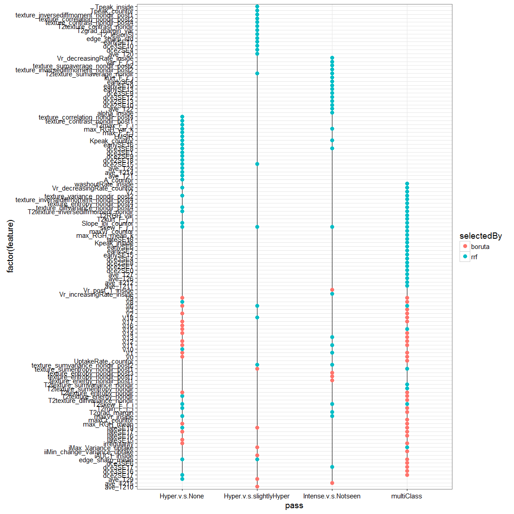
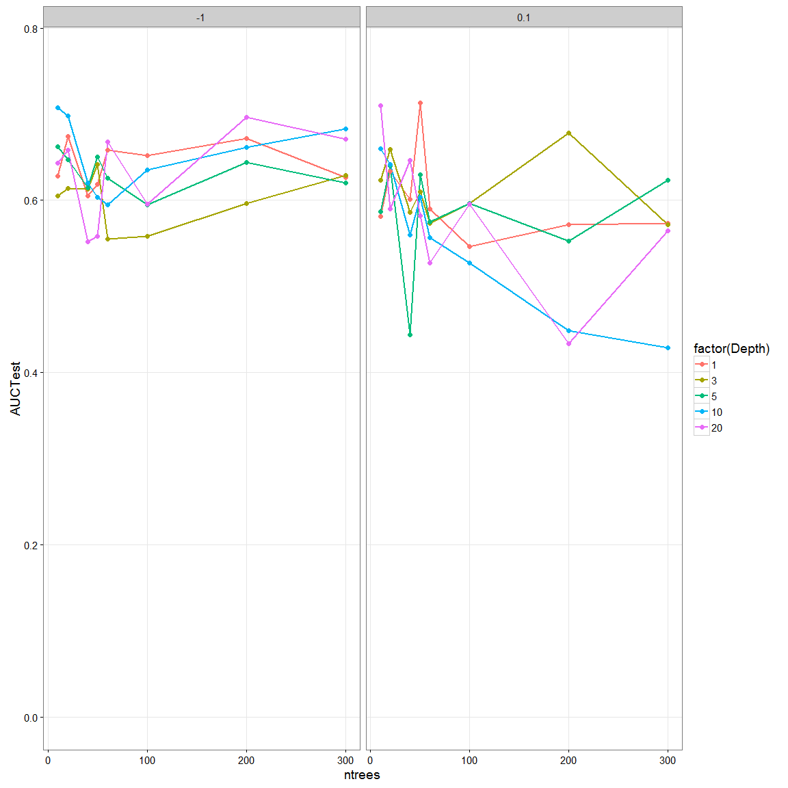
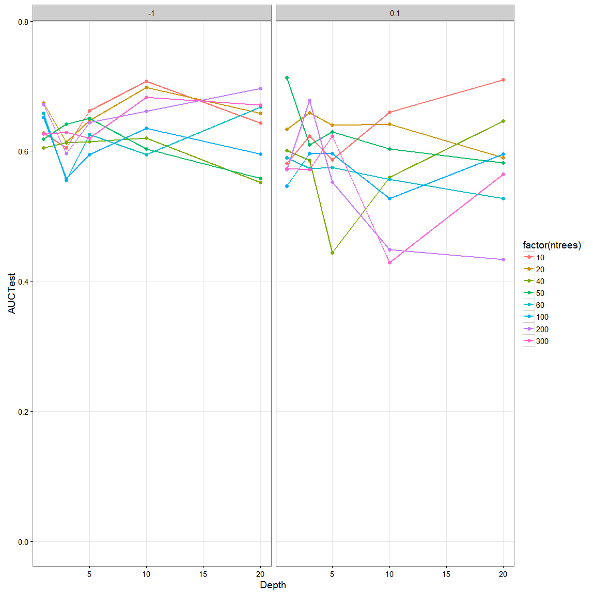
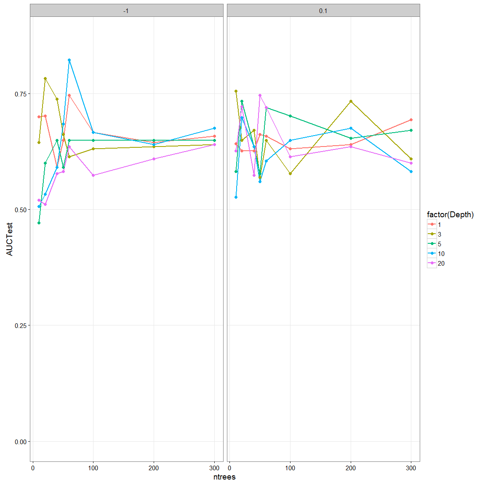
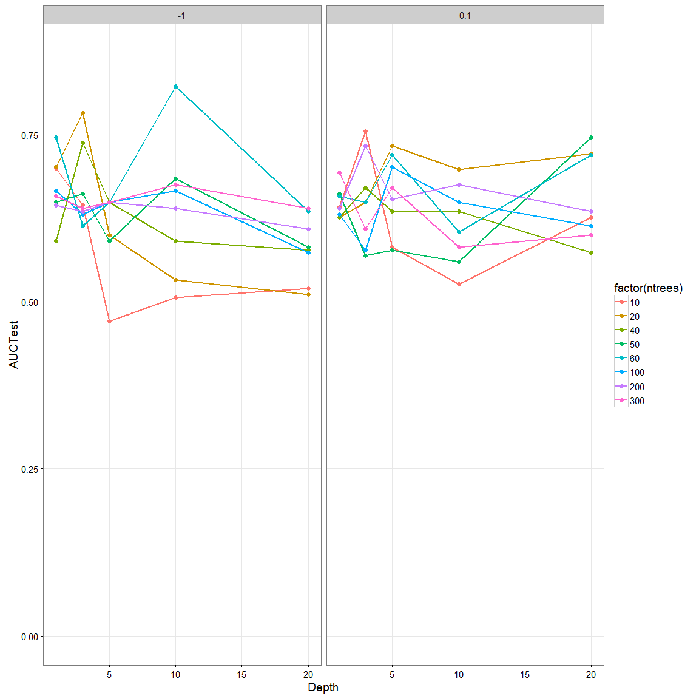
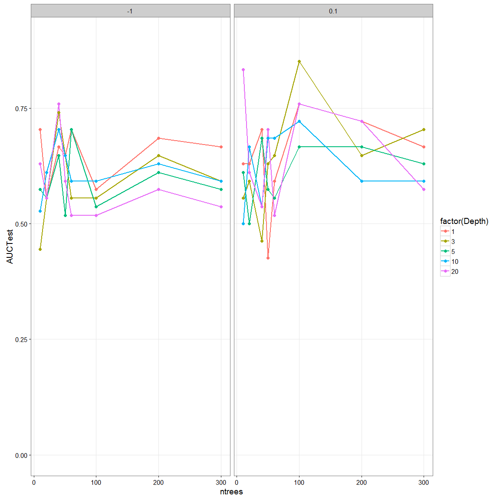
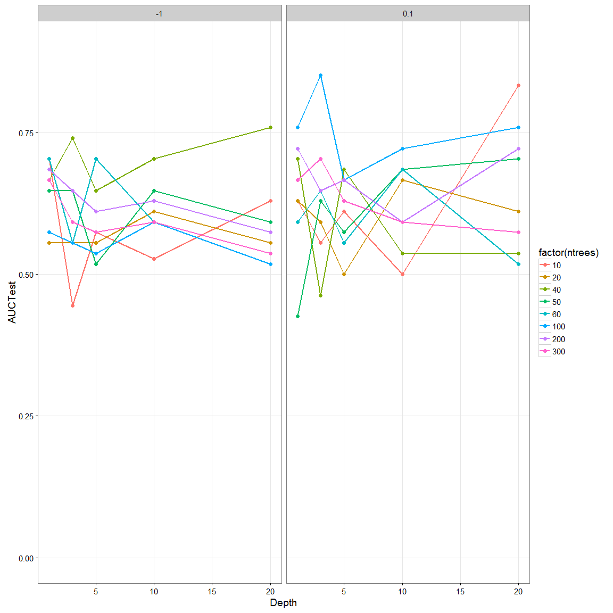
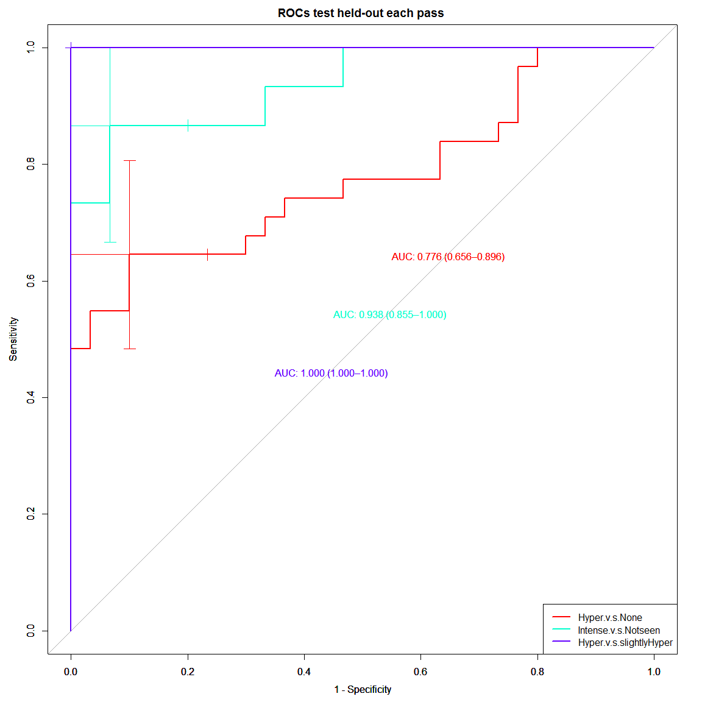

Predictor model of BIRADS T2w SI:
=============================
- This code creates a classifier based predictor of BIRADS T2w SI and add them to the pool of 55 T2w features for a total of 57 T2w featues


```
## Loading required package: lattice
## Loading required package: ggplot2
## Loading required package: DBI
## Loading required package: MASS
```


```r
# read datasets
npatients = length(uniq_cad)
allf = read_T1T2uniqcad_parti(id_cad_pts, uniq_cad, allpartitionsetD, npatients, 1)
```

```
##    massB    massM nonmassB nonmassM 
##      242      166      142       76 
## nonmassM 
##        1
```

```r
## formant
allfeatures = rbind(allf[[1]], allf[[2]])
alllesioninfo = rbind(allf[[5]], allf[[6]])

### print number of total lesions 
# before was ##   C / NC = 140 / 132
print(summary(as.factor(allfeatures$orig_label)))
```

```
##    massB    massM nonmassB nonmassM 
##      242      166      142       77
```

```r
#######################
# format datasets with find_t2_signal_int as response variable
allfeaturest2_signal = cbind(allfeatures["find_t2_signal_int"], allfeatures[,2:ncol(allfeatures)])
allfeaturest2_signal = allfeaturest2_signal[-c(199,ncol(allfeatures))]

allfeaturest2_signal$find_t2_signal_int = as.factor(allfeaturest2_signal$find_t2_signal_int)
summary(allfeaturest2_signal$find_t2_signal_int)
```

```
##            Hyperintense Hypointense or not seen                    None 
##                      98                     152                     312 
##   Slightly hyperintense 
##                      65
```

```r
#######################
# Subset previuosly selected features
# for Boruta
borutasel = unique(zscore_selected[,2:3])
borutasel = borutasel[-grep("shadow",borutasel$selfeat),]
rrfsel = unique(allBIRADSfeatures[,c(1,3)])

selBy = rbind( data.frame(feature=borutasel$selfeat, 
                          pass=borutasel$SelectedFeatureGroup, selectedBy="boruta"), 
               data.frame(feature=rrfsel$selfeat, 
                          pass=rrfsel$SelectedFeatureGroup, selectedBy="rrf") )
g <- ggplot(selBy, aes(x=factor(feature), y=pass,  group=pass, color=selectedBy))
g +  geom_line(size=0.5, colour="black") + geom_point(size=3, position="dodge") + coord_flip() +  theme_bw(base_size = 14) 
```

 

```r
# print features commonly selected
commonlyselBy = summary(factor(selBy$feature))
table(commonlyselBy[commonlyselBy >= 2])
```

```
## 
##  2  3  4  5 24 
## 31 11  2  1  1
```

```r
# for variables picked in every pass both for rrf and boruta
print(commonlyselBy[commonlyselBy >= 4])
```

```
## T2skew_F_r_i           V6   skew_F_r_i      (Other) 
##            5            4            4           24
```

```r
print(commonlyselBy[commonlyselBy == 3])
```

```
##                  edge_sharp_mean             iMax_Variance_uptake 
##                                3                                3 
##                         lateSE19                     maxVr_inside 
##                                3                                3 
##                      T2min_F_r_i          T2texture_energy_nondir 
##                                3                                3 
## texture_sumvariance_nondir_post2                               V1 
##                                3                                3 
##                              V11                              V15 
##                                3                                3 
##                               V8 
##                                3
```


Building a Random Forest classifier for BIRADS Tw2SI:  Categorial predictor of RSI on T2w Levels: Hyperintense, Slightly hyperintense, Hypointensity, None
=======


```r
###############
### PRODUCE RAND FOREST via RPART (control # trees))
###################################################
### code forest Train: 
### parameters, T= # of trees, D= tree depth, dat
###################################################
library(MASS)
library(klaR)
library(caret)
library(rpart)
library(rpart.plot)
library(adabag)
```

```
## Loading required package: mlbench
```

```r
require(ggplot2)
library(pROC)
```

```
## Type 'citation("pROC")' for a citation.
## 
## Attaching package: 'pROC'
## 
## The following objects are masked from 'package:stats':
## 
##     cov, smooth, var
```

```r
rpart_boostforestTrain <- function(ntrees, maxD, zcp, TrainsetD) {
  # set control
  fitparm = rpart.control(maxdepth = maxD,  minsplit = 2, cp = zcp)
  
  # train tree
  treedata <- boosting(find_t2_signal_int ~ .,  mfinal = ntrees, coeflearn = "Zhu",
                      data = TrainsetD, control=fitparm)
  # accuracy
  #print(sum(treedata$class == TrainsetD$find_t2_signal_int)/ length(TrainsetD$find_t2_signal_int))
  
  # forest
  forest = treedata$trees
  
  output <- list(treedata=treedata)
  return(output)
}
 
###################################################
### code forest Test: 
### parameters, T= # of trees, forest, TrainsetD, TestsetD
###################################################
rpart_boostforestTest <- function(ntrees, TrainsetD, TestsetD, boostrees) {
  
  trainpred = predict.boosting(boostrees, newdata = TrainsetD) 
  #print(trainpred$confusion)
  print(paste0("TrainingError = ",trainpred$error))
  
  testpred = predict.boosting(boostrees, newdata = TestsetD) 
  #print(testpred$confusion)
  print(paste0("TestError = ",testpred$error))
  
  # margins
#   marginsTrain <- margins(boostrees, TrainsetD)[[1]]
#   marginsTest <- margins(boostrees, TestsetD)[[1]]
#   
#   plot(sort(marginsTrain), (1:length(marginsTrain)) / length(marginsTrain), type = "l", xlim = c(-1,1), 
#        main = "Margin cumulative distribution graph", xlab = "m", 
#        ylab = "% observations", col = "blue3", lty = 2, lwd = 2) 
#   
#   abline(v = 0, col = "red", lty = 2, lwd = 2) 
#   lines(sort(marginsTest), (1:length(marginsTest)) / length(marginsTest), type = "l", cex = .5, 
#         col = "green", lwd = 2) 
#   legend("topleft", c("test", "train"), col = c("green", "blue3"), lty = 1:2, lwd = 2)
#   
  # on training
  classes = levels(TrainsetD[,"find_t2_signal_int"])
  trainprob = data.frame(C1=trainpred$prob[,1],
                         C2=trainpred$prob[,2],
                         pred=classes[apply(trainpred$prob, 1, which.max)], 
                         obs=TrainsetD[,"find_t2_signal_int"])
  colnames(trainprob)[1:2] <- classes
  perf_train =  sum(trainpred$class == TrainsetD[,"find_t2_signal_int"])/length(TrainsetD[,"find_t2_signal_int"])
  print(paste0("AcuTrain = ",perf_train))
  
  # on testing
  testprob = data.frame(C1=testpred$prob[,1],
                        C2=testpred$prob[,2],
                        pred=classes[apply(testpred$prob, 1, which.max)], 
                        obs=TestsetD[,"find_t2_signal_int"])
  colnames(testprob)[1:2] <- classes
  perf_test = sum(testpred$class == TestsetD[,"find_t2_signal_int"])/length(TestsetD[,"find_t2_signal_int"])
  print(paste0("AcuTest = ",perf_test))
  
  output <- list(etrain=perf_train, etest=perf_test, trainprob=trainprob, testprob=testprob)
  return(output)
}


###################################################
### code to predict Test cases in Cascade pass: 
### parameters, T= # of trees, forest, TrainsetD, TestsetD
###################################################
rpart_cascadeTest <- function(T, testc, predvar, forest){ 
                              
  fclasspo=list()
  for (t in 1:T){
    # Calcultate posterior Probabilities on grid points
    temp <- predict(forest[t]$tree, newdata = testc) #
    fclasspo <- append(fclasspo, list(cpo = temp))
  }
  
  # performance on Test set 
  # extract ensamble class probabilities (when T > 1)
  pts = fclasspo[1]$cpo
  # init ensample class posteriors
  enclasspo <- matrix(, nrow = nrow(as.data.frame(pts)), ncol = 2)
  enclasspo[,1] = fclasspo[1]$cpo[,1]
  enclasspo[,2] = fclasspo[1]$cpo[,2]
  if(T>=2){
    for (t in 2:T){
      enclasspo[,1] = enclasspo[,1]+fclasspo[t]$cpo[,1]
      enclasspo[,2] = enclasspo[,2]+fclasspo[t]$cpo[,2]
    }
  }
  # majority voting averaging
  enclasspo = (1/T)*enclasspo
  
  # on training
  classes = levels(testc[,predvar])
  prob = data.frame(C1=enclasspo[,1],
                         C2=enclasspo[,2],
                         pred=classes[apply(enclasspo, 1, which.max)], 
                         obs=testc[,predvar])
  colnames(prob)[1:2] <- classes
  pred = ifelse(apply(enclasspo, 1, which.max)==1,classes[1],classes[2])
  perf =  sum(ifelse(pred == testc[,predvar],1,0))/length(testc[,predvar])
  print(paste0("Accuracy of cascade pass = ",perf))
  
  roc = roc(prob$obs, prob[,1])
  print(roc$auc)
  print(summary(prob))

  output <- list(paccu=perf, prob=prob)
  return(output)
}


# create grid of evaluation points
gT = c(10,20,40,50,60,100,200,300)
gD = c(1,3,5,10,20)
gZ = c(-1,0.1)
grd <- expand.grid(x = gD, y = gT, z=gZ)


# example with 1 tree
#D=4
#T=1
#F = rpart_forestTrain(T, D, BIRADS_HyperNone, trainc$Resample1, "find_t2_signal_int") 
#perfmtree <- rpart_forestTest(T, BIRADS_HyperNone, F$forest, trainc$Resample1, "find_t2_signal_int")
```


```r
## split in train/test for each T2wSI category
BIRADS_HyperNone = allfeaturest2_signal
BIRADS_HyperNone$find_t2_signal_int = factor(ifelse(BIRADS_HyperNone$find_t2_signal_int=="None","None","Intense"))
BIRADS_HyperNone$find_t2_signal_int = factor(BIRADS_HyperNone$find_t2_signal_int)
summary(BIRADS_HyperNone$find_t2_signal_int)
```

```
## Intense    None 
##     315     312
```

```r
b = as.character(subset(borutasel, SelectedFeatureGroup=="Hyper.v.s.None")$selfeat)
rf = as.character(subset(rrfsel, SelectedFeatureGroup=="Hyper.v.s.None")$selfeat)
feat_HyperNone = unique(c(b,rf))

## split in train/test for each T2wSI category
BIRADS_IntenseorNot = allfeaturest2_signal[allfeaturest2_signal$find_t2_signal_int != "None", ]
BIRADS_IntenseorNot$find_t2_signal_int = factor(ifelse(BIRADS_IntenseorNot$find_t2_signal_int=="Hypointense or not seen",
                                                "Hypointense or not seen","Intense"))
summary(BIRADS_IntenseorNot$find_t2_signal_int)
```

```
## Hypointense or not seen                 Intense 
##                     152                     163
```

```r
b = as.character(subset(borutasel, SelectedFeatureGroup=="Intense.v.s.Notseen")$selfeat)
rf = as.character(subset(rrfsel, SelectedFeatureGroup=="Intense.v.s.Notseen")$selfeat)
feat_IntenseorNot = unique(c(b,rf))

## split in train/test for each T2wSI category
BIRADS_HyperorSlight = allfeaturest2_signal[allfeaturest2_signal$find_t2_signal_int != "None", ]
BIRADS_HyperorSlight = BIRADS_HyperorSlight[BIRADS_HyperorSlight$find_t2_signal_int != "Hypointense or not seen", ]
BIRADS_HyperorSlight$find_t2_signal_int = factor(BIRADS_HyperorSlight$find_t2_signal_int)
summary(BIRADS_HyperorSlight$find_t2_signal_int)
```

```
##          Hyperintense Slightly hyperintense 
##                    98                    65
```

```r
b = as.character(subset(borutasel, SelectedFeatureGroup=="Hyper.v.s.slightlyHyper")$selfeat)
rf = as.character(subset(rrfsel, SelectedFeatureGroup=="Hyper.v.s.slightlyHyper")$selfeat)
feat_HyperorSlight = unique(c(b,rf))

summary(allfeaturest2_signal$find_t2_signal_int)
```

```
##            Hyperintense Hypointense or not seen                    None 
##                      98                     152                     312 
##   Slightly hyperintense 
##                      65
```

```r
# split in train/test buckets
set.seed(01)
trainc = createDataPartition(y = allfeaturest2_signal$find_t2_signal_int, # n = 689
                                 p = .9, ## The percentage of data in the training set
                                 list = TRUE) ## The format of the results. 

trainc_HyperNone = data.frame(id = alllesioninfo$lesion_id)
trainc_HyperNone$train = rep(FALSE,nrow(trainc_HyperNone))
trainc_HyperNone$train[trainc$Resample1] = TRUE

trainc_IntenseorNot = data.frame()
# for BIRADS_IntenseorNot
for(k in 1:nrow(BIRADS_IntenseorNot)){
  if( rownames(BIRADS_IntenseorNot[k,]) %in% trainc_HyperNone$id[trainc_HyperNone$train] ){
    df = data.frame(id = rownames(BIRADS_IntenseorNot[k,]), train=TRUE)
  }else{
    df = data.frame(id = rownames(BIRADS_IntenseorNot[k,]), train=FALSE)
  }
  trainc_IntenseorNot = rbind(trainc_IntenseorNot, df)
}


trainc_HyperorSlight = data.frame()
# for BIRADS_IntenseorNot
for(k in 1:nrow(BIRADS_HyperorSlight)){
  if( rownames(BIRADS_HyperorSlight[k,]) %in% trainc_HyperNone$id[trainc_HyperNone$train] ){
    df = data.frame(id = rownames(BIRADS_HyperorSlight[k,]), train=TRUE)
  }else{
    df = data.frame(id = rownames(BIRADS_HyperorSlight[k,]), train=FALSE)
  }
  trainc_HyperorSlight = rbind(trainc_HyperorSlight, df)
}
```


Pass 1:  Hyperintense and None or absent
====

```r
##################################
# first predict between Hyperintense and None or absent
# data = trainHyperNone, testHyperNone, trainc_HyperNone
# features = feat_HyperNone
# results:  bestune_HyperNone

trainHyperNone = BIRADS_HyperNone[trainc_HyperNone$train,c("find_t2_signal_int",feat_HyperNone)]
testHyperNone = BIRADS_HyperNone[!trainc_HyperNone$train,c("find_t2_signal_int",feat_HyperNone)]

trainHyperNone$find_t2_signal_int = factor(ifelse(trainHyperNone$find_t2_signal_int=="None","None","Intense"))
testHyperNone$find_t2_signal_int = factor(ifelse(testHyperNone$find_t2_signal_int=="None","None","Intense"))
summary(trainHyperNone$find_t2_signal_int)
```

```
## Intense    None 
##     285     281
```

```r
summary(testHyperNone$find_t2_signal_int)
```

```
## Intense    None 
##      30      31
```

```r
grdperf = data.frame(grd)
grdperf$acuTrain =0;  grdperf$rocTrain =0
grdperf$acuTest =0;   grdperf$rocTest =0

# perform grid greedy search
for(k in 1:nrow(grd)){
    maxD=grd[k,1]
    ntrees=grd[k,2]
    zcp = grd[k,3]
    cat("#Trees ", ntrees, "\n")
    cat("max.depth ", maxD, "\n")
    cat("rpart cp ", zcp, "\n")
    
    # train a boosted rcart trees (ntrees, maxD, TrainsetD)
    T2wSIboost = rpart_boostforestTrain(ntrees, maxD, zcp, trainHyperNone)
    perfF <- rpart_boostforestTest(ntrees, trainHyperNone, testHyperNone, T2wSIboost$treedata)
    
    # for train
    ROCF_train <- roc(perfF$trainprob$obs, perfF$trainprob[,1])
    print(ROCF_train$auc)
    # collect data
    grdperf$acuTrain[k] = as.numeric(perfF$etrain)
    grdperf$rocTrain[k] = as.numeric(ROCF_train$auc)
    # for test
    ROCF_test <- roc(perfF$testprob$obs, perfF$testprob[,1])
    print(ROCF_test$auc)
    
    # collect data
    grdperf$acuTest[k] = as.numeric(perfF$etest)
    grdperf$rocTest[k] = as.numeric(ROCF_test$auc)
}
```

```
## #Trees  10 
## max.depth  1 
## rpart cp  -1 
## [1] "TrainingError = 0.358657243816254"
## [1] "TestError = 0.409836065573771"
## [1] "AcuTrain = 0.641342756183746"
## [1] "AcuTest = 0.590163934426229"
## Area under the curve: 0.7071
## Area under the curve: 0.6285
## #Trees  10 
## max.depth  3 
## rpart cp  -1 
## [1] "TrainingError = 0.203180212014134"
## [1] "TestError = 0.377049180327869"
## [1] "AcuTrain = 0.796819787985866"
## [1] "AcuTest = 0.622950819672131"
## Area under the curve: 0.8912
## Area under the curve: 0.6048
## #Trees  10 
## max.depth  5 
## rpart cp  -1 
## [1] "TrainingError = 0.0618374558303887"
## [1] "TestError = 0.360655737704918"
## [1] "AcuTrain = 0.938162544169611"
## [1] "AcuTest = 0.639344262295082"
## Area under the curve: 0.9878
## Area under the curve: 0.6624
## #Trees  10 
## max.depth  10 
## rpart cp  -1 
## [1] "TrainingError = 0"
## [1] "TestError = 0.39344262295082"
## [1] "AcuTrain = 1"
## [1] "AcuTest = 0.60655737704918"
## Area under the curve: 1
## Area under the curve: 0.7075
## #Trees  10 
## max.depth  20 
## rpart cp  -1 
## [1] "TrainingError = 0"
## [1] "TestError = 0.39344262295082"
## [1] "AcuTrain = 1"
## [1] "AcuTest = 0.60655737704918"
## Area under the curve: 1
## Area under the curve: 0.6435
## #Trees  20 
## max.depth  1 
## rpart cp  -1 
## [1] "TrainingError = 0.30565371024735"
## [1] "TestError = 0.360655737704918"
## [1] "AcuTrain = 0.69434628975265"
## [1] "AcuTest = 0.639344262295082"
## Area under the curve: 0.7596
## Area under the curve: 0.6742
## #Trees  20 
## max.depth  3 
## rpart cp  -1 
## [1] "TrainingError = 0.144876325088339"
## [1] "TestError = 0.344262295081967"
## [1] "AcuTrain = 0.855123674911661"
## [1] "AcuTest = 0.655737704918033"
## Area under the curve: 0.9492
## Area under the curve: 0.614
## #Trees  20 
## max.depth  5 
## rpart cp  -1 
## [1] "TrainingError = 0"
## [1] "TestError = 0.426229508196721"
## [1] "AcuTrain = 1"
## [1] "AcuTest = 0.573770491803279"
## Area under the curve: 1
## Area under the curve: 0.6473
## #Trees  20 
## max.depth  10 
## rpart cp  -1 
## [1] "TrainingError = 0"
## [1] "TestError = 0.39344262295082"
## [1] "AcuTrain = 1"
## [1] "AcuTest = 0.60655737704918"
## Area under the curve: 1
## Area under the curve: 0.6978
## #Trees  20 
## max.depth  20 
## rpart cp  -1 
## [1] "TrainingError = 0"
## [1] "TestError = 0.360655737704918"
## [1] "AcuTrain = 1"
## [1] "AcuTest = 0.639344262295082"
## Area under the curve: 1
## Area under the curve: 0.6581
## #Trees  40 
## max.depth  1 
## rpart cp  -1 
## [1] "TrainingError = 0.286219081272085"
## [1] "TestError = 0.409836065573771"
## [1] "AcuTrain = 0.713780918727915"
## [1] "AcuTest = 0.590163934426229"
## Area under the curve: 0.79
## Area under the curve: 0.6054
## #Trees  40 
## max.depth  3 
## rpart cp  -1 
## [1] "TrainingError = 0.0265017667844523"
## [1] "TestError = 0.442622950819672"
## [1] "AcuTrain = 0.973498233215548"
## [1] "AcuTest = 0.557377049180328"
## Area under the curve: 0.9977
## Area under the curve: 0.6129
## #Trees  40 
## max.depth  5 
## rpart cp  -1 
## [1] "TrainingError = 0"
## [1] "TestError = 0.491803278688525"
## [1] "AcuTrain = 1"
## [1] "AcuTest = 0.508196721311475"
## Area under the curve: 1
## Area under the curve: 0.6151
## #Trees  40 
## max.depth  10 
## rpart cp  -1 
## [1] "TrainingError = 0"
## [1] "TestError = 0.39344262295082"
## [1] "AcuTrain = 1"
## [1] "AcuTest = 0.60655737704918"
## Area under the curve: 1
## Area under the curve: 0.6204
## #Trees  40 
## max.depth  20 
## rpart cp  -1 
## [1] "TrainingError = 0"
## [1] "TestError = 0.491803278688525"
## [1] "AcuTrain = 1"
## [1] "AcuTest = 0.508196721311475"
## Area under the curve: 1
## Area under the curve: 0.5516
## #Trees  50 
## max.depth  1 
## rpart cp  -1 
## [1] "TrainingError = 0.293286219081272"
## [1] "TestError = 0.442622950819672"
## [1] "AcuTrain = 0.706713780918728"
## [1] "AcuTest = 0.557377049180328"
## Area under the curve: 0.7952
## Area under the curve: 0.6183
## #Trees  50 
## max.depth  3 
## rpart cp  -1 
## [1] "TrainingError = 0.00883392226148405"
## [1] "TestError = 0.459016393442623"
## [1] "AcuTrain = 0.991166077738516"
## [1] "AcuTest = 0.540983606557377"
## Area under the curve: 1
## Area under the curve: 0.6419
## #Trees  50 
## max.depth  5 
## rpart cp  -1 
## [1] "TrainingError = 0"
## [1] "TestError = 0.39344262295082"
## [1] "AcuTrain = 1"
## [1] "AcuTest = 0.60655737704918"
## Area under the curve: 1
## Area under the curve: 0.6505
## #Trees  50 
## max.depth  10 
## rpart cp  -1 
## [1] "TrainingError = 0"
## [1] "TestError = 0.442622950819672"
## [1] "AcuTrain = 1"
## [1] "AcuTest = 0.557377049180328"
## Area under the curve: 1
## Area under the curve: 0.6032
## #Trees  50 
## max.depth  20 
## rpart cp  -1 
## [1] "TrainingError = 0"
## [1] "TestError = 0.426229508196721"
## [1] "AcuTrain = 1"
## [1] "AcuTest = 0.573770491803279"
## Area under the curve: 1
## Area under the curve: 0.5581
## #Trees  60 
## max.depth  1 
## rpart cp  -1 
## [1] "TrainingError = 0.316254416961131"
## [1] "TestError = 0.426229508196721"
## [1] "AcuTrain = 0.683745583038869"
## [1] "AcuTest = 0.573770491803279"
## Area under the curve: 0.7712
## Area under the curve: 0.6581
## #Trees  60 
## max.depth  3 
## rpart cp  -1 
## [1] "TrainingError = 0.00176678445229683"
## [1] "TestError = 0.442622950819672"
## [1] "AcuTrain = 0.998233215547703"
## [1] "AcuTest = 0.557377049180328"
## Area under the curve: 1
## Area under the curve: 0.5548
## #Trees  60 
## max.depth  5 
## rpart cp  -1 
## [1] "TrainingError = 0"
## [1] "TestError = 0.426229508196721"
## [1] "AcuTrain = 1"
## [1] "AcuTest = 0.573770491803279"
## Area under the curve: 1
## Area under the curve: 0.6258
## #Trees  60 
## max.depth  10 
## rpart cp  -1 
## [1] "TrainingError = 0"
## [1] "TestError = 0.524590163934426"
## [1] "AcuTrain = 1"
## [1] "AcuTest = 0.475409836065574"
## Area under the curve: 1
## Area under the curve: 0.5946
## #Trees  60 
## max.depth  20 
## rpart cp  -1 
## [1] "TrainingError = 0"
## [1] "TestError = 0.377049180327869"
## [1] "AcuTrain = 1"
## [1] "AcuTest = 0.622950819672131"
## Area under the curve: 1
## Area under the curve: 0.6677
## #Trees  100 
## max.depth  1 
## rpart cp  -1 
## [1] "TrainingError = 0.30565371024735"
## [1] "TestError = 0.426229508196721"
## [1] "AcuTrain = 0.69434628975265"
## [1] "AcuTest = 0.573770491803279"
## Area under the curve: 0.7721
## Area under the curve: 0.6516
## #Trees  100 
## max.depth  3 
## rpart cp  -1 
## [1] "TrainingError = 0"
## [1] "TestError = 0.475409836065574"
## [1] "AcuTrain = 1"
## [1] "AcuTest = 0.524590163934426"
## Area under the curve: 1
## Area under the curve: 0.5581
## #Trees  100 
## max.depth  5 
## rpart cp  -1 
## [1] "TrainingError = 0"
## [1] "TestError = 0.475409836065574"
## [1] "AcuTrain = 1"
## [1] "AcuTest = 0.524590163934426"
## Area under the curve: 1
## Area under the curve: 0.5946
## #Trees  100 
## max.depth  10 
## rpart cp  -1 
## [1] "TrainingError = 0"
## [1] "TestError = 0.327868852459016"
## [1] "AcuTrain = 1"
## [1] "AcuTest = 0.672131147540984"
## Area under the curve: 1
## Area under the curve: 0.6355
## #Trees  100 
## max.depth  20 
## rpart cp  -1 
## [1] "TrainingError = 0"
## [1] "TestError = 0.409836065573771"
## [1] "AcuTrain = 1"
## [1] "AcuTest = 0.590163934426229"
## Area under the curve: 1
## Area under the curve: 0.5957
## #Trees  200 
## max.depth  1 
## rpart cp  -1 
## [1] "TrainingError = 0.300353356890459"
## [1] "TestError = 0.360655737704918"
## [1] "AcuTrain = 0.699646643109541"
## [1] "AcuTest = 0.639344262295082"
## Area under the curve: 0.7826
## Area under the curve: 0.672
## #Trees  200 
## max.depth  3 
## rpart cp  -1 
## [1] "TrainingError = 0"
## [1] "TestError = 0.459016393442623"
## [1] "AcuTrain = 1"
## [1] "AcuTest = 0.540983606557377"
## Area under the curve: 1
## Area under the curve: 0.5968
## #Trees  200 
## max.depth  5 
## rpart cp  -1 
## [1] "TrainingError = 0"
## [1] "TestError = 0.377049180327869"
## [1] "AcuTrain = 1"
## [1] "AcuTest = 0.622950819672131"
## Area under the curve: 1
## Area under the curve: 0.6441
## #Trees  200 
## max.depth  10 
## rpart cp  -1 
## [1] "TrainingError = 0"
## [1] "TestError = 0.409836065573771"
## [1] "AcuTrain = 1"
## [1] "AcuTest = 0.590163934426229"
## Area under the curve: 1
## Area under the curve: 0.6613
## #Trees  200 
## max.depth  20 
## rpart cp  -1 
## [1] "TrainingError = 0"
## [1] "TestError = 0.344262295081967"
## [1] "AcuTrain = 1"
## [1] "AcuTest = 0.655737704918033"
## Area under the curve: 1
## Area under the curve: 0.6968
## #Trees  300 
## max.depth  1 
## rpart cp  -1 
## [1] "TrainingError = 0.293286219081272"
## [1] "TestError = 0.426229508196721"
## [1] "AcuTrain = 0.706713780918728"
## [1] "AcuTest = 0.573770491803279"
## Area under the curve: 0.7844
## Area under the curve: 0.6269
## #Trees  300 
## max.depth  3 
## rpart cp  -1 
## [1] "TrainingError = 0"
## [1] "TestError = 0.442622950819672"
## [1] "AcuTrain = 1"
## [1] "AcuTest = 0.557377049180328"
## Area under the curve: 1
## Area under the curve: 0.629
## #Trees  300 
## max.depth  5 
## rpart cp  -1 
## [1] "TrainingError = 0"
## [1] "TestError = 0.459016393442623"
## [1] "AcuTrain = 1"
## [1] "AcuTest = 0.540983606557377"
## Area under the curve: 1
## Area under the curve: 0.6204
## #Trees  300 
## max.depth  10 
## rpart cp  -1 
## [1] "TrainingError = 0"
## [1] "TestError = 0.327868852459016"
## [1] "AcuTrain = 1"
## [1] "AcuTest = 0.672131147540984"
## Area under the curve: 1
## Area under the curve: 0.6828
## #Trees  300 
## max.depth  20 
## rpart cp  -1 
## [1] "TrainingError = 0"
## [1] "TestError = 0.360655737704918"
## [1] "AcuTrain = 1"
## [1] "AcuTest = 0.639344262295082"
## Area under the curve: 1
## Area under the curve: 0.671
## #Trees  10 
## max.depth  1 
## rpart cp  0.1 
## [1] "TrainingError = 0.325088339222615"
## [1] "TestError = 0.442622950819672"
## [1] "AcuTrain = 0.674911660777385"
## [1] "AcuTest = 0.557377049180328"
## Area under the curve: 0.7438
## Area under the curve: 0.5812
## #Trees  10 
## max.depth  3 
## rpart cp  0.1 
## [1] "TrainingError = 0.326855123674912"
## [1] "TestError = 0.426229508196721"
## [1] "AcuTrain = 0.673144876325088"
## [1] "AcuTest = 0.573770491803279"
## Area under the curve: 0.7519
## Area under the curve: 0.6237
## #Trees  10 
## max.depth  5 
## rpart cp  0.1 
## [1] "TrainingError = 0.318021201413428"
## [1] "TestError = 0.442622950819672"
## [1] "AcuTrain = 0.681978798586572"
## [1] "AcuTest = 0.557377049180328"
## Area under the curve: 0.7505
## Area under the curve: 0.5866
## #Trees  10 
## max.depth  10 
## rpart cp  0.1 
## [1] "TrainingError = 0.325088339222615"
## [1] "TestError = 0.377049180327869"
## [1] "AcuTrain = 0.674911660777385"
## [1] "AcuTest = 0.622950819672131"
## Area under the curve: 0.754
## Area under the curve: 0.6597
## #Trees  10 
## max.depth  20 
## rpart cp  0.1 
## [1] "TrainingError = 0.348056537102474"
## [1] "TestError = 0.327868852459016"
## [1] "AcuTrain = 0.651943462897526"
## [1] "AcuTest = 0.672131147540984"
## Area under the curve: 0.7173
## Area under the curve: 0.7097
## #Trees  20 
## max.depth  1 
## rpart cp  0.1 
## [1] "TrainingError = 0.328621908127208"
## [1] "TestError = 0.360655737704918"
## [1] "AcuTrain = 0.671378091872792"
## [1] "AcuTest = 0.639344262295082"
## Area under the curve: 0.7526
## Area under the curve: 0.6333
## #Trees  20 
## max.depth  3 
## rpart cp  0.1 
## [1] "TrainingError = 0.282685512367491"
## [1] "TestError = 0.409836065573771"
## [1] "AcuTrain = 0.717314487632509"
## [1] "AcuTest = 0.590163934426229"
## Area under the curve: 0.7872
## Area under the curve: 0.6591
## #Trees  20 
## max.depth  5 
## rpart cp  0.1 
## [1] "TrainingError = 0.300353356890459"
## [1] "TestError = 0.442622950819672"
## [1] "AcuTrain = 0.699646643109541"
## [1] "AcuTest = 0.557377049180328"
## Area under the curve: 0.7814
## Area under the curve: 0.6398
## #Trees  20 
## max.depth  10 
## rpart cp  0.1 
## [1] "TrainingError = 0.286219081272085"
## [1] "TestError = 0.409836065573771"
## [1] "AcuTrain = 0.713780918727915"
## [1] "AcuTest = 0.590163934426229"
## Area under the curve: 0.7882
## Area under the curve: 0.6419
## #Trees  20 
## max.depth  20 
## rpart cp  0.1 
## [1] "TrainingError = 0.291519434628975"
## [1] "TestError = 0.475409836065574"
## [1] "AcuTrain = 0.708480565371025"
## [1] "AcuTest = 0.524590163934426"
## Area under the curve: 0.8077
## Area under the curve: 0.5903
## #Trees  40 
## max.depth  1 
## rpart cp  0.1 
## [1] "TrainingError = 0.265017667844523"
## [1] "TestError = 0.409836065573771"
## [1] "AcuTrain = 0.734982332155477"
## [1] "AcuTest = 0.590163934426229"
## Area under the curve: 0.8163
## Area under the curve: 0.6011
## #Trees  40 
## max.depth  3 
## rpart cp  0.1 
## [1] "TrainingError = 0.23321554770318"
## [1] "TestError = 0.442622950819672"
## [1] "AcuTrain = 0.76678445229682"
## [1] "AcuTest = 0.557377049180328"
## Area under the curve: 0.8512
## Area under the curve: 0.586
## #Trees  40 
## max.depth  5 
## rpart cp  0.1 
## [1] "TrainingError = 0.22791519434629"
## [1] "TestError = 0.491803278688525"
## [1] "AcuTrain = 0.77208480565371"
## [1] "AcuTest = 0.508196721311475"
## Area under the curve: 0.8552
## Area under the curve: 0.4441
## #Trees  40 
## max.depth  10 
## rpart cp  0.1 
## [1] "TrainingError = 0.247349823321555"
## [1] "TestError = 0.459016393442623"
## [1] "AcuTrain = 0.752650176678445"
## [1] "AcuTest = 0.540983606557377"
## Area under the curve: 0.8582
## Area under the curve: 0.5602
## #Trees  40 
## max.depth  20 
## rpart cp  0.1 
## [1] "TrainingError = 0.254416961130742"
## [1] "TestError = 0.39344262295082"
## [1] "AcuTrain = 0.745583038869258"
## [1] "AcuTest = 0.60655737704918"
## Area under the curve: 0.8327
## Area under the curve: 0.6462
## #Trees  50 
## max.depth  1 
## rpart cp  0.1 
## [1] "TrainingError = 0.257950530035336"
## [1] "TestError = 0.344262295081967"
## [1] "AcuTrain = 0.742049469964664"
## [1] "AcuTest = 0.655737704918033"
## Area under the curve: 0.8322
## Area under the curve: 0.7129
## #Trees  50 
## max.depth  3 
## rpart cp  0.1 
## [1] "TrainingError = 0.210247349823322"
## [1] "TestError = 0.39344262295082"
## [1] "AcuTrain = 0.789752650176678"
## [1] "AcuTest = 0.60655737704918"
## Area under the curve: 0.8579
## Area under the curve: 0.6097
## #Trees  50 
## max.depth  5 
## rpart cp  0.1 
## [1] "TrainingError = 0.257950530035336"
## [1] "TestError = 0.426229508196721"
## [1] "AcuTrain = 0.742049469964664"
## [1] "AcuTest = 0.573770491803279"
## Area under the curve: 0.8226
## Area under the curve: 0.6301
## #Trees  50 
## max.depth  10 
## rpart cp  0.1 
## [1] "TrainingError = 0.242049469964664"
## [1] "TestError = 0.459016393442623"
## [1] "AcuTrain = 0.757950530035336"
## [1] "AcuTest = 0.540983606557377"
## Area under the curve: 0.835
## Area under the curve: 0.6032
## #Trees  50 
## max.depth  20 
## rpart cp  0.1 
## [1] "TrainingError = 0.212014134275618"
## [1] "TestError = 0.426229508196721"
## [1] "AcuTrain = 0.787985865724382"
## [1] "AcuTest = 0.573770491803279"
## Area under the curve: 0.8801
## Area under the curve: 0.5817
## #Trees  60 
## max.depth  1 
## rpart cp  0.1 
## [1] "TrainingError = 0.224381625441696"
## [1] "TestError = 0.39344262295082"
## [1] "AcuTrain = 0.775618374558304"
## [1] "AcuTest = 0.60655737704918"
## Area under the curve: 0.8542
## Area under the curve: 0.5903
## #Trees  60 
## max.depth  3 
## rpart cp  0.1 
## [1] "TrainingError = 0.18904593639576"
## [1] "TestError = 0.426229508196721"
## [1] "AcuTrain = 0.81095406360424"
## [1] "AcuTest = 0.573770491803279"
## Area under the curve: 0.909
## Area under the curve: 0.5731
## #Trees  60 
## max.depth  5 
## rpart cp  0.1 
## [1] "TrainingError = 0.224381625441696"
## [1] "TestError = 0.426229508196721"
## [1] "AcuTrain = 0.775618374558304"
## [1] "AcuTest = 0.573770491803279"
## Area under the curve: 0.8809
## Area under the curve: 0.5753
## #Trees  60 
## max.depth  10 
## rpart cp  0.1 
## [1] "TrainingError = 0.212014134275618"
## [1] "TestError = 0.475409836065574"
## [1] "AcuTrain = 0.787985865724382"
## [1] "AcuTest = 0.524590163934426"
## Area under the curve: 0.8903
## Area under the curve: 0.557
## #Trees  60 
## max.depth  20 
## rpart cp  0.1 
## [1] "TrainingError = 0.224381625441696"
## [1] "TestError = 0.426229508196721"
## [1] "AcuTrain = 0.775618374558304"
## [1] "AcuTest = 0.573770491803279"
## Area under the curve: 0.8814
## Area under the curve: 0.5269
## #Trees  100 
## max.depth  1 
## rpart cp  0.1 
## [1] "TrainingError = 0.203180212014134"
## [1] "TestError = 0.475409836065574"
## [1] "AcuTrain = 0.796819787985866"
## [1] "AcuTest = 0.524590163934426"
## Area under the curve: 0.886
## Area under the curve: 0.5462
## #Trees  100 
## max.depth  3 
## rpart cp  0.1 
## [1] "TrainingError = 0.215547703180212"
## [1] "TestError = 0.39344262295082"
## [1] "AcuTrain = 0.784452296819788"
## [1] "AcuTest = 0.60655737704918"
## Area under the curve: 0.8789
## Area under the curve: 0.5968
## #Trees  100 
## max.depth  5 
## rpart cp  0.1 
## [1] "TrainingError = 0.213780918727915"
## [1] "TestError = 0.475409836065574"
## [1] "AcuTrain = 0.786219081272085"
## [1] "AcuTest = 0.524590163934426"
## Area under the curve: 0.8862
## Area under the curve: 0.5968
## #Trees  100 
## max.depth  10 
## rpart cp  0.1 
## [1] "TrainingError = 0.167844522968198"
## [1] "TestError = 0.475409836065574"
## [1] "AcuTrain = 0.832155477031802"
## [1] "AcuTest = 0.524590163934426"
## Area under the curve: 0.9303
## Area under the curve: 0.5269
## #Trees  100 
## max.depth  20 
## rpart cp  0.1 
## [1] "TrainingError = 0.208480565371025"
## [1] "TestError = 0.442622950819672"
## [1] "AcuTrain = 0.791519434628975"
## [1] "AcuTest = 0.557377049180328"
## Area under the curve: 0.8702
## Area under the curve: 0.5957
## #Trees  200 
## max.depth  1 
## rpart cp  0.1 
## [1] "TrainingError = 0.201413427561837"
## [1] "TestError = 0.409836065573771"
## [1] "AcuTrain = 0.798586572438163"
## [1] "AcuTest = 0.590163934426229"
## Area under the curve: 0.8821
## Area under the curve: 0.572
## #Trees  200 
## max.depth  3 
## rpart cp  0.1 
## [1] "TrainingError = 0.125441696113074"
## [1] "TestError = 0.360655737704918"
## [1] "AcuTrain = 0.874558303886926"
## [1] "AcuTest = 0.639344262295082"
## Area under the curve: 0.9515
## Area under the curve: 0.6785
## #Trees  200 
## max.depth  5 
## rpart cp  0.1 
## [1] "TrainingError = 0.088339222614841"
## [1] "TestError = 0.459016393442623"
## [1] "AcuTrain = 0.911660777385159"
## [1] "AcuTest = 0.540983606557377"
## Area under the curve: 0.979
## Area under the curve: 0.5527
## #Trees  200 
## max.depth  10 
## rpart cp  0.1 
## [1] "TrainingError = 0.0830388692579506"
## [1] "TestError = 0.491803278688525"
## [1] "AcuTrain = 0.916961130742049"
## [1] "AcuTest = 0.508196721311475"
## Area under the curve: 0.9823
## Area under the curve: 0.4484
## #Trees  200 
## max.depth  20 
## rpart cp  0.1 
## [1] "TrainingError = 0.0812720848056537"
## [1] "TestError = 0.442622950819672"
## [1] "AcuTrain = 0.918727915194346"
## [1] "AcuTest = 0.557377049180328"
## Area under the curve: 0.9814
## Area under the curve: 0.4333
## #Trees  300 
## max.depth  1 
## rpart cp  0.1 
## [1] "TrainingError = 0.176678445229682"
## [1] "TestError = 0.459016393442623"
## [1] "AcuTrain = 0.823321554770318"
## [1] "AcuTest = 0.540983606557377"
## Area under the curve: 0.9175
## Area under the curve: 0.5731
## #Trees  300 
## max.depth  3 
## rpart cp  0.1 
## [1] "TrainingError = 0.0830388692579506"
## [1] "TestError = 0.39344262295082"
## [1] "AcuTrain = 0.916961130742049"
## [1] "AcuTest = 0.60655737704918"
## Area under the curve: 0.9774
## Area under the curve: 0.572
## #Trees  300 
## max.depth  5 
## rpart cp  0.1 
## [1] "TrainingError = 0.132508833922262"
## [1] "TestError = 0.39344262295082"
## [1] "AcuTrain = 0.867491166077738"
## [1] "AcuTest = 0.60655737704918"
## Area under the curve: 0.9468
## Area under the curve: 0.6237
## #Trees  300 
## max.depth  10 
## rpart cp  0.1 
## [1] "TrainingError = 0.104240282685512"
## [1] "TestError = 0.426229508196721"
## [1] "AcuTrain = 0.895759717314488"
## [1] "AcuTest = 0.573770491803279"
## Area under the curve: 0.9749
## Area under the curve: 0.429
## #Trees  300 
## max.depth  20 
## rpart cp  0.1 
## [1] "TrainingError = 0.0777385159010601"
## [1] "TestError = 0.459016393442623"
## [1] "AcuTrain = 0.92226148409894"
## [1] "AcuTest = 0.540983606557377"
## Area under the curve: 0.9823
## Area under the curve: 0.5645
```

```r
print(grdperf)
```

```
##     x   y    z  acuTrain  rocTrain   acuTest   rocTest
## 1   1  10 -1.0 0.6413428 0.7070862 0.5901639 0.6284946
## 2   3  10 -1.0 0.7968198 0.8911719 0.6229508 0.6048387
## 3   5  10 -1.0 0.9381625 0.9878067 0.6393443 0.6623656
## 4  10  10 -1.0 1.0000000 1.0000000 0.6065574 0.7075269
## 5  20  10 -1.0 1.0000000 1.0000000 0.6065574 0.6435484
## 6   1  20 -1.0 0.6943463 0.7595992 0.6393443 0.6741935
## 7   3  20 -1.0 0.8551237 0.9492102 0.6557377 0.6139785
## 8   5  20 -1.0 1.0000000 1.0000000 0.5737705 0.6473118
## 9  10  20 -1.0 1.0000000 1.0000000 0.6065574 0.6978495
## 10 20  20 -1.0 1.0000000 1.0000000 0.6393443 0.6580645
## 11  1  40 -1.0 0.7137809 0.7899607 0.5901639 0.6053763
## 12  3  40 -1.0 0.9734982 0.9976650 0.5573770 0.6129032
## 13  5  40 -1.0 1.0000000 1.0000000 0.5081967 0.6150538
## 14 10  40 -1.0 1.0000000 1.0000000 0.6065574 0.6204301
## 15 20  40 -1.0 1.0000000 1.0000000 0.5081967 0.5516129
## 16  1  50 -1.0 0.7067138 0.7952426 0.5573770 0.6182796
## 17  3  50 -1.0 0.9911661 0.9999750 0.5409836 0.6419355
## 18  5  50 -1.0 1.0000000 1.0000000 0.6065574 0.6505376
## 19 10  50 -1.0 1.0000000 1.0000000 0.5573770 0.6032258
## 20 20  50 -1.0 1.0000000 1.0000000 0.5737705 0.5580645
## 21  1  60 -1.0 0.6837456 0.7711994 0.5737705 0.6580645
## 22  3  60 -1.0 0.9982332 1.0000000 0.5573770 0.5548387
## 23  5  60 -1.0 1.0000000 1.0000000 0.5737705 0.6258065
## 24 10  60 -1.0 1.0000000 1.0000000 0.4754098 0.5946237
## 25 20  60 -1.0 1.0000000 1.0000000 0.6229508 0.6677419
## 26  1 100 -1.0 0.6943463 0.7721046 0.5737705 0.6516129
## 27  3 100 -1.0 1.0000000 1.0000000 0.5245902 0.5580645
## 28  5 100 -1.0 1.0000000 1.0000000 0.5245902 0.5946237
## 29 10 100 -1.0 1.0000000 1.0000000 0.6721311 0.6354839
## 30 20 100 -1.0 1.0000000 1.0000000 0.5901639 0.5956989
## 31  1 200 -1.0 0.6996466 0.7826310 0.6393443 0.6720430
## 32  3 200 -1.0 1.0000000 1.0000000 0.5409836 0.5967742
## 33  5 200 -1.0 1.0000000 1.0000000 0.6229508 0.6440860
## 34 10 200 -1.0 1.0000000 1.0000000 0.5901639 0.6612903
## 35 20 200 -1.0 1.0000000 1.0000000 0.6557377 0.6967742
## 36  1 300 -1.0 0.7067138 0.7844415 0.5737705 0.6268817
## 37  3 300 -1.0 1.0000000 1.0000000 0.5573770 0.6290323
## 38  5 300 -1.0 1.0000000 1.0000000 0.5409836 0.6204301
## 39 10 300 -1.0 1.0000000 1.0000000 0.6721311 0.6827957
## 40 20 300 -1.0 1.0000000 1.0000000 0.6393443 0.6709677
## 41  1  10  0.1 0.6749117 0.7437910 0.5573770 0.5811828
## 42  3  10  0.1 0.6731449 0.7518699 0.5737705 0.6236559
## 43  5  10  0.1 0.6819788 0.7504776 0.5573770 0.5865591
## 44 10  10  0.1 0.6749117 0.7539864 0.6229508 0.6596774
## 45 20  10  0.1 0.6519435 0.7173316 0.6721311 0.7096774
## 46  1  20  0.1 0.6713781 0.7526128 0.6393443 0.6333333
## 47  3  20  0.1 0.7173145 0.7871699 0.5901639 0.6591398
## 48  5  20  0.1 0.6996466 0.7814260 0.5573770 0.6397849
## 49 10  20  0.1 0.7137809 0.7881563 0.5901639 0.6419355
## 50 20  20  0.1 0.7084806 0.8077168 0.5245902 0.5903226
## 51  1  40  0.1 0.7349823 0.8163139 0.5901639 0.6010753
## 52  3  40  0.1 0.7667845 0.8511956 0.5573770 0.5860215
## 53  5  40  0.1 0.7720848 0.8551789 0.5081967 0.4440860
## 54 10  40  0.1 0.7526502 0.8582381 0.5409836 0.5602151
## 55 20  40  0.1 0.7455830 0.8327402 0.6065574 0.6462366
## 56  1  50  0.1 0.7420495 0.8322033 0.6557377 0.7129032
## 57  3  50  0.1 0.7897527 0.8578635 0.6065574 0.6096774
## 58  5  50  0.1 0.7420495 0.8225635 0.5737705 0.6301075
## 59 10  50  0.1 0.7579505 0.8349504 0.5409836 0.6032258
## 60 20  50  0.1 0.7879859 0.8801399 0.5737705 0.5817204
## 61  1  60  0.1 0.7756184 0.8541674 0.6065574 0.5903226
## 62  3  60  0.1 0.8109541 0.9090092 0.5737705 0.5731183
## 63  5  60  0.1 0.7756184 0.8808516 0.5737705 0.5752688
## 64 10  60  0.1 0.7879859 0.8903165 0.5245902 0.5569892
## 65 20  60  0.1 0.7756184 0.8813760 0.5737705 0.5268817
## 66  1 100  0.1 0.7968198 0.8859961 0.5245902 0.5462366
## 67  3 100  0.1 0.7844523 0.8788537 0.6065574 0.5967742
## 68  5 100  0.1 0.7862191 0.8862459 0.5245902 0.5967742
## 69 10 100  0.1 0.8321555 0.9303365 0.5245902 0.5268817
## 70 20 100  0.1 0.7915194 0.8701630 0.5573770 0.5956989
## 71  1 200  0.1 0.7985866 0.8820878 0.5901639 0.5720430
## 72  3 200  0.1 0.8745583 0.9514766 0.6393443 0.6784946
## 73  5 200  0.1 0.9116608 0.9790473 0.5409836 0.5526882
## 74 10 200  0.1 0.9169611 0.9823313 0.5081967 0.4483871
## 75 20 200  0.1 0.9187279 0.9813573 0.5573770 0.4333333
## 76  1 300  0.1 0.8233216 0.9174502 0.5409836 0.5731183
## 77  3 300  0.1 0.9169611 0.9773865 0.6065574 0.5720430
## 78  5 300  0.1 0.8674912 0.9468440 0.6065574 0.6236559
## 79 10 300  0.1 0.8957597 0.9748517 0.5737705 0.4290323
## 80 20 300  0.1 0.9222615 0.9822688 0.5409836 0.5645161
```

```r
bestune_HyperNone = grdperf[grdperf$rocTest == max(grdperf$rocTest),][1,]
print(bestune_HyperNone)
```

```
##    x  y   z  acuTrain  rocTrain   acuTest   rocTest
## 56 1 50 0.1 0.7420495 0.8322033 0.6557377 0.7129032
```

```r
# reformat results to plot
# for RF HyperHypo
df_HyperNone = data.frame(ntrees=grdperf$y, Depth=grdperf$x, cp=grdperf$z)
df_HyperNone$AUCTrain = grdperf$rocTrain
df_HyperNone$AUCTest = grdperf$rocTest
df_HyperNone$classifier = "Hyper.v.s.None"

#plot 
p <- ggplot(data=df_HyperNone, aes(x=ntrees, y=AUCTest, group=Depth, colour=factor(Depth)))
p + geom_line(size=0.9) + geom_point(size=2)  + theme_bw(base_size = 14) + facet_grid(~cp) +
  scale_y_continuous(limits=c(0, max(df_HyperNone$AUCTest)+0.05))
```

 

```r
p <- ggplot(data=df_HyperNone, aes(x=Depth, y=AUCTest, group=ntrees, colour=factor(ntrees)))
p + geom_line(size=0.9) + geom_point(size=2) + theme_bw(base_size = 14) + facet_grid(~cp) +
  scale_y_continuous(limits=c(0, max(df_HyperNone$AUCTest)+0.05))
```

 


Pass 2:  Intense and not seen ( combine Hyper and Slightly hyper into "Intense")
====

```r
##################################
# Second predict between Intense and not seen ( combine Hyper and Slightly hyper into "Intense")
# data = trainIntenseorNot, testIntenseorNot, trainc_IntenseorNot
# features = feat_IntenseorNot
# results:  bestune_IntenseorNot

# format same datasets
trainIntenseorNot = BIRADS_IntenseorNot[trainc_IntenseorNot$train,c("find_t2_signal_int",feat_IntenseorNot)]
testIntenseorNot = BIRADS_IntenseorNot[!trainc_IntenseorNot$train,c("find_t2_signal_int",feat_IntenseorNot)]

trainIntenseorNot$find_t2_signal_int = factor(ifelse(trainIntenseorNot$find_t2_signal_int=="Hypointense or not seen","Hypointense or not seen","Intense"))
testIntenseorNot$find_t2_signal_int = factor(ifelse(testIntenseorNot$find_t2_signal_int=="Hypointense or not seen","Hypointense or not seen","Intense"))

summary(trainIntenseorNot$find_t2_signal_int)
```

```
## Hypointense or not seen                 Intense 
##                     137                     148
```

```r
summary(testIntenseorNot$find_t2_signal_int)
```

```
## Hypointense or not seen                 Intense 
##                      15                      15
```

```r
grdperf = data.frame(grd)
grdperf$acuTrain =0;  grdperf$rocTrain =0
grdperf$acuTest =0;   grdperf$rocTest =0

# perform grid greedy search
for(k in 1:nrow(grd)){
    maxD=grd[k,1]
    ntrees=grd[k,2]
    zcp = grd[k,3]
    cat("#Trees ", ntrees, "\n")
    cat("max.depth ", maxD, "\n")
    cat("rpart cp ", zcp, "\n")
    
    # train a Random Forest with rcart trees
    T2wSIboost = rpart_boostforestTrain(ntrees, maxD, zcp, trainIntenseorNot)
    perfF <- rpart_boostforestTest(ntrees, trainIntenseorNot, testIntenseorNot, T2wSIboost$treedata)
    
    # for train
    ROCF_train <- roc(perfF$trainprob$obs, perfF$trainprob[,1])
    print(ROCF_train$auc)
    # collect data
    grdperf$acuTrain[k] = as.numeric(perfF$etrain)
    grdperf$rocTrain[k] = as.numeric(ROCF_train$auc)
    # for test
    ROCF_test <- roc(perfF$testprob$obs, perfF$testprob[,1])
    print(ROCF_test$auc)
    
    # collect data
    grdperf$acuTest[k] = as.numeric(perfF$etest)
    grdperf$rocTest[k] = as.numeric(ROCF_test$auc)
}
```

```
## #Trees  10 
## max.depth  1 
## rpart cp  -1 
## [1] "TrainingError = 0.291228070175439"
## [1] "TestError = 0.4"
## [1] "AcuTrain = 0.708771929824561"
## [1] "AcuTest = 0.6"
## Area under the curve: 0.7799
## Area under the curve: 0.7
## #Trees  10 
## max.depth  3 
## rpart cp  -1 
## [1] "TrainingError = 0.140350877192982"
## [1] "TestError = 0.466666666666667"
## [1] "AcuTrain = 0.859649122807018"
## [1] "AcuTest = 0.533333333333333"
## Area under the curve: 0.9539
## Area under the curve: 0.6444
## #Trees  10 
## max.depth  5 
## rpart cp  -1 
## [1] "TrainingError = 0"
## [1] "TestError = 0.533333333333333"
## [1] "AcuTrain = 1"
## [1] "AcuTest = 0.466666666666667"
## Area under the curve: 1
## Area under the curve: 0.4711
## #Trees  10 
## max.depth  10 
## rpart cp  -1 
## [1] "TrainingError = 0"
## [1] "TestError = 0.5"
## [1] "AcuTrain = 1"
## [1] "AcuTest = 0.5"
## Area under the curve: 1
## Area under the curve: 0.5067
## #Trees  10 
## max.depth  20 
## rpart cp  -1 
## [1] "TrainingError = 0"
## [1] "TestError = 0.466666666666667"
## [1] "AcuTrain = 1"
## [1] "AcuTest = 0.533333333333333"
## Area under the curve: 1
## Area under the curve: 0.52
## #Trees  20 
## max.depth  1 
## rpart cp  -1 
## [1] "TrainingError = 0.245614035087719"
## [1] "TestError = 0.3"
## [1] "AcuTrain = 0.754385964912281"
## [1] "AcuTest = 0.7"
## Area under the curve: 0.8266
## Area under the curve: 0.7022
## #Trees  20 
## max.depth  3 
## rpart cp  -1 
## [1] "TrainingError = 0.031578947368421"
## [1] "TestError = 0.266666666666667"
## [1] "AcuTrain = 0.968421052631579"
## [1] "AcuTest = 0.733333333333333"
## Area under the curve: 0.9965
## Area under the curve: 0.7822
## #Trees  20 
## max.depth  5 
## rpart cp  -1 
## [1] "TrainingError = 0"
## [1] "TestError = 0.333333333333333"
## [1] "AcuTrain = 1"
## [1] "AcuTest = 0.666666666666667"
## Area under the curve: 1
## Area under the curve: 0.6
## #Trees  20 
## max.depth  10 
## rpart cp  -1 
## [1] "TrainingError = 0"
## [1] "TestError = 0.466666666666667"
## [1] "AcuTrain = 1"
## [1] "AcuTest = 0.533333333333333"
## Area under the curve: 1
## Area under the curve: 0.5333
## #Trees  20 
## max.depth  20 
## rpart cp  -1 
## [1] "TrainingError = 0"
## [1] "TestError = 0.466666666666667"
## [1] "AcuTrain = 1"
## [1] "AcuTest = 0.533333333333333"
## Area under the curve: 1
## Area under the curve: 0.5111
## #Trees  40 
## max.depth  1 
## rpart cp  -1 
## [1] "TrainingError = 0.2"
## [1] "TestError = 0.4"
## [1] "AcuTrain = 0.8"
## [1] "AcuTest = 0.6"
## Area under the curve: 0.8886
## Area under the curve: 0.5911
## #Trees  40 
## max.depth  3 
## rpart cp  -1 
## [1] "TrainingError = 0"
## [1] "TestError = 0.266666666666667"
## [1] "AcuTrain = 1"
## [1] "AcuTest = 0.733333333333333"
## Area under the curve: 1
## Area under the curve: 0.7378
## #Trees  40 
## max.depth  5 
## rpart cp  -1 
## [1] "TrainingError = 0"
## [1] "TestError = 0.366666666666667"
## [1] "AcuTrain = 1"
## [1] "AcuTest = 0.633333333333333"
## Area under the curve: 1
## Area under the curve: 0.6489
## #Trees  40 
## max.depth  10 
## rpart cp  -1 
## [1] "TrainingError = 0"
## [1] "TestError = 0.4"
## [1] "AcuTrain = 1"
## [1] "AcuTest = 0.6"
## Area under the curve: 1
## Area under the curve: 0.5911
## #Trees  40 
## max.depth  20 
## rpart cp  -1 
## [1] "TrainingError = 0"
## [1] "TestError = 0.433333333333333"
## [1] "AcuTrain = 1"
## [1] "AcuTest = 0.566666666666667"
## Area under the curve: 1
## Area under the curve: 0.5778
## #Trees  50 
## max.depth  1 
## rpart cp  -1 
## [1] "TrainingError = 0.214035087719298"
## [1] "TestError = 0.3"
## [1] "AcuTrain = 0.785964912280702"
## [1] "AcuTest = 0.7"
## Area under the curve: 0.8758
## Area under the curve: 0.6489
## #Trees  50 
## max.depth  3 
## rpart cp  -1 
## [1] "TrainingError = 0"
## [1] "TestError = 0.366666666666667"
## [1] "AcuTrain = 1"
## [1] "AcuTest = 0.633333333333333"
## Area under the curve: 1
## Area under the curve: 0.6622
## #Trees  50 
## max.depth  5 
## rpart cp  -1 
## [1] "TrainingError = 0"
## [1] "TestError = 0.333333333333333"
## [1] "AcuTrain = 1"
## [1] "AcuTest = 0.666666666666667"
## Area under the curve: 1
## Area under the curve: 0.5911
## #Trees  50 
## max.depth  10 
## rpart cp  -1 
## [1] "TrainingError = 0"
## [1] "TestError = 0.366666666666667"
## [1] "AcuTrain = 1"
## [1] "AcuTest = 0.633333333333333"
## Area under the curve: 1
## Area under the curve: 0.6844
## #Trees  50 
## max.depth  20 
## rpart cp  -1 
## [1] "TrainingError = 0"
## [1] "TestError = 0.433333333333333"
## [1] "AcuTrain = 1"
## [1] "AcuTest = 0.566666666666667"
## Area under the curve: 1
## Area under the curve: 0.5822
## #Trees  60 
## max.depth  1 
## rpart cp  -1 
## [1] "TrainingError = 0.150877192982456"
## [1] "TestError = 0.333333333333333"
## [1] "AcuTrain = 0.849122807017544"
## [1] "AcuTest = 0.666666666666667"
## Area under the curve: 0.9254
## Area under the curve: 0.7467
## #Trees  60 
## max.depth  3 
## rpart cp  -1 
## [1] "TrainingError = 0"
## [1] "TestError = 0.366666666666667"
## [1] "AcuTrain = 1"
## [1] "AcuTest = 0.633333333333333"
## Area under the curve: 1
## Area under the curve: 0.6133
## #Trees  60 
## max.depth  5 
## rpart cp  -1 
## [1] "TrainingError = 0"
## [1] "TestError = 0.533333333333333"
## [1] "AcuTrain = 1"
## [1] "AcuTest = 0.466666666666667"
## Area under the curve: 1
## Area under the curve: 0.6489
## #Trees  60 
## max.depth  10 
## rpart cp  -1 
## [1] "TrainingError = 0"
## [1] "TestError = 0.266666666666667"
## [1] "AcuTrain = 1"
## [1] "AcuTest = 0.733333333333333"
## Area under the curve: 1
## Area under the curve: 0.8222
## #Trees  60 
## max.depth  20 
## rpart cp  -1 
## [1] "TrainingError = 0"
## [1] "TestError = 0.433333333333333"
## [1] "AcuTrain = 1"
## [1] "AcuTest = 0.566666666666667"
## Area under the curve: 1
## Area under the curve: 0.6356
## #Trees  100 
## max.depth  1 
## rpart cp  -1 
## [1] "TrainingError = 0.154385964912281"
## [1] "TestError = 0.333333333333333"
## [1] "AcuTrain = 0.845614035087719"
## [1] "AcuTest = 0.666666666666667"
## Area under the curve: 0.9259
## Area under the curve: 0.6667
## #Trees  100 
## max.depth  3 
## rpart cp  -1 
## [1] "TrainingError = 0"
## [1] "TestError = 0.366666666666667"
## [1] "AcuTrain = 1"
## [1] "AcuTest = 0.633333333333333"
## Area under the curve: 1
## Area under the curve: 0.6311
## #Trees  100 
## max.depth  5 
## rpart cp  -1 
## [1] "TrainingError = 0"
## [1] "TestError = 0.366666666666667"
## [1] "AcuTrain = 1"
## [1] "AcuTest = 0.633333333333333"
## Area under the curve: 1
## Area under the curve: 0.6489
## #Trees  100 
## max.depth  10 
## rpart cp  -1 
## [1] "TrainingError = 0"
## [1] "TestError = 0.433333333333333"
## [1] "AcuTrain = 1"
## [1] "AcuTest = 0.566666666666667"
## Area under the curve: 1
## Area under the curve: 0.6667
## #Trees  100 
## max.depth  20 
## rpart cp  -1 
## [1] "TrainingError = 0"
## [1] "TestError = 0.433333333333333"
## [1] "AcuTrain = 1"
## [1] "AcuTest = 0.566666666666667"
## Area under the curve: 1
## Area under the curve: 0.5733
## #Trees  200 
## max.depth  1 
## rpart cp  -1 
## [1] "TrainingError = 0.171929824561403"
## [1] "TestError = 0.366666666666667"
## [1] "AcuTrain = 0.828070175438597"
## [1] "AcuTest = 0.633333333333333"
## Area under the curve: 0.9173
## Area under the curve: 0.6444
## #Trees  200 
## max.depth  3 
## rpart cp  -1 
## [1] "TrainingError = 0"
## [1] "TestError = 0.4"
## [1] "AcuTrain = 1"
## [1] "AcuTest = 0.6"
## Area under the curve: 1
## Area under the curve: 0.6356
## #Trees  200 
## max.depth  5 
## rpart cp  -1 
## [1] "TrainingError = 0"
## [1] "TestError = 0.333333333333333"
## [1] "AcuTrain = 1"
## [1] "AcuTest = 0.666666666666667"
## Area under the curve: 1
## Area under the curve: 0.6489
## #Trees  200 
## max.depth  10 
## rpart cp  -1 
## [1] "TrainingError = 0"
## [1] "TestError = 0.466666666666667"
## [1] "AcuTrain = 1"
## [1] "AcuTest = 0.533333333333333"
## Area under the curve: 1
## Area under the curve: 0.64
## #Trees  200 
## max.depth  20 
## rpart cp  -1 
## [1] "TrainingError = 0"
## [1] "TestError = 0.4"
## [1] "AcuTrain = 1"
## [1] "AcuTest = 0.6"
## Area under the curve: 1
## Area under the curve: 0.6089
## #Trees  300 
## max.depth  1 
## rpart cp  -1 
## [1] "TrainingError = 0.164912280701754"
## [1] "TestError = 0.366666666666667"
## [1] "AcuTrain = 0.835087719298246"
## [1] "AcuTest = 0.633333333333333"
## Area under the curve: 0.92
## Area under the curve: 0.6578
## #Trees  300 
## max.depth  3 
## rpart cp  -1 
## [1] "TrainingError = 0"
## [1] "TestError = 0.466666666666667"
## [1] "AcuTrain = 1"
## [1] "AcuTest = 0.533333333333333"
## Area under the curve: 1
## Area under the curve: 0.64
## #Trees  300 
## max.depth  5 
## rpart cp  -1 
## [1] "TrainingError = 0"
## [1] "TestError = 0.4"
## [1] "AcuTrain = 1"
## [1] "AcuTest = 0.6"
## Area under the curve: 1
## Area under the curve: 0.6489
## #Trees  300 
## max.depth  10 
## rpart cp  -1 
## [1] "TrainingError = 0"
## [1] "TestError = 0.4"
## [1] "AcuTrain = 1"
## [1] "AcuTest = 0.6"
## Area under the curve: 1
## Area under the curve: 0.6756
## #Trees  300 
## max.depth  20 
## rpart cp  -1 
## [1] "TrainingError = 0"
## [1] "TestError = 0.4"
## [1] "AcuTrain = 1"
## [1] "AcuTest = 0.6"
## Area under the curve: 1
## Area under the curve: 0.64
## #Trees  10 
## max.depth  1 
## rpart cp  0.1 
## [1] "TrainingError = 0.291228070175439"
## [1] "TestError = 0.3"
## [1] "AcuTrain = 0.708771929824561"
## [1] "AcuTest = 0.7"
## Area under the curve: 0.7571
## Area under the curve: 0.6422
## #Trees  10 
## max.depth  3 
## rpart cp  0.1 
## [1] "TrainingError = 0.259649122807018"
## [1] "TestError = 0.333333333333333"
## [1] "AcuTrain = 0.740350877192982"
## [1] "AcuTest = 0.666666666666667"
## Area under the curve: 0.8161
## Area under the curve: 0.7556
## #Trees  10 
## max.depth  5 
## rpart cp  0.1 
## [1] "TrainingError = 0.203508771929825"
## [1] "TestError = 0.433333333333333"
## [1] "AcuTrain = 0.796491228070175"
## [1] "AcuTest = 0.566666666666667"
## Area under the curve: 0.8672
## Area under the curve: 0.5822
## #Trees  10 
## max.depth  10 
## rpart cp  0.1 
## [1] "TrainingError = 0.217543859649123"
## [1] "TestError = 0.466666666666667"
## [1] "AcuTrain = 0.782456140350877"
## [1] "AcuTest = 0.533333333333333"
## Area under the curve: 0.868
## Area under the curve: 0.5267
## #Trees  10 
## max.depth  20 
## rpart cp  0.1 
## [1] "TrainingError = 0.235087719298246"
## [1] "TestError = 0.366666666666667"
## [1] "AcuTrain = 0.764912280701754"
## [1] "AcuTest = 0.633333333333333"
## Area under the curve: 0.8496
## Area under the curve: 0.6267
## #Trees  20 
## max.depth  1 
## rpart cp  0.1 
## [1] "TrainingError = 0.263157894736842"
## [1] "TestError = 0.4"
## [1] "AcuTrain = 0.736842105263158"
## [1] "AcuTest = 0.6"
## Area under the curve: 0.838
## Area under the curve: 0.6267
## #Trees  20 
## max.depth  3 
## rpart cp  0.1 
## [1] "TrainingError = 0.154385964912281"
## [1] "TestError = 0.4"
## [1] "AcuTrain = 0.845614035087719"
## [1] "AcuTest = 0.6"
## Area under the curve: 0.9128
## Area under the curve: 0.6489
## #Trees  20 
## max.depth  5 
## rpart cp  0.1 
## [1] "TrainingError = 0.164912280701754"
## [1] "TestError = 0.3"
## [1] "AcuTrain = 0.835087719298246"
## [1] "AcuTest = 0.7"
## Area under the curve: 0.9194
## Area under the curve: 0.7333
## #Trees  20 
## max.depth  10 
## rpart cp  0.1 
## [1] "TrainingError = 0.154385964912281"
## [1] "TestError = 0.366666666666667"
## [1] "AcuTrain = 0.845614035087719"
## [1] "AcuTest = 0.633333333333333"
## Area under the curve: 0.9294
## Area under the curve: 0.6978
## #Trees  20 
## max.depth  20 
## rpart cp  0.1 
## [1] "TrainingError = 0.16140350877193"
## [1] "TestError = 0.366666666666667"
## [1] "AcuTrain = 0.83859649122807"
## [1] "AcuTest = 0.633333333333333"
## Area under the curve: 0.9259
## Area under the curve: 0.7222
## #Trees  40 
## max.depth  1 
## rpart cp  0.1 
## [1] "TrainingError = 0.217543859649123"
## [1] "TestError = 0.333333333333333"
## [1] "AcuTrain = 0.782456140350877"
## [1] "AcuTest = 0.666666666666667"
## Area under the curve: 0.8467
## Area under the curve: 0.6267
## #Trees  40 
## max.depth  3 
## rpart cp  0.1 
## [1] "TrainingError = 0.0771929824561404"
## [1] "TestError = 0.466666666666667"
## [1] "AcuTrain = 0.92280701754386"
## [1] "AcuTest = 0.533333333333333"
## Area under the curve: 0.9783
## Area under the curve: 0.6711
## #Trees  40 
## max.depth  5 
## rpart cp  0.1 
## [1] "TrainingError = 0.0807017543859649"
## [1] "TestError = 0.4"
## [1] "AcuTrain = 0.919298245614035"
## [1] "AcuTest = 0.6"
## Area under the curve: 0.9817
## Area under the curve: 0.6356
## #Trees  40 
## max.depth  10 
## rpart cp  0.1 
## [1] "TrainingError = 0.0982456140350877"
## [1] "TestError = 0.4"
## [1] "AcuTrain = 0.901754385964912"
## [1] "AcuTest = 0.6"
## Area under the curve: 0.9732
## Area under the curve: 0.6356
## #Trees  40 
## max.depth  20 
## rpart cp  0.1 
## [1] "TrainingError = 0.101754385964912"
## [1] "TestError = 0.4"
## [1] "AcuTrain = 0.898245614035088"
## [1] "AcuTest = 0.6"
## Area under the curve: 0.9766
## Area under the curve: 0.5733
## #Trees  50 
## max.depth  1 
## rpart cp  0.1 
## [1] "TrainingError = 0.168421052631579"
## [1] "TestError = 0.366666666666667"
## [1] "AcuTrain = 0.831578947368421"
## [1] "AcuTest = 0.633333333333333"
## Area under the curve: 0.9114
## Area under the curve: 0.6622
## #Trees  50 
## max.depth  3 
## rpart cp  0.1 
## [1] "TrainingError = 0.0701754385964912"
## [1] "TestError = 0.466666666666667"
## [1] "AcuTrain = 0.929824561403509"
## [1] "AcuTest = 0.533333333333333"
## Area under the curve: 0.9809
## Area under the curve: 0.5689
## #Trees  50 
## max.depth  5 
## rpart cp  0.1 
## [1] "TrainingError = 0.0526315789473685"
## [1] "TestError = 0.433333333333333"
## [1] "AcuTrain = 0.947368421052632"
## [1] "AcuTest = 0.566666666666667"
## Area under the curve: 0.9906
## Area under the curve: 0.5778
## #Trees  50 
## max.depth  10 
## rpart cp  0.1 
## [1] "TrainingError = 0.0210526315789473"
## [1] "TestError = 0.366666666666667"
## [1] "AcuTrain = 0.978947368421053"
## [1] "AcuTest = 0.633333333333333"
## Area under the curve: 0.9983
## Area under the curve: 0.56
## #Trees  50 
## max.depth  20 
## rpart cp  0.1 
## [1] "TrainingError = 0.0701754385964912"
## [1] "TestError = 0.3"
## [1] "AcuTrain = 0.929824561403509"
## [1] "AcuTest = 0.7"
## Area under the curve: 0.9793
## Area under the curve: 0.7467
## #Trees  60 
## max.depth  1 
## rpart cp  0.1 
## [1] "TrainingError = 0.182456140350877"
## [1] "TestError = 0.333333333333333"
## [1] "AcuTrain = 0.817543859649123"
## [1] "AcuTest = 0.666666666666667"
## Area under the curve: 0.8878
## Area under the curve: 0.6578
## #Trees  60 
## max.depth  3 
## rpart cp  0.1 
## [1] "TrainingError = 0.0350877192982456"
## [1] "TestError = 0.4"
## [1] "AcuTrain = 0.964912280701754"
## [1] "AcuTest = 0.6"
## Area under the curve: 0.9944
## Area under the curve: 0.6489
## #Trees  60 
## max.depth  5 
## rpart cp  0.1 
## [1] "TrainingError = 0.0245614035087719"
## [1] "TestError = 0.3"
## [1] "AcuTrain = 0.975438596491228"
## [1] "AcuTest = 0.7"
## Area under the curve: 0.9976
## Area under the curve: 0.72
## #Trees  60 
## max.depth  10 
## rpart cp  0.1 
## [1] "TrainingError = 0.0210526315789473"
## [1] "TestError = 0.5"
## [1] "AcuTrain = 0.978947368421053"
## [1] "AcuTest = 0.5"
## Area under the curve: 0.9991
## Area under the curve: 0.6044
## #Trees  60 
## max.depth  20 
## rpart cp  0.1 
## [1] "TrainingError = 0.0421052631578948"
## [1] "TestError = 0.333333333333333"
## [1] "AcuTrain = 0.957894736842105"
## [1] "AcuTest = 0.666666666666667"
## Area under the curve: 0.9918
## Area under the curve: 0.72
## #Trees  100 
## max.depth  1 
## rpart cp  0.1 
## [1] "TrainingError = 0.150877192982456"
## [1] "TestError = 0.4"
## [1] "AcuTrain = 0.849122807017544"
## [1] "AcuTest = 0.6"
## Area under the curve: 0.9337
## Area under the curve: 0.6311
## #Trees  100 
## max.depth  3 
## rpart cp  0.1 
## [1] "TrainingError = 0.0491228070175439"
## [1] "TestError = 0.433333333333333"
## [1] "AcuTrain = 0.950877192982456"
## [1] "AcuTest = 0.566666666666667"
## Area under the curve: 0.9935
## Area under the curve: 0.5778
## #Trees  100 
## max.depth  5 
## rpart cp  0.1 
## [1] "TrainingError = 0.031578947368421"
## [1] "TestError = 0.433333333333333"
## [1] "AcuTrain = 0.968421052631579"
## [1] "AcuTest = 0.566666666666667"
## Area under the curve: 0.9969
## Area under the curve: 0.7022
## #Trees  100 
## max.depth  10 
## rpart cp  0.1 
## [1] "TrainingError = 0"
## [1] "TestError = 0.333333333333333"
## [1] "AcuTrain = 1"
## [1] "AcuTest = 0.666666666666667"
## Area under the curve: 1
## Area under the curve: 0.6489
## #Trees  100 
## max.depth  20 
## rpart cp  0.1 
## [1] "TrainingError = 0"
## [1] "TestError = 0.5"
## [1] "AcuTrain = 1"
## [1] "AcuTest = 0.5"
## Area under the curve: 1
## Area under the curve: 0.6133
## #Trees  200 
## max.depth  1 
## rpart cp  0.1 
## [1] "TrainingError = 0.147368421052632"
## [1] "TestError = 0.366666666666667"
## [1] "AcuTrain = 0.852631578947368"
## [1] "AcuTest = 0.633333333333333"
## Area under the curve: 0.9407
## Area under the curve: 0.64
## #Trees  200 
## max.depth  3 
## rpart cp  0.1 
## [1] "TrainingError = 0"
## [1] "TestError = 0.333333333333333"
## [1] "AcuTrain = 1"
## [1] "AcuTest = 0.666666666666667"
## Area under the curve: 1
## Area under the curve: 0.7333
## #Trees  200 
## max.depth  5 
## rpart cp  0.1 
## [1] "TrainingError = 0"
## [1] "TestError = 0.333333333333333"
## [1] "AcuTrain = 1"
## [1] "AcuTest = 0.666666666666667"
## Area under the curve: 1
## Area under the curve: 0.6533
## #Trees  200 
## max.depth  10 
## rpart cp  0.1 
## [1] "TrainingError = 0"
## [1] "TestError = 0.4"
## [1] "AcuTrain = 1"
## [1] "AcuTest = 0.6"
## Area under the curve: 1
## Area under the curve: 0.6756
## #Trees  200 
## max.depth  20 
## rpart cp  0.1 
## [1] "TrainingError = 0"
## [1] "TestError = 0.4"
## [1] "AcuTrain = 1"
## [1] "AcuTest = 0.6"
## Area under the curve: 1
## Area under the curve: 0.6356
## #Trees  300 
## max.depth  1 
## rpart cp  0.1 
## [1] "TrainingError = 0.0350877192982456"
## [1] "TestError = 0.333333333333333"
## [1] "AcuTrain = 0.964912280701754"
## [1] "AcuTest = 0.666666666666667"
## Area under the curve: 0.9936
## Area under the curve: 0.6933
## #Trees  300 
## max.depth  3 
## rpart cp  0.1 
## [1] "TrainingError = 0"
## [1] "TestError = 0.466666666666667"
## [1] "AcuTrain = 1"
## [1] "AcuTest = 0.533333333333333"
## Area under the curve: 1
## Area under the curve: 0.6089
## #Trees  300 
## max.depth  5 
## rpart cp  0.1 
## [1] "TrainingError = 0"
## [1] "TestError = 0.366666666666667"
## [1] "AcuTrain = 1"
## [1] "AcuTest = 0.633333333333333"
## Area under the curve: 1
## Area under the curve: 0.6711
## #Trees  300 
## max.depth  10 
## rpart cp  0.1 
## [1] "TrainingError = 0"
## [1] "TestError = 0.466666666666667"
## [1] "AcuTrain = 1"
## [1] "AcuTest = 0.533333333333333"
## Area under the curve: 1
## Area under the curve: 0.5822
## #Trees  300 
## max.depth  20 
## rpart cp  0.1 
## [1] "TrainingError = 0"
## [1] "TestError = 0.366666666666667"
## [1] "AcuTrain = 1"
## [1] "AcuTest = 0.633333333333333"
## Area under the curve: 1
## Area under the curve: 0.6
```

```r
print(grdperf)
```

```
##     x   y    z  acuTrain  rocTrain   acuTest   rocTest
## 1   1  10 -1.0 0.7087719 0.7799122 0.6000000 0.7000000
## 2   3  10 -1.0 0.8596491 0.9538864 0.5333333 0.6444444
## 3   5  10 -1.0 1.0000000 1.0000000 0.4666667 0.4711111
## 4  10  10 -1.0 1.0000000 1.0000000 0.5000000 0.5066667
## 5  20  10 -1.0 1.0000000 1.0000000 0.5333333 0.5200000
## 6   1  20 -1.0 0.7543860 0.8265684 0.7000000 0.7022222
## 7   3  20 -1.0 0.9684211 0.9964983 0.7333333 0.7822222
## 8   5  20 -1.0 1.0000000 1.0000000 0.6666667 0.6000000
## 9  10  20 -1.0 1.0000000 1.0000000 0.5333333 0.5333333
## 10 20  20 -1.0 1.0000000 1.0000000 0.5333333 0.5111111
## 11  1  40 -1.0 0.8000000 0.8886368 0.6000000 0.5911111
## 12  3  40 -1.0 1.0000000 1.0000000 0.7333333 0.7377778
## 13  5  40 -1.0 1.0000000 1.0000000 0.6333333 0.6488889
## 14 10  40 -1.0 1.0000000 1.0000000 0.6000000 0.5911111
## 15 20  40 -1.0 1.0000000 1.0000000 0.5666667 0.5777778
## 16  1  50 -1.0 0.7859649 0.8758138 0.7000000 0.6488889
## 17  3  50 -1.0 1.0000000 1.0000000 0.6333333 0.6622222
## 18  5  50 -1.0 1.0000000 1.0000000 0.6666667 0.5911111
## 19 10  50 -1.0 1.0000000 1.0000000 0.6333333 0.6844444
## 20 20  50 -1.0 1.0000000 1.0000000 0.5666667 0.5822222
## 21  1  60 -1.0 0.8491228 0.9253798 0.6666667 0.7466667
## 22  3  60 -1.0 1.0000000 1.0000000 0.6333333 0.6133333
## 23  5  60 -1.0 1.0000000 1.0000000 0.4666667 0.6488889
## 24 10  60 -1.0 1.0000000 1.0000000 0.7333333 0.8222222
## 25 20  60 -1.0 1.0000000 1.0000000 0.5666667 0.6355556
## 26  1 100 -1.0 0.8456140 0.9259223 0.6666667 0.6666667
## 27  3 100 -1.0 1.0000000 1.0000000 0.6333333 0.6311111
## 28  5 100 -1.0 1.0000000 1.0000000 0.6333333 0.6488889
## 29 10 100 -1.0 1.0000000 1.0000000 0.5666667 0.6666667
## 30 20 100 -1.0 1.0000000 1.0000000 0.5666667 0.5733333
## 31  1 200 -1.0 0.8280702 0.9172914 0.6333333 0.6444444
## 32  3 200 -1.0 1.0000000 1.0000000 0.6000000 0.6355556
## 33  5 200 -1.0 1.0000000 1.0000000 0.6666667 0.6488889
## 34 10 200 -1.0 1.0000000 1.0000000 0.5333333 0.6400000
## 35 20 200 -1.0 1.0000000 1.0000000 0.6000000 0.6088889
## 36  1 300 -1.0 0.8350877 0.9199546 0.6333333 0.6577778
## 37  3 300 -1.0 1.0000000 1.0000000 0.5333333 0.6400000
## 38  5 300 -1.0 1.0000000 1.0000000 0.6000000 0.6488889
## 39 10 300 -1.0 1.0000000 1.0000000 0.6000000 0.6755556
## 40 20 300 -1.0 1.0000000 1.0000000 0.6000000 0.6400000
## 41  1  10  0.1 0.7087719 0.7570527 0.7000000 0.6422222
## 42  3  10  0.1 0.7403509 0.8161126 0.6666667 0.7555556
## 43  5  10  0.1 0.7964912 0.8672322 0.5666667 0.5822222
## 44 10  10  0.1 0.7824561 0.8679966 0.5333333 0.5266667
## 45 20  10  0.1 0.7649123 0.8496498 0.6333333 0.6266667
## 46  1  20  0.1 0.7368421 0.8379858 0.6000000 0.6266667
## 47  3  20  0.1 0.8456140 0.9127787 0.6000000 0.6488889
## 48  5  20  0.1 0.8350877 0.9193628 0.7000000 0.7333333
## 49 10  20  0.1 0.8456140 0.9293746 0.6333333 0.6977778
## 50 20  20  0.1 0.8385965 0.9259223 0.6333333 0.7222222
## 51  1  40  0.1 0.7824561 0.8466660 0.6666667 0.6266667
## 52  3  40  0.1 0.9228070 0.9782501 0.5333333 0.6711111
## 53  5  40  0.1 0.9192982 0.9816532 0.6000000 0.6355556
## 54 10  40  0.1 0.9017544 0.9731703 0.6000000 0.6355556
## 55 20  40  0.1 0.8982456 0.9766226 0.6000000 0.5733333
## 56  1  50  0.1 0.8315789 0.9114224 0.6333333 0.6622222
## 57  3  50  0.1 0.9298246 0.9808641 0.5333333 0.5688889
## 58  5  50  0.1 0.9473684 0.9905800 0.5666667 0.5777778
## 59 10  50  0.1 0.9789474 0.9983231 0.6333333 0.5600000
## 60 20  50  0.1 0.9298246 0.9792859 0.7000000 0.7466667
## 61  1  60  0.1 0.8175439 0.8878477 0.6666667 0.6577778
## 62  3  60  0.1 0.9649123 0.9943776 0.6000000 0.6488889
## 63  5  60  0.1 0.9754386 0.9976327 0.7000000 0.7200000
## 64 10  60  0.1 0.9789474 0.9990629 0.5000000 0.6044444
## 65 20  60  0.1 0.9578947 0.9918130 0.6666667 0.7200000
## 66  1 100  0.1 0.8491228 0.9336654 0.6000000 0.6311111
## 67  3 100  0.1 0.9508772 0.9934898 0.5666667 0.5777778
## 68  5 100  0.1 0.9684211 0.9968929 0.5666667 0.7022222
## 69 10 100  0.1 1.0000000 1.0000000 0.6666667 0.6488889
## 70 20 100  0.1 1.0000000 1.0000000 0.5000000 0.6133333
## 71  1 200  0.1 0.8526316 0.9406688 0.6333333 0.6400000
## 72  3 200  0.1 1.0000000 1.0000000 0.6666667 0.7333333
## 73  5 200  0.1 1.0000000 1.0000000 0.6666667 0.6533333
## 74 10 200  0.1 1.0000000 1.0000000 0.6000000 0.6755556
## 75 20 200  0.1 1.0000000 1.0000000 0.6000000 0.6355556
## 76  1 300  0.1 0.9649123 0.9935885 0.6666667 0.6933333
## 77  3 300  0.1 1.0000000 1.0000000 0.5333333 0.6088889
## 78  5 300  0.1 1.0000000 1.0000000 0.6333333 0.6711111
## 79 10 300  0.1 1.0000000 1.0000000 0.5333333 0.5822222
## 80 20 300  0.1 1.0000000 1.0000000 0.6333333 0.6000000
```

```r
bestune_IntenseorNot = grdperf[grdperf$rocTest == max(grdperf$rocTest),][1,]
print(bestune_IntenseorNot)
```

```
##     x  y  z acuTrain rocTrain   acuTest   rocTest
## 24 10 60 -1        1        1 0.7333333 0.8222222
```

```r
# reformat results to plot
# for RF HyperHypo
df_IntenseorNot = data.frame(ntrees=grdperf$y, Depth=grdperf$x, cp=grdperf$z)
df_IntenseorNot$AUCTrain = grdperf$rocTrain
df_IntenseorNot$AUCTest = grdperf$rocTest
df_IntenseorNot$classifier = "Intense.v.s.Notseen"

#plot 
p <- ggplot(data=df_IntenseorNot, aes(x=ntrees, y=AUCTest, group=Depth, colour=factor(Depth)))
p + geom_line(size=0.9) + geom_point(size=2)  + theme_bw(base_size = 14) + facet_grid(~cp) +
  scale_y_continuous(limits=c(0, max(df_IntenseorNot$AUCTest)+0.05))
```

 

```r
p <- ggplot(data=df_IntenseorNot, aes(x=Depth, y=AUCTest, group=ntrees, colour=factor(ntrees)))
p + geom_line(size=0.9) + geom_point(size=2) + theme_bw(base_size = 14) + facet_grid(~cp) +
  scale_y_continuous(limits=c(0, max(df_IntenseorNot$AUCTest)+0.05))
```

 


Pass 3:  Intense and not seen ( combine Hyper and Slightly hyper into "Intense")
======

```r
##################################
# Thrid predict between HyperIntense and  Slightly hyper
# data = trainHyperorSlight,testHyperorSlight, trainc_HyperorSlight
# features = feat_HyperorSlight
# results:  bestune_HyperorSlight

trainHyperorSlight = BIRADS_HyperorSlight[trainc_HyperorSlight$train,c("find_t2_signal_int",feat_HyperorSlight)]
testHyperorSlight = BIRADS_HyperorSlight[!trainc_HyperorSlight$train,c("find_t2_signal_int",feat_HyperorSlight)]
summary(trainHyperorSlight$find_t2_signal_int)
```

```
##          Hyperintense Slightly hyperintense 
##                    89                    59
```

```r
summary(testHyperorSlight$find_t2_signal_int)
```

```
##          Hyperintense Slightly hyperintense 
##                     9                     6
```

```r
grdperf = data.frame(grd)
grdperf$acuTrain =0;  grdperf$rocTrain =0
grdperf$acuTest =0;   grdperf$rocTest =0

# perform grid greedy search
for(k in 1:nrow(grd)){
    maxD=grd[k,1]
    ntrees=grd[k,2]
    zcp = grd[k,3]
    cat("#Trees ", ntrees, "\n")
    cat("max.depth ", maxD, "\n")
    cat("rpart cp ", zcp, "\n")
    
    # train a Random Forest with rcart trees
    T2wSIboost = rpart_boostforestTrain(ntrees, maxD, zcp, trainHyperorSlight)
    perfF <- rpart_boostforestTest(ntrees, trainHyperorSlight, testHyperorSlight, T2wSIboost$treedata)
     
    # for train
    ROCF_train <- roc(perfF$trainprob$obs, perfF$trainprob[,1])
    print(ROCF_train$auc)
    # collect data
    grdperf$acuTrain[k] = as.numeric(perfF$etrain)
    grdperf$rocTrain[k] = as.numeric(ROCF_train$auc)
    # for test
    ROCF_test <- roc(perfF$testprob$obs, perfF$testprob[,1])
    print(ROCF_test$auc)
    
    # collect data
    grdperf$acuTest[k] = as.numeric(perfF$etest)
    grdperf$rocTest[k] = as.numeric(ROCF_test$auc)
}
```

```
## #Trees  10 
## max.depth  1 
## rpart cp  -1 
## [1] "TrainingError = 0.290540540540541"
## [1] "TestError = 0.266666666666667"
## [1] "AcuTrain = 0.709459459459459"
## [1] "AcuTest = 0.733333333333333"
## Area under the curve: 0.8078
## Area under the curve: 0.7037
## #Trees  10 
## max.depth  3 
## rpart cp  -1 
## [1] "TrainingError = 0.0067567567567568"
## [1] "TestError = 0.333333333333333"
## [1] "AcuTrain = 0.993243243243243"
## [1] "AcuTest = 0.666666666666667"
## Area under the curve: 1
## Area under the curve: 0.4444
## #Trees  10 
## max.depth  5 
## rpart cp  -1 
## [1] "TrainingError = 0"
## [1] "TestError = 0.533333333333333"
## [1] "AcuTrain = 1"
## [1] "AcuTest = 0.466666666666667"
## Area under the curve: 1
## Area under the curve: 0.5741
## #Trees  10 
## max.depth  10 
## rpart cp  -1 
## [1] "TrainingError = 0"
## [1] "TestError = 0.4"
## [1] "AcuTrain = 1"
## [1] "AcuTest = 0.6"
## Area under the curve: 1
## Area under the curve: 0.5278
## #Trees  10 
## max.depth  20 
## rpart cp  -1 
## [1] "TrainingError = 0"
## [1] "TestError = 0.4"
## [1] "AcuTrain = 1"
## [1] "AcuTest = 0.6"
## Area under the curve: 1
## Area under the curve: 0.6296
## #Trees  20 
## max.depth  1 
## rpart cp  -1 
## [1] "TrainingError = 0.27027027027027"
## [1] "TestError = 0.466666666666667"
## [1] "AcuTrain = 0.72972972972973"
## [1] "AcuTest = 0.533333333333333"
## Area under the curve: 0.8575
## Area under the curve: 0.5556
## #Trees  20 
## max.depth  3 
## rpart cp  -1 
## [1] "TrainingError = 0"
## [1] "TestError = 0.4"
## [1] "AcuTrain = 1"
## [1] "AcuTest = 0.6"
## Area under the curve: 1
## Area under the curve: 0.5556
## #Trees  20 
## max.depth  5 
## rpart cp  -1 
## [1] "TrainingError = 0"
## [1] "TestError = 0.466666666666667"
## [1] "AcuTrain = 1"
## [1] "AcuTest = 0.533333333333333"
## Area under the curve: 1
## Area under the curve: 0.5556
## #Trees  20 
## max.depth  10 
## rpart cp  -1 
## [1] "TrainingError = 0"
## [1] "TestError = 0.2"
## [1] "AcuTrain = 1"
## [1] "AcuTest = 0.8"
## Area under the curve: 1
## Area under the curve: 0.6111
## #Trees  20 
## max.depth  20 
## rpart cp  -1 
## [1] "TrainingError = 0"
## [1] "TestError = 0.333333333333333"
## [1] "AcuTrain = 1"
## [1] "AcuTest = 0.666666666666667"
## Area under the curve: 1
## Area under the curve: 0.5556
## #Trees  40 
## max.depth  1 
## rpart cp  -1 
## [1] "TrainingError = 0.141891891891892"
## [1] "TestError = 0.333333333333333"
## [1] "AcuTrain = 0.858108108108108"
## [1] "AcuTest = 0.666666666666667"
## Area under the curve: 0.9263
## Area under the curve: 0.6667
## #Trees  40 
## max.depth  3 
## rpart cp  -1 
## [1] "TrainingError = 0"
## [1] "TestError = 0.266666666666667"
## [1] "AcuTrain = 1"
## [1] "AcuTest = 0.733333333333333"
## Area under the curve: 1
## Area under the curve: 0.7407
## #Trees  40 
## max.depth  5 
## rpart cp  -1 
## [1] "TrainingError = 0"
## [1] "TestError = 0.333333333333333"
## [1] "AcuTrain = 1"
## [1] "AcuTest = 0.666666666666667"
## Area under the curve: 1
## Area under the curve: 0.6481
## #Trees  40 
## max.depth  10 
## rpart cp  -1 
## [1] "TrainingError = 0"
## [1] "TestError = 0.333333333333333"
## [1] "AcuTrain = 1"
## [1] "AcuTest = 0.666666666666667"
## Area under the curve: 1
## Area under the curve: 0.7037
## #Trees  40 
## max.depth  20 
## rpart cp  -1 
## [1] "TrainingError = 0"
## [1] "TestError = 0.333333333333333"
## [1] "AcuTrain = 1"
## [1] "AcuTest = 0.666666666666667"
## Area under the curve: 1
## Area under the curve: 0.7593
## #Trees  50 
## max.depth  1 
## rpart cp  -1 
## [1] "TrainingError = 0.135135135135135"
## [1] "TestError = 0.4"
## [1] "AcuTrain = 0.864864864864865"
## [1] "AcuTest = 0.6"
## Area under the curve: 0.9482
## Area under the curve: 0.6481
## #Trees  50 
## max.depth  3 
## rpart cp  -1 
## [1] "TrainingError = 0"
## [1] "TestError = 0.333333333333333"
## [1] "AcuTrain = 1"
## [1] "AcuTest = 0.666666666666667"
## Area under the curve: 1
## Area under the curve: 0.6481
## #Trees  50 
## max.depth  5 
## rpart cp  -1 
## [1] "TrainingError = 0"
## [1] "TestError = 0.466666666666667"
## [1] "AcuTrain = 1"
## [1] "AcuTest = 0.533333333333333"
## Area under the curve: 1
## Area under the curve: 0.5185
## #Trees  50 
## max.depth  10 
## rpart cp  -1 
## [1] "TrainingError = 0"
## [1] "TestError = 0.266666666666667"
## [1] "AcuTrain = 1"
## [1] "AcuTest = 0.733333333333333"
## Area under the curve: 1
## Area under the curve: 0.6481
## #Trees  50 
## max.depth  20 
## rpart cp  -1 
## [1] "TrainingError = 0"
## [1] "TestError = 0.333333333333333"
## [1] "AcuTrain = 1"
## [1] "AcuTest = 0.666666666666667"
## Area under the curve: 1
## Area under the curve: 0.5926
## #Trees  60 
## max.depth  1 
## rpart cp  -1 
## [1] "TrainingError = 0.108108108108108"
## [1] "TestError = 0.4"
## [1] "AcuTrain = 0.891891891891892"
## [1] "AcuTest = 0.6"
## Area under the curve: 0.965
## Area under the curve: 0.7037
## #Trees  60 
## max.depth  3 
## rpart cp  -1 
## [1] "TrainingError = 0"
## [1] "TestError = 0.333333333333333"
## [1] "AcuTrain = 1"
## [1] "AcuTest = 0.666666666666667"
## Area under the curve: 1
## Area under the curve: 0.5556
## #Trees  60 
## max.depth  5 
## rpart cp  -1 
## [1] "TrainingError = 0"
## [1] "TestError = 0.333333333333333"
## [1] "AcuTrain = 1"
## [1] "AcuTest = 0.666666666666667"
## Area under the curve: 1
## Area under the curve: 0.7037
## #Trees  60 
## max.depth  10 
## rpart cp  -1 
## [1] "TrainingError = 0"
## [1] "TestError = 0.466666666666667"
## [1] "AcuTrain = 1"
## [1] "AcuTest = 0.533333333333333"
## Area under the curve: 1
## Area under the curve: 0.5926
## #Trees  60 
## max.depth  20 
## rpart cp  -1 
## [1] "TrainingError = 0"
## [1] "TestError = 0.333333333333333"
## [1] "AcuTrain = 1"
## [1] "AcuTest = 0.666666666666667"
## Area under the curve: 1
## Area under the curve: 0.5185
## #Trees  100 
## max.depth  1 
## rpart cp  -1 
## [1] "TrainingError = 0.0675675675675675"
## [1] "TestError = 0.4"
## [1] "AcuTrain = 0.932432432432432"
## [1] "AcuTest = 0.6"
## Area under the curve: 0.9838
## Area under the curve: 0.5741
## #Trees  100 
## max.depth  3 
## rpart cp  -1 
## [1] "TrainingError = 0"
## [1] "TestError = 0.2"
## [1] "AcuTrain = 1"
## [1] "AcuTest = 0.8"
## Area under the curve: 1
## Area under the curve: 0.5556
## #Trees  100 
## max.depth  5 
## rpart cp  -1 
## [1] "TrainingError = 0"
## [1] "TestError = 0.466666666666667"
## [1] "AcuTrain = 1"
## [1] "AcuTest = 0.533333333333333"
## Area under the curve: 1
## Area under the curve: 0.537
## #Trees  100 
## max.depth  10 
## rpart cp  -1 
## [1] "TrainingError = 0"
## [1] "TestError = 0.4"
## [1] "AcuTrain = 1"
## [1] "AcuTest = 0.6"
## Area under the curve: 1
## Area under the curve: 0.5926
## #Trees  100 
## max.depth  20 
## rpart cp  -1 
## [1] "TrainingError = 0"
## [1] "TestError = 0.4"
## [1] "AcuTrain = 1"
## [1] "AcuTest = 0.6"
## Area under the curve: 1
## Area under the curve: 0.5185
## #Trees  200 
## max.depth  1 
## rpart cp  -1 
## [1] "TrainingError = 0.081081081081081"
## [1] "TestError = 0.466666666666667"
## [1] "AcuTrain = 0.918918918918919"
## [1] "AcuTest = 0.533333333333333"
## Area under the curve: 0.9848
## Area under the curve: 0.6852
## #Trees  200 
## max.depth  3 
## rpart cp  -1 
## [1] "TrainingError = 0"
## [1] "TestError = 0.266666666666667"
## [1] "AcuTrain = 1"
## [1] "AcuTest = 0.733333333333333"
## Area under the curve: 1
## Area under the curve: 0.6481
## #Trees  200 
## max.depth  5 
## rpart cp  -1 
## [1] "TrainingError = 0"
## [1] "TestError = 0.266666666666667"
## [1] "AcuTrain = 1"
## [1] "AcuTest = 0.733333333333333"
## Area under the curve: 1
## Area under the curve: 0.6111
## #Trees  200 
## max.depth  10 
## rpart cp  -1 
## [1] "TrainingError = 0"
## [1] "TestError = 0.2"
## [1] "AcuTrain = 1"
## [1] "AcuTest = 0.8"
## Area under the curve: 1
## Area under the curve: 0.6296
## #Trees  200 
## max.depth  20 
## rpart cp  -1 
## [1] "TrainingError = 0"
## [1] "TestError = 0.333333333333333"
## [1] "AcuTrain = 1"
## [1] "AcuTest = 0.666666666666667"
## Area under the curve: 1
## Area under the curve: 0.5741
## #Trees  300 
## max.depth  1 
## rpart cp  -1 
## [1] "TrainingError = 0.0472972972972973"
## [1] "TestError = 0.333333333333333"
## [1] "AcuTrain = 0.952702702702703"
## [1] "AcuTest = 0.666666666666667"
## Area under the curve: 0.9939
## Area under the curve: 0.6667
## #Trees  300 
## max.depth  3 
## rpart cp  -1 
## [1] "TrainingError = 0"
## [1] "TestError = 0.333333333333333"
## [1] "AcuTrain = 1"
## [1] "AcuTest = 0.666666666666667"
## Area under the curve: 1
## Area under the curve: 0.5926
## #Trees  300 
## max.depth  5 
## rpart cp  -1 
## [1] "TrainingError = 0"
## [1] "TestError = 0.333333333333333"
## [1] "AcuTrain = 1"
## [1] "AcuTest = 0.666666666666667"
## Area under the curve: 1
## Area under the curve: 0.5741
## #Trees  300 
## max.depth  10 
## rpart cp  -1 
## [1] "TrainingError = 0"
## [1] "TestError = 0.266666666666667"
## [1] "AcuTrain = 1"
## [1] "AcuTest = 0.733333333333333"
## Area under the curve: 1
## Area under the curve: 0.5926
## #Trees  300 
## max.depth  20 
## rpart cp  -1 
## [1] "TrainingError = 0"
## [1] "TestError = 0.4"
## [1] "AcuTrain = 1"
## [1] "AcuTest = 0.6"
## Area under the curve: 1
## Area under the curve: 0.537
## #Trees  10 
## max.depth  1 
## rpart cp  0.1 
## [1] "TrainingError = 0.236486486486487"
## [1] "TestError = 0.466666666666667"
## [1] "AcuTrain = 0.763513513513513"
## [1] "AcuTest = 0.533333333333333"
## Area under the curve: 0.8353
## Area under the curve: 0.6296
## #Trees  10 
## max.depth  3 
## rpart cp  0.1 
## [1] "TrainingError = 0.195945945945946"
## [1] "TestError = 0.4"
## [1] "AcuTrain = 0.804054054054054"
## [1] "AcuTest = 0.6"
## Area under the curve: 0.9186
## Area under the curve: 0.5556
## #Trees  10 
## max.depth  5 
## rpart cp  0.1 
## [1] "TrainingError = 0.0405405405405406"
## [1] "TestError = 0.333333333333333"
## [1] "AcuTrain = 0.959459459459459"
## [1] "AcuTest = 0.666666666666667"
## Area under the curve: 0.9905
## Area under the curve: 0.6111
## #Trees  10 
## max.depth  10 
## rpart cp  0.1 
## [1] "TrainingError = 0.101351351351351"
## [1] "TestError = 0.4"
## [1] "AcuTrain = 0.898648648648649"
## [1] "AcuTest = 0.6"
## Area under the curve: 0.9817
## Area under the curve: 0.5
## #Trees  10 
## max.depth  20 
## rpart cp  0.1 
## [1] "TrainingError = 0.0878378378378378"
## [1] "TestError = 0.266666666666667"
## [1] "AcuTrain = 0.912162162162162"
## [1] "AcuTest = 0.733333333333333"
## Area under the curve: 0.9814
## Area under the curve: 0.8333
## #Trees  20 
## max.depth  1 
## rpart cp  0.1 
## [1] "TrainingError = 0.168918918918919"
## [1] "TestError = 0.4"
## [1] "AcuTrain = 0.831081081081081"
## [1] "AcuTest = 0.6"
## Area under the curve: 0.9081
## Area under the curve: 0.6296
## #Trees  20 
## max.depth  3 
## rpart cp  0.1 
## [1] "TrainingError = 0.0337837837837838"
## [1] "TestError = 0.333333333333333"
## [1] "AcuTrain = 0.966216216216216"
## [1] "AcuTest = 0.666666666666667"
## Area under the curve: 0.9989
## Area under the curve: 0.5926
## #Trees  20 
## max.depth  5 
## rpart cp  0.1 
## [1] "TrainingError = 0.0067567567567568"
## [1] "TestError = 0.466666666666667"
## [1] "AcuTrain = 0.993243243243243"
## [1] "AcuTest = 0.533333333333333"
## Area under the curve: 1
## Area under the curve: 0.5
## #Trees  20 
## max.depth  10 
## rpart cp  0.1 
## [1] "TrainingError = 0.0135135135135135"
## [1] "TestError = 0.333333333333333"
## [1] "AcuTrain = 0.986486486486487"
## [1] "AcuTest = 0.666666666666667"
## Area under the curve: 0.9998
## Area under the curve: 0.6667
## #Trees  20 
## max.depth  20 
## rpart cp  0.1 
## [1] "TrainingError = 0.0135135135135135"
## [1] "TestError = 0.533333333333333"
## [1] "AcuTrain = 0.986486486486487"
## [1] "AcuTest = 0.466666666666667"
## Area under the curve: 0.9994
## Area under the curve: 0.6111
## #Trees  40 
## max.depth  1 
## rpart cp  0.1 
## [1] "TrainingError = 0.101351351351351"
## [1] "TestError = 0.266666666666667"
## [1] "AcuTrain = 0.898648648648649"
## [1] "AcuTest = 0.733333333333333"
## Area under the curve: 0.9646
## Area under the curve: 0.7037
## #Trees  40 
## max.depth  3 
## rpart cp  0.1 
## [1] "TrainingError = 0"
## [1] "TestError = 0.533333333333333"
## [1] "AcuTrain = 1"
## [1] "AcuTest = 0.466666666666667"
## Area under the curve: 1
## Area under the curve: 0.463
## #Trees  40 
## max.depth  5 
## rpart cp  0.1 
## [1] "TrainingError = 0"
## [1] "TestError = 0.333333333333333"
## [1] "AcuTrain = 1"
## [1] "AcuTest = 0.666666666666667"
## Area under the curve: 1
## Area under the curve: 0.6852
## #Trees  40 
## max.depth  10 
## rpart cp  0.1 
## [1] "TrainingError = 0"
## [1] "TestError = 0.4"
## [1] "AcuTrain = 1"
## [1] "AcuTest = 0.6"
## Area under the curve: 1
## Area under the curve: 0.537
## #Trees  40 
## max.depth  20 
## rpart cp  0.1 
## [1] "TrainingError = 0"
## [1] "TestError = 0.466666666666667"
## [1] "AcuTrain = 1"
## [1] "AcuTest = 0.533333333333333"
## Area under the curve: 1
## Area under the curve: 0.537
## #Trees  50 
## max.depth  1 
## rpart cp  0.1 
## [1] "TrainingError = 0.081081081081081"
## [1] "TestError = 0.4"
## [1] "AcuTrain = 0.918918918918919"
## [1] "AcuTest = 0.6"
## Area under the curve: 0.9783
## Area under the curve: 0.4259
## #Trees  50 
## max.depth  3 
## rpart cp  0.1 
## [1] "TrainingError = 0"
## [1] "TestError = 0.266666666666667"
## [1] "AcuTrain = 1"
## [1] "AcuTest = 0.733333333333333"
## Area under the curve: 1
## Area under the curve: 0.6296
## #Trees  50 
## max.depth  5 
## rpart cp  0.1 
## [1] "TrainingError = 0"
## [1] "TestError = 0.333333333333333"
## [1] "AcuTrain = 1"
## [1] "AcuTest = 0.666666666666667"
## Area under the curve: 1
## Area under the curve: 0.5741
## #Trees  50 
## max.depth  10 
## rpart cp  0.1 
## [1] "TrainingError = 0"
## [1] "TestError = 0.333333333333333"
## [1] "AcuTrain = 1"
## [1] "AcuTest = 0.666666666666667"
## Area under the curve: 1
## Area under the curve: 0.6852
## #Trees  50 
## max.depth  20 
## rpart cp  0.1 
## [1] "TrainingError = 0"
## [1] "TestError = 0.333333333333333"
## [1] "AcuTrain = 1"
## [1] "AcuTest = 0.666666666666667"
## Area under the curve: 1
## Area under the curve: 0.7037
## #Trees  60 
## max.depth  1 
## rpart cp  0.1 
## [1] "TrainingError = 0.108108108108108"
## [1] "TestError = 0.333333333333333"
## [1] "AcuTrain = 0.891891891891892"
## [1] "AcuTest = 0.666666666666667"
## Area under the curve: 0.956
## Area under the curve: 0.5926
## #Trees  60 
## max.depth  3 
## rpart cp  0.1 
## [1] "TrainingError = 0"
## [1] "TestError = 0.333333333333333"
## [1] "AcuTrain = 1"
## [1] "AcuTest = 0.666666666666667"
## Area under the curve: 1
## Area under the curve: 0.6481
## #Trees  60 
## max.depth  5 
## rpart cp  0.1 
## [1] "TrainingError = 0"
## [1] "TestError = 0.266666666666667"
## [1] "AcuTrain = 1"
## [1] "AcuTest = 0.733333333333333"
## Area under the curve: 1
## Area under the curve: 0.5556
## #Trees  60 
## max.depth  10 
## rpart cp  0.1 
## [1] "TrainingError = 0"
## [1] "TestError = 0.4"
## [1] "AcuTrain = 1"
## [1] "AcuTest = 0.6"
## Area under the curve: 1
## Area under the curve: 0.6852
## #Trees  60 
## max.depth  20 
## rpart cp  0.1 
## [1] "TrainingError = 0"
## [1] "TestError = 0.466666666666667"
## [1] "AcuTrain = 1"
## [1] "AcuTest = 0.533333333333333"
## Area under the curve: 1
## Area under the curve: 0.5185
## #Trees  100 
## max.depth  1 
## rpart cp  0.1 
## [1] "TrainingError = 0.101351351351351"
## [1] "TestError = 0.4"
## [1] "AcuTrain = 0.898648648648649"
## [1] "AcuTest = 0.6"
## Area under the curve: 0.9815
## Area under the curve: 0.7593
## #Trees  100 
## max.depth  3 
## rpart cp  0.1 
## [1] "TrainingError = 0"
## [1] "TestError = 0.2"
## [1] "AcuTrain = 1"
## [1] "AcuTest = 0.8"
## Area under the curve: 1
## Area under the curve: 0.8519
## #Trees  100 
## max.depth  5 
## rpart cp  0.1 
## [1] "TrainingError = 0"
## [1] "TestError = 0.266666666666667"
## [1] "AcuTrain = 1"
## [1] "AcuTest = 0.733333333333333"
## Area under the curve: 1
## Area under the curve: 0.6667
## #Trees  100 
## max.depth  10 
## rpart cp  0.1 
## [1] "TrainingError = 0"
## [1] "TestError = 0.266666666666667"
## [1] "AcuTrain = 1"
## [1] "AcuTest = 0.733333333333333"
## Area under the curve: 1
## Area under the curve: 0.7222
## #Trees  100 
## max.depth  20 
## rpart cp  0.1 
## [1] "TrainingError = 0"
## [1] "TestError = 0.266666666666667"
## [1] "AcuTrain = 1"
## [1] "AcuTest = 0.733333333333333"
## Area under the curve: 1
## Area under the curve: 0.7593
## #Trees  200 
## max.depth  1 
## rpart cp  0.1 
## [1] "TrainingError = 0.0675675675675675"
## [1] "TestError = 0.4"
## [1] "AcuTrain = 0.932432432432432"
## [1] "AcuTest = 0.6"
## Area under the curve: 0.9922
## Area under the curve: 0.7222
## #Trees  200 
## max.depth  3 
## rpart cp  0.1 
## [1] "TrainingError = 0"
## [1] "TestError = 0.333333333333333"
## [1] "AcuTrain = 1"
## [1] "AcuTest = 0.666666666666667"
## Area under the curve: 1
## Area under the curve: 0.6481
## #Trees  200 
## max.depth  5 
## rpart cp  0.1 
## [1] "TrainingError = 0"
## [1] "TestError = 0.4"
## [1] "AcuTrain = 1"
## [1] "AcuTest = 0.6"
## Area under the curve: 1
## Area under the curve: 0.6667
## #Trees  200 
## max.depth  10 
## rpart cp  0.1 
## [1] "TrainingError = 0"
## [1] "TestError = 0.333333333333333"
## [1] "AcuTrain = 1"
## [1] "AcuTest = 0.666666666666667"
## Area under the curve: 1
## Area under the curve: 0.5926
## #Trees  200 
## max.depth  20 
## rpart cp  0.1 
## [1] "TrainingError = 0"
## [1] "TestError = 0.266666666666667"
## [1] "AcuTrain = 1"
## [1] "AcuTest = 0.733333333333333"
## Area under the curve: 1
## Area under the curve: 0.7222
## #Trees  300 
## max.depth  1 
## rpart cp  0.1 
## [1] "TrainingError = 0.0608108108108109"
## [1] "TestError = 0.4"
## [1] "AcuTrain = 0.939189189189189"
## [1] "AcuTest = 0.6"
## Area under the curve: 0.9851
## Area under the curve: 0.6667
## #Trees  300 
## max.depth  3 
## rpart cp  0.1 
## [1] "TrainingError = 0"
## [1] "TestError = 0.333333333333333"
## [1] "AcuTrain = 1"
## [1] "AcuTest = 0.666666666666667"
## Area under the curve: 1
## Area under the curve: 0.7037
## #Trees  300 
## max.depth  5 
## rpart cp  0.1 
## [1] "TrainingError = 0"
## [1] "TestError = 0.4"
## [1] "AcuTrain = 1"
## [1] "AcuTest = 0.6"
## Area under the curve: 1
## Area under the curve: 0.6296
## #Trees  300 
## max.depth  10 
## rpart cp  0.1 
## [1] "TrainingError = 0"
## [1] "TestError = 0.4"
## [1] "AcuTrain = 1"
## [1] "AcuTest = 0.6"
## Area under the curve: 1
## Area under the curve: 0.5926
## #Trees  300 
## max.depth  20 
## rpart cp  0.1 
## [1] "TrainingError = 0"
## [1] "TestError = 0.4"
## [1] "AcuTrain = 1"
## [1] "AcuTest = 0.6"
## Area under the curve: 1
## Area under the curve: 0.5741
```

```r
print(grdperf)
```

```
##     x   y    z  acuTrain  rocTrain   acuTest   rocTest
## 1   1  10 -1.0 0.7094595 0.8077509 0.7333333 0.7037037
## 2   3  10 -1.0 0.9932432 1.0000000 0.6666667 0.4444444
## 3   5  10 -1.0 1.0000000 1.0000000 0.4666667 0.5740741
## 4  10  10 -1.0 1.0000000 1.0000000 0.6000000 0.5277778
## 5  20  10 -1.0 1.0000000 1.0000000 0.6000000 0.6296296
## 6   1  20 -1.0 0.7297297 0.8574557 0.5333333 0.5555556
## 7   3  20 -1.0 1.0000000 1.0000000 0.6000000 0.5555556
## 8   5  20 -1.0 1.0000000 1.0000000 0.5333333 0.5555556
## 9  10  20 -1.0 1.0000000 1.0000000 0.8000000 0.6111111
## 10 20  20 -1.0 1.0000000 1.0000000 0.6666667 0.5555556
## 11  1  40 -1.0 0.8581081 0.9262998 0.6666667 0.6666667
## 12  3  40 -1.0 1.0000000 1.0000000 0.7333333 0.7407407
## 13  5  40 -1.0 1.0000000 1.0000000 0.6666667 0.6481481
## 14 10  40 -1.0 1.0000000 1.0000000 0.6666667 0.7037037
## 15 20  40 -1.0 1.0000000 1.0000000 0.6666667 0.7592593
## 16  1  50 -1.0 0.8648649 0.9482003 0.6000000 0.6481481
## 17  3  50 -1.0 1.0000000 1.0000000 0.6666667 0.6481481
## 18  5  50 -1.0 1.0000000 1.0000000 0.5333333 0.5185185
## 19 10  50 -1.0 1.0000000 1.0000000 0.7333333 0.6481481
## 20 20  50 -1.0 1.0000000 1.0000000 0.6666667 0.5925926
## 21  1  60 -1.0 0.8918919 0.9649591 0.6000000 0.7037037
## 22  3  60 -1.0 1.0000000 1.0000000 0.6666667 0.5555556
## 23  5  60 -1.0 1.0000000 1.0000000 0.6666667 0.7037037
## 24 10  60 -1.0 1.0000000 1.0000000 0.5333333 0.5925926
## 25 20  60 -1.0 1.0000000 1.0000000 0.6666667 0.5185185
## 26  1 100 -1.0 0.9324324 0.9838126 0.6000000 0.5740741
## 27  3 100 -1.0 1.0000000 1.0000000 0.8000000 0.5555556
## 28  5 100 -1.0 1.0000000 1.0000000 0.5333333 0.5370370
## 29 10 100 -1.0 1.0000000 1.0000000 0.6000000 0.5925926
## 30 20 100 -1.0 1.0000000 1.0000000 0.6000000 0.5185185
## 31  1 200 -1.0 0.9189189 0.9847648 0.5333333 0.6851852
## 32  3 200 -1.0 1.0000000 1.0000000 0.7333333 0.6481481
## 33  5 200 -1.0 1.0000000 1.0000000 0.7333333 0.6111111
## 34 10 200 -1.0 1.0000000 1.0000000 0.8000000 0.6296296
## 35 20 200 -1.0 1.0000000 1.0000000 0.6666667 0.5740741
## 36  1 300 -1.0 0.9527027 0.9939059 0.6666667 0.6666667
## 37  3 300 -1.0 1.0000000 1.0000000 0.6666667 0.5925926
## 38  5 300 -1.0 1.0000000 1.0000000 0.6666667 0.5740741
## 39 10 300 -1.0 1.0000000 1.0000000 0.7333333 0.5925926
## 40 20 300 -1.0 1.0000000 1.0000000 0.6000000 0.5370370
## 41  1  10  0.1 0.7635135 0.8352695 0.5333333 0.6296296
## 42  3  10  0.1 0.8040541 0.9185869 0.6000000 0.5555556
## 43  5  10  0.1 0.9594595 0.9904780 0.6666667 0.6111111
## 44 10  10  0.1 0.8986486 0.9817178 0.6000000 0.5000000
## 45 20  10  0.1 0.9121622 0.9814321 0.7333333 0.8333333
## 46  1  20  0.1 0.8310811 0.9081127 0.6000000 0.6296296
## 47  3  20  0.1 0.9662162 0.9988574 0.6666667 0.5925926
## 48  5  20  0.1 0.9932432 1.0000000 0.5333333 0.5000000
## 49 10  20  0.1 0.9864865 0.9998096 0.6666667 0.6666667
## 50 20  20  0.1 0.9864865 0.9994287 0.4666667 0.6111111
## 51  1  40  0.1 0.8986486 0.9645782 0.7333333 0.7037037
## 52  3  40  0.1 1.0000000 1.0000000 0.4666667 0.4629630
## 53  5  40  0.1 1.0000000 1.0000000 0.6666667 0.6851852
## 54 10  40  0.1 1.0000000 1.0000000 0.6000000 0.5370370
## 55 20  40  0.1 1.0000000 1.0000000 0.5333333 0.5370370
## 56  1  50  0.1 0.9189189 0.9782898 0.6000000 0.4259259
## 57  3  50  0.1 1.0000000 1.0000000 0.7333333 0.6296296
## 58  5  50  0.1 1.0000000 1.0000000 0.6666667 0.5740741
## 59 10  50  0.1 1.0000000 1.0000000 0.6666667 0.6851852
## 60 20  50  0.1 1.0000000 1.0000000 0.6666667 0.7037037
## 61  1  60  0.1 0.8918919 0.9560084 0.6666667 0.5925926
## 62  3  60  0.1 1.0000000 1.0000000 0.6666667 0.6481481
## 63  5  60  0.1 1.0000000 1.0000000 0.7333333 0.5555556
## 64 10  60  0.1 1.0000000 1.0000000 0.6000000 0.6851852
## 65 20  60  0.1 1.0000000 1.0000000 0.5333333 0.5185185
## 66  1 100  0.1 0.8986486 0.9815273 0.6000000 0.7592593
## 67  3 100  0.1 1.0000000 1.0000000 0.8000000 0.8518519
## 68  5 100  0.1 1.0000000 1.0000000 0.7333333 0.6666667
## 69 10 100  0.1 1.0000000 1.0000000 0.7333333 0.7222222
## 70 20 100  0.1 1.0000000 1.0000000 0.7333333 0.7592593
## 71  1 200  0.1 0.9324324 0.9921920 0.6000000 0.7222222
## 72  3 200  0.1 1.0000000 1.0000000 0.6666667 0.6481481
## 73  5 200  0.1 1.0000000 1.0000000 0.6000000 0.6666667
## 74 10 200  0.1 1.0000000 1.0000000 0.6666667 0.5925926
## 75 20 200  0.1 1.0000000 1.0000000 0.7333333 0.7222222
## 76  1 300  0.1 0.9391892 0.9851457 0.6000000 0.6666667
## 77  3 300  0.1 1.0000000 1.0000000 0.6666667 0.7037037
## 78  5 300  0.1 1.0000000 1.0000000 0.6000000 0.6296296
## 79 10 300  0.1 1.0000000 1.0000000 0.6000000 0.5925926
## 80 20 300  0.1 1.0000000 1.0000000 0.6000000 0.5740741
```

```r
bestune_HyperorSlight = grdperf[grdperf$rocTest == max(grdperf$rocTest),][1,]
print(bestune_HyperorSlight)
```

```
##    x   y   z acuTrain rocTrain acuTest   rocTest
## 67 3 100 0.1        1        1     0.8 0.8518519
```

```r
# reformat results to plot
# for RF HyperHypo
df_HyperorSlight = data.frame(ntrees=grdperf$y, Depth=grdperf$x, cp=grdperf$z)
df_HyperorSlight$AUCTrain = grdperf$rocTrain
df_HyperorSlight$AUCTest = grdperf$rocTest
df_HyperorSlight$classifier = "Hyper.v.s.slightlyHyper"

#plot 
p <- ggplot(data=df_HyperorSlight, aes(x=ntrees, y=AUCTest, group=Depth, colour=factor(Depth)))
p + geom_line(size=0.9) + geom_point(size=2)  + theme_bw(base_size = 14) + facet_grid(~cp) +
  scale_y_continuous(limits=c(0, max(df_HyperorSlight$AUCTest)+0.05))
```

 

```r
p <- ggplot(data=df_HyperorSlight, aes(x=Depth, y=AUCTest, group=ntrees, colour=factor(ntrees)))
p + geom_line(size=0.9) + geom_point(size=2) + theme_bw(base_size = 14) + facet_grid(~cp) +
  scale_y_continuous(limits=c(0, max(df_HyperorSlight$AUCTest)+0.05))
```

 


Build final classifiers
=======

```r
# data = trainHyperNone, trainc_HyperNone
# features = feat_HyperNone
# results:  bestune_HyperNone
maxD=bestune_HyperNone$x
ntrees=bestune_HyperNone$y
cp=bestune_HyperNone$z
cat("Pass1: HyperNone: \n","RF max.depth ", maxD, "\n","RF #Trees ", ntrees, "\n", "cp ", cp, "\n")
```

```
## Pass1: HyperNone: 
##  RF max.depth  1 
##  RF #Trees  50 
##  cp  0.1
```

```r
# train a Random Forest with rcart trees
boost_HyperNone = list()
pboot_HyperNone = c()
flagsearch=TRUE
while(flagsearch){
    # train a boosted rcart trees (ntrees, maxD, TrainsetD)
    # set control
    fitparm = rpart.control(maxdepth = maxD,  minsplit = 2, cp = cp)
    # train tree
    treedata <- boosting(find_t2_signal_int ~ .,  data = trainHyperNone, 
                         mfinal = ntrees, coeflearn = "Freund",
                         control=fitparm)
    # accuracy
    print(sum(treedata$class == trainHyperNone$find_t2_signal_int)/ length(trainHyperNone$find_t2_signal_int))
    # forest
    forest = treedata$trees
    w = treedata$weights
    
    # predict
    testpred = predict.boosting(treedata, newdata = testHyperNone) 
    print(sum(testpred$class == testHyperNone$find_t2_signal_int)/ length(testHyperNone$find_t2_signal_int))
    ## error of this classifier on testdata is represented by eb
    wnew=c()
    for (t in 1:ntrees){
      # Calcultate posterior Probabilities on grid points
      temp <- predict(treedata$trees[[t]], newdata = testHyperNone) 
      pred_class = levels(testHyperNone$find_t2_signal_int)[apply(temp, 1, which.max)]
      wtest = 1/length(testHyperNone$find_t2_signal_int)
      eb = sum(wtest*(pred_class != testHyperNone$find_t2_signal_int)*1)
      alphab = log( (1-eb)/eb )
      wnew = c(wnew, alphab)  # weight each tree by its alpha coefficient
    }
    
    treedata$weights = wnew
    # predict with updated weights
    # this constant is also used in the final decision rule giving more importance to the individual classifiers that made a lower error.
    testpred = predict.boosting(treedata, newdata = testHyperNone) 
    print(sum(testpred$class == testHyperNone$find_t2_signal_int)/ length(testHyperNone$find_t2_signal_int))
    ## error of this classifier is represented by eb
    ROCF_test <- roc(ifelse(testHyperNone$find_t2_signal_int=="Intense",1,0), testpred$prob[,1])
    print("====")
    
    if(ROCF_test$auc>=0.70){
      ## final performance
      print(ROCF_test$auc)
      finalperf_HyperNone = data.frame(P=testpred$prob[,1], N=testpred$prob[,2],
                                       obs=testHyperNone$find_t2_signal_int,
                                       pred=testpred$class)
      pboot_HyperNone = c(pboot_HyperNone, ROCF_test$auc)
      boost_HyperNone = append(boost_HyperNone, list(T2wSIboost$treedata))
      flagsearch=FALSE
    }
}
```

```
## [1] 0.7561837
## [1] 0.6393443
## [1] 0.6393443
## [1] "===="
## Area under the curve: 0.7763
```

```r
# data = trainIntenseorNot, trainc_IntenseorNot
# features = feat_IntenseorNot
# results:  bestune__IntenseorNot
maxD=bestune_IntenseorNot$x
ntrees=bestune_IntenseorNot$y
cp=bestune_IntenseorNot$z
cat("Pass2: IntenseorNot: \n","RF max.depth ", maxD, "\n","RF #Trees ", ntrees, "\n", "cp ", cp, "\n")
```

```
## Pass2: IntenseorNot: 
##  RF max.depth  10 
##  RF #Trees  60 
##  cp  -1
```

```r
# train a Random Forest with rcart trees
boost_IntenseorNot = list()
pboot_IntenseorNot = c()
flagsearch=TRUE
while(flagsearch){
    # train a boosted rcart trees (ntrees, maxD, TrainsetD)
    # set control
    fitparm = rpart.control(maxdepth = maxD,  minsplit = 2, cp = cp)
    # train tree
    treedata <- boosting(find_t2_signal_int ~ .,  data = trainIntenseorNot, 
                         mfinal = ntrees, coeflearn = "Freund",
                         control=fitparm)
    # accuracy
    print(sum(treedata$class == trainIntenseorNot$find_t2_signal_int)/ length(trainIntenseorNot$find_t2_signal_int))
    # forest
    forest = treedata$trees
    w = treedata$weights
    
    # predict
    testpred = predict.boosting(treedata, newdata = testIntenseorNot) 
    print(sum(testpred$class == testIntenseorNot$find_t2_signal_int)/ length(testIntenseorNot$find_t2_signal_int))
    ## error of this classifier on testdata is represented by eb
    wnew=c()
    for (t in 1:ntrees){
      # Calcultate posterior Probabilities on grid points
      temp <- predict(treedata$trees[[t]], newdata = testIntenseorNot) 
      pred_class = levels(testIntenseorNot$find_t2_signal_int)[apply(temp, 1, which.max)]
      wtest = 1/length(testIntenseorNot$find_t2_signal_int)
      eb = sum(wtest*(pred_class != testIntenseorNot$find_t2_signal_int)*1)
      alphab = log( (1-eb)/eb )
      wnew = c(wnew, alphab)  # weight each tree by its alpha coefficient
    }
    
    treedata$weights = wnew
    # predict with updated weights
    # this constant is also used in the final decision rule giving more importance to the individual classifiers that made a lower error.
    testpred = predict.boosting(treedata, newdata = testIntenseorNot) 
    print(sum(testpred$class == testIntenseorNot$find_t2_signal_int)/ length(testIntenseorNot$find_t2_signal_int))
    ## error of this classifier is represented by eb
    ROCF_test <- roc(ifelse(testIntenseorNot$find_t2_signal_int=="Hypointense or not seen",1,0), testpred$prob[,1])
    print("====")
    
    if(ROCF_test$auc>=0.8){
      ## final performance
      print(ROCF_test$auc)
      finalperf_IntenseorNot = data.frame(P=testpred$prob[,1], N=testpred$prob[,2],
                                       obs=testIntenseorNot$find_t2_signal_int,
                                       pred=testpred$class)
      pboot_IntenseorNot = c(pboot_IntenseorNot, ROCF_test$auc)
      boost_IntenseorNot = append(boost_IntenseorNot, list(T2wSIboost$treedata))
      flagsearch=FALSE
    }
}
```

```
## [1] 1
## [1] 0.7
## [1] 0.8666667
## [1] "===="
## Area under the curve: 0.9378
```

```r
# data = trainHyperorSlight, trainc_HyperorSlight
# features = feat_HyperorSlight
# results:  bestune_HyperorSlight
maxD=bestune_HyperorSlight$x
ntrees=bestune_HyperorSlight$y
cp=bestune_HyperorSlight$z
cat("Pass3: HyperorSlight: \n","RF max.depth ", maxD, "\n","RF #Trees ", ntrees, "\n", "cp ", cp, "\n")
```

```
## Pass3: HyperorSlight: 
##  RF max.depth  3 
##  RF #Trees  100 
##  cp  0.1
```

```r
# train a Random Forest with rcart trees
boost_HyperorSlight = list()
pboot_HyperorSlight = c()
flagsearch=TRUE
while(flagsearch){
    # train a boosted rcart trees (ntrees, maxD, TrainsetD)
    # set control
    fitparm = rpart.control(maxdepth = maxD,  minsplit = 2, cp = cp)
    # train tree
    treedata <- boosting(find_t2_signal_int ~ .,  data = trainHyperorSlight, 
                         mfinal = ntrees, coeflearn = "Freund",
                         control=fitparm)
    # accuracy
    print(sum(treedata$class == trainHyperorSlight$find_t2_signal_int)/ length(trainHyperorSlight$find_t2_signal_int))
    # forest
    forest = treedata$trees
    w = treedata$weights
    
    # predict
    testpred = predict.boosting(treedata, newdata = testHyperorSlight) 
    print(sum(testpred$class == testHyperorSlight$find_t2_signal_int)/ length(testHyperorSlight$find_t2_signal_int))
    ## error of this classifier on testdata is represented by eb
    wnew=c()
    for (t in 1:ntrees){
      # Calcultate posterior Probabilities on grid points
      temp <- predict(treedata$trees[[t]], newdata = testHyperorSlight) 
      pred_class = levels(testHyperorSlight$find_t2_signal_int)[apply(temp, 1, which.max)]
      wtest = 1/length(testHyperorSlight$find_t2_signal_int)
      eb = sum(wtest*(pred_class != testHyperorSlight$find_t2_signal_int)*1)
      alphab = log( (1-eb)/eb )
      wnew = c(wnew, alphab)  # weight each tree by its alpha coefficient
    }
    
    treedata$weights = wnew
    # predict with updated weights
    # this constant is also used in the final decision rule giving more importance to the individual classifiers that made a lower error.
    testpred = predict.boosting(treedata, newdata = testHyperorSlight) 
    print(sum(testpred$class == testHyperorSlight$find_t2_signal_int)/ length(testHyperorSlight$find_t2_signal_int))
    ## error of this classifier is represented by eb
    ROCF_test <- roc(ifelse(testHyperorSlight$find_t2_signal_int=="Hyperintense",1,0), testpred$prob[,1])
    print("====")
    
    if(ROCF_test$auc>=0.8){
      ## final performance
      print(ROCF_test$auc)
      finalperf_HyperorSlight = data.frame(P=testpred$prob[,1], N=testpred$prob[,2],
                                       obs=testHyperorSlight$find_t2_signal_int,
                                       pred=testpred$class)
      pboot_HyperorSlight = c(pboot_HyperorSlight, ROCF_test$auc)
      boost_HyperorSlight = append(boost_HyperorSlight, list(T2wSIboost$treedata))
      flagsearch=FALSE
    }
}
```

```
## [1] 1
## [1] 0.6666667
## [1] 0.9333333
## [1] "===="
## Area under the curve: 1
```

```r
## plot ROCs each pass individually in 10% heldout test cases
par(mfrow=c(1,1))
n=15
colors = rainbow(n, s = 1, v = 1, start = 0, end = max(1, n - 1)/n, alpha = 1)
# plot 1/4
p1 = calcAUC_plot(finalperf_HyperNone$obs, finalperf_HyperNone[,1], 
                           xptext=0.45, yptext=0.65 ,colors[1], atitle="")
```

```
## Area under the curve: 0.7763
## 95% CI (2000 stratified bootstrap replicates):
##  thresholds sp.low sp.median sp.high se.low se.median se.high
##  -0.2214062 0.7667       0.9       1 0.4839    0.6452  0.8065
```

```r
par(new=TRUE)
p2 = calcAUC_plot(finalperf_IntenseorNot$obs, finalperf_IntenseorNot[,1], 
                           xptext=0.55, yptext=0.55 ,colors[8], atitle="")
```

```
## Area under the curve: 0.9378
## 95% CI (2000 stratified bootstrap replicates):
##  thresholds sp.low sp.median sp.high se.low se.median se.high
##   0.5313451    0.8    0.9333       1 0.6667    0.8667       1
```

```r
par(new=TRUE)
p3 = calcAUC_plot(finalperf_HyperorSlight$obs, finalperf_HyperorSlight[,1], 
                           xptext=0.65, yptext=0.45 ,colors[12], atitle="ROCs test held-out each pass ")
```

```
## Area under the curve: 1
## 95% CI (2000 stratified bootstrap replicates):
##  thresholds sp.low sp.median sp.high se.low se.median se.high
##   0.9617202      1         1       1      1         1       1
```

```r
legend("bottomright", 
       legend = c(paste0("Hyper.v.s.None"), paste0("Intense.v.s.Notseen"),paste0("Hyper.v.s.slightlyHyper")),
       col = c(colors[1],colors[8],colors[12]), lwd = 2)
```

 


Compare with multiclass RF 
============

```r
# first RF for multi-class
summary(allfeaturest2_signal$find_t2_signal_int)
```

```
##            Hyperintense Hypointense or not seen                    None 
##                      98                     152                     312 
##   Slightly hyperintense 
##                      65
```

```r
# split in train/test buckets
set.seed(01)
trainc = createDataPartition(y = allfeaturest2_signal$find_t2_signal_int, # n = 689
                                 p = 0.9, ## The percentage of data in the training set
                                 list = TRUE) ## The format of the results. 
# select features
feat_multi = as.character(unique(rrfsel$selfeat))

# format same datasets
trainc_allfeatures = allfeaturest2_signal[trainc$Resample1, c("find_t2_signal_int",feat_multi)]
trainc_allfeatures$find_t2_signal_int = as.factor(trainc_allfeatures$find_t2_signal_int)


# train a 4-way classifier
set.seed(02)
multiSI_boost <- boosting(find_t2_signal_int ~ ., data = trainc_allfeatures, 
                                     coeflearn = "Zhu",
                                     mfinal = 50, 
                                     control = rpart.control(maxdepth = maxD,  minsplit = 0, cp = -1)) 

# How well does this RF model perform on the test set?
probSItrain = predict.boosting(multiSI_boost, newdata = trainc_allfeatures) 
testc = allfeaturest2_signal[-trainc$Resample1, c("find_t2_signal_int",feat_multi)]
probSItest = predict.boosting(multiSI_boost, newdata = testc)

print(probSItrain$confusion)
```

```
##                          Observed Class
## Predicted Class           Hyperintense Hypointense or not seen None Slightly hyperintense
##   Hyperintense                      66                       0    4                     0
##   Hypointense or not seen            5                     118    8                     0
##   None                              17                      19  267                    10
##   Slightly hyperintense              1                       0    2                    49
```

```r
print(probSItrain$error)
```

```
## [1] 0.1166078
```

```r
print(probSItest$confusion)
```

```
##                          Observed Class
## Predicted Class           Hyperintense Hypointense or not seen None Slightly hyperintense
##   Hyperintense                       2                       1    1                     1
##   Hypointense or not seen            1                       6    6                     0
##   None                               6                       6   22                     5
##   Slightly hyperintense              0                       2    2                     0
```

```r
print(probSItest$error)
```

```
## [1] 0.5081967
```

```r
############## results ffrom pool data
# the multi-class AUC as defined by Hand and Till. This function performs multiclass AUC as defined by Hand and Till (2001). A multiclass AUC is a mean of auc and cannot be plotted.
multiroc = multiclass.roc(testc$find_t2_signal_int, probSItest$prob[,1], levels=levels(testc$find_t2_signal_int))
print(multiroc)
```

```
## 
## Call:
## multiclass.roc.default(response = testc$find_t2_signal_int, predictor = probSItest$prob[,     1], levels = levels(testc$find_t2_signal_int))
## 
## Data: probSItest$prob[, 1] with 4 levels of testc$find_t2_signal_int: Hyperintense, Hypointense or not seen, None, Slightly hyperintense.
## Multi-class area under the curve: 0.6449
```


```r
save.image("C:/Users/windows/Documents/repoCode-local/T2wR/lop_3Dtex_T2w_addedvalue/T2wBIRADS/Rdata/classifierT2wSI_boosting.RData")
```


Investigate effect of training set size
=======

```r
ptrial = c(0.5,0.75,0.90)
cvpred_HyperNone = data.frame()
sizecv_HyperNone = data.frame()
cvpred_IntenseorNot = data.frame()
sizecv_IntenseorNot = data.frame()
cvpred_HyperorSlight = data.frame()
sizecv_HyperorSlight = data.frame()

for(pith in ptrial){
    # split in train/test buckets
    set.seed(01)
    trainc = createDataPartition(y = allfeaturest2_signal$find_t2_signal_int, # n = 689
                                     p = pith, ## The percentage of data in the training set
                                     list = TRUE) ## The format of the results. 
    
    trainc_HyperNone = data.frame(id = alllesioninfo$lesion_id)
    trainc_HyperNone$train = rep(FALSE,nrow(trainc_HyperNone))
    trainc_HyperNone$train[trainc$Resample1] = TRUE
    
    trainc_IntenseorNot = data.frame()
    # for BIRADS_IntenseorNot
    for(k in 1:nrow(BIRADS_IntenseorNot)){
      if( rownames(BIRADS_IntenseorNot[k,]) %in% trainc_HyperNone$id[trainc_HyperNone$train] ){
        df = data.frame(id = rownames(BIRADS_IntenseorNot[k,]), train=TRUE)
      }else{
        df = data.frame(id = rownames(BIRADS_IntenseorNot[k,]), train=FALSE)
      }
      trainc_IntenseorNot = rbind(trainc_IntenseorNot, df)
    }
    
    trainc_HyperorSlight = data.frame()
    # for BIRADS_IntenseorNot
    for(k in 1:nrow(BIRADS_HyperorSlight)){
      if( rownames(BIRADS_HyperorSlight[k,]) %in% trainc_HyperNone$id[trainc_HyperNone$train] ){
        df = data.frame(id = rownames(BIRADS_HyperorSlight[k,]), train=TRUE)
      }else{
        df = data.frame(id = rownames(BIRADS_HyperorSlight[k,]), train=FALSE)
      }
      trainc_HyperorSlight = rbind(trainc_HyperorSlight, df)
    }

    ##############
    D = bestune_HyperNone$x
    ntrees = bestune_HyperNone$y
    cp = bestune_HyperNone$z
    cat("HyperNone: \n","boost max.depth ", D, "\n","#Trees ", ntrees, "\n", "cp ", cp, "\n")

    # split
    trainHyperNone = BIRADS_HyperNone[trainc_HyperNone$train,c("find_t2_signal_int",feat_HyperNone)]
    testHyperNone = BIRADS_HyperNone[!trainc_HyperNone$train,c("find_t2_signal_int",feat_HyperNone)]
  
    # using CV
    HyperNone_boostcv <- boosting.cv(find_t2_signal_int ~ ., v = 10, data = trainHyperNone, 
                                     mfinal = ntrees, 
                                     control = rpart.control(maxdepth = D, cp = cp)) 
    print(HyperNone_boostcv$confusion) 
    
    # apendd
    df = data.frame(percent = pith, cv.error=HyperNone_boostcv$error)
    sizecv_HyperNone = rbind(sizecv_HyperNone,df)
    df = data.frame(pred=HyperNone_boostcv$class, obs=trainHyperNone$find_t2_signal_int)
    cvpred_HyperNone = rbind(cvpred_HyperNone, df)
    
    ##############
    D = bestune_IntenseorNot$x
    ntrees = bestune_IntenseorNot$y
    cp = bestune_IntenseorNot$z
    cat("IntenseorNot: \n","boost max.depth ", D, "\n","#Trees ", ntrees, "\n", "cp ", cp, "\n")

    # split
    trainIntenseorNot = BIRADS_IntenseorNot[trainc_IntenseorNot$train,c("find_t2_signal_int",feat_IntenseorNot)]
    testIntenseorNot = BIRADS_IntenseorNot[!trainc_IntenseorNot$train,c("find_t2_signal_int",feat_IntenseorNot)]
  
    # using CV
    IntenseorNot_boostcv <- boosting.cv(find_t2_signal_int ~ ., v = 10, data = trainIntenseorNot, 
                                     mfinal = ntrees, 
                                     control = rpart.control(maxdepth = D, cp = cp)) 
    print(IntenseorNot_boostcv$confusion) 
    
    # apendd
    df = data.frame(percent = pith, cv.error=IntenseorNot_boostcv$error)
    sizecv_IntenseorNot = rbind(sizecv_IntenseorNot, df)
    df = data.frame(pred=IntenseorNot_boostcv$class, obs=trainIntenseorNot$find_t2_signal_int)
    cvpred_IntenseorNot = rbind(cvpred_IntenseorNot, df)
    
    
    ##############
    D = bestune_HyperorSlight$x
    ntrees = bestune_HyperorSlight$y 
    cp = bestune_HyperorSlight$z
    cat("HyperorSlight: \n","boost max.depth ", D, "\n","#Trees ", ntrees, "\n", "cp ", cp, "\n")

    # split
    trainHyperorSlight = BIRADS_HyperorSlight[trainc_HyperorSlight$train,c("find_t2_signal_int",feat_HyperorSlight)]
    testHyperorSlight = BIRADS_HyperorSlight[!trainc_HyperorSlight$train,c("find_t2_signal_int",feat_HyperorSlight)]
  
    # using CV
    HyperorSlight_boostcv <- boosting.cv(find_t2_signal_int ~ ., v = 10, data = trainHyperorSlight, 
                                     mfinal = ntrees, 
                                     control = rpart.control(maxdepth = D, cp = cp)) 
    print(HyperorSlight_boostcv$confusion) 
    
    # apendd
    df = data.frame(percent = pith, cv.error=HyperorSlight_boostcv$error)
    sizecv_HyperorSlight = rbind(sizecv_HyperorSlight, df)
    df = data.frame(pred=HyperorSlight_boostcv$class, obs=trainHyperorSlight$find_t2_signal_int)
    cvpred_HyperorSlight = rbind(cvpred_HyperorSlight, df)
    
}
```

```
## HyperNone: 
##  boost max.depth  1 
##  #Trees  50 
##  cp  0.1 
## i:  1 Sun Mar 13 19:37:19 2016 
## i:  2 Sun Mar 13 19:37:35 2016 
## i:  3 Sun Mar 13 19:37:51 2016 
## i:  4 Sun Mar 13 19:38:06 2016 
## i:  5 Sun Mar 13 19:38:21 2016 
## i:  6 Sun Mar 13 19:38:37 2016 
## i:  7 Sun Mar 13 19:38:53 2016 
## i:  8 Sun Mar 13 19:39:08 2016 
## i:  9 Sun Mar 13 19:39:25 2016 
## i:  10 Sun Mar 13 19:39:41 2016 
##                Observed Class
## Predicted Class Intense None
##         Intense      96   72
##         None         62   84
## IntenseorNot: 
##  boost max.depth  10 
##  #Trees  60 
##  cp  -1 
## i:  1 Sun Mar 13 19:40:00 2016 
## i:  2 Sun Mar 13 19:40:16 2016 
## i:  3 Sun Mar 13 19:40:37 2016 
## i:  4 Sun Mar 13 19:40:57 2016 
## i:  5 Sun Mar 13 19:41:18 2016 
## i:  6 Sun Mar 13 19:41:39 2016 
## i:  7 Sun Mar 13 19:41:57 2016 
## i:  8 Sun Mar 13 19:42:14 2016 
## i:  9 Sun Mar 13 19:42:32 2016 
## i:  10 Sun Mar 13 19:42:50 2016 
##                          Observed Class
## Predicted Class           Hypointense or not seen Intense
##   Hypointense or not seen                      45      29
##   Intense                                      31      53
## HyperorSlight: 
##  boost max.depth  3 
##  #Trees  100 
##  cp  0.1 
## i:  1 Sun Mar 13 19:43:17 2016 
## i:  2 Sun Mar 13 19:43:46 2016 
## i:  3 Sun Mar 13 19:44:15 2016 
## i:  4 Sun Mar 13 19:44:46 2016 
## i:  5 Sun Mar 13 19:45:13 2016 
## i:  6 Sun Mar 13 19:45:48 2016 
## i:  7 Sun Mar 13 19:46:23 2016 
## i:  8 Sun Mar 13 19:46:58 2016 
## i:  9 Sun Mar 13 19:47:27 2016 
## i:  10 Sun Mar 13 19:47:57 2016 
##                        Observed Class
## Predicted Class         Hyperintense Slightly hyperintense
##   Hyperintense                    29                    21
##   Slightly hyperintense           20                    12
## HyperNone: 
##  boost max.depth  1 
##  #Trees  50 
##  cp  0.1 
## i:  1 Sun Mar 13 19:48:19 2016 
## i:  2 Sun Mar 13 19:48:37 2016 
## i:  3 Sun Mar 13 19:48:55 2016 
## i:  4 Sun Mar 13 19:49:14 2016 
## i:  5 Sun Mar 13 19:49:32 2016 
## i:  6 Sun Mar 13 19:49:50 2016 
## i:  7 Sun Mar 13 19:50:09 2016 
## i:  8 Sun Mar 13 19:50:30 2016 
## i:  9 Sun Mar 13 19:50:50 2016 
## i:  10 Sun Mar 13 19:51:11 2016 
##                Observed Class
## Predicted Class Intense None
##         Intense     156   89
##         None         81  145
## IntenseorNot: 
##  boost max.depth  10 
##  #Trees  60 
##  cp  -1 
## i:  1 Sun Mar 13 19:51:35 2016 
## i:  2 Sun Mar 13 19:51:58 2016 
## i:  3 Sun Mar 13 19:52:18 2016 
## i:  4 Sun Mar 13 19:52:36 2016 
## i:  5 Sun Mar 13 19:52:56 2016 
## i:  6 Sun Mar 13 19:53:17 2016 
## i:  7 Sun Mar 13 19:53:38 2016 
## i:  8 Sun Mar 13 19:53:58 2016 
## i:  9 Sun Mar 13 19:54:19 2016 
## i:  10 Sun Mar 13 19:54:39 2016 
##                          Observed Class
## Predicted Class           Hypointense or not seen Intense
##   Hypointense or not seen                      65      48
##   Intense                                      49      75
## HyperorSlight: 
##  boost max.depth  3 
##  #Trees  100 
##  cp  0.1 
## i:  1 Sun Mar 13 19:55:11 2016 
## i:  2 Sun Mar 13 19:55:48 2016 
## i:  3 Sun Mar 13 19:56:22 2016 
## i:  4 Sun Mar 13 19:56:57 2016 
## i:  5 Sun Mar 13 19:57:26 2016 
## i:  6 Sun Mar 13 19:57:56 2016 
## i:  7 Sun Mar 13 19:58:28 2016 
## i:  8 Sun Mar 13 19:58:59 2016 
## i:  9 Sun Mar 13 19:59:30 2016 
## i:  10 Sun Mar 13 20:00:01 2016 
##                        Observed Class
## Predicted Class         Hyperintense Slightly hyperintense
##   Hyperintense                    53                    28
##   Slightly hyperintense           21                    21
## HyperNone: 
##  boost max.depth  1 
##  #Trees  50 
##  cp  0.1 
## i:  1 Sun Mar 13 20:00:27 2016 
## i:  2 Sun Mar 13 20:00:48 2016 
## i:  3 Sun Mar 13 20:01:09 2016 
## i:  4 Sun Mar 13 20:01:31 2016 
## i:  5 Sun Mar 13 20:01:52 2016 
## i:  6 Sun Mar 13 20:02:12 2016 
## i:  7 Sun Mar 13 20:02:28 2016 
## i:  8 Sun Mar 13 20:02:46 2016 
## i:  9 Sun Mar 13 20:03:06 2016 
## i:  10 Sun Mar 13 20:03:25 2016 
##                Observed Class
## Predicted Class Intense None
##         Intense     164  113
##         None        121  168
## IntenseorNot: 
##  boost max.depth  10 
##  #Trees  60 
##  cp  -1 
## i:  1 Sun Mar 13 20:03:46 2016 
## i:  2 Sun Mar 13 20:04:08 2016 
## i:  3 Sun Mar 13 20:04:31 2016 
## i:  4 Sun Mar 13 20:04:53 2016 
## i:  5 Sun Mar 13 20:05:16 2016 
## i:  6 Sun Mar 13 20:05:41 2016 
## i:  7 Sun Mar 13 20:06:06 2016 
## i:  8 Sun Mar 13 20:06:31 2016 
## i:  9 Sun Mar 13 20:06:55 2016 
## i:  10 Sun Mar 13 20:07:18 2016 
##                          Observed Class
## Predicted Class           Hypointense or not seen Intense
##   Hypointense or not seen                      87      58
##   Intense                                      50      90
## HyperorSlight: 
##  boost max.depth  3 
##  #Trees  100 
##  cp  0.1 
## i:  1 Sun Mar 13 20:07:49 2016 
## i:  2 Sun Mar 13 20:08:22 2016 
## i:  3 Sun Mar 13 20:08:58 2016 
## i:  4 Sun Mar 13 20:09:30 2016 
## i:  5 Sun Mar 13 20:10:03 2016 
## i:  6 Sun Mar 13 20:10:40 2016 
## i:  7 Sun Mar 13 20:11:18 2016 
## i:  8 Sun Mar 13 20:11:56 2016 
## i:  9 Sun Mar 13 20:12:29 2016 
## i:  10 Sun Mar 13 20:12:59 2016 
##                        Observed Class
## Predicted Class         Hyperintense Slightly hyperintense
##   Hyperintense                    64                    33
##   Slightly hyperintense           25                    26
```

```r
print(sizecv_HyperNone)
```

```
##   percent  cv.error
## 1    0.50 0.4267516
## 2    0.75 0.3609342
## 3    0.90 0.4134276
```

```r
print(sizecv_IntenseorNot)
```

```
##   percent  cv.error
## 1    0.50 0.3797468
## 2    0.75 0.4092827
## 3    0.90 0.3789474
```

```r
print(sizecv_HyperorSlight)
```

```
##   percent  cv.error
## 1    0.50 0.5000000
## 2    0.75 0.3983740
## 3    0.90 0.3918919
```


```r
save.image("C:/Users/windows/Documents/repoCode-local/T2wR/lop_3Dtex_T2w_addedvalue/T2wBIRADS/Rdata/classifierT2wSI_boosting.RData") 
```

