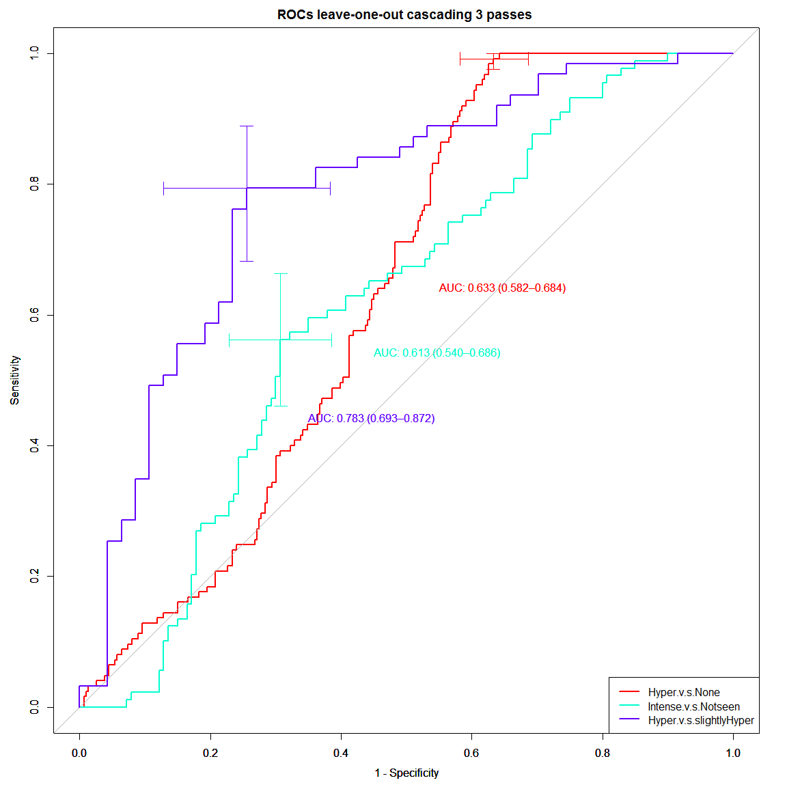

Predictor model of BIRADS T2w SI:
=============================
- This code creates a classifier based predictor of BIRADS T2w SI and add them to the pool of 55 T2w features for a total of 57 T2w featues


```
## Loading required package: lattice
## Loading required package: ggplot2
## Loading required package: DBI
## Loading required package: MASS
## Loading required package: rpart
## Loading required package: mlbench
## Type 'citation("pROC")' for a citation.
## 
## Attaching package: 'pROC'
## 
## The following objects are masked from 'package:stats':
## 
##     cov, smooth, var
```


```r
# read datasets
npatients = length(uniq_cad)
allf = read_T1T2uniqcad_parti(id_cad_pts, uniq_cad, allpartitionsetD, npatients, 1)
```

```
##    massB    massM nonmassB nonmassM 
##      242      166      142       76 
## nonmassM 
##        1
```

```r
## formant
allfeatures = rbind(allf[[1]], allf[[2]])
alllesioninfo = rbind(allf[[5]], allf[[6]])

### print number of total lesions 
# before was ##   C / NC = 140 / 132
print(summary(as.factor(allfeatures$orig_label)))
```

```
##    massB    massM nonmassB nonmassM 
##      242      166      142       77
```

```r
#######################
# format datasets with find_t2_signal_int as response variable
allfeaturest2_signal = cbind(allfeatures["find_t2_signal_int"], allfeatures[,2:ncol(allfeatures)])
allfeaturest2_signal = allfeaturest2_signal[-c(199,ncol(allfeatures))]

allfeaturest2_signal$find_t2_signal_int = as.factor(allfeaturest2_signal$find_t2_signal_int)
summary(allfeaturest2_signal$find_t2_signal_int)
```

```
##            Hyperintense Hypointense or not seen                    None 
##                      98                     152                     312 
##   Slightly hyperintense 
##                      65
```

```r
#######################
# Subset previuosly selected features
# for Boruta
borutasel = unique(zscore_selected[,2:3])
borutasel = borutasel[-grep("shadow",borutasel$selfeat),]
rrfsel = unique(allBIRADSfeatures[,c(1,3)])
```


Building final boosting tree classifier of Categorial predictor of RSI on T2w Levels: 
Hyperintense, Slightly hyperintense, Hypointensity, NO T2w SI
=======


```r
# collect parameters for bestuned boosting tree classifier of Categorial predictors
print(bestune_HyperNone)
```

```
##    x  y  acuTrain  rocTrain   acuTest   rocTest
## 5 20 10 0.8621908 0.9214522 0.6885246 0.7064516
```

```r
print(bestune_IntenseorNot)
```

```
##     x   y acuTrain rocTrain   acuTest   rocTest
## 39 10 400        1        1 0.6333333 0.7022222
```

```r
print(bestune_HyperorSlight)
```

```
##    x  y  acuTrain  rocTrain acuTest   rocTest
## 12 3 40 0.8445946 0.9820986     0.6 0.8888889
```

```r
ntrees_HyperNone = bestune_HyperNone$y
maxD_HyperNone = bestune_HyperNone$x
loperf_HyperNone = c()

ntrees_IntenseorNot = bestune_IntenseorNot$y
maxD_IntenseorNot = bestune_IntenseorNot$x
loperf_IntenseorNot = c()

ntrees_HyperorSlight = bestune_HyperorSlight$y
maxD_HyperorSlight = bestune_HyperorSlight$x
loperf_HyperorSlight = c()

npatients = length(uniq_cad)
dfinfoT2wSI_lop = data.frame()
perfT2wSI_lop = data.frame()
  
# perform leave-one-patient-out LMSIR prediction
for(k in 1:npatients){
  
  ## Create folds leave-one-patient-out
  allf = read_T1T2uniqcad_parti(id_cad_pts, uniq_cad, allpartitionsetD, npatients, k)
    
  ## formant
  Trainset = allf[[1]]; Trainsetinfo = allf[[5]]
  Testset = allf[[2]]; Testsetinfo = allf[[6]]
  dfinfo = cbind(Testsetinfo[,c(1,3,6:7,12,24:26)], Testset$find_t2_signal_int)
  print(dfinfo)
  Testset$id = Testsetinfo$lesion_id
  
  ##################################### pass 1 # option = feat_HyperNone
  Trainset_HyperNone = Trainset[,-c(1,ncol(Trainset))]
  Trainset_HyperNone$find_t2_signal_int = factor(ifelse(Trainset_HyperNone$find_t2_signal_int=="None","None","Intense"))
  
  # train forest
  T2wSIrf_HyperNone = rpart_forestTrain(ntrees_HyperNone, maxD_HyperNone, Trainset_HyperNone)
  # test
  perfF_HyperNone <- rpart_forestTest(ntrees_HyperNone, Trainset_HyperNone, Testset, T2wSIrf_HyperNone$forest)
  # perf
  accuHyperNone = perfF_HyperNone$etrain
  print(accuHyperNone)
  loperf_HyperNone = c(loperf_HyperNone, accuHyperNone)                      

  #####################################  pass 2 # option = feat_IntenseorNot 
  Trainset_IntenseorNot = Trainset[Trainset$find_t2_signal_int != "None", -c(1,ncol(Trainset))]
  Trainset_IntenseorNot$find_t2_signal_int = factor(ifelse(Trainset_IntenseorNot$find_t2_signal_int=="Hypointense or not seen",
                                                           "Hypointense or not seen","Intense"))
  
  # train forest
  T2wSIrf_IntenseorNot = rpart_forestTrain(ntrees_IntenseorNot, maxD_IntenseorNot, Trainset_IntenseorNot)
  # test
  perfF_IntenseorNot <- rpart_forestTest(ntrees_IntenseorNot, Trainset_IntenseorNot, Testset, T2wSIrf_IntenseorNot$forest)
  # perf
  accuIntenseorNot = perfF_IntenseorNot$etrain
  print(accuIntenseorNot)
  loperf_IntenseorNot = c(loperf_IntenseorNot, accuIntenseorNot)  

  ##################################### pass 3 # option = feat_HyperorSlight 
  Trainset_HyperorSlight = Trainset[Trainset$find_t2_signal_int != "None", -c(1,ncol(Trainset))]
  Trainset_HyperorSlight = Trainset_HyperorSlight[Trainset_HyperorSlight$find_t2_signal_int != "Hypointense or not seen", ]
  Trainset_HyperorSlight$find_t2_signal_int = as.factor(Trainset_HyperorSlight$find_t2_signal_int)
  summary(Trainset_HyperorSlight$find_t2_signal_int)
  
  # train forest
  T2wSIrf_HyperorSlight = rpart_forestTrain(ntrees_HyperorSlight, maxD_HyperorSlight, Trainset_HyperorSlight)
  # test
  perfF_HyperorSlight <- rpart_forestTest(ntrees_HyperorSlight, Trainset_HyperorSlight, Testset, T2wSIrf_HyperorSlight$forest)
  # perf
  accuHyperorSlight = perfF_HyperorSlight$etrain
  print(accuHyperorSlight)
  loperf_HyperorSlight = c(loperf_HyperorSlight, accuHyperorSlight)  

  
  ##################################### 
  # predict
  perf_cascade = data.frame()
  Testset_labels = factor(ifelse(Testset$find_t2_signal_int=="None","None","Intense"))
  # pass 1
  perf_pass1 = data.frame(id=Testset$id,
                          P=perfF_HyperNone$testprob[,1], N=perfF_HyperNone$testprob[,2],
                          obs=Testset$find_t2_signal_int,
                          pred=perfF_HyperNone$testprob$pred,
                          cascade_obs=Testset_labels,
                          pass="pass1")
  
  # collect those not passing
  notpassing = perf_pass1[perf_pass1$pred == "None",]
  perf_cascade = rbind(perf_cascade, notpassing)
  
  # select those passing
  Testset_pass1 = Testset[perf_pass1$pred == "Intense",]
  Testset_labels = factor(ifelse(Testset_pass1$find_t2_signal_int=="Hypointense or not seen","Hypointense or not seen","Intense"))
  # pass 2
  if(nrow(Testset_pass1) > 0){
    perfF_IntenseorNot <- rpart_forestTest(ntrees_IntenseorNot, Trainset_IntenseorNot, Testset_pass1, T2wSIrf_IntenseorNot$forest)
    perf_pass2 = data.frame(id=Testset_pass1$id,
                            P=perfF_IntenseorNot$testprob[,1], N=perfF_IntenseorNot$testprob[,2],
                            obs=Testset_pass1$find_t2_signal_int,
                            pred=perfF_IntenseorNot$testprob$pred,
                            cascade_obs=Testset_labels,
                            pass="pass2")
    
    # collect those not passing
    notpassing = perf_pass2[perf_pass2$pred == "Hypointense or not seen",]
    perf_cascade = rbind(perf_cascade, notpassing)
    # select those passing
    Testset_pass2 = Testset_pass1[perf_pass2$pred == "Intense",]
  }
  # pass 3
  if(nrow(Testset_pass2) > 0){
    perfF_HyperorSlight <- rpart_forestTest(ntrees_HyperorSlight, Trainset_HyperorSlight, Testset_pass2, T2wSIrf_HyperorSlight$forest)
    perf_pass3 = data.frame(id=Testset_pass2$id,
                            P=perfF_HyperorSlight$testprob[,1], N=perfF_HyperorSlight$testprob[,2],
                            obs=Testset_pass2$find_t2_signal_int,
                            pred=perfF_HyperorSlight$testprob$pred,
                            cascade_obs=Testset_pass2$find_t2_signal_int,
                            pass="pass3")
    
    # collect final
    perf_cascade = rbind(perf_cascade, perf_pass3)
  }
  cat("\n==========================\n")
  print(perf_cascade)
  perfT2wSI_lop = rbind(perfT2wSI_lop, perf_cascade)
  dfinfoT2wSI_lop = rbind(dfinfoT2wSI_lop, dfinfo)
  cat("\n==========================\n")
  
  ## pause  
  #cat ("Press [enter] to continue")
  #line <- readline()
}
```

```
##    massB    massM nonmassB nonmassM 
##      242      166      142       76 
## nonmassM 
##        1 
##   lesion_id cad_pt_no_txt exam_a_number_txt           exam_dt_datetime exam_find_side_int
## 1         1          0002           6745896 2011-04-03 00:00:00.000000              Right
##   BIRADS lesion_label lesion_diagnosis Testset$find_t2_signal_int
## 1      4     nonmassM     InsituDuctal                       None
## [1] 0.884984
## [1] 1
## [1] 0.8650307
## 
## ==========================
##   id         P         N  obs         pred cascade_obs  pass
## 1  1 0.5751906 0.4248094 None Hyperintense        None pass3
## 
## ==========================
##    massB    massM nonmassB nonmassM 
##      241      166      142       77 
## massB 
##     1 
##   lesion_id cad_pt_no_txt exam_a_number_txt           exam_dt_datetime exam_find_side_int
## 2         2          0016           6920252 2011-09-24 00:00:00.000000              Right
##   BIRADS lesion_label        lesion_diagnosis Testset$find_t2_signal_int
## 2      4        massB FLORID DUCT HYPERPLASIA      Slightly hyperintense
## [1] 0.8785942
## [1] 1
## [1] 0.8950617
## 
## ==========================
##   id         P         N                   obs                    pred cascade_obs  pass
## 1  2 0.6251164 0.3748836 Slightly hyperintense Hypointense or not seen     Intense pass2
## 
## ==========================
##    massB    massM nonmassB nonmassM 
##      242      166      141       77 
## nonmassB 
##        1 
##   lesion_id cad_pt_no_txt exam_a_number_txt           exam_dt_datetime exam_find_side_int
## 3         3          0025           7002835 2011-12-28 00:00:00.000000              Right
##   BIRADS lesion_label lesion_diagnosis Testset$find_t2_signal_int
## 3      4     nonmassB   DENSE FIBROSIS                       None
## [1] 0.8626198
## [1] 1
## [1] 0.8220859
## 
## ==========================
##   id         P         N  obs                    pred cascade_obs  pass
## 1  3 0.5858478 0.4141522 None Hypointense or not seen     Intense pass2
## 
## ==========================
##    massB    massM nonmassB nonmassM 
##      242      166      141       76 
## nonmassB nonmassM 
##        1        1 
##   lesion_id cad_pt_no_txt exam_a_number_txt           exam_dt_datetime exam_find_side_int
## 4         4          0027           7171944 2012-08-15 00:00:00.000000              Right
## 5         5          0027           6805483 2011-05-27 00:00:00.000000              Right
##   BIRADS lesion_label lesion_diagnosis Testset$find_t2_signal_int
## 4      4     nonmassB STROMAL FIBROSIS                       None
## 5      4     nonmassM     InsituDuctal                       None
## [1] 0.8896
## [1] 1
## [1] 0.8834356
## 
## ==========================
##    id         P         N  obs         pred cascade_obs  pass
## 2   5 0.4263885 0.5736115 None         None        None pass1
## 21  4 0.5393433 0.4606567 None Hyperintense        None pass3
## 
## ==========================
##    massB    massM nonmassB nonmassM 
##      241      166      141       77 
##    massB nonmassB 
##        1        1 
##   lesion_id cad_pt_no_txt exam_a_number_txt           exam_dt_datetime exam_find_side_int
## 6         6          0066           4583735 2008-02-17 00:00:00.000000              Right
## 7         7          0066           7556910 2013-10-12 00:00:00.000000              Right
##   BIRADS lesion_label     lesion_diagnosis Testset$find_t2_signal_int
## 6      3        massB BENIGN BREAST TISSUE    Hypointense or not seen
## 7      4     nonmassB       DENSE FIBROSIS                       None
## [1] 0.8928
## [1] 1
## [1] 0.9202454
## 
## ==========================
##   id         P         N                     obs                    pred
## 1  6 0.6617658 0.3382342 Hypointense or not seen Hypointense or not seen
## 2  7 0.6147507 0.3852493                    None Hypointense or not seen
##               cascade_obs  pass
## 1 Hypointense or not seen pass2
## 2                 Intense pass2
## 
## ==========================
##    massB    massM nonmassB nonmassM 
##      242      166      142       75 
## nonmassM 
##        2 
##   lesion_id cad_pt_no_txt exam_a_number_txt           exam_dt_datetime exam_find_side_int
## 8         8          0093           7156466 2012-10-16 00:00:00.000000               Left
## 9         9          0093           7156466 2012-10-16 00:00:00.000000               Left
##   BIRADS lesion_label lesion_diagnosis Testset$find_t2_signal_int
## 8      4     nonmassM   InvasiveDuctal                       None
## 9      4     nonmassM   InvasiveDuctal                       None
## [1] 0.8368
## [1] 1
## [1] 0.9079755
## 
## ==========================
##   id         P         N  obs pred cascade_obs  pass
## 1  8 0.4022524 0.5977476 None None        None pass1
## 2  9 0.4739500 0.5260500 None None        None pass1
## 
## ==========================
##    massB    massM nonmassB nonmassM 
##      241      166      142       77 
## massB 
##     1 
##    lesion_id cad_pt_no_txt exam_a_number_txt           exam_dt_datetime exam_find_side_int
## 10        10          0102           4755778 2009-03-19 00:00:00.000000              Right
##    BIRADS lesion_label lesion_diagnosis Testset$find_t2_signal_int
## 10      4        massB      FIBROCYSTIC               Hyperintense
## [1] 0.8482428
## [1] 1
## [1] 0.9135802
## 
## ==========================
##   id         P         N          obs         pred  cascade_obs  pass
## 1 10 0.5257095 0.4742905 Hyperintense Hyperintense Hyperintense pass3
## 
## ==========================
##    massB    massM nonmassB nonmassM 
##      242      166      141       77 
## nonmassB 
##        1 
##    lesion_id cad_pt_no_txt exam_a_number_txt           exam_dt_datetime exam_find_side_int
## 11        11          0111           6907205 2011-09-15 00:00:00.000000              Right
##    BIRADS lesion_label lesion_diagnosis Testset$find_t2_signal_int
## 11      4     nonmassB   DUCT PAPILLOMA    Hypointense or not seen
## [1] 0.8450479
## [1] 1
## [1] 0.9018405
## 
## ==========================
##   id         P         N                     obs         pred             cascade_obs  pass
## 1 11 0.6559386 0.3440614 Hypointense or not seen Hyperintense Hypointense or not seen pass3
## 
## ==========================
##    massB    massM nonmassB nonmassM 
##      242      165      142       77 
## massM 
##     1 
##    lesion_id cad_pt_no_txt exam_a_number_txt           exam_dt_datetime exam_find_side_int
## 12        12          0114           6896014 2011-10-02 00:00:00.000000              Right
##    BIRADS lesion_label lesion_diagnosis Testset$find_t2_signal_int
## 12      4        massM   InvasiveDuctal                       None
## [1] 0.8338658
## [1] 1
## [1] 0.8466258
## 
## ==========================
##   id         P         N                     obs         pred             cascade_obs  pass
## 1 12 0.4138559 0.5861441                    None         None                    None pass1
## 2 11 0.6707915 0.3292085 Hypointense or not seen Hyperintense Hypointense or not seen pass3
## 
## ==========================
##    massB    massM nonmassB nonmassM 
##      240      166      142       77 
## massB 
##     2 
##    lesion_id cad_pt_no_txt exam_a_number_txt           exam_dt_datetime exam_find_side_int
## 13        13          0121           6714524 2011-02-22 00:00:00.000000              Right
## 14        14          0121           7091267 2012-08-29 00:00:00.000000              Right
##    BIRADS lesion_label     lesion_diagnosis Testset$find_t2_signal_int
## 13      4        massB             ADENOSIS    Hypointense or not seen
## 14      4        massB BENIGN BREAST TISSUE               Hyperintense
## [1] 0.888
## [1] 1
## [1] 0.8518519
## 
## ==========================
##   id         P         N                     obs                    pred
## 1 13 0.5818217 0.4181783 Hypointense or not seen Hypointense or not seen
## 2 14 0.5191015 0.4808985            Hyperintense Hypointense or not seen
##               cascade_obs  pass
## 1 Hypointense or not seen pass2
## 2                 Intense pass2
## 
## ==========================
##    massB    massM nonmassB nonmassM 
##      241      166      142       77 
## massB 
##     1 
##    lesion_id cad_pt_no_txt exam_a_number_txt           exam_dt_datetime exam_find_side_int
## 15        15          0122           5108281 2009-12-14 00:00:00.000000              Right
##    BIRADS lesion_label lesion_diagnosis Testset$find_t2_signal_int
## 15      3        massB             Cyst                       None
## [1] 0.8977636
## [1] 1
## [1] 0.9018405
## 
## ==========================
##   id         P         N  obs         pred cascade_obs  pass
## 1 15 0.6843653 0.3156347 None Hyperintense        None pass3
## 
## ==========================
##    massB    massM nonmassB nonmassM 
##      242      166      140       77 
## nonmassB 
##        2 
##    lesion_id cad_pt_no_txt exam_a_number_txt           exam_dt_datetime exam_find_side_int
## 16        16          0123           6909758 2011-09-16 00:00:00.000000              Right
## 17        17          0123           6909758 2011-09-16 00:00:00.000000               Left
##    BIRADS lesion_label      lesion_diagnosis Testset$find_t2_signal_int
## 16      4     nonmassB COLUMNAR CELL CHANGES                       None
## 17      4     nonmassB  BENIGN BREAST TISSUE                       None
## [1] 0.864
## [1] 1
## [1] 0.8650307
## 
## ==========================
##   id         P         N  obs                    pred cascade_obs  pass
## 1 16 0.4254041 0.5745959 None                    None        None pass1
## 2 17 0.5419533 0.4580467 None Hypointense or not seen     Intense pass2
## 
## ==========================
##    massB    massM nonmassB nonmassM 
##      242      166      141       77 
## nonmassB 
##        1 
##    lesion_id cad_pt_no_txt exam_a_number_txt           exam_dt_datetime exam_find_side_int
## 18        18          0127           4696964 2008-09-11 00:00:00.000000               Left
##    BIRADS lesion_label lesion_diagnosis Testset$find_t2_signal_int
## 18      4     nonmassB     FIBROADENOMA               Hyperintense
## [1] 0.9009585
## [1] 1
## [1] 0.8765432
## 
## ==========================
##   id         P         N          obs                    pred cascade_obs  pass
## 1 18 0.5338326 0.4661674 Hyperintense Hypointense or not seen     Intense pass2
## 
## ==========================
##    massB    massM nonmassB nonmassM 
##      241      166      142       77 
## massB 
##     1 
##    lesion_id cad_pt_no_txt exam_a_number_txt           exam_dt_datetime exam_find_side_int
## 19        19          0129           5326737 2010-07-17 00:00:00.000000               Left
##    BIRADS lesion_label     lesion_diagnosis Testset$find_t2_signal_int
## 19      4        massB BENIGN BREAST TISSUE               Hyperintense
## [1] 0.8801917
## [1] 1
## [1] 0.8765432
## 
## ==========================
##   id         P         N          obs pred cascade_obs  pass
## 1 19 0.3152953 0.6847047 Hyperintense None     Intense pass1
## 
## ==========================
##    massB    massM nonmassB nonmassM 
##      239      166      142       77 
## massB 
##     3 
##    lesion_id cad_pt_no_txt exam_a_number_txt           exam_dt_datetime exam_find_side_int
## 20        20          0130           5017534 2010-03-29 00:00:00.000000               Left
## 21        21          0130           5017534 2010-03-29 00:00:00.000000               Left
## 22        22          0130           7347205 2013-05-05 00:00:00.000000              Right
##    BIRADS lesion_label             lesion_diagnosis Testset$find_t2_signal_int
## 20      2        massB ATYPICAL LOBULAR HYPERPLASIA               Hyperintense
## 21      2        massB ATYPICAL LOBULAR HYPERPLASIA               Hyperintense
## 22      4        massB ATYPICAL LOBULAR HYPERPLASIA    Hypointense or not seen
## [1] 0.9214744
## [1] 1
## [1] 0.9440994
## 
## ==========================
##    id         P         N                     obs                    pred
## 2  21 0.4957063 0.5042937            Hyperintense                    None
## 21 22 0.5989648 0.4010352 Hypointense or not seen Hypointense or not seen
## 3  20 0.4887246 0.5112754            Hyperintense   Slightly hyperintense
##                cascade_obs  pass
## 2                  Intense pass1
## 21 Hypointense or not seen pass2
## 3             Hyperintense pass3
## 
## ==========================
##    massB    massM nonmassB nonmassM 
##      240      166      142       77 
## massB 
##     2 
##    lesion_id cad_pt_no_txt exam_a_number_txt           exam_dt_datetime exam_find_side_int
## 23        23          0132           5154279 2010-04-08 00:00:00.000000              Right
## 24        24          0132           5154279 2010-04-08 00:00:00.000000              Right
##    BIRADS lesion_label     lesion_diagnosis Testset$find_t2_signal_int
## 23      3        massB BENIGN BREAST TISSUE               Hyperintense
## 24      3        massB BENIGN BREAST TISSUE               Hyperintense
## [1] 0.8496
## [1] 1
## [1] 0.863354
## 
## ==========================
##    id         P         N          obs         pred  cascade_obs  pass
## 2  24 0.4937113 0.5062887 Hyperintense         None      Intense pass1
## 21 23 0.5330691 0.4669309 Hyperintense Hyperintense Hyperintense pass3
## 
## ==========================
##    massB    massM nonmassB nonmassM 
##      241      166      142       77 
## massB 
##     1 
##    lesion_id cad_pt_no_txt exam_a_number_txt           exam_dt_datetime exam_find_side_int
## 25        25          0133           7072006 2012-03-10 00:00:00.000000               Left
##    BIRADS lesion_label lesion_diagnosis Testset$find_t2_signal_int
## 25      4        massB      FIBROCYSTIC    Hypointense or not seen
## [1] 0.8817891
## [1] 1
## [1] 0.8773006
## 
## ==========================
##   id         P         N                     obs         pred             cascade_obs  pass
## 1 25 0.6422157 0.3577843 Hypointense or not seen Hyperintense Hypointense or not seen pass3
## 
## ==========================
##    massB    massM nonmassB nonmassM 
##      241      166      141       77 
##    massB nonmassB 
##        1        1 
##    lesion_id cad_pt_no_txt exam_a_number_txt           exam_dt_datetime exam_find_side_int
## 26        26          0135           7777131 2014-05-17 00:00:00.000000              Right
## 27        27          0135           5083620 2010-07-19 00:00:00.000000              Right
##    BIRADS lesion_label lesion_diagnosis Testset$find_t2_signal_int
## 26      4        massB      FIBROCYSTIC                       None
## 27      4     nonmassB      FIBROCYSTIC    Hypointense or not seen
## [1] 0.8256
## [1] 1
## [1] 0.9202454
## 
## ==========================
##   id         P         N                     obs         pred             cascade_obs  pass
## 1 26 0.4203876 0.5796124                    None         None                    None pass1
## 2 27 0.3052469 0.6947531 Hypointense or not seen         None                 Intense pass1
## 3 25 0.5887214 0.4112786 Hypointense or not seen Hyperintense Hypointense or not seen pass3
## 
## ==========================
##    massB    massM nonmassB nonmassM 
##      241      166      142       77 
## massB 
##     1 
##    lesion_id cad_pt_no_txt exam_a_number_txt           exam_dt_datetime exam_find_side_int
## 29        29          0168           5240535 2010-04-12 00:00:00.000000               Left
##    BIRADS lesion_label lesion_diagnosis Testset$find_t2_signal_int
## 29      4        massB      FIBROCYSTIC                       None
## [1] 0.8690096
## [1] 1
## [1] 0.9325153
## 
## ==========================
##   id         P         N                     obs         pred             cascade_obs  pass
## 1 29 0.4831808 0.5168192                    None         None                    None pass1
## 2 25 0.7125438 0.2874562 Hypointense or not seen Hyperintense Hypointense or not seen pass3
## 
## ==========================
##    massB    massM nonmassB nonmassM 
##      242      165      142       77 
## massM 
##     1 
##    lesion_id cad_pt_no_txt exam_a_number_txt           exam_dt_datetime exam_find_side_int
## 30        30          0171           4751079 2009-02-22 00:00:00.000000               Left
##    BIRADS lesion_label lesion_diagnosis Testset$find_t2_signal_int
## 30      4        massM     InsituDuctal    Hypointense or not seen
## [1] 0.8945687
## [1] 1
## [1] 0.9386503
## 
## ==========================
##   id         P         N                     obs         pred             cascade_obs  pass
## 1 30 0.3762138 0.6237862 Hypointense or not seen         None                 Intense pass1
## 2 25 0.6424905 0.3575095 Hypointense or not seen Hyperintense Hypointense or not seen pass3
## 
## ==========================
##    massB    massM nonmassB nonmassM 
##      241      166      142       77 
## massB 
##     1 
##    lesion_id cad_pt_no_txt exam_a_number_txt           exam_dt_datetime exam_find_side_int
## 31        31          0172           4703102 2008-08-24 00:00:00.000000               Left
##    BIRADS lesion_label lesion_diagnosis Testset$find_t2_signal_int
## 31      4        massB      FIBROCYSTIC                       None
## [1] 0.8753994
## [1] 1
## [1] 0.9263804
## 
## ==========================
##   id         P         N                     obs         pred             cascade_obs  pass
## 1 31 0.4130177 0.5869823                    None         None                    None pass1
## 2 25 0.6413632 0.3586368 Hypointense or not seen Hyperintense Hypointense or not seen pass3
## 
## ==========================
##    massB    massM nonmassB nonmassM 
##      242      166      141       77 
## nonmassB 
##        1 
##    lesion_id cad_pt_no_txt exam_a_number_txt           exam_dt_datetime exam_find_side_int
## 32        32          0173           5123923 2009-11-30 00:00:00.000000              Right
##    BIRADS lesion_label lesion_diagnosis Testset$find_t2_signal_int
## 32      4     nonmassB   DUCT PAPILLOMA                       None
## [1] 0.8865815
## [1] 1
## [1] 0.8957055
## 
## ==========================
##   id         P         N                     obs         pred             cascade_obs  pass
## 1 32 0.3356315 0.6643685                    None         None                    None pass1
## 2 25 0.6760355 0.3239645 Hypointense or not seen Hyperintense Hypointense or not seen pass3
## 
## ==========================
##    massB    massM nonmassB nonmassM 
##      242      165      142       76 
##    massM nonmassM 
##        1        1 
##    lesion_id cad_pt_no_txt exam_a_number_txt           exam_dt_datetime exam_find_side_int
## 33        33          0177           6996979 2011-12-09 00:00:00.000000               Left
## 34        34          0177           6996979 2011-12-09 00:00:00.000000               Left
##    BIRADS lesion_label lesion_diagnosis Testset$find_t2_signal_int
## 33      3        massM     InsituDuctal      Slightly hyperintense
## 34      3     nonmassM     InsituDuctal                       None
## [1] 0.8432
## [1] 1
## [1] 0.9135802
## 
## ==========================
##    id         P         N                   obs                    pred cascade_obs  pass
## 2  34 0.4203940 0.5796060                  None                    None        None pass1
## 21 33 0.6478318 0.3521682 Slightly hyperintense Hypointense or not seen     Intense pass2
## 
## ==========================
##    massB    massM nonmassB nonmassM 
##      242      166      140       77 
## nonmassB 
##        2 
##    lesion_id cad_pt_no_txt exam_a_number_txt           exam_dt_datetime exam_find_side_int
## 35        35          0180           4632561 2008-10-25 00:00:00.000000               Left
## 36        36          0180           5254957 2010-12-14 00:00:00.000000               Left
##    BIRADS lesion_label     lesion_diagnosis Testset$find_t2_signal_int
## 35      4     nonmassB BENIGN BREAST TISSUE    Hypointense or not seen
## 36      4     nonmassB         FIBROADENOMA    Hypointense or not seen
## [1] 0.8896
## [1] 1
## [1] 0.9141104
## 
## ==========================
##   id         P         N                     obs pred cascade_obs  pass
## 1 35 0.4613022 0.5386978 Hypointense or not seen None     Intense pass1
## 2 36 0.2440907 0.7559093 Hypointense or not seen None     Intense pass1
## 
## ==========================
##    massB    massM nonmassB nonmassM 
##      242      166      142       76 
## nonmassM 
##        1 
##    lesion_id cad_pt_no_txt exam_a_number_txt           exam_dt_datetime exam_find_side_int
## 37        37          0186           6869828 2011-08-02 00:00:00.000000               Left
##    BIRADS lesion_label lesion_diagnosis Testset$find_t2_signal_int
## 37      4     nonmassM     InsituDuctal                       None
## [1] 0.8290735
## [1] 1
## [1] 0.8834356
## 
## ==========================
##   id         P         N  obs pred cascade_obs  pass
## 1 37 0.4492465 0.5507535 None None        None pass1
## 
## ==========================
##    massB    massM nonmassB nonmassM 
##      242      166      141       77 
## nonmassB 
##        1 
##    lesion_id cad_pt_no_txt exam_a_number_txt           exam_dt_datetime exam_find_side_int
## 38        38          0189           5057674 2009-10-10 00:00:00.000000               Left
##    BIRADS lesion_label    lesion_diagnosis Testset$find_t2_signal_int
## 38      4     nonmassB SCLEROSING ADENOSIS    Hypointense or not seen
## [1] 0.8578275
## [1] 1
## [1] 0.8834356
## 
## ==========================
##   id         P         N                     obs         pred             cascade_obs  pass
## 1 38 0.5216832 0.4783168 Hypointense or not seen Hyperintense Hypointense or not seen pass3
## 
## ==========================
##    massB    massM nonmassB nonmassM 
##      241      166      142       77 
## massB 
##     1 
##    lesion_id cad_pt_no_txt exam_a_number_txt           exam_dt_datetime exam_find_side_int
## 39        39          0103           6836585 2011-06-26 00:00:00.000000               Left
##    BIRADS lesion_label lesion_diagnosis Testset$find_t2_signal_int
## 39      5        massB  PHYLLODES TUMOR                       None
## [1] 0.8913738
## [1] 1
## [1] 0.8895706
## 
## ==========================
##   id         P         N                     obs                  pred             cascade_obs
## 1 39 0.3269641 0.6730359                    None                  None                    None
## 2 38 0.4922131 0.5077869 Hypointense or not seen Slightly hyperintense Hypointense or not seen
##    pass
## 1 pass1
## 2 pass3
## 
## ==========================
##    massB    massM nonmassB nonmassM 
##      242      165      142       76 
##    massM nonmassM 
##        1        1 
##    lesion_id cad_pt_no_txt exam_a_number_txt           exam_dt_datetime exam_find_side_int
## 40        40          0190           6760690 2011-04-12 00:00:00.000000              Right
## 41        41          0190           6760690 2011-04-12 00:00:00.000000              Right
##    BIRADS lesion_label lesion_diagnosis Testset$find_t2_signal_int
## 40      4        massM   InvasiveDuctal                       None
## 41      4     nonmassM   InvasiveDuctal                       None
## [1] 0.8512
## [1] 1
## [1] 0.9202454
## 
## ==========================
##   id         P         N  obs         pred cascade_obs  pass
## 1 40 0.4411217 0.5588783 None         None        None pass1
## 2 41 0.5717504 0.4282496 None Hyperintense        None pass3
## 
## ==========================
##    massB    massM nonmassB nonmassM 
##      242      166      139       77 
## nonmassB 
##        3 
##    lesion_id cad_pt_no_txt exam_a_number_txt           exam_dt_datetime exam_find_side_int
## 42        42          0196           5289117 2010-11-29 00:00:00.000000              Right
## 43        43          0196           5289117 2010-11-29 00:00:00.000000               Left
## 44        44          0196           5289117 2010-11-29 00:00:00.000000               Left
##    BIRADS lesion_label           lesion_diagnosis Testset$find_t2_signal_int
## 42      4     nonmassB        SCLEROSING ADENOSIS    Hypointense or not seen
## 43      4     nonmassB ColumnarAlterationwoAtypia                       None
## 44      4     nonmassB ColumnarAlterationwoAtypia    Hypointense or not seen
## [1] 0.875
## [1] 1
## [1] 0.9202454
## 
## ==========================
##   id         P         N                     obs                    pred
## 1 42 0.3870342 0.6129658 Hypointense or not seen                    None
## 2 43 0.6022651 0.3977349                    None Hypointense or not seen
## 3 44 0.5400628 0.4599372 Hypointense or not seen Hypointense or not seen
##               cascade_obs  pass
## 1                 Intense pass1
## 2                 Intense pass2
## 3 Hypointense or not seen pass2
## 
## ==========================
##    massB    massM nonmassB nonmassM 
##      241      166      140       77 
##    massB nonmassB 
##        1        2 
##    lesion_id cad_pt_no_txt exam_a_number_txt           exam_dt_datetime exam_find_side_int
## 45        45          0197           6667696 2011-05-10 00:00:00.000000              Right
## 46        46          0197           6667696 2011-05-10 00:00:00.000000              Right
## 47        47          0197           6667696 2011-05-10 00:00:00.000000              Right
##    BIRADS lesion_label   lesion_diagnosis Testset$find_t2_signal_int
## 45      4     nonmassB LobularHyperplasia    Hypointense or not seen
## 46      4     nonmassB LobularHyperplasia    Hypointense or not seen
## 47      4        massB LobularHyperplasia      Slightly hyperintense
## [1] 0.8141026
## [1] 1
## [1] 0.8641975
## 
## ==========================
##    id         P         N                     obs         pred             cascade_obs  pass
## 3  47 0.4372258 0.5627742   Slightly hyperintense         None                 Intense pass1
## 2  45 0.7234851 0.2765149 Hypointense or not seen Hyperintense Hypointense or not seen pass3
## 31 46 0.7241877 0.2758123 Hypointense or not seen Hyperintense Hypointense or not seen pass3
## 
## ==========================
##    massB    massM nonmassB nonmassM 
##      240      166      142       77 
## massB 
##     2 
##    lesion_id cad_pt_no_txt exam_a_number_txt           exam_dt_datetime exam_find_side_int
## 48        48          0198           4809893 2009-05-03 00:00:00.000000               Left
## 49        49          0198           4809893 2009-05-03 00:00:00.000000              Right
##    BIRADS lesion_label lesion_diagnosis Testset$find_t2_signal_int
## 48      2        massB      FIBROCYSTIC                       None
## 49      2        massB     FIBROADENOMA                       None
## [1] 0.8688
## [1] 1
## [1] 0.9018405
## 
## ==========================
##   id         P         N  obs         pred cascade_obs  pass
## 1 48 0.5590678 0.4409322 None Hyperintense        None pass3
## 2 49 0.5153452 0.4846548 None Hyperintense        None pass3
## 
## ==========================
##    massB    massM nonmassB nonmassM 
##      241      166      142       77 
## massB 
##     1 
##    lesion_id cad_pt_no_txt exam_a_number_txt           exam_dt_datetime exam_find_side_int
## 50        50          0199           4362726 2007-05-18 00:00:00.000000               Left
##    BIRADS lesion_label             lesion_diagnosis Testset$find_t2_signal_int
## 50      4        massB ATYPICAL LOBULAR HYPERPLASIA               Hyperintense
## [1] 0.8753994
## [1] 1
## [1] 0.8888889
## 
## ==========================
##   id         P         N          obs         pred  cascade_obs  pass
## 1 50 0.6026742 0.3973258 Hyperintense Hyperintense Hyperintense pass3
## 
## ==========================
##    massB    massM nonmassB nonmassM 
##      241      166      142       77 
## massB 
##     1 
##    lesion_id cad_pt_no_txt exam_a_number_txt           exam_dt_datetime exam_find_side_int
## 51        51          0205           5085133 2010-04-17 00:00:00.000000               Left
##    BIRADS lesion_label lesion_diagnosis Testset$find_t2_signal_int
## 51      4        massB  FIBROEPITHELIAL               Hyperintense
## [1] 0.8658147
## [1] 1
## [1] 0.9074074
## 
## ==========================
##   id         P         N          obs                    pred cascade_obs  pass
## 1 51 0.5237733 0.4762267 Hyperintense Hypointense or not seen     Intense pass2
## 
## ==========================
##    massB    massM nonmassB nonmassM 
##      241      166      142       77 
## massB 
##     1 
##    lesion_id cad_pt_no_txt exam_a_number_txt           exam_dt_datetime exam_find_side_int
## 52        52          0207           4982884 2009-11-09 00:00:00.000000              Right
##    BIRADS lesion_label lesion_diagnosis Testset$find_t2_signal_int
## 52      4        massB         FIBROSIS                       None
## [1] 0.8738019
## [1] 1
## [1] 0.9141104
## 
## ==========================
##   id        P        N  obs         pred cascade_obs  pass
## 1 52 0.535331 0.464669 None Hyperintense        None pass3
## 
## ==========================
##    massB    massM nonmassB nonmassM 
##      241      166      142       77 
## massB 
##     1 
##    lesion_id cad_pt_no_txt exam_a_number_txt           exam_dt_datetime exam_find_side_int
## 53        53          0212           4734525 2008-09-08 00:00:00.000000               Left
##    BIRADS lesion_label lesion_diagnosis Testset$find_t2_signal_int
## 53      4        massB     FIBROADENOMA               Hyperintense
## [1] 0.899361
## [1] 1
## [1] 0.8950617
## 
## ==========================
##   id         P         N          obs         pred  cascade_obs  pass
## 1 53 0.6463673 0.3536327 Hyperintense Hyperintense Hyperintense pass3
## 
## ==========================
##    massB    massM nonmassB nonmassM 
##      240      166      142       77 
## massB 
##     2 
##    lesion_id cad_pt_no_txt exam_a_number_txt           exam_dt_datetime exam_find_side_int
## 54        54          0220           6715021 2011-02-22 00:00:00.000000              Right
## 55        55          0220           6715021 2011-02-22 00:00:00.000000              Right
##    BIRADS lesion_label lesion_diagnosis Testset$find_t2_signal_int
## 54      5        massB       RadialScar      Slightly hyperintense
## 55      5        massB     FIBROADENOMA      Slightly hyperintense
## [1] 0.8768
## [1] 1
## [1] 0.8136646
## 
## ==========================
##    id         P         N                   obs                    pred           cascade_obs
## 2  55 0.5289930 0.4710070 Slightly hyperintense Hypointense or not seen               Intense
## 21 54 0.5139704 0.4860296 Slightly hyperintense            Hyperintense Slightly hyperintense
##     pass
## 2  pass2
## 21 pass3
## 
## ==========================
##    massB    massM nonmassB nonmassM 
##      242      166      141       77 
## nonmassB 
##        1 
##    lesion_id cad_pt_no_txt exam_a_number_txt           exam_dt_datetime exam_find_side_int
## 56        56          0229           6831376 2011-06-15 00:00:00.000000               Left
##    BIRADS lesion_label lesion_diagnosis Testset$find_t2_signal_int
## 56      5     nonmassB      FIBROCYSTIC                       None
## [1] 0.8833866
## [1] 1
## [1] 0.9018405
## 
## ==========================
##   id         P         N                   obs                  pred           cascade_obs
## 1 56 0.2774343 0.7225657                  None                  None                  None
## 2 54 0.4531210 0.5468790 Slightly hyperintense Slightly hyperintense Slightly hyperintense
##    pass
## 1 pass1
## 2 pass3
## 
## ==========================
##    massB    massM nonmassB nonmassM 
##      242      166      140       77 
## nonmassB 
##        2 
##    lesion_id cad_pt_no_txt exam_a_number_txt           exam_dt_datetime exam_find_side_int
## 57        57          0232           6671713 2011-01-11 00:00:00.000000              Right
## 58        58          0232           6671713 2011-01-11 00:00:00.000000              Right
##    BIRADS lesion_label lesion_diagnosis Testset$find_t2_signal_int
## 57      5     nonmassB      FIBROCYSTIC                       None
## 58      5     nonmassB      FIBROCYSTIC                       None
## [1] 0.8384
## [1] 1
## [1] 0.9386503
## 
## ==========================
##   id         P         N                   obs                  pred           cascade_obs
## 1 57 0.3613308 0.6386692                  None                  None                  None
## 2 58 0.3577687 0.6422313                  None                  None                  None
## 3 54 0.4731080 0.5268920 Slightly hyperintense Slightly hyperintense Slightly hyperintense
##    pass
## 1 pass1
## 2 pass1
## 3 pass3
## 
## ==========================
##    massB    massM nonmassB nonmassM 
##      241      166      142       77 
## massB 
##     1 
##    lesion_id cad_pt_no_txt exam_a_number_txt           exam_dt_datetime exam_find_side_int
## 59        59          0246           7485590 2013-05-14 00:00:00.000000              Right
##    BIRADS lesion_label     lesion_diagnosis Testset$find_t2_signal_int
## 59      4        massB BENIGN BREAST TISSUE               Hyperintense
## [1] 0.85623
## [1] 1
## [1] 0.8950617
## 
## ==========================
##   id         P         N                   obs                  pred           cascade_obs
## 1 59 0.4999982 0.5000018          Hyperintense                  None               Intense
## 2 54 0.4539264 0.5460736 Slightly hyperintense Slightly hyperintense Slightly hyperintense
##    pass
## 1 pass1
## 2 pass3
## 
## ==========================
##    massB    massM nonmassB nonmassM 
##      239      166      141       77 
##    massB nonmassB 
##        3        1 
##    lesion_id cad_pt_no_txt exam_a_number_txt           exam_dt_datetime exam_find_side_int
## 60        60          0252           5142106 2009-12-04 00:00:00.000000              Right
## 61        61          0252           5142106 2009-12-04 00:00:00.000000               Left
## 62        62          0252           6700964 2011-07-18 00:00:00.000000               Left
## 63        63          0252           6700964 2011-07-18 00:00:00.000000               Left
##    BIRADS lesion_label     lesion_diagnosis Testset$find_t2_signal_int
## 60      4        massB         FIBROADENOMA    Hypointense or not seen
## 61      4        massB         FIBROADENOMA    Hypointense or not seen
## 62      3     nonmassB BENIGN BREAST TISSUE    Hypointense or not seen
## 63      3        massB BENIGN BREAST TISSUE               Hyperintense
## [1] 0.8731942
## [1] 1
## [1] 0.9135802
## 
## ==========================
##    id         P         N                     obs         pred             cascade_obs  pass
## 3  62 0.3732340 0.6267660 Hypointense or not seen         None                 Intense pass1
## 2  60 0.5875274 0.4124726 Hypointense or not seen Hyperintense Hypointense or not seen pass3
## 31 61 0.5108873 0.4891127 Hypointense or not seen Hyperintense Hypointense or not seen pass3
## 4  63 0.5756607 0.4243393            Hyperintense Hyperintense            Hyperintense pass3
## 
## ==========================
##    massB    massM nonmassB nonmassM 
##      242      166      141       77 
## nonmassB 
##        1 
##    lesion_id cad_pt_no_txt exam_a_number_txt           exam_dt_datetime exam_find_side_int
## 65        65          0259           7364573 2013-02-02 00:00:00.000000                 NA
##    BIRADS lesion_label     lesion_diagnosis Testset$find_t2_signal_int
## 65      2     nonmassB BENIGN BREAST TISSUE                       None
## [1] 0.8769968
## [1] 1
## [1] 0.9079755
## 
## ==========================
##   id         P         N  obs                    pred cascade_obs  pass
## 1 65 0.5397451 0.4602549 None Hypointense or not seen     Intense pass2
## 
## ==========================
##    massB    massM nonmassB nonmassM 
##      242      166      141       77 
## nonmassB 
##        1 
##    lesion_id cad_pt_no_txt exam_a_number_txt           exam_dt_datetime exam_find_side_int
## 66        66          0266           5254958 2010-07-16 00:00:00.000000              Right
##    BIRADS lesion_label lesion_diagnosis Testset$find_t2_signal_int
## 66      4     nonmassB      FIBROCYSTIC    Hypointense or not seen
## [1] 0.8769968
## [1] 1
## [1] 0.8895706
## 
## ==========================
##   id         P         N                     obs         pred             cascade_obs  pass
## 1 66 0.6636657 0.3363343 Hypointense or not seen Hyperintense Hypointense or not seen pass3
## 
## ==========================
##    massB    massM nonmassB nonmassM 
##      242      164      142       77 
## massM 
##     2 
##    lesion_id cad_pt_no_txt exam_a_number_txt           exam_dt_datetime exam_find_side_int
## 67        67          0276           6952525 2011-12-31 00:00:00.000000              Right
## 68        68          0276           6952525 2011-12-31 00:00:00.000000              Right
##    BIRADS lesion_label lesion_diagnosis Testset$find_t2_signal_int
## 67      4        massM   InvasiveDuctal      Slightly hyperintense
## 68      4        massM   InvasiveDuctal      Slightly hyperintense
## [1] 0.8928
## [1] 1
## [1] 0.9192547
## 
## ==========================
##   id         P         N                   obs         pred           cascade_obs  pass
## 1 67 0.4945197 0.5054803 Slightly hyperintense         None               Intense pass1
## 2 68 0.6039283 0.3960717 Slightly hyperintense Hyperintense Slightly hyperintense pass3
## 
## ==========================
##    massB    massM nonmassB nonmassM 
##      242      166      142       76 
## nonmassM 
##        1 
##    lesion_id cad_pt_no_txt exam_a_number_txt           exam_dt_datetime exam_find_side_int
## 69        69          0277           5077098 2009-09-22 00:00:00.000000               Left
##    BIRADS lesion_label lesion_diagnosis Testset$find_t2_signal_int
## 69      5     nonmassM     InsituDuctal    Hypointense or not seen
## [1] 0.870607
## [1] 1
## [1] 0.9263804
## 
## ==========================
##   id         P         N                     obs                    pred
## 1 69 0.5152729 0.4847271 Hypointense or not seen Hypointense or not seen
##               cascade_obs  pass
## 1 Hypointense or not seen pass2
## 
## ==========================
##    massB    massM nonmassB nonmassM 
##      241      166      142       77 
## massB 
##     1 
##    lesion_id cad_pt_no_txt exam_a_number_txt           exam_dt_datetime exam_find_side_int
## 70        70          0280           5091695 2009-12-07 00:00:00.000000               Left
##    BIRADS lesion_label     lesion_diagnosis Testset$find_t2_signal_int
## 70      4        massB BENIGN BREAST TISSUE                       None
## [1] 0.870607
## [1] 1
## [1] 0.9263804
## 
## ==========================
##   id         P         N  obs                  pred cascade_obs  pass
## 1 70 0.4754077 0.5245923 None Slightly hyperintense        None pass3
## 
## ==========================
##    massB    massM nonmassB nonmassM 
##      242      166      141       77 
## nonmassB 
##        1 
##    lesion_id cad_pt_no_txt exam_a_number_txt           exam_dt_datetime exam_find_side_int
## 72        72          0293           7491268 2013-06-09 00:00:00.000000                 NA
##    BIRADS lesion_label     lesion_diagnosis Testset$find_t2_signal_int
## 72      4     nonmassB BENIGN BREAST TISSUE                       None
## [1] 0.8801917
## [1] 1
## [1] 0.9018405
## 
## ==========================
##   id         P         N  obs         pred cascade_obs  pass
## 1 72 0.6053518 0.3946482 None Hyperintense        None pass3
## 
## ==========================
##    massB    massM nonmassB nonmassM 
##      241      166      142       77 
## massB 
##     1 
##    lesion_id cad_pt_no_txt exam_a_number_txt           exam_dt_datetime exam_find_side_int
## 73        73          0311           6677243 2011-01-10 00:00:00.000000               Left
##    BIRADS lesion_label lesion_diagnosis Testset$find_t2_signal_int
## 73      4        massB     FIBROADENOMA                       None
## [1] 0.8626198
## [1] 1
## [1] 0.9263804
## 
## ==========================
##   id         P         N  obs                    pred cascade_obs  pass
## 1 73 0.5584626 0.4415374 None Hypointense or not seen     Intense pass2
## 
## ==========================
##    massB    massM nonmassB nonmassM 
##      241      166      142       77 
## massB 
##     1 
##    lesion_id cad_pt_no_txt exam_a_number_txt           exam_dt_datetime exam_find_side_int
## 74        74          0325           4696948 2008-12-01 00:00:00.000000              Right
##    BIRADS lesion_label lesion_diagnosis Testset$find_t2_signal_int
## 74      4        massB      FIBROCYSTIC               Hyperintense
## [1] 0.8753994
## [1] 1
## [1] 0.8888889
## 
## ==========================
##   id         P         N          obs                    pred cascade_obs  pass
## 1 74 0.5438944 0.4561056 Hyperintense Hypointense or not seen     Intense pass2
## 
## ==========================
##    massB    massM nonmassB nonmassM 
##      239      166      142       77 
## massB 
##     3 
##    lesion_id cad_pt_no_txt exam_a_number_txt           exam_dt_datetime exam_find_side_int
## 75        75          0331           4722659 2009-01-24 00:00:00.000000               Left
## 76        76          0331           7347095 2013-02-16 00:00:00.000000               Left
## 77        77          0331           7347095 2013-02-16 00:00:00.000000               Left
##    BIRADS lesion_label     lesion_diagnosis Testset$find_t2_signal_int
## 75      2        massB          FIBROCYSTIC                       None
## 76      4        massB          FIBROCYSTIC               Hyperintense
## 77      4        massB capillary hemangioma                       None
## [1] 0.8830128
## [1] 1
## [1] 0.9444444
## 
## ==========================
##   id         P         N          obs         pred  cascade_obs  pass
## 1 75 0.4649492 0.5350508         None         None         None pass1
## 2 76 0.6278598 0.3721402 Hyperintense Hyperintense Hyperintense pass3
## 3 77 0.5871317 0.4128683         None Hyperintense         None pass3
## 
## ==========================
##    massB    massM nonmassB nonmassM 
##      241      166      142       77 
## massB 
##     1 
##    lesion_id cad_pt_no_txt exam_a_number_txt           exam_dt_datetime exam_find_side_int
## 78        78          0352           4785776 2009-01-19 00:00:00.000000              Right
##    BIRADS lesion_label lesion_diagnosis Testset$find_t2_signal_int
## 78      4        massB     FIBROADENOMA      Slightly hyperintense
## [1] 0.8674121
## [1] 1
## [1] 0.9012346
## 
## ==========================
##   id         P         N                   obs         pred           cascade_obs  pass
## 1 78 0.5335101 0.4664899 Slightly hyperintense Hyperintense Slightly hyperintense pass3
## 
## ==========================
##    massB    massM nonmassB nonmassM 
##      242      166      141       77 
## nonmassB 
##        1 
##    lesion_id cad_pt_no_txt exam_a_number_txt           exam_dt_datetime exam_find_side_int
## 79        79          0357           5137030 2009-12-15 00:00:00.000000               Left
##    BIRADS lesion_label lesion_diagnosis Testset$find_t2_signal_int
## 79      4     nonmassB      FIBROCYSTIC    Hypointense or not seen
## [1] 0.8594249
## [1] 1
## [1] 0.9141104
## 
## ==========================
##   id         P         N                     obs                    pred
## 1 79 0.5071017 0.4928983 Hypointense or not seen Hypointense or not seen
##               cascade_obs  pass
## 1 Hypointense or not seen pass2
## 
## ==========================
##    massB    massM nonmassB nonmassM 
##      241      166      142       77 
## massB 
##     1 
##    lesion_id cad_pt_no_txt exam_a_number_txt           exam_dt_datetime exam_find_side_int
## 80        80          0376           4609403 2008-04-04 00:00:00.000000               Left
##    BIRADS lesion_label lesion_diagnosis Testset$find_t2_signal_int
## 80      4        massB BENIGN HAMARTOMA      Slightly hyperintense
## [1] 0.8817891
## [1] 1
## [1] 0.8765432
## 
## ==========================
##   id         P         N                   obs pred cascade_obs  pass
## 1 80 0.4755507 0.5244493 Slightly hyperintense None     Intense pass1
## 
## ==========================
##    massB    massM nonmassB nonmassM 
##      242      165      142       77 
## massM 
##     1 
##    lesion_id cad_pt_no_txt exam_a_number_txt           exam_dt_datetime exam_find_side_int
## 81        81          0388           7395410 2013-02-26 00:00:00.000000              Right
##    BIRADS lesion_label lesion_diagnosis Testset$find_t2_signal_int
## 81      5        massM   InvasiveDuctal                       None
## [1] 0.8674121
## [1] 1
## [1] 0.8957055
## 
## ==========================
##   id         P         N  obs pred cascade_obs  pass
## 1 81 0.3192979 0.6807021 None None        None pass1
## 
## ==========================
##    massB    massM nonmassB nonmassM 
##      241      166      142       77 
## massB 
##     1 
##    lesion_id cad_pt_no_txt exam_a_number_txt           exam_dt_datetime exam_find_side_int
## 82        82          0409           5161803 2010-06-08 00:00:00.000000              Right
##    BIRADS lesion_label     lesion_diagnosis Testset$find_t2_signal_int
## 82      4        massB BENIGN BREAST TISSUE                       None
## [1] 0.8498403
## [1] 1
## [1] 0.8773006
## 
## ==========================
##   id         P         N  obs         pred cascade_obs  pass
## 1 82 0.5072341 0.4927659 None Hyperintense        None pass3
## 
## ==========================
##    massB    massM nonmassB nonmassM 
##      242      166      142       76 
## nonmassM 
##        1 
##    lesion_id cad_pt_no_txt exam_a_number_txt           exam_dt_datetime exam_find_side_int
## 83        83          0420           6738142 2011-03-22 00:00:00.000000              Right
##    BIRADS lesion_label lesion_diagnosis Testset$find_t2_signal_int
## 83      3     nonmassM     InsituDuctal      Slightly hyperintense
## [1] 0.8610224
## [1] 1
## [1] 0.882716
## 
## ==========================
##   id       P       N                   obs                    pred cascade_obs  pass
## 1 83 0.58663 0.41337 Slightly hyperintense Hypointense or not seen     Intense pass2
## 
## ==========================
##    massB    massM nonmassB nonmassM 
##      242      166      139       77 
## nonmassB 
##        3 
##    lesion_id cad_pt_no_txt exam_a_number_txt           exam_dt_datetime exam_find_side_int
## 84        84          0426           7169326 2012-06-29 00:00:00.000000              Right
## 85        85          0426           7169326 2012-06-29 00:00:00.000000               Left
## 86        86          0426           7169326 2012-06-29 00:00:00.000000              Right
##    BIRADS lesion_label     lesion_diagnosis Testset$find_t2_signal_int
## 84      4     nonmassB     STROMAL FIBROSIS                       None
## 85      4     nonmassB BENIGN BREAST TISSUE    Hypointense or not seen
## 86      4     nonmassB     STROMAL FIBROSIS                       None
## [1] 0.8798077
## [1] 1
## [1] 0.8957055
## 
## ==========================
##   id         P         N                     obs                    pred
## 1 84 0.5254921 0.4745079                    None Hypointense or not seen
## 2 85 0.6336273 0.3663727 Hypointense or not seen            Hyperintense
## 3 86 0.4791440 0.5208560                    None   Slightly hyperintense
##               cascade_obs  pass
## 1                 Intense pass2
## 2 Hypointense or not seen pass3
## 3                    None pass3
## 
## ==========================
##    massB    massM nonmassB nonmassM 
##      241      166      142       77 
## massB 
##     1 
##    lesion_id cad_pt_no_txt exam_a_number_txt           exam_dt_datetime exam_find_side_int
## 87        87          0442           4936886 2010-03-13 00:00:00.000000              Right
##    BIRADS lesion_label     lesion_diagnosis Testset$find_t2_signal_int
## 87      4        massB BENIGN BREAST TISSUE      Slightly hyperintense
## [1] 0.827476
## [1] 1
## [1] 0.9197531
## 
## ==========================
##   id         P         N                   obs         pred           cascade_obs  pass
## 1 87 0.5595892 0.4404108 Slightly hyperintense Hyperintense Slightly hyperintense pass3
## 
## ==========================
##    massB    massM nonmassB nonmassM 
##      242      165      142       77 
## massM 
##     1 
##    lesion_id cad_pt_no_txt exam_a_number_txt           exam_dt_datetime exam_find_side_int
## 88        88          0456           6689214 2011-02-12 00:00:00.000000               Left
##    BIRADS lesion_label lesion_diagnosis Testset$find_t2_signal_int
## 88      4        massM   InvasiveDuctal                       None
## [1] 0.8210863
## [1] 1
## [1] 0.9079755
## 
## ==========================
##   id         P         N  obs                  pred cascade_obs  pass
## 1 88 0.4817671 0.5182329 None Slightly hyperintense        None pass3
## 
## ==========================
##    massB    massM nonmassB nonmassM 
##      241      166      142       76 
##    massB nonmassM 
##        1        1 
##    lesion_id cad_pt_no_txt exam_a_number_txt           exam_dt_datetime exam_find_side_int
## 89        89          0462           5466989 2010-12-23 00:00:00.000000              Right
## 90        90          0462           5466989 2010-12-23 00:00:00.000000               Left
##    BIRADS lesion_label lesion_diagnosis Testset$find_t2_signal_int
## 89      3     nonmassM   InvasiveDuctal    Hypointense or not seen
## 90      4        massB     FIBROADENOMA               Hyperintense
## [1] 0.864
## [1] 1
## [1] 0.882716
## 
## ==========================
##    id         P         N                     obs                    pred
## 2  90 0.4328918 0.5671082            Hyperintense                    None
## 21 89 0.5563805 0.4436195 Hypointense or not seen Hypointense or not seen
##                cascade_obs  pass
## 2                  Intense pass1
## 21 Hypointense or not seen pass2
## 
## ==========================
##    massB    massM nonmassB nonmassM 
##      241      166      142       77 
## massB 
##     1 
##    lesion_id cad_pt_no_txt exam_a_number_txt           exam_dt_datetime exam_find_side_int
## 91        91          0463           7626269 2014-01-14 00:00:00.000000              Right
##    BIRADS lesion_label   lesion_diagnosis Testset$find_t2_signal_int
## 91      4        massB FLORID HYPERPLASIA    Hypointense or not seen
## [1] 0.8961661
## [1] 1
## [1] 0.8773006
## 
## ==========================
##   id         P         N                     obs pred cascade_obs  pass
## 1 91 0.4651286 0.5348714 Hypointense or not seen None     Intense pass1
## 
## ==========================
##    massB    massM nonmassB nonmassM 
##      242      166      141       77 
## nonmassB 
##        1 
##    lesion_id cad_pt_no_txt exam_a_number_txt           exam_dt_datetime exam_find_side_int
## 92        92          0465           4885863 2009-06-07 00:00:00.000000              Right
##    BIRADS lesion_label            lesion_diagnosis Testset$find_t2_signal_int
## 92      2     nonmassB ATYPICAL DUCTAL HYPERPLASIA                       None
## [1] 0.9073482
## [1] 1
## [1] 0.9386503
## 
## ==========================
##   id         P         N  obs                  pred cascade_obs  pass
## 1 92 0.4855882 0.5144118 None Slightly hyperintense        None pass3
## 
## ==========================
##    massB    massM nonmassB nonmassM 
##      241      166      142       77 
## massB 
##     1 
##    lesion_id cad_pt_no_txt exam_a_number_txt           exam_dt_datetime exam_find_side_int
## 93        93          0473           7364625 2013-12-19 00:00:00.000000               Left
##    BIRADS lesion_label lesion_diagnosis Testset$find_t2_signal_int
## 93      4        massB      FIBROCYSTIC                       None
## [1] 0.8801917
## [1] 1
## [1] 0.9325153
## 
## ==========================
##   id         P         N  obs                    pred cascade_obs  pass
## 1 93 0.5035229 0.4964771 None Hypointense or not seen     Intense pass2
## 
## ==========================
##    massB    massM nonmassB nonmassM 
##      242      165      142       77 
## massM 
##     1 
##    lesion_id cad_pt_no_txt exam_a_number_txt           exam_dt_datetime exam_find_side_int
## 95        95          0503           6697826 2011-03-19 00:00:00.000000              Right
##    BIRADS lesion_label lesion_diagnosis Testset$find_t2_signal_int
## 95      3        massM   InvasiveDuctal               Hyperintense
## [1] 0.8833866
## [1] 1
## [1] 0.9320988
## 
## ==========================
##   id         P         N          obs                  pred  cascade_obs  pass
## 1 95 0.4047472 0.5952528 Hyperintense Slightly hyperintense Hyperintense pass3
## 
## ==========================
##    massB    massM nonmassB nonmassM 
##      242      166      140       77 
## nonmassB 
##        2 
##    lesion_id cad_pt_no_txt exam_a_number_txt           exam_dt_datetime exam_find_side_int
## 96        96          0510           7662547 2014-04-22 00:00:00.000000              Right
## 97        97          0510           7662547 2014-04-22 00:00:00.000000              Right
##    BIRADS lesion_label      lesion_diagnosis Testset$find_t2_signal_int
## 96      4     nonmassB COLUMNAR CELL CHANGES                       None
## 97      4     nonmassB COLUMNAR CELL CHANGES                       None
## [1] 0.8816
## [1] 1
## [1] 0.8895706
## 
## ==========================
##   id         P         N          obs         pred  cascade_obs  pass
## 1 96 0.3671337 0.6328663         None         None         None pass1
## 2 97 0.4261616 0.5738384         None         None         None pass1
## 3 95 0.5443207 0.4556793 Hyperintense Hyperintense Hyperintense pass3
## 
## ==========================
##    massB    massM nonmassB nonmassM 
##      242      166      141       77 
## nonmassB 
##        1 
##    lesion_id cad_pt_no_txt exam_a_number_txt           exam_dt_datetime exam_find_side_int
## 98        98          0513           5043867 2010-09-16 00:00:00.000000              Right
##    BIRADS lesion_label            lesion_diagnosis Testset$find_t2_signal_int
## 98      4     nonmassB ATYPICAL DUCTAL HYPERPLASIA                       None
## [1] 0.884984
## [1] 1
## [1] 0.8527607
## 
## ==========================
##   id         P         N          obs         pred  cascade_obs  pass
## 1 98 0.3746077 0.6253923         None         None         None pass1
## 2 95 0.5671521 0.4328479 Hyperintense Hyperintense Hyperintense pass3
## 
## ==========================
##    massB    massM nonmassB nonmassM 
##      241      166      142       77 
## massB 
##     1 
##    lesion_id cad_pt_no_txt exam_a_number_txt           exam_dt_datetime exam_find_side_int
## 99        99          0519           4937737 2009-05-14 00:00:00.000000               Left
##    BIRADS lesion_label       lesion_diagnosis Testset$find_t2_signal_int
## 99      4        massB FLAT EPITHELIAL ATYPIA                       None
## [1] 0.8642173
## [1] 1
## [1] 0.9141104
## 
## ==========================
##   id         P         N  obs                    pred cascade_obs  pass
## 1 99 0.6462605 0.3537395 None Hypointense or not seen     Intense pass2
## 
## ==========================
##    massB    massM nonmassB nonmassM 
##      241      166      142       77 
## massB 
##     1 
##     lesion_id cad_pt_no_txt exam_a_number_txt           exam_dt_datetime exam_find_side_int
## 100       100          0536           7786869 2014-05-06 00:00:00.000000              Right
##     BIRADS lesion_label lesion_diagnosis Testset$find_t2_signal_int
## 100      4        massB     FIBROADENOMA    Hypointense or not seen
## [1] 0.8690096
## [1] 1
## [1] 0.9386503
## 
## ==========================
##    id         P         N                     obs         pred             cascade_obs  pass
## 1 100 0.5708935 0.4291065 Hypointense or not seen Hyperintense Hypointense or not seen pass3
## 
## ==========================
##    massB    massM nonmassB nonmassM 
##      241      166      142       77 
## massB 
##     1 
##     lesion_id cad_pt_no_txt exam_a_number_txt           exam_dt_datetime exam_find_side_int
## 101       101          0551           4804820 2008-11-06 00:00:00.000000               Left
##     BIRADS lesion_label lesion_diagnosis Testset$find_t2_signal_int
## 101      4        massB  FIBROEPITHELIAL      Slightly hyperintense
## [1] 0.9057508
## [1] 1
## [1] 0.882716
## 
## ==========================
##    id         P         N                   obs         pred           cascade_obs  pass
## 1 101 0.5354796 0.4645204 Slightly hyperintense Hyperintense Slightly hyperintense pass3
## 
## ==========================
##    massB    massM nonmassB nonmassM 
##      241      166      142       77 
## massB 
##     1 
##     lesion_id cad_pt_no_txt exam_a_number_txt           exam_dt_datetime exam_find_side_int
## 102       102          0552           4663314 2008-05-15 00:00:00.000000              Right
##     BIRADS lesion_label lesion_diagnosis Testset$find_t2_signal_int
## 102      4        massB         ADENOSIS      Slightly hyperintense
## [1] 0.870607
## [1] 1
## [1] 0.8888889
## 
## ==========================
##    id         P         N                   obs                    pred cascade_obs  pass
## 1 102 0.5388505 0.4611495 Slightly hyperintense Hypointense or not seen     Intense pass2
## 
## ==========================
##    massB    massM nonmassB nonmassM 
##      241      166      142       77 
## massB 
##     1 
##     lesion_id cad_pt_no_txt exam_a_number_txt           exam_dt_datetime exam_find_side_int
## 103       103          0553           6687000 2011-07-28 00:00:00.000000               Left
##     BIRADS lesion_label     lesion_diagnosis Testset$find_t2_signal_int
## 103      2        massB BENIGN BREAST TISSUE               Hyperintense
## [1] 0.827476
## [1] 1
## [1] 0.9382716
## 
## ==========================
##    id         P         N          obs pred cascade_obs  pass
## 1 103 0.4498345 0.5501655 Hyperintense None     Intense pass1
## 
## ==========================
##    massB    massM nonmassB nonmassM 
##      241      166      142       77 
## massB 
##     1 
##     lesion_id cad_pt_no_txt exam_a_number_txt           exam_dt_datetime exam_find_side_int
## 104       104          0561           4668611 2008-05-30 00:00:00.000000              Right
##     BIRADS lesion_label lesion_diagnosis Testset$find_t2_signal_int
## 104      4        massB     FIBROADENOMA    Hypointense or not seen
## [1] 0.8642173
## [1] 1
## [1] 0.8957055
## 
## ==========================
##    id         P         N                     obs                  pred
## 1 104 0.4789075 0.5210925 Hypointense or not seen Slightly hyperintense
##               cascade_obs  pass
## 1 Hypointense or not seen pass3
## 
## ==========================
##    massB    massM nonmassB nonmassM 
##      242      165      141       77 
##    massM nonmassB 
##        1        1 
##     lesion_id cad_pt_no_txt exam_a_number_txt           exam_dt_datetime exam_find_side_int
## 106       106          0571           4902166 2009-08-30 00:00:00.000000              Right
## 107       107          0571           4902166 2009-08-30 00:00:00.000000               Left
##     BIRADS lesion_label lesion_diagnosis Testset$find_t2_signal_int
## 106      4        massM   InvasiveDuctal    Hypointense or not seen
## 107      4     nonmassB   DUCT PAPILLOMA    Hypointense or not seen
## [1] 0.832
## [1] 1
## [1] 0.9141104
## 
## ==========================
##     id         P         N                     obs                    pred
## 2  107 0.4691686 0.5308314 Hypointense or not seen                    None
## 21 106 0.5005103 0.4994897 Hypointense or not seen Hypointense or not seen
##                cascade_obs  pass
## 2                  Intense pass1
## 21 Hypointense or not seen pass2
## 
## ==========================
##    massB    massM nonmassB nonmassM 
##      242      166      142       76 
## nonmassM 
##        1 
##     lesion_id cad_pt_no_txt exam_a_number_txt           exam_dt_datetime exam_find_side_int
## 108       108          0572           4681582 2008-07-07 00:00:00.000000              Right
##     BIRADS lesion_label lesion_diagnosis Testset$find_t2_signal_int
## 108      4     nonmassM   InvasiveDuctal                       None
## [1] 0.8450479
## [1] 1
## [1] 0.8834356
## 
## ==========================
##    id         P         N  obs pred cascade_obs  pass
## 1 108 0.3637742 0.6362258 None None        None pass1
## 
## ==========================
##    massB    massM nonmassB nonmassM 
##      242      166      141       77 
## nonmassB 
##        1 
##     lesion_id cad_pt_no_txt exam_a_number_txt           exam_dt_datetime exam_find_side_int
## 109       109          0573           5142109 2010-11-06 00:00:00.000000               Left
##     BIRADS lesion_label      lesion_diagnosis Testset$find_t2_signal_int
## 109      4     nonmassB COLUMNAR CELL CHANGES                       None
## [1] 0.8658147
## [1] 1
## [1] 0.9079755
## 
## ==========================
##    id         P         N  obs         pred cascade_obs  pass
## 1 109 0.7210771 0.2789229 None Hyperintense        None pass3
## 
## ==========================
##    massB    massM nonmassB nonmassM 
##      242      166      141       77 
## nonmassB 
##        1 
##     lesion_id cad_pt_no_txt exam_a_number_txt           exam_dt_datetime exam_find_side_int
## 110       110          0576           6905042 2011-10-25 00:00:00.000000               Left
##     BIRADS lesion_label     lesion_diagnosis Testset$find_t2_signal_int
## 110      4     nonmassB BENIGN BREAST TISSUE    Hypointense or not seen
## [1] 0.8354633
## [1] 1
## [1] 0.8957055
## 
## ==========================
##    id         P         N                     obs                    pred
## 1 110 0.5258277 0.4741723 Hypointense or not seen Hypointense or not seen
##               cascade_obs  pass
## 1 Hypointense or not seen pass2
## 
## ==========================
##    massB    massM nonmassB nonmassM 
##      242      165      142       77 
## massM 
##     1 
##     lesion_id cad_pt_no_txt exam_a_number_txt           exam_dt_datetime exam_find_side_int
## 111       111          0578           6765702 2011-04-13 00:00:00.000000              Right
##     BIRADS lesion_label lesion_diagnosis Testset$find_t2_signal_int
## 111      6        massM   InvasiveDuctal                       None
## [1] 0.8977636
## [1] 1
## [1] 0.8895706
## 
## ==========================
##    id         P         N  obs                    pred cascade_obs  pass
## 1 111 0.5535748 0.4464252 None Hypointense or not seen     Intense pass2
## 
## ==========================
##    massB    massM nonmassB nonmassM 
##      241      166      142       77 
## massB 
##     1 
##     lesion_id cad_pt_no_txt exam_a_number_txt           exam_dt_datetime exam_find_side_int
## 112       112          0580           6855384 2011-09-07 00:00:00.000000               Left
##     BIRADS lesion_label lesion_diagnosis Testset$find_t2_signal_int
## 112      4        massB     FIBROADENOMA                       None
## [1] 0.8753994
## [1] 1
## [1] 0.9141104
## 
## ==========================
##    id         P         N  obs                    pred cascade_obs  pass
## 1 112 0.6374229 0.3625771 None Hypointense or not seen     Intense pass2
## 
## ==========================
##    massB    massM nonmassB nonmassM 
##      242      166      142       76 
## nonmassM 
##        1 
##     lesion_id cad_pt_no_txt exam_a_number_txt           exam_dt_datetime exam_find_side_int
## 113       113          0586           5332925 2010-08-24 00:00:00.000000              Right
##     BIRADS lesion_label lesion_diagnosis Testset$find_t2_signal_int
## 113      4     nonmassM     InsituDuctal    Hypointense or not seen
## [1] 0.8913738
## [1] 1
## [1] 0.9079755
## 
## ==========================
##    id         P         N                     obs         pred             cascade_obs  pass
## 1 113 0.5105333 0.4894667 Hypointense or not seen Hyperintense Hypointense or not seen pass3
## 
## ==========================
##    massB    massM nonmassB nonmassM 
##      241      166      142       77 
## massB 
##     1 
##     lesion_id cad_pt_no_txt exam_a_number_txt           exam_dt_datetime exam_find_side_int
## 114       114          0595           7441706 2013-03-30 00:00:00.000000              Right
##     BIRADS lesion_label     lesion_diagnosis Testset$find_t2_signal_int
## 114      4        massB BENIGN BREAST TISSUE    Hypointense or not seen
## [1] 0.8817891
## [1] 1
## [1] 0.8834356
## 
## ==========================
##    id         P         N                     obs                  pred
## 1 114 0.4796159 0.5203841 Hypointense or not seen Slightly hyperintense
##               cascade_obs  pass
## 1 Hypointense or not seen pass3
## 
## ==========================
##    massB    massM nonmassB nonmassM 
##      242      166      141       77 
## nonmassB 
##        1 
##     lesion_id cad_pt_no_txt exam_a_number_txt           exam_dt_datetime exam_find_side_int
## 115       115          0603           4593568 2008-03-06 00:00:00.000000              Right
##     BIRADS lesion_label lesion_diagnosis Testset$find_t2_signal_int
## 115      4     nonmassB         FIBROSIS                       None
## [1] 0.8865815
## [1] 1
## [1] 0.8773006
## 
## ==========================
##    id         P         N  obs                    pred cascade_obs  pass
## 1 115 0.5660504 0.4339496 None Hypointense or not seen     Intense pass2
## 
## ==========================
##    massB    massM nonmassB nonmassM 
##      241      166      142       77 
## massB 
##     1 
##     lesion_id cad_pt_no_txt exam_a_number_txt           exam_dt_datetime exam_find_side_int
## 116       116          0606           6781309 2011-09-21 00:00:00.000000               Left
##     BIRADS lesion_label            lesion_diagnosis Testset$find_t2_signal_int
## 116      4        massB ATYPICAL DUCTAL HYPERPLASIA               Hyperintense
## [1] 0.8753994
## [1] 1
## [1] 0.8888889
## 
## ==========================
##    id         P         N          obs         pred  cascade_obs  pass
## 1 116 0.6565727 0.3434273 Hyperintense Hyperintense Hyperintense pass3
## 
## ==========================
##    massB    massM nonmassB nonmassM 
##      241      166      142       77 
## massB 
##     1 
##     lesion_id cad_pt_no_txt exam_a_number_txt           exam_dt_datetime exam_find_side_int
## 117       117          0608           5094101 2010-06-27 00:00:00.000000               Left
##     BIRADS lesion_label     lesion_diagnosis Testset$find_t2_signal_int
## 117      4        massB BENIGN BREAST TISSUE               Hyperintense
## [1] 0.85623
## [1] 1
## [1] 0.8703704
## 
## ==========================
##    id         P         N          obs         pred  cascade_obs  pass
## 1 117 0.4149085 0.5850915 Hyperintense         None      Intense pass1
## 2 116 0.7152973 0.2847027 Hyperintense Hyperintense Hyperintense pass3
## 
## ==========================
##    massB    massM nonmassB nonmassM 
##      242      166      141       76 
## nonmassB nonmassM 
##        1        1 
##     lesion_id cad_pt_no_txt exam_a_number_txt           exam_dt_datetime exam_find_side_int
## 118       118          0613           4681594 2008-07-15 00:00:00.000000              Right
## 119       119          0613           4681594 2008-07-15 00:00:00.000000               Left
##     BIRADS lesion_label     lesion_diagnosis Testset$find_t2_signal_int
## 118      4     nonmassM         InsituDuctal                       None
## 119      3     nonmassB BENIGN BREAST TISSUE                       None
## [1] 0.8784
## [1] 1
## [1] 0.9202454
## 
## ==========================
##    id         P         N  obs         pred cascade_obs  pass
## 1 118 0.3158119 0.6841881 None         None        None pass1
## 2 119 0.5049909 0.4950091 None Hyperintense        None pass3
## 
## ==========================
##    massB    massM nonmassB nonmassM 
##      242      165      142       77 
## massM 
##     1 
##     lesion_id cad_pt_no_txt exam_a_number_txt           exam_dt_datetime exam_find_side_int
## 120       120          0616           7910718 2014-11-15 00:00:00.000000              Right
##     BIRADS lesion_label lesion_diagnosis Testset$find_t2_signal_int
## 120      2        massM     InsituDuctal    Hypointense or not seen
## [1] 0.8514377
## [1] 1
## [1] 0.9079755
## 
## ==========================
##    id         P         N                     obs         pred             cascade_obs  pass
## 1 120 0.5365362 0.4634638 Hypointense or not seen Hyperintense Hypointense or not seen pass3
## 
## ==========================
##    massB    massM nonmassB nonmassM 
##      242      165      142       76 
##    massM nonmassM 
##        1        1 
##     lesion_id cad_pt_no_txt exam_a_number_txt           exam_dt_datetime exam_find_side_int
## 121       121          0619           7250777 2013-04-09 00:00:00.000000               Left
## 122       122          0619           7250777 2013-04-09 00:00:00.000000               Left
##     BIRADS lesion_label lesion_diagnosis Testset$find_t2_signal_int
## 121      5        massM   InvasiveDuctal                       None
## 122      5     nonmassM   InvasiveDuctal               Hyperintense
## [1] 0.9024
## [1] 1
## [1] 0.8641975
## 
## ==========================
##    id         P         N          obs         pred  cascade_obs  pass
## 1 121 0.4315711 0.5684289         None         None         None pass1
## 2 122 0.6739049 0.3260951 Hyperintense Hyperintense Hyperintense pass3
## 
## ==========================
##    massB    massM nonmassB nonmassM 
##      241      166      142       77 
## massB 
##     1 
##     lesion_id cad_pt_no_txt exam_a_number_txt           exam_dt_datetime exam_find_side_int
## 123       123          0624           4894714 2009-04-26 00:00:00.000000              Right
##     BIRADS lesion_label lesion_diagnosis Testset$find_t2_signal_int
## 123      5        massB      FIBROCYSTIC    Hypointense or not seen
## [1] 0.8322684
## [1] 1
## [1] 0.8650307
## 
## ==========================
##    id         P         N                     obs         pred  cascade_obs  pass
## 1 123 0.4500006 0.5499994 Hypointense or not seen         None      Intense pass1
## 2 122 0.7086084 0.2913916            Hyperintense Hyperintense Hyperintense pass3
## 
## ==========================
##    massB    massM nonmassB nonmassM 
##      242      165      142       77 
## massM 
##     1 
##     lesion_id cad_pt_no_txt exam_a_number_txt           exam_dt_datetime exam_find_side_int
## 124       124          0635           7092156 2012-04-03 00:00:00.000000               Left
##     BIRADS lesion_label lesion_diagnosis Testset$find_t2_signal_int
## 124      4        massM   InvasiveDuctal    Hypointense or not seen
## [1] 0.8865815
## [1] 1
## [1] 0.9018405
## 
## ==========================
##    id         P         N                     obs         pred  cascade_obs  pass
## 1 124 0.4626550 0.5373450 Hypointense or not seen         None      Intense pass1
## 2 122 0.6618066 0.3381934            Hyperintense Hyperintense Hyperintense pass3
## 
## ==========================
##    massB    massM nonmassB nonmassM 
##      241      166      142       77 
## massB 
##     1 
##     lesion_id cad_pt_no_txt exam_a_number_txt           exam_dt_datetime exam_find_side_int
## 125       125          0651           4695822 2008-09-07 00:00:00.000000               Left
##     BIRADS lesion_label lesion_diagnosis Testset$find_t2_signal_int
## 125      4        massB     FIBROADENOMA               Hyperintense
## [1] 0.8674121
## [1] 1
## [1] 0.9074074
## 
## ==========================
##    id         P         N          obs         pred  cascade_obs  pass
## 1 125 0.4690561 0.5309439 Hyperintense         None      Intense pass1
## 2 122 0.6147661 0.3852339 Hyperintense Hyperintense Hyperintense pass3
## 
## ==========================
##    massB    massM nonmassB nonmassM 
##      242      165      142       77 
## massM 
##     1 
##     lesion_id cad_pt_no_txt exam_a_number_txt           exam_dt_datetime exam_find_side_int
## 126       126          0657           6980780 2012-02-14 00:00:00.000000               Left
##     BIRADS lesion_label lesion_diagnosis Testset$find_t2_signal_int
## 126      4        massM   InvasiveDuctal    Hypointense or not seen
## [1] 0.8402556
## [1] 1
## [1] 0.9018405
## 
## ==========================
##    id         P         N                     obs         pred             cascade_obs  pass
## 1 126 0.5881951 0.4118049 Hypointense or not seen Hyperintense Hypointense or not seen pass3
## 
## ==========================
##    massB    massM nonmassB nonmassM 
##      241      166      142       77 
## massB 
##     1 
##     lesion_id cad_pt_no_txt exam_a_number_txt           exam_dt_datetime exam_find_side_int
## 127       127          0663           4804825 2008-11-07 00:00:00.000000              Right
##     BIRADS lesion_label lesion_diagnosis Testset$find_t2_signal_int
## 127      4        massB     FIBROADENOMA               Hyperintense
## [1] 0.8769968
## [1] 1
## [1] 0.9444444
## 
## ==========================
##    id         P         N          obs                  pred  cascade_obs  pass
## 1 127 0.4783604 0.5216396 Hyperintense Slightly hyperintense Hyperintense pass3
## 
## ==========================
##    massB    massM nonmassB nonmassM 
##      242      166      141       77 
## nonmassB 
##        1 
##     lesion_id cad_pt_no_txt exam_a_number_txt           exam_dt_datetime exam_find_side_int
## 128       128          0664           7081071 2012-05-01 00:00:00.000000              Right
##     BIRADS lesion_label            lesion_diagnosis Testset$find_t2_signal_int
## 128      4     nonmassB ATYPICAL DUCTAL HYPERPLASIA    Hypointense or not seen
## [1] 0.8674121
## [1] 1
## [1] 0.8711656
## 
## ==========================
##    id         P         N                     obs                    pred
## 1 128 0.5270104 0.4729896 Hypointense or not seen Hypointense or not seen
##               cascade_obs  pass
## 1 Hypointense or not seen pass2
## 
## ==========================
##    massB    massM nonmassB nonmassM 
##      242      165      142       77 
## massM 
##     1 
##     lesion_id cad_pt_no_txt exam_a_number_txt           exam_dt_datetime exam_find_side_int
## 129       129          0666           5088826 2010-01-02 00:00:00.000000               Left
##     BIRADS lesion_label lesion_diagnosis Testset$find_t2_signal_int
## 129      3        massM     InsituDuctal               Hyperintense
## [1] 0.8658147
## [1] 1
## [1] 0.9320988
## 
## ==========================
##    id         P         N          obs                    pred cascade_obs  pass
## 1 129 0.5813102 0.4186898 Hyperintense Hypointense or not seen     Intense pass2
## 
## ==========================
##    massB    massM nonmassB nonmassM 
##      241      165      142       76 
##    massB    massM nonmassM 
##        1        1        1 
##     lesion_id cad_pt_no_txt exam_a_number_txt           exam_dt_datetime exam_find_side_int
## 130       130          0667           4864590 2009-01-29 00:00:00.000000               Left
## 131       131          0667           4864590 2009-01-29 00:00:00.000000              Right
## 132       132          0667           6993980 2012-01-11 00:00:00.000000              Right
##     BIRADS lesion_label lesion_diagnosis Testset$find_t2_signal_int
## 130      3        massB     FIBROADENOMA    Hypointense or not seen
## 131      4        massM     InsituDuctal               Hyperintense
## 132      4     nonmassM     InsituDuctal               Hyperintense
## [1] 0.8717949
## [1] 1
## [1] 0.9378882
## 
## ==========================
##     id         P         N                     obs         pred             cascade_obs  pass
## 3  132 0.4846229 0.5153771            Hyperintense         None                 Intense pass1
## 2  130 0.6210874 0.3789126 Hypointense or not seen Hyperintense Hypointense or not seen pass3
## 31 131 0.5179138 0.4820862            Hyperintense Hyperintense            Hyperintense pass3
## 
## ==========================
##    massB    massM nonmassB nonmassM 
##      242      166      142       76 
## nonmassM 
##        1 
##     lesion_id cad_pt_no_txt exam_a_number_txt           exam_dt_datetime exam_find_side_int
## 133       133          0668           6989634 2012-02-09 00:00:00.000000               Left
##     BIRADS lesion_label lesion_diagnosis Testset$find_t2_signal_int
## 133      4     nonmassM     InsituDuctal                       None
## [1] 0.8961661
## [1] 1
## [1] 0.9079755
## 
## ==========================
##    id         P         N  obs                    pred cascade_obs  pass
## 1 133 0.5276671 0.4723329 None Hypointense or not seen     Intense pass2
## 
## ==========================
##    massB    massM nonmassB nonmassM 
##      242      166      142       76 
## nonmassM 
##        1 
##     lesion_id cad_pt_no_txt exam_a_number_txt           exam_dt_datetime exam_find_side_int
## 134       134          0672           4899757 2009-03-03 00:00:00.000000               Left
##     BIRADS lesion_label lesion_diagnosis Testset$find_t2_signal_int
## 134      5     nonmassM     InsituDuctal                       None
## [1] 0.841853
## [1] 1
## [1] 0.8711656
## 
## ==========================
##    id         P         N  obs         pred cascade_obs  pass
## 1 134 0.5547239 0.4452761 None Hyperintense        None pass3
## 
## ==========================
##    massB    massM nonmassB nonmassM 
##      241      166      142       77 
## massB 
##     1 
##     lesion_id cad_pt_no_txt exam_a_number_txt           exam_dt_datetime exam_find_side_int
## 135       135          0673           4585908 2008-04-03 00:00:00.000000              Right
##     BIRADS lesion_label lesion_diagnosis Testset$find_t2_signal_int
## 135      4        massB      FIBROCYSTIC    Hypointense or not seen
## [1] 0.8658147
## [1] 1
## [1] 0.8895706
## 
## ==========================
##    id         P         N                     obs         pred             cascade_obs  pass
## 1 135 0.5696428 0.4303572 Hypointense or not seen Hyperintense Hypointense or not seen pass3
## 
## ==========================
##    massB    massM nonmassB nonmassM 
##      242      165      142       77 
## massM 
##     1 
##     lesion_id cad_pt_no_txt exam_a_number_txt           exam_dt_datetime exam_find_side_int
## 136       136          0679           4994641 2009-06-12 00:00:00.000000              Right
##     BIRADS lesion_label lesion_diagnosis Testset$find_t2_signal_int
## 136      6        massM   InvasiveDuctal                       None
## [1] 0.8801917
## [1] 1
## [1] 0.8773006
## 
## ==========================
##    id         P         N  obs         pred cascade_obs  pass
## 1 136 0.6270009 0.3729991 None Hyperintense        None pass3
## 
## ==========================
##    massB    massM nonmassB nonmassM 
##      241      166      142       77 
## massB 
##     1 
##     lesion_id cad_pt_no_txt exam_a_number_txt           exam_dt_datetime exam_find_side_int
## 137       137          0681           4999374 2009-06-23 00:00:00.000000               Left
##     BIRADS lesion_label lesion_diagnosis Testset$find_t2_signal_int
## 137      3        massB      FIBROCYSTIC      Slightly hyperintense
## [1] 0.8530351
## [1] 1
## [1] 0.8950617
## 
## ==========================
##    id         P         N                   obs                  pred           cascade_obs
## 1 137 0.4913575 0.5086425 Slightly hyperintense Slightly hyperintense Slightly hyperintense
##    pass
## 1 pass3
## 
## ==========================
##    massB    massM nonmassB nonmassM 
##      242      166      142       76 
## nonmassM 
##        1 
##     lesion_id cad_pt_no_txt exam_a_number_txt           exam_dt_datetime exam_find_side_int
## 138       138          0682           5050826 2009-09-06 00:00:00.000000              Right
##     BIRADS lesion_label lesion_diagnosis Testset$find_t2_signal_int
## 138      6     nonmassM     InsituDuctal                       None
## [1] 0.8817891
## [1] 1
## [1] 0.9079755
## 
## ==========================
##    id         P         N                   obs                  pred           cascade_obs
## 1 138 0.3723233 0.6276767                  None                  None                  None
## 2 137 0.4059798 0.5940202 Slightly hyperintense Slightly hyperintense Slightly hyperintense
##    pass
## 1 pass1
## 2 pass3
## 
## ==========================
##    massB    massM nonmassB nonmassM 
##      242      165      142       77 
## massM 
##     1 
##     lesion_id cad_pt_no_txt exam_a_number_txt           exam_dt_datetime exam_find_side_int
## 139       139          0683           5226149 2010-03-25 00:00:00.000000              Right
##     BIRADS lesion_label lesion_diagnosis Testset$find_t2_signal_int
## 139      5        massM   InvasiveDuctal                       None
## [1] 0.8386581
## [1] 1
## [1] 0.8711656
## 
## ==========================
##    id         P         N                   obs                  pred           cascade_obs
## 1 139 0.4367141 0.5632859                  None                  None                  None
## 2 137 0.4270901 0.5729099 Slightly hyperintense Slightly hyperintense Slightly hyperintense
##    pass
## 1 pass1
## 2 pass3
## 
## ==========================
##    massB    massM nonmassB nonmassM 
##      242      166      142       76 
## nonmassM 
##        1 
##     lesion_id cad_pt_no_txt exam_a_number_txt           exam_dt_datetime exam_find_side_int
## 140       140          0684           5266209 2010-07-24 00:00:00.000000              Right
##     BIRADS lesion_label lesion_diagnosis Testset$find_t2_signal_int
## 140      4     nonmassM     InsituDuctal                       None
## [1] 0.8322684
## [1] 1
## [1] 0.8957055
## 
## ==========================
##    id         P         N  obs         pred cascade_obs  pass
## 1 140 0.5075371 0.4924629 None Hyperintense        None pass3
## 
## ==========================
##    massB    massM nonmassB nonmassM 
##      241      166      142       77 
## massB 
##     1 
##     lesion_id cad_pt_no_txt exam_a_number_txt           exam_dt_datetime exam_find_side_int
## 141       141          0685           5456684 2010-12-14 00:00:00.000000              Right
##     BIRADS lesion_label lesion_diagnosis Testset$find_t2_signal_int
## 141      4        massB      FIBROCYSTIC                       None
## [1] 0.8674121
## [1] 1
## [1] 0.8711656
## 
## ==========================
##    id         P         N  obs         pred cascade_obs  pass
## 1 141 0.3895044 0.6104956 None         None        None pass1
## 2 140 0.5882761 0.4117239 None Hyperintense        None pass3
## 
## ==========================
##    massB    massM nonmassB nonmassM 
##      242      164      142       76 
##    massM nonmassM 
##        2        1 
##     lesion_id cad_pt_no_txt exam_a_number_txt           exam_dt_datetime exam_find_side_int
## 142       142          0687              1201 2008-06-22 00:00:00.000000              Right
## 143       143          0687              1201 2008-06-22 00:00:00.000000              Right
## 144       144          0687              1201 2008-06-22 00:00:00.000000              Right
##     BIRADS lesion_label lesion_diagnosis Testset$find_t2_signal_int
## 142      5        massM   InvasiveDuctal      Slightly hyperintense
## 143      5     nonmassM   InvasiveDuctal      Slightly hyperintense
## 144      5        massM   InvasiveDuctal      Slightly hyperintense
## [1] 0.8237179
## [1] 1
## [1] 0.83125
## 
## ==========================
##     id         P         N                   obs         pred           cascade_obs  pass
## 3  144 0.4716496 0.5283504 Slightly hyperintense         None               Intense pass1
## 2  142 0.5415952 0.4584048 Slightly hyperintense Hyperintense Slightly hyperintense pass3
## 31 143 0.5838578 0.4161422 Slightly hyperintense Hyperintense Slightly hyperintense pass3
## 
## ==========================
##    massB    massM nonmassB nonmassM 
##      241      166      142       77 
## massB 
##     1 
##     lesion_id cad_pt_no_txt exam_a_number_txt           exam_dt_datetime exam_find_side_int
## 145       145          0689           5205923 2010-08-10 00:00:00.000000               Left
##     BIRADS lesion_label      lesion_diagnosis Testset$find_t2_signal_int
## 145      2        massB COLUMNAR CELL CHANGES               Hyperintense
## [1] 0.8833866
## [1] 1
## [1] 0.882716
## 
## ==========================
##    id         P         N                   obs                  pred           cascade_obs
## 1 145 0.4328762 0.5671238          Hyperintense                  None               Intense
## 2 142 0.4856944 0.5143056 Slightly hyperintense Slightly hyperintense Slightly hyperintense
## 3 143 0.4710434 0.5289566 Slightly hyperintense Slightly hyperintense Slightly hyperintense
##    pass
## 1 pass1
## 2 pass3
## 3 pass3
## 
## ==========================
##    massB    massM nonmassB nonmassM 
##      241      166      140       77 
##    massB nonmassB 
##        1        2 
##     lesion_id cad_pt_no_txt exam_a_number_txt           exam_dt_datetime exam_find_side_int
## 146       146          0690           5180451 2010-05-09 00:00:00.000000              Right
## 147       147          0690           5180451 2010-05-09 00:00:00.000000              Right
## 148       148          0690           6681276 2011-01-19 00:00:00.000000              Right
##     BIRADS lesion_label         lesion_diagnosis Testset$find_t2_signal_int
## 146      3     nonmassB              FIBROCYSTIC                       None
## 147      3        massB USUAL DUCTAL HYPERPLASIA      Slightly hyperintense
## 148      4     nonmassB    COLUMNAR CELL CHANGES    Hypointense or not seen
## [1] 0.875
## [1] 1
## [1] 0.9074074
## 
## ==========================
##    id         P         N                     obs                    pred
## 1 146 0.4286813 0.5713187                    None                    None
## 2 147 0.5423492 0.4576508   Slightly hyperintense Hypointense or not seen
## 3 148 0.5467088 0.4532912 Hypointense or not seen Hypointense or not seen
##               cascade_obs  pass
## 1                    None pass1
## 2                 Intense pass2
## 3 Hypointense or not seen pass2
## 
## ==========================
##    massB    massM nonmassB nonmassM 
##      242      164      142       77 
## massM 
##     2 
##     lesion_id cad_pt_no_txt exam_a_number_txt           exam_dt_datetime exam_find_side_int
## 149       149          0691           5178056 2010-01-23 00:00:00.000000              Right
## 150       150          0691           5178056 2010-01-23 00:00:00.000000              Right
##     BIRADS lesion_label lesion_diagnosis Testset$find_t2_signal_int
## 149      5        massM   InvasiveDuctal    Hypointense or not seen
## 150      5        massM   InvasiveDuctal    Hypointense or not seen
## [1] 0.9008
## [1] 1
## [1] 0.8466258
## 
## ==========================
##    id         P         N                     obs         pred             cascade_obs  pass
## 1 149 0.4637305 0.5362695 Hypointense or not seen         None                 Intense pass1
## 2 150 0.8238664 0.1761336 Hypointense or not seen Hyperintense Hypointense or not seen pass3
## 
## ==========================
##    massB    massM nonmassB nonmassM 
##      241      166      142       77 
## massB 
##     1 
##     lesion_id cad_pt_no_txt exam_a_number_txt           exam_dt_datetime exam_find_side_int
## 151       151          0692           5199366 2010-02-11 00:00:00.000000              Right
##     BIRADS lesion_label lesion_diagnosis Testset$find_t2_signal_int
## 151      4        massB     FIBROADENOMA    Hypointense or not seen
## [1] 0.870607
## [1] 1
## [1] 0.8895706
## 
## ==========================
##    id         P         N                     obs         pred             cascade_obs  pass
## 1 151 0.5521823 0.4478177 Hypointense or not seen Hyperintense Hypointense or not seen pass3
## 
## ==========================
##    massB    massM nonmassB nonmassM 
##      241      166      142       77 
## massB 
##     1 
##     lesion_id cad_pt_no_txt exam_a_number_txt           exam_dt_datetime exam_find_side_int
## 152       152          0696           6983274 2011-11-23 00:00:00.000000               Left
##     BIRADS lesion_label     lesion_diagnosis Testset$find_t2_signal_int
## 152      4        massB BENIGN BREAST TISSUE    Hypointense or not seen
## [1] 0.9249201
## [1] 1
## [1] 0.8527607
## 
## ==========================
##    id         P         N                     obs                    pred
## 1 152 0.5428522 0.4571478 Hypointense or not seen Hypointense or not seen
##               cascade_obs  pass
## 1 Hypointense or not seen pass2
## 
## ==========================
##    massB    massM nonmassB nonmassM 
##      242      165      142       77 
## massM 
##     1 
##     lesion_id cad_pt_no_txt exam_a_number_txt           exam_dt_datetime exam_find_side_int
## 153       153          0700           4660805 2008-05-25 00:00:00.000000              Right
##     BIRADS lesion_label lesion_diagnosis Testset$find_t2_signal_int
## 153      5        massM   InvasiveDuctal                       None
## [1] 0.8690096
## [1] 1
## [1] 0.9141104
## 
## ==========================
##    id         P         N  obs pred cascade_obs  pass
## 1 153 0.4959424 0.5040576 None None        None pass1
## 
## ==========================
##    massB    massM nonmassB nonmassM 
##      242      165      142       77 
## massM 
##     1 
##     lesion_id cad_pt_no_txt exam_a_number_txt           exam_dt_datetime exam_find_side_int
## 154       154          0705           4648471 2008-05-05 00:00:00.000000               Left
##     BIRADS lesion_label lesion_diagnosis Testset$find_t2_signal_int
## 154      5        massM   InvasiveDuctal      Slightly hyperintense
## [1] 0.8626198
## [1] 1
## [1] 0.9135802
## 
## ==========================
##    id        P        N                   obs pred cascade_obs  pass
## 1 154 0.484979 0.515021 Slightly hyperintense None     Intense pass1
## 
## ==========================
##    massB    massM nonmassB nonmassM 
##      242      166      140       77 
## nonmassB 
##        2 
##     lesion_id cad_pt_no_txt exam_a_number_txt           exam_dt_datetime exam_find_side_int
## 155       155          0707           5184832 2010-01-30 00:00:00.000000               Left
## 156       156          0707           5184832 2010-01-30 00:00:00.000000              Right
##     BIRADS lesion_label         lesion_diagnosis Testset$find_t2_signal_int
## 155      4     nonmassB COMPLEX PAPILLARY LESION    Hypointense or not seen
## 156      4     nonmassB COMPLEX PAPILLARY LESION    Hypointense or not seen
## [1] 0.8752
## [1] 1
## [1] 0.8466258
## 
## ==========================
##    id         P         N                     obs                    pred
## 1 155 0.4531204 0.5468796 Hypointense or not seen                    None
## 2 156 0.5916134 0.4083866 Hypointense or not seen Hypointense or not seen
##               cascade_obs  pass
## 1                 Intense pass1
## 2 Hypointense or not seen pass2
## 
## ==========================
##    massB    massM nonmassB nonmassM 
##      239      166      142       77 
## massB 
##     3 
##     lesion_id cad_pt_no_txt exam_a_number_txt           exam_dt_datetime exam_find_side_int
## 157       157          0710           5282770 2010-05-29 00:00:00.000000               Left
## 158       158          0710           5282770 2010-05-29 00:00:00.000000              Right
## 159       159          0710           6798490 2011-05-31 00:00:00.000000               Left
##     BIRADS lesion_label   lesion_diagnosis Testset$find_t2_signal_int
## 157      4        massB       FIBROADENOMA               Hyperintense
## 158      5        massB     DUCT PAPILLOMA               Hyperintense
## 159      2        massB DUCTAL HYPERPLASIA                       None
## [1] 0.8205128
## [1] 1
## [1] 0.9006211
## 
## ==========================
##    id         P         N          obs pred cascade_obs  pass
## 1 157 0.4119948 0.5880052 Hyperintense None     Intense pass1
## 2 158 0.4688477 0.5311523 Hyperintense None     Intense pass1
## 3 159 0.3056804 0.6943196         None None        None pass1
## 
## ==========================
##    massB    massM nonmassB nonmassM 
##      242      165      142       76 
##    massM nonmassM 
##        1        1 
##     lesion_id cad_pt_no_txt exam_a_number_txt           exam_dt_datetime exam_find_side_int
## 160       160          0713           5150291 2009-12-11 00:00:00.000000               Left
## 161       161          0713           5150291 2009-12-11 00:00:00.000000               Left
##     BIRADS lesion_label lesion_diagnosis Testset$find_t2_signal_int
## 160      5        massM   InvasiveDuctal                       None
## 161      5     nonmassM   InvasiveDuctal                       None
## [1] 0.8944
## [1] 1
## [1] 0.9141104
## 
## ==========================
##    id         P         N  obs                    pred cascade_obs  pass
## 1 160 0.4458347 0.5541653 None                    None        None pass1
## 2 161 0.6092468 0.3907532 None Hypointense or not seen     Intense pass2
## 
## ==========================
##    massB    massM nonmassB nonmassM 
##      242      164      142       76 
##    massM nonmassM 
##        2        1 
##     lesion_id cad_pt_no_txt exam_a_number_txt           exam_dt_datetime exam_find_side_int
## 162       162          0714           5324209 2010-07-09 00:00:00.000000               Left
## 163       163          0714           5324209 2010-07-09 00:00:00.000000               Left
## 164       164          0714           5324209 2010-07-09 00:00:00.000000               Left
##     BIRADS lesion_label lesion_diagnosis Testset$find_t2_signal_int
## 162      5        massM   InvasiveDuctal                       None
## 163      5        massM   InvasiveDuctal                       None
## 164      5     nonmassM     InsituDuctal                       None
## [1] 0.8814103
## [1] 1
## [1] 0.9079755
## 
## ==========================
##    id         P         N  obs pred cascade_obs  pass
## 1 162 0.4258536 0.5741464 None None        None pass1
## 2 163 0.4414938 0.5585062 None None        None pass1
## 3 164 0.3045623 0.6954377 None None        None pass1
## 
## ==========================
##    massB    massM nonmassB nonmassM 
##      241      166      142       77 
## massB 
##     1 
##     lesion_id cad_pt_no_txt exam_a_number_txt           exam_dt_datetime exam_find_side_int
## 165       165          0718           4962581 2009-06-05 00:00:00.000000              Right
##     BIRADS lesion_label lesion_diagnosis Testset$find_t2_signal_int
## 165      4        massB      FIBROCYSTIC                       None
## [1] 0.8530351
## [1] 1
## [1] 0.8895706
## 
## ==========================
##    id         P         N  obs pred cascade_obs  pass
## 1 165 0.2889587 0.7110413 None None        None pass1
## 
## ==========================
##    massB    massM nonmassB nonmassM 
##      241      166      141       77 
##    massB nonmassB 
##        1        1 
##     lesion_id cad_pt_no_txt exam_a_number_txt           exam_dt_datetime exam_find_side_int
## 166       166          0720           4965525 2009-05-29 00:00:00.000000               Left
## 167       167          0720           4965525 2009-05-29 00:00:00.000000              Right
##     BIRADS lesion_label lesion_diagnosis Testset$find_t2_signal_int
## 166      4        massB      FIBROCYSTIC      Slightly hyperintense
## 167      4     nonmassB     FIBROADENOMA    Hypointense or not seen
## [1] 0.8128
## [1] 1
## [1] 0.9444444
## 
## ==========================
##    id         P         N                     obs                  pred
## 1 166 0.6260856 0.3739144   Slightly hyperintense          Hyperintense
## 2 167 0.4740103 0.5259897 Hypointense or not seen Slightly hyperintense
##               cascade_obs  pass
## 1   Slightly hyperintense pass3
## 2 Hypointense or not seen pass3
## 
## ==========================
##    massB    massM nonmassB nonmassM 
##      242      165      142       77 
## massM 
##     1 
##     lesion_id cad_pt_no_txt exam_a_number_txt           exam_dt_datetime exam_find_side_int
## 168       168          0721           4961869 2009-05-08 00:00:00.000000              Right
##     BIRADS lesion_label lesion_diagnosis Testset$find_t2_signal_int
## 168      6        massM   InvasiveDuctal               Hyperintense
## [1] 0.8626198
## [1] 1
## [1] 0.9135802
## 
## ==========================
##    id         P         N                     obs                  pred
## 1 168 0.3991823 0.6008177            Hyperintense                  None
## 2 166 0.4867816 0.5132184   Slightly hyperintense Slightly hyperintense
## 3 167 0.6201213 0.3798787 Hypointense or not seen          Hyperintense
##               cascade_obs  pass
## 1                 Intense pass1
## 2   Slightly hyperintense pass3
## 3 Hypointense or not seen pass3
## 
## ==========================
##    massB    massM nonmassB nonmassM 
##      242      165      142       77 
## massM 
##     1 
##     lesion_id cad_pt_no_txt exam_a_number_txt           exam_dt_datetime exam_find_side_int
## 169       169          0722           5366177 2010-08-24 00:00:00.000000              Right
##     BIRADS lesion_label lesion_diagnosis Testset$find_t2_signal_int
## 169      5        massM   InvasiveDuctal               Hyperintense
## [1] 0.9089457
## [1] 1
## [1] 0.9012346
## 
## ==========================
##    id         P         N                     obs                  pred
## 1 169 0.3929846 0.6070154            Hyperintense                  None
## 2 166 0.3905851 0.6094149   Slightly hyperintense Slightly hyperintense
## 3 167 0.5245844 0.4754156 Hypointense or not seen          Hyperintense
##               cascade_obs  pass
## 1                 Intense pass1
## 2   Slightly hyperintense pass3
## 3 Hypointense or not seen pass3
## 
## ==========================
##    massB    massM nonmassB nonmassM 
##      242      165      142       77 
## massM 
##     1 
##     lesion_id cad_pt_no_txt exam_a_number_txt           exam_dt_datetime exam_find_side_int
## 170       170          0723           4884108 2009-02-12 00:00:00.000000               Left
##     BIRADS lesion_label lesion_diagnosis Testset$find_t2_signal_int
## 170      6        massM     InsituDuctal                       None
## [1] 0.8785942
## [1] 1
## [1] 0.9018405
## 
## ==========================
##    id         P         N                     obs                  pred
## 1 170 0.4098420 0.5901580                    None                  None
## 2 166 0.4244262 0.5755738   Slightly hyperintense Slightly hyperintense
## 3 167 0.5775570 0.4224430 Hypointense or not seen          Hyperintense
##               cascade_obs  pass
## 1                    None pass1
## 2   Slightly hyperintense pass3
## 3 Hypointense or not seen pass3
## 
## ==========================
##    massB    massM nonmassB nonmassM 
##      242      165      142       77 
## massM 
##     1 
##     lesion_id cad_pt_no_txt exam_a_number_txt           exam_dt_datetime exam_find_side_int
## 171       171          0724           5141876 2009-12-03 00:00:00.000000               Left
##     BIRADS lesion_label lesion_diagnosis Testset$find_t2_signal_int
## 171      5        massM   InvasiveDuctal               Hyperintense
## [1] 0.884984
## [1] 1
## [1] 0.9259259
## 
## ==========================
##    id         P         N                     obs                  pred
## 1 171 0.2868630 0.7131370            Hyperintense                  None
## 2 166 0.3417478 0.6582522   Slightly hyperintense Slightly hyperintense
## 3 167 0.5768799 0.4231201 Hypointense or not seen          Hyperintense
##               cascade_obs  pass
## 1                 Intense pass1
## 2   Slightly hyperintense pass3
## 3 Hypointense or not seen pass3
## 
## ==========================
##    massB    massM nonmassB nonmassM 
##      242      165      142       77 
## massM 
##     1 
##     lesion_id cad_pt_no_txt exam_a_number_txt           exam_dt_datetime exam_find_side_int
## 172       172          0726           5304228 2010-06-14 00:00:00.000000               Left
##     BIRADS lesion_label lesion_diagnosis Testset$find_t2_signal_int
## 172      5        massM   InvasiveDuctal      Slightly hyperintense
## [1] 0.9089457
## [1] 1
## [1] 0.8888889
## 
## ==========================
##    id         P         N                     obs                  pred
## 1 172 0.4870831 0.5129169   Slightly hyperintense                  None
## 2 166 0.3950329 0.6049671   Slightly hyperintense Slightly hyperintense
## 3 167 0.5293154 0.4706846 Hypointense or not seen          Hyperintense
##               cascade_obs  pass
## 1                 Intense pass1
## 2   Slightly hyperintense pass3
## 3 Hypointense or not seen pass3
## 
## ==========================
##    massB    massM nonmassB nonmassM 
##      242      165      142       77 
## massM 
##     1 
##     lesion_id cad_pt_no_txt exam_a_number_txt           exam_dt_datetime exam_find_side_int
## 173       173          0727           4803733 2009-03-17 00:00:00.000000               Left
##     BIRADS lesion_label lesion_diagnosis Testset$find_t2_signal_int
## 173      4        massM     InsituDuctal      Slightly hyperintense
## [1] 0.8833866
## [1] 1
## [1] 0.882716
## 
## ==========================
##    id         P         N                   obs         pred           cascade_obs  pass
## 1 173 0.6649465 0.3350535 Slightly hyperintense Hyperintense Slightly hyperintense pass3
## 
## ==========================
##    massB    massM nonmassB nonmassM 
##      239      166      142       76 
##    massB nonmassM 
##        3        1 
##     lesion_id cad_pt_no_txt exam_a_number_txt           exam_dt_datetime exam_find_side_int
## 174       174          0728           5304244 2010-06-17 00:00:00.000000              Right
## 175       175          0728           5304244 2010-06-17 00:00:00.000000              Right
## 176       176          0728           5304244 2010-06-17 00:00:00.000000              Right
## 177       177          0728           5304244 2010-06-17 00:00:00.000000               Left
##     BIRADS lesion_label           lesion_diagnosis Testset$find_t2_signal_int
## 174      6        massB               FIBROADENOMA      Slightly hyperintense
## 175      4        massB DUCT PAPILLOMA WITH ATYPIA               Hyperintense
## 176      4        massB               FIBROADENOMA                       None
## 177      6     nonmassM             InvasiveDuctal                       None
## [1] 0.8410915
## [1] 1
## [1] 0.8819876
## 
## ==========================
##     id         P         N                   obs         pred           cascade_obs  pass
## 2  175 0.3761115 0.6238885          Hyperintense         None               Intense pass1
## 3  176 0.4859816 0.5140184                  None         None                  None pass1
## 4  177 0.2587127 0.7412873                  None         None                  None pass1
## 41 174 0.5327176 0.4672824 Slightly hyperintense Hyperintense Slightly hyperintense pass3
## 
## ==========================
##    massB    massM nonmassB nonmassM 
##      241      166      142       77 
## massB 
##     1 
##     lesion_id cad_pt_no_txt exam_a_number_txt           exam_dt_datetime exam_find_side_int
## 178       178          0729           4805710 2009-04-20 00:00:00.000000              Right
##     BIRADS lesion_label             lesion_diagnosis Testset$find_t2_signal_int
## 178      4        massB ATYPICAL LOBULAR HYPERPLASIA                       None
## [1] 0.8753994
## [1] 1
## [1] 0.9079755
## 
## ==========================
##    id         P         N  obs         pred cascade_obs  pass
## 1 178 0.5460083 0.4539917 None Hyperintense        None pass3
## 
## ==========================
##    massB    massM nonmassB nonmassM 
##      242      165      142       77 
## massM 
##     1 
##     lesion_id cad_pt_no_txt exam_a_number_txt           exam_dt_datetime exam_find_side_int
## 179       179          0730           5009497 2009-07-02 00:00:00.000000              Right
##     BIRADS lesion_label lesion_diagnosis Testset$find_t2_signal_int
## 179      5        massM   InvasiveDuctal                       None
## [1] 0.8642173
## [1] 1
## [1] 0.9018405
## 
## ==========================
##    id         P         N  obs         pred cascade_obs  pass
## 1 179 0.6358073 0.3641927 None Hyperintense        None pass3
## 
## ==========================
##    massB    massM nonmassB nonmassM 
##      241      166      142       77 
## massB 
##     1 
##     lesion_id cad_pt_no_txt exam_a_number_txt           exam_dt_datetime exam_find_side_int
## 180       180          0731           5265417 2010-05-06 00:00:00.000000              Right
##     BIRADS lesion_label        lesion_diagnosis Testset$find_t2_signal_int
## 180      4        massB DYSTROPHICCALCIFICATION      Slightly hyperintense
## [1] 0.8498403
## [1] 1
## [1] 0.9074074
## 
## ==========================
##    id         P         N                   obs         pred           cascade_obs  pass
## 1 180 0.5946011 0.4053989 Slightly hyperintense Hyperintense Slightly hyperintense pass3
## 
## ==========================
##    massB    massM nonmassB nonmassM 
##      241      166      142       77 
## massB 
##     1 
##     lesion_id cad_pt_no_txt exam_a_number_txt           exam_dt_datetime exam_find_side_int
## 181       181          0734           4532660 2008-04-26 00:00:00.000000              Right
##     BIRADS lesion_label            lesion_diagnosis Testset$find_t2_signal_int
## 181      4        massB ATYPICAL DUCTAL HYPERPLASIA      Slightly hyperintense
## [1] 0.9009585
## [1] 1
## [1] 0.8765432
## 
## ==========================
##    id         P         N                   obs                  pred           cascade_obs
## 1 181 0.3918460 0.6081540 Slightly hyperintense                  None               Intense
## 2 180 0.4464008 0.5535992 Slightly hyperintense Slightly hyperintense Slightly hyperintense
##    pass
## 1 pass1
## 2 pass3
## 
## ==========================
##    massB    massM nonmassB nonmassM 
##      242      165      142       77 
## massM 
##     1 
##     lesion_id cad_pt_no_txt exam_a_number_txt           exam_dt_datetime exam_find_side_int
## 182       182          0735           5276000 2010-05-11 00:00:00.000000              Right
##     BIRADS lesion_label lesion_diagnosis Testset$find_t2_signal_int
## 182      5        massM   InvasiveDuctal                       None
## [1] 0.8722045
## [1] 1
## [1] 0.8895706
## 
## ==========================
##    id         P         N                   obs         pred           cascade_obs  pass
## 1 182 0.3349032 0.6650968                  None         None                  None pass1
## 2 180 0.5125008 0.4874992 Slightly hyperintense Hyperintense Slightly hyperintense pass3
## 
## ==========================
##    massB    massM nonmassB nonmassM 
##      241      166      142       77 
## massB 
##     1 
##     lesion_id cad_pt_no_txt exam_a_number_txt           exam_dt_datetime exam_find_side_int
## 183       183          0736           4963473 2009-05-19 00:00:00.000000               Left
##     BIRADS lesion_label     lesion_diagnosis Testset$find_t2_signal_int
## 183      4        massB BENIGN BREAST TISSUE      Slightly hyperintense
## [1] 0.9121406
## [1] 1
## [1] 0.9012346
## 
## ==========================
##    id         P         N                   obs         pred           cascade_obs  pass
## 1 183 0.7272933 0.2727067 Slightly hyperintense Hyperintense Slightly hyperintense pass3
## 
## ==========================
##    massB    massM nonmassB nonmassM 
##      242      165      142       77 
## massM 
##     1 
##     lesion_id cad_pt_no_txt exam_a_number_txt           exam_dt_datetime exam_find_side_int
## 184       184          0737           4559808 2008-02-12 00:00:00.000000               Left
##     BIRADS lesion_label lesion_diagnosis Testset$find_t2_signal_int
## 184      3        massM     InsituDuctal               Hyperintense
## [1] 0.8674121
## [1] 1
## [1] 0.9135802
## 
## ==========================
##    id         P         N          obs                    pred cascade_obs  pass
## 1 184 0.6878184 0.3121816 Hyperintense Hypointense or not seen     Intense pass2
## 
## ==========================
##    massB    massM nonmassB nonmassM 
##      242      166      141       77 
## nonmassB 
##        1 
##     lesion_id cad_pt_no_txt exam_a_number_txt           exam_dt_datetime exam_find_side_int
## 185       185          0740           4842984 2008-12-22 00:00:00.000000               Left
##     BIRADS lesion_label                 lesion_diagnosis Testset$find_t2_signal_int
## 185      4     nonmassB SCLEROSING INTRADUCTAL PAPILLOMA      Slightly hyperintense
## [1] 0.8242812
## [1] 1
## [1] 0.9135802
## 
## ==========================
##    id         P         N                   obs pred cascade_obs  pass
## 1 185 0.4452082 0.5547918 Slightly hyperintense None     Intense pass1
## 
## ==========================
##    massB    massM nonmassB nonmassM 
##      241      166      141       77 
##    massB nonmassB 
##        1        1 
##     lesion_id cad_pt_no_txt exam_a_number_txt           exam_dt_datetime exam_find_side_int
## 186       186          0742           5329785 2010-07-23 00:00:00.000000               Left
## 187       187          0742           5329785 2010-07-23 00:00:00.000000               Left
##     BIRADS lesion_label lesion_diagnosis Testset$find_t2_signal_int
## 186      4        massB   DUCT PAPILLOMA                       None
## 187      4     nonmassB   DUCT PAPILLOMA                       None
## [1] 0.848
## [1] 1
## [1] 0.8957055
## 
## ==========================
##    id         P         N  obs pred cascade_obs  pass
## 1 186 0.2757609 0.7242391 None None        None pass1
## 2 187 0.4382446 0.5617554 None None        None pass1
## 
## ==========================
##    massB    massM nonmassB nonmassM 
##      242      165      142       77 
## massM 
##     1 
##     lesion_id cad_pt_no_txt exam_a_number_txt           exam_dt_datetime exam_find_side_int
## 188       188          0743           4827839 2009-06-06 00:00:00.000000              Right
##     BIRADS lesion_label lesion_diagnosis Testset$find_t2_signal_int
## 188      4        massM   InvasiveDuctal    Hypointense or not seen
## [1] 0.9073482
## [1] 1
## [1] 0.8588957
## 
## ==========================
##    id         P         N                     obs pred cascade_obs  pass
## 1 188 0.4973667 0.5026333 Hypointense or not seen None     Intense pass1
## 
## ==========================
##    massB    massM nonmassB nonmassM 
##      242      165      142       77 
## massM 
##     1 
##     lesion_id cad_pt_no_txt exam_a_number_txt           exam_dt_datetime exam_find_side_int
## 189       189          0744           4848278 2008-12-20 00:00:00.000000               Left
##     BIRADS lesion_label lesion_diagnosis Testset$find_t2_signal_int
## 189      5        massM   InvasiveDuctal                       None
## [1] 0.870607
## [1] 1
## [1] 0.9079755
## 
## ==========================
##    id         P         N  obs         pred cascade_obs  pass
## 1 189 0.5931236 0.4068764 None Hyperintense        None pass3
## 
## ==========================
##    massB    massM nonmassB nonmassM 
##      242      165      142       77 
## massM 
##     1 
##     lesion_id cad_pt_no_txt exam_a_number_txt           exam_dt_datetime exam_find_side_int
## 190       190          0745           4881779 2009-02-19 00:00:00.000000               Left
##     BIRADS lesion_label lesion_diagnosis Testset$find_t2_signal_int
## 190      4        massM   InvasiveDuctal                       None
## [1] 0.8642173
## [1] 1
## [1] 0.9202454
## 
## ==========================
##    id         P         N  obs         pred cascade_obs  pass
## 1 190 0.4178995 0.5821005 None         None        None pass1
## 2 189 0.6055650 0.3944350 None Hyperintense        None pass3
## 
## ==========================
##    massB    massM nonmassB nonmassM 
##      242      165      142       77 
## massM 
##     1 
##     lesion_id cad_pt_no_txt exam_a_number_txt           exam_dt_datetime exam_find_side_int
## 191       191          0748           4940559 2009-04-23 00:00:00.000000              Right
##     BIRADS lesion_label            lesion_diagnosis Testset$find_t2_signal_int
## 191      6        massM ATYPICAL DUCTAL HYPERPLASIA                       None
## [1] 0.8242812
## [1] 1
## [1] 0.9141104
## 
## ==========================
##    id         P         N  obs                    pred cascade_obs  pass
## 1 191 0.5276774 0.4723226 None Hypointense or not seen     Intense pass2
## 
## ==========================
##    massB    massM nonmassB nonmassM 
##      242      166      139       77 
## nonmassB 
##        3 
##     lesion_id cad_pt_no_txt exam_a_number_txt           exam_dt_datetime exam_find_side_int
## 192       192          0752           4940477 2009-04-13 00:00:00.000000              Right
## 193       193          0752           4940477 2009-04-13 00:00:00.000000              Right
## 194       194          0752           4940477 2009-04-13 00:00:00.000000              Right
##     BIRADS lesion_label     lesion_diagnosis Testset$find_t2_signal_int
## 192      4     nonmassB BENIGN BREAST TISSUE                       None
## 193      4     nonmassB          FIBROCYSTIC                       None
## 194      4     nonmassB BENIGN BREAST TISSUE                       None
## [1] 0.8766026
## [1] 1
## [1] 0.8650307
## 
## ==========================
##     id         P         N  obs                    pred cascade_obs  pass
## 1  192 0.4215535 0.5784465 None                    None        None pass1
## 3  194 0.4239622 0.5760378 None                    None        None pass1
## 31 193 0.5256530 0.4743470 None Hypointense or not seen     Intense pass2
## 
## ==========================
##    massB    massM nonmassB nonmassM 
##      242      166      141       76 
## nonmassB nonmassM 
##        1        1 
##     lesion_id cad_pt_no_txt exam_a_number_txt           exam_dt_datetime exam_find_side_int
## 195       195          0755           5059877 2009-09-05 00:00:00.000000               Left
## 196       196          0755           5059877 2009-09-05 00:00:00.000000              Right
##     BIRADS lesion_label     lesion_diagnosis Testset$find_t2_signal_int
## 195      4     nonmassM         InsituDuctal                       None
## 196      4     nonmassB BENIGN BREAST TISSUE                       None
## [1] 0.8192
## [1] 1
## [1] 0.9325153
## 
## ==========================
##    id         P         N  obs         pred cascade_obs  pass
## 1 195 0.3625026 0.6374974 None         None        None pass1
## 2 196 0.5871803 0.4128197 None Hyperintense        None pass3
## 
## ==========================
##    massB    massM nonmassB nonmassM 
##      242      166      141       77 
## nonmassB 
##        1 
##     lesion_id cad_pt_no_txt exam_a_number_txt           exam_dt_datetime exam_find_side_int
## 197       197          0757           4779344 2008-10-20 00:00:00.000000               Left
##     BIRADS lesion_label            lesion_diagnosis Testset$find_t2_signal_int
## 197      4     nonmassB ATYPICAL DUCTAL HYPERPLASIA               Hyperintense
## [1] 0.8833866
## [1] 1
## [1] 0.8888889
## 
## ==========================
##    id         P         N          obs         pred cascade_obs  pass
## 1 197 0.4433160 0.5566840 Hyperintense         None     Intense pass1
## 2 196 0.6093634 0.3906366         None Hyperintense        None pass3
## 
## ==========================
##    massB    massM nonmassB nonmassM 
##      242      166      142       76 
## nonmassM 
##        1 
##     lesion_id cad_pt_no_txt exam_a_number_txt           exam_dt_datetime exam_find_side_int
## 198       198          0760           4750742 2008-09-07 00:00:00.000000              Right
##     BIRADS lesion_label lesion_diagnosis Testset$find_t2_signal_int
## 198      5     nonmassM     InsituDuctal                       None
## [1] 0.8642173
## [1] 1
## [1] 0.8957055
## 
## ==========================
##    id         P         N  obs         pred cascade_obs  pass
## 1 198 0.3770144 0.6229856 None         None        None pass1
## 2 196 0.6041897 0.3958103 None Hyperintense        None pass3
## 
## ==========================
##    massB    massM nonmassB nonmassM 
##      242      164      142       77 
## massM 
##     2 
##     lesion_id cad_pt_no_txt exam_a_number_txt           exam_dt_datetime exam_find_side_int
## 199       199          0764           5088503 2009-10-29 00:00:00.000000              Right
## 200       200          0764           5088503 2009-10-29 00:00:00.000000              Right
##     BIRADS lesion_label lesion_diagnosis Testset$find_t2_signal_int
## 199      5        massM   InvasiveDuctal                       None
## 200      5        massM   InvasiveDuctal                       None
## [1] 0.8544
## [1] 1
## [1] 0.9141104
## 
## ==========================
##    id         P         N  obs         pred cascade_obs  pass
## 1 199 0.2639375 0.7360625 None         None        None pass1
## 2 200 0.2920012 0.7079988 None         None        None pass1
## 3 196 0.6279034 0.3720966 None Hyperintense        None pass3
## 
## ==========================
##    massB    massM nonmassB nonmassM 
##      242      166      141       77 
## nonmassB 
##        1 
##     lesion_id cad_pt_no_txt exam_a_number_txt           exam_dt_datetime exam_find_side_int
## 201       201          0765           5094113 2009-10-15 00:00:00.000000              Right
##     BIRADS lesion_label            lesion_diagnosis Testset$find_t2_signal_int
## 201      4     nonmassB ATYPICAL DUCTAL HYPERPLASIA                       None
## [1] 0.8769968
## [1] 1
## [1] 0.9263804
## 
## ==========================
##    id         P         N  obs         pred cascade_obs  pass
## 1 201 0.3818659 0.6181341 None         None        None pass1
## 2 196 0.5652806 0.4347194 None Hyperintense        None pass3
## 
## ==========================
##    massB    massM nonmassB nonmassM 
##      241      166      142       77 
## massB 
##     1 
##     lesion_id cad_pt_no_txt exam_a_number_txt           exam_dt_datetime exam_find_side_int
## 202       202          0767           5306672 2010-06-24 00:00:00.000000               Left
##     BIRADS lesion_label          lesion_diagnosis Testset$find_t2_signal_int
## 202      4        massB ATYPICAL PAPILLARY LESION                       None
## [1] 0.841853
## [1] 1
## [1] 0.8773006
## 
## ==========================
##    id         P         N  obs         pred cascade_obs  pass
## 1 202 0.3231747 0.6768253 None         None        None pass1
## 2 196 0.5840086 0.4159914 None Hyperintense        None pass3
## 
## ==========================
##    massB    massM nonmassB nonmassM 
##      240      166      142       77 
## massB 
##     2 
##     lesion_id cad_pt_no_txt exam_a_number_txt           exam_dt_datetime exam_find_side_int
## 203       203          0771           4680997 2008-06-10 00:00:00.000000               Left
## 204       204          0771           4680997 2008-06-10 00:00:00.000000               Left
##     BIRADS lesion_label lesion_diagnosis Testset$find_t2_signal_int
## 203      4        massB   DUCT PAPILLOMA                       None
## 204      4        massB   DUCT PAPILLOMA                       None
## [1] 0.856
## [1] 1
## [1] 0.8773006
## 
## ==========================
##    id         P         N  obs                    pred cascade_obs  pass
## 1 203 0.5513570 0.4486430 None Hypointense or not seen     Intense pass2
## 2 204 0.5035958 0.4964042 None Hypointense or not seen     Intense pass2
## 
## ==========================
##    massB    massM nonmassB nonmassM 
##      241      166      140       77 
##    massB nonmassB 
##        1        2 
##     lesion_id cad_pt_no_txt exam_a_number_txt           exam_dt_datetime exam_find_side_int
## 205       205          0775           5437780 2010-11-25 00:00:00.000000               Left
## 206       206          0775           5437780 2010-11-25 00:00:00.000000               Left
## 207       207          0775           5437780 2010-11-25 00:00:00.000000               Left
##     BIRADS lesion_label     lesion_diagnosis Testset$find_t2_signal_int
## 205      3        massB BENIGN BREAST TISSUE      Slightly hyperintense
## 206      3     nonmassB BENIGN BREAST TISSUE    Hypointense or not seen
## 207      3     nonmassB BENIGN BREAST TISSUE      Slightly hyperintense
## [1] 0.8525641
## [1] 1
## [1] 0.9192547
## 
## ==========================
##    id        P        N                     obs                    pred
## 1 205 0.451598 0.548402   Slightly hyperintense                    None
## 2 207 0.558887 0.441113   Slightly hyperintense Hypointense or not seen
## 3 206 0.638999 0.361001 Hypointense or not seen            Hyperintense
##               cascade_obs  pass
## 1                 Intense pass1
## 2                 Intense pass2
## 3 Hypointense or not seen pass3
## 
## ==========================
##    massB    massM nonmassB nonmassM 
##      241      166      142       77 
## massB 
##     1 
##     lesion_id cad_pt_no_txt exam_a_number_txt           exam_dt_datetime exam_find_side_int
## 208       208          0778           4794199 2008-11-03 00:00:00.000000              Right
##     BIRADS lesion_label lesion_diagnosis Testset$find_t2_signal_int
## 208      5        massB     FIBROADENOMA    Hypointense or not seen
## [1] 0.8961661
## [1] 1
## [1] 0.8711656
## 
## ==========================
##    id         P         N                     obs         pred             cascade_obs  pass
## 1 208 0.4794807 0.5205193 Hypointense or not seen         None                 Intense pass1
## 2 206 0.7552362 0.2447638 Hypointense or not seen Hyperintense Hypointense or not seen pass3
## 
## ==========================
##    massB    massM nonmassB nonmassM 
##      242      166      142       76 
## nonmassM 
##        1 
##     lesion_id cad_pt_no_txt exam_a_number_txt           exam_dt_datetime exam_find_side_int
## 209       209          0781           4738440 2008-09-18 00:00:00.000000              Right
##     BIRADS lesion_label lesion_diagnosis Testset$find_t2_signal_int
## 209      5     nonmassM   InvasiveDuctal                       None
## [1] 0.8674121
## [1] 1
## [1] 0.8957055
## 
## ==========================
##    id         P         N                     obs         pred             cascade_obs  pass
## 1 209 0.4291437 0.5708563                    None         None                    None pass1
## 2 206 0.7253039 0.2746961 Hypointense or not seen Hyperintense Hypointense or not seen pass3
## 
## ==========================
##    massB    massM nonmassB nonmassM 
##      242      165      142       77 
## massM 
##     1 
##     lesion_id cad_pt_no_txt exam_a_number_txt           exam_dt_datetime exam_find_side_int
## 210       210          0782           4775699 2008-10-04 00:00:00.000000              Right
##     BIRADS lesion_label lesion_diagnosis Testset$find_t2_signal_int
## 210      5        massM   InvasiveDuctal                       None
## [1] 0.8722045
## [1] 1
## [1] 0.8711656
## 
## ==========================
##    id         P         N                     obs         pred             cascade_obs  pass
## 1 210 0.3696300 0.6303700                    None         None                    None pass1
## 2 206 0.6300399 0.3699601 Hypointense or not seen Hyperintense Hypointense or not seen pass3
## 
## ==========================
##    massB    massM nonmassB nonmassM 
##      241      166      142       77 
## massB 
##     1 
##     lesion_id cad_pt_no_txt exam_a_number_txt           exam_dt_datetime exam_find_side_int
## 211       211          0783           4758418 2009-03-24 00:00:00.000000               Left
##     BIRADS lesion_label lesion_diagnosis Testset$find_t2_signal_int
## 211      3        massB      FIBROCYSTIC               Hyperintense
## [1] 0.8610224
## [1] 1
## [1] 0.9135802
## 
## ==========================
##    id         P         N          obs         pred  cascade_obs  pass
## 1 211 0.5602186 0.4397814 Hyperintense Hyperintense Hyperintense pass3
## 
## ==========================
##    massB    massM nonmassB nonmassM 
##      240      166      142       77 
## massB 
##     2 
##     lesion_id cad_pt_no_txt exam_a_number_txt           exam_dt_datetime exam_find_side_int
## 212       212          0758           4796378 2008-10-30 00:00:00.000000              Right
## 213       213          0758           4796378 2008-10-30 00:00:00.000000              Right
##     BIRADS lesion_label lesion_diagnosis Testset$find_t2_signal_int
## 212      4        massB      FIBROCYSTIC               Hyperintense
## 213      4        massB      FIBROCYSTIC               Hyperintense
## [1] 0.8704
## [1] 1
## [1] 0.9068323
## 
## ==========================
##     id         P         N          obs         pred  cascade_obs  pass
## 2  213 0.4230860 0.5769140 Hyperintense         None      Intense pass1
## 21 212 0.6871947 0.3128053 Hyperintense Hyperintense Hyperintense pass3
## 
## ==========================
##    massB    massM nonmassB nonmassM 
##      241      165      142       77 
## massB massM 
##     1     1 
##     lesion_id cad_pt_no_txt exam_a_number_txt           exam_dt_datetime exam_find_side_int
## 214       214          0776           5352670 2010-08-16 00:00:00.000000              Right
## 215       215          0776           5352670 2010-08-16 00:00:00.000000               Left
##     BIRADS lesion_label lesion_diagnosis Testset$find_t2_signal_int
## 214      5        massB    AtypicalCells    Hypointense or not seen
## 215      5        massM   InvasiveDuctal                       None
## [1] 0.872
## [1] 1
## [1] 0.8834356
## 
## ==========================
##     id         P         N                     obs                    pred
## 2  215 0.4654565 0.5345435                    None                    None
## 21 214 0.5584140 0.4415860 Hypointense or not seen Hypointense or not seen
##                cascade_obs  pass
## 2                     None pass1
## 21 Hypointense or not seen pass2
## 
## ==========================
##    massB    massM nonmassB nonmassM 
##      241      165      142       77 
## massB massM 
##     1     1 
##     lesion_id cad_pt_no_txt exam_a_number_txt           exam_dt_datetime exam_find_side_int
## 216       216          0779           4934249 2009-04-06 00:00:00.000000               Left
## 217       217          0779           4934249 2009-04-06 00:00:00.000000              Right
##     BIRADS lesion_label    lesion_diagnosis Testset$find_t2_signal_int
## 216      5        massB SCLEROSING ADENOSIS                       None
## 217      5        massM      InvasiveDuctal                       None
## [1] 0.8448
## [1] 1
## [1] 0.9141104
## 
## ==========================
##     id         P         N  obs                    pred cascade_obs  pass
## 2  217 0.4766020 0.5233980 None                    None        None pass1
## 21 216 0.5129158 0.4870842 None Hypointense or not seen     Intense pass2
## 
## ==========================
##    massB    massM nonmassB nonmassM 
##      242      165      142       77 
## massM 
##     1 
##     lesion_id cad_pt_no_txt exam_a_number_txt           exam_dt_datetime exam_find_side_int
## 218       218          0789           4785741 2008-11-22 00:00:00.000000              Right
##     BIRADS lesion_label lesion_diagnosis Testset$find_t2_signal_int
## 218      3        massM     InsituDuctal      Slightly hyperintense
## [1] 0.9025559
## [1] 1
## [1] 0.9135802
## 
## ==========================
##    id         P         N                   obs         pred           cascade_obs  pass
## 1 218 0.5167242 0.4832758 Slightly hyperintense Hyperintense Slightly hyperintense pass3
## 
## ==========================
##    massB    massM nonmassB nonmassM 
##      242      166      141       77 
## nonmassB 
##        1 
##     lesion_id cad_pt_no_txt exam_a_number_txt           exam_dt_datetime exam_find_side_int
## 219       219          0790           4708057 2009-01-17 00:00:00.000000               Left
##     BIRADS lesion_label lesion_diagnosis Testset$find_t2_signal_int
## 219      4     nonmassB   DUCT PAPILLOMA                       None
## [1] 0.884984
## [1] 1
## [1] 0.8404908
## 
## ==========================
##    id         P         N  obs         pred cascade_obs  pass
## 1 219 0.5753218 0.4246782 None Hyperintense        None pass3
## 
## ==========================
##    massB    massM nonmassB nonmassM 
##      242      165      142       76 
##    massM nonmassM 
##        1        1 
##     lesion_id cad_pt_no_txt exam_a_number_txt           exam_dt_datetime exam_find_side_int
## 220       220          0791           5365218 2010-08-26 00:00:00.000000              Right
## 221       221          0791           5365218 2010-08-26 00:00:00.000000              Right
##     BIRADS lesion_label lesion_diagnosis Testset$find_t2_signal_int
## 220      5        massM  InvasiveLobular                       None
## 221      5     nonmassM  InvasiveLobular                       None
## [1] 0.8816
## [1] 1
## [1] 0.8957055
## 
## ==========================
##    id         P         N  obs         pred cascade_obs  pass
## 1 220 0.4296134 0.5703866 None         None        None pass1
## 2 221 0.4675014 0.5324986 None         None        None pass1
## 3 219 0.6381568 0.3618432 None Hyperintense        None pass3
## 
## ==========================
##    massB    massM nonmassB nonmassM 
##      240      166      142       77 
## massB 
##     2 
##     lesion_id cad_pt_no_txt exam_a_number_txt           exam_dt_datetime exam_find_side_int
## 222       222          0792           5264066 2010-06-26 00:00:00.000000               Left
## 223       223          0792           5264066 2010-06-26 00:00:00.000000               Left
##     BIRADS lesion_label lesion_diagnosis Testset$find_t2_signal_int
## 222      3        massB   DUCT PAPILLOMA      Slightly hyperintense
## 223      3        massB   DUCT PAPILLOMA      Slightly hyperintense
## [1] 0.8816
## [1] 1
## [1] 0.8509317
## 
## ==========================
##    id         P         N                   obs                    pred           cascade_obs
## 1 222 0.6638519 0.3361481 Slightly hyperintense Hypointense or not seen               Intense
## 2 223 0.5564520 0.4435480 Slightly hyperintense            Hyperintense Slightly hyperintense
##    pass
## 1 pass2
## 2 pass3
## 
## ==========================
##    massB    massM nonmassB nonmassM 
##      240      166      142       77 
## massB 
##     2 
##     lesion_id cad_pt_no_txt exam_a_number_txt           exam_dt_datetime exam_find_side_int
## 224       224          0793           4988020 2009-08-28 00:00:00.000000              Right
## 225       225          0793           7135216 2012-09-11 00:00:00.000000               Left
##     BIRADS lesion_label               lesion_diagnosis Testset$find_t2_signal_int
## 224      4        massB                   FIBROADENOMA               Hyperintense
## 225      2        massB COMPLEX FIBROEPITHELIAL LESION               Hyperintense
## [1] 0.9056
## [1] 1
## [1] 0.9254658
## 
## ==========================
##    id         P         N          obs                    pred  cascade_obs  pass
## 1 224 0.6456407 0.3543593 Hyperintense Hypointense or not seen      Intense pass2
## 2 225 0.5717667 0.4282333 Hyperintense            Hyperintense Hyperintense pass3
## 
## ==========================
##    massB    massM nonmassB nonmassM 
##      242      166      141       77 
## nonmassB 
##        1 
##     lesion_id cad_pt_no_txt exam_a_number_txt           exam_dt_datetime exam_find_side_int
## 226       226          0795           5188009 2010-03-12 00:00:00.000000               Left
##     BIRADS lesion_label            lesion_diagnosis Testset$find_t2_signal_int
## 226      6     nonmassB ATYPICAL DUCTAL HYPERPLASIA    Hypointense or not seen
## [1] 0.8690096
## [1] 1
## [1] 0.9079755
## 
## ==========================
##    id        P        N                     obs                    pred
## 1 226 0.552197 0.447803 Hypointense or not seen Hypointense or not seen
##               cascade_obs  pass
## 1 Hypointense or not seen pass2
## 
## ==========================
##    massB    massM nonmassB nonmassM 
##      242      166      141       77 
## nonmassB 
##        1 
##     lesion_id cad_pt_no_txt exam_a_number_txt           exam_dt_datetime exam_find_side_int
## 227       227          0796            860773 2009-10-10 00:00:00.000000               Left
##     BIRADS lesion_label             lesion_diagnosis Testset$find_t2_signal_int
## 227      4     nonmassB ATYPICAL LOBULAR HYPERPLASIA                       None
## [1] 0.8546326
## [1] 1
## [1] 0.9202454
## 
## ==========================
##    id         P         N  obs pred cascade_obs  pass
## 1 227 0.4273189 0.5726811 None None        None pass1
## 
## ==========================
##    massB    massM nonmassB nonmassM 
##      241      166      142       77 
## massB 
##     1 
##     lesion_id cad_pt_no_txt exam_a_number_txt           exam_dt_datetime exam_find_side_int
## 228       228          0799           5372294 2010-09-11 00:00:00.000000               Left
##     BIRADS lesion_label lesion_diagnosis Testset$find_t2_signal_int
## 228      4        massB      FIBROCYSTIC      Slightly hyperintense
## [1] 0.8594249
## [1] 1
## [1] 0.9012346
## 
## ==========================
##    id         P         N                   obs         pred           cascade_obs  pass
## 1 228 0.7470826 0.2529174 Slightly hyperintense Hyperintense Slightly hyperintense pass3
## 
## ==========================
##    massB    massM nonmassB nonmassM 
##      242      165      142       77 
## massM 
##     1 
##     lesion_id cad_pt_no_txt exam_a_number_txt           exam_dt_datetime exam_find_side_int
## 229       229          0802           4600874 2008-03-09 00:00:00.000000               Left
##     BIRADS lesion_label lesion_diagnosis Testset$find_t2_signal_int
## 229      4        massM   InvasiveDuctal                       None
## [1] 0.8546326
## [1] 1
## [1] 0.8834356
## 
## ==========================
##    id         P         N  obs         pred cascade_obs  pass
## 1 229 0.7326096 0.2673904 None Hyperintense        None pass3
## 
## ==========================
##    massB    massM nonmassB nonmassM 
##      242      165      142       77 
## massM 
##     1 
##     lesion_id cad_pt_no_txt exam_a_number_txt           exam_dt_datetime exam_find_side_int
## 230       230          0803           5058195 2009-08-31 00:00:00.000000               Left
##     BIRADS lesion_label lesion_diagnosis Testset$find_t2_signal_int
## 230      5        massM   InvasiveDuctal                       None
## [1] 0.8514377
## [1] 1
## [1] 0.8957055
## 
## ==========================
##    id         P         N  obs         pred cascade_obs  pass
## 1 230 0.5287106 0.4712894 None Hyperintense        None pass3
## 
## ==========================
##    massB    massM nonmassB nonmassM 
##      242      166      141       77 
## nonmassB 
##        1 
##     lesion_id cad_pt_no_txt exam_a_number_txt           exam_dt_datetime exam_find_side_int
## 231       231          0805           5059167 2009-09-13 00:00:00.000000              Right
##     BIRADS lesion_label lesion_diagnosis Testset$find_t2_signal_int
## 231      4     nonmassB      FIBROCYSTIC                       None
## [1] 0.8626198
## [1] 1
## [1] 0.9079755
## 
## ==========================
##    id       P       N  obs         pred cascade_obs  pass
## 1 231 0.54511 0.45489 None Hyperintense        None pass3
## 
## ==========================
##    massB    massM nonmassB nonmassM 
##      242      166      142       76 
## nonmassM 
##        1 
##     lesion_id cad_pt_no_txt exam_a_number_txt           exam_dt_datetime exam_find_side_int
## 232       232          0807           5235491 2010-04-01 00:00:00.000000               Left
##     BIRADS lesion_label lesion_diagnosis Testset$find_t2_signal_int
## 232      5     nonmassM     InsituDuctal                       None
## [1] 0.8514377
## [1] 1
## [1] 0.9079755
## 
## ==========================
##    id         P         N  obs         pred cascade_obs  pass
## 1 232 0.4107800 0.5892200 None         None        None pass1
## 2 231 0.5784402 0.4215598 None Hyperintense        None pass3
## 
## ==========================
##    massB    massM nonmassB nonmassM 
##      241      166      142       77 
## massB 
##     1 
##     lesion_id cad_pt_no_txt exam_a_number_txt           exam_dt_datetime exam_find_side_int
## 233       233          0809           5016014 2009-07-13 00:00:00.000000               Left
##     BIRADS lesion_label lesion_diagnosis Testset$find_t2_signal_int
## 233      4        massB      FIBROCYSTIC               Hyperintense
## [1] 0.8897764
## [1] 1
## [1] 0.8703704
## 
## ==========================
##    id         P         N          obs         pred cascade_obs  pass
## 1 233 0.3677522 0.6322478 Hyperintense         None     Intense pass1
## 2 231 0.5484749 0.4515251         None Hyperintense        None pass3
## 
## ==========================
##    massB    massM nonmassB nonmassM 
##      242      165      142       77 
## massM 
##     1 
##     lesion_id cad_pt_no_txt exam_a_number_txt           exam_dt_datetime exam_find_side_int
## 234       234          0810           4622489 2008-06-26 00:00:00.000000               Left
##     BIRADS lesion_label lesion_diagnosis Testset$find_t2_signal_int
## 234      4        massM     InsituDuctal                       None
## [1] 0.8881789
## [1] 1
## [1] 0.8404908
## 
## ==========================
##    id         P         N  obs         pred cascade_obs  pass
## 1 234 0.4599314 0.5400686 None         None        None pass1
## 2 231 0.5896118 0.4103882 None Hyperintense        None pass3
## 
## ==========================
##    massB    massM nonmassB nonmassM 
##      242      165      142       77 
## massM 
##     1 
##     lesion_id cad_pt_no_txt exam_a_number_txt           exam_dt_datetime exam_find_side_int
## 235       235          0812           4700538 2008-06-30 00:00:00.000000               Left
##     BIRADS lesion_label lesion_diagnosis Testset$find_t2_signal_int
## 235      5        massM   InvasiveDuctal    Hypointense or not seen
## [1] 0.8434505
## [1] 1
## [1] 0.9325153
## 
## ==========================
##    id         P         N                     obs         pred cascade_obs  pass
## 1 235 0.4332531 0.5667469 Hypointense or not seen         None     Intense pass1
## 2 231 0.5374442 0.4625558                    None Hyperintense        None pass3
## 
## ==========================
##    massB    massM nonmassB nonmassM 
##      242      165      141       77 
##    massM nonmassB 
##        1        1 
##     lesion_id cad_pt_no_txt exam_a_number_txt           exam_dt_datetime exam_find_side_int
## 236       236          0813           5378164 2010-09-14 00:00:00.000000               Left
## 237       237          0813           5378164 2010-09-14 00:00:00.000000               Left
##     BIRADS lesion_label lesion_diagnosis Testset$find_t2_signal_int
## 236      5     nonmassB      FIBROCYSTIC                       None
## 237      5        massM  InvasiveLobular                       None
## [1] 0.8784
## [1] 1
## [1] 0.9079755
## 
## ==========================
##    id         P         N  obs         pred cascade_obs  pass
## 1 236 0.4166121 0.5833879 None         None        None pass1
## 2 237 0.5576083 0.4423917 None Hyperintense        None pass3
## 
## ==========================
##    massB    massM nonmassB nonmassM 
##      242      165      141       77 
##    massM nonmassB 
##        1        1 
##     lesion_id cad_pt_no_txt exam_a_number_txt           exam_dt_datetime exam_find_side_int
## 238       238          0814           4704240 2008-08-07 00:00:00.000000               Left
## 239       239          0814           6667547 2011-01-06 00:00:00.000000              Right
##     BIRADS lesion_label            lesion_diagnosis Testset$find_t2_signal_int
## 238      5        massM              InvasiveDuctal                       None
## 239      4     nonmassB ATYPICAL DUCTAL HYPERPLASIA                       None
## [1] 0.8832
## [1] 1
## [1] 0.9202454
## 
## ==========================
##    id         P         N  obs                  pred cascade_obs  pass
## 1 238 0.4500217 0.5499783 None                  None        None pass1
## 2 239 0.3990266 0.6009734 None                  None        None pass1
## 3 237 0.4791726 0.5208274 None Slightly hyperintense        None pass3
## 
## ==========================
##    massB    massM nonmassB nonmassM 
##      242      165      142       77 
## massM 
##     1 
##     lesion_id cad_pt_no_txt exam_a_number_txt           exam_dt_datetime exam_find_side_int
## 240       240          0815           4828432 2008-12-04 00:00:00.000000              Right
##     BIRADS lesion_label lesion_diagnosis Testset$find_t2_signal_int
## 240      5        massM   InvasiveDuctal                       None
## [1] 0.8290735
## [1] 1
## [1] 0.9386503
## 
## ==========================
##    id         P         N  obs         pred cascade_obs  pass
## 1 240 0.6807485 0.3192515 None Hyperintense        None pass3
## 
## ==========================
##    massB    massM nonmassB nonmassM 
##      242      165      142       77 
## massM 
##     1 
##     lesion_id cad_pt_no_txt exam_a_number_txt           exam_dt_datetime exam_find_side_int
## 241       241          0817           5363917 2010-08-24 00:00:00.000000              Right
##     BIRADS lesion_label lesion_diagnosis Testset$find_t2_signal_int
## 241      6        massM   InvasiveDuctal               Hyperintense
## [1] 0.8674121
## [1] 1
## [1] 0.9197531
## 
## ==========================
##    id         P         N          obs         pred cascade_obs  pass
## 1 241 0.2591332 0.7408668 Hyperintense         None     Intense pass1
## 2 240 0.6182591 0.3817409         None Hyperintense        None pass3
## 
## ==========================
##    massB    massM nonmassB nonmassM 
##      241      166      142       77 
## massB 
##     1 
##     lesion_id cad_pt_no_txt exam_a_number_txt           exam_dt_datetime exam_find_side_int
## 242       242          0818           5021762 2009-07-28 00:00:00.000000               Left
##     BIRADS lesion_label lesion_diagnosis Testset$find_t2_signal_int
## 242      4        massB   DUCT PAPILLOMA                       None
## [1] 0.9057508
## [1] 1
## [1] 0.8588957
## 
## ==========================
##    id         P         N  obs                    pred cascade_obs  pass
## 1 242 0.5895233 0.4104767 None Hypointense or not seen     Intense pass2
## 
## ==========================
##    massB    massM nonmassB nonmassM 
##      241      165      142       76 
##    massB    massM nonmassM 
##        1        1        1 
##     lesion_id cad_pt_no_txt exam_a_number_txt           exam_dt_datetime exam_find_side_int
## 243       243          0827           4985128 2009-06-13 00:00:00.000000              Right
## 244       244          0827           4985128 2009-06-13 00:00:00.000000              Right
## 245       245          0827           4985128 2009-06-13 00:00:00.000000              Right
##     BIRADS lesion_label         lesion_diagnosis Testset$find_t2_signal_int
## 243      4        massM INSITUPAPILLARYCARCINOMA                       None
## 244      4     nonmassM INSITUPAPILLARYCARCINOMA                       None
## 245      4        massB USUAL DUCTAL HYPERPLASIA                       None
## [1] 0.8525641
## [1] 1
## [1] 0.9018405
## 
## ==========================
##    id         P         N  obs         pred cascade_obs  pass
## 1 243 0.4858003 0.5141997 None         None        None pass1
## 2 244 0.4875911 0.5124089 None         None        None pass1
## 3 245 0.6039485 0.3960515 None Hyperintense        None pass3
## 
## ==========================
##    massB    massM nonmassB nonmassM 
##      242      165      142       77 
## massM 
##     1 
##     lesion_id cad_pt_no_txt exam_a_number_txt           exam_dt_datetime exam_find_side_int
## 246       246          0828           4787730 2008-10-13 00:00:00.000000               Left
##     BIRADS lesion_label lesion_diagnosis Testset$find_t2_signal_int
## 246      6        massM     InsituDuctal                       None
## [1] 0.8961661
## [1] 1
## [1] 0.8895706
## 
## ==========================
##    id         P         N  obs         pred cascade_obs  pass
## 1 246 0.4817400 0.5182600 None         None        None pass1
## 2 245 0.5156218 0.4843782 None Hyperintense        None pass3
## 
## ==========================
##    massB    massM nonmassB nonmassM 
##      242      165      142       77 
## massM 
##     1 
##     lesion_id cad_pt_no_txt exam_a_number_txt           exam_dt_datetime exam_find_side_int
## 247       247          0829           5264139 2010-05-02 00:00:00.000000              Right
##     BIRADS lesion_label lesion_diagnosis Testset$find_t2_signal_int
## 247      5        massM   InvasiveDuctal    Hypointense or not seen
## [1] 0.8594249
## [1] 1
## [1] 0.9263804
## 
## ==========================
##    id         P         N                     obs         pred             cascade_obs  pass
## 1 247 0.5602012 0.4397988 Hypointense or not seen Hyperintense Hypointense or not seen pass3
## 
## ==========================
##    massB    massM nonmassB nonmassM 
##      240      166      142       77 
## massB 
##     2 
##     lesion_id cad_pt_no_txt exam_a_number_txt           exam_dt_datetime exam_find_side_int
## 248       248          0830           4863868 2009-01-13 00:00:00.000000               Left
## 249       249          0830           4863868 2009-01-13 00:00:00.000000              Right
##     BIRADS lesion_label            lesion_diagnosis Testset$find_t2_signal_int
## 248      5        massB ATYPICAL DUCTAL HYPERPLASIA                       None
## 249      5        massB                        Cyst                       None
## [1] 0.872
## [1] 1
## [1] 0.9141104
## 
## ==========================
##     id         P         N  obs                    pred cascade_obs  pass
## 2  249 0.4327966 0.5672034 None                    None        None pass1
## 21 248 0.6310452 0.3689548 None Hypointense or not seen     Intense pass2
## 
## ==========================
##    massB    massM nonmassB nonmassM 
##      242      166      142       76 
## nonmassM 
##        1 
##     lesion_id cad_pt_no_txt exam_a_number_txt           exam_dt_datetime exam_find_side_int
## 250       250          0831           4633368 2008-04-13 00:00:00.000000              Right
##     BIRADS lesion_label lesion_diagnosis Testset$find_t2_signal_int
## 250      6     nonmassM     InsituDuctal      Slightly hyperintense
## [1] 0.8929712
## [1] 1
## [1] 0.9382716
## 
## ==========================
##    id         P         N                   obs         pred           cascade_obs  pass
## 1 250 0.5144248 0.4855752 Slightly hyperintense Hyperintense Slightly hyperintense pass3
## 
## ==========================
##    massB    massM nonmassB nonmassM 
##      242      165      142       77 
## massM 
##     1 
##     lesion_id cad_pt_no_txt exam_a_number_txt           exam_dt_datetime exam_find_side_int
## 251       251          0834           4614262 2008-03-27 00:00:00.000000               Left
##     BIRADS lesion_label lesion_diagnosis Testset$find_t2_signal_int
## 251      5        massM   InvasiveDuctal                       None
## [1] 0.8546326
## [1] 1
## [1] 0.9325153
## 
## ==========================
##    id         P         N                   obs                  pred           cascade_obs
## 1 251 0.3426318 0.6573682                  None                  None                  None
## 2 250 0.4586383 0.5413617 Slightly hyperintense Slightly hyperintense Slightly hyperintense
##    pass
## 1 pass1
## 2 pass3
## 
## ==========================
##    massB    massM nonmassB nonmassM 
##      242      165      142       77 
## massM 
##     1 
##     lesion_id cad_pt_no_txt exam_a_number_txt           exam_dt_datetime exam_find_side_int
## 252       252          0837           4559849 2008-02-28 00:00:00.000000               Left
##     BIRADS lesion_label lesion_diagnosis Testset$find_t2_signal_int
## 252      5        massM   InvasiveDuctal                       None
## [1] 0.9169329
## [1] 1
## [1] 0.9325153
## 
## ==========================
##    id         P         N  obs         pred cascade_obs  pass
## 1 252 0.6421152 0.3578848 None Hyperintense        None pass3
## 
## ==========================
##    massB    massM nonmassB nonmassM 
##      240      166      142       77 
## massB 
##     2 
##     lesion_id cad_pt_no_txt exam_a_number_txt           exam_dt_datetime exam_find_side_int
## 253       253          0839           4739257 2009-03-07 00:00:00.000000               Left
## 254       254          0839           4739257 2009-03-07 00:00:00.000000               Left
##     BIRADS lesion_label     lesion_diagnosis Testset$find_t2_signal_int
## 253      4        massB BENIGN BREAST TISSUE                       None
## 254      4        massB BENIGN BREAST TISSUE                       None
## [1] 0.8416
## [1] 1
## [1] 0.9079755
## 
## ==========================
##    id         P         N  obs                    pred cascade_obs  pass
## 1 253 0.5737545 0.4262455 None Hypointense or not seen     Intense pass2
## 2 254 0.6041926 0.3958074 None Hypointense or not seen     Intense pass2
## 
## ==========================
##    massB    massM nonmassB nonmassM 
##      240      166      142       77 
## massB 
##     2 
##     lesion_id cad_pt_no_txt exam_a_number_txt           exam_dt_datetime exam_find_side_int
## 255       255          0843           4798594 2009-04-19 00:00:00.000000              Right
## 256       256          0843           6792402 2011-05-10 00:00:00.000000              Right
##     BIRADS lesion_label lesion_diagnosis Testset$find_t2_signal_int
## 255      4        massB      FIBROCYSTIC                       None
## 256      4        massB      FIBROCYSTIC                       None
## [1] 0.9008
## [1] 1
## [1] 0.9141104
## 
## ==========================
##    id         P         N  obs         pred cascade_obs  pass
## 1 255 0.4608899 0.5391101 None         None        None pass1
## 2 256 0.7065226 0.2934774 None Hyperintense        None pass3
## 
## ==========================
##    massB    massM nonmassB nonmassM 
##      242      166      142       76 
## nonmassM 
##        1 
##     lesion_id cad_pt_no_txt exam_a_number_txt           exam_dt_datetime exam_find_side_int
## 257       257          0844           4795902 2008-10-27 00:00:00.000000               Left
##     BIRADS lesion_label lesion_diagnosis Testset$find_t2_signal_int
## 257      4     nonmassM   InvasiveDuctal                       None
## [1] 0.8354633
## [1] 1
## [1] 0.9079755
## 
## ==========================
##    id         P         N  obs                    pred cascade_obs  pass
## 1 257 0.5765722 0.4234278 None Hypointense or not seen     Intense pass2
## 
## ==========================
##    massB    massM nonmassB nonmassM 
##      242      165      142       77 
## massM 
##     1 
##     lesion_id cad_pt_no_txt exam_a_number_txt           exam_dt_datetime exam_find_side_int
## 258       258          0845           5433683 2010-11-12 00:00:00.000000              Right
##     BIRADS lesion_label lesion_diagnosis Testset$find_t2_signal_int
## 258      5        massM  InvasiveLobular                       None
## [1] 0.8785942
## [1] 1
## [1] 0.8957055
## 
## ==========================
##    id         P         N  obs pred cascade_obs  pass
## 1 258 0.3301356 0.6698644 None None        None pass1
## 
## ==========================
##    massB    massM nonmassB nonmassM 
##      242      165      142       77 
## massM 
##     1 
##     lesion_id cad_pt_no_txt exam_a_number_txt           exam_dt_datetime exam_find_side_int
## 259       259          0846           4800867 2008-11-10 00:00:00.000000              Right
##     BIRADS lesion_label     lesion_diagnosis Testset$find_t2_signal_int
## 259      5        massM MetaplasticCarcinoma    Hypointense or not seen
## [1] 0.8546326
## [1] 1
## [1] 0.8527607
## 
## ==========================
##    id         P         N                     obs                    pred
## 1 259 0.5636172 0.4363828 Hypointense or not seen Hypointense or not seen
##               cascade_obs  pass
## 1 Hypointense or not seen pass2
## 
## ==========================
##    massB    massM nonmassB nonmassM 
##      242      165      142       77 
## massM 
##     1 
##     lesion_id cad_pt_no_txt exam_a_number_txt           exam_dt_datetime exam_find_side_int
## 260       260          0847           5064132 2009-09-24 00:00:00.000000              Right
##     BIRADS lesion_label lesion_diagnosis Testset$find_t2_signal_int
## 260      4        massM   InvasiveDuctal               Hyperintense
## [1] 0.8897764
## [1] 1
## [1] 0.8950617
## 
## ==========================
##    id         P         N          obs         pred  cascade_obs  pass
## 1 260 0.6593873 0.3406127 Hyperintense Hyperintense Hyperintense pass3
## 
## ==========================
##    massB    massM nonmassB nonmassM 
##      240      166      141       77 
##    massB nonmassB 
##        2        1 
##     lesion_id cad_pt_no_txt exam_a_number_txt           exam_dt_datetime exam_find_side_int
## 261       261          0850           5380609 2010-09-23 00:00:00.000000              Right
## 262       262          0850           5380609 2010-09-23 00:00:00.000000              Right
## 263       263          0850           5380609 2010-09-23 00:00:00.000000              Right
##     BIRADS lesion_label            lesion_diagnosis Testset$find_t2_signal_int
## 261      5        massB        BENIGN BREAST TISSUE      Slightly hyperintense
## 262      5     nonmassB ATYPICAL DUCTAL HYPERPLASIA                       None
## 263      5        massB                 FIBROCYSTIC      Slightly hyperintense
## [1] 0.8862179
## [1] 1
## [1] 0.8944099
## 
## ==========================
##    id         P         N                   obs                    pred cascade_obs  pass
## 1 261 0.5299015 0.4700985 Slightly hyperintense Hypointense or not seen     Intense pass2
## 2 262 0.5423547 0.4576453                  None Hypointense or not seen     Intense pass2
## 3 263 0.5061902 0.4938098 Slightly hyperintense Hypointense or not seen     Intense pass2
## 
## ==========================
##    massB    massM nonmassB nonmassM 
##      241      165      142       77 
## massB massM 
##     1     1 
##     lesion_id cad_pt_no_txt exam_a_number_txt           exam_dt_datetime exam_find_side_int
## 264       264          0851           4593282 2008-04-10 00:00:00.000000              Right
## 265       265          0851           4593282 2008-04-10 00:00:00.000000              Right
##     BIRADS lesion_label lesion_diagnosis Testset$find_t2_signal_int
## 264      4        massB    InsituLobular               Hyperintense
## 265      4        massM   InvasiveDuctal               Hyperintense
## [1] 0.8992
## [1] 1
## [1] 0.9254658
## 
## ==========================
##    id         P         N          obs                    pred cascade_obs  pass
## 1 264 0.6277167 0.3722833 Hyperintense Hypointense or not seen     Intense pass2
## 2 265 0.6174692 0.3825308 Hyperintense Hypointense or not seen     Intense pass2
## 
## ==========================
##    massB    massM nonmassB nonmassM 
##      242      166      140       76 
## nonmassB nonmassM 
##        2        1 
##     lesion_id cad_pt_no_txt exam_a_number_txt           exam_dt_datetime exam_find_side_int
## 266       266          0853           4798586 2009-03-27 00:00:00.000000              Right
## 267       267          0853           4745782 2008-09-08 00:00:00.000000              Right
## 268       268          0853           6696534 2011-03-16 00:00:00.000000              Right
##     BIRADS lesion_label lesion_diagnosis Testset$find_t2_signal_int
## 266      2     nonmassB      FIBROCYSTIC                       None
## 267      3     nonmassB      FIBROCYSTIC      Slightly hyperintense
## 268      4     nonmassM     InsituDuctal      Slightly hyperintense
## [1] 0.8814103
## [1] 1
## [1] 0.8757764
## 
## ==========================
##     id         P         N                   obs                    pred cascade_obs  pass
## 2  267 0.4285490 0.5714510 Slightly hyperintense                    None     Intense pass1
## 21 266 0.5070408 0.4929592                  None Hypointense or not seen     Intense pass2
## 3  268 0.5347775 0.4652225 Slightly hyperintense Hypointense or not seen     Intense pass2
## 
## ==========================
##    massB    massM nonmassB nonmassM 
##      241      166      141       77 
##    massB nonmassB 
##        1        1 
##     lesion_id cad_pt_no_txt exam_a_number_txt           exam_dt_datetime exam_find_side_int
## 269       269          0855           4641315 2008-04-29 00:00:00.000000              Right
## 270       270          0855           4641315 2008-04-29 00:00:00.000000              Right
##     BIRADS lesion_label lesion_diagnosis Testset$find_t2_signal_int
## 269      6        massB         FIBROSIS               Hyperintense
## 270      6     nonmassB         FIBROSIS                       None
## [1] 0.8992
## [1] 1
## [1] 0.9012346
## 
## ==========================
##    id         P         N          obs         pred cascade_obs  pass
## 1 269 0.4810160 0.5189840 Hyperintense         None     Intense pass1
## 2 270 0.6205327 0.3794673         None Hyperintense        None pass3
## 
## ==========================
##    massB    massM nonmassB nonmassM 
##      239      166      142       77 
## massB 
##     3 
##     lesion_id cad_pt_no_txt exam_a_number_txt           exam_dt_datetime exam_find_side_int
## 271       271          0856           4986174 2009-10-18 00:00:00.000000              Right
## 272       272          0856           4986174 2009-10-18 00:00:00.000000              Right
## 273       273          0856           6871177 2012-01-04 00:00:00.000000              Right
##     BIRADS lesion_label            lesion_diagnosis Testset$find_t2_signal_int
## 271      4        massB                FIBROADENOMA               Hyperintense
## 272      4        massB                FIBROADENOMA               Hyperintense
## 273      2        massB ATYPICAL DUCTAL HYPERPLASIA    Hypointense or not seen
## [1] 0.8525641
## [1] 1
## [1] 0.9192547
## 
## ==========================
##     id         P         N                     obs                    pred
## 3  273 0.5984600 0.4015400 Hypointense or not seen Hypointense or not seen
## 2  271 0.6290101 0.3709899            Hyperintense            Hyperintense
## 31 272 0.4819540 0.5180460            Hyperintense   Slightly hyperintense
##                cascade_obs  pass
## 3  Hypointense or not seen pass2
## 2             Hyperintense pass3
## 31            Hyperintense pass3
## 
## ==========================
##    massB    massM nonmassB nonmassM 
##      241      165      142       77 
## massB massM 
##     1     1 
##     lesion_id cad_pt_no_txt exam_a_number_txt           exam_dt_datetime exam_find_side_int
## 274       274          0857           4870283 2009-04-16 00:00:00.000000               Left
## 275       275          0857           5013393 2009-12-01 00:00:00.000000               Left
##     BIRADS lesion_label lesion_diagnosis Testset$find_t2_signal_int
## 274      4        massB      FIBROCYSTIC    Hypointense or not seen
## 275      2        massM     InsituDuctal    Hypointense or not seen
## [1] 0.864
## [1] 1
## [1] 0.8834356
## 
## ==========================
##    id         P         N                     obs                    pred
## 1 274 0.5337929 0.4662071 Hypointense or not seen Hypointense or not seen
## 2 275 0.5813956 0.4186044 Hypointense or not seen            Hyperintense
##               cascade_obs  pass
## 1 Hypointense or not seen pass2
## 2 Hypointense or not seen pass3
## 
## ==========================
##    massB    massM nonmassB nonmassM 
##      242      165      142       77 
## massM 
##     1 
##     lesion_id cad_pt_no_txt exam_a_number_txt           exam_dt_datetime exam_find_side_int
## 276       276          0861           5053396 2009-08-24 00:00:00.000000               Left
##     BIRADS lesion_label lesion_diagnosis Testset$find_t2_signal_int
## 276      5        massM   InvasiveDuctal    Hypointense or not seen
## [1] 0.8626198
## [1] 1
## [1] 0.9386503
## 
## ==========================
##    id         P         N                     obs                    pred
## 1 276 0.5637616 0.4362384 Hypointense or not seen Hypointense or not seen
##               cascade_obs  pass
## 1 Hypointense or not seen pass2
## 
## ==========================
##    massB    massM nonmassB nonmassM 
##      242      165      142       77 
## massM 
##     1 
##     lesion_id cad_pt_no_txt exam_a_number_txt           exam_dt_datetime exam_find_side_int
## 277       277          0862           5395314 2010-10-04 00:00:00.000000               Left
##     BIRADS lesion_label lesion_diagnosis Testset$find_t2_signal_int
## 277      4        massM     InsituDuctal                       None
## [1] 0.9057508
## [1] 1
## [1] 0.9263804
## 
## ==========================
##    id         P         N  obs         pred cascade_obs  pass
## 1 277 0.6026348 0.3973652 None Hyperintense        None pass3
## 
## ==========================
##    massB    massM nonmassB nonmassM 
##      241      165      142       77 
## massB massM 
##     1     1 
##     lesion_id cad_pt_no_txt exam_a_number_txt           exam_dt_datetime exam_find_side_int
## 278       278          0863           4969136 2009-06-02 00:00:00.000000              Right
## 279       279          0863           4969136 2009-06-02 00:00:00.000000               Left
##     BIRADS lesion_label lesion_diagnosis Testset$find_t2_signal_int
## 278      4        massB   DUCT PAPILLOMA               Hyperintense
## 279      4        massM  InvasiveLobular    Hypointense or not seen
## [1] 0.7968
## [1] 1
## [1] 0.882716
## 
## ==========================
##     id         P         N                     obs                    pred cascade_obs  pass
## 2  279 0.4294058 0.5705942 Hypointense or not seen                    None     Intense pass1
## 21 278 0.5188981 0.4811019            Hyperintense Hypointense or not seen     Intense pass2
## 
## ==========================
##    massB    massM nonmassB nonmassM 
##      242      165      142       76 
##    massM nonmassM 
##        1        1 
##     lesion_id cad_pt_no_txt exam_a_number_txt           exam_dt_datetime exam_find_side_int
## 280       280          0865           5267535 2010-05-03 00:00:00.000000              Right
## 281       281          0865           5267535 2010-05-03 00:00:00.000000              Right
##     BIRADS lesion_label lesion_diagnosis Testset$find_t2_signal_int
## 280      5        massM   InvasiveDuctal                       None
## 281      5     nonmassM   InvasiveDuctal                       None
## [1] 0.8832
## [1] 1
## [1] 0.8957055
## 
## ==========================
##    id         P         N  obs pred cascade_obs  pass
## 1 280 0.3836306 0.6163694 None None        None pass1
## 2 281 0.4464430 0.5535570 None None        None pass1
## 
## ==========================
##    massB    massM nonmassB nonmassM 
##      242      166      142       76 
## nonmassM 
##        1 
##     lesion_id cad_pt_no_txt exam_a_number_txt           exam_dt_datetime exam_find_side_int
## 282       282          0867           5372277 2010-09-07 00:00:00.000000              Right
##     BIRADS lesion_label lesion_diagnosis Testset$find_t2_signal_int
## 282      5     nonmassM   InvasiveDuctal                       None
## [1] 0.8466454
## [1] 1
## [1] 0.9447853
## 
## ==========================
##    id         P         N  obs pred cascade_obs  pass
## 1 282 0.2978758 0.7021242 None None        None pass1
## 
## ==========================
##    massB    massM nonmassB nonmassM 
##      242      166      142       76 
## nonmassM 
##        1 
##     lesion_id cad_pt_no_txt exam_a_number_txt           exam_dt_datetime exam_find_side_int
## 283       283          0870           5141888 2009-12-03 00:00:00.000000               Left
##     BIRADS lesion_label lesion_diagnosis Testset$find_t2_signal_int
## 283      6     nonmassM  InvasiveLobular                       None
## [1] 0.8450479
## [1] 1
## [1] 0.9263804
## 
## ==========================
##    id         P         N  obs pred cascade_obs  pass
## 1 283 0.4559194 0.5440806 None None        None pass1
## 
## ==========================
##    massB    massM nonmassB nonmassM 
##      242      163      142       77 
## massM 
##     3 
##     lesion_id cad_pt_no_txt exam_a_number_txt           exam_dt_datetime exam_find_side_int
## 284       284          0871           5130094 2009-11-28 00:00:00.000000               Left
## 285       285          0871           5130094 2009-11-28 00:00:00.000000               Left
## 286       286          0871           5130094 2009-11-28 00:00:00.000000               Left
##     BIRADS lesion_label lesion_diagnosis Testset$find_t2_signal_int
## 284      4        massM  InvasiveLobular                       None
## 285      4        massM     InsituDuctal                       None
## 286      4        massM  InvasiveLobular                       None
## [1] 0.8846154
## [1] 1
## [1] 0.8834356
## 
## ==========================
##    id         P         N  obs         pred cascade_obs  pass
## 1 284 0.6190545 0.3809455 None Hyperintense        None pass3
## 2 285 0.5784705 0.4215295 None Hyperintense        None pass3
## 3 286 0.5396466 0.4603534 None Hyperintense        None pass3
## 
## ==========================
##    massB    massM nonmassB nonmassM 
##      240      166      142       77 
## massB 
##     2 
##     lesion_id cad_pt_no_txt exam_a_number_txt           exam_dt_datetime exam_find_side_int
## 287       287          0873           4956191 2009-05-09 00:00:00.000000               Left
## 288       288          0873           4956191 2009-05-09 00:00:00.000000               Left
##     BIRADS lesion_label lesion_diagnosis Testset$find_t2_signal_int
## 287      4        massB      FIBROCYSTIC    Hypointense or not seen
## 288      4        massB      FIBROCYSTIC      Slightly hyperintense
## [1] 0.9008
## [1] 1
## [1] 0.8703704
## 
## ==========================
##    id         P         N                     obs         pred             cascade_obs  pass
## 1 287 0.5987729 0.4012271 Hypointense or not seen Hyperintense Hypointense or not seen pass3
## 2 288 0.5606412 0.4393588   Slightly hyperintense Hyperintense   Slightly hyperintense pass3
## 
## ==========================
##    massB    massM nonmassB nonmassM 
##      241      166      141       77 
##    massB nonmassB 
##        1        1 
##     lesion_id cad_pt_no_txt exam_a_number_txt           exam_dt_datetime exam_find_side_int
## 289       289          0875           7141879 2012-05-17 00:00:00.000000              Right
## 290       290          0875           5396107 2010-10-14 00:00:00.000000              Right
##     BIRADS lesion_label lesion_diagnosis Testset$find_t2_signal_int
## 289      4        massB   DUCT PAPILLOMA                       None
## 290      4     nonmassB PAPILLARY LESION                       None
## [1] 0.8832
## [1] 1
## [1] 0.8711656
## 
## ==========================
##    id         P         N  obs         pred cascade_obs  pass
## 1 289 0.5538543 0.4461457 None Hyperintense        None pass3
## 2 290 0.6625225 0.3374775 None Hyperintense        None pass3
## 
## ==========================
##    massB    massM nonmassB nonmassM 
##      241      166      142       77 
## massB 
##     1 
##     lesion_id cad_pt_no_txt exam_a_number_txt           exam_dt_datetime exam_find_side_int
## 291       291          0876           4719378 2008-09-18 00:00:00.000000               Left
##     BIRADS lesion_label     lesion_diagnosis Testset$find_t2_signal_int
## 291      4        massB BENIGN BREAST TISSUE                       None
## [1] 0.8578275
## [1] 1
## [1] 0.9079755
## 
## ==========================
##    id         P         N  obs         pred cascade_obs  pass
## 1 291 0.4058158 0.5941842 None         None        None pass1
## 2 289 0.5385325 0.4614675 None Hyperintense        None pass3
## 3 290 0.6551680 0.3448320 None Hyperintense        None pass3
## 
## ==========================
##    massB    massM nonmassB nonmassM 
##      242      166      141       77 
## nonmassB 
##        1 
##     lesion_id cad_pt_no_txt exam_a_number_txt           exam_dt_datetime exam_find_side_int
## 292       292          0877           4724338 2008-08-18 00:00:00.000000              Right
##     BIRADS lesion_label             lesion_diagnosis Testset$find_t2_signal_int
## 292      4     nonmassB ATYPICAL LOBULAR HYPERPLASIA                       None
## [1] 0.9105431
## [1] 1
## [1] 0.9202454
## 
## ==========================
##    id         P         N  obs         pred cascade_obs  pass
## 1 292 0.5030398 0.4969602 None Hyperintense        None pass3
## 
## ==========================
##    massB    massM nonmassB nonmassM 
##      240      165      142       75 
##    massB    massM nonmassM 
##        2        1        2 
##     lesion_id cad_pt_no_txt exam_a_number_txt           exam_dt_datetime exam_find_side_int
## 293       293          0880           4809515 2009-03-21 00:00:00.000000              Right
## 294       294          0880           6778829 2011-05-05 00:00:00.000000              Right
## 295       295          0880           6778829 2011-05-05 00:00:00.000000              Right
## 296       296          0880           6778829 2011-05-05 00:00:00.000000              Right
## 297       297          0880           4809515 2009-03-21 00:00:00.000000              Right
##     BIRADS lesion_label       lesion_diagnosis Testset$find_t2_signal_int
## 293      4        massB Papillary(focalAtypia)      Slightly hyperintense
## 294      3        massM           InsituDuctal                       None
## 295      3     nonmassM           InsituDuctal                       None
## 296      3     nonmassM           InsituDuctal                       None
## 297      4        massB      AtypicalPapilloma      Slightly hyperintense
## [1] 0.9019293
## [1] 1
## [1] 0.8509317
## 
## ==========================
##     id         P         N                   obs                    pred cascade_obs  pass
## 2  294 0.3389753 0.6610247                  None                    None        None pass1
## 3  295 0.4367709 0.5632291                  None                    None        None pass1
## 4  296 0.2124791 0.7875209                  None                    None        None pass1
## 41 293 0.5412494 0.4587506 Slightly hyperintense Hypointense or not seen     Intense pass2
## 5  297 0.6175804 0.3824196 Slightly hyperintense Hypointense or not seen     Intense pass2
## 
## ==========================
##    massB    massM nonmassB nonmassM 
##      242      166      142       76 
## nonmassM 
##        1 
##     lesion_id cad_pt_no_txt exam_a_number_txt           exam_dt_datetime exam_find_side_int
## 298       298          0883           5177385 2010-01-22 00:00:00.000000               Left
##     BIRADS lesion_label lesion_diagnosis Testset$find_t2_signal_int
## 298      5     nonmassM     InsituDuctal                       None
## [1] 0.8817891
## [1] 1
## [1] 0.8527607
## 
## ==========================
##    id         P         N  obs         pred cascade_obs  pass
## 1 298 0.6009663 0.3990337 None Hyperintense        None pass3
## 
## ==========================
##    massB    massM nonmassB nonmassM 
##      242      165      142       76 
##    massM nonmassM 
##        1        1 
##     lesion_id cad_pt_no_txt exam_a_number_txt           exam_dt_datetime exam_find_side_int
## 299       299          0884           6876318 2011-08-05 00:00:00.000000              Right
## 300       300          0884           6876318 2011-08-05 00:00:00.000000                  B
##     BIRADS lesion_label lesion_diagnosis Testset$find_t2_signal_int
## 299      6        massM   InvasiveDuctal                       None
## 300      6     nonmassM     InsituDuctal                       None
## [1] 0.8528
## [1] 1
## [1] 0.9141104
## 
## ==========================
##    id         P         N  obs                    pred cascade_obs  pass
## 1 299 0.4588744 0.5411256 None                    None        None pass1
## 2 300 0.5420161 0.4579839 None Hypointense or not seen     Intense pass2
## 
## ==========================
##    massB    massM nonmassB nonmassM 
##      242      166      141       77 
## nonmassB 
##        1 
##     lesion_id cad_pt_no_txt exam_a_number_txt           exam_dt_datetime exam_find_side_int
## 301       301          0885           6747175 2011-03-31 00:00:00.000000               Left
##     BIRADS lesion_label lesion_diagnosis Testset$find_t2_signal_int
## 301      4     nonmassB      FIBROCYSTIC    Hypointense or not seen
## [1] 0.8003195
## [1] 1
## [1] 0.8895706
## 
## ==========================
##    id         P         N                     obs                    pred
## 1 301 0.5575355 0.4424645 Hypointense or not seen Hypointense or not seen
##               cascade_obs  pass
## 1 Hypointense or not seen pass2
## 
## ==========================
##    massB    massM nonmassB nonmassM 
##      241      166      142       77 
## massB 
##     1 
##     lesion_id cad_pt_no_txt exam_a_number_txt           exam_dt_datetime exam_find_side_int
## 302       302          0887           6794529 2011-05-13 00:00:00.000000              Right
##     BIRADS lesion_label lesion_diagnosis Testset$find_t2_signal_int
## 302      4        massB      FIBROCYSTIC    Hypointense or not seen
## [1] 0.8322684
## [1] 1
## [1] 0.8895706
## 
## ==========================
##    id         P         N                     obs         pred             cascade_obs  pass
## 1 302 0.7006601 0.2993399 Hypointense or not seen Hyperintense Hypointense or not seen pass3
## 
## ==========================
##    massB    massM nonmassB nonmassM 
##      242      165      142       77 
## massM 
##     1 
##     lesion_id cad_pt_no_txt exam_a_number_txt           exam_dt_datetime exam_find_side_int
## 303       303          0888           6744887 2011-03-23 00:00:00.000000               Left
##     BIRADS lesion_label lesion_diagnosis Testset$find_t2_signal_int
## 303      5        massM   InvasiveDuctal                       None
## [1] 0.8546326
## [1] 1
## [1] 0.8957055
## 
## ==========================
##    id         P         N                     obs         pred             cascade_obs  pass
## 1 303 0.3990289 0.6009711                    None         None                    None pass1
## 2 302 0.7220493 0.2779507 Hypointense or not seen Hyperintense Hypointense or not seen pass3
## 
## ==========================
##    massB    massM nonmassB nonmassM 
##      241      166      142       77 
## massB 
##     1 
##     lesion_id cad_pt_no_txt exam_a_number_txt           exam_dt_datetime exam_find_side_int
## 304       304          0896           6895982 2012-03-02 00:00:00.000000              Right
##     BIRADS lesion_label lesion_diagnosis Testset$find_t2_signal_int
## 304      4        massB     FIBROADENOMA      Slightly hyperintense
## [1] 0.8626198
## [1] 1
## [1] 0.9012346
## 
## ==========================
##    id         P         N                     obs         pred             cascade_obs  pass
## 1 304 0.4932729 0.5067271   Slightly hyperintense         None                 Intense pass1
## 2 302 0.7301810 0.2698190 Hypointense or not seen Hyperintense Hypointense or not seen pass3
## 
## ==========================
##    massB    massM nonmassB nonmassM 
##      241      166      142       77 
## massB 
##     1 
##     lesion_id cad_pt_no_txt exam_a_number_txt           exam_dt_datetime exam_find_side_int
## 305       305          0898           5224531 2010-11-07 00:00:00.000000              Right
##     BIRADS lesion_label                  lesion_diagnosis Testset$find_t2_signal_int
## 305      4        massB DUCTAL HYPERPLASIA WITHOUT ATYPIA                       None
## [1] 0.8402556
## [1] 1
## [1] 0.9325153
## 
## ==========================
##    id         P         N  obs         pred cascade_obs  pass
## 1 305 0.5398586 0.4601414 None Hyperintense        None pass3
## 
## ==========================
##    massB    massM nonmassB nonmassM 
##      241      166      142       77 
## massB 
##     1 
##     lesion_id cad_pt_no_txt exam_a_number_txt           exam_dt_datetime exam_find_side_int
## 306       306          0900           6699226 2011-02-04 00:00:00.000000              Right
##     BIRADS lesion_label lesion_diagnosis Testset$find_t2_signal_int
## 306      4        massB             Cyst                       None
## [1] 0.8913738
## [1] 1
## [1] 0.9018405
## 
## ==========================
##    id         P         N  obs         pred cascade_obs  pass
## 1 306 0.6543403 0.3456597 None Hyperintense        None pass3
## 
## ==========================
##    massB    massM nonmassB nonmassM 
##      241      166      142       77 
## massB 
##     1 
##     lesion_id cad_pt_no_txt exam_a_number_txt           exam_dt_datetime exam_find_side_int
## 307       307          0904           7133915 2012-05-12 00:00:00.000000               Left
##     BIRADS lesion_label lesion_diagnosis Testset$find_t2_signal_int
## 307      3        massB      FIBROCYSTIC               Hyperintense
## [1] 0.8450479
## [1] 1
## [1] 0.8580247
## 
## ==========================
##    id         P         N          obs         pred cascade_obs  pass
## 1 307 0.4816374 0.5183626 Hyperintense         None     Intense pass1
## 2 306 0.7314420 0.2685580         None Hyperintense        None pass3
## 
## ==========================
##    massB    massM nonmassB nonmassM 
##      241      166      142       77 
## massB 
##     1 
##     lesion_id cad_pt_no_txt exam_a_number_txt           exam_dt_datetime exam_find_side_int
## 308       308          0913           7350757 2013-01-13 00:00:00.000000               Left
##     BIRADS lesion_label lesion_diagnosis Testset$find_t2_signal_int
## 308      4        massB         ADENOSIS      Slightly hyperintense
## [1] 0.8450479
## [1] 1
## [1] 0.9074074
## 
## ==========================
##    id         P         N                   obs                    pred cascade_obs  pass
## 1 308 0.5007538 0.4992462 Slightly hyperintense Hypointense or not seen     Intense pass2
## 
## ==========================
##    massB    massM nonmassB nonmassM 
##      241      166      142       77 
## massB 
##     1 
##     lesion_id cad_pt_no_txt exam_a_number_txt           exam_dt_datetime exam_find_side_int
## 309       309          0918           6976567 2011-11-19 00:00:00.000000               Left
##     BIRADS lesion_label lesion_diagnosis Testset$find_t2_signal_int
## 309      4        massB     FIBROADENOMA               Hyperintense
## [1] 0.8817891
## [1] 1
## [1] 0.9259259
## 
## ==========================
##    id       P       N          obs pred cascade_obs  pass
## 1 309 0.47835 0.52165 Hyperintense None     Intense pass1
## 
## ==========================
##    massB    massM nonmassB nonmassM 
##      241      166      142       77 
## massB 
##     1 
##     lesion_id cad_pt_no_txt exam_a_number_txt           exam_dt_datetime exam_find_side_int
## 310       310          0920           7095635 2012-06-16 00:00:00.000000               Left
##     BIRADS lesion_label lesion_diagnosis Testset$find_t2_signal_int
## 310      4        massB     FIBROADENOMA    Hypointense or not seen
## [1] 0.8290735
## [1] 1
## [1] 0.8711656
## 
## ==========================
##    id         P         N                     obs pred cascade_obs  pass
## 1 310 0.4602103 0.5397897 Hypointense or not seen None     Intense pass1
## 
## ==========================
##    massB    massM nonmassB nonmassM 
##      241      166      142       77 
## massB 
##     1 
##     lesion_id cad_pt_no_txt exam_a_number_txt           exam_dt_datetime exam_find_side_int
## 311       311          0921           6997232 2012-05-01 00:00:00.000000               Left
##     BIRADS lesion_label lesion_diagnosis Testset$find_t2_signal_int
## 311      4        massB      FIBROCYSTIC    Hypointense or not seen
## [1] 0.8594249
## [1] 1
## [1] 0.8834356
## 
## ==========================
##    id        P        N                     obs         pred             cascade_obs  pass
## 1 311 0.565123 0.434877 Hypointense or not seen Hyperintense Hypointense or not seen pass3
## 
## ==========================
##    massB    massM nonmassB nonmassM 
##      240      166      142       77 
## massB 
##     2 
##     lesion_id cad_pt_no_txt exam_a_number_txt           exam_dt_datetime exam_find_side_int
## 312       312          0924           7532614 2013-06-26 00:00:00.000000               Left
## 313       313          0924           7532614 2013-06-26 00:00:00.000000              Right
##     BIRADS lesion_label lesion_diagnosis Testset$find_t2_signal_int
## 312      4        massB         ADENOSIS               Hyperintense
## 313      4        massB         ADENOSIS    Hypointense or not seen
## [1] 0.8992
## [1] 1
## [1] 0.9135802
## 
## ==========================
##    id         P         N                     obs                    pred
## 1 312 0.5865335 0.4134665            Hyperintense Hypointense or not seen
## 2 313 0.5723350 0.4276650 Hypointense or not seen Hypointense or not seen
##               cascade_obs  pass
## 1                 Intense pass2
## 2 Hypointense or not seen pass2
## 
## ==========================
##    massB    massM nonmassB nonmassM 
##      242      166      141       77 
## nonmassB 
##        1 
##     lesion_id cad_pt_no_txt exam_a_number_txt           exam_dt_datetime exam_find_side_int
## 314       314          0934           5314924 2010-07-24 00:00:00.000000               Left
##     BIRADS lesion_label lesion_diagnosis Testset$find_t2_signal_int
## 314      4     nonmassB     FIBROADENOMA                       None
## [1] 0.8865815
## [1] 1
## [1] 0.8650307
## 
## ==========================
##    id         P         N  obs         pred cascade_obs  pass
## 1 314 0.5604222 0.4395778 None Hyperintense        None pass3
## 
## ==========================
##    massB    massM nonmassB nonmassM 
##      241      166      142       77 
## massB 
##     1 
##     lesion_id cad_pt_no_txt exam_a_number_txt           exam_dt_datetime exam_find_side_int
## 315       315          0937           7144673 2012-09-04 00:00:00.000000               Left
##     BIRADS lesion_label lesion_diagnosis Testset$find_t2_signal_int
## 315      4        massB  FIBROEPITHELIAL               Hyperintense
## [1] 0.8226837
## [1] 1
## [1] 0.8888889
## 
## ==========================
##    id         P         N          obs         pred  cascade_obs  pass
## 1 315 0.6483747 0.3516253 Hyperintense Hyperintense Hyperintense pass3
## 
## ==========================
##    massB    massM nonmassB nonmassM 
##      242      166      141       76 
## nonmassB nonmassM 
##        1        1 
##     lesion_id cad_pt_no_txt exam_a_number_txt           exam_dt_datetime exam_find_side_int
## 316       316          0943           5395204 2010-09-25 00:00:00.000000              Right
## 317       317          0943           5395204 2010-09-25 00:00:00.000000               Left
##     BIRADS lesion_label lesion_diagnosis Testset$find_t2_signal_int
## 316      4     nonmassM     InsituDuctal                       None
## 317      4     nonmassB      FIBROCYSTIC    Hypointense or not seen
## [1] 0.8432
## [1] 1
## [1] 0.9141104
## 
## ==========================
##    id         P         N                     obs                    pred
## 1 316 0.3731623 0.6268377                    None                    None
## 2 317 0.6209195 0.3790805 Hypointense or not seen Hypointense or not seen
##               cascade_obs  pass
## 1                    None pass1
## 2 Hypointense or not seen pass2
## 
## ==========================
##    massB    massM nonmassB nonmassM 
##      242      165      141       77 
##    massM nonmassB 
##        1        1 
##     lesion_id cad_pt_no_txt exam_a_number_txt           exam_dt_datetime exam_find_side_int
## 318       318          0944           7742881 2014-05-23 00:00:00.000000              Right
## 319       319          0944           7092128 2012-04-17 00:00:00.000000              Right
##     BIRADS lesion_label     lesion_diagnosis Testset$find_t2_signal_int
## 318      4        massM         InsituDuctal    Hypointense or not seen
## 319      4     nonmassB BENIGN BREAST TISSUE                       None
## [1] 0.8576
## [1] 1
## [1] 0.8834356
## 
## ==========================
##     id         P         N                     obs         pred             cascade_obs  pass
## 2  319 0.3265622 0.6734378                    None         None                    None pass1
## 21 318 0.5027884 0.4972116 Hypointense or not seen Hyperintense Hypointense or not seen pass3
## 
## ==========================
##    massB    massM nonmassB nonmassM 
##      242      165      142       76 
##    massM nonmassM 
##        1        1 
##     lesion_id cad_pt_no_txt exam_a_number_txt           exam_dt_datetime exam_find_side_int
## 320       320          0950           6931716 2011-10-04 00:00:00.000000               Left
## 321       321          0950           6931716 2011-10-04 00:00:00.000000               Left
##     BIRADS lesion_label lesion_diagnosis Testset$find_t2_signal_int
## 320      5        massM   InvasiveDuctal    Hypointense or not seen
## 321      5     nonmassM   InvasiveDuctal                       None
## [1] 0.8608
## [1] 1
## [1] 0.8895706
## 
## ==========================
##    id         P         N                     obs         pred             cascade_obs  pass
## 1 320 0.2552823 0.7447177 Hypointense or not seen         None                 Intense pass1
## 2 321 0.4477098 0.5522902                    None         None                    None pass1
## 3 318 0.5034752 0.4965248 Hypointense or not seen Hyperintense Hypointense or not seen pass3
## 
## ==========================
##    massB    massM nonmassB nonmassM 
##      242      166      140       77 
## nonmassB 
##        2 
##     lesion_id cad_pt_no_txt exam_a_number_txt           exam_dt_datetime exam_find_side_int
## 322       322          0952           7105222 2012-05-06 00:00:00.000000              Right
## 323       323          0952           7105222 2012-05-06 00:00:00.000000              Right
##     BIRADS lesion_label               lesion_diagnosis Testset$find_t2_signal_int
## 322      4     nonmassB FOCAL USUAL DUCTAL HYPERPLASIA    Hypointense or not seen
## 323      4     nonmassB                   FIBROADENOMA               Hyperintense
## [1] 0.8608
## [1] 1
## [1] 0.9012346
## 
## ==========================
##     id         P         N                     obs                    pred
## 2  323 0.3360285 0.6639715            Hyperintense                    None
## 21 322 0.6520379 0.3479621 Hypointense or not seen Hypointense or not seen
##                cascade_obs  pass
## 2                  Intense pass1
## 21 Hypointense or not seen pass2
## 
## ==========================
##    massB    massM nonmassB nonmassM 
##      241      166      142       77 
## massB 
##     1 
##     lesion_id cad_pt_no_txt exam_a_number_txt           exam_dt_datetime exam_find_side_int
## 324       324          0954           7962026 2014-11-11 00:00:00.000000              Right
##     BIRADS lesion_label             lesion_diagnosis Testset$find_t2_signal_int
## 324      4        massB ATYPICAL LOBULAR HYPERPLASIA                       None
## [1] 0.8498403
## [1] 1
## [1] 0.9386503
## 
## ==========================
##    id         P         N  obs                    pred cascade_obs  pass
## 1 324 0.5782433 0.4217567 None Hypointense or not seen     Intense pass2
## 
## ==========================
##    massB    massM nonmassB nonmassM 
##      241      166      142       77 
## massB 
##     1 
##     lesion_id cad_pt_no_txt exam_a_number_txt           exam_dt_datetime exam_find_side_int
## 325       325          0956           5062341 2010-02-16 00:00:00.000000               Left
##     BIRADS lesion_label lesion_diagnosis Testset$find_t2_signal_int
## 325      4        massB     FIBROADENOMA      Slightly hyperintense
## [1] 0.8578275
## [1] 1
## [1] 0.9320988
## 
## ==========================
##    id         P         N                   obs         pred           cascade_obs  pass
## 1 325 0.6064508 0.3935492 Slightly hyperintense Hyperintense Slightly hyperintense pass3
## 
## ==========================
##    massB    massM nonmassB nonmassM 
##      241      166      142       77 
## massB 
##     1 
##     lesion_id cad_pt_no_txt exam_a_number_txt           exam_dt_datetime exam_find_side_int
## 326       326          0962           4755483 2009-03-09 00:00:00.000000               Left
##     BIRADS lesion_label lesion_diagnosis Testset$find_t2_signal_int
## 326      4        massB     FIBROADENOMA               Hyperintense
## [1] 0.8626198
## [1] 1
## [1] 0.9444444
## 
## ==========================
##    id         P         N          obs                    pred cascade_obs  pass
## 1 326 0.5066694 0.4933306 Hyperintense Hypointense or not seen     Intense pass2
## 
## ==========================
##    massB    massM nonmassB nonmassM 
##      241      166      142       77 
## massB 
##     1 
##     lesion_id cad_pt_no_txt exam_a_number_txt           exam_dt_datetime exam_find_side_int
## 327       327          0965           6676125 2011-01-18 00:00:00.000000               Left
##     BIRADS lesion_label lesion_diagnosis Testset$find_t2_signal_int
## 327      3        massB     FIBROADENOMA      Slightly hyperintense
## [1] 0.9041534
## [1] 1
## [1] 0.8765432
## 
## ==========================
##    id         P         N                   obs                    pred cascade_obs  pass
## 1 327 0.5062382 0.4937618 Slightly hyperintense Hypointense or not seen     Intense pass2
## 
## ==========================
##    massB    massM nonmassB nonmassM 
##      242      166      141       76 
## nonmassB nonmassM 
##        1        1 
##     lesion_id cad_pt_no_txt exam_a_number_txt           exam_dt_datetime exam_find_side_int
## 328       328          0967           6938015 2012-03-29 00:00:00.000000               Left
## 329       329          0967           6938015 2012-03-29 00:00:00.000000               Left
##     BIRADS lesion_label     lesion_diagnosis Testset$find_t2_signal_int
## 328      4     nonmassB BENIGN BREAST TISSUE                       None
## 329      4     nonmassM       InvasiveDuctal                       None
## [1] 0.8464
## [1] 1
## [1] 0.8650307
## 
## ==========================
##    id         P         N  obs                    pred cascade_obs  pass
## 1 328 0.5111693 0.4888307 None Hypointense or not seen     Intense pass2
## 2 329 0.6464501 0.3535499 None            Hyperintense        None pass3
## 
## ==========================
##    massB    massM nonmassB nonmassM 
##      242      166      141       77 
## nonmassB 
##        1 
##     lesion_id cad_pt_no_txt exam_a_number_txt           exam_dt_datetime exam_find_side_int
## 330       330          0978           4851428 2009-06-15 00:00:00.000000              Right
##     BIRADS lesion_label lesion_diagnosis Testset$find_t2_signal_int
## 330      4     nonmassB      FIBROCYSTIC                       None
## [1] 0.8833866
## [1] 1
## [1] 0.8834356
## 
## ==========================
##    id         P         N  obs         pred cascade_obs  pass
## 1 330 0.5500696 0.4499304 None Hyperintense        None pass3
## 
## ==========================
##    massB    massM nonmassB nonmassM 
##      242      166      141       77 
## nonmassB 
##        1 
##     lesion_id cad_pt_no_txt exam_a_number_txt           exam_dt_datetime exam_find_side_int
## 331       331          0985           7050619 2012-04-25 00:00:00.000000               Left
##     BIRADS lesion_label      lesion_diagnosis Testset$find_t2_signal_int
## 331      4     nonmassB COLUMNAR CELL CHANGES               Hyperintense
## [1] 0.8897764
## [1] 1
## [1] 0.9506173
## 
## ==========================
##    id        P        N          obs         pred  cascade_obs  pass
## 1 331 0.580458 0.419542 Hyperintense Hyperintense Hyperintense pass3
## 
## ==========================
##    massB    massM nonmassB nonmassM 
##      241      166      142       77 
## massB 
##     1 
##     lesion_id cad_pt_no_txt exam_a_number_txt           exam_dt_datetime exam_find_side_int
## 332       332          0993           6979299 2012-01-27 00:00:00.000000              Right
##     BIRADS lesion_label lesion_diagnosis Testset$find_t2_signal_int
## 332      4        massB  PHYLLODES TUMOR               Hyperintense
## [1] 0.8722045
## [1] 1
## [1] 0.9135802
## 
## ==========================
##    id         P         N          obs         pred  cascade_obs  pass
## 1 332 0.6811884 0.3188116 Hyperintense Hyperintense Hyperintense pass3
## 
## ==========================
##    massB    massM nonmassB nonmassM 
##      241      166      141       77 
##    massB nonmassB 
##        1        1 
##     lesion_id cad_pt_no_txt exam_a_number_txt           exam_dt_datetime exam_find_side_int
## 333       333          0995           6816787 2011-08-09 00:00:00.000000               Left
## 334       334          0995           6816787 2011-08-09 00:00:00.000000              Right
##     BIRADS lesion_label     lesion_diagnosis Testset$find_t2_signal_int
## 333      4     nonmassB LARGE DUCT PAPILLOMA               Hyperintense
## 334      3        massB       DUCT PAPILLOMA      Slightly hyperintense
## [1] 0.856
## [1] 1
## [1] 0.8571429
## 
## ==========================
##    id         P         N                   obs         pred  cascade_obs  pass
## 1 333 0.3197915 0.6802085          Hyperintense         None      Intense pass1
## 2 334 0.3678622 0.6321378 Slightly hyperintense         None      Intense pass1
## 3 332 0.7125464 0.2874536          Hyperintense Hyperintense Hyperintense pass3
## 
## ==========================
##    massB    massM nonmassB nonmassM 
##      241      166      142       77 
## massB 
##     1 
##     lesion_id cad_pt_no_txt exam_a_number_txt           exam_dt_datetime exam_find_side_int
## 335       335          0997           7279207 2012-11-13 00:00:00.000000               Left
##     BIRADS lesion_label             lesion_diagnosis Testset$find_t2_signal_int
## 335      3        massB ATYPICAL LOBULAR HYPERPLASIA                       None
## [1] 0.8450479
## [1] 1
## [1] 0.9079755
## 
## ==========================
##    id         P         N  obs         pred cascade_obs  pass
## 1 335 0.5731126 0.4268874 None Hyperintense        None pass3
## 
## ==========================
##    massB    massM nonmassB nonmassM 
##      241      166      142       77 
## massB 
##     1 
##     lesion_id cad_pt_no_txt exam_a_number_txt           exam_dt_datetime exam_find_side_int
## 336       336          0999           6925971 2011-10-29 00:00:00.000000              Right
##     BIRADS lesion_label lesion_diagnosis Testset$find_t2_signal_int
## 336      3        massB     FIBROADENOMA      Slightly hyperintense
## [1] 0.8977636
## [1] 1
## [1] 0.8950617
## 
## ==========================
##    id         P         N                   obs         pred cascade_obs  pass
## 1 336 0.3964953 0.6035047 Slightly hyperintense         None     Intense pass1
## 2 335 0.5123960 0.4876040                  None Hyperintense        None pass3
## 
## ==========================
##    massB    massM nonmassB nonmassM 
##      242      166      142       76 
## nonmassM 
##        1 
##     lesion_id cad_pt_no_txt exam_a_number_txt           exam_dt_datetime exam_find_side_int
## 337       337          1003           6682777 2011-01-24 00:00:00.000000              Right
##     BIRADS lesion_label lesion_diagnosis Testset$find_t2_signal_int
## 337      4     nonmassM   InvasiveDuctal      Slightly hyperintense
## [1] 0.8881789
## [1] 1
## [1] 0.8950617
## 
## ==========================
##    id         P         N                   obs         pred cascade_obs  pass
## 1 337 0.4645164 0.5354836 Slightly hyperintense         None     Intense pass1
## 2 335 0.5527267 0.4472733                  None Hyperintense        None pass3
## 
## ==========================
##    massB    massM nonmassB nonmassM 
##      242      166      141       77 
## nonmassB 
##        1 
##     lesion_id cad_pt_no_txt exam_a_number_txt           exam_dt_datetime exam_find_side_int
## 338       338          1004           6801264 2011-05-29 00:00:00.000000              Right
##     BIRADS lesion_label lesion_diagnosis Testset$find_t2_signal_int
## 338      4     nonmassB      FIBROCYSTIC    Hypointense or not seen
## [1] 0.8498403
## [1] 1
## [1] 0.9079755
## 
## ==========================
##    id         P         N                     obs         pred cascade_obs  pass
## 1 338 0.4473057 0.5526943 Hypointense or not seen         None     Intense pass1
## 2 335 0.5074303 0.4925697                    None Hyperintense        None pass3
## 
## ==========================
##    massB    massM nonmassB nonmassM 
##      242      166      141       77 
## nonmassB 
##        1 
##     lesion_id cad_pt_no_txt exam_a_number_txt           exam_dt_datetime exam_find_side_int
## 339       339          1006           4443563 2007-09-06 00:00:00.000000               Left
##     BIRADS lesion_label lesion_diagnosis Testset$find_t2_signal_int
## 339      4     nonmassB      FIBROCYSTIC    Hypointense or not seen
## [1] 0.8865815
## [1] 1
## [1] 0.9079755
## 
## ==========================
##    id         P         N                     obs         pred cascade_obs  pass
## 1 339 0.4832629 0.5167371 Hypointense or not seen         None     Intense pass1
## 2 335 0.5069789 0.4930211                    None Hyperintense        None pass3
## 
## ==========================
##    massB    massM nonmassB nonmassM 
##      242      165      142       77 
## massM 
##     1 
##     lesion_id cad_pt_no_txt exam_a_number_txt           exam_dt_datetime exam_find_side_int
## 340       340          1008           6745959 2011-03-24 00:00:00.000000              Right
##     BIRADS lesion_label lesion_diagnosis Testset$find_t2_signal_int
## 340      5        massM     InsituDuctal                       None
## [1] 0.8386581
## [1] 1
## [1] 0.9079755
## 
## ==========================
##    id         P         N  obs         pred cascade_obs  pass
## 1 340 0.3077573 0.6922427 None         None        None pass1
## 2 335 0.5290279 0.4709721 None Hyperintense        None pass3
## 
## ==========================
##    massB    massM nonmassB nonmassM 
##      241      165      141       77 
##    massB    massM nonmassB 
##        1        1        1 
##     lesion_id cad_pt_no_txt exam_a_number_txt           exam_dt_datetime exam_find_side_int
## 341       341          1012           7629993 2013-10-06 00:00:00.000000              Right
## 342       342          1012           6940724 2011-10-22 00:00:00.000000              Right
## 343       343          1012           6940724 2011-10-22 00:00:00.000000              Right
##     BIRADS lesion_label lesion_diagnosis Testset$find_t2_signal_int
## 341      6        massM   InvasiveDuctal                       None
## 342      4        massB     FIBROADENOMA    Hypointense or not seen
## 343      4     nonmassB     FIBROADENOMA               Hyperintense
## [1] 0.8685897
## [1] 1
## [1] 0.8888889
## 
## ==========================
##     id         P         N                     obs         pred cascade_obs  pass
## 2  342 0.4361536 0.5638464 Hypointense or not seen         None     Intense pass1
## 3  343 0.3977876 0.6022124            Hyperintense         None     Intense pass1
## 31 341 0.6421439 0.3578561                    None Hyperintense        None pass3
## 
## ==========================
##    massB    massM nonmassB nonmassM 
##      242      166      141       77 
## nonmassB 
##        1 
##     lesion_id cad_pt_no_txt exam_a_number_txt           exam_dt_datetime exam_find_side_int
## 344       344          1018           4773924 2009-09-17 00:00:00.000000               Left
##     BIRADS lesion_label     lesion_diagnosis Testset$find_t2_signal_int
## 344      4     nonmassB BENIGN BREAST TISSUE    Hypointense or not seen
## [1] 0.8881789
## [1] 1
## [1] 0.8773006
## 
## ==========================
##    id         P         N                     obs         pred cascade_obs  pass
## 1 344 0.4659187 0.5340813 Hypointense or not seen         None     Intense pass1
## 2 341 0.6020907 0.3979093                    None Hyperintense        None pass3
## 
## ==========================
##    massB    massM nonmassB nonmassM 
##      241      166      142       77 
## massB 
##     1 
##     lesion_id cad_pt_no_txt exam_a_number_txt           exam_dt_datetime exam_find_side_int
## 345       345          1021           6760795 2011-08-26 00:00:00.000000               Left
##     BIRADS lesion_label lesion_diagnosis Testset$find_t2_signal_int
## 345      4        massB     FIBROADENOMA    Hypointense or not seen
## [1] 0.8961661
## [1] 1
## [1] 0.9018405
## 
## ==========================
##    id         P         N                     obs                  pred
## 1 345 0.4638249 0.5361751 Hypointense or not seen Slightly hyperintense
##               cascade_obs  pass
## 1 Hypointense or not seen pass3
## 
## ==========================
##    massB    massM nonmassB nonmassM 
##      242      166      140       77 
## nonmassB 
##        2 
##     lesion_id cad_pt_no_txt exam_a_number_txt           exam_dt_datetime exam_find_side_int
## 346       346          1024           6980462 2011-11-20 00:00:00.000000               Left
## 347       347          1024           6980462 2011-11-20 00:00:00.000000               Left
##     BIRADS lesion_label            lesion_diagnosis Testset$find_t2_signal_int
## 346      4     nonmassB ATYPICAL DUCTAL HYPERPLASIA                       None
## 347      4     nonmassB  DUCT PAPILLOMA WITH ATYPIA                       None
## [1] 0.8944
## [1] 1
## [1] 0.8773006
## 
## ==========================
##    id         P         N  obs         pred cascade_obs  pass
## 1 346 0.6057308 0.3942692 None Hyperintense        None pass3
## 2 347 0.5436996 0.4563004 None Hyperintense        None pass3
## 
## ==========================
##    massB    massM nonmassB nonmassM 
##      242      166      141       77 
## nonmassB 
##        1 
##     lesion_id cad_pt_no_txt exam_a_number_txt           exam_dt_datetime exam_find_side_int
## 348       348          1025           6703528 2011-02-11 00:00:00.000000               Left
##     BIRADS lesion_label lesion_diagnosis Testset$find_t2_signal_int
## 348      4     nonmassB      FIBROCYSTIC    Hypointense or not seen
## [1] 0.8450479
## [1] 1
## [1] 0.8527607
## 
## ==========================
##    id         P         N                     obs         pred cascade_obs  pass
## 1 348 0.4338462 0.5661538 Hypointense or not seen         None     Intense pass1
## 2 346 0.6263029 0.3736971                    None Hyperintense        None pass3
## 3 347 0.6245679 0.3754321                    None Hyperintense        None pass3
## 
## ==========================
##    massB    massM nonmassB nonmassM 
##      242      166      141       77 
## nonmassB 
##        1 
##     lesion_id cad_pt_no_txt exam_a_number_txt           exam_dt_datetime exam_find_side_int
## 349       349          1027           6930730 2011-10-05 00:00:00.000000              Right
##     BIRADS lesion_label lesion_diagnosis Testset$find_t2_signal_int
## 349      3     nonmassB     FIBROADENOMA                       None
## [1] 0.8897764
## [1] 1
## [1] 0.8957055
## 
## ==========================
##    id         P         N  obs         pred cascade_obs  pass
## 1 349 0.3052968 0.6947032 None         None        None pass1
## 2 346 0.5651988 0.4348012 None Hyperintense        None pass3
## 3 347 0.5664359 0.4335641 None Hyperintense        None pass3
## 
## ==========================
##    massB    massM nonmassB nonmassM 
##      242      165      142       77 
## massM 
##     1 
##     lesion_id cad_pt_no_txt exam_a_number_txt           exam_dt_datetime exam_find_side_int
## 350       350          1044           7366817 2013-03-03 00:00:00.000000              Right
##     BIRADS lesion_label lesion_diagnosis Testset$find_t2_signal_int
## 350      5        massM   InvasiveDuctal                       None
## [1] 0.8833866
## [1] 1
## [1] 0.8895706
## 
## ==========================
##    id         P         N  obs         pred cascade_obs  pass
## 1 350 0.4730238 0.5269762 None         None        None pass1
## 2 346 0.6120743 0.3879257 None Hyperintense        None pass3
## 3 347 0.6263363 0.3736637 None Hyperintense        None pass3
## 
## ==========================
##    massB    massM nonmassB nonmassM 
##      241      166      142       77 
## massB 
##     1 
##     lesion_id cad_pt_no_txt exam_a_number_txt           exam_dt_datetime exam_find_side_int
## 351       351          1045           7231265 2012-08-18 00:00:00.000000              Right
##     BIRADS lesion_label     lesion_diagnosis Testset$find_t2_signal_int
## 351      4        massB BENIGN BREAST TISSUE    Hypointense or not seen
## [1] 0.8753994
## [1] 1
## [1] 0.9079755
## 
## ==========================
##    id         P         N                     obs         pred cascade_obs  pass
## 1 351 0.4783778 0.5216222 Hypointense or not seen         None     Intense pass1
## 2 346 0.6044127 0.3955873                    None Hyperintense        None pass3
## 3 347 0.6730330 0.3269670                    None Hyperintense        None pass3
## 
## ==========================
##    massB    massM nonmassB nonmassM 
##      242      166      141       77 
## nonmassB 
##        1 
##     lesion_id cad_pt_no_txt exam_a_number_txt           exam_dt_datetime exam_find_side_int
## 352       352          1050           7296806 2012-12-04 00:00:00.000000              Right
##     BIRADS lesion_label lesion_diagnosis Testset$find_t2_signal_int
## 352      3     nonmassB   DENSE FIBROSIS                       None
## [1] 0.884984
## [1] 1
## [1] 0.9263804
## 
## ==========================
##    id         P         N  obs         pred cascade_obs  pass
## 1 352 0.5423003 0.4576997 None Hyperintense        None pass3
## 
## ==========================
##    massB    massM nonmassB nonmassM 
##      241      166      142       77 
## massB 
##     1 
##     lesion_id cad_pt_no_txt exam_a_number_txt           exam_dt_datetime exam_find_side_int
## 353       353          1026           6907382 2011-10-26 00:00:00.000000               Left
##     BIRADS lesion_label                           lesion_diagnosis Testset$find_t2_signal_int
## 353      4        massB DENSE FIBROSIS AND FIBROADENOMATOID CHANGE               Hyperintense
## [1] 0.8626198
## [1] 1
## [1] 0.9197531
## 
## ==========================
##    id         P         N          obs         pred  cascade_obs  pass
## 1 353 0.5417282 0.4582718 Hyperintense Hyperintense Hyperintense pass3
## 
## ==========================
##    massB    massM nonmassB nonmassM 
##      241      166      142       77 
## massB 
##     1 
##     lesion_id cad_pt_no_txt exam_a_number_txt           exam_dt_datetime exam_find_side_int
## 354       354          1053           7748055 2014-03-09 00:00:00.000000               Left
##     BIRADS lesion_label   lesion_diagnosis Testset$find_t2_signal_int
## 354      4        massB INFLAMED CYST WALL               Hyperintense
## [1] 0.8769968
## [1] 1
## [1] 0.9382716
## 
## ==========================
##    id         P         N          obs         pred  cascade_obs  pass
## 1 354 0.5097539 0.4902461 Hyperintense Hyperintense Hyperintense pass3
## 
## ==========================
##    massB    massM nonmassB nonmassM 
##      241      166      141       77 
##    massB nonmassB 
##        1        1 
##     lesion_id cad_pt_no_txt exam_a_number_txt           exam_dt_datetime exam_find_side_int
## 355       355          1062           7408296 2013-02-19 00:00:00.000000              Right
## 356       356          1062           7408296 2013-02-19 00:00:00.000000               Left
##     BIRADS lesion_label             lesion_diagnosis Testset$find_t2_signal_int
## 355      4        massB ATYPICAL LOBULAR HYPERPLASIA    Hypointense or not seen
## 356      4     nonmassB                  FIBROCYSTIC    Hypointense or not seen
## [1] 0.9008
## [1] 1
## [1] 0.8711656
## 
## ==========================
##    id         P         N                     obs                    pred
## 1 355 0.5454016 0.4545984 Hypointense or not seen Hypointense or not seen
## 2 356 0.6011155 0.3988845 Hypointense or not seen            Hyperintense
##               cascade_obs  pass
## 1 Hypointense or not seen pass2
## 2 Hypointense or not seen pass3
## 
## ==========================
##    massB    massM nonmassB nonmassM 
##      242      166      141       77 
## nonmassB 
##        1 
##     lesion_id cad_pt_no_txt exam_a_number_txt           exam_dt_datetime exam_find_side_int
## 358       358          1065           7741665 2014-03-19 00:00:00.000000              Right
##     BIRADS lesion_label     lesion_diagnosis Testset$find_t2_signal_int
## 358      4     nonmassB BENIGN BREAST TISSUE                       None
## [1] 0.841853
## [1] 1
## [1] 0.8650307
## 
## ==========================
##    id         P         N  obs                    pred cascade_obs  pass
## 1 358 0.5337039 0.4662961 None Hypointense or not seen     Intense pass2
## 
## ==========================
##    massB    massM nonmassB nonmassM 
##      242      166      142       76 
## nonmassM 
##        1 
##     lesion_id cad_pt_no_txt exam_a_number_txt           exam_dt_datetime exam_find_side_int
## 359       359          1071           7382882 2013-01-18 00:00:00.000000               Left
##     BIRADS lesion_label lesion_diagnosis Testset$find_t2_signal_int
## 359      4     nonmassM     InsituDuctal                       None
## [1] 0.8817891
## [1] 1
## [1] 0.9079755
## 
## ==========================
##    id         P         N  obs pred cascade_obs  pass
## 1 359 0.4556515 0.5443485 None None        None pass1
## 
## ==========================
##    massB    massM nonmassB nonmassM 
##      241      165      142       77 
## massB massM 
##     1     1 
##     lesion_id cad_pt_no_txt exam_a_number_txt           exam_dt_datetime exam_find_side_int
## 360       360          1072           7554174 2013-07-16 00:00:00.000000              Right
## 361       361          1072           7554174 2013-07-16 00:00:00.000000               Left
##     BIRADS lesion_label            lesion_diagnosis Testset$find_t2_signal_int
## 360      6        massM              InvasiveDuctal      Slightly hyperintense
## 361      4        massB SCLEROSING PAPILLARY LESION    Hypointense or not seen
## [1] 0.8736
## [1] 1
## [1] 0.8950617
## 
## ==========================
##    id         P         N                     obs         pred             cascade_obs  pass
## 1 360 0.5541099 0.4458901   Slightly hyperintense Hyperintense   Slightly hyperintense pass3
## 2 361 0.6610911 0.3389089 Hypointense or not seen Hyperintense Hypointense or not seen pass3
## 
## ==========================
##    massB    massM nonmassB nonmassM 
##      241      166      142       77 
## massB 
##     1 
##     lesion_id cad_pt_no_txt exam_a_number_txt           exam_dt_datetime exam_find_side_int
## 362       362          1077           6890028 2011-09-28 00:00:00.000000              Right
##     BIRADS lesion_label     lesion_diagnosis Testset$find_t2_signal_int
## 362      4        massB BENIGN BREAST TISSUE      Slightly hyperintense
## [1] 0.8642173
## [1] 1
## [1] 0.9320988
## 
## ==========================
##    id         P         N                     obs         pred             cascade_obs  pass
## 1 362 0.4024215 0.5975785   Slightly hyperintense         None                 Intense pass1
## 2 360 0.5133800 0.4866200   Slightly hyperintense Hyperintense   Slightly hyperintense pass3
## 3 361 0.6546440 0.3453560 Hypointense or not seen Hyperintense Hypointense or not seen pass3
## 
## ==========================
##    massB    massM nonmassB nonmassM 
##      242      166      140       77 
## nonmassB 
##        2 
##     lesion_id cad_pt_no_txt exam_a_number_txt           exam_dt_datetime exam_find_side_int
## 363       363          1078           7105247 2012-05-05 00:00:00.000000               Left
## 364       364          1078           7105247 2012-05-05 00:00:00.000000               Left
##     BIRADS lesion_label lesion_diagnosis Testset$find_t2_signal_int
## 363      4     nonmassB   DENSE FIBROSIS                       None
## 364      4     nonmassB   DENSE FIBROSIS                       None
## [1] 0.8976
## [1] 1
## [1] 0.8895706
## 
## ==========================
##    id         P         N  obs                    pred cascade_obs  pass
## 1 363 0.4326400 0.5673600 None                    None        None pass1
## 2 364 0.5180356 0.4819644 None Hypointense or not seen     Intense pass2
## 
## ==========================
##    massB    massM nonmassB nonmassM 
##      242      165      142       77 
## massM 
##     1 
##     lesion_id cad_pt_no_txt exam_a_number_txt           exam_dt_datetime exam_find_side_int
## 365       365          1079           7417880 2013-02-24 00:00:00.000000               Left
##     BIRADS lesion_label lesion_diagnosis Testset$find_t2_signal_int
## 365      4        massM     InsituDuctal                       None
## [1] 0.8610224
## [1] 1
## [1] 0.9141104
## 
## ==========================
##    id         P         N  obs                  pred cascade_obs  pass
## 1 365 0.4661241 0.5338759 None Slightly hyperintense        None pass3
## 
## ==========================
##    massB    massM nonmassB nonmassM 
##      241      166      142       77 
## massB 
##     1 
##     lesion_id cad_pt_no_txt exam_a_number_txt           exam_dt_datetime exam_find_side_int
## 366       366          1081           7078151 2012-07-25 00:00:00.000000               Left
##     BIRADS lesion_label lesion_diagnosis Testset$find_t2_signal_int
## 366      4        massB     FIBROADENOMA               Hyperintense
## [1] 0.8738019
## [1] 1
## [1] 0.9135802
## 
## ==========================
##    id         P         N          obs         pred  cascade_obs  pass
## 1 366 0.5823537 0.4176463 Hyperintense Hyperintense Hyperintense pass3
## 
## ==========================
##    massB    massM nonmassB nonmassM 
##      242      166      141       77 
## nonmassB 
##        1 
##     lesion_id cad_pt_no_txt exam_a_number_txt           exam_dt_datetime exam_find_side_int
## 367       367          1086           7173349 2012-06-13 00:00:00.000000              Right
##     BIRADS lesion_label            lesion_diagnosis Testset$find_t2_signal_int
## 367      6     nonmassB ATYPICAL DUCTAL HYPERPLASIA                       None
## [1] 0.8578275
## [1] 1
## [1] 0.9141104
## 
## ==========================
##    id         P         N          obs         pred  cascade_obs  pass
## 1 367 0.4940167 0.5059833         None         None         None pass1
## 2 366 0.7104512 0.2895488 Hyperintense Hyperintense Hyperintense pass3
## 
## ==========================
##    massB    massM nonmassB nonmassM 
##      240      166      142       77 
## massB 
##     2 
##     lesion_id cad_pt_no_txt exam_a_number_txt           exam_dt_datetime exam_find_side_int
## 368       368          1087           5360576 2010-08-26 00:00:00.000000              Right
## 369       369          1087           5360576 2010-08-26 00:00:00.000000              Right
##     BIRADS lesion_label               lesion_diagnosis Testset$find_t2_signal_int
## 368      4        massB GRANULOMATOUS LOBULAR MASTITIS                       None
## 369      4        massB GRANULOMATOUS LOBULAR MASTITIS                       None
## [1] 0.8784
## [1] 1
## [1] 0.8773006
## 
## ==========================
##    id         P         N          obs         pred  cascade_obs  pass
## 1 368 0.3267853 0.6732147         None         None         None pass1
## 2 369 0.3754153 0.6245847         None         None         None pass1
## 3 366 0.6925319 0.3074681 Hyperintense Hyperintense Hyperintense pass3
## 
## ==========================
##    massB    massM nonmassB nonmassM 
##      242      166      141       77 
## nonmassB 
##        1 
##     lesion_id cad_pt_no_txt exam_a_number_txt           exam_dt_datetime exam_find_side_int
## 370       370          1090           4288694 2007-03-15 00:00:00.000000              Right
##     BIRADS lesion_label            lesion_diagnosis Testset$find_t2_signal_int
## 370      4     nonmassB ATYPICAL DUCTAL HYPERPLASIA      Slightly hyperintense
## [1] 0.8865815
## [1] 1
## [1] 0.9012346
## 
## ==========================
##    id         P         N                   obs         pred           cascade_obs  pass
## 1 370 0.6691782 0.3308218 Slightly hyperintense Hyperintense Slightly hyperintense pass3
## 
## ==========================
##    massB    massM nonmassB nonmassM 
##      241      166      141       77 
##    massB nonmassB 
##        1        1 
##     lesion_id cad_pt_no_txt exam_a_number_txt           exam_dt_datetime exam_find_side_int
## 371       371          1092           4951061 2009-04-30 00:00:00.000000              Right
## 372       372          1092           4951061 2009-04-30 00:00:00.000000              Right
##     BIRADS lesion_label lesion_diagnosis Testset$find_t2_signal_int
## 371      6        massB    InsituLobular                       None
## 372      4     nonmassB    InsituLobular                       None
## [1] 0.8528
## [1] 1
## [1] 0.8404908
## 
## ==========================
##     id         P         N  obs         pred cascade_obs  pass
## 2  372 0.4160722 0.5839278 None         None        None pass1
## 21 371 0.6364523 0.3635477 None Hyperintense        None pass3
## 
## ==========================
##    massB    massM nonmassB nonmassM 
##      241      166      142       76 
##    massB nonmassM 
##        1        1 
##     lesion_id cad_pt_no_txt exam_a_number_txt           exam_dt_datetime exam_find_side_int
## 373       373          1095           4378323 2007-06-07 00:00:00.000000               Left
## 374       374          1095           4378323 2007-06-07 00:00:00.000000              Right
##     BIRADS lesion_label lesion_diagnosis Testset$find_t2_signal_int
## 373      3        massB     FIBROADENOMA               Hyperintense
## 374      5     nonmassM     InsituDuctal                       None
## [1] 0.8752
## [1] 1
## [1] 0.9135802
## 
## ==========================
##     id         P         N          obs                    pred cascade_obs  pass
## 2  374 0.4286484 0.5713516         None                    None        None pass1
## 21 373 0.6100631 0.3899369 Hyperintense Hypointense or not seen     Intense pass2
## 
## ==========================
##    massB    massM nonmassB nonmassM 
##      242      165      142       76 
##    massM nonmassM 
##        1        1 
##     lesion_id cad_pt_no_txt exam_a_number_txt           exam_dt_datetime exam_find_side_int
## 375       375          1099           7646705 2013-10-31 00:00:00.000000              Right
## 376       376          1099           7646705 2013-10-31 00:00:00.000000              Right
##     BIRADS lesion_label lesion_diagnosis Testset$find_t2_signal_int
## 375      5        massM     InsituDuctal    Hypointense or not seen
## 376      4     nonmassM     InsituDuctal                       None
## [1] 0.8544
## [1] 1
## [1] 0.9141104
## 
## ==========================
##    id         P         N                     obs pred cascade_obs  pass
## 1 375 0.4228472 0.5771528 Hypointense or not seen None     Intense pass1
## 2 376 0.4121295 0.5878705                    None None        None pass1
## 
## ==========================
##    massB    massM nonmassB nonmassM 
##      242      166      141       77 
## nonmassB 
##        1 
##     lesion_id cad_pt_no_txt exam_a_number_txt           exam_dt_datetime exam_find_side_int
## 377       377          2007           7366811 2013-02-20 00:00:00.000000               Left
##     BIRADS lesion_label lesion_diagnosis Testset$find_t2_signal_int
## 377      4     nonmassB     FIBROADENOMA    Hypointense or not seen
## [1] 0.8753994
## [1] 1
## [1] 0.8773006
## 
## ==========================
##    id         P         N                     obs pred cascade_obs  pass
## 1 377 0.4462927 0.5537073 Hypointense or not seen None     Intense pass1
## 
## ==========================
##    massB    massM nonmassB nonmassM 
##      241      166      142       77 
## massB 
##     1 
##     lesion_id cad_pt_no_txt exam_a_number_txt           exam_dt_datetime exam_find_side_int
## 378       378          2016           7052211 2012-02-14 00:00:00.000000               Left
##     BIRADS lesion_label lesion_diagnosis Testset$find_t2_signal_int
## 378      4        massB     FIBROADENOMA               Hyperintense
## [1] 0.8258786
## [1] 1
## [1] 0.9259259
## 
## ==========================
##    id         P         N          obs         pred  cascade_obs  pass
## 1 378 0.6786693 0.3213307 Hyperintense Hyperintense Hyperintense pass3
## 
## ==========================
##    massB    massM nonmassB nonmassM 
##      241      166      142       77 
## massB 
##     1 
##     lesion_id cad_pt_no_txt exam_a_number_txt           exam_dt_datetime exam_find_side_int
## 379       379          2017           7397047 2013-01-31 00:00:00.000000              Right
##     BIRADS lesion_label         lesion_diagnosis Testset$find_t2_signal_int
## 379      6        massB RADIAL SCLEROSING LESION                       None
## [1] 0.8753994
## [1] 1
## [1] 0.9263804
## 
## ==========================
##    id         P         N          obs         pred  cascade_obs  pass
## 1 379 0.3358619 0.6641381         None         None         None pass1
## 2 378 0.7571058 0.2428942 Hyperintense Hyperintense Hyperintense pass3
## 
## ==========================
##    massB    massM nonmassB nonmassM 
##      242      165      142       77 
## massM 
##     1 
##     lesion_id cad_pt_no_txt exam_a_number_txt           exam_dt_datetime exam_find_side_int
## 380       380          2023           5141524 2010-01-07 00:00:00.000000              Right
##     BIRADS lesion_label lesion_diagnosis Testset$find_t2_signal_int
## 380      6        massM   InvasiveDuctal                       None
## [1] 0.8626198
## [1] 1
## [1] 0.8773006
## 
## ==========================
##    id         P         N  obs                    pred cascade_obs  pass
## 1 380 0.5284264 0.4715736 None Hypointense or not seen     Intense pass2
## 
## ==========================
##    massB    massM nonmassB nonmassM 
##      242      166      142       76 
## nonmassM 
##        1 
##     lesion_id cad_pt_no_txt exam_a_number_txt           exam_dt_datetime exam_find_side_int
## 381       381          2024           5190122 2010-02-08 00:00:00.000000              Right
##     BIRADS lesion_label lesion_diagnosis Testset$find_t2_signal_int
## 381      6     nonmassM     InsituDuctal    Hypointense or not seen
## [1] 0.8466454
## [1] 1
## [1] 0.8957055
## 
## ==========================
##    id         P         N                     obs                    pred
## 1 381 0.5033372 0.4966628 Hypointense or not seen Hypointense or not seen
##               cascade_obs  pass
## 1 Hypointense or not seen pass2
## 
## ==========================
##    massB    massM nonmassB nonmassM 
##      242      165      142       77 
## massM 
##     1 
##     lesion_id cad_pt_no_txt exam_a_number_txt           exam_dt_datetime exam_find_side_int
## 382       382          2027           5465838 2010-12-23 00:00:00.000000              Right
##     BIRADS lesion_label lesion_diagnosis Testset$find_t2_signal_int
## 382      6        massM     InsituDuctal               Hyperintense
## [1] 0.8642173
## [1] 1
## [1] 0.9382716
## 
## ==========================
##    id         P         N          obs pred cascade_obs  pass
## 1 382 0.4822596 0.5177404 Hyperintense None     Intense pass1
## 
## ==========================
##    massB    massM nonmassB nonmassM 
##      242      165      141       77 
##    massM nonmassB 
##        1        1 
##     lesion_id cad_pt_no_txt exam_a_number_txt           exam_dt_datetime exam_find_side_int
## 383       383          2028           6702914 2011-02-08 00:00:00.000000               Left
## 384       384          2028           6702914 2011-02-08 00:00:00.000000              Right
##     BIRADS lesion_label lesion_diagnosis Testset$find_t2_signal_int
## 383      6     nonmassB      FIBROCYSTIC    Hypointense or not seen
## 384      6        massM   InvasiveDuctal                       None
## [1] 0.8688
## [1] 1
## [1] 0.9202454
## 
## ==========================
##    id         P         N                     obs                    pred cascade_obs  pass
## 1 383 0.4708345 0.5291655 Hypointense or not seen                    None     Intense pass1
## 2 384 0.5363445 0.4636555                    None Hypointense or not seen     Intense pass2
## 
## ==========================
##    massB    massM nonmassB nonmassM 
##      241      166      142       77 
## massB 
##     1 
##     lesion_id cad_pt_no_txt exam_a_number_txt           exam_dt_datetime exam_find_side_int
## 385       385          2029           6716423 2011-02-24 00:00:00.000000              Right
##     BIRADS lesion_label lesion_diagnosis Testset$find_t2_signal_int
## 385      6        massB         ADENOSIS                       None
## [1] 0.8658147
## [1] 1
## [1] 0.8834356
## 
## ==========================
##    id         P         N  obs pred cascade_obs  pass
## 1 385 0.4486149 0.5513851 None None        None pass1
## 
## ==========================
##    massB    massM nonmassB nonmassM 
##      242      165      141       77 
##    massM nonmassB 
##        1        1 
##     lesion_id cad_pt_no_txt exam_a_number_txt           exam_dt_datetime exam_find_side_int
## 386       386          2033           6849696 2011-07-13 00:00:00.000000               Left
## 387       387          2033           6849696 2011-07-13 00:00:00.000000               Left
##     BIRADS lesion_label             lesion_diagnosis Testset$find_t2_signal_int
## 386      6        massM              InvasiveLobular                       None
## 387      4     nonmassB ATYPICAL LOBULAR HYPERPLASIA                       None
## [1] 0.848
## [1] 1
## [1] 0.9141104
## 
## ==========================
##    id         P         N  obs pred cascade_obs  pass
## 1 386 0.3272400 0.6727600 None None        None pass1
## 2 387 0.4158498 0.5841502 None None        None pass1
## 
## ==========================
##    massB    massM nonmassB nonmassM 
##      239      166      142       77 
## massB 
##     3 
##     lesion_id cad_pt_no_txt exam_a_number_txt           exam_dt_datetime exam_find_side_int
## 389       389          2042           4964619 2009-05-28 00:00:00.000000              Right
## 390       390          2042           5186978 2010-02-11 00:00:00.000000               Left
## 391       391          2042           7050570 2012-02-09 00:00:00.000000               Left
##     BIRADS lesion_label            lesion_diagnosis Testset$find_t2_signal_int
## 389      6        massB          LobularHyperplasia               Hyperintense
## 390      4        massB ATYPICAL DUCTAL HYPERPLASIA    Hypointense or not seen
## 391      4        massB ATYPICAL DUCTAL HYPERPLASIA                       None
## [1] 0.8942308
## [1] 1
## [1] 0.8888889
## 
## ==========================
##    id         P         N                     obs         pred             cascade_obs  pass
## 1 389 0.4222454 0.5777546            Hyperintense         None                 Intense pass1
## 2 390 0.6724092 0.3275908 Hypointense or not seen Hyperintense Hypointense or not seen pass3
## 3 391 0.5549960 0.4450040                    None Hyperintense                    None pass3
## 
## ==========================
##    massB    massM nonmassB nonmassM 
##      242      165      142       76 
##    massM nonmassM 
##        1        1 
##     lesion_id cad_pt_no_txt exam_a_number_txt           exam_dt_datetime exam_find_side_int
## 392       392          2049           5458850 2010-12-09 00:00:00.000000              Right
## 393       393          2049           5458850 2010-12-09 00:00:00.000000               Left
##     BIRADS lesion_label lesion_diagnosis Testset$find_t2_signal_int
## 392      5     nonmassM   InvasiveDuctal    Hypointense or not seen
## 393      5        massM   InvasiveDuctal    Hypointense or not seen
## [1] 0.8992
## [1] 1
## [1] 0.8895706
## 
## ==========================
##    id         P         N                     obs         pred             cascade_obs  pass
## 1 392 0.3207072 0.6792928 Hypointense or not seen         None                 Intense pass1
## 2 393 0.3364368 0.6635632 Hypointense or not seen         None                 Intense pass1
## 3 390 0.5668577 0.4331423 Hypointense or not seen Hyperintense Hypointense or not seen pass3
## 4 391 0.5388395 0.4611605                    None Hyperintense                    None pass3
## 
## ==========================
##    massB    massM nonmassB nonmassM 
##      242      165      142       77 
## massM 
##     1 
##     lesion_id cad_pt_no_txt exam_a_number_txt           exam_dt_datetime exam_find_side_int
## 394       394          2050           6689745 2011-01-27 00:00:00.000000               Left
##     BIRADS lesion_label lesion_diagnosis Testset$find_t2_signal_int
## 394      6        massM   InvasiveDuctal                       None
## [1] 0.8546326
## [1] 1
## [1] 0.8773006
## 
## ==========================
##    id         P         N                     obs                  pred
## 1 394 0.3950964 0.6049036                    None                  None
## 2 390 0.6304082 0.3695918 Hypointense or not seen          Hyperintense
## 3 391 0.4944341 0.5055659                    None Slightly hyperintense
##               cascade_obs  pass
## 1                    None pass1
## 2 Hypointense or not seen pass3
## 3                    None pass3
## 
## ==========================
##    massB    massM nonmassB nonmassM 
##      242      165      141       77 
##    massM nonmassB 
##        1        1 
##     lesion_id cad_pt_no_txt exam_a_number_txt           exam_dt_datetime exam_find_side_int
## 395       395          2051           6712632 2011-02-14 00:00:00.000000               Left
## 396       396          2051           6712632 2011-02-14 00:00:00.000000              Right
##     BIRADS lesion_label lesion_diagnosis Testset$find_t2_signal_int
## 395      6        massM     InsituDuctal                       None
## 396      6     nonmassB      FIBROCYSTIC                       None
## [1] 0.84
## [1] 1
## [1] 0.8957055
## 
## ==========================
##    id         P         N                     obs                  pred
## 1 395 0.2697742 0.7302258                    None                  None
## 2 396 0.3164382 0.6835618                    None                  None
## 3 390 0.6923950 0.3076050 Hypointense or not seen          Hyperintense
## 4 391 0.4293249 0.5706751                    None Slightly hyperintense
##               cascade_obs  pass
## 1                    None pass1
## 2                    None pass1
## 3 Hypointense or not seen pass3
## 4                    None pass3
## 
## ==========================
##    massB    massM nonmassB nonmassM 
##      242      165      142       77 
## massM 
##     1 
##     lesion_id cad_pt_no_txt exam_a_number_txt           exam_dt_datetime exam_find_side_int
## 397       397          2053           6776964 2011-05-05 00:00:00.000000               Left
##     BIRADS lesion_label lesion_diagnosis Testset$find_t2_signal_int
## 397      6        massM   InvasiveDuctal                       None
## [1] 0.8945687
## [1] 1
## [1] 0.8834356
## 
## ==========================
##    id         P         N                     obs         pred             cascade_obs  pass
## 1 397 0.3285060 0.6714940                    None         None                    None pass1
## 2 390 0.6475225 0.3524775 Hypointense or not seen Hyperintense Hypointense or not seen pass3
## 3 391 0.5472684 0.4527316                    None Hyperintense                    None pass3
## 
## ==========================
##    massB    massM nonmassB nonmassM 
##      242      166      142       76 
## nonmassM 
##        1 
##     lesion_id cad_pt_no_txt exam_a_number_txt           exam_dt_datetime exam_find_side_int
## 398       398          2055           7041426 2012-02-03 00:00:00.000000              Right
##     BIRADS lesion_label lesion_diagnosis Testset$find_t2_signal_int
## 398      6     nonmassM   InvasiveDuctal                       None
## [1] 0.8498403
## [1] 1
## [1] 0.9079755
## 
## ==========================
##    id         P         N                     obs                  pred
## 1 398 0.3052328 0.6947672                    None                  None
## 2 390 0.5899239 0.4100761 Hypointense or not seen          Hyperintense
## 3 391 0.4936970 0.5063030                    None Slightly hyperintense
##               cascade_obs  pass
## 1                    None pass1
## 2 Hypointense or not seen pass3
## 3                    None pass3
## 
## ==========================
##    massB    massM nonmassB nonmassM 
##      242      166      141       77 
## nonmassB 
##        1 
##     lesion_id cad_pt_no_txt exam_a_number_txt           exam_dt_datetime exam_find_side_int
## 399       399          2059           7749617 2014-08-05 00:00:00.000000              Right
##     BIRADS lesion_label      lesion_diagnosis Testset$find_t2_signal_int
## 399      4     nonmassB COLUMNAR CELL CHANGES                       None
## [1] 0.8817891
## [1] 1
## [1] 0.9202454
## 
## ==========================
##    id         P         N                     obs         pred             cascade_obs  pass
## 1 399 0.4376998 0.5623002                    None         None                    None pass1
## 2 390 0.6008258 0.3991742 Hypointense or not seen Hyperintense Hypointense or not seen pass3
## 3 391 0.5159038 0.4840962                    None Hyperintense                    None pass3
## 
## ==========================
##    massB    massM nonmassB nonmassM 
##      242      166      141       77 
## nonmassB 
##        1 
##     lesion_id cad_pt_no_txt exam_a_number_txt           exam_dt_datetime exam_find_side_int
## 400       400          2065           7604632 2013-11-24 00:00:00.000000               Left
##     BIRADS lesion_label lesion_diagnosis Testset$find_t2_signal_int
## 400      4     nonmassB    InsituLobular                       None
## [1] 0.8769968
## [1] 1
## [1] 0.9263804
## 
## ==========================
##    id         P         N                     obs                  pred
## 1 400 0.3684766 0.6315234                    None                  None
## 2 390 0.5245157 0.4754843 Hypointense or not seen          Hyperintense
## 3 391 0.4863897 0.5136103                    None Slightly hyperintense
##               cascade_obs  pass
## 1                    None pass1
## 2 Hypointense or not seen pass3
## 3                    None pass3
## 
## ==========================
##    massB    massM nonmassB nonmassM 
##      242      165      142       77 
## massM 
##     1 
##     lesion_id cad_pt_no_txt exam_a_number_txt           exam_dt_datetime exam_find_side_int
## 401       401          2068           7559583 2013-07-29 00:00:00.000000              Right
##     BIRADS lesion_label lesion_diagnosis Testset$find_t2_signal_int
## 401      5        massM   InvasiveDuctal    Hypointense or not seen
## [1] 0.8530351
## [1] 1
## [1] 0.9141104
## 
## ==========================
##    id         P         N                     obs                    pred
## 1 401 0.5328148 0.4671852 Hypointense or not seen Hypointense or not seen
##               cascade_obs  pass
## 1 Hypointense or not seen pass2
## 
## ==========================
##    massB    massM nonmassB nonmassM 
##      242      165      142       77 
## massM 
##     1 
##     lesion_id cad_pt_no_txt exam_a_number_txt           exam_dt_datetime exam_find_side_int
## 402       402          2069           4976319 2009-05-26 00:00:00.000000               Left
##     BIRADS lesion_label lesion_diagnosis Testset$find_t2_signal_int
## 402      6        massM     InsituDuctal    Hypointense or not seen
## [1] 0.9153355
## [1] 1
## [1] 0.9141104
## 
## ==========================
##    id         P         N                     obs                    pred
## 1 402 0.5792114 0.4207886 Hypointense or not seen Hypointense or not seen
##               cascade_obs  pass
## 1 Hypointense or not seen pass2
## 
## ==========================
##    massB    massM nonmassB nonmassM 
##      242      165      142       77 
## massM 
##     1 
##     lesion_id cad_pt_no_txt exam_a_number_txt           exam_dt_datetime exam_find_side_int
## 403       403          2071           7594721 2013-09-08 00:00:00.000000               Left
##     BIRADS lesion_label lesion_diagnosis Testset$find_t2_signal_int
## 403      4        massM   InvasiveDuctal      Slightly hyperintense
## [1] 0.8690096
## [1] 1
## [1] 0.9382716
## 
## ==========================
##    id         P         N                   obs         pred           cascade_obs  pass
## 1 403 0.5125642 0.4874358 Slightly hyperintense Hyperintense Slightly hyperintense pass3
## 
## ==========================
##    massB    massM nonmassB nonmassM 
##      242      165      142       77 
## massM 
##     1 
##     lesion_id cad_pt_no_txt exam_a_number_txt           exam_dt_datetime exam_find_side_int
## 404       404          2072           7256932 2012-09-13 00:00:00.000000              Right
##     BIRADS lesion_label lesion_diagnosis Testset$find_t2_signal_int
## 404      4        massM   InvasiveDuctal                       None
## [1] 0.899361
## [1] 1
## [1] 0.8834356
## 
## ==========================
##    id         P         N                   obs                  pred           cascade_obs
## 1 404 0.4786488 0.5213512                  None                  None                  None
## 2 403 0.4415685 0.5584315 Slightly hyperintense Slightly hyperintense Slightly hyperintense
##    pass
## 1 pass1
## 2 pass3
## 
## ==========================
##    massB    massM nonmassB nonmassM 
##      242      165      142       76 
##    massM nonmassM 
##        1        1 
##     lesion_id cad_pt_no_txt exam_a_number_txt           exam_dt_datetime exam_find_side_int
## 405       405          2073           4745825 2008-08-30 00:00:00.000000               Left
## 406       406          2073           4745825 2008-08-30 00:00:00.000000               Left
##     BIRADS lesion_label              lesion_diagnosis Testset$find_t2_signal_int
## 405      5        massM InvasiveDuctal micropapillary                       None
## 406      5     nonmassM               InvasiveLobular                       None
## [1] 0.8768
## [1] 1
## [1] 0.9202454
## 
## ==========================
##     id         P         N  obs                    pred cascade_obs  pass
## 2  406 0.3255815 0.6744185 None                    None        None pass1
## 21 405 0.5334344 0.4665656 None Hypointense or not seen     Intense pass2
## 
## ==========================
##    massB    massM nonmassB nonmassM 
##      241      166      141       77 
##    massB nonmassB 
##        1        1 
##     lesion_id cad_pt_no_txt exam_a_number_txt           exam_dt_datetime exam_find_side_int
## 407       407          2075           6985605 2011-11-28 00:00:00.000000              Right
## 408       408          2075           6985605 2011-11-28 00:00:00.000000               Left
##     BIRADS lesion_label     lesion_diagnosis Testset$find_t2_signal_int
## 407      4     nonmassB BENIGN BREAST TISSUE    Hypointense or not seen
## 408      4        massB         FIBROADENOMA    Hypointense or not seen
## [1] 0.8688
## [1] 1
## [1] 0.9018405
## 
## ==========================
##    id         P         N                     obs                    pred
## 1 407 0.3888279 0.6111721 Hypointense or not seen                    None
## 2 408 0.5089947 0.4910053 Hypointense or not seen Hypointense or not seen
##               cascade_obs  pass
## 1                 Intense pass1
## 2 Hypointense or not seen pass2
## 
## ==========================
##    massB    massM nonmassB nonmassM 
##      241      166      142       77 
## massB 
##     1 
##     lesion_id cad_pt_no_txt exam_a_number_txt           exam_dt_datetime exam_find_side_int
## 409       409          2078           5116776 2010-04-25 00:00:00.000000              Right
##     BIRADS lesion_label     lesion_diagnosis Testset$find_t2_signal_int
## 409      4        massB BENIGN BREAST TISSUE               Hyperintense
## [1] 0.8961661
## [1] 1
## [1] 0.9506173
## 
## ==========================
##    id         P         N          obs         pred  cascade_obs  pass
## 1 409 0.6032202 0.3967798 Hyperintense Hyperintense Hyperintense pass3
## 
## ==========================
##    massB    massM nonmassB nonmassM 
##      241      166      142       77 
## massB 
##     1 
##     lesion_id cad_pt_no_txt exam_a_number_txt           exam_dt_datetime exam_find_side_int
## 410       410          2079           4591198 2009-02-12 00:00:00.000000               Left
##     BIRADS lesion_label       lesion_diagnosis Testset$find_t2_signal_int
## 410      3        massB benign lymphoid tissue                       None
## [1] 0.8482428
## [1] 1
## [1] 0.8343558
## 
## ==========================
##    id         P         N  obs                    pred cascade_obs  pass
## 1 410 0.5793268 0.4206732 None Hypointense or not seen     Intense pass2
## 
## ==========================
##    massB    massM nonmassB nonmassM 
##      242      166      140       77 
## nonmassB 
##        2 
##     lesion_id cad_pt_no_txt exam_a_number_txt           exam_dt_datetime exam_find_side_int
## 411       411          3004           7691918 2014-02-16 00:00:00.000000               Left
## 412       412          3004           7691918 2014-02-16 00:00:00.000000               Left
##     BIRADS lesion_label lesion_diagnosis Testset$find_t2_signal_int
## 411      4     nonmassB      FIBROCYSTIC                       None
## 412      4     nonmassB      FIBROCYSTIC                       None
## [1] 0.856
## [1] 1
## [1] 0.9202454
## 
## ==========================
##     id         P         N  obs                    pred cascade_obs  pass
## 2  412 0.4796609 0.5203391 None                    None        None pass1
## 21 411 0.5681825 0.4318175 None Hypointense or not seen     Intense pass2
## 
## ==========================
##    massB    massM nonmassB nonmassM 
##      242      166      140       75 
## nonmassB nonmassM 
##        2        2 
##     lesion_id cad_pt_no_txt exam_a_number_txt           exam_dt_datetime exam_find_side_int
## 413       413          3005           4974097 2009-06-19 00:00:00.000000              Right
## 414       414          3005           6757337 2012-04-04 00:00:00.000000              Right
## 415       415          3005           5057668 2010-01-14 00:00:00.000000              Right
## 416       416          3005           6757337 2012-04-04 00:00:00.000000              Right
##     BIRADS lesion_label     lesion_diagnosis Testset$find_t2_signal_int
## 413      3     nonmassB BENIGN BREAST TISSUE                       None
## 414      3     nonmassM         InsituDuctal    Hypointense or not seen
## 415      2     nonmassB          FIBROCYSTIC                       None
## 416      4     nonmassM         InsituDuctal    Hypointense or not seen
## [1] 0.8844302
## [1] 1
## [1] 0.9202454
## 
## ==========================
##    id         P         N                     obs pred cascade_obs  pass
## 1 413 0.4096164 0.5903836                    None None        None pass1
## 2 414 0.4348491 0.5651509 Hypointense or not seen None     Intense pass1
## 3 415 0.4465319 0.5534681                    None None        None pass1
## 4 416 0.4283031 0.5716969 Hypointense or not seen None     Intense pass1
## 
## ==========================
##    massB    massM nonmassB nonmassM 
##      242      165      142       77 
## massM 
##     1 
##     lesion_id cad_pt_no_txt exam_a_number_txt           exam_dt_datetime exam_find_side_int
## 417       417          3010           6828446 2011-06-21 00:00:00.000000               Left
##     BIRADS lesion_label lesion_diagnosis Testset$find_t2_signal_int
## 417      6        massM   InvasiveDuctal                       None
## [1] 0.8690096
## [1] 1
## [1] 0.9263804
## 
## ==========================
##    id         P         N  obs pred cascade_obs  pass
## 1 417 0.3571676 0.6428324 None None        None pass1
## 
## ==========================
##    massB    massM nonmassB nonmassM 
##      242      166      141       77 
## nonmassB 
##        1 
##     lesion_id cad_pt_no_txt exam_a_number_txt           exam_dt_datetime exam_find_side_int
## 419       419          3011           6898308 2011-09-06 00:00:00.000000               Left
##     BIRADS lesion_label lesion_diagnosis Testset$find_t2_signal_int
## 419      4     nonmassB      FIBROCYSTIC                       None
## [1] 0.8242812
## [1] 1
## [1] 0.8957055
## 
## ==========================
##    id         P         N  obs pred cascade_obs  pass
## 1 419 0.3020655 0.6979345 None None        None pass1
## 
## ==========================
##    massB    massM nonmassB nonmassM 
##      242      166      141       77 
## nonmassB 
##        1 
##     lesion_id cad_pt_no_txt exam_a_number_txt           exam_dt_datetime exam_find_side_int
## 420       420          3017           7014437 2012-01-31 00:00:00.000000              Right
##     BIRADS lesion_label  lesion_diagnosis Testset$find_t2_signal_int
## 420      4     nonmassB FOCAL HYPERPLASIA      Slightly hyperintense
## [1] 0.8514377
## [1] 1
## [1] 0.9074074
## 
## ==========================
##    id         P         N                   obs pred cascade_obs  pass
## 1 420 0.4728818 0.5271182 Slightly hyperintense None     Intense pass1
## 
## ==========================
##    massB    massM nonmassB nonmassM 
##      241      166      142       77 
## massB 
##     1 
##     lesion_id cad_pt_no_txt exam_a_number_txt           exam_dt_datetime exam_find_side_int
## 421       421          3018           6865137 2011-07-27 00:00:00.000000               Left
##     BIRADS lesion_label lesion_diagnosis Testset$find_t2_signal_int
## 421      3        massB     FAT NECROSIS               Hyperintense
## [1] 0.8626198
## [1] 1
## [1] 0.9259259
## 
## ==========================
##    id         P         N          obs                  pred  cascade_obs  pass
## 1 421 0.4599064 0.5400936 Hyperintense Slightly hyperintense Hyperintense pass3
## 
## ==========================
##    massB    massM nonmassB nonmassM 
##      241      166      142       77 
## massB 
##     1 
##     lesion_id cad_pt_no_txt exam_a_number_txt           exam_dt_datetime exam_find_side_int
## 422       422          3020           7395195 2013-04-16 00:00:00.000000               Left
##     BIRADS lesion_label    lesion_diagnosis Testset$find_t2_signal_int
## 422      4        massB STROMAL HYPERPLASIA    Hypointense or not seen
## [1] 0.8370607
## [1] 1
## [1] 0.8957055
## 
## ==========================
##    id        P        N                     obs         pred  cascade_obs  pass
## 1 422 0.328370 0.671630 Hypointense or not seen         None      Intense pass1
## 2 421 0.674165 0.325835            Hyperintense Hyperintense Hyperintense pass3
## 
## ==========================
##    massB    massM nonmassB nonmassM 
##      241      166      142       77 
## massB 
##     1 
##     lesion_id cad_pt_no_txt exam_a_number_txt           exam_dt_datetime exam_find_side_int
## 423       423          3021           7019819 2012-01-07 00:00:00.000000              Right
##     BIRADS lesion_label     lesion_diagnosis Testset$find_t2_signal_int
## 423      4        massB BENIGN BREAST TISSUE                       None
## [1] 0.8498403
## [1] 1
## [1] 0.9386503
## 
## ==========================
##    id         P         N          obs         pred  cascade_obs  pass
## 1 423 0.3855485 0.6144515         None         None         None pass1
## 2 421 0.6153071 0.3846929 Hyperintense Hyperintense Hyperintense pass3
## 
## ==========================
##    massB    massM nonmassB nonmassM 
##      242      165      142       77 
## massM 
##     1 
##     lesion_id cad_pt_no_txt exam_a_number_txt           exam_dt_datetime exam_find_side_int
## 424       424          3023           7106703 2012-04-12 00:00:00.000000              Right
##     BIRADS lesion_label lesion_diagnosis Testset$find_t2_signal_int
## 424      6        massM   InvasiveDuctal                       None
## [1] 0.8690096
## [1] 1
## [1] 0.9141104
## 
## ==========================
##    id        P        N          obs         pred  cascade_obs  pass
## 1 424 0.442553 0.557447         None         None         None pass1
## 2 421 0.639284 0.360716 Hyperintense Hyperintense Hyperintense pass3
## 
## ==========================
##    massB    massM nonmassB nonmassM 
##      241      166      142       77 
## massB 
##     1 
##     lesion_id cad_pt_no_txt exam_a_number_txt           exam_dt_datetime exam_find_side_int
## 425       425          3025           7103914 2013-02-05 00:00:00.000000              Right
##     BIRADS lesion_label lesion_diagnosis Testset$find_t2_signal_int
## 425      4        massB     FIBROADENOMA               Hyperintense
## [1] 0.8769968
## [1] 1
## [1] 0.8765432
## 
## ==========================
##    id         P         N          obs                    pred cascade_obs  pass
## 1 425 0.5139396 0.4860604 Hyperintense Hypointense or not seen     Intense pass2
## 
## ==========================
##    massB    massM nonmassB nonmassM 
##      241      166      142       77 
## massB 
##     1 
##     lesion_id cad_pt_no_txt exam_a_number_txt           exam_dt_datetime exam_find_side_int
## 426       426          3026           6830523 2011-06-23 00:00:00.000000              Right
##     BIRADS lesion_label lesion_diagnosis Testset$find_t2_signal_int
## 426      4        massB      FIBROCYSTIC    Hypointense or not seen
## [1] 0.8961661
## [1] 1
## [1] 0.9202454
## 
## ==========================
##    id         P         N                     obs pred cascade_obs  pass
## 1 426 0.4023379 0.5976621 Hypointense or not seen None     Intense pass1
## 
## ==========================
##    massB    massM nonmassB nonmassM 
##      241      166      142       77 
## massB 
##     1 
##     lesion_id cad_pt_no_txt exam_a_number_txt           exam_dt_datetime exam_find_side_int
## 427       427          3028           6991592 2011-12-12 00:00:00.000000               Left
##     BIRADS lesion_label lesion_diagnosis Testset$find_t2_signal_int
## 427      3        massB      HYPERPLASIA    Hypointense or not seen
## [1] 0.8610224
## [1] 1
## [1] 0.9202454
## 
## ==========================
##    id         P         N                     obs pred cascade_obs  pass
## 1 427 0.4250082 0.5749918 Hypointense or not seen None     Intense pass1
## 
## ==========================
##    massB    massM nonmassB nonmassM 
##      241      166      142       77 
## massB 
##     1 
##     lesion_id cad_pt_no_txt exam_a_number_txt           exam_dt_datetime exam_find_side_int
## 428       428          3030           7642998 2014-01-18 00:00:00.000000              Right
##     BIRADS lesion_label     lesion_diagnosis Testset$find_t2_signal_int
## 428      4        massB BENIGN BREAST TISSUE      Slightly hyperintense
## [1] 0.8354633
## [1] 1
## [1] 0.882716
## 
## ==========================
##    id         P         N                   obs                    pred cascade_obs  pass
## 1 428 0.5188199 0.4811801 Slightly hyperintense Hypointense or not seen     Intense pass2
## 
## ==========================
##    massB    massM nonmassB nonmassM 
##      241      166      142       77 
## massB 
##     1 
##     lesion_id cad_pt_no_txt exam_a_number_txt           exam_dt_datetime exam_find_side_int
## 429       429          3031           7106716 2012-04-08 00:00:00.000000               Left
##     BIRADS lesion_label      lesion_diagnosis Testset$find_t2_signal_int
## 429      3        massB COLUMNAR CELL CHANGES    Hypointense or not seen
## [1] 0.8881789
## [1] 1
## [1] 0.8650307
## 
## ==========================
##    id         P         N                     obs         pred             cascade_obs  pass
## 1 429 0.6438705 0.3561295 Hypointense or not seen Hyperintense Hypointense or not seen pass3
## 
## ==========================
##    massB    massM nonmassB nonmassM 
##      242      165      142       77 
## massM 
##     1 
##     lesion_id cad_pt_no_txt exam_a_number_txt           exam_dt_datetime exam_find_side_int
## 430       430          3033           5016967 2009-07-10 00:00:00.000000              Right
##     BIRADS lesion_label lesion_diagnosis Testset$find_t2_signal_int
## 430      5        massM   InvasiveDuctal                       None
## [1] 0.8817891
## [1] 1
## [1] 0.9447853
## 
## ==========================
##    id         P         N                     obs         pred             cascade_obs  pass
## 1 430 0.4109893 0.5890107                    None         None                    None pass1
## 2 429 0.7089291 0.2910709 Hypointense or not seen Hyperintense Hypointense or not seen pass3
## 
## ==========================
##    massB    massM nonmassB nonmassM 
##      240      166      142       77 
## massB 
##     2 
##     lesion_id cad_pt_no_txt exam_a_number_txt           exam_dt_datetime exam_find_side_int
## 431       431          3035           7002031 2012-01-06 00:00:00.000000              Right
## 432       432          3035           7145247 2012-08-28 00:00:00.000000               Left
##     BIRADS lesion_label lesion_diagnosis Testset$find_t2_signal_int
## 431      4        massB     FIBROADENOMA               Hyperintense
## 432      4        massB      FIBROCYSTIC                       None
## [1] 0.8496
## [1] 1
## [1] 0.9135802
## 
## ==========================
##     id         P         N          obs         pred  cascade_obs  pass
## 2  432 0.3816736 0.6183264         None         None         None pass1
## 21 431 0.6639259 0.3360741 Hyperintense Hyperintense Hyperintense pass3
## 
## ==========================
##    massB    massM nonmassB nonmassM 
##      241      166      142       77 
## massB 
##     1 
##     lesion_id cad_pt_no_txt exam_a_number_txt           exam_dt_datetime exam_find_side_int
## 433       433          3039           6894870 2011-08-29 00:00:00.000000               Left
##     BIRADS lesion_label lesion_diagnosis Testset$find_t2_signal_int
## 433      4        massB      HYPERPLASIA                       None
## [1] 0.9105431
## [1] 1
## [1] 0.9202454
## 
## ==========================
##    id         P         N  obs         pred cascade_obs  pass
## 1 433 0.7002687 0.2997313 None Hyperintense        None pass3
## 
## ==========================
##    massB    massM nonmassB nonmassM 
##      242      166      141       77 
## nonmassB 
##        1 
##     lesion_id cad_pt_no_txt exam_a_number_txt           exam_dt_datetime exam_find_side_int
## 434       434          3045           7149704 2012-10-24 00:00:00.000000               Left
##     BIRADS lesion_label lesion_diagnosis Testset$find_t2_signal_int
## 434      4     nonmassB         ADENOSIS                       None
## [1] 0.8865815
## [1] 1
## [1] 0.9325153
## 
## ==========================
##    id         P         N  obs                    pred cascade_obs  pass
## 1 434 0.5372519 0.4627481 None Hypointense or not seen     Intense pass2
## 
## ==========================
##    massB    massM nonmassB nonmassM 
##      239      166      142       77 
## massB 
##     3 
##     lesion_id cad_pt_no_txt exam_a_number_txt           exam_dt_datetime exam_find_side_int
## 435       435          3046           7682447 2013-11-27 00:00:00.000000              Right
## 436       436          3046           7289130 2012-12-22 00:00:00.000000              Right
## 437       437          3046           7682447 2013-11-27 00:00:00.000000              Right
##     BIRADS lesion_label lesion_diagnosis Testset$find_t2_signal_int
## 435      4        massB     FIBROADENOMA    Hypointense or not seen
## 436      4        massB     FIBROADENOMA               Hyperintense
## 437      4        massB     FIBROADENOMA    Hypointense or not seen
## [1] 0.8557692
## [1] 1
## [1] 0.9320988
## 
## ==========================
##     id         P         N                     obs         pred  cascade_obs  pass
## 1  435 0.4025961 0.5974039 Hypointense or not seen         None      Intense pass1
## 3  437 0.4802878 0.5197122 Hypointense or not seen         None      Intense pass1
## 31 436 0.6655666 0.3344334            Hyperintense Hyperintense Hyperintense pass3
## 
## ==========================
##    massB    massM nonmassB nonmassM 
##      240      166      142       77 
## massB 
##     2 
##     lesion_id cad_pt_no_txt exam_a_number_txt           exam_dt_datetime exam_find_side_int
## 438       438          3052           7100200 2012-03-31 00:00:00.000000               Left
## 439       439          3052           7100200 2012-03-31 00:00:00.000000               Left
##     BIRADS lesion_label lesion_diagnosis Testset$find_t2_signal_int
## 438      4        massB STROMAL FIBROSIS               Hyperintense
## 439      4        massB     FIBROADENOMA               Hyperintense
## [1] 0.9008
## [1] 1
## [1] 0.9254658
## 
## ==========================
##    id         P         N          obs         pred  cascade_obs  pass
## 1 438 0.6249884 0.3750116 Hyperintense Hyperintense Hyperintense pass3
## 2 439 0.5819198 0.4180802 Hyperintense Hyperintense Hyperintense pass3
## 
## ==========================
##    massB    massM nonmassB nonmassM 
##      241      166      142       76 
##    massB nonmassM 
##        1        1 
##     lesion_id cad_pt_no_txt exam_a_number_txt           exam_dt_datetime exam_find_side_int
## 440       440          3053           7041483 2012-01-31 00:00:00.000000               Left
## 441       441          3053           7449310 2013-04-07 00:00:00.000000              Right
##     BIRADS lesion_label      lesion_diagnosis Testset$find_t2_signal_int
## 440      6        massB COLUMNAR CELL CHANGES    Hypointense or not seen
## 441      5     nonmassM        InvasiveDuctal                       None
## [1] 0.8848
## [1] 1
## [1] 0.809816
## 
## ==========================
##    id         P         N                     obs         pred  cascade_obs  pass
## 1 440 0.4889900 0.5110100 Hypointense or not seen         None      Intense pass1
## 2 441 0.4616340 0.5383660                    None         None         None pass1
## 3 438 0.7222591 0.2777409            Hyperintense Hyperintense Hyperintense pass3
## 4 439 0.7224126 0.2775874            Hyperintense Hyperintense Hyperintense pass3
## 
## ==========================
##    massB    massM nonmassB nonmassM 
##      242      166      141       77 
## nonmassB 
##        1 
##     lesion_id cad_pt_no_txt exam_a_number_txt           exam_dt_datetime exam_find_side_int
## 442       442          3054           6714946 2011-06-18 00:00:00.000000              Right
##     BIRADS lesion_label     lesion_diagnosis Testset$find_t2_signal_int
## 442      4     nonmassB BENIGN BREAST TISSUE    Hypointense or not seen
## [1] 0.8498403
## [1] 1
## [1] 0.9263804
## 
## ==========================
##    id         P         N                     obs         pred  cascade_obs  pass
## 1 442 0.3309881 0.6690119 Hypointense or not seen         None      Intense pass1
## 2 438 0.6863218 0.3136782            Hyperintense Hyperintense Hyperintense pass3
## 3 439 0.6514272 0.3485728            Hyperintense Hyperintense Hyperintense pass3
## 
## ==========================
##    massB    massM nonmassB nonmassM 
##      240      164      141       77 
##    massB    massM nonmassB 
##        2        2        1 
##     lesion_id cad_pt_no_txt exam_a_number_txt           exam_dt_datetime exam_find_side_int
## 443       443          3055           7742700 2014-03-25 00:00:00.000000              Right
## 444       444          3055           7060620 2012-03-07 00:00:00.000000               Left
## 445       445          3055           7742700 2014-03-25 00:00:00.000000              Right
## 446       446          3055           7742700 2014-03-25 00:00:00.000000              Right
## 447       447          3055           7060620 2012-03-07 00:00:00.000000               Left
##     BIRADS lesion_label      lesion_diagnosis Testset$find_t2_signal_int
## 443      4        massB COLUMNAR CELL CHANGES    Hypointense or not seen
## 444      4        massM        InvasiveDuctal    Hypointense or not seen
## 445      4     nonmassB COLUMNAR CELL CHANGES                       None
## 446      4        massB   STROMAL HYPERPLASIA    Hypointense or not seen
## 447      4        massM        InvasiveDuctal    Hypointense or not seen
## [1] 0.8665595
## [1] 1
## [1] 0.8895706
## 
## ==========================
##     id         P         N                     obs                    pred
## 3  445 0.2998212 0.7001788                    None                    None
## 2  444 0.5424874 0.4575126 Hypointense or not seen Hypointense or not seen
## 4  447 0.5229282 0.4770718 Hypointense or not seen Hypointense or not seen
## 41 443 0.5352690 0.4647310 Hypointense or not seen            Hyperintense
## 5  446 0.6085842 0.3914158 Hypointense or not seen            Hyperintense
##                cascade_obs  pass
## 3                     None pass1
## 2  Hypointense or not seen pass2
## 4  Hypointense or not seen pass2
## 41 Hypointense or not seen pass3
## 5  Hypointense or not seen pass3
## 
## ==========================
##    massB    massM nonmassB nonmassM 
##      241      166      141       77 
##    massB nonmassB 
##        1        1 
##     lesion_id cad_pt_no_txt exam_a_number_txt           exam_dt_datetime exam_find_side_int
## 448       448          3057           7098623 2012-04-11 00:00:00.000000               Left
## 449       449          3057           7098623 2012-04-11 00:00:00.000000            Unknown
##     BIRADS lesion_label     lesion_diagnosis Testset$find_t2_signal_int
## 448      4     nonmassB BENIGN BREAST TISSUE                       None
## 449      4        massB      TUBULAR ADENOMA      Slightly hyperintense
## [1] 0.8464
## [1] 1
## [1] 0.9197531
## 
## ==========================
##    id         P         N                     obs                  pred
## 1 448 0.3765394 0.6234606                    None                  None
## 2 449 0.4679709 0.5320291   Slightly hyperintense                  None
## 3 443 0.4915835 0.5084165 Hypointense or not seen Slightly hyperintense
## 4 446 0.5375971 0.4624029 Hypointense or not seen          Hyperintense
##               cascade_obs  pass
## 1                    None pass1
## 2                 Intense pass1
## 3 Hypointense or not seen pass3
## 4 Hypointense or not seen pass3
## 
## ==========================
##    massB    massM nonmassB nonmassM 
##      242      166      142       76 
## nonmassM 
##        1 
##     lesion_id cad_pt_no_txt exam_a_number_txt           exam_dt_datetime exam_find_side_int
## 450       450          3063           7053508 2012-02-18 00:00:00.000000              Right
##     BIRADS lesion_label        lesion_diagnosis Testset$find_t2_signal_int
## 450      6     nonmassM LYMPHOVASCULAR INVASION                       None
## [1] 0.8817891
## [1] 1
## [1] 0.8527607
## 
## ==========================
##    id         P         N                     obs         pred             cascade_obs  pass
## 1 450 0.4671943 0.5328057                    None         None                    None pass1
## 2 443 0.5441627 0.4558373 Hypointense or not seen Hyperintense Hypointense or not seen pass3
## 3 446 0.5558273 0.4441727 Hypointense or not seen Hyperintense Hypointense or not seen pass3
## 
## ==========================
##    massB    massM nonmassB nonmassM 
##      240      166      142       77 
## massB 
##     2 
##     lesion_id cad_pt_no_txt exam_a_number_txt           exam_dt_datetime exam_find_side_int
## 451       451          3065           7037223 2012-01-29 00:00:00.000000              Right
## 452       452          3065           7037223 2012-01-29 00:00:00.000000              Right
##     BIRADS lesion_label lesion_diagnosis Testset$find_t2_signal_int
## 451      4        massB         ADENOSIS    Hypointense or not seen
## 452      4        massB         ADENOSIS    Hypointense or not seen
## [1] 0.8768
## [1] 1
## [1] 0.9325153
## 
## ==========================
##    id         P         N                     obs         pred             cascade_obs  pass
## 1 451 0.4108564 0.5891436 Hypointense or not seen         None                 Intense pass1
## 2 452 0.5740609 0.4259391 Hypointense or not seen Hyperintense Hypointense or not seen pass3
## 
## ==========================
##    massB    massM nonmassB nonmassM 
##      241      166      142       77 
## massB 
##     1 
##     lesion_id cad_pt_no_txt exam_a_number_txt           exam_dt_datetime exam_find_side_int
## 453       453          3070           7085188 2012-04-04 00:00:00.000000              Right
##     BIRADS lesion_label                  lesion_diagnosis Testset$find_t2_signal_int
## 453      4        massB DUCTAL HYPERPLASIA WITHOUT ATYPIA    Hypointense or not seen
## [1] 0.8833866
## [1] 1
## [1] 0.8957055
## 
## ==========================
##    id         P         N                     obs         pred             cascade_obs  pass
## 1 453 0.4525265 0.5474735 Hypointense or not seen         None                 Intense pass1
## 2 452 0.6088150 0.3911850 Hypointense or not seen Hyperintense Hypointense or not seen pass3
## 
## ==========================
##    massB    massM nonmassB nonmassM 
##      242      166      142       76 
## nonmassM 
##        1 
##     lesion_id cad_pt_no_txt exam_a_number_txt           exam_dt_datetime exam_find_side_int
## 454       454          3072           7054863 2012-02-12 00:00:00.000000              Right
##     BIRADS lesion_label lesion_diagnosis Testset$find_t2_signal_int
## 454      6     nonmassM     InsituDuctal                       None
## [1] 0.8450479
## [1] 1
## [1] 0.9079755
## 
## ==========================
##    id         P         N                     obs         pred             cascade_obs  pass
## 1 454 0.3730008 0.6269992                    None         None                    None pass1
## 2 452 0.5798200 0.4201800 Hypointense or not seen Hyperintense Hypointense or not seen pass3
## 
## ==========================
##    massB    massM nonmassB nonmassM 
##      242      166      142       76 
## nonmassM 
##        1 
##     lesion_id cad_pt_no_txt exam_a_number_txt           exam_dt_datetime exam_find_side_int
## 456       456          3073           7043941 2012-02-03 00:00:00.000000              Right
##     BIRADS lesion_label            lesion_diagnosis Testset$find_t2_signal_int
## 456      6     nonmassM IN SITU PAPILLARY CARCINOMA                       None
## [1] 0.8466454
## [1] 1
## [1] 0.9079755
## 
## ==========================
##    id         P         N                     obs         pred             cascade_obs  pass
## 1 456 0.3345251 0.6654749                    None         None                    None pass1
## 2 452 0.5300657 0.4699343 Hypointense or not seen Hyperintense Hypointense or not seen pass3
## 
## ==========================
##    massB    massM nonmassB nonmassM 
##      242      165      142       76 
##    massM nonmassM 
##        1        1 
##     lesion_id cad_pt_no_txt exam_a_number_txt           exam_dt_datetime exam_find_side_int
## 457       457          3075           7064471 2012-02-24 00:00:00.000000               Left
## 458       458          3075           7064471 2012-02-24 00:00:00.000000              Right
##     BIRADS lesion_label lesion_diagnosis Testset$find_t2_signal_int
## 457      6        massM   InvasiveDuctal                       None
## 458      6     nonmassM     InsituDuctal                       None
## [1] 0.9136
## [1] 1
## [1] 0.9141104
## 
## ==========================
##    id         P         N  obs         pred cascade_obs  pass
## 1 457 0.4541847 0.5458153 None         None        None pass1
## 2 458 0.5189696 0.4810304 None Hyperintense        None pass3
## 
## ==========================
##    massB    massM nonmassB nonmassM 
##      242      164      142       77 
## massM 
##     2 
##     lesion_id cad_pt_no_txt exam_a_number_txt           exam_dt_datetime exam_find_side_int
## 459       459          3076           7053450 2012-02-15 00:00:00.000000               Left
## 460       460          3076           7053450 2012-02-15 00:00:00.000000               Left
##     BIRADS lesion_label lesion_diagnosis Testset$find_t2_signal_int
## 459      6        massM     InsituDuctal    Hypointense or not seen
## 460      6        massM     InsituDuctal    Hypointense or not seen
## [1] 0.8416
## [1] 1
## [1] 0.9263804
## 
## ==========================
##    id         P         N                     obs                  pred cascade_obs  pass
## 1 459 0.2737106 0.7262894 Hypointense or not seen                  None     Intense pass1
## 2 460 0.4418781 0.5581219 Hypointense or not seen                  None     Intense pass1
## 3 458 0.4974051 0.5025949                    None Slightly hyperintense        None pass3
## 
## ==========================
##    massB    massM nonmassB nonmassM 
##      241      166      141       77 
##    massB nonmassB 
##        1        1 
##     lesion_id cad_pt_no_txt exam_a_number_txt           exam_dt_datetime exam_find_side_int
## 461       461          3077           7042083 2012-01-31 00:00:00.000000              Right
## 462       462          3077           7042083 2012-01-31 00:00:00.000000               Left
##     BIRADS lesion_label lesion_diagnosis Testset$find_t2_signal_int
## 461      4     nonmassB      FIBROCYSTIC                       None
## 462      4        massB      FIBROCYSTIC      Slightly hyperintense
## [1] 0.8432
## [1] 1
## [1] 0.9197531
## 
## ==========================
##    id         P         N                   obs         pred cascade_obs  pass
## 1 461 0.4849360 0.5150640                  None         None        None pass1
## 2 462 0.4438236 0.5561764 Slightly hyperintense         None     Intense pass1
## 3 458 0.5252891 0.4747109                  None Hyperintense        None pass3
## 
## ==========================
##    massB    massM nonmassB nonmassM 
##      242      166      141       77 
## nonmassB 
##        1 
##     lesion_id cad_pt_no_txt exam_a_number_txt           exam_dt_datetime exam_find_side_int
## 463       463          3078           4836946 2009-02-14 00:00:00.000000              Right
##     BIRADS lesion_label lesion_diagnosis Testset$find_t2_signal_int
## 463      5     nonmassB    InsituLobular                       None
## [1] 0.8769968
## [1] 1
## [1] 0.9263804
## 
## ==========================
##    id         P         N  obs                  pred cascade_obs  pass
## 1 463 0.3440961 0.6559039 None                  None        None pass1
## 2 458 0.4596002 0.5403998 None Slightly hyperintense        None pass3
## 
## ==========================
##    massB    massM nonmassB nonmassM 
##      242      166      142       76 
## nonmassM 
##        1 
##     lesion_id cad_pt_no_txt exam_a_number_txt           exam_dt_datetime exam_find_side_int
## 464       464          3080           7033654 2012-01-23 00:00:00.000000               Left
##     BIRADS lesion_label lesion_diagnosis Testset$find_t2_signal_int
## 464      6     nonmassM     InsituDuctal    Hypointense or not seen
## [1] 0.8674121
## [1] 1
## [1] 0.9325153
## 
## ==========================
##    id         P         N                     obs                  pred cascade_obs  pass
## 1 464 0.3934169 0.6065831 Hypointense or not seen                  None     Intense pass1
## 2 458 0.4894436 0.5105564                    None Slightly hyperintense        None pass3
## 
## ==========================
##    massB    massM nonmassB nonmassM 
##      242      166      141       76 
## nonmassB nonmassM 
##        1        1 
##     lesion_id cad_pt_no_txt exam_a_number_txt           exam_dt_datetime exam_find_side_int
## 465       465          3081           7041435 2012-01-29 00:00:00.000000              Right
## 466       466          3081           7041435 2012-01-29 00:00:00.000000              Right
##     BIRADS lesion_label      lesion_diagnosis Testset$find_t2_signal_int
## 465      5     nonmassB COLUMNAR CELL CHANGES    Hypointense or not seen
## 466      5     nonmassM          InsituDuctal    Hypointense or not seen
## [1] 0.8016
## [1] 1
## [1] 0.8650307
## 
## ==========================
##     id         P         N                     obs                    pred
## 2  466 0.3486041 0.6513959 Hypointense or not seen                    None
## 21 465 0.5021776 0.4978224 Hypointense or not seen Hypointense or not seen
##                cascade_obs  pass
## 2                  Intense pass1
## 21 Hypointense or not seen pass2
## 
## ==========================
##    massB    massM nonmassB nonmassM 
##      240      166      141       77 
##    massB nonmassB 
##        2        1 
##     lesion_id cad_pt_no_txt exam_a_number_txt           exam_dt_datetime exam_find_side_int
## 467       467          3082           5355166 2010-08-19 00:00:00.000000              Right
## 468       468          3082           5355166 2010-08-19 00:00:00.000000              Right
## 469       469          3082           7080675 2012-03-20 00:00:00.000000              Right
##     BIRADS lesion_label lesion_diagnosis Testset$find_t2_signal_int
## 467      6        massB     FIBROADENOMA                       None
## 468      6        massB      FIBROCYSTIC                       None
## 469      4     nonmassB      FIBROCYSTIC                       None
## [1] 0.8509615
## [1] 1
## [1] 0.8895706
## 
## ==========================
##     id         P         N  obs                    pred cascade_obs  pass
## 2  468 0.3318721 0.6681279 None                    None        None pass1
## 21 469 0.5984726 0.4015274 None Hypointense or not seen     Intense pass2
## 3  467 0.5537761 0.4462239 None            Hyperintense        None pass3
## 
## ==========================
##    massB    massM nonmassB nonmassM 
##      242      166      141       77 
## nonmassB 
##        1 
##     lesion_id cad_pt_no_txt exam_a_number_txt           exam_dt_datetime exam_find_side_int
## 470       470          3083           5345062 2010-08-12 00:00:00.000000              Right
##     BIRADS lesion_label     lesion_diagnosis Testset$find_t2_signal_int
## 470      4     nonmassB BENIGN BREAST TISSUE                       None
## [1] 0.8801917
## [1] 1
## [1] 0.8957055
## 
## ==========================
##    id         P         N  obs         pred cascade_obs  pass
## 1 470 0.5122802 0.4877198 None Hyperintense        None pass3
## 
## ==========================
##    massB    massM nonmassB nonmassM 
##      242      166      141       77 
## nonmassB 
##        1 
##     lesion_id cad_pt_no_txt exam_a_number_txt           exam_dt_datetime exam_find_side_int
## 471       471          3086           7715466 2014-03-23 00:00:00.000000               Left
##     BIRADS lesion_label     lesion_diagnosis Testset$find_t2_signal_int
## 471      4     nonmassB BENIGN BREAST TISSUE                       None
## [1] 0.8610224
## [1] 1
## [1] 0.9018405
## 
## ==========================
##    id         P         N  obs         pred cascade_obs  pass
## 1 471 0.3184214 0.6815786 None         None        None pass1
## 2 470 0.5077793 0.4922207 None Hyperintense        None pass3
## 
## ==========================
##    massB    massM nonmassB nonmassM 
##      241      166      142       77 
## massB 
##     1 
##     lesion_id cad_pt_no_txt exam_a_number_txt           exam_dt_datetime exam_find_side_int
## 472       472          3092           4462310 2007-09-17 00:00:00.000000              Right
##     BIRADS lesion_label     lesion_diagnosis Testset$find_t2_signal_int
## 472      3        massB BENIGN BREAST TISSUE    Hypointense or not seen
## [1] 0.9233227
## [1] 1
## [1] 0.9325153
## 
## ==========================
##    id         P         N                     obs         pred cascade_obs  pass
## 1 472 0.3964288 0.6035712 Hypointense or not seen         None     Intense pass1
## 2 470 0.5450642 0.4549358                    None Hyperintense        None pass3
## 
## ==========================
##    massB    massM nonmassB nonmassM 
##      241      166      142       77 
## massB 
##     1 
##     lesion_id cad_pt_no_txt exam_a_number_txt           exam_dt_datetime exam_find_side_int
## 473       473          3093           7438787 2014-03-15 00:00:00.000000              Right
##     BIRADS lesion_label     lesion_diagnosis Testset$find_t2_signal_int
## 473      4        massB BENIGN BREAST TISSUE                       None
## [1] 0.8658147
## [1] 1
## [1] 0.9018405
## 
## ==========================
##    id         P         N  obs                    pred cascade_obs  pass
## 1 473 0.5118384 0.4881616 None Hypointense or not seen     Intense pass2
## 
## ==========================
##    massB    massM nonmassB nonmassM 
##      241      166      142       77 
## massB 
##     1 
##     lesion_id cad_pt_no_txt exam_a_number_txt           exam_dt_datetime exam_find_side_int
## 474       474          3097           6909883 2012-01-03 00:00:00.000000               Left
##     BIRADS lesion_label            lesion_diagnosis Testset$find_t2_signal_int
## 474      4        massB ATYPICAL DUCTAL HYPERPLASIA    Hypointense or not seen
## [1] 0.8722045
## [1] 1
## [1] 0.9202454
## 
## ==========================
##    id         P         N                     obs                    pred
## 1 474 0.6049957 0.3950043 Hypointense or not seen Hypointense or not seen
##               cascade_obs  pass
## 1 Hypointense or not seen pass2
## 
## ==========================
##    massB    massM nonmassB nonmassM 
##      241      166      142       77 
## massB 
##     1 
##     lesion_id cad_pt_no_txt exam_a_number_txt           exam_dt_datetime exam_find_side_int
## 475       475          4002           6993690 2012-03-14 00:00:00.000000              Right
##     BIRADS lesion_label     lesion_diagnosis Testset$find_t2_signal_int
## 475      5        massB BENIGN BREAST TISSUE    Hypointense or not seen
## [1] 0.8833866
## [1] 1
## [1] 0.9141104
## 
## ==========================
##    id         P         N                     obs pred cascade_obs  pass
## 1 475 0.4043665 0.5956335 Hypointense or not seen None     Intense pass1
## 
## ==========================
##    massB    massM nonmassB nonmassM 
##      242      166      140       77 
## nonmassB 
##        2 
##     lesion_id cad_pt_no_txt exam_a_number_txt           exam_dt_datetime exam_find_side_int
## 476       476          4003           7056445 2012-02-08 00:00:00.000000              Right
## 477       477          4003           7056445 2012-02-08 00:00:00.000000              Right
##     BIRADS lesion_label          lesion_diagnosis Testset$find_t2_signal_int
## 476      4     nonmassB FLORID DUCTAL HYPERPLASIA                       None
## 477      4     nonmassB FLORID DUCTAL HYPERPLASIA                       None
## [1] 0.8768
## [1] 1
## [1] 0.9263804
## 
## ==========================
##     id         P         N  obs                    pred cascade_obs  pass
## 2  477 0.4578548 0.5421452 None                    None        None pass1
## 21 476 0.5043116 0.4956884 None Hypointense or not seen     Intense pass2
## 
## ==========================
##    massB    massM nonmassB nonmassM 
##      241      166      141       77 
##    massB nonmassB 
##        1        1 
##     lesion_id cad_pt_no_txt exam_a_number_txt           exam_dt_datetime exam_find_side_int
## 478       478          4008           7014565 2012-01-03 00:00:00.000000              Right
## 479       479          4008           7014565 2012-01-03 00:00:00.000000               Left
##     BIRADS lesion_label            lesion_diagnosis Testset$find_t2_signal_int
## 478      4     nonmassB ATYPICAL DUCTAL HYPERPLASIA                       None
## 479      6        massB                 HYPERPLASIA                       None
## [1] 0.848
## [1] 1
## [1] 0.8834356
## 
## ==========================
##    id         P         N  obs                    pred cascade_obs  pass
## 1 478 0.3662839 0.6337161 None                    None        None pass1
## 2 479 0.5186495 0.4813505 None Hypointense or not seen     Intense pass2
## 
## ==========================
##    massB    massM nonmassB nonmassM 
##      241      166      142       77 
## massB 
##     1 
##     lesion_id cad_pt_no_txt exam_a_number_txt           exam_dt_datetime exam_find_side_int
## 480       480          4012           7002008 2012-03-15 00:00:00.000000              Right
##     BIRADS lesion_label               lesion_diagnosis Testset$find_t2_signal_int
## 480      4        massB FOCAL USUAL DUCTAL HYPERPLASIA    Hypointense or not seen
## [1] 0.8338658
## [1] 1
## [1] 0.8957055
## 
## ==========================
##    id         P         N                     obs                    pred
## 1 480 0.5770458 0.4229542 Hypointense or not seen Hypointense or not seen
##               cascade_obs  pass
## 1 Hypointense or not seen pass2
## 
## ==========================
##    massB    massM nonmassB nonmassM 
##      240      166      142       77 
## massB 
##     2 
##     lesion_id cad_pt_no_txt exam_a_number_txt           exam_dt_datetime exam_find_side_int
## 481       481          4017           6979356 2012-02-21 00:00:00.000000              Right
## 482       482          4017           6979356 2012-02-21 00:00:00.000000              Right
##     BIRADS lesion_label         lesion_diagnosis Testset$find_t2_signal_int
## 481      4        massB USUAL DUCTAL HYPERPLASIA    Hypointense or not seen
## 482      4        massB USUAL DUCTAL HYPERPLASIA    Hypointense or not seen
## [1] 0.8864
## [1] 1
## [1] 0.8957055
## 
## ==========================
##     id         P         N                     obs         pred             cascade_obs  pass
## 2  482 0.4303054 0.5696946 Hypointense or not seen         None                 Intense pass1
## 21 481 0.5114940 0.4885060 Hypointense or not seen Hyperintense Hypointense or not seen pass3
## 
## ==========================
##    massB    massM nonmassB nonmassM 
##      242      166      142       76 
## nonmassM 
##        1 
##     lesion_id cad_pt_no_txt exam_a_number_txt           exam_dt_datetime exam_find_side_int
## 483       483          4018           6983262 2011-11-25 00:00:00.000000               Left
##     BIRADS lesion_label lesion_diagnosis Testset$find_t2_signal_int
## 483      6     nonmassM     InsituDuctal                       None
## [1] 0.8546326
## [1] 1
## [1] 0.9141104
## 
## ==========================
##    id         P         N                     obs                  pred
## 1 483 0.4472887 0.5527113                    None                  None
## 2 481 0.4918773 0.5081227 Hypointense or not seen Slightly hyperintense
##               cascade_obs  pass
## 1                    None pass1
## 2 Hypointense or not seen pass3
## 
## ==========================
##    massB    massM nonmassB nonmassM 
##      241      166      142       77 
## massB 
##     1 
##     lesion_id cad_pt_no_txt exam_a_number_txt           exam_dt_datetime exam_find_side_int
## 484       484          4019           7151338 2012-09-22 00:00:00.000000              Right
##     BIRADS lesion_label     lesion_diagnosis Testset$find_t2_signal_int
## 484      4        massB BENIGN BREAST TISSUE               Hyperintense
## [1] 0.8929712
## [1] 1
## [1] 0.9320988
## 
## ==========================
##    id         P         N                     obs                  pred
## 1 484 0.4427579 0.5572421            Hyperintense                  None
## 2 481 0.4311504 0.5688496 Hypointense or not seen Slightly hyperintense
##               cascade_obs  pass
## 1                 Intense pass1
## 2 Hypointense or not seen pass3
## 
## ==========================
##    massB    massM nonmassB nonmassM 
##      242      165      142       77 
## massM 
##     1 
##     lesion_id cad_pt_no_txt exam_a_number_txt           exam_dt_datetime exam_find_side_int
## 485       485          4020           6988975 2011-11-29 00:00:00.000000              Right
##     BIRADS lesion_label lesion_diagnosis Testset$find_t2_signal_int
## 485      6        massM  InvasiveLobular      Slightly hyperintense
## [1] 0.913738
## [1] 1
## [1] 0.8888889
## 
## ==========================
##    id         P         N                   obs         pred           cascade_obs  pass
## 1 485 0.5192186 0.4807814 Slightly hyperintense Hyperintense Slightly hyperintense pass3
## 
## ==========================
##    massB    massM nonmassB nonmassM 
##      242      166      141       77 
## nonmassB 
##        1 
##     lesion_id cad_pt_no_txt exam_a_number_txt           exam_dt_datetime exam_find_side_int
## 486       486          4021           6992707 2011-12-04 00:00:00.000000              Right
##     BIRADS lesion_label lesion_diagnosis Testset$find_t2_signal_int
## 486      4     nonmassB         ADENOSIS    Hypointense or not seen
## [1] 0.8466454
## [1] 1
## [1] 0.9079755
## 
## ==========================
##    id         P         N                     obs                    pred
## 1 486 0.5015969 0.4984031 Hypointense or not seen Hypointense or not seen
##               cascade_obs  pass
## 1 Hypointense or not seen pass2
## 
## ==========================
##    massB    massM nonmassB nonmassM 
##      240      164      142       77 
## massB massM 
##     2     2 
##     lesion_id cad_pt_no_txt exam_a_number_txt           exam_dt_datetime exam_find_side_int
## 487       487          4023           7037125 2012-01-27 00:00:00.000000               Left
## 488       488          4023           7037125 2012-01-27 00:00:00.000000              Right
## 489       489          4023           7152678 2012-08-21 00:00:00.000000               Left
## 490       490          4023           7037125 2012-01-27 00:00:00.000000               Left
##     BIRADS lesion_label                lesion_diagnosis Testset$find_t2_signal_int
## 487      4        massM                  InvasiveDuctal                       None
## 488      4        massB ADENOSIS, COLUMNAR CELL CHANGES    Hypointense or not seen
## 489      4        massB  BENIGN INTRAMAMMARY LYMPH NODE    Hypointense or not seen
## 490      4        massM                  InvasiveDuctal                       None
## [1] 0.8619583
## [1] 1
## [1] 0.8895706
## 
## ==========================
##    id         P         N                     obs                    pred
## 1 487 0.3923260 0.6076740                    None                    None
## 2 488 0.5527931 0.4472069 Hypointense or not seen Hypointense or not seen
## 3 489 0.6329421 0.3670579 Hypointense or not seen            Hyperintense
## 4 490 0.5902406 0.4097594                    None            Hyperintense
##               cascade_obs  pass
## 1                    None pass1
## 2 Hypointense or not seen pass2
## 3 Hypointense or not seen pass3
## 4                    None pass3
## 
## ==========================
##    massB    massM nonmassB nonmassM 
##      241      166      142       77 
## massB 
##     1 
##     lesion_id cad_pt_no_txt exam_a_number_txt           exam_dt_datetime exam_find_side_int
## 491       491          4026           6998219 2012-01-24 00:00:00.000000               Left
##     BIRADS lesion_label            lesion_diagnosis Testset$find_t2_signal_int
## 491      4        massB ATYPICAL DUCTAL HYPERPLASIA    Hypointense or not seen
## [1] 0.8674121
## [1] 1
## [1] 0.9325153
## 
## ==========================
##    id         P         N                     obs         pred             cascade_obs  pass
## 1 491 0.6014255 0.3985745 Hypointense or not seen Hyperintense Hypointense or not seen pass3
## 
## ==========================
##    massB    massM nonmassB nonmassM 
##      240      166      142       77 
## massB 
##     2 
##     lesion_id cad_pt_no_txt exam_a_number_txt           exam_dt_datetime exam_find_side_int
## 492       492          4029           7633460 2014-01-11 00:00:00.000000              Right
## 493       493          4029           7633460 2014-01-11 00:00:00.000000              Right
##     BIRADS lesion_label lesion_diagnosis Testset$find_t2_signal_int
## 492      4        massB    InsituLobular                       None
## 493      4        massB    InsituLobular                       None
## [1] 0.8736
## [1] 1
## [1] 0.9325153
## 
## ==========================
##    id         P         N  obs         pred cascade_obs  pass
## 1 492 0.5261626 0.4738374 None Hyperintense        None pass3
## 2 493 0.5309581 0.4690419 None Hyperintense        None pass3
## 
## ==========================
##    massB    massM nonmassB nonmassM 
##      242      166      142       76 
## nonmassM 
##        1 
##     lesion_id cad_pt_no_txt exam_a_number_txt           exam_dt_datetime exam_find_side_int
## 494       494          4039           7041331 2012-01-29 00:00:00.000000               Left
##     BIRADS lesion_label lesion_diagnosis Testset$find_t2_signal_int
## 494      6     nonmassM   InvasiveDuctal                       None
## [1] 0.8530351
## [1] 1
## [1] 0.9141104
## 
## ==========================
##    id         P         N  obs                  pred cascade_obs  pass
## 1 494 0.3141812 0.6858188 None                  None        None pass1
## 2 492 0.4711920 0.5288080 None Slightly hyperintense        None pass3
## 3 493 0.5736209 0.4263791 None          Hyperintense        None pass3
## 
## ==========================
##    massB    massM nonmassB nonmassM 
##      241      165      142       77 
## massB massM 
##     1     1 
##     lesion_id cad_pt_no_txt exam_a_number_txt           exam_dt_datetime exam_find_side_int
## 495       495          4040           7003416 2011-12-17 00:00:00.000000              Right
## 496       496          4040           7085105 2012-07-03 00:00:00.000000               Left
##     BIRADS lesion_label lesion_diagnosis Testset$find_t2_signal_int
## 495      6        massM   InvasiveDuctal                       None
## 496      4        massB     FIBROADENOMA               Hyperintense
## [1] 0.8768
## [1] 1
## [1] 0.9012346
## 
## ==========================
##    id         P         N          obs         pred  cascade_obs  pass
## 1 495 0.5987378 0.4012622         None Hyperintense         None pass3
## 2 496 0.5737985 0.4262015 Hyperintense Hyperintense Hyperintense pass3
## 
## ==========================
##    massB    massM nonmassB nonmassM 
##      242      166      141       77 
## nonmassB 
##        1 
##     lesion_id cad_pt_no_txt exam_a_number_txt           exam_dt_datetime exam_find_side_int
## 497       497          4041           7003893 2011-12-20 00:00:00.000000               Left
##     BIRADS lesion_label     lesion_diagnosis Testset$find_t2_signal_int
## 497      4     nonmassB BENIGN BREAST TISSUE      Slightly hyperintense
## [1] 0.8674121
## [1] 1
## [1] 0.8765432
## 
## ==========================
##    id        P        N                   obs         pred           cascade_obs  pass
## 1 497 0.618724 0.381276 Slightly hyperintense Hyperintense Slightly hyperintense pass3
## 
## ==========================
##    massB    massM nonmassB nonmassM 
##      242      166      142       76 
## nonmassM 
##        1 
##     lesion_id cad_pt_no_txt exam_a_number_txt           exam_dt_datetime exam_find_side_int
## 498       498          4043           7041465 2012-01-31 00:00:00.000000              Right
##     BIRADS lesion_label lesion_diagnosis Testset$find_t2_signal_int
## 498      6     nonmassM   InvasiveDuctal                       None
## [1] 0.8690096
## [1] 1
## [1] 0.8834356
## 
## ==========================
##    id         P         N                   obs         pred           cascade_obs  pass
## 1 498 0.3177071 0.6822929                  None         None                  None pass1
## 2 497 0.5272604 0.4727396 Slightly hyperintense Hyperintense Slightly hyperintense pass3
## 
## ==========================
##    massB    massM nonmassB nonmassM 
##      239      166      142       77 
## massB 
##     3 
##     lesion_id cad_pt_no_txt exam_a_number_txt           exam_dt_datetime exam_find_side_int
## 499       499          4044           7066571 2012-02-26 00:00:00.000000               Left
## 500       500          4044           7066571 2012-02-26 00:00:00.000000               Left
## 501       501          4044           7066571 2012-02-26 00:00:00.000000              Right
##     BIRADS lesion_label      lesion_diagnosis Testset$find_t2_signal_int
## 499      4        massB      FIBROADENOMATOID               Hyperintense
## 500      4        massB FOCAL CELLULAR STROMA               Hyperintense
## 501      4        massB          FIBROADENOMA      Slightly hyperintense
## [1] 0.8621795
## [1] 1
## [1] 0.8875
## 
## ==========================
##    id         P         N                   obs         pred           cascade_obs  pass
## 1 499 0.3684442 0.6315558          Hyperintense         None               Intense pass1
## 2 500 0.4414124 0.5585876          Hyperintense         None               Intense pass1
## 3 501 0.4220108 0.5779892 Slightly hyperintense         None               Intense pass1
## 4 497 0.5497252 0.4502748 Slightly hyperintense Hyperintense Slightly hyperintense pass3
## 
## ==========================
##    massB    massM nonmassB nonmassM 
##      241      166      142       77 
## massB 
##     1 
##     lesion_id cad_pt_no_txt exam_a_number_txt           exam_dt_datetime exam_find_side_int
## 502       502          4045           7092118 2012-03-30 00:00:00.000000              Right
##     BIRADS lesion_label lesion_diagnosis Testset$find_t2_signal_int
## 502      4        massB     FIBROADENOMA                       None
## [1] 0.8658147
## [1] 1
## [1] 0.9263804
## 
## ==========================
##    id         P         N  obs         pred cascade_obs  pass
## 1 502 0.5671264 0.4328736 None Hyperintense        None pass3
## 
## ==========================
##    massB    massM nonmassB nonmassM 
##      241      166      142       77 
## massB 
##     1 
##     lesion_id cad_pt_no_txt exam_a_number_txt           exam_dt_datetime exam_find_side_int
## 503       503          4047           7009608 2011-12-21 00:00:00.000000               Left
##     BIRADS lesion_label lesion_diagnosis Testset$find_t2_signal_int
## 503      4        massB      FIBROCYSTIC    Hypointense or not seen
## [1] 0.8546326
## [1] 1
## [1] 0.9202454
## 
## ==========================
##    id         P         N                     obs         pred             cascade_obs  pass
## 1 503 0.6168204 0.3831796 Hypointense or not seen Hyperintense Hypointense or not seen pass3
## 
## ==========================
##    massB    massM nonmassB nonmassM 
##      242      165      142       77 
## massM 
##     1 
##     lesion_id cad_pt_no_txt exam_a_number_txt           exam_dt_datetime exam_find_side_int
## 504       504          4049           7009602 2012-01-05 00:00:00.000000              Right
##     BIRADS lesion_label lesion_diagnosis Testset$find_t2_signal_int
## 504      6        massM   InvasiveDuctal                       None
## [1] 0.8498403
## [1] 1
## [1] 0.9018405
## 
## ==========================
##    id         P         N                     obs         pred             cascade_obs  pass
## 1 504 0.3867290 0.6132710                    None         None                    None pass1
## 2 503 0.5759385 0.4240615 Hypointense or not seen Hyperintense Hypointense or not seen pass3
## 
## ==========================
##    massB    massM nonmassB nonmassM 
##      241      166      142       77 
## massB 
##     1 
##     lesion_id cad_pt_no_txt exam_a_number_txt           exam_dt_datetime exam_find_side_int
## 505       505          4055           7439091 2013-03-19 00:00:00.000000              Right
##     BIRADS lesion_label                      lesion_diagnosis Testset$find_t2_signal_int
## 505      4        massB PSEUDOANGIOMATOUS STROMAL HYPERPLASIA                       None
## [1] 0.8785942
## [1] 1
## [1] 0.9018405
## 
## ==========================
##    id        P        N  obs                    pred cascade_obs  pass
## 1 505 0.519293 0.480707 None Hypointense or not seen     Intense pass2
## 
## ==========================
##    massB    massM nonmassB nonmassM 
##      242      166      142       76 
## nonmassM 
##        1 
##     lesion_id cad_pt_no_txt exam_a_number_txt           exam_dt_datetime exam_find_side_int
## 506       506          6001           4574766 2008-02-01 00:00:00.000000               Left
##     BIRADS lesion_label lesion_diagnosis Testset$find_t2_signal_int
## 506      6     nonmassM   InvasiveDuctal                       None
## [1] 0.8801917
## [1] 1
## [1] 0.8957055
## 
## ==========================
##    id         P         N  obs                    pred cascade_obs  pass
## 1 506 0.6591645 0.3408355 None Hypointense or not seen     Intense pass2
## 
## ==========================
##    massB    massM nonmassB nonmassM 
##      242      165      142       76 
##    massM nonmassM 
##        1        1 
##     lesion_id cad_pt_no_txt exam_a_number_txt           exam_dt_datetime exam_find_side_int
## 507       507          6004         ACC108249 2009-09-10 00:00:00.000000              Right
## 508       508          6004         ACC108249 2009-09-10 00:00:00.000000              Right
##     BIRADS lesion_label lesion_diagnosis Testset$find_t2_signal_int
## 507      6        massM  InvasiveLobular    Hypointense or not seen
## 508      5     nonmassM  InvasiveLobular                       None
## [1] 0.856
## [1] 1
## [1] 0.9079755
## 
## ==========================
##    id         P         N                     obs pred cascade_obs  pass
## 1 507 0.2964741 0.7035259 Hypointense or not seen None     Intense pass1
## 2 508 0.3494044 0.6505956                    None None        None pass1
## 
## ==========================
##    massB    massM nonmassB nonmassM 
##      242      163      142       77 
## massM 
##     3 
##     lesion_id cad_pt_no_txt exam_a_number_txt           exam_dt_datetime exam_find_side_int
## 509       509          6005         ACC108250 2009-09-08 00:00:00.000000              Right
## 510       510          6005         ACC108250 2009-09-08 00:00:00.000000               Left
## 511       511          6005         ACC108250 2009-09-08 00:00:00.000000               Left
##     BIRADS lesion_label lesion_diagnosis Testset$find_t2_signal_int
## 509      5        massM  InvasiveLobular                       None
## 510      5        massM  InvasiveLobular                       None
## 511      5        massM  InvasiveLobular                       None
## [1] 0.8397436
## [1] 1
## [1] 0.8773006
## 
## ==========================
##    id         P         N  obs pred cascade_obs  pass
## 1 509 0.3310778 0.6689222 None None        None pass1
## 2 510 0.2628936 0.7371064 None None        None pass1
## 3 511 0.3213432 0.6786568 None None        None pass1
## 
## ==========================
##    massB    massM nonmassB nonmassM 
##      242      165      142       77 
## massM 
##     1 
##     lesion_id cad_pt_no_txt exam_a_number_txt           exam_dt_datetime exam_find_side_int
## 512       512          6008           4644038 2008-04-24 00:00:00.000000              Right
##     BIRADS lesion_label lesion_diagnosis Testset$find_t2_signal_int
## 512      6        massM   InvasiveDuctal    Hypointense or not seen
## [1] 0.8658147
## [1] 1
## [1] 0.9202454
## 
## ==========================
##    id         P         N                     obs pred cascade_obs  pass
## 1 512 0.4133021 0.5866979 Hypointense or not seen None     Intense pass1
## 
## ==========================
##    massB    massM nonmassB nonmassM 
##      242      165      142       77 
## massM 
##     1 
##     lesion_id cad_pt_no_txt exam_a_number_txt           exam_dt_datetime exam_find_side_int
## 513       513          6014           5101372 2009-10-20 00:00:00.000000               Left
##     BIRADS lesion_label lesion_diagnosis Testset$find_t2_signal_int
## 513      6        massM   InvasiveDuctal                       None
## [1] 0.8514377
## [1] 1
## [1] 0.9202454
## 
## ==========================
##    id         P         N  obs pred cascade_obs  pass
## 1 513 0.4848663 0.5151337 None None        None pass1
## 
## ==========================
##    massB    massM nonmassB nonmassM 
##      242      165      142       76 
##    massM nonmassM 
##        1        1 
##     lesion_id cad_pt_no_txt exam_a_number_txt           exam_dt_datetime exam_find_side_int
## 514       514          6015           5082265 2009-09-26 00:00:00.000000              Right
## 515       515          6015           5082265 2009-09-26 00:00:00.000000              Right
##     BIRADS lesion_label lesion_diagnosis Testset$find_t2_signal_int
## 514      6        massM   InvasiveDuctal                       None
## 515      6     nonmassM   InvasiveDuctal                       None
## [1] 0.8704
## [1] 1
## [1] 0.9386503
## 
## ==========================
##    id         P         N  obs pred cascade_obs  pass
## 1 514 0.4810930 0.5189070 None None        None pass1
## 2 515 0.3536407 0.6463593 None None        None pass1
## 
## ==========================
##    massB    massM nonmassB nonmassM 
##      241      165      142       77 
## massB massM 
##     1     1 
##     lesion_id cad_pt_no_txt exam_a_number_txt           exam_dt_datetime exam_find_side_int
## 516       516          6017           5086121 2009-10-06 00:00:00.000000               Left
## 517       517          6017           5086121 2009-10-06 00:00:00.000000              Right
##     BIRADS lesion_label lesion_diagnosis Testset$find_t2_signal_int
## 516      6        massM  InvasiveLobular                       None
## 517      2        massB     FIBROADENOMA               Hyperintense
## [1] 0.8448
## [1] 1
## [1] 0.8580247
## 
## ==========================
##    id         P         N          obs                    pred cascade_obs  pass
## 1 516 0.3449737 0.6550263         None                    None        None pass1
## 2 517 0.5219072 0.4780928 Hyperintense Hypointense or not seen     Intense pass2
## 
## ==========================
##    massB    massM nonmassB nonmassM 
##      242      166      142       76 
## nonmassM 
##        1 
##     lesion_id cad_pt_no_txt exam_a_number_txt           exam_dt_datetime exam_find_side_int
## 518       518          6018           5088825 2009-10-06 00:00:00.000000               Left
##     BIRADS lesion_label lesion_diagnosis Testset$find_t2_signal_int
## 518      5     nonmassM  InvasiveLobular                       None
## [1] 0.8881789
## [1] 1
## [1] 0.8895706
## 
## ==========================
##    id         P         N  obs pred cascade_obs  pass
## 1 518 0.4643861 0.5356139 None None        None pass1
## 
## ==========================
##    massB    massM nonmassB nonmassM 
##      242      165      142       77 
## massM 
##     1 
##     lesion_id cad_pt_no_txt exam_a_number_txt           exam_dt_datetime exam_find_side_int
## 519       519          6019         ACC109175 2009-10-10 00:00:00.000000               Left
##     BIRADS lesion_label lesion_diagnosis Testset$find_t2_signal_int
## 519      4        massM  InvasiveLobular    Hypointense or not seen
## [1] 0.8817891
## [1] 1
## [1] 0.8834356
## 
## ==========================
##    id         P         N                     obs         pred             cascade_obs  pass
## 1 519 0.5523701 0.4476299 Hypointense or not seen Hyperintense Hypointense or not seen pass3
## 
## ==========================
##    massB    massM nonmassB nonmassM 
##      242      165      142       77 
## massM 
##     1 
##     lesion_id cad_pt_no_txt exam_a_number_txt           exam_dt_datetime exam_find_side_int
## 520       520          6020         ACC109177 2009-10-09 00:00:00.000000              Right
##     BIRADS lesion_label lesion_diagnosis Testset$find_t2_signal_int
## 520      6        massM   InvasiveDuctal    Hypointense or not seen
## [1] 0.8785942
## [1] 1
## [1] 0.8711656
## 
## ==========================
##    id         P         N                     obs         pred             cascade_obs  pass
## 1 520 0.3115521 0.6884479 Hypointense or not seen         None                 Intense pass1
## 2 519 0.5777302 0.4222698 Hypointense or not seen Hyperintense Hypointense or not seen pass3
## 
## ==========================
##    massB    massM nonmassB nonmassM 
##      241      166      142       77 
## massB 
##     1 
##     lesion_id cad_pt_no_txt exam_a_number_txt           exam_dt_datetime exam_find_side_int
## 521       521          6021           4798692 2009-03-14 00:00:00.000000               Left
##     BIRADS lesion_label             lesion_diagnosis Testset$find_t2_signal_int
## 521      4        massB ATYPICAL LOBULAR HYPERPLASIA                       None
## [1] 0.8578275
## [1] 1
## [1] 0.9018405
## 
## ==========================
##    id         P         N  obs         pred cascade_obs  pass
## 1 521 0.5797404 0.4202596 None Hyperintense        None pass3
## 
## ==========================
##    massB    massM nonmassB nonmassM 
##      242      165      141       77 
##    massM nonmassB 
##        1        1 
##     lesion_id cad_pt_no_txt exam_a_number_txt           exam_dt_datetime exam_find_side_int
## 522       522          6022           5046558 2009-08-16 00:00:00.000000              Right
## 523       523          6022           5046558 2009-08-16 00:00:00.000000               Left
##     BIRADS lesion_label lesion_diagnosis Testset$find_t2_signal_int
## 522      4     nonmassB     FIBROADENOMA                       None
## 523      6        massM   InvasiveDuctal                       None
## [1] 0.8912
## [1] 1
## [1] 0.8650307
## 
## ==========================
##     id         P         N  obs         pred cascade_obs  pass
## 2  523 0.3513273 0.6486727 None         None        None pass1
## 21 522 0.5928288 0.4071712 None Hyperintense        None pass3
## 
## ==========================
##    massB    massM nonmassB nonmassM 
##      240      166      142       77 
## massB 
##     2 
##     lesion_id cad_pt_no_txt exam_a_number_txt           exam_dt_datetime exam_find_side_int
## 524       524          6023           4697014 2009-06-23 00:00:00.000000               Left
## 525       525          6023           4697014 2009-06-23 00:00:00.000000               Left
##     BIRADS lesion_label    lesion_diagnosis Testset$find_t2_signal_int
## 524      3        massB         FIBROCYSTIC                       None
## 525      3        massB SCLEROSING ADENOSIS                       None
## [1] 0.896
## [1] 1
## [1] 0.9202454
## 
## ==========================
##    id         P         N  obs                    pred cascade_obs  pass
## 1 524 0.5933272 0.4066728 None Hypointense or not seen     Intense pass2
## 2 525 0.7034176 0.2965824 None            Hyperintense        None pass3
## 
## ==========================
##    massB    massM nonmassB nonmassM 
##      242      165      142       76 
##    massM nonmassM 
##        1        1 
##     lesion_id cad_pt_no_txt exam_a_number_txt           exam_dt_datetime exam_find_side_int
## 526       526          6024           5008021 2009-06-30 00:00:00.000000              Right
## 527       527          6024           5008021 2009-06-30 00:00:00.000000              Right
##     BIRADS lesion_label lesion_diagnosis Testset$find_t2_signal_int
## 526      5        massM   InvasiveDuctal                       None
## 527      5     nonmassM   InvasiveDuctal                       None
## [1] 0.8464
## [1] 1
## [1] 0.9263804
## 
## ==========================
##    id         P         N  obs         pred cascade_obs  pass
## 1 526 0.3714995 0.6285005 None         None        None pass1
## 2 527 0.4394175 0.5605825 None         None        None pass1
## 3 525 0.6292562 0.3707438 None Hyperintense        None pass3
## 
## ==========================
##    massB    massM nonmassB nonmassM 
##      242      164      142       76 
##    massM nonmassM 
##        2        1 
##     lesion_id cad_pt_no_txt exam_a_number_txt           exam_dt_datetime exam_find_side_int
## 528       528          6025           5111910 2009-11-05 00:00:00.000000               Left
## 529       529          6025           5111910 2009-11-05 00:00:00.000000               Left
## 530       530          6025           5111910 2009-11-05 00:00:00.000000               Left
##     BIRADS lesion_label lesion_diagnosis Testset$find_t2_signal_int
## 528      6        massM   InvasiveDuctal               Hyperintense
## 529      6        massM   InvasiveDuctal      Slightly hyperintense
## 530      6     nonmassM   InvasiveDuctal                       None
## [1] 0.8733974
## [1] 1
## [1] 0.9130435
## 
## ==========================
##    id         P         N                   obs         pred cascade_obs  pass
## 1 528 0.4483685 0.5516315          Hyperintense         None     Intense pass1
## 2 529 0.4336472 0.5663528 Slightly hyperintense         None     Intense pass1
## 3 530 0.2504977 0.7495023                  None         None        None pass1
## 4 525 0.6785846 0.3214154                  None Hyperintense        None pass3
## 
## ==========================
##    massB    massM nonmassB nonmassM 
##      242      166      142       76 
## nonmassM 
##        1 
##     lesion_id cad_pt_no_txt exam_a_number_txt           exam_dt_datetime exam_find_side_int
## 531       531          6026           4888386 2009-02-24 00:00:00.000000              Right
##     BIRADS lesion_label lesion_diagnosis Testset$find_t2_signal_int
## 531      4     nonmassM     InsituDuctal                       None
## [1] 0.8722045
## [1] 1
## [1] 0.9263804
## 
## ==========================
##    id         P         N  obs         pred cascade_obs  pass
## 1 531 0.4052701 0.5947299 None         None        None pass1
## 2 525 0.6965415 0.3034585 None Hyperintense        None pass3
## 
## ==========================
##    massB    massM nonmassB nonmassM 
##      241      166      141       77 
##    massB nonmassB 
##        1        1 
##     lesion_id cad_pt_no_txt exam_a_number_txt           exam_dt_datetime exam_find_side_int
## 532       532          6027           4770166 2008-09-28 00:00:00.000000              Right
## 533       533          6027           4770166 2008-09-28 00:00:00.000000              Right
##     BIRADS lesion_label     lesion_diagnosis Testset$find_t2_signal_int
## 532      4        massB BENIGN BREAST TISSUE                       None
## 533      4     nonmassB BENIGN BREAST TISSUE                       None
## [1] 0.8576
## [1] 1
## [1] 0.8834356
## 
## ==========================
##    id         P         N  obs         pred cascade_obs  pass
## 1 532 0.3853079 0.6146921 None         None        None pass1
## 2 533 0.4453039 0.5546961 None         None        None pass1
## 3 525 0.6781115 0.3218885 None Hyperintense        None pass3
## 
## ==========================
##    massB    massM nonmassB nonmassM 
##      239      166      142       77 
## massB 
##     3 
##     lesion_id cad_pt_no_txt exam_a_number_txt           exam_dt_datetime exam_find_side_int
## 534       534          6029           5083338 2009-10-16 00:00:00.000000              Right
## 535       535          6029           5083338 2009-10-16 00:00:00.000000              Right
## 536       536          6029           6772981 2011-05-08 00:00:00.000000              Right
##     BIRADS lesion_label lesion_diagnosis Testset$find_t2_signal_int
## 534      6        massB     FIBROADENOMA    Hypointense or not seen
## 535      6        massB     FIBROADENOMA    Hypointense or not seen
## 536      4        massB     FIBROADENOMA    Hypointense or not seen
## [1] 0.875
## [1] 1
## [1] 0.9018405
## 
## ==========================
##    id         P         N                     obs                    pred
## 1 534 0.5947298 0.4052702 Hypointense or not seen Hypointense or not seen
## 2 535 0.6188954 0.3811046 Hypointense or not seen Hypointense or not seen
## 3 536 0.5253786 0.4746214 Hypointense or not seen            Hyperintense
##               cascade_obs  pass
## 1 Hypointense or not seen pass2
## 2 Hypointense or not seen pass2
## 3 Hypointense or not seen pass3
## 
## ==========================
##    massB    massM nonmassB nonmassM 
##      242      166      141       77 
## nonmassB 
##        1 
##     lesion_id cad_pt_no_txt exam_a_number_txt           exam_dt_datetime exam_find_side_int
## 537       537          6032           4982490 2009-06-01 00:00:00.000000               Left
##     BIRADS lesion_label lesion_diagnosis Testset$find_t2_signal_int
## 537      4     nonmassB      FIBROCYSTIC                       None
## [1] 0.8690096
## [1] 1
## [1] 0.8711656
## 
## ==========================
##    id         P         N                     obs         pred             cascade_obs  pass
## 1 537 0.4965531 0.5034469                    None         None                    None pass1
## 2 536 0.5058312 0.4941688 Hypointense or not seen Hyperintense Hypointense or not seen pass3
## 
## ==========================
##    massB    massM nonmassB nonmassM 
##      242      164      142       76 
##    massM nonmassM 
##        2        1 
##     lesion_id cad_pt_no_txt exam_a_number_txt           exam_dt_datetime exam_find_side_int
## 538       538          6034           4997881 2009-06-15 00:00:00.000000              Right
## 539       539          6034           4997881 2009-06-15 00:00:00.000000              Right
## 540       540          6034           4997881 2009-06-15 00:00:00.000000              Right
##     BIRADS lesion_label lesion_diagnosis Testset$find_t2_signal_int
## 538      6        massM   InvasiveDuctal               Hyperintense
## 539      6        massM   InvasiveDuctal               Hyperintense
## 540      6     nonmassM   InvasiveDuctal                       None
## [1] 0.9230769
## [1] 1
## [1] 0.9006211
## 
## ==========================
##    id         P         N                     obs                  pred
## 1 538 0.4864383 0.5135617            Hyperintense                  None
## 2 539 0.4525429 0.5474571            Hyperintense                  None
## 3 540 0.3564412 0.6435588                    None                  None
## 4 536 0.4652049 0.5347951 Hypointense or not seen Slightly hyperintense
##               cascade_obs  pass
## 1                 Intense pass1
## 2                 Intense pass1
## 3                    None pass1
## 4 Hypointense or not seen pass3
## 
## ==========================
##    massB    massM nonmassB nonmassM 
##      242      163      142       77 
## massM 
##     3 
##     lesion_id cad_pt_no_txt exam_a_number_txt           exam_dt_datetime exam_find_side_int
## 541       541          6035           5062962 2009-09-05 00:00:00.000000               Left
## 542       542          6035           5062962 2009-09-05 00:00:00.000000               Left
## 543       543          6035           5062962 2009-09-05 00:00:00.000000               Left
##     BIRADS lesion_label lesion_diagnosis Testset$find_t2_signal_int
## 541      5        massM   InvasiveDuctal                       None
## 542      5        massM   InvasiveDuctal                       None
## 543      5        massM   InvasiveDuctal                       None
## [1] 0.8269231
## [1] 1
## [1] 0.9079755
## 
## ==========================
##    id         P         N  obs                    pred cascade_obs  pass
## 1 541 0.5263074 0.4736926 None Hypointense or not seen     Intense pass2
## 2 542 0.5480393 0.4519607 None Hypointense or not seen     Intense pass2
## 3 543 0.5131030 0.4868970 None Hypointense or not seen     Intense pass2
## 
## ==========================
##    massB    massM nonmassB nonmassM 
##      242      164      142       77 
## massM 
##     2 
##     lesion_id cad_pt_no_txt exam_a_number_txt           exam_dt_datetime exam_find_side_int
## 544       544          6037           5043444 2009-08-13 00:00:00.000000               Left
## 545       545          6037           5043444 2009-08-13 00:00:00.000000              Right
##     BIRADS lesion_label lesion_diagnosis Testset$find_t2_signal_int
## 544      5        massM   InvasiveDuctal                       None
## 545      5        massM   InvasiveDuctal                       None
## [1] 0.824
## [1] 1
## [1] 0.8834356
## 
## ==========================
##    id         P         N  obs                    pred cascade_obs  pass
## 1 544 0.3001418 0.6998582 None                    None        None pass1
## 2 545 0.5078219 0.4921781 None Hypointense or not seen     Intense pass2
## 
## ==========================
##    massB    massM nonmassB nonmassM 
##      242      165      140       77 
##    massM nonmassB 
##        1        2 
##     lesion_id cad_pt_no_txt exam_a_number_txt           exam_dt_datetime exam_find_side_int
## 546       546          6038           5044471 2009-08-14 00:00:00.000000               Left
## 547       547          6038           5044471 2009-08-14 00:00:00.000000               Left
## 548       548          6038           5044471 2009-08-14 00:00:00.000000              Right
##     BIRADS lesion_label     lesion_diagnosis Testset$find_t2_signal_int
## 546      6        massM       InvasiveDuctal                       None
## 547      6     nonmassB BENIGN BREAST TISSUE                       None
## 548      6     nonmassB BENIGN BREAST TISSUE               Hyperintense
## [1] 0.8253205
## [1] 1
## [1] 0.9197531
## 
## ==========================
##    id         P         N          obs         pred  cascade_obs  pass
## 1 546 0.3610504 0.6389496         None         None         None pass1
## 2 547 0.4049954 0.5950046         None         None         None pass1
## 3 548 0.5085349 0.4914651 Hyperintense Hyperintense Hyperintense pass3
## 
## ==========================
##    massB    massM nonmassB nonmassM 
##      242      164      142       76 
##    massM nonmassM 
##        2        1 
##     lesion_id cad_pt_no_txt exam_a_number_txt           exam_dt_datetime exam_find_side_int
## 549       549          6039         ACC109197 2009-09-29 00:00:00.000000               Left
## 550       550          6039         ACC109197 2009-09-29 00:00:00.000000               Left
## 551       551          6039         ACC109197 2009-09-29 00:00:00.000000               Left
##     BIRADS lesion_label lesion_diagnosis Testset$find_t2_signal_int
## 549      5        massM     InsituDuctal               Hyperintense
## 550      5     nonmassM     InsituDuctal                       None
## 551      5        massM     InsituDuctal               Hyperintense
## [1] 0.8782051
## [1] 1
## [1] 0.9006211
## 
## ==========================
##    id         P         N          obs         pred  cascade_obs  pass
## 1 549 0.3033395 0.6966605 Hyperintense         None      Intense pass1
## 2 550 0.2841934 0.7158066         None         None         None pass1
## 3 551 0.4161581 0.5838419 Hyperintense         None      Intense pass1
## 4 548 0.5651647 0.4348353 Hyperintense Hyperintense Hyperintense pass3
## 
## ==========================
##    massB    massM nonmassB nonmassM 
##      242      165      142       77 
## massM 
##     1 
##     lesion_id cad_pt_no_txt exam_a_number_txt           exam_dt_datetime exam_find_side_int
## 552       552          6040           5075204 2009-09-21 00:00:00.000000               Left
##     BIRADS lesion_label lesion_diagnosis Testset$find_t2_signal_int
## 552      5        massM   InvasiveDuctal                       None
## [1] 0.8690096
## [1] 1
## [1] 0.8588957
## 
## ==========================
##    id         P         N          obs         pred  cascade_obs  pass
## 1 552 0.3302257 0.6697743         None         None         None pass1
## 2 548 0.5871469 0.4128531 Hyperintense Hyperintense Hyperintense pass3
## 
## ==========================
##    massB    massM nonmassB nonmassM 
##      242      164      142       77 
## massM 
##     2 
##     lesion_id cad_pt_no_txt exam_a_number_txt           exam_dt_datetime exam_find_side_int
## 553       553          6041           5104414 2009-10-27 00:00:00.000000              Right
## 554       554          6041           5104414 2009-10-27 00:00:00.000000              Right
##     BIRADS lesion_label lesion_diagnosis Testset$find_t2_signal_int
## 553      6        massM   InvasiveDuctal      Slightly hyperintense
## 554      6        massM   InvasiveDuctal                       None
## [1] 0.8544
## [1] 1
## [1] 0.9135802
## 
## ==========================
##     id         P         N                   obs         pred           cascade_obs  pass
## 2  554 0.3924438 0.6075562                  None         None                  None pass1
## 21 553 0.5293528 0.4706472 Slightly hyperintense Hyperintense Slightly hyperintense pass3
## 
## ==========================
##    massB    massM nonmassB nonmassM 
##      242      164      142       77 
## massM 
##     2 
##     lesion_id cad_pt_no_txt exam_a_number_txt           exam_dt_datetime exam_find_side_int
## 555       555          6042           4504274 2008-01-19 00:00:00.000000              Right
## 556       556          6042           4504274 2008-01-19 00:00:00.000000              Right
##     BIRADS lesion_label lesion_diagnosis Testset$find_t2_signal_int
## 555      3        massM   InvasiveDuctal    Hypointense or not seen
## 556      3        massM   InvasiveDuctal    Hypointense or not seen
## [1] 0.8464
## [1] 1
## [1] 0.9079755
## 
## ==========================
##    id         P         N                     obs                  pred           cascade_obs
## 1 555 0.3573247 0.6426753 Hypointense or not seen                  None               Intense
## 2 556 0.3870593 0.6129407 Hypointense or not seen                  None               Intense
## 3 553 0.3966555 0.6033445   Slightly hyperintense Slightly hyperintense Slightly hyperintense
##    pass
## 1 pass1
## 2 pass1
## 3 pass3
## 
## ==========================
##    massB    massM nonmassB nonmassM 
##      242      166      141       77 
## nonmassB 
##        1 
##     lesion_id cad_pt_no_txt exam_a_number_txt           exam_dt_datetime exam_find_side_int
## 557       557          6043           5249778 2010-04-17 00:00:00.000000              Right
##     BIRADS lesion_label            lesion_diagnosis Testset$find_t2_signal_int
## 557      4     nonmassB ATYPICAL DUCTAL HYPERPLASIA                       None
## [1] 0.8929712
## [1] 1
## [1] 0.8834356
## 
## ==========================
##    id         P         N  obs                    pred cascade_obs  pass
## 1 557 0.5000485 0.4999515 None Hypointense or not seen     Intense pass2
## 
## ==========================
##    massB    massM nonmassB nonmassM 
##      241      165      142       77 
## massB massM 
##     1     1 
##     lesion_id cad_pt_no_txt exam_a_number_txt           exam_dt_datetime exam_find_side_int
## 558       558          6044           5078981 2009-09-25 00:00:00.000000               Left
## 559       559          6044           5078981 2009-09-25 00:00:00.000000              Right
##     BIRADS lesion_label lesion_diagnosis Testset$find_t2_signal_int
## 558      5        massB      FIBROCYSTIC                       None
## 559      5        massM   InvasiveDuctal                       None
## [1] 0.8944
## [1] 1
## [1] 0.9325153
## 
## ==========================
##     id         P         N  obs                    pred cascade_obs  pass
## 2  559 0.2781865 0.7218135 None                    None        None pass1
## 21 558 0.5112750 0.4887250 None Hypointense or not seen     Intense pass2
## 
## ==========================
##    massB    massM nonmassB nonmassM 
##      242      164      142       77 
## massM 
##     2 
##     lesion_id cad_pt_no_txt exam_a_number_txt           exam_dt_datetime exam_find_side_int
## 560       560          6045           5208117 2010-02-25 00:00:00.000000              Right
## 561       561          6045           5208117 2010-02-25 00:00:00.000000              Right
##     BIRADS lesion_label lesion_diagnosis Testset$find_t2_signal_int
## 560      6        massM   InvasiveDuctal    Hypointense or not seen
## 561      6        massM   InvasiveDuctal    Hypointense or not seen
## [1] 0.9008
## [1] 1
## [1] 0.9141104
## 
## ==========================
##    id         P         N                     obs pred cascade_obs  pass
## 1 560 0.2949721 0.7050279 Hypointense or not seen None     Intense pass1
## 2 561 0.4051304 0.5948696 Hypointense or not seen None     Intense pass1
## 
## ==========================
##    massB    massM nonmassB nonmassM 
##      242      162      142       77 
## massM 
##     4 
##     lesion_id cad_pt_no_txt exam_a_number_txt           exam_dt_datetime exam_find_side_int
## 562       562          6046         ACC108189 2010-03-01 00:00:00.000000              Right
## 563       563          6046         ACC108189 2010-03-01 00:00:00.000000              Right
## 564       564          6046         ACC108189 2010-03-01 00:00:00.000000              Right
## 565       565          6046         ACC108189 2010-03-01 00:00:00.000000              Right
##     BIRADS lesion_label lesion_diagnosis Testset$find_t2_signal_int
## 562      5        massM     InsituDuctal    Hypointense or not seen
## 563      5        massM     InsituDuctal    Hypointense or not seen
## 564      5        massM     InsituDuctal               Hyperintense
## 565      5        massM     InsituDuctal                       None
## [1] 0.882825
## [1] 1
## [1] 0.9259259
## 
## ==========================
##     id         P         N                     obs         pred             cascade_obs  pass
## 1  562 0.2446588 0.7553412 Hypointense or not seen         None                 Intense pass1
## 3  564 0.3861101 0.6138899            Hyperintense         None                 Intense pass1
## 31 563 0.6722086 0.3277914 Hypointense or not seen Hyperintense Hypointense or not seen pass3
## 4  565 0.5783673 0.4216327                    None Hyperintense                    None pass3
## 
## ==========================
##    massB    massM nonmassB nonmassM 
##      242      166      142       76 
## nonmassM 
##        1 
##     lesion_id cad_pt_no_txt exam_a_number_txt           exam_dt_datetime exam_find_side_int
## 566       566          6047           5275305 2010-05-18 00:00:00.000000              Right
##     BIRADS lesion_label lesion_diagnosis Testset$find_t2_signal_int
## 566      6     nonmassM   Adenocarcinoma                       None
## [1] 0.9041534
## [1] 1
## [1] 0.8834356
## 
## ==========================
##    id         P         N                     obs         pred             cascade_obs  pass
## 1 566 0.4223884 0.5776116                    None         None                    None pass1
## 2 563 0.7425419 0.2574581 Hypointense or not seen Hyperintense Hypointense or not seen pass3
## 3 565 0.6261619 0.3738381                    None Hyperintense                    None pass3
## 
## ==========================
##    massB    massM nonmassB nonmassM 
##      242      165      142       77 
## massM 
##     1 
##     lesion_id cad_pt_no_txt exam_a_number_txt           exam_dt_datetime exam_find_side_int
## 567       567          6048           5284266 2010-05-30 00:00:00.000000              Right
##     BIRADS lesion_label lesion_diagnosis Testset$find_t2_signal_int
## 567      6        massM   InvasiveDuctal                       None
## [1] 0.8690096
## [1] 1
## [1] 0.9079755
## 
## ==========================
##    id         P         N                     obs         pred             cascade_obs  pass
## 1 567 0.3596687 0.6403313                    None         None                    None pass1
## 2 563 0.7539928 0.2460072 Hypointense or not seen Hyperintense Hypointense or not seen pass3
## 3 565 0.6280344 0.3719656                    None Hyperintense                    None pass3
## 
## ==========================
##    massB    massM nonmassB nonmassM 
##      242      166      141       77 
## nonmassB 
##        1 
##     lesion_id cad_pt_no_txt exam_a_number_txt           exam_dt_datetime exam_find_side_int
## 568       568          6050           5225817 2010-05-15 00:00:00.000000              Right
##     BIRADS lesion_label lesion_diagnosis Testset$find_t2_signal_int
## 568      4     nonmassB         FIBROSIS    Hypointense or not seen
## [1] 0.8434505
## [1] 1
## [1] 0.8588957
## 
## ==========================
##    id         P         N                     obs         pred             cascade_obs  pass
## 1 568 0.6662636 0.3337364 Hypointense or not seen Hyperintense Hypointense or not seen pass3
## 
## ==========================
##    massB    massM nonmassB nonmassM 
##      242      165      142       77 
## massM 
##     1 
##     lesion_id cad_pt_no_txt exam_a_number_txt           exam_dt_datetime exam_find_side_int
## 569       569          6051           5426079 2010-11-05 00:00:00.000000               Left
##     BIRADS lesion_label lesion_diagnosis Testset$find_t2_signal_int
## 569      6        massM   InvasiveDuctal               Hyperintense
## [1] 0.8530351
## [1] 1
## [1] 0.9320988
## 
## ==========================
##    id         P         N                     obs         pred             cascade_obs  pass
## 1 569 0.4537320 0.5462680            Hyperintense         None                 Intense pass1
## 2 568 0.6882937 0.3117063 Hypointense or not seen Hyperintense Hypointense or not seen pass3
## 
## ==========================
##    massB    massM nonmassB nonmassM 
##      242      166      142       76 
## nonmassM 
##        1 
##     lesion_id cad_pt_no_txt exam_a_number_txt           exam_dt_datetime exam_find_side_int
## 570       570          6052           5369136 2010-09-10 00:00:00.000000              Right
##     BIRADS lesion_label lesion_diagnosis Testset$find_t2_signal_int
## 570      6     nonmassM   InvasiveDuctal                       None
## [1] 0.8498403
## [1] 1
## [1] 0.8711656
## 
## ==========================
##    id         P         N                     obs         pred             cascade_obs  pass
## 1 570 0.2699574 0.7300426                    None         None                    None pass1
## 2 568 0.6738167 0.3261833 Hypointense or not seen Hyperintense Hypointense or not seen pass3
## 
## ==========================
##    massB    massM nonmassB nonmassM 
##      242      161      142       77 
## massM 
##     5 
##     lesion_id cad_pt_no_txt exam_a_number_txt           exam_dt_datetime exam_find_side_int
## 571       571          6054           5425486 2010-11-29 00:00:00.000000              Right
## 572       572          6054           5425486 2010-11-29 00:00:00.000000              Right
## 573       573          6054           5425486 2010-11-29 00:00:00.000000               Left
## 574       574          6054           5425486 2010-11-29 00:00:00.000000              Right
## 575       575          6054           5425486 2010-11-29 00:00:00.000000               Left
##     BIRADS lesion_label lesion_diagnosis Testset$find_t2_signal_int
## 571      5        massM     InsituDuctal                       None
## 572      5        massM     InsituDuctal                       None
## 573      5        massM     InsituDuctal                       None
## 574      5        massM     InsituDuctal                       None
## 575      5        massM     InsituDuctal                       None
## [1] 0.8858521
## [1] 1
## [1] 0.9079755
## 
## ==========================
##    id         P         N                     obs         pred             cascade_obs  pass
## 1 571 0.4916489 0.5083511                    None         None                    None pass1
## 2 572 0.4120651 0.5879349                    None         None                    None pass1
## 3 573 0.4048133 0.5951867                    None         None                    None pass1
## 4 574 0.4552145 0.5447855                    None         None                    None pass1
## 5 575 0.4384444 0.5615556                    None         None                    None pass1
## 6 568 0.6415047 0.3584953 Hypointense or not seen Hyperintense Hypointense or not seen pass3
## 
## ==========================
##    massB    massM nonmassB nonmassM 
##      240      166      142       77 
## massB 
##     2 
##     lesion_id cad_pt_no_txt exam_a_number_txt           exam_dt_datetime exam_find_side_int
## 576       576          6069           7581124 2013-10-29 00:00:00.000000              Right
## 577       577          6069           7581124 2013-10-29 00:00:00.000000              Right
##     BIRADS lesion_label     lesion_diagnosis Testset$find_t2_signal_int
## 576      4        massB BENIGN BREAST TISSUE               Hyperintense
## 577      4        massB BENIGN BREAST TISSUE    Hypointense or not seen
## [1] 0.888
## [1] 1
## [1] 0.9506173
## 
## ==========================
##    id         P         N                     obs         pred             cascade_obs  pass
## 1 576 0.3619908 0.6380092            Hyperintense         None                 Intense pass1
## 2 577 0.5780983 0.4219017 Hypointense or not seen Hyperintense Hypointense or not seen pass3
## 
## ==========================
##    massB    massM nonmassB nonmassM 
##      242      165      142       77 
## massM 
##     1 
##     lesion_id cad_pt_no_txt exam_a_number_txt           exam_dt_datetime exam_find_side_int
## 578       578          6100           6722170 2011-03-07 00:00:00.000000              Right
##     BIRADS lesion_label lesion_diagnosis Testset$find_t2_signal_int
## 578      5        massM   InvasiveDuctal    Hypointense or not seen
## [1] 0.8897764
## [1] 1
## [1] 0.8773006
## 
## ==========================
##    id         P         N                     obs         pred             cascade_obs  pass
## 1 578 0.4700401 0.5299599 Hypointense or not seen         None                 Intense pass1
## 2 577 0.5932449 0.4067551 Hypointense or not seen Hyperintense Hypointense or not seen pass3
## 
## ==========================
##    massB    massM nonmassB nonmassM 
##      242      165      141       77 
##    massM nonmassB 
##        1        1 
##     lesion_id cad_pt_no_txt exam_a_number_txt           exam_dt_datetime exam_find_side_int
## 579       579          6101           5087078 2009-10-26 00:00:00.000000               Left
## 580       580          6101           7709238 2014-01-07 00:00:00.000000              Right
##     BIRADS lesion_label lesion_diagnosis Testset$find_t2_signal_int
## 579      4     nonmassB      FIBROCYSTIC                       None
## 580      6        massM   InvasiveDuctal    Hypointense or not seen
## [1] 0.8688
## [1] 1
## [1] 0.8773006
## 
## ==========================
##    id         P         N                     obs         pred             cascade_obs  pass
## 1 579 0.3842594 0.6157406                    None         None                    None pass1
## 2 580 0.5293795 0.4706205 Hypointense or not seen Hyperintense Hypointense or not seen pass3
## 
## ==========================
##    massB    massM nonmassB nonmassM 
##      242      166      142       76 
## nonmassM 
##        1 
##     lesion_id cad_pt_no_txt exam_a_number_txt           exam_dt_datetime exam_find_side_int
## 581       581          6105           5069712 2009-09-12 00:00:00.000000              Right
##     BIRADS lesion_label lesion_diagnosis Testset$find_t2_signal_int
## 581      4     nonmassM     InsituDuctal                       None
## [1] 0.8514377
## [1] 1
## [1] 0.9325153
## 
## ==========================
##    id         P         N                     obs         pred             cascade_obs  pass
## 1 581 0.3784021 0.6215979                    None         None                    None pass1
## 2 580 0.5228622 0.4771378 Hypointense or not seen Hyperintense Hypointense or not seen pass3
## 
## ==========================
##    massB    massM nonmassB nonmassM 
##      242      166      141       77 
## nonmassB 
##        1 
##     lesion_id cad_pt_no_txt exam_a_number_txt           exam_dt_datetime exam_find_side_int
## 582       582          6114           5148523 2009-12-10 00:00:00.000000               Left
##     BIRADS lesion_label     lesion_diagnosis Testset$find_t2_signal_int
## 582      6     nonmassB BENIGN BREAST TISSUE                       None
## [1] 0.8354633
## [1] 1
## [1] 0.9018405
## 
## ==========================
##    id         P         N                     obs         pred             cascade_obs  pass
## 1 582 0.3332816 0.6667184                    None         None                    None pass1
## 2 580 0.5691954 0.4308046 Hypointense or not seen Hyperintense Hypointense or not seen pass3
## 
## ==========================
##    massB    massM nonmassB nonmassM 
##      241      166      142       77 
## massB 
##     1 
##     lesion_id cad_pt_no_txt exam_a_number_txt           exam_dt_datetime exam_find_side_int
## 583       583          6117           5154282 2010-05-04 00:00:00.000000               Left
##     BIRADS lesion_label lesion_diagnosis Testset$find_t2_signal_int
## 583      3        massB     FIBROADENOMA               Hyperintense
## [1] 0.8658147
## [1] 1
## [1] 0.9197531
## 
## ==========================
##    id         P         N          obs         pred  cascade_obs  pass
## 1 583 0.5896085 0.4103915 Hyperintense Hyperintense Hyperintense pass3
## 
## ==========================
##    massB    massM nonmassB nonmassM 
##      241      166      142       77 
## massB 
##     1 
##     lesion_id cad_pt_no_txt exam_a_number_txt           exam_dt_datetime exam_find_side_int
## 584       584          6141           7044114 2012-05-05 00:00:00.000000              Right
##     BIRADS lesion_label lesion_diagnosis Testset$find_t2_signal_int
## 584      2        massB     FIBROADENOMA               Hyperintense
## [1] 0.8210863
## [1] 1
## [1] 0.9259259
## 
## ==========================
##    id         P         N          obs         pred  cascade_obs  pass
## 1 584 0.4755057 0.5244943 Hyperintense         None      Intense pass1
## 2 583 0.6674998 0.3325002 Hyperintense Hyperintense Hyperintense pass3
## 
## ==========================
##    massB    massM nonmassB nonmassM 
##      241      166      142       77 
## massB 
##     1 
##     lesion_id cad_pt_no_txt exam_a_number_txt           exam_dt_datetime exam_find_side_int
## 585       585          6148           7446343 2013-05-25 00:00:00.000000               Left
##     BIRADS lesion_label    lesion_diagnosis Testset$find_t2_signal_int
## 585      4        massB SCLEROSING ADENOSIS    Hypointense or not seen
## [1] 0.8402556
## [1] 1
## [1] 0.8895706
## 
## ==========================
##    id         P         N                     obs                    pred
## 1 585 0.5844859 0.4155141 Hypointense or not seen Hypointense or not seen
##               cascade_obs  pass
## 1 Hypointense or not seen pass2
## 
## ==========================
##    massB    massM nonmassB nonmassM 
##      242      166      141       77 
## nonmassB 
##        1 
##     lesion_id cad_pt_no_txt exam_a_number_txt           exam_dt_datetime exam_find_side_int
## 586       586          6150           7128025 2012-05-08 00:00:00.000000              Right
##     BIRADS lesion_label      lesion_diagnosis Testset$find_t2_signal_int
## 586      4     nonmassB COLUMNAR CELL CHANGES                       None
## [1] 0.841853
## [1] 1
## [1] 0.8650307
## 
## ==========================
##    id         P         N  obs pred cascade_obs  pass
## 1 586 0.4404691 0.5595309 None None        None pass1
## 
## ==========================
##    massB    massM nonmassB nonmassM 
##      241      166      142       77 
## massB 
##     1 
##     lesion_id cad_pt_no_txt exam_a_number_txt           exam_dt_datetime exam_find_side_int
## 587       587          6164           6971531 2012-04-24 00:00:00.000000               Left
##     BIRADS lesion_label     lesion_diagnosis Testset$find_t2_signal_int
## 587      4        massB BENIGN BREAST TISSUE    Hypointense or not seen
## [1] 0.8977636
## [1] 1
## [1] 0.9079755
## 
## ==========================
##    id         P         N                     obs         pred             cascade_obs  pass
## 1 587 0.5931757 0.4068243 Hypointense or not seen Hyperintense Hypointense or not seen pass3
## 
## ==========================
##    massB    massM nonmassB nonmassM 
##      242      166      141       77 
## nonmassB 
##        1 
##     lesion_id cad_pt_no_txt exam_a_number_txt           exam_dt_datetime exam_find_side_int
## 588       588          6174           7009629 2012-05-05 00:00:00.000000              Right
##     BIRADS lesion_label            lesion_diagnosis Testset$find_t2_signal_int
## 588      4     nonmassB ATYPICAL DUCTAL HYPERPLASIA                       None
## [1] 0.8722045
## [1] 1
## [1] 0.9079755
## 
## ==========================
##    id         P         N  obs                  pred cascade_obs  pass
## 1 588 0.4118836 0.5881164 None Slightly hyperintense        None pass3
## 
## ==========================
##    massB    massM nonmassB nonmassM 
##      242      165      142       77 
## massM 
##     1 
##     lesion_id cad_pt_no_txt exam_a_number_txt           exam_dt_datetime exam_find_side_int
## 589       589          6223           7043947 2012-02-02 00:00:00.000000              Right
##     BIRADS lesion_label lesion_diagnosis Testset$find_t2_signal_int
## 589      4        massM   InvasiveDuctal               Hyperintense
## [1] 0.899361
## [1] 1
## [1] 0.8950617
## 
## ==========================
##    id         P         N          obs                    pred cascade_obs  pass
## 1 589 0.5094219 0.4905781 Hyperintense Hypointense or not seen     Intense pass2
## 
## ==========================
##    massB    massM nonmassB nonmassM 
##      242      166      141       77 
## nonmassB 
##        1 
##     lesion_id cad_pt_no_txt exam_a_number_txt           exam_dt_datetime exam_find_side_int
## 590       590          6224           4559525 2008-06-09 00:00:00.000000              Right
##     BIRADS lesion_label lesion_diagnosis Testset$find_t2_signal_int
## 590      4     nonmassB      FIBROCYSTIC               Hyperintense
## [1] 0.8897764
## [1] 1
## [1] 0.9259259
## 
## ==========================
##    id         P         N          obs pred cascade_obs  pass
## 1 590 0.3182684 0.6817316 Hyperintense None     Intense pass1
## 
## ==========================
##    massB    massM nonmassB nonmassM 
##      241      166      142       77 
## massB 
##     1 
##     lesion_id cad_pt_no_txt exam_a_number_txt           exam_dt_datetime exam_find_side_int
## 591       591          6226           6718391 2011-08-09 00:00:00.000000               Left
##     BIRADS lesion_label     lesion_diagnosis Testset$find_t2_signal_int
## 591      4        massB BENIGN BREAST TISSUE      Slightly hyperintense
## [1] 0.8897764
## [1] 1
## [1] 0.9197531
## 
## ==========================
##    id         P         N                   obs         pred           cascade_obs  pass
## 1 591 0.6553209 0.3446791 Slightly hyperintense Hyperintense Slightly hyperintense pass3
## 
## ==========================
##    massB    massM nonmassB nonmassM 
##      241      166      142       77 
## massB 
##     1 
##     lesion_id cad_pt_no_txt exam_a_number_txt           exam_dt_datetime exam_find_side_int
## 592       592          6233           7047121 2012-02-05 00:00:00.000000              Right
##     BIRADS lesion_label lesion_diagnosis Testset$find_t2_signal_int
## 592      6        massB     FIBROADENOMA               Hyperintense
## [1] 0.8434505
## [1] 1
## [1] 0.9012346
## 
## ==========================
##    id         P         N          obs         pred  cascade_obs  pass
## 1 592 0.5162346 0.4837654 Hyperintense Hyperintense Hyperintense pass3
## 
## ==========================
##    massB    massM nonmassB nonmassM 
##      242      165      142       77 
## massM 
##     1 
##     lesion_id cad_pt_no_txt exam_a_number_txt           exam_dt_datetime exam_find_side_int
## 593       593          7008           6875110 2011-08-04 00:00:00.000000              Right
##     BIRADS lesion_label lesion_diagnosis Testset$find_t2_signal_int
## 593      6        massM  InvasiveLobular               Hyperintense
## [1] 0.8722045
## [1] 1
## [1] 0.9135802
## 
## ==========================
##    id         P         N          obs         pred  cascade_obs  pass
## 1 593 0.3782927 0.6217073 Hyperintense         None      Intense pass1
## 2 592 0.5606215 0.4393785 Hyperintense Hyperintense Hyperintense pass3
## 
## ==========================
##    massB    massM nonmassB nonmassM 
##      241      166      142       77 
## massB 
##     1 
##     lesion_id cad_pt_no_txt exam_a_number_txt           exam_dt_datetime exam_find_side_int
## 594       594          7011           6918051 2011-09-20 00:00:00.000000              Right
##     BIRADS lesion_label     lesion_diagnosis Testset$find_t2_signal_int
## 594      4        massB BENIGN BREAST TISSUE    Hypointense or not seen
## [1] 0.8690096
## [1] 1
## [1] 0.9141104
## 
## ==========================
##    id         P         N                     obs         pred  cascade_obs  pass
## 1 594 0.3013511 0.6986489 Hypointense or not seen         None      Intense pass1
## 2 592 0.6378102 0.3621898            Hyperintense Hyperintense Hyperintense pass3
## 
## ==========================
##    massB    massM nonmassB nonmassM 
##      242      164      142       77 
## massM 
##     2 
##     lesion_id cad_pt_no_txt exam_a_number_txt           exam_dt_datetime exam_find_side_int
## 595       595          7018           6803089 2011-05-24 00:00:00.000000              Right
## 596       596          7018           7138226 2012-05-13 00:00:00.000000              Right
##     BIRADS lesion_label lesion_diagnosis Testset$find_t2_signal_int
## 595      4        massM     InsituDuctal                       None
## 596      2        massM     InsituDuctal                       None
## [1] 0.8688
## [1] 1
## [1] 0.8957055
## 
## ==========================
##    id         P         N          obs         pred  cascade_obs  pass
## 1 595 0.3482556 0.6517444         None         None         None pass1
## 2 596 0.4005166 0.5994834         None         None         None pass1
## 3 592 0.6140590 0.3859410 Hyperintense Hyperintense Hyperintense pass3
## 
## ==========================
##    massB    massM nonmassB nonmassM 
##      241      166      142       77 
## massB 
##     1 
##     lesion_id cad_pt_no_txt exam_a_number_txt           exam_dt_datetime exam_find_side_int
## 597       597          7024           6805356 2011-05-31 00:00:00.000000              Right
##     BIRADS lesion_label lesion_diagnosis Testset$find_t2_signal_int
## 597      4        massB     FIBROADENOMA    Hypointense or not seen
## [1] 0.8450479
## [1] 1
## [1] 0.9141104
## 
## ==========================
##    id         P         N                     obs         pred             cascade_obs  pass
## 1 597 0.6646725 0.3353275 Hypointense or not seen Hyperintense Hypointense or not seen pass3
## 
## ==========================
##    massB    massM nonmassB nonmassM 
##      242      166      141       77 
## nonmassB 
##        1 
##     lesion_id cad_pt_no_txt exam_a_number_txt           exam_dt_datetime exam_find_side_int
## 598       598          7029           7014263 2012-05-27 00:00:00.000000               Left
##     BIRADS lesion_label            lesion_diagnosis Testset$find_t2_signal_int
## 598      4     nonmassB ATYPICAL DUCTAL HYPERPLASIA                       None
## [1] 0.8753994
## [1] 1
## [1] 0.9263804
## 
## ==========================
##    id         P         N                     obs         pred             cascade_obs  pass
## 1 598 0.4445873 0.5554127                    None         None                    None pass1
## 2 597 0.5761779 0.4238221 Hypointense or not seen Hyperintense Hypointense or not seen pass3
## 
## ==========================
##    massB    massM nonmassB nonmassM 
##      240      166      142       77 
## massB 
##     2 
##     lesion_id cad_pt_no_txt exam_a_number_txt           exam_dt_datetime exam_find_side_int
## 599       599          7030           7538617 2013-08-07 00:00:00.000000              Right
## 600       600          7030           7538617 2013-08-07 00:00:00.000000              Right
##     BIRADS lesion_label     lesion_diagnosis Testset$find_t2_signal_int
## 599      4        massB BENIGN BREAST TISSUE      Slightly hyperintense
## 600      4        massB BENIGN BREAST TISSUE    Hypointense or not seen
## [1] 0.8752
## [1] 1
## [1] 0.8703704
## 
## ==========================
##    id         P         N                     obs         pred             cascade_obs  pass
## 1 599 0.5581011 0.4418989   Slightly hyperintense Hyperintense   Slightly hyperintense pass3
## 2 600 0.5453539 0.4546461 Hypointense or not seen Hyperintense Hypointense or not seen pass3
## 
## ==========================
##    massB    massM nonmassB nonmassM 
##      241      166      142       77 
## massB 
##     1 
##     lesion_id cad_pt_no_txt exam_a_number_txt           exam_dt_datetime exam_find_side_int
## 601       601          7043           7119983 2013-02-02 00:00:00.000000               Left
##     BIRADS lesion_label lesion_diagnosis Testset$find_t2_signal_int
## 601      4        massB     FIBROADENOMA               Hyperintense
## [1] 0.8738019
## [1] 1
## [1] 0.9259259
## 
## ==========================
##    id         P         N          obs         pred  cascade_obs  pass
## 1 601 0.6539531 0.3460469 Hyperintense Hyperintense Hyperintense pass3
## 
## ==========================
##    massB    massM nonmassB nonmassM 
##      241      166      142       77 
## massB 
##     1 
##     lesion_id cad_pt_no_txt exam_a_number_txt           exam_dt_datetime exam_find_side_int
## 602       602          7045           6760802 2011-09-05 00:00:00.000000               Left
##     BIRADS lesion_label     lesion_diagnosis Testset$find_t2_signal_int
## 602      4        massB BENIGN BREAST TISSUE    Hypointense or not seen
## [1] 0.8913738
## [1] 1
## [1] 0.9079755
## 
## ==========================
##    id         P         N                     obs         pred  cascade_obs  pass
## 1 602 0.4365351 0.5634649 Hypointense or not seen         None      Intense pass1
## 2 601 0.7629110 0.2370890            Hyperintense Hyperintense Hyperintense pass3
## 
## ==========================
##    massB    massM nonmassB nonmassM 
##      242      166      141       77 
## nonmassB 
##        1 
##     lesion_id cad_pt_no_txt exam_a_number_txt           exam_dt_datetime exam_find_side_int
## 603       603          7053           7956343 2014-10-13 00:00:00.000000               Left
##     BIRADS lesion_label lesion_diagnosis Testset$find_t2_signal_int
## 603      4     nonmassB  FIBROTIC STROMA    Hypointense or not seen
## [1] 0.8722045
## [1] 1
## [1] 0.8895706
## 
## ==========================
##    id         P         N                     obs         pred  cascade_obs  pass
## 1 603 0.4436057 0.5563943 Hypointense or not seen         None      Intense pass1
## 2 601 0.7220206 0.2779794            Hyperintense Hyperintense Hyperintense pass3
## 
## ==========================
##    massB    massM nonmassB nonmassM 
##      241      166      141       77 
##    massB nonmassB 
##        1        1 
##     lesion_id cad_pt_no_txt exam_a_number_txt           exam_dt_datetime exam_find_side_int
## 604       604          7066           6715383 2011-11-11 00:00:00.000000              Right
## 605       605          7066           7395276 2013-02-12 00:00:00.000000               Left
##     BIRADS lesion_label      lesion_diagnosis Testset$find_t2_signal_int
## 604      4        massB          FIBROADENOMA                       None
## 605      4     nonmassB COLUMNAR CELL CHANGES                       None
## [1] 0.88
## [1] 1
## [1] 0.9202454
## 
## ==========================
##     id         P         N  obs                    pred cascade_obs  pass
## 2  605 0.5075096 0.4924904 None Hypointense or not seen     Intense pass2
## 21 604 0.4792345 0.5207655 None   Slightly hyperintense        None pass3
## 
## ==========================
##    massB    massM nonmassB nonmassM 
##      242      166      141       76 
## nonmassB nonmassM 
##        1        1 
##     lesion_id cad_pt_no_txt exam_a_number_txt           exam_dt_datetime exam_find_side_int
## 606       606          7076           7267446 2013-04-27 00:00:00.000000              Right
## 607       607          7076           7267446 2013-04-27 00:00:00.000000               Left
##     BIRADS lesion_label            lesion_diagnosis Testset$find_t2_signal_int
## 606      3     nonmassM                InsituDuctal                       None
## 607      3     nonmassB ATYPICAL DUCTAL HYPERPLASIA                       None
## [1] 0.8736
## [1] 1
## [1] 0.8650307
## 
## ==========================
##    id         P         N  obs         pred cascade_obs  pass
## 1 606 0.5145297 0.4854703 None Hyperintense        None pass3
## 2 607 0.5521000 0.4479000 None Hyperintense        None pass3
## 
## ==========================
##    massB    massM nonmassB nonmassM 
##      242      164      142       76 
##    massM nonmassM 
##        2        1 
##     lesion_id cad_pt_no_txt exam_a_number_txt           exam_dt_datetime exam_find_side_int
## 608       608          7077           5077480 2009-09-24 00:00:00.000000              Right
## 609       609          7077           5077480 2009-09-24 00:00:00.000000               Left
## 610       610          7077           5077480 2009-09-24 00:00:00.000000               Left
##     BIRADS lesion_label lesion_diagnosis Testset$find_t2_signal_int
## 608      5        massM     InsituDuctal                       None
## 609      5        massM     InsituDuctal                       None
## 610      5     nonmassM     InsituDuctal                       None
## [1] 0.9246795
## [1] 1
## [1] 0.8834356
## 
## ==========================
##     id         P         N  obs         pred cascade_obs  pass
## 1  608 0.3121915 0.6878085 None         None        None pass1
## 3  610 0.2156001 0.7843999 None         None        None pass1
## 31 609 0.7176804 0.2823196 None Hyperintense        None pass3
## 
## ==========================
##    massB    massM nonmassB nonmassM 
##      241      166      142       77 
## massB 
##     1 
##     lesion_id cad_pt_no_txt exam_a_number_txt           exam_dt_datetime exam_find_side_int
## 611       611          7085           7616788 2014-01-22 00:00:00.000000              Right
##     BIRADS lesion_label            lesion_diagnosis Testset$find_t2_signal_int
## 611      2        massB ATYPICAL DUCTAL HYPERPLASIA                       None
## [1] 0.9073482
## [1] 1
## [1] 0.9447853
## 
## ==========================
##    id         P         N  obs                  pred cascade_obs  pass
## 1 611 0.4976015 0.5023985 None Slightly hyperintense        None pass3
## 
## ==========================
##    massB    massM nonmassB nonmassM 
##      242      165      142       77 
## massM 
##     1 
##     lesion_id cad_pt_no_txt exam_a_number_txt           exam_dt_datetime exam_find_side_int
## 612       612          7086           6938067 2012-01-26 00:00:00.000000              Right
##     BIRADS lesion_label lesion_diagnosis Testset$find_t2_signal_int
## 612      4        massM     InsituDuctal                       None
## [1] 0.9009585
## [1] 1
## [1] 0.8957055
## 
## ==========================
##    id         P         N  obs                  pred cascade_obs  pass
## 1 612 0.4978175 0.5021825 None                  None        None pass1
## 2 611 0.4600463 0.5399537 None Slightly hyperintense        None pass3
## 
## ==========================
##    massB    massM nonmassB nonmassM 
##      242      166      141       77 
## nonmassB 
##        1 
##     lesion_id cad_pt_no_txt exam_a_number_txt           exam_dt_datetime exam_find_side_int
## 613       613          7088           7066921 2012-07-17 00:00:00.000000              Right
##     BIRADS lesion_label lesion_diagnosis Testset$find_t2_signal_int
## 613      3     nonmassB      FIBROCYSTIC                       None
## [1] 0.8450479
## [1] 1
## [1] 0.8834356
## 
## ==========================
##    id         P         N  obs                  pred cascade_obs  pass
## 1 613 0.4434290 0.5565710 None                  None        None pass1
## 2 611 0.4926564 0.5073436 None Slightly hyperintense        None pass3
## 
## ==========================
##    massB    massM nonmassB nonmassM 
##      242      166      141       77 
## nonmassB 
##        1 
##     lesion_id cad_pt_no_txt exam_a_number_txt           exam_dt_datetime exam_find_side_int
## 614       614          7094           7171259 2012-06-16 00:00:00.000000               Left
##     BIRADS lesion_label     lesion_diagnosis Testset$find_t2_signal_int
## 614      4     nonmassB BENIGN BREAST TISSUE                       None
## [1] 0.8769968
## [1] 1
## [1] 0.8773006
## 
## ==========================
##    id         P         N  obs                    pred cascade_obs  pass
## 1 614 0.5288609 0.4711391 None Hypointense or not seen     Intense pass2
## 
## ==========================
##    massB    massM nonmassB nonmassM 
##      240      166      142       77 
## massB 
##     2 
##     lesion_id cad_pt_no_txt exam_a_number_txt           exam_dt_datetime exam_find_side_int
## 615       615          7096           6869668 2011-07-28 00:00:00.000000              Right
## 616       616          7096           6869668 2011-07-28 00:00:00.000000              Right
##     BIRADS lesion_label lesion_diagnosis Testset$find_t2_signal_int
## 615      3        massB     FIBROADENOMA                       None
## 616      3        massB     FIBROADENOMA    Hypointense or not seen
## [1] 0.8624
## [1] 1
## [1] 0.9263804
## 
## ==========================
##    id         P         N                     obs                    pred
## 1 615 0.3809891 0.6190109                    None                    None
## 2 616 0.5018611 0.4981389 Hypointense or not seen Hypointense or not seen
##               cascade_obs  pass
## 1                    None pass1
## 2 Hypointense or not seen pass2
## 
## ==========================
##    massB    massM nonmassB nonmassM 
##      239      166      142       77 
## massB 
##     3 
##     lesion_id cad_pt_no_txt exam_a_number_txt           exam_dt_datetime exam_find_side_int
## 617       617          7097           6805449 2011-06-24 00:00:00.000000               Left
## 618       618          7097           6805449 2011-06-24 00:00:00.000000               Left
## 619       619          7097           7388464 2013-06-12 00:00:00.000000              Right
##     BIRADS lesion_label            lesion_diagnosis Testset$find_t2_signal_int
## 617      4        massB         SCLEROSING ADENOSIS    Hypointense or not seen
## 618      4        massB                FIBROADENOMA                       None
## 619      2        massB ATYPICAL DUCTAL HYPERPLASIA      Slightly hyperintense
## [1] 0.8429487
## [1] 1
## [1] 0.9074074
## 
## ==========================
##     id         P         N                     obs                    pred
## 3  619 0.4040273 0.5959727   Slightly hyperintense                    None
## 2  617 0.5093505 0.4906495 Hypointense or not seen Hypointense or not seen
## 31 618 0.6749596 0.3250404                    None            Hyperintense
##                cascade_obs  pass
## 3                  Intense pass1
## 2  Hypointense or not seen pass2
## 31                    None pass3
## 
## ==========================
##    massB    massM nonmassB nonmassM 
##      242      165      142       77 
## massM 
##     1 
##     lesion_id cad_pt_no_txt exam_a_number_txt           exam_dt_datetime exam_find_side_int
## 620       620          7104           6941351 2011-10-25 00:00:00.000000               Left
##     BIRADS lesion_label lesion_diagnosis Testset$find_t2_signal_int
## 620      5        massM   InvasiveDuctal                       None
## [1] 0.8738019
## [1] 1
## [1] 0.8957055
## 
## ==========================
##    id         P         N  obs         pred cascade_obs  pass
## 1 620 0.5973448 0.4026552 None Hyperintense        None pass3
## 
## ==========================
##    massB    massM nonmassB nonmassM 
##      242      165      142       77 
## massM 
##     1 
##     lesion_id cad_pt_no_txt exam_a_number_txt           exam_dt_datetime exam_find_side_int
## 621       621          7105           7837892 2014-10-25 00:00:00.000000              Right
##     BIRADS lesion_label lesion_diagnosis Testset$find_t2_signal_int
## 621      4        massM   InvasiveDuctal      Slightly hyperintense
## [1] 0.8897764
## [1] 1
## [1] 0.9074074
## 
## ==========================
##    id        P        N                   obs                    pred cascade_obs  pass
## 1 621 0.535593 0.464407 Slightly hyperintense Hypointense or not seen     Intense pass2
## 
## ==========================
##    massB    massM nonmassB nonmassM 
##      241      166      142       77 
## massB 
##     1 
##     lesion_id cad_pt_no_txt exam_a_number_txt           exam_dt_datetime exam_find_side_int
## 622       622          7127           6989740 2012-01-28 00:00:00.000000              Right
##     BIRADS lesion_label     lesion_diagnosis Testset$find_t2_signal_int
## 622      4        massB BENIGN BREAST TISSUE    Hypointense or not seen
## [1] 0.8290735
## [1] 1
## [1] 0.9263804
## 
## ==========================
##    id         P         N                     obs         pred             cascade_obs  pass
## 1 622 0.6375996 0.3624004 Hypointense or not seen Hyperintense Hypointense or not seen pass3
## 
## ==========================
##    massB    massM nonmassB nonmassM 
##      241      166      142       77 
## massB 
##     1 
##     lesion_id cad_pt_no_txt exam_a_number_txt           exam_dt_datetime exam_find_side_int
## 623       623          7151           7557684 2014-02-01 00:00:00.000000               Left
##     BIRADS lesion_label lesion_diagnosis Testset$find_t2_signal_int
## 623      2        massB      HYPERPLASIA                       None
## [1] 0.8881789
## [1] 1
## [1] 0.9018405
## 
## ==========================
##    id         P         N  obs                    pred cascade_obs  pass
## 1 623 0.5394793 0.4605207 None Hypointense or not seen     Intense pass2
## 
## ==========================
##    massB    massM nonmassB nonmassM 
##      242      166      142       76 
## nonmassM 
##        1 
##     lesion_id cad_pt_no_txt exam_a_number_txt           exam_dt_datetime exam_find_side_int
## 624       624          7159           5435020 2010-11-11 00:00:00.000000              Right
##     BIRADS lesion_label lesion_diagnosis Testset$find_t2_signal_int
## 624      4     nonmassM  InvasiveLobular                       None
## [1] 0.8594249
## [1] 1
## [1] 0.9079755
## 
## ==========================
##    id         P         N  obs pred cascade_obs  pass
## 1 624 0.3878036 0.6121964 None None        None pass1
## 
## ==========================
##    massB    massM nonmassB nonmassM 
##      241      166      142       77 
## massB 
##     1 
##     lesion_id cad_pt_no_txt exam_a_number_txt           exam_dt_datetime exam_find_side_int
## 625       625          7165           5021830 2010-01-09 00:00:00.000000               Left
##     BIRADS lesion_label lesion_diagnosis Testset$find_t2_signal_int
## 625      3        massB         ADENOSIS                       None
## [1] 0.884984
## [1] 1
## [1] 0.8957055
## 
## ==========================
##    id         P         N  obs                    pred cascade_obs  pass
## 1 625 0.6358012 0.3641988 None Hypointense or not seen     Intense pass2
## 
## ==========================
##    massB    massM nonmassB nonmassM 
##      242      165      142       77 
## massM 
##     1 
##     lesion_id cad_pt_no_txt exam_a_number_txt           exam_dt_datetime exam_find_side_int
## 626       626          7178           7074874 2012-03-03 00:00:00.000000               Left
##     BIRADS lesion_label lesion_diagnosis Testset$find_t2_signal_int
## 626      6        massM   InvasiveDuctal    Hypointense or not seen
## [1] 0.8306709
## [1] 1
## [1] 0.8588957
## 
## ==========================
##    id         P         N                     obs                    pred
## 1 626 0.5228598 0.4771402 Hypointense or not seen Hypointense or not seen
##               cascade_obs  pass
## 1 Hypointense or not seen pass2
## 
## ==========================
##    massB    massM nonmassB nonmassM 
##      241      166      142       77 
## massB 
##     1 
##     lesion_id cad_pt_no_txt exam_a_number_txt           exam_dt_datetime exam_find_side_int
## 627       627          7183           7404761 2013-12-21 00:00:00.000000              Right
##     BIRADS lesion_label lesion_diagnosis Testset$find_t2_signal_int
## 627      4        massB      FIBROCYSTIC               Hyperintense
## [1] 0.8817891
## [1] 1
## [1] 0.9074074
## 
## ==========================
##    id         P         N          obs         pred  cascade_obs  pass
## 1 627 0.5676883 0.4323117 Hyperintense Hyperintense Hyperintense pass3
## 
## ==========================
##    massB    massM nonmassB nonmassM 
##      242      165      142       77 
## massM 
##     1 
##     lesion_id cad_pt_no_txt exam_a_number_txt           exam_dt_datetime exam_find_side_int
## 628       628          7186           5263507 2010-04-30 00:00:00.000000               Left
##     BIRADS lesion_label lesion_diagnosis Testset$find_t2_signal_int
## 628      6        massM   InvasiveDuctal                       None
## [1] 0.8610224
## [1] 1
## [1] 0.8773006
## 
## ==========================
##    id         P         N          obs         pred  cascade_obs  pass
## 1 628 0.4841716 0.5158284         None         None         None pass1
## 2 627 0.6493041 0.3506959 Hyperintense Hyperintense Hyperintense pass3
## 
## ==========================
##    massB    massM nonmassB nonmassM 
##      240      166      142       77 
## massB 
##     2 
##     lesion_id cad_pt_no_txt exam_a_number_txt           exam_dt_datetime exam_find_side_int
## 629       629          7189           7068978 2012-02-28 00:00:00.000000               Left
## 630       630          7189           7068978 2012-02-28 00:00:00.000000               Left
##     BIRADS lesion_label     lesion_diagnosis Testset$find_t2_signal_int
## 629      4        massB         FIBROADENOMA               Hyperintense
## 630      4        massB BENIGN BREAST TISSUE               Hyperintense
## [1] 0.8208
## [1] 1
## [1] 0.931677
## 
## ==========================
##    id         P         N          obs                    pred cascade_obs  pass
## 1 629 0.5983119 0.4016881 Hyperintense Hypointense or not seen     Intense pass2
## 2 630 0.6111127 0.3888873 Hyperintense Hypointense or not seen     Intense pass2
## 
## ==========================
##    massB    massM nonmassB nonmassM 
##      241      166      142       77 
## massB 
##     1 
##     lesion_id cad_pt_no_txt exam_a_number_txt           exam_dt_datetime exam_find_side_int
## 631       631          7190           7013378 2012-01-10 00:00:00.000000              Right
##     BIRADS lesion_label      lesion_diagnosis Testset$find_t2_signal_int
## 631      3        massB COLUMNAR CELL CHANGES               Hyperintense
## [1] 0.8594249
## [1] 1
## [1] 0.9012346
## 
## ==========================
##    id        P        N          obs pred cascade_obs  pass
## 1 631 0.375796 0.624204 Hyperintense None     Intense pass1
## 
## ==========================
##    massB    massM nonmassB nonmassM 
##      242      166      141       77 
## nonmassB 
##        1 
##     lesion_id cad_pt_no_txt exam_a_number_txt           exam_dt_datetime exam_find_side_int
## 632       632          7192           7974056 2014-11-02 00:00:00.000000              Right
##     BIRADS lesion_label     lesion_diagnosis Testset$find_t2_signal_int
## 632      4     nonmassB BENIGN BREAST TISSUE                       None
## [1] 0.8450479
## [1] 1
## [1] 0.9018405
## 
## ==========================
##    id         P         N  obs pred cascade_obs  pass
## 1 632 0.3831734 0.6168266 None None        None pass1
## 
## ==========================
##    massB    massM nonmassB nonmassM 
##      242      166      140       77 
## nonmassB 
##        2 
##     lesion_id cad_pt_no_txt exam_a_number_txt           exam_dt_datetime exam_find_side_int
## 633       633          7193           7347138 2013-03-09 00:00:00.000000               Left
## 634       634          7193           7347138 2013-03-09 00:00:00.000000               Left
##     BIRADS lesion_label     lesion_diagnosis Testset$find_t2_signal_int
## 633      4     nonmassB BENIGN BREAST TISSUE                       None
## 634      4     nonmassB BENIGN BREAST TISSUE    Hypointense or not seen
## [1] 0.8176
## [1] 1
## [1] 0.9079755
## 
## ==========================
##    id         P         N                     obs pred cascade_obs  pass
## 1 633 0.4482176 0.5517824                    None None        None pass1
## 2 634 0.3893313 0.6106687 Hypointense or not seen None     Intense pass1
## 
## ==========================
##    massB    massM nonmassB nonmassM 
##      242      166      141       77 
## nonmassB 
##        1 
##     lesion_id cad_pt_no_txt exam_a_number_txt           exam_dt_datetime exam_find_side_int
## 635       635          7201           5041620 2009-08-11 00:00:00.000000              Right
##     BIRADS lesion_label lesion_diagnosis Testset$find_t2_signal_int
## 635      4     nonmassB     FIBROADENOMA                       None
## [1] 0.8498403
## [1] 1
## [1] 0.8588957
## 
## ==========================
##    id         P         N  obs         pred cascade_obs  pass
## 1 635 0.5389514 0.4610486 None Hyperintense        None pass3
## 
## ==========================
##    massB    massM nonmassB nonmassM 
##      242      166      141       77 
## nonmassB 
##        1 
##     lesion_id cad_pt_no_txt exam_a_number_txt           exam_dt_datetime exam_find_side_int
## 636       636          7220           7288789 2013-01-11 00:00:00.000000              Right
##     BIRADS lesion_label lesion_diagnosis Testset$find_t2_signal_int
## 636      4     nonmassB      FIBROCYSTIC    Hypointense or not seen
## [1] 0.8785942
## [1] 1
## [1] 0.9141104
## 
## ==========================
##    id         P         N                     obs                  pred
## 1 636 0.4965294 0.5034706 Hypointense or not seen Slightly hyperintense
##               cascade_obs  pass
## 1 Hypointense or not seen pass3
## 
## ==========================
```


Plot final ROC, all lop accuracy resamples
=======

```r
print(summary(loperf_HyperNone))
```

```
##    Min. 1st Qu.  Median    Mean 3rd Qu.    Max. 
##  0.7968  0.8526  0.8690  0.8685  0.8834  0.9249
```

```r
print(summary(loperf_IntenseorNot))
```

```
##    Min. 1st Qu.  Median    Mean 3rd Qu.    Max. 
##       1       1       1       1       1       1
```

```r
print(summary(loperf_HyperorSlight))
```

```
##    Min. 1st Qu.  Median    Mean 3rd Qu.    Max. 
##  0.8098  0.8834  0.9018  0.9007  0.9198  0.9506
```

```r
# plot
lop_accuracies = data.frame(Accuracy=loperf_HyperNone, type="Hyper.v.s.None")
lop_accuracies = rbind(lop_accuracies, data.frame(Accuracy=loperf_IntenseorNot, type="Intense.v.s.None"))
lop_accuracies = rbind(lop_accuracies, data.frame(Accuracy=loperf_HyperorSlight, type="Hyper.v.s.SlightHyper"))

p <- ggplot(lop_accuracies, aes(type, Accuracy))
p + geom_boxplot() + geom_jitter(width = 0.2)
```

 

```r
# organize predictions by pass
perfpass3 = subset(perfT2wSI_lop, pass=="pass3")
FP_pass1 = subset(perfpass3, obs=="None")
FP_pass2 = subset(perfpass3, obs=="Hypointense or not seen")

# take None as FP for pass1
perfpass1 = subset(perfT2wSI_lop, pass=="pass1")
perfpass1 = rbind(perfpass1, FP_pass1)
perfpass1$cascade_obs = factor(ifelse(perfpass1$cascade_obs=="Intense",1,0))

perfpass2 = subset(perfT2wSI_lop, pass=="pass2")
perfpass2 = rbind(perfpass2, FP_pass2)
perfpass2$cascade_obs = factor(ifelse(perfpass2$cascade_obs=="Intense",1,0))

perfpass3 = subset(perfpass3, obs!="None")
perfpass3 = subset(perfpass3, obs!="Hypointense or not seen")

# recode
perfpass3$cascade_obs = factor(ifelse(perfpass3$cascade_obs=="Hyperintense",1,0))


## plot ROCs each pass individually in 10% heldout test cases
par(mfrow=c(1,1))
n=15
colors = rainbow(n, s = 1, v = 1, start = 0, end = max(1, n - 1)/n, alpha = 1)
# plot 1/4
p1 = calcAUC_plot(perfpass1$cascade_obs, perfpass1$P, 
                           xptext=0.45, yptext=0.65 ,colors[1], atitle="")
```

```
## Area under the curve: 0.6331
## 95% CI (2000 stratified bootstrap replicates):
##  thresholds sp.low sp.median sp.high se.low se.median se.high
##   0.4973859 0.3131    0.3674  0.4185  0.976     0.992       1
```

```r
par(new=TRUE)
p2 = calcAUC_plot(perfpass2$cascade_obs, perfpass2$P, 
                           xptext=0.55, yptext=0.55 ,colors[8], atitle="")
```

```
## Area under the curve: 0.6132
## 95% CI (2000 stratified bootstrap replicates):
##  thresholds sp.low sp.median sp.high se.low se.median se.high
##    0.542421 0.6143    0.6929  0.7714 0.4607    0.5618  0.6629
```

```r
par(new=TRUE)
p3 = calcAUC_plot(perfpass3$cascade_obs, perfpass3$P,
                           xptext=0.65, yptext=0.45 ,colors[12], atitle="ROCs leave-one-out cascading 3 passes ")
```

```
## Area under the curve: 0.7825
## 95% CI (2000 stratified bootstrap replicates):
##  thresholds sp.low sp.median sp.high se.low se.median se.high
##   0.5599039  0.617    0.7447  0.8723 0.6825    0.7937  0.8889
```

```r
legend("bottomright", 
       legend = c(paste0("Hyper.v.s.None"), paste0("Intense.v.s.Notseen"),paste0("Hyper.v.s.slightlyHyper")),
       col = c(colors[1],colors[8],colors[12]), lwd = 2)
```

 

```r
# ROC overall
perfpass1 = subset(perfT2wSI_lop, pass=="pass1")
perfpass1$overallROCobs = factor(ifelse(perfpass1$cascade_obs=="Intense",1,0))

perfpass2 = subset(perfT2wSI_lop, pass=="pass2")
perfpass2$overallROCobs = factor(ifelse(perfpass2$cascade_obs=="Intense",1,0))

perfpass3 = subset(perfT2wSI_lop, pass=="pass3")
perfpass3$overallROCobs = factor(ifelse(perfpass3$cascade_obs=="Hyperintense",1,0))

# append
overallperf = rbind(perfpass1, perfpass2, perfpass3)

library(pROC)
ROC_overall <- plot.roc(overallperf$overallROCobs, overallperf$P, col = "#000093", lty = 1,
                        main = "overall ROC for boosting tree predictor of BIRADS T2sI")
```

 

```r
print(ROC_overall$auc)
```

```
## Area under the curve: 0.5039
```

```r
# plot by cascade pass
# pass1
dfres_pass1None = subset(perfT2wSI_lop, cascade_obs == "None")[,4:5]
dfres_pass1None$category = "Hyper.v.s.None"
dfres_pass1None$classification = ifelse(as.character(dfres_pass1None$pred) == dfres_pass1None$obs,"correct","incorrect")
dfres_pass1None$classtype = "cascade"

dfres_pass1Intense = subset(perfT2wSI_lop, cascade_obs == "Intense")[,4:5]
dfres_pass1Intense$category = "Hyper.v.s.None"
dfres_pass1Intense$classification = 
  ifelse( ifelse(dfres_pass1Intense$pred=="None","None","Intense") ==
          ifelse(dfres_pass1Intense$obs=="None","None","Intense"),"correct","incorrect")
dfres_pass1Intense$classtype = "cascade"
dfres_pass1 = rbind(dfres_pass1None, dfres_pass1Intense)


# pass2
dfres_pass2Hypo = subset(perfT2wSI_lop, obs == "Hypointense or not seen")[,4:5]
dfres_pass2Hypo$category = "Hypointense or not seen"
dfres_pass2Hypo$classification = ifelse(as.character(dfres_pass2Hypo$pred) == dfres_pass2Hypo$obs,"correct","incorrect")
dfres_pass2Hypo$classtype = "cascade"

# pass3
dfres_pass3Hyper = subset(perfT2wSI_lop, obs == "Hyperintense")[,4:5]
dfres_pass3Hyper$category = "Hyperintense"
dfres_pass3Hyper$classification = ifelse(as.character(dfres_pass3Hyper$pred) == dfres_pass3Hyper$obs,"correct","incorrect")
dfres_pass3Hyper$classtype = "cascade"

dfres_pass3SHyper  = subset(perfT2wSI_lop, obs == "Slightly hyperintense")[,4:5]
dfres_pass3SHyper$category = "Slightly hyperintense"
dfres_pass3SHyper$classification = ifelse(as.character(dfres_pass3SHyper$pred) == dfres_pass3SHyper$obs,"correct","incorrect")
dfres_pass3SHyper$classtype = "cascade"

dfres_cascade = rbind(dfres_pass2Hypo, dfres_pass3Hyper, dfres_pass3SHyper)

#### plot
g = ggplot(dfres_cascade, aes(factor(category), fill=classification)) 
g + geom_bar(aes(y = ..count..)) +
    geom_text(aes(label = format(..count.., digits=2, drop0trailing=TRUE)), stat= "count") +
  facet_grid(~classtype) 
```

 

```r
### order by correct/incorrect
dfT2SI = data.frame()

df1 = subset(perfT2wSI_lop, obs=="Hyperintense")
df1$obs_t2_si = ifelse(df1$obs=="Hyperintense",1,0)
df1$pred_t2_si = ifelse(df1$pred=="None",0,1)
df1$category = "Hyperintense"
df1$classification = ifelse(df1$obs_t2_si == df1$pred_t2_si, "correct", "incorrect")
df1$classtype = "baggingTrees"
dfT2SI = rbind(dfT2SI, df1)

df2 = subset(perfT2wSI_lop, obs=="Slightly hyperintense")
df2$obs_t2_si = ifelse(df2$obs == "Slightly hyperintense",1,0)
df2$pred_t2_si = ifelse(df2$pred=="None",0,1)
df2$category = "Slightly hyperintense"
df2$classification = ifelse(df2$obs_t2_si == df2$pred_t2_si, "correct", "incorrect")
df2$classtype = "baggingTrees"
dfT2SI = rbind(dfT2SI, df2)

df3 = subset(perfT2wSI_lop, obs=="Hypointense or not seen")
df3$obs_t2_si = ifelse(df3$obs == "Hypointense or not seen",1,0)
df3$pred_t2_si = 0
df3$pred_t2_si[df3$pred=="Hypointense or not seen" | df3$pred=="Slightly hyperintense"] = 1
df3$category = "Hypointense or not seen"
df3$classification = ifelse(df3$obs_t2_si == df3$pred_t2_si, "correct", "incorrect")
df3$classtype = "baggingTrees"
dfT2SI = rbind(dfT2SI, df3)

df4 = subset(perfT2wSI_lop, obs=="None")
df4$obs_t2_si = ifelse(df4$obs == "None",1,0)
df4$pred_t2_si = 1
df4$pred_t2_si[df4$pred=="Hypointense or not seen" | df4$pred=="None"] = 0
df4$category = "No signal"
df4$classification = ifelse(df4$obs_t2_si == df4$pred_t2_si, "correct", "incorrect")
df4$classtype = "baggingTrees"
dfT2SI = rbind(dfT2SI, df4)


#### plot
datlabels = data.frame()

dfl1 = data.frame(count = c(sum(df1$classification=="correct"), sum(df1$classification=="incorrect")))
dfl1$ypos = c(dfl1$count[1]*0.5, dfl1$count[1]+dfl1$count[2]*0.5)
dfl1$category = df1$category[1]
dfl1$classification = c("correct", "incorrect")
datlabels = rbind(datlabels, dfl1)

dfl2 = data.frame(count = c(sum(df2$classification=="correct"), sum(df2$classification=="incorrect")))
dfl2$ypos = c(dfl2$count[1]*0.5, dfl2$count[1]+dfl2$count[2]*0.5)
dfl2$category = df2$category[1]
dfl2$classification = c("correct", "incorrect")
datlabels = rbind(datlabels, dfl2)

dfl3 = data.frame(count = c(sum(df3$classification=="correct"), sum(df3$classification=="incorrect")))
dfl3$ypos = c(dfl3$count[1]*0.5, dfl3$count[1]+dfl3$count[2]*0.5)
dfl3$category = df3$category[1]
dfl3$classification = c("correct", "incorrect")
datlabels = rbind(datlabels, dfl3)

dfl4 = data.frame(count = c(sum(df4$classification=="correct"), sum(df4$classification=="incorrect")))
dfl4$ypos = c(dfl4$count[1]*0.5, dfl4$count[1]+dfl4$count[2]*0.5)
dfl4$category = df4$category[1]
dfl4$classification = c("correct", "incorrect")
datlabels = rbind(datlabels, dfl4)

g = ggplot(dfT2SI, aes(category, fill = classification))
g + geom_bar() + facet_grid(. ~ classtype) + scale_fill_brewer(palette = "Set2") + 
    stat_count(width = 0.5) + 
  geom_text(data=datlabels, aes(label=count, y=ypos), angle = 0)
```

 


```r
save.image("C:/Users/windows/Documents/repoCode-local/T2wR/lop_3Dtex_T2w_addedvalue/T2wBIRADS/Rdata/final_classifierT2wSI.RData")
```

