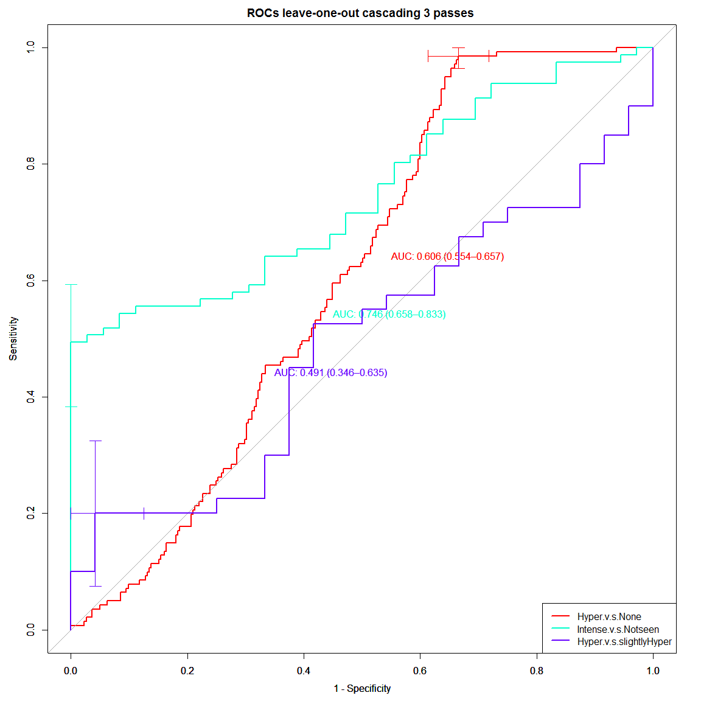
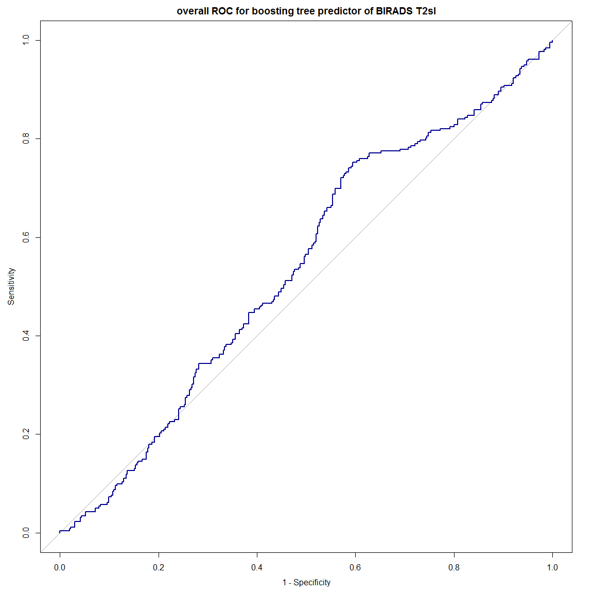
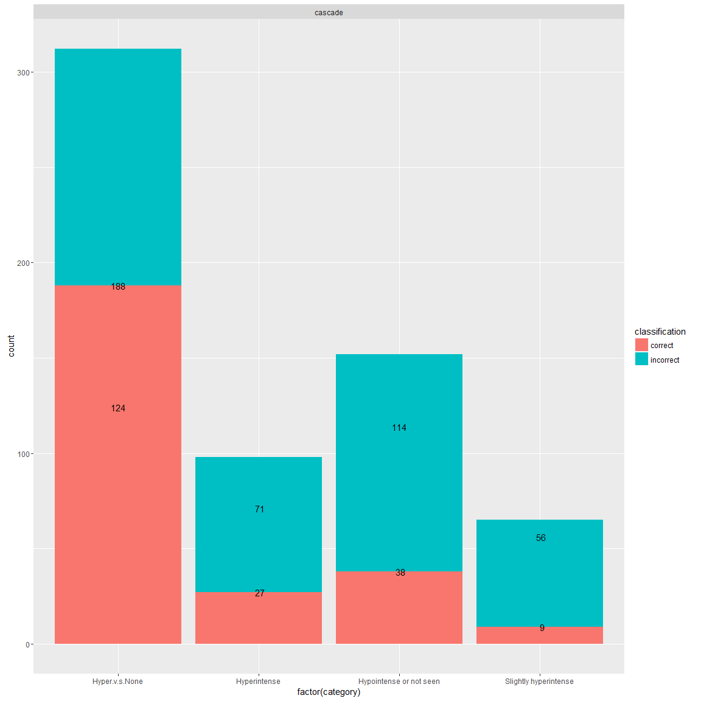

Predictor model of BIRADS T2w SI:
=============================
- This code creates a classifier based predictor of BIRADS T2w SI and add them to the pool of 55 T2w features for a total of 57 T2w featues


```
## Loading required package: lattice
## Loading required package: ggplot2
## Loading required package: DBI
## Loading required package: MASS
## Loading required package: rpart
## Loading required package: mlbench
## Type 'citation("pROC")' for a citation.
## 
## Attaching package: 'pROC'
## 
## The following objects are masked from 'package:stats':
## 
##     cov, smooth, var
```


```r
# read datasets
npatients = length(uniq_cad)
allf = read_T1T2uniqcad_parti(id_cad_pts, uniq_cad, allpartitionsetD, npatients, 1)
```

```
##    massB    massM nonmassB nonmassM 
##      242      166      142       76 
## nonmassM 
##        1
```

```r
## formant
allfeatures = rbind(allf[[1]], allf[[2]])
alllesioninfo = rbind(allf[[5]], allf[[6]])

### print number of total lesions 
# before was ##   C / NC = 140 / 132
print(summary(as.factor(allfeatures$orig_label)))
```

```
##    massB    massM nonmassB nonmassM 
##      242      166      142       77
```

```r
#######################
# format datasets with find_t2_signal_int as response variable
allfeaturest2_signal = cbind(allfeatures["find_t2_signal_int"], allfeatures[,2:ncol(allfeatures)])
allfeaturest2_signal = allfeaturest2_signal[-c(199,ncol(allfeatures))]

allfeaturest2_signal$find_t2_signal_int = as.factor(allfeaturest2_signal$find_t2_signal_int)
summary(allfeaturest2_signal$find_t2_signal_int)
```

```
##            Hyperintense Hypointense or not seen                    None 
##                      98                     152                     312 
##   Slightly hyperintense 
##                      65
```

```r
#######################
# Subset previuosly selected features
# for Boruta
borutasel = unique(zscore_selected[,2:3])
borutasel = borutasel[-grep("shadow",borutasel$selfeat),]
rrfsel = unique(allBIRADSfeatures[,c(1,3)])
```


Building final boosting tree classifier of Categorial predictor of RSI on T2w Levels: Hyperintense, Slightly hyperintense, Hypointensity, NO T2w SI
=======


```r
# collect parameters for bestuned boosting tree classifier of Categorial predictors
print(bestune_HyperNone)
```

```
##    x  y   z  acuTrain  rocTrain   acuTest   rocTest
## 56 1 50 0.1 0.7420495 0.8322033 0.6557377 0.7129032
```

```r
print(bestune_IntenseorNot)
```

```
##     x  y  z acuTrain rocTrain   acuTest   rocTest
## 24 10 60 -1        1        1 0.7333333 0.8222222
```

```r
print(bestune_HyperorSlight)
```

```
##    x   y   z acuTrain rocTrain acuTest   rocTest
## 67 3 100 0.1        1        1     0.8 0.8518519
```

```r
ntrees_HyperNone = bestune_HyperNone$y
maxD_HyperNone = bestune_HyperNone$x
alpha_HyperNone = bestune_HyperNone$z
loperf_HyperNone = c()

ntrees_IntenseorNot = bestune_IntenseorNot$y
maxD_IntenseorNot = bestune_IntenseorNot$x
alpha_IntenseorNot = bestune_IntenseorNot$z
loperf_IntenseorNot = c()

ntrees_HyperorSlight = bestune_HyperorSlight$y
maxD_HyperorSlight = bestune_HyperorSlight$x
alpha_HyperorSlight = bestune_HyperorSlight$z
loperf_HyperorSlight = c()

npatients = length(uniq_cad)
dfinfoT2wSI_lop = data.frame()
perfT2wSI_lop = data.frame()
perf_cascadeall = data.frame()


# perform leave-one-patient-out LMSIR prediction
for(k in 1:npatients){
  ## Create folds leave-one-patient-out
  allf = read_T1T2uniqcad_parti(id_cad_pts, uniq_cad, allpartitionsetD, npatients, k)
    
  ## formant
  Trainset = allf[[1]]; Trainsetinfo = allf[[5]]
  Testset = allf[[2]]; Testsetinfo = allf[[6]]
  dfinfo = cbind(Testsetinfo[,c(1,3,6:7,12,24:26)], Testset$find_t2_signal_int)
  print(dfinfo)
  Testset$id = Testsetinfo$lesion_id
  
  ##################################### pass 1 # option = feat_HyperNone
  Trainset_HyperNone = Trainset[,-c(1,ncol(Trainset))]
  Trainset_HyperNone$find_t2_signal_int = factor(ifelse(Trainset_HyperNone$find_t2_signal_int=="None","None","Intense"))
  
  # train tree
  treedata_HyperNone <- boosting(find_t2_signal_int ~ .,  data = Trainset_HyperNone,  
                       mfinal = ntrees_HyperNone, coeflearn = "Freund",
                       control = rpart.control(maxdepth = maxD_HyperNone,  minsplit = 0, cp = alpha_HyperNone))
  accuHyperNone = sum(treedata_HyperNone$class == Trainset_HyperNone$find_t2_signal_int)/ length(Trainset_HyperNone$find_t2_signal_int)
  print(accuHyperNone)
  loperf_HyperNone = c(loperf_HyperNone, accuHyperNone)                      

  #####################################  pass 2 # option = feat_IntenseorNot 
  Trainset_IntenseorNot = Trainset[Trainset$find_t2_signal_int != "None", -c(1,ncol(Trainset))]
  Trainset_IntenseorNot$find_t2_signal_int = factor(ifelse(Trainset_IntenseorNot$find_t2_signal_int=="Hypointense or not seen",
                                                           "Hypointense or not seen","Intense"))
  
  # train tree
  treedata_IntenseorNot <- boosting(find_t2_signal_int ~ .,  data = Trainset_IntenseorNot,  
                       mfinal = ntrees_IntenseorNot, coeflearn = "Freund",
                       control = rpart.control(maxdepth = maxD_IntenseorNot,  minsplit = 0, cp = alpha_IntenseorNot))
  accuIntenseorNot = sum(treedata_IntenseorNot$class == Trainset_IntenseorNot$find_t2_signal_int)/ length(Trainset_IntenseorNot$find_t2_signal_int)
  print(accuIntenseorNot)
  loperf_IntenseorNot = c(loperf_IntenseorNot, accuIntenseorNot)  

  ##################################### pass 3 # option = feat_HyperorSlight 
  Trainset_HyperorSlight = Trainset[Trainset$find_t2_signal_int != "None", -c(1,ncol(Trainset))]
  Trainset_HyperorSlight = Trainset_HyperorSlight[Trainset_HyperorSlight$find_t2_signal_int != "Hypointense or not seen", ]
  Trainset_HyperorSlight$find_t2_signal_int = as.factor(Trainset_HyperorSlight$find_t2_signal_int)
  summary(Trainset_HyperorSlight$find_t2_signal_int)
  
  # train tree
  treedata_HyperorSlight <- boosting(find_t2_signal_int ~ .,  data = Trainset_HyperorSlight,  
                       mfinal = ntrees_HyperorSlight, coeflearn = "Freund",
                       control = rpart.control(maxdepth = maxD_HyperorSlight,  minsplit = 0, cp = alpha_HyperorSlight))
  accuHyperorSlight = sum(treedata_HyperorSlight$class == Trainset_HyperorSlight$find_t2_signal_int)/ length(Trainset_HyperorSlight$find_t2_signal_int)
  print(accuHyperorSlight)
  loperf_HyperorSlight = c(loperf_HyperorSlight, accuHyperorSlight)  
  
  ##################################### 
  # predict
  perf_cascade = data.frame()
  perfT2wSI = data.frame()
  Testset_labels1 = factor(ifelse(Testset$find_t2_signal_int=="None","None","Intense"))
  # pass 1
  testpred = predict.boosting(treedata_HyperNone, newdata = Testset) 
  perf_pass1 = data.frame(id=Testset$id,
                          P=testpred$prob[,1], N=testpred$prob[,2],
                          obs=Testset$find_t2_signal_int,
                          pred=testpred$class,
                          cascade_obs=Testset_labels1,
                          pass="pass1")
  
  # collect those not passing
  notpassing = perf_pass1[perf_pass1$pred == "None",]
  perf_cascade = rbind(perf_cascade, notpassing)
  perfT2wSI = rbind(perfT2wSI, notpassing[,-c(6)])
  
  # select those passing
  Testset_pass1 = Testset[perf_pass1$pred == "Intense",]
  Testset_pass1noNone = data.frame()
  Testset_pass2noHypo = data.frame()
  Testset_pass2 = data.frame()

  # pass 2
  if(nrow(Testset_pass1) > 0){
    ## if observation is None, stop the cascade pass
    Testset_pass1noNone = data.frame()
    for(i in 1:nrow(Testset_pass1)){
      if(Testset_pass1[i,"find_t2_signal_int"]=="None"){
        perf_cascade = rbind(perf_cascade, perf_pass1[i,])
      }
      else{
        Testset_pass1noNone = rbind(Testset_pass1noNone, Testset_pass1[i,] )
      }
    }
  }
  if(nrow(Testset_pass1noNone) > 0){
    Testset_labels2 = factor(ifelse(Testset_pass1noNone$find_t2_signal_int=="Hypointense or not seen","Hypointense or not seen","Intense"))
    
    testpred = predict.boosting(treedata_IntenseorNot, newdata = Testset_pass1noNone) 
    perf_pass2 = data.frame(id=Testset_pass1noNone$id,
                            P=testpred$prob[,1], N=testpred$prob[,2],
                            obs=Testset_pass1noNone$find_t2_signal_int,
                            pred=testpred$class,
                            cascade_obs=Testset_labels2,
                            pass="pass2")
    

    # collect those not passing
    notpassing = perf_pass2[perf_pass2$pred == "Hypointense or not seen",]
    perf_cascade = rbind(perf_cascade, notpassing)
    # select those passing (mutually exclusive from hipo)
    Testset_pass2 = Testset_pass1noNone[perf_pass2$pred == "Intense",]
    
    ## if observation is None, stop the cascade pass
    Testset_pass2noHypo = data.frame()
    if(nrow(Testset_pass2) > 0){
      for(i in 1:nrow(Testset_pass2)){
        if(Testset_pass2[i,"find_t2_signal_int"]=="Hypointense or not seen"){
          perf_cascade = rbind(perf_cascade, perf_pass2[i,])
        }
        else{
          Testset_pass2noHypo = rbind(Testset_pass2noHypo, Testset_pass2[i,] )
        }
      }
    }
  }
  # pass 3
  if(nrow(Testset_pass2noHypo) > 0){
    testpred = predict.boosting(treedata_HyperorSlight, newdata = Testset_pass2noHypo) 
    perf_pass3 = data.frame(id=Testset_pass2noHypo$id,
                            P=testpred$prob[,1], N=testpred$prob[,2],
                            obs=Testset_pass2noHypo$find_t2_signal_int,
                            pred=testpred$class,
                            cascade_obs=Testset_pass2noHypo$find_t2_signal_int,
                            pass="pass3")
    
    print(perf_pass2)
    cat ("Press [enter] to continue")
    line <- readline()
    
    # collect final
    perf_cascade = rbind(perf_cascade, perf_pass3)
  }
  
  print(perf_cascade)
  perf_cascadeall = rbind(perf_cascadeall, perf_cascade)
  
  #######################
  # pass 2 # overall
  if(nrow(Testset_pass1) > 0){
    testpred = predict.boosting(treedata_IntenseorNot, newdata = Testset_pass1) 
    perf_pass2 = data.frame(id=Testset_pass1$id,
                            P=testpred$prob[,1], N=testpred$prob[,2],
                            obs=Testset_pass1$find_t2_signal_int,
                            pred=testpred$class,
                            pass="pass2")
    
    # collect those not passing
    notpassing = perf_pass2[perf_pass2$pred == "Hypointense or not seen",]
    perfT2wSI = rbind(perfT2wSI, notpassing)
    # select those passing
    Testset_pass2 = Testset_pass1[perf_pass2$pred == "Intense",]
  }
  # pass 3
  if(nrow(Testset_pass2) > 0){
    testpred = predict.boosting(treedata_HyperorSlight, newdata = Testset_pass2) 
    perf_pass3 = data.frame(id=Testset_pass2$id,
                            P=testpred$prob[,1], N=testpred$prob[,2],
                            obs=Testset_pass2$find_t2_signal_int,
                            pred=testpred$class,
                            pass="pass3")
    
    # collect final
    perfT2wSI = rbind(perfT2wSI, perf_pass3)
  }
  
  ## overall not interrupted thorugh cascade
  print(perfT2wSI)
  perfT2wSI_lop = rbind(perfT2wSI_lop, perfT2wSI)
  dfinfoT2wSI_lop = rbind(dfinfoT2wSI_lop, dfinfo)
  
  ## pause  
  #cat ("Press [enter] to continue")
  #line <- readline()
  save.image("C:/Users/windows/Documents/repoCode-local/T2wR/lop_3Dtex_T2w_addedvalue/T2wBIRADS/Rdata/final_classifierT2wSI_boosting.RData")

  
}
```

```
##    massB    massM nonmassB nonmassM 
##      242      166      142       76 
## nonmassM 
##        1 
##   lesion_id cad_pt_no_txt exam_a_number_txt           exam_dt_datetime exam_find_side_int
## 1         1          0002           6745896 2011-04-03 00:00:00.000000              Right
##   BIRADS lesion_label lesion_diagnosis Testset$find_t2_signal_int
## 1      4     nonmassM     InsituDuctal                       None
## [1] 0.7827476
## [1] 1
## [1] 1
##   id         P         N  obs    pred cascade_obs  pass
## 1  1 0.5605345 0.4394655 None Intense        None pass1
##   id         P         N  obs         pred  pass
## 1  1 0.5543076 0.4456924 None Hyperintense pass3
##    massB    massM nonmassB nonmassM 
##      241      166      142       77 
## massB 
##     1 
##   lesion_id cad_pt_no_txt exam_a_number_txt           exam_dt_datetime exam_find_side_int
## 2         2          0016           6920252 2011-09-24 00:00:00.000000              Right
##   BIRADS lesion_label        lesion_diagnosis Testset$find_t2_signal_int
## 2      4        massB FLORID DUCT HYPERPLASIA      Slightly hyperintense
## [1] 0.7715655
## [1] 1
## [1] 1
##   id        P        N                   obs                    pred cascade_obs  pass
## 1  2 0.604656 0.395344 Slightly hyperintense Hypointense or not seen     Intense pass2
##   id        P        N                   obs                    pred  pass
## 1  2 0.604656 0.395344 Slightly hyperintense Hypointense or not seen pass2
##    massB    massM nonmassB nonmassM 
##      242      166      141       77 
## nonmassB 
##        1 
##   lesion_id cad_pt_no_txt exam_a_number_txt           exam_dt_datetime exam_find_side_int
## 3         3          0025           7002835 2011-12-28 00:00:00.000000              Right
##   BIRADS lesion_label lesion_diagnosis Testset$find_t2_signal_int
## 3      4     nonmassB   DENSE FIBROSIS                       None
## [1] 0.7348243
## [1] 1
## [1] 1
##   id         P         N  obs pred cascade_obs  pass
## 1  3 0.4181024 0.5818976 None None        None pass1
##   id         P         N  obs pred  pass
## 1  3 0.4181024 0.5818976 None None pass1
##    massB    massM nonmassB nonmassM 
##      242      166      141       76 
## nonmassB nonmassM 
##        1        1 
##   lesion_id cad_pt_no_txt exam_a_number_txt           exam_dt_datetime exam_find_side_int
## 4         4          0027           7171944 2012-08-15 00:00:00.000000              Right
## 5         5          0027           6805483 2011-05-27 00:00:00.000000              Right
##   BIRADS lesion_label lesion_diagnosis Testset$find_t2_signal_int
## 4      4     nonmassB STROMAL FIBROSIS                       None
## 5      4     nonmassM     InsituDuctal                       None
## [1] 0.7808
## [1] 1
## [1] 1
##    id         P         N  obs    pred cascade_obs  pass
## 2   5 0.3617227 0.6382773 None    None        None pass1
## 21  4 0.5765550 0.4234450 None Intense        None pass1
##    id         P         N  obs                  pred  pass
## 2   5 0.3617227 0.6382773 None                  None pass1
## 21  4 0.3724969 0.6275031 None Slightly hyperintense pass3
##    massB    massM nonmassB nonmassM 
##      241      166      141       77 
##    massB nonmassB 
##        1        1 
##   lesion_id cad_pt_no_txt exam_a_number_txt           exam_dt_datetime exam_find_side_int
## 6         6          0066           4583735 2008-02-17 00:00:00.000000              Right
## 7         7          0066           7556910 2013-10-12 00:00:00.000000              Right
##   BIRADS lesion_label     lesion_diagnosis Testset$find_t2_signal_int
## 6      3        massB BENIGN BREAST TISSUE    Hypointense or not seen
## 7      4     nonmassB       DENSE FIBROSIS                       None
## [1] 0.7728
## [1] 1
## [1] 1
##    id         P         N                     obs                    pred
## 2   7 0.5226374 0.4773626                    None                 Intense
## 21  6 0.5516641 0.4483359 Hypointense or not seen Hypointense or not seen
##                cascade_obs  pass
## 2                     None pass1
## 21 Hypointense or not seen pass2
##   id         P         N                     obs                    pred  pass
## 1  6 0.5516641 0.4483359 Hypointense or not seen Hypointense or not seen pass2
## 2  7 0.5635540 0.4364460                    None Hypointense or not seen pass2
##    massB    massM nonmassB nonmassM 
##      242      166      142       75 
## nonmassM 
##        2 
##   lesion_id cad_pt_no_txt exam_a_number_txt           exam_dt_datetime exam_find_side_int
## 8         8          0093           7156466 2012-10-16 00:00:00.000000               Left
## 9         9          0093           7156466 2012-10-16 00:00:00.000000               Left
##   BIRADS lesion_label lesion_diagnosis Testset$find_t2_signal_int
## 8      4     nonmassM   InvasiveDuctal                       None
## 9      4     nonmassM   InvasiveDuctal                       None
## [1] 0.776
## [1] 1
## [1] 1
##   id         P         N  obs pred cascade_obs  pass
## 1  8 0.4673396 0.5326604 None None        None pass1
## 2  8 0.4673396 0.5326604 None None        None pass1
##   id         P         N  obs                    pred  pass
## 1  8 0.4673396 0.5326604 None                    None pass1
## 2  9 0.5801110 0.4198890 None Hypointense or not seen pass2
##    massB    massM nonmassB nonmassM 
##      241      166      142       77 
## massB 
##     1 
##    lesion_id cad_pt_no_txt exam_a_number_txt           exam_dt_datetime exam_find_side_int
## 10        10          0102           4755778 2009-03-19 00:00:00.000000              Right
##    BIRADS lesion_label lesion_diagnosis Testset$find_t2_signal_int
## 10      4        massB      FIBROCYSTIC               Hyperintense
## [1] 0.8035144
## [1] 1
## [1] 1
##   id         P         N          obs pred cascade_obs  pass
## 1 10 0.4489734 0.5510266 Hyperintense None     Intense pass1
##   id         P         N          obs pred  pass
## 1 10 0.4489734 0.5510266 Hyperintense None pass1
##    massB    massM nonmassB nonmassM 
##      242      166      141       77 
## nonmassB 
##        1 
##    lesion_id cad_pt_no_txt exam_a_number_txt           exam_dt_datetime exam_find_side_int
## 11        11          0111           6907205 2011-09-15 00:00:00.000000              Right
##    BIRADS lesion_label lesion_diagnosis Testset$find_t2_signal_int
## 11      4     nonmassB   DUCT PAPILLOMA    Hypointense or not seen
## [1] 0.7603834
## [1] 1
## [1] 1
##   id         P         N                     obs    pred             cascade_obs  pass
## 1 11 0.4696701 0.5303299 Hypointense or not seen Intense Hypointense or not seen pass2
##   id        P        N                     obs         pred  pass
## 1 11 0.619988 0.380012 Hypointense or not seen Hyperintense pass3
##    massB    massM nonmassB nonmassM 
##      242      165      142       77 
## massM 
##     1 
##    lesion_id cad_pt_no_txt exam_a_number_txt           exam_dt_datetime exam_find_side_int
## 12        12          0114           6896014 2011-10-02 00:00:00.000000              Right
##    BIRADS lesion_label lesion_diagnosis Testset$find_t2_signal_int
## 12      4        massM   InvasiveDuctal                       None
## [1] 0.7667732
## [1] 1
## [1] 1
##   id         P         N  obs    pred cascade_obs  pass
## 1 12 0.5373636 0.4626364 None Intense        None pass1
##   id         P         N  obs                  pred  pass
## 1 12 0.4505225 0.5494775 None Slightly hyperintense pass3
##    massB    massM nonmassB nonmassM 
##      240      166      142       77 
## massB 
##     2 
##    lesion_id cad_pt_no_txt exam_a_number_txt           exam_dt_datetime exam_find_side_int
## 13        13          0121           6714524 2011-02-22 00:00:00.000000              Right
## 14        14          0121           7091267 2012-08-29 00:00:00.000000              Right
##    BIRADS lesion_label     lesion_diagnosis Testset$find_t2_signal_int
## 13      4        massB             ADENOSIS    Hypointense or not seen
## 14      4        massB BENIGN BREAST TISSUE               Hyperintense
## [1] 0.7776
## [1] 1
## [1] 1
##    id         P         N                     obs    pred             cascade_obs  pass
## 2  14 0.4929894 0.5070106            Hyperintense    None                 Intense pass1
## 21 13 0.4984710 0.5015290 Hypointense or not seen Intense Hypointense or not seen pass2
##    id         P         N                     obs         pred  pass
## 2  14 0.4929894 0.5070106            Hyperintense         None pass1
## 21 13 0.5640554 0.4359446 Hypointense or not seen Hyperintense pass3
##    massB    massM nonmassB nonmassM 
##      241      166      142       77 
## massB 
##     1 
##    lesion_id cad_pt_no_txt exam_a_number_txt           exam_dt_datetime exam_find_side_int
## 15        15          0122           5108281 2009-12-14 00:00:00.000000              Right
##    BIRADS lesion_label lesion_diagnosis Testset$find_t2_signal_int
## 15      3        massB             Cyst                       None
## [1] 0.7635783
## [1] 1
## [1] 1
##   id         P         N  obs    pred cascade_obs  pass
## 1 15 0.6759303 0.3240697 None Intense        None pass1
##   id         P         N  obs                    pred  pass
## 1 15 0.5984716 0.4015284 None Hypointense or not seen pass2
##    massB    massM nonmassB nonmassM 
##      242      166      140       77 
## nonmassB 
##        2 
##    lesion_id cad_pt_no_txt exam_a_number_txt           exam_dt_datetime exam_find_side_int
## 16        16          0123           6909758 2011-09-16 00:00:00.000000              Right
## 17        17          0123           6909758 2011-09-16 00:00:00.000000               Left
##    BIRADS lesion_label      lesion_diagnosis Testset$find_t2_signal_int
## 16      4     nonmassB COLUMNAR CELL CHANGES                       None
## 17      4     nonmassB  BENIGN BREAST TISSUE                       None
## [1] 0.7648
## [1] 1
## [1] 1
##   id         P         N  obs pred cascade_obs  pass
## 1 16 0.4574104 0.5425896 None None        None pass1
## 2 17 0.4187582 0.5812418 None None        None pass1
##   id         P         N  obs pred  pass
## 1 16 0.4574104 0.5425896 None None pass1
## 2 17 0.4187582 0.5812418 None None pass1
##    massB    massM nonmassB nonmassM 
##      242      166      141       77 
## nonmassB 
##        1 
##    lesion_id cad_pt_no_txt exam_a_number_txt           exam_dt_datetime exam_find_side_int
## 18        18          0127           4696964 2008-09-11 00:00:00.000000               Left
##    BIRADS lesion_label lesion_diagnosis Testset$find_t2_signal_int
## 18      4     nonmassB     FIBROADENOMA               Hyperintense
## [1] 0.798722
## [1] 1
## [1] 1
##   id         P         N          obs                    pred cascade_obs  pass
## 1 18 0.6754587 0.3245413 Hyperintense Hypointense or not seen     Intense pass2
##   id         P         N          obs                    pred  pass
## 1 18 0.6754587 0.3245413 Hyperintense Hypointense or not seen pass2
##    massB    massM nonmassB nonmassM 
##      241      166      142       77 
## massB 
##     1 
##    lesion_id cad_pt_no_txt exam_a_number_txt           exam_dt_datetime exam_find_side_int
## 19        19          0129           5326737 2010-07-17 00:00:00.000000               Left
##    BIRADS lesion_label     lesion_diagnosis Testset$find_t2_signal_int
## 19      4        massB BENIGN BREAST TISSUE               Hyperintense
## [1] 0.7460064
## [1] 1
## [1] 1
##   id         P         N          obs    pred cascade_obs  pass
## 1 19 0.4945603 0.5054397 Hyperintense Intense     Intense pass2
## Press [enter] to continue
##   id        P        N          obs         pred  cascade_obs  pass
## 1 19 0.511925 0.488075 Hyperintense Hyperintense Hyperintense pass3
##   id        P        N          obs         pred  pass
## 1 19 0.511925 0.488075 Hyperintense Hyperintense pass3
##    massB    massM nonmassB nonmassM 
##      239      166      142       77 
## massB 
##     3 
##    lesion_id cad_pt_no_txt exam_a_number_txt           exam_dt_datetime exam_find_side_int
## 20        20          0130           5017534 2010-03-29 00:00:00.000000               Left
## 21        21          0130           5017534 2010-03-29 00:00:00.000000               Left
## 22        22          0130           7347205 2013-05-05 00:00:00.000000              Right
##    BIRADS lesion_label             lesion_diagnosis Testset$find_t2_signal_int
## 20      2        massB ATYPICAL LOBULAR HYPERPLASIA               Hyperintense
## 21      2        massB ATYPICAL LOBULAR HYPERPLASIA               Hyperintense
## 22      4        massB ATYPICAL LOBULAR HYPERPLASIA    Hypointense or not seen
## [1] 0.7948718
## [1] 1
## [1] 1
##   id         P         N                     obs                    pred
## 1 20 0.4810065 0.5189935            Hyperintense                 Intense
## 2 21 0.5730706 0.4269294            Hyperintense Hypointense or not seen
## 3 22 0.6074511 0.3925489 Hypointense or not seen Hypointense or not seen
##               cascade_obs  pass
## 1                 Intense pass2
## 2                 Intense pass2
## 3 Hypointense or not seen pass2
## Press [enter] to continue
##    id         P         N                     obs                    pred
## 2  21 0.5730706 0.4269294            Hyperintense Hypointense or not seen
## 3  22 0.6074511 0.3925489 Hypointense or not seen Hypointense or not seen
## 31 20 0.4944195 0.5055805            Hyperintense   Slightly hyperintense
##                cascade_obs  pass
## 2                  Intense pass2
## 3  Hypointense or not seen pass2
## 31            Hyperintense pass3
##    id         P         N                     obs                    pred  pass
## 2  21 0.5730706 0.4269294            Hyperintense Hypointense or not seen pass2
## 3  22 0.6074511 0.3925489 Hypointense or not seen Hypointense or not seen pass2
## 31 20 0.4944195 0.5055805            Hyperintense   Slightly hyperintense pass3
##    massB    massM nonmassB nonmassM 
##      240      166      142       77 
## massB 
##     2 
##    lesion_id cad_pt_no_txt exam_a_number_txt           exam_dt_datetime exam_find_side_int
## 23        23          0132           5154279 2010-04-08 00:00:00.000000              Right
## 24        24          0132           5154279 2010-04-08 00:00:00.000000              Right
##    BIRADS lesion_label     lesion_diagnosis Testset$find_t2_signal_int
## 23      3        massB BENIGN BREAST TISSUE               Hyperintense
## 24      3        massB BENIGN BREAST TISSUE               Hyperintense
## [1] 0.76
## [1] 1
## [1] 1
##   id         P         N          obs pred cascade_obs  pass
## 1 23 0.4692949 0.5307051 Hyperintense None     Intense pass1
## 2 24 0.4885770 0.5114230 Hyperintense None     Intense pass1
##   id         P         N          obs pred  pass
## 1 23 0.4692949 0.5307051 Hyperintense None pass1
## 2 24 0.4885770 0.5114230 Hyperintense None pass1
##    massB    massM nonmassB nonmassM 
##      241      166      142       77 
## massB 
##     1 
##    lesion_id cad_pt_no_txt exam_a_number_txt           exam_dt_datetime exam_find_side_int
## 25        25          0133           7072006 2012-03-10 00:00:00.000000               Left
##    BIRADS lesion_label lesion_diagnosis Testset$find_t2_signal_int
## 25      4        massB      FIBROCYSTIC    Hypointense or not seen
## [1] 0.7028754
## [1] 1
## [1] 1
##   id         P         N                     obs    pred             cascade_obs  pass
## 1 25 0.4843781 0.5156219 Hypointense or not seen Intense Hypointense or not seen pass2
##   id         P         N                     obs                  pred  pass
## 1 25 0.4910494 0.5089506 Hypointense or not seen Slightly hyperintense pass3
##    massB    massM nonmassB nonmassM 
##      241      166      141       77 
##    massB nonmassB 
##        1        1 
##    lesion_id cad_pt_no_txt exam_a_number_txt           exam_dt_datetime exam_find_side_int
## 26        26          0135           7777131 2014-05-17 00:00:00.000000              Right
## 27        27          0135           5083620 2010-07-19 00:00:00.000000              Right
##    BIRADS lesion_label lesion_diagnosis Testset$find_t2_signal_int
## 26      4        massB      FIBROCYSTIC                       None
## 27      4     nonmassB      FIBROCYSTIC    Hypointense or not seen
## [1] 0.7904
## [1] 1
## [1] 1
##   id         P         N                     obs pred cascade_obs  pass
## 1 26 0.4870724 0.5129276                    None None        None pass1
## 2 27 0.4584382 0.5415618 Hypointense or not seen None     Intense pass1
##   id         P         N                     obs pred  pass
## 1 26 0.4870724 0.5129276                    None None pass1
## 2 27 0.4584382 0.5415618 Hypointense or not seen None pass1
##    massB    massM nonmassB nonmassM 
##      241      166      142       77 
## massB 
##     1 
##    lesion_id cad_pt_no_txt exam_a_number_txt           exam_dt_datetime exam_find_side_int
## 29        29          0168           5240535 2010-04-12 00:00:00.000000               Left
##    BIRADS lesion_label lesion_diagnosis Testset$find_t2_signal_int
## 29      4        massB      FIBROCYSTIC                       None
## [1] 0.7571885
## [1] 1
## [1] 1
##   id        P        N  obs pred cascade_obs  pass
## 1 29 0.425983 0.574017 None None        None pass1
##   id        P        N  obs pred  pass
## 1 29 0.425983 0.574017 None None pass1
##    massB    massM nonmassB nonmassM 
##      242      165      142       77 
## massM 
##     1 
##    lesion_id cad_pt_no_txt exam_a_number_txt           exam_dt_datetime exam_find_side_int
## 30        30          0171           4751079 2009-02-22 00:00:00.000000               Left
##    BIRADS lesion_label lesion_diagnosis Testset$find_t2_signal_int
## 30      4        massM     InsituDuctal    Hypointense or not seen
## [1] 0.7555911
## [1] 1
## [1] 1
##   id         P         N                     obs                    pred
## 1 30 0.6076021 0.3923979 Hypointense or not seen Hypointense or not seen
##               cascade_obs  pass
## 1 Hypointense or not seen pass2
##   id         P         N                     obs                    pred  pass
## 1 30 0.6076021 0.3923979 Hypointense or not seen Hypointense or not seen pass2
##    massB    massM nonmassB nonmassM 
##      241      166      142       77 
## massB 
##     1 
##    lesion_id cad_pt_no_txt exam_a_number_txt           exam_dt_datetime exam_find_side_int
## 31        31          0172           4703102 2008-08-24 00:00:00.000000               Left
##    BIRADS lesion_label lesion_diagnosis Testset$find_t2_signal_int
## 31      4        massB      FIBROCYSTIC                       None
## [1] 0.7507987
## [1] 1
## [1] 1
##   id         P         N  obs pred cascade_obs  pass
## 1 31 0.4170164 0.5829836 None None        None pass1
##   id         P         N  obs pred  pass
## 1 31 0.4170164 0.5829836 None None pass1
##    massB    massM nonmassB nonmassM 
##      242      166      141       77 
## nonmassB 
##        1 
##    lesion_id cad_pt_no_txt exam_a_number_txt           exam_dt_datetime exam_find_side_int
## 32        32          0173           5123923 2009-11-30 00:00:00.000000              Right
##    BIRADS lesion_label lesion_diagnosis Testset$find_t2_signal_int
## 32      4     nonmassB   DUCT PAPILLOMA                       None
## [1] 0.7635783
## [1] 1
## [1] 1
##   id         P         N  obs pred cascade_obs  pass
## 1 32 0.4233742 0.5766258 None None        None pass1
##   id         P         N  obs pred  pass
## 1 32 0.4233742 0.5766258 None None pass1
##    massB    massM nonmassB nonmassM 
##      242      165      142       76 
##    massM nonmassM 
##        1        1 
##    lesion_id cad_pt_no_txt exam_a_number_txt           exam_dt_datetime exam_find_side_int
## 33        33          0177           6996979 2011-12-09 00:00:00.000000               Left
## 34        34          0177           6996979 2011-12-09 00:00:00.000000               Left
##    BIRADS lesion_label lesion_diagnosis Testset$find_t2_signal_int
## 33      3        massM     InsituDuctal      Slightly hyperintense
## 34      3     nonmassM     InsituDuctal                       None
## [1] 0.784
## [1] 1
## [1] 1
##   id         P         N                   obs pred cascade_obs  pass
## 1 33 0.4264642 0.5735358 Slightly hyperintense None     Intense pass1
## 2 33 0.4264642 0.5735358 Slightly hyperintense None     Intense pass1
##   id         P         N                   obs         pred  pass
## 1 33 0.4264642 0.5735358 Slightly hyperintense         None pass1
## 2 34 0.5072656 0.4927344                  None Hyperintense pass3
##    massB    massM nonmassB nonmassM 
##      242      166      140       77 
## nonmassB 
##        2 
##    lesion_id cad_pt_no_txt exam_a_number_txt           exam_dt_datetime exam_find_side_int
## 35        35          0180           4632561 2008-10-25 00:00:00.000000               Left
## 36        36          0180           5254957 2010-12-14 00:00:00.000000               Left
##    BIRADS lesion_label     lesion_diagnosis Testset$find_t2_signal_int
## 35      4     nonmassB BENIGN BREAST TISSUE    Hypointense or not seen
## 36      4     nonmassB         FIBROADENOMA    Hypointense or not seen
## [1] 0.7664
## [1] 1
## [1] 1
##    id         P         N                     obs                    pred
## 2  36 0.4148128 0.5851872 Hypointense or not seen                    None
## 21 35 0.6471581 0.3528419 Hypointense or not seen Hypointense or not seen
##                cascade_obs  pass
## 2                  Intense pass1
## 21 Hypointense or not seen pass2
##    id         P         N                     obs                    pred  pass
## 2  36 0.4148128 0.5851872 Hypointense or not seen                    None pass1
## 21 35 0.6471581 0.3528419 Hypointense or not seen Hypointense or not seen pass2
##    massB    massM nonmassB nonmassM 
##      242      166      142       76 
## nonmassM 
##        1 
##    lesion_id cad_pt_no_txt exam_a_number_txt           exam_dt_datetime exam_find_side_int
## 37        37          0186           6869828 2011-08-02 00:00:00.000000               Left
##    BIRADS lesion_label lesion_diagnosis Testset$find_t2_signal_int
## 37      4     nonmassM     InsituDuctal                       None
## [1] 0.7779553
## [1] 1
## [1] 1
##   id         P         N  obs pred cascade_obs  pass
## 1 37 0.4413798 0.5586202 None None        None pass1
##   id         P         N  obs pred  pass
## 1 37 0.4413798 0.5586202 None None pass1
##    massB    massM nonmassB nonmassM 
##      242      166      141       77 
## nonmassB 
##        1 
##    lesion_id cad_pt_no_txt exam_a_number_txt           exam_dt_datetime exam_find_side_int
## 38        38          0189           5057674 2009-10-10 00:00:00.000000               Left
##    BIRADS lesion_label    lesion_diagnosis Testset$find_t2_signal_int
## 38      4     nonmassB SCLEROSING ADENOSIS    Hypointense or not seen
## [1] 0.7763578
## [1] 1
## [1] 1
##   id         P         N                     obs pred cascade_obs  pass
## 1 38 0.4824606 0.5175394 Hypointense or not seen None     Intense pass1
##   id         P         N                     obs pred  pass
## 1 38 0.4824606 0.5175394 Hypointense or not seen None pass1
##    massB    massM nonmassB nonmassM 
##      241      166      142       77 
## massB 
##     1 
##    lesion_id cad_pt_no_txt exam_a_number_txt           exam_dt_datetime exam_find_side_int
## 39        39          0103           6836585 2011-06-26 00:00:00.000000               Left
##    BIRADS lesion_label lesion_diagnosis Testset$find_t2_signal_int
## 39      5        massB  PHYLLODES TUMOR                       None
## [1] 0.7412141
## [1] 1
## [1] 1
##   id         P         N  obs pred cascade_obs  pass
## 1 39 0.3974776 0.6025224 None None        None pass1
##   id         P         N  obs pred  pass
## 1 39 0.3974776 0.6025224 None None pass1
##    massB    massM nonmassB nonmassM 
##      242      165      142       76 
##    massM nonmassM 
##        1        1 
##    lesion_id cad_pt_no_txt exam_a_number_txt           exam_dt_datetime exam_find_side_int
## 40        40          0190           6760690 2011-04-12 00:00:00.000000              Right
## 41        41          0190           6760690 2011-04-12 00:00:00.000000              Right
##    BIRADS lesion_label lesion_diagnosis Testset$find_t2_signal_int
## 40      4        massM   InvasiveDuctal                       None
## 41      4     nonmassM   InvasiveDuctal                       None
## [1] 0.776
## [1] 1
## [1] 1
##   id         P         N  obs pred cascade_obs  pass
## 1 40 0.4907526 0.5092474 None None        None pass1
## 2 41 0.4865007 0.5134993 None None        None pass1
##   id         P         N  obs pred  pass
## 1 40 0.4907526 0.5092474 None None pass1
## 2 41 0.4865007 0.5134993 None None pass1
##    massB    massM nonmassB nonmassM 
##      242      166      139       77 
## nonmassB 
##        3 
##    lesion_id cad_pt_no_txt exam_a_number_txt           exam_dt_datetime exam_find_side_int
## 42        42          0196           5289117 2010-11-29 00:00:00.000000              Right
## 43        43          0196           5289117 2010-11-29 00:00:00.000000               Left
## 44        44          0196           5289117 2010-11-29 00:00:00.000000               Left
##    BIRADS lesion_label           lesion_diagnosis Testset$find_t2_signal_int
## 42      4     nonmassB        SCLEROSING ADENOSIS    Hypointense or not seen
## 43      4     nonmassB ColumnarAlterationwoAtypia                       None
## 44      4     nonmassB ColumnarAlterationwoAtypia    Hypointense or not seen
## [1] 0.7964744
## [1] 1
## [1] 1
##    id         P         N                     obs pred cascade_obs  pass
## 1  42 0.4870614 0.5129386 Hypointense or not seen None     Intense pass1
## 3  44 0.4556535 0.5443465 Hypointense or not seen None     Intense pass1
## 31 42 0.4870614 0.5129386 Hypointense or not seen None     Intense pass1
##    id         P         N                     obs                    pred  pass
## 1  42 0.4870614 0.5129386 Hypointense or not seen                    None pass1
## 3  44 0.4556535 0.5443465 Hypointense or not seen                    None pass1
## 31 43 0.5204292 0.4795708                    None Hypointense or not seen pass2
##    massB    massM nonmassB nonmassM 
##      241      166      140       77 
##    massB nonmassB 
##        1        2 
##    lesion_id cad_pt_no_txt exam_a_number_txt           exam_dt_datetime exam_find_side_int
## 45        45          0197           6667696 2011-05-10 00:00:00.000000              Right
## 46        46          0197           6667696 2011-05-10 00:00:00.000000              Right
## 47        47          0197           6667696 2011-05-10 00:00:00.000000              Right
##    BIRADS lesion_label   lesion_diagnosis Testset$find_t2_signal_int
## 45      4     nonmassB LobularHyperplasia    Hypointense or not seen
## 46      4     nonmassB LobularHyperplasia    Hypointense or not seen
## 47      4        massB LobularHyperplasia      Slightly hyperintense
## [1] 0.7772436
## [1] 1
## [1] 1
##    id         P         N                     obs                    pred
## 3  47 0.4329659 0.5670341   Slightly hyperintense                    None
## 2  46 0.5759709 0.4240291 Hypointense or not seen Hypointense or not seen
## 31 45 0.4250458 0.5749542 Hypointense or not seen                 Intense
##                cascade_obs  pass
## 3                  Intense pass1
## 2  Hypointense or not seen pass2
## 31 Hypointense or not seen pass2
##    id         P         N                     obs                    pred  pass
## 3  47 0.4329659 0.5670341   Slightly hyperintense                    None pass1
## 2  46 0.5759709 0.4240291 Hypointense or not seen Hypointense or not seen pass2
## 31 45 0.5934241 0.4065759 Hypointense or not seen            Hyperintense pass3
##    massB    massM nonmassB nonmassM 
##      240      166      142       77 
## massB 
##     2 
##    lesion_id cad_pt_no_txt exam_a_number_txt           exam_dt_datetime exam_find_side_int
## 48        48          0198           4809893 2009-05-03 00:00:00.000000               Left
## 49        49          0198           4809893 2009-05-03 00:00:00.000000              Right
##    BIRADS lesion_label lesion_diagnosis Testset$find_t2_signal_int
## 48      2        massB      FIBROCYSTIC                       None
## 49      2        massB     FIBROADENOMA                       None
## [1] 0.776
## [1] 1
## [1] 1
##   id         P         N  obs    pred cascade_obs  pass
## 1 48 0.6769604 0.3230396 None Intense        None pass1
## 2 49 0.5154645 0.4845355 None Intense        None pass1
##   id         P         N  obs                    pred  pass
## 1 48 0.5320464 0.4679536 None Hypointense or not seen pass2
## 2 49 0.3730046 0.6269954 None   Slightly hyperintense pass3
##    massB    massM nonmassB nonmassM 
##      241      166      142       77 
## massB 
##     1 
##    lesion_id cad_pt_no_txt exam_a_number_txt           exam_dt_datetime exam_find_side_int
## 50        50          0199           4362726 2007-05-18 00:00:00.000000               Left
##    BIRADS lesion_label             lesion_diagnosis Testset$find_t2_signal_int
## 50      4        massB ATYPICAL LOBULAR HYPERPLASIA               Hyperintense
## [1] 0.7603834
## [1] 1
## [1] 1
##   id         P         N          obs pred cascade_obs  pass
## 1 50 0.4416137 0.5583863 Hyperintense None     Intense pass1
##   id         P         N          obs pred  pass
## 1 50 0.4416137 0.5583863 Hyperintense None pass1
##    massB    massM nonmassB nonmassM 
##      241      166      142       77 
## massB 
##     1 
##    lesion_id cad_pt_no_txt exam_a_number_txt           exam_dt_datetime exam_find_side_int
## 51        51          0205           5085133 2010-04-17 00:00:00.000000               Left
##    BIRADS lesion_label lesion_diagnosis Testset$find_t2_signal_int
## 51      4        massB  FIBROEPITHELIAL               Hyperintense
## [1] 0.7667732
## [1] 1
## [1] 1
##   id         P         N          obs    pred cascade_obs  pass
## 1 51 0.3864443 0.6135557 Hyperintense Intense     Intense pass2
## Press [enter] to continue
##   id         P         N          obs         pred  cascade_obs  pass
## 1 51 0.6282636 0.3717364 Hyperintense Hyperintense Hyperintense pass3
##   id         P         N          obs         pred  pass
## 1 51 0.6282636 0.3717364 Hyperintense Hyperintense pass3
##    massB    massM nonmassB nonmassM 
##      241      166      142       77 
## massB 
##     1 
##    lesion_id cad_pt_no_txt exam_a_number_txt           exam_dt_datetime exam_find_side_int
## 52        52          0207           4982884 2009-11-09 00:00:00.000000              Right
##    BIRADS lesion_label lesion_diagnosis Testset$find_t2_signal_int
## 52      4        massB         FIBROSIS                       None
## [1] 0.7875399
## [1] 1
## [1] 1
##   id         P         N  obs    pred cascade_obs  pass
## 1 52 0.6013632 0.3986368 None Intense        None pass1
##   id         P         N  obs                  pred  pass
## 1 52 0.4798092 0.5201908 None Slightly hyperintense pass3
##    massB    massM nonmassB nonmassM 
##      241      166      142       77 
## massB 
##     1 
##    lesion_id cad_pt_no_txt exam_a_number_txt           exam_dt_datetime exam_find_side_int
## 53        53          0212           4734525 2008-09-08 00:00:00.000000               Left
##    BIRADS lesion_label lesion_diagnosis Testset$find_t2_signal_int
## 53      4        massB     FIBROADENOMA               Hyperintense
## [1] 0.7603834
## [1] 1
## [1] 1
##   id         P         N          obs    pred cascade_obs  pass
## 1 53 0.3329622 0.6670378 Hyperintense Intense     Intense pass2
## Press [enter] to continue
##   id         P         N          obs         pred  cascade_obs  pass
## 1 53 0.6106217 0.3893783 Hyperintense Hyperintense Hyperintense pass3
##   id         P         N          obs         pred  pass
## 1 53 0.6106217 0.3893783 Hyperintense Hyperintense pass3
##    massB    massM nonmassB nonmassM 
##      240      166      142       77 
## massB 
##     2 
##    lesion_id cad_pt_no_txt exam_a_number_txt           exam_dt_datetime exam_find_side_int
## 54        54          0220           6715021 2011-02-22 00:00:00.000000              Right
## 55        55          0220           6715021 2011-02-22 00:00:00.000000              Right
##    BIRADS lesion_label lesion_diagnosis Testset$find_t2_signal_int
## 54      5        massB       RadialScar      Slightly hyperintense
## 55      5        massB     FIBROADENOMA      Slightly hyperintense
## [1] 0.7792
## [1] 1
## [1] 1
##   id         P         N                   obs                    pred cascade_obs  pass
## 1 54 0.5813447 0.4186553 Slightly hyperintense Hypointense or not seen     Intense pass2
## 2 55 0.4156812 0.5843188 Slightly hyperintense                 Intense     Intense pass2
## Press [enter] to continue
##   id         P         N                   obs                    pred           cascade_obs
## 1 54 0.5813447 0.4186553 Slightly hyperintense Hypointense or not seen               Intense
## 2 55 0.4154782 0.5845218 Slightly hyperintense   Slightly hyperintense Slightly hyperintense
##    pass
## 1 pass2
## 2 pass3
##   id         P         N                   obs                    pred  pass
## 1 54 0.5813447 0.4186553 Slightly hyperintense Hypointense or not seen pass2
## 2 55 0.4154782 0.5845218 Slightly hyperintense   Slightly hyperintense pass3
##    massB    massM nonmassB nonmassM 
##      242      166      141       77 
## nonmassB 
##        1 
##    lesion_id cad_pt_no_txt exam_a_number_txt           exam_dt_datetime exam_find_side_int
## 56        56          0229           6831376 2011-06-15 00:00:00.000000               Left
##    BIRADS lesion_label lesion_diagnosis Testset$find_t2_signal_int
## 56      5     nonmassB      FIBROCYSTIC                       None
## [1] 0.7795527
## [1] 1
## [1] 1
##   id         P         N  obs pred cascade_obs  pass
## 1 56 0.4129927 0.5870073 None None        None pass1
##   id         P         N  obs pred  pass
## 1 56 0.4129927 0.5870073 None None pass1
##    massB    massM nonmassB nonmassM 
##      242      166      140       77 
## nonmassB 
##        2 
##    lesion_id cad_pt_no_txt exam_a_number_txt           exam_dt_datetime exam_find_side_int
## 57        57          0232           6671713 2011-01-11 00:00:00.000000              Right
## 58        58          0232           6671713 2011-01-11 00:00:00.000000              Right
##    BIRADS lesion_label lesion_diagnosis Testset$find_t2_signal_int
## 57      5     nonmassB      FIBROCYSTIC                       None
## 58      5     nonmassB      FIBROCYSTIC                       None
## [1] 0.7808
## [1] 1
## [1] 1
##    id         P         N  obs    pred cascade_obs  pass
## 2  58 0.4205507 0.5794493 None    None        None pass1
## 21 57 0.5053372 0.4946628 None Intense        None pass1
##    id         P         N  obs                  pred  pass
## 2  58 0.4205507 0.5794493 None                  None pass1
## 21 57 0.4839289 0.5160711 None Slightly hyperintense pass3
##    massB    massM nonmassB nonmassM 
##      241      166      142       77 
## massB 
##     1 
##    lesion_id cad_pt_no_txt exam_a_number_txt           exam_dt_datetime exam_find_side_int
## 59        59          0246           7485590 2013-05-14 00:00:00.000000              Right
##    BIRADS lesion_label     lesion_diagnosis Testset$find_t2_signal_int
## 59      4        massB BENIGN BREAST TISSUE               Hyperintense
## [1] 0.7236422
## [1] 1
## [1] 1
##   id         P         N          obs    pred cascade_obs  pass
## 1 59 0.4071876 0.5928124 Hyperintense Intense     Intense pass2
## Press [enter] to continue
##   id         P         N          obs                  pred  cascade_obs  pass
## 1 59 0.3650788 0.6349212 Hyperintense Slightly hyperintense Hyperintense pass3
##   id         P         N          obs                  pred  pass
## 1 59 0.3650788 0.6349212 Hyperintense Slightly hyperintense pass3
##    massB    massM nonmassB nonmassM 
##      239      166      141       77 
##    massB nonmassB 
##        3        1 
##    lesion_id cad_pt_no_txt exam_a_number_txt           exam_dt_datetime exam_find_side_int
## 60        60          0252           5142106 2009-12-04 00:00:00.000000              Right
## 61        61          0252           5142106 2009-12-04 00:00:00.000000               Left
## 62        62          0252           6700964 2011-07-18 00:00:00.000000               Left
## 63        63          0252           6700964 2011-07-18 00:00:00.000000               Left
##    BIRADS lesion_label     lesion_diagnosis Testset$find_t2_signal_int
## 60      4        massB         FIBROADENOMA    Hypointense or not seen
## 61      4        massB         FIBROADENOMA    Hypointense or not seen
## 62      3     nonmassB BENIGN BREAST TISSUE    Hypointense or not seen
## 63      3        massB BENIGN BREAST TISSUE               Hyperintense
## [1] 0.7319422
## [1] 1
## [1] 1
##   id         P         N                     obs                    pred
## 1 60 0.4809748 0.5190252 Hypointense or not seen                 Intense
## 2 61 0.5889985 0.4110015 Hypointense or not seen Hypointense or not seen
## 3 63 0.4462426 0.5537574            Hyperintense                 Intense
##               cascade_obs  pass
## 1 Hypointense or not seen pass2
## 2 Hypointense or not seen pass2
## 3                 Intense pass2
## Press [enter] to continue
##    id         P         N                     obs                    pred
## 3  62 0.4395913 0.5604087 Hypointense or not seen                    None
## 2  61 0.5889985 0.4110015 Hypointense or not seen Hypointense or not seen
## 31 60 0.4809748 0.5190252 Hypointense or not seen                 Intense
## 4  63 0.5349410 0.4650590            Hyperintense            Hyperintense
##                cascade_obs  pass
## 3                  Intense pass1
## 2  Hypointense or not seen pass2
## 31 Hypointense or not seen pass2
## 4             Hyperintense pass3
##    id         P         N                     obs                    pred  pass
## 3  62 0.4395913 0.5604087 Hypointense or not seen                    None pass1
## 2  61 0.5889985 0.4110015 Hypointense or not seen Hypointense or not seen pass2
## 31 60 0.5523534 0.4476466 Hypointense or not seen            Hyperintense pass3
## 4  63 0.5349410 0.4650590            Hyperintense            Hyperintense pass3
##    massB    massM nonmassB nonmassM 
##      242      166      141       77 
## nonmassB 
##        1 
##    lesion_id cad_pt_no_txt exam_a_number_txt           exam_dt_datetime exam_find_side_int
## 65        65          0259           7364573 2013-02-02 00:00:00.000000                 NA
##    BIRADS lesion_label     lesion_diagnosis Testset$find_t2_signal_int
## 65      2     nonmassB BENIGN BREAST TISSUE                       None
## [1] 0.7507987
## [1] 1
## [1] 1
##   id         P         N  obs    pred cascade_obs  pass
## 1 65 0.5168352 0.4831648 None Intense        None pass1
##   id        P        N  obs                  pred  pass
## 1 65 0.472187 0.527813 None Slightly hyperintense pass3
##    massB    massM nonmassB nonmassM 
##      242      166      141       77 
## nonmassB 
##        1 
##    lesion_id cad_pt_no_txt exam_a_number_txt           exam_dt_datetime exam_find_side_int
## 66        66          0266           5254958 2010-07-16 00:00:00.000000              Right
##    BIRADS lesion_label lesion_diagnosis Testset$find_t2_signal_int
## 66      4     nonmassB      FIBROCYSTIC    Hypointense or not seen
## [1] 0.7300319
## [1] 1
## [1] 1
##   id         P         N                     obs pred cascade_obs  pass
## 1 66 0.4411565 0.5588435 Hypointense or not seen None     Intense pass1
##   id         P         N                     obs pred  pass
## 1 66 0.4411565 0.5588435 Hypointense or not seen None pass1
##    massB    massM nonmassB nonmassM 
##      242      164      142       77 
## massM 
##     2 
##    lesion_id cad_pt_no_txt exam_a_number_txt           exam_dt_datetime exam_find_side_int
## 67        67          0276           6952525 2011-12-31 00:00:00.000000              Right
## 68        68          0276           6952525 2011-12-31 00:00:00.000000              Right
##    BIRADS lesion_label lesion_diagnosis Testset$find_t2_signal_int
## 67      4        massM   InvasiveDuctal      Slightly hyperintense
## 68      4        massM   InvasiveDuctal      Slightly hyperintense
## [1] 0.7712
## [1] 1
## [1] 1
##   id         P         N                   obs    pred cascade_obs  pass
## 1 67 0.4541427 0.5458573 Slightly hyperintense Intense     Intense pass2
## 2 68 0.4641721 0.5358279 Slightly hyperintense Intense     Intense pass2
## Press [enter] to continue
##   id         P         N                   obs                  pred           cascade_obs
## 1 67 0.5696540 0.4303460 Slightly hyperintense          Hyperintense Slightly hyperintense
## 2 68 0.4963441 0.5036559 Slightly hyperintense Slightly hyperintense Slightly hyperintense
##    pass
## 1 pass3
## 2 pass3
##   id         P         N                   obs                  pred  pass
## 1 67 0.5696540 0.4303460 Slightly hyperintense          Hyperintense pass3
## 2 68 0.4963441 0.5036559 Slightly hyperintense Slightly hyperintense pass3
##    massB    massM nonmassB nonmassM 
##      242      166      142       76 
## nonmassM 
##        1 
##    lesion_id cad_pt_no_txt exam_a_number_txt           exam_dt_datetime exam_find_side_int
## 69        69          0277           5077098 2009-09-22 00:00:00.000000               Left
##    BIRADS lesion_label lesion_diagnosis Testset$find_t2_signal_int
## 69      5     nonmassM     InsituDuctal    Hypointense or not seen
## [1] 0.7348243
## [1] 1
## [1] 1
##   id         P         N                     obs pred cascade_obs  pass
## 1 69 0.4576259 0.5423741 Hypointense or not seen None     Intense pass1
##   id         P         N                     obs pred  pass
## 1 69 0.4576259 0.5423741 Hypointense or not seen None pass1
##    massB    massM nonmassB nonmassM 
##      241      166      142       77 
## massB 
##     1 
##    lesion_id cad_pt_no_txt exam_a_number_txt           exam_dt_datetime exam_find_side_int
## 70        70          0280           5091695 2009-12-07 00:00:00.000000               Left
##    BIRADS lesion_label     lesion_diagnosis Testset$find_t2_signal_int
## 70      4        massB BENIGN BREAST TISSUE                       None
## [1] 0.784345
## [1] 1
## [1] 1
##   id        P        N  obs    pred cascade_obs  pass
## 1 70 0.536004 0.463996 None Intense        None pass1
##   id         P         N  obs                  pred  pass
## 1 70 0.4105216 0.5894784 None Slightly hyperintense pass3
##    massB    massM nonmassB nonmassM 
##      242      166      141       77 
## nonmassB 
##        1 
##    lesion_id cad_pt_no_txt exam_a_number_txt           exam_dt_datetime exam_find_side_int
## 72        72          0293           7491268 2013-06-09 00:00:00.000000                 NA
##    BIRADS lesion_label     lesion_diagnosis Testset$find_t2_signal_int
## 72      4     nonmassB BENIGN BREAST TISSUE                       None
## [1] 0.7699681
## [1] 1
## [1] 1
##   id         P         N  obs    pred cascade_obs  pass
## 1 72 0.5215472 0.4784528 None Intense        None pass1
##   id        P        N  obs         pred  pass
## 1 72 0.541888 0.458112 None Hyperintense pass3
##    massB    massM nonmassB nonmassM 
##      241      166      142       77 
## massB 
##     1 
##    lesion_id cad_pt_no_txt exam_a_number_txt           exam_dt_datetime exam_find_side_int
## 73        73          0311           6677243 2011-01-10 00:00:00.000000               Left
##    BIRADS lesion_label lesion_diagnosis Testset$find_t2_signal_int
## 73      4        massB     FIBROADENOMA                       None
## [1] 0.7507987
## [1] 1
## [1] 1
##   id        P        N  obs pred cascade_obs  pass
## 1 73 0.428121 0.571879 None None        None pass1
##   id        P        N  obs pred  pass
## 1 73 0.428121 0.571879 None None pass1
##    massB    massM nonmassB nonmassM 
##      241      166      142       77 
## massB 
##     1 
##    lesion_id cad_pt_no_txt exam_a_number_txt           exam_dt_datetime exam_find_side_int
## 74        74          0325           4696948 2008-12-01 00:00:00.000000              Right
##    BIRADS lesion_label lesion_diagnosis Testset$find_t2_signal_int
## 74      4        massB      FIBROCYSTIC               Hyperintense
## [1] 0.7380192
## [1] 1
## [1] 1
##   id         P         N          obs                    pred cascade_obs  pass
## 1 74 0.5497352 0.4502648 Hyperintense Hypointense or not seen     Intense pass2
##   id         P         N          obs                    pred  pass
## 1 74 0.5497352 0.4502648 Hyperintense Hypointense or not seen pass2
##    massB    massM nonmassB nonmassM 
##      239      166      142       77 
## massB 
##     3 
##    lesion_id cad_pt_no_txt exam_a_number_txt           exam_dt_datetime exam_find_side_int
## 75        75          0331           4722659 2009-01-24 00:00:00.000000               Left
## 76        76          0331           7347095 2013-02-16 00:00:00.000000               Left
## 77        77          0331           7347095 2013-02-16 00:00:00.000000               Left
##    BIRADS lesion_label     lesion_diagnosis Testset$find_t2_signal_int
## 75      2        massB          FIBROCYSTIC                       None
## 76      4        massB          FIBROCYSTIC               Hyperintense
## 77      4        massB capillary hemangioma                       None
## [1] 0.7836538
## [1] 1
## [1] 1
##   id         P         N          obs    pred cascade_obs  pass
## 1 76 0.3950216 0.6049784 Hyperintense Intense     Intense pass2
## Press [enter] to continue
##    id         P         N          obs         pred  cascade_obs  pass
## 3  77 0.4478678 0.5521322         None         None         None pass1
## 2  75 0.6307044 0.3692956         None      Intense         None pass1
## 31 76 0.6484317 0.3515683 Hyperintense Hyperintense Hyperintense pass3
##    id         P         N          obs         pred  pass
## 3  77 0.4478678 0.5521322         None         None pass1
## 2  75 0.6203884 0.3796116         None Hyperintense pass3
## 31 76 0.6484317 0.3515683 Hyperintense Hyperintense pass3
##    massB    massM nonmassB nonmassM 
##      241      166      142       77 
## massB 
##     1 
##    lesion_id cad_pt_no_txt exam_a_number_txt           exam_dt_datetime exam_find_side_int
## 78        78          0352           4785776 2009-01-19 00:00:00.000000              Right
##    BIRADS lesion_label lesion_diagnosis Testset$find_t2_signal_int
## 78      4        massB     FIBROADENOMA      Slightly hyperintense
## [1] 0.7587859
## [1] 1
## [1] 1
##   id       P       N                   obs    pred cascade_obs  pass
## 1 78 0.46748 0.53252 Slightly hyperintense Intense     Intense pass2
## Press [enter] to continue
##   id         P         N                   obs                  pred           cascade_obs
## 1 78 0.4671319 0.5328681 Slightly hyperintense Slightly hyperintense Slightly hyperintense
##    pass
## 1 pass3
##   id         P         N                   obs                  pred  pass
## 1 78 0.4671319 0.5328681 Slightly hyperintense Slightly hyperintense pass3
##    massB    massM nonmassB nonmassM 
##      242      166      141       77 
## nonmassB 
##        1 
##    lesion_id cad_pt_no_txt exam_a_number_txt           exam_dt_datetime exam_find_side_int
## 79        79          0357           5137030 2009-12-15 00:00:00.000000               Left
##    BIRADS lesion_label lesion_diagnosis Testset$find_t2_signal_int
## 79      4     nonmassB      FIBROCYSTIC    Hypointense or not seen
## [1] 0.7507987
## [1] 1
## [1] 1
##   id         P         N                     obs    pred             cascade_obs  pass
## 1 79 0.4370047 0.5629953 Hypointense or not seen Intense Hypointense or not seen pass2
##   id         P         N                     obs                  pred  pass
## 1 79 0.4212671 0.5787329 Hypointense or not seen Slightly hyperintense pass3
##    massB    massM nonmassB nonmassM 
##      241      166      142       77 
## massB 
##     1 
##    lesion_id cad_pt_no_txt exam_a_number_txt           exam_dt_datetime exam_find_side_int
## 80        80          0376           4609403 2008-04-04 00:00:00.000000               Left
##    BIRADS lesion_label lesion_diagnosis Testset$find_t2_signal_int
## 80      4        massB BENIGN HAMARTOMA      Slightly hyperintense
## [1] 0.7747604
## [1] 1
## [1] 1
##   id         P         N                   obs                    pred cascade_obs  pass
## 1 80 0.6001935 0.3998065 Slightly hyperintense Hypointense or not seen     Intense pass2
##   id         P         N                   obs                    pred  pass
## 1 80 0.6001935 0.3998065 Slightly hyperintense Hypointense or not seen pass2
##    massB    massM nonmassB nonmassM 
##      242      165      142       77 
## massM 
##     1 
##    lesion_id cad_pt_no_txt exam_a_number_txt           exam_dt_datetime exam_find_side_int
## 81        81          0388           7395410 2013-02-26 00:00:00.000000              Right
##    BIRADS lesion_label lesion_diagnosis Testset$find_t2_signal_int
## 81      5        massM   InvasiveDuctal                       None
## [1] 0.7651757
## [1] 1
## [1] 1
##   id         P         N  obs pred cascade_obs  pass
## 1 81 0.4406832 0.5593168 None None        None pass1
##   id         P         N  obs pred  pass
## 1 81 0.4406832 0.5593168 None None pass1
##    massB    massM nonmassB nonmassM 
##      241      166      142       77 
## massB 
##     1 
##    lesion_id cad_pt_no_txt exam_a_number_txt           exam_dt_datetime exam_find_side_int
## 82        82          0409           5161803 2010-06-08 00:00:00.000000              Right
##    BIRADS lesion_label     lesion_diagnosis Testset$find_t2_signal_int
## 82      4        massB BENIGN BREAST TISSUE                       None
## [1] 0.7827476
## [1] 1
## [1] 1
##   id         P         N  obs    pred cascade_obs  pass
## 1 82 0.5939408 0.4060592 None Intense        None pass1
##   id        P        N  obs                    pred  pass
## 1 82 0.571656 0.428344 None Hypointense or not seen pass2
##    massB    massM nonmassB nonmassM 
##      242      166      142       76 
## nonmassM 
##        1 
##    lesion_id cad_pt_no_txt exam_a_number_txt           exam_dt_datetime exam_find_side_int
## 83        83          0420           6738142 2011-03-22 00:00:00.000000              Right
##    BIRADS lesion_label lesion_diagnosis Testset$find_t2_signal_int
## 83      3     nonmassM     InsituDuctal      Slightly hyperintense
## [1] 0.7507987
## [1] 1
## [1] 1
##   id         P         N                   obs                    pred cascade_obs  pass
## 1 83 0.5308755 0.4691245 Slightly hyperintense Hypointense or not seen     Intense pass2
##   id         P         N                   obs                    pred  pass
## 1 83 0.5308755 0.4691245 Slightly hyperintense Hypointense or not seen pass2
##    massB    massM nonmassB nonmassM 
##      242      166      139       77 
## nonmassB 
##        3 
##    lesion_id cad_pt_no_txt exam_a_number_txt           exam_dt_datetime exam_find_side_int
## 84        84          0426           7169326 2012-06-29 00:00:00.000000              Right
## 85        85          0426           7169326 2012-06-29 00:00:00.000000               Left
## 86        86          0426           7169326 2012-06-29 00:00:00.000000              Right
##    BIRADS lesion_label     lesion_diagnosis Testset$find_t2_signal_int
## 84      4     nonmassB     STROMAL FIBROSIS                       None
## 85      4     nonmassB BENIGN BREAST TISSUE    Hypointense or not seen
## 86      4     nonmassB     STROMAL FIBROSIS                       None
## [1] 0.7323718
## [1] 1
## [1] 1
##    id         P         N                     obs    pred             cascade_obs  pass
## 1  84 0.4954278 0.5045722                    None    None                    None pass1
## 3  86 0.4996694 0.5003306                    None    None                    None pass1
## 31 85 0.4807088 0.5192912 Hypointense or not seen Intense Hypointense or not seen pass2
##    id         P         N                     obs         pred  pass
## 1  84 0.4954278 0.5045722                    None         None pass1
## 3  86 0.4996694 0.5003306                    None         None pass1
## 31 85 0.5232696 0.4767304 Hypointense or not seen Hyperintense pass3
##    massB    massM nonmassB nonmassM 
##      241      166      142       77 
## massB 
##     1 
##    lesion_id cad_pt_no_txt exam_a_number_txt           exam_dt_datetime exam_find_side_int
## 87        87          0442           4936886 2010-03-13 00:00:00.000000              Right
##    BIRADS lesion_label     lesion_diagnosis Testset$find_t2_signal_int
## 87      4        massB BENIGN BREAST TISSUE      Slightly hyperintense
## [1] 0.7364217
## [1] 1
## [1] 1
##   id         P         N                   obs    pred cascade_obs  pass
## 1 87 0.3131071 0.6868929 Slightly hyperintense Intense     Intense pass2
## Press [enter] to continue
##   id         P         N                   obs         pred           cascade_obs  pass
## 1 87 0.5441928 0.4558072 Slightly hyperintense Hyperintense Slightly hyperintense pass3
##   id         P         N                   obs         pred  pass
## 1 87 0.5441928 0.4558072 Slightly hyperintense Hyperintense pass3
##    massB    massM nonmassB nonmassM 
##      242      165      142       77 
## massM 
##     1 
##    lesion_id cad_pt_no_txt exam_a_number_txt           exam_dt_datetime exam_find_side_int
## 88        88          0456           6689214 2011-02-12 00:00:00.000000               Left
##    BIRADS lesion_label lesion_diagnosis Testset$find_t2_signal_int
## 88      4        massM   InvasiveDuctal                       None
## [1] 0.7220447
## [1] 1
## [1] 1
##   id         P         N  obs pred cascade_obs  pass
## 1 88 0.4479599 0.5520401 None None        None pass1
##   id         P         N  obs pred  pass
## 1 88 0.4479599 0.5520401 None None pass1
##    massB    massM nonmassB nonmassM 
##      241      166      142       76 
##    massB nonmassM 
##        1        1 
##    lesion_id cad_pt_no_txt exam_a_number_txt           exam_dt_datetime exam_find_side_int
## 89        89          0462           5466989 2010-12-23 00:00:00.000000              Right
## 90        90          0462           5466989 2010-12-23 00:00:00.000000               Left
##    BIRADS lesion_label lesion_diagnosis Testset$find_t2_signal_int
## 89      3     nonmassM   InvasiveDuctal    Hypointense or not seen
## 90      4        massB     FIBROADENOMA               Hyperintense
## [1] 0.752
## [1] 1
## [1] 1
##   id         P         N                     obs    pred             cascade_obs  pass
## 1 89 0.4628254 0.5371746 Hypointense or not seen Intense Hypointense or not seen pass2
## 2 90 0.3423295 0.6576705            Hyperintense Intense                 Intense pass2
## Press [enter] to continue
##   id         P         N                     obs         pred             cascade_obs  pass
## 1 89 0.4628254 0.5371746 Hypointense or not seen      Intense Hypointense or not seen pass2
## 2 90 0.5290895 0.4709105            Hyperintense Hyperintense            Hyperintense pass3
##   id         P         N                     obs         pred  pass
## 1 89 0.5512808 0.4487192 Hypointense or not seen Hyperintense pass3
## 2 90 0.5290895 0.4709105            Hyperintense Hyperintense pass3
##    massB    massM nonmassB nonmassM 
##      241      166      142       77 
## massB 
##     1 
##    lesion_id cad_pt_no_txt exam_a_number_txt           exam_dt_datetime exam_find_side_int
## 91        91          0463           7626269 2014-01-14 00:00:00.000000              Right
##    BIRADS lesion_label   lesion_diagnosis Testset$find_t2_signal_int
## 91      4        massB FLORID HYPERPLASIA    Hypointense or not seen
## [1] 0.798722
## [1] 1
## [1] 1
##   id         P         N                     obs    pred             cascade_obs  pass
## 1 91 0.4002935 0.5997065 Hypointense or not seen Intense Hypointense or not seen pass2
##   id         P         N                     obs         pred  pass
## 1 91 0.5980407 0.4019593 Hypointense or not seen Hyperintense pass3
##    massB    massM nonmassB nonmassM 
##      242      166      141       77 
## nonmassB 
##        1 
##    lesion_id cad_pt_no_txt exam_a_number_txt           exam_dt_datetime exam_find_side_int
## 92        92          0465           4885863 2009-06-07 00:00:00.000000              Right
##    BIRADS lesion_label            lesion_diagnosis Testset$find_t2_signal_int
## 92      2     nonmassB ATYPICAL DUCTAL HYPERPLASIA                       None
## [1] 0.7523962
## [1] 1
## [1] 1
##   id         P         N  obs    pred cascade_obs  pass
## 1 92 0.5121441 0.4878559 None Intense        None pass1
##   id         P         N  obs                    pred  pass
## 1 92 0.5027809 0.4972191 None Hypointense or not seen pass2
##    massB    massM nonmassB nonmassM 
##      241      166      142       77 
## massB 
##     1 
##    lesion_id cad_pt_no_txt exam_a_number_txt           exam_dt_datetime exam_find_side_int
## 93        93          0473           7364625 2013-12-19 00:00:00.000000               Left
##    BIRADS lesion_label lesion_diagnosis Testset$find_t2_signal_int
## 93      4        massB      FIBROCYSTIC                       None
## [1] 0.7603834
## [1] 1
## [1] 1
##   id         P         N  obs    pred cascade_obs  pass
## 1 93 0.5547554 0.4452446 None Intense        None pass1
##   id         P         N  obs                  pred  pass
## 1 93 0.4789277 0.5210723 None Slightly hyperintense pass3
##    massB    massM nonmassB nonmassM 
##      242      165      142       77 
## massM 
##     1 
##    lesion_id cad_pt_no_txt exam_a_number_txt           exam_dt_datetime exam_find_side_int
## 95        95          0503           6697826 2011-03-19 00:00:00.000000              Right
##    BIRADS lesion_label lesion_diagnosis Testset$find_t2_signal_int
## 95      3        massM   InvasiveDuctal               Hyperintense
## [1] 0.7300319
## [1] 1
## [1] 1
##   id         P         N          obs    pred cascade_obs  pass
## 1 95 0.4980855 0.5019145 Hyperintense Intense     Intense pass2
## Press [enter] to continue
##   id         P         N          obs                  pred  cascade_obs  pass
## 1 95 0.3870362 0.6129638 Hyperintense Slightly hyperintense Hyperintense pass3
##   id         P         N          obs                  pred  pass
## 1 95 0.3870362 0.6129638 Hyperintense Slightly hyperintense pass3
##    massB    massM nonmassB nonmassM 
##      242      166      140       77 
## nonmassB 
##        2 
##    lesion_id cad_pt_no_txt exam_a_number_txt           exam_dt_datetime exam_find_side_int
## 96        96          0510           7662547 2014-04-22 00:00:00.000000              Right
## 97        97          0510           7662547 2014-04-22 00:00:00.000000              Right
##    BIRADS lesion_label      lesion_diagnosis Testset$find_t2_signal_int
## 96      4     nonmassB COLUMNAR CELL CHANGES                       None
## 97      4     nonmassB COLUMNAR CELL CHANGES                       None
## [1] 0.7408
## [1] 1
## [1] 1
##   id         P         N  obs pred cascade_obs  pass
## 1 96 0.4829041 0.5170959 None None        None pass1
## 2 97 0.3890916 0.6109084 None None        None pass1
##   id         P         N  obs pred  pass
## 1 96 0.4829041 0.5170959 None None pass1
## 2 97 0.3890916 0.6109084 None None pass1
##    massB    massM nonmassB nonmassM 
##      242      166      141       77 
## nonmassB 
##        1 
##    lesion_id cad_pt_no_txt exam_a_number_txt           exam_dt_datetime exam_find_side_int
## 98        98          0513           5043867 2010-09-16 00:00:00.000000              Right
##    BIRADS lesion_label            lesion_diagnosis Testset$find_t2_signal_int
## 98      4     nonmassB ATYPICAL DUCTAL HYPERPLASIA                       None
## [1] 0.7667732
## [1] 1
## [1] 1
##   id        P        N  obs pred cascade_obs  pass
## 1 98 0.398378 0.601622 None None        None pass1
##   id        P        N  obs pred  pass
## 1 98 0.398378 0.601622 None None pass1
##    massB    massM nonmassB nonmassM 
##      241      166      142       77 
## massB 
##     1 
##    lesion_id cad_pt_no_txt exam_a_number_txt           exam_dt_datetime exam_find_side_int
## 99        99          0519           4937737 2009-05-14 00:00:00.000000               Left
##    BIRADS lesion_label       lesion_diagnosis Testset$find_t2_signal_int
## 99      4        massB FLAT EPITHELIAL ATYPIA                       None
## [1] 0.7635783
## [1] 1
## [1] 1
##   id        P        N  obs    pred cascade_obs  pass
## 1 99 0.634703 0.365297 None Intense        None pass1
##   id        P        N  obs                    pred  pass
## 1 99 0.611484 0.388516 None Hypointense or not seen pass2
##    massB    massM nonmassB nonmassM 
##      241      166      142       77 
## massB 
##     1 
##     lesion_id cad_pt_no_txt exam_a_number_txt           exam_dt_datetime exam_find_side_int
## 100       100          0536           7786869 2014-05-06 00:00:00.000000              Right
##     BIRADS lesion_label lesion_diagnosis Testset$find_t2_signal_int
## 100      4        massB     FIBROADENOMA    Hypointense or not seen
## [1] 0.7811502
## [1] 1
## [1] 1
##    id         P         N                     obs    pred             cascade_obs  pass
## 1 100 0.4812679 0.5187321 Hypointense or not seen Intense Hypointense or not seen pass2
##    id         P         N                     obs         pred  pass
## 1 100 0.5910567 0.4089433 Hypointense or not seen Hyperintense pass3
##    massB    massM nonmassB nonmassM 
##      241      166      142       77 
## massB 
##     1 
##     lesion_id cad_pt_no_txt exam_a_number_txt           exam_dt_datetime exam_find_side_int
## 101       101          0551           4804820 2008-11-06 00:00:00.000000               Left
##     BIRADS lesion_label lesion_diagnosis Testset$find_t2_signal_int
## 101      4        massB  FIBROEPITHELIAL      Slightly hyperintense
## [1] 0.7619808
## [1] 1
## [1] 1
##    id         P         N                   obs                    pred cascade_obs  pass
## 1 101 0.5249587 0.4750413 Slightly hyperintense Hypointense or not seen     Intense pass2
##    id         P         N                   obs                    pred  pass
## 1 101 0.5249587 0.4750413 Slightly hyperintense Hypointense or not seen pass2
##    massB    massM nonmassB nonmassM 
##      241      166      142       77 
## massB 
##     1 
##     lesion_id cad_pt_no_txt exam_a_number_txt           exam_dt_datetime exam_find_side_int
## 102       102          0552           4663314 2008-05-15 00:00:00.000000              Right
##     BIRADS lesion_label lesion_diagnosis Testset$find_t2_signal_int
## 102      4        massB         ADENOSIS      Slightly hyperintense
## [1] 0.7699681
## [1] 1
## [1] 1
##    id        P        N                   obs    pred cascade_obs  pass
## 1 102 0.484155 0.515845 Slightly hyperintense Intense     Intense pass2
## Press [enter] to continue
##    id         P         N                   obs         pred           cascade_obs  pass
## 1 102 0.6496855 0.3503145 Slightly hyperintense Hyperintense Slightly hyperintense pass3
##    id         P         N                   obs         pred  pass
## 1 102 0.6496855 0.3503145 Slightly hyperintense Hyperintense pass3
##    massB    massM nonmassB nonmassM 
##      241      166      142       77 
## massB 
##     1 
##     lesion_id cad_pt_no_txt exam_a_number_txt           exam_dt_datetime exam_find_side_int
## 103       103          0553           6687000 2011-07-28 00:00:00.000000               Left
##     BIRADS lesion_label     lesion_diagnosis Testset$find_t2_signal_int
## 103      2        massB BENIGN BREAST TISSUE               Hyperintense
## [1] 0.7827476
## [1] 1
## [1] 1
##    id         P         N          obs pred cascade_obs  pass
## 1 103 0.4445106 0.5554894 Hyperintense None     Intense pass1
##    id         P         N          obs pred  pass
## 1 103 0.4445106 0.5554894 Hyperintense None pass1
##    massB    massM nonmassB nonmassM 
##      241      166      142       77 
## massB 
##     1 
##     lesion_id cad_pt_no_txt exam_a_number_txt           exam_dt_datetime exam_find_side_int
## 104       104          0561           4668611 2008-05-30 00:00:00.000000              Right
##     BIRADS lesion_label lesion_diagnosis Testset$find_t2_signal_int
## 104      4        massB     FIBROADENOMA    Hypointense or not seen
## [1] 0.7939297
## [1] 1
## [1] 1
##    id         P         N                     obs                    pred
## 1 104 0.5675834 0.4324166 Hypointense or not seen Hypointense or not seen
##               cascade_obs  pass
## 1 Hypointense or not seen pass2
##    id         P         N                     obs                    pred  pass
## 1 104 0.5675834 0.4324166 Hypointense or not seen Hypointense or not seen pass2
##    massB    massM nonmassB nonmassM 
##      242      165      141       77 
##    massM nonmassB 
##        1        1 
##     lesion_id cad_pt_no_txt exam_a_number_txt           exam_dt_datetime exam_find_side_int
## 106       106          0571           4902166 2009-08-30 00:00:00.000000              Right
## 107       107          0571           4902166 2009-08-30 00:00:00.000000               Left
##     BIRADS lesion_label lesion_diagnosis Testset$find_t2_signal_int
## 106      4        massM   InvasiveDuctal    Hypointense or not seen
## 107      4     nonmassB   DUCT PAPILLOMA    Hypointense or not seen
## [1] 0.7584
## [1] 1
## [1] 1
##    id         P         N                     obs pred cascade_obs  pass
## 1 106 0.4940826 0.5059174 Hypointense or not seen None     Intense pass1
## 2 107 0.4978319 0.5021681 Hypointense or not seen None     Intense pass1
##    id         P         N                     obs pred  pass
## 1 106 0.4940826 0.5059174 Hypointense or not seen None pass1
## 2 107 0.4978319 0.5021681 Hypointense or not seen None pass1
##    massB    massM nonmassB nonmassM 
##      242      166      142       76 
## nonmassM 
##        1 
##     lesion_id cad_pt_no_txt exam_a_number_txt           exam_dt_datetime exam_find_side_int
## 108       108          0572           4681582 2008-07-07 00:00:00.000000              Right
##     BIRADS lesion_label lesion_diagnosis Testset$find_t2_signal_int
## 108      4     nonmassM   InvasiveDuctal                       None
## [1] 0.7779553
## [1] 1
## [1] 1
##    id         P         N  obs pred cascade_obs  pass
## 1 108 0.4652942 0.5347058 None None        None pass1
##    id         P         N  obs pred  pass
## 1 108 0.4652942 0.5347058 None None pass1
##    massB    massM nonmassB nonmassM 
##      242      166      141       77 
## nonmassB 
##        1 
##     lesion_id cad_pt_no_txt exam_a_number_txt           exam_dt_datetime exam_find_side_int
## 109       109          0573           5142109 2010-11-06 00:00:00.000000               Left
##     BIRADS lesion_label      lesion_diagnosis Testset$find_t2_signal_int
## 109      4     nonmassB COLUMNAR CELL CHANGES                       None
## [1] 0.7891374
## [1] 1
## [1] 1
##    id         P         N  obs pred cascade_obs  pass
## 1 109 0.4993612 0.5006388 None None        None pass1
##    id         P         N  obs pred  pass
## 1 109 0.4993612 0.5006388 None None pass1
##    massB    massM nonmassB nonmassM 
##      242      166      141       77 
## nonmassB 
##        1 
##     lesion_id cad_pt_no_txt exam_a_number_txt           exam_dt_datetime exam_find_side_int
## 110       110          0576           6905042 2011-10-25 00:00:00.000000               Left
##     BIRADS lesion_label     lesion_diagnosis Testset$find_t2_signal_int
## 110      4     nonmassB BENIGN BREAST TISSUE    Hypointense or not seen
## [1] 0.7651757
## [1] 1
## [1] 1
##    id         P         N                     obs pred cascade_obs  pass
## 1 110 0.3908138 0.6091862 Hypointense or not seen None     Intense pass1
##    id         P         N                     obs pred  pass
## 1 110 0.3908138 0.6091862 Hypointense or not seen None pass1
##    massB    massM nonmassB nonmassM 
##      242      165      142       77 
## massM 
##     1 
##     lesion_id cad_pt_no_txt exam_a_number_txt           exam_dt_datetime exam_find_side_int
## 111       111          0578           6765702 2011-04-13 00:00:00.000000              Right
##     BIRADS lesion_label lesion_diagnosis Testset$find_t2_signal_int
## 111      6        massM   InvasiveDuctal                       None
## [1] 0.7651757
## [1] 1
## [1] 1
##    id         P         N  obs    pred cascade_obs  pass
## 1 111 0.5694785 0.4305215 None Intense        None pass1
##    id        P        N  obs                    pred  pass
## 1 111 0.621453 0.378547 None Hypointense or not seen pass2
##    massB    massM nonmassB nonmassM 
##      241      166      142       77 
## massB 
##     1 
##     lesion_id cad_pt_no_txt exam_a_number_txt           exam_dt_datetime exam_find_side_int
## 112       112          0580           6855384 2011-09-07 00:00:00.000000               Left
##     BIRADS lesion_label lesion_diagnosis Testset$find_t2_signal_int
## 112      4        massB     FIBROADENOMA                       None
## [1] 0.7699681
## [1] 1
## [1] 1
##    id         P         N  obs    pred cascade_obs  pass
## 1 112 0.5579855 0.4420145 None Intense        None pass1
##    id         P         N  obs                    pred  pass
## 1 112 0.6674289 0.3325711 None Hypointense or not seen pass2
##    massB    massM nonmassB nonmassM 
##      242      166      142       76 
## nonmassM 
##        1 
##     lesion_id cad_pt_no_txt exam_a_number_txt           exam_dt_datetime exam_find_side_int
## 113       113          0586           5332925 2010-08-24 00:00:00.000000              Right
##     BIRADS lesion_label lesion_diagnosis Testset$find_t2_signal_int
## 113      4     nonmassM     InsituDuctal    Hypointense or not seen
## [1] 0.7412141
## [1] 1
## [1] 1
##    id         P         N                     obs pred cascade_obs  pass
## 1 113 0.4054811 0.5945189 Hypointense or not seen None     Intense pass1
##    id         P         N                     obs pred  pass
## 1 113 0.4054811 0.5945189 Hypointense or not seen None pass1
##    massB    massM nonmassB nonmassM 
##      241      166      142       77 
## massB 
##     1 
##     lesion_id cad_pt_no_txt exam_a_number_txt           exam_dt_datetime exam_find_side_int
## 114       114          0595           7441706 2013-03-30 00:00:00.000000              Right
##     BIRADS lesion_label     lesion_diagnosis Testset$find_t2_signal_int
## 114      4        massB BENIGN BREAST TISSUE    Hypointense or not seen
## [1] 0.7715655
## [1] 1
## [1] 1
##    id         P         N                     obs    pred             cascade_obs  pass
## 1 114 0.4024307 0.5975693 Hypointense or not seen Intense Hypointense or not seen pass2
##    id         P         N                     obs         pred  pass
## 1 114 0.5227094 0.4772906 Hypointense or not seen Hyperintense pass3
##    massB    massM nonmassB nonmassM 
##      242      166      141       77 
## nonmassB 
##        1 
##     lesion_id cad_pt_no_txt exam_a_number_txt           exam_dt_datetime exam_find_side_int
## 115       115          0603           4593568 2008-03-06 00:00:00.000000              Right
##     BIRADS lesion_label lesion_diagnosis Testset$find_t2_signal_int
## 115      4     nonmassB         FIBROSIS                       None
## [1] 0.7731629
## [1] 1
## [1] 1
##    id         P         N  obs    pred cascade_obs  pass
## 1 115 0.5490093 0.4509907 None Intense        None pass1
##    id         P         N  obs         pred  pass
## 1 115 0.6089771 0.3910229 None Hyperintense pass3
##    massB    massM nonmassB nonmassM 
##      241      166      142       77 
## massB 
##     1 
##     lesion_id cad_pt_no_txt exam_a_number_txt           exam_dt_datetime exam_find_side_int
## 116       116          0606           6781309 2011-09-21 00:00:00.000000               Left
##     BIRADS lesion_label            lesion_diagnosis Testset$find_t2_signal_int
## 116      4        massB ATYPICAL DUCTAL HYPERPLASIA               Hyperintense
## [1] 0.7939297
## [1] 1
## [1] 1
##    id         P         N          obs                    pred cascade_obs  pass
## 1 116 0.5086172 0.4913828 Hyperintense Hypointense or not seen     Intense pass2
##    id         P         N          obs                    pred  pass
## 1 116 0.5086172 0.4913828 Hyperintense Hypointense or not seen pass2
##    massB    massM nonmassB nonmassM 
##      241      166      142       77 
## massB 
##     1 
##     lesion_id cad_pt_no_txt exam_a_number_txt           exam_dt_datetime exam_find_side_int
## 117       117          0608           5094101 2010-06-27 00:00:00.000000               Left
##     BIRADS lesion_label     lesion_diagnosis Testset$find_t2_signal_int
## 117      4        massB BENIGN BREAST TISSUE               Hyperintense
## [1] 0.715655
## [1] 1
## [1] 1
##    id         P         N          obs pred cascade_obs  pass
## 1 117 0.4959068 0.5040932 Hyperintense None     Intense pass1
##    id         P         N          obs pred  pass
## 1 117 0.4959068 0.5040932 Hyperintense None pass1
##    massB    massM nonmassB nonmassM 
##      242      166      141       76 
## nonmassB nonmassM 
##        1        1 
##     lesion_id cad_pt_no_txt exam_a_number_txt           exam_dt_datetime exam_find_side_int
## 118       118          0613           4681594 2008-07-15 00:00:00.000000              Right
## 119       119          0613           4681594 2008-07-15 00:00:00.000000               Left
##     BIRADS lesion_label     lesion_diagnosis Testset$find_t2_signal_int
## 118      4     nonmassM         InsituDuctal                       None
## 119      3     nonmassB BENIGN BREAST TISSUE                       None
## [1] 0.7808
## [1] 1
## [1] 1
##    id         P         N  obs pred cascade_obs  pass
## 1 118 0.4252065 0.5747935 None None        None pass1
## 2 118 0.4252065 0.5747935 None None        None pass1
##    id         P         N  obs                    pred  pass
## 1 118 0.4252065 0.5747935 None                    None pass1
## 2 119 0.5287136 0.4712864 None Hypointense or not seen pass2
##    massB    massM nonmassB nonmassM 
##      242      165      142       77 
## massM 
##     1 
##     lesion_id cad_pt_no_txt exam_a_number_txt           exam_dt_datetime exam_find_side_int
## 120       120          0616           7910718 2014-11-15 00:00:00.000000              Right
##     BIRADS lesion_label lesion_diagnosis Testset$find_t2_signal_int
## 120      2        massM     InsituDuctal    Hypointense or not seen
## [1] 0.7731629
## [1] 1
## [1] 1
##    id         P         N                     obs                    pred
## 1 120 0.5373974 0.4626026 Hypointense or not seen Hypointense or not seen
##               cascade_obs  pass
## 1 Hypointense or not seen pass2
##    id         P         N                     obs                    pred  pass
## 1 120 0.5373974 0.4626026 Hypointense or not seen Hypointense or not seen pass2
##    massB    massM nonmassB nonmassM 
##      242      165      142       76 
##    massM nonmassM 
##        1        1 
##     lesion_id cad_pt_no_txt exam_a_number_txt           exam_dt_datetime exam_find_side_int
## 121       121          0619           7250777 2013-04-09 00:00:00.000000               Left
## 122       122          0619           7250777 2013-04-09 00:00:00.000000               Left
##     BIRADS lesion_label lesion_diagnosis Testset$find_t2_signal_int
## 121      5        massM   InvasiveDuctal                       None
## 122      5     nonmassM   InvasiveDuctal               Hyperintense
## [1] 0.7776
## [1] 1
## [1] 1
##    id         P         N          obs    pred cascade_obs  pass
## 1 122 0.4155863 0.5844137 Hyperintense Intense     Intense pass2
## Press [enter] to continue
##    id         P         N          obs                  pred  cascade_obs  pass
## 1 121 0.4650732 0.5349268         None                  None         None pass1
## 2 122 0.4851066 0.5148934 Hyperintense Slightly hyperintense Hyperintense pass3
##    id         P         N          obs                  pred  pass
## 1 121 0.4650732 0.5349268         None                  None pass1
## 2 122 0.4851066 0.5148934 Hyperintense Slightly hyperintense pass3
##    massB    massM nonmassB nonmassM 
##      241      166      142       77 
## massB 
##     1 
##     lesion_id cad_pt_no_txt exam_a_number_txt           exam_dt_datetime exam_find_side_int
## 123       123          0624           4894714 2009-04-26 00:00:00.000000              Right
##     BIRADS lesion_label lesion_diagnosis Testset$find_t2_signal_int
## 123      5        massB      FIBROCYSTIC    Hypointense or not seen
## [1] 0.7779553
## [1] 1
## [1] 1
##    id         P         N                     obs pred cascade_obs  pass
## 1 123 0.4999276 0.5000724 Hypointense or not seen None     Intense pass1
##    id         P         N                     obs pred  pass
## 1 123 0.4999276 0.5000724 Hypointense or not seen None pass1
##    massB    massM nonmassB nonmassM 
##      242      165      142       77 
## massM 
##     1 
##     lesion_id cad_pt_no_txt exam_a_number_txt           exam_dt_datetime exam_find_side_int
## 124       124          0635           7092156 2012-04-03 00:00:00.000000               Left
##     BIRADS lesion_label lesion_diagnosis Testset$find_t2_signal_int
## 124      4        massM   InvasiveDuctal    Hypointense or not seen
## [1] 0.7875399
## [1] 1
## [1] 1
##    id         P         N                     obs pred cascade_obs  pass
## 1 124 0.4170129 0.5829871 Hypointense or not seen None     Intense pass1
##    id         P         N                     obs pred  pass
## 1 124 0.4170129 0.5829871 Hypointense or not seen None pass1
##    massB    massM nonmassB nonmassM 
##      241      166      142       77 
## massB 
##     1 
##     lesion_id cad_pt_no_txt exam_a_number_txt           exam_dt_datetime exam_find_side_int
## 125       125          0651           4695822 2008-09-07 00:00:00.000000               Left
##     BIRADS lesion_label lesion_diagnosis Testset$find_t2_signal_int
## 125      4        massB     FIBROADENOMA               Hyperintense
## [1] 0.7651757
## [1] 1
## [1] 1
##    id         P         N          obs    pred cascade_obs  pass
## 1 125 0.4664958 0.5335042 Hyperintense Intense     Intense pass2
## Press [enter] to continue
##    id         P         N          obs         pred  cascade_obs  pass
## 1 125 0.5563279 0.4436721 Hyperintense Hyperintense Hyperintense pass3
##    id         P         N          obs         pred  pass
## 1 125 0.5563279 0.4436721 Hyperintense Hyperintense pass3
##    massB    massM nonmassB nonmassM 
##      242      165      142       77 
## massM 
##     1 
##     lesion_id cad_pt_no_txt exam_a_number_txt           exam_dt_datetime exam_find_side_int
## 126       126          0657           6980780 2012-02-14 00:00:00.000000               Left
##     BIRADS lesion_label lesion_diagnosis Testset$find_t2_signal_int
## 126      4        massM   InvasiveDuctal    Hypointense or not seen
## [1] 0.7795527
## [1] 1
## [1] 1
##    id         P         N                     obs    pred             cascade_obs  pass
## 1 126 0.4491733 0.5508267 Hypointense or not seen Intense Hypointense or not seen pass2
##    id         P         N                     obs                  pred  pass
## 1 126 0.3998496 0.6001504 Hypointense or not seen Slightly hyperintense pass3
##    massB    massM nonmassB nonmassM 
##      241      166      142       77 
## massB 
##     1 
##     lesion_id cad_pt_no_txt exam_a_number_txt           exam_dt_datetime exam_find_side_int
## 127       127          0663           4804825 2008-11-07 00:00:00.000000              Right
##     BIRADS lesion_label lesion_diagnosis Testset$find_t2_signal_int
## 127      4        massB     FIBROADENOMA               Hyperintense
## [1] 0.7124601
## [1] 1
## [1] 1
##    id        P        N          obs pred cascade_obs  pass
## 1 127 0.401101 0.598899 Hyperintense None     Intense pass1
##    id        P        N          obs pred  pass
## 1 127 0.401101 0.598899 Hyperintense None pass1
##    massB    massM nonmassB nonmassM 
##      242      166      141       77 
## nonmassB 
##        1 
##     lesion_id cad_pt_no_txt exam_a_number_txt           exam_dt_datetime exam_find_side_int
## 128       128          0664           7081071 2012-05-01 00:00:00.000000              Right
##     BIRADS lesion_label            lesion_diagnosis Testset$find_t2_signal_int
## 128      4     nonmassB ATYPICAL DUCTAL HYPERPLASIA    Hypointense or not seen
## [1] 0.7651757
## [1] 1
## [1] 1
##    id         P         N                     obs                    pred
## 1 128 0.5236667 0.4763333 Hypointense or not seen Hypointense or not seen
##               cascade_obs  pass
## 1 Hypointense or not seen pass2
##    id         P         N                     obs                    pred  pass
## 1 128 0.5236667 0.4763333 Hypointense or not seen Hypointense or not seen pass2
##    massB    massM nonmassB nonmassM 
##      242      165      142       77 
## massM 
##     1 
##     lesion_id cad_pt_no_txt exam_a_number_txt           exam_dt_datetime exam_find_side_int
## 129       129          0666           5088826 2010-01-02 00:00:00.000000               Left
##     BIRADS lesion_label lesion_diagnosis Testset$find_t2_signal_int
## 129      3        massM     InsituDuctal               Hyperintense
## [1] 0.7859425
## [1] 1
## [1] 1
##    id         P         N          obs                    pred cascade_obs  pass
## 1 129 0.5202914 0.4797086 Hyperintense Hypointense or not seen     Intense pass2
##    id         P         N          obs                    pred  pass
## 1 129 0.5202914 0.4797086 Hyperintense Hypointense or not seen pass2
##    massB    massM nonmassB nonmassM 
##      241      165      142       76 
##    massB    massM nonmassM 
##        1        1        1 
##     lesion_id cad_pt_no_txt exam_a_number_txt           exam_dt_datetime exam_find_side_int
## 130       130          0667           4864590 2009-01-29 00:00:00.000000               Left
## 131       131          0667           4864590 2009-01-29 00:00:00.000000              Right
## 132       132          0667           6993980 2012-01-11 00:00:00.000000              Right
##     BIRADS lesion_label lesion_diagnosis Testset$find_t2_signal_int
## 130      3        massB     FIBROADENOMA    Hypointense or not seen
## 131      4        massM     InsituDuctal               Hyperintense
## 132      4     nonmassM     InsituDuctal               Hyperintense
## [1] 0.7580128
## [1] 1
## [1] 1
##    id         P         N                     obs                    pred
## 1 130 0.5380928 0.4619072 Hypointense or not seen Hypointense or not seen
## 2 131 0.3786613 0.6213387            Hyperintense                 Intense
## 3 132 0.3638979 0.6361021            Hyperintense                 Intense
##               cascade_obs  pass
## 1 Hypointense or not seen pass2
## 2                 Intense pass2
## 3                 Intense pass2
## Press [enter] to continue
##    id         P         N                     obs                    pred
## 1 130 0.5380928 0.4619072 Hypointense or not seen Hypointense or not seen
## 2 131 0.6157694 0.3842306            Hyperintense            Hyperintense
## 3 132 0.4755216 0.5244784            Hyperintense   Slightly hyperintense
##               cascade_obs  pass
## 1 Hypointense or not seen pass2
## 2            Hyperintense pass3
## 3            Hyperintense pass3
##    id         P         N                     obs                    pred  pass
## 1 130 0.5380928 0.4619072 Hypointense or not seen Hypointense or not seen pass2
## 2 131 0.6157694 0.3842306            Hyperintense            Hyperintense pass3
## 3 132 0.4755216 0.5244784            Hyperintense   Slightly hyperintense pass3
##    massB    massM nonmassB nonmassM 
##      242      166      142       76 
## nonmassM 
##        1 
##     lesion_id cad_pt_no_txt exam_a_number_txt           exam_dt_datetime exam_find_side_int
## 133       133          0668           6989634 2012-02-09 00:00:00.000000               Left
##     BIRADS lesion_label lesion_diagnosis Testset$find_t2_signal_int
## 133      4     nonmassM     InsituDuctal                       None
## [1] 0.784345
## [1] 1
## [1] 1
##    id        P        N  obs pred cascade_obs  pass
## 1 133 0.433605 0.566395 None None        None pass1
##    id        P        N  obs pred  pass
## 1 133 0.433605 0.566395 None None pass1
##    massB    massM nonmassB nonmassM 
##      242      166      142       76 
## nonmassM 
##        1 
##     lesion_id cad_pt_no_txt exam_a_number_txt           exam_dt_datetime exam_find_side_int
## 134       134          0672           4899757 2009-03-03 00:00:00.000000               Left
##     BIRADS lesion_label lesion_diagnosis Testset$find_t2_signal_int
## 134      5     nonmassM     InsituDuctal                       None
## [1] 0.7092652
## [1] 1
## [1] 1
##    id         P         N  obs    pred cascade_obs  pass
## 1 134 0.5660718 0.4339282 None Intense        None pass1
##    id         P         N  obs                    pred  pass
## 1 134 0.5235312 0.4764688 None Hypointense or not seen pass2
##    massB    massM nonmassB nonmassM 
##      241      166      142       77 
## massB 
##     1 
##     lesion_id cad_pt_no_txt exam_a_number_txt           exam_dt_datetime exam_find_side_int
## 135       135          0673           4585908 2008-04-03 00:00:00.000000              Right
##     BIRADS lesion_label lesion_diagnosis Testset$find_t2_signal_int
## 135      4        massB      FIBROCYSTIC    Hypointense or not seen
## [1] 0.7683706
## [1] 1
## [1] 1
##    id         P         N                     obs                    pred
## 1 135 0.5562554 0.4437446 Hypointense or not seen Hypointense or not seen
##               cascade_obs  pass
## 1 Hypointense or not seen pass2
##    id         P         N                     obs                    pred  pass
## 1 135 0.5562554 0.4437446 Hypointense or not seen Hypointense or not seen pass2
##    massB    massM nonmassB nonmassM 
##      242      165      142       77 
## massM 
##     1 
##     lesion_id cad_pt_no_txt exam_a_number_txt           exam_dt_datetime exam_find_side_int
## 136       136          0679           4994641 2009-06-12 00:00:00.000000              Right
##     BIRADS lesion_label lesion_diagnosis Testset$find_t2_signal_int
## 136      6        massM   InvasiveDuctal                       None
## [1] 0.7907348
## [1] 1
## [1] 1
##    id         P         N  obs    pred cascade_obs  pass
## 1 136 0.5550231 0.4449769 None Intense        None pass1
##    id         P         N  obs                    pred  pass
## 1 136 0.5042929 0.4957071 None Hypointense or not seen pass2
##    massB    massM nonmassB nonmassM 
##      241      166      142       77 
## massB 
##     1 
##     lesion_id cad_pt_no_txt exam_a_number_txt           exam_dt_datetime exam_find_side_int
## 137       137          0681           4999374 2009-06-23 00:00:00.000000               Left
##     BIRADS lesion_label lesion_diagnosis Testset$find_t2_signal_int
## 137      3        massB      FIBROCYSTIC      Slightly hyperintense
## [1] 0.7795527
## [1] 1
## [1] 1
##    id        P        N                   obs pred cascade_obs  pass
## 1 137 0.486661 0.513339 Slightly hyperintense None     Intense pass1
##    id        P        N                   obs pred  pass
## 1 137 0.486661 0.513339 Slightly hyperintense None pass1
##    massB    massM nonmassB nonmassM 
##      242      166      142       76 
## nonmassM 
##        1 
##     lesion_id cad_pt_no_txt exam_a_number_txt           exam_dt_datetime exam_find_side_int
## 138       138          0682           5050826 2009-09-06 00:00:00.000000              Right
##     BIRADS lesion_label lesion_diagnosis Testset$find_t2_signal_int
## 138      6     nonmassM     InsituDuctal                       None
## [1] 0.7651757
## [1] 1
## [1] 1
##    id         P         N  obs pred cascade_obs  pass
## 1 138 0.4492509 0.5507491 None None        None pass1
##    id         P         N  obs pred  pass
## 1 138 0.4492509 0.5507491 None None pass1
##    massB    massM nonmassB nonmassM 
##      242      165      142       77 
## massM 
##     1 
##     lesion_id cad_pt_no_txt exam_a_number_txt           exam_dt_datetime exam_find_side_int
## 139       139          0683           5226149 2010-03-25 00:00:00.000000              Right
##     BIRADS lesion_label lesion_diagnosis Testset$find_t2_signal_int
## 139      5        massM   InvasiveDuctal                       None
## [1] 0.7763578
## [1] 1
## [1] 1
##    id       P       N  obs pred cascade_obs  pass
## 1 139 0.33302 0.66698 None None        None pass1
##    id       P       N  obs pred  pass
## 1 139 0.33302 0.66698 None None pass1
##    massB    massM nonmassB nonmassM 
##      242      166      142       76 
## nonmassM 
##        1 
##     lesion_id cad_pt_no_txt exam_a_number_txt           exam_dt_datetime exam_find_side_int
## 140       140          0684           5266209 2010-07-24 00:00:00.000000              Right
##     BIRADS lesion_label lesion_diagnosis Testset$find_t2_signal_int
## 140      4     nonmassM     InsituDuctal                       None
## [1] 0.7651757
## [1] 1
## [1] 1
##    id         P         N  obs pred cascade_obs  pass
## 1 140 0.4600433 0.5399567 None None        None pass1
##    id         P         N  obs pred  pass
## 1 140 0.4600433 0.5399567 None None pass1
##    massB    massM nonmassB nonmassM 
##      241      166      142       77 
## massB 
##     1 
##     lesion_id cad_pt_no_txt exam_a_number_txt           exam_dt_datetime exam_find_side_int
## 141       141          0685           5456684 2010-12-14 00:00:00.000000              Right
##     BIRADS lesion_label lesion_diagnosis Testset$find_t2_signal_int
## 141      4        massB      FIBROCYSTIC                       None
## [1] 0.7651757
## [1] 1
## [1] 1
##    id        P        N  obs    pred cascade_obs  pass
## 1 141 0.515537 0.484463 None Intense        None pass1
##    id         P         N  obs                    pred  pass
## 1 141 0.6040432 0.3959568 None Hypointense or not seen pass2
##    massB    massM nonmassB nonmassM 
##      242      164      142       76 
##    massM nonmassM 
##        2        1 
##     lesion_id cad_pt_no_txt exam_a_number_txt           exam_dt_datetime exam_find_side_int
## 142       142          0687              1201 2008-06-22 00:00:00.000000              Right
## 143       143          0687              1201 2008-06-22 00:00:00.000000              Right
## 144       144          0687              1201 2008-06-22 00:00:00.000000              Right
##     BIRADS lesion_label lesion_diagnosis Testset$find_t2_signal_int
## 142      5        massM   InvasiveDuctal      Slightly hyperintense
## 143      5     nonmassM   InvasiveDuctal      Slightly hyperintense
## 144      5        massM   InvasiveDuctal      Slightly hyperintense
## [1] 0.7339744
## [1] 1
## [1] 1
##    id         P         N                   obs    pred cascade_obs  pass
## 1 142 0.3828429 0.6171571 Slightly hyperintense Intense     Intense pass2
## Press [enter] to continue
##     id         P         N                   obs                  pred           cascade_obs
## 2  143 0.4418650 0.5581350 Slightly hyperintense                  None               Intense
## 3  144 0.4093153 0.5906847 Slightly hyperintense                  None               Intense
## 31 142 0.4818717 0.5181283 Slightly hyperintense Slightly hyperintense Slightly hyperintense
##     pass
## 2  pass1
## 3  pass1
## 31 pass3
##     id         P         N                   obs                  pred  pass
## 2  143 0.4418650 0.5581350 Slightly hyperintense                  None pass1
## 3  144 0.4093153 0.5906847 Slightly hyperintense                  None pass1
## 31 142 0.4818717 0.5181283 Slightly hyperintense Slightly hyperintense pass3
##    massB    massM nonmassB nonmassM 
##      241      166      142       77 
## massB 
##     1 
##     lesion_id cad_pt_no_txt exam_a_number_txt           exam_dt_datetime exam_find_side_int
## 145       145          0689           5205923 2010-08-10 00:00:00.000000               Left
##     BIRADS lesion_label      lesion_diagnosis Testset$find_t2_signal_int
## 145      2        massB COLUMNAR CELL CHANGES               Hyperintense
## [1] 0.7571885
## [1] 1
## [1] 1
##    id         P         N          obs pred cascade_obs  pass
## 1 145 0.4216819 0.5783181 Hyperintense None     Intense pass1
##    id         P         N          obs pred  pass
## 1 145 0.4216819 0.5783181 Hyperintense None pass1
##    massB    massM nonmassB nonmassM 
##      241      166      140       77 
##    massB nonmassB 
##        1        2 
##     lesion_id cad_pt_no_txt exam_a_number_txt           exam_dt_datetime exam_find_side_int
## 146       146          0690           5180451 2010-05-09 00:00:00.000000              Right
## 147       147          0690           5180451 2010-05-09 00:00:00.000000              Right
## 148       148          0690           6681276 2011-01-19 00:00:00.000000              Right
##     BIRADS lesion_label         lesion_diagnosis Testset$find_t2_signal_int
## 146      3     nonmassB              FIBROCYSTIC                       None
## 147      3        massB USUAL DUCTAL HYPERPLASIA      Slightly hyperintense
## 148      4     nonmassB    COLUMNAR CELL CHANGES    Hypointense or not seen
## [1] 0.7596154
## [1] 1
## [1] 1
##     id         P         N                     obs                    pred cascade_obs  pass
## 1  146 0.4679515 0.5320485                    None                    None        None pass1
## 3  148 0.4887905 0.5112095 Hypointense or not seen                    None     Intense pass1
## 31 147 0.5978746 0.4021254   Slightly hyperintense Hypointense or not seen     Intense pass2
##     id         P         N                     obs                    pred  pass
## 1  146 0.4679515 0.5320485                    None                    None pass1
## 3  148 0.4887905 0.5112095 Hypointense or not seen                    None pass1
## 31 147 0.5978746 0.4021254   Slightly hyperintense Hypointense or not seen pass2
##    massB    massM nonmassB nonmassM 
##      242      164      142       77 
## massM 
##     2 
##     lesion_id cad_pt_no_txt exam_a_number_txt           exam_dt_datetime exam_find_side_int
## 149       149          0691           5178056 2010-01-23 00:00:00.000000              Right
## 150       150          0691           5178056 2010-01-23 00:00:00.000000              Right
##     BIRADS lesion_label lesion_diagnosis Testset$find_t2_signal_int
## 149      5        massM   InvasiveDuctal    Hypointense or not seen
## 150      5        massM   InvasiveDuctal    Hypointense or not seen
## [1] 0.768
## [1] 1
## [1] 1
##    id         P         N                     obs    pred             cascade_obs  pass
## 1 149 0.4731406 0.5268594 Hypointense or not seen    None                 Intense pass1
## 2 150 0.4215191 0.5784809 Hypointense or not seen Intense Hypointense or not seen pass2
##    id         P         N                     obs         pred  pass
## 1 149 0.4731406 0.5268594 Hypointense or not seen         None pass1
## 2 150 0.6449350 0.3550650 Hypointense or not seen Hyperintense pass3
##    massB    massM nonmassB nonmassM 
##      241      166      142       77 
## massB 
##     1 
##     lesion_id cad_pt_no_txt exam_a_number_txt           exam_dt_datetime exam_find_side_int
## 151       151          0692           5199366 2010-02-11 00:00:00.000000              Right
##     BIRADS lesion_label lesion_diagnosis Testset$find_t2_signal_int
## 151      4        massB     FIBROADENOMA    Hypointense or not seen
## [1] 0.7587859
## [1] 1
## [1] 1
##    id         P         N                     obs    pred             cascade_obs  pass
## 1 151 0.4300976 0.5699024 Hypointense or not seen Intense Hypointense or not seen pass2
##    id         P         N                     obs         pred  pass
## 1 151 0.5335571 0.4664429 Hypointense or not seen Hyperintense pass3
##    massB    massM nonmassB nonmassM 
##      241      166      142       77 
## massB 
##     1 
##     lesion_id cad_pt_no_txt exam_a_number_txt           exam_dt_datetime exam_find_side_int
## 152       152          0696           6983274 2011-11-23 00:00:00.000000               Left
##     BIRADS lesion_label     lesion_diagnosis Testset$find_t2_signal_int
## 152      4        massB BENIGN BREAST TISSUE    Hypointense or not seen
## [1] 0.7476038
## [1] 1
## [1] 1
##    id         P         N                     obs                    pred
## 1 152 0.5546823 0.4453177 Hypointense or not seen Hypointense or not seen
##               cascade_obs  pass
## 1 Hypointense or not seen pass2
##    id         P         N                     obs                    pred  pass
## 1 152 0.5546823 0.4453177 Hypointense or not seen Hypointense or not seen pass2
##    massB    massM nonmassB nonmassM 
##      242      165      142       77 
## massM 
##     1 
##     lesion_id cad_pt_no_txt exam_a_number_txt           exam_dt_datetime exam_find_side_int
## 153       153          0700           4660805 2008-05-25 00:00:00.000000              Right
##     BIRADS lesion_label lesion_diagnosis Testset$find_t2_signal_int
## 153      5        massM   InvasiveDuctal                       None
## [1] 0.7188498
## [1] 1
## [1] 1
##    id         P         N  obs pred cascade_obs  pass
## 1 153 0.4026342 0.5973658 None None        None pass1
##    id         P         N  obs pred  pass
## 1 153 0.4026342 0.5973658 None None pass1
##    massB    massM nonmassB nonmassM 
##      242      165      142       77 
## massM 
##     1 
##     lesion_id cad_pt_no_txt exam_a_number_txt           exam_dt_datetime exam_find_side_int
## 154       154          0705           4648471 2008-05-05 00:00:00.000000               Left
##     BIRADS lesion_label lesion_diagnosis Testset$find_t2_signal_int
## 154      5        massM   InvasiveDuctal      Slightly hyperintense
## [1] 0.7747604
## [1] 1
## [1] 1
##    id         P         N                   obs pred cascade_obs  pass
## 1 154 0.4152786 0.5847214 Slightly hyperintense None     Intense pass1
##    id         P         N                   obs pred  pass
## 1 154 0.4152786 0.5847214 Slightly hyperintense None pass1
##    massB    massM nonmassB nonmassM 
##      242      166      140       77 
## nonmassB 
##        2 
##     lesion_id cad_pt_no_txt exam_a_number_txt           exam_dt_datetime exam_find_side_int
## 155       155          0707           5184832 2010-01-30 00:00:00.000000               Left
## 156       156          0707           5184832 2010-01-30 00:00:00.000000              Right
##     BIRADS lesion_label         lesion_diagnosis Testset$find_t2_signal_int
## 155      4     nonmassB COMPLEX PAPILLARY LESION    Hypointense or not seen
## 156      4     nonmassB COMPLEX PAPILLARY LESION    Hypointense or not seen
## [1] 0.72
## [1] 1
## [1] 1
##    id         P         N                     obs pred cascade_obs  pass
## 1 155 0.3906617 0.6093383 Hypointense or not seen None     Intense pass1
## 2 156 0.3666465 0.6333535 Hypointense or not seen None     Intense pass1
##    id         P         N                     obs pred  pass
## 1 155 0.3906617 0.6093383 Hypointense or not seen None pass1
## 2 156 0.3666465 0.6333535 Hypointense or not seen None pass1
##    massB    massM nonmassB nonmassM 
##      239      166      142       77 
## massB 
##     3 
##     lesion_id cad_pt_no_txt exam_a_number_txt           exam_dt_datetime exam_find_side_int
## 157       157          0710           5282770 2010-05-29 00:00:00.000000               Left
## 158       158          0710           5282770 2010-05-29 00:00:00.000000              Right
## 159       159          0710           6798490 2011-05-31 00:00:00.000000               Left
##     BIRADS lesion_label   lesion_diagnosis Testset$find_t2_signal_int
## 157      4        massB       FIBROADENOMA               Hyperintense
## 158      5        massB     DUCT PAPILLOMA               Hyperintense
## 159      2        massB DUCTAL HYPERPLASIA                       None
## [1] 0.7580128
## [1] 1
## [1] 1
##     id         P         N          obs                    pred cascade_obs  pass
## 3  159 0.4973339 0.5026661         None                    None        None pass1
## 2  157 0.5461413 0.4538587 Hyperintense Hypointense or not seen     Intense pass2
## 31 158 0.5711617 0.4288383 Hyperintense Hypointense or not seen     Intense pass2
##     id         P         N          obs                    pred  pass
## 3  159 0.4973339 0.5026661         None                    None pass1
## 2  157 0.5461413 0.4538587 Hyperintense Hypointense or not seen pass2
## 31 158 0.5711617 0.4288383 Hyperintense Hypointense or not seen pass2
##    massB    massM nonmassB nonmassM 
##      242      165      142       76 
##    massM nonmassM 
##        1        1 
##     lesion_id cad_pt_no_txt exam_a_number_txt           exam_dt_datetime exam_find_side_int
## 160       160          0713           5150291 2009-12-11 00:00:00.000000               Left
## 161       161          0713           5150291 2009-12-11 00:00:00.000000               Left
##     BIRADS lesion_label lesion_diagnosis Testset$find_t2_signal_int
## 160      5        massM   InvasiveDuctal                       None
## 161      5     nonmassM   InvasiveDuctal                       None
## [1] 0.7216
## [1] 1
## [1] 1
##    id         P         N  obs pred cascade_obs  pass
## 1 160 0.4688455 0.5311545 None None        None pass1
## 2 161 0.3908314 0.6091686 None None        None pass1
##    id         P         N  obs pred  pass
## 1 160 0.4688455 0.5311545 None None pass1
## 2 161 0.3908314 0.6091686 None None pass1
##    massB    massM nonmassB nonmassM 
##      242      164      142       76 
##    massM nonmassM 
##        2        1 
##     lesion_id cad_pt_no_txt exam_a_number_txt           exam_dt_datetime exam_find_side_int
## 162       162          0714           5324209 2010-07-09 00:00:00.000000               Left
## 163       163          0714           5324209 2010-07-09 00:00:00.000000               Left
## 164       164          0714           5324209 2010-07-09 00:00:00.000000               Left
##     BIRADS lesion_label lesion_diagnosis Testset$find_t2_signal_int
## 162      5        massM   InvasiveDuctal                       None
## 163      5        massM   InvasiveDuctal                       None
## 164      5     nonmassM     InsituDuctal                       None
## [1] 0.7660256
## [1] 1
## [1] 1
##     id         P         N  obs    pred cascade_obs  pass
## 3  164 0.4164866 0.5835134 None    None        None pass1
## 2  162 0.5521733 0.4478267 None Intense        None pass1
## 21 163 0.5788543 0.4211457 None Intense        None pass1
##     id         P         N  obs         pred  pass
## 3  164 0.4164866 0.5835134 None         None pass1
## 2  162 0.6580514 0.3419486 None Hyperintense pass3
## 31 163 0.5068318 0.4931682 None Hyperintense pass3
##    massB    massM nonmassB nonmassM 
##      241      166      142       77 
## massB 
##     1 
##     lesion_id cad_pt_no_txt exam_a_number_txt           exam_dt_datetime exam_find_side_int
## 165       165          0718           4962581 2009-06-05 00:00:00.000000              Right
##     BIRADS lesion_label lesion_diagnosis Testset$find_t2_signal_int
## 165      4        massB      FIBROCYSTIC                       None
## [1] 0.7667732
## [1] 1
## [1] 1
##    id         P         N  obs pred cascade_obs  pass
## 1 165 0.4527774 0.5472226 None None        None pass1
##    id         P         N  obs pred  pass
## 1 165 0.4527774 0.5472226 None None pass1
##    massB    massM nonmassB nonmassM 
##      241      166      141       77 
##    massB nonmassB 
##        1        1 
##     lesion_id cad_pt_no_txt exam_a_number_txt           exam_dt_datetime exam_find_side_int
## 166       166          0720           4965525 2009-05-29 00:00:00.000000               Left
## 167       167          0720           4965525 2009-05-29 00:00:00.000000              Right
##     BIRADS lesion_label lesion_diagnosis Testset$find_t2_signal_int
## 166      4        massB      FIBROCYSTIC      Slightly hyperintense
## 167      4     nonmassB     FIBROADENOMA    Hypointense or not seen
## [1] 0.7552
## [1] 1
## [1] 1
##    id         P         N                     obs                    pred
## 1 166 0.4769023 0.5230977   Slightly hyperintense                 Intense
## 2 167 0.5051943 0.4948057 Hypointense or not seen Hypointense or not seen
##               cascade_obs  pass
## 1                 Intense pass2
## 2 Hypointense or not seen pass2
## Press [enter] to continue
##     id         P         N                     obs                    pred
## 2  167 0.5051943 0.4948057 Hypointense or not seen Hypointense or not seen
## 21 166 0.5236468 0.4763532   Slightly hyperintense            Hyperintense
##                cascade_obs  pass
## 2  Hypointense or not seen pass2
## 21   Slightly hyperintense pass3
##     id         P         N                     obs                    pred  pass
## 2  167 0.5051943 0.4948057 Hypointense or not seen Hypointense or not seen pass2
## 21 166 0.5236468 0.4763532   Slightly hyperintense            Hyperintense pass3
##    massB    massM nonmassB nonmassM 
##      242      165      142       77 
## massM 
##     1 
##     lesion_id cad_pt_no_txt exam_a_number_txt           exam_dt_datetime exam_find_side_int
## 168       168          0721           4961869 2009-05-08 00:00:00.000000              Right
##     BIRADS lesion_label lesion_diagnosis Testset$find_t2_signal_int
## 168      6        massM   InvasiveDuctal               Hyperintense
## [1] 0.7715655
## [1] 1
## [1] 1
##    id         P         N          obs pred cascade_obs  pass
## 1 168 0.4257969 0.5742031 Hyperintense None     Intense pass1
##    id         P         N          obs pred  pass
## 1 168 0.4257969 0.5742031 Hyperintense None pass1
##    massB    massM nonmassB nonmassM 
##      242      165      142       77 
## massM 
##     1 
##     lesion_id cad_pt_no_txt exam_a_number_txt           exam_dt_datetime exam_find_side_int
## 169       169          0722           5366177 2010-08-24 00:00:00.000000              Right
##     BIRADS lesion_label lesion_diagnosis Testset$find_t2_signal_int
## 169      5        massM   InvasiveDuctal               Hyperintense
## [1] 0.7204473
## [1] 1
## [1] 1
##    id         P         N          obs pred cascade_obs  pass
## 1 169 0.4391586 0.5608414 Hyperintense None     Intense pass1
##    id         P         N          obs pred  pass
## 1 169 0.4391586 0.5608414 Hyperintense None pass1
##    massB    massM nonmassB nonmassM 
##      242      165      142       77 
## massM 
##     1 
##     lesion_id cad_pt_no_txt exam_a_number_txt           exam_dt_datetime exam_find_side_int
## 170       170          0723           4884108 2009-02-12 00:00:00.000000               Left
##     BIRADS lesion_label lesion_diagnosis Testset$find_t2_signal_int
## 170      6        massM     InsituDuctal                       None
## [1] 0.7795527
## [1] 1
## [1] 1
##    id         P         N  obs    pred cascade_obs  pass
## 1 170 0.5312213 0.4687787 None Intense        None pass1
##    id         P         N  obs                  pred  pass
## 1 170 0.4772215 0.5227785 None Slightly hyperintense pass3
##    massB    massM nonmassB nonmassM 
##      242      165      142       77 
## massM 
##     1 
##     lesion_id cad_pt_no_txt exam_a_number_txt           exam_dt_datetime exam_find_side_int
## 171       171          0724           5141876 2009-12-03 00:00:00.000000               Left
##     BIRADS lesion_label lesion_diagnosis Testset$find_t2_signal_int
## 171      5        massM   InvasiveDuctal               Hyperintense
## [1] 0.7795527
## [1] 1
## [1] 1
##    id         P         N          obs    pred cascade_obs  pass
## 1 171 0.4669381 0.5330619 Hyperintense Intense     Intense pass2
## Press [enter] to continue
##    id         P         N          obs         pred  cascade_obs  pass
## 1 171 0.5121942 0.4878058 Hyperintense Hyperintense Hyperintense pass3
##    id         P         N          obs         pred  pass
## 1 171 0.5121942 0.4878058 Hyperintense Hyperintense pass3
##    massB    massM nonmassB nonmassM 
##      242      165      142       77 
## massM 
##     1 
##     lesion_id cad_pt_no_txt exam_a_number_txt           exam_dt_datetime exam_find_side_int
## 172       172          0726           5304228 2010-06-14 00:00:00.000000               Left
##     BIRADS lesion_label lesion_diagnosis Testset$find_t2_signal_int
## 172      5        massM   InvasiveDuctal      Slightly hyperintense
## [1] 0.7587859
## [1] 1
## [1] 1
##    id         P         N                   obs pred cascade_obs  pass
## 1 172 0.3526139 0.6473861 Slightly hyperintense None     Intense pass1
##    id         P         N                   obs pred  pass
## 1 172 0.3526139 0.6473861 Slightly hyperintense None pass1
##    massB    massM nonmassB nonmassM 
##      242      165      142       77 
## massM 
##     1 
##     lesion_id cad_pt_no_txt exam_a_number_txt           exam_dt_datetime exam_find_side_int
## 173       173          0727           4803733 2009-03-17 00:00:00.000000               Left
##     BIRADS lesion_label lesion_diagnosis Testset$find_t2_signal_int
## 173      4        massM     InsituDuctal      Slightly hyperintense
## [1] 0.7875399
## [1] 1
## [1] 1
##    id         P         N                   obs pred cascade_obs  pass
## 1 173 0.4996408 0.5003592 Slightly hyperintense None     Intense pass1
##    id         P         N                   obs pred  pass
## 1 173 0.4996408 0.5003592 Slightly hyperintense None pass1
##    massB    massM nonmassB nonmassM 
##      239      166      142       76 
##    massB nonmassM 
##        3        1 
##     lesion_id cad_pt_no_txt exam_a_number_txt           exam_dt_datetime exam_find_side_int
## 174       174          0728           5304244 2010-06-17 00:00:00.000000              Right
## 175       175          0728           5304244 2010-06-17 00:00:00.000000              Right
## 176       176          0728           5304244 2010-06-17 00:00:00.000000              Right
## 177       177          0728           5304244 2010-06-17 00:00:00.000000               Left
##     BIRADS lesion_label           lesion_diagnosis Testset$find_t2_signal_int
## 174      6        massB               FIBROADENOMA      Slightly hyperintense
## 175      4        massB DUCT PAPILLOMA WITH ATYPIA               Hyperintense
## 176      4        massB               FIBROADENOMA                       None
## 177      6     nonmassM             InvasiveDuctal                       None
## [1] 0.7544141
## [1] 1
## [1] 1
##    id         P         N                   obs    pred cascade_obs  pass
## 1 174 0.3161204 0.6838796 Slightly hyperintense Intense     Intense pass2
## Press [enter] to continue
##     id         P         N                   obs                  pred           cascade_obs
## 2  175 0.4493076 0.5506924          Hyperintense                  None               Intense
## 3  176 0.4775464 0.5224536                  None                  None                  None
## 4  177 0.3892702 0.6107298                  None                  None                  None
## 41 174 0.4728415 0.5271585 Slightly hyperintense Slightly hyperintense Slightly hyperintense
##     pass
## 2  pass1
## 3  pass1
## 4  pass1
## 41 pass3
##     id         P         N                   obs                  pred  pass
## 2  175 0.4493076 0.5506924          Hyperintense                  None pass1
## 3  176 0.4775464 0.5224536                  None                  None pass1
## 4  177 0.3892702 0.6107298                  None                  None pass1
## 41 174 0.4728415 0.5271585 Slightly hyperintense Slightly hyperintense pass3
##    massB    massM nonmassB nonmassM 
##      241      166      142       77 
## massB 
##     1 
##     lesion_id cad_pt_no_txt exam_a_number_txt           exam_dt_datetime exam_find_side_int
## 178       178          0729           4805710 2009-04-20 00:00:00.000000              Right
##     BIRADS lesion_label             lesion_diagnosis Testset$find_t2_signal_int
## 178      4        massB ATYPICAL LOBULAR HYPERPLASIA                       None
## [1] 0.7587859
## [1] 1
## [1] 1
##    id         P         N  obs    pred cascade_obs  pass
## 1 178 0.5852319 0.4147681 None Intense        None pass1
##    id         P         N  obs         pred  pass
## 1 178 0.5002716 0.4997284 None Hyperintense pass3
##    massB    massM nonmassB nonmassM 
##      242      165      142       77 
## massM 
##     1 
##     lesion_id cad_pt_no_txt exam_a_number_txt           exam_dt_datetime exam_find_side_int
## 179       179          0730           5009497 2009-07-02 00:00:00.000000              Right
##     BIRADS lesion_label lesion_diagnosis Testset$find_t2_signal_int
## 179      5        massM   InvasiveDuctal                       None
## [1] 0.7683706
## [1] 1
## [1] 1
##    id        P        N  obs    pred cascade_obs  pass
## 1 179 0.539319 0.460681 None Intense        None pass1
##    id         P         N  obs         pred  pass
## 1 179 0.6330522 0.3669478 None Hyperintense pass3
##    massB    massM nonmassB nonmassM 
##      241      166      142       77 
## massB 
##     1 
##     lesion_id cad_pt_no_txt exam_a_number_txt           exam_dt_datetime exam_find_side_int
## 180       180          0731           5265417 2010-05-06 00:00:00.000000              Right
##     BIRADS lesion_label        lesion_diagnosis Testset$find_t2_signal_int
## 180      4        massB DYSTROPHICCALCIFICATION      Slightly hyperintense
## [1] 0.7108626
## [1] 1
## [1] 1
##    id        P        N                   obs pred cascade_obs  pass
## 1 180 0.366613 0.633387 Slightly hyperintense None     Intense pass1
##    id        P        N                   obs pred  pass
## 1 180 0.366613 0.633387 Slightly hyperintense None pass1
##    massB    massM nonmassB nonmassM 
##      241      166      142       77 
## massB 
##     1 
##     lesion_id cad_pt_no_txt exam_a_number_txt           exam_dt_datetime exam_find_side_int
## 181       181          0734           4532660 2008-04-26 00:00:00.000000              Right
##     BIRADS lesion_label            lesion_diagnosis Testset$find_t2_signal_int
## 181      4        massB ATYPICAL DUCTAL HYPERPLASIA      Slightly hyperintense
## [1] 0.7699681
## [1] 1
## [1] 1
##    id         P         N                   obs pred cascade_obs  pass
## 1 181 0.3731143 0.6268857 Slightly hyperintense None     Intense pass1
##    id         P         N                   obs pred  pass
## 1 181 0.3731143 0.6268857 Slightly hyperintense None pass1
##    massB    massM nonmassB nonmassM 
##      242      165      142       77 
## massM 
##     1 
##     lesion_id cad_pt_no_txt exam_a_number_txt           exam_dt_datetime exam_find_side_int
## 182       182          0735           5276000 2010-05-11 00:00:00.000000              Right
##     BIRADS lesion_label lesion_diagnosis Testset$find_t2_signal_int
## 182      5        massM   InvasiveDuctal                       None
## [1] 0.7731629
## [1] 1
## [1] 1
##    id         P         N  obs pred cascade_obs  pass
## 1 182 0.4059156 0.5940844 None None        None pass1
##    id         P         N  obs pred  pass
## 1 182 0.4059156 0.5940844 None None pass1
##    massB    massM nonmassB nonmassM 
##      241      166      142       77 
## massB 
##     1 
##     lesion_id cad_pt_no_txt exam_a_number_txt           exam_dt_datetime exam_find_side_int
## 183       183          0736           4963473 2009-05-19 00:00:00.000000               Left
##     BIRADS lesion_label     lesion_diagnosis Testset$find_t2_signal_int
## 183      4        massB BENIGN BREAST TISSUE      Slightly hyperintense
## [1] 0.7875399
## [1] 1
## [1] 1
##    id         P         N                   obs pred cascade_obs  pass
## 1 183 0.4425805 0.5574195 Slightly hyperintense None     Intense pass1
##    id         P         N                   obs pred  pass
## 1 183 0.4425805 0.5574195 Slightly hyperintense None pass1
##    massB    massM nonmassB nonmassM 
##      242      165      142       77 
## massM 
##     1 
##     lesion_id cad_pt_no_txt exam_a_number_txt           exam_dt_datetime exam_find_side_int
## 184       184          0737           4559808 2008-02-12 00:00:00.000000               Left
##     BIRADS lesion_label lesion_diagnosis Testset$find_t2_signal_int
## 184      3        massM     InsituDuctal               Hyperintense
## [1] 0.7923323
## [1] 1
## [1] 1
##    id        P        N          obs    pred cascade_obs  pass
## 1 184 0.496537 0.503463 Hyperintense Intense     Intense pass2
## Press [enter] to continue
##    id         P         N          obs         pred  cascade_obs  pass
## 1 184 0.5983476 0.4016524 Hyperintense Hyperintense Hyperintense pass3
##    id         P         N          obs         pred  pass
## 1 184 0.5983476 0.4016524 Hyperintense Hyperintense pass3
##    massB    massM nonmassB nonmassM 
##      242      166      141       77 
## nonmassB 
##        1 
##     lesion_id cad_pt_no_txt exam_a_number_txt           exam_dt_datetime exam_find_side_int
## 185       185          0740           4842984 2008-12-22 00:00:00.000000               Left
##     BIRADS lesion_label                 lesion_diagnosis Testset$find_t2_signal_int
## 185      4     nonmassB SCLEROSING INTRADUCTAL PAPILLOMA      Slightly hyperintense
## [1] 0.7523962
## [1] 1
## [1] 1
##    id         P         N                   obs pred cascade_obs  pass
## 1 185 0.4393884 0.5606116 Slightly hyperintense None     Intense pass1
##    id         P         N                   obs pred  pass
## 1 185 0.4393884 0.5606116 Slightly hyperintense None pass1
##    massB    massM nonmassB nonmassM 
##      241      166      141       77 
##    massB nonmassB 
##        1        1 
##     lesion_id cad_pt_no_txt exam_a_number_txt           exam_dt_datetime exam_find_side_int
## 186       186          0742           5329785 2010-07-23 00:00:00.000000               Left
## 187       187          0742           5329785 2010-07-23 00:00:00.000000               Left
##     BIRADS lesion_label lesion_diagnosis Testset$find_t2_signal_int
## 186      4        massB   DUCT PAPILLOMA                       None
## 187      4     nonmassB   DUCT PAPILLOMA                       None
## [1] 0.7632
## [1] 1
## [1] 1
##    id         P         N  obs pred cascade_obs  pass
## 1 186 0.3871373 0.6128627 None None        None pass1
## 2 187 0.4451438 0.5548562 None None        None pass1
##    id         P         N  obs pred  pass
## 1 186 0.3871373 0.6128627 None None pass1
## 2 187 0.4451438 0.5548562 None None pass1
##    massB    massM nonmassB nonmassM 
##      242      165      142       77 
## massM 
##     1 
##     lesion_id cad_pt_no_txt exam_a_number_txt           exam_dt_datetime exam_find_side_int
## 188       188          0743           4827839 2009-06-06 00:00:00.000000              Right
##     BIRADS lesion_label lesion_diagnosis Testset$find_t2_signal_int
## 188      4        massM   InvasiveDuctal    Hypointense or not seen
## [1] 0.7827476
## [1] 1
## [1] 1
##    id        P        N                     obs                    pred
## 1 188 0.583778 0.416222 Hypointense or not seen Hypointense or not seen
##               cascade_obs  pass
## 1 Hypointense or not seen pass2
##    id        P        N                     obs                    pred  pass
## 1 188 0.583778 0.416222 Hypointense or not seen Hypointense or not seen pass2
##    massB    massM nonmassB nonmassM 
##      242      165      142       77 
## massM 
##     1 
##     lesion_id cad_pt_no_txt exam_a_number_txt           exam_dt_datetime exam_find_side_int
## 189       189          0744           4848278 2008-12-20 00:00:00.000000               Left
##     BIRADS lesion_label lesion_diagnosis Testset$find_t2_signal_int
## 189      5        massM   InvasiveDuctal                       None
## [1] 0.8051118
## [1] 1
## [1] 1
##    id         P         N  obs pred cascade_obs  pass
## 1 189 0.4391183 0.5608817 None None        None pass1
##    id         P         N  obs pred  pass
## 1 189 0.4391183 0.5608817 None None pass1
##    massB    massM nonmassB nonmassM 
##      242      165      142       77 
## massM 
##     1 
##     lesion_id cad_pt_no_txt exam_a_number_txt           exam_dt_datetime exam_find_side_int
## 190       190          0745           4881779 2009-02-19 00:00:00.000000               Left
##     BIRADS lesion_label lesion_diagnosis Testset$find_t2_signal_int
## 190      4        massM   InvasiveDuctal                       None
## [1] 0.7827476
## [1] 1
## [1] 1
##    id         P         N  obs pred cascade_obs  pass
## 1 190 0.4636757 0.5363243 None None        None pass1
##    id         P         N  obs pred  pass
## 1 190 0.4636757 0.5363243 None None pass1
##    massB    massM nonmassB nonmassM 
##      242      165      142       77 
## massM 
##     1 
##     lesion_id cad_pt_no_txt exam_a_number_txt           exam_dt_datetime exam_find_side_int
## 191       191          0748           4940559 2009-04-23 00:00:00.000000              Right
##     BIRADS lesion_label            lesion_diagnosis Testset$find_t2_signal_int
## 191      6        massM ATYPICAL DUCTAL HYPERPLASIA                       None
## [1] 0.7539936
## [1] 1
## [1] 1
##    id         P         N  obs    pred cascade_obs  pass
## 1 191 0.5066869 0.4933131 None Intense        None pass1
##    id         P         N  obs         pred  pass
## 1 191 0.5597925 0.4402075 None Hyperintense pass3
##    massB    massM nonmassB nonmassM 
##      242      166      139       77 
## nonmassB 
##        3 
##     lesion_id cad_pt_no_txt exam_a_number_txt           exam_dt_datetime exam_find_side_int
## 192       192          0752           4940477 2009-04-13 00:00:00.000000              Right
## 193       193          0752           4940477 2009-04-13 00:00:00.000000              Right
## 194       194          0752           4940477 2009-04-13 00:00:00.000000              Right
##     BIRADS lesion_label     lesion_diagnosis Testset$find_t2_signal_int
## 192      4     nonmassB BENIGN BREAST TISSUE                       None
## 193      4     nonmassB          FIBROCYSTIC                       None
## 194      4     nonmassB BENIGN BREAST TISSUE                       None
## [1] 0.7852564
## [1] 1
## [1] 1
##     id         P         N  obs pred cascade_obs  pass
## 1  192 0.4483107 0.5516893 None None        None pass1
## 3  194 0.4464348 0.5535652 None None        None pass1
## 31 192 0.4483107 0.5516893 None None        None pass1
##     id         P         N  obs                    pred  pass
## 1  192 0.4483107 0.5516893 None                    None pass1
## 3  194 0.4464348 0.5535652 None                    None pass1
## 31 193 0.5285101 0.4714899 None Hypointense or not seen pass2
##    massB    massM nonmassB nonmassM 
##      242      166      141       76 
## nonmassB nonmassM 
##        1        1 
##     lesion_id cad_pt_no_txt exam_a_number_txt           exam_dt_datetime exam_find_side_int
## 195       195          0755           5059877 2009-09-05 00:00:00.000000               Left
## 196       196          0755           5059877 2009-09-05 00:00:00.000000              Right
##     BIRADS lesion_label     lesion_diagnosis Testset$find_t2_signal_int
## 195      4     nonmassM         InsituDuctal                       None
## 196      4     nonmassB BENIGN BREAST TISSUE                       None
## [1] 0.7728
## [1] 1
## [1] 1
##    id         P         N  obs pred cascade_obs  pass
## 1 195 0.4589525 0.5410475 None None        None pass1
## 2 195 0.4589525 0.5410475 None None        None pass1
##    id         P         N  obs         pred  pass
## 1 195 0.4589525 0.5410475 None         None pass1
## 2 196 0.5671983 0.4328017 None Hyperintense pass3
##    massB    massM nonmassB nonmassM 
##      242      166      141       77 
## nonmassB 
##        1 
##     lesion_id cad_pt_no_txt exam_a_number_txt           exam_dt_datetime exam_find_side_int
## 197       197          0757           4779344 2008-10-20 00:00:00.000000               Left
##     BIRADS lesion_label            lesion_diagnosis Testset$find_t2_signal_int
## 197      4     nonmassB ATYPICAL DUCTAL HYPERPLASIA               Hyperintense
## [1] 0.7603834
## [1] 1
## [1] 1
##    id         P         N          obs    pred cascade_obs  pass
## 1 197 0.4004025 0.5995975 Hyperintense Intense     Intense pass2
## Press [enter] to continue
##    id         P         N          obs         pred  cascade_obs  pass
## 1 197 0.5831146 0.4168854 Hyperintense Hyperintense Hyperintense pass3
##    id         P         N          obs         pred  pass
## 1 197 0.5831146 0.4168854 Hyperintense Hyperintense pass3
##    massB    massM nonmassB nonmassM 
##      242      166      142       76 
## nonmassM 
##        1 
##     lesion_id cad_pt_no_txt exam_a_number_txt           exam_dt_datetime exam_find_side_int
## 198       198          0760           4750742 2008-09-07 00:00:00.000000              Right
##     BIRADS lesion_label lesion_diagnosis Testset$find_t2_signal_int
## 198      5     nonmassM     InsituDuctal                       None
## [1] 0.7635783
## [1] 1
## [1] 1
##    id         P         N  obs pred cascade_obs  pass
## 1 198 0.4604611 0.5395389 None None        None pass1
##    id         P         N  obs pred  pass
## 1 198 0.4604611 0.5395389 None None pass1
##    massB    massM nonmassB nonmassM 
##      242      164      142       77 
## massM 
##     2 
##     lesion_id cad_pt_no_txt exam_a_number_txt           exam_dt_datetime exam_find_side_int
## 199       199          0764           5088503 2009-10-29 00:00:00.000000              Right
## 200       200          0764           5088503 2009-10-29 00:00:00.000000              Right
##     BIRADS lesion_label lesion_diagnosis Testset$find_t2_signal_int
## 199      5        massM   InvasiveDuctal                       None
## 200      5        massM   InvasiveDuctal                       None
## [1] 0.784
## [1] 1
## [1] 1
##    id         P         N  obs pred cascade_obs  pass
## 1 199 0.4506477 0.5493523 None None        None pass1
## 2 200 0.4371774 0.5628226 None None        None pass1
##    id         P         N  obs pred  pass
## 1 199 0.4506477 0.5493523 None None pass1
## 2 200 0.4371774 0.5628226 None None pass1
##    massB    massM nonmassB nonmassM 
##      242      166      141       77 
## nonmassB 
##        1 
##     lesion_id cad_pt_no_txt exam_a_number_txt           exam_dt_datetime exam_find_side_int
## 201       201          0765           5094113 2009-10-15 00:00:00.000000              Right
##     BIRADS lesion_label            lesion_diagnosis Testset$find_t2_signal_int
## 201      4     nonmassB ATYPICAL DUCTAL HYPERPLASIA                       None
## [1] 0.7571885
## [1] 1
## [1] 1
##    id         P         N  obs pred cascade_obs  pass
## 1 201 0.3876688 0.6123312 None None        None pass1
##    id         P         N  obs pred  pass
## 1 201 0.3876688 0.6123312 None None pass1
##    massB    massM nonmassB nonmassM 
##      241      166      142       77 
## massB 
##     1 
##     lesion_id cad_pt_no_txt exam_a_number_txt           exam_dt_datetime exam_find_side_int
## 202       202          0767           5306672 2010-06-24 00:00:00.000000               Left
##     BIRADS lesion_label          lesion_diagnosis Testset$find_t2_signal_int
## 202      4        massB ATYPICAL PAPILLARY LESION                       None
## [1] 0.7891374
## [1] 1
## [1] 1
##    id         P         N  obs pred cascade_obs  pass
## 1 202 0.3792265 0.6207735 None None        None pass1
##    id         P         N  obs pred  pass
## 1 202 0.3792265 0.6207735 None None pass1
##    massB    massM nonmassB nonmassM 
##      240      166      142       77 
## massB 
##     2 
##     lesion_id cad_pt_no_txt exam_a_number_txt           exam_dt_datetime exam_find_side_int
## 203       203          0771           4680997 2008-06-10 00:00:00.000000               Left
## 204       204          0771           4680997 2008-06-10 00:00:00.000000               Left
##     BIRADS lesion_label lesion_diagnosis Testset$find_t2_signal_int
## 203      4        massB   DUCT PAPILLOMA                       None
## 204      4        massB   DUCT PAPILLOMA                       None
## [1] 0.7632
## [1] 1
## [1] 1
##    id         P         N  obs    pred cascade_obs  pass
## 1 203 0.5651849 0.4348151 None Intense        None pass1
## 2 204 0.5708477 0.4291523 None Intense        None pass1
##    id         P         N  obs         pred  pass
## 1 203 0.6130141 0.3869859 None Hyperintense pass3
## 2 204 0.5840842 0.4159158 None Hyperintense pass3
##    massB    massM nonmassB nonmassM 
##      241      166      140       77 
##    massB nonmassB 
##        1        2 
##     lesion_id cad_pt_no_txt exam_a_number_txt           exam_dt_datetime exam_find_side_int
## 205       205          0775           5437780 2010-11-25 00:00:00.000000               Left
## 206       206          0775           5437780 2010-11-25 00:00:00.000000               Left
## 207       207          0775           5437780 2010-11-25 00:00:00.000000               Left
##     BIRADS lesion_label     lesion_diagnosis Testset$find_t2_signal_int
## 205      3        massB BENIGN BREAST TISSUE      Slightly hyperintense
## 206      3     nonmassB BENIGN BREAST TISSUE    Hypointense or not seen
## 207      3     nonmassB BENIGN BREAST TISSUE      Slightly hyperintense
## [1] 0.7692308
## [1] 1
## [1] 1
##    id         P         N                     obs                    pred
## 1 205 0.2987346 0.7012654   Slightly hyperintense                 Intense
## 2 206 0.5994380 0.4005620 Hypointense or not seen Hypointense or not seen
##               cascade_obs  pass
## 1                 Intense pass2
## 2 Hypointense or not seen pass2
## Press [enter] to continue
##     id         P         N                     obs                    pred
## 3  207 0.4963165 0.5036835   Slightly hyperintense                    None
## 2  206 0.5994380 0.4005620 Hypointense or not seen Hypointense or not seen
## 31 205 0.5490048 0.4509952   Slightly hyperintense            Hyperintense
##                cascade_obs  pass
## 3                  Intense pass1
## 2  Hypointense or not seen pass2
## 31   Slightly hyperintense pass3
##     id         P         N                     obs                    pred  pass
## 3  207 0.4963165 0.5036835   Slightly hyperintense                    None pass1
## 2  206 0.5994380 0.4005620 Hypointense or not seen Hypointense or not seen pass2
## 31 205 0.5490048 0.4509952   Slightly hyperintense            Hyperintense pass3
##    massB    massM nonmassB nonmassM 
##      241      166      142       77 
## massB 
##     1 
##     lesion_id cad_pt_no_txt exam_a_number_txt           exam_dt_datetime exam_find_side_int
## 208       208          0778           4794199 2008-11-03 00:00:00.000000              Right
##     BIRADS lesion_label lesion_diagnosis Testset$find_t2_signal_int
## 208      5        massB     FIBROADENOMA    Hypointense or not seen
## [1] 0.7795527
## [1] 1
## [1] 1
##    id         P         N                     obs    pred             cascade_obs  pass
## 1 208 0.4575416 0.5424584 Hypointense or not seen Intense Hypointense or not seen pass2
##    id         P         N                     obs                  pred  pass
## 1 208 0.4965943 0.5034057 Hypointense or not seen Slightly hyperintense pass3
##    massB    massM nonmassB nonmassM 
##      242      166      142       76 
## nonmassM 
##        1 
##     lesion_id cad_pt_no_txt exam_a_number_txt           exam_dt_datetime exam_find_side_int
## 209       209          0781           4738440 2008-09-18 00:00:00.000000              Right
##     BIRADS lesion_label lesion_diagnosis Testset$find_t2_signal_int
## 209      5     nonmassM   InvasiveDuctal                       None
## [1] 0.7763578
## [1] 1
## [1] 1
##    id         P         N  obs pred cascade_obs  pass
## 1 209 0.4667066 0.5332934 None None        None pass1
##    id         P         N  obs pred  pass
## 1 209 0.4667066 0.5332934 None None pass1
##    massB    massM nonmassB nonmassM 
##      242      165      142       77 
## massM 
##     1 
##     lesion_id cad_pt_no_txt exam_a_number_txt           exam_dt_datetime exam_find_side_int
## 210       210          0782           4775699 2008-10-04 00:00:00.000000              Right
##     BIRADS lesion_label lesion_diagnosis Testset$find_t2_signal_int
## 210      5        massM   InvasiveDuctal                       None
## [1] 0.7667732
## [1] 1
## [1] 1
##    id         P         N  obs pred cascade_obs  pass
## 1 210 0.4144564 0.5855436 None None        None pass1
##    id         P         N  obs pred  pass
## 1 210 0.4144564 0.5855436 None None pass1
##    massB    massM nonmassB nonmassM 
##      241      166      142       77 
## massB 
##     1 
##     lesion_id cad_pt_no_txt exam_a_number_txt           exam_dt_datetime exam_find_side_int
## 211       211          0783           4758418 2009-03-24 00:00:00.000000               Left
##     BIRADS lesion_label lesion_diagnosis Testset$find_t2_signal_int
## 211      3        massB      FIBROCYSTIC               Hyperintense
## [1] 0.7651757
## [1] 1
## [1] 1
##    id         P         N          obs    pred cascade_obs  pass
## 1 211 0.3683004 0.6316996 Hyperintense Intense     Intense pass2
## Press [enter] to continue
##    id         P         N          obs                  pred  cascade_obs  pass
## 1 211 0.4192351 0.5807649 Hyperintense Slightly hyperintense Hyperintense pass3
##    id         P         N          obs                  pred  pass
## 1 211 0.4192351 0.5807649 Hyperintense Slightly hyperintense pass3
##    massB    massM nonmassB nonmassM 
##      240      166      142       77 
## massB 
##     2 
##     lesion_id cad_pt_no_txt exam_a_number_txt           exam_dt_datetime exam_find_side_int
## 212       212          0758           4796378 2008-10-30 00:00:00.000000              Right
## 213       213          0758           4796378 2008-10-30 00:00:00.000000              Right
##     BIRADS lesion_label lesion_diagnosis Testset$find_t2_signal_int
## 212      4        massB      FIBROCYSTIC               Hyperintense
## 213      4        massB      FIBROCYSTIC               Hyperintense
## [1] 0.7776
## [1] 1
## [1] 1
##    id         P         N          obs    pred cascade_obs  pass
## 1 212 0.4327909 0.5672091 Hyperintense Intense     Intense pass2
## Press [enter] to continue
##     id         P         N          obs         pred  cascade_obs  pass
## 2  213 0.4922982 0.5077018 Hyperintense         None      Intense pass1
## 21 212 0.5646422 0.4353578 Hyperintense Hyperintense Hyperintense pass3
##     id         P         N          obs         pred  pass
## 2  213 0.4922982 0.5077018 Hyperintense         None pass1
## 21 212 0.5646422 0.4353578 Hyperintense Hyperintense pass3
##    massB    massM nonmassB nonmassM 
##      241      165      142       77 
## massB massM 
##     1     1 
##     lesion_id cad_pt_no_txt exam_a_number_txt           exam_dt_datetime exam_find_side_int
## 214       214          0776           5352670 2010-08-16 00:00:00.000000              Right
## 215       215          0776           5352670 2010-08-16 00:00:00.000000               Left
##     BIRADS lesion_label lesion_diagnosis Testset$find_t2_signal_int
## 214      5        massB    AtypicalCells    Hypointense or not seen
## 215      5        massM   InvasiveDuctal                       None
## [1] 0.7872
## [1] 1
## [1] 1
##     id         P         N                     obs                    pred
## 2  215 0.3811859 0.6188141                    None                    None
## 21 214 0.6637175 0.3362825 Hypointense or not seen Hypointense or not seen
##                cascade_obs  pass
## 2                     None pass1
## 21 Hypointense or not seen pass2
##     id         P         N                     obs                    pred  pass
## 2  215 0.3811859 0.6188141                    None                    None pass1
## 21 214 0.6637175 0.3362825 Hypointense or not seen Hypointense or not seen pass2
##    massB    massM nonmassB nonmassM 
##      241      165      142       77 
## massB massM 
##     1     1 
##     lesion_id cad_pt_no_txt exam_a_number_txt           exam_dt_datetime exam_find_side_int
## 216       216          0779           4934249 2009-04-06 00:00:00.000000               Left
## 217       217          0779           4934249 2009-04-06 00:00:00.000000              Right
##     BIRADS lesion_label    lesion_diagnosis Testset$find_t2_signal_int
## 216      5        massB SCLEROSING ADENOSIS                       None
## 217      5        massM      InvasiveDuctal                       None
## [1] 0.7488
## [1] 1
## [1] 1
##    id         P         N  obs    pred cascade_obs  pass
## 1 216 0.5554564 0.4445436 None Intense        None pass1
## 2 217 0.5426339 0.4573661 None Intense        None pass1
##     id         P         N  obs                    pred  pass
## 2  217 0.6852780 0.3147220 None Hypointense or not seen pass2
## 21 216 0.5640198 0.4359802 None            Hyperintense pass3
##    massB    massM nonmassB nonmassM 
##      242      165      142       77 
## massM 
##     1 
##     lesion_id cad_pt_no_txt exam_a_number_txt           exam_dt_datetime exam_find_side_int
## 218       218          0789           4785741 2008-11-22 00:00:00.000000              Right
##     BIRADS lesion_label lesion_diagnosis Testset$find_t2_signal_int
## 218      3        massM     InsituDuctal      Slightly hyperintense
## [1] 0.7523962
## [1] 1
## [1] 1
##    id         P         N                   obs pred cascade_obs  pass
## 1 218 0.4461154 0.5538846 Slightly hyperintense None     Intense pass1
##    id         P         N                   obs pred  pass
## 1 218 0.4461154 0.5538846 Slightly hyperintense None pass1
##    massB    massM nonmassB nonmassM 
##      242      166      141       77 
## nonmassB 
##        1 
##     lesion_id cad_pt_no_txt exam_a_number_txt           exam_dt_datetime exam_find_side_int
## 219       219          0790           4708057 2009-01-17 00:00:00.000000               Left
##     BIRADS lesion_label lesion_diagnosis Testset$find_t2_signal_int
## 219      4     nonmassB   DUCT PAPILLOMA                       None
## [1] 0.7667732
## [1] 1
## [1] 1
##    id         P         N  obs pred cascade_obs  pass
## 1 219 0.4398146 0.5601854 None None        None pass1
##    id         P         N  obs pred  pass
## 1 219 0.4398146 0.5601854 None None pass1
##    massB    massM nonmassB nonmassM 
##      242      165      142       76 
##    massM nonmassM 
##        1        1 
##     lesion_id cad_pt_no_txt exam_a_number_txt           exam_dt_datetime exam_find_side_int
## 220       220          0791           5365218 2010-08-26 00:00:00.000000              Right
## 221       221          0791           5365218 2010-08-26 00:00:00.000000              Right
##     BIRADS lesion_label lesion_diagnosis Testset$find_t2_signal_int
## 220      5        massM  InvasiveLobular                       None
## 221      5     nonmassM  InvasiveLobular                       None
## [1] 0.7184
## [1] 1
## [1] 1
##     id         P         N  obs    pred cascade_obs  pass
## 2  221 0.3493612 0.6506388 None    None        None pass1
## 21 220 0.5150986 0.4849014 None Intense        None pass1
##     id         P         N  obs                    pred  pass
## 2  221 0.3493612 0.6506388 None                    None pass1
## 21 220 0.5102867 0.4897133 None Hypointense or not seen pass2
##    massB    massM nonmassB nonmassM 
##      240      166      142       77 
## massB 
##     2 
##     lesion_id cad_pt_no_txt exam_a_number_txt           exam_dt_datetime exam_find_side_int
## 222       222          0792           5264066 2010-06-26 00:00:00.000000               Left
## 223       223          0792           5264066 2010-06-26 00:00:00.000000               Left
##     BIRADS lesion_label lesion_diagnosis Testset$find_t2_signal_int
## 222      3        massB   DUCT PAPILLOMA      Slightly hyperintense
## 223      3        massB   DUCT PAPILLOMA      Slightly hyperintense
## [1] 0.784
## [1] 1
## [1] 1
##    id         P         N                   obs    pred cascade_obs  pass
## 1 223 0.4162696 0.5837304 Slightly hyperintense Intense     Intense pass2
## Press [enter] to continue
##    id         P         N                   obs                  pred           cascade_obs
## 1 222 0.4370346 0.5629654 Slightly hyperintense                  None               Intense
## 2 223 0.4477297 0.5522703 Slightly hyperintense Slightly hyperintense Slightly hyperintense
##    pass
## 1 pass1
## 2 pass3
##    id         P         N                   obs                  pred  pass
## 1 222 0.4370346 0.5629654 Slightly hyperintense                  None pass1
## 2 223 0.4477297 0.5522703 Slightly hyperintense Slightly hyperintense pass3
##    massB    massM nonmassB nonmassM 
##      240      166      142       77 
## massB 
##     2 
##     lesion_id cad_pt_no_txt exam_a_number_txt           exam_dt_datetime exam_find_side_int
## 224       224          0793           4988020 2009-08-28 00:00:00.000000              Right
## 225       225          0793           7135216 2012-09-11 00:00:00.000000               Left
##     BIRADS lesion_label               lesion_diagnosis Testset$find_t2_signal_int
## 224      4        massB                   FIBROADENOMA               Hyperintense
## 225      2        massB COMPLEX FIBROEPITHELIAL LESION               Hyperintense
## [1] 0.7808
## [1] 1
## [1] 1
##    id         P         N          obs                    pred cascade_obs  pass
## 1 224 0.6336857 0.3663143 Hyperintense Hypointense or not seen     Intense pass2
## 2 225 0.3340952 0.6659048 Hyperintense                 Intense     Intense pass2
## Press [enter] to continue
##    id         P         N          obs                    pred  cascade_obs  pass
## 1 224 0.6336857 0.3663143 Hyperintense Hypointense or not seen      Intense pass2
## 2 225 0.4407083 0.5592917 Hyperintense   Slightly hyperintense Hyperintense pass3
##    id         P         N          obs                    pred  pass
## 1 224 0.6336857 0.3663143 Hyperintense Hypointense or not seen pass2
## 2 225 0.4407083 0.5592917 Hyperintense   Slightly hyperintense pass3
##    massB    massM nonmassB nonmassM 
##      242      166      141       77 
## nonmassB 
##        1 
##     lesion_id cad_pt_no_txt exam_a_number_txt           exam_dt_datetime exam_find_side_int
## 226       226          0795           5188009 2010-03-12 00:00:00.000000               Left
##     BIRADS lesion_label            lesion_diagnosis Testset$find_t2_signal_int
## 226      6     nonmassB ATYPICAL DUCTAL HYPERPLASIA    Hypointense or not seen
## [1] 0.6964856
## [1] 1
## [1] 1
##    id         P         N                     obs    pred             cascade_obs  pass
## 1 226 0.4273254 0.5726746 Hypointense or not seen Intense Hypointense or not seen pass2
##    id         P         N                     obs                  pred  pass
## 1 226 0.4718692 0.5281308 Hypointense or not seen Slightly hyperintense pass3
##    massB    massM nonmassB nonmassM 
##      242      166      141       77 
## nonmassB 
##        1 
##     lesion_id cad_pt_no_txt exam_a_number_txt           exam_dt_datetime exam_find_side_int
## 227       227          0796            860773 2009-10-10 00:00:00.000000               Left
##     BIRADS lesion_label             lesion_diagnosis Testset$find_t2_signal_int
## 227      4     nonmassB ATYPICAL LOBULAR HYPERPLASIA                       None
## [1] 0.7396166
## [1] 1
## [1] 1
##    id         P         N  obs pred cascade_obs  pass
## 1 227 0.4429572 0.5570428 None None        None pass1
##    id         P         N  obs pred  pass
## 1 227 0.4429572 0.5570428 None None pass1
##    massB    massM nonmassB nonmassM 
##      241      166      142       77 
## massB 
##     1 
##     lesion_id cad_pt_no_txt exam_a_number_txt           exam_dt_datetime exam_find_side_int
## 228       228          0799           5372294 2010-09-11 00:00:00.000000               Left
##     BIRADS lesion_label lesion_diagnosis Testset$find_t2_signal_int
## 228      4        massB      FIBROCYSTIC      Slightly hyperintense
## [1] 0.7044728
## [1] 1
## [1] 1
##    id         P         N                   obs    pred cascade_obs  pass
## 1 228 0.4907185 0.5092815 Slightly hyperintense Intense     Intense pass2
## Press [enter] to continue
##    id         P         N                   obs         pred           cascade_obs  pass
## 1 228 0.5951446 0.4048554 Slightly hyperintense Hyperintense Slightly hyperintense pass3
##    id         P         N                   obs         pred  pass
## 1 228 0.5951446 0.4048554 Slightly hyperintense Hyperintense pass3
##    massB    massM nonmassB nonmassM 
##      242      165      142       77 
## massM 
##     1 
##     lesion_id cad_pt_no_txt exam_a_number_txt           exam_dt_datetime exam_find_side_int
## 229       229          0802           4600874 2008-03-09 00:00:00.000000               Left
##     BIRADS lesion_label lesion_diagnosis Testset$find_t2_signal_int
## 229      4        massM   InvasiveDuctal                       None
## [1] 0.7603834
## [1] 1
## [1] 1
##    id         P         N  obs    pred cascade_obs  pass
## 1 229 0.6221373 0.3778627 None Intense        None pass1
##    id         P         N  obs                    pred  pass
## 1 229 0.5173238 0.4826762 None Hypointense or not seen pass2
##    massB    massM nonmassB nonmassM 
##      242      165      142       77 
## massM 
##     1 
##     lesion_id cad_pt_no_txt exam_a_number_txt           exam_dt_datetime exam_find_side_int
## 230       230          0803           5058195 2009-08-31 00:00:00.000000               Left
##     BIRADS lesion_label lesion_diagnosis Testset$find_t2_signal_int
## 230      5        massM   InvasiveDuctal                       None
## [1] 0.7412141
## [1] 1
## [1] 1
##    id         P         N  obs pred cascade_obs  pass
## 1 230 0.4737589 0.5262411 None None        None pass1
##    id         P         N  obs pred  pass
## 1 230 0.4737589 0.5262411 None None pass1
##    massB    massM nonmassB nonmassM 
##      242      166      141       77 
## nonmassB 
##        1 
##     lesion_id cad_pt_no_txt exam_a_number_txt           exam_dt_datetime exam_find_side_int
## 231       231          0805           5059167 2009-09-13 00:00:00.000000              Right
##     BIRADS lesion_label lesion_diagnosis Testset$find_t2_signal_int
## 231      4     nonmassB      FIBROCYSTIC                       None
## [1] 0.7667732
## [1] 1
## [1] 1
##    id         P         N  obs    pred cascade_obs  pass
## 1 231 0.5936138 0.4063862 None Intense        None pass1
##    id         P         N  obs                  pred  pass
## 1 231 0.4441394 0.5558606 None Slightly hyperintense pass3
##    massB    massM nonmassB nonmassM 
##      242      166      142       76 
## nonmassM 
##        1 
##     lesion_id cad_pt_no_txt exam_a_number_txt           exam_dt_datetime exam_find_side_int
## 232       232          0807           5235491 2010-04-01 00:00:00.000000               Left
##     BIRADS lesion_label lesion_diagnosis Testset$find_t2_signal_int
## 232      5     nonmassM     InsituDuctal                       None
## [1] 0.7811502
## [1] 1
## [1] 1
##    id         P         N  obs    pred cascade_obs  pass
## 1 232 0.5357964 0.4642036 None Intense        None pass1
##    id         P         N  obs                  pred  pass
## 1 232 0.4105855 0.5894145 None Slightly hyperintense pass3
##    massB    massM nonmassB nonmassM 
##      241      166      142       77 
## massB 
##     1 
##     lesion_id cad_pt_no_txt exam_a_number_txt           exam_dt_datetime exam_find_side_int
## 233       233          0809           5016014 2009-07-13 00:00:00.000000               Left
##     BIRADS lesion_label lesion_diagnosis Testset$find_t2_signal_int
## 233      4        massB      FIBROCYSTIC               Hyperintense
## [1] 0.7683706
## [1] 1
## [1] 1
##    id         P         N          obs pred cascade_obs  pass
## 1 233 0.4308981 0.5691019 Hyperintense None     Intense pass1
##    id         P         N          obs pred  pass
## 1 233 0.4308981 0.5691019 Hyperintense None pass1
##    massB    massM nonmassB nonmassM 
##      242      165      142       77 
## massM 
##     1 
##     lesion_id cad_pt_no_txt exam_a_number_txt           exam_dt_datetime exam_find_side_int
## 234       234          0810           4622489 2008-06-26 00:00:00.000000               Left
##     BIRADS lesion_label lesion_diagnosis Testset$find_t2_signal_int
## 234      4        massM     InsituDuctal                       None
## [1] 0.7971246
## [1] 1
## [1] 1
##    id        P        N  obs    pred cascade_obs  pass
## 1 234 0.520495 0.479505 None Intense        None pass1
##    id         P         N  obs                    pred  pass
## 1 234 0.6202431 0.3797569 None Hypointense or not seen pass2
##    massB    massM nonmassB nonmassM 
##      242      165      142       77 
## massM 
##     1 
##     lesion_id cad_pt_no_txt exam_a_number_txt           exam_dt_datetime exam_find_side_int
## 235       235          0812           4700538 2008-06-30 00:00:00.000000               Left
##     BIRADS lesion_label lesion_diagnosis Testset$find_t2_signal_int
## 235      5        massM   InvasiveDuctal    Hypointense or not seen
## [1] 0.7539936
## [1] 1
## [1] 1
##    id         P         N                     obs    pred             cascade_obs  pass
## 1 235 0.4866865 0.5133135 Hypointense or not seen Intense Hypointense or not seen pass2
##    id         P         N                     obs         pred  pass
## 1 235 0.6364182 0.3635818 Hypointense or not seen Hyperintense pass3
##    massB    massM nonmassB nonmassM 
##      242      165      141       77 
##    massM nonmassB 
##        1        1 
##     lesion_id cad_pt_no_txt exam_a_number_txt           exam_dt_datetime exam_find_side_int
## 236       236          0813           5378164 2010-09-14 00:00:00.000000               Left
## 237       237          0813           5378164 2010-09-14 00:00:00.000000               Left
##     BIRADS lesion_label lesion_diagnosis Testset$find_t2_signal_int
## 236      5     nonmassB      FIBROCYSTIC                       None
## 237      5        massM  InvasiveLobular                       None
## [1] 0.7568
## [1] 1
## [1] 1
##    id         P         N  obs pred cascade_obs  pass
## 1 236 0.4460524 0.5539476 None None        None pass1
## 2 237 0.4051906 0.5948094 None None        None pass1
##    id         P         N  obs pred  pass
## 1 236 0.4460524 0.5539476 None None pass1
## 2 237 0.4051906 0.5948094 None None pass1
##    massB    massM nonmassB nonmassM 
##      242      165      141       77 
##    massM nonmassB 
##        1        1 
##     lesion_id cad_pt_no_txt exam_a_number_txt           exam_dt_datetime exam_find_side_int
## 238       238          0814           4704240 2008-08-07 00:00:00.000000               Left
## 239       239          0814           6667547 2011-01-06 00:00:00.000000              Right
##     BIRADS lesion_label            lesion_diagnosis Testset$find_t2_signal_int
## 238      5        massM              InvasiveDuctal                       None
## 239      4     nonmassB ATYPICAL DUCTAL HYPERPLASIA                       None
## [1] 0.736
## [1] 1
## [1] 1
##     id         P         N  obs    pred cascade_obs  pass
## 2  239 0.4388765 0.5611235 None    None        None pass1
## 21 238 0.5113425 0.4886575 None Intense        None pass1
##     id         P         N  obs                  pred  pass
## 2  239 0.4388765 0.5611235 None                  None pass1
## 21 238 0.3796433 0.6203567 None Slightly hyperintense pass3
##    massB    massM nonmassB nonmassM 
##      242      165      142       77 
## massM 
##     1 
##     lesion_id cad_pt_no_txt exam_a_number_txt           exam_dt_datetime exam_find_side_int
## 240       240          0815           4828432 2008-12-04 00:00:00.000000              Right
##     BIRADS lesion_label lesion_diagnosis Testset$find_t2_signal_int
## 240      5        massM   InvasiveDuctal                       None
## [1] 0.7587859
## [1] 1
## [1] 1
##    id         P         N  obs pred cascade_obs  pass
## 1 240 0.4742965 0.5257035 None None        None pass1
##    id         P         N  obs pred  pass
## 1 240 0.4742965 0.5257035 None None pass1
##    massB    massM nonmassB nonmassM 
##      242      165      142       77 
## massM 
##     1 
##     lesion_id cad_pt_no_txt exam_a_number_txt           exam_dt_datetime exam_find_side_int
## 241       241          0817           5363917 2010-08-24 00:00:00.000000              Right
##     BIRADS lesion_label lesion_diagnosis Testset$find_t2_signal_int
## 241      6        massM   InvasiveDuctal               Hyperintense
## [1] 0.7875399
## [1] 1
## [1] 1
##    id       P       N          obs pred cascade_obs  pass
## 1 241 0.43034 0.56966 Hyperintense None     Intense pass1
##    id       P       N          obs pred  pass
## 1 241 0.43034 0.56966 Hyperintense None pass1
##    massB    massM nonmassB nonmassM 
##      241      166      142       77 
## massB 
##     1 
##     lesion_id cad_pt_no_txt exam_a_number_txt           exam_dt_datetime exam_find_side_int
## 242       242          0818           5021762 2009-07-28 00:00:00.000000               Left
##     BIRADS lesion_label lesion_diagnosis Testset$find_t2_signal_int
## 242      4        massB   DUCT PAPILLOMA                       None
## [1] 0.7747604
## [1] 1
## [1] 1
##    id         P         N  obs pred cascade_obs  pass
## 1 242 0.4640669 0.5359331 None None        None pass1
##    id         P         N  obs pred  pass
## 1 242 0.4640669 0.5359331 None None pass1
##    massB    massM nonmassB nonmassM 
##      241      165      142       76 
##    massB    massM nonmassM 
##        1        1        1 
##     lesion_id cad_pt_no_txt exam_a_number_txt           exam_dt_datetime exam_find_side_int
## 243       243          0827           4985128 2009-06-13 00:00:00.000000              Right
## 244       244          0827           4985128 2009-06-13 00:00:00.000000              Right
## 245       245          0827           4985128 2009-06-13 00:00:00.000000              Right
##     BIRADS lesion_label         lesion_diagnosis Testset$find_t2_signal_int
## 243      4        massM INSITUPAPILLARYCARCINOMA                       None
## 244      4     nonmassM INSITUPAPILLARYCARCINOMA                       None
## 245      4        massB USUAL DUCTAL HYPERPLASIA                       None
## [1] 0.7467949
## [1] 1
## [1] 1
##     id         P         N  obs    pred cascade_obs  pass
## 2  244 0.4301946 0.5698054 None    None        None pass1
## 21 243 0.5906870 0.4093130 None Intense        None pass1
## 22 244 0.4301946 0.5698054 None    None        None pass1
##     id         P         N  obs                    pred  pass
## 2  244 0.4301946 0.5698054 None                    None pass1
## 21 245 0.5863093 0.4136907 None Hypointense or not seen pass2
## 3  243 0.4945255 0.5054745 None   Slightly hyperintense pass3
##    massB    massM nonmassB nonmassM 
##      242      165      142       77 
## massM 
##     1 
##     lesion_id cad_pt_no_txt exam_a_number_txt           exam_dt_datetime exam_find_side_int
## 246       246          0828           4787730 2008-10-13 00:00:00.000000               Left
##     BIRADS lesion_label lesion_diagnosis Testset$find_t2_signal_int
## 246      6        massM     InsituDuctal                       None
## [1] 0.7971246
## [1] 1
## [1] 1
##    id         P         N  obs pred cascade_obs  pass
## 1 246 0.4569703 0.5430297 None None        None pass1
##    id         P         N  obs pred  pass
## 1 246 0.4569703 0.5430297 None None pass1
##    massB    massM nonmassB nonmassM 
##      242      165      142       77 
## massM 
##     1 
##     lesion_id cad_pt_no_txt exam_a_number_txt           exam_dt_datetime exam_find_side_int
## 247       247          0829           5264139 2010-05-02 00:00:00.000000              Right
##     BIRADS lesion_label lesion_diagnosis Testset$find_t2_signal_int
## 247      5        massM   InvasiveDuctal    Hypointense or not seen
## [1] 0.798722
## [1] 1
## [1] 1
##    id        P        N                     obs    pred             cascade_obs  pass
## 1 247 0.399764 0.600236 Hypointense or not seen Intense Hypointense or not seen pass2
##    id         P         N                     obs         pred  pass
## 1 247 0.5678929 0.4321071 Hypointense or not seen Hyperintense pass3
##    massB    massM nonmassB nonmassM 
##      240      166      142       77 
## massB 
##     2 
##     lesion_id cad_pt_no_txt exam_a_number_txt           exam_dt_datetime exam_find_side_int
## 248       248          0830           4863868 2009-01-13 00:00:00.000000               Left
## 249       249          0830           4863868 2009-01-13 00:00:00.000000              Right
##     BIRADS lesion_label            lesion_diagnosis Testset$find_t2_signal_int
## 248      5        massB ATYPICAL DUCTAL HYPERPLASIA                       None
## 249      5        massB                        Cyst                       None
## [1] 0.7888
## [1] 1
## [1] 1
##    id         P         N  obs pred cascade_obs  pass
## 1 248 0.4494699 0.5505301 None None        None pass1
## 2 248 0.4494699 0.5505301 None None        None pass1
##    id         P         N  obs         pred  pass
## 1 248 0.4494699 0.5505301 None         None pass1
## 2 249 0.6271364 0.3728636 None Hyperintense pass3
##    massB    massM nonmassB nonmassM 
##      242      166      142       76 
## nonmassM 
##        1 
##     lesion_id cad_pt_no_txt exam_a_number_txt           exam_dt_datetime exam_find_side_int
## 250       250          0831           4633368 2008-04-13 00:00:00.000000              Right
##     BIRADS lesion_label lesion_diagnosis Testset$find_t2_signal_int
## 250      6     nonmassM     InsituDuctal      Slightly hyperintense
## [1] 0.7523962
## [1] 1
## [1] 1
##    id         P         N                   obs pred cascade_obs  pass
## 1 250 0.4543333 0.5456667 Slightly hyperintense None     Intense pass1
##    id         P         N                   obs pred  pass
## 1 250 0.4543333 0.5456667 Slightly hyperintense None pass1
##    massB    massM nonmassB nonmassM 
##      242      165      142       77 
## massM 
##     1 
##     lesion_id cad_pt_no_txt exam_a_number_txt           exam_dt_datetime exam_find_side_int
## 251       251          0834           4614262 2008-03-27 00:00:00.000000               Left
##     BIRADS lesion_label lesion_diagnosis Testset$find_t2_signal_int
## 251      5        massM   InvasiveDuctal                       None
## [1] 0.7204473
## [1] 1
## [1] 1
##    id         P         N  obs pred cascade_obs  pass
## 1 251 0.4179386 0.5820614 None None        None pass1
##    id         P         N  obs pred  pass
## 1 251 0.4179386 0.5820614 None None pass1
##    massB    massM nonmassB nonmassM 
##      242      165      142       77 
## massM 
##     1 
##     lesion_id cad_pt_no_txt exam_a_number_txt           exam_dt_datetime exam_find_side_int
## 252       252          0837           4559849 2008-02-28 00:00:00.000000               Left
##     BIRADS lesion_label lesion_diagnosis Testset$find_t2_signal_int
## 252      5        massM   InvasiveDuctal                       None
## [1] 0.7683706
## [1] 1
## [1] 1
##    id         P         N  obs    pred cascade_obs  pass
## 1 252 0.5203198 0.4796802 None Intense        None pass1
##    id         P         N  obs                    pred  pass
## 1 252 0.5194483 0.4805517 None Hypointense or not seen pass2
##    massB    massM nonmassB nonmassM 
##      240      166      142       77 
## massB 
##     2 
##     lesion_id cad_pt_no_txt exam_a_number_txt           exam_dt_datetime exam_find_side_int
## 253       253          0839           4739257 2009-03-07 00:00:00.000000               Left
## 254       254          0839           4739257 2009-03-07 00:00:00.000000               Left
##     BIRADS lesion_label     lesion_diagnosis Testset$find_t2_signal_int
## 253      4        massB BENIGN BREAST TISSUE                       None
## 254      4        massB BENIGN BREAST TISSUE                       None
## [1] 0.7712
## [1] 1
## [1] 1
##     id         P         N  obs    pred cascade_obs  pass
## 2  254 0.4826163 0.5173837 None    None        None pass1
## 21 253 0.5928904 0.4071096 None Intense        None pass1
##     id         P         N  obs                    pred  pass
## 2  254 0.4826163 0.5173837 None                    None pass1
## 21 253 0.5146275 0.4853725 None Hypointense or not seen pass2
##    massB    massM nonmassB nonmassM 
##      240      166      142       77 
## massB 
##     2 
##     lesion_id cad_pt_no_txt exam_a_number_txt           exam_dt_datetime exam_find_side_int
## 255       255          0843           4798594 2009-04-19 00:00:00.000000              Right
## 256       256          0843           6792402 2011-05-10 00:00:00.000000              Right
##     BIRADS lesion_label lesion_diagnosis Testset$find_t2_signal_int
## 255      4        massB      FIBROCYSTIC                       None
## 256      4        massB      FIBROCYSTIC                       None
## [1] 0.7696
## [1] 1
## [1] 1
##    id         P         N  obs pred cascade_obs  pass
## 1 255 0.4933169 0.5066831 None None        None pass1
## 2 255 0.4933169 0.5066831 None None        None pass1
##    id         P         N  obs                    pred  pass
## 1 255 0.4933169 0.5066831 None                    None pass1
## 2 256 0.6517606 0.3482394 None Hypointense or not seen pass2
##    massB    massM nonmassB nonmassM 
##      242      166      142       76 
## nonmassM 
##        1 
##     lesion_id cad_pt_no_txt exam_a_number_txt           exam_dt_datetime exam_find_side_int
## 257       257          0844           4795902 2008-10-27 00:00:00.000000               Left
##     BIRADS lesion_label lesion_diagnosis Testset$find_t2_signal_int
## 257      4     nonmassM   InvasiveDuctal                       None
## [1] 0.7779553
## [1] 1
## [1] 1
##    id         P         N  obs pred cascade_obs  pass
## 1 257 0.3960315 0.6039685 None None        None pass1
##    id         P         N  obs pred  pass
## 1 257 0.3960315 0.6039685 None None pass1
##    massB    massM nonmassB nonmassM 
##      242      165      142       77 
## massM 
##     1 
##     lesion_id cad_pt_no_txt exam_a_number_txt           exam_dt_datetime exam_find_side_int
## 258       258          0845           5433683 2010-11-12 00:00:00.000000              Right
##     BIRADS lesion_label lesion_diagnosis Testset$find_t2_signal_int
## 258      5        massM  InvasiveLobular                       None
## [1] 0.7763578
## [1] 1
## [1] 1
##    id         P         N  obs pred cascade_obs  pass
## 1 258 0.3382963 0.6617037 None None        None pass1
##    id         P         N  obs pred  pass
## 1 258 0.3382963 0.6617037 None None pass1
##    massB    massM nonmassB nonmassM 
##      242      165      142       77 
## massM 
##     1 
##     lesion_id cad_pt_no_txt exam_a_number_txt           exam_dt_datetime exam_find_side_int
## 259       259          0846           4800867 2008-11-10 00:00:00.000000              Right
##     BIRADS lesion_label     lesion_diagnosis Testset$find_t2_signal_int
## 259      5        massM MetaplasticCarcinoma    Hypointense or not seen
## [1] 0.7683706
## [1] 1
## [1] 1
##    id         P         N                     obs pred cascade_obs  pass
## 1 259 0.4171965 0.5828035 Hypointense or not seen None     Intense pass1
##    id         P         N                     obs pred  pass
## 1 259 0.4171965 0.5828035 Hypointense or not seen None pass1
##    massB    massM nonmassB nonmassM 
##      242      165      142       77 
## massM 
##     1 
##     lesion_id cad_pt_no_txt exam_a_number_txt           exam_dt_datetime exam_find_side_int
## 260       260          0847           5064132 2009-09-24 00:00:00.000000              Right
##     BIRADS lesion_label lesion_diagnosis Testset$find_t2_signal_int
## 260      4        massM   InvasiveDuctal               Hyperintense
## [1] 0.7571885
## [1] 1
## [1] 1
##    id         P         N          obs                    pred cascade_obs  pass
## 1 260 0.5037704 0.4962296 Hyperintense Hypointense or not seen     Intense pass2
##    id         P         N          obs                    pred  pass
## 1 260 0.5037704 0.4962296 Hyperintense Hypointense or not seen pass2
##    massB    massM nonmassB nonmassM 
##      240      166      141       77 
##    massB nonmassB 
##        2        1 
##     lesion_id cad_pt_no_txt exam_a_number_txt           exam_dt_datetime exam_find_side_int
## 261       261          0850           5380609 2010-09-23 00:00:00.000000              Right
## 262       262          0850           5380609 2010-09-23 00:00:00.000000              Right
## 263       263          0850           5380609 2010-09-23 00:00:00.000000              Right
##     BIRADS lesion_label            lesion_diagnosis Testset$find_t2_signal_int
## 261      5        massB        BENIGN BREAST TISSUE      Slightly hyperintense
## 262      5     nonmassB ATYPICAL DUCTAL HYPERPLASIA                       None
## 263      5        massB                 FIBROCYSTIC      Slightly hyperintense
## [1] 0.7483974
## [1] 1
## [1] 1
##     id         P         N                   obs                    pred cascade_obs  pass
## 2  262 0.5652476 0.4347524                  None                 Intense        None pass1
## 21 261 0.5027178 0.4972822 Slightly hyperintense Hypointense or not seen     Intense pass2
## 3  263 0.5169579 0.4830421 Slightly hyperintense Hypointense or not seen     Intense pass2
##    id         P         N                   obs                    pred  pass
## 1 261 0.5027178 0.4972822 Slightly hyperintense Hypointense or not seen pass2
## 2 262 0.5493642 0.4506358                  None Hypointense or not seen pass2
## 3 263 0.5169579 0.4830421 Slightly hyperintense Hypointense or not seen pass2
##    massB    massM nonmassB nonmassM 
##      241      165      142       77 
## massB massM 
##     1     1 
##     lesion_id cad_pt_no_txt exam_a_number_txt           exam_dt_datetime exam_find_side_int
## 264       264          0851           4593282 2008-04-10 00:00:00.000000              Right
## 265       265          0851           4593282 2008-04-10 00:00:00.000000              Right
##     BIRADS lesion_label lesion_diagnosis Testset$find_t2_signal_int
## 264      4        massB    InsituLobular               Hyperintense
## 265      4        massM   InvasiveDuctal               Hyperintense
## [1] 0.7408
## [1] 1
## [1] 1
##    id         P         N          obs                    pred cascade_obs  pass
## 1 264 0.6354457 0.3645543 Hyperintense Hypointense or not seen     Intense pass2
## 2 265 0.6484627 0.3515373 Hyperintense Hypointense or not seen     Intense pass2
##    id         P         N          obs                    pred  pass
## 1 264 0.6354457 0.3645543 Hyperintense Hypointense or not seen pass2
## 2 265 0.6484627 0.3515373 Hyperintense Hypointense or not seen pass2
##    massB    massM nonmassB nonmassM 
##      242      166      140       76 
## nonmassB nonmassM 
##        2        1 
##     lesion_id cad_pt_no_txt exam_a_number_txt           exam_dt_datetime exam_find_side_int
## 266       266          0853           4798586 2009-03-27 00:00:00.000000              Right
## 267       267          0853           4745782 2008-09-08 00:00:00.000000              Right
## 268       268          0853           6696534 2011-03-16 00:00:00.000000              Right
##     BIRADS lesion_label lesion_diagnosis Testset$find_t2_signal_int
## 266      2     nonmassB      FIBROCYSTIC                       None
## 267      3     nonmassB      FIBROCYSTIC      Slightly hyperintense
## 268      4     nonmassM     InsituDuctal      Slightly hyperintense
## [1] 0.7355769
## [1] 1
## [1] 1
##     id         P         N                   obs    pred cascade_obs  pass
## 2  267 0.4903290 0.5096710 Slightly hyperintense    None     Intense pass1
## 3  268 0.4585798 0.5414202 Slightly hyperintense    None     Intense pass1
## 31 266 0.6107876 0.3892124                  None Intense        None pass1
##     id         P         N                   obs         pred  pass
## 2  267 0.4903290 0.5096710 Slightly hyperintense         None pass1
## 3  268 0.4585798 0.5414202 Slightly hyperintense         None pass1
## 31 266 0.6352522 0.3647478                  None Hyperintense pass3
##    massB    massM nonmassB nonmassM 
##      241      166      141       77 
##    massB nonmassB 
##        1        1 
##     lesion_id cad_pt_no_txt exam_a_number_txt           exam_dt_datetime exam_find_side_int
## 269       269          0855           4641315 2008-04-29 00:00:00.000000              Right
## 270       270          0855           4641315 2008-04-29 00:00:00.000000              Right
##     BIRADS lesion_label lesion_diagnosis Testset$find_t2_signal_int
## 269      6        massB         FIBROSIS               Hyperintense
## 270      6     nonmassB         FIBROSIS                       None
## [1] 0.7872
## [1] 1
## [1] 1
##    id         P         N          obs    pred cascade_obs  pass
## 1 269 0.4154412 0.5845588 Hyperintense Intense     Intense pass2
## Press [enter] to continue
##     id         P         N          obs                  pred  cascade_obs  pass
## 2  270 0.5180947 0.4819053         None               Intense         None pass1
## 21 269 0.4939117 0.5060883 Hyperintense Slightly hyperintense Hyperintense pass3
##    id         P         N          obs                  pred  pass
## 1 269 0.4939117 0.5060883 Hyperintense Slightly hyperintense pass3
## 2 270 0.5525668 0.4474332         None          Hyperintense pass3
##    massB    massM nonmassB nonmassM 
##      239      166      142       77 
## massB 
##     3 
##     lesion_id cad_pt_no_txt exam_a_number_txt           exam_dt_datetime exam_find_side_int
## 271       271          0856           4986174 2009-10-18 00:00:00.000000              Right
## 272       272          0856           4986174 2009-10-18 00:00:00.000000              Right
## 273       273          0856           6871177 2012-01-04 00:00:00.000000              Right
##     BIRADS lesion_label            lesion_diagnosis Testset$find_t2_signal_int
## 271      4        massB                FIBROADENOMA               Hyperintense
## 272      4        massB                FIBROADENOMA               Hyperintense
## 273      2        massB ATYPICAL DUCTAL HYPERPLASIA    Hypointense or not seen
## [1] 0.7692308
## [1] 1
## [1] 1
##    id         P         N          obs    pred cascade_obs  pass
## 1 271 0.3857038 0.6142962 Hyperintense Intense     Intense pass2
## 2 272 0.4034877 0.5965123 Hyperintense Intense     Intense pass2
## Press [enter] to continue
##     id         P         N                     obs         pred  cascade_obs  pass
## 3  273 0.4123134 0.5876866 Hypointense or not seen         None      Intense pass1
## 2  271 0.5403772 0.4596228            Hyperintense Hyperintense Hyperintense pass3
## 31 272 0.5359220 0.4640780            Hyperintense Hyperintense Hyperintense pass3
##     id         P         N                     obs         pred  pass
## 3  273 0.4123134 0.5876866 Hypointense or not seen         None pass1
## 2  271 0.5403772 0.4596228            Hyperintense Hyperintense pass3
## 31 272 0.5359220 0.4640780            Hyperintense Hyperintense pass3
##    massB    massM nonmassB nonmassM 
##      241      165      142       77 
## massB massM 
##     1     1 
##     lesion_id cad_pt_no_txt exam_a_number_txt           exam_dt_datetime exam_find_side_int
## 274       274          0857           4870283 2009-04-16 00:00:00.000000               Left
## 275       275          0857           5013393 2009-12-01 00:00:00.000000               Left
##     BIRADS lesion_label lesion_diagnosis Testset$find_t2_signal_int
## 274      4        massB      FIBROCYSTIC    Hypointense or not seen
## 275      2        massM     InsituDuctal    Hypointense or not seen
## [1] 0.76
## [1] 1
## [1] 1
##    id         P         N                     obs    pred             cascade_obs  pass
## 1 274 0.4670176 0.5329824 Hypointense or not seen Intense Hypointense or not seen pass2
## 2 275 0.4365409 0.5634591 Hypointense or not seen Intense Hypointense or not seen pass2
##    id         P         N                     obs         pred  pass
## 1 274 0.5629042 0.4370958 Hypointense or not seen Hyperintense pass3
## 2 275 0.5462144 0.4537856 Hypointense or not seen Hyperintense pass3
##    massB    massM nonmassB nonmassM 
##      242      165      142       77 
## massM 
##     1 
##     lesion_id cad_pt_no_txt exam_a_number_txt           exam_dt_datetime exam_find_side_int
## 276       276          0861           5053396 2009-08-24 00:00:00.000000               Left
##     BIRADS lesion_label lesion_diagnosis Testset$find_t2_signal_int
## 276      5        massM   InvasiveDuctal    Hypointense or not seen
## [1] 0.7492013
## [1] 1
## [1] 1
##    id         P         N                     obs pred cascade_obs  pass
## 1 276 0.4919671 0.5080329 Hypointense or not seen None     Intense pass1
##    id         P         N                     obs pred  pass
## 1 276 0.4919671 0.5080329 Hypointense or not seen None pass1
##    massB    massM nonmassB nonmassM 
##      242      165      142       77 
## massM 
##     1 
##     lesion_id cad_pt_no_txt exam_a_number_txt           exam_dt_datetime exam_find_side_int
## 277       277          0862           5395314 2010-10-04 00:00:00.000000               Left
##     BIRADS lesion_label lesion_diagnosis Testset$find_t2_signal_int
## 277      4        massM     InsituDuctal                       None
## [1] 0.7140575
## [1] 1
## [1] 1
##    id        P        N  obs    pred cascade_obs  pass
## 1 277 0.523413 0.476587 None Intense        None pass1
##    id         P         N  obs                    pred  pass
## 1 277 0.5547457 0.4452543 None Hypointense or not seen pass2
##    massB    massM nonmassB nonmassM 
##      241      165      142       77 
## massB massM 
##     1     1 
##     lesion_id cad_pt_no_txt exam_a_number_txt           exam_dt_datetime exam_find_side_int
## 278       278          0863           4969136 2009-06-02 00:00:00.000000              Right
## 279       279          0863           4969136 2009-06-02 00:00:00.000000               Left
##     BIRADS lesion_label lesion_diagnosis Testset$find_t2_signal_int
## 278      4        massB   DUCT PAPILLOMA               Hyperintense
## 279      4        massM  InvasiveLobular    Hypointense or not seen
## [1] 0.7248
## [1] 1
## [1] 1
##     id         P         N                     obs                    pred cascade_obs  pass
## 2  279 0.3960553 0.6039447 Hypointense or not seen                    None     Intense pass1
## 21 278 0.5330635 0.4669365            Hyperintense Hypointense or not seen     Intense pass2
##     id         P         N                     obs                    pred  pass
## 2  279 0.3960553 0.6039447 Hypointense or not seen                    None pass1
## 21 278 0.5330635 0.4669365            Hyperintense Hypointense or not seen pass2
##    massB    massM nonmassB nonmassM 
##      242      165      142       76 
##    massM nonmassM 
##        1        1 
##     lesion_id cad_pt_no_txt exam_a_number_txt           exam_dt_datetime exam_find_side_int
## 280       280          0865           5267535 2010-05-03 00:00:00.000000              Right
## 281       281          0865           5267535 2010-05-03 00:00:00.000000              Right
##     BIRADS lesion_label lesion_diagnosis Testset$find_t2_signal_int
## 280      5        massM   InvasiveDuctal                       None
## 281      5     nonmassM   InvasiveDuctal                       None
## [1] 0.776
## [1] 1
## [1] 1
##    id         P         N  obs pred cascade_obs  pass
## 1 280 0.4840822 0.5159178 None None        None pass1
## 2 281 0.4749170 0.5250830 None None        None pass1
##    id         P         N  obs pred  pass
## 1 280 0.4840822 0.5159178 None None pass1
## 2 281 0.4749170 0.5250830 None None pass1
##    massB    massM nonmassB nonmassM 
##      242      166      142       76 
## nonmassM 
##        1 
##     lesion_id cad_pt_no_txt exam_a_number_txt           exam_dt_datetime exam_find_side_int
## 282       282          0867           5372277 2010-09-07 00:00:00.000000              Right
##     BIRADS lesion_label lesion_diagnosis Testset$find_t2_signal_int
## 282      5     nonmassM   InvasiveDuctal                       None
## [1] 0.7316294
## [1] 1
## [1] 1
##    id         P         N  obs pred cascade_obs  pass
## 1 282 0.3637522 0.6362478 None None        None pass1
##    id         P         N  obs pred  pass
## 1 282 0.3637522 0.6362478 None None pass1
##    massB    massM nonmassB nonmassM 
##      242      166      142       76 
## nonmassM 
##        1 
##     lesion_id cad_pt_no_txt exam_a_number_txt           exam_dt_datetime exam_find_side_int
## 283       283          0870           5141888 2009-12-03 00:00:00.000000               Left
##     BIRADS lesion_label lesion_diagnosis Testset$find_t2_signal_int
## 283      6     nonmassM  InvasiveLobular                       None
## [1] 0.7907348
## [1] 1
## [1] 1
##    id         P         N  obs pred cascade_obs  pass
## 1 283 0.4221696 0.5778304 None None        None pass1
##    id         P         N  obs pred  pass
## 1 283 0.4221696 0.5778304 None None pass1
##    massB    massM nonmassB nonmassM 
##      242      163      142       77 
## massM 
##     3 
##     lesion_id cad_pt_no_txt exam_a_number_txt           exam_dt_datetime exam_find_side_int
## 284       284          0871           5130094 2009-11-28 00:00:00.000000               Left
## 285       285          0871           5130094 2009-11-28 00:00:00.000000               Left
## 286       286          0871           5130094 2009-11-28 00:00:00.000000               Left
##     BIRADS lesion_label lesion_diagnosis Testset$find_t2_signal_int
## 284      4        massM  InvasiveLobular                       None
## 285      4        massM     InsituDuctal                       None
## 286      4        massM  InvasiveLobular                       None
## [1] 0.7708333
## [1] 1
## [1] 1
##     id         P         N  obs    pred cascade_obs  pass
## 1  284 0.4287269 0.5712731 None    None        None pass1
## 2  284 0.4287269 0.5712731 None    None        None pass1
## 21 285 0.5415476 0.4584524 None Intense        None pass1
##    id         P         N  obs                    pred  pass
## 1 284 0.4287269 0.5712731 None                    None pass1
## 2 285 0.5865318 0.4134682 None Hypointense or not seen pass2
## 3 286 0.5869087 0.4130913 None            Hyperintense pass3
##    massB    massM nonmassB nonmassM 
##      240      166      142       77 
## massB 
##     2 
##     lesion_id cad_pt_no_txt exam_a_number_txt           exam_dt_datetime exam_find_side_int
## 287       287          0873           4956191 2009-05-09 00:00:00.000000               Left
## 288       288          0873           4956191 2009-05-09 00:00:00.000000               Left
##     BIRADS lesion_label lesion_diagnosis Testset$find_t2_signal_int
## 287      4        massB      FIBROCYSTIC    Hypointense or not seen
## 288      4        massB      FIBROCYSTIC      Slightly hyperintense
## [1] 0.7568
## [1] 1
## [1] 1
##    id         P         N                   obs    pred cascade_obs  pass
## 1 288 0.4333295 0.5666705 Slightly hyperintense Intense     Intense pass2
## Press [enter] to continue
##    id         P         N                     obs         pred           cascade_obs  pass
## 1 287 0.4758611 0.5241389 Hypointense or not seen         None               Intense pass1
## 2 288 0.5487196 0.4512804   Slightly hyperintense Hyperintense Slightly hyperintense pass3
##    id         P         N                     obs         pred  pass
## 1 287 0.4758611 0.5241389 Hypointense or not seen         None pass1
## 2 288 0.5487196 0.4512804   Slightly hyperintense Hyperintense pass3
##    massB    massM nonmassB nonmassM 
##      241      166      141       77 
##    massB nonmassB 
##        1        1 
##     lesion_id cad_pt_no_txt exam_a_number_txt           exam_dt_datetime exam_find_side_int
## 289       289          0875           7141879 2012-05-17 00:00:00.000000              Right
## 290       290          0875           5396107 2010-10-14 00:00:00.000000              Right
##     BIRADS lesion_label lesion_diagnosis Testset$find_t2_signal_int
## 289      4        massB   DUCT PAPILLOMA                       None
## 290      4     nonmassB PAPILLARY LESION                       None
## [1] 0.7808
## [1] 1
## [1] 1
##     id         P         N  obs    pred cascade_obs  pass
## 2  290 0.4866632 0.5133368 None    None        None pass1
## 21 289 0.5238546 0.4761454 None Intense        None pass1
##     id         P         N  obs                    pred  pass
## 2  290 0.4866632 0.5133368 None                    None pass1
## 21 289 0.5119811 0.4880189 None Hypointense or not seen pass2
##    massB    massM nonmassB nonmassM 
##      241      166      142       77 
## massB 
##     1 
##     lesion_id cad_pt_no_txt exam_a_number_txt           exam_dt_datetime exam_find_side_int
## 291       291          0876           4719378 2008-09-18 00:00:00.000000               Left
##     BIRADS lesion_label     lesion_diagnosis Testset$find_t2_signal_int
## 291      4        massB BENIGN BREAST TISSUE                       None
## [1] 0.7795527
## [1] 1
## [1] 1
##    id         P         N  obs pred cascade_obs  pass
## 1 291 0.4393733 0.5606267 None None        None pass1
##    id         P         N  obs pred  pass
## 1 291 0.4393733 0.5606267 None None pass1
##    massB    massM nonmassB nonmassM 
##      242      166      141       77 
## nonmassB 
##        1 
##     lesion_id cad_pt_no_txt exam_a_number_txt           exam_dt_datetime exam_find_side_int
## 292       292          0877           4724338 2008-08-18 00:00:00.000000              Right
##     BIRADS lesion_label             lesion_diagnosis Testset$find_t2_signal_int
## 292      4     nonmassB ATYPICAL LOBULAR HYPERPLASIA                       None
## [1] 0.7300319
## [1] 1
## [1] 1
##    id         P         N  obs    pred cascade_obs  pass
## 1 292 0.6950639 0.3049361 None Intense        None pass1
##    id         P         N  obs         pred  pass
## 1 292 0.5491447 0.4508553 None Hyperintense pass3
##    massB    massM nonmassB nonmassM 
##      240      165      142       75 
##    massB    massM nonmassM 
##        2        1        2 
##     lesion_id cad_pt_no_txt exam_a_number_txt           exam_dt_datetime exam_find_side_int
## 293       293          0880           4809515 2009-03-21 00:00:00.000000              Right
## 294       294          0880           6778829 2011-05-05 00:00:00.000000              Right
## 295       295          0880           6778829 2011-05-05 00:00:00.000000              Right
## 296       296          0880           6778829 2011-05-05 00:00:00.000000              Right
## 297       297          0880           4809515 2009-03-21 00:00:00.000000              Right
##     BIRADS lesion_label       lesion_diagnosis Testset$find_t2_signal_int
## 293      4        massB Papillary(focalAtypia)      Slightly hyperintense
## 294      3        massM           InsituDuctal                       None
## 295      3     nonmassM           InsituDuctal                       None
## 296      3     nonmassM           InsituDuctal                       None
## 297      4        massB      AtypicalPapilloma      Slightly hyperintense
## [1] 0.7588424
## [1] 1
## [1] 1
##     id         P         N                   obs                    pred cascade_obs  pass
## 2  294 0.4113267 0.5886733                  None                    None        None pass1
## 21 294 0.4113267 0.5886733                  None                    None        None pass1
## 3  295 0.5022554 0.4977446                  None                 Intense        None pass1
## 4  293 0.6630419 0.3369581 Slightly hyperintense Hypointense or not seen     Intense pass2
## 5  297 0.6284464 0.3715536 Slightly hyperintense Hypointense or not seen     Intense pass2
##     id         P         N                   obs                    pred  pass
## 2  294 0.4113267 0.5886733                  None                    None pass1
## 1  293 0.6630419 0.3369581 Slightly hyperintense Hypointense or not seen pass2
## 4  297 0.6284464 0.3715536 Slightly hyperintense Hypointense or not seen pass2
## 41 295 0.6118026 0.3881974                  None            Hyperintense pass3
## 5  296 0.6860985 0.3139015                  None            Hyperintense pass3
##    massB    massM nonmassB nonmassM 
##      242      166      142       76 
## nonmassM 
##        1 
##     lesion_id cad_pt_no_txt exam_a_number_txt           exam_dt_datetime exam_find_side_int
## 298       298          0883           5177385 2010-01-22 00:00:00.000000               Left
##     BIRADS lesion_label lesion_diagnosis Testset$find_t2_signal_int
## 298      5     nonmassM     InsituDuctal                       None
## [1] 0.7763578
## [1] 1
## [1] 1
##    id         P         N  obs    pred cascade_obs  pass
## 1 298 0.5478698 0.4521302 None Intense        None pass1
##    id         P         N  obs                    pred  pass
## 1 298 0.5005224 0.4994776 None Hypointense or not seen pass2
##    massB    massM nonmassB nonmassM 
##      242      165      142       76 
##    massM nonmassM 
##        1        1 
##     lesion_id cad_pt_no_txt exam_a_number_txt           exam_dt_datetime exam_find_side_int
## 299       299          0884           6876318 2011-08-05 00:00:00.000000              Right
## 300       300          0884           6876318 2011-08-05 00:00:00.000000                  B
##     BIRADS lesion_label lesion_diagnosis Testset$find_t2_signal_int
## 299      6        massM   InvasiveDuctal                       None
## 300      6     nonmassM     InsituDuctal                       None
## [1] 0.7792
## [1] 1
## [1] 1
##    id         P         N  obs pred cascade_obs  pass
## 1 299 0.4354566 0.5645434 None None        None pass1
## 2 300 0.4096669 0.5903331 None None        None pass1
##    id         P         N  obs pred  pass
## 1 299 0.4354566 0.5645434 None None pass1
## 2 300 0.4096669 0.5903331 None None pass1
##    massB    massM nonmassB nonmassM 
##      242      166      141       77 
## nonmassB 
##        1 
##     lesion_id cad_pt_no_txt exam_a_number_txt           exam_dt_datetime exam_find_side_int
## 301       301          0885           6747175 2011-03-31 00:00:00.000000               Left
##     BIRADS lesion_label lesion_diagnosis Testset$find_t2_signal_int
## 301      4     nonmassB      FIBROCYSTIC    Hypointense or not seen
## [1] 0.7236422
## [1] 1
## [1] 1
##    id         P         N                     obs pred cascade_obs  pass
## 1 301 0.4764945 0.5235055 Hypointense or not seen None     Intense pass1
##    id         P         N                     obs pred  pass
## 1 301 0.4764945 0.5235055 Hypointense or not seen None pass1
##    massB    massM nonmassB nonmassM 
##      241      166      142       77 
## massB 
##     1 
##     lesion_id cad_pt_no_txt exam_a_number_txt           exam_dt_datetime exam_find_side_int
## 302       302          0887           6794529 2011-05-13 00:00:00.000000              Right
##     BIRADS lesion_label lesion_diagnosis Testset$find_t2_signal_int
## 302      4        massB      FIBROCYSTIC    Hypointense or not seen
## [1] 0.7747604
## [1] 1
## [1] 1
##    id         P         N                     obs                    pred
## 1 302 0.5028929 0.4971071 Hypointense or not seen Hypointense or not seen
##               cascade_obs  pass
## 1 Hypointense or not seen pass2
##    id         P         N                     obs                    pred  pass
## 1 302 0.5028929 0.4971071 Hypointense or not seen Hypointense or not seen pass2
##    massB    massM nonmassB nonmassM 
##      242      165      142       77 
## massM 
##     1 
##     lesion_id cad_pt_no_txt exam_a_number_txt           exam_dt_datetime exam_find_side_int
## 303       303          0888           6744887 2011-03-23 00:00:00.000000               Left
##     BIRADS lesion_label lesion_diagnosis Testset$find_t2_signal_int
## 303      5        massM   InvasiveDuctal                       None
## [1] 0.7731629
## [1] 1
## [1] 1
##    id         P         N  obs pred cascade_obs  pass
## 1 303 0.4328507 0.5671493 None None        None pass1
##    id         P         N  obs pred  pass
## 1 303 0.4328507 0.5671493 None None pass1
##    massB    massM nonmassB nonmassM 
##      241      166      142       77 
## massB 
##     1 
##     lesion_id cad_pt_no_txt exam_a_number_txt           exam_dt_datetime exam_find_side_int
## 304       304          0896           6895982 2012-03-02 00:00:00.000000              Right
##     BIRADS lesion_label lesion_diagnosis Testset$find_t2_signal_int
## 304      4        massB     FIBROADENOMA      Slightly hyperintense
## [1] 0.715655
## [1] 1
## [1] 1
##    id         P         N                   obs    pred cascade_obs  pass
## 1 304 0.3492861 0.6507139 Slightly hyperintense Intense     Intense pass2
## Press [enter] to continue
##    id        P        N                   obs         pred           cascade_obs  pass
## 1 304 0.537421 0.462579 Slightly hyperintense Hyperintense Slightly hyperintense pass3
##    id        P        N                   obs         pred  pass
## 1 304 0.537421 0.462579 Slightly hyperintense Hyperintense pass3
##    massB    massM nonmassB nonmassM 
##      241      166      142       77 
## massB 
##     1 
##     lesion_id cad_pt_no_txt exam_a_number_txt           exam_dt_datetime exam_find_side_int
## 305       305          0898           5224531 2010-11-07 00:00:00.000000              Right
##     BIRADS lesion_label                  lesion_diagnosis Testset$find_t2_signal_int
## 305      4        massB DUCTAL HYPERPLASIA WITHOUT ATYPIA                       None
## [1] 0.7683706
## [1] 1
## [1] 1
##    id        P        N  obs    pred cascade_obs  pass
## 1 305 0.586265 0.413735 None Intense        None pass1
##    id         P         N  obs         pred  pass
## 1 305 0.5474131 0.4525869 None Hyperintense pass3
##    massB    massM nonmassB nonmassM 
##      241      166      142       77 
## massB 
##     1 
##     lesion_id cad_pt_no_txt exam_a_number_txt           exam_dt_datetime exam_find_side_int
## 306       306          0900           6699226 2011-02-04 00:00:00.000000              Right
##     BIRADS lesion_label lesion_diagnosis Testset$find_t2_signal_int
## 306      4        massB             Cyst                       None
## [1] 0.7763578
## [1] 1
## [1] 1
##    id         P         N  obs pred cascade_obs  pass
## 1 306 0.4986625 0.5013375 None None        None pass1
##    id         P         N  obs pred  pass
## 1 306 0.4986625 0.5013375 None None pass1
##    massB    massM nonmassB nonmassM 
##      241      166      142       77 
## massB 
##     1 
##     lesion_id cad_pt_no_txt exam_a_number_txt           exam_dt_datetime exam_find_side_int
## 307       307          0904           7133915 2012-05-12 00:00:00.000000               Left
##     BIRADS lesion_label lesion_diagnosis Testset$find_t2_signal_int
## 307      3        massB      FIBROCYSTIC               Hyperintense
## [1] 0.7875399
## [1] 1
## [1] 1
##    id         P         N          obs pred cascade_obs  pass
## 1 307 0.4935532 0.5064468 Hyperintense None     Intense pass1
##    id         P         N          obs pred  pass
## 1 307 0.4935532 0.5064468 Hyperintense None pass1
##    massB    massM nonmassB nonmassM 
##      241      166      142       77 
## massB 
##     1 
##     lesion_id cad_pt_no_txt exam_a_number_txt           exam_dt_datetime exam_find_side_int
## 308       308          0913           7350757 2013-01-13 00:00:00.000000               Left
##     BIRADS lesion_label lesion_diagnosis Testset$find_t2_signal_int
## 308      4        massB         ADENOSIS      Slightly hyperintense
## [1] 0.7779553
## [1] 1
## [1] 1
##    id         P         N                   obs    pred cascade_obs  pass
## 1 308 0.4801619 0.5198381 Slightly hyperintense Intense     Intense pass2
## Press [enter] to continue
##    id         P         N                   obs         pred           cascade_obs  pass
## 1 308 0.5577125 0.4422875 Slightly hyperintense Hyperintense Slightly hyperintense pass3
##    id         P         N                   obs         pred  pass
## 1 308 0.5577125 0.4422875 Slightly hyperintense Hyperintense pass3
##    massB    massM nonmassB nonmassM 
##      241      166      142       77 
## massB 
##     1 
##     lesion_id cad_pt_no_txt exam_a_number_txt           exam_dt_datetime exam_find_side_int
## 309       309          0918           6976567 2011-11-19 00:00:00.000000               Left
##     BIRADS lesion_label lesion_diagnosis Testset$find_t2_signal_int
## 309      4        massB     FIBROADENOMA               Hyperintense
## [1] 0.7811502
## [1] 1
## [1] 1
##    id         P         N          obs                    pred cascade_obs  pass
## 1 309 0.6281758 0.3718242 Hyperintense Hypointense or not seen     Intense pass2
##    id         P         N          obs                    pred  pass
## 1 309 0.6281758 0.3718242 Hyperintense Hypointense or not seen pass2
##    massB    massM nonmassB nonmassM 
##      241      166      142       77 
## massB 
##     1 
##     lesion_id cad_pt_no_txt exam_a_number_txt           exam_dt_datetime exam_find_side_int
## 310       310          0920           7095635 2012-06-16 00:00:00.000000               Left
##     BIRADS lesion_label lesion_diagnosis Testset$find_t2_signal_int
## 310      4        massB     FIBROADENOMA    Hypointense or not seen
## [1] 0.7412141
## [1] 1
## [1] 1
##    id         P         N                     obs    pred             cascade_obs  pass
## 1 310 0.4980336 0.5019664 Hypointense or not seen Intense Hypointense or not seen pass2
##    id         P         N                     obs         pred  pass
## 1 310 0.5531652 0.4468348 Hypointense or not seen Hyperintense pass3
##    massB    massM nonmassB nonmassM 
##      241      166      142       77 
## massB 
##     1 
##     lesion_id cad_pt_no_txt exam_a_number_txt           exam_dt_datetime exam_find_side_int
## 311       311          0921           6997232 2012-05-01 00:00:00.000000               Left
##     BIRADS lesion_label lesion_diagnosis Testset$find_t2_signal_int
## 311      4        massB      FIBROCYSTIC    Hypointense or not seen
## [1] 0.7667732
## [1] 1
## [1] 1
##    id         P         N                     obs pred cascade_obs  pass
## 1 311 0.4918773 0.5081227 Hypointense or not seen None     Intense pass1
##    id         P         N                     obs pred  pass
## 1 311 0.4918773 0.5081227 Hypointense or not seen None pass1
##    massB    massM nonmassB nonmassM 
##      240      166      142       77 
## massB 
##     2 
##     lesion_id cad_pt_no_txt exam_a_number_txt           exam_dt_datetime exam_find_side_int
## 312       312          0924           7532614 2013-06-26 00:00:00.000000               Left
## 313       313          0924           7532614 2013-06-26 00:00:00.000000              Right
##     BIRADS lesion_label lesion_diagnosis Testset$find_t2_signal_int
## 312      4        massB         ADENOSIS               Hyperintense
## 313      4        massB         ADENOSIS    Hypointense or not seen
## [1] 0.7424
## [1] 1
## [1] 1
##    id         P         N                     obs                    pred
## 1 312 0.6143114 0.3856886            Hyperintense Hypointense or not seen
## 2 313 0.6267943 0.3732057 Hypointense or not seen Hypointense or not seen
##               cascade_obs  pass
## 1                 Intense pass2
## 2 Hypointense or not seen pass2
##    id         P         N                     obs                    pred  pass
## 1 312 0.6143114 0.3856886            Hyperintense Hypointense or not seen pass2
## 2 313 0.6267943 0.3732057 Hypointense or not seen Hypointense or not seen pass2
##    massB    massM nonmassB nonmassM 
##      242      166      141       77 
## nonmassB 
##        1 
##     lesion_id cad_pt_no_txt exam_a_number_txt           exam_dt_datetime exam_find_side_int
## 314       314          0934           5314924 2010-07-24 00:00:00.000000               Left
##     BIRADS lesion_label lesion_diagnosis Testset$find_t2_signal_int
## 314      4     nonmassB     FIBROADENOMA                       None
## [1] 0.7172524
## [1] 1
## [1] 1
##    id         P         N  obs    pred cascade_obs  pass
## 1 314 0.5441513 0.4558487 None Intense        None pass1
##    id         P         N  obs                  pred  pass
## 1 314 0.3465202 0.6534798 None Slightly hyperintense pass3
##    massB    massM nonmassB nonmassM 
##      241      166      142       77 
## massB 
##     1 
##     lesion_id cad_pt_no_txt exam_a_number_txt           exam_dt_datetime exam_find_side_int
## 315       315          0937           7144673 2012-09-04 00:00:00.000000               Left
##     BIRADS lesion_label lesion_diagnosis Testset$find_t2_signal_int
## 315      4        massB  FIBROEPITHELIAL               Hyperintense
## [1] 0.7699681
## [1] 1
## [1] 1
##    id         P         N          obs    pred cascade_obs  pass
## 1 315 0.4685663 0.5314337 Hyperintense Intense     Intense pass2
## Press [enter] to continue
##    id         P         N          obs         pred  cascade_obs  pass
## 1 315 0.6819274 0.3180726 Hyperintense Hyperintense Hyperintense pass3
##    id         P         N          obs         pred  pass
## 1 315 0.6819274 0.3180726 Hyperintense Hyperintense pass3
##    massB    massM nonmassB nonmassM 
##      242      166      141       76 
## nonmassB nonmassM 
##        1        1 
##     lesion_id cad_pt_no_txt exam_a_number_txt           exam_dt_datetime exam_find_side_int
## 316       316          0943           5395204 2010-09-25 00:00:00.000000              Right
## 317       317          0943           5395204 2010-09-25 00:00:00.000000               Left
##     BIRADS lesion_label lesion_diagnosis Testset$find_t2_signal_int
## 316      4     nonmassM     InsituDuctal                       None
## 317      4     nonmassB      FIBROCYSTIC    Hypointense or not seen
## [1] 0.7728
## [1] 1
## [1] 1
##    id         P         N                     obs                    pred
## 1 316 0.3496755 0.6503245                    None                    None
## 2 317 0.6773530 0.3226470 Hypointense or not seen Hypointense or not seen
##               cascade_obs  pass
## 1                    None pass1
## 2 Hypointense or not seen pass2
##    id         P         N                     obs                    pred  pass
## 1 316 0.3496755 0.6503245                    None                    None pass1
## 2 317 0.6773530 0.3226470 Hypointense or not seen Hypointense or not seen pass2
##    massB    massM nonmassB nonmassM 
##      242      165      141       77 
##    massM nonmassB 
##        1        1 
##     lesion_id cad_pt_no_txt exam_a_number_txt           exam_dt_datetime exam_find_side_int
## 318       318          0944           7742881 2014-05-23 00:00:00.000000              Right
## 319       319          0944           7092128 2012-04-17 00:00:00.000000              Right
##     BIRADS lesion_label     lesion_diagnosis Testset$find_t2_signal_int
## 318      4        massM         InsituDuctal    Hypointense or not seen
## 319      4     nonmassB BENIGN BREAST TISSUE                       None
## [1] 0.744
## [1] 1
## [1] 1
##     id         P         N                     obs                    pred
## 2  319 0.4343670 0.5656330                    None                    None
## 21 318 0.5025178 0.4974822 Hypointense or not seen Hypointense or not seen
##                cascade_obs  pass
## 2                     None pass1
## 21 Hypointense or not seen pass2
##     id         P         N                     obs                    pred  pass
## 2  319 0.4343670 0.5656330                    None                    None pass1
## 21 318 0.5025178 0.4974822 Hypointense or not seen Hypointense or not seen pass2
##    massB    massM nonmassB nonmassM 
##      242      165      142       76 
##    massM nonmassM 
##        1        1 
##     lesion_id cad_pt_no_txt exam_a_number_txt           exam_dt_datetime exam_find_side_int
## 320       320          0950           6931716 2011-10-04 00:00:00.000000               Left
## 321       321          0950           6931716 2011-10-04 00:00:00.000000               Left
##     BIRADS lesion_label lesion_diagnosis Testset$find_t2_signal_int
## 320      5        massM   InvasiveDuctal    Hypointense or not seen
## 321      5     nonmassM   InvasiveDuctal                       None
## [1] 0.776
## [1] 1
## [1] 1
##    id         P         N                     obs pred cascade_obs  pass
## 1 320 0.4961473 0.5038527 Hypointense or not seen None     Intense pass1
## 2 321 0.4792063 0.5207937                    None None        None pass1
##    id         P         N                     obs pred  pass
## 1 320 0.4961473 0.5038527 Hypointense or not seen None pass1
## 2 321 0.4792063 0.5207937                    None None pass1
##    massB    massM nonmassB nonmassM 
##      242      166      140       77 
## nonmassB 
##        2 
##     lesion_id cad_pt_no_txt exam_a_number_txt           exam_dt_datetime exam_find_side_int
## 322       322          0952           7105222 2012-05-06 00:00:00.000000              Right
## 323       323          0952           7105222 2012-05-06 00:00:00.000000              Right
##     BIRADS lesion_label               lesion_diagnosis Testset$find_t2_signal_int
## 322      4     nonmassB FOCAL USUAL DUCTAL HYPERPLASIA    Hypointense or not seen
## 323      4     nonmassB                   FIBROADENOMA               Hyperintense
## [1] 0.76
## [1] 1
## [1] 1
##     id         P         N                     obs                    pred
## 2  323 0.4600468 0.5399532            Hyperintense                    None
## 21 322 0.5427616 0.4572384 Hypointense or not seen Hypointense or not seen
##                cascade_obs  pass
## 2                  Intense pass1
## 21 Hypointense or not seen pass2
##     id         P         N                     obs                    pred  pass
## 2  323 0.4600468 0.5399532            Hyperintense                    None pass1
## 21 322 0.5427616 0.4572384 Hypointense or not seen Hypointense or not seen pass2
##    massB    massM nonmassB nonmassM 
##      241      166      142       77 
## massB 
##     1 
##     lesion_id cad_pt_no_txt exam_a_number_txt           exam_dt_datetime exam_find_side_int
## 324       324          0954           7962026 2014-11-11 00:00:00.000000              Right
##     BIRADS lesion_label             lesion_diagnosis Testset$find_t2_signal_int
## 324      4        massB ATYPICAL LOBULAR HYPERPLASIA                       None
## [1] 0.7539936
## [1] 1
## [1] 1
##    id         P         N  obs    pred cascade_obs  pass
## 1 324 0.5837926 0.4162074 None Intense        None pass1
##    id         P         N  obs                    pred  pass
## 1 324 0.5885079 0.4114921 None Hypointense or not seen pass2
##    massB    massM nonmassB nonmassM 
##      241      166      142       77 
## massB 
##     1 
##     lesion_id cad_pt_no_txt exam_a_number_txt           exam_dt_datetime exam_find_side_int
## 325       325          0956           5062341 2010-02-16 00:00:00.000000               Left
##     BIRADS lesion_label lesion_diagnosis Testset$find_t2_signal_int
## 325      4        massB     FIBROADENOMA      Slightly hyperintense
## [1] 0.7316294
## [1] 1
## [1] 1
##    id         P         N                   obs    pred cascade_obs  pass
## 1 325 0.2460652 0.7539348 Slightly hyperintense Intense     Intense pass2
## Press [enter] to continue
##    id         P         N                   obs         pred           cascade_obs  pass
## 1 325 0.5948151 0.4051849 Slightly hyperintense Hyperintense Slightly hyperintense pass3
##    id         P         N                   obs         pred  pass
## 1 325 0.5948151 0.4051849 Slightly hyperintense Hyperintense pass3
##    massB    massM nonmassB nonmassM 
##      241      166      142       77 
## massB 
##     1 
##     lesion_id cad_pt_no_txt exam_a_number_txt           exam_dt_datetime exam_find_side_int
## 326       326          0962           4755483 2009-03-09 00:00:00.000000               Left
##     BIRADS lesion_label lesion_diagnosis Testset$find_t2_signal_int
## 326      4        massB     FIBROADENOMA               Hyperintense
## [1] 0.7396166
## [1] 1
## [1] 1
##    id        P        N          obs                    pred cascade_obs  pass
## 1 326 0.584974 0.415026 Hyperintense Hypointense or not seen     Intense pass2
##    id        P        N          obs                    pred  pass
## 1 326 0.584974 0.415026 Hyperintense Hypointense or not seen pass2
##    massB    massM nonmassB nonmassM 
##      241      166      142       77 
## massB 
##     1 
##     lesion_id cad_pt_no_txt exam_a_number_txt           exam_dt_datetime exam_find_side_int
## 327       327          0965           6676125 2011-01-18 00:00:00.000000               Left
##     BIRADS lesion_label lesion_diagnosis Testset$find_t2_signal_int
## 327      3        massB     FIBROADENOMA      Slightly hyperintense
## [1] 0.7683706
## [1] 1
## [1] 1
##    id         P         N                   obs pred cascade_obs  pass
## 1 327 0.4469276 0.5530724 Slightly hyperintense None     Intense pass1
##    id         P         N                   obs pred  pass
## 1 327 0.4469276 0.5530724 Slightly hyperintense None pass1
##    massB    massM nonmassB nonmassM 
##      242      166      141       76 
## nonmassB nonmassM 
##        1        1 
##     lesion_id cad_pt_no_txt exam_a_number_txt           exam_dt_datetime exam_find_side_int
## 328       328          0967           6938015 2012-03-29 00:00:00.000000               Left
## 329       329          0967           6938015 2012-03-29 00:00:00.000000               Left
##     BIRADS lesion_label     lesion_diagnosis Testset$find_t2_signal_int
## 328      4     nonmassB BENIGN BREAST TISSUE                       None
## 329      4     nonmassM       InvasiveDuctal                       None
## [1] 0.7488
## [1] 1
## [1] 1
##    id         P         N  obs pred cascade_obs  pass
## 1 328 0.4555794 0.5444206 None None        None pass1
## 2 328 0.4555794 0.5444206 None None        None pass1
##    id         P         N  obs                    pred  pass
## 1 328 0.4555794 0.5444206 None                    None pass1
## 2 329 0.5670044 0.4329956 None Hypointense or not seen pass2
##    massB    massM nonmassB nonmassM 
##      242      166      141       77 
## nonmassB 
##        1 
##     lesion_id cad_pt_no_txt exam_a_number_txt           exam_dt_datetime exam_find_side_int
## 330       330          0978           4851428 2009-06-15 00:00:00.000000              Right
##     BIRADS lesion_label lesion_diagnosis Testset$find_t2_signal_int
## 330      4     nonmassB      FIBROCYSTIC                       None
## [1] 0.7795527
## [1] 1
## [1] 1
##    id         P         N  obs    pred cascade_obs  pass
## 1 330 0.5295252 0.4704748 None Intense        None pass1
##    id         P         N  obs         pred  pass
## 1 330 0.5400226 0.4599774 None Hyperintense pass3
##    massB    massM nonmassB nonmassM 
##      242      166      141       77 
## nonmassB 
##        1 
##     lesion_id cad_pt_no_txt exam_a_number_txt           exam_dt_datetime exam_find_side_int
## 331       331          0985           7050619 2012-04-25 00:00:00.000000               Left
##     BIRADS lesion_label      lesion_diagnosis Testset$find_t2_signal_int
## 331      4     nonmassB COLUMNAR CELL CHANGES               Hyperintense
## [1] 0.7172524
## [1] 1
## [1] 1
##    id         P         N          obs pred cascade_obs  pass
## 1 331 0.4566588 0.5433412 Hyperintense None     Intense pass1
##    id         P         N          obs pred  pass
## 1 331 0.4566588 0.5433412 Hyperintense None pass1
##    massB    massM nonmassB nonmassM 
##      241      166      142       77 
## massB 
##     1 
##     lesion_id cad_pt_no_txt exam_a_number_txt           exam_dt_datetime exam_find_side_int
## 332       332          0993           6979299 2012-01-27 00:00:00.000000              Right
##     BIRADS lesion_label lesion_diagnosis Testset$find_t2_signal_int
## 332      4        massB  PHYLLODES TUMOR               Hyperintense
## [1] 0.7779553
## [1] 1
## [1] 1
##    id        P        N          obs    pred cascade_obs  pass
## 1 332 0.350452 0.649548 Hyperintense Intense     Intense pass2
## Press [enter] to continue
##    id        P        N          obs                  pred  cascade_obs  pass
## 1 332 0.447216 0.552784 Hyperintense Slightly hyperintense Hyperintense pass3
##    id        P        N          obs                  pred  pass
## 1 332 0.447216 0.552784 Hyperintense Slightly hyperintense pass3
##    massB    massM nonmassB nonmassM 
##      241      166      141       77 
##    massB nonmassB 
##        1        1 
##     lesion_id cad_pt_no_txt exam_a_number_txt           exam_dt_datetime exam_find_side_int
## 333       333          0995           6816787 2011-08-09 00:00:00.000000               Left
## 334       334          0995           6816787 2011-08-09 00:00:00.000000              Right
##     BIRADS lesion_label     lesion_diagnosis Testset$find_t2_signal_int
## 333      4     nonmassB LARGE DUCT PAPILLOMA               Hyperintense
## 334      3        massB       DUCT PAPILLOMA      Slightly hyperintense
## [1] 0.792
## [1] 1
## [1] 1
##    id         P         N                   obs pred cascade_obs  pass
## 1 333 0.4467371 0.5532629          Hyperintense None     Intense pass1
## 2 334 0.4812149 0.5187851 Slightly hyperintense None     Intense pass1
##    id         P         N                   obs pred  pass
## 1 333 0.4467371 0.5532629          Hyperintense None pass1
## 2 334 0.4812149 0.5187851 Slightly hyperintense None pass1
##    massB    massM nonmassB nonmassM 
##      241      166      142       77 
## massB 
##     1 
##     lesion_id cad_pt_no_txt exam_a_number_txt           exam_dt_datetime exam_find_side_int
## 335       335          0997           7279207 2012-11-13 00:00:00.000000               Left
##     BIRADS lesion_label             lesion_diagnosis Testset$find_t2_signal_int
## 335      3        massB ATYPICAL LOBULAR HYPERPLASIA                       None
## [1] 0.7747604
## [1] 1
## [1] 1
##    id         P         N  obs    pred cascade_obs  pass
## 1 335 0.6292979 0.3707021 None Intense        None pass1
##    id         P         N  obs         pred  pass
## 1 335 0.5183866 0.4816134 None Hyperintense pass3
##    massB    massM nonmassB nonmassM 
##      241      166      142       77 
## massB 
##     1 
##     lesion_id cad_pt_no_txt exam_a_number_txt           exam_dt_datetime exam_find_side_int
## 336       336          0999           6925971 2011-10-29 00:00:00.000000              Right
##     BIRADS lesion_label lesion_diagnosis Testset$find_t2_signal_int
## 336      3        massB     FIBROADENOMA      Slightly hyperintense
## [1] 0.7923323
## [1] 1
## [1] 1
##    id         P         N                   obs pred cascade_obs  pass
## 1 336 0.4741569 0.5258431 Slightly hyperintense None     Intense pass1
##    id         P         N                   obs pred  pass
## 1 336 0.4741569 0.5258431 Slightly hyperintense None pass1
##    massB    massM nonmassB nonmassM 
##      242      166      142       76 
## nonmassM 
##        1 
##     lesion_id cad_pt_no_txt exam_a_number_txt           exam_dt_datetime exam_find_side_int
## 337       337          1003           6682777 2011-01-24 00:00:00.000000              Right
##     BIRADS lesion_label lesion_diagnosis Testset$find_t2_signal_int
## 337      4     nonmassM   InvasiveDuctal      Slightly hyperintense
## [1] 0.7827476
## [1] 1
## [1] 1
##    id         P         N                   obs    pred cascade_obs  pass
## 1 337 0.2408085 0.7591915 Slightly hyperintense Intense     Intense pass2
## Press [enter] to continue
##    id         P         N                   obs                  pred           cascade_obs
## 1 337 0.4611206 0.5388794 Slightly hyperintense Slightly hyperintense Slightly hyperintense
##    pass
## 1 pass3
##    id         P         N                   obs                  pred  pass
## 1 337 0.4611206 0.5388794 Slightly hyperintense Slightly hyperintense pass3
##    massB    massM nonmassB nonmassM 
##      242      166      141       77 
## nonmassB 
##        1 
##     lesion_id cad_pt_no_txt exam_a_number_txt           exam_dt_datetime exam_find_side_int
## 338       338          1004           6801264 2011-05-29 00:00:00.000000              Right
##     BIRADS lesion_label lesion_diagnosis Testset$find_t2_signal_int
## 338      4     nonmassB      FIBROCYSTIC    Hypointense or not seen
## [1] 0.7683706
## [1] 1
## [1] 1
##    id         P         N                     obs pred cascade_obs  pass
## 1 338 0.4540775 0.5459225 Hypointense or not seen None     Intense pass1
##    id         P         N                     obs pred  pass
## 1 338 0.4540775 0.5459225 Hypointense or not seen None pass1
##    massB    massM nonmassB nonmassM 
##      242      166      141       77 
## nonmassB 
##        1 
##     lesion_id cad_pt_no_txt exam_a_number_txt           exam_dt_datetime exam_find_side_int
## 339       339          1006           4443563 2007-09-06 00:00:00.000000               Left
##     BIRADS lesion_label lesion_diagnosis Testset$find_t2_signal_int
## 339      4     nonmassB      FIBROCYSTIC    Hypointense or not seen
## [1] 0.7619808
## [1] 1
## [1] 1
##    id         P         N                     obs pred cascade_obs  pass
## 1 339 0.4687589 0.5312411 Hypointense or not seen None     Intense pass1
##    id         P         N                     obs pred  pass
## 1 339 0.4687589 0.5312411 Hypointense or not seen None pass1
##    massB    massM nonmassB nonmassM 
##      242      165      142       77 
## massM 
##     1 
##     lesion_id cad_pt_no_txt exam_a_number_txt           exam_dt_datetime exam_find_side_int
## 340       340          1008           6745959 2011-03-24 00:00:00.000000              Right
##     BIRADS lesion_label lesion_diagnosis Testset$find_t2_signal_int
## 340      5        massM     InsituDuctal                       None
## [1] 0.7731629
## [1] 1
## [1] 1
##    id         P         N  obs    pred cascade_obs  pass
## 1 340 0.5186752 0.4813248 None Intense        None pass1
##    id         P         N  obs         pred  pass
## 1 340 0.5564109 0.4435891 None Hyperintense pass3
##    massB    massM nonmassB nonmassM 
##      241      165      141       77 
##    massB    massM nonmassB 
##        1        1        1 
##     lesion_id cad_pt_no_txt exam_a_number_txt           exam_dt_datetime exam_find_side_int
## 341       341          1012           7629993 2013-10-06 00:00:00.000000              Right
## 342       342          1012           6940724 2011-10-22 00:00:00.000000              Right
## 343       343          1012           6940724 2011-10-22 00:00:00.000000              Right
##     BIRADS lesion_label lesion_diagnosis Testset$find_t2_signal_int
## 341      6        massM   InvasiveDuctal                       None
## 342      4        massB     FIBROADENOMA    Hypointense or not seen
## 343      4     nonmassB     FIBROADENOMA               Hyperintense
## [1] 0.7740385
## [1] 1
## [1] 1
##     id         P         N                     obs    pred cascade_obs  pass
## 2  342 0.4666379 0.5333621 Hypointense or not seen    None     Intense pass1
## 3  343 0.4242493 0.5757507            Hyperintense    None     Intense pass1
## 31 341 0.5495706 0.4504294                    None Intense        None pass1
##     id         P         N                     obs                  pred  pass
## 2  342 0.4666379 0.5333621 Hypointense or not seen                  None pass1
## 3  343 0.4242493 0.5757507            Hyperintense                  None pass1
## 31 341 0.4812505 0.5187495                    None Slightly hyperintense pass3
##    massB    massM nonmassB nonmassM 
##      242      166      141       77 
## nonmassB 
##        1 
##     lesion_id cad_pt_no_txt exam_a_number_txt           exam_dt_datetime exam_find_side_int
## 344       344          1018           4773924 2009-09-17 00:00:00.000000               Left
##     BIRADS lesion_label     lesion_diagnosis Testset$find_t2_signal_int
## 344      4     nonmassB BENIGN BREAST TISSUE    Hypointense or not seen
## [1] 0.7539936
## [1] 1
## [1] 1
##    id         P         N                     obs pred cascade_obs  pass
## 1 344 0.4602949 0.5397051 Hypointense or not seen None     Intense pass1
##    id         P         N                     obs pred  pass
## 1 344 0.4602949 0.5397051 Hypointense or not seen None pass1
##    massB    massM nonmassB nonmassM 
##      241      166      142       77 
## massB 
##     1 
##     lesion_id cad_pt_no_txt exam_a_number_txt           exam_dt_datetime exam_find_side_int
## 345       345          1021           6760795 2011-08-26 00:00:00.000000               Left
##     BIRADS lesion_label lesion_diagnosis Testset$find_t2_signal_int
## 345      4        massB     FIBROADENOMA    Hypointense or not seen
## [1] 0.7651757
## [1] 1
## [1] 1
##    id         P         N                     obs    pred             cascade_obs  pass
## 1 345 0.3808355 0.6191645 Hypointense or not seen Intense Hypointense or not seen pass2
##    id         P         N                     obs                  pred  pass
## 1 345 0.3664181 0.6335819 Hypointense or not seen Slightly hyperintense pass3
##    massB    massM nonmassB nonmassM 
##      242      166      140       77 
## nonmassB 
##        2 
##     lesion_id cad_pt_no_txt exam_a_number_txt           exam_dt_datetime exam_find_side_int
## 346       346          1024           6980462 2011-11-20 00:00:00.000000               Left
## 347       347          1024           6980462 2011-11-20 00:00:00.000000               Left
##     BIRADS lesion_label            lesion_diagnosis Testset$find_t2_signal_int
## 346      4     nonmassB ATYPICAL DUCTAL HYPERPLASIA                       None
## 347      4     nonmassB  DUCT PAPILLOMA WITH ATYPIA                       None
## [1] 0.7648
## [1] 1
## [1] 1
##    id         P         N  obs pred cascade_obs  pass
## 1 346 0.4603620 0.5396380 None None        None pass1
## 2 347 0.4480204 0.5519796 None None        None pass1
##    id         P         N  obs pred  pass
## 1 346 0.4603620 0.5396380 None None pass1
## 2 347 0.4480204 0.5519796 None None pass1
##    massB    massM nonmassB nonmassM 
##      242      166      141       77 
## nonmassB 
##        1 
##     lesion_id cad_pt_no_txt exam_a_number_txt           exam_dt_datetime exam_find_side_int
## 348       348          1025           6703528 2011-02-11 00:00:00.000000               Left
##     BIRADS lesion_label lesion_diagnosis Testset$find_t2_signal_int
## 348      4     nonmassB      FIBROCYSTIC    Hypointense or not seen
## [1] 0.7875399
## [1] 1
## [1] 1
##    id         P         N                     obs pred cascade_obs  pass
## 1 348 0.4626992 0.5373008 Hypointense or not seen None     Intense pass1
##    id         P         N                     obs pred  pass
## 1 348 0.4626992 0.5373008 Hypointense or not seen None pass1
##    massB    massM nonmassB nonmassM 
##      242      166      141       77 
## nonmassB 
##        1 
##     lesion_id cad_pt_no_txt exam_a_number_txt           exam_dt_datetime exam_find_side_int
## 349       349          1027           6930730 2011-10-05 00:00:00.000000              Right
##     BIRADS lesion_label lesion_diagnosis Testset$find_t2_signal_int
## 349      3     nonmassB     FIBROADENOMA                       None
## [1] 0.7220447
## [1] 1
## [1] 1
##    id         P         N  obs pred cascade_obs  pass
## 1 349 0.3998788 0.6001212 None None        None pass1
##    id         P         N  obs pred  pass
## 1 349 0.3998788 0.6001212 None None pass1
##    massB    massM nonmassB nonmassM 
##      242      165      142       77 
## massM 
##     1 
##     lesion_id cad_pt_no_txt exam_a_number_txt           exam_dt_datetime exam_find_side_int
## 350       350          1044           7366817 2013-03-03 00:00:00.000000              Right
##     BIRADS lesion_label lesion_diagnosis Testset$find_t2_signal_int
## 350      5        massM   InvasiveDuctal                       None
## [1] 0.7635783
## [1] 1
## [1] 1
##    id         P         N  obs    pred cascade_obs  pass
## 1 350 0.5646512 0.4353488 None Intense        None pass1
##    id         P         N  obs         pred  pass
## 1 350 0.5085953 0.4914047 None Hyperintense pass3
##    massB    massM nonmassB nonmassM 
##      241      166      142       77 
## massB 
##     1 
##     lesion_id cad_pt_no_txt exam_a_number_txt           exam_dt_datetime exam_find_side_int
## 351       351          1045           7231265 2012-08-18 00:00:00.000000              Right
##     BIRADS lesion_label     lesion_diagnosis Testset$find_t2_signal_int
## 351      4        massB BENIGN BREAST TISSUE    Hypointense or not seen
## [1] 0.7412141
## [1] 1
## [1] 1
##    id         P         N                     obs    pred             cascade_obs  pass
## 1 351 0.4319358 0.5680642 Hypointense or not seen Intense Hypointense or not seen pass2
##    id         P         N                     obs         pred  pass
## 1 351 0.5259794 0.4740206 Hypointense or not seen Hyperintense pass3
##    massB    massM nonmassB nonmassM 
##      242      166      141       77 
## nonmassB 
##        1 
##     lesion_id cad_pt_no_txt exam_a_number_txt           exam_dt_datetime exam_find_side_int
## 352       352          1050           7296806 2012-12-04 00:00:00.000000              Right
##     BIRADS lesion_label lesion_diagnosis Testset$find_t2_signal_int
## 352      3     nonmassB   DENSE FIBROSIS                       None
## [1] 0.7507987
## [1] 1
## [1] 1
##    id        P        N  obs    pred cascade_obs  pass
## 1 352 0.532337 0.467663 None Intense        None pass1
##    id         P         N  obs                    pred  pass
## 1 352 0.5305506 0.4694494 None Hypointense or not seen pass2
##    massB    massM nonmassB nonmassM 
##      241      166      142       77 
## massB 
##     1 
##     lesion_id cad_pt_no_txt exam_a_number_txt           exam_dt_datetime exam_find_side_int
## 353       353          1026           6907382 2011-10-26 00:00:00.000000               Left
##     BIRADS lesion_label                           lesion_diagnosis Testset$find_t2_signal_int
## 353      4        massB DENSE FIBROSIS AND FIBROADENOMATOID CHANGE               Hyperintense
## [1] 0.7795527
## [1] 1
## [1] 1
##    id         P         N          obs    pred cascade_obs  pass
## 1 353 0.3680982 0.6319018 Hyperintense Intense     Intense pass2
## Press [enter] to continue
##    id         P         N          obs                  pred  cascade_obs  pass
## 1 353 0.4430307 0.5569693 Hyperintense Slightly hyperintense Hyperintense pass3
##    id         P         N          obs                  pred  pass
## 1 353 0.4430307 0.5569693 Hyperintense Slightly hyperintense pass3
##    massB    massM nonmassB nonmassM 
##      241      166      142       77 
## massB 
##     1 
##     lesion_id cad_pt_no_txt exam_a_number_txt           exam_dt_datetime exam_find_side_int
## 354       354          1053           7748055 2014-03-09 00:00:00.000000               Left
##     BIRADS lesion_label   lesion_diagnosis Testset$find_t2_signal_int
## 354      4        massB INFLAMED CYST WALL               Hyperintense
## [1] 0.7412141
## [1] 1
## [1] 1
##    id         P         N          obs pred cascade_obs  pass
## 1 354 0.4435453 0.5564547 Hyperintense None     Intense pass1
##    id         P         N          obs pred  pass
## 1 354 0.4435453 0.5564547 Hyperintense None pass1
##    massB    massM nonmassB nonmassM 
##      241      166      141       77 
##    massB nonmassB 
##        1        1 
##     lesion_id cad_pt_no_txt exam_a_number_txt           exam_dt_datetime exam_find_side_int
## 355       355          1062           7408296 2013-02-19 00:00:00.000000              Right
## 356       356          1062           7408296 2013-02-19 00:00:00.000000               Left
##     BIRADS lesion_label             lesion_diagnosis Testset$find_t2_signal_int
## 355      4        massB ATYPICAL LOBULAR HYPERPLASIA    Hypointense or not seen
## 356      4     nonmassB                  FIBROCYSTIC    Hypointense or not seen
## [1] 0.8
## [1] 1
## [1] 1
##     id         P         N                     obs                    pred
## 2  356 0.6261431 0.3738569 Hypointense or not seen Hypointense or not seen
## 21 355 0.4617310 0.5382690 Hypointense or not seen                 Intense
##                cascade_obs  pass
## 2  Hypointense or not seen pass2
## 21 Hypointense or not seen pass2
##     id         P         N                     obs                    pred  pass
## 2  356 0.6261431 0.3738569 Hypointense or not seen Hypointense or not seen pass2
## 21 355 0.4433022 0.5566978 Hypointense or not seen   Slightly hyperintense pass3
##    massB    massM nonmassB nonmassM 
##      242      166      141       77 
## nonmassB 
##        1 
##     lesion_id cad_pt_no_txt exam_a_number_txt           exam_dt_datetime exam_find_side_int
## 358       358          1065           7741665 2014-03-19 00:00:00.000000              Right
##     BIRADS lesion_label     lesion_diagnosis Testset$find_t2_signal_int
## 358      4     nonmassB BENIGN BREAST TISSUE                       None
## [1] 0.7683706
## [1] 1
## [1] 1
##    id         P         N  obs    pred cascade_obs  pass
## 1 358 0.5812221 0.4187779 None Intense        None pass1
##    id         P         N  obs                    pred  pass
## 1 358 0.5001299 0.4998701 None Hypointense or not seen pass2
##    massB    massM nonmassB nonmassM 
##      242      166      142       76 
## nonmassM 
##        1 
##     lesion_id cad_pt_no_txt exam_a_number_txt           exam_dt_datetime exam_find_side_int
## 359       359          1071           7382882 2013-01-18 00:00:00.000000               Left
##     BIRADS lesion_label lesion_diagnosis Testset$find_t2_signal_int
## 359      4     nonmassM     InsituDuctal                       None
## [1] 0.7284345
## [1] 1
## [1] 1
##    id         P         N  obs pred cascade_obs  pass
## 1 359 0.4725261 0.5274739 None None        None pass1
##    id         P         N  obs pred  pass
## 1 359 0.4725261 0.5274739 None None pass1
##    massB    massM nonmassB nonmassM 
##      241      165      142       77 
## massB massM 
##     1     1 
##     lesion_id cad_pt_no_txt exam_a_number_txt           exam_dt_datetime exam_find_side_int
## 360       360          1072           7554174 2013-07-16 00:00:00.000000              Right
## 361       361          1072           7554174 2013-07-16 00:00:00.000000               Left
##     BIRADS lesion_label            lesion_diagnosis Testset$find_t2_signal_int
## 360      6        massM              InvasiveDuctal      Slightly hyperintense
## 361      4        massB SCLEROSING PAPILLARY LESION    Hypointense or not seen
## [1] 0.7712
## [1] 1
## [1] 1
##    id         P         N                     obs                    pred
## 1 360 0.4367520 0.5632480   Slightly hyperintense                    None
## 2 361 0.5735692 0.4264308 Hypointense or not seen Hypointense or not seen
##               cascade_obs  pass
## 1                 Intense pass1
## 2 Hypointense or not seen pass2
##    id         P         N                     obs                    pred  pass
## 1 360 0.4367520 0.5632480   Slightly hyperintense                    None pass1
## 2 361 0.5735692 0.4264308 Hypointense or not seen Hypointense or not seen pass2
##    massB    massM nonmassB nonmassM 
##      241      166      142       77 
## massB 
##     1 
##     lesion_id cad_pt_no_txt exam_a_number_txt           exam_dt_datetime exam_find_side_int
## 362       362          1077           6890028 2011-09-28 00:00:00.000000              Right
##     BIRADS lesion_label     lesion_diagnosis Testset$find_t2_signal_int
## 362      4        massB BENIGN BREAST TISSUE      Slightly hyperintense
## [1] 0.7699681
## [1] 1
## [1] 1
##    id         P         N                   obs pred cascade_obs  pass
## 1 362 0.4411413 0.5588587 Slightly hyperintense None     Intense pass1
##    id         P         N                   obs pred  pass
## 1 362 0.4411413 0.5588587 Slightly hyperintense None pass1
##    massB    massM nonmassB nonmassM 
##      242      166      140       77 
## nonmassB 
##        2 
##     lesion_id cad_pt_no_txt exam_a_number_txt           exam_dt_datetime exam_find_side_int
## 363       363          1078           7105247 2012-05-05 00:00:00.000000               Left
## 364       364          1078           7105247 2012-05-05 00:00:00.000000               Left
##     BIRADS lesion_label lesion_diagnosis Testset$find_t2_signal_int
## 363      4     nonmassB   DENSE FIBROSIS                       None
## 364      4     nonmassB   DENSE FIBROSIS                       None
## [1] 0.7568
## [1] 1
## [1] 1
##    id         P         N  obs pred cascade_obs  pass
## 1 363 0.4690997 0.5309003 None None        None pass1
## 2 364 0.4381724 0.5618276 None None        None pass1
##    id         P         N  obs pred  pass
## 1 363 0.4690997 0.5309003 None None pass1
## 2 364 0.4381724 0.5618276 None None pass1
##    massB    massM nonmassB nonmassM 
##      242      165      142       77 
## massM 
##     1 
##     lesion_id cad_pt_no_txt exam_a_number_txt           exam_dt_datetime exam_find_side_int
## 365       365          1079           7417880 2013-02-24 00:00:00.000000               Left
##     BIRADS lesion_label lesion_diagnosis Testset$find_t2_signal_int
## 365      4        massM     InsituDuctal                       None
## [1] 0.7428115
## [1] 1
## [1] 1
##    id         P         N  obs    pred cascade_obs  pass
## 1 365 0.5343716 0.4656284 None Intense        None pass1
##    id         P         N  obs                  pred  pass
## 1 365 0.4044727 0.5955273 None Slightly hyperintense pass3
##    massB    massM nonmassB nonmassM 
##      241      166      142       77 
## massB 
##     1 
##     lesion_id cad_pt_no_txt exam_a_number_txt           exam_dt_datetime exam_find_side_int
## 366       366          1081           7078151 2012-07-25 00:00:00.000000               Left
##     BIRADS lesion_label lesion_diagnosis Testset$find_t2_signal_int
## 366      4        massB     FIBROADENOMA               Hyperintense
## [1] 0.7619808
## [1] 1
## [1] 1
##    id         P         N          obs    pred cascade_obs  pass
## 1 366 0.4021131 0.5978869 Hyperintense Intense     Intense pass2
## Press [enter] to continue
##    id         P         N          obs         pred  cascade_obs  pass
## 1 366 0.6016225 0.3983775 Hyperintense Hyperintense Hyperintense pass3
##    id         P         N          obs         pred  pass
## 1 366 0.6016225 0.3983775 Hyperintense Hyperintense pass3
##    massB    massM nonmassB nonmassM 
##      242      166      141       77 
## nonmassB 
##        1 
##     lesion_id cad_pt_no_txt exam_a_number_txt           exam_dt_datetime exam_find_side_int
## 367       367          1086           7173349 2012-06-13 00:00:00.000000              Right
##     BIRADS lesion_label            lesion_diagnosis Testset$find_t2_signal_int
## 367      6     nonmassB ATYPICAL DUCTAL HYPERPLASIA                       None
## [1] 0.7859425
## [1] 1
## [1] 1
##    id         P         N  obs pred cascade_obs  pass
## 1 367 0.4919847 0.5080153 None None        None pass1
##    id         P         N  obs pred  pass
## 1 367 0.4919847 0.5080153 None None pass1
##    massB    massM nonmassB nonmassM 
##      240      166      142       77 
## massB 
##     2 
##     lesion_id cad_pt_no_txt exam_a_number_txt           exam_dt_datetime exam_find_side_int
## 368       368          1087           5360576 2010-08-26 00:00:00.000000              Right
## 369       369          1087           5360576 2010-08-26 00:00:00.000000              Right
##     BIRADS lesion_label               lesion_diagnosis Testset$find_t2_signal_int
## 368      4        massB GRANULOMATOUS LOBULAR MASTITIS                       None
## 369      4        massB GRANULOMATOUS LOBULAR MASTITIS                       None
## [1] 0.76
## [1] 1
## [1] 1
##     id         P         N  obs    pred cascade_obs  pass
## 2  369 0.4739850 0.5260150 None    None        None pass1
## 21 368 0.5192544 0.4807456 None Intense        None pass1
##     id         P         N  obs         pred  pass
## 2  369 0.4739850 0.5260150 None         None pass1
## 21 368 0.5739789 0.4260211 None Hyperintense pass3
##    massB    massM nonmassB nonmassM 
##      242      166      141       77 
## nonmassB 
##        1 
##     lesion_id cad_pt_no_txt exam_a_number_txt           exam_dt_datetime exam_find_side_int
## 370       370          1090           4288694 2007-03-15 00:00:00.000000              Right
##     BIRADS lesion_label            lesion_diagnosis Testset$find_t2_signal_int
## 370      4     nonmassB ATYPICAL DUCTAL HYPERPLASIA      Slightly hyperintense
## [1] 0.7252396
## [1] 1
## [1] 1
##    id         P         N                   obs pred cascade_obs  pass
## 1 370 0.4643933 0.5356067 Slightly hyperintense None     Intense pass1
##    id         P         N                   obs pred  pass
## 1 370 0.4643933 0.5356067 Slightly hyperintense None pass1
##    massB    massM nonmassB nonmassM 
##      241      166      141       77 
##    massB nonmassB 
##        1        1 
##     lesion_id cad_pt_no_txt exam_a_number_txt           exam_dt_datetime exam_find_side_int
## 371       371          1092           4951061 2009-04-30 00:00:00.000000              Right
## 372       372          1092           4951061 2009-04-30 00:00:00.000000              Right
##     BIRADS lesion_label lesion_diagnosis Testset$find_t2_signal_int
## 371      6        massB    InsituLobular                       None
## 372      4     nonmassB    InsituLobular                       None
## [1] 0.7456
## [1] 1
## [1] 1
##     id         P         N  obs    pred cascade_obs  pass
## 2  372 0.3524884 0.6475116 None    None        None pass1
## 21 371 0.5162185 0.4837815 None Intense        None pass1
##     id         P         N  obs                  pred  pass
## 2  372 0.3524884 0.6475116 None                  None pass1
## 21 371 0.4684667 0.5315333 None Slightly hyperintense pass3
##    massB    massM nonmassB nonmassM 
##      241      166      142       76 
##    massB nonmassM 
##        1        1 
##     lesion_id cad_pt_no_txt exam_a_number_txt           exam_dt_datetime exam_find_side_int
## 373       373          1095           4378323 2007-06-07 00:00:00.000000               Left
## 374       374          1095           4378323 2007-06-07 00:00:00.000000              Right
##     BIRADS lesion_label lesion_diagnosis Testset$find_t2_signal_int
## 373      3        massB     FIBROADENOMA               Hyperintense
## 374      5     nonmassM     InsituDuctal                       None
## [1] 0.768
## [1] 1
## [1] 1
##    id         P         N          obs pred cascade_obs  pass
## 1 373 0.4336212 0.5663788 Hyperintense None     Intense pass1
## 2 374 0.4122476 0.5877524         None None        None pass1
##    id         P         N          obs pred  pass
## 1 373 0.4336212 0.5663788 Hyperintense None pass1
## 2 374 0.4122476 0.5877524         None None pass1
##    massB    massM nonmassB nonmassM 
##      242      165      142       76 
##    massM nonmassM 
##        1        1 
##     lesion_id cad_pt_no_txt exam_a_number_txt           exam_dt_datetime exam_find_side_int
## 375       375          1099           7646705 2013-10-31 00:00:00.000000              Right
## 376       376          1099           7646705 2013-10-31 00:00:00.000000              Right
##     BIRADS lesion_label lesion_diagnosis Testset$find_t2_signal_int
## 375      5        massM     InsituDuctal    Hypointense or not seen
## 376      4     nonmassM     InsituDuctal                       None
## [1] 0.7536
## [1] 1
## [1] 1
##     id         P         N                     obs    pred             cascade_obs  pass
## 2  376 0.4488577 0.5511423                    None    None                    None pass1
## 21 375 0.4051901 0.5948099 Hypointense or not seen Intense Hypointense or not seen pass2
##     id         P         N                     obs         pred  pass
## 2  376 0.4488577 0.5511423                    None         None pass1
## 21 375 0.6068075 0.3931925 Hypointense or not seen Hyperintense pass3
##    massB    massM nonmassB nonmassM 
##      242      166      141       77 
## nonmassB 
##        1 
##     lesion_id cad_pt_no_txt exam_a_number_txt           exam_dt_datetime exam_find_side_int
## 377       377          2007           7366811 2013-02-20 00:00:00.000000               Left
##     BIRADS lesion_label lesion_diagnosis Testset$find_t2_signal_int
## 377      4     nonmassB     FIBROADENOMA    Hypointense or not seen
## [1] 0.7795527
## [1] 1
## [1] 1
##    id        P        N                     obs                    pred
## 1 377 0.531205 0.468795 Hypointense or not seen Hypointense or not seen
##               cascade_obs  pass
## 1 Hypointense or not seen pass2
##    id        P        N                     obs                    pred  pass
## 1 377 0.531205 0.468795 Hypointense or not seen Hypointense or not seen pass2
##    massB    massM nonmassB nonmassM 
##      241      166      142       77 
## massB 
##     1 
##     lesion_id cad_pt_no_txt exam_a_number_txt           exam_dt_datetime exam_find_side_int
## 378       378          2016           7052211 2012-02-14 00:00:00.000000               Left
##     BIRADS lesion_label lesion_diagnosis Testset$find_t2_signal_int
## 378      4        massB     FIBROADENOMA               Hyperintense
## [1] 0.7380192
## [1] 1
## [1] 1
##    id         P         N          obs    pred cascade_obs  pass
## 1 378 0.4283436 0.5716564 Hyperintense Intense     Intense pass2
## Press [enter] to continue
##    id         P         N          obs         pred  cascade_obs  pass
## 1 378 0.5569156 0.4430844 Hyperintense Hyperintense Hyperintense pass3
##    id         P         N          obs         pred  pass
## 1 378 0.5569156 0.4430844 Hyperintense Hyperintense pass3
##    massB    massM nonmassB nonmassM 
##      241      166      142       77 
## massB 
##     1 
##     lesion_id cad_pt_no_txt exam_a_number_txt           exam_dt_datetime exam_find_side_int
## 379       379          2017           7397047 2013-01-31 00:00:00.000000              Right
##     BIRADS lesion_label         lesion_diagnosis Testset$find_t2_signal_int
## 379      6        massB RADIAL SCLEROSING LESION                       None
## [1] 0.7252396
## [1] 1
## [1] 1
##    id         P         N  obs pred cascade_obs  pass
## 1 379 0.4478508 0.5521492 None None        None pass1
##    id         P         N  obs pred  pass
## 1 379 0.4478508 0.5521492 None None pass1
##    massB    massM nonmassB nonmassM 
##      242      165      142       77 
## massM 
##     1 
##     lesion_id cad_pt_no_txt exam_a_number_txt           exam_dt_datetime exam_find_side_int
## 380       380          2023           5141524 2010-01-07 00:00:00.000000              Right
##     BIRADS lesion_label lesion_diagnosis Testset$find_t2_signal_int
## 380      6        massM   InvasiveDuctal                       None
## [1] 0.7603834
## [1] 1
## [1] 1
##    id         P         N  obs pred cascade_obs  pass
## 1 380 0.4582134 0.5417866 None None        None pass1
##    id         P         N  obs pred  pass
## 1 380 0.4582134 0.5417866 None None pass1
##    massB    massM nonmassB nonmassM 
##      242      166      142       76 
## nonmassM 
##        1 
##     lesion_id cad_pt_no_txt exam_a_number_txt           exam_dt_datetime exam_find_side_int
## 381       381          2024           5190122 2010-02-08 00:00:00.000000              Right
##     BIRADS lesion_label lesion_diagnosis Testset$find_t2_signal_int
## 381      6     nonmassM     InsituDuctal    Hypointense or not seen
## [1] 0.798722
## [1] 1
## [1] 1
##    id         P         N                     obs pred cascade_obs  pass
## 1 381 0.4714603 0.5285397 Hypointense or not seen None     Intense pass1
##    id         P         N                     obs pred  pass
## 1 381 0.4714603 0.5285397 Hypointense or not seen None pass1
##    massB    massM nonmassB nonmassM 
##      242      165      142       77 
## massM 
##     1 
##     lesion_id cad_pt_no_txt exam_a_number_txt           exam_dt_datetime exam_find_side_int
## 382       382          2027           5465838 2010-12-23 00:00:00.000000              Right
##     BIRADS lesion_label lesion_diagnosis Testset$find_t2_signal_int
## 382      6        massM     InsituDuctal               Hyperintense
## [1] 0.7476038
## [1] 1
## [1] 1
##    id        P        N          obs pred cascade_obs  pass
## 1 382 0.471708 0.528292 Hyperintense None     Intense pass1
##    id        P        N          obs pred  pass
## 1 382 0.471708 0.528292 Hyperintense None pass1
##    massB    massM nonmassB nonmassM 
##      242      165      141       77 
##    massM nonmassB 
##        1        1 
##     lesion_id cad_pt_no_txt exam_a_number_txt           exam_dt_datetime exam_find_side_int
## 383       383          2028           6702914 2011-02-08 00:00:00.000000               Left
## 384       384          2028           6702914 2011-02-08 00:00:00.000000              Right
##     BIRADS lesion_label lesion_diagnosis Testset$find_t2_signal_int
## 383      6     nonmassB      FIBROCYSTIC    Hypointense or not seen
## 384      6        massM   InvasiveDuctal                       None
## [1] 0.7792
## [1] 1
## [1] 1
##    id         P         N                     obs pred cascade_obs  pass
## 1 383 0.4739037 0.5260963 Hypointense or not seen None     Intense pass1
## 2 383 0.4739037 0.5260963 Hypointense or not seen None     Intense pass1
##    id         P         N                     obs                  pred  pass
## 1 383 0.4739037 0.5260963 Hypointense or not seen                  None pass1
## 2 384 0.4903674 0.5096326                    None Slightly hyperintense pass3
##    massB    massM nonmassB nonmassM 
##      241      166      142       77 
## massB 
##     1 
##     lesion_id cad_pt_no_txt exam_a_number_txt           exam_dt_datetime exam_find_side_int
## 385       385          2029           6716423 2011-02-24 00:00:00.000000              Right
##     BIRADS lesion_label lesion_diagnosis Testset$find_t2_signal_int
## 385      6        massB         ADENOSIS                       None
## [1] 0.7699681
## [1] 1
## [1] 1
##    id         P         N  obs    pred cascade_obs  pass
## 1 385 0.5492653 0.4507347 None Intense        None pass1
##    id         P         N  obs                    pred  pass
## 1 385 0.5808243 0.4191757 None Hypointense or not seen pass2
##    massB    massM nonmassB nonmassM 
##      242      165      141       77 
##    massM nonmassB 
##        1        1 
##     lesion_id cad_pt_no_txt exam_a_number_txt           exam_dt_datetime exam_find_side_int
## 386       386          2033           6849696 2011-07-13 00:00:00.000000               Left
## 387       387          2033           6849696 2011-07-13 00:00:00.000000               Left
##     BIRADS lesion_label             lesion_diagnosis Testset$find_t2_signal_int
## 386      6        massM              InvasiveLobular                       None
## 387      4     nonmassB ATYPICAL LOBULAR HYPERPLASIA                       None
## [1] 0.7568
## [1] 1
## [1] 1
##    id         P         N  obs pred cascade_obs  pass
## 1 386 0.4086708 0.5913292 None None        None pass1
## 2 387 0.4929356 0.5070644 None None        None pass1
##    id         P         N  obs pred  pass
## 1 386 0.4086708 0.5913292 None None pass1
## 2 387 0.4929356 0.5070644 None None pass1
##    massB    massM nonmassB nonmassM 
##      239      166      142       77 
## massB 
##     3 
##     lesion_id cad_pt_no_txt exam_a_number_txt           exam_dt_datetime exam_find_side_int
## 389       389          2042           4964619 2009-05-28 00:00:00.000000              Right
## 390       390          2042           5186978 2010-02-11 00:00:00.000000               Left
## 391       391          2042           7050570 2012-02-09 00:00:00.000000               Left
##     BIRADS lesion_label            lesion_diagnosis Testset$find_t2_signal_int
## 389      6        massB          LobularHyperplasia               Hyperintense
## 390      4        massB ATYPICAL DUCTAL HYPERPLASIA    Hypointense or not seen
## 391      4        massB ATYPICAL DUCTAL HYPERPLASIA                       None
## [1] 0.724359
## [1] 1
## [1] 1
##    id         P         N                     obs    pred             cascade_obs  pass
## 1 389 0.3870278 0.6129722            Hyperintense    None                 Intense pass1
## 2 390 0.5859412 0.4140588 Hypointense or not seen Intense                 Intense pass1
## 3 390 0.4161291 0.5838709 Hypointense or not seen Intense Hypointense or not seen pass2
##    id         P         N                     obs                    pred  pass
## 1 389 0.3870278 0.6129722            Hyperintense                    None pass1
## 2 391 0.5485864 0.4514136                    None Hypointense or not seen pass2
## 3 390 0.4945725 0.5054275 Hypointense or not seen   Slightly hyperintense pass3
##    massB    massM nonmassB nonmassM 
##      242      165      142       76 
##    massM nonmassM 
##        1        1 
##     lesion_id cad_pt_no_txt exam_a_number_txt           exam_dt_datetime exam_find_side_int
## 392       392          2049           5458850 2010-12-09 00:00:00.000000              Right
## 393       393          2049           5458850 2010-12-09 00:00:00.000000               Left
##     BIRADS lesion_label lesion_diagnosis Testset$find_t2_signal_int
## 392      5     nonmassM   InvasiveDuctal    Hypointense or not seen
## 393      5        massM   InvasiveDuctal    Hypointense or not seen
## [1] 0.7744
## [1] 1
## [1] 1
##    id         P         N                     obs pred cascade_obs  pass
## 1 392 0.4215301 0.5784699 Hypointense or not seen None     Intense pass1
## 2 393 0.3605374 0.6394626 Hypointense or not seen None     Intense pass1
##    id         P         N                     obs pred  pass
## 1 392 0.4215301 0.5784699 Hypointense or not seen None pass1
## 2 393 0.3605374 0.6394626 Hypointense or not seen None pass1
##    massB    massM nonmassB nonmassM 
##      242      165      142       77 
## massM 
##     1 
##     lesion_id cad_pt_no_txt exam_a_number_txt           exam_dt_datetime exam_find_side_int
## 394       394          2050           6689745 2011-01-27 00:00:00.000000               Left
##     BIRADS lesion_label lesion_diagnosis Testset$find_t2_signal_int
## 394      6        massM   InvasiveDuctal                       None
## [1] 0.7651757
## [1] 1
## [1] 1
##    id        P        N  obs pred cascade_obs  pass
## 1 394 0.398014 0.601986 None None        None pass1
##    id        P        N  obs pred  pass
## 1 394 0.398014 0.601986 None None pass1
##    massB    massM nonmassB nonmassM 
##      242      165      141       77 
##    massM nonmassB 
##        1        1 
##     lesion_id cad_pt_no_txt exam_a_number_txt           exam_dt_datetime exam_find_side_int
## 395       395          2051           6712632 2011-02-14 00:00:00.000000               Left
## 396       396          2051           6712632 2011-02-14 00:00:00.000000              Right
##     BIRADS lesion_label lesion_diagnosis Testset$find_t2_signal_int
## 395      6        massM     InsituDuctal                       None
## 396      6     nonmassB      FIBROCYSTIC                       None
## [1] 0.7312
## [1] 1
## [1] 1
##    id         P         N  obs pred cascade_obs  pass
## 1 395 0.4786979 0.5213021 None None        None pass1
## 2 396 0.4986845 0.5013155 None None        None pass1
##    id         P         N  obs pred  pass
## 1 395 0.4786979 0.5213021 None None pass1
## 2 396 0.4986845 0.5013155 None None pass1
##    massB    massM nonmassB nonmassM 
##      242      165      142       77 
## massM 
##     1 
##     lesion_id cad_pt_no_txt exam_a_number_txt           exam_dt_datetime exam_find_side_int
## 397       397          2053           6776964 2011-05-05 00:00:00.000000               Left
##     BIRADS lesion_label lesion_diagnosis Testset$find_t2_signal_int
## 397      6        massM   InvasiveDuctal                       None
## [1] 0.7715655
## [1] 1
## [1] 1
##    id         P         N  obs pred cascade_obs  pass
## 1 397 0.3911557 0.6088443 None None        None pass1
##    id         P         N  obs pred  pass
## 1 397 0.3911557 0.6088443 None None pass1
##    massB    massM nonmassB nonmassM 
##      242      166      142       76 
## nonmassM 
##        1 
##     lesion_id cad_pt_no_txt exam_a_number_txt           exam_dt_datetime exam_find_side_int
## 398       398          2055           7041426 2012-02-03 00:00:00.000000              Right
##     BIRADS lesion_label lesion_diagnosis Testset$find_t2_signal_int
## 398      6     nonmassM   InvasiveDuctal                       None
## [1] 0.7651757
## [1] 1
## [1] 1
##    id         P         N  obs pred cascade_obs  pass
## 1 398 0.3864348 0.6135652 None None        None pass1
##    id         P         N  obs pred  pass
## 1 398 0.3864348 0.6135652 None None pass1
##    massB    massM nonmassB nonmassM 
##      242      166      141       77 
## nonmassB 
##        1 
##     lesion_id cad_pt_no_txt exam_a_number_txt           exam_dt_datetime exam_find_side_int
## 399       399          2059           7749617 2014-08-05 00:00:00.000000              Right
##     BIRADS lesion_label      lesion_diagnosis Testset$find_t2_signal_int
## 399      4     nonmassB COLUMNAR CELL CHANGES                       None
## [1] 0.7539936
## [1] 1
## [1] 1
##    id         P         N  obs    pred cascade_obs  pass
## 1 399 0.5447044 0.4552956 None Intense        None pass1
##    id        P        N  obs                  pred  pass
## 1 399 0.406668 0.593332 None Slightly hyperintense pass3
##    massB    massM nonmassB nonmassM 
##      242      166      141       77 
## nonmassB 
##        1 
##     lesion_id cad_pt_no_txt exam_a_number_txt           exam_dt_datetime exam_find_side_int
## 400       400          2065           7604632 2013-11-24 00:00:00.000000               Left
##     BIRADS lesion_label lesion_diagnosis Testset$find_t2_signal_int
## 400      4     nonmassB    InsituLobular                       None
## [1] 0.784345
## [1] 1
## [1] 1
##    id         P         N  obs pred cascade_obs  pass
## 1 400 0.4687572 0.5312428 None None        None pass1
##    id         P         N  obs pred  pass
## 1 400 0.4687572 0.5312428 None None pass1
##    massB    massM nonmassB nonmassM 
##      242      165      142       77 
## massM 
##     1 
##     lesion_id cad_pt_no_txt exam_a_number_txt           exam_dt_datetime exam_find_side_int
## 401       401          2068           7559583 2013-07-29 00:00:00.000000              Right
##     BIRADS lesion_label lesion_diagnosis Testset$find_t2_signal_int
## 401      5        massM   InvasiveDuctal    Hypointense or not seen
## [1] 0.7795527
## [1] 1
## [1] 1
##    id         P         N                     obs pred cascade_obs  pass
## 1 401 0.4845912 0.5154088 Hypointense or not seen None     Intense pass1
##    id         P         N                     obs pred  pass
## 1 401 0.4845912 0.5154088 Hypointense or not seen None pass1
##    massB    massM nonmassB nonmassM 
##      242      165      142       77 
## massM 
##     1 
##     lesion_id cad_pt_no_txt exam_a_number_txt           exam_dt_datetime exam_find_side_int
## 402       402          2069           4976319 2009-05-26 00:00:00.000000               Left
##     BIRADS lesion_label lesion_diagnosis Testset$find_t2_signal_int
## 402      6        massM     InsituDuctal    Hypointense or not seen
## [1] 0.7971246
## [1] 1
## [1] 1
##    id         P         N                     obs pred cascade_obs  pass
## 1 402 0.4322525 0.5677475 Hypointense or not seen None     Intense pass1
##    id         P         N                     obs pred  pass
## 1 402 0.4322525 0.5677475 Hypointense or not seen None pass1
##    massB    massM nonmassB nonmassM 
##      242      165      142       77 
## massM 
##     1 
##     lesion_id cad_pt_no_txt exam_a_number_txt           exam_dt_datetime exam_find_side_int
## 403       403          2071           7594721 2013-09-08 00:00:00.000000               Left
##     BIRADS lesion_label lesion_diagnosis Testset$find_t2_signal_int
## 403      4        massM   InvasiveDuctal      Slightly hyperintense
## [1] 0.7140575
## [1] 1
## [1] 1
##    id         P         N                   obs pred cascade_obs  pass
## 1 403 0.4888221 0.5111779 Slightly hyperintense None     Intense pass1
##    id         P         N                   obs pred  pass
## 1 403 0.4888221 0.5111779 Slightly hyperintense None pass1
##    massB    massM nonmassB nonmassM 
##      242      165      142       77 
## massM 
##     1 
##     lesion_id cad_pt_no_txt exam_a_number_txt           exam_dt_datetime exam_find_side_int
## 404       404          2072           7256932 2012-09-13 00:00:00.000000              Right
##     BIRADS lesion_label lesion_diagnosis Testset$find_t2_signal_int
## 404      4        massM   InvasiveDuctal                       None
## [1] 0.7875399
## [1] 1
## [1] 1
##    id         P         N  obs pred cascade_obs  pass
## 1 404 0.3714115 0.6285885 None None        None pass1
##    id         P         N  obs pred  pass
## 1 404 0.3714115 0.6285885 None None pass1
##    massB    massM nonmassB nonmassM 
##      242      165      142       76 
##    massM nonmassM 
##        1        1 
##     lesion_id cad_pt_no_txt exam_a_number_txt           exam_dt_datetime exam_find_side_int
## 405       405          2073           4745825 2008-08-30 00:00:00.000000               Left
## 406       406          2073           4745825 2008-08-30 00:00:00.000000               Left
##     BIRADS lesion_label              lesion_diagnosis Testset$find_t2_signal_int
## 405      5        massM InvasiveDuctal micropapillary                       None
## 406      5     nonmassM               InvasiveLobular                       None
## [1] 0.7408
## [1] 1
## [1] 1
##     id         P         N  obs    pred cascade_obs  pass
## 2  406 0.4608624 0.5391376 None    None        None pass1
## 21 405 0.5205115 0.4794885 None Intense        None pass1
##     id         P         N  obs                  pred  pass
## 2  406 0.4608624 0.5391376 None                  None pass1
## 21 405 0.4886535 0.5113465 None Slightly hyperintense pass3
##    massB    massM nonmassB nonmassM 
##      241      166      141       77 
##    massB nonmassB 
##        1        1 
##     lesion_id cad_pt_no_txt exam_a_number_txt           exam_dt_datetime exam_find_side_int
## 407       407          2075           6985605 2011-11-28 00:00:00.000000              Right
## 408       408          2075           6985605 2011-11-28 00:00:00.000000               Left
##     BIRADS lesion_label     lesion_diagnosis Testset$find_t2_signal_int
## 407      4     nonmassB BENIGN BREAST TISSUE    Hypointense or not seen
## 408      4        massB         FIBROADENOMA    Hypointense or not seen
## [1] 0.7456
## [1] 1
## [1] 1
##    id         P         N                     obs                    pred
## 1 407 0.4452598 0.5547402 Hypointense or not seen                    None
## 2 408 0.5907842 0.4092158 Hypointense or not seen Hypointense or not seen
##               cascade_obs  pass
## 1                 Intense pass1
## 2 Hypointense or not seen pass2
##    id         P         N                     obs                    pred  pass
## 1 407 0.4452598 0.5547402 Hypointense or not seen                    None pass1
## 2 408 0.5907842 0.4092158 Hypointense or not seen Hypointense or not seen pass2
##    massB    massM nonmassB nonmassM 
##      241      166      142       77 
## massB 
##     1 
##     lesion_id cad_pt_no_txt exam_a_number_txt           exam_dt_datetime exam_find_side_int
## 409       409          2078           5116776 2010-04-25 00:00:00.000000              Right
##     BIRADS lesion_label     lesion_diagnosis Testset$find_t2_signal_int
## 409      4        massB BENIGN BREAST TISSUE               Hyperintense
## [1] 0.7523962
## [1] 1
## [1] 1
##    id         P         N          obs pred cascade_obs  pass
## 1 409 0.4812391 0.5187609 Hyperintense None     Intense pass1
##    id         P         N          obs pred  pass
## 1 409 0.4812391 0.5187609 Hyperintense None pass1
##    massB    massM nonmassB nonmassM 
##      241      166      142       77 
## massB 
##     1 
##     lesion_id cad_pt_no_txt exam_a_number_txt           exam_dt_datetime exam_find_side_int
## 410       410          2079           4591198 2009-02-12 00:00:00.000000               Left
##     BIRADS lesion_label       lesion_diagnosis Testset$find_t2_signal_int
## 410      3        massB benign lymphoid tissue                       None
## [1] 0.784345
## [1] 1
## [1] 1
##    id         P         N  obs    pred cascade_obs  pass
## 1 410 0.5621617 0.4378383 None Intense        None pass1
##    id        P        N  obs                    pred  pass
## 1 410 0.591057 0.408943 None Hypointense or not seen pass2
##    massB    massM nonmassB nonmassM 
##      242      166      140       77 
## nonmassB 
##        2 
##     lesion_id cad_pt_no_txt exam_a_number_txt           exam_dt_datetime exam_find_side_int
## 411       411          3004           7691918 2014-02-16 00:00:00.000000               Left
## 412       412          3004           7691918 2014-02-16 00:00:00.000000               Left
##     BIRADS lesion_label lesion_diagnosis Testset$find_t2_signal_int
## 411      4     nonmassB      FIBROCYSTIC                       None
## 412      4     nonmassB      FIBROCYSTIC                       None
## [1] 0.7904
## [1] 1
## [1] 1
##     id         P         N  obs    pred cascade_obs  pass
## 2  412 0.4930631 0.5069369 None    None        None pass1
## 21 411 0.5157231 0.4842769 None Intense        None pass1
##     id         P         N  obs         pred  pass
## 2  412 0.4930631 0.5069369 None         None pass1
## 21 411 0.5946458 0.4053542 None Hyperintense pass3
##    massB    massM nonmassB nonmassM 
##      242      166      140       75 
## nonmassB nonmassM 
##        2        2 
##     lesion_id cad_pt_no_txt exam_a_number_txt           exam_dt_datetime exam_find_side_int
## 413       413          3005           4974097 2009-06-19 00:00:00.000000              Right
## 414       414          3005           6757337 2012-04-04 00:00:00.000000              Right
## 415       415          3005           5057668 2010-01-14 00:00:00.000000              Right
## 416       416          3005           6757337 2012-04-04 00:00:00.000000              Right
##     BIRADS lesion_label     lesion_diagnosis Testset$find_t2_signal_int
## 413      3     nonmassB BENIGN BREAST TISSUE                       None
## 414      3     nonmassM         InsituDuctal    Hypointense or not seen
## 415      2     nonmassB          FIBROCYSTIC                       None
## 416      4     nonmassM         InsituDuctal    Hypointense or not seen
## [1] 0.7704655
## [1] 1
## [1] 1
##     id         P         N                     obs    pred cascade_obs  pass
## 2  414 0.4984127 0.5015873 Hypointense or not seen    None     Intense pass1
## 3  415 0.4749861 0.5250139                    None    None        None pass1
## 4  416 0.4939643 0.5060357 Hypointense or not seen    None     Intense pass1
## 41 413 0.5085234 0.4914766                    None Intense        None pass1
##     id         P         N                     obs         pred  pass
## 2  414 0.4984127 0.5015873 Hypointense or not seen         None pass1
## 3  415 0.4749861 0.5250139                    None         None pass1
## 4  416 0.4939643 0.5060357 Hypointense or not seen         None pass1
## 41 413 0.5694939 0.4305061                    None Hyperintense pass3
##    massB    massM nonmassB nonmassM 
##      242      165      142       77 
## massM 
##     1 
##     lesion_id cad_pt_no_txt exam_a_number_txt           exam_dt_datetime exam_find_side_int
## 417       417          3010           6828446 2011-06-21 00:00:00.000000               Left
##     BIRADS lesion_label lesion_diagnosis Testset$find_t2_signal_int
## 417      6        massM   InvasiveDuctal                       None
## [1] 0.7827476
## [1] 1
## [1] 1
##    id         P         N  obs pred cascade_obs  pass
## 1 417 0.4972818 0.5027182 None None        None pass1
##    id         P         N  obs pred  pass
## 1 417 0.4972818 0.5027182 None None pass1
##    massB    massM nonmassB nonmassM 
##      242      166      141       77 
## nonmassB 
##        1 
##     lesion_id cad_pt_no_txt exam_a_number_txt           exam_dt_datetime exam_find_side_int
## 419       419          3011           6898308 2011-09-06 00:00:00.000000               Left
##     BIRADS lesion_label lesion_diagnosis Testset$find_t2_signal_int
## 419      4     nonmassB      FIBROCYSTIC                       None
## [1] 0.7827476
## [1] 1
## [1] 1
##    id         P         N  obs    pred cascade_obs  pass
## 1 419 0.5588903 0.4411097 None Intense        None pass1
##    id         P         N  obs                    pred  pass
## 1 419 0.7485381 0.2514619 None Hypointense or not seen pass2
##    massB    massM nonmassB nonmassM 
##      242      166      141       77 
## nonmassB 
##        1 
##     lesion_id cad_pt_no_txt exam_a_number_txt           exam_dt_datetime exam_find_side_int
## 420       420          3017           7014437 2012-01-31 00:00:00.000000              Right
##     BIRADS lesion_label  lesion_diagnosis Testset$find_t2_signal_int
## 420      4     nonmassB FOCAL HYPERPLASIA      Slightly hyperintense
## [1] 0.7779553
## [1] 1
## [1] 1
##    id         P         N                   obs pred cascade_obs  pass
## 1 420 0.4763091 0.5236909 Slightly hyperintense None     Intense pass1
##    id         P         N                   obs pred  pass
## 1 420 0.4763091 0.5236909 Slightly hyperintense None pass1
##    massB    massM nonmassB nonmassM 
##      241      166      142       77 
## massB 
##     1 
##     lesion_id cad_pt_no_txt exam_a_number_txt           exam_dt_datetime exam_find_side_int
## 421       421          3018           6865137 2011-07-27 00:00:00.000000               Left
##     BIRADS lesion_label lesion_diagnosis Testset$find_t2_signal_int
## 421      3        massB     FAT NECROSIS               Hyperintense
## [1] 0.7492013
## [1] 1
## [1] 1
##    id         P         N          obs                    pred cascade_obs  pass
## 1 421 0.5878393 0.4121607 Hyperintense Hypointense or not seen     Intense pass2
##    id         P         N          obs                    pred  pass
## 1 421 0.5878393 0.4121607 Hyperintense Hypointense or not seen pass2
##    massB    massM nonmassB nonmassM 
##      241      166      142       77 
## massB 
##     1 
##     lesion_id cad_pt_no_txt exam_a_number_txt           exam_dt_datetime exam_find_side_int
## 422       422          3020           7395195 2013-04-16 00:00:00.000000               Left
##     BIRADS lesion_label    lesion_diagnosis Testset$find_t2_signal_int
## 422      4        massB STROMAL HYPERPLASIA    Hypointense or not seen
## [1] 0.7811502
## [1] 1
## [1] 1
##    id         P         N                     obs pred cascade_obs  pass
## 1 422 0.4942294 0.5057706 Hypointense or not seen None     Intense pass1
##    id         P         N                     obs pred  pass
## 1 422 0.4942294 0.5057706 Hypointense or not seen None pass1
##    massB    massM nonmassB nonmassM 
##      241      166      142       77 
## massB 
##     1 
##     lesion_id cad_pt_no_txt exam_a_number_txt           exam_dt_datetime exam_find_side_int
## 423       423          3021           7019819 2012-01-07 00:00:00.000000              Right
##     BIRADS lesion_label     lesion_diagnosis Testset$find_t2_signal_int
## 423      4        massB BENIGN BREAST TISSUE                       None
## [1] 0.7859425
## [1] 1
## [1] 1
##    id         P         N  obs pred cascade_obs  pass
## 1 423 0.4296508 0.5703492 None None        None pass1
##    id         P         N  obs pred  pass
## 1 423 0.4296508 0.5703492 None None pass1
##    massB    massM nonmassB nonmassM 
##      242      165      142       77 
## massM 
##     1 
##     lesion_id cad_pt_no_txt exam_a_number_txt           exam_dt_datetime exam_find_side_int
## 424       424          3023           7106703 2012-04-12 00:00:00.000000              Right
##     BIRADS lesion_label lesion_diagnosis Testset$find_t2_signal_int
## 424      6        massM   InvasiveDuctal                       None
## [1] 0.7763578
## [1] 1
## [1] 1
##    id        P        N  obs pred cascade_obs  pass
## 1 424 0.401336 0.598664 None None        None pass1
##    id        P        N  obs pred  pass
## 1 424 0.401336 0.598664 None None pass1
##    massB    massM nonmassB nonmassM 
##      241      166      142       77 
## massB 
##     1 
##     lesion_id cad_pt_no_txt exam_a_number_txt           exam_dt_datetime exam_find_side_int
## 425       425          3025           7103914 2013-02-05 00:00:00.000000              Right
##     BIRADS lesion_label lesion_diagnosis Testset$find_t2_signal_int
## 425      4        massB     FIBROADENOMA               Hyperintense
## [1] 0.7779553
## [1] 1
## [1] 1
##    id         P         N          obs                    pred cascade_obs  pass
## 1 425 0.5570879 0.4429121 Hyperintense Hypointense or not seen     Intense pass2
##    id         P         N          obs                    pred  pass
## 1 425 0.5570879 0.4429121 Hyperintense Hypointense or not seen pass2
##    massB    massM nonmassB nonmassM 
##      241      166      142       77 
## massB 
##     1 
##     lesion_id cad_pt_no_txt exam_a_number_txt           exam_dt_datetime exam_find_side_int
## 426       426          3026           6830523 2011-06-23 00:00:00.000000              Right
##     BIRADS lesion_label lesion_diagnosis Testset$find_t2_signal_int
## 426      4        massB      FIBROCYSTIC    Hypointense or not seen
## [1] 0.7555911
## [1] 1
## [1] 1
##    id         P         N                     obs pred cascade_obs  pass
## 1 426 0.3950196 0.6049804 Hypointense or not seen None     Intense pass1
##    id         P         N                     obs pred  pass
## 1 426 0.3950196 0.6049804 Hypointense or not seen None pass1
##    massB    massM nonmassB nonmassM 
##      241      166      142       77 
## massB 
##     1 
##     lesion_id cad_pt_no_txt exam_a_number_txt           exam_dt_datetime exam_find_side_int
## 427       427          3028           6991592 2011-12-12 00:00:00.000000               Left
##     BIRADS lesion_label lesion_diagnosis Testset$find_t2_signal_int
## 427      3        massB      HYPERPLASIA    Hypointense or not seen
## [1] 0.7683706
## [1] 1
## [1] 1
##    id         P         N                     obs pred cascade_obs  pass
## 1 427 0.4644977 0.5355023 Hypointense or not seen None     Intense pass1
##    id         P         N                     obs pred  pass
## 1 427 0.4644977 0.5355023 Hypointense or not seen None pass1
##    massB    massM nonmassB nonmassM 
##      241      166      142       77 
## massB 
##     1 
##     lesion_id cad_pt_no_txt exam_a_number_txt           exam_dt_datetime exam_find_side_int
## 428       428          3030           7642998 2014-01-18 00:00:00.000000              Right
##     BIRADS lesion_label     lesion_diagnosis Testset$find_t2_signal_int
## 428      4        massB BENIGN BREAST TISSUE      Slightly hyperintense
## [1] 0.7699681
## [1] 1
## [1] 1
##    id         P         N                   obs pred cascade_obs  pass
## 1 428 0.4798838 0.5201162 Slightly hyperintense None     Intense pass1
##    id         P         N                   obs pred  pass
## 1 428 0.4798838 0.5201162 Slightly hyperintense None pass1
##    massB    massM nonmassB nonmassM 
##      241      166      142       77 
## massB 
##     1 
##     lesion_id cad_pt_no_txt exam_a_number_txt           exam_dt_datetime exam_find_side_int
## 429       429          3031           7106716 2012-04-08 00:00:00.000000               Left
##     BIRADS lesion_label      lesion_diagnosis Testset$find_t2_signal_int
## 429      3        massB COLUMNAR CELL CHANGES    Hypointense or not seen
## [1] 0.7939297
## [1] 1
## [1] 1
##    id         P         N                     obs    pred             cascade_obs  pass
## 1 429 0.4517813 0.5482187 Hypointense or not seen Intense Hypointense or not seen pass2
##    id         P         N                     obs         pred  pass
## 1 429 0.5197946 0.4802054 Hypointense or not seen Hyperintense pass3
##    massB    massM nonmassB nonmassM 
##      242      165      142       77 
## massM 
##     1 
##     lesion_id cad_pt_no_txt exam_a_number_txt           exam_dt_datetime exam_find_side_int
## 430       430          3033           5016967 2009-07-10 00:00:00.000000              Right
##     BIRADS lesion_label lesion_diagnosis Testset$find_t2_signal_int
## 430      5        massM   InvasiveDuctal                       None
## [1] 0.7747604
## [1] 1
## [1] 1
##    id         P         N  obs pred cascade_obs  pass
## 1 430 0.4416905 0.5583095 None None        None pass1
##    id         P         N  obs pred  pass
## 1 430 0.4416905 0.5583095 None None pass1
##    massB    massM nonmassB nonmassM 
##      240      166      142       77 
## massB 
##     2 
##     lesion_id cad_pt_no_txt exam_a_number_txt           exam_dt_datetime exam_find_side_int
## 431       431          3035           7002031 2012-01-06 00:00:00.000000              Right
## 432       432          3035           7145247 2012-08-28 00:00:00.000000               Left
##     BIRADS lesion_label lesion_diagnosis Testset$find_t2_signal_int
## 431      4        massB     FIBROADENOMA               Hyperintense
## 432      4        massB      FIBROCYSTIC                       None
## [1] 0.7248
## [1] 1
## [1] 1
##     id         P         N          obs                    pred cascade_obs  pass
## 2  432 0.4309080 0.5690920         None                    None        None pass1
## 21 431 0.5022216 0.4977784 Hyperintense Hypointense or not seen     Intense pass2
##     id         P         N          obs                    pred  pass
## 2  432 0.4309080 0.5690920         None                    None pass1
## 21 431 0.5022216 0.4977784 Hyperintense Hypointense or not seen pass2
##    massB    massM nonmassB nonmassM 
##      241      166      142       77 
## massB 
##     1 
##     lesion_id cad_pt_no_txt exam_a_number_txt           exam_dt_datetime exam_find_side_int
## 433       433          3039           6894870 2011-08-29 00:00:00.000000               Left
##     BIRADS lesion_label lesion_diagnosis Testset$find_t2_signal_int
## 433      4        massB      HYPERPLASIA                       None
## [1] 0.7635783
## [1] 1
## [1] 1
##    id         P         N  obs    pred cascade_obs  pass
## 1 433 0.5224296 0.4775704 None Intense        None pass1
##    id         P         N  obs         pred  pass
## 1 433 0.6661622 0.3338378 None Hyperintense pass3
##    massB    massM nonmassB nonmassM 
##      242      166      141       77 
## nonmassB 
##        1 
##     lesion_id cad_pt_no_txt exam_a_number_txt           exam_dt_datetime exam_find_side_int
## 434       434          3045           7149704 2012-10-24 00:00:00.000000               Left
##     BIRADS lesion_label lesion_diagnosis Testset$find_t2_signal_int
## 434      4     nonmassB         ADENOSIS                       None
## [1] 0.7587859
## [1] 1
## [1] 1
##    id         P         N  obs    pred cascade_obs  pass
## 1 434 0.5783657 0.4216343 None Intense        None pass1
##    id         P         N  obs         pred  pass
## 1 434 0.5875135 0.4124865 None Hyperintense pass3
##    massB    massM nonmassB nonmassM 
##      239      166      142       77 
## massB 
##     3 
##     lesion_id cad_pt_no_txt exam_a_number_txt           exam_dt_datetime exam_find_side_int
## 435       435          3046           7682447 2013-11-27 00:00:00.000000              Right
## 436       436          3046           7289130 2012-12-22 00:00:00.000000              Right
## 437       437          3046           7682447 2013-11-27 00:00:00.000000              Right
##     BIRADS lesion_label lesion_diagnosis Testset$find_t2_signal_int
## 435      4        massB     FIBROADENOMA    Hypointense or not seen
## 436      4        massB     FIBROADENOMA               Hyperintense
## 437      4        massB     FIBROADENOMA    Hypointense or not seen
## [1] 0.7532051
## [1] 1
## [1] 1
##     id         P         N                     obs                    pred cascade_obs  pass
## 1  435 0.4460773 0.5539227 Hypointense or not seen                    None     Intense pass1
## 3  437 0.4869260 0.5130740 Hypointense or not seen                    None     Intense pass1
## 31 436 0.6915108 0.3084892            Hyperintense Hypointense or not seen     Intense pass2
##     id         P         N                     obs                    pred  pass
## 1  435 0.4460773 0.5539227 Hypointense or not seen                    None pass1
## 3  437 0.4869260 0.5130740 Hypointense or not seen                    None pass1
## 31 436 0.6915108 0.3084892            Hyperintense Hypointense or not seen pass2
##    massB    massM nonmassB nonmassM 
##      240      166      142       77 
## massB 
##     2 
##     lesion_id cad_pt_no_txt exam_a_number_txt           exam_dt_datetime exam_find_side_int
## 438       438          3052           7100200 2012-03-31 00:00:00.000000               Left
## 439       439          3052           7100200 2012-03-31 00:00:00.000000               Left
##     BIRADS lesion_label lesion_diagnosis Testset$find_t2_signal_int
## 438      4        massB STROMAL FIBROSIS               Hyperintense
## 439      4        massB     FIBROADENOMA               Hyperintense
## [1] 0.768
## [1] 1
## [1] 1
##    id         P         N          obs    pred cascade_obs  pass
## 1 438 0.4611915 0.5388085 Hyperintense Intense     Intense pass2
## 2 439 0.3903971 0.6096029 Hyperintense Intense     Intense pass2
## Press [enter] to continue
##    id         P         N          obs         pred  cascade_obs  pass
## 1 438 0.5148703 0.4851297 Hyperintense Hyperintense Hyperintense pass3
## 2 439 0.5484247 0.4515753 Hyperintense Hyperintense Hyperintense pass3
##    id         P         N          obs         pred  pass
## 1 438 0.5148703 0.4851297 Hyperintense Hyperintense pass3
## 2 439 0.5484247 0.4515753 Hyperintense Hyperintense pass3
##    massB    massM nonmassB nonmassM 
##      241      166      142       76 
##    massB nonmassM 
##        1        1 
##     lesion_id cad_pt_no_txt exam_a_number_txt           exam_dt_datetime exam_find_side_int
## 440       440          3053           7041483 2012-01-31 00:00:00.000000               Left
## 441       441          3053           7449310 2013-04-07 00:00:00.000000              Right
##     BIRADS lesion_label      lesion_diagnosis Testset$find_t2_signal_int
## 440      6        massB COLUMNAR CELL CHANGES    Hypointense or not seen
## 441      5     nonmassM        InvasiveDuctal                       None
## [1] 0.7712
## [1] 1
## [1] 1
##    id         P         N                     obs pred cascade_obs  pass
## 1 440 0.4618299 0.5381701 Hypointense or not seen None     Intense pass1
## 2 440 0.4618299 0.5381701 Hypointense or not seen None     Intense pass1
##    id         P         N                     obs         pred  pass
## 1 440 0.4618299 0.5381701 Hypointense or not seen         None pass1
## 2 441 0.5050348 0.4949652                    None Hyperintense pass3
##    massB    massM nonmassB nonmassM 
##      242      166      141       77 
## nonmassB 
##        1 
##     lesion_id cad_pt_no_txt exam_a_number_txt           exam_dt_datetime exam_find_side_int
## 442       442          3054           6714946 2011-06-18 00:00:00.000000              Right
##     BIRADS lesion_label     lesion_diagnosis Testset$find_t2_signal_int
## 442      4     nonmassB BENIGN BREAST TISSUE    Hypointense or not seen
## [1] 0.7811502
## [1] 1
## [1] 1
##    id         P         N                     obs    pred             cascade_obs  pass
## 1 442 0.4508777 0.5491223 Hypointense or not seen Intense Hypointense or not seen pass2
##    id         P         N                     obs                  pred  pass
## 1 442 0.4297021 0.5702979 Hypointense or not seen Slightly hyperintense pass3
##    massB    massM nonmassB nonmassM 
##      240      164      141       77 
##    massB    massM nonmassB 
##        2        2        1 
##     lesion_id cad_pt_no_txt exam_a_number_txt           exam_dt_datetime exam_find_side_int
## 443       443          3055           7742700 2014-03-25 00:00:00.000000              Right
## 444       444          3055           7060620 2012-03-07 00:00:00.000000               Left
## 445       445          3055           7742700 2014-03-25 00:00:00.000000              Right
## 446       446          3055           7742700 2014-03-25 00:00:00.000000              Right
## 447       447          3055           7060620 2012-03-07 00:00:00.000000               Left
##     BIRADS lesion_label      lesion_diagnosis Testset$find_t2_signal_int
## 443      4        massB COLUMNAR CELL CHANGES    Hypointense or not seen
## 444      4        massM        InvasiveDuctal    Hypointense or not seen
## 445      4     nonmassB COLUMNAR CELL CHANGES                       None
## 446      4        massB   STROMAL HYPERPLASIA    Hypointense or not seen
## 447      4        massM        InvasiveDuctal    Hypointense or not seen
## [1] 0.7733119
## [1] 1
## [1] 1
##     id         P         N                     obs                    pred
## 1  443 0.4667396 0.5332604 Hypointense or not seen                    None
## 3  445 0.4505609 0.5494391                    None                    None
## 11 444 0.5845157 0.4154843 Hypointense or not seen Hypointense or not seen
## 31 447 0.5971790 0.4028210 Hypointense or not seen Hypointense or not seen
## 5  444 0.5845157 0.4154843 Hypointense or not seen Hypointense or not seen
##                cascade_obs  pass
## 1                  Intense pass1
## 3                     None pass1
## 11 Hypointense or not seen pass2
## 31 Hypointense or not seen pass2
## 5  Hypointense or not seen pass2
##     id         P         N                     obs                    pred  pass
## 1  443 0.4667396 0.5332604 Hypointense or not seen                    None pass1
## 3  445 0.4505609 0.5494391                    None                    None pass1
## 11 444 0.5845157 0.4154843 Hypointense or not seen Hypointense or not seen pass2
## 31 447 0.5971790 0.4028210 Hypointense or not seen Hypointense or not seen pass2
## 5  446 0.4966469 0.5033531 Hypointense or not seen   Slightly hyperintense pass3
##    massB    massM nonmassB nonmassM 
##      241      166      141       77 
##    massB nonmassB 
##        1        1 
##     lesion_id cad_pt_no_txt exam_a_number_txt           exam_dt_datetime exam_find_side_int
## 448       448          3057           7098623 2012-04-11 00:00:00.000000               Left
## 449       449          3057           7098623 2012-04-11 00:00:00.000000            Unknown
##     BIRADS lesion_label     lesion_diagnosis Testset$find_t2_signal_int
## 448      4     nonmassB BENIGN BREAST TISSUE                       None
## 449      4        massB      TUBULAR ADENOMA      Slightly hyperintense
## [1] 0.7536
## [1] 1
## [1] 1
##    id         P         N                   obs    pred cascade_obs  pass
## 1 449 0.4357178 0.5642822 Slightly hyperintense Intense     Intense pass2
## Press [enter] to continue
##    id         P         N                   obs         pred           cascade_obs  pass
## 1 448 0.5061252 0.4938748                  None      Intense                  None pass1
## 2 449 0.6243591 0.3756409 Slightly hyperintense Hyperintense Slightly hyperintense pass3
##    id         P         N                   obs         pred  pass
## 1 448 0.5809353 0.4190647                  None Hyperintense pass3
## 2 449 0.6243591 0.3756409 Slightly hyperintense Hyperintense pass3
##    massB    massM nonmassB nonmassM 
##      242      166      142       76 
## nonmassM 
##        1 
##     lesion_id cad_pt_no_txt exam_a_number_txt           exam_dt_datetime exam_find_side_int
## 450       450          3063           7053508 2012-02-18 00:00:00.000000              Right
##     BIRADS lesion_label        lesion_diagnosis Testset$find_t2_signal_int
## 450      6     nonmassM LYMPHOVASCULAR INVASION                       None
## [1] 0.7875399
## [1] 1
## [1] 1
##    id         P         N  obs pred cascade_obs  pass
## 1 450 0.4667428 0.5332572 None None        None pass1
##    id         P         N  obs pred  pass
## 1 450 0.4667428 0.5332572 None None pass1
##    massB    massM nonmassB nonmassM 
##      240      166      142       77 
## massB 
##     2 
##     lesion_id cad_pt_no_txt exam_a_number_txt           exam_dt_datetime exam_find_side_int
## 451       451          3065           7037223 2012-01-29 00:00:00.000000              Right
## 452       452          3065           7037223 2012-01-29 00:00:00.000000              Right
##     BIRADS lesion_label lesion_diagnosis Testset$find_t2_signal_int
## 451      4        massB         ADENOSIS    Hypointense or not seen
## 452      4        massB         ADENOSIS    Hypointense or not seen
## [1] 0.7776
## [1] 1
## [1] 1
##    id         P         N                     obs    pred             cascade_obs  pass
## 1 451 0.4036325 0.5963675 Hypointense or not seen    None                 Intense pass1
## 2 452 0.4141157 0.5858843 Hypointense or not seen Intense Hypointense or not seen pass2
##    id         P         N                     obs         pred  pass
## 1 451 0.4036325 0.5963675 Hypointense or not seen         None pass1
## 2 452 0.5681954 0.4318046 Hypointense or not seen Hyperintense pass3
##    massB    massM nonmassB nonmassM 
##      241      166      142       77 
## massB 
##     1 
##     lesion_id cad_pt_no_txt exam_a_number_txt           exam_dt_datetime exam_find_side_int
## 453       453          3070           7085188 2012-04-04 00:00:00.000000              Right
##     BIRADS lesion_label                  lesion_diagnosis Testset$find_t2_signal_int
## 453      4        massB DUCTAL HYPERPLASIA WITHOUT ATYPIA    Hypointense or not seen
## [1] 0.7715655
## [1] 1
## [1] 1
##    id         P         N                     obs    pred             cascade_obs  pass
## 1 453 0.4789772 0.5210228 Hypointense or not seen Intense Hypointense or not seen pass2
##    id         P         N                     obs         pred  pass
## 1 453 0.5622789 0.4377211 Hypointense or not seen Hyperintense pass3
##    massB    massM nonmassB nonmassM 
##      242      166      142       76 
## nonmassM 
##        1 
##     lesion_id cad_pt_no_txt exam_a_number_txt           exam_dt_datetime exam_find_side_int
## 454       454          3072           7054863 2012-02-12 00:00:00.000000              Right
##     BIRADS lesion_label lesion_diagnosis Testset$find_t2_signal_int
## 454      6     nonmassM     InsituDuctal                       None
## [1] 0.7587859
## [1] 1
## [1] 1
##    id         P         N  obs pred cascade_obs  pass
## 1 454 0.3901454 0.6098546 None None        None pass1
##    id         P         N  obs pred  pass
## 1 454 0.3901454 0.6098546 None None pass1
##    massB    massM nonmassB nonmassM 
##      242      166      142       76 
## nonmassM 
##        1 
##     lesion_id cad_pt_no_txt exam_a_number_txt           exam_dt_datetime exam_find_side_int
## 456       456          3073           7043941 2012-02-03 00:00:00.000000              Right
##     BIRADS lesion_label            lesion_diagnosis Testset$find_t2_signal_int
## 456      6     nonmassM IN SITU PAPILLARY CARCINOMA                       None
## [1] 0.7619808
## [1] 1
## [1] 1
##    id         P         N  obs    pred cascade_obs  pass
## 1 456 0.5355849 0.4644151 None Intense        None pass1
##    id       P       N  obs         pred  pass
## 1 456 0.52865 0.47135 None Hyperintense pass3
##    massB    massM nonmassB nonmassM 
##      242      165      142       76 
##    massM nonmassM 
##        1        1 
##     lesion_id cad_pt_no_txt exam_a_number_txt           exam_dt_datetime exam_find_side_int
## 457       457          3075           7064471 2012-02-24 00:00:00.000000               Left
## 458       458          3075           7064471 2012-02-24 00:00:00.000000              Right
##     BIRADS lesion_label lesion_diagnosis Testset$find_t2_signal_int
## 457      6        massM   InvasiveDuctal                       None
## 458      6     nonmassM     InsituDuctal                       None
## [1] 0.7648
## [1] 1
## [1] 1
##    id         P         N  obs pred cascade_obs  pass
## 1 457 0.4582994 0.5417006 None None        None pass1
## 2 458 0.3718767 0.6281233 None None        None pass1
##    id         P         N  obs pred  pass
## 1 457 0.4582994 0.5417006 None None pass1
## 2 458 0.3718767 0.6281233 None None pass1
##    massB    massM nonmassB nonmassM 
##      242      164      142       77 
## massM 
##     2 
##     lesion_id cad_pt_no_txt exam_a_number_txt           exam_dt_datetime exam_find_side_int
## 459       459          3076           7053450 2012-02-15 00:00:00.000000               Left
## 460       460          3076           7053450 2012-02-15 00:00:00.000000               Left
##     BIRADS lesion_label lesion_diagnosis Testset$find_t2_signal_int
## 459      6        massM     InsituDuctal    Hypointense or not seen
## 460      6        massM     InsituDuctal    Hypointense or not seen
## [1] 0.7824
## [1] 1
## [1] 1
##    id         P         N                     obs                    pred
## 1 459 0.6369074 0.3630926 Hypointense or not seen Hypointense or not seen
## 2 459 0.6369074 0.3630926 Hypointense or not seen Hypointense or not seen
##               cascade_obs  pass
## 1 Hypointense or not seen pass2
## 2 Hypointense or not seen pass2
##    id         P         N                     obs                    pred  pass
## 1 459 0.6369074 0.3630926 Hypointense or not seen Hypointense or not seen pass2
## 2 460 0.6475834 0.3524166 Hypointense or not seen            Hyperintense pass3
##    massB    massM nonmassB nonmassM 
##      241      166      141       77 
##    massB nonmassB 
##        1        1 
##     lesion_id cad_pt_no_txt exam_a_number_txt           exam_dt_datetime exam_find_side_int
## 461       461          3077           7042083 2012-01-31 00:00:00.000000              Right
## 462       462          3077           7042083 2012-01-31 00:00:00.000000               Left
##     BIRADS lesion_label lesion_diagnosis Testset$find_t2_signal_int
## 461      4     nonmassB      FIBROCYSTIC                       None
## 462      4        massB      FIBROCYSTIC      Slightly hyperintense
## [1] 0.7824
## [1] 1
## [1] 1
##    id         P         N                   obs    pred cascade_obs  pass
## 1 462 0.4771578 0.5228422 Slightly hyperintense Intense     Intense pass2
## Press [enter] to continue
##    id         P         N                   obs         pred           cascade_obs  pass
## 1 461 0.5489641 0.4510359                  None      Intense                  None pass1
## 2 462 0.5371179 0.4628821 Slightly hyperintense Hyperintense Slightly hyperintense pass3
##    id         P         N                   obs                    pred  pass
## 1 461 0.5836513 0.4163487                  None Hypointense or not seen pass2
## 2 462 0.5371179 0.4628821 Slightly hyperintense            Hyperintense pass3
##    massB    massM nonmassB nonmassM 
##      242      166      141       77 
## nonmassB 
##        1 
##     lesion_id cad_pt_no_txt exam_a_number_txt           exam_dt_datetime exam_find_side_int
## 463       463          3078           4836946 2009-02-14 00:00:00.000000              Right
##     BIRADS lesion_label lesion_diagnosis Testset$find_t2_signal_int
## 463      5     nonmassB    InsituLobular                       None
## [1] 0.7587859
## [1] 1
## [1] 1
##    id         P         N  obs pred cascade_obs  pass
## 1 463 0.4555775 0.5444225 None None        None pass1
##    id         P         N  obs pred  pass
## 1 463 0.4555775 0.5444225 None None pass1
##    massB    massM nonmassB nonmassM 
##      242      166      142       76 
## nonmassM 
##        1 
##     lesion_id cad_pt_no_txt exam_a_number_txt           exam_dt_datetime exam_find_side_int
## 464       464          3080           7033654 2012-01-23 00:00:00.000000               Left
##     BIRADS lesion_label lesion_diagnosis Testset$find_t2_signal_int
## 464      6     nonmassM     InsituDuctal    Hypointense or not seen
## [1] 0.7651757
## [1] 1
## [1] 1
##    id         P         N                     obs pred cascade_obs  pass
## 1 464 0.4226235 0.5773765 Hypointense or not seen None     Intense pass1
##    id         P         N                     obs pred  pass
## 1 464 0.4226235 0.5773765 Hypointense or not seen None pass1
##    massB    massM nonmassB nonmassM 
##      242      166      141       76 
## nonmassB nonmassM 
##        1        1 
##     lesion_id cad_pt_no_txt exam_a_number_txt           exam_dt_datetime exam_find_side_int
## 465       465          3081           7041435 2012-01-29 00:00:00.000000              Right
## 466       466          3081           7041435 2012-01-29 00:00:00.000000              Right
##     BIRADS lesion_label      lesion_diagnosis Testset$find_t2_signal_int
## 465      5     nonmassB COLUMNAR CELL CHANGES    Hypointense or not seen
## 466      5     nonmassM          InsituDuctal    Hypointense or not seen
## [1] 0.7744
## [1] 1
## [1] 1
##     id         P         N                     obs                    pred
## 2  466 0.4592440 0.5407560 Hypointense or not seen                    None
## 21 465 0.6131676 0.3868324 Hypointense or not seen Hypointense or not seen
##                cascade_obs  pass
## 2                  Intense pass1
## 21 Hypointense or not seen pass2
##     id         P         N                     obs                    pred  pass
## 2  466 0.4592440 0.5407560 Hypointense or not seen                    None pass1
## 21 465 0.6131676 0.3868324 Hypointense or not seen Hypointense or not seen pass2
##    massB    massM nonmassB nonmassM 
##      240      166      141       77 
##    massB nonmassB 
##        2        1 
##     lesion_id cad_pt_no_txt exam_a_number_txt           exam_dt_datetime exam_find_side_int
## 467       467          3082           5355166 2010-08-19 00:00:00.000000              Right
## 468       468          3082           5355166 2010-08-19 00:00:00.000000              Right
## 469       469          3082           7080675 2012-03-20 00:00:00.000000              Right
##     BIRADS lesion_label lesion_diagnosis Testset$find_t2_signal_int
## 467      6        massB     FIBROADENOMA                       None
## 468      6        massB      FIBROCYSTIC                       None
## 469      4     nonmassB      FIBROCYSTIC                       None
## [1] 0.7740385
## [1] 1
## [1] 1
##    id         P         N  obs pred cascade_obs  pass
## 1 467 0.4550787 0.5449213 None None        None pass1
## 2 468 0.4138668 0.5861332 None None        None pass1
## 3 469 0.4937026 0.5062974 None None        None pass1
##    id         P         N  obs pred  pass
## 1 467 0.4550787 0.5449213 None None pass1
## 2 468 0.4138668 0.5861332 None None pass1
## 3 469 0.4937026 0.5062974 None None pass1
##    massB    massM nonmassB nonmassM 
##      242      166      141       77 
## nonmassB 
##        1 
##     lesion_id cad_pt_no_txt exam_a_number_txt           exam_dt_datetime exam_find_side_int
## 470       470          3083           5345062 2010-08-12 00:00:00.000000              Right
##     BIRADS lesion_label     lesion_diagnosis Testset$find_t2_signal_int
## 470      4     nonmassB BENIGN BREAST TISSUE                       None
## [1] 0.7603834
## [1] 1
## [1] 1
##    id        P        N  obs pred cascade_obs  pass
## 1 470 0.491037 0.508963 None None        None pass1
##    id        P        N  obs pred  pass
## 1 470 0.491037 0.508963 None None pass1
##    massB    massM nonmassB nonmassM 
##      242      166      141       77 
## nonmassB 
##        1 
##     lesion_id cad_pt_no_txt exam_a_number_txt           exam_dt_datetime exam_find_side_int
## 471       471          3086           7715466 2014-03-23 00:00:00.000000               Left
##     BIRADS lesion_label     lesion_diagnosis Testset$find_t2_signal_int
## 471      4     nonmassB BENIGN BREAST TISSUE                       None
## [1] 0.7316294
## [1] 1
## [1] 1
##    id         P         N  obs pred cascade_obs  pass
## 1 471 0.4898176 0.5101824 None None        None pass1
##    id         P         N  obs pred  pass
## 1 471 0.4898176 0.5101824 None None pass1
##    massB    massM nonmassB nonmassM 
##      241      166      142       77 
## massB 
##     1 
##     lesion_id cad_pt_no_txt exam_a_number_txt           exam_dt_datetime exam_find_side_int
## 472       472          3092           4462310 2007-09-17 00:00:00.000000              Right
##     BIRADS lesion_label     lesion_diagnosis Testset$find_t2_signal_int
## 472      3        massB BENIGN BREAST TISSUE    Hypointense or not seen
## [1] 0.7220447
## [1] 1
## [1] 1
##    id         P         N                     obs pred cascade_obs  pass
## 1 472 0.4820202 0.5179798 Hypointense or not seen None     Intense pass1
##    id         P         N                     obs pred  pass
## 1 472 0.4820202 0.5179798 Hypointense or not seen None pass1
##    massB    massM nonmassB nonmassM 
##      241      166      142       77 
## massB 
##     1 
##     lesion_id cad_pt_no_txt exam_a_number_txt           exam_dt_datetime exam_find_side_int
## 473       473          3093           7438787 2014-03-15 00:00:00.000000              Right
##     BIRADS lesion_label     lesion_diagnosis Testset$find_t2_signal_int
## 473      4        massB BENIGN BREAST TISSUE                       None
## [1] 0.7811502
## [1] 1
## [1] 1
##    id         P         N  obs    pred cascade_obs  pass
## 1 473 0.5848284 0.4151716 None Intense        None pass1
##    id         P         N  obs                  pred  pass
## 1 473 0.4416192 0.5583808 None Slightly hyperintense pass3
##    massB    massM nonmassB nonmassM 
##      241      166      142       77 
## massB 
##     1 
##     lesion_id cad_pt_no_txt exam_a_number_txt           exam_dt_datetime exam_find_side_int
## 474       474          3097           6909883 2012-01-03 00:00:00.000000               Left
##     BIRADS lesion_label            lesion_diagnosis Testset$find_t2_signal_int
## 474      4        massB ATYPICAL DUCTAL HYPERPLASIA    Hypointense or not seen
## [1] 0.7859425
## [1] 1
## [1] 1
##    id         P         N                     obs pred cascade_obs  pass
## 1 474 0.4825627 0.5174373 Hypointense or not seen None     Intense pass1
##    id         P         N                     obs pred  pass
## 1 474 0.4825627 0.5174373 Hypointense or not seen None pass1
##    massB    massM nonmassB nonmassM 
##      241      166      142       77 
## massB 
##     1 
##     lesion_id cad_pt_no_txt exam_a_number_txt           exam_dt_datetime exam_find_side_int
## 475       475          4002           6993690 2012-03-14 00:00:00.000000              Right
##     BIRADS lesion_label     lesion_diagnosis Testset$find_t2_signal_int
## 475      5        massB BENIGN BREAST TISSUE    Hypointense or not seen
## [1] 0.7715655
## [1] 1
## [1] 1
##    id         P         N                     obs pred cascade_obs  pass
## 1 475 0.4114891 0.5885109 Hypointense or not seen None     Intense pass1
##    id         P         N                     obs pred  pass
## 1 475 0.4114891 0.5885109 Hypointense or not seen None pass1
##    massB    massM nonmassB nonmassM 
##      242      166      140       77 
## nonmassB 
##        2 
##     lesion_id cad_pt_no_txt exam_a_number_txt           exam_dt_datetime exam_find_side_int
## 476       476          4003           7056445 2012-02-08 00:00:00.000000              Right
## 477       477          4003           7056445 2012-02-08 00:00:00.000000              Right
##     BIRADS lesion_label          lesion_diagnosis Testset$find_t2_signal_int
## 476      4     nonmassB FLORID DUCTAL HYPERPLASIA                       None
## 477      4     nonmassB FLORID DUCTAL HYPERPLASIA                       None
## [1] 0.7376
## [1] 1
## [1] 1
##    id         P         N  obs    pred cascade_obs  pass
## 1 476 0.5748378 0.4251622 None Intense        None pass1
## 2 477 0.5036718 0.4963282 None Intense        None pass1
##    id         P         N  obs                    pred  pass
## 1 476 0.5205500 0.4794500 None Hypointense or not seen pass2
## 2 477 0.5750925 0.4249075 None Hypointense or not seen pass2
##    massB    massM nonmassB nonmassM 
##      241      166      141       77 
##    massB nonmassB 
##        1        1 
##     lesion_id cad_pt_no_txt exam_a_number_txt           exam_dt_datetime exam_find_side_int
## 478       478          4008           7014565 2012-01-03 00:00:00.000000              Right
## 479       479          4008           7014565 2012-01-03 00:00:00.000000               Left
##     BIRADS lesion_label            lesion_diagnosis Testset$find_t2_signal_int
## 478      4     nonmassB ATYPICAL DUCTAL HYPERPLASIA                       None
## 479      6        massB                 HYPERPLASIA                       None
## [1] 0.7504
## [1] 1
## [1] 1
##    id         P         N  obs pred cascade_obs  pass
## 1 478 0.4525017 0.5474983 None None        None pass1
## 2 478 0.4525017 0.5474983 None None        None pass1
##    id         P         N  obs         pred  pass
## 1 478 0.4525017 0.5474983 None         None pass1
## 2 479 0.6610880 0.3389120 None Hyperintense pass3
##    massB    massM nonmassB nonmassM 
##      241      166      142       77 
## massB 
##     1 
##     lesion_id cad_pt_no_txt exam_a_number_txt           exam_dt_datetime exam_find_side_int
## 480       480          4012           7002008 2012-03-15 00:00:00.000000              Right
##     BIRADS lesion_label               lesion_diagnosis Testset$find_t2_signal_int
## 480      4        massB FOCAL USUAL DUCTAL HYPERPLASIA    Hypointense or not seen
## [1] 0.7603834
## [1] 1
## [1] 1
##    id         P         N                     obs                    pred
## 1 480 0.5021527 0.4978473 Hypointense or not seen Hypointense or not seen
##               cascade_obs  pass
## 1 Hypointense or not seen pass2
##    id         P         N                     obs                    pred  pass
## 1 480 0.5021527 0.4978473 Hypointense or not seen Hypointense or not seen pass2
##    massB    massM nonmassB nonmassM 
##      240      166      142       77 
## massB 
##     2 
##     lesion_id cad_pt_no_txt exam_a_number_txt           exam_dt_datetime exam_find_side_int
## 481       481          4017           6979356 2012-02-21 00:00:00.000000              Right
## 482       482          4017           6979356 2012-02-21 00:00:00.000000              Right
##     BIRADS lesion_label         lesion_diagnosis Testset$find_t2_signal_int
## 481      4        massB USUAL DUCTAL HYPERPLASIA    Hypointense or not seen
## 482      4        massB USUAL DUCTAL HYPERPLASIA    Hypointense or not seen
## [1] 0.7648
## [1] 1
## [1] 1
##    id        P        N                     obs                    pred
## 1 481 0.567620 0.432380 Hypointense or not seen Hypointense or not seen
## 2 482 0.585608 0.414392 Hypointense or not seen Hypointense or not seen
##               cascade_obs  pass
## 1 Hypointense or not seen pass2
## 2 Hypointense or not seen pass2
##    id        P        N                     obs                    pred  pass
## 1 481 0.567620 0.432380 Hypointense or not seen Hypointense or not seen pass2
## 2 482 0.585608 0.414392 Hypointense or not seen Hypointense or not seen pass2
##    massB    massM nonmassB nonmassM 
##      242      166      142       76 
## nonmassM 
##        1 
##     lesion_id cad_pt_no_txt exam_a_number_txt           exam_dt_datetime exam_find_side_int
## 483       483          4018           6983262 2011-11-25 00:00:00.000000               Left
##     BIRADS lesion_label lesion_diagnosis Testset$find_t2_signal_int
## 483      6     nonmassM     InsituDuctal                       None
## [1] 0.7188498
## [1] 1
## [1] 1
##    id       P       N  obs pred cascade_obs  pass
## 1 483 0.45067 0.54933 None None        None pass1
##    id       P       N  obs pred  pass
## 1 483 0.45067 0.54933 None None pass1
##    massB    massM nonmassB nonmassM 
##      241      166      142       77 
## massB 
##     1 
##     lesion_id cad_pt_no_txt exam_a_number_txt           exam_dt_datetime exam_find_side_int
## 484       484          4019           7151338 2012-09-22 00:00:00.000000              Right
##     BIRADS lesion_label     lesion_diagnosis Testset$find_t2_signal_int
## 484      4        massB BENIGN BREAST TISSUE               Hyperintense
## [1] 0.7747604
## [1] 1
## [1] 1
##    id         P         N          obs                    pred cascade_obs  pass
## 1 484 0.5177659 0.4822341 Hyperintense Hypointense or not seen     Intense pass2
##    id         P         N          obs                    pred  pass
## 1 484 0.5177659 0.4822341 Hyperintense Hypointense or not seen pass2
##    massB    massM nonmassB nonmassM 
##      242      165      142       77 
## massM 
##     1 
##     lesion_id cad_pt_no_txt exam_a_number_txt           exam_dt_datetime exam_find_side_int
## 485       485          4020           6988975 2011-11-29 00:00:00.000000              Right
##     BIRADS lesion_label lesion_diagnosis Testset$find_t2_signal_int
## 485      6        massM  InvasiveLobular      Slightly hyperintense
## [1] 0.7300319
## [1] 1
## [1] 1
##    id         P         N                   obs    pred cascade_obs  pass
## 1 485 0.3037485 0.6962515 Slightly hyperintense Intense     Intense pass2
## Press [enter] to continue
##    id         P         N                   obs                  pred           cascade_obs
## 1 485 0.4779823 0.5220177 Slightly hyperintense Slightly hyperintense Slightly hyperintense
##    pass
## 1 pass3
##    id         P         N                   obs                  pred  pass
## 1 485 0.4779823 0.5220177 Slightly hyperintense Slightly hyperintense pass3
##    massB    massM nonmassB nonmassM 
##      242      166      141       77 
## nonmassB 
##        1 
##     lesion_id cad_pt_no_txt exam_a_number_txt           exam_dt_datetime exam_find_side_int
## 486       486          4021           6992707 2011-12-04 00:00:00.000000              Right
##     BIRADS lesion_label lesion_diagnosis Testset$find_t2_signal_int
## 486      4     nonmassB         ADENOSIS    Hypointense or not seen
## [1] 0.7523962
## [1] 1
## [1] 1
##    id         P         N                     obs                    pred
## 1 486 0.5032599 0.4967401 Hypointense or not seen Hypointense or not seen
##               cascade_obs  pass
## 1 Hypointense or not seen pass2
##    id         P         N                     obs                    pred  pass
## 1 486 0.5032599 0.4967401 Hypointense or not seen Hypointense or not seen pass2
##    massB    massM nonmassB nonmassM 
##      240      164      142       77 
## massB massM 
##     2     2 
##     lesion_id cad_pt_no_txt exam_a_number_txt           exam_dt_datetime exam_find_side_int
## 487       487          4023           7037125 2012-01-27 00:00:00.000000               Left
## 488       488          4023           7037125 2012-01-27 00:00:00.000000              Right
## 489       489          4023           7152678 2012-08-21 00:00:00.000000               Left
## 490       490          4023           7037125 2012-01-27 00:00:00.000000               Left
##     BIRADS lesion_label                lesion_diagnosis Testset$find_t2_signal_int
## 487      4        massM                  InvasiveDuctal                       None
## 488      4        massB ADENOSIS, COLUMNAR CELL CHANGES    Hypointense or not seen
## 489      4        massB  BENIGN INTRAMAMMARY LYMPH NODE    Hypointense or not seen
## 490      4        massM                  InvasiveDuctal                       None
## [1] 0.7672552
## [1] 1
## [1] 1
##     id         P         N                     obs                    pred
## 1  487 0.5279046 0.4720954                    None                 Intense
## 4  490 0.6057200 0.3942800                    None                 Intense
## 3  488 0.5745245 0.4254755 Hypointense or not seen Hypointense or not seen
## 41 488 0.5745245 0.4254755 Hypointense or not seen Hypointense or not seen
##                cascade_obs  pass
## 1                     None pass1
## 4                     None pass1
## 3  Hypointense or not seen pass2
## 41 Hypointense or not seen pass2
##     id         P         N                     obs                    pred  pass
## 2  488 0.5745245 0.4254755 Hypointense or not seen Hypointense or not seen pass2
## 21 487 0.3817836 0.6182164                    None   Slightly hyperintense pass3
## 3  489 0.6116077 0.3883923 Hypointense or not seen            Hyperintense pass3
## 4  490 0.3836236 0.6163764                    None   Slightly hyperintense pass3
##    massB    massM nonmassB nonmassM 
##      241      166      142       77 
## massB 
##     1 
##     lesion_id cad_pt_no_txt exam_a_number_txt           exam_dt_datetime exam_find_side_int
## 491       491          4026           6998219 2012-01-24 00:00:00.000000               Left
##     BIRADS lesion_label            lesion_diagnosis Testset$find_t2_signal_int
## 491      4        massB ATYPICAL DUCTAL HYPERPLASIA    Hypointense or not seen
## [1] 0.7859425
## [1] 1
## [1] 1
##    id         P         N                     obs    pred             cascade_obs  pass
## 1 491 0.4542375 0.5457625 Hypointense or not seen Intense Hypointense or not seen pass2
##    id         P         N                     obs         pred  pass
## 1 491 0.5660694 0.4339306 Hypointense or not seen Hyperintense pass3
##    massB    massM nonmassB nonmassM 
##      240      166      142       77 
## massB 
##     2 
##     lesion_id cad_pt_no_txt exam_a_number_txt           exam_dt_datetime exam_find_side_int
## 492       492          4029           7633460 2014-01-11 00:00:00.000000              Right
## 493       493          4029           7633460 2014-01-11 00:00:00.000000              Right
##     BIRADS lesion_label lesion_diagnosis Testset$find_t2_signal_int
## 492      4        massB    InsituLobular                       None
## 493      4        massB    InsituLobular                       None
## [1] 0.776
## [1] 1
## [1] 1
##    id         P         N  obs pred cascade_obs  pass
## 1 492 0.4331689 0.5668311 None None        None pass1
## 2 492 0.4331689 0.5668311 None None        None pass1
##    id         P         N  obs                  pred  pass
## 1 492 0.4331689 0.5668311 None                  None pass1
## 2 493 0.4968911 0.5031089 None Slightly hyperintense pass3
##    massB    massM nonmassB nonmassM 
##      242      166      142       76 
## nonmassM 
##        1 
##     lesion_id cad_pt_no_txt exam_a_number_txt           exam_dt_datetime exam_find_side_int
## 494       494          4039           7041331 2012-01-29 00:00:00.000000               Left
##     BIRADS lesion_label lesion_diagnosis Testset$find_t2_signal_int
## 494      6     nonmassM   InvasiveDuctal                       None
## [1] 0.7699681
## [1] 1
## [1] 1
##    id         P         N  obs pred cascade_obs  pass
## 1 494 0.3698905 0.6301095 None None        None pass1
##    id         P         N  obs pred  pass
## 1 494 0.3698905 0.6301095 None None pass1
##    massB    massM nonmassB nonmassM 
##      241      165      142       77 
## massB massM 
##     1     1 
##     lesion_id cad_pt_no_txt exam_a_number_txt           exam_dt_datetime exam_find_side_int
## 495       495          4040           7003416 2011-12-17 00:00:00.000000              Right
## 496       496          4040           7085105 2012-07-03 00:00:00.000000               Left
##     BIRADS lesion_label lesion_diagnosis Testset$find_t2_signal_int
## 495      6        massM   InvasiveDuctal                       None
## 496      4        massB     FIBROADENOMA               Hyperintense
## [1] 0.7712
## [1] 1
## [1] 1
##    id         P         N          obs    pred cascade_obs  pass
## 1 496 0.4171376 0.5828624 Hyperintense Intense     Intense pass2
## Press [enter] to continue
##    id         P         N          obs                  pred  cascade_obs  pass
## 1 495 0.5761351 0.4238649         None               Intense         None pass1
## 2 496 0.4981040 0.5018960 Hyperintense Slightly hyperintense Hyperintense pass3
##    id         P         N          obs                  pred  pass
## 1 495 0.5769291 0.4230709         None          Hyperintense pass3
## 2 496 0.4981040 0.5018960 Hyperintense Slightly hyperintense pass3
##    massB    massM nonmassB nonmassM 
##      242      166      141       77 
## nonmassB 
##        1 
##     lesion_id cad_pt_no_txt exam_a_number_txt           exam_dt_datetime exam_find_side_int
## 497       497          4041           7003893 2011-12-20 00:00:00.000000               Left
##     BIRADS lesion_label     lesion_diagnosis Testset$find_t2_signal_int
## 497      4     nonmassB BENIGN BREAST TISSUE      Slightly hyperintense
## [1] 0.784345
## [1] 1
## [1] 1
##    id         P         N                   obs    pred cascade_obs  pass
## 1 497 0.4586568 0.5413432 Slightly hyperintense Intense     Intense pass2
## Press [enter] to continue
##    id         P         N                   obs         pred           cascade_obs  pass
## 1 497 0.5835257 0.4164743 Slightly hyperintense Hyperintense Slightly hyperintense pass3
##    id         P         N                   obs         pred  pass
## 1 497 0.5835257 0.4164743 Slightly hyperintense Hyperintense pass3
##    massB    massM nonmassB nonmassM 
##      242      166      142       76 
## nonmassM 
##        1 
##     lesion_id cad_pt_no_txt exam_a_number_txt           exam_dt_datetime exam_find_side_int
## 498       498          4043           7041465 2012-01-31 00:00:00.000000              Right
##     BIRADS lesion_label lesion_diagnosis Testset$find_t2_signal_int
## 498      6     nonmassM   InvasiveDuctal                       None
## [1] 0.7859425
## [1] 1
## [1] 1
##    id         P         N  obs pred cascade_obs  pass
## 1 498 0.4405121 0.5594879 None None        None pass1
##    id         P         N  obs pred  pass
## 1 498 0.4405121 0.5594879 None None pass1
##    massB    massM nonmassB nonmassM 
##      239      166      142       77 
## massB 
##     3 
##     lesion_id cad_pt_no_txt exam_a_number_txt           exam_dt_datetime exam_find_side_int
## 499       499          4044           7066571 2012-02-26 00:00:00.000000               Left
## 500       500          4044           7066571 2012-02-26 00:00:00.000000               Left
## 501       501          4044           7066571 2012-02-26 00:00:00.000000              Right
##     BIRADS lesion_label      lesion_diagnosis Testset$find_t2_signal_int
## 499      4        massB      FIBROADENOMATOID               Hyperintense
## 500      4        massB FOCAL CELLULAR STROMA               Hyperintense
## 501      4        massB          FIBROADENOMA      Slightly hyperintense
## [1] 0.7772436
## [1] 1
## [1] 1
##    id         P         N                   obs    pred cascade_obs  pass
## 1 499 0.3303603 0.6696397          Hyperintense Intense     Intense pass2
## 2 500 0.4289586 0.5710414          Hyperintense Intense     Intense pass2
## 3 501 0.3470684 0.6529316 Slightly hyperintense Intense     Intense pass2
## Press [enter] to continue
##    id         P         N                   obs         pred           cascade_obs  pass
## 1 499 0.6802730 0.3197270          Hyperintense Hyperintense          Hyperintense pass3
## 2 500 0.6062815 0.3937185          Hyperintense Hyperintense          Hyperintense pass3
## 3 501 0.6064969 0.3935031 Slightly hyperintense Hyperintense Slightly hyperintense pass3
##    id         P         N                   obs         pred  pass
## 1 499 0.6802730 0.3197270          Hyperintense Hyperintense pass3
## 2 500 0.6062815 0.3937185          Hyperintense Hyperintense pass3
## 3 501 0.6064969 0.3935031 Slightly hyperintense Hyperintense pass3
##    massB    massM nonmassB nonmassM 
##      241      166      142       77 
## massB 
##     1 
##     lesion_id cad_pt_no_txt exam_a_number_txt           exam_dt_datetime exam_find_side_int
## 502       502          4045           7092118 2012-03-30 00:00:00.000000              Right
##     BIRADS lesion_label lesion_diagnosis Testset$find_t2_signal_int
## 502      4        massB     FIBROADENOMA                       None
## [1] 0.7587859
## [1] 1
## [1] 1
##    id         P         N  obs    pred cascade_obs  pass
## 1 502 0.5169432 0.4830568 None Intense        None pass1
##    id         P         N  obs         pred  pass
## 1 502 0.5137013 0.4862987 None Hyperintense pass3
##    massB    massM nonmassB nonmassM 
##      241      166      142       77 
## massB 
##     1 
##     lesion_id cad_pt_no_txt exam_a_number_txt           exam_dt_datetime exam_find_side_int
## 503       503          4047           7009608 2011-12-21 00:00:00.000000               Left
##     BIRADS lesion_label lesion_diagnosis Testset$find_t2_signal_int
## 503      4        massB      FIBROCYSTIC    Hypointense or not seen
## [1] 0.7460064
## [1] 1
## [1] 1
##    id         P         N                     obs    pred             cascade_obs  pass
## 1 503 0.4228583 0.5771417 Hypointense or not seen Intense Hypointense or not seen pass2
##    id         P         N                     obs                  pred  pass
## 1 503 0.4276479 0.5723521 Hypointense or not seen Slightly hyperintense pass3
##    massB    massM nonmassB nonmassM 
##      242      165      142       77 
## massM 
##     1 
##     lesion_id cad_pt_no_txt exam_a_number_txt           exam_dt_datetime exam_find_side_int
## 504       504          4049           7009602 2012-01-05 00:00:00.000000              Right
##     BIRADS lesion_label lesion_diagnosis Testset$find_t2_signal_int
## 504      6        massM   InvasiveDuctal                       None
## [1] 0.7603834
## [1] 1
## [1] 1
##    id         P         N  obs pred cascade_obs  pass
## 1 504 0.4541031 0.5458969 None None        None pass1
##    id         P         N  obs pred  pass
## 1 504 0.4541031 0.5458969 None None pass1
##    massB    massM nonmassB nonmassM 
##      241      166      142       77 
## massB 
##     1 
##     lesion_id cad_pt_no_txt exam_a_number_txt           exam_dt_datetime exam_find_side_int
## 505       505          4055           7439091 2013-03-19 00:00:00.000000              Right
##     BIRADS lesion_label                      lesion_diagnosis Testset$find_t2_signal_int
## 505      4        massB PSEUDOANGIOMATOUS STROMAL HYPERPLASIA                       None
## [1] 0.7619808
## [1] 1
## [1] 1
##    id         P         N  obs    pred cascade_obs  pass
## 1 505 0.5766582 0.4233418 None Intense        None pass1
##    id         P         N  obs                    pred  pass
## 1 505 0.6071374 0.3928626 None Hypointense or not seen pass2
##    massB    massM nonmassB nonmassM 
##      242      166      142       76 
## nonmassM 
##        1 
##     lesion_id cad_pt_no_txt exam_a_number_txt           exam_dt_datetime exam_find_side_int
## 506       506          6001           4574766 2008-02-01 00:00:00.000000               Left
##     BIRADS lesion_label lesion_diagnosis Testset$find_t2_signal_int
## 506      6     nonmassM   InvasiveDuctal                       None
## [1] 0.7779553
## [1] 1
## [1] 1
##    id         P         N  obs pred cascade_obs  pass
## 1 506 0.4478991 0.5521009 None None        None pass1
##    id         P         N  obs pred  pass
## 1 506 0.4478991 0.5521009 None None pass1
##    massB    massM nonmassB nonmassM 
##      242      165      142       76 
##    massM nonmassM 
##        1        1 
##     lesion_id cad_pt_no_txt exam_a_number_txt           exam_dt_datetime exam_find_side_int
## 507       507          6004         ACC108249 2009-09-10 00:00:00.000000              Right
## 508       508          6004         ACC108249 2009-09-10 00:00:00.000000              Right
##     BIRADS lesion_label lesion_diagnosis Testset$find_t2_signal_int
## 507      6        massM  InvasiveLobular    Hypointense or not seen
## 508      5     nonmassM  InvasiveLobular                       None
## [1] 0.7696
## [1] 1
## [1] 1
##    id         P         N                     obs pred cascade_obs  pass
## 1 507 0.4395147 0.5604853 Hypointense or not seen None     Intense pass1
## 2 507 0.4395147 0.5604853 Hypointense or not seen None     Intense pass1
##    id         P         N                     obs         pred  pass
## 1 507 0.4395147 0.5604853 Hypointense or not seen         None pass1
## 2 508 0.6270438 0.3729562                    None Hyperintense pass3
##    massB    massM nonmassB nonmassM 
##      242      163      142       77 
## massM 
##     3 
##     lesion_id cad_pt_no_txt exam_a_number_txt           exam_dt_datetime exam_find_side_int
## 509       509          6005         ACC108250 2009-09-08 00:00:00.000000              Right
## 510       510          6005         ACC108250 2009-09-08 00:00:00.000000               Left
## 511       511          6005         ACC108250 2009-09-08 00:00:00.000000               Left
##     BIRADS lesion_label lesion_diagnosis Testset$find_t2_signal_int
## 509      5        massM  InvasiveLobular                       None
## 510      5        massM  InvasiveLobular                       None
## 511      5        massM  InvasiveLobular                       None
## [1] 0.7644231
## [1] 1
## [1] 1
##     id         P         N  obs    pred cascade_obs  pass
## 2  510 0.4462847 0.5537153 None    None        None pass1
## 3  511 0.4929477 0.5070523 None    None        None pass1
## 31 509 0.5283590 0.4716410 None Intense        None pass1
##     id         P         N  obs                    pred  pass
## 2  510 0.4462847 0.5537153 None                    None pass1
## 3  511 0.4929477 0.5070523 None                    None pass1
## 31 509 0.5008339 0.4991661 None Hypointense or not seen pass2
##    massB    massM nonmassB nonmassM 
##      242      165      142       77 
## massM 
##     1 
##     lesion_id cad_pt_no_txt exam_a_number_txt           exam_dt_datetime exam_find_side_int
## 512       512          6008           4644038 2008-04-24 00:00:00.000000              Right
##     BIRADS lesion_label lesion_diagnosis Testset$find_t2_signal_int
## 512      6        massM   InvasiveDuctal    Hypointense or not seen
## [1] 0.7492013
## [1] 1
## [1] 1
##    id        P        N                     obs pred cascade_obs  pass
## 1 512 0.445207 0.554793 Hypointense or not seen None     Intense pass1
##    id        P        N                     obs pred  pass
## 1 512 0.445207 0.554793 Hypointense or not seen None pass1
##    massB    massM nonmassB nonmassM 
##      242      165      142       77 
## massM 
##     1 
##     lesion_id cad_pt_no_txt exam_a_number_txt           exam_dt_datetime exam_find_side_int
## 513       513          6014           5101372 2009-10-20 00:00:00.000000               Left
##     BIRADS lesion_label lesion_diagnosis Testset$find_t2_signal_int
## 513      6        massM   InvasiveDuctal                       None
## [1] 0.7667732
## [1] 1
## [1] 1
##    id         P         N  obs pred cascade_obs  pass
## 1 513 0.3993393 0.6006607 None None        None pass1
##    id         P         N  obs pred  pass
## 1 513 0.3993393 0.6006607 None None pass1
##    massB    massM nonmassB nonmassM 
##      242      165      142       76 
##    massM nonmassM 
##        1        1 
##     lesion_id cad_pt_no_txt exam_a_number_txt           exam_dt_datetime exam_find_side_int
## 514       514          6015           5082265 2009-09-26 00:00:00.000000              Right
## 515       515          6015           5082265 2009-09-26 00:00:00.000000              Right
##     BIRADS lesion_label lesion_diagnosis Testset$find_t2_signal_int
## 514      6        massM   InvasiveDuctal                       None
## 515      6     nonmassM   InvasiveDuctal                       None
## [1] 0.7776
## [1] 1
## [1] 1
##    id         P         N  obs    pred cascade_obs  pass
## 1 514 0.5340063 0.4659937 None Intense        None pass1
## 2 515 0.5256612 0.4743388 None Intense        None pass1
##    id         P         N  obs         pred  pass
## 1 514 0.6025844 0.3974156 None Hyperintense pass3
## 2 515 0.6318369 0.3681631 None Hyperintense pass3
##    massB    massM nonmassB nonmassM 
##      241      165      142       77 
## massB massM 
##     1     1 
##     lesion_id cad_pt_no_txt exam_a_number_txt           exam_dt_datetime exam_find_side_int
## 516       516          6017           5086121 2009-10-06 00:00:00.000000               Left
## 517       517          6017           5086121 2009-10-06 00:00:00.000000              Right
##     BIRADS lesion_label lesion_diagnosis Testset$find_t2_signal_int
## 516      6        massM  InvasiveLobular                       None
## 517      2        massB     FIBROADENOMA               Hyperintense
## [1] 0.7056
## [1] 1
## [1] 1
##    id         P         N          obs                    pred cascade_obs  pass
## 1 516 0.3602705 0.6397295         None                    None        None pass1
## 2 517 0.6526652 0.3473348 Hyperintense Hypointense or not seen     Intense pass2
##    id         P         N          obs                    pred  pass
## 1 516 0.3602705 0.6397295         None                    None pass1
## 2 517 0.6526652 0.3473348 Hyperintense Hypointense or not seen pass2
##    massB    massM nonmassB nonmassM 
##      242      166      142       76 
## nonmassM 
##        1 
##     lesion_id cad_pt_no_txt exam_a_number_txt           exam_dt_datetime exam_find_side_int
## 518       518          6018           5088825 2009-10-06 00:00:00.000000               Left
##     BIRADS lesion_label lesion_diagnosis Testset$find_t2_signal_int
## 518      5     nonmassM  InvasiveLobular                       None
## [1] 0.7667732
## [1] 1
## [1] 1
##    id         P         N  obs pred cascade_obs  pass
## 1 518 0.3643447 0.6356553 None None        None pass1
##    id         P         N  obs pred  pass
## 1 518 0.3643447 0.6356553 None None pass1
##    massB    massM nonmassB nonmassM 
##      242      165      142       77 
## massM 
##     1 
##     lesion_id cad_pt_no_txt exam_a_number_txt           exam_dt_datetime exam_find_side_int
## 519       519          6019         ACC109175 2009-10-10 00:00:00.000000               Left
##     BIRADS lesion_label lesion_diagnosis Testset$find_t2_signal_int
## 519      4        massM  InvasiveLobular    Hypointense or not seen
## [1] 0.7619808
## [1] 1
## [1] 1
##    id        P        N                     obs pred cascade_obs  pass
## 1 519 0.493009 0.506991 Hypointense or not seen None     Intense pass1
##    id        P        N                     obs pred  pass
## 1 519 0.493009 0.506991 Hypointense or not seen None pass1
##    massB    massM nonmassB nonmassM 
##      242      165      142       77 
## massM 
##     1 
##     lesion_id cad_pt_no_txt exam_a_number_txt           exam_dt_datetime exam_find_side_int
## 520       520          6020         ACC109177 2009-10-09 00:00:00.000000              Right
##     BIRADS lesion_label lesion_diagnosis Testset$find_t2_signal_int
## 520      6        massM   InvasiveDuctal    Hypointense or not seen
## [1] 0.7603834
## [1] 1
## [1] 1
##    id         P         N                     obs pred cascade_obs  pass
## 1 520 0.4166099 0.5833901 Hypointense or not seen None     Intense pass1
##    id         P         N                     obs pred  pass
## 1 520 0.4166099 0.5833901 Hypointense or not seen None pass1
##    massB    massM nonmassB nonmassM 
##      241      166      142       77 
## massB 
##     1 
##     lesion_id cad_pt_no_txt exam_a_number_txt           exam_dt_datetime exam_find_side_int
## 521       521          6021           4798692 2009-03-14 00:00:00.000000               Left
##     BIRADS lesion_label             lesion_diagnosis Testset$find_t2_signal_int
## 521      4        massB ATYPICAL LOBULAR HYPERPLASIA                       None
## [1] 0.7779553
## [1] 1
## [1] 1
##    id         P         N  obs pred cascade_obs  pass
## 1 521 0.4812857 0.5187143 None None        None pass1
##    id         P         N  obs pred  pass
## 1 521 0.4812857 0.5187143 None None pass1
##    massB    massM nonmassB nonmassM 
##      242      165      141       77 
##    massM nonmassB 
##        1        1 
##     lesion_id cad_pt_no_txt exam_a_number_txt           exam_dt_datetime exam_find_side_int
## 522       522          6022           5046558 2009-08-16 00:00:00.000000              Right
## 523       523          6022           5046558 2009-08-16 00:00:00.000000               Left
##     BIRADS lesion_label lesion_diagnosis Testset$find_t2_signal_int
## 522      4     nonmassB     FIBROADENOMA                       None
## 523      6        massM   InvasiveDuctal                       None
## [1] 0.7824
## [1] 1
## [1] 1
##     id         P         N  obs    pred cascade_obs  pass
## 2  523 0.4334690 0.5665310 None    None        None pass1
## 21 522 0.5036601 0.4963399 None Intense        None pass1
##     id        P        N  obs         pred  pass
## 2  523 0.433469 0.566531 None         None pass1
## 21 522 0.507758 0.492242 None Hyperintense pass3
##    massB    massM nonmassB nonmassM 
##      240      166      142       77 
## massB 
##     2 
##     lesion_id cad_pt_no_txt exam_a_number_txt           exam_dt_datetime exam_find_side_int
## 524       524          6023           4697014 2009-06-23 00:00:00.000000               Left
## 525       525          6023           4697014 2009-06-23 00:00:00.000000               Left
##     BIRADS lesion_label    lesion_diagnosis Testset$find_t2_signal_int
## 524      3        massB         FIBROCYSTIC                       None
## 525      3        massB SCLEROSING ADENOSIS                       None
## [1] 0.7504
## [1] 1
## [1] 1
##    id         P         N  obs pred cascade_obs  pass
## 1 524 0.4808148 0.5191852 None None        None pass1
## 2 524 0.4808148 0.5191852 None None        None pass1
##    id         P         N  obs                    pred  pass
## 1 524 0.4808148 0.5191852 None                    None pass1
## 2 525 0.5275782 0.4724218 None Hypointense or not seen pass2
##    massB    massM nonmassB nonmassM 
##      242      165      142       76 
##    massM nonmassM 
##        1        1 
##     lesion_id cad_pt_no_txt exam_a_number_txt           exam_dt_datetime exam_find_side_int
## 526       526          6024           5008021 2009-06-30 00:00:00.000000              Right
## 527       527          6024           5008021 2009-06-30 00:00:00.000000              Right
##     BIRADS lesion_label lesion_diagnosis Testset$find_t2_signal_int
## 526      5        massM   InvasiveDuctal                       None
## 527      5     nonmassM   InvasiveDuctal                       None
## [1] 0.7856
## [1] 1
## [1] 1
##    id         P         N  obs pred cascade_obs  pass
## 1 526 0.4344933 0.5655067 None None        None pass1
## 2 527 0.4555755 0.5444245 None None        None pass1
##    id         P         N  obs pred  pass
## 1 526 0.4344933 0.5655067 None None pass1
## 2 527 0.4555755 0.5444245 None None pass1
##    massB    massM nonmassB nonmassM 
##      242      164      142       76 
##    massM nonmassM 
##        2        1 
##     lesion_id cad_pt_no_txt exam_a_number_txt           exam_dt_datetime exam_find_side_int
## 528       528          6025           5111910 2009-11-05 00:00:00.000000               Left
## 529       529          6025           5111910 2009-11-05 00:00:00.000000               Left
## 530       530          6025           5111910 2009-11-05 00:00:00.000000               Left
##     BIRADS lesion_label lesion_diagnosis Testset$find_t2_signal_int
## 528      6        massM   InvasiveDuctal               Hyperintense
## 529      6        massM   InvasiveDuctal      Slightly hyperintense
## 530      6     nonmassM   InvasiveDuctal                       None
## [1] 0.7612179
## [1] 1
## [1] 1
##    id         P         N                   obs pred cascade_obs  pass
## 1 528 0.4943953 0.5056047          Hyperintense None     Intense pass1
## 2 529 0.4990183 0.5009817 Slightly hyperintense None     Intense pass1
## 3 530 0.3990204 0.6009796                  None None        None pass1
##    id         P         N                   obs pred  pass
## 1 528 0.4943953 0.5056047          Hyperintense None pass1
## 2 529 0.4990183 0.5009817 Slightly hyperintense None pass1
## 3 530 0.3990204 0.6009796                  None None pass1
##    massB    massM nonmassB nonmassM 
##      242      166      142       76 
## nonmassM 
##        1 
##     lesion_id cad_pt_no_txt exam_a_number_txt           exam_dt_datetime exam_find_side_int
## 531       531          6026           4888386 2009-02-24 00:00:00.000000              Right
##     BIRADS lesion_label lesion_diagnosis Testset$find_t2_signal_int
## 531      4     nonmassM     InsituDuctal                       None
## [1] 0.7923323
## [1] 1
## [1] 1
##    id         P         N  obs pred cascade_obs  pass
## 1 531 0.4280828 0.5719172 None None        None pass1
##    id         P         N  obs pred  pass
## 1 531 0.4280828 0.5719172 None None pass1
##    massB    massM nonmassB nonmassM 
##      241      166      141       77 
##    massB nonmassB 
##        1        1 
##     lesion_id cad_pt_no_txt exam_a_number_txt           exam_dt_datetime exam_find_side_int
## 532       532          6027           4770166 2008-09-28 00:00:00.000000              Right
## 533       533          6027           4770166 2008-09-28 00:00:00.000000              Right
##     BIRADS lesion_label     lesion_diagnosis Testset$find_t2_signal_int
## 532      4        massB BENIGN BREAST TISSUE                       None
## 533      4     nonmassB BENIGN BREAST TISSUE                       None
## [1] 0.7728
## [1] 1
## [1] 1
##    id         P         N  obs pred cascade_obs  pass
## 1 532 0.4703653 0.5296347 None None        None pass1
## 2 533 0.4211578 0.5788422 None None        None pass1
##    id         P         N  obs pred  pass
## 1 532 0.4703653 0.5296347 None None pass1
## 2 533 0.4211578 0.5788422 None None pass1
##    massB    massM nonmassB nonmassM 
##      239      166      142       77 
## massB 
##     3 
##     lesion_id cad_pt_no_txt exam_a_number_txt           exam_dt_datetime exam_find_side_int
## 534       534          6029           5083338 2009-10-16 00:00:00.000000              Right
## 535       535          6029           5083338 2009-10-16 00:00:00.000000              Right
## 536       536          6029           6772981 2011-05-08 00:00:00.000000              Right
##     BIRADS lesion_label lesion_diagnosis Testset$find_t2_signal_int
## 534      6        massB     FIBROADENOMA    Hypointense or not seen
## 535      6        massB     FIBROADENOMA    Hypointense or not seen
## 536      4        massB     FIBROADENOMA    Hypointense or not seen
## [1] 0.7724359
## [1] 1
## [1] 1
##     id         P         N                     obs                    pred
## 3  536 0.4553647 0.5446353 Hypointense or not seen                    None
## 2  535 0.5336380 0.4663620 Hypointense or not seen Hypointense or not seen
## 31 534 0.4927879 0.5072121 Hypointense or not seen                 Intense
##                cascade_obs  pass
## 3                  Intense pass1
## 2  Hypointense or not seen pass2
## 31 Hypointense or not seen pass2
##     id         P         N                     obs                    pred  pass
## 3  536 0.4553647 0.5446353 Hypointense or not seen                    None pass1
## 2  535 0.5336380 0.4663620 Hypointense or not seen Hypointense or not seen pass2
## 31 534 0.5258693 0.4741307 Hypointense or not seen            Hyperintense pass3
##    massB    massM nonmassB nonmassM 
##      242      166      141       77 
## nonmassB 
##        1 
##     lesion_id cad_pt_no_txt exam_a_number_txt           exam_dt_datetime exam_find_side_int
## 537       537          6032           4982490 2009-06-01 00:00:00.000000               Left
##     BIRADS lesion_label lesion_diagnosis Testset$find_t2_signal_int
## 537      4     nonmassB      FIBROCYSTIC                       None
## [1] 0.7651757
## [1] 1
## [1] 1
##    id         P         N  obs pred cascade_obs  pass
## 1 537 0.4809602 0.5190398 None None        None pass1
##    id         P         N  obs pred  pass
## 1 537 0.4809602 0.5190398 None None pass1
##    massB    massM nonmassB nonmassM 
##      242      164      142       76 
##    massM nonmassM 
##        2        1 
##     lesion_id cad_pt_no_txt exam_a_number_txt           exam_dt_datetime exam_find_side_int
## 538       538          6034           4997881 2009-06-15 00:00:00.000000              Right
## 539       539          6034           4997881 2009-06-15 00:00:00.000000              Right
## 540       540          6034           4997881 2009-06-15 00:00:00.000000              Right
##     BIRADS lesion_label lesion_diagnosis Testset$find_t2_signal_int
## 538      6        massM   InvasiveDuctal               Hyperintense
## 539      6        massM   InvasiveDuctal               Hyperintense
## 540      6     nonmassM   InvasiveDuctal                       None
## [1] 0.7996795
## [1] 1
## [1] 1
##    id      P      N          obs    pred cascade_obs  pass
## 1 539 0.4219 0.5781 Hyperintense Intense     Intense pass2
## Press [enter] to continue
##     id         P         N          obs         pred  cascade_obs  pass
## 1  538 0.4355977 0.5644023 Hyperintense         None      Intense pass1
## 3  540 0.4955821 0.5044179         None         None         None pass1
## 31 539 0.5888140 0.4111860 Hyperintense Hyperintense Hyperintense pass3
##     id         P         N          obs         pred  pass
## 1  538 0.4355977 0.5644023 Hyperintense         None pass1
## 3  540 0.4955821 0.5044179         None         None pass1
## 31 539 0.5888140 0.4111860 Hyperintense Hyperintense pass3
##    massB    massM nonmassB nonmassM 
##      242      163      142       77 
## massM 
##     3 
##     lesion_id cad_pt_no_txt exam_a_number_txt           exam_dt_datetime exam_find_side_int
## 541       541          6035           5062962 2009-09-05 00:00:00.000000               Left
## 542       542          6035           5062962 2009-09-05 00:00:00.000000               Left
## 543       543          6035           5062962 2009-09-05 00:00:00.000000               Left
##     BIRADS lesion_label lesion_diagnosis Testset$find_t2_signal_int
## 541      5        massM   InvasiveDuctal                       None
## 542      5        massM   InvasiveDuctal                       None
## 543      5        massM   InvasiveDuctal                       None
## [1] 0.7884615
## [1] 1
## [1] 1
##    id         P         N  obs    pred cascade_obs  pass
## 1 541 0.5272970 0.4727030 None Intense        None pass1
## 2 542 0.5007424 0.4992576 None Intense        None pass1
## 3 543 0.5204754 0.4795246 None Intense        None pass1
##    id         P         N  obs                    pred  pass
## 1 541 0.5491229 0.4508771 None Hypointense or not seen pass2
## 2 542 0.5383689 0.4616311 None Hypointense or not seen pass2
## 3 543 0.4060036 0.5939964 None   Slightly hyperintense pass3
##    massB    massM nonmassB nonmassM 
##      242      164      142       77 
## massM 
##     2 
##     lesion_id cad_pt_no_txt exam_a_number_txt           exam_dt_datetime exam_find_side_int
## 544       544          6037           5043444 2009-08-13 00:00:00.000000               Left
## 545       545          6037           5043444 2009-08-13 00:00:00.000000              Right
##     BIRADS lesion_label lesion_diagnosis Testset$find_t2_signal_int
## 544      5        massM   InvasiveDuctal                       None
## 545      5        massM   InvasiveDuctal                       None
## [1] 0.7616
## [1] 1
## [1] 1
##    id         P         N  obs pred cascade_obs  pass
## 1 544 0.3884048 0.6115952 None None        None pass1
## 2 544 0.3884048 0.6115952 None None        None pass1
##    id         P         N  obs                    pred  pass
## 1 544 0.3884048 0.6115952 None                    None pass1
## 2 545 0.5193601 0.4806399 None Hypointense or not seen pass2
##    massB    massM nonmassB nonmassM 
##      242      165      140       77 
##    massM nonmassB 
##        1        2 
##     lesion_id cad_pt_no_txt exam_a_number_txt           exam_dt_datetime exam_find_side_int
## 546       546          6038           5044471 2009-08-14 00:00:00.000000               Left
## 547       547          6038           5044471 2009-08-14 00:00:00.000000               Left
## 548       548          6038           5044471 2009-08-14 00:00:00.000000              Right
##     BIRADS lesion_label     lesion_diagnosis Testset$find_t2_signal_int
## 546      6        massM       InvasiveDuctal                       None
## 547      6     nonmassB BENIGN BREAST TISSUE                       None
## 548      6     nonmassB BENIGN BREAST TISSUE               Hyperintense
## [1] 0.7676282
## [1] 1
## [1] 1
##    id         P         N          obs pred cascade_obs  pass
## 1 546 0.3708647 0.6291353         None None        None pass1
## 2 547 0.4639188 0.5360812         None None        None pass1
## 3 548 0.4563856 0.5436144 Hyperintense None     Intense pass1
##    id         P         N          obs pred  pass
## 1 546 0.3708647 0.6291353         None None pass1
## 2 547 0.4639188 0.5360812         None None pass1
## 3 548 0.4563856 0.5436144 Hyperintense None pass1
##    massB    massM nonmassB nonmassM 
##      242      164      142       76 
##    massM nonmassM 
##        2        1 
##     lesion_id cad_pt_no_txt exam_a_number_txt           exam_dt_datetime exam_find_side_int
## 549       549          6039         ACC109197 2009-09-29 00:00:00.000000               Left
## 550       550          6039         ACC109197 2009-09-29 00:00:00.000000               Left
## 551       551          6039         ACC109197 2009-09-29 00:00:00.000000               Left
##     BIRADS lesion_label lesion_diagnosis Testset$find_t2_signal_int
## 549      5        massM     InsituDuctal               Hyperintense
## 550      5     nonmassM     InsituDuctal                       None
## 551      5        massM     InsituDuctal               Hyperintense
## [1] 0.7580128
## [1] 1
## [1] 1
##    id         P         N          obs    pred cascade_obs  pass
## 1 549 0.3891102 0.6108898 Hyperintense Intense     Intense pass2
## Press [enter] to continue
##     id         P         N          obs         pred  cascade_obs  pass
## 2  550 0.4683570 0.5316430         None         None         None pass1
## 3  551 0.4754580 0.5245420 Hyperintense         None      Intense pass1
## 31 549 0.6969602 0.3030398 Hyperintense Hyperintense Hyperintense pass3
##     id         P         N          obs         pred  pass
## 2  550 0.4683570 0.5316430         None         None pass1
## 3  551 0.4754580 0.5245420 Hyperintense         None pass1
## 31 549 0.6969602 0.3030398 Hyperintense Hyperintense pass3
##    massB    massM nonmassB nonmassM 
##      242      165      142       77 
## massM 
##     1 
##     lesion_id cad_pt_no_txt exam_a_number_txt           exam_dt_datetime exam_find_side_int
## 552       552          6040           5075204 2009-09-21 00:00:00.000000               Left
##     BIRADS lesion_label lesion_diagnosis Testset$find_t2_signal_int
## 552      5        massM   InvasiveDuctal                       None
## [1] 0.7507987
## [1] 1
## [1] 1
##    id         P         N  obs pred cascade_obs  pass
## 1 552 0.3127028 0.6872972 None None        None pass1
##    id         P         N  obs pred  pass
## 1 552 0.3127028 0.6872972 None None pass1
##    massB    massM nonmassB nonmassM 
##      242      164      142       77 
## massM 
##     2 
##     lesion_id cad_pt_no_txt exam_a_number_txt           exam_dt_datetime exam_find_side_int
## 553       553          6041           5104414 2009-10-27 00:00:00.000000              Right
## 554       554          6041           5104414 2009-10-27 00:00:00.000000              Right
##     BIRADS lesion_label lesion_diagnosis Testset$find_t2_signal_int
## 553      6        massM   InvasiveDuctal      Slightly hyperintense
## 554      6        massM   InvasiveDuctal                       None
## [1] 0.7808
## [1] 1
## [1] 1
##    id         P         N                   obs    pred cascade_obs  pass
## 1 553 0.4014048 0.5985952 Slightly hyperintense Intense     Intense pass2
## Press [enter] to continue
##     id         P         N                   obs                  pred           cascade_obs
## 2  554 0.4305260 0.5694740                  None                  None                  None
## 21 553 0.4680607 0.5319393 Slightly hyperintense Slightly hyperintense Slightly hyperintense
##     pass
## 2  pass1
## 21 pass3
##     id         P         N                   obs                  pred  pass
## 2  554 0.4305260 0.5694740                  None                  None pass1
## 21 553 0.4680607 0.5319393 Slightly hyperintense Slightly hyperintense pass3
##    massB    massM nonmassB nonmassM 
##      242      164      142       77 
## massM 
##     2 
##     lesion_id cad_pt_no_txt exam_a_number_txt           exam_dt_datetime exam_find_side_int
## 555       555          6042           4504274 2008-01-19 00:00:00.000000              Right
## 556       556          6042           4504274 2008-01-19 00:00:00.000000              Right
##     BIRADS lesion_label lesion_diagnosis Testset$find_t2_signal_int
## 555      3        massM   InvasiveDuctal    Hypointense or not seen
## 556      3        massM   InvasiveDuctal    Hypointense or not seen
## [1] 0.7552
## [1] 1
## [1] 1
##    id         P         N                     obs                    pred
## 1 555 0.5991968 0.4008032 Hypointense or not seen Hypointense or not seen
## 2 556 0.5612307 0.4387693 Hypointense or not seen Hypointense or not seen
##               cascade_obs  pass
## 1 Hypointense or not seen pass2
## 2 Hypointense or not seen pass2
##    id         P         N                     obs                    pred  pass
## 1 555 0.5991968 0.4008032 Hypointense or not seen Hypointense or not seen pass2
## 2 556 0.5612307 0.4387693 Hypointense or not seen Hypointense or not seen pass2
##    massB    massM nonmassB nonmassM 
##      242      166      141       77 
## nonmassB 
##        1 
##     lesion_id cad_pt_no_txt exam_a_number_txt           exam_dt_datetime exam_find_side_int
## 557       557          6043           5249778 2010-04-17 00:00:00.000000              Right
##     BIRADS lesion_label            lesion_diagnosis Testset$find_t2_signal_int
## 557      4     nonmassB ATYPICAL DUCTAL HYPERPLASIA                       None
## [1] 0.7635783
## [1] 1
## [1] 1
##    id         P         N  obs    pred cascade_obs  pass
## 1 557 0.6343218 0.3656782 None Intense        None pass1
##    id         P         N  obs         pred  pass
## 1 557 0.5143853 0.4856147 None Hyperintense pass3
##    massB    massM nonmassB nonmassM 
##      241      165      142       77 
## massB massM 
##     1     1 
##     lesion_id cad_pt_no_txt exam_a_number_txt           exam_dt_datetime exam_find_side_int
## 558       558          6044           5078981 2009-09-25 00:00:00.000000               Left
## 559       559          6044           5078981 2009-09-25 00:00:00.000000              Right
##     BIRADS lesion_label lesion_diagnosis Testset$find_t2_signal_int
## 558      5        massB      FIBROCYSTIC                       None
## 559      5        massM   InvasiveDuctal                       None
## [1] 0.7424
## [1] 1
## [1] 1
##     id         P         N  obs    pred cascade_obs  pass
## 2  559 0.4201440 0.5798560 None    None        None pass1
## 21 558 0.6132148 0.3867852 None Intense        None pass1
##     id         P         N  obs                  pred  pass
## 2  559 0.4201440 0.5798560 None                  None pass1
## 21 558 0.3706661 0.6293339 None Slightly hyperintense pass3
##    massB    massM nonmassB nonmassM 
##      242      164      142       77 
## massM 
##     2 
##     lesion_id cad_pt_no_txt exam_a_number_txt           exam_dt_datetime exam_find_side_int
## 560       560          6045           5208117 2010-02-25 00:00:00.000000              Right
## 561       561          6045           5208117 2010-02-25 00:00:00.000000              Right
##     BIRADS lesion_label lesion_diagnosis Testset$find_t2_signal_int
## 560      6        massM   InvasiveDuctal    Hypointense or not seen
## 561      6        massM   InvasiveDuctal    Hypointense or not seen
## [1] 0.776
## [1] 1
## [1] 1
##    id         P         N                     obs pred cascade_obs  pass
## 1 560 0.3094747 0.6905253 Hypointense or not seen None     Intense pass1
## 2 561 0.4212114 0.5787886 Hypointense or not seen None     Intense pass1
##    id         P         N                     obs pred  pass
## 1 560 0.3094747 0.6905253 Hypointense or not seen None pass1
## 2 561 0.4212114 0.5787886 Hypointense or not seen None pass1
##    massB    massM nonmassB nonmassM 
##      242      162      142       77 
## massM 
##     4 
##     lesion_id cad_pt_no_txt exam_a_number_txt           exam_dt_datetime exam_find_side_int
## 562       562          6046         ACC108189 2010-03-01 00:00:00.000000              Right
## 563       563          6046         ACC108189 2010-03-01 00:00:00.000000              Right
## 564       564          6046         ACC108189 2010-03-01 00:00:00.000000              Right
## 565       565          6046         ACC108189 2010-03-01 00:00:00.000000              Right
##     BIRADS lesion_label lesion_diagnosis Testset$find_t2_signal_int
## 562      5        massM     InsituDuctal    Hypointense or not seen
## 563      5        massM     InsituDuctal    Hypointense or not seen
## 564      5        massM     InsituDuctal               Hyperintense
## 565      5        massM     InsituDuctal                       None
## [1] 0.7688604
## [1] 1
## [1] 1
##    id         P         N                     obs                    pred
## 1 562 0.4179189 0.5820811 Hypointense or not seen                    None
## 3 564 0.5176114 0.4823886            Hyperintense                 Intense
## 2 564 0.5012359 0.4987641            Hyperintense Hypointense or not seen
## 4 563 0.4439656 0.5560344 Hypointense or not seen                 Intense
##               cascade_obs  pass
## 1                 Intense pass1
## 3                 Intense pass1
## 2                 Intense pass2
## 4 Hypointense or not seen pass2
##    id         P         N                     obs                    pred  pass
## 1 562 0.4179189 0.5820811 Hypointense or not seen                    None pass1
## 2 564 0.5012359 0.4987641            Hyperintense Hypointense or not seen pass2
## 3 563 0.6288927 0.3711073 Hypointense or not seen            Hyperintense pass3
## 4 565 0.4979766 0.5020234                    None   Slightly hyperintense pass3
##    massB    massM nonmassB nonmassM 
##      242      166      142       76 
## nonmassM 
##        1 
##     lesion_id cad_pt_no_txt exam_a_number_txt           exam_dt_datetime exam_find_side_int
## 566       566          6047           5275305 2010-05-18 00:00:00.000000              Right
##     BIRADS lesion_label lesion_diagnosis Testset$find_t2_signal_int
## 566      6     nonmassM   Adenocarcinoma                       None
## [1] 0.7140575
## [1] 1
## [1] 1
##    id         P         N  obs pred cascade_obs  pass
## 1 566 0.3833526 0.6166474 None None        None pass1
##    id         P         N  obs pred  pass
## 1 566 0.3833526 0.6166474 None None pass1
##    massB    massM nonmassB nonmassM 
##      242      165      142       77 
## massM 
##     1 
##     lesion_id cad_pt_no_txt exam_a_number_txt           exam_dt_datetime exam_find_side_int
## 567       567          6048           5284266 2010-05-30 00:00:00.000000              Right
##     BIRADS lesion_label lesion_diagnosis Testset$find_t2_signal_int
## 567      6        massM   InvasiveDuctal                       None
## [1] 0.7571885
## [1] 1
## [1] 1
##    id         P         N  obs pred cascade_obs  pass
## 1 567 0.4177415 0.5822585 None None        None pass1
##    id         P         N  obs pred  pass
## 1 567 0.4177415 0.5822585 None None pass1
##    massB    massM nonmassB nonmassM 
##      242      166      141       77 
## nonmassB 
##        1 
##     lesion_id cad_pt_no_txt exam_a_number_txt           exam_dt_datetime exam_find_side_int
## 568       568          6050           5225817 2010-05-15 00:00:00.000000              Right
##     BIRADS lesion_label lesion_diagnosis Testset$find_t2_signal_int
## 568      4     nonmassB         FIBROSIS    Hypointense or not seen
## [1] 0.7907348
## [1] 1
## [1] 1
##    id         P         N                     obs    pred             cascade_obs  pass
## 1 568 0.4978973 0.5021027 Hypointense or not seen Intense Hypointense or not seen pass2
##    id         P         N                     obs         pred  pass
## 1 568 0.5717691 0.4282309 Hypointense or not seen Hyperintense pass3
##    massB    massM nonmassB nonmassM 
##      242      165      142       77 
## massM 
##     1 
##     lesion_id cad_pt_no_txt exam_a_number_txt           exam_dt_datetime exam_find_side_int
## 569       569          6051           5426079 2010-11-05 00:00:00.000000               Left
##     BIRADS lesion_label lesion_diagnosis Testset$find_t2_signal_int
## 569      6        massM   InvasiveDuctal               Hyperintense
## [1] 0.7571885
## [1] 1
## [1] 1
##    id        P        N          obs    pred cascade_obs  pass
## 1 569 0.441001 0.558999 Hyperintense Intense     Intense pass2
## Press [enter] to continue
##    id         P         N          obs         pred  cascade_obs  pass
## 1 569 0.5021645 0.4978355 Hyperintense Hyperintense Hyperintense pass3
##    id         P         N          obs         pred  pass
## 1 569 0.5021645 0.4978355 Hyperintense Hyperintense pass3
##    massB    massM nonmassB nonmassM 
##      242      166      142       76 
## nonmassM 
##        1 
##     lesion_id cad_pt_no_txt exam_a_number_txt           exam_dt_datetime exam_find_side_int
## 570       570          6052           5369136 2010-09-10 00:00:00.000000              Right
##     BIRADS lesion_label lesion_diagnosis Testset$find_t2_signal_int
## 570      6     nonmassM   InvasiveDuctal                       None
## [1] 0.7204473
## [1] 1
## [1] 1
##    id         P         N  obs pred cascade_obs  pass
## 1 570 0.4849102 0.5150898 None None        None pass1
##    id         P         N  obs pred  pass
## 1 570 0.4849102 0.5150898 None None pass1
##    massB    massM nonmassB nonmassM 
##      242      161      142       77 
## massM 
##     5 
##     lesion_id cad_pt_no_txt exam_a_number_txt           exam_dt_datetime exam_find_side_int
## 571       571          6054           5425486 2010-11-29 00:00:00.000000              Right
## 572       572          6054           5425486 2010-11-29 00:00:00.000000              Right
## 573       573          6054           5425486 2010-11-29 00:00:00.000000               Left
## 574       574          6054           5425486 2010-11-29 00:00:00.000000              Right
## 575       575          6054           5425486 2010-11-29 00:00:00.000000               Left
##     BIRADS lesion_label lesion_diagnosis Testset$find_t2_signal_int
## 571      5        massM     InsituDuctal                       None
## 572      5        massM     InsituDuctal                       None
## 573      5        massM     InsituDuctal                       None
## 574      5        massM     InsituDuctal                       None
## 575      5        massM     InsituDuctal                       None
## [1] 0.7475884
## [1] 1
## [1] 1
##    id         P         N  obs pred cascade_obs  pass
## 1 571 0.4020505 0.5979495 None None        None pass1
## 2 572 0.4704715 0.5295285 None None        None pass1
## 3 573 0.4315245 0.5684755 None None        None pass1
## 4 574 0.4889770 0.5110230 None None        None pass1
## 5 575 0.3949435 0.6050565 None None        None pass1
##    id         P         N  obs pred  pass
## 1 571 0.4020505 0.5979495 None None pass1
## 2 572 0.4704715 0.5295285 None None pass1
## 3 573 0.4315245 0.5684755 None None pass1
## 4 574 0.4889770 0.5110230 None None pass1
## 5 575 0.3949435 0.6050565 None None pass1
##    massB    massM nonmassB nonmassM 
##      240      166      142       77 
## massB 
##     2 
##     lesion_id cad_pt_no_txt exam_a_number_txt           exam_dt_datetime exam_find_side_int
## 576       576          6069           7581124 2013-10-29 00:00:00.000000              Right
## 577       577          6069           7581124 2013-10-29 00:00:00.000000              Right
##     BIRADS lesion_label     lesion_diagnosis Testset$find_t2_signal_int
## 576      4        massB BENIGN BREAST TISSUE               Hyperintense
## 577      4        massB BENIGN BREAST TISSUE    Hypointense or not seen
## [1] 0.7632
## [1] 1
## [1] 1
##    id         P         N                     obs    pred             cascade_obs  pass
## 1 576 0.4689280 0.5310720            Hyperintense    None                 Intense pass1
## 2 577 0.4123039 0.5876961 Hypointense or not seen Intense Hypointense or not seen pass2
##    id         P         N                     obs         pred  pass
## 1 576 0.4689280 0.5310720            Hyperintense         None pass1
## 2 577 0.5029005 0.4970995 Hypointense or not seen Hyperintense pass3
##    massB    massM nonmassB nonmassM 
##      242      165      142       77 
## massM 
##     1 
##     lesion_id cad_pt_no_txt exam_a_number_txt           exam_dt_datetime exam_find_side_int
## 578       578          6100           6722170 2011-03-07 00:00:00.000000              Right
##     BIRADS lesion_label lesion_diagnosis Testset$find_t2_signal_int
## 578      5        massM   InvasiveDuctal    Hypointense or not seen
## [1] 0.7731629
## [1] 1
## [1] 1
##    id         P         N                     obs pred cascade_obs  pass
## 1 578 0.4290458 0.5709542 Hypointense or not seen None     Intense pass1
##    id         P         N                     obs pred  pass
## 1 578 0.4290458 0.5709542 Hypointense or not seen None pass1
##    massB    massM nonmassB nonmassM 
##      242      165      141       77 
##    massM nonmassB 
##        1        1 
##     lesion_id cad_pt_no_txt exam_a_number_txt           exam_dt_datetime exam_find_side_int
## 579       579          6101           5087078 2009-10-26 00:00:00.000000               Left
## 580       580          6101           7709238 2014-01-07 00:00:00.000000              Right
##     BIRADS lesion_label lesion_diagnosis Testset$find_t2_signal_int
## 579      4     nonmassB      FIBROCYSTIC                       None
## 580      6        massM   InvasiveDuctal    Hypointense or not seen
## [1] 0.7328
## [1] 1
## [1] 1
##    id         P         N                     obs pred cascade_obs  pass
## 1 579 0.4754411 0.5245589                    None None        None pass1
## 2 580 0.4294968 0.5705032 Hypointense or not seen None     Intense pass1
##    id         P         N                     obs pred  pass
## 1 579 0.4754411 0.5245589                    None None pass1
## 2 580 0.4294968 0.5705032 Hypointense or not seen None pass1
##    massB    massM nonmassB nonmassM 
##      242      166      142       76 
## nonmassM 
##        1 
##     lesion_id cad_pt_no_txt exam_a_number_txt           exam_dt_datetime exam_find_side_int
## 581       581          6105           5069712 2009-09-12 00:00:00.000000              Right
##     BIRADS lesion_label lesion_diagnosis Testset$find_t2_signal_int
## 581      4     nonmassM     InsituDuctal                       None
## [1] 0.7635783
## [1] 1
## [1] 1
##    id         P         N  obs pred cascade_obs  pass
## 1 581 0.4738544 0.5261456 None None        None pass1
##    id         P         N  obs pred  pass
## 1 581 0.4738544 0.5261456 None None pass1
##    massB    massM nonmassB nonmassM 
##      242      166      141       77 
## nonmassB 
##        1 
##     lesion_id cad_pt_no_txt exam_a_number_txt           exam_dt_datetime exam_find_side_int
## 582       582          6114           5148523 2009-12-10 00:00:00.000000               Left
##     BIRADS lesion_label     lesion_diagnosis Testset$find_t2_signal_int
## 582      6     nonmassB BENIGN BREAST TISSUE                       None
## [1] 0.7827476
## [1] 1
## [1] 1
##    id         P         N  obs pred cascade_obs  pass
## 1 582 0.4656354 0.5343646 None None        None pass1
##    id         P         N  obs pred  pass
## 1 582 0.4656354 0.5343646 None None pass1
##    massB    massM nonmassB nonmassM 
##      241      166      142       77 
## massB 
##     1 
##     lesion_id cad_pt_no_txt exam_a_number_txt           exam_dt_datetime exam_find_side_int
## 583       583          6117           5154282 2010-05-04 00:00:00.000000               Left
##     BIRADS lesion_label lesion_diagnosis Testset$find_t2_signal_int
## 583      3        massB     FIBROADENOMA               Hyperintense
## [1] 0.7539936
## [1] 1
## [1] 1
##    id         P         N          obs                    pred cascade_obs  pass
## 1 583 0.5361675 0.4638325 Hyperintense Hypointense or not seen     Intense pass2
##    id         P         N          obs                    pred  pass
## 1 583 0.5361675 0.4638325 Hyperintense Hypointense or not seen pass2
##    massB    massM nonmassB nonmassM 
##      241      166      142       77 
## massB 
##     1 
##     lesion_id cad_pt_no_txt exam_a_number_txt           exam_dt_datetime exam_find_side_int
## 584       584          6141           7044114 2012-05-05 00:00:00.000000              Right
##     BIRADS lesion_label lesion_diagnosis Testset$find_t2_signal_int
## 584      2        massB     FIBROADENOMA               Hyperintense
## [1] 0.7300319
## [1] 1
## [1] 1
##    id         P         N          obs    pred cascade_obs  pass
## 1 584 0.4390668 0.5609332 Hyperintense Intense     Intense pass2
## Press [enter] to continue
##    id         P         N          obs                  pred  cascade_obs  pass
## 1 584 0.3745953 0.6254047 Hyperintense Slightly hyperintense Hyperintense pass3
##    id         P         N          obs                  pred  pass
## 1 584 0.3745953 0.6254047 Hyperintense Slightly hyperintense pass3
##    massB    massM nonmassB nonmassM 
##      241      166      142       77 
## massB 
##     1 
##     lesion_id cad_pt_no_txt exam_a_number_txt           exam_dt_datetime exam_find_side_int
## 585       585          6148           7446343 2013-05-25 00:00:00.000000               Left
##     BIRADS lesion_label    lesion_diagnosis Testset$find_t2_signal_int
## 585      4        massB SCLEROSING ADENOSIS    Hypointense or not seen
## [1] 0.7539936
## [1] 1
## [1] 1
##    id         P         N                     obs    pred             cascade_obs  pass
## 1 585 0.4907413 0.5092587 Hypointense or not seen Intense Hypointense or not seen pass2
##    id         P         N                     obs                  pred  pass
## 1 585 0.4706444 0.5293556 Hypointense or not seen Slightly hyperintense pass3
##    massB    massM nonmassB nonmassM 
##      242      166      141       77 
## nonmassB 
##        1 
##     lesion_id cad_pt_no_txt exam_a_number_txt           exam_dt_datetime exam_find_side_int
## 586       586          6150           7128025 2012-05-08 00:00:00.000000              Right
##     BIRADS lesion_label      lesion_diagnosis Testset$find_t2_signal_int
## 586      4     nonmassB COLUMNAR CELL CHANGES                       None
## [1] 0.7827476
## [1] 1
## [1] 1
##    id         P         N  obs pred cascade_obs  pass
## 1 586 0.4964361 0.5035639 None None        None pass1
##    id         P         N  obs pred  pass
## 1 586 0.4964361 0.5035639 None None pass1
##    massB    massM nonmassB nonmassM 
##      241      166      142       77 
## massB 
##     1 
##     lesion_id cad_pt_no_txt exam_a_number_txt           exam_dt_datetime exam_find_side_int
## 587       587          6164           6971531 2012-04-24 00:00:00.000000               Left
##     BIRADS lesion_label     lesion_diagnosis Testset$find_t2_signal_int
## 587      4        massB BENIGN BREAST TISSUE    Hypointense or not seen
## [1] 0.7555911
## [1] 1
## [1] 1
##    id         P         N                     obs    pred             cascade_obs  pass
## 1 587 0.4740308 0.5259692 Hypointense or not seen Intense Hypointense or not seen pass2
##    id         P         N                     obs         pred  pass
## 1 587 0.5491882 0.4508118 Hypointense or not seen Hyperintense pass3
##    massB    massM nonmassB nonmassM 
##      242      166      141       77 
## nonmassB 
##        1 
##     lesion_id cad_pt_no_txt exam_a_number_txt           exam_dt_datetime exam_find_side_int
## 588       588          6174           7009629 2012-05-05 00:00:00.000000              Right
##     BIRADS lesion_label            lesion_diagnosis Testset$find_t2_signal_int
## 588      4     nonmassB ATYPICAL DUCTAL HYPERPLASIA                       None
## [1] 0.7635783
## [1] 1
## [1] 1
##    id         P         N  obs    pred cascade_obs  pass
## 1 588 0.5628984 0.4371016 None Intense        None pass1
##    id         P         N  obs                  pred  pass
## 1 588 0.4254332 0.5745668 None Slightly hyperintense pass3
##    massB    massM nonmassB nonmassM 
##      242      165      142       77 
## massM 
##     1 
##     lesion_id cad_pt_no_txt exam_a_number_txt           exam_dt_datetime exam_find_side_int
## 589       589          6223           7043947 2012-02-02 00:00:00.000000              Right
##     BIRADS lesion_label lesion_diagnosis Testset$find_t2_signal_int
## 589      4        massM   InvasiveDuctal               Hyperintense
## [1] 0.7699681
## [1] 1
## [1] 1
##    id         P         N          obs    pred cascade_obs  pass
## 1 589 0.4040546 0.5959454 Hyperintense Intense     Intense pass2
## Press [enter] to continue
##    id         P         N          obs         pred  cascade_obs  pass
## 1 589 0.5681938 0.4318062 Hyperintense Hyperintense Hyperintense pass3
##    id         P         N          obs         pred  pass
## 1 589 0.5681938 0.4318062 Hyperintense Hyperintense pass3
##    massB    massM nonmassB nonmassM 
##      242      166      141       77 
## nonmassB 
##        1 
##     lesion_id cad_pt_no_txt exam_a_number_txt           exam_dt_datetime exam_find_side_int
## 590       590          6224           4559525 2008-06-09 00:00:00.000000              Right
##     BIRADS lesion_label lesion_diagnosis Testset$find_t2_signal_int
## 590      4     nonmassB      FIBROCYSTIC               Hyperintense
## [1] 0.7763578
## [1] 1
## [1] 1
##    id         P         N          obs pred cascade_obs  pass
## 1 590 0.4888183 0.5111817 Hyperintense None     Intense pass1
##    id         P         N          obs pred  pass
## 1 590 0.4888183 0.5111817 Hyperintense None pass1
##    massB    massM nonmassB nonmassM 
##      241      166      142       77 
## massB 
##     1 
##     lesion_id cad_pt_no_txt exam_a_number_txt           exam_dt_datetime exam_find_side_int
## 591       591          6226           6718391 2011-08-09 00:00:00.000000               Left
##     BIRADS lesion_label     lesion_diagnosis Testset$find_t2_signal_int
## 591      4        massB BENIGN BREAST TISSUE      Slightly hyperintense
## [1] 0.7779553
## [1] 1
## [1] 1
##    id         P         N                   obs    pred cascade_obs  pass
## 1 591 0.2770012 0.7229988 Slightly hyperintense Intense     Intense pass2
## Press [enter] to continue
##    id         P         N                   obs         pred           cascade_obs  pass
## 1 591 0.5967825 0.4032175 Slightly hyperintense Hyperintense Slightly hyperintense pass3
##    id         P         N                   obs         pred  pass
## 1 591 0.5967825 0.4032175 Slightly hyperintense Hyperintense pass3
##    massB    massM nonmassB nonmassM 
##      241      166      142       77 
## massB 
##     1 
##     lesion_id cad_pt_no_txt exam_a_number_txt           exam_dt_datetime exam_find_side_int
## 592       592          6233           7047121 2012-02-05 00:00:00.000000              Right
##     BIRADS lesion_label lesion_diagnosis Testset$find_t2_signal_int
## 592      6        massB     FIBROADENOMA               Hyperintense
## [1] 0.7811502
## [1] 1
## [1] 1
##    id         P         N          obs    pred cascade_obs  pass
## 1 592 0.4623808 0.5376192 Hyperintense Intense     Intense pass2
## Press [enter] to continue
##    id         P         N          obs         pred  cascade_obs  pass
## 1 592 0.5065612 0.4934388 Hyperintense Hyperintense Hyperintense pass3
##    id         P         N          obs         pred  pass
## 1 592 0.5065612 0.4934388 Hyperintense Hyperintense pass3
##    massB    massM nonmassB nonmassM 
##      242      165      142       77 
## massM 
##     1 
##     lesion_id cad_pt_no_txt exam_a_number_txt           exam_dt_datetime exam_find_side_int
## 593       593          7008           6875110 2011-08-04 00:00:00.000000              Right
##     BIRADS lesion_label lesion_diagnosis Testset$find_t2_signal_int
## 593      6        massM  InvasiveLobular               Hyperintense
## [1] 0.7603834
## [1] 1
## [1] 1
##    id         P         N          obs pred cascade_obs  pass
## 1 593 0.4629804 0.5370196 Hyperintense None     Intense pass1
##    id         P         N          obs pred  pass
## 1 593 0.4629804 0.5370196 Hyperintense None pass1
##    massB    massM nonmassB nonmassM 
##      241      166      142       77 
## massB 
##     1 
##     lesion_id cad_pt_no_txt exam_a_number_txt           exam_dt_datetime exam_find_side_int
## 594       594          7011           6918051 2011-09-20 00:00:00.000000              Right
##     BIRADS lesion_label     lesion_diagnosis Testset$find_t2_signal_int
## 594      4        massB BENIGN BREAST TISSUE    Hypointense or not seen
## [1] 0.7492013
## [1] 1
## [1] 1
##    id         P         N                     obs pred cascade_obs  pass
## 1 594 0.4813683 0.5186317 Hypointense or not seen None     Intense pass1
##    id         P         N                     obs pred  pass
## 1 594 0.4813683 0.5186317 Hypointense or not seen None pass1
##    massB    massM nonmassB nonmassM 
##      242      164      142       77 
## massM 
##     2 
##     lesion_id cad_pt_no_txt exam_a_number_txt           exam_dt_datetime exam_find_side_int
## 595       595          7018           6803089 2011-05-24 00:00:00.000000              Right
## 596       596          7018           7138226 2012-05-13 00:00:00.000000              Right
##     BIRADS lesion_label lesion_diagnosis Testset$find_t2_signal_int
## 595      4        massM     InsituDuctal                       None
## 596      2        massM     InsituDuctal                       None
## [1] 0.752
## [1] 1
## [1] 1
##    id         P         N  obs pred cascade_obs  pass
## 1 595 0.4154754 0.5845246 None None        None pass1
## 2 595 0.4154754 0.5845246 None None        None pass1
##    id         P         N  obs                    pred  pass
## 1 595 0.4154754 0.5845246 None                    None pass1
## 2 596 0.5396538 0.4603462 None Hypointense or not seen pass2
##    massB    massM nonmassB nonmassM 
##      241      166      142       77 
## massB 
##     1 
##     lesion_id cad_pt_no_txt exam_a_number_txt           exam_dt_datetime exam_find_side_int
## 597       597          7024           6805356 2011-05-31 00:00:00.000000              Right
##     BIRADS lesion_label lesion_diagnosis Testset$find_t2_signal_int
## 597      4        massB     FIBROADENOMA    Hypointense or not seen
## [1] 0.7715655
## [1] 1
## [1] 1
##    id         P         N                     obs pred cascade_obs  pass
## 1 597 0.4528279 0.5471721 Hypointense or not seen None     Intense pass1
##    id         P         N                     obs pred  pass
## 1 597 0.4528279 0.5471721 Hypointense or not seen None pass1
##    massB    massM nonmassB nonmassM 
##      242      166      141       77 
## nonmassB 
##        1 
##     lesion_id cad_pt_no_txt exam_a_number_txt           exam_dt_datetime exam_find_side_int
## 598       598          7029           7014263 2012-05-27 00:00:00.000000               Left
##     BIRADS lesion_label            lesion_diagnosis Testset$find_t2_signal_int
## 598      4     nonmassB ATYPICAL DUCTAL HYPERPLASIA                       None
## [1] 0.7188498
## [1] 1
## [1] 1
##    id         P         N  obs pred cascade_obs  pass
## 1 598 0.4713523 0.5286477 None None        None pass1
##    id         P         N  obs pred  pass
## 1 598 0.4713523 0.5286477 None None pass1
##    massB    massM nonmassB nonmassM 
##      240      166      142       77 
## massB 
##     2 
##     lesion_id cad_pt_no_txt exam_a_number_txt           exam_dt_datetime exam_find_side_int
## 599       599          7030           7538617 2013-08-07 00:00:00.000000              Right
## 600       600          7030           7538617 2013-08-07 00:00:00.000000              Right
##     BIRADS lesion_label     lesion_diagnosis Testset$find_t2_signal_int
## 599      4        massB BENIGN BREAST TISSUE      Slightly hyperintense
## 600      4        massB BENIGN BREAST TISSUE    Hypointense or not seen
## [1] 0.7696
## [1] 1
## [1] 1
##    id         P         N                   obs                    pred cascade_obs  pass
## 1 599 0.5544992 0.4455008 Slightly hyperintense Hypointense or not seen     Intense pass2
## 2 599 0.5544992 0.4455008 Slightly hyperintense Hypointense or not seen     Intense pass2
##    id         P         N                     obs                    pred  pass
## 1 599 0.5544992 0.4455008   Slightly hyperintense Hypointense or not seen pass2
## 2 600 0.4562009 0.5437991 Hypointense or not seen   Slightly hyperintense pass3
##    massB    massM nonmassB nonmassM 
##      241      166      142       77 
## massB 
##     1 
##     lesion_id cad_pt_no_txt exam_a_number_txt           exam_dt_datetime exam_find_side_int
## 601       601          7043           7119983 2013-02-02 00:00:00.000000               Left
##     BIRADS lesion_label lesion_diagnosis Testset$find_t2_signal_int
## 601      4        massB     FIBROADENOMA               Hyperintense
## [1] 0.7811502
## [1] 1
## [1] 1
##    id         P         N          obs    pred cascade_obs  pass
## 1 601 0.4727779 0.5272221 Hyperintense Intense     Intense pass2
## Press [enter] to continue
##    id         P         N          obs         pred  cascade_obs  pass
## 1 601 0.6571773 0.3428227 Hyperintense Hyperintense Hyperintense pass3
##    id         P         N          obs         pred  pass
## 1 601 0.6571773 0.3428227 Hyperintense Hyperintense pass3
##    massB    massM nonmassB nonmassM 
##      241      166      142       77 
## massB 
##     1 
##     lesion_id cad_pt_no_txt exam_a_number_txt           exam_dt_datetime exam_find_side_int
## 602       602          7045           6760802 2011-09-05 00:00:00.000000               Left
##     BIRADS lesion_label     lesion_diagnosis Testset$find_t2_signal_int
## 602      4        massB BENIGN BREAST TISSUE    Hypointense or not seen
## [1] 0.7204473
## [1] 1
## [1] 1
##    id         P         N                     obs    pred             cascade_obs  pass
## 1 602 0.4775641 0.5224359 Hypointense or not seen Intense Hypointense or not seen pass2
##    id         P         N                     obs                  pred  pass
## 1 602 0.4188799 0.5811201 Hypointense or not seen Slightly hyperintense pass3
##    massB    massM nonmassB nonmassM 
##      242      166      141       77 
## nonmassB 
##        1 
##     lesion_id cad_pt_no_txt exam_a_number_txt           exam_dt_datetime exam_find_side_int
## 603       603          7053           7956343 2014-10-13 00:00:00.000000               Left
##     BIRADS lesion_label lesion_diagnosis Testset$find_t2_signal_int
## 603      4     nonmassB  FIBROTIC STROMA    Hypointense or not seen
## [1] 0.7907348
## [1] 1
## [1] 1
##    id         P         N                     obs pred cascade_obs  pass
## 1 603 0.4071503 0.5928497 Hypointense or not seen None     Intense pass1
##    id         P         N                     obs pred  pass
## 1 603 0.4071503 0.5928497 Hypointense or not seen None pass1
##    massB    massM nonmassB nonmassM 
##      241      166      141       77 
##    massB nonmassB 
##        1        1 
##     lesion_id cad_pt_no_txt exam_a_number_txt           exam_dt_datetime exam_find_side_int
## 604       604          7066           6715383 2011-11-11 00:00:00.000000              Right
## 605       605          7066           7395276 2013-02-12 00:00:00.000000               Left
##     BIRADS lesion_label      lesion_diagnosis Testset$find_t2_signal_int
## 604      4        massB          FIBROADENOMA                       None
## 605      4     nonmassB COLUMNAR CELL CHANGES                       None
## [1] 0.7408
## [1] 1
## [1] 1
##     id         P         N  obs    pred cascade_obs  pass
## 2  605 0.4558023 0.5441977 None    None        None pass1
## 21 604 0.5450340 0.4549660 None Intense        None pass1
##     id         P         N  obs                  pred  pass
## 2  605 0.4558023 0.5441977 None                  None pass1
## 21 604 0.4276650 0.5723350 None Slightly hyperintense pass3
##    massB    massM nonmassB nonmassM 
##      242      166      141       76 
## nonmassB nonmassM 
##        1        1 
##     lesion_id cad_pt_no_txt exam_a_number_txt           exam_dt_datetime exam_find_side_int
## 606       606          7076           7267446 2013-04-27 00:00:00.000000              Right
## 607       607          7076           7267446 2013-04-27 00:00:00.000000               Left
##     BIRADS lesion_label            lesion_diagnosis Testset$find_t2_signal_int
## 606      3     nonmassM                InsituDuctal                       None
## 607      3     nonmassB ATYPICAL DUCTAL HYPERPLASIA                       None
## [1] 0.7472
## [1] 1
## [1] 1
##     id         P         N  obs    pred cascade_obs  pass
## 2  607 0.4759557 0.5240443 None    None        None pass1
## 21 606 0.6327611 0.3672389 None Intense        None pass1
##     id         P         N  obs                  pred  pass
## 2  607 0.4759557 0.5240443 None                  None pass1
## 21 606 0.4973081 0.5026919 None Slightly hyperintense pass3
##    massB    massM nonmassB nonmassM 
##      242      164      142       76 
##    massM nonmassM 
##        2        1 
##     lesion_id cad_pt_no_txt exam_a_number_txt           exam_dt_datetime exam_find_side_int
## 608       608          7077           5077480 2009-09-24 00:00:00.000000              Right
## 609       609          7077           5077480 2009-09-24 00:00:00.000000               Left
## 610       610          7077           5077480 2009-09-24 00:00:00.000000               Left
##     BIRADS lesion_label lesion_diagnosis Testset$find_t2_signal_int
## 608      5        massM     InsituDuctal                       None
## 609      5        massM     InsituDuctal                       None
## 610      5     nonmassM     InsituDuctal                       None
## [1] 0.7772436
## [1] 1
## [1] 1
##    id         P         N  obs pred cascade_obs  pass
## 1 608 0.4159863 0.5840137 None None        None pass1
## 2 609 0.4579651 0.5420349 None None        None pass1
## 3 610 0.4260592 0.5739408 None None        None pass1
##    id         P         N  obs pred  pass
## 1 608 0.4159863 0.5840137 None None pass1
## 2 609 0.4579651 0.5420349 None None pass1
## 3 610 0.4260592 0.5739408 None None pass1
##    massB    massM nonmassB nonmassM 
##      241      166      142       77 
## massB 
##     1 
##     lesion_id cad_pt_no_txt exam_a_number_txt           exam_dt_datetime exam_find_side_int
## 611       611          7085           7616788 2014-01-22 00:00:00.000000              Right
##     BIRADS lesion_label            lesion_diagnosis Testset$find_t2_signal_int
## 611      2        massB ATYPICAL DUCTAL HYPERPLASIA                       None
## [1] 0.7571885
## [1] 1
## [1] 1
##    id        P        N  obs pred cascade_obs  pass
## 1 611 0.481997 0.518003 None None        None pass1
##    id        P        N  obs pred  pass
## 1 611 0.481997 0.518003 None None pass1
##    massB    massM nonmassB nonmassM 
##      242      165      142       77 
## massM 
##     1 
##     lesion_id cad_pt_no_txt exam_a_number_txt           exam_dt_datetime exam_find_side_int
## 612       612          7086           6938067 2012-01-26 00:00:00.000000              Right
##     BIRADS lesion_label lesion_diagnosis Testset$find_t2_signal_int
## 612      4        massM     InsituDuctal                       None
## [1] 0.7539936
## [1] 1
## [1] 1
##    id        P        N  obs pred cascade_obs  pass
## 1 612 0.465643 0.534357 None None        None pass1
##    id        P        N  obs pred  pass
## 1 612 0.465643 0.534357 None None pass1
##    massB    massM nonmassB nonmassM 
##      242      166      141       77 
## nonmassB 
##        1 
##     lesion_id cad_pt_no_txt exam_a_number_txt           exam_dt_datetime exam_find_side_int
## 613       613          7088           7066921 2012-07-17 00:00:00.000000              Right
##     BIRADS lesion_label lesion_diagnosis Testset$find_t2_signal_int
## 613      3     nonmassB      FIBROCYSTIC                       None
## [1] 0.7811502
## [1] 1
## [1] 1
##    id         P         N  obs pred cascade_obs  pass
## 1 613 0.4783538 0.5216462 None None        None pass1
##    id         P         N  obs pred  pass
## 1 613 0.4783538 0.5216462 None None pass1
##    massB    massM nonmassB nonmassM 
##      242      166      141       77 
## nonmassB 
##        1 
##     lesion_id cad_pt_no_txt exam_a_number_txt           exam_dt_datetime exam_find_side_int
## 614       614          7094           7171259 2012-06-16 00:00:00.000000               Left
##     BIRADS lesion_label     lesion_diagnosis Testset$find_t2_signal_int
## 614      4     nonmassB BENIGN BREAST TISSUE                       None
## [1] 0.7603834
## [1] 1
## [1] 1
##    id         P         N  obs    pred cascade_obs  pass
## 1 614 0.5657781 0.4342219 None Intense        None pass1
##    id         P         N  obs                    pred  pass
## 1 614 0.6241044 0.3758956 None Hypointense or not seen pass2
##    massB    massM nonmassB nonmassM 
##      240      166      142       77 
## massB 
##     2 
##     lesion_id cad_pt_no_txt exam_a_number_txt           exam_dt_datetime exam_find_side_int
## 615       615          7096           6869668 2011-07-28 00:00:00.000000              Right
## 616       616          7096           6869668 2011-07-28 00:00:00.000000              Right
##     BIRADS lesion_label lesion_diagnosis Testset$find_t2_signal_int
## 615      3        massB     FIBROADENOMA                       None
## 616      3        massB     FIBROADENOMA    Hypointense or not seen
## [1] 0.7248
## [1] 1
## [1] 1
##    id         P         N                     obs                    pred
## 1 615 0.4743759 0.5256241                    None                    None
## 2 616 0.5397914 0.4602086 Hypointense or not seen Hypointense or not seen
##               cascade_obs  pass
## 1                    None pass1
## 2 Hypointense or not seen pass2
##    id         P         N                     obs                    pred  pass
## 1 615 0.4743759 0.5256241                    None                    None pass1
## 2 616 0.5397914 0.4602086 Hypointense or not seen Hypointense or not seen pass2
##    massB    massM nonmassB nonmassM 
##      239      166      142       77 
## massB 
##     3 
##     lesion_id cad_pt_no_txt exam_a_number_txt           exam_dt_datetime exam_find_side_int
## 617       617          7097           6805449 2011-06-24 00:00:00.000000               Left
## 618       618          7097           6805449 2011-06-24 00:00:00.000000               Left
## 619       619          7097           7388464 2013-06-12 00:00:00.000000              Right
##     BIRADS lesion_label            lesion_diagnosis Testset$find_t2_signal_int
## 617      4        massB         SCLEROSING ADENOSIS    Hypointense or not seen
## 618      4        massB                FIBROADENOMA                       None
## 619      2        massB ATYPICAL DUCTAL HYPERPLASIA      Slightly hyperintense
## [1] 0.7644231
## [1] 1
## [1] 1
##     id         P         N                     obs    pred             cascade_obs  pass
## 2  618 0.4630374 0.5369626                    None    None                    None pass1
## 3  619 0.4575377 0.5424623   Slightly hyperintense    None                 Intense pass1
## 31 617 0.3999675 0.6000325 Hypointense or not seen Intense Hypointense or not seen pass2
##     id         P         N                     obs         pred  pass
## 2  618 0.4630374 0.5369626                    None         None pass1
## 3  619 0.4575377 0.5424623   Slightly hyperintense         None pass1
## 31 617 0.6375689 0.3624311 Hypointense or not seen Hyperintense pass3
##    massB    massM nonmassB nonmassM 
##      242      165      142       77 
## massM 
##     1 
##     lesion_id cad_pt_no_txt exam_a_number_txt           exam_dt_datetime exam_find_side_int
## 620       620          7104           6941351 2011-10-25 00:00:00.000000               Left
##     BIRADS lesion_label lesion_diagnosis Testset$find_t2_signal_int
## 620      5        massM   InvasiveDuctal                       None
## [1] 0.7236422
## [1] 1
## [1] 1
##    id         P         N  obs    pred cascade_obs  pass
## 1 620 0.5451545 0.4548455 None Intense        None pass1
##    id         P         N  obs                  pred  pass
## 1 620 0.4336188 0.5663812 None Slightly hyperintense pass3
##    massB    massM nonmassB nonmassM 
##      242      165      142       77 
## massM 
##     1 
##     lesion_id cad_pt_no_txt exam_a_number_txt           exam_dt_datetime exam_find_side_int
## 621       621          7105           7837892 2014-10-25 00:00:00.000000              Right
##     BIRADS lesion_label lesion_diagnosis Testset$find_t2_signal_int
## 621      4        massM   InvasiveDuctal      Slightly hyperintense
## [1] 0.7651757
## [1] 1
## [1] 1
##    id         P         N                   obs pred cascade_obs  pass
## 1 621 0.4404647 0.5595353 Slightly hyperintense None     Intense pass1
##    id         P         N                   obs pred  pass
## 1 621 0.4404647 0.5595353 Slightly hyperintense None pass1
##    massB    massM nonmassB nonmassM 
##      241      166      142       77 
## massB 
##     1 
##     lesion_id cad_pt_no_txt exam_a_number_txt           exam_dt_datetime exam_find_side_int
## 622       622          7127           6989740 2012-01-28 00:00:00.000000              Right
##     BIRADS lesion_label     lesion_diagnosis Testset$find_t2_signal_int
## 622      4        massB BENIGN BREAST TISSUE    Hypointense or not seen
## [1] 0.7747604
## [1] 1
## [1] 1
##    id        P        N                     obs pred cascade_obs  pass
## 1 622 0.436907 0.563093 Hypointense or not seen None     Intense pass1
##    id        P        N                     obs pred  pass
## 1 622 0.436907 0.563093 Hypointense or not seen None pass1
##    massB    massM nonmassB nonmassM 
##      241      166      142       77 
## massB 
##     1 
##     lesion_id cad_pt_no_txt exam_a_number_txt           exam_dt_datetime exam_find_side_int
## 623       623          7151           7557684 2014-02-01 00:00:00.000000               Left
##     BIRADS lesion_label lesion_diagnosis Testset$find_t2_signal_int
## 623      2        massB      HYPERPLASIA                       None
## [1] 0.7715655
## [1] 1
## [1] 1
##    id        P        N  obs    pred cascade_obs  pass
## 1 623 0.517266 0.482734 None Intense        None pass1
##    id         P         N  obs                    pred  pass
## 1 623 0.6316037 0.3683963 None Hypointense or not seen pass2
##    massB    massM nonmassB nonmassM 
##      242      166      142       76 
## nonmassM 
##        1 
##     lesion_id cad_pt_no_txt exam_a_number_txt           exam_dt_datetime exam_find_side_int
## 624       624          7159           5435020 2010-11-11 00:00:00.000000              Right
##     BIRADS lesion_label lesion_diagnosis Testset$find_t2_signal_int
## 624      4     nonmassM  InvasiveLobular                       None
## [1] 0.7476038
## [1] 1
## [1] 1
##    id         P         N  obs    pred cascade_obs  pass
## 1 624 0.5093665 0.4906335 None Intense        None pass1
##    id         P         N  obs                    pred  pass
## 1 624 0.6817312 0.3182688 None Hypointense or not seen pass2
##    massB    massM nonmassB nonmassM 
##      241      166      142       77 
## massB 
##     1 
##     lesion_id cad_pt_no_txt exam_a_number_txt           exam_dt_datetime exam_find_side_int
## 625       625          7165           5021830 2010-01-09 00:00:00.000000               Left
##     BIRADS lesion_label lesion_diagnosis Testset$find_t2_signal_int
## 625      3        massB         ADENOSIS                       None
## [1] 0.7667732
## [1] 1
## [1] 1
##    id        P        N  obs    pred cascade_obs  pass
## 1 625 0.589784 0.410216 None Intense        None pass1
##    id         P         N  obs                    pred  pass
## 1 625 0.6224206 0.3775794 None Hypointense or not seen pass2
##    massB    massM nonmassB nonmassM 
##      242      165      142       77 
## massM 
##     1 
##     lesion_id cad_pt_no_txt exam_a_number_txt           exam_dt_datetime exam_find_side_int
## 626       626          7178           7074874 2012-03-03 00:00:00.000000               Left
##     BIRADS lesion_label lesion_diagnosis Testset$find_t2_signal_int
## 626      6        massM   InvasiveDuctal    Hypointense or not seen
## [1] 0.7460064
## [1] 1
## [1] 1
##    id         P         N                     obs pred cascade_obs  pass
## 1 626 0.4894701 0.5105299 Hypointense or not seen None     Intense pass1
##    id         P         N                     obs pred  pass
## 1 626 0.4894701 0.5105299 Hypointense or not seen None pass1
##    massB    massM nonmassB nonmassM 
##      241      166      142       77 
## massB 
##     1 
##     lesion_id cad_pt_no_txt exam_a_number_txt           exam_dt_datetime exam_find_side_int
## 627       627          7183           7404761 2013-12-21 00:00:00.000000              Right
##     BIRADS lesion_label lesion_diagnosis Testset$find_t2_signal_int
## 627      4        massB      FIBROCYSTIC               Hyperintense
## [1] 0.7236422
## [1] 1
## [1] 1
##    id         P         N          obs    pred cascade_obs  pass
## 1 627 0.4778336 0.5221664 Hyperintense Intense     Intense pass2
## Press [enter] to continue
##    id         P         N          obs                  pred  cascade_obs  pass
## 1 627 0.4079055 0.5920945 Hyperintense Slightly hyperintense Hyperintense pass3
##    id         P         N          obs                  pred  pass
## 1 627 0.4079055 0.5920945 Hyperintense Slightly hyperintense pass3
##    massB    massM nonmassB nonmassM 
##      242      165      142       77 
## massM 
##     1 
##     lesion_id cad_pt_no_txt exam_a_number_txt           exam_dt_datetime exam_find_side_int
## 628       628          7186           5263507 2010-04-30 00:00:00.000000               Left
##     BIRADS lesion_label lesion_diagnosis Testset$find_t2_signal_int
## 628      6        massM   InvasiveDuctal                       None
## [1] 0.7731629
## [1] 1
## [1] 1
##    id         P         N  obs pred cascade_obs  pass
## 1 628 0.4102507 0.5897493 None None        None pass1
##    id         P         N  obs pred  pass
## 1 628 0.4102507 0.5897493 None None pass1
##    massB    massM nonmassB nonmassM 
##      240      166      142       77 
## massB 
##     2 
##     lesion_id cad_pt_no_txt exam_a_number_txt           exam_dt_datetime exam_find_side_int
## 629       629          7189           7068978 2012-02-28 00:00:00.000000               Left
## 630       630          7189           7068978 2012-02-28 00:00:00.000000               Left
##     BIRADS lesion_label     lesion_diagnosis Testset$find_t2_signal_int
## 629      4        massB         FIBROADENOMA               Hyperintense
## 630      4        massB BENIGN BREAST TISSUE               Hyperintense
## [1] 0.7648
## [1] 1
## [1] 1
##    id         P         N          obs                    pred cascade_obs  pass
## 1 629 0.4144014 0.5855986 Hyperintense                    None     Intense pass1
## 2 630 0.6551404 0.3448596 Hyperintense Hypointense or not seen     Intense pass2
##    id         P         N          obs                    pred  pass
## 1 629 0.4144014 0.5855986 Hyperintense                    None pass1
## 2 630 0.6551404 0.3448596 Hyperintense Hypointense or not seen pass2
##    massB    massM nonmassB nonmassM 
##      241      166      142       77 
## massB 
##     1 
##     lesion_id cad_pt_no_txt exam_a_number_txt           exam_dt_datetime exam_find_side_int
## 631       631          7190           7013378 2012-01-10 00:00:00.000000              Right
##     BIRADS lesion_label      lesion_diagnosis Testset$find_t2_signal_int
## 631      3        massB COLUMNAR CELL CHANGES               Hyperintense
## [1] 0.7619808
## [1] 1
## [1] 1
##    id         P         N          obs pred cascade_obs  pass
## 1 631 0.4379846 0.5620154 Hyperintense None     Intense pass1
##    id         P         N          obs pred  pass
## 1 631 0.4379846 0.5620154 Hyperintense None pass1
##    massB    massM nonmassB nonmassM 
##      242      166      141       77 
## nonmassB 
##        1 
##     lesion_id cad_pt_no_txt exam_a_number_txt           exam_dt_datetime exam_find_side_int
## 632       632          7192           7974056 2014-11-02 00:00:00.000000              Right
##     BIRADS lesion_label     lesion_diagnosis Testset$find_t2_signal_int
## 632      4     nonmassB BENIGN BREAST TISSUE                       None
## [1] 0.7204473
## [1] 1
## [1] 1
##    id         P         N  obs pred cascade_obs  pass
## 1 632 0.3246419 0.6753581 None None        None pass1
##    id         P         N  obs pred  pass
## 1 632 0.3246419 0.6753581 None None pass1
##    massB    massM nonmassB nonmassM 
##      242      166      140       77 
## nonmassB 
##        2 
##     lesion_id cad_pt_no_txt exam_a_number_txt           exam_dt_datetime exam_find_side_int
## 633       633          7193           7347138 2013-03-09 00:00:00.000000               Left
## 634       634          7193           7347138 2013-03-09 00:00:00.000000               Left
##     BIRADS lesion_label     lesion_diagnosis Testset$find_t2_signal_int
## 633      4     nonmassB BENIGN BREAST TISSUE                       None
## 634      4     nonmassB BENIGN BREAST TISSUE    Hypointense or not seen
## [1] 0.7264
## [1] 1
## [1] 1
##    id         P         N                     obs pred cascade_obs  pass
## 1 633 0.4154608 0.5845392                    None None        None pass1
## 2 634 0.4730810 0.5269190 Hypointense or not seen None     Intense pass1
##    id         P         N                     obs pred  pass
## 1 633 0.4154608 0.5845392                    None None pass1
## 2 634 0.4730810 0.5269190 Hypointense or not seen None pass1
##    massB    massM nonmassB nonmassM 
##      242      166      141       77 
## nonmassB 
##        1 
##     lesion_id cad_pt_no_txt exam_a_number_txt           exam_dt_datetime exam_find_side_int
## 635       635          7201           5041620 2009-08-11 00:00:00.000000              Right
##     BIRADS lesion_label lesion_diagnosis Testset$find_t2_signal_int
## 635      4     nonmassB     FIBROADENOMA                       None
## [1] 0.7571885
## [1] 1
## [1] 1
##    id         P         N  obs    pred cascade_obs  pass
## 1 635 0.5065945 0.4934055 None Intense        None pass1
##    id         P         N  obs                  pred  pass
## 1 635 0.4375961 0.5624039 None Slightly hyperintense pass3
##    massB    massM nonmassB nonmassM 
##      242      166      141       77 
## nonmassB 
##        1 
##     lesion_id cad_pt_no_txt exam_a_number_txt           exam_dt_datetime exam_find_side_int
## 636       636          7220           7288789 2013-01-11 00:00:00.000000              Right
##     BIRADS lesion_label lesion_diagnosis Testset$find_t2_signal_int
## 636      4     nonmassB      FIBROCYSTIC    Hypointense or not seen
## [1] 0.7811502
## [1] 1
## [1] 1
##    id         P         N                     obs pred cascade_obs  pass
## 1 636 0.4895567 0.5104433 Hypointense or not seen None     Intense pass1
##    id         P         N                     obs pred  pass
## 1 636 0.4895567 0.5104433 Hypointense or not seen None pass1
```

```r
save.image("C:/Users/windows/Documents/repoCode-local/T2wR/lop_3Dtex_T2w_addedvalue/T2wBIRADS/Rdata/final_classifierT2wSI_boosting.RData")
```


Plot all lop accuracy resamples
=======

```r
print(summary(loperf_HyperNone))
```

```
##    Min. 1st Qu.  Median    Mean 3rd Qu.    Max. 
##  0.6965  0.7524  0.7664  0.7629  0.7780  0.8051
```

```r
print(summary(loperf_IntenseorNot))
```

```
##    Min. 1st Qu.  Median    Mean 3rd Qu.    Max. 
##       1       1       1       1       1       1
```

```r
print(summary(loperf_HyperorSlight))
```

```
##    Min. 1st Qu.  Median    Mean 3rd Qu.    Max. 
##       1       1       1       1       1       1
```

```r
# plot
lop_accuracies = data.frame(Accuracy=loperf_HyperNone, type="Hyper.v.s.None")
lop_accuracies = rbind(lop_accuracies, data.frame(Accuracy=loperf_IntenseorNot, type="Intense.v.s.None"))
lop_accuracies = rbind(lop_accuracies, data.frame(Accuracy=loperf_HyperorSlight, type="Hyper.v.s.SlightHyper"))

p <- ggplot(lop_accuracies, aes(type, Accuracy))
p + geom_boxplot() + geom_jitter(width = 0.2)
```

 

Plot final ROC
=======

```r
print(confusionMatrix(factor(perf_cascadeall$pred), factor(perf_cascadeall$cascade_obs)))
```

```
## Confusion Matrix and Statistics
## 
##                          Reference
## Prediction                None Intense Hypointense or not seen Hyperintense
##   None                     203     139                       0            0
##   Intense                  102       2                      40            0
##   Hypointense or not seen    0      36                      41            0
##   Hyperintense               0       0                       0           27
##   Slightly hyperintense      0       0                       0           13
##                          Reference
## Prediction                Slightly hyperintense
##   None                                        0
##   Intense                                     0
##   Hypointense or not seen                     0
##   Hyperintense                               15
##   Slightly hyperintense                       9
## 
## Overall Statistics
##                                           
##                Accuracy : 0.4498          
##                  95% CI : (0.4103, 0.4897)
##     No Information Rate : 0.4864          
##     P-Value [Acc > NIR] : 0.9699          
##                                           
##                   Kappa : 0.1513          
##  Mcnemar's Test P-Value : NA              
## 
## Statistics by Class:
## 
##                      Class: None Class: Intense Class: Hypointense or not seen
## Sensitivity               0.6656        0.01130                        0.50617
## Specificity               0.5683        0.68444                        0.93407
## Pos Pred Value            0.5936        0.01389                        0.53247
## Neg Pred Value            0.6421        0.63768                        0.92727
## Prevalence                0.4864        0.28230                        0.12919
## Detection Rate            0.3238        0.00319                        0.06539
## Detection Prevalence      0.5455        0.22967                        0.12281
## Balanced Accuracy         0.6169        0.34787                        0.72012
##                      Class: Hyperintense Class: Slightly hyperintense
## Sensitivity                      0.67500                      0.37500
## Specificity                      0.97445                      0.97844
## Pos Pred Value                   0.64286                      0.40909
## Neg Pred Value                   0.97778                      0.97521
## Prevalence                       0.06380                      0.03828
## Detection Rate                   0.04306                      0.01435
## Detection Prevalence             0.06699                      0.03509
## Balanced Accuracy                0.82472                      0.67672
```

```r
# perf_cascadeall, based on treedata
#  pass1: P(1==Intense    0==None) 
#  pass2: P(1==Hypointense or not seen,   0==Intense)
#  pass3: P(1==Hyperintense,   0==Slightly hyperintense)

perfpass1 = subset(perf_cascadeall, pass=="pass1")
perfpass1$cascade_obs = factor(ifelse(perfpass1$cascade_obs=="Intense",1,0))

perfpass2 = subset(perf_cascadeall, pass=="pass2")
perfpass2$cascade_obs = factor(ifelse(perfpass2$cascade_obs=="Hypointense or not seen",1,0))

perfpass3 = subset(perf_cascadeall, pass=="pass3")
perfpass3$cascade_obs = factor(ifelse(perfpass3$cascade_obs=="Hyperintense",1,0))


## plot ROCs each pass individually 
par(mfrow=c(1,1))
n=15
colors = rainbow(n, s = 1, v = 1, start = 0, end = max(1, n - 1)/n, alpha = 1)
# plot 1/4
p1 = calcAUC_plot(perfpass1$cascade_obs, perfpass1$P, 
                           xptext=0.45, yptext=0.65 ,colors[1], atitle="")
```

```
## Area under the curve: 0.6058
## 95% CI (2000 stratified bootstrap replicates):
##  thresholds sp.low sp.median sp.high se.low se.median se.high
##    0.500335  0.282    0.3344  0.3869 0.9645    0.9858       1
```

```r
par(new=TRUE)
p2 = calcAUC_plot(perfpass2$cascade_obs, perfpass2$P, 
                           xptext=0.55, yptext=0.55 ,colors[8], atitle="")
```

```
## Area under the curve: 0.7455
## 95% CI (2000 stratified bootstrap replicates):
##  thresholds sp.low sp.median sp.high se.low se.median se.high
##   0.4998535      1         1       1 0.3827    0.4938  0.5929
```

```r
par(new=TRUE)
p3 = calcAUC_plot(perfpass3$cascade_obs, perfpass3$P,
                           xptext=0.65, yptext=0.45 ,colors[12], atitle="ROCs leave-one-out cascading 3 passes ")
```

```
## Area under the curve: 0.4906
## 95% CI (2000 stratified bootstrap replicates):
##  thresholds sp.low sp.median sp.high se.low se.median se.high
##   0.4474728  0.875    0.9583       1  0.075       0.2   0.325
```

```r
legend("bottomright", 
       legend = c(paste0("Hyper.v.s.None"), paste0("Intense.v.s.Notseen"),paste0("Hyper.v.s.slightlyHyper")),
       col = c(colors[1],colors[8],colors[12]), lwd = 2)
```

 

```r
# append
overallperf = rbind(perfpass1, perfpass2, perfpass3)

library(pROC)
ROC_overall <- plot.roc(overallperf$cascade_obs, overallperf$P, col = "#000093", lty = 1, legacy.axes=TRUE,
                        main = "overall ROC for boosting tree predictor of BIRADS T2sI")
```

 

```r
print(ROC_overall$auc)
```

```
## Area under the curve: 0.5379
```

```r
##########################
# confusion matrix
##########################
# need to remove repeates
listids = c()
revperfT2wSI_lop = data.frame()
for(i in 1:nrow(perfT2wSI_lop)){
  if( !perfT2wSI_lop$id[i] %in% listids ){
    listids = c(listids, perfT2wSI_lop$id[i])
    revperfT2wSI_lop = rbind(revperfT2wSI_lop, perfT2wSI_lop[i,])
  }
}

print(confusionMatrix(factor(revperfT2wSI_lop$pred), factor(revperfT2wSI_lop$obs)))
```

```
## Confusion Matrix and Statistics
## 
##                          Reference
## Prediction                None Slightly hyperintense Hypointense or not seen Hyperintense
##   None                     188                    30                      70           34
##   Slightly hyperintense     32                     9                      14           13
##   Hypointense or not seen   50                    11                      38           24
##   Hyperintense              42                    15                      30           27
## 
## Overall Statistics
##                                           
##                Accuracy : 0.4179          
##                  95% CI : (0.3789, 0.4576)
##     No Information Rate : 0.4976          
##     P-Value [Acc > NIR] : 1.0000          
##                                           
##                   Kappa : 0.1143          
##  Mcnemar's Test P-Value : 0.4925          
## 
## Statistics by Class:
## 
##                      Class: None Class: Slightly hyperintense Class: Hypointense or not seen
## Sensitivity               0.6026                      0.13846                        0.25000
## Specificity               0.5746                      0.89502                        0.82105
## Pos Pred Value            0.5839                      0.13235                        0.30894
## Neg Pred Value            0.5934                      0.89982                        0.77381
## Prevalence                0.4976                      0.10367                        0.24242
## Detection Rate            0.2998                      0.01435                        0.06061
## Detection Prevalence      0.5136                      0.10845                        0.19617
## Balanced Accuracy         0.5886                      0.51674                        0.53553
##                      Class: Hyperintense
## Sensitivity                      0.27551
## Specificity                      0.83554
## Pos Pred Value                   0.23684
## Neg Pred Value                   0.86160
## Prevalence                       0.15630
## Detection Rate                   0.04306
## Detection Prevalence             0.18182
## Balanced Accuracy                0.55552
```

```r
# print total numbers
print(nrow(revperfT2wSI_lop))
```

```
## [1] 627
```

```r
##########################
# plot by ground Truth
# pass1
dfres_pass1None = subset(revperfT2wSI_lop, obs == "None")[,4:5]
dfres_pass1None$category = "Hyper.v.s.None"
dfres_pass1None$classification = ifelse(as.character(dfres_pass1None$pred) == dfres_pass1None$obs,"correct","incorrect")
dfres_pass1None$classtype = "cascade"

# pass2
dfres_pass2Hypo = subset(revperfT2wSI_lop, obs == "Hypointense or not seen")[,4:5]
dfres_pass2Hypo$category = "Hypointense or not seen"
dfres_pass2Hypo$classification = ifelse(as.character(dfres_pass2Hypo$pred) == dfres_pass2Hypo$obs,"correct","incorrect")
dfres_pass2Hypo$classtype = "cascade"

# pass3
dfres_pass3Hyper = subset(revperfT2wSI_lop, obs == "Hyperintense")[,4:5]
dfres_pass3Hyper$category = "Hyperintense"
dfres_pass3Hyper$classification = ifelse(as.character(dfres_pass3Hyper$pred) == dfres_pass3Hyper$obs,"correct","incorrect")
dfres_pass3Hyper$classtype = "cascade"

dfres_pass3SHyper  = subset(revperfT2wSI_lop, obs == "Slightly hyperintense")[,4:5]
dfres_pass3SHyper$category = "Slightly hyperintense"
dfres_pass3SHyper$classification = ifelse(as.character(dfres_pass3SHyper$pred) == dfres_pass3SHyper$obs,"correct","incorrect")
dfres_pass3SHyper$classtype = "cascade"

dfres_cascade = rbind(dfres_pass1None, dfres_pass2Hypo, dfres_pass3Hyper, dfres_pass3SHyper)

#### plot
g = ggplot(dfres_cascade, aes(factor(category), fill=classification)) 
g + geom_bar(aes(y = ..count..)) +
    geom_text(aes(label = format(..count.., digits=2, drop0trailing=TRUE)), stat= "count") +
  facet_grid(~classtype) 
```

 

```r
### order by correct/incorrect
dfT2SI = data.frame()

df1 = subset(revperfT2wSI_lop, obs=="Hyperintense")
df1$obs_t2_si = ifelse(df1$obs=="Hyperintense",1,0)
df1$pred_t2_si = ifelse(df1$pred=="None",0,1)
df1$category = "Hyperintense"
df1$classification = ifelse(df1$obs_t2_si == df1$pred_t2_si, "correct", "incorrect")
df1$classtype = "boostingTrees"
dfT2SI = rbind(dfT2SI, df1)

df2 = subset(revperfT2wSI_lop, obs=="Slightly hyperintense")
df2$obs_t2_si = ifelse(df2$obs == "Slightly hyperintense",1,0)
df2$pred_t2_si = ifelse(df2$pred=="None",0,1)
df2$category = "Slightly hyperintense"
df2$classification = ifelse(df2$obs_t2_si == df2$pred_t2_si, "correct", "incorrect")
df2$classtype = "boostingTrees"
dfT2SI = rbind(dfT2SI, df2)

df3 = subset(revperfT2wSI_lop, obs=="Hypointense or not seen")
df3$obs_t2_si = ifelse(df3$obs == "Hypointense or not seen",1,0)
df3$pred_t2_si = ifelse(df3$pred=="None",0,1)
df3$category = "Hypointense or not seen"
df3$classification = ifelse(df3$obs_t2_si == df3$pred_t2_si, "correct", "incorrect")
df3$classtype = "boostingTrees"
dfT2SI = rbind(dfT2SI, df3)

### print accuracy in the overall T2w SI categories
print(sum(dfT2SI$classification=="correct")/length(dfT2SI$classification))
```

```
## [1] 0.5746032
```

```r
df4 = subset(revperfT2wSI_lop, obs=="None")
df4$obs_t2_si = ifelse(df4$obs == "None",1,0)
df4$pred_t2_si = 1
df4$pred_t2_si[df4$pred=="Hypointense or not seen" | df4$pred=="None"] = 0
df4$category = "No signal"
df4$classification = ifelse(df4$obs_t2_si == df4$pred_t2_si, "correct", "incorrect")
df4$classtype = "boostingTrees"
dfT2SI = rbind(dfT2SI, df4)

### print accuracy in the overall not reported T2w SI 
print(sum(df4$classification=="correct")/length(df4$classification))
```

```
## [1] 0.2371795
```

```r
#### plot
datlabels = data.frame()

dfl1 = data.frame(count = c(sum(df1$classification=="correct"), sum(df1$classification=="incorrect")))
dfl1$ypos = c(dfl1$count[1]*0.5, dfl1$count[1]+dfl1$count[2]*0.5)
dfl1$category = df1$category[1]
dfl1$classification = c("correct", "incorrect")
datlabels = rbind(datlabels, dfl1)

dfl2 = data.frame(count = c(sum(df2$classification=="correct"), sum(df2$classification=="incorrect")))
dfl2$ypos = c(dfl2$count[1]*0.5, dfl2$count[1]+dfl2$count[2]*0.5)
dfl2$category = df2$category[1]
dfl2$classification = c("correct", "incorrect")
datlabels = rbind(datlabels, dfl2)

dfl3 = data.frame(count = c(sum(df3$classification=="correct"), sum(df3$classification=="incorrect")))
dfl3$ypos = c(dfl3$count[1]*0.5, dfl3$count[1]+dfl3$count[2]*0.5)
dfl3$category = df3$category[1]
dfl3$classification = c("correct", "incorrect")
datlabels = rbind(datlabels, dfl3)

dfl4 = data.frame(count = c(sum(df4$classification=="correct"), sum(df4$classification=="incorrect")))
dfl4$ypos = c(dfl4$count[1]*0.5, dfl4$count[1]+dfl4$count[2]*0.5)
dfl4$category = df4$category[1]
dfl4$classification = c("correct", "incorrect")
datlabels = rbind(datlabels, dfl4)

g = ggplot(dfT2SI, aes(category, fill = classification))
g + geom_bar() + facet_grid(. ~ classtype) + scale_fill_brewer(palette = "Set2") + 
    stat_count(width = 0.5) + 
  geom_text(data=datlabels, aes(label=count, y=ypos), angle = 0)
```

 


```r
save.image("C:/Users/windows/Documents/repoCode-local/T2wR/lop_3Dtex_T2w_addedvalue/T2wBIRADS/Rdata/final_classifierT2wSI_boosting.RData")
```

