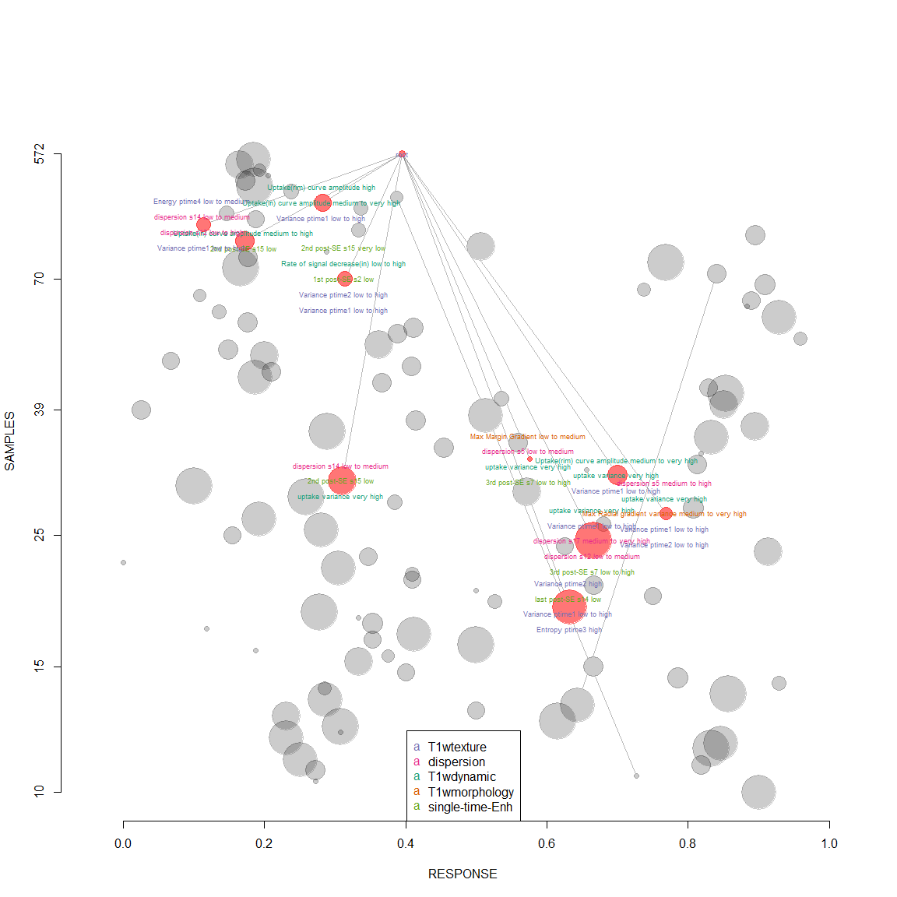

# Analysis of results
Cristina Gallego  
March 23, 2016  

Analysis of results by each fold
==================

```r
library(caret)
```

```
## Loading required package: lattice
## Loading required package: ggplot2
```

```r
require(ggplot2)
library("RSQLite")
```

```
## Loading required package: DBI
```

```r
library(klaR)
```

```
## Loading required package: MASS
```

```r
library(pROC)
```

```
## Type 'citation("pROC")' for a citation.
## 
## Attaching package: 'pROC'
## 
## The following objects are masked from 'package:stats':
## 
##     cov, smooth, var
```

```r
library("Boruta")
```

```
## Loading required package: ranger
```

```r
require(data.table)
```

```
## Loading required package: data.table
```

```r
library(R.utils)
```

```
## Loading required package: R.oo
## Loading required package: R.methodsS3
## R.methodsS3 v1.7.0 (2015-02-19) successfully loaded. See ?R.methodsS3 for help.
## R.oo v1.19.0 (2015-02-27) successfully loaded. See ?R.oo for help.
## 
## Attaching package: 'R.oo'
## 
## The following objects are masked from 'package:methods':
## 
##     getClasses, getMethods
## 
## The following objects are masked from 'package:base':
## 
##     attach, detach, gc, load, save
## 
## R.utils v2.2.0 (2015-12-09) successfully loaded. See ?R.utils for help.
## 
## Attaching package: 'R.utils'
## 
## The following object is masked from 'package:utils':
## 
##     timestamp
## 
## The following objects are masked from 'package:base':
## 
##     cat, commandArgs, getOption, inherits, isOpen, parse, warnings
```

```r
library(rpart)
library(rpart.plot)
library(R.utils)
library(nodeHarvest)

loppath = "C:/Users/windows/Documents/repoCode-local/T2wR/lop_3Dtex_T2w_addedvalue"
setwd(loppath)
source("functions.R")

nsizes_imgT2 = c()
nsizes_allT2 = c()
nsizes_imgT1 = c()
nsizes_all = c()

maxinter_imgT2 = c()
maxinter_allT2 = c()
maxinter_imgT1 = c()
maxinter_all = c()

# load k-fold-out
for(k in 1:10){  # 1:10f cv
  df = load(paste0("Outputs/weigNH_addeddiagvalue_3Dtexbagg_cv",k,".RData"))
  nsizes_imgT2 = c(nsizes_imgT2, treedata_imgT2$nodesize)
  maxinter_imgT2 = c(maxinter_imgT2, treedata_imgT2$maxinter)
  nsizes_allT2 = c(nsizes_allT2, treedata_allT2$nodesize)
  maxinter_allT2 = c(maxinter_allT2, treedata_allT2$maxinter)
  nsizes_imgT1 = c(nsizes_imgT1, treedata_imgT1$nodesize)
  maxinter_imgT1 = c(maxinter_imgT1, treedata_imgT1$maxinter)
  nsizes_all = c(nsizes_all, treedata_all$nodesize)
  maxinter_all = c(maxinter_all, treedata_all$maxinter)
}

# for imgT2
print(table(nsizes_imgT2))
```

```
## nsizes_imgT2
##  5 10 15 25 
##  2  1  3  4
```

```r
print(table(maxinter_imgT2))
```

```
## maxinter_imgT2
## 2 3 
## 1 9
```

```r
# for allT2
print(table(nsizes_allT2))
```

```
## nsizes_allT2
##  5 15 20 25 
##  3  2  3  2
```

```r
print(table(maxinter_allT2))
```

```
## maxinter_allT2
## 1 3 
## 1 9
```

```r
# for imgT1
print(table(nsizes_imgT1))
```

```
## nsizes_imgT1
##  5 10 15 20 25 
##  3  1  2  1  3
```

```r
print(table(maxinter_imgT1))
```

```
## maxinter_imgT1
## 2 3 5 
## 1 1 8
```

```r
# for all
print(table(nsizes_all))
```

```
## nsizes_all
##  5 10 15 20 25 
##  1  2  1  5  1
```

```r
print(table(maxinter_all))
```

```
## maxinter_all
## 3 5 
## 1 9
```

plot final results
=================================

```r
# plot features
source("functions.R")

## imgT2featsel ###########
# pick frequency of 75% or higher as very common feature
dfimgT2 = data.frame(table(imgT2featsel$selfeat))
dfimgT2$high = (dfimgT2$Freq>=0.25*max(imgT2featsel$kfcv) &
                  dfimgT2$Freq<0.5*max(imgT2featsel$kfcv))*2
dfimgT2$high = dfimgT2$high + (dfimgT2$Freq>=0.5*max(imgT2featsel$kfcv))*1
print(dfimgT2[dfimgT2$high==1, ])
```

```
##                                  Var1 Freq high
## 1                             ave_T20    8    1
## 2                             ave_T21    8    1
## 3                            ave_T210   10    1
## 4                            ave_T211   10    1
## 5                            ave_T212    8    1
## 6                            ave_T213    9    1
## 7                            ave_T214    9    1
## 8                            ave_T215    6    1
## 9                            ave_T216    8    1
## 10                           ave_T217    7    1
## 11                           ave_T218    8    1
## 12                           ave_T219    7    1
## 13                            ave_T22    8    1
## 14                            ave_T23    8    1
## 15                            ave_T24    8    1
## 16                            ave_T25    9    1
## 17                            ave_T26    8    1
## 18                            ave_T27    7    1
## 19                            ave_T28   10    1
## 20                            ave_T29    9    1
## 21                        T2_lesionSI   10    1
## 22                     T2_lesionSIstd    5    1
## 23                      T2grad_margin    8    1
## 24                  T2grad_margin_var    9    1
## 25                       T2kurt_F_r_i    8    1
## 26                        T2max_F_r_i    9    1
## 27                       T2mean_F_r_i    8    1
## 28                        T2min_F_r_i    8    1
## 29                         T2RGH_mean    9    1
## 30                          T2RGH_var    9    1
## 31                       T2skew_F_r_i   10    1
## 33       T2texture_correlation_nondir   10    1
## 34       T2texture_diffentropy_nondir    7    1
## 36            T2texture_energy_nondir    8    1
## 37           T2texture_entropy_nondir    8    1
## 38 T2texture_inversediffmoment_nondir   10    1
## 39        T2texture_sumaverage_nondir    7    1
## 41       T2texture_sumvariance_nondir    6    1
## 42          T2texture_variance_nondir    6    1
## 43                        T2var_F_r_i    6    1
```

```r
print(dfimgT2[dfimgT2$high==2, ])
```

```
##                             Var1 Freq high
## 32     T2texture_contrast_nondir    4    2
## 35 T2texture_diffvariance_nondir    3    2
## 40   T2texture_sumentropy_nondir    3    2
```

```r
#qplot(factor(selfeat), data=imgT2featsel, geom="bar", fill=factor(high))
ggplot(dfimgT2, aes(x=Var1, y=Freq, fill=factor(high))) + 
  geom_bar(stat = "identity") + coord_flip() +
  ggtitle("imgT2featsel") +
  labs(y="featsel frequency", x=" ") +
  theme(plot.title = element_text(family = "Trebuchet MS", color="#666666", face="bold", size=22, hjust=0))+
  theme(axis.title = element_text(family = "Trebuchet MS", color="#666666", face="bold", size=16))
```

 

```r
## allT2featsel ########### 
# pick frequency of 75% or higher as very common feature
dfallT2 = data.frame(table(allT2featsel$selfeat))
dfallT2$high = (dfallT2$Freq>=0.25*max(allT2featsel$kfcv) &
                  dfallT2$Freq<0.5*max(allT2featsel$kfcv))*2
dfallT2$high = dfallT2$high + (dfallT2$Freq>=0.5*max(allT2featsel$kfcv))*1
print(dfallT2[dfallT2$high==1, ])
```

```
##                                  Var1 Freq high
## 1                             ave_T20    8    1
## 2                             ave_T21    6    1
## 3                            ave_T210    9    1
## 4                            ave_T211    8    1
## 5                            ave_T212    6    1
## 6                            ave_T213    9    1
## 7                            ave_T214    8    1
## 8                            ave_T215    8    1
## 9                            ave_T216    9    1
## 10                           ave_T217   10    1
## 11                           ave_T218    8    1
## 12                           ave_T219    9    1
## 13                            ave_T22    8    1
## 14                            ave_T23    7    1
## 15                            ave_T24    7    1
## 16                            ave_T25   10    1
## 17                            ave_T26    8    1
## 18                            ave_T27    8    1
## 19                            ave_T28    9    1
## 20                            ave_T29    8    1
## 21                    LMSIR_predicted   10    1
## 22                        T2_lesionSI   10    1
## 23                     T2_lesionSIstd    9    1
## 24                      T2grad_margin    6    1
## 25                  T2grad_margin_var    7    1
## 26                       T2kurt_F_r_i   10    1
## 27                        T2max_F_r_i    6    1
## 29                        T2min_F_r_i   10    1
## 30                         T2RGH_mean   10    1
## 31                          T2RGH_var    9    1
## 32                       T2skew_F_r_i   10    1
## 34       T2texture_correlation_nondir   10    1
## 35       T2texture_diffentropy_nondir    6    1
## 36      T2texture_diffvariance_nondir    6    1
## 37            T2texture_energy_nondir    8    1
## 38           T2texture_entropy_nondir    5    1
## 39 T2texture_inversediffmoment_nondir    9    1
## 40        T2texture_sumaverage_nondir    9    1
## 41        T2texture_sumentropy_nondir    6    1
## 42       T2texture_sumvariance_nondir    6    1
## 45                    T2wSI_predicted   10    1
```

```r
print(dfallT2[dfallT2$high==2, ])
```

```
##            Var1 Freq high
## 28 T2mean_F_r_i    4    2
```

```r
#qplot(factor(selfeat), data=allT2featsel, geom="bar", fill=factor(high))
ggplot(dfallT2, aes(x=Var1, y=Freq, fill=factor(high))) + 
  geom_bar(stat = "identity") + coord_flip() +
  ggtitle("allT2featsel") +
  labs(y="featsel frequency", x=" ") +
  theme(plot.title = element_text(family = "Trebuchet MS", color="#666666", face="bold", size=22, hjust=0))+
  theme(axis.title = element_text(family = "Trebuchet MS", color="#666666", face="bold", size=16))
```

 

```r
## imgT1featsel ########### 
# pick frequency of 75% or higher as very common feature
dfimgT1 = data.frame(table(imgT1featsel$selfeat))
dfimgT1$high = (dfimgT1$Freq>=0.25*max(imgT1featsel$kfcv) &
                  dfimgT1$Freq<0.5*max(imgT1featsel$kfcv))*2
dfimgT1$high = dfimgT1$high + (dfimgT1$Freq>=0.5*max(imgT1featsel$kfcv))*1
print(dfimgT1[dfimgT1$high==1, ])
```

```
##                                Var1 Freq high
## 2                          A_inside   10    1
## 4                      alpha_inside    5    1
## 6                       beta_inside    5    1
## 57           iiiMax_Margin_Gradient    5    1
## 83                      max_RGH_var    5    1
## 85                    maxVr_countor    5    1
## 91                       SER_inside    6    1
## 120 texture_sumentropy_nondir_post3    5    1
## 137                             V14    6    1
```

```r
print(dfimgT1[dfimgT1$high==2, ])
```

```
##                                       Var1 Freq high
## 11                                dce2SE14    4    2
## 14                                dce2SE17    3    2
## 30                                dce3SE17    3    2
## 32                                 dce3SE2    4    2
## 33                                 dce3SE3    3    2
## 37                                 dce3SE8    3    2
## 39                                earlySE0    4    2
## 40                               earlySE10    3    2
## 50                                earlySE3    3    2
## 53                                earlySE9    4    2
## 60                            irregularity    4    2
## 63                           Kpeak_countor    3    2
## 64                            Kpeak_inside    4    2
## 65                              kurt_F_r_i    3    2
## 72                                lateSE18    4    2
## 76                                 lateSE4    3    2
## 81                            max_RGH_mean    4    2
## 87                               min_F_r_i    4    2
## 88                          peakCr_countor    3    2
## 90                             SER_countor    3    2
## 92                              skew_F_r_i    3    2
## 96           texture_contrast_nondir_post4    4    2
## 99        texture_correlation_nondir_post3    3    2
## 100       texture_diffentropy_nondir_post3    3    2
## 108           texture_entropy_nondir_post3    3    2
## 111 texture_inversediffmoment_nondir_post2    3    2
## 114        texture_sumaverage_nondir_post1    3    2
## 116        texture_sumaverage_nondir_post3    3    2
## 121        texture_sumentropy_nondir_post4    3    2
## 126          texture_variance_nondir_post1    3    2
## 127          texture_variance_nondir_post2    4    2
## 128          texture_variance_nondir_post3    3    2
## 133                                     V1    4    2
## 140                                    V17    4    2
## 141                                    V18    3    2
## 143                                     V2    4    2
## 144                                     V3    3    2
## 145                                     V4    3    2
## 146                                     V5    4    2
## 148                                     V7    4    2
## 152              Vr_decreasingRate_countor    3    2
## 153               Vr_decreasingRate_inside    3    2
```

```r
#qplot(factor(selfeat), data=imgT1featsel, geom="bar", fill=factor(high))
ggplot(dfimgT1, aes(x=Var1, y=Freq, fill=factor(high))) + 
  geom_bar(stat = "identity") + coord_flip() +
  ggtitle("imgT1featsel") +
  labs(y="featsel frequency", x=" ") +
  theme(plot.title = element_text(family = "Trebuchet MS", color="#666666", face="bold", size=22, hjust=0))+
  theme(axis.title = element_text(family = "Trebuchet MS", color="#666666", face="bold", size=16))
```

 

```r
## allfeatsel ########### 
# pick frequency of 75% or higher as very common feature
dfall = data.frame(table(allfeatsel$selfeat))
dfall$high = (dfall$Freq>=0.25*max(allfeatsel$kfcv) & dfall$Freq<0.5*max(allfeatsel$kfcv))*2
dfall$high = dfall$high + (dfall$Freq>=0.5*max(allfeatsel$kfcv))*1
print(dfall[dfall$high==1, ])
```

```
##             Var1 Freq high
## 2       A_inside   10    1
## 7       ave_T210    5    1
## 97  max_RGH_mean    5    1
## 177           V6    7    1
```

```r
print(dfall[dfall$high==2, ])
```

```
##                                  Var1 Freq high
## 6                             ave_T21    3    2
## 10                           ave_T213    3    2
## 20                            ave_T26    3    2
## 25                        beta_inside    4    2
## 53                            dce3SE4    4    2
## 60                          earlySE12    3    2
## 74             iiiMax_Margin_Gradient    3    2
## 77                       irregularity    4    2
## 81                         kurt_F_r_i    3    2
## 83                            lateSE1    3    2
## 86                           lateSE12    3    2
## 93                            lateSE6    4    2
## 96                          max_F_r_i    3    2
## 98                        max_RGH_var    3    2
## 102                        mean_F_r_i    3    2
## 107                        skew_F_r_i    3    2
## 108                 Slope_ini_countor    3    2
## 110                     T2grad_margin    3    2
## 114                      T2mean_F_r_i    3    2
## 117                         T2RGH_var    3    2
## 135  texture_diffentropy_nondir_post4    3    2
## 136 texture_diffvariance_nondir_post2    3    2
## 139       texture_energy_nondir_post4    3    2
## 140      texture_entropy_nondir_post2    3    2
## 148   texture_sumaverage_nondir_post4    3    2
## 152  texture_sumvariance_nondir_post1    4    2
## 159                      Tpeak_inside    3    2
## 163                               V10    3    2
## 166                               V13    4    2
## 167                               V14    4    2
## 170                               V17    3    2
## 174                                V3    3    2
## 176                                V5    3    2
## 179                                V8    4    2
## 184                 Vr_post_1_countor    4    2
```

```r
#qplot(factor(selfeat), data=allfeatsel, geom="bar", fill=factor(high))
ggplot(dfall, aes(x=Var1, y=Freq, fill=factor(high))) + 
  geom_bar(stat = "identity") + coord_flip() +
  ggtitle("allfeatsel") +
  labs(y="featsel frequency", x=" ") +
  theme(plot.title = element_text(family = "Trebuchet MS", color="#666666", face="bold", size=22, hjust=0))+
  theme(axis.title = element_text(family = "Trebuchet MS", color="#666666", face="bold", size=16))
```

 

```r
########### 
## plot ROCs each pass individually in l-o-p heldout test cases
par(mfrow=c(1,1))
n=15
colors = rainbow(n, s = 1, v = 1, start = 0, end = max(1, n - 1)/n, alpha = 1)
# plot 1/4
p1 = calcAUC_plot(perf_imgT2$obs, perf_imgT2$C, 
                           xptext=0.45, yptext=0.75, ltype=4, colors[2], atitle="")
```

```
## Area under the curve: 0.7252
## 95% CI (2000 stratified bootstrap replicates):
##  thresholds sp.low sp.median sp.high se.low se.median se.high
##   0.3910212 0.6139    0.6561  0.7025  0.656    0.6893  0.7212
```

```r
par(new=TRUE)
p2 = calcAUC_plot(perf_allT2$obs, perf_allT2$C, 
                           xptext=0.55, yptext=0.65, ltype=3, colors[9], atitle="")
```

```
## Area under the curve: 0.7331
## 95% CI (2000 stratified bootstrap replicates):
##  thresholds sp.low sp.median sp.high se.low se.median se.high
##   0.3629964 0.7754    0.8099  0.8445 0.5096    0.5464  0.5833
```

```r
par(new=TRUE)
p3 = calcAUC_plot(perf_imgT1$obs, perf_imgT1$C,
                           xptext=0.65, yptext=0.55, ltype=2, colors[11], atitle="")
```

```
## Area under the curve: 0.836
## 95% CI (2000 stratified bootstrap replicates):
##  thresholds sp.low sp.median sp.high se.low se.median se.high
##   0.4156964  0.666    0.7088  0.7495 0.8026    0.8295   0.858
```

```r
par(new=TRUE)
p4 = calcAUC_plot(perf_all$obs, perf_all$C,
                           xptext=0.75, yptext=0.45, ltype=1, colors[14], atitle="ROCs leave-one-patient out test ")
```

```
## Area under the curve: 0.8574
## 95% CI (2000 stratified bootstrap replicates):
##  thresholds sp.low sp.median sp.high se.low se.median se.high
##   0.3939238 0.6969    0.7381  0.7773 0.8141    0.8423  0.8704
```

```r
legend("bottomright", 
       legend = c(paste0("imgT2w"),
                  paste0("imgT2w+predT2w"),
                  paste0("imgT1w"),
                  paste0("imgT1+imgT2w+predT2w")),
       col = c(colors[2],colors[9],colors[11],colors[14]), lty=c(4,3,2,1), lwd = 3)
```

 

```r
# find significants: only imgT2 vs. allT2
roc.test(p1$ROC, p2$ROC, method=c("bootstrap"), alternative = c("less"), boot.stratified=TRUE)
```

```
## 
## 	Bootstrap test for two ROC curves
## 
## data:  p1$ROC and p2$ROC
## D = -0.38504, boot.n = 2000, boot.stratified = 1, p-value = 0.3501
## alternative hypothesis: true difference in AUC is less than 0
## sample estimates:
## AUC of roc1 AUC of roc2 
##   0.7252322   0.7331153
```

```r
# find significants: mass imgT1 vs all
roc.test(p3$ROC, p4$ROC, method=c("bootstrap"), alternative = c("two.sided"), boot.stratified=TRUE)
```

```
## 
## 	Bootstrap test for two ROC curves
## 
## data:  p3$ROC and p4$ROC
## D = -1.3116, boot.n = 2000, boot.stratified = 1, p-value = 0.1897
## alternative hypothesis: true difference in AUC is not equal to 0
## sample estimates:
## AUC of roc1 AUC of roc2 
##   0.8360200   0.8573762
```

```r
# find significants: mass allT2 vs all
roc.test(p2$ROC, p4$ROC, method=c("bootstrap"), alternative = c("two.sided"), boot.stratified=TRUE)
```

```
## 
## 	Bootstrap test for two ROC curves
## 
## data:  p2$ROC and p4$ROC
## D = -6.9463, boot.n = 2000, boot.stratified = 1, p-value =
## 3.751e-12
## alternative hypothesis: true difference in AUC is not equal to 0
## sample estimates:
## AUC of roc1 AUC of roc2 
##   0.7331153   0.8573762
```


Results by subpopulation of patients
============

```r
allfT2 = read3Dtex_T2uniqcad_parti(id_cad_pts, uniq_cad, kfcvpartitionsetD, 10, 1)
```

```
##    massB    massM nonmassB nonmassM 
##      216      153      131       67 
##    massB    massM nonmassB nonmassM 
##       24       15       11       10
```

```r
datasets = data.frame(rbind(allfT2[[2]], allfT2[[1]]), check.names = FALSE)
datasetsinfo = data.frame(cbind(rbind(allfT2[[6]],allfT2[[5]]),
                                BIRADS_T2wSI = datasets$find_t2_signal_int), check.names = FALSE) 
summary(factor(datasetsinfo$lesion_label))
```

```
##    massB    massM nonmassB nonmassM 
##      240      168      142       77
```

```r
# subset by mass = 447, nonmass = 243
##################
massids=subset(datasetsinfo, lesion_label=="massB" | lesion_label=="massM")
nonmassids=subset(datasetsinfo, lesion_label=="nonmassB" | lesion_label=="nonmassM")

# Get datasets based on ids
# For Masses
##################
massperf_imgT2 = data.frame();  massperf_allT2 = data.frame();
massperf_imgT1 = data.frame();  massperf_all = data.frame();

for(mi in massids$lesion_id){
  if(mi %in% massids$lesion_id){
    massperf_imgT2 = rbind(massperf_imgT2, perf_imgT2[perf_imgT2$id==mi,])
    massperf_allT2 = rbind(massperf_allT2, perf_allT2[perf_allT2$id==mi,])
    massperf_imgT1 = rbind(massperf_imgT1, perf_imgT1[perf_imgT1$id==mi,])
    massperf_all = rbind(massperf_all, perf_all[perf_all$id==mi,])
  }
}

## plot ROCs each pass individually in l-o-p heldout test cases
par(mfrow=c(1,1))
n=15
colors = rainbow(n, s = 1, v = 1, start = 0, end = max(1, n - 1)/n, alpha = 1)
# plot 1/4
p1 = calcAUC_plot(massperf_imgT2$obs, massperf_imgT2$C, 
                           xptext=0.45, yptext=0.75, ltype=4, colors[2], atitle="")
```

```
## Area under the curve: 0.7407
## 95% CI (2000 stratified bootstrap replicates):
##  thresholds sp.low sp.median sp.high se.low se.median se.high
##   0.3923629 0.5728    0.6285   0.678 0.6901    0.7319  0.7715
```

```r
par(new=TRUE)
p2 = calcAUC_plot(massperf_allT2$obs, massperf_allT2$C, 
                           xptext=0.55, yptext=0.65, ltype=3, colors[9], atitle="")
```

```
## Area under the curve: 0.7674
## 95% CI (2000 stratified bootstrap replicates):
##  thresholds sp.low sp.median sp.high se.low se.median se.high
##   0.4033544 0.6044    0.6573  0.7103 0.7215     0.761  0.8004
```

```r
par(new=TRUE)
p3 = calcAUC_plot(massperf_imgT1$obs, massperf_imgT1$C,
                           xptext=0.65, yptext=0.55, ltype=2, colors[11], atitle="")
```

```
## Area under the curve: 0.8499
## 95% CI (2000 stratified bootstrap replicates):
##  thresholds sp.low sp.median sp.high se.low se.median se.high
##   0.4164268 0.6897    0.7398  0.7868 0.7852    0.8222  0.8545
```

```r
par(new=TRUE)
p4 = calcAUC_plot(massperf_all$obs, massperf_all$C,
                           xptext=0.75, yptext=0.45, ltype=1, colors[14], atitle="for mass ROCs 10f cross-validation")
```

```
## Area under the curve: 0.8612
## 95% CI (2000 stratified bootstrap replicates):
##  thresholds sp.low sp.median sp.high se.low se.median se.high
##   0.3939238 0.7343    0.7791  0.8239  0.786    0.8231  0.8581
```

```r
legend("bottomright", 
       legend = c(paste0("imgT2w"),
                  paste0("imgT2w+predT2w"),
                  paste0("imgT1w"),
                  paste0("imgT1+imgT2w+predT2w")),
       col = c(colors[2],colors[9],colors[11],colors[14]), lty=c(4,3,2,1), lwd = 3)
```

 

```r
# find significants: only imgT2 vs. allT2
roc.test(p1$ROC, p2$ROC, method=c("bootstrap"), alternative = c("less"), boot.stratified=TRUE)
```

```
## 
## 	Bootstrap test for two ROC curves
## 
## data:  p1$ROC and p2$ROC
## D = -1.0978, boot.n = 2000, boot.stratified = 1, p-value = 0.1361
## alternative hypothesis: true difference in AUC is less than 0
## sample estimates:
## AUC of roc1 AUC of roc2 
##   0.7406764   0.7673662
```

```r
# find significants: mass imgT1 vs all
roc.test(p3$ROC, p4$ROC, method=c("bootstrap"), alternative = c("less"), boot.stratified=TRUE)
```

```
## 
## 	Bootstrap test for two ROC curves
## 
## data:  p3$ROC and p4$ROC
## D = -0.56664, boot.n = 2000, boot.stratified = 1, p-value = 0.2855
## alternative hypothesis: true difference in AUC is less than 0
## sample estimates:
## AUC of roc1 AUC of roc2 
##   0.8499207   0.8611517
```

```r
# find significants: mass allT2 vs all
roc.test(p2$ROC, p4$ROC, method=c("bootstrap"), alternative = c("two.sided"), boot.stratified=TRUE)
```

```
## 
## 	Bootstrap test for two ROC curves
## 
## data:  p2$ROC and p4$ROC
## D = -4.4768, boot.n = 2000, boot.stratified = 1, p-value =
## 7.575e-06
## alternative hypothesis: true difference in AUC is not equal to 0
## sample estimates:
## AUC of roc1 AUC of roc2 
##   0.7673662   0.8611517
```

```r
# look at pAUC
plot(x = roc(response = massperf_all$obs, predictor = massperf_all$C, 
         ci=TRUE, print.auc=TRUE, 
         partial.auc = c(100, 90), partial.auc.focus="se",
         print.auc.pattern="Corrected pAUC (100-90%% SE):\n%.1f%%", print.auc.col=colors[14],
         col=colors[14], lty=4, legacy.axes=TRUE, main="") )
```

 

```
## 
## Call:
## roc.default(response = massperf_all$obs, predictor = massperf_all$C,     ci = TRUE, print.auc = TRUE, partial.auc = c(100, 90), partial.auc.focus = "se",     print.auc.pattern = "Corrected pAUC (100-90%% SE):\n%.1f%%",     print.auc.col = colors[14], col = colors[14], lty = 4, legacy.axes = TRUE,     main = "")
## 
## Data: massperf_all$C in 335 controls (massperf_all$obs C) > 458 cases (massperf_all$obs NC).
## Partial area under the curve (sensitivity 100-90): NA
## 95% CI: NA-NA (2000 stratified bootstrap replicates)
```

```r
# Get datasets based on ids
# For Non-Masses
##################
nonmassperf_imgT2 = data.frame();  nonmassperf_allT2 = data.frame();
nonmassperf_imgT1 = data.frame();  nonmassperf_all = data.frame();

for(mi in nonmassids$lesion_id){
  if(mi %in% nonmassids$lesion_id){
    nonmassperf_imgT2 = rbind(nonmassperf_imgT2, perf_imgT2[perf_imgT2$id==mi,])
    nonmassperf_allT2 = rbind(nonmassperf_allT2, perf_allT2[perf_allT2$id==mi,])
    nonmassperf_imgT1 = rbind(nonmassperf_imgT1, perf_imgT1[perf_imgT1$id==mi,])
    nonmassperf_all = rbind(nonmassperf_all, perf_all[perf_all$id==mi,])
  }
}

## plot ROCs each pass individually in l-o-p heldout test cases
par(mfrow=c(1,1))
n=15
colors = rainbow(n, s = 1, v = 1, start = 0, end = max(1, n - 1)/n, alpha = 1)
# plot 1/4
p1 = calcAUC_plot(nonmassperf_imgT2$obs, nonmassperf_imgT2$C, 
                           xptext=0.45, yptext=0.75, ltype=4, colors[2], atitle="")
```

```
## Area under the curve: 0.7039
## 95% CI (2000 stratified bootstrap replicates):
##  thresholds sp.low sp.median sp.high se.low se.median se.high
##   0.3898348 0.6424    0.7219  0.7947 0.5713    0.6241  0.6805
```

```r
par(new=TRUE)
p2 = calcAUC_plot(nonmassperf_allT2$obs, nonmassperf_allT2$C, 
                           xptext=0.55, yptext=0.65, ltype=3, colors[9], atitle="")
```

```
## Area under the curve: 0.69
## 95% CI (2000 stratified bootstrap replicates):
##  thresholds sp.low sp.median sp.high se.low se.median se.high
##   0.4322019 0.5634    0.6408  0.7183 0.5906    0.6486  0.7065
```

```r
par(new=TRUE)
p3 = calcAUC_plot(nonmassperf_imgT1$obs, nonmassperf_imgT1$C,
                           xptext=0.65, yptext=0.55, ltype=2, colors[11], atitle="")
```

```
## Area under the curve: 0.813
## 95% CI (2000 stratified bootstrap replicates):
##  thresholds sp.low sp.median sp.high se.low se.median se.high
##   0.4152444 0.5814    0.6512  0.7209 0.7934    0.8413  0.8819
```

```r
par(new=TRUE)
p4 = calcAUC_plot(nonmassperf_all$obs, nonmassperf_all$C,
                           xptext=0.75, yptext=0.45, ltype=1, colors[14], atitle="for nonmass ROCs 10f cross-validation")
```

```
## Area under the curve: 0.8502
## 95% CI (2000 stratified bootstrap replicates):
##  thresholds sp.low sp.median sp.high se.low se.median se.high
##   0.3769909 0.6267       0.7  0.7667 0.8175    0.8571  0.8968
```

```r
legend("bottomright", 
       legend = c(paste0("imgT2w"),
                  paste0("imgT2w+predT2w"),
                  paste0("imgT1w"),
                  paste0("imgT1+imgT2w+predT2w")),
       col = c(colors[2],colors[9],colors[11],colors[14]), lty=c(4,3,2,1), lwd = 3)
```

 

```r
# find significants: only imgT2 vs. allT2
roc.test(p1$ROC, p2$ROC, method=c("bootstrap"), alternative = c("less"), boot.stratified=TRUE)
```

```
## 
## 	Bootstrap test for two ROC curves
## 
## data:  p1$ROC and p2$ROC
## D = 0.39, boot.n = 2000, boot.stratified = 1, p-value = 0.6517
## alternative hypothesis: true difference in AUC is less than 0
## sample estimates:
## AUC of roc1 AUC of roc2 
##   0.7039411   0.6900260
```

```r
# find significants: nonmass imgT1 vs all
roc.test(p3$ROC, p4$ROC, method=c("bootstrap"), alternative = c("two.sided"), boot.stratified=TRUE, n.boot=5000)
```

```
## 
## 	Bootstrap test for two ROC curves
## 
## data:  p3$ROC and p4$ROC
## D = -1.2904, boot.n = 2000, boot.stratified = 1, p-value = 0.1969
## alternative hypothesis: true difference in AUC is not equal to 0
## sample estimates:
## AUC of roc1 AUC of roc2 
##   0.8129773   0.8501852
```

```r
# find significants: nonmass allT2 vs all
roc.test(p2$ROC, p4$ROC, method=c("bootstrap"), alternative = c("two.sided"), boot.stratified=TRUE)
```

```
## 
## 	Bootstrap test for two ROC curves
## 
## data:  p2$ROC and p4$ROC
## D = -4.7805, boot.n = 2000, boot.stratified = 1, p-value =
## 1.749e-06
## alternative hypothesis: true difference in AUC is not equal to 0
## sample estimates:
## AUC of roc1 AUC of roc2 
##   0.6900260   0.8501852
```

```r
plot.roc(massperf_all$obs, massperf_all$C, # data  
         legacy.axes=TRUE, percent=FALSE, # show all values in percent  
         partial.auc=c(1, 0.9), partial.auc.correct=TRUE, # define a partial AUC (pAUC)
         print.auc=TRUE, #display pAUC value on the plot with following options:
         print.auc.pattern="pAUC (1-0.9 SP):\n%.2f%%", print.auc.col=colors[14],
         col=colors[14],
         auc.polygon=TRUE, auc.polygon.col=colors[14], # show pAUC as a polygon
         max.auc.polygon=TRUE, max.auc.polygon.col="#FF00CC22", # also show the 100% polygon
         main="Mass vs. nonmass Partial AUC (pAUC) at high specificity ")
```

```
## 
## Call:
## plot.roc.default(x = massperf_all$obs, predictor = massperf_all$C,     legacy.axes = TRUE, percent = FALSE, partial.auc = c(1, 0.9),     partial.auc.correct = TRUE, print.auc = TRUE, print.auc.pattern = "pAUC (1-0.9 SP):\n%.2f%%",     print.auc.col = colors[14], col = colors[14], auc.polygon = TRUE,     auc.polygon.col = colors[14], max.auc.polygon = TRUE, max.auc.polygon.col = "#FF00CC22",     main = "Mass vs. nonmass Partial AUC (pAUC) at high specificity ")
## 
## Data: massperf_all$C in 335 controls (massperf_all$obs C) > 458 cases (massperf_all$obs NC).
## Corrected partial area under the curve (specificity 1-0.9): 0.6608
```

```r
plot.roc(nonmassperf_all$obs, nonmassperf_all$C, # data
         add=TRUE, type="n", # add to plot, but don't re-add  
         legacy.axes=TRUE, percent=FALSE, # show all values in percent  
         partial.auc=c(1, 0.9), partial.auc.correct=TRUE, # define a partial AUC (pAUC)
         print.auc=TRUE, #display pAUC value on the plot with following options:
         print.auc.pattern="pAUC (1-0.9 SP):\n%.2f%%", print.auc.col=colors[12],
         print.auc.y=0.3, # do not print auc over the previous one  
         col=colors[12],
         auc.polygon=TRUE, auc.polygon.col=colors[12], # show pAUC as a polygon
         max.auc.polygon=TRUE, max.auc.polygon.col="#6600FF22", # also show the 100% polygon
         main=" ")
```

 

```
## 
## Call:
## plot.roc.default(x = nonmassperf_all$obs, predictor = nonmassperf_all$C,     add = TRUE, type = "n", legacy.axes = TRUE, percent = FALSE,     partial.auc = c(1, 0.9), partial.auc.correct = TRUE, print.auc = TRUE,     print.auc.pattern = "pAUC (1-0.9 SP):\n%.2f%%", print.auc.col = colors[12],     print.auc.y = 0.3, col = colors[12], auc.polygon = TRUE,     auc.polygon.col = colors[12], max.auc.polygon = TRUE, max.auc.polygon.col = "#6600FF22",     main = " ")
## 
## Data: nonmassperf_all$C in 150 controls (nonmassperf_all$obs C) > 252 cases (nonmassperf_all$obs NC).
## Corrected partial area under the curve (specificity 1-0.9): 0.6444
```

```r
## for CI across all points
# plot(x = roc(response = massperf_all$obs, predictor = massperf_all$C, 
#              percent = TRUE, 
#              ci = TRUE, of = "se", sp = seq(0, 100,5)), ci.type="shape")
# 

plot.roc(massperf_all$obs, massperf_all$C, # data  
         legacy.axes=TRUE, percent=FALSE, # show all values in percent  
         partial.auc=c(1, 0.9), partial.auc.correct=TRUE, # define a partial AUC (pAUC)
         partial.auc.focus="se",
         print.auc=TRUE, #display pAUC value on the plot with following options:
         print.auc.pattern="pAUC (1-0.9 SE):\n%.2f%%", print.auc.col=colors[14],
         col=colors[14],
         auc.polygon=TRUE, auc.polygon.col=colors[14], # show pAUC as a polygon
         max.auc.polygon=TRUE, max.auc.polygon.col="#FF00CC22", # also show the 100% polygon
         main="Mass vs. nonmass Partial AUC (pAUC) at high sensitivity ")
```

```
## 
## Call:
## plot.roc.default(x = massperf_all$obs, predictor = massperf_all$C,     legacy.axes = TRUE, percent = FALSE, partial.auc = c(1, 0.9),     partial.auc.correct = TRUE, partial.auc.focus = "se", print.auc = TRUE,     print.auc.pattern = "pAUC (1-0.9 SE):\n%.2f%%", print.auc.col = colors[14],     col = colors[14], auc.polygon = TRUE, auc.polygon.col = colors[14],     max.auc.polygon = TRUE, max.auc.polygon.col = "#FF00CC22",     main = "Mass vs. nonmass Partial AUC (pAUC) at high sensitivity ")
## 
## Data: massperf_all$C in 335 controls (massperf_all$obs C) > 458 cases (massperf_all$obs NC).
## Corrected partial area under the curve (sensitivity 1-0.9): 0.7191
```

```r
plot.roc(nonmassperf_all$obs, nonmassperf_all$C, # data
         add=TRUE, type="l", # add to plot, but don't re-add  
         legacy.axes=TRUE, percent=FALSE, # show all values in percent  
         partial.auc=c(1, 0.9), partial.auc.correct=TRUE, # define a partial AUC (pAUC)
         partial.auc.focus="se",
         print.auc=TRUE, #display pAUC value on the plot with following options:
         print.auc.pattern="pAUC (1-0.9 SE):\n%.2f%%", print.auc.col=colors[12],
         print.auc.y=0.3, # do not print auc over the previous one  
         col=colors[12],
         auc.polygon=TRUE, auc.polygon.col=colors[12], # show pAUC as a polygon
         max.auc.polygon=TRUE, max.auc.polygon.col="#6600FF22", # also show the 100% polygon
         main=" ")
```

 

```
## 
## Call:
## plot.roc.default(x = nonmassperf_all$obs, predictor = nonmassperf_all$C,     add = TRUE, type = "l", legacy.axes = TRUE, percent = FALSE,     partial.auc = c(1, 0.9), partial.auc.correct = TRUE, partial.auc.focus = "se",     print.auc = TRUE, print.auc.pattern = "pAUC (1-0.9 SE):\n%.2f%%",     print.auc.col = colors[12], print.auc.y = 0.3, col = colors[12],     auc.polygon = TRUE, auc.polygon.col = colors[12], max.auc.polygon = TRUE,     max.auc.polygon.col = "#6600FF22", main = " ")
## 
## Data: nonmassperf_all$C in 150 controls (nonmassperf_all$obs C) > 252 cases (nonmassperf_all$obs NC).
## Corrected partial area under the curve (sensitivity 1-0.9): 0.7169
```

```r
# subset by Hyperintense = 106, Hypointense or not seen = 161,  Slightly hyperintense = 68, ntotal = 335
# None = 355
##################
summary(factor(datasetsinfo$BIRADS_T2wSI))
```

```
##            Hyperintense Hypointense or not seen                    None 
##                      98                     152                     312 
##   Slightly hyperintense 
##                      65
```

```r
T2wids=subset(datasetsinfo, BIRADS_T2wSI=="Hyperintense" | 
                              BIRADS_T2wSI=="Hypointense or not seen" |
                              BIRADS_T2wSI=="Slightly hyperintense")
NoneT2wids=subset(datasetsinfo, BIRADS_T2wSI=="None")

# Get datasets based on ids
# For T2wids
##################
T2wsiperf_imgT2 = data.frame();  T2wsiperf_allT2 = data.frame();
T2wsiperf_imgT1 = data.frame();  T2wsiperf_all = data.frame();

for(t2si in T2wids$lesion_id){
  if(t2si %in% T2wids$lesion_id){
    T2wsiperf_imgT2 = rbind(T2wsiperf_imgT2, perf_imgT2[perf_imgT2$id==t2si,])
    T2wsiperf_allT2 = rbind(T2wsiperf_allT2, perf_allT2[perf_allT2$id==t2si,])
    T2wsiperf_imgT1 = rbind(T2wsiperf_imgT1, perf_imgT1[perf_imgT1$id==t2si,])
    T2wsiperf_all = rbind(T2wsiperf_all, perf_all[perf_all$id==t2si,])
  }
}

## plot ROCs each pass individually in l-o-p heldout test cases
par(mfrow=c(1,1))
n=15
colors = rainbow(n, s = 1, v = 1, start = 0, end = max(1, n - 1)/n, alpha = 1)
# plot 1/4
p1 = calcAUC_plot(T2wsiperf_imgT2$obs, T2wsiperf_imgT2$C, 
                           xptext=0.45, yptext=0.75 , ltype=4, colors[2], atitle="")
```

```
## Area under the curve: 0.7308
## 95% CI (2000 stratified bootstrap replicates):
##  thresholds sp.low sp.median sp.high se.low se.median se.high
##   0.3929417 0.5294       0.6  0.6706 0.6953    0.7372  0.7767
```

```r
par(new=TRUE)
p2 = calcAUC_plot(T2wsiperf_allT2$obs, T2wsiperf_allT2$C, 
                           xptext=0.55, yptext=0.65 , ltype=3, colors[9], atitle="")
```

```
## Area under the curve: 0.7321
## 95% CI (2000 stratified bootstrap replicates):
##  thresholds sp.low sp.median sp.high se.low se.median se.high
##   0.3470406 0.5866    0.6592  0.7318 0.6904    0.7317  0.7729
```

```r
par(new=TRUE)
p3 = calcAUC_plot(T2wsiperf_imgT1$obs, T2wsiperf_imgT1$C,
                           xptext=0.65, yptext=0.55 , ltype=2, colors[11], atitle="")
```

```
## Area under the curve: 0.8404
## 95% CI (2000 stratified bootstrap replicates):
##  thresholds sp.low sp.median sp.high se.low se.median se.high
##   0.3252507 0.7865    0.8427  0.8933 0.6626    0.7063    0.75
```

```r
par(new=TRUE)
p4 = calcAUC_plot(T2wsiperf_all$obs, T2wsiperf_all$C,
                           xptext=0.75, yptext=0.45 , ltype=1, colors[14], atitle="for BIRADS T2wSI ROCs 10f cross-validation")
```

```
## Area under the curve: 0.8567
## 95% CI (2000 stratified bootstrap replicates):
##  thresholds sp.low sp.median sp.high se.low se.median se.high
##   0.3855101 0.6828    0.7419  0.8065 0.8109    0.8451   0.877
```

```r
legend("bottomright", 
       legend = c(paste0("imgT2w"),
                  paste0("imgT2w+predT2w"),
                  paste0("imgT1w"),
                  paste0("imgT1+imgT2w+predT2w")),
       col = c(colors[2],colors[9],colors[11],colors[14]), lty=c(4,3,2,1), lwd = 3)
```

 

```r
# find significants: only imgT2 vs. allT2
roc.test(p1$ROC, p2$ROC, method=c("bootstrap"), alternative = c("less"), boot.stratified=TRUE)
```

```
## 
## 	Bootstrap test for two ROC curves
## 
## data:  p1$ROC and p2$ROC
## D = -0.041375, boot.n = 2000, boot.stratified = 1, p-value =
## 0.4835
## alternative hypothesis: true difference in AUC is less than 0
## sample estimates:
## AUC of roc1 AUC of roc2 
##   0.7308208   0.7321383
```

```r
# find significants: imgT1 vs all
roc.test(p3$ROC, p4$ROC, method=c("bootstrap"), alternative = c("two.sided"), boot.stratified=TRUE)
```

```
## 
## 	Bootstrap test for two ROC curves
## 
## data:  p3$ROC and p4$ROC
## D = -0.65509, boot.n = 2000, boot.stratified = 1, p-value = 0.5124
## alternative hypothesis: true difference in AUC is not equal to 0
## sample estimates:
## AUC of roc1 AUC of roc2 
##   0.8404126   0.8567002
```

```r
# find significants: allT2 vs all
roc.test(p2$ROC, p4$ROC, method=c("bootstrap"), alternative = c("two.sided"), boot.stratified=TRUE)
```

```
## 
## 	Bootstrap test for two ROC curves
## 
## data:  p2$ROC and p4$ROC
## D = -4.5523, boot.n = 2000, boot.stratified = 1, p-value =
## 5.307e-06
## alternative hypothesis: true difference in AUC is not equal to 0
## sample estimates:
## AUC of roc1 AUC of roc2 
##   0.7321383   0.8567002
```

```r
# Get datasets based on ids
# For T2wids
##################
NoneT2wsiperf_imgT2 = data.frame();  NoneT2wsiperf_allT2 = data.frame();
NoneT2wsiperf_imgT1 = data.frame();  NoneT2wsiperf_all = data.frame();

for(t2si in NoneT2wids$lesion_id){
  if(t2si %in% NoneT2wids$lesion_id){
    NoneT2wsiperf_imgT2 = rbind(NoneT2wsiperf_imgT2, perf_imgT2[perf_imgT2$id==t2si,])
    NoneT2wsiperf_allT2 = rbind(NoneT2wsiperf_allT2, perf_allT2[perf_allT2$id==t2si,])
    NoneT2wsiperf_imgT1 = rbind(NoneT2wsiperf_imgT1, perf_imgT1[perf_imgT1$id==t2si,])
    NoneT2wsiperf_all = rbind(NoneT2wsiperf_all, perf_all[perf_all$id==t2si,])
  }
}

## plot ROCs each pass individually in l-o-p heldout test cases
par(mfrow=c(1,1))
n=15
colors = rainbow(n, s = 1, v = 1, start = 0, end = max(1, n - 1)/n, alpha = 1)
# plot 1/4
p1 = calcAUC_plot(NoneT2wsiperf_imgT2$obs, NoneT2wsiperf_imgT2$C, 
                           xptext=0.45, yptext=0.75 , ltype=4, colors[2], atitle="")
```

```
## Area under the curve: 0.6932
## 95% CI (2000 stratified bootstrap replicates):
##  thresholds sp.low sp.median sp.high se.low se.median se.high
##   0.3907987 0.6382    0.6908  0.7401 0.5739    0.6289  0.6838
```

```r
par(new=TRUE)
p2 = calcAUC_plot(NoneT2wsiperf_allT2$obs, NoneT2wsiperf_allT2$C, 
                           xptext=0.55, yptext=0.65 , ltype=3, colors[9], atitle="")
```

```
## Area under the curve: 0.6828
## 95% CI (2000 stratified bootstrap replicates):
##  thresholds sp.low sp.median sp.high se.low se.median se.high
##   0.4426828 0.6585    0.7113  0.7641  0.527    0.5845  0.6419
```

```r
par(new=TRUE)
p3 = calcAUC_plot(NoneT2wsiperf_imgT1$obs, NoneT2wsiperf_imgT1$C,
                           xptext=0.65, yptext=0.55 , ltype=2, colors[11], atitle="")
```

```
## Area under the curve: 0.8228
## 95% CI (2000 stratified bootstrap replicates):
##  thresholds sp.low sp.median sp.high se.low se.median se.high
##   0.4152444 0.6869     0.738  0.7859 0.7363    0.7842  0.8288
```

```r
par(new=TRUE)
p4 = calcAUC_plot(NoneT2wsiperf_all$obs, NoneT2wsiperf_all$C,
                           xptext=0.75, yptext=0.45 , ltype=1, colors[14], atitle="for None BIRADS T2wSI ROCs 10f cross-validation ")
```

```
## Area under the curve: 0.8511
## 95% CI (2000 stratified bootstrap replicates):
##  thresholds sp.low sp.median sp.high se.low se.median se.high
##   0.3938335 0.6923    0.7458  0.7926 0.7749    0.8192  0.8672
```

```r
legend("bottomright", 
       legend = c(paste0("imgT2w"),
                  paste0("imgT2w+predT2w"),
                  paste0("imgT1w"),
                  paste0("imgT1+imgT2w+predT2w")),
       col = c(colors[2],colors[9],colors[11],colors[14]), lty=c(4,3,2,1), lwd = 3)
```

 

```r
# find significants: only imgT2 vs. allT2
roc.test(p1$ROC, p2$ROC, method=c("bootstrap"), alternative = c("less"), boot.stratified=TRUE)
```

```
## 
## 	Bootstrap test for two ROC curves
## 
## data:  p1$ROC and p2$ROC
## D = 0.33243, boot.n = 2000, boot.stratified = 1, p-value = 0.6302
## alternative hypothesis: true difference in AUC is less than 0
## sample estimates:
## AUC of roc1 AUC of roc2 
##   0.6931916   0.6828428
```

```r
# find significants: imgT1 vs all
roc.test(p3$ROC, p4$ROC, method=c("bootstrap"), alternative = c("two.sided"), boot.stratified=TRUE)
```

```
## 
## 	Bootstrap test for two ROC curves
## 
## data:  p3$ROC and p4$ROC
## D = -1.1976, boot.n = 2000, boot.stratified = 1, p-value = 0.2311
## alternative hypothesis: true difference in AUC is not equal to 0
## sample estimates:
## AUC of roc1 AUC of roc2 
##   0.8228369   0.8510657
```

```r
# find significants: allT2 vs all
roc.test(p2$ROC, p4$ROC, method=c("bootstrap"), alternative = c("two.sided"), boot.stratified=TRUE)
```

```
## 
## 	Bootstrap test for two ROC curves
## 
## data:  p2$ROC and p4$ROC
## D = -6.0982, boot.n = 2000, boot.stratified = 1, p-value =
## 1.073e-09
## alternative hypothesis: true difference in AUC is not equal to 0
## sample estimates:
## AUC of roc1 AUC of roc2 
##   0.6828428   0.8510657
```


Aided-interpretaion of CAD results by each fold
==================

```r
k=8
loppath = "C:/Users/windows/Documents/repoCode-local/T2wR/lop_3Dtex_T2w_addedvalue"
setwd(loppath)
load(paste0("Outputs/weigNH_addeddiagvalue_3Dtexbagg_cv",k,".RData"))
source("functions.R")
source('Z:/Cristina/MassNonmass/Section 2 - Experiments/Qfunc_T2w_NodeHarvest/source/source_nodeHarvest.r')
source('Z:/Cristina/MassNonmass/Section 2 - Experiments/Qfunc_T2w_NodeHarvest/source/source_plotNH.R', encoding = 'UTF-8')

print(treedata_all$forest$varnames)
```

```
##  [1] "texture_sumvariance_nondir_post1"      
##  [2] "texture_inversediffmoment_nondir_post3"
##  [3] "V8"                                    
##  [4] "texture_diffvariance_nondir_post2"     
##  [5] "V4"                                    
##  [6] "mean_F_r_i"                            
##  [7] "max_RGH_mean"                          
##  [8] "V6"                                    
##  [9] "earlySE1"                              
## [10] "V10"                                   
## [11] "ave_T23"                               
## [12] "dce2SE17"                              
## [13] "texture_correlation_nondir_post4"      
## [14] "T2texture_sumentropy_nondir"           
## [15] "T2RGH_mean"                            
## [16] "lateSE6"                               
## [17] "dce2SE11"                              
## [18] "maxVr_countor"                         
## [19] "edge_sharp_mean"                       
## [20] "beta_countor"                          
## [21] "V7"                                    
## [22] "V5"                                    
## [23] "Slope_ini_countor"                     
## [24] "texture_sumaverage_nondir_post1"       
## [25] "T2wSI_predicted"                       
## [26] "V19"                                   
## [27] "dce3SE13"                              
## [28] "iMax_Variance_uptake"                  
## [29] "T2grad_margin"                         
## [30] "V15"                                   
## [31] "earlySE14"                             
## [32] "skew_F_r_i"                            
## [33] "dce3SE4"                               
## [34] "T2RGH_var"                             
## [35] "V1"                                    
## [36] "Vr_decreasingRate_inside"              
## [37] "texture_variance_nondir_post4"         
## [38] "A_inside"
```

```r
## post training... to find out about a NH prediction in the test set
library(nodeHarvest)
kid = 58
print(perfcv_imgT1[(kid-1):(kid+1),])
```

```
##     id         C        NC pred obs
## 57 564 0.4799269 0.5200731   NC   C
## 58 565 0.4502426 0.5497574   NC   C
## 59 569 0.4629696 0.5370304   NC   C
```

```r
print(perfcv_all[(kid-1):(kid+1),])
```

```
##     id         C        NC pred obs
## 57 564 0.5528825 0.4471175    C   C
## 58 565 0.5634938 0.4365062    C   C
## 59 569 0.4432586 0.5567414   NC   C
```

```r
print(T1T2testinfo[kid,c(1,3,6,8,12,21:26)])
```

```
##     lesion_id cad_pt_no_txt exam_a_number_txt exam_mri_cad_status_txt
## 565       565          6046         ACC108189               Malignant
##     exam_find_side_int find_curve_int find_mri_dce_init_enh_int
## 565              Right          Other                       N/A
##     find_mri_dce_delay_enh_int BIRADS lesion_label lesion_diagnosis
## 565                        N/A      5        massM     InsituDuctal
```

```r
cat(T1T2testinfo[kid,19])
```

```
## 36 years-old female.Probable large right
## breast carcinoma. Evaluate extent of disease
```

```r
cat(T1T2testinfo[kid,20])
```

```
## AP Report: 
##      (NOTE)
##      
##      SURGICAL  PATHOLOGY  REPORT
##      
## 
##      Encounter #: 13045506R
##      Specimen #: S10-5875
##      
##      CLINICAL INFORMATION
##      STAT
##      A) Highly suspicious for invasive and high grade DCIS. B) Suspicious
##      for metastatic involvement. C) indeterminate solid mass with
##      intracystic component.
##      
##      SPECIMENS SUBMITTED
##      A: Right breast, core biopsy 11-12 o'clock
##      B: Right axilla, core biopsy
##      C: Left breast, core biopsy
##      
##      
##      
##      DIAGNOSIS
##      A.     Right breast core biopsy:
##          IN SITU DUCTAL CARCINOMA.
##      
##      B.     Right axilla core biopsy:     LYMPH NODE SHOWING BENIGN
##      REACTIVE CHANGES.
##      
##      C.     Left breast core biopsy:
##          FIBROADENOMA.
##      
##      COMMENT:
##      A.  The core biopsy shows the presence of in situ ductal carcinoma of
##      the solid subtype.  The nuclear grade is 3/3.  No evidence of invasive
##      carcinoma is noted in the sections examined.
##      
##      (2010.03.04  HK/mk)
##      
##      
##      
##      
##      MACROSCOPIC DESCRIPTION
##      A. The specimen container is labeled with the patient name and 'right
##      breast biopsy site a'. The accompanying requisition matches the
##      container' s label. The specimen consists of 3 cores of tan and fatty
##      tissue, each with a diameter of 0.2 cm, ranging from 1.7 to 1.9 cm in
##      length. Submitted in toto in one block.
##      
##      B. The specimen container is labeled with the patient name and 'right
##      breast biopsy site B. axillary lymph node'. The accompanying
##      requisition matches the container' s label. The specimen consists of 4
##      cores of tan and fatty tissue, each with a diameter of 0.2 cm, ranging
##      from 0.6 to 1.9 cm in length. Submitted in toto in one block.
##      
##      C. The specimen container is labeled with the patient name and 'left
##      breast biopsy'. The accompanying requisition matches the container' s
##      label. The specimen consists of multiple fragmented cores of tan and
##      fatty tissue, each with a diameter of 0.2 cm, ranging from 0.2 to 1.2
##      cm in length. Submitted in toto in one block.
##      AM
##      Dictated 3/2/2010
##      
##      
##      
##      
##      
##      Harriette Kahn, MD, FRCPC
##      Report Electronically Signed
##      2010/03/04 17:11
```

```r
# predicted T2w SI
print(T1T2test$T2wSI_predicted[kid])
```

```
## [1] None
## 4 Levels: Hyperintense Hypointense or not seen ... Slightly hyperintense
```

```r
# assigned T2w SI
print(T2test[kid,])
```

```
##     lesion_label find_t2_signal_int T2_lesionSI T2_lesionSIstd    LMSIR
## 565            C               None    167.1376       183.3872 2.660627
##     T2min_F_r_i T2max_F_r_i T2mean_F_r_i T2var_F_r_i T2skew_F_r_i
## 565           2         720     167.1376    33643.53     1.629101
##     T2kurt_F_r_i T2grad_margin T2grad_margin_var T2RGH_mean T2RGH_var
## 565     1.404121      119.0787          19992.45    30.3217  661.6701
##     T2texture_energy_nondir T2texture_contrast_nondir
## 565            0.0006014138                   2535.47
##     T2texture_correlation_nondir T2texture_variance_nondir
## 565                    0.2473666                  1717.045
##     T2texture_inversediffmoment_nondir T2texture_sumaverage_nondir
## 565                         0.07414202                    85.06071
##     T2texture_sumvariance_nondir T2texture_sumentropy_nondir
## 565                     4201.704                    2.274448
##     T2texture_entropy_nondir T2texture_diffvariance_nondir
## 565                 3.370339                       1352.32
##     T2texture_diffentropy_nondir  ave_T20  ave_T21  ave_T22 ave_T23
## 565                     1.927888 376.3718 257.4146 152.4561   170.9
##      ave_T24  ave_T25  ave_T26  ave_T27  ave_T28  ave_T29 ave_T210
## 565 283.7018 188.5405 101.7368 85.46341 150.1346 430.3478  171.375
##     ave_T211 ave_T212 ave_T213 ave_T214 ave_T215 ave_T216 ave_T217
## 565 49.33333 309.4366 128.6316 280.6552      161 96.14286 69.80556
##     ave_T218 ave_T219 orig_label LMSIR_predicted T2wSI_predicted
## 565 279.4648 256.6986      massM        8.985234            None
```

```r
# predict with only T1
fdict = feature_dictionary(imgT1features)
```

```
## [1] "Variance ptime3"
## [1] "Rate of signal increase(in)"
## [1] "dispersion s18"
## [1] "max Radial gradient"
## [1] "change in Variance of spatial Margin Gradient"
## [1] "dispersion s1"
## [1] "dispersion s14"
## [1] "Inverse difference moment ptime2"
## [1] "dispersion s2"
## [1] "Sum average ptime1"
## [1] "Max Radial gradient variance"
## [1] "dispersion s4"
## [1] "Entropy ptime4"
## [1] "Uptake(in) curve amplitude"
## [1] "Max Margin Gradient"
## [1] "1st post-SE s4"
## [1] "Sum Entropy ptime1"
## [1] "2nd post-SE s8"
## [1] "SER(rim)"
## [1] "2nd post-SE s14"
## [1] "3rd post-SE s17"
## [1] "1st post-SE s7"
## [1] "1st post-SE s3"
## [1] "3rd post-SE s18"
## [1] "1st post-SE s0"
## [1] "2nd post-SE s17"
## [1] "min uptake"
## [1] "Time to max Radial gradient"
## [1] "last post-SE s1"
## [1] "3rd post-SE s10"
## [1] "Correlation ptime1"
## [1] "Rate of signal decrease(in)"
```

```r
plotNH(imgT1features, fdict$fnnames, treedata_imgT1$forest,
       XTEST=T1test[kid,c(names(imgT1features[2:ncol(imgT1features)]))], 
       highlight=1, labels="", cexfaclab=1)
```

 

```
## node #  43 	 variable:  1 
## SER(rim) 	 lower: 0.7 	 upper: Inf 
## 3rd Qu.    Max. 
##  0.8104  1.8780 
## [1] "SER(rim) high "
## [1] "=================="
## node #  43 	 variable:  2 
## dispersion s14 	 lower: -Inf 	 upper: 14 
##    Min. 1st Qu.  Median 
##  0.9526  7.5960 13.7300 
## [1] "dispersion s14 low to medium "
## [1] "=================="
## node #  43 	 variable:  3 
## change in Variance of spatial Margin Gradient 	 lower: -Inf 	 upper: 0.34 
##    Min. 1st Qu.  Median 3rd Qu. 
##  0.0176  0.1134  0.1974  0.3247 
## [1] "change in Variance of spatial Margin Gradient low to high "
## [1] "=================="
## node #  43 	 variable:  4 
## dispersion s18 	 lower: 8 	 upper: Inf 
##  Median 3rd Qu.    Max. 
##    14.0    24.8   145.6 
## [1] "dispersion s18 medium to high "
## [1] "=================="
## node #  43 	 variable:  5 
## Variance ptime3 	 lower: 280 	 upper: Inf 
## Max. 
## 1643 
## [1] "Variance ptime3 very high "
## [1] "=================="
## node #  66 	 variable:  1 
## dispersion s18 	 lower: -Inf 	 upper: 18 
##    Min. 1st Qu.  Median 
##    0.00    7.16   14.00 
## [1] "dispersion s18 low to medium "
## [1] "=================="
## node #  66 	 variable:  2 
## Sum Entropy ptime1 	 lower: 2 	 upper: Inf 
##  Max. 
## 2.335 
## [1] "Sum Entropy ptime1 very high "
## [1] "=================="
## node #  70 	 variable:  1 
## 1st post-SE s7 	 lower: -Inf 	 upper: 1.4 
##    Min. 1st Qu.  Median 3rd Qu. 
## 0.07727 0.57120 0.83160 1.16000 
## [1] "1st post-SE s7 low to high "
## [1] "=================="
## node #  70 	 variable:  2 
## min uptake 	 lower: 350 	 upper: Inf 
##  Median 3rd Qu.    Max. 
##   370.5   453.2  1446.0 
## [1] "min uptake medium to high "
## [1] "=================="
## node #  70 	 variable:  3 
## Rate of signal increase(in) 	 lower: 0.49 	 upper: Inf 
##   3rd Qu.      Max. 
## 6.462e-01 4.723e+04 
## [1] "Rate of signal increase(in) high "
## [1] "=================="
## node #  70 	 variable:  4 
## Inverse difference moment ptime2 	 lower: -Inf 	 upper: 0.14 
##    Min. 1st Qu. 
##  0.0315  0.1272 
## [1] "Inverse difference moment ptime2 low "
## [1] "=================="
## node #  81 	 variable:  1 
## change in Variance of spatial Margin Gradient 	 lower: 0.2 	 upper: 0.32 
## Median 
## 0.1974 
## [1] "change in Variance of spatial Margin Gradient Median"
## [1] "=================="
## node #  81 	 variable:  2 
## Rate of signal increase(in) 	 lower: 0.56 	 upper: Inf 
##   3rd Qu.      Max. 
## 6.462e-01 4.723e+04 
## [1] "Rate of signal increase(in) high "
## [1] "=================="
## node #  89 	 variable:  1 
## min uptake 	 lower: -Inf 	 upper: 390 
##    Min. 1st Qu.  Median 
##    17.0   292.8   370.5 
## [1] "min uptake low to medium "
## [1] "=================="
## node #  89 	 variable:  2 
## dispersion s14 	 lower: -Inf 	 upper: 6.9 
##   Min. 
## 0.9526 
## [1] "dispersion s14 very low "
## [1] "=================="
## node #  94 	 variable:  1 
## Variance ptime3 	 lower: 280 	 upper: Inf 
## Max. 
## 1643 
## [1] "Variance ptime3 very high "
## [1] "=================="
## node #  94 	 variable:  2 
## 3rd post-SE s17 	 lower: -Inf 	 upper: 1.6 
##    Min. 1st Qu.  Median 3rd Qu. 
##  0.1965  0.8868  1.1360  1.4940 
## [1] "3rd post-SE s17 low to high "
## [1] "=================="
## node #  94 	 variable:  3 
## dispersion s2 	 lower: -Inf 	 upper: 27 
##    Min. 1st Qu.  Median 3rd Qu. 
##  0.8165  7.2110 13.1400 22.4400 
## [1] "dispersion s2 low to high "
## [1] "=================="
## node #  94 	 variable:  4 
## dispersion s18 	 lower: -Inf 	 upper: 24 
##    Min. 1st Qu.  Median 
##    0.00    7.16   14.00 
## [1] "dispersion s18 low to medium "
## [1] "=================="
## node #  106 	 variable:  1 
## SER(rim) 	 lower: 0.71 	 upper: Inf 
## 3rd Qu.    Max. 
##  0.8104  1.8780 
## [1] "SER(rim) high "
## [1] "=================="
## node #  106 	 variable:  2 
## max Radial gradient 	 lower: -Inf 	 upper: 0.69 
##    Min. 1st Qu.  Median 3rd Qu. 
##  0.3479  0.5312  0.5629  0.6135 
## [1] "max Radial gradient low to high "
## [1] "=================="
## node #  106 	 variable:  3 
## Correlation ptime1 	 lower: -Inf 	 upper: 0.36 
##    Min. 1st Qu.  Median 
## -0.3121  0.1883  0.3142 
## [1] "Correlation ptime1 low to medium "
## [1] "=================="
## node #  106 	 variable:  4 
## dispersion s2 	 lower: 8 	 upper: Inf 
##  Median 3rd Qu.    Max. 
##   13.14   22.44  163.60 
## [1] "dispersion s2 medium to high "
## [1] "=================="
## node #  106 	 variable:  5 
## 1st post-SE s0 	 lower: -Inf 	 upper: 1.4 
##    Min. 1st Qu.  Median 3rd Qu. 
## 0.05859 0.56300 0.79100 1.17500 
## [1] "1st post-SE s0 low to high "
## [1] "=================="
## node #  112 	 variable:  1 
## min uptake 	 lower: 260 	 upper: Inf 
## 1st Qu.  Median 3rd Qu.    Max. 
##   292.8   370.5   453.2  1446.0 
## [1] "min uptake medium to very high "
## [1] "=================="
## node #  112 	 variable:  2 
## Sum Entropy ptime1 	 lower: 1.9 	 upper: Inf 
##  Max. 
## 2.335 
## [1] "Sum Entropy ptime1 very high "
## [1] "=================="
## node #  112 	 variable:  3 
## 3rd post-SE s18 	 lower: 0.89 	 upper: Inf 
##  Median 3rd Qu.    Max. 
##   1.110   1.456   2.832 
## [1] "3rd post-SE s18 medium to high "
## [1] "=================="
## node #  119 	 variable:  1 
## Variance ptime3 	 lower: 340 	 upper: Inf 
## Max. 
## 1643 
## [1] "Variance ptime3 very high "
## [1] "=================="
## node #  119 	 variable:  2 
## dispersion s18 	 lower: 7.1 	 upper: Inf 
## 1st Qu.  Median 3rd Qu.    Max. 
##    7.16   14.00   24.80  145.60 
## [1] "dispersion s18 medium to very high "
## [1] "=================="
## node #  124 	 variable:  1 
## SER(rim) 	 lower: 0.71 	 upper: Inf 
## 3rd Qu.    Max. 
##  0.8104  1.8780 
## [1] "SER(rim) high "
## [1] "=================="
## node #  124 	 variable:  2 
## dispersion s1 	 lower: 5.8 	 upper: Inf 
## 1st Qu.  Median 3rd Qu.    Max. 
##   6.958  13.640  24.890 163.600 
## [1] "dispersion s1 medium to very high "
## [1] "=================="
## node #  124 	 variable:  3 
## max Radial gradient 	 lower: -Inf 	 upper: 0.69 
##    Min. 1st Qu.  Median 3rd Qu. 
##  0.3479  0.5312  0.5629  0.6135 
## [1] "max Radial gradient low to high "
## [1] "=================="
## node #  124 	 variable:  4 
## 1st post-SE s4 	 lower: -Inf 	 upper: 1.4 
##    Min. 1st Qu.  Median 3rd Qu. 
## 0.02603 0.56520 0.81380 1.21700 
## [1] "1st post-SE s4 low to high "
## [1] "=================="
## node #  134 	 variable:  1 
## Variance ptime3 	 lower: -Inf 	 upper: Inf 
## [1] "Variance ptime3  "
## [1] "=================="
```

```r
predict(treedata_imgT1$forest, 
        newdata=T1test[kid,c(names(imgT1features[2:ncol(imgT1features)]))],  
        explain=1, maxshow = length(treedata_imgT1$forest$nodes))
```

```
## 
##  	 Observation 1 has a predicted value 0.45
##  	  since this is the weighted average response across the 11 nodes it is a member of:
## 
##  	 	 1) Node 94, containing 44 training observations, with node mean 0.273 and weight 0.373 :
## 		 	   280 <= texture_variance_nondir_post3
## 		 	   dce3SE17 <= 1.6
## 		 	   V2 <= 27
## 		 	   V18 <= 24
## 
##  	 	 2) Node 66, containing 28 training observations, with node mean 0.643 and weight 0.179 :
## 		 	   V18 <= 18
## 		 	   2 <= texture_sumentropy_nondir_post1
## 
##  	 	 3) Node 70, containing 30 training observations, with node mean 0.2 and weight 0.123 :
## 		 	   earlySE7 <= 1.4
## 		 	   350 <= min_F_r_i
## 		 	   0.49 <= alpha_inside
## 		 	   texture_inversediffmoment_nondir_post2 <= 0.14
## 
##  	 	 4) Node 119, containing 77 training observations, with node mean 0.818 and weight 0.113 :
## 		 	   340 <= texture_variance_nondir_post3
## 		 	   7.1 <= V18
## 
##  	 	 5) Node 43, containing 19 training observations, with node mean 0.842 and weight 0.048 :
## 		 	   0.7 <= SER_countor
## 		 	   V14 <= 14
## 		 	   iiMin_change_Variance_uptake <= 0.34
## 		 	   8 <= V18
## 		 	   280 <= texture_variance_nondir_post3
## 
##  	 	 6) Node 89, containing 41 training observations, with node mean 0.195 and weight 0.04 :
## 		 	   min_F_r_i <= 390
## 		 	   V14 <= 6.9
## 
##  	 	 7) Node 112, containing 61 training observations, with node mean 0.672 and weight 0.037 :
## 		 	   260 <= min_F_r_i
## 		 	   1.9 <= texture_sumentropy_nondir_post1
## 		 	   0.89 <= dce3SE18
## 
##  	 	 8) Node 124, containing 127 training observations, with node mean 0.528 and weight 0.0356 :
## 		 	   0.71 <= SER_countor
## 		 	   5.8 <= V1
## 		 	   max_RGH_mean <= 0.69
## 		 	   earlySE4 <= 1.4
## 
##  	 	 9) Node 106, containing 54 training observations, with node mean 0.407 and weight 0.0296 :
## 		 	   0.71 <= SER_countor
## 		 	   max_RGH_mean <= 0.69
## 		 	   texture_correlation_nondir_post1 <= 0.36
## 		 	   8 <= V2
## 		 	   earlySE0 <= 1.4
## 
##  	 	 10) Node 81, containing 36 training observations, with node mean 0.722 and weight 0.012 :
## 		 	   0.2 <= iiMin_change_Variance_uptake <= 0.32
## 		 	   0.56 <= alpha_inside
## 
##  	 	 11) Node 134, containing 560 training observations, with node mean 0.393 and weight 0.01 :
## 			 ROOT NODE
```

```
## [1] 0.4502426
```

```r
# predict with all
fdict = feature_dictionary(allfeatures)
```

```
## [1] "Sum variance ptime1"
## [1] "Inverse difference moment ptime3"
## [1] "dispersion s8"
## [1] "Difference variance ptime2"
## [1] "dispersion s4"
## [1] "uptake average"
## [1] "max Radial gradient"
## [1] "dispersion s6"
## [1] "1st post-SE s1"
## [1] "dispersion s10"
## [1] "2nd post-SE s17"
## [1] "Correlation ptime4"
## [1] "T2w Sum Entropy "
## [1] "T2w average radial gradient"
## [1] "last post-SE s6"
## [1] "2nd post-SE s11"
## [1] "Max spatial variance of enhancement(rim)"
## [1] "mean 3D Sharpness of lesion margin "
## [1] "Rate of signal decrease(rim)"
## [1] "dispersion s7"
## [1] "dispersion s5"
## [1] "Initial Uptake slope(rim)"
## [1] "Sum average ptime1"
## [1] "predicted BIRADS T2w SI cat"
## [1] "dispersion s19"
## [1] "3rd post-SE s13"
## [1] "max Variance of spatial Margin Gradient"
## [1] "T2w margin gradient"
## [1] "dispersion s15"
## [1] "1st post-SE s14"
## [1] "uptake skewness"
## [1] "3rd post-SE s4"
## [1] "T2w radial gradient variance"
## [1] "dispersion s1"
## [1] "enhancement-variance decreasing rate(in)"
## [1] "Variance ptime4"
## [1] "Uptake(in) curve amplitude"
```

```r
plotNH(allfeatures, fdict$fnnames, treedata_all$forest,
       XTEST=T1T2test[kid,c(names(allfeatures[2:ncol(allfeatures)]))], 
       highlight=1, labels="", cexfaclab=1)
```

 

```
## node #  5 	 variable:  1 
## node #  5 	 variable:  2 
## Sum variance ptime1 	 lower: 420 	 upper: Inf 
## 3rd Qu.    Max. 
##   499.7  3710.0 
## [1] "Sum variance ptime1 high "
## [1] "=================="
## node #  5 	 variable:  3 
## dispersion s8 	 lower: -Inf 	 upper: 18 
##    Min. 1st Qu.  Median 
##   0.964   7.386  14.560 
## [1] "dispersion s8 low to medium "
## [1] "=================="
## node #  15 	 variable:  1 
## Difference variance ptime2 	 lower: 150 	 upper: Inf 
##  Max. 
## 941.7 
## [1] "Difference variance ptime2 very high "
## [1] "=================="
## node #  15 	 variable:  2 
## dispersion s7 	 lower: 11 	 upper: Inf 
##  Median 3rd Qu.    Max. 
##   14.53   24.97  145.80 
## [1] "dispersion s7 medium to high "
## [1] "=================="
## node #  15 	 variable:  3 
## 3rd post-SE s13 	 lower: -Inf 	 upper: 0.85 
##   Min. 
## 0.1784 
## [1] "3rd post-SE s13 very low "
## [1] "=================="
## node #  27 	 variable:  1 
## Sum variance ptime1 	 lower: 430 	 upper: Inf 
## 3rd Qu.    Max. 
##   499.7  3710.0 
## [1] "Sum variance ptime1 high "
## [1] "=================="
## node #  27 	 variable:  2 
## dispersion s5 	 lower: -Inf 	 upper: 21 
##    Min. 1st Qu.  Median 
##   0.600   7.297  14.170 
## [1] "dispersion s5 low to medium "
## [1] "=================="
## node #  27 	 variable:  3 
## 1st post-SE s1 	 lower: -Inf 	 upper: 0.69 
##     Min.  1st Qu. 
## 0.003876 0.573700 
## [1] "1st post-SE s1 low "
## [1] "=================="
## node #  38 	 variable:  1 
## Sum variance ptime1 	 lower: 520 	 upper: Inf 
## Max. 
## 3710 
## [1] "Sum variance ptime1 very high "
## [1] "=================="
## node #  38 	 variable:  2 
## dispersion s8 	 lower: -Inf 	 upper: 18 
##    Min. 1st Qu.  Median 
##   0.964   7.386  14.560 
## [1] "dispersion s8 low to medium "
## [1] "=================="
## node #  38 	 variable:  3 
## last post-SE s6 	 lower: 1.2 	 upper: Inf 
## 3rd Qu.    Max. 
##   1.466   3.144 
## [1] "last post-SE s6 high "
## [1] "=================="
## node #  44 	 variable:  1 
## 1st post-SE s1 	 lower: -Inf 	 upper: 0.87 
##     Min.  1st Qu.   Median 
## 0.003876 0.573700 0.819400 
## [1] "1st post-SE s1 low to medium "
## [1] "=================="
## node #  44 	 variable:  2 
## Sum variance ptime1 	 lower: 430 	 upper: Inf 
## 3rd Qu.    Max. 
##   499.7  3710.0 
## [1] "Sum variance ptime1 high "
## [1] "=================="
## node #  44 	 variable:  3 
## Max spatial variance of enhancement(rim) 	 lower: 0.11 	 upper: Inf 
## 1st Qu.  Median 3rd Qu.    Max. 
##  0.1248  0.2242  0.4311 77.5400 
## [1] "Max spatial variance of enhancement(rim) medium to very high "
## [1] "=================="
## node #  55 	 variable:  1 
## 1st post-SE s14 	 lower: 0.81 	 upper: Inf 
##  Median 3rd Qu.    Max. 
##  0.8236  1.1760  3.2450 
## [1] "1st post-SE s14 medium to high "
## [1] "=================="
## node #  55 	 variable:  2 
## uptake average 	 lower: 770 	 upper: Inf 
## 3rd Qu.    Max. 
##   921.7  2979.0 
## [1] "uptake average high "
## [1] "=================="
## node #  55 	 variable:  3 
## 1st post-SE s1 	 lower: 0.61 	 upper: Inf 
##  Median 3rd Qu.    Max. 
##  0.8194  1.1780  3.4950 
## [1] "1st post-SE s1 medium to high "
## [1] "=================="
## node #  60 	 variable:  1 
## Sum variance ptime1 	 lower: 380 	 upper: Inf 
## 3rd Qu.    Max. 
##   499.7  3710.0 
## [1] "Sum variance ptime1 high "
## [1] "=================="
## node #  60 	 variable:  2 
## 1st post-SE s1 	 lower: 0.61 	 upper: Inf 
##  Median 3rd Qu.    Max. 
##  0.8194  1.1780  3.4950 
## [1] "1st post-SE s1 medium to high "
## [1] "=================="
## node #  60 	 variable:  3 
## dispersion s10 	 lower: -Inf 	 upper: 15 
##    Min. 1st Qu.  Median 
##   0.400   6.997  12.360 
## [1] "dispersion s10 low to medium "
## [1] "=================="
## node #  65 	 variable:  1 
## Variance ptime4 	 lower: 200 	 upper: Inf 
## 3rd Qu.    Max. 
##   286.6  1651.0 
## [1] "Variance ptime4 high "
## [1] "=================="
## node #  65 	 variable:  2 
## Sum variance ptime1 	 lower: 490 	 upper: Inf 
## 3rd Qu.    Max. 
##   499.7  3710.0 
## [1] "Sum variance ptime1 high "
## [1] "=================="
## node #  65 	 variable:  3 
## dispersion s1 	 lower: 5.8 	 upper: Inf 
## 1st Qu.  Median 3rd Qu.    Max. 
##   6.958  13.640  24.890 163.600 
## [1] "dispersion s1 medium to very high "
## [1] "=================="
## node #  73 	 variable:  1 
## dispersion s8 	 lower: -Inf 	 upper: 18 
##    Min. 1st Qu.  Median 
##   0.964   7.386  14.560 
## [1] "dispersion s8 low to medium "
## [1] "=================="
## node #  73 	 variable:  2 
## Initial Uptake slope(rim) 	 lower: -Inf 	 upper: 0.78 
##    Min. 1st Qu.  Median 
## 0.03507 0.31610 0.49520 
## [1] "Initial Uptake slope(rim) low to medium "
## [1] "=================="
## node #  73 	 variable:  3 
## max Radial gradient 	 lower: 0.54 	 upper: Inf 
##  Median 3rd Qu.    Max. 
##  0.5629  0.6135  0.8969 
## [1] "max Radial gradient medium to high "
## [1] "=================="
## node #  79 	 variable:  1 
## Initial Uptake slope(rim) 	 lower: -Inf 	 upper: 0.86 
##    Min. 1st Qu.  Median 
## 0.03507 0.31610 0.49520 
## [1] "Initial Uptake slope(rim) low to medium "
## [1] "=================="
## node #  79 	 variable:  2 
## dispersion s1 	 lower: -Inf 	 upper: 20 
##    Min. 1st Qu.  Median 
##  0.6649  6.9580 13.6400 
## [1] "dispersion s1 low to medium "
## [1] "=================="
## node #  79 	 variable:  3 
## dispersion s8 	 lower: -Inf 	 upper: 31 
##    Min. 1st Qu.  Median 3rd Qu. 
##   0.964   7.386  14.560  26.220 
## [1] "dispersion s8 low to high "
## [1] "=================="
## node #  80 	 variable:  1 
## 1st post-SE s14 	 lower: -Inf 	 upper: 1.3 
##    Min. 1st Qu.  Median 3rd Qu. 
##  0.1171  0.5611  0.8236  1.1760 
## [1] "1st post-SE s14 low to high "
## [1] "=================="
## node #  80 	 variable:  2 
## T2w average radial gradient 	 lower: 26 	 upper: Inf 
##    Median   3rd Qu.      Max. 
##     30.01     38.53 223300.00 
## [1] "T2w average radial gradient medium to high "
## [1] "=================="
## node #  80 	 variable:  3 
## uptake skewness 	 lower: -Inf 	 upper: 0.67 
##    Min. 1st Qu.  Median 3rd Qu. 
## -2.5000 -0.1946  0.1414  0.4202 
## [1] "uptake skewness low to high "
## [1] "=================="
## node #  82 	 variable:  1 
## Sum variance ptime1 	 lower: -Inf 	 upper: Inf 
## [1] "Sum variance ptime1  "
## [1] "=================="
```

```r
predict(treedata_all$forest, 
        newdata=T1T2test[kid,c(names(allfeatures[2:ncol(allfeatures)]))],  
        explain=1, maxshow = length(treedata_all$forest$nodes))
```

```
## 
##  	 Observation 1 has a predicted value 0.563
##  	  since this is the weighted average response across the 12 nodes it is a member of:
## 
##  	 	 1) Node 32, containing 0.5 training observations, with node mean 0.533 and weight 0.235 :
## 		 	   T2wSI_predicted = None
## 		 	   420 <= texture_sumvariance_nondir_post1
## 		 	   V8 <= 18
## 
##  	 	 2) Node 35, containing 48 training observations, with node mean 0.667 and weight 0.163 :
## 		 	   earlySE1 <= 0.87
## 		 	   430 <= texture_sumvariance_nondir_post1
## 		 	   0.11 <= maxVr_countor
## 
##  	 	 3) Node 55, containing 93 training observations, with node mean 0.559 and weight 0.138 :
## 		 	   380 <= texture_sumvariance_nondir_post1
## 		 	   0.61 <= earlySE1
## 		 	   V10 <= 15
## 
##  	 	 4) Node 49, containing 73 training observations, with node mean 0.822 and weight 0.118 :
## 		 	   0.81 <= earlySE14
## 		 	   770 <= mean_F_r_i
## 		 	   0.61 <= earlySE1
## 
##  	 	 5) Node 28, containing 39 training observations, with node mean 0.641 and weight 0.0752 :
## 		 	   520 <= texture_sumvariance_nondir_post1
## 		 	   V8 <= 18
## 		 	   1.2 <= lateSE6
## 
##  	 	 6) Node 80, containing 260 training observations, with node mean 0.375 and weight 0.0679 :
## 		 	   earlySE14 <= 1.3
## 		 	   26 <= T2RGH_mean
## 		 	   skew_F_r_i <= 0.67
## 
##  	 	 7) Node 79, containing 253 training observations, with node mean 0.221 and weight 0.0601 :
## 		 	   Slope_ini_countor <= 0.86
## 		 	   V1 <= 20
## 		 	   V8 <= 31
## 
##  	 	 8) Node 61, containing 110 training observations, with node mean 0.773 and weight 0.0596 :
## 		 	   200 <= texture_variance_nondir_post4
## 		 	   490 <= texture_sumvariance_nondir_post1
## 		 	   5.8 <= V1
## 
##  	 	 9) Node 72, containing 189 training observations, with node mean 0.175 and weight 0.0319 :
## 		 	   V8 <= 18
## 		 	   Slope_ini_countor <= 0.78
## 		 	   0.54 <= max_RGH_mean
## 
##  	 	 10) Node 2, containing 11 training observations, with node mean 0.364 and weight 0.0297 :
## 		 	   150 <= texture_diffvariance_nondir_post2
## 		 	   11 <= V7
## 		 	   dce3SE13 <= 0.85
## 
##  	 	 11) Node 16, containing 22 training observations, with node mean 0.182 and weight 0.0117 :
## 		 	   430 <= texture_sumvariance_nondir_post1
## 		 	   V5 <= 21
## 		 	   earlySE1 <= 0.69
## 
##  	 	 12) Node 82, containing 560 training observations, with node mean 0.393 and weight 0.01 :
## 			 ROOT NODE
```

```
## [1] 0.5634938
```

```r
## post training... to find out about a NH prediction in the test set
library(nodeHarvest)
kid = 40
print(perfcv_imgT1[(kid-1):(kid+1),])
```

```
##     id         C        NC pred obs
## 39 409 0.1763315 0.8236685   NC  NC
## 40 421 0.5834294 0.4165706    C  NC
## 41 427 0.5252588 0.4747412    C  NC
```

```r
print(perfcv_all[(kid-1):(kid+1),])
```

```
##     id         C        NC pred obs
## 39 409 0.2517794 0.7482206   NC  NC
## 40 421 0.2679055 0.7320945   NC  NC
## 41 427 0.3809852 0.6190148   NC  NC
```

```r
print(T1T2testinfo[kid,c(1,3,6,8,12,21:26)])
```

```
##     lesion_id cad_pt_no_txt exam_a_number_txt exam_mri_cad_status_txt
## 421       421          3018           6865137                 Unknown
##     exam_find_side_int find_curve_int find_mri_dce_init_enh_int
## 421               Left           None                       N/A
##     find_mri_dce_delay_enh_int BIRADS lesion_label lesion_diagnosis
## 421                        N/A      3        massB     FAT NECROSIS
```

```r
cat(T1T2testinfo[kid,19])
```

```
## None
```

```r
cat(T1T2testinfo[kid,20])
```

```
## AP Report: 
##      (NOTE)
##      
##      SURGICAL  PATHOLOGY  REPORT
## 
##      Encounter #: 5763310R
##      Submitting Physician: YUEN, VIVIAN
##      Specimen #: S11-24087
##      
##      CLINICAL INFORMATION
##      9 G  7 cores. Probable left lymph node. Previous lumpectomy and
##      radiation.
##      
##      SPECIMENS SUBMITTED
##      Left breast, core biopsy
##      
##      
##      
##      DIAGNOSIS
##      Left breast, core biopsy:
##      -          BENIGN BREAST TISSUE WITH AREA OF FAT NECROSIS
##      -     CALCIFICATIONS
##      -     NEGATIVE FOR ATYPIA OR MALIGNANCY
##      
##      
##      
##      
##      MACROSCOPIC DESCRIPTION
##      The specimen container is labeled with the patient name and 'left
##      breast VAB'. The accompanying requisition matches the container's
##      label.
##      The specimen consists of approximately 2 cc's of soft tan and fatty
##      tissue pieces which are submitted in toto in 2 blocks
##      JP
##      Dictated 09/13/2011
##      
##      
##      
##      
##      
##      Reda Saad, MD, FRCPC
##      Report Electronically Signed
##      2011/09/20 17:03
```

```r
# predicted T2w SI
print(T1T2test$T2wSI_predicted[kid])
```

```
## [1] Hyperintense
## 4 Levels: Hyperintense Hypointense or not seen ... Slightly hyperintense
```

```r
# assigned T2w SI
print(T2test[kid,])
```

```
##     lesion_label find_t2_signal_int T2_lesionSI T2_lesionSIstd   LMSIR
## 421           NC       Hyperintense    97.33613       46.62918 2.19565
##     T2min_F_r_i T2max_F_r_i T2mean_F_r_i T2var_F_r_i T2skew_F_r_i
## 421           2         332     97.33613     2174.45     1.062747
##     T2kurt_F_r_i T2grad_margin T2grad_margin_var T2RGH_mean T2RGH_var
## 421     1.480803      19.30588           619.085   23.19887  239.0099
##     T2texture_energy_nondir T2texture_contrast_nondir
## 421             0.001683312                  119.5249
##     T2texture_correlation_nondir T2texture_variance_nondir
## 421                    0.2288452                  78.63785
##     T2texture_inversediffmoment_nondir T2texture_sumaverage_nondir
## 421                          0.1683496                    40.27695
##     T2texture_sumvariance_nondir T2texture_sumentropy_nondir
## 421                     190.2509                    1.733563
##     T2texture_entropy_nondir T2texture_diffvariance_nondir
## 421                 2.961305                      58.02274
##     T2texture_diffentropy_nondir  ave_T20 ave_T21 ave_T22  ave_T23
## 421                     1.345137 110.5556   92.55   118.3 102.2143
##      ave_T24 ave_T25 ave_T26 ave_T27  ave_T28  ave_T29 ave_T210 ave_T211
## 421 72.78947  123.52   81.75      72 64.68966 107.5455 70.26667 102.8667
##     ave_T212 ave_T213 ave_T214 ave_T215 ave_T216 ave_T217 ave_T218
## 421 100.4737 123.0488     87.5 86.43902 66.07407 75.46429 115.3056
##     ave_T219 orig_label LMSIR_predicted T2wSI_predicted
## 421 90.36364      massB        4.256426    Hyperintense
```

```r
# predict with only T1
fdict = feature_dictionary(imgT1features)
```

```
## [1] "Variance ptime3"
## [1] "Rate of signal increase(in)"
## [1] "dispersion s18"
## [1] "max Radial gradient"
## [1] "change in Variance of spatial Margin Gradient"
## [1] "dispersion s1"
## [1] "dispersion s14"
## [1] "Inverse difference moment ptime2"
## [1] "dispersion s2"
## [1] "Sum average ptime1"
## [1] "Max Radial gradient variance"
## [1] "dispersion s4"
## [1] "Entropy ptime4"
## [1] "Uptake(in) curve amplitude"
## [1] "Max Margin Gradient"
## [1] "1st post-SE s4"
## [1] "Sum Entropy ptime1"
## [1] "2nd post-SE s8"
## [1] "SER(rim)"
## [1] "2nd post-SE s14"
## [1] "3rd post-SE s17"
## [1] "1st post-SE s7"
## [1] "1st post-SE s3"
## [1] "3rd post-SE s18"
## [1] "1st post-SE s0"
## [1] "2nd post-SE s17"
## [1] "min uptake"
## [1] "Time to max Radial gradient"
## [1] "last post-SE s1"
## [1] "3rd post-SE s10"
## [1] "Correlation ptime1"
## [1] "Rate of signal decrease(in)"
```

```r
plotNH(imgT1features, fdict$fnnames, treedata_imgT1$forest,
       XTEST=T1test[kid,c(names(imgT1features[2:ncol(imgT1features)]))], 
       highlight=1, labels="", cexfaclab=1)
```

 

```
## node #  7 	 variable:  1 
## SER(rim) 	 lower: -Inf 	 upper: 0.71 
##    Min. 1st Qu.  Median 
##  0.0000  0.6033  0.6925 
## [1] "SER(rim) low to medium "
## [1] "=================="
## node #  7 	 variable:  2 
## max Radial gradient 	 lower: -Inf 	 upper: 0.53 
##   Min. 
## 0.3479 
## [1] "max Radial gradient very low "
## [1] "=================="
## node #  7 	 variable:  3 
## dispersion s18 	 lower: -Inf 	 upper: 31 
##    Min. 1st Qu.  Median 3rd Qu. 
##    0.00    7.16   14.00   24.80 
## [1] "dispersion s18 low to high "
## [1] "=================="
## node #  7 	 variable:  4 
## Sum average ptime1 	 lower: 170 	 upper: Inf 
##  Median 3rd Qu.    Max. 
##   171.7   199.7   311.8 
## [1] "Sum average ptime1 medium to high "
## [1] "=================="
## node #  7 	 variable:  5 
## dispersion s2 	 lower: -Inf 	 upper: 12 
##    Min. 1st Qu. 
##  0.8165  7.2110 
## [1] "dispersion s2 low "
## [1] "=================="
## node #  23 	 variable:  1 
## dispersion s18 	 lower: 18 	 upper: Inf 
## 3rd Qu.    Max. 
##    24.8   145.6 
## [1] "dispersion s18 high "
## [1] "=================="
## node #  23 	 variable:  2 
## change in Variance of spatial Margin Gradient 	 lower: 0.28 	 upper: Inf 
## 3rd Qu.    Max. 
##  0.3247  0.8239 
## [1] "change in Variance of spatial Margin Gradient high "
## [1] "=================="
## node #  23 	 variable:  3 
## dispersion s14 	 lower: -Inf 	 upper: 19 
##    Min. 1st Qu.  Median 
##  0.9526  7.5960 13.7300 
## [1] "dispersion s14 low to medium "
## [1] "=================="
## node #  23 	 variable:  4 
## Max Radial gradient variance 	 lower: -Inf 	 upper: 0.085 
##    Min. 1st Qu.  Median 
## 0.01106 0.07808 0.08364 
## [1] "Max Radial gradient variance low to medium "
## [1] "=================="
## node #  36 	 variable:  1 
## SER(rim) 	 lower: -Inf 	 upper: 0.7 
##    Min. 1st Qu.  Median 
##  0.0000  0.6033  0.6925 
## [1] "SER(rim) low to medium "
## [1] "=================="
## node #  36 	 variable:  2 
## Sum Entropy ptime1 	 lower: 1.5 	 upper: Inf 
## 1st Qu.  Median 3rd Qu.    Max. 
##   1.537   1.670   1.811   2.335 
## [1] "Sum Entropy ptime1 medium to very high "
## [1] "=================="
## node #  36 	 variable:  3 
## dispersion s2 	 lower: -Inf 	 upper: 12 
##    Min. 1st Qu. 
##  0.8165  7.2110 
## [1] "dispersion s2 low "
## [1] "=================="
## node #  36 	 variable:  4 
## dispersion s18 	 lower: 19 	 upper: Inf 
## 3rd Qu.    Max. 
##    24.8   145.6 
## [1] "dispersion s18 high "
## [1] "=================="
## node #  46 	 variable:  1 
## SER(rim) 	 lower: -Inf 	 upper: 0.71 
##    Min. 1st Qu.  Median 
##  0.0000  0.6033  0.6925 
## [1] "SER(rim) low to medium "
## [1] "=================="
## node #  46 	 variable:  2 
## Sum Entropy ptime1 	 lower: 1.7 	 upper: Inf 
## 3rd Qu.    Max. 
##   1.811   2.335 
## [1] "Sum Entropy ptime1 high "
## [1] "=================="
## node #  46 	 variable:  3 
## dispersion s18 	 lower: -Inf 	 upper: 30 
##    Min. 1st Qu.  Median 3rd Qu. 
##    0.00    7.16   14.00   24.80 
## [1] "dispersion s18 low to high "
## [1] "=================="
## node #  46 	 variable:  4 
## max Radial gradient 	 lower: -Inf 	 upper: 0.57 
##    Min. 1st Qu.  Median 
##  0.3479  0.5312  0.5629 
## [1] "max Radial gradient low to medium "
## [1] "=================="
## node #  46 	 variable:  5 
## Entropy ptime4 	 lower: 3.4 	 upper: Inf 
##  Max. 
## 3.926 
## [1] "Entropy ptime4 very high "
## [1] "=================="
## node #  96 	 variable:  1 
## min uptake 	 lower: 260 	 upper: Inf 
## 1st Qu.  Median 3rd Qu.    Max. 
##   292.8   370.5   453.2  1446.0 
## [1] "min uptake medium to very high "
## [1] "=================="
## node #  96 	 variable:  2 
## Sum Entropy ptime1 	 lower: -Inf 	 upper: 1.9 
##       Min.    1st Qu.     Median    3rd Qu. 
## -9.643e-17  1.537e+00  1.670e+00  1.811e+00 
## [1] "Sum Entropy ptime1 low to high "
## [1] "=================="
## node #  96 	 variable:  3 
## max Radial gradient 	 lower: -Inf 	 upper: 0.54 
##    Min. 1st Qu. 
##  0.3479  0.5312 
## [1] "max Radial gradient low "
## [1] "=================="
## node #  96 	 variable:  4 
## Max Margin Gradient 	 lower: 0.089 	 upper: Inf 
## 1st Qu.  Median 3rd Qu.    Max. 
## 0.09622 0.11730 0.14280 0.28320 
## [1] "Max Margin Gradient medium to very high "
## [1] "=================="
## node #  96 	 variable:  5 
## Inverse difference moment ptime2 	 lower: -Inf 	 upper: 0.18 
##    Min. 1st Qu.  Median 
##  0.0315  0.1272  0.1670 
## [1] "Inverse difference moment ptime2 low to medium "
## [1] "=================="
## node #  104 	 variable:  1 
## Variance ptime3 	 lower: 280 	 upper: Inf 
## Max. 
## 1643 
## [1] "Variance ptime3 very high "
## [1] "=================="
## node #  104 	 variable:  2 
## 3rd post-SE s17 	 lower: 1.6 	 upper: Inf 
##  Max. 
## 4.922 
## [1] "3rd post-SE s17 very high "
## [1] "=================="
## node #  108 	 variable:  1 
## min uptake 	 lower: -Inf 	 upper: 390 
##    Min. 1st Qu.  Median 
##    17.0   292.8   370.5 
## [1] "min uptake low to medium "
## [1] "=================="
## node #  108 	 variable:  2 
## dispersion s14 	 lower: 6.9 	 upper: Inf 
## 1st Qu.  Median 3rd Qu.    Max. 
##   7.596  13.730  23.260 190.100 
## [1] "dispersion s14 medium to very high "
## [1] "=================="
## node #  108 	 variable:  3 
## max Radial gradient 	 lower: -Inf 	 upper: 0.55 
##    Min. 1st Qu. 
##  0.3479  0.5312 
## [1] "max Radial gradient low "
## [1] "=================="
## node #  108 	 variable:  4 
## 1st post-SE s7 	 lower: 0.56 	 upper: Inf 
## 1st Qu.  Median 3rd Qu.    Max. 
##  0.5712  0.8316  1.1600  4.3730 
## [1] "1st post-SE s7 medium to very high "
## [1] "=================="
## node #  108 	 variable:  5 
## dispersion s1 	 lower: 23 	 upper: Inf 
## 3rd Qu.    Max. 
##   24.89  163.60 
## [1] "dispersion s1 high "
## [1] "=================="
## node #  118 	 variable:  1 
## 1st post-SE s7 	 lower: -Inf 	 upper: 0.9 
##    Min. 1st Qu.  Median 
## 0.07727 0.57120 0.83160 
## [1] "1st post-SE s7 low to medium "
## [1] "=================="
## node #  118 	 variable:  2 
## min uptake 	 lower: -Inf 	 upper: 350 
##    Min. 1st Qu. 
##    17.0   292.8 
## [1] "min uptake low "
## [1] "=================="
## node #  118 	 variable:  3 
## Uptake(in) curve amplitude 	 lower: 1.6 	 upper: Inf 
##  Median 3rd Qu.    Max. 
##   1.887   3.685 946.900 
## [1] "Uptake(in) curve amplitude medium to high "
## [1] "=================="
## node #  130 	 variable:  1 
## change in Variance of spatial Margin Gradient 	 lower: 0.2 	 upper: Inf 
## 3rd Qu.    Max. 
##  0.3247  0.8239 
## [1] "change in Variance of spatial Margin Gradient high "
## [1] "=================="
## node #  130 	 variable:  2 
## Rate of signal increase(in) 	 lower: -Inf 	 upper: 0.56 
##      Min.   1st Qu.    Median 
## 0.0007323 0.1526000 0.4110000 
## [1] "Rate of signal increase(in) low to medium "
## [1] "=================="
## node #  130 	 variable:  3 
## Sum Entropy ptime1 	 lower: -Inf 	 upper: 1.8 
##       Min.    1st Qu.     Median 
## -9.643e-17  1.537e+00  1.670e+00 
## [1] "Sum Entropy ptime1 low to medium "
## [1] "=================="
## node #  133 	 variable:  1 
## Variance ptime3 	 lower: -Inf 	 upper: 340 
##    Min. 1st Qu.  Median 3rd Qu. 
##   3.435  90.520 161.900 265.000 
## [1] "Variance ptime3 low to high "
## [1] "=================="
## node #  133 	 variable:  2 
## Rate of signal increase(in) 	 lower: -Inf 	 upper: 0.57 
##      Min.   1st Qu.    Median 
## 0.0007323 0.1526000 0.4110000 
## [1] "Rate of signal increase(in) low to medium "
## [1] "=================="
## node #  133 	 variable:  3 
## 2nd post-SE s8 	 lower: -Inf 	 upper: 2 
##    Min. 1st Qu.  Median 3rd Qu. 
## 0.03278 0.77520 1.01400 1.37400 
## [1] "2nd post-SE s8 low to high "
## [1] "=================="
## node #  133 	 variable:  4 
## min uptake 	 lower: 270 	 upper: Inf 
## 1st Qu.  Median 3rd Qu.    Max. 
##   292.8   370.5   453.2  1446.0 
## [1] "min uptake medium to very high "
## [1] "=================="
## node #  134 	 variable:  1 
## Variance ptime3 	 lower: -Inf 	 upper: Inf 
## [1] "Variance ptime3  "
## [1] "=================="
```

```r
predict(treedata_imgT1$forest, 
        newdata=T1test[kid,c(names(imgT1features[2:ncol(imgT1features)]))],  
        explain=1, maxshow = length(treedata_imgT1$forest$nodes))
```

```
## 
##  	 Observation 1 has a predicted value 0.583
##  	  since this is the weighted average response across the 11 nodes it is a member of:
## 
##  	 	 1) Node 104, containing 52 training observations, with node mean 0.827 and weight 0.373 :
## 		 	   280 <= texture_variance_nondir_post3
## 		 	   1.6 <= dce3SE17
## 
##  	 	 2) Node 23, containing 15 training observations, with node mean 0.533 and weight 0.179 :
## 		 	   18 <= V18
## 		 	   0.28 <= iiMin_change_Variance_uptake
## 		 	   V14 <= 19
## 		 	   max_RGH_var <= 0.085
## 
##  	 	 3) Node 118, containing 67 training observations, with node mean 0.284 and weight 0.123 :
## 		 	   earlySE7 <= 0.9
## 		 	   min_F_r_i <= 350
## 		 	   1.6 <= A_inside
## 
##  	 	 4) Node 133, containing 262 training observations, with node mean 0.205 and weight 0.113 :
## 		 	   texture_variance_nondir_post3 <= 340
## 		 	   alpha_inside <= 0.57
## 		 	   dce2SE8 <= 2
## 		 	   270 <= min_F_r_i
## 
##  	 	 5) Node 36, containing 18 training observations, with node mean 0.778 and weight 0.048 :
## 		 	   SER_countor <= 0.7
## 		 	   1.5 <= texture_sumentropy_nondir_post1
## 		 	   V2 <= 12
## 		 	   19 <= V18
## 
##  	 	 6) Node 108, containing 55 training observations, with node mean 0.764 and weight 0.04 :
## 		 	   min_F_r_i <= 390
## 		 	   6.9 <= V14
## 		 	   max_RGH_mean <= 0.55
## 		 	   0.56 <= earlySE7
## 		 	   23 <= V1
## 
##  	 	 7) Node 96, containing 45 training observations, with node mean 0.378 and weight 0.037 :
## 		 	   260 <= min_F_r_i
## 		 	   texture_sumentropy_nondir_post1 <= 1.9
## 		 	   max_RGH_mean <= 0.54
## 		 	   0.089 <= iiiMax_Margin_Gradient
## 		 	   texture_inversediffmoment_nondir_post2 <= 0.18
## 
##  	 	 8) Node 7, containing 10 training observations, with node mean 0.7 and weight 0.0356 :
## 		 	   SER_countor <= 0.71
## 		 	   max_RGH_mean <= 0.53
## 		 	   V18 <= 31
## 		 	   170 <= texture_sumaverage_nondir_post1
## 		 	   V2 <= 12
## 
##  	 	 9) Node 46, containing 21 training observations, with node mean 0.286 and weight 0.0296 :
## 		 	   SER_countor <= 0.71
## 		 	   1.7 <= texture_sumentropy_nondir_post1
## 		 	   V18 <= 30
## 		 	   max_RGH_mean <= 0.57
## 		 	   3.4 <= texture_entropy_nondir_post4
## 
##  	 	 10) Node 130, containing 197 training observations, with node mean 0.198 and weight 0.012 :
## 		 	   0.2 <= iiMin_change_Variance_uptake
## 		 	   alpha_inside <= 0.56
## 		 	   texture_sumentropy_nondir_post1 <= 1.8
## 
##  	 	 11) Node 134, containing 560 training observations, with node mean 0.393 and weight 0.01 :
## 			 ROOT NODE
```

```
## [1] 0.5834294
```

```r
# predict with all
fdict = feature_dictionary(allfeatures)
```

```
## [1] "Sum variance ptime1"
## [1] "Inverse difference moment ptime3"
## [1] "dispersion s8"
## [1] "Difference variance ptime2"
## [1] "dispersion s4"
## [1] "uptake average"
## [1] "max Radial gradient"
## [1] "dispersion s6"
## [1] "1st post-SE s1"
## [1] "dispersion s10"
## [1] "2nd post-SE s17"
## [1] "Correlation ptime4"
## [1] "T2w Sum Entropy "
## [1] "T2w average radial gradient"
## [1] "last post-SE s6"
## [1] "2nd post-SE s11"
## [1] "Max spatial variance of enhancement(rim)"
## [1] "mean 3D Sharpness of lesion margin "
## [1] "Rate of signal decrease(rim)"
## [1] "dispersion s7"
## [1] "dispersion s5"
## [1] "Initial Uptake slope(rim)"
## [1] "Sum average ptime1"
## [1] "predicted BIRADS T2w SI cat"
## [1] "dispersion s19"
## [1] "3rd post-SE s13"
## [1] "max Variance of spatial Margin Gradient"
## [1] "T2w margin gradient"
## [1] "dispersion s15"
## [1] "1st post-SE s14"
## [1] "uptake skewness"
## [1] "3rd post-SE s4"
## [1] "T2w radial gradient variance"
## [1] "dispersion s1"
## [1] "enhancement-variance decreasing rate(in)"
## [1] "Variance ptime4"
## [1] "Uptake(in) curve amplitude"
```

```r
plotNH(allfeatures, fdict$fnnames, treedata_all$forest,
       XTEST=T1T2test[kid,c(names(allfeatures[2:ncol(allfeatures)]))], 
       highlight=1, labels="", cexfaclab=1)
```

 

```
## node #  4 	 variable:  1 
## node #  4 	 variable:  2 
## 3rd post-SE s13 	 lower: 1.6 	 upper: Inf 
##  Max. 
## 4.194 
## [1] "3rd post-SE s13 very high "
## [1] "=================="
## node #  4 	 variable:  3 
## Uptake(in) curve amplitude 	 lower: 2.4 	 upper: Inf 
## 3rd Qu.    Max. 
##   3.685 946.900 
## [1] "Uptake(in) curve amplitude high "
## [1] "=================="
## node #  11 	 variable:  1 
## node #  11 	 variable:  2 
## T2w average radial gradient 	 lower: 22 	 upper: Inf 
##   1st Qu.    Median   3rd Qu.      Max. 
##     23.57     30.01     38.53 223300.00 
## [1] "T2w average radial gradient medium to very high "
## [1] "=================="
## node #  11 	 variable:  3 
## Sum variance ptime1 	 lower: -Inf 	 upper: 400 
##    Min. 1st Qu.  Median 
##     0.0   134.8   247.6 
## [1] "Sum variance ptime1 low to medium "
## [1] "=================="
## node #  32 	 variable:  1 
## Variance ptime4 	 lower: 200 	 upper: Inf 
## 3rd Qu.    Max. 
##   286.6  1651.0 
## [1] "Variance ptime4 high "
## [1] "=================="
## node #  32 	 variable:  2 
## Sum variance ptime1 	 lower: -Inf 	 upper: 490 
##    Min. 1st Qu.  Median 
##     0.0   134.8   247.6 
## [1] "Sum variance ptime1 low to medium "
## [1] "=================="
## node #  32 	 variable:  3 
## Rate of signal decrease(rim) 	 lower: 0.086 	 upper: Inf 
##   Max. 
## 0.2894 
## [1] "Rate of signal decrease(rim) very high "
## [1] "=================="
## node #  43 	 variable:  1 
## 1st post-SE s1 	 lower: -Inf 	 upper: 0.87 
##     Min.  1st Qu.   Median 
## 0.003876 0.573700 0.819400 
## [1] "1st post-SE s1 low to medium "
## [1] "=================="
## node #  43 	 variable:  2 
## Sum variance ptime1 	 lower: -Inf 	 upper: 430 
##    Min. 1st Qu.  Median 
##     0.0   134.8   247.6 
## [1] "Sum variance ptime1 low to medium "
## [1] "=================="
## node #  43 	 variable:  3 
## dispersion s8 	 lower: 28 	 upper: Inf 
##  Max. 
## 149.6 
## [1] "dispersion s8 very high "
## [1] "=================="
## node #  45 	 variable:  1 
## dispersion s8 	 lower: 18 	 upper: Inf 
## 3rd Qu.    Max. 
##   26.22  149.60 
## [1] "dispersion s8 high "
## [1] "=================="
## node #  45 	 variable:  2 
## max Variance of spatial Margin Gradient 	 lower: -Inf 	 upper: 4.4 
##    Min. 1st Qu. 
##   1.489   3.756 
## [1] "max Variance of spatial Margin Gradient low "
## [1] "=================="
## node #  45 	 variable:  3 
## Sum variance ptime1 	 lower: 120 	 upper: Inf 
## 1st Qu.  Median 3rd Qu.    Max. 
##   134.8   247.6   499.7  3710.0 
## [1] "Sum variance ptime1 medium to very high "
## [1] "=================="
## node #  63 	 variable:  1 
## Initial Uptake slope(rim) 	 lower: -Inf 	 upper: 0.86 
##    Min. 1st Qu.  Median 
## 0.03507 0.31610 0.49520 
## [1] "Initial Uptake slope(rim) low to medium "
## [1] "=================="
## node #  63 	 variable:  2 
## dispersion s1 	 lower: 20 	 upper: Inf 
## 3rd Qu.    Max. 
##   24.89  163.60 
## [1] "dispersion s1 high "
## [1] "=================="
## node #  63 	 variable:  3 
## Sum variance ptime1 	 lower: -Inf 	 upper: 380 
##    Min. 1st Qu.  Median 
##     0.0   134.8   247.6 
## [1] "Sum variance ptime1 low to medium "
## [1] "=================="
## node #  67 	 variable:  1 
## Sum variance ptime1 	 lower: -Inf 	 upper: 520 
##    Min. 1st Qu.  Median 3rd Qu. 
##     0.0   134.8   247.6   499.7 
## [1] "Sum variance ptime1 low to high "
## [1] "=================="
## node #  67 	 variable:  2 
## max Radial gradient 	 lower: -Inf 	 upper: 0.54 
##    Min. 1st Qu. 
##  0.3479  0.5312 
## [1] "max Radial gradient low "
## [1] "=================="
## node #  68 	 variable:  1 
## 1st post-SE s14 	 lower: -Inf 	 upper: 1.3 
##    Min. 1st Qu.  Median 3rd Qu. 
##  0.1171  0.5611  0.8236  1.1760 
## [1] "1st post-SE s14 low to high "
## [1] "=================="
## node #  68 	 variable:  2 
## T2w average radial gradient 	 lower: -Inf 	 upper: 26 
##    Min. 1st Qu. 
##   7.854  23.570 
## [1] "T2w average radial gradient low "
## [1] "=================="
## node #  68 	 variable:  3 
## Initial Uptake slope(rim) 	 lower: -Inf 	 upper: 0.8 
##    Min. 1st Qu.  Median 
## 0.03507 0.31610 0.49520 
## [1] "Initial Uptake slope(rim) low to medium "
## [1] "=================="
## node #  69 	 variable:  1 
## 1st post-SE s14 	 lower: -Inf 	 upper: 0.81 
##    Min. 1st Qu. 
##  0.1171  0.5611 
## [1] "1st post-SE s14 low "
## [1] "=================="
## node #  69 	 variable:  2 
## Uptake(in) curve amplitude 	 lower: 1.6 	 upper: Inf 
##  Median 3rd Qu.    Max. 
##   1.887   3.685 946.900 
## [1] "Uptake(in) curve amplitude medium to high "
## [1] "=================="
## node #  75 	 variable:  1 
## Sum variance ptime1 	 lower: 160 	 upper: 430 
## Median 
##  247.6 
## [1] "Sum variance ptime1 Median"
## [1] "=================="
## node #  75 	 variable:  2 
## Inverse difference moment ptime3 	 lower: -Inf 	 upper: 0.28 
##    Min. 1st Qu.  Median 3rd Qu. 
## 0.03409 0.11800 0.15220 0.18980 
## [1] "Inverse difference moment ptime3 low to high "
## [1] "=================="
## node #  77 	 variable:  1 
## Difference variance ptime2 	 lower: -Inf 	 upper: 150 
##    Min. 1st Qu.  Median 3rd Qu. 
##   2.037  50.000  90.370 147.000 
## [1] "Difference variance ptime2 low to high "
## [1] "=================="
## node #  77 	 variable:  2 
## Sum variance ptime1 	 lower: -Inf 	 upper: 760 
##    Min. 1st Qu.  Median 3rd Qu. 
##     0.0   134.8   247.6   499.7 
## [1] "Sum variance ptime1 low to high "
## [1] "=================="
## node #  77 	 variable:  3 
## Correlation ptime4 	 lower: -Inf 	 upper: 0.36 
##    Min. 1st Qu.  Median 
## -0.3224  0.1876  0.3228 
## [1] "Correlation ptime4 low to medium "
## [1] "=================="
## node #  78 	 variable:  1 
## 1st post-SE s1 	 lower: -Inf 	 upper: 0.87 
##     Min.  1st Qu.   Median 
## 0.003876 0.573700 0.819400 
## [1] "1st post-SE s1 low to medium "
## [1] "=================="
## node #  78 	 variable:  2 
## Sum variance ptime1 	 lower: -Inf 	 upper: 430 
##    Min. 1st Qu.  Median 
##     0.0   134.8   247.6 
## [1] "Sum variance ptime1 low to medium "
## [1] "=================="
## node #  81 	 variable:  1 
## Sum variance ptime1 	 lower: -Inf 	 upper: 380 
##    Min. 1st Qu.  Median 
##     0.0   134.8   247.6 
## [1] "Sum variance ptime1 low to medium "
## [1] "=================="
## node #  81 	 variable:  2 
## Inverse difference moment ptime3 	 lower: -Inf 	 upper: 0.24 
##    Min. 1st Qu.  Median 3rd Qu. 
## 0.03409 0.11800 0.15220 0.18980 
## [1] "Inverse difference moment ptime3 low to high "
## [1] "=================="
## node #  81 	 variable:  3 
## dispersion s15 	 lower: -Inf 	 upper: 41 
##    Min. 1st Qu.  Median 3rd Qu. 
##  0.1814  6.7910 13.4300 22.7800 
## [1] "dispersion s15 low to high "
## [1] "=================="
## node #  82 	 variable:  1 
## Sum variance ptime1 	 lower: -Inf 	 upper: Inf 
## [1] "Sum variance ptime1  "
## [1] "=================="
```

```r
predict(treedata_all$forest, 
        newdata=T1T2test[kid,c(names(allfeatures[2:ncol(allfeatures)]))],  
        explain=1, maxshow = length(treedata_all$forest$nodes))
```

```
## 
##  	 Observation 1 has a predicted value 0.268
##  	  since this is the weighted average response across the 14 nodes it is a member of:
## 
##  	 	 1) Node 22, containing 0.5 training observations, with node mean 0.276 and weight 0.156 :
## 		 	   T2wSI_predicted in {Hyperintense,Hypointense or not seen,Slightly hyperintense}
## 		 	   1.6 <= dce3SE13
## 		 	   2.4 <= A_inside
## 
##  	 	 2) Node 81, containing 278 training observations, with node mean 0.198 and weight 0.138 :
## 		 	   texture_sumvariance_nondir_post1 <= 380
## 		 	   texture_inversediffmoment_nondir_post3 <= 0.24
## 		 	   V15 <= 41
## 
##  	 	 3) Node 66, containing 140 training observations, with node mean 0.179 and weight 0.118 :
## 		 	   earlySE14 <= 0.81
## 		 	   1.6 <= A_inside
## 
##  	 	 4) Node 78, containing 242 training observations, with node mean 0.219 and weight 0.0918 :
## 		 	   earlySE1 <= 0.87
## 		 	   texture_sumvariance_nondir_post1 <= 430
## 
##  	 	 5) Node 65, containing 0.5 training observations, with node mean 0.217 and weight 0.0794 :
## 		 	   T2wSI_predicted in {Hyperintense,Hypointense or not seen,Slightly hyperintense}
## 		 	   22 <= T2RGH_mean
## 		 	   texture_sumvariance_nondir_post1 <= 400
## 
##  	 	 6) Node 63, containing 127 training observations, with node mean 0.433 and weight 0.0752 :
## 		 	   texture_sumvariance_nondir_post1 <= 520
## 		 	   max_RGH_mean <= 0.54
## 
##  	 	 7) Node 34, containing 47 training observations, with node mean 0.298 and weight 0.0712 :
## 		 	   earlySE1 <= 0.87
## 		 	   texture_sumvariance_nondir_post1 <= 430
## 		 	   28 <= V8
## 
##  	 	 8) Node 64, containing 131 training observations, with node mean 0.152 and weight 0.0679 :
## 		 	   earlySE14 <= 1.3
## 		 	   T2RGH_mean <= 26
## 		 	   Slope_ini_countor <= 0.8
## 
##  	 	 9) Node 59, containing 103 training observations, with node mean 0.33 and weight 0.0601 :
## 		 	   Slope_ini_countor <= 0.86
## 		 	   20 <= V1
## 		 	   texture_sumvariance_nondir_post1 <= 380
## 
##  	 	 10) Node 21, containing 29 training observations, with node mean 0.448 and weight 0.0596 :
## 		 	   200 <= texture_variance_nondir_post4
## 		 	   texture_sumvariance_nondir_post1 <= 490
## 		 	   0.086 <= beta_countor
## 
##  	 	 11) Node 36, containing 49 training observations, with node mean 0.469 and weight 0.0319 :
## 		 	   18 <= V8
## 		 	   iMax_Variance_uptake <= 4.4
## 		 	   120 <= texture_sumvariance_nondir_post1
## 
##  	 	 12) Node 76, containing 214 training observations, with node mean 0.201 and weight 0.0297 :
## 		 	   texture_diffvariance_nondir_post2 <= 150
## 		 	   texture_sumvariance_nondir_post1 <= 760
## 		 	   texture_correlation_nondir_post4 <= 0.36
## 
##  	 	 13) Node 74, containing 203 training observations, with node mean 0.32 and weight 0.0117 :
## 		 	   160 <= texture_sumvariance_nondir_post1 <= 430
## 		 	   texture_inversediffmoment_nondir_post3 <= 0.28
## 
##  	 	 14) Node 82, containing 560 training observations, with node mean 0.393 and weight 0.01 :
## 			 ROOT NODE
```

```
## [1] 0.2679055
```

```r
k=3
loppath = "C:/Users/windows/Documents/repoCode-local/T2wR/lop_3Dtex_T2w_addedvalue"
setwd(loppath)
load(paste0("Outputs/weigNH_addeddiagvalue_3Dtexbagg_cv",k,".RData"))
source("functions.R")
source('Z:/Cristina/MassNonmass/Section 2 - Experiments/Qfunc_T2w_NodeHarvest/source/source_nodeHarvest.r')
source('Z:/Cristina/MassNonmass/Section 2 - Experiments/Qfunc_T2w_NodeHarvest/source/source_plotNH.R', encoding = 'UTF-8')

print(treedata_all$forest$varnames)
```

```
##  [1] "SER_countor"                           
##  [2] "texture_correlation_nondir_post1"      
##  [3] "V12"                                   
##  [4] "max_RGH_var"                           
##  [5] "Vr_post_1_countor"                     
##  [6] "texture_sumentropy_nondir_post3"       
##  [7] "T2RGH_var"                             
##  [8] "dce3SE9"                               
##  [9] "T2max_F_r_i"                           
## [10] "V3"                                    
## [11] "ave_T215"                              
## [12] "T2texture_diffentropy_nondir"          
## [13] "texture_diffentropy_nondir_post2"      
## [14] "dce3SE13"                              
## [15] "texture_sumaverage_nondir_post2"       
## [16] "ave_T218"                              
## [17] "beta_inside"                           
## [18] "iAUC1_inside"                          
## [19] "lateSE6"                               
## [20] "dce3SE6"                               
## [21] "ave_T25"                               
## [22] "dce3SE1"                               
## [23] "texture_inversediffmoment_nondir_post1"
## [24] "earlySE7"                              
## [25] "V8"                                    
## [26] "lateSE12"                              
## [27] "ave_T219"                              
## [28] "lateSE18"                              
## [29] "A_inside"
```

```r
print(perfcv_all$pred != perfcv_imgT1$pred & perfcv_all$obs=="NC" & perfcv_all$pred=="NC")
```

```
##   [1] FALSE FALSE FALSE FALSE FALSE FALSE FALSE FALSE FALSE FALSE FALSE
##  [12] FALSE FALSE FALSE FALSE FALSE FALSE FALSE FALSE  TRUE FALSE FALSE
##  [23] FALSE FALSE  TRUE FALSE FALSE FALSE FALSE FALSE FALSE FALSE FALSE
##  [34] FALSE  TRUE  TRUE FALSE  TRUE FALSE FALSE FALSE FALSE FALSE FALSE
##  [45] FALSE FALSE FALSE FALSE FALSE FALSE  TRUE FALSE FALSE FALSE  TRUE
##  [56] FALSE FALSE FALSE FALSE FALSE FALSE FALSE  TRUE FALSE FALSE FALSE
##  [67]  TRUE FALSE FALSE FALSE  TRUE  TRUE FALSE FALSE FALSE FALSE FALSE
##  [78] FALSE FALSE FALSE  TRUE FALSE FALSE FALSE FALSE FALSE FALSE FALSE
##  [89] FALSE FALSE FALSE FALSE FALSE FALSE FALSE FALSE FALSE FALSE  TRUE
## [100]  TRUE FALSE FALSE FALSE FALSE  TRUE FALSE FALSE FALSE FALSE FALSE
## [111] FALSE FALSE FALSE
```

```r
print(T1T2testinfo$lesion_label)
```

```
##  [1] "massM"    "nonmassM" "massB"    "nonmassM" "massB"    "nonmassB"
##  [7] "nonmassB" "massB"    "massM"    "nonmassM" "massM"    "massB"   
## [13] "nonmassM" "nonmassB" "massB"    "nonmassB" "massM"    "nonmassM"
## [19] "massB"    "massB"    "nonmassB" "massM"    "massB"    "massM"   
## [25] "massB"    "massB"    "massB"    "massM"    "nonmassB" "massB"   
## [31] "massB"    "nonmassB" "massB"    "nonmassB" "massB"    "massB"   
## [37] "massM"    "nonmassB" "massB"    "nonmassB" "nonmassB" "massB"   
## [43] "massB"    "nonmassM" "massM"    "massM"    "massM"    "massM"   
## [49] "massM"    "nonmassB" "massB"    "massB"    "massB"    "massB"   
## [55] "nonmassB"
```

```r
## post training... to find out about a NH prediction in the test set
library(nodeHarvest)
kid =55
print(perfcv_imgT1[(kid-1):(kid+1),])
```

```
##     id         C        NC pred obs
## 54 625 0.1967316 0.8032684   NC  NC
## 55 635 0.5062026 0.4937974    C  NC
## 56 309 0.1984032 0.8015968   NC  NC
```

```r
print(perfcv_all[(kid-1):(kid+1),])
```

```
##     id         C        NC pred obs
## 54 625 0.2161064 0.7838936   NC  NC
## 55 635 0.2242000 0.7758000   NC  NC
## 56  32 0.4952177 0.5047823   NC  NC
```

```r
print(T1T2testinfo[kid,c(1,3,6,8,12,21:26)])
```

```
##     lesion_id cad_pt_no_txt exam_a_number_txt exam_mri_cad_status_txt
## 635       635          7201           5041620     Benign by pathology
##     exam_find_side_int find_curve_int find_mri_dce_init_enh_int
## 635              Right           None                     Rapid
##     find_mri_dce_delay_enh_int BIRADS lesion_label lesion_diagnosis
## 635                 Persistent      4     nonmassB     FIBROADENOMA
```

```r
cat(T1T2testinfo[kid,19])
```

```
## CLINICAL INDICATION: on going pain and fullness left breast upper
## outer quadrant. No mammographic or ultrasound findings June 2009.
```

```r
cat(T1T2testinfo[kid,20])
```

```
## CLINICAL INFORMATION
## Indeterminate lesion right breast at 9 o'clock 3cm from nipple.
## ?Malignancy.
## NOTE: please fax results to Dr. Curpen at ext 5266
## 
## SPECIMENS SUBMITTED
## Right breast core biopsy - 14G x5 cores
## 
## 
## 
## DIAGNOSIS
## Right breast core biopsy - 14g x5 cores:
## -FIBROEPITHELIAL LESION CONSISTENT WITH FIBROADENOMA
## 
## Comment: The core biopsy shows a fibroepithelial lesion with features
## of fibroadenoma. Apocrine metaplasia is also noted.
## SN-M
## 
## 
## 
## 
## 
## MACROSCOPIC DESCRIPTION
## The specimen container is labeled with the patient name and 'right
## breast core biopsy'. The accompanying requisition matches the
## container' s label. The specimen consists of 5 cores of tan and fatty
## tissue, each with a diameter of 0.1 cm, ranging from 0.4 to 1.3 cm in
## length. Submitted in toto in one block.
## LS
## Dictated 8/31/2009
```

```r
# predicted T2w SI
print(T1T2test$T2wSI_predicted[kid])
```

```
## [1] None
## 4 Levels: Hyperintense Hypointense or not seen ... Slightly hyperintense
```

```r
# assigned T2w SI
print(T2test[kid,])
```

```
##     lesion_label find_t2_signal_int T2_lesionSI T2_lesionSIstd    LMSIR
## 635           NC               None    147.1245       69.40134 1.916295
##     T2min_F_r_i T2max_F_r_i T2mean_F_r_i T2var_F_r_i T2skew_F_r_i
## 635           0         397     147.1245    4816.907    0.4658488
##     T2kurt_F_r_i T2grad_margin T2grad_margin_var T2RGH_mean T2RGH_var
## 635  -0.09426743      33.05229          1234.554   43.73051  456.0131
##     T2texture_energy_nondir T2texture_contrast_nondir
## 635            0.0002524064                  543.4104
##     T2texture_correlation_nondir T2texture_variance_nondir
## 635                    0.4743922                  526.1253
##     T2texture_inversediffmoment_nondir T2texture_sumaverage_nondir
## 635                         0.06749461                    98.70687
##     T2texture_sumvariance_nondir T2texture_sumentropy_nondir
## 635                     1511.632                    2.176981
##     T2texture_entropy_nondir T2texture_diffvariance_nondir
## 635                 3.733725                      246.9704
##     T2texture_diffentropy_nondir  ave_T20  ave_T21  ave_T22  ave_T23
## 635                     1.673452 136.5425 90.44937 131.4519 103.2385
##      ave_T24  ave_T25  ave_T26  ave_T27  ave_T28  ave_T29 ave_T210
## 635 111.1338 106.8319 132.8832 138.6555 106.5018 133.8765 109.9116
##     ave_T211 ave_T212 ave_T213 ave_T214 ave_T215 ave_T216 ave_T217
## 635 107.2927 130.9104 155.9916 122.3125 112.3323 111.8421 154.9759
##     ave_T218 ave_T219 orig_label LMSIR_predicted T2wSI_predicted
## 635 139.5159 118.9019   nonmassB        2.664117            None
```

```r
# predict with only T1
fdict = feature_dictionary(imgT1features)
```

```
## [1] "Variance ptime1"
## [1] "dispersion s12"
## [1] "uptake variance"
## [1] "Energy ptime4"
## [1] "Correlation ptime3"
## [1] "Variance ptime2"
## [1] "Rate of signal decrease(in)"
## [1] "dispersion s1"
## [1] "Max Margin Gradient"
## [1] "3rd post-SE s7"
## [1] "Curvature at Time-to-peak(rim)"
## [1] "dispersion s14"
## [1] "1st post-SE s2"
## [1] "dispersion s3"
## [1] "3rd post-SE s8"
## [1] "1st post-SE s9"
## [1] "Uptake(rim) curve amplitude"
## [1] "Entropy ptime3"
## [1] "1st post-SE s11"
## [1] "dispersion s17"
## [1] "last post-SE s19"
## [1] "Max Radial gradient variance"
## [1] "Area Under Uptake curve(rim)"
## [1] "dispersion s5"
## [1] "Contrast ptime2"
## [1] "2nd post-SE s15"
## [1] "last post-SE s14"
## [1] "last post-SE s18"
## [1] "Uptake(in) curve amplitude"
```

```r
plotNH(imgT1features, fdict$fnnames, treedata_imgT1$forest,
       XTEST=T1test[kid,c(names(imgT1features[2:ncol(imgT1features)]))], 
       highlight=1, labels="", cexfaclab=1)
```

 

```
## node #  36 	 variable:  1 
## Entropy ptime3 	 lower: 3.1 	 upper: 3.3 
## 3rd Qu. 
##   3.241 
## [1] "Entropy ptime3 high"
## [1] "=================="
## node #  36 	 variable:  2 
## Variance ptime1 	 lower: -Inf 	 upper: 190 
##    Min. 1st Qu.  Median 3rd Qu. 
##     0.0    49.7    89.0   167.0 
## [1] "Variance ptime1 low to high "
## [1] "=================="
## node #  36 	 variable:  3 
## last post-SE s14 	 lower: -Inf 	 upper: 1.2 
##    Min. 1st Qu. 
##  0.2712  0.9459 
## [1] "last post-SE s14 low "
## [1] "=================="
## node #  36 	 variable:  4 
## Variance ptime2 	 lower: 150 	 upper: Inf 
## 3rd Qu.    Max. 
##   233.6  1270.0 
## [1] "Variance ptime2 high "
## [1] "=================="
## node #  46 	 variable:  1 
## 3rd post-SE s7 	 lower: -Inf 	 upper: 1.6 
##    Min. 1st Qu.  Median 3rd Qu. 
##  0.1740  0.8969  1.1610  1.5600 
## [1] "3rd post-SE s7 low to high "
## [1] "=================="
## node #  46 	 variable:  2 
## dispersion s12 	 lower: -Inf 	 upper: 20 
##    Min. 1st Qu.  Median 
##  0.7483  6.6650 12.2800 
## [1] "dispersion s12 low to medium "
## [1] "=================="
## node #  46 	 variable:  3 
## dispersion s17 	 lower: 5.5 	 upper: Inf 
## 1st Qu.  Median 3rd Qu.    Max. 
##   6.603  12.860  23.150 188.100 
## [1] "dispersion s17 medium to very high "
## [1] "=================="
## node #  46 	 variable:  4 
## Variance ptime1 	 lower: -Inf 	 upper: 210 
##    Min. 1st Qu.  Median 3rd Qu. 
##     0.0    49.7    89.0   167.0 
## [1] "Variance ptime1 low to high "
## [1] "=================="
## node #  46 	 variable:  5 
## uptake variance 	 lower: 74000 	 upper: Inf 
##   Max. 
## 779200 
## [1] "uptake variance very high "
## [1] "=================="
## node #  53 	 variable:  1 
## Variance ptime2 	 lower: -Inf 	 upper: 300 
##    Min. 1st Qu.  Median 3rd Qu. 
##   3.445  77.190 138.700 233.600 
## [1] "Variance ptime2 low to high "
## [1] "=================="
## node #  53 	 variable:  2 
## Variance ptime1 	 lower: -Inf 	 upper: 210 
##    Min. 1st Qu.  Median 3rd Qu. 
##     0.0    49.7    89.0   167.0 
## [1] "Variance ptime1 low to high "
## [1] "=================="
## node #  53 	 variable:  3 
## Max Radial gradient variance 	 lower: 0.071 	 upper: Inf 
## 1st Qu.  Median 3rd Qu.    Max. 
## 0.07783 0.08354 0.08690 0.10820 
## [1] "Max Radial gradient variance medium to very high "
## [1] "=================="
## node #  53 	 variable:  4 
## uptake variance 	 lower: 74000 	 upper: Inf 
##   Max. 
## 779200 
## [1] "uptake variance very high "
## [1] "=================="
## node #  53 	 variable:  5 
## dispersion s5 	 lower: 13 	 upper: Inf 
##  Median 3rd Qu.    Max. 
##   13.26   23.40  162.20 
## [1] "dispersion s5 medium to high "
## [1] "=================="
## node #  57 	 variable:  1 
## uptake variance 	 lower: 62000 	 upper: Inf 
##   Max. 
## 779200 
## [1] "uptake variance very high "
## [1] "=================="
## node #  57 	 variable:  2 
## 2nd post-SE s15 	 lower: -Inf 	 upper: 0.89 
##    Min. 1st Qu. 
##  0.1786  0.7881 
## [1] "2nd post-SE s15 low "
## [1] "=================="
## node #  57 	 variable:  3 
## dispersion s14 	 lower: -Inf 	 upper: 14 
##    Min. 1st Qu.  Median 
##  0.6872  6.8160 12.9300 
## [1] "dispersion s14 low to medium "
## [1] "=================="
## node #  59 	 variable:  1 
## Variance ptime1 	 lower: -Inf 	 upper: 170 
##    Min. 1st Qu.  Median 3rd Qu. 
##     0.0    49.7    89.0   167.0 
## [1] "Variance ptime1 low to high "
## [1] "=================="
## node #  59 	 variable:  2 
## uptake variance 	 lower: 73000 	 upper: Inf 
##   Max. 
## 779200 
## [1] "uptake variance very high "
## [1] "=================="
## node #  59 	 variable:  3 
## Uptake(rim) curve amplitude 	 lower: 0.97 	 upper: Inf 
## 1st Qu.  Median 3rd Qu.    Max. 
##   1.230   1.706   6.093 897.400 
## [1] "Uptake(rim) curve amplitude medium to very high "
## [1] "=================="
## node #  64 	 variable:  1 
## 3rd post-SE s7 	 lower: -Inf 	 upper: 1.6 
##    Min. 1st Qu.  Median 3rd Qu. 
##  0.1740  0.8969  1.1610  1.5600 
## [1] "3rd post-SE s7 low to high "
## [1] "=================="
## node #  64 	 variable:  2 
## uptake variance 	 lower: 64000 	 upper: Inf 
##   Max. 
## 779200 
## [1] "uptake variance very high "
## [1] "=================="
## node #  64 	 variable:  3 
## dispersion s5 	 lower: -Inf 	 upper: 21 
##    Min. 1st Qu.  Median 
##   0.600   7.103  13.260 
## [1] "dispersion s5 low to medium "
## [1] "=================="
## node #  64 	 variable:  4 
## Max Margin Gradient 	 lower: -Inf 	 upper: 0.14 
##    Min. 1st Qu.  Median 
## 0.02899 0.09535 0.11730 
## [1] "Max Margin Gradient low to medium "
## [1] "=================="
## node #  95 	 variable:  1 
## Variance ptime1 	 lower: -Inf 	 upper: 210 
##    Min. 1st Qu.  Median 3rd Qu. 
##     0.0    49.7    89.0   167.0 
## [1] "Variance ptime1 low to high "
## [1] "=================="
## node #  95 	 variable:  2 
## Variance ptime2 	 lower: -Inf 	 upper: 300 
##    Min. 1st Qu.  Median 3rd Qu. 
##   3.445  77.190 138.700 233.600 
## [1] "Variance ptime2 low to high "
## [1] "=================="
## node #  95 	 variable:  3 
## 1st post-SE s2 	 lower: -Inf 	 upper: 0.74 
##    Min. 1st Qu. 
## 0.04004 0.55790 
## [1] "1st post-SE s2 low "
## [1] "=================="
## node #  95 	 variable:  4 
## Rate of signal decrease(in) 	 lower: -Inf 	 upper: 0.11 
##    Min. 1st Qu.  Median 3rd Qu. 
## 0.00010 0.00010 0.01958 0.06687 
## [1] "Rate of signal decrease(in) low to high "
## [1] "=================="
## node #  95 	 variable:  5 
## 2nd post-SE s15 	 lower: -Inf 	 upper: 0.7 
##   Min. 
## 0.1786 
## [1] "2nd post-SE s15 very low "
## [1] "=================="
## node #  102 	 variable:  1 
## 2nd post-SE s15 	 lower: -Inf 	 upper: 0.88 
##    Min. 1st Qu. 
##  0.1786  0.7881 
## [1] "2nd post-SE s15 low "
## [1] "=================="
## node #  102 	 variable:  2 
## Uptake(in) curve amplitude 	 lower: 1.6 	 upper: Inf 
##  Median 3rd Qu.    Max. 
##   1.883   3.731 946.900 
## [1] "Uptake(in) curve amplitude medium to high "
## [1] "=================="
## node #  105 	 variable:  1 
## Variance ptime1 	 lower: -Inf 	 upper: 190 
##    Min. 1st Qu.  Median 3rd Qu. 
##     0.0    49.7    89.0   167.0 
## [1] "Variance ptime1 low to high "
## [1] "=================="
## node #  105 	 variable:  2 
## dispersion s12 	 lower: -Inf 	 upper: 38 
##    Min. 1st Qu.  Median 3rd Qu. 
##  0.7483  6.6650 12.2800 23.4300 
## [1] "dispersion s12 low to high "
## [1] "=================="
## node #  105 	 variable:  3 
## dispersion s14 	 lower: -Inf 	 upper: 13 
##    Min. 1st Qu.  Median 
##  0.6872  6.8160 12.9300 
## [1] "dispersion s14 low to medium "
## [1] "=================="
## node #  105 	 variable:  4 
## Energy ptime4 	 lower: -Inf 	 upper: 0.0021 
##      Min.   1st Qu.    Median 
## 0.0001515 0.0009726 0.0016440 
## [1] "Energy ptime4 low to medium "
## [1] "=================="
## node #  109 	 variable:  1 
## Variance ptime1 	 lower: -Inf 	 upper: 190 
##    Min. 1st Qu.  Median 3rd Qu. 
##     0.0    49.7    89.0   167.0 
## [1] "Variance ptime1 low to high "
## [1] "=================="
## node #  109 	 variable:  2 
## Uptake(in) curve amplitude 	 lower: 1.4 	 upper: Inf 
## 1st Qu.  Median 3rd Qu.    Max. 
##   1.408   1.883   3.731 946.900 
## [1] "Uptake(in) curve amplitude medium to very high "
## [1] "=================="
## node #  109 	 variable:  3 
## Uptake(rim) curve amplitude 	 lower: 3.4 	 upper: Inf 
## 3rd Qu.    Max. 
##   6.093 897.400 
## [1] "Uptake(rim) curve amplitude high "
## [1] "=================="
## node #  118 	 variable:  1 
## Variance ptime1 	 lower: -Inf 	 upper: Inf 
## [1] "Variance ptime1  "
## [1] "=================="
```

```r
predict(treedata_imgT1$forest, 
        newdata=T1test[kid,c(names(imgT1features[2:ncol(imgT1features)]))],  
        explain=1, maxshow = length(treedata_imgT1$forest$nodes))
```

```
## 
##  	 Observation 1 has a predicted value 0.506
##  	  since this is the weighted average response across the 11 nodes it is a member of:
## 
##  	 	 1) Node 46, containing 24 training observations, with node mean 0.667 and weight 0.265 :
## 		 	   dce3SE7 <= 1.6
## 		 	   V12 <= 20
## 		 	   5.5 <= V17
## 		 	   texture_variance_nondir_post1 <= 210
## 		 	   74000 <= var_F_r_i
## 
##  	 	 2) Node 36, containing 19 training observations, with node mean 0.632 and weight 0.229 :
## 		 	   3.1 <= texture_entropy_nondir_post3 <= 3.3
## 		 	   texture_variance_nondir_post1 <= 190
## 		 	   lateSE14 <= 1.2
## 		 	   150 <= texture_variance_nondir_post2
## 
##  	 	 3) Node 57, containing 29 training observations, with node mean 0.31 and weight 0.16 :
## 		 	   62000 <= var_F_r_i
## 		 	   dce2SE15 <= 0.89
## 		 	   V14 <= 14
## 
##  	 	 4) Node 59, containing 30 training observations, with node mean 0.7 and weight 0.0755 :
## 		 	   texture_variance_nondir_post1 <= 170
## 		 	   73000 <= var_F_r_i
## 		 	   0.97 <= A_countor
## 
##  	 	 5) Node 102, containing 93 training observations, with node mean 0.172 and weight 0.072 :
## 		 	   dce2SE15 <= 0.88
## 		 	   1.6 <= A_inside
## 
##  	 	 6) Node 109, containing 138 training observations, with node mean 0.283 and weight 0.0633 :
## 		 	   texture_variance_nondir_post1 <= 190
## 		 	   1.4 <= A_inside
## 		 	   3.4 <= A_countor
## 
##  	 	 7) Node 95, containing 70 training observations, with node mean 0.314 and weight 0.0467 :
## 		 	   texture_variance_nondir_post1 <= 210
## 		 	   texture_variance_nondir_post2 <= 300
## 		 	   earlySE2 <= 0.74
## 		 	   beta_inside <= 0.11
## 		 	   dce2SE15 <= 0.7
## 
##  	 	 8) Node 105, containing 106 training observations, with node mean 0.113 and weight 0.0395 :
## 		 	   texture_variance_nondir_post1 <= 190
## 		 	   V12 <= 38
## 		 	   V14 <= 13
## 		 	   texture_energy_nondir_post4 <= 0.0021
## 
##  	 	 9) Node 52, containing 26 training observations, with node mean 0.769 and weight 0.0341 :
## 		 	   texture_variance_nondir_post2 <= 300
## 		 	   texture_variance_nondir_post1 <= 210
## 		 	   0.071 <= max_RGH_var
## 		 	   74000 <= var_F_r_i
## 		 	   13 <= V5
## 
##  	 	 10) Node 118, containing 572 training observations, with node mean 0.395 and weight 0.01 :
## 			 ROOT NODE
## 
##  	 	 11) Node 64, containing 33 training observations, with node mean 0.576 and weight 0.00536 :
## 		 	   dce3SE7 <= 1.6
## 		 	   64000 <= var_F_r_i
## 		 	   V5 <= 21
## 		 	   iiiMax_Margin_Gradient <= 0.14
```

```
## [1] 0.5062026
```

```r
# predict with all
fdict = feature_dictionary(allfeatures)
```

```
## [1] "SER(rim)"
## [1] "Correlation ptime1"
## [1] "dispersion s12"
## [1] "Max Radial gradient variance"
## [1] "enhancement-variance at first time-point(rim)"
## [1] "Sum Entropy ptime3"
## [1] "T2w radial gradient variance"
## [1] "3rd post-SE s9"
## [1] "max T2w SI"
## [1] "dispersion s3"
## [1] "T2w Difference entropy "
## [1] "Difference entropy ptime2"
## [1] "3rd post-SE s13"
## [1] "Sum average ptime2"
## [1] "Rate of signal decrease(in)"
## [1] "Area Under Uptake curve(in)"
## [1] "last post-SE s6"
## [1] "3rd post-SE s6"
## [1] "3rd post-SE s1"
## [1] "Inverse difference moment ptime1"
## [1] "1st post-SE s7"
## [1] "dispersion s8"
## [1] "last post-SE s12"
## [1] "last post-SE s18"
## [1] "Uptake(in) curve amplitude"
```

```r
plotNH(allfeatures, fdict$fnnames, treedata_all$forest,
       XTEST=T1T2test[kid,c(names(allfeatures[2:ncol(allfeatures)]))], 
       highlight=1, labels="", cexfaclab=1)
```

 

```
## node #  35 	 variable:  1 
## T2w radial gradient variance 	 lower: 350 	 upper: Inf 
##    Median   3rd Qu.      Max. 
## 3.901e+02 5.720e+02 1.186e+13 
## [1] "T2w radial gradient variance medium to high "
## [1] "=================="
## node #  35 	 variable:  2 
## max T2w SI 	 lower: 380 	 upper: Inf 
##  Median 3rd Qu.    Max. 
##   470.5   676.0  4996.0 
## [1] "max T2w SI medium to high "
## [1] "=================="
## node #  35 	 variable:  3 
## Difference entropy ptime2 	 lower: -Inf 	 upper: 1.5 
##    Min. 1st Qu.  Median 3rd Qu. 
##  0.7449  1.2400  1.3580  1.4790 
## [1] "Difference entropy ptime2 low to high "
## [1] "=================="
## node #  35 	 variable:  4 
## Correlation ptime1 	 lower: -Inf 	 upper: 0.3 
##    Min. 1st Qu. 
## -0.3121  0.1813 
## [1] "Correlation ptime1 low "
## [1] "=================="
## node #  35 	 variable:  5 
## 1st post-SE s7 	 lower: -Inf 	 upper: 0.51 
##     Min. 
## 0.008518 
## [1] "1st post-SE s7 very low "
## [1] "=================="
## node #  54 	 variable:  1 
## enhancement-variance at first time-point(rim) 	 lower: 0.11 	 upper: Inf 
##  Median 3rd Qu.    Max. 
##  0.1438  0.2874 70.3900 
## [1] "enhancement-variance at first time-point(rim) medium to high "
## [1] "=================="
## node #  54 	 variable:  2 
## Correlation ptime1 	 lower: 0.2 	 upper: Inf 
##  Median 3rd Qu.    Max. 
##  0.3024  0.5318  1.0000 
## [1] "Correlation ptime1 medium to high "
## [1] "=================="
## node #  54 	 variable:  3 
## last post-SE s12 	 lower: -Inf 	 upper: 0.82 
##  Min. 
## 0.183 
## [1] "last post-SE s12 very low "
## [1] "=================="
## node #  98 	 variable:  1 
## SER(rim) 	 lower: -Inf 	 upper: 0.71 
##    Min. 1st Qu.  Median 
##  0.3818  0.6074  0.6981 
## [1] "SER(rim) low to medium "
## [1] "=================="
## node #  98 	 variable:  2 
## 3rd post-SE s9 	 lower: -Inf 	 upper: 1.1 
##    Min. 1st Qu. 
##  0.2117  0.9015 
## [1] "3rd post-SE s9 low "
## [1] "=================="
## node #  98 	 variable:  3 
## T2w radial gradient variance 	 lower: 220 	 upper: Inf 
##   1st Qu.    Median   3rd Qu.      Max. 
## 2.488e+02 3.901e+02 5.720e+02 1.186e+13 
## [1] "T2w radial gradient variance medium to very high "
## [1] "=================="
## node #  98 	 variable:  4 
## last post-SE s12 	 lower: -Inf 	 upper: 0.87 
##  Min. 
## 0.183 
## [1] "last post-SE s12 very low "
## [1] "=================="
## node #  119 	 variable:  1 
## SER(rim) 	 lower: -Inf 	 upper: 0.71 
##    Min. 1st Qu.  Median 
##  0.3818  0.6074  0.6981 
## [1] "SER(rim) low to medium "
## [1] "=================="
## node #  119 	 variable:  2 
## T2w radial gradient variance 	 lower: 350 	 upper: Inf 
##    Median   3rd Qu.      Max. 
## 3.901e+02 5.720e+02 1.186e+13 
## [1] "T2w radial gradient variance medium to high "
## [1] "=================="
## node #  119 	 variable:  3 
## Sum Entropy ptime3 	 lower: 1.7 	 upper: Inf 
##  Median 3rd Qu.    Max. 
##   1.812   1.937   2.355 
## [1] "Sum Entropy ptime3 medium to high "
## [1] "=================="
## node #  119 	 variable:  4 
## dispersion s12 	 lower: 5.7 	 upper: Inf 
## 1st Qu.  Median 3rd Qu.    Max. 
##   6.665  12.280  23.430 155.200 
## [1] "dispersion s12 medium to very high "
## [1] "=================="
## node #  119 	 variable:  5 
## last post-SE s12 	 lower: -Inf 	 upper: 1.2 
##    Min. 1st Qu. 
##  0.1830  0.9484 
## [1] "last post-SE s12 low "
## [1] "=================="
## node #  122 	 variable:  1 
## 1st post-SE s7 	 lower: -Inf 	 upper: 1.4 
##     Min.  1st Qu.   Median  3rd Qu. 
## 0.008518 0.582700 0.846800 1.197000 
## [1] "1st post-SE s7 low to high "
## [1] "=================="
## node #  122 	 variable:  2 
## enhancement-variance at first time-point(rim) 	 lower: -Inf 	 upper: 0.14 
##    Min. 1st Qu. 
## 0.00409 0.07378 
## [1] "enhancement-variance at first time-point(rim) low "
## [1] "=================="
## node #  122 	 variable:  3 
## SER(rim) 	 lower: -Inf 	 upper: 0.73 
##    Min. 1st Qu.  Median 
##  0.3818  0.6074  0.6981 
## [1] "SER(rim) low to medium "
## [1] "=================="
## node #  122 	 variable:  4 
## 3rd post-SE s6 	 lower: 0.71 	 upper: Inf 
## 1st Qu.  Median 3rd Qu.    Max. 
##  0.8889  1.1320  1.4580  3.6270 
## [1] "3rd post-SE s6 medium to very high "
## [1] "=================="
## node #  122 	 variable:  5 
## last post-SE s6 	 lower: -Inf 	 upper: 1.1 
##    Min. 1st Qu. 
## 0.06433 0.94070 
## [1] "last post-SE s6 low "
## [1] "=================="
## node #  126 	 variable:  1 
## 1st post-SE s7 	 lower: -Inf 	 upper: 1.5 
##     Min.  1st Qu.   Median  3rd Qu. 
## 0.008518 0.582700 0.846800 1.197000 
## [1] "1st post-SE s7 low to high "
## [1] "=================="
## node #  126 	 variable:  2 
## SER(rim) 	 lower: -Inf 	 upper: 0.71 
##    Min. 1st Qu.  Median 
##  0.3818  0.6074  0.6981 
## [1] "SER(rim) low to medium "
## [1] "=================="
## node #  126 	 variable:  3 
## T2w radial gradient variance 	 lower: 350 	 upper: Inf 
##    Median   3rd Qu.      Max. 
## 3.901e+02 5.720e+02 1.186e+13 
## [1] "T2w radial gradient variance medium to high "
## [1] "=================="
## node #  126 	 variable:  4 
## Uptake(in) curve amplitude 	 lower: 1.6 	 upper: Inf 
##  Median 3rd Qu.    Max. 
##   1.883   3.731 946.900 
## [1] "Uptake(in) curve amplitude medium to high "
## [1] "=================="
## node #  136 	 variable:  1 
## 1st post-SE s7 	 lower: -Inf 	 upper: 1.5 
##     Min.  1st Qu.   Median  3rd Qu. 
## 0.008518 0.582700 0.846800 1.197000 
## [1] "1st post-SE s7 low to high "
## [1] "=================="
## node #  136 	 variable:  2 
## Correlation ptime1 	 lower: -Inf 	 upper: 0.21 
##    Min. 1st Qu. 
## -0.3121  0.1813 
## [1] "Correlation ptime1 low "
## [1] "=================="
## node #  136 	 variable:  3 
## 3rd post-SE s13 	 lower: 0.63 	 upper: Inf 
## 1st Qu.  Median 3rd Qu.    Max. 
##  0.8708  1.1260  1.4790 18.6900 
## [1] "3rd post-SE s13 medium to very high "
## [1] "=================="
## node #  137 	 variable:  1 
## SER(rim) 	 lower: -Inf 	 upper: 0.84 
##    Min. 1st Qu.  Median 3rd Qu. 
##  0.3818  0.6074  0.6981  0.8304 
## [1] "SER(rim) low to high "
## [1] "=================="
## node #  137 	 variable:  2 
## enhancement-variance at first time-point(rim) 	 lower: -Inf 	 upper: 0.13 
##    Min. 1st Qu. 
## 0.00409 0.07378 
## [1] "enhancement-variance at first time-point(rim) low "
## [1] "=================="
## node #  137 	 variable:  3 
## dispersion s12 	 lower: -Inf 	 upper: 44 
##    Min. 1st Qu.  Median 3rd Qu. 
##  0.7483  6.6650 12.2800 23.4300 
## [1] "dispersion s12 low to high "
## [1] "=================="
## node #  138 	 variable:  1 
## dispersion s8 	 lower: -Inf 	 upper: 23 
##    Min. 1st Qu.  Median 
##   0.964   6.948  13.390 
## [1] "dispersion s8 low to medium "
## [1] "=================="
## node #  138 	 variable:  2 
## Correlation ptime1 	 lower: -Inf 	 upper: 0.6 
##    Min. 1st Qu.  Median 3rd Qu. 
## -0.3121  0.1813  0.3024  0.5318 
## [1] "Correlation ptime1 low to high "
## [1] "=================="
## node #  138 	 variable:  3 
## SER(rim) 	 lower: -Inf 	 upper: 0.76 
##    Min. 1st Qu.  Median 
##  0.3818  0.6074  0.6981 
## [1] "SER(rim) low to medium "
## [1] "=================="
## node #  138 	 variable:  4 
## Area Under Uptake curve(in) 	 lower: -Inf 	 upper: 1600 
##    Min. 1st Qu.  Median 3rd Qu. 
##  0.5166  1.6520  2.5480  5.7390 
## [1] "Area Under Uptake curve(in) low to high "
## [1] "=================="
## node #  139 	 variable:  1 
## Correlation ptime1 	 lower: -Inf 	 upper: 0.6 
##    Min. 1st Qu.  Median 3rd Qu. 
## -0.3121  0.1813  0.3024  0.5318 
## [1] "Correlation ptime1 low to high "
## [1] "=================="
## node #  139 	 variable:  2 
## 1st post-SE s7 	 lower: -Inf 	 upper: 1.1 
##     Min.  1st Qu.   Median 
## 0.008518 0.582700 0.846800 
## [1] "1st post-SE s7 low to medium "
## [1] "=================="
## node #  139 	 variable:  3 
## SER(rim) 	 lower: -Inf 	 upper: 0.84 
##    Min. 1st Qu.  Median 3rd Qu. 
##  0.3818  0.6074  0.6981  0.8304 
## [1] "SER(rim) low to high "
## [1] "=================="
## node #  139 	 variable:  4 
## Rate of signal decrease(in) 	 lower: -Inf 	 upper: 0.13 
##    Min. 1st Qu.  Median 3rd Qu. 
## 0.00010 0.00010 0.01958 0.06687 
## [1] "Rate of signal decrease(in) low to high "
## [1] "=================="
## node #  139 	 variable:  5 
## dispersion s12 	 lower: -Inf 	 upper: 30 
##    Min. 1st Qu.  Median 3rd Qu. 
##  0.7483  6.6650 12.2800 23.4300 
## [1] "dispersion s12 low to high "
## [1] "=================="
## node #  140 	 variable:  1 
## SER(rim) 	 lower: -Inf 	 upper: Inf 
## [1] "SER(rim)  "
## [1] "=================="
```

```r
predict(treedata_all$forest, 
        newdata=T1T2test[kid,c(names(allfeatures[2:ncol(allfeatures)]))],  
        explain=1, maxshow = length(treedata_all$forest$nodes))
```

```
## 
##  	 Observation 1 has a predicted value 0.224
##  	  since this is the weighted average response across the 11 nodes it is a member of:
## 
##  	 	 1) Node 137, containing 200 training observations, with node mean 0.16 and weight 0.248 :
## 		 	   SER_countor <= 0.84
## 		 	   Vr_post_1_countor <= 0.13
## 		 	   V12 <= 44
## 
##  	 	 2) Node 101, containing 54 training observations, with node mean 0.196 and weight 0.208 :
## 		 	   SER_countor <= 0.71
## 		 	   dce3SE9 <= 1.1
## 		 	   220 <= T2RGH_var
## 		 	   lateSE12 <= 0.87
## 
##  	 	 3) Node 136, containing 152 training observations, with node mean 0.187 and weight 0.132 :
## 		 	   earlySE7 <= 1.5
## 		 	   texture_correlation_nondir_post1 <= 0.21
## 		 	   0.63 <= dce3SE13
## 
##  	 	 4) Node 127, containing 101 training observations, with node mean 0.243 and weight 0.104 :
## 		 	   earlySE7 <= 1.5
## 		 	   SER_countor <= 0.71
## 		 	   350 <= T2RGH_var
## 		 	   1.6 <= A_inside
## 
##  	 	 5) Node 119, containing 78 training observations, with node mean 0.525 and weight 0.0607 :
## 		 	   SER_countor <= 0.71
## 		 	   350 <= T2RGH_var
## 		 	   1.7 <= texture_sumentropy_nondir_post3
## 		 	   5.7 <= V12
## 		 	   lateSE12 <= 1.2
## 
##  	 	 6) Node 138, containing 206 training observations, with node mean 0.175 and weight 0.0605 :
## 		 	   V8 <= 23
## 		 	   texture_correlation_nondir_post1 <= 0.6
## 		 	   SER_countor <= 0.76
## 		 	   iAUC1_inside <= 1600
## 
##  	 	 7) Node 35, containing 17 training observations, with node mean 0.471 and weight 0.0564 :
## 		 	   350 <= T2RGH_var
## 		 	   380 <= T2max_F_r_i
## 		 	   texture_diffentropy_nondir_post2 <= 1.5
## 		 	   texture_correlation_nondir_post1 <= 0.3
## 		 	   earlySE7 <= 0.51
## 
##  	 	 8) Node 53, containing 25 training observations, with node mean 0.16 and weight 0.0458 :
## 		 	   0.11 <= Vr_post_1_countor
## 		 	   0.2 <= texture_correlation_nondir_post1
## 		 	   lateSE12 <= 0.82
## 
##  	 	 9) Node 122, containing 85 training observations, with node mean 0.174 and weight 0.039 :
## 		 	   earlySE7 <= 1.4
## 		 	   Vr_post_1_countor <= 0.14
## 		 	   SER_countor <= 0.73
## 		 	   0.71 <= dce3SE6
## 		 	   lateSE6 <= 1.1
## 
##  	 	 10) Node 139, containing 233 training observations, with node mean 0.186 and weight 0.0346 :
## 		 	   texture_correlation_nondir_post1 <= 0.6
## 		 	   earlySE7 <= 1.1
## 		 	   SER_countor <= 0.84
## 		 	   beta_inside <= 0.13
## 		 	   V12 <= 30
## 
##  	 	 11) Node 140, containing 572 training observations, with node mean 0.395 and weight 0.01 :
## 			 ROOT NODE
```

```
## [1] 0.2242
```
