# 3Dtex-boost
Cristina Gallego  
March 16, 2016  

Boosting trees classification using 3D texture features
============

- This uses tree-ensembles based T2 features in addition to the relevant and tentative T1+T2w features
- This code analysis T2w added diagnostic value by comparing with ensembles of only T1w DCE-based features
- T2w discrimination ability (added AUC ROC value)


```r
options(width = 135)

library(caret)
require(ggplot2)
library("RSQLite")
library(klaR)
library(pROC)
library("Boruta")
require(data.table)
library(RRF)
library(R.utils)
library(MASS)
library(rpart)
library(rpart.plot)
library(adabag)
library(R.utils)

loppath = "C:/Users/windows/Documents/repoCode-local/T2wR/lop_3Dtex_T2w_addedvalue/"
setwd(loppath)
source("functions.R")

## Add LMSIR predicted and T2wBIRADS predicted
LMSIR_lop <- loadToEnv(("Inputs/finalregressorsLMSIR_T2w.RData"))[["LMSIR_lop"]]; 
perfT2wSI_lop <- loadToEnv(("Inputs/final_classifierT2wSI_boosting.RData"))[["perfT2wSI_lop"]]; 

bestune_imgT2 <- loadToEnv(("Inputs/T2_addeddiagvalue_params_wbagging.RData"))[["bestune_imgT2"]];
rfbestune_imgT2 <- loadToEnv(("Inputs/T2_addeddiagvalue_params_wbagging.RData"))[["rfbestune_imgT2"]];
bestune_allT2 <- loadToEnv(("Inputs/T2_addeddiagvalue_params_wbagging.RData"))[["bestune_allT2"]];
rfbestune_allT2 <- loadToEnv(("Inputs/T2_addeddiagvalue_params_wbagging.RData"))[["rfbestune_allT2"]];
bestune_imgT1only <- loadToEnv(("Inputs/T2_addeddiagvalue_params_wbagging.RData"))[["bestune_imgT1only"]];
rfbestune_imgT1only <- loadToEnv(("Inputs/T2_addeddiagvalue_params_wbagging.RData"))[["rfbestune_imgT1only"]];
bestune_T1T2 <- loadToEnv(("Inputs/T2_addeddiagvalue_params_wbagging.RData"))[["bestune_T1T2"]];
rfT1T2rfcvperf <- loadToEnv(("Inputs/T2_addeddiagvalue_params_wbagging.RData"))[["rfT1T2rfcvperf"]];
```

Run 3Dtex-boost
=================================

```r
# 1) From 100% dataset, Create train/validation (80%) / heldout (20%) partitions
sqlite <- dbDriver("SQLite")
conn <- dbConnect(sqlite, "textureUpdatedFeatures.db")

# 2) all T1w features
lesionsQuery <- dbGetQuery(conn, "SELECT *
         FROM  stage1features
           INNER JOIN lesion ON (stage1features.lesion_id = lesion.lesion_id)
           INNER JOIN f_T2 ON (stage1features.lesion_id = f_T2.lesion_id)")
 
# For bootstrap resampling, createResample is used
# Randomization is done at the patient level, so that bootstrapping preserves lesion independence
lesionsQuery = subset(lesionsQuery, lesion_label != "fociB" & lesion_label != "fociM" ) # exclude foci at this point
id_cad_pts = lesionsQuery$cad_pt_no_txt
uniq_cad = unique(lesionsQuery$cad_pt_no_txt)
npatients = 1:length(uniq_cad)
  
# when y is a factor in an attempt to balance the class distributions within the splits.
# The names of the list objects will denote the fold membership using the pattern 
# resamples." meaning the ith section (of k) of the jth cross-validation set (of times).
set.seed(1234)
npatients = length(uniq_cad)
kfcvpartitionsetD <- createFolds(y = 1:length(uniq_cad),## the outcome data are needed
                                k = 10, 
                                list = TRUE)

## using 3Dtexture first + Boosting
perf_imgT2 = data.frame();  
perf_allT2 = data.frame();   
perf_imgT1 = data.frame();  
perf_all = data.frame();    

## holders for reature rankings
imgT2featsel = data.frame() 
allT2featsel = data.frame() 
imgT1featsel = data.frame() 
allfeatsel = data.frame() 

# perform k-fold-out
for(k in 1:10){  # 1:10f cv
  ## Create folds leave-one-patient-out
  allfT2 = read3Dtex_T2uniqcad_parti(id_cad_pts, uniq_cad, kfcvpartitionsetD, 10, k)
  allfT1 = read3Dtex_T1uniqcad_parti(id_cad_pts, uniq_cad, kfcvpartitionsetD, 10, k)
  allfT1T2 = read3Dtex_T1T2uniqcad_parti(id_cad_pts, uniq_cad, kfcvpartitionsetD, 10, k)
    
  ## formant
  T2train = allfT2[[1]];   T2traininfo = allfT2[[5]];   T2trainids = T2traininfo$lesion_id;
  T2test = allfT2[[2]]; T2testinfo = allfT2[[6]];  T2testids = T2testinfo$lesion_id;
  T1train = allfT1[[1]]; T1traininfo = allfT1[[5]]; T1trainids = T1traininfo$lesion_id;
  T1test = allfT1[[2]]; T1testinfo = allfT1[[6]];  T1testids = T1testinfo$lesion_id;
  T1T2train = allfT1T2[[1]]; T1T2traininfo = allfT1T2[[5]]; T1T2trainids = T1T2traininfo$lesion_id;
  T1T2test = allfT1T2[[2]]; T1T2testinfo = allfT1T2[[6]];  T1T2testids = T1T2testinfo$lesion_id;
  
  # remove radiologist based BIRADS category and measured muscle-to-lesion SI 
  # add predicted T2w features
  T2LMSIR = getid_predLMSIR(LMSIR_lop, T2trainids)
  T2wSI = getid_predT2wSI(perfT2wSI_lop, T2trainids)
  
  T2train = T2train[,-c(ncol(T2train))] # exlude orig_label
  T2train$find_t2_signal_int = as.factor(T2train$find_t2_signal_int)
  wpredT2train = cbind(T2train, LMSIR_predicted=T2LMSIR$LMSIR_predicted, T2wSI_predicted=T2wSI$T2wSI_predicted)
  T1train = T1train[,-c(ncol(T1train))]
  
  # remove radiologist based BIRADS category and measured muscle-to-lesion SI 
  # add predicted T2w features
  T1T2LMSIR = getid_predLMSIR(LMSIR_lop, T1T2trainids)
  T1T2wSI = getid_predT2wSI(perfT2wSI_lop, T1T2trainids)
  
  ########## consider differneces
  T1T2train = T1T2train[,-c(ncol(T1T2train))]
  T1T2train$find_t2_signal_int = as.factor(T1T2train$find_t2_signal_int)
  ##
  wpredT1T2train = cbind(T1T2train, LMSIR_predicted=T1T2LMSIR$LMSIR_predicted, T2wSI_predicted=T1T2wSI$T2wSI_predicted)
  wpredT1T2train$T2wSI_predicted = as.factor(wpredT1T2train$T2wSI_predicted)
  
  # with datasets:   T2train, wpredT2train, T1train, T1T2train, wpredT1T2train
  selrrfimgT2 = RRF_featsel(T2train, "imgT2")
  selrrfallT2 = RRF_featsel(wpredT2train, "allT2")
  selrrfimgT1 = RRF_featsel(T1train, "imgT1")
  selrrfall = RRF_featsel(wpredT1T2train, "all")
  
  ## group with all of the features spaces combined, most contributing T2w feature
  imgT2featsel =  rbind(imgT2featsel, cbind(selrrfimgT2, kfcv=k) )
  allT2featsel =  rbind(allT2featsel, cbind(selrrfallT2, kfcv=k) ) 
  imgT1featsel =  rbind(imgT1featsel, cbind(selrrfimgT1, kfcv=k) ) 
  allfeatsel = rbind(allfeatsel, cbind(selrrfall, kfcv=k) ) 

  ##################
  # Define datasets
  ##################
  # define datasets: imgT2wfeatures allT2wfeatures, imgT1wfeatures, allfeatures
  imgT2features = T2train[,c("lesion_label", selrrfimgT2$selfeat)]
  allT2features = wpredT2train[,c("lesion_label",selrrfallT2$selfeat)]
  imgT1features = T1train[,c("lesion_label",selrrfimgT1$selfeat)]
  allfeatures = wpredT1T2train[, c("lesion_label",selrrfall$selfeat)]
  
  ##################
  # Get Test info data
  ##################
  dfinfo = cbind(T2testinfo[,c(1,3,6,24:26)], 
                 find_t2_signal_int=T2test$find_t2_signal_int)
  print(dfinfo)
  
  ## apend LMSIR and T2wSI in case is used by classifier
  testLMSIR = getid_predLMSIR(LMSIR_lop, T2testids)
  testT2wSI = getid_predT2wSI(perfT2wSI_lop, T2testids)
  
  T2test = cbind(T2test, LMSIR_predicted=testLMSIR$LMSIR_predicted, T2wSI_predicted=testT2wSI$T2wSI_predicted)
  
  ## for T1T2
  ## apend LMSIR and T2wSI in case is used by classifier
  testLMSIR = getid_predLMSIR(LMSIR_lop, T1T2testids)
  testT2wSI = getid_predT2wSI(perfT2wSI_lop, T1T2testids)
  
  T1T2test = cbind(T1T2test, LMSIR_predicted=testLMSIR$LMSIR_predicted, T2wSI_predicted=testT2wSI$T2wSI_predicted)
  
  ##################
  # Build final classifiers
  ##################
  # data = imgT2features, 
  # results:  bestune_imgT2
  maxD = bestune_imgT2$maxD
  ntrees = bestune_imgT2$ntrees
  cat("\n============ bestune_imgT2 \t","max.depth ", maxD, "\t","#Trees ", ntrees, "\n")
  
  # train trees
  treedata_imgT2 <- bestparams_boosting_class(imgT2features, T2test, ntrees, maxD)
  
  ######## data = allT2features, 
  # results:  bestune_allT2
  maxD = bestune_allT2$maxD
  ntrees = bestune_allT2$ntrees
  cat("\n============ bestune_allT2 \t","max.depth ", maxD, "\t","#Trees ", ntrees, "\n")
  
  # train trees
  treedata_allT2 <- bestparams_boosting_class(allT2features, T2test, ntrees, maxD)
  
  #######  data = imgT1features, 
  # results:  bestune_imgT1only
  maxD = bestune_imgT1only$maxD
  ntrees = bestune_imgT1only$ntrees
  cat("\n============ bestune_imgT1 \t","max.depth ", maxD, "\t","#Trees ", ntrees, "\n")
  
  # train trees
  treedata_imgT1 <- bestparams_boosting_class(imgT1features, T1test, ntrees, maxD)
  
  ####### data = allfeatures, 
  # results:  bestune_allonly
  maxD = bestune_T1T2$maxD
  ntrees = bestune_T1T2$ntrees
  cat("\n============ bestune_all \t","max.depth ", maxD, "\t","#Trees ", ntrees, "\n")
  
  # train trees
  treedata_all <- bestparams_boosting_class(allfeatures, T1T2test, ntrees, maxD)
  
  ##################
  ### predict for each classifier
  ##################
  ## for T2
  #testpred = predict.boosting(treedata_imgT2$forest, newdata = T2test) 
  perf = data.frame(id=T2testinfo$lesion_id, 
                    C=treedata_imgT2$predTest$prob[,1], NC=treedata_imgT2$predTest$prob[,2],
                    pred=treedata_imgT2$predTest$class, obs=T2test$lesion_label)
  #print(perf)
  perf_imgT2 = rbind(perf_imgT2, cbind(dfinfo,perf) )
  
  #testpred = predict.boosting(treedata_allT2$forest, newdata = T2test) 
  perf = data.frame(id=T2testinfo$lesion_id, 
                    C=treedata_allT2$predTest$prob[,1], NC=treedata_allT2$predTest$prob[,2],
                    pred=treedata_allT2$predTest$class, obs=T2test$lesion_label)
  #print(perf)
  perf_allT2 = rbind(perf_allT2, cbind(dfinfo,perf) )
  
  ## for T1
  #testpred = predict.boosting(treedata_imgT1$forest, newdata = T1test) 
  perf = data.frame(id=T1testinfo$lesion_id, 
                    C=treedata_imgT1$predTest$prob[,1], NC=treedata_imgT1$predTest$prob[,2],
                    pred=treedata_imgT1$predTest$class, obs=T1test$lesion_label)
  #print(perf)
  perf_imgT1 = rbind(perf_imgT1, cbind(dfinfo,perf) )
  
  perf = data.frame(id=T1T2testinfo$lesion_id, 
                    C=treedata_all$predTest$prob[,1], NC=treedata_all$predTest$prob[,2],
                    pred=treedata_all$predTest$class, obs=T1T2test$lesion_label)
  #print(perf)
  perf_all = rbind(perf_all, cbind(dfinfo,perf) )
 
  # AUC
  rocperf_imgT2 = roc(perf_imgT2$obs, perf_imgT2$C)
  print(rocperf_imgT2)

  rocperf_allT2 = roc(perf_allT2$obs, perf_allT2$C)
  print(rocperf_allT2)
  
  rocperf_imgT1 = roc(perf_imgT1$obs, perf_imgT1$C)
  print(rocperf_imgT1)
  
  rocperf_all = roc(perf_all$obs, perf_all$C)
  print(rocperf_all)
  
  # plot every 10 patients
  ## plot ROCs each pass individually in l-o-p heldout test cases
  par(mfrow=c(1,1))
  n=15
  colors = rainbow(n, s = 1, v = 1, start = 0, end = max(1, n - 1)/n, alpha = 1)
  # plot 1/4
  p1 = calcAUC_plot(perf_imgT2$obs, perf_imgT2$C, 
                             xptext=0.45, yptext=0.75 ,colors[2], atitle="")
  par(new=TRUE)
  p2 = calcAUC_plot(perf_allT2$obs, perf_allT2$C, 
                             xptext=0.55, yptext=0.65 ,colors[9], atitle="")
  par(new=TRUE)
  p3 = calcAUC_plot(perf_imgT1$obs, perf_imgT1$C,
                             xptext=0.65, yptext=0.55 ,colors[11], atitle="")
  par(new=TRUE)
  p4 = calcAUC_plot(perf_all$obs, perf_all$C,
                             xptext=0.75, yptext=0.45 ,colors[14], 
                    atitle=paste0("ROCs 10f-patient out cv test k-fold= ",k))
  
  legend("bottomright", 
         legend = c(paste0("imgT2w"),
                    paste0("imgT2w+predT2w"),
                    paste0("imgT1w"),
                    paste0("imgT1+imgT2w+predT2w")),
         col = c(colors[2],colors[9],colors[11],colors[14]), lwd = 2)

    
  # save current state k patient out
  save.image(paste0("Outputs/boost_addeddiagvalue_10fcv_3Dtexboost_cv",k,".RData"))
  
  
}
```

```
##    massB    massM nonmassB nonmassM 
##      217      152      131       67 
##    massB    massM nonmassB nonmassM 
##       25       14       11       10 
##    massB    massM nonmassB nonmassM 
##      217      152      131       67 
##    massB    massM nonmassB nonmassM 
##       25       14       11       10 
##    massB    massM nonmassB nonmassM 
##      217      152      131       67 
##    massB    massM nonmassB nonmassM 
##       25       14       11       10 
## 0.05660377 0.05 
## -0.06 0.05 
## Selected features for group: MeanDecreaseGini imgT2 
## =========NULL
##  [1] "T2texture_entropy_nondir"           "T2texture_correlation_nondir"       "T2RGH_mean"                        
##  [4] "ave_T210"                           "LMSIR"                              "T2texture_sumaverage_nondir"       
##  [7] "ave_T22"                            "find_t2_signal_int"                 "T2grad_margin_var"                 
## [10] "T2grad_margin"                      "ave_T21"                            "ave_T212"                          
## [13] "T2_lesionSI"                        "T2texture_diffvariance_nondir"      "ave_T219"                          
## [16] "T2texture_energy_nondir"            "ave_T24"                            "ave_T29"                           
## [19] "ave_T217"                           "ave_T214"                           "ave_T211"                          
## [22] "T2min_F_r_i"                        "ave_T215"                           "T2RGH_var"                         
## [25] "ave_T28"                            "T2texture_sumvariance_nondir"       "ave_T25"                           
## [28] "T2kurt_F_r_i"                       "ave_T27"                            "ave_T213"                          
## [31] "T2max_F_r_i"                        "T2texture_contrast_nondir"          "T2texture_sumentropy_nondir"       
## [34] "ave_T218"                           "T2skew_F_r_i"                       "T2var_F_r_i"                       
## [37] "T2texture_inversediffmoment_nondir" "ave_T216"                           "ave_T23"                           
## [40] "T2_lesionSIstd"                    
## -0.03645833 0.05 
## Selected features for group: MeanDecreaseGini allT2 
## =========NULL
##  [1] "T2RGH_var"                     "T2texture_entropy_nondir"      "ave_T210"                      "T2grad_margin_var"            
##  [5] "LMSIR"                         "T2texture_diffvariance_nondir" "ave_T27"                       "ave_T21"                      
##  [9] "LMSIR_predicted"               "T2_lesionSIstd"                "ave_T213"                      "ave_T25"                      
## [13] "ave_T217"                      "ave_T26"                       "ave_T214"                      "ave_T211"                     
## [17] "T2texture_sumaverage_nondir"   "T2_lesionSI"                   "T2min_F_r_i"                   "T2texture_correlation_nondir" 
## [21] "ave_T23"                       "ave_T22"                       "ave_T24"                       "ave_T20"                      
## [25] "T2kurt_F_r_i"                  "ave_T216"                      "T2wSI_predicted"               "find_t2_signal_int"           
## 0.07189542 0.05 
## -0.05633803 0.05 
## Selected features for group: MeanDecreaseGini imgT1 
## =========NULL
##  [1] "texture_variance_nondir_post2"          "SER_countor"                            "texture_diffvariance_nondir_post1"     
##  [4] "V1"                                     "texture_inversediffmoment_nondir_post4" "V4"                                    
##  [7] "V2"                                     "var_F_r_i"                              "Kpeak_inside"                          
## [10] "Vr_increasingRate_countor"              "Vr_decreasingRate_inside"               "Slope_ini_inside"                      
## [13] "kurt_F_r_i"                             "texture_diffvariance_nondir_post2"      "dce2SE0"                               
## [16] "edge_sharp_std"                         "texture_contrast_nondir_post3"          "dce2SE11"                              
## [19] "dce3SE18"                               "maxVr_countor"                          "earlySE5"                              
## [22] "dce2SE17"                               "dce3SE17"                               "earlySE2"                              
## [25] "earlySE18"                              "UptakeRate_inside"                      "dce2SE15"                              
## [28] "earlySE16"                              "lateSE5"                                "texture_entropy_nondir_post1"          
## [31] "ivVariance"                             "A_countor"                              "dce3SE13"                              
## [34] "earlySE9"                               "skew_F_r_i"                             "edge_sharp_mean"                       
## [37] "dce3SE11"                               "A_inside"                              
## 0.1176471 0.05 
## 0.04 0.05 
## Selected features for group: MeanDecreaseGini all 
## =========NULL
##  [1] "texture_variance_nondir_post1"          "SER_inside"                             "V11"                                   
##  [4] "texture_inversediffmoment_nondir_post2" "V12"                                    "V8"                                    
##  [7] "min_F_r_i"                              "T2kurt_F_r_i"                           "var_F_r_i"                             
## [10] "V14"                                    "Tpeak_countor"                          "texture_correlation_nondir_post1"      
## [13] "texture_sumentropy_nondir_post4"        "T2RGH_mean"                             "texture_sumaverage_nondir_post3"       
## [16] "Vr_decreasingRate_inside"               "dce2SE14"                               "dce2SE15"                              
## [19] "ave_T212"                               "lateSE1"                                "ave_T26"                               
## [22] "lateSE16"                               "edge_sharp_mean"                        "T2grad_margin_var"                     
## [25] "Vr_decreasingRate_countor"              "lateSE7"                                "dce2SE5"                               
## [28] "ivVariance"                             "alpha_countor"                          "V6"                                    
## [31] "texture_energy_nondir_post1"            "T2max_F_r_i"                            "ave_T218"                              
## [34] "texture_diffvariance_nondir_post1"      "T2texture_energy_nondir"                "k_Max_Margin_Grad"                     
## [37] "A_inside"                              
##     lesion_id cad_pt_no_txt exam_a_number_txt BIRADS lesion_label                  lesion_diagnosis      find_t2_signal_int
## 1           1          0002           6745896      4     nonmassM                      InsituDuctal                    None
## 32         32          0173           5123923      4     nonmassB                    DUCT PAPILLOMA                    None
## 40         40          0190           6760690      4        massM                    InvasiveDuctal                    None
## 41         41          0190           6760690      4     nonmassM                    InvasiveDuctal                    None
## 51         51          0205           5085133      4        massB                   FIBROEPITHELIAL            Hyperintense
## 103       103          0553           6687000      2        massB              BENIGN BREAST TISSUE            Hyperintense
## 104       104          0561           4668611      4        massB                      FIBROADENOMA Hypointense or not seen
## 116       116          0606           6781309      4        massB       ATYPICAL DUCTAL HYPERPLASIA            Hyperintense
## 117       117          0608           5094101      4        massB              BENIGN BREAST TISSUE            Hyperintense
## 134       134          0672           4899757      5     nonmassM                      InsituDuctal                    None
## 152       152          0696           6983274      4        massB              BENIGN BREAST TISSUE Hypointense or not seen
## 153       153          0700           4660805      5        massM                    InvasiveDuctal                    None
## 165       165          0718           4962581      4        massB                       FIBROCYSTIC                    None
## 179       179          0730           5009497      5        massM                    InvasiveDuctal                    None
## 185       185          0740           4842984      4     nonmassB  SCLEROSING INTRADUCTAL PAPILLOMA   Slightly hyperintense
## 216       216          0779           4934249      5        massB               SCLEROSING ADENOSIS                    None
## 217       217          0779           4934249      5        massM                    InvasiveDuctal                    None
## 227       227          0796            860773      4     nonmassB      ATYPICAL LOBULAR HYPERPLASIA                    None
## 228       228          0799           5372294      4        massB                       FIBROCYSTIC   Slightly hyperintense
## 229       229          0802           4600874      4        massM                    InvasiveDuctal                    None
## 232       232          0807           5235491      5     nonmassM                      InsituDuctal                    None
## 284       284          0871           5130094      4        massM                   InvasiveLobular                    None
## 285       285          0871           5130094      4        massM                      InsituDuctal                    None
## 286       286          0871           5130094      4        massM                   InvasiveLobular                    None
## 301       301          0885           6747175      4     nonmassB                       FIBROCYSTIC Hypointense or not seen
## 309       309          0918           6976567      4        massB                      FIBROADENOMA            Hyperintense
## 332       332          0993           6979299      4        massB                   PHYLLODES TUMOR            Hyperintense
## 367       367          1086           7173349      6     nonmassB       ATYPICAL DUCTAL HYPERPLASIA                    None
## 378       378          2016           7052211      4        massB                      FIBROADENOMA            Hyperintense
## 380       380          2023           5141524      6        massM                    InvasiveDuctal                    None
## 399       399          2059           7749617      4     nonmassB             COLUMNAR CELL CHANGES                    None
## 413       413          3005           4974097      3     nonmassB              BENIGN BREAST TISSUE                    None
## 414       414          3005           6757337      3     nonmassM                      InsituDuctal Hypointense or not seen
## 415       415          3005           5057668      2     nonmassB                       FIBROCYSTIC                    None
## 416       416          3005           6757337      4     nonmassM                      InsituDuctal Hypointense or not seen
## 422       422          3020           7395195      4        massB               STROMAL HYPERPLASIA Hypointense or not seen
## 424       424          3023           7106703      6        massM                    InvasiveDuctal                    None
## 451       451          3065           7037223      4        massB                          ADENOSIS Hypointense or not seen
## 452       452          3065           7037223      4        massB                          ADENOSIS Hypointense or not seen
## 453       453          3070           7085188      4        massB DUCTAL HYPERPLASIA WITHOUT ATYPIA Hypointense or not seen
## 465       465          3081           7041435      5     nonmassB             COLUMNAR CELL CHANGES Hypointense or not seen
## 466       466          3081           7041435      5     nonmassM                      InsituDuctal Hypointense or not seen
## 476       476          4003           7056445      4     nonmassB         FLORID DUCTAL HYPERPLASIA                    None
## 477       477          4003           7056445      4     nonmassB         FLORID DUCTAL HYPERPLASIA                    None
## 492       492          4029           7633460      4        massB                     InsituLobular                    None
## 493       493          4029           7633460      4        massB                     InsituLobular                    None
## 503       503          4047           7009608      4        massB                       FIBROCYSTIC Hypointense or not seen
## 514       514          6015           5082265      6        massM                    InvasiveDuctal                    None
## 515       515          6015           5082265      6     nonmassM                    InvasiveDuctal                    None
## 518       518          6018           5088825      5     nonmassM                   InvasiveLobular                    None
## 521       521          6021           4798692      4        massB      ATYPICAL LOBULAR HYPERPLASIA                    None
## 534       534          6029           5083338      6        massB                      FIBROADENOMA Hypointense or not seen
## 535       535          6029           5083338      6        massB                      FIBROADENOMA Hypointense or not seen
## 536       536          6029           6772981      4        massB                      FIBROADENOMA Hypointense or not seen
## 538       538          6034           4997881      6        massM                    InvasiveDuctal            Hyperintense
## 539       539          6034           4997881      6        massM                    InvasiveDuctal            Hyperintense
## 540       540          6034           4997881      6     nonmassM                    InvasiveDuctal                    None
## 593       593          7008           6875110      6        massM                   InvasiveLobular            Hyperintense
## 602       602          7045           6760802      4        massB              BENIGN BREAST TISSUE Hypointense or not seen
## 631       631          7190           7013378      3        massB             COLUMNAR CELL CHANGES            Hyperintense
## 
## ============ bestune_imgT2 	 max.depth  1 	 #Trees  350 
## ntrees:  50 minsplit:  3 cp:  0.01 
##   ntrees minsplit   cp acuTrain rocTrain   acuTest   rocTest
## 1     50        3 0.01        1        1 0.5833333 0.5810185
## ntrees:  100 minsplit:  3 cp:  0.01 
##   ntrees minsplit   cp acuTrain rocTrain   acuTest   rocTest
## 2    100        3 0.01        1        1 0.6333333 0.5752315
## ntrees:  250 minsplit:  3 cp:  0.01 
##   ntrees minsplit   cp acuTrain rocTrain   acuTest   rocTest
## 3    250        3 0.01        1        1 0.6333333 0.6261574
## ntrees:  350 minsplit:  3 cp:  0.01 
##   ntrees minsplit   cp acuTrain rocTrain   acuTest   rocTest
## 4    350        3 0.01        1        1 0.6333333 0.5960648
## ntrees:  50 minsplit:  1 cp:  0.01 
##   ntrees minsplit   cp acuTrain rocTrain acuTest   rocTest
## 5     50        1 0.01        1        1    0.65 0.5983796
## ntrees:  100 minsplit:  1 cp:  0.01 
##   ntrees minsplit   cp acuTrain rocTrain   acuTest   rocTest
## 6    100        1 0.01        1        1 0.6333333 0.6180556
## ntrees:  250 minsplit:  1 cp:  0.01 
##   ntrees minsplit   cp acuTrain rocTrain   acuTest   rocTest
## 7    250        1 0.01        1        1 0.6333333 0.6469907
## ntrees:  350 minsplit:  1 cp:  0.01 
##   ntrees minsplit   cp acuTrain rocTrain acuTest   rocTest
## 8    350        1 0.01        1        1    0.65 0.6319444
## ntrees:  50 minsplit:  3 cp:  -1 
##   ntrees minsplit cp acuTrain rocTrain   acuTest   rocTest
## 9     50        3 -1        1        1 0.5833333 0.5451389
## ntrees:  100 minsplit:  3 cp:  -1 
##    ntrees minsplit cp acuTrain rocTrain   acuTest   rocTest
## 10    100        3 -1        1        1 0.6333333 0.6122685
## ntrees:  250 minsplit:  3 cp:  -1 
##    ntrees minsplit cp acuTrain rocTrain   acuTest   rocTest
## 11    250        3 -1        1        1 0.6166667 0.5659722
## ntrees:  350 minsplit:  3 cp:  -1 
##    ntrees minsplit cp acuTrain rocTrain   acuTest   rocTest
## 12    350        3 -1        1        1 0.6333333 0.6226852
## ntrees:  50 minsplit:  1 cp:  -1 
##    ntrees minsplit cp acuTrain rocTrain   acuTest   rocTest
## 13     50        1 -1        1        1 0.6333333 0.5648148
## ntrees:  100 minsplit:  1 cp:  -1 
##    ntrees minsplit cp acuTrain rocTrain   acuTest   rocTest
## 14    100        1 -1        1        1 0.5666667 0.5763889
## ntrees:  250 minsplit:  1 cp:  -1 
##    ntrees minsplit cp acuTrain rocTrain   acuTest   rocTest
## 15    250        1 -1        1        1 0.6833333 0.6712963
## ntrees:  350 minsplit:  1 cp:  -1 
##    ntrees minsplit cp acuTrain rocTrain acuTest   rocTest
## 16    350        1 -1        1        1     0.6 0.6388889
##    ntrees minsplit    cp acuTrain rocTrain   acuTest   rocTest
## 1      50        3  0.01        1        1 0.5833333 0.5810185
## 2     100        3  0.01        1        1 0.6333333 0.5752315
## 3     250        3  0.01        1        1 0.6333333 0.6261574
## 4     350        3  0.01        1        1 0.6333333 0.5960648
## 5      50        1  0.01        1        1 0.6500000 0.5983796
## 6     100        1  0.01        1        1 0.6333333 0.6180556
## 7     250        1  0.01        1        1 0.6333333 0.6469907
## 8     350        1  0.01        1        1 0.6500000 0.6319444
## 9      50        3 -1.00        1        1 0.5833333 0.5451389
## 10    100        3 -1.00        1        1 0.6333333 0.6122685
## 11    250        3 -1.00        1        1 0.6166667 0.5659722
## 12    350        3 -1.00        1        1 0.6333333 0.6226852
## 13     50        1 -1.00        1        1 0.6333333 0.5648148
## 14    100        1 -1.00        1        1 0.5666667 0.5763889
## 15    250        1 -1.00        1        1 0.6833333 0.6712963
## 16    350        1 -1.00        1        1 0.6000000 0.6388889
##    ntrees minsplit cp acuTrain rocTrain   acuTest   rocTest
## 15    250        1 -1        1        1 0.6833333 0.6712963
## 
## ============ bestune_allT2 	 max.depth  1 	 #Trees  250 
## ntrees:  50 minsplit:  3 cp:  0.01 
##   ntrees minsplit   cp acuTrain rocTrain   acuTest   rocTest
## 1     50        3 0.01        1        1 0.6166667 0.5740741
## ntrees:  100 minsplit:  3 cp:  0.01 
##   ntrees minsplit   cp acuTrain rocTrain acuTest   rocTest
## 2    100        3 0.01        1        1     0.6 0.6331019
## ntrees:  250 minsplit:  3 cp:  0.01 
##   ntrees minsplit   cp acuTrain rocTrain   acuTest   rocTest
## 3    250        3 0.01        1        1 0.6833333 0.6168981
## ntrees:  350 minsplit:  3 cp:  0.01 
##   ntrees minsplit   cp acuTrain rocTrain   acuTest   rocTest
## 4    350        3 0.01        1        1 0.5833333 0.6203704
## ntrees:  50 minsplit:  1 cp:  0.01 
##   ntrees minsplit   cp acuTrain rocTrain   acuTest   rocTest
## 5     50        1 0.01        1        1 0.5666667 0.5358796
## ntrees:  100 minsplit:  1 cp:  0.01 
##   ntrees minsplit   cp acuTrain rocTrain   acuTest  rocTest
## 6    100        1 0.01        1        1 0.6166667 0.630787
## ntrees:  250 minsplit:  1 cp:  0.01 
##   ntrees minsplit   cp acuTrain rocTrain acuTest   rocTest
## 7    250        1 0.01        1        1    0.55 0.5856481
## ntrees:  350 minsplit:  1 cp:  0.01 
##   ntrees minsplit   cp acuTrain rocTrain   acuTest   rocTest
## 8    350        1 0.01        1        1 0.5833333 0.6354167
## ntrees:  50 minsplit:  3 cp:  -1 
##   ntrees minsplit cp acuTrain rocTrain   acuTest   rocTest
## 9     50        3 -1        1        1 0.6166667 0.6296296
## ntrees:  100 minsplit:  3 cp:  -1 
##    ntrees minsplit cp acuTrain rocTrain acuTest   rocTest
## 10    100        3 -1        1        1     0.6 0.6041667
## ntrees:  250 minsplit:  3 cp:  -1 
##    ntrees minsplit cp acuTrain rocTrain   acuTest   rocTest
## 11    250        3 -1        1        1 0.5666667 0.6469907
## ntrees:  350 minsplit:  3 cp:  -1 
##    ntrees minsplit cp acuTrain rocTrain   acuTest   rocTest
## 12    350        3 -1        1        1 0.6833333 0.6377315
## ntrees:  50 minsplit:  1 cp:  -1 
##    ntrees minsplit cp acuTrain rocTrain   acuTest   rocTest
## 13     50        1 -1        1        1 0.5666667 0.5532407
## ntrees:  100 minsplit:  1 cp:  -1 
##    ntrees minsplit cp acuTrain rocTrain acuTest   rocTest
## 14    100        1 -1        1        1     0.6 0.6087963
## ntrees:  250 minsplit:  1 cp:  -1 
##    ntrees minsplit cp acuTrain rocTrain acuTest  rocTest
## 15    250        1 -1        1        1    0.65 0.681713
## ntrees:  350 minsplit:  1 cp:  -1 
##    ntrees minsplit cp acuTrain rocTrain   acuTest   rocTest
## 16    350        1 -1        1        1 0.6333333 0.5856481
##    ntrees minsplit    cp acuTrain rocTrain   acuTest   rocTest
## 1      50        3  0.01        1        1 0.6166667 0.5740741
## 2     100        3  0.01        1        1 0.6000000 0.6331019
## 3     250        3  0.01        1        1 0.6833333 0.6168981
## 4     350        3  0.01        1        1 0.5833333 0.6203704
## 5      50        1  0.01        1        1 0.5666667 0.5358796
## 6     100        1  0.01        1        1 0.6166667 0.6307870
## 7     250        1  0.01        1        1 0.5500000 0.5856481
## 8     350        1  0.01        1        1 0.5833333 0.6354167
## 9      50        3 -1.00        1        1 0.6166667 0.6296296
## 10    100        3 -1.00        1        1 0.6000000 0.6041667
## 11    250        3 -1.00        1        1 0.5666667 0.6469907
## 12    350        3 -1.00        1        1 0.6833333 0.6377315
## 13     50        1 -1.00        1        1 0.5666667 0.5532407
## 14    100        1 -1.00        1        1 0.6000000 0.6087963
## 15    250        1 -1.00        1        1 0.6500000 0.6817130
## 16    350        1 -1.00        1        1 0.6333333 0.5856481
##    ntrees minsplit cp acuTrain rocTrain acuTest  rocTest
## 15    250        1 -1        1        1    0.65 0.681713
## 
## ============ bestune_imgT1 	 max.depth  1 	 #Trees  250 
## ntrees:  50 minsplit:  3 cp:  0.01 
##   ntrees minsplit   cp acuTrain rocTrain acuTest   rocTest
## 1     50        3 0.01        1        1    0.65 0.6979167
## ntrees:  100 minsplit:  3 cp:  0.01 
##   ntrees minsplit   cp acuTrain rocTrain   acuTest   rocTest
## 2    100        3 0.01        1        1 0.6333333 0.6944444
## ntrees:  250 minsplit:  3 cp:  0.01 
##   ntrees minsplit   cp acuTrain rocTrain   acuTest   rocTest
## 3    250        3 0.01        1        1 0.6666667 0.6909722
## ntrees:  350 minsplit:  3 cp:  0.01 
##   ntrees minsplit   cp acuTrain rocTrain acuTest   rocTest
## 4    350        3 0.01        1        1     0.7 0.7094907
## ntrees:  50 minsplit:  1 cp:  0.01 
##   ntrees minsplit   cp acuTrain rocTrain acuTest   rocTest
## 5     50        1 0.01        1        1     0.7 0.7233796
## ntrees:  100 minsplit:  1 cp:  0.01 
##   ntrees minsplit   cp acuTrain rocTrain   acuTest   rocTest
## 6    100        1 0.01        1        1 0.6833333 0.7199074
## ntrees:  250 minsplit:  1 cp:  0.01 
##   ntrees minsplit   cp acuTrain rocTrain   acuTest   rocTest
## 7    250        1 0.01        1        1 0.6666667 0.7152778
## ntrees:  350 minsplit:  1 cp:  0.01 
##   ntrees minsplit   cp acuTrain rocTrain acuTest   rocTest
## 8    350        1 0.01        1        1     0.7 0.6979167
## ntrees:  50 minsplit:  3 cp:  -1 
##   ntrees minsplit cp acuTrain rocTrain acuTest   rocTest
## 9     50        3 -1        1        1    0.65 0.7361111
## ntrees:  100 minsplit:  3 cp:  -1 
##    ntrees minsplit cp acuTrain rocTrain   acuTest  rocTest
## 10    100        3 -1        1        1 0.7166667 0.712963
## ntrees:  250 minsplit:  3 cp:  -1 
##    ntrees minsplit cp acuTrain rocTrain   acuTest   rocTest
## 11    250        3 -1        1        1 0.6666667 0.7222222
## ntrees:  350 minsplit:  3 cp:  -1 
##    ntrees minsplit cp acuTrain rocTrain   acuTest  rocTest
## 12    350        3 -1        1        1 0.6833333 0.724537
## ntrees:  50 minsplit:  1 cp:  -1 
##    ntrees minsplit cp acuTrain rocTrain   acuTest   rocTest
## 13     50        1 -1        1        1 0.6833333 0.6898148
## ntrees:  100 minsplit:  1 cp:  -1 
##    ntrees minsplit cp acuTrain rocTrain   acuTest   rocTest
## 14    100        1 -1        1        1 0.6333333 0.7233796
## ntrees:  250 minsplit:  1 cp:  -1 
##    ntrees minsplit cp acuTrain rocTrain acuTest   rocTest
## 15    250        1 -1        1        1    0.65 0.6863426
## ntrees:  350 minsplit:  1 cp:  -1 
##    ntrees minsplit cp acuTrain rocTrain   acuTest   rocTest
## 16    350        1 -1        1        1 0.6666667 0.7118056
##    ntrees minsplit    cp acuTrain rocTrain   acuTest   rocTest
## 1      50        3  0.01        1        1 0.6500000 0.6979167
## 2     100        3  0.01        1        1 0.6333333 0.6944444
## 3     250        3  0.01        1        1 0.6666667 0.6909722
## 4     350        3  0.01        1        1 0.7000000 0.7094907
## 5      50        1  0.01        1        1 0.7000000 0.7233796
## 6     100        1  0.01        1        1 0.6833333 0.7199074
## 7     250        1  0.01        1        1 0.6666667 0.7152778
## 8     350        1  0.01        1        1 0.7000000 0.6979167
## 9      50        3 -1.00        1        1 0.6500000 0.7361111
## 10    100        3 -1.00        1        1 0.7166667 0.7129630
## 11    250        3 -1.00        1        1 0.6666667 0.7222222
## 12    350        3 -1.00        1        1 0.6833333 0.7245370
## 13     50        1 -1.00        1        1 0.6833333 0.6898148
## 14    100        1 -1.00        1        1 0.6333333 0.7233796
## 15    250        1 -1.00        1        1 0.6500000 0.6863426
## 16    350        1 -1.00        1        1 0.6666667 0.7118056
##   ntrees minsplit cp acuTrain rocTrain acuTest   rocTest
## 9     50        3 -1        1        1    0.65 0.7361111
## 
## ============ bestune_all 	 max.depth  1 	 #Trees  200 
## ntrees:  50 minsplit:  3 cp:  0.01 
##   ntrees minsplit   cp acuTrain rocTrain   acuTest   rocTest
## 1     50        3 0.01        1        1 0.6666667 0.7141204
## ntrees:  100 minsplit:  3 cp:  0.01 
##   ntrees minsplit   cp acuTrain rocTrain   acuTest   rocTest
## 2    100        3 0.01        1        1 0.7166667 0.7094907
## ntrees:  250 minsplit:  3 cp:  0.01 
##   ntrees minsplit   cp acuTrain rocTrain acuTest   rocTest
## 3    250        3 0.01        1        1     0.7 0.7407407
## ntrees:  350 minsplit:  3 cp:  0.01 
##   ntrees minsplit   cp acuTrain rocTrain   acuTest   rocTest
## 4    350        3 0.01        1        1 0.7166667 0.7615741
## ntrees:  50 minsplit:  1 cp:  0.01 
##   ntrees minsplit   cp acuTrain rocTrain acuTest   rocTest
## 5     50        1 0.01        1        1    0.65 0.7291667
## ntrees:  100 minsplit:  1 cp:  0.01 
##   ntrees minsplit   cp acuTrain rocTrain acuTest   rocTest
## 6    100        1 0.01        1        1    0.75 0.7743056
## ntrees:  250 minsplit:  1 cp:  0.01 
##   ntrees minsplit   cp acuTrain rocTrain   acuTest rocTest
## 7    250        1 0.01        1        1 0.6666667    0.75
## ntrees:  350 minsplit:  1 cp:  0.01 
##   ntrees minsplit   cp acuTrain rocTrain   acuTest   rocTest
## 8    350        1 0.01        1        1 0.7166667 0.7372685
## ntrees:  50 minsplit:  3 cp:  -1 
##   ntrees minsplit cp acuTrain rocTrain   acuTest   rocTest
## 9     50        3 -1        1        1 0.6166667 0.6701389
## ntrees:  100 minsplit:  3 cp:  -1 
##    ntrees minsplit cp acuTrain rocTrain   acuTest   rocTest
## 10    100        3 -1        1        1 0.6833333 0.7615741
## ntrees:  250 minsplit:  3 cp:  -1 
##    ntrees minsplit cp acuTrain rocTrain   acuTest   rocTest
## 11    250        3 -1        1        1 0.6833333 0.7175926
## ntrees:  350 minsplit:  3 cp:  -1 
##    ntrees minsplit cp acuTrain rocTrain   acuTest   rocTest
## 12    350        3 -1        1        1 0.7333333 0.7291667
## ntrees:  50 minsplit:  1 cp:  -1 
##    ntrees minsplit cp acuTrain rocTrain   acuTest rocTest
## 13     50        1 -1        1        1 0.6166667 0.71875
## ntrees:  100 minsplit:  1 cp:  -1 
##    ntrees minsplit cp acuTrain rocTrain   acuTest   rocTest
## 14    100        1 -1        1        1 0.6666667 0.6990741
## ntrees:  250 minsplit:  1 cp:  -1 
##    ntrees minsplit cp acuTrain rocTrain   acuTest  rocTest
## 15    250        1 -1        1        1 0.6833333 0.724537
## ntrees:  350 minsplit:  1 cp:  -1 
##    ntrees minsplit cp acuTrain rocTrain   acuTest   rocTest
## 16    350        1 -1        1        1 0.7333333 0.7476852
##    ntrees minsplit    cp acuTrain rocTrain   acuTest   rocTest
## 1      50        3  0.01        1        1 0.6666667 0.7141204
## 2     100        3  0.01        1        1 0.7166667 0.7094907
## 3     250        3  0.01        1        1 0.7000000 0.7407407
## 4     350        3  0.01        1        1 0.7166667 0.7615741
## 5      50        1  0.01        1        1 0.6500000 0.7291667
## 6     100        1  0.01        1        1 0.7500000 0.7743056
## 7     250        1  0.01        1        1 0.6666667 0.7500000
## 8     350        1  0.01        1        1 0.7166667 0.7372685
## 9      50        3 -1.00        1        1 0.6166667 0.6701389
## 10    100        3 -1.00        1        1 0.6833333 0.7615741
## 11    250        3 -1.00        1        1 0.6833333 0.7175926
## 12    350        3 -1.00        1        1 0.7333333 0.7291667
## 13     50        1 -1.00        1        1 0.6166667 0.7187500
## 14    100        1 -1.00        1        1 0.6666667 0.6990741
## 15    250        1 -1.00        1        1 0.6833333 0.7245370
## 16    350        1 -1.00        1        1 0.7333333 0.7476852
##   ntrees minsplit   cp acuTrain rocTrain acuTest   rocTest
## 6    100        1 0.01        1        1    0.75 0.7743056
## 
## Call:
## roc.default(response = perf_imgT2$obs, predictor = perf_imgT2$C)
## 
## Data: perf_imgT2$C in 24 controls (perf_imgT2$obs C) > 36 cases (perf_imgT2$obs NC).
## Area under the curve: 0.6713
## 
## Call:
## roc.default(response = perf_allT2$obs, predictor = perf_allT2$C)
## 
## Data: perf_allT2$C in 24 controls (perf_allT2$obs C) > 36 cases (perf_allT2$obs NC).
## Area under the curve: 0.6817
## 
## Call:
## roc.default(response = perf_imgT1$obs, predictor = perf_imgT1$C)
## 
## Data: perf_imgT1$C in 24 controls (perf_imgT1$obs C) > 36 cases (perf_imgT1$obs NC).
## Area under the curve: 0.7361
## 
## Call:
## roc.default(response = perf_all$obs, predictor = perf_all$C)
## 
## Data: perf_all$C in 24 controls (perf_all$obs C) > 36 cases (perf_all$obs NC).
## Area under the curve: 0.7743
```

```
## Area under the curve: 0.6713
## 95% CI (2000 stratified bootstrap replicates):
##  thresholds sp.low sp.median sp.high se.low se.median se.high
##   0.4558902    0.5    0.7083   0.875 0.6389    0.7778  0.8889
```

```
## Area under the curve: 0.6817
## 95% CI (2000 stratified bootstrap replicates):
##  thresholds sp.low sp.median sp.high se.low se.median se.high
##   0.3807981  0.875    0.9583       1 0.2222    0.3889  0.5556
```

```
## Area under the curve: 0.7361
## 95% CI (2000 stratified bootstrap replicates):
##  thresholds sp.low sp.median sp.high se.low se.median se.high
##   0.4365972  0.625    0.7917  0.9583 0.5278    0.6944  0.8333
```

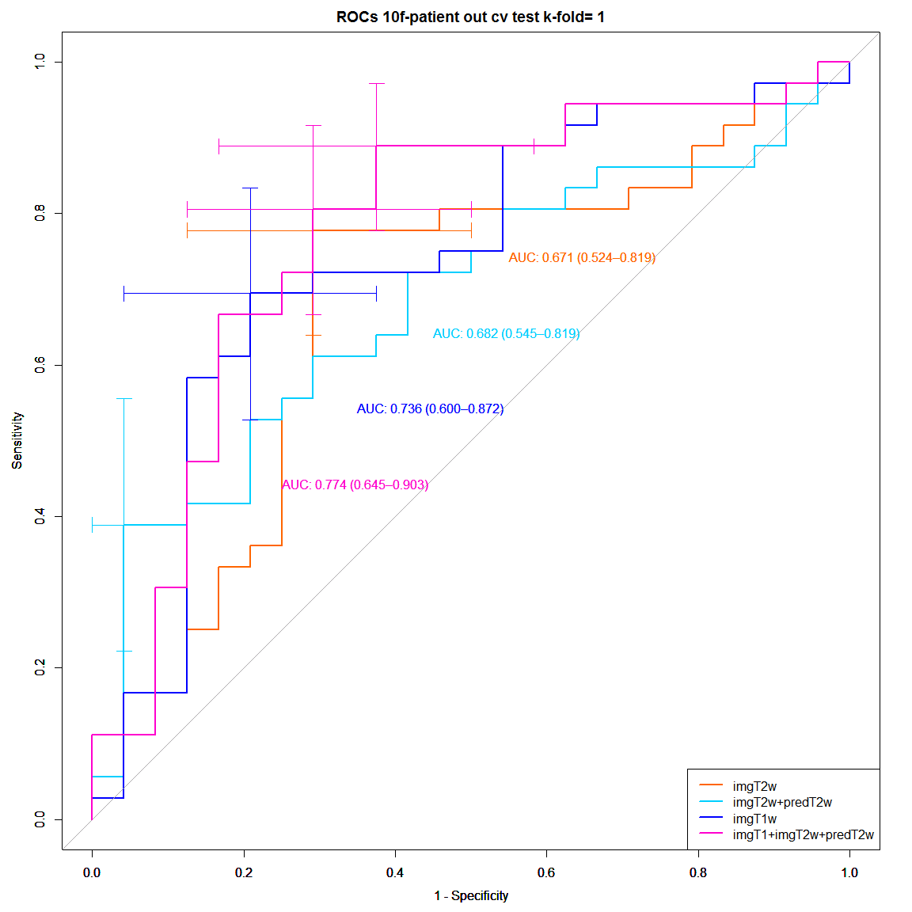 

```
## Area under the curve: 0.7743
## 95% CI (2000 stratified bootstrap replicates):
##  thresholds sp.low sp.median sp.high se.low se.median se.high
##   0.5299845 0.4167    0.6250  0.8333 0.7778    0.8889  0.9722
##   0.5069218 0.5000    0.7083  0.8750 0.6667    0.8056  0.9167
##    massB    massM nonmassB nonmassM 
##      212      149      132       63 
##    massB    massM nonmassB nonmassM 
##       30       17       10       14 
##    massB    massM nonmassB nonmassM 
##      212      149      132       63 
##    massB    massM nonmassB nonmassM 
##       30       17       10       14 
##    massB    massM nonmassB nonmassM 
##      212      149      132       63 
##    massB    massM nonmassB nonmassM 
##       30       17       10       14 
## -0.1888889 0.05 
## Selected features for group: MeanDecreaseGini imgT2 
## =========NULL
##  [1] "T2RGH_mean"                         "ave_T210"                           "T2texture_correlation_nondir"      
##  [4] "T2kurt_F_r_i"                       "T2max_F_r_i"                        "T2texture_sumaverage_nondir"       
##  [7] "ave_T213"                           "T2texture_diffvariance_nondir"      "ave_T211"                          
## [10] "ave_T214"                           "ave_T23"                            "ave_T21"                           
## [13] "ave_T20"                            "ave_T24"                            "ave_T217"                          
## [16] "find_t2_signal_int"                 "T2skew_F_r_i"                       "ave_T29"                           
## [19] "ave_T26"                            "ave_T25"                            "T2texture_sumvariance_nondir"      
## [22] "T2texture_energy_nondir"            "ave_T212"                           "T2_lesionSI"                       
## [25] "T2texture_inversediffmoment_nondir" "ave_T218"                           "T2min_F_r_i"                       
## [28] "ave_T27"                            "T2texture_entropy_nondir"           "ave_T22"                           
## [31] "ave_T219"                           "ave_T216"                           "T2texture_variance_nondir"         
## [34] "T2_lesionSIstd"                    
## 0.1004785 0.05 
## -0.06382979 0.05 
## Selected features for group: MeanDecreaseGini allT2 
## =========NULL
##  [1] "T2RGH_var"                          "T2grad_margin_var"                  "T2RGH_mean"                        
##  [4] "T2max_F_r_i"                        "T2texture_inversediffmoment_nondir" "LMSIR"                             
##  [7] "T2wSI_predicted"                    "ave_T210"                           "T2texture_sumvariance_nondir"      
## [10] "ave_T218"                           "ave_T20"                            "ave_T212"                          
## [13] "T2var_F_r_i"                        "T2texture_energy_nondir"            "ave_T22"                           
## [16] "ave_T25"                            "T2texture_contrast_nondir"          "ave_T23"                           
## [19] "T2min_F_r_i"                        "ave_T219"                           "ave_T215"                          
## [22] "ave_T216"                           "T2_lesionSI"                        "T2texture_correlation_nondir"      
## [25] "ave_T217"                           "ave_T21"                            "ave_T213"                          
## [28] "T2texture_entropy_nondir"           "T2skew_F_r_i"                       "ave_T29"                           
## [31] "LMSIR_predicted"                    "ave_T28"                            "T2kurt_F_r_i"                      
## [34] "find_t2_signal_int"                
## 0.09937888 0.05 
## -0.006896552 0.05 
## Selected features for group: MeanDecreaseGini imgT1 
## =========NULL
##  [1] "circularity"                            "alpha_inside"                           "texture_sumvariance_nondir_post3"      
##  [4] "washoutRate_inside"                     "texture_inversediffmoment_nondir_post4" "texture_diffvariance_nondir_post1"     
##  [7] "iMax_Variance_uptake"                   "texture_correlation_nondir_post2"       "texture_sumaverage_nondir_post4"       
## [10] "edge_sharp_std"                         "kurt_F_r_i"                             "V2"                                    
## [13] "V6"                                     "earlySE7"                               "Vr_increasingRate_inside"              
## [16] "dce3SE17"                               "dce2SE0"                                "V0"                                    
## [19] "lateSE9"                                "V19"                                    "skew_F_r_i"                            
## [22] "V18"                                    "earlySE4"                               "dce2SE7"                               
## [25] "lateSE16"                               "texture_sumaverage_nondir_post1"        "var_F_r_i"                             
## [28] "lateSE1"                                "texture_inversediffmoment_nondir_post3" "dce3SE5"                               
## [31] "max_RGH_var_k"                          "dce2SE14"                               "Tpeak_countor"                         
## [34] "lateSE0"                                "V7"                                     "A_inside"                              
## 0.05 0.05 
## 0.05263158 0.05 
## -0.0625 0.05 
## Selected features for group: MeanDecreaseGini all 
## =========NULL
##  [1] "irregularity"                           "SER_countor"                            "texture_sumvariance_nondir_post2"      
##  [4] "texture_sumaverage_nondir_post1"        "texture_inversediffmoment_nondir_post2" "iiMin_change_Variance_uptake"          
##  [7] "T2texture_correlation_nondir"           "T2RGH_var"                              "lateSE8"                               
## [10] "Kpeak_inside"                           "texture_sumvariance_nondir_post4"       "beta_inside"                           
## [13] "Vr_decreasingRate_inside"               "V17"                                    "A_countor"                             
## [16] "var_F_r_i"                              "UptakeRate_inside"                      "texture_energy_nondir_post1"           
## [19] "max_RGH_var"                            "kurt_F_r_i"                             "dce2SE5"                               
## [22] "V6"                                     "texture_diffentropy_nondir_post1"       "ave_T216"                              
## [25] "dce3SE17"                               "texture_contrast_nondir_post2"          "dce2SE3"                               
## [28] "dce3SE9"                                "ave_T212"                               "V12"                                   
## [31] "peakCr_inside"                          "maxCr_countor"                          "ave_T28"                               
## [34] "Vr_increasingRate_countor"              "lateSE1"                                "ave_T20"                               
## [37] "T2texture_variance_nondir"              "T2skew_F_r_i"                           "dce3SE10"                              
## [40] "peakVr_countor"                         "A_inside"                              
##     lesion_id cad_pt_no_txt exam_a_number_txt BIRADS lesion_label                lesion_diagnosis      find_t2_signal_int
## 23         23          0132           5154279      3        massB            BENIGN BREAST TISSUE            Hyperintense
## 24         24          0132           5154279      3        massB            BENIGN BREAST TISSUE            Hyperintense
## 54         54          0220           6715021      5        massB                      RadialScar   Slightly hyperintense
## 55         55          0220           6715021      5        massB                    FIBROADENOMA   Slightly hyperintense
## 57         57          0232           6671713      5     nonmassB                     FIBROCYSTIC                    None
## 58         58          0232           6671713      5     nonmassB                     FIBROCYSTIC                    None
## 66         66          0266           5254958      4     nonmassB                     FIBROCYSTIC Hypointense or not seen
## 74         74          0325           4696948      4        massB                     FIBROCYSTIC            Hyperintense
## 87         87          0442           4936886      4        massB            BENIGN BREAST TISSUE   Slightly hyperintense
## 89         89          0462           5466989      3     nonmassM                  InvasiveDuctal Hypointense or not seen
## 90         90          0462           5466989      4        massB                    FIBROADENOMA            Hyperintense
## 102       102          0552           4663314      4        massB                        ADENOSIS   Slightly hyperintense
## 112       112          0580           6855384      4        massB                    FIBROADENOMA                    None
## 123       123          0624           4894714      5        massB                     FIBROCYSTIC Hypointense or not seen
## 139       139          0683           5226149      5        massM                  InvasiveDuctal                    None
## 172       172          0726           5304228      5        massM                  InvasiveDuctal   Slightly hyperintense
## 188       188          0743           4827839      4        massM                  InvasiveDuctal Hypointense or not seen
## 209       209          0781           4738440      5     nonmassM                  InvasiveDuctal                    None
## 235       235          0812           4700538      5        massM                  InvasiveDuctal Hypointense or not seen
## 242       242          0818           5021762      4        massB                  DUCT PAPILLOMA                    None
## 250       250          0831           4633368      6     nonmassM                    InsituDuctal   Slightly hyperintense
## 282       282          0867           5372277      5     nonmassM                  InvasiveDuctal                    None
## 287       287          0873           4956191      4        massB                     FIBROCYSTIC Hypointense or not seen
## 288       288          0873           4956191      4        massB                     FIBROCYSTIC   Slightly hyperintense
## 292       292          0877           4724338      4     nonmassB    ATYPICAL LOBULAR HYPERPLASIA                    None
## 293       293          0880           4809515      4        massB          Papillary(focalAtypia)   Slightly hyperintense
## 294       294          0880           6778829      3        massM                    InsituDuctal                    None
## 295       295          0880           6778829      3     nonmassM                    InsituDuctal                    None
## 296       296          0880           6778829      3     nonmassM                    InsituDuctal                    None
## 297       297          0880           4809515      4        massB               AtypicalPapilloma   Slightly hyperintense
## 299       299          0884           6876318      6        massM                  InvasiveDuctal                    None
## 300       300          0884           6876318      6     nonmassM                    InsituDuctal                    None
## 322       322          0952           7105222      4     nonmassB  FOCAL USUAL DUCTAL HYPERPLASIA Hypointense or not seen
## 323       323          0952           7105222      4     nonmassB                    FIBROADENOMA            Hyperintense
## 327       327          0965           6676125      3        massB                    FIBROADENOMA   Slightly hyperintense
## 359       359          1071           7382882      4     nonmassM                    InsituDuctal                    None
## 360       360          1072           7554174      6        massM                  InvasiveDuctal   Slightly hyperintense
## 361       361          1072           7554174      4        massB     SCLEROSING PAPILLARY LESION Hypointense or not seen
## 373       373          1095           4378323      3        massB                    FIBROADENOMA            Hyperintense
## 374       374          1095           4378323      5     nonmassM                    InsituDuctal                    None
## 383       383          2028           6702914      6     nonmassB                     FIBROCYSTIC Hypointense or not seen
## 384       384          2028           6702914      6        massM                  InvasiveDuctal                    None
## 385       385          2029           6716423      6        massB                        ADENOSIS                    None
## 398       398          2055           7041426      6     nonmassM                  InvasiveDuctal                    None
## 411       411          3004           7691918      4     nonmassB                     FIBROCYSTIC                    None
## 412       412          3004           7691918      4     nonmassB                     FIBROCYSTIC                    None
## 435       435          3046           7682447      4        massB                    FIBROADENOMA Hypointense or not seen
## 436       436          3046           7289130      4        massB                    FIBROADENOMA            Hyperintense
## 437       437          3046           7682447      4        massB                    FIBROADENOMA Hypointense or not seen
## 457       457          3075           7064471      6        massM                  InvasiveDuctal                    None
## 458       458          3075           7064471      6     nonmassM                    InsituDuctal                    None
## 474       474          3097           6909883      4        massB     ATYPICAL DUCTAL HYPERPLASIA Hypointense or not seen
## 475       475          4002           6993690      5        massB            BENIGN BREAST TISSUE Hypointense or not seen
## 487       487          4023           7037125      4        massM                  InvasiveDuctal                    None
## 488       488          4023           7037125      4        massB ADENOSIS, COLUMNAR CELL CHANGES Hypointense or not seen
## 489       489          4023           7152678      4        massB  BENIGN INTRAMAMMARY LYMPH NODE Hypointense or not seen
## 490       490          4023           7037125      4        massM                  InvasiveDuctal                    None
## 506       506          6001           4574766      6     nonmassM                  InvasiveDuctal                    None
## 513       513          6014           5101372      6        massM                  InvasiveDuctal                    None
## 570       570          6052           5369136      6     nonmassM                  InvasiveDuctal                    None
## 571       571          6054           5425486      5        massM                    InsituDuctal                    None
## 572       572          6054           5425486      5        massM                    InsituDuctal                    None
## 573       573          6054           5425486      5        massM                    InsituDuctal                    None
## 574       574          6054           5425486      5        massM                    InsituDuctal                    None
## 575       575          6054           5425486      5        massM                    InsituDuctal                    None
## 592       592          6233           7047121      6        massB                    FIBROADENOMA            Hyperintense
## 604       604          7066           6715383      4        massB                    FIBROADENOMA                    None
## 605       605          7066           7395276      4     nonmassB           COLUMNAR CELL CHANGES                    None
## 615       615          7096           6869668      3        massB                    FIBROADENOMA                    None
## 616       616          7096           6869668      3        massB                    FIBROADENOMA Hypointense or not seen
## 624       624          7159           5435020      4     nonmassM                 InvasiveLobular                    None
## 
## ============ bestune_imgT2 	 max.depth  1 	 #Trees  350 
## ntrees:  50 minsplit:  3 cp:  0.01 
##   ntrees minsplit   cp acuTrain rocTrain   acuTest   rocTest
## 1     50        3 0.01        1        1 0.5070423 0.6209677
## ntrees:  100 minsplit:  3 cp:  0.01 
##   ntrees minsplit   cp acuTrain rocTrain   acuTest   rocTest
## 2    100        3 0.01        1        1 0.5211268 0.6620968
## ntrees:  250 minsplit:  3 cp:  0.01 
##   ntrees minsplit   cp acuTrain rocTrain   acuTest   rocTest
## 3    250        3 0.01        1        1 0.6338028 0.6112903
## ntrees:  350 minsplit:  3 cp:  0.01 
##   ntrees minsplit   cp acuTrain rocTrain   acuTest   rocTest
## 4    350        3 0.01        1        1 0.5915493 0.6475806
## ntrees:  50 minsplit:  1 cp:  0.01 
##   ntrees minsplit   cp acuTrain rocTrain   acuTest   rocTest
## 5     50        1 0.01        1        1 0.5633803 0.5806452
## ntrees:  100 minsplit:  1 cp:  0.01 
##   ntrees minsplit   cp acuTrain rocTrain   acuTest   rocTest
## 6    100        1 0.01        1        1 0.6619718 0.6209677
## ntrees:  250 minsplit:  1 cp:  0.01 
##   ntrees minsplit   cp acuTrain rocTrain   acuTest   rocTest
## 7    250        1 0.01        1        1 0.5915493 0.6387097
## ntrees:  350 minsplit:  1 cp:  0.01 
##   ntrees minsplit   cp acuTrain rocTrain   acuTest   rocTest
## 8    350        1 0.01        1        1 0.6478873 0.6798387
## ntrees:  50 minsplit:  3 cp:  -1 
##   ntrees minsplit cp acuTrain rocTrain   acuTest   rocTest
## 9     50        3 -1        1        1 0.5774648 0.6596774
## ntrees:  100 minsplit:  3 cp:  -1 
##    ntrees minsplit cp acuTrain rocTrain   acuTest   rocTest
## 10    100        3 -1        1        1 0.6056338 0.5556452
## ntrees:  250 minsplit:  3 cp:  -1 
##    ntrees minsplit cp acuTrain rocTrain   acuTest   rocTest
## 11    250        3 -1        1        1 0.5633803 0.6362903
## ntrees:  350 minsplit:  3 cp:  -1 
##    ntrees minsplit cp acuTrain rocTrain   acuTest   rocTest
## 12    350        3 -1        1        1 0.5915493 0.6120968
## ntrees:  50 minsplit:  1 cp:  -1 
##    ntrees minsplit cp acuTrain rocTrain   acuTest   rocTest
## 13     50        1 -1        1        1 0.5915493 0.6258065
## ntrees:  100 minsplit:  1 cp:  -1 
##    ntrees minsplit cp acuTrain rocTrain   acuTest   rocTest
## 14    100        1 -1        1        1 0.5774648 0.5959677
## ntrees:  250 minsplit:  1 cp:  -1 
##    ntrees minsplit cp acuTrain rocTrain   acuTest   rocTest
## 15    250        1 -1        1        1 0.5633803 0.6556452
## ntrees:  350 minsplit:  1 cp:  -1 
##    ntrees minsplit cp acuTrain rocTrain   acuTest   rocTest
## 16    350        1 -1        1        1 0.5915493 0.6814516
##    ntrees minsplit    cp acuTrain rocTrain   acuTest   rocTest
## 1      50        3  0.01        1        1 0.5070423 0.6209677
## 2     100        3  0.01        1        1 0.5211268 0.6620968
## 3     250        3  0.01        1        1 0.6338028 0.6112903
## 4     350        3  0.01        1        1 0.5915493 0.6475806
## 5      50        1  0.01        1        1 0.5633803 0.5806452
## 6     100        1  0.01        1        1 0.6619718 0.6209677
## 7     250        1  0.01        1        1 0.5915493 0.6387097
## 8     350        1  0.01        1        1 0.6478873 0.6798387
## 9      50        3 -1.00        1        1 0.5774648 0.6596774
## 10    100        3 -1.00        1        1 0.6056338 0.5556452
## 11    250        3 -1.00        1        1 0.5633803 0.6362903
## 12    350        3 -1.00        1        1 0.5915493 0.6120968
## 13     50        1 -1.00        1        1 0.5915493 0.6258065
## 14    100        1 -1.00        1        1 0.5774648 0.5959677
## 15    250        1 -1.00        1        1 0.5633803 0.6556452
## 16    350        1 -1.00        1        1 0.5915493 0.6814516
##    ntrees minsplit cp acuTrain rocTrain   acuTest   rocTest
## 16    350        1 -1        1        1 0.5915493 0.6814516
## 
## ============ bestune_allT2 	 max.depth  1 	 #Trees  250 
## ntrees:  50 minsplit:  3 cp:  0.01 
##   ntrees minsplit   cp acuTrain rocTrain   acuTest   rocTest
## 1     50        3 0.01        1        1 0.6478873 0.6887097
## ntrees:  100 minsplit:  3 cp:  0.01 
##   ntrees minsplit   cp acuTrain rocTrain   acuTest   rocTest
## 2    100        3 0.01        1        1 0.6338028 0.6379032
## ntrees:  250 minsplit:  3 cp:  0.01 
##   ntrees minsplit   cp acuTrain rocTrain   acuTest   rocTest
## 3    250        3 0.01        1        1 0.6338028 0.6419355
## ntrees:  350 minsplit:  3 cp:  0.01 
##   ntrees minsplit   cp acuTrain rocTrain   acuTest   rocTest
## 4    350        3 0.01        1        1 0.5915493 0.6725806
## ntrees:  50 minsplit:  1 cp:  0.01 
##   ntrees minsplit   cp acuTrain rocTrain   acuTest   rocTest
## 5     50        1 0.01        1        1 0.6056338 0.6274194
## ntrees:  100 minsplit:  1 cp:  0.01 
##   ntrees minsplit   cp acuTrain rocTrain   acuTest   rocTest
## 6    100        1 0.01        1        1 0.5915493 0.6629032
## ntrees:  250 minsplit:  1 cp:  0.01 
##   ntrees minsplit   cp acuTrain rocTrain   acuTest   rocTest
## 7    250        1 0.01        1        1 0.6338028 0.6951613
## ntrees:  350 minsplit:  1 cp:  0.01 
##   ntrees minsplit   cp acuTrain rocTrain   acuTest   rocTest
## 8    350        1 0.01        1        1 0.6056338 0.6677419
## ntrees:  50 minsplit:  3 cp:  -1 
##   ntrees minsplit cp acuTrain rocTrain   acuTest   rocTest
## 9     50        3 -1        1        1 0.6338028 0.6370968
## ntrees:  100 minsplit:  3 cp:  -1 
##    ntrees minsplit cp acuTrain rocTrain   acuTest   rocTest
## 10    100        3 -1        1        1 0.5915493 0.6233871
## ntrees:  250 minsplit:  3 cp:  -1 
##    ntrees minsplit cp acuTrain rocTrain   acuTest   rocTest
## 11    250        3 -1        1        1 0.6338028 0.6758065
## ntrees:  350 minsplit:  3 cp:  -1 
##    ntrees minsplit cp acuTrain rocTrain   acuTest   rocTest
## 12    350        3 -1        1        1 0.6338028 0.6798387
## ntrees:  50 minsplit:  1 cp:  -1 
##    ntrees minsplit cp acuTrain rocTrain   acuTest   rocTest
## 13     50        1 -1        1        1 0.5352113 0.5306452
## ntrees:  100 minsplit:  1 cp:  -1 
##    ntrees minsplit cp acuTrain rocTrain   acuTest rocTest
## 14    100        1 -1        1        1 0.6619718    0.65
## ntrees:  250 minsplit:  1 cp:  -1 
##    ntrees minsplit cp acuTrain rocTrain   acuTest   rocTest
## 15    250        1 -1        1        1 0.6056338 0.6846774
## ntrees:  350 minsplit:  1 cp:  -1 
##    ntrees minsplit cp acuTrain rocTrain   acuTest   rocTest
## 16    350        1 -1        1        1 0.6056338 0.7040323
##    ntrees minsplit    cp acuTrain rocTrain   acuTest   rocTest
## 1      50        3  0.01        1        1 0.6478873 0.6887097
## 2     100        3  0.01        1        1 0.6338028 0.6379032
## 3     250        3  0.01        1        1 0.6338028 0.6419355
## 4     350        3  0.01        1        1 0.5915493 0.6725806
## 5      50        1  0.01        1        1 0.6056338 0.6274194
## 6     100        1  0.01        1        1 0.5915493 0.6629032
## 7     250        1  0.01        1        1 0.6338028 0.6951613
## 8     350        1  0.01        1        1 0.6056338 0.6677419
## 9      50        3 -1.00        1        1 0.6338028 0.6370968
## 10    100        3 -1.00        1        1 0.5915493 0.6233871
## 11    250        3 -1.00        1        1 0.6338028 0.6758065
## 12    350        3 -1.00        1        1 0.6338028 0.6798387
## 13     50        1 -1.00        1        1 0.5352113 0.5306452
## 14    100        1 -1.00        1        1 0.6619718 0.6500000
## 15    250        1 -1.00        1        1 0.6056338 0.6846774
## 16    350        1 -1.00        1        1 0.6056338 0.7040323
##    ntrees minsplit cp acuTrain rocTrain   acuTest   rocTest
## 16    350        1 -1        1        1 0.6056338 0.7040323
## 
## ============ bestune_imgT1 	 max.depth  1 	 #Trees  250 
## ntrees:  50 minsplit:  3 cp:  0.01 
##   ntrees minsplit   cp acuTrain rocTrain   acuTest   rocTest
## 1     50        3 0.01        1        1 0.7183099 0.8024194
## ntrees:  100 minsplit:  3 cp:  0.01 
##   ntrees minsplit   cp acuTrain rocTrain   acuTest   rocTest
## 2    100        3 0.01        1        1 0.7183099 0.7580645
## ntrees:  250 minsplit:  3 cp:  0.01 
##   ntrees minsplit   cp acuTrain rocTrain   acuTest   rocTest
## 3    250        3 0.01        1        1 0.7746479 0.8032258
## ntrees:  350 minsplit:  3 cp:  0.01 
##   ntrees minsplit   cp acuTrain rocTrain   acuTest   rocTest
## 4    350        3 0.01        1        1 0.7887324 0.8193548
## ntrees:  50 minsplit:  1 cp:  0.01 
##   ntrees minsplit   cp acuTrain rocTrain   acuTest   rocTest
## 5     50        1 0.01        1        1 0.7042254 0.7733871
## ntrees:  100 minsplit:  1 cp:  0.01 
##   ntrees minsplit   cp acuTrain rocTrain   acuTest   rocTest
## 6    100        1 0.01        1        1 0.6478873 0.7427419
## ntrees:  250 minsplit:  1 cp:  0.01 
##   ntrees minsplit   cp acuTrain rocTrain   acuTest   rocTest
## 7    250        1 0.01        1        1 0.7464789 0.8024194
## ntrees:  350 minsplit:  1 cp:  0.01 
##   ntrees minsplit   cp acuTrain rocTrain   acuTest   rocTest
## 8    350        1 0.01        1        1 0.7464789 0.8008065
## ntrees:  50 minsplit:  3 cp:  -1 
##   ntrees minsplit cp acuTrain rocTrain   acuTest   rocTest
## 9     50        3 -1        1        1 0.7042254 0.7604839
## ntrees:  100 minsplit:  3 cp:  -1 
##    ntrees minsplit cp acuTrain rocTrain   acuTest  rocTest
## 10    100        3 -1        1        1 0.7323944 0.808871
## ntrees:  250 minsplit:  3 cp:  -1 
##    ntrees minsplit cp acuTrain rocTrain   acuTest   rocTest
## 11    250        3 -1        1        1 0.7746479 0.8346774
## ntrees:  350 minsplit:  3 cp:  -1 
##    ntrees minsplit cp acuTrain rocTrain   acuTest   rocTest
## 12    350        3 -1        1        1 0.7887324 0.8322581
## ntrees:  50 minsplit:  1 cp:  -1 
##    ntrees minsplit cp acuTrain rocTrain   acuTest   rocTest
## 13     50        1 -1        1        1 0.6901408 0.7717742
## ntrees:  100 minsplit:  1 cp:  -1 
##    ntrees minsplit cp acuTrain rocTrain   acuTest   rocTest
## 14    100        1 -1        1        1 0.7183099 0.8112903
## ntrees:  250 minsplit:  1 cp:  -1 
##    ntrees minsplit cp acuTrain rocTrain   acuTest   rocTest
## 15    250        1 -1        1        1 0.7323944 0.8193548
## ntrees:  350 minsplit:  1 cp:  -1 
##    ntrees minsplit cp acuTrain rocTrain   acuTest   rocTest
## 16    350        1 -1        1        1 0.7887324 0.8201613
##    ntrees minsplit    cp acuTrain rocTrain   acuTest   rocTest
## 1      50        3  0.01        1        1 0.7183099 0.8024194
## 2     100        3  0.01        1        1 0.7183099 0.7580645
## 3     250        3  0.01        1        1 0.7746479 0.8032258
## 4     350        3  0.01        1        1 0.7887324 0.8193548
## 5      50        1  0.01        1        1 0.7042254 0.7733871
## 6     100        1  0.01        1        1 0.6478873 0.7427419
## 7     250        1  0.01        1        1 0.7464789 0.8024194
## 8     350        1  0.01        1        1 0.7464789 0.8008065
## 9      50        3 -1.00        1        1 0.7042254 0.7604839
## 10    100        3 -1.00        1        1 0.7323944 0.8088710
## 11    250        3 -1.00        1        1 0.7746479 0.8346774
## 12    350        3 -1.00        1        1 0.7887324 0.8322581
## 13     50        1 -1.00        1        1 0.6901408 0.7717742
## 14    100        1 -1.00        1        1 0.7183099 0.8112903
## 15    250        1 -1.00        1        1 0.7323944 0.8193548
## 16    350        1 -1.00        1        1 0.7887324 0.8201613
##    ntrees minsplit cp acuTrain rocTrain   acuTest   rocTest
## 11    250        3 -1        1        1 0.7746479 0.8346774
## 
## ============ bestune_all 	 max.depth  1 	 #Trees  200 
## ntrees:  50 minsplit:  3 cp:  0.01 
##   ntrees minsplit   cp acuTrain rocTrain   acuTest   rocTest
## 1     50        3 0.01        1        1 0.7323944 0.8169355
## ntrees:  100 minsplit:  3 cp:  0.01 
##   ntrees minsplit   cp acuTrain rocTrain   acuTest   rocTest
## 2    100        3 0.01        1        1 0.7887324 0.8564516
## ntrees:  250 minsplit:  3 cp:  0.01 
##   ntrees minsplit   cp acuTrain rocTrain   acuTest   rocTest
## 3    250        3 0.01        1        1 0.7746479 0.8629032
## ntrees:  350 minsplit:  3 cp:  0.01 
##   ntrees minsplit   cp acuTrain rocTrain   acuTest   rocTest
## 4    350        3 0.01        1        1 0.7605634 0.8524194
## ntrees:  50 minsplit:  1 cp:  0.01 
##   ntrees minsplit   cp acuTrain rocTrain   acuTest   rocTest
## 5     50        1 0.01        1        1 0.7042254 0.7830645
## ntrees:  100 minsplit:  1 cp:  0.01 
##   ntrees minsplit   cp acuTrain rocTrain   acuTest   rocTest
## 6    100        1 0.01        1        1 0.8309859 0.8629032
## ntrees:  250 minsplit:  1 cp:  0.01 
##   ntrees minsplit   cp acuTrain rocTrain   acuTest  rocTest
## 7    250        1 0.01        1        1 0.7464789 0.866129
## ntrees:  350 minsplit:  1 cp:  0.01 
##   ntrees minsplit   cp acuTrain rocTrain   acuTest   rocTest
## 8    350        1 0.01        1        1 0.7746479 0.8645161
## ntrees:  50 minsplit:  3 cp:  -1 
##   ntrees minsplit cp acuTrain rocTrain   acuTest   rocTest
## 9     50        3 -1        1        1 0.8028169 0.8475806
## ntrees:  100 minsplit:  3 cp:  -1 
##    ntrees minsplit cp acuTrain rocTrain   acuTest   rocTest
## 10    100        3 -1        1        1 0.7464789 0.8266129
## ntrees:  250 minsplit:  3 cp:  -1 
##    ntrees minsplit cp acuTrain rocTrain   acuTest  rocTest
## 11    250        3 -1        1        1 0.7605634 0.833871
## ntrees:  350 minsplit:  3 cp:  -1 
##    ntrees minsplit cp acuTrain rocTrain   acuTest   rocTest
## 12    350        3 -1        1        1 0.8028169 0.8443548
## ntrees:  50 minsplit:  1 cp:  -1 
##    ntrees minsplit cp acuTrain rocTrain   acuTest   rocTest
## 13     50        1 -1        1        1 0.7323944 0.8145161
## ntrees:  100 minsplit:  1 cp:  -1 
##    ntrees minsplit cp acuTrain rocTrain   acuTest   rocTest
## 14    100        1 -1        1        1 0.7605634 0.8532258
## ntrees:  250 minsplit:  1 cp:  -1 
##    ntrees minsplit cp acuTrain rocTrain   acuTest   rocTest
## 15    250        1 -1        1        1 0.7746479 0.8733871
## ntrees:  350 minsplit:  1 cp:  -1 
##    ntrees minsplit cp acuTrain rocTrain   acuTest   rocTest
## 16    350        1 -1        1        1 0.8450704 0.8669355
##    ntrees minsplit    cp acuTrain rocTrain   acuTest   rocTest
## 1      50        3  0.01        1        1 0.7323944 0.8169355
## 2     100        3  0.01        1        1 0.7887324 0.8564516
## 3     250        3  0.01        1        1 0.7746479 0.8629032
## 4     350        3  0.01        1        1 0.7605634 0.8524194
## 5      50        1  0.01        1        1 0.7042254 0.7830645
## 6     100        1  0.01        1        1 0.8309859 0.8629032
## 7     250        1  0.01        1        1 0.7464789 0.8661290
## 8     350        1  0.01        1        1 0.7746479 0.8645161
## 9      50        3 -1.00        1        1 0.8028169 0.8475806
## 10    100        3 -1.00        1        1 0.7464789 0.8266129
## 11    250        3 -1.00        1        1 0.7605634 0.8338710
## 12    350        3 -1.00        1        1 0.8028169 0.8443548
## 13     50        1 -1.00        1        1 0.7323944 0.8145161
## 14    100        1 -1.00        1        1 0.7605634 0.8532258
## 15    250        1 -1.00        1        1 0.7746479 0.8733871
## 16    350        1 -1.00        1        1 0.8450704 0.8669355
##    ntrees minsplit cp acuTrain rocTrain   acuTest   rocTest
## 15    250        1 -1        1        1 0.7746479 0.8733871
## 
## Call:
## roc.default(response = perf_imgT2$obs, predictor = perf_imgT2$C)
## 
## Data: perf_imgT2$C in 55 controls (perf_imgT2$obs C) > 76 cases (perf_imgT2$obs NC).
## Area under the curve: 0.6778
## 
## Call:
## roc.default(response = perf_allT2$obs, predictor = perf_allT2$C)
## 
## Data: perf_allT2$C in 55 controls (perf_allT2$obs C) > 76 cases (perf_allT2$obs NC).
## Area under the curve: 0.6911
## 
## Call:
## roc.default(response = perf_imgT1$obs, predictor = perf_imgT1$C)
## 
## Data: perf_imgT1$C in 55 controls (perf_imgT1$obs C) > 76 cases (perf_imgT1$obs NC).
## Area under the curve: 0.7804
## 
## Call:
## roc.default(response = perf_all$obs, predictor = perf_all$C)
## 
## Data: perf_all$C in 55 controls (perf_all$obs C) > 76 cases (perf_all$obs NC).
## Area under the curve: 0.8275
```

```
## Area under the curve: 0.6778
## 95% CI (2000 stratified bootstrap replicates):
##  thresholds sp.low sp.median sp.high se.low se.median se.high
##   0.4564083 0.5091    0.6364  0.7636 0.6184    0.7237  0.8158
```

```
## Area under the curve: 0.6911
## 95% CI (2000 stratified bootstrap replicates):
##  thresholds sp.low sp.median sp.high se.low se.median se.high
##   0.4297468 0.6545    0.7636  0.8727    0.5    0.6053  0.7105
```

```
## Area under the curve: 0.7804
## 95% CI (2000 stratified bootstrap replicates):
##  thresholds sp.low sp.median sp.high se.low se.median se.high
##   0.4521917 0.6727    0.7818  0.8909 0.6316    0.7368  0.8289
```

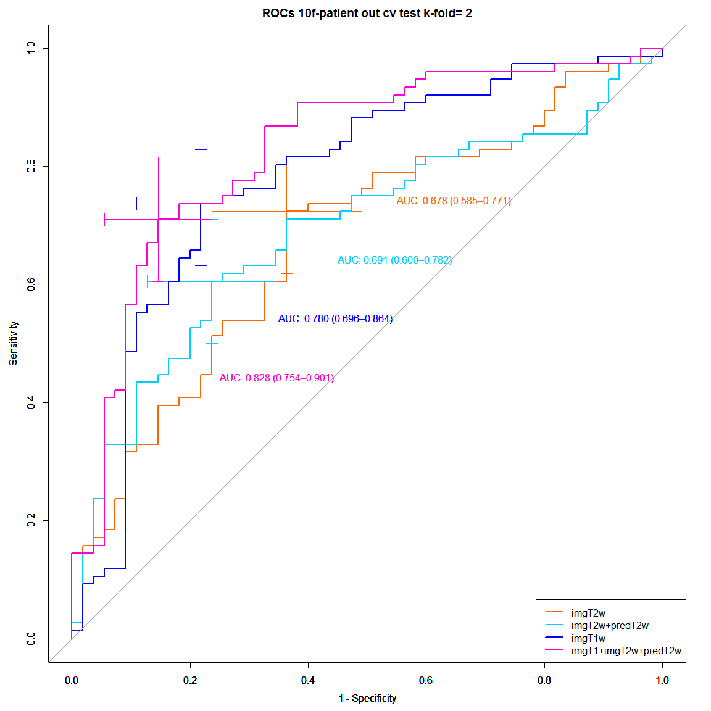 

```
## Area under the curve: 0.8275
## 95% CI (2000 stratified bootstrap replicates):
##  thresholds sp.low sp.median sp.high se.low se.median se.high
##   0.4461978 0.7636    0.8545  0.9455 0.6053    0.7105  0.8158
##    massB    massM nonmassB nonmassM 
##      219      153      129       71 
##    massB    massM nonmassB nonmassM 
##       23       13       13        6 
##    massB    massM nonmassB nonmassM 
##      219      153      129       71 
##    massB    massM nonmassB nonmassM 
##       23       13       13        6 
##    massB    massM nonmassB nonmassM 
##      219      153      129       71 
##    massB    massM nonmassB nonmassM 
##       23       13       13        6 
## -0.01456311 0.05 
## Selected features for group: MeanDecreaseGini imgT2 
## =========NULL
##  [1] "T2RGH_var"                          "ave_T210"                           "T2texture_correlation_nondir"      
##  [4] "T2kurt_F_r_i"                       "T2texture_inversediffmoment_nondir" "ave_T211"                          
##  [7] "ave_T20"                            "T2grad_margin_var"                  "T2var_F_r_i"                       
## [10] "ave_T25"                            "ave_T218"                           "T2grad_margin"                     
## [13] "T2mean_F_r_i"                       "ave_T217"                           "ave_T213"                          
## [16] "ave_T212"                           "T2min_F_r_i"                        "T2max_F_r_i"                       
## [19] "LMSIR"                              "ave_T216"                           "T2texture_variance_nondir"         
## [22] "ave_T22"                            "T2texture_sumaverage_nondir"        "find_t2_signal_int"                
## [25] "ave_T28"                            "ave_T215"                           "T2_lesionSI"                       
## -0.02985075 0.05 
## Selected features for group: MeanDecreaseGini allT2 
## =========NULL
##  [1] "T2RGH_var"                          "T2kurt_F_r_i"                       "T2RGH_mean"                        
##  [4] "T2grad_margin_var"                  "T2_lesionSIstd"                     "ave_T28"                           
##  [7] "find_t2_signal_int"                 "T2texture_inversediffmoment_nondir" "T2texture_energy_nondir"           
## [10] "ave_T213"                           "T2max_F_r_i"                        "ave_T218"                          
## [13] "ave_T217"                           "ave_T24"                            "T2mean_F_r_i"                      
## [16] "ave_T214"                           "T2texture_sumaverage_nondir"        "ave_T25"                           
## [19] "T2texture_sumvariance_nondir"       "T2texture_diffvariance_nondir"      "ave_T29"                           
## [22] "ave_T210"                           "T2texture_variance_nondir"          "ave_T215"                          
## [25] "ave_T22"                            "ave_T219"                           "T2texture_correlation_nondir"      
## [28] "LMSIR"                              "T2grad_margin"                      "T2skew_F_r_i"                      
## [31] "ave_T216"                           "T2_lesionSI"                       
## 0.1165644 0.05 
## -0.125 0.05 
## Selected features for group: MeanDecreaseGini imgT1 
## =========NULL
##  [1] "irregularity"                           "texture_sumvariance_nondir_post1"       "iiMin_change_Variance_uptake"          
##  [4] "SER_countor"                            "alpha_inside"                           "texture_energy_nondir_post2"           
##  [7] "texture_contrast_nondir_post2"          "texture_sumaverage_nondir_post3"        "V4"                                    
## [10] "Tpeak_countor"                          "lateSE0"                                "earlySE13"                             
## [13] "UptakeRate_inside"                      "max_RGH_var"                            "lateSE18"                              
## [16] "texture_correlation_nondir_post2"       "earlySE19"                              "texture_inversediffmoment_nondir_post4"
## [19] "dce2SE12"                               "V2"                                     "mean_F_r_i"                            
## [22] "dce2SE1"                                "dce3SE5"                                "lateSE5"                               
## [25] "min_F_r_i"                              "dce2SE18"                               "dce2SE7"                               
## [28] "texture_diffentropy_nondir_post4"       "lateSE3"                                "earlySE11"                             
## [31] "Vr_decreasingRate_countor"              "texture_sumentropy_nondir_post4"        "dce3SE7"                               
## [34] "V19"                                    "texture_correlation_nondir_post3"       "A_inside"                              
## 0.03184713 0.05 
## Selected features for group: MeanDecreaseGini all 
## =========NULL
##  [1] "texture_variance_nondir_post2"          "SER_inside"                             "texture_inversediffmoment_nondir_post4"
##  [4] "V12"                                    "texture_sumvariance_nondir_post2"       "texture_energy_nondir_post2"           
##  [7] "V10"                                    "V13"                                    "texture_diffvariance_nondir_post3"     
## [10] "lateSE11"                               "lateSE9"                                "T2var_F_r_i"                           
## [13] "ave_T210"                               "T2kurt_F_r_i"                           "ave_T29"                               
## [16] "T2texture_entropy_nondir"               "T2texture_energy_nondir"                "dce3SE17"                              
## [19] "lateSE7"                                "ivVariance"                             "var_F_r_i"                             
## [22] "T2RGH_mean"                             "lateSE13"                               "dce2SE13"                              
## [25] "T2texture_contrast_nondir"              "dce3SE7"                                "dce3SE16"                              
## [28] "skew_F_r_i"                             "mean_F_r_i"                             "earlySE9"                              
## [31] "T2min_F_r_i"                            "texture_correlation_nondir_post1"       "k_Max_Margin_Grad"                     
## [34] "A_inside"                              
##     lesion_id cad_pt_no_txt exam_a_number_txt BIRADS lesion_label                  lesion_diagnosis      find_t2_signal_int
## 33         33          0177           6996979      3        massM                      InsituDuctal   Slightly hyperintense
## 34         34          0177           6996979      3     nonmassM                      InsituDuctal                    None
## 52         52          0207           4982884      4        massB                          FIBROSIS                    None
## 83         83          0420           6738142      3     nonmassM                      InsituDuctal   Slightly hyperintense
## 93         93          0473           7364625      4        massB                       FIBROCYSTIC                    None
## 96         96          0510           7662547      4     nonmassB             COLUMNAR CELL CHANGES                    None
## 97         97          0510           7662547      4     nonmassB             COLUMNAR CELL CHANGES                    None
## 99         99          0519           4937737      4        massB            FLAT EPITHELIAL ATYPIA                    None
## 121       121          0619           7250777      5        massM                    InvasiveDuctal                    None
## 122       122          0619           7250777      5     nonmassM                    InvasiveDuctal            Hyperintense
## 124       124          0635           7092156      4        massM                    InvasiveDuctal Hypointense or not seen
## 127       127          0663           4804825      4        massB                      FIBROADENOMA            Hyperintense
## 133       133          0668           6989634      4     nonmassM                      InsituDuctal                    None
## 146       146          0690           5180451      3     nonmassB                       FIBROCYSTIC                    None
## 147       147          0690           5180451      3        massB          USUAL DUCTAL HYPERPLASIA   Slightly hyperintense
## 148       148          0690           6681276      4     nonmassB             COLUMNAR CELL CHANGES Hypointense or not seen
## 171       171          0724           5141876      5        massM                    InvasiveDuctal            Hyperintense
## 198       198          0760           4750742      5     nonmassM                      InsituDuctal                    None
## 212       212          0758           4796378      4        massB                       FIBROCYSTIC            Hyperintense
## 213       213          0758           4796378      4        massB                       FIBROCYSTIC            Hyperintense
## 219       219          0790           4708057      4     nonmassB                    DUCT PAPILLOMA                    None
## 230       230          0803           5058195      5        massM                    InvasiveDuctal                    None
## 233       233          0809           5016014      4        massB                       FIBROCYSTIC            Hyperintense
## 303       303          0888           6744887      5        massM                    InvasiveDuctal                    None
## 304       304          0896           6895982      4        massB                      FIBROADENOMA   Slightly hyperintense
## 305       305          0898           5224531      4        massB DUCTAL HYPERPLASIA WITHOUT ATYPIA                    None
## 311       311          0921           6997232      4        massB                       FIBROCYSTIC Hypointense or not seen
## 318       318          0944           7742881      4        massM                      InsituDuctal Hypointense or not seen
## 319       319          0944           7092128      4     nonmassB              BENIGN BREAST TISSUE                    None
## 325       325          0956           5062341      4        massB                      FIBROADENOMA   Slightly hyperintense
## 326       326          0962           4755483      4        massB                      FIBROADENOMA            Hyperintense
## 333       333          0995           6816787      4     nonmassB              LARGE DUCT PAPILLOMA            Hyperintense
## 334       334          0995           6816787      3        massB                    DUCT PAPILLOMA   Slightly hyperintense
## 339       339          1006           4443563      4     nonmassB                       FIBROCYSTIC Hypointense or not seen
## 368       368          1087           5360576      4        massB    GRANULOMATOUS LOBULAR MASTITIS                    None
## 369       369          1087           5360576      4        massB    GRANULOMATOUS LOBULAR MASTITIS                    None
## 404       404          2072           7256932      4        massM                    InvasiveDuctal                    None
## 407       407          2075           6985605      4     nonmassB              BENIGN BREAST TISSUE Hypointense or not seen
## 408       408          2075           6985605      4        massB                      FIBROADENOMA Hypointense or not seen
## 419       419          3011           6898308      4     nonmassB                       FIBROCYSTIC                    None
## 461       461          3077           7042083      4     nonmassB                       FIBROCYSTIC                    None
## 462       462          3077           7042083      4        massB                       FIBROCYSTIC   Slightly hyperintense
## 480       480          4012           7002008      4        massB    FOCAL USUAL DUCTAL HYPERPLASIA Hypointense or not seen
## 498       498          4043           7041465      6     nonmassM                    InvasiveDuctal                    None
## 509       509          6005         ACC108250      5        massM                   InvasiveLobular                    None
## 510       510          6005         ACC108250      5        massM                   InvasiveLobular                    None
## 511       511          6005         ACC108250      5        massM                   InvasiveLobular                    None
## 552       552          6040           5075204      5        massM                    InvasiveDuctal                    None
## 578       578          6100           6722170      5        massM                    InvasiveDuctal Hypointense or not seen
## 586       586          6150           7128025      4     nonmassB             COLUMNAR CELL CHANGES                    None
## 597       597          7024           6805356      4        massB                      FIBROADENOMA Hypointense or not seen
## 601       601          7043           7119983      4        massB                      FIBROADENOMA            Hyperintense
## 623       623          7151           7557684      2        massB                       HYPERPLASIA                    None
## 625       625          7165           5021830      3        massB                          ADENOSIS                    None
## 635       635          7201           5041620      4     nonmassB                      FIBROADENOMA                    None
## 
## ============ bestune_imgT2 	 max.depth  1 	 #Trees  350 
## ntrees:  50 minsplit:  3 cp:  0.01 
##   ntrees minsplit   cp acuTrain rocTrain   acuTest   rocTest
## 1     50        3 0.01        1        1 0.5636364 0.5526316
## ntrees:  100 minsplit:  3 cp:  0.01 
##   ntrees minsplit   cp acuTrain rocTrain acuTest   rocTest
## 2    100        3 0.01        1        1     0.6 0.6184211
## ntrees:  250 minsplit:  3 cp:  0.01 
##   ntrees minsplit   cp acuTrain rocTrain   acuTest   rocTest
## 3    250        3 0.01        1        1 0.6727273 0.6578947
## ntrees:  350 minsplit:  3 cp:  0.01 
##   ntrees minsplit   cp acuTrain rocTrain   acuTest   rocTest
## 4    350        3 0.01        1        1 0.6545455 0.6125731
## ntrees:  50 minsplit:  1 cp:  0.01 
##   ntrees minsplit   cp acuTrain rocTrain   acuTest   rocTest
## 5     50        1 0.01        1        1 0.6545455 0.6125731
## ntrees:  100 minsplit:  1 cp:  0.01 
##   ntrees minsplit   cp acuTrain rocTrain   acuTest   rocTest
## 6    100        1 0.01        1        1 0.6909091 0.6988304
## ntrees:  250 minsplit:  1 cp:  0.01 
##   ntrees minsplit   cp acuTrain rocTrain   acuTest   rocTest
## 7    250        1 0.01        1        1 0.5272727 0.5789474
## ntrees:  350 minsplit:  1 cp:  0.01 
##   ntrees minsplit   cp acuTrain rocTrain   acuTest   rocTest
## 8    350        1 0.01        1        1 0.5636364 0.5950292
## ntrees:  50 minsplit:  3 cp:  -1 
##   ntrees minsplit cp acuTrain rocTrain   acuTest  rocTest
## 9     50        3 -1        1        1 0.6363636 0.625731
## ntrees:  100 minsplit:  3 cp:  -1 
##    ntrees minsplit cp acuTrain rocTrain   acuTest   rocTest
## 10    100        3 -1        1        1 0.5090909 0.5628655
## ntrees:  250 minsplit:  3 cp:  -1 
##    ntrees minsplit cp acuTrain rocTrain   acuTest   rocTest
## 11    250        3 -1        1        1 0.6727273 0.6418129
## ntrees:  350 minsplit:  3 cp:  -1 
##    ntrees minsplit cp acuTrain rocTrain acuTest   rocTest
## 12    350        3 -1        1        1     0.6 0.6140351
## ntrees:  50 minsplit:  1 cp:  -1 
##    ntrees minsplit cp acuTrain rocTrain   acuTest   rocTest
## 13     50        1 -1        1        1 0.5090909 0.5131579
## ntrees:  100 minsplit:  1 cp:  -1 
##    ntrees minsplit cp acuTrain rocTrain   acuTest   rocTest
## 14    100        1 -1        1        1 0.6181818 0.6008772
## ntrees:  250 minsplit:  1 cp:  -1 
##    ntrees minsplit cp acuTrain rocTrain   acuTest   rocTest
## 15    250        1 -1        1        1 0.6363636 0.5950292
## ntrees:  350 minsplit:  1 cp:  -1 
##    ntrees minsplit cp acuTrain rocTrain   acuTest   rocTest
## 16    350        1 -1        1        1 0.5818182 0.5716374
##    ntrees minsplit    cp acuTrain rocTrain   acuTest   rocTest
## 1      50        3  0.01        1        1 0.5636364 0.5526316
## 2     100        3  0.01        1        1 0.6000000 0.6184211
## 3     250        3  0.01        1        1 0.6727273 0.6578947
## 4     350        3  0.01        1        1 0.6545455 0.6125731
## 5      50        1  0.01        1        1 0.6545455 0.6125731
## 6     100        1  0.01        1        1 0.6909091 0.6988304
## 7     250        1  0.01        1        1 0.5272727 0.5789474
## 8     350        1  0.01        1        1 0.5636364 0.5950292
## 9      50        3 -1.00        1        1 0.6363636 0.6257310
## 10    100        3 -1.00        1        1 0.5090909 0.5628655
## 11    250        3 -1.00        1        1 0.6727273 0.6418129
## 12    350        3 -1.00        1        1 0.6000000 0.6140351
## 13     50        1 -1.00        1        1 0.5090909 0.5131579
## 14    100        1 -1.00        1        1 0.6181818 0.6008772
## 15    250        1 -1.00        1        1 0.6363636 0.5950292
## 16    350        1 -1.00        1        1 0.5818182 0.5716374
##   ntrees minsplit   cp acuTrain rocTrain   acuTest   rocTest
## 6    100        1 0.01        1        1 0.6909091 0.6988304
## 
## ============ bestune_allT2 	 max.depth  1 	 #Trees  250 
## ntrees:  50 minsplit:  3 cp:  0.01 
##   ntrees minsplit   cp acuTrain rocTrain acuTest   rocTest
## 1     50        3 0.01        1        1     0.6 0.5994152
## ntrees:  100 minsplit:  3 cp:  0.01 
##   ntrees minsplit   cp acuTrain rocTrain   acuTest   rocTest
## 2    100        3 0.01        1        1 0.6545455 0.5833333
## ntrees:  250 minsplit:  3 cp:  0.01 
##   ntrees minsplit   cp acuTrain rocTrain   acuTest   rocTest
## 3    250        3 0.01        1        1 0.5818182 0.5482456
## ntrees:  350 minsplit:  3 cp:  0.01 
##   ntrees minsplit   cp acuTrain rocTrain   acuTest   rocTest
## 4    350        3 0.01        1        1 0.6545455 0.6622807
## ntrees:  50 minsplit:  1 cp:  0.01 
##   ntrees minsplit   cp acuTrain rocTrain acuTest   rocTest
## 5     50        1 0.01        1        1     0.6 0.6052632
## ntrees:  100 minsplit:  1 cp:  0.01 
##   ntrees minsplit   cp acuTrain rocTrain   acuTest   rocTest
## 6    100        1 0.01        1        1 0.6545455 0.6827485
## ntrees:  250 minsplit:  1 cp:  0.01 
##   ntrees minsplit   cp acuTrain rocTrain   acuTest   rocTest
## 7    250        1 0.01        1        1 0.5636364 0.5599415
## ntrees:  350 minsplit:  1 cp:  0.01 
##   ntrees minsplit   cp acuTrain rocTrain   acuTest   rocTest
## 8    350        1 0.01        1        1 0.5818182 0.5847953
## ntrees:  50 minsplit:  3 cp:  -1 
##   ntrees minsplit cp acuTrain rocTrain   acuTest   rocTest
## 9     50        3 -1        1        1 0.6363636 0.7134503
## ntrees:  100 minsplit:  3 cp:  -1 
##    ntrees minsplit cp acuTrain rocTrain   acuTest   rocTest
## 10    100        3 -1        1        1 0.6181818 0.5745614
## ntrees:  250 minsplit:  3 cp:  -1 
##    ntrees minsplit cp acuTrain rocTrain   acuTest   rocTest
## 11    250        3 -1        1        1 0.5818182 0.5774854
## ntrees:  350 minsplit:  3 cp:  -1 
##    ntrees minsplit cp acuTrain rocTrain   acuTest   rocTest
## 12    350        3 -1        1        1 0.5818182 0.6038012
## ntrees:  50 minsplit:  1 cp:  -1 
##    ntrees minsplit cp acuTrain rocTrain   acuTest   rocTest
## 13     50        1 -1        1        1 0.6545455 0.6359649
## ntrees:  100 minsplit:  1 cp:  -1 
##    ntrees minsplit cp acuTrain rocTrain   acuTest   rocTest
## 14    100        1 -1        1        1 0.6363636 0.6388889
## ntrees:  250 minsplit:  1 cp:  -1 
##    ntrees minsplit cp acuTrain rocTrain   acuTest   rocTest
## 15    250        1 -1        1        1 0.6727273 0.6111111
## ntrees:  350 minsplit:  1 cp:  -1 
##    ntrees minsplit cp acuTrain rocTrain acuTest   rocTest
## 16    350        1 -1        1        1     0.6 0.5789474
##    ntrees minsplit    cp acuTrain rocTrain   acuTest   rocTest
## 1      50        3  0.01        1        1 0.6000000 0.5994152
## 2     100        3  0.01        1        1 0.6545455 0.5833333
## 3     250        3  0.01        1        1 0.5818182 0.5482456
## 4     350        3  0.01        1        1 0.6545455 0.6622807
## 5      50        1  0.01        1        1 0.6000000 0.6052632
## 6     100        1  0.01        1        1 0.6545455 0.6827485
## 7     250        1  0.01        1        1 0.5636364 0.5599415
## 8     350        1  0.01        1        1 0.5818182 0.5847953
## 9      50        3 -1.00        1        1 0.6363636 0.7134503
## 10    100        3 -1.00        1        1 0.6181818 0.5745614
## 11    250        3 -1.00        1        1 0.5818182 0.5774854
## 12    350        3 -1.00        1        1 0.5818182 0.6038012
## 13     50        1 -1.00        1        1 0.6545455 0.6359649
## 14    100        1 -1.00        1        1 0.6363636 0.6388889
## 15    250        1 -1.00        1        1 0.6727273 0.6111111
## 16    350        1 -1.00        1        1 0.6000000 0.5789474
##   ntrees minsplit cp acuTrain rocTrain   acuTest   rocTest
## 9     50        3 -1        1        1 0.6363636 0.7134503
## 
## ============ bestune_imgT1 	 max.depth  1 	 #Trees  250 
## ntrees:  50 minsplit:  3 cp:  0.01 
##   ntrees minsplit   cp acuTrain rocTrain   acuTest   rocTest
## 1     50        3 0.01        1        1 0.7454545 0.7119883
## ntrees:  100 minsplit:  3 cp:  0.01 
##   ntrees minsplit   cp acuTrain rocTrain   acuTest   rocTest
## 2    100        3 0.01        1        1 0.7636364 0.7105263
## ntrees:  250 minsplit:  3 cp:  0.01 
##   ntrees minsplit   cp acuTrain rocTrain acuTest   rocTest
## 3    250        3 0.01        1        1     0.8 0.6988304
## ntrees:  350 minsplit:  3 cp:  0.01 
##   ntrees minsplit   cp acuTrain rocTrain acuTest   rocTest
## 4    350        3 0.01        1        1     0.8 0.7134503
## ntrees:  50 minsplit:  1 cp:  0.01 
##   ntrees minsplit   cp acuTrain rocTrain   acuTest   rocTest
## 5     50        1 0.01        1        1 0.7818182 0.7426901
## ntrees:  100 minsplit:  1 cp:  0.01 
##   ntrees minsplit   cp acuTrain rocTrain   acuTest   rocTest
## 6    100        1 0.01        1        1 0.7454545 0.7105263
## ntrees:  250 minsplit:  1 cp:  0.01 
##   ntrees minsplit   cp acuTrain rocTrain   acuTest   rocTest
## 7    250        1 0.01        1        1 0.7818182 0.7339181
## ntrees:  350 minsplit:  1 cp:  0.01 
##   ntrees minsplit   cp acuTrain rocTrain   acuTest   rocTest
## 8    350        1 0.01        1        1 0.7272727 0.6695906
## ntrees:  50 minsplit:  3 cp:  -1 
##   ntrees minsplit cp acuTrain rocTrain   acuTest   rocTest
## 9     50        3 -1        1        1 0.7636364 0.6871345
## ntrees:  100 minsplit:  3 cp:  -1 
##    ntrees minsplit cp acuTrain rocTrain   acuTest   rocTest
## 10    100        3 -1        1        1 0.6909091 0.6973684
## ntrees:  250 minsplit:  3 cp:  -1 
##    ntrees minsplit cp acuTrain rocTrain   acuTest   rocTest
## 11    250        3 -1        1        1 0.7454545 0.7353801
## ntrees:  350 minsplit:  3 cp:  -1 
##    ntrees minsplit cp acuTrain rocTrain   acuTest   rocTest
## 12    350        3 -1        1        1 0.7818182 0.6827485
## ntrees:  50 minsplit:  1 cp:  -1 
##    ntrees minsplit cp acuTrain rocTrain   acuTest   rocTest
## 13     50        1 -1        1        1 0.6909091 0.7426901
## ntrees:  100 minsplit:  1 cp:  -1 
##    ntrees minsplit cp acuTrain rocTrain   acuTest   rocTest
## 14    100        1 -1        1        1 0.7454545 0.6959064
## ntrees:  250 minsplit:  1 cp:  -1 
##    ntrees minsplit cp acuTrain rocTrain   acuTest   rocTest
## 15    250        1 -1        1        1 0.7272727 0.6929825
## ntrees:  350 minsplit:  1 cp:  -1 
##    ntrees minsplit cp acuTrain rocTrain   acuTest   rocTest
## 16    350        1 -1        1        1 0.7818182 0.7266082
##    ntrees minsplit    cp acuTrain rocTrain   acuTest   rocTest
## 1      50        3  0.01        1        1 0.7454545 0.7119883
## 2     100        3  0.01        1        1 0.7636364 0.7105263
## 3     250        3  0.01        1        1 0.8000000 0.6988304
## 4     350        3  0.01        1        1 0.8000000 0.7134503
## 5      50        1  0.01        1        1 0.7818182 0.7426901
## 6     100        1  0.01        1        1 0.7454545 0.7105263
## 7     250        1  0.01        1        1 0.7818182 0.7339181
## 8     350        1  0.01        1        1 0.7272727 0.6695906
## 9      50        3 -1.00        1        1 0.7636364 0.6871345
## 10    100        3 -1.00        1        1 0.6909091 0.6973684
## 11    250        3 -1.00        1        1 0.7454545 0.7353801
## 12    350        3 -1.00        1        1 0.7818182 0.6827485
## 13     50        1 -1.00        1        1 0.6909091 0.7426901
## 14    100        1 -1.00        1        1 0.7454545 0.6959064
## 15    250        1 -1.00        1        1 0.7272727 0.6929825
## 16    350        1 -1.00        1        1 0.7818182 0.7266082
##    ntrees minsplit    cp acuTrain rocTrain   acuTest   rocTest
## 5      50        1  0.01        1        1 0.7818182 0.7426901
## 13     50        1 -1.00        1        1 0.6909091 0.7426901
## 
## ============ bestune_all 	 max.depth  1 	 #Trees  200 
## ntrees:  50 minsplit:  3 cp:  0.01 
##   ntrees minsplit   cp acuTrain rocTrain   acuTest   rocTest
## 1     50        3 0.01        1        1 0.7272727 0.7266082
## ntrees:  100 minsplit:  3 cp:  0.01 
##   ntrees minsplit   cp acuTrain rocTrain   acuTest   rocTest
## 2    100        3 0.01        1        1 0.6909091 0.7266082
## ntrees:  250 minsplit:  3 cp:  0.01 
##   ntrees minsplit   cp acuTrain rocTrain   acuTest   rocTest
## 3    250        3 0.01        1        1 0.7272727 0.7119883
## ntrees:  350 minsplit:  3 cp:  0.01 
##   ntrees minsplit   cp acuTrain rocTrain   acuTest   rocTest
## 4    350        3 0.01        1        1 0.6727273 0.6827485
## ntrees:  50 minsplit:  1 cp:  0.01 
##   ntrees minsplit   cp acuTrain rocTrain   acuTest   rocTest
## 5     50        1 0.01        1        1 0.7636364 0.7149123
## ntrees:  100 minsplit:  1 cp:  0.01 
##   ntrees minsplit   cp acuTrain rocTrain   acuTest   rocTest
## 6    100        1 0.01        1        1 0.7090909 0.6725146
## ntrees:  250 minsplit:  1 cp:  0.01 
##   ntrees minsplit   cp acuTrain rocTrain   acuTest   rocTest
## 7    250        1 0.01        1        1 0.7636364 0.7412281
## ntrees:  350 minsplit:  1 cp:  0.01 
##   ntrees minsplit   cp acuTrain rocTrain   acuTest   rocTest
## 8    350        1 0.01        1        1 0.7272727 0.6725146
## ntrees:  50 minsplit:  3 cp:  -1 
##   ntrees minsplit cp acuTrain rocTrain   acuTest   rocTest
## 9     50        3 -1        1        1 0.7636364 0.7865497
## ntrees:  100 minsplit:  3 cp:  -1 
##    ntrees minsplit cp acuTrain rocTrain   acuTest   rocTest
## 10    100        3 -1        1        1 0.7454545 0.7309942
## ntrees:  250 minsplit:  3 cp:  -1 
##    ntrees minsplit cp acuTrain rocTrain   acuTest   rocTest
## 11    250        3 -1        1        1 0.7090909 0.7266082
## ntrees:  350 minsplit:  3 cp:  -1 
##    ntrees minsplit cp acuTrain rocTrain   acuTest   rocTest
## 12    350        3 -1        1        1 0.7454545 0.7280702
## ntrees:  50 minsplit:  1 cp:  -1 
##    ntrees minsplit cp acuTrain rocTrain   acuTest  rocTest
## 13     50        1 -1        1        1 0.7272727 0.752924
## ntrees:  100 minsplit:  1 cp:  -1 
##    ntrees minsplit cp acuTrain rocTrain   acuTest   rocTest
## 14    100        1 -1        1        1 0.7636364 0.7324561
## ntrees:  250 minsplit:  1 cp:  -1 
##    ntrees minsplit cp acuTrain rocTrain acuTest   rocTest
## 15    250        1 -1        1        1     0.8 0.7573099
## ntrees:  350 minsplit:  1 cp:  -1 
##    ntrees minsplit cp acuTrain rocTrain   acuTest   rocTest
## 16    350        1 -1        1        1 0.7818182 0.7061404
##    ntrees minsplit    cp acuTrain rocTrain   acuTest   rocTest
## 1      50        3  0.01        1        1 0.7272727 0.7266082
## 2     100        3  0.01        1        1 0.6909091 0.7266082
## 3     250        3  0.01        1        1 0.7272727 0.7119883
## 4     350        3  0.01        1        1 0.6727273 0.6827485
## 5      50        1  0.01        1        1 0.7636364 0.7149123
## 6     100        1  0.01        1        1 0.7090909 0.6725146
## 7     250        1  0.01        1        1 0.7636364 0.7412281
## 8     350        1  0.01        1        1 0.7272727 0.6725146
## 9      50        3 -1.00        1        1 0.7636364 0.7865497
## 10    100        3 -1.00        1        1 0.7454545 0.7309942
## 11    250        3 -1.00        1        1 0.7090909 0.7266082
## 12    350        3 -1.00        1        1 0.7454545 0.7280702
## 13     50        1 -1.00        1        1 0.7272727 0.7529240
## 14    100        1 -1.00        1        1 0.7636364 0.7324561
## 15    250        1 -1.00        1        1 0.8000000 0.7573099
## 16    350        1 -1.00        1        1 0.7818182 0.7061404
##   ntrees minsplit cp acuTrain rocTrain   acuTest   rocTest
## 9     50        3 -1        1        1 0.7636364 0.7865497
## 
## Call:
## roc.default(response = perf_imgT2$obs, predictor = perf_imgT2$C)
## 
## Data: perf_imgT2$C in 74 controls (perf_imgT2$obs C) > 112 cases (perf_imgT2$obs NC).
## Area under the curve: 0.6748
## 
## Call:
## roc.default(response = perf_allT2$obs, predictor = perf_allT2$C)
## 
## Data: perf_allT2$C in 74 controls (perf_allT2$obs C) > 112 cases (perf_allT2$obs NC).
## Area under the curve: 0.6926
## 
## Call:
## roc.default(response = perf_imgT1$obs, predictor = perf_imgT1$C)
## 
## Data: perf_imgT1$C in 74 controls (perf_imgT1$obs C) > 112 cases (perf_imgT1$obs NC).
## Area under the curve: 0.7751
## 
## Call:
## roc.default(response = perf_all$obs, predictor = perf_all$C)
## 
## Data: perf_all$C in 74 controls (perf_all$obs C) > 112 cases (perf_all$obs NC).
## Area under the curve: 0.8185
```

```
## Area under the curve: 0.6748
## 95% CI (2000 stratified bootstrap replicates):
##  thresholds sp.low sp.median sp.high se.low se.median se.high
##   0.4564083 0.5541    0.6622  0.7703 0.5804    0.6696    0.75
```

```
## Area under the curve: 0.6926
## 95% CI (2000 stratified bootstrap replicates):
##  thresholds sp.low sp.median sp.high se.low se.median se.high
##   0.4280943 0.6892    0.7838  0.8784 0.4732    0.5625  0.6518
```

```
## Area under the curve: 0.7751
## 95% CI (2000 stratified bootstrap replicates):
##  thresholds sp.low sp.median sp.high se.low se.median se.high
##   0.4521917 0.6486    0.7432  0.8378 0.6339    0.7232  0.7949
```

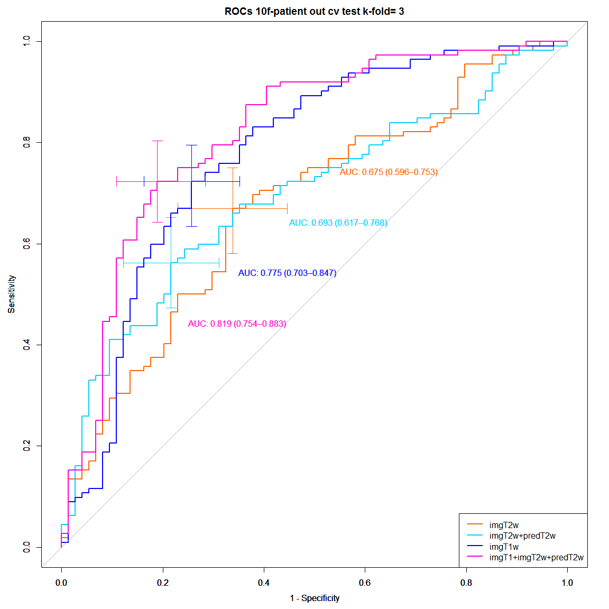 

```
## Area under the curve: 0.8185
## 95% CI (2000 stratified bootstrap replicates):
##  thresholds sp.low sp.median sp.high se.low se.median se.high
##   0.4461978 0.7162    0.8108  0.8919 0.6429    0.7232  0.8036
##    massB    massM nonmassB nonmassM 
##      226      149      128       70 
##    massB    massM nonmassB nonmassM 
##       16       17       14        7 
##    massB    massM nonmassB nonmassM 
##      226      149      128       70 
##    massB    massM nonmassB nonmassM 
##       16       17       14        7 
##    massB    massM nonmassB nonmassM 
##      226      149      128       70 
##    massB    massM nonmassB nonmassM 
##       16       17       14        7 
## -0.03349282 0.05 
## Selected features for group: MeanDecreaseGini imgT2 
## =========NULL
##  [1] "T2RGH_mean"                    "T2texture_correlation_nondir"  "T2skew_F_r_i"                  "find_t2_signal_int"           
##  [5] "LMSIR"                         "T2var_F_r_i"                   "T2texture_diffvariance_nondir" "ave_T215"                     
##  [9] "ave_T212"                      "T2grad_margin"                 "ave_T213"                      "ave_T26"                      
## [13] "ave_T24"                       "ave_T217"                      "ave_T29"                       "T2texture_sumaverage_nondir"  
## [17] "T2mean_F_r_i"                  "ave_T23"                       "ave_T210"                      "ave_T22"                      
## [21] "ave_T28"                       "ave_T25"                       "T2max_F_r_i"                   "ave_T214"                     
## [25] "ave_T211"                      "T2min_F_r_i"                   "ave_T21"                       "ave_T219"                     
## [29] "ave_T27"                       "T2texture_sumentropy_nondir"   "ave_T218"                      "T2_lesionSI"                  
## 0.1148936 0.05 
## -0.03365385 0.05 
## Selected features for group: MeanDecreaseGini allT2 
## =========NULL
##  [1] "T2RGH_mean"                         "T2RGH_var"                          "T2texture_entropy_nondir"          
##  [4] "find_t2_signal_int"                 "ave_T210"                           "LMSIR"                             
##  [7] "T2texture_correlation_nondir"       "ave_T27"                            "T2grad_margin_var"                 
## [10] "T2texture_inversediffmoment_nondir" "ave_T211"                           "ave_T21"                           
## [13] "ave_T219"                           "ave_T20"                            "T2_lesionSI"                       
## [16] "T2kurt_F_r_i"                       "ave_T28"                            "ave_T215"                          
## [19] "ave_T24"                            "ave_T214"                           "ave_T23"                           
## [22] "ave_T216"                           "T2texture_contrast_nondir"          "T2var_F_r_i"                       
## [25] "T2max_F_r_i"                        "T2texture_energy_nondir"            "ave_T217"                          
## [28] "T2texture_sumentropy_nondir"        "T2texture_sumvariance_nondir"       "T2min_F_r_i"                       
## [31] "T2texture_sumaverage_nondir"        "T2skew_F_r_i"                       "T2texture_diffentropy_nondir"      
## [34] "T2texture_diffvariance_nondir"      "LMSIR_predicted"                    "ave_T218"                          
## [37] "ave_T25"                            "T2grad_margin"                      "ave_T29"                           
## [40] "T2_lesionSIstd"                    
## 0.01923077 0.05 
## Selected features for group: MeanDecreaseGini imgT1 
## =========NULL
##  [1] "texture_sumvariance_nondir_post1"       "circularity"                            "SER_inside"                            
##  [4] "earlySE12"                              "max_RGH_mean"                           "iiMin_change_Variance_uptake"          
##  [7] "texture_inversediffmoment_nondir_post4" "texture_diffvariance_nondir_post3"      "texture_energy_nondir_post4"           
## [10] "maxVr_countor"                          "dce3SE8"                                "texture_variance_nondir_post3"         
## [13] "V18"                                    "edge_sharp_std"                         "V14"                                   
## [16] "earlySE15"                              "V3"                                     "A_countor"                             
## [19] "lateSE6"                                "dce2SE16"                               "texture_inversediffmoment_nondir_post2"
## [22] "Vr_increasingRate_countor"              "var_F_r_i"                              "alpha_countor"                         
## [25] "lateSE14"                               "texture_correlation_nondir_post4"       "lateSE4"                               
## [28] "V12"                                    "texture_inversediffmoment_nondir_post3" "dce2SE8"                               
## [31] "V11"                                    "V5"                                     "peakCr_inside"                         
## [34] "dce2SE11"                               "maxCr_inside"                           "texture_entropy_nondir_post4"          
## [37] "A_inside"                              
## -0.1088435 0.05 
## Selected features for group: MeanDecreaseGini all 
## =========NULL
##  [1] "circularity"                       "earlySE5"                          "UptakeRate_inside"                
##  [4] "Vr_increasingRate_countor"         "texture_sumaverage_nondir_post1"   "texture_contrast_nondir_post1"    
##  [7] "texture_correlation_nondir_post3"  "earlySE19"                         "texture_diffvariance_nondir_post3"
## [10] "earlySE18"                         "ave_T218"                          "V4"                               
## [13] "T2texture_sumaverage_nondir"       "lateSE17"                          "T2_lesionSIstd"                   
## [16] "texture_diffentropy_nondir_post2"  "dce3SE0"                           "V17"                              
## [19] "V5"                                "find_t2_signal_int"                "V3"                               
## [22] "T2mean_F_r_i"                      "dce3SE7"                           "ave_T22"                          
## [25] "maxVr_countor"                     "dce3SE3"                           "SER_countor"                      
## [28] "texture_energy_nondir_post1"       "Tpeak_countor"                     "V8"                               
## [31] "A_inside"                         
##     lesion_id cad_pt_no_txt exam_a_number_txt BIRADS lesion_label             lesion_diagnosis      find_t2_signal_int
## 11         11          0111           6907205      4     nonmassB               DUCT PAPILLOMA Hypointense or not seen
## 12         12          0114           6896014      4        massM               InvasiveDuctal                    None
## 82         82          0409           5161803      4        massB         BENIGN BREAST TISSUE                    None
## 91         91          0463           7626269      4        massB           FLORID HYPERPLASIA Hypointense or not seen
## 110       110          0576           6905042      4     nonmassB         BENIGN BREAST TISSUE Hypointense or not seen
## 115       115          0603           4593568      4     nonmassB                     FIBROSIS                    None
## 118       118          0613           4681594      4     nonmassM                 InsituDuctal                    None
## 119       119          0613           4681594      3     nonmassB         BENIGN BREAST TISSUE                    None
## 135       135          0673           4585908      4        massB                  FIBROCYSTIC Hypointense or not seen
## 138       138          0682           5050826      6     nonmassM                 InsituDuctal                    None
## 145       145          0689           5205923      2        massB        COLUMNAR CELL CHANGES            Hyperintense
## 149       149          0691           5178056      5        massM               InvasiveDuctal Hypointense or not seen
## 150       150          0691           5178056      5        massM               InvasiveDuctal Hypointense or not seen
## 168       168          0721           4961869      6        massM               InvasiveDuctal            Hyperintense
## 178       178          0729           4805710      4        massB ATYPICAL LOBULAR HYPERPLASIA                    None
## 182       182          0735           5276000      5        massM               InvasiveDuctal                    None
## 186       186          0742           5329785      4        massB               DUCT PAPILLOMA                    None
## 187       187          0742           5329785      4     nonmassB               DUCT PAPILLOMA                    None
## 189       189          0744           4848278      5        massM               InvasiveDuctal                    None
## 191       191          0748           4940559      6        massM  ATYPICAL DUCTAL HYPERPLASIA                    None
## 195       195          0755           5059877      4     nonmassM                 InsituDuctal                    None
## 196       196          0755           5059877      4     nonmassB         BENIGN BREAST TISSUE                    None
## 252       252          0837           4559849      5        massM               InvasiveDuctal                    None
## 276       276          0861           5053396      5        massM               InvasiveDuctal Hypointense or not seen
## 283       283          0870           5141888      6     nonmassM              InvasiveLobular                    None
## 302       302          0887           6794529      4        massB                  FIBROCYSTIC Hypointense or not seen
## 316       316          0943           5395204      4     nonmassM                 InsituDuctal                    None
## 317       317          0943           5395204      4     nonmassB                  FIBROCYSTIC Hypointense or not seen
## 320       320          0950           6931716      5        massM               InvasiveDuctal Hypointense or not seen
## 321       321          0950           6931716      5     nonmassM               InvasiveDuctal                    None
## 338       338          1004           6801264      4     nonmassB                  FIBROCYSTIC Hypointense or not seen
## 363       363          1078           7105247      4     nonmassB               DENSE FIBROSIS                    None
## 364       364          1078           7105247      4     nonmassB               DENSE FIBROSIS                    None
## 377       377          2007           7366811      4     nonmassB                 FIBROADENOMA Hypointense or not seen
## 395       395          2051           6712632      6        massM                 InsituDuctal                    None
## 396       396          2051           6712632      6     nonmassB                  FIBROCYSTIC                    None
## 397       397          2053           6776964      6        massM               InvasiveDuctal                    None
## 423       423          3021           7019819      4        massB         BENIGN BREAST TISSUE                    None
## 430       430          3033           5016967      5        massM               InvasiveDuctal                    None
## 456       456          3073           7043941      6     nonmassM  IN SITU PAPILLARY CARCINOMA                    None
## 499       499          4044           7066571      4        massB             FIBROADENOMATOID            Hyperintense
## 500       500          4044           7066571      4        massB        FOCAL CELLULAR STROMA            Hyperintense
## 501       501          4044           7066571      4        massB                 FIBROADENOMA   Slightly hyperintense
## 502       502          4045           7092118      4        massB                 FIBROADENOMA                    None
## 516       516          6017           5086121      6        massM              InvasiveLobular                    None
## 517       517          6017           5086121      2        massB                 FIBROADENOMA            Hyperintense
## 558       558          6044           5078981      5        massB                  FIBROCYSTIC                    None
## 559       559          6044           5078981      5        massM               InvasiveDuctal                    None
## 583       583          6117           5154282      3        massB                 FIBROADENOMA            Hyperintense
## 584       584          6141           7044114      2        massB                 FIBROADENOMA            Hyperintense
## 598       598          7029           7014263      4     nonmassB  ATYPICAL DUCTAL HYPERPLASIA                    None
## 612       612          7086           6938067      4        massM                 InsituDuctal                    None
## 613       613          7088           7066921      3     nonmassB                  FIBROCYSTIC                    None
## 621       621          7105           7837892      4        massM               InvasiveDuctal   Slightly hyperintense
## 
## ============ bestune_imgT2 	 max.depth  1 	 #Trees  350 
## ntrees:  50 minsplit:  3 cp:  0.01 
##   ntrees minsplit   cp acuTrain rocTrain   acuTest   rocTest
## 1     50        3 0.01        1        1 0.5740741 0.6111111
## ntrees:  100 minsplit:  3 cp:  0.01 
##   ntrees minsplit   cp acuTrain rocTrain   acuTest   rocTest
## 2    100        3 0.01        1        1 0.5925926 0.6694444
## ntrees:  250 minsplit:  3 cp:  0.01 
##   ntrees minsplit   cp acuTrain rocTrain   acuTest   rocTest
## 3    250        3 0.01        1        1 0.6481481 0.7097222
## ntrees:  350 minsplit:  3 cp:  0.01 
##   ntrees minsplit   cp acuTrain rocTrain   acuTest   rocTest
## 4    350        3 0.01        1        1 0.6851852 0.6638889
## ntrees:  50 minsplit:  1 cp:  0.01 
##   ntrees minsplit   cp acuTrain rocTrain   acuTest   rocTest
## 5     50        1 0.01        1        1 0.6111111 0.6194444
## ntrees:  100 minsplit:  1 cp:  0.01 
##   ntrees minsplit   cp acuTrain rocTrain   acuTest   rocTest
## 6    100        1 0.01        1        1 0.7037037 0.7652778
## ntrees:  250 minsplit:  1 cp:  0.01 
##   ntrees minsplit   cp acuTrain rocTrain   acuTest   rocTest
## 7    250        1 0.01        1        1 0.7037037 0.7138889
## ntrees:  350 minsplit:  1 cp:  0.01 
##   ntrees minsplit   cp acuTrain rocTrain   acuTest   rocTest
## 8    350        1 0.01        1        1 0.6666667 0.7291667
## ntrees:  50 minsplit:  3 cp:  -1 
##   ntrees minsplit cp acuTrain rocTrain   acuTest   rocTest
## 9     50        3 -1        1        1 0.5740741 0.6319444
## ntrees:  100 minsplit:  3 cp:  -1 
##    ntrees minsplit cp acuTrain rocTrain   acuTest   rocTest
## 10    100        3 -1        1        1 0.6481481 0.7361111
## ntrees:  250 minsplit:  3 cp:  -1 
##    ntrees minsplit cp acuTrain rocTrain   acuTest rocTest
## 11    250        3 -1        1        1 0.6666667    0.65
## ntrees:  350 minsplit:  3 cp:  -1 
##    ntrees minsplit cp acuTrain rocTrain   acuTest   rocTest
## 12    350        3 -1        1        1 0.7222222 0.7333333
## ntrees:  50 minsplit:  1 cp:  -1 
##    ntrees minsplit cp acuTrain rocTrain   acuTest   rocTest
## 13     50        1 -1        1        1 0.7407407 0.8069444
## ntrees:  100 minsplit:  1 cp:  -1 
##    ntrees minsplit cp acuTrain rocTrain   acuTest   rocTest
## 14    100        1 -1        1        1 0.6666667 0.7638889
## ntrees:  250 minsplit:  1 cp:  -1 
##    ntrees minsplit cp acuTrain rocTrain   acuTest rocTest
## 15    250        1 -1        1        1 0.7222222  0.6875
## ntrees:  350 minsplit:  1 cp:  -1 
##    ntrees minsplit cp acuTrain rocTrain   acuTest   rocTest
## 16    350        1 -1        1        1 0.6851852 0.6930556
##    ntrees minsplit    cp acuTrain rocTrain   acuTest   rocTest
## 1      50        3  0.01        1        1 0.5740741 0.6111111
## 2     100        3  0.01        1        1 0.5925926 0.6694444
## 3     250        3  0.01        1        1 0.6481481 0.7097222
## 4     350        3  0.01        1        1 0.6851852 0.6638889
## 5      50        1  0.01        1        1 0.6111111 0.6194444
## 6     100        1  0.01        1        1 0.7037037 0.7652778
## 7     250        1  0.01        1        1 0.7037037 0.7138889
## 8     350        1  0.01        1        1 0.6666667 0.7291667
## 9      50        3 -1.00        1        1 0.5740741 0.6319444
## 10    100        3 -1.00        1        1 0.6481481 0.7361111
## 11    250        3 -1.00        1        1 0.6666667 0.6500000
## 12    350        3 -1.00        1        1 0.7222222 0.7333333
## 13     50        1 -1.00        1        1 0.7407407 0.8069444
## 14    100        1 -1.00        1        1 0.6666667 0.7638889
## 15    250        1 -1.00        1        1 0.7222222 0.6875000
## 16    350        1 -1.00        1        1 0.6851852 0.6930556
##    ntrees minsplit cp acuTrain rocTrain   acuTest   rocTest
## 13     50        1 -1        1        1 0.7407407 0.8069444
## 
## ============ bestune_allT2 	 max.depth  1 	 #Trees  250 
## ntrees:  50 minsplit:  3 cp:  0.01 
##   ntrees minsplit   cp acuTrain rocTrain   acuTest   rocTest
## 1     50        3 0.01        1        1 0.6481481 0.6402778
## ntrees:  100 minsplit:  3 cp:  0.01 
##   ntrees minsplit   cp acuTrain rocTrain   acuTest   rocTest
## 2    100        3 0.01        1        1 0.7407407 0.7666667
## ntrees:  250 minsplit:  3 cp:  0.01 
##   ntrees minsplit   cp acuTrain rocTrain   acuTest rocTest
## 3    250        3 0.01        1        1 0.6111111     0.7
## ntrees:  350 minsplit:  3 cp:  0.01 
##   ntrees minsplit   cp acuTrain rocTrain   acuTest   rocTest
## 4    350        3 0.01        1        1 0.7407407 0.7180556
## ntrees:  50 minsplit:  1 cp:  0.01 
##   ntrees minsplit   cp acuTrain rocTrain   acuTest   rocTest
## 5     50        1 0.01        1        1 0.5925926 0.6777778
## ntrees:  100 minsplit:  1 cp:  0.01 
##   ntrees minsplit   cp acuTrain rocTrain   acuTest   rocTest
## 6    100        1 0.01        1        1 0.6481481 0.7138889
## ntrees:  250 minsplit:  1 cp:  0.01 
##   ntrees minsplit   cp acuTrain rocTrain   acuTest rocTest
## 7    250        1 0.01        1        1 0.7592593  0.7375
## ntrees:  350 minsplit:  1 cp:  0.01 
##   ntrees minsplit   cp acuTrain rocTrain   acuTest   rocTest
## 8    350        1 0.01        1        1 0.7037037 0.7097222
## ntrees:  50 minsplit:  3 cp:  -1 
##   ntrees minsplit cp acuTrain rocTrain   acuTest   rocTest
## 9     50        3 -1        1        1 0.6481481 0.6486111
## ntrees:  100 minsplit:  3 cp:  -1 
##    ntrees minsplit cp acuTrain rocTrain   acuTest   rocTest
## 10    100        3 -1        1        1 0.6296296 0.6916667
## ntrees:  250 minsplit:  3 cp:  -1 
##    ntrees minsplit cp acuTrain rocTrain   acuTest   rocTest
## 11    250        3 -1        1        1 0.7037037 0.7305556
## ntrees:  350 minsplit:  3 cp:  -1 
##    ntrees minsplit cp acuTrain rocTrain   acuTest   rocTest
## 12    350        3 -1        1        1 0.7407407 0.7069444
## ntrees:  50 minsplit:  1 cp:  -1 
##    ntrees minsplit cp acuTrain rocTrain   acuTest   rocTest
## 13     50        1 -1        1        1 0.6296296 0.7055556
## ntrees:  100 minsplit:  1 cp:  -1 
##    ntrees minsplit cp acuTrain rocTrain   acuTest rocTest
## 14    100        1 -1        1        1 0.6666667  0.7625
## ntrees:  250 minsplit:  1 cp:  -1 
##    ntrees minsplit cp acuTrain rocTrain   acuTest   rocTest
## 15    250        1 -1        1        1 0.7037037 0.7138889
## ntrees:  350 minsplit:  1 cp:  -1 
##    ntrees minsplit cp acuTrain rocTrain   acuTest   rocTest
## 16    350        1 -1        1        1 0.7222222 0.7430556
##    ntrees minsplit    cp acuTrain rocTrain   acuTest   rocTest
## 1      50        3  0.01        1        1 0.6481481 0.6402778
## 2     100        3  0.01        1        1 0.7407407 0.7666667
## 3     250        3  0.01        1        1 0.6111111 0.7000000
## 4     350        3  0.01        1        1 0.7407407 0.7180556
## 5      50        1  0.01        1        1 0.5925926 0.6777778
## 6     100        1  0.01        1        1 0.6481481 0.7138889
## 7     250        1  0.01        1        1 0.7592593 0.7375000
## 8     350        1  0.01        1        1 0.7037037 0.7097222
## 9      50        3 -1.00        1        1 0.6481481 0.6486111
## 10    100        3 -1.00        1        1 0.6296296 0.6916667
## 11    250        3 -1.00        1        1 0.7037037 0.7305556
## 12    350        3 -1.00        1        1 0.7407407 0.7069444
## 13     50        1 -1.00        1        1 0.6296296 0.7055556
## 14    100        1 -1.00        1        1 0.6666667 0.7625000
## 15    250        1 -1.00        1        1 0.7037037 0.7138889
## 16    350        1 -1.00        1        1 0.7222222 0.7430556
##   ntrees minsplit   cp acuTrain rocTrain   acuTest   rocTest
## 2    100        3 0.01        1        1 0.7407407 0.7666667
## 
## ============ bestune_imgT1 	 max.depth  1 	 #Trees  250 
## ntrees:  50 minsplit:  3 cp:  0.01 
##   ntrees minsplit   cp acuTrain rocTrain   acuTest rocTest
## 1     50        3 0.01        1        1 0.6666667  0.7375
## ntrees:  100 minsplit:  3 cp:  0.01 
##   ntrees minsplit   cp acuTrain rocTrain   acuTest   rocTest
## 2    100        3 0.01        1        1 0.7777778 0.7791667
## ntrees:  250 minsplit:  3 cp:  0.01 
##   ntrees minsplit   cp acuTrain rocTrain   acuTest   rocTest
## 3    250        3 0.01        1        1 0.7407407 0.7736111
## ntrees:  350 minsplit:  3 cp:  0.01 
##   ntrees minsplit   cp acuTrain rocTrain   acuTest   rocTest
## 4    350        3 0.01        1        1 0.7407407 0.8069444
## ntrees:  50 minsplit:  1 cp:  0.01 
##   ntrees minsplit   cp acuTrain rocTrain   acuTest   rocTest
## 5     50        1 0.01        1        1 0.7037037 0.7680556
## ntrees:  100 minsplit:  1 cp:  0.01 
##   ntrees minsplit   cp acuTrain rocTrain   acuTest   rocTest
## 6    100        1 0.01        1        1 0.7407407 0.8222222
## ntrees:  250 minsplit:  1 cp:  0.01 
##   ntrees minsplit   cp acuTrain rocTrain   acuTest rocTest
## 7    250        1 0.01        1        1 0.7592593  0.8125
## ntrees:  350 minsplit:  1 cp:  0.01 
##   ntrees minsplit   cp acuTrain rocTrain   acuTest   rocTest
## 8    350        1 0.01        1        1 0.7777778 0.8180556
## ntrees:  50 minsplit:  3 cp:  -1 
##   ntrees minsplit cp acuTrain rocTrain   acuTest   rocTest
## 9     50        3 -1        1        1 0.7037037 0.7583333
## ntrees:  100 minsplit:  3 cp:  -1 
##    ntrees minsplit cp acuTrain rocTrain   acuTest   rocTest
## 10    100        3 -1        1        1 0.7222222 0.7555556
## ntrees:  250 minsplit:  3 cp:  -1 
##    ntrees minsplit cp acuTrain rocTrain   acuTest   rocTest
## 11    250        3 -1        1        1 0.7407407 0.8069444
## ntrees:  350 minsplit:  3 cp:  -1 
##    ntrees minsplit cp acuTrain rocTrain   acuTest   rocTest
## 12    350        3 -1        1        1 0.7407407 0.7763889
## ntrees:  50 minsplit:  1 cp:  -1 
##    ntrees minsplit cp acuTrain rocTrain   acuTest   rocTest
## 13     50        1 -1        1        1 0.7222222 0.7847222
## ntrees:  100 minsplit:  1 cp:  -1 
##    ntrees minsplit cp acuTrain rocTrain   acuTest   rocTest
## 14    100        1 -1        1        1 0.7592593 0.7972222
## ntrees:  250 minsplit:  1 cp:  -1 
##    ntrees minsplit cp acuTrain rocTrain   acuTest   rocTest
## 15    250        1 -1        1        1 0.7407407 0.8083333
## ntrees:  350 minsplit:  1 cp:  -1 
##    ntrees minsplit cp acuTrain rocTrain   acuTest   rocTest
## 16    350        1 -1        1        1 0.7592593 0.8055556
##    ntrees minsplit    cp acuTrain rocTrain   acuTest   rocTest
## 1      50        3  0.01        1        1 0.6666667 0.7375000
## 2     100        3  0.01        1        1 0.7777778 0.7791667
## 3     250        3  0.01        1        1 0.7407407 0.7736111
## 4     350        3  0.01        1        1 0.7407407 0.8069444
## 5      50        1  0.01        1        1 0.7037037 0.7680556
## 6     100        1  0.01        1        1 0.7407407 0.8222222
## 7     250        1  0.01        1        1 0.7592593 0.8125000
## 8     350        1  0.01        1        1 0.7777778 0.8180556
## 9      50        3 -1.00        1        1 0.7037037 0.7583333
## 10    100        3 -1.00        1        1 0.7222222 0.7555556
## 11    250        3 -1.00        1        1 0.7407407 0.8069444
## 12    350        3 -1.00        1        1 0.7407407 0.7763889
## 13     50        1 -1.00        1        1 0.7222222 0.7847222
## 14    100        1 -1.00        1        1 0.7592593 0.7972222
## 15    250        1 -1.00        1        1 0.7407407 0.8083333
## 16    350        1 -1.00        1        1 0.7592593 0.8055556
##   ntrees minsplit   cp acuTrain rocTrain   acuTest   rocTest
## 6    100        1 0.01        1        1 0.7407407 0.8222222
## 
## ============ bestune_all 	 max.depth  1 	 #Trees  200 
## ntrees:  50 minsplit:  3 cp:  0.01 
##   ntrees minsplit   cp acuTrain rocTrain   acuTest   rocTest
## 1     50        3 0.01        1        1 0.6851852 0.6972222
## ntrees:  100 minsplit:  3 cp:  0.01 
##   ntrees minsplit   cp acuTrain rocTrain   acuTest   rocTest
## 2    100        3 0.01        1        1 0.6851852 0.7513889
## ntrees:  250 minsplit:  3 cp:  0.01 
##   ntrees minsplit   cp acuTrain rocTrain   acuTest   rocTest
## 3    250        3 0.01        1        1 0.7407407 0.7763889
## ntrees:  350 minsplit:  3 cp:  0.01 
##   ntrees minsplit   cp acuTrain rocTrain   acuTest   rocTest
## 4    350        3 0.01        1        1 0.6851852 0.7791667
## ntrees:  50 minsplit:  1 cp:  0.01 
##   ntrees minsplit   cp acuTrain rocTrain   acuTest   rocTest
## 5     50        1 0.01        1        1 0.7407407 0.7722222
## ntrees:  100 minsplit:  1 cp:  0.01 
##   ntrees minsplit   cp acuTrain rocTrain   acuTest   rocTest
## 6    100        1 0.01        1        1 0.7592593 0.8263889
## ntrees:  250 minsplit:  1 cp:  0.01 
##   ntrees minsplit   cp acuTrain rocTrain   acuTest   rocTest
## 7    250        1 0.01        1        1 0.6666667 0.8013889
## ntrees:  350 minsplit:  1 cp:  0.01 
##   ntrees minsplit   cp acuTrain rocTrain   acuTest   rocTest
## 8    350        1 0.01        1        1 0.6296296 0.7527778
## ntrees:  50 minsplit:  3 cp:  -1 
##   ntrees minsplit cp acuTrain rocTrain   acuTest   rocTest
## 9     50        3 -1        1        1 0.6296296 0.7388889
## ntrees:  100 minsplit:  3 cp:  -1 
##    ntrees minsplit cp acuTrain rocTrain   acuTest   rocTest
## 10    100        3 -1        1        1 0.6666667 0.7166667
## ntrees:  250 minsplit:  3 cp:  -1 
##    ntrees minsplit cp acuTrain rocTrain   acuTest   rocTest
## 11    250        3 -1        1        1 0.6481481 0.7472222
## ntrees:  350 minsplit:  3 cp:  -1 
##    ntrees minsplit cp acuTrain rocTrain   acuTest rocTest
## 12    350        3 -1        1        1 0.6666667    0.75
## ntrees:  50 minsplit:  1 cp:  -1 
##    ntrees minsplit cp acuTrain rocTrain   acuTest   rocTest
## 13     50        1 -1        1        1 0.6666667 0.7097222
## ntrees:  100 minsplit:  1 cp:  -1 
##    ntrees minsplit cp acuTrain rocTrain   acuTest   rocTest
## 14    100        1 -1        1        1 0.7037037 0.7944444
## ntrees:  250 minsplit:  1 cp:  -1 
##    ntrees minsplit cp acuTrain rocTrain   acuTest   rocTest
## 15    250        1 -1        1        1 0.6296296 0.7347222
## ntrees:  350 minsplit:  1 cp:  -1 
##    ntrees minsplit cp acuTrain rocTrain   acuTest   rocTest
## 16    350        1 -1        1        1 0.6666667 0.7583333
##    ntrees minsplit    cp acuTrain rocTrain   acuTest   rocTest
## 1      50        3  0.01        1        1 0.6851852 0.6972222
## 2     100        3  0.01        1        1 0.6851852 0.7513889
## 3     250        3  0.01        1        1 0.7407407 0.7763889
## 4     350        3  0.01        1        1 0.6851852 0.7791667
## 5      50        1  0.01        1        1 0.7407407 0.7722222
## 6     100        1  0.01        1        1 0.7592593 0.8263889
## 7     250        1  0.01        1        1 0.6666667 0.8013889
## 8     350        1  0.01        1        1 0.6296296 0.7527778
## 9      50        3 -1.00        1        1 0.6296296 0.7388889
## 10    100        3 -1.00        1        1 0.6666667 0.7166667
## 11    250        3 -1.00        1        1 0.6481481 0.7472222
## 12    350        3 -1.00        1        1 0.6666667 0.7500000
## 13     50        1 -1.00        1        1 0.6666667 0.7097222
## 14    100        1 -1.00        1        1 0.7037037 0.7944444
## 15    250        1 -1.00        1        1 0.6296296 0.7347222
## 16    350        1 -1.00        1        1 0.6666667 0.7583333
##   ntrees minsplit   cp acuTrain rocTrain   acuTest   rocTest
## 6    100        1 0.01        1        1 0.7592593 0.8263889
## 
## Call:
## roc.default(response = perf_imgT2$obs, predictor = perf_imgT2$C)
## 
## Data: perf_imgT2$C in 98 controls (perf_imgT2$obs C) > 142 cases (perf_imgT2$obs NC).
## Area under the curve: 0.707
## 
## Call:
## roc.default(response = perf_allT2$obs, predictor = perf_allT2$C)
## 
## Data: perf_allT2$C in 98 controls (perf_allT2$obs C) > 142 cases (perf_allT2$obs NC).
## Area under the curve: 0.7056
## 
## Call:
## roc.default(response = perf_imgT1$obs, predictor = perf_imgT1$C)
## 
## Data: perf_imgT1$C in 98 controls (perf_imgT1$obs C) > 142 cases (perf_imgT1$obs NC).
## Area under the curve: 0.7851
## 
## Call:
## roc.default(response = perf_all$obs, predictor = perf_all$C)
## 
## Data: perf_all$C in 98 controls (perf_all$obs C) > 142 cases (perf_all$obs NC).
## Area under the curve: 0.8211
```

```
## Area under the curve: 0.707
## 95% CI (2000 stratified bootstrap replicates):
##  thresholds sp.low sp.median sp.high se.low se.median se.high
##   0.4630168  0.551    0.6531  0.7449 0.6268    0.7042  0.7746
```

```
## Area under the curve: 0.7056
## 95% CI (2000 stratified bootstrap replicates):
##  thresholds sp.low sp.median sp.high se.low se.median se.high
##   0.4528358 0.5918    0.6837  0.7755 0.6056    0.6831  0.7606
```

```
## Area under the curve: 0.7851
## 95% CI (2000 stratified bootstrap replicates):
##  thresholds sp.low sp.median sp.high se.low se.median se.high
##   0.4521917 0.6429    0.7347  0.8163 0.6831    0.7535  0.8239
```

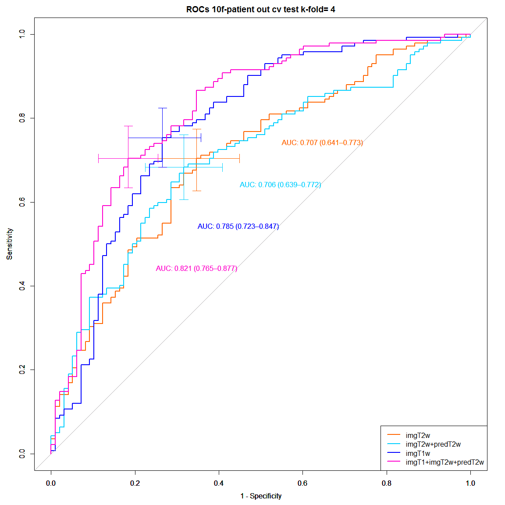 

```
## Area under the curve: 0.8211
## 95% CI (2000 stratified bootstrap replicates):
##  thresholds sp.low sp.median sp.high se.low se.median se.high
##   0.4461978 0.7449    0.8163  0.8878 0.6338    0.7042  0.7817
##    massB    massM nonmassB nonmassM 
##      225      147      127       69 
##    massB    massM nonmassB nonmassM 
##       17       19       15        8 
##    massB    massM nonmassB nonmassM 
##      225      147      127       69 
##    massB    massM nonmassB nonmassM 
##       17       19       15        8 
##    massB    massM nonmassB nonmassM 
##      225      147      127       69 
##    massB    massM nonmassB nonmassM 
##       17       19       15        8 
## 0.004761905 0.05 
## Selected features for group: MeanDecreaseGini imgT2 
## =========NULL
##  [1] "T2RGH_mean"                         "find_t2_signal_int"                 "T2texture_energy_nondir"           
##  [4] "T2kurt_F_r_i"                       "T2texture_correlation_nondir"       "ave_T210"                          
##  [7] "T2grad_margin_var"                  "ave_T213"                           "ave_T211"                          
## [10] "ave_T27"                            "ave_T212"                           "T2texture_sumaverage_nondir"       
## [13] "ave_T20"                            "ave_T24"                            "T2texture_variance_nondir"         
## [16] "T2_lesionSI"                        "LMSIR"                              "ave_T219"                          
## [19] "ave_T214"                           "T2var_F_r_i"                        "ave_T215"                          
## [22] "ave_T218"                           "ave_T26"                            "T2texture_inversediffmoment_nondir"
## [25] "ave_T217"                           "T2min_F_r_i"                        "T2skew_F_r_i"                      
## [28] "T2texture_diffentropy_nondir"       "ave_T23"                            "ave_T28"                           
## [31] "T2texture_diffvariance_nondir"      "ave_T29"                            "ave_T216"                          
## [34] "ave_T21"                            "ave_T25"                            "T2_lesionSIstd"                    
## -0.02392344 0.05 
## Selected features for group: MeanDecreaseGini allT2 
## =========NULL
##  [1] "T2RGH_mean"                   "T2texture_correlation_nondir" "T2skew_F_r_i"                 "ave_T213"                    
##  [5] "T2texture_sumaverage_nondir"  "T2texture_energy_nondir"      "T2texture_diffentropy_nondir" "T2wSI_predicted"             
##  [9] "ave_T25"                      "ave_T20"                      "ave_T216"                     "ave_T218"                    
## [13] "T2_lesionSIstd"               "T2max_F_r_i"                  "T2grad_margin_var"            "ave_T21"                     
## [17] "ave_T211"                     "LMSIR"                        "ave_T29"                      "ave_T28"                     
## [21] "ave_T27"                      "T2texture_entropy_nondir"     "LMSIR_predicted"              "ave_T210"                    
## [25] "T2kurt_F_r_i"                 "ave_T24"                      "T2texture_sumentropy_nondir"  "ave_T26"                     
## [29] "ave_T22"                      "ave_T219"                     "ave_T214"                     "ave_T215"                    
## [33] "T2grad_margin"                "find_t2_signal_int"          
## 0.01851852 0.05 
## Selected features for group: MeanDecreaseGini imgT1 
## =========NULL
##  [1] "irregularity"                     "texture_sumvariance_nondir_post1" "SER_inside"                      
##  [4] "iiMin_change_Variance_uptake"     "skew_F_r_i"                       "max_F_r_i"                       
##  [7] "earlySE12"                        "texture_sumaverage_nondir_post3"  "lateSE11"                        
## [10] "alpha_countor"                    "V19"                              "kurt_F_r_i"                      
## [13] "beta_inside"                      "Vr_decreasingRate_inside"         "dce3SE13"                        
## [16] "texture_energy_nondir_post3"      "texture_contrast_nondir_post2"    "texture_correlation_nondir_post4"
## [19] "dce2SE7"                          "texture_diffentropy_nondir_post1" "V0"                              
## [22] "dce2SE16"                         "V2"                               "lateSE8"                         
## [25] "lateSE4"                          "dce3SE10"                         "V18"                             
## [28] "texture_sumvariance_nondir_post4" "dce3SE6"                          "lateSE19"                        
## [31] "lateSE12"                         "Slope_ini_inside"                 "dce3SE0"                         
## [34] "lateSE9"                          "A_inside"                        
## 0.06711409 0.05 
## -0.05035971 0.05 
## Selected features for group: MeanDecreaseGini all 
## =========NULL
##  [1] "irregularity"                           "texture_variance_nondir_post1"          "edge_sharp_std"                        
##  [4] "Vr_post_1_countor"                      "var_F_r_i"                              "earlySE0"                              
##  [7] "lateSE13"                               "V11"                                    "V15"                                   
## [10] "texture_inversediffmoment_nondir_post4" "dce2SE8"                                "dce3SE6"                               
## [13] "texture_diffvariance_nondir_post3"      "T2texture_energy_nondir"                "texture_correlation_nondir_post3"      
## [16] "peakCr_inside"                          "T2grad_margin"                          "V12"                                   
## [19] "dce3SE2"                                "T2texture_variance_nondir"              "V14"                                   
## [22] "V10"                                    "min_F_r_i"                              "texture_diffentropy_nondir_post3"      
## [25] "texture_sumvariance_nondir_post1"       "Kpeak_countor"                          "lateSE8"                               
## [28] "earlySE3"                               "ivVariance"                             "ave_T213"                              
## [31] "edge_sharp_mean"                        "dce2SE13"                               "dce2SE18"                              
## [34] "lateSE19"                               "ave_T217"                               "T2skew_F_r_i"                          
## [37] "earlySE19"                              "T2var_F_r_i"                            "A_inside"                              
##     lesion_id cad_pt_no_txt exam_a_number_txt BIRADS lesion_label                      lesion_diagnosis      find_t2_signal_int
## 10         10          0102           4755778      4        massB                           FIBROCYSTIC            Hyperintense
## 69         69          0277           5077098      5     nonmassM                          InsituDuctal Hypointense or not seen
## 72         72          0293           7491268      4     nonmassB                  BENIGN BREAST TISSUE                    None
## 81         81          0388           7395410      5        massM                        InvasiveDuctal                    None
## 92         92          0465           4885863      2     nonmassB           ATYPICAL DUCTAL HYPERPLASIA                    None
## 95         95          0503           6697826      3        massM                        InvasiveDuctal            Hyperintense
## 101       101          0551           4804820      4        massB                       FIBROEPITHELIAL   Slightly hyperintense
## 108       108          0572           4681582      4     nonmassM                        InvasiveDuctal                    None
## 109       109          0573           5142109      4     nonmassB                 COLUMNAR CELL CHANGES                    None
## 128       128          0664           7081071      4     nonmassB           ATYPICAL DUCTAL HYPERPLASIA Hypointense or not seen
## 155       155          0707           5184832      4     nonmassB              COMPLEX PAPILLARY LESION Hypointense or not seen
## 156       156          0707           5184832      4     nonmassB              COMPLEX PAPILLARY LESION Hypointense or not seen
## 184       184          0737           4559808      3        massM                          InsituDuctal            Hyperintense
## 199       199          0764           5088503      5        massM                        InvasiveDuctal                    None
## 200       200          0764           5088503      5        massM                        InvasiveDuctal                    None
## 202       202          0767           5306672      4        massB             ATYPICAL PAPILLARY LESION                    None
## 205       205          0775           5437780      3        massB                  BENIGN BREAST TISSUE   Slightly hyperintense
## 206       206          0775           5437780      3     nonmassB                  BENIGN BREAST TISSUE Hypointense or not seen
## 207       207          0775           5437780      3     nonmassB                  BENIGN BREAST TISSUE   Slightly hyperintense
## 210       210          0782           4775699      5        massM                        InvasiveDuctal                    None
## 243       243          0827           4985128      4        massM              INSITUPAPILLARYCARCINOMA                    None
## 244       244          0827           4985128      4     nonmassM              INSITUPAPILLARYCARCINOMA                    None
## 245       245          0827           4985128      4        massB              USUAL DUCTAL HYPERPLASIA                    None
## 247       247          0829           5264139      5        massM                        InvasiveDuctal Hypointense or not seen
## 255       255          0843           4798594      4        massB                           FIBROCYSTIC                    None
## 256       256          0843           6792402      4        massB                           FIBROCYSTIC                    None
## 274       274          0857           4870283      4        massB                           FIBROCYSTIC Hypointense or not seen
## 275       275          0857           5013393      2        massM                          InsituDuctal Hypointense or not seen
## 289       289          0875           7141879      4        massB                        DUCT PAPILLOMA                    None
## 290       290          0875           5396107      4     nonmassB                      PAPILLARY LESION                    None
## 345       345          1021           6760795      4        massB                          FIBROADENOMA Hypointense or not seen
## 352       352          1050           7296806      3     nonmassB                        DENSE FIBROSIS                    None
## 370       370          1090           4288694      4     nonmassB           ATYPICAL DUCTAL HYPERPLASIA   Slightly hyperintense
## 371       371          1092           4951061      6        massB                         InsituLobular                    None
## 372       372          1092           4951061      4     nonmassB                         InsituLobular                    None
## 381       381          2024           5190122      6     nonmassM                          InsituDuctal Hypointense or not seen
## 382       382          2027           5465838      6        massM                          InsituDuctal            Hyperintense
## 401       401          2068           7559583      5        massM                        InvasiveDuctal Hypointense or not seen
## 420       420          3017           7014437      4     nonmassB                     FOCAL HYPERPLASIA   Slightly hyperintense
## 425       425          3025           7103914      4        massB                          FIBROADENOMA            Hyperintense
## 428       428          3030           7642998      4        massB                  BENIGN BREAST TISSUE   Slightly hyperintense
## 454       454          3072           7054863      6     nonmassM                          InsituDuctal                    None
## 473       473          3093           7438787      4        massB                  BENIGN BREAST TISSUE                    None
## 481       481          4017           6979356      4        massB              USUAL DUCTAL HYPERPLASIA Hypointense or not seen
## 482       482          4017           6979356      4        massB              USUAL DUCTAL HYPERPLASIA Hypointense or not seen
## 505       505          4055           7439091      4        massB PSEUDOANGIOMATOUS STROMAL HYPERPLASIA                    None
## 507       507          6004         ACC108249      6        massM                       InvasiveLobular Hypointense or not seen
## 508       508          6004         ACC108249      5     nonmassM                       InvasiveLobular                    None
## 544       544          6037           5043444      5        massM                        InvasiveDuctal                    None
## 545       545          6037           5043444      5        massM                        InvasiveDuctal                    None
## 549       549          6039         ACC109197      5        massM                          InsituDuctal            Hyperintense
## 550       550          6039         ACC109197      5     nonmassM                          InsituDuctal                    None
## 551       551          6039         ACC109197      5        massM                          InsituDuctal            Hyperintense
## 555       555          6042           4504274      3        massM                        InvasiveDuctal Hypointense or not seen
## 556       556          6042           4504274      3        massM                        InvasiveDuctal Hypointense or not seen
## 566       566          6047           5275305      6     nonmassM                        Adenocarcinoma                    None
## 582       582          6114           5148523      6     nonmassB                  BENIGN BREAST TISSUE                    None
## 620       620          7104           6941351      5        massM                        InvasiveDuctal                    None
## 636       636          7220           7288789      4     nonmassB                           FIBROCYSTIC Hypointense or not seen
## 
## ============ bestune_imgT2 	 max.depth  1 	 #Trees  350 
## ntrees:  50 minsplit:  3 cp:  0.01 
##   ntrees minsplit   cp acuTrain rocTrain   acuTest  rocTest
## 1     50        3 0.01        1        1 0.5762712 0.431713
## ntrees:  100 minsplit:  3 cp:  0.01 
##   ntrees minsplit   cp acuTrain rocTrain   acuTest   rocTest
## 2    100        3 0.01        1        1 0.5254237 0.5590278
## ntrees:  250 minsplit:  3 cp:  0.01 
##   ntrees minsplit   cp acuTrain rocTrain   acuTest   rocTest
## 3    250        3 0.01        1        1 0.4745763 0.5520833
## ntrees:  350 minsplit:  3 cp:  0.01 
##   ntrees minsplit   cp acuTrain rocTrain   acuTest   rocTest
## 4    350        3 0.01        1        1 0.5423729 0.5069444
## ntrees:  50 minsplit:  1 cp:  0.01 
##   ntrees minsplit   cp acuTrain rocTrain   acuTest   rocTest
## 5     50        1 0.01        1        1 0.5423729 0.5381944
## ntrees:  100 minsplit:  1 cp:  0.01 
##   ntrees minsplit   cp acuTrain rocTrain   acuTest   rocTest
## 6    100        1 0.01        1        1 0.4915254 0.5219907
## ntrees:  250 minsplit:  1 cp:  0.01 
##   ntrees minsplit   cp acuTrain rocTrain  acuTest   rocTest
## 7    250        1 0.01        1        1 0.559322 0.5671296
## ntrees:  350 minsplit:  1 cp:  0.01 
##   ntrees minsplit   cp acuTrain rocTrain   acuTest   rocTest
## 8    350        1 0.01        1        1 0.5084746 0.5081019
## ntrees:  50 minsplit:  3 cp:  -1 
##   ntrees minsplit cp acuTrain rocTrain   acuTest   rocTest
## 9     50        3 -1        1        1 0.4915254 0.5266204
## ntrees:  100 minsplit:  3 cp:  -1 
##    ntrees minsplit cp acuTrain rocTrain   acuTest   rocTest
## 10    100        3 -1        1        1 0.5254237 0.5706019
## ntrees:  250 minsplit:  3 cp:  -1 
##    ntrees minsplit cp acuTrain rocTrain   acuTest   rocTest
## 11    250        3 -1        1        1 0.5254237 0.5173611
## ntrees:  350 minsplit:  3 cp:  -1 
##    ntrees minsplit cp acuTrain rocTrain   acuTest rocTest
## 12    350        3 -1        1        1 0.5762712 0.53125
## ntrees:  50 minsplit:  1 cp:  -1 
##    ntrees minsplit cp acuTrain rocTrain   acuTest   rocTest
## 13     50        1 -1        1        1 0.5084746 0.4837963
## ntrees:  100 minsplit:  1 cp:  -1 
##    ntrees minsplit cp acuTrain rocTrain   acuTest   rocTest
## 14    100        1 -1        1        1 0.5423729 0.5324074
## ntrees:  250 minsplit:  1 cp:  -1 
##    ntrees minsplit cp acuTrain rocTrain   acuTest   rocTest
## 15    250        1 -1        1        1 0.5254237 0.4814815
## ntrees:  350 minsplit:  1 cp:  -1 
##    ntrees minsplit cp acuTrain rocTrain   acuTest   rocTest
## 16    350        1 -1        1        1 0.5084746 0.5219907
##    ntrees minsplit    cp acuTrain rocTrain   acuTest   rocTest
## 1      50        3  0.01        1        1 0.5762712 0.4317130
## 2     100        3  0.01        1        1 0.5254237 0.5590278
## 3     250        3  0.01        1        1 0.4745763 0.5520833
## 4     350        3  0.01        1        1 0.5423729 0.5069444
## 5      50        1  0.01        1        1 0.5423729 0.5381944
## 6     100        1  0.01        1        1 0.4915254 0.5219907
## 7     250        1  0.01        1        1 0.5593220 0.5671296
## 8     350        1  0.01        1        1 0.5084746 0.5081019
## 9      50        3 -1.00        1        1 0.4915254 0.5266204
## 10    100        3 -1.00        1        1 0.5254237 0.5706019
## 11    250        3 -1.00        1        1 0.5254237 0.5173611
## 12    350        3 -1.00        1        1 0.5762712 0.5312500
## 13     50        1 -1.00        1        1 0.5084746 0.4837963
## 14    100        1 -1.00        1        1 0.5423729 0.5324074
## 15    250        1 -1.00        1        1 0.5254237 0.4814815
## 16    350        1 -1.00        1        1 0.5084746 0.5219907
##    ntrees minsplit cp acuTrain rocTrain   acuTest   rocTest
## 10    100        3 -1        1        1 0.5254237 0.5706019
## 
## ============ bestune_allT2 	 max.depth  1 	 #Trees  250 
## ntrees:  50 minsplit:  3 cp:  0.01 
##   ntrees minsplit   cp acuTrain rocTrain   acuTest   rocTest
## 1     50        3 0.01        1        1 0.6610169 0.5960648
## ntrees:  100 minsplit:  3 cp:  0.01 
##   ntrees minsplit   cp acuTrain rocTrain   acuTest   rocTest
## 2    100        3 0.01        1        1 0.5762712 0.5069444
## ntrees:  250 minsplit:  3 cp:  0.01 
##   ntrees minsplit   cp acuTrain rocTrain   acuTest   rocTest
## 3    250        3 0.01        1        1 0.5762712 0.5636574
## ntrees:  350 minsplit:  3 cp:  0.01 
##   ntrees minsplit   cp acuTrain rocTrain   acuTest  rocTest
## 4    350        3 0.01        1        1 0.5423729 0.599537
## ntrees:  50 minsplit:  1 cp:  0.01 
##   ntrees minsplit   cp acuTrain rocTrain   acuTest   rocTest
## 5     50        1 0.01        1        1 0.5932203 0.6053241
## ntrees:  100 minsplit:  1 cp:  0.01 
##   ntrees minsplit   cp acuTrain rocTrain   acuTest   rocTest
## 6    100        1 0.01        1        1 0.5254237 0.5150463
## ntrees:  250 minsplit:  1 cp:  0.01 
##   ntrees minsplit   cp acuTrain rocTrain  acuTest   rocTest
## 7    250        1 0.01        1        1 0.559322 0.5844907
## ntrees:  350 minsplit:  1 cp:  0.01 
##   ntrees minsplit   cp acuTrain rocTrain   acuTest   rocTest
## 8    350        1 0.01        1        1 0.5084746 0.5243056
## ntrees:  50 minsplit:  3 cp:  -1 
##   ntrees minsplit cp acuTrain rocTrain   acuTest   rocTest
## 9     50        3 -1        1        1 0.5423729 0.5717593
## ntrees:  100 minsplit:  3 cp:  -1 
##    ntrees minsplit cp acuTrain rocTrain   acuTest   rocTest
## 10    100        3 -1        1        1 0.5762712 0.5844907
## ntrees:  250 minsplit:  3 cp:  -1 
##    ntrees minsplit cp acuTrain rocTrain   acuTest  rocTest
## 11    250        3 -1        1        1 0.4915254 0.525463
## ntrees:  350 minsplit:  3 cp:  -1 
##    ntrees minsplit cp acuTrain rocTrain  acuTest   rocTest
## 12    350        3 -1        1        1 0.559322 0.5798611
## ntrees:  50 minsplit:  1 cp:  -1 
##    ntrees minsplit cp acuTrain rocTrain   acuTest   rocTest
## 13     50        1 -1        1        1 0.5932203 0.5104167
## ntrees:  100 minsplit:  1 cp:  -1 
##    ntrees minsplit cp acuTrain rocTrain   acuTest  rocTest
## 14    100        1 -1        1        1 0.5423729 0.568287
## ntrees:  250 minsplit:  1 cp:  -1 
##    ntrees minsplit cp acuTrain rocTrain   acuTest   rocTest
## 15    250        1 -1        1        1 0.5254237 0.5775463
## ntrees:  350 minsplit:  1 cp:  -1 
##    ntrees minsplit cp acuTrain rocTrain   acuTest   rocTest
## 16    350        1 -1        1        1 0.5762712 0.5462963
##    ntrees minsplit    cp acuTrain rocTrain   acuTest   rocTest
## 1      50        3  0.01        1        1 0.6610169 0.5960648
## 2     100        3  0.01        1        1 0.5762712 0.5069444
## 3     250        3  0.01        1        1 0.5762712 0.5636574
## 4     350        3  0.01        1        1 0.5423729 0.5995370
## 5      50        1  0.01        1        1 0.5932203 0.6053241
## 6     100        1  0.01        1        1 0.5254237 0.5150463
## 7     250        1  0.01        1        1 0.5593220 0.5844907
## 8     350        1  0.01        1        1 0.5084746 0.5243056
## 9      50        3 -1.00        1        1 0.5423729 0.5717593
## 10    100        3 -1.00        1        1 0.5762712 0.5844907
## 11    250        3 -1.00        1        1 0.4915254 0.5254630
## 12    350        3 -1.00        1        1 0.5593220 0.5798611
## 13     50        1 -1.00        1        1 0.5932203 0.5104167
## 14    100        1 -1.00        1        1 0.5423729 0.5682870
## 15    250        1 -1.00        1        1 0.5254237 0.5775463
## 16    350        1 -1.00        1        1 0.5762712 0.5462963
##   ntrees minsplit   cp acuTrain rocTrain   acuTest   rocTest
## 5     50        1 0.01        1        1 0.5932203 0.6053241
## 
## ============ bestune_imgT1 	 max.depth  1 	 #Trees  250 
## ntrees:  50 minsplit:  3 cp:  0.01 
##   ntrees minsplit   cp acuTrain rocTrain   acuTest   rocTest
## 1     50        3 0.01        1        1 0.7288136 0.7777778
## ntrees:  100 minsplit:  3 cp:  0.01 
##   ntrees minsplit   cp acuTrain rocTrain   acuTest   rocTest
## 2    100        3 0.01        1        1 0.6949153 0.7638889
## ntrees:  250 minsplit:  3 cp:  0.01 
##   ntrees minsplit   cp acuTrain rocTrain   acuTest   rocTest
## 3    250        3 0.01        1        1 0.6779661 0.7673611
## ntrees:  350 minsplit:  3 cp:  0.01 
##   ntrees minsplit   cp acuTrain rocTrain   acuTest   rocTest
## 4    350        3 0.01        1        1 0.7288136 0.7719907
## ntrees:  50 minsplit:  1 cp:  0.01 
##   ntrees minsplit   cp acuTrain rocTrain   acuTest   rocTest
## 5     50        1 0.01        1        1 0.6949153 0.7268519
## ntrees:  100 minsplit:  1 cp:  0.01 
##   ntrees minsplit   cp acuTrain rocTrain   acuTest   rocTest
## 6    100        1 0.01        1        1 0.6779661 0.7592593
## ntrees:  250 minsplit:  1 cp:  0.01 
##   ntrees minsplit   cp acuTrain rocTrain   acuTest   rocTest
## 7    250        1 0.01        1        1 0.7118644 0.7604167
## ntrees:  350 minsplit:  1 cp:  0.01 
##   ntrees minsplit   cp acuTrain rocTrain   acuTest   rocTest
## 8    350        1 0.01        1        1 0.7457627 0.7951389
## ntrees:  50 minsplit:  3 cp:  -1 
##   ntrees minsplit cp acuTrain rocTrain   acuTest   rocTest
## 9     50        3 -1        1        1 0.7118644 0.7430556
## ntrees:  100 minsplit:  3 cp:  -1 
##    ntrees minsplit cp acuTrain rocTrain   acuTest   rocTest
## 10    100        3 -1        1        1 0.6440678 0.7766204
## ntrees:  250 minsplit:  3 cp:  -1 
##    ntrees minsplit cp acuTrain rocTrain   acuTest   rocTest
## 11    250        3 -1        1        1 0.7457627 0.8009259
## ntrees:  350 minsplit:  3 cp:  -1 
##    ntrees minsplit cp acuTrain rocTrain   acuTest   rocTest
## 12    350        3 -1        1        1 0.7118644 0.7685185
## ntrees:  50 minsplit:  1 cp:  -1 
##    ntrees minsplit cp acuTrain rocTrain   acuTest   rocTest
## 13     50        1 -1        1        1 0.7118644 0.7800926
## ntrees:  100 minsplit:  1 cp:  -1 
##    ntrees minsplit cp acuTrain rocTrain   acuTest   rocTest
## 14    100        1 -1        1        1 0.7457627 0.7627315
## ntrees:  250 minsplit:  1 cp:  -1 
##    ntrees minsplit cp acuTrain rocTrain   acuTest   rocTest
## 15    250        1 -1        1        1 0.6949153 0.7835648
## ntrees:  350 minsplit:  1 cp:  -1 
##    ntrees minsplit cp acuTrain rocTrain   acuTest   rocTest
## 16    350        1 -1        1        1 0.6949153 0.7800926
##    ntrees minsplit    cp acuTrain rocTrain   acuTest   rocTest
## 1      50        3  0.01        1        1 0.7288136 0.7777778
## 2     100        3  0.01        1        1 0.6949153 0.7638889
## 3     250        3  0.01        1        1 0.6779661 0.7673611
## 4     350        3  0.01        1        1 0.7288136 0.7719907
## 5      50        1  0.01        1        1 0.6949153 0.7268519
## 6     100        1  0.01        1        1 0.6779661 0.7592593
## 7     250        1  0.01        1        1 0.7118644 0.7604167
## 8     350        1  0.01        1        1 0.7457627 0.7951389
## 9      50        3 -1.00        1        1 0.7118644 0.7430556
## 10    100        3 -1.00        1        1 0.6440678 0.7766204
## 11    250        3 -1.00        1        1 0.7457627 0.8009259
## 12    350        3 -1.00        1        1 0.7118644 0.7685185
## 13     50        1 -1.00        1        1 0.7118644 0.7800926
## 14    100        1 -1.00        1        1 0.7457627 0.7627315
## 15    250        1 -1.00        1        1 0.6949153 0.7835648
## 16    350        1 -1.00        1        1 0.6949153 0.7800926
##    ntrees minsplit cp acuTrain rocTrain   acuTest   rocTest
## 11    250        3 -1        1        1 0.7457627 0.8009259
## 
## ============ bestune_all 	 max.depth  1 	 #Trees  200 
## ntrees:  50 minsplit:  3 cp:  0.01 
##   ntrees minsplit   cp acuTrain rocTrain   acuTest   rocTest
## 1     50        3 0.01        1        1 0.6271186 0.6805556
## ntrees:  100 minsplit:  3 cp:  0.01 
##   ntrees minsplit   cp acuTrain rocTrain   acuTest   rocTest
## 2    100        3 0.01        1        1 0.6610169 0.7083333
## ntrees:  250 minsplit:  3 cp:  0.01 
##   ntrees minsplit   cp acuTrain rocTrain   acuTest   rocTest
## 3    250        3 0.01        1        1 0.6610169 0.7291667
## ntrees:  350 minsplit:  3 cp:  0.01 
##   ntrees minsplit   cp acuTrain rocTrain   acuTest   rocTest
## 4    350        3 0.01        1        1 0.6271186 0.7164352
## ntrees:  50 minsplit:  1 cp:  0.01 
##   ntrees minsplit   cp acuTrain rocTrain   acuTest   rocTest
## 5     50        1 0.01        1        1 0.6271186 0.6863426
## ntrees:  100 minsplit:  1 cp:  0.01 
##   ntrees minsplit   cp acuTrain rocTrain   acuTest  rocTest
## 6    100        1 0.01        1        1 0.5932203 0.712963
## ntrees:  250 minsplit:  1 cp:  0.01 
##   ntrees minsplit   cp acuTrain rocTrain   acuTest   rocTest
## 7    250        1 0.01        1        1 0.6101695 0.7071759
## ntrees:  350 minsplit:  1 cp:  0.01 
##   ntrees minsplit   cp acuTrain rocTrain   acuTest   rocTest
## 8    350        1 0.01        1        1 0.6440678 0.7094907
## ntrees:  50 minsplit:  3 cp:  -1 
##   ntrees minsplit cp acuTrain rocTrain   acuTest  rocTest
## 9     50        3 -1        1        1 0.6779661 0.662037
## ntrees:  100 minsplit:  3 cp:  -1 
##    ntrees minsplit cp acuTrain rocTrain   acuTest   rocTest
## 10    100        3 -1        1        1 0.6610169 0.6782407
## ntrees:  250 minsplit:  3 cp:  -1 
##    ntrees minsplit cp acuTrain rocTrain   acuTest   rocTest
## 11    250        3 -1        1        1 0.6440678 0.7083333
## ntrees:  350 minsplit:  3 cp:  -1 
##    ntrees minsplit cp acuTrain rocTrain   acuTest   rocTest
## 12    350        3 -1        1        1 0.6440678 0.7037037
## ntrees:  50 minsplit:  1 cp:  -1 
##    ntrees minsplit cp acuTrain rocTrain   acuTest   rocTest
## 13     50        1 -1        1        1 0.6271186 0.7025463
## ntrees:  100 minsplit:  1 cp:  -1 
##    ntrees minsplit cp acuTrain rocTrain   acuTest   rocTest
## 14    100        1 -1        1        1 0.6440678 0.7337963
## ntrees:  250 minsplit:  1 cp:  -1 
##    ntrees minsplit cp acuTrain rocTrain   acuTest   rocTest
## 15    250        1 -1        1        1 0.6440678 0.6909722
## ntrees:  350 minsplit:  1 cp:  -1 
##    ntrees minsplit cp acuTrain rocTrain   acuTest   rocTest
## 16    350        1 -1        1        1 0.6610169 0.7407407
##    ntrees minsplit    cp acuTrain rocTrain   acuTest   rocTest
## 1      50        3  0.01        1        1 0.6271186 0.6805556
## 2     100        3  0.01        1        1 0.6610169 0.7083333
## 3     250        3  0.01        1        1 0.6610169 0.7291667
## 4     350        3  0.01        1        1 0.6271186 0.7164352
## 5      50        1  0.01        1        1 0.6271186 0.6863426
## 6     100        1  0.01        1        1 0.5932203 0.7129630
## 7     250        1  0.01        1        1 0.6101695 0.7071759
## 8     350        1  0.01        1        1 0.6440678 0.7094907
## 9      50        3 -1.00        1        1 0.6779661 0.6620370
## 10    100        3 -1.00        1        1 0.6610169 0.6782407
## 11    250        3 -1.00        1        1 0.6440678 0.7083333
## 12    350        3 -1.00        1        1 0.6440678 0.7037037
## 13     50        1 -1.00        1        1 0.6271186 0.7025463
## 14    100        1 -1.00        1        1 0.6440678 0.7337963
## 15    250        1 -1.00        1        1 0.6440678 0.6909722
## 16    350        1 -1.00        1        1 0.6610169 0.7407407
##    ntrees minsplit cp acuTrain rocTrain   acuTest   rocTest
## 16    350        1 -1        1        1 0.6610169 0.7407407
## 
## Call:
## roc.default(response = perf_imgT2$obs, predictor = perf_imgT2$C)
## 
## Data: perf_imgT2$C in 125 controls (perf_imgT2$obs C) > 174 cases (perf_imgT2$obs NC).
## Area under the curve: 0.6776
## 
## Call:
## roc.default(response = perf_allT2$obs, predictor = perf_allT2$C)
## 
## Data: perf_allT2$C in 125 controls (perf_allT2$obs C) > 174 cases (perf_allT2$obs NC).
## Area under the curve: 0.6823
## 
## Call:
## roc.default(response = perf_imgT1$obs, predictor = perf_imgT1$C)
## 
## Data: perf_imgT1$C in 125 controls (perf_imgT1$obs C) > 174 cases (perf_imgT1$obs NC).
## Area under the curve: 0.7889
## 
## Call:
## roc.default(response = perf_all$obs, predictor = perf_all$C)
## 
## Data: perf_all$C in 125 controls (perf_all$obs C) > 174 cases (perf_all$obs NC).
## Area under the curve: 0.8003
```

```
## Area under the curve: 0.6776
## 95% CI (2000 stratified bootstrap replicates):
##  thresholds sp.low sp.median sp.high se.low se.median se.high
##   0.4525881  0.592     0.672   0.752 0.5747    0.6437  0.7126
```

```
## Area under the curve: 0.6823
## 95% CI (2000 stratified bootstrap replicates):
##  thresholds sp.low sp.median sp.high se.low se.median se.high
##   0.4485231    0.6      0.68    0.76 0.5631    0.6322  0.7011
```

```
## Area under the curve: 0.7889
## 95% CI (2000 stratified bootstrap replicates):
##  thresholds sp.low sp.median sp.high se.low se.median se.high
##   0.4521917  0.672     0.744   0.816 0.6897    0.7529  0.8161
```

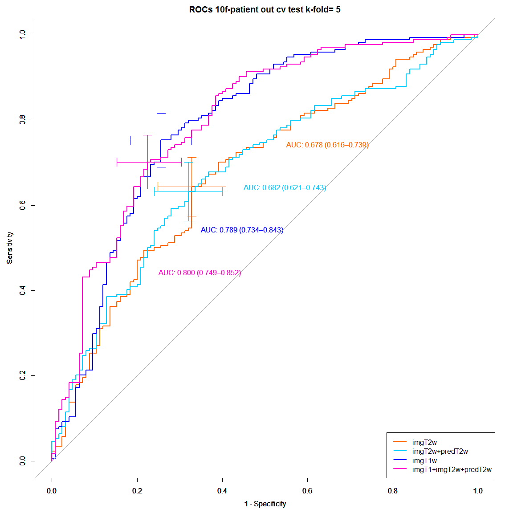 

```
## Area under the curve: 0.8003
## 95% CI (2000 stratified bootstrap replicates):
##  thresholds sp.low sp.median sp.high se.low se.median se.high
##    0.444059  0.696     0.776   0.848 0.6379    0.7011  0.7644
##    massB    massM nonmassB nonmassM 
##      211      152      126       71 
##    massB    massM nonmassB nonmassM 
##       31       14       16        6 
##    massB    massM nonmassB nonmassM 
##      211      152      126       71 
##    massB    massM nonmassB nonmassM 
##       31       14       16        6 
##    massB    massM nonmassB nonmassM 
##      211      152      126       71 
##    massB    massM nonmassB nonmassM 
##       31       14       16        6 
## 0.04651163 0.05 
## Selected features for group: MeanDecreaseGini imgT2 
## =========NULL
##  [1] "T2RGH_mean"                         "find_t2_signal_int"                 "T2texture_correlation_nondir"      
##  [4] "T2kurt_F_r_i"                       "T2max_F_r_i"                        "LMSIR"                             
##  [7] "T2texture_entropy_nondir"           "T2skew_F_r_i"                       "T2var_F_r_i"                       
## [10] "T2texture_inversediffmoment_nondir" "T2grad_margin"                      "ave_T27"                           
## [13] "T2grad_margin_var"                  "ave_T25"                            "ave_T216"                          
## [16] "T2mean_F_r_i"                       "ave_T217"                           "T2texture_sumaverage_nondir"       
## [19] "ave_T29"                            "T2texture_sumvariance_nondir"       "ave_T28"                           
## [22] "ave_T22"                            "ave_T219"                           "ave_T23"                           
## [25] "T2texture_sumentropy_nondir"        "ave_T26"                            "ave_T218"                          
## [28] "ave_T24"                            "ave_T21"                            "ave_T20"                           
## [31] "ave_T213"                           "ave_T214"                           "ave_T210"                          
## [34] "ave_T211"                           "ave_T215"                           "T2_lesionSI"                       
## 0.04716981 0.05 
## Selected features for group: MeanDecreaseGini allT2 
## =========NULL
##  [1] "ave_T210"                           "T2RGH_mean"                         "find_t2_signal_int"                
##  [4] "T2RGH_var"                          "T2texture_energy_nondir"            "T2grad_margin_var"                 
##  [7] "T2max_F_r_i"                        "T2texture_inversediffmoment_nondir" "T2texture_correlation_nondir"      
## [10] "LMSIR"                              "T2skew_F_r_i"                       "ave_T211"                          
## [13] "T2_lesionSI"                        "ave_T22"                            "T2texture_contrast_nondir"         
## [16] "ave_T218"                           "ave_T212"                           "ave_T20"                           
## [19] "ave_T29"                            "T2texture_sumaverage_nondir"        "ave_T24"                           
## [22] "ave_T21"                            "ave_T26"                            "ave_T25"                           
## [25] "T2kurt_F_r_i"                       "T2_lesionSIstd"                     "ave_T214"                          
## [28] "ave_T215"                           "LMSIR_predicted"                    "T2texture_sumvariance_nondir"      
## [31] "ave_T28"                            "ave_T217"                           "ave_T216"                          
## [34] "T2texture_diffentropy_nondir"       "T2min_F_r_i"                       
## 0.0875 0.05 
## -0.006849315 0.05 
## Selected features for group: MeanDecreaseGini imgT1 
## =========NULL
##  [1] "var_F_r_i"                        "earlySE7"                         "Tpeak_countor"                   
##  [4] "min_F_r_i"                        "V8"                               "V19"                             
##  [7] "texture_correlation_nondir_post2" "texture_sumaverage_nondir_post2"  "iMax_Variance_uptake"            
## [10] "texture_sumvariance_nondir_post4" "beta_inside"                      "V15"                             
## [13] "earlySE2"                         "texture_diffentropy_nondir_post1" "Vr_post_1_inside"                
## [16] "lateSE12"                         "iiiMax_Margin_Gradient"           "dce2SE13"                        
## [19] "dce3SE16"                         "skew_F_r_i"                       "earlySE1"                        
## [22] "earlySE19"                        "lateSE7"                          "maxCr_inside"                    
## [25] "texture_energy_nondir_post3"      "V2"                               "V10"                             
## [28] "earlySE10"                        "peakVr_inside"                    "Slope_ini_countor"               
## [31] "A_inside"                        
## -0.09433962 0.05 
## Selected features for group: MeanDecreaseGini all 
## =========NULL
##  [1] "texture_sumvariance_nondir_post1"       "max_RGH_mean"                           "V0"                                    
##  [4] "texture_energy_nondir_post3"            "V18"                                    "lateSE11"                              
##  [7] "ave_T20"                                "texture_contrast_nondir_post2"          "maxVr_inside"                          
## [10] "lateSE12"                               "texture_sumentropy_nondir_post4"        "dce2SE19"                              
## [13] "washoutRate_inside"                     "V17"                                    "edge_sharp_std"                        
## [16] "dce3SE0"                                "ave_T214"                               "skew_F_r_i"                            
## [19] "earlySE2"                               "T2grad_margin_var"                      "texture_sumaverage_nondir_post2"       
## [22] "ave_T21"                                "Vr_decreasingRate_countor"              "lateSE16"                              
## [25] "dce3SE1"                                "texture_inversediffmoment_nondir_post2" "earlySE18"                             
## [28] "Vr_decreasingRate_inside"               "UptakeRate_countor"                     "ave_T26"                               
## [31] "ave_T210"                               "A_inside"                              
##     lesion_id cad_pt_no_txt exam_a_number_txt BIRADS lesion_label             lesion_diagnosis      find_t2_signal_int
## 3           3          0025           7002835      4     nonmassB               DENSE FIBROSIS                    None
## 35         35          0180           4632561      4     nonmassB         BENIGN BREAST TISSUE Hypointense or not seen
## 36         36          0180           5254957      4     nonmassB                 FIBROADENOMA Hypointense or not seen
## 45         45          0197           6667696      4     nonmassB           LobularHyperplasia Hypointense or not seen
## 46         46          0197           6667696      4     nonmassB           LobularHyperplasia Hypointense or not seen
## 47         47          0197           6667696      4        massB           LobularHyperplasia   Slightly hyperintense
## 70         70          0280           5091695      4        massB         BENIGN BREAST TISSUE                    None
## 73         73          0311           6677243      4        massB                 FIBROADENOMA                    None
## 75         75          0331           4722659      2        massB                  FIBROCYSTIC                    None
## 76         76          0331           7347095      4        massB                  FIBROCYSTIC            Hyperintense
## 77         77          0331           7347095      4        massB         capillary hemangioma                    None
## 100       100          0536           7786869      4        massB                 FIBROADENOMA Hypointense or not seen
## 114       114          0595           7441706      4        massB         BENIGN BREAST TISSUE Hypointense or not seen
## 125       125          0651           4695822      4        massB                 FIBROADENOMA            Hyperintense
## 130       130          0667           4864590      3        massB                 FIBROADENOMA Hypointense or not seen
## 131       131          0667           4864590      4        massM                 InsituDuctal            Hyperintense
## 132       132          0667           6993980      4     nonmassM                 InsituDuctal            Hyperintense
## 142       142          0687              1201      5        massM               InvasiveDuctal   Slightly hyperintense
## 143       143          0687              1201      5     nonmassM               InvasiveDuctal   Slightly hyperintense
## 144       144          0687              1201      5        massM               InvasiveDuctal   Slightly hyperintense
## 173       173          0727           4803733      4        massM                 InsituDuctal   Slightly hyperintense
## 174       174          0728           5304244      6        massB                 FIBROADENOMA   Slightly hyperintense
## 175       175          0728           5304244      4        massB   DUCT PAPILLOMA WITH ATYPIA            Hyperintense
## 176       176          0728           5304244      4        massB                 FIBROADENOMA                    None
## 177       177          0728           5304244      6     nonmassM               InvasiveDuctal                    None
## 180       180          0731           5265417      4        massB      DYSTROPHICCALCIFICATION   Slightly hyperintense
## 190       190          0745           4881779      4        massM               InvasiveDuctal                    None
## 214       214          0776           5352670      5        massB                AtypicalCells Hypointense or not seen
## 215       215          0776           5352670      5        massM               InvasiveDuctal                    None
## 226       226          0795           5188009      6     nonmassB  ATYPICAL DUCTAL HYPERPLASIA Hypointense or not seen
## 236       236          0813           5378164      5     nonmassB                  FIBROCYSTIC                    None
## 237       237          0813           5378164      5        massM              InvasiveLobular                    None
## 246       246          0828           4787730      6        massM                 InsituDuctal                    None
## 253       253          0839           4739257      4        massB         BENIGN BREAST TISSUE                    None
## 254       254          0839           4739257      4        massB         BENIGN BREAST TISSUE                    None
## 257       257          0844           4795902      4     nonmassM               InvasiveDuctal                    None
## 258       258          0845           5433683      5        massM              InvasiveLobular                    None
## 324       324          0954           7962026      4        massB ATYPICAL LOBULAR HYPERPLASIA                    None
## 340       340          1008           6745959      5        massM                 InsituDuctal                    None
## 341       341          1012           7629993      6        massM               InvasiveDuctal                    None
## 342       342          1012           6940724      4        massB                 FIBROADENOMA Hypointense or not seen
## 343       343          1012           6940724      4     nonmassB                 FIBROADENOMA            Hyperintense
## 365       365          1079           7417880      4        massM                 InsituDuctal                    None
## 366       366          1081           7078151      4        massB                 FIBROADENOMA            Hyperintense
## 389       389          2042           4964619      6        massB           LobularHyperplasia            Hyperintense
## 390       390          2042           5186978      4        massB  ATYPICAL DUCTAL HYPERPLASIA Hypointense or not seen
## 391       391          2042           7050570      4        massB  ATYPICAL DUCTAL HYPERPLASIA                    None
## 403       403          2071           7594721      4        massM               InvasiveDuctal   Slightly hyperintense
## 417       417          3010           6828446      6        massM               InvasiveDuctal                    None
## 463       463          3078           4836946      5     nonmassB                InsituLobular                    None
## 470       470          3083           5345062      4     nonmassB         BENIGN BREAST TISSUE                    None
## 471       471          3086           7715466      4     nonmassB         BENIGN BREAST TISSUE                    None
## 472       472          3092           4462310      3        massB         BENIGN BREAST TISSUE Hypointense or not seen
## 478       478          4008           7014565      4     nonmassB  ATYPICAL DUCTAL HYPERPLASIA                    None
## 479       479          4008           7014565      6        massB                  HYPERPLASIA                    None
## 491       491          4026           6998219      4        massB  ATYPICAL DUCTAL HYPERPLASIA Hypointense or not seen
## 494       494          4039           7041331      6     nonmassM               InvasiveDuctal                    None
## 524       524          6023           4697014      3        massB                  FIBROCYSTIC                    None
## 525       525          6023           4697014      3        massB          SCLEROSING ADENOSIS                    None
## 531       531          6026           4888386      4     nonmassM                 InsituDuctal                    None
## 557       557          6043           5249778      4     nonmassB  ATYPICAL DUCTAL HYPERPLASIA                    None
## 576       576          6069           7581124      4        massB         BENIGN BREAST TISSUE            Hyperintense
## 577       577          6069           7581124      4        massB         BENIGN BREAST TISSUE Hypointense or not seen
## 587       587          6164           6971531      4        massB         BENIGN BREAST TISSUE Hypointense or not seen
## 588       588          6174           7009629      4     nonmassB  ATYPICAL DUCTAL HYPERPLASIA                    None
## 633       633          7193           7347138      4     nonmassB         BENIGN BREAST TISSUE                    None
## 634       634          7193           7347138      4     nonmassB         BENIGN BREAST TISSUE Hypointense or not seen
## 
## ============ bestune_imgT2 	 max.depth  1 	 #Trees  350 
## ntrees:  50 minsplit:  3 cp:  0.01 
##   ntrees minsplit   cp acuTrain rocTrain   acuTest   rocTest
## 1     50        3 0.01        1        1 0.7164179 0.6989362
## ntrees:  100 minsplit:  3 cp:  0.01 
##   ntrees minsplit   cp acuTrain rocTrain   acuTest   rocTest
## 2    100        3 0.01        1        1 0.7462687 0.7404255
## ntrees:  250 minsplit:  3 cp:  0.01 
##   ntrees minsplit   cp acuTrain rocTrain   acuTest   rocTest
## 3    250        3 0.01        1        1 0.7313433 0.6861702
## ntrees:  350 minsplit:  3 cp:  0.01 
##   ntrees minsplit   cp acuTrain rocTrain   acuTest   rocTest
## 4    350        3 0.01        1        1 0.7164179 0.6361702
## ntrees:  50 minsplit:  1 cp:  0.01 
##   ntrees minsplit   cp acuTrain rocTrain  acuTest   rocTest
## 5     50        1 0.01        1        1 0.641791 0.5542553
## ntrees:  100 minsplit:  1 cp:  0.01 
##   ntrees minsplit   cp acuTrain rocTrain   acuTest   rocTest
## 6    100        1 0.01        1        1 0.7014925 0.6648936
## ntrees:  250 minsplit:  1 cp:  0.01 
##   ntrees minsplit   cp acuTrain rocTrain   acuTest   rocTest
## 7    250        1 0.01        1        1 0.7014925 0.6595745
## ntrees:  350 minsplit:  1 cp:  0.01 
##   ntrees minsplit   cp acuTrain rocTrain   acuTest   rocTest
## 8    350        1 0.01        1        1 0.6567164 0.5734043
## ntrees:  50 minsplit:  3 cp:  -1 
##   ntrees minsplit cp acuTrain rocTrain   acuTest   rocTest
## 9     50        3 -1        1        1 0.5671642 0.5691489
## ntrees:  100 minsplit:  3 cp:  -1 
##    ntrees minsplit cp acuTrain rocTrain   acuTest   rocTest
## 10    100        3 -1        1        1 0.7313433 0.6159574
## ntrees:  250 minsplit:  3 cp:  -1 
##    ntrees minsplit cp acuTrain rocTrain   acuTest   rocTest
## 11    250        3 -1        1        1 0.7313433 0.6691489
## ntrees:  350 minsplit:  3 cp:  -1 
##    ntrees minsplit cp acuTrain rocTrain   acuTest   rocTest
## 12    350        3 -1        1        1 0.7462687 0.6617021
## ntrees:  50 minsplit:  1 cp:  -1 
##    ntrees minsplit cp acuTrain rocTrain   acuTest   rocTest
## 13     50        1 -1        1        1 0.7014925 0.6021277
## ntrees:  100 minsplit:  1 cp:  -1 
##    ntrees minsplit cp acuTrain rocTrain   acuTest   rocTest
## 14    100        1 -1        1        1 0.6716418 0.6553191
## ntrees:  250 minsplit:  1 cp:  -1 
##    ntrees minsplit cp acuTrain rocTrain   acuTest   rocTest
## 15    250        1 -1        1        1 0.7164179 0.6712766
## ntrees:  350 minsplit:  1 cp:  -1 
##    ntrees minsplit cp acuTrain rocTrain   acuTest   rocTest
## 16    350        1 -1        1        1 0.6865672 0.6351064
##    ntrees minsplit    cp acuTrain rocTrain   acuTest   rocTest
## 1      50        3  0.01        1        1 0.7164179 0.6989362
## 2     100        3  0.01        1        1 0.7462687 0.7404255
## 3     250        3  0.01        1        1 0.7313433 0.6861702
## 4     350        3  0.01        1        1 0.7164179 0.6361702
## 5      50        1  0.01        1        1 0.6417910 0.5542553
## 6     100        1  0.01        1        1 0.7014925 0.6648936
## 7     250        1  0.01        1        1 0.7014925 0.6595745
## 8     350        1  0.01        1        1 0.6567164 0.5734043
## 9      50        3 -1.00        1        1 0.5671642 0.5691489
## 10    100        3 -1.00        1        1 0.7313433 0.6159574
## 11    250        3 -1.00        1        1 0.7313433 0.6691489
## 12    350        3 -1.00        1        1 0.7462687 0.6617021
## 13     50        1 -1.00        1        1 0.7014925 0.6021277
## 14    100        1 -1.00        1        1 0.6716418 0.6553191
## 15    250        1 -1.00        1        1 0.7164179 0.6712766
## 16    350        1 -1.00        1        1 0.6865672 0.6351064
##   ntrees minsplit   cp acuTrain rocTrain   acuTest   rocTest
## 2    100        3 0.01        1        1 0.7462687 0.7404255
## 
## ============ bestune_allT2 	 max.depth  1 	 #Trees  250 
## ntrees:  50 minsplit:  3 cp:  0.01 
##   ntrees minsplit   cp acuTrain rocTrain   acuTest   rocTest
## 1     50        3 0.01        1        1 0.6567164 0.6138298
## ntrees:  100 minsplit:  3 cp:  0.01 
##   ntrees minsplit   cp acuTrain rocTrain   acuTest   rocTest
## 2    100        3 0.01        1        1 0.7313433 0.6851064
## ntrees:  250 minsplit:  3 cp:  0.01 
##   ntrees minsplit   cp acuTrain rocTrain   acuTest   rocTest
## 3    250        3 0.01        1        1 0.7164179 0.6808511
## ntrees:  350 minsplit:  3 cp:  0.01 
##   ntrees minsplit   cp acuTrain rocTrain   acuTest   rocTest
## 4    350        3 0.01        1        1 0.7761194 0.6574468
## ntrees:  50 minsplit:  1 cp:  0.01 
##   ntrees minsplit   cp acuTrain rocTrain   acuTest   rocTest
## 5     50        1 0.01        1        1 0.6567164 0.6361702
## ntrees:  100 minsplit:  1 cp:  0.01 
##   ntrees minsplit   cp acuTrain rocTrain   acuTest  rocTest
## 6    100        1 0.01        1        1 0.6865672 0.656383
## ntrees:  250 minsplit:  1 cp:  0.01 
##   ntrees minsplit   cp acuTrain rocTrain   acuTest   rocTest
## 7    250        1 0.01        1        1 0.6716418 0.4265957
## ntrees:  350 minsplit:  1 cp:  0.01 
##   ntrees minsplit   cp acuTrain rocTrain   acuTest   rocTest
## 8    350        1 0.01        1        1 0.6716418 0.6659574
## ntrees:  50 minsplit:  3 cp:  -1 
##   ntrees minsplit cp acuTrain rocTrain   acuTest   rocTest
## 9     50        3 -1        1        1 0.6567164 0.5723404
## ntrees:  100 minsplit:  3 cp:  -1 
##    ntrees minsplit cp acuTrain rocTrain   acuTest   rocTest
## 10    100        3 -1        1        1 0.7313433 0.6106383
## ntrees:  250 minsplit:  3 cp:  -1 
##    ntrees minsplit cp acuTrain rocTrain   acuTest   rocTest
## 11    250        3 -1        1        1 0.7164179 0.6212766
## ntrees:  350 minsplit:  3 cp:  -1 
##    ntrees minsplit cp acuTrain rocTrain   acuTest   rocTest
## 12    350        3 -1        1        1 0.7014925 0.6351064
## ntrees:  50 minsplit:  1 cp:  -1 
##    ntrees minsplit cp acuTrain rocTrain   acuTest   rocTest
## 13     50        1 -1        1        1 0.5970149 0.6138298
## ntrees:  100 minsplit:  1 cp:  -1 
##    ntrees minsplit cp acuTrain rocTrain  acuTest   rocTest
## 14    100        1 -1        1        1 0.641791 0.6042553
## ntrees:  250 minsplit:  1 cp:  -1 
##    ntrees minsplit cp acuTrain rocTrain   acuTest   rocTest
## 15    250        1 -1        1        1 0.7462687 0.6765957
## ntrees:  350 minsplit:  1 cp:  -1 
##    ntrees minsplit cp acuTrain rocTrain   acuTest   rocTest
## 16    350        1 -1        1        1 0.6865672 0.6510638
##    ntrees minsplit    cp acuTrain rocTrain   acuTest   rocTest
## 1      50        3  0.01        1        1 0.6567164 0.6138298
## 2     100        3  0.01        1        1 0.7313433 0.6851064
## 3     250        3  0.01        1        1 0.7164179 0.6808511
## 4     350        3  0.01        1        1 0.7761194 0.6574468
## 5      50        1  0.01        1        1 0.6567164 0.6361702
## 6     100        1  0.01        1        1 0.6865672 0.6563830
## 7     250        1  0.01        1        1 0.6716418 0.4265957
## 8     350        1  0.01        1        1 0.6716418 0.6659574
## 9      50        3 -1.00        1        1 0.6567164 0.5723404
## 10    100        3 -1.00        1        1 0.7313433 0.6106383
## 11    250        3 -1.00        1        1 0.7164179 0.6212766
## 12    350        3 -1.00        1        1 0.7014925 0.6351064
## 13     50        1 -1.00        1        1 0.5970149 0.6138298
## 14    100        1 -1.00        1        1 0.6417910 0.6042553
## 15    250        1 -1.00        1        1 0.7462687 0.6765957
## 16    350        1 -1.00        1        1 0.6865672 0.6510638
##   ntrees minsplit   cp acuTrain rocTrain   acuTest   rocTest
## 2    100        3 0.01        1        1 0.7313433 0.6851064
## 
## ============ bestune_imgT1 	 max.depth  1 	 #Trees  250 
## ntrees:  50 minsplit:  3 cp:  0.01 
##   ntrees minsplit   cp acuTrain rocTrain   acuTest   rocTest
## 1     50        3 0.01        1        1 0.7014925 0.7638298
## ntrees:  100 minsplit:  3 cp:  0.01 
##   ntrees minsplit   cp acuTrain rocTrain   acuTest  rocTest
## 2    100        3 0.01        1        1 0.7164179 0.787234
## ntrees:  250 minsplit:  3 cp:  0.01 
##   ntrees minsplit   cp acuTrain rocTrain   acuTest   rocTest
## 3    250        3 0.01        1        1 0.7164179 0.7797872
## ntrees:  350 minsplit:  3 cp:  0.01 
##   ntrees minsplit   cp acuTrain rocTrain   acuTest   rocTest
## 4    350        3 0.01        1        1 0.7313433 0.7989362
## ntrees:  50 minsplit:  1 cp:  0.01 
##   ntrees minsplit   cp acuTrain rocTrain   acuTest   rocTest
## 5     50        1 0.01        1        1 0.7164179 0.8191489
## ntrees:  100 minsplit:  1 cp:  0.01 
##   ntrees minsplit   cp acuTrain rocTrain   acuTest   rocTest
## 6    100        1 0.01        1        1 0.7014925 0.7223404
## ntrees:  250 minsplit:  1 cp:  0.01 
##   ntrees minsplit   cp acuTrain rocTrain   acuTest   rocTest
## 7    250        1 0.01        1        1 0.6716418 0.7446809
## ntrees:  350 minsplit:  1 cp:  0.01 
##   ntrees minsplit   cp acuTrain rocTrain   acuTest   rocTest
## 8    350        1 0.01        1        1 0.7164179 0.7893617
## ntrees:  50 minsplit:  3 cp:  -1 
##   ntrees minsplit cp acuTrain rocTrain  acuTest  rocTest
## 9     50        3 -1        1        1 0.641791 0.662766
## ntrees:  100 minsplit:  3 cp:  -1 
##    ntrees minsplit cp acuTrain rocTrain   acuTest   rocTest
## 10    100        3 -1        1        1 0.7164179 0.7989362
## ntrees:  250 minsplit:  3 cp:  -1 
##    ntrees minsplit cp acuTrain rocTrain   acuTest   rocTest
## 11    250        3 -1        1        1 0.7462687 0.7787234
## ntrees:  350 minsplit:  3 cp:  -1 
##    ntrees minsplit cp acuTrain rocTrain   acuTest   rocTest
## 12    350        3 -1        1        1 0.7014925 0.7680851
## ntrees:  50 minsplit:  1 cp:  -1 
##    ntrees minsplit cp acuTrain rocTrain   acuTest   rocTest
## 13     50        1 -1        1        1 0.7014925 0.7212766
## ntrees:  100 minsplit:  1 cp:  -1 
##    ntrees minsplit cp acuTrain rocTrain   acuTest   rocTest
## 14    100        1 -1        1        1 0.7164179 0.8085106
## ntrees:  250 minsplit:  1 cp:  -1 
##    ntrees minsplit cp acuTrain rocTrain   acuTest   rocTest
## 15    250        1 -1        1        1 0.6567164 0.7659574
## ntrees:  350 minsplit:  1 cp:  -1 
##    ntrees minsplit cp acuTrain rocTrain   acuTest   rocTest
## 16    350        1 -1        1        1 0.6716418 0.7765957
##    ntrees minsplit    cp acuTrain rocTrain   acuTest   rocTest
## 1      50        3  0.01        1        1 0.7014925 0.7638298
## 2     100        3  0.01        1        1 0.7164179 0.7872340
## 3     250        3  0.01        1        1 0.7164179 0.7797872
## 4     350        3  0.01        1        1 0.7313433 0.7989362
## 5      50        1  0.01        1        1 0.7164179 0.8191489
## 6     100        1  0.01        1        1 0.7014925 0.7223404
## 7     250        1  0.01        1        1 0.6716418 0.7446809
## 8     350        1  0.01        1        1 0.7164179 0.7893617
## 9      50        3 -1.00        1        1 0.6417910 0.6627660
## 10    100        3 -1.00        1        1 0.7164179 0.7989362
## 11    250        3 -1.00        1        1 0.7462687 0.7787234
## 12    350        3 -1.00        1        1 0.7014925 0.7680851
## 13     50        1 -1.00        1        1 0.7014925 0.7212766
## 14    100        1 -1.00        1        1 0.7164179 0.8085106
## 15    250        1 -1.00        1        1 0.6567164 0.7659574
## 16    350        1 -1.00        1        1 0.6716418 0.7765957
##   ntrees minsplit   cp acuTrain rocTrain   acuTest   rocTest
## 5     50        1 0.01        1        1 0.7164179 0.8191489
## 
## ============ bestune_all 	 max.depth  1 	 #Trees  200 
## ntrees:  50 minsplit:  3 cp:  0.01 
##   ntrees minsplit   cp acuTrain rocTrain   acuTest   rocTest
## 1     50        3 0.01        1        1 0.7462687 0.7797872
## ntrees:  100 minsplit:  3 cp:  0.01 
##   ntrees minsplit   cp acuTrain rocTrain   acuTest   rocTest
## 2    100        3 0.01        1        1 0.7313433 0.7840426
## ntrees:  250 minsplit:  3 cp:  0.01 
##   ntrees minsplit   cp acuTrain rocTrain   acuTest   rocTest
## 3    250        3 0.01        1        1 0.7761194 0.7957447
## ntrees:  350 minsplit:  3 cp:  0.01 
##   ntrees minsplit   cp acuTrain rocTrain   acuTest   rocTest
## 4    350        3 0.01        1        1 0.7910448 0.7829787
## ntrees:  50 minsplit:  1 cp:  0.01 
##   ntrees minsplit   cp acuTrain rocTrain  acuTest   rocTest
## 5     50        1 0.01        1        1 0.761194 0.7531915
## ntrees:  100 minsplit:  1 cp:  0.01 
##   ntrees minsplit   cp acuTrain rocTrain   acuTest   rocTest
## 6    100        1 0.01        1        1 0.7164179 0.7957447
## ntrees:  250 minsplit:  1 cp:  0.01 
##   ntrees minsplit   cp acuTrain rocTrain   acuTest   rocTest
## 7    250        1 0.01        1        1 0.7462687 0.7904255
## ntrees:  350 minsplit:  1 cp:  0.01 
##   ntrees minsplit   cp acuTrain rocTrain   acuTest   rocTest
## 8    350        1 0.01        1        1 0.7910448 0.7840426
## ntrees:  50 minsplit:  3 cp:  -1 
##   ntrees minsplit cp acuTrain rocTrain   acuTest   rocTest
## 9     50        3 -1        1        1 0.7164179 0.6553191
## ntrees:  100 minsplit:  3 cp:  -1 
##    ntrees minsplit cp acuTrain rocTrain   acuTest   rocTest
## 10    100        3 -1        1        1 0.7462687 0.7510638
## ntrees:  250 minsplit:  3 cp:  -1 
##    ntrees minsplit cp acuTrain rocTrain   acuTest   rocTest
## 11    250        3 -1        1        1 0.7462687 0.7978723
## ntrees:  350 minsplit:  3 cp:  -1 
##    ntrees minsplit cp acuTrain rocTrain   acuTest   rocTest
## 12    350        3 -1        1        1 0.6865672 0.7893617
## ntrees:  50 minsplit:  1 cp:  -1 
##    ntrees minsplit cp acuTrain rocTrain   acuTest   rocTest
## 13     50        1 -1        1        1 0.7910448 0.7702128
## ntrees:  100 minsplit:  1 cp:  -1 
##    ntrees minsplit cp acuTrain rocTrain   acuTest   rocTest
## 14    100        1 -1        1        1 0.7462687 0.7648936
## ntrees:  250 minsplit:  1 cp:  -1 
##    ntrees minsplit cp acuTrain rocTrain   acuTest   rocTest
## 15    250        1 -1        1        1 0.8208955 0.8223404
## ntrees:  350 minsplit:  1 cp:  -1 
##    ntrees minsplit cp acuTrain rocTrain   acuTest   rocTest
## 16    350        1 -1        1        1 0.8059701 0.8244681
##    ntrees minsplit    cp acuTrain rocTrain   acuTest   rocTest
## 1      50        3  0.01        1        1 0.7462687 0.7797872
## 2     100        3  0.01        1        1 0.7313433 0.7840426
## 3     250        3  0.01        1        1 0.7761194 0.7957447
## 4     350        3  0.01        1        1 0.7910448 0.7829787
## 5      50        1  0.01        1        1 0.7611940 0.7531915
## 6     100        1  0.01        1        1 0.7164179 0.7957447
## 7     250        1  0.01        1        1 0.7462687 0.7904255
## 8     350        1  0.01        1        1 0.7910448 0.7840426
## 9      50        3 -1.00        1        1 0.7164179 0.6553191
## 10    100        3 -1.00        1        1 0.7462687 0.7510638
## 11    250        3 -1.00        1        1 0.7462687 0.7978723
## 12    350        3 -1.00        1        1 0.6865672 0.7893617
## 13     50        1 -1.00        1        1 0.7910448 0.7702128
## 14    100        1 -1.00        1        1 0.7462687 0.7648936
## 15    250        1 -1.00        1        1 0.8208955 0.8223404
## 16    350        1 -1.00        1        1 0.8059701 0.8244681
##    ntrees minsplit cp acuTrain rocTrain   acuTest   rocTest
## 16    350        1 -1        1        1 0.8059701 0.8244681
## 
## Call:
## roc.default(response = perf_imgT2$obs, predictor = perf_imgT2$C)
## 
## Data: perf_imgT2$C in 145 controls (perf_imgT2$obs C) > 221 cases (perf_imgT2$obs NC).
## Area under the curve: 0.6866
## 
## Call:
## roc.default(response = perf_allT2$obs, predictor = perf_allT2$C)
## 
## Data: perf_allT2$C in 145 controls (perf_allT2$obs C) > 221 cases (perf_allT2$obs NC).
## Area under the curve: 0.6797
## 
## Call:
## roc.default(response = perf_imgT1$obs, predictor = perf_imgT1$C)
## 
## Data: perf_imgT1$C in 145 controls (perf_imgT1$obs C) > 221 cases (perf_imgT1$obs NC).
## Area under the curve: 0.7908
## 
## Call:
## roc.default(response = perf_all$obs, predictor = perf_all$C)
## 
## Data: perf_all$C in 145 controls (perf_all$obs C) > 221 cases (perf_all$obs NC).
## Area under the curve: 0.8027
```

```
## Area under the curve: 0.6866
## 95% CI (2000 stratified bootstrap replicates):
##  thresholds sp.low sp.median sp.high se.low se.median se.high
##   0.4525881 0.6069    0.6828  0.7517 0.5882    0.6516  0.7149
```

```
## Area under the curve: 0.6797
## 95% CI (2000 stratified bootstrap replicates):
##  thresholds sp.low sp.median sp.high se.low se.median se.high
##   0.4560271 0.5724    0.6483  0.7241 0.5792    0.6471  0.7104
```

```
## Area under the curve: 0.7908
## 95% CI (2000 stratified bootstrap replicates):
##  thresholds sp.low sp.median sp.high se.low se.median se.high
##   0.4521917 0.6966    0.7655  0.8345 0.6697    0.7285  0.7873
```

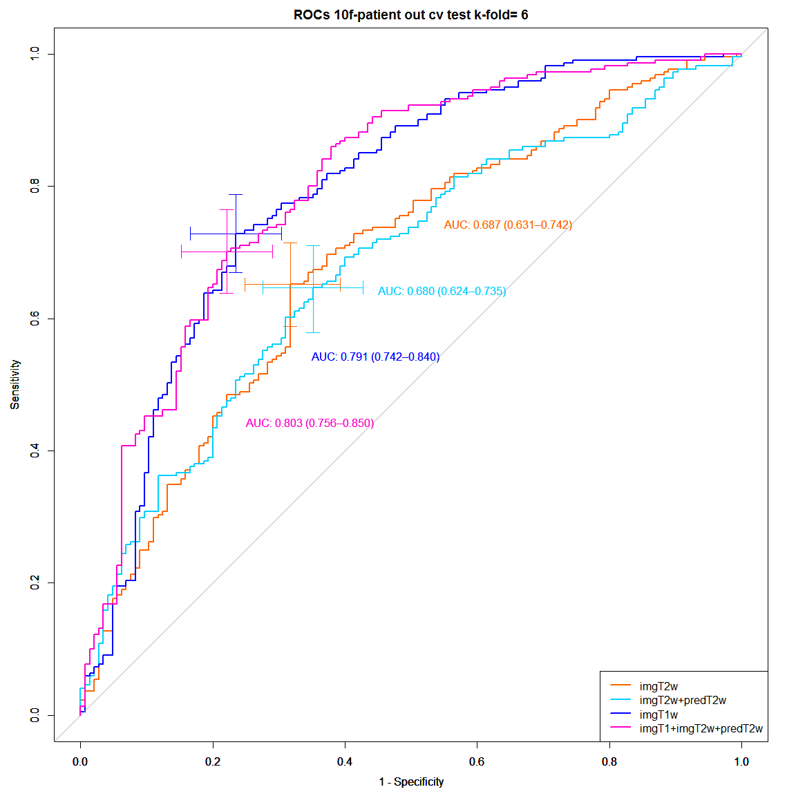 

```
## Area under the curve: 0.8027
## 95% CI (2000 stratified bootstrap replicates):
##  thresholds sp.low sp.median sp.high se.low se.median se.high
##    0.444059 0.7103    0.7793  0.8483  0.638    0.7014  0.7647
##    massB    massM nonmassB nonmassM 
##      223      148      121       72 
##    massB    massM nonmassB nonmassM 
##       19       18       21        5 
##    massB    massM nonmassB nonmassM 
##      223      148      121       72 
##    massB    massM nonmassB nonmassM 
##       19       18       21        5 
##    massB    massM nonmassB nonmassM 
##      223      148      121       72 
##    massB    massM nonmassB nonmassM 
##       19       18       21        5 
## -0.01970443 0.05 
## Selected features for group: MeanDecreaseGini imgT2 
## =========NULL
##  [1] "T2RGH_mean"                    "T2texture_correlation_nondir"  "find_t2_signal_int"            "T2max_F_r_i"                  
##  [5] "ave_T210"                      "T2kurt_F_r_i"                  "T2grad_margin"                 "T2texture_sumaverage_nondir"  
##  [9] "T2_lesionSIstd"                "ave_T21"                       "ave_T20"                       "ave_T26"                      
## [13] "T2texture_diffvariance_nondir" "ave_T27"                       "ave_T29"                       "ave_T212"                     
## [17] "ave_T216"                      "T2texture_variance_nondir"     "ave_T24"                       "T2texture_energy_nondir"      
## [21] "LMSIR"                         "T2min_F_r_i"                   "T2texture_sumentropy_nondir"   "ave_T217"                     
## [25] "ave_T23"                       "ave_T215"                      "ave_T211"                      "T2mean_F_r_i"                 
## [29] "ave_T22"                       "ave_T25"                       "ave_T218"                      "T2_lesionSI"                  
## -0.07329843 0.05 
## Selected features for group: MeanDecreaseGini allT2 
## =========NULL
##  [1] "T2RGH_var"                     "T2kurt_F_r_i"                  "find_t2_signal_int"            "T2grad_margin"                
##  [5] "T2texture_diffvariance_nondir" "ave_T27"                       "T2_lesionSIstd"                "ave_T211"                     
##  [9] "T2texture_correlation_nondir"  "ave_T214"                      "T2mean_F_r_i"                  "LMSIR_predicted"              
## [13] "LMSIR"                         "ave_T24"                       "ave_T215"                      "ave_T22"                      
## [17] "ave_T217"                      "ave_T25"                       "T2texture_energy_nondir"       "ave_T20"                      
## [21] "ave_T218"                      "ave_T213"                      "ave_T23"                       "ave_T210"                     
## [25] "ave_T219"                      "ave_T29"                       "T2max_F_r_i"                   "T2texture_sumaverage_nondir"  
## [29] "T2skew_F_r_i"                  "T2_lesionSI"                  
## -0.0952381 0.05 
## Selected features for group: MeanDecreaseGini imgT1 
## =========NULL
##  [1] "texture_sumvariance_nondir_post1"       "circularity"                            "V13"                                   
##  [4] "texture_inversediffmoment_nondir_post3" "Kpeak_inside"                           "Vr_post_1_countor"                     
##  [7] "kurt_F_r_i"                             "texture_contrast_nondir_post3"          "earlySE8"                              
## [10] "Slope_ini_countor"                      "Vr_decreasingRate_inside"               "texture_sumaverage_nondir_post2"       
## [13] "lateSE2"                                "lateSE1"                                "V2"                                    
## [16] "dce2SE7"                                "edge_sharp_std"                         "Vr_increasingRate_inside"              
## [19] "texture_energy_nondir_post4"            "earlySE16"                              "dce2SE11"                              
## [22] "lateSE13"                               "dce2SE4"                                "V8"                                    
## [25] "dce3SE10"                               "alpha_inside"                           "dce2SE16"                              
## [28] "max_RGH_mean_k"                         "peakCr_countor"                         "ivVariance"                            
## [31] "max_RGH_var_k"                          "texture_sumvariance_nondir_post2"       "A_inside"                              
## -0.1780822 0.05 
## Selected features for group: MeanDecreaseGini all 
## =========NULL
##  [1] "SER_inside"                         "texture_variance_nondir_post3"      "V16"                               
##  [4] "texture_correlation_nondir_post2"   "texture_energy_nondir_post4"        "V11"                               
##  [7] "V10"                                "iMax_Variance_uptake"               "edge_sharp_std"                    
## [10] "earlySE10"                          "earlySE19"                          "T2texture_inversediffmoment_nondir"
## [13] "texture_diffvariance_nondir_post3"  "ave_T26"                            "dce2SE7"                           
## [16] "earlySE11"                          "ave_T212"                           "LMSIR_predicted"                   
## [19] "Vr_decreasingRate_inside"           "texture_sumentropy_nondir_post2"    "dce3SE0"                           
## [22] "texture_entropy_nondir_post4"       "earlySE17"                          "dce3SE6"                           
## [25] "earlySE14"                          "ave_T218"                           "V9"                                
## [28] "dce2SE6"                            "texture_correlation_nondir_post1"   "min_F_r_i"                         
## [31] "max_RGH_var_k"                      "dce3SE16"                           "A_inside"                          
##     lesion_id cad_pt_no_txt exam_a_number_txt BIRADS lesion_label             lesion_diagnosis      find_t2_signal_int
## 15         15          0122           5108281      3        massB                         Cyst                    None
## 16         16          0123           6909758      4     nonmassB        COLUMNAR CELL CHANGES                    None
## 17         17          0123           6909758      4     nonmassB         BENIGN BREAST TISSUE                    None
## 39         39          0103           6836585      5        massB              PHYLLODES TUMOR                    None
## 42         42          0196           5289117      4     nonmassB          SCLEROSING ADENOSIS Hypointense or not seen
## 43         43          0196           5289117      4     nonmassB   ColumnarAlterationwoAtypia                    None
## 44         44          0196           5289117      4     nonmassB   ColumnarAlterationwoAtypia Hypointense or not seen
## 50         50          0199           4362726      4        massB ATYPICAL LOBULAR HYPERPLASIA            Hyperintense
## 78         78          0352           4785776      4        massB                 FIBROADENOMA   Slightly hyperintense
## 79         79          0357           5137030      4     nonmassB                  FIBROCYSTIC Hypointense or not seen
## 80         80          0376           4609403      4        massB             BENIGN HAMARTOMA   Slightly hyperintense
## 88         88          0456           6689214      4        massM               InvasiveDuctal                    None
## 113       113          0586           5332925      4     nonmassM                 InsituDuctal Hypointense or not seen
## 137       137          0681           4999374      3        massB                  FIBROCYSTIC   Slightly hyperintense
## 154       154          0705           4648471      5        massM               InvasiveDuctal   Slightly hyperintense
## 162       162          0714           5324209      5        massM               InvasiveDuctal                    None
## 163       163          0714           5324209      5        massM               InvasiveDuctal                    None
## 164       164          0714           5324209      5     nonmassM                 InsituDuctal                    None
## 166       166          0720           4965525      4        massB                  FIBROCYSTIC   Slightly hyperintense
## 167       167          0720           4965525      4     nonmassB                 FIBROADENOMA Hypointense or not seen
## 169       169          0722           5366177      5        massM               InvasiveDuctal            Hyperintense
## 183       183          0736           4963473      4        massB         BENIGN BREAST TISSUE   Slightly hyperintense
## 192       192          0752           4940477      4     nonmassB         BENIGN BREAST TISSUE                    None
## 193       193          0752           4940477      4     nonmassB                  FIBROCYSTIC                    None
## 194       194          0752           4940477      4     nonmassB         BENIGN BREAST TISSUE                    None
## 203       203          0771           4680997      4        massB               DUCT PAPILLOMA                    None
## 204       204          0771           4680997      4        massB               DUCT PAPILLOMA                    None
## 208       208          0778           4794199      5        massB                 FIBROADENOMA Hypointense or not seen
## 251       251          0834           4614262      5        massM               InvasiveDuctal                    None
## 260       260          0847           5064132      4        massM               InvasiveDuctal            Hyperintense
## 291       291          0876           4719378      4        massB         BENIGN BREAST TISSUE                    None
## 328       328          0967           6938015      4     nonmassB         BENIGN BREAST TISSUE                    None
## 329       329          0967           6938015      4     nonmassM               InvasiveDuctal                    None
## 346       346          1024           6980462      4     nonmassB  ATYPICAL DUCTAL HYPERPLASIA                    None
## 347       347          1024           6980462      4     nonmassB   DUCT PAPILLOMA WITH ATYPIA                    None
## 348       348          1025           6703528      4     nonmassB                  FIBROCYSTIC Hypointense or not seen
## 350       350          1044           7366817      5        massM               InvasiveDuctal                    None
## 355       355          1062           7408296      4        massB ATYPICAL LOBULAR HYPERPLASIA Hypointense or not seen
## 356       356          1062           7408296      4     nonmassB                  FIBROCYSTIC Hypointense or not seen
## 362       362          1077           6890028      4        massB         BENIGN BREAST TISSUE   Slightly hyperintense
## 379       379          2017           7397047      6        massB     RADIAL SCLEROSING LESION                    None
## 386       386          2033           6849696      6        massM              InvasiveLobular                    None
## 387       387          2033           6849696      4     nonmassB ATYPICAL LOBULAR HYPERPLASIA                    None
## 394       394          2050           6689745      6        massM               InvasiveDuctal                    None
## 429       429          3031           7106716      3        massB        COLUMNAR CELL CHANGES Hypointense or not seen
## 433       433          3039           6894870      4        massB                  HYPERPLASIA                    None
## 483       483          4018           6983262      6     nonmassM                 InsituDuctal                    None
## 484       484          4019           7151338      4        massB         BENIGN BREAST TISSUE            Hyperintense
## 486       486          4021           6992707      4     nonmassB                     ADENOSIS Hypointense or not seen
## 532       532          6027           4770166      4        massB         BENIGN BREAST TISSUE                    None
## 533       533          6027           4770166      4     nonmassB         BENIGN BREAST TISSUE                    None
## 541       541          6035           5062962      5        massM               InvasiveDuctal                    None
## 542       542          6035           5062962      5        massM               InvasiveDuctal                    None
## 543       543          6035           5062962      5        massM               InvasiveDuctal                    None
## 560       560          6045           5208117      6        massM               InvasiveDuctal Hypointense or not seen
## 561       561          6045           5208117      6        massM               InvasiveDuctal Hypointense or not seen
## 567       567          6048           5284266      6        massM               InvasiveDuctal                    None
## 579       579          6101           5087078      4     nonmassB                  FIBROCYSTIC                    None
## 580       580          6101           7709238      6        massM               InvasiveDuctal Hypointense or not seen
## 606       606          7076           7267446      3     nonmassM                 InsituDuctal                    None
## 607       607          7076           7267446      3     nonmassB  ATYPICAL DUCTAL HYPERPLASIA                    None
## 628       628          7186           5263507      6        massM               InvasiveDuctal                    None
## 632       632          7192           7974056      4     nonmassB         BENIGN BREAST TISSUE                    None
## 
## ============ bestune_imgT2 	 max.depth  1 	 #Trees  350 
## ntrees:  50 minsplit:  3 cp:  0.01 
##   ntrees minsplit   cp acuTrain rocTrain   acuTest   rocTest
## 1     50        3 0.01        1        1 0.6031746 0.6315217
## ntrees:  100 minsplit:  3 cp:  0.01 
##   ntrees minsplit   cp acuTrain rocTrain   acuTest   rocTest
## 2    100        3 0.01        1        1 0.6666667 0.6152174
## ntrees:  250 minsplit:  3 cp:  0.01 
##   ntrees minsplit   cp acuTrain rocTrain   acuTest   rocTest
## 3    250        3 0.01        1        1 0.6190476 0.6152174
## ntrees:  350 minsplit:  3 cp:  0.01 
##   ntrees minsplit   cp acuTrain rocTrain   acuTest   rocTest
## 4    350        3 0.01        1        1 0.6190476 0.6358696
## ntrees:  50 minsplit:  1 cp:  0.01 
##   ntrees minsplit   cp acuTrain rocTrain   acuTest   rocTest
## 5     50        1 0.01        1        1 0.5714286 0.6108696
## ntrees:  100 minsplit:  1 cp:  0.01 
##   ntrees minsplit   cp acuTrain rocTrain   acuTest   rocTest
## 6    100        1 0.01        1        1 0.5714286 0.5706522
## ntrees:  250 minsplit:  1 cp:  0.01 
##   ntrees minsplit   cp acuTrain rocTrain   acuTest   rocTest
## 7    250        1 0.01        1        1 0.6190476 0.6445652
## ntrees:  350 minsplit:  1 cp:  0.01 
##   ntrees minsplit   cp acuTrain rocTrain   acuTest   rocTest
## 8    350        1 0.01        1        1 0.6825397 0.6543478
## ntrees:  50 minsplit:  3 cp:  -1 
##   ntrees minsplit cp acuTrain rocTrain   acuTest   rocTest
## 9     50        3 -1        1        1 0.6825397 0.6413043
## ntrees:  100 minsplit:  3 cp:  -1 
##    ntrees minsplit cp acuTrain rocTrain   acuTest   rocTest
## 10    100        3 -1        1        1 0.6349206 0.6586957
## ntrees:  250 minsplit:  3 cp:  -1 
##    ntrees minsplit cp acuTrain rocTrain   acuTest   rocTest
## 11    250        3 -1        1        1 0.6984127 0.6434783
## ntrees:  350 minsplit:  3 cp:  -1 
##    ntrees minsplit cp acuTrain rocTrain   acuTest   rocTest
## 12    350        3 -1        1        1 0.6984127 0.6630435
## ntrees:  50 minsplit:  1 cp:  -1 
##    ntrees minsplit cp acuTrain rocTrain   acuTest   rocTest
## 13     50        1 -1        1        1 0.6984127 0.7076087
## ntrees:  100 minsplit:  1 cp:  -1 
##    ntrees minsplit cp acuTrain rocTrain   acuTest rocTest
## 14    100        1 -1        1        1 0.6666667   0.625
## ntrees:  250 minsplit:  1 cp:  -1 
##    ntrees minsplit cp acuTrain rocTrain   acuTest   rocTest
## 15    250        1 -1        1        1 0.6190476 0.6108696
## ntrees:  350 minsplit:  1 cp:  -1 
##    ntrees minsplit cp acuTrain rocTrain   acuTest   rocTest
## 16    350        1 -1        1        1 0.6666667 0.6543478
##    ntrees minsplit    cp acuTrain rocTrain   acuTest   rocTest
## 1      50        3  0.01        1        1 0.6031746 0.6315217
## 2     100        3  0.01        1        1 0.6666667 0.6152174
## 3     250        3  0.01        1        1 0.6190476 0.6152174
## 4     350        3  0.01        1        1 0.6190476 0.6358696
## 5      50        1  0.01        1        1 0.5714286 0.6108696
## 6     100        1  0.01        1        1 0.5714286 0.5706522
## 7     250        1  0.01        1        1 0.6190476 0.6445652
## 8     350        1  0.01        1        1 0.6825397 0.6543478
## 9      50        3 -1.00        1        1 0.6825397 0.6413043
## 10    100        3 -1.00        1        1 0.6349206 0.6586957
## 11    250        3 -1.00        1        1 0.6984127 0.6434783
## 12    350        3 -1.00        1        1 0.6984127 0.6630435
## 13     50        1 -1.00        1        1 0.6984127 0.7076087
## 14    100        1 -1.00        1        1 0.6666667 0.6250000
## 15    250        1 -1.00        1        1 0.6190476 0.6108696
## 16    350        1 -1.00        1        1 0.6666667 0.6543478
##    ntrees minsplit cp acuTrain rocTrain   acuTest   rocTest
## 13     50        1 -1        1        1 0.6984127 0.7076087
## 
## ============ bestune_allT2 	 max.depth  1 	 #Trees  250 
## ntrees:  50 minsplit:  3 cp:  0.01 
##   ntrees minsplit   cp acuTrain rocTrain   acuTest   rocTest
## 1     50        3 0.01        1        1 0.6666667 0.6695652
## ntrees:  100 minsplit:  3 cp:  0.01 
##   ntrees minsplit   cp acuTrain rocTrain   acuTest   rocTest
## 2    100        3 0.01        1        1 0.6825397 0.6521739
## ntrees:  250 minsplit:  3 cp:  0.01 
##   ntrees minsplit   cp acuTrain rocTrain   acuTest   rocTest
## 3    250        3 0.01        1        1 0.6031746 0.5934783
## ntrees:  350 minsplit:  3 cp:  0.01 
##   ntrees minsplit   cp acuTrain rocTrain   acuTest   rocTest
## 4    350        3 0.01        1        1 0.6507937 0.6326087
## ntrees:  50 minsplit:  1 cp:  0.01 
##   ntrees minsplit   cp acuTrain rocTrain   acuTest   rocTest
## 5     50        1 0.01        1        1 0.5079365 0.5282609
## ntrees:  100 minsplit:  1 cp:  0.01 
##   ntrees minsplit   cp acuTrain rocTrain   acuTest  rocTest
## 6    100        1 0.01        1        1 0.6190476 0.598913
## ntrees:  250 minsplit:  1 cp:  0.01 
##   ntrees minsplit   cp acuTrain rocTrain   acuTest   rocTest
## 7    250        1 0.01        1        1 0.6507937 0.6315217
## ntrees:  350 minsplit:  1 cp:  0.01 
##   ntrees minsplit   cp acuTrain rocTrain   acuTest   rocTest
## 8    350        1 0.01        1        1 0.6349206 0.6369565
## ntrees:  50 minsplit:  3 cp:  -1 
##   ntrees minsplit cp acuTrain rocTrain   acuTest   rocTest
## 9     50        3 -1        1        1 0.6507937 0.5576087
## ntrees:  100 minsplit:  3 cp:  -1 
##    ntrees minsplit cp acuTrain rocTrain   acuTest   rocTest
## 10    100        3 -1        1        1 0.6031746 0.6402174
## ntrees:  250 minsplit:  3 cp:  -1 
##    ntrees minsplit cp acuTrain rocTrain   acuTest  rocTest
## 11    250        3 -1        1        1 0.6507937 0.623913
## ntrees:  350 minsplit:  3 cp:  -1 
##    ntrees minsplit cp acuTrain rocTrain   acuTest   rocTest
## 12    350        3 -1        1        1 0.6507937 0.6141304
## ntrees:  50 minsplit:  1 cp:  -1 
##    ntrees minsplit cp acuTrain rocTrain   acuTest   rocTest
## 13     50        1 -1        1        1 0.5238095 0.4934783
## ntrees:  100 minsplit:  1 cp:  -1 
##    ntrees minsplit cp acuTrain rocTrain   acuTest   rocTest
## 14    100        1 -1        1        1 0.6666667 0.6673913
## ntrees:  250 minsplit:  1 cp:  -1 
##    ntrees minsplit cp acuTrain rocTrain   acuTest   rocTest
## 15    250        1 -1        1        1 0.6507937 0.6358696
## ntrees:  350 minsplit:  1 cp:  -1 
##    ntrees minsplit cp acuTrain rocTrain   acuTest   rocTest
## 16    350        1 -1        1        1 0.6507937 0.5934783
##    ntrees minsplit    cp acuTrain rocTrain   acuTest   rocTest
## 1      50        3  0.01        1        1 0.6666667 0.6695652
## 2     100        3  0.01        1        1 0.6825397 0.6521739
## 3     250        3  0.01        1        1 0.6031746 0.5934783
## 4     350        3  0.01        1        1 0.6507937 0.6326087
## 5      50        1  0.01        1        1 0.5079365 0.5282609
## 6     100        1  0.01        1        1 0.6190476 0.5989130
## 7     250        1  0.01        1        1 0.6507937 0.6315217
## 8     350        1  0.01        1        1 0.6349206 0.6369565
## 9      50        3 -1.00        1        1 0.6507937 0.5576087
## 10    100        3 -1.00        1        1 0.6031746 0.6402174
## 11    250        3 -1.00        1        1 0.6507937 0.6239130
## 12    350        3 -1.00        1        1 0.6507937 0.6141304
## 13     50        1 -1.00        1        1 0.5238095 0.4934783
## 14    100        1 -1.00        1        1 0.6666667 0.6673913
## 15    250        1 -1.00        1        1 0.6507937 0.6358696
## 16    350        1 -1.00        1        1 0.6507937 0.5934783
##   ntrees minsplit   cp acuTrain rocTrain   acuTest   rocTest
## 1     50        3 0.01        1        1 0.6666667 0.6695652
## 
## ============ bestune_imgT1 	 max.depth  1 	 #Trees  250 
## ntrees:  50 minsplit:  3 cp:  0.01 
##   ntrees minsplit   cp acuTrain rocTrain   acuTest rocTest
## 1     50        3 0.01        1        1 0.6825397     0.7
## ntrees:  100 minsplit:  3 cp:  0.01 
##   ntrees minsplit   cp acuTrain rocTrain   acuTest rocTest
## 2    100        3 0.01        1        1 0.7619048   0.675
## ntrees:  250 minsplit:  3 cp:  0.01 
##   ntrees minsplit   cp acuTrain rocTrain   acuTest  rocTest
## 3    250        3 0.01        1        1 0.7301587 0.673913
## ntrees:  350 minsplit:  3 cp:  0.01 
##   ntrees minsplit   cp acuTrain rocTrain   acuTest   rocTest
## 4    350        3 0.01        1        1 0.7142857 0.7021739
## ntrees:  50 minsplit:  1 cp:  0.01 
##   ntrees minsplit   cp acuTrain rocTrain   acuTest   rocTest
## 5     50        1 0.01        1        1 0.7142857 0.6619565
## ntrees:  100 minsplit:  1 cp:  0.01 
##   ntrees minsplit   cp acuTrain rocTrain   acuTest   rocTest
## 6    100        1 0.01        1        1 0.6984127 0.6619565
## ntrees:  250 minsplit:  1 cp:  0.01 
##   ntrees minsplit   cp acuTrain rocTrain   acuTest   rocTest
## 7    250        1 0.01        1        1 0.7142857 0.6891304
## ntrees:  350 minsplit:  1 cp:  0.01 
##   ntrees minsplit   cp acuTrain rocTrain   acuTest   rocTest
## 8    350        1 0.01        1        1 0.7301587 0.7282609
## ntrees:  50 minsplit:  3 cp:  -1 
##   ntrees minsplit cp acuTrain rocTrain   acuTest   rocTest
## 9     50        3 -1        1        1 0.6984127 0.6978261
## ntrees:  100 minsplit:  3 cp:  -1 
##    ntrees minsplit cp acuTrain rocTrain   acuTest   rocTest
## 10    100        3 -1        1        1 0.6984127 0.6641304
## ntrees:  250 minsplit:  3 cp:  -1 
##    ntrees minsplit cp acuTrain rocTrain   acuTest   rocTest
## 11    250        3 -1        1        1 0.6666667 0.6826087
## ntrees:  350 minsplit:  3 cp:  -1 
##    ntrees minsplit cp acuTrain rocTrain   acuTest   rocTest
## 12    350        3 -1        1        1 0.7460317 0.6858696
## ntrees:  50 minsplit:  1 cp:  -1 
##    ntrees minsplit cp acuTrain rocTrain   acuTest   rocTest
## 13     50        1 -1        1        1 0.7142857 0.6847826
## ntrees:  100 minsplit:  1 cp:  -1 
##    ntrees minsplit cp acuTrain rocTrain   acuTest   rocTest
## 14    100        1 -1        1        1 0.7142857 0.7065217
## ntrees:  250 minsplit:  1 cp:  -1 
##    ntrees minsplit cp acuTrain rocTrain   acuTest   rocTest
## 15    250        1 -1        1        1 0.6984127 0.6586957
## ntrees:  350 minsplit:  1 cp:  -1 
##    ntrees minsplit cp acuTrain rocTrain   acuTest   rocTest
## 16    350        1 -1        1        1 0.7460317 0.7021739
##    ntrees minsplit    cp acuTrain rocTrain   acuTest   rocTest
## 1      50        3  0.01        1        1 0.6825397 0.7000000
## 2     100        3  0.01        1        1 0.7619048 0.6750000
## 3     250        3  0.01        1        1 0.7301587 0.6739130
## 4     350        3  0.01        1        1 0.7142857 0.7021739
## 5      50        1  0.01        1        1 0.7142857 0.6619565
## 6     100        1  0.01        1        1 0.6984127 0.6619565
## 7     250        1  0.01        1        1 0.7142857 0.6891304
## 8     350        1  0.01        1        1 0.7301587 0.7282609
## 9      50        3 -1.00        1        1 0.6984127 0.6978261
## 10    100        3 -1.00        1        1 0.6984127 0.6641304
## 11    250        3 -1.00        1        1 0.6666667 0.6826087
## 12    350        3 -1.00        1        1 0.7460317 0.6858696
## 13     50        1 -1.00        1        1 0.7142857 0.6847826
## 14    100        1 -1.00        1        1 0.7142857 0.7065217
## 15    250        1 -1.00        1        1 0.6984127 0.6586957
## 16    350        1 -1.00        1        1 0.7460317 0.7021739
##   ntrees minsplit   cp acuTrain rocTrain   acuTest   rocTest
## 8    350        1 0.01        1        1 0.7301587 0.7282609
## 
## ============ bestune_all 	 max.depth  1 	 #Trees  200 
## ntrees:  50 minsplit:  3 cp:  0.01 
##   ntrees minsplit   cp acuTrain rocTrain   acuTest   rocTest
## 1     50        3 0.01        1        1 0.6507937 0.6358696
## ntrees:  100 minsplit:  3 cp:  0.01 
##   ntrees minsplit   cp acuTrain rocTrain   acuTest   rocTest
## 2    100        3 0.01        1        1 0.6825397 0.7467391
## ntrees:  250 minsplit:  3 cp:  0.01 
##   ntrees minsplit   cp acuTrain rocTrain   acuTest   rocTest
## 3    250        3 0.01        1        1 0.6825397 0.7141304
## ntrees:  350 minsplit:  3 cp:  0.01 
##   ntrees minsplit   cp acuTrain rocTrain   acuTest   rocTest
## 4    350        3 0.01        1        1 0.6984127 0.7076087
## ntrees:  50 minsplit:  1 cp:  0.01 
##   ntrees minsplit   cp acuTrain rocTrain   acuTest   rocTest
## 5     50        1 0.01        1        1 0.6825397 0.7456522
## ntrees:  100 minsplit:  1 cp:  0.01 
##   ntrees minsplit   cp acuTrain rocTrain   acuTest   rocTest
## 6    100        1 0.01        1        1 0.6507937 0.6652174
## ntrees:  250 minsplit:  1 cp:  0.01 
##   ntrees minsplit   cp acuTrain rocTrain   acuTest  rocTest
## 7    250        1 0.01        1        1 0.7301587 0.726087
## ntrees:  350 minsplit:  1 cp:  0.01 
##   ntrees minsplit   cp acuTrain rocTrain   acuTest   rocTest
## 8    350        1 0.01        1        1 0.6984127 0.7119565
## ntrees:  50 minsplit:  3 cp:  -1 
##   ntrees minsplit cp acuTrain rocTrain   acuTest   rocTest
## 9     50        3 -1        1        1 0.7142857 0.7141304
## ntrees:  100 minsplit:  3 cp:  -1 
##    ntrees minsplit cp acuTrain rocTrain   acuTest rocTest
## 10    100        3 -1        1        1 0.6666667   0.675
## ntrees:  250 minsplit:  3 cp:  -1 
##    ntrees minsplit cp acuTrain rocTrain   acuTest   rocTest
## 11    250        3 -1        1        1 0.6984127 0.7228261
## ntrees:  350 minsplit:  3 cp:  -1 
##    ntrees minsplit cp acuTrain rocTrain   acuTest   rocTest
## 12    350        3 -1        1        1 0.6666667 0.7195652
## ntrees:  50 minsplit:  1 cp:  -1 
##    ntrees minsplit cp acuTrain rocTrain   acuTest   rocTest
## 13     50        1 -1        1        1 0.6666667 0.6869565
## ntrees:  100 minsplit:  1 cp:  -1 
##    ntrees minsplit cp acuTrain rocTrain   acuTest   rocTest
## 14    100        1 -1        1        1 0.6984127 0.7467391
## ntrees:  250 minsplit:  1 cp:  -1 
##    ntrees minsplit cp acuTrain rocTrain   acuTest rocTest
## 15    250        1 -1        1        1 0.6984127   0.725
## ntrees:  350 minsplit:  1 cp:  -1 
##    ntrees minsplit cp acuTrain rocTrain   acuTest   rocTest
## 16    350        1 -1        1        1 0.6825397 0.7347826
##    ntrees minsplit    cp acuTrain rocTrain   acuTest   rocTest
## 1      50        3  0.01        1        1 0.6507937 0.6358696
## 2     100        3  0.01        1        1 0.6825397 0.7467391
## 3     250        3  0.01        1        1 0.6825397 0.7141304
## 4     350        3  0.01        1        1 0.6984127 0.7076087
## 5      50        1  0.01        1        1 0.6825397 0.7456522
## 6     100        1  0.01        1        1 0.6507937 0.6652174
## 7     250        1  0.01        1        1 0.7301587 0.7260870
## 8     350        1  0.01        1        1 0.6984127 0.7119565
## 9      50        3 -1.00        1        1 0.7142857 0.7141304
## 10    100        3 -1.00        1        1 0.6666667 0.6750000
## 11    250        3 -1.00        1        1 0.6984127 0.7228261
## 12    350        3 -1.00        1        1 0.6666667 0.7195652
## 13     50        1 -1.00        1        1 0.6666667 0.6869565
## 14    100        1 -1.00        1        1 0.6984127 0.7467391
## 15    250        1 -1.00        1        1 0.6984127 0.7250000
## 16    350        1 -1.00        1        1 0.6825397 0.7347826
##    ntrees minsplit    cp acuTrain rocTrain   acuTest   rocTest
## 2     100        3  0.01        1        1 0.6825397 0.7467391
## 14    100        1 -1.00        1        1 0.6984127 0.7467391
## 
## Call:
## roc.default(response = perf_imgT2$obs, predictor = perf_imgT2$C)
## 
## Data: perf_imgT2$C in 168 controls (perf_imgT2$obs C) > 261 cases (perf_imgT2$obs NC).
## Area under the curve: 0.69
## 
## Call:
## roc.default(response = perf_allT2$obs, predictor = perf_allT2$C)
## 
## Data: perf_allT2$C in 168 controls (perf_allT2$obs C) > 261 cases (perf_allT2$obs NC).
## Area under the curve: 0.6778
## 
## Call:
## roc.default(response = perf_imgT1$obs, predictor = perf_imgT1$C)
## 
## Data: perf_imgT1$C in 168 controls (perf_imgT1$obs C) > 261 cases (perf_imgT1$obs NC).
## Area under the curve: 0.782
## 
## Call:
## roc.default(response = perf_all$obs, predictor = perf_all$C)
## 
## Data: perf_all$C in 168 controls (perf_all$obs C) > 261 cases (perf_all$obs NC).
## Area under the curve: 0.7944
```

```
## Area under the curve: 0.69
## 95% CI (2000 stratified bootstrap replicates):
##  thresholds sp.low sp.median sp.high se.low se.median se.high
##   0.4525881 0.6131    0.6845   0.756 0.5862    0.6437  0.7011
```

```
## Area under the curve: 0.6778
## 95% CI (2000 stratified bootstrap replicates):
##  thresholds sp.low sp.median sp.high se.low se.median se.high
##   0.4626711 0.5476     0.619  0.6905  0.636    0.6973   0.751
```

```
## Area under the curve: 0.782
## 95% CI (2000 stratified bootstrap replicates):
##  thresholds sp.low sp.median sp.high se.low se.median se.high
##   0.4521917 0.6786     0.744  0.8095  0.659    0.7126  0.7663
```

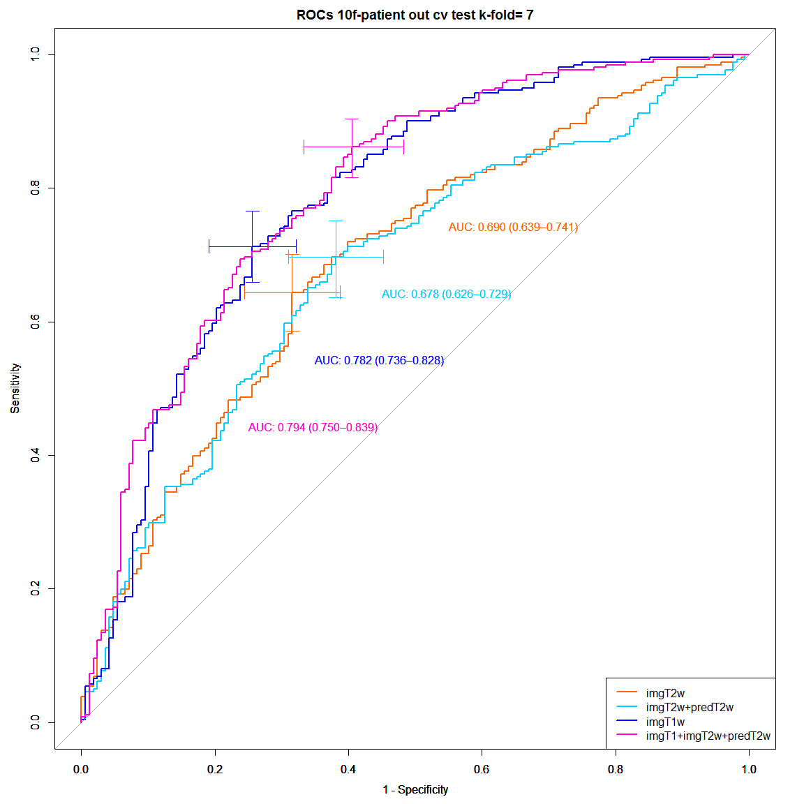 

```
## Area under the curve: 0.7944
## 95% CI (2000 stratified bootstrap replicates):
##  thresholds sp.low sp.median sp.high se.low se.median se.high
##   0.5095923 0.5179    0.5952  0.6667 0.8161    0.8621  0.9042
##    massB    massM nonmassB nonmassM 
##      214      142      128       76 
##    massB    massM nonmassB nonmassM 
##       28       24       14        1 
##    massB    massM nonmassB nonmassM 
##      214      142      128       76 
##    massB    massM nonmassB nonmassM 
##       28       24       14        1 
##    massB    massM nonmassB nonmassM 
##      214      142      128       76 
##    massB    massM nonmassB nonmassM 
##       28       24       14        1 
## -0.005181347 0.05 
## Selected features for group: MeanDecreaseGini imgT2 
## =========NULL
##  [1] "T2RGH_var"                          "find_t2_signal_int"                 "T2grad_margin_var"                 
##  [4] "ave_T210"                           "T2skew_F_r_i"                       "T2texture_variance_nondir"         
##  [7] "T2texture_entropy_nondir"           "T2kurt_F_r_i"                       "ave_T25"                           
## [10] "ave_T27"                            "ave_T218"                           "ave_T217"                          
## [13] "ave_T28"                            "ave_T215"                           "ave_T23"                           
## [16] "ave_T219"                           "ave_T26"                            "T2var_F_r_i"                       
## [19] "T2texture_correlation_nondir"       "T2RGH_mean"                         "LMSIR"                             
## [22] "ave_T21"                            "ave_T22"                            "ave_T213"                          
## [25] "T2texture_inversediffmoment_nondir" "T2texture_diffentropy_nondir"       "T2grad_margin"                     
## [28] "ave_T211"                           "ave_T20"                            "T2_lesionSI"                       
## 0.05825243 0.05 
## -0.03092784 0.05 
## Selected features for group: MeanDecreaseGini allT2 
## =========NULL
##  [1] "T2RGH_var"                          "T2texture_correlation_nondir"       "ave_T211"                          
##  [4] "T2texture_energy_nondir"            "T2RGH_mean"                         "ave_T210"                          
##  [7] "T2grad_margin_var"                  "T2texture_inversediffmoment_nondir" "LMSIR"                             
## [10] "ave_T213"                           "T2max_F_r_i"                        "T2texture_sumvariance_nondir"      
## [13] "find_t2_signal_int"                 "T2grad_margin"                      "ave_T218"                          
## [16] "ave_T217"                           "LMSIR_predicted"                    "ave_T214"                          
## [19] "ave_T24"                            "ave_T25"                            "ave_T23"                           
## [22] "T2_lesionSI"                        "ave_T219"                           "T2kurt_F_r_i"                      
## [25] "ave_T27"                            "T2_lesionSIstd"                     "ave_T28"                           
## [28] "ave_T26"                            "ave_T21"                            "T2texture_contrast_nondir"         
## [31] "ave_T22"                            "ave_T29"                            "T2min_F_r_i"                       
## -0.03472222 0.05 
## Selected features for group: MeanDecreaseGini imgT1 
## =========NULL
##  [1] "circularity"                       "earlySE12"                         "V9"                               
##  [4] "max_F_r_i"                         "texture_energy_nondir_post4"       "Vr_post_1_inside"                 
##  [7] "max_RGH_mean"                      "texture_sumvariance_nondir_post4"  "skew_F_r_i"                       
## [10] "V4"                                "V2"                                "A_inside"                         
## [13] "edge_sharp_std"                    "Kpeak_countor"                     "ivVariance"                       
## [16] "dce3SE15"                          "Slope_ini_inside"                  "texture_diffvariance_nondir_post4"
## [19] "kurt_F_r_i"                        "dce2SE18"                          "lateSE16"                         
## [22] "dce3SE11"                          "earlySE10"                         "earlySE17"                        
## [25] "lateSE11"                          "texture_variance_nondir_post4"     "dce2SE13"                         
## [28] "alpha_inside"                     
## -0.05442177 0.05 
## Selected features for group: MeanDecreaseGini all 
## =========NULL
##  [1] "irregularity"                           "SER_inside"                             "iiMin_change_Variance_uptake"          
##  [4] "texture_inversediffmoment_nondir_post2" "earlySE4"                               "texture_diffentropy_nondir_post4"      
##  [7] "dce3SE11"                               "T2texture_correlation_nondir"           "edge_sharp_mean"                       
## [10] "min_F_r_i"                              "ave_T212"                               "T2RGH_var"                             
## [13] "T2texture_inversediffmoment_nondir"     "ave_T27"                                "V6"                                    
## [16] "Kpeak_countor"                          "Tpeak_inside"                           "V2"                                    
## [19] "earlySE2"                               "dce2SE2"                                "earlySE6"                              
## [22] "V4"                                     "texture_diffvariance_nondir_post2"      "T2texture_contrast_nondir"             
## [25] "earlySE14"                              "V8"                                     "dce2SE0"                               
## [28] "A_inside"                              
##     lesion_id cad_pt_no_txt exam_a_number_txt BIRADS lesion_label               lesion_diagnosis      find_t2_signal_int
## 6           6          0066           4583735      3        massB           BENIGN BREAST TISSUE Hypointense or not seen
## 7           7          0066           7556910      4     nonmassB                 DENSE FIBROSIS                    None
## 13         13          0121           6714524      4        massB                       ADENOSIS Hypointense or not seen
## 14         14          0121           7091267      4        massB           BENIGN BREAST TISSUE            Hyperintense
## 18         18          0127           4696964      4     nonmassB                   FIBROADENOMA            Hyperintense
## 20         20          0130           5017534      2        massB   ATYPICAL LOBULAR HYPERPLASIA            Hyperintense
## 21         21          0130           5017534      2        massB   ATYPICAL LOBULAR HYPERPLASIA            Hyperintense
## 22         22          0130           7347205      4        massB   ATYPICAL LOBULAR HYPERPLASIA Hypointense or not seen
## 38         38          0189           5057674      4     nonmassB            SCLEROSING ADENOSIS Hypointense or not seen
## 67         67          0276           6952525      4        massM                 InvasiveDuctal   Slightly hyperintense
## 68         68          0276           6952525      4        massM                 InvasiveDuctal   Slightly hyperintense
## 84         84          0426           7169326      4     nonmassB               STROMAL FIBROSIS                    None
## 85         85          0426           7169326      4     nonmassB           BENIGN BREAST TISSUE Hypointense or not seen
## 86         86          0426           7169326      4     nonmassB               STROMAL FIBROSIS                    None
## 111       111          0578           6765702      6        massM                 InvasiveDuctal                    None
## 126       126          0657           6980780      4        massM                 InvasiveDuctal Hypointense or not seen
## 129       129          0666           5088826      3        massM                   InsituDuctal            Hyperintense
## 136       136          0679           4994641      6        massM                 InvasiveDuctal                    None
## 211       211          0783           4758418      3        massB                    FIBROCYSTIC            Hyperintense
## 218       218          0789           4785741      3        massM                   InsituDuctal   Slightly hyperintense
## 222       222          0792           5264066      3        massB                 DUCT PAPILLOMA   Slightly hyperintense
## 223       223          0792           5264066      3        massB                 DUCT PAPILLOMA   Slightly hyperintense
## 224       224          0793           4988020      4        massB                   FIBROADENOMA            Hyperintense
## 225       225          0793           7135216      2        massB COMPLEX FIBROEPITHELIAL LESION            Hyperintense
## 234       234          0810           4622489      4        massM                   InsituDuctal                    None
## 240       240          0815           4828432      5        massM                 InvasiveDuctal                    None
## 241       241          0817           5363917      6        massM                 InvasiveDuctal            Hyperintense
## 271       271          0856           4986174      4        massB                   FIBROADENOMA            Hyperintense
## 272       272          0856           4986174      4        massB                   FIBROADENOMA            Hyperintense
## 273       273          0856           6871177      2        massB    ATYPICAL DUCTAL HYPERPLASIA Hypointense or not seen
## 277       277          0862           5395314      4        massM                   InsituDuctal                    None
## 280       280          0865           5267535      5        massM                 InvasiveDuctal                    None
## 281       281          0865           5267535      5     nonmassM                 InvasiveDuctal                    None
## 308       308          0913           7350757      4        massB                       ADENOSIS   Slightly hyperintense
## 315       315          0937           7144673      4        massB                FIBROEPITHELIAL            Hyperintense
## 331       331          0985           7050619      4     nonmassB          COLUMNAR CELL CHANGES            Hyperintense
## 335       335          0997           7279207      3        massB   ATYPICAL LOBULAR HYPERPLASIA                    None
## 400       400          2065           7604632      4     nonmassB                  InsituLobular                    None
## 409       409          2078           5116776      4        massB           BENIGN BREAST TISSUE            Hyperintense
## 421       421          3018           6865137      3        massB                   FAT NECROSIS            Hyperintense
## 427       427          3028           6991592      3        massB                    HYPERPLASIA Hypointense or not seen
## 434       434          3045           7149704      4     nonmassB                       ADENOSIS                    None
## 442       442          3054           6714946      4     nonmassB           BENIGN BREAST TISSUE Hypointense or not seen
## 443       443          3055           7742700      4        massB          COLUMNAR CELL CHANGES Hypointense or not seen
## 444       444          3055           7060620      4        massM                 InvasiveDuctal Hypointense or not seen
## 445       445          3055           7742700      4     nonmassB          COLUMNAR CELL CHANGES                    None
## 446       446          3055           7742700      4        massB            STROMAL HYPERPLASIA Hypointense or not seen
## 447       447          3055           7060620      4        massM                 InvasiveDuctal Hypointense or not seen
## 448       448          3057           7098623      4     nonmassB           BENIGN BREAST TISSUE                    None
## 449       449          3057           7098623      4        massB                TUBULAR ADENOMA   Slightly hyperintense
## 485       485          4020           6988975      6        massM                InvasiveLobular   Slightly hyperintense
## 497       497          4041           7003893      4     nonmassB           BENIGN BREAST TISSUE   Slightly hyperintense
## 553       553          6041           5104414      6        massM                 InvasiveDuctal   Slightly hyperintense
## 554       554          6041           5104414      6        massM                 InvasiveDuctal                    None
## 562       562          6046         ACC108189      5        massM                   InsituDuctal Hypointense or not seen
## 563       563          6046         ACC108189      5        massM                   InsituDuctal Hypointense or not seen
## 564       564          6046         ACC108189      5        massM                   InsituDuctal            Hyperintense
## 565       565          6046         ACC108189      5        massM                   InsituDuctal                    None
## 569       569          6051           5426079      6        massM                 InvasiveDuctal            Hyperintense
## 589       589          6223           7043947      4        massM                 InvasiveDuctal            Hyperintense
## 611       611          7085           7616788      2        massB    ATYPICAL DUCTAL HYPERPLASIA                    None
## 614       614          7094           7171259      4     nonmassB           BENIGN BREAST TISSUE                    None
## 617       617          7097           6805449      4        massB            SCLEROSING ADENOSIS Hypointense or not seen
## 618       618          7097           6805449      4        massB                   FIBROADENOMA                    None
## 619       619          7097           7388464      2        massB    ATYPICAL DUCTAL HYPERPLASIA   Slightly hyperintense
## 626       626          7178           7074874      6        massM                 InvasiveDuctal Hypointense or not seen
## 627       627          7183           7404761      4        massB                    FIBROCYSTIC            Hyperintense
## 
## ============ bestune_imgT2 	 max.depth  1 	 #Trees  350 
## ntrees:  50 minsplit:  3 cp:  0.01 
##   ntrees minsplit   cp acuTrain rocTrain   acuTest   rocTest
## 1     50        3 0.01        1        1 0.5373134 0.4714286
## ntrees:  100 minsplit:  3 cp:  0.01 
##   ntrees minsplit   cp acuTrain rocTrain   acuTest   rocTest
## 2    100        3 0.01        1        1 0.6119403 0.5285714
## ntrees:  250 minsplit:  3 cp:  0.01 
##   ntrees minsplit   cp acuTrain rocTrain   acuTest   rocTest
## 3    250        3 0.01        1        1 0.6268657 0.4904762
## ntrees:  350 minsplit:  3 cp:  0.01 
##   ntrees minsplit   cp acuTrain rocTrain   acuTest   rocTest
## 4    350        3 0.01        1        1 0.6268657 0.5447619
## ntrees:  50 minsplit:  1 cp:  0.01 
##   ntrees minsplit   cp acuTrain rocTrain   acuTest   rocTest
## 5     50        1 0.01        1        1 0.5522388 0.5057143
## ntrees:  100 minsplit:  1 cp:  0.01 
##   ntrees minsplit   cp acuTrain rocTrain   acuTest   rocTest
## 6    100        1 0.01        1        1 0.5820896 0.5333333
## ntrees:  250 minsplit:  1 cp:  0.01 
##   ntrees minsplit   cp acuTrain rocTrain   acuTest   rocTest
## 7    250        1 0.01        1        1 0.6268657 0.5628571
## ntrees:  350 minsplit:  1 cp:  0.01 
##   ntrees minsplit   cp acuTrain rocTrain   acuTest   rocTest
## 8    350        1 0.01        1        1 0.5970149 0.5219048
## ntrees:  50 minsplit:  3 cp:  -1 
##   ntrees minsplit cp acuTrain rocTrain   acuTest   rocTest
## 9     50        3 -1        1        1 0.6119403 0.5457143
## ntrees:  100 minsplit:  3 cp:  -1 
##    ntrees minsplit cp acuTrain rocTrain  acuTest   rocTest
## 10    100        3 -1        1        1 0.641791 0.5342857
## ntrees:  250 minsplit:  3 cp:  -1 
##    ntrees minsplit cp acuTrain rocTrain   acuTest   rocTest
## 11    250        3 -1        1        1 0.6119403 0.5304762
## ntrees:  350 minsplit:  3 cp:  -1 
##    ntrees minsplit cp acuTrain rocTrain   acuTest   rocTest
## 12    350        3 -1        1        1 0.6119403 0.5361905
## ntrees:  50 minsplit:  1 cp:  -1 
##    ntrees minsplit cp acuTrain rocTrain   acuTest   rocTest
## 13     50        1 -1        1        1 0.5671642 0.5761905
## ntrees:  100 minsplit:  1 cp:  -1 
##    ntrees minsplit cp acuTrain rocTrain   acuTest  rocTest
## 14    100        1 -1        1        1 0.5970149 0.532381
## ntrees:  250 minsplit:  1 cp:  -1 
##    ntrees minsplit cp acuTrain rocTrain   acuTest   rocTest
## 15    250        1 -1        1        1 0.6268657 0.5533333
## ntrees:  350 minsplit:  1 cp:  -1 
##    ntrees minsplit cp acuTrain rocTrain   acuTest   rocTest
## 16    350        1 -1        1        1 0.5820896 0.5104762
##    ntrees minsplit    cp acuTrain rocTrain   acuTest   rocTest
## 1      50        3  0.01        1        1 0.5373134 0.4714286
## 2     100        3  0.01        1        1 0.6119403 0.5285714
## 3     250        3  0.01        1        1 0.6268657 0.4904762
## 4     350        3  0.01        1        1 0.6268657 0.5447619
## 5      50        1  0.01        1        1 0.5522388 0.5057143
## 6     100        1  0.01        1        1 0.5820896 0.5333333
## 7     250        1  0.01        1        1 0.6268657 0.5628571
## 8     350        1  0.01        1        1 0.5970149 0.5219048
## 9      50        3 -1.00        1        1 0.6119403 0.5457143
## 10    100        3 -1.00        1        1 0.6417910 0.5342857
## 11    250        3 -1.00        1        1 0.6119403 0.5304762
## 12    350        3 -1.00        1        1 0.6119403 0.5361905
## 13     50        1 -1.00        1        1 0.5671642 0.5761905
## 14    100        1 -1.00        1        1 0.5970149 0.5323810
## 15    250        1 -1.00        1        1 0.6268657 0.5533333
## 16    350        1 -1.00        1        1 0.5820896 0.5104762
##    ntrees minsplit cp acuTrain rocTrain   acuTest   rocTest
## 13     50        1 -1        1        1 0.5671642 0.5761905
## 
## ============ bestune_allT2 	 max.depth  1 	 #Trees  250 
## ntrees:  50 minsplit:  3 cp:  0.01 
##   ntrees minsplit   cp acuTrain rocTrain   acuTest   rocTest
## 1     50        3 0.01        1        1 0.5820896 0.4714286
## ntrees:  100 minsplit:  3 cp:  0.01 
##   ntrees minsplit   cp acuTrain rocTrain   acuTest   rocTest
## 2    100        3 0.01        1        1 0.5223881 0.4809524
## ntrees:  250 minsplit:  3 cp:  0.01 
##   ntrees minsplit   cp acuTrain rocTrain   acuTest   rocTest
## 3    250        3 0.01        1        1 0.5970149 0.5085714
## ntrees:  350 minsplit:  3 cp:  0.01 
##   ntrees minsplit   cp acuTrain rocTrain   acuTest  rocTest
## 4    350        3 0.01        1        1 0.5820896 0.492381
## ntrees:  50 minsplit:  1 cp:  0.01 
##   ntrees minsplit   cp acuTrain rocTrain   acuTest  rocTest
## 5     50        1 0.01        1        1 0.5671642 0.572381
## ntrees:  100 minsplit:  1 cp:  0.01 
##   ntrees minsplit   cp acuTrain rocTrain   acuTest   rocTest
## 6    100        1 0.01        1        1 0.6865672 0.5342857
## ntrees:  250 minsplit:  1 cp:  0.01 
##   ntrees minsplit   cp acuTrain rocTrain   acuTest   rocTest
## 7    250        1 0.01        1        1 0.6119403 0.5352381
## ntrees:  350 minsplit:  1 cp:  0.01 
##   ntrees minsplit   cp acuTrain rocTrain   acuTest rocTest
## 8    350        1 0.01        1        1 0.6268657    0.48
## ntrees:  50 minsplit:  3 cp:  -1 
##   ntrees minsplit cp acuTrain rocTrain   acuTest   rocTest
## 9     50        3 -1        1        1 0.5522388 0.5819048
## ntrees:  100 minsplit:  3 cp:  -1 
##    ntrees minsplit cp acuTrain rocTrain   acuTest   rocTest
## 10    100        3 -1        1        1 0.5671642 0.5657143
## ntrees:  250 minsplit:  3 cp:  -1 
##    ntrees minsplit cp acuTrain rocTrain   acuTest   rocTest
## 11    250        3 -1        1        1 0.5970149 0.4933333
## ntrees:  350 minsplit:  3 cp:  -1 
##    ntrees minsplit cp acuTrain rocTrain   acuTest   rocTest
## 12    350        3 -1        1        1 0.6268657 0.5257143
## ntrees:  50 minsplit:  1 cp:  -1 
##    ntrees minsplit cp acuTrain rocTrain   acuTest   rocTest
## 13     50        1 -1        1        1 0.4925373 0.5133333
## ntrees:  100 minsplit:  1 cp:  -1 
##    ntrees minsplit cp acuTrain rocTrain   acuTest   rocTest
## 14    100        1 -1        1        1 0.6268657 0.5438095
## ntrees:  250 minsplit:  1 cp:  -1 
##    ntrees minsplit cp acuTrain rocTrain  acuTest   rocTest
## 15    250        1 -1        1        1 0.641791 0.5495238
## ntrees:  350 minsplit:  1 cp:  -1 
##    ntrees minsplit cp acuTrain rocTrain   acuTest   rocTest
## 16    350        1 -1        1        1 0.5820896 0.4990476
##    ntrees minsplit    cp acuTrain rocTrain   acuTest   rocTest
## 1      50        3  0.01        1        1 0.5820896 0.4714286
## 2     100        3  0.01        1        1 0.5223881 0.4809524
## 3     250        3  0.01        1        1 0.5970149 0.5085714
## 4     350        3  0.01        1        1 0.5820896 0.4923810
## 5      50        1  0.01        1        1 0.5671642 0.5723810
## 6     100        1  0.01        1        1 0.6865672 0.5342857
## 7     250        1  0.01        1        1 0.6119403 0.5352381
## 8     350        1  0.01        1        1 0.6268657 0.4800000
## 9      50        3 -1.00        1        1 0.5522388 0.5819048
## 10    100        3 -1.00        1        1 0.5671642 0.5657143
## 11    250        3 -1.00        1        1 0.5970149 0.4933333
## 12    350        3 -1.00        1        1 0.6268657 0.5257143
## 13     50        1 -1.00        1        1 0.4925373 0.5133333
## 14    100        1 -1.00        1        1 0.6268657 0.5438095
## 15    250        1 -1.00        1        1 0.6417910 0.5495238
## 16    350        1 -1.00        1        1 0.5820896 0.4990476
##   ntrees minsplit cp acuTrain rocTrain   acuTest   rocTest
## 9     50        3 -1        1        1 0.5522388 0.5819048
## 
## ============ bestune_imgT1 	 max.depth  1 	 #Trees  250 
## ntrees:  50 minsplit:  3 cp:  0.01 
##   ntrees minsplit   cp acuTrain rocTrain   acuTest   rocTest
## 1     50        3 0.01        1        1 0.6567164 0.6495238
## ntrees:  100 minsplit:  3 cp:  0.01 
##   ntrees minsplit   cp acuTrain rocTrain   acuTest   rocTest
## 2    100        3 0.01        1        1 0.6567164 0.7038095
## ntrees:  250 minsplit:  3 cp:  0.01 
##   ntrees minsplit   cp acuTrain rocTrain   acuTest   rocTest
## 3    250        3 0.01        1        1 0.7164179 0.6685714
## ntrees:  350 minsplit:  3 cp:  0.01 
##   ntrees minsplit   cp acuTrain rocTrain   acuTest   rocTest
## 4    350        3 0.01        1        1 0.6716418 0.6342857
## ntrees:  50 minsplit:  1 cp:  0.01 
##   ntrees minsplit   cp acuTrain rocTrain   acuTest   rocTest
## 5     50        1 0.01        1        1 0.6567164 0.6142857
## ntrees:  100 minsplit:  1 cp:  0.01 
##   ntrees minsplit   cp acuTrain rocTrain   acuTest   rocTest
## 6    100        1 0.01        1        1 0.7014925 0.7095238
## ntrees:  250 minsplit:  1 cp:  0.01 
##   ntrees minsplit   cp acuTrain rocTrain   acuTest   rocTest
## 7    250        1 0.01        1        1 0.7014925 0.6466667
## ntrees:  350 minsplit:  1 cp:  0.01 
##   ntrees minsplit   cp acuTrain rocTrain   acuTest   rocTest
## 8    350        1 0.01        1        1 0.7164179 0.6647619
## ntrees:  50 minsplit:  3 cp:  -1 
##   ntrees minsplit cp acuTrain rocTrain   acuTest   rocTest
## 9     50        3 -1        1        1 0.6119403 0.6333333
## ntrees:  100 minsplit:  3 cp:  -1 
##    ntrees minsplit cp acuTrain rocTrain   acuTest   rocTest
## 10    100        3 -1        1        1 0.7164179 0.6714286
## ntrees:  250 minsplit:  3 cp:  -1 
##    ntrees minsplit cp acuTrain rocTrain   acuTest   rocTest
## 11    250        3 -1        1        1 0.7164179 0.6838095
## ntrees:  350 minsplit:  3 cp:  -1 
##    ntrees minsplit cp acuTrain rocTrain   acuTest   rocTest
## 12    350        3 -1        1        1 0.6865672 0.6771429
## ntrees:  50 minsplit:  1 cp:  -1 
##    ntrees minsplit cp acuTrain rocTrain   acuTest   rocTest
## 13     50        1 -1        1        1 0.7313433 0.6790476
## ntrees:  100 minsplit:  1 cp:  -1 
##    ntrees minsplit cp acuTrain rocTrain   acuTest   rocTest
## 14    100        1 -1        1        1 0.7313433 0.6733333
## ntrees:  250 minsplit:  1 cp:  -1 
##    ntrees minsplit cp acuTrain rocTrain   acuTest   rocTest
## 15    250        1 -1        1        1 0.7164179 0.7285714
## ntrees:  350 minsplit:  1 cp:  -1 
##    ntrees minsplit cp acuTrain rocTrain   acuTest   rocTest
## 16    350        1 -1        1        1 0.7164179 0.6628571
##    ntrees minsplit    cp acuTrain rocTrain   acuTest   rocTest
## 1      50        3  0.01        1        1 0.6567164 0.6495238
## 2     100        3  0.01        1        1 0.6567164 0.7038095
## 3     250        3  0.01        1        1 0.7164179 0.6685714
## 4     350        3  0.01        1        1 0.6716418 0.6342857
## 5      50        1  0.01        1        1 0.6567164 0.6142857
## 6     100        1  0.01        1        1 0.7014925 0.7095238
## 7     250        1  0.01        1        1 0.7014925 0.6466667
## 8     350        1  0.01        1        1 0.7164179 0.6647619
## 9      50        3 -1.00        1        1 0.6119403 0.6333333
## 10    100        3 -1.00        1        1 0.7164179 0.6714286
## 11    250        3 -1.00        1        1 0.7164179 0.6838095
## 12    350        3 -1.00        1        1 0.6865672 0.6771429
## 13     50        1 -1.00        1        1 0.7313433 0.6790476
## 14    100        1 -1.00        1        1 0.7313433 0.6733333
## 15    250        1 -1.00        1        1 0.7164179 0.7285714
## 16    350        1 -1.00        1        1 0.7164179 0.6628571
##    ntrees minsplit cp acuTrain rocTrain   acuTest   rocTest
## 15    250        1 -1        1        1 0.7164179 0.7285714
## 
## ============ bestune_all 	 max.depth  1 	 #Trees  200 
## ntrees:  50 minsplit:  3 cp:  0.01 
##   ntrees minsplit   cp acuTrain rocTrain   acuTest   rocTest
## 1     50        3 0.01        1        1 0.7164179 0.7942857
## ntrees:  100 minsplit:  3 cp:  0.01 
##   ntrees minsplit   cp acuTrain rocTrain   acuTest   rocTest
## 2    100        3 0.01        1        1 0.7014925 0.7352381
## ntrees:  250 minsplit:  3 cp:  0.01 
##   ntrees minsplit   cp acuTrain rocTrain   acuTest   rocTest
## 3    250        3 0.01        1        1 0.7014925 0.7685714
## ntrees:  350 minsplit:  3 cp:  0.01 
##   ntrees minsplit   cp acuTrain rocTrain   acuTest   rocTest
## 4    350        3 0.01        1        1 0.7462687 0.7485714
## ntrees:  50 minsplit:  1 cp:  0.01 
##   ntrees minsplit   cp acuTrain rocTrain  acuTest  rocTest
## 5     50        1 0.01        1        1 0.761194 0.792381
## ntrees:  100 minsplit:  1 cp:  0.01 
##   ntrees minsplit   cp acuTrain rocTrain   acuTest   rocTest
## 6    100        1 0.01        1        1 0.7462687 0.7580952
## ntrees:  250 minsplit:  1 cp:  0.01 
##   ntrees minsplit   cp acuTrain rocTrain   acuTest   rocTest
## 7    250        1 0.01        1        1 0.7462687 0.7714286
## ntrees:  350 minsplit:  1 cp:  0.01 
##   ntrees minsplit   cp acuTrain rocTrain   acuTest   rocTest
## 8    350        1 0.01        1        1 0.7462687 0.7542857
## ntrees:  50 minsplit:  3 cp:  -1 
##   ntrees minsplit cp acuTrain rocTrain   acuTest   rocTest
## 9     50        3 -1        1        1 0.7014925 0.7628571
## ntrees:  100 minsplit:  3 cp:  -1 
##    ntrees minsplit cp acuTrain rocTrain   acuTest   rocTest
## 10    100        3 -1        1        1 0.7014925 0.7647619
## ntrees:  250 minsplit:  3 cp:  -1 
##    ntrees minsplit cp acuTrain rocTrain   acuTest   rocTest
## 11    250        3 -1        1        1 0.7164179 0.7447619
## ntrees:  350 minsplit:  3 cp:  -1 
##    ntrees minsplit cp acuTrain rocTrain   acuTest   rocTest
## 12    350        3 -1        1        1 0.7014925 0.7704762
## ntrees:  50 minsplit:  1 cp:  -1 
##    ntrees minsplit cp acuTrain rocTrain   acuTest   rocTest
## 13     50        1 -1        1        1 0.7313433 0.7114286
## ntrees:  100 minsplit:  1 cp:  -1 
##    ntrees minsplit cp acuTrain rocTrain   acuTest  rocTest
## 14    100        1 -1        1        1 0.7164179 0.752381
## ntrees:  250 minsplit:  1 cp:  -1 
##    ntrees minsplit cp acuTrain rocTrain   acuTest   rocTest
## 15    250        1 -1        1        1 0.7014925 0.7447619
## ntrees:  350 minsplit:  1 cp:  -1 
##    ntrees minsplit cp acuTrain rocTrain   acuTest rocTest
## 16    350        1 -1        1        1 0.7164179    0.72
##    ntrees minsplit    cp acuTrain rocTrain   acuTest   rocTest
## 1      50        3  0.01        1        1 0.7164179 0.7942857
## 2     100        3  0.01        1        1 0.7014925 0.7352381
## 3     250        3  0.01        1        1 0.7014925 0.7685714
## 4     350        3  0.01        1        1 0.7462687 0.7485714
## 5      50        1  0.01        1        1 0.7611940 0.7923810
## 6     100        1  0.01        1        1 0.7462687 0.7580952
## 7     250        1  0.01        1        1 0.7462687 0.7714286
## 8     350        1  0.01        1        1 0.7462687 0.7542857
## 9      50        3 -1.00        1        1 0.7014925 0.7628571
## 10    100        3 -1.00        1        1 0.7014925 0.7647619
## 11    250        3 -1.00        1        1 0.7164179 0.7447619
## 12    350        3 -1.00        1        1 0.7014925 0.7704762
## 13     50        1 -1.00        1        1 0.7313433 0.7114286
## 14    100        1 -1.00        1        1 0.7164179 0.7523810
## 15    250        1 -1.00        1        1 0.7014925 0.7447619
## 16    350        1 -1.00        1        1 0.7164179 0.7200000
##   ntrees minsplit   cp acuTrain rocTrain   acuTest   rocTest
## 1     50        3 0.01        1        1 0.7164179 0.7942857
## 
## Call:
## roc.default(response = perf_imgT2$obs, predictor = perf_imgT2$C)
## 
## Data: perf_imgT2$C in 193 controls (perf_imgT2$obs C) > 303 cases (perf_imgT2$obs NC).
## Area under the curve: 0.6729
## 
## Call:
## roc.default(response = perf_allT2$obs, predictor = perf_allT2$C)
## 
## Data: perf_allT2$C in 193 controls (perf_allT2$obs C) > 303 cases (perf_allT2$obs NC).
## Area under the curve: 0.6599
## 
## Call:
## roc.default(response = perf_imgT1$obs, predictor = perf_imgT1$C)
## 
## Data: perf_imgT1$C in 193 controls (perf_imgT1$obs C) > 303 cases (perf_imgT1$obs NC).
## Area under the curve: 0.7741
## 
## Call:
## roc.default(response = perf_all$obs, predictor = perf_all$C)
## 
## Data: perf_all$C in 193 controls (perf_all$obs C) > 303 cases (perf_all$obs NC).
## Area under the curve: 0.7943
```

```
## Area under the curve: 0.6729
## 95% CI (2000 stratified bootstrap replicates):
##  thresholds sp.low sp.median sp.high se.low se.median se.high
##   0.4525881 0.5959    0.6632  0.7254 0.5875    0.6403  0.6898
```

```
## Area under the curve: 0.6599
## 95% CI (2000 stratified bootstrap replicates):
##  thresholds sp.low sp.median sp.high se.low se.median se.high
##   0.4626711 0.5078    0.5803  0.6477 0.6436    0.6964   0.746
```

```
## Area under the curve: 0.7741
## 95% CI (2000 stratified bootstrap replicates):
##  thresholds sp.low sp.median sp.high se.low se.median se.high
##   0.4521917 0.6528     0.715  0.7772 0.6733    0.7261  0.7756
```

 

```
## Area under the curve: 0.7943
## 95% CI (2000 stratified bootstrap replicates):
##  thresholds sp.low sp.median sp.high se.low se.median se.high
##   0.4377309 0.7202    0.7772  0.8342 0.6337    0.6865   0.736
##    massB    massM nonmassB nonmassM 
##      211      153      125       70 
##    massB    massM nonmassB nonmassM 
##       31       13       17        7 
##    massB    massM nonmassB nonmassM 
##      211      153      125       70 
##    massB    massM nonmassB nonmassM 
##       31       13       17        7 
##    massB    massM nonmassB nonmassM 
##      211      153      125       70 
##    massB    massM nonmassB nonmassM 
##       31       13       17        7 
## -0.004830918 0.05 
## Selected features for group: MeanDecreaseGini imgT2 
## =========NULL
##  [1] "T2RGH_var"                          "T2texture_correlation_nondir"       "T2kurt_F_r_i"                      
##  [4] "ave_T210"                           "T2skew_F_r_i"                       "find_t2_signal_int"                
##  [7] "LMSIR"                              "ave_T211"                           "T2texture_entropy_nondir"          
## [10] "ave_T27"                            "T2texture_inversediffmoment_nondir" "T2_lesionSIstd"                    
## [13] "ave_T212"                           "ave_T28"                            "T2grad_margin"                     
## [16] "ave_T213"                           "ave_T218"                           "ave_T23"                           
## [19] "T2mean_F_r_i"                       "ave_T219"                           "T2texture_contrast_nondir"         
## [22] "T2texture_diffentropy_nondir"       "T2texture_sumaverage_nondir"        "ave_T22"                           
## [25] "ave_T29"                            "T2max_F_r_i"                        "ave_T214"                          
## [28] "T2texture_sumentropy_nondir"        "T2_lesionSI"                       
## 0 0.05 
## Selected features for group: MeanDecreaseGini allT2 
## =========NULL
##  [1] "T2RGH_var"                    "ave_T210"                     "T2texture_correlation_nondir" "T2max_F_r_i"                 
##  [5] "T2texture_energy_nondir"      "ave_T21"                      "LMSIR"                        "ave_T28"                     
##  [9] "ave_T218"                     "ave_T20"                      "T2_lesionSIstd"               "ave_T213"                    
## [13] "ave_T219"                     "T2_lesionSI"                  "ave_T215"                     "T2grad_margin"               
## [17] "T2texture_diffentropy_nondir" "T2texture_variance_nondir"    "T2texture_sumentropy_nondir"  "T2wSI_predicted"             
## [21] "ave_T214"                     "ave_T29"                      "ave_T22"                      "T2kurt_F_r_i"                
## [25] "ave_T27"                      "T2grad_margin_var"            "T2min_F_r_i"                  "ave_T216"                    
## [29] "find_t2_signal_int"          
## 0.02547771 0.05 
## Selected features for group: MeanDecreaseGini imgT1 
## =========NULL
##  [1] "texture_variance_nondir_post1"          "texture_sumvariance_nondir_post1"       "V9"                                    
##  [4] "Tpeak_countor"                          "V16"                                    "Kpeak_inside"                          
##  [7] "texture_inversediffmoment_nondir_post2" "texture_sumaverage_nondir_post3"        "V13"                                   
## [10] "texture_inversediffmoment_nondir_post4" "V8"                                     "texture_correlation_nondir_post1"      
## [13] "lateSE2"                                "UptakeRate_countor"                     "texture_sumvariance_nondir_post4"      
## [16] "dce2SE15"                               "texture_diffentropy_nondir_post3"       "texture_contrast_nondir_post3"         
## [19] "lateSE19"                               "earlySE11"                              "lateSE1"                               
## [22] "earlySE3"                               "texture_sumaverage_nondir_post4"        "earlySE0"                              
## [25] "dce3SE10"                               "min_F_r_i"                              "ivVariance"                            
## [28] "lateSE7"                                "dce2SE11"                               "Vr_post_1_countor"                     
## [31] "lateSE10"                               "skew_F_r_i"                             "dce2SE9"                               
## [34] "max_RGH_mean_k"                         "V6"                                     "peakVr_inside"                         
## [37] "Vr_decreasingRate_countor"              "iAUC1_countor"                          "max_RGH_var_k"                         
## [40] "A_inside"                              
## 0.1485714 0.05 
## 0.1006711 0.05 
## -0.05223881 0.05 
## Selected features for group: MeanDecreaseGini all 
## =========NULL
##  [1] "texture_sumvariance_nondir_post1"       "irregularity"                           "SER_inside"                            
##  [4] "texture_inversediffmoment_nondir_post4" "texture_sumaverage_nondir_post2"        "texture_diffvariance_nondir_post1"     
##  [7] "iiMin_change_Variance_uptake"           "T2RGH_mean"                             "earlySE8"                              
## [10] "texture_contrast_nondir_post2"          "V13"                                    "V17"                                   
## [13] "V19"                                    "lateSE6"                                "dce3SE11"                              
## [16] "T2var_F_r_i"                            "Vr_increasingRate_inside"               "T2kurt_F_r_i"                          
## [19] "LMSIR"                                  "UptakeRate_countor"                     "lateSE14"                              
## [22] "dce2SE16"                               "ave_T212"                               "T2texture_sumentropy_nondir"           
## [25] "ivVariance"                             "T2texture_contrast_nondir"              "alpha_countor"                         
## [28] "T2wSI_predicted"                        "texture_sumaverage_nondir_post1"        "dce3SE1"                               
## [31] "maxCr_inside"                           "dce2SE7"                                "lateSE13"                              
## [34] "lateSE19"                               "ave_T215"                               "max_RGH_var"                           
## [37] "dce3SE4"                                "earlySE3"                               "texture_entropy_nondir_post1"          
## [40] "Kpeak_countor"                          "dce2SE10"                               "earlySE19"                             
## [43] "texture_entropy_nondir_post3"           "A_inside"                              
##     lesion_id cad_pt_no_txt exam_a_number_txt BIRADS lesion_label                           lesion_diagnosis      find_t2_signal_int
## 4           4          0027           7171944      4     nonmassB                           STROMAL FIBROSIS                    None
## 5           5          0027           6805483      4     nonmassM                               InsituDuctal                    None
## 8           8          0093           7156466      4     nonmassM                             InvasiveDuctal                    None
## 9           9          0093           7156466      4     nonmassM                             InvasiveDuctal                    None
## 26         26          0135           7777131      4        massB                                FIBROCYSTIC                    None
## 27         27          0135           5083620      4     nonmassB                                FIBROCYSTIC Hypointense or not seen
## 30         30          0171           4751079      4        massM                               InsituDuctal Hypointense or not seen
## 31         31          0172           4703102      4        massB                                FIBROCYSTIC                    None
## 48         48          0198           4809893      2        massB                                FIBROCYSTIC                    None
## 49         49          0198           4809893      2        massB                               FIBROADENOMA                    None
## 60         60          0252           5142106      4        massB                               FIBROADENOMA Hypointense or not seen
## 61         61          0252           5142106      4        massB                               FIBROADENOMA Hypointense or not seen
## 62         62          0252           6700964      3     nonmassB                       BENIGN BREAST TISSUE Hypointense or not seen
## 63         63          0252           6700964      3        massB                       BENIGN BREAST TISSUE            Hyperintense
## 65         65          0259           7364573      2     nonmassB                       BENIGN BREAST TISSUE                    None
## 98         98          0513           5043867      4     nonmassB                ATYPICAL DUCTAL HYPERPLASIA                    None
## 106       106          0571           4902166      4        massM                             InvasiveDuctal Hypointense or not seen
## 107       107          0571           4902166      4     nonmassB                             DUCT PAPILLOMA Hypointense or not seen
## 120       120          0616           7910718      2        massM                               InsituDuctal Hypointense or not seen
## 157       157          0710           5282770      4        massB                               FIBROADENOMA            Hyperintense
## 158       158          0710           5282770      5        massB                             DUCT PAPILLOMA            Hyperintense
## 159       159          0710           6798490      2        massB                         DUCTAL HYPERPLASIA                    None
## 170       170          0723           4884108      6        massM                               InsituDuctal                    None
## 181       181          0734           4532660      4        massB                ATYPICAL DUCTAL HYPERPLASIA   Slightly hyperintense
## 248       248          0830           4863868      5        massB                ATYPICAL DUCTAL HYPERPLASIA                    None
## 249       249          0830           4863868      5        massB                                       Cyst                    None
## 261       261          0850           5380609      5        massB                       BENIGN BREAST TISSUE   Slightly hyperintense
## 262       262          0850           5380609      5     nonmassB                ATYPICAL DUCTAL HYPERPLASIA                    None
## 263       263          0850           5380609      5        massB                                FIBROCYSTIC   Slightly hyperintense
## 266       266          0853           4798586      2     nonmassB                                FIBROCYSTIC                    None
## 267       267          0853           4745782      3     nonmassB                                FIBROCYSTIC   Slightly hyperintense
## 268       268          0853           6696534      4     nonmassM                               InsituDuctal   Slightly hyperintense
## 269       269          0855           4641315      6        massB                                   FIBROSIS            Hyperintense
## 270       270          0855           4641315      6     nonmassB                                   FIBROSIS                    None
## 278       278          0863           4969136      4        massB                             DUCT PAPILLOMA            Hyperintense
## 279       279          0863           4969136      4        massM                            InvasiveLobular Hypointense or not seen
## 298       298          0883           5177385      5     nonmassM                               InsituDuctal                    None
## 306       306          0900           6699226      4        massB                                       Cyst                    None
## 307       307          0904           7133915      3        massB                                FIBROCYSTIC            Hyperintense
## 349       349          1027           6930730      3     nonmassB                               FIBROADENOMA                    None
## 351       351          1045           7231265      4        massB                       BENIGN BREAST TISSUE Hypointense or not seen
## 353       353          1026           6907382      4        massB DENSE FIBROSIS AND FIBROADENOMATOID CHANGE            Hyperintense
## 354       354          1053           7748055      4        massB                         INFLAMED CYST WALL            Hyperintense
## 358       358          1065           7741665      4     nonmassB                       BENIGN BREAST TISSUE                    None
## 375       375          1099           7646705      5        massM                               InsituDuctal Hypointense or not seen
## 376       376          1099           7646705      4     nonmassM                               InsituDuctal                    None
## 402       402          2069           4976319      6        massM                               InsituDuctal Hypointense or not seen
## 426       426          3026           6830523      4        massB                                FIBROCYSTIC Hypointense or not seen
## 431       431          3035           7002031      4        massB                               FIBROADENOMA            Hyperintense
## 432       432          3035           7145247      4        massB                                FIBROCYSTIC                    None
## 438       438          3052           7100200      4        massB                           STROMAL FIBROSIS            Hyperintense
## 439       439          3052           7100200      4        massB                               FIBROADENOMA            Hyperintense
## 459       459          3076           7053450      6        massM                               InsituDuctal Hypointense or not seen
## 460       460          3076           7053450      6        massM                               InsituDuctal Hypointense or not seen
## 495       495          4040           7003416      6        massM                             InvasiveDuctal                    None
## 496       496          4040           7085105      4        massB                               FIBROADENOMA            Hyperintense
## 504       504          4049           7009602      6        massM                             InvasiveDuctal                    None
## 519       519          6019         ACC109175      4        massM                            InvasiveLobular Hypointense or not seen
## 537       537          6032           4982490      4     nonmassB                                FIBROCYSTIC                    None
## 546       546          6038           5044471      6        massM                             InvasiveDuctal                    None
## 547       547          6038           5044471      6     nonmassB                       BENIGN BREAST TISSUE                    None
## 548       548          6038           5044471      6     nonmassB                       BENIGN BREAST TISSUE            Hyperintense
## 581       581          6105           5069712      4     nonmassM                               InsituDuctal                    None
## 585       585          6148           7446343      4        massB                        SCLEROSING ADENOSIS Hypointense or not seen
## 590       590          6224           4559525      4     nonmassB                                FIBROCYSTIC            Hyperintense
## 591       591          6226           6718391      4        massB                       BENIGN BREAST TISSUE   Slightly hyperintense
## 603       603          7053           7956343      4     nonmassB                            FIBROTIC STROMA Hypointense or not seen
## 622       622          7127           6989740      4        massB                       BENIGN BREAST TISSUE Hypointense or not seen
## 
## ============ bestune_imgT2 	 max.depth  1 	 #Trees  350 
## ntrees:  50 minsplit:  3 cp:  0.01 
##   ntrees minsplit   cp acuTrain rocTrain   acuTest   rocTest
## 1     50        3 0.01        1        1 0.6617647 0.6833333
## ntrees:  100 minsplit:  3 cp:  0.01 
##   ntrees minsplit   cp acuTrain rocTrain   acuTest rocTest
## 2    100        3 0.01        1        1 0.7205882 0.73125
## ntrees:  250 minsplit:  3 cp:  0.01 
##   ntrees minsplit   cp acuTrain rocTrain   acuTest   rocTest
## 3    250        3 0.01        1        1 0.6911765 0.7166667
## ntrees:  350 minsplit:  3 cp:  0.01 
##   ntrees minsplit   cp acuTrain rocTrain   acuTest  rocTest
## 4    350        3 0.01        1        1 0.6911765 0.753125
## ntrees:  50 minsplit:  1 cp:  0.01 
##   ntrees minsplit   cp acuTrain rocTrain   acuTest  rocTest
## 5     50        1 0.01        1        1 0.6323529 0.665625
## ntrees:  100 minsplit:  1 cp:  0.01 
##   ntrees minsplit   cp acuTrain rocTrain   acuTest   rocTest
## 6    100        1 0.01        1        1 0.6617647 0.6708333
## ntrees:  250 minsplit:  1 cp:  0.01 
##   ntrees minsplit   cp acuTrain rocTrain   acuTest rocTest
## 7    250        1 0.01        1        1 0.6323529    0.65
## ntrees:  350 minsplit:  1 cp:  0.01 
##   ntrees minsplit   cp acuTrain rocTrain   acuTest   rocTest
## 8    350        1 0.01        1        1 0.6470588 0.6510417
## ntrees:  50 minsplit:  3 cp:  -1 
##   ntrees minsplit cp acuTrain rocTrain   acuTest   rocTest
## 9     50        3 -1        1        1 0.7058824 0.6239583
## ntrees:  100 minsplit:  3 cp:  -1 
##    ntrees minsplit cp acuTrain rocTrain   acuTest   rocTest
## 10    100        3 -1        1        1 0.6764706 0.6979167
## ntrees:  250 minsplit:  3 cp:  -1 
##    ntrees minsplit cp acuTrain rocTrain   acuTest  rocTest
## 11    250        3 -1        1        1 0.7058824 0.690625
## ntrees:  350 minsplit:  3 cp:  -1 
##    ntrees minsplit cp acuTrain rocTrain   acuTest rocTest
## 12    350        3 -1        1        1 0.7352941 0.68125
## ntrees:  50 minsplit:  1 cp:  -1 
##    ntrees minsplit cp acuTrain rocTrain   acuTest  rocTest
## 13     50        1 -1        1        1 0.7058824 0.640625
## ntrees:  100 minsplit:  1 cp:  -1 
##    ntrees minsplit cp acuTrain rocTrain   acuTest   rocTest
## 14    100        1 -1        1        1 0.6617647 0.6208333
## ntrees:  250 minsplit:  1 cp:  -1 
##    ntrees minsplit cp acuTrain rocTrain   acuTest rocTest
## 15    250        1 -1        1        1 0.6470588  0.6375
## ntrees:  350 minsplit:  1 cp:  -1 
##    ntrees minsplit cp acuTrain rocTrain   acuTest   rocTest
## 16    350        1 -1        1        1 0.6911765 0.7083333
##    ntrees minsplit    cp acuTrain rocTrain   acuTest   rocTest
## 1      50        3  0.01        1        1 0.6617647 0.6833333
## 2     100        3  0.01        1        1 0.7205882 0.7312500
## 3     250        3  0.01        1        1 0.6911765 0.7166667
## 4     350        3  0.01        1        1 0.6911765 0.7531250
## 5      50        1  0.01        1        1 0.6323529 0.6656250
## 6     100        1  0.01        1        1 0.6617647 0.6708333
## 7     250        1  0.01        1        1 0.6323529 0.6500000
## 8     350        1  0.01        1        1 0.6470588 0.6510417
## 9      50        3 -1.00        1        1 0.7058824 0.6239583
## 10    100        3 -1.00        1        1 0.6764706 0.6979167
## 11    250        3 -1.00        1        1 0.7058824 0.6906250
## 12    350        3 -1.00        1        1 0.7352941 0.6812500
## 13     50        1 -1.00        1        1 0.7058824 0.6406250
## 14    100        1 -1.00        1        1 0.6617647 0.6208333
## 15    250        1 -1.00        1        1 0.6470588 0.6375000
## 16    350        1 -1.00        1        1 0.6911765 0.7083333
##   ntrees minsplit   cp acuTrain rocTrain   acuTest  rocTest
## 4    350        3 0.01        1        1 0.6911765 0.753125
## 
## ============ bestune_allT2 	 max.depth  1 	 #Trees  250 
## ntrees:  50 minsplit:  3 cp:  0.01 
##   ntrees minsplit   cp acuTrain rocTrain   acuTest   rocTest
## 1     50        3 0.01        1        1 0.5735294 0.5645833
## ntrees:  100 minsplit:  3 cp:  0.01 
##   ntrees minsplit   cp acuTrain rocTrain   acuTest rocTest
## 2    100        3 0.01        1        1 0.5735294 0.46875
## ntrees:  250 minsplit:  3 cp:  0.01 
##   ntrees minsplit   cp acuTrain rocTrain   acuTest   rocTest
## 3    250        3 0.01        1        1 0.5735294 0.4489583
## ntrees:  350 minsplit:  3 cp:  0.01 
##   ntrees minsplit   cp acuTrain rocTrain   acuTest   rocTest
## 4    350        3 0.01        1        1 0.5294118 0.5510417
## ntrees:  50 minsplit:  1 cp:  0.01 
##   ntrees minsplit   cp acuTrain rocTrain   acuTest   rocTest
## 5     50        1 0.01        1        1 0.4852941 0.5479167
## ntrees:  100 minsplit:  1 cp:  0.01 
##   ntrees minsplit   cp acuTrain rocTrain   acuTest   rocTest
## 6    100        1 0.01        1        1 0.5735294 0.5270833
## ntrees:  250 minsplit:  1 cp:  0.01 
##   ntrees minsplit   cp acuTrain rocTrain   acuTest   rocTest
## 7    250        1 0.01        1        1 0.5588235 0.5322917
## ntrees:  350 minsplit:  1 cp:  0.01 
##   ntrees minsplit   cp acuTrain rocTrain   acuTest   rocTest
## 8    350        1 0.01        1        1 0.5588235 0.4604167
## ntrees:  50 minsplit:  3 cp:  -1 
##   ntrees minsplit cp acuTrain rocTrain acuTest   rocTest
## 9     50        3 -1        1        1     0.5 0.5583333
## ntrees:  100 minsplit:  3 cp:  -1 
##    ntrees minsplit cp acuTrain rocTrain   acuTest   rocTest
## 10    100        3 -1        1        1 0.5588235 0.5010417
## ntrees:  250 minsplit:  3 cp:  -1 
##    ntrees minsplit cp acuTrain rocTrain   acuTest   rocTest
## 11    250        3 -1        1        1 0.6029412 0.5020833
## ntrees:  350 minsplit:  3 cp:  -1 
##    ntrees minsplit cp acuTrain rocTrain   acuTest   rocTest
## 12    350        3 -1        1        1 0.5588235 0.5447917
## ntrees:  50 minsplit:  1 cp:  -1 
##    ntrees minsplit cp acuTrain rocTrain   acuTest   rocTest
## 13     50        1 -1        1        1 0.5735294 0.5208333
## ntrees:  100 minsplit:  1 cp:  -1 
##    ntrees minsplit cp acuTrain rocTrain   acuTest   rocTest
## 14    100        1 -1        1        1 0.5147059 0.4927083
## ntrees:  250 minsplit:  1 cp:  -1 
##    ntrees minsplit cp acuTrain rocTrain   acuTest   rocTest
## 15    250        1 -1        1        1 0.5882353 0.5291667
## ntrees:  350 minsplit:  1 cp:  -1 
##    ntrees minsplit cp acuTrain rocTrain   acuTest  rocTest
## 16    350        1 -1        1        1 0.5882353 0.490625
##    ntrees minsplit    cp acuTrain rocTrain   acuTest   rocTest
## 1      50        3  0.01        1        1 0.5735294 0.5645833
## 2     100        3  0.01        1        1 0.5735294 0.4687500
## 3     250        3  0.01        1        1 0.5735294 0.4489583
## 4     350        3  0.01        1        1 0.5294118 0.5510417
## 5      50        1  0.01        1        1 0.4852941 0.5479167
## 6     100        1  0.01        1        1 0.5735294 0.5270833
## 7     250        1  0.01        1        1 0.5588235 0.5322917
## 8     350        1  0.01        1        1 0.5588235 0.4604167
## 9      50        3 -1.00        1        1 0.5000000 0.5583333
## 10    100        3 -1.00        1        1 0.5588235 0.5010417
## 11    250        3 -1.00        1        1 0.6029412 0.5020833
## 12    350        3 -1.00        1        1 0.5588235 0.5447917
## 13     50        1 -1.00        1        1 0.5735294 0.5208333
## 14    100        1 -1.00        1        1 0.5147059 0.4927083
## 15    250        1 -1.00        1        1 0.5882353 0.5291667
## 16    350        1 -1.00        1        1 0.5882353 0.4906250
##   ntrees minsplit   cp acuTrain rocTrain   acuTest   rocTest
## 1     50        3 0.01        1        1 0.5735294 0.5645833
## 
## ============ bestune_imgT1 	 max.depth  1 	 #Trees  250 
## ntrees:  50 minsplit:  3 cp:  0.01 
##   ntrees minsplit   cp acuTrain rocTrain   acuTest rocTest
## 1     50        3 0.01        1        1 0.6029412 0.61875
## ntrees:  100 minsplit:  3 cp:  0.01 
##   ntrees minsplit   cp acuTrain rocTrain   acuTest   rocTest
## 2    100        3 0.01        1        1 0.7058824 0.6427083
## ntrees:  250 minsplit:  3 cp:  0.01 
##   ntrees minsplit   cp acuTrain rocTrain   acuTest   rocTest
## 3    250        3 0.01        1        1 0.6323529 0.6697917
## ntrees:  350 minsplit:  3 cp:  0.01 
##   ntrees minsplit   cp acuTrain rocTrain   acuTest rocTest
## 4    350        3 0.01        1        1 0.6470588 0.70625
## ntrees:  50 minsplit:  1 cp:  0.01 
##   ntrees minsplit   cp acuTrain rocTrain   acuTest   rocTest
## 5     50        1 0.01        1        1 0.6029412 0.6302083
## ntrees:  100 minsplit:  1 cp:  0.01 
##   ntrees minsplit   cp acuTrain rocTrain   acuTest   rocTest
## 6    100        1 0.01        1        1 0.7058824 0.7020833
## ntrees:  250 minsplit:  1 cp:  0.01 
##   ntrees minsplit   cp acuTrain rocTrain   acuTest   rocTest
## 7    250        1 0.01        1        1 0.6470588 0.6604167
## ntrees:  350 minsplit:  1 cp:  0.01 
##   ntrees minsplit   cp acuTrain rocTrain   acuTest   rocTest
## 8    350        1 0.01        1        1 0.6617647 0.6854167
## ntrees:  50 minsplit:  3 cp:  -1 
##   ntrees minsplit cp acuTrain rocTrain   acuTest   rocTest
## 9     50        3 -1        1        1 0.6470588 0.6864583
## ntrees:  100 minsplit:  3 cp:  -1 
##    ntrees minsplit cp acuTrain rocTrain   acuTest   rocTest
## 10    100        3 -1        1        1 0.6911765 0.6854167
## ntrees:  250 minsplit:  3 cp:  -1 
##    ntrees minsplit cp acuTrain rocTrain   acuTest   rocTest
## 11    250        3 -1        1        1 0.6911765 0.7166667
## ntrees:  350 minsplit:  3 cp:  -1 
##    ntrees minsplit cp acuTrain rocTrain   acuTest  rocTest
## 12    350        3 -1        1        1 0.6470588 0.703125
## ntrees:  50 minsplit:  1 cp:  -1 
##    ntrees minsplit cp acuTrain rocTrain   acuTest   rocTest
## 13     50        1 -1        1        1 0.6764706 0.6739583
## ntrees:  100 minsplit:  1 cp:  -1 
##    ntrees minsplit cp acuTrain rocTrain acuTest   rocTest
## 14    100        1 -1        1        1    0.75 0.7270833
## ntrees:  250 minsplit:  1 cp:  -1 
##    ntrees minsplit cp acuTrain rocTrain   acuTest rocTest
## 15    250        1 -1        1        1 0.6911765  0.7125
## ntrees:  350 minsplit:  1 cp:  -1 
##    ntrees minsplit cp acuTrain rocTrain   acuTest   rocTest
## 16    350        1 -1        1        1 0.7205882 0.7208333
##    ntrees minsplit    cp acuTrain rocTrain   acuTest   rocTest
## 1      50        3  0.01        1        1 0.6029412 0.6187500
## 2     100        3  0.01        1        1 0.7058824 0.6427083
## 3     250        3  0.01        1        1 0.6323529 0.6697917
## 4     350        3  0.01        1        1 0.6470588 0.7062500
## 5      50        1  0.01        1        1 0.6029412 0.6302083
## 6     100        1  0.01        1        1 0.7058824 0.7020833
## 7     250        1  0.01        1        1 0.6470588 0.6604167
## 8     350        1  0.01        1        1 0.6617647 0.6854167
## 9      50        3 -1.00        1        1 0.6470588 0.6864583
## 10    100        3 -1.00        1        1 0.6911765 0.6854167
## 11    250        3 -1.00        1        1 0.6911765 0.7166667
## 12    350        3 -1.00        1        1 0.6470588 0.7031250
## 13     50        1 -1.00        1        1 0.6764706 0.6739583
## 14    100        1 -1.00        1        1 0.7500000 0.7270833
## 15    250        1 -1.00        1        1 0.6911765 0.7125000
## 16    350        1 -1.00        1        1 0.7205882 0.7208333
##    ntrees minsplit cp acuTrain rocTrain acuTest   rocTest
## 14    100        1 -1        1        1    0.75 0.7270833
## 
## ============ bestune_all 	 max.depth  1 	 #Trees  200 
## ntrees:  50 minsplit:  3 cp:  0.01 
##   ntrees minsplit   cp acuTrain rocTrain   acuTest   rocTest
## 1     50        3 0.01        1        1 0.6764706 0.6697917
## ntrees:  100 minsplit:  3 cp:  0.01 
##   ntrees minsplit   cp acuTrain rocTrain   acuTest  rocTest
## 2    100        3 0.01        1        1 0.6617647 0.690625
## ntrees:  250 minsplit:  3 cp:  0.01 
##   ntrees minsplit   cp acuTrain rocTrain   acuTest   rocTest
## 3    250        3 0.01        1        1 0.6617647 0.6979167
## ntrees:  350 minsplit:  3 cp:  0.01 
##   ntrees minsplit   cp acuTrain rocTrain   acuTest  rocTest
## 4    350        3 0.01        1        1 0.7205882 0.728125
## ntrees:  50 minsplit:  1 cp:  0.01 
##   ntrees minsplit   cp acuTrain rocTrain   acuTest  rocTest
## 5     50        1 0.01        1        1 0.6470588 0.665625
## ntrees:  100 minsplit:  1 cp:  0.01 
##   ntrees minsplit   cp acuTrain rocTrain   acuTest   rocTest
## 6    100        1 0.01        1        1 0.6911765 0.7177083
## ntrees:  250 minsplit:  1 cp:  0.01 
##   ntrees minsplit   cp acuTrain rocTrain   acuTest   rocTest
## 7    250        1 0.01        1        1 0.7205882 0.7302083
## ntrees:  350 minsplit:  1 cp:  0.01 
##   ntrees minsplit   cp acuTrain rocTrain   acuTest   rocTest
## 8    350        1 0.01        1        1 0.6617647 0.7052083
## ntrees:  50 minsplit:  3 cp:  -1 
##   ntrees minsplit cp acuTrain rocTrain   acuTest  rocTest
## 9     50        3 -1        1        1 0.6911765 0.678125
## ntrees:  100 minsplit:  3 cp:  -1 
##    ntrees minsplit cp acuTrain rocTrain   acuTest  rocTest
## 10    100        3 -1        1        1 0.6911765 0.665625
## ntrees:  250 minsplit:  3 cp:  -1 
##    ntrees minsplit cp acuTrain rocTrain   acuTest   rocTest
## 11    250        3 -1        1        1 0.7352941 0.7166667
## ntrees:  350 minsplit:  3 cp:  -1 
##    ntrees minsplit cp acuTrain rocTrain   acuTest rocTest
## 12    350        3 -1        1        1 0.7058824 0.74375
## ntrees:  50 minsplit:  1 cp:  -1 
##    ntrees minsplit cp acuTrain rocTrain   acuTest  rocTest
## 13     50        1 -1        1        1 0.6911765 0.634375
## ntrees:  100 minsplit:  1 cp:  -1 
##    ntrees minsplit cp acuTrain rocTrain   acuTest   rocTest
## 14    100        1 -1        1        1 0.7058824 0.6958333
## ntrees:  250 minsplit:  1 cp:  -1 
##    ntrees minsplit cp acuTrain rocTrain   acuTest  rocTest
## 15    250        1 -1        1        1 0.7058824 0.728125
## ntrees:  350 minsplit:  1 cp:  -1 
##    ntrees minsplit cp acuTrain rocTrain   acuTest   rocTest
## 16    350        1 -1        1        1 0.7205882 0.7552083
##    ntrees minsplit    cp acuTrain rocTrain   acuTest   rocTest
## 1      50        3  0.01        1        1 0.6764706 0.6697917
## 2     100        3  0.01        1        1 0.6617647 0.6906250
## 3     250        3  0.01        1        1 0.6617647 0.6979167
## 4     350        3  0.01        1        1 0.7205882 0.7281250
## 5      50        1  0.01        1        1 0.6470588 0.6656250
## 6     100        1  0.01        1        1 0.6911765 0.7177083
## 7     250        1  0.01        1        1 0.7205882 0.7302083
## 8     350        1  0.01        1        1 0.6617647 0.7052083
## 9      50        3 -1.00        1        1 0.6911765 0.6781250
## 10    100        3 -1.00        1        1 0.6911765 0.6656250
## 11    250        3 -1.00        1        1 0.7352941 0.7166667
## 12    350        3 -1.00        1        1 0.7058824 0.7437500
## 13     50        1 -1.00        1        1 0.6911765 0.6343750
## 14    100        1 -1.00        1        1 0.7058824 0.6958333
## 15    250        1 -1.00        1        1 0.7058824 0.7281250
## 16    350        1 -1.00        1        1 0.7205882 0.7552083
##    ntrees minsplit cp acuTrain rocTrain   acuTest   rocTest
## 16    350        1 -1        1        1 0.7205882 0.7552083
## 
## Call:
## roc.default(response = perf_imgT2$obs, predictor = perf_imgT2$C)
## 
## Data: perf_imgT2$C in 213 controls (perf_imgT2$obs C) > 351 cases (perf_imgT2$obs NC).
## Area under the curve: 0.6725
## 
## Call:
## roc.default(response = perf_allT2$obs, predictor = perf_allT2$C)
## 
## Data: perf_allT2$C in 213 controls (perf_allT2$obs C) > 351 cases (perf_allT2$obs NC).
## Area under the curve: 0.6452
## 
## Call:
## roc.default(response = perf_imgT1$obs, predictor = perf_imgT1$C)
## 
## Data: perf_imgT1$C in 213 controls (perf_imgT1$obs C) > 351 cases (perf_imgT1$obs NC).
## Area under the curve: 0.7703
## 
## Call:
## roc.default(response = perf_all$obs, predictor = perf_all$C)
## 
## Data: perf_all$C in 213 controls (perf_all$obs C) > 351 cases (perf_all$obs NC).
## Area under the curve: 0.7894
```

```
## Area under the curve: 0.6725
## 95% CI (2000 stratified bootstrap replicates):
##  thresholds sp.low sp.median sp.high se.low se.median se.high
##   0.4525881 0.6103    0.6761  0.7371 0.5641    0.6125  0.6638
```

```
## Area under the curve: 0.6452
## 95% CI (2000 stratified bootstrap replicates):
##  thresholds sp.low sp.median sp.high se.low se.median se.high
##   0.4680234 0.4977    0.5634  0.6291 0.6296    0.6809  0.7293
```

```
## Area under the curve: 0.7703
## 95% CI (2000 stratified bootstrap replicates):
##  thresholds sp.low sp.median sp.high se.low se.median se.high
##   0.4521917 0.6385    0.7042  0.7606 0.6638    0.7123  0.7607
```

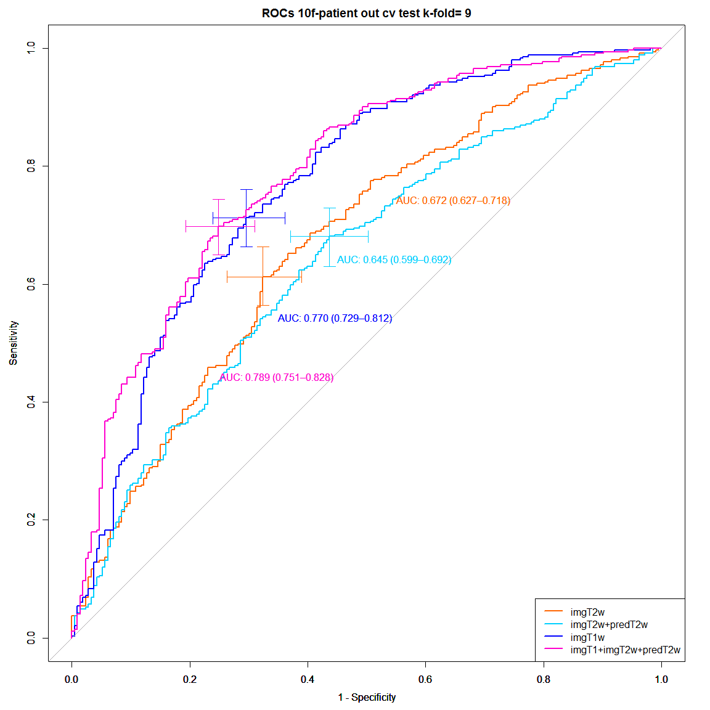 

```
## Area under the curve: 0.7894
## 95% CI (2000 stratified bootstrap replicates):
##  thresholds sp.low sp.median sp.high se.low se.median se.high
##   0.4446372 0.6901    0.7512  0.8075 0.6496     0.698  0.7436
##    massB    massM nonmassB nonmassM 
##      220      149      131       64 
##    massB    massM nonmassB nonmassM 
##       22       17       11       13 
##    massB    massM nonmassB nonmassM 
##      220      149      131       64 
##    massB    massM nonmassB nonmassM 
##       22       17       11       13 
##    massB    massM nonmassB nonmassM 
##      220      149      131       64 
##    massB    massM nonmassB nonmassM 
##       22       17       11       13 
## -0.05025126 0.05 
## Selected features for group: MeanDecreaseGini imgT2 
## =========NULL
##  [1] "ave_T210"                     "T2texture_energy_nondir"      "T2max_F_r_i"                  "ave_T27"                     
##  [5] "find_t2_signal_int"           "LMSIR"                        "ave_T21"                      "ave_T213"                    
##  [9] "T2kurt_F_r_i"                 "T2texture_diffentropy_nondir" "ave_T215"                     "T2grad_margin_var"           
## [13] "T2var_F_r_i"                  "ave_T25"                      "ave_T24"                      "ave_T218"                    
## [17] "T2grad_margin"                "T2texture_correlation_nondir" "ave_T22"                      "ave_T29"                     
## [21] "ave_T20"                      "T2texture_sumvariance_nondir" "ave_T219"                     "ave_T212"                    
## [25] "T2RGH_mean"                   "ave_T216"                     "T2skew_F_r_i"                 "T2_lesionSI"                 
## [29] "ave_T28"                      "T2_lesionSIstd"              
## 0.06578947 0.05 
## 0.0657277 0.05 
## -0.05527638 0.05 
## Selected features for group: MeanDecreaseGini allT2 
## =========NULL
##  [1] "T2RGH_var"                          "ave_T210"                           "T2texture_correlation_nondir"      
##  [4] "T2kurt_F_r_i"                       "T2texture_entropy_nondir"           "find_t2_signal_int"                
##  [7] "LMSIR"                              "T2texture_inversediffmoment_nondir" "T2grad_margin_var"                 
## [10] "LMSIR_predicted"                    "ave_T27"                            "ave_T25"                           
## [13] "ave_T212"                           "T2texture_sumaverage_nondir"        "T2texture_contrast_nondir"         
## [16] "T2skew_F_r_i"                       "ave_T216"                           "ave_T219"                          
## [19] "ave_T211"                           "T2_lesionSI"                        "ave_T22"                           
## [22] "ave_T217"                           "ave_T218"                           "T2RGH_mean"                        
## [25] "ave_T214"                           "ave_T215"                           "ave_T26"                           
## [28] "ave_T20"                            "T2max_F_r_i"                        "T2min_F_r_i"                       
## [31] "ave_T29"                            "ave_T24"                            "T2var_F_r_i"                       
## [34] "ave_T213"                           "ave_T21"                            "T2texture_diffvariance_nondir"     
## [37] "ave_T23"                            "T2texture_sumentropy_nondir"        "T2texture_diffentropy_nondir"      
## [40] "T2_lesionSIstd"                    
## -0.06493506 0.05 
## Selected features for group: MeanDecreaseGini imgT1 
## =========NULL
##  [1] "irregularity"                           "SER_inside"                             "texture_contrast_nondir_post1"         
##  [4] "texture_inversediffmoment_nondir_post2" "SER_countor"                            "dce2SE8"                               
##  [7] "texture_correlation_nondir_post4"       "max_RGH_mean"                           "texture_inversediffmoment_nondir_post1"
## [10] "texture_contrast_nondir_post3"          "Tpeak_inside"                           "iAUC1_countor"                         
## [13] "edge_sharp_std"                         "dce3SE4"                                "dce3SE17"                              
## [16] "V7"                                     "lateSE19"                               "beta_countor"                          
## [19] "V9"                                     "dce2SE5"                                "texture_sumentropy_nondir_post2"       
## [22] "V6"                                     "V10"                                    "dce3SE15"                              
## [25] "Tpeak_countor"                          "A_inside"                              
## 0.03225806 0.05 
## Selected features for group: MeanDecreaseGini all 
## =========NULL
##  [1] "texture_variance_nondir_post1"    "texture_energy_nondir_post4"      "V10"                             
##  [4] "V5"                               "iiiMax_Margin_Gradient"           "T2RGH_mean"                      
##  [7] "maxCr_countor"                    "var_F_r_i"                        "texture_correlation_nondir_post2"
## [10] "texture_sumaverage_nondir_post2"  "texture_sumentropy_nondir_post3"  "texture_sumaverage_nondir_post4" 
## [13] "ave_T210"                         "T2texture_sumvariance_nondir"     "T2grad_margin_var"               
## [16] "dce3SE11"                         "T2texture_sumaverage_nondir"      "texture_entropy_nondir_post2"    
## [19] "dce2SE17"                         "kurt_F_r_i"                       "washoutRate_countor"             
## [22] "V3"                               "find_t2_signal_int"               "max_RGH_var"                     
## [25] "lateSE8"                          "lateSE17"                         "earlySE3"                        
## [28] "V14"                              "ave_T217"                         "ave_T25"                         
## [31] "k_Max_Margin_Grad"                "V16"                              "A_inside"                        
##     lesion_id cad_pt_no_txt exam_a_number_txt BIRADS lesion_label              lesion_diagnosis      find_t2_signal_int
## 2           2          0016           6920252      4        massB       FLORID DUCT HYPERPLASIA   Slightly hyperintense
## 19         19          0129           5326737      4        massB          BENIGN BREAST TISSUE            Hyperintense
## 25         25          0133           7072006      4        massB                   FIBROCYSTIC Hypointense or not seen
## 29         29          0168           5240535      4        massB                   FIBROCYSTIC                    None
## 37         37          0186           6869828      4     nonmassM                  InsituDuctal                    None
## 53         53          0212           4734525      4        massB                  FIBROADENOMA            Hyperintense
## 56         56          0229           6831376      5     nonmassB                   FIBROCYSTIC                    None
## 59         59          0246           7485590      4        massB          BENIGN BREAST TISSUE            Hyperintense
## 140       140          0684           5266209      4     nonmassM                  InsituDuctal                    None
## 141       141          0685           5456684      4        massB                   FIBROCYSTIC                    None
## 151       151          0692           5199366      4        massB                  FIBROADENOMA Hypointense or not seen
## 160       160          0713           5150291      5        massM                InvasiveDuctal                    None
## 161       161          0713           5150291      5     nonmassM                InvasiveDuctal                    None
## 197       197          0757           4779344      4     nonmassB   ATYPICAL DUCTAL HYPERPLASIA            Hyperintense
## 201       201          0765           5094113      4     nonmassB   ATYPICAL DUCTAL HYPERPLASIA                    None
## 220       220          0791           5365218      5        massM               InvasiveLobular                    None
## 221       221          0791           5365218      5     nonmassM               InvasiveLobular                    None
## 231       231          0805           5059167      4     nonmassB                   FIBROCYSTIC                    None
## 238       238          0814           4704240      5        massM                InvasiveDuctal                    None
## 239       239          0814           6667547      4     nonmassB   ATYPICAL DUCTAL HYPERPLASIA                    None
## 259       259          0846           4800867      5        massM          MetaplasticCarcinoma Hypointense or not seen
## 264       264          0851           4593282      4        massB                 InsituLobular            Hyperintense
## 265       265          0851           4593282      4        massM                InvasiveDuctal            Hyperintense
## 310       310          0920           7095635      4        massB                  FIBROADENOMA Hypointense or not seen
## 312       312          0924           7532614      4        massB                      ADENOSIS            Hyperintense
## 313       313          0924           7532614      4        massB                      ADENOSIS Hypointense or not seen
## 314       314          0934           5314924      4     nonmassB                  FIBROADENOMA                    None
## 330       330          0978           4851428      4     nonmassB                   FIBROCYSTIC                    None
## 336       336          0999           6925971      3        massB                  FIBROADENOMA   Slightly hyperintense
## 337       337          1003           6682777      4     nonmassM                InvasiveDuctal   Slightly hyperintense
## 344       344          1018           4773924      4     nonmassB          BENIGN BREAST TISSUE Hypointense or not seen
## 392       392          2049           5458850      5     nonmassM                InvasiveDuctal Hypointense or not seen
## 393       393          2049           5458850      5        massM                InvasiveDuctal Hypointense or not seen
## 405       405          2073           4745825      5        massM InvasiveDuctal micropapillary                    None
## 406       406          2073           4745825      5     nonmassM               InvasiveLobular                    None
## 410       410          2079           4591198      3        massB        benign lymphoid tissue                    None
## 440       440          3053           7041483      6        massB         COLUMNAR CELL CHANGES Hypointense or not seen
## 441       441          3053           7449310      5     nonmassM                InvasiveDuctal                    None
## 450       450          3063           7053508      6     nonmassM       LYMPHOVASCULAR INVASION                    None
## 464       464          3080           7033654      6     nonmassM                  InsituDuctal Hypointense or not seen
## 467       467          3082           5355166      6        massB                  FIBROADENOMA                    None
## 468       468          3082           5355166      6        massB                   FIBROCYSTIC                    None
## 469       469          3082           7080675      4     nonmassB                   FIBROCYSTIC                    None
## 512       512          6008           4644038      6        massM                InvasiveDuctal Hypointense or not seen
## 520       520          6020         ACC109177      6        massM                InvasiveDuctal Hypointense or not seen
## 522       522          6022           5046558      4     nonmassB                  FIBROADENOMA                    None
## 523       523          6022           5046558      6        massM                InvasiveDuctal                    None
## 526       526          6024           5008021      5        massM                InvasiveDuctal                    None
## 527       527          6024           5008021      5     nonmassM                InvasiveDuctal                    None
## 528       528          6025           5111910      6        massM                InvasiveDuctal            Hyperintense
## 529       529          6025           5111910      6        massM                InvasiveDuctal   Slightly hyperintense
## 530       530          6025           5111910      6     nonmassM                InvasiveDuctal                    None
## 568       568          6050           5225817      4     nonmassB                      FIBROSIS Hypointense or not seen
## 594       594          7011           6918051      4        massB          BENIGN BREAST TISSUE Hypointense or not seen
## 595       595          7018           6803089      4        massM                  InsituDuctal                    None
## 596       596          7018           7138226      2        massM                  InsituDuctal                    None
## 599       599          7030           7538617      4        massB          BENIGN BREAST TISSUE   Slightly hyperintense
## 600       600          7030           7538617      4        massB          BENIGN BREAST TISSUE Hypointense or not seen
## 608       608          7077           5077480      5        massM                  InsituDuctal                    None
## 609       609          7077           5077480      5        massM                  InsituDuctal                    None
## 610       610          7077           5077480      5     nonmassM                  InsituDuctal                    None
## 629       629          7189           7068978      4        massB                  FIBROADENOMA            Hyperintense
## 630       630          7189           7068978      4        massB          BENIGN BREAST TISSUE            Hyperintense
## 
## ============ bestune_imgT2 	 max.depth  1 	 #Trees  350 
## ntrees:  50 minsplit:  3 cp:  0.01 
##   ntrees minsplit   cp acuTrain rocTrain   acuTest   rocTest
## 1     50        3 0.01        1        1 0.5079365 0.5171717
## ntrees:  100 minsplit:  3 cp:  0.01 
##   ntrees minsplit   cp acuTrain rocTrain   acuTest   rocTest
## 2    100        3 0.01        1        1 0.4603175 0.5010101
## ntrees:  250 minsplit:  3 cp:  0.01 
##   ntrees minsplit   cp acuTrain rocTrain   acuTest rocTest
## 3    250        3 0.01        1        1 0.5714286     0.6
## ntrees:  350 minsplit:  3 cp:  0.01 
##   ntrees minsplit   cp acuTrain rocTrain   acuTest   rocTest
## 4    350        3 0.01        1        1 0.5238095 0.5434343
## ntrees:  50 minsplit:  1 cp:  0.01 
##   ntrees minsplit   cp acuTrain rocTrain   acuTest   rocTest
## 5     50        1 0.01        1        1 0.4761905 0.4949495
## ntrees:  100 minsplit:  1 cp:  0.01 
##   ntrees minsplit   cp acuTrain rocTrain   acuTest   rocTest
## 6    100        1 0.01        1        1 0.5555556 0.5292929
## ntrees:  250 minsplit:  1 cp:  0.01 
##   ntrees minsplit   cp acuTrain rocTrain   acuTest   rocTest
## 7    250        1 0.01        1        1 0.5079365 0.5424242
## ntrees:  350 minsplit:  1 cp:  0.01 
##   ntrees minsplit   cp acuTrain rocTrain   acuTest   rocTest
## 8    350        1 0.01        1        1 0.5396825 0.5414141
## ntrees:  50 minsplit:  3 cp:  -1 
##   ntrees minsplit cp acuTrain rocTrain   acuTest   rocTest
## 9     50        3 -1        1        1 0.5873016 0.6393939
## ntrees:  100 minsplit:  3 cp:  -1 
##    ntrees minsplit cp acuTrain rocTrain   acuTest   rocTest
## 10    100        3 -1        1        1 0.5714286 0.6565657
## ntrees:  250 minsplit:  3 cp:  -1 
##    ntrees minsplit cp acuTrain rocTrain   acuTest   rocTest
## 11    250        3 -1        1        1 0.4920635 0.5929293
## ntrees:  350 minsplit:  3 cp:  -1 
##    ntrees minsplit cp acuTrain rocTrain   acuTest   rocTest
## 12    350        3 -1        1        1 0.5079365 0.5626263
## ntrees:  50 minsplit:  1 cp:  -1 
##    ntrees minsplit cp acuTrain rocTrain   acuTest   rocTest
## 13     50        1 -1        1        1 0.5238095 0.5383838
## ntrees:  100 minsplit:  1 cp:  -1 
##    ntrees minsplit cp acuTrain rocTrain   acuTest   rocTest
## 14    100        1 -1        1        1 0.5238095 0.5434343
## ntrees:  250 minsplit:  1 cp:  -1 
##    ntrees minsplit cp acuTrain rocTrain   acuTest   rocTest
## 15    250        1 -1        1        1 0.5238095 0.5747475
## ntrees:  350 minsplit:  1 cp:  -1 
##    ntrees minsplit cp acuTrain rocTrain   acuTest   rocTest
## 16    350        1 -1        1        1 0.5396825 0.5616162
##    ntrees minsplit    cp acuTrain rocTrain   acuTest   rocTest
## 1      50        3  0.01        1        1 0.5079365 0.5171717
## 2     100        3  0.01        1        1 0.4603175 0.5010101
## 3     250        3  0.01        1        1 0.5714286 0.6000000
## 4     350        3  0.01        1        1 0.5238095 0.5434343
## 5      50        1  0.01        1        1 0.4761905 0.4949495
## 6     100        1  0.01        1        1 0.5555556 0.5292929
## 7     250        1  0.01        1        1 0.5079365 0.5424242
## 8     350        1  0.01        1        1 0.5396825 0.5414141
## 9      50        3 -1.00        1        1 0.5873016 0.6393939
## 10    100        3 -1.00        1        1 0.5714286 0.6565657
## 11    250        3 -1.00        1        1 0.4920635 0.5929293
## 12    350        3 -1.00        1        1 0.5079365 0.5626263
## 13     50        1 -1.00        1        1 0.5238095 0.5383838
## 14    100        1 -1.00        1        1 0.5238095 0.5434343
## 15    250        1 -1.00        1        1 0.5238095 0.5747475
## 16    350        1 -1.00        1        1 0.5396825 0.5616162
##    ntrees minsplit cp acuTrain rocTrain   acuTest   rocTest
## 10    100        3 -1        1        1 0.5714286 0.6565657
## 
## ============ bestune_allT2 	 max.depth  1 	 #Trees  250 
## ntrees:  50 minsplit:  3 cp:  0.01 
##   ntrees minsplit   cp acuTrain rocTrain   acuTest   rocTest
## 1     50        3 0.01        1        1 0.5396825 0.5747475
## ntrees:  100 minsplit:  3 cp:  0.01 
##   ntrees minsplit   cp acuTrain rocTrain   acuTest   rocTest
## 2    100        3 0.01        1        1 0.5714286 0.5909091
## ntrees:  250 minsplit:  3 cp:  0.01 
##   ntrees minsplit   cp acuTrain rocTrain   acuTest   rocTest
## 3    250        3 0.01        1        1 0.5555556 0.5434343
## ntrees:  350 minsplit:  3 cp:  0.01 
##   ntrees minsplit   cp acuTrain rocTrain   acuTest   rocTest
## 4    350        3 0.01        1        1 0.5873016 0.5888889
## ntrees:  50 minsplit:  1 cp:  0.01 
##   ntrees minsplit   cp acuTrain rocTrain   acuTest   rocTest
## 5     50        1 0.01        1        1 0.6190476 0.5979798
## ntrees:  100 minsplit:  1 cp:  0.01 
##   ntrees minsplit   cp acuTrain rocTrain   acuTest   rocTest
## 6    100        1 0.01        1        1 0.5873016 0.6161616
## ntrees:  250 minsplit:  1 cp:  0.01 
##   ntrees minsplit   cp acuTrain rocTrain   acuTest   rocTest
## 7    250        1 0.01        1        1 0.5238095 0.5686869
## ntrees:  350 minsplit:  1 cp:  0.01 
##   ntrees minsplit   cp acuTrain rocTrain   acuTest  rocTest
## 8    350        1 0.01        1        1 0.6349206 0.630303
## ntrees:  50 minsplit:  3 cp:  -1 
##   ntrees minsplit cp acuTrain rocTrain   acuTest   rocTest
## 9     50        3 -1        1        1 0.5714286 0.5878788
## ntrees:  100 minsplit:  3 cp:  -1 
##    ntrees minsplit cp acuTrain rocTrain   acuTest  rocTest
## 10    100        3 -1        1        1 0.5396825 0.620202
## ntrees:  250 minsplit:  3 cp:  -1 
##    ntrees minsplit cp acuTrain rocTrain   acuTest   rocTest
## 11    250        3 -1        1        1 0.5396825 0.5737374
## ntrees:  350 minsplit:  3 cp:  -1 
##    ntrees minsplit cp acuTrain rocTrain   acuTest   rocTest
## 12    350        3 -1        1        1 0.5555556 0.5858586
## ntrees:  50 minsplit:  1 cp:  -1 
##    ntrees minsplit cp acuTrain rocTrain   acuTest   rocTest
## 13     50        1 -1        1        1 0.4444444 0.4858586
## ntrees:  100 minsplit:  1 cp:  -1 
##    ntrees minsplit cp acuTrain rocTrain   acuTest   rocTest
## 14    100        1 -1        1        1 0.5396825 0.6070707
## ntrees:  250 minsplit:  1 cp:  -1 
##    ntrees minsplit cp acuTrain rocTrain   acuTest   rocTest
## 15    250        1 -1        1        1 0.5396825 0.5868687
## ntrees:  350 minsplit:  1 cp:  -1 
##    ntrees minsplit cp acuTrain rocTrain   acuTest   rocTest
## 16    350        1 -1        1        1 0.6031746 0.5848485
##    ntrees minsplit    cp acuTrain rocTrain   acuTest   rocTest
## 1      50        3  0.01        1        1 0.5396825 0.5747475
## 2     100        3  0.01        1        1 0.5714286 0.5909091
## 3     250        3  0.01        1        1 0.5555556 0.5434343
## 4     350        3  0.01        1        1 0.5873016 0.5888889
## 5      50        1  0.01        1        1 0.6190476 0.5979798
## 6     100        1  0.01        1        1 0.5873016 0.6161616
## 7     250        1  0.01        1        1 0.5238095 0.5686869
## 8     350        1  0.01        1        1 0.6349206 0.6303030
## 9      50        3 -1.00        1        1 0.5714286 0.5878788
## 10    100        3 -1.00        1        1 0.5396825 0.6202020
## 11    250        3 -1.00        1        1 0.5396825 0.5737374
## 12    350        3 -1.00        1        1 0.5555556 0.5858586
## 13     50        1 -1.00        1        1 0.4444444 0.4858586
## 14    100        1 -1.00        1        1 0.5396825 0.6070707
## 15    250        1 -1.00        1        1 0.5396825 0.5868687
## 16    350        1 -1.00        1        1 0.6031746 0.5848485
##   ntrees minsplit   cp acuTrain rocTrain   acuTest  rocTest
## 8    350        1 0.01        1        1 0.6349206 0.630303
## 
## ============ bestune_imgT1 	 max.depth  1 	 #Trees  250 
## ntrees:  50 minsplit:  3 cp:  0.01 
##   ntrees minsplit   cp acuTrain rocTrain   acuTest   rocTest
## 1     50        3 0.01        1        1 0.7301587 0.8232323
## ntrees:  100 minsplit:  3 cp:  0.01 
##   ntrees minsplit   cp acuTrain rocTrain   acuTest   rocTest
## 2    100        3 0.01        1        1 0.7777778 0.8525253
## ntrees:  250 minsplit:  3 cp:  0.01 
##   ntrees minsplit   cp acuTrain rocTrain   acuTest   rocTest
## 3    250        3 0.01        1        1 0.8253968 0.8787879
## ntrees:  350 minsplit:  3 cp:  0.01 
##   ntrees minsplit   cp acuTrain rocTrain   acuTest   rocTest
## 4    350        3 0.01        1        1 0.7936508 0.8656566
## ntrees:  50 minsplit:  1 cp:  0.01 
##   ntrees minsplit   cp acuTrain rocTrain   acuTest   rocTest
## 5     50        1 0.01        1        1 0.7460317 0.8505051
## ntrees:  100 minsplit:  1 cp:  0.01 
##   ntrees minsplit   cp acuTrain rocTrain   acuTest   rocTest
## 6    100        1 0.01        1        1 0.7936508 0.8646465
## ntrees:  250 minsplit:  1 cp:  0.01 
##   ntrees minsplit   cp acuTrain rocTrain   acuTest   rocTest
## 7    250        1 0.01        1        1 0.7777778 0.8585859
## ntrees:  350 minsplit:  1 cp:  0.01 
##   ntrees minsplit   cp acuTrain rocTrain   acuTest   rocTest
## 8    350        1 0.01        1        1 0.7936508 0.8848485
## ntrees:  50 minsplit:  3 cp:  -1 
##   ntrees minsplit cp acuTrain rocTrain   acuTest   rocTest
## 9     50        3 -1        1        1 0.7619048 0.8565657
## ntrees:  100 minsplit:  3 cp:  -1 
##    ntrees minsplit cp acuTrain rocTrain   acuTest   rocTest
## 10    100        3 -1        1        1 0.7619048 0.8656566
## ntrees:  250 minsplit:  3 cp:  -1 
##    ntrees minsplit cp acuTrain rocTrain   acuTest   rocTest
## 11    250        3 -1        1        1 0.7936508 0.8646465
## ntrees:  350 minsplit:  3 cp:  -1 
##    ntrees minsplit cp acuTrain rocTrain   acuTest   rocTest
## 12    350        3 -1        1        1 0.8095238 0.8767677
## ntrees:  50 minsplit:  1 cp:  -1 
##    ntrees minsplit cp acuTrain rocTrain   acuTest   rocTest
## 13     50        1 -1        1        1 0.7936508 0.8585859
## ntrees:  100 minsplit:  1 cp:  -1 
##    ntrees minsplit cp acuTrain rocTrain   acuTest   rocTest
## 14    100        1 -1        1        1 0.7777778 0.8707071
## ntrees:  250 minsplit:  1 cp:  -1 
##    ntrees minsplit cp acuTrain rocTrain   acuTest   rocTest
## 15    250        1 -1        1        1 0.8253968 0.8868687
## ntrees:  350 minsplit:  1 cp:  -1 
##    ntrees minsplit cp acuTrain rocTrain   acuTest   rocTest
## 16    350        1 -1        1        1 0.8095238 0.8828283
##    ntrees minsplit    cp acuTrain rocTrain   acuTest   rocTest
## 1      50        3  0.01        1        1 0.7301587 0.8232323
## 2     100        3  0.01        1        1 0.7777778 0.8525253
## 3     250        3  0.01        1        1 0.8253968 0.8787879
## 4     350        3  0.01        1        1 0.7936508 0.8656566
## 5      50        1  0.01        1        1 0.7460317 0.8505051
## 6     100        1  0.01        1        1 0.7936508 0.8646465
## 7     250        1  0.01        1        1 0.7777778 0.8585859
## 8     350        1  0.01        1        1 0.7936508 0.8848485
## 9      50        3 -1.00        1        1 0.7619048 0.8565657
## 10    100        3 -1.00        1        1 0.7619048 0.8656566
## 11    250        3 -1.00        1        1 0.7936508 0.8646465
## 12    350        3 -1.00        1        1 0.8095238 0.8767677
## 13     50        1 -1.00        1        1 0.7936508 0.8585859
## 14    100        1 -1.00        1        1 0.7777778 0.8707071
## 15    250        1 -1.00        1        1 0.8253968 0.8868687
## 16    350        1 -1.00        1        1 0.8095238 0.8828283
##    ntrees minsplit cp acuTrain rocTrain   acuTest   rocTest
## 15    250        1 -1        1        1 0.8253968 0.8868687
## 
## ============ bestune_all 	 max.depth  1 	 #Trees  200 
## ntrees:  50 minsplit:  3 cp:  0.01 
##   ntrees minsplit   cp acuTrain rocTrain   acuTest   rocTest
## 1     50        3 0.01        1        1 0.7301587 0.7757576
## ntrees:  100 minsplit:  3 cp:  0.01 
##   ntrees minsplit   cp acuTrain rocTrain   acuTest   rocTest
## 2    100        3 0.01        1        1 0.6984127 0.8222222
## ntrees:  250 minsplit:  3 cp:  0.01 
##   ntrees minsplit   cp acuTrain rocTrain   acuTest   rocTest
## 3    250        3 0.01        1        1 0.7460317 0.8767677
## ntrees:  350 minsplit:  3 cp:  0.01 
##   ntrees minsplit   cp acuTrain rocTrain   acuTest   rocTest
## 4    350        3 0.01        1        1 0.7301587 0.8868687
## ntrees:  50 minsplit:  1 cp:  0.01 
##   ntrees minsplit   cp acuTrain rocTrain   acuTest   rocTest
## 5     50        1 0.01        1        1 0.7460317 0.8414141
## ntrees:  100 minsplit:  1 cp:  0.01 
##   ntrees minsplit   cp acuTrain rocTrain   acuTest   rocTest
## 6    100        1 0.01        1        1 0.8412698 0.8868687
## ntrees:  250 minsplit:  1 cp:  0.01 
##   ntrees minsplit   cp acuTrain rocTrain   acuTest   rocTest
## 7    250        1 0.01        1        1 0.7619048 0.8343434
## ntrees:  350 minsplit:  1 cp:  0.01 
##   ntrees minsplit   cp acuTrain rocTrain   acuTest   rocTest
## 8    350        1 0.01        1        1 0.7936508 0.8414141
## ntrees:  50 minsplit:  3 cp:  -1 
##   ntrees minsplit cp acuTrain rocTrain   acuTest   rocTest
## 9     50        3 -1        1        1 0.6984127 0.7969697
## ntrees:  100 minsplit:  3 cp:  -1 
##    ntrees minsplit cp acuTrain rocTrain   acuTest   rocTest
## 10    100        3 -1        1        1 0.7142857 0.8131313
## ntrees:  250 minsplit:  3 cp:  -1 
##    ntrees minsplit cp acuTrain rocTrain   acuTest   rocTest
## 11    250        3 -1        1        1 0.7619048 0.8626263
## ntrees:  350 minsplit:  3 cp:  -1 
##    ntrees minsplit cp acuTrain rocTrain   acuTest   rocTest
## 12    350        3 -1        1        1 0.7460317 0.8262626
## ntrees:  50 minsplit:  1 cp:  -1 
##    ntrees minsplit cp acuTrain rocTrain   acuTest   rocTest
## 13     50        1 -1        1        1 0.7301587 0.8151515
## ntrees:  100 minsplit:  1 cp:  -1 
##    ntrees minsplit cp acuTrain rocTrain   acuTest rocTest
## 14    100        1 -1        1        1 0.7142857     0.8
## ntrees:  250 minsplit:  1 cp:  -1 
##    ntrees minsplit cp acuTrain rocTrain   acuTest   rocTest
## 15    250        1 -1        1        1 0.7619048 0.8434343
## ntrees:  350 minsplit:  1 cp:  -1 
##    ntrees minsplit cp acuTrain rocTrain   acuTest   rocTest
## 16    350        1 -1        1        1 0.7619048 0.8161616
##    ntrees minsplit    cp acuTrain rocTrain   acuTest   rocTest
## 1      50        3  0.01        1        1 0.7301587 0.7757576
## 2     100        3  0.01        1        1 0.6984127 0.8222222
## 3     250        3  0.01        1        1 0.7460317 0.8767677
## 4     350        3  0.01        1        1 0.7301587 0.8868687
## 5      50        1  0.01        1        1 0.7460317 0.8414141
## 6     100        1  0.01        1        1 0.8412698 0.8868687
## 7     250        1  0.01        1        1 0.7619048 0.8343434
## 8     350        1  0.01        1        1 0.7936508 0.8414141
## 9      50        3 -1.00        1        1 0.6984127 0.7969697
## 10    100        3 -1.00        1        1 0.7142857 0.8131313
## 11    250        3 -1.00        1        1 0.7619048 0.8626263
## 12    350        3 -1.00        1        1 0.7460317 0.8262626
## 13     50        1 -1.00        1        1 0.7301587 0.8151515
## 14    100        1 -1.00        1        1 0.7142857 0.8000000
## 15    250        1 -1.00        1        1 0.7619048 0.8434343
## 16    350        1 -1.00        1        1 0.7619048 0.8161616
##   ntrees minsplit   cp acuTrain rocTrain   acuTest   rocTest
## 4    350        3 0.01        1        1 0.7301587 0.8868687
## 6    100        1 0.01        1        1 0.8412698 0.8868687
## 
## Call:
## roc.default(response = perf_imgT2$obs, predictor = perf_imgT2$C)
## 
## Data: perf_imgT2$C in 243 controls (perf_imgT2$obs C) > 384 cases (perf_imgT2$obs NC).
## Area under the curve: 0.6678
## 
## Call:
## roc.default(response = perf_allT2$obs, predictor = perf_allT2$C)
## 
## Data: perf_allT2$C in 243 controls (perf_allT2$obs C) > 384 cases (perf_allT2$obs NC).
## Area under the curve: 0.6458
## 
## Call:
## roc.default(response = perf_imgT1$obs, predictor = perf_imgT1$C)
## 
## Data: perf_imgT1$C in 243 controls (perf_imgT1$obs C) > 384 cases (perf_imgT1$obs NC).
## Area under the curve: 0.784
## 
## Call:
## roc.default(response = perf_all$obs, predictor = perf_all$C)
## 
## Data: perf_all$C in 243 controls (perf_all$obs C) > 384 cases (perf_all$obs NC).
## Area under the curve: 0.7983
```

```
## Area under the curve: 0.6678
## 95% CI (2000 stratified bootstrap replicates):
##  thresholds sp.low sp.median sp.high se.low se.median se.high
##   0.4525881 0.6048    0.6626  0.7202 0.5651    0.6146  0.6615
```

```
## Area under the curve: 0.6458
## 95% CI (2000 stratified bootstrap replicates):
##  thresholds sp.low sp.median sp.high se.low se.median se.high
##   0.4661532 0.5144    0.5761  0.6379 0.6172    0.6641  0.7083
```

```
## Area under the curve: 0.784
## 95% CI (2000 stratified bootstrap replicates):
##  thresholds sp.low sp.median sp.high se.low se.median se.high
##   0.4456082 0.6749    0.7325   0.786 0.6615    0.7057    0.75
```

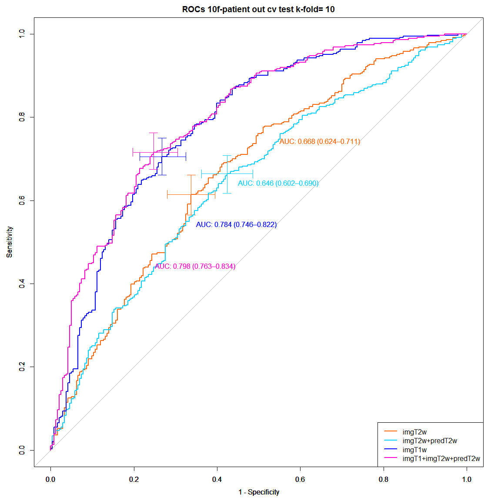 

```
## Area under the curve: 0.7983
## 95% CI (2000 stratified bootstrap replicates):
##  thresholds sp.low sp.median sp.high se.low se.median se.high
##   0.4493277 0.6955    0.7531  0.8025 0.6745    0.7161   0.763
```

plot results
=================================


```r
# plot features
## group with all of the features spaces combined, most contributing T2w feature
## imgT2featsel ###########
# pick frequency of 75% or higher as very common feature
dfimgT2 = data.frame(table(imgT2featsel$selfeat))
dfimgT2$high = (dfimgT2$Freq>=0.75*max(imgT2featsel$lop))*1
print(dfimgT2[dfimgT2$high==1, ])
```

```
##                                  Var1 Freq high
## 1                             ave_T20    7    1
## 2                             ave_T21    8    1
## 3                            ave_T210   10    1
## 4                            ave_T211    9    1
## 5                            ave_T212    8    1
## 6                            ave_T213    9    1
## 7                            ave_T214    6    1
## 8                            ave_T215    8    1
## 9                            ave_T216    7    1
## 10                           ave_T217    8    1
## 11                           ave_T218   10    1
## 12                           ave_T219    8    1
## 13                            ave_T22    9    1
## 14                            ave_T23    8    1
## 15                            ave_T24    7    1
## 16                            ave_T25    9    1
## 17                            ave_T26    6    1
## 18                            ave_T27    9    1
## 19                            ave_T28    8    1
## 20                            ave_T29    8    1
## 21                 find_t2_signal_int   10    1
## 22                              LMSIR    9    1
## 23                        T2_lesionSI   10    1
## 24                     T2_lesionSIstd    6    1
## 25                      T2grad_margin    8    1
## 26                  T2grad_margin_var    6    1
## 27                       T2kurt_F_r_i    9    1
## 28                        T2max_F_r_i    8    1
## 29                       T2mean_F_r_i    5    1
## 30                        T2min_F_r_i    6    1
## 31                         T2RGH_mean    8    1
## 32                          T2RGH_var    4    1
## 33                       T2skew_F_r_i    8    1
## 34          T2texture_contrast_nondir    2    1
## 35       T2texture_correlation_nondir   10    1
## 36       T2texture_diffentropy_nondir    4    1
## 37      T2texture_diffvariance_nondir    5    1
## 38            T2texture_energy_nondir    5    1
## 39           T2texture_entropy_nondir    5    1
## 40 T2texture_inversediffmoment_nondir    7    1
## 41        T2texture_sumaverage_nondir    8    1
## 42        T2texture_sumentropy_nondir    5    1
## 43       T2texture_sumvariance_nondir    4    1
## 44          T2texture_variance_nondir    5    1
## 45                        T2var_F_r_i    7    1
```

```r
#qplot(factor(selfeat), data=imgT2featsel, geom="bar", fill=factor(high))
ggplot(dfimgT2, aes(x=Var1, y=Freq, fill=factor(high))) + 
  geom_bar(stat = "identity") + coord_flip() +
  ggtitle("imgT2featsel") +
  labs(y="featsel frequency", x=" ") +
  theme(plot.title = element_text(family = "Trebuchet MS", color="#666666", face="bold", size=22, hjust=0))+
  theme(axis.title = element_text(family = "Trebuchet MS", color="#666666", face="bold", size=16))
```

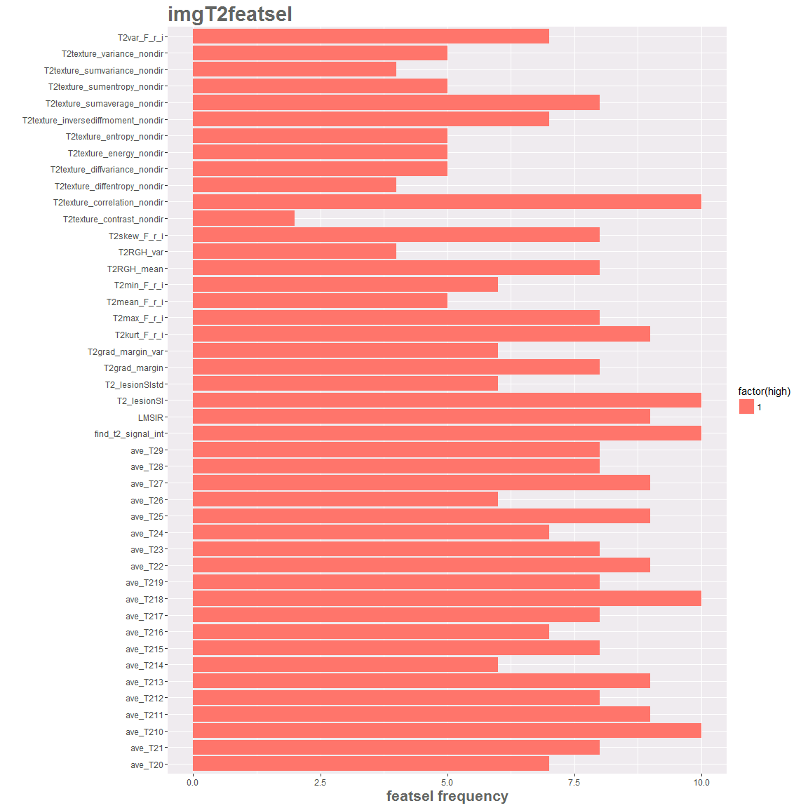 

```r
## allT2featsel ########### 
# pick frequency of 75% or higher as very common feature
dfallT2 = data.frame(table(allT2featsel$selfeat))
dfallT2$high = (dfallT2$Freq>=0.75*max(allT2featsel$lop))*1
print(dfallT2[dfallT2$high==1, ])
```

```
##                                  Var1 Freq high
## 1                             ave_T20    8    1
## 2                             ave_T21    8    1
## 3                            ave_T210   10    1
## 4                            ave_T211    7    1
## 5                            ave_T212    3    1
## 6                            ave_T213    8    1
## 7                            ave_T214    9    1
## 8                            ave_T215    8    1
## 9                            ave_T216    8    1
## 10                           ave_T217    8    1
## 11                           ave_T218    9    1
## 12                           ave_T219    8    1
## 13                            ave_T22    9    1
## 14                            ave_T23    6    1
## 15                            ave_T24    8    1
## 16                            ave_T25    9    1
## 17                            ave_T26    5    1
## 18                            ave_T27    7    1
## 19                            ave_T28    7    1
## 20                            ave_T29    9    1
## 21                 find_t2_signal_int   10    1
## 22                              LMSIR   10    1
## 23                    LMSIR_predicted    8    1
## 24                        T2_lesionSI    9    1
## 25                     T2_lesionSIstd    9    1
## 26                      T2grad_margin    6    1
## 27                  T2grad_margin_var    9    1
## 28                       T2kurt_F_r_i   10    1
## 29                        T2max_F_r_i    9    1
## 30                       T2mean_F_r_i    2    1
## 31                        T2min_F_r_i    7    1
## 32                         T2RGH_mean    7    1
## 33                          T2RGH_var    9    1
## 34                       T2skew_F_r_i    7    1
## 35          T2texture_contrast_nondir    5    1
## 36       T2texture_correlation_nondir   10    1
## 37       T2texture_diffentropy_nondir    5    1
## 38      T2texture_diffvariance_nondir    5    1
## 39            T2texture_energy_nondir    8    1
## 40           T2texture_entropy_nondir    5    1
## 41 T2texture_inversediffmoment_nondir    6    1
## 42        T2texture_sumaverage_nondir    7    1
## 43        T2texture_sumentropy_nondir    4    1
## 44       T2texture_sumvariance_nondir    5    1
## 45          T2texture_variance_nondir    2    1
## 46                        T2var_F_r_i    3    1
## 47                    T2wSI_predicted    4    1
```

```r
#qplot(factor(selfeat), data=allT2featsel, geom="bar", fill=factor(high))
ggplot(dfallT2, aes(x=Var1, y=Freq, fill=factor(high))) + 
  geom_bar(stat = "identity") + coord_flip() +
  ggtitle("allT2featsel") +
  labs(y="featsel frequency", x=" ") +
  theme(plot.title = element_text(family = "Trebuchet MS", color="#666666", face="bold", size=22, hjust=0))+
  theme(axis.title = element_text(family = "Trebuchet MS", color="#666666", face="bold", size=16))
```

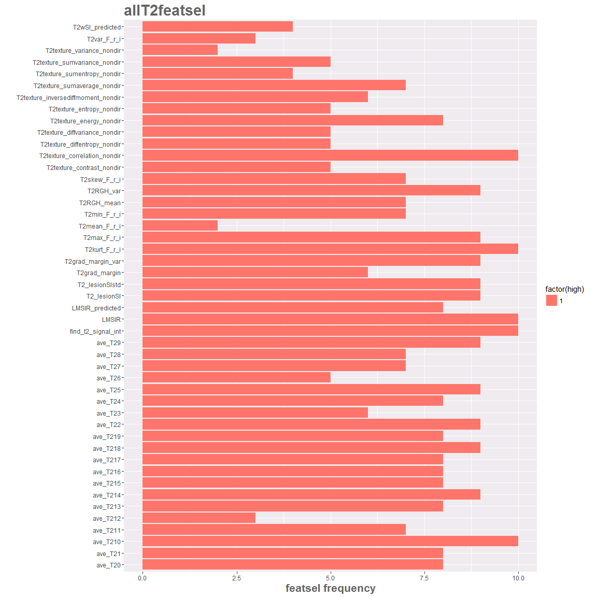 

```r
## imgT1featsel ########### 
# pick frequency of 75% or higher as very common feature
dfimgT1 = data.frame(table(imgT1featsel$selfeat))
dfimgT1$high = (dfimgT1$Freq>=0.75*max(imgT1featsel$lop))*1
print(dfimgT1[dfimgT1$high==1, ])
```

```
##                                       Var1 Freq high
## 1                                A_countor    2    1
## 2                                 A_inside   10    1
## 3                            alpha_countor    2    1
## 4                             alpha_inside    4    1
## 5                             beta_countor    1    1
## 6                              beta_inside    2    1
## 7                              circularity    4    1
## 8                                  dce2SE0    2    1
## 9                                  dce2SE1    1    1
## 10                                dce2SE11    4    1
## 11                                dce2SE12    1    1
## 12                                dce2SE13    2    1
## 13                                dce2SE14    1    1
## 14                                dce2SE15    2    1
## 15                                dce2SE16    3    1
## 16                                dce2SE17    1    1
## 17                                dce2SE18    2    1
## 18                                 dce2SE4    1    1
## 19                                 dce2SE5    1    1
## 20                                 dce2SE7    4    1
## 21                                 dce2SE8    2    1
## 22                                 dce2SE9    1    1
## 23                                 dce3SE0    1    1
## 24                                dce3SE10    3    1
## 25                                dce3SE11    2    1
## 26                                dce3SE13    2    1
## 27                                dce3SE15    2    1
## 28                                dce3SE16    1    1
## 29                                dce3SE17    3    1
## 30                                dce3SE18    1    1
## 31                                 dce3SE4    1    1
## 32                                 dce3SE5    2    1
## 33                                 dce3SE6    1    1
## 34                                 dce3SE7    1    1
## 35                                 dce3SE8    1    1
## 36                                earlySE0    1    1
## 37                                earlySE1    1    1
## 38                               earlySE10    2    1
## 39                               earlySE11    2    1
## 40                               earlySE12    3    1
## 41                               earlySE13    1    1
## 42                               earlySE15    1    1
## 43                               earlySE16    2    1
## 44                               earlySE17    1    1
## 45                               earlySE18    1    1
## 46                               earlySE19    2    1
## 47                                earlySE2    2    1
## 48                                earlySE3    1    1
## 49                                earlySE4    1    1
## 50                                earlySE5    1    1
## 51                                earlySE7    2    1
## 52                                earlySE8    1    1
## 53                                earlySE9    1    1
## 54                         edge_sharp_mean    1    1
## 55                          edge_sharp_std    6    1
## 56                           iAUC1_countor    2    1
## 57                  iiiMax_Margin_Gradient    1    1
## 58            iiMin_change_Variance_uptake    3    1
## 59                    iMax_Variance_uptake    2    1
## 60                            irregularity    3    1
## 61                              ivVariance    4    1
## 62                           Kpeak_countor    1    1
## 63                            Kpeak_inside    3    1
## 64                              kurt_F_r_i    5    1
## 65                                 lateSE0    2    1
## 66                                 lateSE1    3    1
## 67                                lateSE10    1    1
## 68                                lateSE11    2    1
## 69                                lateSE12    2    1
## 70                                lateSE13    1    1
## 71                                lateSE14    1    1
## 72                                lateSE16    2    1
## 73                                lateSE18    1    1
## 74                                lateSE19    3    1
## 75                                 lateSE2    2    1
## 76                                 lateSE3    1    1
## 77                                 lateSE4    2    1
## 78                                 lateSE5    2    1
## 79                                 lateSE6    1    1
## 80                                 lateSE7    2    1
## 81                                 lateSE8    1    1
## 82                                 lateSE9    2    1
## 83                               max_F_r_i    2    1
## 84                            max_RGH_mean    3    1
## 85                          max_RGH_mean_k    2    1
## 86                             max_RGH_var    1    1
## 87                           max_RGH_var_k    3    1
## 88                            maxCr_inside    2    1
## 89                           maxVr_countor    2    1
## 90                              mean_F_r_i    1    1
## 91                               min_F_r_i    3    1
## 92                          peakCr_countor    1    1
## 93                           peakCr_inside    1    1
## 94                           peakVr_inside    2    1
## 95                             SER_countor    3    1
## 96                              SER_inside    3    1
## 97                              skew_F_r_i    6    1
## 98                       Slope_ini_countor    2    1
## 99                        Slope_ini_inside    3    1
## 100          texture_contrast_nondir_post1    1    1
## 101          texture_contrast_nondir_post2    2    1
## 102          texture_contrast_nondir_post3    4    1
## 103       texture_correlation_nondir_post1    1    1
## 104       texture_correlation_nondir_post2    3    1
## 105       texture_correlation_nondir_post3    1    1
## 106       texture_correlation_nondir_post4    3    1
## 107       texture_diffentropy_nondir_post1    2    1
## 108       texture_diffentropy_nondir_post3    1    1
## 109       texture_diffentropy_nondir_post4    1    1
## 110      texture_diffvariance_nondir_post1    2    1
## 111      texture_diffvariance_nondir_post2    1    1
## 112      texture_diffvariance_nondir_post3    1    1
## 113      texture_diffvariance_nondir_post4    1    1
## 114            texture_energy_nondir_post2    1    1
## 115            texture_energy_nondir_post3    2    1
## 116            texture_energy_nondir_post4    3    1
## 117           texture_entropy_nondir_post1    1    1
## 118           texture_entropy_nondir_post4    1    1
## 119 texture_inversediffmoment_nondir_post1    1    1
## 120 texture_inversediffmoment_nondir_post2    3    1
## 121 texture_inversediffmoment_nondir_post3    3    1
## 122 texture_inversediffmoment_nondir_post4    5    1
## 123        texture_sumaverage_nondir_post1    1    1
## 124        texture_sumaverage_nondir_post2    2    1
## 125        texture_sumaverage_nondir_post3    3    1
## 126        texture_sumaverage_nondir_post4    2    1
## 127        texture_sumentropy_nondir_post2    1    1
## 128        texture_sumentropy_nondir_post4    1    1
## 129       texture_sumvariance_nondir_post1    5    1
## 130       texture_sumvariance_nondir_post2    1    1
## 131       texture_sumvariance_nondir_post3    1    1
## 132       texture_sumvariance_nondir_post4    4    1
## 133          texture_variance_nondir_post1    1    1
## 134          texture_variance_nondir_post2    1    1
## 135          texture_variance_nondir_post3    1    1
## 136          texture_variance_nondir_post4    1    1
## 137                          Tpeak_countor    5    1
## 138                           Tpeak_inside    1    1
## 139                     UptakeRate_countor    1    1
## 140                      UptakeRate_inside    2    1
## 141                                     V0    2    1
## 142                                     V1    1    1
## 143                                    V10    2    1
## 144                                    V11    1    1
## 145                                    V12    1    1
## 146                                    V13    2    1
## 147                                    V14    1    1
## 148                                    V15    1    1
## 149                                    V16    1    1
## 150                                    V18    3    1
## 151                                    V19    4    1
## 152                                     V2    7    1
## 153                                     V3    1    1
## 154                                     V4    3    1
## 155                                     V5    1    1
## 156                                     V6    3    1
## 157                                     V7    2    1
## 158                                     V8    3    1
## 159                                     V9    3    1
## 160                              var_F_r_i    4    1
## 161              Vr_decreasingRate_countor    2    1
## 162               Vr_decreasingRate_inside    3    1
## 163              Vr_increasingRate_countor    2    1
## 164               Vr_increasingRate_inside    2    1
## 165                      Vr_post_1_countor    2    1
## 166                       Vr_post_1_inside    2    1
## 167                     washoutRate_inside    1    1
```

```r
#qplot(factor(selfeat), data=imgT1featsel, geom="bar", fill=factor(high))
ggplot(dfimgT1, aes(x=Var1, y=Freq, fill=factor(high))) + 
  geom_bar(stat = "identity") + coord_flip() +
  ggtitle("imgT1featsel") +
  labs(y="featsel frequency", x=" ") +
  theme(plot.title = element_text(family = "Trebuchet MS", color="#666666", face="bold", size=22, hjust=0))+
  theme(axis.title = element_text(family = "Trebuchet MS", color="#666666", face="bold", size=16))
```

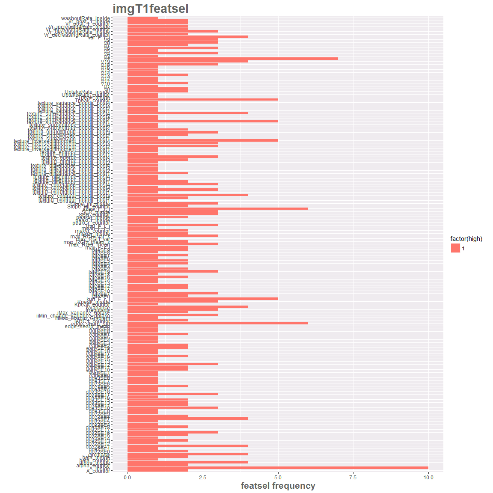 

```r
## allfeatsel ########### 
# pick frequency of 75% or higher as very common feature
dfall = data.frame(table(allfeatsel$selfeat))
dfall$high = (dfall$Freq>=0.5*max(allfeatsel$lop))*1
print(dfall[dfall$high==1, ])
```

```
##                                       Var1 Freq high
## 1                                A_countor    1    1
## 2                                 A_inside   10    1
## 3                            alpha_countor    2    1
## 4                                  ave_T20    2    1
## 5                                  ave_T21    1    1
## 6                                 ave_T210    3    1
## 7                                 ave_T212    5    1
## 8                                 ave_T213    1    1
## 9                                 ave_T214    1    1
## 10                                ave_T215    1    1
## 11                                ave_T216    1    1
## 12                                ave_T217    2    1
## 13                                ave_T218    3    1
## 14                                 ave_T22    1    1
## 15                                 ave_T25    1    1
## 16                                 ave_T26    3    1
## 17                                 ave_T27    1    1
## 18                                 ave_T28    1    1
## 19                                 ave_T29    1    1
## 20                             beta_inside    1    1
## 21                             circularity    1    1
## 22                                 dce2SE0    1    1
## 23                                dce2SE10    1    1
## 24                                dce2SE13    2    1
## 25                                dce2SE14    1    1
## 26                                dce2SE15    1    1
## 27                                dce2SE16    1    1
## 28                                dce2SE17    1    1
## 29                                dce2SE18    1    1
## 30                                dce2SE19    1    1
## 31                                 dce2SE2    1    1
## 32                                 dce2SE3    1    1
## 33                                 dce2SE5    2    1
## 34                                 dce2SE6    1    1
## 35                                 dce2SE7    2    1
## 36                                 dce2SE8    1    1
## 37                                 dce3SE0    3    1
## 38                                 dce3SE1    2    1
## 39                                dce3SE10    1    1
## 40                                dce3SE11    3    1
## 41                                dce3SE16    2    1
## 42                                dce3SE17    2    1
## 43                                 dce3SE2    1    1
## 44                                 dce3SE3    1    1
## 45                                 dce3SE4    1    1
## 46                                 dce3SE6    2    1
## 47                                 dce3SE7    2    1
## 48                                 dce3SE9    1    1
## 49                                earlySE0    1    1
## 50                               earlySE10    1    1
## 51                               earlySE11    1    1
## 52                               earlySE14    2    1
## 53                               earlySE17    1    1
## 54                               earlySE18    2    1
## 55                               earlySE19    4    1
## 56                                earlySE2    2    1
## 57                                earlySE3    3    1
## 58                                earlySE4    1    1
## 59                                earlySE5    1    1
## 60                                earlySE6    1    1
## 61                                earlySE8    1    1
## 62                                earlySE9    1    1
## 63                         edge_sharp_mean    3    1
## 64                          edge_sharp_std    3    1
## 65                      find_t2_signal_int    2    1
## 66                  iiiMax_Margin_Gradient    1    1
## 67            iiMin_change_Variance_uptake    3    1
## 68                    iMax_Variance_uptake    1    1
## 69                            irregularity    4    1
## 70                              ivVariance    4    1
## 71                       k_Max_Margin_Grad    3    1
## 72                           Kpeak_countor    3    1
## 73                            Kpeak_inside    1    1
## 74                              kurt_F_r_i    2    1
## 75                                 lateSE1    2    1
## 76                                lateSE11    2    1
## 77                                lateSE12    1    1
## 78                                lateSE13    3    1
## 79                                lateSE14    1    1
## 80                                lateSE16    2    1
## 81                                lateSE17    2    1
## 82                                lateSE19    2    1
## 83                                 lateSE6    1    1
## 84                                 lateSE7    2    1
## 85                                 lateSE8    3    1
## 86                                 lateSE9    1    1
## 87                                   LMSIR    1    1
## 88                         LMSIR_predicted    1    1
## 89                            max_RGH_mean    1    1
## 90                             max_RGH_var    3    1
## 91                           max_RGH_var_k    1    1
## 92                           maxCr_countor    2    1
## 93                            maxCr_inside    1    1
## 94                           maxVr_countor    1    1
## 95                            maxVr_inside    1    1
## 96                              mean_F_r_i    1    1
## 97                               min_F_r_i    4    1
## 98                           peakCr_inside    2    1
## 99                          peakVr_countor    1    1
## 100                            SER_countor    2    1
## 101                             SER_inside    5    1
## 102                             skew_F_r_i    2    1
## 103                         T2_lesionSIstd    1    1
## 104                          T2grad_margin    1    1
## 105                      T2grad_margin_var    3    1
## 106                           T2kurt_F_r_i    3    1
## 107                            T2max_F_r_i    1    1
## 108                           T2mean_F_r_i    1    1
## 109                            T2min_F_r_i    1    1
## 110                             T2RGH_mean    4    1
## 111                              T2RGH_var    2    1
## 112                           T2skew_F_r_i    2    1
## 113              T2texture_contrast_nondir    3    1
## 114           T2texture_correlation_nondir    2    1
## 115                T2texture_energy_nondir    3    1
## 116               T2texture_entropy_nondir    1    1
## 117     T2texture_inversediffmoment_nondir    2    1
## 118            T2texture_sumaverage_nondir    2    1
## 119            T2texture_sumentropy_nondir    1    1
## 120           T2texture_sumvariance_nondir    1    1
## 121              T2texture_variance_nondir    2    1
## 122                            T2var_F_r_i    3    1
## 123                        T2wSI_predicted    1    1
## 124          texture_contrast_nondir_post1    1    1
## 125          texture_contrast_nondir_post2    3    1
## 126       texture_correlation_nondir_post1    3    1
## 127       texture_correlation_nondir_post2    2    1
## 128       texture_correlation_nondir_post3    2    1
## 129       texture_diffentropy_nondir_post1    1    1
## 130       texture_diffentropy_nondir_post2    1    1
## 131       texture_diffentropy_nondir_post3    1    1
## 132       texture_diffentropy_nondir_post4    1    1
## 133      texture_diffvariance_nondir_post1    2    1
## 134      texture_diffvariance_nondir_post2    1    1
## 135      texture_diffvariance_nondir_post3    4    1
## 136            texture_energy_nondir_post1    3    1
## 137            texture_energy_nondir_post2    1    1
## 138            texture_energy_nondir_post3    1    1
## 139            texture_energy_nondir_post4    2    1
## 140           texture_entropy_nondir_post1    1    1
## 141           texture_entropy_nondir_post2    1    1
## 142           texture_entropy_nondir_post3    1    1
## 143           texture_entropy_nondir_post4    1    1
## 144 texture_inversediffmoment_nondir_post2    4    1
## 145 texture_inversediffmoment_nondir_post4    3    1
## 146        texture_sumaverage_nondir_post1    3    1
## 147        texture_sumaverage_nondir_post2    3    1
## 148        texture_sumaverage_nondir_post3    1    1
## 149        texture_sumaverage_nondir_post4    1    1
## 150        texture_sumentropy_nondir_post2    1    1
## 151        texture_sumentropy_nondir_post3    1    1
## 152        texture_sumentropy_nondir_post4    2    1
## 153       texture_sumvariance_nondir_post1    3    1
## 154       texture_sumvariance_nondir_post2    2    1
## 155       texture_sumvariance_nondir_post4    1    1
## 156          texture_variance_nondir_post1    3    1
## 157          texture_variance_nondir_post2    1    1
## 158          texture_variance_nondir_post3    1    1
## 159                          Tpeak_countor    2    1
## 160                           Tpeak_inside    1    1
## 161                     UptakeRate_countor    2    1
## 162                      UptakeRate_inside    2    1
## 163                                     V0    1    1
## 164                                    V10    4    1
## 165                                    V11    3    1
## 166                                    V12    4    1
## 167                                    V13    2    1
## 168                                    V14    3    1
## 169                                    V15    1    1
## 170                                    V16    2    1
## 171                                    V17    4    1
## 172                                    V18    1    1
## 173                                    V19    1    1
## 174                                     V2    1    1
## 175                                     V3    2    1
## 176                                     V4    2    1
## 177                                     V5    2    1
## 178                                     V6    3    1
## 179                                     V8    3    1
## 180                                     V9    1    1
## 181                              var_F_r_i    5    1
## 182              Vr_decreasingRate_countor    2    1
## 183               Vr_decreasingRate_inside    4    1
## 184              Vr_increasingRate_countor    2    1
## 185               Vr_increasingRate_inside    1    1
## 186                      Vr_post_1_countor    1    1
## 187                    washoutRate_countor    1    1
## 188                     washoutRate_inside    1    1
```

```r
#qplot(factor(selfeat), data=allfeatsel, geom="bar", fill=factor(high))
ggplot(dfall, aes(x=Var1, y=Freq, fill=factor(high))) + 
  geom_bar(stat = "identity") + coord_flip() +
  ggtitle("allfeatsel") +
  labs(y="featsel frequency", x=" ") +
  theme(plot.title = element_text(family = "Trebuchet MS", color="#666666", face="bold", size=22, hjust=0))+
  theme(axis.title = element_text(family = "Trebuchet MS", color="#666666", face="bold", size=16))
```

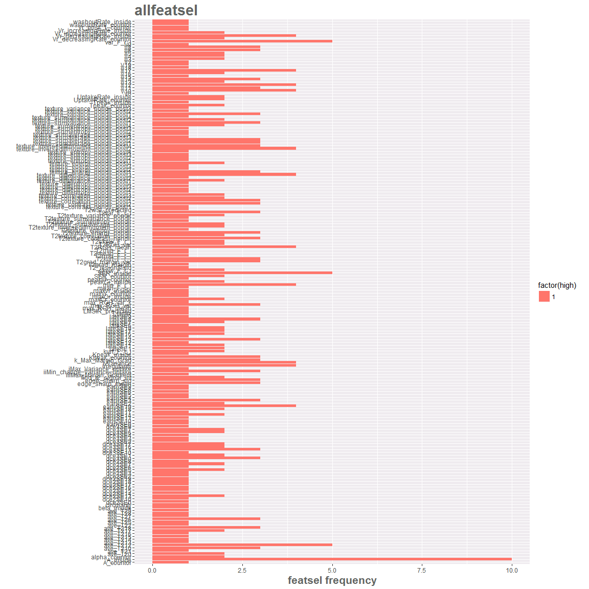 

```r
########### 
## plot ROCs each pass individually in l-o-p heldout test cases
par(mfrow=c(1,1))
n=15
colors = rainbow(n, s = 1, v = 1, start = 0, end = max(1, n - 1)/n, alpha = 1)
# plot 1/4
p1 = calcAUC_plot(perf_imgT2$obs, perf_imgT2$C, 
                           xptext=0.45, yptext=0.75 ,colors[2], atitle="")
```

```
## Area under the curve: 0.6678
## 95% CI (2000 stratified bootstrap replicates):
##  thresholds sp.low sp.median sp.high se.low se.median se.high
##   0.4525881 0.6008    0.6626  0.7202 0.5651    0.6146  0.6641
```

```r
par(new=TRUE)
p2 = calcAUC_plot(perf_allT2$obs, perf_allT2$C, 
                           xptext=0.55, yptext=0.65 ,colors[9], atitle="")
```

```
## Area under the curve: 0.6458
## 95% CI (2000 stratified bootstrap replicates):
##  thresholds sp.low sp.median sp.high se.low se.median se.high
##   0.4661532 0.5144    0.5761  0.6379 0.6172    0.6641  0.7109
```

```r
par(new=TRUE)
p3 = calcAUC_plot(perf_imgT1$obs, perf_imgT1$C,
                           xptext=0.65, yptext=0.55 ,colors[11], atitle="")
```

```
## Area under the curve: 0.784
## 95% CI (2000 stratified bootstrap replicates):
##  thresholds sp.low sp.median sp.high se.low se.median se.high
##   0.4456082  0.679    0.7325   0.786  0.664    0.7057    0.75
```

```r
par(new=TRUE)
p4 = calcAUC_plot(perf_all$obs, perf_all$C,
                           xptext=0.75, yptext=0.45 ,colors[14], atitle="ROCs leave-one-patient out test ")
```

```
## Area under the curve: 0.7983
## 95% CI (2000 stratified bootstrap replicates):
##  thresholds sp.low sp.median sp.high se.low se.median se.high
##   0.4493277 0.6996    0.7531  0.8066 0.6692    0.7161  0.7604
```

```r
legend("bottomright", 
       legend = c(paste0("imgT2w"),
                  paste0("imgT2w+predT2w"),
                  paste0("imgT1w"),
                  paste0("imgT1+imgT2w+predT2w")),
       col = c(colors[2],colors[9],colors[11],colors[14]), lwd = 2)
```

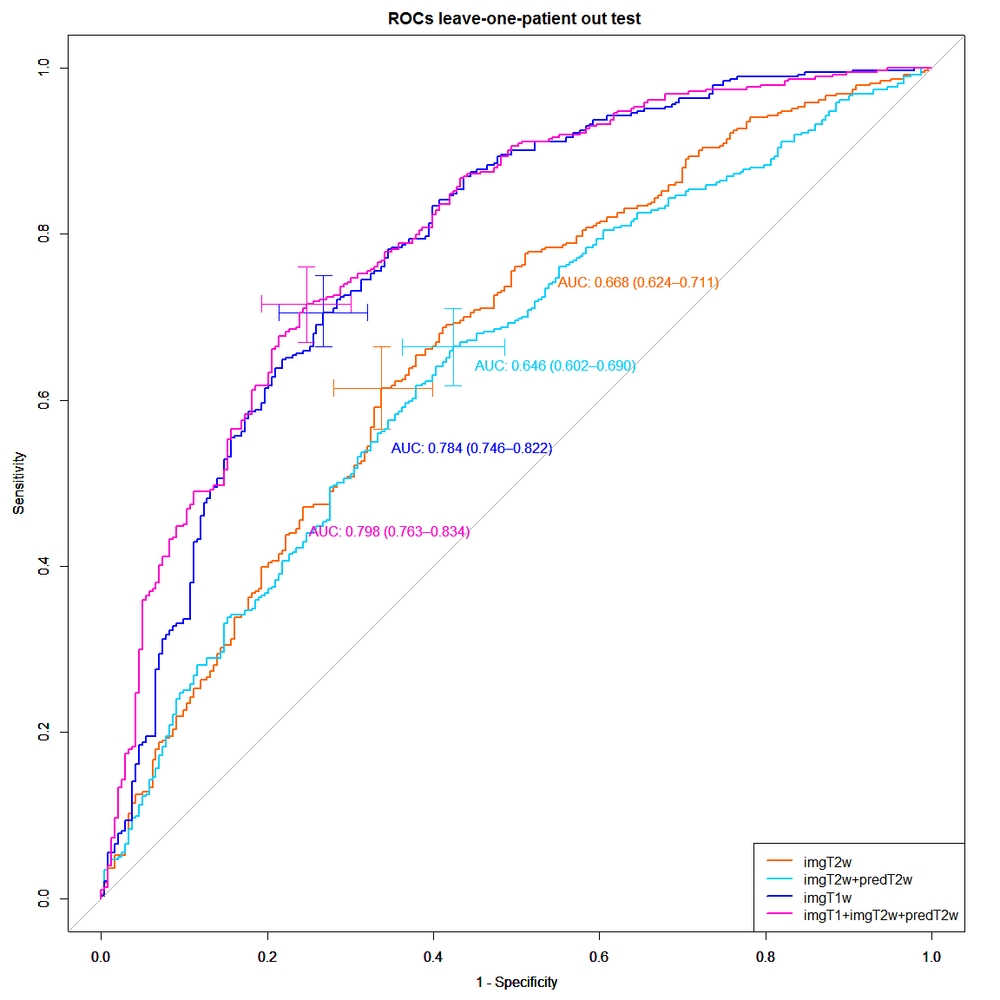 

```r
# find significants: only imgT2 vs. allT2
roc.test(p1$ROC, p2$ROC, method=c("bootstrap"), alternative = c("less"), boot.stratified=TRUE)
```

```
## 
## 	Bootstrap test for two correlated ROC curves
## 
## data:  p1$ROC and p2$ROC
## D = 1.1155, boot.n = 2000, boot.stratified = 1, p-value = 0.8677
## alternative hypothesis: true difference in AUC is less than 0
## sample estimates:
## AUC of roc1 AUC of roc2 
##   0.6677812   0.6457583
```

```r
# find significants: mass imgT1 vs all
roc.test(p3$ROC, p4$ROC, method=c("bootstrap"), alternative = c("two.sided"), boot.stratified=TRUE)
```

```
## 
## 	Bootstrap test for two correlated ROC curves
## 
## data:  p3$ROC and p4$ROC
## D = -0.89246, boot.n = 2000, boot.stratified = 1, p-value = 0.3721
## alternative hypothesis: true difference in AUC is not equal to 0
## sample estimates:
## AUC of roc1 AUC of roc2 
##   0.7839506   0.7983432
```

```r
# find significants: mass allT2 vs all
roc.test(p2$ROC, p4$ROC, method=c("bootstrap"), alternative = c("two.sided"), boot.stratified=TRUE)
```

```
## 
## 	Bootstrap test for two correlated ROC curves
## 
## data:  p2$ROC and p4$ROC
## D = -5.6112, boot.n = 2000, boot.stratified = 1, p-value = 2.009e-08
## alternative hypothesis: true difference in AUC is not equal to 0
## sample estimates:
## AUC of roc1 AUC of roc2 
##   0.6457583   0.7983432
```


