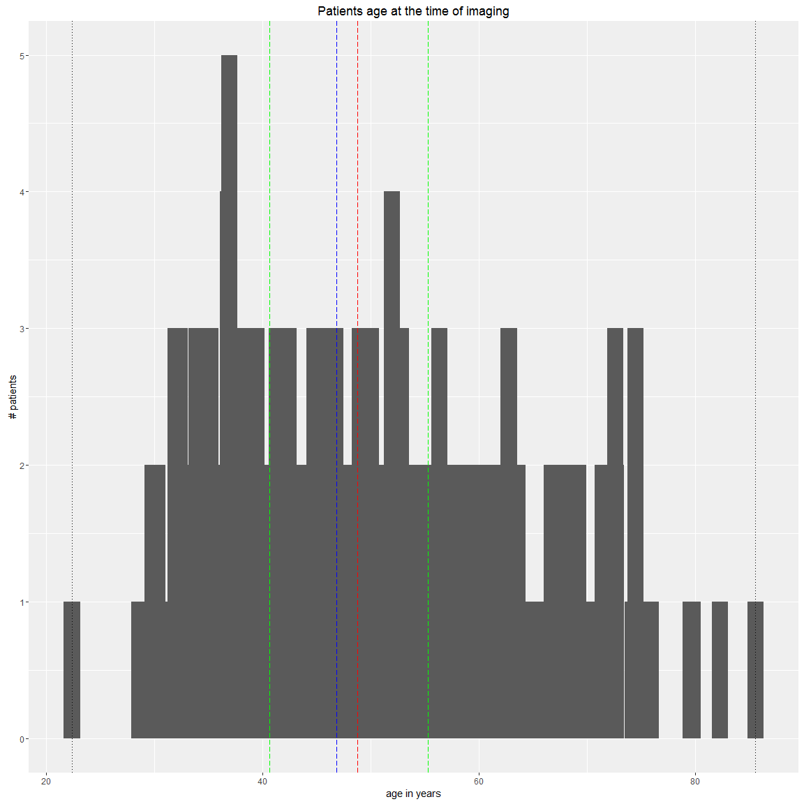
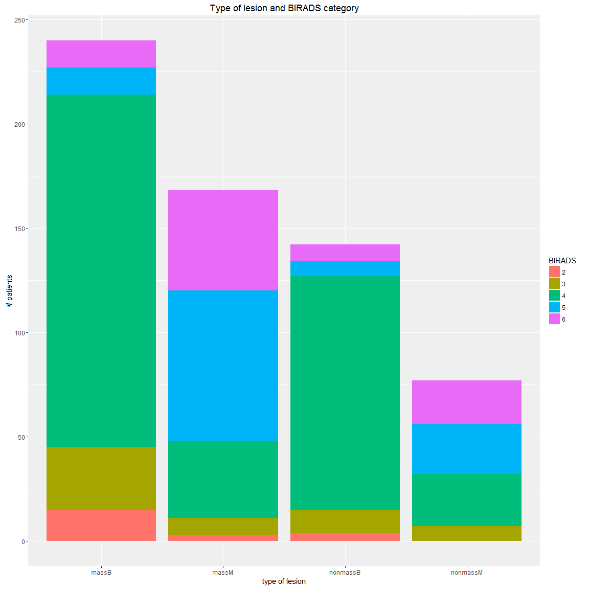

# Breast MRI datasets descriptive stats:
Cristina Gallego  
March 14, 2016  

Read in patient information from biomatrix and collects statistics of datasets used in study:
- Patient info:
  * #, Age,
  


```r
options(width = 500)
setwd("C:/Users/windows/Documents/repoCode-local/T2wR/lop_3Dtex_T2w_addedvalue")
library(R.utils)
library("RSQLite")
sqlite <- dbDriver("SQLite")
conn <- dbConnect(sqlite, "textureUpdatedFeatures.db")

# 2) all T1W features
lesionsQuery <- dbGetQuery(conn, "SELECT *
                           FROM  lesion 
                           INNER JOIN f_dynamic ON (lesion.lesion_id = f_dynamic.lesion_id)
                           INNER JOIN f_morphology ON (lesion.lesion_id = f_morphology.lesion_id)
                           INNER JOIN f_texture ON (lesion.lesion_id = f_texture.lesion_id)
                           INNER JOIN stage1features ON (lesion.lesion_id = stage1features.lesion_id)
                           INNER JOIN f_T2 ON (lesion.lesion_id = f_T2.lesion_id)
                           INNER JOIN radiologyInfo ON (lesion.lesion_id = radiologyInfo.lesion_id)")

# prune entries and extract feature subsets
# corresponds to 5 entries lesion info, 34 dynamic, 19 morpho, 34 texture fueatures
lesioninfo = lesionsQuery[c(1:26)]
dynfeatures = lesionsQuery[c(29:62)]
morphofeatures = lesionsQuery[c(65:83)]
texfeatures = lesionsQuery[c(86:129)]
T2info = lesionsQuery[c(259:270)]
T2features = lesionsQuery[c(259,267:291,232:251)]
stage1features = lesionsQuery[c(132:231)]
imagingdetails = lesionsQuery[c(293:318)]

##### set data splits
# combine all features and exclude foci lesions at this point
namest1w = names(cbind(dynfeatures, morphofeatures, texfeatures, stage1features))
namest2w = names(T2features)

# all lesions at the lesion id
allfeatures = cbind(lesioninfo[c("lesion_label")], dynfeatures, morphofeatures, texfeatures, stage1features, T2features)   
# select non foci
lesioninfo = subset(lesioninfo, lesion_label != "fociB" & lesion_label != "fociM" )

allfeatures = allfeatures[rownames(lesioninfo),]
allfeatures$origlesion_label = factor(allfeatures$lesion_label)
print(summary(allfeatures$origlesion_label))
```

```
##    massB    massM nonmassB nonmassM 
##      242      166      142       77
```

```r
########## Patient 
patientage = data.frame()
for (k in 1:length(lesioninfo$lesion_id)) {
    # find the age of patient at the time of imaging
    days = difftime(lesioninfo$exam_dt_datetime[k], lesioninfo$anony_dob_datetime[k], 
        units = "days")
    age = days[[1]]/365
    patientage = rbind(patientage, c(age))
}

# combine with other data
patientinfo = cbind(lesioninfo$cad_pt_no_txt, patientage, lesioninfo$lesion_label, lesioninfo$BIRADS)
colnames(patientinfo) <- c("CADid", "age", "type", "BIRADS")

# print summary statistics
print(summary(patientinfo))
```

```
##      CADid          age              type     BIRADS 
##  0880   :  5   Min.   :22.37   massB   :242   2: 22  
##  3055   :  5   1st Qu.:40.64   massM   :166   3: 56  
##  6054   :  5   Median :46.86   nonmassB:142   4:343  
##  0252   :  4   Mean   :48.75   nonmassM: 77   5:116  
##  0728   :  4   3rd Qu.:55.29                  6: 90  
##  3005   :  4   Max.   :85.59                         
##  (Other):600
```

```r
# print All cad ids
print(unique(patientinfo$CADid))
```

```
##   [1] 0002 0016 0025 0027 0066 0093 0102 0111 0114 0121 0122 0123 0127 0129 0130 0132 0133 0135 0168 0171 0172 0173 0177 0180 0186 0189 0103 0190 0196 0197 0198 0199 0205 0207 0212 0220 0229 0232 0246 0252 0259 0266 0276 0277 0280 0293 0311 0325 0331 0352 0357 0376 0388 0409 0420 0426 0442 0456 0462 0463 0465 0473 0503 0510 0513 0519 0536 0551 0552 0553 0561 0571 0572 0573 0576 0578 0580 0586 0595 0603 0606 0608 0613 0616 0619 0624 0635 0651 0657 0663 0664 0666 0667 0668 0672 0673 0679 0681 0682
## [100] 0683 0684 0685 0687 0689 0690 0691 0692 0696 0700 0705 0707 0710 0713 0714 0718 0720 0721 0722 0723 0724 0726 0727 0728 0729 0730 0731 0734 0735 0736 0737 0740 0742 0743 0744 0745 0748 0752 0755 0757 0760 0764 0765 0767 0771 0775 0778 0781 0782 0783 0758 0776 0779 0789 0790 0791 0792 0793 0795 0796 0799 0802 0803 0805 0807 0809 0810 0812 0813 0814 0815 0817 0818 0827 0828 0829 0830 0831 0834 0837 0839 0843 0844 0845 0846 0847 0850 0851 0853 0855 0856 0857 0861 0862 0863 0865 0867 0870 0871
## [199] 0873 0875 0876 0877 0880 0883 0884 0885 0887 0888 0896 0898 0900 0904 0913 0918 0920 0921 0924 0934 0937 0943 0944 0950 0952 0954 0956 0962 0965 0967 0978 0985 0993 0995 0997 0999 1003 1004 1006 1008 1012 1018 1021 1024 1025 1027 1044 1045 1050 1026 1053 1062 1065 1071 1072 1077 1078 1079 1081 1086 1087 1090 1092 1095 1099 2007 2016 2017 2023 2024 2027 2028 2029 2033 2042 2049 2050 2051 2053 2055 2059 2065 2068 2069 2071 2072 2073 2075 2078 2079 3004 3005 3010 3011 3017 3018 3020 3021 3023
## [298] 3025 3026 3028 3030 3031 3033 3035 3039 3045 3046 3052 3053 3054 3055 3057 3063 3065 3070 3072 3073 3075 3076 3077 3078 3080 3081 3082 3083 3086 3092 3093 3097 4002 4003 4008 4012 4017 4018 4019 4020 4021 4023 4026 4029 4039 4040 4041 4043 4044 4045 4047 4049 4055 6001 6004 6005 6008 6014 6015 6017 6018 6019 6020 6021 6022 6023 6024 6025 6026 6027 6029 6032 6034 6035 6037 6038 6039 6040 6041 6042 6043 6044 6045 6046 6047 6048 6050 6051 6052 6054 6069 6100 6101 6105 6114 6117 6141 6148 6150
## [397] 6164 6174 6223 6224 6226 6233 7008 7011 7018 7024 7029 7030 7043 7045 7053 7066 7076 7077 7085 7086 7088 7094 7096 7097 7104 7105 7127 7151 7159 7165 7178 7183 7186 7189 7190 7192 7193 7201 7220
## 435 Levels: 0002 0016 0025 0027 0066 0093 0102 0103 0111 0114 0121 0122 0123 0127 0129 0130 0132 0133 0135 0168 0171 0172 0173 0177 0180 0186 0189 0190 0196 0197 0198 0199 0205 0207 0212 0220 0229 0232 0246 0252 0259 0266 0276 0277 0280 0293 0311 0325 0331 0352 0357 0376 0388 0409 0420 0426 0442 0456 0462 0463 0465 0473 0503 0510 0513 0519 0536 0551 0552 0553 0561 0571 0572 0573 0576 0578 0580 0586 0595 0603 0606 0608 0613 0616 0619 0624 0635 0651 0657 0663 0664 0666 0667 0668 0672 0673 ... 7220
```

```r
print(length(unique(patientinfo$CADid)))
```

```
## [1] 435
```

```r
# print Age stats
print(summary(patientinfo$age))
```

```
##    Min. 1st Qu.  Median    Mean 3rd Qu.    Max. 
##   22.37   40.64   46.86   48.75   55.29   85.59
```

```r
print(sd(patientinfo$age))
```

```
## [1] 10.58338
```

```r
range(patientinfo$age)
```

```
## [1] 22.36712 85.59167
```

```r
# Range of imaging studies
range(lesioninfo$exam_dt_datetime)
```

```
## [1] "2007-03-15 00:00:00.000000" "2014-11-15 00:00:00.000000"
```

```r
# time between imaging and procedure for biopsies only
print(summary(factor(lesioninfo$proc_proc_source_int)))
```

```
##                                                            NA                                                     Radiology Surgical/Operating Rm (includes 'Sentinel Lymph Node Biopsy') 
##                                                             2                                                           566                                                            59
```

```r
print(summary(factor(lesioninfo$proc_proc_tp_int)))
```

```
##     Core Needle Biopsy Fine Needle Aspiration                    N/A                     NA Vacuum Assisted Biopsy 
##                    313                     14                     60                      5                    235
```

```r
biopsies = subset(lesioninfo, proc_proc_source_int!="Surgical/Operating Rm (includes 'Sentinel Lymph Node Biopsy')")
print(summary(factor(biopsies$proc_proc_tp_int)))
```

```
##     Core Needle Biopsy Fine Needle Aspiration                    N/A                     NA Vacuum Assisted Biopsy 
##                    313                     14                      4                      2                    235
```

```r
# for biopsies
procinfo = c()
for (k in 1:length(biopsies$proc_pt_procedure_id)) {
    # find the age of patient at the time of imaging
    days = difftime(biopsies$proc_proc_dt_datetime[k], biopsies$exam_dt_datetime[k], 
        units = "days")
    print(days[[1]])
    procinfo = c(procinfo, days[[1]])
}
```

```
## [1] 32
## [1] 19
## [1] 13
## [1] 68
## [1] 10
## [1] 25.95833
## [1] 24.04167
## [1] 43.04167
## [1] 43.04167
## [1] 28
## [1] 26
## [1] 23.95833
## [1] 26
## [1] 52
## [1] 38
## [1] 38
## [1] 21
## [1] 10
## [1] -461.9583
## [1] -461.9583
## [1] 23
## [1] 462
## [1] 462
## [1] 16.95833
## [1] 23
## [1] 25
## [1] 15
## [1] 17.95833
## [1] 54
## [1] 36
## [1] 48.04167
## [1] 28
## [1] 29
## [1] 19
## [1] 16
## [1] 16
## [1] 36
## [1] 36
## [1] 36
## [1] 34
## [1] 34
## [1] 34
## [1] 18
## [1] 30
## [1] 17
## [1] 38
## [1] 54.95833
## [1] 54.95833
## [1] 12
## [1] 9
## [1] 9
## [1] 42
## [1] 14
## [1] 35
## [1] 386
## [1] 386
## [1] 0
## [1] 18
## [1] 19
## [1] 19
## [1] 9
## [1] 0
## [1] 25
## [1] 39
## [1] 12
## [1] 13
## [1] 37.95833
## [1] 11
## [1] 30
## [1] 32
## [1] 10
## [1] 15
## [1] 28
## [1] 31
## [1] 24
## [1] 31
## [1] 23.95833
## [1] 29.95833
## [1] 10
## [1] 233.0417
## [1] 39
## [1] 32
## [1] 13
## [1] 13
## [1] 33
## [1] 32
## [1] 28
## [1] 35
## [1] 15
## [1] -163.9583
## [1] 27
## [1] 18
## [1] 32
## [1] 52
## [1] 53.04167
## [1] 21.04167
## [1] -12
## [1] 61.04167
## [1] 16
## [1] 10
## [1] 25.95833
## [1] 57.04167
## [1] 9
## [1] 30
## [1] 49
## [1] 6
## [1] 8
## [1] 8
## [1] 25
## [1] 13
## [1] 24
## [1] 2
## [1] 19
## [1] 27
## [1] 807.9583
## [1] 27
## [1] 25
## [1] 70.95833
## [1] 29
## [1] 79
## [1] 4
## [1] 12
## [1] 27
## [1] 30
## [1] 30
## [1] 30
## [1] 66
## [1] 268.0417
## [1] 268.0417
## [1] 13
## [1] 10
## [1] 10
## [1] 8
## [1] 27
## [1] 9
## [1] 11
## [1] 10
## [1] 10
## [1] 17
## [1] 17
## [1] 212.0417
## [1] 4
## [1] 4
## [1] 6
## [1] 6
## [1] 6
## [1] 14
## [1] 20
## [1] 20
## [1] 2
## [1] 5
## [1] 3
## [1] 45
## [1] 13
## [1] 13
## [1] 13
## [1] 13
## [1] 11
## [1] 25
## [1] 26
## [1] 2
## [1] 23
## [1] 24
## [1] 14
## [1] 25
## [1] 25
## [1] 17
## [1] 26
## [1] 15
## [1] -23
## [1] 1
## [1] 1
## [1] 1
## [1] 23
## [1] 23
## [1] 12
## [1] 15.04167
## [1] 15.04167
## [1] 35.04167
## [1] 29
## [1] -15
## [1] -15
## [1] 42
## [1] 27
## [1] 13
## [1] 136
## [1] 28.04167
## [1] 28.04167
## [1] 28
## [1] 28
## [1] 2
## [1] 2
## [1] 45
## [1] 25
## [1] 25
## [1] 48
## [1] 48
## [1] 18
## [1] -540
## [1] -11
## [1] -25
## [1] 12
## [1] 29.95833
## [1] 2
## [1] 12
## [1] 8
## [1] 32
## [1] 42
## [1] 7
## [1] 17
## [1] 17
## [1] 12
## [1] 25
## [1] 5
## [1] 15
## [1] -28
## [1] 38
## [1] 8
## [1] 26
## [1] 23
## [1] 23
## [1] 5
## [1] 12
## [1] 25.95833
## [1] 19.95833
## [1] 19.95833
## [1] 12
## [1] 63
## [1] 14.04167
## [1] 6
## [1] 3
## [1] 29
## [1] 29
## [1] 29
## [1] 670.0417
## [1] 670.0417
## [1] 945
## [1] 26
## [1] 23.04167
## [1] 23.04167
## [1] 19
## [1] 61
## [1] 412
## [1] 1
## [1] 37
## [1] 37
## [1] 17
## [1] 31
## [1] 2
## [1] 13
## [1] -29.04167
## [1] 32
## [1] 35.04167
## [1] 18
## [1] 24
## [1] 62
## [1] 20
## [1] 20
## [1] 20
## [1] 62
## [1] 4
## [1] 5
## [1] 5
## [1] 21
## [1] 32
## [1] 5
## [1] 17.95833
## [1] 23.04167
## [1] 37.95833
## [1] 61
## [1] 51
## [1] 24
## [1] 17
## [1] 38
## [1] 44
## [1] 44
## [1] 5
## [1] 13
## [1] 10
## [1] 19
## [1] 21
## [1] 28
## [1] 2
## [1] 2
## [1] 31
## [1] 37
## [1] 10
## [1] 23
## [1] 46
## [1] 28
## [1] 22
## [1] 22
## [1] 57
## [1] 30
## [1] 28
## [1] 52
## [1] 52
## [1] -298
## [1] 39.04167
## [1] 35
## [1] 18
## [1] 21
## [1] 4
## [1] 36.04167
## [1] 54.04167
## [1] 54.04167
## [1] 26
## [1] 24
## [1] 2
## [1] 2
## [1] 11
## [1] 30
## [1] 8.958333
## [1] 12
## [1] 38
## [1] 13.04167
## [1] 25.95833
## [1] 14
## [1] 14
## [1] 23
## [1] 11
## [1] 15
## [1] 15
## [1] 34
## [1] 37
## [1] 37
## [1] 18.95833
## [1] 6
## [1] 13
## [1] 7
## [1] 7
## [1] 42
## [1] 14
## [1] 14
## [1] 8
## [1] 25.04167
## [1] 25.04167
## [1] 15
## [1] 14
## [1] 22
## [1] -26
## [1] 25
## [1] 1
## [1] 1
## [1] 5
## [1] -13
## [1] 13
## [1] 8
## [1] -720
## [1] 6
## [1] 6
## [1] -17
## [1] 23
## [1] 23
## [1] 24
## [1] 43
## [1] 10
## [1] 16
## [1] 18
## [1] 17
## [1] 17
## [1] 21
## [1] 22
## [1] 22
## [1] 41.95833
## [1] 9
## [1] 9
## [1] -49
## [1] 22
## [1] 832.9583
## [1] 22
## [1] -40
## [1] 48
## [1] 54.95833
## [1] 47
## [1] 27
## [1] 17
## [1] 2
## [1] 40
## [1] 36
## [1] 41
## [1] 1
## [1] -7
## [1] 38
## [1] 80.04167
## [1] 29
## [1] 47.04167
## [1] 13
## [1] 31
## [1] 13
## [1] 87
## [1] 87
## [1] 17
## [1] 16
## [1] 24
## [1] 10
## [1] 8.958333
## [1] 10
## [1] 10
## [1] 8.958333
## [1] 20
## [1] 13
## [1] 29.95833
## [1] 5
## [1] 5
## [1] 26
## [1] 11
## [1] 6
## [1] 6
## [1] 16
## [1] 16
## [1] 19
## [1] 19
## [1] 36
## [1] 36
## [1] 13
## [1] 95.04167
## [1] 15
## [1] 11
## [1] 9
## [1] 13
## [1] 30
## [1] 53.95833
## [1] 53.95833
## [1] 21
## [1] 21
## [1] 21
## [1] 41.95833
## [1] 41.95833
## [1] 749
## [1] 70
## [1] 36
## [1] 11
## [1] 25
## [1] 28
## [1] 234.9583
## [1] 35
## [1] 17
## [1] 17
## [1] 15
## [1] -8
## [1] 10
## [1] 20
## [1] 42.95833
## [1] 12
## [1] 12
## [1] 12
## [1] 24
## [1] 34
## [1] 34
## [1] 9
## [1] -17
## [1] -17
## [1] 14
## [1] 14
## [1] 14
## [1] 6
## [1] 6
## [1] -42
## [1] -42
## [1] 17
## [1] -9
## [1] 6
## [1] 40
## [1] 8
## [1] 38
## [1] 38
## [1] 6
## [1] 6
## [1] 11
## [1] 11
## [1] 11
## [1] 22.95833
## [1] 310
## [1] 310
## [1] 620
## [1] 620
## [1] 51
## [1] 45
## [1] 1
## [1] 1
## [1] 11
## [1] 11
## [1] 11
## [1] 5
## [1] 5
## [1] 1340
## [1] 27
## [1] 27
## [1] 27
## [1] 16.04167
## [1] 16.04167
## [1] 283.9583
## [1] 12
## [1] 13
## [1] 13
## [1] 14
## [1] 14
## [1] 0
## [1] 0
## [1] 0
## [1] 0
## [1] -6
## [1] 4
## [1] 37
## [1] 3.041667
## [1] 49
## [1] 49
## [1] 49
## [1] 49
## [1] 49
## [1] 31.04167
## [1] 31.04167
## [1] 7.958333
## [1] 17.04167
## [1] -26
## [1] 10
## [1] 33
## [1] 73
## [1] 20
## [1] 23
## [1] 28
## [1] 98
## [1] 38
## [1] 53
## [1] 34
## [1] 29
## [1] 14
## [1] 27
## [1] 338
## [1] -345
## [1] 28
## [1] 23
## [1] 13
## [1] 13
## [1] -688.0417
## [1] 49
## [1] 22.04167
## [1] 32
## [1] 20
## [1] 24
## [1] 24
## [1] 16
## [1] 19
## [1] 31
## [1] 52
## [1] 5
## [1] 5
## [1] 24
## [1] 24
## [1] 180.0417
## [1] 1
## [1] 16.04167
## [1] 17
## [1] 39.95833
## [1] 19
## [1] 13
## [1] -31
## [1] 37
## [1] -9
## [1] -678.0417
## [1] 27.95833
## [1] 15
## [1] 8.041667
## [1] 22.95833
## [1] 22.95833
## [1] 16
## [1] 21
```

```r
# time after imgaing stats
summary(procinfo)
```

```
##    Min. 1st Qu.  Median    Mean 3rd Qu.    Max. 
## -720.00   11.00   20.00   33.82   32.00 1340.00
```

```r
# plot By default, geom_bar uses stat='bin'. This makes the height of each
# bar equal to the number of cases in each group, and it is incompatible
# with mapping values to the y aesthetic.
require(ggplot2)
IQR = c(summary(patientinfo$age)[[2]], summary(patientinfo$age)[[5]])
histages <- ggplot(patientinfo, aes(age))
histages + geom_bar(width=1.5) + 
  geom_vline(xintercept = range(patientinfo$age), linetype = "dotted") + 
  geom_vline(xintercept = mean(patientinfo$age), linetype = "longdash", colour = "red") + 
  geom_vline(xintercept = median(patientinfo$age), linetype = "longdash", colour = "blue") + 
  geom_vline(xintercept = IQR, linetype = "longdash", colour = "green") + 
  labs(x = "age in years", y = "# patients",  title = "Patients age at the time of imaging")
```

 

```r
bartypes <- ggplot(patientinfo, aes(type, fill = BIRADS))
bartypes + geom_bar() + labs(x = "type of lesion", y = "# patients", title = "Type of lesion and BIRADS category")
```

 

```r
library(reshape)
# subset by pathology
patho = summary(as.factor(lesioninfo$lesion_diagnosis))
for (k in 1:length(patho)) {
    print(names(patho[k]))
    print(cast(lesioninfo, ~lesion_label, subset = lesion_diagnosis == 
        names(patho[k]), value = "lesion_id", length))
}
```

```
## [1] "Adenocarcinoma"
##   value nonmassM
## 1 (all)        1
## [1] "ADENOSIS"
##   value massB nonmassB
## 1 (all)     9        2
## [1] "ADENOSIS, COLUMNAR CELL CHANGES"
##   value massB
## 1 (all)     1
## [1] "ATYPICAL DUCTAL HYPERPLASIA"
##   value massB massM nonmassB
## 1 (all)    10     1       16
## [1] "ATYPICAL LOBULAR HYPERPLASIA"
##   value massB nonmassB
## 1 (all)     9        3
## [1] "ATYPICAL PAPILLARY LESION"
##   value massB
## 1 (all)     1
## [1] "AtypicalCells"
##   value massB
## 1 (all)     1
## [1] "AtypicalPapilloma"
##   value massB
## 1 (all)     1
## [1] "BENIGN BREAST TISSUE"
##   value massB nonmassB
## 1 (all)    40       32
## [1] "BENIGN HAMARTOMA"
##   value massB
## 1 (all)     1
## [1] "BENIGN INTRAMAMMARY LYMPH NODE"
##   value massB
## 1 (all)     1
## [1] "benign lymphoid tissue"
##   value massB
## 1 (all)     1
## [1] "capillary hemangioma"
##   value massB
## 1 (all)     1
## [1] "COLUMNAR CELL CHANGES"
##   value massB nonmassB
## 1 (all)     5       11
## [1] "ColumnarAlterationwoAtypia"
##   value nonmassB
## 1 (all)        2
## [1] "COMPLEX FIBROEPITHELIAL LESION"
##   value massB
## 1 (all)     1
## [1] "COMPLEX PAPILLARY LESION"
##   value nonmassB
## 1 (all)        2
## [1] "Cyst"
##   value massB
## 1 (all)     3
## [1] "DENSE FIBROSIS"
##   value nonmassB
## 1 (all)        5
## [1] "DENSE FIBROSIS AND FIBROADENOMATOID CHANGE"
##   value massB
## 1 (all)     1
## [1] "DUCT PAPILLOMA"
##   value massB nonmassB
## 1 (all)    10        5
## [1] "DUCT PAPILLOMA WITH ATYPIA"
##   value massB nonmassB
## 1 (all)     1        1
## [1] "DUCTAL HYPERPLASIA"
##   value massB
## 1 (all)     1
## [1] "DUCTAL HYPERPLASIA WITHOUT ATYPIA"
##   value massB
## 1 (all)     2
## [1] "DYSTROPHICCALCIFICATION"
##   value massB
## 1 (all)     1
## [1] "FAT NECROSIS"
##   value massB
## 1 (all)     1
## [1] "FIBROADENOMA"
##   value massB nonmassB
## 1 (all)    59       10
## [1] "FIBROADENOMATOID"
##   value massB
## 1 (all)     1
## [1] "FIBROCYSTIC"
##   value massB nonmassB
## 1 (all)    38       32
## [1] "FIBROEPITHELIAL"
##   value massB
## 1 (all)     3
## [1] "FIBROSIS"
##   value massB nonmassB
## 1 (all)     2        3
## [1] "FIBROTIC STROMA"
##   value nonmassB
## 1 (all)        1
## [1] "FLAT EPITHELIAL ATYPIA"
##   value massB
## 1 (all)     1
## [1] "FLORID DUCT HYPERPLASIA"
##   value massB
## 1 (all)     1
## [1] "FLORID DUCTAL HYPERPLASIA"
##   value nonmassB
## 1 (all)        2
## [1] "FLORID HYPERPLASIA"
##   value massB
## 1 (all)     1
## [1] "FOCAL CELLULAR STROMA"
##   value massB
## 1 (all)     1
## [1] "FOCAL HYPERPLASIA"
##   value nonmassB
## 1 (all)        1
## [1] "FOCAL USUAL DUCTAL HYPERPLASIA"
##   value massB nonmassB
## 1 (all)     1        1
## [1] "GRANULOMATOUS LOBULAR MASTITIS"
##   value massB
## 1 (all)     2
## [1] "HYPERPLASIA"
##   value massB
## 1 (all)     4
## [1] "IN SITU PAPILLARY CARCINOMA"
##   value nonmassM
## 1 (all)        1
## [1] "INFLAMED CYST WALL"
##   value massB
## 1 (all)     1
## [1] "InsituDuctal"
##   value massM nonmassM
## 1 (all)    40       40
## [1] "InsituLobular"
##   value massB nonmassB
## 1 (all)     4        3
## [1] "INSITUPAPILLARYCARCINOMA"
##   value massM nonmassM
## 1 (all)     1        1
## [1] "InvasiveDuctal"
##   value massM nonmassM
## 1 (all)   107       27
## [1] "InvasiveDuctal micropapillary"
##   value massM
## 1 (all)     1
## [1] "InvasiveLobular"
##   value massM nonmassM
## 1 (all)    15        6
## [1] "LARGE DUCT PAPILLOMA"
##   value nonmassB
## 1 (all)        1
## [1] "LobularHyperplasia"
##   value massB nonmassB
## 1 (all)     2        2
## [1] "LYMPHOVASCULAR INVASION"
##   value nonmassM
## 1 (all)        1
## [1] "MetaplasticCarcinoma"
##   value massM
## 1 (all)     1
## [1] "PAPILLARY LESION"
##   value nonmassB
## 1 (all)        1
## [1] "Papillary(focalAtypia)"
##   value massB
## 1 (all)     1
## [1] "PHYLLODES TUMOR"
##   value massB
## 1 (all)     2
## [1] "PSEUDOANGIOMATOUS STROMAL HYPERPLASIA"
##   value massB
## 1 (all)     1
## [1] "RADIAL SCLEROSING LESION"
##   value massB
## 1 (all)     1
## [1] "RadialScar"
##   value massB
## 1 (all)     1
## [1] "SCLEROSING ADENOSIS"
##   value massB nonmassB
## 1 (all)     4        2
## [1] "SCLEROSING INTRADUCTAL PAPILLOMA"
##   value nonmassB
## 1 (all)        1
## [1] "SCLEROSING PAPILLARY LESION"
##   value massB
## 1 (all)     1
## [1] "STROMAL FIBROSIS"
##   value massB nonmassB
## 1 (all)     1        3
## [1] "STROMAL HYPERPLASIA"
##   value massB
## 1 (all)     2
## [1] "TUBULAR ADENOMA"
##   value massB
## 1 (all)     1
## [1] "USUAL DUCTAL HYPERPLASIA"
##   value massB
## 1 (all)     4
```

```r
benigns = c(79, 28, 17, 7, 19, 3, 20, 6, 73, 21, 72, 21, 19, 2, 18) # n=405
maligns = c(79, 3, 151, 21, 1, 2, 1)
print(sum(benigns))
```

```
## [1] 405
```

```r
print(sum(maligns))
```

```
## [1] 258
```

```r
# percentages
print(sum(benigns))/print(sum(benigns)+sum(maligns))
```

```
## [1] 405
## [1] 663
```

```
## [1] 0.6108597
```

```r
print(sum(maligns))/print(sum(benigns)+sum(maligns))
```

```
## [1] 258
## [1] 663
```

```
## [1] 0.3891403
```

```r
print(benigns/sum(benigns)*100)
```

```
##  [1] 19.5061728  6.9135802  4.1975309  1.7283951  4.6913580  0.7407407  4.9382716  1.4814815 18.0246914  5.1851852 17.7777778  5.1851852  4.6913580  0.4938272  4.4444444
```

```r
print(maligns/sum(maligns)*100)
```

```
## [1] 30.6201550  1.1627907 58.5271318  8.1395349  0.3875969  0.7751938  0.3875969
```


