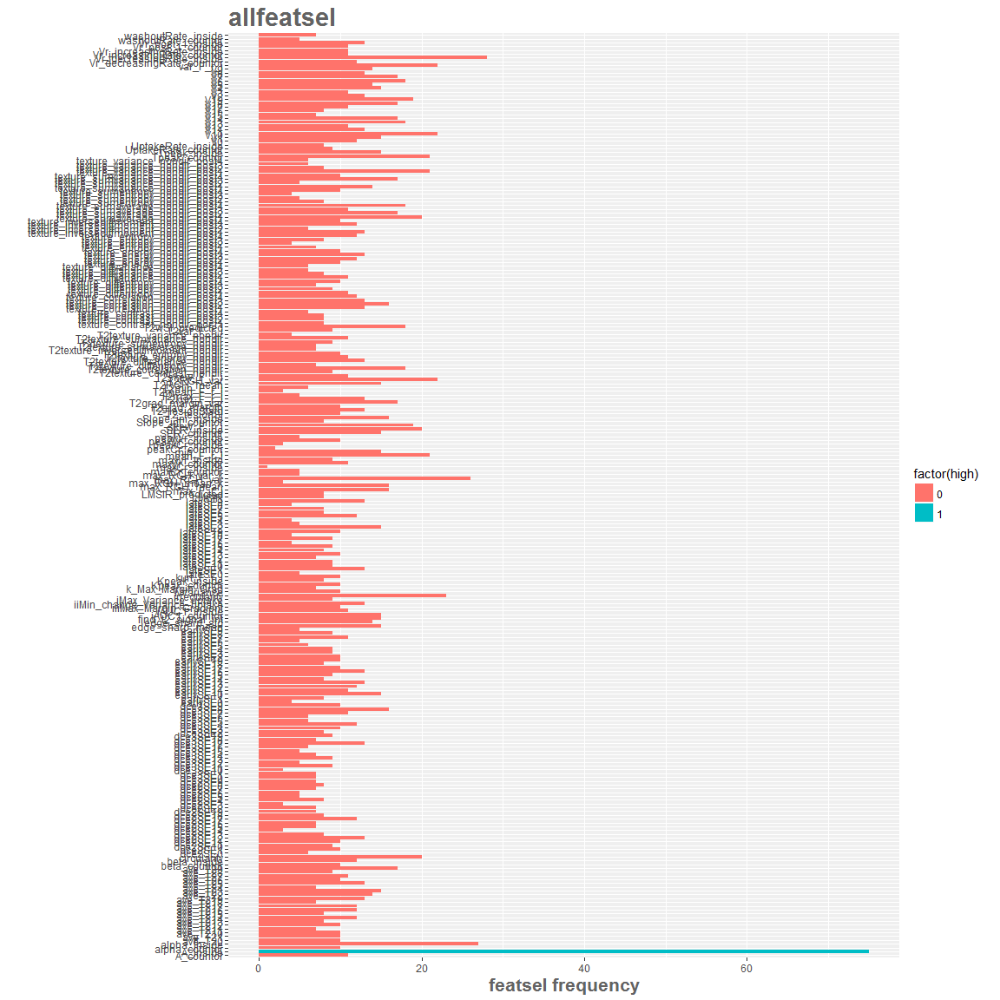

# T2 features added diagnostic value
Cristina Gallego  
March 14, 2016  

- This uses tree-ensembles based T2 features in addition to the relevant and tentative T1+T2w features
- This code analysis T2w added diagnostic value by comparing with ensembles of only T1w DCE-based features
- T2w discrimination ability (added pAUC ROC value)


```r
knitr::opts_chunk$set(cache=TRUE, cache.path = "parent_cache/", fig.path="parent_figure/")
```


```r
options(width = 500)

library(caret)
require(ggplot2)
library("RSQLite")
library(klaR)
library(pROC)
library("Boruta")
require(data.table)
library(RRF)
library(R.utils)
library(MASS)
library(rpart)
library(rpart.plot)
library(adabag)
library(R.utils)

loppath = "C:/Users/windows/Documents/repoCode-local/T2wR/lop_3Dtex_T2w_addedvalue/"
setwd(loppath)
source("functions.R")
load("Inputs/allpartitionsetD")

## Add LMSIR predicted and T2wBIRADS predicted
LMSIR_lop <- loadToEnv(("Inputs/finalregressorsLMSIR_T2w.RData"))[["LMSIR_lop"]]; 
perfT2wSI_lop <- loadToEnv(("Inputs/final_classifierT2wSI_boosting.RData"))[["perfT2wSI_lop"]]; 

bestune_imgT2 <- loadToEnv(("Inputs/T2_addeddiagvalue_params_wbagging.RData"))[["bestune_imgT2"]];
rfbestune_imgT2 <- loadToEnv(("Inputs/T2_addeddiagvalue_params_wbagging.RData"))[["rfbestune_imgT2"]];
bestune_allT2 <- loadToEnv(("Inputs/T2_addeddiagvalue_params_wbagging.RData"))[["bestune_allT2"]];
rfbestune_allT2 <- loadToEnv(("Inputs/T2_addeddiagvalue_params_wbagging.RData"))[["rfbestune_allT2"]];
bestune_imgT1only <- loadToEnv(("Inputs/T2_addeddiagvalue_params_wbagging.RData"))[["bestune_imgT1only"]];
rfbestune_imgT1only <- loadToEnv(("Inputs/T2_addeddiagvalue_params_wbagging.RData"))[["rfbestune_imgT1only"]];
bestune_T1T2 <- loadToEnv(("Inputs/T2_addeddiagvalue_params_wbagging.RData"))[["bestune_T1T2"]];
rfT1T2rfcvperf <- loadToEnv(("Inputs/T2_addeddiagvalue_params_wbagging.RData"))[["rfT1T2rfcvperf"]];

npatients = length(uniq_cad)
```

bagging or boosting for final CAD ensembles? compare cv.errors
===========

```r
## from previous cv parameters
# pick winner between 
if(bestune_imgT2$cv.error <= rfbestune_imgT2$cv.error[1]){
  bestune_imgT2 = bestune_imgT2
  bestune_imgT2$class = "boosting"
}else{
  bestune_imgT2 = rfbestune_imgT2
  bestune_imgT2$class = "bagging"
}
print(bestune_imgT2)
```

```
##    maxD ntrees  cv.error  type   class
## 21    3    200 0.3484163 imgT2 bagging
```

```r
# pick winner between 
if(bestune_allT2$cv.error <= rfbestune_allT2$cv.error[1]){
  bestune_allT2 = bestune_allT2
  bestune_allT2$class = "boosting"
}else{
  bestune_allT2 = rfbestune_allT2
  bestune_allT2$class = "bagging"
}
print(bestune_allT2)
```

```
##    maxD ntrees  cv.error  type    class
## 34    1    250 0.3242836 allT2 boosting
```

```r
# pick winner between 
if(bestune_imgT1only$cv.error <= rfbestune_imgT1only$cv.error[1]){
  bestune_imgT1only = bestune_imgT1only
  bestune_imgT1only$class = "boosting"
}else{
  bestune_imgT1only = rfbestune_imgT1only
  bestune_imgT1only$class = "bagging"
}
print(bestune_imgT1only)
```

```
##    maxD ntrees  cv.error      type    class
## 35    1    250 0.2428356 imgT1only boosting
```

```r
# pick winner between 
if(bestune_T1T2$cv.error <= rfT1T2rfcvperf$cv.error[1]){
  bestune_T1T2 = bestune_T1T2
  bestune_T1T2$class = "boosting"
}else{
  bestune_imgT1only = rfT1T2rfcvperf
  bestune_imgT1only$class = "bagging"
}
print(bestune_T1T2)
```

```
##    maxD ntrees  cv.error  type    class
## 20    1    200 0.2383107 T1+T2 boosting
```


l-o-p final performance comparison:
=================================

```r
perf_imgT2 = data.frame();  lopaccu_imgT2 = c(); 
perf_allT2 = data.frame();  lopaccu_allT2 = c(); 
perf_imgT1 = data.frame();  lopaccu_imgT1 = c(); 
perf_all = data.frame();    lopaccu_all = c(); 

lopcum_results = data.frame() ## just this when no previous run

## holders for reature rankings
imgT2featsel = data.frame() 
allT2featsel = data.frame() 
imgT1featsel = data.frame() 
allfeatsel = data.frame() 
```


```r
knitr::opts_chunk$set(cache=TRUE, cache.path = "batch1_cache/", fig.path="batch1_figure/")

loppath = "C:/Users/windows/Documents/repoCode-local/T2wR/lop_3Dtex_T2w_addedvalue"
setwd(loppath)
source("functions.R")
```


```r
# perform leave-one-patient-out LMSIR prediction
for(k in 1:2){  # 1:npatients
  ## Create folds leave-one-patient-out
  allfT2 = read_T2uniqcad_parti(id_cad_pts, uniq_cad, allpartitionsetD, npatients, k)
  allfT1 = read_T1uniqcad_parti(id_cad_pts, uniq_cad, allpartitionsetD, npatients, k)
  allfT1T2 = read_T1T2uniqcad_parti(id_cad_pts, uniq_cad, allpartitionsetD, npatients, k)
    
  ## formant
  T2train = allfT2[[1]];   T2traininfo = allfT2[[5]];   T2trainids = T2traininfo$lesion_id;
  T2test = allfT2[[2]]; T2testinfo = allfT2[[6]];  T2testids = T2testinfo$lesion_id;
  T1train = allfT1[[1]]; T1traininfo = allfT1[[5]]; T1trainids = T1traininfo$lesion_id;
  T1test = allfT1[[2]]; T1testinfo = allfT1[[6]];  T1testids = T1testinfo$lesion_id;
  T1T2train = allfT1T2[[1]]; T1T2traininfo = allfT1T2[[5]]; T1T2trainids = T1T2traininfo$lesion_id;
  T1T2test = allfT1T2[[2]]; T1T2testinfo = allfT1T2[[6]];  T1T2testids = T1T2testinfo$lesion_id;
  
  # remove radiologist based BIRADS category and measured muscle-to-lesion SI 
  # add predicted T2w features
  T2LMSIR = getid_predLMSIR(LMSIR_lop, T2trainids)
  T2wSI = getid_predT2wSI(perfT2wSI_lop, T2trainids)
  
  T2train = T2train[,-c(ncol(T2train))] # exlude orig_label
  T2train$find_t2_signal_int = as.factor(T2train$find_t2_signal_int)
  wpredT2train = cbind(T2train, LMSIR_predicted=T2LMSIR$LMSIR_predicted, T2wSI_predicted=T2wSI$T2wSI_predicted)
  T1train = T1train[,-c(ncol(T1train))]
  
  # remove radiologist based BIRADS category and measured muscle-to-lesion SI 
  # add predicted T2w features
  T1T2LMSIR = getid_predLMSIR(LMSIR_lop, T1T2trainids)
  T1T2wSI = getid_predT2wSI(perfT2wSI_lop, T1T2trainids)
  
  ########## consider differneces
  T1T2train = T1T2train[,-c(ncol(T1T2train))]
  T1T2train$find_t2_signal_int = as.factor(T1T2train$find_t2_signal_int)
  ##
  wpredT1T2train = cbind(T1T2train, LMSIR_predicted=T1T2LMSIR$LMSIR_predicted, T2wSI_predicted=T1T2wSI$T2wSI_predicted)
  wpredT1T2train$T2wSI_predicted = as.factor(wpredT1T2train$T2wSI_predicted)
  
  # with datasets:   T2train, wpredT2train, T1train, T1T2train, wpredT1T2train
  selrrfimgT2 = RRF_featsel(T2train, "imgT2")
  selrrfallT2 = RRF_featsel(wpredT2train, "allT2")
  selrrfimgT1 = RRF_featsel(T1train, "imgT1")
  selrrfall = RRF_featsel(wpredT1T2train, "all")
  
  ## group with all of the features spaces combined, most contributing T2w feature
  imgT2featsel =  rbind(imgT2featsel, cbind(selrrfimgT2, lop=k) )
  allT2featsel =  rbind(allT2featsel, cbind(selrrfallT2, lop=k) ) 
  imgT1featsel =  rbind(imgT1featsel, cbind(selrrfimgT1, lop=k) ) 
  allfeatsel = rbind(allfeatsel, cbind(selrrfall, lop=k) ) 

  ##################
  # Define datasets
  ##################
  # define datasets: imgT2wfeatures allT2wfeatures, imgT1wfeatures, allfeatures
  imgT2features = T2train[,c("lesion_label", selrrfimgT2$selfeat)]
  allT2features = wpredT2train[,c("lesion_label",selrrfallT2$selfeat)]
  imgT1features = T1train[,c("lesion_label",selrrfimgT1$selfeat)]
  allfeatures = wpredT1T2train[, c("lesion_label",selrrfall$selfeat)]
  
  ##################
  # Build final classifiers
  ##################
  # data = imgT2features, 
  # results:  bestune_imgT2
  maxD = bestune_imgT2$maxD
  ntrees = bestune_imgT2$ntrees
  cat("bestune_imgT2 \t","max.depth ", maxD, "\t","#Trees ", ntrees, "\n")
  
  # train trees
  treedata_imgT2 <- boosting(lesion_label ~ .,  data = imgT2features,  
                       mfinal = ntrees, coeflearn = "Freund",
                       control = rpart.control(maxdepth = maxD,  minsplit = 0, cp = 0.01))
  # print accu
  accuimgT2 = sum(treedata_imgT2$class == imgT2features$lesion_label)/ length(imgT2features$lesion_label)
  print(accuimgT2)
  lopaccu_imgT2 = c(lopaccu_imgT2, accuimgT2)  
  
  
  ######## data = allT2features, 
  # results:  bestune_allT2
  maxD = bestune_allT2$maxD
  ntrees = bestune_allT2$ntrees
  cat("bestune_allT2 \t","max.depth ", maxD, "\t","#Trees ", ntrees, "\n")
  
  # train trees
  treedata_allT2 <- boosting(lesion_label ~ .,  data = allT2features,  
                       mfinal = ntrees, coeflearn = "Freund",
                       control = rpart.control(maxdepth = maxD,  minsplit = 0, cp = 0.01))
  # print accu
  accuallT2 = sum(treedata_allT2$class == allT2features$lesion_label)/ length(allT2features$lesion_label)
  print(accuallT2)
  lopaccu_allT2 = c(lopaccu_allT2, accuallT2) 
  
  
  #######  data = imgT1features, 
  # results:  bestune_imgT1only
  maxD = bestune_imgT1only$maxD
  ntrees = bestune_imgT1only$ntrees
  cat("bestune_imgT1 \t","max.depth ", maxD, "\t","#Trees ", ntrees, "\n")
  
  # train trees
  treedata_imgT1 <- boosting(lesion_label ~ .,  data = imgT1features,  
                       mfinal = ntrees, coeflearn = "Freund",
                       control = rpart.control(maxdepth = maxD,  minsplit = 0, cp = 0.01))
  # print accu
  accuimgT1 = sum(treedata_imgT1$class == imgT1features$lesion_label)/ length(imgT1features$lesion_label)
  print(accuimgT1)
  lopaccu_imgT1 = c(lopaccu_imgT1, accuimgT1) 
  
  
  ####### data = allfeatures, 
  # results:  bestune_allonly
  maxD = bestune_T1T2$maxD
  ntrees = bestune_T1T2$ntrees
  cat("bestune_all \t","max.depth ", maxD, "\t","#Trees ", ntrees, "\n")
  
  # train trees
  treedata_all <- boosting(lesion_label ~ .,  data = allfeatures,  
                       mfinal = ntrees, coeflearn = "Freund",
                       control = rpart.control(maxdepth = maxD,  minsplit = 0, cp = 0.01))
  # print accu
  accuall = sum(treedata_all$class == allfeatures$lesion_label)/ length(allfeatures$lesion_label)
  print(accuall)
  lopaccu_all = c(lopaccu_all, accuall) 
  
  ##################
  # Get Test info data
  ##################
  dfinfo = cbind(T2testinfo[,c(1,3,6,24:26)], 
                 find_t2_signal_int=T2test$find_t2_signal_int)
  print(dfinfo)
  
  ## apend LMSIR and T2wSI in case is used by classifier
  testLMSIR = getid_predLMSIR(LMSIR_lop, T2testids)
  testT2wSI = getid_predT2wSI(perfT2wSI_lop, T2testids)
  
  T2test = cbind(T2test, LMSIR_predicted=testLMSIR$LMSIR_predicted, T2wSI_predicted=testT2wSI$T2wSI_predicted)
  
  ##################
  ### predict for each classifier
  ##################
  ## for T2
  testpred = predict.boosting(treedata_imgT2, newdata = T2test) 
  perf = data.frame(id=T2testinfo$lesion_id, C=testpred$prob[,1], NC=testpred$prob[,2],
                    pred=testpred$class, obs=T2test$lesion_label)
  print(perf)
  perf_imgT2 = rbind(perf_imgT2, perf)
  
  testpred = predict.boosting(treedata_allT2, newdata = T2test) 
  perf = data.frame(id=T2testinfo$lesion_id, C=testpred$prob[,1], NC=testpred$prob[,2],
                    pred=testpred$class, obs=T2test$lesion_label)
  print(perf)
  perf_allT2 = rbind(perf_allT2, perf)
  
  ## for T1
  testpred = predict.boosting(treedata_imgT1, newdata = T1test) 
  perf = data.frame(id=T1testinfo$lesion_id, C=testpred$prob[,1], NC=testpred$prob[,2],
                    pred=testpred$class, obs=T1test$lesion_label)
  print(perf)
  perf_imgT1 = rbind(perf_imgT1, perf)
  
  
  ## for T1T2
  ## apend LMSIR and T2wSI in case is used by classifier
  testLMSIR = getid_predLMSIR(LMSIR_lop, T1T2testids)
  testT2wSI = getid_predT2wSI(perfT2wSI_lop, T1T2testids)
  
  T1T2test = cbind(T1T2test, LMSIR_predicted=testLMSIR$LMSIR_predicted, T2wSI_predicted=testT2wSI$T2wSI_predicted)
  
  testpred = predict.boosting(treedata_all, newdata = T1T2test) 
  perf = data.frame(id=T1T2testinfo$lesion_id, C=testpred$prob[,1], NC=testpred$prob[,2],
                    pred=testpred$class, obs=T1T2test$lesion_label)
  print(perf)
  perf_all = rbind(perf_all, perf)
 
  if(k %% 10 == 0){
    # do cumulative states as functions of # of l-o=p
    # Accuracy
    accuperf_imgT2 = confusionMatrix(perf_imgT2$pred, perf_imgT2$obs)
    print(accuperf_imgT2$overall)
    accuperf_allT2 = confusionMatrix(perf_allT2$pred, perf_allT2$obs)
    print(accuperf_allT2$overall)
    accuperf_imgT1 = confusionMatrix(perf_imgT1$pred, perf_imgT1$obs)
    print(accuperf_imgT1$overall)
    accuperf_all = confusionMatrix(perf_all$pred, perf_all$obs)
    print(accuperf_all$overall)
    
    # AUC
    rocperf_imgT2 = roc(perf_imgT2$obs, perf_imgT2$C)
    print(rocperf_imgT2)
  
    rocperf_allT2 = roc(perf_allT2$obs, perf_allT2$C)
    print(rocperf_allT2)
    
    rocperf_imgT1 = roc(perf_imgT1$obs, perf_imgT1$C)
    print(rocperf_imgT1)
    
    rocperf_all = roc(perf_all$obs, perf_all$C)
    print(rocperf_all)
    
    # append
    dfimgT2 = data.frame(npat=nrow(perf_imgT2), nNC=summary(perf_imgT2$obs)[[1]], nC=summary(perf_imgT2$obs)[[2]],
                    lopAccuracy=accuperf_imgT2$overall[[1]], lopAUC=rocperf_imgT2$auc, type="imgT2")
    lopcum_results = rbind(lopcum_results, dfimgT2)
    # append
    dfallT2 = data.frame(npat=nrow(perf_allT2), nNC=summary(perf_allT2$obs)[[1]], nC=summary(perf_allT2$obs)[[2]],
                    lopAccuracy=accuperf_allT2$overall[[1]], lopAUC=rocperf_allT2$auc, type="allT2")
    lopcum_results = rbind(lopcum_results, dfallT2)
    # append
    dfimgT1 = data.frame(npat=nrow(perf_imgT1), nNC=summary(perf_imgT1$obs)[[1]], nC=summary(perf_imgT1$obs)[[2]],
                    lopAccuracy=accuperf_imgT1$overall[[1]], lopAUC=rocperf_imgT1$auc, type="imgT1")
    lopcum_results = rbind(lopcum_results, dfimgT1)
    # append
    dfall = data.frame(npat=nrow(perf_all), nNC=summary(perf_all$obs)[[1]], nC=summary(perf_all$obs)[[2]],
                    lopAccuracy=accuperf_all$overall[[1]], lopAUC=rocperf_all$auc, type="T1+T2")
    lopcum_results = rbind(lopcum_results, dfall)
    
    # plot every 10 patients
    ## plot ROCs each pass individually in l-o-p heldout test cases
    par(mfrow=c(1,1))
    n=15
    colors = rainbow(n, s = 1, v = 1, start = 0, end = max(1, n - 1)/n, alpha = 1)
    # plot 1/4
    p1 = calcAUC_plot(perf_imgT2$obs, perf_imgT2$C, 
                               xptext=0.45, yptext=0.75 ,colors[2], atitle="")
    par(new=TRUE)
    p2 = calcAUC_plot(perf_allT2$obs, perf_allT2$C, 
                               xptext=0.55, yptext=0.65 ,colors[9], atitle="")
    par(new=TRUE)
    p3 = calcAUC_plot(perf_imgT1$obs, perf_imgT1$C,
                               xptext=0.65, yptext=0.55 ,colors[11], atitle="")
    par(new=TRUE)
    p4 = calcAUC_plot(perf_all$obs, perf_all$C,
                               xptext=0.75, yptext=0.45 ,colors[14], 
                      atitle=paste0("ROCs leave-one-patient out test k= ",k))
    
    legend("bottomright", 
           legend = c(paste0("imgT2w"),
                      paste0("imgT2w+predT2w"),
                      paste0("imgT1w"),
                      paste0("imgT1+imgT2w+predT2w")),
           col = c(colors[2],colors[9],colors[11],colors[14]), lwd = 2)

  }
    
  # save current state k patient out
  save.image("Outputs/CADT2_addeddiagvalue_lop_batch1.RData")
  
}
```

```
##    massB    massM nonmassB nonmassM 
##      242      166      142       76 
## nonmassM 
##        1 
##    massB    massM nonmassB nonmassM 
##      242      166      142       76 
## nonmassM 
##        1 
##    massB    massM nonmassB nonmassM 
##      242      166      142       76 
## nonmassM 
##        1 
## 0.01666667 0.05 
## Selected features for group:  imgT2 
## =========NULL
##  [1] "find_t2_signal_int"                 "T2texture_entropy_nondir"           "ave_T210"                           "T2RGH_mean"                         "T2RGH_var"                          "T2texture_inversediffmoment_nondir" "T2var_F_r_i"                        "T2texture_correlation_nondir"       "T2min_F_r_i"                        "ave_T211"                           "T2kurt_F_r_i"                       "T2grad_margin_var"                  "T2_lesionSI"                       
## [14] "T2texture_diffentropy_nondir"       "ave_T213"                           "T2texture_variance_nondir"          "ave_T27"                            "T2texture_sumaverage_nondir"        "ave_T216"                           "ave_T217"                           "ave_T24"                            "ave_T25"                            "T2texture_energy_nondir"            "ave_T26"                            "ave_T23"                            "LMSIR"                             
## [27] "T2_lesionSIstd"                     "ave_T219"                           "ave_T20"                            "ave_T28"                            "T2skew_F_r_i"                       "ave_T29"                           
## -0.009009009 0.05 
## Selected features for group:  allT2 
## =========NULL
##  [1] "T2wSI_predicted"                    "T2RGH_var"                          "ave_T210"                           "T2texture_entropy_nondir"           "T2kurt_F_r_i"                       "T2max_F_r_i"                        "T2texture_inversediffmoment_nondir" "T2texture_correlation_nondir"       "T2texture_diffentropy_nondir"       "ave_T25"                            "T2texture_sumaverage_nondir"        "T2_lesionSIstd"                     "ave_T27"                           
## [14] "T2_lesionSI"                        "ave_T24"                            "ave_T213"                           "ave_T217"                           "LMSIR"                              "ave_T22"                            "T2texture_contrast_nondir"          "ave_T219"                           "ave_T218"                           "T2texture_sumentropy_nondir"        "T2min_F_r_i"                        "ave_T216"                           "ave_T29"                           
## [27] "ave_T26"                            "ave_T212"                           "find_t2_signal_int"                 "LMSIR_predicted"                    "ave_T23"                           
## 0.04022989 0.05 
## Selected features for group:  imgT1 
## =========NULL
##  [1] "texture_sumvariance_nondir_post1"       "texture_diffvariance_nondir_post1"      "earlySE8"                               "SER_countor"                            "max_F_r_i"                              "texture_inversediffmoment_nondir_post2" "V10"                                    "max_RGH_var"                            "dce2SE11"                               "earlySE6"                               "texture_contrast_nondir_post2"          "earlySE0"                              
## [13] "earlySE10"                              "dce3SE18"                               "texture_sumentropy_nondir_post2"        "texture_correlation_nondir_post3"       "texture_sumaverage_nondir_post2"        "Vr_decreasingRate_countor"              "dce3SE14"                               "V2"                                     "dce2SE10"                               "texture_correlation_nondir_post2"       "texture_sumaverage_nondir_post1"        "texture_diffvariance_nondir_post4"     
## [25] "earlySE17"                              "lateSE3"                                "lateSE18"                               "dce3SE4"                                "lateSE4"                                "maxVr_countor"                          "iAUC1_countor"                          "dce3SE15"                               "edge_sharp_mean"                        "V15"                                    "earlySE11"                              "beta_countor"                          
## [37] "ivVariance"                             "iMax_Variance_uptake"                   "A_inside"                              
## 0 0.05 
## Selected features for group:  all 
## =========NULL
##  [1] "texture_variance_nondir_post1"          "earlySE8"                               "max_F_r_i"                              "V10"                                    "max_RGH_mean"                           "SER_inside"                             "dce3SE2"                                "lateSE11"                               "Vr_post_1_countor"                      "lateSE6"                                "min_F_r_i"                              "texture_inversediffmoment_nondir_post1"
## [13] "earlySE1"                               "max_RGH_var"                            "dce3SE12"                               "V1"                                     "A_countor"                              "texture_diffentropy_nondir_post4"       "texture_sumvariance_nondir_post4"       "texture_energy_nondir_post4"            "T2wSI_predicted"                        "T2grad_margin"                          "T2grad_margin_var"                      "dce3SE15"                              
## [25] "ave_T23"                                "Vr_post_1_inside"                       "A_inside"                               "max_RGH_mean_k"                        
## bestune_imgT2 	 max.depth  3 	 #Trees  200 
## [1] 1
## bestune_allT2 	 max.depth  1 	 #Trees  250 
## [1] 0.7044728
## bestune_imgT1 	 max.depth  1 	 #Trees  250 
## [1] 0.8226837
## bestune_all 	 max.depth  1 	 #Trees  200 
## [1] 0.8162939
##   lesion_id cad_pt_no_txt exam_a_number_txt BIRADS lesion_label lesion_diagnosis find_t2_signal_int
## 1         1          0002           6745896      4     nonmassM     InsituDuctal               None
##   id         C        NC pred obs
## 1  1 0.5490789 0.4509211    C   C
##   id         C        NC pred obs
## 1  1 0.5735316 0.4264684    C   C
##   id         C        NC pred obs
## 1  1 0.5405471 0.4594529    C   C
##   id         C        NC pred obs
## 1  1 0.5412356 0.4587644    C   C
##    massB    massM nonmassB nonmassM 
##      241      166      142       77 
## massB 
##     1 
##    massB    massM nonmassB nonmassM 
##      241      166      142       77 
## massB 
##     1 
##    massB    massM nonmassB nonmassM 
##      241      166      142       77 
## massB 
##     1 
## 0.0720339 0.05 
## -0.01369863 0.05 
## Selected features for group:  imgT2 
## =========NULL
##  [1] "find_t2_signal_int"                 "T2RGH_mean"                         "T2texture_entropy_nondir"           "T2RGH_var"                          "T2var_F_r_i"                        "T2kurt_F_r_i"                       "T2max_F_r_i"                        "T2texture_correlation_nondir"       "T2texture_contrast_nondir"          "ave_T211"                           "T2grad_margin"                      "T2texture_inversediffmoment_nondir" "T2mean_F_r_i"                      
## [14] "T2texture_variance_nondir"          "ave_T27"                            "ave_T28"                            "ave_T216"                           "T2texture_sumaverage_nondir"        "T2skew_F_r_i"                       "LMSIR"                              "ave_T218"                           "ave_T24"                            "ave_T217"                           "T2texture_sumvariance_nondir"       "ave_T25"                            "ave_T214"                          
## [27] "ave_T21"                            "T2_lesionSI"                        "ave_T23"                            "ave_T29"                            "ave_T22"                            "ave_T212"                           "ave_T219"                           "ave_T20"                            "ave_T26"                            "ave_T215"                          
## -0.08928571 0.05 
## Selected features for group:  allT2 
## =========NULL
##  [1] "find_t2_signal_int"                 "T2RGH_mean"                         "ave_T210"                           "T2texture_entropy_nondir"           "T2texture_energy_nondir"            "T2var_F_r_i"                        "T2grad_margin_var"                  "T2texture_inversediffmoment_nondir" "T2max_F_r_i"                        "ave_T27"                            "T2texture_diffvariance_nondir"      "T2kurt_F_r_i"                       "T2texture_correlation_nondir"      
## [14] "T2_lesionSI"                        "T2texture_sumvariance_nondir"       "T2texture_diffentropy_nondir"       "ave_T219"                           "LMSIR"                              "T2min_F_r_i"                        "ave_T211"                           "ave_T218"                           "ave_T25"                            "ave_T212"                           "ave_T216"                           "ave_T24"                            "ave_T217"                          
## [27] "T2_lesionSIstd"                     "T2texture_sumentropy_nondir"        "ave_T28"                            "ave_T29"                            "ave_T21"                            "ave_T213"                           "ave_T215"                           "ave_T214"                           "ave_T26"                            "LMSIR_predicted"                    "T2skew_F_r_i"                       "ave_T23"                           
## -0.1168831 0.05 
## Selected features for group:  imgT1 
## =========NULL
##  [1] "texture_sumvariance_nondir_post1"       "V11"                                    "texture_inversediffmoment_nondir_post2" "max_RGH_mean"                           "earlySE12"                              "texture_diffvariance_nondir_post3"      "Tpeak_countor"                          "earlySE4"                               "V5"                                     "max_RGH_var"                            "dce2SE17"                               "earlySE15"                             
## [13] "dce3SE9"                                "dce2SE7"                                "earlySE19"                              "dce3SE5"                                "V15"                                    "V13"                                    "dce3SE2"                                "texture_correlation_nondir_post1"       "skew_F_r_i"                             "dce2SE0"                                "dce3SE19"                               "peakCr_inside"                         
## [25] "texture_variance_nondir_post4"          "Kpeak_countor"                          "maxVr_inside"                           "max_RGH_mean_k"                         "texture_sumaverage_nondir_post3"        "A_inside"                              
## -0.03773585 0.05 
## Selected features for group:  all 
## =========NULL
##  [1] "irregularity"                           "texture_diffvariance_nondir_post1"      "circularity"                            "Tpeak_countor"                          "texture_inversediffmoment_nondir_post3" "dce3SE8"                                "skew_F_r_i"                             "dce3SE4"                                "dce2SE1"                                "dce3SE13"                               "texture_entropy_nondir_post3"           "A_inside"                              
## [13] "earlySE16"                              "max_RGH_mean"                           "dce3SE17"                               "max_RGH_var"                            "iiiMax_Margin_Gradient"                 "texture_sumvariance_nondir_post3"       "dce2SE18"                               "dce3SE19"                               "Vr_decreasingRate_countor"              "T2RGH_var"                              "T2texture_correlation_nondir"           "ave_T29"                               
## [25] "V3"                                     "ave_T23"                                "T2_lesionSIstd"                         "Vr_post_1_inside"                       "k_Max_Margin_Grad"                      "ave_T211"                               "T2min_F_r_i"                            "alpha_inside"                           "ave_T25"                               
## bestune_imgT2 	 max.depth  3 	 #Trees  200 
## [1] 1
## bestune_allT2 	 max.depth  1 	 #Trees  250 
## [1] 0.7140575
## bestune_imgT1 	 max.depth  1 	 #Trees  250 
## [1] 0.7763578
## bestune_all 	 max.depth  1 	 #Trees  200 
## [1] 0.8386581
##   lesion_id cad_pt_no_txt exam_a_number_txt BIRADS lesion_label        lesion_diagnosis    find_t2_signal_int
## 2         2          0016           6920252      4        massB FLORID DUCT HYPERPLASIA Slightly hyperintense
##   id         C        NC pred obs
## 1  2 0.5008157 0.4991843    C  NC
##   id         C        NC pred obs
## 1  2 0.2891869 0.7108131   NC  NC
##   id         C        NC pred obs
## 1  2 0.2832357 0.7167643   NC  NC
##   id         C        NC pred obs
## 1  2 0.3278624 0.6721376   NC  NC
```


plot batch1 results
=================================

```r
# plot
require(ggplot2)
lop_accuracies = data.frame(Accuracy=lopaccu_imgT2, type="imgT2w")
lop_accuracies = rbind(lop_accuracies, data.frame(Accuracy=lopaccu_allT2, type="imgT2w+predT2w"))
lop_accuracies = rbind(lop_accuracies, data.frame(Accuracy=lopaccu_imgT1, type="imgT1w"))
lop_accuracies = rbind(lop_accuracies, data.frame(Accuracy=lopaccu_all, type="imgT1+imgT2w+predT2w"))

p <- ggplot(lop_accuracies, aes(type, Accuracy, colour=type))
p + geom_boxplot() + geom_jitter(width = 0.2)
```

 

```r
# plot features
## group with all of the features spaces combined, most contributing T2w feature

## imgT2featsel ###########
# pick frequency of 75% or higher as very common feature
dfimgT2 = data.frame(table(imgT2featsel$selfeat))
dfimgT2$high = (dfimgT2$Freq>=0.75*max(imgT2featsel$lop))*1
print(dfimgT2[dfimgT2$high==1, ])
```

```
##                                  Var1 Freq high
## 1                             ave_T20    2    1
## 4                            ave_T211    2    1
## 9                            ave_T216    2    1
## 10                           ave_T217    2    1
## 12                           ave_T219    2    1
## 14                            ave_T23    2    1
## 15                            ave_T24    2    1
## 16                            ave_T25    2    1
## 17                            ave_T26    2    1
## 18                            ave_T27    2    1
## 19                            ave_T28    2    1
## 20                            ave_T29    2    1
## 21                 find_t2_signal_int    2    1
## 22                              LMSIR    2    1
## 23                        T2_lesionSI    2    1
## 27                       T2kurt_F_r_i    2    1
## 31                         T2RGH_mean    2    1
## 32                          T2RGH_var    2    1
## 33                       T2skew_F_r_i    2    1
## 35       T2texture_correlation_nondir    2    1
## 38           T2texture_entropy_nondir    2    1
## 39 T2texture_inversediffmoment_nondir    2    1
## 40        T2texture_sumaverage_nondir    2    1
## 42          T2texture_variance_nondir    2    1
## 43                        T2var_F_r_i    2    1
```

```r
#qplot(factor(selfeat), data=imgT2featsel, geom="bar", fill=factor(high))
ggplot(dfimgT2, aes(x=Var1, y=Freq, fill=factor(high))) + 
  geom_bar(stat = "identity") + coord_flip() +
  ggtitle("imgT2featsel") +
  labs(y="featsel frequency", x=" ") +
  theme(plot.title = element_text(family = "Trebuchet MS", color="#666666", face="bold", size=22, hjust=0))+
  theme(axis.title = element_text(family = "Trebuchet MS", color="#666666", face="bold", size=16))
```

 

```r
## allT2featsel ########### 
# pick frequency of 75% or higher as very common feature
dfallT2 = data.frame(table(allT2featsel$selfeat))
dfallT2$high = (dfallT2$Freq>=0.75*max(allT2featsel$lop))*1
print(dfallT2[dfallT2$high==1, ])
```

```
##                                  Var1 Freq high
## 2                            ave_T210    2    1
## 4                            ave_T212    2    1
## 5                            ave_T213    2    1
## 8                            ave_T216    2    1
## 9                            ave_T217    2    1
## 10                           ave_T218    2    1
## 11                           ave_T219    2    1
## 13                            ave_T23    2    1
## 14                            ave_T24    2    1
## 15                            ave_T25    2    1
## 16                            ave_T26    2    1
## 17                            ave_T27    2    1
## 19                            ave_T29    2    1
## 20                 find_t2_signal_int    2    1
## 21                              LMSIR    2    1
## 22                    LMSIR_predicted    2    1
## 23                        T2_lesionSI    2    1
## 24                     T2_lesionSIstd    2    1
## 26                       T2kurt_F_r_i    2    1
## 27                        T2max_F_r_i    2    1
## 28                        T2min_F_r_i    2    1
## 33       T2texture_correlation_nondir    2    1
## 34       T2texture_diffentropy_nondir    2    1
## 37           T2texture_entropy_nondir    2    1
## 38 T2texture_inversediffmoment_nondir    2    1
## 40        T2texture_sumentropy_nondir    2    1
```

```r
#qplot(factor(selfeat), data=allT2featsel, geom="bar", fill=factor(high))
ggplot(dfallT2, aes(x=Var1, y=Freq, fill=factor(high))) + 
  geom_bar(stat = "identity") + coord_flip() +
  ggtitle("allT2featsel") +
  labs(y="featsel frequency", x=" ") +
  theme(plot.title = element_text(family = "Trebuchet MS", color="#666666", face="bold", size=22, hjust=0))+
  theme(axis.title = element_text(family = "Trebuchet MS", color="#666666", face="bold", size=16))
```

 

```r
## imgT1featsel ########### 
# pick frequency of 75% or higher as very common feature
dfimgT1 = data.frame(table(imgT1featsel$selfeat))
dfimgT1$high = (dfimgT1$Freq>=0.75*max(imgT1featsel$lop))*1
print(dfimgT1[dfimgT1$high==1, ])
```

```
##                                      Var1 Freq high
## 1                                A_inside    2    1
## 37                            max_RGH_var    2    1
## 50 texture_inversediffmoment_nondir_post2    2    1
## 55       texture_sumvariance_nondir_post1    2    1
## 61                                    V15    2    1
```

```r
#qplot(factor(selfeat), data=imgT1featsel, geom="bar", fill=factor(high))
ggplot(dfimgT1, aes(x=Var1, y=Freq, fill=factor(high))) + 
  geom_bar(stat = "identity") + coord_flip() +
  ggtitle("imgT1featsel") +
  labs(y="featsel frequency", x=" ") +
  theme(plot.title = element_text(family = "Trebuchet MS", color="#666666", face="bold", size=22, hjust=0))+
  theme(axis.title = element_text(family = "Trebuchet MS", color="#666666", face="bold", size=16))
```

 

```r
## allfeatsel ########### 
# pick frequency of 75% or higher as very common feature
dfall = data.frame(table(allfeatsel$selfeat))
dfall$high = (dfall$Freq>=0.5*max(allfeatsel$lop))*1
print(dfall[dfall$high==1, ])
```

```
##                                      Var1 Freq high
## 1                               A_countor    1    1
## 2                                A_inside    2    1
## 3                            alpha_inside    1    1
## 4                                ave_T211    1    1
## 5                                 ave_T23    2    1
## 6                                 ave_T25    1    1
## 7                                 ave_T29    1    1
## 8                             circularity    1    1
## 9                                 dce2SE1    1    1
## 10                               dce2SE18    1    1
## 11                               dce3SE12    1    1
## 12                               dce3SE13    1    1
## 13                               dce3SE15    1    1
## 14                               dce3SE17    1    1
## 15                               dce3SE19    1    1
## 16                                dce3SE2    1    1
## 17                                dce3SE4    1    1
## 18                                dce3SE8    1    1
## 19                               earlySE1    1    1
## 20                              earlySE16    1    1
## 21                               earlySE8    1    1
## 22                 iiiMax_Margin_Gradient    1    1
## 23                           irregularity    1    1
## 24                      k_Max_Margin_Grad    1    1
## 25                               lateSE11    1    1
## 26                                lateSE6    1    1
## 27                              max_F_r_i    1    1
## 28                           max_RGH_mean    2    1
## 29                         max_RGH_mean_k    1    1
## 30                            max_RGH_var    2    1
## 31                              min_F_r_i    1    1
## 32                             SER_inside    1    1
## 33                             skew_F_r_i    1    1
## 34                         T2_lesionSIstd    1    1
## 35                          T2grad_margin    1    1
## 36                      T2grad_margin_var    1    1
## 37                            T2min_F_r_i    1    1
## 38                              T2RGH_var    1    1
## 39           T2texture_correlation_nondir    1    1
## 40                        T2wSI_predicted    1    1
## 41       texture_diffentropy_nondir_post4    1    1
## 42      texture_diffvariance_nondir_post1    1    1
## 43            texture_energy_nondir_post4    1    1
## 44           texture_entropy_nondir_post3    1    1
## 45 texture_inversediffmoment_nondir_post1    1    1
## 46 texture_inversediffmoment_nondir_post3    1    1
## 47       texture_sumvariance_nondir_post3    1    1
## 48       texture_sumvariance_nondir_post4    1    1
## 49          texture_variance_nondir_post1    1    1
## 50                          Tpeak_countor    1    1
## 51                                     V1    1    1
## 52                                    V10    1    1
## 53                                     V3    1    1
## 54              Vr_decreasingRate_countor    1    1
## 55                      Vr_post_1_countor    1    1
## 56                       Vr_post_1_inside    2    1
```

```r
#qplot(factor(selfeat), data=allfeatsel, geom="bar", fill=factor(high))
ggplot(dfall, aes(x=Var1, y=Freq, fill=factor(high))) + 
  geom_bar(stat = "identity") + coord_flip() +
  ggtitle("allfeatsel") +
  labs(y="featsel frequency", x=" ") +
  theme(plot.title = element_text(family = "Trebuchet MS", color="#666666", face="bold", size=22, hjust=0))+
  theme(axis.title = element_text(family = "Trebuchet MS", color="#666666", face="bold", size=16))
```

 

```r
########### 
## plot ROCs each pass individually in l-o-p heldout test cases
par(mfrow=c(1,1))
n=15
colors = rainbow(n, s = 1, v = 1, start = 0, end = max(1, n - 1)/n, alpha = 1)
# plot 1/4
p1 = calcAUC_plot(perf_imgT2$obs, perf_imgT2$C, 
                           xptext=0.45, yptext=0.75 ,colors[2], atitle="")
```

```
## Area under the curve: 1
## 95% CI (2000 stratified bootstrap replicates):
##  thresholds sp.low sp.median sp.high se.low se.median se.high
##   0.5249473      1         1       1      1         1       1
```

```r
par(new=TRUE)
p2 = calcAUC_plot(perf_allT2$obs, perf_allT2$C, 
                           xptext=0.55, yptext=0.65 ,colors[9], atitle="")
```

```
## Area under the curve: 1
## 95% CI (2000 stratified bootstrap replicates):
##  thresholds sp.low sp.median sp.high se.low se.median se.high
##   0.4313593      1         1       1      1         1       1
```

```r
par(new=TRUE)
p3 = calcAUC_plot(perf_imgT1$obs, perf_imgT1$C,
                           xptext=0.65, yptext=0.55 ,colors[11], atitle="")
```

```
## Area under the curve: 1
## 95% CI (2000 stratified bootstrap replicates):
##  thresholds sp.low sp.median sp.high se.low se.median se.high
##   0.4118914      1         1       1      1         1       1
```

```r
par(new=TRUE)
p4 = calcAUC_plot(perf_all$obs, perf_all$C,
                           xptext=0.75, yptext=0.45 ,colors[14], atitle="ROCs leave-one-patient out test ")
```

```
## Area under the curve: 1
## 95% CI (2000 stratified bootstrap replicates):
##  thresholds sp.low sp.median sp.high se.low se.median se.high
##    0.434549      1         1       1      1         1       1
```

```r
legend("bottomright", 
       legend = c(paste0("imgT2w"),
                  paste0("imgT2w+predT2w"),
                  paste0("imgT1w"),
                  paste0("imgT1+imgT2w+predT2w")),
       col = c(colors[2],colors[9],colors[11],colors[14]), lwd = 2)
```

 

```r
# find significants: only imgT2 vs. allT2
roc.test(p1$ROC, p2$ROC, method=c("bootstrap"), alternative = c("less"), boot.stratified=TRUE)
```

```
## 
## 	Bootstrap test for two correlated ROC curves
## 
## data:  p1$ROC and p2$ROC
## D = 0, boot.n = 2000, boot.stratified = 1, p-value = 0.5
## alternative hypothesis: true difference in AUC is less than 0
## sample estimates:
## AUC of roc1 AUC of roc2 
##           1           1
```

```r
# find significants: mass imgT1 vs all
roc.test(p3$ROC, p4$ROC, method=c("bootstrap"), alternative = c("two.sided"), boot.stratified=TRUE)
```

```
## 
## 	Bootstrap test for two correlated ROC curves
## 
## data:  p3$ROC and p4$ROC
## D = 0, boot.n = 2000, boot.stratified = 1, p-value = 1
## alternative hypothesis: true difference in AUC is not equal to 0
## sample estimates:
## AUC of roc1 AUC of roc2 
##           1           1
```

```r
# find significants: mass allT2 vs all
roc.test(p2$ROC, p4$ROC, method=c("bootstrap"), alternative = c("two.sided"), boot.stratified=TRUE)
```

```
## 
## 	Bootstrap test for two correlated ROC curves
## 
## data:  p2$ROC and p4$ROC
## D = 0, boot.n = 2000, boot.stratified = 1, p-value = 1
## alternative hypothesis: true difference in AUC is not equal to 0
## sample estimates:
## AUC of roc1 AUC of roc2 
##           1           1
```

 


```r
knitr::opts_chunk$set(cache=TRUE, cache.path = "batch2_cache/", fig.path="batch2_figure/")

loppath = "C:/Users/windows/Documents/repoCode-local/T2wR/lop_3Dtex_T2w_addedvalue"
setwd(loppath)
source("functions.R")
```


```r
# perform leave-one-patient-out LMSIR prediction
for(k in 3:4){  # 1:npatients
  ## Create folds leave-one-patient-out
  allfT2 = read_T2uniqcad_parti(id_cad_pts, uniq_cad, allpartitionsetD, npatients, k)
  allfT1 = read_T1uniqcad_parti(id_cad_pts, uniq_cad, allpartitionsetD, npatients, k)
  allfT1T2 = read_T1T2uniqcad_parti(id_cad_pts, uniq_cad, allpartitionsetD, npatients, k)
    
  ## formant
  T2train = allfT2[[1]];   T2traininfo = allfT2[[5]];   T2trainids = T2traininfo$lesion_id;
  T2test = allfT2[[2]]; T2testinfo = allfT2[[6]];  T2testids = T2testinfo$lesion_id;
  T1train = allfT1[[1]]; T1traininfo = allfT1[[5]]; T1trainids = T1traininfo$lesion_id;
  T1test = allfT1[[2]]; T1testinfo = allfT1[[6]];  T1testids = T1testinfo$lesion_id;
  T1T2train = allfT1T2[[1]]; T1T2traininfo = allfT1T2[[5]]; T1T2trainids = T1T2traininfo$lesion_id;
  T1T2test = allfT1T2[[2]]; T1T2testinfo = allfT1T2[[6]];  T1T2testids = T1T2testinfo$lesion_id;
  
  # remove radiologist based BIRADS category and measured muscle-to-lesion SI 
  # add predicted T2w features
  T2LMSIR = getid_predLMSIR(LMSIR_lop, T2trainids)
  T2wSI = getid_predT2wSI(perfT2wSI_lop, T2trainids)
  
  T2train = T2train[,-c(ncol(T2train))] # exlude orig_label
  T2train$find_t2_signal_int = as.factor(T2train$find_t2_signal_int)
  wpredT2train = cbind(T2train, LMSIR_predicted=T2LMSIR$LMSIR_predicted, T2wSI_predicted=T2wSI$T2wSI_predicted)
  T1train = T1train[,-c(ncol(T1train))]
  
  # remove radiologist based BIRADS category and measured muscle-to-lesion SI 
  # add predicted T2w features
  T1T2LMSIR = getid_predLMSIR(LMSIR_lop, T1T2trainids)
  T1T2wSI = getid_predT2wSI(perfT2wSI_lop, T1T2trainids)
  
  ########## consider differneces
  T1T2train = T1T2train[,-c(ncol(T1T2train))]
  T1T2train$find_t2_signal_int = as.factor(T1T2train$find_t2_signal_int)
  ##
  wpredT1T2train = cbind(T1T2train, LMSIR_predicted=T1T2LMSIR$LMSIR_predicted, T2wSI_predicted=T1T2wSI$T2wSI_predicted)
  wpredT1T2train$T2wSI_predicted = as.factor(wpredT1T2train$T2wSI_predicted)
  
  # with datasets:   T2train, wpredT2train, T1train, T1T2train, wpredT1T2train
  selrrfimgT2 = RRF_featsel(T2train, "imgT2")
  selrrfallT2 = RRF_featsel(wpredT2train, "allT2")
  selrrfimgT1 = RRF_featsel(T1train, "imgT1")
  selrrfall = RRF_featsel(wpredT1T2train, "all")

  ## group with all of the features spaces combined, most contributing T2w feature
  imgT2featsel =  rbind(imgT2featsel, cbind(selrrfimgT2, lop=k) )
  allT2featsel =  rbind(allT2featsel, cbind(selrrfallT2, lop=k) ) 
  imgT1featsel =  rbind(imgT1featsel, cbind(selrrfimgT1, lop=k) ) 
  allfeatsel = rbind(allfeatsel, cbind(selrrfall, lop=k) ) 

  ##################
  # Define datasets
  ##################
  # define datasets: imgT2wfeatures allT2wfeatures, imgT1wfeatures, allfeatures
  imgT2features = T2train[,c("lesion_label", selrrfimgT2$selfeat)]
  allT2features = wpredT2train[,c("lesion_label",selrrfallT2$selfeat)]
  imgT1features = T1train[,c("lesion_label",selrrfimgT1$selfeat)]
  allfeatures = wpredT1T2train[, c("lesion_label",selrrfall$selfeat)]
  
  ##################
  # Build final classifiers
  ##################
  # data = imgT2features, 
  # results:  bestune_imgT2
  maxD = bestune_imgT2$maxD
  ntrees = bestune_imgT2$ntrees
  cat("bestune_imgT2 \t","max.depth ", maxD, "\t","#Trees ", ntrees, "\n")
  
  # train trees
  treedata_imgT2 <- boosting(lesion_label ~ .,  data = imgT2features,  
                       mfinal = ntrees, coeflearn = "Freund",
                       control = rpart.control(maxdepth = maxD,  minsplit = 0, cp = 0.01))
  # print accu
  accuimgT2 = sum(treedata_imgT2$class == imgT2features$lesion_label)/ length(imgT2features$lesion_label)
  print(accuimgT2)
  lopaccu_imgT2 = c(lopaccu_imgT2, accuimgT2)  
  
  
  ######## data = allT2features, 
  # results:  bestune_allT2
  maxD = bestune_allT2$maxD
  ntrees = bestune_allT2$ntrees
  cat("bestune_allT2 \t","max.depth ", maxD, "\t","#Trees ", ntrees, "\n")
  
  # train trees
  treedata_allT2 <- boosting(lesion_label ~ .,  data = allT2features,  
                       mfinal = ntrees, coeflearn = "Freund",
                       control = rpart.control(maxdepth = maxD,  minsplit = 0, cp = 0.01))
  # print accu
  accuallT2 = sum(treedata_allT2$class == allT2features$lesion_label)/ length(allT2features$lesion_label)
  print(accuallT2)
  lopaccu_allT2 = c(lopaccu_allT2, accuallT2) 
  
  
  #######  data = imgT1features, 
  # results:  bestune_imgT1only
  maxD = bestune_imgT1only$maxD
  ntrees = bestune_imgT1only$ntrees
  cat("bestune_imgT1 \t","max.depth ", maxD, "\t","#Trees ", ntrees, "\n")
  
  # train trees
  treedata_imgT1 <- boosting(lesion_label ~ .,  data = imgT1features,  
                       mfinal = ntrees, coeflearn = "Freund",
                       control = rpart.control(maxdepth = maxD,  minsplit = 0, cp = 0.01))
  # print accu
  accuimgT1 = sum(treedata_imgT1$class == imgT1features$lesion_label)/ length(imgT1features$lesion_label)
  print(accuimgT1)
  lopaccu_imgT1 = c(lopaccu_imgT1, accuimgT1) 
  
  
  ####### data = allfeatures, 
  # results:  bestune_allonly
  maxD = bestune_T1T2$maxD
  ntrees = bestune_T1T2$ntrees
  cat("bestune_all \t","max.depth ", maxD, "\t","#Trees ", ntrees, "\n")
  
  # train trees
  treedata_all <- boosting(lesion_label ~ .,  data = allfeatures,  
                       mfinal = ntrees, coeflearn = "Freund",
                       control = rpart.control(maxdepth = maxD,  minsplit = 0, cp = 0.01))
  # print accu
  accuall = sum(treedata_all$class == allfeatures$lesion_label)/ length(allfeatures$lesion_label)
  print(accuall)
  lopaccu_all = c(lopaccu_all, accuall) 
  
  ##################
  # Get Test info data
  ##################
  dfinfo = cbind(T2testinfo[,c(1,3,6,24:26)], 
                 find_t2_signal_int=T2test$find_t2_signal_int)
  print(dfinfo)
  
  ## apend LMSIR and T2wSI in case is used by classifier
  testLMSIR = getid_predLMSIR(LMSIR_lop, T2testids)
  testT2wSI = getid_predT2wSI(perfT2wSI_lop, T2testids)
  
  T2test = cbind(T2test, LMSIR_predicted=testLMSIR$LMSIR_predicted, T2wSI_predicted=testT2wSI$T2wSI_predicted)
  
  ##################
  ### predict for each classifier
  ##################
  ## for T2
  testpred = predict.boosting(treedata_imgT2, newdata = T2test) 
  perf = data.frame(id=T2testinfo$lesion_id, C=testpred$prob[,1], NC=testpred$prob[,2],
                    pred=testpred$class, obs=T2test$lesion_label)
  print(perf)
  perf_imgT2 = rbind(perf_imgT2, perf)
  
  testpred = predict.boosting(treedata_allT2, newdata = T2test) 
  perf = data.frame(id=T2testinfo$lesion_id, C=testpred$prob[,1], NC=testpred$prob[,2],
                    pred=testpred$class, obs=T2test$lesion_label)
  print(perf)
  perf_allT2 = rbind(perf_allT2, perf)
  
  ## for T1
  testpred = predict.boosting(treedata_imgT1, newdata = T1test) 
  perf = data.frame(id=T1testinfo$lesion_id, C=testpred$prob[,1], NC=testpred$prob[,2],
                    pred=testpred$class, obs=T1test$lesion_label)
  print(perf)
  perf_imgT1 = rbind(perf_imgT1, perf)
  
  
  ## for T1T2
  ## apend LMSIR and T2wSI in case is used by classifier
  testLMSIR = getid_predLMSIR(LMSIR_lop, T1T2testids)
  testT2wSI = getid_predT2wSI(perfT2wSI_lop, T1T2testids)
  
  T1T2test = cbind(T1T2test, LMSIR_predicted=testLMSIR$LMSIR_predicted, T2wSI_predicted=testT2wSI$T2wSI_predicted)
  
  testpred = predict.boosting(treedata_all, newdata = T1T2test) 
  perf = data.frame(id=T1T2testinfo$lesion_id, C=testpred$prob[,1], NC=testpred$prob[,2],
                    pred=testpred$class, obs=T1T2test$lesion_label)
  print(perf)
  perf_all = rbind(perf_all, perf)
 
  if(k %% 2 ==0){
    # do cumulative states as functions of # of l-o=p
    # Accuracy
    accuperf_imgT2 = confusionMatrix(perf_imgT2$pred, perf_imgT2$obs)
    print(accuperf_imgT2$overall)
    accuperf_allT2 = confusionMatrix(perf_allT2$pred, perf_allT2$obs)
    print(accuperf_allT2$overall)
    accuperf_imgT1 = confusionMatrix(perf_imgT1$pred, perf_imgT1$obs)
    print(accuperf_imgT1$overall)
    accuperf_all = confusionMatrix(perf_all$pred, perf_all$obs)
    print(accuperf_all$overall)
    
    # AUC
    rocperf_imgT2 = roc(perf_imgT2$obs, perf_imgT2$C)
    print(rocperf_imgT2)
  
    rocperf_allT2 = roc(perf_allT2$obs, perf_allT2$C)
    print(rocperf_allT2)
    
    rocperf_imgT1 = roc(perf_imgT1$obs, perf_imgT1$C)
    print(rocperf_imgT1)
    
    rocperf_all = roc(perf_all$obs, perf_all$C)
    print(rocperf_all)
    
    # append
    dfimgT2 = data.frame(npat=nrow(perf_imgT2), nNC=summary(perf_imgT2$obs)[[1]], nC=summary(perf_imgT2$obs)[[2]],
                    lopAccuracy=accuperf_imgT2$overall[[1]], lopAUC=rocperf_imgT2$auc, type="imgT2")
    lopcum_results = rbind(lopcum_results, dfimgT2)
    # append
    dfallT2 = data.frame(npat=nrow(perf_allT2), nNC=summary(perf_allT2$obs)[[1]], nC=summary(perf_allT2$obs)[[2]],
                    lopAccuracy=accuperf_allT2$overall[[1]], lopAUC=rocperf_allT2$auc, type="allT2")
    lopcum_results = rbind(lopcum_results, dfallT2)
    # append
    dfimgT1 = data.frame(npat=nrow(perf_imgT1), nNC=summary(perf_imgT1$obs)[[1]], nC=summary(perf_imgT1$obs)[[2]],
                    lopAccuracy=accuperf_imgT1$overall[[1]], lopAUC=rocperf_imgT1$auc, type="imgT1")
    lopcum_results = rbind(lopcum_results, dfimgT1)
    # append
    dfall = data.frame(npat=nrow(perf_all), nNC=summary(perf_all$obs)[[1]], nC=summary(perf_all$obs)[[2]],
                    lopAccuracy=accuperf_all$overall[[1]], lopAUC=rocperf_all$auc, type="T1+T2")
    lopcum_results = rbind(lopcum_results, dfall)
    
    # plot every 10 patients
    ## plot ROCs each pass individually in l-o-p heldout test cases
    par(mfrow=c(1,1))
    n=15
    colors = rainbow(n, s = 1, v = 1, start = 0, end = max(1, n - 1)/n, alpha = 1)
    # plot 1/4
    p1 = calcAUC_plot(perf_imgT2$obs, perf_imgT2$C, 
                               xptext=0.45, yptext=0.75 ,colors[2], atitle="")
    par(new=TRUE)
    p2 = calcAUC_plot(perf_allT2$obs, perf_allT2$C, 
                               xptext=0.55, yptext=0.65 ,colors[9], atitle="")
    par(new=TRUE)
    p3 = calcAUC_plot(perf_imgT1$obs, perf_imgT1$C,
                               xptext=0.65, yptext=0.55 ,colors[11], atitle="")
    par(new=TRUE)
    p4 = calcAUC_plot(perf_all$obs, perf_all$C,
                               xptext=0.75, yptext=0.45 ,colors[14], 
                      atitle=paste0("ROCs leave-one-patient out test k= ",k))
    
    legend("bottomright", 
           legend = c(paste0("imgT2w"),
                      paste0("imgT2w+predT2w"),
                      paste0("imgT1w"),
                      paste0("imgT1+imgT2w+predT2w")),
           col = c(colors[2],colors[9],colors[11],colors[14]), lwd = 2)

  }
  
  # save current state k patient out
  save.image("Outputs/CADT2_addeddiagvalue_lop_batch2.RData")
}
```

```
##    massB    massM nonmassB nonmassM 
##      242      166      141       77 
## nonmassB 
##        1 
##    massB    massM nonmassB nonmassM 
##      242      166      141       77 
## nonmassB 
##        1 
##    massB    massM nonmassB nonmassM 
##      242      166      141       77 
## nonmassB 
##        1 
## -0.03603604 0.05 
## Selected features for group:  imgT2 
## =========NULL
##  [1] "T2RGH_var"                          "ave_T210"                           "T2texture_energy_nondir"            "find_t2_signal_int"                 "ave_T211"                           "T2min_F_r_i"                        "T2RGH_mean"                         "T2texture_inversediffmoment_nondir" "T2_lesionSIstd"                     "T2kurt_F_r_i"                       "ave_T216"                           "T2texture_correlation_nondir"       "T2mean_F_r_i"                      
## [14] "ave_T28"                            "T2texture_sumentropy_nondir"        "T2texture_diffentropy_nondir"       "LMSIR"                              "ave_T25"                            "ave_T21"                            "T2texture_contrast_nondir"          "ave_T213"                           "ave_T214"                           "ave_T215"                           "ave_T212"                           "T2texture_sumvariance_nondir"       "ave_T24"                           
## [27] "ave_T217"                           "T2_lesionSI"                        "ave_T26"                            "ave_T23"                            "ave_T29"                            "T2skew_F_r_i"                      
## -0.02702703 0.05 
## Selected features for group:  allT2 
## =========NULL
##  [1] "find_t2_signal_int"            "T2RGH_var"                     "ave_T210"                      "T2texture_entropy_nondir"      "T2kurt_F_r_i"                  "T2texture_correlation_nondir"  "T2var_F_r_i"                   "T2min_F_r_i"                   "T2_lesionSI"                   "ave_T211"                      "ave_T27"                       "ave_T217"                      "T2texture_sumvariance_nondir"  "T2texture_sumaverage_nondir"   "ave_T28"                      
## [16] "T2grad_margin"                 "LMSIR"                         "ave_T24"                       "ave_T26"                       "T2texture_diffvariance_nondir" "ave_T20"                       "T2texture_sumentropy_nondir"   "ave_T21"                       "T2_lesionSIstd"                "ave_T29"                       "ave_T23"                       "ave_T212"                      "ave_T22"                       "LMSIR_predicted"              
## 0.01149425 0.05 
## Selected features for group:  imgT1 
## =========NULL
##  [1] "Slope_ini_inside"                  "circularity"                       "washoutRate_countor"               "texture_sumvariance_nondir_post4"  "texture_diffvariance_nondir_post1" "earlySE7"                          "V16"                               "dce2SE16"                          "texture_diffentropy_nondir_post4"  "lateSE11"                          "V6"                                "var_F_r_i"                         "V7"                               
## [14] "dce2SE7"                           "texture_sumaverage_nondir_post1"   "texture_diffvariance_nondir_post3" "texture_diffentropy_nondir_post2"  "lateSE4"                           "V13"                               "V19"                               "kurt_F_r_i"                        "V15"                               "Vr_decreasingRate_countor"         "dce3SE0"                           "V9"                                "beta_inside"                      
## [27] "lateSE10"                          "dce2SE18"                          "dce3SE9"                           "lateSE7"                           "edge_sharp_mean"                   "iiiMax_Margin_Gradient"            "lateSE9"                           "earlySE4"                          "texture_energy_nondir_post4"       "lateSE3"                           "dce2SE12"                          "beta_countor"                      "lateSE16"                         
## [40] "max_RGH_mean_k"                    "A_inside"                         
## 0.03030303 0.05 
## Selected features for group:  all 
## =========NULL
##  [1] "texture_variance_nondir_post1"          "iiMin_change_Variance_uptake"           "earlySE12"                              "texture_inversediffmoment_nondir_post4" "V1"                                     "Slope_ini_countor"                      "V6"                                     "V17"                                    "Tpeak_inside"                           "max_RGH_var"                            "dce2SE7"                                "T2wSI_predicted"                       
## [13] "texture_energy_nondir_post2"            "Kpeak_countor"                          "dce3SE11"                               "texture_correlation_nondir_post4"       "texture_contrast_nondir_post2"          "V12"                                    "texture_sumvariance_nondir_post4"       "dce3SE14"                               "earlySE16"                              "ave_T210"                               "texture_entropy_nondir_post2"           "texture_entropy_nondir_post4"          
## [25] "ave_T213"                               "lateSE4"                                "kurt_F_r_i"                             "dce3SE10"                               "ave_T215"                               "lateSE12"                               "T2RGH_var"                              "T2texture_contrast_nondir"              "lateSE16"                               "lateSE13"                               "T2_lesionSIstd"                         "A_inside"                              
## [37] "ave_T27"                                "ave_T26"                               
## bestune_imgT2 	 max.depth  3 	 #Trees  200 
## [1] 1
## bestune_allT2 	 max.depth  1 	 #Trees  250 
## [1] 0.7108626
## bestune_imgT1 	 max.depth  1 	 #Trees  250 
## [1] 0.8162939
## bestune_all 	 max.depth  1 	 #Trees  200 
## [1] 0.7955272
##   lesion_id cad_pt_no_txt exam_a_number_txt BIRADS lesion_label lesion_diagnosis find_t2_signal_int
## 3         3          0025           7002835      4     nonmassB   DENSE FIBROSIS               None
##   id         C        NC pred obs
## 1  3 0.5678244 0.4321756    C  NC
##   id         C        NC pred obs
## 1  3 0.5500142 0.4499858    C  NC
##   id         C        NC pred obs
## 1  3 0.3288408 0.6711592   NC  NC
##   id         C        NC pred obs
## 1  3 0.3624427 0.6375573   NC  NC
##    massB    massM nonmassB nonmassM 
##      242      166      141       76 
## nonmassB nonmassM 
##        1        1 
##    massB    massM nonmassB nonmassM 
##      242      166      141       76 
## nonmassB nonmassM 
##        1        1 
##    massB    massM nonmassB nonmassM 
##      242      166      141       76 
## nonmassB nonmassM 
##        1        1 
## 0.008547009 0.05 
## Selected features for group:  imgT2 
## =========NULL
##  [1] "find_t2_signal_int"                 "T2RGH_mean"                         "ave_T210"                           "T2RGH_var"                          "T2texture_energy_nondir"            "T2max_F_r_i"                        "T2_lesionSIstd"                     "T2texture_inversediffmoment_nondir" "T2texture_entropy_nondir"           "T2texture_correlation_nondir"       "T2min_F_r_i"                        "T2grad_margin"                      "ave_T27"                           
## [14] "ave_T211"                           "T2kurt_F_r_i"                       "ave_T24"                            "ave_T28"                            "ave_T217"                           "T2texture_sumvariance_nondir"       "T2skew_F_r_i"                       "T2texture_sumaverage_nondir"        "ave_T219"                           "T2texture_sumentropy_nondir"        "T2texture_diffvariance_nondir"      "ave_T215"                           "ave_T213"                          
## [27] "T2texture_contrast_nondir"          "ave_T216"                           "ave_T23"                            "ave_T25"                            "ave_T21"                            "T2_lesionSI"                        "ave_T218"                           "ave_T214"                           "LMSIR"                              "ave_T20"                            "ave_T29"                            "ave_T22"                            "ave_T26"                           
## 0.02880658 0.05 
## Selected features for group:  allT2 
## =========NULL
##  [1] "find_t2_signal_int"            "T2RGH_mean"                    "T2texture_entropy_nondir"      "ave_T210"                      "T2_lesionSIstd"                "T2grad_margin_var"             "T2texture_correlation_nondir"  "T2max_F_r_i"                   "T2texture_diffentropy_nondir"  "T2RGH_var"                     "T2min_F_r_i"                   "T2texture_diffvariance_nondir" "T2_lesionSI"                   "ave_T213"                      "ave_T211"                     
## [16] "T2texture_sumentropy_nondir"   "ave_T218"                      "ave_T25"                       "ave_T216"                      "ave_T20"                       "ave_T28"                       "ave_T27"                       "T2texture_sumaverage_nondir"   "LMSIR"                         "ave_T219"                      "T2mean_F_r_i"                  "ave_T215"                      "ave_T22"                       "ave_T21"                       "T2skew_F_r_i"                 
## [31] "ave_T24"                       "LMSIR_predicted"               "ave_T23"                       "ave_T214"                      "ave_T212"                      "ave_T29"                      
## 0.06358382 0.05 
## -0.1111111 0.05 
## Selected features for group:  imgT1 
## =========NULL
##  [1] "texture_variance_nondir_post1"          "circularity"                            "SER_inside"                             "alpha_inside"                           "texture_sumvariance_nondir_post3"       "texture_inversediffmoment_nondir_post3" "mean_F_r_i"                             "dce3SE5"                                "dce3SE8"                                "V9"                                     "V16"                                    "earlySE11"                             
## [13] "texture_contrast_nondir_post1"          "texture_contrast_nondir_post3"          "V6"                                     "texture_diffentropy_nondir_post3"       "dce3SE4"                                "texture_correlation_nondir_post1"       "V1"                                     "skew_F_r_i"                             "V3"                                     "dce2SE2"                                "texture_inversediffmoment_nondir_post1" "dce3SE17"                              
## [25] "texture_sumaverage_nondir_post2"        "dce2SE14"                               "lateSE13"                               "dce2SE9"                                "Tpeak_countor"                          "V7"                                     "iiiMax_Margin_Gradient"                 "Vr_decreasingRate_countor"              "lateSE17"                               "iAUC1_countor"                          "Vr_increasingRate_countor"              "lateSE16"                              
## [37] "dce2SE12"                               "dce2SE19"                               "maxVr_inside"                           "dce2SE11"                               "A_inside"                              
## -0.1 0.05 
## Selected features for group:  all 
## =========NULL
##  [1] "irregularity"                     "Tpeak_inside"                     "earlySE1"                         "alpha_countor"                    "earlySE9"                         "earlySE3"                         "lateSE2"                          "texture_sumaverage_nondir_post1"  "find_t2_signal_int"               "dce3SE8"                          "texture_sumaverage_nondir_post4"  "earlySE14"                        "dce3SE17"                         "max_RGH_mean"                    
## [15] "ave_T213"                         "V18"                              "texture_correlation_nondir_post4" "texture_energy_nondir_post3"      "dce3SE2"                          "iAUC1_countor"                    "earlySE2"                         "T2texture_energy_nondir"          "T2grad_margin_var"                "V14"                              "A_inside"                         "Vr_post_1_inside"                 "V6"                               "texture_sumentropy_nondir_post4" 
## [29] "ave_T20"                         
## bestune_imgT2 	 max.depth  3 	 #Trees  200 
## [1] 1
## bestune_allT2 	 max.depth  1 	 #Trees  250 
## [1] 0.7248
## bestune_imgT1 	 max.depth  1 	 #Trees  250 
## [1] 0.832
## bestune_all 	 max.depth  1 	 #Trees  200 
## [1] 0.7888
##   lesion_id cad_pt_no_txt exam_a_number_txt BIRADS lesion_label lesion_diagnosis find_t2_signal_int
## 4         4          0027           7171944      4     nonmassB STROMAL FIBROSIS               None
## 5         5          0027           6805483      4     nonmassM     InsituDuctal               None
##   id         C        NC pred obs
## 1  4 0.4896365 0.5103635   NC  NC
## 2  5 0.5299284 0.4700716    C   C
##   id         C        NC pred obs
## 1  4 0.5888927 0.4111073    C  NC
## 2  5 0.5794026 0.4205974    C   C
##   id         C        NC pred obs
## 1  4 0.4913541 0.5086459   NC  NC
## 2  5 0.4696079 0.5303921   NC   C
##   id         C        NC pred obs
## 1  4 0.4209337 0.5790663   NC  NC
## 2  5 0.5077100 0.4922900    C   C
##       Accuracy          Kappa  AccuracyLower  AccuracyUpper   AccuracyNull AccuracyPValue  McnemarPValue 
##      0.6000000      0.2857143      0.1466328      0.9472550      0.6000000      0.6825600      0.4795001 
##       Accuracy          Kappa  AccuracyLower  AccuracyUpper   AccuracyNull AccuracyPValue  McnemarPValue 
##      0.6000000      0.2857143      0.1466328      0.9472550      0.6000000      0.6825600      0.4795001 
##       Accuracy          Kappa  AccuracyLower  AccuracyUpper   AccuracyNull AccuracyPValue  McnemarPValue 
##      0.8000000      0.5454545      0.2835821      0.9949492      0.6000000      0.3369600      1.0000000 
##       Accuracy          Kappa  AccuracyLower  AccuracyUpper   AccuracyNull AccuracyPValue  McnemarPValue 
##      1.0000000      1.0000000      0.4781762      1.0000000      0.6000000      0.0777600            NaN 
## 
## Call:
## roc.default(response = perf_imgT2$obs, predictor = perf_imgT2$C)
## 
## Data: perf_imgT2$C in 2 controls (perf_imgT2$obs C) > 3 cases (perf_imgT2$obs NC).
## Area under the curve: 0.6667
## 
## Call:
## roc.default(response = perf_allT2$obs, predictor = perf_allT2$C)
## 
## Data: perf_allT2$C in 2 controls (perf_allT2$obs C) > 3 cases (perf_allT2$obs NC).
## Area under the curve: 0.6667
## 
## Call:
## roc.default(response = perf_imgT1$obs, predictor = perf_imgT1$C)
## 
## Data: perf_imgT1$C in 2 controls (perf_imgT1$obs C) > 3 cases (perf_imgT1$obs NC).
## Area under the curve: 0.8333
## 
## Call:
## roc.default(response = perf_all$obs, predictor = perf_all$C)
## 
## Data: perf_all$C in 2 controls (perf_all$obs C) > 3 cases (perf_all$obs NC).
## Area under the curve: 1
```

```
## Area under the curve: 0.6667
## 95% CI (2000 stratified bootstrap replicates):
##  thresholds sp.low sp.median sp.high se.low se.median se.high
##    0.515372      1         1       1      0    0.6667       1
```

```
## Area under the curve: 0.6667
## 95% CI (2000 stratified bootstrap replicates):
##  thresholds sp.low sp.median sp.high se.low se.median se.high
##   0.5617729      1         1       1      0    0.6667       1
```

```
## Area under the curve: 0.8333
## 95% CI (2000 stratified bootstrap replicates):
##  thresholds sp.low sp.median sp.high se.low se.median se.high
##   0.3992243      1         1       1      0    0.6667       1
```

 

```
## Area under the curve: 1
## 95% CI (2000 stratified bootstrap replicates):
##  thresholds sp.low sp.median sp.high se.low se.median se.high
##   0.4643218      1         1       1      1         1       1
```


plot batch2 results
=================================

```r
# plot
require(ggplot2)
lop_accuracies = data.frame(Accuracy=lopaccu_imgT2, type="imgT2w")
lop_accuracies = rbind(lop_accuracies, data.frame(Accuracy=lopaccu_allT2, type="imgT2w+predT2w"))
lop_accuracies = rbind(lop_accuracies, data.frame(Accuracy=lopaccu_imgT1, type="imgT1w"))
lop_accuracies = rbind(lop_accuracies, data.frame(Accuracy=lopaccu_all, type="imgT1+imgT2w+predT2w"))

p <- ggplot(lop_accuracies, aes(type, Accuracy, colour=type))
p + geom_boxplot() + geom_jitter(width = 0.2)
```

 

```r
# plot features
## group with all of the features spaces combined, most contributing T2w feature

## imgT2featsel ###########
# pick frequency of 75% or higher as very common feature
dfimgT2 = data.frame(table(imgT2featsel$selfeat))
dfimgT2$high = (dfimgT2$Freq>=0.75*max(imgT2featsel$lop))*1
print(dfimgT2[dfimgT2$high==1, ])
```

```
##                                  Var1 Freq high
## 1                             ave_T20    3    1
## 2                             ave_T21    3    1
## 3                            ave_T210    3    1
## 4                            ave_T211    4    1
## 6                            ave_T213    3    1
## 7                            ave_T214    3    1
## 8                            ave_T215    3    1
## 9                            ave_T216    4    1
## 10                           ave_T217    4    1
## 12                           ave_T219    3    1
## 14                            ave_T23    4    1
## 15                            ave_T24    4    1
## 16                            ave_T25    4    1
## 17                            ave_T26    4    1
## 18                            ave_T27    3    1
## 19                            ave_T28    4    1
## 20                            ave_T29    4    1
## 21                 find_t2_signal_int    4    1
## 22                              LMSIR    4    1
## 23                        T2_lesionSI    4    1
## 24                     T2_lesionSIstd    3    1
## 27                       T2kurt_F_r_i    4    1
## 30                        T2min_F_r_i    3    1
## 31                         T2RGH_mean    4    1
## 32                          T2RGH_var    4    1
## 33                       T2skew_F_r_i    4    1
## 34          T2texture_contrast_nondir    3    1
## 35       T2texture_correlation_nondir    4    1
## 38            T2texture_energy_nondir    3    1
## 39           T2texture_entropy_nondir    3    1
## 40 T2texture_inversediffmoment_nondir    4    1
## 41        T2texture_sumaverage_nondir    3    1
## 43       T2texture_sumvariance_nondir    3    1
```

```r
#qplot(factor(selfeat), data=imgT2featsel, geom="bar", fill=factor(high))
ggplot(dfimgT2, aes(x=Var1, y=Freq, fill=factor(high))) + 
  geom_bar(stat = "identity") + coord_flip() +
  ggtitle("imgT2featsel") +
  labs(y="featsel frequency", x=" ") +
  theme(plot.title = element_text(family = "Trebuchet MS", color="#666666", face="bold", size=22, hjust=0))+
  theme(axis.title = element_text(family = "Trebuchet MS", color="#666666", face="bold", size=16))
```

 

```r
## allT2featsel ########### 
# pick frequency of 75% or higher as very common feature
dfallT2 = data.frame(table(allT2featsel$selfeat))
dfallT2$high = (dfallT2$Freq>=0.75*max(allT2featsel$lop))*1
print(dfallT2[dfallT2$high==1, ])
```

```
##                             Var1 Freq high
## 2                        ave_T21    3    1
## 3                       ave_T210    4    1
## 4                       ave_T211    3    1
## 5                       ave_T212    4    1
## 6                       ave_T213    3    1
## 9                       ave_T216    3    1
## 10                      ave_T217    3    1
## 11                      ave_T218    3    1
## 12                      ave_T219    3    1
## 13                       ave_T22    3    1
## 14                       ave_T23    4    1
## 15                       ave_T24    4    1
## 16                       ave_T25    3    1
## 17                       ave_T26    3    1
## 18                       ave_T27    4    1
## 19                       ave_T28    3    1
## 20                       ave_T29    4    1
## 21            find_t2_signal_int    4    1
## 22                         LMSIR    4    1
## 23               LMSIR_predicted    4    1
## 24                   T2_lesionSI    4    1
## 25                T2_lesionSIstd    4    1
## 28                  T2kurt_F_r_i    3    1
## 29                   T2max_F_r_i    3    1
## 31                   T2min_F_r_i    4    1
## 33                     T2RGH_var    3    1
## 36  T2texture_correlation_nondir    4    1
## 37  T2texture_diffentropy_nondir    3    1
## 38 T2texture_diffvariance_nondir    3    1
## 40      T2texture_entropy_nondir    4    1
## 42   T2texture_sumaverage_nondir    3    1
## 43   T2texture_sumentropy_nondir    4    1
```

```r
#qplot(factor(selfeat), data=allT2featsel, geom="bar", fill=factor(high))
ggplot(dfallT2, aes(x=Var1, y=Freq, fill=factor(high))) + 
  geom_bar(stat = "identity") + coord_flip() +
  ggtitle("allT2featsel") +
  labs(y="featsel frequency", x=" ") +
  theme(plot.title = element_text(family = "Trebuchet MS", color="#666666", face="bold", size=22, hjust=0))+
  theme(axis.title = element_text(family = "Trebuchet MS", color="#666666", face="bold", size=16))
```

 

```r
## imgT1featsel ########### 
# pick frequency of 75% or higher as very common feature
dfimgT1 = data.frame(table(imgT1featsel$selfeat))
dfimgT1$high = (dfimgT1$Freq>=0.75*max(imgT1featsel$lop))*1
print(dfimgT1[dfimgT1$high==1, ])
```

```
##                          Var1 Freq high
## 1                    A_inside    4    1
## 99                        V15    3    1
## 109 Vr_decreasingRate_countor    3    1
```

```r
#qplot(factor(selfeat), data=imgT1featsel, geom="bar", fill=factor(high))
ggplot(dfimgT1, aes(x=Var1, y=Freq, fill=factor(high))) + 
  geom_bar(stat = "identity") + coord_flip() +
  ggtitle("imgT1featsel") +
  labs(y="featsel frequency", x=" ") +
  theme(plot.title = element_text(family = "Trebuchet MS", color="#666666", face="bold", size=22, hjust=0))+
  theme(axis.title = element_text(family = "Trebuchet MS", color="#666666", face="bold", size=16))
```

 

```r
## allfeatsel ########### 
# pick frequency of 75% or higher as very common feature
dfall = data.frame(table(allfeatsel$selfeat))
dfall$high = (dfall$Freq>=0.5*max(allfeatsel$lop))*1
print(dfall[dfall$high==1, ])
```

```
##                                 Var1 Freq high
## 2                           A_inside    4    1
## 8                           ave_T213    2    1
## 10                           ave_T23    2    1
## 25                          dce3SE17    2    1
## 27                           dce3SE2    2    1
## 29                           dce3SE8    2    1
## 30                          earlySE1    2    1
## 33                         earlySE16    2    1
## 42                      irregularity    2    1
## 54                      max_RGH_mean    3    1
## 56                       max_RGH_var    3    1
## 61                    T2_lesionSIstd    2    1
## 63                 T2grad_margin_var    2    1
## 65                         T2RGH_var    2    1
## 69                   T2wSI_predicted    2    1
## 71  texture_correlation_nondir_post4    2    1
## 87  texture_sumvariance_nondir_post4    2    1
## 88     texture_variance_nondir_post1    2    1
## 90                      Tpeak_inside    2    1
## 91                                V1    2    1
## 98                                V6    2    1
## 101                 Vr_post_1_inside    3    1
```

```r
#qplot(factor(selfeat), data=allfeatsel, geom="bar", fill=factor(high))
ggplot(dfall, aes(x=Var1, y=Freq, fill=factor(high))) + 
  geom_bar(stat = "identity") + coord_flip() +
  ggtitle("allfeatsel") +
  labs(y="featsel frequency", x=" ") +
  theme(plot.title = element_text(family = "Trebuchet MS", color="#666666", face="bold", size=22, hjust=0))+
  theme(axis.title = element_text(family = "Trebuchet MS", color="#666666", face="bold", size=16))
```

 

```r
########### 
## plot ROCs each pass individually in l-o-p heldout test cases
par(mfrow=c(1,1))
n=15
colors = rainbow(n, s = 1, v = 1, start = 0, end = max(1, n - 1)/n, alpha = 1)
# plot 1/4
p1 = calcAUC_plot(perf_imgT2$obs, perf_imgT2$C, 
                           xptext=0.45, yptext=0.75 ,colors[2], atitle="")
```

```
## Area under the curve: 0.6667
## 95% CI (2000 stratified bootstrap replicates):
##  thresholds sp.low sp.median sp.high se.low se.median se.high
##    0.515372      1         1       1      0    0.6667       1
```

```r
par(new=TRUE)
p2 = calcAUC_plot(perf_allT2$obs, perf_allT2$C, 
                           xptext=0.55, yptext=0.65 ,colors[9], atitle="")
```

```
## Area under the curve: 0.6667
## 95% CI (2000 stratified bootstrap replicates):
##  thresholds sp.low sp.median sp.high se.low se.median se.high
##   0.5617729      1         1       1      0    0.6667       1
```

```r
par(new=TRUE)
p3 = calcAUC_plot(perf_imgT1$obs, perf_imgT1$C,
                           xptext=0.65, yptext=0.55 ,colors[11], atitle="")
```

```
## Area under the curve: 0.8333
## 95% CI (2000 stratified bootstrap replicates):
##  thresholds sp.low sp.median sp.high se.low se.median se.high
##   0.3992243      1         1       1      0    0.6667       1
```

```r
par(new=TRUE)
p4 = calcAUC_plot(perf_all$obs, perf_all$C,
                           xptext=0.75, yptext=0.45 ,colors[14], atitle="ROCs leave-one-patient out test ")
```

```
## Area under the curve: 1
## 95% CI (2000 stratified bootstrap replicates):
##  thresholds sp.low sp.median sp.high se.low se.median se.high
##   0.4643218      1         1       1      1         1       1
```

```r
legend("bottomright", 
       legend = c(paste0("imgT2w"),
                  paste0("imgT2w+predT2w"),
                  paste0("imgT1w"),
                  paste0("imgT1+imgT2w+predT2w")),
       col = c(colors[2],colors[9],colors[11],colors[14]), lwd = 2)
```

 

```r
# find significants: only imgT2 vs. allT2
roc.test(p1$ROC, p2$ROC, method=c("bootstrap"), alternative = c("less"), boot.stratified=TRUE)
```

```
## 
## 	Bootstrap test for two correlated ROC curves
## 
## data:  p1$ROC and p2$ROC
## D = 0, boot.n = 2000, boot.stratified = 1, p-value = 0.5
## alternative hypothesis: true difference in AUC is less than 0
## sample estimates:
## AUC of roc1 AUC of roc2 
##   0.6666667   0.6666667
```

```r
# find significants: mass imgT1 vs all
roc.test(p3$ROC, p4$ROC, method=c("bootstrap"), alternative = c("two.sided"), boot.stratified=TRUE)
```

```
## 
## 	Bootstrap test for two correlated ROC curves
## 
## data:  p3$ROC and p4$ROC
## D = -0.81563, boot.n = 2000, boot.stratified = 1, p-value = 0.4147
## alternative hypothesis: true difference in AUC is not equal to 0
## sample estimates:
## AUC of roc1 AUC of roc2 
##   0.8333333   1.0000000
```

```r
# find significants: mass allT2 vs all
roc.test(p2$ROC, p4$ROC, method=c("bootstrap"), alternative = c("two.sided"), boot.stratified=TRUE)
```

```
## 
## 	Bootstrap test for two correlated ROC curves
## 
## data:  p2$ROC and p4$ROC
## D = -1.2246, boot.n = 2000, boot.stratified = 1, p-value = 0.2207
## alternative hypothesis: true difference in AUC is not equal to 0
## sample estimates:
## AUC of roc1 AUC of roc2 
##   0.6666667   1.0000000
```


# ```{r bringInbatch3, child="lop-batch3.Rmd"}
# 
# ```
#  
# ```{r bringInbatch4, child="lop-batch4.Rmd"}
#  
# ```
#  
# ```{r bringInbatch5, child="lop-batch5.Rmd"}
#  
# ```
# 
# ```{r bringInbatch6, child="lop-batch6.Rmd"}
# 
# ```


```r
save.image("Outputs/CADT2_addeddiagvalue.RData")
```


